<div align="center">


</div>

# PMP Station (Rain, Pmax24h): 53045040

Probable Maximum Precipitation (PMP) is the greatest amount of rainfall for a specific duration that is meteorologically possible for a given location, acting as a "worst-case" scenario for extreme storms, crucial for designing safety-critical infrastructure like bridges, river deviations, dams, spillways, and nuclear plants to prevent catastrophic failure. PMP is calculated by hydrologists using meteorological data to determine the upper limit of extreme rainfall, often leading to the Probable Maximum Flood (PMF) for flood control design, and is increasingly being studied for climate change impacts. Probable Maximum Precipitation (PMP) is the theoretical upper limit of rainfall, a deterministic estimate for extreme events, while probability distributions (like GEV, Gumbel) describe the likelihood and frequency of various precipitation amounts, including rare ones, showing how often events occur, with PMP representing the extreme end of these distributions, used for critical infrastructure design to ensure safety against the worst conceivable weather, unlike standard statistical forecasts which cover typical probabilities.

The most common probability distributions in hydrology, used for analyzing floods, rainfall, and streamflow, include the Normal, Log-Normal, Gumbel, Gamma (including Log-Pearson Type III), and Generalized Extreme Value (GEV) distributions, often chosen based on the data´s skewness and whether modeling extremes or general conditions, with Gumbel and GEV popular for extreme events like floods, while the Normal distribution serves as a baseline, though often requiring transformations for skewed hydrological data. These distributions help in designing water infrastructure, managing water resources, and forecasting hydrologic events.

> Hydrological data often isn´t perfectly normal (it´s skewed), so different distributions are needed for different applications, such as: **Flood Frequency Analysis**: Using Gumbel, GEV, or Log-Pearson Type III for predicting extreme flood magnitudes and their return periods, **Rainfall Analysis**: Normal for annual totals, but Log-Normal, Weibull, or GEV for intensity or extreme daily rainfall, **Streamflow Modeling**: Gamma and Log-Normal for maximum flows, GEV for minimum flows, and Kappa for daily flows.

<div align="center">

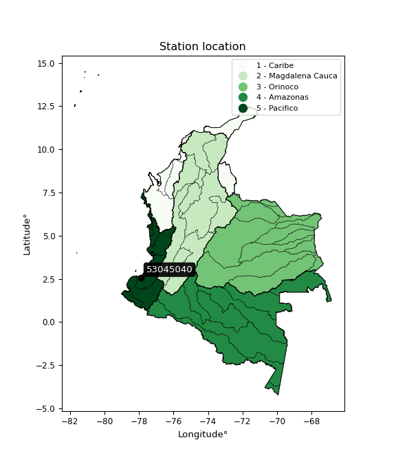</img>

</div>


## A. General information


### 1. General running parameters

• app_version: _v20260103_. • runtime: _2026-01-05 16:20:51.132608_. • Python version: _3.14.0_. • SciPy version: _1.16.3_. • Pandas version: _2.3.3_. • NumPy version: _2.3.5_. • Stations dataset (station_dataset_file): _dataset/pmax24h_in/automatic_colombia_2003_2024.csv_. • Stations catalog (station_catalog_file): _dataset/CNE.xls_. • Minimum year to eval til year_max (date_min): _1900_. • Maximum year to eval since year_min (date_max): _2024_. • Creates, save and include plots into reports (create_plot): _True_. • Plot only fit distributions with Δo > Δ (plot_only_fit): _True_. • Plot only simple graphs avoiding multiple CDFs and multiple Extreme values plots (plot_only_simple): _True_. • Eval low extreme values, if False, evaluates high extreme values (low_extreme): _False_. • Eval every SciPy distribution as logarithmic (pdist_logarithmic_on): _True_. • Standard deviation normalized (ddof): _1.0_. • Return periods to eval in years (Tr): _[2, 2.33, 5, 10, 15, 20, 25, 50, 75, 100, 200, 250, 500, 750, 1000]_. • Minimum data sample per station, 0 means any (minimum_sample): _5_. • Z-Score maximum threshold to adjust a value, 0 means disable (zscore_max): _3.5_. • Z-Score minimum threshold to adjust a value, 0 means disable (zscore_min): _-2.5_. • Avoid zeros, e.g. rain = 0 (avoid_zeros): _True_. • Avoid null values (avoid_nans): _True_. 

[:file_folder:Dataset file](../../dataset/pmax24h_in/automatic_colombia_2003_2024.csv)

> Delta Degrees of Freedom (DDOF): is a parameter used in the formulas for calculating variance and standard deviation. When ddof=0, the divisor is $N$ (the total number of observations) and this is used when your data set is the entire population. When ddof=1, the divisor is $N-1$ and this is used when your data set is a sample drawn from a larger population. Using $N-1$ provides an unbiased estimate of the population variance (known as Bessel´s correction).


### 2. Station info and location

|   id |   CODIGO | NOMBRE                            | CATEGORIA               | TECNOLOGIA                              | ESTADO           | FECHA_INSTALACION   |   FECHA_SUSPENSION |   ALTITUD |   LATITUD |   LONGITUD | DEPARTAMENTO   | MUNICIPIO   | AREA_OPERATIVA                      | ENTIDAD                                                     | AREA_HIDROGRAFICA   | ZONA_HIDROGRAFICA         | SUBZONA_HIDROGRAFICA   |   CORRIENTE | Catalogo   |   Version |
|-----:|---------:|:----------------------------------|:------------------------|:----------------------------------------|:-----------------|:--------------------|-------------------:|----------:|----------:|-----------:|:---------------|:------------|:------------------------------------|:------------------------------------------------------------|:--------------------|:--------------------------|:-----------------------|------------:|:-----------|----------:|
|    0 | 53045040 | AEROPUERTO GUAPI - AUT [53045040] | Climatológica Principal | Automática con Telemetría, Convencional | En Mantenimiento | 01/03/2004          |                nan |        42 |   2.57442 |   -77.8948 | Cauca          | Guapi       | Area Operativa 07 - Nariño-Putumayo | INSTITUTO DE HIDROLOGIA METEOROLOGIA Y ESTUDIOS AMBIENTALES | Pacifico            | Tapaje - Dagua - Directos | Río Guapi              |         nan | CNE_IDEAM  |  20251226 |

<div align="center">

Dynamic map: [:earth_americas:Google](http://maps.google.com/maps?q=2.574416667,-77.89475) [:earth_americas:OSM](https://www.openstreetmap.org/#map=18/2.574416667/-77.89475&layers=P) [:earth_americas:Bing](https://www.bing.com/maps?cp=2.574416667~-77.89475&lvl=18) [:earth_americas:Apple](https://maps.apple.com/frame?center=2.574416667%2C-77.89475&span=0.003%2C0.006)

</div>


<div align="center">

```geojson
{
  "type": "Feature",
  "geometry": {
    "type": "Point", 
    "coordinates": [-77.89475, 2.574416667]
  }, 
  "properties": {
    "Name": "53045040"
  }
}
```

</div>


### 3. Discrete values table and plot

<div align="center">

|               |          0 |            1 |           2 |          3 |          4 |           5 |            6 |
|:--------------|-----------:|-------------:|------------:|-----------:|-----------:|------------:|-------------:|
| Date          | 2016       | 2017         | 2018        | 2019       | 2020       | 2022        | 2023         |
| Value         |    9.3     |   83.4       |  131        |  157.8     |    4.5     |   96        |   78.7       |
| Value_initial |    9.3     |   83.4       |  131        |  157.8     |    4.5     |   96        |   78.7       |
| count         |    7       |    7         |    7        |    7       |    7       |    7        |    7         |
| mean          |   80.1     |   80.1       |   80.1      |   80.1     |   80.1     |   80.1      |   80.1       |
| std           |   57.1865  |   57.1865    |   57.1865   |   57.1865  |   57.1865  |   57.1865   |   57.1865    |
| zscore        |   -1.23805 |    0.0577059 |    0.890071 |    1.35871 |   -1.32199 |    0.278038 |   -0.0244813 |


</div>


<div align="center">

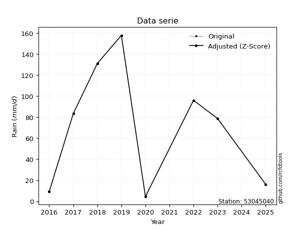</img>

</div>


> The initial value (value_initial) correspond to the initial obtained or null completed value, and value (value) is adjusted only when the initial value is outside the valid range (outlier) definite through the Z-Score value. If Z-Score is active, values out of range or outliers are replaced with the station mean value. A Z-Score (or standard score) measures how many standard deviations a data point is from the mean of a dataset, indicating its relative position; positive scores mean above the mean, negative mean below, and a score of zero is exactly at the mean, allowing for comparison of values from different distributions. It´s calculated using the formula $z=(x–μ)/σ$, where $x$ is the data point, $μ$ is the mean, and $σ$ is the standard deviation, helping identify outliers and understand probability.
>
> <sub>**Note**: In this study, "completing" (filling gaps in) and "extending" (forecasting or lengthening the historical record) rainfall data series are avoided for certain critical analyses because they introduce artificial bias and uncertainty, which can distort the statistics of rare events (extremes), alter day-to-day variability, and compromise the integrity and homogeneity of the original data. Some reasons against Completing/Extending rainfall data are: **Distortion of Extremes and Variability**: The primary issue is that most gap-filling or extension methods rely on averaging or regression with nearby stations, which inherently smooths the data. Rainfall is highly variable in space and time, with a large percentage of zero values and occasional large storms. Infilling methods often underestimate the highest values and overestimate the lowest (zero) values, which severely distorts analyses focused on flood frequency, drought severity, and intensity-duration-frequency (IDF) curves, **Loss of Data Homogeneity**: Infilled or extended data are synthetic estimates, not actual measurements. Combining these estimates with observed data can violate the assumption of data homogeneity, which requires that the data properties do not change over time. Inhomogeneity can lead to incorrect conclusions about long-term trends or changes in climate patterns, **Propagation of Errors**: Errors and biases from the original data (e.g., wind-induced undercatch, instrument errors, site changes) or the data used for imputation can propagate through the analysis, leading to unreliable hydrological models and inaccurate predictions, **Compromised Statistical Integrity**: For statistical analyses, especially those involving the frequency of events, using artificial data can introduce time bias or autocorrelation that doesn´t exist in reality, making it difficult to assess the true probability of events, **Difficulty in Validation**: It is difficult to accurately validate the quality of filled or extended data, especially for past periods where ground-truth measurements are unavailable. The reliability of imputation techniques heavily depends on the density of the surrounding station network and the complexity of the local topography.</sub>


### 4. Active continuous probability distributions from SciPy (44 of 104 available)

A Probability Density Function (PDF) describes the relative likelihood of a continuous random variable falling within a specific range, where the total area under its curve equals 1, and the area over any interval gives the actual probability for that range. Unlike discrete probabilities (like rolling a die), a PDF shows density, not direct probability for a single point (which is zero), with higher points indicating higher likelihood, often visualized as a bell curve for normal distributions.

A log of a probability density function (log-PDF) is simply the logarithm of the PDF´s value, denoted as $log(f(x))$, useful for converting multiplication of probabilities into addition, improving numerical stability with tiny numbers, and connecting to information theory concepts like entropy. Instead of dealing with very small probabilities (e.g., 0.000001), log-PDFs use negative numbers (e.g., $log(0.00001) ≈ -11.51$ that are easier for computers to handle, preventing underflow errors and simplifying complex calculations. In this study, each active probability distribution from SciPy is also evaluated in the $log$ form.

[scipy.stats](https://docs.scipy.org/doc/scipy/reference/stats.html) is a Python´s powerful submodule within the SciPy library for comprehensive statistical analysis, offering over 130 probability distributions (like Normal, Poisson), functions for descriptive stats (mean, variance), hypothesis testing (t-tests, chi-square), random variable generation, and statistical tests, making it essential for data science, modeling, and research. It provides tools to explore, model, and draw conclusions from data efficiently, working seamlessly with NumPy.

<div align="center">

|   id | p_dist             |   n_parameter | fit_method   | label                                                                       | active   | ref                                                                                                        |
|-----:|:-------------------|--------------:|:-------------|:----------------------------------------------------------------------------|:---------|:-----------------------------------------------------------------------------------------------------------|
|    0 | alpha              |             3 | MLE          | Alpha                                                                       | True     | [:mortar_board:](https://docs.scipy.org/doc/scipy/reference/generated/scipy.stats.alpha.html)              |
|    1 | betaprime          |             4 | MLE          | Beta prime                                                                  | True     | [:mortar_board:](https://docs.scipy.org/doc/scipy/reference/generated/scipy.stats.betaprime.html)          |
|    2 | chi2               |             3 | MLE          | Chi²                                                                        | True     | [:mortar_board:](https://docs.scipy.org/doc/scipy/reference/generated/scipy.stats.chi2.html)               |
|    3 | crystalball        |             4 | MLE          | Crystalball                                                                 | True     | [:mortar_board:](https://docs.scipy.org/doc/scipy/reference/generated/scipy.stats.crystalball.html)        |
|    4 | erlang             |             3 | MLE          | Erlang                                                                      | True     | [:mortar_board:](https://docs.scipy.org/doc/scipy/reference/generated/scipy.stats.erlang.html)             |
|    5 | expon              |             2 | MLE          | Exponential                                                                 | True     | [:mortar_board:](https://docs.scipy.org/doc/scipy/reference/generated/scipy.stats.expon.html)              |
|    6 | exponnorm          |             3 | MLE          | Exponentially modified Normal                                               | True     | [:mortar_board:](https://docs.scipy.org/doc/scipy/reference/generated/scipy.stats.exponnorm.html)          |
|    7 | f                  |             4 | MLE          | F                                                                           | True     | [:mortar_board:](https://docs.scipy.org/doc/scipy/reference/generated/scipy.stats.f.html)                  |
|    8 | fatiguelife        |             3 | MLE          | Fatigue-life (Birnbaum-Saunders)                                            | True     | [:mortar_board:](https://docs.scipy.org/doc/scipy/reference/generated/scipy.stats.fatiguelife.html)        |
|    9 | fisk               |             3 | MLE          | Fisk                                                                        | True     | [:mortar_board:](https://docs.scipy.org/doc/scipy/reference/generated/scipy.stats.fisk.html)               |
|   10 | gamma              |             3 | MLE          | Gamma                                                                       | True     | [:mortar_board:](https://docs.scipy.org/doc/scipy/reference/generated/scipy.stats.gamma.html)              |
|   11 | genexpon           |             5 | MLE          | Generalized exponential                                                     | True     | [:mortar_board:](https://docs.scipy.org/doc/scipy/reference/generated/scipy.stats.genexpon.html)           |
|   12 | genlogistic        |             3 | MLE          | Generalized logistic                                                        | True     | [:mortar_board:](https://docs.scipy.org/doc/scipy/reference/generated/scipy.stats.genlogistic.html)        |
|   13 | gibrat             |             2 | MM           | Gibrat                                                                      | True     | [:mortar_board:](https://docs.scipy.org/doc/scipy/reference/generated/scipy.stats.gibrat.html)             |
|   14 | gompertz           |             3 | MLE          | Gompertz (or truncated Gumbel)                                              | True     | [:mortar_board:](https://docs.scipy.org/doc/scipy/reference/generated/scipy.stats.gompertz.html)           |
|   15 | gumbel_l           |             2 | MM           | Gumbel Left Skew                                                            | True     | [:mortar_board:](https://docs.scipy.org/doc/scipy/reference/generated/scipy.stats.gumbel_l.html)           |
|   16 | gumbel_r           |             2 | MM           | Gumbel Right Skew                                                           | True     | [:mortar_board:](https://docs.scipy.org/doc/scipy/reference/generated/scipy.stats.gumbel_r.html)           |
|   17 | halflogistic       |             2 | MM           | Half-logistic                                                               | True     | [:mortar_board:](https://docs.scipy.org/doc/scipy/reference/generated/scipy.stats.halflogistic.html)       |
|   18 | halfnorm           |             2 | MM           | Half Normal                                                                 | True     | [:mortar_board:](https://docs.scipy.org/doc/scipy/reference/generated/scipy.stats.halfnorm.html)           |
|   19 | hypsecant          |             2 | MM           | hyperbolic secant                                                           | True     | [:mortar_board:](https://docs.scipy.org/doc/scipy/reference/generated/scipy.stats.hypsecant.html)          |
|   20 | invgamma           |             3 | MLE          | Inverted gamma                                                              | True     | [:mortar_board:](https://docs.scipy.org/doc/scipy/reference/generated/scipy.stats.invgamma.html)           |
|   21 | invgauss           |             3 | MLE          | Inverse Gaussian                                                            | True     | [:mortar_board:](https://docs.scipy.org/doc/scipy/reference/generated/scipy.stats.invgauss.html)           |
|   22 | invweibull         |             3 | MLE          | Inverted Weibull                                                            | True     | [:mortar_board:](https://docs.scipy.org/doc/scipy/reference/generated/scipy.stats.invweibull.html)         |
|   23 | johnsonsu          |             4 | MLE          | Johnson Su                                                                  | True     | [:mortar_board:](https://docs.scipy.org/doc/scipy/reference/generated/scipy.stats.johnsonsu.html)          |
|   24 | kstwobign          |             2 | MLE          | Limiting distribution of scaled Kolmogorov-Smirnov two-sided test statistic | True     | [:mortar_board:](https://docs.scipy.org/doc/scipy/reference/generated/scipy.stats.kstwobign.html)          |
|   25 | laplace            |             2 | MM           | Laplace                                                                     | True     | [:mortar_board:](https://docs.scipy.org/doc/scipy/reference/generated/scipy.stats.laplace.html)            |
|   26 | laplace_asymmetric |             3 | MLE          | Asymmetric Laplace                                                          | True     | [:mortar_board:](https://docs.scipy.org/doc/scipy/reference/generated/scipy.stats.laplace_asymmetric.html) |
|   27 | loggamma           |             3 | MLE          | Log gamma                                                                   | True     | [:mortar_board:](https://docs.scipy.org/doc/scipy/reference/generated/scipy.stats.loggamma.html)           |
|   28 | logistic           |             2 | MM           | Logistic (or Sech-squared)                                                  | True     | [:mortar_board:](https://docs.scipy.org/doc/scipy/reference/generated/scipy.stats.logistic.html)           |
|   29 | lognorm            |             3 | MLE          | Log Normal                                                                  | True     | [:mortar_board:](https://docs.scipy.org/doc/scipy/reference/generated/scipy.stats.lognorm.html)            |
|   30 | maxwell            |             2 | MM           | Maxwell                                                                     | True     | [:mortar_board:](https://docs.scipy.org/doc/scipy/reference/generated/scipy.stats.maxwell.html)            |
|   31 | mielke             |             4 | MLE          | Mielke Beta-Kappa / Dagum                                                   | True     | [:mortar_board:](https://docs.scipy.org/doc/scipy/reference/generated/scipy.stats.mielke.html)             |
|   32 | moyal              |             2 | MM           | Moyal                                                                       | True     | [:mortar_board:](https://docs.scipy.org/doc/scipy/reference/generated/scipy.stats.moyal.html)              |
|   33 | nakagami           |             3 | MLE          | Nakagami                                                                    | True     | [:mortar_board:](https://docs.scipy.org/doc/scipy/reference/generated/scipy.stats.nakagami.html)           |
|   34 | ncf                |             5 | MLE          | Non-central F distribution                                                  | True     | [:mortar_board:](https://docs.scipy.org/doc/scipy/reference/generated/scipy.stats.ncf.html)                |
|   35 | nct                |             4 | MLE          | Non-central Student’s t                                                     | True     | [:mortar_board:](https://docs.scipy.org/doc/scipy/reference/generated/scipy.stats.nct.html)                |
|   36 | norm               |             2 | MM           | Normal                                                                      | True     | [:mortar_board:](https://docs.scipy.org/doc/scipy/reference/generated/scipy.stats.norm.html)               |
|   37 | pearson3           |             3 | MM           | Pearson type III                                                            | True     | [:mortar_board:](https://docs.scipy.org/doc/scipy/reference/generated/scipy.stats.pearson3.html)           |
|   38 | rayleigh           |             2 | MM           | Rayleigh                                                                    | True     | [:mortar_board:](https://docs.scipy.org/doc/scipy/reference/generated/scipy.stats.rayleigh.html)           |
|   39 | rice               |             3 | MLE          | Rice                                                                        | True     | [:mortar_board:](https://docs.scipy.org/doc/scipy/reference/generated/scipy.stats.rice.html)               |
|   40 | t                  |             3 | MLE          | Student’s t                                                                 | True     | [:mortar_board:](https://docs.scipy.org/doc/scipy/reference/generated/scipy.stats.t.html)                  |
|   41 | truncnorm          |             4 | MLE          | Truncated normal                                                            | True     | [:mortar_board:](https://docs.scipy.org/doc/scipy/reference/generated/scipy.stats.truncnorm.html)          |
|   42 | wald               |             2 | MM           | Wald                                                                        | True     | [:mortar_board:](https://docs.scipy.org/doc/scipy/reference/generated/scipy.stats.wald.html)               |
|   43 | weibull_min        |             3 | MLE          | Weibull minimum                                                             | True     | [:mortar_board:](https://docs.scipy.org/doc/scipy/reference/generated/scipy.stats.weibull_min.html)        |

</div>

> **n_parameter:** # arguments & localization & scale.
>
> **Fit methods:** (MLE) maximum likelihood, (MM) L-moments.
>
>**Inactive** (With the only purpose of prevent loops, zero divisions, infinite values, over high estimated values or horizontal trending for recurrence intervals estimations, the follow distributions were disabled.)**:** foldnorm, gennorm, norminvgauss, powernorm, powerlognorm, skewnorm, genextreme, anglit, arcsine, argus, beta, bradford, burr, burr12, cauchy, cosine, halfcauchy, foldcauchy, skewcauchy, wrapcauchy, dgamma, gengamma, exponweib, exponpow, truncexpon, gausshyper, genhalflogistic, genhyperbolic, geninvgauss, halfgennorm, johnsonsb, kappa4, kappa3, ksone, kstwo, loglaplace, levy, levy_l, levy_stable, ncx2, pareto, genpareto, truncpareto, lomax, powerlaw, rdist, rel_breitwigner, recipinvgauss, semicircular, studentized_range, trapezoid, triang, truncweibull_min, tukeylambda, uniform, loguniform, vonmises, vonmises_line, weibull_max, dweibull, 


## B. Probability (PDF) vs. Empirical (EDF) distributions functions

A continuous probability distribution (CPD) describes probabilities for variables that can take any value within a range (like rain any time), unlike discrete variables with specific outcomes (like temperature). It uses a Probability Density Function (PDF), a curve where the total area under it equals 1, and the probability of the variable falling within an interval (a to b) is found by calculating the area under the curve between those points. A key feature is that the probability of hitting any single exact value is zero, so probabilities are always expressed for ranges, e.g., $P(a ≤ X ≤ b)$.

<div align="center">

Distributions parameters from station values
|    |   station | p_dist                |   n |             loc |           scale | shape                  | shape1                 | shape2                | shape3   |
|---:|----------:|:----------------------|----:|----------------:|----------------:|:-----------------------|:-----------------------|:----------------------|:---------|
|  0 |  53045040 | alpha                 |   7 |    -0.0221927   |    10.7342      | 1.3509435279148614e-10 |                        |                       |          |
|  1 |  53045040 | betaprime             |   7 |     4.5         |  2417.09        | 0.8569439010095334     | 36.00593743505034      |                       |          |
|  2 |  53045040 | chi2                  |   7 |  -213.986       |     5.11321     | 57.47780435598375      |                        |                       |          |
|  3 |  53045040 | crystalball           |   7 |    80.1         |    52.9444      | 6645.31522244193       | 952.7021446018557      |                       |          |
|  4 |  53045040 | erlang                |   7 |  -993.816       |     2.64951     | 405.28456619797225     |                        |                       |          |
|  5 |  53045040 | expon                 |   7 |     4.5         |    75.6         |                        |                        |                       |          |
|  6 |  53045040 | exponnorm             |   7 |    80.0436      |    52.9445      | 0.0010623815465847831  |                        |                       |          |
|  7 |  53045040 | f                     |   7 |     4.5         |    68.3124      | 1.2322846983626339     | 621.185920712283       |                       |          |
|  8 |  53045040 | fatiguelife           |   7 | -1110.28        |  1188.91        | 0.044133208359391427   |                        |                       |          |
|  9 |  53045040 | fisk                  |   7 |    -2.22915e+09 |     2.22915e+09 | 70186247.69181064      |                        |                       |          |
| 10 |  53045040 | gamma                 |   7 |  -987.853       |     2.66095     | 401.3467728031378      |                        |                       |          |
| 11 |  53045040 | genexpon              |   7 |     4.49995     |     2.51027     | 0.033112393532273715   | 0.00035729141716251745 | 2.6335172286651947    |          |
| 12 |  53045040 | genlogistic           |   7 |   109.023       |    24.1188      | 0.545790488741692      |                        |                       |          |
| 13 |  53045040 | gibrat                |   7 |    39.7101      |    24.4977      |                        |                        |                       |          |
| 14 |  53045040 | gompertz              |   7 |    78.7         |    13.4374      | 0.011948224592743733   |                        |                       |          |
| 15 |  53045040 | gumbel_l              |   7 |   103.928       |    41.2806      |                        |                        |                       |          |
| 16 |  53045040 | gumbel_r              |   7 |    56.2722      |    41.2806      |                        |                        |                       |          |
| 17 |  53045040 | halflogistic          |   7 |    17.3486      |    45.2656      |                        |                        |                       |          |
| 18 |  53045040 | halfnorm              |   7 |    10.0224      |    87.8293      |                        |                        |                       |          |
| 19 |  53045040 | hypsecant             |   7 |    80.1         |    33.7054      |                        |                        |                       |          |
| 20 |  53045040 | invgamma              |   7 |  -359.823       | 28750.9         | 66.37592021231347      |                        |                       |          |
| 21 |  53045040 | invgauss              |   7 |  -111.26        |  2065.79        | 0.09253432216022806    |                        |                       |          |
| 22 |  53045040 | invweibull            |   7 |     4.5         |     4.31931     | 0.049898928876791426   |                        |                       |          |
| 23 |  53045040 | johnsonsu             |   7 |   363.7         |    61.2529      | 12.083514334137291     | 5.442613543496915      |                       |          |
| 24 |  53045040 | kstwobign             |   7 |  -116.57        |   224.121       |                        |                        |                       |          |
| 25 |  53045040 | laplace               |   7 |    80.1         |    37.4373      |                        |                        |                       |          |
| 26 |  53045040 | laplace_asymmetric    |   7 |    83.4         |    41.6592      | 1.0403920522308057     |                        |                       |          |
| 27 |  53045040 | loggamma              |   7 |  -115.485       |   120.451       | 5.563985326009129      |                        |                       |          |
| 28 |  53045040 | logistic              |   7 |    80.1         |    29.1898      |                        |                        |                       |          |
| 29 |  53045040 | lognorm               |   7 |     4.5         |     0.238803    | 13.606804392783017     |                        |                       |          |
| 30 |  53045040 | maxwell               |   7 |   -45.356       |    78.6179      |                        |                        |                       |          |
| 31 |  53045040 | mielke                |   7 |    -2.16493     |   163.532       | 0.8813224289968258     | 139.26999609421233     |                       |          |
| 32 |  53045040 | moyal                 |   7 |    49.823       |    23.8333      |                        |                        |                       |          |
| 33 |  53045040 | nakagami              |   7 |     4.5         |    95.631       | 0.25754663731500316    |                        |                       |          |
| 34 |  53045040 | ncf                   |   7 |     4.5         |    18.0848      | 0.7764189096692351     | 22.575283057926534     | 1.5846757600059396    |          |
| 35 |  53045040 | nct                   |   7 |    -0.16055     |     0.201274    | 0.485505185663631      | 54.73620221541293      |                       |          |
| 36 |  53045040 | norm                  |   7 |    80.1         |    52.9444      |                        |                        |                       |          |
| 37 |  53045040 | pearson3              |   7 |    80.1         |    52.9444      | -0.1751453937059016    |                        |                       |          |
| 38 |  53045040 | rayleigh              |   7 |   -21.1857      |    80.8143      |                        |                        |                       |          |
| 39 |  53045040 | rice                  |   7 |   -27.187       |    61.8773      | 1.318488621815777      |                        |                       |          |
| 40 |  53045040 | t                     |   7 |    80.1012      |    52.9441      | 128813620.26762986     |                        |                       |          |
| 41 |  53045040 | truncnorm             |   7 |    -4.98676     |     4.82849     | 0.36900939397902865    | 33.7137840680826       |                       |          |
| 42 |  53045040 | wald                  |   7 |    27.1556      |    52.9444      |                        |                        |                       |          |
| 43 |  53045040 | weibull_min           |   7 |   -62.1867      |   159.787       | 3.0554127663125445     |                        |                       |          |
| 44 |  53045040 | logalpha              |   7 |   -22.6735      |   499.6         | 18.888173343270644     |                        |                       |          |
| 45 |  53045040 | logbetaprime          |   7 |    -0.196964    |     3.54943e+07 | 6.170693715310399      | 53295897.3277141       |                       |          |
| 46 |  53045040 | logchi2               |   7 |     1.50408     |     1.29697     | 1.4541738309164263     |                        |                       |          |
| 47 |  53045040 | logcrystalball        |   7 |     3.86061     |     1.29563     | 9.608406140537438      | 1653.7584118065295     |                       |          |
| 48 |  53045040 | logerlang             |   7 |   -16.2427      |     0.0884461   | 227.11664636890765     |                        |                       |          |
| 49 |  53045040 | logexpon              |   7 |     1.50408     |     2.35653     |                        |                        |                       |          |
| 50 |  53045040 | logexponnorm          |   7 |     3.86        |     1.29562     | 0.00047496148687783154 |                        |                       |          |
| 51 |  53045040 | logf                  |   7 | -2129.26        |  2133.12        | 13798408.28679575      | 8847158.450769825      |                       |          |
| 52 |  53045040 | logfatiguelife        |   7 |  -612.502       |   616.354       | 0.002105741712212758   |                        |                       |          |
| 53 |  53045040 | logfisk               |   7 |    -9.77275e+07 |     9.77275e+07 | 131235263.2620378      |                        |                       |          |
| 54 |  53045040 | loggamma              |   7 |   -17.9879      |     0.08072     | 270.7083397828334      |                        |                       |          |
| 55 |  53045040 | loggenexpon           |   7 |     1.49832     |     0.017886    | 0.0030637630264460577  | 1.7072238629796797     | 3.058256686100613e-05 |          |
| 56 |  53045040 | loggenlogistic        |   7 |     5.06141     |     8.01355e-06 | 6.639264743334799e-06  |                        |                       |          |
| 57 |  53045040 | loggibrat             |   7 |     2.87225     |     0.599479    |                        |                        |                       |          |
| 58 |  53045040 | loggompertz           |   7 |     1.50407     |     0.985229    | 0.05659325200374789    |                        |                       |          |
| 59 |  53045040 | loggumbel_l           |   7 |     4.44371     |     1.0102      |                        |                        |                       |          |
| 60 |  53045040 | loggumbel_r           |   7 |     3.27751     |     1.0102      |                        |                        |                       |          |
| 61 |  53045040 | loghalflogistic       |   7 |     2.32498     |     1.10772     |                        |                        |                       |          |
| 62 |  53045040 | loghalfnorm           |   7 |     2.14577     |     2.14924     |                        |                        |                       |          |
| 63 |  53045040 | loghypsecant          |   7 |     3.86061     |     0.824821    |                        |                        |                       |          |
| 64 |  53045040 | loginvgamma           |   7 |   -21.3651      |  8400.55        | 334.27441152521214     |                        |                       |          |
| 65 |  53045040 | loginvgauss           |   7 |    -9.04506     |  1123.68        | 0.011486345336431572   |                        |                       |          |
| 66 |  53045040 | loginvweibull         |   7 |    -6.34266e+07 |     6.34266e+07 | 44470042.33136753      |                        |                       |          |
| 67 |  53045040 | logjohnsonsu          |   7 |     5.06133     |     1.13655e-12 | 4.581681663776273      | 0.18243866020686933    |                       |          |
| 68 |  53045040 | logkstwobign          |   7 |    -1.62873     |     6.2469      |                        |                        |                       |          |
| 69 |  53045040 | loglaplace            |   7 |     3.86061     |     0.916146    |                        |                        |                       |          |
| 70 |  53045040 | loglaplace_asymmetric |   7 |     5.06134     |     0.0153289   | 78.29797658928135      |                        |                       |          |
| 71 |  53045040 | logloggamma           |   7 |     5.06208     |     3.748e-05   | 3.107507577718799e-05  |                        |                       |          |
| 72 |  53045040 | loglogistic           |   7 |     3.86061     |     0.714316    |                        |                        |                       |          |
| 73 |  53045040 | loglognorm            |   7 |     1.50408     |     0.0125641   | 12.937969650878598     |                        |                       |          |
| 74 |  53045040 | logmaxwell            |   7 |     0.79052     |     1.92389     |                        |                        |                       |          |
| 75 |  53045040 | logmielke             |   7 | -5467.76        |  5472.85        | 4362.012336558781      | 495314.2338070115      |                       |          |
| 76 |  53045040 | logmoyal              |   7 |     3.11969     |     0.583236    |                        |                        |                       |          |
| 77 |  53045040 | lognakagami           |   7 |  -476.048       |   479.911       | 34083.00966448376      |                        |                       |          |
| 78 |  53045040 | logncf                |   7 |    -0.372449    |     1.22735e-07 | 1.1537417141626439e-06 | 87.48162329869953      | 39.14783266336799     |          |
| 79 |  53045040 | lognct                |   7 |   -67.8071      |     1.25396     | 22505.88716559513      | 57.150319277262355     |                       |          |
| 80 |  53045040 | lognorm               |   7 |     3.86061     |     1.29563     |                        |                        |                       |          |
| 81 |  53045040 | logpearson3           |   7 |     3.86061     |     1.29563     | -0.9189420757328606    |                        |                       |          |
| 82 |  53045040 | lograyleigh           |   7 |     1.382       |     1.97764     |                        |                        |                       |          |
| 83 |  53045040 | logrice               |   7 |     0.692568    |     1.42319     | 1.9452430458060324     |                        |                       |          |
| 84 |  53045040 | logt                  |   7 |     3.86061     |     1.29563     | 17171500388.551079     |                        |                       |          |
| 85 |  53045040 | logtruncnorm          |   7 |     5.76482     |     1.83937     | -125.00055533752217    | -0.3816790014636846    |                       |          |
| 86 |  53045040 | logwald               |   7 |     2.56493     |     1.29566     |                        |                        |                       |          |
| 87 |  53045040 | logweibull_min        |   7 |    -5.19891e+07 |     5.19891e+07 | 61985480.44439313      |                        |                       |          |

</div>

> **loc** (Location parameter): This shifts the distribution along the x-axis. For many common distributions, like the normal (Gaussian) distribution, loc represents the mean $μ$. For others, like the uniform distribution, it might represent the minimum value, or for the beta distribution, the left end of the support interval.
>
> **scale** (Scale parameter): This determines the width or spread of the distribution. For the normal distribution, scale represents the standard deviation $σ$. For a uniform distribution, it defines the length of the interval (from $loc$ to $loc + scale$).
>
> **shape** (Shape parameters): Refers to parameters that define the specific form of a probability distribution, distinct from its location (loc) and scale (scale). These parameters are required arguments for most distribution functions. For example, a normal (Gaussian) distribution is fully defined by its location (mean) and scale (standard deviation), so it has no specific shape parameters beyond loc and scale. However, other distributions have intrinsic properties that need specification, as Gamma distribution that takes a shape parameter, often named $a$ or $alpha$.


### 0. Cumulative distribution values - CDF (88 evaluated)

Cumulative Distribution Function (CDF), denoted as $F$<sub>$X$</sub>$(x)$, is a function that gives the probability that a random variable $X$ will take a value less than or equal to a specific value, $x$ (i.e., $(P(X≥x)$. It essentially "accumulates" probabilities from a given point up to the far right (positive infinity), providing a complete picture of the distribution´s probabilities for both discrete (like rain) and continuous (like temperature) variables, helping to find probabilities over ranges or above certain values. Each station is evaluated separately ordering the $x$ values ascending, calculating the CDF and PDF values for the activated distributions and their logarithmic forms.

<div align="center">

CDF ordered by x ascending and calculating $log(f(x))$ separately
|   id |   Station |   date |     x |   count |   mean |     std |     zscore |   Value_initial |   station |   m |     alpha |   alpha_pdf |   betaprime |   betaprime_pdf |      chi2 |   chi2_pdf |   crystalball |   crystalball_pdf |    erlang |   erlang_pdf |     expon |   expon_pdf |   exponnorm |   exponnorm_pdf |           f |      f_pdf |   fatiguelife |   fatiguelife_pdf |      fisk |   fisk_pdf |     gamma |   gamma_pdf |   genexpon |   genexpon_pdf |   genlogistic |   genlogistic_pdf |   gibrat |   gibrat_pdf |    gompertz |   gompertz_pdf |   gumbel_l |   gumbel_l_pdf |   gumbel_r |   gumbel_r_pdf |   halflogistic |   halflogistic_pdf |   halfnorm |   halfnorm_pdf |   hypsecant |   hypsecant_pdf |   invgamma |   invgamma_pdf |   invgauss |   invgauss_pdf |   invweibull |   invweibull_pdf |   johnsonsu |   johnsonsu_pdf |   kstwobign |   kstwobign_pdf |   laplace |   laplace_pdf |   laplace_asymmetric |   laplace_asymmetric_pdf |   loggamma |   loggamma_pdf |   logistic |   logistic_pdf |   lognorm |   lognorm_pdf |   maxwell |   maxwell_pdf |    mielke |   mielke_pdf |      moyal |   moyal_pdf |    nakagami |    nakagami_pdf |        ncf |        ncf_pdf |       nct |     nct_pdf |      norm |   norm_pdf |   pearson3 |   pearson3_pdf |   rayleigh |   rayleigh_pdf |      rice |   rice_pdf |         t |      t_pdf |   truncnorm |   truncnorm_pdf |     wald |   wald_pdf |   weibull_min |   weibull_min_pdf |   logalpha |   logalpha_pdf |   logbetaprime |   logbetaprime_pdf |     logchi2 |   logchi2_pdf |   logcrystalball |   logcrystalball_pdf |   logerlang |   logerlang_pdf |   logexpon |   logexpon_pdf |   logexponnorm |   logexponnorm_pdf |      logf |   logf_pdf |   logfatiguelife |   logfatiguelife_pdf |   logfisk |   logfisk_pdf |   loggenexpon |   loggenexpon_pdf |   loggenlogistic |   loggenlogistic_pdf |   loggibrat |   loggibrat_pdf |   loggompertz |   loggompertz_pdf |   loggumbel_l |   loggumbel_l_pdf |   loggumbel_r |   loggumbel_r_pdf |   loghalflogistic |   loghalflogistic_pdf |   loghalfnorm |   loghalfnorm_pdf |   loghypsecant |   loghypsecant_pdf |   loginvgamma |   loginvgamma_pdf |   loginvgauss |   loginvgauss_pdf |   loginvweibull |   loginvweibull_pdf |   logjohnsonsu |   logjohnsonsu_pdf |   logkstwobign |   logkstwobign_pdf |   loglaplace |   loglaplace_pdf |   loglaplace_asymmetric |   loglaplace_asymmetric_pdf |   logloggamma |   logloggamma_pdf |   loglogistic |   loglogistic_pdf |   loglognorm |   loglognorm_pdf |   logmaxwell |   logmaxwell_pdf |   logmielke |   logmielke_pdf |    logmoyal |   logmoyal_pdf |   lognakagami |   lognakagami_pdf |    logncf |   logncf_pdf |    lognct |   lognct_pdf |   logpearson3 |   logpearson3_pdf |   lograyleigh |   lograyleigh_pdf |   logrice |   logrice_pdf |     logt |   logt_pdf |   logtruncnorm |   logtruncnorm_pdf |   logwald |   logwald_pdf |   logweibull_min |   logweibull_min_pdf |
|-----:|----------:|-------:|------:|--------:|-------:|--------:|-----------:|----------------:|----------:|----:|----------:|------------:|------------:|----------------:|----------:|-----------:|--------------:|------------------:|----------:|-------------:|----------:|------------:|------------:|----------------:|------------:|-----------:|--------------:|------------------:|----------:|-----------:|----------:|------------:|-----------:|---------------:|--------------:|------------------:|---------:|-------------:|------------:|---------------:|-----------:|---------------:|-----------:|---------------:|---------------:|-------------------:|-----------:|---------------:|------------:|----------------:|-----------:|---------------:|-----------:|---------------:|-------------:|-----------------:|------------:|----------------:|------------:|----------------:|----------:|--------------:|---------------------:|-------------------------:|-----------:|---------------:|-----------:|---------------:|----------:|--------------:|----------:|--------------:|----------:|-------------:|-----------:|------------:|------------:|----------------:|-----------:|---------------:|----------:|------------:|----------:|-----------:|-----------:|---------------:|-----------:|---------------:|----------:|-----------:|----------:|-----------:|------------:|----------------:|---------:|-----------:|--------------:|------------------:|-----------:|---------------:|---------------:|-------------------:|------------:|--------------:|-----------------:|---------------------:|------------:|----------------:|-----------:|---------------:|---------------:|-------------------:|----------:|-----------:|-----------------:|---------------------:|----------:|--------------:|--------------:|------------------:|-----------------:|---------------------:|------------:|----------------:|--------------:|------------------:|--------------:|------------------:|--------------:|------------------:|------------------:|----------------------:|--------------:|------------------:|---------------:|-------------------:|--------------:|------------------:|--------------:|------------------:|----------------:|--------------------:|---------------:|-------------------:|---------------:|-------------------:|-------------:|-----------------:|------------------------:|----------------------------:|--------------:|------------------:|--------------:|------------------:|-------------:|-----------------:|-------------:|-----------------:|------------:|----------------:|------------:|---------------:|--------------:|------------------:|----------:|-------------:|----------:|-------------:|--------------:|------------------:|--------------:|------------------:|----------:|--------------:|---------:|-----------:|---------------:|-------------------:|----------:|--------------:|-----------------:|---------------------:|
|    0 |  53045040 |   2020 |   4.5 |       7 |   80.1 | 57.1865 | -1.32199   |             4.5 |  53045040 |   1 | 0.0176125 | 0.0250346   | 9.08869e-08 |      0.203173   | 0.0733862 | 0.00309925 |     0.0766584 |        0.00271857 | 0.0758992 |   0.00281168 | 0         |  0.0132275  |   0.0766593 |      0.00271859 | 1.90641e-05 | 5.79262    |     0.0722741 |        0.00279837 | 0.0798086 | 0.00231229 | 0.0754204 |  0.00280076 | 7.0739e-07 |     0.0131908  |     0.0932569 |        0.00208301 | 0        |  0           | 0           |    0           |  0.0860162 |     0.00199139 |  0.0300506 |     0.00255141 |       0        |         0          |   0        |     0          |   0.0673211 |      0.00198248 |  0.0678439 |     0.00310632 |  0.0622165 |     0.00363309 |   0.00232505 |      7.92106e+11 |   0.0876415 |      0.00237805 |   0.067684  |      0.00416788 | 0.0663692 |    0.00177281 |            0.0841845 |               0.00194234 |  0.0340342 |      0.0613754 |  0.0697881 |     0.00222399 | 0.0344682 |     0.0588941 | 0.0602027 |    0.00333798 | 0.0595842 |   0.00787898 | 0.00965741 |  0.00152204 | 1.31389e-09 | 761980          | 1.7775e-05 | 43802.8        | 0.0393308 | 0.0318322   | 0.0766584 | 0.00271857 |  0.0805627 |     0.00261008 |  0.0492555 |     0.0037392  | 0.0544515 | 0.00340045 | 0.076654  | 0.00271847 |    0.930568 |    0.0336773    | 0        | 0          |     0.0669136 |        0.00296087 |  0.0378988 |      0.0704838 |      0.0384765 |           0.092522 | 2.27273e-12 |  7442.06      |        0.0344682 |            0.0588941 |   0.0353727 |       0.0635313 |   0        |      0.424353  |      0.0344678 |          0.0588936 | 0.0346988 |  0.0591207 |        0.0349546 |            0.0596996 | 0.0303539 |     0.0395241 |   0.000988102 |          0.172063 |         0        |            0.0434823 |    0        |       0         |   1.58295e-07 |         0.0574419 |     0.0530204 |         0.0510686 |    0.00306862 |         0.0175774 |          0        |              0        |     0         |          0        |      0.036527  |          0.0441877 |      0.038384 |         0.0687579 |     0.0332746 |         0.0659948 |       0.0390385 |           0.0887696 |       0.213626 |        0.0149296   |      0.0370207 |           0.104118 |    0.0381828 |        0.0416777 |               0.051612  |                   0.0430021 |     0.0523417 |         0.0433971 |     0.0356054 |         0.0480707 |   0.00719092 |      6.94623e+12 |    0.013023  |         0.053258 |   0.0572414 |       0.0456529 | 6.47005e-05 |    0.000935285 |     0.0347565 |         0.0592072 | 0.0300644 |     0.074826 | 0.0346378 |    0.0592474 |     0.0530513 |         0.0558987 |    0.00190338 |         0.0311537 | 0.0261822 |     0.0683922 | 0.034468 |  0.0588938 |      0.0292237 |          0.0422022 |  0        |     0         |        0.0300053 |            0.0352325 |
|    1 |  53045040 |   2016 |   9.3 |       7 |   80.1 | 57.1865 | -1.23805   |             9.3 |  53045040 |   2 | 0.249541  | 0.0507883   | 0.106226    |      0.0182282  | 0.0893181 | 0.00354166 |     0.0905702 |        0.00308161 | 0.0903048 |   0.0031941  | 0.0615184 |  0.0124138  |   0.0905712 |      0.00308163 | 0.158671    | 0.0198264  |     0.0866526 |        0.00319647 | 0.0916362 | 0.00262084 | 0.089773  |  0.00318302 | 0.0618682  |     0.0125073  |     0.103796  |        0.00231181 | 0        |  0           | 0           |    0           |  0.0960968 |     0.00221228 |  0.0441511 |     0.0033371  |       0        |         0          |   0        |     0          |   0.0775297 |      0.00227754 |  0.0839043 |     0.00358858 |  0.0811562 |     0.00425761 |   0.369816   |      0.00382428  |   0.0997008 |      0.00264999 |   0.0893232 |      0.00484172 | 0.0754483 |    0.00201532 |            0.0940436 |               0.00216981 |  0.10716   |      0.14634   |  0.0812482 |     0.0025573  | 0.104099  |     0.139472  | 0.0774592 |    0.00385213 | 0.0961057 |   0.00738776 | 0.019286   |  0.00253493 | 0.166851    |      0.0178958  | 0.214897   |     0.0185703  | 0.208531  | 0.0310484   | 0.0905702 | 0.00308161 |  0.0938735 |     0.00293958 |  0.0686795 |     0.00434729 | 0.0719421 | 0.00388494 | 0.0905653 | 0.00308151 |    0.995664 |    0.00291408   | 0        | 0          |     0.0820791 |        0.00336006 |  0.120346  |      0.161473  |      0.143883  |           0.195415 | 0.386586    |     0.328135  |        0.104099  |            0.139472  |   0.110595  |       0.149766  |   0.265124 |      0.311847  |      0.104098  |          0.139471  | 0.10446   |  0.139543  |        0.1054    |            0.140859  | 0.0766211 |     0.0950084 |   0.155495    |          0.245443 |         0        |            0.0793442 |    0        |       0         |   0.0597847   |         0.112837  |     0.105746  |         0.098938  |    0.0595749  |         0.166336  |          0        |              0        |     0.0312663 |          0.370955 |      0.0876126 |          0.104884  |      0.11837  |         0.156782  |     0.113026  |         0.159258  |       0.142341  |           0.194561  |       0.225947 |        0.0193712   |      0.159993  |           0.226659 |    0.0843325 |        0.0920514 |               0.0944991 |                   0.0787347 |     0.0955525 |         0.0792236 |     0.092563  |         0.117588  |   0.623066   |      0.0404387   |    0.0944371 |         0.17549  |   0.102126  |       0.0814401 | 0.0320278   |    0.147257    |     0.104599  |         0.139671  | 0.123536  |     0.18514  | 0.104632  |    0.14008   |     0.110767  |         0.107591  |    0.0878354  |         0.197779  | 0.106236  |     0.15636   | 0.104098 |  0.139472  |      0.0777531 |          0.0973977 |  0        |     0         |        0.0698332 |            0.0802834 |
|    2 |  53045040 |   2023 |  78.7 |       7 |   80.1 | 57.1865 | -0.0244813 |            78.7 |  53045040 |   3 | 0.891541  | 0.00136923  | 0.721434    |      0.00434834 | 0.516013  | 0.00728413 |     0.489452  |        0.00753248 | 0.49696   |   0.00748463 | 0.625245  |  0.00495708 |   0.489454  |      0.00753247 | 0.688468    | 0.00370425 |     0.500516  |        0.00760276 | 0.472849  | 0.00784821 | 0.496069  |  0.00748936 | 0.628119   |     0.00495833 |     0.439194  |        0.00773773 | 0.678935 |  0.00918461  | 6.62624e-09 |    0.000889175 |  0.418845  |     0.00764075 |  0.559435  |     0.00787139 |       0.590011 |         0.0072007  |   0.565753 |     0.00669158 |   0.486782  |      0.00943573 |  0.523608  |     0.00736543 |  0.551118  |     0.00692415 |   0.419911   |      0.000245031 |   0.452755  |      0.00739618 |   0.566407  |      0.00652766 | 0.481647  |    0.0128654  |            0.466371  |               0.0107603  |  0.653689  |      0.273611  |  0.488012  |     0.00855972 | 0.651658  |     0.285388  | 0.522892  |    0.00727651 | 0.537593  |   0.00585906 | 0.585319   |  0.00787004 | 0.662973    |      0.00406502 | 0.714651   |     0.00375144 | 0.699899  | 0.00184054  | 0.489452  | 0.00753248 |  0.477825  |     0.00751029 |  0.534124  |     0.0071252  | 0.510916  | 0.00734683 | 0.489443  | 0.00753252 |    1        |    1.36767e-66  | 0.65734  | 0.00784137 |     0.493739  |        0.00747364 |  0.659556  |      0.250508  |      0.654637  |           0.206932 | 0.778034    |     0.099064  |        0.651658  |            0.285388  |   0.65888   |       0.270555  |   0.703086 |      0.125996  |      0.651657  |          0.285389  | 0.65085   |  0.284754  |        0.653796  |            0.284009  | 0.59356   |     0.323963  |   0.686815    |          0.199847 |         0        |            0.465529  |    0.819312 |       0.176129  |   0.623391    |         0.394924  |     0.603719  |         0.363108  |    0.711369   |         0.239821  |          0.726423 |              0.213191 |     0.698332  |          0.217771 |      0.683752  |          0.323378  |      0.659621 |         0.258409  |     0.659542  |         0.25547   |       0.646517  |           0.197705  |       0.30988  |        0.092502    |      0.684128  |           0.191752 |    0.711889  |        0.314482  |               0.560009  |                   0.466588  |     0.561352  |         0.465423  |     0.669742  |         0.30965   |   0.662597   |      0.00986768  |    0.673116  |         0.254759 |   0.560553  |       0.446836  | 0.731112    |    0.221582    |     0.65098   |         0.284585  | 0.664406  |     0.224379 | 0.651944  |    0.284361  |     0.60243   |         0.338033  |    0.679562   |         0.244453  | 0.657313  |     0.271369  | 0.651657 |  0.285389  |      0.635898  |          0.462222  |  0.787106 |     0.17793   |        0.60294   |            0.43727   |
|    3 |  53045040 |   2017 |  83.4 |       7 |   80.1 | 57.1865 |  0.0577059 |            83.4 |  53045040 |   4 | 0.897617  | 0.00122053  | 0.74109     |      0.004021   | 0.549967  | 0.00715635 |     0.52485   |        0.0075205  | 0.532053  |   0.00743896 | 0.647833  |  0.00465829 |   0.524851  |      0.00752048 | 0.705314    | 0.00346782 |     0.536129  |        0.00754177 | 0.509817  | 0.00786839 | 0.531187  |  0.00744497 | 0.650708   |     0.00465715 |     0.476227  |        0.00800861 | 0.718549 |  0.0077241   | 0.00499071  |    0.00125521  |  0.455662  |     0.00801971 |  0.595518  |     0.00747739 |       0.62282  |         0.00676116 |   0.59654  |     0.00640818 |   0.531115  |      0.00939879 |  0.55785   |     0.00719768 |  0.583062  |     0.00666442 |   0.421028   |      0.00023034  |   0.487933  |      0.00756425 |   0.59647   |      0.0062623  | 0.542187  |    0.0122288  |            0.519788  |               0.0119928  |  0.669407  |      0.26829   |  0.528233  |     0.00853734 | 0.668063  |     0.28017   | 0.55674   |    0.00711995 | 0.565037  |   0.00581991 | 0.621024   |  0.00732361 | 0.681607    |      0.00386659 | 0.731717   |     0.00351368 | 0.708187  | 0.00168975  | 0.52485   | 0.0075205  |  0.513256  |     0.00755689 |  0.56717   |     0.00693128 | 0.545205  | 0.00723665 | 0.524841  | 0.00752055 |    1        |    4.01247e-74  | 0.691848 | 0.00686921 |     0.52881   |        0.00744127 |  0.673934  |      0.24522   |      0.666511  |           0.202475 | 0.783701    |     0.0963443 |        0.668063  |            0.28017   |   0.674417  |       0.265123  |   0.710305 |      0.122933  |      0.668062  |          0.280171  | 0.66722   |  0.279583  |        0.670119  |            0.278732  | 0.612207  |     0.31881   |   0.698278    |          0.195375 |         0        |            0.488448  |    0.82916  |       0.163629  |   0.646263    |         0.393435  |     0.624816  |         0.364095  |    0.725018   |         0.230783  |          0.738556 |              0.205168 |     0.710788  |          0.211708 |      0.702144  |          0.310676  |      0.674458 |         0.253132  |     0.674203  |         0.249993  |       0.657853  |           0.193154  |       0.315504 |        0.101702    |      0.695115  |           0.187105 |    0.729565  |        0.295188  |               0.587738  |                   0.489691  |     0.589009  |         0.488354  |     0.68745   |         0.300795  |   0.663164   |      0.00966533  |    0.687717  |         0.248645 |   0.58708   |       0.467977  | 0.743686    |    0.212015    |     0.66734   |         0.279412  | 0.677266  |     0.219015 | 0.66829   |    0.27914   |     0.622067  |         0.338915  |    0.693564   |         0.238316  | 0.672904  |     0.266151  | 0.668062 |  0.280171  |      0.663028  |          0.473209  |  0.797129 |     0.167784  |        0.628352  |            0.438592  |
|    4 |  53045040 |   2022 |  96   |       7 |   80.1 | 57.1865 |  0.278038  |            96   |  53045040 |   5 | 0.910991  | 0.000923106 | 0.786844    |      0.00326976 | 0.636926  | 0.00659925 |     0.618032  |        0.00720287 | 0.623706  |   0.00704652 | 0.701897  |  0.00394316 |   0.618033  |      0.00720285 | 0.745459    | 0.00292432 |     0.628775  |        0.00710004 | 0.607304  | 0.0075089  | 0.622934  |  0.0070552  | 0.704724   |     0.00393695 |     0.579656  |        0.00828748 | 0.797277 |  0.00501404  | 0.0308603   |    0.00312252  |  0.561883  |     0.00875871 |  0.682508  |     0.00631544 |       0.700752 |         0.00562178 |   0.672379 |     0.00562617 |   0.644879  |      0.00848243 |  0.644686  |     0.00654175 |  0.662122  |     0.00586568 |   0.423719   |      0.000198418 |   0.584741  |      0.00772752 |   0.670623  |      0.00549954 | 0.67302   |    0.00873406 |            0.649432  |               0.00875506 |  0.706166  |      0.253902  |  0.632908  |     0.00795948 | 0.706492  |     0.265684  | 0.642902  |    0.00651628 | 0.63776   |   0.00572579 | 0.704273   |  0.0059118  | 0.727235    |      0.00338741 | 0.77235    |     0.00295343 | 0.727367  | 0.00137297  | 0.618032  | 0.00720287 |  0.607853  |     0.00738674 |  0.650531  |     0.00627058 | 0.633526  | 0.00673585 | 0.618024  | 0.00720296 |    1        |    2.39595e-96  | 0.765196 | 0.00490858 |     0.62081   |        0.00710235 |  0.707482  |      0.231442  |      0.694224  |           0.191416 | 0.796811    |     0.0900928 |        0.706492  |            0.265684  |   0.710716  |       0.250541  |   0.727096 |      0.115808  |      0.706491  |          0.265685  | 0.705575  |  0.265224  |        0.708338  |            0.264141  | 0.656004  |     0.303036  |   0.724994    |          0.184358 |         0        |            0.548838  |    0.850287 |       0.137617  |   0.701031    |         0.383565  |     0.675946  |         0.361473  |    0.755972   |         0.20935   |          0.766094 |              0.186465 |     0.739545  |          0.197094 |      0.743596  |          0.278317  |      0.709111 |         0.239188  |     0.708387  |         0.235705  |       0.684249  |           0.182031  |       0.331844 |        0.133239    |      0.720649  |           0.175866 |    0.768065  |        0.253163  |               0.660838  |                   0.550597  |     0.661889  |         0.548779  |     0.728138  |         0.277123  |   0.664491   |      0.00920678  |    0.721615  |         0.233046 |   0.656758  |       0.523505  | 0.771952    |    0.190089    |     0.705672  |         0.265053  | 0.707146  |     0.205653 | 0.706575  |    0.264674  |     0.669714  |         0.337495  |    0.72602    |         0.222931  | 0.709383  |     0.252057  | 0.706492 |  0.265685  |      0.731433  |          0.498891  |  0.819158 |     0.145978  |        0.689817  |            0.432914  |
|    5 |  53045040 |   2018 | 131   |       7 |   80.1 | 57.1865 |  0.890071  |           131   |  53045040 |   6 | 0.934705  | 0.000497235 | 0.874426    |      0.00187315 | 0.827462  | 0.0041865  |     0.831821  |        0.00474667 | 0.830995  |   0.00458236 | 0.812369  |  0.00248189 |   0.831821  |      0.00474665 | 0.827996    | 0.00188404 |     0.835658  |        0.00452067 | 0.823173  | 0.00458304 | 0.830569  |  0.00459198 | 0.814834   |     0.00246884 |     0.831569  |        0.00539613 | 0.905822 |  0.00183962  | 0.436555    |    0.0245562   |  0.854372  |     0.00679693 |  0.849069  |     0.00336527 |       0.849787 |         0.00306925 |   0.831617 |     0.00351813 |   0.861606  |      0.00397783 |  0.830517  |     0.00402122 |  0.825978  |     0.0035456  |   0.429593   |      0.000143177 |   0.83011   |      0.00572132 |   0.825864  |      0.00342625 | 0.871619  |    0.00342923 |            0.853728  |               0.00365299 |  0.779452  |      0.216619  |  0.851164  |     0.00434    | 0.783212  |     0.226605  | 0.830529  |    0.00412552 | 0.834399  |   0.00552228 | 0.855478   |  0.00299856 | 0.826391    |      0.00233527 | 0.854625   |     0.00183992 | 0.76544   | 0.000867054 | 0.831821  | 0.00474667 |  0.831565  |     0.00503824 |  0.8302    |     0.00395672 | 0.830388  | 0.0043687  | 0.831817  | 0.00474677 |    1        |    1.34705e-173 | 0.88114  | 0.0021673  |     0.832368  |        0.00473508 |  0.774278  |      0.197789  |      0.749851  |           0.166453 | 0.822859    |     0.0778358 |        0.783212  |            0.226605  |   0.782934  |       0.213189  |   0.760821 |      0.101496  |      0.783212  |          0.226606  | 0.782201  |  0.22646   |        0.784565  |            0.225019  | 0.743257  |     0.256254  |   0.778469    |          0.159687 |         0        |            0.710056  |    0.886152 |       0.0962165 |   0.812937    |         0.329022  |     0.784082  |         0.327631  |    0.814116   |         0.165736  |          0.818123 |              0.14926  |     0.795897  |          0.165747 |      0.818976  |          0.20783   |      0.778153 |         0.204325  |     0.776314  |         0.200783  |       0.737028  |           0.157676  |       0.399108 |        0.378456    |      0.771522  |           0.151633 |    0.8348    |        0.18032   |               0.856198  |                   0.713367  |     0.856476  |         0.710113  |     0.805396  |         0.219418  |   0.667212   |      0.00833109  |    0.788394  |         0.196282 |   0.841418  |       0.67066   | 0.824296    |    0.14817     |     0.782246  |         0.226307  | 0.766381  |     0.175434 | 0.783004  |    0.225766  |     0.771759  |         0.314201  |    0.789861   |         0.187687  | 0.782205  |     0.215476  | 0.783212 |  0.226606  |      0.89459   |          0.549168  |  0.858429 |     0.108889  |        0.816539  |            0.370923  |
|    6 |  53045040 |   2019 | 157.8 |       7 |   80.1 | 57.1865 |  1.35871   |           157.8 |  53045040 |   7 | 0.945774  | 0.000343058 | 0.915503    |      0.00123833 | 0.915068  | 0.00242657 |     0.92889   |        0.00256686 | 0.92527   |   0.00252617 | 0.868372  |  0.00174111 |   0.928891  |      0.00256685 | 0.871258    | 0.00137498 |     0.927986  |        0.00245329 | 0.915429  | 0.00243757 | 0.925061  |  0.00253256 | 0.870468   |     0.00172706 |     0.934414  |        0.00247135 | 0.942125 |  0.000980606 | 0.986313    |    0.00438324  |  0.974973  |     0.00223581 |  0.91807   |     0.00190109 |       0.914019 |         0.00181783 |   0.907539 |     0.00220576 |   0.936718  |      0.00186517 |  0.91436   |     0.00232209 |  0.901545  |     0.00217156 |   0.43307    |      0.000117966 |   0.944741  |      0.00282891 |   0.900175  |      0.00218026 | 0.937251  |    0.0016761  |            0.925099  |               0.00187057 |  0.81752   |      0.192307  |  0.93474   |     0.00208981 | 0.822972  |     0.200415  | 0.917082  |    0.0024045  | 0.980468  |   0.00516263 | 0.917325   |  0.00172822 | 0.880451    |      0.0017225  | 0.896104   |     0.00128958 | 0.785663  | 0.000658157 | 0.92889   | 0.00256686 |  0.93398   |     0.00265759 |  0.913932  |     0.00235875 | 0.921512  | 0.00249541 | 0.928889  | 0.00256693 |    1        |    3.56323e-248 | 0.925711 | 0.00125647 |     0.929786  |        0.00259036 |  0.809136  |      0.176741  |      0.779451  |           0.15165  | 0.836738    |     0.0713915 |        0.822972  |            0.200415  |   0.820377  |       0.189041  |   0.778986 |      0.0937879 |      0.822971  |          0.200416  | 0.82195   |  0.200456  |        0.824036  |            0.198915  | 0.788001  |     0.224334  |   0.806827    |          0.145078 |         0.999931 |            0.828422  |    0.90237  |       0.0787751 |   0.869536    |         0.277188  |     0.841656  |         0.288881  |    0.842782   |         0.1427    |          0.844061 |              0.129799 |     0.825076  |          0.147929 |      0.854129  |          0.170726  |      0.814126 |         0.182137  |     0.811656  |         0.178951  |       0.765062  |           0.143648  |       0.99998  |        2.06554e+06 |      0.798448  |           0.137787 |    0.865174  |        0.147167  |               0.999827  |                   0.833035  |     0.999394  |         0.828608  |     0.843029  |         0.185256  |   0.66872    |      0.00788094  |    0.822844  |         0.173919 |   0.975454  |       0.73122   | 0.849875    |    0.12717     |     0.821969  |         0.200325  | 0.797369  |     0.157623 | 0.822621  |    0.19974   |     0.827784  |         0.286022  |    0.822832   |         0.16667   | 0.820094  |     0.191511  | 0.822971 |  0.200416  |      0.999169  |          0.573769  |  0.877084 |     0.0921284 |        0.87962   |            0.30386   |


</div>

An Empirical Distribution Function (EDF) is a step-function estimate of a true cumulative distribution function (CDF) based on observed sample data, representing the proportion of data points less than or equal to a given value. It is calculated by ordering your data and jumping up by $1/n$ (where $n$ is sample size) at each unique data point, allowing analysis without assuming an underlying population distribution, and it gets closer to the true CDF as the sample size grows. For the empirical probability calculations, the parameter $m$ correspond to the order number which means the position of the $x$ values in an ascending order list.

The Kolmogorov-Smirnov (K-S) test is a non-parametric statistical test used to determine if a sample data set comes from a specific theoretical distribution (one-sample) or if two different samples come from the same underlying distribution (two-sample), by comparing their cumulative distribution functions (CDFs). It calculates the maximum vertical difference (D statistic) between these functions, with a small p-value indicating a significant difference and rejection of the null hypothesis (that the data/samples match).


### 1. EDF California (1923)

California´s estimates the true probability distribution of water-related data (like rainfall, streamflow) using observed samples, crucial for risk assessment.

<div align="center">


$P=m/n$


</div>


**1.1. Empirical values**

<div align="center">

|                | 0                   | 1                  | 2                   | 3                  | 4                  | 5                  | 6              |
|:---------------|:--------------------|:-------------------|:--------------------|:-------------------|:-------------------|:-------------------|:---------------|
| date           | 2020                | 2016               | 2023                | 2017               | 2022               | 2018               | 2019           |
| x              | 4.5                 | 9.3                | 78.7                | 83.4               | 96.0               | 131.0              | 157.8          |
| m              | 1                   | 2                  | 3                   | 4                  | 5                  | 6                  | 7              |
| empirical_dist | edf_california      | edf_california     | edf_california      | edf_california     | edf_california     | edf_california     | edf_california |
| empirical      | 0.14285714285714285 | 0.2857142857142857 | 0.42857142857142855 | 0.5714285714285714 | 0.7142857142857143 | 0.8571428571428571 | 1.0            |
| empirical_tr   | 1.1666666666666665  | 1.4                | 1.75                | 2.333333333333333  | 3.5                | 6.999999999999997  | inf            |

</div>


**1.2. Kolmogorov-Smirnov fit test (sorted by Δ)**


<div align="center">

|                | 0                   | 1                   | 2                   | 3                   | 4                   | 5                   | 6                   | 7                   | 8                     | 9                   | 10                  | 11                  | 12                  | 13                  | 14                  | 15                  | 16                  | 17                  | 18                  | 19                  | 20                  | 21                  | 22                  | 23                  | 24                  | 25                  | 26                  | 27                  | 28                  | 29                  | 30                  | 31                  | 32                  | 33                  | 34                  | 35                  | 36                  | 37                  | 38                  | 39                  | 40                  | 41                  | 42                  | 43                  | 44                  | 45                  | 46                  | 47                  | 48                  | 49                  | 50                  | 51                  | 52                  | 53                  | 54                  | 55                  | 56                  | 57                  | 58                  | 59                  | 60                  | 61                  | 62                  | 63                  | 64                  | 65                  | 66                  | 67                  | 68                  | 69                  | 70                  | 71                  | 72                  | 73                  | 74                  | 75                  | 76                  | 77                  | 78                  | 79                  | 80                  | 81                  | 82                  | 83                  | 84                  | 85                  | 86                  | 87                  |
|:---------------|:--------------------|:--------------------|:--------------------|:--------------------|:--------------------|:--------------------|:--------------------|:--------------------|:----------------------|:--------------------|:--------------------|:--------------------|:--------------------|:--------------------|:--------------------|:--------------------|:--------------------|:--------------------|:--------------------|:--------------------|:--------------------|:--------------------|:--------------------|:--------------------|:--------------------|:--------------------|:--------------------|:--------------------|:--------------------|:--------------------|:--------------------|:--------------------|:--------------------|:--------------------|:--------------------|:--------------------|:--------------------|:--------------------|:--------------------|:--------------------|:--------------------|:--------------------|:--------------------|:--------------------|:--------------------|:--------------------|:--------------------|:--------------------|:--------------------|:--------------------|:--------------------|:--------------------|:--------------------|:--------------------|:--------------------|:--------------------|:--------------------|:--------------------|:--------------------|:--------------------|:--------------------|:--------------------|:--------------------|:--------------------|:--------------------|:--------------------|:--------------------|:--------------------|:--------------------|:--------------------|:--------------------|:--------------------|:--------------------|:--------------------|:--------------------|:--------------------|:--------------------|:--------------------|:--------------------|:--------------------|:--------------------|:--------------------|:--------------------|:--------------------|:--------------------|:--------------------|:--------------------|:--------------------|
| station        | 53045040            | 53045040            | 53045040            | 53045040            | 53045040            | 53045040            | 53045040            | 53045040            | 53045040              | 53045040            | 53045040            | 53045040            | 53045040            | 53045040            | 53045040            | 53045040            | 53045040            | 53045040            | 53045040            | 53045040            | 53045040            | 53045040            | 53045040            | 53045040            | 53045040            | 53045040            | 53045040            | 53045040            | 53045040            | 53045040            | 53045040            | 53045040            | 53045040            | 53045040            | 53045040            | 53045040            | 53045040            | 53045040            | 53045040            | 53045040            | 53045040            | 53045040            | 53045040            | 53045040            | 53045040            | 53045040            | 53045040            | 53045040            | 53045040            | 53045040            | 53045040            | 53045040            | 53045040            | 53045040            | 53045040            | 53045040            | 53045040            | 53045040            | 53045040            | 53045040            | 53045040            | 53045040            | 53045040            | 53045040            | 53045040            | 53045040            | 53045040            | 53045040            | 53045040            | 53045040            | 53045040            | 53045040            | 53045040            | 53045040            | 53045040            | 53045040            | 53045040            | 53045040            | 53045040            | 53045040            | 53045040            | 53045040            | 53045040            | 53045040            | 53045040            | 53045040            | 53045040            | 53045040            |
| empirical_dist | edf_california      | edf_california      | edf_california      | edf_california      | edf_california      | edf_california      | edf_california      | edf_california      | edf_california        | edf_california      | edf_california      | edf_california      | edf_california      | edf_california      | edf_california      | edf_california      | edf_california      | edf_california      | edf_california      | edf_california      | edf_california      | edf_california      | edf_california      | edf_california      | edf_california      | edf_california      | edf_california      | edf_california      | edf_california      | edf_california      | edf_california      | edf_california      | edf_california      | edf_california      | edf_california      | edf_california      | edf_california      | edf_california      | edf_california      | edf_california      | edf_california      | edf_california      | edf_california      | edf_california      | edf_california      | edf_california      | edf_california      | edf_california      | edf_california      | edf_california      | edf_california      | edf_california      | edf_california      | edf_california      | edf_california      | edf_california      | edf_california      | edf_california      | edf_california      | edf_california      | edf_california      | edf_california      | edf_california      | edf_california      | edf_california      | edf_california      | edf_california      | edf_california      | edf_california      | edf_california      | edf_california      | edf_california      | edf_california      | edf_california      | edf_california      | edf_california      | edf_california      | edf_california      | edf_california      | edf_california      | edf_california      | edf_california      | edf_california      | edf_california      | edf_california      | edf_california      | edf_california      | edf_california      |
| p_dist         | logpearson3         | loggumbel_l         | genlogistic         | logmielke           | johnsonsu           | mielke              | gumbel_l            | logloggamma         | loglaplace_asymmetric | laplace_asymmetric  | pearson3            | fisk                | exponnorm           | crystalball         | norm                | t                   | erlang              | gamma               | kstwobign           | chi2                | fatiguelife         | invgamma            | weibull_min         | logistic            | invgauss            | logtruncnorm        | hypsecant           | maxwell             | laplace             | logfisk             | rice                | logweibull_min      | rayleigh            | logf                | lognakagami         | logexponnorm        | logt                | lognorm             | lognorm             | logcrystalball      | lognct              | genexpon            | expon               | loggamma            | loggamma            | logfatiguelife      | loggompertz         | logbetaprime        | logrice             | logerlang           | loginvgauss         | logalpha            | loginvgamma         | nakagami            | loginvweibull       | logncf              | loglogistic         | gumbel_r            | logmaxwell          | lograyleigh         | loghypsecant        | logkstwobign        | loggenexpon         | f                   | moyal               | loghalfnorm         | nct                 | logexpon            | loggumbel_r         | loglaplace          | wald                | halflogistic        | halfnorm            | gibrat              | ncf                 | betaprime           | loghalflogistic     | logmoyal            | loglognorm          | logchi2             | logwald             | loggibrat           | logjohnsonsu        | alpha               | invweibull          | gompertz            | truncnorm           | loggenlogistic      |
| delta          | 0.17494687906049455 | 0.17996830622636317 | 0.1819185771127239  | 0.18358798026052786 | 0.18601349114121946 | 0.18960856843556612 | 0.18961749596686006 | 0.19016175346459294 | 0.19121516674264954   | 0.19167072704229587 | 0.1918408327469239  | 0.1940780746508475  | 0.19514312906730064 | 0.1951441082582414  | 0.19514411010675875 | 0.19514901684321836 | 0.19540953535038985 | 0.19594126314943042 | 0.19639108984684    | 0.19639614878760608 | 0.19906172621867962 | 0.20180994851590423 | 0.2036351987494786  | 0.20446606472188628 | 0.2045581035013182  | 0.20796123414064047 | 0.2081845977535303  | 0.20825513243375227 | 0.210265959471729   | 0.211998889913812   | 0.21377223284418537 | 0.21588104966968538 | 0.21703474778209192 | 0.22227879428143987 | 0.22240890263165852 | 0.22308524054411089 | 0.22308569781444626 | 0.22308639658228963 | 0.22308639658228963 | 0.22308641636183818 | 0.22337292495772926 | 0.22384613430810438 | 0.2241958532518022  | 0.22511741371245902 | 0.22511741371245902 | 0.22522439446578607 | 0.2259296215143655  | 0.22606515812665579 | 0.22874173295401162 | 0.2303081329189381  | 0.23097066840814667 | 0.23098444375636978 | 0.2310495826748617  | 0.23440158511034465 | 0.2349380576398482  | 0.23583412225594985 | 0.2411707542406018  | 0.24156315468827866 | 0.24454435467995111 | 0.25099083690446694 | 0.25518059778681185 | 0.25555612411670864 | 0.2582434146597427  | 0.25989660214396876 | 0.26642828816199665 | 0.2697606636950917  | 0.2713276973365362  | 0.27451462296750767 | 0.28279794192783364 | 0.2833170962313141  | 0.2857142857142857  | 0.2857142857142857  | 0.2857142857142857  | 0.2857142857142857  | 0.28607951919790703 | 0.29286209376469635 | 0.29785197912929845 | 0.30254039588038434 | 0.3373520146039082  | 0.3494623697303137  | 0.3585344589511588  | 0.3907402203434894  | 0.4580344363217139  | 0.4629691563449326  | 0.5669296689661352  | 0.683425403212706   | 0.7877113511483702  | 0.8571428571428571  |
| deltao         | 0.48442053926100004 | 0.48442053926100004 | 0.48442053926100004 | 0.48442053926100004 | 0.48442053926100004 | 0.48442053926100004 | 0.48442053926100004 | 0.48442053926100004 | 0.48442053926100004   | 0.48442053926100004 | 0.48442053926100004 | 0.48442053926100004 | 0.48442053926100004 | 0.48442053926100004 | 0.48442053926100004 | 0.48442053926100004 | 0.48442053926100004 | 0.48442053926100004 | 0.48442053926100004 | 0.48442053926100004 | 0.48442053926100004 | 0.48442053926100004 | 0.48442053926100004 | 0.48442053926100004 | 0.48442053926100004 | 0.48442053926100004 | 0.48442053926100004 | 0.48442053926100004 | 0.48442053926100004 | 0.48442053926100004 | 0.48442053926100004 | 0.48442053926100004 | 0.48442053926100004 | 0.48442053926100004 | 0.48442053926100004 | 0.48442053926100004 | 0.48442053926100004 | 0.48442053926100004 | 0.48442053926100004 | 0.48442053926100004 | 0.48442053926100004 | 0.48442053926100004 | 0.48442053926100004 | 0.48442053926100004 | 0.48442053926100004 | 0.48442053926100004 | 0.48442053926100004 | 0.48442053926100004 | 0.48442053926100004 | 0.48442053926100004 | 0.48442053926100004 | 0.48442053926100004 | 0.48442053926100004 | 0.48442053926100004 | 0.48442053926100004 | 0.48442053926100004 | 0.48442053926100004 | 0.48442053926100004 | 0.48442053926100004 | 0.48442053926100004 | 0.48442053926100004 | 0.48442053926100004 | 0.48442053926100004 | 0.48442053926100004 | 0.48442053926100004 | 0.48442053926100004 | 0.48442053926100004 | 0.48442053926100004 | 0.48442053926100004 | 0.48442053926100004 | 0.48442053926100004 | 0.48442053926100004 | 0.48442053926100004 | 0.48442053926100004 | 0.48442053926100004 | 0.48442053926100004 | 0.48442053926100004 | 0.48442053926100004 | 0.48442053926100004 | 0.48442053926100004 | 0.48442053926100004 | 0.48442053926100004 | 0.48442053926100004 | 0.48442053926100004 | 0.48442053926100004 | 0.48442053926100004 | 0.48442053926100004 | 0.48442053926100004 |
| eval           | Δo > Δ              | Δo > Δ              | Δo > Δ              | Δo > Δ              | Δo > Δ              | Δo > Δ              | Δo > Δ              | Δo > Δ              | Δo > Δ                | Δo > Δ              | Δo > Δ              | Δo > Δ              | Δo > Δ              | Δo > Δ              | Δo > Δ              | Δo > Δ              | Δo > Δ              | Δo > Δ              | Δo > Δ              | Δo > Δ              | Δo > Δ              | Δo > Δ              | Δo > Δ              | Δo > Δ              | Δo > Δ              | Δo > Δ              | Δo > Δ              | Δo > Δ              | Δo > Δ              | Δo > Δ              | Δo > Δ              | Δo > Δ              | Δo > Δ              | Δo > Δ              | Δo > Δ              | Δo > Δ              | Δo > Δ              | Δo > Δ              | Δo > Δ              | Δo > Δ              | Δo > Δ              | Δo > Δ              | Δo > Δ              | Δo > Δ              | Δo > Δ              | Δo > Δ              | Δo > Δ              | Δo > Δ              | Δo > Δ              | Δo > Δ              | Δo > Δ              | Δo > Δ              | Δo > Δ              | Δo > Δ              | Δo > Δ              | Δo > Δ              | Δo > Δ              | Δo > Δ              | Δo > Δ              | Δo > Δ              | Δo > Δ              | Δo > Δ              | Δo > Δ              | Δo > Δ              | Δo > Δ              | Δo > Δ              | Δo > Δ              | Δo > Δ              | Δo > Δ              | Δo > Δ              | Δo > Δ              | Δo > Δ              | Δo > Δ              | Δo > Δ              | Δo > Δ              | Δo > Δ              | Δo > Δ              | Δo > Δ              | Δo > Δ              | Δo > Δ              | Δo > Δ              | Δo > Δ              | Δo > Δ              | Δo > Δ              | Δo <= Δ             | Δo <= Δ             | Δo <= Δ             | Δo <= Δ             |
| fit            | 1                   | 1                   | 1                   | 1                   | 1                   | 1                   | 1                   | 1                   | 1                     | 1                   | 1                   | 1                   | 1                   | 1                   | 1                   | 1                   | 1                   | 1                   | 1                   | 1                   | 1                   | 1                   | 1                   | 1                   | 1                   | 1                   | 1                   | 1                   | 1                   | 1                   | 1                   | 1                   | 1                   | 1                   | 1                   | 1                   | 1                   | 1                   | 1                   | 1                   | 1                   | 1                   | 1                   | 1                   | 1                   | 1                   | 1                   | 1                   | 1                   | 1                   | 1                   | 1                   | 1                   | 1                   | 1                   | 1                   | 1                   | 1                   | 1                   | 1                   | 1                   | 1                   | 1                   | 1                   | 1                   | 1                   | 1                   | 1                   | 1                   | 1                   | 1                   | 1                   | 1                   | 1                   | 1                   | 1                   | 1                   | 1                   | 1                   | 1                   | 1                   | 1                   | 1                   | 1                   | 0                   | 0                   | 0                   | 0                   |
| n              | 7                   | 7                   | 7                   | 7                   | 7                   | 7                   | 7                   | 7                   | 7                     | 7                   | 7                   | 7                   | 7                   | 7                   | 7                   | 7                   | 7                   | 7                   | 7                   | 7                   | 7                   | 7                   | 7                   | 7                   | 7                   | 7                   | 7                   | 7                   | 7                   | 7                   | 7                   | 7                   | 7                   | 7                   | 7                   | 7                   | 7                   | 7                   | 7                   | 7                   | 7                   | 7                   | 7                   | 7                   | 7                   | 7                   | 7                   | 7                   | 7                   | 7                   | 7                   | 7                   | 7                   | 7                   | 7                   | 7                   | 7                   | 7                   | 7                   | 7                   | 7                   | 7                   | 7                   | 7                   | 7                   | 7                   | 7                   | 7                   | 7                   | 7                   | 7                   | 7                   | 7                   | 7                   | 7                   | 7                   | 7                   | 7                   | 7                   | 7                   | 7                   | 7                   | 7                   | 7                   | 7                   | 7                   | 7                   | 7                   |
| best_fit       | 1                   | 0                   | 0                   | 0                   | 0                   | 0                   | 0                   | 0                   | 0                     | 0                   | 0                   | 0                   | 0                   | 0                   | 0                   | 0                   | 0                   | 0                   | 0                   | 0                   | 0                   | 0                   | 0                   | 0                   | 0                   | 0                   | 0                   | 0                   | 0                   | 0                   | 0                   | 0                   | 0                   | 0                   | 0                   | 0                   | 0                   | 0                   | 0                   | 0                   | 0                   | 0                   | 0                   | 0                   | 0                   | 0                   | 0                   | 0                   | 0                   | 0                   | 0                   | 0                   | 0                   | 0                   | 0                   | 0                   | 0                   | 0                   | 0                   | 0                   | 0                   | 0                   | 0                   | 0                   | 0                   | 0                   | 0                   | 0                   | 0                   | 0                   | 0                   | 0                   | 0                   | 0                   | 0                   | 0                   | 0                   | 0                   | 0                   | 0                   | 0                   | 0                   | 0                   | 0                   | 0                   | 0                   | 0                   | 0                   |
| best_fit_sort  | 1                   | 2                   | 3                   | 4                   | 5                   | 6                   | 7                   | 8                   | 9                     | 10                  | 11                  | 12                  | 13                  | 14                  | 15                  | 16                  | 17                  | 18                  | 19                  | 20                  | 21                  | 22                  | 23                  | 24                  | 25                  | 26                  | 27                  | 28                  | 29                  | 30                  | 31                  | 32                  | 33                  | 34                  | 35                  | 36                  | 37                  | 38                  | 39                  | 40                  | 41                  | 42                  | 43                  | 44                  | 45                  | 46                  | 47                  | 48                  | 49                  | 50                  | 51                  | 52                  | 53                  | 54                  | 55                  | 56                  | 57                  | 58                  | 59                  | 60                  | 61                  | 62                  | 63                  | 64                  | 65                  | 66                  | 67                  | 68                  | 69                  | 70                  | 71                  | 72                  | 73                  | 74                  | 75                  | 76                  | 77                  | 78                  | 79                  | 80                  | 81                  | 82                  | 83                  | 84                  | 85                  | 86                  | 87                  | 88                  |

</div>


**1.3. Best fit**

<div align="center">

|   id |   station | empirical_dist   | p_dist      |    delta |   deltao | eval   |   fit |   n |   best_fit |   best_fit_sort |
|-----:|----------:|:-----------------|:------------|---------:|---------:|:-------|------:|----:|-----------:|----------------:|
|    0 |  53045040 | edf_california   | logpearson3 | 0.174947 | 0.484421 | Δo > Δ |     1 |   7 |          1 |               1 |

</div>


<div align="center">

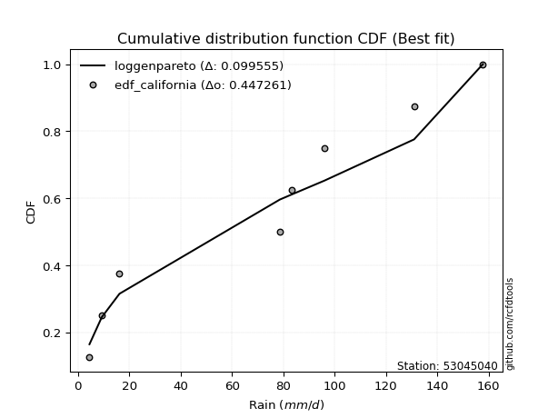</img>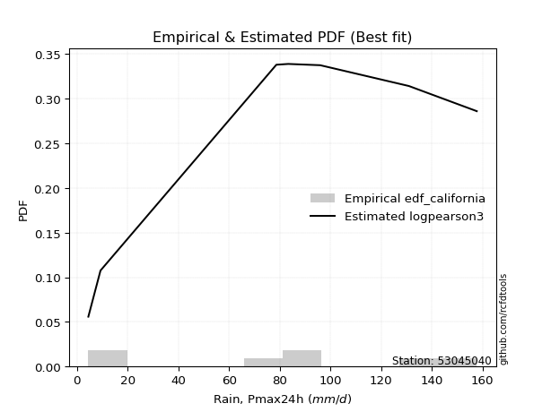</img>

</div>


### 2. EDF Hazen (1930)

Hazen method for plotting positions is a formula used to estimate the empirical cumulative probability distribution of flood events or other hydrological data. This formula often results in biased estimations, particularly when extrapolating to extreme events (high return periods).

<div align="center">


$P=(m-0.5)/n$


</div>


**2.1. Empirical values**

<div align="center">

|                | 0                   | 1                   | 2                   | 3         | 4                  | 5                  | 6                  |
|:---------------|:--------------------|:--------------------|:--------------------|:----------|:-------------------|:-------------------|:-------------------|
| date           | 2020                | 2016                | 2023                | 2017      | 2022               | 2018               | 2019               |
| x              | 4.5                 | 9.3                 | 78.7                | 83.4      | 96.0               | 131.0              | 157.8              |
| m              | 1                   | 2                   | 3                   | 4         | 5                  | 6                  | 7                  |
| empirical_dist | edf_hazen           | edf_hazen           | edf_hazen           | edf_hazen | edf_hazen          | edf_hazen          | edf_hazen          |
| empirical      | 0.07142857142857142 | 0.21428571428571427 | 0.35714285714285715 | 0.5       | 0.6428571428571429 | 0.7857142857142857 | 0.9285714285714286 |
| empirical_tr   | 1.0769230769230769  | 1.2727272727272727  | 1.5555555555555558  | 2.0       | 2.8000000000000003 | 4.666666666666666  | 14.000000000000007 |

</div>


**2.2. Kolmogorov-Smirnov fit test (sorted by Δ)**


<div align="center">

|                | 0                   | 1                   | 2                   | 3                   | 4                   | 5                   | 6                   | 7                   | 8                   | 9                   | 10                  | 11                  | 12                  | 13                  | 14                  | 15                  | 16                  | 17                  | 18                  | 19                  | 20                  | 21                  | 22                  | 23                  | 24                  | 25                    | 26                  | 27                  | 28                  | 29                  | 30                  | 31                  | 32                  | 33                  | 34                  | 35                  | 36                  | 37                  | 38                  | 39                  | 40                  | 41                  | 42                  | 43                  | 44                  | 45                  | 46                  | 47                  | 48                  | 49                  | 50                  | 51                  | 52                  | 53                  | 54                  | 55                  | 56                  | 57                  | 58                  | 59                  | 60                  | 61                  | 62                  | 63                  | 64                  | 65                  | 66                  | 67                  | 68                  | 69                  | 70                  | 71                  | 72                  | 73                  | 74                  | 75                  | 76                  | 77                  | 78                  | 79                  | 80                  | 81                  | 82                  | 83                  | 84                  | 85                  | 86                  | 87                  |
|:---------------|:--------------------|:--------------------|:--------------------|:--------------------|:--------------------|:--------------------|:--------------------|:--------------------|:--------------------|:--------------------|:--------------------|:--------------------|:--------------------|:--------------------|:--------------------|:--------------------|:--------------------|:--------------------|:--------------------|:--------------------|:--------------------|:--------------------|:--------------------|:--------------------|:--------------------|:----------------------|:--------------------|:--------------------|:--------------------|:--------------------|:--------------------|:--------------------|:--------------------|:--------------------|:--------------------|:--------------------|:--------------------|:--------------------|:--------------------|:--------------------|:--------------------|:--------------------|:--------------------|:--------------------|:--------------------|:--------------------|:--------------------|:--------------------|:--------------------|:--------------------|:--------------------|:--------------------|:--------------------|:--------------------|:--------------------|:--------------------|:--------------------|:--------------------|:--------------------|:--------------------|:--------------------|:--------------------|:--------------------|:--------------------|:--------------------|:--------------------|:--------------------|:--------------------|:--------------------|:--------------------|:--------------------|:--------------------|:--------------------|:--------------------|:--------------------|:--------------------|:--------------------|:--------------------|:--------------------|:--------------------|:--------------------|:--------------------|:--------------------|:--------------------|:--------------------|:--------------------|:--------------------|:--------------------|
| station        | 53045040            | 53045040            | 53045040            | 53045040            | 53045040            | 53045040            | 53045040            | 53045040            | 53045040            | 53045040            | 53045040            | 53045040            | 53045040            | 53045040            | 53045040            | 53045040            | 53045040            | 53045040            | 53045040            | 53045040            | 53045040            | 53045040            | 53045040            | 53045040            | 53045040            | 53045040              | 53045040            | 53045040            | 53045040            | 53045040            | 53045040            | 53045040            | 53045040            | 53045040            | 53045040            | 53045040            | 53045040            | 53045040            | 53045040            | 53045040            | 53045040            | 53045040            | 53045040            | 53045040            | 53045040            | 53045040            | 53045040            | 53045040            | 53045040            | 53045040            | 53045040            | 53045040            | 53045040            | 53045040            | 53045040            | 53045040            | 53045040            | 53045040            | 53045040            | 53045040            | 53045040            | 53045040            | 53045040            | 53045040            | 53045040            | 53045040            | 53045040            | 53045040            | 53045040            | 53045040            | 53045040            | 53045040            | 53045040            | 53045040            | 53045040            | 53045040            | 53045040            | 53045040            | 53045040            | 53045040            | 53045040            | 53045040            | 53045040            | 53045040            | 53045040            | 53045040            | 53045040            | 53045040            |
| empirical_dist | edf_hazen           | edf_hazen           | edf_hazen           | edf_hazen           | edf_hazen           | edf_hazen           | edf_hazen           | edf_hazen           | edf_hazen           | edf_hazen           | edf_hazen           | edf_hazen           | edf_hazen           | edf_hazen           | edf_hazen           | edf_hazen           | edf_hazen           | edf_hazen           | edf_hazen           | edf_hazen           | edf_hazen           | edf_hazen           | edf_hazen           | edf_hazen           | edf_hazen           | edf_hazen             | edf_hazen           | edf_hazen           | edf_hazen           | edf_hazen           | edf_hazen           | edf_hazen           | edf_hazen           | edf_hazen           | edf_hazen           | edf_hazen           | edf_hazen           | edf_hazen           | edf_hazen           | edf_hazen           | edf_hazen           | edf_hazen           | edf_hazen           | edf_hazen           | edf_hazen           | edf_hazen           | edf_hazen           | edf_hazen           | edf_hazen           | edf_hazen           | edf_hazen           | edf_hazen           | edf_hazen           | edf_hazen           | edf_hazen           | edf_hazen           | edf_hazen           | edf_hazen           | edf_hazen           | edf_hazen           | edf_hazen           | edf_hazen           | edf_hazen           | edf_hazen           | edf_hazen           | edf_hazen           | edf_hazen           | edf_hazen           | edf_hazen           | edf_hazen           | edf_hazen           | edf_hazen           | edf_hazen           | edf_hazen           | edf_hazen           | edf_hazen           | edf_hazen           | edf_hazen           | edf_hazen           | edf_hazen           | edf_hazen           | edf_hazen           | edf_hazen           | edf_hazen           | edf_hazen           | edf_hazen           | edf_hazen           | edf_hazen           |
| p_dist         | genlogistic         | johnsonsu           | gumbel_l            | laplace_asymmetric  | pearson3            | fisk                | t                   | crystalball         | norm                | exponnorm           | logistic            | weibull_min         | hypsecant           | laplace             | gamma               | erlang              | fatiguelife         | rice                | chi2                | maxwell             | invgamma            | rayleigh            | mielke              | invgauss            | gumbel_r            | loglaplace_asymmetric | logmielke           | logloggamma         | kstwobign           | halfnorm            | moyal               | halflogistic        | logfisk             | logpearson3         | logweibull_min      | loggumbel_l         | loggompertz         | expon               | genexpon            | logtruncnorm        | loginvweibull       | logf                | lognakagami         | logexponnorm        | logt                | lognorm             | lognorm             | logcrystalball      | lognct              | loggamma            | loggamma            | logfatiguelife      | logbetaprime        | logrice             | wald                | logerlang           | loginvgauss         | logalpha            | loginvgamma         | nakagami            | logncf              | loglogistic         | logmaxwell          | gibrat              | lograyleigh         | loghypsecant        | logkstwobign        | loggenexpon         | f                   | loghalfnorm         | nct                 | logexpon            | loggumbel_r         | loglaplace          | ncf                 | betaprime           | loghalflogistic     | logmoyal            | logjohnsonsu        | loglognorm          | logchi2             | logwald             | loggibrat           | invweibull          | alpha               | gompertz            | loggenlogistic      | truncnorm           |
| delta          | 0.11049000568415247 | 0.11458491971264803 | 0.11818892453828864 | 0.12024215561372446 | 0.12068193369310265 | 0.12264950322227608 | 0.13230016270115957 | 0.13230920440932709 | 0.13230920572470906 | 0.13231069143930912 | 0.13303749329331485 | 0.1365964922008968  | 0.13675602632495887 | 0.13883738804315757 | 0.13892576301574783 | 0.13981749366749952 | 0.14337265833426266 | 0.15377340950640134 | 0.15887009913679123 | 0.16574930705605445 | 0.16646470348634562 | 0.17698135177624313 | 0.18044968907159759 | 0.19397540356393367 | 0.2022923651844854  | 0.2028657182603008    | 0.20341035958964987 | 0.20420962485497846 | 0.20926453408074913 | 0.21428571428571427 | 0.22817617495680492 | 0.23286800041897732 | 0.23641757504656252 | 0.2452868773287436  | 0.2457971185892554  | 0.24657660224804973 | 0.2662485491352818  | 0.2681016487877688  | 0.2709758575381816  | 0.2787546986331378  | 0.2893745330107263  | 0.29370736571001127 | 0.2938374740602299  | 0.2945138119726823  | 0.29451426924301766 | 0.294514968010861   | 0.294514968010861   | 0.2945149877904096  | 0.29480149638630065 | 0.2965459851410304  | 0.2965459851410304  | 0.29665296589435747 | 0.2974937295552272  | 0.300170304382583   | 0.3001974061007255  | 0.3017367043475095  | 0.30239923983671807 | 0.3024130151849412  | 0.3024781541034331  | 0.30583015653891604 | 0.30726269368452125 | 0.3125993256691732  | 0.3159729261085225  | 0.3217924256226708  | 0.32241940833303834 | 0.32660916921538324 | 0.32698469554528004 | 0.3296719860883141  | 0.33132517357254015 | 0.3411892351236631  | 0.3427562687651076  | 0.34594319439607907 | 0.35422651335640504 | 0.3547456676598855  | 0.3575080906264784  | 0.36429066519326775 | 0.36928055055786985 | 0.37396896730895574 | 0.3866058648931425  | 0.4087805860324796  | 0.4208909411588851  | 0.4299630303797302  | 0.46216879177206077 | 0.4955010975375638  | 0.5343977277735039  | 0.6119968317841346  | 0.7857142857142857  | 0.8591399225769416  |
| deltao         | 0.48442053926100004 | 0.48442053926100004 | 0.48442053926100004 | 0.48442053926100004 | 0.48442053926100004 | 0.48442053926100004 | 0.48442053926100004 | 0.48442053926100004 | 0.48442053926100004 | 0.48442053926100004 | 0.48442053926100004 | 0.48442053926100004 | 0.48442053926100004 | 0.48442053926100004 | 0.48442053926100004 | 0.48442053926100004 | 0.48442053926100004 | 0.48442053926100004 | 0.48442053926100004 | 0.48442053926100004 | 0.48442053926100004 | 0.48442053926100004 | 0.48442053926100004 | 0.48442053926100004 | 0.48442053926100004 | 0.48442053926100004   | 0.48442053926100004 | 0.48442053926100004 | 0.48442053926100004 | 0.48442053926100004 | 0.48442053926100004 | 0.48442053926100004 | 0.48442053926100004 | 0.48442053926100004 | 0.48442053926100004 | 0.48442053926100004 | 0.48442053926100004 | 0.48442053926100004 | 0.48442053926100004 | 0.48442053926100004 | 0.48442053926100004 | 0.48442053926100004 | 0.48442053926100004 | 0.48442053926100004 | 0.48442053926100004 | 0.48442053926100004 | 0.48442053926100004 | 0.48442053926100004 | 0.48442053926100004 | 0.48442053926100004 | 0.48442053926100004 | 0.48442053926100004 | 0.48442053926100004 | 0.48442053926100004 | 0.48442053926100004 | 0.48442053926100004 | 0.48442053926100004 | 0.48442053926100004 | 0.48442053926100004 | 0.48442053926100004 | 0.48442053926100004 | 0.48442053926100004 | 0.48442053926100004 | 0.48442053926100004 | 0.48442053926100004 | 0.48442053926100004 | 0.48442053926100004 | 0.48442053926100004 | 0.48442053926100004 | 0.48442053926100004 | 0.48442053926100004 | 0.48442053926100004 | 0.48442053926100004 | 0.48442053926100004 | 0.48442053926100004 | 0.48442053926100004 | 0.48442053926100004 | 0.48442053926100004 | 0.48442053926100004 | 0.48442053926100004 | 0.48442053926100004 | 0.48442053926100004 | 0.48442053926100004 | 0.48442053926100004 | 0.48442053926100004 | 0.48442053926100004 | 0.48442053926100004 | 0.48442053926100004 |
| eval           | Δo > Δ              | Δo > Δ              | Δo > Δ              | Δo > Δ              | Δo > Δ              | Δo > Δ              | Δo > Δ              | Δo > Δ              | Δo > Δ              | Δo > Δ              | Δo > Δ              | Δo > Δ              | Δo > Δ              | Δo > Δ              | Δo > Δ              | Δo > Δ              | Δo > Δ              | Δo > Δ              | Δo > Δ              | Δo > Δ              | Δo > Δ              | Δo > Δ              | Δo > Δ              | Δo > Δ              | Δo > Δ              | Δo > Δ                | Δo > Δ              | Δo > Δ              | Δo > Δ              | Δo > Δ              | Δo > Δ              | Δo > Δ              | Δo > Δ              | Δo > Δ              | Δo > Δ              | Δo > Δ              | Δo > Δ              | Δo > Δ              | Δo > Δ              | Δo > Δ              | Δo > Δ              | Δo > Δ              | Δo > Δ              | Δo > Δ              | Δo > Δ              | Δo > Δ              | Δo > Δ              | Δo > Δ              | Δo > Δ              | Δo > Δ              | Δo > Δ              | Δo > Δ              | Δo > Δ              | Δo > Δ              | Δo > Δ              | Δo > Δ              | Δo > Δ              | Δo > Δ              | Δo > Δ              | Δo > Δ              | Δo > Δ              | Δo > Δ              | Δo > Δ              | Δo > Δ              | Δo > Δ              | Δo > Δ              | Δo > Δ              | Δo > Δ              | Δo > Δ              | Δo > Δ              | Δo > Δ              | Δo > Δ              | Δo > Δ              | Δo > Δ              | Δo > Δ              | Δo > Δ              | Δo > Δ              | Δo > Δ              | Δo > Δ              | Δo > Δ              | Δo > Δ              | Δo > Δ              | Δo > Δ              | Δo <= Δ             | Δo <= Δ             | Δo <= Δ             | Δo <= Δ             | Δo <= Δ             |
| fit            | 1                   | 1                   | 1                   | 1                   | 1                   | 1                   | 1                   | 1                   | 1                   | 1                   | 1                   | 1                   | 1                   | 1                   | 1                   | 1                   | 1                   | 1                   | 1                   | 1                   | 1                   | 1                   | 1                   | 1                   | 1                   | 1                     | 1                   | 1                   | 1                   | 1                   | 1                   | 1                   | 1                   | 1                   | 1                   | 1                   | 1                   | 1                   | 1                   | 1                   | 1                   | 1                   | 1                   | 1                   | 1                   | 1                   | 1                   | 1                   | 1                   | 1                   | 1                   | 1                   | 1                   | 1                   | 1                   | 1                   | 1                   | 1                   | 1                   | 1                   | 1                   | 1                   | 1                   | 1                   | 1                   | 1                   | 1                   | 1                   | 1                   | 1                   | 1                   | 1                   | 1                   | 1                   | 1                   | 1                   | 1                   | 1                   | 1                   | 1                   | 1                   | 1                   | 1                   | 0                   | 0                   | 0                   | 0                   | 0                   |
| n              | 7                   | 7                   | 7                   | 7                   | 7                   | 7                   | 7                   | 7                   | 7                   | 7                   | 7                   | 7                   | 7                   | 7                   | 7                   | 7                   | 7                   | 7                   | 7                   | 7                   | 7                   | 7                   | 7                   | 7                   | 7                   | 7                     | 7                   | 7                   | 7                   | 7                   | 7                   | 7                   | 7                   | 7                   | 7                   | 7                   | 7                   | 7                   | 7                   | 7                   | 7                   | 7                   | 7                   | 7                   | 7                   | 7                   | 7                   | 7                   | 7                   | 7                   | 7                   | 7                   | 7                   | 7                   | 7                   | 7                   | 7                   | 7                   | 7                   | 7                   | 7                   | 7                   | 7                   | 7                   | 7                   | 7                   | 7                   | 7                   | 7                   | 7                   | 7                   | 7                   | 7                   | 7                   | 7                   | 7                   | 7                   | 7                   | 7                   | 7                   | 7                   | 7                   | 7                   | 7                   | 7                   | 7                   | 7                   | 7                   |
| best_fit       | 1                   | 0                   | 0                   | 0                   | 0                   | 0                   | 0                   | 0                   | 0                   | 0                   | 0                   | 0                   | 0                   | 0                   | 0                   | 0                   | 0                   | 0                   | 0                   | 0                   | 0                   | 0                   | 0                   | 0                   | 0                   | 0                     | 0                   | 0                   | 0                   | 0                   | 0                   | 0                   | 0                   | 0                   | 0                   | 0                   | 0                   | 0                   | 0                   | 0                   | 0                   | 0                   | 0                   | 0                   | 0                   | 0                   | 0                   | 0                   | 0                   | 0                   | 0                   | 0                   | 0                   | 0                   | 0                   | 0                   | 0                   | 0                   | 0                   | 0                   | 0                   | 0                   | 0                   | 0                   | 0                   | 0                   | 0                   | 0                   | 0                   | 0                   | 0                   | 0                   | 0                   | 0                   | 0                   | 0                   | 0                   | 0                   | 0                   | 0                   | 0                   | 0                   | 0                   | 0                   | 0                   | 0                   | 0                   | 0                   |
| best_fit_sort  | 1                   | 2                   | 3                   | 4                   | 5                   | 6                   | 7                   | 8                   | 9                   | 10                  | 11                  | 12                  | 13                  | 14                  | 15                  | 16                  | 17                  | 18                  | 19                  | 20                  | 21                  | 22                  | 23                  | 24                  | 25                  | 26                    | 27                  | 28                  | 29                  | 30                  | 31                  | 32                  | 33                  | 34                  | 35                  | 36                  | 37                  | 38                  | 39                  | 40                  | 41                  | 42                  | 43                  | 44                  | 45                  | 46                  | 47                  | 48                  | 49                  | 50                  | 51                  | 52                  | 53                  | 54                  | 55                  | 56                  | 57                  | 58                  | 59                  | 60                  | 61                  | 62                  | 63                  | 64                  | 65                  | 66                  | 67                  | 68                  | 69                  | 70                  | 71                  | 72                  | 73                  | 74                  | 75                  | 76                  | 77                  | 78                  | 79                  | 80                  | 81                  | 82                  | 83                  | 84                  | 85                  | 86                  | 87                  | 88                  |

</div>


**2.3. Best fit**

<div align="center">

|   id |   station | empirical_dist   | p_dist      |   delta |   deltao | eval   |   fit |   n |   best_fit |   best_fit_sort |
|-----:|----------:|:-----------------|:------------|--------:|---------:|:-------|------:|----:|-----------:|----------------:|
|    0 |  53045040 | edf_hazen        | genlogistic | 0.11049 | 0.484421 | Δo > Δ |     1 |   7 |          1 |               1 |

</div>


<div align="center">

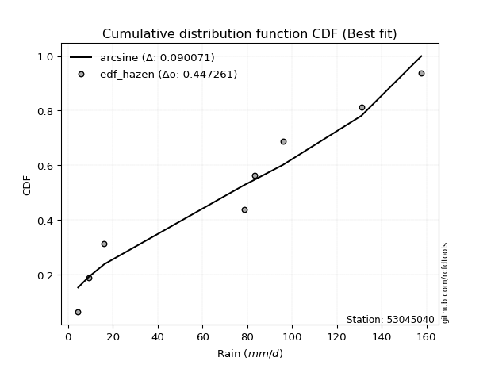</img>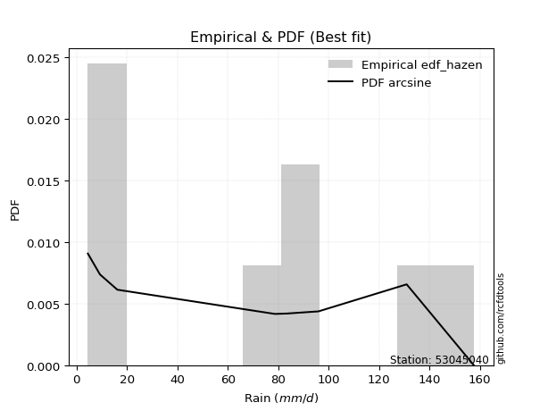</img>

</div>


### 3. EDF Weibull (1939)

Weibull plotting position formula is an empirical method used to estimate the non-exceedance probability or plotting position for a set of observed data, is often recommended or widely used in practice, particularly in flood frequency analysis.

<div align="center">


$P=m/(n+1)$


</div>


**3.1. Empirical values**

<div align="center">

|                | 0                  | 1                  | 2           | 3           | 4                  | 5           | 6           |
|:---------------|:-------------------|:-------------------|:------------|:------------|:-------------------|:------------|:------------|
| date           | 2020               | 2016               | 2023        | 2017        | 2022               | 2018        | 2019        |
| x              | 4.5                | 9.3                | 78.7        | 83.4        | 96.0               | 131.0       | 157.8       |
| m              | 1                  | 2                  | 3           | 4           | 5                  | 6           | 7           |
| empirical_dist | edf_weibull        | edf_weibull        | edf_weibull | edf_weibull | edf_weibull        | edf_weibull | edf_weibull |
| empirical      | 0.125              | 0.25               | 0.375       | 0.5         | 0.625              | 0.75        | 0.875       |
| empirical_tr   | 1.1428571428571428 | 1.3333333333333333 | 1.6         | 2.0         | 2.6666666666666665 | 4.0         | 8.0         |

</div>


**3.2. Kolmogorov-Smirnov fit test (sorted by Δ)**


<div align="center">

|                | 0                   | 1                   | 2                   | 3                   | 4                   | 5                   | 6                   | 7                   | 8                   | 9                   | 10                  | 11                  | 12                  | 13                  | 14                  | 15                  | 16                  | 17                  | 18                  | 19                  | 20                  | 21                  | 22                  | 23                  | 24                    | 25                  | 26                  | 27                  | 28                  | 29                  | 30                  | 31                  | 32                  | 33                  | 34                  | 35                  | 36                  | 37                  | 38                  | 39                  | 40                  | 41                  | 42                  | 43                  | 44                  | 45                  | 46                  | 47                  | 48                  | 49                  | 50                  | 51                  | 52                  | 53                  | 54                  | 55                  | 56                  | 57                  | 58                  | 59                  | 60                  | 61                  | 62                  | 63                  | 64                  | 65                  | 66                  | 67                  | 68                  | 69                  | 70                  | 71                  | 72                  | 73                  | 74                  | 75                  | 76                  | 77                  | 78                  | 79                  | 80                  | 81                  | 82                  | 83                  | 84                  | 85                  | 86                  | 87                  |
|:---------------|:--------------------|:--------------------|:--------------------|:--------------------|:--------------------|:--------------------|:--------------------|:--------------------|:--------------------|:--------------------|:--------------------|:--------------------|:--------------------|:--------------------|:--------------------|:--------------------|:--------------------|:--------------------|:--------------------|:--------------------|:--------------------|:--------------------|:--------------------|:--------------------|:----------------------|:--------------------|:--------------------|:--------------------|:--------------------|:--------------------|:--------------------|:--------------------|:--------------------|:--------------------|:--------------------|:--------------------|:--------------------|:--------------------|:--------------------|:--------------------|:--------------------|:--------------------|:--------------------|:--------------------|:--------------------|:--------------------|:--------------------|:--------------------|:--------------------|:--------------------|:--------------------|:--------------------|:--------------------|:--------------------|:--------------------|:--------------------|:--------------------|:--------------------|:--------------------|:--------------------|:--------------------|:--------------------|:--------------------|:--------------------|:--------------------|:--------------------|:--------------------|:--------------------|:--------------------|:--------------------|:--------------------|:--------------------|:--------------------|:--------------------|:--------------------|:--------------------|:--------------------|:--------------------|:--------------------|:--------------------|:--------------------|:--------------------|:--------------------|:--------------------|:--------------------|:--------------------|:--------------------|:--------------------|
| station        | 53045040            | 53045040            | 53045040            | 53045040            | 53045040            | 53045040            | 53045040            | 53045040            | 53045040            | 53045040            | 53045040            | 53045040            | 53045040            | 53045040            | 53045040            | 53045040            | 53045040            | 53045040            | 53045040            | 53045040            | 53045040            | 53045040            | 53045040            | 53045040            | 53045040              | 53045040            | 53045040            | 53045040            | 53045040            | 53045040            | 53045040            | 53045040            | 53045040            | 53045040            | 53045040            | 53045040            | 53045040            | 53045040            | 53045040            | 53045040            | 53045040            | 53045040            | 53045040            | 53045040            | 53045040            | 53045040            | 53045040            | 53045040            | 53045040            | 53045040            | 53045040            | 53045040            | 53045040            | 53045040            | 53045040            | 53045040            | 53045040            | 53045040            | 53045040            | 53045040            | 53045040            | 53045040            | 53045040            | 53045040            | 53045040            | 53045040            | 53045040            | 53045040            | 53045040            | 53045040            | 53045040            | 53045040            | 53045040            | 53045040            | 53045040            | 53045040            | 53045040            | 53045040            | 53045040            | 53045040            | 53045040            | 53045040            | 53045040            | 53045040            | 53045040            | 53045040            | 53045040            | 53045040            |
| empirical_dist | edf_weibull         | edf_weibull         | edf_weibull         | edf_weibull         | edf_weibull         | edf_weibull         | edf_weibull         | edf_weibull         | edf_weibull         | edf_weibull         | edf_weibull         | edf_weibull         | edf_weibull         | edf_weibull         | edf_weibull         | edf_weibull         | edf_weibull         | edf_weibull         | edf_weibull         | edf_weibull         | edf_weibull         | edf_weibull         | edf_weibull         | edf_weibull         | edf_weibull           | edf_weibull         | edf_weibull         | edf_weibull         | edf_weibull         | edf_weibull         | edf_weibull         | edf_weibull         | edf_weibull         | edf_weibull         | edf_weibull         | edf_weibull         | edf_weibull         | edf_weibull         | edf_weibull         | edf_weibull         | edf_weibull         | edf_weibull         | edf_weibull         | edf_weibull         | edf_weibull         | edf_weibull         | edf_weibull         | edf_weibull         | edf_weibull         | edf_weibull         | edf_weibull         | edf_weibull         | edf_weibull         | edf_weibull         | edf_weibull         | edf_weibull         | edf_weibull         | edf_weibull         | edf_weibull         | edf_weibull         | edf_weibull         | edf_weibull         | edf_weibull         | edf_weibull         | edf_weibull         | edf_weibull         | edf_weibull         | edf_weibull         | edf_weibull         | edf_weibull         | edf_weibull         | edf_weibull         | edf_weibull         | edf_weibull         | edf_weibull         | edf_weibull         | edf_weibull         | edf_weibull         | edf_weibull         | edf_weibull         | edf_weibull         | edf_weibull         | edf_weibull         | edf_weibull         | edf_weibull         | edf_weibull         | edf_weibull         | edf_weibull         |
| p_dist         | genlogistic         | johnsonsu           | gumbel_l            | laplace_asymmetric  | pearson3            | fisk                | exponnorm           | crystalball         | norm                | t                   | erlang              | gamma               | chi2                | mielke              | fatiguelife         | invgamma            | weibull_min         | logistic            | hypsecant           | maxwell             | laplace             | invgauss            | rice                | rayleigh            | loglaplace_asymmetric | logmielke           | logloggamma         | kstwobign           | gumbel_r            | logfisk             | logpearson3         | logweibull_min      | loggumbel_l         | moyal               | loggompertz         | halfnorm            | halflogistic        | expon               | genexpon            | logtruncnorm        | loginvweibull       | logf                | lognakagami         | logexponnorm        | logt                | lognorm             | lognorm             | logcrystalball      | lognct              | loggamma            | loggamma            | logfatiguelife      | logbetaprime        | logrice             | wald                | logerlang           | loginvgauss         | logalpha            | loginvgamma         | nakagami            | logncf              | loglogistic         | logmaxwell          | gibrat              | lograyleigh         | loghypsecant        | logkstwobign        | loggenexpon         | f                   | loghalfnorm         | nct                 | logexpon            | loggumbel_r         | loglaplace          | ncf                 | betaprime           | logjohnsonsu        | loghalflogistic     | logmoyal            | loglognorm          | logchi2             | logwald             | invweibull          | loggibrat           | alpha               | gompertz            | loggenlogistic      | truncnorm           |
| delta          | 0.1462042913984382  | 0.15029920542693376 | 0.15390321025257436 | 0.15595644132801018 | 0.1561265470326382  | 0.1583637889365618  | 0.15942884335301494 | 0.1594298225439557  | 0.15942982439247305 | 0.15943473112893267 | 0.15969524963610415 | 0.16022697743514472 | 0.16068186307332039 | 0.16259254621445474 | 0.16334744050439393 | 0.16609566280161853 | 0.1679209130351929  | 0.16875177900760058 | 0.1724703120392446  | 0.17254084671946657 | 0.1745516737574433  | 0.17611826070679082 | 0.17805794712989967 | 0.18132046206780622 | 0.18500857540315796   | 0.18555321673250702 | 0.1863524819978356  | 0.19140739122360628 | 0.20584886897399296 | 0.21856043218941967 | 0.22742973447160075 | 0.22793997573211255 | 0.22871945939090688 | 0.23071400244771093 | 0.24839140627813894 | 0.25                | 0.25                | 0.25024450593062597 | 0.25311871468103875 | 0.26089755577599494 | 0.27151739015358345 | 0.2758502228528684  | 0.27598033120308707 | 0.27665666911553943 | 0.2766571263858748  | 0.2766578251537182  | 0.2766578251537182  | 0.27665784493326673 | 0.2769443535291578  | 0.2786888422838876  | 0.2786888422838876  | 0.2787958230372146  | 0.27963658669808433 | 0.28231316152544017 | 0.28234026324358263 | 0.28387956149036664 | 0.2845420969795752  | 0.28455587232779833 | 0.28462101124629025 | 0.2879730136817732  | 0.2894055508273784  | 0.29474218281203035 | 0.29811578325137966 | 0.30393528276552795 | 0.3045622654758955  | 0.3087520263582404  | 0.3091275526881372  | 0.31181484323117126 | 0.3134680307153973  | 0.32333209226652027 | 0.32489912590796477 | 0.3280860515389362  | 0.3363693704992622  | 0.3368885248027427  | 0.3396509477693356  | 0.3464335223361249  | 0.3508915791788568  | 0.351423407700727   | 0.3561118244518129  | 0.3730663003181939  | 0.40303379830174224 | 0.41210588752258737 | 0.44192966896613517 | 0.4443116489149179  | 0.5165405849163611  | 0.5941396889269916  | 0.75                | 0.805568494005513   |
| deltao         | 0.48442053926100004 | 0.48442053926100004 | 0.48442053926100004 | 0.48442053926100004 | 0.48442053926100004 | 0.48442053926100004 | 0.48442053926100004 | 0.48442053926100004 | 0.48442053926100004 | 0.48442053926100004 | 0.48442053926100004 | 0.48442053926100004 | 0.48442053926100004 | 0.48442053926100004 | 0.48442053926100004 | 0.48442053926100004 | 0.48442053926100004 | 0.48442053926100004 | 0.48442053926100004 | 0.48442053926100004 | 0.48442053926100004 | 0.48442053926100004 | 0.48442053926100004 | 0.48442053926100004 | 0.48442053926100004   | 0.48442053926100004 | 0.48442053926100004 | 0.48442053926100004 | 0.48442053926100004 | 0.48442053926100004 | 0.48442053926100004 | 0.48442053926100004 | 0.48442053926100004 | 0.48442053926100004 | 0.48442053926100004 | 0.48442053926100004 | 0.48442053926100004 | 0.48442053926100004 | 0.48442053926100004 | 0.48442053926100004 | 0.48442053926100004 | 0.48442053926100004 | 0.48442053926100004 | 0.48442053926100004 | 0.48442053926100004 | 0.48442053926100004 | 0.48442053926100004 | 0.48442053926100004 | 0.48442053926100004 | 0.48442053926100004 | 0.48442053926100004 | 0.48442053926100004 | 0.48442053926100004 | 0.48442053926100004 | 0.48442053926100004 | 0.48442053926100004 | 0.48442053926100004 | 0.48442053926100004 | 0.48442053926100004 | 0.48442053926100004 | 0.48442053926100004 | 0.48442053926100004 | 0.48442053926100004 | 0.48442053926100004 | 0.48442053926100004 | 0.48442053926100004 | 0.48442053926100004 | 0.48442053926100004 | 0.48442053926100004 | 0.48442053926100004 | 0.48442053926100004 | 0.48442053926100004 | 0.48442053926100004 | 0.48442053926100004 | 0.48442053926100004 | 0.48442053926100004 | 0.48442053926100004 | 0.48442053926100004 | 0.48442053926100004 | 0.48442053926100004 | 0.48442053926100004 | 0.48442053926100004 | 0.48442053926100004 | 0.48442053926100004 | 0.48442053926100004 | 0.48442053926100004 | 0.48442053926100004 | 0.48442053926100004 |
| eval           | Δo > Δ              | Δo > Δ              | Δo > Δ              | Δo > Δ              | Δo > Δ              | Δo > Δ              | Δo > Δ              | Δo > Δ              | Δo > Δ              | Δo > Δ              | Δo > Δ              | Δo > Δ              | Δo > Δ              | Δo > Δ              | Δo > Δ              | Δo > Δ              | Δo > Δ              | Δo > Δ              | Δo > Δ              | Δo > Δ              | Δo > Δ              | Δo > Δ              | Δo > Δ              | Δo > Δ              | Δo > Δ                | Δo > Δ              | Δo > Δ              | Δo > Δ              | Δo > Δ              | Δo > Δ              | Δo > Δ              | Δo > Δ              | Δo > Δ              | Δo > Δ              | Δo > Δ              | Δo > Δ              | Δo > Δ              | Δo > Δ              | Δo > Δ              | Δo > Δ              | Δo > Δ              | Δo > Δ              | Δo > Δ              | Δo > Δ              | Δo > Δ              | Δo > Δ              | Δo > Δ              | Δo > Δ              | Δo > Δ              | Δo > Δ              | Δo > Δ              | Δo > Δ              | Δo > Δ              | Δo > Δ              | Δo > Δ              | Δo > Δ              | Δo > Δ              | Δo > Δ              | Δo > Δ              | Δo > Δ              | Δo > Δ              | Δo > Δ              | Δo > Δ              | Δo > Δ              | Δo > Δ              | Δo > Δ              | Δo > Δ              | Δo > Δ              | Δo > Δ              | Δo > Δ              | Δo > Δ              | Δo > Δ              | Δo > Δ              | Δo > Δ              | Δo > Δ              | Δo > Δ              | Δo > Δ              | Δo > Δ              | Δo > Δ              | Δo > Δ              | Δo > Δ              | Δo > Δ              | Δo > Δ              | Δo > Δ              | Δo <= Δ             | Δo <= Δ             | Δo <= Δ             | Δo <= Δ             |
| fit            | 1                   | 1                   | 1                   | 1                   | 1                   | 1                   | 1                   | 1                   | 1                   | 1                   | 1                   | 1                   | 1                   | 1                   | 1                   | 1                   | 1                   | 1                   | 1                   | 1                   | 1                   | 1                   | 1                   | 1                   | 1                     | 1                   | 1                   | 1                   | 1                   | 1                   | 1                   | 1                   | 1                   | 1                   | 1                   | 1                   | 1                   | 1                   | 1                   | 1                   | 1                   | 1                   | 1                   | 1                   | 1                   | 1                   | 1                   | 1                   | 1                   | 1                   | 1                   | 1                   | 1                   | 1                   | 1                   | 1                   | 1                   | 1                   | 1                   | 1                   | 1                   | 1                   | 1                   | 1                   | 1                   | 1                   | 1                   | 1                   | 1                   | 1                   | 1                   | 1                   | 1                   | 1                   | 1                   | 1                   | 1                   | 1                   | 1                   | 1                   | 1                   | 1                   | 1                   | 1                   | 0                   | 0                   | 0                   | 0                   |
| n              | 7                   | 7                   | 7                   | 7                   | 7                   | 7                   | 7                   | 7                   | 7                   | 7                   | 7                   | 7                   | 7                   | 7                   | 7                   | 7                   | 7                   | 7                   | 7                   | 7                   | 7                   | 7                   | 7                   | 7                   | 7                     | 7                   | 7                   | 7                   | 7                   | 7                   | 7                   | 7                   | 7                   | 7                   | 7                   | 7                   | 7                   | 7                   | 7                   | 7                   | 7                   | 7                   | 7                   | 7                   | 7                   | 7                   | 7                   | 7                   | 7                   | 7                   | 7                   | 7                   | 7                   | 7                   | 7                   | 7                   | 7                   | 7                   | 7                   | 7                   | 7                   | 7                   | 7                   | 7                   | 7                   | 7                   | 7                   | 7                   | 7                   | 7                   | 7                   | 7                   | 7                   | 7                   | 7                   | 7                   | 7                   | 7                   | 7                   | 7                   | 7                   | 7                   | 7                   | 7                   | 7                   | 7                   | 7                   | 7                   |
| best_fit       | 1                   | 0                   | 0                   | 0                   | 0                   | 0                   | 0                   | 0                   | 0                   | 0                   | 0                   | 0                   | 0                   | 0                   | 0                   | 0                   | 0                   | 0                   | 0                   | 0                   | 0                   | 0                   | 0                   | 0                   | 0                     | 0                   | 0                   | 0                   | 0                   | 0                   | 0                   | 0                   | 0                   | 0                   | 0                   | 0                   | 0                   | 0                   | 0                   | 0                   | 0                   | 0                   | 0                   | 0                   | 0                   | 0                   | 0                   | 0                   | 0                   | 0                   | 0                   | 0                   | 0                   | 0                   | 0                   | 0                   | 0                   | 0                   | 0                   | 0                   | 0                   | 0                   | 0                   | 0                   | 0                   | 0                   | 0                   | 0                   | 0                   | 0                   | 0                   | 0                   | 0                   | 0                   | 0                   | 0                   | 0                   | 0                   | 0                   | 0                   | 0                   | 0                   | 0                   | 0                   | 0                   | 0                   | 0                   | 0                   |
| best_fit_sort  | 1                   | 2                   | 3                   | 4                   | 5                   | 6                   | 7                   | 8                   | 9                   | 10                  | 11                  | 12                  | 13                  | 14                  | 15                  | 16                  | 17                  | 18                  | 19                  | 20                  | 21                  | 22                  | 23                  | 24                  | 25                    | 26                  | 27                  | 28                  | 29                  | 30                  | 31                  | 32                  | 33                  | 34                  | 35                  | 36                  | 37                  | 38                  | 39                  | 40                  | 41                  | 42                  | 43                  | 44                  | 45                  | 46                  | 47                  | 48                  | 49                  | 50                  | 51                  | 52                  | 53                  | 54                  | 55                  | 56                  | 57                  | 58                  | 59                  | 60                  | 61                  | 62                  | 63                  | 64                  | 65                  | 66                  | 67                  | 68                  | 69                  | 70                  | 71                  | 72                  | 73                  | 74                  | 75                  | 76                  | 77                  | 78                  | 79                  | 80                  | 81                  | 82                  | 83                  | 84                  | 85                  | 86                  | 87                  | 88                  |

</div>


**3.3. Best fit**

<div align="center">

|   id |   station | empirical_dist   | p_dist      |    delta |   deltao | eval   |   fit |   n |   best_fit |   best_fit_sort |
|-----:|----------:|:-----------------|:------------|---------:|---------:|:-------|------:|----:|-----------:|----------------:|
|    0 |  53045040 | edf_weibull      | genlogistic | 0.146204 | 0.484421 | Δo > Δ |     1 |   7 |          1 |               1 |

</div>


<div align="center">

</img></img>

</div>


### 4. EDF Beard (1943)

The Beard formula (or Beard´s plotting position formula) in hydrology is used to estimate the empirical non-exceedance probability _(P)_ of a flood event (or other extreme hydrological data point) within a given dataset.

<div align="center">


$P=(m-0.31)/(n+0.38)$


</div>


**4.1. Empirical values**

<div align="center">

|                | 0                   | 1                   | 2                   | 3         | 4                  | 5                  | 6                  |
|:---------------|:--------------------|:--------------------|:--------------------|:----------|:-------------------|:-------------------|:-------------------|
| date           | 2020                | 2016                | 2023                | 2017      | 2022               | 2018               | 2019               |
| x              | 4.5                 | 9.3                 | 78.7                | 83.4      | 96.0               | 131.0              | 157.8              |
| m              | 1                   | 2                   | 3                   | 4         | 5                  | 6                  | 7                  |
| empirical_dist | edf_beard           | edf_beard           | edf_beard           | edf_beard | edf_beard          | edf_beard          | edf_beard          |
| empirical      | 0.09349593495934959 | 0.22899728997289973 | 0.36449864498644985 | 0.5       | 0.6355013550135502 | 0.7710027100271003 | 0.9065040650406505 |
| empirical_tr   | 1.1031390134529149  | 1.29701230228471    | 1.5735607675906182  | 2.0       | 2.743494423791822  | 4.366863905325444  | 10.695652173913055 |

</div>


**4.2. Kolmogorov-Smirnov fit test (sorted by Δ)**


<div align="center">

|                | 0                   | 1                   | 2                   | 3                   | 4                   | 5                   | 6                   | 7                   | 8                   | 9                   | 10                  | 11                  | 12                  | 13                  | 14                  | 15                  | 16                  | 17                  | 18                  | 19                  | 20                  | 21                  | 22                  | 23                  | 24                  | 25                    | 26                  | 27                  | 28                  | 29                  | 30                  | 31                  | 32                  | 33                  | 34                  | 35                  | 36                  | 37                  | 38                  | 39                  | 40                  | 41                  | 42                  | 43                  | 44                  | 45                  | 46                  | 47                  | 48                  | 49                  | 50                  | 51                  | 52                  | 53                  | 54                  | 55                  | 56                  | 57                  | 58                  | 59                  | 60                  | 61                  | 62                  | 63                  | 64                  | 65                  | 66                  | 67                  | 68                  | 69                  | 70                  | 71                  | 72                  | 73                  | 74                  | 75                  | 76                  | 77                  | 78                  | 79                  | 80                  | 81                  | 82                  | 83                  | 84                  | 85                  | 86                  | 87                  |
|:---------------|:--------------------|:--------------------|:--------------------|:--------------------|:--------------------|:--------------------|:--------------------|:--------------------|:--------------------|:--------------------|:--------------------|:--------------------|:--------------------|:--------------------|:--------------------|:--------------------|:--------------------|:--------------------|:--------------------|:--------------------|:--------------------|:--------------------|:--------------------|:--------------------|:--------------------|:----------------------|:--------------------|:--------------------|:--------------------|:--------------------|:--------------------|:--------------------|:--------------------|:--------------------|:--------------------|:--------------------|:--------------------|:--------------------|:--------------------|:--------------------|:--------------------|:--------------------|:--------------------|:--------------------|:--------------------|:--------------------|:--------------------|:--------------------|:--------------------|:--------------------|:--------------------|:--------------------|:--------------------|:--------------------|:--------------------|:--------------------|:--------------------|:--------------------|:--------------------|:--------------------|:--------------------|:--------------------|:--------------------|:--------------------|:--------------------|:--------------------|:--------------------|:--------------------|:--------------------|:--------------------|:--------------------|:--------------------|:--------------------|:--------------------|:--------------------|:--------------------|:--------------------|:--------------------|:--------------------|:--------------------|:--------------------|:--------------------|:--------------------|:--------------------|:--------------------|:--------------------|:--------------------|:--------------------|
| station        | 53045040            | 53045040            | 53045040            | 53045040            | 53045040            | 53045040            | 53045040            | 53045040            | 53045040            | 53045040            | 53045040            | 53045040            | 53045040            | 53045040            | 53045040            | 53045040            | 53045040            | 53045040            | 53045040            | 53045040            | 53045040            | 53045040            | 53045040            | 53045040            | 53045040            | 53045040              | 53045040            | 53045040            | 53045040            | 53045040            | 53045040            | 53045040            | 53045040            | 53045040            | 53045040            | 53045040            | 53045040            | 53045040            | 53045040            | 53045040            | 53045040            | 53045040            | 53045040            | 53045040            | 53045040            | 53045040            | 53045040            | 53045040            | 53045040            | 53045040            | 53045040            | 53045040            | 53045040            | 53045040            | 53045040            | 53045040            | 53045040            | 53045040            | 53045040            | 53045040            | 53045040            | 53045040            | 53045040            | 53045040            | 53045040            | 53045040            | 53045040            | 53045040            | 53045040            | 53045040            | 53045040            | 53045040            | 53045040            | 53045040            | 53045040            | 53045040            | 53045040            | 53045040            | 53045040            | 53045040            | 53045040            | 53045040            | 53045040            | 53045040            | 53045040            | 53045040            | 53045040            | 53045040            |
| empirical_dist | edf_beard           | edf_beard           | edf_beard           | edf_beard           | edf_beard           | edf_beard           | edf_beard           | edf_beard           | edf_beard           | edf_beard           | edf_beard           | edf_beard           | edf_beard           | edf_beard           | edf_beard           | edf_beard           | edf_beard           | edf_beard           | edf_beard           | edf_beard           | edf_beard           | edf_beard           | edf_beard           | edf_beard           | edf_beard           | edf_beard             | edf_beard           | edf_beard           | edf_beard           | edf_beard           | edf_beard           | edf_beard           | edf_beard           | edf_beard           | edf_beard           | edf_beard           | edf_beard           | edf_beard           | edf_beard           | edf_beard           | edf_beard           | edf_beard           | edf_beard           | edf_beard           | edf_beard           | edf_beard           | edf_beard           | edf_beard           | edf_beard           | edf_beard           | edf_beard           | edf_beard           | edf_beard           | edf_beard           | edf_beard           | edf_beard           | edf_beard           | edf_beard           | edf_beard           | edf_beard           | edf_beard           | edf_beard           | edf_beard           | edf_beard           | edf_beard           | edf_beard           | edf_beard           | edf_beard           | edf_beard           | edf_beard           | edf_beard           | edf_beard           | edf_beard           | edf_beard           | edf_beard           | edf_beard           | edf_beard           | edf_beard           | edf_beard           | edf_beard           | edf_beard           | edf_beard           | edf_beard           | edf_beard           | edf_beard           | edf_beard           | edf_beard           | edf_beard           |
| p_dist         | genlogistic         | johnsonsu           | gumbel_l            | laplace_asymmetric  | pearson3            | fisk                | exponnorm           | crystalball         | norm                | t                   | erlang              | gamma               | fatiguelife         | weibull_min         | logistic            | hypsecant           | chi2                | laplace             | rice                | maxwell             | invgamma            | rayleigh            | mielke              | invgauss            | gumbel_r            | loglaplace_asymmetric | logmielke           | logloggamma         | kstwobign           | moyal               | halflogistic        | halfnorm            | logfisk             | logpearson3         | logweibull_min      | loggumbel_l         | loggompertz         | expon               | genexpon            | logtruncnorm        | loginvweibull       | logf                | lognakagami         | logexponnorm        | logt                | lognorm             | lognorm             | logcrystalball      | lognct              | loggamma            | loggamma            | logfatiguelife      | logbetaprime        | logrice             | wald                | logerlang           | loginvgauss         | logalpha            | loginvgamma         | nakagami            | logncf              | loglogistic         | logmaxwell          | gibrat              | lograyleigh         | loghypsecant        | logkstwobign        | loggenexpon         | f                   | loghalfnorm         | nct                 | logexpon            | loggumbel_r         | loglaplace          | ncf                 | betaprime           | loghalflogistic     | logmoyal            | logjohnsonsu        | loglognorm          | logchi2             | logwald             | loggibrat           | invweibull          | alpha               | gompertz            | loggenlogistic      | truncnorm           |
| delta          | 0.1252015813713379  | 0.12929649539983348 | 0.1329005002254741  | 0.13495373130090993 | 0.13512383700553793 | 0.13736107890946153 | 0.13842613332591466 | 0.13842711251685544 | 0.13842711436537278 | 0.1384320211018324  | 0.13869253960900385 | 0.13922426740804444 | 0.14234473047729365 | 0.14691820300809263 | 0.1477490689805003  | 0.15146760201214432 | 0.15151431129319853 | 0.15354896373034302 | 0.1570552371027994  | 0.15839351921246175 | 0.15910891564275292 | 0.16962556393265044 | 0.1730939012280049  | 0.18661961572034097 | 0.1949365773408927  | 0.1955099304167081    | 0.19605457174605717 | 0.19685383701138576 | 0.20190874623715643 | 0.22082038711321222 | 0.22899728997289973 | 0.22899728997289973 | 0.22906178720296982 | 0.2379310894851509  | 0.2384413307456627  | 0.23922081440445703 | 0.2588927612916891  | 0.2607458609441761  | 0.2636200696945889  | 0.2713989107895451  | 0.2820187451671336  | 0.28635157786641857 | 0.2864816862166372  | 0.2871580241290896  | 0.28715848139942496 | 0.2871591801672683  | 0.2871591801672683  | 0.2871591999468169  | 0.28744570854270796 | 0.2891901972974377  | 0.2891901972974377  | 0.28929717805076477 | 0.2901379417116345  | 0.2928145165389903  | 0.2928416182571328  | 0.2943809165039168  | 0.29504345199312537 | 0.2950572273413485  | 0.2951223662598404  | 0.29847436869532334 | 0.29990690584092855 | 0.3052435378255805  | 0.3086171382649298  | 0.3144366377790781  | 0.31506362048944564 | 0.31925338137179055 | 0.31962890770168734 | 0.3223161982447214  | 0.32396938572894746 | 0.3338334472800704  | 0.3354004809215149  | 0.33858740655248637 | 0.34687072551281234 | 0.3473898798162928  | 0.3501523027828857  | 0.35693487734967505 | 0.36192476271427715 | 0.36661317946536304 | 0.37189428920595713 | 0.3940690103452942  | 0.4135351533152924  | 0.4226072425361375  | 0.4548130039284681  | 0.4734337340067857  | 0.5270419399299113  | 0.6046410439405419  | 0.7710027100271003  | 0.8370725590461634  |
| deltao         | 0.48442053926100004 | 0.48442053926100004 | 0.48442053926100004 | 0.48442053926100004 | 0.48442053926100004 | 0.48442053926100004 | 0.48442053926100004 | 0.48442053926100004 | 0.48442053926100004 | 0.48442053926100004 | 0.48442053926100004 | 0.48442053926100004 | 0.48442053926100004 | 0.48442053926100004 | 0.48442053926100004 | 0.48442053926100004 | 0.48442053926100004 | 0.48442053926100004 | 0.48442053926100004 | 0.48442053926100004 | 0.48442053926100004 | 0.48442053926100004 | 0.48442053926100004 | 0.48442053926100004 | 0.48442053926100004 | 0.48442053926100004   | 0.48442053926100004 | 0.48442053926100004 | 0.48442053926100004 | 0.48442053926100004 | 0.48442053926100004 | 0.48442053926100004 | 0.48442053926100004 | 0.48442053926100004 | 0.48442053926100004 | 0.48442053926100004 | 0.48442053926100004 | 0.48442053926100004 | 0.48442053926100004 | 0.48442053926100004 | 0.48442053926100004 | 0.48442053926100004 | 0.48442053926100004 | 0.48442053926100004 | 0.48442053926100004 | 0.48442053926100004 | 0.48442053926100004 | 0.48442053926100004 | 0.48442053926100004 | 0.48442053926100004 | 0.48442053926100004 | 0.48442053926100004 | 0.48442053926100004 | 0.48442053926100004 | 0.48442053926100004 | 0.48442053926100004 | 0.48442053926100004 | 0.48442053926100004 | 0.48442053926100004 | 0.48442053926100004 | 0.48442053926100004 | 0.48442053926100004 | 0.48442053926100004 | 0.48442053926100004 | 0.48442053926100004 | 0.48442053926100004 | 0.48442053926100004 | 0.48442053926100004 | 0.48442053926100004 | 0.48442053926100004 | 0.48442053926100004 | 0.48442053926100004 | 0.48442053926100004 | 0.48442053926100004 | 0.48442053926100004 | 0.48442053926100004 | 0.48442053926100004 | 0.48442053926100004 | 0.48442053926100004 | 0.48442053926100004 | 0.48442053926100004 | 0.48442053926100004 | 0.48442053926100004 | 0.48442053926100004 | 0.48442053926100004 | 0.48442053926100004 | 0.48442053926100004 | 0.48442053926100004 |
| eval           | Δo > Δ              | Δo > Δ              | Δo > Δ              | Δo > Δ              | Δo > Δ              | Δo > Δ              | Δo > Δ              | Δo > Δ              | Δo > Δ              | Δo > Δ              | Δo > Δ              | Δo > Δ              | Δo > Δ              | Δo > Δ              | Δo > Δ              | Δo > Δ              | Δo > Δ              | Δo > Δ              | Δo > Δ              | Δo > Δ              | Δo > Δ              | Δo > Δ              | Δo > Δ              | Δo > Δ              | Δo > Δ              | Δo > Δ                | Δo > Δ              | Δo > Δ              | Δo > Δ              | Δo > Δ              | Δo > Δ              | Δo > Δ              | Δo > Δ              | Δo > Δ              | Δo > Δ              | Δo > Δ              | Δo > Δ              | Δo > Δ              | Δo > Δ              | Δo > Δ              | Δo > Δ              | Δo > Δ              | Δo > Δ              | Δo > Δ              | Δo > Δ              | Δo > Δ              | Δo > Δ              | Δo > Δ              | Δo > Δ              | Δo > Δ              | Δo > Δ              | Δo > Δ              | Δo > Δ              | Δo > Δ              | Δo > Δ              | Δo > Δ              | Δo > Δ              | Δo > Δ              | Δo > Δ              | Δo > Δ              | Δo > Δ              | Δo > Δ              | Δo > Δ              | Δo > Δ              | Δo > Δ              | Δo > Δ              | Δo > Δ              | Δo > Δ              | Δo > Δ              | Δo > Δ              | Δo > Δ              | Δo > Δ              | Δo > Δ              | Δo > Δ              | Δo > Δ              | Δo > Δ              | Δo > Δ              | Δo > Δ              | Δo > Δ              | Δo > Δ              | Δo > Δ              | Δo > Δ              | Δo > Δ              | Δo > Δ              | Δo <= Δ             | Δo <= Δ             | Δo <= Δ             | Δo <= Δ             |
| fit            | 1                   | 1                   | 1                   | 1                   | 1                   | 1                   | 1                   | 1                   | 1                   | 1                   | 1                   | 1                   | 1                   | 1                   | 1                   | 1                   | 1                   | 1                   | 1                   | 1                   | 1                   | 1                   | 1                   | 1                   | 1                   | 1                     | 1                   | 1                   | 1                   | 1                   | 1                   | 1                   | 1                   | 1                   | 1                   | 1                   | 1                   | 1                   | 1                   | 1                   | 1                   | 1                   | 1                   | 1                   | 1                   | 1                   | 1                   | 1                   | 1                   | 1                   | 1                   | 1                   | 1                   | 1                   | 1                   | 1                   | 1                   | 1                   | 1                   | 1                   | 1                   | 1                   | 1                   | 1                   | 1                   | 1                   | 1                   | 1                   | 1                   | 1                   | 1                   | 1                   | 1                   | 1                   | 1                   | 1                   | 1                   | 1                   | 1                   | 1                   | 1                   | 1                   | 1                   | 1                   | 0                   | 0                   | 0                   | 0                   |
| n              | 7                   | 7                   | 7                   | 7                   | 7                   | 7                   | 7                   | 7                   | 7                   | 7                   | 7                   | 7                   | 7                   | 7                   | 7                   | 7                   | 7                   | 7                   | 7                   | 7                   | 7                   | 7                   | 7                   | 7                   | 7                   | 7                     | 7                   | 7                   | 7                   | 7                   | 7                   | 7                   | 7                   | 7                   | 7                   | 7                   | 7                   | 7                   | 7                   | 7                   | 7                   | 7                   | 7                   | 7                   | 7                   | 7                   | 7                   | 7                   | 7                   | 7                   | 7                   | 7                   | 7                   | 7                   | 7                   | 7                   | 7                   | 7                   | 7                   | 7                   | 7                   | 7                   | 7                   | 7                   | 7                   | 7                   | 7                   | 7                   | 7                   | 7                   | 7                   | 7                   | 7                   | 7                   | 7                   | 7                   | 7                   | 7                   | 7                   | 7                   | 7                   | 7                   | 7                   | 7                   | 7                   | 7                   | 7                   | 7                   |
| best_fit       | 1                   | 0                   | 0                   | 0                   | 0                   | 0                   | 0                   | 0                   | 0                   | 0                   | 0                   | 0                   | 0                   | 0                   | 0                   | 0                   | 0                   | 0                   | 0                   | 0                   | 0                   | 0                   | 0                   | 0                   | 0                   | 0                     | 0                   | 0                   | 0                   | 0                   | 0                   | 0                   | 0                   | 0                   | 0                   | 0                   | 0                   | 0                   | 0                   | 0                   | 0                   | 0                   | 0                   | 0                   | 0                   | 0                   | 0                   | 0                   | 0                   | 0                   | 0                   | 0                   | 0                   | 0                   | 0                   | 0                   | 0                   | 0                   | 0                   | 0                   | 0                   | 0                   | 0                   | 0                   | 0                   | 0                   | 0                   | 0                   | 0                   | 0                   | 0                   | 0                   | 0                   | 0                   | 0                   | 0                   | 0                   | 0                   | 0                   | 0                   | 0                   | 0                   | 0                   | 0                   | 0                   | 0                   | 0                   | 0                   |
| best_fit_sort  | 1                   | 2                   | 3                   | 4                   | 5                   | 6                   | 7                   | 8                   | 9                   | 10                  | 11                  | 12                  | 13                  | 14                  | 15                  | 16                  | 17                  | 18                  | 19                  | 20                  | 21                  | 22                  | 23                  | 24                  | 25                  | 26                    | 27                  | 28                  | 29                  | 30                  | 31                  | 32                  | 33                  | 34                  | 35                  | 36                  | 37                  | 38                  | 39                  | 40                  | 41                  | 42                  | 43                  | 44                  | 45                  | 46                  | 47                  | 48                  | 49                  | 50                  | 51                  | 52                  | 53                  | 54                  | 55                  | 56                  | 57                  | 58                  | 59                  | 60                  | 61                  | 62                  | 63                  | 64                  | 65                  | 66                  | 67                  | 68                  | 69                  | 70                  | 71                  | 72                  | 73                  | 74                  | 75                  | 76                  | 77                  | 78                  | 79                  | 80                  | 81                  | 82                  | 83                  | 84                  | 85                  | 86                  | 87                  | 88                  |

</div>


**4.3. Best fit**

<div align="center">

|   id |   station | empirical_dist   | p_dist      |    delta |   deltao | eval   |   fit |   n |   best_fit |   best_fit_sort |
|-----:|----------:|:-----------------|:------------|---------:|---------:|:-------|------:|----:|-----------:|----------------:|
|    0 |  53045040 | edf_beard        | genlogistic | 0.125202 | 0.484421 | Δo > Δ |     1 |   7 |          1 |               1 |

</div>


<div align="center">

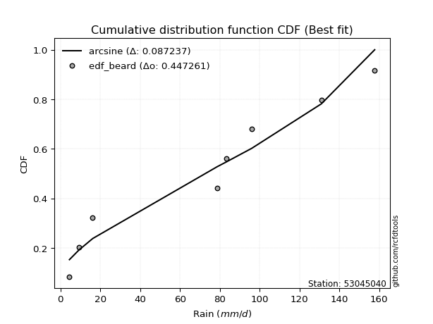</img></img>

</div>


### 5. EDF Chegodayev (1955)

The Chegodayev formula is an empirical plotting position formula used in hydrological frequency analysis to estimate the exceedance probability or return period of a specific event from a set of observed data. It is primarily used for plotting observed data points on probability paper to fit a theoretical distribution, particularly for analyzing extreme events like maximum flood flows or rainfall intensities. The constant _b_ value in the generalized plotting position formula is 0.3.

<div align="center">


$P=(m-b)/(n+1-2b)$


</div>


**5.1. Empirical values**

<div align="center">

|                | 0                   | 1                   | 2                   | 3              | 4                  | 5                  | 6                  |
|:---------------|:--------------------|:--------------------|:--------------------|:---------------|:-------------------|:-------------------|:-------------------|
| date           | 2020                | 2016                | 2023                | 2017           | 2022               | 2018               | 2019               |
| x              | 4.5                 | 9.3                 | 78.7                | 83.4           | 96.0               | 131.0              | 157.8              |
| m              | 1                   | 2                   | 3                   | 4              | 5                  | 6                  | 7                  |
| empirical_dist | edf_chegodayev      | edf_chegodayev      | edf_chegodayev      | edf_chegodayev | edf_chegodayev     | edf_chegodayev     | edf_chegodayev     |
| empirical      | 0.09459459459459459 | 0.22972972972972971 | 0.36486486486486486 | 0.5            | 0.6351351351351351 | 0.7702702702702703 | 0.9054054054054054 |
| empirical_tr   | 1.1044776119402986  | 1.2982456140350878  | 1.574468085106383   | 2.0            | 2.7407407407407405 | 4.352941176470589  | 10.571428571428568 |

</div>


**5.2. Kolmogorov-Smirnov fit test (sorted by Δ)**


<div align="center">

|                | 0                   | 1                   | 2                   | 3                   | 4                   | 5                   | 6                   | 7                   | 8                   | 9                   | 10                  | 11                  | 12                  | 13                  | 14                  | 15                  | 16                  | 17                  | 18                  | 19                  | 20                  | 21                  | 22                  | 23                  | 24                  | 25                    | 26                  | 27                  | 28                  | 29                  | 30                  | 31                  | 32                  | 33                  | 34                  | 35                  | 36                  | 37                  | 38                  | 39                  | 40                  | 41                  | 42                  | 43                  | 44                  | 45                  | 46                  | 47                  | 48                  | 49                  | 50                  | 51                  | 52                  | 53                  | 54                  | 55                  | 56                  | 57                  | 58                  | 59                  | 60                  | 61                  | 62                  | 63                  | 64                  | 65                  | 66                  | 67                  | 68                  | 69                  | 70                  | 71                  | 72                  | 73                  | 74                  | 75                  | 76                  | 77                  | 78                  | 79                  | 80                  | 81                  | 82                  | 83                  | 84                  | 85                  | 86                  | 87                  |
|:---------------|:--------------------|:--------------------|:--------------------|:--------------------|:--------------------|:--------------------|:--------------------|:--------------------|:--------------------|:--------------------|:--------------------|:--------------------|:--------------------|:--------------------|:--------------------|:--------------------|:--------------------|:--------------------|:--------------------|:--------------------|:--------------------|:--------------------|:--------------------|:--------------------|:--------------------|:----------------------|:--------------------|:--------------------|:--------------------|:--------------------|:--------------------|:--------------------|:--------------------|:--------------------|:--------------------|:--------------------|:--------------------|:--------------------|:--------------------|:--------------------|:--------------------|:--------------------|:--------------------|:--------------------|:--------------------|:--------------------|:--------------------|:--------------------|:--------------------|:--------------------|:--------------------|:--------------------|:--------------------|:--------------------|:--------------------|:--------------------|:--------------------|:--------------------|:--------------------|:--------------------|:--------------------|:--------------------|:--------------------|:--------------------|:--------------------|:--------------------|:--------------------|:--------------------|:--------------------|:--------------------|:--------------------|:--------------------|:--------------------|:--------------------|:--------------------|:--------------------|:--------------------|:--------------------|:--------------------|:--------------------|:--------------------|:--------------------|:--------------------|:--------------------|:--------------------|:--------------------|:--------------------|:--------------------|
| station        | 53045040            | 53045040            | 53045040            | 53045040            | 53045040            | 53045040            | 53045040            | 53045040            | 53045040            | 53045040            | 53045040            | 53045040            | 53045040            | 53045040            | 53045040            | 53045040            | 53045040            | 53045040            | 53045040            | 53045040            | 53045040            | 53045040            | 53045040            | 53045040            | 53045040            | 53045040              | 53045040            | 53045040            | 53045040            | 53045040            | 53045040            | 53045040            | 53045040            | 53045040            | 53045040            | 53045040            | 53045040            | 53045040            | 53045040            | 53045040            | 53045040            | 53045040            | 53045040            | 53045040            | 53045040            | 53045040            | 53045040            | 53045040            | 53045040            | 53045040            | 53045040            | 53045040            | 53045040            | 53045040            | 53045040            | 53045040            | 53045040            | 53045040            | 53045040            | 53045040            | 53045040            | 53045040            | 53045040            | 53045040            | 53045040            | 53045040            | 53045040            | 53045040            | 53045040            | 53045040            | 53045040            | 53045040            | 53045040            | 53045040            | 53045040            | 53045040            | 53045040            | 53045040            | 53045040            | 53045040            | 53045040            | 53045040            | 53045040            | 53045040            | 53045040            | 53045040            | 53045040            | 53045040            |
| empirical_dist | edf_chegodayev      | edf_chegodayev      | edf_chegodayev      | edf_chegodayev      | edf_chegodayev      | edf_chegodayev      | edf_chegodayev      | edf_chegodayev      | edf_chegodayev      | edf_chegodayev      | edf_chegodayev      | edf_chegodayev      | edf_chegodayev      | edf_chegodayev      | edf_chegodayev      | edf_chegodayev      | edf_chegodayev      | edf_chegodayev      | edf_chegodayev      | edf_chegodayev      | edf_chegodayev      | edf_chegodayev      | edf_chegodayev      | edf_chegodayev      | edf_chegodayev      | edf_chegodayev        | edf_chegodayev      | edf_chegodayev      | edf_chegodayev      | edf_chegodayev      | edf_chegodayev      | edf_chegodayev      | edf_chegodayev      | edf_chegodayev      | edf_chegodayev      | edf_chegodayev      | edf_chegodayev      | edf_chegodayev      | edf_chegodayev      | edf_chegodayev      | edf_chegodayev      | edf_chegodayev      | edf_chegodayev      | edf_chegodayev      | edf_chegodayev      | edf_chegodayev      | edf_chegodayev      | edf_chegodayev      | edf_chegodayev      | edf_chegodayev      | edf_chegodayev      | edf_chegodayev      | edf_chegodayev      | edf_chegodayev      | edf_chegodayev      | edf_chegodayev      | edf_chegodayev      | edf_chegodayev      | edf_chegodayev      | edf_chegodayev      | edf_chegodayev      | edf_chegodayev      | edf_chegodayev      | edf_chegodayev      | edf_chegodayev      | edf_chegodayev      | edf_chegodayev      | edf_chegodayev      | edf_chegodayev      | edf_chegodayev      | edf_chegodayev      | edf_chegodayev      | edf_chegodayev      | edf_chegodayev      | edf_chegodayev      | edf_chegodayev      | edf_chegodayev      | edf_chegodayev      | edf_chegodayev      | edf_chegodayev      | edf_chegodayev      | edf_chegodayev      | edf_chegodayev      | edf_chegodayev      | edf_chegodayev      | edf_chegodayev      | edf_chegodayev      | edf_chegodayev      |
| p_dist         | genlogistic         | johnsonsu           | gumbel_l            | laplace_asymmetric  | pearson3            | fisk                | exponnorm           | crystalball         | norm                | t                   | erlang              | gamma               | fatiguelife         | weibull_min         | logistic            | chi2                | hypsecant           | laplace             | rice                | maxwell             | invgamma            | rayleigh            | mielke              | invgauss            | gumbel_r            | loglaplace_asymmetric | logmielke           | logloggamma         | kstwobign           | moyal               | logfisk             | halfnorm            | halflogistic        | logpearson3         | logweibull_min      | loggumbel_l         | loggompertz         | expon               | genexpon            | logtruncnorm        | loginvweibull       | logf                | lognakagami         | logexponnorm        | logt                | lognorm             | lognorm             | logcrystalball      | lognct              | loggamma            | loggamma            | logfatiguelife      | logbetaprime        | logrice             | wald                | logerlang           | loginvgauss         | logalpha            | loginvgamma         | nakagami            | logncf              | loglogistic         | logmaxwell          | gibrat              | lograyleigh         | loghypsecant        | logkstwobign        | loggenexpon         | f                   | loghalfnorm         | nct                 | logexpon            | loggumbel_r         | loglaplace          | ncf                 | betaprime           | loghalflogistic     | logmoyal            | logjohnsonsu        | loglognorm          | logchi2             | logwald             | loggibrat           | invweibull          | alpha               | gompertz            | loggenlogistic      | truncnorm           |
| delta          | 0.12593402112816793 | 0.13002893515666347 | 0.13363293998230408 | 0.1356861710577399  | 0.13585627676236792 | 0.13809351866629152 | 0.13915857308274465 | 0.13915955227368543 | 0.13915955412220277 | 0.13916446085866238 | 0.13942497936583387 | 0.13995670716487443 | 0.14307717023412364 | 0.14765064276492262 | 0.1484815087373303  | 0.15114809141478353 | 0.1522000417689743  | 0.154281403487173   | 0.15778767685962938 | 0.15802729933404674 | 0.15874269576433792 | 0.16925934405423543 | 0.17272768134958988 | 0.18625339584192596 | 0.1945703574624777  | 0.1951437105382931    | 0.19568835186764216 | 0.19648761713297075 | 0.20154252635874143 | 0.22045416723479722 | 0.22869556732455482 | 0.22972972972972971 | 0.22972972972972971 | 0.2375648696067359  | 0.2380751108672477  | 0.23885459452604202 | 0.2585265414132741  | 0.2603796410657611  | 0.2632538498161739  | 0.2710326909111301  | 0.2816525252887186  | 0.28598535798800356 | 0.2861154663382222  | 0.2867918042506746  | 0.28679226152100995 | 0.2867929602888533  | 0.2867929602888533  | 0.28679298006840187 | 0.28707948866429295 | 0.2888239774190227  | 0.2888239774190227  | 0.28893095817234976 | 0.2897717218332195  | 0.2924482966605753  | 0.2924753983787178  | 0.2940146966255018  | 0.29467723211471036 | 0.2946910074629335  | 0.2947561463814254  | 0.29810814881690834 | 0.29954068596251354 | 0.3048773179471655  | 0.3082509183865148  | 0.3140704179006631  | 0.31469740061103063 | 0.31888716149337554 | 0.31926268782327233 | 0.3219499783663064  | 0.32360316585053245 | 0.3334672274016554  | 0.3350342610430999  | 0.33822118667407136 | 0.34650450563439733 | 0.3470236599378778  | 0.3497860829044707  | 0.35656865747126004 | 0.36155854283586214 | 0.36624695958694803 | 0.3711618494491271  | 0.39333657058846416 | 0.4131689334368774  | 0.4222410226577225  | 0.45444678405005307 | 0.47233507437154054 | 0.5266757200514962  | 0.6042748240621267  | 0.7702702702702703  | 0.8359738994109184  |
| deltao         | 0.48442053926100004 | 0.48442053926100004 | 0.48442053926100004 | 0.48442053926100004 | 0.48442053926100004 | 0.48442053926100004 | 0.48442053926100004 | 0.48442053926100004 | 0.48442053926100004 | 0.48442053926100004 | 0.48442053926100004 | 0.48442053926100004 | 0.48442053926100004 | 0.48442053926100004 | 0.48442053926100004 | 0.48442053926100004 | 0.48442053926100004 | 0.48442053926100004 | 0.48442053926100004 | 0.48442053926100004 | 0.48442053926100004 | 0.48442053926100004 | 0.48442053926100004 | 0.48442053926100004 | 0.48442053926100004 | 0.48442053926100004   | 0.48442053926100004 | 0.48442053926100004 | 0.48442053926100004 | 0.48442053926100004 | 0.48442053926100004 | 0.48442053926100004 | 0.48442053926100004 | 0.48442053926100004 | 0.48442053926100004 | 0.48442053926100004 | 0.48442053926100004 | 0.48442053926100004 | 0.48442053926100004 | 0.48442053926100004 | 0.48442053926100004 | 0.48442053926100004 | 0.48442053926100004 | 0.48442053926100004 | 0.48442053926100004 | 0.48442053926100004 | 0.48442053926100004 | 0.48442053926100004 | 0.48442053926100004 | 0.48442053926100004 | 0.48442053926100004 | 0.48442053926100004 | 0.48442053926100004 | 0.48442053926100004 | 0.48442053926100004 | 0.48442053926100004 | 0.48442053926100004 | 0.48442053926100004 | 0.48442053926100004 | 0.48442053926100004 | 0.48442053926100004 | 0.48442053926100004 | 0.48442053926100004 | 0.48442053926100004 | 0.48442053926100004 | 0.48442053926100004 | 0.48442053926100004 | 0.48442053926100004 | 0.48442053926100004 | 0.48442053926100004 | 0.48442053926100004 | 0.48442053926100004 | 0.48442053926100004 | 0.48442053926100004 | 0.48442053926100004 | 0.48442053926100004 | 0.48442053926100004 | 0.48442053926100004 | 0.48442053926100004 | 0.48442053926100004 | 0.48442053926100004 | 0.48442053926100004 | 0.48442053926100004 | 0.48442053926100004 | 0.48442053926100004 | 0.48442053926100004 | 0.48442053926100004 | 0.48442053926100004 |
| eval           | Δo > Δ              | Δo > Δ              | Δo > Δ              | Δo > Δ              | Δo > Δ              | Δo > Δ              | Δo > Δ              | Δo > Δ              | Δo > Δ              | Δo > Δ              | Δo > Δ              | Δo > Δ              | Δo > Δ              | Δo > Δ              | Δo > Δ              | Δo > Δ              | Δo > Δ              | Δo > Δ              | Δo > Δ              | Δo > Δ              | Δo > Δ              | Δo > Δ              | Δo > Δ              | Δo > Δ              | Δo > Δ              | Δo > Δ                | Δo > Δ              | Δo > Δ              | Δo > Δ              | Δo > Δ              | Δo > Δ              | Δo > Δ              | Δo > Δ              | Δo > Δ              | Δo > Δ              | Δo > Δ              | Δo > Δ              | Δo > Δ              | Δo > Δ              | Δo > Δ              | Δo > Δ              | Δo > Δ              | Δo > Δ              | Δo > Δ              | Δo > Δ              | Δo > Δ              | Δo > Δ              | Δo > Δ              | Δo > Δ              | Δo > Δ              | Δo > Δ              | Δo > Δ              | Δo > Δ              | Δo > Δ              | Δo > Δ              | Δo > Δ              | Δo > Δ              | Δo > Δ              | Δo > Δ              | Δo > Δ              | Δo > Δ              | Δo > Δ              | Δo > Δ              | Δo > Δ              | Δo > Δ              | Δo > Δ              | Δo > Δ              | Δo > Δ              | Δo > Δ              | Δo > Δ              | Δo > Δ              | Δo > Δ              | Δo > Δ              | Δo > Δ              | Δo > Δ              | Δo > Δ              | Δo > Δ              | Δo > Δ              | Δo > Δ              | Δo > Δ              | Δo > Δ              | Δo > Δ              | Δo > Δ              | Δo > Δ              | Δo <= Δ             | Δo <= Δ             | Δo <= Δ             | Δo <= Δ             |
| fit            | 1                   | 1                   | 1                   | 1                   | 1                   | 1                   | 1                   | 1                   | 1                   | 1                   | 1                   | 1                   | 1                   | 1                   | 1                   | 1                   | 1                   | 1                   | 1                   | 1                   | 1                   | 1                   | 1                   | 1                   | 1                   | 1                     | 1                   | 1                   | 1                   | 1                   | 1                   | 1                   | 1                   | 1                   | 1                   | 1                   | 1                   | 1                   | 1                   | 1                   | 1                   | 1                   | 1                   | 1                   | 1                   | 1                   | 1                   | 1                   | 1                   | 1                   | 1                   | 1                   | 1                   | 1                   | 1                   | 1                   | 1                   | 1                   | 1                   | 1                   | 1                   | 1                   | 1                   | 1                   | 1                   | 1                   | 1                   | 1                   | 1                   | 1                   | 1                   | 1                   | 1                   | 1                   | 1                   | 1                   | 1                   | 1                   | 1                   | 1                   | 1                   | 1                   | 1                   | 1                   | 0                   | 0                   | 0                   | 0                   |
| n              | 7                   | 7                   | 7                   | 7                   | 7                   | 7                   | 7                   | 7                   | 7                   | 7                   | 7                   | 7                   | 7                   | 7                   | 7                   | 7                   | 7                   | 7                   | 7                   | 7                   | 7                   | 7                   | 7                   | 7                   | 7                   | 7                     | 7                   | 7                   | 7                   | 7                   | 7                   | 7                   | 7                   | 7                   | 7                   | 7                   | 7                   | 7                   | 7                   | 7                   | 7                   | 7                   | 7                   | 7                   | 7                   | 7                   | 7                   | 7                   | 7                   | 7                   | 7                   | 7                   | 7                   | 7                   | 7                   | 7                   | 7                   | 7                   | 7                   | 7                   | 7                   | 7                   | 7                   | 7                   | 7                   | 7                   | 7                   | 7                   | 7                   | 7                   | 7                   | 7                   | 7                   | 7                   | 7                   | 7                   | 7                   | 7                   | 7                   | 7                   | 7                   | 7                   | 7                   | 7                   | 7                   | 7                   | 7                   | 7                   |
| best_fit       | 1                   | 0                   | 0                   | 0                   | 0                   | 0                   | 0                   | 0                   | 0                   | 0                   | 0                   | 0                   | 0                   | 0                   | 0                   | 0                   | 0                   | 0                   | 0                   | 0                   | 0                   | 0                   | 0                   | 0                   | 0                   | 0                     | 0                   | 0                   | 0                   | 0                   | 0                   | 0                   | 0                   | 0                   | 0                   | 0                   | 0                   | 0                   | 0                   | 0                   | 0                   | 0                   | 0                   | 0                   | 0                   | 0                   | 0                   | 0                   | 0                   | 0                   | 0                   | 0                   | 0                   | 0                   | 0                   | 0                   | 0                   | 0                   | 0                   | 0                   | 0                   | 0                   | 0                   | 0                   | 0                   | 0                   | 0                   | 0                   | 0                   | 0                   | 0                   | 0                   | 0                   | 0                   | 0                   | 0                   | 0                   | 0                   | 0                   | 0                   | 0                   | 0                   | 0                   | 0                   | 0                   | 0                   | 0                   | 0                   |
| best_fit_sort  | 1                   | 2                   | 3                   | 4                   | 5                   | 6                   | 7                   | 8                   | 9                   | 10                  | 11                  | 12                  | 13                  | 14                  | 15                  | 16                  | 17                  | 18                  | 19                  | 20                  | 21                  | 22                  | 23                  | 24                  | 25                  | 26                    | 27                  | 28                  | 29                  | 30                  | 31                  | 32                  | 33                  | 34                  | 35                  | 36                  | 37                  | 38                  | 39                  | 40                  | 41                  | 42                  | 43                  | 44                  | 45                  | 46                  | 47                  | 48                  | 49                  | 50                  | 51                  | 52                  | 53                  | 54                  | 55                  | 56                  | 57                  | 58                  | 59                  | 60                  | 61                  | 62                  | 63                  | 64                  | 65                  | 66                  | 67                  | 68                  | 69                  | 70                  | 71                  | 72                  | 73                  | 74                  | 75                  | 76                  | 77                  | 78                  | 79                  | 80                  | 81                  | 82                  | 83                  | 84                  | 85                  | 86                  | 87                  | 88                  |

</div>


**5.3. Best fit**

<div align="center">

|   id |   station | empirical_dist   | p_dist      |    delta |   deltao | eval   |   fit |   n |   best_fit |   best_fit_sort |
|-----:|----------:|:-----------------|:------------|---------:|---------:|:-------|------:|----:|-----------:|----------------:|
|    0 |  53045040 | edf_chegodayev   | genlogistic | 0.125934 | 0.484421 | Δo > Δ |     1 |   7 |          1 |               1 |

</div>


<div align="center">

</img></img>

</div>


### 6. EDF Blom (1958)

The Blom formula is a specific "plotting position" formula used in hydrology and statistical analysis to estimate the empirical cumulative probability (or non-exceedance probability) of a data series. It is particularly recommended for data that are approximately normally distributed. The constant _a_ is set to 0.375 (or 3/8).

<div align="center">


$P=(m-a)/(n+1-2a)$


</div>


**6.1. Empirical values**

<div align="center">

|                | 0                   | 1                   | 2                  | 3        | 4                  | 5                  | 6                  |
|:---------------|:--------------------|:--------------------|:-------------------|:---------|:-------------------|:-------------------|:-------------------|
| date           | 2020                | 2016                | 2023               | 2017     | 2022               | 2018               | 2019               |
| x              | 4.5                 | 9.3                 | 78.7               | 83.4     | 96.0               | 131.0              | 157.8              |
| m              | 1                   | 2                   | 3                  | 4        | 5                  | 6                  | 7                  |
| empirical_dist | edf_blom            | edf_blom            | edf_blom           | edf_blom | edf_blom           | edf_blom           | edf_blom           |
| empirical      | 0.08620689655172414 | 0.22413793103448276 | 0.3620689655172414 | 0.5      | 0.6379310344827587 | 0.7758620689655172 | 0.9137931034482759 |
| empirical_tr   | 1.0943396226415094  | 1.288888888888889   | 1.5675675675675675 | 2.0      | 2.7619047619047623 | 4.461538461538462  | 11.600000000000007 |

</div>


**6.2. Kolmogorov-Smirnov fit test (sorted by Δ)**


<div align="center">

|                | 0                   | 1                   | 2                   | 3                   | 4                   | 5                   | 6                   | 7                   | 8                   | 9                   | 10                  | 11                  | 12                  | 13                  | 14                  | 15                  | 16                  | 17                  | 18                  | 19                  | 20                  | 21                  | 22                  | 23                  | 24                  | 25                    | 26                  | 27                  | 28                  | 29                  | 30                  | 31                  | 32                  | 33                  | 34                  | 35                  | 36                  | 37                  | 38                  | 39                  | 40                  | 41                  | 42                  | 43                  | 44                  | 45                  | 46                  | 47                  | 48                  | 49                  | 50                  | 51                  | 52                  | 53                  | 54                  | 55                  | 56                  | 57                  | 58                  | 59                  | 60                  | 61                  | 62                  | 63                  | 64                  | 65                  | 66                  | 67                  | 68                  | 69                  | 70                  | 71                  | 72                  | 73                  | 74                  | 75                  | 76                  | 77                  | 78                  | 79                  | 80                  | 81                  | 82                  | 83                  | 84                  | 85                  | 86                  | 87                  |
|:---------------|:--------------------|:--------------------|:--------------------|:--------------------|:--------------------|:--------------------|:--------------------|:--------------------|:--------------------|:--------------------|:--------------------|:--------------------|:--------------------|:--------------------|:--------------------|:--------------------|:--------------------|:--------------------|:--------------------|:--------------------|:--------------------|:--------------------|:--------------------|:--------------------|:--------------------|:----------------------|:--------------------|:--------------------|:--------------------|:--------------------|:--------------------|:--------------------|:--------------------|:--------------------|:--------------------|:--------------------|:--------------------|:--------------------|:--------------------|:--------------------|:--------------------|:--------------------|:--------------------|:--------------------|:--------------------|:--------------------|:--------------------|:--------------------|:--------------------|:--------------------|:--------------------|:--------------------|:--------------------|:--------------------|:--------------------|:--------------------|:--------------------|:--------------------|:--------------------|:--------------------|:--------------------|:--------------------|:--------------------|:--------------------|:--------------------|:--------------------|:--------------------|:--------------------|:--------------------|:--------------------|:--------------------|:--------------------|:--------------------|:--------------------|:--------------------|:--------------------|:--------------------|:--------------------|:--------------------|:--------------------|:--------------------|:--------------------|:--------------------|:--------------------|:--------------------|:--------------------|:--------------------|:--------------------|
| station        | 53045040            | 53045040            | 53045040            | 53045040            | 53045040            | 53045040            | 53045040            | 53045040            | 53045040            | 53045040            | 53045040            | 53045040            | 53045040            | 53045040            | 53045040            | 53045040            | 53045040            | 53045040            | 53045040            | 53045040            | 53045040            | 53045040            | 53045040            | 53045040            | 53045040            | 53045040              | 53045040            | 53045040            | 53045040            | 53045040            | 53045040            | 53045040            | 53045040            | 53045040            | 53045040            | 53045040            | 53045040            | 53045040            | 53045040            | 53045040            | 53045040            | 53045040            | 53045040            | 53045040            | 53045040            | 53045040            | 53045040            | 53045040            | 53045040            | 53045040            | 53045040            | 53045040            | 53045040            | 53045040            | 53045040            | 53045040            | 53045040            | 53045040            | 53045040            | 53045040            | 53045040            | 53045040            | 53045040            | 53045040            | 53045040            | 53045040            | 53045040            | 53045040            | 53045040            | 53045040            | 53045040            | 53045040            | 53045040            | 53045040            | 53045040            | 53045040            | 53045040            | 53045040            | 53045040            | 53045040            | 53045040            | 53045040            | 53045040            | 53045040            | 53045040            | 53045040            | 53045040            | 53045040            |
| empirical_dist | edf_blom            | edf_blom            | edf_blom            | edf_blom            | edf_blom            | edf_blom            | edf_blom            | edf_blom            | edf_blom            | edf_blom            | edf_blom            | edf_blom            | edf_blom            | edf_blom            | edf_blom            | edf_blom            | edf_blom            | edf_blom            | edf_blom            | edf_blom            | edf_blom            | edf_blom            | edf_blom            | edf_blom            | edf_blom            | edf_blom              | edf_blom            | edf_blom            | edf_blom            | edf_blom            | edf_blom            | edf_blom            | edf_blom            | edf_blom            | edf_blom            | edf_blom            | edf_blom            | edf_blom            | edf_blom            | edf_blom            | edf_blom            | edf_blom            | edf_blom            | edf_blom            | edf_blom            | edf_blom            | edf_blom            | edf_blom            | edf_blom            | edf_blom            | edf_blom            | edf_blom            | edf_blom            | edf_blom            | edf_blom            | edf_blom            | edf_blom            | edf_blom            | edf_blom            | edf_blom            | edf_blom            | edf_blom            | edf_blom            | edf_blom            | edf_blom            | edf_blom            | edf_blom            | edf_blom            | edf_blom            | edf_blom            | edf_blom            | edf_blom            | edf_blom            | edf_blom            | edf_blom            | edf_blom            | edf_blom            | edf_blom            | edf_blom            | edf_blom            | edf_blom            | edf_blom            | edf_blom            | edf_blom            | edf_blom            | edf_blom            | edf_blom            | edf_blom            |
| p_dist         | genlogistic         | johnsonsu           | gumbel_l            | laplace_asymmetric  | pearson3            | fisk                | exponnorm           | crystalball         | norm                | t                   | gamma               | erlang              | fatiguelife         | weibull_min         | logistic            | hypsecant           | laplace             | rice                | chi2                | maxwell             | invgamma            | rayleigh            | mielke              | invgauss            | gumbel_r            | loglaplace_asymmetric | logmielke           | logloggamma         | kstwobign           | moyal               | halfnorm            | halflogistic        | logfisk             | logpearson3         | logweibull_min      | loggumbel_l         | loggompertz         | expon               | genexpon            | logtruncnorm        | loginvweibull       | logf                | lognakagami         | logexponnorm        | logt                | lognorm             | lognorm             | logcrystalball      | lognct              | loggamma            | loggamma            | logfatiguelife      | logbetaprime        | logrice             | wald                | logerlang           | loginvgauss         | logalpha            | loginvgamma         | nakagami            | logncf              | loglogistic         | logmaxwell          | gibrat              | lograyleigh         | loghypsecant        | logkstwobign        | loggenexpon         | f                   | loghalfnorm         | nct                 | logexpon            | loggumbel_r         | loglaplace          | ncf                 | betaprime           | loghalflogistic     | logmoyal            | logjohnsonsu        | loglognorm          | logchi2             | logwald             | loggibrat           | invweibull          | alpha               | gompertz            | loggenlogistic      | truncnorm           |
| delta          | 0.12034222243292096 | 0.12443713646141652 | 0.12804114128705713 | 0.13009437236249294 | 0.13026447806712096 | 0.13250171997104457 | 0.1335667743874977  | 0.13356775357843848 | 0.13356775542695581 | 0.13357266216341543 | 0.13436490846962748 | 0.13489138529311528 | 0.13844654995987843 | 0.14205884406967567 | 0.14288971004208334 | 0.14660824307372736 | 0.14868960479192606 | 0.15219587816438243 | 0.153943990762407   | 0.16082319868167022 | 0.1615385951119614  | 0.1720552434018589  | 0.17552358069721335 | 0.18904929518954944 | 0.19736625681010117 | 0.19793960988591658   | 0.19848425121526564 | 0.19928351648059422 | 0.2043384257063649  | 0.2232500665824207  | 0.22413793103448276 | 0.2279418920445931  | 0.2314914666721783  | 0.24036076895435937 | 0.24087101021487117 | 0.2416504938736655  | 0.26132244076089756 | 0.2631755404133846  | 0.26604974916379737 | 0.27382859025875356 | 0.28444842463634207 | 0.28878125733562704 | 0.2889113656858457  | 0.28958770359829805 | 0.2895881608686334  | 0.2895888596364768  | 0.2895888596364768  | 0.28958887941602535 | 0.2898753880119164  | 0.2916198767666462  | 0.2916198767666462  | 0.29172685751997324 | 0.29256762118084295 | 0.2952441960081988  | 0.29527129772634125 | 0.29681059597312526 | 0.29747313146233384 | 0.29748690681055695 | 0.29755204572904886 | 0.3009040481645318  | 0.302336585310137   | 0.30767321729478897 | 0.3110468177341383  | 0.31686631724828657 | 0.3174932999586541  | 0.321683060840999   | 0.3220585871708958  | 0.3247458777139299  | 0.3263990651981559  | 0.3362631267492789  | 0.3378301603907234  | 0.34101708602169484 | 0.3493004049820208  | 0.3498195592855013  | 0.3525819822520942  | 0.3593645568188835  | 0.3643544421834856  | 0.3690428589345715  | 0.37675364814437406 | 0.3989283692837111  | 0.41596483278450086 | 0.425036922005346   | 0.45724268339767654 | 0.4807227724144111  | 0.5294716193991198  | 0.6070707234097503  | 0.7758620689655172  | 0.8443615974537888  |
| deltao         | 0.48442053926100004 | 0.48442053926100004 | 0.48442053926100004 | 0.48442053926100004 | 0.48442053926100004 | 0.48442053926100004 | 0.48442053926100004 | 0.48442053926100004 | 0.48442053926100004 | 0.48442053926100004 | 0.48442053926100004 | 0.48442053926100004 | 0.48442053926100004 | 0.48442053926100004 | 0.48442053926100004 | 0.48442053926100004 | 0.48442053926100004 | 0.48442053926100004 | 0.48442053926100004 | 0.48442053926100004 | 0.48442053926100004 | 0.48442053926100004 | 0.48442053926100004 | 0.48442053926100004 | 0.48442053926100004 | 0.48442053926100004   | 0.48442053926100004 | 0.48442053926100004 | 0.48442053926100004 | 0.48442053926100004 | 0.48442053926100004 | 0.48442053926100004 | 0.48442053926100004 | 0.48442053926100004 | 0.48442053926100004 | 0.48442053926100004 | 0.48442053926100004 | 0.48442053926100004 | 0.48442053926100004 | 0.48442053926100004 | 0.48442053926100004 | 0.48442053926100004 | 0.48442053926100004 | 0.48442053926100004 | 0.48442053926100004 | 0.48442053926100004 | 0.48442053926100004 | 0.48442053926100004 | 0.48442053926100004 | 0.48442053926100004 | 0.48442053926100004 | 0.48442053926100004 | 0.48442053926100004 | 0.48442053926100004 | 0.48442053926100004 | 0.48442053926100004 | 0.48442053926100004 | 0.48442053926100004 | 0.48442053926100004 | 0.48442053926100004 | 0.48442053926100004 | 0.48442053926100004 | 0.48442053926100004 | 0.48442053926100004 | 0.48442053926100004 | 0.48442053926100004 | 0.48442053926100004 | 0.48442053926100004 | 0.48442053926100004 | 0.48442053926100004 | 0.48442053926100004 | 0.48442053926100004 | 0.48442053926100004 | 0.48442053926100004 | 0.48442053926100004 | 0.48442053926100004 | 0.48442053926100004 | 0.48442053926100004 | 0.48442053926100004 | 0.48442053926100004 | 0.48442053926100004 | 0.48442053926100004 | 0.48442053926100004 | 0.48442053926100004 | 0.48442053926100004 | 0.48442053926100004 | 0.48442053926100004 | 0.48442053926100004 |
| eval           | Δo > Δ              | Δo > Δ              | Δo > Δ              | Δo > Δ              | Δo > Δ              | Δo > Δ              | Δo > Δ              | Δo > Δ              | Δo > Δ              | Δo > Δ              | Δo > Δ              | Δo > Δ              | Δo > Δ              | Δo > Δ              | Δo > Δ              | Δo > Δ              | Δo > Δ              | Δo > Δ              | Δo > Δ              | Δo > Δ              | Δo > Δ              | Δo > Δ              | Δo > Δ              | Δo > Δ              | Δo > Δ              | Δo > Δ                | Δo > Δ              | Δo > Δ              | Δo > Δ              | Δo > Δ              | Δo > Δ              | Δo > Δ              | Δo > Δ              | Δo > Δ              | Δo > Δ              | Δo > Δ              | Δo > Δ              | Δo > Δ              | Δo > Δ              | Δo > Δ              | Δo > Δ              | Δo > Δ              | Δo > Δ              | Δo > Δ              | Δo > Δ              | Δo > Δ              | Δo > Δ              | Δo > Δ              | Δo > Δ              | Δo > Δ              | Δo > Δ              | Δo > Δ              | Δo > Δ              | Δo > Δ              | Δo > Δ              | Δo > Δ              | Δo > Δ              | Δo > Δ              | Δo > Δ              | Δo > Δ              | Δo > Δ              | Δo > Δ              | Δo > Δ              | Δo > Δ              | Δo > Δ              | Δo > Δ              | Δo > Δ              | Δo > Δ              | Δo > Δ              | Δo > Δ              | Δo > Δ              | Δo > Δ              | Δo > Δ              | Δo > Δ              | Δo > Δ              | Δo > Δ              | Δo > Δ              | Δo > Δ              | Δo > Δ              | Δo > Δ              | Δo > Δ              | Δo > Δ              | Δo > Δ              | Δo > Δ              | Δo <= Δ             | Δo <= Δ             | Δo <= Δ             | Δo <= Δ             |
| fit            | 1                   | 1                   | 1                   | 1                   | 1                   | 1                   | 1                   | 1                   | 1                   | 1                   | 1                   | 1                   | 1                   | 1                   | 1                   | 1                   | 1                   | 1                   | 1                   | 1                   | 1                   | 1                   | 1                   | 1                   | 1                   | 1                     | 1                   | 1                   | 1                   | 1                   | 1                   | 1                   | 1                   | 1                   | 1                   | 1                   | 1                   | 1                   | 1                   | 1                   | 1                   | 1                   | 1                   | 1                   | 1                   | 1                   | 1                   | 1                   | 1                   | 1                   | 1                   | 1                   | 1                   | 1                   | 1                   | 1                   | 1                   | 1                   | 1                   | 1                   | 1                   | 1                   | 1                   | 1                   | 1                   | 1                   | 1                   | 1                   | 1                   | 1                   | 1                   | 1                   | 1                   | 1                   | 1                   | 1                   | 1                   | 1                   | 1                   | 1                   | 1                   | 1                   | 1                   | 1                   | 0                   | 0                   | 0                   | 0                   |
| n              | 7                   | 7                   | 7                   | 7                   | 7                   | 7                   | 7                   | 7                   | 7                   | 7                   | 7                   | 7                   | 7                   | 7                   | 7                   | 7                   | 7                   | 7                   | 7                   | 7                   | 7                   | 7                   | 7                   | 7                   | 7                   | 7                     | 7                   | 7                   | 7                   | 7                   | 7                   | 7                   | 7                   | 7                   | 7                   | 7                   | 7                   | 7                   | 7                   | 7                   | 7                   | 7                   | 7                   | 7                   | 7                   | 7                   | 7                   | 7                   | 7                   | 7                   | 7                   | 7                   | 7                   | 7                   | 7                   | 7                   | 7                   | 7                   | 7                   | 7                   | 7                   | 7                   | 7                   | 7                   | 7                   | 7                   | 7                   | 7                   | 7                   | 7                   | 7                   | 7                   | 7                   | 7                   | 7                   | 7                   | 7                   | 7                   | 7                   | 7                   | 7                   | 7                   | 7                   | 7                   | 7                   | 7                   | 7                   | 7                   |
| best_fit       | 1                   | 0                   | 0                   | 0                   | 0                   | 0                   | 0                   | 0                   | 0                   | 0                   | 0                   | 0                   | 0                   | 0                   | 0                   | 0                   | 0                   | 0                   | 0                   | 0                   | 0                   | 0                   | 0                   | 0                   | 0                   | 0                     | 0                   | 0                   | 0                   | 0                   | 0                   | 0                   | 0                   | 0                   | 0                   | 0                   | 0                   | 0                   | 0                   | 0                   | 0                   | 0                   | 0                   | 0                   | 0                   | 0                   | 0                   | 0                   | 0                   | 0                   | 0                   | 0                   | 0                   | 0                   | 0                   | 0                   | 0                   | 0                   | 0                   | 0                   | 0                   | 0                   | 0                   | 0                   | 0                   | 0                   | 0                   | 0                   | 0                   | 0                   | 0                   | 0                   | 0                   | 0                   | 0                   | 0                   | 0                   | 0                   | 0                   | 0                   | 0                   | 0                   | 0                   | 0                   | 0                   | 0                   | 0                   | 0                   |
| best_fit_sort  | 1                   | 2                   | 3                   | 4                   | 5                   | 6                   | 7                   | 8                   | 9                   | 10                  | 11                  | 12                  | 13                  | 14                  | 15                  | 16                  | 17                  | 18                  | 19                  | 20                  | 21                  | 22                  | 23                  | 24                  | 25                  | 26                    | 27                  | 28                  | 29                  | 30                  | 31                  | 32                  | 33                  | 34                  | 35                  | 36                  | 37                  | 38                  | 39                  | 40                  | 41                  | 42                  | 43                  | 44                  | 45                  | 46                  | 47                  | 48                  | 49                  | 50                  | 51                  | 52                  | 53                  | 54                  | 55                  | 56                  | 57                  | 58                  | 59                  | 60                  | 61                  | 62                  | 63                  | 64                  | 65                  | 66                  | 67                  | 68                  | 69                  | 70                  | 71                  | 72                  | 73                  | 74                  | 75                  | 76                  | 77                  | 78                  | 79                  | 80                  | 81                  | 82                  | 83                  | 84                  | 85                  | 86                  | 87                  | 88                  |

</div>


**6.3. Best fit**

<div align="center">

|   id |   station | empirical_dist   | p_dist      |    delta |   deltao | eval   |   fit |   n |   best_fit |   best_fit_sort |
|-----:|----------:|:-----------------|:------------|---------:|---------:|:-------|------:|----:|-----------:|----------------:|
|    0 |  53045040 | edf_blom         | genlogistic | 0.120342 | 0.484421 | Δo > Δ |     1 |   7 |          1 |               1 |

</div>


<div align="center">

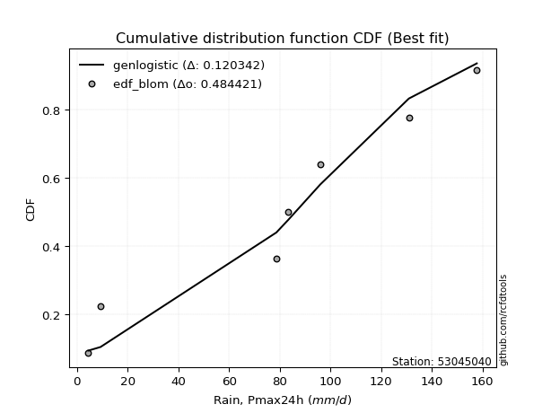</img></img>

</div>


### 7. EDF Tukey (1962)

In hydrology, the Tukey formula is used as a plotting position formula to estimate the empirical probability or frequency of a flood event (or other hydrological data). The formula parameter is given as _c=0.333_ (or 1/3).

<div align="center">


$P=(m-c)/(n+1-2c)$


</div>


**7.1. Empirical values**

<div align="center">

|                | 0                   | 1                   | 2                   | 3         | 4                  | 5                  | 6                  |
|:---------------|:--------------------|:--------------------|:--------------------|:----------|:-------------------|:-------------------|:-------------------|
| date           | 2020                | 2016                | 2023                | 2017      | 2022               | 2018               | 2019               |
| x              | 4.5                 | 9.3                 | 78.7                | 83.4      | 96.0               | 131.0              | 157.8              |
| m              | 1                   | 2                   | 3                   | 4         | 5                  | 6                  | 7                  |
| empirical_dist | edf_tukey           | edf_tukey           | edf_tukey           | edf_tukey | edf_tukey          | edf_tukey          | edf_tukey          |
| empirical      | 0.09090909090909091 | 0.22727272727272727 | 0.36363636363636365 | 0.5       | 0.6363636363636364 | 0.7727272727272727 | 0.9090909090909091 |
| empirical_tr   | 1.1                 | 1.2941176470588236  | 1.5714285714285714  | 2.0       | 2.75               | 4.3999999999999995 | 10.999999999999996 |

</div>


**7.2. Kolmogorov-Smirnov fit test (sorted by Δ)**


<div align="center">

|                | 0                   | 1                   | 2                   | 3                   | 4                   | 5                   | 6                   | 7                   | 8                   | 9                   | 10                  | 11                  | 12                  | 13                  | 14                  | 15                  | 16                  | 17                  | 18                  | 19                  | 20                  | 21                  | 22                  | 23                  | 24                  | 25                    | 26                  | 27                  | 28                  | 29                  | 30                  | 31                  | 32                  | 33                  | 34                  | 35                  | 36                  | 37                  | 38                  | 39                  | 40                  | 41                  | 42                  | 43                  | 44                  | 45                  | 46                  | 47                  | 48                  | 49                  | 50                  | 51                  | 52                  | 53                  | 54                  | 55                  | 56                  | 57                  | 58                  | 59                  | 60                  | 61                  | 62                  | 63                  | 64                  | 65                  | 66                  | 67                  | 68                  | 69                  | 70                  | 71                  | 72                  | 73                  | 74                  | 75                  | 76                  | 77                  | 78                  | 79                  | 80                  | 81                  | 82                  | 83                  | 84                  | 85                  | 86                  | 87                  |
|:---------------|:--------------------|:--------------------|:--------------------|:--------------------|:--------------------|:--------------------|:--------------------|:--------------------|:--------------------|:--------------------|:--------------------|:--------------------|:--------------------|:--------------------|:--------------------|:--------------------|:--------------------|:--------------------|:--------------------|:--------------------|:--------------------|:--------------------|:--------------------|:--------------------|:--------------------|:----------------------|:--------------------|:--------------------|:--------------------|:--------------------|:--------------------|:--------------------|:--------------------|:--------------------|:--------------------|:--------------------|:--------------------|:--------------------|:--------------------|:--------------------|:--------------------|:--------------------|:--------------------|:--------------------|:--------------------|:--------------------|:--------------------|:--------------------|:--------------------|:--------------------|:--------------------|:--------------------|:--------------------|:--------------------|:--------------------|:--------------------|:--------------------|:--------------------|:--------------------|:--------------------|:--------------------|:--------------------|:--------------------|:--------------------|:--------------------|:--------------------|:--------------------|:--------------------|:--------------------|:--------------------|:--------------------|:--------------------|:--------------------|:--------------------|:--------------------|:--------------------|:--------------------|:--------------------|:--------------------|:--------------------|:--------------------|:--------------------|:--------------------|:--------------------|:--------------------|:--------------------|:--------------------|:--------------------|
| station        | 53045040            | 53045040            | 53045040            | 53045040            | 53045040            | 53045040            | 53045040            | 53045040            | 53045040            | 53045040            | 53045040            | 53045040            | 53045040            | 53045040            | 53045040            | 53045040            | 53045040            | 53045040            | 53045040            | 53045040            | 53045040            | 53045040            | 53045040            | 53045040            | 53045040            | 53045040              | 53045040            | 53045040            | 53045040            | 53045040            | 53045040            | 53045040            | 53045040            | 53045040            | 53045040            | 53045040            | 53045040            | 53045040            | 53045040            | 53045040            | 53045040            | 53045040            | 53045040            | 53045040            | 53045040            | 53045040            | 53045040            | 53045040            | 53045040            | 53045040            | 53045040            | 53045040            | 53045040            | 53045040            | 53045040            | 53045040            | 53045040            | 53045040            | 53045040            | 53045040            | 53045040            | 53045040            | 53045040            | 53045040            | 53045040            | 53045040            | 53045040            | 53045040            | 53045040            | 53045040            | 53045040            | 53045040            | 53045040            | 53045040            | 53045040            | 53045040            | 53045040            | 53045040            | 53045040            | 53045040            | 53045040            | 53045040            | 53045040            | 53045040            | 53045040            | 53045040            | 53045040            | 53045040            |
| empirical_dist | edf_tukey           | edf_tukey           | edf_tukey           | edf_tukey           | edf_tukey           | edf_tukey           | edf_tukey           | edf_tukey           | edf_tukey           | edf_tukey           | edf_tukey           | edf_tukey           | edf_tukey           | edf_tukey           | edf_tukey           | edf_tukey           | edf_tukey           | edf_tukey           | edf_tukey           | edf_tukey           | edf_tukey           | edf_tukey           | edf_tukey           | edf_tukey           | edf_tukey           | edf_tukey             | edf_tukey           | edf_tukey           | edf_tukey           | edf_tukey           | edf_tukey           | edf_tukey           | edf_tukey           | edf_tukey           | edf_tukey           | edf_tukey           | edf_tukey           | edf_tukey           | edf_tukey           | edf_tukey           | edf_tukey           | edf_tukey           | edf_tukey           | edf_tukey           | edf_tukey           | edf_tukey           | edf_tukey           | edf_tukey           | edf_tukey           | edf_tukey           | edf_tukey           | edf_tukey           | edf_tukey           | edf_tukey           | edf_tukey           | edf_tukey           | edf_tukey           | edf_tukey           | edf_tukey           | edf_tukey           | edf_tukey           | edf_tukey           | edf_tukey           | edf_tukey           | edf_tukey           | edf_tukey           | edf_tukey           | edf_tukey           | edf_tukey           | edf_tukey           | edf_tukey           | edf_tukey           | edf_tukey           | edf_tukey           | edf_tukey           | edf_tukey           | edf_tukey           | edf_tukey           | edf_tukey           | edf_tukey           | edf_tukey           | edf_tukey           | edf_tukey           | edf_tukey           | edf_tukey           | edf_tukey           | edf_tukey           | edf_tukey           |
| p_dist         | genlogistic         | johnsonsu           | gumbel_l            | laplace_asymmetric  | pearson3            | fisk                | exponnorm           | crystalball         | norm                | t                   | erlang              | gamma               | fatiguelife         | weibull_min         | logistic            | hypsecant           | laplace             | chi2                | rice                | maxwell             | invgamma            | rayleigh            | mielke              | invgauss            | gumbel_r            | loglaplace_asymmetric | logmielke           | logloggamma         | kstwobign           | moyal               | halflogistic        | halfnorm            | logfisk             | logpearson3         | logweibull_min      | loggumbel_l         | loggompertz         | expon               | genexpon            | logtruncnorm        | loginvweibull       | logf                | lognakagami         | logexponnorm        | logt                | lognorm             | lognorm             | logcrystalball      | lognct              | loggamma            | loggamma            | logfatiguelife      | logbetaprime        | logrice             | wald                | logerlang           | loginvgauss         | logalpha            | loginvgamma         | nakagami            | logncf              | loglogistic         | logmaxwell          | gibrat              | lograyleigh         | loghypsecant        | logkstwobign        | loggenexpon         | f                   | loghalfnorm         | nct                 | logexpon            | loggumbel_r         | loglaplace          | ncf                 | betaprime           | loghalflogistic     | logmoyal            | logjohnsonsu        | loglognorm          | logchi2             | logwald             | loggibrat           | invweibull          | alpha               | gompertz            | loggenlogistic      | truncnorm           |
| delta          | 0.12347701867116546 | 0.12757193269966102 | 0.13117593752530163 | 0.13322916860073747 | 0.13339927430536547 | 0.13563651620928907 | 0.1367015706257422  | 0.13670254981668298 | 0.13670255166520032 | 0.13670745840165993 | 0.1369679769088314  | 0.13749970470787198 | 0.1406201677771212  | 0.14519364030792017 | 0.14602450628032784 | 0.14974303931197186 | 0.15182440103017056 | 0.15237659264328474 | 0.15533067440262693 | 0.15925580056254796 | 0.15997119699283913 | 0.17048784528273664 | 0.1739561825780911  | 0.18748189707042717 | 0.1957988586909789  | 0.1963722117667943    | 0.19691685309614337 | 0.19771611836147196 | 0.20277102758724264 | 0.22168266846329843 | 0.22727272727272727 | 0.22727272727272727 | 0.22992406855305603 | 0.2387933708352371  | 0.2393036120957489  | 0.24008309575454323 | 0.2597550426417753  | 0.2616081422942623  | 0.2644823510446751  | 0.2722611921396313  | 0.2828810265172198  | 0.2872138592165048  | 0.2873439675667234  | 0.2880203054791758  | 0.28802076274951116 | 0.2880214615173545  | 0.2880214615173545  | 0.2880214812969031  | 0.28830798989279416 | 0.2900524786475239  | 0.2900524786475239  | 0.29015945940085097 | 0.2910002230617207  | 0.2936767978890765  | 0.293703899607219   | 0.295243197854003   | 0.2959057333432116  | 0.2959195086914347  | 0.2959846476099266  | 0.29933665004540955 | 0.30076918719101475 | 0.3061058191756667  | 0.309479419615016   | 0.3152989191291643  | 0.31592590183953184 | 0.32011566272187675 | 0.32049118905177354 | 0.3231784795948076  | 0.32483166707903366 | 0.3346957286301566  | 0.3362627622716011  | 0.33944968790257257 | 0.34773300686289854 | 0.348252161166379   | 0.35101458413297193 | 0.35779715869976125 | 0.36278704406436335 | 0.36747546081544924 | 0.37361885190612953 | 0.3957935730454666  | 0.4143974346653786  | 0.4234695238862237  | 0.4556752852785543  | 0.47602057805704423 | 0.5279042212799975  | 0.605503325290628   | 0.7727272727272727  | 0.8396594030964221  |
| deltao         | 0.48442053926100004 | 0.48442053926100004 | 0.48442053926100004 | 0.48442053926100004 | 0.48442053926100004 | 0.48442053926100004 | 0.48442053926100004 | 0.48442053926100004 | 0.48442053926100004 | 0.48442053926100004 | 0.48442053926100004 | 0.48442053926100004 | 0.48442053926100004 | 0.48442053926100004 | 0.48442053926100004 | 0.48442053926100004 | 0.48442053926100004 | 0.48442053926100004 | 0.48442053926100004 | 0.48442053926100004 | 0.48442053926100004 | 0.48442053926100004 | 0.48442053926100004 | 0.48442053926100004 | 0.48442053926100004 | 0.48442053926100004   | 0.48442053926100004 | 0.48442053926100004 | 0.48442053926100004 | 0.48442053926100004 | 0.48442053926100004 | 0.48442053926100004 | 0.48442053926100004 | 0.48442053926100004 | 0.48442053926100004 | 0.48442053926100004 | 0.48442053926100004 | 0.48442053926100004 | 0.48442053926100004 | 0.48442053926100004 | 0.48442053926100004 | 0.48442053926100004 | 0.48442053926100004 | 0.48442053926100004 | 0.48442053926100004 | 0.48442053926100004 | 0.48442053926100004 | 0.48442053926100004 | 0.48442053926100004 | 0.48442053926100004 | 0.48442053926100004 | 0.48442053926100004 | 0.48442053926100004 | 0.48442053926100004 | 0.48442053926100004 | 0.48442053926100004 | 0.48442053926100004 | 0.48442053926100004 | 0.48442053926100004 | 0.48442053926100004 | 0.48442053926100004 | 0.48442053926100004 | 0.48442053926100004 | 0.48442053926100004 | 0.48442053926100004 | 0.48442053926100004 | 0.48442053926100004 | 0.48442053926100004 | 0.48442053926100004 | 0.48442053926100004 | 0.48442053926100004 | 0.48442053926100004 | 0.48442053926100004 | 0.48442053926100004 | 0.48442053926100004 | 0.48442053926100004 | 0.48442053926100004 | 0.48442053926100004 | 0.48442053926100004 | 0.48442053926100004 | 0.48442053926100004 | 0.48442053926100004 | 0.48442053926100004 | 0.48442053926100004 | 0.48442053926100004 | 0.48442053926100004 | 0.48442053926100004 | 0.48442053926100004 |
| eval           | Δo > Δ              | Δo > Δ              | Δo > Δ              | Δo > Δ              | Δo > Δ              | Δo > Δ              | Δo > Δ              | Δo > Δ              | Δo > Δ              | Δo > Δ              | Δo > Δ              | Δo > Δ              | Δo > Δ              | Δo > Δ              | Δo > Δ              | Δo > Δ              | Δo > Δ              | Δo > Δ              | Δo > Δ              | Δo > Δ              | Δo > Δ              | Δo > Δ              | Δo > Δ              | Δo > Δ              | Δo > Δ              | Δo > Δ                | Δo > Δ              | Δo > Δ              | Δo > Δ              | Δo > Δ              | Δo > Δ              | Δo > Δ              | Δo > Δ              | Δo > Δ              | Δo > Δ              | Δo > Δ              | Δo > Δ              | Δo > Δ              | Δo > Δ              | Δo > Δ              | Δo > Δ              | Δo > Δ              | Δo > Δ              | Δo > Δ              | Δo > Δ              | Δo > Δ              | Δo > Δ              | Δo > Δ              | Δo > Δ              | Δo > Δ              | Δo > Δ              | Δo > Δ              | Δo > Δ              | Δo > Δ              | Δo > Δ              | Δo > Δ              | Δo > Δ              | Δo > Δ              | Δo > Δ              | Δo > Δ              | Δo > Δ              | Δo > Δ              | Δo > Δ              | Δo > Δ              | Δo > Δ              | Δo > Δ              | Δo > Δ              | Δo > Δ              | Δo > Δ              | Δo > Δ              | Δo > Δ              | Δo > Δ              | Δo > Δ              | Δo > Δ              | Δo > Δ              | Δo > Δ              | Δo > Δ              | Δo > Δ              | Δo > Δ              | Δo > Δ              | Δo > Δ              | Δo > Δ              | Δo > Δ              | Δo > Δ              | Δo <= Δ             | Δo <= Δ             | Δo <= Δ             | Δo <= Δ             |
| fit            | 1                   | 1                   | 1                   | 1                   | 1                   | 1                   | 1                   | 1                   | 1                   | 1                   | 1                   | 1                   | 1                   | 1                   | 1                   | 1                   | 1                   | 1                   | 1                   | 1                   | 1                   | 1                   | 1                   | 1                   | 1                   | 1                     | 1                   | 1                   | 1                   | 1                   | 1                   | 1                   | 1                   | 1                   | 1                   | 1                   | 1                   | 1                   | 1                   | 1                   | 1                   | 1                   | 1                   | 1                   | 1                   | 1                   | 1                   | 1                   | 1                   | 1                   | 1                   | 1                   | 1                   | 1                   | 1                   | 1                   | 1                   | 1                   | 1                   | 1                   | 1                   | 1                   | 1                   | 1                   | 1                   | 1                   | 1                   | 1                   | 1                   | 1                   | 1                   | 1                   | 1                   | 1                   | 1                   | 1                   | 1                   | 1                   | 1                   | 1                   | 1                   | 1                   | 1                   | 1                   | 0                   | 0                   | 0                   | 0                   |
| n              | 7                   | 7                   | 7                   | 7                   | 7                   | 7                   | 7                   | 7                   | 7                   | 7                   | 7                   | 7                   | 7                   | 7                   | 7                   | 7                   | 7                   | 7                   | 7                   | 7                   | 7                   | 7                   | 7                   | 7                   | 7                   | 7                     | 7                   | 7                   | 7                   | 7                   | 7                   | 7                   | 7                   | 7                   | 7                   | 7                   | 7                   | 7                   | 7                   | 7                   | 7                   | 7                   | 7                   | 7                   | 7                   | 7                   | 7                   | 7                   | 7                   | 7                   | 7                   | 7                   | 7                   | 7                   | 7                   | 7                   | 7                   | 7                   | 7                   | 7                   | 7                   | 7                   | 7                   | 7                   | 7                   | 7                   | 7                   | 7                   | 7                   | 7                   | 7                   | 7                   | 7                   | 7                   | 7                   | 7                   | 7                   | 7                   | 7                   | 7                   | 7                   | 7                   | 7                   | 7                   | 7                   | 7                   | 7                   | 7                   |
| best_fit       | 1                   | 0                   | 0                   | 0                   | 0                   | 0                   | 0                   | 0                   | 0                   | 0                   | 0                   | 0                   | 0                   | 0                   | 0                   | 0                   | 0                   | 0                   | 0                   | 0                   | 0                   | 0                   | 0                   | 0                   | 0                   | 0                     | 0                   | 0                   | 0                   | 0                   | 0                   | 0                   | 0                   | 0                   | 0                   | 0                   | 0                   | 0                   | 0                   | 0                   | 0                   | 0                   | 0                   | 0                   | 0                   | 0                   | 0                   | 0                   | 0                   | 0                   | 0                   | 0                   | 0                   | 0                   | 0                   | 0                   | 0                   | 0                   | 0                   | 0                   | 0                   | 0                   | 0                   | 0                   | 0                   | 0                   | 0                   | 0                   | 0                   | 0                   | 0                   | 0                   | 0                   | 0                   | 0                   | 0                   | 0                   | 0                   | 0                   | 0                   | 0                   | 0                   | 0                   | 0                   | 0                   | 0                   | 0                   | 0                   |
| best_fit_sort  | 1                   | 2                   | 3                   | 4                   | 5                   | 6                   | 7                   | 8                   | 9                   | 10                  | 11                  | 12                  | 13                  | 14                  | 15                  | 16                  | 17                  | 18                  | 19                  | 20                  | 21                  | 22                  | 23                  | 24                  | 25                  | 26                    | 27                  | 28                  | 29                  | 30                  | 31                  | 32                  | 33                  | 34                  | 35                  | 36                  | 37                  | 38                  | 39                  | 40                  | 41                  | 42                  | 43                  | 44                  | 45                  | 46                  | 47                  | 48                  | 49                  | 50                  | 51                  | 52                  | 53                  | 54                  | 55                  | 56                  | 57                  | 58                  | 59                  | 60                  | 61                  | 62                  | 63                  | 64                  | 65                  | 66                  | 67                  | 68                  | 69                  | 70                  | 71                  | 72                  | 73                  | 74                  | 75                  | 76                  | 77                  | 78                  | 79                  | 80                  | 81                  | 82                  | 83                  | 84                  | 85                  | 86                  | 87                  | 88                  |

</div>


**7.3. Best fit**

<div align="center">

|   id |   station | empirical_dist   | p_dist      |    delta |   deltao | eval   |   fit |   n |   best_fit |   best_fit_sort |
|-----:|----------:|:-----------------|:------------|---------:|---------:|:-------|------:|----:|-----------:|----------------:|
|    0 |  53045040 | edf_tukey        | genlogistic | 0.123477 | 0.484421 | Δo > Δ |     1 |   7 |          1 |               1 |

</div>


<div align="center">

</img>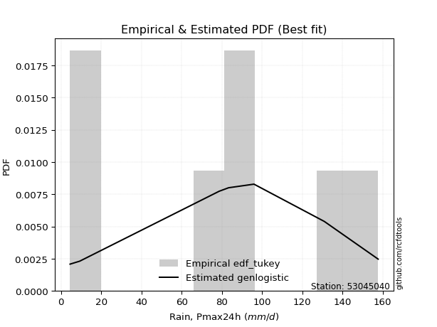</img>

</div>


### 8. EDF Gringorten (1963)

Gringorten plotting position formula is essential for estimating the probability and return periods of extreme events like floods and heavy rainfall. The constant _a=0.44_.

<div align="center">


$P=(m-a)/(n+1-2a)$


</div>


**8.1. Empirical values**

<div align="center">

|                | 0                   | 1                   | 2                  | 3              | 4                  | 5                  | 6                  |
|:---------------|:--------------------|:--------------------|:-------------------|:---------------|:-------------------|:-------------------|:-------------------|
| date           | 2020                | 2016                | 2023               | 2017           | 2022               | 2018               | 2019               |
| x              | 4.5                 | 9.3                 | 78.7               | 83.4           | 96.0               | 131.0              | 157.8              |
| m              | 1                   | 2                   | 3                  | 4              | 5                  | 6                  | 7                  |
| empirical_dist | edf_gringorten      | edf_gringorten      | edf_gringorten     | edf_gringorten | edf_gringorten     | edf_gringorten     | edf_gringorten     |
| empirical      | 0.07865168539325844 | 0.21910112359550563 | 0.3595505617977528 | 0.5            | 0.6404494382022471 | 0.7808988764044943 | 0.9213483146067415 |
| empirical_tr   | 1.0853658536585364  | 1.2805755395683454  | 1.5614035087719298 | 2.0            | 2.781249999999999  | 4.564102564102562  | 12.714285714285701 |

</div>


**8.2. Kolmogorov-Smirnov fit test (sorted by Δ)**


<div align="center">

|                | 0                   | 1                   | 2                   | 3                   | 4                   | 5                   | 6                   | 7                   | 8                   | 9                   | 10                  | 11                  | 12                  | 13                  | 14                  | 15                  | 16                  | 17                  | 18                  | 19                  | 20                  | 21                  | 22                  | 23                  | 24                  | 25                    | 26                  | 27                  | 28                  | 29                  | 30                  | 31                  | 32                  | 33                  | 34                  | 35                  | 36                  | 37                  | 38                  | 39                  | 40                  | 41                  | 42                  | 43                  | 44                  | 45                  | 46                  | 47                  | 48                  | 49                  | 50                  | 51                  | 52                  | 53                  | 54                  | 55                  | 56                  | 57                  | 58                  | 59                  | 60                  | 61                  | 62                  | 63                  | 64                  | 65                  | 66                  | 67                  | 68                  | 69                  | 70                  | 71                  | 72                  | 73                  | 74                  | 75                  | 76                  | 77                  | 78                  | 79                  | 80                  | 81                  | 82                  | 83                  | 84                  | 85                  | 86                  | 87                  |
|:---------------|:--------------------|:--------------------|:--------------------|:--------------------|:--------------------|:--------------------|:--------------------|:--------------------|:--------------------|:--------------------|:--------------------|:--------------------|:--------------------|:--------------------|:--------------------|:--------------------|:--------------------|:--------------------|:--------------------|:--------------------|:--------------------|:--------------------|:--------------------|:--------------------|:--------------------|:----------------------|:--------------------|:--------------------|:--------------------|:--------------------|:--------------------|:--------------------|:--------------------|:--------------------|:--------------------|:--------------------|:--------------------|:--------------------|:--------------------|:--------------------|:--------------------|:--------------------|:--------------------|:--------------------|:--------------------|:--------------------|:--------------------|:--------------------|:--------------------|:--------------------|:--------------------|:--------------------|:--------------------|:--------------------|:--------------------|:--------------------|:--------------------|:--------------------|:--------------------|:--------------------|:--------------------|:--------------------|:--------------------|:--------------------|:--------------------|:--------------------|:--------------------|:--------------------|:--------------------|:--------------------|:--------------------|:--------------------|:--------------------|:--------------------|:--------------------|:--------------------|:--------------------|:--------------------|:--------------------|:--------------------|:--------------------|:--------------------|:--------------------|:--------------------|:--------------------|:--------------------|:--------------------|:--------------------|
| station        | 53045040            | 53045040            | 53045040            | 53045040            | 53045040            | 53045040            | 53045040            | 53045040            | 53045040            | 53045040            | 53045040            | 53045040            | 53045040            | 53045040            | 53045040            | 53045040            | 53045040            | 53045040            | 53045040            | 53045040            | 53045040            | 53045040            | 53045040            | 53045040            | 53045040            | 53045040              | 53045040            | 53045040            | 53045040            | 53045040            | 53045040            | 53045040            | 53045040            | 53045040            | 53045040            | 53045040            | 53045040            | 53045040            | 53045040            | 53045040            | 53045040            | 53045040            | 53045040            | 53045040            | 53045040            | 53045040            | 53045040            | 53045040            | 53045040            | 53045040            | 53045040            | 53045040            | 53045040            | 53045040            | 53045040            | 53045040            | 53045040            | 53045040            | 53045040            | 53045040            | 53045040            | 53045040            | 53045040            | 53045040            | 53045040            | 53045040            | 53045040            | 53045040            | 53045040            | 53045040            | 53045040            | 53045040            | 53045040            | 53045040            | 53045040            | 53045040            | 53045040            | 53045040            | 53045040            | 53045040            | 53045040            | 53045040            | 53045040            | 53045040            | 53045040            | 53045040            | 53045040            | 53045040            |
| empirical_dist | edf_gringorten      | edf_gringorten      | edf_gringorten      | edf_gringorten      | edf_gringorten      | edf_gringorten      | edf_gringorten      | edf_gringorten      | edf_gringorten      | edf_gringorten      | edf_gringorten      | edf_gringorten      | edf_gringorten      | edf_gringorten      | edf_gringorten      | edf_gringorten      | edf_gringorten      | edf_gringorten      | edf_gringorten      | edf_gringorten      | edf_gringorten      | edf_gringorten      | edf_gringorten      | edf_gringorten      | edf_gringorten      | edf_gringorten        | edf_gringorten      | edf_gringorten      | edf_gringorten      | edf_gringorten      | edf_gringorten      | edf_gringorten      | edf_gringorten      | edf_gringorten      | edf_gringorten      | edf_gringorten      | edf_gringorten      | edf_gringorten      | edf_gringorten      | edf_gringorten      | edf_gringorten      | edf_gringorten      | edf_gringorten      | edf_gringorten      | edf_gringorten      | edf_gringorten      | edf_gringorten      | edf_gringorten      | edf_gringorten      | edf_gringorten      | edf_gringorten      | edf_gringorten      | edf_gringorten      | edf_gringorten      | edf_gringorten      | edf_gringorten      | edf_gringorten      | edf_gringorten      | edf_gringorten      | edf_gringorten      | edf_gringorten      | edf_gringorten      | edf_gringorten      | edf_gringorten      | edf_gringorten      | edf_gringorten      | edf_gringorten      | edf_gringorten      | edf_gringorten      | edf_gringorten      | edf_gringorten      | edf_gringorten      | edf_gringorten      | edf_gringorten      | edf_gringorten      | edf_gringorten      | edf_gringorten      | edf_gringorten      | edf_gringorten      | edf_gringorten      | edf_gringorten      | edf_gringorten      | edf_gringorten      | edf_gringorten      | edf_gringorten      | edf_gringorten      | edf_gringorten      | edf_gringorten      |
| p_dist         | genlogistic         | johnsonsu           | gumbel_l            | laplace_asymmetric  | pearson3            | fisk                | t                   | crystalball         | norm                | exponnorm           | gamma               | weibull_min         | erlang              | logistic            | fatiguelife         | hypsecant           | laplace             | rice                | chi2                | maxwell             | invgamma            | rayleigh            | mielke              | invgauss            | gumbel_r            | loglaplace_asymmetric | logmielke           | logloggamma         | kstwobign           | halfnorm            | moyal               | halflogistic        | logfisk             | logpearson3         | logweibull_min      | loggumbel_l         | loggompertz         | expon               | genexpon            | logtruncnorm        | loginvweibull       | logf                | lognakagami         | logexponnorm        | logt                | lognorm             | lognorm             | logcrystalball      | lognct              | loggamma            | loggamma            | logfatiguelife      | logbetaprime        | logrice             | wald                | logerlang           | loginvgauss         | logalpha            | loginvgamma         | nakagami            | logncf              | loglogistic         | logmaxwell          | gibrat              | lograyleigh         | loghypsecant        | logkstwobign        | loggenexpon         | f                   | loghalfnorm         | nct                 | logexpon            | loggumbel_r         | loglaplace          | ncf                 | betaprime           | loghalflogistic     | logmoyal            | logjohnsonsu        | loglognorm          | logchi2             | logwald             | loggibrat           | invweibull          | alpha               | gompertz            | loggenlogistic      | truncnorm           |
| delta          | 0.11530541499394382 | 0.11940032902243938 | 0.12300433384807999 | 0.12505756492351583 | 0.12522767062814383 | 0.12746491253206743 | 0.12989245804626393 | 0.12990149975443144 | 0.1299015010698134  | 0.12990298678441348 | 0.13651805836085218 | 0.13702203663069853 | 0.13740978901260387 | 0.1378529026031062  | 0.140964953679367   | 0.14157143563475022 | 0.14365279735294892 | 0.1513657048515057  | 0.15646239448189558 | 0.1633416024011588  | 0.16405699883144997 | 0.17457364712134749 | 0.17804198441670194 | 0.19156769890903802 | 0.19988466052958975 | 0.20045801360540516   | 0.20100265493475422 | 0.2018019202000828  | 0.20685682942585348 | 0.21910112359550563 | 0.22576847030190927 | 0.23046029576408167 | 0.23400987039166687 | 0.24287917267384795 | 0.24338941393435976 | 0.24416889759315408 | 0.26384084448038614 | 0.26569394413287317 | 0.26856815288328595 | 0.27634699397824214 | 0.28696682835583065 | 0.2912996610551156  | 0.29142976940533427 | 0.29210610731778663 | 0.292106564588122   | 0.2921072633559654  | 0.2921072633559654  | 0.29210728313551393 | 0.292393791731405   | 0.2941382804861348  | 0.2941382804861348  | 0.2942452612394618  | 0.29508602490033153 | 0.29776259972768737 | 0.29778970144582984 | 0.29932899969261384 | 0.2999915351818224  | 0.30000531053004553 | 0.30007044944853745 | 0.3034224518840204  | 0.3048549890296256  | 0.31019162101427755 | 0.31356522145362686 | 0.31938472096777515 | 0.3200117036781427  | 0.3242014645604876  | 0.3245769908903844  | 0.32726428143341846 | 0.3289174689176445  | 0.33878153046876747 | 0.34034856411021197 | 0.3435354897411834  | 0.3518188087015094  | 0.3523379630049899  | 0.3551003859715828  | 0.3618829605383721  | 0.3668728459029742  | 0.3715612626540601  | 0.3817904555833511  | 0.4039651767226883  | 0.41848323650398944 | 0.42755532572483457 | 0.4597610871171651  | 0.48827798357287666 | 0.5319900231186083  | 0.6095891271292387  | 0.7808988764044943  | 0.8519168086122546  |
| deltao         | 0.48442053926100004 | 0.48442053926100004 | 0.48442053926100004 | 0.48442053926100004 | 0.48442053926100004 | 0.48442053926100004 | 0.48442053926100004 | 0.48442053926100004 | 0.48442053926100004 | 0.48442053926100004 | 0.48442053926100004 | 0.48442053926100004 | 0.48442053926100004 | 0.48442053926100004 | 0.48442053926100004 | 0.48442053926100004 | 0.48442053926100004 | 0.48442053926100004 | 0.48442053926100004 | 0.48442053926100004 | 0.48442053926100004 | 0.48442053926100004 | 0.48442053926100004 | 0.48442053926100004 | 0.48442053926100004 | 0.48442053926100004   | 0.48442053926100004 | 0.48442053926100004 | 0.48442053926100004 | 0.48442053926100004 | 0.48442053926100004 | 0.48442053926100004 | 0.48442053926100004 | 0.48442053926100004 | 0.48442053926100004 | 0.48442053926100004 | 0.48442053926100004 | 0.48442053926100004 | 0.48442053926100004 | 0.48442053926100004 | 0.48442053926100004 | 0.48442053926100004 | 0.48442053926100004 | 0.48442053926100004 | 0.48442053926100004 | 0.48442053926100004 | 0.48442053926100004 | 0.48442053926100004 | 0.48442053926100004 | 0.48442053926100004 | 0.48442053926100004 | 0.48442053926100004 | 0.48442053926100004 | 0.48442053926100004 | 0.48442053926100004 | 0.48442053926100004 | 0.48442053926100004 | 0.48442053926100004 | 0.48442053926100004 | 0.48442053926100004 | 0.48442053926100004 | 0.48442053926100004 | 0.48442053926100004 | 0.48442053926100004 | 0.48442053926100004 | 0.48442053926100004 | 0.48442053926100004 | 0.48442053926100004 | 0.48442053926100004 | 0.48442053926100004 | 0.48442053926100004 | 0.48442053926100004 | 0.48442053926100004 | 0.48442053926100004 | 0.48442053926100004 | 0.48442053926100004 | 0.48442053926100004 | 0.48442053926100004 | 0.48442053926100004 | 0.48442053926100004 | 0.48442053926100004 | 0.48442053926100004 | 0.48442053926100004 | 0.48442053926100004 | 0.48442053926100004 | 0.48442053926100004 | 0.48442053926100004 | 0.48442053926100004 |
| eval           | Δo > Δ              | Δo > Δ              | Δo > Δ              | Δo > Δ              | Δo > Δ              | Δo > Δ              | Δo > Δ              | Δo > Δ              | Δo > Δ              | Δo > Δ              | Δo > Δ              | Δo > Δ              | Δo > Δ              | Δo > Δ              | Δo > Δ              | Δo > Δ              | Δo > Δ              | Δo > Δ              | Δo > Δ              | Δo > Δ              | Δo > Δ              | Δo > Δ              | Δo > Δ              | Δo > Δ              | Δo > Δ              | Δo > Δ                | Δo > Δ              | Δo > Δ              | Δo > Δ              | Δo > Δ              | Δo > Δ              | Δo > Δ              | Δo > Δ              | Δo > Δ              | Δo > Δ              | Δo > Δ              | Δo > Δ              | Δo > Δ              | Δo > Δ              | Δo > Δ              | Δo > Δ              | Δo > Δ              | Δo > Δ              | Δo > Δ              | Δo > Δ              | Δo > Δ              | Δo > Δ              | Δo > Δ              | Δo > Δ              | Δo > Δ              | Δo > Δ              | Δo > Δ              | Δo > Δ              | Δo > Δ              | Δo > Δ              | Δo > Δ              | Δo > Δ              | Δo > Δ              | Δo > Δ              | Δo > Δ              | Δo > Δ              | Δo > Δ              | Δo > Δ              | Δo > Δ              | Δo > Δ              | Δo > Δ              | Δo > Δ              | Δo > Δ              | Δo > Δ              | Δo > Δ              | Δo > Δ              | Δo > Δ              | Δo > Δ              | Δo > Δ              | Δo > Δ              | Δo > Δ              | Δo > Δ              | Δo > Δ              | Δo > Δ              | Δo > Δ              | Δo > Δ              | Δo > Δ              | Δo > Δ              | Δo <= Δ             | Δo <= Δ             | Δo <= Δ             | Δo <= Δ             | Δo <= Δ             |
| fit            | 1                   | 1                   | 1                   | 1                   | 1                   | 1                   | 1                   | 1                   | 1                   | 1                   | 1                   | 1                   | 1                   | 1                   | 1                   | 1                   | 1                   | 1                   | 1                   | 1                   | 1                   | 1                   | 1                   | 1                   | 1                   | 1                     | 1                   | 1                   | 1                   | 1                   | 1                   | 1                   | 1                   | 1                   | 1                   | 1                   | 1                   | 1                   | 1                   | 1                   | 1                   | 1                   | 1                   | 1                   | 1                   | 1                   | 1                   | 1                   | 1                   | 1                   | 1                   | 1                   | 1                   | 1                   | 1                   | 1                   | 1                   | 1                   | 1                   | 1                   | 1                   | 1                   | 1                   | 1                   | 1                   | 1                   | 1                   | 1                   | 1                   | 1                   | 1                   | 1                   | 1                   | 1                   | 1                   | 1                   | 1                   | 1                   | 1                   | 1                   | 1                   | 1                   | 1                   | 0                   | 0                   | 0                   | 0                   | 0                   |
| n              | 7                   | 7                   | 7                   | 7                   | 7                   | 7                   | 7                   | 7                   | 7                   | 7                   | 7                   | 7                   | 7                   | 7                   | 7                   | 7                   | 7                   | 7                   | 7                   | 7                   | 7                   | 7                   | 7                   | 7                   | 7                   | 7                     | 7                   | 7                   | 7                   | 7                   | 7                   | 7                   | 7                   | 7                   | 7                   | 7                   | 7                   | 7                   | 7                   | 7                   | 7                   | 7                   | 7                   | 7                   | 7                   | 7                   | 7                   | 7                   | 7                   | 7                   | 7                   | 7                   | 7                   | 7                   | 7                   | 7                   | 7                   | 7                   | 7                   | 7                   | 7                   | 7                   | 7                   | 7                   | 7                   | 7                   | 7                   | 7                   | 7                   | 7                   | 7                   | 7                   | 7                   | 7                   | 7                   | 7                   | 7                   | 7                   | 7                   | 7                   | 7                   | 7                   | 7                   | 7                   | 7                   | 7                   | 7                   | 7                   |
| best_fit       | 1                   | 0                   | 0                   | 0                   | 0                   | 0                   | 0                   | 0                   | 0                   | 0                   | 0                   | 0                   | 0                   | 0                   | 0                   | 0                   | 0                   | 0                   | 0                   | 0                   | 0                   | 0                   | 0                   | 0                   | 0                   | 0                     | 0                   | 0                   | 0                   | 0                   | 0                   | 0                   | 0                   | 0                   | 0                   | 0                   | 0                   | 0                   | 0                   | 0                   | 0                   | 0                   | 0                   | 0                   | 0                   | 0                   | 0                   | 0                   | 0                   | 0                   | 0                   | 0                   | 0                   | 0                   | 0                   | 0                   | 0                   | 0                   | 0                   | 0                   | 0                   | 0                   | 0                   | 0                   | 0                   | 0                   | 0                   | 0                   | 0                   | 0                   | 0                   | 0                   | 0                   | 0                   | 0                   | 0                   | 0                   | 0                   | 0                   | 0                   | 0                   | 0                   | 0                   | 0                   | 0                   | 0                   | 0                   | 0                   |
| best_fit_sort  | 1                   | 2                   | 3                   | 4                   | 5                   | 6                   | 7                   | 8                   | 9                   | 10                  | 11                  | 12                  | 13                  | 14                  | 15                  | 16                  | 17                  | 18                  | 19                  | 20                  | 21                  | 22                  | 23                  | 24                  | 25                  | 26                    | 27                  | 28                  | 29                  | 30                  | 31                  | 32                  | 33                  | 34                  | 35                  | 36                  | 37                  | 38                  | 39                  | 40                  | 41                  | 42                  | 43                  | 44                  | 45                  | 46                  | 47                  | 48                  | 49                  | 50                  | 51                  | 52                  | 53                  | 54                  | 55                  | 56                  | 57                  | 58                  | 59                  | 60                  | 61                  | 62                  | 63                  | 64                  | 65                  | 66                  | 67                  | 68                  | 69                  | 70                  | 71                  | 72                  | 73                  | 74                  | 75                  | 76                  | 77                  | 78                  | 79                  | 80                  | 81                  | 82                  | 83                  | 84                  | 85                  | 86                  | 87                  | 88                  |

</div>


**8.3. Best fit**

<div align="center">

|   id |   station | empirical_dist   | p_dist      |    delta |   deltao | eval   |   fit |   n |   best_fit |   best_fit_sort |
|-----:|----------:|:-----------------|:------------|---------:|---------:|:-------|------:|----:|-----------:|----------------:|
|    0 |  53045040 | edf_gringorten   | genlogistic | 0.115305 | 0.484421 | Δo > Δ |     1 |   7 |          1 |               1 |

</div>


<div align="center">

</img></img>

</div>


### 9. EDF Filliben (1975)

The specific values of the constants (0.3175) (often denoted as $alpha$) and (0.365) are derived from a method proposed by James J. Filliben in a 1975 paper. This particular formula is the mean value of the $i$-th order statistic of the normal distribution and is considered a robust and effective plotting position formula for the normal probability plot correlation coefficient test for normality.

<div align="center">


$P=(m-0.3175)/(n+0.365)$


</div>


**9.1. Empirical values**

<div align="center">

|                | 0                   | 1                   | 2                   | 3            | 4                  | 5                  | 6                  |
|:---------------|:--------------------|:--------------------|:--------------------|:-------------|:-------------------|:-------------------|:-------------------|
| date           | 2020                | 2016                | 2023                | 2017         | 2022               | 2018               | 2019               |
| x              | 4.5                 | 9.3                 | 78.7                | 83.4         | 96.0               | 131.0              | 157.8              |
| m              | 1                   | 2                   | 3                   | 4            | 5                  | 6                  | 7                  |
| empirical_dist | edf_filliben        | edf_filliben        | edf_filliben        | edf_filliben | edf_filliben       | edf_filliben       | edf_filliben       |
| empirical      | 0.09266802443991853 | 0.22844534962661237 | 0.36422267481330617 | 0.5          | 0.6357773251866938 | 0.7715546503733877 | 0.9073319755600815 |
| empirical_tr   | 1.1021324354657687  | 1.2960844698636163  | 1.5728777362520021  | 2.0          | 2.7455731593662627 | 4.377414561664191  | 10.791208791208794 |

</div>


**9.2. Kolmogorov-Smirnov fit test (sorted by Δ)**


<div align="center">

|                | 0                   | 1                   | 2                   | 3                   | 4                   | 5                   | 6                   | 7                   | 8                   | 9                   | 10                  | 11                  | 12                  | 13                  | 14                  | 15                  | 16                  | 17                  | 18                  | 19                  | 20                  | 21                  | 22                  | 23                  | 24                  | 25                    | 26                  | 27                  | 28                  | 29                  | 30                  | 31                  | 32                  | 33                  | 34                  | 35                  | 36                  | 37                  | 38                  | 39                  | 40                  | 41                  | 42                  | 43                  | 44                  | 45                  | 46                  | 47                  | 48                  | 49                  | 50                  | 51                  | 52                  | 53                  | 54                  | 55                  | 56                  | 57                  | 58                  | 59                  | 60                  | 61                  | 62                  | 63                  | 64                  | 65                  | 66                  | 67                  | 68                  | 69                  | 70                  | 71                  | 72                  | 73                  | 74                  | 75                  | 76                  | 77                  | 78                  | 79                  | 80                  | 81                  | 82                  | 83                  | 84                  | 85                  | 86                  | 87                  |
|:---------------|:--------------------|:--------------------|:--------------------|:--------------------|:--------------------|:--------------------|:--------------------|:--------------------|:--------------------|:--------------------|:--------------------|:--------------------|:--------------------|:--------------------|:--------------------|:--------------------|:--------------------|:--------------------|:--------------------|:--------------------|:--------------------|:--------------------|:--------------------|:--------------------|:--------------------|:----------------------|:--------------------|:--------------------|:--------------------|:--------------------|:--------------------|:--------------------|:--------------------|:--------------------|:--------------------|:--------------------|:--------------------|:--------------------|:--------------------|:--------------------|:--------------------|:--------------------|:--------------------|:--------------------|:--------------------|:--------------------|:--------------------|:--------------------|:--------------------|:--------------------|:--------------------|:--------------------|:--------------------|:--------------------|:--------------------|:--------------------|:--------------------|:--------------------|:--------------------|:--------------------|:--------------------|:--------------------|:--------------------|:--------------------|:--------------------|:--------------------|:--------------------|:--------------------|:--------------------|:--------------------|:--------------------|:--------------------|:--------------------|:--------------------|:--------------------|:--------------------|:--------------------|:--------------------|:--------------------|:--------------------|:--------------------|:--------------------|:--------------------|:--------------------|:--------------------|:--------------------|:--------------------|:--------------------|
| station        | 53045040            | 53045040            | 53045040            | 53045040            | 53045040            | 53045040            | 53045040            | 53045040            | 53045040            | 53045040            | 53045040            | 53045040            | 53045040            | 53045040            | 53045040            | 53045040            | 53045040            | 53045040            | 53045040            | 53045040            | 53045040            | 53045040            | 53045040            | 53045040            | 53045040            | 53045040              | 53045040            | 53045040            | 53045040            | 53045040            | 53045040            | 53045040            | 53045040            | 53045040            | 53045040            | 53045040            | 53045040            | 53045040            | 53045040            | 53045040            | 53045040            | 53045040            | 53045040            | 53045040            | 53045040            | 53045040            | 53045040            | 53045040            | 53045040            | 53045040            | 53045040            | 53045040            | 53045040            | 53045040            | 53045040            | 53045040            | 53045040            | 53045040            | 53045040            | 53045040            | 53045040            | 53045040            | 53045040            | 53045040            | 53045040            | 53045040            | 53045040            | 53045040            | 53045040            | 53045040            | 53045040            | 53045040            | 53045040            | 53045040            | 53045040            | 53045040            | 53045040            | 53045040            | 53045040            | 53045040            | 53045040            | 53045040            | 53045040            | 53045040            | 53045040            | 53045040            | 53045040            | 53045040            |
| empirical_dist | edf_filliben        | edf_filliben        | edf_filliben        | edf_filliben        | edf_filliben        | edf_filliben        | edf_filliben        | edf_filliben        | edf_filliben        | edf_filliben        | edf_filliben        | edf_filliben        | edf_filliben        | edf_filliben        | edf_filliben        | edf_filliben        | edf_filliben        | edf_filliben        | edf_filliben        | edf_filliben        | edf_filliben        | edf_filliben        | edf_filliben        | edf_filliben        | edf_filliben        | edf_filliben          | edf_filliben        | edf_filliben        | edf_filliben        | edf_filliben        | edf_filliben        | edf_filliben        | edf_filliben        | edf_filliben        | edf_filliben        | edf_filliben        | edf_filliben        | edf_filliben        | edf_filliben        | edf_filliben        | edf_filliben        | edf_filliben        | edf_filliben        | edf_filliben        | edf_filliben        | edf_filliben        | edf_filliben        | edf_filliben        | edf_filliben        | edf_filliben        | edf_filliben        | edf_filliben        | edf_filliben        | edf_filliben        | edf_filliben        | edf_filliben        | edf_filliben        | edf_filliben        | edf_filliben        | edf_filliben        | edf_filliben        | edf_filliben        | edf_filliben        | edf_filliben        | edf_filliben        | edf_filliben        | edf_filliben        | edf_filliben        | edf_filliben        | edf_filliben        | edf_filliben        | edf_filliben        | edf_filliben        | edf_filliben        | edf_filliben        | edf_filliben        | edf_filliben        | edf_filliben        | edf_filliben        | edf_filliben        | edf_filliben        | edf_filliben        | edf_filliben        | edf_filliben        | edf_filliben        | edf_filliben        | edf_filliben        | edf_filliben        |
| p_dist         | genlogistic         | johnsonsu           | gumbel_l            | laplace_asymmetric  | pearson3            | fisk                | exponnorm           | crystalball         | norm                | t                   | erlang              | gamma               | fatiguelife         | weibull_min         | logistic            | hypsecant           | chi2                | laplace             | rice                | maxwell             | invgamma            | rayleigh            | mielke              | invgauss            | gumbel_r            | loglaplace_asymmetric | logmielke           | logloggamma         | kstwobign           | moyal               | halflogistic        | halfnorm            | logfisk             | logpearson3         | logweibull_min      | loggumbel_l         | loggompertz         | expon               | genexpon            | logtruncnorm        | loginvweibull       | logf                | lognakagami         | logexponnorm        | logt                | lognorm             | lognorm             | logcrystalball      | lognct              | loggamma            | loggamma            | logfatiguelife      | logbetaprime        | logrice             | wald                | logerlang           | loginvgauss         | logalpha            | loginvgamma         | nakagami            | logncf              | loglogistic         | logmaxwell          | gibrat              | lograyleigh         | loghypsecant        | logkstwobign        | loggenexpon         | f                   | loghalfnorm         | nct                 | logexpon            | loggumbel_r         | loglaplace          | ncf                 | betaprime           | loghalflogistic     | logmoyal            | logjohnsonsu        | loglognorm          | logchi2             | logwald             | loggibrat           | invweibull          | alpha               | gompertz            | loggenlogistic      | truncnorm           |
| delta          | 0.12464964102505056 | 0.12874455505354612 | 0.13234855987918673 | 0.13440179095462257 | 0.13457189665925057 | 0.13680913856317417 | 0.1378741929796273  | 0.13787517217056808 | 0.13787517401908542 | 0.13788008075554503 | 0.1381405992627165  | 0.13867232706175708 | 0.1417927901310063  | 0.14636626266180527 | 0.14719712863421294 | 0.15091566166585696 | 0.15179028146634221 | 0.15299702338405566 | 0.15650329675651203 | 0.15866948938560543 | 0.1593848858158966  | 0.16990153410579412 | 0.17336987140114857 | 0.18689558589348465 | 0.19521254751403638 | 0.1957859005898518    | 0.19633054191920085 | 0.19712980718452944 | 0.2021847164103001  | 0.2210963572863559  | 0.22844534962661237 | 0.22844534962661237 | 0.2293377573761135  | 0.23820705965829458 | 0.23871730091880639 | 0.2394967845776007  | 0.25916873146483277 | 0.2610218311173198  | 0.2638960398677326  | 0.27167488096268877 | 0.2822947153402773  | 0.28662754803956225 | 0.2867576563897809  | 0.28743399430223326 | 0.28743445157256864 | 0.287435150340412   | 0.287435150340412   | 0.28743517011996056 | 0.28772167871585164 | 0.2894661674705814  | 0.2894661674705814  | 0.28957314822390845 | 0.29041391188477816 | 0.293090486712134   | 0.29311758843027647 | 0.29465688667706047 | 0.29531942216626905 | 0.29533319751449216 | 0.2953983364329841  | 0.298750338868467   | 0.30018287601407223 | 0.3055195079987242  | 0.3088931084380735  | 0.3147126079522218  | 0.3153395906625893  | 0.3195293515449342  | 0.319904877874831   | 0.3225921684178651  | 0.32424535590209114 | 0.3341094174532141  | 0.3356764510946586  | 0.33886337672563005 | 0.347146695685956   | 0.3476658499894365  | 0.3504282729560294  | 0.35721084752281873 | 0.36220073288742083 | 0.3668891496385067  | 0.3724462295522445  | 0.39462095069158154 | 0.4138111234884361  | 0.4228832127092812  | 0.45508897410161175 | 0.47426164452621666 | 0.527317910103055   | 0.6049170141136855  | 0.7715546503733877  | 0.8379004695655945  |
| deltao         | 0.48442053926100004 | 0.48442053926100004 | 0.48442053926100004 | 0.48442053926100004 | 0.48442053926100004 | 0.48442053926100004 | 0.48442053926100004 | 0.48442053926100004 | 0.48442053926100004 | 0.48442053926100004 | 0.48442053926100004 | 0.48442053926100004 | 0.48442053926100004 | 0.48442053926100004 | 0.48442053926100004 | 0.48442053926100004 | 0.48442053926100004 | 0.48442053926100004 | 0.48442053926100004 | 0.48442053926100004 | 0.48442053926100004 | 0.48442053926100004 | 0.48442053926100004 | 0.48442053926100004 | 0.48442053926100004 | 0.48442053926100004   | 0.48442053926100004 | 0.48442053926100004 | 0.48442053926100004 | 0.48442053926100004 | 0.48442053926100004 | 0.48442053926100004 | 0.48442053926100004 | 0.48442053926100004 | 0.48442053926100004 | 0.48442053926100004 | 0.48442053926100004 | 0.48442053926100004 | 0.48442053926100004 | 0.48442053926100004 | 0.48442053926100004 | 0.48442053926100004 | 0.48442053926100004 | 0.48442053926100004 | 0.48442053926100004 | 0.48442053926100004 | 0.48442053926100004 | 0.48442053926100004 | 0.48442053926100004 | 0.48442053926100004 | 0.48442053926100004 | 0.48442053926100004 | 0.48442053926100004 | 0.48442053926100004 | 0.48442053926100004 | 0.48442053926100004 | 0.48442053926100004 | 0.48442053926100004 | 0.48442053926100004 | 0.48442053926100004 | 0.48442053926100004 | 0.48442053926100004 | 0.48442053926100004 | 0.48442053926100004 | 0.48442053926100004 | 0.48442053926100004 | 0.48442053926100004 | 0.48442053926100004 | 0.48442053926100004 | 0.48442053926100004 | 0.48442053926100004 | 0.48442053926100004 | 0.48442053926100004 | 0.48442053926100004 | 0.48442053926100004 | 0.48442053926100004 | 0.48442053926100004 | 0.48442053926100004 | 0.48442053926100004 | 0.48442053926100004 | 0.48442053926100004 | 0.48442053926100004 | 0.48442053926100004 | 0.48442053926100004 | 0.48442053926100004 | 0.48442053926100004 | 0.48442053926100004 | 0.48442053926100004 |
| eval           | Δo > Δ              | Δo > Δ              | Δo > Δ              | Δo > Δ              | Δo > Δ              | Δo > Δ              | Δo > Δ              | Δo > Δ              | Δo > Δ              | Δo > Δ              | Δo > Δ              | Δo > Δ              | Δo > Δ              | Δo > Δ              | Δo > Δ              | Δo > Δ              | Δo > Δ              | Δo > Δ              | Δo > Δ              | Δo > Δ              | Δo > Δ              | Δo > Δ              | Δo > Δ              | Δo > Δ              | Δo > Δ              | Δo > Δ                | Δo > Δ              | Δo > Δ              | Δo > Δ              | Δo > Δ              | Δo > Δ              | Δo > Δ              | Δo > Δ              | Δo > Δ              | Δo > Δ              | Δo > Δ              | Δo > Δ              | Δo > Δ              | Δo > Δ              | Δo > Δ              | Δo > Δ              | Δo > Δ              | Δo > Δ              | Δo > Δ              | Δo > Δ              | Δo > Δ              | Δo > Δ              | Δo > Δ              | Δo > Δ              | Δo > Δ              | Δo > Δ              | Δo > Δ              | Δo > Δ              | Δo > Δ              | Δo > Δ              | Δo > Δ              | Δo > Δ              | Δo > Δ              | Δo > Δ              | Δo > Δ              | Δo > Δ              | Δo > Δ              | Δo > Δ              | Δo > Δ              | Δo > Δ              | Δo > Δ              | Δo > Δ              | Δo > Δ              | Δo > Δ              | Δo > Δ              | Δo > Δ              | Δo > Δ              | Δo > Δ              | Δo > Δ              | Δo > Δ              | Δo > Δ              | Δo > Δ              | Δo > Δ              | Δo > Δ              | Δo > Δ              | Δo > Δ              | Δo > Δ              | Δo > Δ              | Δo > Δ              | Δo <= Δ             | Δo <= Δ             | Δo <= Δ             | Δo <= Δ             |
| fit            | 1                   | 1                   | 1                   | 1                   | 1                   | 1                   | 1                   | 1                   | 1                   | 1                   | 1                   | 1                   | 1                   | 1                   | 1                   | 1                   | 1                   | 1                   | 1                   | 1                   | 1                   | 1                   | 1                   | 1                   | 1                   | 1                     | 1                   | 1                   | 1                   | 1                   | 1                   | 1                   | 1                   | 1                   | 1                   | 1                   | 1                   | 1                   | 1                   | 1                   | 1                   | 1                   | 1                   | 1                   | 1                   | 1                   | 1                   | 1                   | 1                   | 1                   | 1                   | 1                   | 1                   | 1                   | 1                   | 1                   | 1                   | 1                   | 1                   | 1                   | 1                   | 1                   | 1                   | 1                   | 1                   | 1                   | 1                   | 1                   | 1                   | 1                   | 1                   | 1                   | 1                   | 1                   | 1                   | 1                   | 1                   | 1                   | 1                   | 1                   | 1                   | 1                   | 1                   | 1                   | 0                   | 0                   | 0                   | 0                   |
| n              | 7                   | 7                   | 7                   | 7                   | 7                   | 7                   | 7                   | 7                   | 7                   | 7                   | 7                   | 7                   | 7                   | 7                   | 7                   | 7                   | 7                   | 7                   | 7                   | 7                   | 7                   | 7                   | 7                   | 7                   | 7                   | 7                     | 7                   | 7                   | 7                   | 7                   | 7                   | 7                   | 7                   | 7                   | 7                   | 7                   | 7                   | 7                   | 7                   | 7                   | 7                   | 7                   | 7                   | 7                   | 7                   | 7                   | 7                   | 7                   | 7                   | 7                   | 7                   | 7                   | 7                   | 7                   | 7                   | 7                   | 7                   | 7                   | 7                   | 7                   | 7                   | 7                   | 7                   | 7                   | 7                   | 7                   | 7                   | 7                   | 7                   | 7                   | 7                   | 7                   | 7                   | 7                   | 7                   | 7                   | 7                   | 7                   | 7                   | 7                   | 7                   | 7                   | 7                   | 7                   | 7                   | 7                   | 7                   | 7                   |
| best_fit       | 1                   | 0                   | 0                   | 0                   | 0                   | 0                   | 0                   | 0                   | 0                   | 0                   | 0                   | 0                   | 0                   | 0                   | 0                   | 0                   | 0                   | 0                   | 0                   | 0                   | 0                   | 0                   | 0                   | 0                   | 0                   | 0                     | 0                   | 0                   | 0                   | 0                   | 0                   | 0                   | 0                   | 0                   | 0                   | 0                   | 0                   | 0                   | 0                   | 0                   | 0                   | 0                   | 0                   | 0                   | 0                   | 0                   | 0                   | 0                   | 0                   | 0                   | 0                   | 0                   | 0                   | 0                   | 0                   | 0                   | 0                   | 0                   | 0                   | 0                   | 0                   | 0                   | 0                   | 0                   | 0                   | 0                   | 0                   | 0                   | 0                   | 0                   | 0                   | 0                   | 0                   | 0                   | 0                   | 0                   | 0                   | 0                   | 0                   | 0                   | 0                   | 0                   | 0                   | 0                   | 0                   | 0                   | 0                   | 0                   |
| best_fit_sort  | 1                   | 2                   | 3                   | 4                   | 5                   | 6                   | 7                   | 8                   | 9                   | 10                  | 11                  | 12                  | 13                  | 14                  | 15                  | 16                  | 17                  | 18                  | 19                  | 20                  | 21                  | 22                  | 23                  | 24                  | 25                  | 26                    | 27                  | 28                  | 29                  | 30                  | 31                  | 32                  | 33                  | 34                  | 35                  | 36                  | 37                  | 38                  | 39                  | 40                  | 41                  | 42                  | 43                  | 44                  | 45                  | 46                  | 47                  | 48                  | 49                  | 50                  | 51                  | 52                  | 53                  | 54                  | 55                  | 56                  | 57                  | 58                  | 59                  | 60                  | 61                  | 62                  | 63                  | 64                  | 65                  | 66                  | 67                  | 68                  | 69                  | 70                  | 71                  | 72                  | 73                  | 74                  | 75                  | 76                  | 77                  | 78                  | 79                  | 80                  | 81                  | 82                  | 83                  | 84                  | 85                  | 86                  | 87                  | 88                  |

</div>


**9.3. Best fit**

<div align="center">

|   id |   station | empirical_dist   | p_dist      |   delta |   deltao | eval   |   fit |   n |   best_fit |   best_fit_sort |
|-----:|----------:|:-----------------|:------------|--------:|---------:|:-------|------:|----:|-----------:|----------------:|
|    0 |  53045040 | edf_filliben     | genlogistic | 0.12465 | 0.484421 | Δo > Δ |     1 |   7 |          1 |               1 |

</div>


<div align="center">

</img></img>

</div>


### 10. EDF Jenkinson (1977)

The Jenkinson formula in hydrology is an empirical plotting position formula used to estimate the non-exceedance probability _(P)_ or return period _(T)_ of a given ordered observation within a sample. It is a widely used method in the frequency analysis of extreme events such as floods and rainfall, as it provides a distribution-free way to plot data. _a≈0.31_ and _b≈0.38_ are constants derived to approximate the median of the probability distribution for the given rank.

<div align="center">


$P=(m-a)/(n+b)$


</div>


**10.1. Empirical values**

<div align="center">

|                | 0                   | 1                   | 2                   | 3             | 4                  | 5                  | 6                  |
|:---------------|:--------------------|:--------------------|:--------------------|:--------------|:-------------------|:-------------------|:-------------------|
| date           | 2020                | 2016                | 2023                | 2017          | 2022               | 2018               | 2019               |
| x              | 4.5                 | 9.3                 | 78.7                | 83.4          | 96.0               | 131.0              | 157.8              |
| m              | 1                   | 2                   | 3                   | 4             | 5                  | 6                  | 7                  |
| empirical_dist | edf_jenkinson       | edf_jenkinson       | edf_jenkinson       | edf_jenkinson | edf_jenkinson      | edf_jenkinson      | edf_jenkinson      |
| empirical      | 0.09349593495934959 | 0.22899728997289973 | 0.36449864498644985 | 0.5           | 0.6355013550135502 | 0.7710027100271003 | 0.9065040650406505 |
| empirical_tr   | 1.1031390134529149  | 1.29701230228471    | 1.5735607675906182  | 2.0           | 2.743494423791822  | 4.366863905325444  | 10.695652173913055 |

</div>


**10.2. Kolmogorov-Smirnov fit test (sorted by Δ)**


<div align="center">

|                | 0                   | 1                   | 2                   | 3                   | 4                   | 5                   | 6                   | 7                   | 8                   | 9                   | 10                  | 11                  | 12                  | 13                  | 14                  | 15                  | 16                  | 17                  | 18                  | 19                  | 20                  | 21                  | 22                  | 23                  | 24                  | 25                    | 26                  | 27                  | 28                  | 29                  | 30                  | 31                  | 32                  | 33                  | 34                  | 35                  | 36                  | 37                  | 38                  | 39                  | 40                  | 41                  | 42                  | 43                  | 44                  | 45                  | 46                  | 47                  | 48                  | 49                  | 50                  | 51                  | 52                  | 53                  | 54                  | 55                  | 56                  | 57                  | 58                  | 59                  | 60                  | 61                  | 62                  | 63                  | 64                  | 65                  | 66                  | 67                  | 68                  | 69                  | 70                  | 71                  | 72                  | 73                  | 74                  | 75                  | 76                  | 77                  | 78                  | 79                  | 80                  | 81                  | 82                  | 83                  | 84                  | 85                  | 86                  | 87                  |
|:---------------|:--------------------|:--------------------|:--------------------|:--------------------|:--------------------|:--------------------|:--------------------|:--------------------|:--------------------|:--------------------|:--------------------|:--------------------|:--------------------|:--------------------|:--------------------|:--------------------|:--------------------|:--------------------|:--------------------|:--------------------|:--------------------|:--------------------|:--------------------|:--------------------|:--------------------|:----------------------|:--------------------|:--------------------|:--------------------|:--------------------|:--------------------|:--------------------|:--------------------|:--------------------|:--------------------|:--------------------|:--------------------|:--------------------|:--------------------|:--------------------|:--------------------|:--------------------|:--------------------|:--------------------|:--------------------|:--------------------|:--------------------|:--------------------|:--------------------|:--------------------|:--------------------|:--------------------|:--------------------|:--------------------|:--------------------|:--------------------|:--------------------|:--------------------|:--------------------|:--------------------|:--------------------|:--------------------|:--------------------|:--------------------|:--------------------|:--------------------|:--------------------|:--------------------|:--------------------|:--------------------|:--------------------|:--------------------|:--------------------|:--------------------|:--------------------|:--------------------|:--------------------|:--------------------|:--------------------|:--------------------|:--------------------|:--------------------|:--------------------|:--------------------|:--------------------|:--------------------|:--------------------|:--------------------|
| station        | 53045040            | 53045040            | 53045040            | 53045040            | 53045040            | 53045040            | 53045040            | 53045040            | 53045040            | 53045040            | 53045040            | 53045040            | 53045040            | 53045040            | 53045040            | 53045040            | 53045040            | 53045040            | 53045040            | 53045040            | 53045040            | 53045040            | 53045040            | 53045040            | 53045040            | 53045040              | 53045040            | 53045040            | 53045040            | 53045040            | 53045040            | 53045040            | 53045040            | 53045040            | 53045040            | 53045040            | 53045040            | 53045040            | 53045040            | 53045040            | 53045040            | 53045040            | 53045040            | 53045040            | 53045040            | 53045040            | 53045040            | 53045040            | 53045040            | 53045040            | 53045040            | 53045040            | 53045040            | 53045040            | 53045040            | 53045040            | 53045040            | 53045040            | 53045040            | 53045040            | 53045040            | 53045040            | 53045040            | 53045040            | 53045040            | 53045040            | 53045040            | 53045040            | 53045040            | 53045040            | 53045040            | 53045040            | 53045040            | 53045040            | 53045040            | 53045040            | 53045040            | 53045040            | 53045040            | 53045040            | 53045040            | 53045040            | 53045040            | 53045040            | 53045040            | 53045040            | 53045040            | 53045040            |
| empirical_dist | edf_jenkinson       | edf_jenkinson       | edf_jenkinson       | edf_jenkinson       | edf_jenkinson       | edf_jenkinson       | edf_jenkinson       | edf_jenkinson       | edf_jenkinson       | edf_jenkinson       | edf_jenkinson       | edf_jenkinson       | edf_jenkinson       | edf_jenkinson       | edf_jenkinson       | edf_jenkinson       | edf_jenkinson       | edf_jenkinson       | edf_jenkinson       | edf_jenkinson       | edf_jenkinson       | edf_jenkinson       | edf_jenkinson       | edf_jenkinson       | edf_jenkinson       | edf_jenkinson         | edf_jenkinson       | edf_jenkinson       | edf_jenkinson       | edf_jenkinson       | edf_jenkinson       | edf_jenkinson       | edf_jenkinson       | edf_jenkinson       | edf_jenkinson       | edf_jenkinson       | edf_jenkinson       | edf_jenkinson       | edf_jenkinson       | edf_jenkinson       | edf_jenkinson       | edf_jenkinson       | edf_jenkinson       | edf_jenkinson       | edf_jenkinson       | edf_jenkinson       | edf_jenkinson       | edf_jenkinson       | edf_jenkinson       | edf_jenkinson       | edf_jenkinson       | edf_jenkinson       | edf_jenkinson       | edf_jenkinson       | edf_jenkinson       | edf_jenkinson       | edf_jenkinson       | edf_jenkinson       | edf_jenkinson       | edf_jenkinson       | edf_jenkinson       | edf_jenkinson       | edf_jenkinson       | edf_jenkinson       | edf_jenkinson       | edf_jenkinson       | edf_jenkinson       | edf_jenkinson       | edf_jenkinson       | edf_jenkinson       | edf_jenkinson       | edf_jenkinson       | edf_jenkinson       | edf_jenkinson       | edf_jenkinson       | edf_jenkinson       | edf_jenkinson       | edf_jenkinson       | edf_jenkinson       | edf_jenkinson       | edf_jenkinson       | edf_jenkinson       | edf_jenkinson       | edf_jenkinson       | edf_jenkinson       | edf_jenkinson       | edf_jenkinson       | edf_jenkinson       |
| p_dist         | genlogistic         | johnsonsu           | gumbel_l            | laplace_asymmetric  | pearson3            | fisk                | exponnorm           | crystalball         | norm                | t                   | erlang              | gamma               | fatiguelife         | weibull_min         | logistic            | hypsecant           | chi2                | laplace             | rice                | maxwell             | invgamma            | rayleigh            | mielke              | invgauss            | gumbel_r            | loglaplace_asymmetric | logmielke           | logloggamma         | kstwobign           | moyal               | halflogistic        | halfnorm            | logfisk             | logpearson3         | logweibull_min      | loggumbel_l         | loggompertz         | expon               | genexpon            | logtruncnorm        | loginvweibull       | logf                | lognakagami         | logexponnorm        | logt                | lognorm             | lognorm             | logcrystalball      | lognct              | loggamma            | loggamma            | logfatiguelife      | logbetaprime        | logrice             | wald                | logerlang           | loginvgauss         | logalpha            | loginvgamma         | nakagami            | logncf              | loglogistic         | logmaxwell          | gibrat              | lograyleigh         | loghypsecant        | logkstwobign        | loggenexpon         | f                   | loghalfnorm         | nct                 | logexpon            | loggumbel_r         | loglaplace          | ncf                 | betaprime           | loghalflogistic     | logmoyal            | logjohnsonsu        | loglognorm          | logchi2             | logwald             | loggibrat           | invweibull          | alpha               | gompertz            | loggenlogistic      | truncnorm           |
| delta          | 0.1252015813713379  | 0.12929649539983348 | 0.1329005002254741  | 0.13495373130090993 | 0.13512383700553793 | 0.13736107890946153 | 0.13842613332591466 | 0.13842711251685544 | 0.13842711436537278 | 0.1384320211018324  | 0.13869253960900385 | 0.13922426740804444 | 0.14234473047729365 | 0.14691820300809263 | 0.1477490689805003  | 0.15146760201214432 | 0.15151431129319853 | 0.15354896373034302 | 0.1570552371027994  | 0.15839351921246175 | 0.15910891564275292 | 0.16962556393265044 | 0.1730939012280049  | 0.18661961572034097 | 0.1949365773408927  | 0.1955099304167081    | 0.19605457174605717 | 0.19685383701138576 | 0.20190874623715643 | 0.22082038711321222 | 0.22899728997289973 | 0.22899728997289973 | 0.22906178720296982 | 0.2379310894851509  | 0.2384413307456627  | 0.23922081440445703 | 0.2588927612916891  | 0.2607458609441761  | 0.2636200696945889  | 0.2713989107895451  | 0.2820187451671336  | 0.28635157786641857 | 0.2864816862166372  | 0.2871580241290896  | 0.28715848139942496 | 0.2871591801672683  | 0.2871591801672683  | 0.2871591999468169  | 0.28744570854270796 | 0.2891901972974377  | 0.2891901972974377  | 0.28929717805076477 | 0.2901379417116345  | 0.2928145165389903  | 0.2928416182571328  | 0.2943809165039168  | 0.29504345199312537 | 0.2950572273413485  | 0.2951223662598404  | 0.29847436869532334 | 0.29990690584092855 | 0.3052435378255805  | 0.3086171382649298  | 0.3144366377790781  | 0.31506362048944564 | 0.31925338137179055 | 0.31962890770168734 | 0.3223161982447214  | 0.32396938572894746 | 0.3338334472800704  | 0.3354004809215149  | 0.33858740655248637 | 0.34687072551281234 | 0.3473898798162928  | 0.3501523027828857  | 0.35693487734967505 | 0.36192476271427715 | 0.36661317946536304 | 0.37189428920595713 | 0.3940690103452942  | 0.4135351533152924  | 0.4226072425361375  | 0.4548130039284681  | 0.4734337340067857  | 0.5270419399299113  | 0.6046410439405419  | 0.7710027100271003  | 0.8370725590461634  |
| deltao         | 0.48442053926100004 | 0.48442053926100004 | 0.48442053926100004 | 0.48442053926100004 | 0.48442053926100004 | 0.48442053926100004 | 0.48442053926100004 | 0.48442053926100004 | 0.48442053926100004 | 0.48442053926100004 | 0.48442053926100004 | 0.48442053926100004 | 0.48442053926100004 | 0.48442053926100004 | 0.48442053926100004 | 0.48442053926100004 | 0.48442053926100004 | 0.48442053926100004 | 0.48442053926100004 | 0.48442053926100004 | 0.48442053926100004 | 0.48442053926100004 | 0.48442053926100004 | 0.48442053926100004 | 0.48442053926100004 | 0.48442053926100004   | 0.48442053926100004 | 0.48442053926100004 | 0.48442053926100004 | 0.48442053926100004 | 0.48442053926100004 | 0.48442053926100004 | 0.48442053926100004 | 0.48442053926100004 | 0.48442053926100004 | 0.48442053926100004 | 0.48442053926100004 | 0.48442053926100004 | 0.48442053926100004 | 0.48442053926100004 | 0.48442053926100004 | 0.48442053926100004 | 0.48442053926100004 | 0.48442053926100004 | 0.48442053926100004 | 0.48442053926100004 | 0.48442053926100004 | 0.48442053926100004 | 0.48442053926100004 | 0.48442053926100004 | 0.48442053926100004 | 0.48442053926100004 | 0.48442053926100004 | 0.48442053926100004 | 0.48442053926100004 | 0.48442053926100004 | 0.48442053926100004 | 0.48442053926100004 | 0.48442053926100004 | 0.48442053926100004 | 0.48442053926100004 | 0.48442053926100004 | 0.48442053926100004 | 0.48442053926100004 | 0.48442053926100004 | 0.48442053926100004 | 0.48442053926100004 | 0.48442053926100004 | 0.48442053926100004 | 0.48442053926100004 | 0.48442053926100004 | 0.48442053926100004 | 0.48442053926100004 | 0.48442053926100004 | 0.48442053926100004 | 0.48442053926100004 | 0.48442053926100004 | 0.48442053926100004 | 0.48442053926100004 | 0.48442053926100004 | 0.48442053926100004 | 0.48442053926100004 | 0.48442053926100004 | 0.48442053926100004 | 0.48442053926100004 | 0.48442053926100004 | 0.48442053926100004 | 0.48442053926100004 |
| eval           | Δo > Δ              | Δo > Δ              | Δo > Δ              | Δo > Δ              | Δo > Δ              | Δo > Δ              | Δo > Δ              | Δo > Δ              | Δo > Δ              | Δo > Δ              | Δo > Δ              | Δo > Δ              | Δo > Δ              | Δo > Δ              | Δo > Δ              | Δo > Δ              | Δo > Δ              | Δo > Δ              | Δo > Δ              | Δo > Δ              | Δo > Δ              | Δo > Δ              | Δo > Δ              | Δo > Δ              | Δo > Δ              | Δo > Δ                | Δo > Δ              | Δo > Δ              | Δo > Δ              | Δo > Δ              | Δo > Δ              | Δo > Δ              | Δo > Δ              | Δo > Δ              | Δo > Δ              | Δo > Δ              | Δo > Δ              | Δo > Δ              | Δo > Δ              | Δo > Δ              | Δo > Δ              | Δo > Δ              | Δo > Δ              | Δo > Δ              | Δo > Δ              | Δo > Δ              | Δo > Δ              | Δo > Δ              | Δo > Δ              | Δo > Δ              | Δo > Δ              | Δo > Δ              | Δo > Δ              | Δo > Δ              | Δo > Δ              | Δo > Δ              | Δo > Δ              | Δo > Δ              | Δo > Δ              | Δo > Δ              | Δo > Δ              | Δo > Δ              | Δo > Δ              | Δo > Δ              | Δo > Δ              | Δo > Δ              | Δo > Δ              | Δo > Δ              | Δo > Δ              | Δo > Δ              | Δo > Δ              | Δo > Δ              | Δo > Δ              | Δo > Δ              | Δo > Δ              | Δo > Δ              | Δo > Δ              | Δo > Δ              | Δo > Δ              | Δo > Δ              | Δo > Δ              | Δo > Δ              | Δo > Δ              | Δo > Δ              | Δo <= Δ             | Δo <= Δ             | Δo <= Δ             | Δo <= Δ             |
| fit            | 1                   | 1                   | 1                   | 1                   | 1                   | 1                   | 1                   | 1                   | 1                   | 1                   | 1                   | 1                   | 1                   | 1                   | 1                   | 1                   | 1                   | 1                   | 1                   | 1                   | 1                   | 1                   | 1                   | 1                   | 1                   | 1                     | 1                   | 1                   | 1                   | 1                   | 1                   | 1                   | 1                   | 1                   | 1                   | 1                   | 1                   | 1                   | 1                   | 1                   | 1                   | 1                   | 1                   | 1                   | 1                   | 1                   | 1                   | 1                   | 1                   | 1                   | 1                   | 1                   | 1                   | 1                   | 1                   | 1                   | 1                   | 1                   | 1                   | 1                   | 1                   | 1                   | 1                   | 1                   | 1                   | 1                   | 1                   | 1                   | 1                   | 1                   | 1                   | 1                   | 1                   | 1                   | 1                   | 1                   | 1                   | 1                   | 1                   | 1                   | 1                   | 1                   | 1                   | 1                   | 0                   | 0                   | 0                   | 0                   |
| n              | 7                   | 7                   | 7                   | 7                   | 7                   | 7                   | 7                   | 7                   | 7                   | 7                   | 7                   | 7                   | 7                   | 7                   | 7                   | 7                   | 7                   | 7                   | 7                   | 7                   | 7                   | 7                   | 7                   | 7                   | 7                   | 7                     | 7                   | 7                   | 7                   | 7                   | 7                   | 7                   | 7                   | 7                   | 7                   | 7                   | 7                   | 7                   | 7                   | 7                   | 7                   | 7                   | 7                   | 7                   | 7                   | 7                   | 7                   | 7                   | 7                   | 7                   | 7                   | 7                   | 7                   | 7                   | 7                   | 7                   | 7                   | 7                   | 7                   | 7                   | 7                   | 7                   | 7                   | 7                   | 7                   | 7                   | 7                   | 7                   | 7                   | 7                   | 7                   | 7                   | 7                   | 7                   | 7                   | 7                   | 7                   | 7                   | 7                   | 7                   | 7                   | 7                   | 7                   | 7                   | 7                   | 7                   | 7                   | 7                   |
| best_fit       | 1                   | 0                   | 0                   | 0                   | 0                   | 0                   | 0                   | 0                   | 0                   | 0                   | 0                   | 0                   | 0                   | 0                   | 0                   | 0                   | 0                   | 0                   | 0                   | 0                   | 0                   | 0                   | 0                   | 0                   | 0                   | 0                     | 0                   | 0                   | 0                   | 0                   | 0                   | 0                   | 0                   | 0                   | 0                   | 0                   | 0                   | 0                   | 0                   | 0                   | 0                   | 0                   | 0                   | 0                   | 0                   | 0                   | 0                   | 0                   | 0                   | 0                   | 0                   | 0                   | 0                   | 0                   | 0                   | 0                   | 0                   | 0                   | 0                   | 0                   | 0                   | 0                   | 0                   | 0                   | 0                   | 0                   | 0                   | 0                   | 0                   | 0                   | 0                   | 0                   | 0                   | 0                   | 0                   | 0                   | 0                   | 0                   | 0                   | 0                   | 0                   | 0                   | 0                   | 0                   | 0                   | 0                   | 0                   | 0                   |
| best_fit_sort  | 1                   | 2                   | 3                   | 4                   | 5                   | 6                   | 7                   | 8                   | 9                   | 10                  | 11                  | 12                  | 13                  | 14                  | 15                  | 16                  | 17                  | 18                  | 19                  | 20                  | 21                  | 22                  | 23                  | 24                  | 25                  | 26                    | 27                  | 28                  | 29                  | 30                  | 31                  | 32                  | 33                  | 34                  | 35                  | 36                  | 37                  | 38                  | 39                  | 40                  | 41                  | 42                  | 43                  | 44                  | 45                  | 46                  | 47                  | 48                  | 49                  | 50                  | 51                  | 52                  | 53                  | 54                  | 55                  | 56                  | 57                  | 58                  | 59                  | 60                  | 61                  | 62                  | 63                  | 64                  | 65                  | 66                  | 67                  | 68                  | 69                  | 70                  | 71                  | 72                  | 73                  | 74                  | 75                  | 76                  | 77                  | 78                  | 79                  | 80                  | 81                  | 82                  | 83                  | 84                  | 85                  | 86                  | 87                  | 88                  |

</div>


**10.3. Best fit**

<div align="center">

|   id |   station | empirical_dist   | p_dist      |    delta |   deltao | eval   |   fit |   n |   best_fit |   best_fit_sort |
|-----:|----------:|:-----------------|:------------|---------:|---------:|:-------|------:|----:|-----------:|----------------:|
|    0 |  53045040 | edf_jenkinson    | genlogistic | 0.125202 | 0.484421 | Δo > Δ |     1 |   7 |          1 |               1 |

</div>


<div align="center">

</img>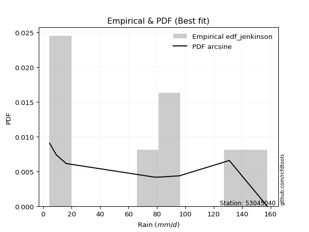</img>

</div>


### 11. EDF Cunnane (1978)

Cunnane´s work in statistical hydrology has focused on the performance and evaluation of different probability distributions (such as GEV, Gumbel, Lognormal) for flood frequency estimation. _b_ is a constant, typically set to 0.4.

<div align="center">


$P=(m-b)/(n+1-2b)$


</div>


**11.1. Empirical values**

<div align="center">

|                | 0                   | 1                   | 2                  | 3           | 4                  | 5                  | 6                  |
|:---------------|:--------------------|:--------------------|:-------------------|:------------|:-------------------|:-------------------|:-------------------|
| date           | 2020                | 2016                | 2023               | 2017        | 2022               | 2018               | 2019               |
| x              | 4.5                 | 9.3                 | 78.7               | 83.4        | 96.0               | 131.0              | 157.8              |
| m              | 1                   | 2                   | 3                  | 4           | 5                  | 6                  | 7                  |
| empirical_dist | edf_cunnane         | edf_cunnane         | edf_cunnane        | edf_cunnane | edf_cunnane        | edf_cunnane        | edf_cunnane        |
| empirical      | 0.08333333333333333 | 0.22222222222222224 | 0.3611111111111111 | 0.5         | 0.6388888888888888 | 0.7777777777777777 | 0.9166666666666666 |
| empirical_tr   | 1.090909090909091   | 1.2857142857142856  | 1.565217391304348  | 2.0         | 2.7692307692307687 | 4.499999999999998  | 11.999999999999995 |

</div>


**11.2. Kolmogorov-Smirnov fit test (sorted by Δ)**


<div align="center">

|                | 0                   | 1                   | 2                   | 3                   | 4                   | 5                   | 6                   | 7                   | 8                   | 9                   | 10                  | 11                  | 12                  | 13                  | 14                  | 15                  | 16                  | 17                  | 18                  | 19                  | 20                  | 21                  | 22                  | 23                  | 24                  | 25                    | 26                  | 27                  | 28                  | 29                  | 30                  | 31                  | 32                  | 33                  | 34                  | 35                  | 36                  | 37                  | 38                  | 39                  | 40                  | 41                  | 42                  | 43                  | 44                  | 45                  | 46                  | 47                  | 48                  | 49                  | 50                  | 51                  | 52                  | 53                  | 54                  | 55                  | 56                  | 57                  | 58                  | 59                  | 60                  | 61                  | 62                  | 63                  | 64                  | 65                  | 66                  | 67                  | 68                  | 69                  | 70                  | 71                  | 72                  | 73                  | 74                  | 75                  | 76                  | 77                  | 78                  | 79                  | 80                  | 81                  | 82                  | 83                  | 84                  | 85                  | 86                  | 87                  |
|:---------------|:--------------------|:--------------------|:--------------------|:--------------------|:--------------------|:--------------------|:--------------------|:--------------------|:--------------------|:--------------------|:--------------------|:--------------------|:--------------------|:--------------------|:--------------------|:--------------------|:--------------------|:--------------------|:--------------------|:--------------------|:--------------------|:--------------------|:--------------------|:--------------------|:--------------------|:----------------------|:--------------------|:--------------------|:--------------------|:--------------------|:--------------------|:--------------------|:--------------------|:--------------------|:--------------------|:--------------------|:--------------------|:--------------------|:--------------------|:--------------------|:--------------------|:--------------------|:--------------------|:--------------------|:--------------------|:--------------------|:--------------------|:--------------------|:--------------------|:--------------------|:--------------------|:--------------------|:--------------------|:--------------------|:--------------------|:--------------------|:--------------------|:--------------------|:--------------------|:--------------------|:--------------------|:--------------------|:--------------------|:--------------------|:--------------------|:--------------------|:--------------------|:--------------------|:--------------------|:--------------------|:--------------------|:--------------------|:--------------------|:--------------------|:--------------------|:--------------------|:--------------------|:--------------------|:--------------------|:--------------------|:--------------------|:--------------------|:--------------------|:--------------------|:--------------------|:--------------------|:--------------------|:--------------------|
| station        | 53045040            | 53045040            | 53045040            | 53045040            | 53045040            | 53045040            | 53045040            | 53045040            | 53045040            | 53045040            | 53045040            | 53045040            | 53045040            | 53045040            | 53045040            | 53045040            | 53045040            | 53045040            | 53045040            | 53045040            | 53045040            | 53045040            | 53045040            | 53045040            | 53045040            | 53045040              | 53045040            | 53045040            | 53045040            | 53045040            | 53045040            | 53045040            | 53045040            | 53045040            | 53045040            | 53045040            | 53045040            | 53045040            | 53045040            | 53045040            | 53045040            | 53045040            | 53045040            | 53045040            | 53045040            | 53045040            | 53045040            | 53045040            | 53045040            | 53045040            | 53045040            | 53045040            | 53045040            | 53045040            | 53045040            | 53045040            | 53045040            | 53045040            | 53045040            | 53045040            | 53045040            | 53045040            | 53045040            | 53045040            | 53045040            | 53045040            | 53045040            | 53045040            | 53045040            | 53045040            | 53045040            | 53045040            | 53045040            | 53045040            | 53045040            | 53045040            | 53045040            | 53045040            | 53045040            | 53045040            | 53045040            | 53045040            | 53045040            | 53045040            | 53045040            | 53045040            | 53045040            | 53045040            |
| empirical_dist | edf_cunnane         | edf_cunnane         | edf_cunnane         | edf_cunnane         | edf_cunnane         | edf_cunnane         | edf_cunnane         | edf_cunnane         | edf_cunnane         | edf_cunnane         | edf_cunnane         | edf_cunnane         | edf_cunnane         | edf_cunnane         | edf_cunnane         | edf_cunnane         | edf_cunnane         | edf_cunnane         | edf_cunnane         | edf_cunnane         | edf_cunnane         | edf_cunnane         | edf_cunnane         | edf_cunnane         | edf_cunnane         | edf_cunnane           | edf_cunnane         | edf_cunnane         | edf_cunnane         | edf_cunnane         | edf_cunnane         | edf_cunnane         | edf_cunnane         | edf_cunnane         | edf_cunnane         | edf_cunnane         | edf_cunnane         | edf_cunnane         | edf_cunnane         | edf_cunnane         | edf_cunnane         | edf_cunnane         | edf_cunnane         | edf_cunnane         | edf_cunnane         | edf_cunnane         | edf_cunnane         | edf_cunnane         | edf_cunnane         | edf_cunnane         | edf_cunnane         | edf_cunnane         | edf_cunnane         | edf_cunnane         | edf_cunnane         | edf_cunnane         | edf_cunnane         | edf_cunnane         | edf_cunnane         | edf_cunnane         | edf_cunnane         | edf_cunnane         | edf_cunnane         | edf_cunnane         | edf_cunnane         | edf_cunnane         | edf_cunnane         | edf_cunnane         | edf_cunnane         | edf_cunnane         | edf_cunnane         | edf_cunnane         | edf_cunnane         | edf_cunnane         | edf_cunnane         | edf_cunnane         | edf_cunnane         | edf_cunnane         | edf_cunnane         | edf_cunnane         | edf_cunnane         | edf_cunnane         | edf_cunnane         | edf_cunnane         | edf_cunnane         | edf_cunnane         | edf_cunnane         | edf_cunnane         |
| p_dist         | genlogistic         | johnsonsu           | gumbel_l            | laplace_asymmetric  | pearson3            | fisk                | exponnorm           | crystalball         | norm                | t                   | gamma               | erlang              | fatiguelife         | weibull_min         | logistic            | hypsecant           | laplace             | rice                | chi2                | maxwell             | invgamma            | rayleigh            | mielke              | invgauss            | gumbel_r            | loglaplace_asymmetric | logmielke           | logloggamma         | kstwobign           | halfnorm            | moyal               | halflogistic        | logfisk             | logpearson3         | logweibull_min      | loggumbel_l         | loggompertz         | expon               | genexpon            | logtruncnorm        | loginvweibull       | logf                | lognakagami         | logexponnorm        | logt                | lognorm             | lognorm             | logcrystalball      | lognct              | loggamma            | loggamma            | logfatiguelife      | logbetaprime        | logrice             | wald                | logerlang           | loginvgauss         | logalpha            | loginvgamma         | nakagami            | logncf              | loglogistic         | logmaxwell          | gibrat              | lograyleigh         | loghypsecant        | logkstwobign        | loggenexpon         | f                   | loghalfnorm         | nct                 | logexpon            | loggumbel_r         | loglaplace          | ncf                 | betaprime           | loghalflogistic     | logmoyal            | logjohnsonsu        | loglognorm          | logchi2             | logwald             | loggibrat           | invweibull          | alpha               | gompertz            | loggenlogistic      | truncnorm           |
| delta          | 0.11842651362066044 | 0.122521427649156   | 0.1261254324747966  | 0.12817866355023244 | 0.12834876925486044 | 0.13058601115878404 | 0.13165106557523718 | 0.13165204476617795 | 0.1316520466146953  | 0.1316569533511549  | 0.13495750904749387 | 0.13584923969924556 | 0.1394044043660087  | 0.14014313525741515 | 0.14097400122982282 | 0.14469253426146683 | 0.14677389597966553 | 0.1502801693521219  | 0.15490184516853728 | 0.1617810530878005  | 0.16249644951809167 | 0.17301309780798918 | 0.17648143510334363 | 0.19000714959567971 | 0.19832411121623145 | 0.19889746429204685   | 0.19944210562139592 | 0.2002413708867245  | 0.20529628011249518 | 0.22222222222222224 | 0.22420792098855097 | 0.22889974645072336 | 0.23244932107830857 | 0.24131862336048965 | 0.24182886462100145 | 0.24260834827979577 | 0.26228029516702783 | 0.26413339481951487 | 0.26700760356992764 | 0.27478644466488383 | 0.28540627904247234 | 0.2897391117417573  | 0.28986922009197597 | 0.29054555800442833 | 0.2905460152747637  | 0.29054671404260707 | 0.29054671404260707 | 0.2905467338221556  | 0.2908332424180467  | 0.29257773117277647 | 0.29257773117277647 | 0.2926847119261035  | 0.29352547558697323 | 0.29620205041432907 | 0.29622915213247153 | 0.29776845037925553 | 0.2984309858684641  | 0.2984447612166872  | 0.29850990013517914 | 0.3018619025706621  | 0.3032944397162673  | 0.30863107170091925 | 0.31200467214026856 | 0.31782417165441684 | 0.3184511543647844  | 0.3226409152471293  | 0.3230164415770261  | 0.32570373212006015 | 0.3273569196042862  | 0.33722098115540916 | 0.33878801479685366 | 0.3419749404278251  | 0.3502582593881511  | 0.35077741369163157 | 0.35353983665822447 | 0.3603224112250138  | 0.3653122965896159  | 0.3700007133407018  | 0.3786693569566345  | 0.40084407809597167 | 0.41692268719063114 | 0.42599477641147626 | 0.4582005378038068  | 0.4835963356328018  | 0.53042947380525    | 0.6080285778158805  | 0.7777777777777777  | 0.8472351606721796  |
| deltao         | 0.48442053926100004 | 0.48442053926100004 | 0.48442053926100004 | 0.48442053926100004 | 0.48442053926100004 | 0.48442053926100004 | 0.48442053926100004 | 0.48442053926100004 | 0.48442053926100004 | 0.48442053926100004 | 0.48442053926100004 | 0.48442053926100004 | 0.48442053926100004 | 0.48442053926100004 | 0.48442053926100004 | 0.48442053926100004 | 0.48442053926100004 | 0.48442053926100004 | 0.48442053926100004 | 0.48442053926100004 | 0.48442053926100004 | 0.48442053926100004 | 0.48442053926100004 | 0.48442053926100004 | 0.48442053926100004 | 0.48442053926100004   | 0.48442053926100004 | 0.48442053926100004 | 0.48442053926100004 | 0.48442053926100004 | 0.48442053926100004 | 0.48442053926100004 | 0.48442053926100004 | 0.48442053926100004 | 0.48442053926100004 | 0.48442053926100004 | 0.48442053926100004 | 0.48442053926100004 | 0.48442053926100004 | 0.48442053926100004 | 0.48442053926100004 | 0.48442053926100004 | 0.48442053926100004 | 0.48442053926100004 | 0.48442053926100004 | 0.48442053926100004 | 0.48442053926100004 | 0.48442053926100004 | 0.48442053926100004 | 0.48442053926100004 | 0.48442053926100004 | 0.48442053926100004 | 0.48442053926100004 | 0.48442053926100004 | 0.48442053926100004 | 0.48442053926100004 | 0.48442053926100004 | 0.48442053926100004 | 0.48442053926100004 | 0.48442053926100004 | 0.48442053926100004 | 0.48442053926100004 | 0.48442053926100004 | 0.48442053926100004 | 0.48442053926100004 | 0.48442053926100004 | 0.48442053926100004 | 0.48442053926100004 | 0.48442053926100004 | 0.48442053926100004 | 0.48442053926100004 | 0.48442053926100004 | 0.48442053926100004 | 0.48442053926100004 | 0.48442053926100004 | 0.48442053926100004 | 0.48442053926100004 | 0.48442053926100004 | 0.48442053926100004 | 0.48442053926100004 | 0.48442053926100004 | 0.48442053926100004 | 0.48442053926100004 | 0.48442053926100004 | 0.48442053926100004 | 0.48442053926100004 | 0.48442053926100004 | 0.48442053926100004 |
| eval           | Δo > Δ              | Δo > Δ              | Δo > Δ              | Δo > Δ              | Δo > Δ              | Δo > Δ              | Δo > Δ              | Δo > Δ              | Δo > Δ              | Δo > Δ              | Δo > Δ              | Δo > Δ              | Δo > Δ              | Δo > Δ              | Δo > Δ              | Δo > Δ              | Δo > Δ              | Δo > Δ              | Δo > Δ              | Δo > Δ              | Δo > Δ              | Δo > Δ              | Δo > Δ              | Δo > Δ              | Δo > Δ              | Δo > Δ                | Δo > Δ              | Δo > Δ              | Δo > Δ              | Δo > Δ              | Δo > Δ              | Δo > Δ              | Δo > Δ              | Δo > Δ              | Δo > Δ              | Δo > Δ              | Δo > Δ              | Δo > Δ              | Δo > Δ              | Δo > Δ              | Δo > Δ              | Δo > Δ              | Δo > Δ              | Δo > Δ              | Δo > Δ              | Δo > Δ              | Δo > Δ              | Δo > Δ              | Δo > Δ              | Δo > Δ              | Δo > Δ              | Δo > Δ              | Δo > Δ              | Δo > Δ              | Δo > Δ              | Δo > Δ              | Δo > Δ              | Δo > Δ              | Δo > Δ              | Δo > Δ              | Δo > Δ              | Δo > Δ              | Δo > Δ              | Δo > Δ              | Δo > Δ              | Δo > Δ              | Δo > Δ              | Δo > Δ              | Δo > Δ              | Δo > Δ              | Δo > Δ              | Δo > Δ              | Δo > Δ              | Δo > Δ              | Δo > Δ              | Δo > Δ              | Δo > Δ              | Δo > Δ              | Δo > Δ              | Δo > Δ              | Δo > Δ              | Δo > Δ              | Δo > Δ              | Δo > Δ              | Δo <= Δ             | Δo <= Δ             | Δo <= Δ             | Δo <= Δ             |
| fit            | 1                   | 1                   | 1                   | 1                   | 1                   | 1                   | 1                   | 1                   | 1                   | 1                   | 1                   | 1                   | 1                   | 1                   | 1                   | 1                   | 1                   | 1                   | 1                   | 1                   | 1                   | 1                   | 1                   | 1                   | 1                   | 1                     | 1                   | 1                   | 1                   | 1                   | 1                   | 1                   | 1                   | 1                   | 1                   | 1                   | 1                   | 1                   | 1                   | 1                   | 1                   | 1                   | 1                   | 1                   | 1                   | 1                   | 1                   | 1                   | 1                   | 1                   | 1                   | 1                   | 1                   | 1                   | 1                   | 1                   | 1                   | 1                   | 1                   | 1                   | 1                   | 1                   | 1                   | 1                   | 1                   | 1                   | 1                   | 1                   | 1                   | 1                   | 1                   | 1                   | 1                   | 1                   | 1                   | 1                   | 1                   | 1                   | 1                   | 1                   | 1                   | 1                   | 1                   | 1                   | 0                   | 0                   | 0                   | 0                   |
| n              | 7                   | 7                   | 7                   | 7                   | 7                   | 7                   | 7                   | 7                   | 7                   | 7                   | 7                   | 7                   | 7                   | 7                   | 7                   | 7                   | 7                   | 7                   | 7                   | 7                   | 7                   | 7                   | 7                   | 7                   | 7                   | 7                     | 7                   | 7                   | 7                   | 7                   | 7                   | 7                   | 7                   | 7                   | 7                   | 7                   | 7                   | 7                   | 7                   | 7                   | 7                   | 7                   | 7                   | 7                   | 7                   | 7                   | 7                   | 7                   | 7                   | 7                   | 7                   | 7                   | 7                   | 7                   | 7                   | 7                   | 7                   | 7                   | 7                   | 7                   | 7                   | 7                   | 7                   | 7                   | 7                   | 7                   | 7                   | 7                   | 7                   | 7                   | 7                   | 7                   | 7                   | 7                   | 7                   | 7                   | 7                   | 7                   | 7                   | 7                   | 7                   | 7                   | 7                   | 7                   | 7                   | 7                   | 7                   | 7                   |
| best_fit       | 1                   | 0                   | 0                   | 0                   | 0                   | 0                   | 0                   | 0                   | 0                   | 0                   | 0                   | 0                   | 0                   | 0                   | 0                   | 0                   | 0                   | 0                   | 0                   | 0                   | 0                   | 0                   | 0                   | 0                   | 0                   | 0                     | 0                   | 0                   | 0                   | 0                   | 0                   | 0                   | 0                   | 0                   | 0                   | 0                   | 0                   | 0                   | 0                   | 0                   | 0                   | 0                   | 0                   | 0                   | 0                   | 0                   | 0                   | 0                   | 0                   | 0                   | 0                   | 0                   | 0                   | 0                   | 0                   | 0                   | 0                   | 0                   | 0                   | 0                   | 0                   | 0                   | 0                   | 0                   | 0                   | 0                   | 0                   | 0                   | 0                   | 0                   | 0                   | 0                   | 0                   | 0                   | 0                   | 0                   | 0                   | 0                   | 0                   | 0                   | 0                   | 0                   | 0                   | 0                   | 0                   | 0                   | 0                   | 0                   |
| best_fit_sort  | 1                   | 2                   | 3                   | 4                   | 5                   | 6                   | 7                   | 8                   | 9                   | 10                  | 11                  | 12                  | 13                  | 14                  | 15                  | 16                  | 17                  | 18                  | 19                  | 20                  | 21                  | 22                  | 23                  | 24                  | 25                  | 26                    | 27                  | 28                  | 29                  | 30                  | 31                  | 32                  | 33                  | 34                  | 35                  | 36                  | 37                  | 38                  | 39                  | 40                  | 41                  | 42                  | 43                  | 44                  | 45                  | 46                  | 47                  | 48                  | 49                  | 50                  | 51                  | 52                  | 53                  | 54                  | 55                  | 56                  | 57                  | 58                  | 59                  | 60                  | 61                  | 62                  | 63                  | 64                  | 65                  | 66                  | 67                  | 68                  | 69                  | 70                  | 71                  | 72                  | 73                  | 74                  | 75                  | 76                  | 77                  | 78                  | 79                  | 80                  | 81                  | 82                  | 83                  | 84                  | 85                  | 86                  | 87                  | 88                  |

</div>


**11.3. Best fit**

<div align="center">

|   id |   station | empirical_dist   | p_dist      |    delta |   deltao | eval   |   fit |   n |   best_fit |   best_fit_sort |
|-----:|----------:|:-----------------|:------------|---------:|---------:|:-------|------:|----:|-----------:|----------------:|
|    0 |  53045040 | edf_cunnane      | genlogistic | 0.118427 | 0.484421 | Δo > Δ |     1 |   7 |          1 |               1 |

</div>


<div align="center">

</img></img>

</div>


### 12. EDF Adamowski (1981)

The Adamowski formula in hydrology refers to a specific plotting position formula used for estimating the non-parametric empirical distribution of hydrological events (like flood peaks) to calculate their return periods. This formula provides an alternative to traditional parametric methods (like the Gumbel or Log Pearson Type III distributions). 

<div align="center">


$P=(m-0.25)/(n+0.5)$


</div>


**12.1. Empirical values**

<div align="center">

|                | 0                  | 1                   | 2                   | 3             | 4                  | 5                  | 6                  |
|:---------------|:-------------------|:--------------------|:--------------------|:--------------|:-------------------|:-------------------|:-------------------|
| date           | 2020               | 2016                | 2023                | 2017          | 2022               | 2018               | 2019               |
| x              | 4.5                | 9.3                 | 78.7                | 83.4          | 96.0               | 131.0              | 157.8              |
| m              | 1                  | 2                   | 3                   | 4             | 5                  | 6                  | 7                  |
| empirical_dist | edf_adamowski      | edf_adamowski       | edf_adamowski       | edf_adamowski | edf_adamowski      | edf_adamowski      | edf_adamowski      |
| empirical      | 0.1                | 0.23333333333333334 | 0.36666666666666664 | 0.5           | 0.6333333333333333 | 0.7666666666666667 | 0.9                |
| empirical_tr   | 1.1111111111111112 | 1.3043478260869565  | 1.5789473684210527  | 2.0           | 2.727272727272727  | 4.2857142857142865 | 10.000000000000002 |

</div>


**12.2. Kolmogorov-Smirnov fit test (sorted by Δ)**


<div align="center">

|                | 0                   | 1                   | 2                   | 3                   | 4                   | 5                   | 6                   | 7                   | 8                   | 9                   | 10                  | 11                  | 12                  | 13                  | 14                  | 15                  | 16                  | 17                  | 18                  | 19                  | 20                  | 21                  | 22                  | 23                  | 24                  | 25                    | 26                  | 27                  | 28                  | 29                  | 30                  | 31                  | 32                  | 33                  | 34                  | 35                  | 36                  | 37                  | 38                  | 39                  | 40                  | 41                  | 42                  | 43                  | 44                  | 45                  | 46                  | 47                  | 48                  | 49                  | 50                  | 51                  | 52                  | 53                  | 54                  | 55                  | 56                  | 57                  | 58                  | 59                  | 60                  | 61                  | 62                  | 63                  | 64                  | 65                  | 66                  | 67                  | 68                  | 69                  | 70                  | 71                  | 72                  | 73                  | 74                  | 75                  | 76                  | 77                  | 78                  | 79                  | 80                  | 81                  | 82                  | 83                  | 84                  | 85                  | 86                  | 87                  |
|:---------------|:--------------------|:--------------------|:--------------------|:--------------------|:--------------------|:--------------------|:--------------------|:--------------------|:--------------------|:--------------------|:--------------------|:--------------------|:--------------------|:--------------------|:--------------------|:--------------------|:--------------------|:--------------------|:--------------------|:--------------------|:--------------------|:--------------------|:--------------------|:--------------------|:--------------------|:----------------------|:--------------------|:--------------------|:--------------------|:--------------------|:--------------------|:--------------------|:--------------------|:--------------------|:--------------------|:--------------------|:--------------------|:--------------------|:--------------------|:--------------------|:--------------------|:--------------------|:--------------------|:--------------------|:--------------------|:--------------------|:--------------------|:--------------------|:--------------------|:--------------------|:--------------------|:--------------------|:--------------------|:--------------------|:--------------------|:--------------------|:--------------------|:--------------------|:--------------------|:--------------------|:--------------------|:--------------------|:--------------------|:--------------------|:--------------------|:--------------------|:--------------------|:--------------------|:--------------------|:--------------------|:--------------------|:--------------------|:--------------------|:--------------------|:--------------------|:--------------------|:--------------------|:--------------------|:--------------------|:--------------------|:--------------------|:--------------------|:--------------------|:--------------------|:--------------------|:--------------------|:--------------------|:--------------------|
| station        | 53045040            | 53045040            | 53045040            | 53045040            | 53045040            | 53045040            | 53045040            | 53045040            | 53045040            | 53045040            | 53045040            | 53045040            | 53045040            | 53045040            | 53045040            | 53045040            | 53045040            | 53045040            | 53045040            | 53045040            | 53045040            | 53045040            | 53045040            | 53045040            | 53045040            | 53045040              | 53045040            | 53045040            | 53045040            | 53045040            | 53045040            | 53045040            | 53045040            | 53045040            | 53045040            | 53045040            | 53045040            | 53045040            | 53045040            | 53045040            | 53045040            | 53045040            | 53045040            | 53045040            | 53045040            | 53045040            | 53045040            | 53045040            | 53045040            | 53045040            | 53045040            | 53045040            | 53045040            | 53045040            | 53045040            | 53045040            | 53045040            | 53045040            | 53045040            | 53045040            | 53045040            | 53045040            | 53045040            | 53045040            | 53045040            | 53045040            | 53045040            | 53045040            | 53045040            | 53045040            | 53045040            | 53045040            | 53045040            | 53045040            | 53045040            | 53045040            | 53045040            | 53045040            | 53045040            | 53045040            | 53045040            | 53045040            | 53045040            | 53045040            | 53045040            | 53045040            | 53045040            | 53045040            |
| empirical_dist | edf_adamowski       | edf_adamowski       | edf_adamowski       | edf_adamowski       | edf_adamowski       | edf_adamowski       | edf_adamowski       | edf_adamowski       | edf_adamowski       | edf_adamowski       | edf_adamowski       | edf_adamowski       | edf_adamowski       | edf_adamowski       | edf_adamowski       | edf_adamowski       | edf_adamowski       | edf_adamowski       | edf_adamowski       | edf_adamowski       | edf_adamowski       | edf_adamowski       | edf_adamowski       | edf_adamowski       | edf_adamowski       | edf_adamowski         | edf_adamowski       | edf_adamowski       | edf_adamowski       | edf_adamowski       | edf_adamowski       | edf_adamowski       | edf_adamowski       | edf_adamowski       | edf_adamowski       | edf_adamowski       | edf_adamowski       | edf_adamowski       | edf_adamowski       | edf_adamowski       | edf_adamowski       | edf_adamowski       | edf_adamowski       | edf_adamowski       | edf_adamowski       | edf_adamowski       | edf_adamowski       | edf_adamowski       | edf_adamowski       | edf_adamowski       | edf_adamowski       | edf_adamowski       | edf_adamowski       | edf_adamowski       | edf_adamowski       | edf_adamowski       | edf_adamowski       | edf_adamowski       | edf_adamowski       | edf_adamowski       | edf_adamowski       | edf_adamowski       | edf_adamowski       | edf_adamowski       | edf_adamowski       | edf_adamowski       | edf_adamowski       | edf_adamowski       | edf_adamowski       | edf_adamowski       | edf_adamowski       | edf_adamowski       | edf_adamowski       | edf_adamowski       | edf_adamowski       | edf_adamowski       | edf_adamowski       | edf_adamowski       | edf_adamowski       | edf_adamowski       | edf_adamowski       | edf_adamowski       | edf_adamowski       | edf_adamowski       | edf_adamowski       | edf_adamowski       | edf_adamowski       | edf_adamowski       |
| p_dist         | genlogistic         | johnsonsu           | gumbel_l            | laplace_asymmetric  | pearson3            | fisk                | exponnorm           | crystalball         | norm                | t                   | erlang              | gamma               | fatiguelife         | chi2                | weibull_min         | logistic            | hypsecant           | maxwell             | invgamma            | laplace             | rice                | rayleigh            | mielke              | invgauss            | gumbel_r            | loglaplace_asymmetric | logmielke           | logloggamma         | kstwobign           | moyal               | logfisk             | halfnorm            | halflogistic        | logpearson3         | logweibull_min      | loggumbel_l         | loggompertz         | expon               | genexpon            | logtruncnorm        | loginvweibull       | logf                | lognakagami         | logexponnorm        | logt                | lognorm             | lognorm             | logcrystalball      | lognct              | loggamma            | loggamma            | logfatiguelife      | logbetaprime        | logrice             | wald                | logerlang           | loginvgauss         | logalpha            | loginvgamma         | nakagami            | logncf              | loglogistic         | logmaxwell          | gibrat              | lograyleigh         | loghypsecant        | logkstwobign        | loggenexpon         | f                   | loghalfnorm         | nct                 | logexpon            | loggumbel_r         | loglaplace          | ncf                 | betaprime           | loghalflogistic     | logmoyal            | logjohnsonsu        | loglognorm          | logchi2             | logwald             | loggibrat           | invweibull          | alpha               | gompertz            | loggenlogistic      | truncnorm           |
| delta          | 0.12953762473177155 | 0.1336325387602671  | 0.1372365435859077  | 0.1392897746613435  | 0.13945988036597154 | 0.14169712226989514 | 0.14276217668634827 | 0.14276315587728905 | 0.1427631577258064  | 0.142768064462266   | 0.1430285829694375  | 0.14356031076847806 | 0.14668077383772726 | 0.14934628961298174 | 0.15125424636852625 | 0.15208511234093391 | 0.15580364537257793 | 0.15622549753224496 | 0.15694089396253613 | 0.15788500709077663 | 0.161391280463233   | 0.16745754225243364 | 0.1709258795477881  | 0.18445159404012418 | 0.1927685556606759  | 0.19334190873649132   | 0.19388655006584038 | 0.19468581533116897 | 0.19974072455693964 | 0.21865236543299543 | 0.22689376552275303 | 0.23333333333333334 | 0.23333333333333334 | 0.2357630678049341  | 0.2362733090654459  | 0.23705279272424024 | 0.2567247396114723  | 0.25857783926395933 | 0.2614520480143721  | 0.2692308891093283  | 0.2798507234869168  | 0.2841835561862018  | 0.28431366453642043 | 0.2849900024488728  | 0.28499045971920817 | 0.28499115848705153 | 0.28499115848705153 | 0.2849911782666001  | 0.28527768686249116 | 0.28702217561722093 | 0.28702217561722093 | 0.287129156370548   | 0.2879699200314177  | 0.29064649485877353 | 0.290673596576916   | 0.2922128948237     | 0.2928754303129086  | 0.2928892056611317  | 0.2929543445796236  | 0.29630634701510655 | 0.29773888416071176 | 0.3030755161453637  | 0.306449116584713   | 0.3122686160988613  | 0.31289559880922885 | 0.31708535969157375 | 0.31746088602147055 | 0.3201481765645046  | 0.32180136404873066 | 0.3316654255998536  | 0.33323245924129813 | 0.3364193848722696  | 0.34470270383259555 | 0.34522185813607603 | 0.34798428110266894 | 0.35476685566945826 | 0.35975674103406036 | 0.36444515778514625 | 0.36755824584552355 | 0.38973296698486054 | 0.4113671316350756  | 0.4204392208559207  | 0.4526449822482513  | 0.4669296689661352  | 0.5248739182496944  | 0.602473022260325   | 0.7666666666666667  | 0.830568494005513   |
| deltao         | 0.48442053926100004 | 0.48442053926100004 | 0.48442053926100004 | 0.48442053926100004 | 0.48442053926100004 | 0.48442053926100004 | 0.48442053926100004 | 0.48442053926100004 | 0.48442053926100004 | 0.48442053926100004 | 0.48442053926100004 | 0.48442053926100004 | 0.48442053926100004 | 0.48442053926100004 | 0.48442053926100004 | 0.48442053926100004 | 0.48442053926100004 | 0.48442053926100004 | 0.48442053926100004 | 0.48442053926100004 | 0.48442053926100004 | 0.48442053926100004 | 0.48442053926100004 | 0.48442053926100004 | 0.48442053926100004 | 0.48442053926100004   | 0.48442053926100004 | 0.48442053926100004 | 0.48442053926100004 | 0.48442053926100004 | 0.48442053926100004 | 0.48442053926100004 | 0.48442053926100004 | 0.48442053926100004 | 0.48442053926100004 | 0.48442053926100004 | 0.48442053926100004 | 0.48442053926100004 | 0.48442053926100004 | 0.48442053926100004 | 0.48442053926100004 | 0.48442053926100004 | 0.48442053926100004 | 0.48442053926100004 | 0.48442053926100004 | 0.48442053926100004 | 0.48442053926100004 | 0.48442053926100004 | 0.48442053926100004 | 0.48442053926100004 | 0.48442053926100004 | 0.48442053926100004 | 0.48442053926100004 | 0.48442053926100004 | 0.48442053926100004 | 0.48442053926100004 | 0.48442053926100004 | 0.48442053926100004 | 0.48442053926100004 | 0.48442053926100004 | 0.48442053926100004 | 0.48442053926100004 | 0.48442053926100004 | 0.48442053926100004 | 0.48442053926100004 | 0.48442053926100004 | 0.48442053926100004 | 0.48442053926100004 | 0.48442053926100004 | 0.48442053926100004 | 0.48442053926100004 | 0.48442053926100004 | 0.48442053926100004 | 0.48442053926100004 | 0.48442053926100004 | 0.48442053926100004 | 0.48442053926100004 | 0.48442053926100004 | 0.48442053926100004 | 0.48442053926100004 | 0.48442053926100004 | 0.48442053926100004 | 0.48442053926100004 | 0.48442053926100004 | 0.48442053926100004 | 0.48442053926100004 | 0.48442053926100004 | 0.48442053926100004 |
| eval           | Δo > Δ              | Δo > Δ              | Δo > Δ              | Δo > Δ              | Δo > Δ              | Δo > Δ              | Δo > Δ              | Δo > Δ              | Δo > Δ              | Δo > Δ              | Δo > Δ              | Δo > Δ              | Δo > Δ              | Δo > Δ              | Δo > Δ              | Δo > Δ              | Δo > Δ              | Δo > Δ              | Δo > Δ              | Δo > Δ              | Δo > Δ              | Δo > Δ              | Δo > Δ              | Δo > Δ              | Δo > Δ              | Δo > Δ                | Δo > Δ              | Δo > Δ              | Δo > Δ              | Δo > Δ              | Δo > Δ              | Δo > Δ              | Δo > Δ              | Δo > Δ              | Δo > Δ              | Δo > Δ              | Δo > Δ              | Δo > Δ              | Δo > Δ              | Δo > Δ              | Δo > Δ              | Δo > Δ              | Δo > Δ              | Δo > Δ              | Δo > Δ              | Δo > Δ              | Δo > Δ              | Δo > Δ              | Δo > Δ              | Δo > Δ              | Δo > Δ              | Δo > Δ              | Δo > Δ              | Δo > Δ              | Δo > Δ              | Δo > Δ              | Δo > Δ              | Δo > Δ              | Δo > Δ              | Δo > Δ              | Δo > Δ              | Δo > Δ              | Δo > Δ              | Δo > Δ              | Δo > Δ              | Δo > Δ              | Δo > Δ              | Δo > Δ              | Δo > Δ              | Δo > Δ              | Δo > Δ              | Δo > Δ              | Δo > Δ              | Δo > Δ              | Δo > Δ              | Δo > Δ              | Δo > Δ              | Δo > Δ              | Δo > Δ              | Δo > Δ              | Δo > Δ              | Δo > Δ              | Δo > Δ              | Δo > Δ              | Δo <= Δ             | Δo <= Δ             | Δo <= Δ             | Δo <= Δ             |
| fit            | 1                   | 1                   | 1                   | 1                   | 1                   | 1                   | 1                   | 1                   | 1                   | 1                   | 1                   | 1                   | 1                   | 1                   | 1                   | 1                   | 1                   | 1                   | 1                   | 1                   | 1                   | 1                   | 1                   | 1                   | 1                   | 1                     | 1                   | 1                   | 1                   | 1                   | 1                   | 1                   | 1                   | 1                   | 1                   | 1                   | 1                   | 1                   | 1                   | 1                   | 1                   | 1                   | 1                   | 1                   | 1                   | 1                   | 1                   | 1                   | 1                   | 1                   | 1                   | 1                   | 1                   | 1                   | 1                   | 1                   | 1                   | 1                   | 1                   | 1                   | 1                   | 1                   | 1                   | 1                   | 1                   | 1                   | 1                   | 1                   | 1                   | 1                   | 1                   | 1                   | 1                   | 1                   | 1                   | 1                   | 1                   | 1                   | 1                   | 1                   | 1                   | 1                   | 1                   | 1                   | 0                   | 0                   | 0                   | 0                   |
| n              | 7                   | 7                   | 7                   | 7                   | 7                   | 7                   | 7                   | 7                   | 7                   | 7                   | 7                   | 7                   | 7                   | 7                   | 7                   | 7                   | 7                   | 7                   | 7                   | 7                   | 7                   | 7                   | 7                   | 7                   | 7                   | 7                     | 7                   | 7                   | 7                   | 7                   | 7                   | 7                   | 7                   | 7                   | 7                   | 7                   | 7                   | 7                   | 7                   | 7                   | 7                   | 7                   | 7                   | 7                   | 7                   | 7                   | 7                   | 7                   | 7                   | 7                   | 7                   | 7                   | 7                   | 7                   | 7                   | 7                   | 7                   | 7                   | 7                   | 7                   | 7                   | 7                   | 7                   | 7                   | 7                   | 7                   | 7                   | 7                   | 7                   | 7                   | 7                   | 7                   | 7                   | 7                   | 7                   | 7                   | 7                   | 7                   | 7                   | 7                   | 7                   | 7                   | 7                   | 7                   | 7                   | 7                   | 7                   | 7                   |
| best_fit       | 1                   | 0                   | 0                   | 0                   | 0                   | 0                   | 0                   | 0                   | 0                   | 0                   | 0                   | 0                   | 0                   | 0                   | 0                   | 0                   | 0                   | 0                   | 0                   | 0                   | 0                   | 0                   | 0                   | 0                   | 0                   | 0                     | 0                   | 0                   | 0                   | 0                   | 0                   | 0                   | 0                   | 0                   | 0                   | 0                   | 0                   | 0                   | 0                   | 0                   | 0                   | 0                   | 0                   | 0                   | 0                   | 0                   | 0                   | 0                   | 0                   | 0                   | 0                   | 0                   | 0                   | 0                   | 0                   | 0                   | 0                   | 0                   | 0                   | 0                   | 0                   | 0                   | 0                   | 0                   | 0                   | 0                   | 0                   | 0                   | 0                   | 0                   | 0                   | 0                   | 0                   | 0                   | 0                   | 0                   | 0                   | 0                   | 0                   | 0                   | 0                   | 0                   | 0                   | 0                   | 0                   | 0                   | 0                   | 0                   |
| best_fit_sort  | 1                   | 2                   | 3                   | 4                   | 5                   | 6                   | 7                   | 8                   | 9                   | 10                  | 11                  | 12                  | 13                  | 14                  | 15                  | 16                  | 17                  | 18                  | 19                  | 20                  | 21                  | 22                  | 23                  | 24                  | 25                  | 26                    | 27                  | 28                  | 29                  | 30                  | 31                  | 32                  | 33                  | 34                  | 35                  | 36                  | 37                  | 38                  | 39                  | 40                  | 41                  | 42                  | 43                  | 44                  | 45                  | 46                  | 47                  | 48                  | 49                  | 50                  | 51                  | 52                  | 53                  | 54                  | 55                  | 56                  | 57                  | 58                  | 59                  | 60                  | 61                  | 62                  | 63                  | 64                  | 65                  | 66                  | 67                  | 68                  | 69                  | 70                  | 71                  | 72                  | 73                  | 74                  | 75                  | 76                  | 77                  | 78                  | 79                  | 80                  | 81                  | 82                  | 83                  | 84                  | 85                  | 86                  | 87                  | 88                  |

</div>


**12.3. Best fit**

<div align="center">

|   id |   station | empirical_dist   | p_dist      |    delta |   deltao | eval   |   fit |   n |   best_fit |   best_fit_sort |
|-----:|----------:|:-----------------|:------------|---------:|---------:|:-------|------:|----:|-----------:|----------------:|
|    0 |  53045040 | edf_adamowski    | genlogistic | 0.129538 | 0.484421 | Δo > Δ |     1 |   7 |          1 |               1 |

</div>


<div align="center">

</img>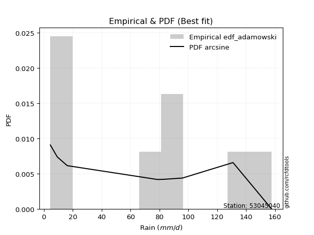</img>

</div>


## C. Best fit & Estimate extreme values for specific return periods - Tr

Best fit in probability distribution analysis means finding the theoretical distribution (like Normal, Poisson, Exponential) that most accurately mirrors your real-world data´s patterns (shape, center, spread) for better predictions, using methods like visual checks (Q-Q plots), goodness-of-fit tests (Kolmogorov-Smirnov, Chi-Squared), and information criteria (AIC) to score and select the simplest, most representative model.


### 1. Best fit (ordered by delta Δ)

<div align="center">

|   id |   station | empirical_dist   | p_dist      |    delta |   deltao | eval   |   fit |   n |   best_fit |   best_fit_sort |
|-----:|----------:|:-----------------|:------------|---------:|---------:|:-------|------:|----:|-----------:|----------------:|
|    0 |  53045040 | edf_hazen        | genlogistic | 0.11049  | 0.484421 | Δo > Δ |     1 |   7 |          1 |               1 |
|    1 |  53045040 | edf_gringorten   | genlogistic | 0.115305 | 0.484421 | Δo > Δ |     1 |   7 |          1 |               2 |
|    2 |  53045040 | edf_cunnane      | genlogistic | 0.118427 | 0.484421 | Δo > Δ |     1 |   7 |          1 |               3 |
|    3 |  53045040 | edf_blom         | genlogistic | 0.120342 | 0.484421 | Δo > Δ |     1 |   7 |          1 |               4 |
|    4 |  53045040 | edf_tukey        | genlogistic | 0.123477 | 0.484421 | Δo > Δ |     1 |   7 |          1 |               5 |
|    5 |  53045040 | edf_filliben     | genlogistic | 0.12465  | 0.484421 | Δo > Δ |     1 |   7 |          1 |               6 |
|    6 |  53045040 | edf_beard        | genlogistic | 0.125202 | 0.484421 | Δo > Δ |     1 |   7 |          1 |               7 |
|    7 |  53045040 | edf_jenkinson    | genlogistic | 0.125202 | 0.484421 | Δo > Δ |     1 |   7 |          1 |               8 |
|    8 |  53045040 | edf_chegodayev   | genlogistic | 0.125934 | 0.484421 | Δo > Δ |     1 |   7 |          1 |               9 |
|    9 |  53045040 | edf_adamowski    | genlogistic | 0.129538 | 0.484421 | Δo > Δ |     1 |   7 |          1 |              10 |
|   10 |  53045040 | edf_weibull      | genlogistic | 0.146204 | 0.484421 | Δo > Δ |     1 |   7 |          1 |              11 |
|   11 |  53045040 | edf_california   | logpearson3 | 0.174947 | 0.484421 | Δo > Δ |     1 |   7 |          1 |              12 |

</div>

:file_folder:Tables: [bestfit_53045040.csv](table/bestfit_53045040.csv) | [extreme_53045040.csv](table/extreme_53045040.csv)


### 2. Extreme values

In hydrology, a return period (or recurrence interval $Tr$) is the statistical average time between extreme events like floods or droughts of a specific magnitude, indicating how rare an event is, with a 100-year flood, for example, having a 1% chance of occurring in any given year, not that it happens exactly every century. It is a key tool for infrastructure design (like bridges or dams) and risk assessment, calculated from historical data to determine the probability of future events, although it is important to remember it is statistical average, and events can cluster or be missed.

> risk_rate: assuming the return period as the project useful life.

|   id |      tr |   prob_l |     prob_g |     alpha |   betaprime |     chi2 |   crystalball |   erlang |    expon |   exponnorm |        f |   fatiguelife |     fisk |    gamma |   genexpon |   genlogistic |   gibrat |   gompertz |   gumbel_l |   gumbel_r |   halflogistic |   halfnorm |   hypsecant |   invgamma |   invgauss |       invweibull |   johnsonsu |   kstwobign |   laplace |   laplace_asymmetric |   loggamma |   logistic |   lognorm |   maxwell |   mielke |    moyal |   nakagami |      ncf |              nct |    norm |   pearson3 |   rayleigh |     rice |        t |   truncnorm |     wald |   weibull_min |   logalpha |   logbetaprime |          logchi2 |   logcrystalball |   logerlang |         logexpon |   logexponnorm |      logf |   logfatiguelife |    logfisk |   loggenexpon |   loggenlogistic |        loggibrat |   loggompertz |   loggumbel_l |   loggumbel_r |   loghalflogistic |   loghalfnorm |   loghypsecant |   loginvgamma |   loginvgauss |   loginvweibull |   logjohnsonsu |   logkstwobign |   loglaplace |   loglaplace_asymmetric |   logloggamma |   loglogistic |     loglognorm |   logmaxwell |   logmielke |   logmoyal |   lognakagami |     logncf |    lognct |   logpearson3 |   lograyleigh |   logrice |      logt |   logtruncnorm |     logwald |   logweibull_min |   station |   n |   risk_rate |
|-----:|--------:|---------:|-----------:|----------:|------------:|---------:|--------------:|---------:|---------:|------------:|---------:|--------------:|---------:|---------:|-----------:|--------------:|---------:|-----------:|-----------:|-----------:|---------------:|-----------:|------------:|-----------:|-----------:|-----------------:|------------:|------------:|----------:|---------------------:|-----------:|-----------:|----------:|----------:|---------:|---------:|-----------:|---------:|-----------------:|--------:|-----------:|-----------:|---------:|---------:|------------:|---------:|--------------:|-----------:|---------------:|-----------------:|-----------------:|------------:|-----------------:|---------------:|----------:|-----------------:|-----------:|--------------:|-----------------:|-----------------:|--------------:|--------------:|--------------:|------------------:|--------------:|---------------:|--------------:|--------------:|----------------:|---------------:|---------------:|-------------:|------------------------:|--------------:|--------------:|---------------:|-------------:|------------:|-----------:|--------------:|-----------:|----------:|--------------:|--------------:|----------:|----------:|---------------:|------------:|-----------------:|----------:|----:|------------:|
|    0 |    2    | 0.5      | 0.5        |   15.8923 |     42.1568 |  76.5083 |        80.1   |  79.1062 |  56.9019 |     80.0998 |  41.1645 |       78.6322 |  82.1527 |  79.225  |    56.4971 |       86.3438 |  64.2078 |    133.495 |    88.7979 |    71.4021 |        67.0779 |    69.2623 |     80.1    |    75.5141 |    71.4991 |   6693.38        |     84.9905 |     68.9063 |   80.1    |              81.7177 |    46.3773 |    80.1    |   47.4942 |   75.5719 |  72.3147 |  68.5941 |    45.6769 |  37.1008 |     27.0111      |  80.1   |    81.6448 |    73.9659 |  77.2168 |  80.1012 |  -0.530557  |  62.9376 |       79.5378 |    43.6814 |        40.1608 |     13.8244      |          47.4942 |     45.3973 |     23.0462      |        47.4944 |   47.5554 |          47.0872 |    59.3607 |       34.7177 |          inf     |     32.1924      |       57.3829 |       58.7599 |       38.3885 |           34.5336 |       36.4307 |        47.4942 |       44.2883 |       44.1804 |         40.6472 |        150.73  |        34.5028 |      47.4942 |                 68.6901 |       68.4461 |       47.4942 |   4.55689      |      42.5125 |     68.1858 |    35.8392 |       47.5266 |    40.8431 |   47.3786 |        57.764 |       40.8741 |   45.6246 |   47.4944 |        57.4307 |     31.2055 |          61.8576 |  53045040 |   7 |    0.75     |
|    1 |    2.33 | 0.570815 | 0.429185   |   18.9143 |     51.4914 |  86.3339 |        89.548 |  88.6481 |  68.4476 |     89.5478 |  52.7131 |       88.0325 |  91.2101 |  88.7616 |    67.9514 |       94.9337 |  68.9938 |    136.129 |    97.0178 |    80.1567 |        76.079  |    79.4591 |     87.6612 |    85.2109 |    81.5767 | 468978           |     94.1987 |     79.3772 |   85.8175 |              87.8983 |    58.821  |    88.4243 |   59.8483 |   85.3876 |  84.3935 |  76.8814 |    58.4656 |  48.1438 |     37.3373      |  89.548 |    91.0295 |    83.9268 |  86.9658 |  89.5491 |  -0.0402999 |  69.1327 |       89.0816 |    56.216  |        53.8288 |     18.8648      |          59.8483 |     57.6303 |     33.0292      |        59.8486 |   59.9684 |          59.3619 |    73.4054 |       46.3476 |          inf     |     36.1923      |       68.8828 |       71.8521 |       47.5601 |           43.0431 |       46.7556 |        57.1478 |       56.7105 |       56.584  |         55.0041 |        155.103 |        46.1961 |      54.6267 |                 80.5263 |       80.3029 |       58.2251 |   5.10643      |      54.0551 |     80.5117 |    43.897  |       59.9345 |    53.3757 |   59.7382 |        71.646 |       52.1569 |   57.955  |   59.8485 |        68.0622 |     36.314  |          73.1012 |  53045040 |   7 |    0.729209 |
|    2 |    5    | 0.8      | 0.2        |   42.3472 |    100.161  | 124.779  |       124.659 | 124.604  | 126.174  |    124.659  | 117.34   |      123.62   | 126.182  | 124.699  |   125.22   |      125.497  |  96.5478 |    144.684 |   123.573  |   118.191  |       116.807  |   122.58   |    117.991  |   123.872  |   124.085  |      4.8991e+13  |    125.955  |    123.855  |  114.403  |             118.473  |   144.446  |   120.566  |  141.321  |  124.022  | 124.788  | 115.269  |   120.341  | 106.017  |    182.032       | 124.659 |   125.05   |   123.805  | 124.418  | 124.66   |   2.09578   | 103.813  |      124.53   |   149.975  |       181.619  |     99.4889      |         141.321  |    142.206  |    199.69        |       141.322  |  141.991  |         140.512  |   166.662  |      150.633  |          inf     |     71.031       |      126.018  |      137.613  |      120.631  |          116.615  |      134.308  |       120.043  |      146.3    |      148.047  |        204.693  |        157.728 |       159.593  |     109.954  |                120.749  |      120.654  |      127.85   |   9.87984e+292 |     139.134  |    122.961  |   112.308  |      141.969  |   160.47   |  141.499  |       143.573 |      138.398  |  142.579  |  141.321  |       109.8    |     84.852  |         125.384  |  53045040 |   7 |    0.67232  |
|    3 |   10    | 0.9      | 0.1        |   85.3992 |    146.347  | 151.992  |       147.951 | 148.888  | 178.575  |    147.951  | 181.672  |      147.804  | 151.938  | 148.974  |   177.207  |      146.33   | 127.956  |    149.467 |   138.357  |   149.169  |       150.63   |   154.489  |    142.21   |   152.011  |   157.093  |      1.66513e+20 |    145.044  |    157.72   |  140.353  |             146.228  |   265.626  |   144.236  |  249.89   |  151.211  | 142.941  | 148.692  |   169.996  | 160.883  |    759.66        | 147.951 |   146.881  |   152.239  | 149.96   | 147.952  |   3.72443   | 140.617  |      147.751  |   299.524  |       456.586  |    490.828       |         249.89   |    262.683  |   1022.69        |       249.89   |  251.578  |         249.024  |   304.859  |      353.471  |          inf     |    153.195       |      177.533  |      197.6    |      257.448  |          266.822  |      293.23   |       217.137  |      281.586  |      291.054  |        596.945  |        157.794 |       410.152  |     207.491  |                139.084  |      139.071  |      228.177  | inf            |     270.639  |    142.543  |   254.46   |      251.629  |   368.705  |  250.914  |       208.961 |      277.537  |  260.84   |  249.89   |       132.295  |    208.843  |         169.316  |  53045040 |   7 |    0.651322 |
|    4 |   15    | 0.933333 | 0.0666667  |  128.298  |    174.052  | 166.092  |       159.574 | 161.136  | 209.229  |    159.574  | 220.766  |      160.047  | 165.97   | 161.218  |   207.618  |      157.366  | 149.621  |    151.636 |   145.053  |   166.646  |       169.771  |   171.094  |    156.032  |   166.865  |   175.125  |      8.06066e+23 |    154.028  |    175.698  |  155.533  |             162.463  |   361.424  |   157.133  |  332.106  |  165.161  | 149.054  | 168.089  |   196.322  | 194.038  |   1751.36        | 159.574 |   157.557  |   166.89   | 162.842  | 159.575  |   4.5835    | 164.251  |      159.196  |   428.579  |       749.462  |   1275.96        |         332.106  |    358.357  |   2658.94        |       332.107  |  334.706  |         331.396  |   423.634  |      549.882  |          inf     |    260.304       |      207.558  |      232.78   |      394.855  |          426.233  |      440.229  |       304.529  |      393.582  |      412.623  |       1091.92   |        157.798 |       676.968  |     300.832  |                145.29   |      145.307  |      312.851  | inf            |     380.759  |    149.198  |   409.04   |      334.841  |   577.499  |  334.018  |       246.099 |      397.213  |  353.104  |  332.106  |       140.487  |    372.396  |         193.99   |  53045040 |   7 |    0.644736 |
|    5 |   20    | 0.95     | 0.05       |  171.158  |    193.987  | 175.514  |       167.186 | 169.204  | 230.977  |    167.186  | 248.986  |      168.128  | 175.669  | 169.283  |   229.194  |      164.914  | 166.614  |    152.987 |   149.22   |   178.884  |       183.182  |   182.165  |    165.782  |   176.904  |   187.522  |      3.0652e+26  |    159.725  |    187.808  |  166.303  |             173.983  |   442.821  |   166.048  |  400.103  |  174.419  | 152.122  | 181.826  |   213.962  | 218.09   |   3167.61        | 167.186 |   164.471  |   176.627  | 171.318  | 167.186  |   5.15982   | 181.863  |      166.634  |   544.597  |      1050.44   |   2530.83        |         400.103  |    439.879  |   5237.57        |       400.104  |  403.526  |         399.625  |   531.806  |      738.126  |          inf     |    394.533       |      228.821  |      257.774  |      532.714  |          591.798  |      577.21   |       386.595  |      491.553  |      520.821  |       1666.53   |        157.799 |       948.782  |     391.549  |                148.409  |      148.442  |      389.112  | inf            |     477.579  |    152.553  |   572.483  |      403.745  |   784.831  |  402.876  |       271.718 |      504.097  |  430.75   |  400.104  |       144.724  |    573.043  |         211.132  |  53045040 |   7 |    0.641514 |
|    6 |   25    | 0.96     | 0.04       |  214.004  |    209.601  | 182.547  |       172.789 | 175.167  | 247.847  |    172.789  | 271.107  |      174.108  | 183.089  | 175.244  |   245.93   |      170.656  | 180.781  |    153.948 |   152.186  |   188.31   |       193.514  |   190.402  |    173.328  |   184.455  |   196.954  |      2.97717e+28 |    163.828  |    196.879  |  174.657  |             182.918  |   514.611  |   172.867  |  458.904  |  181.292  | 153.967  | 192.473  |   227.113  | 237.07   |   5015.88        | 172.789 |   169.522  |   183.862  | 177.574  | 172.79   |   5.59026   | 195.97   |      172.078  |   651.301  |      1355.82   |   4319.29        |         458.904  |    511.928  |   8861.38        |       458.906  |  463.08   |         458.691  |   632.858  |      918.89   |          inf     |    558.013       |      245.294  |      277.178  |      670.921  |          762.049  |      706.111  |       465.002  |      579.829  |      619.575  |       2308.09   |        157.8   |      1221.73   |     480.364  |                150.286  |      150.329  |      459.777  | inf            |     565.059  |    154.582  |   742.891  |      463.381  |   990.361  |  462.502  |       291.112 |      601.736  |  498.72   |  458.905  |       147.313  |    809.312  |         224.246  |  53045040 |   7 |    0.639603 |
|    7 |   50    | 0.98     | 0.02       |  428.164  |    258.914  | 203.141  |       188.834 | 192.355  | 300.249  |    188.834  | 340.887  |      191.387  | 205.759  | 192.427  |   297.917  |      188.081  | 230.721  |    156.56  |   160.237  |   217.346  |       225.349  |   214.344  |    196.725  |   206.871  |   225.436  |      3.94341e+34 |    175.165  |    223.517  |  200.606  |             210.673  |   793.998  |   193.701  |  679.595  |  201.226  | 157.71   | 225.529  |   265.398  | 297.966  |  20911.8         | 188.834 |   183.8    |   204.864  | 195.563  | 188.835  |   6.84831   | 242.029  |      187.518  |  1100.8    |      2906.27   |  23070.7         |         679.595  |    793.387  |  45382.4         |       679.597  |  686.877  |         680.818  |  1076.82   |     1737.69   |          inf     |   1893.98        |      296.361  |      337.535  |     1365.43   |         1660.82   |     1268.58   |       824.337  |      937.323  |     1029.35   |       6294.44   |        157.8   |      2566.99   |     906.478  |                154.052  |      154.114  |      765.552  | inf            |     920.338  |    158.802  |  1668.12   |      687.549  |  1993.13   |  686.835  |       348.397 |     1006.03   |  759.336  |  679.597  |       152.597  |   2498.24   |         264.096  |  53045040 |   7 |    0.63583  |
|    8 |   75    | 0.986667 | 0.0133333  |  642.295  |    288.31   | 214.471  |       197.444 | 201.645  | 330.902  |    197.444  | 382.325  |      200.752  | 218.852  | 201.715  |   328.328  |      198.093  | 264.45   |    157.882 |   164.308  |   234.224  |       243.855  |   227.377  |    210.397  |   219.401  |   241.645  |      1.42643e+38 |    181.004  |    238.173  |  215.786  |             226.908  |  1004.13   |   205.735  |  838.978  |  212.064  | 159.043  | 244.858  |   286.243  | 335.051  |  48204.9         | 197.444 |   191.35   |   216.29   | 205.253  | 197.445  |   7.5369    | 270.371  |      195.709  |  1470.35   |      4461.8    |  62003.2         |         838.978  |   1005.96   | 117992           |       838.98   |  848.722  |         841.595  |  1463.75   |     2459.28   |          inf     |   4323.47        |      326.17   |      372.894  |     2063.67   |         2612.15   |     1745.13   |      1151.9    |     1218.4    |     1360.42   |      11277.3    |        157.8   |      3862.18   |    1314.26   |                155.31   |      155.379  |     1027.69   | inf            |    1199.85   |    160.405  |  2677.09   |      849.712  |  2963.38   |  849.292  |       379.697 |     1330.58   |  951.914  |  838.979  |       154.391  |   4998.75   |         286.87   |  53045040 |   7 |    0.634587 |
|    9 |  100    | 0.99     | 0.01       |  856.418  |    309.408  | 222.246  |       203.267 | 207.956  | 352.651  |    203.267  | 411.958  |      207.123  | 228.096  | 208.025  |   349.904  |      205.147  | 290.578  |    158.746 |   166.971  |   246.169  |       256.953  |   236.256  |    220.096  |   228.084  |   252.985  |      4.7069e+40  |    184.861  |    248.214  |  226.556  |             238.427  |  1177.92   |   214.231  |  967.469  |  219.446  | 159.779  | 258.572  |   300.436  | 362.065  |  87182.5         | 203.267 |   196.412  |   224.074  | 211.821  | 203.268  |   8.0073    | 291.035  |      201.212  |  1794.11   |      6009.4    | 125429           |         967.469  |   1182.25   | 232420           |       967.472  |  979.309  |         971.393  |  1818.01   |     3116.54   |          inf     |   8194.35        |      347.295  |      398.002  |     2764.34   |         3599.16   |     2168.62   |      1460.46   |     1457.56   |     1647.07   |      17039.1    |        157.8   |      5109.59   |    1710.59   |                155.94   |      156.013  |     1265.19   | inf            |    1437.42   |    161.334  |  3744.64   |      980.579  |  3909.71   |  980.487  |       400.881 |     1609.79   | 1109.33   |  967.471  |       155.294  |   8288.67   |         302.818  |  53045040 |   7 |    0.633968 |
|   10 |  200    | 0.995    | 0.005      | 1712.89   |    361.049  | 240.217  |       216.476 | 222.353  | 405.053  |    216.476  | 484.033  |      221.687  | 250.27   | 222.419  |   401.891  |      222.037  | 361.664  |    160.626 |   172.759  |   274.886  |       288.442  |   256.562  |    243.461  |   248.424  |   279.858  |      5.33858e+46 |    193.342  |    271.342  |  252.505  |             266.182  |  1696.14   |   234.61   | 1336.65   |  236.335  | 161.146  | 291.613  |   332.859  | 429.697  | 363466           | 216.476 |   207.764  |   241.885  | 226.753  | 216.476  |   9.08672   | 342.508  |      213.58   |  2845.86   |     12090.3    | 691005           |        1336.65   |   1709.9    |      1.19031e+06 |      1336.65   | 1354.94   |        1345.07   |  3057.7    |     5361.86   |          inf     |  46664.2         |      398.118  |      458.563  |     5582.05   |         7777.93   |     3564.44   |      2587.06   |     2200.93   |     2561.45   |      45957.5    |        157.8   |      9735.38   |    3227.99   |                156.886  |      156.964  |     2083.28   | inf            |    2173.08   |    163.166  |  8405.51   |     1357.12   |  7537.23   | 1358.36   |       448.426 |     2489.2    | 1570.42   | 1336.65   |       156.657  |  29210.7    |         340.607  |  53045040 |   7 |    0.633042 |
|   11 |  250    | 0.996    | 0.004      | 2141.13   |    377.915  | 245.803  |       220.512 | 226.776  | 421.922  |    220.512  | 507.417  |      226.169  | 257.39   | 226.84   |   418.627  |      227.453  | 387.17   |    161.179 |   174.462  |   284.119  |       298.566  |   262.809  |    250.982  |   254.823  |   288.394  |      4.71976e+48 |    195.861  |    278.5    |  260.859  |             275.117  |  1897.37   |   241.153  | 1475.42   |  241.534  | 161.512  | 302.25   |   342.821  | 452.273  | 575534           | 220.512 |   211.197  |   247.367  | 231.326  | 220.513  |   9.41969   | 359.537  |      217.329  |  3286.04   |     15068.9    |      1.19965e+06 |        1475.42   |   1915.48   |      2.01387e+06 |      1475.42   | 1496.29   |        1485.79   |  3613.15   |     6337.58   |          157.052 |  87106.1         |      414.458  |      478.077  |     6997      |         9964.46   |     4153.2    |      3109.88   |     2500.24   |     2937.96   |      63224.8    |        157.8   |     11884.9    |    3960.19   |                157.075  |      157.154  |     2445.03   | inf            |    2467.9    |    163.681  | 10904.6    |     1498.84   |  9285.25   | 1500.72   |       462.692 |     2846.61   | 1746.61   | 1475.42   |       156.93   |  44312.3    |         352.599  |  53045040 |   7 |    0.632858 |
|   12 |  500    | 0.998    | 0.002      | 4282.29   |    431.054  | 262.625  |       232.483 | 239.952  | 474.324  |    232.483  | 580.541  |      239.546  | 279.468  | 240.015  |   470.614  |      244.239  | 475.318  |    162.765 |   179.343  |   312.773  |       329.987  |   281.435  |    274.345  |   274.33   |   314.622  |      5.19326e+54 |    203.14   |    299.95   |  286.809  |             302.872  |  2650.77   |   261.445  | 1977.58   |  257.047  | 162.532  | 335.29   |   372.483  | 525.058  |      2.39942e+06 | 232.483 |   221.278  |   263.726  | 244.908  | 232.483  |  10.4146    | 413.682  |      228.36   |  5074.49   |     29489.2    |      6.69628e+06 |        1977.58   |   2687.88   |      1.03138e+07 |      1977.58   | 2008.28   |        1995.9    |  6063.23   |    10440.9    |          157.432 | 753076           |      465.154  |      538.742  |    14107.5    |        21497.6    |     6551.34   |      5508.62   |     3665.24   |     4439.4    |     170161      |        157.8   |     21609.6    |    7473.14   |                157.454  |      157.535  |     4017.32   | inf            |    3607.47   |    165.161  | 24476.7    |     2012.32   | 17637.2    | 2016.99   |       503.881 |     4247.98   | 2394.78   | 1977.58   |       157.479  | 166720      |         389.366  |  53045040 |   7 |    0.632489 |
|   13 |  750    | 0.998667 | 0.00133333 | 6423.45   |    462.661  | 272.137  |       239.132 | 247.312  | 504.978  |    239.132  | 623.624  |      247.033  | 292.367  | 247.374  |   501.025  |      254.041  | 533.613  |    163.612 |   181.952  |   329.525  |       348.355  |   291.841  |    288.012  |   285.518  |   329.791  |      1.76727e+58 |    207.063  |    312      |  301.988  |             319.108  |  3195.81   |   273.299  | 2327.05   |  265.724  | 163.078  | 354.617  |   389.025  | 569.59   |      5.53099e+06 | 239.132 |   226.815  |   272.873  | 252.466  | 239.132  |  10.9718    | 446.146  |      234.433  |  6494.57   |     43332.2    |      1.83763e+07 |        2327.04   |   3248.88   |      2.68153e+07 |      2327.05   | 2365      |        2351.65   |  8204.47   |    13806.6    |          157.559 |      3.13599e+06 |      494.771  |      574.261  |    21256.1    |        33698.5    |     8451.12   |      7696.39   |     4546.02   |     5605.93   |     303544      |        157.8   |     30235.2    |   10835      |                157.58   |      157.661  |     5369.43   | inf            |    4460.85   |    165.975  | 39278.9    |     2370.18   | 25582.1    | 2377.21   |       525.863 |     5313.74   | 2854.21   | 2327.05   |       157.662  | 368997      |         410.563  |  53045040 |   7 |    0.632366 |
|   14 | 1000    | 0.999    | 0.001      | 8564.6    |    485.322  | 278.757  |       243.71  | 252.396  | 526.726  |    243.711  | 654.316  |      252.211  | 301.514  | 252.458  |   522.601  |      260.991  | 578.223  |    164.183 |   183.708  |   341.408  |       361.385  |   299.027  |    297.708  |   293.371  |   340.486  |      5.65707e+60 |    209.716  |    320.348  |  312.758  |             330.627  |  3636.79   |   281.707  | 2602.93   |  271.721  | 163.452  | 368.33   |   400.437  | 602.107  |      1.00032e+07 | 243.71  |   230.601  |   279.195  | 257.675  | 243.711  |  11.3571    | 469.499  |      238.591  |  7714.69   |     56761.3    |      3.76656e+07 |        2602.93   |   3703.9    |      5.28208e+07 |      2602.93   | 2646.81   |        2632.87   | 10167.1    |    16748.9    |          157.623 |      9.34275e+06 |      515.768  |      599.476  |    28429.5    |        46354      |    10075.9    |      9757.51   |     5279      |     6593.79   |     457638      |        157.8   |     38156.3    |   14102.3    |                157.643  |      157.725  |     6595.96   | inf            |    5165.99   |    166.539  | 54941      |     2652.94   | 33268.6    | 2662.04   |       540.559 |     6202.73   | 3221.01   | 2602.93   |       157.753  | 653456      |         425.476  |  53045040 |   7 |    0.632305 |

<div align="center">

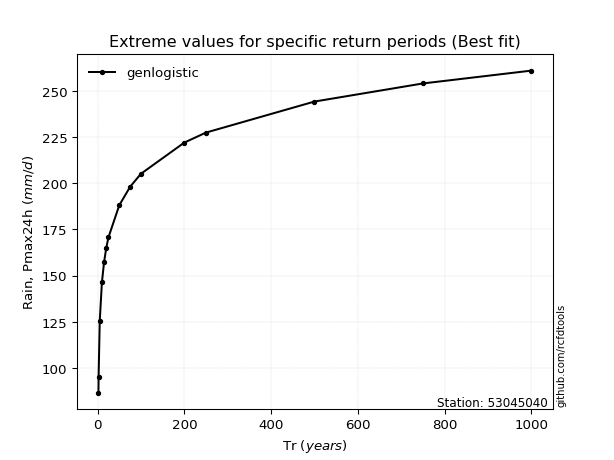</img>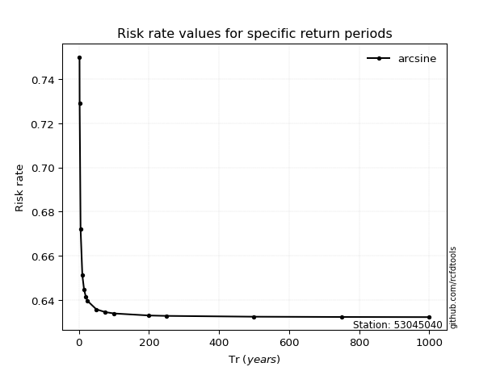</img>

</div>


<sub>**APP DISCLAIMER**: NO WARRANTY - This software is provided by [github.com/rcfdtools](https://github.com/rcfdtools) "as is", without any express or implied warranty, including warranties of merchantability, fitness for a particular purpose, or non-infringement. There is no guarantee that the software will be error-free or operate without interruption. LIMITATION OF LIABILITY - Neither the authors nor copyright holders will be liable for claims or damages arising from the software or its use. You are responsible for determining if the software is appropriate for your use and assume all associated risks, including errors, legal compliance, and data loss. NO PROFESSIONAL ADVICE - The software provides general information and does not offer professional advice. It should not replace consultation with professional advisors.</sub>