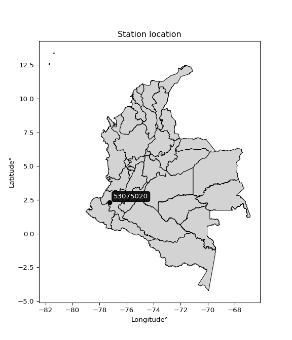

<div align="center">


</div>

# PMax24h Station (Rain): 53075020

Maximum Precipitation in 24 hours (PMax24h) is the greatest amount of rainfall for a specific duration that is meteorologically possible for a given location, acting as a "worst-case" scenario for extreme storms, crucial for designing safety-critical infrastructure like bridges, river deviations, dams, spillways, and nuclear plants to prevent catastrophic failure. The PMax24h is related with the Probable Maximum Precipitation (PMP) and it is calculated by hydrologists using meteorological data to determine the upper limit of extreme rainfall, often leading to the Probable Maximum Flood (PMF) for flood control design, and is increasingly being studied for climate change impacts. Probable Maximum Precipitation (PMP) is the theoretical upper limit of rainfall, a deterministic estimate for extreme events, while probability distributions (like GEV, Gumbel) describe the likelihood and frequency of various precipitation amounts, including rare ones, showing how often events occur, with PMP representing the extreme end of these distributions, used for critical infrastructure design to ensure safety against the worst conceivable weather, unlike standard statistical forecasts which cover typical probabilities.

The most common probability distributions in hydrology, used for analyzing floods, rainfall, and streamflow, include the Normal, Log-Normal, Gumbel, Gamma (including Log-Pearson Type III), and Generalized Extreme Value (GEV) distributions, often chosen based on the data´s skewness and whether modeling extremes or general conditions, with Gumbel and GEV popular for extreme events like floods, while the Normal distribution serves as a baseline, though often requiring transformations for skewed hydrological data. These distributions help in designing water infrastructure, managing water resources, and forecasting hydrologic events.

> Hydrological data often isn´t perfectly normal (it´s skewed), so different distributions are needed for different applications, such as: **Flood Frequency Analysis**: Using Gumbel, GEV, or Log-Pearson Type III for predicting extreme flood magnitudes and their return periods, **Rainfall Analysis**: Normal for annual totals, but Log-Normal, Weibull, or GEV for intensity or extreme daily rainfall, **Streamflow Modeling**: Gamma and Log-Normal for maximum flows, GEV for minimum flows, and Kappa for daily flows.

<div align="center">

</img>

</div>


## A. General information


### 1. General running parameters

• app_version: _v20260225_. • runtime: _2026-02-28 16:54:07.457399_. • Python version: _3.14.0_. • SciPy version: _1.16.3_. • Pandas version: _2.3.3_. • NumPy version: _2.3.5_. • Stations dataset (station_dataset_file): _dataset/pmax24h_in/automatic_colombia_2003_2025.csv_. • Stations catalog (station_catalog_file): _dataset/CNE.xls_. • Minimum year to eval til year_max (date_min): _1900_. • Maximum year to eval since year_min (date_max): _2025_. • Creates, save and include plots into reports (create_plot): _False_. • Plot only fit distributions with Δo > Δ (plot_only_fit): _True_. • Plot only simple graphs avoiding multiple CDFs and multiple Extreme values plots (plot_only_simple): _False_. • Eval low extreme values, if False, evaluates high extreme values (low_extreme): _False_. • Eval every SciPy distribution as logarithmic (pdist_logarithmic_on): _True_. • Standard deviation normalized (ddof): _1.0_. • Return periods to eval in years (Tr): _[2, 2.33, 5, 10, 15, 20, 25, 50, 75, 100, 200, 250, 500, 750, 1000]_. • Minimum data sample per station, 0 means any (minimum_sample): _5_. • Z-Score maximum threshold to adjust a value, 0 means disable (zscore_max): _3.5_. • Z-Score minimum threshold to adjust a value, 0 means disable (zscore_min): _-2.5_. • Avoid zeros, e.g. rain = 0 (avoid_zeros): _True_. • Avoid null values (avoid_nans): _True_. 

:file_folder:Table: [dataset.csv](../../dataset/pmax24h_in/automatic_colombia_2003_2025.csv)

> Delta Degrees of Freedom (DDOF): is a parameter used in the formulas for calculating variance and standard deviation. When ddof=0, the divisor is $N$ (the total number of observations) and this is used when your data set is the entire population. When ddof=1, the divisor is $N-1$ and this is used when your data set is a sample drawn from a larger population. Using $N-1$ provides an unbiased estimate of the population variance (known as Bessel´s correction).


### 2. Station info and location

|   id |   CODIGO | NOMBRE                     | CATEGORIA               | TECNOLOGIA                | ESTADO           | FECHA_INSTALACION   |   FECHA_SUSPENSION |   ALTITUD |   LATITUD |   LONGITUD | DEPARTAMENTO   | MUNICIPIO   | AREA_OPERATIVA                      | ENTIDAD                                                     | AREA_HIDROGRAFICA   | ZONA_HIDROGRAFICA         | SUBZONA_HIDROGRAFICA   |   CORRIENTE | Catalogo   |   Version |
|-----:|---------:|:---------------------------|:------------------------|:--------------------------|:-----------------|:--------------------|-------------------:|----------:|----------:|-----------:|:---------------|:------------|:------------------------------------|:------------------------------------------------------------|:--------------------|:--------------------------|:-----------------------|------------:|:-----------|----------:|
|    0 | 53075020 | EL DIVISO - AUT [53075020] | Climatológica Principal | Automática con Telemetría | En Mantenimiento | 29/09/2005          |                nan |      1750 |   2.31142 |   -77.2588 | Cauca          | Argelia     | Area Operativa 07 - Nariño-Putumayo | INSTITUTO DE HIDROLOGIA METEOROLOGIA Y ESTUDIOS AMBIENTALES | Pacifico            | Tapaje - Dagua - Directos | Río San Juan del Micay |         nan | CNE_IDEAM  |  20251226 |

<div align="center">

Dynamic map: [:earth_americas:Google](http://maps.google.com/maps?q=2.311416667,-77.25877778) [:earth_americas:OSM](https://www.openstreetmap.org/#map=18/2.311416667/-77.25877778&layers=P) [:earth_americas:Bing](https://www.bing.com/maps?cp=2.311416667~-77.25877778&lvl=18) [:earth_americas:Apple](https://maps.apple.com/frame?center=2.311416667%2C-77.25877778&span=0.003%2C0.006)

</div>


<div align="center">

```geojson
{
  "type": "Feature",
  "geometry": {
    "type": "Point", 
    "coordinates": [-77.25877778, 2.311416667]
  }, 
  "properties": {
    "Name": "53075020"
  }
}
```

</div>


### 3. Discrete values table and plot

<div align="center">

|               |          0 |            1 |           2 |         3 |           4 |           5 |
|:--------------|-----------:|-------------:|------------:|----------:|------------:|------------:|
| Date          | 2016       | 2017         | 2018        | 2019      | 2020        | 2025        |
| Value         |   11.9     |   48.3       |   37.3      |   80.2    |   68.2      |   34        |
| Value_initial |   11.9     |   48.3       |   37.3      |   80.2    |   68.2      |   34        |
| count         |    6       |    6         |    6        |    6      |    6        |    6        |
| mean          |   46.65    |   46.65      |   46.65     |   46.65   |   46.65     |   46.65     |
| std           |   24.689   |   24.689     |   24.689    |   24.689  |   24.689    |   24.689    |
| zscore        |   -1.40751 |    0.0668314 |   -0.378711 |    1.3589 |    0.872858 |   -0.512374 |


</div>


> The initial value (value_initial) correspond to the initial obtained or null completed value, and value (value) is adjusted only when the initial value is outside the valid range (outlier) definite through the Z-Score value. If Z-Score is active, values out of range or outliers are replaced with the station mean value. A Z-Score (or standard score) measures how many standard deviations a data point is from the mean of a dataset, indicating its relative position; positive scores mean above the mean, negative mean below, and a score of zero is exactly at the mean, allowing for comparison of values from different distributions. It´s calculated using the formula $z=(x–μ)/σ$, where $x$ is the data point, $μ$ is the mean, and $σ$ is the standard deviation, helping identify outliers and understand probability.
>
> <sub>**Note**: In this study, "completing" (filling gaps in) and "extending" (forecasting or lengthening the historical record) rainfall data series are avoided for certain critical analyses because they introduce artificial bias and uncertainty, which can distort the statistics of rare events (extremes), alter day-to-day variability, and compromise the integrity and homogeneity of the original data. Some reasons against Completing/Extending rainfall data are: **Distortion of Extremes and Variability**: The primary issue is that most gap-filling or extension methods rely on averaging or regression with nearby stations, which inherently smooths the data. Rainfall is highly variable in space and time, with a large percentage of zero values and occasional large storms. Infilling methods often underestimate the highest values and overestimate the lowest (zero) values, which severely distorts analyses focused on flood frequency, drought severity, and intensity-duration-frequency (IDF) curves, **Loss of Data Homogeneity**: Infilled or extended data are synthetic estimates, not actual measurements. Combining these estimates with observed data can violate the assumption of data homogeneity, which requires that the data properties do not change over time. Inhomogeneity can lead to incorrect conclusions about long-term trends or changes in climate patterns, **Propagation of Errors**: Errors and biases from the original data (e.g., wind-induced undercatch, instrument errors, site changes) or the data used for imputation can propagate through the analysis, leading to unreliable hydrological models and inaccurate predictions, **Compromised Statistical Integrity**: For statistical analyses, especially those involving the frequency of events, using artificial data can introduce time bias or autocorrelation that doesn´t exist in reality, making it difficult to assess the true probability of events, **Difficulty in Validation**: It is difficult to accurately validate the quality of filled or extended data, especially for past periods where ground-truth measurements are unavailable. The reliability of imputation techniques heavily depends on the density of the surrounding station network and the complexity of the local topography.</sub>


### 4. Active continuous probability distributions from SciPy (80 of 104 available)

A Probability Density Function (PDF) describes the relative likelihood of a continuous random variable falling within a specific range, where the total area under its curve equals 1, and the area over any interval gives the actual probability for that range. Unlike discrete probabilities (like rolling a die), a PDF shows density, not direct probability for a single point (which is zero), with higher points indicating higher likelihood, often visualized as a bell curve for normal distributions.

A log of a probability density function (log-PDF) is simply the logarithm of the PDF´s value, denoted as $log(f(x))$, useful for converting multiplication of probabilities into addition, improving numerical stability with tiny numbers, and connecting to information theory concepts like entropy. Instead of dealing with very small probabilities (e.g., 0.000001), log-PDFs use negative numbers (e.g., $log(0.00001) ≈ -11.51$ that are easier for computers to handle, preventing underflow errors and simplifying complex calculations. In this study, each active probability distribution from SciPy is also evaluated in the $log$ form.

[scipy.stats](https://docs.scipy.org/doc/scipy/reference/stats.html) is a Python´s powerful submodule within the SciPy library for comprehensive statistical analysis, offering over 130 probability distributions (like Normal, Poisson, etc.), functions for descriptive stats (mean, variance), hypothesis testing (t-tests, chi-square), random variable generation, and statistical tests, making it essential for data science, modeling, and research. It provides tools to explore, model, and draw conclusions from data efficiently, working seamlessly with [NumPy](https://numpy.org/).

<div align="center">

|   id | p_dist           |   n_parameter | fit_method   | label                                                                       | active   | ref                                                                                                      |
|-----:|:-----------------|--------------:|:-------------|:----------------------------------------------------------------------------|:---------|:---------------------------------------------------------------------------------------------------------|
|    0 | alpha            |             3 | MLE          | Alpha                                                                       | True     | [:mortar_board:](https://docs.scipy.org/doc/scipy/reference/generated/scipy.stats.alpha.html)            |
|    1 | anglit           |             2 | MM           | Anglit                                                                      | True     | [:mortar_board:](https://docs.scipy.org/doc/scipy/reference/generated/scipy.stats.anglit.html)           |
|    2 | arcsine          |             2 | MM           | Arcsine                                                                     | True     | [:mortar_board:](https://docs.scipy.org/doc/scipy/reference/generated/scipy.stats.arcsine.html)          |
|    3 | argus            |             3 | MLE          | Argus                                                                       | True     | [:mortar_board:](https://docs.scipy.org/doc/scipy/reference/generated/scipy.stats.argus.html)            |
|    4 | beta             |             4 | MLE          | Beta                                                                        | True     | [:mortar_board:](https://docs.scipy.org/doc/scipy/reference/generated/scipy.stats.beta.html)             |
|    5 | betaprime        |             4 | MLE          | Beta prime                                                                  | True     | [:mortar_board:](https://docs.scipy.org/doc/scipy/reference/generated/scipy.stats.betaprime.html)        |
|    6 | bradford         |             3 | MLE          | Bradford                                                                    | True     | [:mortar_board:](https://docs.scipy.org/doc/scipy/reference/generated/scipy.stats.bradford.html)         |
|    7 | burr             |             4 | MLE          | Burr (Type III)                                                             | True     | [:mortar_board:](https://docs.scipy.org/doc/scipy/reference/generated/scipy.stats.burr.html)             |
|    8 | burr12           |             4 | MLE          | Burr (Type III) 12                                                          | True     | [:mortar_board:](https://docs.scipy.org/doc/scipy/reference/generated/scipy.stats.burr12.html)           |
|    9 | cosine           |             2 | MLE          | Cosine                                                                      | True     | [:mortar_board:](https://docs.scipy.org/doc/scipy/reference/generated/scipy.stats.cosine.html)           |
|   10 | crystalball      |             4 | MLE          | Crystalball                                                                 | True     | [:mortar_board:](https://docs.scipy.org/doc/scipy/reference/generated/scipy.stats.crystalball.html)      |
|   11 | dgamma           |             3 | MLE          | Double gamma                                                                | True     | [:mortar_board:](https://docs.scipy.org/doc/scipy/reference/generated/scipy.stats.dgamma.html)           |
|   12 | dweibull         |             3 | MLE          | Double Weibull                                                              | True     | [:mortar_board:](https://docs.scipy.org/doc/scipy/reference/generated/scipy.stats.dweibull.html)         |
|   13 | erlang           |             3 | MLE          | Erlang                                                                      | True     | [:mortar_board:](https://docs.scipy.org/doc/scipy/reference/generated/scipy.stats.erlang.html)           |
|   14 | exponnorm        |             3 | MLE          | Exponentially modified Normal                                               | True     | [:mortar_board:](https://docs.scipy.org/doc/scipy/reference/generated/scipy.stats.exponnorm.html)        |
|   15 | exponpow         |             3 | MLE          | Exponential power                                                           | True     | [:mortar_board:](https://docs.scipy.org/doc/scipy/reference/generated/scipy.stats.exponpow.html)         |
|   16 | exponweib        |             4 | MLE          | Exponentiated Weibull                                                       | True     | [:mortar_board:](https://docs.scipy.org/doc/scipy/reference/generated/scipy.stats.exponweib.html)        |
|   17 | f                |             4 | MLE          | F                                                                           | True     | [:mortar_board:](https://docs.scipy.org/doc/scipy/reference/generated/scipy.stats.f.html)                |
|   18 | fatiguelife      |             3 | MLE          | Fatigue-life (Birnbaum-Saunders)                                            | True     | [:mortar_board:](https://docs.scipy.org/doc/scipy/reference/generated/scipy.stats.fatiguelife.html)      |
|   19 | foldnorm         |             3 | MM           | Fold Normal                                                                 | True     | [:mortar_board:](https://docs.scipy.org/doc/scipy/reference/generated/scipy.stats.foldnorm.html)         |
|   20 | gamma            |             3 | MLE          | Gamma                                                                       | True     | [:mortar_board:](https://docs.scipy.org/doc/scipy/reference/generated/scipy.stats.gamma.html)            |
|   21 | gausshyper       |             6 | MLE          | Gauss hypergeometric                                                        | True     | [:mortar_board:](https://docs.scipy.org/doc/scipy/reference/generated/scipy.stats.gausshyper.html)       |
|   22 | genexpon         |             5 | MLE          | Generalized exponential                                                     | True     | [:mortar_board:](https://docs.scipy.org/doc/scipy/reference/generated/scipy.stats.genexpon.html)         |
|   23 | genextreme       |             3 | MLE          | Generalized exponential                                                     | True     | [:mortar_board:](https://docs.scipy.org/doc/scipy/reference/generated/scipy.stats.genextreme.html)       |
|   24 | gengamma         |             4 | MLE          | Generalized gamma                                                           | True     | [:mortar_board:](https://docs.scipy.org/doc/scipy/reference/generated/scipy.stats.gengamma.html)         |
|   25 | genhalflogistic  |             3 | MLE          | Generalized half-logistic                                                   | True     | [:mortar_board:](https://docs.scipy.org/doc/scipy/reference/generated/scipy.stats.genhalflogistic.html)  |
|   26 | genlogistic      |             3 | MLE          | Generalized logistic                                                        | True     | [:mortar_board:](https://docs.scipy.org/doc/scipy/reference/generated/scipy.stats.genlogistic.html)      |
|   27 | gennorm          |             3 | MLE          | Generalized Normal                                                          | True     | [:mortar_board:](https://docs.scipy.org/doc/scipy/reference/generated/scipy.stats.gennorm.html)          |
|   28 | genpareto        |             3 | MLE          | Generalized Pareto                                                          | True     | [:mortar_board:](https://docs.scipy.org/doc/scipy/reference/generated/scipy.stats.genpareto.html)        |
|   29 | gompertz         |             3 | MLE          | Gompertz (or truncated Gumbel)                                              | True     | [:mortar_board:](https://docs.scipy.org/doc/scipy/reference/generated/scipy.stats.gompertz.html)         |
|   30 | gumbel_l         |             2 | MM           | Gumbel Left Skew                                                            | True     | [:mortar_board:](https://docs.scipy.org/doc/scipy/reference/generated/scipy.stats.gumbel_l.html)         |
|   31 | gumbel_r         |             2 | MM           | Gumbel Right Skew                                                           | True     | [:mortar_board:](https://docs.scipy.org/doc/scipy/reference/generated/scipy.stats.gumbel_r.html)         |
|   32 | halfgennorm      |             3 | MLE          | Upper half of a generalized normal                                          | True     | [:mortar_board:](https://docs.scipy.org/doc/scipy/reference/generated/scipy.stats.halfgennorm.html)      |
|   33 | halflogistic     |             2 | MM           | Half-logistic                                                               | True     | [:mortar_board:](https://docs.scipy.org/doc/scipy/reference/generated/scipy.stats.halflogistic.html)     |
|   34 | halfnorm         |             2 | MM           | Half Normal                                                                 | True     | [:mortar_board:](https://docs.scipy.org/doc/scipy/reference/generated/scipy.stats.halfnorm.html)         |
|   35 | hypsecant        |             2 | MM           | hyperbolic secant                                                           | True     | [:mortar_board:](https://docs.scipy.org/doc/scipy/reference/generated/scipy.stats.hypsecant.html)        |
|   36 | invgamma         |             3 | MLE          | Inverted gamma                                                              | True     | [:mortar_board:](https://docs.scipy.org/doc/scipy/reference/generated/scipy.stats.invgamma.html)         |
|   37 | invgauss         |             3 | MLE          | Inverse Gaussian                                                            | True     | [:mortar_board:](https://docs.scipy.org/doc/scipy/reference/generated/scipy.stats.invgauss.html)         |
|   38 | invweibull       |             3 | MLE          | Inverted Weibull                                                            | True     | [:mortar_board:](https://docs.scipy.org/doc/scipy/reference/generated/scipy.stats.invweibull.html)       |
|   39 | johnsonsb        |             4 | MLE          | Johnson SB                                                                  | True     | [:mortar_board:](https://docs.scipy.org/doc/scipy/reference/generated/scipy.stats.johnsonsb.html)        |
|   40 | johnsonsu        |             4 | MLE          | Johnson Su                                                                  | True     | [:mortar_board:](https://docs.scipy.org/doc/scipy/reference/generated/scipy.stats.johnsonsu.html)        |
|   41 | kappa3           |             3 | MLE          | Kappa 3                                                                     | True     | [:mortar_board:](https://docs.scipy.org/doc/scipy/reference/generated/scipy.stats.kappa3.html)           |
|   42 | kappa4           |             4 | MLE          | Kappa 4                                                                     | True     | [:mortar_board:](https://docs.scipy.org/doc/scipy/reference/generated/scipy.stats.kappa4.html)           |
|   43 | ksone            |             3 | MLE          | Kolmogorov-Smirnov one-sided test statistic distribution                    | True     | [:mortar_board:](https://docs.scipy.org/doc/scipy/reference/generated/scipy.stats.ksone.html)            |
|   44 | kstwobign        |             2 | MLE          | Limiting distribution of scaled Kolmogorov-Smirnov two-sided test statistic | True     | [:mortar_board:](https://docs.scipy.org/doc/scipy/reference/generated/scipy.stats.kstwobign.html)        |
|   45 | laplace          |             2 | MM           | Laplace                                                                     | True     | [:mortar_board:](https://docs.scipy.org/doc/scipy/reference/generated/scipy.stats.laplace.html)          |
|   46 | levy_l           |             2 | MLE          | Left-skewed Levy                                                            | True     | [:mortar_board:](https://docs.scipy.org/doc/scipy/reference/generated/scipy.stats.levy_l.html)           |
|   47 | loggamma         |             3 | MLE          | Log gamma                                                                   | True     | [:mortar_board:](https://docs.scipy.org/doc/scipy/reference/generated/scipy.stats.loggamma.html)         |
|   48 | logistic         |             2 | MM           | Logistic (or Sech-squared)                                                  | True     | [:mortar_board:](https://docs.scipy.org/doc/scipy/reference/generated/scipy.stats.logistic.html)         |
|   49 | loglaplace       |             3 | MLE          | Log-Laplace                                                                 | True     | [:mortar_board:](https://docs.scipy.org/doc/scipy/reference/generated/scipy.stats.loglaplace.html)       |
|   50 | lomax            |             3 | MLE          | Lomax (Pareto of the second kind)                                           | True     | [:mortar_board:](https://docs.scipy.org/doc/scipy/reference/generated/scipy.stats.lomax.html)            |
|   51 | maxwell          |             2 | MM           | Maxwell                                                                     | True     | [:mortar_board:](https://docs.scipy.org/doc/scipy/reference/generated/scipy.stats.maxwell.html)          |
|   52 | mielke           |             4 | MLE          | Mielke Beta-Kappa / Dagum                                                   | True     | [:mortar_board:](https://docs.scipy.org/doc/scipy/reference/generated/scipy.stats.mielke.html)           |
|   53 | moyal            |             2 | MM           | Moyal                                                                       | True     | [:mortar_board:](https://docs.scipy.org/doc/scipy/reference/generated/scipy.stats.moyal.html)            |
|   54 | nakagami         |             3 | MLE          | Nakagami                                                                    | True     | [:mortar_board:](https://docs.scipy.org/doc/scipy/reference/generated/scipy.stats.nakagami.html)         |
|   55 | ncf              |             5 | MLE          | Non-central F distribution                                                  | True     | [:mortar_board:](https://docs.scipy.org/doc/scipy/reference/generated/scipy.stats.ncf.html)              |
|   56 | nct              |             4 | MLE          | Non-central Student’s t                                                     | True     | [:mortar_board:](https://docs.scipy.org/doc/scipy/reference/generated/scipy.stats.nct.html)              |
|   57 | norm             |             2 | MM           | Normal                                                                      | True     | [:mortar_board:](https://docs.scipy.org/doc/scipy/reference/generated/scipy.stats.norm.html)             |
|   58 | pearson3         |             3 | MM           | Pearson type III                                                            | True     | [:mortar_board:](https://docs.scipy.org/doc/scipy/reference/generated/scipy.stats.pearson3.html)         |
|   59 | powerlaw         |             3 | MLE          | Power-function                                                              | True     | [:mortar_board:](https://docs.scipy.org/doc/scipy/reference/generated/scipy.stats.powerlaw.html)         |
|   60 | rayleigh         |             2 | MM           | Rayleigh                                                                    | True     | [:mortar_board:](https://docs.scipy.org/doc/scipy/reference/generated/scipy.stats.rayleigh.html)         |
|   61 | rdist            |             3 | MLE          | R-distributed (symmetric beta)                                              | True     | [:mortar_board:](https://docs.scipy.org/doc/scipy/reference/generated/scipy.stats.rdist.html)            |
|   62 | rice             |             3 | MLE          | Rice                                                                        | True     | [:mortar_board:](https://docs.scipy.org/doc/scipy/reference/generated/scipy.stats.rice.html)             |
|   63 | semicircular     |             2 | MM           | Semicircular                                                                | True     | [:mortar_board:](https://docs.scipy.org/doc/scipy/reference/generated/scipy.stats.semicircular.html)     |
|   64 | skewnorm         |             3 | MLE          | Skew normal                                                                 | True     | [:mortar_board:](https://docs.scipy.org/doc/scipy/reference/generated/scipy.stats.skewnorm.html)         |
|   65 | t                |             3 | MLE          | Student’s t                                                                 | True     | [:mortar_board:](https://docs.scipy.org/doc/scipy/reference/generated/scipy.stats.t.html)                |
|   66 | trapezoid        |             4 | MLE          | Trapezoid                                                                   | True     | [:mortar_board:](https://docs.scipy.org/doc/scipy/reference/generated/scipy.stats.trapezoid.html)        |
|   67 | triang           |             3 | MLE          | Triangular                                                                  | True     | [:mortar_board:](https://docs.scipy.org/doc/scipy/reference/generated/scipy.stats.triang.html)           |
|   68 | truncexpon       |             3 | MLE          | Truncated exponential                                                       | True     | [:mortar_board:](https://docs.scipy.org/doc/scipy/reference/generated/scipy.stats.truncexpon.html)       |
|   69 | truncnorm        |             4 | MLE          | Truncated normal                                                            | True     | [:mortar_board:](https://docs.scipy.org/doc/scipy/reference/generated/scipy.stats.truncnorm.html)        |
|   70 | truncpareto      |             4 | MLE          | Upper truncated Pareto                                                      | True     | [:mortar_board:](https://docs.scipy.org/doc/scipy/reference/generated/scipy.stats.truncpareto.html)      |
|   71 | truncweibull_min |             5 | MLE          | Doubly truncated Weibull minimum                                            | True     | [:mortar_board:](https://docs.scipy.org/doc/scipy/reference/generated/scipy.stats.truncweibull_min.html) |
|   72 | tukeylambda      |             3 | MLE          | Tukey-Lamdba                                                                | True     | [:mortar_board:](https://docs.scipy.org/doc/scipy/reference/generated/scipy.stats.tukeylambda.html)      |
|   73 | uniform          |             2 | MLE          | Uniform                                                                     | True     | [:mortar_board:](https://docs.scipy.org/doc/scipy/reference/generated/scipy.stats.uniform.html)          |
|   74 | vonmises         |             3 | MLE          | Von Mises                                                                   | True     | [:mortar_board:](https://docs.scipy.org/doc/scipy/reference/generated/scipy.stats.vonmises.html)         |
|   75 | vonmises_line    |             3 | MLE          | Von Mises line                                                              | True     | [:mortar_board:](https://docs.scipy.org/doc/scipy/reference/generated/scipy.stats.vonmises_line.html)    |
|   76 | wald             |             2 | MM           | Wald                                                                        | True     | [:mortar_board:](https://docs.scipy.org/doc/scipy/reference/generated/scipy.stats.wald.html)             |
|   77 | weibull_max      |             3 | MLE          | Weibull maximum                                                             | True     | [:mortar_board:](https://docs.scipy.org/doc/scipy/reference/generated/scipy.stats.weibull_max.html)      |
|   78 | weibull_min      |             3 | MLE          | Weibull minimum                                                             | True     | [:mortar_board:](https://docs.scipy.org/doc/scipy/reference/generated/scipy.stats.weibull_min.html)      |
|   79 | wrapcauchy       |             3 | MLE          | Wrapped  Cauchy                                                             | True     | [:mortar_board:](https://docs.scipy.org/doc/scipy/reference/generated/scipy.stats.wrapcauchy.html)       |

</div>

> **n_parameter:** # arguments & localization & scale.
>
> **Fit methods:** (MLE) maximum likelihood, (MM) L-moments.
>
>**Inactive** (With the only purpose of prevent loops, zero divisions, infinite values, over high estimated values or horizontal trending for recurrence intervals estimations, the follow distributions were disabled.)**:** lognorm, norminvgauss, powernorm, powerlognorm, cauchy, halfcauchy, foldcauchy, skewcauchy, chi2, expon, fisk, genhyperbolic, geninvgauss, gibrat, kstwo, laplace_asymmetric, levy, levy_stable, ncx2, pareto, rel_breitwigner, recipinvgauss, studentized_range, loguniform, 


## B. Probability (PDF) vs. Empirical (EDF) distributions functions

A continuous probability distribution (CPD) describes probabilities for variables that can take any value within a range (like rain any time), unlike discrete variables with specific outcomes (like temperature). It uses a Probability Density Function (PDF), a curve where the total area under it equals 1, and the probability of the variable falling within an interval (a to b) is found by calculating the area under the curve between those points. A key feature is that the probability of hitting any single exact value is zero, so probabilities are always expressed for ranges, e.g., $P(a ≤ X ≤ b)$.

<div align="center">

Distributions parameters from station values
|     |   station | p_dist              |   n |             loc |            scale | shape                  | shape1                 | shape2                 | shape3             |
|----:|----------:|:--------------------|----:|----------------:|-----------------:|:-----------------------|:-----------------------|:-----------------------|:-------------------|
|   0 |  53075020 | alpha               |   6 |  -131.53        |   1345.5         | 7.72078405206656       |                        |                        |                    |
|   1 |  53075020 | anglit              |   6 |    46.65        |     65.9323      |                        |                        |                        |                    |
|   2 |  53075020 | arcsine             |   6 |    14.7766      |     63.7467      |                        |                        |                        |                    |
|   3 |  53075020 | argus               |   6 |    -3.92833     |     88.6874      | 1.4156809768335466e-05 |                        |                        |                    |
|   4 |  53075020 | beta                |   6 |    10.5883      |     69.6117      | 0.7284387031638184     | 0.3134632337259694     |                        |                    |
|   5 |  53075020 | betaprime           |   6 |  -187.215       |  23986.6         | 108.19921148669494     | 11098.551658761759     |                        |                    |
|   6 |  53075020 | bradford            |   6 |    11.9         |     68.3001      | 0.9737842237920501     |                        |                        |                    |
|   7 |  53075020 | burr                |   6 |    -2.15385     |     83.1367      | 399.29494576919416     | 0.0037270443810240358  |                        |                    |
|   8 |  53075020 | burr12              |   6 |    -1.72216     |     13.4747      | 393.24117344411525     | 0.002239765507349084   |                        |                    |
|   9 |  53075020 | cosine              |   6 |    46.6508      |     18.5331      |                        |                        |                        |                    |
|  10 |  53075020 | crystalball         |   6 |    46.65        |     22.5379      | 306.90348059453333     | 10217.107549803692     |                        |                    |
|  11 |  53075020 | dgamma              |   6 |    43.7602      |     10.0434      | 1.88349537733392       |                        |                        |                    |
|  12 |  53075020 | dweibull            |   6 |    44.2432      |     20.9987      | 1.5083662687906818     |                        |                        |                    |
|  13 |  53075020 | erlang              |   6 |  -898.113       |      0.537998    | 1756.0676428479137     |                        |                        |                    |
|  14 |  53075020 | exponnorm           |   6 |    45.7552      |     22.5201      | 0.039734925803225234   |                        |                        |                    |
|  15 |  53075020 | exponpow            |   6 |    11.9         |      6.11047     | 0.22459993692009755    |                        |                        |                    |
|  16 |  53075020 | exponweib           |   6 |    11.9         |     51.4283      | 0.2779855945475953     | 1.8329423170165864     |                        |                    |
|  17 |  53075020 | f                   |   6 |  -185.578       |    232.205       | 213.59321913470905     | 19600.763011937168     |                        |                    |
|  18 |  53075020 | fatiguelife         |   6 |    11.9         |      9.3162e-05  | 554.7533314187408      |                        |                        |                    |
|  19 |  53075020 | foldnorm            |   6 |    53.4224      |      0.0773076   | 0.08591834262325032    |                        |                        |                    |
|  20 |  53075020 | gamma               |   6 |  -902.084       |      0.534856    | 1773.8023982709246     |                        |                        |                    |
|  21 |  53075020 | gausshyper          |   6 |     6.96334     |     73.2367      | 1.268448976328397      | 0.6376213794748672     | 0.8565757143238026     | 0.8440450027573446 |
|  22 |  53075020 | genexpon            |   6 |    10.2954      | 118790           | 23.156626617383864     | 3307.8196624116863     | 164811.28655766044     |                    |
|  23 |  53075020 | genextreme          |   6 |    13.3949      |      9.97643     | -6.673414247347683     |                        |                        |                    |
|  24 |  53075020 | gengamma            |   6 |  -200.137       |     64.7997      | 22.590309157613852     | 2.322404776744095      |                        |                    |
|  25 |  53075020 | genhalflogistic     |   6 |     5.16638     |     78.1822      | 1.04196274478802       |                        |                        |                    |
|  26 |  53075020 | genlogistic         |   6 |    21.3143      |     17.2716      | 2.977598081677869      |                        |                        |                    |
|  27 |  53075020 | gennorm             |   6 |    46.05        |     34.1501      | 5457452.557609949      |                        |                        |                    |
|  28 |  53075020 | genpareto           |   6 |    -0.25035     |    146.949       | -1.8265816497336638    |                        |                        |                    |
|  29 |  53075020 | gompertz            |   6 |   -25.2451      |     21.3499      | 0.021072558841677788   |                        |                        |                    |
|  30 |  53075020 | gumbel_l            |   6 |    56.7932      |     17.5727      |                        |                        |                        |                    |
|  31 |  53075020 | gumbel_r            |   6 |    36.5068      |     17.5727      |                        |                        |                        |                    |
|  32 |  53075020 | halfgennorm         |   6 |    11.9         |      0.368307    | 0.30931825296372883    |                        |                        |                    |
|  33 |  53075020 | halflogistic        |   6 |    19.9374      |     19.2691      |                        |                        |                        |                    |
|  34 |  53075020 | halfnorm            |   6 |    16.8186      |     37.3881      |                        |                        |                        |                    |
|  35 |  53075020 | hypsecant           |   6 |    46.65        |     14.3481      |                        |                        |                        |                    |
|  36 |  53075020 | invgamma            |   6 |  -163.066       |  17636.1         | 85.15798946564254      |                        |                        |                    |
|  37 |  53075020 | invgauss            |   6 |   -39.3431      |   1058.99        | 0.08093114911096916    |                        |                        |                    |
|  38 |  53075020 | invweibull          |   6 |    11.9         |      1.72381     | 0.04529750622259737    |                        |                        |                    |
|  39 |  53075020 | johnsonsb           |   6 |    11.9         |     68.3         | -0.8330000074985315    | 0.14841389391467413    |                        |                    |
|  40 |  53075020 | johnsonsu           |   6 |     2.04348e+08 |      3.62401e+08 | 9942858.6934061        | 18494915.128369626     |                        |                    |
|  41 |  53075020 | kappa3              |   6 |    11.9         |     68.6136      | 384.93723948258685     |                        |                        |                    |
|  42 |  53075020 | kappa4              |   6 |     7.23236     |     77.4595      | 1.0642301566316008     | 1.0615592194111565     |                        |                    |
|  43 |  53075020 | ksone               |   6 |     7.61325     |     78.0735      | 1.0                    |                        |                        |                    |
|  44 |  53075020 | kstwobign           |   6 |   -36.3983      |     94.9777      |                        |                        |                        |                    |
|  45 |  53075020 | laplace             |   6 |    46.65        |     15.9367      |                        |                        |                        |                    |
|  46 |  53075020 | levy_l              |   6 |    83.1972      |     12.3681      |                        |                        |                        |                    |
|  47 |  53075020 | loggamma            |   6 | -4081.54        |    622.587       | 758.5614180031519      |                        |                        |                    |
|  48 |  53075020 | logistic            |   6 |    46.65        |     12.4258      |                        |                        |                        |                    |
|  49 |  53075020 | loglaplace          |   6 |    -0.116577    |     48.4165      | 2.1039622126582707     |                        |                        |                    |
|  50 |  53075020 | lomax               |   6 |    11.9         |      9.82114e+10 | 1652028532.5687037     |                        |                        |                    |
|  51 |  53075020 | maxwell             |   6 |    -6.7553      |     33.4668      |                        |                        |                        |                    |
|  52 |  53075020 | mielke              |   6 |    -4.00849     |     84.9668      | 1.5556408461835882     | 423.325174215119       |                        |                    |
|  53 |  53075020 | moyal               |   6 |    33.7614      |     10.1456      |                        |                        |                        |                    |
|  54 |  53075020 | nakagami            |   6 |    34           |     22.9169      | 0.31151800674769875    |                        |                        |                    |
|  55 |  53075020 | ncf                 |   6 |    -0.0454324   |      1.02838e-05 | 2.8174846343007828e-06 | 5.090167487644376      | 10.755692500988431     |                    |
|  56 |  53075020 | nct                 |   6 | -1206.23        |     22.4901      | 354068.66773519944     | 55.70803896864703      |                        |                    |
|  57 |  53075020 | norm                |   6 |    46.65        |     22.5379      |                        |                        |                        |                    |
|  58 |  53075020 | pearson3            |   6 |    46.65        |     22.5379      | 0.04326393305494279    |                        |                        |                    |
|  59 |  53075020 | powerlaw            |   6 |    11.9         |     68.3         | 0.14588540930028346    |                        |                        |                    |
|  60 |  53075020 | rayleigh            |   6 |     3.53373     |     34.4018      |                        |                        |                        |                    |
|  61 |  53075020 | rdist               |   6 |     5.98734     |     42.3127      | 1.0016792096108342     |                        |                        |                    |
|  62 |  53075020 | rice                |   6 |     0.655363    |     26.8272      | 1.2826630130345102     |                        |                        |                    |
|  63 |  53075020 | semicircular        |   6 |    46.65        |     45.0758      |                        |                        |                        |                    |
|  64 |  53075020 | skewnorm            |   6 |    42.4395      |     22.9278      | 0.23650853212286624    |                        |                        |                    |
|  65 |  53075020 | t                   |   6 |    46.65        |     22.5384      | 9977058.38861649       |                        |                        |                    |
|  66 |  53075020 | trapezoid           |   6 |     5.07        |     81.96        | 1.0                    | 1.0                    |                        |                    |
|  67 |  53075020 | triang              |   6 |    -8.8168      |     89.0417      | 0.999719944489208      |                        |                        |                    |
|  68 |  53075020 | truncexpon          |   6 |     5.70718     |     98.1364      | 0.7590745815482087     |                        |                        |                    |
|  69 |  53075020 | truncnorm           |   6 |    46.65        |     22.5379      | -106.21315296052786    | 197.6453506806477      |                        |                    |
|  70 |  53075020 | truncpareto         |   6 |    11.795       |      0.104995    | 0.20363922042479832    | 651.5091738087623      |                        |                    |
|  71 |  53075020 | truncweibull_min    |   6 |     6.43723     |    104.493       | 1.3477474489294488     | 0.00011931827402192645 | 0.7059095348976574     |                    |
|  72 |  53075020 | tukeylambda         |   6 |    45.9651      |     38.4442      | 1.1229508476658792     |                        |                        |                    |
|  73 |  53075020 | uniform             |   6 |    11.9         |     68.3         |                        |                        |                        |                    |
|  74 |  53075020 | vonmises            |   6 |    -1.21825     |      1           | 1.385014219075065      |                        |                        |                    |
|  75 |  53075020 | vonmises_line       |   6 |    46.0488      |     10.8707      | 6.931181228209094e-05  |                        |                        |                    |
|  76 |  53075020 | wald                |   6 |    24.1121      |     22.5379      |                        |                        |                        |                    |
|  77 |  53075020 | weibull_max         |   6 |    80.2         |      1.50142     | 0.3062261429335137     |                        |                        |                    |
|  78 |  53075020 | weibull_min         |   6 |    -2.34703     |     55.3385      | 2.339017732167532      |                        |                        |                    |
|  79 |  53075020 | wrapcauchy          |   6 |    11.9         |     10.8707      | 0.0793635026863586     |                        |                        |                    |
|  80 |  53075020 | logalpha            |   6 |   -13.8974      |    476.944       | 27.16850113255765      |                        |                        |                    |
|  81 |  53075020 | loganglit           |   6 |     3.68438     |      1.81324     |                        |                        |                        |                    |
|  82 |  53075020 | logarcsine          |   6 |     2.80779     |      1.75318     |                        |                        |                        |                    |
|  83 |  53075020 | logargus            |   6 |     1.81336     |      2.63934     | 2.1067553845504436     |                        |                        |                    |
|  84 |  53075020 | logbeta             |   6 |     2.13339     |      2.25113     | 1.6074656618553538     | 0.6088692451506847     |                        |                    |
|  85 |  53075020 | logbetaprime        |   6 |    -0.98208     |      8.53561     | 80.36240037911435      | 147.95044466786908     |                        |                    |
|  86 |  53075020 | logbradford         |   6 |     2.45556     |      1.93044     | 1.0378999014718242e-05 |                        |                        |                    |
|  87 |  53075020 | logburr             |   6 |     2.07094     |      2.34091     | 257.9706569161908      | 0.007759978026244596   |                        |                    |
|  88 |  53075020 | logburr12           |   6 |  -207.021       |    215.983       | 469.0238715852787      | 58540.43789425136      |                        |                    |
|  89 |  53075020 | logcosine           |   6 |     3.60194     |      0.532074    |                        |                        |                        |                    |
|  90 |  53075020 | logcrystalball      |   6 |     3.68438     |      0.619826    | 10.44898146625275      | 32.558636038289606     |                        |                    |
|  91 |  53075020 | logdgamma           |   6 |     3.75913     |      0.303911    | 1.5697927021360774     |                        |                        |                    |
|  92 |  53075020 | logdweibull         |   6 |     3.75501     |      0.515657    | 1.2522166122443907     |                        |                        |                    |
|  93 |  53075020 | logerlang           |   6 |    -7.15855     |      0.0374436   | 289.2872279054245      |                        |                        |                    |
|  94 |  53075020 | logexponnorm        |   6 |     3.68394     |      0.619825    | 0.0007181498972222413  |                        |                        |                    |
|  95 |  53075020 | logexponpow         |   6 |     2.47654     |      1.23324     | 0.7581981446621271     |                        |                        |                    |
|  96 |  53075020 | logexponweib        |   6 |     2.47654     |      0.981035    | 0.3209032830270629     | 1.0982863320676275     |                        |                    |
|  97 |  53075020 | logf                |   6 |  -941.069       |    944.755       | 13890623.276074221     | 6947207.917466803      |                        |                    |
|  98 |  53075020 | logfatiguelife      |   6 |  -353.324       |    357.008       | 0.001733789432756577   |                        |                        |                    |
|  99 |  53075020 | logfoldnorm         |   6 |    -0.0377574   |      0.597859    | 6.229720070671357      |                        |                        |                    |
| 100 |  53075020 | loggamma            |   6 |    -6.07855     |      0.041668    | 234.0729853359652      |                        |                        |                    |
| 101 |  53075020 | loggausshyper       |   6 |     2.06177     |      2.32275     | 1.0115230833151627     | 0.4224548229553621     | 1.2745329023221903     | 0.6891968077861592 |
| 102 |  53075020 | loggenexpon         |   6 |     2.46543     |      0.0125998   | 0.0036745916941197986  | 3.730272811845923      | 2.9236488648802265e-05 |                    |
| 103 |  53075020 | loggenextreme       |   6 |     3.66873     |      0.751376    | 1.0497125964403011     |                        |                        |                    |
| 104 |  53075020 | loggengamma         |   6 |    -2.17433e+07 |      2.17433e+07 | 2.9577073572056185     | 23242994.79926712      |                        |                    |
| 105 |  53075020 | loggenhalflogistic  |   6 |     2.47132     |      2.02424     | 1.0580333392531274     |                        |                        |                    |
| 106 |  53075020 | loggenlogistic      |   6 |     4.38461     |      6.95058e-06 | 9.975057073877527e-06  |                        |                        |                    |
| 107 |  53075020 | loggennorm          |   6 |     3.72999     |      0.714107    | 1.474529973015842      |                        |                        |                    |
| 108 |  53075020 | loggenpareto        |   6 |    -0.00329707  |      9.94169     | -2.265747120987058     |                        |                        |                    |
| 109 |  53075020 | loggompertz         |   6 |     2.47654     |      0.534842    | 0.06991098465975942    |                        |                        |                    |
| 110 |  53075020 | loggumbel_l         |   6 |     3.96334     |      0.483277    |                        |                        |                        |                    |
| 111 |  53075020 | loggumbel_r         |   6 |     3.40543     |      0.483277    |                        |                        |                        |                    |
| 112 |  53075020 | loghalfgennorm      |   6 |     2.47654     |      1.13254     | 0.949883958389927      |                        |                        |                    |
| 113 |  53075020 | loghalflogistic     |   6 |     2.94975     |      0.529925    |                        |                        |                        |                    |
| 114 |  53075020 | loghalfnorm         |   6 |     2.864       |      1.02821     |                        |                        |                        |                    |
| 115 |  53075020 | loghypsecant        |   6 |     3.68438     |      0.394594    |                        |                        |                        |                    |
| 116 |  53075020 | loginvgamma         |   6 |   -11.3178      |   8084.58        | 540.0124185298414      |                        |                        |                    |
| 117 |  53075020 | loginvgauss         |   6 |    -2.48206     |    520.682       | 0.011848228751387586   |                        |                        |                    |
| 118 |  53075020 | loginvweibull       |   6 |    -2.92855e+07 |      2.92855e+07 | 43187444.25431581      |                        |                        |                    |
| 119 |  53075020 | logjohnsonsb        |   6 |     1.80153     |      2.583       | 0.02310049267592676    | 0.07668491898171484    |                        |                    |
| 120 |  53075020 | logjohnsonsu        |   6 |     4.55617     |      0.00521252  | 6.832996049333828      | 1.2369211970110103     |                        |                    |
| 121 |  53075020 | logkappa3           |   6 |     2.47399     |      1.90938     | 2714.12556185623       |                        |                        |                    |
| 122 |  53075020 | logkappa4           |   6 |     2.34947     |      2.14602     | 1.0444219607514795     | 1.0545279631891344     |                        |                    |
| 123 |  53075020 | logksone            |   6 |     2.28574     |      2.28958     | 1.0                    |                        |                        |                    |
| 124 |  53075020 | logkstwobign        |   6 |     0.925939    |      3.15095     |                        |                        |                        |                    |
| 125 |  53075020 | loglaplace          |   6 |     3.68438     |      0.438284    |                        |                        |                        |                    |
| 126 |  53075020 | loglevy_l           |   6 |     4.43394     |      0.2027      |                        |                        |                        |                    |
| 127 |  53075020 | logloggamma         |   6 |     4.38454     |      8.09385e-07 | 1.1485044622644399e-06 |                        |                        |                    |
| 128 |  53075020 | loglogistic         |   6 |     3.68438     |      0.341728    |                        |                        |                        |                    |
| 129 |  53075020 | logloglaplace       |   6 |    -5.30351     |      9.18074     | 18.44108022701839      |                        |                        |                    |
| 130 |  53075020 | loglomax            |   6 |     2.47654     |      1.56159e+12 | 574247899672.467       |                        |                        |                    |
| 131 |  53075020 | logmaxwell          |   6 |     2.21565     |      0.920389    |                        |                        |                        |                    |
| 132 |  53075020 | logmielke           |   6 |     1.31526     |      3.06985     | 3.3118516695035902     | 33730.115235732934     |                        |                    |
| 133 |  53075020 | logmoyal            |   6 |     3.32993     |      0.27902     |                        |                        |                        |                    |
| 134 |  53075020 | lognakagami         |   6 |     3.52636     |      0.496337    | 0.27626252404243995    |                        |                        |                    |
| 135 |  53075020 | logncf              |   6 |   -10.5929      |     14.2673      | 1493.5491818221026     | 2707.5271359921217     | 2.809232222542149e-05  |                    |
| 136 |  53075020 | lognct              |   6 |   -27.197       |      0.576829    | 8501.632431899205      | 53.531319795547745     |                        |                    |
| 137 |  53075020 | lognorm             |   6 |     3.68438     |      0.619827    |                        |                        |                        |                    |
| 138 |  53075020 | logpearson3         |   6 |     3.68438     |      0.619826    | -0.8819816274873744    |                        |                        |                    |
| 139 |  53075020 | logpowerlaw         |   6 |     2.47654     |      1.90799     | 0.1599805411951592     |                        |                        |                    |
| 140 |  53075020 | lograyleigh         |   6 |     2.49865     |      0.946082    |                        |                        |                        |                    |
| 141 |  53075020 | logrdist            |   6 |     3.36585     |      1.01867     | 1.080581910431012      |                        |                        |                    |
| 142 |  53075020 | logrice             |   6 |     2.02212     |      0.66601     | 2.257286471507199      |                        |                        |                    |
| 143 |  53075020 | logsemicircular     |   6 |     3.68438     |      1.23965     |                        |                        |                        |                    |
| 144 |  53075020 | logskewnorm         |   6 |     4.38452     |      0.935081    | -28095906.491793767    |                        |                        |                    |
| 145 |  53075020 | logt                |   6 |     3.68438     |      0.619828    | 2349683182.780678      |                        |                        |                    |
| 146 |  53075020 | logtrapezoid        |   6 |     1.93125     |      2.6297      | 1.0                    | 1.0                    |                        |                    |
| 147 |  53075020 | logtriang           |   6 |     2.04472     |      2.33982     | 0.9999970019856244     |                        |                        |                    |
| 148 |  53075020 | logtruncexpon       |   6 |     2.47651     |      2.00691     | 0.9507236346671484     |                        |                        |                    |
| 149 |  53075020 | logtruncnorm        |   6 |    -0.215641    |      1.55407     | 2.406884480447075      | 2.9600715285412833     |                        |                    |
| 150 |  53075020 | logtruncpareto      |   6 |     2.47266     |      0.00387622  | 0.20338443643663717    | 493.22765530949397     |                        |                    |
| 151 |  53075020 | logtruncweibull_min |   6 |    -0.507725    |      6.20941     | 4.93642233058806       | 0.48060304832402334    | 0.7878760115203516     |                    |
| 152 |  53075020 | logtukeylambda      |   6 |     3.37545     |      1.04495     | 1.0355487973970614     |                        |                        |                    |
| 153 |  53075020 | loguniform          |   6 |     2.47654     |      1.90799     |                        |                        |                        |                    |
| 154 |  53075020 | logvonmises         |   6 |    -2.56018     |      1           | 3.217067682830426      |                        |                        |                    |
| 155 |  53075020 | logvonmises_line    |   6 |     3.42877     |      0.304237    | 1.755375599899183e-05  |                        |                        |                    |
| 156 |  53075020 | logwald             |   6 |     3.06456     |      0.619825    |                        |                        |                        |                    |
| 157 |  53075020 | logweibull_max      |   6 |     4.38452     |      0.534566    | 0.7266733339029194     |                        |                        |                    |
| 158 |  53075020 | logweibull_min      |   6 |    -2.91386e+07 |      2.91386e+07 | 63920549.24717265      |                        |                        |                    |
| 159 |  53075020 | logwrapcauchy       |   6 |     2.47653     |      0.303667    | 0.3150157595904596     |                        |                        |                    |

</div>

> **loc** (Location parameter): This shifts the distribution along the x-axis. For many common distributions, like the normal (Gaussian) distribution, loc represents the mean $μ$. For others, like the uniform distribution, it might represent the minimum value, or for the beta distribution, the left end of the support interval.
>
> **scale** (Scale parameter): This determines the width or spread of the distribution. For the normal distribution, scale represents the standard deviation $σ$. For a uniform distribution, it defines the length of the interval (from $loc$ to $loc + scale$).
>
> **shape** (Shape parameters): Refers to parameters that define the specific form of a probability distribution, distinct from its location (loc) and scale (scale). These parameters are required arguments for most distribution functions. For example, a normal (Gaussian) distribution is fully defined by its location (mean) and scale (standard deviation), so it has no specific shape parameters beyond loc and scale. However, other distributions have intrinsic properties that need specification, as Gamma distribution that takes a shape parameter, often named $a$ or $alpha$.


### 0. Cumulative distribution values - CDF (160 evaluated)

Cumulative Distribution Function (CDF), denoted as $F$<sub>$X$</sub>$(x)$, is a function that gives the probability that a random variable $X$ will take a value less than or equal to a specific value, $x$ (i.e., $(P(X≥x)$. It essentially "accumulates" probabilities from a given point up to the far right (positive infinity), providing a complete picture of the distribution´s probabilities for both discrete (like rain) and continuous (like temperature) variables, helping to find probabilities over ranges or above certain values. Each station is evaluated separately ordering the $x$ values ascending, calculating the CDF and PDF values for the activated distributions and their logarithmic forms.

<div align="center">

CDF ordered by x ascending and calculating $log(f(x))$ separately
|   id |   Station |   date |    x |   count |   mean |    std |     zscore |   Value_initial |   station |   m |     alpha |   alpha_pdf |    anglit |   anglit_pdf |   arcsine |   arcsine_pdf |     argus |   argus_pdf |      beta |    beta_pdf |   betaprime |   betaprime_pdf |    bradford |   bradford_pdf |      burr |    burr_pdf |     burr12 |   burr12_pdf |    cosine |   cosine_pdf |   crystalball |   crystalball_pdf |    dgamma |   dgamma_pdf |   dweibull |   dweibull_pdf |    erlang |   erlang_pdf |   exponnorm |   exponnorm_pdf |    exponpow |   exponpow_pdf |   exponweib |   exponweib_pdf |         f |      f_pdf |   fatiguelife |   fatiguelife_pdf |   foldnorm |   foldnorm_pdf |     gamma |   gamma_pdf |   gausshyper |   gausshyper_pdf |   genexpon |   genexpon_pdf |   genextreme |   genextreme_pdf |   gengamma |   gengamma_pdf |   genhalflogistic |   genhalflogistic_pdf |   genlogistic |   genlogistic_pdf |     gennorm |   gennorm_pdf |   genpareto |   genpareto_pdf |   gompertz |   gompertz_pdf |   gumbel_l |   gumbel_l_pdf |   gumbel_r |   gumbel_r_pdf |   halfgennorm |   halfgennorm_pdf |   halflogistic |   halflogistic_pdf |   halfnorm |   halfnorm_pdf |   hypsecant |   hypsecant_pdf |   invgamma |   invgamma_pdf |   invgauss |   invgauss_pdf |   invweibull |   invweibull_pdf |   johnsonsb |   johnsonsb_pdf |   johnsonsu |   johnsonsu_pdf |      kappa3 |   kappa3_pdf |      kappa4 |   kappa4_pdf |     ksone |   ksone_pdf |   kstwobign |   kstwobign_pdf |   laplace |   laplace_pdf |   levy_l |   levy_l_pdf |   loggamma |   loggamma_pdf |   logistic |   logistic_pdf |   loglaplace |   loglaplace_pdf |       lomax |   lomax_pdf |   maxwell |   maxwell_pdf |    mielke |   mielke_pdf |      moyal |   moyal_pdf |    nakagami |   nakagami_pdf |      ncf |    ncf_pdf |       nct |    nct_pdf |      norm |   norm_pdf |   pearson3 |   pearson3_pdf |   powerlaw |   powerlaw_pdf |   rayleigh |   rayleigh_pdf |    rdist |       rdist_pdf |      rice |   rice_pdf |   semicircular |   semicircular_pdf |   skewnorm |   skewnorm_pdf |         t |      t_pdf |   trapezoid |   trapezoid_pdf |    triang |   triang_pdf |   truncexpon |   truncexpon_pdf |   truncnorm |   truncnorm_pdf |   truncpareto |   truncpareto_pdf |   truncweibull_min |   truncweibull_min_pdf |   tukeylambda |   tukeylambda_pdf |   uniform |   uniform_pdf |   vonmises |   vonmises_pdf |   vonmises_line |   vonmises_line_pdf |     wald |   wald_pdf |   weibull_max |   weibull_max_pdf |   weibull_min |   weibull_min_pdf |   wrapcauchy |   wrapcauchy_pdf |   logalpha |   logalpha_pdf |   loganglit |   loganglit_pdf |   logarcsine |   logarcsine_pdf |   logargus |   logargus_pdf |   logbeta |   logbeta_pdf |   logbetaprime |   logbetaprime_pdf |   logbradford |   logbradford_pdf |   logburr |   logburr_pdf |   logburr12 |   logburr12_pdf |   logcosine |   logcosine_pdf |   logcrystalball |   logcrystalball_pdf |   logdgamma |   logdgamma_pdf |   logdweibull |   logdweibull_pdf |   logerlang |   logerlang_pdf |   logexponnorm |   logexponnorm_pdf |   logexponpow |   logexponpow_pdf |   logexponweib |   logexponweib_pdf |     logf |   logf_pdf |   logfatiguelife |   logfatiguelife_pdf |   logfoldnorm |   logfoldnorm_pdf |   loggausshyper |   loggausshyper_pdf |   loggenexpon |   loggenexpon_pdf |   loggenextreme |   loggenextreme_pdf |   loggengamma |   loggengamma_pdf |   loggenhalflogistic |   loggenhalflogistic_pdf |   loggenlogistic |   loggenlogistic_pdf |   loggennorm |   loggennorm_pdf |   loggenpareto |   loggenpareto_pdf |   loggompertz |   loggompertz_pdf |   loggumbel_l |   loggumbel_l_pdf |   loggumbel_r |   loggumbel_r_pdf |   loghalfgennorm |   loghalfgennorm_pdf |   loghalflogistic |   loghalflogistic_pdf |   loghalfnorm |   loghalfnorm_pdf |   loghypsecant |   loghypsecant_pdf |   loginvgamma |   loginvgamma_pdf |   loginvgauss |   loginvgauss_pdf |   loginvweibull |   loginvweibull_pdf |   logjohnsonsb |   logjohnsonsb_pdf |   logjohnsonsu |   logjohnsonsu_pdf |   logkappa3 |   logkappa3_pdf |   logkappa4 |   logkappa4_pdf |   logksone |   logksone_pdf |   logkstwobign |   logkstwobign_pdf |   loglevy_l |   loglevy_l_pdf |   logloggamma |   logloggamma_pdf |   loglogistic |   loglogistic_pdf |   logloglaplace |   logloglaplace_pdf |    loglomax |   loglomax_pdf |   logmaxwell |   logmaxwell_pdf |   logmielke |   logmielke_pdf |   logmoyal |   logmoyal_pdf |   lognakagami |   lognakagami_pdf |    logncf |   logncf_pdf |    lognct |   lognct_pdf |   lognorm |   lognorm_pdf |   logpearson3 |   logpearson3_pdf |   logpowerlaw |   logpowerlaw_pdf |   lograyleigh |   lograyleigh_pdf |   logrdist |   logrdist_pdf |   logrice |   logrice_pdf |   logsemicircular |   logsemicircular_pdf |   logskewnorm |   logskewnorm_pdf |      logt |   logt_pdf |   logtrapezoid |   logtrapezoid_pdf |   logtriang |   logtriang_pdf |   logtruncexpon |   logtruncexpon_pdf |   logtruncnorm |   logtruncnorm_pdf |   logtruncpareto |   logtruncpareto_pdf |   logtruncweibull_min |   logtruncweibull_min_pdf |   logtukeylambda |   logtukeylambda_pdf |   loguniform |   loguniform_pdf |   logvonmises |   logvonmises_pdf |   logvonmises_line |   logvonmises_line_pdf |   logwald |   logwald_pdf |   logweibull_max |   logweibull_max_pdf |   logweibull_min |   logweibull_min_pdf |   logwrapcauchy |   logwrapcauchy_pdf |
|-----:|----------:|-------:|-----:|--------:|-------:|-------:|-----------:|----------------:|----------:|----:|----------:|------------:|----------:|-------------:|----------:|--------------:|----------:|------------:|----------:|------------:|------------:|----------------:|------------:|---------------:|----------:|------------:|-----------:|-------------:|----------:|-------------:|--------------:|------------------:|----------:|-------------:|-----------:|---------------:|----------:|-------------:|------------:|----------------:|------------:|---------------:|------------:|----------------:|----------:|-----------:|--------------:|------------------:|-----------:|---------------:|----------:|------------:|-------------:|-----------------:|-----------:|---------------:|-------------:|-----------------:|-----------:|---------------:|------------------:|----------------------:|--------------:|------------------:|------------:|--------------:|------------:|----------------:|-----------:|---------------:|-----------:|---------------:|-----------:|---------------:|--------------:|------------------:|---------------:|-------------------:|-----------:|---------------:|------------:|----------------:|-----------:|---------------:|-----------:|---------------:|-------------:|-----------------:|------------:|----------------:|------------:|----------------:|------------:|-------------:|------------:|-------------:|----------:|------------:|------------:|----------------:|----------:|--------------:|---------:|-------------:|-----------:|---------------:|-----------:|---------------:|-------------:|-----------------:|------------:|------------:|----------:|--------------:|----------:|-------------:|-----------:|------------:|------------:|---------------:|---------:|-----------:|----------:|-----------:|----------:|-----------:|-----------:|---------------:|-----------:|---------------:|-----------:|---------------:|---------:|----------------:|----------:|-----------:|---------------:|-------------------:|-----------:|---------------:|----------:|-----------:|------------:|----------------:|----------:|-------------:|-------------:|-----------------:|------------:|----------------:|--------------:|------------------:|-------------------:|-----------------------:|--------------:|------------------:|----------:|--------------:|-----------:|---------------:|----------------:|--------------------:|---------:|-----------:|--------------:|------------------:|--------------:|------------------:|-------------:|-----------------:|-----------:|---------------:|------------:|----------------:|-------------:|-----------------:|-----------:|---------------:|----------:|--------------:|---------------:|-------------------:|--------------:|------------------:|----------:|--------------:|------------:|----------------:|------------:|----------------:|-----------------:|---------------------:|------------:|----------------:|--------------:|------------------:|------------:|----------------:|---------------:|-------------------:|--------------:|------------------:|---------------:|-------------------:|---------:|-----------:|-----------------:|---------------------:|--------------:|------------------:|----------------:|--------------------:|--------------:|------------------:|----------------:|--------------------:|--------------:|------------------:|---------------------:|-------------------------:|-----------------:|---------------------:|-------------:|-----------------:|---------------:|-------------------:|--------------:|------------------:|--------------:|------------------:|--------------:|------------------:|-----------------:|---------------------:|------------------:|----------------------:|--------------:|------------------:|---------------:|-------------------:|--------------:|------------------:|--------------:|------------------:|----------------:|--------------------:|---------------:|-------------------:|---------------:|-------------------:|------------:|----------------:|------------:|----------------:|-----------:|---------------:|---------------:|-------------------:|------------:|----------------:|--------------:|------------------:|--------------:|------------------:|----------------:|--------------------:|------------:|---------------:|-------------:|-----------------:|------------:|----------------:|-----------:|---------------:|--------------:|------------------:|----------:|-------------:|----------:|-------------:|----------:|--------------:|--------------:|------------------:|--------------:|------------------:|--------------:|------------------:|-----------:|---------------:|----------:|--------------:|------------------:|----------------------:|--------------:|------------------:|----------:|-----------:|---------------:|-------------------:|------------:|----------------:|----------------:|--------------------:|---------------:|-------------------:|-----------------:|---------------------:|----------------------:|--------------------------:|-----------------:|---------------------:|-------------:|-----------------:|--------------:|------------------:|-------------------:|-----------------------:|----------:|--------------:|-----------------:|---------------------:|-----------------:|---------------------:|----------------:|--------------------:|
|    0 |  53075020 |   2016 | 11.9 |       6 |  46.65 | 24.689 | -1.40751   |            11.9 |  53075020 |   1 | 0.0484457 |  0.0065775  | 0.0652691 |   0.00749254 |  0        |     0         | 0.0473965 |  0.00594023 | 0.0208471 | 0.0116655   |   0.0559652 |      0.00556506 | 3.23875e-07 |      0.0209683 | 0.0709776 | nan         | 0.00957036 |   0.0631637  | 0.0497299 |   0.0060148  |     0.0615552 |        0.00539229 | 0.0772101 |   0.00605053 |  0.0734153 |     0.0065685  | 0.0602569 |   0.00543571 |   0.0615516 |      0.00539238 | 0.000323961 |    4.09612e+10 | 4.09504e-09 |     1.17463e+06 | 0.0559245 | 0.00556675 |      0.142354 |       4.55238e+08 |          0 |              0 | 0.0601239 |  0.00543025 |     0.027676 |       0.00704474 |  0.0267275 |     0.0243664  |  0.000488852 |    287.95        |  0.0592954 |     0.00545517 |         0.0450893 |            0.00701154 |     0.0505568 |        0.00551711 | 1.33372e-06 |     0.0146412 |   0.0857376 |      0.00732843 |   0.094225 |     0.00509261 |  0.0747714 |     0.00409178 |  0.0173122 |     0.0039962  |   1.07385e-12 |        0.335073   |       0        |         0          |   0        |     0          |   0.0563524 |      0.00390705 |  0.0508736 |     0.0058367  |  0.0439243 |     0.00665775 |   0.00844751 |      1.02836e+12 | 3.99874e-11 |  22210.3        |   0.0611975 |      0.00537802 | 9.43203e-16 |    0.0143507 | 4.04382e-05 |    0.024818  | 0.0549065 |   0.0128084 |   0.0417696 |      0.00738693 | 0.0564923 |    0.0035448  | 0.322956 |   0.0021369  |  0.0261514 |       0.103933 |  0.0575079 |     0.00436196 |    0.0317775 |        0.0725044 | 2.69218e-09 |  0.0168212  |  0.042001 |    0.00634204 | 0.0738047 |   0.00721713 | 0.00331424 |  0.00154686 | 0           |     0          | 0.118175 | 0.0139949  | 0.0615579 | 0.00539341 | 0.0615552 | 0.00539229 |  0.0603192 |     0.00542895 | 0.00380633 |    3.12599e+11 |  0.0291384 |     0.0068632  | 0.544678 |      0.00760606 | 0.0382729 | 0.00674873 |      0.0634973 |         0.00899552 |  0.0614758 |     0.0053943  | 0.0615598 | 0.00539248 |  0.00694444 |      0.00203351 | 0.0541477 |   0.00522742 |     0.114973 |       0.017986   |   0.0615551 |      0.00539229 |      0        |        2.64703    |          0.0399065 |             0.00975631 |    0.00307487 |         0.0174497 |  0        |     0.0146413 |    2.71297 |      0.33608   |     3.64322e-05 |           0.0146397 | 0        | 0          |     0.0400019 |       0.000577298 |     0.0409784 |        0.00658789 |  6.81201e-08 |        0.0171649 |  0.0250158 |       0.104025 |   0.0141589 |        0.130315 |     0        |         0        |  0.0345598 |       0.109908 |  0.026611 |      0.127891 |      0.0194471 |          0.0953035 |     0.0108651 |          0.51802  | 0.0299244 |      0.147692 |   0.0354501 |        0.077942 |   0.0272151 |        0.144226 |        0.0256669 |            0.0963952 |   0.0210729 |       0.0616702 |     0.0221372 |         0.0675923 |    0.026582 |        0.10448  |      0.0256665 |          0.0963943 |   1.95302e-12 |       3334.42     |    3.90867e-06 |        3.10204e+09 | 0.025563 |  0.0960452 |        0.0253351 |            0.0958058 |     0.0214739 |         0.0860121 |        0.115747 |         0.278407    |    0.00327714 |          0.29829  |       0.0785027 |           0.0997385 |     0.0341316 |         0.0900442 |            0.0012919 |                 0.247682 |         0        |            0.0928206 |    0.0262018 |        0.0781854 |       0.307574 |        0.160172    |   2.19958e-08 |          0.130713 |     0.0450733 |         0.0911317 |    0.00107542 |         0.0152098 |      1.06997e-09 |             0.862729 |          0        |              0        |      0        |          0        |      0.0297986 |           0.075407 |     0.0260097 |          0.104607 |     0.0250234 |          0.109185 |       0.0269895 |            0.143775 |       0.47744  |        0.0612581   |      0.0760506 |          0.0850912 |  0.00132827 |        0.522208 |   0.0208085 |        0.555292 |  0.0833333 |       0.436761 |      0.0312294 |           0.185064 |    0.252396 |       0.0622774 |     0.0667089 |         0.0946589 |      0.028346 |         0.0805976 |       0.0236124 |           0.0559686 | 5.49689e-12 |       0.367733 |   0.00591301 |         0.066908 |   0.0399757 |        0.114007 | 3.9357e-06 |    0.000156702 |   0           |       0           | 0.0280134 |     0.106927 | 0.0259321 |    0.0976923 | 0.0256668 |     0.0963951 |     0.0438669 |         0.0995961 |    0.00315506 |       1.13659e+12 |      0        |          0        |   0.149731 |    0.637833    | 0.0213555 |      0.107167 |        0.00245761 |              0.11559  |     0.0413055 |          0.106417 | 0.0256672 |  0.0963961 |      0.0429975 |           0.157705 |   0.0340602 |        0.157751 |     2.18323e-05 |            0.812128 |      0         |           0        |         0        |           73.2121    |           2.96702e-10 |                  0.181191 |         0.056353 |             0.503479 |     0        |         0.524113 |       1.02477 |         0.0761186 |         0.00186205 |               0.523119 |  0        |      0        |        0.0803943 |            0.0771845 |        0.0375761 |            0.0808614 |     8.75533e-06 |            1.00617  |
|    1 |  53075020 |   2025 | 34   |       6 |  46.65 | 24.689 | -0.512374  |            34   |  53075020 |   2 | 0.341759  |  0.0180282  | 0.31281   |   0.0140641  |  0.370092 |     0.0108803 | 0.261388  |  0.0130767  | 0.189484  | 0.00697549  |   0.295358  |      0.0158609  | 0.402829    |      0.0159444 | 0.28961   |   0.0119211 | 0.576292   |   0.010447   | 0.290963  |   0.015251   |     0.287304  |        0.0151213  | 0.356524  |   0.0192092  |  0.356364  |     0.0177714  | 0.289246  |   0.0153013  |   0.287309  |      0.0151218  | 0.939131    |    0.0031368   | 0.631669    |     0.01307     | 0.295434  | 0.0158667  |      0.810017 |       0.00538997  |          0 |              0 | 0.289124  |  0.0153104  |     0.230883 |       0.0106494  |  0.475143  |     0.0147175  |  0.512783    |      0.00232223  |  0.290237  |     0.0154269  |         0.228601  |            0.00984387 |     0.311348  |        0.0174023  | 0.5         |     0.0146412 |   0.261888  |      0.00874663 |   0.271589 |     0.0115305  |  0.239157  |     0.0118343  |  0.315585  |     0.0207124  |   0.638769    |        0.00964459 |       0.349524 |         0.0227783  |   0.354154 |     0.0192022  |   0.249937  |      0.015684   |  0.30924   |     0.0167738  |  0.339572  |     0.0177862  |   0.410298   |      0.000749198 | 0.172984    |      0.0025404  |   0.286935  |      0.0151409  | 0.317151    |    0.0143507 | 0.330766    |    0.014233  | 0.337973  |   0.0128084 |   0.35802   |      0.0177547  | 0.226069  |    0.0141855  | 0.383908 |   0.00358559 |  0.415963  |       0.618077 |  0.265408  |     0.0156905  |    0.348648  |        0.795484  | 0.310472    |  0.0115987  |  0.313799 |    0.0168437  | 0.286093  |   0.0117095  | 0.323001   |  0.0238465  | 1.68892e-10 | 14809.2        | 0.433408 | 0.0122423  | 0.287345  | 0.0151227  | 0.287304  | 0.0151213  |  0.288987  |     0.0152869  | 0.848227   |    0.00559927  |  0.324394  |     0.017392   | 0.730541 |      0.0100443  | 0.308727  | 0.0163924  |      0.323714  |         0.0135558  |  0.287407  |     0.0151322  | 0.287309  | 0.015121   |  0.124593   |      0.0086134  | 0.231293  |   0.0108039  |     0.470885 |       0.0143593  |   0.287304  |      0.0151213  |      0.90607  |        0.00420685 |          0.328866  |             0.0147838  |    0.330177   |         0.0142565 |  0.323572 |     0.0146413 |    6.01894 |      0.0346198 |     0.323587    |           0.0146412 | 0.308662 | 0.0425388  |     0.0575176 |       0.0010887   |     0.312094  |        0.016561   |  0.345364    |        0.0135074 |  0.41892   |       0.613758 |   0.413292  |        0.543143 |     0.442304 |         0.36917  |  0.313413  |       0.493972 |  0.298875 |      0.409434 |      0.425591  |          0.624954  |     0.554693  |          0.518017 | 0.386215  |      0.531215 |   0.313656  |        0.575451 |   0.454864  |        0.595232 |        0.399383  |            0.623055  |   0.34963   |       0.737868  |     0.348428  |         0.689206  |    0.415933 |        0.618013 |      0.399382  |          0.623055  |   0.759047    |          0.373214 |    0.874944    |        0.163391    | 0.398148 |  0.621623  |        0.399381  |            0.624185  |     0.394254  |         0.643704  |        0.422351 |         0.328022    |    0.50128    |          0.50848  |       0.304634  |           0.401967  |     0.357678  |         0.607991  |            0.361737  |                 0.478623 |         0        |            0.418765  |    0.35194   |        0.661349  |       0.513346 |        0.250288    |   0.348081    |          0.606703 |     0.332935  |         0.558837  |    0.459041   |         0.739569  |      0.582214    |             0.340225 |          0.496044 |              0.711366 |      0.480551 |          0.630589 |      0.375804  |           0.74605  |     0.415841  |          0.612293 |     0.425194  |          0.600179 |       0.463891  |            0.525462 |       0.530542 |        0.0532294   |      0.286777  |          0.408983  |  0.549554   |        0.522208 |   0.553815  |        0.500216 |  0.541855  |       0.436761 |      0.496392  |           0.50065  |    0.363494 |       0.185786  |     0.295899  |         0.419877  |      0.386412 |         0.69382   |       0.243716  |           0.508999  | 0.320266    |       0.24995  |   0.433385   |         0.637767 |   0.337311  |        0.505236 | 0.481885   |    0.785235    |   3.76866e-09 |       4.68888e+06 | 0.411272  |     0.603787 | 0.401166  |    0.62092   | 0.399383  |     0.623054  |     0.347422  |         0.552333  |    0.908849   |       0.138498    |      0.445677 |          0.63647  |   0.553105 |    0.333425    | 0.409679  |      0.616007 |        0.419069   |              0.509357 |     0.358754  |          0.560013 | 0.399384  |  0.623054  |      0.367934  |           0.461327 |   0.400981  |        0.541265 |     0.663902    |            0.48133  |      0.0033213 |           2.17315  |         0.949076 |            0.0861342 |           0.358731    |                  0.541315 |         0.574021 |             0.490617 |     0.550226 |         0.524113 |       1.36873 |         0.640445  |         0.551055   |               0.523137 |  0.54349  |      0.958118 |        0.244015  |            0.291452  |        0.318289  |            0.572982  |     0.526322    |            0.278009 |
|    2 |  53075020 |   2018 | 37.3 |       6 |  46.65 | 24.689 | -0.378711  |            37.3 |  53075020 |   3 | 0.401763  |  0.0182581  | 0.360081  |   0.0145611  |  0.40523  |     0.0104463 | 0.305958  |  0.0139226  | 0.212661  | 0.0070814   |   0.349399  |      0.0168375  | 0.454526    |      0.0153936 | 0.329813  |   0.0124405 | 0.608016   |   0.00884746 | 0.342762  |   0.0161051  |     0.339123  |        0.0162414  | 0.419571  |   0.01853    |  0.41415   |     0.0169487  | 0.341611  |   0.0163898  |   0.339129  |      0.0162419  | 0.948362    |    0.0024923   | 0.672524    |     0.0117244   | 0.349492  | 0.0168418  |      0.826707 |       0.00474648  |          0 |              0 | 0.341524  |  0.0164013  |     0.26662  |       0.0110098  |  0.521531  |     0.0134167  |  0.519901    |      0.00200629  |  0.343004  |     0.0165064  |         0.262019  |            0.0104177  |     0.370083  |        0.0181088  | 0.5         |     0.0146412 |   0.291236  |      0.00904493 |   0.311597 |     0.0127187  |  0.280927  |     0.0134951  |  0.38448   |     0.0209137  |   0.668199    |        0.00825081 |       0.422335 |         0.02132    |   0.416174 |     0.0183672  |   0.305863  |      0.0181851  |  0.365923  |     0.0175128  |  0.398591  |     0.0179102  |   0.412602   |      0.000651401 | 0.181204    |      0.00245123 |   0.338829  |      0.0162669  | 0.364508    |    0.0143507 | 0.377631    |    0.0141732 | 0.380241  |   0.0128084 |   0.416288  |      0.0174989  | 0.278081  |    0.0174491  | 0.396316 |   0.00394337 |  0.473722  |       0.626756 |  0.320284  |     0.0175202  |    0.430702  |        0.982701  | 0.347704    |  0.0109724  |  0.370351 |    0.0173702  | 0.325655  |   0.0122639  | 0.400926   |  0.0232107  | 0.231721    |     0.0435336  | 0.472366 | 0.0113697  | 0.339168  | 0.0162423  | 0.339123  | 0.0162414  |  0.341311  |     0.0163794  | 0.865624   |    0.00497173  |  0.382266  |     0.0176247  | 0.765442 |      0.0111907  | 0.363845  | 0.0169635  |      0.3689    |         0.0138162  |  0.33926   |     0.0162508  | 0.339127  | 0.0162411  |  0.154638   |      0.00959592 | 0.26832   |   0.0116365  |     0.517483 |       0.0138844  |   0.339123  |      0.0162414  |      0.918832 |        0.00356064 |          0.37797   |             0.0149623  |    0.377142   |         0.0142104 |  0.371889 |     0.0146413 |    6.79359 |      0.266057  |     0.371904    |           0.0146415 | 0.435089 | 0.0341377  |     0.0613238 |       0.00122198  |     0.367723  |        0.0171002  |  0.389118    |        0.0130327 |  0.476118  |       0.619024 |   0.463969  |        0.550065 |     0.476235 |         0.364137 |  0.361902  |       0.553814 |  0.338427 |      0.445218 |      0.48354   |          0.623989  |     0.602678  |          0.518017 | 0.436992  |      0.56509  |   0.370366  |        0.648577 |   0.510204  |        0.59809  |        0.457992  |            0.640064  |   0.419364  |       0.74952   |     0.414113  |         0.718554  |    0.473705 |        0.627104 |      0.457991  |          0.640065  |   0.791829    |          0.334977 |    0.889129    |        0.143392    | 0.456579 |  0.638813  |        0.458089  |            0.641076  |     0.454894  |         0.663016  |        0.453371 |         0.34226     |    0.547558   |          0.490014 |       0.344353  |           0.45684   |     0.41628   |         0.655581  |            0.407712  |                 0.514701 |         0        |            0.478306  |    0.416281  |        0.725777  |       0.537272 |        0.266779    |   0.406642    |          0.656624 |     0.387623  |         0.621412  |    0.525815   |         0.699386  |      0.612534    |             0.314752 |          0.559048 |              0.648645 |      0.537226 |          0.592624 |      0.447492  |           0.795727 |     0.473002  |          0.619683 |     0.480917  |          0.600939 |       0.511694  |            0.505601 |       0.53562  |        0.0565691   |      0.327713  |          0.476634  |  0.597927   |        0.522208 |   0.600201  |        0.501385 |  0.582313  |       0.436761 |      0.541764  |           0.478348 |    0.382028 |       0.215592  |     0.337466  |         0.478858  |      0.452309 |         0.72492   |       0.295438  |           0.610613  | 0.343031    |       0.241584 |   0.492211   |         0.630276 |   0.386421  |        0.555521 | 0.551371   |    0.713262    |   0.30694     |       1.81704     | 0.467749  |     0.613507 | 0.459525  |    0.636847  | 0.457991  |     0.640064  |     0.400918  |         0.601891  |    0.921227   |       0.129001    |      0.503991 |          0.620847 |   0.584245 |    0.339395    | 0.467364  |      0.627309 |        0.466435   |              0.512832 |     0.41297   |          0.610311 | 0.457993  |  0.640063  |      0.411909  |           0.488117 |   0.452688  |        0.575105 |     0.707476    |            0.459619 |      0.190741  |           1.87926  |         0.956658 |            0.0778286 |           0.410824    |                  0.583627 |         0.619481 |             0.490925 |     0.598776 |         0.524113 |       1.42953 |         0.669665  |         0.599514   |               0.523136 |  0.622456 |      0.756082 |        0.27303   |            0.33645   |        0.374675  |            0.644019  |     0.552684    |            0.292908 |
|    3 |  53075020 |   2017 | 48.3 |       6 |  46.65 | 24.689 |  0.0668314 |            48.3 |  53075020 |   4 | 0.594332  |  0.0161323  | 0.525015  |   0.0151481  |  0.516485 |     0.0100001 | 0.472087  |  0.0160999  | 0.29436   | 0.00790279  |   0.541954  |      0.0174735  | 0.614797    |      0.0138043 | 0.475569  |   0.0140274 | 0.685025   |   0.00554595 | 0.528307  |   0.0171412  |     0.529181  |        0.0176536  | 0.546595  |   0.0164269  |  0.540171  |     0.0143196  | 0.532346  |   0.0176163  |   0.529189  |      0.0176536  | 0.968273    |    0.00130083  | 0.78144     |     0.00829151  | 0.542058  | 0.0174711  |      0.870077 |       0.00327284  |          0 |              0 | 0.53241   |  0.0176308  |     0.39473  |       0.0123333  |  0.648524  |     0.0098557  |  0.538062    |      0.00137285  |  0.534653  |     0.0176575  |         0.388848  |            0.0127682  |     0.567413  |        0.0169522  | 0.5         |     0.0146412 |   0.397356  |      0.0103426  |   0.472312 |     0.0163207  |  0.460295  |     0.0189415  |  0.599811  |     0.0174468  |   0.741096    |        0.0053345  |       0.626699 |         0.0157571  |   0.600221 |     0.014971   |   0.536525  |      0.022039   |  0.560178  |     0.017097   |  0.586808  |     0.0157739  |   0.418549   |      0.000453647 | 0.20799     |      0.00250172 |   0.529231  |      0.0176871  | 0.522366    |    0.0143507 | 0.532984    |    0.0141032 | 0.521134  |   0.0128084 |   0.595808  |      0.0147917  | 0.549178  |    0.0282883  | 0.448376 |   0.00570054 |  0.632101  |       0.583054 |  0.533148  |     0.020031   |    0.678132  |        0.734382  | 0.457892    |  0.00911888 |  0.560836 |    0.0166739  | 0.470178  |   0.013983   | 0.625224   |  0.0170471  | 0.562508    |     0.0223302  | 0.58228  | 0.00869752 | 0.529222  | 0.0176521  | 0.529181  | 0.0176536  |  0.532033  |     0.017625   | 0.912277   |    0.00365626  |  0.571155  |     0.0162214  | 1        | 346944          | 0.552117  | 0.0167245  |      0.523298  |         0.0141139  |  0.529367  |     0.0176525  | 0.52918   | 0.0176532  |  0.278206   |      0.012871   | 0.411587  |   0.0144121  |     0.661963 |       0.0124122  |   0.529181  |      0.0176536  |      0.950235 |        0.00231254 |          0.543788  |             0.0150796  |    0.533072   |         0.0141662 |  0.532943 |     0.0146413 |    8.22624 |      0.28542   |     0.532962    |           0.0146417 | 0.695774 | 0.0158813  |     0.0781229 |       0.00191197  |     0.556407  |        0.0166523  |  0.528108    |        0.0125241 |  0.631561  |       0.569182 |   0.605664  |        0.539043 |     0.570681 |         0.372262 |  0.529024  |       0.743918 |  0.469177 |      0.576565 |      0.638104  |          0.558449  |     0.736554  |          0.518016 | 0.595247  |      0.659616 |   0.56054   |        0.803563 |   0.661181  |        0.559035 |        0.622274  |            0.613162  |   0.564451  |       0.731263  |     0.576137  |         0.716206  |    0.632302 |        0.584287 |      0.622273  |          0.613164  |   0.86582     |          0.240656 |    0.920353    |        0.101072    | 0.620694 |  0.61279   |        0.622557  |            0.613529  |     0.625124  |         0.63419   |        0.549202 |         0.407509    |    0.665751   |          0.421171 |       0.486707  |           0.658414  |     0.595947  |         0.712295  |            0.556332  |                 0.643493 |         0        |            0.693081  |    0.609742  |        0.701931  |       0.614186 |        0.3358      |   0.589206    |          0.737017 |     0.567056  |         0.749959  |    0.686217   |         0.534689  |      0.685696    |             0.253728 |          0.704053 |              0.475832 |      0.675688 |          0.477426 |      0.649864  |           0.718911 |     0.62932   |          0.574884 |     0.630758  |          0.545935 |       0.632741  |            0.427077 |       0.552185 |        0.074424    |      0.48119   |          0.726199  |  0.732886   |        0.522208 |   0.730484  |        0.507728 |  0.695189  |       0.436761 |      0.65591   |           0.402779 |    0.453837 |       0.36061   |     0.486961  |         0.69099   |      0.63759  |         0.676177  |       0.500202  |           1.00391   | 0.402592    |       0.219691 |   0.646736   |         0.553726 |   0.549527  |        0.710318 | 0.707743   |    0.499643    |   0.623699    |       0.880227    | 0.623456  |     0.576338 | 0.622697  |    0.608187  | 0.622274  |     0.613162  |     0.5705    |         0.69592   |    0.951777   |       0.108692    |      0.654221 |          0.532645 |   0.675977 |    0.376706    | 0.626933  |      0.591493 |        0.598738   |              0.507281 |     0.587613  |          0.736599 | 0.622274  |  0.613161  |      0.547715  |           0.562861 |   0.613516  |        0.669516 |     0.818929    |            0.404084 |      0.587464  |           1.22963  |         0.974427 |            0.0609377 |           0.577514    |                  0.707576 |         0.746558 |             0.492774 |     0.734226 |         0.524113 |       1.6039  |         0.655815  |         0.734712   |               0.523129 |  0.768069 |      0.413    |        0.381981  |            0.526796  |        0.562915  |            0.793548  |     0.640289    |            0.406433 |
|    4 |  53075020 |   2020 | 68.2 |       6 |  46.65 | 24.689 |  0.872858  |            68.2 |  53075020 |   5 | 0.837486  |  0.00829045 | 0.804064  |   0.0120402  |  0.736337 |     0.0135542 | 0.803002  |  0.0160075  | 0.492837  | 0.013782    |   0.830985  |      0.0105158  | 0.866652    |      0.0116316 | 0.780008  |   0.0164994 | 0.765487   |   0.00295402 | 0.831143  |   0.0119954  |     0.830506  |        0.0112065  | 0.86409   |   0.0100215  |  0.852374  |     0.011339   | 0.83064   |   0.0110301  |   0.830507  |      0.011206   | 0.98485     |    0.000516496 | 0.903028    |     0.00427666  | 0.830981  | 0.0105103  |      0.919439 |       0.00185995  |          1 |              0 | 0.830872  |  0.0110302  |     0.678772 |       0.0172604  |  0.798834  |     0.00564086 |  0.559578    |      0.000864691 |  0.832384  |     0.0109591  |         0.706221  |            0.0200444  |     0.826173  |        0.0088473  | 0.5         |     0.0146412 |   0.647142  |      0.0160983  |   0.809103 |     0.0149955  |  0.852489  |     0.0160655  |  0.848137  |     0.00794979 |   0.81981     |        0.00293352 |       0.848937 |         0.00724754 |   0.830643 |     0.00830038 |   0.860503  |      0.00941411 |  0.832406  |     0.00964415 |  0.828202  |     0.00845588 |   0.425741   |      0.000292503 | 0.27306     |      0.00498891 |   0.830962  |      0.0112084  | 0.807945    |    0.0143507 | 0.816243    |    0.0145228 | 0.776022  |   0.0128084 |   0.823289  |      0.00817905 | 0.870668  |    0.00811536 | 0.636189 |   0.0159943  |  0.806525  |       0.415015 |  0.849961  |     0.0102631  |    0.853511  |        0.334233  | 0.612109    |  0.00652477 |  0.829386 |    0.00973744 | 0.776384  |   0.0167262  | 0.854647   |  0.00708358 | 0.859725    |     0.00906803 | 0.718461 | 0.0052869  | 0.8305    | 0.0112043  | 0.830506  | 0.0112065  |  0.830679  |     0.0110473  | 0.972206   |    0.0025192   |  0.829104  |     0.00933785 | 1        |      0          | 0.827949  | 0.0102014  |      0.792329  |         0.0124047  |  0.830524  |     0.0111958  | 0.830501  | 0.0112064  |  0.593291   |      0.0187958  | 0.748351  |   0.0194334  |     0.885533 |       0.010134   |   0.830506  |      0.0112065  |      0.985386 |        0.00136976 |          0.836175  |             0.0141224  |    0.817522   |         0.0145577 |  0.824305 |     0.0146413 |   11.6226  |      0.387527  |     0.82432     |           0.0146403 | 0.880539 | 0.00512152 |     0.151097  |       0.00728686  |     0.828749  |        0.0100194  |  0.800917    |        0.0155618 |  0.801474  |       0.404876 |   0.779625  |        0.457192 |     0.710366 |         0.459969 |  0.825619  |       0.930496 |  0.72469  |      1.00513  |      0.802781  |          0.388602  |     0.915276  |          0.518015 | 0.844597  |      0.785846 |   0.82964   |        0.669433 |   0.831914  |        0.416868 |        0.807327  |            0.441574  |   0.796046  |       0.51152   |     0.793503  |         0.489192  |    0.807163 |        0.416034 |      0.807326  |          0.441575  |   0.931097    |          0.14313  |    0.94844     |        0.0646717   | 0.805867 |  0.442593  |        0.807583  |            0.441155  |     0.814886  |         0.446646  |        0.728101 |         0.726856    |    0.792235   |          0.310858 |       0.784323  |           1.11992   |     0.820945  |         0.546128  |            0.823156  |                 0.940064 |         0        |            1.13716   |    0.806189  |        0.434147  |       0.766789 |        0.635054    |   0.827811    |          0.588859 |     0.819027  |         0.640123  |    0.831592   |         0.317326  |      0.761858    |             0.19087  |          0.833905 |              0.287402 |      0.81356  |          0.324208 |      0.840606  |           0.387273 |     0.801572  |          0.411503 |     0.79393   |          0.391432 |       0.759439  |            0.308182 |       0.591126 |        0.196113    |      0.796983  |          1.04689   |  0.913054   |        0.522208 |   0.909035  |        0.533367 |  0.845877  |       0.436761 |      0.776269  |           0.295884 |    0.672414 |       1.14359   |     0.794531  |         1.12743   |      0.828429 |         0.415928  |       0.746869  |           0.49003   | 0.473776    |       0.193514 |   0.809279   |         0.382566 |   0.835011  |        0.951242 | 0.8399     |    0.283015    |   0.842002    |       0.432137    | 0.797495  |     0.4191   | 0.806206  |    0.4383    | 0.807326  |     0.441574  |     0.80514   |         0.614306  |    0.985898   |       0.0903396   |      0.809845 |          0.366216 |   0.830402 |    0.579605    | 0.805184  |      0.426782 |        0.767381   |              0.46265  |     0.862391  |          0.840557 | 0.807327  |  0.441573  |      0.759123  |           0.662643 |   0.866251  |        0.795554 |     0.947018    |            0.34026  |      0.906444  |           0.668554 |         0.992813 |            0.0467852 |           0.851173    |                  0.878801 |         0.917591 |             0.500507 |     0.915052 |         0.524113 |       1.80023 |         0.459988  |         0.915197   |               0.523121 |  0.869842 |      0.20604  |        0.656962  |            1.23747   |        0.828663  |            0.663059  |     0.846152    |            0.84783  |
|    5 |  53075020 |   2019 | 80.2 |       6 |  46.65 | 24.689 |  1.3589    |            80.2 |  53075020 |   6 | 0.914027  |  0.00471036 | 0.925454  |   0.0079675  |  1        |     0         | 0.968297  |  0.0101557  | 0.999989  | 2.18561e+08 |   0.926602  |      0.00563249 | 0.999999    |      0.0106234 | 0.985936  |   0.0174181 | 0.796023   |   0.00219302 | 0.942722  |   0.00655102 |     0.931704  |        0.00584535 | 0.94634   |   0.00431814 |  0.947342  |     0.00497191 | 0.930413  |   0.00579227 |   0.931701  |      0.00584519 | 0.989776    |    0.000322813 | 0.944403    |     0.00270769  | 0.926554  | 0.00563093 |      0.938638 |       0.00136981  |          1 |              0 | 0.930599  |  0.00578569 |     1        |    4137.73       |  0.856313  |     0.00402911 |  0.568926    |      0.000703995 |  0.93133   |     0.00573235 |         1         |            0.11232    |     0.907692  |        0.00500799 | 0.999999    |     0.0146412 |   1         | 112915          |   0.946122 |     0.00742459 |  0.977373  |     0.00487836 |  0.920161  |     0.00435696 |   0.850242    |        0.00219103 |       0.91602  |         0.00417528 |   0.909968 |     0.00507187 |   0.938761  |      0.00424183 |  0.920728  |     0.00531018 |  0.907562  |     0.00497985 |   0.428921   |      0.000240796 | 0.999875    |      1.5111e+07 |   0.932075  |      0.00583192 | 0.980152    |    0.0143443 | 1           |    0.108673  | 0.929723  |   0.0128084 |   0.901841  |      0.00507323 | 0.93909   |    0.00382202 | 0.957785 |   0.0343493  |  0.866292  |       0.322865 |  0.937028  |     0.00474868 |    0.898795  |        0.230912  | 0.68301     |  0.00533214 |  0.919725 |    0.00550483 | 0.98607   |   0.0178158  | 0.919227   |  0.00396707 | 0.939376    |     0.00456812 | 0.773557 | 0.00396934 | 0.931683  | 0.005845   | 0.931704  | 0.00584535 |  0.930578  |     0.00579584 | 1          |    0.00213595  |  0.916526  |     0.00540743 | 1        |      0          | 0.922473  | 0.00571214 |      0.925442  |         0.00943216 |  0.931632  |     0.00584171 | 0.9317    | 0.00584552 |  0.840278   |      0.0223686  | 0.99972   |   0.0224614  |     1        |       0.00896763 |   0.931704  |      0.00584535 |      1        |        0.00108596 |          1         |             0.0131498  |    1          |         0.0255464 |  1        |     0.0146413 |   13.3931  |      0.393581  |     1           |           0.0146397 | 0.927094 | 0.00288873 |     0.999949  |       1.09376e+09 |     0.921774  |        0.00564817 |  0.999953    |        0.0171649 |  0.859985  |       0.317639 |   0.848876  |        0.39506  |     0.794485 |         0.603482 |  0.965774  |       0.709976 |  1        | 498410        |      0.858881  |          0.304578  |     0.999235  |          0.518015 | 0.976415  |      0.805857 |   0.920822  |        0.445485 |   0.89245   |        0.328975 |        0.870673  |            0.340073  |   0.865889  |       0.356024  |     0.86151   |         0.353664  |    0.867054 |        0.323352 |      0.870673  |          0.340074  |   0.951377    |          0.108236 |    0.957915    |        0.0526746   | 0.869416 |  0.341507  |        0.870851  |            0.339549  |     0.878424  |         0.337681  |        1        |         1.65447e+08 |    0.838433   |          0.259649 |       1         |           7.58097   |     0.897628  |         0.39677   |            1         |                 7.41107  |         0.999877 |            1.43496   |    0.867147  |        0.321192  |       1        |        8.23158e+07 |   0.909879    |          0.417294 |     0.90842   |         0.453002  |    0.876457   |         0.239152  |      0.790827    |             0.167146 |          0.874935 |              0.221247 |      0.86081  |          0.260005 |      0.893049  |           0.265969 |     0.861033  |          0.322577 |     0.850864  |          0.311636 |       0.805193  |            0.257282 |       0.997341 |        1.09715e+12 |      0.950845  |          0.732856  |  0.997692   |        0.52122  |   1         |        3.11425  |  0.916667  |       0.436761 |      0.820428  |           0.249672 |    0.957167 |       2.10288   |     0.999984  |         1.41896   |      0.885829 |         0.295955  |       0.814551  |           0.353001  | 0.504223    |       0.182304 |   0.864495   |         0.299698 |   0.999366  |        1.07666  | 0.879898   |    0.213588    |   0.900567    |       0.296657    | 0.858217  |     0.330288 | 0.869162  |    0.338562  | 0.870673  |     0.340073  |     0.893957  |         0.471891  |    1          |       0.0838479   |      0.862857 |          0.288954 |   1        |    2.73709e+06 | 0.8667    |      0.332352 |        0.839401   |              0.423797 |     1         |          0.853279 | 0.870673  |  0.340072  |      0.870322  |           0.709518 |   0.999991  |        0.854764 |     0.999998    |            0.313861 |      0.999998  |           0.493657 |         1        |            0.0420544 |           1           |                  0.957145 |         1        |             0.728256 |     1        |         0.524113 |       1.86546 |         0.345694  |         0.999983   |               0.523119 |  0.898729 |      0.153496 |        1         |        14892.6       |        0.919326  |            0.4455    |     1           |            1.00617  |


</div>

An Empirical Distribution Function (EDF) is a step-function estimate of a true cumulative distribution function (CDF) based on observed sample data, representing the proportion of data points less than or equal to a given value. It is calculated by ordering your data and jumping up by $1/n$ (where $n$ is sample size) at each unique data point, allowing analysis without assuming an underlying population distribution, and it gets closer to the true CDF as the sample size grows. For the empirical probability calculations, the parameter $m$ correspond to the order number which means the position of the $x$ values in an ascending order list.

The Kolmogorov-Smirnov (K-S) test is a non-parametric statistical test used to determine if a sample data set comes from a specific theoretical distribution (one-sample) or if two different samples come from the same underlying distribution (two-sample), by comparing their cumulative distribution functions (CDFs). It calculates the maximum vertical difference (D statistic) between these functions, with a small p-value indicating a significant difference and rejection of the null hypothesis (that the data/samples match).


### 1. EDF California (1923)

California´s estimates the true probability distribution of water-related data (like rainfall, streamflow) using observed samples, crucial for risk assessment.

<div align="center">


$P=m/n$


</div>


**1.1. Empirical values**

<div align="center">

|                | 0                   | 1                  | 2              | 3                  | 4                  | 5              |
|:---------------|:--------------------|:-------------------|:---------------|:-------------------|:-------------------|:---------------|
| date           | 2016                | 2025               | 2018           | 2017               | 2020               | 2019           |
| x              | 11.9                | 34.0               | 37.3           | 48.3               | 68.2               | 80.2           |
| m              | 1                   | 2                  | 3              | 4                  | 5                  | 6              |
| empirical_dist | edf_california      | edf_california     | edf_california | edf_california     | edf_california     | edf_california |
| empirical      | 0.16666666666666666 | 0.3333333333333333 | 0.5            | 0.6666666666666666 | 0.8333333333333334 | 1.0            |
| empirical_tr   | 1.2                 | 1.4999999999999998 | 2.0            | 2.9999999999999996 | 6.000000000000002  | inf            |

</div>


**1.2. Kolmogorov-Smirnov fit test (sorted by Δ)**


<div align="center">

|                | 0                  | 1                  | 2                   | 3                   | 4                   | 5                   | 6                  | 7                  | 8                   | 9                  | 10                  | 11                 | 12                  | 13                  | 14                 | 15                 | 16                 | 17                 | 18                | 19                  | 20                 | 21                 | 22                  | 23                 | 24                 | 25                  | 26                  | 27                 | 28                  | 29                 | 30                  | 31                 | 32                  | 33                  | 34                  | 35                 | 36                  | 37                  | 38                  | 39                  | 40                  | 41                  | 42                  | 43                  | 44                  | 45                 | 46                 | 47                  | 48                  | 49                  | 50                  | 51                 | 52                 | 53                  | 54                 | 55                  | 56                 | 57                  | 58                  | 59                  | 60                  | 61                  | 62                 | 63                  | 64                  | 65                  | 66                 | 67                 | 68                  | 69                  | 70                 | 71                 | 72                  | 73                  | 74                  | 75                  | 76                 | 77                  | 78                  | 79                  | 80                  | 81                 | 82                  | 83                  | 84                 | 85                  | 86                  | 87                  | 88                  | 89                  | 90                  | 91                  | 92                  | 93                | 94                 | 95                 | 96                  | 97                 | 98                  | 99                 | 100                 | 101                 | 102                 | 103                 | 104                 | 105                 | 106                | 107                 | 108                 | 109                 | 110                 | 111                 | 112                 | 113                 | 114                | 115                | 116                 | 117                | 118                | 119                 | 120                 | 121                | 122                 | 123                 | 124                 | 125                 | 126                | 127                | 128                 | 129                 | 130                | 131               | 132                 | 133                 | 134                | 135                | 136                 | 137                | 138                | 139                 | 140                | 141                | 142                 | 143                 | 144                 | 145                 | 146               | 147                | 148                | 149                | 150               | 151                | 152                | 153                | 154                | 155                | 156                | 157                | 158               | 159                |
|:---------------|:-------------------|:-------------------|:--------------------|:--------------------|:--------------------|:--------------------|:-------------------|:-------------------|:--------------------|:-------------------|:--------------------|:-------------------|:--------------------|:--------------------|:-------------------|:-------------------|:-------------------|:-------------------|:------------------|:--------------------|:-------------------|:-------------------|:--------------------|:-------------------|:-------------------|:--------------------|:--------------------|:-------------------|:--------------------|:-------------------|:--------------------|:-------------------|:--------------------|:--------------------|:--------------------|:-------------------|:--------------------|:--------------------|:--------------------|:--------------------|:--------------------|:--------------------|:--------------------|:--------------------|:--------------------|:-------------------|:-------------------|:--------------------|:--------------------|:--------------------|:--------------------|:-------------------|:-------------------|:--------------------|:-------------------|:--------------------|:-------------------|:--------------------|:--------------------|:--------------------|:--------------------|:--------------------|:-------------------|:--------------------|:--------------------|:--------------------|:-------------------|:-------------------|:--------------------|:--------------------|:-------------------|:-------------------|:--------------------|:--------------------|:--------------------|:--------------------|:-------------------|:--------------------|:--------------------|:--------------------|:--------------------|:-------------------|:--------------------|:--------------------|:-------------------|:--------------------|:--------------------|:--------------------|:--------------------|:--------------------|:--------------------|:--------------------|:--------------------|:------------------|:-------------------|:-------------------|:--------------------|:-------------------|:--------------------|:-------------------|:--------------------|:--------------------|:--------------------|:--------------------|:--------------------|:--------------------|:-------------------|:--------------------|:--------------------|:--------------------|:--------------------|:--------------------|:--------------------|:--------------------|:-------------------|:-------------------|:--------------------|:-------------------|:-------------------|:--------------------|:--------------------|:-------------------|:--------------------|:--------------------|:--------------------|:--------------------|:-------------------|:-------------------|:--------------------|:--------------------|:-------------------|:------------------|:--------------------|:--------------------|:-------------------|:-------------------|:--------------------|:-------------------|:-------------------|:--------------------|:-------------------|:-------------------|:--------------------|:--------------------|:--------------------|:--------------------|:------------------|:-------------------|:-------------------|:-------------------|:------------------|:-------------------|:-------------------|:-------------------|:-------------------|:-------------------|:-------------------|:-------------------|:------------------|:-------------------|
| station        | 53075020           | 53075020           | 53075020            | 53075020            | 53075020            | 53075020            | 53075020           | 53075020           | 53075020            | 53075020           | 53075020            | 53075020           | 53075020            | 53075020            | 53075020           | 53075020           | 53075020           | 53075020           | 53075020          | 53075020            | 53075020           | 53075020           | 53075020            | 53075020           | 53075020           | 53075020            | 53075020            | 53075020           | 53075020            | 53075020           | 53075020            | 53075020           | 53075020            | 53075020            | 53075020            | 53075020           | 53075020            | 53075020            | 53075020            | 53075020            | 53075020            | 53075020            | 53075020            | 53075020            | 53075020            | 53075020           | 53075020           | 53075020            | 53075020            | 53075020            | 53075020            | 53075020           | 53075020           | 53075020            | 53075020           | 53075020            | 53075020           | 53075020            | 53075020            | 53075020            | 53075020            | 53075020            | 53075020           | 53075020            | 53075020            | 53075020            | 53075020           | 53075020           | 53075020            | 53075020            | 53075020           | 53075020           | 53075020            | 53075020            | 53075020            | 53075020            | 53075020           | 53075020            | 53075020            | 53075020            | 53075020            | 53075020           | 53075020            | 53075020            | 53075020           | 53075020            | 53075020            | 53075020            | 53075020            | 53075020            | 53075020            | 53075020            | 53075020            | 53075020          | 53075020           | 53075020           | 53075020            | 53075020           | 53075020            | 53075020           | 53075020            | 53075020            | 53075020            | 53075020            | 53075020            | 53075020            | 53075020           | 53075020            | 53075020            | 53075020            | 53075020            | 53075020            | 53075020            | 53075020            | 53075020           | 53075020           | 53075020            | 53075020           | 53075020           | 53075020            | 53075020            | 53075020           | 53075020            | 53075020            | 53075020            | 53075020            | 53075020           | 53075020           | 53075020            | 53075020            | 53075020           | 53075020          | 53075020            | 53075020            | 53075020           | 53075020           | 53075020            | 53075020           | 53075020           | 53075020            | 53075020           | 53075020           | 53075020            | 53075020            | 53075020            | 53075020            | 53075020          | 53075020           | 53075020           | 53075020           | 53075020          | 53075020           | 53075020           | 53075020           | 53075020           | 53075020           | 53075020           | 53075020           | 53075020          | 53075020           |
| empirical_dist | edf_california     | edf_california     | edf_california      | edf_california      | edf_california      | edf_california      | edf_california     | edf_california     | edf_california      | edf_california     | edf_california      | edf_california     | edf_california      | edf_california      | edf_california     | edf_california     | edf_california     | edf_california     | edf_california    | edf_california      | edf_california     | edf_california     | edf_california      | edf_california     | edf_california     | edf_california      | edf_california      | edf_california     | edf_california      | edf_california     | edf_california      | edf_california     | edf_california      | edf_california      | edf_california      | edf_california     | edf_california      | edf_california      | edf_california      | edf_california      | edf_california      | edf_california      | edf_california      | edf_california      | edf_california      | edf_california     | edf_california     | edf_california      | edf_california      | edf_california      | edf_california      | edf_california     | edf_california     | edf_california      | edf_california     | edf_california      | edf_california     | edf_california      | edf_california      | edf_california      | edf_california      | edf_california      | edf_california     | edf_california      | edf_california      | edf_california      | edf_california     | edf_california     | edf_california      | edf_california      | edf_california     | edf_california     | edf_california      | edf_california      | edf_california      | edf_california      | edf_california     | edf_california      | edf_california      | edf_california      | edf_california      | edf_california     | edf_california      | edf_california      | edf_california     | edf_california      | edf_california      | edf_california      | edf_california      | edf_california      | edf_california      | edf_california      | edf_california      | edf_california    | edf_california     | edf_california     | edf_california      | edf_california     | edf_california      | edf_california     | edf_california      | edf_california      | edf_california      | edf_california      | edf_california      | edf_california      | edf_california     | edf_california      | edf_california      | edf_california      | edf_california      | edf_california      | edf_california      | edf_california      | edf_california     | edf_california     | edf_california      | edf_california     | edf_california     | edf_california      | edf_california      | edf_california     | edf_california      | edf_california      | edf_california      | edf_california      | edf_california     | edf_california     | edf_california      | edf_california      | edf_california     | edf_california    | edf_california      | edf_california      | edf_california     | edf_california     | edf_california      | edf_california     | edf_california     | edf_california      | edf_california     | edf_california     | edf_california      | edf_california      | edf_california      | edf_california      | edf_california    | edf_california     | edf_california     | edf_california     | edf_california    | edf_california     | edf_california     | edf_california     | edf_california     | edf_california     | edf_california     | edf_california     | edf_california    | edf_california     |
| p_dist         | loggausshyper      | alpha              | dgamma              | loggumbel_l         | invgauss            | logpearson3         | kstwobign          | logskewnorm        | dweibull            | logmielke          | truncweibull_min    | logweibull_min     | maxwell             | logtrapezoid        | genlogistic        | logburr12          | weibull_min        | loggengamma        | logtriang         | invgamma            | loglaplace         | loglaplace         | rice                | logburr            | loghypsecant       | rayleigh            | truncexpon          | logargus           | loglogistic         | logcosine          | logerlang           | loggennorm         | loggamma            | loggamma            | loginvgamma         | lognct             | logt                | logcrystalball      | lognorm             | logexponnorm        | logf                | logfatiguelife      | logalpha            | anglit              | logncf              | semicircular       | genexpon           | logdweibull         | logfoldnorm         | logrice             | ksone               | logdgamma          | logbetaprime       | loginvgauss         | gumbel_r           | f                   | betaprime          | loganglit           | gengamma            | cosine              | erlang              | gamma               | pearson3           | skewnorm            | logmaxwell          | nct                 | exponnorm          | t                  | crystalball         | norm                | truncnorm          | johnsonsu          | moyal               | tukeylambda         | logsemicircular     | loggenhalflogistic  | loggumbel_r        | kappa4              | vonmises_line       | logmoyal            | bradford            | wrapcauchy         | loggompertz         | logtruncweibull_min | kappa3             | loghalflogistic     | wald                | uniform             | arcsine             | halflogistic        | halfnorm            | loghalfnorm         | lograyleigh         | loggenexpon       | logkstwobign       | logloggamma        | logistic            | loggenextreme      | loggenpareto        | logjohnsonsu       | burr                | logwrapcauchy       | hypsecant           | gompertz            | argus               | loginvweibull       | mielke             | logbeta             | logloglaplace       | logarcsine          | logksone            | logwald             | loglevy_l           | logkappa3           | loguniform         | logvonmises_line   | levy_l              | gumbel_l           | logrdist           | logkappa4           | logbradford         | laplace            | ncf                 | logtukeylambda      | burr12              | loghalfgennorm      | triang             | genpareto          | gausshyper          | genhalflogistic     | logweibull_max     | exponweib         | halfgennorm         | logjohnsonsb        | lomax              | logtruncnorm       | logtruncexpon       | lognakagami        | nakagami           | gennorm             | beta               | trapezoid          | rdist               | logexponpow         | genextreme          | fatiguelife         | loglomax          | powerlaw           | logexponweib       | johnsonsb          | invweibull        | truncpareto        | logpowerlaw        | exponpow           | logtruncpareto     | foldnorm           | weibull_max        | loggenlogistic     | logvonmises       | vonmises           |
| delta          | 0.1174650632636034 | 0.1182209407946204 | 0.12007161656571552 | 0.12159341262934525 | 0.12274236422823562 | 0.12279979582183907 | 0.1248970760259256 | 0.1253611657674295 | 0.12649527328967303 | 0.1266909991955005 | 0.12676019220084592 | 0.1290905191275074 | 0.12964939915287238 | 0.12967821902448662 | 0.1299167478346156 | 0.1312166040424662 | 0.1322772536683708 | 0.1325350581699757 | 0.132606472637351 | 0.13407715353305744 | 0.1348891580139336 | 0.1348891580139336 | 0.13615504831501518 | 0.1367422914242724 | 0.1368680227454348 | 0.13752825401331376 | 0.13755182710344227 | 0.1380980535239943 | 0.13832067349543892 | 0.1394516152952421 | 0.14008466103509884 | 0.1404648408691707 | 0.14051530510122734 | 0.14051530510122734 | 0.14065697773000824 | 0.1407345743635024 | 0.14099947772428134 | 0.14099981486214133 | 0.14099982600718375 | 0.14100015286644982 | 0.14110364237076445 | 0.14133157782850986 | 0.14165088596978517 | 0.14165143699501426 | 0.14178278605999772 | 0.1433683750004724 | 0.1436870614587724 | 0.14452951476069117 | 0.14519280723404457 | 0.14531115929356533 | 0.14553273274812195 | 0.1455937205824434 | 0.1472195743246669 | 0.14913613243846657 | 0.1493544967374249 | 0.15050834734503016 | 0.1506012511438347 | 0.15250777009421537 | 0.15699627201375332 | 0.15723755932313233 | 0.15838873111180723 | 0.15847648625011967 | 0.1586890722625514 | 0.16074036780073464 | 0.16075365364761848 | 0.16083237703783582 | 0.1608707632966594 | 0.1608728852958115 | 0.16087677462694244 | 0.16087677942820844 | 0.1608767833108588 | 0.1611708403762958 | 0.16335242278158307 | 0.16359179725714293 | 0.16420905482139073 | 0.16537476761204678 | 0.1655912489672855 | 0.16662622845618902 | 0.16663023445383726 | 0.16666273096909875 | 0.16666634279175369 | 0.1666665985465805 | 0.16666664467084263 | 0.16666666636996502 | 0.1666666666666657 | 0.16666666666666666 | 0.16666666666666666 | 0.16666666666666666 | 0.16666666666666666 | 0.16666666666666666 | 0.16666666666666666 | 0.16666666666666666 | 0.16666666666666666 | 0.167946385488072 | 0.1795723938292052 | 0.1797059060528703 | 0.17971616743734736 | 0.1799601109729672 | 0.18001235483876238 | 0.1854771260261947 | 0.19109732582290695 | 0.19298909627989952 | 0.19413655539570507 | 0.19435473087709498 | 0.19457923500321073 | 0.19480716518631902 | 0.1964888862126964 | 0.19748982907351725 | 0.20456183641144893 | 0.20551477422320608 | 0.20852127652888391 | 0.21015656603146143 | 0.21283007754827576 | 0.21622035226102992 | 0.2168921985013274 | 0.2177214851010278 | 0.21829043372065715 | 0.2190727097340372 | 0.2197718958575054 | 0.22048128699093256 | 0.22135950867210036 | 0.2219192843269237 | 0.22644286066458552 | 0.24068750017170498 | 0.24295867968113033 | 0.24888021688489242 | 0.2550791997272214 | 0.2693103520678231 | 0.27193697059670635 | 0.27781885877853124 | 0.2846855826197569 | 0.298336104149374 | 0.30543529157819255 | 0.31077284632815505 | 0.3169900818825948 | 0.3300120302983749 | 0.33056889679631113 | 0.3333333295646697 | 0.3333333331644412 | 0.33333333333333337 | 0.3723067341470371 | 0.3884606157201277 | 0.39720785756607974 | 0.42571318593973956 | 0.43107387412273734 | 0.47668411961541507 | 0.495776854112419 | 0.5148934899207522 | 0.5416106733217358 | 0.5602730765867167 | 0.571078737917406 | 0.5727361739138805 | 0.5755153177806036 | 0.6057972580566433 | 0.6157423791058425 | 0.6666666666666666 | 0.6822364673472168 | 0.8333333333333334 | 1.035393979712834 | 12.393074080283386 |
| deltao         | 0.530385761606     | 0.530385761606     | 0.530385761606      | 0.530385761606      | 0.530385761606      | 0.530385761606      | 0.530385761606     | 0.530385761606     | 0.530385761606      | 0.530385761606     | 0.530385761606      | 0.530385761606     | 0.530385761606      | 0.530385761606      | 0.530385761606     | 0.530385761606     | 0.530385761606     | 0.530385761606     | 0.530385761606    | 0.530385761606      | 0.530385761606     | 0.530385761606     | 0.530385761606      | 0.530385761606     | 0.530385761606     | 0.530385761606      | 0.530385761606      | 0.530385761606     | 0.530385761606      | 0.530385761606     | 0.530385761606      | 0.530385761606     | 0.530385761606      | 0.530385761606      | 0.530385761606      | 0.530385761606     | 0.530385761606      | 0.530385761606      | 0.530385761606      | 0.530385761606      | 0.530385761606      | 0.530385761606      | 0.530385761606      | 0.530385761606      | 0.530385761606      | 0.530385761606     | 0.530385761606     | 0.530385761606      | 0.530385761606      | 0.530385761606      | 0.530385761606      | 0.530385761606     | 0.530385761606     | 0.530385761606      | 0.530385761606     | 0.530385761606      | 0.530385761606     | 0.530385761606      | 0.530385761606      | 0.530385761606      | 0.530385761606      | 0.530385761606      | 0.530385761606     | 0.530385761606      | 0.530385761606      | 0.530385761606      | 0.530385761606     | 0.530385761606     | 0.530385761606      | 0.530385761606      | 0.530385761606     | 0.530385761606     | 0.530385761606      | 0.530385761606      | 0.530385761606      | 0.530385761606      | 0.530385761606     | 0.530385761606      | 0.530385761606      | 0.530385761606      | 0.530385761606      | 0.530385761606     | 0.530385761606      | 0.530385761606      | 0.530385761606     | 0.530385761606      | 0.530385761606      | 0.530385761606      | 0.530385761606      | 0.530385761606      | 0.530385761606      | 0.530385761606      | 0.530385761606      | 0.530385761606    | 0.530385761606     | 0.530385761606     | 0.530385761606      | 0.530385761606     | 0.530385761606      | 0.530385761606     | 0.530385761606      | 0.530385761606      | 0.530385761606      | 0.530385761606      | 0.530385761606      | 0.530385761606      | 0.530385761606     | 0.530385761606      | 0.530385761606      | 0.530385761606      | 0.530385761606      | 0.530385761606      | 0.530385761606      | 0.530385761606      | 0.530385761606     | 0.530385761606     | 0.530385761606      | 0.530385761606     | 0.530385761606     | 0.530385761606      | 0.530385761606      | 0.530385761606     | 0.530385761606      | 0.530385761606      | 0.530385761606      | 0.530385761606      | 0.530385761606     | 0.530385761606     | 0.530385761606      | 0.530385761606      | 0.530385761606     | 0.530385761606    | 0.530385761606      | 0.530385761606      | 0.530385761606     | 0.530385761606     | 0.530385761606      | 0.530385761606     | 0.530385761606     | 0.530385761606      | 0.530385761606     | 0.530385761606     | 0.530385761606      | 0.530385761606      | 0.530385761606      | 0.530385761606      | 0.530385761606    | 0.530385761606     | 0.530385761606     | 0.530385761606     | 0.530385761606    | 0.530385761606     | 0.530385761606     | 0.530385761606     | 0.530385761606     | 0.530385761606     | 0.530385761606     | 0.530385761606     | 0.530385761606    | 0.530385761606     |
| eval           | Δo > Δ             | Δo > Δ             | Δo > Δ              | Δo > Δ              | Δo > Δ              | Δo > Δ              | Δo > Δ             | Δo > Δ             | Δo > Δ              | Δo > Δ             | Δo > Δ              | Δo > Δ             | Δo > Δ              | Δo > Δ              | Δo > Δ             | Δo > Δ             | Δo > Δ             | Δo > Δ             | Δo > Δ            | Δo > Δ              | Δo > Δ             | Δo > Δ             | Δo > Δ              | Δo > Δ             | Δo > Δ             | Δo > Δ              | Δo > Δ              | Δo > Δ             | Δo > Δ              | Δo > Δ             | Δo > Δ              | Δo > Δ             | Δo > Δ              | Δo > Δ              | Δo > Δ              | Δo > Δ             | Δo > Δ              | Δo > Δ              | Δo > Δ              | Δo > Δ              | Δo > Δ              | Δo > Δ              | Δo > Δ              | Δo > Δ              | Δo > Δ              | Δo > Δ             | Δo > Δ             | Δo > Δ              | Δo > Δ              | Δo > Δ              | Δo > Δ              | Δo > Δ             | Δo > Δ             | Δo > Δ              | Δo > Δ             | Δo > Δ              | Δo > Δ             | Δo > Δ              | Δo > Δ              | Δo > Δ              | Δo > Δ              | Δo > Δ              | Δo > Δ             | Δo > Δ              | Δo > Δ              | Δo > Δ              | Δo > Δ             | Δo > Δ             | Δo > Δ              | Δo > Δ              | Δo > Δ             | Δo > Δ             | Δo > Δ              | Δo > Δ              | Δo > Δ              | Δo > Δ              | Δo > Δ             | Δo > Δ              | Δo > Δ              | Δo > Δ              | Δo > Δ              | Δo > Δ             | Δo > Δ              | Δo > Δ              | Δo > Δ             | Δo > Δ              | Δo > Δ              | Δo > Δ              | Δo > Δ              | Δo > Δ              | Δo > Δ              | Δo > Δ              | Δo > Δ              | Δo > Δ            | Δo > Δ             | Δo > Δ             | Δo > Δ              | Δo > Δ             | Δo > Δ              | Δo > Δ             | Δo > Δ              | Δo > Δ              | Δo > Δ              | Δo > Δ              | Δo > Δ              | Δo > Δ              | Δo > Δ             | Δo > Δ              | Δo > Δ              | Δo > Δ              | Δo > Δ              | Δo > Δ              | Δo > Δ              | Δo > Δ              | Δo > Δ             | Δo > Δ             | Δo > Δ              | Δo > Δ             | Δo > Δ             | Δo > Δ              | Δo > Δ              | Δo > Δ             | Δo > Δ              | Δo > Δ              | Δo > Δ              | Δo > Δ              | Δo > Δ             | Δo > Δ             | Δo > Δ              | Δo > Δ              | Δo > Δ             | Δo > Δ            | Δo > Δ              | Δo > Δ              | Δo > Δ             | Δo > Δ             | Δo > Δ              | Δo > Δ             | Δo > Δ             | Δo > Δ              | Δo > Δ             | Δo > Δ             | Δo > Δ              | Δo > Δ              | Δo > Δ              | Δo > Δ              | Δo > Δ            | Δo > Δ             | Δo <= Δ            | Δo <= Δ            | Δo <= Δ           | Δo <= Δ            | Δo <= Δ            | Δo <= Δ            | Δo <= Δ            | Δo <= Δ            | Δo <= Δ            | Δo <= Δ            | Δo <= Δ           | Δo <= Δ            |
| fit            | 1                  | 1                  | 1                   | 1                   | 1                   | 1                   | 1                  | 1                  | 1                   | 1                  | 1                   | 1                  | 1                   | 1                   | 1                  | 1                  | 1                  | 1                  | 1                 | 1                   | 1                  | 1                  | 1                   | 1                  | 1                  | 1                   | 1                   | 1                  | 1                   | 1                  | 1                   | 1                  | 1                   | 1                   | 1                   | 1                  | 1                   | 1                   | 1                   | 1                   | 1                   | 1                   | 1                   | 1                   | 1                   | 1                  | 1                  | 1                   | 1                   | 1                   | 1                   | 1                  | 1                  | 1                   | 1                  | 1                   | 1                  | 1                   | 1                   | 1                   | 1                   | 1                   | 1                  | 1                   | 1                   | 1                   | 1                  | 1                  | 1                   | 1                   | 1                  | 1                  | 1                   | 1                   | 1                   | 1                   | 1                  | 1                   | 1                   | 1                   | 1                   | 1                  | 1                   | 1                   | 1                  | 1                   | 1                   | 1                   | 1                   | 1                   | 1                   | 1                   | 1                   | 1                 | 1                  | 1                  | 1                   | 1                  | 1                   | 1                  | 1                   | 1                   | 1                   | 1                   | 1                   | 1                   | 1                  | 1                   | 1                   | 1                   | 1                   | 1                   | 1                   | 1                   | 1                  | 1                  | 1                   | 1                  | 1                  | 1                   | 1                   | 1                  | 1                   | 1                   | 1                   | 1                   | 1                  | 1                  | 1                   | 1                   | 1                  | 1                 | 1                   | 1                   | 1                  | 1                  | 1                   | 1                  | 1                  | 1                   | 1                  | 1                  | 1                   | 1                   | 1                   | 1                   | 1                 | 1                  | 0                  | 0                  | 0                 | 0                  | 0                  | 0                  | 0                  | 0                  | 0                  | 0                  | 0                 | 0                  |
| n              | 6                  | 6                  | 6                   | 6                   | 6                   | 6                   | 6                  | 6                  | 6                   | 6                  | 6                   | 6                  | 6                   | 6                   | 6                  | 6                  | 6                  | 6                  | 6                 | 6                   | 6                  | 6                  | 6                   | 6                  | 6                  | 6                   | 6                   | 6                  | 6                   | 6                  | 6                   | 6                  | 6                   | 6                   | 6                   | 6                  | 6                   | 6                   | 6                   | 6                   | 6                   | 6                   | 6                   | 6                   | 6                   | 6                  | 6                  | 6                   | 6                   | 6                   | 6                   | 6                  | 6                  | 6                   | 6                  | 6                   | 6                  | 6                   | 6                   | 6                   | 6                   | 6                   | 6                  | 6                   | 6                   | 6                   | 6                  | 6                  | 6                   | 6                   | 6                  | 6                  | 6                   | 6                   | 6                   | 6                   | 6                  | 6                   | 6                   | 6                   | 6                   | 6                  | 6                   | 6                   | 6                  | 6                   | 6                   | 6                   | 6                   | 6                   | 6                   | 6                   | 6                   | 6                 | 6                  | 6                  | 6                   | 6                  | 6                   | 6                  | 6                   | 6                   | 6                   | 6                   | 6                   | 6                   | 6                  | 6                   | 6                   | 6                   | 6                   | 6                   | 6                   | 6                   | 6                  | 6                  | 6                   | 6                  | 6                  | 6                   | 6                   | 6                  | 6                   | 6                   | 6                   | 6                   | 6                  | 6                  | 6                   | 6                   | 6                  | 6                 | 6                   | 6                   | 6                  | 6                  | 6                   | 6                  | 6                  | 6                   | 6                  | 6                  | 6                   | 6                   | 6                   | 6                   | 6                 | 6                  | 6                  | 6                  | 6                 | 6                  | 6                  | 6                  | 6                  | 6                  | 6                  | 6                  | 6                 | 6                  |
| best_fit       | 1                  | 0                  | 0                   | 0                   | 0                   | 0                   | 0                  | 0                  | 0                   | 0                  | 0                   | 0                  | 0                   | 0                   | 0                  | 0                  | 0                  | 0                  | 0                 | 0                   | 0                  | 0                  | 0                   | 0                  | 0                  | 0                   | 0                   | 0                  | 0                   | 0                  | 0                   | 0                  | 0                   | 0                   | 0                   | 0                  | 0                   | 0                   | 0                   | 0                   | 0                   | 0                   | 0                   | 0                   | 0                   | 0                  | 0                  | 0                   | 0                   | 0                   | 0                   | 0                  | 0                  | 0                   | 0                  | 0                   | 0                  | 0                   | 0                   | 0                   | 0                   | 0                   | 0                  | 0                   | 0                   | 0                   | 0                  | 0                  | 0                   | 0                   | 0                  | 0                  | 0                   | 0                   | 0                   | 0                   | 0                  | 0                   | 0                   | 0                   | 0                   | 0                  | 0                   | 0                   | 0                  | 0                   | 0                   | 0                   | 0                   | 0                   | 0                   | 0                   | 0                   | 0                 | 0                  | 0                  | 0                   | 0                  | 0                   | 0                  | 0                   | 0                   | 0                   | 0                   | 0                   | 0                   | 0                  | 0                   | 0                   | 0                   | 0                   | 0                   | 0                   | 0                   | 0                  | 0                  | 0                   | 0                  | 0                  | 0                   | 0                   | 0                  | 0                   | 0                   | 0                   | 0                   | 0                  | 0                  | 0                   | 0                   | 0                  | 0                 | 0                   | 0                   | 0                  | 0                  | 0                   | 0                  | 0                  | 0                   | 0                  | 0                  | 0                   | 0                   | 0                   | 0                   | 0                 | 0                  | 0                  | 0                  | 0                 | 0                  | 0                  | 0                  | 0                  | 0                  | 0                  | 0                  | 0                 | 0                  |
| best_fit_sort  | 1                  | 2                  | 3                   | 4                   | 5                   | 6                   | 7                  | 8                  | 9                   | 10                 | 11                  | 12                 | 13                  | 14                  | 15                 | 16                 | 17                 | 18                 | 19                | 20                  | 21                 | 22                 | 23                  | 24                 | 25                 | 26                  | 27                  | 28                 | 29                  | 30                 | 31                  | 32                 | 33                  | 34                  | 35                  | 36                 | 37                  | 38                  | 39                  | 40                  | 41                  | 42                  | 43                  | 44                  | 45                  | 46                 | 47                 | 48                  | 49                  | 50                  | 51                  | 52                 | 53                 | 54                  | 55                 | 56                  | 57                 | 58                  | 59                  | 60                  | 61                  | 62                  | 63                 | 64                  | 65                  | 66                  | 67                 | 68                 | 69                  | 70                  | 71                 | 72                 | 73                  | 74                  | 75                  | 76                  | 77                 | 78                  | 79                  | 80                  | 81                  | 82                 | 83                  | 84                  | 85                 | 86                  | 87                  | 88                  | 89                  | 90                  | 91                  | 92                  | 93                  | 94                | 95                 | 96                 | 97                  | 98                 | 99                  | 100                | 101                 | 102                 | 103                 | 104                 | 105                 | 106                 | 107                | 108                 | 109                 | 110                 | 111                 | 112                 | 113                 | 114                 | 115                | 116                | 117                 | 118                | 119                | 120                 | 121                 | 122                | 123                 | 124                 | 125                 | 126                 | 127                | 128                | 129                 | 130                 | 131                | 132               | 133                 | 134                 | 135                | 136                | 137                 | 138                | 139                | 140                 | 141                | 142                | 143                 | 144                 | 145                 | 146                 | 147               | 148                | 149                | 150                | 151               | 152                | 153                | 154                | 155                | 156                | 157                | 158                | 159               | 160                |

</div>


**1.3. Best fit**

<div align="center">

|   id |   station | empirical_dist   | p_dist        |    delta |   deltao | eval   |   fit |   n |   best_fit |   best_fit_sort |
|-----:|----------:|:-----------------|:--------------|---------:|---------:|:-------|------:|----:|-----------:|----------------:|
|    0 |  53075020 | edf_california   | loggausshyper | 0.117465 | 0.530386 | Δo > Δ |     1 |   6 |          1 |               1 |

</div>


### 2. EDF Hazen (1930)

Hazen method for plotting positions is a formula used to estimate the empirical cumulative probability distribution of flood events or other hydrological data. This formula often results in biased estimations, particularly when extrapolating to extreme events (high return periods).

<div align="center">


$P=(m-0.5)/n$


</div>


**2.1. Empirical values**

<div align="center">

|                | 0                   | 1                  | 2                  | 3                  | 4         | 5                  |
|:---------------|:--------------------|:-------------------|:-------------------|:-------------------|:----------|:-------------------|
| date           | 2016                | 2025               | 2018               | 2017               | 2020      | 2019               |
| x              | 11.9                | 34.0               | 37.3               | 48.3               | 68.2      | 80.2               |
| m              | 1                   | 2                  | 3                  | 4                  | 5         | 6                  |
| empirical_dist | edf_hazen           | edf_hazen          | edf_hazen          | edf_hazen          | edf_hazen | edf_hazen          |
| empirical      | 0.08333333333333333 | 0.25               | 0.4166666666666667 | 0.5833333333333334 | 0.75      | 0.9166666666666666 |
| empirical_tr   | 1.090909090909091   | 1.3333333333333333 | 1.7142857142857144 | 2.4000000000000004 | 4.0       | 11.999999999999995 |

</div>


**2.2. Kolmogorov-Smirnov fit test (sorted by Δ)**


<div align="center">

|                | 0                   | 1                   | 2                   | 3                  | 4                   | 5                   | 6                   | 7                   | 8                   | 9                   | 10                  | 11                 | 12                  | 13                  | 14                  | 15                  | 16                 | 17                 | 18                  | 19                  | 20                  | 21                  | 22                 | 23                  | 24                  | 25                  | 26                  | 27                  | 28                  | 29                  | 30                  | 31                  | 32                  | 33                  | 34                  | 35                  | 36                  | 37                  | 38                  | 39                  | 40                  | 41                  | 42                  | 43                  | 44                 | 45                  | 46                 | 47                  | 48                  | 49                  | 50                  | 51                  | 52                  | 53                  | 54                  | 55                  | 56                  | 57                  | 58                  | 59                  | 60                  | 61                 | 62                  | 63                  | 64                  | 65                | 66                  | 67                  | 68                  | 69                 | 70                  | 71                  | 72                 | 73                  | 74                 | 75                  | 76                  | 77                  | 78                  | 79                 | 80                  | 81                 | 82                  | 83                  | 84                 | 85                 | 86                  | 87                  | 88                  | 89                 | 90                 | 91                 | 92                  | 93                  | 94                 | 95                 | 96                 | 97                  | 98                  | 99                  | 100                 | 101                 | 102                | 103                | 104                 | 105                 | 106                 | 107                | 108                 | 109                 | 110                 | 111                | 112                 | 113                | 114                 | 115                 | 116                | 117                 | 118                 | 119                 | 120                 | 121            | 122                | 123                | 124                 | 125                | 126                 | 127                 | 128                 | 129                | 130                | 131                | 132                 | 133                | 134                 | 135                | 136                 | 137                 | 138               | 139                | 140                 | 141                 | 142                 | 143                 | 144                | 145                 | 146                 | 147                | 148                | 149                | 150                | 151                | 152                | 153                | 154               | 155                | 156                | 157            | 158                | 159               |
|:---------------|:--------------------|:--------------------|:--------------------|:-------------------|:--------------------|:--------------------|:--------------------|:--------------------|:--------------------|:--------------------|:--------------------|:-------------------|:--------------------|:--------------------|:--------------------|:--------------------|:-------------------|:-------------------|:--------------------|:--------------------|:--------------------|:--------------------|:-------------------|:--------------------|:--------------------|:--------------------|:--------------------|:--------------------|:--------------------|:--------------------|:--------------------|:--------------------|:--------------------|:--------------------|:--------------------|:--------------------|:--------------------|:--------------------|:--------------------|:--------------------|:--------------------|:--------------------|:--------------------|:--------------------|:-------------------|:--------------------|:-------------------|:--------------------|:--------------------|:--------------------|:--------------------|:--------------------|:--------------------|:--------------------|:--------------------|:--------------------|:--------------------|:--------------------|:--------------------|:--------------------|:--------------------|:-------------------|:--------------------|:--------------------|:--------------------|:------------------|:--------------------|:--------------------|:--------------------|:-------------------|:--------------------|:--------------------|:-------------------|:--------------------|:-------------------|:--------------------|:--------------------|:--------------------|:--------------------|:-------------------|:--------------------|:-------------------|:--------------------|:--------------------|:-------------------|:-------------------|:--------------------|:--------------------|:--------------------|:-------------------|:-------------------|:-------------------|:--------------------|:--------------------|:-------------------|:-------------------|:-------------------|:--------------------|:--------------------|:--------------------|:--------------------|:--------------------|:-------------------|:-------------------|:--------------------|:--------------------|:--------------------|:-------------------|:--------------------|:--------------------|:--------------------|:-------------------|:--------------------|:-------------------|:--------------------|:--------------------|:-------------------|:--------------------|:--------------------|:--------------------|:--------------------|:---------------|:-------------------|:-------------------|:--------------------|:-------------------|:--------------------|:--------------------|:--------------------|:-------------------|:-------------------|:-------------------|:--------------------|:-------------------|:--------------------|:-------------------|:--------------------|:--------------------|:------------------|:-------------------|:--------------------|:--------------------|:--------------------|:--------------------|:-------------------|:--------------------|:--------------------|:-------------------|:-------------------|:-------------------|:-------------------|:-------------------|:-------------------|:-------------------|:------------------|:-------------------|:-------------------|:---------------|:-------------------|:------------------|
| station        | 53075020            | 53075020            | 53075020            | 53075020           | 53075020            | 53075020            | 53075020            | 53075020            | 53075020            | 53075020            | 53075020            | 53075020           | 53075020            | 53075020            | 53075020            | 53075020            | 53075020           | 53075020           | 53075020            | 53075020            | 53075020            | 53075020            | 53075020           | 53075020            | 53075020            | 53075020            | 53075020            | 53075020            | 53075020            | 53075020            | 53075020            | 53075020            | 53075020            | 53075020            | 53075020            | 53075020            | 53075020            | 53075020            | 53075020            | 53075020            | 53075020            | 53075020            | 53075020            | 53075020            | 53075020           | 53075020            | 53075020           | 53075020            | 53075020            | 53075020            | 53075020            | 53075020            | 53075020            | 53075020            | 53075020            | 53075020            | 53075020            | 53075020            | 53075020            | 53075020            | 53075020            | 53075020           | 53075020            | 53075020            | 53075020            | 53075020          | 53075020            | 53075020            | 53075020            | 53075020           | 53075020            | 53075020            | 53075020           | 53075020            | 53075020           | 53075020            | 53075020            | 53075020            | 53075020            | 53075020           | 53075020            | 53075020           | 53075020            | 53075020            | 53075020           | 53075020           | 53075020            | 53075020            | 53075020            | 53075020           | 53075020           | 53075020           | 53075020            | 53075020            | 53075020           | 53075020           | 53075020           | 53075020            | 53075020            | 53075020            | 53075020            | 53075020            | 53075020           | 53075020           | 53075020            | 53075020            | 53075020            | 53075020           | 53075020            | 53075020            | 53075020            | 53075020           | 53075020            | 53075020           | 53075020            | 53075020            | 53075020           | 53075020            | 53075020            | 53075020            | 53075020            | 53075020       | 53075020           | 53075020           | 53075020            | 53075020           | 53075020            | 53075020            | 53075020            | 53075020           | 53075020           | 53075020           | 53075020            | 53075020           | 53075020            | 53075020           | 53075020            | 53075020            | 53075020          | 53075020           | 53075020            | 53075020            | 53075020            | 53075020            | 53075020           | 53075020            | 53075020            | 53075020           | 53075020           | 53075020           | 53075020           | 53075020           | 53075020           | 53075020           | 53075020          | 53075020           | 53075020           | 53075020       | 53075020           | 53075020          |
| empirical_dist | edf_hazen           | edf_hazen           | edf_hazen           | edf_hazen          | edf_hazen           | edf_hazen           | edf_hazen           | edf_hazen           | edf_hazen           | edf_hazen           | edf_hazen           | edf_hazen          | edf_hazen           | edf_hazen           | edf_hazen           | edf_hazen           | edf_hazen          | edf_hazen          | edf_hazen           | edf_hazen           | edf_hazen           | edf_hazen           | edf_hazen          | edf_hazen           | edf_hazen           | edf_hazen           | edf_hazen           | edf_hazen           | edf_hazen           | edf_hazen           | edf_hazen           | edf_hazen           | edf_hazen           | edf_hazen           | edf_hazen           | edf_hazen           | edf_hazen           | edf_hazen           | edf_hazen           | edf_hazen           | edf_hazen           | edf_hazen           | edf_hazen           | edf_hazen           | edf_hazen          | edf_hazen           | edf_hazen          | edf_hazen           | edf_hazen           | edf_hazen           | edf_hazen           | edf_hazen           | edf_hazen           | edf_hazen           | edf_hazen           | edf_hazen           | edf_hazen           | edf_hazen           | edf_hazen           | edf_hazen           | edf_hazen           | edf_hazen          | edf_hazen           | edf_hazen           | edf_hazen           | edf_hazen         | edf_hazen           | edf_hazen           | edf_hazen           | edf_hazen          | edf_hazen           | edf_hazen           | edf_hazen          | edf_hazen           | edf_hazen          | edf_hazen           | edf_hazen           | edf_hazen           | edf_hazen           | edf_hazen          | edf_hazen           | edf_hazen          | edf_hazen           | edf_hazen           | edf_hazen          | edf_hazen          | edf_hazen           | edf_hazen           | edf_hazen           | edf_hazen          | edf_hazen          | edf_hazen          | edf_hazen           | edf_hazen           | edf_hazen          | edf_hazen          | edf_hazen          | edf_hazen           | edf_hazen           | edf_hazen           | edf_hazen           | edf_hazen           | edf_hazen          | edf_hazen          | edf_hazen           | edf_hazen           | edf_hazen           | edf_hazen          | edf_hazen           | edf_hazen           | edf_hazen           | edf_hazen          | edf_hazen           | edf_hazen          | edf_hazen           | edf_hazen           | edf_hazen          | edf_hazen           | edf_hazen           | edf_hazen           | edf_hazen           | edf_hazen      | edf_hazen          | edf_hazen          | edf_hazen           | edf_hazen          | edf_hazen           | edf_hazen           | edf_hazen           | edf_hazen          | edf_hazen          | edf_hazen          | edf_hazen           | edf_hazen          | edf_hazen           | edf_hazen          | edf_hazen           | edf_hazen           | edf_hazen         | edf_hazen          | edf_hazen           | edf_hazen           | edf_hazen           | edf_hazen           | edf_hazen          | edf_hazen           | edf_hazen           | edf_hazen          | edf_hazen          | edf_hazen          | edf_hazen          | edf_hazen          | edf_hazen          | edf_hazen          | edf_hazen         | edf_hazen          | edf_hazen          | edf_hazen      | edf_hazen          | edf_hazen         |
| p_dist         | anglit              | semicircular        | logargus            | genlogistic        | rice                | logweibull_min      | weibull_min         | rayleigh            | maxwell             | logburr12           | nct                 | t                  | norm                | crystalball         | truncnorm           | exponnorm           | skewnorm           | erlang             | pearson3            | gamma               | johnsonsu           | f                   | betaprime          | cosine              | gengamma            | invgamma            | loggumbel_l         | vonmises_line       | tukeylambda         | kappa3              | kappa4              | uniform             | truncweibull_min    | logmielke           | ksone               | invgauss            | alpha               | wrapcauchy          | logloggamma         | loggenextreme       | logpearson3         | loggompertz         | gumbel_r            | logdweibull         | halflogistic       | logdgamma           | logistic           | loggennorm          | logjohnsonsu        | loglaplace          | loglaplace          | halfnorm            | moyal               | dweibull            | loggengamma         | burr                | kstwobign           | logtruncweibull_min | hypsecant           | gompertz            | argus               | loggenhalflogistic | logskewnorm         | mielke              | dgamma              | logbeta           | logtrapezoid        | arcsine             | logloglaplace       | loghypsecant       | wald                | gumbel_l            | logburr            | loglogistic         | laplace            | logfoldnorm         | logf                | logfatiguelife      | logexponnorm        | lognorm            | logcrystalball      | logt               | logtriang           | lognct              | bradford           | logrice            | logncf              | loganglit           | loginvgamma         | logerlang          | loggamma           | loggamma           | logalpha            | loglevy_l           | logsemicircular    | triang             | loggausshyper      | loginvgauss         | logbetaprime        | logmaxwell          | ncf                 | genpareto           | gausshyper         | logarcsine         | genhalflogistic     | lograyleigh         | logweibull_max      | logcosine          | loggumbel_r         | loginvweibull       | truncexpon          | genexpon           | loghalfnorm         | logmoyal           | lomax               | levy_l              | loghalflogistic    | logkstwobign        | logtruncnorm        | lognakagami         | nakagami            | gennorm        | loggenexpon        | loggenpareto       | logwrapcauchy       | beta               | logksone            | logwald             | logkappa3           | loguniform         | logvonmises_line   | logrdist           | logkappa4           | logbradford        | trapezoid           | logtukeylambda     | burr12              | loghalfgennorm      | genextreme        | exponweib          | halfgennorm         | logjohnsonsb        | loglomax            | logtruncexpon       | johnsonsb          | rdist               | invweibull          | logexponpow        | fatiguelife        | foldnorm           | powerlaw           | weibull_max        | logexponweib       | truncpareto        | logpowerlaw       | exponpow           | logtruncpareto     | loggenlogistic | logvonmises        | vonmises          |
| delta          | 0.06281046774426285 | 0.07371352762402195 | 0.07561899325216814 | 0.0761726057442016 | 0.07794931063526878 | 0.07866294754287484 | 0.07874866206477771 | 0.07910420486378456 | 0.07938630215727782 | 0.07964018635695624 | 0.08050002274950263 | 0.0805005159746679 | 0.08050636981645098 | 0.08050637045356945 | 0.08050637136422356 | 0.08050712850222086 | 0.0805241033546954 | 0.0806403922181762 | 0.08067904695554695 | 0.08087228549542358 | 0.08096241470908139 | 0.08098102421985987 | 0.0809854137394107 | 0.08114340320449231 | 0.08238356126444979 | 0.08240569612996562 | 0.08293496851064447 | 0.08333295017118014 | 0.08333333333332626 | 0.08333333333333239 | 0.08333333333333248 | 0.08333333333333337 | 0.08617487681755664 | 0.08731148296035102 | 0.08797317329115761 | 0.08957215505874755 | 0.09175923010521503 | 0.09536418738805091 | 0.09637257271953703 | 0.09662677763963395 | 0.09742205780811197 | 0.09808051397250123 | 0.09813684994397287 | 0.09842766502318395 | 0.0995236327886162 | 0.09962981613492516 | 0.0999612649350966 | 0.10193964313082449 | 0.10214379269286145 | 0.10351110513195971 | 0.10351110513195971 | 0.10415443959611376 | 0.10464690818436928 | 0.10636359057879419 | 0.10767841116443233 | 0.10776399248957369 | 0.10801987177727246 | 0.10873135950099655 | 0.11080322206237175 | 0.11102139754376172 | 0.11124590166987747 | 0.1117374583839233 | 0.11239068300758048 | 0.11315555287936313 | 0.11408977432962009 | 0.114156495740184 | 0.11793401329250947 | 0.12009182273906188 | 0.12122850307811561 | 0.1258043338527891 | 0.13053943907593002 | 0.13573937640070388 | 0.1362149900209798 | 0.13641227474163437 | 0.1385859509935904 | 0.14425434007302645 | 0.14814757598391198 | 0.14938100268273152 | 0.14938205188504677 | 0.1493829392076717 | 0.14938334610544607 | 0.1493840551392942 | 0.15098131788743374 | 0.15116555391837116 | 0.1528291066139838 | 0.1596792681460995 | 0.16127238648391595 | 0.16329192744697218 | 0.16584113456801586 | 0.1659330100388513 | 0.1659631681683289 | 0.1659631681683289 | 0.16892025026848967 | 0.16906274644241764 | 0.1690689221668098 | 0.1717458663938881 | 0.1723511894749165 | 0.17519406295896933 | 0.17559069662596544 | 0.18338480774018073 | 0.18340822338856938 | 0.18597701873448985 | 0.1886036372633731 | 0.1923043048207994 | 0.19448552544519798 | 0.19567687326781646 | 0.20135224928642365 | 0.2048637891743958 | 0.20904059878515846 | 0.21389126826164445 | 0.22088516043677558 | 0.2251425779520797 | 0.23055065402563657 | 0.2318852077740402 | 0.23365674854926144 | 0.23962314188600858 | 0.2460439094732111 | 0.24639172576456658 | 0.24667869696504155 | 0.24999999623133642 | 0.24999999983110788 | 0.25           | 0.2512797188214053 | 0.2633456881720957 | 0.27632242961323283 | 0.2889734008137038 | 0.29185460986221723 | 0.29348989936479475 | 0.29955368559436324 | 0.3002255318346607 | 0.3010548184343611 | 0.3031052291908387 | 0.30381462032426587 | 0.3046928420054337 | 0.30512728238679443 | 0.3240208335050383 | 0.32629201301446364 | 0.33221355021822574 | 0.347740540789404 | 0.3816694374827073 | 0.38876862491152586 | 0.39410617966148836 | 0.41244352077908564 | 0.41390223012964444 | 0.4769397432533833 | 0.48054119089941305 | 0.48774540458407273 | 0.5090465192730729 | 0.5600174529487484 | 0.5833333333333334 | 0.5982268232540856 | 0.5989031340138834 | 0.6249440066550691 | 0.6560695072472138 | 0.658848651113937 | 0.6891305913899767 | 0.6990757124391758 | 0.75           | 1.1187273130461672 | 12.47640741361672 |
| deltao         | 0.530385761606      | 0.530385761606      | 0.530385761606      | 0.530385761606     | 0.530385761606      | 0.530385761606      | 0.530385761606      | 0.530385761606      | 0.530385761606      | 0.530385761606      | 0.530385761606      | 0.530385761606     | 0.530385761606      | 0.530385761606      | 0.530385761606      | 0.530385761606      | 0.530385761606     | 0.530385761606     | 0.530385761606      | 0.530385761606      | 0.530385761606      | 0.530385761606      | 0.530385761606     | 0.530385761606      | 0.530385761606      | 0.530385761606      | 0.530385761606      | 0.530385761606      | 0.530385761606      | 0.530385761606      | 0.530385761606      | 0.530385761606      | 0.530385761606      | 0.530385761606      | 0.530385761606      | 0.530385761606      | 0.530385761606      | 0.530385761606      | 0.530385761606      | 0.530385761606      | 0.530385761606      | 0.530385761606      | 0.530385761606      | 0.530385761606      | 0.530385761606     | 0.530385761606      | 0.530385761606     | 0.530385761606      | 0.530385761606      | 0.530385761606      | 0.530385761606      | 0.530385761606      | 0.530385761606      | 0.530385761606      | 0.530385761606      | 0.530385761606      | 0.530385761606      | 0.530385761606      | 0.530385761606      | 0.530385761606      | 0.530385761606      | 0.530385761606     | 0.530385761606      | 0.530385761606      | 0.530385761606      | 0.530385761606    | 0.530385761606      | 0.530385761606      | 0.530385761606      | 0.530385761606     | 0.530385761606      | 0.530385761606      | 0.530385761606     | 0.530385761606      | 0.530385761606     | 0.530385761606      | 0.530385761606      | 0.530385761606      | 0.530385761606      | 0.530385761606     | 0.530385761606      | 0.530385761606     | 0.530385761606      | 0.530385761606      | 0.530385761606     | 0.530385761606     | 0.530385761606      | 0.530385761606      | 0.530385761606      | 0.530385761606     | 0.530385761606     | 0.530385761606     | 0.530385761606      | 0.530385761606      | 0.530385761606     | 0.530385761606     | 0.530385761606     | 0.530385761606      | 0.530385761606      | 0.530385761606      | 0.530385761606      | 0.530385761606      | 0.530385761606     | 0.530385761606     | 0.530385761606      | 0.530385761606      | 0.530385761606      | 0.530385761606     | 0.530385761606      | 0.530385761606      | 0.530385761606      | 0.530385761606     | 0.530385761606      | 0.530385761606     | 0.530385761606      | 0.530385761606      | 0.530385761606     | 0.530385761606      | 0.530385761606      | 0.530385761606      | 0.530385761606      | 0.530385761606 | 0.530385761606     | 0.530385761606     | 0.530385761606      | 0.530385761606     | 0.530385761606      | 0.530385761606      | 0.530385761606      | 0.530385761606     | 0.530385761606     | 0.530385761606     | 0.530385761606      | 0.530385761606     | 0.530385761606      | 0.530385761606     | 0.530385761606      | 0.530385761606      | 0.530385761606    | 0.530385761606     | 0.530385761606      | 0.530385761606      | 0.530385761606      | 0.530385761606      | 0.530385761606     | 0.530385761606      | 0.530385761606      | 0.530385761606     | 0.530385761606     | 0.530385761606     | 0.530385761606     | 0.530385761606     | 0.530385761606     | 0.530385761606     | 0.530385761606    | 0.530385761606     | 0.530385761606     | 0.530385761606 | 0.530385761606     | 0.530385761606    |
| eval           | Δo > Δ              | Δo > Δ              | Δo > Δ              | Δo > Δ             | Δo > Δ              | Δo > Δ              | Δo > Δ              | Δo > Δ              | Δo > Δ              | Δo > Δ              | Δo > Δ              | Δo > Δ             | Δo > Δ              | Δo > Δ              | Δo > Δ              | Δo > Δ              | Δo > Δ             | Δo > Δ             | Δo > Δ              | Δo > Δ              | Δo > Δ              | Δo > Δ              | Δo > Δ             | Δo > Δ              | Δo > Δ              | Δo > Δ              | Δo > Δ              | Δo > Δ              | Δo > Δ              | Δo > Δ              | Δo > Δ              | Δo > Δ              | Δo > Δ              | Δo > Δ              | Δo > Δ              | Δo > Δ              | Δo > Δ              | Δo > Δ              | Δo > Δ              | Δo > Δ              | Δo > Δ              | Δo > Δ              | Δo > Δ              | Δo > Δ              | Δo > Δ             | Δo > Δ              | Δo > Δ             | Δo > Δ              | Δo > Δ              | Δo > Δ              | Δo > Δ              | Δo > Δ              | Δo > Δ              | Δo > Δ              | Δo > Δ              | Δo > Δ              | Δo > Δ              | Δo > Δ              | Δo > Δ              | Δo > Δ              | Δo > Δ              | Δo > Δ             | Δo > Δ              | Δo > Δ              | Δo > Δ              | Δo > Δ            | Δo > Δ              | Δo > Δ              | Δo > Δ              | Δo > Δ             | Δo > Δ              | Δo > Δ              | Δo > Δ             | Δo > Δ              | Δo > Δ             | Δo > Δ              | Δo > Δ              | Δo > Δ              | Δo > Δ              | Δo > Δ             | Δo > Δ              | Δo > Δ             | Δo > Δ              | Δo > Δ              | Δo > Δ             | Δo > Δ             | Δo > Δ              | Δo > Δ              | Δo > Δ              | Δo > Δ             | Δo > Δ             | Δo > Δ             | Δo > Δ              | Δo > Δ              | Δo > Δ             | Δo > Δ             | Δo > Δ             | Δo > Δ              | Δo > Δ              | Δo > Δ              | Δo > Δ              | Δo > Δ              | Δo > Δ             | Δo > Δ             | Δo > Δ              | Δo > Δ              | Δo > Δ              | Δo > Δ             | Δo > Δ              | Δo > Δ              | Δo > Δ              | Δo > Δ             | Δo > Δ              | Δo > Δ             | Δo > Δ              | Δo > Δ              | Δo > Δ             | Δo > Δ              | Δo > Δ              | Δo > Δ              | Δo > Δ              | Δo > Δ         | Δo > Δ             | Δo > Δ             | Δo > Δ              | Δo > Δ             | Δo > Δ              | Δo > Δ              | Δo > Δ              | Δo > Δ             | Δo > Δ             | Δo > Δ             | Δo > Δ              | Δo > Δ             | Δo > Δ              | Δo > Δ             | Δo > Δ              | Δo > Δ              | Δo > Δ            | Δo > Δ             | Δo > Δ              | Δo > Δ              | Δo > Δ              | Δo > Δ              | Δo > Δ             | Δo > Δ              | Δo > Δ              | Δo > Δ             | Δo <= Δ            | Δo <= Δ            | Δo <= Δ            | Δo <= Δ            | Δo <= Δ            | Δo <= Δ            | Δo <= Δ           | Δo <= Δ            | Δo <= Δ            | Δo <= Δ        | Δo <= Δ            | Δo <= Δ           |
| fit            | 1                   | 1                   | 1                   | 1                  | 1                   | 1                   | 1                   | 1                   | 1                   | 1                   | 1                   | 1                  | 1                   | 1                   | 1                   | 1                   | 1                  | 1                  | 1                   | 1                   | 1                   | 1                   | 1                  | 1                   | 1                   | 1                   | 1                   | 1                   | 1                   | 1                   | 1                   | 1                   | 1                   | 1                   | 1                   | 1                   | 1                   | 1                   | 1                   | 1                   | 1                   | 1                   | 1                   | 1                   | 1                  | 1                   | 1                  | 1                   | 1                   | 1                   | 1                   | 1                   | 1                   | 1                   | 1                   | 1                   | 1                   | 1                   | 1                   | 1                   | 1                   | 1                  | 1                   | 1                   | 1                   | 1                 | 1                   | 1                   | 1                   | 1                  | 1                   | 1                   | 1                  | 1                   | 1                  | 1                   | 1                   | 1                   | 1                   | 1                  | 1                   | 1                  | 1                   | 1                   | 1                  | 1                  | 1                   | 1                   | 1                   | 1                  | 1                  | 1                  | 1                   | 1                   | 1                  | 1                  | 1                  | 1                   | 1                   | 1                   | 1                   | 1                   | 1                  | 1                  | 1                   | 1                   | 1                   | 1                  | 1                   | 1                   | 1                   | 1                  | 1                   | 1                  | 1                   | 1                   | 1                  | 1                   | 1                   | 1                   | 1                   | 1              | 1                  | 1                  | 1                   | 1                  | 1                   | 1                   | 1                   | 1                  | 1                  | 1                  | 1                   | 1                  | 1                   | 1                  | 1                   | 1                   | 1                 | 1                  | 1                   | 1                   | 1                   | 1                   | 1                  | 1                   | 1                   | 1                  | 0                  | 0                  | 0                  | 0                  | 0                  | 0                  | 0                 | 0                  | 0                  | 0              | 0                  | 0                 |
| n              | 6                   | 6                   | 6                   | 6                  | 6                   | 6                   | 6                   | 6                   | 6                   | 6                   | 6                   | 6                  | 6                   | 6                   | 6                   | 6                   | 6                  | 6                  | 6                   | 6                   | 6                   | 6                   | 6                  | 6                   | 6                   | 6                   | 6                   | 6                   | 6                   | 6                   | 6                   | 6                   | 6                   | 6                   | 6                   | 6                   | 6                   | 6                   | 6                   | 6                   | 6                   | 6                   | 6                   | 6                   | 6                  | 6                   | 6                  | 6                   | 6                   | 6                   | 6                   | 6                   | 6                   | 6                   | 6                   | 6                   | 6                   | 6                   | 6                   | 6                   | 6                   | 6                  | 6                   | 6                   | 6                   | 6                 | 6                   | 6                   | 6                   | 6                  | 6                   | 6                   | 6                  | 6                   | 6                  | 6                   | 6                   | 6                   | 6                   | 6                  | 6                   | 6                  | 6                   | 6                   | 6                  | 6                  | 6                   | 6                   | 6                   | 6                  | 6                  | 6                  | 6                   | 6                   | 6                  | 6                  | 6                  | 6                   | 6                   | 6                   | 6                   | 6                   | 6                  | 6                  | 6                   | 6                   | 6                   | 6                  | 6                   | 6                   | 6                   | 6                  | 6                   | 6                  | 6                   | 6                   | 6                  | 6                   | 6                   | 6                   | 6                   | 6              | 6                  | 6                  | 6                   | 6                  | 6                   | 6                   | 6                   | 6                  | 6                  | 6                  | 6                   | 6                  | 6                   | 6                  | 6                   | 6                   | 6                 | 6                  | 6                   | 6                   | 6                   | 6                   | 6                  | 6                   | 6                   | 6                  | 6                  | 6                  | 6                  | 6                  | 6                  | 6                  | 6                 | 6                  | 6                  | 6              | 6                  | 6                 |
| best_fit       | 1                   | 0                   | 0                   | 0                  | 0                   | 0                   | 0                   | 0                   | 0                   | 0                   | 0                   | 0                  | 0                   | 0                   | 0                   | 0                   | 0                  | 0                  | 0                   | 0                   | 0                   | 0                   | 0                  | 0                   | 0                   | 0                   | 0                   | 0                   | 0                   | 0                   | 0                   | 0                   | 0                   | 0                   | 0                   | 0                   | 0                   | 0                   | 0                   | 0                   | 0                   | 0                   | 0                   | 0                   | 0                  | 0                   | 0                  | 0                   | 0                   | 0                   | 0                   | 0                   | 0                   | 0                   | 0                   | 0                   | 0                   | 0                   | 0                   | 0                   | 0                   | 0                  | 0                   | 0                   | 0                   | 0                 | 0                   | 0                   | 0                   | 0                  | 0                   | 0                   | 0                  | 0                   | 0                  | 0                   | 0                   | 0                   | 0                   | 0                  | 0                   | 0                  | 0                   | 0                   | 0                  | 0                  | 0                   | 0                   | 0                   | 0                  | 0                  | 0                  | 0                   | 0                   | 0                  | 0                  | 0                  | 0                   | 0                   | 0                   | 0                   | 0                   | 0                  | 0                  | 0                   | 0                   | 0                   | 0                  | 0                   | 0                   | 0                   | 0                  | 0                   | 0                  | 0                   | 0                   | 0                  | 0                   | 0                   | 0                   | 0                   | 0              | 0                  | 0                  | 0                   | 0                  | 0                   | 0                   | 0                   | 0                  | 0                  | 0                  | 0                   | 0                  | 0                   | 0                  | 0                   | 0                   | 0                 | 0                  | 0                   | 0                   | 0                   | 0                   | 0                  | 0                   | 0                   | 0                  | 0                  | 0                  | 0                  | 0                  | 0                  | 0                  | 0                 | 0                  | 0                  | 0              | 0                  | 0                 |
| best_fit_sort  | 1                   | 2                   | 3                   | 4                  | 5                   | 6                   | 7                   | 8                   | 9                   | 10                  | 11                  | 12                 | 13                  | 14                  | 15                  | 16                  | 17                 | 18                 | 19                  | 20                  | 21                  | 22                  | 23                 | 24                  | 25                  | 26                  | 27                  | 28                  | 29                  | 30                  | 31                  | 32                  | 33                  | 34                  | 35                  | 36                  | 37                  | 38                  | 39                  | 40                  | 41                  | 42                  | 43                  | 44                  | 45                 | 46                  | 47                 | 48                  | 49                  | 50                  | 51                  | 52                  | 53                  | 54                  | 55                  | 56                  | 57                  | 58                  | 59                  | 60                  | 61                  | 62                 | 63                  | 64                  | 65                  | 66                | 67                  | 68                  | 69                  | 70                 | 71                  | 72                  | 73                 | 74                  | 75                 | 76                  | 77                  | 78                  | 79                  | 80                 | 81                  | 82                 | 83                  | 84                  | 85                 | 86                 | 87                  | 88                  | 89                  | 90                 | 91                 | 92                 | 93                  | 94                  | 95                 | 96                 | 97                 | 98                  | 99                  | 100                 | 101                 | 102                 | 103                | 104                | 105                 | 106                 | 107                 | 108                | 109                 | 110                 | 111                 | 112                | 113                 | 114                | 115                 | 116                 | 117                | 118                 | 119                 | 120                 | 121                 | 122            | 123                | 124                | 125                 | 126                | 127                 | 128                 | 129                 | 130                | 131                | 132                | 133                 | 134                | 135                 | 136                | 137                 | 138                 | 139               | 140                | 141                 | 142                 | 143                 | 144                 | 145                | 146                 | 147                 | 148                | 149                | 150                | 151                | 152                | 153                | 154                | 155               | 156                | 157                | 158            | 159                | 160               |

</div>


**2.3. Best fit**

<div align="center">

|   id |   station | empirical_dist   | p_dist   |     delta |   deltao | eval   |   fit |   n |   best_fit |   best_fit_sort |
|-----:|----------:|:-----------------|:---------|----------:|---------:|:-------|------:|----:|-----------:|----------------:|
|    0 |  53075020 | edf_hazen        | anglit   | 0.0628105 | 0.530386 | Δo > Δ |     1 |   6 |          1 |               1 |

</div>


### 3. EDF Weibull (1939)

Weibull plotting position formula is an empirical method used to estimate the non-exceedance probability or plotting position for a set of observed data, is often recommended or widely used in practice, particularly in flood frequency analysis.

<div align="center">


$P=m/(n+1)$


</div>


**3.1. Empirical values**

<div align="center">

|                | 0                   | 1                  | 2                   | 3                  | 4                  | 5                  |
|:---------------|:--------------------|:-------------------|:--------------------|:-------------------|:-------------------|:-------------------|
| date           | 2016                | 2025               | 2018                | 2017               | 2020               | 2019               |
| x              | 11.9                | 34.0               | 37.3                | 48.3               | 68.2               | 80.2               |
| m              | 1                   | 2                  | 3                   | 4                  | 5                  | 6                  |
| empirical_dist | edf_weibull         | edf_weibull        | edf_weibull         | edf_weibull        | edf_weibull        | edf_weibull        |
| empirical      | 0.14285714285714285 | 0.2857142857142857 | 0.42857142857142855 | 0.5714285714285714 | 0.7142857142857143 | 0.8571428571428571 |
| empirical_tr   | 1.1666666666666665  | 1.4                | 1.75                | 2.333333333333333  | 3.5                | 6.999999999999997  |

</div>


**3.2. Kolmogorov-Smirnov fit test (sorted by Δ)**


<div align="center">

|                | 0                   | 1                   | 2                   | 3                   | 4                   | 5                   | 6                   | 7                  | 8                   | 9                   | 10                  | 11                  | 12                  | 13                  | 14                 | 15                  | 16                  | 17                  | 18                  | 19                  | 20                 | 21                  | 22                  | 23                  | 24                  | 25                 | 26                 | 27                  | 28                  | 29                  | 30                  | 31                  | 32                 | 33                  | 34                  | 35                  | 36                  | 37                  | 38                  | 39                  | 40                  | 41                  | 42                  | 43                  | 44                  | 45                  | 46                  | 47                 | 48                  | 49                  | 50                  | 51                  | 52                 | 53                  | 54                 | 55                | 56                  | 57                 | 58                 | 59                 | 60                  | 61                  | 62                  | 63                  | 64                 | 65                  | 66                 | 67                 | 68                  | 69                  | 70                  | 71                  | 72                  | 73                 | 74                  | 75                 | 76                  | 77                  | 78                  | 79                  | 80                  | 81                 | 82                  | 83                 | 84                  | 85                  | 86                  | 87                  | 88                 | 89                 | 90                 | 91                  | 92                  | 93                  | 94                  | 95                  | 96                 | 97                  | 98                 | 99                 | 100                 | 101                 | 102                 | 103                | 104                 | 105                 | 106                | 107                 | 108                 | 109                 | 110               | 111                | 112               | 113                 | 114                 | 115                | 116                | 117                 | 118                | 119                 | 120              | 121                 | 122                 | 123                 | 124                 | 125               | 126                | 127               | 128                | 129               | 130                 | 131                | 132                | 133                | 134                 | 135                | 136                 | 137                 | 138                 | 139                 | 140                | 141                | 142                 | 143                 | 144                | 145                | 146                 | 147                | 148                | 149                | 150                | 151                | 152                | 153                | 154                | 155               | 156                | 157                | 158                | 159                |
|:---------------|:--------------------|:--------------------|:--------------------|:--------------------|:--------------------|:--------------------|:--------------------|:-------------------|:--------------------|:--------------------|:--------------------|:--------------------|:--------------------|:--------------------|:-------------------|:--------------------|:--------------------|:--------------------|:--------------------|:--------------------|:-------------------|:--------------------|:--------------------|:--------------------|:--------------------|:-------------------|:-------------------|:--------------------|:--------------------|:--------------------|:--------------------|:--------------------|:-------------------|:--------------------|:--------------------|:--------------------|:--------------------|:--------------------|:--------------------|:--------------------|:--------------------|:--------------------|:--------------------|:--------------------|:--------------------|:--------------------|:--------------------|:-------------------|:--------------------|:--------------------|:--------------------|:--------------------|:-------------------|:--------------------|:-------------------|:------------------|:--------------------|:-------------------|:-------------------|:-------------------|:--------------------|:--------------------|:--------------------|:--------------------|:-------------------|:--------------------|:-------------------|:-------------------|:--------------------|:--------------------|:--------------------|:--------------------|:--------------------|:-------------------|:--------------------|:-------------------|:--------------------|:--------------------|:--------------------|:--------------------|:--------------------|:-------------------|:--------------------|:-------------------|:--------------------|:--------------------|:--------------------|:--------------------|:-------------------|:-------------------|:-------------------|:--------------------|:--------------------|:--------------------|:--------------------|:--------------------|:-------------------|:--------------------|:-------------------|:-------------------|:--------------------|:--------------------|:--------------------|:-------------------|:--------------------|:--------------------|:-------------------|:--------------------|:--------------------|:--------------------|:------------------|:-------------------|:------------------|:--------------------|:--------------------|:-------------------|:-------------------|:--------------------|:-------------------|:--------------------|:-----------------|:--------------------|:--------------------|:--------------------|:--------------------|:------------------|:-------------------|:------------------|:-------------------|:------------------|:--------------------|:-------------------|:-------------------|:-------------------|:--------------------|:-------------------|:--------------------|:--------------------|:--------------------|:--------------------|:-------------------|:-------------------|:--------------------|:--------------------|:-------------------|:-------------------|:--------------------|:-------------------|:-------------------|:-------------------|:-------------------|:-------------------|:-------------------|:-------------------|:-------------------|:------------------|:-------------------|:-------------------|:-------------------|:-------------------|
| station        | 53075020            | 53075020            | 53075020            | 53075020            | 53075020            | 53075020            | 53075020            | 53075020           | 53075020            | 53075020            | 53075020            | 53075020            | 53075020            | 53075020            | 53075020           | 53075020            | 53075020            | 53075020            | 53075020            | 53075020            | 53075020           | 53075020            | 53075020            | 53075020            | 53075020            | 53075020           | 53075020           | 53075020            | 53075020            | 53075020            | 53075020            | 53075020            | 53075020           | 53075020            | 53075020            | 53075020            | 53075020            | 53075020            | 53075020            | 53075020            | 53075020            | 53075020            | 53075020            | 53075020            | 53075020            | 53075020            | 53075020            | 53075020           | 53075020            | 53075020            | 53075020            | 53075020            | 53075020           | 53075020            | 53075020           | 53075020          | 53075020            | 53075020           | 53075020           | 53075020           | 53075020            | 53075020            | 53075020            | 53075020            | 53075020           | 53075020            | 53075020           | 53075020           | 53075020            | 53075020            | 53075020            | 53075020            | 53075020            | 53075020           | 53075020            | 53075020           | 53075020            | 53075020            | 53075020            | 53075020            | 53075020            | 53075020           | 53075020            | 53075020           | 53075020            | 53075020            | 53075020            | 53075020            | 53075020           | 53075020           | 53075020           | 53075020            | 53075020            | 53075020            | 53075020            | 53075020            | 53075020           | 53075020            | 53075020           | 53075020           | 53075020            | 53075020            | 53075020            | 53075020           | 53075020            | 53075020            | 53075020           | 53075020            | 53075020            | 53075020            | 53075020          | 53075020           | 53075020          | 53075020            | 53075020            | 53075020           | 53075020           | 53075020            | 53075020           | 53075020            | 53075020         | 53075020            | 53075020            | 53075020            | 53075020            | 53075020          | 53075020           | 53075020          | 53075020           | 53075020          | 53075020            | 53075020           | 53075020           | 53075020           | 53075020            | 53075020           | 53075020            | 53075020            | 53075020            | 53075020            | 53075020           | 53075020           | 53075020            | 53075020            | 53075020           | 53075020           | 53075020            | 53075020           | 53075020           | 53075020           | 53075020           | 53075020           | 53075020           | 53075020           | 53075020           | 53075020          | 53075020           | 53075020           | 53075020           | 53075020           |
| empirical_dist | edf_weibull         | edf_weibull         | edf_weibull         | edf_weibull         | edf_weibull         | edf_weibull         | edf_weibull         | edf_weibull        | edf_weibull         | edf_weibull         | edf_weibull         | edf_weibull         | edf_weibull         | edf_weibull         | edf_weibull        | edf_weibull         | edf_weibull         | edf_weibull         | edf_weibull         | edf_weibull         | edf_weibull        | edf_weibull         | edf_weibull         | edf_weibull         | edf_weibull         | edf_weibull        | edf_weibull        | edf_weibull         | edf_weibull         | edf_weibull         | edf_weibull         | edf_weibull         | edf_weibull        | edf_weibull         | edf_weibull         | edf_weibull         | edf_weibull         | edf_weibull         | edf_weibull         | edf_weibull         | edf_weibull         | edf_weibull         | edf_weibull         | edf_weibull         | edf_weibull         | edf_weibull         | edf_weibull         | edf_weibull        | edf_weibull         | edf_weibull         | edf_weibull         | edf_weibull         | edf_weibull        | edf_weibull         | edf_weibull        | edf_weibull       | edf_weibull         | edf_weibull        | edf_weibull        | edf_weibull        | edf_weibull         | edf_weibull         | edf_weibull         | edf_weibull         | edf_weibull        | edf_weibull         | edf_weibull        | edf_weibull        | edf_weibull         | edf_weibull         | edf_weibull         | edf_weibull         | edf_weibull         | edf_weibull        | edf_weibull         | edf_weibull        | edf_weibull         | edf_weibull         | edf_weibull         | edf_weibull         | edf_weibull         | edf_weibull        | edf_weibull         | edf_weibull        | edf_weibull         | edf_weibull         | edf_weibull         | edf_weibull         | edf_weibull        | edf_weibull        | edf_weibull        | edf_weibull         | edf_weibull         | edf_weibull         | edf_weibull         | edf_weibull         | edf_weibull        | edf_weibull         | edf_weibull        | edf_weibull        | edf_weibull         | edf_weibull         | edf_weibull         | edf_weibull        | edf_weibull         | edf_weibull         | edf_weibull        | edf_weibull         | edf_weibull         | edf_weibull         | edf_weibull       | edf_weibull        | edf_weibull       | edf_weibull         | edf_weibull         | edf_weibull        | edf_weibull        | edf_weibull         | edf_weibull        | edf_weibull         | edf_weibull      | edf_weibull         | edf_weibull         | edf_weibull         | edf_weibull         | edf_weibull       | edf_weibull        | edf_weibull       | edf_weibull        | edf_weibull       | edf_weibull         | edf_weibull        | edf_weibull        | edf_weibull        | edf_weibull         | edf_weibull        | edf_weibull         | edf_weibull         | edf_weibull         | edf_weibull         | edf_weibull        | edf_weibull        | edf_weibull         | edf_weibull         | edf_weibull        | edf_weibull        | edf_weibull         | edf_weibull        | edf_weibull        | edf_weibull        | edf_weibull        | edf_weibull        | edf_weibull        | edf_weibull        | edf_weibull        | edf_weibull       | edf_weibull        | edf_weibull        | edf_weibull        | edf_weibull        |
| p_dist         | semicircular        | ksone               | anglit              | logpearson3         | logtrapezoid        | logjohnsonsu        | loggumbel_l         | loggengamma        | kstwobign           | logargus            | genlogistic         | rice                | invgauss            | logweibull_min      | weibull_min        | loglogistic         | rayleigh            | maxwell             | logburr12           | nct                 | t                  | norm                | crystalball         | truncnorm           | exponnorm           | skewnorm           | erlang             | pearson3            | gamma               | loggennorm          | johnsonsu           | f                   | betaprime          | cosine              | lognct              | gompertz            | logt                | logcrystalball      | lognorm             | logexponnorm        | logf                | logfatiguelife      | loglevy_l           | gengamma            | invgamma            | logdweibull         | logfoldnorm         | logdgamma          | argus               | alpha               | logrice             | logncf              | loghypsecant       | loganglit           | burr               | mielke            | loginvgamma         | logerlang          | loggamma           | loggamma           | logburr             | logloglaplace       | logalpha            | gumbel_r            | logistic           | dweibull            | loglaplace         | loglaplace         | loginvgauss         | logbetaprime        | moyal               | logsemicircular     | logmielke           | logloggamma        | vonmises_line       | wrapcauchy         | loggompertz         | logbeta             | logtruncweibull_min | truncweibull_min    | loggausshyper       | tukeylambda        | loggenhalflogistic  | kappa3             | kappa4              | loggenextreme       | halflogistic        | halfnorm            | uniform            | arcsine            | hypsecant          | gumbel_l            | logmaxwell          | ncf                 | logskewnorm         | dgamma              | logtriang          | bradford            | laplace            | logarcsine         | lograyleigh         | triang              | wald                | logcosine          | loggumbel_r         | genpareto           | lomax              | gausshyper          | loginvweibull       | levy_l              | genhalflogistic   | truncexpon         | genexpon          | logweibull_max      | loghalfnorm         | logmoyal           | loghalflogistic    | logkstwobign        | gennorm            | loggenexpon         | loggenpareto     | logwrapcauchy       | logksone            | logwald             | logkappa3           | loguniform        | logvonmises_line   | logrdist          | logkappa4          | logbradford       | beta                | logtruncnorm       | lognakagami        | nakagami           | genextreme          | logtukeylambda     | burr12              | trapezoid           | loghalfgennorm      | logjohnsonsb        | exponweib          | loglomax           | halfgennorm         | logtruncexpon       | invweibull         | johnsonsb          | rdist               | logexponpow        | fatiguelife        | powerlaw           | weibull_max        | foldnorm           | logexponweib       | truncpareto        | logpowerlaw        | exponpow          | logtruncpareto     | loggenlogistic     | logvonmises        | vonmises           |
| delta          | 0.07935982846534101 | 0.08795059962649257 | 0.08977857447351667 | 0.09899027201231526 | 0.09985961841695697 | 0.10085820951443975 | 0.10474148313831966 | 0.1087255343604519 | 0.10900343746543517 | 0.11133327896645384 | 0.11188689145848729 | 0.11366359634955447 | 0.11391642446148009 | 0.11437723325716054 | 0.1144629477790634 | 0.11451114968591512 | 0.11481849057807025 | 0.11510058787156352 | 0.11535447207124194 | 0.11621430846378833 | 0.1162148016889536 | 0.11622065553073668 | 0.11622065616785515 | 0.11622065707850926 | 0.11622141421650656 | 0.1162383890689811 | 0.1163546779324619 | 0.11639333266983265 | 0.11658657120970928 | 0.11665531705964689 | 0.11667670042336709 | 0.11669530993414556 | 0.1166996994536964 | 0.11685768891877801 | 0.11692505055397859 | 0.11697402697185405 | 0.11718995391475753 | 0.11719029105261752 | 0.11719030219765994 | 0.11719062905692601 | 0.11729411856124064 | 0.11752205401898604 | 0.11759198231018053 | 0.11809784697873549 | 0.11811998184425132 | 0.12071999095116737 | 0.12138328342452076 | 0.1217841967729196 | 0.12261344724954187 | 0.12319990407290671 | 0.12396498243181381 | 0.12555810076963025 | 0.1263201913500236 | 0.12869824628469156 | 0.1287928431333526 | 0.128927252565051 | 0.13012684885373016 | 0.1302187243245656 | 0.1302488824540432 | 0.1302488824540432 | 0.13031122907403736 | 0.13313326498287748 | 0.13320596455420397 | 0.13385113565825857 | 0.1356755506493823 | 0.13808792885110655 | 0.1392253908462454 | 0.1392253908462454 | 0.13947977724468363 | 0.13987641091167974 | 0.14036119389865498 | 0.14039953101186692 | 0.14222337136594365 | 0.1428409798941771 | 0.14285675969498968 | 0.1428570747370567 | 0.14285712086131883 | 0.14285714244797287 | 0.14285714274477646 | 0.14285714280136375 | 0.14285714285239481 | 0.1428571428571358 | 0.14285714285714113 | 0.1428571428571419 | 0.14285714285714202 | 0.14285714285714224 | 0.14285714285714285 | 0.14285714285714285 | 0.1428571428571429 | 0.1428571428571429 | 0.1462176255003289 | 0.14764413830546574 | 0.14767052202589503 | 0.14769393767428368 | 0.14810496872186618 | 0.14980406004390578 | 0.1519647956786968 | 0.15236588629905812 | 0.1563823746098576 | 0.1565900191065137 | 0.15996258755353077 | 0.16025161788202325 | 0.16625372479021572 | 0.1691495034601101 | 0.17332631307087276 | 0.17407225682972788 | 0.1741329390254519 | 0.17669887535861112 | 0.17817698254735875 | 0.18009933236219905 | 0.182580763540436 | 0.1851708747224899 | 0.189428292237794 | 0.18944748738166167 | 0.19483636831135087 | 0.1961709220597545 | 0.2103296237589254 | 0.21067744005028088 | 0.2142857142857143 | 0.21556543310711962 | 0.22763140245781 | 0.24060814389894714 | 0.25614032414793153 | 0.25777561365050905 | 0.26383939988007754 | 0.264511246120375 | 0.2653405327200754 | 0.267390943476553 | 0.2681003346099802 | 0.268978556291148 | 0.27706863890894184 | 0.2823929826793273 | 0.2857142819456221 | 0.2857142855453936 | 0.28821673126559444 | 0.2883065477907526 | 0.29057772730017795 | 0.29322252048203246 | 0.29649926450394004 | 0.33458237013767883 | 0.3459551517684216 | 0.3529197112552761 | 0.35305433919724016 | 0.37818794441535875 | 0.4282215950602632 | 0.4412254575390976 | 0.44482690518512735 | 0.4733322335587872 | 0.5243031672344627 | 0.5625125375397999 | 0.5631888482995977 | 0.5714285714285714 | 0.5892297209407834 | 0.6203552215329281 | 0.6231343653996513 | 0.653416305675691 | 0.6633614267248901 | 0.7142857142857143 | 1.0859413149754178 | 12.535931223140528 |
| deltao         | 0.530385761606      | 0.530385761606      | 0.530385761606      | 0.530385761606      | 0.530385761606      | 0.530385761606      | 0.530385761606      | 0.530385761606     | 0.530385761606      | 0.530385761606      | 0.530385761606      | 0.530385761606      | 0.530385761606      | 0.530385761606      | 0.530385761606     | 0.530385761606      | 0.530385761606      | 0.530385761606      | 0.530385761606      | 0.530385761606      | 0.530385761606     | 0.530385761606      | 0.530385761606      | 0.530385761606      | 0.530385761606      | 0.530385761606     | 0.530385761606     | 0.530385761606      | 0.530385761606      | 0.530385761606      | 0.530385761606      | 0.530385761606      | 0.530385761606     | 0.530385761606      | 0.530385761606      | 0.530385761606      | 0.530385761606      | 0.530385761606      | 0.530385761606      | 0.530385761606      | 0.530385761606      | 0.530385761606      | 0.530385761606      | 0.530385761606      | 0.530385761606      | 0.530385761606      | 0.530385761606      | 0.530385761606     | 0.530385761606      | 0.530385761606      | 0.530385761606      | 0.530385761606      | 0.530385761606     | 0.530385761606      | 0.530385761606     | 0.530385761606    | 0.530385761606      | 0.530385761606     | 0.530385761606     | 0.530385761606     | 0.530385761606      | 0.530385761606      | 0.530385761606      | 0.530385761606      | 0.530385761606     | 0.530385761606      | 0.530385761606     | 0.530385761606     | 0.530385761606      | 0.530385761606      | 0.530385761606      | 0.530385761606      | 0.530385761606      | 0.530385761606     | 0.530385761606      | 0.530385761606     | 0.530385761606      | 0.530385761606      | 0.530385761606      | 0.530385761606      | 0.530385761606      | 0.530385761606     | 0.530385761606      | 0.530385761606     | 0.530385761606      | 0.530385761606      | 0.530385761606      | 0.530385761606      | 0.530385761606     | 0.530385761606     | 0.530385761606     | 0.530385761606      | 0.530385761606      | 0.530385761606      | 0.530385761606      | 0.530385761606      | 0.530385761606     | 0.530385761606      | 0.530385761606     | 0.530385761606     | 0.530385761606      | 0.530385761606      | 0.530385761606      | 0.530385761606     | 0.530385761606      | 0.530385761606      | 0.530385761606     | 0.530385761606      | 0.530385761606      | 0.530385761606      | 0.530385761606    | 0.530385761606     | 0.530385761606    | 0.530385761606      | 0.530385761606      | 0.530385761606     | 0.530385761606     | 0.530385761606      | 0.530385761606     | 0.530385761606      | 0.530385761606   | 0.530385761606      | 0.530385761606      | 0.530385761606      | 0.530385761606      | 0.530385761606    | 0.530385761606     | 0.530385761606    | 0.530385761606     | 0.530385761606    | 0.530385761606      | 0.530385761606     | 0.530385761606     | 0.530385761606     | 0.530385761606      | 0.530385761606     | 0.530385761606      | 0.530385761606      | 0.530385761606      | 0.530385761606      | 0.530385761606     | 0.530385761606     | 0.530385761606      | 0.530385761606      | 0.530385761606     | 0.530385761606     | 0.530385761606      | 0.530385761606     | 0.530385761606     | 0.530385761606     | 0.530385761606     | 0.530385761606     | 0.530385761606     | 0.530385761606     | 0.530385761606     | 0.530385761606    | 0.530385761606     | 0.530385761606     | 0.530385761606     | 0.530385761606     |
| eval           | Δo > Δ              | Δo > Δ              | Δo > Δ              | Δo > Δ              | Δo > Δ              | Δo > Δ              | Δo > Δ              | Δo > Δ             | Δo > Δ              | Δo > Δ              | Δo > Δ              | Δo > Δ              | Δo > Δ              | Δo > Δ              | Δo > Δ             | Δo > Δ              | Δo > Δ              | Δo > Δ              | Δo > Δ              | Δo > Δ              | Δo > Δ             | Δo > Δ              | Δo > Δ              | Δo > Δ              | Δo > Δ              | Δo > Δ             | Δo > Δ             | Δo > Δ              | Δo > Δ              | Δo > Δ              | Δo > Δ              | Δo > Δ              | Δo > Δ             | Δo > Δ              | Δo > Δ              | Δo > Δ              | Δo > Δ              | Δo > Δ              | Δo > Δ              | Δo > Δ              | Δo > Δ              | Δo > Δ              | Δo > Δ              | Δo > Δ              | Δo > Δ              | Δo > Δ              | Δo > Δ              | Δo > Δ             | Δo > Δ              | Δo > Δ              | Δo > Δ              | Δo > Δ              | Δo > Δ             | Δo > Δ              | Δo > Δ             | Δo > Δ            | Δo > Δ              | Δo > Δ             | Δo > Δ             | Δo > Δ             | Δo > Δ              | Δo > Δ              | Δo > Δ              | Δo > Δ              | Δo > Δ             | Δo > Δ              | Δo > Δ             | Δo > Δ             | Δo > Δ              | Δo > Δ              | Δo > Δ              | Δo > Δ              | Δo > Δ              | Δo > Δ             | Δo > Δ              | Δo > Δ             | Δo > Δ              | Δo > Δ              | Δo > Δ              | Δo > Δ              | Δo > Δ              | Δo > Δ             | Δo > Δ              | Δo > Δ             | Δo > Δ              | Δo > Δ              | Δo > Δ              | Δo > Δ              | Δo > Δ             | Δo > Δ             | Δo > Δ             | Δo > Δ              | Δo > Δ              | Δo > Δ              | Δo > Δ              | Δo > Δ              | Δo > Δ             | Δo > Δ              | Δo > Δ             | Δo > Δ             | Δo > Δ              | Δo > Δ              | Δo > Δ              | Δo > Δ             | Δo > Δ              | Δo > Δ              | Δo > Δ             | Δo > Δ              | Δo > Δ              | Δo > Δ              | Δo > Δ            | Δo > Δ             | Δo > Δ            | Δo > Δ              | Δo > Δ              | Δo > Δ             | Δo > Δ             | Δo > Δ              | Δo > Δ             | Δo > Δ              | Δo > Δ           | Δo > Δ              | Δo > Δ              | Δo > Δ              | Δo > Δ              | Δo > Δ            | Δo > Δ             | Δo > Δ            | Δo > Δ             | Δo > Δ            | Δo > Δ              | Δo > Δ             | Δo > Δ             | Δo > Δ             | Δo > Δ              | Δo > Δ             | Δo > Δ              | Δo > Δ              | Δo > Δ              | Δo > Δ              | Δo > Δ             | Δo > Δ             | Δo > Δ              | Δo > Δ              | Δo > Δ             | Δo > Δ             | Δo > Δ              | Δo > Δ             | Δo > Δ             | Δo <= Δ            | Δo <= Δ            | Δo <= Δ            | Δo <= Δ            | Δo <= Δ            | Δo <= Δ            | Δo <= Δ           | Δo <= Δ            | Δo <= Δ            | Δo <= Δ            | Δo <= Δ            |
| fit            | 1                   | 1                   | 1                   | 1                   | 1                   | 1                   | 1                   | 1                  | 1                   | 1                   | 1                   | 1                   | 1                   | 1                   | 1                  | 1                   | 1                   | 1                   | 1                   | 1                   | 1                  | 1                   | 1                   | 1                   | 1                   | 1                  | 1                  | 1                   | 1                   | 1                   | 1                   | 1                   | 1                  | 1                   | 1                   | 1                   | 1                   | 1                   | 1                   | 1                   | 1                   | 1                   | 1                   | 1                   | 1                   | 1                   | 1                   | 1                  | 1                   | 1                   | 1                   | 1                   | 1                  | 1                   | 1                  | 1                 | 1                   | 1                  | 1                  | 1                  | 1                   | 1                   | 1                   | 1                   | 1                  | 1                   | 1                  | 1                  | 1                   | 1                   | 1                   | 1                   | 1                   | 1                  | 1                   | 1                  | 1                   | 1                   | 1                   | 1                   | 1                   | 1                  | 1                   | 1                  | 1                   | 1                   | 1                   | 1                   | 1                  | 1                  | 1                  | 1                   | 1                   | 1                   | 1                   | 1                   | 1                  | 1                   | 1                  | 1                  | 1                   | 1                   | 1                   | 1                  | 1                   | 1                   | 1                  | 1                   | 1                   | 1                   | 1                 | 1                  | 1                 | 1                   | 1                   | 1                  | 1                  | 1                   | 1                  | 1                   | 1                | 1                   | 1                   | 1                   | 1                   | 1                 | 1                  | 1                 | 1                  | 1                 | 1                   | 1                  | 1                  | 1                  | 1                   | 1                  | 1                   | 1                   | 1                   | 1                   | 1                  | 1                  | 1                   | 1                   | 1                  | 1                  | 1                   | 1                  | 1                  | 0                  | 0                  | 0                  | 0                  | 0                  | 0                  | 0                 | 0                  | 0                  | 0                  | 0                  |
| n              | 6                   | 6                   | 6                   | 6                   | 6                   | 6                   | 6                   | 6                  | 6                   | 6                   | 6                   | 6                   | 6                   | 6                   | 6                  | 6                   | 6                   | 6                   | 6                   | 6                   | 6                  | 6                   | 6                   | 6                   | 6                   | 6                  | 6                  | 6                   | 6                   | 6                   | 6                   | 6                   | 6                  | 6                   | 6                   | 6                   | 6                   | 6                   | 6                   | 6                   | 6                   | 6                   | 6                   | 6                   | 6                   | 6                   | 6                   | 6                  | 6                   | 6                   | 6                   | 6                   | 6                  | 6                   | 6                  | 6                 | 6                   | 6                  | 6                  | 6                  | 6                   | 6                   | 6                   | 6                   | 6                  | 6                   | 6                  | 6                  | 6                   | 6                   | 6                   | 6                   | 6                   | 6                  | 6                   | 6                  | 6                   | 6                   | 6                   | 6                   | 6                   | 6                  | 6                   | 6                  | 6                   | 6                   | 6                   | 6                   | 6                  | 6                  | 6                  | 6                   | 6                   | 6                   | 6                   | 6                   | 6                  | 6                   | 6                  | 6                  | 6                   | 6                   | 6                   | 6                  | 6                   | 6                   | 6                  | 6                   | 6                   | 6                   | 6                 | 6                  | 6                 | 6                   | 6                   | 6                  | 6                  | 6                   | 6                  | 6                   | 6                | 6                   | 6                   | 6                   | 6                   | 6                 | 6                  | 6                 | 6                  | 6                 | 6                   | 6                  | 6                  | 6                  | 6                   | 6                  | 6                   | 6                   | 6                   | 6                   | 6                  | 6                  | 6                   | 6                   | 6                  | 6                  | 6                   | 6                  | 6                  | 6                  | 6                  | 6                  | 6                  | 6                  | 6                  | 6                 | 6                  | 6                  | 6                  | 6                  |
| best_fit       | 1                   | 0                   | 0                   | 0                   | 0                   | 0                   | 0                   | 0                  | 0                   | 0                   | 0                   | 0                   | 0                   | 0                   | 0                  | 0                   | 0                   | 0                   | 0                   | 0                   | 0                  | 0                   | 0                   | 0                   | 0                   | 0                  | 0                  | 0                   | 0                   | 0                   | 0                   | 0                   | 0                  | 0                   | 0                   | 0                   | 0                   | 0                   | 0                   | 0                   | 0                   | 0                   | 0                   | 0                   | 0                   | 0                   | 0                   | 0                  | 0                   | 0                   | 0                   | 0                   | 0                  | 0                   | 0                  | 0                 | 0                   | 0                  | 0                  | 0                  | 0                   | 0                   | 0                   | 0                   | 0                  | 0                   | 0                  | 0                  | 0                   | 0                   | 0                   | 0                   | 0                   | 0                  | 0                   | 0                  | 0                   | 0                   | 0                   | 0                   | 0                   | 0                  | 0                   | 0                  | 0                   | 0                   | 0                   | 0                   | 0                  | 0                  | 0                  | 0                   | 0                   | 0                   | 0                   | 0                   | 0                  | 0                   | 0                  | 0                  | 0                   | 0                   | 0                   | 0                  | 0                   | 0                   | 0                  | 0                   | 0                   | 0                   | 0                 | 0                  | 0                 | 0                   | 0                   | 0                  | 0                  | 0                   | 0                  | 0                   | 0                | 0                   | 0                   | 0                   | 0                   | 0                 | 0                  | 0                 | 0                  | 0                 | 0                   | 0                  | 0                  | 0                  | 0                   | 0                  | 0                   | 0                   | 0                   | 0                   | 0                  | 0                  | 0                   | 0                   | 0                  | 0                  | 0                   | 0                  | 0                  | 0                  | 0                  | 0                  | 0                  | 0                  | 0                  | 0                 | 0                  | 0                  | 0                  | 0                  |
| best_fit_sort  | 1                   | 2                   | 3                   | 4                   | 5                   | 6                   | 7                   | 8                  | 9                   | 10                  | 11                  | 12                  | 13                  | 14                  | 15                 | 16                  | 17                  | 18                  | 19                  | 20                  | 21                 | 22                  | 23                  | 24                  | 25                  | 26                 | 27                 | 28                  | 29                  | 30                  | 31                  | 32                  | 33                 | 34                  | 35                  | 36                  | 37                  | 38                  | 39                  | 40                  | 41                  | 42                  | 43                  | 44                  | 45                  | 46                  | 47                  | 48                 | 49                  | 50                  | 51                  | 52                  | 53                 | 54                  | 55                 | 56                | 57                  | 58                 | 59                 | 60                 | 61                  | 62                  | 63                  | 64                  | 65                 | 66                  | 67                 | 68                 | 69                  | 70                  | 71                  | 72                  | 73                  | 74                 | 75                  | 76                 | 77                  | 78                  | 79                  | 80                  | 81                  | 82                 | 83                  | 84                 | 85                  | 86                  | 87                  | 88                  | 89                 | 90                 | 91                 | 92                  | 93                  | 94                  | 95                  | 96                  | 97                 | 98                  | 99                 | 100                | 101                 | 102                 | 103                 | 104                | 105                 | 106                 | 107                | 108                 | 109                 | 110                 | 111               | 112                | 113               | 114                 | 115                 | 116                | 117                | 118                 | 119                | 120                 | 121              | 122                 | 123                 | 124                 | 125                 | 126               | 127                | 128               | 129                | 130               | 131                 | 132                | 133                | 134                | 135                 | 136                | 137                 | 138                 | 139                 | 140                 | 141                | 142                | 143                 | 144                 | 145                | 146                | 147                 | 148                | 149                | 150                | 151                | 152                | 153                | 154                | 155                | 156               | 157                | 158                | 159                | 160                |

</div>


**3.3. Best fit**

<div align="center">

|   id |   station | empirical_dist   | p_dist       |     delta |   deltao | eval   |   fit |   n |   best_fit |   best_fit_sort |
|-----:|----------:|:-----------------|:-------------|----------:|---------:|:-------|------:|----:|-----------:|----------------:|
|    0 |  53075020 | edf_weibull      | semicircular | 0.0793598 | 0.530386 | Δo > Δ |     1 |   6 |          1 |               1 |

</div>


### 4. EDF Beard (1943)

The Beard formula (or Beard´s plotting position formula) in hydrology is used to estimate the empirical non-exceedance probability _(P)_ of a flood event (or other extreme hydrological data point) within a given dataset.

<div align="center">


$P=(m-0.31)/(n+0.38)$


</div>


**4.1. Empirical values**

<div align="center">

|                | 0                   | 1                   | 2                  | 3                  | 4                  | 5                  |
|:---------------|:--------------------|:--------------------|:-------------------|:-------------------|:-------------------|:-------------------|
| date           | 2016                | 2025                | 2018               | 2017               | 2020               | 2019               |
| x              | 11.9                | 34.0                | 37.3               | 48.3               | 68.2               | 80.2               |
| m              | 1                   | 2                   | 3                  | 4                  | 5                  | 6                  |
| empirical_dist | edf_beard           | edf_beard           | edf_beard          | edf_beard          | edf_beard          | edf_beard          |
| empirical      | 0.10815047021943573 | 0.26489028213166144 | 0.4216300940438871 | 0.5783699059561128 | 0.7351097178683387 | 0.8918495297805643 |
| empirical_tr   | 1.1212653778558874  | 1.3603411513859276  | 1.7289972899728996 | 2.3717472118959106 | 3.7751479289940844 | 9.246376811594207  |

</div>


**4.2. Kolmogorov-Smirnov fit test (sorted by Δ)**


<div align="center">

|                | 0                   | 1                  | 2                   | 3                   | 4                   | 5                   | 6                   | 7                   | 8                   | 9                   | 10                 | 11                 | 12                  | 13                  | 14                  | 15                  | 16                  | 17                  | 18                  | 19                  | 20                  | 21                  | 22                  | 23                  | 24                  | 25                  | 26                  | 27                  | 28                 | 29                  | 30                  | 31                  | 32                  | 33                 | 34                  | 35                  | 36                  | 37                  | 38                  | 39                  | 40                  | 41                  | 42                  | 43                  | 44                  | 45                  | 46                  | 47                  | 48                 | 49                  | 50                  | 51                  | 52                  | 53                  | 54                  | 55                  | 56                  | 57                 | 58                  | 59                  | 60                  | 61                  | 62                  | 63                  | 64                  | 65                 | 66                  | 67                  | 68                  | 69                  | 70                 | 71                 | 72                  | 73                  | 74                 | 75                  | 76                  | 77                  | 78                  | 79                 | 80                  | 81                  | 82                  | 83                  | 84                 | 85                  | 86                  | 87                  | 88                  | 89                  | 90                  | 91                  | 92                  | 93                  | 94                  | 95                  | 96                 | 97                | 98                  | 99                 | 100                 | 101                 | 102                 | 103                | 104                 | 105                 | 106                 | 107                 | 108                | 109                 | 110                 | 111                 | 112                 | 113                 | 114                 | 115                 | 116                 | 117                 | 118                 | 119                 | 120                 | 121                | 122               | 123                 | 124                | 125                | 126                | 127                 | 128                | 129                | 130                 | 131                | 132                 | 133                 | 134                | 135                 | 136                | 137                | 138                 | 139                | 140                 | 141                | 142                | 143               | 144                 | 145                | 146                | 147                 | 148               | 149                | 150                | 151                | 152                | 153                | 154                | 155                | 156                | 157                | 158                | 159               |
|:---------------|:--------------------|:-------------------|:--------------------|:--------------------|:--------------------|:--------------------|:--------------------|:--------------------|:--------------------|:--------------------|:-------------------|:-------------------|:--------------------|:--------------------|:--------------------|:--------------------|:--------------------|:--------------------|:--------------------|:--------------------|:--------------------|:--------------------|:--------------------|:--------------------|:--------------------|:--------------------|:--------------------|:--------------------|:-------------------|:--------------------|:--------------------|:--------------------|:--------------------|:-------------------|:--------------------|:--------------------|:--------------------|:--------------------|:--------------------|:--------------------|:--------------------|:--------------------|:--------------------|:--------------------|:--------------------|:--------------------|:--------------------|:--------------------|:-------------------|:--------------------|:--------------------|:--------------------|:--------------------|:--------------------|:--------------------|:--------------------|:--------------------|:-------------------|:--------------------|:--------------------|:--------------------|:--------------------|:--------------------|:--------------------|:--------------------|:-------------------|:--------------------|:--------------------|:--------------------|:--------------------|:-------------------|:-------------------|:--------------------|:--------------------|:-------------------|:--------------------|:--------------------|:--------------------|:--------------------|:-------------------|:--------------------|:--------------------|:--------------------|:--------------------|:-------------------|:--------------------|:--------------------|:--------------------|:--------------------|:--------------------|:--------------------|:--------------------|:--------------------|:--------------------|:--------------------|:--------------------|:-------------------|:------------------|:--------------------|:-------------------|:--------------------|:--------------------|:--------------------|:-------------------|:--------------------|:--------------------|:--------------------|:--------------------|:-------------------|:--------------------|:--------------------|:--------------------|:--------------------|:--------------------|:--------------------|:--------------------|:--------------------|:--------------------|:--------------------|:--------------------|:--------------------|:-------------------|:------------------|:--------------------|:-------------------|:-------------------|:-------------------|:--------------------|:-------------------|:-------------------|:--------------------|:-------------------|:--------------------|:--------------------|:-------------------|:--------------------|:-------------------|:-------------------|:--------------------|:-------------------|:--------------------|:-------------------|:-------------------|:------------------|:--------------------|:-------------------|:-------------------|:--------------------|:------------------|:-------------------|:-------------------|:-------------------|:-------------------|:-------------------|:-------------------|:-------------------|:-------------------|:-------------------|:-------------------|:------------------|
| station        | 53075020            | 53075020           | 53075020            | 53075020            | 53075020            | 53075020            | 53075020            | 53075020            | 53075020            | 53075020            | 53075020           | 53075020           | 53075020            | 53075020            | 53075020            | 53075020            | 53075020            | 53075020            | 53075020            | 53075020            | 53075020            | 53075020            | 53075020            | 53075020            | 53075020            | 53075020            | 53075020            | 53075020            | 53075020           | 53075020            | 53075020            | 53075020            | 53075020            | 53075020           | 53075020            | 53075020            | 53075020            | 53075020            | 53075020            | 53075020            | 53075020            | 53075020            | 53075020            | 53075020            | 53075020            | 53075020            | 53075020            | 53075020            | 53075020           | 53075020            | 53075020            | 53075020            | 53075020            | 53075020            | 53075020            | 53075020            | 53075020            | 53075020           | 53075020            | 53075020            | 53075020            | 53075020            | 53075020            | 53075020            | 53075020            | 53075020           | 53075020            | 53075020            | 53075020            | 53075020            | 53075020           | 53075020           | 53075020            | 53075020            | 53075020           | 53075020            | 53075020            | 53075020            | 53075020            | 53075020           | 53075020            | 53075020            | 53075020            | 53075020            | 53075020           | 53075020            | 53075020            | 53075020            | 53075020            | 53075020            | 53075020            | 53075020            | 53075020            | 53075020            | 53075020            | 53075020            | 53075020           | 53075020          | 53075020            | 53075020           | 53075020            | 53075020            | 53075020            | 53075020           | 53075020            | 53075020            | 53075020            | 53075020            | 53075020           | 53075020            | 53075020            | 53075020            | 53075020            | 53075020            | 53075020            | 53075020            | 53075020            | 53075020            | 53075020            | 53075020            | 53075020            | 53075020           | 53075020          | 53075020            | 53075020           | 53075020           | 53075020           | 53075020            | 53075020           | 53075020           | 53075020            | 53075020           | 53075020            | 53075020            | 53075020           | 53075020            | 53075020           | 53075020           | 53075020            | 53075020           | 53075020            | 53075020           | 53075020           | 53075020          | 53075020            | 53075020           | 53075020           | 53075020            | 53075020          | 53075020           | 53075020           | 53075020           | 53075020           | 53075020           | 53075020           | 53075020           | 53075020           | 53075020           | 53075020           | 53075020          |
| empirical_dist | edf_beard           | edf_beard          | edf_beard           | edf_beard           | edf_beard           | edf_beard           | edf_beard           | edf_beard           | edf_beard           | edf_beard           | edf_beard          | edf_beard          | edf_beard           | edf_beard           | edf_beard           | edf_beard           | edf_beard           | edf_beard           | edf_beard           | edf_beard           | edf_beard           | edf_beard           | edf_beard           | edf_beard           | edf_beard           | edf_beard           | edf_beard           | edf_beard           | edf_beard          | edf_beard           | edf_beard           | edf_beard           | edf_beard           | edf_beard          | edf_beard           | edf_beard           | edf_beard           | edf_beard           | edf_beard           | edf_beard           | edf_beard           | edf_beard           | edf_beard           | edf_beard           | edf_beard           | edf_beard           | edf_beard           | edf_beard           | edf_beard          | edf_beard           | edf_beard           | edf_beard           | edf_beard           | edf_beard           | edf_beard           | edf_beard           | edf_beard           | edf_beard          | edf_beard           | edf_beard           | edf_beard           | edf_beard           | edf_beard           | edf_beard           | edf_beard           | edf_beard          | edf_beard           | edf_beard           | edf_beard           | edf_beard           | edf_beard          | edf_beard          | edf_beard           | edf_beard           | edf_beard          | edf_beard           | edf_beard           | edf_beard           | edf_beard           | edf_beard          | edf_beard           | edf_beard           | edf_beard           | edf_beard           | edf_beard          | edf_beard           | edf_beard           | edf_beard           | edf_beard           | edf_beard           | edf_beard           | edf_beard           | edf_beard           | edf_beard           | edf_beard           | edf_beard           | edf_beard          | edf_beard         | edf_beard           | edf_beard          | edf_beard           | edf_beard           | edf_beard           | edf_beard          | edf_beard           | edf_beard           | edf_beard           | edf_beard           | edf_beard          | edf_beard           | edf_beard           | edf_beard           | edf_beard           | edf_beard           | edf_beard           | edf_beard           | edf_beard           | edf_beard           | edf_beard           | edf_beard           | edf_beard           | edf_beard          | edf_beard         | edf_beard           | edf_beard          | edf_beard          | edf_beard          | edf_beard           | edf_beard          | edf_beard          | edf_beard           | edf_beard          | edf_beard           | edf_beard           | edf_beard          | edf_beard           | edf_beard          | edf_beard          | edf_beard           | edf_beard          | edf_beard           | edf_beard          | edf_beard          | edf_beard         | edf_beard           | edf_beard          | edf_beard          | edf_beard           | edf_beard         | edf_beard          | edf_beard          | edf_beard          | edf_beard          | edf_beard          | edf_beard          | edf_beard          | edf_beard          | edf_beard          | edf_beard          | edf_beard         |
| p_dist         | semicircular        | anglit             | ksone               | logpearson3         | loggumbel_l         | logdweibull         | loggennorm          | logdgamma           | logargus            | genlogistic         | loggengamma        | rice               | invgauss            | kstwobign           | logweibull_min      | weibull_min         | rayleigh            | maxwell             | logburr12           | nct                 | t                   | norm                | crystalball         | truncnorm           | exponnorm           | skewnorm            | erlang              | pearson3            | gamma              | johnsonsu           | f                   | betaprime           | cosine              | logjohnsonsu       | gengamma            | invgamma            | alpha               | burr                | logtrapezoid        | logmielke           | logloggamma         | vonmises_line       | wrapcauchy          | loggompertz         | truncweibull_min    | tukeylambda         | loggenhalflogistic  | kappa3              | kappa4             | loggenextreme       | arcsine             | uniform             | halfnorm            | mielke              | logbeta             | gompertz            | loghypsecant        | gumbel_r           | halflogistic        | logistic            | argus               | logtruncweibull_min | dweibull            | loglaplace          | loglaplace          | moyal              | logburr             | loglogistic         | hypsecant           | logloglaplace       | logskewnorm        | dgamma             | logfoldnorm         | logf                | logfatiguelife     | logexponnorm        | lognorm             | logcrystalball      | logt                | logtriang          | lognct              | bradford            | gumbel_l            | laplace             | loglevy_l          | logrice             | wald                | logncf              | loganglit           | loginvgamma         | logerlang           | loggamma            | loggamma            | logalpha            | logsemicircular     | loggausshyper       | loginvgauss        | logbetaprime      | triang              | logmaxwell         | ncf                 | logarcsine          | lograyleigh         | genpareto          | gausshyper          | genhalflogistic     | logcosine           | loggumbel_r         | logweibull_max     | loginvweibull       | truncexpon          | lomax               | genexpon            | levy_l              | loghalfnorm         | logmoyal            | loghalflogistic     | logkstwobign        | gennorm             | loggenexpon         | loggenpareto        | logwrapcauchy      | logtruncnorm      | lognakagami         | nakagami           | logksone           | logwald            | beta                | logkappa3          | loguniform         | logvonmises_line    | logrdist           | logkappa4           | logbradford         | trapezoid          | logtukeylambda      | burr12             | loghalfgennorm     | genextreme          | exponweib          | logjohnsonsb        | halfgennorm        | loglomax           | logtruncexpon     | johnsonsb           | invweibull         | rdist              | logexponpow         | fatiguelife       | foldnorm           | powerlaw           | weibull_max        | logexponweib       | truncpareto        | logpowerlaw        | exponpow           | logtruncpareto     | loggenlogistic     | logvonmises        | vonmises          |
| delta          | 0.05882324549236051 | 0.0689545708908923 | 0.07308289115949618 | 0.08253177567645054 | 0.08391747955569528 | 0.08601331831346025 | 0.08704936099916305 | 0.08707752413521248 | 0.09050927538382947 | 0.09106288787586292 | 0.0927881290327709 | 0.0928395927669301 | 0.09309242087885572 | 0.09312958964561102 | 0.09355322967453616 | 0.09363894419643903 | 0.09399448699544588 | 0.09427658428893915 | 0.09453046848861757 | 0.09539030488116396 | 0.09539079810632922 | 0.09539665194811231 | 0.09539665258523078 | 0.09539665349588489 | 0.09539741063388218 | 0.09541438548635672 | 0.09553067434983753 | 0.09556932908720828 | 0.0957625676270849 | 0.09585269684074271 | 0.09587130635152119 | 0.09587569587107203 | 0.09603368533615364 | 0.0971803653156409 | 0.09727384339611111 | 0.09729597826162695 | 0.10237590049028233 | 0.10280056511235314 | 0.10304373116084803 | 0.10751669872823644 | 0.10813430725646989 | 0.10815008705728246 | 0.10815040209934959 | 0.10815044822361172 | 0.10815047016365653 | 0.10815047021942858 | 0.10815047021943391 | 0.10815047021943479 | 0.1081504702194348 | 0.10815047021943502 | 0.10815047021943573 | 0.10815047021943573 | 0.10815047021943573 | 0.10819212550214258 | 0.10919306836296344 | 0.11003269244431263 | 0.11091405172112767 | 0.1130271320756342 | 0.11382680808641754 | 0.11485154706675793 | 0.11567211272200045 | 0.11606354756065351 | 0.11726392526848217 | 0.11840138726362104 | 0.11840138726362104 | 0.1195371903160306 | 0.12132470788931837 | 0.12152199260997293 | 0.12539362191770453 | 0.12619193045533605 | 0.1272809651392418 | 0.1289800564612814 | 0.12936405794136502 | 0.13325729385225055 | 0.1344907205510701 | 0.13449176975338534 | 0.13449265707601027 | 0.13449306397378463 | 0.13449377300763277 | 0.1360910357557723 | 0.13627527178670973 | 0.13793882448232236 | 0.14070280377792432 | 0.14354937837081083 | 0.1442456095563152 | 0.14478898601443807 | 0.14542972120759134 | 0.14638210435225452 | 0.14840164531531075 | 0.15095085243635442 | 0.15104272790718987 | 0.15107288603666746 | 0.15107288603666746 | 0.15402996813682823 | 0.15417864003514836 | 0.15746090734325507 | 0.1603037808273079 | 0.160700414494304 | 0.16678243901666756 | 0.1684945256085193 | 0.16851794125690794 | 0.17741402268913797 | 0.18078659113615503 | 0.1810135913572693 | 0.18364020988615254 | 0.18952209806797743 | 0.18997350704273436 | 0.19415031665349702 | 0.1963888219092031 | 0.19900098612998302 | 0.20599487830511415 | 0.20883961166315912 | 0.21025229582041827 | 0.21480600499990615 | 0.21566037189397513 | 0.21699492564237877 | 0.23115362734154965 | 0.23150144363290515 | 0.23510971786833867 | 0.23638943668974388 | 0.24845540604043426 | 0.2614321474815714 | 0.261568979096703 | 0.26489027836299783 | 0.2648902819627693 | 0.2769643277305558 | 0.2785996172331333 | 0.28400997343648327 | 0.2846634034627018 | 0.2853352497029993 | 0.28616453630269967 | 0.2882149470591773 | 0.28892433819260444 | 0.28980255987377224 | 0.3001638550095739 | 0.30913055137337686 | 0.3114017308828022 | 0.3173232680865643 | 0.32292340390330165 | 0.3667791553510459 | 0.36928904277538593 | 0.3738783427798644 | 0.3876263838929833 | 0.399011947997983 | 0.46204946112172196 | 0.4629282676979704 | 0.4656509087677516 | 0.49415623714141144 | 0.545127170817087 | 0.5783699059561128 | 0.5833365411224242 | 0.5840128518822221 | 0.6100537245234077 | 0.6411792251155524 | 0.6439583689822755 | 0.6742403092583152 | 0.6841854303075143 | 0.7351097178683387 | 1.1038370309145058 | 12.50122455050282 |
| deltao         | 0.530385761606      | 0.530385761606     | 0.530385761606      | 0.530385761606      | 0.530385761606      | 0.530385761606      | 0.530385761606      | 0.530385761606      | 0.530385761606      | 0.530385761606      | 0.530385761606     | 0.530385761606     | 0.530385761606      | 0.530385761606      | 0.530385761606      | 0.530385761606      | 0.530385761606      | 0.530385761606      | 0.530385761606      | 0.530385761606      | 0.530385761606      | 0.530385761606      | 0.530385761606      | 0.530385761606      | 0.530385761606      | 0.530385761606      | 0.530385761606      | 0.530385761606      | 0.530385761606     | 0.530385761606      | 0.530385761606      | 0.530385761606      | 0.530385761606      | 0.530385761606     | 0.530385761606      | 0.530385761606      | 0.530385761606      | 0.530385761606      | 0.530385761606      | 0.530385761606      | 0.530385761606      | 0.530385761606      | 0.530385761606      | 0.530385761606      | 0.530385761606      | 0.530385761606      | 0.530385761606      | 0.530385761606      | 0.530385761606     | 0.530385761606      | 0.530385761606      | 0.530385761606      | 0.530385761606      | 0.530385761606      | 0.530385761606      | 0.530385761606      | 0.530385761606      | 0.530385761606     | 0.530385761606      | 0.530385761606      | 0.530385761606      | 0.530385761606      | 0.530385761606      | 0.530385761606      | 0.530385761606      | 0.530385761606     | 0.530385761606      | 0.530385761606      | 0.530385761606      | 0.530385761606      | 0.530385761606     | 0.530385761606     | 0.530385761606      | 0.530385761606      | 0.530385761606     | 0.530385761606      | 0.530385761606      | 0.530385761606      | 0.530385761606      | 0.530385761606     | 0.530385761606      | 0.530385761606      | 0.530385761606      | 0.530385761606      | 0.530385761606     | 0.530385761606      | 0.530385761606      | 0.530385761606      | 0.530385761606      | 0.530385761606      | 0.530385761606      | 0.530385761606      | 0.530385761606      | 0.530385761606      | 0.530385761606      | 0.530385761606      | 0.530385761606     | 0.530385761606    | 0.530385761606      | 0.530385761606     | 0.530385761606      | 0.530385761606      | 0.530385761606      | 0.530385761606     | 0.530385761606      | 0.530385761606      | 0.530385761606      | 0.530385761606      | 0.530385761606     | 0.530385761606      | 0.530385761606      | 0.530385761606      | 0.530385761606      | 0.530385761606      | 0.530385761606      | 0.530385761606      | 0.530385761606      | 0.530385761606      | 0.530385761606      | 0.530385761606      | 0.530385761606      | 0.530385761606     | 0.530385761606    | 0.530385761606      | 0.530385761606     | 0.530385761606     | 0.530385761606     | 0.530385761606      | 0.530385761606     | 0.530385761606     | 0.530385761606      | 0.530385761606     | 0.530385761606      | 0.530385761606      | 0.530385761606     | 0.530385761606      | 0.530385761606     | 0.530385761606     | 0.530385761606      | 0.530385761606     | 0.530385761606      | 0.530385761606     | 0.530385761606     | 0.530385761606    | 0.530385761606      | 0.530385761606     | 0.530385761606     | 0.530385761606      | 0.530385761606    | 0.530385761606     | 0.530385761606     | 0.530385761606     | 0.530385761606     | 0.530385761606     | 0.530385761606     | 0.530385761606     | 0.530385761606     | 0.530385761606     | 0.530385761606     | 0.530385761606    |
| eval           | Δo > Δ              | Δo > Δ             | Δo > Δ              | Δo > Δ              | Δo > Δ              | Δo > Δ              | Δo > Δ              | Δo > Δ              | Δo > Δ              | Δo > Δ              | Δo > Δ             | Δo > Δ             | Δo > Δ              | Δo > Δ              | Δo > Δ              | Δo > Δ              | Δo > Δ              | Δo > Δ              | Δo > Δ              | Δo > Δ              | Δo > Δ              | Δo > Δ              | Δo > Δ              | Δo > Δ              | Δo > Δ              | Δo > Δ              | Δo > Δ              | Δo > Δ              | Δo > Δ             | Δo > Δ              | Δo > Δ              | Δo > Δ              | Δo > Δ              | Δo > Δ             | Δo > Δ              | Δo > Δ              | Δo > Δ              | Δo > Δ              | Δo > Δ              | Δo > Δ              | Δo > Δ              | Δo > Δ              | Δo > Δ              | Δo > Δ              | Δo > Δ              | Δo > Δ              | Δo > Δ              | Δo > Δ              | Δo > Δ             | Δo > Δ              | Δo > Δ              | Δo > Δ              | Δo > Δ              | Δo > Δ              | Δo > Δ              | Δo > Δ              | Δo > Δ              | Δo > Δ             | Δo > Δ              | Δo > Δ              | Δo > Δ              | Δo > Δ              | Δo > Δ              | Δo > Δ              | Δo > Δ              | Δo > Δ             | Δo > Δ              | Δo > Δ              | Δo > Δ              | Δo > Δ              | Δo > Δ             | Δo > Δ             | Δo > Δ              | Δo > Δ              | Δo > Δ             | Δo > Δ              | Δo > Δ              | Δo > Δ              | Δo > Δ              | Δo > Δ             | Δo > Δ              | Δo > Δ              | Δo > Δ              | Δo > Δ              | Δo > Δ             | Δo > Δ              | Δo > Δ              | Δo > Δ              | Δo > Δ              | Δo > Δ              | Δo > Δ              | Δo > Δ              | Δo > Δ              | Δo > Δ              | Δo > Δ              | Δo > Δ              | Δo > Δ             | Δo > Δ            | Δo > Δ              | Δo > Δ             | Δo > Δ              | Δo > Δ              | Δo > Δ              | Δo > Δ             | Δo > Δ              | Δo > Δ              | Δo > Δ              | Δo > Δ              | Δo > Δ             | Δo > Δ              | Δo > Δ              | Δo > Δ              | Δo > Δ              | Δo > Δ              | Δo > Δ              | Δo > Δ              | Δo > Δ              | Δo > Δ              | Δo > Δ              | Δo > Δ              | Δo > Δ              | Δo > Δ             | Δo > Δ            | Δo > Δ              | Δo > Δ             | Δo > Δ             | Δo > Δ             | Δo > Δ              | Δo > Δ             | Δo > Δ             | Δo > Δ              | Δo > Δ             | Δo > Δ              | Δo > Δ              | Δo > Δ             | Δo > Δ              | Δo > Δ             | Δo > Δ             | Δo > Δ              | Δo > Δ             | Δo > Δ              | Δo > Δ             | Δo > Δ             | Δo > Δ            | Δo > Δ              | Δo > Δ             | Δo > Δ             | Δo > Δ              | Δo <= Δ           | Δo <= Δ            | Δo <= Δ            | Δo <= Δ            | Δo <= Δ            | Δo <= Δ            | Δo <= Δ            | Δo <= Δ            | Δo <= Δ            | Δo <= Δ            | Δo <= Δ            | Δo <= Δ           |
| fit            | 1                   | 1                  | 1                   | 1                   | 1                   | 1                   | 1                   | 1                   | 1                   | 1                   | 1                  | 1                  | 1                   | 1                   | 1                   | 1                   | 1                   | 1                   | 1                   | 1                   | 1                   | 1                   | 1                   | 1                   | 1                   | 1                   | 1                   | 1                   | 1                  | 1                   | 1                   | 1                   | 1                   | 1                  | 1                   | 1                   | 1                   | 1                   | 1                   | 1                   | 1                   | 1                   | 1                   | 1                   | 1                   | 1                   | 1                   | 1                   | 1                  | 1                   | 1                   | 1                   | 1                   | 1                   | 1                   | 1                   | 1                   | 1                  | 1                   | 1                   | 1                   | 1                   | 1                   | 1                   | 1                   | 1                  | 1                   | 1                   | 1                   | 1                   | 1                  | 1                  | 1                   | 1                   | 1                  | 1                   | 1                   | 1                   | 1                   | 1                  | 1                   | 1                   | 1                   | 1                   | 1                  | 1                   | 1                   | 1                   | 1                   | 1                   | 1                   | 1                   | 1                   | 1                   | 1                   | 1                   | 1                  | 1                 | 1                   | 1                  | 1                   | 1                   | 1                   | 1                  | 1                   | 1                   | 1                   | 1                   | 1                  | 1                   | 1                   | 1                   | 1                   | 1                   | 1                   | 1                   | 1                   | 1                   | 1                   | 1                   | 1                   | 1                  | 1                 | 1                   | 1                  | 1                  | 1                  | 1                   | 1                  | 1                  | 1                   | 1                  | 1                   | 1                   | 1                  | 1                   | 1                  | 1                  | 1                   | 1                  | 1                   | 1                  | 1                  | 1                 | 1                   | 1                  | 1                  | 1                   | 0                 | 0                  | 0                  | 0                  | 0                  | 0                  | 0                  | 0                  | 0                  | 0                  | 0                  | 0                 |
| n              | 6                   | 6                  | 6                   | 6                   | 6                   | 6                   | 6                   | 6                   | 6                   | 6                   | 6                  | 6                  | 6                   | 6                   | 6                   | 6                   | 6                   | 6                   | 6                   | 6                   | 6                   | 6                   | 6                   | 6                   | 6                   | 6                   | 6                   | 6                   | 6                  | 6                   | 6                   | 6                   | 6                   | 6                  | 6                   | 6                   | 6                   | 6                   | 6                   | 6                   | 6                   | 6                   | 6                   | 6                   | 6                   | 6                   | 6                   | 6                   | 6                  | 6                   | 6                   | 6                   | 6                   | 6                   | 6                   | 6                   | 6                   | 6                  | 6                   | 6                   | 6                   | 6                   | 6                   | 6                   | 6                   | 6                  | 6                   | 6                   | 6                   | 6                   | 6                  | 6                  | 6                   | 6                   | 6                  | 6                   | 6                   | 6                   | 6                   | 6                  | 6                   | 6                   | 6                   | 6                   | 6                  | 6                   | 6                   | 6                   | 6                   | 6                   | 6                   | 6                   | 6                   | 6                   | 6                   | 6                   | 6                  | 6                 | 6                   | 6                  | 6                   | 6                   | 6                   | 6                  | 6                   | 6                   | 6                   | 6                   | 6                  | 6                   | 6                   | 6                   | 6                   | 6                   | 6                   | 6                   | 6                   | 6                   | 6                   | 6                   | 6                   | 6                  | 6                 | 6                   | 6                  | 6                  | 6                  | 6                   | 6                  | 6                  | 6                   | 6                  | 6                   | 6                   | 6                  | 6                   | 6                  | 6                  | 6                   | 6                  | 6                   | 6                  | 6                  | 6                 | 6                   | 6                  | 6                  | 6                   | 6                 | 6                  | 6                  | 6                  | 6                  | 6                  | 6                  | 6                  | 6                  | 6                  | 6                  | 6                 |
| best_fit       | 1                   | 0                  | 0                   | 0                   | 0                   | 0                   | 0                   | 0                   | 0                   | 0                   | 0                  | 0                  | 0                   | 0                   | 0                   | 0                   | 0                   | 0                   | 0                   | 0                   | 0                   | 0                   | 0                   | 0                   | 0                   | 0                   | 0                   | 0                   | 0                  | 0                   | 0                   | 0                   | 0                   | 0                  | 0                   | 0                   | 0                   | 0                   | 0                   | 0                   | 0                   | 0                   | 0                   | 0                   | 0                   | 0                   | 0                   | 0                   | 0                  | 0                   | 0                   | 0                   | 0                   | 0                   | 0                   | 0                   | 0                   | 0                  | 0                   | 0                   | 0                   | 0                   | 0                   | 0                   | 0                   | 0                  | 0                   | 0                   | 0                   | 0                   | 0                  | 0                  | 0                   | 0                   | 0                  | 0                   | 0                   | 0                   | 0                   | 0                  | 0                   | 0                   | 0                   | 0                   | 0                  | 0                   | 0                   | 0                   | 0                   | 0                   | 0                   | 0                   | 0                   | 0                   | 0                   | 0                   | 0                  | 0                 | 0                   | 0                  | 0                   | 0                   | 0                   | 0                  | 0                   | 0                   | 0                   | 0                   | 0                  | 0                   | 0                   | 0                   | 0                   | 0                   | 0                   | 0                   | 0                   | 0                   | 0                   | 0                   | 0                   | 0                  | 0                 | 0                   | 0                  | 0                  | 0                  | 0                   | 0                  | 0                  | 0                   | 0                  | 0                   | 0                   | 0                  | 0                   | 0                  | 0                  | 0                   | 0                  | 0                   | 0                  | 0                  | 0                 | 0                   | 0                  | 0                  | 0                   | 0                 | 0                  | 0                  | 0                  | 0                  | 0                  | 0                  | 0                  | 0                  | 0                  | 0                  | 0                 |
| best_fit_sort  | 1                   | 2                  | 3                   | 4                   | 5                   | 6                   | 7                   | 8                   | 9                   | 10                  | 11                 | 12                 | 13                  | 14                  | 15                  | 16                  | 17                  | 18                  | 19                  | 20                  | 21                  | 22                  | 23                  | 24                  | 25                  | 26                  | 27                  | 28                  | 29                 | 30                  | 31                  | 32                  | 33                  | 34                 | 35                  | 36                  | 37                  | 38                  | 39                  | 40                  | 41                  | 42                  | 43                  | 44                  | 45                  | 46                  | 47                  | 48                  | 49                 | 50                  | 51                  | 52                  | 53                  | 54                  | 55                  | 56                  | 57                  | 58                 | 59                  | 60                  | 61                  | 62                  | 63                  | 64                  | 65                  | 66                 | 67                  | 68                  | 69                  | 70                  | 71                 | 72                 | 73                  | 74                  | 75                 | 76                  | 77                  | 78                  | 79                  | 80                 | 81                  | 82                  | 83                  | 84                  | 85                 | 86                  | 87                  | 88                  | 89                  | 90                  | 91                  | 92                  | 93                  | 94                  | 95                  | 96                  | 97                 | 98                | 99                  | 100                | 101                 | 102                 | 103                 | 104                | 105                 | 106                 | 107                 | 108                 | 109                | 110                 | 111                 | 112                 | 113                 | 114                 | 115                 | 116                 | 117                 | 118                 | 119                 | 120                 | 121                 | 122                | 123               | 124                 | 125                | 126                | 127                | 128                 | 129                | 130                | 131                 | 132                | 133                 | 134                 | 135                | 136                 | 137                | 138                | 139                 | 140                | 141                 | 142                | 143                | 144               | 145                 | 146                | 147                | 148                 | 149               | 150                | 151                | 152                | 153                | 154                | 155                | 156                | 157                | 158                | 159                | 160               |

</div>


**4.3. Best fit**

<div align="center">

|   id |   station | empirical_dist   | p_dist       |     delta |   deltao | eval   |   fit |   n |   best_fit |   best_fit_sort |
|-----:|----------:|:-----------------|:-------------|----------:|---------:|:-------|------:|----:|-----------:|----------------:|
|    0 |  53075020 | edf_beard        | semicircular | 0.0588232 | 0.530386 | Δo > Δ |     1 |   6 |          1 |               1 |

</div>


### 5. EDF Chegodayev (1955)

The Chegodayev formula is an empirical plotting position formula used in hydrological frequency analysis to estimate the exceedance probability or return period of a specific event from a set of observed data. It is primarily used for plotting observed data points on probability paper to fit a theoretical distribution, particularly for analyzing extreme events like maximum flood flows or rainfall intensities. The constant _b_ value in the generalized plotting position formula is 0.3.

<div align="center">


$P=(m-b)/(n+1-2b)$


</div>


**5.1. Empirical values**

<div align="center">

|                | 0                   | 1                  | 2                  | 3                  | 4                 | 5                 |
|:---------------|:--------------------|:-------------------|:-------------------|:-------------------|:------------------|:------------------|
| date           | 2016                | 2025               | 2018               | 2017               | 2020              | 2019              |
| x              | 11.9                | 34.0               | 37.3               | 48.3               | 68.2              | 80.2              |
| m              | 1                   | 2                  | 3                  | 4                  | 5                 | 6                 |
| empirical_dist | edf_chegodayev      | edf_chegodayev     | edf_chegodayev     | edf_chegodayev     | edf_chegodayev    | edf_chegodayev    |
| empirical      | 0.10937499999999999 | 0.265625           | 0.421875           | 0.578125           | 0.734375          | 0.890625          |
| empirical_tr   | 1.1228070175438596  | 1.3617021276595744 | 1.7297297297297298 | 2.3703703703703702 | 3.764705882352941 | 9.142857142857142 |

</div>


**5.2. Kolmogorov-Smirnov fit test (sorted by Δ)**


<div align="center">

|                | 0                    | 1                   | 2                   | 3                   | 4                   | 5                   | 6                  | 7                   | 8                   | 9                  | 10                  | 11                  | 12                  | 13                 | 14                  | 15                  | 16                  | 17                  | 18                  | 19                  | 20                 | 21                  | 22                  | 23                  | 24                  | 25                 | 26                 | 27                  | 28                  | 29                  | 30                  | 31                 | 32                  | 33                  | 34                  | 35                  | 36                  | 37                  | 38                  | 39                  | 40                  | 41                 | 42                  | 43                  | 44                  | 45                  | 46                  | 47                 | 48                  | 49                  | 50                  | 51                  | 52                  | 53             | 54             | 55                  | 56                 | 57                  | 58                  | 59                 | 60                  | 61                  | 62                  | 63                  | 64                  | 65                  | 66                  | 67                  | 68                 | 69                  | 70                  | 71                  | 72                 | 73                  | 74                  | 75                  | 76                 | 77                  | 78                 | 79                  | 80                  | 81                 | 82                 | 83                  | 84                 | 85                 | 86                  | 87                  | 88                  | 89                  | 90                 | 91                 | 92                 | 93                  | 94                 | 95                 | 96                  | 97                  | 98                  | 99                  | 100                 | 101                | 102                 | 103                 | 104                 | 105                | 106                | 107                 | 108                 | 109                 | 110                 | 111                | 112                | 113                | 114                 | 115                | 116                | 117                 | 118            | 119                 | 120                | 121                 | 122                | 123                | 124                | 125                 | 126                 | 127                 | 128                 | 129                | 130                | 131                | 132                 | 133                | 134                 | 135                | 136                 | 137                 | 138                 | 139                | 140                | 141                 | 142               | 143                 | 144                | 145                | 146                 | 147                | 148                | 149            | 150                | 151                | 152                | 153                | 154               | 155                | 156                | 157            | 158                | 159                |
|:---------------|:---------------------|:--------------------|:--------------------|:--------------------|:--------------------|:--------------------|:-------------------|:--------------------|:--------------------|:-------------------|:--------------------|:--------------------|:--------------------|:-------------------|:--------------------|:--------------------|:--------------------|:--------------------|:--------------------|:--------------------|:-------------------|:--------------------|:--------------------|:--------------------|:--------------------|:-------------------|:-------------------|:--------------------|:--------------------|:--------------------|:--------------------|:-------------------|:--------------------|:--------------------|:--------------------|:--------------------|:--------------------|:--------------------|:--------------------|:--------------------|:--------------------|:-------------------|:--------------------|:--------------------|:--------------------|:--------------------|:--------------------|:-------------------|:--------------------|:--------------------|:--------------------|:--------------------|:--------------------|:---------------|:---------------|:--------------------|:-------------------|:--------------------|:--------------------|:-------------------|:--------------------|:--------------------|:--------------------|:--------------------|:--------------------|:--------------------|:--------------------|:--------------------|:-------------------|:--------------------|:--------------------|:--------------------|:-------------------|:--------------------|:--------------------|:--------------------|:-------------------|:--------------------|:-------------------|:--------------------|:--------------------|:-------------------|:-------------------|:--------------------|:-------------------|:-------------------|:--------------------|:--------------------|:--------------------|:--------------------|:-------------------|:-------------------|:-------------------|:--------------------|:-------------------|:-------------------|:--------------------|:--------------------|:--------------------|:--------------------|:--------------------|:-------------------|:--------------------|:--------------------|:--------------------|:-------------------|:-------------------|:--------------------|:--------------------|:--------------------|:--------------------|:-------------------|:-------------------|:-------------------|:--------------------|:-------------------|:-------------------|:--------------------|:---------------|:--------------------|:-------------------|:--------------------|:-------------------|:-------------------|:-------------------|:--------------------|:--------------------|:--------------------|:--------------------|:-------------------|:-------------------|:-------------------|:--------------------|:-------------------|:--------------------|:-------------------|:--------------------|:--------------------|:--------------------|:-------------------|:-------------------|:--------------------|:------------------|:--------------------|:-------------------|:-------------------|:--------------------|:-------------------|:-------------------|:---------------|:-------------------|:-------------------|:-------------------|:-------------------|:------------------|:-------------------|:-------------------|:---------------|:-------------------|:-------------------|
| station        | 53075020             | 53075020            | 53075020            | 53075020            | 53075020            | 53075020            | 53075020           | 53075020            | 53075020            | 53075020           | 53075020            | 53075020            | 53075020            | 53075020           | 53075020            | 53075020            | 53075020            | 53075020            | 53075020            | 53075020            | 53075020           | 53075020            | 53075020            | 53075020            | 53075020            | 53075020           | 53075020           | 53075020            | 53075020            | 53075020            | 53075020            | 53075020           | 53075020            | 53075020            | 53075020            | 53075020            | 53075020            | 53075020            | 53075020            | 53075020            | 53075020            | 53075020           | 53075020            | 53075020            | 53075020            | 53075020            | 53075020            | 53075020           | 53075020            | 53075020            | 53075020            | 53075020            | 53075020            | 53075020       | 53075020       | 53075020            | 53075020           | 53075020            | 53075020            | 53075020           | 53075020            | 53075020            | 53075020            | 53075020            | 53075020            | 53075020            | 53075020            | 53075020            | 53075020           | 53075020            | 53075020            | 53075020            | 53075020           | 53075020            | 53075020            | 53075020            | 53075020           | 53075020            | 53075020           | 53075020            | 53075020            | 53075020           | 53075020           | 53075020            | 53075020           | 53075020           | 53075020            | 53075020            | 53075020            | 53075020            | 53075020           | 53075020           | 53075020           | 53075020            | 53075020           | 53075020           | 53075020            | 53075020            | 53075020            | 53075020            | 53075020            | 53075020           | 53075020            | 53075020            | 53075020            | 53075020           | 53075020           | 53075020            | 53075020            | 53075020            | 53075020            | 53075020           | 53075020           | 53075020           | 53075020            | 53075020           | 53075020           | 53075020            | 53075020       | 53075020            | 53075020           | 53075020            | 53075020           | 53075020           | 53075020           | 53075020            | 53075020            | 53075020            | 53075020            | 53075020           | 53075020           | 53075020           | 53075020            | 53075020           | 53075020            | 53075020           | 53075020            | 53075020            | 53075020            | 53075020           | 53075020           | 53075020            | 53075020          | 53075020            | 53075020           | 53075020           | 53075020            | 53075020           | 53075020           | 53075020       | 53075020           | 53075020           | 53075020           | 53075020           | 53075020          | 53075020           | 53075020           | 53075020       | 53075020           | 53075020           |
| empirical_dist | edf_chegodayev       | edf_chegodayev      | edf_chegodayev      | edf_chegodayev      | edf_chegodayev      | edf_chegodayev      | edf_chegodayev     | edf_chegodayev      | edf_chegodayev      | edf_chegodayev     | edf_chegodayev      | edf_chegodayev      | edf_chegodayev      | edf_chegodayev     | edf_chegodayev      | edf_chegodayev      | edf_chegodayev      | edf_chegodayev      | edf_chegodayev      | edf_chegodayev      | edf_chegodayev     | edf_chegodayev      | edf_chegodayev      | edf_chegodayev      | edf_chegodayev      | edf_chegodayev     | edf_chegodayev     | edf_chegodayev      | edf_chegodayev      | edf_chegodayev      | edf_chegodayev      | edf_chegodayev     | edf_chegodayev      | edf_chegodayev      | edf_chegodayev      | edf_chegodayev      | edf_chegodayev      | edf_chegodayev      | edf_chegodayev      | edf_chegodayev      | edf_chegodayev      | edf_chegodayev     | edf_chegodayev      | edf_chegodayev      | edf_chegodayev      | edf_chegodayev      | edf_chegodayev      | edf_chegodayev     | edf_chegodayev      | edf_chegodayev      | edf_chegodayev      | edf_chegodayev      | edf_chegodayev      | edf_chegodayev | edf_chegodayev | edf_chegodayev      | edf_chegodayev     | edf_chegodayev      | edf_chegodayev      | edf_chegodayev     | edf_chegodayev      | edf_chegodayev      | edf_chegodayev      | edf_chegodayev      | edf_chegodayev      | edf_chegodayev      | edf_chegodayev      | edf_chegodayev      | edf_chegodayev     | edf_chegodayev      | edf_chegodayev      | edf_chegodayev      | edf_chegodayev     | edf_chegodayev      | edf_chegodayev      | edf_chegodayev      | edf_chegodayev     | edf_chegodayev      | edf_chegodayev     | edf_chegodayev      | edf_chegodayev      | edf_chegodayev     | edf_chegodayev     | edf_chegodayev      | edf_chegodayev     | edf_chegodayev     | edf_chegodayev      | edf_chegodayev      | edf_chegodayev      | edf_chegodayev      | edf_chegodayev     | edf_chegodayev     | edf_chegodayev     | edf_chegodayev      | edf_chegodayev     | edf_chegodayev     | edf_chegodayev      | edf_chegodayev      | edf_chegodayev      | edf_chegodayev      | edf_chegodayev      | edf_chegodayev     | edf_chegodayev      | edf_chegodayev      | edf_chegodayev      | edf_chegodayev     | edf_chegodayev     | edf_chegodayev      | edf_chegodayev      | edf_chegodayev      | edf_chegodayev      | edf_chegodayev     | edf_chegodayev     | edf_chegodayev     | edf_chegodayev      | edf_chegodayev     | edf_chegodayev     | edf_chegodayev      | edf_chegodayev | edf_chegodayev      | edf_chegodayev     | edf_chegodayev      | edf_chegodayev     | edf_chegodayev     | edf_chegodayev     | edf_chegodayev      | edf_chegodayev      | edf_chegodayev      | edf_chegodayev      | edf_chegodayev     | edf_chegodayev     | edf_chegodayev     | edf_chegodayev      | edf_chegodayev     | edf_chegodayev      | edf_chegodayev     | edf_chegodayev      | edf_chegodayev      | edf_chegodayev      | edf_chegodayev     | edf_chegodayev     | edf_chegodayev      | edf_chegodayev    | edf_chegodayev      | edf_chegodayev     | edf_chegodayev     | edf_chegodayev      | edf_chegodayev     | edf_chegodayev     | edf_chegodayev | edf_chegodayev     | edf_chegodayev     | edf_chegodayev     | edf_chegodayev     | edf_chegodayev    | edf_chegodayev     | edf_chegodayev     | edf_chegodayev | edf_chegodayev     | edf_chegodayev     |
| p_dist         | semicircular         | anglit              | ksone               | logpearson3         | loggumbel_l         | loggennorm          | logdweibull        | logdgamma           | logargus            | genlogistic        | loggengamma         | kstwobign           | rice                | invgauss           | logweibull_min      | weibull_min         | rayleigh            | maxwell             | logburr12           | nct                 | t                  | norm                | crystalball         | truncnorm           | exponnorm           | skewnorm           | erlang             | pearson3            | gamma               | johnsonsu           | f                   | betaprime          | cosine              | logjohnsonsu        | gengamma            | invgamma            | logtrapezoid        | burr                | alpha               | mielke              | logmielke           | logloggamma        | vonmises_line       | wrapcauchy          | loggompertz         | logbeta             | truncweibull_min    | tukeylambda        | loggenhalflogistic  | kappa3              | kappa4              | loggenextreme       | halfnorm            | arcsine        | uniform        | loghypsecant        | gompertz           | gumbel_r            | halflogistic        | logistic           | argus               | logtruncweibull_min | dweibull            | loglaplace          | loglaplace          | moyal               | logburr             | loglogistic         | hypsecant          | logloglaplace       | logskewnorm         | logfoldnorm         | dgamma             | logf                | logfatiguelife      | logexponnorm        | lognorm            | logcrystalball      | logt               | logtriang           | lognct              | bradford           | gumbel_l           | loglevy_l           | laplace            | logrice            | logncf              | wald                | loganglit           | loginvgamma         | logerlang          | loggamma           | loggamma           | logalpha            | logsemicircular    | loggausshyper      | loginvgauss         | logbetaprime        | triang              | logmaxwell          | ncf                 | logarcsine         | lograyleigh         | genpareto           | gausshyper          | logcosine          | genhalflogistic    | loggumbel_r         | logweibull_max      | loginvweibull       | truncexpon          | lomax              | genexpon           | levy_l             | loghalfnorm         | logmoyal           | loghalflogistic    | logkstwobign        | gennorm        | loggenexpon         | loggenpareto       | logwrapcauchy       | logtruncnorm       | lognakagami        | nakagami           | logksone            | logwald             | beta                | logkappa3           | loguniform         | logvonmises_line   | logrdist           | logkappa4           | logbradford        | trapezoid           | logtukeylambda     | burr12              | loghalfgennorm      | genextreme          | exponweib          | logjohnsonsb       | halfgennorm         | loglomax          | logtruncexpon       | johnsonsb          | invweibull         | rdist               | logexponpow        | fatiguelife        | foldnorm       | powerlaw           | weibull_max        | logexponweib       | truncpareto        | logpowerlaw       | exponpow           | logtruncpareto     | loggenlogistic | logvonmises        | vonmises           |
| delta          | 0.058088527624021946 | 0.06968928875923097 | 0.07234817329115761 | 0.08179705780811197 | 0.08465219742403396 | 0.08631464313082449 | 0.0872378480940245 | 0.08830205391577674 | 0.09124399325216814 | 0.0917976057442016 | 0.09205341116443233 | 0.09239487177727246 | 0.09357431063526878 | 0.0938271387471944 | 0.09428794754287484 | 0.09437366206477771 | 0.09472920486378456 | 0.09501130215727782 | 0.09526518635695624 | 0.09612502274950263 | 0.0961255159746679 | 0.09613136981645098 | 0.09613137045356945 | 0.09613137136422356 | 0.09613212850222086 | 0.0961491033546954 | 0.0962653922181762 | 0.09630404695554695 | 0.09649728549542358 | 0.09658741470908139 | 0.09660602421985987 | 0.0966104137394107 | 0.09676840320449231 | 0.09693545935952808 | 0.09800856126444979 | 0.09803069612996562 | 0.10230901329250947 | 0.10255565915624032 | 0.10311061835862101 | 0.10794721954602976 | 0.10874122850880075 | 0.1093588370370342 | 0.10937461683784677 | 0.10937493187991384 | 0.10937497800417598 | 0.10937499959082997 | 0.10937499994422084 | 0.1093749999999929 | 0.10937499999999822 | 0.10937499999999904 | 0.10937499999999911 | 0.10937499999999933 | 0.10937499999999999 | 0.109375       | 0.109375       | 0.11017933385278911 | 0.1102775984004255 | 0.11376184994397287 | 0.11456152595475622 | 0.1155862649350966 | 0.11591701867811333 | 0.11679826542899219 | 0.11799864313682085 | 0.11913610513195971 | 0.11913610513195971 | 0.12027190818436928 | 0.12058999002097981 | 0.12078727474163437 | 0.1261283397860432 | 0.12643683641144893 | 0.12801568300758048 | 0.12862934007302645 | 0.1297147743296201 | 0.13252257598391198 | 0.13375600268273152 | 0.13375705188504677 | 0.1337579392076717 | 0.13375834610544607 | 0.1337590551392942 | 0.13535631788743374 | 0.13554055391837116 | 0.1372041066139838 | 0.1409477097340372 | 0.14302107977575096 | 0.1437942843269237 | 0.1440542681460995 | 0.14564738648391595 | 0.14616443907593002 | 0.14766692744697218 | 0.15021613456801586 | 0.1503080100388513 | 0.1503381681683289 | 0.1503381681683289 | 0.15329525026848967 | 0.1534439221668098 | 0.1567261894749165 | 0.15956906295896933 | 0.15996569662596544 | 0.16653753306055474 | 0.16775980774018073 | 0.16778322338856938 | 0.1766793048207994 | 0.18005187326781646 | 0.18076868540115648 | 0.18339530393003972 | 0.1892387891743958 | 0.1892771921118646 | 0.19341559878515846 | 0.19614391595309028 | 0.19826626826164445 | 0.20526016043677558 | 0.2076150818825948 | 0.2095175779520797 | 0.2135814752193419 | 0.21492565402563657 | 0.2162602077740402 | 0.2304189094732111 | 0.23076672576456658 | 0.234375       | 0.23565471882140532 | 0.2477206881720957 | 0.26069742961323283 | 0.2623036969650416 | 0.2656249962313364 | 0.2656249998311079 | 0.27622960986221723 | 0.27786489936479475 | 0.28376506748037045 | 0.28392868559436324 | 0.2846005318346607 | 0.2854298184343611 | 0.2874802291908387 | 0.28818962032426587 | 0.2890678420054337 | 0.29991894905346106 | 0.3083958335050383 | 0.31066701301446364 | 0.31658855021822574 | 0.32169887412273734 | 0.3660444374827073 | 0.3680645129948217 | 0.37314362491152586 | 0.386401854112419 | 0.39827723012964444 | 0.4613147432533833 | 0.4617037379174061 | 0.46491619089941305 | 0.4934215192730729 | 0.5443924529487484 | 0.578125       | 0.5826018232540856 | 0.5832781340138834 | 0.6093190066550691 | 0.6404445072472138 | 0.643223651113937 | 0.6735055913899767 | 0.6834507124391758 | 0.734375       | 1.1031023130461672 | 12.502449080283386 |
| deltao         | 0.530385761606       | 0.530385761606      | 0.530385761606      | 0.530385761606      | 0.530385761606      | 0.530385761606      | 0.530385761606     | 0.530385761606      | 0.530385761606      | 0.530385761606     | 0.530385761606      | 0.530385761606      | 0.530385761606      | 0.530385761606     | 0.530385761606      | 0.530385761606      | 0.530385761606      | 0.530385761606      | 0.530385761606      | 0.530385761606      | 0.530385761606     | 0.530385761606      | 0.530385761606      | 0.530385761606      | 0.530385761606      | 0.530385761606     | 0.530385761606     | 0.530385761606      | 0.530385761606      | 0.530385761606      | 0.530385761606      | 0.530385761606     | 0.530385761606      | 0.530385761606      | 0.530385761606      | 0.530385761606      | 0.530385761606      | 0.530385761606      | 0.530385761606      | 0.530385761606      | 0.530385761606      | 0.530385761606     | 0.530385761606      | 0.530385761606      | 0.530385761606      | 0.530385761606      | 0.530385761606      | 0.530385761606     | 0.530385761606      | 0.530385761606      | 0.530385761606      | 0.530385761606      | 0.530385761606      | 0.530385761606 | 0.530385761606 | 0.530385761606      | 0.530385761606     | 0.530385761606      | 0.530385761606      | 0.530385761606     | 0.530385761606      | 0.530385761606      | 0.530385761606      | 0.530385761606      | 0.530385761606      | 0.530385761606      | 0.530385761606      | 0.530385761606      | 0.530385761606     | 0.530385761606      | 0.530385761606      | 0.530385761606      | 0.530385761606     | 0.530385761606      | 0.530385761606      | 0.530385761606      | 0.530385761606     | 0.530385761606      | 0.530385761606     | 0.530385761606      | 0.530385761606      | 0.530385761606     | 0.530385761606     | 0.530385761606      | 0.530385761606     | 0.530385761606     | 0.530385761606      | 0.530385761606      | 0.530385761606      | 0.530385761606      | 0.530385761606     | 0.530385761606     | 0.530385761606     | 0.530385761606      | 0.530385761606     | 0.530385761606     | 0.530385761606      | 0.530385761606      | 0.530385761606      | 0.530385761606      | 0.530385761606      | 0.530385761606     | 0.530385761606      | 0.530385761606      | 0.530385761606      | 0.530385761606     | 0.530385761606     | 0.530385761606      | 0.530385761606      | 0.530385761606      | 0.530385761606      | 0.530385761606     | 0.530385761606     | 0.530385761606     | 0.530385761606      | 0.530385761606     | 0.530385761606     | 0.530385761606      | 0.530385761606 | 0.530385761606      | 0.530385761606     | 0.530385761606      | 0.530385761606     | 0.530385761606     | 0.530385761606     | 0.530385761606      | 0.530385761606      | 0.530385761606      | 0.530385761606      | 0.530385761606     | 0.530385761606     | 0.530385761606     | 0.530385761606      | 0.530385761606     | 0.530385761606      | 0.530385761606     | 0.530385761606      | 0.530385761606      | 0.530385761606      | 0.530385761606     | 0.530385761606     | 0.530385761606      | 0.530385761606    | 0.530385761606      | 0.530385761606     | 0.530385761606     | 0.530385761606      | 0.530385761606     | 0.530385761606     | 0.530385761606 | 0.530385761606     | 0.530385761606     | 0.530385761606     | 0.530385761606     | 0.530385761606    | 0.530385761606     | 0.530385761606     | 0.530385761606 | 0.530385761606     | 0.530385761606     |
| eval           | Δo > Δ               | Δo > Δ              | Δo > Δ              | Δo > Δ              | Δo > Δ              | Δo > Δ              | Δo > Δ             | Δo > Δ              | Δo > Δ              | Δo > Δ             | Δo > Δ              | Δo > Δ              | Δo > Δ              | Δo > Δ             | Δo > Δ              | Δo > Δ              | Δo > Δ              | Δo > Δ              | Δo > Δ              | Δo > Δ              | Δo > Δ             | Δo > Δ              | Δo > Δ              | Δo > Δ              | Δo > Δ              | Δo > Δ             | Δo > Δ             | Δo > Δ              | Δo > Δ              | Δo > Δ              | Δo > Δ              | Δo > Δ             | Δo > Δ              | Δo > Δ              | Δo > Δ              | Δo > Δ              | Δo > Δ              | Δo > Δ              | Δo > Δ              | Δo > Δ              | Δo > Δ              | Δo > Δ             | Δo > Δ              | Δo > Δ              | Δo > Δ              | Δo > Δ              | Δo > Δ              | Δo > Δ             | Δo > Δ              | Δo > Δ              | Δo > Δ              | Δo > Δ              | Δo > Δ              | Δo > Δ         | Δo > Δ         | Δo > Δ              | Δo > Δ             | Δo > Δ              | Δo > Δ              | Δo > Δ             | Δo > Δ              | Δo > Δ              | Δo > Δ              | Δo > Δ              | Δo > Δ              | Δo > Δ              | Δo > Δ              | Δo > Δ              | Δo > Δ             | Δo > Δ              | Δo > Δ              | Δo > Δ              | Δo > Δ             | Δo > Δ              | Δo > Δ              | Δo > Δ              | Δo > Δ             | Δo > Δ              | Δo > Δ             | Δo > Δ              | Δo > Δ              | Δo > Δ             | Δo > Δ             | Δo > Δ              | Δo > Δ             | Δo > Δ             | Δo > Δ              | Δo > Δ              | Δo > Δ              | Δo > Δ              | Δo > Δ             | Δo > Δ             | Δo > Δ             | Δo > Δ              | Δo > Δ             | Δo > Δ             | Δo > Δ              | Δo > Δ              | Δo > Δ              | Δo > Δ              | Δo > Δ              | Δo > Δ             | Δo > Δ              | Δo > Δ              | Δo > Δ              | Δo > Δ             | Δo > Δ             | Δo > Δ              | Δo > Δ              | Δo > Δ              | Δo > Δ              | Δo > Δ             | Δo > Δ             | Δo > Δ             | Δo > Δ              | Δo > Δ             | Δo > Δ             | Δo > Δ              | Δo > Δ         | Δo > Δ              | Δo > Δ             | Δo > Δ              | Δo > Δ             | Δo > Δ             | Δo > Δ             | Δo > Δ              | Δo > Δ              | Δo > Δ              | Δo > Δ              | Δo > Δ             | Δo > Δ             | Δo > Δ             | Δo > Δ              | Δo > Δ             | Δo > Δ              | Δo > Δ             | Δo > Δ              | Δo > Δ              | Δo > Δ              | Δo > Δ             | Δo > Δ             | Δo > Δ              | Δo > Δ            | Δo > Δ              | Δo > Δ             | Δo > Δ             | Δo > Δ              | Δo > Δ             | Δo <= Δ            | Δo <= Δ        | Δo <= Δ            | Δo <= Δ            | Δo <= Δ            | Δo <= Δ            | Δo <= Δ           | Δo <= Δ            | Δo <= Δ            | Δo <= Δ        | Δo <= Δ            | Δo <= Δ            |
| fit            | 1                    | 1                   | 1                   | 1                   | 1                   | 1                   | 1                  | 1                   | 1                   | 1                  | 1                   | 1                   | 1                   | 1                  | 1                   | 1                   | 1                   | 1                   | 1                   | 1                   | 1                  | 1                   | 1                   | 1                   | 1                   | 1                  | 1                  | 1                   | 1                   | 1                   | 1                   | 1                  | 1                   | 1                   | 1                   | 1                   | 1                   | 1                   | 1                   | 1                   | 1                   | 1                  | 1                   | 1                   | 1                   | 1                   | 1                   | 1                  | 1                   | 1                   | 1                   | 1                   | 1                   | 1              | 1              | 1                   | 1                  | 1                   | 1                   | 1                  | 1                   | 1                   | 1                   | 1                   | 1                   | 1                   | 1                   | 1                   | 1                  | 1                   | 1                   | 1                   | 1                  | 1                   | 1                   | 1                   | 1                  | 1                   | 1                  | 1                   | 1                   | 1                  | 1                  | 1                   | 1                  | 1                  | 1                   | 1                   | 1                   | 1                   | 1                  | 1                  | 1                  | 1                   | 1                  | 1                  | 1                   | 1                   | 1                   | 1                   | 1                   | 1                  | 1                   | 1                   | 1                   | 1                  | 1                  | 1                   | 1                   | 1                   | 1                   | 1                  | 1                  | 1                  | 1                   | 1                  | 1                  | 1                   | 1              | 1                   | 1                  | 1                   | 1                  | 1                  | 1                  | 1                   | 1                   | 1                   | 1                   | 1                  | 1                  | 1                  | 1                   | 1                  | 1                   | 1                  | 1                   | 1                   | 1                   | 1                  | 1                  | 1                   | 1                 | 1                   | 1                  | 1                  | 1                   | 1                  | 0                  | 0              | 0                  | 0                  | 0                  | 0                  | 0                 | 0                  | 0                  | 0              | 0                  | 0                  |
| n              | 6                    | 6                   | 6                   | 6                   | 6                   | 6                   | 6                  | 6                   | 6                   | 6                  | 6                   | 6                   | 6                   | 6                  | 6                   | 6                   | 6                   | 6                   | 6                   | 6                   | 6                  | 6                   | 6                   | 6                   | 6                   | 6                  | 6                  | 6                   | 6                   | 6                   | 6                   | 6                  | 6                   | 6                   | 6                   | 6                   | 6                   | 6                   | 6                   | 6                   | 6                   | 6                  | 6                   | 6                   | 6                   | 6                   | 6                   | 6                  | 6                   | 6                   | 6                   | 6                   | 6                   | 6              | 6              | 6                   | 6                  | 6                   | 6                   | 6                  | 6                   | 6                   | 6                   | 6                   | 6                   | 6                   | 6                   | 6                   | 6                  | 6                   | 6                   | 6                   | 6                  | 6                   | 6                   | 6                   | 6                  | 6                   | 6                  | 6                   | 6                   | 6                  | 6                  | 6                   | 6                  | 6                  | 6                   | 6                   | 6                   | 6                   | 6                  | 6                  | 6                  | 6                   | 6                  | 6                  | 6                   | 6                   | 6                   | 6                   | 6                   | 6                  | 6                   | 6                   | 6                   | 6                  | 6                  | 6                   | 6                   | 6                   | 6                   | 6                  | 6                  | 6                  | 6                   | 6                  | 6                  | 6                   | 6              | 6                   | 6                  | 6                   | 6                  | 6                  | 6                  | 6                   | 6                   | 6                   | 6                   | 6                  | 6                  | 6                  | 6                   | 6                  | 6                   | 6                  | 6                   | 6                   | 6                   | 6                  | 6                  | 6                   | 6                 | 6                   | 6                  | 6                  | 6                   | 6                  | 6                  | 6              | 6                  | 6                  | 6                  | 6                  | 6                 | 6                  | 6                  | 6              | 6                  | 6                  |
| best_fit       | 1                    | 0                   | 0                   | 0                   | 0                   | 0                   | 0                  | 0                   | 0                   | 0                  | 0                   | 0                   | 0                   | 0                  | 0                   | 0                   | 0                   | 0                   | 0                   | 0                   | 0                  | 0                   | 0                   | 0                   | 0                   | 0                  | 0                  | 0                   | 0                   | 0                   | 0                   | 0                  | 0                   | 0                   | 0                   | 0                   | 0                   | 0                   | 0                   | 0                   | 0                   | 0                  | 0                   | 0                   | 0                   | 0                   | 0                   | 0                  | 0                   | 0                   | 0                   | 0                   | 0                   | 0              | 0              | 0                   | 0                  | 0                   | 0                   | 0                  | 0                   | 0                   | 0                   | 0                   | 0                   | 0                   | 0                   | 0                   | 0                  | 0                   | 0                   | 0                   | 0                  | 0                   | 0                   | 0                   | 0                  | 0                   | 0                  | 0                   | 0                   | 0                  | 0                  | 0                   | 0                  | 0                  | 0                   | 0                   | 0                   | 0                   | 0                  | 0                  | 0                  | 0                   | 0                  | 0                  | 0                   | 0                   | 0                   | 0                   | 0                   | 0                  | 0                   | 0                   | 0                   | 0                  | 0                  | 0                   | 0                   | 0                   | 0                   | 0                  | 0                  | 0                  | 0                   | 0                  | 0                  | 0                   | 0              | 0                   | 0                  | 0                   | 0                  | 0                  | 0                  | 0                   | 0                   | 0                   | 0                   | 0                  | 0                  | 0                  | 0                   | 0                  | 0                   | 0                  | 0                   | 0                   | 0                   | 0                  | 0                  | 0                   | 0                 | 0                   | 0                  | 0                  | 0                   | 0                  | 0                  | 0              | 0                  | 0                  | 0                  | 0                  | 0                 | 0                  | 0                  | 0              | 0                  | 0                  |
| best_fit_sort  | 1                    | 2                   | 3                   | 4                   | 5                   | 6                   | 7                  | 8                   | 9                   | 10                 | 11                  | 12                  | 13                  | 14                 | 15                  | 16                  | 17                  | 18                  | 19                  | 20                  | 21                 | 22                  | 23                  | 24                  | 25                  | 26                 | 27                 | 28                  | 29                  | 30                  | 31                  | 32                 | 33                  | 34                  | 35                  | 36                  | 37                  | 38                  | 39                  | 40                  | 41                  | 42                 | 43                  | 44                  | 45                  | 46                  | 47                  | 48                 | 49                  | 50                  | 51                  | 52                  | 53                  | 54             | 55             | 56                  | 57                 | 58                  | 59                  | 60                 | 61                  | 62                  | 63                  | 64                  | 65                  | 66                  | 67                  | 68                  | 69                 | 70                  | 71                  | 72                  | 73                 | 74                  | 75                  | 76                  | 77                 | 78                  | 79                 | 80                  | 81                  | 82                 | 83                 | 84                  | 85                 | 86                 | 87                  | 88                  | 89                  | 90                  | 91                 | 92                 | 93                 | 94                  | 95                 | 96                 | 97                  | 98                  | 99                  | 100                 | 101                 | 102                | 103                 | 104                 | 105                 | 106                | 107                | 108                 | 109                 | 110                 | 111                 | 112                | 113                | 114                | 115                 | 116                | 117                | 118                 | 119            | 120                 | 121                | 122                 | 123                | 124                | 125                | 126                 | 127                 | 128                 | 129                 | 130                | 131                | 132                | 133                 | 134                | 135                 | 136                | 137                 | 138                 | 139                 | 140                | 141                | 142                 | 143               | 144                 | 145                | 146                | 147                 | 148                | 149                | 150            | 151                | 152                | 153                | 154                | 155               | 156                | 157                | 158            | 159                | 160                |

</div>


**5.3. Best fit**

<div align="center">

|   id |   station | empirical_dist   | p_dist       |     delta |   deltao | eval   |   fit |   n |   best_fit |   best_fit_sort |
|-----:|----------:|:-----------------|:-------------|----------:|---------:|:-------|------:|----:|-----------:|----------------:|
|    0 |  53075020 | edf_chegodayev   | semicircular | 0.0580885 | 0.530386 | Δo > Δ |     1 |   6 |          1 |               1 |

</div>


### 6. EDF Blom (1958)

The Blom formula is a specific "plotting position" formula used in hydrology and statistical analysis to estimate the empirical cumulative probability (or non-exceedance probability) of a data series. It is particularly recommended for data that are approximately normally distributed. The constant _a_ is set to 0.375 (or 3/8).

<div align="center">


$P=(m-a)/(n+1-2a)$


</div>


**6.1. Empirical values**

<div align="center">

|                | 0                  | 1                  | 2                  | 3                 | 4                 | 5                  |
|:---------------|:-------------------|:-------------------|:-------------------|:------------------|:------------------|:-------------------|
| date           | 2016               | 2025               | 2018               | 2017              | 2020              | 2019               |
| x              | 11.9               | 34.0               | 37.3               | 48.3              | 68.2              | 80.2               |
| m              | 1                  | 2                  | 3                  | 4                 | 5                 | 6                  |
| empirical_dist | edf_blom           | edf_blom           | edf_blom           | edf_blom          | edf_blom          | edf_blom           |
| empirical      | 0.1                | 0.26               | 0.42               | 0.58              | 0.74              | 0.9                |
| empirical_tr   | 1.1111111111111112 | 1.3513513513513513 | 1.7241379310344827 | 2.380952380952381 | 3.846153846153846 | 10.000000000000002 |

</div>


**6.2. Kolmogorov-Smirnov fit test (sorted by Δ)**


<div align="center">

|                | 0                   | 1                   | 2                  | 3                   | 4                   | 5                  | 6                   | 7                   | 8                  | 9                   | 10                  | 11                  | 12                  | 13                  | 14                  | 15                  | 16                  | 17                 | 18                | 19                  | 20                  | 21                  | 22                 | 23                  | 24                  | 25                  | 26                 | 27                  | 28                  | 29                  | 30                  | 31                 | 32                  | 33                  | 34                  | 35                  | 36                  | 37                  | 38                  | 39                  | 40                  | 41                | 42                  | 43                  | 44                  | 45                  | 46                  | 47             | 48             | 49                  | 50                  | 51                  | 52                  | 53                  | 54                  | 55                  | 56                  | 57                  | 58                  | 59                  | 60                  | 61                  | 62                  | 63                  | 64                  | 65                 | 66                  | 67                  | 68                 | 69                  | 70                 | 71                  | 72                  | 73                  | 74                  | 75                  | 76                  | 77                 | 78                  | 79                 | 80                  | 81                  | 82                  | 83                 | 84                 | 85                 | 86                  | 87                  | 88                  | 89                  | 90                 | 91                 | 92                 | 93                  | 94                 | 95                 | 96                  | 97                  | 98                 | 99                  | 100                 | 101                | 102                 | 103                 | 104                 | 105                 | 106                 | 107                 | 108                 | 109                 | 110                 | 111                | 112                 | 113                 | 114                | 115                | 116                 | 117                 | 118            | 119                | 120                | 121                | 122                | 123                | 124                | 125                | 126                 | 127                | 128                 | 129                | 130                | 131                | 132                 | 133                 | 134               | 135                | 136                 | 137                 | 138                 | 139                | 140                | 141                 | 142                 | 143                 | 144                | 145                 | 146                | 147                 | 148                | 149            | 150                | 151                | 152                | 153                | 154               | 155                | 156                | 157            | 158                | 159                |
|:---------------|:--------------------|:--------------------|:-------------------|:--------------------|:--------------------|:-------------------|:--------------------|:--------------------|:-------------------|:--------------------|:--------------------|:--------------------|:--------------------|:--------------------|:--------------------|:--------------------|:--------------------|:-------------------|:------------------|:--------------------|:--------------------|:--------------------|:-------------------|:--------------------|:--------------------|:--------------------|:-------------------|:--------------------|:--------------------|:--------------------|:--------------------|:-------------------|:--------------------|:--------------------|:--------------------|:--------------------|:--------------------|:--------------------|:--------------------|:--------------------|:--------------------|:------------------|:--------------------|:--------------------|:--------------------|:--------------------|:--------------------|:---------------|:---------------|:--------------------|:--------------------|:--------------------|:--------------------|:--------------------|:--------------------|:--------------------|:--------------------|:--------------------|:--------------------|:--------------------|:--------------------|:--------------------|:--------------------|:--------------------|:--------------------|:-------------------|:--------------------|:--------------------|:-------------------|:--------------------|:-------------------|:--------------------|:--------------------|:--------------------|:--------------------|:--------------------|:--------------------|:-------------------|:--------------------|:-------------------|:--------------------|:--------------------|:--------------------|:-------------------|:-------------------|:-------------------|:--------------------|:--------------------|:--------------------|:--------------------|:-------------------|:-------------------|:-------------------|:--------------------|:-------------------|:-------------------|:--------------------|:--------------------|:-------------------|:--------------------|:--------------------|:-------------------|:--------------------|:--------------------|:--------------------|:--------------------|:--------------------|:--------------------|:--------------------|:--------------------|:--------------------|:-------------------|:--------------------|:--------------------|:-------------------|:-------------------|:--------------------|:--------------------|:---------------|:-------------------|:-------------------|:-------------------|:-------------------|:-------------------|:-------------------|:-------------------|:--------------------|:-------------------|:--------------------|:-------------------|:-------------------|:-------------------|:--------------------|:--------------------|:------------------|:-------------------|:--------------------|:--------------------|:--------------------|:-------------------|:-------------------|:--------------------|:--------------------|:--------------------|:-------------------|:--------------------|:-------------------|:--------------------|:-------------------|:---------------|:-------------------|:-------------------|:-------------------|:-------------------|:------------------|:-------------------|:-------------------|:---------------|:-------------------|:-------------------|
| station        | 53075020            | 53075020            | 53075020           | 53075020            | 53075020            | 53075020           | 53075020            | 53075020            | 53075020           | 53075020            | 53075020            | 53075020            | 53075020            | 53075020            | 53075020            | 53075020            | 53075020            | 53075020           | 53075020          | 53075020            | 53075020            | 53075020            | 53075020           | 53075020            | 53075020            | 53075020            | 53075020           | 53075020            | 53075020            | 53075020            | 53075020            | 53075020           | 53075020            | 53075020            | 53075020            | 53075020            | 53075020            | 53075020            | 53075020            | 53075020            | 53075020            | 53075020          | 53075020            | 53075020            | 53075020            | 53075020            | 53075020            | 53075020       | 53075020       | 53075020            | 53075020            | 53075020            | 53075020            | 53075020            | 53075020            | 53075020            | 53075020            | 53075020            | 53075020            | 53075020            | 53075020            | 53075020            | 53075020            | 53075020            | 53075020            | 53075020           | 53075020            | 53075020            | 53075020           | 53075020            | 53075020           | 53075020            | 53075020            | 53075020            | 53075020            | 53075020            | 53075020            | 53075020           | 53075020            | 53075020           | 53075020            | 53075020            | 53075020            | 53075020           | 53075020           | 53075020           | 53075020            | 53075020            | 53075020            | 53075020            | 53075020           | 53075020           | 53075020           | 53075020            | 53075020           | 53075020           | 53075020            | 53075020            | 53075020           | 53075020            | 53075020            | 53075020           | 53075020            | 53075020            | 53075020            | 53075020            | 53075020            | 53075020            | 53075020            | 53075020            | 53075020            | 53075020           | 53075020            | 53075020            | 53075020           | 53075020           | 53075020            | 53075020            | 53075020       | 53075020           | 53075020           | 53075020           | 53075020           | 53075020           | 53075020           | 53075020           | 53075020            | 53075020           | 53075020            | 53075020           | 53075020           | 53075020           | 53075020            | 53075020            | 53075020          | 53075020           | 53075020            | 53075020            | 53075020            | 53075020           | 53075020           | 53075020            | 53075020            | 53075020            | 53075020           | 53075020            | 53075020           | 53075020            | 53075020           | 53075020       | 53075020           | 53075020           | 53075020           | 53075020           | 53075020          | 53075020           | 53075020           | 53075020       | 53075020           | 53075020           |
| empirical_dist | edf_blom            | edf_blom            | edf_blom           | edf_blom            | edf_blom            | edf_blom           | edf_blom            | edf_blom            | edf_blom           | edf_blom            | edf_blom            | edf_blom            | edf_blom            | edf_blom            | edf_blom            | edf_blom            | edf_blom            | edf_blom           | edf_blom          | edf_blom            | edf_blom            | edf_blom            | edf_blom           | edf_blom            | edf_blom            | edf_blom            | edf_blom           | edf_blom            | edf_blom            | edf_blom            | edf_blom            | edf_blom           | edf_blom            | edf_blom            | edf_blom            | edf_blom            | edf_blom            | edf_blom            | edf_blom            | edf_blom            | edf_blom            | edf_blom          | edf_blom            | edf_blom            | edf_blom            | edf_blom            | edf_blom            | edf_blom       | edf_blom       | edf_blom            | edf_blom            | edf_blom            | edf_blom            | edf_blom            | edf_blom            | edf_blom            | edf_blom            | edf_blom            | edf_blom            | edf_blom            | edf_blom            | edf_blom            | edf_blom            | edf_blom            | edf_blom            | edf_blom           | edf_blom            | edf_blom            | edf_blom           | edf_blom            | edf_blom           | edf_blom            | edf_blom            | edf_blom            | edf_blom            | edf_blom            | edf_blom            | edf_blom           | edf_blom            | edf_blom           | edf_blom            | edf_blom            | edf_blom            | edf_blom           | edf_blom           | edf_blom           | edf_blom            | edf_blom            | edf_blom            | edf_blom            | edf_blom           | edf_blom           | edf_blom           | edf_blom            | edf_blom           | edf_blom           | edf_blom            | edf_blom            | edf_blom           | edf_blom            | edf_blom            | edf_blom           | edf_blom            | edf_blom            | edf_blom            | edf_blom            | edf_blom            | edf_blom            | edf_blom            | edf_blom            | edf_blom            | edf_blom           | edf_blom            | edf_blom            | edf_blom           | edf_blom           | edf_blom            | edf_blom            | edf_blom       | edf_blom           | edf_blom           | edf_blom           | edf_blom           | edf_blom           | edf_blom           | edf_blom           | edf_blom            | edf_blom           | edf_blom            | edf_blom           | edf_blom           | edf_blom           | edf_blom            | edf_blom            | edf_blom          | edf_blom           | edf_blom            | edf_blom            | edf_blom            | edf_blom           | edf_blom           | edf_blom            | edf_blom            | edf_blom            | edf_blom           | edf_blom            | edf_blom           | edf_blom            | edf_blom           | edf_blom       | edf_blom           | edf_blom           | edf_blom           | edf_blom           | edf_blom          | edf_blom           | edf_blom           | edf_blom       | edf_blom           | edf_blom           |
| p_dist         | semicircular        | anglit              | ksone              | loggumbel_l         | logargus            | genlogistic        | logpearson3         | rice                | invgauss           | logdweibull         | logweibull_min      | weibull_min         | rayleigh            | maxwell             | logdgamma           | logburr12           | nct                 | t                  | norm              | crystalball         | truncnorm           | exponnorm           | skewnorm           | erlang              | pearson3            | gamma               | johnsonsu          | f                   | betaprime           | cosine              | loggennorm          | gengamma           | invgamma            | alpha               | loggengamma         | kstwobign           | logjohnsonsu        | logmielke           | logloggamma         | vonmises_line       | wrapcauchy          | loggompertz       | truncweibull_min    | tukeylambda         | kappa3              | kappa4              | loggenextreme       | uniform        | halfnorm       | loggenhalflogistic  | burr                | logtrapezoid        | gumbel_r            | gompertz            | halflogistic        | mielke              | logistic            | arcsine             | logbeta             | logtruncweibull_min | dweibull            | loglaplace          | loglaplace          | argus               | moyal               | loghypsecant       | hypsecant           | logskewnorm         | dgamma             | logloglaplace       | logburr            | loglogistic         | logfoldnorm         | logf                | gumbel_l            | logfatiguelife      | logexponnorm        | lognorm            | logcrystalball      | logt               | wald                | logtriang           | lognct              | laplace            | bradford           | logrice            | logncf              | loglevy_l           | loganglit           | loginvgamma         | logerlang          | loggamma           | loggamma           | logalpha            | logsemicircular    | loggausshyper      | loginvgauss         | logbetaprime        | triang             | logmaxwell          | ncf                 | logarcsine         | genpareto           | gausshyper          | lograyleigh         | genhalflogistic     | logcosine           | logweibull_max      | loggumbel_r         | loginvweibull       | truncexpon          | genexpon           | lomax               | loghalfnorm         | logmoyal           | levy_l             | loghalflogistic     | logkstwobign        | gennorm        | loggenexpon        | loggenpareto       | logtruncnorm       | lognakagami        | nakagami           | logwrapcauchy      | logksone           | logwald             | beta               | logkappa3           | loguniform         | logvonmises_line   | logrdist           | logkappa4           | logbradford         | trapezoid         | logtukeylambda     | burr12              | loghalfgennorm      | genextreme          | exponweib          | logjohnsonsb       | halfgennorm         | loglomax            | logtruncexpon       | johnsonsb          | rdist               | invweibull         | logexponpow         | fatiguelife        | foldnorm       | powerlaw           | weibull_max        | logexponweib       | truncpareto        | logpowerlaw       | exponpow           | logtruncpareto     | loggenlogistic | logvonmises        | vonmises           |
| delta          | 0.06371352762402194 | 0.06406428875923098 | 0.0779731732911576 | 0.07902719742403397 | 0.08561899325216815 | 0.0861726057442016 | 0.08742205780811196 | 0.08794931063526878 | 0.0882021387471944 | 0.08842766502318394 | 0.08866294754287485 | 0.08874866206477772 | 0.08910420486378456 | 0.08938630215727783 | 0.08962981613492516 | 0.08964018635695625 | 0.09050002274950264 | 0.0905005159746679 | 0.090506369816451 | 0.09050637045356946 | 0.09050637136422357 | 0.09050712850222087 | 0.0905241033546954 | 0.09064039221817621 | 0.09067904695554696 | 0.09087228549542359 | 0.0909624147090814 | 0.09098102421985987 | 0.09098541373941071 | 0.09114340320449232 | 0.09193964313082448 | 0.0923835612644498 | 0.09240569612996563 | 0.09748561835862102 | 0.09767841116443232 | 0.09801987177727245 | 0.09881045935952804 | 0.09936622850880072 | 0.09998383703703417 | 0.09999961683784675 | 0.09999993187991386 | 0.099999978004176 | 0.09999999994422082 | 0.09999999999999287 | 0.09999999999999906 | 0.09999999999999909 | 0.09999999999999931 | 0.1            | 0.1            | 0.10173745838392328 | 0.10443065915624028 | 0.10793401329250946 | 0.10813684994397288 | 0.10840259840042549 | 0.10893652595475622 | 0.10982221954602972 | 0.10996126493509661 | 0.11009182273906187 | 0.11082316240685058 | 0.1111732654289922  | 0.11237364313682086 | 0.11351110513195972 | 0.11351110513195972 | 0.11404201867811331 | 0.11464690818436929 | 0.1158043338527891 | 0.12050333978604322 | 0.12239068300758049 | 0.1240897743296201 | 0.12456183641144891 | 0.1262149900209798 | 0.12641227474163436 | 0.13425434007302645 | 0.13814757598391197 | 0.13907270973403718 | 0.13938100268273151 | 0.13938205188504676 | 0.1393829392076717 | 0.13938334610544606 | 0.1393840551392942 | 0.14053943907593003 | 0.14098131788743373 | 0.14116555391837116 | 0.1419192843269237 | 0.1428291066139838 | 0.1496792681460995 | 0.15127238648391594 | 0.15239607977575095 | 0.15329192744697218 | 0.15584113456801585 | 0.1559330100388513 | 0.1559631681683289 | 0.1559631681683289 | 0.15892025026848966 | 0.1590689221668098 | 0.1623511894749165 | 0.16519406295896932 | 0.16559069662596543 | 0.1684125330605547 | 0.17338480774018072 | 0.17340822338856937 | 0.1823043048207994 | 0.18264368540115644 | 0.18527030393003968 | 0.18567687326781646 | 0.19115219211186457 | 0.19486378917439579 | 0.19801891595309024 | 0.19904059878515845 | 0.20389126826164444 | 0.21088516043677558 | 0.2151425779520797 | 0.21699008188259483 | 0.22055065402563656 | 0.2218852077740402 | 0.2229564752193419 | 0.23604390947321108 | 0.23639172576456657 | 0.24           | 0.2412797188214053 | 0.2533456881720957 | 0.2566786969650416 | 0.2599999962313364 | 0.2599999998311079 | 0.2663224296132328 | 0.2818546098622172 | 0.28348989936479474 | 0.2856400674803704 | 0.28955368559436323 | 0.2902255318346607 | 0.2910548184343611 | 0.2931052291908387 | 0.29381462032426586 | 0.29469284200543366 | 0.301793949053461 | 0.3140208335050383 | 0.31629201301446364 | 0.32221355021822573 | 0.33107387412273737 | 0.3716694374827073 | 0.3774395129948217 | 0.37876862491152585 | 0.39577685411241903 | 0.40390223012964444 | 0.4669397432533833 | 0.47054119089941304 | 0.4710787379174061 | 0.49904651927307286 | 0.5500174529487484 | 0.58           | 0.5882268232540856 | 0.5889031340138834 | 0.6149440066550691 | 0.6460695072472138 | 0.648848651113937 | 0.6791305913899767 | 0.6890757124391758 | 0.74           | 1.1087273130461672 | 12.493074080283385 |
| deltao         | 0.530385761606      | 0.530385761606      | 0.530385761606     | 0.530385761606      | 0.530385761606      | 0.530385761606     | 0.530385761606      | 0.530385761606      | 0.530385761606     | 0.530385761606      | 0.530385761606      | 0.530385761606      | 0.530385761606      | 0.530385761606      | 0.530385761606      | 0.530385761606      | 0.530385761606      | 0.530385761606     | 0.530385761606    | 0.530385761606      | 0.530385761606      | 0.530385761606      | 0.530385761606     | 0.530385761606      | 0.530385761606      | 0.530385761606      | 0.530385761606     | 0.530385761606      | 0.530385761606      | 0.530385761606      | 0.530385761606      | 0.530385761606     | 0.530385761606      | 0.530385761606      | 0.530385761606      | 0.530385761606      | 0.530385761606      | 0.530385761606      | 0.530385761606      | 0.530385761606      | 0.530385761606      | 0.530385761606    | 0.530385761606      | 0.530385761606      | 0.530385761606      | 0.530385761606      | 0.530385761606      | 0.530385761606 | 0.530385761606 | 0.530385761606      | 0.530385761606      | 0.530385761606      | 0.530385761606      | 0.530385761606      | 0.530385761606      | 0.530385761606      | 0.530385761606      | 0.530385761606      | 0.530385761606      | 0.530385761606      | 0.530385761606      | 0.530385761606      | 0.530385761606      | 0.530385761606      | 0.530385761606      | 0.530385761606     | 0.530385761606      | 0.530385761606      | 0.530385761606     | 0.530385761606      | 0.530385761606     | 0.530385761606      | 0.530385761606      | 0.530385761606      | 0.530385761606      | 0.530385761606      | 0.530385761606      | 0.530385761606     | 0.530385761606      | 0.530385761606     | 0.530385761606      | 0.530385761606      | 0.530385761606      | 0.530385761606     | 0.530385761606     | 0.530385761606     | 0.530385761606      | 0.530385761606      | 0.530385761606      | 0.530385761606      | 0.530385761606     | 0.530385761606     | 0.530385761606     | 0.530385761606      | 0.530385761606     | 0.530385761606     | 0.530385761606      | 0.530385761606      | 0.530385761606     | 0.530385761606      | 0.530385761606      | 0.530385761606     | 0.530385761606      | 0.530385761606      | 0.530385761606      | 0.530385761606      | 0.530385761606      | 0.530385761606      | 0.530385761606      | 0.530385761606      | 0.530385761606      | 0.530385761606     | 0.530385761606      | 0.530385761606      | 0.530385761606     | 0.530385761606     | 0.530385761606      | 0.530385761606      | 0.530385761606 | 0.530385761606     | 0.530385761606     | 0.530385761606     | 0.530385761606     | 0.530385761606     | 0.530385761606     | 0.530385761606     | 0.530385761606      | 0.530385761606     | 0.530385761606      | 0.530385761606     | 0.530385761606     | 0.530385761606     | 0.530385761606      | 0.530385761606      | 0.530385761606    | 0.530385761606     | 0.530385761606      | 0.530385761606      | 0.530385761606      | 0.530385761606     | 0.530385761606     | 0.530385761606      | 0.530385761606      | 0.530385761606      | 0.530385761606     | 0.530385761606      | 0.530385761606     | 0.530385761606      | 0.530385761606     | 0.530385761606 | 0.530385761606     | 0.530385761606     | 0.530385761606     | 0.530385761606     | 0.530385761606    | 0.530385761606     | 0.530385761606     | 0.530385761606 | 0.530385761606     | 0.530385761606     |
| eval           | Δo > Δ              | Δo > Δ              | Δo > Δ             | Δo > Δ              | Δo > Δ              | Δo > Δ             | Δo > Δ              | Δo > Δ              | Δo > Δ             | Δo > Δ              | Δo > Δ              | Δo > Δ              | Δo > Δ              | Δo > Δ              | Δo > Δ              | Δo > Δ              | Δo > Δ              | Δo > Δ             | Δo > Δ            | Δo > Δ              | Δo > Δ              | Δo > Δ              | Δo > Δ             | Δo > Δ              | Δo > Δ              | Δo > Δ              | Δo > Δ             | Δo > Δ              | Δo > Δ              | Δo > Δ              | Δo > Δ              | Δo > Δ             | Δo > Δ              | Δo > Δ              | Δo > Δ              | Δo > Δ              | Δo > Δ              | Δo > Δ              | Δo > Δ              | Δo > Δ              | Δo > Δ              | Δo > Δ            | Δo > Δ              | Δo > Δ              | Δo > Δ              | Δo > Δ              | Δo > Δ              | Δo > Δ         | Δo > Δ         | Δo > Δ              | Δo > Δ              | Δo > Δ              | Δo > Δ              | Δo > Δ              | Δo > Δ              | Δo > Δ              | Δo > Δ              | Δo > Δ              | Δo > Δ              | Δo > Δ              | Δo > Δ              | Δo > Δ              | Δo > Δ              | Δo > Δ              | Δo > Δ              | Δo > Δ             | Δo > Δ              | Δo > Δ              | Δo > Δ             | Δo > Δ              | Δo > Δ             | Δo > Δ              | Δo > Δ              | Δo > Δ              | Δo > Δ              | Δo > Δ              | Δo > Δ              | Δo > Δ             | Δo > Δ              | Δo > Δ             | Δo > Δ              | Δo > Δ              | Δo > Δ              | Δo > Δ             | Δo > Δ             | Δo > Δ             | Δo > Δ              | Δo > Δ              | Δo > Δ              | Δo > Δ              | Δo > Δ             | Δo > Δ             | Δo > Δ             | Δo > Δ              | Δo > Δ             | Δo > Δ             | Δo > Δ              | Δo > Δ              | Δo > Δ             | Δo > Δ              | Δo > Δ              | Δo > Δ             | Δo > Δ              | Δo > Δ              | Δo > Δ              | Δo > Δ              | Δo > Δ              | Δo > Δ              | Δo > Δ              | Δo > Δ              | Δo > Δ              | Δo > Δ             | Δo > Δ              | Δo > Δ              | Δo > Δ             | Δo > Δ             | Δo > Δ              | Δo > Δ              | Δo > Δ         | Δo > Δ             | Δo > Δ             | Δo > Δ             | Δo > Δ             | Δo > Δ             | Δo > Δ             | Δo > Δ             | Δo > Δ              | Δo > Δ             | Δo > Δ              | Δo > Δ             | Δo > Δ             | Δo > Δ             | Δo > Δ              | Δo > Δ              | Δo > Δ            | Δo > Δ             | Δo > Δ              | Δo > Δ              | Δo > Δ              | Δo > Δ             | Δo > Δ             | Δo > Δ              | Δo > Δ              | Δo > Δ              | Δo > Δ             | Δo > Δ              | Δo > Δ             | Δo > Δ              | Δo <= Δ            | Δo <= Δ        | Δo <= Δ            | Δo <= Δ            | Δo <= Δ            | Δo <= Δ            | Δo <= Δ           | Δo <= Δ            | Δo <= Δ            | Δo <= Δ        | Δo <= Δ            | Δo <= Δ            |
| fit            | 1                   | 1                   | 1                  | 1                   | 1                   | 1                  | 1                   | 1                   | 1                  | 1                   | 1                   | 1                   | 1                   | 1                   | 1                   | 1                   | 1                   | 1                  | 1                 | 1                   | 1                   | 1                   | 1                  | 1                   | 1                   | 1                   | 1                  | 1                   | 1                   | 1                   | 1                   | 1                  | 1                   | 1                   | 1                   | 1                   | 1                   | 1                   | 1                   | 1                   | 1                   | 1                 | 1                   | 1                   | 1                   | 1                   | 1                   | 1              | 1              | 1                   | 1                   | 1                   | 1                   | 1                   | 1                   | 1                   | 1                   | 1                   | 1                   | 1                   | 1                   | 1                   | 1                   | 1                   | 1                   | 1                  | 1                   | 1                   | 1                  | 1                   | 1                  | 1                   | 1                   | 1                   | 1                   | 1                   | 1                   | 1                  | 1                   | 1                  | 1                   | 1                   | 1                   | 1                  | 1                  | 1                  | 1                   | 1                   | 1                   | 1                   | 1                  | 1                  | 1                  | 1                   | 1                  | 1                  | 1                   | 1                   | 1                  | 1                   | 1                   | 1                  | 1                   | 1                   | 1                   | 1                   | 1                   | 1                   | 1                   | 1                   | 1                   | 1                  | 1                   | 1                   | 1                  | 1                  | 1                   | 1                   | 1              | 1                  | 1                  | 1                  | 1                  | 1                  | 1                  | 1                  | 1                   | 1                  | 1                   | 1                  | 1                  | 1                  | 1                   | 1                   | 1                 | 1                  | 1                   | 1                   | 1                   | 1                  | 1                  | 1                   | 1                   | 1                   | 1                  | 1                   | 1                  | 1                   | 0                  | 0              | 0                  | 0                  | 0                  | 0                  | 0                 | 0                  | 0                  | 0              | 0                  | 0                  |
| n              | 6                   | 6                   | 6                  | 6                   | 6                   | 6                  | 6                   | 6                   | 6                  | 6                   | 6                   | 6                   | 6                   | 6                   | 6                   | 6                   | 6                   | 6                  | 6                 | 6                   | 6                   | 6                   | 6                  | 6                   | 6                   | 6                   | 6                  | 6                   | 6                   | 6                   | 6                   | 6                  | 6                   | 6                   | 6                   | 6                   | 6                   | 6                   | 6                   | 6                   | 6                   | 6                 | 6                   | 6                   | 6                   | 6                   | 6                   | 6              | 6              | 6                   | 6                   | 6                   | 6                   | 6                   | 6                   | 6                   | 6                   | 6                   | 6                   | 6                   | 6                   | 6                   | 6                   | 6                   | 6                   | 6                  | 6                   | 6                   | 6                  | 6                   | 6                  | 6                   | 6                   | 6                   | 6                   | 6                   | 6                   | 6                  | 6                   | 6                  | 6                   | 6                   | 6                   | 6                  | 6                  | 6                  | 6                   | 6                   | 6                   | 6                   | 6                  | 6                  | 6                  | 6                   | 6                  | 6                  | 6                   | 6                   | 6                  | 6                   | 6                   | 6                  | 6                   | 6                   | 6                   | 6                   | 6                   | 6                   | 6                   | 6                   | 6                   | 6                  | 6                   | 6                   | 6                  | 6                  | 6                   | 6                   | 6              | 6                  | 6                  | 6                  | 6                  | 6                  | 6                  | 6                  | 6                   | 6                  | 6                   | 6                  | 6                  | 6                  | 6                   | 6                   | 6                 | 6                  | 6                   | 6                   | 6                   | 6                  | 6                  | 6                   | 6                   | 6                   | 6                  | 6                   | 6                  | 6                   | 6                  | 6              | 6                  | 6                  | 6                  | 6                  | 6                 | 6                  | 6                  | 6              | 6                  | 6                  |
| best_fit       | 1                   | 0                   | 0                  | 0                   | 0                   | 0                  | 0                   | 0                   | 0                  | 0                   | 0                   | 0                   | 0                   | 0                   | 0                   | 0                   | 0                   | 0                  | 0                 | 0                   | 0                   | 0                   | 0                  | 0                   | 0                   | 0                   | 0                  | 0                   | 0                   | 0                   | 0                   | 0                  | 0                   | 0                   | 0                   | 0                   | 0                   | 0                   | 0                   | 0                   | 0                   | 0                 | 0                   | 0                   | 0                   | 0                   | 0                   | 0              | 0              | 0                   | 0                   | 0                   | 0                   | 0                   | 0                   | 0                   | 0                   | 0                   | 0                   | 0                   | 0                   | 0                   | 0                   | 0                   | 0                   | 0                  | 0                   | 0                   | 0                  | 0                   | 0                  | 0                   | 0                   | 0                   | 0                   | 0                   | 0                   | 0                  | 0                   | 0                  | 0                   | 0                   | 0                   | 0                  | 0                  | 0                  | 0                   | 0                   | 0                   | 0                   | 0                  | 0                  | 0                  | 0                   | 0                  | 0                  | 0                   | 0                   | 0                  | 0                   | 0                   | 0                  | 0                   | 0                   | 0                   | 0                   | 0                   | 0                   | 0                   | 0                   | 0                   | 0                  | 0                   | 0                   | 0                  | 0                  | 0                   | 0                   | 0              | 0                  | 0                  | 0                  | 0                  | 0                  | 0                  | 0                  | 0                   | 0                  | 0                   | 0                  | 0                  | 0                  | 0                   | 0                   | 0                 | 0                  | 0                   | 0                   | 0                   | 0                  | 0                  | 0                   | 0                   | 0                   | 0                  | 0                   | 0                  | 0                   | 0                  | 0              | 0                  | 0                  | 0                  | 0                  | 0                 | 0                  | 0                  | 0              | 0                  | 0                  |
| best_fit_sort  | 1                   | 2                   | 3                  | 4                   | 5                   | 6                  | 7                   | 8                   | 9                  | 10                  | 11                  | 12                  | 13                  | 14                  | 15                  | 16                  | 17                  | 18                 | 19                | 20                  | 21                  | 22                  | 23                 | 24                  | 25                  | 26                  | 27                 | 28                  | 29                  | 30                  | 31                  | 32                 | 33                  | 34                  | 35                  | 36                  | 37                  | 38                  | 39                  | 40                  | 41                  | 42                | 43                  | 44                  | 45                  | 46                  | 47                  | 48             | 49             | 50                  | 51                  | 52                  | 53                  | 54                  | 55                  | 56                  | 57                  | 58                  | 59                  | 60                  | 61                  | 62                  | 63                  | 64                  | 65                  | 66                 | 67                  | 68                  | 69                 | 70                  | 71                 | 72                  | 73                  | 74                  | 75                  | 76                  | 77                  | 78                 | 79                  | 80                 | 81                  | 82                  | 83                  | 84                 | 85                 | 86                 | 87                  | 88                  | 89                  | 90                  | 91                 | 92                 | 93                 | 94                  | 95                 | 96                 | 97                  | 98                  | 99                 | 100                 | 101                 | 102                | 103                 | 104                 | 105                 | 106                 | 107                 | 108                 | 109                 | 110                 | 111                 | 112                | 113                 | 114                 | 115                | 116                | 117                 | 118                 | 119            | 120                | 121                | 122                | 123                | 124                | 125                | 126                | 127                 | 128                | 129                 | 130                | 131                | 132                | 133                 | 134                 | 135               | 136                | 137                 | 138                 | 139                 | 140                | 141                | 142                 | 143                 | 144                 | 145                | 146                 | 147                | 148                 | 149                | 150            | 151                | 152                | 153                | 154                | 155               | 156                | 157                | 158            | 159                | 160                |

</div>


**6.3. Best fit**

<div align="center">

|   id |   station | empirical_dist   | p_dist       |     delta |   deltao | eval   |   fit |   n |   best_fit |   best_fit_sort |
|-----:|----------:|:-----------------|:-------------|----------:|---------:|:-------|------:|----:|-----------:|----------------:|
|    0 |  53075020 | edf_blom         | semicircular | 0.0637135 | 0.530386 | Δo > Δ |     1 |   6 |          1 |               1 |

</div>


### 7. EDF Tukey (1962)

In hydrology, the Tukey formula is used as a plotting position formula to estimate the empirical probability or frequency of a flood event (or other hydrological data). The formula parameter is given as _c=0.333_ (or 1/3).

<div align="center">


$P=(m-c)/(n+1-2c)$


</div>


**7.1. Empirical values**

<div align="center">

|                | 0                   | 1                  | 2                   | 3                  | 4                  | 5                  |
|:---------------|:--------------------|:-------------------|:--------------------|:-------------------|:-------------------|:-------------------|
| date           | 2016                | 2025               | 2018                | 2017               | 2020               | 2019               |
| x              | 11.9                | 34.0               | 37.3                | 48.3               | 68.2               | 80.2               |
| m              | 1                   | 2                  | 3                   | 4                  | 5                  | 6                  |
| empirical_dist | edf_tukey           | edf_tukey          | edf_tukey           | edf_tukey          | edf_tukey          | edf_tukey          |
| empirical      | 0.10526315789473684 | 0.2631578947368421 | 0.42105263157894735 | 0.5789473684210527 | 0.7368421052631579 | 0.8947368421052632 |
| empirical_tr   | 1.1176470588235294  | 1.357142857142857  | 1.7272727272727273  | 2.375              | 3.7999999999999994 | 9.5                |

</div>


**7.2. Kolmogorov-Smirnov fit test (sorted by Δ)**


<div align="center">

|                | 0                    | 1                   | 2                   | 3                  | 4                   | 5                   | 6                   | 7                   | 8                  | 9                   | 10                  | 11                  | 12                  | 13                  | 14                 | 15                  | 16                  | 17                  | 18                  | 19                  | 20                 | 21                  | 22                | 23                  | 24                  | 25                 | 26                  | 27                  | 28                  | 29                  | 30                  | 31                  | 32                  | 33                  | 34                  | 35                  | 36                  | 37                  | 38                  | 39                  | 40                  | 41                  | 42                 | 43                  | 44                  | 45                  | 46                  | 47                  | 48                  | 49                  | 50                  | 51                  | 52                  | 53                  | 54                  | 55                  | 56                  | 57                  | 58                  | 59                  | 60                  | 61                  | 62                  | 63                  | 64                  | 65                  | 66                  | 67                  | 68                  | 69                  | 70                  | 71                  | 72                  | 73                 | 74                  | 75                  | 76                  | 77                  | 78                 | 79                  | 80                  | 81                 | 82                  | 83                  | 84                  | 85                  | 86                  | 87                  | 88                 | 89                  | 90                 | 91                 | 92                 | 93                  | 94                 | 95                  | 96                  | 97                  | 98                 | 99                  | 100                | 101                 | 102                 | 103                 | 104                 | 105                 | 106                | 107                 | 108                 | 109                 | 110                | 111                 | 112                | 113                 | 114                 | 115                | 116               | 117                | 118                | 119                 | 120                | 121                 | 122                | 123                 | 124                 | 125                 | 126                 | 127                | 128                 | 129                 | 130               | 131                | 132                | 133                | 134                | 135                | 136                 | 137                 | 138                | 139                 | 140                 | 141                 | 142                 | 143                 | 144                 | 145                 | 146                 | 147                | 148                | 149                | 150                | 151                | 152                | 153                | 154                | 155                | 156                | 157                | 158                | 159                |
|:---------------|:---------------------|:--------------------|:--------------------|:-------------------|:--------------------|:--------------------|:--------------------|:--------------------|:-------------------|:--------------------|:--------------------|:--------------------|:--------------------|:--------------------|:-------------------|:--------------------|:--------------------|:--------------------|:--------------------|:--------------------|:-------------------|:--------------------|:------------------|:--------------------|:--------------------|:-------------------|:--------------------|:--------------------|:--------------------|:--------------------|:--------------------|:--------------------|:--------------------|:--------------------|:--------------------|:--------------------|:--------------------|:--------------------|:--------------------|:--------------------|:--------------------|:--------------------|:-------------------|:--------------------|:--------------------|:--------------------|:--------------------|:--------------------|:--------------------|:--------------------|:--------------------|:--------------------|:--------------------|:--------------------|:--------------------|:--------------------|:--------------------|:--------------------|:--------------------|:--------------------|:--------------------|:--------------------|:--------------------|:--------------------|:--------------------|:--------------------|:--------------------|:--------------------|:--------------------|:--------------------|:--------------------|:--------------------|:--------------------|:-------------------|:--------------------|:--------------------|:--------------------|:--------------------|:-------------------|:--------------------|:--------------------|:-------------------|:--------------------|:--------------------|:--------------------|:--------------------|:--------------------|:--------------------|:-------------------|:--------------------|:-------------------|:-------------------|:-------------------|:--------------------|:-------------------|:--------------------|:--------------------|:--------------------|:-------------------|:--------------------|:-------------------|:--------------------|:--------------------|:--------------------|:--------------------|:--------------------|:-------------------|:--------------------|:--------------------|:--------------------|:-------------------|:--------------------|:-------------------|:--------------------|:--------------------|:-------------------|:------------------|:-------------------|:-------------------|:--------------------|:-------------------|:--------------------|:-------------------|:--------------------|:--------------------|:--------------------|:--------------------|:-------------------|:--------------------|:--------------------|:------------------|:-------------------|:-------------------|:-------------------|:-------------------|:-------------------|:--------------------|:--------------------|:-------------------|:--------------------|:--------------------|:--------------------|:--------------------|:--------------------|:--------------------|:--------------------|:--------------------|:-------------------|:-------------------|:-------------------|:-------------------|:-------------------|:-------------------|:-------------------|:-------------------|:-------------------|:-------------------|:-------------------|:-------------------|:-------------------|
| station        | 53075020             | 53075020            | 53075020            | 53075020           | 53075020            | 53075020            | 53075020            | 53075020            | 53075020           | 53075020            | 53075020            | 53075020            | 53075020            | 53075020            | 53075020           | 53075020            | 53075020            | 53075020            | 53075020            | 53075020            | 53075020           | 53075020            | 53075020          | 53075020            | 53075020            | 53075020           | 53075020            | 53075020            | 53075020            | 53075020            | 53075020            | 53075020            | 53075020            | 53075020            | 53075020            | 53075020            | 53075020            | 53075020            | 53075020            | 53075020            | 53075020            | 53075020            | 53075020           | 53075020            | 53075020            | 53075020            | 53075020            | 53075020            | 53075020            | 53075020            | 53075020            | 53075020            | 53075020            | 53075020            | 53075020            | 53075020            | 53075020            | 53075020            | 53075020            | 53075020            | 53075020            | 53075020            | 53075020            | 53075020            | 53075020            | 53075020            | 53075020            | 53075020            | 53075020            | 53075020            | 53075020            | 53075020            | 53075020            | 53075020           | 53075020            | 53075020            | 53075020            | 53075020            | 53075020           | 53075020            | 53075020            | 53075020           | 53075020            | 53075020            | 53075020            | 53075020            | 53075020            | 53075020            | 53075020           | 53075020            | 53075020           | 53075020           | 53075020           | 53075020            | 53075020           | 53075020            | 53075020            | 53075020            | 53075020           | 53075020            | 53075020           | 53075020            | 53075020            | 53075020            | 53075020            | 53075020            | 53075020           | 53075020            | 53075020            | 53075020            | 53075020           | 53075020            | 53075020           | 53075020            | 53075020            | 53075020           | 53075020          | 53075020           | 53075020           | 53075020            | 53075020           | 53075020            | 53075020           | 53075020            | 53075020            | 53075020            | 53075020            | 53075020           | 53075020            | 53075020            | 53075020          | 53075020           | 53075020           | 53075020           | 53075020           | 53075020           | 53075020            | 53075020            | 53075020           | 53075020            | 53075020            | 53075020            | 53075020            | 53075020            | 53075020            | 53075020            | 53075020            | 53075020           | 53075020           | 53075020           | 53075020           | 53075020           | 53075020           | 53075020           | 53075020           | 53075020           | 53075020           | 53075020           | 53075020           | 53075020           |
| empirical_dist | edf_tukey            | edf_tukey           | edf_tukey           | edf_tukey          | edf_tukey           | edf_tukey           | edf_tukey           | edf_tukey           | edf_tukey          | edf_tukey           | edf_tukey           | edf_tukey           | edf_tukey           | edf_tukey           | edf_tukey          | edf_tukey           | edf_tukey           | edf_tukey           | edf_tukey           | edf_tukey           | edf_tukey          | edf_tukey           | edf_tukey         | edf_tukey           | edf_tukey           | edf_tukey          | edf_tukey           | edf_tukey           | edf_tukey           | edf_tukey           | edf_tukey           | edf_tukey           | edf_tukey           | edf_tukey           | edf_tukey           | edf_tukey           | edf_tukey           | edf_tukey           | edf_tukey           | edf_tukey           | edf_tukey           | edf_tukey           | edf_tukey          | edf_tukey           | edf_tukey           | edf_tukey           | edf_tukey           | edf_tukey           | edf_tukey           | edf_tukey           | edf_tukey           | edf_tukey           | edf_tukey           | edf_tukey           | edf_tukey           | edf_tukey           | edf_tukey           | edf_tukey           | edf_tukey           | edf_tukey           | edf_tukey           | edf_tukey           | edf_tukey           | edf_tukey           | edf_tukey           | edf_tukey           | edf_tukey           | edf_tukey           | edf_tukey           | edf_tukey           | edf_tukey           | edf_tukey           | edf_tukey           | edf_tukey          | edf_tukey           | edf_tukey           | edf_tukey           | edf_tukey           | edf_tukey          | edf_tukey           | edf_tukey           | edf_tukey          | edf_tukey           | edf_tukey           | edf_tukey           | edf_tukey           | edf_tukey           | edf_tukey           | edf_tukey          | edf_tukey           | edf_tukey          | edf_tukey          | edf_tukey          | edf_tukey           | edf_tukey          | edf_tukey           | edf_tukey           | edf_tukey           | edf_tukey          | edf_tukey           | edf_tukey          | edf_tukey           | edf_tukey           | edf_tukey           | edf_tukey           | edf_tukey           | edf_tukey          | edf_tukey           | edf_tukey           | edf_tukey           | edf_tukey          | edf_tukey           | edf_tukey          | edf_tukey           | edf_tukey           | edf_tukey          | edf_tukey         | edf_tukey          | edf_tukey          | edf_tukey           | edf_tukey          | edf_tukey           | edf_tukey          | edf_tukey           | edf_tukey           | edf_tukey           | edf_tukey           | edf_tukey          | edf_tukey           | edf_tukey           | edf_tukey         | edf_tukey          | edf_tukey          | edf_tukey          | edf_tukey          | edf_tukey          | edf_tukey           | edf_tukey           | edf_tukey          | edf_tukey           | edf_tukey           | edf_tukey           | edf_tukey           | edf_tukey           | edf_tukey           | edf_tukey           | edf_tukey           | edf_tukey          | edf_tukey          | edf_tukey          | edf_tukey          | edf_tukey          | edf_tukey          | edf_tukey          | edf_tukey          | edf_tukey          | edf_tukey          | edf_tukey          | edf_tukey          | edf_tukey          |
| p_dist         | semicircular         | anglit              | ksone               | loggumbel_l        | logpearson3         | logdweibull         | logdgamma           | logargus            | loggennorm         | genlogistic         | rice                | invgauss            | logweibull_min      | weibull_min         | rayleigh           | maxwell             | logburr12           | nct                 | t                   | norm                | crystalball        | truncnorm           | exponnorm         | skewnorm            | erlang              | pearson3           | gamma               | johnsonsu           | f                   | betaprime           | cosine              | loggengamma         | kstwobign           | gengamma            | invgamma            | logjohnsonsu        | alpha               | burr                | logmielke           | logtrapezoid        | logloggamma         | vonmises_line       | wrapcauchy         | loggompertz         | truncweibull_min    | tukeylambda         | loggenhalflogistic  | kappa3              | kappa4              | loggenextreme       | halfnorm            | uniform             | arcsine             | mielke              | gompertz            | logbeta             | gumbel_r            | halflogistic        | loghypsecant        | logistic            | logtruncweibull_min | argus               | dweibull            | loglaplace          | loglaplace          | moyal               | logburr             | loglogistic         | hypsecant           | logskewnorm         | logloglaplace       | dgamma              | logfoldnorm         | logf               | logfatiguelife      | logexponnorm        | lognorm             | logcrystalball      | logt               | logtriang           | lognct              | bradford           | gumbel_l            | laplace             | wald                | logrice             | loglevy_l           | logncf              | loganglit          | loginvgamma         | logerlang          | loggamma           | loggamma           | logalpha            | logsemicircular    | loggausshyper       | loginvgauss         | logbetaprime        | triang             | logmaxwell          | ncf                | logarcsine          | genpareto           | lograyleigh         | gausshyper          | genhalflogistic     | logcosine          | loggumbel_r         | logweibull_max      | loginvweibull       | truncexpon         | lomax               | genexpon           | loghalfnorm         | levy_l              | logmoyal           | loghalflogistic   | logkstwobign       | gennorm            | loggenexpon         | loggenpareto       | logtruncnorm        | lognakagami        | nakagami            | logwrapcauchy       | logksone            | logwald             | beta               | logkappa3           | loguniform          | logvonmises_line  | logrdist           | logkappa4          | logbradford        | trapezoid          | logtukeylambda     | burr12              | loghalfgennorm      | genextreme         | exponweib           | logjohnsonsb        | halfgennorm         | loglomax            | logtruncexpon       | johnsonsb           | invweibull          | rdist               | logexponpow        | fatiguelife        | foldnorm           | powerlaw           | weibull_max        | logexponweib       | truncpareto        | logpowerlaw        | exponpow           | logtruncpareto     | loggenlogistic     | logvonmises        | vonmises           |
| delta          | 0.060555632887179855 | 0.06722218349607312 | 0.07481527855431552 | 0.0821850921608761 | 0.08426416307126988 | 0.08526977028634186 | 0.08647192139808307 | 0.08877688798901029 | 0.0887817483939824 | 0.08933050048104374 | 0.09110720537211092 | 0.09136003348403654 | 0.09182084227971699 | 0.09190655680161985 | 0.0922620996006267 | 0.09254419689411997 | 0.09279808109379839 | 0.09365791748634478 | 0.09365841071151004 | 0.09366426455329313 | 0.0936642651904116 | 0.09366426610106571 | 0.093665023239063 | 0.09368199809153754 | 0.09379828695501835 | 0.0938369416923891 | 0.09403018023226573 | 0.09412030944592353 | 0.09413891895670201 | 0.09414330847625285 | 0.09430129794133446 | 0.09452051642759024 | 0.09486197704043037 | 0.09554145600129194 | 0.09556359086680777 | 0.09775782778058073 | 0.10064351309546316 | 0.10337802757729297 | 0.10462938640353758 | 0.10477611855566737 | 0.10524699493177103 | 0.10526277473258361 | 0.1052630897746507 | 0.10526313589891283 | 0.10526315783895768 | 0.10526315789472973 | 0.10526315789473506 | 0.10526315789473589 | 0.10526315789473595 | 0.10526315789473617 | 0.10526315789473684 | 0.10526315789473684 | 0.10693392800221979 | 0.10876958796708242 | 0.10945522997937285 | 0.10977053082790328 | 0.11129474468081502 | 0.11209442069159836 | 0.11264643911594702 | 0.11311915967193875 | 0.11433116016583433 | 0.11509465025706067 | 0.11553153787366299 | 0.11666899986880186 | 0.11666899986880186 | 0.11780480292121143 | 0.12305709528413772 | 0.12325438000479227 | 0.12366123452288535 | 0.12554857774442263 | 0.12561446799039627 | 0.12724766906646223 | 0.13109644533618436 | 0.1349896812470699 | 0.13622310794588943 | 0.13622415714820468 | 0.13622504447082961 | 0.13622545136860398 | 0.1362261604024521 | 0.13782342315059165 | 0.13800765918152907 | 0.1396712118771417 | 0.14012534131298454 | 0.14297191590587105 | 0.14369733381277217 | 0.14652137340925742 | 0.14713292188101412 | 0.14811449174707386 | 0.1501340327101301 | 0.15268323983117377 | 0.1527751153020092 | 0.1528052734314868 | 0.1528052734314868 | 0.15576235553164758 | 0.1559110274299677 | 0.15919329473807442 | 0.16203616822212724 | 0.16243280188912335 | 0.1673599014816074 | 0.17022691300333864 | 0.1702503286517273 | 0.17914641008395732 | 0.18159105382220914 | 0.18251897853097437 | 0.18421767235109238 | 0.19009956053291727 | 0.1917058944375537 | 0.19588270404831637 | 0.19696628437414293 | 0.20073337352480236 | 0.2077272656999335 | 0.21172692398785797 | 0.2119846832152376 | 0.21739275928879448 | 0.21769331732460506 | 0.2187273130371981 | 0.232886014736369 | 0.2332338310277245 | 0.2368421052631579 | 0.23812182408456323 | 0.2501877934352536 | 0.25983659170188367 | 0.2631578909681785 | 0.26315789456794997 | 0.26316453487639074 | 0.27869671512537514 | 0.28033200462795266 | 0.2845874359014231 | 0.28639579085752115 | 0.28706763709781863 | 0.287896923697519 | 0.2899473344539966 | 0.2906567255874238 | 0.2915349472685916 | 0.3007413174745137 | 0.3108629387681962 | 0.31313411827762155 | 0.31905565548138365 | 0.3258107162280005 | 0.36851154274586523 | 0.37217635510008484 | 0.37561073017468377 | 0.39051369621768217 | 0.40074433539280235 | 0.46378184851654114 | 0.46581558002266926 | 0.46738329616257096 | 0.4958886245362308 | 0.5468595582119062 | 0.5789473684210527 | 0.5850689285172435 | 0.5857452392770413 | 0.6117861119182271 | 0.6429116125103718 | 0.6456907563770948 | 0.6759726966531345 | 0.6859178177023337 | 0.7368421052631579 | 1.1055694183093252 | 12.498337238178122 |
| deltao         | 0.530385761606       | 0.530385761606      | 0.530385761606      | 0.530385761606     | 0.530385761606      | 0.530385761606      | 0.530385761606      | 0.530385761606      | 0.530385761606     | 0.530385761606      | 0.530385761606      | 0.530385761606      | 0.530385761606      | 0.530385761606      | 0.530385761606     | 0.530385761606      | 0.530385761606      | 0.530385761606      | 0.530385761606      | 0.530385761606      | 0.530385761606     | 0.530385761606      | 0.530385761606    | 0.530385761606      | 0.530385761606      | 0.530385761606     | 0.530385761606      | 0.530385761606      | 0.530385761606      | 0.530385761606      | 0.530385761606      | 0.530385761606      | 0.530385761606      | 0.530385761606      | 0.530385761606      | 0.530385761606      | 0.530385761606      | 0.530385761606      | 0.530385761606      | 0.530385761606      | 0.530385761606      | 0.530385761606      | 0.530385761606     | 0.530385761606      | 0.530385761606      | 0.530385761606      | 0.530385761606      | 0.530385761606      | 0.530385761606      | 0.530385761606      | 0.530385761606      | 0.530385761606      | 0.530385761606      | 0.530385761606      | 0.530385761606      | 0.530385761606      | 0.530385761606      | 0.530385761606      | 0.530385761606      | 0.530385761606      | 0.530385761606      | 0.530385761606      | 0.530385761606      | 0.530385761606      | 0.530385761606      | 0.530385761606      | 0.530385761606      | 0.530385761606      | 0.530385761606      | 0.530385761606      | 0.530385761606      | 0.530385761606      | 0.530385761606      | 0.530385761606     | 0.530385761606      | 0.530385761606      | 0.530385761606      | 0.530385761606      | 0.530385761606     | 0.530385761606      | 0.530385761606      | 0.530385761606     | 0.530385761606      | 0.530385761606      | 0.530385761606      | 0.530385761606      | 0.530385761606      | 0.530385761606      | 0.530385761606     | 0.530385761606      | 0.530385761606     | 0.530385761606     | 0.530385761606     | 0.530385761606      | 0.530385761606     | 0.530385761606      | 0.530385761606      | 0.530385761606      | 0.530385761606     | 0.530385761606      | 0.530385761606     | 0.530385761606      | 0.530385761606      | 0.530385761606      | 0.530385761606      | 0.530385761606      | 0.530385761606     | 0.530385761606      | 0.530385761606      | 0.530385761606      | 0.530385761606     | 0.530385761606      | 0.530385761606     | 0.530385761606      | 0.530385761606      | 0.530385761606     | 0.530385761606    | 0.530385761606     | 0.530385761606     | 0.530385761606      | 0.530385761606     | 0.530385761606      | 0.530385761606     | 0.530385761606      | 0.530385761606      | 0.530385761606      | 0.530385761606      | 0.530385761606     | 0.530385761606      | 0.530385761606      | 0.530385761606    | 0.530385761606     | 0.530385761606     | 0.530385761606     | 0.530385761606     | 0.530385761606     | 0.530385761606      | 0.530385761606      | 0.530385761606     | 0.530385761606      | 0.530385761606      | 0.530385761606      | 0.530385761606      | 0.530385761606      | 0.530385761606      | 0.530385761606      | 0.530385761606      | 0.530385761606     | 0.530385761606     | 0.530385761606     | 0.530385761606     | 0.530385761606     | 0.530385761606     | 0.530385761606     | 0.530385761606     | 0.530385761606     | 0.530385761606     | 0.530385761606     | 0.530385761606     | 0.530385761606     |
| eval           | Δo > Δ               | Δo > Δ              | Δo > Δ              | Δo > Δ             | Δo > Δ              | Δo > Δ              | Δo > Δ              | Δo > Δ              | Δo > Δ             | Δo > Δ              | Δo > Δ              | Δo > Δ              | Δo > Δ              | Δo > Δ              | Δo > Δ             | Δo > Δ              | Δo > Δ              | Δo > Δ              | Δo > Δ              | Δo > Δ              | Δo > Δ             | Δo > Δ              | Δo > Δ            | Δo > Δ              | Δo > Δ              | Δo > Δ             | Δo > Δ              | Δo > Δ              | Δo > Δ              | Δo > Δ              | Δo > Δ              | Δo > Δ              | Δo > Δ              | Δo > Δ              | Δo > Δ              | Δo > Δ              | Δo > Δ              | Δo > Δ              | Δo > Δ              | Δo > Δ              | Δo > Δ              | Δo > Δ              | Δo > Δ             | Δo > Δ              | Δo > Δ              | Δo > Δ              | Δo > Δ              | Δo > Δ              | Δo > Δ              | Δo > Δ              | Δo > Δ              | Δo > Δ              | Δo > Δ              | Δo > Δ              | Δo > Δ              | Δo > Δ              | Δo > Δ              | Δo > Δ              | Δo > Δ              | Δo > Δ              | Δo > Δ              | Δo > Δ              | Δo > Δ              | Δo > Δ              | Δo > Δ              | Δo > Δ              | Δo > Δ              | Δo > Δ              | Δo > Δ              | Δo > Δ              | Δo > Δ              | Δo > Δ              | Δo > Δ              | Δo > Δ             | Δo > Δ              | Δo > Δ              | Δo > Δ              | Δo > Δ              | Δo > Δ             | Δo > Δ              | Δo > Δ              | Δo > Δ             | Δo > Δ              | Δo > Δ              | Δo > Δ              | Δo > Δ              | Δo > Δ              | Δo > Δ              | Δo > Δ             | Δo > Δ              | Δo > Δ             | Δo > Δ             | Δo > Δ             | Δo > Δ              | Δo > Δ             | Δo > Δ              | Δo > Δ              | Δo > Δ              | Δo > Δ             | Δo > Δ              | Δo > Δ             | Δo > Δ              | Δo > Δ              | Δo > Δ              | Δo > Δ              | Δo > Δ              | Δo > Δ             | Δo > Δ              | Δo > Δ              | Δo > Δ              | Δo > Δ             | Δo > Δ              | Δo > Δ             | Δo > Δ              | Δo > Δ              | Δo > Δ             | Δo > Δ            | Δo > Δ             | Δo > Δ             | Δo > Δ              | Δo > Δ             | Δo > Δ              | Δo > Δ             | Δo > Δ              | Δo > Δ              | Δo > Δ              | Δo > Δ              | Δo > Δ             | Δo > Δ              | Δo > Δ              | Δo > Δ            | Δo > Δ             | Δo > Δ             | Δo > Δ             | Δo > Δ             | Δo > Δ             | Δo > Δ              | Δo > Δ              | Δo > Δ             | Δo > Δ              | Δo > Δ              | Δo > Δ              | Δo > Δ              | Δo > Δ              | Δo > Δ              | Δo > Δ              | Δo > Δ              | Δo > Δ             | Δo <= Δ            | Δo <= Δ            | Δo <= Δ            | Δo <= Δ            | Δo <= Δ            | Δo <= Δ            | Δo <= Δ            | Δo <= Δ            | Δo <= Δ            | Δo <= Δ            | Δo <= Δ            | Δo <= Δ            |
| fit            | 1                    | 1                   | 1                   | 1                  | 1                   | 1                   | 1                   | 1                   | 1                  | 1                   | 1                   | 1                   | 1                   | 1                   | 1                  | 1                   | 1                   | 1                   | 1                   | 1                   | 1                  | 1                   | 1                 | 1                   | 1                   | 1                  | 1                   | 1                   | 1                   | 1                   | 1                   | 1                   | 1                   | 1                   | 1                   | 1                   | 1                   | 1                   | 1                   | 1                   | 1                   | 1                   | 1                  | 1                   | 1                   | 1                   | 1                   | 1                   | 1                   | 1                   | 1                   | 1                   | 1                   | 1                   | 1                   | 1                   | 1                   | 1                   | 1                   | 1                   | 1                   | 1                   | 1                   | 1                   | 1                   | 1                   | 1                   | 1                   | 1                   | 1                   | 1                   | 1                   | 1                   | 1                  | 1                   | 1                   | 1                   | 1                   | 1                  | 1                   | 1                   | 1                  | 1                   | 1                   | 1                   | 1                   | 1                   | 1                   | 1                  | 1                   | 1                  | 1                  | 1                  | 1                   | 1                  | 1                   | 1                   | 1                   | 1                  | 1                   | 1                  | 1                   | 1                   | 1                   | 1                   | 1                   | 1                  | 1                   | 1                   | 1                   | 1                  | 1                   | 1                  | 1                   | 1                   | 1                  | 1                 | 1                  | 1                  | 1                   | 1                  | 1                   | 1                  | 1                   | 1                   | 1                   | 1                   | 1                  | 1                   | 1                   | 1                 | 1                  | 1                  | 1                  | 1                  | 1                  | 1                   | 1                   | 1                  | 1                   | 1                   | 1                   | 1                   | 1                   | 1                   | 1                   | 1                   | 1                  | 0                  | 0                  | 0                  | 0                  | 0                  | 0                  | 0                  | 0                  | 0                  | 0                  | 0                  | 0                  |
| n              | 6                    | 6                   | 6                   | 6                  | 6                   | 6                   | 6                   | 6                   | 6                  | 6                   | 6                   | 6                   | 6                   | 6                   | 6                  | 6                   | 6                   | 6                   | 6                   | 6                   | 6                  | 6                   | 6                 | 6                   | 6                   | 6                  | 6                   | 6                   | 6                   | 6                   | 6                   | 6                   | 6                   | 6                   | 6                   | 6                   | 6                   | 6                   | 6                   | 6                   | 6                   | 6                   | 6                  | 6                   | 6                   | 6                   | 6                   | 6                   | 6                   | 6                   | 6                   | 6                   | 6                   | 6                   | 6                   | 6                   | 6                   | 6                   | 6                   | 6                   | 6                   | 6                   | 6                   | 6                   | 6                   | 6                   | 6                   | 6                   | 6                   | 6                   | 6                   | 6                   | 6                   | 6                  | 6                   | 6                   | 6                   | 6                   | 6                  | 6                   | 6                   | 6                  | 6                   | 6                   | 6                   | 6                   | 6                   | 6                   | 6                  | 6                   | 6                  | 6                  | 6                  | 6                   | 6                  | 6                   | 6                   | 6                   | 6                  | 6                   | 6                  | 6                   | 6                   | 6                   | 6                   | 6                   | 6                  | 6                   | 6                   | 6                   | 6                  | 6                   | 6                  | 6                   | 6                   | 6                  | 6                 | 6                  | 6                  | 6                   | 6                  | 6                   | 6                  | 6                   | 6                   | 6                   | 6                   | 6                  | 6                   | 6                   | 6                 | 6                  | 6                  | 6                  | 6                  | 6                  | 6                   | 6                   | 6                  | 6                   | 6                   | 6                   | 6                   | 6                   | 6                   | 6                   | 6                   | 6                  | 6                  | 6                  | 6                  | 6                  | 6                  | 6                  | 6                  | 6                  | 6                  | 6                  | 6                  | 6                  |
| best_fit       | 1                    | 0                   | 0                   | 0                  | 0                   | 0                   | 0                   | 0                   | 0                  | 0                   | 0                   | 0                   | 0                   | 0                   | 0                  | 0                   | 0                   | 0                   | 0                   | 0                   | 0                  | 0                   | 0                 | 0                   | 0                   | 0                  | 0                   | 0                   | 0                   | 0                   | 0                   | 0                   | 0                   | 0                   | 0                   | 0                   | 0                   | 0                   | 0                   | 0                   | 0                   | 0                   | 0                  | 0                   | 0                   | 0                   | 0                   | 0                   | 0                   | 0                   | 0                   | 0                   | 0                   | 0                   | 0                   | 0                   | 0                   | 0                   | 0                   | 0                   | 0                   | 0                   | 0                   | 0                   | 0                   | 0                   | 0                   | 0                   | 0                   | 0                   | 0                   | 0                   | 0                   | 0                  | 0                   | 0                   | 0                   | 0                   | 0                  | 0                   | 0                   | 0                  | 0                   | 0                   | 0                   | 0                   | 0                   | 0                   | 0                  | 0                   | 0                  | 0                  | 0                  | 0                   | 0                  | 0                   | 0                   | 0                   | 0                  | 0                   | 0                  | 0                   | 0                   | 0                   | 0                   | 0                   | 0                  | 0                   | 0                   | 0                   | 0                  | 0                   | 0                  | 0                   | 0                   | 0                  | 0                 | 0                  | 0                  | 0                   | 0                  | 0                   | 0                  | 0                   | 0                   | 0                   | 0                   | 0                  | 0                   | 0                   | 0                 | 0                  | 0                  | 0                  | 0                  | 0                  | 0                   | 0                   | 0                  | 0                   | 0                   | 0                   | 0                   | 0                   | 0                   | 0                   | 0                   | 0                  | 0                  | 0                  | 0                  | 0                  | 0                  | 0                  | 0                  | 0                  | 0                  | 0                  | 0                  | 0                  |
| best_fit_sort  | 1                    | 2                   | 3                   | 4                  | 5                   | 6                   | 7                   | 8                   | 9                  | 10                  | 11                  | 12                  | 13                  | 14                  | 15                 | 16                  | 17                  | 18                  | 19                  | 20                  | 21                 | 22                  | 23                | 24                  | 25                  | 26                 | 27                  | 28                  | 29                  | 30                  | 31                  | 32                  | 33                  | 34                  | 35                  | 36                  | 37                  | 38                  | 39                  | 40                  | 41                  | 42                  | 43                 | 44                  | 45                  | 46                  | 47                  | 48                  | 49                  | 50                  | 51                  | 52                  | 53                  | 54                  | 55                  | 56                  | 57                  | 58                  | 59                  | 60                  | 61                  | 62                  | 63                  | 64                  | 65                  | 66                  | 67                  | 68                  | 69                  | 70                  | 71                  | 72                  | 73                  | 74                 | 75                  | 76                  | 77                  | 78                  | 79                 | 80                  | 81                  | 82                 | 83                  | 84                  | 85                  | 86                  | 87                  | 88                  | 89                 | 90                  | 91                 | 92                 | 93                 | 94                  | 95                 | 96                  | 97                  | 98                  | 99                 | 100                 | 101                | 102                 | 103                 | 104                 | 105                 | 106                 | 107                | 108                 | 109                 | 110                 | 111                | 112                 | 113                | 114                 | 115                 | 116                | 117               | 118                | 119                | 120                 | 121                | 122                 | 123                | 124                 | 125                 | 126                 | 127                 | 128                | 129                 | 130                 | 131               | 132                | 133                | 134                | 135                | 136                | 137                 | 138                 | 139                | 140                 | 141                 | 142                 | 143                 | 144                 | 145                 | 146                 | 147                 | 148                | 149                | 150                | 151                | 152                | 153                | 154                | 155                | 156                | 157                | 158                | 159                | 160                |

</div>


**7.3. Best fit**

<div align="center">

|   id |   station | empirical_dist   | p_dist       |     delta |   deltao | eval   |   fit |   n |   best_fit |   best_fit_sort |
|-----:|----------:|:-----------------|:-------------|----------:|---------:|:-------|------:|----:|-----------:|----------------:|
|    0 |  53075020 | edf_tukey        | semicircular | 0.0605556 | 0.530386 | Δo > Δ |     1 |   6 |          1 |               1 |

</div>


### 8. EDF Gringorten (1963)

Gringorten plotting position formula is essential for estimating the probability and return periods of extreme events like floods and heavy rainfall. The constant _a=0.44_.

<div align="center">


$P=(m-a)/(n+1-2a)$


</div>


**8.1. Empirical values**

<div align="center">

|                | 0                   | 1                  | 2                   | 3                  | 4                  | 5                  |
|:---------------|:--------------------|:-------------------|:--------------------|:-------------------|:-------------------|:-------------------|
| date           | 2016                | 2025               | 2018                | 2017               | 2020               | 2019               |
| x              | 11.9                | 34.0               | 37.3                | 48.3               | 68.2               | 80.2               |
| m              | 1                   | 2                  | 3                   | 4                  | 5                  | 6                  |
| empirical_dist | edf_gringorten      | edf_gringorten     | edf_gringorten      | edf_gringorten     | edf_gringorten     | edf_gringorten     |
| empirical      | 0.09150326797385622 | 0.2549019607843137 | 0.41830065359477125 | 0.5816993464052288 | 0.7450980392156862 | 0.9084967320261437 |
| empirical_tr   | 1.1007194244604317  | 1.3421052631578947 | 1.7191011235955058  | 2.3906250000000004 | 3.9230769230769216 | 10.928571428571415 |

</div>


**8.2. Kolmogorov-Smirnov fit test (sorted by Δ)**


<div align="center">

|                | 0                   | 1                   | 2                   | 3                   | 4                   | 5                  | 6                  | 7                   | 8                   | 9                   | 10                  | 11                  | 12                  | 13                  | 14                  | 15                 | 16                  | 17                  | 18                  | 19                  | 20                  | 21                  | 22                 | 23                 | 24                  | 25                  | 26                  | 27                  | 28                  | 29                  | 30                 | 31                  | 32                  | 33                  | 34                  | 35                  | 36                  | 37                  | 38                  | 39                  | 40                  | 41                  | 42                  | 43                  | 44                  | 45                  | 46                  | 47                  | 48                  | 49                  | 50                  | 51                  | 52                  | 53                  | 54                  | 55                  | 56                  | 57                  | 58                  | 59                 | 60                  | 61                  | 62                  | 63                  | 64                  | 65                  | 66                 | 67                 | 68                 | 69                  | 70                 | 71                  | 72                  | 73                  | 74                  | 75                  | 76                  | 77                  | 78                  | 79                | 80                  | 81                 | 82                  | 83                  | 84                 | 85                 | 86                  | 87                  | 88                  | 89                  | 90                 | 91                 | 92                 | 93                  | 94                 | 95                 | 96                  | 97                  | 98                  | 99                  | 100                 | 101                 | 102                 | 103                | 104                 | 105                | 106                 | 107                 | 108                 | 109                 | 110                 | 111               | 112                 | 113                 | 114                | 115                 | 116                 | 117                 | 118                | 119                | 120                | 121                | 122                | 123               | 124                | 125                | 126                 | 127                 | 128                 | 129               | 130                | 131               | 132                 | 133                 | 134                 | 135                | 136                 | 137                 | 138               | 139                | 140                 | 141                 | 142                | 143                 | 144                 | 145                 | 146                 | 147                | 148                | 149                | 150                | 151                | 152                | 153                | 154                | 155               | 156                | 157                | 158                | 159                |
|:---------------|:--------------------|:--------------------|:--------------------|:--------------------|:--------------------|:-------------------|:-------------------|:--------------------|:--------------------|:--------------------|:--------------------|:--------------------|:--------------------|:--------------------|:--------------------|:-------------------|:--------------------|:--------------------|:--------------------|:--------------------|:--------------------|:--------------------|:-------------------|:-------------------|:--------------------|:--------------------|:--------------------|:--------------------|:--------------------|:--------------------|:-------------------|:--------------------|:--------------------|:--------------------|:--------------------|:--------------------|:--------------------|:--------------------|:--------------------|:--------------------|:--------------------|:--------------------|:--------------------|:--------------------|:--------------------|:--------------------|:--------------------|:--------------------|:--------------------|:--------------------|:--------------------|:--------------------|:--------------------|:--------------------|:--------------------|:--------------------|:--------------------|:--------------------|:--------------------|:-------------------|:--------------------|:--------------------|:--------------------|:--------------------|:--------------------|:--------------------|:-------------------|:-------------------|:-------------------|:--------------------|:-------------------|:--------------------|:--------------------|:--------------------|:--------------------|:--------------------|:--------------------|:--------------------|:--------------------|:------------------|:--------------------|:-------------------|:--------------------|:--------------------|:-------------------|:-------------------|:--------------------|:--------------------|:--------------------|:--------------------|:-------------------|:-------------------|:-------------------|:--------------------|:-------------------|:-------------------|:--------------------|:--------------------|:--------------------|:--------------------|:--------------------|:--------------------|:--------------------|:-------------------|:--------------------|:-------------------|:--------------------|:--------------------|:--------------------|:--------------------|:--------------------|:------------------|:--------------------|:--------------------|:-------------------|:--------------------|:--------------------|:--------------------|:-------------------|:-------------------|:-------------------|:-------------------|:-------------------|:------------------|:-------------------|:-------------------|:--------------------|:--------------------|:--------------------|:------------------|:-------------------|:------------------|:--------------------|:--------------------|:--------------------|:-------------------|:--------------------|:--------------------|:------------------|:-------------------|:--------------------|:--------------------|:-------------------|:--------------------|:--------------------|:--------------------|:--------------------|:-------------------|:-------------------|:-------------------|:-------------------|:-------------------|:-------------------|:-------------------|:-------------------|:------------------|:-------------------|:-------------------|:-------------------|:-------------------|
| station        | 53075020            | 53075020            | 53075020            | 53075020            | 53075020            | 53075020           | 53075020           | 53075020            | 53075020            | 53075020            | 53075020            | 53075020            | 53075020            | 53075020            | 53075020            | 53075020           | 53075020            | 53075020            | 53075020            | 53075020            | 53075020            | 53075020            | 53075020           | 53075020           | 53075020            | 53075020            | 53075020            | 53075020            | 53075020            | 53075020            | 53075020           | 53075020            | 53075020            | 53075020            | 53075020            | 53075020            | 53075020            | 53075020            | 53075020            | 53075020            | 53075020            | 53075020            | 53075020            | 53075020            | 53075020            | 53075020            | 53075020            | 53075020            | 53075020            | 53075020            | 53075020            | 53075020            | 53075020            | 53075020            | 53075020            | 53075020            | 53075020            | 53075020            | 53075020            | 53075020           | 53075020            | 53075020            | 53075020            | 53075020            | 53075020            | 53075020            | 53075020           | 53075020           | 53075020           | 53075020            | 53075020           | 53075020            | 53075020            | 53075020            | 53075020            | 53075020            | 53075020            | 53075020            | 53075020            | 53075020          | 53075020            | 53075020           | 53075020            | 53075020            | 53075020           | 53075020           | 53075020            | 53075020            | 53075020            | 53075020            | 53075020           | 53075020           | 53075020           | 53075020            | 53075020           | 53075020           | 53075020            | 53075020            | 53075020            | 53075020            | 53075020            | 53075020            | 53075020            | 53075020           | 53075020            | 53075020           | 53075020            | 53075020            | 53075020            | 53075020            | 53075020            | 53075020          | 53075020            | 53075020            | 53075020           | 53075020            | 53075020            | 53075020            | 53075020           | 53075020           | 53075020           | 53075020           | 53075020           | 53075020          | 53075020           | 53075020           | 53075020            | 53075020            | 53075020            | 53075020          | 53075020           | 53075020          | 53075020            | 53075020            | 53075020            | 53075020           | 53075020            | 53075020            | 53075020          | 53075020           | 53075020            | 53075020            | 53075020           | 53075020            | 53075020            | 53075020            | 53075020            | 53075020           | 53075020           | 53075020           | 53075020           | 53075020           | 53075020           | 53075020           | 53075020           | 53075020          | 53075020           | 53075020           | 53075020           | 53075020           |
| empirical_dist | edf_gringorten      | edf_gringorten      | edf_gringorten      | edf_gringorten      | edf_gringorten      | edf_gringorten     | edf_gringorten     | edf_gringorten      | edf_gringorten      | edf_gringorten      | edf_gringorten      | edf_gringorten      | edf_gringorten      | edf_gringorten      | edf_gringorten      | edf_gringorten     | edf_gringorten      | edf_gringorten      | edf_gringorten      | edf_gringorten      | edf_gringorten      | edf_gringorten      | edf_gringorten     | edf_gringorten     | edf_gringorten      | edf_gringorten      | edf_gringorten      | edf_gringorten      | edf_gringorten      | edf_gringorten      | edf_gringorten     | edf_gringorten      | edf_gringorten      | edf_gringorten      | edf_gringorten      | edf_gringorten      | edf_gringorten      | edf_gringorten      | edf_gringorten      | edf_gringorten      | edf_gringorten      | edf_gringorten      | edf_gringorten      | edf_gringorten      | edf_gringorten      | edf_gringorten      | edf_gringorten      | edf_gringorten      | edf_gringorten      | edf_gringorten      | edf_gringorten      | edf_gringorten      | edf_gringorten      | edf_gringorten      | edf_gringorten      | edf_gringorten      | edf_gringorten      | edf_gringorten      | edf_gringorten      | edf_gringorten     | edf_gringorten      | edf_gringorten      | edf_gringorten      | edf_gringorten      | edf_gringorten      | edf_gringorten      | edf_gringorten     | edf_gringorten     | edf_gringorten     | edf_gringorten      | edf_gringorten     | edf_gringorten      | edf_gringorten      | edf_gringorten      | edf_gringorten      | edf_gringorten      | edf_gringorten      | edf_gringorten      | edf_gringorten      | edf_gringorten    | edf_gringorten      | edf_gringorten     | edf_gringorten      | edf_gringorten      | edf_gringorten     | edf_gringorten     | edf_gringorten      | edf_gringorten      | edf_gringorten      | edf_gringorten      | edf_gringorten     | edf_gringorten     | edf_gringorten     | edf_gringorten      | edf_gringorten     | edf_gringorten     | edf_gringorten      | edf_gringorten      | edf_gringorten      | edf_gringorten      | edf_gringorten      | edf_gringorten      | edf_gringorten      | edf_gringorten     | edf_gringorten      | edf_gringorten     | edf_gringorten      | edf_gringorten      | edf_gringorten      | edf_gringorten      | edf_gringorten      | edf_gringorten    | edf_gringorten      | edf_gringorten      | edf_gringorten     | edf_gringorten      | edf_gringorten      | edf_gringorten      | edf_gringorten     | edf_gringorten     | edf_gringorten     | edf_gringorten     | edf_gringorten     | edf_gringorten    | edf_gringorten     | edf_gringorten     | edf_gringorten      | edf_gringorten      | edf_gringorten      | edf_gringorten    | edf_gringorten     | edf_gringorten    | edf_gringorten      | edf_gringorten      | edf_gringorten      | edf_gringorten     | edf_gringorten      | edf_gringorten      | edf_gringorten    | edf_gringorten     | edf_gringorten      | edf_gringorten      | edf_gringorten     | edf_gringorten      | edf_gringorten      | edf_gringorten      | edf_gringorten      | edf_gringorten     | edf_gringorten     | edf_gringorten     | edf_gringorten     | edf_gringorten     | edf_gringorten     | edf_gringorten     | edf_gringorten     | edf_gringorten    | edf_gringorten     | edf_gringorten     | edf_gringorten     | edf_gringorten     |
| p_dist         | anglit              | semicircular        | loggumbel_l         | logargus            | genlogistic         | rice               | ksone              | logweibull_min      | weibull_min         | rayleigh            | maxwell             | logburr12           | invgauss            | nct                 | t                   | norm               | crystalball         | truncnorm           | exponnorm           | skewnorm            | erlang              | pearson3            | gamma              | johnsonsu          | f                   | betaprime           | cosine              | gengamma            | invgamma            | logmielke           | vonmises_line      | wrapcauchy          | truncweibull_min    | tukeylambda         | kappa3              | kappa4              | uniform             | alpha               | logpearson3         | loggompertz         | logdweibull         | logdgamma           | logloggamma         | loggenextreme       | loggennorm          | halfnorm            | logjohnsonsu        | loggengamma         | gumbel_r            | kstwobign           | halflogistic        | logistic            | logtruncweibull_min | burr                | loggenhalflogistic  | dweibull            | loglaplace          | loglaplace          | gompertz            | moyal              | mielke              | argus               | logbeta             | logtrapezoid        | arcsine             | hypsecant           | logskewnorm        | dgamma             | loghypsecant       | logloglaplace       | logburr            | loglogistic         | wald                | gumbel_l            | logfoldnorm         | laplace             | logf                | logfatiguelife      | logexponnorm        | lognorm           | logcrystalball      | logt               | logtriang           | lognct              | bradford           | logrice            | logncf              | loganglit           | loglevy_l           | loginvgamma         | logerlang          | loggamma           | loggamma           | logalpha            | logsemicircular    | loggausshyper      | triang              | loginvgauss         | logbetaprime        | logmaxwell          | ncf                 | genpareto           | gausshyper          | logarcsine         | lograyleigh         | genhalflogistic    | logweibull_max      | logcosine           | loggumbel_r         | loginvweibull       | truncexpon          | genexpon          | lomax               | loghalfnorm         | logmoyal           | levy_l              | loghalflogistic     | logkstwobign        | gennorm            | loggenexpon        | logtruncnorm       | lognakagami        | nakagami           | loggenpareto      | logwrapcauchy      | logksone           | beta                | logwald             | logkappa3           | loguniform        | logvonmises_line   | logrdist          | logkappa4           | logbradford         | trapezoid           | logtukeylambda     | burr12              | loghalfgennorm      | genextreme        | exponweib          | halfgennorm         | logjohnsonsb        | loglomax           | logtruncexpon       | johnsonsb           | rdist               | invweibull          | logexponpow        | fatiguelife        | foldnorm           | powerlaw           | weibull_max        | logexponweib       | truncpareto        | logpowerlaw        | exponpow          | logtruncpareto     | loggenlogistic     | logvonmises        | vonmises           |
| delta          | 0.05896624954354479 | 0.06881156683970824 | 0.07803300772633076 | 0.08052095403648196 | 0.08107456652851541 | 0.0828512714195826 | 0.0830712125068439 | 0.08356490832718866 | 0.08365062284909153 | 0.08400616564809837 | 0.08428826294159164 | 0.08454214714127006 | 0.08467019427443384 | 0.08540198353381645 | 0.08540247675898172 | 0.0854083306007648 | 0.08540833123788327 | 0.08540833214853738 | 0.08540908928653468 | 0.08542606413900922 | 0.08554235300249002 | 0.08558100773986077 | 0.0857742462797374 | 0.0858643754933952 | 0.08588298500417368 | 0.08588737452372452 | 0.08604536398880613 | 0.08728552204876361 | 0.08730765691427944 | 0.09086949648265708 | 0.0915028848117031 | 0.09150319985377008 | 0.09150326791807717 | 0.09150326797384922 | 0.09150326797385527 | 0.09150326797385544 | 0.09150326797385633 | 0.09238757914293483 | 0.09252009702379826 | 0.09317855318818752 | 0.09352570423887024 | 0.09472785535061146 | 0.09473858579143246 | 0.09499279071152938 | 0.09703768234651078 | 0.09925247881180005 | 0.10050980576475688 | 0.10277645038011862 | 0.10303881072828669 | 0.10311791099295875 | 0.10383848673907004 | 0.10486322571941042 | 0.106075226213306   | 0.10613000556146912 | 0.10683549759960959 | 0.10727560392113467 | 0.10841306591627353 | 0.10841306591627353 | 0.10938741061565715 | 0.1095488689686831 | 0.11152156595125856 | 0.11234267227288458 | 0.11252250881207942 | 0.11303205250819576 | 0.11518986195474817 | 0.11540530057035703 | 0.1172926437918943 | 0.1189917351139339 | 0.1209023730684754 | 0.12286249000622018 | 0.1313130292366661 | 0.13151031395732066 | 0.13544139986024384 | 0.13737336332880845 | 0.13935237928871275 | 0.14021993792169496 | 0.14324561519959828 | 0.14447904189841781 | 0.14448009110073307 | 0.144480978423358 | 0.14448138532113236 | 0.1444820943549805 | 0.14607935710312003 | 0.14626359313405746 | 0.1479271458296701 | 0.1547773073617858 | 0.15637042569960224 | 0.15838996666265848 | 0.16089281180189474 | 0.16093917378370215 | 0.1610310492545376 | 0.1610612073840152 | 0.1610612073840152 | 0.16401828948417596 | 0.1641669613824961 | 0.1674492286906028 | 0.17011187946578354 | 0.17029210217465562 | 0.17068873584165173 | 0.17848284695586702 | 0.17850626260425567 | 0.18434303180638528 | 0.18696965033526852 | 0.1874023440364857 | 0.19077491248350276 | 0.1928515385170934 | 0.19971826235831908 | 0.19996182839008209 | 0.20413863800084475 | 0.20898930747733074 | 0.21598319965246188 | 0.220240617167766 | 0.22548681390873848 | 0.22564869324132286 | 0.2269832469897265 | 0.23145320724548568 | 0.24114194868889738 | 0.24148976498025287 | 0.2450980392156863 | 0.2463777580370916 | 0.2515806577493553 | 0.2549019570156501 | 0.2549019606154216 | 0.258443727387782 | 0.2714204688289191 | 0.2869526490779035 | 0.28733941388559925 | 0.28858793858048104 | 0.29465172481004953 | 0.295323571050347 | 0.2961528576500474 | 0.298203268406525 | 0.29891265953995216 | 0.29979088122111996 | 0.30349329545868986 | 0.3191188727207246 | 0.32139005223014994 | 0.32731158943391203 | 0.339570606148881 | 0.3767674766983936 | 0.38386666412721215 | 0.38593624502096546 | 0.4042735861385627 | 0.40900026934533074 | 0.47203778246906947 | 0.47563923011509934 | 0.47957546994354977 | 0.5041445584887592 | 0.5551154921644347 | 0.5816993464052288 | 0.5933248624697719 | 0.5940011732295696 | 0.6200420458707554 | 0.6511675464629001 | 0.6539466903296233 | 0.684228630605663 | 0.6941737516548621 | 0.7450980392156862 | 1.1138253522618535 | 12.484577348257242 |
| deltao         | 0.530385761606      | 0.530385761606      | 0.530385761606      | 0.530385761606      | 0.530385761606      | 0.530385761606     | 0.530385761606     | 0.530385761606      | 0.530385761606      | 0.530385761606      | 0.530385761606      | 0.530385761606      | 0.530385761606      | 0.530385761606      | 0.530385761606      | 0.530385761606     | 0.530385761606      | 0.530385761606      | 0.530385761606      | 0.530385761606      | 0.530385761606      | 0.530385761606      | 0.530385761606     | 0.530385761606     | 0.530385761606      | 0.530385761606      | 0.530385761606      | 0.530385761606      | 0.530385761606      | 0.530385761606      | 0.530385761606     | 0.530385761606      | 0.530385761606      | 0.530385761606      | 0.530385761606      | 0.530385761606      | 0.530385761606      | 0.530385761606      | 0.530385761606      | 0.530385761606      | 0.530385761606      | 0.530385761606      | 0.530385761606      | 0.530385761606      | 0.530385761606      | 0.530385761606      | 0.530385761606      | 0.530385761606      | 0.530385761606      | 0.530385761606      | 0.530385761606      | 0.530385761606      | 0.530385761606      | 0.530385761606      | 0.530385761606      | 0.530385761606      | 0.530385761606      | 0.530385761606      | 0.530385761606      | 0.530385761606     | 0.530385761606      | 0.530385761606      | 0.530385761606      | 0.530385761606      | 0.530385761606      | 0.530385761606      | 0.530385761606     | 0.530385761606     | 0.530385761606     | 0.530385761606      | 0.530385761606     | 0.530385761606      | 0.530385761606      | 0.530385761606      | 0.530385761606      | 0.530385761606      | 0.530385761606      | 0.530385761606      | 0.530385761606      | 0.530385761606    | 0.530385761606      | 0.530385761606     | 0.530385761606      | 0.530385761606      | 0.530385761606     | 0.530385761606     | 0.530385761606      | 0.530385761606      | 0.530385761606      | 0.530385761606      | 0.530385761606     | 0.530385761606     | 0.530385761606     | 0.530385761606      | 0.530385761606     | 0.530385761606     | 0.530385761606      | 0.530385761606      | 0.530385761606      | 0.530385761606      | 0.530385761606      | 0.530385761606      | 0.530385761606      | 0.530385761606     | 0.530385761606      | 0.530385761606     | 0.530385761606      | 0.530385761606      | 0.530385761606      | 0.530385761606      | 0.530385761606      | 0.530385761606    | 0.530385761606      | 0.530385761606      | 0.530385761606     | 0.530385761606      | 0.530385761606      | 0.530385761606      | 0.530385761606     | 0.530385761606     | 0.530385761606     | 0.530385761606     | 0.530385761606     | 0.530385761606    | 0.530385761606     | 0.530385761606     | 0.530385761606      | 0.530385761606      | 0.530385761606      | 0.530385761606    | 0.530385761606     | 0.530385761606    | 0.530385761606      | 0.530385761606      | 0.530385761606      | 0.530385761606     | 0.530385761606      | 0.530385761606      | 0.530385761606    | 0.530385761606     | 0.530385761606      | 0.530385761606      | 0.530385761606     | 0.530385761606      | 0.530385761606      | 0.530385761606      | 0.530385761606      | 0.530385761606     | 0.530385761606     | 0.530385761606     | 0.530385761606     | 0.530385761606     | 0.530385761606     | 0.530385761606     | 0.530385761606     | 0.530385761606    | 0.530385761606     | 0.530385761606     | 0.530385761606     | 0.530385761606     |
| eval           | Δo > Δ              | Δo > Δ              | Δo > Δ              | Δo > Δ              | Δo > Δ              | Δo > Δ             | Δo > Δ             | Δo > Δ              | Δo > Δ              | Δo > Δ              | Δo > Δ              | Δo > Δ              | Δo > Δ              | Δo > Δ              | Δo > Δ              | Δo > Δ             | Δo > Δ              | Δo > Δ              | Δo > Δ              | Δo > Δ              | Δo > Δ              | Δo > Δ              | Δo > Δ             | Δo > Δ             | Δo > Δ              | Δo > Δ              | Δo > Δ              | Δo > Δ              | Δo > Δ              | Δo > Δ              | Δo > Δ             | Δo > Δ              | Δo > Δ              | Δo > Δ              | Δo > Δ              | Δo > Δ              | Δo > Δ              | Δo > Δ              | Δo > Δ              | Δo > Δ              | Δo > Δ              | Δo > Δ              | Δo > Δ              | Δo > Δ              | Δo > Δ              | Δo > Δ              | Δo > Δ              | Δo > Δ              | Δo > Δ              | Δo > Δ              | Δo > Δ              | Δo > Δ              | Δo > Δ              | Δo > Δ              | Δo > Δ              | Δo > Δ              | Δo > Δ              | Δo > Δ              | Δo > Δ              | Δo > Δ             | Δo > Δ              | Δo > Δ              | Δo > Δ              | Δo > Δ              | Δo > Δ              | Δo > Δ              | Δo > Δ             | Δo > Δ             | Δo > Δ             | Δo > Δ              | Δo > Δ             | Δo > Δ              | Δo > Δ              | Δo > Δ              | Δo > Δ              | Δo > Δ              | Δo > Δ              | Δo > Δ              | Δo > Δ              | Δo > Δ            | Δo > Δ              | Δo > Δ             | Δo > Δ              | Δo > Δ              | Δo > Δ             | Δo > Δ             | Δo > Δ              | Δo > Δ              | Δo > Δ              | Δo > Δ              | Δo > Δ             | Δo > Δ             | Δo > Δ             | Δo > Δ              | Δo > Δ             | Δo > Δ             | Δo > Δ              | Δo > Δ              | Δo > Δ              | Δo > Δ              | Δo > Δ              | Δo > Δ              | Δo > Δ              | Δo > Δ             | Δo > Δ              | Δo > Δ             | Δo > Δ              | Δo > Δ              | Δo > Δ              | Δo > Δ              | Δo > Δ              | Δo > Δ            | Δo > Δ              | Δo > Δ              | Δo > Δ             | Δo > Δ              | Δo > Δ              | Δo > Δ              | Δo > Δ             | Δo > Δ             | Δo > Δ             | Δo > Δ             | Δo > Δ             | Δo > Δ            | Δo > Δ             | Δo > Δ             | Δo > Δ              | Δo > Δ              | Δo > Δ              | Δo > Δ            | Δo > Δ             | Δo > Δ            | Δo > Δ              | Δo > Δ              | Δo > Δ              | Δo > Δ             | Δo > Δ              | Δo > Δ              | Δo > Δ            | Δo > Δ             | Δo > Δ              | Δo > Δ              | Δo > Δ             | Δo > Δ              | Δo > Δ              | Δo > Δ              | Δo > Δ              | Δo > Δ             | Δo <= Δ            | Δo <= Δ            | Δo <= Δ            | Δo <= Δ            | Δo <= Δ            | Δo <= Δ            | Δo <= Δ            | Δo <= Δ           | Δo <= Δ            | Δo <= Δ            | Δo <= Δ            | Δo <= Δ            |
| fit            | 1                   | 1                   | 1                   | 1                   | 1                   | 1                  | 1                  | 1                   | 1                   | 1                   | 1                   | 1                   | 1                   | 1                   | 1                   | 1                  | 1                   | 1                   | 1                   | 1                   | 1                   | 1                   | 1                  | 1                  | 1                   | 1                   | 1                   | 1                   | 1                   | 1                   | 1                  | 1                   | 1                   | 1                   | 1                   | 1                   | 1                   | 1                   | 1                   | 1                   | 1                   | 1                   | 1                   | 1                   | 1                   | 1                   | 1                   | 1                   | 1                   | 1                   | 1                   | 1                   | 1                   | 1                   | 1                   | 1                   | 1                   | 1                   | 1                   | 1                  | 1                   | 1                   | 1                   | 1                   | 1                   | 1                   | 1                  | 1                  | 1                  | 1                   | 1                  | 1                   | 1                   | 1                   | 1                   | 1                   | 1                   | 1                   | 1                   | 1                 | 1                   | 1                  | 1                   | 1                   | 1                  | 1                  | 1                   | 1                   | 1                   | 1                   | 1                  | 1                  | 1                  | 1                   | 1                  | 1                  | 1                   | 1                   | 1                   | 1                   | 1                   | 1                   | 1                   | 1                  | 1                   | 1                  | 1                   | 1                   | 1                   | 1                   | 1                   | 1                 | 1                   | 1                   | 1                  | 1                   | 1                   | 1                   | 1                  | 1                  | 1                  | 1                  | 1                  | 1                 | 1                  | 1                  | 1                   | 1                   | 1                   | 1                 | 1                  | 1                 | 1                   | 1                   | 1                   | 1                  | 1                   | 1                   | 1                 | 1                  | 1                   | 1                   | 1                  | 1                   | 1                   | 1                   | 1                   | 1                  | 0                  | 0                  | 0                  | 0                  | 0                  | 0                  | 0                  | 0                 | 0                  | 0                  | 0                  | 0                  |
| n              | 6                   | 6                   | 6                   | 6                   | 6                   | 6                  | 6                  | 6                   | 6                   | 6                   | 6                   | 6                   | 6                   | 6                   | 6                   | 6                  | 6                   | 6                   | 6                   | 6                   | 6                   | 6                   | 6                  | 6                  | 6                   | 6                   | 6                   | 6                   | 6                   | 6                   | 6                  | 6                   | 6                   | 6                   | 6                   | 6                   | 6                   | 6                   | 6                   | 6                   | 6                   | 6                   | 6                   | 6                   | 6                   | 6                   | 6                   | 6                   | 6                   | 6                   | 6                   | 6                   | 6                   | 6                   | 6                   | 6                   | 6                   | 6                   | 6                   | 6                  | 6                   | 6                   | 6                   | 6                   | 6                   | 6                   | 6                  | 6                  | 6                  | 6                   | 6                  | 6                   | 6                   | 6                   | 6                   | 6                   | 6                   | 6                   | 6                   | 6                 | 6                   | 6                  | 6                   | 6                   | 6                  | 6                  | 6                   | 6                   | 6                   | 6                   | 6                  | 6                  | 6                  | 6                   | 6                  | 6                  | 6                   | 6                   | 6                   | 6                   | 6                   | 6                   | 6                   | 6                  | 6                   | 6                  | 6                   | 6                   | 6                   | 6                   | 6                   | 6                 | 6                   | 6                   | 6                  | 6                   | 6                   | 6                   | 6                  | 6                  | 6                  | 6                  | 6                  | 6                 | 6                  | 6                  | 6                   | 6                   | 6                   | 6                 | 6                  | 6                 | 6                   | 6                   | 6                   | 6                  | 6                   | 6                   | 6                 | 6                  | 6                   | 6                   | 6                  | 6                   | 6                   | 6                   | 6                   | 6                  | 6                  | 6                  | 6                  | 6                  | 6                  | 6                  | 6                  | 6                 | 6                  | 6                  | 6                  | 6                  |
| best_fit       | 1                   | 0                   | 0                   | 0                   | 0                   | 0                  | 0                  | 0                   | 0                   | 0                   | 0                   | 0                   | 0                   | 0                   | 0                   | 0                  | 0                   | 0                   | 0                   | 0                   | 0                   | 0                   | 0                  | 0                  | 0                   | 0                   | 0                   | 0                   | 0                   | 0                   | 0                  | 0                   | 0                   | 0                   | 0                   | 0                   | 0                   | 0                   | 0                   | 0                   | 0                   | 0                   | 0                   | 0                   | 0                   | 0                   | 0                   | 0                   | 0                   | 0                   | 0                   | 0                   | 0                   | 0                   | 0                   | 0                   | 0                   | 0                   | 0                   | 0                  | 0                   | 0                   | 0                   | 0                   | 0                   | 0                   | 0                  | 0                  | 0                  | 0                   | 0                  | 0                   | 0                   | 0                   | 0                   | 0                   | 0                   | 0                   | 0                   | 0                 | 0                   | 0                  | 0                   | 0                   | 0                  | 0                  | 0                   | 0                   | 0                   | 0                   | 0                  | 0                  | 0                  | 0                   | 0                  | 0                  | 0                   | 0                   | 0                   | 0                   | 0                   | 0                   | 0                   | 0                  | 0                   | 0                  | 0                   | 0                   | 0                   | 0                   | 0                   | 0                 | 0                   | 0                   | 0                  | 0                   | 0                   | 0                   | 0                  | 0                  | 0                  | 0                  | 0                  | 0                 | 0                  | 0                  | 0                   | 0                   | 0                   | 0                 | 0                  | 0                 | 0                   | 0                   | 0                   | 0                  | 0                   | 0                   | 0                 | 0                  | 0                   | 0                   | 0                  | 0                   | 0                   | 0                   | 0                   | 0                  | 0                  | 0                  | 0                  | 0                  | 0                  | 0                  | 0                  | 0                 | 0                  | 0                  | 0                  | 0                  |
| best_fit_sort  | 1                   | 2                   | 3                   | 4                   | 5                   | 6                  | 7                  | 8                   | 9                   | 10                  | 11                  | 12                  | 13                  | 14                  | 15                  | 16                 | 17                  | 18                  | 19                  | 20                  | 21                  | 22                  | 23                 | 24                 | 25                  | 26                  | 27                  | 28                  | 29                  | 30                  | 31                 | 32                  | 33                  | 34                  | 35                  | 36                  | 37                  | 38                  | 39                  | 40                  | 41                  | 42                  | 43                  | 44                  | 45                  | 46                  | 47                  | 48                  | 49                  | 50                  | 51                  | 52                  | 53                  | 54                  | 55                  | 56                  | 57                  | 58                  | 59                  | 60                 | 61                  | 62                  | 63                  | 64                  | 65                  | 66                  | 67                 | 68                 | 69                 | 70                  | 71                 | 72                  | 73                  | 74                  | 75                  | 76                  | 77                  | 78                  | 79                  | 80                | 81                  | 82                 | 83                  | 84                  | 85                 | 86                 | 87                  | 88                  | 89                  | 90                  | 91                 | 92                 | 93                 | 94                  | 95                 | 96                 | 97                  | 98                  | 99                  | 100                 | 101                 | 102                 | 103                 | 104                | 105                 | 106                | 107                 | 108                 | 109                 | 110                 | 111                 | 112               | 113                 | 114                 | 115                | 116                 | 117                 | 118                 | 119                | 120                | 121                | 122                | 123                | 124               | 125                | 126                | 127                 | 128                 | 129                 | 130               | 131                | 132               | 133                 | 134                 | 135                 | 136                | 137                 | 138                 | 139               | 140                | 141                 | 142                 | 143                | 144                 | 145                 | 146                 | 147                 | 148                | 149                | 150                | 151                | 152                | 153                | 154                | 155                | 156               | 157                | 158                | 159                | 160                |

</div>


**8.3. Best fit**

<div align="center">

|   id |   station | empirical_dist   | p_dist   |     delta |   deltao | eval   |   fit |   n |   best_fit |   best_fit_sort |
|-----:|----------:|:-----------------|:---------|----------:|---------:|:-------|------:|----:|-----------:|----------------:|
|    0 |  53075020 | edf_gringorten   | anglit   | 0.0589662 | 0.530386 | Δo > Δ |     1 |   6 |          1 |               1 |

</div>


### 9. EDF Filliben (1975)

The specific values of the constants (0.3175) (often denoted as $alpha$) and (0.365) are derived from a method proposed by James J. Filliben in a 1975 paper. This particular formula is the mean value of the $i$-th order statistic of the normal distribution and is considered a robust and effective plotting position formula for the normal probability plot correlation coefficient test for normality.

<div align="center">


$P=(m-0.3175)/(n+0.365)$


</div>


**9.1. Empirical values**

<div align="center">

|                | 0                   | 1                   | 2                  | 3                  | 4                  | 5                  |
|:---------------|:--------------------|:--------------------|:-------------------|:-------------------|:-------------------|:-------------------|
| date           | 2016                | 2025                | 2018               | 2017               | 2020               | 2019               |
| x              | 11.9                | 34.0                | 37.3               | 48.3               | 68.2               | 80.2               |
| m              | 1                   | 2                   | 3                  | 4                  | 5                  | 6                  |
| empirical_dist | edf_filliben        | edf_filliben        | edf_filliben       | edf_filliben       | edf_filliben       | edf_filliben       |
| empirical      | 0.10722702278083267 | 0.26433621366849963 | 0.4214454045561665 | 0.5785545954438335 | 0.7356637863315004 | 0.8927729772191673 |
| empirical_tr   | 1.1201055873295205  | 1.3593166043780034  | 1.7284453496266123 | 2.3727865796831313 | 3.783060921248143  | 9.326007326007321  |

</div>


**9.2. Kolmogorov-Smirnov fit test (sorted by Δ)**


<div align="center">

|                | 0                    | 1                   | 2                   | 3                   | 4                   | 5                   | 6                   | 7                   | 8                   | 9                   | 10                  | 11                  | 12                  | 13                  | 14                 | 15                  | 16                  | 17                 | 18                  | 19                 | 20                  | 21                  | 22                  | 23                  | 24                  | 25                  | 26                  | 27                  | 28                  | 29                  | 30                  | 31                  | 32                  | 33                  | 34                 | 35                  | 36                  | 37                 | 38                  | 39                  | 40                  | 41                  | 42                  | 43                  | 44                  | 45                  | 46                  | 47                  | 48                  | 49                  | 50                  | 51                  | 52                  | 53                  | 54                 | 55                  | 56                  | 57                  | 58                  | 59                  | 60                  | 61                  | 62                  | 63                  | 64                  | 65                  | 66                  | 67                  | 68                  | 69                  | 70                  | 71                  | 72                  | 73                  | 74                 | 75                  | 76                  | 77                  | 78                  | 79                 | 80                  | 81                  | 82                  | 83                  | 84                 | 85                  | 86                  | 87                  | 88                  | 89                  | 90                  | 91                  | 92                  | 93                  | 94                  | 95                  | 96                 | 97                 | 98                  | 99                 | 100                 | 101                 | 102                 | 103                 | 104                | 105                | 106                 | 107                 | 108                 | 109                 | 110                 | 111                 | 112                 | 113                 | 114                 | 115                 | 116                 | 117                 | 118                 | 119                | 120                 | 121                | 122                | 123               | 124                | 125                | 126                | 127                | 128                | 129                | 130                | 131                | 132                 | 133                 | 134                 | 135                 | 136               | 137                | 138                | 139                | 140               | 141                 | 142                 | 143                | 144                | 145                 | 146                | 147                 | 148                | 149                | 150               | 151                | 152                | 153                | 154                | 155                | 156                | 157                | 158                | 159                |
|:---------------|:---------------------|:--------------------|:--------------------|:--------------------|:--------------------|:--------------------|:--------------------|:--------------------|:--------------------|:--------------------|:--------------------|:--------------------|:--------------------|:--------------------|:-------------------|:--------------------|:--------------------|:-------------------|:--------------------|:-------------------|:--------------------|:--------------------|:--------------------|:--------------------|:--------------------|:--------------------|:--------------------|:--------------------|:--------------------|:--------------------|:--------------------|:--------------------|:--------------------|:--------------------|:-------------------|:--------------------|:--------------------|:-------------------|:--------------------|:--------------------|:--------------------|:--------------------|:--------------------|:--------------------|:--------------------|:--------------------|:--------------------|:--------------------|:--------------------|:--------------------|:--------------------|:--------------------|:--------------------|:--------------------|:-------------------|:--------------------|:--------------------|:--------------------|:--------------------|:--------------------|:--------------------|:--------------------|:--------------------|:--------------------|:--------------------|:--------------------|:--------------------|:--------------------|:--------------------|:--------------------|:--------------------|:--------------------|:--------------------|:--------------------|:-------------------|:--------------------|:--------------------|:--------------------|:--------------------|:-------------------|:--------------------|:--------------------|:--------------------|:--------------------|:-------------------|:--------------------|:--------------------|:--------------------|:--------------------|:--------------------|:--------------------|:--------------------|:--------------------|:--------------------|:--------------------|:--------------------|:-------------------|:-------------------|:--------------------|:-------------------|:--------------------|:--------------------|:--------------------|:--------------------|:-------------------|:-------------------|:--------------------|:--------------------|:--------------------|:--------------------|:--------------------|:--------------------|:--------------------|:--------------------|:--------------------|:--------------------|:--------------------|:--------------------|:--------------------|:-------------------|:--------------------|:-------------------|:-------------------|:------------------|:-------------------|:-------------------|:-------------------|:-------------------|:-------------------|:-------------------|:-------------------|:-------------------|:--------------------|:--------------------|:--------------------|:--------------------|:------------------|:-------------------|:-------------------|:-------------------|:------------------|:--------------------|:--------------------|:-------------------|:-------------------|:--------------------|:-------------------|:--------------------|:-------------------|:-------------------|:------------------|:-------------------|:-------------------|:-------------------|:-------------------|:-------------------|:-------------------|:-------------------|:-------------------|:-------------------|
| station        | 53075020             | 53075020            | 53075020            | 53075020            | 53075020            | 53075020            | 53075020            | 53075020            | 53075020            | 53075020            | 53075020            | 53075020            | 53075020            | 53075020            | 53075020           | 53075020            | 53075020            | 53075020           | 53075020            | 53075020           | 53075020            | 53075020            | 53075020            | 53075020            | 53075020            | 53075020            | 53075020            | 53075020            | 53075020            | 53075020            | 53075020            | 53075020            | 53075020            | 53075020            | 53075020           | 53075020            | 53075020            | 53075020           | 53075020            | 53075020            | 53075020            | 53075020            | 53075020            | 53075020            | 53075020            | 53075020            | 53075020            | 53075020            | 53075020            | 53075020            | 53075020            | 53075020            | 53075020            | 53075020            | 53075020           | 53075020            | 53075020            | 53075020            | 53075020            | 53075020            | 53075020            | 53075020            | 53075020            | 53075020            | 53075020            | 53075020            | 53075020            | 53075020            | 53075020            | 53075020            | 53075020            | 53075020            | 53075020            | 53075020            | 53075020           | 53075020            | 53075020            | 53075020            | 53075020            | 53075020           | 53075020            | 53075020            | 53075020            | 53075020            | 53075020           | 53075020            | 53075020            | 53075020            | 53075020            | 53075020            | 53075020            | 53075020            | 53075020            | 53075020            | 53075020            | 53075020            | 53075020           | 53075020           | 53075020            | 53075020           | 53075020            | 53075020            | 53075020            | 53075020            | 53075020           | 53075020           | 53075020            | 53075020            | 53075020            | 53075020            | 53075020            | 53075020            | 53075020            | 53075020            | 53075020            | 53075020            | 53075020            | 53075020            | 53075020            | 53075020           | 53075020            | 53075020           | 53075020           | 53075020          | 53075020           | 53075020           | 53075020           | 53075020           | 53075020           | 53075020           | 53075020           | 53075020           | 53075020            | 53075020            | 53075020            | 53075020            | 53075020          | 53075020           | 53075020           | 53075020           | 53075020          | 53075020            | 53075020            | 53075020           | 53075020           | 53075020            | 53075020           | 53075020            | 53075020           | 53075020           | 53075020          | 53075020           | 53075020           | 53075020           | 53075020           | 53075020           | 53075020           | 53075020           | 53075020           | 53075020           |
| empirical_dist | edf_filliben         | edf_filliben        | edf_filliben        | edf_filliben        | edf_filliben        | edf_filliben        | edf_filliben        | edf_filliben        | edf_filliben        | edf_filliben        | edf_filliben        | edf_filliben        | edf_filliben        | edf_filliben        | edf_filliben       | edf_filliben        | edf_filliben        | edf_filliben       | edf_filliben        | edf_filliben       | edf_filliben        | edf_filliben        | edf_filliben        | edf_filliben        | edf_filliben        | edf_filliben        | edf_filliben        | edf_filliben        | edf_filliben        | edf_filliben        | edf_filliben        | edf_filliben        | edf_filliben        | edf_filliben        | edf_filliben       | edf_filliben        | edf_filliben        | edf_filliben       | edf_filliben        | edf_filliben        | edf_filliben        | edf_filliben        | edf_filliben        | edf_filliben        | edf_filliben        | edf_filliben        | edf_filliben        | edf_filliben        | edf_filliben        | edf_filliben        | edf_filliben        | edf_filliben        | edf_filliben        | edf_filliben        | edf_filliben       | edf_filliben        | edf_filliben        | edf_filliben        | edf_filliben        | edf_filliben        | edf_filliben        | edf_filliben        | edf_filliben        | edf_filliben        | edf_filliben        | edf_filliben        | edf_filliben        | edf_filliben        | edf_filliben        | edf_filliben        | edf_filliben        | edf_filliben        | edf_filliben        | edf_filliben        | edf_filliben       | edf_filliben        | edf_filliben        | edf_filliben        | edf_filliben        | edf_filliben       | edf_filliben        | edf_filliben        | edf_filliben        | edf_filliben        | edf_filliben       | edf_filliben        | edf_filliben        | edf_filliben        | edf_filliben        | edf_filliben        | edf_filliben        | edf_filliben        | edf_filliben        | edf_filliben        | edf_filliben        | edf_filliben        | edf_filliben       | edf_filliben       | edf_filliben        | edf_filliben       | edf_filliben        | edf_filliben        | edf_filliben        | edf_filliben        | edf_filliben       | edf_filliben       | edf_filliben        | edf_filliben        | edf_filliben        | edf_filliben        | edf_filliben        | edf_filliben        | edf_filliben        | edf_filliben        | edf_filliben        | edf_filliben        | edf_filliben        | edf_filliben        | edf_filliben        | edf_filliben       | edf_filliben        | edf_filliben       | edf_filliben       | edf_filliben      | edf_filliben       | edf_filliben       | edf_filliben       | edf_filliben       | edf_filliben       | edf_filliben       | edf_filliben       | edf_filliben       | edf_filliben        | edf_filliben        | edf_filliben        | edf_filliben        | edf_filliben      | edf_filliben       | edf_filliben       | edf_filliben       | edf_filliben      | edf_filliben        | edf_filliben        | edf_filliben       | edf_filliben       | edf_filliben        | edf_filliben       | edf_filliben        | edf_filliben       | edf_filliben       | edf_filliben      | edf_filliben       | edf_filliben       | edf_filliben       | edf_filliben       | edf_filliben       | edf_filliben       | edf_filliben       | edf_filliben       | edf_filliben       |
| p_dist         | semicircular         | anglit              | ksone               | logpearson3         | loggumbel_l         | logdweibull         | logdgamma           | loggennorm          | logargus            | genlogistic         | rice                | invgauss            | logweibull_min      | weibull_min         | loggengamma        | rayleigh            | kstwobign           | maxwell            | logburr12           | nct                | t                   | norm                | crystalball         | truncnorm           | exponnorm           | skewnorm            | erlang              | pearson3            | gamma               | johnsonsu           | f                   | betaprime           | cosine              | gengamma            | invgamma           | logjohnsonsu        | alpha               | burr               | logtrapezoid        | logmielke           | logloggamma         | vonmises_line       | wrapcauchy          | loggompertz         | truncweibull_min    | tukeylambda         | loggenhalflogistic  | kappa3              | kappa4              | loggenextreme       | halfnorm            | uniform             | arcsine             | mielke              | logbeta            | gompertz            | loghypsecant        | gumbel_r            | halflogistic        | logistic            | argus               | logtruncweibull_min | dweibull            | loglaplace          | loglaplace          | moyal               | logburr             | loglogistic         | hypsecant           | logloglaplace       | logskewnorm         | dgamma              | logfoldnorm         | logf                | logfatiguelife     | logexponnorm        | lognorm             | logcrystalball      | logt                | logtriang          | lognct              | bradford            | gumbel_l            | laplace             | wald               | loglevy_l           | logrice             | logncf              | loganglit           | loginvgamma         | logerlang           | loggamma            | loggamma            | logalpha            | logsemicircular     | loggausshyper       | loginvgauss        | logbetaprime       | triang              | logmaxwell         | ncf                 | logarcsine          | genpareto           | lograyleigh         | gausshyper         | genhalflogistic    | logcosine           | loggumbel_r         | logweibull_max      | loginvweibull       | truncexpon          | lomax               | genexpon            | levy_l              | loghalfnorm         | logmoyal            | loghalflogistic     | logkstwobign        | gennorm             | loggenexpon        | loggenpareto        | logtruncnorm       | logwrapcauchy      | lognakagami       | nakagami           | logksone           | logwald            | beta               | logkappa3          | loguniform         | logvonmises_line   | logrdist           | logkappa4           | logbradford         | trapezoid           | logtukeylambda      | burr12            | loghalfgennorm     | genextreme         | exponweib          | logjohnsonsb      | halfgennorm         | loglomax            | logtruncexpon      | johnsonsb          | invweibull          | rdist              | logexponpow         | fatiguelife        | foldnorm           | powerlaw          | weibull_max        | logexponweib       | truncpareto        | logpowerlaw        | exponpow           | logtruncpareto     | loggenlogistic     | logvonmises        | vonmises           |
| delta          | 0.059377313955522315 | 0.06840050242773055 | 0.07363695962265798 | 0.08308584413961234 | 0.08336341109253353 | 0.08508987087485718 | 0.08615407669660942 | 0.08760342946232486 | 0.08995520692066772 | 0.09050881941270117 | 0.09228552430376835 | 0.09253835241569397 | 0.09299916121137441 | 0.09308487573327728 | 0.0933421974959327 | 0.09344041853228413 | 0.09368365810877283 | 0.0937225158257774 | 0.09397640002545582 | 0.0948362364180022 | 0.09483672964316747 | 0.09484258348495056 | 0.09484258412206903 | 0.09484258503272314 | 0.09484334217072043 | 0.09486031702319497 | 0.09497660588667578 | 0.09501526062404653 | 0.09520849916392315 | 0.09529862837758096 | 0.09531723788835944 | 0.09532162740791028 | 0.09547961687299189 | 0.09671977493294937 | 0.0967419097984652 | 0.09736505480336155 | 0.10182183202712058 | 0.1029852546000738 | 0.10359779962400983 | 0.10659325128963348 | 0.10721085981786693 | 0.10722663961867951 | 0.10722695466074653 | 0.10722700078500866 | 0.10722702272505358 | 0.10722702278082563 | 0.10722702278083096 | 0.10722702278083172 | 0.10722702278083185 | 0.10722702278083207 | 0.10722702278083267 | 0.10722702278083274 | 0.10722702278083274 | 0.10837681498986323 | 0.1093777578506841 | 0.10984800295659203 | 0.11146812018428948 | 0.11247306361247245 | 0.11327273962325579 | 0.11429747860359618 | 0.11548742323427985 | 0.11550947909749176 | 0.11670985680532042 | 0.11784731880045929 | 0.11784731880045929 | 0.11898312185286886 | 0.12187877635248018 | 0.12207606107313473 | 0.12483955345454278 | 0.12600724096761545 | 0.12672689667608006 | 0.12842598799811966 | 0.12991812640452682 | 0.13381136231541235 | 0.1350447890142319 | 0.13504583821654714 | 0.13504672553917207 | 0.13504713243694644 | 0.13504784147079457 | 0.1366451042189341 | 0.13682934024987153 | 0.13849289294548417 | 0.14051811429020372 | 0.14336468888309023 | 0.1448756527444296 | 0.14516905699491828 | 0.14534305447759988 | 0.14693617281541632 | 0.14895571377847255 | 0.15150492089951623 | 0.15159679637035167 | 0.15162695449982927 | 0.15162695449982927 | 0.15458403659999004 | 0.15473270849831017 | 0.15801497580641688 | 0.1608578492904697 | 0.1612544829574658 | 0.16696712850438822 | 0.1690485940716811 | 0.16907200972006975 | 0.17796809115229978 | 0.18119828084498996 | 0.18134065959931683 | 0.1838248993738732 | 0.1897067875556981 | 0.19052757550589616 | 0.19470438511665883 | 0.19657351139692375 | 0.19955505459314482 | 0.20654894676827595 | 0.20976305910176207 | 0.21080636428358007 | 0.21572945243850922 | 0.21621444035713694 | 0.21754899410554057 | 0.23170769580471146 | 0.23205551209606695 | 0.23566378633150042 | 0.2369435051529057 | 0.24900947450359606 | 0.2610149106335412 | 0.2619862159447332 | 0.264336209899836 | 0.2643362134996075 | 0.2775183961937176 | 0.2791536856962951 | 0.2841946629242039 | 0.2852174719258636 | 0.2858893181661611 | 0.2867186047658615 | 0.2887690155223391 | 0.28947840665576624 | 0.29035662833693404 | 0.30034854449729453 | 0.30968461983653867 | 0.311955799345964 | 0.3178773365497261 | 0.3238468513419046 | 0.3673332238142077 | 0.370212490213989 | 0.37443241124302623 | 0.38854983133158627 | 0.3995660164611448 | 0.4626035295848837 | 0.46385171513657336 | 0.4662049772309134 | 0.49471030560457324 | 0.5456812392802488 | 0.5785545954438335 | 0.583890609585586 | 0.5845669203453838 | 0.6106077929865694 | 0.6417332935787141 | 0.6445124374454374 | 0.6747943777214771 | 0.6847394987706761 | 0.7356637863315004 | 1.1043910993776676 | 12.500301103064219 |
| deltao         | 0.530385761606       | 0.530385761606      | 0.530385761606      | 0.530385761606      | 0.530385761606      | 0.530385761606      | 0.530385761606      | 0.530385761606      | 0.530385761606      | 0.530385761606      | 0.530385761606      | 0.530385761606      | 0.530385761606      | 0.530385761606      | 0.530385761606     | 0.530385761606      | 0.530385761606      | 0.530385761606     | 0.530385761606      | 0.530385761606     | 0.530385761606      | 0.530385761606      | 0.530385761606      | 0.530385761606      | 0.530385761606      | 0.530385761606      | 0.530385761606      | 0.530385761606      | 0.530385761606      | 0.530385761606      | 0.530385761606      | 0.530385761606      | 0.530385761606      | 0.530385761606      | 0.530385761606     | 0.530385761606      | 0.530385761606      | 0.530385761606     | 0.530385761606      | 0.530385761606      | 0.530385761606      | 0.530385761606      | 0.530385761606      | 0.530385761606      | 0.530385761606      | 0.530385761606      | 0.530385761606      | 0.530385761606      | 0.530385761606      | 0.530385761606      | 0.530385761606      | 0.530385761606      | 0.530385761606      | 0.530385761606      | 0.530385761606     | 0.530385761606      | 0.530385761606      | 0.530385761606      | 0.530385761606      | 0.530385761606      | 0.530385761606      | 0.530385761606      | 0.530385761606      | 0.530385761606      | 0.530385761606      | 0.530385761606      | 0.530385761606      | 0.530385761606      | 0.530385761606      | 0.530385761606      | 0.530385761606      | 0.530385761606      | 0.530385761606      | 0.530385761606      | 0.530385761606     | 0.530385761606      | 0.530385761606      | 0.530385761606      | 0.530385761606      | 0.530385761606     | 0.530385761606      | 0.530385761606      | 0.530385761606      | 0.530385761606      | 0.530385761606     | 0.530385761606      | 0.530385761606      | 0.530385761606      | 0.530385761606      | 0.530385761606      | 0.530385761606      | 0.530385761606      | 0.530385761606      | 0.530385761606      | 0.530385761606      | 0.530385761606      | 0.530385761606     | 0.530385761606     | 0.530385761606      | 0.530385761606     | 0.530385761606      | 0.530385761606      | 0.530385761606      | 0.530385761606      | 0.530385761606     | 0.530385761606     | 0.530385761606      | 0.530385761606      | 0.530385761606      | 0.530385761606      | 0.530385761606      | 0.530385761606      | 0.530385761606      | 0.530385761606      | 0.530385761606      | 0.530385761606      | 0.530385761606      | 0.530385761606      | 0.530385761606      | 0.530385761606     | 0.530385761606      | 0.530385761606     | 0.530385761606     | 0.530385761606    | 0.530385761606     | 0.530385761606     | 0.530385761606     | 0.530385761606     | 0.530385761606     | 0.530385761606     | 0.530385761606     | 0.530385761606     | 0.530385761606      | 0.530385761606      | 0.530385761606      | 0.530385761606      | 0.530385761606    | 0.530385761606     | 0.530385761606     | 0.530385761606     | 0.530385761606    | 0.530385761606      | 0.530385761606      | 0.530385761606     | 0.530385761606     | 0.530385761606      | 0.530385761606     | 0.530385761606      | 0.530385761606     | 0.530385761606     | 0.530385761606    | 0.530385761606     | 0.530385761606     | 0.530385761606     | 0.530385761606     | 0.530385761606     | 0.530385761606     | 0.530385761606     | 0.530385761606     | 0.530385761606     |
| eval           | Δo > Δ               | Δo > Δ              | Δo > Δ              | Δo > Δ              | Δo > Δ              | Δo > Δ              | Δo > Δ              | Δo > Δ              | Δo > Δ              | Δo > Δ              | Δo > Δ              | Δo > Δ              | Δo > Δ              | Δo > Δ              | Δo > Δ             | Δo > Δ              | Δo > Δ              | Δo > Δ             | Δo > Δ              | Δo > Δ             | Δo > Δ              | Δo > Δ              | Δo > Δ              | Δo > Δ              | Δo > Δ              | Δo > Δ              | Δo > Δ              | Δo > Δ              | Δo > Δ              | Δo > Δ              | Δo > Δ              | Δo > Δ              | Δo > Δ              | Δo > Δ              | Δo > Δ             | Δo > Δ              | Δo > Δ              | Δo > Δ             | Δo > Δ              | Δo > Δ              | Δo > Δ              | Δo > Δ              | Δo > Δ              | Δo > Δ              | Δo > Δ              | Δo > Δ              | Δo > Δ              | Δo > Δ              | Δo > Δ              | Δo > Δ              | Δo > Δ              | Δo > Δ              | Δo > Δ              | Δo > Δ              | Δo > Δ             | Δo > Δ              | Δo > Δ              | Δo > Δ              | Δo > Δ              | Δo > Δ              | Δo > Δ              | Δo > Δ              | Δo > Δ              | Δo > Δ              | Δo > Δ              | Δo > Δ              | Δo > Δ              | Δo > Δ              | Δo > Δ              | Δo > Δ              | Δo > Δ              | Δo > Δ              | Δo > Δ              | Δo > Δ              | Δo > Δ             | Δo > Δ              | Δo > Δ              | Δo > Δ              | Δo > Δ              | Δo > Δ             | Δo > Δ              | Δo > Δ              | Δo > Δ              | Δo > Δ              | Δo > Δ             | Δo > Δ              | Δo > Δ              | Δo > Δ              | Δo > Δ              | Δo > Δ              | Δo > Δ              | Δo > Δ              | Δo > Δ              | Δo > Δ              | Δo > Δ              | Δo > Δ              | Δo > Δ             | Δo > Δ             | Δo > Δ              | Δo > Δ             | Δo > Δ              | Δo > Δ              | Δo > Δ              | Δo > Δ              | Δo > Δ             | Δo > Δ             | Δo > Δ              | Δo > Δ              | Δo > Δ              | Δo > Δ              | Δo > Δ              | Δo > Δ              | Δo > Δ              | Δo > Δ              | Δo > Δ              | Δo > Δ              | Δo > Δ              | Δo > Δ              | Δo > Δ              | Δo > Δ             | Δo > Δ              | Δo > Δ             | Δo > Δ             | Δo > Δ            | Δo > Δ             | Δo > Δ             | Δo > Δ             | Δo > Δ             | Δo > Δ             | Δo > Δ             | Δo > Δ             | Δo > Δ             | Δo > Δ              | Δo > Δ              | Δo > Δ              | Δo > Δ              | Δo > Δ            | Δo > Δ             | Δo > Δ             | Δo > Δ             | Δo > Δ            | Δo > Δ              | Δo > Δ              | Δo > Δ             | Δo > Δ             | Δo > Δ              | Δo > Δ             | Δo > Δ              | Δo <= Δ            | Δo <= Δ            | Δo <= Δ           | Δo <= Δ            | Δo <= Δ            | Δo <= Δ            | Δo <= Δ            | Δo <= Δ            | Δo <= Δ            | Δo <= Δ            | Δo <= Δ            | Δo <= Δ            |
| fit            | 1                    | 1                   | 1                   | 1                   | 1                   | 1                   | 1                   | 1                   | 1                   | 1                   | 1                   | 1                   | 1                   | 1                   | 1                  | 1                   | 1                   | 1                  | 1                   | 1                  | 1                   | 1                   | 1                   | 1                   | 1                   | 1                   | 1                   | 1                   | 1                   | 1                   | 1                   | 1                   | 1                   | 1                   | 1                  | 1                   | 1                   | 1                  | 1                   | 1                   | 1                   | 1                   | 1                   | 1                   | 1                   | 1                   | 1                   | 1                   | 1                   | 1                   | 1                   | 1                   | 1                   | 1                   | 1                  | 1                   | 1                   | 1                   | 1                   | 1                   | 1                   | 1                   | 1                   | 1                   | 1                   | 1                   | 1                   | 1                   | 1                   | 1                   | 1                   | 1                   | 1                   | 1                   | 1                  | 1                   | 1                   | 1                   | 1                   | 1                  | 1                   | 1                   | 1                   | 1                   | 1                  | 1                   | 1                   | 1                   | 1                   | 1                   | 1                   | 1                   | 1                   | 1                   | 1                   | 1                   | 1                  | 1                  | 1                   | 1                  | 1                   | 1                   | 1                   | 1                   | 1                  | 1                  | 1                   | 1                   | 1                   | 1                   | 1                   | 1                   | 1                   | 1                   | 1                   | 1                   | 1                   | 1                   | 1                   | 1                  | 1                   | 1                  | 1                  | 1                 | 1                  | 1                  | 1                  | 1                  | 1                  | 1                  | 1                  | 1                  | 1                   | 1                   | 1                   | 1                   | 1                 | 1                  | 1                  | 1                  | 1                 | 1                   | 1                   | 1                  | 1                  | 1                   | 1                  | 1                   | 0                  | 0                  | 0                 | 0                  | 0                  | 0                  | 0                  | 0                  | 0                  | 0                  | 0                  | 0                  |
| n              | 6                    | 6                   | 6                   | 6                   | 6                   | 6                   | 6                   | 6                   | 6                   | 6                   | 6                   | 6                   | 6                   | 6                   | 6                  | 6                   | 6                   | 6                  | 6                   | 6                  | 6                   | 6                   | 6                   | 6                   | 6                   | 6                   | 6                   | 6                   | 6                   | 6                   | 6                   | 6                   | 6                   | 6                   | 6                  | 6                   | 6                   | 6                  | 6                   | 6                   | 6                   | 6                   | 6                   | 6                   | 6                   | 6                   | 6                   | 6                   | 6                   | 6                   | 6                   | 6                   | 6                   | 6                   | 6                  | 6                   | 6                   | 6                   | 6                   | 6                   | 6                   | 6                   | 6                   | 6                   | 6                   | 6                   | 6                   | 6                   | 6                   | 6                   | 6                   | 6                   | 6                   | 6                   | 6                  | 6                   | 6                   | 6                   | 6                   | 6                  | 6                   | 6                   | 6                   | 6                   | 6                  | 6                   | 6                   | 6                   | 6                   | 6                   | 6                   | 6                   | 6                   | 6                   | 6                   | 6                   | 6                  | 6                  | 6                   | 6                  | 6                   | 6                   | 6                   | 6                   | 6                  | 6                  | 6                   | 6                   | 6                   | 6                   | 6                   | 6                   | 6                   | 6                   | 6                   | 6                   | 6                   | 6                   | 6                   | 6                  | 6                   | 6                  | 6                  | 6                 | 6                  | 6                  | 6                  | 6                  | 6                  | 6                  | 6                  | 6                  | 6                   | 6                   | 6                   | 6                   | 6                 | 6                  | 6                  | 6                  | 6                 | 6                   | 6                   | 6                  | 6                  | 6                   | 6                  | 6                   | 6                  | 6                  | 6                 | 6                  | 6                  | 6                  | 6                  | 6                  | 6                  | 6                  | 6                  | 6                  |
| best_fit       | 1                    | 0                   | 0                   | 0                   | 0                   | 0                   | 0                   | 0                   | 0                   | 0                   | 0                   | 0                   | 0                   | 0                   | 0                  | 0                   | 0                   | 0                  | 0                   | 0                  | 0                   | 0                   | 0                   | 0                   | 0                   | 0                   | 0                   | 0                   | 0                   | 0                   | 0                   | 0                   | 0                   | 0                   | 0                  | 0                   | 0                   | 0                  | 0                   | 0                   | 0                   | 0                   | 0                   | 0                   | 0                   | 0                   | 0                   | 0                   | 0                   | 0                   | 0                   | 0                   | 0                   | 0                   | 0                  | 0                   | 0                   | 0                   | 0                   | 0                   | 0                   | 0                   | 0                   | 0                   | 0                   | 0                   | 0                   | 0                   | 0                   | 0                   | 0                   | 0                   | 0                   | 0                   | 0                  | 0                   | 0                   | 0                   | 0                   | 0                  | 0                   | 0                   | 0                   | 0                   | 0                  | 0                   | 0                   | 0                   | 0                   | 0                   | 0                   | 0                   | 0                   | 0                   | 0                   | 0                   | 0                  | 0                  | 0                   | 0                  | 0                   | 0                   | 0                   | 0                   | 0                  | 0                  | 0                   | 0                   | 0                   | 0                   | 0                   | 0                   | 0                   | 0                   | 0                   | 0                   | 0                   | 0                   | 0                   | 0                  | 0                   | 0                  | 0                  | 0                 | 0                  | 0                  | 0                  | 0                  | 0                  | 0                  | 0                  | 0                  | 0                   | 0                   | 0                   | 0                   | 0                 | 0                  | 0                  | 0                  | 0                 | 0                   | 0                   | 0                  | 0                  | 0                   | 0                  | 0                   | 0                  | 0                  | 0                 | 0                  | 0                  | 0                  | 0                  | 0                  | 0                  | 0                  | 0                  | 0                  |
| best_fit_sort  | 1                    | 2                   | 3                   | 4                   | 5                   | 6                   | 7                   | 8                   | 9                   | 10                  | 11                  | 12                  | 13                  | 14                  | 15                 | 16                  | 17                  | 18                 | 19                  | 20                 | 21                  | 22                  | 23                  | 24                  | 25                  | 26                  | 27                  | 28                  | 29                  | 30                  | 31                  | 32                  | 33                  | 34                  | 35                 | 36                  | 37                  | 38                 | 39                  | 40                  | 41                  | 42                  | 43                  | 44                  | 45                  | 46                  | 47                  | 48                  | 49                  | 50                  | 51                  | 52                  | 53                  | 54                  | 55                 | 56                  | 57                  | 58                  | 59                  | 60                  | 61                  | 62                  | 63                  | 64                  | 65                  | 66                  | 67                  | 68                  | 69                  | 70                  | 71                  | 72                  | 73                  | 74                  | 75                 | 76                  | 77                  | 78                  | 79                  | 80                 | 81                  | 82                  | 83                  | 84                  | 85                 | 86                  | 87                  | 88                  | 89                  | 90                  | 91                  | 92                  | 93                  | 94                  | 95                  | 96                  | 97                 | 98                 | 99                  | 100                | 101                 | 102                 | 103                 | 104                 | 105                | 106                | 107                 | 108                 | 109                 | 110                 | 111                 | 112                 | 113                 | 114                 | 115                 | 116                 | 117                 | 118                 | 119                 | 120                | 121                 | 122                | 123                | 124               | 125                | 126                | 127                | 128                | 129                | 130                | 131                | 132                | 133                 | 134                 | 135                 | 136                 | 137               | 138                | 139                | 140                | 141               | 142                 | 143                 | 144                | 145                | 146                 | 147                | 148                 | 149                | 150                | 151               | 152                | 153                | 154                | 155                | 156                | 157                | 158                | 159                | 160                |

</div>


**9.3. Best fit**

<div align="center">

|   id |   station | empirical_dist   | p_dist       |     delta |   deltao | eval   |   fit |   n |   best_fit |   best_fit_sort |
|-----:|----------:|:-----------------|:-------------|----------:|---------:|:-------|------:|----:|-----------:|----------------:|
|    0 |  53075020 | edf_filliben     | semicircular | 0.0593773 | 0.530386 | Δo > Δ |     1 |   6 |          1 |               1 |

</div>


### 10. EDF Jenkinson (1977)

The Jenkinson formula in hydrology is an empirical plotting position formula used to estimate the non-exceedance probability _(P)_ or return period _(T)_ of a given ordered observation within a sample. It is a widely used method in the frequency analysis of extreme events such as floods and rainfall, as it provides a distribution-free way to plot data. _a≈0.31_ and _b≈0.38_ are constants derived to approximate the median of the probability distribution for the given rank.

<div align="center">


$P=(m-a)/(n+b)$


</div>


**10.1. Empirical values**

<div align="center">

|                | 0                   | 1                   | 2                  | 3                  | 4                  | 5                  |
|:---------------|:--------------------|:--------------------|:-------------------|:-------------------|:-------------------|:-------------------|
| date           | 2016                | 2025                | 2018               | 2017               | 2020               | 2019               |
| x              | 11.9                | 34.0                | 37.3               | 48.3               | 68.2               | 80.2               |
| m              | 1                   | 2                   | 3                  | 4                  | 5                  | 6                  |
| empirical_dist | edf_jenkinson       | edf_jenkinson       | edf_jenkinson      | edf_jenkinson      | edf_jenkinson      | edf_jenkinson      |
| empirical      | 0.10815047021943573 | 0.26489028213166144 | 0.4216300940438871 | 0.5783699059561128 | 0.7351097178683387 | 0.8918495297805643 |
| empirical_tr   | 1.1212653778558874  | 1.3603411513859276  | 1.7289972899728996 | 2.3717472118959106 | 3.7751479289940844 | 9.246376811594207  |

</div>


**10.2. Kolmogorov-Smirnov fit test (sorted by Δ)**


<div align="center">

|                | 0                   | 1                  | 2                   | 3                   | 4                   | 5                   | 6                   | 7                   | 8                   | 9                   | 10                 | 11                 | 12                  | 13                  | 14                  | 15                  | 16                  | 17                  | 18                  | 19                  | 20                  | 21                  | 22                  | 23                  | 24                  | 25                  | 26                  | 27                  | 28                 | 29                  | 30                  | 31                  | 32                  | 33                 | 34                  | 35                  | 36                  | 37                  | 38                  | 39                  | 40                  | 41                  | 42                  | 43                  | 44                  | 45                  | 46                  | 47                  | 48                 | 49                  | 50                  | 51                  | 52                  | 53                  | 54                  | 55                  | 56                  | 57                 | 58                  | 59                  | 60                  | 61                  | 62                  | 63                  | 64                  | 65                 | 66                  | 67                  | 68                  | 69                  | 70                 | 71                 | 72                  | 73                  | 74                 | 75                  | 76                  | 77                  | 78                  | 79                 | 80                  | 81                  | 82                  | 83                  | 84                 | 85                  | 86                  | 87                  | 88                  | 89                  | 90                  | 91                  | 92                  | 93                  | 94                  | 95                  | 96                 | 97                | 98                  | 99                 | 100                 | 101                 | 102                 | 103                | 104                 | 105                 | 106                 | 107                 | 108                | 109                 | 110                 | 111                 | 112                 | 113                 | 114                 | 115                 | 116                 | 117                 | 118                 | 119                 | 120                 | 121                | 122               | 123                 | 124                | 125                | 126                | 127                 | 128                | 129                | 130                 | 131                | 132                 | 133                 | 134                | 135                 | 136                | 137                | 138                 | 139                | 140                 | 141                | 142                | 143               | 144                 | 145                | 146                | 147                 | 148               | 149                | 150                | 151                | 152                | 153                | 154                | 155                | 156                | 157                | 158                | 159               |
|:---------------|:--------------------|:-------------------|:--------------------|:--------------------|:--------------------|:--------------------|:--------------------|:--------------------|:--------------------|:--------------------|:-------------------|:-------------------|:--------------------|:--------------------|:--------------------|:--------------------|:--------------------|:--------------------|:--------------------|:--------------------|:--------------------|:--------------------|:--------------------|:--------------------|:--------------------|:--------------------|:--------------------|:--------------------|:-------------------|:--------------------|:--------------------|:--------------------|:--------------------|:-------------------|:--------------------|:--------------------|:--------------------|:--------------------|:--------------------|:--------------------|:--------------------|:--------------------|:--------------------|:--------------------|:--------------------|:--------------------|:--------------------|:--------------------|:-------------------|:--------------------|:--------------------|:--------------------|:--------------------|:--------------------|:--------------------|:--------------------|:--------------------|:-------------------|:--------------------|:--------------------|:--------------------|:--------------------|:--------------------|:--------------------|:--------------------|:-------------------|:--------------------|:--------------------|:--------------------|:--------------------|:-------------------|:-------------------|:--------------------|:--------------------|:-------------------|:--------------------|:--------------------|:--------------------|:--------------------|:-------------------|:--------------------|:--------------------|:--------------------|:--------------------|:-------------------|:--------------------|:--------------------|:--------------------|:--------------------|:--------------------|:--------------------|:--------------------|:--------------------|:--------------------|:--------------------|:--------------------|:-------------------|:------------------|:--------------------|:-------------------|:--------------------|:--------------------|:--------------------|:-------------------|:--------------------|:--------------------|:--------------------|:--------------------|:-------------------|:--------------------|:--------------------|:--------------------|:--------------------|:--------------------|:--------------------|:--------------------|:--------------------|:--------------------|:--------------------|:--------------------|:--------------------|:-------------------|:------------------|:--------------------|:-------------------|:-------------------|:-------------------|:--------------------|:-------------------|:-------------------|:--------------------|:-------------------|:--------------------|:--------------------|:-------------------|:--------------------|:-------------------|:-------------------|:--------------------|:-------------------|:--------------------|:-------------------|:-------------------|:------------------|:--------------------|:-------------------|:-------------------|:--------------------|:------------------|:-------------------|:-------------------|:-------------------|:-------------------|:-------------------|:-------------------|:-------------------|:-------------------|:-------------------|:-------------------|:------------------|
| station        | 53075020            | 53075020           | 53075020            | 53075020            | 53075020            | 53075020            | 53075020            | 53075020            | 53075020            | 53075020            | 53075020           | 53075020           | 53075020            | 53075020            | 53075020            | 53075020            | 53075020            | 53075020            | 53075020            | 53075020            | 53075020            | 53075020            | 53075020            | 53075020            | 53075020            | 53075020            | 53075020            | 53075020            | 53075020           | 53075020            | 53075020            | 53075020            | 53075020            | 53075020           | 53075020            | 53075020            | 53075020            | 53075020            | 53075020            | 53075020            | 53075020            | 53075020            | 53075020            | 53075020            | 53075020            | 53075020            | 53075020            | 53075020            | 53075020           | 53075020            | 53075020            | 53075020            | 53075020            | 53075020            | 53075020            | 53075020            | 53075020            | 53075020           | 53075020            | 53075020            | 53075020            | 53075020            | 53075020            | 53075020            | 53075020            | 53075020           | 53075020            | 53075020            | 53075020            | 53075020            | 53075020           | 53075020           | 53075020            | 53075020            | 53075020           | 53075020            | 53075020            | 53075020            | 53075020            | 53075020           | 53075020            | 53075020            | 53075020            | 53075020            | 53075020           | 53075020            | 53075020            | 53075020            | 53075020            | 53075020            | 53075020            | 53075020            | 53075020            | 53075020            | 53075020            | 53075020            | 53075020           | 53075020          | 53075020            | 53075020           | 53075020            | 53075020            | 53075020            | 53075020           | 53075020            | 53075020            | 53075020            | 53075020            | 53075020           | 53075020            | 53075020            | 53075020            | 53075020            | 53075020            | 53075020            | 53075020            | 53075020            | 53075020            | 53075020            | 53075020            | 53075020            | 53075020           | 53075020          | 53075020            | 53075020           | 53075020           | 53075020           | 53075020            | 53075020           | 53075020           | 53075020            | 53075020           | 53075020            | 53075020            | 53075020           | 53075020            | 53075020           | 53075020           | 53075020            | 53075020           | 53075020            | 53075020           | 53075020           | 53075020          | 53075020            | 53075020           | 53075020           | 53075020            | 53075020          | 53075020           | 53075020           | 53075020           | 53075020           | 53075020           | 53075020           | 53075020           | 53075020           | 53075020           | 53075020           | 53075020          |
| empirical_dist | edf_jenkinson       | edf_jenkinson      | edf_jenkinson       | edf_jenkinson       | edf_jenkinson       | edf_jenkinson       | edf_jenkinson       | edf_jenkinson       | edf_jenkinson       | edf_jenkinson       | edf_jenkinson      | edf_jenkinson      | edf_jenkinson       | edf_jenkinson       | edf_jenkinson       | edf_jenkinson       | edf_jenkinson       | edf_jenkinson       | edf_jenkinson       | edf_jenkinson       | edf_jenkinson       | edf_jenkinson       | edf_jenkinson       | edf_jenkinson       | edf_jenkinson       | edf_jenkinson       | edf_jenkinson       | edf_jenkinson       | edf_jenkinson      | edf_jenkinson       | edf_jenkinson       | edf_jenkinson       | edf_jenkinson       | edf_jenkinson      | edf_jenkinson       | edf_jenkinson       | edf_jenkinson       | edf_jenkinson       | edf_jenkinson       | edf_jenkinson       | edf_jenkinson       | edf_jenkinson       | edf_jenkinson       | edf_jenkinson       | edf_jenkinson       | edf_jenkinson       | edf_jenkinson       | edf_jenkinson       | edf_jenkinson      | edf_jenkinson       | edf_jenkinson       | edf_jenkinson       | edf_jenkinson       | edf_jenkinson       | edf_jenkinson       | edf_jenkinson       | edf_jenkinson       | edf_jenkinson      | edf_jenkinson       | edf_jenkinson       | edf_jenkinson       | edf_jenkinson       | edf_jenkinson       | edf_jenkinson       | edf_jenkinson       | edf_jenkinson      | edf_jenkinson       | edf_jenkinson       | edf_jenkinson       | edf_jenkinson       | edf_jenkinson      | edf_jenkinson      | edf_jenkinson       | edf_jenkinson       | edf_jenkinson      | edf_jenkinson       | edf_jenkinson       | edf_jenkinson       | edf_jenkinson       | edf_jenkinson      | edf_jenkinson       | edf_jenkinson       | edf_jenkinson       | edf_jenkinson       | edf_jenkinson      | edf_jenkinson       | edf_jenkinson       | edf_jenkinson       | edf_jenkinson       | edf_jenkinson       | edf_jenkinson       | edf_jenkinson       | edf_jenkinson       | edf_jenkinson       | edf_jenkinson       | edf_jenkinson       | edf_jenkinson      | edf_jenkinson     | edf_jenkinson       | edf_jenkinson      | edf_jenkinson       | edf_jenkinson       | edf_jenkinson       | edf_jenkinson      | edf_jenkinson       | edf_jenkinson       | edf_jenkinson       | edf_jenkinson       | edf_jenkinson      | edf_jenkinson       | edf_jenkinson       | edf_jenkinson       | edf_jenkinson       | edf_jenkinson       | edf_jenkinson       | edf_jenkinson       | edf_jenkinson       | edf_jenkinson       | edf_jenkinson       | edf_jenkinson       | edf_jenkinson       | edf_jenkinson      | edf_jenkinson     | edf_jenkinson       | edf_jenkinson      | edf_jenkinson      | edf_jenkinson      | edf_jenkinson       | edf_jenkinson      | edf_jenkinson      | edf_jenkinson       | edf_jenkinson      | edf_jenkinson       | edf_jenkinson       | edf_jenkinson      | edf_jenkinson       | edf_jenkinson      | edf_jenkinson      | edf_jenkinson       | edf_jenkinson      | edf_jenkinson       | edf_jenkinson      | edf_jenkinson      | edf_jenkinson     | edf_jenkinson       | edf_jenkinson      | edf_jenkinson      | edf_jenkinson       | edf_jenkinson     | edf_jenkinson      | edf_jenkinson      | edf_jenkinson      | edf_jenkinson      | edf_jenkinson      | edf_jenkinson      | edf_jenkinson      | edf_jenkinson      | edf_jenkinson      | edf_jenkinson      | edf_jenkinson     |
| p_dist         | semicircular        | anglit             | ksone               | logpearson3         | loggumbel_l         | logdweibull         | loggennorm          | logdgamma           | logargus            | genlogistic         | loggengamma        | rice               | invgauss            | kstwobign           | logweibull_min      | weibull_min         | rayleigh            | maxwell             | logburr12           | nct                 | t                   | norm                | crystalball         | truncnorm           | exponnorm           | skewnorm            | erlang              | pearson3            | gamma              | johnsonsu           | f                   | betaprime           | cosine              | logjohnsonsu       | gengamma            | invgamma            | alpha               | burr                | logtrapezoid        | logmielke           | logloggamma         | vonmises_line       | wrapcauchy          | loggompertz         | truncweibull_min    | tukeylambda         | loggenhalflogistic  | kappa3              | kappa4             | loggenextreme       | arcsine             | uniform             | halfnorm            | mielke              | logbeta             | gompertz            | loghypsecant        | gumbel_r           | halflogistic        | logistic            | argus               | logtruncweibull_min | dweibull            | loglaplace          | loglaplace          | moyal              | logburr             | loglogistic         | hypsecant           | logloglaplace       | logskewnorm        | dgamma             | logfoldnorm         | logf                | logfatiguelife     | logexponnorm        | lognorm             | logcrystalball      | logt                | logtriang          | lognct              | bradford            | gumbel_l            | laplace             | loglevy_l          | logrice             | wald                | logncf              | loganglit           | loginvgamma         | logerlang           | loggamma            | loggamma            | logalpha            | logsemicircular     | loggausshyper       | loginvgauss        | logbetaprime      | triang              | logmaxwell         | ncf                 | logarcsine          | lograyleigh         | genpareto          | gausshyper          | genhalflogistic     | logcosine           | loggumbel_r         | logweibull_max     | loginvweibull       | truncexpon          | lomax               | genexpon            | levy_l              | loghalfnorm         | logmoyal            | loghalflogistic     | logkstwobign        | gennorm             | loggenexpon         | loggenpareto        | logwrapcauchy      | logtruncnorm      | lognakagami         | nakagami           | logksone           | logwald            | beta                | logkappa3          | loguniform         | logvonmises_line    | logrdist           | logkappa4           | logbradford         | trapezoid          | logtukeylambda      | burr12             | loghalfgennorm     | genextreme          | exponweib          | logjohnsonsb        | halfgennorm        | loglomax           | logtruncexpon     | johnsonsb           | invweibull         | rdist              | logexponpow         | fatiguelife       | foldnorm           | powerlaw           | weibull_max        | logexponweib       | truncpareto        | logpowerlaw        | exponpow           | logtruncpareto     | loggenlogistic     | logvonmises        | vonmises          |
| delta          | 0.05882324549236051 | 0.0689545708908923 | 0.07308289115949618 | 0.08253177567645054 | 0.08391747955569528 | 0.08601331831346025 | 0.08704936099916305 | 0.08707752413521248 | 0.09050927538382947 | 0.09106288787586292 | 0.0927881290327709 | 0.0928395927669301 | 0.09309242087885572 | 0.09312958964561102 | 0.09355322967453616 | 0.09363894419643903 | 0.09399448699544588 | 0.09427658428893915 | 0.09453046848861757 | 0.09539030488116396 | 0.09539079810632922 | 0.09539665194811231 | 0.09539665258523078 | 0.09539665349588489 | 0.09539741063388218 | 0.09541438548635672 | 0.09553067434983753 | 0.09556932908720828 | 0.0957625676270849 | 0.09585269684074271 | 0.09587130635152119 | 0.09587569587107203 | 0.09603368533615364 | 0.0971803653156409 | 0.09727384339611111 | 0.09729597826162695 | 0.10237590049028233 | 0.10280056511235314 | 0.10304373116084803 | 0.10751669872823644 | 0.10813430725646989 | 0.10815008705728246 | 0.10815040209934959 | 0.10815044822361172 | 0.10815047016365653 | 0.10815047021942858 | 0.10815047021943391 | 0.10815047021943479 | 0.1081504702194348 | 0.10815047021943502 | 0.10815047021943573 | 0.10815047021943573 | 0.10815047021943573 | 0.10819212550214258 | 0.10919306836296344 | 0.11003269244431263 | 0.11091405172112767 | 0.1130271320756342 | 0.11382680808641754 | 0.11485154706675793 | 0.11567211272200045 | 0.11606354756065351 | 0.11726392526848217 | 0.11840138726362104 | 0.11840138726362104 | 0.1195371903160306 | 0.12132470788931837 | 0.12152199260997293 | 0.12539362191770453 | 0.12619193045533605 | 0.1272809651392418 | 0.1289800564612814 | 0.12936405794136502 | 0.13325729385225055 | 0.1344907205510701 | 0.13449176975338534 | 0.13449265707601027 | 0.13449306397378463 | 0.13449377300763277 | 0.1360910357557723 | 0.13627527178670973 | 0.13793882448232236 | 0.14070280377792432 | 0.14354937837081083 | 0.1442456095563152 | 0.14478898601443807 | 0.14542972120759134 | 0.14638210435225452 | 0.14840164531531075 | 0.15095085243635442 | 0.15104272790718987 | 0.15107288603666746 | 0.15107288603666746 | 0.15402996813682823 | 0.15417864003514836 | 0.15746090734325507 | 0.1603037808273079 | 0.160700414494304 | 0.16678243901666756 | 0.1684945256085193 | 0.16851794125690794 | 0.17741402268913797 | 0.18078659113615503 | 0.1810135913572693 | 0.18364020988615254 | 0.18952209806797743 | 0.18997350704273436 | 0.19415031665349702 | 0.1963888219092031 | 0.19900098612998302 | 0.20599487830511415 | 0.20883961166315912 | 0.21025229582041827 | 0.21480600499990615 | 0.21566037189397513 | 0.21699492564237877 | 0.23115362734154965 | 0.23150144363290515 | 0.23510971786833867 | 0.23638943668974388 | 0.24845540604043426 | 0.2614321474815714 | 0.261568979096703 | 0.26489027836299783 | 0.2648902819627693 | 0.2769643277305558 | 0.2785996172331333 | 0.28400997343648327 | 0.2846634034627018 | 0.2853352497029993 | 0.28616453630269967 | 0.2882149470591773 | 0.28892433819260444 | 0.28980255987377224 | 0.3001638550095739 | 0.30913055137337686 | 0.3114017308828022 | 0.3173232680865643 | 0.32292340390330165 | 0.3667791553510459 | 0.36928904277538593 | 0.3738783427798644 | 0.3876263838929833 | 0.399011947997983 | 0.46204946112172196 | 0.4629282676979704 | 0.4656509087677516 | 0.49415623714141144 | 0.545127170817087 | 0.5783699059561128 | 0.5833365411224242 | 0.5840128518822221 | 0.6100537245234077 | 0.6411792251155524 | 0.6439583689822755 | 0.6742403092583152 | 0.6841854303075143 | 0.7351097178683387 | 1.1038370309145058 | 12.50122455050282 |
| deltao         | 0.530385761606      | 0.530385761606     | 0.530385761606      | 0.530385761606      | 0.530385761606      | 0.530385761606      | 0.530385761606      | 0.530385761606      | 0.530385761606      | 0.530385761606      | 0.530385761606     | 0.530385761606     | 0.530385761606      | 0.530385761606      | 0.530385761606      | 0.530385761606      | 0.530385761606      | 0.530385761606      | 0.530385761606      | 0.530385761606      | 0.530385761606      | 0.530385761606      | 0.530385761606      | 0.530385761606      | 0.530385761606      | 0.530385761606      | 0.530385761606      | 0.530385761606      | 0.530385761606     | 0.530385761606      | 0.530385761606      | 0.530385761606      | 0.530385761606      | 0.530385761606     | 0.530385761606      | 0.530385761606      | 0.530385761606      | 0.530385761606      | 0.530385761606      | 0.530385761606      | 0.530385761606      | 0.530385761606      | 0.530385761606      | 0.530385761606      | 0.530385761606      | 0.530385761606      | 0.530385761606      | 0.530385761606      | 0.530385761606     | 0.530385761606      | 0.530385761606      | 0.530385761606      | 0.530385761606      | 0.530385761606      | 0.530385761606      | 0.530385761606      | 0.530385761606      | 0.530385761606     | 0.530385761606      | 0.530385761606      | 0.530385761606      | 0.530385761606      | 0.530385761606      | 0.530385761606      | 0.530385761606      | 0.530385761606     | 0.530385761606      | 0.530385761606      | 0.530385761606      | 0.530385761606      | 0.530385761606     | 0.530385761606     | 0.530385761606      | 0.530385761606      | 0.530385761606     | 0.530385761606      | 0.530385761606      | 0.530385761606      | 0.530385761606      | 0.530385761606     | 0.530385761606      | 0.530385761606      | 0.530385761606      | 0.530385761606      | 0.530385761606     | 0.530385761606      | 0.530385761606      | 0.530385761606      | 0.530385761606      | 0.530385761606      | 0.530385761606      | 0.530385761606      | 0.530385761606      | 0.530385761606      | 0.530385761606      | 0.530385761606      | 0.530385761606     | 0.530385761606    | 0.530385761606      | 0.530385761606     | 0.530385761606      | 0.530385761606      | 0.530385761606      | 0.530385761606     | 0.530385761606      | 0.530385761606      | 0.530385761606      | 0.530385761606      | 0.530385761606     | 0.530385761606      | 0.530385761606      | 0.530385761606      | 0.530385761606      | 0.530385761606      | 0.530385761606      | 0.530385761606      | 0.530385761606      | 0.530385761606      | 0.530385761606      | 0.530385761606      | 0.530385761606      | 0.530385761606     | 0.530385761606    | 0.530385761606      | 0.530385761606     | 0.530385761606     | 0.530385761606     | 0.530385761606      | 0.530385761606     | 0.530385761606     | 0.530385761606      | 0.530385761606     | 0.530385761606      | 0.530385761606      | 0.530385761606     | 0.530385761606      | 0.530385761606     | 0.530385761606     | 0.530385761606      | 0.530385761606     | 0.530385761606      | 0.530385761606     | 0.530385761606     | 0.530385761606    | 0.530385761606      | 0.530385761606     | 0.530385761606     | 0.530385761606      | 0.530385761606    | 0.530385761606     | 0.530385761606     | 0.530385761606     | 0.530385761606     | 0.530385761606     | 0.530385761606     | 0.530385761606     | 0.530385761606     | 0.530385761606     | 0.530385761606     | 0.530385761606    |
| eval           | Δo > Δ              | Δo > Δ             | Δo > Δ              | Δo > Δ              | Δo > Δ              | Δo > Δ              | Δo > Δ              | Δo > Δ              | Δo > Δ              | Δo > Δ              | Δo > Δ             | Δo > Δ             | Δo > Δ              | Δo > Δ              | Δo > Δ              | Δo > Δ              | Δo > Δ              | Δo > Δ              | Δo > Δ              | Δo > Δ              | Δo > Δ              | Δo > Δ              | Δo > Δ              | Δo > Δ              | Δo > Δ              | Δo > Δ              | Δo > Δ              | Δo > Δ              | Δo > Δ             | Δo > Δ              | Δo > Δ              | Δo > Δ              | Δo > Δ              | Δo > Δ             | Δo > Δ              | Δo > Δ              | Δo > Δ              | Δo > Δ              | Δo > Δ              | Δo > Δ              | Δo > Δ              | Δo > Δ              | Δo > Δ              | Δo > Δ              | Δo > Δ              | Δo > Δ              | Δo > Δ              | Δo > Δ              | Δo > Δ             | Δo > Δ              | Δo > Δ              | Δo > Δ              | Δo > Δ              | Δo > Δ              | Δo > Δ              | Δo > Δ              | Δo > Δ              | Δo > Δ             | Δo > Δ              | Δo > Δ              | Δo > Δ              | Δo > Δ              | Δo > Δ              | Δo > Δ              | Δo > Δ              | Δo > Δ             | Δo > Δ              | Δo > Δ              | Δo > Δ              | Δo > Δ              | Δo > Δ             | Δo > Δ             | Δo > Δ              | Δo > Δ              | Δo > Δ             | Δo > Δ              | Δo > Δ              | Δo > Δ              | Δo > Δ              | Δo > Δ             | Δo > Δ              | Δo > Δ              | Δo > Δ              | Δo > Δ              | Δo > Δ             | Δo > Δ              | Δo > Δ              | Δo > Δ              | Δo > Δ              | Δo > Δ              | Δo > Δ              | Δo > Δ              | Δo > Δ              | Δo > Δ              | Δo > Δ              | Δo > Δ              | Δo > Δ             | Δo > Δ            | Δo > Δ              | Δo > Δ             | Δo > Δ              | Δo > Δ              | Δo > Δ              | Δo > Δ             | Δo > Δ              | Δo > Δ              | Δo > Δ              | Δo > Δ              | Δo > Δ             | Δo > Δ              | Δo > Δ              | Δo > Δ              | Δo > Δ              | Δo > Δ              | Δo > Δ              | Δo > Δ              | Δo > Δ              | Δo > Δ              | Δo > Δ              | Δo > Δ              | Δo > Δ              | Δo > Δ             | Δo > Δ            | Δo > Δ              | Δo > Δ             | Δo > Δ             | Δo > Δ             | Δo > Δ              | Δo > Δ             | Δo > Δ             | Δo > Δ              | Δo > Δ             | Δo > Δ              | Δo > Δ              | Δo > Δ             | Δo > Δ              | Δo > Δ             | Δo > Δ             | Δo > Δ              | Δo > Δ             | Δo > Δ              | Δo > Δ             | Δo > Δ             | Δo > Δ            | Δo > Δ              | Δo > Δ             | Δo > Δ             | Δo > Δ              | Δo <= Δ           | Δo <= Δ            | Δo <= Δ            | Δo <= Δ            | Δo <= Δ            | Δo <= Δ            | Δo <= Δ            | Δo <= Δ            | Δo <= Δ            | Δo <= Δ            | Δo <= Δ            | Δo <= Δ           |
| fit            | 1                   | 1                  | 1                   | 1                   | 1                   | 1                   | 1                   | 1                   | 1                   | 1                   | 1                  | 1                  | 1                   | 1                   | 1                   | 1                   | 1                   | 1                   | 1                   | 1                   | 1                   | 1                   | 1                   | 1                   | 1                   | 1                   | 1                   | 1                   | 1                  | 1                   | 1                   | 1                   | 1                   | 1                  | 1                   | 1                   | 1                   | 1                   | 1                   | 1                   | 1                   | 1                   | 1                   | 1                   | 1                   | 1                   | 1                   | 1                   | 1                  | 1                   | 1                   | 1                   | 1                   | 1                   | 1                   | 1                   | 1                   | 1                  | 1                   | 1                   | 1                   | 1                   | 1                   | 1                   | 1                   | 1                  | 1                   | 1                   | 1                   | 1                   | 1                  | 1                  | 1                   | 1                   | 1                  | 1                   | 1                   | 1                   | 1                   | 1                  | 1                   | 1                   | 1                   | 1                   | 1                  | 1                   | 1                   | 1                   | 1                   | 1                   | 1                   | 1                   | 1                   | 1                   | 1                   | 1                   | 1                  | 1                 | 1                   | 1                  | 1                   | 1                   | 1                   | 1                  | 1                   | 1                   | 1                   | 1                   | 1                  | 1                   | 1                   | 1                   | 1                   | 1                   | 1                   | 1                   | 1                   | 1                   | 1                   | 1                   | 1                   | 1                  | 1                 | 1                   | 1                  | 1                  | 1                  | 1                   | 1                  | 1                  | 1                   | 1                  | 1                   | 1                   | 1                  | 1                   | 1                  | 1                  | 1                   | 1                  | 1                   | 1                  | 1                  | 1                 | 1                   | 1                  | 1                  | 1                   | 0                 | 0                  | 0                  | 0                  | 0                  | 0                  | 0                  | 0                  | 0                  | 0                  | 0                  | 0                 |
| n              | 6                   | 6                  | 6                   | 6                   | 6                   | 6                   | 6                   | 6                   | 6                   | 6                   | 6                  | 6                  | 6                   | 6                   | 6                   | 6                   | 6                   | 6                   | 6                   | 6                   | 6                   | 6                   | 6                   | 6                   | 6                   | 6                   | 6                   | 6                   | 6                  | 6                   | 6                   | 6                   | 6                   | 6                  | 6                   | 6                   | 6                   | 6                   | 6                   | 6                   | 6                   | 6                   | 6                   | 6                   | 6                   | 6                   | 6                   | 6                   | 6                  | 6                   | 6                   | 6                   | 6                   | 6                   | 6                   | 6                   | 6                   | 6                  | 6                   | 6                   | 6                   | 6                   | 6                   | 6                   | 6                   | 6                  | 6                   | 6                   | 6                   | 6                   | 6                  | 6                  | 6                   | 6                   | 6                  | 6                   | 6                   | 6                   | 6                   | 6                  | 6                   | 6                   | 6                   | 6                   | 6                  | 6                   | 6                   | 6                   | 6                   | 6                   | 6                   | 6                   | 6                   | 6                   | 6                   | 6                   | 6                  | 6                 | 6                   | 6                  | 6                   | 6                   | 6                   | 6                  | 6                   | 6                   | 6                   | 6                   | 6                  | 6                   | 6                   | 6                   | 6                   | 6                   | 6                   | 6                   | 6                   | 6                   | 6                   | 6                   | 6                   | 6                  | 6                 | 6                   | 6                  | 6                  | 6                  | 6                   | 6                  | 6                  | 6                   | 6                  | 6                   | 6                   | 6                  | 6                   | 6                  | 6                  | 6                   | 6                  | 6                   | 6                  | 6                  | 6                 | 6                   | 6                  | 6                  | 6                   | 6                 | 6                  | 6                  | 6                  | 6                  | 6                  | 6                  | 6                  | 6                  | 6                  | 6                  | 6                 |
| best_fit       | 1                   | 0                  | 0                   | 0                   | 0                   | 0                   | 0                   | 0                   | 0                   | 0                   | 0                  | 0                  | 0                   | 0                   | 0                   | 0                   | 0                   | 0                   | 0                   | 0                   | 0                   | 0                   | 0                   | 0                   | 0                   | 0                   | 0                   | 0                   | 0                  | 0                   | 0                   | 0                   | 0                   | 0                  | 0                   | 0                   | 0                   | 0                   | 0                   | 0                   | 0                   | 0                   | 0                   | 0                   | 0                   | 0                   | 0                   | 0                   | 0                  | 0                   | 0                   | 0                   | 0                   | 0                   | 0                   | 0                   | 0                   | 0                  | 0                   | 0                   | 0                   | 0                   | 0                   | 0                   | 0                   | 0                  | 0                   | 0                   | 0                   | 0                   | 0                  | 0                  | 0                   | 0                   | 0                  | 0                   | 0                   | 0                   | 0                   | 0                  | 0                   | 0                   | 0                   | 0                   | 0                  | 0                   | 0                   | 0                   | 0                   | 0                   | 0                   | 0                   | 0                   | 0                   | 0                   | 0                   | 0                  | 0                 | 0                   | 0                  | 0                   | 0                   | 0                   | 0                  | 0                   | 0                   | 0                   | 0                   | 0                  | 0                   | 0                   | 0                   | 0                   | 0                   | 0                   | 0                   | 0                   | 0                   | 0                   | 0                   | 0                   | 0                  | 0                 | 0                   | 0                  | 0                  | 0                  | 0                   | 0                  | 0                  | 0                   | 0                  | 0                   | 0                   | 0                  | 0                   | 0                  | 0                  | 0                   | 0                  | 0                   | 0                  | 0                  | 0                 | 0                   | 0                  | 0                  | 0                   | 0                 | 0                  | 0                  | 0                  | 0                  | 0                  | 0                  | 0                  | 0                  | 0                  | 0                  | 0                 |
| best_fit_sort  | 1                   | 2                  | 3                   | 4                   | 5                   | 6                   | 7                   | 8                   | 9                   | 10                  | 11                 | 12                 | 13                  | 14                  | 15                  | 16                  | 17                  | 18                  | 19                  | 20                  | 21                  | 22                  | 23                  | 24                  | 25                  | 26                  | 27                  | 28                  | 29                 | 30                  | 31                  | 32                  | 33                  | 34                 | 35                  | 36                  | 37                  | 38                  | 39                  | 40                  | 41                  | 42                  | 43                  | 44                  | 45                  | 46                  | 47                  | 48                  | 49                 | 50                  | 51                  | 52                  | 53                  | 54                  | 55                  | 56                  | 57                  | 58                 | 59                  | 60                  | 61                  | 62                  | 63                  | 64                  | 65                  | 66                 | 67                  | 68                  | 69                  | 70                  | 71                 | 72                 | 73                  | 74                  | 75                 | 76                  | 77                  | 78                  | 79                  | 80                 | 81                  | 82                  | 83                  | 84                  | 85                 | 86                  | 87                  | 88                  | 89                  | 90                  | 91                  | 92                  | 93                  | 94                  | 95                  | 96                  | 97                 | 98                | 99                  | 100                | 101                 | 102                 | 103                 | 104                | 105                 | 106                 | 107                 | 108                 | 109                | 110                 | 111                 | 112                 | 113                 | 114                 | 115                 | 116                 | 117                 | 118                 | 119                 | 120                 | 121                 | 122                | 123               | 124                 | 125                | 126                | 127                | 128                 | 129                | 130                | 131                 | 132                | 133                 | 134                 | 135                | 136                 | 137                | 138                | 139                 | 140                | 141                 | 142                | 143                | 144               | 145                 | 146                | 147                | 148                 | 149               | 150                | 151                | 152                | 153                | 154                | 155                | 156                | 157                | 158                | 159                | 160               |

</div>


**10.3. Best fit**

<div align="center">

|   id |   station | empirical_dist   | p_dist       |     delta |   deltao | eval   |   fit |   n |   best_fit |   best_fit_sort |
|-----:|----------:|:-----------------|:-------------|----------:|---------:|:-------|------:|----:|-----------:|----------------:|
|    0 |  53075020 | edf_jenkinson    | semicircular | 0.0588232 | 0.530386 | Δo > Δ |     1 |   6 |          1 |               1 |

</div>


### 11. EDF Cunnane (1978)

Cunnane´s work in statistical hydrology has focused on the performance and evaluation of different probability distributions (such as GEV, Gumbel, Lognormal) for flood frequency estimation. _b_ is a constant, typically set to 0.4.

<div align="center">


$P=(m-b)/(n+1-2b)$


</div>


**11.1. Empirical values**

<div align="center">

|                | 0                  | 1                   | 2                   | 3                  | 4                  | 5                  |
|:---------------|:-------------------|:--------------------|:--------------------|:-------------------|:-------------------|:-------------------|
| date           | 2016               | 2025                | 2018                | 2017               | 2020               | 2019               |
| x              | 11.9               | 34.0                | 37.3                | 48.3               | 68.2               | 80.2               |
| m              | 1                  | 2                   | 3                   | 4                  | 5                  | 6                  |
| empirical_dist | edf_cunnane        | edf_cunnane         | edf_cunnane         | edf_cunnane        | edf_cunnane        | edf_cunnane        |
| empirical      | 0.0967741935483871 | 0.25806451612903225 | 0.41935483870967744 | 0.5806451612903226 | 0.7419354838709676 | 0.9032258064516128 |
| empirical_tr   | 1.1071428571428572 | 1.3478260869565217  | 1.7222222222222225  | 2.384615384615385  | 3.8749999999999982 | 10.333333333333318 |

</div>


**11.2. Kolmogorov-Smirnov fit test (sorted by Δ)**


<div align="center">

|                | 0                    | 1                  | 2                   | 3                   | 4                  | 5                   | 6                   | 7                   | 8                  | 9                   | 10                  | 11                  | 12                 | 13                  | 14                  | 15                  | 16                  | 17                  | 18                  | 19                  | 20                  | 21                  | 22                  | 23                  | 24                  | 25                  | 26                  | 27                  | 28                 | 29                  | 30                  | 31                  | 32                  | 33                  | 34                  | 35                  | 36                | 37                  | 38                  | 39                  | 40                  | 41                  | 42                  | 43                  | 44                 | 45                  | 46                 | 47                  | 48                  | 49                  | 50                  | 51                  | 52                  | 53                  | 54                  | 55                  | 56                  | 57                  | 58                  | 59                  | 60                  | 61                  | 62                  | 63                  | 64                  | 65                  | 66                  | 67                  | 68                  | 69                  | 70                  | 71                  | 72                 | 73                  | 74                  | 75                  | 76                  | 77                  | 78                  | 79                  | 80                  | 81                  | 82                 | 83                  | 84                  | 85                  | 86                 | 87                  | 88                  | 89                 | 90                  | 91                  | 92                  | 93                  | 94                  | 95                  | 96                  | 97                  | 98                  | 99                  | 100                 | 101                | 102                 | 103                 | 104                | 105                 | 106                 | 107                | 108                | 109                | 110                 | 111                 | 112                 | 113                 | 114                 | 115                | 116                 | 117                 | 118                 | 119                 | 120                 | 121                 | 122                 | 123                 | 124                | 125               | 126                | 127                 | 128               | 129                 | 130                 | 131                 | 132                | 133                | 134                | 135                 | 136                | 137                | 138                | 139                 | 140                 | 141                | 142                | 143                | 144                | 145                | 146                 | 147                | 148                | 149                | 150                | 151               | 152                | 153                | 154                | 155                | 156                | 157                | 158               | 159                |
|:---------------|:---------------------|:-------------------|:--------------------|:--------------------|:-------------------|:--------------------|:--------------------|:--------------------|:-------------------|:--------------------|:--------------------|:--------------------|:-------------------|:--------------------|:--------------------|:--------------------|:--------------------|:--------------------|:--------------------|:--------------------|:--------------------|:--------------------|:--------------------|:--------------------|:--------------------|:--------------------|:--------------------|:--------------------|:-------------------|:--------------------|:--------------------|:--------------------|:--------------------|:--------------------|:--------------------|:--------------------|:------------------|:--------------------|:--------------------|:--------------------|:--------------------|:--------------------|:--------------------|:--------------------|:-------------------|:--------------------|:-------------------|:--------------------|:--------------------|:--------------------|:--------------------|:--------------------|:--------------------|:--------------------|:--------------------|:--------------------|:--------------------|:--------------------|:--------------------|:--------------------|:--------------------|:--------------------|:--------------------|:--------------------|:--------------------|:--------------------|:--------------------|:--------------------|:--------------------|:--------------------|:--------------------|:--------------------|:-------------------|:--------------------|:--------------------|:--------------------|:--------------------|:--------------------|:--------------------|:--------------------|:--------------------|:--------------------|:-------------------|:--------------------|:--------------------|:--------------------|:-------------------|:--------------------|:--------------------|:-------------------|:--------------------|:--------------------|:--------------------|:--------------------|:--------------------|:--------------------|:--------------------|:--------------------|:--------------------|:--------------------|:--------------------|:-------------------|:--------------------|:--------------------|:-------------------|:--------------------|:--------------------|:-------------------|:-------------------|:-------------------|:--------------------|:--------------------|:--------------------|:--------------------|:--------------------|:-------------------|:--------------------|:--------------------|:--------------------|:--------------------|:--------------------|:--------------------|:--------------------|:--------------------|:-------------------|:------------------|:-------------------|:--------------------|:------------------|:--------------------|:--------------------|:--------------------|:-------------------|:-------------------|:-------------------|:--------------------|:-------------------|:-------------------|:-------------------|:--------------------|:--------------------|:-------------------|:-------------------|:-------------------|:-------------------|:-------------------|:--------------------|:-------------------|:-------------------|:-------------------|:-------------------|:------------------|:-------------------|:-------------------|:-------------------|:-------------------|:-------------------|:-------------------|:------------------|:-------------------|
| station        | 53075020             | 53075020           | 53075020            | 53075020            | 53075020           | 53075020            | 53075020            | 53075020            | 53075020           | 53075020            | 53075020            | 53075020            | 53075020           | 53075020            | 53075020            | 53075020            | 53075020            | 53075020            | 53075020            | 53075020            | 53075020            | 53075020            | 53075020            | 53075020            | 53075020            | 53075020            | 53075020            | 53075020            | 53075020           | 53075020            | 53075020            | 53075020            | 53075020            | 53075020            | 53075020            | 53075020            | 53075020          | 53075020            | 53075020            | 53075020            | 53075020            | 53075020            | 53075020            | 53075020            | 53075020           | 53075020            | 53075020           | 53075020            | 53075020            | 53075020            | 53075020            | 53075020            | 53075020            | 53075020            | 53075020            | 53075020            | 53075020            | 53075020            | 53075020            | 53075020            | 53075020            | 53075020            | 53075020            | 53075020            | 53075020            | 53075020            | 53075020            | 53075020            | 53075020            | 53075020            | 53075020            | 53075020            | 53075020           | 53075020            | 53075020            | 53075020            | 53075020            | 53075020            | 53075020            | 53075020            | 53075020            | 53075020            | 53075020           | 53075020            | 53075020            | 53075020            | 53075020           | 53075020            | 53075020            | 53075020           | 53075020            | 53075020            | 53075020            | 53075020            | 53075020            | 53075020            | 53075020            | 53075020            | 53075020            | 53075020            | 53075020            | 53075020           | 53075020            | 53075020            | 53075020           | 53075020            | 53075020            | 53075020           | 53075020           | 53075020           | 53075020            | 53075020            | 53075020            | 53075020            | 53075020            | 53075020           | 53075020            | 53075020            | 53075020            | 53075020            | 53075020            | 53075020            | 53075020            | 53075020            | 53075020           | 53075020          | 53075020           | 53075020            | 53075020          | 53075020            | 53075020            | 53075020            | 53075020           | 53075020           | 53075020           | 53075020            | 53075020           | 53075020           | 53075020           | 53075020            | 53075020            | 53075020           | 53075020           | 53075020           | 53075020           | 53075020           | 53075020            | 53075020           | 53075020           | 53075020           | 53075020           | 53075020          | 53075020           | 53075020           | 53075020           | 53075020           | 53075020           | 53075020           | 53075020          | 53075020           |
| empirical_dist | edf_cunnane          | edf_cunnane        | edf_cunnane         | edf_cunnane         | edf_cunnane        | edf_cunnane         | edf_cunnane         | edf_cunnane         | edf_cunnane        | edf_cunnane         | edf_cunnane         | edf_cunnane         | edf_cunnane        | edf_cunnane         | edf_cunnane         | edf_cunnane         | edf_cunnane         | edf_cunnane         | edf_cunnane         | edf_cunnane         | edf_cunnane         | edf_cunnane         | edf_cunnane         | edf_cunnane         | edf_cunnane         | edf_cunnane         | edf_cunnane         | edf_cunnane         | edf_cunnane        | edf_cunnane         | edf_cunnane         | edf_cunnane         | edf_cunnane         | edf_cunnane         | edf_cunnane         | edf_cunnane         | edf_cunnane       | edf_cunnane         | edf_cunnane         | edf_cunnane         | edf_cunnane         | edf_cunnane         | edf_cunnane         | edf_cunnane         | edf_cunnane        | edf_cunnane         | edf_cunnane        | edf_cunnane         | edf_cunnane         | edf_cunnane         | edf_cunnane         | edf_cunnane         | edf_cunnane         | edf_cunnane         | edf_cunnane         | edf_cunnane         | edf_cunnane         | edf_cunnane         | edf_cunnane         | edf_cunnane         | edf_cunnane         | edf_cunnane         | edf_cunnane         | edf_cunnane         | edf_cunnane         | edf_cunnane         | edf_cunnane         | edf_cunnane         | edf_cunnane         | edf_cunnane         | edf_cunnane         | edf_cunnane         | edf_cunnane        | edf_cunnane         | edf_cunnane         | edf_cunnane         | edf_cunnane         | edf_cunnane         | edf_cunnane         | edf_cunnane         | edf_cunnane         | edf_cunnane         | edf_cunnane        | edf_cunnane         | edf_cunnane         | edf_cunnane         | edf_cunnane        | edf_cunnane         | edf_cunnane         | edf_cunnane        | edf_cunnane         | edf_cunnane         | edf_cunnane         | edf_cunnane         | edf_cunnane         | edf_cunnane         | edf_cunnane         | edf_cunnane         | edf_cunnane         | edf_cunnane         | edf_cunnane         | edf_cunnane        | edf_cunnane         | edf_cunnane         | edf_cunnane        | edf_cunnane         | edf_cunnane         | edf_cunnane        | edf_cunnane        | edf_cunnane        | edf_cunnane         | edf_cunnane         | edf_cunnane         | edf_cunnane         | edf_cunnane         | edf_cunnane        | edf_cunnane         | edf_cunnane         | edf_cunnane         | edf_cunnane         | edf_cunnane         | edf_cunnane         | edf_cunnane         | edf_cunnane         | edf_cunnane        | edf_cunnane       | edf_cunnane        | edf_cunnane         | edf_cunnane       | edf_cunnane         | edf_cunnane         | edf_cunnane         | edf_cunnane        | edf_cunnane        | edf_cunnane        | edf_cunnane         | edf_cunnane        | edf_cunnane        | edf_cunnane        | edf_cunnane         | edf_cunnane         | edf_cunnane        | edf_cunnane        | edf_cunnane        | edf_cunnane        | edf_cunnane        | edf_cunnane         | edf_cunnane        | edf_cunnane        | edf_cunnane        | edf_cunnane        | edf_cunnane       | edf_cunnane        | edf_cunnane        | edf_cunnane        | edf_cunnane        | edf_cunnane        | edf_cunnane        | edf_cunnane       | edf_cunnane        |
| p_dist         | anglit               | semicircular       | loggumbel_l         | ksone               | logargus           | genlogistic         | rice                | invgauss            | logweibull_min     | weibull_min         | rayleigh            | maxwell             | logburr12          | nct                 | t                   | norm                | crystalball         | truncnorm           | exponnorm           | skewnorm            | erlang              | pearson3            | gamma               | johnsonsu           | f                   | betaprime           | cosine              | logpearson3         | logdweibull        | gengamma            | invgamma            | logdgamma           | loggennorm          | alpha               | logmielke           | logloggamma         | vonmises_line     | wrapcauchy          | loggompertz         | truncweibull_min    | tukeylambda         | kappa3              | kappa4              | loggenextreme       | halfnorm           | uniform             | logjohnsonsu       | loggengamma         | kstwobign           | loggenhalflogistic  | burr                | gumbel_r            | halflogistic        | logistic            | gompertz            | logtruncweibull_min | logtrapezoid        | dweibull            | mielke              | logbeta             | loglaplace          | loglaplace          | arcsine             | moyal               | argus               | loghypsecant        | hypsecant           | logskewnorm         | dgamma              | logloglaplace       | logburr             | loglogistic         | logfoldnorm        | gumbel_l            | wald                | logf                | laplace             | logfatiguelife      | logexponnorm        | lognorm             | logcrystalball      | logt                | logtriang          | lognct              | bradford            | logrice             | logncf             | loganglit           | loglevy_l           | loginvgamma        | logerlang           | loggamma            | loggamma            | logalpha            | logsemicircular     | loggausshyper       | loginvgauss         | logbetaprime        | triang              | logmaxwell          | ncf                 | genpareto          | logarcsine          | gausshyper          | lograyleigh        | genhalflogistic     | logcosine           | logweibull_max     | loggumbel_r        | loginvweibull      | truncexpon          | genexpon            | lomax               | loghalfnorm         | logmoyal            | levy_l             | loghalflogistic     | logkstwobign        | gennorm             | loggenexpon         | logtruncnorm        | loggenpareto        | lognakagami         | nakagami            | logwrapcauchy      | logksone          | logwald            | beta                | logkappa3         | loguniform          | logvonmises_line    | logrdist            | logkappa4          | logbradford        | trapezoid          | logtukeylambda      | burr12             | loghalfgennorm     | genextreme         | exponweib           | logjohnsonsb        | halfgennorm        | loglomax           | logtruncexpon      | johnsonsb          | rdist              | invweibull          | logexponpow        | fatiguelife        | foldnorm           | powerlaw           | weibull_max       | logexponweib       | truncpareto        | logpowerlaw        | exponpow           | logtruncpareto     | loggenlogistic     | logvonmises       | vonmises           |
| delta          | 0.062128804888263334 | 0.0656490114949897 | 0.07709171355306632 | 0.07990865716212536 | 0.0836835093812005 | 0.08423712187323396 | 0.08601382676430114 | 0.08626665487622676 | 0.0867274636719072 | 0.08681317819381007 | 0.08716872099281692 | 0.08745081828631018 | 0.0877047024859886 | 0.08856453887853499 | 0.08856503210370026 | 0.08857088594548335 | 0.08857088658260182 | 0.08857088749325592 | 0.08857164463125322 | 0.08858861948372776 | 0.08870490834720857 | 0.08874356308457931 | 0.08893680162445594 | 0.08902693083811375 | 0.08904554034889223 | 0.08904992986844307 | 0.08920791933352468 | 0.08935754167907972 | 0.0903631488941517 | 0.09044807739348215 | 0.09047021225899798 | 0.09156530000589291 | 0.09387512700179224 | 0.09555013448765337 | 0.09614042205718798 | 0.09675803058542143 | 0.096773810386234 | 0.09677412542830095 | 0.09677417155256308 | 0.09677419349260807 | 0.09677419354838013 | 0.09677419354838615 | 0.09677419354838634 | 0.09677419354838657 | 0.0967741935483871 | 0.09677419354838723 | 0.0994556206498507 | 0.09961389503540008 | 0.09995535564824021 | 0.10367294225489104 | 0.10507582044656294 | 0.10620136607300523 | 0.10700104208378858 | 0.10802578106412897 | 0.10833322550075097 | 0.10923778155802455 | 0.10986949716347721 | 0.11043815926585321 | 0.11046738083635238 | 0.11146832369717324 | 0.11157562126099208 | 0.11157562126099208 | 0.11202730661002963 | 0.11271142431340164 | 0.11339685738779076 | 0.11773981772375686 | 0.11856785591507557 | 0.12045519913661284 | 0.12215429045865245 | 0.12391667512112636 | 0.12815047389194756 | 0.12834775861260211 | 0.1361898239439942 | 0.13842754844371463 | 0.13860395520496238 | 0.14008305985487973 | 0.14127412303660114 | 0.14131648655369927 | 0.14131753575601452 | 0.14131842307863945 | 0.14131882997641382 | 0.14131953901026195 | 0.1429168017584015 | 0.14310103778933891 | 0.14476459048495155 | 0.15161475201706726 | 0.1532078703548837 | 0.15522741131793993 | 0.15562188622736386 | 0.1577766184389836 | 0.15786849390981905 | 0.15789865203929665 | 0.15789865203929665 | 0.16085573413945742 | 0.16100440603777755 | 0.16428667334588426 | 0.16712954682993708 | 0.16752618049693319 | 0.16905769435087736 | 0.17532029161114848 | 0.17534370725953713 | 0.1832888466914791 | 0.18423978869176716 | 0.18591546522036234 | 0.1876123571387842 | 0.19179735340218723 | 0.19679927304536354 | 0.1986640772434129 | 0.2009760826561262 | 0.2058267521326122 | 0.21282064430774333 | 0.21707806182304745 | 0.22021588833420758 | 0.22248613789660432 | 0.22382069164500795 | 0.2261822816709548 | 0.23797939334417884 | 0.23832720963553433 | 0.24193548387096775 | 0.24321520269237307 | 0.25474321309407383 | 0.25528117204306344 | 0.25806451236036865 | 0.25806451596014013 | 0.2682579134842006 | 0.283790093733185 | 0.2854253832357625 | 0.28628522877069307 | 0.291489169465331 | 0.29216101570562847 | 0.29299030230532885 | 0.29504071306180646 | 0.2957501041952336 | 0.2966283258764014 | 0.3024391103437837 | 0.31595631737600605 | 0.3182274968854314 | 0.3241490340891935 | 0.3342996805743501 | 0.37360492135367507 | 0.38066531944643456 | 0.3807041087824936 | 0.3990026605640318 | 0.4058377140006122 | 0.4688752271243509 | 0.4724766747703808 | 0.47430454436901887 | 0.5009820031440406 | 0.5519529368197161 | 0.5806451612903226 | 0.5901623071250534 | 0.590838617884851 | 0.6168794905260369 | 0.6480049911181816 | 0.6507841349849047 | 0.6810660752609444 | 0.6910111963101435 | 0.7419354838709676 | 1.110662796917135 | 12.489848273831774 |
| deltao         | 0.530385761606       | 0.530385761606     | 0.530385761606      | 0.530385761606      | 0.530385761606     | 0.530385761606      | 0.530385761606      | 0.530385761606      | 0.530385761606     | 0.530385761606      | 0.530385761606      | 0.530385761606      | 0.530385761606     | 0.530385761606      | 0.530385761606      | 0.530385761606      | 0.530385761606      | 0.530385761606      | 0.530385761606      | 0.530385761606      | 0.530385761606      | 0.530385761606      | 0.530385761606      | 0.530385761606      | 0.530385761606      | 0.530385761606      | 0.530385761606      | 0.530385761606      | 0.530385761606     | 0.530385761606      | 0.530385761606      | 0.530385761606      | 0.530385761606      | 0.530385761606      | 0.530385761606      | 0.530385761606      | 0.530385761606    | 0.530385761606      | 0.530385761606      | 0.530385761606      | 0.530385761606      | 0.530385761606      | 0.530385761606      | 0.530385761606      | 0.530385761606     | 0.530385761606      | 0.530385761606     | 0.530385761606      | 0.530385761606      | 0.530385761606      | 0.530385761606      | 0.530385761606      | 0.530385761606      | 0.530385761606      | 0.530385761606      | 0.530385761606      | 0.530385761606      | 0.530385761606      | 0.530385761606      | 0.530385761606      | 0.530385761606      | 0.530385761606      | 0.530385761606      | 0.530385761606      | 0.530385761606      | 0.530385761606      | 0.530385761606      | 0.530385761606      | 0.530385761606      | 0.530385761606      | 0.530385761606      | 0.530385761606      | 0.530385761606     | 0.530385761606      | 0.530385761606      | 0.530385761606      | 0.530385761606      | 0.530385761606      | 0.530385761606      | 0.530385761606      | 0.530385761606      | 0.530385761606      | 0.530385761606     | 0.530385761606      | 0.530385761606      | 0.530385761606      | 0.530385761606     | 0.530385761606      | 0.530385761606      | 0.530385761606     | 0.530385761606      | 0.530385761606      | 0.530385761606      | 0.530385761606      | 0.530385761606      | 0.530385761606      | 0.530385761606      | 0.530385761606      | 0.530385761606      | 0.530385761606      | 0.530385761606      | 0.530385761606     | 0.530385761606      | 0.530385761606      | 0.530385761606     | 0.530385761606      | 0.530385761606      | 0.530385761606     | 0.530385761606     | 0.530385761606     | 0.530385761606      | 0.530385761606      | 0.530385761606      | 0.530385761606      | 0.530385761606      | 0.530385761606     | 0.530385761606      | 0.530385761606      | 0.530385761606      | 0.530385761606      | 0.530385761606      | 0.530385761606      | 0.530385761606      | 0.530385761606      | 0.530385761606     | 0.530385761606    | 0.530385761606     | 0.530385761606      | 0.530385761606    | 0.530385761606      | 0.530385761606      | 0.530385761606      | 0.530385761606     | 0.530385761606     | 0.530385761606     | 0.530385761606      | 0.530385761606     | 0.530385761606     | 0.530385761606     | 0.530385761606      | 0.530385761606      | 0.530385761606     | 0.530385761606     | 0.530385761606     | 0.530385761606     | 0.530385761606     | 0.530385761606      | 0.530385761606     | 0.530385761606     | 0.530385761606     | 0.530385761606     | 0.530385761606    | 0.530385761606     | 0.530385761606     | 0.530385761606     | 0.530385761606     | 0.530385761606     | 0.530385761606     | 0.530385761606    | 0.530385761606     |
| eval           | Δo > Δ               | Δo > Δ             | Δo > Δ              | Δo > Δ              | Δo > Δ             | Δo > Δ              | Δo > Δ              | Δo > Δ              | Δo > Δ             | Δo > Δ              | Δo > Δ              | Δo > Δ              | Δo > Δ             | Δo > Δ              | Δo > Δ              | Δo > Δ              | Δo > Δ              | Δo > Δ              | Δo > Δ              | Δo > Δ              | Δo > Δ              | Δo > Δ              | Δo > Δ              | Δo > Δ              | Δo > Δ              | Δo > Δ              | Δo > Δ              | Δo > Δ              | Δo > Δ             | Δo > Δ              | Δo > Δ              | Δo > Δ              | Δo > Δ              | Δo > Δ              | Δo > Δ              | Δo > Δ              | Δo > Δ            | Δo > Δ              | Δo > Δ              | Δo > Δ              | Δo > Δ              | Δo > Δ              | Δo > Δ              | Δo > Δ              | Δo > Δ             | Δo > Δ              | Δo > Δ             | Δo > Δ              | Δo > Δ              | Δo > Δ              | Δo > Δ              | Δo > Δ              | Δo > Δ              | Δo > Δ              | Δo > Δ              | Δo > Δ              | Δo > Δ              | Δo > Δ              | Δo > Δ              | Δo > Δ              | Δo > Δ              | Δo > Δ              | Δo > Δ              | Δo > Δ              | Δo > Δ              | Δo > Δ              | Δo > Δ              | Δo > Δ              | Δo > Δ              | Δo > Δ              | Δo > Δ              | Δo > Δ              | Δo > Δ             | Δo > Δ              | Δo > Δ              | Δo > Δ              | Δo > Δ              | Δo > Δ              | Δo > Δ              | Δo > Δ              | Δo > Δ              | Δo > Δ              | Δo > Δ             | Δo > Δ              | Δo > Δ              | Δo > Δ              | Δo > Δ             | Δo > Δ              | Δo > Δ              | Δo > Δ             | Δo > Δ              | Δo > Δ              | Δo > Δ              | Δo > Δ              | Δo > Δ              | Δo > Δ              | Δo > Δ              | Δo > Δ              | Δo > Δ              | Δo > Δ              | Δo > Δ              | Δo > Δ             | Δo > Δ              | Δo > Δ              | Δo > Δ             | Δo > Δ              | Δo > Δ              | Δo > Δ             | Δo > Δ             | Δo > Δ             | Δo > Δ              | Δo > Δ              | Δo > Δ              | Δo > Δ              | Δo > Δ              | Δo > Δ             | Δo > Δ              | Δo > Δ              | Δo > Δ              | Δo > Δ              | Δo > Δ              | Δo > Δ              | Δo > Δ              | Δo > Δ              | Δo > Δ             | Δo > Δ            | Δo > Δ             | Δo > Δ              | Δo > Δ            | Δo > Δ              | Δo > Δ              | Δo > Δ              | Δo > Δ             | Δo > Δ             | Δo > Δ             | Δo > Δ              | Δo > Δ             | Δo > Δ             | Δo > Δ             | Δo > Δ              | Δo > Δ              | Δo > Δ             | Δo > Δ             | Δo > Δ             | Δo > Δ             | Δo > Δ             | Δo > Δ              | Δo > Δ             | Δo <= Δ            | Δo <= Δ            | Δo <= Δ            | Δo <= Δ           | Δo <= Δ            | Δo <= Δ            | Δo <= Δ            | Δo <= Δ            | Δo <= Δ            | Δo <= Δ            | Δo <= Δ           | Δo <= Δ            |
| fit            | 1                    | 1                  | 1                   | 1                   | 1                  | 1                   | 1                   | 1                   | 1                  | 1                   | 1                   | 1                   | 1                  | 1                   | 1                   | 1                   | 1                   | 1                   | 1                   | 1                   | 1                   | 1                   | 1                   | 1                   | 1                   | 1                   | 1                   | 1                   | 1                  | 1                   | 1                   | 1                   | 1                   | 1                   | 1                   | 1                   | 1                 | 1                   | 1                   | 1                   | 1                   | 1                   | 1                   | 1                   | 1                  | 1                   | 1                  | 1                   | 1                   | 1                   | 1                   | 1                   | 1                   | 1                   | 1                   | 1                   | 1                   | 1                   | 1                   | 1                   | 1                   | 1                   | 1                   | 1                   | 1                   | 1                   | 1                   | 1                   | 1                   | 1                   | 1                   | 1                   | 1                  | 1                   | 1                   | 1                   | 1                   | 1                   | 1                   | 1                   | 1                   | 1                   | 1                  | 1                   | 1                   | 1                   | 1                  | 1                   | 1                   | 1                  | 1                   | 1                   | 1                   | 1                   | 1                   | 1                   | 1                   | 1                   | 1                   | 1                   | 1                   | 1                  | 1                   | 1                   | 1                  | 1                   | 1                   | 1                  | 1                  | 1                  | 1                   | 1                   | 1                   | 1                   | 1                   | 1                  | 1                   | 1                   | 1                   | 1                   | 1                   | 1                   | 1                   | 1                   | 1                  | 1                 | 1                  | 1                   | 1                 | 1                   | 1                   | 1                   | 1                  | 1                  | 1                  | 1                   | 1                  | 1                  | 1                  | 1                   | 1                   | 1                  | 1                  | 1                  | 1                  | 1                  | 1                   | 1                  | 0                  | 0                  | 0                  | 0                 | 0                  | 0                  | 0                  | 0                  | 0                  | 0                  | 0                 | 0                  |
| n              | 6                    | 6                  | 6                   | 6                   | 6                  | 6                   | 6                   | 6                   | 6                  | 6                   | 6                   | 6                   | 6                  | 6                   | 6                   | 6                   | 6                   | 6                   | 6                   | 6                   | 6                   | 6                   | 6                   | 6                   | 6                   | 6                   | 6                   | 6                   | 6                  | 6                   | 6                   | 6                   | 6                   | 6                   | 6                   | 6                   | 6                 | 6                   | 6                   | 6                   | 6                   | 6                   | 6                   | 6                   | 6                  | 6                   | 6                  | 6                   | 6                   | 6                   | 6                   | 6                   | 6                   | 6                   | 6                   | 6                   | 6                   | 6                   | 6                   | 6                   | 6                   | 6                   | 6                   | 6                   | 6                   | 6                   | 6                   | 6                   | 6                   | 6                   | 6                   | 6                   | 6                  | 6                   | 6                   | 6                   | 6                   | 6                   | 6                   | 6                   | 6                   | 6                   | 6                  | 6                   | 6                   | 6                   | 6                  | 6                   | 6                   | 6                  | 6                   | 6                   | 6                   | 6                   | 6                   | 6                   | 6                   | 6                   | 6                   | 6                   | 6                   | 6                  | 6                   | 6                   | 6                  | 6                   | 6                   | 6                  | 6                  | 6                  | 6                   | 6                   | 6                   | 6                   | 6                   | 6                  | 6                   | 6                   | 6                   | 6                   | 6                   | 6                   | 6                   | 6                   | 6                  | 6                 | 6                  | 6                   | 6                 | 6                   | 6                   | 6                   | 6                  | 6                  | 6                  | 6                   | 6                  | 6                  | 6                  | 6                   | 6                   | 6                  | 6                  | 6                  | 6                  | 6                  | 6                   | 6                  | 6                  | 6                  | 6                  | 6                 | 6                  | 6                  | 6                  | 6                  | 6                  | 6                  | 6                 | 6                  |
| best_fit       | 1                    | 0                  | 0                   | 0                   | 0                  | 0                   | 0                   | 0                   | 0                  | 0                   | 0                   | 0                   | 0                  | 0                   | 0                   | 0                   | 0                   | 0                   | 0                   | 0                   | 0                   | 0                   | 0                   | 0                   | 0                   | 0                   | 0                   | 0                   | 0                  | 0                   | 0                   | 0                   | 0                   | 0                   | 0                   | 0                   | 0                 | 0                   | 0                   | 0                   | 0                   | 0                   | 0                   | 0                   | 0                  | 0                   | 0                  | 0                   | 0                   | 0                   | 0                   | 0                   | 0                   | 0                   | 0                   | 0                   | 0                   | 0                   | 0                   | 0                   | 0                   | 0                   | 0                   | 0                   | 0                   | 0                   | 0                   | 0                   | 0                   | 0                   | 0                   | 0                   | 0                  | 0                   | 0                   | 0                   | 0                   | 0                   | 0                   | 0                   | 0                   | 0                   | 0                  | 0                   | 0                   | 0                   | 0                  | 0                   | 0                   | 0                  | 0                   | 0                   | 0                   | 0                   | 0                   | 0                   | 0                   | 0                   | 0                   | 0                   | 0                   | 0                  | 0                   | 0                   | 0                  | 0                   | 0                   | 0                  | 0                  | 0                  | 0                   | 0                   | 0                   | 0                   | 0                   | 0                  | 0                   | 0                   | 0                   | 0                   | 0                   | 0                   | 0                   | 0                   | 0                  | 0                 | 0                  | 0                   | 0                 | 0                   | 0                   | 0                   | 0                  | 0                  | 0                  | 0                   | 0                  | 0                  | 0                  | 0                   | 0                   | 0                  | 0                  | 0                  | 0                  | 0                  | 0                   | 0                  | 0                  | 0                  | 0                  | 0                 | 0                  | 0                  | 0                  | 0                  | 0                  | 0                  | 0                 | 0                  |
| best_fit_sort  | 1                    | 2                  | 3                   | 4                   | 5                  | 6                   | 7                   | 8                   | 9                  | 10                  | 11                  | 12                  | 13                 | 14                  | 15                  | 16                  | 17                  | 18                  | 19                  | 20                  | 21                  | 22                  | 23                  | 24                  | 25                  | 26                  | 27                  | 28                  | 29                 | 30                  | 31                  | 32                  | 33                  | 34                  | 35                  | 36                  | 37                | 38                  | 39                  | 40                  | 41                  | 42                  | 43                  | 44                  | 45                 | 46                  | 47                 | 48                  | 49                  | 50                  | 51                  | 52                  | 53                  | 54                  | 55                  | 56                  | 57                  | 58                  | 59                  | 60                  | 61                  | 62                  | 63                  | 64                  | 65                  | 66                  | 67                  | 68                  | 69                  | 70                  | 71                  | 72                  | 73                 | 74                  | 75                  | 76                  | 77                  | 78                  | 79                  | 80                  | 81                  | 82                  | 83                 | 84                  | 85                  | 86                  | 87                 | 88                  | 89                  | 90                 | 91                  | 92                  | 93                  | 94                  | 95                  | 96                  | 97                  | 98                  | 99                  | 100                 | 101                 | 102                | 103                 | 104                 | 105                | 106                 | 107                 | 108                | 109                | 110                | 111                 | 112                 | 113                 | 114                 | 115                 | 116                | 117                 | 118                 | 119                 | 120                 | 121                 | 122                 | 123                 | 124                 | 125                | 126               | 127                | 128                 | 129               | 130                 | 131                 | 132                 | 133                | 134                | 135                | 136                 | 137                | 138                | 139                | 140                 | 141                 | 142                | 143                | 144                | 145                | 146                | 147                 | 148                | 149                | 150                | 151                | 152               | 153                | 154                | 155                | 156                | 157                | 158                | 159               | 160                |

</div>


**11.3. Best fit**

<div align="center">

|   id |   station | empirical_dist   | p_dist   |     delta |   deltao | eval   |   fit |   n |   best_fit |   best_fit_sort |
|-----:|----------:|:-----------------|:---------|----------:|---------:|:-------|------:|----:|-----------:|----------------:|
|    0 |  53075020 | edf_cunnane      | anglit   | 0.0621288 | 0.530386 | Δo > Δ |     1 |   6 |          1 |               1 |

</div>


### 12. EDF Adamowski (1981)

The Adamowski formula in hydrology refers to a specific plotting position formula used for estimating the non-parametric empirical distribution of hydrological events (like flood peaks) to calculate their return periods. This formula provides an alternative to traditional parametric methods (like the Gumbel or Log Pearson Type III distributions). 

<div align="center">


$P=(m-0.25)/(n+0.5)$


</div>


**12.1. Empirical values**

<div align="center">

|                | 0                   | 1                  | 2                  | 3                  | 4                  | 5                  |
|:---------------|:--------------------|:-------------------|:-------------------|:-------------------|:-------------------|:-------------------|
| date           | 2016                | 2025               | 2018               | 2017               | 2020               | 2019               |
| x              | 11.9                | 34.0               | 37.3               | 48.3               | 68.2               | 80.2               |
| m              | 1                   | 2                  | 3                  | 4                  | 5                  | 6                  |
| empirical_dist | edf_adamowski       | edf_adamowski      | edf_adamowski      | edf_adamowski      | edf_adamowski      | edf_adamowski      |
| empirical      | 0.11538461538461539 | 0.2692307692307692 | 0.4230769230769231 | 0.5769230769230769 | 0.7307692307692307 | 0.8846153846153846 |
| empirical_tr   | 1.1304347826086958  | 1.3684210526315788 | 1.7333333333333334 | 2.3636363636363633 | 3.7142857142857135 | 8.666666666666664  |

</div>


**12.2. Kolmogorov-Smirnov fit test (sorted by Δ)**


<div align="center">

|                | 0                   | 1                  | 2                   | 3                   | 4                   | 5                   | 6                   | 7                   | 8                   | 9                   | 10                  | 11                  | 12                  | 13                  | 14                  | 15                  | 16                  | 17                  | 18                 | 19                  | 20                  | 21                 | 22                  | 23                  | 24                  | 25                  | 26                  | 27                  | 28                  | 29                  | 30                  | 31                  | 32                  | 33                  | 34                  | 35                  | 36                  | 37                 | 38                  | 39                  | 40                  | 41                  | 42                  | 43                  | 44                  | 45                  | 46                  | 47                  | 48                  | 49                  | 50                  | 51                  | 52                  | 53                  | 54                  | 55                  | 56                  | 57                  | 58                 | 59                  | 60                  | 61                  | 62                  | 63                  | 64                  | 65                  | 66                  | 67                  | 68                  | 69                | 70                  | 71                  | 72                 | 73                  | 74                 | 75                  | 76                  | 77                  | 78                  | 79                  | 80                  | 81                 | 82                  | 83                 | 84                  | 85                  | 86                  | 87                  | 88                  | 89                  | 90                  | 91                  | 92                  | 93                 | 94                  | 95                 | 96                  | 97                  | 98                  | 99                  | 100                 | 101                | 102                 | 103                 | 104                | 105                 | 106                 | 107                 | 108                 | 109                 | 110                | 111                 | 112                 | 113                | 114                 | 115                 | 116                 | 117                 | 118                 | 119                | 120                 | 121                | 122                | 123                | 124                | 125               | 126                 | 127               | 128                | 129                | 130                | 131                | 132                 | 133                 | 134                 | 135                | 136                | 137                | 138                | 139                 | 140                | 141                 | 142                | 143                | 144                | 145               | 146                 | 147                 | 148                | 149                | 150                | 151                | 152                | 153                | 154                | 155                | 156                | 157                | 158               | 159             |
|:---------------|:--------------------|:-------------------|:--------------------|:--------------------|:--------------------|:--------------------|:--------------------|:--------------------|:--------------------|:--------------------|:--------------------|:--------------------|:--------------------|:--------------------|:--------------------|:--------------------|:--------------------|:--------------------|:-------------------|:--------------------|:--------------------|:-------------------|:--------------------|:--------------------|:--------------------|:--------------------|:--------------------|:--------------------|:--------------------|:--------------------|:--------------------|:--------------------|:--------------------|:--------------------|:--------------------|:--------------------|:--------------------|:-------------------|:--------------------|:--------------------|:--------------------|:--------------------|:--------------------|:--------------------|:--------------------|:--------------------|:--------------------|:--------------------|:--------------------|:--------------------|:--------------------|:--------------------|:--------------------|:--------------------|:--------------------|:--------------------|:--------------------|:--------------------|:-------------------|:--------------------|:--------------------|:--------------------|:--------------------|:--------------------|:--------------------|:--------------------|:--------------------|:--------------------|:--------------------|:------------------|:--------------------|:--------------------|:-------------------|:--------------------|:-------------------|:--------------------|:--------------------|:--------------------|:--------------------|:--------------------|:--------------------|:-------------------|:--------------------|:-------------------|:--------------------|:--------------------|:--------------------|:--------------------|:--------------------|:--------------------|:--------------------|:--------------------|:--------------------|:-------------------|:--------------------|:-------------------|:--------------------|:--------------------|:--------------------|:--------------------|:--------------------|:-------------------|:--------------------|:--------------------|:-------------------|:--------------------|:--------------------|:--------------------|:--------------------|:--------------------|:-------------------|:--------------------|:--------------------|:-------------------|:--------------------|:--------------------|:--------------------|:--------------------|:--------------------|:-------------------|:--------------------|:-------------------|:-------------------|:-------------------|:-------------------|:------------------|:--------------------|:------------------|:-------------------|:-------------------|:-------------------|:-------------------|:--------------------|:--------------------|:--------------------|:-------------------|:-------------------|:-------------------|:-------------------|:--------------------|:-------------------|:--------------------|:-------------------|:-------------------|:-------------------|:------------------|:--------------------|:--------------------|:-------------------|:-------------------|:-------------------|:-------------------|:-------------------|:-------------------|:-------------------|:-------------------|:-------------------|:-------------------|:------------------|:----------------|
| station        | 53075020            | 53075020           | 53075020            | 53075020            | 53075020            | 53075020            | 53075020            | 53075020            | 53075020            | 53075020            | 53075020            | 53075020            | 53075020            | 53075020            | 53075020            | 53075020            | 53075020            | 53075020            | 53075020           | 53075020            | 53075020            | 53075020           | 53075020            | 53075020            | 53075020            | 53075020            | 53075020            | 53075020            | 53075020            | 53075020            | 53075020            | 53075020            | 53075020            | 53075020            | 53075020            | 53075020            | 53075020            | 53075020           | 53075020            | 53075020            | 53075020            | 53075020            | 53075020            | 53075020            | 53075020            | 53075020            | 53075020            | 53075020            | 53075020            | 53075020            | 53075020            | 53075020            | 53075020            | 53075020            | 53075020            | 53075020            | 53075020            | 53075020            | 53075020           | 53075020            | 53075020            | 53075020            | 53075020            | 53075020            | 53075020            | 53075020            | 53075020            | 53075020            | 53075020            | 53075020          | 53075020            | 53075020            | 53075020           | 53075020            | 53075020           | 53075020            | 53075020            | 53075020            | 53075020            | 53075020            | 53075020            | 53075020           | 53075020            | 53075020           | 53075020            | 53075020            | 53075020            | 53075020            | 53075020            | 53075020            | 53075020            | 53075020            | 53075020            | 53075020           | 53075020            | 53075020           | 53075020            | 53075020            | 53075020            | 53075020            | 53075020            | 53075020           | 53075020            | 53075020            | 53075020           | 53075020            | 53075020            | 53075020            | 53075020            | 53075020            | 53075020           | 53075020            | 53075020            | 53075020           | 53075020            | 53075020            | 53075020            | 53075020            | 53075020            | 53075020           | 53075020            | 53075020           | 53075020           | 53075020           | 53075020           | 53075020          | 53075020            | 53075020          | 53075020           | 53075020           | 53075020           | 53075020           | 53075020            | 53075020            | 53075020            | 53075020           | 53075020           | 53075020           | 53075020           | 53075020            | 53075020           | 53075020            | 53075020           | 53075020           | 53075020           | 53075020          | 53075020            | 53075020            | 53075020           | 53075020           | 53075020           | 53075020           | 53075020           | 53075020           | 53075020           | 53075020           | 53075020           | 53075020           | 53075020          | 53075020        |
| empirical_dist | edf_adamowski       | edf_adamowski      | edf_adamowski       | edf_adamowski       | edf_adamowski       | edf_adamowski       | edf_adamowski       | edf_adamowski       | edf_adamowski       | edf_adamowski       | edf_adamowski       | edf_adamowski       | edf_adamowski       | edf_adamowski       | edf_adamowski       | edf_adamowski       | edf_adamowski       | edf_adamowski       | edf_adamowski      | edf_adamowski       | edf_adamowski       | edf_adamowski      | edf_adamowski       | edf_adamowski       | edf_adamowski       | edf_adamowski       | edf_adamowski       | edf_adamowski       | edf_adamowski       | edf_adamowski       | edf_adamowski       | edf_adamowski       | edf_adamowski       | edf_adamowski       | edf_adamowski       | edf_adamowski       | edf_adamowski       | edf_adamowski      | edf_adamowski       | edf_adamowski       | edf_adamowski       | edf_adamowski       | edf_adamowski       | edf_adamowski       | edf_adamowski       | edf_adamowski       | edf_adamowski       | edf_adamowski       | edf_adamowski       | edf_adamowski       | edf_adamowski       | edf_adamowski       | edf_adamowski       | edf_adamowski       | edf_adamowski       | edf_adamowski       | edf_adamowski       | edf_adamowski       | edf_adamowski      | edf_adamowski       | edf_adamowski       | edf_adamowski       | edf_adamowski       | edf_adamowski       | edf_adamowski       | edf_adamowski       | edf_adamowski       | edf_adamowski       | edf_adamowski       | edf_adamowski     | edf_adamowski       | edf_adamowski       | edf_adamowski      | edf_adamowski       | edf_adamowski      | edf_adamowski       | edf_adamowski       | edf_adamowski       | edf_adamowski       | edf_adamowski       | edf_adamowski       | edf_adamowski      | edf_adamowski       | edf_adamowski      | edf_adamowski       | edf_adamowski       | edf_adamowski       | edf_adamowski       | edf_adamowski       | edf_adamowski       | edf_adamowski       | edf_adamowski       | edf_adamowski       | edf_adamowski      | edf_adamowski       | edf_adamowski      | edf_adamowski       | edf_adamowski       | edf_adamowski       | edf_adamowski       | edf_adamowski       | edf_adamowski      | edf_adamowski       | edf_adamowski       | edf_adamowski      | edf_adamowski       | edf_adamowski       | edf_adamowski       | edf_adamowski       | edf_adamowski       | edf_adamowski      | edf_adamowski       | edf_adamowski       | edf_adamowski      | edf_adamowski       | edf_adamowski       | edf_adamowski       | edf_adamowski       | edf_adamowski       | edf_adamowski      | edf_adamowski       | edf_adamowski      | edf_adamowski      | edf_adamowski      | edf_adamowski      | edf_adamowski     | edf_adamowski       | edf_adamowski     | edf_adamowski      | edf_adamowski      | edf_adamowski      | edf_adamowski      | edf_adamowski       | edf_adamowski       | edf_adamowski       | edf_adamowski      | edf_adamowski      | edf_adamowski      | edf_adamowski      | edf_adamowski       | edf_adamowski      | edf_adamowski       | edf_adamowski      | edf_adamowski      | edf_adamowski      | edf_adamowski     | edf_adamowski       | edf_adamowski       | edf_adamowski      | edf_adamowski      | edf_adamowski      | edf_adamowski      | edf_adamowski      | edf_adamowski      | edf_adamowski      | edf_adamowski      | edf_adamowski      | edf_adamowski      | edf_adamowski     | edf_adamowski   |
| p_dist         | semicircular        | ksone              | anglit              | logpearson3         | loggumbel_l         | loggennorm          | loggengamma         | kstwobign           | logdweibull         | logdgamma           | logargus            | genlogistic         | logjohnsonsu        | rice                | invgauss            | logweibull_min      | weibull_min         | rayleigh            | maxwell            | logtrapezoid        | logburr12           | nct                | t                   | norm                | crystalball         | truncnorm           | exponnorm           | skewnorm            | erlang              | pearson3            | gamma               | johnsonsu           | f                   | betaprime           | cosine              | burr                | gengamma            | invgamma           | alpha               | mielke              | loghypsecant        | gompertz            | logmielke           | logloggamma         | vonmises_line       | wrapcauchy          | loggompertz         | logbeta             | truncweibull_min    | tukeylambda         | loggenhalflogistic  | kappa3              | kappa4              | loggenextreme       | halfnorm            | uniform             | arcsine             | logburr             | argus              | loglogistic         | gumbel_r            | halflogistic        | logistic            | logtruncweibull_min | dweibull            | loglaplace          | loglaplace          | moyal               | logfoldnorm         | logloglaplace     | logf                | hypsecant           | logfatiguelife     | logexponnorm        | lognorm            | logcrystalball      | logt                | logskewnorm         | lognct              | dgamma              | logtriang           | bradford           | loglevy_l           | logrice            | logncf              | gumbel_l            | loganglit           | laplace             | loginvgamma         | logerlang           | loggamma            | loggamma            | logalpha            | wald               | logsemicircular     | loggausshyper      | loginvgauss         | logbetaprime        | logmaxwell          | ncf                 | triang              | logarcsine         | lograyleigh         | genpareto           | gausshyper         | logcosine           | genhalflogistic     | loggumbel_r         | loginvweibull       | logweibull_max      | lomax              | truncexpon          | genexpon            | levy_l             | loghalfnorm         | logmoyal            | loghalflogistic     | logkstwobign        | gennorm             | loggenexpon        | loggenpareto        | logwrapcauchy      | logtruncnorm       | lognakagami        | nakagami           | logksone          | logwald             | logkappa3         | loguniform         | logvonmises_line   | beta               | logrdist           | logkappa4           | logbradford         | trapezoid           | logtukeylambda     | burr12             | loghalfgennorm     | genextreme         | logjohnsonsb        | exponweib          | halfgennorm         | loglomax           | logtruncexpon      | invweibull         | johnsonsb         | rdist               | logexponpow         | fatiguelife        | foldnorm           | powerlaw           | weibull_max        | logexponweib       | truncpareto        | logpowerlaw        | exponpow           | logtruncpareto     | loggenlogistic     | logvonmises       | vonmises        |
| delta          | 0.06156022450952081 | 0.0687424040603884 | 0.07329505799000025 | 0.07819128857734275 | 0.08825796665480323 | 0.08918278958711943 | 0.09017601263229857 | 0.09251992098191875 | 0.09324746347863991 | 0.09431166930039214 | 0.09484976248293742 | 0.09540337497497087 | 0.09573353628260495 | 0.09718007986603805 | 0.09743290797796367 | 0.09789371677364411 | 0.09797943129554698 | 0.09833497409455383 | 0.0986170713880471 | 0.09870324406174025 | 0.09887095558772552 | 0.0997307919802719 | 0.09973128520543717 | 0.09973713904722026 | 0.09973713968433873 | 0.09973714059499283 | 0.09973789773299013 | 0.09975487258546467 | 0.09987116144894548 | 0.09990981618631622 | 0.10010305472619285 | 0.10019318393985066 | 0.10021179345062914 | 0.10021618297017998 | 0.10037417243526159 | 0.10135373607931719 | 0.10161433049521906 | 0.1016364653607349 | 0.10671638758939028 | 0.10674529646910663 | 0.10983667486650717 | 0.11147952147734858 | 0.11475084389341617 | 0.11536845242164961 | 0.11538423222246219 | 0.11538454726452925 | 0.11538459338879138 | 0.11538461497544539 | 0.11538461532883626 | 0.11538461538460831 | 0.11538461538461364 | 0.11538461538461445 | 0.11538461538461453 | 0.11538461538461475 | 0.11538461538461539 | 0.11538461538461542 | 0.11538461538461542 | 0.11698422079021059 | 0.1171189417550364 | 0.11718150551086515 | 0.11736761917474214 | 0.11816729518552549 | 0.11919203416586588 | 0.12040403465976146 | 0.12160441236759012 | 0.12274187436272899 | 0.12274187436272899 | 0.12387767741513855 | 0.12502357084225724 | 0.127638759488372 | 0.12891680675314277 | 0.12973410901681248 | 0.1301502334519623 | 0.13015128265427756 | 0.1301521699769025 | 0.13015257687467685 | 0.13015328590852498 | 0.13162145223834976 | 0.13193478468760195 | 0.13332054356038936 | 0.13548127919518038 | 0.1358823698155417 | 0.13701146439113557 | 0.1404484989153303 | 0.14204161725314673 | 0.14214963281096027 | 0.14406115821620297 | 0.14499620740384678 | 0.14661036533724664 | 0.14670224080808208 | 0.14673239893755968 | 0.14673239893755968 | 0.14968948103772045 | 0.1497702083066993 | 0.14983815293604058 | 0.1531204202441473 | 0.15596329372820011 | 0.15635992739519622 | 0.16415403850941152 | 0.16417745415780016 | 0.16533560998363162 | 0.1730735355900302 | 0.17644610403704725 | 0.17956676232423335 | 0.1821933808531166 | 0.18563301994362658 | 0.18807526903494148 | 0.18980982955438924 | 0.19466049903087523 | 0.19494199287616715 | 0.2016054664979794 | 0.20165439120600637 | 0.20591180872131049 | 0.2075718598347265 | 0.21131988479486735 | 0.21265443854327098 | 0.22681314024244187 | 0.22716095653379736 | 0.23076923076923078 | 0.2320489495906361 | 0.24411491894132648 | 0.2570916603824636 | 0.2659094661958108 | 0.2692307654621056 | 0.2692307690618771 | 0.272623840631448 | 0.27425913013402553 | 0.280322916363594 | 0.2809947626038915 | 0.2818240492035919 | 0.2825631444034473 | 0.2838744599600695 | 0.28458385109349665 | 0.28546207277466445 | 0.29871702597653793 | 0.3047900642742691 | 0.3070612437836944 | 0.3129827809874565 | 0.3156892587381219 | 0.36205489761020626 | 0.3624386682519381 | 0.36953785568075664 | 0.3803922387278036 | 0.3946714608988752 | 0.4556941225327907 | 0.457708974022614 | 0.46131042166864383 | 0.48981575004230365 | 0.5407866837179791 | 0.5769230769230769 | 0.5789960540233163 | 0.5796723647831141 | 0.6057132374242999 | 0.6368387380164446 | 0.6396178818831677 | 0.6698998221592074 | 0.6798449432084066 | 0.7307692307692307 | 1.099496543815398 | 12.508458695668 |
| deltao         | 0.530385761606      | 0.530385761606     | 0.530385761606      | 0.530385761606      | 0.530385761606      | 0.530385761606      | 0.530385761606      | 0.530385761606      | 0.530385761606      | 0.530385761606      | 0.530385761606      | 0.530385761606      | 0.530385761606      | 0.530385761606      | 0.530385761606      | 0.530385761606      | 0.530385761606      | 0.530385761606      | 0.530385761606     | 0.530385761606      | 0.530385761606      | 0.530385761606     | 0.530385761606      | 0.530385761606      | 0.530385761606      | 0.530385761606      | 0.530385761606      | 0.530385761606      | 0.530385761606      | 0.530385761606      | 0.530385761606      | 0.530385761606      | 0.530385761606      | 0.530385761606      | 0.530385761606      | 0.530385761606      | 0.530385761606      | 0.530385761606     | 0.530385761606      | 0.530385761606      | 0.530385761606      | 0.530385761606      | 0.530385761606      | 0.530385761606      | 0.530385761606      | 0.530385761606      | 0.530385761606      | 0.530385761606      | 0.530385761606      | 0.530385761606      | 0.530385761606      | 0.530385761606      | 0.530385761606      | 0.530385761606      | 0.530385761606      | 0.530385761606      | 0.530385761606      | 0.530385761606      | 0.530385761606     | 0.530385761606      | 0.530385761606      | 0.530385761606      | 0.530385761606      | 0.530385761606      | 0.530385761606      | 0.530385761606      | 0.530385761606      | 0.530385761606      | 0.530385761606      | 0.530385761606    | 0.530385761606      | 0.530385761606      | 0.530385761606     | 0.530385761606      | 0.530385761606     | 0.530385761606      | 0.530385761606      | 0.530385761606      | 0.530385761606      | 0.530385761606      | 0.530385761606      | 0.530385761606     | 0.530385761606      | 0.530385761606     | 0.530385761606      | 0.530385761606      | 0.530385761606      | 0.530385761606      | 0.530385761606      | 0.530385761606      | 0.530385761606      | 0.530385761606      | 0.530385761606      | 0.530385761606     | 0.530385761606      | 0.530385761606     | 0.530385761606      | 0.530385761606      | 0.530385761606      | 0.530385761606      | 0.530385761606      | 0.530385761606     | 0.530385761606      | 0.530385761606      | 0.530385761606     | 0.530385761606      | 0.530385761606      | 0.530385761606      | 0.530385761606      | 0.530385761606      | 0.530385761606     | 0.530385761606      | 0.530385761606      | 0.530385761606     | 0.530385761606      | 0.530385761606      | 0.530385761606      | 0.530385761606      | 0.530385761606      | 0.530385761606     | 0.530385761606      | 0.530385761606     | 0.530385761606     | 0.530385761606     | 0.530385761606     | 0.530385761606    | 0.530385761606      | 0.530385761606    | 0.530385761606     | 0.530385761606     | 0.530385761606     | 0.530385761606     | 0.530385761606      | 0.530385761606      | 0.530385761606      | 0.530385761606     | 0.530385761606     | 0.530385761606     | 0.530385761606     | 0.530385761606      | 0.530385761606     | 0.530385761606      | 0.530385761606     | 0.530385761606     | 0.530385761606     | 0.530385761606    | 0.530385761606      | 0.530385761606      | 0.530385761606     | 0.530385761606     | 0.530385761606     | 0.530385761606     | 0.530385761606     | 0.530385761606     | 0.530385761606     | 0.530385761606     | 0.530385761606     | 0.530385761606     | 0.530385761606    | 0.530385761606  |
| eval           | Δo > Δ              | Δo > Δ             | Δo > Δ              | Δo > Δ              | Δo > Δ              | Δo > Δ              | Δo > Δ              | Δo > Δ              | Δo > Δ              | Δo > Δ              | Δo > Δ              | Δo > Δ              | Δo > Δ              | Δo > Δ              | Δo > Δ              | Δo > Δ              | Δo > Δ              | Δo > Δ              | Δo > Δ             | Δo > Δ              | Δo > Δ              | Δo > Δ             | Δo > Δ              | Δo > Δ              | Δo > Δ              | Δo > Δ              | Δo > Δ              | Δo > Δ              | Δo > Δ              | Δo > Δ              | Δo > Δ              | Δo > Δ              | Δo > Δ              | Δo > Δ              | Δo > Δ              | Δo > Δ              | Δo > Δ              | Δo > Δ             | Δo > Δ              | Δo > Δ              | Δo > Δ              | Δo > Δ              | Δo > Δ              | Δo > Δ              | Δo > Δ              | Δo > Δ              | Δo > Δ              | Δo > Δ              | Δo > Δ              | Δo > Δ              | Δo > Δ              | Δo > Δ              | Δo > Δ              | Δo > Δ              | Δo > Δ              | Δo > Δ              | Δo > Δ              | Δo > Δ              | Δo > Δ             | Δo > Δ              | Δo > Δ              | Δo > Δ              | Δo > Δ              | Δo > Δ              | Δo > Δ              | Δo > Δ              | Δo > Δ              | Δo > Δ              | Δo > Δ              | Δo > Δ            | Δo > Δ              | Δo > Δ              | Δo > Δ             | Δo > Δ              | Δo > Δ             | Δo > Δ              | Δo > Δ              | Δo > Δ              | Δo > Δ              | Δo > Δ              | Δo > Δ              | Δo > Δ             | Δo > Δ              | Δo > Δ             | Δo > Δ              | Δo > Δ              | Δo > Δ              | Δo > Δ              | Δo > Δ              | Δo > Δ              | Δo > Δ              | Δo > Δ              | Δo > Δ              | Δo > Δ             | Δo > Δ              | Δo > Δ             | Δo > Δ              | Δo > Δ              | Δo > Δ              | Δo > Δ              | Δo > Δ              | Δo > Δ             | Δo > Δ              | Δo > Δ              | Δo > Δ             | Δo > Δ              | Δo > Δ              | Δo > Δ              | Δo > Δ              | Δo > Δ              | Δo > Δ             | Δo > Δ              | Δo > Δ              | Δo > Δ             | Δo > Δ              | Δo > Δ              | Δo > Δ              | Δo > Δ              | Δo > Δ              | Δo > Δ             | Δo > Δ              | Δo > Δ             | Δo > Δ             | Δo > Δ             | Δo > Δ             | Δo > Δ            | Δo > Δ              | Δo > Δ            | Δo > Δ             | Δo > Δ             | Δo > Δ             | Δo > Δ             | Δo > Δ              | Δo > Δ              | Δo > Δ              | Δo > Δ             | Δo > Δ             | Δo > Δ             | Δo > Δ             | Δo > Δ              | Δo > Δ             | Δo > Δ              | Δo > Δ             | Δo > Δ             | Δo > Δ             | Δo > Δ            | Δo > Δ              | Δo > Δ              | Δo <= Δ            | Δo <= Δ            | Δo <= Δ            | Δo <= Δ            | Δo <= Δ            | Δo <= Δ            | Δo <= Δ            | Δo <= Δ            | Δo <= Δ            | Δo <= Δ            | Δo <= Δ           | Δo <= Δ         |
| fit            | 1                   | 1                  | 1                   | 1                   | 1                   | 1                   | 1                   | 1                   | 1                   | 1                   | 1                   | 1                   | 1                   | 1                   | 1                   | 1                   | 1                   | 1                   | 1                  | 1                   | 1                   | 1                  | 1                   | 1                   | 1                   | 1                   | 1                   | 1                   | 1                   | 1                   | 1                   | 1                   | 1                   | 1                   | 1                   | 1                   | 1                   | 1                  | 1                   | 1                   | 1                   | 1                   | 1                   | 1                   | 1                   | 1                   | 1                   | 1                   | 1                   | 1                   | 1                   | 1                   | 1                   | 1                   | 1                   | 1                   | 1                   | 1                   | 1                  | 1                   | 1                   | 1                   | 1                   | 1                   | 1                   | 1                   | 1                   | 1                   | 1                   | 1                 | 1                   | 1                   | 1                  | 1                   | 1                  | 1                   | 1                   | 1                   | 1                   | 1                   | 1                   | 1                  | 1                   | 1                  | 1                   | 1                   | 1                   | 1                   | 1                   | 1                   | 1                   | 1                   | 1                   | 1                  | 1                   | 1                  | 1                   | 1                   | 1                   | 1                   | 1                   | 1                  | 1                   | 1                   | 1                  | 1                   | 1                   | 1                   | 1                   | 1                   | 1                  | 1                   | 1                   | 1                  | 1                   | 1                   | 1                   | 1                   | 1                   | 1                  | 1                   | 1                  | 1                  | 1                  | 1                  | 1                 | 1                   | 1                 | 1                  | 1                  | 1                  | 1                  | 1                   | 1                   | 1                   | 1                  | 1                  | 1                  | 1                  | 1                   | 1                  | 1                   | 1                  | 1                  | 1                  | 1                 | 1                   | 1                   | 0                  | 0                  | 0                  | 0                  | 0                  | 0                  | 0                  | 0                  | 0                  | 0                  | 0                 | 0               |
| n              | 6                   | 6                  | 6                   | 6                   | 6                   | 6                   | 6                   | 6                   | 6                   | 6                   | 6                   | 6                   | 6                   | 6                   | 6                   | 6                   | 6                   | 6                   | 6                  | 6                   | 6                   | 6                  | 6                   | 6                   | 6                   | 6                   | 6                   | 6                   | 6                   | 6                   | 6                   | 6                   | 6                   | 6                   | 6                   | 6                   | 6                   | 6                  | 6                   | 6                   | 6                   | 6                   | 6                   | 6                   | 6                   | 6                   | 6                   | 6                   | 6                   | 6                   | 6                   | 6                   | 6                   | 6                   | 6                   | 6                   | 6                   | 6                   | 6                  | 6                   | 6                   | 6                   | 6                   | 6                   | 6                   | 6                   | 6                   | 6                   | 6                   | 6                 | 6                   | 6                   | 6                  | 6                   | 6                  | 6                   | 6                   | 6                   | 6                   | 6                   | 6                   | 6                  | 6                   | 6                  | 6                   | 6                   | 6                   | 6                   | 6                   | 6                   | 6                   | 6                   | 6                   | 6                  | 6                   | 6                  | 6                   | 6                   | 6                   | 6                   | 6                   | 6                  | 6                   | 6                   | 6                  | 6                   | 6                   | 6                   | 6                   | 6                   | 6                  | 6                   | 6                   | 6                  | 6                   | 6                   | 6                   | 6                   | 6                   | 6                  | 6                   | 6                  | 6                  | 6                  | 6                  | 6                 | 6                   | 6                 | 6                  | 6                  | 6                  | 6                  | 6                   | 6                   | 6                   | 6                  | 6                  | 6                  | 6                  | 6                   | 6                  | 6                   | 6                  | 6                  | 6                  | 6                 | 6                   | 6                   | 6                  | 6                  | 6                  | 6                  | 6                  | 6                  | 6                  | 6                  | 6                  | 6                  | 6                 | 6               |
| best_fit       | 1                   | 0                  | 0                   | 0                   | 0                   | 0                   | 0                   | 0                   | 0                   | 0                   | 0                   | 0                   | 0                   | 0                   | 0                   | 0                   | 0                   | 0                   | 0                  | 0                   | 0                   | 0                  | 0                   | 0                   | 0                   | 0                   | 0                   | 0                   | 0                   | 0                   | 0                   | 0                   | 0                   | 0                   | 0                   | 0                   | 0                   | 0                  | 0                   | 0                   | 0                   | 0                   | 0                   | 0                   | 0                   | 0                   | 0                   | 0                   | 0                   | 0                   | 0                   | 0                   | 0                   | 0                   | 0                   | 0                   | 0                   | 0                   | 0                  | 0                   | 0                   | 0                   | 0                   | 0                   | 0                   | 0                   | 0                   | 0                   | 0                   | 0                 | 0                   | 0                   | 0                  | 0                   | 0                  | 0                   | 0                   | 0                   | 0                   | 0                   | 0                   | 0                  | 0                   | 0                  | 0                   | 0                   | 0                   | 0                   | 0                   | 0                   | 0                   | 0                   | 0                   | 0                  | 0                   | 0                  | 0                   | 0                   | 0                   | 0                   | 0                   | 0                  | 0                   | 0                   | 0                  | 0                   | 0                   | 0                   | 0                   | 0                   | 0                  | 0                   | 0                   | 0                  | 0                   | 0                   | 0                   | 0                   | 0                   | 0                  | 0                   | 0                  | 0                  | 0                  | 0                  | 0                 | 0                   | 0                 | 0                  | 0                  | 0                  | 0                  | 0                   | 0                   | 0                   | 0                  | 0                  | 0                  | 0                  | 0                   | 0                  | 0                   | 0                  | 0                  | 0                  | 0                 | 0                   | 0                   | 0                  | 0                  | 0                  | 0                  | 0                  | 0                  | 0                  | 0                  | 0                  | 0                  | 0                 | 0               |
| best_fit_sort  | 1                   | 2                  | 3                   | 4                   | 5                   | 6                   | 7                   | 8                   | 9                   | 10                  | 11                  | 12                  | 13                  | 14                  | 15                  | 16                  | 17                  | 18                  | 19                 | 20                  | 21                  | 22                 | 23                  | 24                  | 25                  | 26                  | 27                  | 28                  | 29                  | 30                  | 31                  | 32                  | 33                  | 34                  | 35                  | 36                  | 37                  | 38                 | 39                  | 40                  | 41                  | 42                  | 43                  | 44                  | 45                  | 46                  | 47                  | 48                  | 49                  | 50                  | 51                  | 52                  | 53                  | 54                  | 55                  | 56                  | 57                  | 58                  | 59                 | 60                  | 61                  | 62                  | 63                  | 64                  | 65                  | 66                  | 67                  | 68                  | 69                  | 70                | 71                  | 72                  | 73                 | 74                  | 75                 | 76                  | 77                  | 78                  | 79                  | 80                  | 81                  | 82                 | 83                  | 84                 | 85                  | 86                  | 87                  | 88                  | 89                  | 90                  | 91                  | 92                  | 93                  | 94                 | 95                  | 96                 | 97                  | 98                  | 99                  | 100                 | 101                 | 102                | 103                 | 104                 | 105                | 106                 | 107                 | 108                 | 109                 | 110                 | 111                | 112                 | 113                 | 114                | 115                 | 116                 | 117                 | 118                 | 119                 | 120                | 121                 | 122                | 123                | 124                | 125                | 126               | 127                 | 128               | 129                | 130                | 131                | 132                | 133                 | 134                 | 135                 | 136                | 137                | 138                | 139                | 140                 | 141                | 142                 | 143                | 144                | 145                | 146               | 147                 | 148                 | 149                | 150                | 151                | 152                | 153                | 154                | 155                | 156                | 157                | 158                | 159               | 160             |

</div>


**12.3. Best fit**

<div align="center">

|   id |   station | empirical_dist   | p_dist       |     delta |   deltao | eval   |   fit |   n |   best_fit |   best_fit_sort |
|-----:|----------:|:-----------------|:-------------|----------:|---------:|:-------|------:|----:|-----------:|----------------:|
|    0 |  53075020 | edf_adamowski    | semicircular | 0.0615602 | 0.530386 | Δo > Δ |     1 |   6 |          1 |               1 |

</div>


## C. Best fit & Estimate extreme values for specific return periods - Tr

Best fit in probability distribution analysis means finding the theoretical distribution (like Normal, Poisson, Exponential, etc.) that most accurately mirrors your real-world data´s patterns (shape, center, spread) for better predictions, using methods like visual checks (Q-Q plots), goodness-of-fit tests (Kolmogorov-Smirnov, Chi-Squared), and information criteria (AIC) to score and select the simplest, most representative model.


### 1. Best fit (ordered by delta Δ)

:file_folder:Table: [bestfit_53075020.csv](table/bestfit_53075020.csv)

<div align="center">

|   id |   station | empirical_dist   | p_dist        |     delta |   deltao | eval   |   fit |   n |   best_fit |   best_fit_sort |
|-----:|----------:|:-----------------|:--------------|----------:|---------:|:-------|------:|----:|-----------:|----------------:|
|    0 |  53075020 | edf_chegodayev   | semicircular  | 0.0580885 | 0.530386 | Δo > Δ |     1 |   6 |          1 |               1 |
|    1 |  53075020 | edf_jenkinson    | semicircular  | 0.0588232 | 0.530386 | Δo > Δ |     1 |   6 |          1 |               2 |
|    2 |  53075020 | edf_beard        | semicircular  | 0.0588232 | 0.530386 | Δo > Δ |     1 |   6 |          1 |               3 |
|    3 |  53075020 | edf_gringorten   | anglit        | 0.0589662 | 0.530386 | Δo > Δ |     1 |   6 |          1 |               4 |
|    4 |  53075020 | edf_filliben     | semicircular  | 0.0593773 | 0.530386 | Δo > Δ |     1 |   6 |          1 |               5 |
|    5 |  53075020 | edf_tukey        | semicircular  | 0.0605556 | 0.530386 | Δo > Δ |     1 |   6 |          1 |               6 |
|    6 |  53075020 | edf_adamowski    | semicircular  | 0.0615602 | 0.530386 | Δo > Δ |     1 |   6 |          1 |               7 |
|    7 |  53075020 | edf_cunnane      | anglit        | 0.0621288 | 0.530386 | Δo > Δ |     1 |   6 |          1 |               8 |
|    8 |  53075020 | edf_hazen        | anglit        | 0.0628105 | 0.530386 | Δo > Δ |     1 |   6 |          1 |               9 |
|    9 |  53075020 | edf_blom         | semicircular  | 0.0637135 | 0.530386 | Δo > Δ |     1 |   6 |          1 |              10 |
|   10 |  53075020 | edf_weibull      | semicircular  | 0.0793598 | 0.530386 | Δo > Δ |     1 |   6 |          1 |              11 |
|   11 |  53075020 | edf_california   | loggausshyper | 0.117465  | 0.530386 | Δo > Δ |     1 |   6 |          1 |              12 |

</div>


### 2. Extreme values and % difference analysis

In hydrology, a return period (or recurrence interval $Tr$) is the statistical average time between extreme events like floods or droughts of a specific magnitude, indicating how rare an event is, with a 100-year flood, for example, having a 1% chance of occurring in any given year, not that it happens exactly every century. It is a key tool for infrastructure design (like bridges or dams) and risk assessment, calculated from historical data to determine the probability of future events, although it is important to remember it is statistical average, and events can cluster or be missed.

The extreme value porcentage difference is evaluated as $pdiff = 1 - (ETrBf / ETr) * 100$, where _ETrBf_ correspond to the bestfit extreme value for a specific recurrence interval and _ETr_ correspond to the extreme value for one of the most used PDFsused in hydrology.

> risk_rate: assuming the return period as the project useful life.

:file_folder:Table: [extreme_53075020.csv](table/extreme_53075020.csv), all PDFs.  
:file_folder:Table: [extremepdiff_53075020.csv](table/extremepdiff_53075020.csv), % difference between bestfit and most used PDFs in Hydrology.

<div align="center">

Extreme values table for only best fit PDFs
|   id |      tr |   prob_l |     prob_g |    alpha |   anglit |   arcsine |   argus |    beta |   betaprime |   bradford |    burr |   burr12 |   cosine |   crystalball |   dgamma |   dweibull |   erlang |   exponnorm |   exponpow |   exponweib |        f |   fatiguelife |   foldnorm |    gamma |   gausshyper |   genexpon |      genextreme |   gengamma |   genhalflogistic |   genlogistic |   gennorm |   genpareto |   gompertz |   gumbel_l |   gumbel_r |   halfgennorm |   halflogistic |   halfnorm |   hypsecant |   invgamma |   invgauss |       invweibull |   johnsonsb |   johnsonsu |   kappa3 |   kappa4 |   ksone |   kstwobign |   laplace |   levy_l |   loggamma |   logistic |   loglaplace |    lomax |   maxwell |   mielke |    moyal |   nakagami |       ncf |      nct |     norm |   pearson3 |   powerlaw |   rayleigh |    rdist |     rice |   semicircular |   skewnorm |        t |   trapezoid |   triang |   truncexpon |   truncnorm |   truncpareto |   truncweibull_min |   tukeylambda |   uniform |   vonmises |   vonmises_line |     wald |   weibull_max |   weibull_min |   wrapcauchy |   logalpha |   loganglit |   logarcsine |   logargus |   logbeta |   logbetaprime |   logbradford |   logburr |   logburr12 |   logcosine |   logcrystalball |   logdgamma |   logdweibull |   logerlang |   logexponnorm |   logexponpow |   logexponweib |     logf |   logfatiguelife |   logfoldnorm |   loggausshyper |   loggenexpon |   loggenextreme |   loggengamma |   loggenhalflogistic |   loggenlogistic |   loggennorm |   loggenpareto |   loggompertz |   loggumbel_l |   loggumbel_r |   loghalfgennorm |   loghalflogistic |   loghalfnorm |   loghypsecant |   loginvgamma |   loginvgauss |   loginvweibull |   logjohnsonsb |   logjohnsonsu |   logkappa3 |   logkappa4 |   logksone |   logkstwobign |   loglevy_l |   logloggamma |   loglogistic |   logloglaplace |         loglomax |   logmaxwell |   logmielke |   logmoyal |   lognakagami |   logncf |   lognct |   lognorm |   logpearson3 |   logpowerlaw |   lograyleigh |   logrdist |   logrice |   logsemicircular |   logskewnorm |     logt |   logtrapezoid |   logtriang |   logtruncexpon |   logtruncnorm |   logtruncpareto |   logtruncweibull_min |   logtukeylambda |   loguniform |   logvonmises |   logvonmises_line |   logwald |   logweibull_max |   logweibull_min |   logwrapcauchy |   station |   n |   risk_rate |
|-----:|--------:|---------:|-----------:|---------:|---------:|----------:|--------:|--------:|------------:|-----------:|--------:|---------:|---------:|--------------:|---------:|-----------:|---------:|------------:|-----------:|------------:|---------:|--------------:|-----------:|---------:|-------------:|-----------:|----------------:|-----------:|------------------:|--------------:|----------:|------------:|-----------:|-----------:|-----------:|--------------:|---------------:|-----------:|------------:|-----------:|-----------:|-----------------:|------------:|------------:|---------:|---------:|--------:|------------:|----------:|---------:|-----------:|-----------:|-------------:|---------:|----------:|---------:|---------:|-----------:|----------:|---------:|---------:|-----------:|-----------:|-----------:|---------:|---------:|---------------:|-----------:|---------:|------------:|---------:|-------------:|------------:|--------------:|-------------------:|--------------:|----------:|-----------:|----------------:|---------:|--------------:|--------------:|-------------:|-----------:|------------:|-------------:|-----------:|----------:|---------------:|--------------:|----------:|------------:|------------:|-----------------:|------------:|--------------:|------------:|---------------:|--------------:|---------------:|---------:|-----------------:|--------------:|----------------:|--------------:|----------------:|--------------:|---------------------:|-----------------:|-------------:|---------------:|--------------:|--------------:|--------------:|-----------------:|------------------:|--------------:|---------------:|--------------:|--------------:|----------------:|---------------:|---------------:|------------:|------------:|-----------:|---------------:|------------:|--------------:|--------------:|----------------:|-----------------:|-------------:|------------:|-----------:|--------------:|---------:|---------:|----------:|--------------:|--------------:|--------------:|-----------:|----------:|------------------:|--------------:|---------:|---------------:|------------:|----------------:|---------------:|-----------------:|----------------------:|-----------------:|-------------:|--------------:|-------------------:|----------:|-----------------:|-----------------:|----------------:|----------:|----:|------------:|
|    0 |    2    | 0.5      | 0.5        |  42.7402 |  46.65   |   46.65   | 50.021  | 68.7127 |     45.916  |    40.3002 | 50.0273 |  27.8784 |  46.6508 |       46.65   |  43.7602 |    44.2432 |  46.4691 |     46.6495 |    12.2515 |     25.4067 |  45.9099 |       11.9001 |    53.4747 |  46.467  |      56.425  |    35.7303 |    29.153       |    46.3442 |           56.3157 |       44.4406 |     46.05 |     57.5185 |    49.9752 |    50.3526 |    42.9474 |       23.493  |        41.1066 |    42.0365 |     46.65   |    44.8451 |    43.0488 |   5641.39        |     79.9515 |     46.6503 |  46.7415 |  45.9611 | 46.65   |     42.2027 |   46.65   |  56.0107 |    38.8971 |    46.65   |      39.8205 |  53.1069 |   44.7224 |  50.4093 |  41.7521 |    45.6604 |   39.8022 |  46.6476 |  46.65   |    46.4875 |    12.4901 |    44.0388 |  5.98734 |  45.2235 |        46.65   |    46.6394 |  46.65   |     63.0245 |  54.1364 |      36.0488 |     46.65   |       12.7818 |            45.3996 |       45.9651 |   46.05   |  -1.21825  |         46.0488 |  39.3441 |       79.7464 |       44.9655 |      46.0514 |    38.7686 |     39.8205 |      39.8204 |    46.4137 |   50.8724 |        38.299  |       30.5933 |   41.5434 |     44.7309 |     36.6691 |          39.8205 |     42.911  |       42.7345 |     38.897  |        39.8205 |       20.2029 |        13.7577 |  39.9079 |          39.8106 |       39.9143 |         42.5358 |       33.9146 |         49.2708 |       42.1893 |              44.0876 |         inf      |      41.6787 |        32.2047 |       42.7286 |       44.089  |       35.9653 |          27.2887 |           34.1901 |       35.0758 |        39.8205 |       38.9617 |       38.5057 |         36.4518 |        18.1734 |        49.5423 |     11.8698 |     30.5292 |    30.893  |        34.2463 |     53.9675 |       49.2079 |       39.8205 |         48.2903 |     78.3713      |      37.7645 |     3.72574 |    34.8022 |       42.72   |  39.3122 |  39.7396 |   39.8205 |       43.57   |       12.2019 |       37.0613 |    28.9582 |   39.2897 |           39.8205 |       42.6839 |  39.8204 |        44.2886 |     40.4156 |         24.8244 |        45.1618 |          12.2681 |               43.0942 |          29.2374 |      30.893  |     0.0772907 |            30.8386 |   32.5723 |          58.0733 |          44.5494 |         30.8929 |  53075020 |   6 |    0.75     |
|    1 |    2.33 | 0.570815 | 0.429185   |  46.8634 |  51.3348 |   53.6826 | 54.2969 | 73.0425 |     49.9635 |    45.1611 | 54.8847 |  33.4829 |  50.7911 |       50.6719 |  49.6961 |    50.2847 |  50.4975 |     50.6714 |    12.5912 |     29.6835 |  49.9577 |       12.8132 |    53.4837 |  50.492  |      61.4122 |    41.1767 |    82.9407      |    50.3609 |           60.7853 |       48.5011 |     46.05 |     63.0398 |    54.1123 |    53.8517 |    46.6741 |       28.0175 |        44.9383 |    46.3772 |     49.8687 |    48.9248 |    47.2962 | 607816           |     80.1251 |     50.6646 |  51.6761 |  50.9817 | 52.1788 |     46.64   |   49.0839 |  63.4091 |    43.5988 |    50.1936 |      42.5771 |  62.186  |   48.9009 |  55.2457 |  45.2799 |    48.675  |   47.0031 |  50.6698 |  50.6719 |    50.5142 |    13.3631 |    48.279  | 15.3128  |  49.4246 |        51.6745 |    50.6615 |  50.672  |     66.9927 |  58.4469 |      41.2184 |     50.6719 |       13.2962 |            50.0943 |       50.9633 |   50.8867 |  -1.04552  |         50.8853 |  41.9813 |       79.973  |       49.1696 |      51.6879 |    43.54   |     45.2961 |      48.3175 |    51.0123 |   56.6701 |        43.0041 |       35.0748 |   46.5257 |     48.9201 |     41.2974 |          44.4778 |     48.7196 |       47.9419 |     43.5926 |        44.4779 |       22.7191 |        14.7956 |  44.5858 |          44.4608 |       44.4081 |         50.8657 |       39.134  |         54.3022 |       46.627  |              49.3878 |         inf      |      45.7567 |        42.0558 |       47.1082 |       48.5425 |       39.8469 |          32.8951 |           37.9896 |       39.523  |        43.5061 |       43.7389 |       43.4199 |         42.0896 |        59.3563 |        54.0876 |     11.8698 |     35.175  |    36.3309 |        39.6778 |     60.9244 |       54.0225 |       43.8965 |         52.1215 |    118.719       |      42.3634 |     3.72574 |    38.348  |       45.6427 |  44.1684 |  44.4196 |   44.4778 |       48.3219 |       12.6023 |       41.6451 |    35.8466 |   44.0173 |           45.7213 |       47.2037 |  44.4778 |        50.3022 |     45.2636 |         28.2679 |        47.6578 |          12.4804 |               47.8434 |          33.7786 |      35.3623 |     0.0858076 |            35.3089 |   35.0225 |          63.0178 |          48.7824 |         39.6209 |  53075020 |   6 |    0.729209 |
|    2 |    5    | 0.8      | 0.2        |  64.061  |  67.8637 |   72.4361 | 68.0127 | 79.5609 |     65.4185 |    62.5977 | 69.4067 | inf      |  65.7112 |       65.6184 |  62.7914 |    64.0595 |  65.5686 |     65.6182 |    16.9745 |     50.6212 |  65.4175 |       32.2084 |    53.5218 |  65.55   |      74.4579 |    68.4072 | 33262.1         |    65.4112 |           72.5972 |       65.4147 |     46.05 |     75.946  |    67.5986 |    65.1558 |    62.8648 |       61.992  |        62.2759 |    64.7334 |     62.7798 |    65.0543 |    65.0668 |      4.14302e+14 |     80.1991 |     65.5826 |  67.6464 |  67.0794 | 70.072  |     65.4889 |   61.2526 |  75.6666 |    67.1473 |    63.8758 |      59.5001 | 107.579  |   65.3471 |  69.6043 |  61.6211 |    62.5063 |   87.432  |  65.6184 |  65.6184 |    65.5694 |    26.6956 |    65.2548 | 40.1982  |  65.5946 |        68.821  |    65.6146 |  65.6188 |     78.3773 |  70.8134 |      60.1033 |     65.6184 |       19.7902 |            65.6547 |       66.9941 |   66.54   |  -0.3747   |         66.5388 |  56.7444 |       80.1888 |       65.4775 |      68.141  |    67.9528 |     71.364  |      80.9277 |    66.349  |   72.9474 |        67.7161 |       54.5933 |   64.3878 |     65.3436 |     63.38   |          67.0904 |     68.7336 |       69.1233 |     67.0492 |        67.0904 |       38.2349 |        23.9789 |  67.3099 |          67.0513 |       66.0165 |         74.0807 |       69.9483 |         69.1498 |       65.7027 |              66.5128 |         inf      |      67.2463 |        71.528  |       65.1549 |       66.2424 |       62.1974 |          84.8317 |           61.1982 |       65.4768 |        62.0522 |       67.9405 |       69.2767 |         78.6157 |        80.1952 |        68.3969 |     54.9241 |     55.3446 |    61.3997 |        74.1518 |     74.4792 |       68.5305 |       63.9511 |         77.086  |    946.892       |      66.5917 |     3.72574 |    60.1061 |       62.4421 |  68.6105 |  67.2503 |   67.0904 |       67.6343 |       19.0962 |       66.4223 |    64.4911 |   67.3832 |           73.2677 |       63.2834 |  67.0904 |        72.481  |     62.6468 |         46.1144 |        59.3    |          15.3034 |               64.2788 |          53.825  |      54.7582 |     0.127297  |            54.7203 |   52.5622 |          74.9387 |          65.4058 |         64.3794 |  53075020 |   6 |    0.67232  |
|    3 |   10    | 0.9      | 0.1        |  77.4239 |  77.2193 |   76.9634 | 74.6267 | 80.1299 |     76.0344 |    71.0998 | 75.3005 | inf      |  74.7255 |       75.5334 |  72.2815 |    73.0312 |  75.6538 |     75.5337 |    25.3917 |     67.5007 |  76.0397 |       58.9882 |    53.55   |  75.626  |      78.2564 |    93.1264 |     4.97397e+06 |    75.4944 |           76.7099 |       78.7205 |     46.05 |     79.0006 |    75.1617 |    71.4495 |    76.0518 |      110.985  |        76.674  |    78.3165 |     73.0896 |    76.6635 |    78.7335 |      6.48808e+21 |     80.2    |     75.4789 |  74.6147 |  73.8899 | 77.8794 |     79.8399 |   72.2991 |  78.6258 |    90.0346 |    73.9522 |      80.6221 | 148.786  |   76.921  |  75.3942 |  75.8487 |    73.2649 |  134.122  |  75.5358 |  75.5334 |    75.6358 |    45.0716 |    77.3588 | 46.2189  |  76.6403 |        77.6192 |    75.5396 |  75.5342 |     82.8241 |  75.6438 |      69.6381 |     75.5334 |       32.612  |            72.7748 |       73.8005 |   73.37   |   0.136155 |         73.3693 |  72.4116 |       80.199  |       76.7    |      74.3249 |    92.4517 |     92.3039 |      91.6582 |    73.9776 |   77.8274 |        93.5074 |       66.2182 |   73.0998 |     76.784  |     82.1003 |          88.1219 |     89.4402 |       90.8372 |     89.7618 |        88.1219 |       56.5943 |        40.4102 |  88.4693 |          88.0818 |       85.8775 |         78.9635 |      106.29   |         74.9701 |       80.6845 |              73.6736 |         inf      |      89.9451 |        78.3141 |       78.3804 |       78.76   |       89.3872 |         203.37   |           90.9296 |       95.1301 |        82.3939 |       91.8592 |       96.2311 |        130.77   |        80.2    |        75.5172 |     66.5163 |     67.0518 |    77.1972 |       119.369  |     78.1804 |       74.4617 |       84.372  |        111.551  |   6236.06        |      91.5497 |     3.72574 |    88.8893 |       80.0472 |  92.5118 |  88.6265 |   88.122  |       81.2489 |       31.9471 |       92.6571 |    75.3856 |   89.5794 |           93.3247 |       71.3088 |  88.1219 |        83.5965 |     71.1266 |         59.669  |        67.5515 |          22.2759 |               72.0363 |          65.8411 |      66.2692 |     0.167504  |            66.2473 |   80.8718 |          78.2857 |          77.0054 |         72.4356 |  53075020 |   6 |    0.651322 |
|    4 |   15    | 0.933333 | 0.0666667  |  84.7993 |  81.2144 |   77.8269 | 77.1412 | 80.1808 |     81.4416 |    74.0647 | 77.2166 | inf      |  78.8316 |       80.4813 |  77.4831 |    77.6553 |  80.7127 |     80.4819 |    32.2684 |     76.4127 |  81.451  |       76.5027 |    53.5647 |  80.6801 |      79.17   |   107.586  |     8.39011e+07 |    80.5536 |           77.9536 |       86.139  |     46.05 |     79.6281 |    78.5956 |    74.2997 |    83.4918 |      148.606  |        84.8221 |    85.3852 |     78.9733 |    82.7504 |    86.1597 |      7.43637e+25 |     80.2    |     80.4173 |  76.9375 |  76.092  | 80.4818 |     87.4585 |   78.7609 |  79.5198 |   104.44   |    79.4424 |      96.3012 | 172.891  |   82.8595 |  77.2724 |  84.1058 |    78.9291 |  167.478  |  80.485  |  80.4813 |    80.6829 |    54.463  |    83.5954 | 47.3696  |  82.2145 |        81.0502 |    80.4941 |  80.4821 |     84.2509 |  77.1936 |      73.034  |     80.4813 |       41.7955 |            75.2121 |       76.0118 |   75.6467 |   0.426649 |         75.6462 |  82.4723 |       80.1998 |       82.376  |      76.3034 |   108.231  |    103.023  |      93.861  |    76.9067 |   78.9751 |       110.596  |       70.6193 |   76.1376 |     82.6077 |     92.372  |         100.967  |    103.574  |      105.348  |    104.019  |       100.967  |       69.2882 |        55.5941 | 101.402  |         100.935  |       97.9221 |         79.7235 |      131.972  |         76.8062 |       88.8755 |              75.9641 |         inf      |     105.047  |        79.4421 |       85.2816 |       85.1821 |      109.682  |         340.846  |          113.769  |      115.543  |        96.8656 |      107.092  |      114.037  |        174.258  |        80.2    |        78.4192 |     70.9005 |     71.3548 |    83.3196 |       153.695  |     79.3342 |       76.3947 |       98.1231 |        139.377  |  18783.1         |     107.791  |    75.3257  |   111.55   |       91.2801 | 107.612  | 101.741  |  100.967  |       88.062  |       41.1054 |      109.993  |    77.8787 |  103.307  |          102.559  |       74.1658 | 100.967  |        87.5124 |     74.0836 |         65.5377 |        71.1104 |          28.8243 |               74.7106 |          70.3757 |      70.6208 |     0.193448  |            70.606  |  106.65   |          79.1253 |          82.9148 |         75.0048 |  53075020 |   6 |    0.644736 |
|    5 |   20    | 0.95     | 0.05       |  89.918  |  83.5645 |   78.131  | 78.5214 | 80.1923 |     85.0224 |    75.5726 | 78.1662 | inf      |  81.3567 |       83.7215 |  81.0758 |    80.7464 |  84.0351 |     83.7223 |    37.9722 |     82.3592 |  85.0349 |       89.4701 |    53.5745 |  83.9993 |      79.5437 |   117.846  |     6.06635e+08 |    83.8761 |           78.5502 |       91.3106 |     46.05 |     79.8619 |    80.7352 |    76.0738 |    88.7011 |      179.635  |        90.5309 |    90.0979 |     83.1241 |    86.8478 |    91.2513 |      5.17059e+28 |     80.2    |     83.6514 |  78.0988 |  77.1713 | 81.7831 |     92.5907 |   83.3456 |  79.9776 |   115.186  |    83.237  |     109.242  | 189.993  |   86.8006 |  78.2024 |  89.9536 |    82.7175 |  194.443  |  83.7263 |  83.7215 |    83.9966 |    59.9533 |    87.7406 | 47.7753  |  85.8828 |        82.9533 |    83.7392 |  83.7224 |     84.9547 |  77.9582 |      74.777  |     83.7215 |       48.1986 |            76.4443 |       77.0994 |   76.785  |   0.631615 |         76.7847 |  89.9695 |       80.1999 |       86.113  |      77.2833 |   120.173  |    109.902  |      94.6492 |    78.5204 |   79.4349 |       123.76   |       72.9284 |   77.6831 |     86.4548 |     99.3173 |         110.377  |    114.7    |      116.599  |    114.639  |       110.377  |       79.1976 |        69.8913 | 110.881  |         110.356  |      106.711  |         79.9584 |      152.424  |         77.6994 |       94.501  |              77.0814 |         inf      |     116.691  |        79.8041 |       89.8968 |       89.4413 |      126.577  |         492.616  |          133.109  |      131.531  |       108.579  |      118.539  |      127.719  |        213.056  |        80.2    |        80.1079 |     73.1999 |     73.5679 |    86.5604 |       182.224  |     79.9317 |       77.3536 |      108.916  |        163.726  |  41069.6         |     120.131  |    76.5491  |   131.013  |       99.6694 | 118.901  | 111.375  |  110.377  |       92.4809 |       47.5204 |      123.275  |    78.8263 |  113.435  |          108.07   |       75.6326 | 110.377  |        89.5112 |     75.5873 |         68.8017 |        73.1023 |          34.3691 |               76.0651 |          72.7455 |      72.9026 |     0.213342  |            72.8917 |  131.07   |          79.4837 |          86.82   |         76.2892 |  53075020 |   6 |    0.641514 |
|    6 |   25    | 0.96     | 0.04       |  93.8436 |  85.1571 |   78.272  | 79.4114 | 80.1962 |     87.6786 |    76.4856 | 78.7334 | inf      |  83.1276 |       86.1067 |  83.8186 |    83.0549 |  86.4856 |     86.1077 |    42.8444 |     86.7776 |  87.6935 |       99.7731 |    53.5817 |  86.4474 |      79.7374 |   125.803  |     2.78423e+09 |    86.3266 |           78.8994 |       95.2848 |     46.05 |     79.9751 |    82.2588 |    77.3363 |    92.7137 |      206.304  |        94.9292 |    93.6043 |     86.3364 |    89.922  |    95.1178 |      7.994e+30   |     80.2    |     86.0321 |  78.7957 |  77.8093 | 82.5638 |     96.4349 |   86.9017 |  80.2649 |   123.843  |    86.1398 |     120.466  | 203.259  |   89.7265 |  78.7577 |  94.4862 |    85.5399 |  217.5    |  86.1123 |  86.1067 |    86.4403 |    63.5292 |    90.8205 | 47.9637  |  88.5911 |        84.1878 |    86.1285 |  86.1077 |     85.3741 |  78.4137 |      75.8379 |     86.1067 |       52.8334 |            77.1882 |       77.7442 |   77.468  |   0.788384 |         77.4677 |  95.9747 |       80.2    |       88.8722 |      77.8691 |   129.897  |    114.822  |      95.0172 |    79.563  |   79.6691 |       134.618  |       74.3499 |   78.621  |     89.3015 |    104.497  |         117.861  |    124.033  |      125.926  |    123.184  |       117.861  |       87.4113 |        83.5233 | 118.421  |         117.85   |      113.681  |         80.0574 |      169.663  |         78.2258 |       98.7753 |              77.7402 |         inf      |     126.294  |        79.961  |       93.3393 |       92.6013 |      141.345  |         656.163  |          150.224  |      144.846  |       118.607  |      127.81   |      138.98   |        248.736  |        80.2    |        81.2517 |     74.6151 |     74.9102 |    88.5652 |       207.01   |     80.309  |       77.9265 |      117.968  |        185.828  |  75344.9         |     130.198  |    77.2853  |   148.406  |      106.42   | 128.01   | 119.051  |  117.861  |       95.6979 |       52.1862 |      134.171  |    79.2877 |  121.528  |          111.802  |       76.5257 | 117.861  |        90.7237 |     76.4976 |         70.8784 |        74.3769 |          38.975  |               76.8834 |          74.1995 |      74.3069 |     0.229795  |            74.2985 |  154.607  |          79.6762 |          89.7104 |         77.0624 |  53075020 |   6 |    0.639603 |
|    7 |   50    | 0.98     | 0.02       | 105.896  |  89.0775 |   78.4605 | 81.4293 | 80.1996 |     95.3802 |    78.3302 | 79.8628 | inf      |  87.7645 |       92.9371 |  92.1499 |    89.8243 |  93.5253 |     92.9387 |    60.2968 |     99.5629 |  95.4029 |      132.83   |    53.6029 |  93.4803 |      80.044  |   150.523  |     3.0432e+11  |    93.3648 |           79.575  |      107.494  |     46.05 |     80.1366 |    86.3978 |    80.7634 |   105.074  |      304.55   |       108.481  |   103.796  |     96.2959 |    99.0063 |   106.76   |      4.43329e+37 |     80.2    |     92.8495 |  80.1894 |  79.0538 | 84.1253 |    107.723  |   97.9482 |  80.9118 |   152.675  |    95.0089 |     163.23   | 244.466  |   98.2122 |  79.8628 | 108.557  |    93.7516 |  303.196  |  92.9452 |  92.9371 |    93.4584 |    71.3673 |    99.7607 | 48.2156  |  96.3792 |        87.0082 |    92.9717 |  92.9383 |     86.2063 |  79.3177 |      77.9947 |     92.9371 |       64.4275 |            78.6867 |       79.0088 |   78.834  |   1.23225  |         78.8339 | 115.581  |       80.2    |       96.8039 |      79.0371 |   162.905  |    127.894  |      95.5109 |    81.9327 |   80.0297 |       172.36   |       77.2766 |   80.5622 |     97.5132 |    119.377  |         142.216  |    157.521  |      158.637  |    151.585  |       142.216  |      115.944  |       145.315  | 142.975  |         142.255  |      136.263  |         80.1723 |      231.665  |         79.2504 |      111.645  |              79.0216 |         inf      |     159.624  |        80.1502 |      103.392  |      101.753  |      198.57   |        1606.77   |          218.071  |      191.706  |       155.979  |      158.983  |      177.941  |        400.764  |        80.2    |        84.1029 |     77.5282 |     77.6069 |    92.715  |       301.048  |     81.165  |       79.0671 |      150.555  |        278.129  | 496208           |     164.42   |    78.7629  |   218.532  |      128.783  | 158.424  | 144.118  |  142.216  |      104.667  |       63.9545 |      171.568  |    79.9457 |  148.085  |          120.819  |       78.3419 | 142.217  |        93.1787 |     78.3368 |         75.3238 |        77.1303 |          53.1218 |               78.533  |          77.1746 |      77.1972 |     0.288198  |            77.1941 |  265.098  |          80.0006 |          98.0511 |         78.6201 |  53075020 |   6 |    0.63583  |
|    8 |   75    | 0.986667 | 0.0133333  | 112.91   |  90.8029 |   78.4954 | 82.2296 | 80.1999 |     99.571  |    78.9507 | 80.2421 | inf      |  89.9789 |       96.6021 |  96.9204 |    93.5542 |  97.3164 |     96.604  |    71.9963 |    106.476  |  99.5985 |      152.738  |    53.6144 |  97.2675 |      80.1174 |   164.982  |     4.65863e+12 |    97.1537 |           79.7918 |      114.575  |     46.05 |     80.1698 |    88.4926 |    82.4964 |   112.259  |      373.521  |       116.359  |   109.344  |    102.116  |   104.059  |   113.365  |      3.68615e+41 |     80.2    |     96.5075 |  80.6549 |  79.4545 | 84.6458 |    113.934  |  104.41   |  81.1777 |   171.007  |   100.131  |     194.975  | 268.57   |  102.826  |  80.2335 | 116.786  |    98.2223 |  365.117  |  96.6117 |  96.6021 |    97.2366 |    74.1961 |   104.625  | 48.2624  | 100.575  |        88.1348 |    96.6445 |  96.6033 |     86.4818 |  79.6169 |      78.7243 |     96.6021 |       69.1443 |            79.1895 |       79.4194 |   79.2893 |   1.43566  |         79.2893 | 127.647  |       80.2    |      101.074  |      79.4258 |   184.368  |    134.109  |      95.6027 |    82.8745 |   80.1125 |       197.581  |       78.2775 |   81.2849 |    101.95   |    127.212  |         157.298  |    180.768  |      180.722  |    169.599  |       157.298  |      134.816  |       200.636  | 158.188  |         157.378  |      150.176  |         80.1894 |      274.506  |         79.5805 |      118.937  |              79.4334 |         inf      |     181.826  |        80.1801 |      108.896  |      106.721  |      241.95   |        2721.92   |          270.824  |      223.305  |       183.055  |      179.024  |      203.823  |        528.801  |        80.2    |        85.4    |     78.5243 |     78.4992 |    94.1411 |       369.932  |     81.5194 |       79.4458 |      173.331  |        354.638  |      1.49458e+06 |     186.662  |    79.2569  |   274.028  |      142.875  | 177.818  | 159.702  |  157.298  |      109.288  |       68.7838 |      196.122  |    80.0798 |  164.679  |          124.621  |       78.9565 | 157.298  |        94.006  |     78.9553 |         76.8988 |        78.1155 |          60.1478 |               79.0867 |          78.1832 |      78.1855 |     0.329117  |            78.1842 |  369.41   |          80.0864 |         102.56   |         79.1438 |  53075020 |   6 |    0.634587 |
|    9 |  100    | 0.99     | 0.01       | 117.894  |  91.8288 |   78.5076 | 82.6764 | 80.2    |    102.429  |    79.262  | 80.4377 | inf      |  91.3669 |       99.0809 | 100.269  |    96.1156 |  99.8859 |     99.0831 |    80.9042 |    111.166  | 102.46   |      167.063  |    53.6222 |  99.8345 |      80.1474 |   175.242  |     3.21295e+13 |    99.7211 |           79.898  |      119.582  |     46.05 |     80.1821 |    89.8633 |    83.6299 |   117.344  |      427.933  |       121.935  |   113.124  |    106.245  |   107.549  |   117.978  |      2.19226e+44 |     80.2    |     98.9816 |  80.8899 |  79.6506 | 84.906  |    118.19   |  108.995  |  81.3331 |   184.717  |   103.748  |     221.176  | 285.673  |  105.968  |  80.4245 | 122.624  |   101.267  |  415.382  |  99.0916 |  99.0809 |    99.7969 |    75.6531 |   107.938  | 48.2789  | 103.42   |        88.7658 |    99.1291 |  99.0822 |     86.6192 |  79.7662 |      79.0912 |     99.0809 |       71.6929 |            79.4415 |       79.6215 |   79.517  |   1.54911  |         79.517  | 136.443  |       80.2    |      103.966  |      79.6201 |   200.649  |    137.947  |      95.6349 |    83.4008 |   80.1454 |       217.049  |       78.7829 |   81.6966 |    104.962  |    132.384  |         168.395  |    199.162  |      197.879  |    183.052  |       168.395  |      149.211  |       251.982  | 169.387  |         168.51   |      160.383  |         80.1946 |      308.172  |         79.7423 |      124.023  |              79.6349 |         inf      |     198.915  |        80.1897 |      112.658  |      110.1    |      278.265  |        3961.58   |          315.705  |      247.765  |       205.066  |      194.118  |      223.716  |        643.442  |        80.2    |        86.1953 |     79.0272 |     78.9406 |    94.8623 |       426.023  |     81.7273 |       79.6349 |      191.457  |        422.754  |      3.26794e+06 |     203.511  |    79.5041  |   321.751  |      153.344  | 192.349  | 171.196  |  168.395  |      112.322  |       71.4035 |      214.834  |    80.1294 |  176.954  |          126.803  |       79.2656 | 168.395  |        94.4214 |     79.2657 |         77.7048 |        78.6219 |          64.2989 |               79.3643 |          78.6894 |      78.6843 |     0.362227  |            78.6839 |  470.514  |          80.1237 |         105.62   |         79.4067 |  53075020 |   6 |    0.633968 |
|   10 |  200    | 0.995    | 0.005      | 129.989  |  93.7671 |   78.5194 | 83.4529 | 80.2    |    108.981  |    79.7302 | 80.766  | inf      |  94.1889 |      104.704  | 108.236  |   102.04   | 105.731  |    104.707  |   104.25   |    121.832  | 109.02   |      202.127  |    53.6402 | 105.673  |      80.1823 |   199.961  |     3.33498e+15 |   105.559  |           80.0537 |      131.612  |     46.05 |     80.195  |    92.844  |    86.0938 |   129.569  |      578.832  |       135.339  |   121.768  |    116.191  |   115.692  |   128.885  |      1.02478e+51 |     80.2    |    104.594  |  81.2628 |  79.9367 | 85.2964 |    127.991  |  120.041  |  81.6275 |   220.313  |   112.423  |     299.691  | 326.879  |  113.158  |  80.7441 | 136.689  |   108.225  |  562.457  | 104.717  | 104.704  |   105.619  |    77.8931 |   115.52   | 48.2947  | 109.887  |        89.8657 |   104.766  | 104.705  |     86.8248 |  79.9896 |      79.644  |    104.704  |       75.7766 |            79.8202 |       79.9186 |   79.8585 |   1.73167  |         79.8585 | 158.354  |       80.2    |      110.533  |      79.9114 |   243.794  |    145.5    |      95.6659 |    84.3162 |   80.1825 |       269.945  |       79.547  |   82.4938 |    111.82   |    143.556  |         196.556  |    251.006  |      244.912  |    217.909  |       196.556  |      187.422  |       434.57   | 197.819  |         196.778  |      186.18   |         80.199  |      401.643  |         79.9792 |      136.025  |              79.9288 |          79.9272 |     245.103  |        80.1978 |      121.304  |      117.819  |      389.464  |        9826.16   |          456.438  |      314.256  |       269.58   |      233.701  |      277.414  |       1031.29   |        80.2    |        87.7794 |     79.7874 |     79.5911 |    95.9545 |       589.725  |     82.1226 |       79.9181 |      243.047  |        652.972  |      2.1522e+07  |     248.003  |    79.8754  |   473.709  |      180.232  | 230.171  | 200.463  |  196.556  |      118.895  |       75.6161 |      264.642  |    80.1804 |  208.331  |          130.697  |       79.7314 | 196.557  |        95.0465 |     79.7325 |         78.9378 |        79.3997 |          71.5182 |               79.7816 |          79.4494 |      79.4385 |     0.461472  |            79.4396 |  859.559  |          80.1707 |         112.591  |         79.8024 |  53075020 |   6 |    0.633042 |
|   11 |  250    | 0.996    | 0.004      | 133.923  |  94.2604 |   78.5209 | 83.6346 | 80.2    |    111.003  |    79.8241 | 80.8459 | inf      |  94.9626 |      106.422  | 110.775  |   103.882  | 107.521  |    106.425  |   112.287  |    125.097  | 111.045  |      213.555  |    53.6457 | 107.462  |      80.1875 |   207.919  |     1.48343e+16 |   107.346  |           80.0841 |      135.478  |     46.05 |     80.1966 |    93.7214 |    86.8187 |   133.499  |      633.657  |       139.649  |   124.428  |    119.393  |   118.244  |   132.343  |      1.42841e+53 |     80.2    |    106.309  |  81.3476 |  79.9923 | 85.3745 |    131.024  |  123.597  |  81.7042 |   232.587  |   115.209  |     330.482  | 340.145  |  115.371  |  80.8217 | 141.217  |   110.364  |  618.952  | 106.436  | 106.422  |   107.403  |    78.3491 |   117.854  | 48.2966  | 111.868  |        90.1237 |   106.489  | 106.423  |     86.8659 |  80.0342 |      79.755  |    106.422  |       76.633  |            79.8961 |       79.9768 |   79.9268 |   1.76954  |         79.9268 | 165.603  |       80.2    |      112.542  |      79.9697 |   258.949  |    147.487  |      95.6696 |    84.5306 |   80.1879 |       288.951  |       79.7007 |   82.7148 |    113.922  |    146.78   |         206.068  |    270.269  |      261.945  |    229.906  |       206.067  |      200.81   |       517.256  | 207.427  |         206.331  |      194.863  |         80.1994 |      435.792  |         80.0253 |      139.821  |              79.9859 |          79.9832 |     261.609  |        80.1987 |      123.976  |      120.191  |      433.917  |       13179.4    |          513.868  |      338.1    |       294.394  |      247.473  |      296.586  |       1200.17   |        80.2    |        88.2082 |     79.9404 |     79.7184 |    96.1744 |       652.157  |     82.2258 |       79.9747 |      262.395  |        753.707  |      3.94836e+07 |     263.567  |    79.9497  |   536.528  |      189.406  | 243.24   | 210.378  |  206.068  |      120.811  |       76.502  |      282.184  |    80.187  |  218.997  |          131.628  |       79.8249 | 206.068  |        95.1719 |     79.826  |         79.188  |        79.558  |          73.1265 |               79.8652 |          79.601  |      79.5902 |     0.501325  |            79.5916 | 1049.19   |          80.1785 |         114.729  |         79.8818 |  53075020 |   6 |    0.632858 |
|   12 |  500    | 0.998    | 0.002      | 146.316  |  95.4835 |   78.5227 | 84.0524 | 80.2    |    117.052  |    80.012  | 81.0539 | inf      |  97.0213 |      111.518  | 118.595  |   109.429  | 112.844  |    111.521  |   138.703  |    134.796  | 117.102  |      249.403  |    53.6621 | 112.779  |      80.1958 |   232.638  |     1.5243e+18  |   112.657  |           80.1438 |      147.473  |     46.05 |     80.1991 |    96.2372 |    88.8969 |   145.697  |      824.586  |       153.024  |   132.356  |    129.338  |   125.997  |   142.951  |      6.45781e+59 |     80.2    |    111.395  |  81.5559 |  80.1005 | 85.5306 |    140.114  |  134.644  |  81.9021 |   273.424  |   123.846  |     447.8    | 381.352  |  121.975  |  81.0231 | 155.282  |   116.735  |  829.547  | 111.534  | 111.518  |   112.702  |    79.2691 |   124.818  | 48.2991  | 117.751  |        90.7179 |   111.599  | 111.519  |     86.948  |  80.1234 |      79.9772 |    111.518  |       78.3878 |            80.048  |       80.0912 |   80.0634 |   1.84613  |         80.0634 | 188.653  |       80.2    |      118.5    |      80.0862 |   310.353  |    152.533  |      95.6746 |    85.0237 |   80.1961 |       354.943  |       80.009  |   83.3434 |    120.171  |    155.717  |         237.067  |    339.581  |      321.55   |    269.744  |       237.067  |      245.877  |       885.063  | 238.754  |         237.484  |      223.066  |         80.1999 |      556      |         80.1157 |      151.436  |              80.0972 |          80.0951 |     318.541  |        80.1997 |      131.972  |      127.261  |      606.873  |       32917.4    |          742.345  |      420.479  |       387.004  |      293.724  |      362.687  |       1921.62   |        80.2    |        89.3451 |     80.2474 |     79.9677 |    96.6159 |       881.699  |     82.4929 |       80.0878 |      332.755  |       1190.22   |      2.60032e+08 |     316.058  |    80.0984  |   789.914  |      219.586  | 286.82   | 242.791  |  237.067  |      126.217  |       78.3194 |      341.745  |    80.1964 |  253.971  |          133.796  |       80.0123 | 237.067  |        95.4229 |     80.0133 |         79.6918 |        79.8773 |          76.529  |               80.0325 |          79.9032 |      79.8945 |     0.661638  |            79.8965 | 1977.64   |          80.1917 |         121.084  |         80.0407 |  53075020 |   6 |    0.632489 |
|   13 |  750    | 0.998667 | 0.00133333 | 153.714  |  96.0251 |   78.5231 | 84.2203 | 80.2    |    120.447  |    80.0746 | 81.1585 | inf      |  98.019  |      114.348  | 123.13   |   112.564  | 115.809  |    114.352  |   155.088  |    140.192  | 120.503  |      270.584  |    53.6713 | 115.741  |      80.1978 |   247.098  |     2.28649e+19 |   115.614  |           80.1632 |      154.483  |     46.05 |     80.1995 |    97.5821 |    90.0075 |   152.828  |      951.444  |       160.844  |   136.786  |    135.156  |   130.426  |   149.074  |      5.02023e+63 |     80.2    |    114.22   |  81.6552 |  80.1353 | 85.5826 |    145.221  |  141.106  |  81.9959 |   299.322  |   128.893  |     534.888  | 405.456  |  125.668  |  81.1243 | 163.509  |   120.29   |  982.053  | 114.367  | 114.348  |   115.654  |    79.5782 |   128.712  | 48.2996  | 121.026  |        90.957  |   114.438  | 114.35   |     86.9753 |  80.1531 |      80.0514 |    114.348  |       78.9854 |            80.0986 |       80.1285 |   80.1089 |   1.87183  |         80.1089 | 202.472  |       80.2    |      121.81   |      80.1251 |   343.698  |    154.821  |      95.6755 |    85.2219 |   80.198  |       398.941  |       80.112  |   83.6866 |    123.651  |    160.241  |         256.259  |    387.772  |      361.642  |    294.954  |       256.259  |      274.742  |      1208.55   | 258.16   |         256.785  |      240.461  |         80.2    |      637.193  |         80.1449 |      158.118  |              80.1331 |          80.1323 |     356.175  |        80.1999 |      136.46   |      131.208  |      738.361  |       56353.4    |          920.444  |      474.95   |       454.151  |      323.378  |      406.378  |       2530.31   |        80.2    |        89.8979 |     80.3512 |     80.0485 |    96.7634 |      1044.47   |     82.6199 |       80.1255 |      382.295  |       1567.49   |      7.83219e+08 |     349.85   |    80.148   |   990.481  |      238.464  | 314.529  | 262.93   |  256.26   |      129.035  |       78.9391 |      380.374  |    80.1983 |  275.776  |          134.679  |       80.0748 | 256.26   |        95.5066 |     80.0758 |         79.8608 |        79.9845 |          77.7215 |               80.0883 |          80.0032 |      79.9962 |     0.788502  |            79.9984 | 2892.05   |          80.1953 |         124.623  |         80.0938 |  53075020 |   6 |    0.632366 |
|   14 | 1000    | 0.999    | 0.001      | 159.041  |  96.3478 |   78.5232 | 84.3145 | 80.2    |    122.799  |    80.106  | 81.2285 | inf      |  98.6483 |      116.297  | 126.332  |   114.745  | 117.854  |    116.302  |   167.094  |    143.911  | 122.858  |      285.692  |    53.6777 | 117.784  |      80.1986 |   257.357  |     1.56106e+20 |   117.652  |           80.1727 |      159.456  |     46.05 |     80.1997 |    98.4875 |    90.755  |   157.886  |     1048.57   |       166.39   |   139.845  |    139.284  |   133.527  |   153.387  |      2.88739e+66 |     80.2    |    116.165  |  81.7199 |  80.1523 | 85.6087 |    148.758  |  145.69   |  82.0549 |   318.651  |   132.472  |     606.766  | 422.559  |  128.221  |  81.1918 | 169.347  |   122.744  | 1105.96   | 116.317  | 116.297  |   117.689  |    79.7332 |   131.403  | 48.2998  | 123.282  |        91.0914 |   116.393  | 116.299  |     86.989  |  80.1679 |      80.0886 |    116.297  |       79.2866 |            80.124  |       80.1469 |   80.1317 |   1.88469  |         80.1317 | 212.413  |       80.2    |      124.089  |      80.1445 |   368.945  |    156.202  |      95.6758 |    85.3332 |   80.1988 |       432.839  |       80.1636 |   83.924  |    126.05   |    163.163  |         270.369  |    425.919  |      392.697  |    313.743  |       270.369  |      296.369  |      1505.78   | 272.432  |         270.98   |      253.22   |         80.2    |      700.151  |         80.1593 |      162.815  |              80.1506 |          80.151  |     384.997  |        80.1999 |      139.567  |      133.933  |      848.562  |       82601.4    |         1072.12   |      516.636  |       508.745  |      345.662  |      439.844  |       3075.7    |        80.2    |        90.2491 |     80.4048 |     80.0881 |    96.8373 |      1174.54   |     82.6999 |       80.1444 |      421.836  |       1912.73   |      1.71253e+09 |     375.296  |    80.1728  |  1162.97   |      252.427  | 335.241  | 277.769  |  270.37   |      130.895  |       79.2517 |      409.591  |    80.199  |  291.875  |          135.177  |       80.1061 | 270.37   |        95.5485 |     80.107  |         79.9455 |        80.0383 |          78.3293 |               80.1162 |          80.053  |      80.0471 |     0.894593  |            80.0494 | 3801.35   |          80.1968 |         127.063  |         80.1203 |  53075020 |   6 |    0.632305 |


</div>


<sub>**APP DISCLAIMER**: NO WARRANTY - This software is provided by [github.com/rcfdtools](https://github.com/rcfdtools) "as is", without any express or implied warranty, including warranties of merchantability, fitness for a particular purpose, or non-infringement. There is no guarantee that the software will be error-free or operate without interruption. LIMITATION OF LIABILITY - Neither the authors nor copyright holders will be liable for claims or damages arising from the software or its use. You are responsible for determining if the software is appropriate for your use and assume all associated risks, including errors, legal compliance, and data loss. NO PROFESSIONAL ADVICE - The software provides general information and does not offer professional advice. It should not replace consultation with professional advisors.</sub>