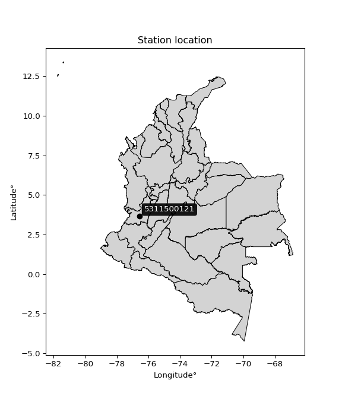

<div align="center">


</div>

# PMP Station (Rain, Pmax24h): 5311500121

Probable Maximum Precipitation (PMP) is the greatest amount of rainfall for a specific duration that is meteorologically possible for a given location, acting as a "worst-case" scenario for extreme storms, crucial for designing safety-critical infrastructure like bridges, river deviations, dams, spillways, and nuclear plants to prevent catastrophic failure. PMP is calculated by hydrologists using meteorological data to determine the upper limit of extreme rainfall, often leading to the Probable Maximum Flood (PMF) for flood control design, and is increasingly being studied for climate change impacts. Probable Maximum Precipitation (PMP) is the theoretical upper limit of rainfall, a deterministic estimate for extreme events, while probability distributions (like GEV, Gumbel) describe the likelihood and frequency of various precipitation amounts, including rare ones, showing how often events occur, with PMP representing the extreme end of these distributions, used for critical infrastructure design to ensure safety against the worst conceivable weather, unlike standard statistical forecasts which cover typical probabilities.

The most common probability distributions in hydrology, used for analyzing floods, rainfall, and streamflow, include the Normal, Log-Normal, Gumbel, Gamma (including Log-Pearson Type III), and Generalized Extreme Value (GEV) distributions, often chosen based on the data´s skewness and whether modeling extremes or general conditions, with Gumbel and GEV popular for extreme events like floods, while the Normal distribution serves as a baseline, though often requiring transformations for skewed hydrological data. These distributions help in designing water infrastructure, managing water resources, and forecasting hydrologic events.

> Hydrological data often isn´t perfectly normal (it´s skewed), so different distributions are needed for different applications, such as: **Flood Frequency Analysis**: Using Gumbel, GEV, or Log-Pearson Type III for predicting extreme flood magnitudes and their return periods, **Rainfall Analysis**: Normal for annual totals, but Log-Normal, Weibull, or GEV for intensity or extreme daily rainfall, **Streamflow Modeling**: Gamma and Log-Normal for maximum flows, GEV for minimum flows, and Kappa for daily flows.

<div align="center">

</img>

</div>


## A. General information


### 1. General running parameters

• app_version: _v20260113_. • runtime: _2026-01-13 16:28:34.738620_. • Python version: _3.14.0_. • SciPy version: _1.16.3_. • Pandas version: _2.3.3_. • NumPy version: _2.3.5_. • Stations dataset (station_dataset_file): _dataset/pmax24h_in/automatic_colombia_2003_2025.csv_. • Stations catalog (station_catalog_file): _dataset/CNE.xls_. • Minimum year to eval til year_max (date_min): _1900_. • Maximum year to eval since year_min (date_max): _2025_. • Creates, save and include plots into reports (create_plot): _False_. • Plot only fit distributions with Δo > Δ (plot_only_fit): _True_. • Plot only simple graphs avoiding multiple CDFs and multiple Extreme values plots (plot_only_simple): _True_. • Eval low extreme values, if False, evaluates high extreme values (low_extreme): _False_. • Eval every SciPy distribution as logarithmic (pdist_logarithmic_on): _True_. • Standard deviation normalized (ddof): _1.0_. • Return periods to eval in years (Tr): _[2, 2.33, 5, 10, 15, 20, 25, 50, 75, 100, 200, 250, 500, 750, 1000]_. • Minimum data sample per station, 0 means any (minimum_sample): _5_. • Z-Score maximum threshold to adjust a value, 0 means disable (zscore_max): _3.5_. • Z-Score minimum threshold to adjust a value, 0 means disable (zscore_min): _-2.5_. • Avoid zeros, e.g. rain = 0 (avoid_zeros): _True_. • Avoid null values (avoid_nans): _True_. 

:file_folder:Table: [dataset.csv](../../dataset/pmax24h_in/automatic_colombia_2003_2025.csv)

> Delta Degrees of Freedom (DDOF): is a parameter used in the formulas for calculating variance and standard deviation. When ddof=0, the divisor is $N$ (the total number of observations) and this is used when your data set is the entire population. When ddof=1, the divisor is $N-1$ and this is used when your data set is a sample drawn from a larger population. Using $N-1$ provides an unbiased estimate of the population variance (known as Bessel´s correction).


### 2. Station info and location

|   id |     CODIGO | NOMBRE                         | CATEGORIA               | TECNOLOGIA                | ESTADO   | FECHA_INSTALACION   |   FECHA_SUSPENSION |   ALTITUD |   LATITUD |   LONGITUD | DEPARTAMENTO    | MUNICIPIO   | AREA_OPERATIVA                         | ENTIDAD                                                     | AREA_HIDROGRAFICA   | ZONA_HIDROGRAFICA         | SUBZONA_HIDROGRAFICA                |   CORRIENTE | Catalogo   |   Version |
|-----:|-----------:|:-------------------------------|:------------------------|:--------------------------|:---------|:--------------------|-------------------:|----------:|----------:|-----------:|:----------------|:------------|:---------------------------------------|:------------------------------------------------------------|:--------------------|:--------------------------|:------------------------------------|------------:|:-----------|----------:|
|    0 | 5311500121 | LA CUMBRE - AUT   [5311500121] | Climatológica Principal | Automática con Telemetría | Activa   | 25/04/2017          |                nan |      1613 |   3.64519 |   -76.5648 | Valle Del Cauca | La Cumbre   | Area Operativa 09 - Cauca-Valle-Caldas | INSTITUTO DE HIDROLOGIA METEOROLOGIA Y ESTUDIOS AMBIENTALES | Pacifico            | Tapaje - Dagua - Directos | Dagua - Buenaventura - Bahia Málaga |         nan | CNE_IDEAM  |  20251226 |

<div align="center">

Dynamic map: [:earth_americas:Google](http://maps.google.com/maps?q=3.645194444,-76.56475) [:earth_americas:OSM](https://www.openstreetmap.org/#map=18/3.645194444/-76.56475&layers=P) [:earth_americas:Bing](https://www.bing.com/maps?cp=3.645194444~-76.56475&lvl=18) [:earth_americas:Apple](https://maps.apple.com/frame?center=3.645194444%2C-76.56475&span=0.003%2C0.006)

</div>


<div align="center">

```geojson
{
  "type": "Feature",
  "geometry": {
    "type": "Point", 
    "coordinates": [-76.56475, 3.645194444]
  }, 
  "properties": {
    "Name": "5311500121"
  }
}
```

</div>


### 3. Discrete values table and plot

<div align="center">

|               |           0 |          1 |           2 |           3 |           4 |          5 |          6 |
|:--------------|------------:|-----------:|------------:|------------:|------------:|-----------:|-----------:|
| Date          | 2019        | 2020       | 2021        | 2022        | 2023        | 2024       | 2025       |
| Value         |   63.4      |   36.2     |   38.2      |   45.8      |   26.4      |    4       |   73.6     |
| Value_initial |   63.4      |   36.2     |   38.2      |   45.8      |   26.4      |    4       |   73.6     |
| count         |    7        |    7       |    7        |    7        |    7        |    7       |    7       |
| mean          |   41.0857   |   41.0857  |   41.0857   |   41.0857   |   41.0857   |   41.0857  |   41.0857  |
| std           |   23.096    |   23.096   |   23.096    |   23.096    |   23.096    |   23.096   |   23.096   |
| zscore        |    0.966154 |   -0.21154 |   -0.124944 |    0.204117 |   -0.635856 |   -1.60572 |    1.40779 |


</div>


> The initial value (value_initial) correspond to the initial obtained or null completed value, and value (value) is adjusted only when the initial value is outside the valid range (outlier) definite through the Z-Score value. If Z-Score is active, values out of range or outliers are replaced with the station mean value. A Z-Score (or standard score) measures how many standard deviations a data point is from the mean of a dataset, indicating its relative position; positive scores mean above the mean, negative mean below, and a score of zero is exactly at the mean, allowing for comparison of values from different distributions. It´s calculated using the formula $z=(x–μ)/σ$, where $x$ is the data point, $μ$ is the mean, and $σ$ is the standard deviation, helping identify outliers and understand probability.
>
> <sub>**Note**: In this study, "completing" (filling gaps in) and "extending" (forecasting or lengthening the historical record) rainfall data series are avoided for certain critical analyses because they introduce artificial bias and uncertainty, which can distort the statistics of rare events (extremes), alter day-to-day variability, and compromise the integrity and homogeneity of the original data. Some reasons against Completing/Extending rainfall data are: **Distortion of Extremes and Variability**: The primary issue is that most gap-filling or extension methods rely on averaging or regression with nearby stations, which inherently smooths the data. Rainfall is highly variable in space and time, with a large percentage of zero values and occasional large storms. Infilling methods often underestimate the highest values and overestimate the lowest (zero) values, which severely distorts analyses focused on flood frequency, drought severity, and intensity-duration-frequency (IDF) curves, **Loss of Data Homogeneity**: Infilled or extended data are synthetic estimates, not actual measurements. Combining these estimates with observed data can violate the assumption of data homogeneity, which requires that the data properties do not change over time. Inhomogeneity can lead to incorrect conclusions about long-term trends or changes in climate patterns, **Propagation of Errors**: Errors and biases from the original data (e.g., wind-induced undercatch, instrument errors, site changes) or the data used for imputation can propagate through the analysis, leading to unreliable hydrological models and inaccurate predictions, **Compromised Statistical Integrity**: For statistical analyses, especially those involving the frequency of events, using artificial data can introduce time bias or autocorrelation that doesn´t exist in reality, making it difficult to assess the true probability of events, **Difficulty in Validation**: It is difficult to accurately validate the quality of filled or extended data, especially for past periods where ground-truth measurements are unavailable. The reliability of imputation techniques heavily depends on the density of the surrounding station network and the complexity of the local topography.</sub>


### 4. Active continuous probability distributions from SciPy (45 of 104 available)

A Probability Density Function (PDF) describes the relative likelihood of a continuous random variable falling within a specific range, where the total area under its curve equals 1, and the area over any interval gives the actual probability for that range. Unlike discrete probabilities (like rolling a die), a PDF shows density, not direct probability for a single point (which is zero), with higher points indicating higher likelihood, often visualized as a bell curve for normal distributions.

A log of a probability density function (log-PDF) is simply the logarithm of the PDF´s value, denoted as $log(f(x))$, useful for converting multiplication of probabilities into addition, improving numerical stability with tiny numbers, and connecting to information theory concepts like entropy. Instead of dealing with very small probabilities (e.g., 0.000001), log-PDFs use negative numbers (e.g., $log(0.00001) ≈ -11.51$ that are easier for computers to handle, preventing underflow errors and simplifying complex calculations. In this study, each active probability distribution from SciPy is also evaluated in the $log$ form.

[scipy.stats](https://docs.scipy.org/doc/scipy/reference/stats.html) is a Python´s powerful submodule within the SciPy library for comprehensive statistical analysis, offering over 130 probability distributions (like Normal, Poisson), functions for descriptive stats (mean, variance), hypothesis testing (t-tests, chi-square), random variable generation, and statistical tests, making it essential for data science, modeling, and research. It provides tools to explore, model, and draw conclusions from data efficiently, working seamlessly with NumPy.

<div align="center">

|   id | p_dist             |   n_parameter | fit_method   | label                                                                       | active   | ref                                                                                                        |
|-----:|:-------------------|--------------:|:-------------|:----------------------------------------------------------------------------|:---------|:-----------------------------------------------------------------------------------------------------------|
|    0 | alpha              |             3 | MLE          | Alpha                                                                       | True     | [:mortar_board:](https://docs.scipy.org/doc/scipy/reference/generated/scipy.stats.alpha.html)              |
|    1 | betaprime          |             4 | MLE          | Beta prime                                                                  | True     | [:mortar_board:](https://docs.scipy.org/doc/scipy/reference/generated/scipy.stats.betaprime.html)          |
|    2 | chi2               |             3 | MLE          | Chi²                                                                        | True     | [:mortar_board:](https://docs.scipy.org/doc/scipy/reference/generated/scipy.stats.chi2.html)               |
|    3 | crystalball        |             4 | MLE          | Crystalball                                                                 | True     | [:mortar_board:](https://docs.scipy.org/doc/scipy/reference/generated/scipy.stats.crystalball.html)        |
|    4 | dweibull           |             3 | MLE          | Double Weibull                                                              | True     | [:mortar_board:](https://docs.scipy.org/doc/scipy/reference/generated/scipy.stats.dweibull.html)           |
|    5 | erlang             |             3 | MLE          | Erlang                                                                      | True     | [:mortar_board:](https://docs.scipy.org/doc/scipy/reference/generated/scipy.stats.erlang.html)             |
|    6 | expon              |             2 | MLE          | Exponential                                                                 | True     | [:mortar_board:](https://docs.scipy.org/doc/scipy/reference/generated/scipy.stats.expon.html)              |
|    7 | exponnorm          |             3 | MLE          | Exponentially modified Normal                                               | True     | [:mortar_board:](https://docs.scipy.org/doc/scipy/reference/generated/scipy.stats.exponnorm.html)          |
|    8 | f                  |             4 | MLE          | F                                                                           | True     | [:mortar_board:](https://docs.scipy.org/doc/scipy/reference/generated/scipy.stats.f.html)                  |
|    9 | fatiguelife        |             3 | MLE          | Fatigue-life (Birnbaum-Saunders)                                            | True     | [:mortar_board:](https://docs.scipy.org/doc/scipy/reference/generated/scipy.stats.fatiguelife.html)        |
|   10 | fisk               |             3 | MLE          | Fisk                                                                        | True     | [:mortar_board:](https://docs.scipy.org/doc/scipy/reference/generated/scipy.stats.fisk.html)               |
|   11 | gamma              |             3 | MLE          | Gamma                                                                       | True     | [:mortar_board:](https://docs.scipy.org/doc/scipy/reference/generated/scipy.stats.gamma.html)              |
|   12 | genexpon           |             5 | MLE          | Generalized exponential                                                     | True     | [:mortar_board:](https://docs.scipy.org/doc/scipy/reference/generated/scipy.stats.genexpon.html)           |
|   13 | genlogistic        |             3 | MLE          | Generalized logistic                                                        | True     | [:mortar_board:](https://docs.scipy.org/doc/scipy/reference/generated/scipy.stats.genlogistic.html)        |
|   14 | gibrat             |             2 | MM           | Gibrat                                                                      | True     | [:mortar_board:](https://docs.scipy.org/doc/scipy/reference/generated/scipy.stats.gibrat.html)             |
|   15 | gompertz           |             3 | MLE          | Gompertz (or truncated Gumbel)                                              | True     | [:mortar_board:](https://docs.scipy.org/doc/scipy/reference/generated/scipy.stats.gompertz.html)           |
|   16 | gumbel_l           |             2 | MM           | Gumbel Left Skew                                                            | True     | [:mortar_board:](https://docs.scipy.org/doc/scipy/reference/generated/scipy.stats.gumbel_l.html)           |
|   17 | gumbel_r           |             2 | MM           | Gumbel Right Skew                                                           | True     | [:mortar_board:](https://docs.scipy.org/doc/scipy/reference/generated/scipy.stats.gumbel_r.html)           |
|   18 | halflogistic       |             2 | MM           | Half-logistic                                                               | True     | [:mortar_board:](https://docs.scipy.org/doc/scipy/reference/generated/scipy.stats.halflogistic.html)       |
|   19 | halfnorm           |             2 | MM           | Half Normal                                                                 | True     | [:mortar_board:](https://docs.scipy.org/doc/scipy/reference/generated/scipy.stats.halfnorm.html)           |
|   20 | hypsecant          |             2 | MM           | hyperbolic secant                                                           | True     | [:mortar_board:](https://docs.scipy.org/doc/scipy/reference/generated/scipy.stats.hypsecant.html)          |
|   21 | invgamma           |             3 | MLE          | Inverted gamma                                                              | True     | [:mortar_board:](https://docs.scipy.org/doc/scipy/reference/generated/scipy.stats.invgamma.html)           |
|   22 | invgauss           |             3 | MLE          | Inverse Gaussian                                                            | True     | [:mortar_board:](https://docs.scipy.org/doc/scipy/reference/generated/scipy.stats.invgauss.html)           |
|   23 | invweibull         |             3 | MLE          | Inverted Weibull                                                            | True     | [:mortar_board:](https://docs.scipy.org/doc/scipy/reference/generated/scipy.stats.invweibull.html)         |
|   24 | kappa4             |             4 | MLE          | Kappa 4                                                                     | True     | [:mortar_board:](https://docs.scipy.org/doc/scipy/reference/generated/scipy.stats.kappa4.html)             |
|   25 | kstwobign          |             2 | MLE          | Limiting distribution of scaled Kolmogorov-Smirnov two-sided test statistic | True     | [:mortar_board:](https://docs.scipy.org/doc/scipy/reference/generated/scipy.stats.kstwobign.html)          |
|   26 | laplace            |             2 | MM           | Laplace                                                                     | True     | [:mortar_board:](https://docs.scipy.org/doc/scipy/reference/generated/scipy.stats.laplace.html)            |
|   27 | laplace_asymmetric |             3 | MLE          | Asymmetric Laplace                                                          | True     | [:mortar_board:](https://docs.scipy.org/doc/scipy/reference/generated/scipy.stats.laplace_asymmetric.html) |
|   28 | loggamma           |             3 | MLE          | Log gamma                                                                   | True     | [:mortar_board:](https://docs.scipy.org/doc/scipy/reference/generated/scipy.stats.loggamma.html)           |
|   29 | logistic           |             2 | MM           | Logistic (or Sech-squared)                                                  | True     | [:mortar_board:](https://docs.scipy.org/doc/scipy/reference/generated/scipy.stats.logistic.html)           |
|   30 | lognorm            |             3 | MLE          | Log Normal                                                                  | True     | [:mortar_board:](https://docs.scipy.org/doc/scipy/reference/generated/scipy.stats.lognorm.html)            |
|   31 | maxwell            |             2 | MM           | Maxwell                                                                     | True     | [:mortar_board:](https://docs.scipy.org/doc/scipy/reference/generated/scipy.stats.maxwell.html)            |
|   32 | mielke             |             4 | MLE          | Mielke Beta-Kappa / Dagum                                                   | True     | [:mortar_board:](https://docs.scipy.org/doc/scipy/reference/generated/scipy.stats.mielke.html)             |
|   33 | moyal              |             2 | MM           | Moyal                                                                       | True     | [:mortar_board:](https://docs.scipy.org/doc/scipy/reference/generated/scipy.stats.moyal.html)              |
|   34 | nakagami           |             3 | MLE          | Nakagami                                                                    | True     | [:mortar_board:](https://docs.scipy.org/doc/scipy/reference/generated/scipy.stats.nakagami.html)           |
|   35 | ncf                |             5 | MLE          | Non-central F distribution                                                  | True     | [:mortar_board:](https://docs.scipy.org/doc/scipy/reference/generated/scipy.stats.ncf.html)                |
|   36 | nct                |             4 | MLE          | Non-central Student’s t                                                     | True     | [:mortar_board:](https://docs.scipy.org/doc/scipy/reference/generated/scipy.stats.nct.html)                |
|   37 | norm               |             2 | MM           | Normal                                                                      | True     | [:mortar_board:](https://docs.scipy.org/doc/scipy/reference/generated/scipy.stats.norm.html)               |
|   38 | pearson3           |             3 | MM           | Pearson type III                                                            | True     | [:mortar_board:](https://docs.scipy.org/doc/scipy/reference/generated/scipy.stats.pearson3.html)           |
|   39 | rayleigh           |             2 | MM           | Rayleigh                                                                    | True     | [:mortar_board:](https://docs.scipy.org/doc/scipy/reference/generated/scipy.stats.rayleigh.html)           |
|   40 | rice               |             3 | MLE          | Rice                                                                        | True     | [:mortar_board:](https://docs.scipy.org/doc/scipy/reference/generated/scipy.stats.rice.html)               |
|   41 | t                  |             3 | MLE          | Student’s t                                                                 | True     | [:mortar_board:](https://docs.scipy.org/doc/scipy/reference/generated/scipy.stats.t.html)                  |
|   42 | truncnorm          |             4 | MLE          | Truncated normal                                                            | True     | [:mortar_board:](https://docs.scipy.org/doc/scipy/reference/generated/scipy.stats.truncnorm.html)          |
|   43 | wald               |             2 | MM           | Wald                                                                        | True     | [:mortar_board:](https://docs.scipy.org/doc/scipy/reference/generated/scipy.stats.wald.html)               |
|   44 | weibull_min        |             3 | MLE          | Weibull minimum                                                             | True     | [:mortar_board:](https://docs.scipy.org/doc/scipy/reference/generated/scipy.stats.weibull_min.html)        |

</div>

> **n_parameter:** # arguments & localization & scale.
>
> **Fit methods:** (MLE) maximum likelihood, (MM) L-moments.
>
>**Inactive** (With the only purpose of prevent loops, zero divisions, infinite values, over high estimated values or horizontal trending for recurrence intervals estimations, the follow distributions were disabled.)**:** foldnorm, gennorm, norminvgauss, powernorm, powerlognorm, skewnorm, genextreme, anglit, arcsine, argus, beta, bradford, burr, burr12, cauchy, cosine, halfcauchy, foldcauchy, skewcauchy, wrapcauchy, dgamma, gengamma, exponweib, exponpow, truncexpon, gausshyper, genhalflogistic, genhyperbolic, geninvgauss, halfgennorm, johnsonsb, johnsonsu, kappa3, ksone, kstwo, loglaplace, levy, levy_l, levy_stable, ncx2, pareto, genpareto, truncpareto, lomax, powerlaw, rdist, rel_breitwigner, recipinvgauss, semicircular, studentized_range, trapezoid, triang, truncweibull_min, tukeylambda, uniform, loguniform, vonmises, vonmises_line, weibull_max, 


## B. Probability (PDF) vs. Empirical (EDF) distributions functions

A continuous probability distribution (CPD) describes probabilities for variables that can take any value within a range (like rain any time), unlike discrete variables with specific outcomes (like temperature). It uses a Probability Density Function (PDF), a curve where the total area under it equals 1, and the probability of the variable falling within an interval (a to b) is found by calculating the area under the curve between those points. A key feature is that the probability of hitting any single exact value is zero, so probabilities are always expressed for ranges, e.g., $P(a ≤ X ≤ b)$.

<div align="center">

Distributions parameters from station values
|    |    station | p_dist                |   n |              loc |           scale | shape                  | shape1                | shape2             | shape3   |
|---:|-----------:|:----------------------|----:|-----------------:|----------------:|:-----------------------|:----------------------|:-------------------|:---------|
|  0 | 5311500121 | alpha                 |   7 |     -0.0232704   |    10.3537      | 2.521408560484631e-10  |                       |                    |          |
|  1 | 5311500121 | betaprime             |   7 |   -445.83        | 37926.3         | 520.0767383823103      | 40522.98518470366     |                    |          |
|  2 | 5311500121 | chi2                  |   7 |      4           |     4.41703     | 1.458430659542705      |                       |                    |          |
|  3 | 5311500121 | crystalball           |   7 |     41.0857      |    21.3827      | 3921.1975315774525     | 20.69346824839277     |                    |          |
|  4 | 5311500121 | dweibull              |   7 |     38.2         |    17.3992      | 0.9851936329664315     |                       |                    |          |
|  5 | 5311500121 | erlang                |   7 |   -473.942       |     0.898296    | 573.2948643493219      |                       |                    |          |
|  6 | 5311500121 | expon                 |   7 |      4           |    37.0857      |                        |                       |                    |          |
|  7 | 5311500121 | exponnorm             |   7 |     41.0634      |    21.3827      | 0.0010423747364373963  |                       |                    |          |
|  8 | 5311500121 | f                     |   7 |  -3262.76        |  3303.87        | 49734.06940221401      | 1099612.1148740533    |                    |          |
|  9 | 5311500121 | fatiguelife           |   7 |      4           |     8.8214e-06  | 1860.1677648435293     |                       |                    |          |
| 10 | 5311500121 | fisk                  |   7 |     -3.60258e+08 |     3.60258e+08 | 28863794.433458507     |                       |                    |          |
| 11 | 5311500121 | gamma                 |   7 |   -483.573       |     0.87734     | 598.0427133578899      |                       |                    |          |
| 12 | 5311500121 | genexpon              |   7 |      4           |     2.31613     | 0.06131819009938831    | 5.497467293467376e-07 | 1.6948424264034845 |          |
| 13 | 5311500121 | genlogistic           |   7 |     39.9925      |    12.7486      | 1.0654335938528312     |                       |                    |          |
| 14 | 5311500121 | gibrat                |   7 |     24.7734      |     9.89393     |                        |                       |                    |          |
| 15 | 5311500121 | gompertz              |   7 |    -15.1716      |    20.7043      | 0.042497306006028954   |                       |                    |          |
| 16 | 5311500121 | gumbel_l              |   7 |     50.7091      |    16.672       |                        |                       |                    |          |
| 17 | 5311500121 | gumbel_r              |   7 |     31.4623      |    16.672       |                        |                       |                    |          |
| 18 | 5311500121 | halflogistic          |   7 |     15.7422      |    18.2815      |                        |                       |                    |          |
| 19 | 5311500121 | halfnorm              |   7 |     12.7833      |    35.4718      |                        |                       |                    |          |
| 20 | 5311500121 | hypsecant             |   7 |     41.0857      |    13.6127      |                        |                       |                    |          |
| 21 | 5311500121 | invgamma              |   7 |   -186.371       | 24168.5         | 107.4148723390353      |                       |                    |          |
| 22 | 5311500121 | invgauss              |   7 |   -104.641       |  6235.27        | 0.023324051735292728   |                       |                    |          |
| 23 | 5311500121 | invweibull            |   7 |     -1.27076e+09 |     1.27076e+09 | 62808820.042909905     |                       |                    |          |
| 24 | 5311500121 | kappa4                |   7 |     -2.99554     |    77.6365      | 1.0990964115522726     | 1.0132307028471823    |                    |          |
| 25 | 5311500121 | kstwobign             |   7 |    -43.1473      |    96.4129      |                        |                       |                    |          |
| 26 | 5311500121 | laplace               |   7 |     41.0857      |    15.1199      |                        |                       |                    |          |
| 27 | 5311500121 | laplace_asymmetric    |   7 |     38.2         |    16.4103      | 0.9159365584539922     |                       |                    |          |
| 28 | 5311500121 | loggamma              |   7 |   -275.092       |   101.562       | 22.990342501884577     |                       |                    |          |
| 29 | 5311500121 | logistic              |   7 |     41.0857      |    11.7889      |                        |                       |                    |          |
| 30 | 5311500121 | lognorm               |   7 |      4           |     0.168057    | 13.425360485512146     |                       |                    |          |
| 31 | 5311500121 | maxwell               |   7 |     -9.58238     |    31.7515      |                        |                       |                    |          |
| 32 | 5311500121 | mielke                |   7 |     -2.44406     |    76.7949      | 1.2951972173891453     | 410.8226004583257     |                    |          |
| 33 | 5311500121 | moyal                 |   7 |     28.8577      |     9.62561     |                        |                       |                    |          |
| 34 | 5311500121 | nakagami              |   7 |  -3073.42        |  3114.6         | 5294.992975390367      |                       |                    |          |
| 35 | 5311500121 | ncf                   |   7 |   -201.011       |    80.446       | 137.81982864455847     | 120059.54626328914    | 277.0854148160563  |          |
| 36 | 5311500121 | nct                   |   7 |  -1164.87        |    21.3279      | 305692.26778264786     | 56.543067825823925    |                    |          |
| 37 | 5311500121 | norm                  |   7 |     41.0857      |    21.3827      |                        |                       |                    |          |
| 38 | 5311500121 | pearson3              |   7 |     41.0857      |    21.3827      | -0.12749207856979244   |                       |                    |          |
| 39 | 5311500121 | rayleigh              |   7 |      0.1793      |    32.6386      |                        |                       |                    |          |
| 40 | 5311500121 | rice                  |   7 |     -7.85272     |    23.8529      | 1.7357941648596298     |                       |                    |          |
| 41 | 5311500121 | t                     |   7 |     41.0768      |    21.3835      | 533281.9396414813      |                       |                    |          |
| 42 | 5311500121 | truncnorm             |   7 |     49.3078      |    26.1224      | -128.47276751391408    | 0.9299351099119451    |                    |          |
| 43 | 5311500121 | wald                  |   7 |     19.703       |    21.3827      |                        |                       |                    |          |
| 44 | 5311500121 | weibull_min           |   7 |    -26.8568      |    75.5294      | 3.611179834053427      |                       |                    |          |
| 45 | 5311500121 | logalpha              |   7 |    -23.0242      |   722.33        | 27.29122807773213      |                       |                    |          |
| 46 | 5311500121 | logbetaprime          |   7 |    -14.0249      |    10.2413      | 820.6923788330214      | 482.1710517784029     |                    |          |
| 47 | 5311500121 | logchi2               |   7 |      1.38629     |     1.22902     | 1.4394436613707864     |                       |                    |          |
| 48 | 5311500121 | logcrystalball        |   7 |      3.45199     |     0.90207     | 164.21581744629117     | 3.722885966712485     |                    |          |
| 49 | 5311500121 | logdweibull           |   7 |      3.58906     |     0.698439    | 0.7303796821996671     |                       |                    |          |
| 50 | 5311500121 | logerlang             |   7 |    -12.5343      |     0.0565605   | 282.1847761564693      |                       |                    |          |
| 51 | 5311500121 | logexpon              |   7 |      1.38629     |     2.0657      |                        |                       |                    |          |
| 52 | 5311500121 | logexponnorm          |   7 |      3.45143     |     0.902068    | 0.0006247816561435553  |                       |                    |          |
| 53 | 5311500121 | logf                  |   7 |  -1747.65        |  1751.1         | 22183069.647946782     | 11271451.166087672    |                    |          |
| 54 | 5311500121 | logfatiguelife        |   7 |   -828.963       |   832.412       | 0.0010808233252599425  |                       |                    |          |
| 55 | 5311500121 | logfisk               |   7 |     -1.2751e+08  |     1.2751e+08  | 282752623.3680192      |                       |                    |          |
| 56 | 5311500121 | loggamma              |   7 |    -13.2723      |     0.0548954   | 304.3134452558255      |                       |                    |          |
| 57 | 5311500121 | loggenexpon           |   7 |      1.38629     |     1.81139e+07 | 3345850.956396344      | 30443233.950435378    | 2747329.3125078306 |          |
| 58 | 5311500121 | loggenlogistic        |   7 |      4.29869     |     3.31273e-06 | 3.913690762633206e-06  |                       |                    |          |
| 59 | 5311500121 | loggibrat             |   7 |      2.76382     |     0.417403    |                        |                       |                    |          |
| 60 | 5311500121 | loggompertz           |   7 |      1.38629     |     0.575083    | 0.014996269161644104   |                       |                    |          |
| 61 | 5311500121 | loggumbel_l           |   7 |      3.85797     |     0.703341    |                        |                       |                    |          |
| 62 | 5311500121 | loggumbel_r           |   7 |      3.04601     |     0.703341    |                        |                       |                    |          |
| 63 | 5311500121 | loghalflogistic       |   7 |      2.38283     |     0.771236    |                        |                       |                    |          |
| 64 | 5311500121 | loghalfnorm           |   7 |      2.25797     |     1.49648     |                        |                       |                    |          |
| 65 | 5311500121 | loghypsecant          |   7 |      3.45199     |     0.574276    |                        |                       |                    |          |
| 66 | 5311500121 | loginvgamma           |   7 |    -17.7989      | 10618.1         | 501.31240331259914     |                       |                    |          |
| 67 | 5311500121 | loginvgauss           |   7 |     -6.435       |   873.149       | 0.011307093507593041   |                       |                    |          |
| 68 | 5311500121 | loginvweibull         |   7 | -15298.5         | 15301.4         | 13958.13294268497      |                       |                    |          |
| 69 | 5311500121 | logkappa4             |   7 |      1.12623     |     3.32438     | 1.0332377400394517     | 1.0479022190079323    |                    |          |
| 70 | 5311500121 | logkstwobign          |   7 |     -1.04512     |     5.1455      |                        |                       |                    |          |
| 71 | 5311500121 | loglaplace            |   7 |      3.45199     |     0.63786     |                        |                       |                    |          |
| 72 | 5311500121 | loglaplace_asymmetric |   7 |      3.82428     |     0.502686    | 1.4366313281216643     |                       |                    |          |
| 73 | 5311500121 | logloggamma           |   7 |      4.29872     |     5.34436e-06 | 6.286631909614906e-06  |                       |                    |          |
| 74 | 5311500121 | loglogistic           |   7 |      3.45199     |     0.497337    |                        |                       |                    |          |
| 75 | 5311500121 | loglognorm            |   7 |      1.38629     |     0.0122273   | 12.917499463579919     |                       |                    |          |
| 76 | 5311500121 | logmaxwell            |   7 |      1.31446     |     1.3395      |                        |                       |                    |          |
| 77 | 5311500121 | logmielke             |   7 |     -1.57886e+07 |     1.57886e+07 | 18581016.357815236     | 35054496297.09888     |                    |          |
| 78 | 5311500121 | logmoyal              |   7 |      2.93613     |     0.406074    |                        |                       |                    |          |
| 79 | 5311500121 | lognakagami           |   7 |      3.27336     |     0.649122    | 0.23795343854317888    |                       |                    |          |
| 80 | 5311500121 | logncf                |   7 |     -0.518409    |     2.19012e-06 | 4.7103636967884145e-05 | 77.34358822134021     | 83.85095992770465  |          |
| 81 | 5311500121 | lognct                |   7 |    -52.5141      |     0.877518    | 32681.1392543268       | 63.77626849040189     |                    |          |
| 82 | 5311500121 | lognorm               |   7 |      3.45199     |     0.90207     |                        |                       |                    |          |
| 83 | 5311500121 | logpearson3           |   7 |      3.45199     |     0.902067    | -1.520490037375132     |                       |                    |          |
| 84 | 5311500121 | lograyleigh           |   7 |      1.72626     |     1.37693     |                        |                       |                    |          |
| 85 | 5311500121 | logrice               |   7 |   -323.498       |     0.902068    | 362.44400323583193     |                       |                    |          |
| 86 | 5311500121 | logt                  |   7 |      3.73399     |     0.350314    | 1.4819810521995895     |                       |                    |          |
| 87 | 5311500121 | logtruncnorm          |   7 |      1.80651     |     2.05243     | -0.20474161386490453   | 21.477234621541047    |                    |          |
| 88 | 5311500121 | logwald               |   7 |      2.54991     |     0.902074    |                        |                       |                    |          |
| 89 | 5311500121 | logweibull_min        |   7 |      1.38629     |     1.36819     | 0.6121093451575643     |                       |                    |          |

</div>

> **loc** (Location parameter): This shifts the distribution along the x-axis. For many common distributions, like the normal (Gaussian) distribution, loc represents the mean $μ$. For others, like the uniform distribution, it might represent the minimum value, or for the beta distribution, the left end of the support interval.
>
> **scale** (Scale parameter): This determines the width or spread of the distribution. For the normal distribution, scale represents the standard deviation $σ$. For a uniform distribution, it defines the length of the interval (from $loc$ to $loc + scale$).
>
> **shape** (Shape parameters): Refers to parameters that define the specific form of a probability distribution, distinct from its location (loc) and scale (scale). These parameters are required arguments for most distribution functions. For example, a normal (Gaussian) distribution is fully defined by its location (mean) and scale (standard deviation), so it has no specific shape parameters beyond loc and scale. However, other distributions have intrinsic properties that need specification, as Gamma distribution that takes a shape parameter, often named $a$ or $alpha$.


### 0. Cumulative distribution values - CDF (90 evaluated)

Cumulative Distribution Function (CDF), denoted as $F$<sub>$X$</sub>$(x)$, is a function that gives the probability that a random variable $X$ will take a value less than or equal to a specific value, $x$ (i.e., $(P(X≥x)$. It essentially "accumulates" probabilities from a given point up to the far right (positive infinity), providing a complete picture of the distribution´s probabilities for both discrete (like rain) and continuous (like temperature) variables, helping to find probabilities over ranges or above certain values. Each station is evaluated separately ordering the $x$ values ascending, calculating the CDF and PDF values for the activated distributions and their logarithmic forms.

<div align="center">

CDF ordered by x ascending and calculating $log(f(x))$ separately
|   id |    Station |   date |    x |   count |    mean |    std |    zscore |   Value_initial |    station |   m |     alpha |   alpha_pdf |   betaprime |   betaprime_pdf |       chi2 |       chi2_pdf |   crystalball |   crystalball_pdf |   dweibull |   dweibull_pdf |    erlang |   erlang_pdf |    expon |   expon_pdf |   exponnorm |   exponnorm_pdf |         f |      f_pdf |   fatiguelife |   fatiguelife_pdf |      fisk |   fisk_pdf |    gamma |   gamma_pdf |    genexpon |   genexpon_pdf |   genlogistic |   genlogistic_pdf |    gibrat |   gibrat_pdf |   gompertz |   gompertz_pdf |   gumbel_l |   gumbel_l_pdf |   gumbel_r |   gumbel_r_pdf |   halflogistic |   halflogistic_pdf |   halfnorm |   halfnorm_pdf |   hypsecant |   hypsecant_pdf |   invgamma |   invgamma_pdf |   invgauss |   invgauss_pdf |   invweibull |   invweibull_pdf |      kappa4 |   kappa4_pdf |   kstwobign |   kstwobign_pdf |   laplace |   laplace_pdf |   laplace_asymmetric |   laplace_asymmetric_pdf |   loggamma |   loggamma_pdf |   logistic |   logistic_pdf |   lognorm |   lognorm_pdf |   maxwell |   maxwell_pdf |   mielke |   mielke_pdf |       moyal |   moyal_pdf |   nakagami |   nakagami_pdf |       ncf |    ncf_pdf |       nct |    nct_pdf |      norm |   norm_pdf |   pearson3 |   pearson3_pdf |   rayleigh |   rayleigh_pdf |      rice |   rice_pdf |         t |      t_pdf |   truncnorm |   truncnorm_pdf |     wald |   wald_pdf |   weibull_min |   weibull_min_pdf |   logalpha |   logalpha_pdf |   logbetaprime |   logbetaprime_pdf |     logchi2 |   logchi2_pdf |   logcrystalball |   logcrystalball_pdf |   logdweibull |   logdweibull_pdf |   logerlang |   logerlang_pdf |   logexpon |   logexpon_pdf |   logexponnorm |   logexponnorm_pdf |      logf |   logf_pdf |   logfatiguelife |   logfatiguelife_pdf |    logfisk |   logfisk_pdf |   loggenexpon |   loggenexpon_pdf |   loggenlogistic |   loggenlogistic_pdf |   loggibrat |   loggibrat_pdf |   loggompertz |   loggompertz_pdf |   loggumbel_l |   loggumbel_l_pdf |   loggumbel_r |   loggumbel_r_pdf |   loghalflogistic |   loghalflogistic_pdf |   loghalfnorm |   loghalfnorm_pdf |   loghypsecant |   loghypsecant_pdf |   loginvgamma |   loginvgamma_pdf |   loginvgauss |   loginvgauss_pdf |   loginvweibull |   loginvweibull_pdf |   logkappa4 |   logkappa4_pdf |   logkstwobign |   logkstwobign_pdf |   loglaplace |   loglaplace_pdf |   loglaplace_asymmetric |   loglaplace_asymmetric_pdf |   logloggamma |   logloggamma_pdf |   loglogistic |   loglogistic_pdf |   loglognorm |   loglognorm_pdf |   logmaxwell |   logmaxwell_pdf |   logmielke |   logmielke_pdf |    logmoyal |   logmoyal_pdf |   lognakagami |   lognakagami_pdf |     logncf |   logncf_pdf |   lognct |   lognct_pdf |   logpearson3 |   logpearson3_pdf |   lograyleigh |   lograyleigh_pdf |   logrice |   logrice_pdf |      logt |   logt_pdf |   logtruncnorm |   logtruncnorm_pdf |   logwald |   logwald_pdf |   logweibull_min |   logweibull_min_pdf |
|-----:|-----------:|-------:|-----:|--------:|--------:|-------:|----------:|----------------:|-----------:|----:|----------:|------------:|------------:|----------------:|-----------:|---------------:|--------------:|------------------:|-----------:|---------------:|----------:|-------------:|---------:|------------:|------------:|----------------:|----------:|-----------:|--------------:|------------------:|----------:|-----------:|---------:|------------:|------------:|---------------:|--------------:|------------------:|----------:|-------------:|-----------:|---------------:|-----------:|---------------:|-----------:|---------------:|---------------:|-------------------:|-----------:|---------------:|------------:|----------------:|-----------:|---------------:|-----------:|---------------:|-------------:|-----------------:|------------:|-------------:|------------:|----------------:|----------:|--------------:|---------------------:|-------------------------:|-----------:|---------------:|-----------:|---------------:|----------:|--------------:|----------:|--------------:|---------:|-------------:|------------:|------------:|-----------:|---------------:|----------:|-----------:|----------:|-----------:|----------:|-----------:|-----------:|---------------:|-----------:|---------------:|----------:|-----------:|----------:|-----------:|------------:|----------------:|---------:|-----------:|--------------:|------------------:|-----------:|---------------:|---------------:|-------------------:|------------:|--------------:|-----------------:|---------------------:|--------------:|------------------:|------------:|----------------:|-----------:|---------------:|---------------:|-------------------:|----------:|-----------:|-----------------:|---------------------:|-----------:|--------------:|--------------:|------------------:|-----------------:|---------------------:|------------:|----------------:|--------------:|------------------:|--------------:|------------------:|--------------:|------------------:|------------------:|----------------------:|--------------:|------------------:|---------------:|-------------------:|--------------:|------------------:|--------------:|------------------:|----------------:|--------------------:|------------:|----------------:|---------------:|-------------------:|-------------:|-----------------:|------------------------:|----------------------------:|--------------:|------------------:|--------------:|------------------:|-------------:|-----------------:|-------------:|-----------------:|------------:|----------------:|------------:|---------------:|--------------:|------------------:|-----------:|-------------:|---------:|-------------:|--------------:|------------------:|--------------:|------------------:|----------:|--------------:|----------:|-----------:|---------------:|-------------------:|----------:|--------------:|-----------------:|---------------------:|
|    0 | 5311500121 |   2024 |  4   |       7 | 41.0857 | 23.096 | -1.60572  |             4   | 5311500121 |   1 | 0.0100692 |  0.018612   |   0.0400221 |      0.00423345 | 2.3609e-12 | 1938.35        |     0.0414256 |        0.00414624 |  0.0714198 |     0.00400373 | 0.0399276 |   0.00420521 | 0        |  0.0269646  |   0.0414254 |      0.00414623 | 0.0411803 | 0.00415166 |     0.0652259 |        8.6246e+10 | 0.0482764 | 0.00368117 | 0.039317 |  0.00415952 | 7.72867e-08 |     0.0264744  |     0.0464455 |        0.00366389 | 0         |   0          |   0.062726 |     0.00485638 |  0.0589043 |     0.00342695 | 0.00555827 |     0.00173111 |       0        |         0          |   0        |     0          |   0.0416953 |      0.00305423 |  0.0348758 |     0.00443704 |  0.0324277 |     0.00443374 |    0.0266166 |       0.0047705  | 3.04722e-15 |    0.353973  |   0.0294602 |      0.00582241 |  0.043027 |    0.00284573 |            0.0468812 |               0.00311902 |  0.0134758 |      0.0393575 |  0.0412566 |     0.00335523 |  0.011012 |     0.0321347 | 0.0197123 |    0.00419627 | 0.040378 |    0.0081156 | 0.000275569 | 0.000202065 |  0.0412667 |     0.00414637 | 0.0388225 | 0.00424835 | 0.0414259 | 0.00414738 | 0.0414256 | 0.00414624 |  0.0450045 |     0.00413467 |  0.0068282 |     0.00356209 | 0.0281654 | 0.00487707 | 0.0414679 | 0.00414951 |   0.0502792 |      0.00411941 | 0        | 0          |     0.0386865 |        0.00443877 |  0.0107315 |      0.0343592 |      0.0152977 |          0.0439752 | 3.10764e-12 | 10072.9       |         0.011012 |            0.0321347 |      0.049438 |         0.0379301 |   0.0130093 |       0.0386357 |   0        |       0.484098 |      0.0110119 |          0.0321346 | 0.0113194 |   0.032819 |        0.0108215 |            0.0318129 | 0.00694176 |     0.0152865 |   1.87317e-11 |          0.184712 |         0        |            0.0378541 |    0        |        0        |   1.31188e-08 |         0.0260767 |      0.029333 |         0.0410874 |   2.52057e-05 |       0.000379459 |          0        |              0        |      0        |          0        |      0.0174419 |          0.0303567 |     0.0116848 |         0.0368216 |      0.015951 |         0.0484001 |       0.0188925 |           0.0684085 |    0.052655 |        0.333031 |      0.0211399 |          0.0873825 |    0.0196117 |        0.0307461 |               0.0230292 |                   0.0318887 |     0.0325195 |          0.038253 |     0.0154661 |         0.0306169 |   0.00715557 |      6.92706e+12 |  4.09757e-05 |       0.00171039 |   0.0323742 |       0.0380999 | 1.56511e-11 |    8.94401e-10 |    0          |        0          | 0.00801125 |    0.0353337 | 0.011071 |    0.0323354 |     0.0340616 |         0.0433073 |      0        |          0        |  0.011012 |     0.0321347 | 0.0219272 |  0.0135253 |    5.72804e-10 |           0.32755  |  0        |      0        |      2.16259e-10 |       596159         |
|    1 | 5311500121 |   2023 | 26.4 |       7 | 41.0857 | 23.096 | -0.635856 |            26.4 | 5311500121 |   2 | 0.695177  |  0.0109577  |   0.251892  |      0.0151592  | 0.954641   |    0.00555747  |     0.246104  |        0.0147373  |  0.252777  |     0.0143955  | 0.250294  |   0.0150705  | 0.453383 |  0.0147393  |   0.246103  |      0.0147374  | 0.246467  | 0.0147692  |     0.804181  |        0.00528546 | 0.233859  | 0.014355   | 0.248681 |  0.0150519  | 0.447351    |     0.0146312  |     0.234288  |        0.014565   | 0.0355047 |   0.0480647  |   0.239668 |     0.0116229  |  0.207596  |     0.0110592  | 0.258003   |     0.0209655  |       0.283508 |         0.0251517  |   0.298928 |     0.0208958  |   0.208641  |      0.0142528  |  0.268707  |     0.0163664  |  0.271403  |     0.0166364  |    0.301656  |       0.0178688  | 0.352874    |    0.0143717 |   0.324534  |      0.017461   |  0.189298 |    0.0125198  |            0.208074  |               0.0138432  |  0.441073  |      0.414653  |  0.223442  |     0.0147185  |  0.421515 |     0.433666  | 0.267124  |    0.0169806  | 0.281309 |    0.0126317 | 0.255885    | 0.0246952   |  0.246176  |     0.0147502  | 0.252659  | 0.0152227  | 0.246163  | 0.0147405  | 0.246104  | 0.0147373  |  0.242525  |     0.0142088  |  0.275807  |     0.0178252  | 0.259201  | 0.0155701  | 0.246242  | 0.0147413  |   0.230954  |      0.0126207  | 0.179884 | 0.050128   |     0.246603  |        0.0144655  |  0.430013  |      0.410263  |      0.444822  |          0.398263  | 0.674115    |     0.160359  |         0.421515 |            0.433666  |      0.285629 |         0.370002  |   0.443714  |       0.418335  |   0.598893 |       0.194175 |      0.421515  |          0.433666  | 0.422775  |   0.432183 |        0.422194  |            0.435054  | 0.314609   |     0.478159  |   0.533294    |          0.281434 |         0        |            0.351827  |    0.57905  |        0.767518 |   0.318933    |         0.472641  |      0.35308  |         0.400594  |   0.484908    |       0.49901     |          0.520729 |              0.472515 |      0.502559 |          0.423542 |      0.402549  |          0.528507  |     0.448361  |         0.42103   |      0.458147 |         0.384875  |       0.49181   |           0.318373  |    0.657477 |        0.321194 |      0.518243  |          0.30037   |    0.377876  |        0.592412  |               0.314129  |                   0.434976  |     0.299352  |          0.352131 |     0.411161  |         0.486808  |   0.651768   |      0.015167    |  0.455868    |       0.437256   |   0.298323  |       0.351085  | 0.509135    |    0.521588    |    4.7427e-08 |        5.0825e+07 | 0.466517   |    0.382271  | 0.422055 |    0.432817  |     0.329251  |         0.360013  |      0.468061 |          0.434067 |  0.421517 |     0.433668  | 0.17786   |  0.371961  |    0.591473    |           0.259099 |  0.575804 |      0.600895 |      0.704037    |            0.116884  |
|    2 | 5311500121 |   2020 | 36.2 |       7 | 41.0857 | 23.096 | -0.21154  |            36.2 | 5311500121 |   3 | 0.775009  |  0.00604391 |   0.41834   |      0.018301   | 0.986168   |    0.00166119  |     0.409633  |        0.0181765  |  0.444042  |     0.0259613  | 0.416015  |   0.0182495  | 0.580318 |  0.0113165  |   0.409633  |      0.0181765  | 0.410141  | 0.0181691  |     0.84781   |        0.00375458 | 0.400958  | 0.019244   | 0.414453 |  0.0182785  | 0.573646    |     0.0112876  |     0.40304   |        0.0193283  | 0.55726   |   0.0345532  |   0.372234 |     0.0154054  |  0.342191  |     0.0165257  | 0.471121   |     0.0212682  |       0.507623 |         0.0203024  |   0.490842 |     0.0180894  |   0.388132  |      0.0219541  |  0.442389  |     0.0184449  |  0.446447  |     0.0184359  |    0.4779    |       0.0174405  | 0.491494    |    0.0139498 |   0.492776  |      0.0164134  |  0.361939 |    0.023938   |            0.39937   |               0.0265702  |  0.571979  |      0.407229  |  0.39785   |     0.0203212  |  0.560386 |     0.437176  | 0.44384   |    0.0184748  | 0.410873 |    0.0137709 | 0.494665    | 0.0224169   |  0.409756  |     0.0181717  | 0.418846  | 0.0181731  | 0.409714  | 0.0181774  | 0.409633  | 0.0181765  |  0.40183   |     0.017914   |  0.456101  |     0.0183911  | 0.426067  | 0.0180089  | 0.409797  | 0.0181776  |   0.373768  |      0.0163456  | 0.558875 | 0.0266158  |     0.406147  |        0.017723   |  0.559415  |      0.402344  |      0.569985  |          0.388206  | 0.720604    |     0.135048  |         0.560386 |            0.437176  |      0.5      |      5426.93      |   0.575585  |       0.409506  |   0.655739 |       0.166656 |      0.560386  |          0.437177  | 0.561104  |   0.435198 |        0.561438  |            0.43808   | 0.480359   |     0.553519  |   0.617802    |          0.25303  |         0        |            0.510864  |    0.752261 |        0.383214 |   0.491357    |         0.611173  |      0.49453  |         0.490324  |   0.629995    |       0.413861    |          0.653858 |              0.371138 |      0.626255 |          0.358978 |      0.575262  |          0.538859  |     0.580382  |         0.407779  |      0.577798 |         0.36766   |       0.587375  |           0.285089  |    0.759431 |        0.325082 |      0.608135  |          0.267975  |    0.596683  |        0.632297  |               0.486359  |                   0.673465  |     0.43397   |          0.510484 |     0.568468  |         0.493251  |   0.656185   |      0.0129318   |  0.590067    |       0.40623    |   0.432554  |       0.509056  | 0.654473    |    0.397793    |    0.548842   |        0.790514   | 0.583001   |    0.351149  | 0.560578 |    0.435884  |     0.460162  |         0.470807  |      0.599531 |          0.393468 |  0.560389 |     0.437177  | 0.365526  |  0.847807  |    0.668638    |           0.229396 |  0.722409 |      0.354129 |      0.737744    |            0.0975401 |
|    3 | 5311500121 |   2021 | 38.2 |       7 | 41.0857 | 23.096 | -0.124944 |            38.2 | 5311500121 |   4 | 0.786489  |  0.00545062 |   0.455192  |      0.0185241  | 0.989117   |    0.00130319  |     0.446324  |        0.0184881  |  0.5       |     0.0473542  | 0.452776  |   0.0184854  | 0.602352 |  0.0107224  |   0.446324  |      0.0184881  | 0.446806  | 0.0184703  |     0.855087  |        0.00352572 | 0.439982  | 0.0197414  | 0.451281 |  0.0185231  | 0.595634    |     0.0107055  |     0.442182  |        0.019774   | 0.619938  |   0.0283597  |   0.403762 |     0.0161156  |  0.376386  |     0.0176634  | 0.51296    |     0.0205392  |       0.547093 |         0.0191639  |   0.526337 |     0.0174008  |   0.433022  |      0.0228676  |  0.479254  |     0.0183936  |  0.483234  |     0.0183253  |    0.512293  |       0.0169359  | 0.519327    |    0.0138838 |   0.525119  |      0.0159187  |  0.413126 |    0.0273234  |            0.456208  |               0.0303516  |  0.593734  |      0.401653  |  0.439108  |     0.0208918  |  0.583775 |     0.432465  | 0.480679  |    0.0183406  | 0.438623 |    0.0139775 | 0.53821     | 0.0211084   |  0.446432  |     0.0184786  | 0.455401  | 0.0183555  | 0.446405  | 0.0184883  | 0.446324  | 0.0184881  |  0.438093  |     0.0183251  |  0.49262   |     0.0181088  | 0.462228  | 0.0181286  | 0.446489  | 0.0184885  |   0.407063  |      0.0169361  | 0.608331 | 0.0229465  |     0.441961  |        0.0180689  |  0.58091   |      0.396862  |      0.590719  |          0.382779  | 0.727763    |     0.131235  |         0.583776 |            0.432465  |      0.571239 |         0.895093  |   0.597454  |       0.403612  |   0.664585 |       0.162374 |      0.583776  |          0.432465  | 0.584376  |   0.430471 |        0.584873  |            0.433248  | 0.510159   |     0.554146  |   0.631267    |          0.24772  |         0        |            0.544374  |    0.771789 |        0.343931 |   0.524668    |         0.627132  |      0.521202 |         0.501355  |   0.65179     |       0.396661    |          0.673363 |              0.354355 |      0.64525  |          0.347461 |      0.603886  |          0.525022  |     0.602139  |         0.401194  |      0.597411 |         0.361648  |       0.602528  |           0.278443  |    0.776937 |        0.326008 |      0.622383  |          0.2619    |    0.629292  |        0.581175  |               0.523959  |                   0.725529  |     0.462309  |          0.543819 |     0.594772  |         0.484617  |   0.656872   |      0.0126141   |  0.611676    |       0.397294   |   0.460814  |       0.542314  | 0.675303    |    0.37696     |    0.5892     |        0.712968   | 0.60168    |    0.343443  | 0.583897 |    0.431142  |     0.485998  |         0.490024  |      0.620431 |          0.3837   |  0.583779 |     0.432466  | 0.41312   |  0.918598  |    0.680833    |           0.224158 |  0.740671 |      0.325554 |      0.742914    |            0.0947271 |
|    4 | 5311500121 |   2022 | 45.8 |       7 | 41.0857 | 23.096 |  0.204117 |            45.8 | 5311500121 |   5 | 0.821242  |  0.00383509 |   0.595111  |      0.01792    | 0.995602   |    0.000522136 |     0.587248  |        0.0182092  |  0.678686  |     0.0184182  | 0.592605  |   0.0179352  | 0.676035 |  0.00873558 |   0.587248  |      0.0182093  | 0.587457  | 0.0181576  |     0.879044  |        0.00281583 | 0.590898  | 0.019368   | 0.591493 |  0.0179952  | 0.669332    |     0.00875432 |     0.592604  |        0.0192181  | 0.774536  |   0.0142801  |   0.534809 |     0.01815    |  0.525238  |     0.0212133  | 0.654967   |     0.0166244  |       0.676202 |         0.0148443  |   0.648036 |     0.0145857  |   0.608096  |      0.0220479  |  0.614528  |     0.0168884  |  0.617295  |     0.0166575  |    0.631659  |       0.0143429  | 0.624015    |    0.0136764 |   0.637663  |      0.0136153  |  0.633934 |    0.0242109  |            0.644198  |               0.019859   |  0.664358  |      0.374861  |  0.598662  |     0.0203807  |  0.66009  |     0.406147  | 0.614864  |    0.0167011  | 0.547665 |    0.014703  | 0.67832     | 0.0157732   |  0.587222  |     0.0181847  | 0.593581  | 0.017648   | 0.587322  | 0.018207   | 0.587248  | 0.0182092  |  0.579352  |     0.0184583  |  0.623507  |     0.0161234  | 0.598216  | 0.0173368  | 0.587407  | 0.018207   |   0.54211   |      0.0183722  | 0.743269 | 0.0135646  |     0.580771  |        0.0181139  |  0.650726  |      0.370883  |      0.658048  |          0.357724  | 0.75047     |     0.119283  |         0.66009  |            0.406147  |      0.681707 |         0.446356  |   0.66833   |       0.375677  |   0.692791 |       0.148719 |      0.66009   |          0.406148  | 0.660333  |   0.404249 |        0.66129   |            0.406486  | 0.608975   |     0.528041  |   0.674546    |          0.229189 |         0        |            0.67452   |    0.824437 |        0.243573 |   0.641279    |         0.648853  |      0.614507 |         0.522455  |   0.718419    |       0.337792    |          0.732688 |              0.300277 |      0.704746 |          0.308306 |      0.693255  |          0.455225  |     0.67239   |         0.37131   |      0.660826 |         0.336088  |       0.650938  |           0.254925  |    0.836433 |        0.330061 |      0.668003  |          0.240826  |    0.721073  |        0.437286  |               0.67362   |                   0.932766  |     0.572306  |          0.673209 |     0.678867  |         0.438348  |   0.659071   |      0.0116469   |  0.680631    |       0.361449   |   0.570512  |       0.671413  | 0.737615    |    0.311168    |    0.700338   |        0.526232   | 0.661396   |    0.314002  | 0.65997  |    0.404834  |     0.580589  |         0.551224  |      0.686772 |          0.346614 |  0.660093 |     0.406147  | 0.586097  |  0.919524  |    0.719889    |           0.206303 |  0.79231  |      0.247973 |      0.759298    |            0.086069  |
|    5 | 5311500121 |   2019 | 63.4 |       7 | 41.0857 | 23.096 |  0.966154 |            63.4 | 5311500121 |   6 | 0.870324  |  0.00202651 |   0.851964  |      0.0104363  | 0.999448   |    6.4747e-05  |     0.851657  |        0.0108235  |  0.881586  |     0.00666828 | 0.850482  |   0.010515   | 0.798445 |  0.00543483 |   0.851657  |      0.0108235  | 0.850911  | 0.0107904  |     0.918491  |        0.0017705  | 0.855423  | 0.00990876 | 0.850355 |  0.0105533  | 0.792494    |     0.00549365 |     0.854176  |        0.00981661 | 0.913404  |   0.00408501 |   0.842386 |     0.0143887  |  0.882447  |     0.0150951  | 0.86308    |     0.00762272 |       0.862607 |         0.00699912 |   0.846407 |     0.00812645 |   0.877932  |      0.00874908 |  0.848831  |     0.00939266 |  0.847474  |     0.00923583 |    0.824904  |       0.00784808 | 0.861983    |    0.0134198 |   0.826237  |      0.00795117 |  0.885705 |    0.00755926 |            0.866776  |               0.00743588 |  0.775366  |      0.304244  |  0.869077  |     0.00965165 |  0.780295 |     0.327985  | 0.847812  |    0.00945854 | 0.819333 |    0.0161168 | 0.867964    | 0.00679563  |  0.851203  |     0.0108106  | 0.846621  | 0.0103586  | 0.85167   | 0.0108203  | 0.851657  | 0.0108235  |  0.852283  |     0.0112999  |  0.846794  |     0.00909229 | 0.847836  | 0.010304   | 0.851744  | 0.0108188  |   0.856057  |      0.0160281  | 0.890146 | 0.00489266 |     0.850838  |        0.0113554  |  0.76091   |      0.303474  |      0.764489  |          0.29388   | 0.786173    |     0.100898  |         0.780295 |            0.327985  |      0.786601 |         0.236808  |   0.779277  |       0.303121  |   0.737537 |       0.127058 |      0.780296  |          0.327985  | 0.780011  |   0.326717 |        0.781476  |            0.32756   | 0.762075   |     0.402069  |   0.743517    |          0.194951 |         0        |            0.990462  |    0.884905 |        0.140164 |   0.837327    |         0.517935  |      0.779867 |         0.473706  |   0.811979    |       0.240451    |          0.816199 |              0.216418 |      0.793756 |          0.239858 |      0.816293  |          0.302428  |     0.781597  |         0.297235  |      0.760741 |         0.27629   |       0.726772  |           0.211566  |    0.945873 |        0.346565 |      0.740086  |          0.202624  |    0.832472  |        0.262641  |               0.87114   |                   0.368271  |     0.838979  |          0.9869   |     0.802566  |         0.318604  |   0.662619   |      0.010235    |  0.785867    |       0.284136   |   0.836499  |       0.984442  | 0.822386    |    0.215048    |    0.834748   |        0.317528   | 0.753901   |    0.254184  | 0.779802 |    0.327077  |     0.772295  |         0.610386  |      0.787444 |          0.271668 |  0.780298 |     0.327984  | 0.804197  |  0.424134  |    0.781762    |           0.174345 |  0.857027 |      0.158242 |      0.785111    |            0.0731962 |
|    6 | 5311500121 |   2025 | 73.6 |       7 | 41.0857 | 23.096 |  1.40779  |            73.6 | 5311500121 |   7 | 0.888162  |  0.00150907 |   0.933505  |      0.00575012 | 0.999832   |    1.95496e-05 |     0.935818  |        0.00587169 |  0.933225  |     0.0037414  | 0.932754  |   0.0058103  | 0.846911 |  0.00412799 |   0.935819  |      0.00587167 | 0.934964  | 0.00588184 |     0.934481  |        0.00138395 | 0.93054   | 0.0051786  | 0.932872 |  0.00582149 | 0.841601    |     0.00419356 |     0.928939  |        0.00518954 | 0.944795  |   0.002285   |   0.952685 |     0.00706928 |  0.980692  |     0.00457137 | 0.923243   |     0.00442255 |       0.918978 |         0.00425236 |   0.913565 |     0.00517302 |   0.941744  |      0.00425568 |  0.923567  |     0.00545787 |  0.921324  |     0.00543514 |    0.890238  |       0.00511585 | 0.999606    |    0.0142887 |   0.893499  |      0.005348   |  0.941783 |    0.00385035 |            0.924606  |               0.00420808 |  0.817977  |      0.266793  |  0.940366  |     0.00475684 |  0.826023 |     0.284697  | 0.923615  |    0.00557648 | 0.987301 |    0.016524  | 0.922037    | 0.00403688  |  0.935345  |     0.00587986 | 0.92838   | 0.0058567  | 0.935808  | 0.00587045 | 0.935818  | 0.00587169 |  0.939581  |     0.00599643 |  0.920352  |     0.00548948 | 0.929467  | 0.00586522 | 0.935863  | 0.00586824 |   1         |      0.0120307  | 0.929143 | 0.00294714 |     0.939243  |        0.00611731 |  0.80355   |      0.267971  |      0.805842  |          0.260325  | 0.800671    |     0.0935675 |         0.826023 |            0.284697  |      0.818187 |         0.189317  |   0.821668  |       0.264987  |   0.755823 |       0.118205 |      0.826024  |          0.284697  | 0.825579  |   0.283819 |        0.827121  |            0.284013  | 0.816813   |     0.331804  |   0.771435    |          0.179383 |         0.999952 |            1.18135   |    0.903562 |        0.111346 |   0.905418    |         0.390326  |      0.84605  |         0.409559  |   0.844953    |       0.202395    |          0.846036 |              0.184264 |      0.827322 |          0.210414 |      0.856722  |          0.241154  |     0.823116  |         0.259274  |      0.79971  |         0.246052  |       0.756887  |           0.1923    |    1        |        1.61292  |      0.769037  |          0.185597  |    0.867408  |        0.20787   |               0.915868  |                   0.240441  |     0.999914  |          1.17621  |     0.845844  |         0.26218   |   0.664105   |      0.00969408  |  0.825493    |       0.247177   |   0.997038  |       1.16902   | 0.85181     |    0.180354    |    0.876852   |        0.249129   | 0.789737   |    0.226347  | 0.825416 |    0.284083  |     0.861912  |         0.581681  |      0.82537  |          0.236935 |  0.826026 |     0.284695  | 0.855586  |  0.276299  |    0.8067      |           0.160039 |  0.878488 |      0.130548 |      0.795652    |            0.0682005 |


</div>

An Empirical Distribution Function (EDF) is a step-function estimate of a true cumulative distribution function (CDF) based on observed sample data, representing the proportion of data points less than or equal to a given value. It is calculated by ordering your data and jumping up by $1/n$ (where $n$ is sample size) at each unique data point, allowing analysis without assuming an underlying population distribution, and it gets closer to the true CDF as the sample size grows. For the empirical probability calculations, the parameter $m$ correspond to the order number which means the position of the $x$ values in an ascending order list.

The Kolmogorov-Smirnov (K-S) test is a non-parametric statistical test used to determine if a sample data set comes from a specific theoretical distribution (one-sample) or if two different samples come from the same underlying distribution (two-sample), by comparing their cumulative distribution functions (CDFs). It calculates the maximum vertical difference (D statistic) between these functions, with a small p-value indicating a significant difference and rejection of the null hypothesis (that the data/samples match).


### 1. EDF California (1923)

California´s estimates the true probability distribution of water-related data (like rainfall, streamflow) using observed samples, crucial for risk assessment.

<div align="center">


$P=m/n$


</div>


**1.1. Empirical values**

<div align="center">

|                | 0                   | 1                  | 2                   | 3                  | 4                  | 5                  | 6              |
|:---------------|:--------------------|:-------------------|:--------------------|:-------------------|:-------------------|:-------------------|:---------------|
| date           | 2024                | 2023               | 2020                | 2021               | 2022               | 2019               | 2025           |
| x              | 4.0                 | 26.4               | 36.2                | 38.2               | 45.8               | 63.4               | 73.6           |
| m              | 1                   | 2                  | 3                   | 4                  | 5                  | 6                  | 7              |
| empirical_dist | edf_california      | edf_california     | edf_california      | edf_california     | edf_california     | edf_california     | edf_california |
| empirical      | 0.14285714285714285 | 0.2857142857142857 | 0.42857142857142855 | 0.5714285714285714 | 0.7142857142857143 | 0.8571428571428571 | 1.0            |
| empirical_tr   | 1.1666666666666665  | 1.4                | 1.75                | 2.333333333333333  | 3.5                | 6.999999999999997  | inf            |

</div>


**1.2. Kolmogorov-Smirnov fit test (sorted by Δ)**


<div align="center">

|                | 0                   | 1                   | 2                   | 3                   | 4                   | 5                   | 6                   | 7                   | 8                     | 9                   | 10                  | 11                  | 12                  | 13                  | 14                  | 15                  | 16                  | 17                  | 18                  | 19                  | 20                  | 21                  | 22                  | 23                  | 24                  | 25                  | 26                  | 27                  | 28                  | 29                  | 30                  | 31                  | 32                  | 33                  | 34                  | 35                  | 36                  | 37                  | 38                  | 39                  | 40                  | 41                  | 42                  | 43                  | 44                  | 45                  | 46                  | 47                  | 48                  | 49                  | 50                  | 51                  | 52                  | 53                  | 54                  | 55                  | 56                  | 57                  | 58                  | 59                  | 60                  | 61                  | 62                  | 63                  | 64                  | 65                  | 66                  | 67                  | 68                  | 69                  | 70                  | 71                  | 72                  | 73                  | 74                  | 75                  | 76                  | 77                  | 78                  | 79                  | 80                  | 81                  | 82                  | 83                  | 84                  | 85                  | 86                  | 87                  | 88                  | 89                  |
|:---------------|:--------------------|:--------------------|:--------------------|:--------------------|:--------------------|:--------------------|:--------------------|:--------------------|:----------------------|:--------------------|:--------------------|:--------------------|:--------------------|:--------------------|:--------------------|:--------------------|:--------------------|:--------------------|:--------------------|:--------------------|:--------------------|:--------------------|:--------------------|:--------------------|:--------------------|:--------------------|:--------------------|:--------------------|:--------------------|:--------------------|:--------------------|:--------------------|:--------------------|:--------------------|:--------------------|:--------------------|:--------------------|:--------------------|:--------------------|:--------------------|:--------------------|:--------------------|:--------------------|:--------------------|:--------------------|:--------------------|:--------------------|:--------------------|:--------------------|:--------------------|:--------------------|:--------------------|:--------------------|:--------------------|:--------------------|:--------------------|:--------------------|:--------------------|:--------------------|:--------------------|:--------------------|:--------------------|:--------------------|:--------------------|:--------------------|:--------------------|:--------------------|:--------------------|:--------------------|:--------------------|:--------------------|:--------------------|:--------------------|:--------------------|:--------------------|:--------------------|:--------------------|:--------------------|:--------------------|:--------------------|:--------------------|:--------------------|:--------------------|:--------------------|:--------------------|:--------------------|:--------------------|:--------------------|:--------------------|:--------------------|
| station        | 5311500121          | 5311500121          | 5311500121          | 5311500121          | 5311500121          | 5311500121          | 5311500121          | 5311500121          | 5311500121            | 5311500121          | 5311500121          | 5311500121          | 5311500121          | 5311500121          | 5311500121          | 5311500121          | 5311500121          | 5311500121          | 5311500121          | 5311500121          | 5311500121          | 5311500121          | 5311500121          | 5311500121          | 5311500121          | 5311500121          | 5311500121          | 5311500121          | 5311500121          | 5311500121          | 5311500121          | 5311500121          | 5311500121          | 5311500121          | 5311500121          | 5311500121          | 5311500121          | 5311500121          | 5311500121          | 5311500121          | 5311500121          | 5311500121          | 5311500121          | 5311500121          | 5311500121          | 5311500121          | 5311500121          | 5311500121          | 5311500121          | 5311500121          | 5311500121          | 5311500121          | 5311500121          | 5311500121          | 5311500121          | 5311500121          | 5311500121          | 5311500121          | 5311500121          | 5311500121          | 5311500121          | 5311500121          | 5311500121          | 5311500121          | 5311500121          | 5311500121          | 5311500121          | 5311500121          | 5311500121          | 5311500121          | 5311500121          | 5311500121          | 5311500121          | 5311500121          | 5311500121          | 5311500121          | 5311500121          | 5311500121          | 5311500121          | 5311500121          | 5311500121          | 5311500121          | 5311500121          | 5311500121          | 5311500121          | 5311500121          | 5311500121          | 5311500121          | 5311500121          | 5311500121          |
| empirical_dist | edf_california      | edf_california      | edf_california      | edf_california      | edf_california      | edf_california      | edf_california      | edf_california      | edf_california        | edf_california      | edf_california      | edf_california      | edf_california      | edf_california      | edf_california      | edf_california      | edf_california      | edf_california      | edf_california      | edf_california      | edf_california      | edf_california      | edf_california      | edf_california      | edf_california      | edf_california      | edf_california      | edf_california      | edf_california      | edf_california      | edf_california      | edf_california      | edf_california      | edf_california      | edf_california      | edf_california      | edf_california      | edf_california      | edf_california      | edf_california      | edf_california      | edf_california      | edf_california      | edf_california      | edf_california      | edf_california      | edf_california      | edf_california      | edf_california      | edf_california      | edf_california      | edf_california      | edf_california      | edf_california      | edf_california      | edf_california      | edf_california      | edf_california      | edf_california      | edf_california      | edf_california      | edf_california      | edf_california      | edf_california      | edf_california      | edf_california      | edf_california      | edf_california      | edf_california      | edf_california      | edf_california      | edf_california      | edf_california      | edf_california      | edf_california      | edf_california      | edf_california      | edf_california      | edf_california      | edf_california      | edf_california      | edf_california      | edf_california      | edf_california      | edf_california      | edf_california      | edf_california      | edf_california      | edf_california      | edf_california      |
| p_dist         | dweibull            | invgamma            | invgauss            | kstwobign           | laplace_asymmetric  | rice                | invweibull          | betaprime           | loglaplace_asymmetric | ncf                 | erlang              | gamma               | maxwell             | f                   | t                   | nct                 | exponnorm           | crystalball         | norm                | nakagami            | genlogistic         | fisk                | logistic            | weibull_min         | pearson3            | rayleigh            | gumbel_r            | logpearson3         | hypsecant           | logloggamma         | moyal               | loggompertz         | kappa4              | wald                | halfnorm            | halflogistic        | logmielke           | loghypsecant        | loggumbel_l         | loglogistic         | laplace             | logt                | genexpon            | mielke              | expon               | loglaplace          | truncnorm           | logfatiguelife      | logrice             | logexponnorm        | logcrystalball      | lognorm             | lognorm             | logf                | logmaxwell          | lognct              | loginvgamma         | logerlang           | gompertz            | logdweibull         | loggamma            | loggamma            | lograyleigh         | logfisk             | logbetaprime        | gumbel_l            | logalpha            | loginvgauss         | loggumbel_r         | logncf              | loghalfnorm         | logmoyal            | logkstwobign        | loghalflogistic     | loginvweibull       | loggenexpon         | gibrat              | lognakagami         | logwald             | logtruncnorm        | logexpon            | loggibrat           | loglognorm          | logkappa4           | logchi2             | alpha               | logweibull_min      | fatiguelife         | chi2                | loggenlogistic      |
| delta          | 0.07143735001786386 | 0.10798138374790936 | 0.11042942905526779 | 0.11339696842748191 | 0.11522016876317964 | 0.1160693573011139  | 0.11624053092309536 | 0.11917471313421324 | 0.11982790553134151   | 0.12070494329833659 | 0.12168078988182374 | 0.12279236256602633 | 0.12314486425585294 | 0.1268285288194434  | 0.12687906089439493 | 0.12696410683546422 | 0.12703741236940091 | 0.12703764397036799 | 0.1270376475260815  | 0.12706350961919088 | 0.12924685157919352 | 0.1314462640389406  | 0.13232031753604417 | 0.13351451632593814 | 0.13493330238148915 | 0.136028946253604   | 0.13729886786800172 | 0.13808757457802134 | 0.1384064636405259  | 0.141980126689629   | 0.1425815743521208  | 0.1428571297383479  | 0.1428571428571398  | 0.14285714285714285 | 0.14285714285714285 | 0.14285714285714285 | 0.14377376827394295 | 0.14669084167849517 | 0.15394957630201966 | 0.15415581617623253 | 0.1583026677969644  | 0.1583085434466831  | 0.16163704220467057 | 0.16662103349946322 | 0.16766830908396535 | 0.16811167245415598 | 0.1721757380737512  | 0.1728792062750164  | 0.17397378513570338 | 0.17397598630943045 | 0.17397650102530515 | 0.17397668564174684 | 0.17397668564174684 | 0.17442110164436675 | 0.17450746327652145 | 0.17458355798760827 | 0.17688430454340298 | 0.1783322080080143  | 0.17947675790989426 | 0.1818125894836624  | 0.18202285720378486 | 0.18202285720378486 | 0.18234650988723144 | 0.18318747184021067 | 0.19415775275662772 | 0.195042617540984   | 0.19645008980427492 | 0.2002901056290367  | 0.20142321960521364 | 0.21026296567409497 | 0.21684484985016717 | 0.2259017466428564  | 0.2325288826128208  | 0.23501457091719125 | 0.2431129533013917  | 0.24757985673455474 | 0.2502095459990274  | 0.2857142382872606  | 0.29383754141073876 | 0.3057585787868382  | 0.31317846397146176 | 0.32368915588975194 | 0.366054124397758   | 0.3717626673749387  | 0.3884003111745745  | 0.40946312907137605 | 0.4183223318167818  | 0.5184663612289905  | 0.6689270785174409  | 0.8571428571428571  |
| deltao         | 0.48442053926100004 | 0.48442053926100004 | 0.48442053926100004 | 0.48442053926100004 | 0.48442053926100004 | 0.48442053926100004 | 0.48442053926100004 | 0.48442053926100004 | 0.48442053926100004   | 0.48442053926100004 | 0.48442053926100004 | 0.48442053926100004 | 0.48442053926100004 | 0.48442053926100004 | 0.48442053926100004 | 0.48442053926100004 | 0.48442053926100004 | 0.48442053926100004 | 0.48442053926100004 | 0.48442053926100004 | 0.48442053926100004 | 0.48442053926100004 | 0.48442053926100004 | 0.48442053926100004 | 0.48442053926100004 | 0.48442053926100004 | 0.48442053926100004 | 0.48442053926100004 | 0.48442053926100004 | 0.48442053926100004 | 0.48442053926100004 | 0.48442053926100004 | 0.48442053926100004 | 0.48442053926100004 | 0.48442053926100004 | 0.48442053926100004 | 0.48442053926100004 | 0.48442053926100004 | 0.48442053926100004 | 0.48442053926100004 | 0.48442053926100004 | 0.48442053926100004 | 0.48442053926100004 | 0.48442053926100004 | 0.48442053926100004 | 0.48442053926100004 | 0.48442053926100004 | 0.48442053926100004 | 0.48442053926100004 | 0.48442053926100004 | 0.48442053926100004 | 0.48442053926100004 | 0.48442053926100004 | 0.48442053926100004 | 0.48442053926100004 | 0.48442053926100004 | 0.48442053926100004 | 0.48442053926100004 | 0.48442053926100004 | 0.48442053926100004 | 0.48442053926100004 | 0.48442053926100004 | 0.48442053926100004 | 0.48442053926100004 | 0.48442053926100004 | 0.48442053926100004 | 0.48442053926100004 | 0.48442053926100004 | 0.48442053926100004 | 0.48442053926100004 | 0.48442053926100004 | 0.48442053926100004 | 0.48442053926100004 | 0.48442053926100004 | 0.48442053926100004 | 0.48442053926100004 | 0.48442053926100004 | 0.48442053926100004 | 0.48442053926100004 | 0.48442053926100004 | 0.48442053926100004 | 0.48442053926100004 | 0.48442053926100004 | 0.48442053926100004 | 0.48442053926100004 | 0.48442053926100004 | 0.48442053926100004 | 0.48442053926100004 | 0.48442053926100004 | 0.48442053926100004 |
| eval           | Δo > Δ              | Δo > Δ              | Δo > Δ              | Δo > Δ              | Δo > Δ              | Δo > Δ              | Δo > Δ              | Δo > Δ              | Δo > Δ                | Δo > Δ              | Δo > Δ              | Δo > Δ              | Δo > Δ              | Δo > Δ              | Δo > Δ              | Δo > Δ              | Δo > Δ              | Δo > Δ              | Δo > Δ              | Δo > Δ              | Δo > Δ              | Δo > Δ              | Δo > Δ              | Δo > Δ              | Δo > Δ              | Δo > Δ              | Δo > Δ              | Δo > Δ              | Δo > Δ              | Δo > Δ              | Δo > Δ              | Δo > Δ              | Δo > Δ              | Δo > Δ              | Δo > Δ              | Δo > Δ              | Δo > Δ              | Δo > Δ              | Δo > Δ              | Δo > Δ              | Δo > Δ              | Δo > Δ              | Δo > Δ              | Δo > Δ              | Δo > Δ              | Δo > Δ              | Δo > Δ              | Δo > Δ              | Δo > Δ              | Δo > Δ              | Δo > Δ              | Δo > Δ              | Δo > Δ              | Δo > Δ              | Δo > Δ              | Δo > Δ              | Δo > Δ              | Δo > Δ              | Δo > Δ              | Δo > Δ              | Δo > Δ              | Δo > Δ              | Δo > Δ              | Δo > Δ              | Δo > Δ              | Δo > Δ              | Δo > Δ              | Δo > Δ              | Δo > Δ              | Δo > Δ              | Δo > Δ              | Δo > Δ              | Δo > Δ              | Δo > Δ              | Δo > Δ              | Δo > Δ              | Δo > Δ              | Δo > Δ              | Δo > Δ              | Δo > Δ              | Δo > Δ              | Δo > Δ              | Δo > Δ              | Δo > Δ              | Δo > Δ              | Δo > Δ              | Δo > Δ              | Δo <= Δ             | Δo <= Δ             | Δo <= Δ             |
| fit            | 1                   | 1                   | 1                   | 1                   | 1                   | 1                   | 1                   | 1                   | 1                     | 1                   | 1                   | 1                   | 1                   | 1                   | 1                   | 1                   | 1                   | 1                   | 1                   | 1                   | 1                   | 1                   | 1                   | 1                   | 1                   | 1                   | 1                   | 1                   | 1                   | 1                   | 1                   | 1                   | 1                   | 1                   | 1                   | 1                   | 1                   | 1                   | 1                   | 1                   | 1                   | 1                   | 1                   | 1                   | 1                   | 1                   | 1                   | 1                   | 1                   | 1                   | 1                   | 1                   | 1                   | 1                   | 1                   | 1                   | 1                   | 1                   | 1                   | 1                   | 1                   | 1                   | 1                   | 1                   | 1                   | 1                   | 1                   | 1                   | 1                   | 1                   | 1                   | 1                   | 1                   | 1                   | 1                   | 1                   | 1                   | 1                   | 1                   | 1                   | 1                   | 1                   | 1                   | 1                   | 1                   | 1                   | 1                   | 0                   | 0                   | 0                   |
| n              | 7                   | 7                   | 7                   | 7                   | 7                   | 7                   | 7                   | 7                   | 7                     | 7                   | 7                   | 7                   | 7                   | 7                   | 7                   | 7                   | 7                   | 7                   | 7                   | 7                   | 7                   | 7                   | 7                   | 7                   | 7                   | 7                   | 7                   | 7                   | 7                   | 7                   | 7                   | 7                   | 7                   | 7                   | 7                   | 7                   | 7                   | 7                   | 7                   | 7                   | 7                   | 7                   | 7                   | 7                   | 7                   | 7                   | 7                   | 7                   | 7                   | 7                   | 7                   | 7                   | 7                   | 7                   | 7                   | 7                   | 7                   | 7                   | 7                   | 7                   | 7                   | 7                   | 7                   | 7                   | 7                   | 7                   | 7                   | 7                   | 7                   | 7                   | 7                   | 7                   | 7                   | 7                   | 7                   | 7                   | 7                   | 7                   | 7                   | 7                   | 7                   | 7                   | 7                   | 7                   | 7                   | 7                   | 7                   | 7                   | 7                   | 7                   |
| best_fit       | 1                   | 0                   | 0                   | 0                   | 0                   | 0                   | 0                   | 0                   | 0                     | 0                   | 0                   | 0                   | 0                   | 0                   | 0                   | 0                   | 0                   | 0                   | 0                   | 0                   | 0                   | 0                   | 0                   | 0                   | 0                   | 0                   | 0                   | 0                   | 0                   | 0                   | 0                   | 0                   | 0                   | 0                   | 0                   | 0                   | 0                   | 0                   | 0                   | 0                   | 0                   | 0                   | 0                   | 0                   | 0                   | 0                   | 0                   | 0                   | 0                   | 0                   | 0                   | 0                   | 0                   | 0                   | 0                   | 0                   | 0                   | 0                   | 0                   | 0                   | 0                   | 0                   | 0                   | 0                   | 0                   | 0                   | 0                   | 0                   | 0                   | 0                   | 0                   | 0                   | 0                   | 0                   | 0                   | 0                   | 0                   | 0                   | 0                   | 0                   | 0                   | 0                   | 0                   | 0                   | 0                   | 0                   | 0                   | 0                   | 0                   | 0                   |
| best_fit_sort  | 1                   | 2                   | 3                   | 4                   | 5                   | 6                   | 7                   | 8                   | 9                     | 10                  | 11                  | 12                  | 13                  | 14                  | 15                  | 16                  | 17                  | 18                  | 19                  | 20                  | 21                  | 22                  | 23                  | 24                  | 25                  | 26                  | 27                  | 28                  | 29                  | 30                  | 31                  | 32                  | 33                  | 34                  | 35                  | 36                  | 37                  | 38                  | 39                  | 40                  | 41                  | 42                  | 43                  | 44                  | 45                  | 46                  | 47                  | 48                  | 49                  | 50                  | 51                  | 52                  | 53                  | 54                  | 55                  | 56                  | 57                  | 58                  | 59                  | 60                  | 61                  | 62                  | 63                  | 64                  | 65                  | 66                  | 67                  | 68                  | 69                  | 70                  | 71                  | 72                  | 73                  | 74                  | 75                  | 76                  | 77                  | 78                  | 79                  | 80                  | 81                  | 82                  | 83                  | 84                  | 85                  | 86                  | 87                  | 88                  | 89                  | 90                  |

</div>


**1.3. Best fit**

<div align="center">

|   id |    station | empirical_dist   | p_dist   |     delta |   deltao | eval   |   fit |   n |   best_fit |   best_fit_sort |
|-----:|-----------:|:-----------------|:---------|----------:|---------:|:-------|------:|----:|-----------:|----------------:|
|    0 | 5311500121 | edf_california   | dweibull | 0.0714374 | 0.484421 | Δo > Δ |     1 |   7 |          1 |               1 |

</div>


### 2. EDF Hazen (1930)

Hazen method for plotting positions is a formula used to estimate the empirical cumulative probability distribution of flood events or other hydrological data. This formula often results in biased estimations, particularly when extrapolating to extreme events (high return periods).

<div align="center">


$P=(m-0.5)/n$


</div>


**2.1. Empirical values**

<div align="center">

|                | 0                   | 1                   | 2                   | 3         | 4                  | 5                  | 6                  |
|:---------------|:--------------------|:--------------------|:--------------------|:----------|:-------------------|:-------------------|:-------------------|
| date           | 2024                | 2023                | 2020                | 2021      | 2022               | 2019               | 2025               |
| x              | 4.0                 | 26.4                | 36.2                | 38.2      | 45.8               | 63.4               | 73.6               |
| m              | 1                   | 2                   | 3                   | 4         | 5                  | 6                  | 7                  |
| empirical_dist | edf_hazen           | edf_hazen           | edf_hazen           | edf_hazen | edf_hazen          | edf_hazen          | edf_hazen          |
| empirical      | 0.07142857142857142 | 0.21428571428571427 | 0.35714285714285715 | 0.5       | 0.6428571428571429 | 0.7857142857142857 | 0.9285714285714286 |
| empirical_tr   | 1.0769230769230769  | 1.2727272727272727  | 1.5555555555555558  | 2.0       | 2.8000000000000003 | 4.666666666666666  | 14.000000000000007 |

</div>


**2.2. Kolmogorov-Smirnov fit test (sorted by Δ)**


<div align="center">

|                | 0                   | 1                   | 2                   | 3                   | 4                   | 5                   | 6                   | 7                   | 8                   | 9                   | 10                  | 11                  | 12                  | 13                  | 14                  | 15                  | 16                  | 17                  | 18                  | 19                  | 20                  | 21                  | 22                  | 23                  | 24                  | 25                  | 26                  | 27                  | 28                  | 29                  | 30                  | 31                  | 32                  | 33                  | 34                  | 35                  | 36                    | 37                  | 38                  | 39                  | 40                  | 41                  | 42                  | 43                  | 44                  | 45                  | 46                  | 47                  | 48                  | 49                  | 50                  | 51                  | 52                  | 53                  | 54                  | 55                  | 56                  | 57                  | 58                  | 59                  | 60                  | 61                  | 62                  | 63                  | 64                  | 65                  | 66                  | 67                  | 68                  | 69                  | 70                  | 71                  | 72                  | 73                  | 74                  | 75                  | 76                  | 77                  | 78                  | 79                  | 80                  | 81                  | 82                  | 83                  | 84                  | 85                  | 86                  | 87                  | 88                  | 89                  |
|:---------------|:--------------------|:--------------------|:--------------------|:--------------------|:--------------------|:--------------------|:--------------------|:--------------------|:--------------------|:--------------------|:--------------------|:--------------------|:--------------------|:--------------------|:--------------------|:--------------------|:--------------------|:--------------------|:--------------------|:--------------------|:--------------------|:--------------------|:--------------------|:--------------------|:--------------------|:--------------------|:--------------------|:--------------------|:--------------------|:--------------------|:--------------------|:--------------------|:--------------------|:--------------------|:--------------------|:--------------------|:----------------------|:--------------------|:--------------------|:--------------------|:--------------------|:--------------------|:--------------------|:--------------------|:--------------------|:--------------------|:--------------------|:--------------------|:--------------------|:--------------------|:--------------------|:--------------------|:--------------------|:--------------------|:--------------------|:--------------------|:--------------------|:--------------------|:--------------------|:--------------------|:--------------------|:--------------------|:--------------------|:--------------------|:--------------------|:--------------------|:--------------------|:--------------------|:--------------------|:--------------------|:--------------------|:--------------------|:--------------------|:--------------------|:--------------------|:--------------------|:--------------------|:--------------------|:--------------------|:--------------------|:--------------------|:--------------------|:--------------------|:--------------------|:--------------------|:--------------------|:--------------------|:--------------------|:--------------------|:--------------------|
| station        | 5311500121          | 5311500121          | 5311500121          | 5311500121          | 5311500121          | 5311500121          | 5311500121          | 5311500121          | 5311500121          | 5311500121          | 5311500121          | 5311500121          | 5311500121          | 5311500121          | 5311500121          | 5311500121          | 5311500121          | 5311500121          | 5311500121          | 5311500121          | 5311500121          | 5311500121          | 5311500121          | 5311500121          | 5311500121          | 5311500121          | 5311500121          | 5311500121          | 5311500121          | 5311500121          | 5311500121          | 5311500121          | 5311500121          | 5311500121          | 5311500121          | 5311500121          | 5311500121            | 5311500121          | 5311500121          | 5311500121          | 5311500121          | 5311500121          | 5311500121          | 5311500121          | 5311500121          | 5311500121          | 5311500121          | 5311500121          | 5311500121          | 5311500121          | 5311500121          | 5311500121          | 5311500121          | 5311500121          | 5311500121          | 5311500121          | 5311500121          | 5311500121          | 5311500121          | 5311500121          | 5311500121          | 5311500121          | 5311500121          | 5311500121          | 5311500121          | 5311500121          | 5311500121          | 5311500121          | 5311500121          | 5311500121          | 5311500121          | 5311500121          | 5311500121          | 5311500121          | 5311500121          | 5311500121          | 5311500121          | 5311500121          | 5311500121          | 5311500121          | 5311500121          | 5311500121          | 5311500121          | 5311500121          | 5311500121          | 5311500121          | 5311500121          | 5311500121          | 5311500121          | 5311500121          |
| empirical_dist | edf_hazen           | edf_hazen           | edf_hazen           | edf_hazen           | edf_hazen           | edf_hazen           | edf_hazen           | edf_hazen           | edf_hazen           | edf_hazen           | edf_hazen           | edf_hazen           | edf_hazen           | edf_hazen           | edf_hazen           | edf_hazen           | edf_hazen           | edf_hazen           | edf_hazen           | edf_hazen           | edf_hazen           | edf_hazen           | edf_hazen           | edf_hazen           | edf_hazen           | edf_hazen           | edf_hazen           | edf_hazen           | edf_hazen           | edf_hazen           | edf_hazen           | edf_hazen           | edf_hazen           | edf_hazen           | edf_hazen           | edf_hazen           | edf_hazen             | edf_hazen           | edf_hazen           | edf_hazen           | edf_hazen           | edf_hazen           | edf_hazen           | edf_hazen           | edf_hazen           | edf_hazen           | edf_hazen           | edf_hazen           | edf_hazen           | edf_hazen           | edf_hazen           | edf_hazen           | edf_hazen           | edf_hazen           | edf_hazen           | edf_hazen           | edf_hazen           | edf_hazen           | edf_hazen           | edf_hazen           | edf_hazen           | edf_hazen           | edf_hazen           | edf_hazen           | edf_hazen           | edf_hazen           | edf_hazen           | edf_hazen           | edf_hazen           | edf_hazen           | edf_hazen           | edf_hazen           | edf_hazen           | edf_hazen           | edf_hazen           | edf_hazen           | edf_hazen           | edf_hazen           | edf_hazen           | edf_hazen           | edf_hazen           | edf_hazen           | edf_hazen           | edf_hazen           | edf_hazen           | edf_hazen           | edf_hazen           | edf_hazen           | edf_hazen           | edf_hazen           |
| p_dist         | ncf                 | gamma               | erlang              | weibull_min         | f                   | nakagami            | crystalball         | norm                | exponnorm           | nct                 | t                   | betaprime           | pearson3            | genlogistic         | rice                | fisk                | laplace_asymmetric  | logistic            | logmielke           | logloggamma         | invgamma            | maxwell             | logt                | invgauss            | hypsecant           | mielke              | dweibull            | rayleigh            | laplace             | truncnorm           | gompertz            | gumbel_r            | logpearson3         | invweibull          | logfisk             | gumbel_l            | loglaplace_asymmetric | halfnorm            | loggompertz         | kstwobign           | moyal               | kappa4              | loggumbel_l         | logdweibull         | halflogistic        | gibrat              | wald                | lognorm             | lognorm             | logcrystalball      | logexponnorm        | logrice             | lognct              | logfatiguelife      | logf                | loglogistic         | lognakagami         | logalpha            | loghypsecant        | loggamma            | loggamma            | logerlang           | logbetaprime        | genexpon            | loginvgamma         | expon               | loglaplace          | logmaxwell          | loginvgauss         | logncf              | lograyleigh         | loggumbel_r         | loginvweibull       | loghalfnorm         | logmoyal            | logkstwobign        | loghalflogistic     | loggenexpon         | logwald             | logtruncnorm        | logexpon            | loggibrat           | loglognorm          | logkappa4           | logchi2             | alpha               | logweibull_min      | fatiguelife         | chi2                | loggenlogistic      |
| delta          | 0.06170330244422734 | 0.06464036793950678 | 0.06476812330778692 | 0.06512366738662367 | 0.0651970981519241  | 0.06548884749418793 | 0.0659425299022427  | 0.06594253088419799 | 0.06594301817779713 | 0.06595575259648467 | 0.06603014296642673 | 0.06624959342319336 | 0.06656902524216557 | 0.06846205122344373 | 0.0689240892497972  | 0.06970896799462167 | 0.08106164382444925 | 0.08336231007180062 | 0.08403772317378197 | 0.08506622445297943 | 0.08524578448265813 | 0.08669714163605724 | 0.0868799720181117  | 0.08930432659663612 | 0.09221727976665983 | 0.09519246207089183 | 0.09587126824992076 | 0.09895812167074963 | 0.09999065715483058 | 0.1007471666451798  | 0.10804818648132286 | 0.11397799769293948 | 0.11496498660841062 | 0.1207567112348758  | 0.12321567653433524 | 0.12361404611241261 | 0.12921658911099332   | 0.1336992723749144  | 0.13421383671252113 | 0.13563306343264853 | 0.13752172049056138 | 0.1385884985826242  | 0.13879396198085917 | 0.14285714286374224 | 0.15048058856835483 | 0.20011665408751883 | 0.20173177623373845 | 0.2072288397472917  | 0.2072288397472917  | 0.2072290078385273  | 0.20722914916272658 | 0.20723134525518502 | 0.20776901707689469 | 0.20790804596008514 | 0.20848885641663348 | 0.21132465236386716 | 0.2142856668586892  | 0.2157269561479345  | 0.21811941310706656 | 0.22678723789307045 | 0.22678723789307045 | 0.22942806075843505 | 0.23053581142758697 | 0.233065613633242   | 0.23407522616827867 | 0.23909688051253677 | 0.23954024388272738 | 0.24158216625871984 | 0.24386120486608695 | 0.2522316804002255  | 0.25377508131580284 | 0.27285179103378504 | 0.27752466264938214 | 0.28827342127873856 | 0.2973303180714278  | 0.3039574540413922  | 0.30644314234576264 | 0.31900842816312613 | 0.36526611283931015 | 0.3771871502154096  | 0.38460703540003316 | 0.39511772731832334 | 0.43748269582632937 | 0.4431912388035101  | 0.4598288826031459  | 0.48089170049994745 | 0.4897509032453532  | 0.5898949326575619  | 0.7403556499460123  | 0.7857142857142857  |
| deltao         | 0.48442053926100004 | 0.48442053926100004 | 0.48442053926100004 | 0.48442053926100004 | 0.48442053926100004 | 0.48442053926100004 | 0.48442053926100004 | 0.48442053926100004 | 0.48442053926100004 | 0.48442053926100004 | 0.48442053926100004 | 0.48442053926100004 | 0.48442053926100004 | 0.48442053926100004 | 0.48442053926100004 | 0.48442053926100004 | 0.48442053926100004 | 0.48442053926100004 | 0.48442053926100004 | 0.48442053926100004 | 0.48442053926100004 | 0.48442053926100004 | 0.48442053926100004 | 0.48442053926100004 | 0.48442053926100004 | 0.48442053926100004 | 0.48442053926100004 | 0.48442053926100004 | 0.48442053926100004 | 0.48442053926100004 | 0.48442053926100004 | 0.48442053926100004 | 0.48442053926100004 | 0.48442053926100004 | 0.48442053926100004 | 0.48442053926100004 | 0.48442053926100004   | 0.48442053926100004 | 0.48442053926100004 | 0.48442053926100004 | 0.48442053926100004 | 0.48442053926100004 | 0.48442053926100004 | 0.48442053926100004 | 0.48442053926100004 | 0.48442053926100004 | 0.48442053926100004 | 0.48442053926100004 | 0.48442053926100004 | 0.48442053926100004 | 0.48442053926100004 | 0.48442053926100004 | 0.48442053926100004 | 0.48442053926100004 | 0.48442053926100004 | 0.48442053926100004 | 0.48442053926100004 | 0.48442053926100004 | 0.48442053926100004 | 0.48442053926100004 | 0.48442053926100004 | 0.48442053926100004 | 0.48442053926100004 | 0.48442053926100004 | 0.48442053926100004 | 0.48442053926100004 | 0.48442053926100004 | 0.48442053926100004 | 0.48442053926100004 | 0.48442053926100004 | 0.48442053926100004 | 0.48442053926100004 | 0.48442053926100004 | 0.48442053926100004 | 0.48442053926100004 | 0.48442053926100004 | 0.48442053926100004 | 0.48442053926100004 | 0.48442053926100004 | 0.48442053926100004 | 0.48442053926100004 | 0.48442053926100004 | 0.48442053926100004 | 0.48442053926100004 | 0.48442053926100004 | 0.48442053926100004 | 0.48442053926100004 | 0.48442053926100004 | 0.48442053926100004 | 0.48442053926100004 |
| eval           | Δo > Δ              | Δo > Δ              | Δo > Δ              | Δo > Δ              | Δo > Δ              | Δo > Δ              | Δo > Δ              | Δo > Δ              | Δo > Δ              | Δo > Δ              | Δo > Δ              | Δo > Δ              | Δo > Δ              | Δo > Δ              | Δo > Δ              | Δo > Δ              | Δo > Δ              | Δo > Δ              | Δo > Δ              | Δo > Δ              | Δo > Δ              | Δo > Δ              | Δo > Δ              | Δo > Δ              | Δo > Δ              | Δo > Δ              | Δo > Δ              | Δo > Δ              | Δo > Δ              | Δo > Δ              | Δo > Δ              | Δo > Δ              | Δo > Δ              | Δo > Δ              | Δo > Δ              | Δo > Δ              | Δo > Δ                | Δo > Δ              | Δo > Δ              | Δo > Δ              | Δo > Δ              | Δo > Δ              | Δo > Δ              | Δo > Δ              | Δo > Δ              | Δo > Δ              | Δo > Δ              | Δo > Δ              | Δo > Δ              | Δo > Δ              | Δo > Δ              | Δo > Δ              | Δo > Δ              | Δo > Δ              | Δo > Δ              | Δo > Δ              | Δo > Δ              | Δo > Δ              | Δo > Δ              | Δo > Δ              | Δo > Δ              | Δo > Δ              | Δo > Δ              | Δo > Δ              | Δo > Δ              | Δo > Δ              | Δo > Δ              | Δo > Δ              | Δo > Δ              | Δo > Δ              | Δo > Δ              | Δo > Δ              | Δo > Δ              | Δo > Δ              | Δo > Δ              | Δo > Δ              | Δo > Δ              | Δo > Δ              | Δo > Δ              | Δo > Δ              | Δo > Δ              | Δo > Δ              | Δo > Δ              | Δo > Δ              | Δo > Δ              | Δo > Δ              | Δo <= Δ             | Δo <= Δ             | Δo <= Δ             | Δo <= Δ             |
| fit            | 1                   | 1                   | 1                   | 1                   | 1                   | 1                   | 1                   | 1                   | 1                   | 1                   | 1                   | 1                   | 1                   | 1                   | 1                   | 1                   | 1                   | 1                   | 1                   | 1                   | 1                   | 1                   | 1                   | 1                   | 1                   | 1                   | 1                   | 1                   | 1                   | 1                   | 1                   | 1                   | 1                   | 1                   | 1                   | 1                   | 1                     | 1                   | 1                   | 1                   | 1                   | 1                   | 1                   | 1                   | 1                   | 1                   | 1                   | 1                   | 1                   | 1                   | 1                   | 1                   | 1                   | 1                   | 1                   | 1                   | 1                   | 1                   | 1                   | 1                   | 1                   | 1                   | 1                   | 1                   | 1                   | 1                   | 1                   | 1                   | 1                   | 1                   | 1                   | 1                   | 1                   | 1                   | 1                   | 1                   | 1                   | 1                   | 1                   | 1                   | 1                   | 1                   | 1                   | 1                   | 1                   | 1                   | 0                   | 0                   | 0                   | 0                   |
| n              | 7                   | 7                   | 7                   | 7                   | 7                   | 7                   | 7                   | 7                   | 7                   | 7                   | 7                   | 7                   | 7                   | 7                   | 7                   | 7                   | 7                   | 7                   | 7                   | 7                   | 7                   | 7                   | 7                   | 7                   | 7                   | 7                   | 7                   | 7                   | 7                   | 7                   | 7                   | 7                   | 7                   | 7                   | 7                   | 7                   | 7                     | 7                   | 7                   | 7                   | 7                   | 7                   | 7                   | 7                   | 7                   | 7                   | 7                   | 7                   | 7                   | 7                   | 7                   | 7                   | 7                   | 7                   | 7                   | 7                   | 7                   | 7                   | 7                   | 7                   | 7                   | 7                   | 7                   | 7                   | 7                   | 7                   | 7                   | 7                   | 7                   | 7                   | 7                   | 7                   | 7                   | 7                   | 7                   | 7                   | 7                   | 7                   | 7                   | 7                   | 7                   | 7                   | 7                   | 7                   | 7                   | 7                   | 7                   | 7                   | 7                   | 7                   |
| best_fit       | 1                   | 0                   | 0                   | 0                   | 0                   | 0                   | 0                   | 0                   | 0                   | 0                   | 0                   | 0                   | 0                   | 0                   | 0                   | 0                   | 0                   | 0                   | 0                   | 0                   | 0                   | 0                   | 0                   | 0                   | 0                   | 0                   | 0                   | 0                   | 0                   | 0                   | 0                   | 0                   | 0                   | 0                   | 0                   | 0                   | 0                     | 0                   | 0                   | 0                   | 0                   | 0                   | 0                   | 0                   | 0                   | 0                   | 0                   | 0                   | 0                   | 0                   | 0                   | 0                   | 0                   | 0                   | 0                   | 0                   | 0                   | 0                   | 0                   | 0                   | 0                   | 0                   | 0                   | 0                   | 0                   | 0                   | 0                   | 0                   | 0                   | 0                   | 0                   | 0                   | 0                   | 0                   | 0                   | 0                   | 0                   | 0                   | 0                   | 0                   | 0                   | 0                   | 0                   | 0                   | 0                   | 0                   | 0                   | 0                   | 0                   | 0                   |
| best_fit_sort  | 1                   | 2                   | 3                   | 4                   | 5                   | 6                   | 7                   | 8                   | 9                   | 10                  | 11                  | 12                  | 13                  | 14                  | 15                  | 16                  | 17                  | 18                  | 19                  | 20                  | 21                  | 22                  | 23                  | 24                  | 25                  | 26                  | 27                  | 28                  | 29                  | 30                  | 31                  | 32                  | 33                  | 34                  | 35                  | 36                  | 37                    | 38                  | 39                  | 40                  | 41                  | 42                  | 43                  | 44                  | 45                  | 46                  | 47                  | 48                  | 49                  | 50                  | 51                  | 52                  | 53                  | 54                  | 55                  | 56                  | 57                  | 58                  | 59                  | 60                  | 61                  | 62                  | 63                  | 64                  | 65                  | 66                  | 67                  | 68                  | 69                  | 70                  | 71                  | 72                  | 73                  | 74                  | 75                  | 76                  | 77                  | 78                  | 79                  | 80                  | 81                  | 82                  | 83                  | 84                  | 85                  | 86                  | 87                  | 88                  | 89                  | 90                  |

</div>


**2.3. Best fit**

<div align="center">

|   id |    station | empirical_dist   | p_dist   |     delta |   deltao | eval   |   fit |   n |   best_fit |   best_fit_sort |
|-----:|-----------:|:-----------------|:---------|----------:|---------:|:-------|------:|----:|-----------:|----------------:|
|    0 | 5311500121 | edf_hazen        | ncf      | 0.0617033 | 0.484421 | Δo > Δ |     1 |   7 |          1 |               1 |

</div>


### 3. EDF Weibull (1939)

Weibull plotting position formula is an empirical method used to estimate the non-exceedance probability or plotting position for a set of observed data, is often recommended or widely used in practice, particularly in flood frequency analysis.

<div align="center">


$P=m/(n+1)$


</div>


**3.1. Empirical values**

<div align="center">

|                | 0                  | 1                  | 2           | 3           | 4                  | 5           | 6           |
|:---------------|:-------------------|:-------------------|:------------|:------------|:-------------------|:------------|:------------|
| date           | 2024               | 2023               | 2020        | 2021        | 2022               | 2019        | 2025        |
| x              | 4.0                | 26.4               | 36.2        | 38.2        | 45.8               | 63.4        | 73.6        |
| m              | 1                  | 2                  | 3           | 4           | 5                  | 6           | 7           |
| empirical_dist | edf_weibull        | edf_weibull        | edf_weibull | edf_weibull | edf_weibull        | edf_weibull | edf_weibull |
| empirical      | 0.125              | 0.25               | 0.375       | 0.5         | 0.625              | 0.75        | 0.875       |
| empirical_tr   | 1.1428571428571428 | 1.3333333333333333 | 1.6         | 2.0         | 2.6666666666666665 | 4.0         | 8.0         |

</div>


**3.2. Kolmogorov-Smirnov fit test (sorted by Δ)**


<div align="center">

|                | 0                   | 1                   | 2                   | 3                   | 4                   | 5                   | 6                   | 7                   | 8                   | 9                   | 10                  | 11                  | 12                  | 13                  | 14                  | 15                  | 16                  | 17                  | 18                  | 19                  | 20                  | 21                  | 22                  | 23                  | 24                  | 25                  | 26                  | 27                  | 28                  | 29                  | 30                  | 31                    | 32                  | 33                  | 34                  | 35                  | 36                  | 37                  | 38                  | 39                  | 40                  | 41                  | 42                  | 43                  | 44                  | 45                  | 46                  | 47                  | 48                  | 49                  | 50                  | 51                  | 52                  | 53                  | 54                  | 55                  | 56                  | 57                  | 58                  | 59                  | 60                  | 61                  | 62                  | 63                  | 64                  | 65                  | 66                  | 67                  | 68                  | 69                  | 70                  | 71                  | 72                  | 73                  | 74                  | 75                  | 76                  | 77                  | 78                  | 79                  | 80                  | 81                  | 82                  | 83                  | 84                  | 85                  | 86                  | 87                  | 88                  | 89                  |
|:---------------|:--------------------|:--------------------|:--------------------|:--------------------|:--------------------|:--------------------|:--------------------|:--------------------|:--------------------|:--------------------|:--------------------|:--------------------|:--------------------|:--------------------|:--------------------|:--------------------|:--------------------|:--------------------|:--------------------|:--------------------|:--------------------|:--------------------|:--------------------|:--------------------|:--------------------|:--------------------|:--------------------|:--------------------|:--------------------|:--------------------|:--------------------|:----------------------|:--------------------|:--------------------|:--------------------|:--------------------|:--------------------|:--------------------|:--------------------|:--------------------|:--------------------|:--------------------|:--------------------|:--------------------|:--------------------|:--------------------|:--------------------|:--------------------|:--------------------|:--------------------|:--------------------|:--------------------|:--------------------|:--------------------|:--------------------|:--------------------|:--------------------|:--------------------|:--------------------|:--------------------|:--------------------|:--------------------|:--------------------|:--------------------|:--------------------|:--------------------|:--------------------|:--------------------|:--------------------|:--------------------|:--------------------|:--------------------|:--------------------|:--------------------|:--------------------|:--------------------|:--------------------|:--------------------|:--------------------|:--------------------|:--------------------|:--------------------|:--------------------|:--------------------|:--------------------|:--------------------|:--------------------|:--------------------|:--------------------|:--------------------|
| station        | 5311500121          | 5311500121          | 5311500121          | 5311500121          | 5311500121          | 5311500121          | 5311500121          | 5311500121          | 5311500121          | 5311500121          | 5311500121          | 5311500121          | 5311500121          | 5311500121          | 5311500121          | 5311500121          | 5311500121          | 5311500121          | 5311500121          | 5311500121          | 5311500121          | 5311500121          | 5311500121          | 5311500121          | 5311500121          | 5311500121          | 5311500121          | 5311500121          | 5311500121          | 5311500121          | 5311500121          | 5311500121            | 5311500121          | 5311500121          | 5311500121          | 5311500121          | 5311500121          | 5311500121          | 5311500121          | 5311500121          | 5311500121          | 5311500121          | 5311500121          | 5311500121          | 5311500121          | 5311500121          | 5311500121          | 5311500121          | 5311500121          | 5311500121          | 5311500121          | 5311500121          | 5311500121          | 5311500121          | 5311500121          | 5311500121          | 5311500121          | 5311500121          | 5311500121          | 5311500121          | 5311500121          | 5311500121          | 5311500121          | 5311500121          | 5311500121          | 5311500121          | 5311500121          | 5311500121          | 5311500121          | 5311500121          | 5311500121          | 5311500121          | 5311500121          | 5311500121          | 5311500121          | 5311500121          | 5311500121          | 5311500121          | 5311500121          | 5311500121          | 5311500121          | 5311500121          | 5311500121          | 5311500121          | 5311500121          | 5311500121          | 5311500121          | 5311500121          | 5311500121          | 5311500121          |
| empirical_dist | edf_weibull         | edf_weibull         | edf_weibull         | edf_weibull         | edf_weibull         | edf_weibull         | edf_weibull         | edf_weibull         | edf_weibull         | edf_weibull         | edf_weibull         | edf_weibull         | edf_weibull         | edf_weibull         | edf_weibull         | edf_weibull         | edf_weibull         | edf_weibull         | edf_weibull         | edf_weibull         | edf_weibull         | edf_weibull         | edf_weibull         | edf_weibull         | edf_weibull         | edf_weibull         | edf_weibull         | edf_weibull         | edf_weibull         | edf_weibull         | edf_weibull         | edf_weibull           | edf_weibull         | edf_weibull         | edf_weibull         | edf_weibull         | edf_weibull         | edf_weibull         | edf_weibull         | edf_weibull         | edf_weibull         | edf_weibull         | edf_weibull         | edf_weibull         | edf_weibull         | edf_weibull         | edf_weibull         | edf_weibull         | edf_weibull         | edf_weibull         | edf_weibull         | edf_weibull         | edf_weibull         | edf_weibull         | edf_weibull         | edf_weibull         | edf_weibull         | edf_weibull         | edf_weibull         | edf_weibull         | edf_weibull         | edf_weibull         | edf_weibull         | edf_weibull         | edf_weibull         | edf_weibull         | edf_weibull         | edf_weibull         | edf_weibull         | edf_weibull         | edf_weibull         | edf_weibull         | edf_weibull         | edf_weibull         | edf_weibull         | edf_weibull         | edf_weibull         | edf_weibull         | edf_weibull         | edf_weibull         | edf_weibull         | edf_weibull         | edf_weibull         | edf_weibull         | edf_weibull         | edf_weibull         | edf_weibull         | edf_weibull         | edf_weibull         | edf_weibull         |
| p_dist         | logpearson3         | gompertz            | ncf                 | invgauss            | rice                | invgamma            | gamma               | erlang              | weibull_min         | f                   | nakagami            | crystalball         | norm                | exponnorm           | nct                 | t                   | betaprime           | pearson3            | invweibull          | logt                | genlogistic         | maxwell             | fisk                | mielke              | laplace_asymmetric  | kstwobign           | logfisk             | rayleigh            | logistic            | gumbel_r            | loggumbel_l         | loglaplace_asymmetric | logmielke           | moyal               | logloggamma         | loggompertz         | truncnorm           | kappa4              | halfnorm            | logdweibull         | hypsecant           | dweibull            | gumbel_l            | halflogistic        | laplace             | wald                | logalpha            | lognorm             | lognorm             | logcrystalball      | logexponnorm        | logrice             | lognct              | logf                | logfatiguelife      | loglogistic         | logbetaprime        | loggamma            | loggamma            | genexpon            | loghypsecant        | logerlang           | expon               | loginvgamma         | loginvgauss         | gibrat              | logmaxwell          | logncf              | loglaplace          | lograyleigh         | loginvweibull       | lognakagami         | loghalfnorm         | loggumbel_r         | logkstwobign        | loghalflogistic     | logmoyal            | loggenexpon         | logtruncnorm        | logwald             | logexpon            | loggibrat           | loglognorm          | logkappa4           | logchi2             | alpha               | logweibull_min      | fatiguelife         | chi2                | loggenlogistic      |
| delta          | 0.09093841482883347 | 0.09623758606469357 | 0.09662117726140329 | 0.09747416976347101 | 0.09783644510134148 | 0.09883147793514724 | 0.10035465365379248 | 0.10048240902207262 | 0.10083795310090937 | 0.10091138386620979 | 0.10120313320847363 | 0.1016568156165284  | 0.10165681659848369 | 0.10165730389208283 | 0.10167003831077037 | 0.10174442868071243 | 0.10196387913747906 | 0.10228331095645127 | 0.10289956837773295 | 0.10307283567750206 | 0.10417633693772943 | 0.1052877213987101  | 0.10542325370890737 | 0.11230081171368655 | 0.11677592953873495 | 0.11777592057550568 | 0.11805824402081877 | 0.11817180339646116 | 0.11907659578608631 | 0.11944172501085887 | 0.11952956088060529 | 0.12113966443492208   | 0.12203768028397699 | 0.12472443149497796 | 0.12491363717749715 | 0.12499998688120506 | 0.12499999754403224 | 0.12499999999999695 | 0.125               | 0.1250000000065994  | 0.12793156548094553 | 0.13158555396420646 | 0.13244673337757928 | 0.13262344571121198 | 0.13570494286911627 | 0.1838746333765956  | 0.1844154192108397  | 0.18538562751628962 | 0.18538562751628962 | 0.18538583208290027 | 0.1853861740619699  | 0.18538874740224476 | 0.18557763863475496 | 0.18610424565384942 | 0.1864381030694049  | 0.1934675095067243  | 0.19498465418831823 | 0.19697924227438968 | 0.19697924227438968 | 0.19864576754816754 | 0.2002622702499237  | 0.20058530771258642 | 0.20531836195248687 | 0.2053823755742894  | 0.20814691915180122 | 0.2144952602847417  | 0.21506680800255473 | 0.21651739468593978 | 0.22168310102558453 | 0.22453105063490075 | 0.24181037693509644 | 0.24999995257297492 | 0.25255913556445286 | 0.2549946481766422  | 0.2682431683271065  | 0.2788575350639293  | 0.27947317521428494 | 0.28329414244884044 | 0.3414728645011239  | 0.3474089699821673  | 0.34889274968574746 | 0.3772605844611805  | 0.4017684101120437  | 0.4074769530892244  | 0.4241145968888602  | 0.44517741478566175 | 0.4540366175310675  | 0.5541806469432762  | 0.7046413642317266  | 0.75                |
| deltao         | 0.48442053926100004 | 0.48442053926100004 | 0.48442053926100004 | 0.48442053926100004 | 0.48442053926100004 | 0.48442053926100004 | 0.48442053926100004 | 0.48442053926100004 | 0.48442053926100004 | 0.48442053926100004 | 0.48442053926100004 | 0.48442053926100004 | 0.48442053926100004 | 0.48442053926100004 | 0.48442053926100004 | 0.48442053926100004 | 0.48442053926100004 | 0.48442053926100004 | 0.48442053926100004 | 0.48442053926100004 | 0.48442053926100004 | 0.48442053926100004 | 0.48442053926100004 | 0.48442053926100004 | 0.48442053926100004 | 0.48442053926100004 | 0.48442053926100004 | 0.48442053926100004 | 0.48442053926100004 | 0.48442053926100004 | 0.48442053926100004 | 0.48442053926100004   | 0.48442053926100004 | 0.48442053926100004 | 0.48442053926100004 | 0.48442053926100004 | 0.48442053926100004 | 0.48442053926100004 | 0.48442053926100004 | 0.48442053926100004 | 0.48442053926100004 | 0.48442053926100004 | 0.48442053926100004 | 0.48442053926100004 | 0.48442053926100004 | 0.48442053926100004 | 0.48442053926100004 | 0.48442053926100004 | 0.48442053926100004 | 0.48442053926100004 | 0.48442053926100004 | 0.48442053926100004 | 0.48442053926100004 | 0.48442053926100004 | 0.48442053926100004 | 0.48442053926100004 | 0.48442053926100004 | 0.48442053926100004 | 0.48442053926100004 | 0.48442053926100004 | 0.48442053926100004 | 0.48442053926100004 | 0.48442053926100004 | 0.48442053926100004 | 0.48442053926100004 | 0.48442053926100004 | 0.48442053926100004 | 0.48442053926100004 | 0.48442053926100004 | 0.48442053926100004 | 0.48442053926100004 | 0.48442053926100004 | 0.48442053926100004 | 0.48442053926100004 | 0.48442053926100004 | 0.48442053926100004 | 0.48442053926100004 | 0.48442053926100004 | 0.48442053926100004 | 0.48442053926100004 | 0.48442053926100004 | 0.48442053926100004 | 0.48442053926100004 | 0.48442053926100004 | 0.48442053926100004 | 0.48442053926100004 | 0.48442053926100004 | 0.48442053926100004 | 0.48442053926100004 | 0.48442053926100004 |
| eval           | Δo > Δ              | Δo > Δ              | Δo > Δ              | Δo > Δ              | Δo > Δ              | Δo > Δ              | Δo > Δ              | Δo > Δ              | Δo > Δ              | Δo > Δ              | Δo > Δ              | Δo > Δ              | Δo > Δ              | Δo > Δ              | Δo > Δ              | Δo > Δ              | Δo > Δ              | Δo > Δ              | Δo > Δ              | Δo > Δ              | Δo > Δ              | Δo > Δ              | Δo > Δ              | Δo > Δ              | Δo > Δ              | Δo > Δ              | Δo > Δ              | Δo > Δ              | Δo > Δ              | Δo > Δ              | Δo > Δ              | Δo > Δ                | Δo > Δ              | Δo > Δ              | Δo > Δ              | Δo > Δ              | Δo > Δ              | Δo > Δ              | Δo > Δ              | Δo > Δ              | Δo > Δ              | Δo > Δ              | Δo > Δ              | Δo > Δ              | Δo > Δ              | Δo > Δ              | Δo > Δ              | Δo > Δ              | Δo > Δ              | Δo > Δ              | Δo > Δ              | Δo > Δ              | Δo > Δ              | Δo > Δ              | Δo > Δ              | Δo > Δ              | Δo > Δ              | Δo > Δ              | Δo > Δ              | Δo > Δ              | Δo > Δ              | Δo > Δ              | Δo > Δ              | Δo > Δ              | Δo > Δ              | Δo > Δ              | Δo > Δ              | Δo > Δ              | Δo > Δ              | Δo > Δ              | Δo > Δ              | Δo > Δ              | Δo > Δ              | Δo > Δ              | Δo > Δ              | Δo > Δ              | Δo > Δ              | Δo > Δ              | Δo > Δ              | Δo > Δ              | Δo > Δ              | Δo > Δ              | Δo > Δ              | Δo > Δ              | Δo > Δ              | Δo > Δ              | Δo > Δ              | Δo <= Δ             | Δo <= Δ             | Δo <= Δ             |
| fit            | 1                   | 1                   | 1                   | 1                   | 1                   | 1                   | 1                   | 1                   | 1                   | 1                   | 1                   | 1                   | 1                   | 1                   | 1                   | 1                   | 1                   | 1                   | 1                   | 1                   | 1                   | 1                   | 1                   | 1                   | 1                   | 1                   | 1                   | 1                   | 1                   | 1                   | 1                   | 1                     | 1                   | 1                   | 1                   | 1                   | 1                   | 1                   | 1                   | 1                   | 1                   | 1                   | 1                   | 1                   | 1                   | 1                   | 1                   | 1                   | 1                   | 1                   | 1                   | 1                   | 1                   | 1                   | 1                   | 1                   | 1                   | 1                   | 1                   | 1                   | 1                   | 1                   | 1                   | 1                   | 1                   | 1                   | 1                   | 1                   | 1                   | 1                   | 1                   | 1                   | 1                   | 1                   | 1                   | 1                   | 1                   | 1                   | 1                   | 1                   | 1                   | 1                   | 1                   | 1                   | 1                   | 1                   | 1                   | 0                   | 0                   | 0                   |
| n              | 7                   | 7                   | 7                   | 7                   | 7                   | 7                   | 7                   | 7                   | 7                   | 7                   | 7                   | 7                   | 7                   | 7                   | 7                   | 7                   | 7                   | 7                   | 7                   | 7                   | 7                   | 7                   | 7                   | 7                   | 7                   | 7                   | 7                   | 7                   | 7                   | 7                   | 7                   | 7                     | 7                   | 7                   | 7                   | 7                   | 7                   | 7                   | 7                   | 7                   | 7                   | 7                   | 7                   | 7                   | 7                   | 7                   | 7                   | 7                   | 7                   | 7                   | 7                   | 7                   | 7                   | 7                   | 7                   | 7                   | 7                   | 7                   | 7                   | 7                   | 7                   | 7                   | 7                   | 7                   | 7                   | 7                   | 7                   | 7                   | 7                   | 7                   | 7                   | 7                   | 7                   | 7                   | 7                   | 7                   | 7                   | 7                   | 7                   | 7                   | 7                   | 7                   | 7                   | 7                   | 7                   | 7                   | 7                   | 7                   | 7                   | 7                   |
| best_fit       | 1                   | 0                   | 0                   | 0                   | 0                   | 0                   | 0                   | 0                   | 0                   | 0                   | 0                   | 0                   | 0                   | 0                   | 0                   | 0                   | 0                   | 0                   | 0                   | 0                   | 0                   | 0                   | 0                   | 0                   | 0                   | 0                   | 0                   | 0                   | 0                   | 0                   | 0                   | 0                     | 0                   | 0                   | 0                   | 0                   | 0                   | 0                   | 0                   | 0                   | 0                   | 0                   | 0                   | 0                   | 0                   | 0                   | 0                   | 0                   | 0                   | 0                   | 0                   | 0                   | 0                   | 0                   | 0                   | 0                   | 0                   | 0                   | 0                   | 0                   | 0                   | 0                   | 0                   | 0                   | 0                   | 0                   | 0                   | 0                   | 0                   | 0                   | 0                   | 0                   | 0                   | 0                   | 0                   | 0                   | 0                   | 0                   | 0                   | 0                   | 0                   | 0                   | 0                   | 0                   | 0                   | 0                   | 0                   | 0                   | 0                   | 0                   |
| best_fit_sort  | 1                   | 2                   | 3                   | 4                   | 5                   | 6                   | 7                   | 8                   | 9                   | 10                  | 11                  | 12                  | 13                  | 14                  | 15                  | 16                  | 17                  | 18                  | 19                  | 20                  | 21                  | 22                  | 23                  | 24                  | 25                  | 26                  | 27                  | 28                  | 29                  | 30                  | 31                  | 32                    | 33                  | 34                  | 35                  | 36                  | 37                  | 38                  | 39                  | 40                  | 41                  | 42                  | 43                  | 44                  | 45                  | 46                  | 47                  | 48                  | 49                  | 50                  | 51                  | 52                  | 53                  | 54                  | 55                  | 56                  | 57                  | 58                  | 59                  | 60                  | 61                  | 62                  | 63                  | 64                  | 65                  | 66                  | 67                  | 68                  | 69                  | 70                  | 71                  | 72                  | 73                  | 74                  | 75                  | 76                  | 77                  | 78                  | 79                  | 80                  | 81                  | 82                  | 83                  | 84                  | 85                  | 86                  | 87                  | 88                  | 89                  | 90                  |

</div>


**3.3. Best fit**

<div align="center">

|   id |    station | empirical_dist   | p_dist      |     delta |   deltao | eval   |   fit |   n |   best_fit |   best_fit_sort |
|-----:|-----------:|:-----------------|:------------|----------:|---------:|:-------|------:|----:|-----------:|----------------:|
|    0 | 5311500121 | edf_weibull      | logpearson3 | 0.0909384 | 0.484421 | Δo > Δ |     1 |   7 |          1 |               1 |

</div>


### 4. EDF Beard (1943)

The Beard formula (or Beard´s plotting position formula) in hydrology is used to estimate the empirical non-exceedance probability _(P)_ of a flood event (or other extreme hydrological data point) within a given dataset.

<div align="center">


$P=(m-0.31)/(n+0.38)$


</div>


**4.1. Empirical values**

<div align="center">

|                | 0                   | 1                   | 2                   | 3         | 4                  | 5                  | 6                  |
|:---------------|:--------------------|:--------------------|:--------------------|:----------|:-------------------|:-------------------|:-------------------|
| date           | 2024                | 2023                | 2020                | 2021      | 2022               | 2019               | 2025               |
| x              | 4.0                 | 26.4                | 36.2                | 38.2      | 45.8               | 63.4               | 73.6               |
| m              | 1                   | 2                   | 3                   | 4         | 5                  | 6                  | 7                  |
| empirical_dist | edf_beard           | edf_beard           | edf_beard           | edf_beard | edf_beard          | edf_beard          | edf_beard          |
| empirical      | 0.09349593495934959 | 0.22899728997289973 | 0.36449864498644985 | 0.5       | 0.6355013550135502 | 0.7710027100271003 | 0.9065040650406505 |
| empirical_tr   | 1.1031390134529149  | 1.29701230228471    | 1.5735607675906182  | 2.0       | 2.743494423791822  | 4.366863905325444  | 10.695652173913055 |

</div>


**4.2. Kolmogorov-Smirnov fit test (sorted by Δ)**


<div align="center">

|                | 0                   | 1                   | 2                   | 3                   | 4                   | 5                   | 6                   | 7                   | 8                   | 9                   | 10                  | 11                  | 12                  | 13                  | 14                  | 15                  | 16                  | 17                  | 18                  | 19                  | 20                  | 21                  | 22                  | 23                  | 24                  | 25                  | 26                  | 27                  | 28                  | 29                  | 30                  | 31                  | 32                  | 33                  | 34                  | 35                    | 36                  | 37                  | 38                  | 39                  | 40                  | 41                  | 42                  | 43                  | 44                  | 45                  | 46                  | 47                  | 48                  | 49                  | 50                  | 51                  | 52                  | 53                  | 54                  | 55                  | 56                  | 57                  | 58                  | 59                  | 60                  | 61                  | 62                  | 63                  | 64                  | 65                  | 66                  | 67                  | 68                  | 69                  | 70                  | 71                  | 72                  | 73                  | 74                  | 75                  | 76                  | 77                  | 78                  | 79                  | 80                  | 81                  | 82                  | 83                  | 84                  | 85                  | 86                  | 87                  | 88                  | 89                  |
|:---------------|:--------------------|:--------------------|:--------------------|:--------------------|:--------------------|:--------------------|:--------------------|:--------------------|:--------------------|:--------------------|:--------------------|:--------------------|:--------------------|:--------------------|:--------------------|:--------------------|:--------------------|:--------------------|:--------------------|:--------------------|:--------------------|:--------------------|:--------------------|:--------------------|:--------------------|:--------------------|:--------------------|:--------------------|:--------------------|:--------------------|:--------------------|:--------------------|:--------------------|:--------------------|:--------------------|:----------------------|:--------------------|:--------------------|:--------------------|:--------------------|:--------------------|:--------------------|:--------------------|:--------------------|:--------------------|:--------------------|:--------------------|:--------------------|:--------------------|:--------------------|:--------------------|:--------------------|:--------------------|:--------------------|:--------------------|:--------------------|:--------------------|:--------------------|:--------------------|:--------------------|:--------------------|:--------------------|:--------------------|:--------------------|:--------------------|:--------------------|:--------------------|:--------------------|:--------------------|:--------------------|:--------------------|:--------------------|:--------------------|:--------------------|:--------------------|:--------------------|:--------------------|:--------------------|:--------------------|:--------------------|:--------------------|:--------------------|:--------------------|:--------------------|:--------------------|:--------------------|:--------------------|:--------------------|:--------------------|:--------------------|
| station        | 5311500121          | 5311500121          | 5311500121          | 5311500121          | 5311500121          | 5311500121          | 5311500121          | 5311500121          | 5311500121          | 5311500121          | 5311500121          | 5311500121          | 5311500121          | 5311500121          | 5311500121          | 5311500121          | 5311500121          | 5311500121          | 5311500121          | 5311500121          | 5311500121          | 5311500121          | 5311500121          | 5311500121          | 5311500121          | 5311500121          | 5311500121          | 5311500121          | 5311500121          | 5311500121          | 5311500121          | 5311500121          | 5311500121          | 5311500121          | 5311500121          | 5311500121            | 5311500121          | 5311500121          | 5311500121          | 5311500121          | 5311500121          | 5311500121          | 5311500121          | 5311500121          | 5311500121          | 5311500121          | 5311500121          | 5311500121          | 5311500121          | 5311500121          | 5311500121          | 5311500121          | 5311500121          | 5311500121          | 5311500121          | 5311500121          | 5311500121          | 5311500121          | 5311500121          | 5311500121          | 5311500121          | 5311500121          | 5311500121          | 5311500121          | 5311500121          | 5311500121          | 5311500121          | 5311500121          | 5311500121          | 5311500121          | 5311500121          | 5311500121          | 5311500121          | 5311500121          | 5311500121          | 5311500121          | 5311500121          | 5311500121          | 5311500121          | 5311500121          | 5311500121          | 5311500121          | 5311500121          | 5311500121          | 5311500121          | 5311500121          | 5311500121          | 5311500121          | 5311500121          | 5311500121          |
| empirical_dist | edf_beard           | edf_beard           | edf_beard           | edf_beard           | edf_beard           | edf_beard           | edf_beard           | edf_beard           | edf_beard           | edf_beard           | edf_beard           | edf_beard           | edf_beard           | edf_beard           | edf_beard           | edf_beard           | edf_beard           | edf_beard           | edf_beard           | edf_beard           | edf_beard           | edf_beard           | edf_beard           | edf_beard           | edf_beard           | edf_beard           | edf_beard           | edf_beard           | edf_beard           | edf_beard           | edf_beard           | edf_beard           | edf_beard           | edf_beard           | edf_beard           | edf_beard             | edf_beard           | edf_beard           | edf_beard           | edf_beard           | edf_beard           | edf_beard           | edf_beard           | edf_beard           | edf_beard           | edf_beard           | edf_beard           | edf_beard           | edf_beard           | edf_beard           | edf_beard           | edf_beard           | edf_beard           | edf_beard           | edf_beard           | edf_beard           | edf_beard           | edf_beard           | edf_beard           | edf_beard           | edf_beard           | edf_beard           | edf_beard           | edf_beard           | edf_beard           | edf_beard           | edf_beard           | edf_beard           | edf_beard           | edf_beard           | edf_beard           | edf_beard           | edf_beard           | edf_beard           | edf_beard           | edf_beard           | edf_beard           | edf_beard           | edf_beard           | edf_beard           | edf_beard           | edf_beard           | edf_beard           | edf_beard           | edf_beard           | edf_beard           | edf_beard           | edf_beard           | edf_beard           | edf_beard           |
| p_dist         | ncf                 | rice                | invgamma            | maxwell             | gamma               | erlang              | weibull_min         | f                   | nakagami            | crystalball         | norm                | exponnorm           | nct                 | t                   | betaprime           | pearson3            | invgauss            | genlogistic         | fisk                | logt                | mielke              | logmielke           | rayleigh            | logloggamma         | truncnorm           | laplace_asymmetric  | logistic            | logpearson3         | gompertz            | gumbel_r            | hypsecant           | dweibull            | invweibull          | laplace             | logfisk             | loglaplace_asymmetric | gumbel_l            | halfnorm            | loggompertz         | kappa4              | kstwobign           | loggumbel_l         | moyal               | logdweibull         | halflogistic        | gibrat              | wald                | lognorm             | lognorm             | logcrystalball      | logexponnorm        | logrice             | lognct              | logf                | logfatiguelife      | logalpha            | loglogistic         | loghypsecant        | loggamma            | loggamma            | logerlang           | logbetaprime        | genexpon            | loginvgamma         | expon               | logmaxwell          | lognakagami         | loginvgauss         | loglaplace          | logncf              | lograyleigh         | loginvweibull       | loggumbel_r         | loghalfnorm         | logkstwobign        | logmoyal            | loghalflogistic     | loggenexpon         | logwald             | logtruncnorm        | logexpon            | loggibrat           | loglognorm          | logkappa4           | logchi2             | alpha               | logweibull_min      | fatiguelife         | chi2                | loggenlogistic      |
| delta          | 0.07561846723430299 | 0.07683373507424118 | 0.07788999663906543 | 0.07934135379246454 | 0.07935194362669218 | 0.07947969899497231 | 0.07983524307380907 | 0.07990867383910949 | 0.08020042318137333 | 0.0806541055894281  | 0.08065410657138339 | 0.08065459386498253 | 0.08066732828367007 | 0.08074171865361213 | 0.08096116911037876 | 0.08128060092935097 | 0.08194853875304342 | 0.08317362691062913 | 0.08442054368180707 | 0.0868799720181117  | 0.08783667422729913 | 0.09053361524332648 | 0.09160233382715693 | 0.09340957213684664 | 0.09349593250338173 | 0.09577321951163464 | 0.09807388575898601 | 0.10025341092122517 | 0.10069239863773016 | 0.10662220984934678 | 0.10692885545384523 | 0.11058284393710616 | 0.1134009233912831  | 0.11470223284201597 | 0.11585988869074254 | 0.12186080126740062   | 0.12361404611241261 | 0.12634348453132171 | 0.12685804886892843 | 0.1269953558824038  | 0.12827727558905583 | 0.13003091589415544 | 0.13016593264696869 | 0.13550135502014954 | 0.14312480072476214 | 0.1934925502576414  | 0.19437598839014575 | 0.19588698252983977 | 0.19588698252983977 | 0.19588718709645042 | 0.19588752907552004 | 0.1958901024157949  | 0.1960789936483051  | 0.19660560066739957 | 0.19693945808295504 | 0.20101538046074904 | 0.20396886452027446 | 0.21076362526347386 | 0.212075662205885   | 0.212075662205885   | 0.2147164850712496  | 0.21582423574040152 | 0.21835403794605654 | 0.21936365048109321 | 0.22438530482535132 | 0.2268705905715344  | 0.22899724254587464 | 0.2291496291789015  | 0.23218445603913468 | 0.23752010471304005 | 0.23906350562861742 | 0.26281308696219674 | 0.26549600319019234 | 0.27356184559155317 | 0.2892458783542068  | 0.2899745302278351  | 0.29173156665857725 | 0.30429685247594074 | 0.35791032499571745 | 0.3624755745282242  | 0.36989545971284776 | 0.38776193947473064 | 0.422771120139144   | 0.4284796631163247  | 0.4451173069159605  | 0.46618012481276205 | 0.4750393275581678  | 0.5751833569703765  | 0.7256440742588269  | 0.7710027100271003  |
| deltao         | 0.48442053926100004 | 0.48442053926100004 | 0.48442053926100004 | 0.48442053926100004 | 0.48442053926100004 | 0.48442053926100004 | 0.48442053926100004 | 0.48442053926100004 | 0.48442053926100004 | 0.48442053926100004 | 0.48442053926100004 | 0.48442053926100004 | 0.48442053926100004 | 0.48442053926100004 | 0.48442053926100004 | 0.48442053926100004 | 0.48442053926100004 | 0.48442053926100004 | 0.48442053926100004 | 0.48442053926100004 | 0.48442053926100004 | 0.48442053926100004 | 0.48442053926100004 | 0.48442053926100004 | 0.48442053926100004 | 0.48442053926100004 | 0.48442053926100004 | 0.48442053926100004 | 0.48442053926100004 | 0.48442053926100004 | 0.48442053926100004 | 0.48442053926100004 | 0.48442053926100004 | 0.48442053926100004 | 0.48442053926100004 | 0.48442053926100004   | 0.48442053926100004 | 0.48442053926100004 | 0.48442053926100004 | 0.48442053926100004 | 0.48442053926100004 | 0.48442053926100004 | 0.48442053926100004 | 0.48442053926100004 | 0.48442053926100004 | 0.48442053926100004 | 0.48442053926100004 | 0.48442053926100004 | 0.48442053926100004 | 0.48442053926100004 | 0.48442053926100004 | 0.48442053926100004 | 0.48442053926100004 | 0.48442053926100004 | 0.48442053926100004 | 0.48442053926100004 | 0.48442053926100004 | 0.48442053926100004 | 0.48442053926100004 | 0.48442053926100004 | 0.48442053926100004 | 0.48442053926100004 | 0.48442053926100004 | 0.48442053926100004 | 0.48442053926100004 | 0.48442053926100004 | 0.48442053926100004 | 0.48442053926100004 | 0.48442053926100004 | 0.48442053926100004 | 0.48442053926100004 | 0.48442053926100004 | 0.48442053926100004 | 0.48442053926100004 | 0.48442053926100004 | 0.48442053926100004 | 0.48442053926100004 | 0.48442053926100004 | 0.48442053926100004 | 0.48442053926100004 | 0.48442053926100004 | 0.48442053926100004 | 0.48442053926100004 | 0.48442053926100004 | 0.48442053926100004 | 0.48442053926100004 | 0.48442053926100004 | 0.48442053926100004 | 0.48442053926100004 | 0.48442053926100004 |
| eval           | Δo > Δ              | Δo > Δ              | Δo > Δ              | Δo > Δ              | Δo > Δ              | Δo > Δ              | Δo > Δ              | Δo > Δ              | Δo > Δ              | Δo > Δ              | Δo > Δ              | Δo > Δ              | Δo > Δ              | Δo > Δ              | Δo > Δ              | Δo > Δ              | Δo > Δ              | Δo > Δ              | Δo > Δ              | Δo > Δ              | Δo > Δ              | Δo > Δ              | Δo > Δ              | Δo > Δ              | Δo > Δ              | Δo > Δ              | Δo > Δ              | Δo > Δ              | Δo > Δ              | Δo > Δ              | Δo > Δ              | Δo > Δ              | Δo > Δ              | Δo > Δ              | Δo > Δ              | Δo > Δ                | Δo > Δ              | Δo > Δ              | Δo > Δ              | Δo > Δ              | Δo > Δ              | Δo > Δ              | Δo > Δ              | Δo > Δ              | Δo > Δ              | Δo > Δ              | Δo > Δ              | Δo > Δ              | Δo > Δ              | Δo > Δ              | Δo > Δ              | Δo > Δ              | Δo > Δ              | Δo > Δ              | Δo > Δ              | Δo > Δ              | Δo > Δ              | Δo > Δ              | Δo > Δ              | Δo > Δ              | Δo > Δ              | Δo > Δ              | Δo > Δ              | Δo > Δ              | Δo > Δ              | Δo > Δ              | Δo > Δ              | Δo > Δ              | Δo > Δ              | Δo > Δ              | Δo > Δ              | Δo > Δ              | Δo > Δ              | Δo > Δ              | Δo > Δ              | Δo > Δ              | Δo > Δ              | Δo > Δ              | Δo > Δ              | Δo > Δ              | Δo > Δ              | Δo > Δ              | Δo > Δ              | Δo > Δ              | Δo > Δ              | Δo > Δ              | Δo > Δ              | Δo <= Δ             | Δo <= Δ             | Δo <= Δ             |
| fit            | 1                   | 1                   | 1                   | 1                   | 1                   | 1                   | 1                   | 1                   | 1                   | 1                   | 1                   | 1                   | 1                   | 1                   | 1                   | 1                   | 1                   | 1                   | 1                   | 1                   | 1                   | 1                   | 1                   | 1                   | 1                   | 1                   | 1                   | 1                   | 1                   | 1                   | 1                   | 1                   | 1                   | 1                   | 1                   | 1                     | 1                   | 1                   | 1                   | 1                   | 1                   | 1                   | 1                   | 1                   | 1                   | 1                   | 1                   | 1                   | 1                   | 1                   | 1                   | 1                   | 1                   | 1                   | 1                   | 1                   | 1                   | 1                   | 1                   | 1                   | 1                   | 1                   | 1                   | 1                   | 1                   | 1                   | 1                   | 1                   | 1                   | 1                   | 1                   | 1                   | 1                   | 1                   | 1                   | 1                   | 1                   | 1                   | 1                   | 1                   | 1                   | 1                   | 1                   | 1                   | 1                   | 1                   | 1                   | 0                   | 0                   | 0                   |
| n              | 7                   | 7                   | 7                   | 7                   | 7                   | 7                   | 7                   | 7                   | 7                   | 7                   | 7                   | 7                   | 7                   | 7                   | 7                   | 7                   | 7                   | 7                   | 7                   | 7                   | 7                   | 7                   | 7                   | 7                   | 7                   | 7                   | 7                   | 7                   | 7                   | 7                   | 7                   | 7                   | 7                   | 7                   | 7                   | 7                     | 7                   | 7                   | 7                   | 7                   | 7                   | 7                   | 7                   | 7                   | 7                   | 7                   | 7                   | 7                   | 7                   | 7                   | 7                   | 7                   | 7                   | 7                   | 7                   | 7                   | 7                   | 7                   | 7                   | 7                   | 7                   | 7                   | 7                   | 7                   | 7                   | 7                   | 7                   | 7                   | 7                   | 7                   | 7                   | 7                   | 7                   | 7                   | 7                   | 7                   | 7                   | 7                   | 7                   | 7                   | 7                   | 7                   | 7                   | 7                   | 7                   | 7                   | 7                   | 7                   | 7                   | 7                   |
| best_fit       | 1                   | 0                   | 0                   | 0                   | 0                   | 0                   | 0                   | 0                   | 0                   | 0                   | 0                   | 0                   | 0                   | 0                   | 0                   | 0                   | 0                   | 0                   | 0                   | 0                   | 0                   | 0                   | 0                   | 0                   | 0                   | 0                   | 0                   | 0                   | 0                   | 0                   | 0                   | 0                   | 0                   | 0                   | 0                   | 0                     | 0                   | 0                   | 0                   | 0                   | 0                   | 0                   | 0                   | 0                   | 0                   | 0                   | 0                   | 0                   | 0                   | 0                   | 0                   | 0                   | 0                   | 0                   | 0                   | 0                   | 0                   | 0                   | 0                   | 0                   | 0                   | 0                   | 0                   | 0                   | 0                   | 0                   | 0                   | 0                   | 0                   | 0                   | 0                   | 0                   | 0                   | 0                   | 0                   | 0                   | 0                   | 0                   | 0                   | 0                   | 0                   | 0                   | 0                   | 0                   | 0                   | 0                   | 0                   | 0                   | 0                   | 0                   |
| best_fit_sort  | 1                   | 2                   | 3                   | 4                   | 5                   | 6                   | 7                   | 8                   | 9                   | 10                  | 11                  | 12                  | 13                  | 14                  | 15                  | 16                  | 17                  | 18                  | 19                  | 20                  | 21                  | 22                  | 23                  | 24                  | 25                  | 26                  | 27                  | 28                  | 29                  | 30                  | 31                  | 32                  | 33                  | 34                  | 35                  | 36                    | 37                  | 38                  | 39                  | 40                  | 41                  | 42                  | 43                  | 44                  | 45                  | 46                  | 47                  | 48                  | 49                  | 50                  | 51                  | 52                  | 53                  | 54                  | 55                  | 56                  | 57                  | 58                  | 59                  | 60                  | 61                  | 62                  | 63                  | 64                  | 65                  | 66                  | 67                  | 68                  | 69                  | 70                  | 71                  | 72                  | 73                  | 74                  | 75                  | 76                  | 77                  | 78                  | 79                  | 80                  | 81                  | 82                  | 83                  | 84                  | 85                  | 86                  | 87                  | 88                  | 89                  | 90                  |

</div>


**4.3. Best fit**

<div align="center">

|   id |    station | empirical_dist   | p_dist   |     delta |   deltao | eval   |   fit |   n |   best_fit |   best_fit_sort |
|-----:|-----------:|:-----------------|:---------|----------:|---------:|:-------|------:|----:|-----------:|----------------:|
|    0 | 5311500121 | edf_beard        | ncf      | 0.0756185 | 0.484421 | Δo > Δ |     1 |   7 |          1 |               1 |

</div>


### 5. EDF Chegodayev (1955)

The Chegodayev formula is an empirical plotting position formula used in hydrological frequency analysis to estimate the exceedance probability or return period of a specific event from a set of observed data. It is primarily used for plotting observed data points on probability paper to fit a theoretical distribution, particularly for analyzing extreme events like maximum flood flows or rainfall intensities. The constant _b_ value in the generalized plotting position formula is 0.3.

<div align="center">


$P=(m-b)/(n+1-2b)$


</div>


**5.1. Empirical values**

<div align="center">

|                | 0                   | 1                   | 2                   | 3              | 4                  | 5                  | 6                  |
|:---------------|:--------------------|:--------------------|:--------------------|:---------------|:-------------------|:-------------------|:-------------------|
| date           | 2024                | 2023                | 2020                | 2021           | 2022               | 2019               | 2025               |
| x              | 4.0                 | 26.4                | 36.2                | 38.2           | 45.8               | 63.4               | 73.6               |
| m              | 1                   | 2                   | 3                   | 4              | 5                  | 6                  | 7                  |
| empirical_dist | edf_chegodayev      | edf_chegodayev      | edf_chegodayev      | edf_chegodayev | edf_chegodayev     | edf_chegodayev     | edf_chegodayev     |
| empirical      | 0.09459459459459459 | 0.22972972972972971 | 0.36486486486486486 | 0.5            | 0.6351351351351351 | 0.7702702702702703 | 0.9054054054054054 |
| empirical_tr   | 1.1044776119402986  | 1.2982456140350878  | 1.574468085106383   | 2.0            | 2.7407407407407405 | 4.352941176470589  | 10.571428571428568 |

</div>


**5.2. Kolmogorov-Smirnov fit test (sorted by Δ)**


<div align="center">

|                | 0                   | 1                   | 2                   | 3                   | 4                   | 5                   | 6                   | 7                   | 8                   | 9                   | 10                  | 11                  | 12                  | 13                  | 14                  | 15                  | 16                  | 17                  | 18                  | 19                  | 20                  | 21                  | 22                  | 23                  | 24                  | 25                  | 26                  | 27                  | 28                  | 29                  | 30                  | 31                  | 32                  | 33                  | 34                  | 35                    | 36                  | 37                  | 38                  | 39                  | 40                  | 41                  | 42                  | 43                  | 44                  | 45                  | 46                  | 47                  | 48                  | 49                  | 50                  | 51                  | 52                  | 53                  | 54                  | 55                  | 56                  | 57                  | 58                  | 59                  | 60                  | 61                  | 62                  | 63                  | 64                  | 65                  | 66                  | 67                  | 68                  | 69                  | 70                  | 71                  | 72                  | 73                  | 74                  | 75                  | 76                  | 77                  | 78                  | 79                  | 80                  | 81                  | 82                  | 83                  | 84                  | 85                  | 86                  | 87                  | 88                  | 89                  |
|:---------------|:--------------------|:--------------------|:--------------------|:--------------------|:--------------------|:--------------------|:--------------------|:--------------------|:--------------------|:--------------------|:--------------------|:--------------------|:--------------------|:--------------------|:--------------------|:--------------------|:--------------------|:--------------------|:--------------------|:--------------------|:--------------------|:--------------------|:--------------------|:--------------------|:--------------------|:--------------------|:--------------------|:--------------------|:--------------------|:--------------------|:--------------------|:--------------------|:--------------------|:--------------------|:--------------------|:----------------------|:--------------------|:--------------------|:--------------------|:--------------------|:--------------------|:--------------------|:--------------------|:--------------------|:--------------------|:--------------------|:--------------------|:--------------------|:--------------------|:--------------------|:--------------------|:--------------------|:--------------------|:--------------------|:--------------------|:--------------------|:--------------------|:--------------------|:--------------------|:--------------------|:--------------------|:--------------------|:--------------------|:--------------------|:--------------------|:--------------------|:--------------------|:--------------------|:--------------------|:--------------------|:--------------------|:--------------------|:--------------------|:--------------------|:--------------------|:--------------------|:--------------------|:--------------------|:--------------------|:--------------------|:--------------------|:--------------------|:--------------------|:--------------------|:--------------------|:--------------------|:--------------------|:--------------------|:--------------------|:--------------------|
| station        | 5311500121          | 5311500121          | 5311500121          | 5311500121          | 5311500121          | 5311500121          | 5311500121          | 5311500121          | 5311500121          | 5311500121          | 5311500121          | 5311500121          | 5311500121          | 5311500121          | 5311500121          | 5311500121          | 5311500121          | 5311500121          | 5311500121          | 5311500121          | 5311500121          | 5311500121          | 5311500121          | 5311500121          | 5311500121          | 5311500121          | 5311500121          | 5311500121          | 5311500121          | 5311500121          | 5311500121          | 5311500121          | 5311500121          | 5311500121          | 5311500121          | 5311500121            | 5311500121          | 5311500121          | 5311500121          | 5311500121          | 5311500121          | 5311500121          | 5311500121          | 5311500121          | 5311500121          | 5311500121          | 5311500121          | 5311500121          | 5311500121          | 5311500121          | 5311500121          | 5311500121          | 5311500121          | 5311500121          | 5311500121          | 5311500121          | 5311500121          | 5311500121          | 5311500121          | 5311500121          | 5311500121          | 5311500121          | 5311500121          | 5311500121          | 5311500121          | 5311500121          | 5311500121          | 5311500121          | 5311500121          | 5311500121          | 5311500121          | 5311500121          | 5311500121          | 5311500121          | 5311500121          | 5311500121          | 5311500121          | 5311500121          | 5311500121          | 5311500121          | 5311500121          | 5311500121          | 5311500121          | 5311500121          | 5311500121          | 5311500121          | 5311500121          | 5311500121          | 5311500121          | 5311500121          |
| empirical_dist | edf_chegodayev      | edf_chegodayev      | edf_chegodayev      | edf_chegodayev      | edf_chegodayev      | edf_chegodayev      | edf_chegodayev      | edf_chegodayev      | edf_chegodayev      | edf_chegodayev      | edf_chegodayev      | edf_chegodayev      | edf_chegodayev      | edf_chegodayev      | edf_chegodayev      | edf_chegodayev      | edf_chegodayev      | edf_chegodayev      | edf_chegodayev      | edf_chegodayev      | edf_chegodayev      | edf_chegodayev      | edf_chegodayev      | edf_chegodayev      | edf_chegodayev      | edf_chegodayev      | edf_chegodayev      | edf_chegodayev      | edf_chegodayev      | edf_chegodayev      | edf_chegodayev      | edf_chegodayev      | edf_chegodayev      | edf_chegodayev      | edf_chegodayev      | edf_chegodayev        | edf_chegodayev      | edf_chegodayev      | edf_chegodayev      | edf_chegodayev      | edf_chegodayev      | edf_chegodayev      | edf_chegodayev      | edf_chegodayev      | edf_chegodayev      | edf_chegodayev      | edf_chegodayev      | edf_chegodayev      | edf_chegodayev      | edf_chegodayev      | edf_chegodayev      | edf_chegodayev      | edf_chegodayev      | edf_chegodayev      | edf_chegodayev      | edf_chegodayev      | edf_chegodayev      | edf_chegodayev      | edf_chegodayev      | edf_chegodayev      | edf_chegodayev      | edf_chegodayev      | edf_chegodayev      | edf_chegodayev      | edf_chegodayev      | edf_chegodayev      | edf_chegodayev      | edf_chegodayev      | edf_chegodayev      | edf_chegodayev      | edf_chegodayev      | edf_chegodayev      | edf_chegodayev      | edf_chegodayev      | edf_chegodayev      | edf_chegodayev      | edf_chegodayev      | edf_chegodayev      | edf_chegodayev      | edf_chegodayev      | edf_chegodayev      | edf_chegodayev      | edf_chegodayev      | edf_chegodayev      | edf_chegodayev      | edf_chegodayev      | edf_chegodayev      | edf_chegodayev      | edf_chegodayev      | edf_chegodayev      |
| p_dist         | ncf                 | rice                | invgamma            | maxwell             | gamma               | erlang              | weibull_min         | f                   | nakagami            | crystalball         | norm                | exponnorm           | nct                 | t                   | invgauss            | betaprime           | pearson3            | genlogistic         | fisk                | logt                | mielke              | rayleigh            | logmielke           | logloggamma         | truncnorm           | laplace_asymmetric  | logistic            | logpearson3         | gompertz            | gumbel_r            | hypsecant           | dweibull            | invweibull          | laplace             | logfisk             | loglaplace_asymmetric | gumbel_l            | halfnorm            | loggompertz         | kappa4              | kstwobign           | loggumbel_l         | moyal               | logdweibull         | halflogistic        | wald                | gibrat              | lognorm             | lognorm             | logcrystalball      | logexponnorm        | logrice             | lognct              | logf                | logfatiguelife      | logalpha            | loglogistic         | loghypsecant        | loggamma            | loggamma            | logerlang           | logbetaprime        | genexpon            | loginvgamma         | expon               | logmaxwell          | loginvgauss         | lognakagami         | loglaplace          | logncf              | lograyleigh         | loginvweibull       | loggumbel_r         | loghalfnorm         | logkstwobign        | logmoyal            | loghalflogistic     | loggenexpon         | logwald             | logtruncnorm        | logexpon            | loggibrat           | loglognorm          | logkappa4           | logchi2             | alpha               | logweibull_min      | fatiguelife         | chi2                | loggenlogistic      |
| delta          | 0.076350906991133   | 0.0775661748310712  | 0.07856120766487695 | 0.07897513391404953 | 0.0800843833835222  | 0.08021213875180233 | 0.08056768283063909 | 0.0806411135959395  | 0.08093286293820334 | 0.08138654534625811 | 0.0813865463282134  | 0.08138703362181254 | 0.08139976804050009 | 0.08147415841044214 | 0.08158231887462841 | 0.08169360886720878 | 0.08201304068618098 | 0.08390606666745914 | 0.08515298343863709 | 0.0868799720181117  | 0.08747045434888401 | 0.09123611394874193 | 0.09163227487857162 | 0.09450823177209178 | 0.09459459213862687 | 0.09650565926846466 | 0.09880632551581603 | 0.09952097116439518 | 0.10032617875931504 | 0.10625598997093177 | 0.10766129521067525 | 0.11131528369393617 | 0.1130347035128681  | 0.11543467259884599 | 0.11549366881232753 | 0.12149458138898561   | 0.12361404611241261 | 0.1259772646529067  | 0.12649182899051342 | 0.12662913600398878 | 0.12791105571064082 | 0.12966469601574043 | 0.12979971276855368 | 0.13513513514173453 | 0.14275858084634713 | 0.19400976851173074 | 0.1942249900144714  | 0.19552076265142476 | 0.19552076265142476 | 0.1955209672180354  | 0.19552130919710503 | 0.1955238825373799  | 0.1957127737698901  | 0.19623938078898456 | 0.19657323820454004 | 0.20028294070391905 | 0.20360264464185945 | 0.21039740538505886 | 0.211343222449055   | 0.211343222449055   | 0.2139840453144196  | 0.21509179598357153 | 0.21762159818922655 | 0.21863121072426323 | 0.22365286506852133 | 0.2261381508147044  | 0.2284171894220715  | 0.22972968230270463 | 0.23181823616071967 | 0.23678766495621006 | 0.23833106587178743 | 0.2620806472053667  | 0.26512978331177733 | 0.27282940583472315 | 0.28851343859737677 | 0.2896083103494201  | 0.29099912690174723 | 0.3035644127191107  | 0.35754410511730245 | 0.3617431347713942  | 0.36916301995601775 | 0.38739571959631564 | 0.42203868038231396 | 0.42774722335949467 | 0.4443848671591305  | 0.46544768505593204 | 0.4743068878013378  | 0.5744509172135465  | 0.7249116345019969  | 0.7702702702702703  |
| deltao         | 0.48442053926100004 | 0.48442053926100004 | 0.48442053926100004 | 0.48442053926100004 | 0.48442053926100004 | 0.48442053926100004 | 0.48442053926100004 | 0.48442053926100004 | 0.48442053926100004 | 0.48442053926100004 | 0.48442053926100004 | 0.48442053926100004 | 0.48442053926100004 | 0.48442053926100004 | 0.48442053926100004 | 0.48442053926100004 | 0.48442053926100004 | 0.48442053926100004 | 0.48442053926100004 | 0.48442053926100004 | 0.48442053926100004 | 0.48442053926100004 | 0.48442053926100004 | 0.48442053926100004 | 0.48442053926100004 | 0.48442053926100004 | 0.48442053926100004 | 0.48442053926100004 | 0.48442053926100004 | 0.48442053926100004 | 0.48442053926100004 | 0.48442053926100004 | 0.48442053926100004 | 0.48442053926100004 | 0.48442053926100004 | 0.48442053926100004   | 0.48442053926100004 | 0.48442053926100004 | 0.48442053926100004 | 0.48442053926100004 | 0.48442053926100004 | 0.48442053926100004 | 0.48442053926100004 | 0.48442053926100004 | 0.48442053926100004 | 0.48442053926100004 | 0.48442053926100004 | 0.48442053926100004 | 0.48442053926100004 | 0.48442053926100004 | 0.48442053926100004 | 0.48442053926100004 | 0.48442053926100004 | 0.48442053926100004 | 0.48442053926100004 | 0.48442053926100004 | 0.48442053926100004 | 0.48442053926100004 | 0.48442053926100004 | 0.48442053926100004 | 0.48442053926100004 | 0.48442053926100004 | 0.48442053926100004 | 0.48442053926100004 | 0.48442053926100004 | 0.48442053926100004 | 0.48442053926100004 | 0.48442053926100004 | 0.48442053926100004 | 0.48442053926100004 | 0.48442053926100004 | 0.48442053926100004 | 0.48442053926100004 | 0.48442053926100004 | 0.48442053926100004 | 0.48442053926100004 | 0.48442053926100004 | 0.48442053926100004 | 0.48442053926100004 | 0.48442053926100004 | 0.48442053926100004 | 0.48442053926100004 | 0.48442053926100004 | 0.48442053926100004 | 0.48442053926100004 | 0.48442053926100004 | 0.48442053926100004 | 0.48442053926100004 | 0.48442053926100004 | 0.48442053926100004 |
| eval           | Δo > Δ              | Δo > Δ              | Δo > Δ              | Δo > Δ              | Δo > Δ              | Δo > Δ              | Δo > Δ              | Δo > Δ              | Δo > Δ              | Δo > Δ              | Δo > Δ              | Δo > Δ              | Δo > Δ              | Δo > Δ              | Δo > Δ              | Δo > Δ              | Δo > Δ              | Δo > Δ              | Δo > Δ              | Δo > Δ              | Δo > Δ              | Δo > Δ              | Δo > Δ              | Δo > Δ              | Δo > Δ              | Δo > Δ              | Δo > Δ              | Δo > Δ              | Δo > Δ              | Δo > Δ              | Δo > Δ              | Δo > Δ              | Δo > Δ              | Δo > Δ              | Δo > Δ              | Δo > Δ                | Δo > Δ              | Δo > Δ              | Δo > Δ              | Δo > Δ              | Δo > Δ              | Δo > Δ              | Δo > Δ              | Δo > Δ              | Δo > Δ              | Δo > Δ              | Δo > Δ              | Δo > Δ              | Δo > Δ              | Δo > Δ              | Δo > Δ              | Δo > Δ              | Δo > Δ              | Δo > Δ              | Δo > Δ              | Δo > Δ              | Δo > Δ              | Δo > Δ              | Δo > Δ              | Δo > Δ              | Δo > Δ              | Δo > Δ              | Δo > Δ              | Δo > Δ              | Δo > Δ              | Δo > Δ              | Δo > Δ              | Δo > Δ              | Δo > Δ              | Δo > Δ              | Δo > Δ              | Δo > Δ              | Δo > Δ              | Δo > Δ              | Δo > Δ              | Δo > Δ              | Δo > Δ              | Δo > Δ              | Δo > Δ              | Δo > Δ              | Δo > Δ              | Δo > Δ              | Δo > Δ              | Δo > Δ              | Δo > Δ              | Δo > Δ              | Δo > Δ              | Δo <= Δ             | Δo <= Δ             | Δo <= Δ             |
| fit            | 1                   | 1                   | 1                   | 1                   | 1                   | 1                   | 1                   | 1                   | 1                   | 1                   | 1                   | 1                   | 1                   | 1                   | 1                   | 1                   | 1                   | 1                   | 1                   | 1                   | 1                   | 1                   | 1                   | 1                   | 1                   | 1                   | 1                   | 1                   | 1                   | 1                   | 1                   | 1                   | 1                   | 1                   | 1                   | 1                     | 1                   | 1                   | 1                   | 1                   | 1                   | 1                   | 1                   | 1                   | 1                   | 1                   | 1                   | 1                   | 1                   | 1                   | 1                   | 1                   | 1                   | 1                   | 1                   | 1                   | 1                   | 1                   | 1                   | 1                   | 1                   | 1                   | 1                   | 1                   | 1                   | 1                   | 1                   | 1                   | 1                   | 1                   | 1                   | 1                   | 1                   | 1                   | 1                   | 1                   | 1                   | 1                   | 1                   | 1                   | 1                   | 1                   | 1                   | 1                   | 1                   | 1                   | 1                   | 0                   | 0                   | 0                   |
| n              | 7                   | 7                   | 7                   | 7                   | 7                   | 7                   | 7                   | 7                   | 7                   | 7                   | 7                   | 7                   | 7                   | 7                   | 7                   | 7                   | 7                   | 7                   | 7                   | 7                   | 7                   | 7                   | 7                   | 7                   | 7                   | 7                   | 7                   | 7                   | 7                   | 7                   | 7                   | 7                   | 7                   | 7                   | 7                   | 7                     | 7                   | 7                   | 7                   | 7                   | 7                   | 7                   | 7                   | 7                   | 7                   | 7                   | 7                   | 7                   | 7                   | 7                   | 7                   | 7                   | 7                   | 7                   | 7                   | 7                   | 7                   | 7                   | 7                   | 7                   | 7                   | 7                   | 7                   | 7                   | 7                   | 7                   | 7                   | 7                   | 7                   | 7                   | 7                   | 7                   | 7                   | 7                   | 7                   | 7                   | 7                   | 7                   | 7                   | 7                   | 7                   | 7                   | 7                   | 7                   | 7                   | 7                   | 7                   | 7                   | 7                   | 7                   |
| best_fit       | 1                   | 0                   | 0                   | 0                   | 0                   | 0                   | 0                   | 0                   | 0                   | 0                   | 0                   | 0                   | 0                   | 0                   | 0                   | 0                   | 0                   | 0                   | 0                   | 0                   | 0                   | 0                   | 0                   | 0                   | 0                   | 0                   | 0                   | 0                   | 0                   | 0                   | 0                   | 0                   | 0                   | 0                   | 0                   | 0                     | 0                   | 0                   | 0                   | 0                   | 0                   | 0                   | 0                   | 0                   | 0                   | 0                   | 0                   | 0                   | 0                   | 0                   | 0                   | 0                   | 0                   | 0                   | 0                   | 0                   | 0                   | 0                   | 0                   | 0                   | 0                   | 0                   | 0                   | 0                   | 0                   | 0                   | 0                   | 0                   | 0                   | 0                   | 0                   | 0                   | 0                   | 0                   | 0                   | 0                   | 0                   | 0                   | 0                   | 0                   | 0                   | 0                   | 0                   | 0                   | 0                   | 0                   | 0                   | 0                   | 0                   | 0                   |
| best_fit_sort  | 1                   | 2                   | 3                   | 4                   | 5                   | 6                   | 7                   | 8                   | 9                   | 10                  | 11                  | 12                  | 13                  | 14                  | 15                  | 16                  | 17                  | 18                  | 19                  | 20                  | 21                  | 22                  | 23                  | 24                  | 25                  | 26                  | 27                  | 28                  | 29                  | 30                  | 31                  | 32                  | 33                  | 34                  | 35                  | 36                    | 37                  | 38                  | 39                  | 40                  | 41                  | 42                  | 43                  | 44                  | 45                  | 46                  | 47                  | 48                  | 49                  | 50                  | 51                  | 52                  | 53                  | 54                  | 55                  | 56                  | 57                  | 58                  | 59                  | 60                  | 61                  | 62                  | 63                  | 64                  | 65                  | 66                  | 67                  | 68                  | 69                  | 70                  | 71                  | 72                  | 73                  | 74                  | 75                  | 76                  | 77                  | 78                  | 79                  | 80                  | 81                  | 82                  | 83                  | 84                  | 85                  | 86                  | 87                  | 88                  | 89                  | 90                  |

</div>


**5.3. Best fit**

<div align="center">

|   id |    station | empirical_dist   | p_dist   |     delta |   deltao | eval   |   fit |   n |   best_fit |   best_fit_sort |
|-----:|-----------:|:-----------------|:---------|----------:|---------:|:-------|------:|----:|-----------:|----------------:|
|    0 | 5311500121 | edf_chegodayev   | ncf      | 0.0763509 | 0.484421 | Δo > Δ |     1 |   7 |          1 |               1 |

</div>


### 6. EDF Blom (1958)

The Blom formula is a specific "plotting position" formula used in hydrology and statistical analysis to estimate the empirical cumulative probability (or non-exceedance probability) of a data series. It is particularly recommended for data that are approximately normally distributed. The constant _a_ is set to 0.375 (or 3/8).

<div align="center">


$P=(m-a)/(n+1-2a)$


</div>


**6.1. Empirical values**

<div align="center">

|                | 0                   | 1                   | 2                  | 3        | 4                  | 5                  | 6                  |
|:---------------|:--------------------|:--------------------|:-------------------|:---------|:-------------------|:-------------------|:-------------------|
| date           | 2024                | 2023                | 2020               | 2021     | 2022               | 2019               | 2025               |
| x              | 4.0                 | 26.4                | 36.2               | 38.2     | 45.8               | 63.4               | 73.6               |
| m              | 1                   | 2                   | 3                  | 4        | 5                  | 6                  | 7                  |
| empirical_dist | edf_blom            | edf_blom            | edf_blom           | edf_blom | edf_blom           | edf_blom           | edf_blom           |
| empirical      | 0.08620689655172414 | 0.22413793103448276 | 0.3620689655172414 | 0.5      | 0.6379310344827587 | 0.7758620689655172 | 0.9137931034482759 |
| empirical_tr   | 1.0943396226415094  | 1.288888888888889   | 1.5675675675675675 | 2.0      | 2.7619047619047623 | 4.461538461538462  | 11.600000000000007 |

</div>


**6.2. Kolmogorov-Smirnov fit test (sorted by Δ)**


<div align="center">

|                | 0                   | 1                   | 2                   | 3                   | 4                   | 5                   | 6                   | 7                   | 8                   | 9                   | 10                  | 11                  | 12                  | 13                  | 14                  | 15                  | 16                  | 17                  | 18                  | 19                  | 20                  | 21                  | 22                  | 23                  | 24                  | 25                  | 26                  | 27                  | 28                  | 29                  | 30                  | 31                  | 32                  | 33                  | 34                  | 35                  | 36                    | 37                  | 38                  | 39                  | 40                  | 41                  | 42                  | 43                  | 44                  | 45                  | 46                  | 47                  | 48                  | 49                  | 50                  | 51                  | 52                  | 53                  | 54                  | 55                  | 56                  | 57                  | 58                  | 59                  | 60                  | 61                  | 62                  | 63                  | 64                  | 65                  | 66                  | 67                  | 68                  | 69                  | 70                  | 71                  | 72                  | 73                  | 74                  | 75                  | 76                  | 77                  | 78                  | 79                  | 80                  | 81                  | 82                  | 83                  | 84                  | 85                  | 86                  | 87                  | 88                  | 89                  |
|:---------------|:--------------------|:--------------------|:--------------------|:--------------------|:--------------------|:--------------------|:--------------------|:--------------------|:--------------------|:--------------------|:--------------------|:--------------------|:--------------------|:--------------------|:--------------------|:--------------------|:--------------------|:--------------------|:--------------------|:--------------------|:--------------------|:--------------------|:--------------------|:--------------------|:--------------------|:--------------------|:--------------------|:--------------------|:--------------------|:--------------------|:--------------------|:--------------------|:--------------------|:--------------------|:--------------------|:--------------------|:----------------------|:--------------------|:--------------------|:--------------------|:--------------------|:--------------------|:--------------------|:--------------------|:--------------------|:--------------------|:--------------------|:--------------------|:--------------------|:--------------------|:--------------------|:--------------------|:--------------------|:--------------------|:--------------------|:--------------------|:--------------------|:--------------------|:--------------------|:--------------------|:--------------------|:--------------------|:--------------------|:--------------------|:--------------------|:--------------------|:--------------------|:--------------------|:--------------------|:--------------------|:--------------------|:--------------------|:--------------------|:--------------------|:--------------------|:--------------------|:--------------------|:--------------------|:--------------------|:--------------------|:--------------------|:--------------------|:--------------------|:--------------------|:--------------------|:--------------------|:--------------------|:--------------------|:--------------------|:--------------------|
| station        | 5311500121          | 5311500121          | 5311500121          | 5311500121          | 5311500121          | 5311500121          | 5311500121          | 5311500121          | 5311500121          | 5311500121          | 5311500121          | 5311500121          | 5311500121          | 5311500121          | 5311500121          | 5311500121          | 5311500121          | 5311500121          | 5311500121          | 5311500121          | 5311500121          | 5311500121          | 5311500121          | 5311500121          | 5311500121          | 5311500121          | 5311500121          | 5311500121          | 5311500121          | 5311500121          | 5311500121          | 5311500121          | 5311500121          | 5311500121          | 5311500121          | 5311500121          | 5311500121            | 5311500121          | 5311500121          | 5311500121          | 5311500121          | 5311500121          | 5311500121          | 5311500121          | 5311500121          | 5311500121          | 5311500121          | 5311500121          | 5311500121          | 5311500121          | 5311500121          | 5311500121          | 5311500121          | 5311500121          | 5311500121          | 5311500121          | 5311500121          | 5311500121          | 5311500121          | 5311500121          | 5311500121          | 5311500121          | 5311500121          | 5311500121          | 5311500121          | 5311500121          | 5311500121          | 5311500121          | 5311500121          | 5311500121          | 5311500121          | 5311500121          | 5311500121          | 5311500121          | 5311500121          | 5311500121          | 5311500121          | 5311500121          | 5311500121          | 5311500121          | 5311500121          | 5311500121          | 5311500121          | 5311500121          | 5311500121          | 5311500121          | 5311500121          | 5311500121          | 5311500121          | 5311500121          |
| empirical_dist | edf_blom            | edf_blom            | edf_blom            | edf_blom            | edf_blom            | edf_blom            | edf_blom            | edf_blom            | edf_blom            | edf_blom            | edf_blom            | edf_blom            | edf_blom            | edf_blom            | edf_blom            | edf_blom            | edf_blom            | edf_blom            | edf_blom            | edf_blom            | edf_blom            | edf_blom            | edf_blom            | edf_blom            | edf_blom            | edf_blom            | edf_blom            | edf_blom            | edf_blom            | edf_blom            | edf_blom            | edf_blom            | edf_blom            | edf_blom            | edf_blom            | edf_blom            | edf_blom              | edf_blom            | edf_blom            | edf_blom            | edf_blom            | edf_blom            | edf_blom            | edf_blom            | edf_blom            | edf_blom            | edf_blom            | edf_blom            | edf_blom            | edf_blom            | edf_blom            | edf_blom            | edf_blom            | edf_blom            | edf_blom            | edf_blom            | edf_blom            | edf_blom            | edf_blom            | edf_blom            | edf_blom            | edf_blom            | edf_blom            | edf_blom            | edf_blom            | edf_blom            | edf_blom            | edf_blom            | edf_blom            | edf_blom            | edf_blom            | edf_blom            | edf_blom            | edf_blom            | edf_blom            | edf_blom            | edf_blom            | edf_blom            | edf_blom            | edf_blom            | edf_blom            | edf_blom            | edf_blom            | edf_blom            | edf_blom            | edf_blom            | edf_blom            | edf_blom            | edf_blom            | edf_blom            |
| p_dist         | ncf                 | rice                | gamma               | erlang              | weibull_min         | f                   | nakagami            | crystalball         | norm                | exponnorm           | nct                 | t                   | betaprime           | pearson3            | genlogistic         | fisk                | invgamma            | maxwell             | logmielke           | invgauss            | logloggamma         | logt                | mielke              | laplace_asymmetric  | logistic            | rayleigh            | truncnorm           | hypsecant           | gompertz            | logpearson3         | dweibull            | gumbel_r            | laplace             | invweibull          | logfisk             | gumbel_l            | loglaplace_asymmetric | halfnorm            | loggompertz         | kappa4              | kstwobign           | loggumbel_l         | moyal               | logdweibull         | halflogistic        | gibrat              | wald                | lognorm             | lognorm             | logcrystalball      | logexponnorm        | logrice             | lognct              | logf                | logfatiguelife      | logalpha            | loglogistic         | loghypsecant        | loggamma            | loggamma            | logerlang           | logbetaprime        | genexpon            | lognakagami         | loginvgamma         | expon               | logmaxwell          | loginvgauss         | loglaplace          | logncf              | lograyleigh         | loginvweibull       | loggumbel_r         | loghalfnorm         | logmoyal            | logkstwobign        | loghalflogistic     | loggenexpon         | logwald             | logtruncnorm        | logexpon            | loggibrat           | loglognorm          | logkappa4           | logchi2             | alpha               | logweibull_min      | fatiguelife         | chi2                | loggenlogistic      |
| delta          | 0.07075910829588605 | 0.07197437613582425 | 0.07449258468827524 | 0.07462034005655538 | 0.07497588413539213 | 0.07504931490069255 | 0.07534106424295639 | 0.07579474665101116 | 0.07579474763296645 | 0.07579523492656559 | 0.07580796934525313 | 0.07588235971519519 | 0.07610181017196183 | 0.07642124199093403 | 0.07831426797221219 | 0.07956118474339013 | 0.0803196761082739  | 0.08177103326167301 | 0.08324457683570108 | 0.08437821822225189 | 0.08612053372922124 | 0.0868799720181117  | 0.0902663536965076  | 0.09091386057321771 | 0.09321452682056908 | 0.0940320132963654  | 0.09582105827079557 | 0.10206949651542829 | 0.10312207810693863 | 0.10511276985964213 | 0.10572348499868922 | 0.10905188931855525 | 0.10984287390359904 | 0.11583060286049157 | 0.11828956815995101 | 0.12361404611241261 | 0.12429048073660909   | 0.12877316400053018 | 0.1292877283381369  | 0.12942503535161226 | 0.1307069550582643  | 0.1324605953633639  | 0.13259561211617715 | 0.137931034489358   | 0.1455544801939706  | 0.1951905457131346  | 0.19680566785935422 | 0.19831666199904824 | 0.19831666199904824 | 0.1983168665656589  | 0.1983172085447285  | 0.19831978188500338 | 0.19850867311751358 | 0.19903528013660804 | 0.1993691375521635  | 0.205874739399166   | 0.20639854398948293 | 0.21319330473268233 | 0.21693502114430196 | 0.21693502114430196 | 0.21957584400966657 | 0.22068359467881848 | 0.2232133968844735  | 0.22413788360745768 | 0.22422300941951018 | 0.22924466376376829 | 0.23172994950995135 | 0.23400898811731846 | 0.23461413550834315 | 0.24237946365145702 | 0.24392286456703438 | 0.2676724459006137  | 0.2679256826594008  | 0.2784212045299701  | 0.29240420969704356 | 0.2941052372926237  | 0.2965909255969942  | 0.3091562114143577  | 0.3603400044649259  | 0.36733493346664114 | 0.3747548186512647  | 0.3901916189439391  | 0.4276304790775609  | 0.4333390220547416  | 0.44997666585437746 | 0.471039483751179   | 0.47989868649658474 | 0.5800427159087934  | 0.7305034331972439  | 0.7758620689655172  |
| deltao         | 0.48442053926100004 | 0.48442053926100004 | 0.48442053926100004 | 0.48442053926100004 | 0.48442053926100004 | 0.48442053926100004 | 0.48442053926100004 | 0.48442053926100004 | 0.48442053926100004 | 0.48442053926100004 | 0.48442053926100004 | 0.48442053926100004 | 0.48442053926100004 | 0.48442053926100004 | 0.48442053926100004 | 0.48442053926100004 | 0.48442053926100004 | 0.48442053926100004 | 0.48442053926100004 | 0.48442053926100004 | 0.48442053926100004 | 0.48442053926100004 | 0.48442053926100004 | 0.48442053926100004 | 0.48442053926100004 | 0.48442053926100004 | 0.48442053926100004 | 0.48442053926100004 | 0.48442053926100004 | 0.48442053926100004 | 0.48442053926100004 | 0.48442053926100004 | 0.48442053926100004 | 0.48442053926100004 | 0.48442053926100004 | 0.48442053926100004 | 0.48442053926100004   | 0.48442053926100004 | 0.48442053926100004 | 0.48442053926100004 | 0.48442053926100004 | 0.48442053926100004 | 0.48442053926100004 | 0.48442053926100004 | 0.48442053926100004 | 0.48442053926100004 | 0.48442053926100004 | 0.48442053926100004 | 0.48442053926100004 | 0.48442053926100004 | 0.48442053926100004 | 0.48442053926100004 | 0.48442053926100004 | 0.48442053926100004 | 0.48442053926100004 | 0.48442053926100004 | 0.48442053926100004 | 0.48442053926100004 | 0.48442053926100004 | 0.48442053926100004 | 0.48442053926100004 | 0.48442053926100004 | 0.48442053926100004 | 0.48442053926100004 | 0.48442053926100004 | 0.48442053926100004 | 0.48442053926100004 | 0.48442053926100004 | 0.48442053926100004 | 0.48442053926100004 | 0.48442053926100004 | 0.48442053926100004 | 0.48442053926100004 | 0.48442053926100004 | 0.48442053926100004 | 0.48442053926100004 | 0.48442053926100004 | 0.48442053926100004 | 0.48442053926100004 | 0.48442053926100004 | 0.48442053926100004 | 0.48442053926100004 | 0.48442053926100004 | 0.48442053926100004 | 0.48442053926100004 | 0.48442053926100004 | 0.48442053926100004 | 0.48442053926100004 | 0.48442053926100004 | 0.48442053926100004 |
| eval           | Δo > Δ              | Δo > Δ              | Δo > Δ              | Δo > Δ              | Δo > Δ              | Δo > Δ              | Δo > Δ              | Δo > Δ              | Δo > Δ              | Δo > Δ              | Δo > Δ              | Δo > Δ              | Δo > Δ              | Δo > Δ              | Δo > Δ              | Δo > Δ              | Δo > Δ              | Δo > Δ              | Δo > Δ              | Δo > Δ              | Δo > Δ              | Δo > Δ              | Δo > Δ              | Δo > Δ              | Δo > Δ              | Δo > Δ              | Δo > Δ              | Δo > Δ              | Δo > Δ              | Δo > Δ              | Δo > Δ              | Δo > Δ              | Δo > Δ              | Δo > Δ              | Δo > Δ              | Δo > Δ              | Δo > Δ                | Δo > Δ              | Δo > Δ              | Δo > Δ              | Δo > Δ              | Δo > Δ              | Δo > Δ              | Δo > Δ              | Δo > Δ              | Δo > Δ              | Δo > Δ              | Δo > Δ              | Δo > Δ              | Δo > Δ              | Δo > Δ              | Δo > Δ              | Δo > Δ              | Δo > Δ              | Δo > Δ              | Δo > Δ              | Δo > Δ              | Δo > Δ              | Δo > Δ              | Δo > Δ              | Δo > Δ              | Δo > Δ              | Δo > Δ              | Δo > Δ              | Δo > Δ              | Δo > Δ              | Δo > Δ              | Δo > Δ              | Δo > Δ              | Δo > Δ              | Δo > Δ              | Δo > Δ              | Δo > Δ              | Δo > Δ              | Δo > Δ              | Δo > Δ              | Δo > Δ              | Δo > Δ              | Δo > Δ              | Δo > Δ              | Δo > Δ              | Δo > Δ              | Δo > Δ              | Δo > Δ              | Δo > Δ              | Δo > Δ              | Δo > Δ              | Δo <= Δ             | Δo <= Δ             | Δo <= Δ             |
| fit            | 1                   | 1                   | 1                   | 1                   | 1                   | 1                   | 1                   | 1                   | 1                   | 1                   | 1                   | 1                   | 1                   | 1                   | 1                   | 1                   | 1                   | 1                   | 1                   | 1                   | 1                   | 1                   | 1                   | 1                   | 1                   | 1                   | 1                   | 1                   | 1                   | 1                   | 1                   | 1                   | 1                   | 1                   | 1                   | 1                   | 1                     | 1                   | 1                   | 1                   | 1                   | 1                   | 1                   | 1                   | 1                   | 1                   | 1                   | 1                   | 1                   | 1                   | 1                   | 1                   | 1                   | 1                   | 1                   | 1                   | 1                   | 1                   | 1                   | 1                   | 1                   | 1                   | 1                   | 1                   | 1                   | 1                   | 1                   | 1                   | 1                   | 1                   | 1                   | 1                   | 1                   | 1                   | 1                   | 1                   | 1                   | 1                   | 1                   | 1                   | 1                   | 1                   | 1                   | 1                   | 1                   | 1                   | 1                   | 0                   | 0                   | 0                   |
| n              | 7                   | 7                   | 7                   | 7                   | 7                   | 7                   | 7                   | 7                   | 7                   | 7                   | 7                   | 7                   | 7                   | 7                   | 7                   | 7                   | 7                   | 7                   | 7                   | 7                   | 7                   | 7                   | 7                   | 7                   | 7                   | 7                   | 7                   | 7                   | 7                   | 7                   | 7                   | 7                   | 7                   | 7                   | 7                   | 7                   | 7                     | 7                   | 7                   | 7                   | 7                   | 7                   | 7                   | 7                   | 7                   | 7                   | 7                   | 7                   | 7                   | 7                   | 7                   | 7                   | 7                   | 7                   | 7                   | 7                   | 7                   | 7                   | 7                   | 7                   | 7                   | 7                   | 7                   | 7                   | 7                   | 7                   | 7                   | 7                   | 7                   | 7                   | 7                   | 7                   | 7                   | 7                   | 7                   | 7                   | 7                   | 7                   | 7                   | 7                   | 7                   | 7                   | 7                   | 7                   | 7                   | 7                   | 7                   | 7                   | 7                   | 7                   |
| best_fit       | 1                   | 0                   | 0                   | 0                   | 0                   | 0                   | 0                   | 0                   | 0                   | 0                   | 0                   | 0                   | 0                   | 0                   | 0                   | 0                   | 0                   | 0                   | 0                   | 0                   | 0                   | 0                   | 0                   | 0                   | 0                   | 0                   | 0                   | 0                   | 0                   | 0                   | 0                   | 0                   | 0                   | 0                   | 0                   | 0                   | 0                     | 0                   | 0                   | 0                   | 0                   | 0                   | 0                   | 0                   | 0                   | 0                   | 0                   | 0                   | 0                   | 0                   | 0                   | 0                   | 0                   | 0                   | 0                   | 0                   | 0                   | 0                   | 0                   | 0                   | 0                   | 0                   | 0                   | 0                   | 0                   | 0                   | 0                   | 0                   | 0                   | 0                   | 0                   | 0                   | 0                   | 0                   | 0                   | 0                   | 0                   | 0                   | 0                   | 0                   | 0                   | 0                   | 0                   | 0                   | 0                   | 0                   | 0                   | 0                   | 0                   | 0                   |
| best_fit_sort  | 1                   | 2                   | 3                   | 4                   | 5                   | 6                   | 7                   | 8                   | 9                   | 10                  | 11                  | 12                  | 13                  | 14                  | 15                  | 16                  | 17                  | 18                  | 19                  | 20                  | 21                  | 22                  | 23                  | 24                  | 25                  | 26                  | 27                  | 28                  | 29                  | 30                  | 31                  | 32                  | 33                  | 34                  | 35                  | 36                  | 37                    | 38                  | 39                  | 40                  | 41                  | 42                  | 43                  | 44                  | 45                  | 46                  | 47                  | 48                  | 49                  | 50                  | 51                  | 52                  | 53                  | 54                  | 55                  | 56                  | 57                  | 58                  | 59                  | 60                  | 61                  | 62                  | 63                  | 64                  | 65                  | 66                  | 67                  | 68                  | 69                  | 70                  | 71                  | 72                  | 73                  | 74                  | 75                  | 76                  | 77                  | 78                  | 79                  | 80                  | 81                  | 82                  | 83                  | 84                  | 85                  | 86                  | 87                  | 88                  | 89                  | 90                  |

</div>


**6.3. Best fit**

<div align="center">

|   id |    station | empirical_dist   | p_dist   |     delta |   deltao | eval   |   fit |   n |   best_fit |   best_fit_sort |
|-----:|-----------:|:-----------------|:---------|----------:|---------:|:-------|------:|----:|-----------:|----------------:|
|    0 | 5311500121 | edf_blom         | ncf      | 0.0707591 | 0.484421 | Δo > Δ |     1 |   7 |          1 |               1 |

</div>


### 7. EDF Tukey (1962)

In hydrology, the Tukey formula is used as a plotting position formula to estimate the empirical probability or frequency of a flood event (or other hydrological data). The formula parameter is given as _c=0.333_ (or 1/3).

<div align="center">


$P=(m-c)/(n+1-2c)$


</div>


**7.1. Empirical values**

<div align="center">

|                | 0                   | 1                   | 2                   | 3         | 4                  | 5                  | 6                  |
|:---------------|:--------------------|:--------------------|:--------------------|:----------|:-------------------|:-------------------|:-------------------|
| date           | 2024                | 2023                | 2020                | 2021      | 2022               | 2019               | 2025               |
| x              | 4.0                 | 26.4                | 36.2                | 38.2      | 45.8               | 63.4               | 73.6               |
| m              | 1                   | 2                   | 3                   | 4         | 5                  | 6                  | 7                  |
| empirical_dist | edf_tukey           | edf_tukey           | edf_tukey           | edf_tukey | edf_tukey          | edf_tukey          | edf_tukey          |
| empirical      | 0.09090909090909091 | 0.22727272727272727 | 0.36363636363636365 | 0.5       | 0.6363636363636364 | 0.7727272727272727 | 0.9090909090909091 |
| empirical_tr   | 1.1                 | 1.2941176470588236  | 1.5714285714285714  | 2.0       | 2.75               | 4.3999999999999995 | 10.999999999999996 |

</div>


**7.2. Kolmogorov-Smirnov fit test (sorted by Δ)**


<div align="center">

|                | 0                   | 1                   | 2                   | 3                   | 4                   | 5                   | 6                   | 7                   | 8                   | 9                   | 10                  | 11                  | 12                  | 13                  | 14                  | 15                  | 16                  | 17                  | 18                  | 19                  | 20                  | 21                  | 22                  | 23                  | 24                  | 25                  | 26                  | 27                  | 28                  | 29                  | 30                  | 31                  | 32                  | 33                  | 34                  | 35                    | 36                  | 37                  | 38                  | 39                  | 40                  | 41                  | 42                  | 43                  | 44                  | 45                  | 46                  | 47                  | 48                  | 49                  | 50                  | 51                  | 52                  | 53                  | 54                  | 55                  | 56                  | 57                  | 58                  | 59                  | 60                  | 61                  | 62                  | 63                  | 64                  | 65                  | 66                  | 67                  | 68                  | 69                  | 70                  | 71                  | 72                  | 73                  | 74                  | 75                  | 76                  | 77                  | 78                  | 79                  | 80                  | 81                  | 82                  | 83                  | 84                  | 85                  | 86                  | 87                  | 88                  | 89                  |
|:---------------|:--------------------|:--------------------|:--------------------|:--------------------|:--------------------|:--------------------|:--------------------|:--------------------|:--------------------|:--------------------|:--------------------|:--------------------|:--------------------|:--------------------|:--------------------|:--------------------|:--------------------|:--------------------|:--------------------|:--------------------|:--------------------|:--------------------|:--------------------|:--------------------|:--------------------|:--------------------|:--------------------|:--------------------|:--------------------|:--------------------|:--------------------|:--------------------|:--------------------|:--------------------|:--------------------|:----------------------|:--------------------|:--------------------|:--------------------|:--------------------|:--------------------|:--------------------|:--------------------|:--------------------|:--------------------|:--------------------|:--------------------|:--------------------|:--------------------|:--------------------|:--------------------|:--------------------|:--------------------|:--------------------|:--------------------|:--------------------|:--------------------|:--------------------|:--------------------|:--------------------|:--------------------|:--------------------|:--------------------|:--------------------|:--------------------|:--------------------|:--------------------|:--------------------|:--------------------|:--------------------|:--------------------|:--------------------|:--------------------|:--------------------|:--------------------|:--------------------|:--------------------|:--------------------|:--------------------|:--------------------|:--------------------|:--------------------|:--------------------|:--------------------|:--------------------|:--------------------|:--------------------|:--------------------|:--------------------|:--------------------|
| station        | 5311500121          | 5311500121          | 5311500121          | 5311500121          | 5311500121          | 5311500121          | 5311500121          | 5311500121          | 5311500121          | 5311500121          | 5311500121          | 5311500121          | 5311500121          | 5311500121          | 5311500121          | 5311500121          | 5311500121          | 5311500121          | 5311500121          | 5311500121          | 5311500121          | 5311500121          | 5311500121          | 5311500121          | 5311500121          | 5311500121          | 5311500121          | 5311500121          | 5311500121          | 5311500121          | 5311500121          | 5311500121          | 5311500121          | 5311500121          | 5311500121          | 5311500121            | 5311500121          | 5311500121          | 5311500121          | 5311500121          | 5311500121          | 5311500121          | 5311500121          | 5311500121          | 5311500121          | 5311500121          | 5311500121          | 5311500121          | 5311500121          | 5311500121          | 5311500121          | 5311500121          | 5311500121          | 5311500121          | 5311500121          | 5311500121          | 5311500121          | 5311500121          | 5311500121          | 5311500121          | 5311500121          | 5311500121          | 5311500121          | 5311500121          | 5311500121          | 5311500121          | 5311500121          | 5311500121          | 5311500121          | 5311500121          | 5311500121          | 5311500121          | 5311500121          | 5311500121          | 5311500121          | 5311500121          | 5311500121          | 5311500121          | 5311500121          | 5311500121          | 5311500121          | 5311500121          | 5311500121          | 5311500121          | 5311500121          | 5311500121          | 5311500121          | 5311500121          | 5311500121          | 5311500121          |
| empirical_dist | edf_tukey           | edf_tukey           | edf_tukey           | edf_tukey           | edf_tukey           | edf_tukey           | edf_tukey           | edf_tukey           | edf_tukey           | edf_tukey           | edf_tukey           | edf_tukey           | edf_tukey           | edf_tukey           | edf_tukey           | edf_tukey           | edf_tukey           | edf_tukey           | edf_tukey           | edf_tukey           | edf_tukey           | edf_tukey           | edf_tukey           | edf_tukey           | edf_tukey           | edf_tukey           | edf_tukey           | edf_tukey           | edf_tukey           | edf_tukey           | edf_tukey           | edf_tukey           | edf_tukey           | edf_tukey           | edf_tukey           | edf_tukey             | edf_tukey           | edf_tukey           | edf_tukey           | edf_tukey           | edf_tukey           | edf_tukey           | edf_tukey           | edf_tukey           | edf_tukey           | edf_tukey           | edf_tukey           | edf_tukey           | edf_tukey           | edf_tukey           | edf_tukey           | edf_tukey           | edf_tukey           | edf_tukey           | edf_tukey           | edf_tukey           | edf_tukey           | edf_tukey           | edf_tukey           | edf_tukey           | edf_tukey           | edf_tukey           | edf_tukey           | edf_tukey           | edf_tukey           | edf_tukey           | edf_tukey           | edf_tukey           | edf_tukey           | edf_tukey           | edf_tukey           | edf_tukey           | edf_tukey           | edf_tukey           | edf_tukey           | edf_tukey           | edf_tukey           | edf_tukey           | edf_tukey           | edf_tukey           | edf_tukey           | edf_tukey           | edf_tukey           | edf_tukey           | edf_tukey           | edf_tukey           | edf_tukey           | edf_tukey           | edf_tukey           | edf_tukey           |
| p_dist         | ncf                 | rice                | gamma               | erlang              | weibull_min         | f                   | nakagami            | invgamma            | crystalball         | norm                | exponnorm           | nct                 | t                   | betaprime           | pearson3            | maxwell             | genlogistic         | fisk                | invgauss            | logt                | logmielke           | mielke              | logloggamma         | rayleigh            | laplace_asymmetric  | truncnorm           | logistic            | gompertz            | logpearson3         | hypsecant           | gumbel_r            | dweibull            | laplace             | invweibull          | logfisk             | loglaplace_asymmetric | gumbel_l            | halfnorm            | loggompertz         | kappa4              | kstwobign           | loggumbel_l         | moyal               | logdweibull         | halflogistic        | gibrat              | wald                | lognorm             | lognorm             | logcrystalball      | logexponnorm        | logrice             | lognct              | logf                | logfatiguelife      | logalpha            | loglogistic         | loghypsecant        | loggamma            | loggamma            | logerlang           | logbetaprime        | genexpon            | loginvgamma         | expon               | lognakagami         | logmaxwell          | loginvgauss         | loglaplace          | logncf              | lograyleigh         | loginvweibull       | loggumbel_r         | loghalfnorm         | logmoyal            | logkstwobign        | loghalflogistic     | loggenexpon         | logwald             | logtruncnorm        | logexpon            | loggibrat           | loglognorm          | logkappa4           | logchi2             | alpha               | logweibull_min      | fatiguelife         | chi2                | loggenlogistic      |
| delta          | 0.07389390453413058 | 0.07510917237406878 | 0.07762738092651977 | 0.07775513629479991 | 0.07811068037363667 | 0.07818411113893708 | 0.07847586048120092 | 0.07875227798915163 | 0.07892954288925569 | 0.07892954387121098 | 0.07893003116481012 | 0.07894276558349766 | 0.07901715595343972 | 0.07923660641020636 | 0.07955603822917856 | 0.08020363514255074 | 0.08144906421045672 | 0.08269598098163466 | 0.08281082010312962 | 0.0868799720181117  | 0.08794677119306793 | 0.08869895557738527 | 0.09082272808658809 | 0.09246461517724314 | 0.09404865681146224 | 0.09425366015167325 | 0.09634932305881361 | 0.10155467998781631 | 0.10197797362139763 | 0.10520429275367282 | 0.10748449119943299 | 0.10885828123693375 | 0.11297767014184357 | 0.1142632047413693  | 0.11672217004082874 | 0.12272308261748682   | 0.12361404611241261 | 0.12720576588140792 | 0.12772033021901463 | 0.12785763723249    | 0.12913955693914203 | 0.13089319724424164 | 0.1310282139970549  | 0.13636363637023574 | 0.14398708207484834 | 0.19362314759401233 | 0.19523826974023195 | 0.19674926387992597 | 0.19674926387992597 | 0.19674946844653662 | 0.19674981042560624 | 0.1967523837658811  | 0.1969412749983913  | 0.19746788201748577 | 0.19780173943304125 | 0.2027399431609215  | 0.20483114587036066 | 0.21162590661356007 | 0.21380022490605746 | 0.21380022490605746 | 0.21644104777142206 | 0.21754879844057398 | 0.220078600646229   | 0.22108821318126567 | 0.22610986752552378 | 0.22727267984570218 | 0.22859515327170685 | 0.23087419187907396 | 0.23304673738922088 | 0.23924466741321251 | 0.24078806832878988 | 0.26453764966236915 | 0.26635828454027854 | 0.27528640829172557 | 0.2908368115779213  | 0.2909704410543792  | 0.29345612935874965 | 0.30602141517611314 | 0.35877260634580366 | 0.3642001372283966  | 0.37162002241302017 | 0.38862422082481685 | 0.4244956828393164  | 0.4302042258164971  | 0.4468418696161329  | 0.46790468751293446 | 0.4767638902583402  | 0.5769079196705489  | 0.7273686369589993  | 0.7727272727272727  |
| deltao         | 0.48442053926100004 | 0.48442053926100004 | 0.48442053926100004 | 0.48442053926100004 | 0.48442053926100004 | 0.48442053926100004 | 0.48442053926100004 | 0.48442053926100004 | 0.48442053926100004 | 0.48442053926100004 | 0.48442053926100004 | 0.48442053926100004 | 0.48442053926100004 | 0.48442053926100004 | 0.48442053926100004 | 0.48442053926100004 | 0.48442053926100004 | 0.48442053926100004 | 0.48442053926100004 | 0.48442053926100004 | 0.48442053926100004 | 0.48442053926100004 | 0.48442053926100004 | 0.48442053926100004 | 0.48442053926100004 | 0.48442053926100004 | 0.48442053926100004 | 0.48442053926100004 | 0.48442053926100004 | 0.48442053926100004 | 0.48442053926100004 | 0.48442053926100004 | 0.48442053926100004 | 0.48442053926100004 | 0.48442053926100004 | 0.48442053926100004   | 0.48442053926100004 | 0.48442053926100004 | 0.48442053926100004 | 0.48442053926100004 | 0.48442053926100004 | 0.48442053926100004 | 0.48442053926100004 | 0.48442053926100004 | 0.48442053926100004 | 0.48442053926100004 | 0.48442053926100004 | 0.48442053926100004 | 0.48442053926100004 | 0.48442053926100004 | 0.48442053926100004 | 0.48442053926100004 | 0.48442053926100004 | 0.48442053926100004 | 0.48442053926100004 | 0.48442053926100004 | 0.48442053926100004 | 0.48442053926100004 | 0.48442053926100004 | 0.48442053926100004 | 0.48442053926100004 | 0.48442053926100004 | 0.48442053926100004 | 0.48442053926100004 | 0.48442053926100004 | 0.48442053926100004 | 0.48442053926100004 | 0.48442053926100004 | 0.48442053926100004 | 0.48442053926100004 | 0.48442053926100004 | 0.48442053926100004 | 0.48442053926100004 | 0.48442053926100004 | 0.48442053926100004 | 0.48442053926100004 | 0.48442053926100004 | 0.48442053926100004 | 0.48442053926100004 | 0.48442053926100004 | 0.48442053926100004 | 0.48442053926100004 | 0.48442053926100004 | 0.48442053926100004 | 0.48442053926100004 | 0.48442053926100004 | 0.48442053926100004 | 0.48442053926100004 | 0.48442053926100004 | 0.48442053926100004 |
| eval           | Δo > Δ              | Δo > Δ              | Δo > Δ              | Δo > Δ              | Δo > Δ              | Δo > Δ              | Δo > Δ              | Δo > Δ              | Δo > Δ              | Δo > Δ              | Δo > Δ              | Δo > Δ              | Δo > Δ              | Δo > Δ              | Δo > Δ              | Δo > Δ              | Δo > Δ              | Δo > Δ              | Δo > Δ              | Δo > Δ              | Δo > Δ              | Δo > Δ              | Δo > Δ              | Δo > Δ              | Δo > Δ              | Δo > Δ              | Δo > Δ              | Δo > Δ              | Δo > Δ              | Δo > Δ              | Δo > Δ              | Δo > Δ              | Δo > Δ              | Δo > Δ              | Δo > Δ              | Δo > Δ                | Δo > Δ              | Δo > Δ              | Δo > Δ              | Δo > Δ              | Δo > Δ              | Δo > Δ              | Δo > Δ              | Δo > Δ              | Δo > Δ              | Δo > Δ              | Δo > Δ              | Δo > Δ              | Δo > Δ              | Δo > Δ              | Δo > Δ              | Δo > Δ              | Δo > Δ              | Δo > Δ              | Δo > Δ              | Δo > Δ              | Δo > Δ              | Δo > Δ              | Δo > Δ              | Δo > Δ              | Δo > Δ              | Δo > Δ              | Δo > Δ              | Δo > Δ              | Δo > Δ              | Δo > Δ              | Δo > Δ              | Δo > Δ              | Δo > Δ              | Δo > Δ              | Δo > Δ              | Δo > Δ              | Δo > Δ              | Δo > Δ              | Δo > Δ              | Δo > Δ              | Δo > Δ              | Δo > Δ              | Δo > Δ              | Δo > Δ              | Δo > Δ              | Δo > Δ              | Δo > Δ              | Δo > Δ              | Δo > Δ              | Δo > Δ              | Δo > Δ              | Δo <= Δ             | Δo <= Δ             | Δo <= Δ             |
| fit            | 1                   | 1                   | 1                   | 1                   | 1                   | 1                   | 1                   | 1                   | 1                   | 1                   | 1                   | 1                   | 1                   | 1                   | 1                   | 1                   | 1                   | 1                   | 1                   | 1                   | 1                   | 1                   | 1                   | 1                   | 1                   | 1                   | 1                   | 1                   | 1                   | 1                   | 1                   | 1                   | 1                   | 1                   | 1                   | 1                     | 1                   | 1                   | 1                   | 1                   | 1                   | 1                   | 1                   | 1                   | 1                   | 1                   | 1                   | 1                   | 1                   | 1                   | 1                   | 1                   | 1                   | 1                   | 1                   | 1                   | 1                   | 1                   | 1                   | 1                   | 1                   | 1                   | 1                   | 1                   | 1                   | 1                   | 1                   | 1                   | 1                   | 1                   | 1                   | 1                   | 1                   | 1                   | 1                   | 1                   | 1                   | 1                   | 1                   | 1                   | 1                   | 1                   | 1                   | 1                   | 1                   | 1                   | 1                   | 0                   | 0                   | 0                   |
| n              | 7                   | 7                   | 7                   | 7                   | 7                   | 7                   | 7                   | 7                   | 7                   | 7                   | 7                   | 7                   | 7                   | 7                   | 7                   | 7                   | 7                   | 7                   | 7                   | 7                   | 7                   | 7                   | 7                   | 7                   | 7                   | 7                   | 7                   | 7                   | 7                   | 7                   | 7                   | 7                   | 7                   | 7                   | 7                   | 7                     | 7                   | 7                   | 7                   | 7                   | 7                   | 7                   | 7                   | 7                   | 7                   | 7                   | 7                   | 7                   | 7                   | 7                   | 7                   | 7                   | 7                   | 7                   | 7                   | 7                   | 7                   | 7                   | 7                   | 7                   | 7                   | 7                   | 7                   | 7                   | 7                   | 7                   | 7                   | 7                   | 7                   | 7                   | 7                   | 7                   | 7                   | 7                   | 7                   | 7                   | 7                   | 7                   | 7                   | 7                   | 7                   | 7                   | 7                   | 7                   | 7                   | 7                   | 7                   | 7                   | 7                   | 7                   |
| best_fit       | 1                   | 0                   | 0                   | 0                   | 0                   | 0                   | 0                   | 0                   | 0                   | 0                   | 0                   | 0                   | 0                   | 0                   | 0                   | 0                   | 0                   | 0                   | 0                   | 0                   | 0                   | 0                   | 0                   | 0                   | 0                   | 0                   | 0                   | 0                   | 0                   | 0                   | 0                   | 0                   | 0                   | 0                   | 0                   | 0                     | 0                   | 0                   | 0                   | 0                   | 0                   | 0                   | 0                   | 0                   | 0                   | 0                   | 0                   | 0                   | 0                   | 0                   | 0                   | 0                   | 0                   | 0                   | 0                   | 0                   | 0                   | 0                   | 0                   | 0                   | 0                   | 0                   | 0                   | 0                   | 0                   | 0                   | 0                   | 0                   | 0                   | 0                   | 0                   | 0                   | 0                   | 0                   | 0                   | 0                   | 0                   | 0                   | 0                   | 0                   | 0                   | 0                   | 0                   | 0                   | 0                   | 0                   | 0                   | 0                   | 0                   | 0                   |
| best_fit_sort  | 1                   | 2                   | 3                   | 4                   | 5                   | 6                   | 7                   | 8                   | 9                   | 10                  | 11                  | 12                  | 13                  | 14                  | 15                  | 16                  | 17                  | 18                  | 19                  | 20                  | 21                  | 22                  | 23                  | 24                  | 25                  | 26                  | 27                  | 28                  | 29                  | 30                  | 31                  | 32                  | 33                  | 34                  | 35                  | 36                    | 37                  | 38                  | 39                  | 40                  | 41                  | 42                  | 43                  | 44                  | 45                  | 46                  | 47                  | 48                  | 49                  | 50                  | 51                  | 52                  | 53                  | 54                  | 55                  | 56                  | 57                  | 58                  | 59                  | 60                  | 61                  | 62                  | 63                  | 64                  | 65                  | 66                  | 67                  | 68                  | 69                  | 70                  | 71                  | 72                  | 73                  | 74                  | 75                  | 76                  | 77                  | 78                  | 79                  | 80                  | 81                  | 82                  | 83                  | 84                  | 85                  | 86                  | 87                  | 88                  | 89                  | 90                  |

</div>


**7.3. Best fit**

<div align="center">

|   id |    station | empirical_dist   | p_dist   |     delta |   deltao | eval   |   fit |   n |   best_fit |   best_fit_sort |
|-----:|-----------:|:-----------------|:---------|----------:|---------:|:-------|------:|----:|-----------:|----------------:|
|    0 | 5311500121 | edf_tukey        | ncf      | 0.0738939 | 0.484421 | Δo > Δ |     1 |   7 |          1 |               1 |

</div>


### 8. EDF Gringorten (1963)

Gringorten plotting position formula is essential for estimating the probability and return periods of extreme events like floods and heavy rainfall. The constant _a=0.44_.

<div align="center">


$P=(m-a)/(n+1-2a)$


</div>


**8.1. Empirical values**

<div align="center">

|                | 0                   | 1                   | 2                  | 3              | 4                  | 5                  | 6                  |
|:---------------|:--------------------|:--------------------|:-------------------|:---------------|:-------------------|:-------------------|:-------------------|
| date           | 2024                | 2023                | 2020               | 2021           | 2022               | 2019               | 2025               |
| x              | 4.0                 | 26.4                | 36.2               | 38.2           | 45.8               | 63.4               | 73.6               |
| m              | 1                   | 2                   | 3                  | 4              | 5                  | 6                  | 7                  |
| empirical_dist | edf_gringorten      | edf_gringorten      | edf_gringorten     | edf_gringorten | edf_gringorten     | edf_gringorten     | edf_gringorten     |
| empirical      | 0.07865168539325844 | 0.21910112359550563 | 0.3595505617977528 | 0.5            | 0.6404494382022471 | 0.7808988764044943 | 0.9213483146067415 |
| empirical_tr   | 1.0853658536585364  | 1.2805755395683454  | 1.5614035087719298 | 2.0            | 2.781249999999999  | 4.564102564102562  | 12.714285714285701 |

</div>


**8.2. Kolmogorov-Smirnov fit test (sorted by Δ)**


<div align="center">

|                | 0                   | 1                   | 2                   | 3                   | 4                   | 5                   | 6                   | 7                   | 8                   | 9                   | 10                  | 11                  | 12                  | 13                  | 14                  | 15                  | 16                  | 17                  | 18                  | 19                  | 20                  | 21                  | 22                  | 23                  | 24                  | 25                  | 26                  | 27                  | 28                  | 29                  | 30                  | 31                  | 32                  | 33                  | 34                  | 35                  | 36                    | 37                  | 38                  | 39                  | 40                  | 41                  | 42                  | 43                  | 44                  | 45                  | 46                  | 47                  | 48                  | 49                  | 50                  | 51                  | 52                  | 53                  | 54                  | 55                  | 56                  | 57                  | 58                  | 59                  | 60                  | 61                  | 62                  | 63                  | 64                  | 65                  | 66                  | 67                  | 68                  | 69                  | 70                  | 71                  | 72                  | 73                  | 74                  | 75                  | 76                  | 77                  | 78                  | 79                  | 80                  | 81                  | 82                  | 83                  | 84                  | 85                  | 86                  | 87                  | 88                  | 89                  |
|:---------------|:--------------------|:--------------------|:--------------------|:--------------------|:--------------------|:--------------------|:--------------------|:--------------------|:--------------------|:--------------------|:--------------------|:--------------------|:--------------------|:--------------------|:--------------------|:--------------------|:--------------------|:--------------------|:--------------------|:--------------------|:--------------------|:--------------------|:--------------------|:--------------------|:--------------------|:--------------------|:--------------------|:--------------------|:--------------------|:--------------------|:--------------------|:--------------------|:--------------------|:--------------------|:--------------------|:--------------------|:----------------------|:--------------------|:--------------------|:--------------------|:--------------------|:--------------------|:--------------------|:--------------------|:--------------------|:--------------------|:--------------------|:--------------------|:--------------------|:--------------------|:--------------------|:--------------------|:--------------------|:--------------------|:--------------------|:--------------------|:--------------------|:--------------------|:--------------------|:--------------------|:--------------------|:--------------------|:--------------------|:--------------------|:--------------------|:--------------------|:--------------------|:--------------------|:--------------------|:--------------------|:--------------------|:--------------------|:--------------------|:--------------------|:--------------------|:--------------------|:--------------------|:--------------------|:--------------------|:--------------------|:--------------------|:--------------------|:--------------------|:--------------------|:--------------------|:--------------------|:--------------------|:--------------------|:--------------------|:--------------------|
| station        | 5311500121          | 5311500121          | 5311500121          | 5311500121          | 5311500121          | 5311500121          | 5311500121          | 5311500121          | 5311500121          | 5311500121          | 5311500121          | 5311500121          | 5311500121          | 5311500121          | 5311500121          | 5311500121          | 5311500121          | 5311500121          | 5311500121          | 5311500121          | 5311500121          | 5311500121          | 5311500121          | 5311500121          | 5311500121          | 5311500121          | 5311500121          | 5311500121          | 5311500121          | 5311500121          | 5311500121          | 5311500121          | 5311500121          | 5311500121          | 5311500121          | 5311500121          | 5311500121            | 5311500121          | 5311500121          | 5311500121          | 5311500121          | 5311500121          | 5311500121          | 5311500121          | 5311500121          | 5311500121          | 5311500121          | 5311500121          | 5311500121          | 5311500121          | 5311500121          | 5311500121          | 5311500121          | 5311500121          | 5311500121          | 5311500121          | 5311500121          | 5311500121          | 5311500121          | 5311500121          | 5311500121          | 5311500121          | 5311500121          | 5311500121          | 5311500121          | 5311500121          | 5311500121          | 5311500121          | 5311500121          | 5311500121          | 5311500121          | 5311500121          | 5311500121          | 5311500121          | 5311500121          | 5311500121          | 5311500121          | 5311500121          | 5311500121          | 5311500121          | 5311500121          | 5311500121          | 5311500121          | 5311500121          | 5311500121          | 5311500121          | 5311500121          | 5311500121          | 5311500121          | 5311500121          |
| empirical_dist | edf_gringorten      | edf_gringorten      | edf_gringorten      | edf_gringorten      | edf_gringorten      | edf_gringorten      | edf_gringorten      | edf_gringorten      | edf_gringorten      | edf_gringorten      | edf_gringorten      | edf_gringorten      | edf_gringorten      | edf_gringorten      | edf_gringorten      | edf_gringorten      | edf_gringorten      | edf_gringorten      | edf_gringorten      | edf_gringorten      | edf_gringorten      | edf_gringorten      | edf_gringorten      | edf_gringorten      | edf_gringorten      | edf_gringorten      | edf_gringorten      | edf_gringorten      | edf_gringorten      | edf_gringorten      | edf_gringorten      | edf_gringorten      | edf_gringorten      | edf_gringorten      | edf_gringorten      | edf_gringorten      | edf_gringorten        | edf_gringorten      | edf_gringorten      | edf_gringorten      | edf_gringorten      | edf_gringorten      | edf_gringorten      | edf_gringorten      | edf_gringorten      | edf_gringorten      | edf_gringorten      | edf_gringorten      | edf_gringorten      | edf_gringorten      | edf_gringorten      | edf_gringorten      | edf_gringorten      | edf_gringorten      | edf_gringorten      | edf_gringorten      | edf_gringorten      | edf_gringorten      | edf_gringorten      | edf_gringorten      | edf_gringorten      | edf_gringorten      | edf_gringorten      | edf_gringorten      | edf_gringorten      | edf_gringorten      | edf_gringorten      | edf_gringorten      | edf_gringorten      | edf_gringorten      | edf_gringorten      | edf_gringorten      | edf_gringorten      | edf_gringorten      | edf_gringorten      | edf_gringorten      | edf_gringorten      | edf_gringorten      | edf_gringorten      | edf_gringorten      | edf_gringorten      | edf_gringorten      | edf_gringorten      | edf_gringorten      | edf_gringorten      | edf_gringorten      | edf_gringorten      | edf_gringorten      | edf_gringorten      | edf_gringorten      |
| p_dist         | ncf                 | rice                | gamma               | erlang              | weibull_min         | f                   | nakagami            | crystalball         | norm                | exponnorm           | nct                 | t                   | betaprime           | pearson3            | genlogistic         | fisk                | logmielke           | logloggamma         | invgamma            | maxwell             | laplace_asymmetric  | logt                | invgauss            | logistic            | mielke              | rayleigh            | hypsecant           | truncnorm           | dweibull            | laplace             | gompertz            | logpearson3         | gumbel_r            | invweibull          | logfisk             | gumbel_l            | loglaplace_asymmetric | halfnorm            | loggompertz         | kstwobign           | kappa4              | loggumbel_l         | moyal               | logdweibull         | halflogistic        | gibrat              | wald                | lognorm             | lognorm             | logcrystalball      | logexponnorm        | logrice             | lognct              | logfatiguelife      | logf                | loglogistic         | logalpha            | loghypsecant        | lognakagami         | loggamma            | loggamma            | logerlang           | logbetaprime        | genexpon            | loginvgamma         | expon               | logmaxwell          | loglaplace          | loginvgauss         | logncf              | lograyleigh         | loggumbel_r         | loginvweibull       | loghalfnorm         | logmoyal            | logkstwobign        | loghalflogistic     | loggenexpon         | logwald             | logtruncnorm        | logexpon            | loggibrat           | loglognorm          | logkappa4           | logchi2             | alpha               | logweibull_min      | fatiguelife         | chi2                | loggenlogistic      |
| delta          | 0.065722300856909   | 0.0669375686968472  | 0.06945577724929819 | 0.06958353261757833 | 0.06993907669641508 | 0.0700125074617155  | 0.07030425680397934 | 0.0707579392120341  | 0.0707579401939894  | 0.07075842748758854 | 0.07077116190627608 | 0.07084555227621814 | 0.07106500273298477 | 0.07138443455195698 | 0.07327746053323514 | 0.07452437730441308 | 0.07922231386399062 | 0.08025081514318808 | 0.08283807982776248 | 0.08428943698116159 | 0.08587705313424066 | 0.0868799720181117  | 0.08689662194174047 | 0.08817771938159202 | 0.09278475741599601 | 0.09655041701585398 | 0.09703268907645124 | 0.09833946199028398 | 0.10068667755971217 | 0.10480606646462198 | 0.10564048182642705 | 0.11014957729861927 | 0.11157029303804383 | 0.11834900657998015 | 0.12080797187943959 | 0.12361404611241261 | 0.12680888445609767   | 0.13129156772001876 | 0.13180613205762548 | 0.13322535877775288 | 0.13377308927283285 | 0.1349789990828525  | 0.13511401583566574 | 0.1404494382088466  | 0.14807288391345919 | 0.19770894943262318 | 0.1993240715788428  | 0.20241343043750035 | 0.20241343043750035 | 0.20241359852873594 | 0.20241373985293523 | 0.20241593594539367 | 0.20295360776710333 | 0.20309263665029378 | 0.20367344710684213 | 0.2089169477089715  | 0.21091154683814314 | 0.2157117084521709  | 0.21910107616848054 | 0.2219718285832791  | 0.2219718285832791  | 0.2246126514486437  | 0.22572040211779562 | 0.22825020432345064 | 0.22925981685848731 | 0.23428147120274542 | 0.2367667569489285  | 0.23713253922783173 | 0.2390457955562956  | 0.24741627109043415 | 0.24895967200601152 | 0.2704440863788894  | 0.27270925333959084 | 0.28345801196894727 | 0.29492261341653214 | 0.2991420447316009  | 0.30162773303597135 | 0.31419301885333484 | 0.3628584081844145  | 0.3723717409056183  | 0.37979162609024186 | 0.3927100226634277  | 0.4326672865165381  | 0.4383758294937188  | 0.4550134732933546  | 0.47607629119015615 | 0.4849354939355619  | 0.5850795233477706  | 0.735540240636221   | 0.7808988764044943  |
| deltao         | 0.48442053926100004 | 0.48442053926100004 | 0.48442053926100004 | 0.48442053926100004 | 0.48442053926100004 | 0.48442053926100004 | 0.48442053926100004 | 0.48442053926100004 | 0.48442053926100004 | 0.48442053926100004 | 0.48442053926100004 | 0.48442053926100004 | 0.48442053926100004 | 0.48442053926100004 | 0.48442053926100004 | 0.48442053926100004 | 0.48442053926100004 | 0.48442053926100004 | 0.48442053926100004 | 0.48442053926100004 | 0.48442053926100004 | 0.48442053926100004 | 0.48442053926100004 | 0.48442053926100004 | 0.48442053926100004 | 0.48442053926100004 | 0.48442053926100004 | 0.48442053926100004 | 0.48442053926100004 | 0.48442053926100004 | 0.48442053926100004 | 0.48442053926100004 | 0.48442053926100004 | 0.48442053926100004 | 0.48442053926100004 | 0.48442053926100004 | 0.48442053926100004   | 0.48442053926100004 | 0.48442053926100004 | 0.48442053926100004 | 0.48442053926100004 | 0.48442053926100004 | 0.48442053926100004 | 0.48442053926100004 | 0.48442053926100004 | 0.48442053926100004 | 0.48442053926100004 | 0.48442053926100004 | 0.48442053926100004 | 0.48442053926100004 | 0.48442053926100004 | 0.48442053926100004 | 0.48442053926100004 | 0.48442053926100004 | 0.48442053926100004 | 0.48442053926100004 | 0.48442053926100004 | 0.48442053926100004 | 0.48442053926100004 | 0.48442053926100004 | 0.48442053926100004 | 0.48442053926100004 | 0.48442053926100004 | 0.48442053926100004 | 0.48442053926100004 | 0.48442053926100004 | 0.48442053926100004 | 0.48442053926100004 | 0.48442053926100004 | 0.48442053926100004 | 0.48442053926100004 | 0.48442053926100004 | 0.48442053926100004 | 0.48442053926100004 | 0.48442053926100004 | 0.48442053926100004 | 0.48442053926100004 | 0.48442053926100004 | 0.48442053926100004 | 0.48442053926100004 | 0.48442053926100004 | 0.48442053926100004 | 0.48442053926100004 | 0.48442053926100004 | 0.48442053926100004 | 0.48442053926100004 | 0.48442053926100004 | 0.48442053926100004 | 0.48442053926100004 | 0.48442053926100004 |
| eval           | Δo > Δ              | Δo > Δ              | Δo > Δ              | Δo > Δ              | Δo > Δ              | Δo > Δ              | Δo > Δ              | Δo > Δ              | Δo > Δ              | Δo > Δ              | Δo > Δ              | Δo > Δ              | Δo > Δ              | Δo > Δ              | Δo > Δ              | Δo > Δ              | Δo > Δ              | Δo > Δ              | Δo > Δ              | Δo > Δ              | Δo > Δ              | Δo > Δ              | Δo > Δ              | Δo > Δ              | Δo > Δ              | Δo > Δ              | Δo > Δ              | Δo > Δ              | Δo > Δ              | Δo > Δ              | Δo > Δ              | Δo > Δ              | Δo > Δ              | Δo > Δ              | Δo > Δ              | Δo > Δ              | Δo > Δ                | Δo > Δ              | Δo > Δ              | Δo > Δ              | Δo > Δ              | Δo > Δ              | Δo > Δ              | Δo > Δ              | Δo > Δ              | Δo > Δ              | Δo > Δ              | Δo > Δ              | Δo > Δ              | Δo > Δ              | Δo > Δ              | Δo > Δ              | Δo > Δ              | Δo > Δ              | Δo > Δ              | Δo > Δ              | Δo > Δ              | Δo > Δ              | Δo > Δ              | Δo > Δ              | Δo > Δ              | Δo > Δ              | Δo > Δ              | Δo > Δ              | Δo > Δ              | Δo > Δ              | Δo > Δ              | Δo > Δ              | Δo > Δ              | Δo > Δ              | Δo > Δ              | Δo > Δ              | Δo > Δ              | Δo > Δ              | Δo > Δ              | Δo > Δ              | Δo > Δ              | Δo > Δ              | Δo > Δ              | Δo > Δ              | Δo > Δ              | Δo > Δ              | Δo > Δ              | Δo > Δ              | Δo > Δ              | Δo > Δ              | Δo <= Δ             | Δo <= Δ             | Δo <= Δ             | Δo <= Δ             |
| fit            | 1                   | 1                   | 1                   | 1                   | 1                   | 1                   | 1                   | 1                   | 1                   | 1                   | 1                   | 1                   | 1                   | 1                   | 1                   | 1                   | 1                   | 1                   | 1                   | 1                   | 1                   | 1                   | 1                   | 1                   | 1                   | 1                   | 1                   | 1                   | 1                   | 1                   | 1                   | 1                   | 1                   | 1                   | 1                   | 1                   | 1                     | 1                   | 1                   | 1                   | 1                   | 1                   | 1                   | 1                   | 1                   | 1                   | 1                   | 1                   | 1                   | 1                   | 1                   | 1                   | 1                   | 1                   | 1                   | 1                   | 1                   | 1                   | 1                   | 1                   | 1                   | 1                   | 1                   | 1                   | 1                   | 1                   | 1                   | 1                   | 1                   | 1                   | 1                   | 1                   | 1                   | 1                   | 1                   | 1                   | 1                   | 1                   | 1                   | 1                   | 1                   | 1                   | 1                   | 1                   | 1                   | 1                   | 0                   | 0                   | 0                   | 0                   |
| n              | 7                   | 7                   | 7                   | 7                   | 7                   | 7                   | 7                   | 7                   | 7                   | 7                   | 7                   | 7                   | 7                   | 7                   | 7                   | 7                   | 7                   | 7                   | 7                   | 7                   | 7                   | 7                   | 7                   | 7                   | 7                   | 7                   | 7                   | 7                   | 7                   | 7                   | 7                   | 7                   | 7                   | 7                   | 7                   | 7                   | 7                     | 7                   | 7                   | 7                   | 7                   | 7                   | 7                   | 7                   | 7                   | 7                   | 7                   | 7                   | 7                   | 7                   | 7                   | 7                   | 7                   | 7                   | 7                   | 7                   | 7                   | 7                   | 7                   | 7                   | 7                   | 7                   | 7                   | 7                   | 7                   | 7                   | 7                   | 7                   | 7                   | 7                   | 7                   | 7                   | 7                   | 7                   | 7                   | 7                   | 7                   | 7                   | 7                   | 7                   | 7                   | 7                   | 7                   | 7                   | 7                   | 7                   | 7                   | 7                   | 7                   | 7                   |
| best_fit       | 1                   | 0                   | 0                   | 0                   | 0                   | 0                   | 0                   | 0                   | 0                   | 0                   | 0                   | 0                   | 0                   | 0                   | 0                   | 0                   | 0                   | 0                   | 0                   | 0                   | 0                   | 0                   | 0                   | 0                   | 0                   | 0                   | 0                   | 0                   | 0                   | 0                   | 0                   | 0                   | 0                   | 0                   | 0                   | 0                   | 0                     | 0                   | 0                   | 0                   | 0                   | 0                   | 0                   | 0                   | 0                   | 0                   | 0                   | 0                   | 0                   | 0                   | 0                   | 0                   | 0                   | 0                   | 0                   | 0                   | 0                   | 0                   | 0                   | 0                   | 0                   | 0                   | 0                   | 0                   | 0                   | 0                   | 0                   | 0                   | 0                   | 0                   | 0                   | 0                   | 0                   | 0                   | 0                   | 0                   | 0                   | 0                   | 0                   | 0                   | 0                   | 0                   | 0                   | 0                   | 0                   | 0                   | 0                   | 0                   | 0                   | 0                   |
| best_fit_sort  | 1                   | 2                   | 3                   | 4                   | 5                   | 6                   | 7                   | 8                   | 9                   | 10                  | 11                  | 12                  | 13                  | 14                  | 15                  | 16                  | 17                  | 18                  | 19                  | 20                  | 21                  | 22                  | 23                  | 24                  | 25                  | 26                  | 27                  | 28                  | 29                  | 30                  | 31                  | 32                  | 33                  | 34                  | 35                  | 36                  | 37                    | 38                  | 39                  | 40                  | 41                  | 42                  | 43                  | 44                  | 45                  | 46                  | 47                  | 48                  | 49                  | 50                  | 51                  | 52                  | 53                  | 54                  | 55                  | 56                  | 57                  | 58                  | 59                  | 60                  | 61                  | 62                  | 63                  | 64                  | 65                  | 66                  | 67                  | 68                  | 69                  | 70                  | 71                  | 72                  | 73                  | 74                  | 75                  | 76                  | 77                  | 78                  | 79                  | 80                  | 81                  | 82                  | 83                  | 84                  | 85                  | 86                  | 87                  | 88                  | 89                  | 90                  |

</div>


**8.3. Best fit**

<div align="center">

|   id |    station | empirical_dist   | p_dist   |     delta |   deltao | eval   |   fit |   n |   best_fit |   best_fit_sort |
|-----:|-----------:|:-----------------|:---------|----------:|---------:|:-------|------:|----:|-----------:|----------------:|
|    0 | 5311500121 | edf_gringorten   | ncf      | 0.0657223 | 0.484421 | Δo > Δ |     1 |   7 |          1 |               1 |

</div>


### 9. EDF Filliben (1975)

The specific values of the constants (0.3175) (often denoted as $alpha$) and (0.365) are derived from a method proposed by James J. Filliben in a 1975 paper. This particular formula is the mean value of the $i$-th order statistic of the normal distribution and is considered a robust and effective plotting position formula for the normal probability plot correlation coefficient test for normality.

<div align="center">


$P=(m-0.3175)/(n+0.365)$


</div>


**9.1. Empirical values**

<div align="center">

|                | 0                   | 1                   | 2                   | 3            | 4                  | 5                  | 6                  |
|:---------------|:--------------------|:--------------------|:--------------------|:-------------|:-------------------|:-------------------|:-------------------|
| date           | 2024                | 2023                | 2020                | 2021         | 2022               | 2019               | 2025               |
| x              | 4.0                 | 26.4                | 36.2                | 38.2         | 45.8               | 63.4               | 73.6               |
| m              | 1                   | 2                   | 3                   | 4            | 5                  | 6                  | 7                  |
| empirical_dist | edf_filliben        | edf_filliben        | edf_filliben        | edf_filliben | edf_filliben       | edf_filliben       | edf_filliben       |
| empirical      | 0.09266802443991853 | 0.22844534962661237 | 0.36422267481330617 | 0.5          | 0.6357773251866938 | 0.7715546503733877 | 0.9073319755600815 |
| empirical_tr   | 1.1021324354657687  | 1.2960844698636163  | 1.5728777362520021  | 2.0          | 2.7455731593662627 | 4.377414561664191  | 10.791208791208794 |

</div>


**9.2. Kolmogorov-Smirnov fit test (sorted by Δ)**


<div align="center">

|                | 0                   | 1                   | 2                   | 3                   | 4                   | 5                   | 6                   | 7                   | 8                   | 9                   | 10                  | 11                  | 12                  | 13                  | 14                  | 15                  | 16                  | 17                  | 18                  | 19                  | 20                  | 21                  | 22                  | 23                  | 24                  | 25                  | 26                  | 27                  | 28                  | 29                  | 30                  | 31                  | 32                  | 33                  | 34                  | 35                    | 36                  | 37                  | 38                  | 39                  | 40                  | 41                  | 42                  | 43                  | 44                  | 45                  | 46                  | 47                  | 48                  | 49                  | 50                  | 51                  | 52                  | 53                  | 54                  | 55                  | 56                  | 57                  | 58                  | 59                  | 60                  | 61                  | 62                  | 63                  | 64                  | 65                  | 66                  | 67                  | 68                  | 69                  | 70                  | 71                  | 72                  | 73                  | 74                  | 75                  | 76                  | 77                  | 78                  | 79                  | 80                  | 81                  | 82                  | 83                  | 84                  | 85                  | 86                  | 87                  | 88                  | 89                  |
|:---------------|:--------------------|:--------------------|:--------------------|:--------------------|:--------------------|:--------------------|:--------------------|:--------------------|:--------------------|:--------------------|:--------------------|:--------------------|:--------------------|:--------------------|:--------------------|:--------------------|:--------------------|:--------------------|:--------------------|:--------------------|:--------------------|:--------------------|:--------------------|:--------------------|:--------------------|:--------------------|:--------------------|:--------------------|:--------------------|:--------------------|:--------------------|:--------------------|:--------------------|:--------------------|:--------------------|:----------------------|:--------------------|:--------------------|:--------------------|:--------------------|:--------------------|:--------------------|:--------------------|:--------------------|:--------------------|:--------------------|:--------------------|:--------------------|:--------------------|:--------------------|:--------------------|:--------------------|:--------------------|:--------------------|:--------------------|:--------------------|:--------------------|:--------------------|:--------------------|:--------------------|:--------------------|:--------------------|:--------------------|:--------------------|:--------------------|:--------------------|:--------------------|:--------------------|:--------------------|:--------------------|:--------------------|:--------------------|:--------------------|:--------------------|:--------------------|:--------------------|:--------------------|:--------------------|:--------------------|:--------------------|:--------------------|:--------------------|:--------------------|:--------------------|:--------------------|:--------------------|:--------------------|:--------------------|:--------------------|:--------------------|
| station        | 5311500121          | 5311500121          | 5311500121          | 5311500121          | 5311500121          | 5311500121          | 5311500121          | 5311500121          | 5311500121          | 5311500121          | 5311500121          | 5311500121          | 5311500121          | 5311500121          | 5311500121          | 5311500121          | 5311500121          | 5311500121          | 5311500121          | 5311500121          | 5311500121          | 5311500121          | 5311500121          | 5311500121          | 5311500121          | 5311500121          | 5311500121          | 5311500121          | 5311500121          | 5311500121          | 5311500121          | 5311500121          | 5311500121          | 5311500121          | 5311500121          | 5311500121            | 5311500121          | 5311500121          | 5311500121          | 5311500121          | 5311500121          | 5311500121          | 5311500121          | 5311500121          | 5311500121          | 5311500121          | 5311500121          | 5311500121          | 5311500121          | 5311500121          | 5311500121          | 5311500121          | 5311500121          | 5311500121          | 5311500121          | 5311500121          | 5311500121          | 5311500121          | 5311500121          | 5311500121          | 5311500121          | 5311500121          | 5311500121          | 5311500121          | 5311500121          | 5311500121          | 5311500121          | 5311500121          | 5311500121          | 5311500121          | 5311500121          | 5311500121          | 5311500121          | 5311500121          | 5311500121          | 5311500121          | 5311500121          | 5311500121          | 5311500121          | 5311500121          | 5311500121          | 5311500121          | 5311500121          | 5311500121          | 5311500121          | 5311500121          | 5311500121          | 5311500121          | 5311500121          | 5311500121          |
| empirical_dist | edf_filliben        | edf_filliben        | edf_filliben        | edf_filliben        | edf_filliben        | edf_filliben        | edf_filliben        | edf_filliben        | edf_filliben        | edf_filliben        | edf_filliben        | edf_filliben        | edf_filliben        | edf_filliben        | edf_filliben        | edf_filliben        | edf_filliben        | edf_filliben        | edf_filliben        | edf_filliben        | edf_filliben        | edf_filliben        | edf_filliben        | edf_filliben        | edf_filliben        | edf_filliben        | edf_filliben        | edf_filliben        | edf_filliben        | edf_filliben        | edf_filliben        | edf_filliben        | edf_filliben        | edf_filliben        | edf_filliben        | edf_filliben          | edf_filliben        | edf_filliben        | edf_filliben        | edf_filliben        | edf_filliben        | edf_filliben        | edf_filliben        | edf_filliben        | edf_filliben        | edf_filliben        | edf_filliben        | edf_filliben        | edf_filliben        | edf_filliben        | edf_filliben        | edf_filliben        | edf_filliben        | edf_filliben        | edf_filliben        | edf_filliben        | edf_filliben        | edf_filliben        | edf_filliben        | edf_filliben        | edf_filliben        | edf_filliben        | edf_filliben        | edf_filliben        | edf_filliben        | edf_filliben        | edf_filliben        | edf_filliben        | edf_filliben        | edf_filliben        | edf_filliben        | edf_filliben        | edf_filliben        | edf_filliben        | edf_filliben        | edf_filliben        | edf_filliben        | edf_filliben        | edf_filliben        | edf_filliben        | edf_filliben        | edf_filliben        | edf_filliben        | edf_filliben        | edf_filliben        | edf_filliben        | edf_filliben        | edf_filliben        | edf_filliben        | edf_filliben        |
| p_dist         | ncf                 | rice                | invgamma            | gamma               | erlang              | weibull_min         | f                   | maxwell             | nakagami            | crystalball         | norm                | exponnorm           | nct                 | t                   | betaprime           | pearson3            | invgauss            | genlogistic         | fisk                | logt                | mielke              | logmielke           | rayleigh            | logloggamma         | truncnorm           | laplace_asymmetric  | logistic            | logpearson3         | gompertz            | hypsecant           | gumbel_r            | dweibull            | invweibull          | laplace             | logfisk             | loglaplace_asymmetric | gumbel_l            | halfnorm            | loggompertz         | kappa4              | kstwobign           | loggumbel_l         | moyal               | logdweibull         | halflogistic        | gibrat              | wald                | lognorm             | lognorm             | logcrystalball      | logexponnorm        | logrice             | lognct              | logf                | logfatiguelife      | logalpha            | loglogistic         | loghypsecant        | loggamma            | loggamma            | logerlang           | logbetaprime        | genexpon            | loginvgamma         | expon               | logmaxwell          | lognakagami         | loginvgauss         | loglaplace          | logncf              | lograyleigh         | loginvweibull       | loggumbel_r         | loghalfnorm         | logkstwobign        | logmoyal            | loghalflogistic     | loggenexpon         | logwald             | logtruncnorm        | logexpon            | loggibrat           | loglognorm          | logkappa4           | logchi2             | alpha               | logweibull_min      | fatiguelife         | chi2                | loggenlogistic      |
| delta          | 0.07506652688801563 | 0.07628179472795382 | 0.07816596681220911 | 0.07880000328040482 | 0.07892775864868495 | 0.07928330272752171 | 0.07935673349282213 | 0.07961732396560822 | 0.07964848283508597 | 0.08010216524314073 | 0.08010216622509603 | 0.08010265351869517 | 0.08011538793738271 | 0.08018977830732477 | 0.0804092287640914  | 0.0807286605830636  | 0.0822245089261871  | 0.08262168656434177 | 0.08386860333551971 | 0.0868799720181117  | 0.08811264440044275 | 0.0897057047238955  | 0.09187830400030061 | 0.09258166161741566 | 0.09366734897473072 | 0.09522127916534728 | 0.09752194541269865 | 0.10080535126751253 | 0.10096836881087379 | 0.10637691510755787 | 0.10689818002249046 | 0.1100309035908188  | 0.11367689356442678 | 0.11415029249572861 | 0.11613585886388622 | 0.1221367714405443    | 0.12361404611241261 | 0.1266194547044654  | 0.1271340190420721  | 0.12727132605554747 | 0.1285532457621995  | 0.13030688606729912 | 0.13044190282011237 | 0.13577732519329322 | 0.14340077089790582 | 0.1930368364170698  | 0.19465195856328943 | 0.19616295270298345 | 0.19616295270298345 | 0.1961631572695941  | 0.19616349924866372 | 0.1961660725889386  | 0.1963549638214488  | 0.19688157084054325 | 0.19721542825609872 | 0.2015673208070364  | 0.20424483469341814 | 0.21103959543661754 | 0.21262760255217236 | 0.21262760255217236 | 0.21526842541753696 | 0.21637617608668888 | 0.2189059782923439  | 0.21991559082738057 | 0.22493724517163868 | 0.22742253091782175 | 0.22844530219958728 | 0.22970156952518886 | 0.23246042621227836 | 0.23807204505932741 | 0.23961544597490478 | 0.2633650273084841  | 0.265771973363336   | 0.2741137859378405  | 0.28979781870049415 | 0.2902505004009788  | 0.2922835070048646  | 0.3048487928222281  | 0.35818629516886114 | 0.36302751487451157 | 0.3704474000591351  | 0.3880379096478743  | 0.42332306048543134 | 0.42903160346261204 | 0.4456692472622479  | 0.4667320651590494  | 0.47559126790445516 | 0.5757352973166638  | 0.7261960146051143  | 0.7715546503733877  |
| deltao         | 0.48442053926100004 | 0.48442053926100004 | 0.48442053926100004 | 0.48442053926100004 | 0.48442053926100004 | 0.48442053926100004 | 0.48442053926100004 | 0.48442053926100004 | 0.48442053926100004 | 0.48442053926100004 | 0.48442053926100004 | 0.48442053926100004 | 0.48442053926100004 | 0.48442053926100004 | 0.48442053926100004 | 0.48442053926100004 | 0.48442053926100004 | 0.48442053926100004 | 0.48442053926100004 | 0.48442053926100004 | 0.48442053926100004 | 0.48442053926100004 | 0.48442053926100004 | 0.48442053926100004 | 0.48442053926100004 | 0.48442053926100004 | 0.48442053926100004 | 0.48442053926100004 | 0.48442053926100004 | 0.48442053926100004 | 0.48442053926100004 | 0.48442053926100004 | 0.48442053926100004 | 0.48442053926100004 | 0.48442053926100004 | 0.48442053926100004   | 0.48442053926100004 | 0.48442053926100004 | 0.48442053926100004 | 0.48442053926100004 | 0.48442053926100004 | 0.48442053926100004 | 0.48442053926100004 | 0.48442053926100004 | 0.48442053926100004 | 0.48442053926100004 | 0.48442053926100004 | 0.48442053926100004 | 0.48442053926100004 | 0.48442053926100004 | 0.48442053926100004 | 0.48442053926100004 | 0.48442053926100004 | 0.48442053926100004 | 0.48442053926100004 | 0.48442053926100004 | 0.48442053926100004 | 0.48442053926100004 | 0.48442053926100004 | 0.48442053926100004 | 0.48442053926100004 | 0.48442053926100004 | 0.48442053926100004 | 0.48442053926100004 | 0.48442053926100004 | 0.48442053926100004 | 0.48442053926100004 | 0.48442053926100004 | 0.48442053926100004 | 0.48442053926100004 | 0.48442053926100004 | 0.48442053926100004 | 0.48442053926100004 | 0.48442053926100004 | 0.48442053926100004 | 0.48442053926100004 | 0.48442053926100004 | 0.48442053926100004 | 0.48442053926100004 | 0.48442053926100004 | 0.48442053926100004 | 0.48442053926100004 | 0.48442053926100004 | 0.48442053926100004 | 0.48442053926100004 | 0.48442053926100004 | 0.48442053926100004 | 0.48442053926100004 | 0.48442053926100004 | 0.48442053926100004 |
| eval           | Δo > Δ              | Δo > Δ              | Δo > Δ              | Δo > Δ              | Δo > Δ              | Δo > Δ              | Δo > Δ              | Δo > Δ              | Δo > Δ              | Δo > Δ              | Δo > Δ              | Δo > Δ              | Δo > Δ              | Δo > Δ              | Δo > Δ              | Δo > Δ              | Δo > Δ              | Δo > Δ              | Δo > Δ              | Δo > Δ              | Δo > Δ              | Δo > Δ              | Δo > Δ              | Δo > Δ              | Δo > Δ              | Δo > Δ              | Δo > Δ              | Δo > Δ              | Δo > Δ              | Δo > Δ              | Δo > Δ              | Δo > Δ              | Δo > Δ              | Δo > Δ              | Δo > Δ              | Δo > Δ                | Δo > Δ              | Δo > Δ              | Δo > Δ              | Δo > Δ              | Δo > Δ              | Δo > Δ              | Δo > Δ              | Δo > Δ              | Δo > Δ              | Δo > Δ              | Δo > Δ              | Δo > Δ              | Δo > Δ              | Δo > Δ              | Δo > Δ              | Δo > Δ              | Δo > Δ              | Δo > Δ              | Δo > Δ              | Δo > Δ              | Δo > Δ              | Δo > Δ              | Δo > Δ              | Δo > Δ              | Δo > Δ              | Δo > Δ              | Δo > Δ              | Δo > Δ              | Δo > Δ              | Δo > Δ              | Δo > Δ              | Δo > Δ              | Δo > Δ              | Δo > Δ              | Δo > Δ              | Δo > Δ              | Δo > Δ              | Δo > Δ              | Δo > Δ              | Δo > Δ              | Δo > Δ              | Δo > Δ              | Δo > Δ              | Δo > Δ              | Δo > Δ              | Δo > Δ              | Δo > Δ              | Δo > Δ              | Δo > Δ              | Δo > Δ              | Δo > Δ              | Δo <= Δ             | Δo <= Δ             | Δo <= Δ             |
| fit            | 1                   | 1                   | 1                   | 1                   | 1                   | 1                   | 1                   | 1                   | 1                   | 1                   | 1                   | 1                   | 1                   | 1                   | 1                   | 1                   | 1                   | 1                   | 1                   | 1                   | 1                   | 1                   | 1                   | 1                   | 1                   | 1                   | 1                   | 1                   | 1                   | 1                   | 1                   | 1                   | 1                   | 1                   | 1                   | 1                     | 1                   | 1                   | 1                   | 1                   | 1                   | 1                   | 1                   | 1                   | 1                   | 1                   | 1                   | 1                   | 1                   | 1                   | 1                   | 1                   | 1                   | 1                   | 1                   | 1                   | 1                   | 1                   | 1                   | 1                   | 1                   | 1                   | 1                   | 1                   | 1                   | 1                   | 1                   | 1                   | 1                   | 1                   | 1                   | 1                   | 1                   | 1                   | 1                   | 1                   | 1                   | 1                   | 1                   | 1                   | 1                   | 1                   | 1                   | 1                   | 1                   | 1                   | 1                   | 0                   | 0                   | 0                   |
| n              | 7                   | 7                   | 7                   | 7                   | 7                   | 7                   | 7                   | 7                   | 7                   | 7                   | 7                   | 7                   | 7                   | 7                   | 7                   | 7                   | 7                   | 7                   | 7                   | 7                   | 7                   | 7                   | 7                   | 7                   | 7                   | 7                   | 7                   | 7                   | 7                   | 7                   | 7                   | 7                   | 7                   | 7                   | 7                   | 7                     | 7                   | 7                   | 7                   | 7                   | 7                   | 7                   | 7                   | 7                   | 7                   | 7                   | 7                   | 7                   | 7                   | 7                   | 7                   | 7                   | 7                   | 7                   | 7                   | 7                   | 7                   | 7                   | 7                   | 7                   | 7                   | 7                   | 7                   | 7                   | 7                   | 7                   | 7                   | 7                   | 7                   | 7                   | 7                   | 7                   | 7                   | 7                   | 7                   | 7                   | 7                   | 7                   | 7                   | 7                   | 7                   | 7                   | 7                   | 7                   | 7                   | 7                   | 7                   | 7                   | 7                   | 7                   |
| best_fit       | 1                   | 0                   | 0                   | 0                   | 0                   | 0                   | 0                   | 0                   | 0                   | 0                   | 0                   | 0                   | 0                   | 0                   | 0                   | 0                   | 0                   | 0                   | 0                   | 0                   | 0                   | 0                   | 0                   | 0                   | 0                   | 0                   | 0                   | 0                   | 0                   | 0                   | 0                   | 0                   | 0                   | 0                   | 0                   | 0                     | 0                   | 0                   | 0                   | 0                   | 0                   | 0                   | 0                   | 0                   | 0                   | 0                   | 0                   | 0                   | 0                   | 0                   | 0                   | 0                   | 0                   | 0                   | 0                   | 0                   | 0                   | 0                   | 0                   | 0                   | 0                   | 0                   | 0                   | 0                   | 0                   | 0                   | 0                   | 0                   | 0                   | 0                   | 0                   | 0                   | 0                   | 0                   | 0                   | 0                   | 0                   | 0                   | 0                   | 0                   | 0                   | 0                   | 0                   | 0                   | 0                   | 0                   | 0                   | 0                   | 0                   | 0                   |
| best_fit_sort  | 1                   | 2                   | 3                   | 4                   | 5                   | 6                   | 7                   | 8                   | 9                   | 10                  | 11                  | 12                  | 13                  | 14                  | 15                  | 16                  | 17                  | 18                  | 19                  | 20                  | 21                  | 22                  | 23                  | 24                  | 25                  | 26                  | 27                  | 28                  | 29                  | 30                  | 31                  | 32                  | 33                  | 34                  | 35                  | 36                    | 37                  | 38                  | 39                  | 40                  | 41                  | 42                  | 43                  | 44                  | 45                  | 46                  | 47                  | 48                  | 49                  | 50                  | 51                  | 52                  | 53                  | 54                  | 55                  | 56                  | 57                  | 58                  | 59                  | 60                  | 61                  | 62                  | 63                  | 64                  | 65                  | 66                  | 67                  | 68                  | 69                  | 70                  | 71                  | 72                  | 73                  | 74                  | 75                  | 76                  | 77                  | 78                  | 79                  | 80                  | 81                  | 82                  | 83                  | 84                  | 85                  | 86                  | 87                  | 88                  | 89                  | 90                  |

</div>


**9.3. Best fit**

<div align="center">

|   id |    station | empirical_dist   | p_dist   |     delta |   deltao | eval   |   fit |   n |   best_fit |   best_fit_sort |
|-----:|-----------:|:-----------------|:---------|----------:|---------:|:-------|------:|----:|-----------:|----------------:|
|    0 | 5311500121 | edf_filliben     | ncf      | 0.0750665 | 0.484421 | Δo > Δ |     1 |   7 |          1 |               1 |

</div>


### 10. EDF Jenkinson (1977)

The Jenkinson formula in hydrology is an empirical plotting position formula used to estimate the non-exceedance probability _(P)_ or return period _(T)_ of a given ordered observation within a sample. It is a widely used method in the frequency analysis of extreme events such as floods and rainfall, as it provides a distribution-free way to plot data. _a≈0.31_ and _b≈0.38_ are constants derived to approximate the median of the probability distribution for the given rank.

<div align="center">


$P=(m-a)/(n+b)$


</div>


**10.1. Empirical values**

<div align="center">

|                | 0                   | 1                   | 2                   | 3             | 4                  | 5                  | 6                  |
|:---------------|:--------------------|:--------------------|:--------------------|:--------------|:-------------------|:-------------------|:-------------------|
| date           | 2024                | 2023                | 2020                | 2021          | 2022               | 2019               | 2025               |
| x              | 4.0                 | 26.4                | 36.2                | 38.2          | 45.8               | 63.4               | 73.6               |
| m              | 1                   | 2                   | 3                   | 4             | 5                  | 6                  | 7                  |
| empirical_dist | edf_jenkinson       | edf_jenkinson       | edf_jenkinson       | edf_jenkinson | edf_jenkinson      | edf_jenkinson      | edf_jenkinson      |
| empirical      | 0.09349593495934959 | 0.22899728997289973 | 0.36449864498644985 | 0.5           | 0.6355013550135502 | 0.7710027100271003 | 0.9065040650406505 |
| empirical_tr   | 1.1031390134529149  | 1.29701230228471    | 1.5735607675906182  | 2.0           | 2.743494423791822  | 4.366863905325444  | 10.695652173913055 |

</div>


**10.2. Kolmogorov-Smirnov fit test (sorted by Δ)**


<div align="center">

|                | 0                   | 1                   | 2                   | 3                   | 4                   | 5                   | 6                   | 7                   | 8                   | 9                   | 10                  | 11                  | 12                  | 13                  | 14                  | 15                  | 16                  | 17                  | 18                  | 19                  | 20                  | 21                  | 22                  | 23                  | 24                  | 25                  | 26                  | 27                  | 28                  | 29                  | 30                  | 31                  | 32                  | 33                  | 34                  | 35                    | 36                  | 37                  | 38                  | 39                  | 40                  | 41                  | 42                  | 43                  | 44                  | 45                  | 46                  | 47                  | 48                  | 49                  | 50                  | 51                  | 52                  | 53                  | 54                  | 55                  | 56                  | 57                  | 58                  | 59                  | 60                  | 61                  | 62                  | 63                  | 64                  | 65                  | 66                  | 67                  | 68                  | 69                  | 70                  | 71                  | 72                  | 73                  | 74                  | 75                  | 76                  | 77                  | 78                  | 79                  | 80                  | 81                  | 82                  | 83                  | 84                  | 85                  | 86                  | 87                  | 88                  | 89                  |
|:---------------|:--------------------|:--------------------|:--------------------|:--------------------|:--------------------|:--------------------|:--------------------|:--------------------|:--------------------|:--------------------|:--------------------|:--------------------|:--------------------|:--------------------|:--------------------|:--------------------|:--------------------|:--------------------|:--------------------|:--------------------|:--------------------|:--------------------|:--------------------|:--------------------|:--------------------|:--------------------|:--------------------|:--------------------|:--------------------|:--------------------|:--------------------|:--------------------|:--------------------|:--------------------|:--------------------|:----------------------|:--------------------|:--------------------|:--------------------|:--------------------|:--------------------|:--------------------|:--------------------|:--------------------|:--------------------|:--------------------|:--------------------|:--------------------|:--------------------|:--------------------|:--------------------|:--------------------|:--------------------|:--------------------|:--------------------|:--------------------|:--------------------|:--------------------|:--------------------|:--------------------|:--------------------|:--------------------|:--------------------|:--------------------|:--------------------|:--------------------|:--------------------|:--------------------|:--------------------|:--------------------|:--------------------|:--------------------|:--------------------|:--------------------|:--------------------|:--------------------|:--------------------|:--------------------|:--------------------|:--------------------|:--------------------|:--------------------|:--------------------|:--------------------|:--------------------|:--------------------|:--------------------|:--------------------|:--------------------|:--------------------|
| station        | 5311500121          | 5311500121          | 5311500121          | 5311500121          | 5311500121          | 5311500121          | 5311500121          | 5311500121          | 5311500121          | 5311500121          | 5311500121          | 5311500121          | 5311500121          | 5311500121          | 5311500121          | 5311500121          | 5311500121          | 5311500121          | 5311500121          | 5311500121          | 5311500121          | 5311500121          | 5311500121          | 5311500121          | 5311500121          | 5311500121          | 5311500121          | 5311500121          | 5311500121          | 5311500121          | 5311500121          | 5311500121          | 5311500121          | 5311500121          | 5311500121          | 5311500121            | 5311500121          | 5311500121          | 5311500121          | 5311500121          | 5311500121          | 5311500121          | 5311500121          | 5311500121          | 5311500121          | 5311500121          | 5311500121          | 5311500121          | 5311500121          | 5311500121          | 5311500121          | 5311500121          | 5311500121          | 5311500121          | 5311500121          | 5311500121          | 5311500121          | 5311500121          | 5311500121          | 5311500121          | 5311500121          | 5311500121          | 5311500121          | 5311500121          | 5311500121          | 5311500121          | 5311500121          | 5311500121          | 5311500121          | 5311500121          | 5311500121          | 5311500121          | 5311500121          | 5311500121          | 5311500121          | 5311500121          | 5311500121          | 5311500121          | 5311500121          | 5311500121          | 5311500121          | 5311500121          | 5311500121          | 5311500121          | 5311500121          | 5311500121          | 5311500121          | 5311500121          | 5311500121          | 5311500121          |
| empirical_dist | edf_jenkinson       | edf_jenkinson       | edf_jenkinson       | edf_jenkinson       | edf_jenkinson       | edf_jenkinson       | edf_jenkinson       | edf_jenkinson       | edf_jenkinson       | edf_jenkinson       | edf_jenkinson       | edf_jenkinson       | edf_jenkinson       | edf_jenkinson       | edf_jenkinson       | edf_jenkinson       | edf_jenkinson       | edf_jenkinson       | edf_jenkinson       | edf_jenkinson       | edf_jenkinson       | edf_jenkinson       | edf_jenkinson       | edf_jenkinson       | edf_jenkinson       | edf_jenkinson       | edf_jenkinson       | edf_jenkinson       | edf_jenkinson       | edf_jenkinson       | edf_jenkinson       | edf_jenkinson       | edf_jenkinson       | edf_jenkinson       | edf_jenkinson       | edf_jenkinson         | edf_jenkinson       | edf_jenkinson       | edf_jenkinson       | edf_jenkinson       | edf_jenkinson       | edf_jenkinson       | edf_jenkinson       | edf_jenkinson       | edf_jenkinson       | edf_jenkinson       | edf_jenkinson       | edf_jenkinson       | edf_jenkinson       | edf_jenkinson       | edf_jenkinson       | edf_jenkinson       | edf_jenkinson       | edf_jenkinson       | edf_jenkinson       | edf_jenkinson       | edf_jenkinson       | edf_jenkinson       | edf_jenkinson       | edf_jenkinson       | edf_jenkinson       | edf_jenkinson       | edf_jenkinson       | edf_jenkinson       | edf_jenkinson       | edf_jenkinson       | edf_jenkinson       | edf_jenkinson       | edf_jenkinson       | edf_jenkinson       | edf_jenkinson       | edf_jenkinson       | edf_jenkinson       | edf_jenkinson       | edf_jenkinson       | edf_jenkinson       | edf_jenkinson       | edf_jenkinson       | edf_jenkinson       | edf_jenkinson       | edf_jenkinson       | edf_jenkinson       | edf_jenkinson       | edf_jenkinson       | edf_jenkinson       | edf_jenkinson       | edf_jenkinson       | edf_jenkinson       | edf_jenkinson       | edf_jenkinson       |
| p_dist         | ncf                 | rice                | invgamma            | maxwell             | gamma               | erlang              | weibull_min         | f                   | nakagami            | crystalball         | norm                | exponnorm           | nct                 | t                   | betaprime           | pearson3            | invgauss            | genlogistic         | fisk                | logt                | mielke              | logmielke           | rayleigh            | logloggamma         | truncnorm           | laplace_asymmetric  | logistic            | logpearson3         | gompertz            | gumbel_r            | hypsecant           | dweibull            | invweibull          | laplace             | logfisk             | loglaplace_asymmetric | gumbel_l            | halfnorm            | loggompertz         | kappa4              | kstwobign           | loggumbel_l         | moyal               | logdweibull         | halflogistic        | gibrat              | wald                | lognorm             | lognorm             | logcrystalball      | logexponnorm        | logrice             | lognct              | logf                | logfatiguelife      | logalpha            | loglogistic         | loghypsecant        | loggamma            | loggamma            | logerlang           | logbetaprime        | genexpon            | loginvgamma         | expon               | logmaxwell          | lognakagami         | loginvgauss         | loglaplace          | logncf              | lograyleigh         | loginvweibull       | loggumbel_r         | loghalfnorm         | logkstwobign        | logmoyal            | loghalflogistic     | loggenexpon         | logwald             | logtruncnorm        | logexpon            | loggibrat           | loglognorm          | logkappa4           | logchi2             | alpha               | logweibull_min      | fatiguelife         | chi2                | loggenlogistic      |
| delta          | 0.07561846723430299 | 0.07683373507424118 | 0.07788999663906543 | 0.07934135379246454 | 0.07935194362669218 | 0.07947969899497231 | 0.07983524307380907 | 0.07990867383910949 | 0.08020042318137333 | 0.0806541055894281  | 0.08065410657138339 | 0.08065459386498253 | 0.08066732828367007 | 0.08074171865361213 | 0.08096116911037876 | 0.08128060092935097 | 0.08194853875304342 | 0.08317362691062913 | 0.08442054368180707 | 0.0868799720181117  | 0.08783667422729913 | 0.09053361524332648 | 0.09160233382715693 | 0.09340957213684664 | 0.09349593250338173 | 0.09577321951163464 | 0.09807388575898601 | 0.10025341092122517 | 0.10069239863773016 | 0.10662220984934678 | 0.10692885545384523 | 0.11058284393710616 | 0.1134009233912831  | 0.11470223284201597 | 0.11585988869074254 | 0.12186080126740062   | 0.12361404611241261 | 0.12634348453132171 | 0.12685804886892843 | 0.1269953558824038  | 0.12827727558905583 | 0.13003091589415544 | 0.13016593264696869 | 0.13550135502014954 | 0.14312480072476214 | 0.1934925502576414  | 0.19437598839014575 | 0.19588698252983977 | 0.19588698252983977 | 0.19588718709645042 | 0.19588752907552004 | 0.1958901024157949  | 0.1960789936483051  | 0.19660560066739957 | 0.19693945808295504 | 0.20101538046074904 | 0.20396886452027446 | 0.21076362526347386 | 0.212075662205885   | 0.212075662205885   | 0.2147164850712496  | 0.21582423574040152 | 0.21835403794605654 | 0.21936365048109321 | 0.22438530482535132 | 0.2268705905715344  | 0.22899724254587464 | 0.2291496291789015  | 0.23218445603913468 | 0.23752010471304005 | 0.23906350562861742 | 0.26281308696219674 | 0.26549600319019234 | 0.27356184559155317 | 0.2892458783542068  | 0.2899745302278351  | 0.29173156665857725 | 0.30429685247594074 | 0.35791032499571745 | 0.3624755745282242  | 0.36989545971284776 | 0.38776193947473064 | 0.422771120139144   | 0.4284796631163247  | 0.4451173069159605  | 0.46618012481276205 | 0.4750393275581678  | 0.5751833569703765  | 0.7256440742588269  | 0.7710027100271003  |
| deltao         | 0.48442053926100004 | 0.48442053926100004 | 0.48442053926100004 | 0.48442053926100004 | 0.48442053926100004 | 0.48442053926100004 | 0.48442053926100004 | 0.48442053926100004 | 0.48442053926100004 | 0.48442053926100004 | 0.48442053926100004 | 0.48442053926100004 | 0.48442053926100004 | 0.48442053926100004 | 0.48442053926100004 | 0.48442053926100004 | 0.48442053926100004 | 0.48442053926100004 | 0.48442053926100004 | 0.48442053926100004 | 0.48442053926100004 | 0.48442053926100004 | 0.48442053926100004 | 0.48442053926100004 | 0.48442053926100004 | 0.48442053926100004 | 0.48442053926100004 | 0.48442053926100004 | 0.48442053926100004 | 0.48442053926100004 | 0.48442053926100004 | 0.48442053926100004 | 0.48442053926100004 | 0.48442053926100004 | 0.48442053926100004 | 0.48442053926100004   | 0.48442053926100004 | 0.48442053926100004 | 0.48442053926100004 | 0.48442053926100004 | 0.48442053926100004 | 0.48442053926100004 | 0.48442053926100004 | 0.48442053926100004 | 0.48442053926100004 | 0.48442053926100004 | 0.48442053926100004 | 0.48442053926100004 | 0.48442053926100004 | 0.48442053926100004 | 0.48442053926100004 | 0.48442053926100004 | 0.48442053926100004 | 0.48442053926100004 | 0.48442053926100004 | 0.48442053926100004 | 0.48442053926100004 | 0.48442053926100004 | 0.48442053926100004 | 0.48442053926100004 | 0.48442053926100004 | 0.48442053926100004 | 0.48442053926100004 | 0.48442053926100004 | 0.48442053926100004 | 0.48442053926100004 | 0.48442053926100004 | 0.48442053926100004 | 0.48442053926100004 | 0.48442053926100004 | 0.48442053926100004 | 0.48442053926100004 | 0.48442053926100004 | 0.48442053926100004 | 0.48442053926100004 | 0.48442053926100004 | 0.48442053926100004 | 0.48442053926100004 | 0.48442053926100004 | 0.48442053926100004 | 0.48442053926100004 | 0.48442053926100004 | 0.48442053926100004 | 0.48442053926100004 | 0.48442053926100004 | 0.48442053926100004 | 0.48442053926100004 | 0.48442053926100004 | 0.48442053926100004 | 0.48442053926100004 |
| eval           | Δo > Δ              | Δo > Δ              | Δo > Δ              | Δo > Δ              | Δo > Δ              | Δo > Δ              | Δo > Δ              | Δo > Δ              | Δo > Δ              | Δo > Δ              | Δo > Δ              | Δo > Δ              | Δo > Δ              | Δo > Δ              | Δo > Δ              | Δo > Δ              | Δo > Δ              | Δo > Δ              | Δo > Δ              | Δo > Δ              | Δo > Δ              | Δo > Δ              | Δo > Δ              | Δo > Δ              | Δo > Δ              | Δo > Δ              | Δo > Δ              | Δo > Δ              | Δo > Δ              | Δo > Δ              | Δo > Δ              | Δo > Δ              | Δo > Δ              | Δo > Δ              | Δo > Δ              | Δo > Δ                | Δo > Δ              | Δo > Δ              | Δo > Δ              | Δo > Δ              | Δo > Δ              | Δo > Δ              | Δo > Δ              | Δo > Δ              | Δo > Δ              | Δo > Δ              | Δo > Δ              | Δo > Δ              | Δo > Δ              | Δo > Δ              | Δo > Δ              | Δo > Δ              | Δo > Δ              | Δo > Δ              | Δo > Δ              | Δo > Δ              | Δo > Δ              | Δo > Δ              | Δo > Δ              | Δo > Δ              | Δo > Δ              | Δo > Δ              | Δo > Δ              | Δo > Δ              | Δo > Δ              | Δo > Δ              | Δo > Δ              | Δo > Δ              | Δo > Δ              | Δo > Δ              | Δo > Δ              | Δo > Δ              | Δo > Δ              | Δo > Δ              | Δo > Δ              | Δo > Δ              | Δo > Δ              | Δo > Δ              | Δo > Δ              | Δo > Δ              | Δo > Δ              | Δo > Δ              | Δo > Δ              | Δo > Δ              | Δo > Δ              | Δo > Δ              | Δo > Δ              | Δo <= Δ             | Δo <= Δ             | Δo <= Δ             |
| fit            | 1                   | 1                   | 1                   | 1                   | 1                   | 1                   | 1                   | 1                   | 1                   | 1                   | 1                   | 1                   | 1                   | 1                   | 1                   | 1                   | 1                   | 1                   | 1                   | 1                   | 1                   | 1                   | 1                   | 1                   | 1                   | 1                   | 1                   | 1                   | 1                   | 1                   | 1                   | 1                   | 1                   | 1                   | 1                   | 1                     | 1                   | 1                   | 1                   | 1                   | 1                   | 1                   | 1                   | 1                   | 1                   | 1                   | 1                   | 1                   | 1                   | 1                   | 1                   | 1                   | 1                   | 1                   | 1                   | 1                   | 1                   | 1                   | 1                   | 1                   | 1                   | 1                   | 1                   | 1                   | 1                   | 1                   | 1                   | 1                   | 1                   | 1                   | 1                   | 1                   | 1                   | 1                   | 1                   | 1                   | 1                   | 1                   | 1                   | 1                   | 1                   | 1                   | 1                   | 1                   | 1                   | 1                   | 1                   | 0                   | 0                   | 0                   |
| n              | 7                   | 7                   | 7                   | 7                   | 7                   | 7                   | 7                   | 7                   | 7                   | 7                   | 7                   | 7                   | 7                   | 7                   | 7                   | 7                   | 7                   | 7                   | 7                   | 7                   | 7                   | 7                   | 7                   | 7                   | 7                   | 7                   | 7                   | 7                   | 7                   | 7                   | 7                   | 7                   | 7                   | 7                   | 7                   | 7                     | 7                   | 7                   | 7                   | 7                   | 7                   | 7                   | 7                   | 7                   | 7                   | 7                   | 7                   | 7                   | 7                   | 7                   | 7                   | 7                   | 7                   | 7                   | 7                   | 7                   | 7                   | 7                   | 7                   | 7                   | 7                   | 7                   | 7                   | 7                   | 7                   | 7                   | 7                   | 7                   | 7                   | 7                   | 7                   | 7                   | 7                   | 7                   | 7                   | 7                   | 7                   | 7                   | 7                   | 7                   | 7                   | 7                   | 7                   | 7                   | 7                   | 7                   | 7                   | 7                   | 7                   | 7                   |
| best_fit       | 1                   | 0                   | 0                   | 0                   | 0                   | 0                   | 0                   | 0                   | 0                   | 0                   | 0                   | 0                   | 0                   | 0                   | 0                   | 0                   | 0                   | 0                   | 0                   | 0                   | 0                   | 0                   | 0                   | 0                   | 0                   | 0                   | 0                   | 0                   | 0                   | 0                   | 0                   | 0                   | 0                   | 0                   | 0                   | 0                     | 0                   | 0                   | 0                   | 0                   | 0                   | 0                   | 0                   | 0                   | 0                   | 0                   | 0                   | 0                   | 0                   | 0                   | 0                   | 0                   | 0                   | 0                   | 0                   | 0                   | 0                   | 0                   | 0                   | 0                   | 0                   | 0                   | 0                   | 0                   | 0                   | 0                   | 0                   | 0                   | 0                   | 0                   | 0                   | 0                   | 0                   | 0                   | 0                   | 0                   | 0                   | 0                   | 0                   | 0                   | 0                   | 0                   | 0                   | 0                   | 0                   | 0                   | 0                   | 0                   | 0                   | 0                   |
| best_fit_sort  | 1                   | 2                   | 3                   | 4                   | 5                   | 6                   | 7                   | 8                   | 9                   | 10                  | 11                  | 12                  | 13                  | 14                  | 15                  | 16                  | 17                  | 18                  | 19                  | 20                  | 21                  | 22                  | 23                  | 24                  | 25                  | 26                  | 27                  | 28                  | 29                  | 30                  | 31                  | 32                  | 33                  | 34                  | 35                  | 36                    | 37                  | 38                  | 39                  | 40                  | 41                  | 42                  | 43                  | 44                  | 45                  | 46                  | 47                  | 48                  | 49                  | 50                  | 51                  | 52                  | 53                  | 54                  | 55                  | 56                  | 57                  | 58                  | 59                  | 60                  | 61                  | 62                  | 63                  | 64                  | 65                  | 66                  | 67                  | 68                  | 69                  | 70                  | 71                  | 72                  | 73                  | 74                  | 75                  | 76                  | 77                  | 78                  | 79                  | 80                  | 81                  | 82                  | 83                  | 84                  | 85                  | 86                  | 87                  | 88                  | 89                  | 90                  |

</div>


**10.3. Best fit**

<div align="center">

|   id |    station | empirical_dist   | p_dist   |     delta |   deltao | eval   |   fit |   n |   best_fit |   best_fit_sort |
|-----:|-----------:|:-----------------|:---------|----------:|---------:|:-------|------:|----:|-----------:|----------------:|
|    0 | 5311500121 | edf_jenkinson    | ncf      | 0.0756185 | 0.484421 | Δo > Δ |     1 |   7 |          1 |               1 |

</div>


### 11. EDF Cunnane (1978)

Cunnane´s work in statistical hydrology has focused on the performance and evaluation of different probability distributions (such as GEV, Gumbel, Lognormal) for flood frequency estimation. _b_ is a constant, typically set to 0.4.

<div align="center">


$P=(m-b)/(n+1-2b)$


</div>


**11.1. Empirical values**

<div align="center">

|                | 0                   | 1                   | 2                  | 3           | 4                  | 5                  | 6                  |
|:---------------|:--------------------|:--------------------|:-------------------|:------------|:-------------------|:-------------------|:-------------------|
| date           | 2024                | 2023                | 2020               | 2021        | 2022               | 2019               | 2025               |
| x              | 4.0                 | 26.4                | 36.2               | 38.2        | 45.8               | 63.4               | 73.6               |
| m              | 1                   | 2                   | 3                  | 4           | 5                  | 6                  | 7                  |
| empirical_dist | edf_cunnane         | edf_cunnane         | edf_cunnane        | edf_cunnane | edf_cunnane        | edf_cunnane        | edf_cunnane        |
| empirical      | 0.08333333333333333 | 0.22222222222222224 | 0.3611111111111111 | 0.5         | 0.6388888888888888 | 0.7777777777777777 | 0.9166666666666666 |
| empirical_tr   | 1.090909090909091   | 1.2857142857142856  | 1.565217391304348  | 2.0         | 2.7692307692307687 | 4.499999999999998  | 11.999999999999995 |

</div>


**11.2. Kolmogorov-Smirnov fit test (sorted by Δ)**


<div align="center">

|                | 0                   | 1                   | 2                   | 3                   | 4                   | 5                   | 6                   | 7                   | 8                   | 9                   | 10                  | 11                  | 12                  | 13                  | 14                  | 15                  | 16                  | 17                  | 18                  | 19                  | 20                  | 21                  | 22                  | 23                  | 24                  | 25                  | 26                  | 27                  | 28                  | 29                  | 30                  | 31                  | 32                  | 33                  | 34                  | 35                  | 36                    | 37                  | 38                  | 39                  | 40                  | 41                  | 42                  | 43                  | 44                  | 45                  | 46                  | 47                  | 48                  | 49                  | 50                  | 51                  | 52                  | 53                  | 54                  | 55                  | 56                  | 57                  | 58                  | 59                  | 60                  | 61                  | 62                  | 63                  | 64                  | 65                  | 66                  | 67                  | 68                  | 69                  | 70                  | 71                  | 72                  | 73                  | 74                  | 75                  | 76                  | 77                  | 78                  | 79                  | 80                  | 81                  | 82                  | 83                  | 84                  | 85                  | 86                  | 87                  | 88                  | 89                  |
|:---------------|:--------------------|:--------------------|:--------------------|:--------------------|:--------------------|:--------------------|:--------------------|:--------------------|:--------------------|:--------------------|:--------------------|:--------------------|:--------------------|:--------------------|:--------------------|:--------------------|:--------------------|:--------------------|:--------------------|:--------------------|:--------------------|:--------------------|:--------------------|:--------------------|:--------------------|:--------------------|:--------------------|:--------------------|:--------------------|:--------------------|:--------------------|:--------------------|:--------------------|:--------------------|:--------------------|:--------------------|:----------------------|:--------------------|:--------------------|:--------------------|:--------------------|:--------------------|:--------------------|:--------------------|:--------------------|:--------------------|:--------------------|:--------------------|:--------------------|:--------------------|:--------------------|:--------------------|:--------------------|:--------------------|:--------------------|:--------------------|:--------------------|:--------------------|:--------------------|:--------------------|:--------------------|:--------------------|:--------------------|:--------------------|:--------------------|:--------------------|:--------------------|:--------------------|:--------------------|:--------------------|:--------------------|:--------------------|:--------------------|:--------------------|:--------------------|:--------------------|:--------------------|:--------------------|:--------------------|:--------------------|:--------------------|:--------------------|:--------------------|:--------------------|:--------------------|:--------------------|:--------------------|:--------------------|:--------------------|:--------------------|
| station        | 5311500121          | 5311500121          | 5311500121          | 5311500121          | 5311500121          | 5311500121          | 5311500121          | 5311500121          | 5311500121          | 5311500121          | 5311500121          | 5311500121          | 5311500121          | 5311500121          | 5311500121          | 5311500121          | 5311500121          | 5311500121          | 5311500121          | 5311500121          | 5311500121          | 5311500121          | 5311500121          | 5311500121          | 5311500121          | 5311500121          | 5311500121          | 5311500121          | 5311500121          | 5311500121          | 5311500121          | 5311500121          | 5311500121          | 5311500121          | 5311500121          | 5311500121          | 5311500121            | 5311500121          | 5311500121          | 5311500121          | 5311500121          | 5311500121          | 5311500121          | 5311500121          | 5311500121          | 5311500121          | 5311500121          | 5311500121          | 5311500121          | 5311500121          | 5311500121          | 5311500121          | 5311500121          | 5311500121          | 5311500121          | 5311500121          | 5311500121          | 5311500121          | 5311500121          | 5311500121          | 5311500121          | 5311500121          | 5311500121          | 5311500121          | 5311500121          | 5311500121          | 5311500121          | 5311500121          | 5311500121          | 5311500121          | 5311500121          | 5311500121          | 5311500121          | 5311500121          | 5311500121          | 5311500121          | 5311500121          | 5311500121          | 5311500121          | 5311500121          | 5311500121          | 5311500121          | 5311500121          | 5311500121          | 5311500121          | 5311500121          | 5311500121          | 5311500121          | 5311500121          | 5311500121          |
| empirical_dist | edf_cunnane         | edf_cunnane         | edf_cunnane         | edf_cunnane         | edf_cunnane         | edf_cunnane         | edf_cunnane         | edf_cunnane         | edf_cunnane         | edf_cunnane         | edf_cunnane         | edf_cunnane         | edf_cunnane         | edf_cunnane         | edf_cunnane         | edf_cunnane         | edf_cunnane         | edf_cunnane         | edf_cunnane         | edf_cunnane         | edf_cunnane         | edf_cunnane         | edf_cunnane         | edf_cunnane         | edf_cunnane         | edf_cunnane         | edf_cunnane         | edf_cunnane         | edf_cunnane         | edf_cunnane         | edf_cunnane         | edf_cunnane         | edf_cunnane         | edf_cunnane         | edf_cunnane         | edf_cunnane         | edf_cunnane           | edf_cunnane         | edf_cunnane         | edf_cunnane         | edf_cunnane         | edf_cunnane         | edf_cunnane         | edf_cunnane         | edf_cunnane         | edf_cunnane         | edf_cunnane         | edf_cunnane         | edf_cunnane         | edf_cunnane         | edf_cunnane         | edf_cunnane         | edf_cunnane         | edf_cunnane         | edf_cunnane         | edf_cunnane         | edf_cunnane         | edf_cunnane         | edf_cunnane         | edf_cunnane         | edf_cunnane         | edf_cunnane         | edf_cunnane         | edf_cunnane         | edf_cunnane         | edf_cunnane         | edf_cunnane         | edf_cunnane         | edf_cunnane         | edf_cunnane         | edf_cunnane         | edf_cunnane         | edf_cunnane         | edf_cunnane         | edf_cunnane         | edf_cunnane         | edf_cunnane         | edf_cunnane         | edf_cunnane         | edf_cunnane         | edf_cunnane         | edf_cunnane         | edf_cunnane         | edf_cunnane         | edf_cunnane         | edf_cunnane         | edf_cunnane         | edf_cunnane         | edf_cunnane         | edf_cunnane         |
| p_dist         | ncf                 | rice                | gamma               | erlang              | weibull_min         | f                   | nakagami            | crystalball         | norm                | exponnorm           | nct                 | t                   | betaprime           | pearson3            | genlogistic         | fisk                | logmielke           | invgamma            | maxwell             | logloggamma         | invgauss            | logt                | laplace_asymmetric  | mielke              | logistic            | rayleigh            | truncnorm           | hypsecant           | dweibull            | gompertz            | logpearson3         | laplace             | gumbel_r            | invweibull          | logfisk             | gumbel_l            | loglaplace_asymmetric | halfnorm            | loggompertz         | kappa4              | kstwobign           | loggumbel_l         | moyal               | logdweibull         | halflogistic        | gibrat              | wald                | lognorm             | lognorm             | logcrystalball      | logexponnorm        | logrice             | lognct              | logfatiguelife      | logf                | loglogistic         | logalpha            | loghypsecant        | loggamma            | loggamma            | logerlang           | lognakagami         | logbetaprime        | genexpon            | loginvgamma         | expon               | logmaxwell          | loglaplace          | loginvgauss         | logncf              | lograyleigh         | loggumbel_r         | loginvweibull       | loghalfnorm         | logmoyal            | logkstwobign        | loghalflogistic     | loggenexpon         | logwald             | logtruncnorm        | logexpon            | loggibrat           | loglognorm          | logkappa4           | logchi2             | alpha               | logweibull_min      | fatiguelife         | chi2                | loggenlogistic      |
| delta          | 0.06884339948362561 | 0.0700586673235638  | 0.0725768758760148  | 0.07270463124429494 | 0.07306017532313169 | 0.07313360608843211 | 0.07342535543069595 | 0.07387903783875072 | 0.07387903882070601 | 0.07387952611430515 | 0.07389226053299269 | 0.07396665090293475 | 0.07418610135970138 | 0.07450553317867359 | 0.07639855915995175 | 0.07764547593112969 | 0.08037101361731036 | 0.08127753051440417 | 0.08272888766780329 | 0.08324697051083052 | 0.08533607262838216 | 0.0868799720181117  | 0.08899815176095727 | 0.09122420810263776 | 0.09129881800830864 | 0.09498986770249568 | 0.09677891267692573 | 0.10015378770316785 | 0.10380777618642878 | 0.1040799325130688  | 0.10702847867190265 | 0.1079271650913386  | 0.11000974372468553 | 0.11678845726662185 | 0.11924742256608128 | 0.12361404611241261 | 0.12524833514273936   | 0.12973101840666046 | 0.13024558274426717 | 0.13065199064611624 | 0.13166480946439457 | 0.13341844976949419 | 0.13355346652230743 | 0.13888888889548828 | 0.14651233460010088 | 0.19614840011926488 | 0.1977635222654845  | 0.19929233181078373 | 0.19929233181078373 | 0.19929249990201933 | 0.19929264122621862 | 0.19929483731867706 | 0.19983250914038672 | 0.2003269919582938  | 0.20055234848012551 | 0.2073563983956132  | 0.20779044821142653 | 0.2141511591388126  | 0.2188507299565625  | 0.2188507299565625  | 0.2214915528219271  | 0.22222217479519715 | 0.222599303491079   | 0.22512910569673403 | 0.2261387182317707  | 0.2311603725760288  | 0.23364565832221187 | 0.23557198991447342 | 0.235924696929579   | 0.24429517246371754 | 0.2458385733792949  | 0.2688835370655311  | 0.26958815471287423 | 0.28033691334223065 | 0.29336206410317384 | 0.2960209461048843  | 0.29850663440925473 | 0.3110719202266182  | 0.3612978588710562  | 0.3692506422789017  | 0.37667052746352525 | 0.3911494733500694  | 0.42954618788982146 | 0.43525473086700217 | 0.451892374666638   | 0.47295519256343954 | 0.4818143953088453  | 0.581958424721054   | 0.7324191420095044  | 0.7777777777777777  |
| deltao         | 0.48442053926100004 | 0.48442053926100004 | 0.48442053926100004 | 0.48442053926100004 | 0.48442053926100004 | 0.48442053926100004 | 0.48442053926100004 | 0.48442053926100004 | 0.48442053926100004 | 0.48442053926100004 | 0.48442053926100004 | 0.48442053926100004 | 0.48442053926100004 | 0.48442053926100004 | 0.48442053926100004 | 0.48442053926100004 | 0.48442053926100004 | 0.48442053926100004 | 0.48442053926100004 | 0.48442053926100004 | 0.48442053926100004 | 0.48442053926100004 | 0.48442053926100004 | 0.48442053926100004 | 0.48442053926100004 | 0.48442053926100004 | 0.48442053926100004 | 0.48442053926100004 | 0.48442053926100004 | 0.48442053926100004 | 0.48442053926100004 | 0.48442053926100004 | 0.48442053926100004 | 0.48442053926100004 | 0.48442053926100004 | 0.48442053926100004 | 0.48442053926100004   | 0.48442053926100004 | 0.48442053926100004 | 0.48442053926100004 | 0.48442053926100004 | 0.48442053926100004 | 0.48442053926100004 | 0.48442053926100004 | 0.48442053926100004 | 0.48442053926100004 | 0.48442053926100004 | 0.48442053926100004 | 0.48442053926100004 | 0.48442053926100004 | 0.48442053926100004 | 0.48442053926100004 | 0.48442053926100004 | 0.48442053926100004 | 0.48442053926100004 | 0.48442053926100004 | 0.48442053926100004 | 0.48442053926100004 | 0.48442053926100004 | 0.48442053926100004 | 0.48442053926100004 | 0.48442053926100004 | 0.48442053926100004 | 0.48442053926100004 | 0.48442053926100004 | 0.48442053926100004 | 0.48442053926100004 | 0.48442053926100004 | 0.48442053926100004 | 0.48442053926100004 | 0.48442053926100004 | 0.48442053926100004 | 0.48442053926100004 | 0.48442053926100004 | 0.48442053926100004 | 0.48442053926100004 | 0.48442053926100004 | 0.48442053926100004 | 0.48442053926100004 | 0.48442053926100004 | 0.48442053926100004 | 0.48442053926100004 | 0.48442053926100004 | 0.48442053926100004 | 0.48442053926100004 | 0.48442053926100004 | 0.48442053926100004 | 0.48442053926100004 | 0.48442053926100004 | 0.48442053926100004 |
| eval           | Δo > Δ              | Δo > Δ              | Δo > Δ              | Δo > Δ              | Δo > Δ              | Δo > Δ              | Δo > Δ              | Δo > Δ              | Δo > Δ              | Δo > Δ              | Δo > Δ              | Δo > Δ              | Δo > Δ              | Δo > Δ              | Δo > Δ              | Δo > Δ              | Δo > Δ              | Δo > Δ              | Δo > Δ              | Δo > Δ              | Δo > Δ              | Δo > Δ              | Δo > Δ              | Δo > Δ              | Δo > Δ              | Δo > Δ              | Δo > Δ              | Δo > Δ              | Δo > Δ              | Δo > Δ              | Δo > Δ              | Δo > Δ              | Δo > Δ              | Δo > Δ              | Δo > Δ              | Δo > Δ              | Δo > Δ                | Δo > Δ              | Δo > Δ              | Δo > Δ              | Δo > Δ              | Δo > Δ              | Δo > Δ              | Δo > Δ              | Δo > Δ              | Δo > Δ              | Δo > Δ              | Δo > Δ              | Δo > Δ              | Δo > Δ              | Δo > Δ              | Δo > Δ              | Δo > Δ              | Δo > Δ              | Δo > Δ              | Δo > Δ              | Δo > Δ              | Δo > Δ              | Δo > Δ              | Δo > Δ              | Δo > Δ              | Δo > Δ              | Δo > Δ              | Δo > Δ              | Δo > Δ              | Δo > Δ              | Δo > Δ              | Δo > Δ              | Δo > Δ              | Δo > Δ              | Δo > Δ              | Δo > Δ              | Δo > Δ              | Δo > Δ              | Δo > Δ              | Δo > Δ              | Δo > Δ              | Δo > Δ              | Δo > Δ              | Δo > Δ              | Δo > Δ              | Δo > Δ              | Δo > Δ              | Δo > Δ              | Δo > Δ              | Δo > Δ              | Δo > Δ              | Δo <= Δ             | Δo <= Δ             | Δo <= Δ             |
| fit            | 1                   | 1                   | 1                   | 1                   | 1                   | 1                   | 1                   | 1                   | 1                   | 1                   | 1                   | 1                   | 1                   | 1                   | 1                   | 1                   | 1                   | 1                   | 1                   | 1                   | 1                   | 1                   | 1                   | 1                   | 1                   | 1                   | 1                   | 1                   | 1                   | 1                   | 1                   | 1                   | 1                   | 1                   | 1                   | 1                   | 1                     | 1                   | 1                   | 1                   | 1                   | 1                   | 1                   | 1                   | 1                   | 1                   | 1                   | 1                   | 1                   | 1                   | 1                   | 1                   | 1                   | 1                   | 1                   | 1                   | 1                   | 1                   | 1                   | 1                   | 1                   | 1                   | 1                   | 1                   | 1                   | 1                   | 1                   | 1                   | 1                   | 1                   | 1                   | 1                   | 1                   | 1                   | 1                   | 1                   | 1                   | 1                   | 1                   | 1                   | 1                   | 1                   | 1                   | 1                   | 1                   | 1                   | 1                   | 0                   | 0                   | 0                   |
| n              | 7                   | 7                   | 7                   | 7                   | 7                   | 7                   | 7                   | 7                   | 7                   | 7                   | 7                   | 7                   | 7                   | 7                   | 7                   | 7                   | 7                   | 7                   | 7                   | 7                   | 7                   | 7                   | 7                   | 7                   | 7                   | 7                   | 7                   | 7                   | 7                   | 7                   | 7                   | 7                   | 7                   | 7                   | 7                   | 7                   | 7                     | 7                   | 7                   | 7                   | 7                   | 7                   | 7                   | 7                   | 7                   | 7                   | 7                   | 7                   | 7                   | 7                   | 7                   | 7                   | 7                   | 7                   | 7                   | 7                   | 7                   | 7                   | 7                   | 7                   | 7                   | 7                   | 7                   | 7                   | 7                   | 7                   | 7                   | 7                   | 7                   | 7                   | 7                   | 7                   | 7                   | 7                   | 7                   | 7                   | 7                   | 7                   | 7                   | 7                   | 7                   | 7                   | 7                   | 7                   | 7                   | 7                   | 7                   | 7                   | 7                   | 7                   |
| best_fit       | 1                   | 0                   | 0                   | 0                   | 0                   | 0                   | 0                   | 0                   | 0                   | 0                   | 0                   | 0                   | 0                   | 0                   | 0                   | 0                   | 0                   | 0                   | 0                   | 0                   | 0                   | 0                   | 0                   | 0                   | 0                   | 0                   | 0                   | 0                   | 0                   | 0                   | 0                   | 0                   | 0                   | 0                   | 0                   | 0                   | 0                     | 0                   | 0                   | 0                   | 0                   | 0                   | 0                   | 0                   | 0                   | 0                   | 0                   | 0                   | 0                   | 0                   | 0                   | 0                   | 0                   | 0                   | 0                   | 0                   | 0                   | 0                   | 0                   | 0                   | 0                   | 0                   | 0                   | 0                   | 0                   | 0                   | 0                   | 0                   | 0                   | 0                   | 0                   | 0                   | 0                   | 0                   | 0                   | 0                   | 0                   | 0                   | 0                   | 0                   | 0                   | 0                   | 0                   | 0                   | 0                   | 0                   | 0                   | 0                   | 0                   | 0                   |
| best_fit_sort  | 1                   | 2                   | 3                   | 4                   | 5                   | 6                   | 7                   | 8                   | 9                   | 10                  | 11                  | 12                  | 13                  | 14                  | 15                  | 16                  | 17                  | 18                  | 19                  | 20                  | 21                  | 22                  | 23                  | 24                  | 25                  | 26                  | 27                  | 28                  | 29                  | 30                  | 31                  | 32                  | 33                  | 34                  | 35                  | 36                  | 37                    | 38                  | 39                  | 40                  | 41                  | 42                  | 43                  | 44                  | 45                  | 46                  | 47                  | 48                  | 49                  | 50                  | 51                  | 52                  | 53                  | 54                  | 55                  | 56                  | 57                  | 58                  | 59                  | 60                  | 61                  | 62                  | 63                  | 64                  | 65                  | 66                  | 67                  | 68                  | 69                  | 70                  | 71                  | 72                  | 73                  | 74                  | 75                  | 76                  | 77                  | 78                  | 79                  | 80                  | 81                  | 82                  | 83                  | 84                  | 85                  | 86                  | 87                  | 88                  | 89                  | 90                  |

</div>


**11.3. Best fit**

<div align="center">

|   id |    station | empirical_dist   | p_dist   |     delta |   deltao | eval   |   fit |   n |   best_fit |   best_fit_sort |
|-----:|-----------:|:-----------------|:---------|----------:|---------:|:-------|------:|----:|-----------:|----------------:|
|    0 | 5311500121 | edf_cunnane      | ncf      | 0.0688434 | 0.484421 | Δo > Δ |     1 |   7 |          1 |               1 |

</div>


### 12. EDF Adamowski (1981)

The Adamowski formula in hydrology refers to a specific plotting position formula used for estimating the non-parametric empirical distribution of hydrological events (like flood peaks) to calculate their return periods. This formula provides an alternative to traditional parametric methods (like the Gumbel or Log Pearson Type III distributions). 

<div align="center">


$P=(m-0.25)/(n+0.5)$


</div>


**12.1. Empirical values**

<div align="center">

|                | 0                  | 1                   | 2                   | 3             | 4                  | 5                  | 6                  |
|:---------------|:-------------------|:--------------------|:--------------------|:--------------|:-------------------|:-------------------|:-------------------|
| date           | 2024               | 2023                | 2020                | 2021          | 2022               | 2019               | 2025               |
| x              | 4.0                | 26.4                | 36.2                | 38.2          | 45.8               | 63.4               | 73.6               |
| m              | 1                  | 2                   | 3                   | 4             | 5                  | 6                  | 7                  |
| empirical_dist | edf_adamowski      | edf_adamowski       | edf_adamowski       | edf_adamowski | edf_adamowski      | edf_adamowski      | edf_adamowski      |
| empirical      | 0.1                | 0.23333333333333334 | 0.36666666666666664 | 0.5           | 0.6333333333333333 | 0.7666666666666667 | 0.9                |
| empirical_tr   | 1.1111111111111112 | 1.3043478260869565  | 1.5789473684210527  | 2.0           | 2.727272727272727  | 4.2857142857142865 | 10.000000000000002 |

</div>


**12.2. Kolmogorov-Smirnov fit test (sorted by Δ)**


<div align="center">

|                | 0                   | 1                   | 2                   | 3                   | 4                   | 5                   | 6                   | 7                   | 8                   | 9                   | 10                  | 11                  | 12                  | 13                  | 14                  | 15                  | 16                  | 17                  | 18                  | 19                  | 20                  | 21                  | 22                  | 23                  | 24                  | 25                  | 26                  | 27                  | 28                  | 29                  | 30                  | 31                  | 32                  | 33                  | 34                  | 35                    | 36                  | 37                  | 38                  | 39                  | 40                  | 41                  | 42                  | 43                  | 44                  | 45                  | 46                  | 47                  | 48                  | 49                  | 50                  | 51                  | 52                  | 53                  | 54                  | 55                  | 56                  | 57                  | 58                  | 59                  | 60                  | 61                  | 62                  | 63                  | 64                  | 65                  | 66                  | 67                  | 68                  | 69                  | 70                  | 71                  | 72                  | 73                  | 74                  | 75                  | 76                  | 77                  | 78                  | 79                  | 80                  | 81                  | 82                  | 83                  | 84                  | 85                  | 86                  | 87                  | 88                  | 89                  |
|:---------------|:--------------------|:--------------------|:--------------------|:--------------------|:--------------------|:--------------------|:--------------------|:--------------------|:--------------------|:--------------------|:--------------------|:--------------------|:--------------------|:--------------------|:--------------------|:--------------------|:--------------------|:--------------------|:--------------------|:--------------------|:--------------------|:--------------------|:--------------------|:--------------------|:--------------------|:--------------------|:--------------------|:--------------------|:--------------------|:--------------------|:--------------------|:--------------------|:--------------------|:--------------------|:--------------------|:----------------------|:--------------------|:--------------------|:--------------------|:--------------------|:--------------------|:--------------------|:--------------------|:--------------------|:--------------------|:--------------------|:--------------------|:--------------------|:--------------------|:--------------------|:--------------------|:--------------------|:--------------------|:--------------------|:--------------------|:--------------------|:--------------------|:--------------------|:--------------------|:--------------------|:--------------------|:--------------------|:--------------------|:--------------------|:--------------------|:--------------------|:--------------------|:--------------------|:--------------------|:--------------------|:--------------------|:--------------------|:--------------------|:--------------------|:--------------------|:--------------------|:--------------------|:--------------------|:--------------------|:--------------------|:--------------------|:--------------------|:--------------------|:--------------------|:--------------------|:--------------------|:--------------------|:--------------------|:--------------------|:--------------------|
| station        | 5311500121          | 5311500121          | 5311500121          | 5311500121          | 5311500121          | 5311500121          | 5311500121          | 5311500121          | 5311500121          | 5311500121          | 5311500121          | 5311500121          | 5311500121          | 5311500121          | 5311500121          | 5311500121          | 5311500121          | 5311500121          | 5311500121          | 5311500121          | 5311500121          | 5311500121          | 5311500121          | 5311500121          | 5311500121          | 5311500121          | 5311500121          | 5311500121          | 5311500121          | 5311500121          | 5311500121          | 5311500121          | 5311500121          | 5311500121          | 5311500121          | 5311500121            | 5311500121          | 5311500121          | 5311500121          | 5311500121          | 5311500121          | 5311500121          | 5311500121          | 5311500121          | 5311500121          | 5311500121          | 5311500121          | 5311500121          | 5311500121          | 5311500121          | 5311500121          | 5311500121          | 5311500121          | 5311500121          | 5311500121          | 5311500121          | 5311500121          | 5311500121          | 5311500121          | 5311500121          | 5311500121          | 5311500121          | 5311500121          | 5311500121          | 5311500121          | 5311500121          | 5311500121          | 5311500121          | 5311500121          | 5311500121          | 5311500121          | 5311500121          | 5311500121          | 5311500121          | 5311500121          | 5311500121          | 5311500121          | 5311500121          | 5311500121          | 5311500121          | 5311500121          | 5311500121          | 5311500121          | 5311500121          | 5311500121          | 5311500121          | 5311500121          | 5311500121          | 5311500121          | 5311500121          |
| empirical_dist | edf_adamowski       | edf_adamowski       | edf_adamowski       | edf_adamowski       | edf_adamowski       | edf_adamowski       | edf_adamowski       | edf_adamowski       | edf_adamowski       | edf_adamowski       | edf_adamowski       | edf_adamowski       | edf_adamowski       | edf_adamowski       | edf_adamowski       | edf_adamowski       | edf_adamowski       | edf_adamowski       | edf_adamowski       | edf_adamowski       | edf_adamowski       | edf_adamowski       | edf_adamowski       | edf_adamowski       | edf_adamowski       | edf_adamowski       | edf_adamowski       | edf_adamowski       | edf_adamowski       | edf_adamowski       | edf_adamowski       | edf_adamowski       | edf_adamowski       | edf_adamowski       | edf_adamowski       | edf_adamowski         | edf_adamowski       | edf_adamowski       | edf_adamowski       | edf_adamowski       | edf_adamowski       | edf_adamowski       | edf_adamowski       | edf_adamowski       | edf_adamowski       | edf_adamowski       | edf_adamowski       | edf_adamowski       | edf_adamowski       | edf_adamowski       | edf_adamowski       | edf_adamowski       | edf_adamowski       | edf_adamowski       | edf_adamowski       | edf_adamowski       | edf_adamowski       | edf_adamowski       | edf_adamowski       | edf_adamowski       | edf_adamowski       | edf_adamowski       | edf_adamowski       | edf_adamowski       | edf_adamowski       | edf_adamowski       | edf_adamowski       | edf_adamowski       | edf_adamowski       | edf_adamowski       | edf_adamowski       | edf_adamowski       | edf_adamowski       | edf_adamowski       | edf_adamowski       | edf_adamowski       | edf_adamowski       | edf_adamowski       | edf_adamowski       | edf_adamowski       | edf_adamowski       | edf_adamowski       | edf_adamowski       | edf_adamowski       | edf_adamowski       | edf_adamowski       | edf_adamowski       | edf_adamowski       | edf_adamowski       | edf_adamowski       |
| p_dist         | ncf                 | invgauss            | maxwell             | rice                | invgamma            | gamma               | erlang              | weibull_min         | f                   | nakagami            | crystalball         | norm                | exponnorm           | nct                 | t                   | betaprime           | pearson3            | logt                | mielke              | genlogistic         | fisk                | rayleigh            | logpearson3         | logmielke           | gompertz            | logloggamma         | truncnorm           | laplace_asymmetric  | logistic            | gumbel_r            | invweibull          | hypsecant           | logfisk             | dweibull            | laplace             | loglaplace_asymmetric | gumbel_l            | halfnorm            | loggompertz         | kappa4              | kstwobign           | loggumbel_l         | moyal               | logdweibull         | halflogistic        | wald                | lognorm             | lognorm             | logcrystalball      | logexponnorm        | logrice             | lognct              | logf                | logfatiguelife      | logalpha            | gibrat              | loglogistic         | loggamma            | loggamma            | loghypsecant        | logerlang           | logbetaprime        | genexpon            | loginvgamma         | expon               | logmaxwell          | loginvgauss         | loglaplace          | logncf              | lognakagami         | lograyleigh         | loginvweibull       | loggumbel_r         | loghalfnorm         | logkstwobign        | loghalflogistic     | logmoyal            | loggenexpon         | logwald             | logtruncnorm        | logexpon            | loggibrat           | loglognorm          | logkappa4           | logchi2             | alpha               | logweibull_min      | fatiguelife         | chi2                | loggenlogistic      |
| delta          | 0.07995451059473657 | 0.08080750309680429 | 0.08114500446037842 | 0.08116977843467477 | 0.08216481126848052 | 0.08368798698712576 | 0.0838157423554059  | 0.08417128643424265 | 0.08424471719954307 | 0.08453646654180691 | 0.08499014894986168 | 0.08499014993181697 | 0.08499063722541611 | 0.08500337164410365 | 0.08507776201404571 | 0.08529721247081234 | 0.08561664428978455 | 0.0868799720181117  | 0.08730081171368653 | 0.08750967027106271 | 0.08875658704224065 | 0.09317180339646117 | 0.09591736756079156 | 0.09703768028397697 | 0.09852437695751326 | 0.09991363717749713 | 0.09999999754403222 | 0.10010926287206823 | 0.1024099291194196  | 0.10445418816912999 | 0.11123290171106631 | 0.11126489881427881 | 0.11369186701052575 | 0.11491888729753974 | 0.11903827620244956 | 0.11969277958718383   | 0.12361404611241261 | 0.12417546285110492 | 0.12469002718871164 | 0.124827334202187   | 0.12610925390883904 | 0.12786289421393865 | 0.1279979109667519  | 0.13333333333993275 | 0.14095677904454534 | 0.19220796670992896 | 0.19371896084962298 | 0.19371896084962298 | 0.19371916541623363 | 0.19371950739530325 | 0.19372208073557812 | 0.19391097196808832 | 0.19443757898718278 | 0.19477143640273825 | 0.19667933710031543 | 0.19782859361807503 | 0.20180084284005767 | 0.2077396188454514  | 0.2077396188454514  | 0.20859560358325707 | 0.210380441710816   | 0.2114881923799679  | 0.21401799458562293 | 0.2150276071206596  | 0.2200492614649177  | 0.2234001413358881  | 0.2248135858184679  | 0.2300164343589179  | 0.23318406135260644 | 0.23333328590630825 | 0.2347274622681838  | 0.2584770436017631  | 0.26332798150997555 | 0.2692258022311195  | 0.28490983499377315 | 0.2873955232981436  | 0.2878065085476183  | 0.2999608091155071  | 0.35574230331550066 | 0.35813953116779057 | 0.3655594163524141  | 0.38559391779451385 | 0.41843507677871034 | 0.42414361975589104 | 0.4407812635555269  | 0.4618440814523284  | 0.47070328419773416 | 0.5708473136099428  | 0.7213080308983932  | 0.7666666666666667  |
| deltao         | 0.48442053926100004 | 0.48442053926100004 | 0.48442053926100004 | 0.48442053926100004 | 0.48442053926100004 | 0.48442053926100004 | 0.48442053926100004 | 0.48442053926100004 | 0.48442053926100004 | 0.48442053926100004 | 0.48442053926100004 | 0.48442053926100004 | 0.48442053926100004 | 0.48442053926100004 | 0.48442053926100004 | 0.48442053926100004 | 0.48442053926100004 | 0.48442053926100004 | 0.48442053926100004 | 0.48442053926100004 | 0.48442053926100004 | 0.48442053926100004 | 0.48442053926100004 | 0.48442053926100004 | 0.48442053926100004 | 0.48442053926100004 | 0.48442053926100004 | 0.48442053926100004 | 0.48442053926100004 | 0.48442053926100004 | 0.48442053926100004 | 0.48442053926100004 | 0.48442053926100004 | 0.48442053926100004 | 0.48442053926100004 | 0.48442053926100004   | 0.48442053926100004 | 0.48442053926100004 | 0.48442053926100004 | 0.48442053926100004 | 0.48442053926100004 | 0.48442053926100004 | 0.48442053926100004 | 0.48442053926100004 | 0.48442053926100004 | 0.48442053926100004 | 0.48442053926100004 | 0.48442053926100004 | 0.48442053926100004 | 0.48442053926100004 | 0.48442053926100004 | 0.48442053926100004 | 0.48442053926100004 | 0.48442053926100004 | 0.48442053926100004 | 0.48442053926100004 | 0.48442053926100004 | 0.48442053926100004 | 0.48442053926100004 | 0.48442053926100004 | 0.48442053926100004 | 0.48442053926100004 | 0.48442053926100004 | 0.48442053926100004 | 0.48442053926100004 | 0.48442053926100004 | 0.48442053926100004 | 0.48442053926100004 | 0.48442053926100004 | 0.48442053926100004 | 0.48442053926100004 | 0.48442053926100004 | 0.48442053926100004 | 0.48442053926100004 | 0.48442053926100004 | 0.48442053926100004 | 0.48442053926100004 | 0.48442053926100004 | 0.48442053926100004 | 0.48442053926100004 | 0.48442053926100004 | 0.48442053926100004 | 0.48442053926100004 | 0.48442053926100004 | 0.48442053926100004 | 0.48442053926100004 | 0.48442053926100004 | 0.48442053926100004 | 0.48442053926100004 | 0.48442053926100004 |
| eval           | Δo > Δ              | Δo > Δ              | Δo > Δ              | Δo > Δ              | Δo > Δ              | Δo > Δ              | Δo > Δ              | Δo > Δ              | Δo > Δ              | Δo > Δ              | Δo > Δ              | Δo > Δ              | Δo > Δ              | Δo > Δ              | Δo > Δ              | Δo > Δ              | Δo > Δ              | Δo > Δ              | Δo > Δ              | Δo > Δ              | Δo > Δ              | Δo > Δ              | Δo > Δ              | Δo > Δ              | Δo > Δ              | Δo > Δ              | Δo > Δ              | Δo > Δ              | Δo > Δ              | Δo > Δ              | Δo > Δ              | Δo > Δ              | Δo > Δ              | Δo > Δ              | Δo > Δ              | Δo > Δ                | Δo > Δ              | Δo > Δ              | Δo > Δ              | Δo > Δ              | Δo > Δ              | Δo > Δ              | Δo > Δ              | Δo > Δ              | Δo > Δ              | Δo > Δ              | Δo > Δ              | Δo > Δ              | Δo > Δ              | Δo > Δ              | Δo > Δ              | Δo > Δ              | Δo > Δ              | Δo > Δ              | Δo > Δ              | Δo > Δ              | Δo > Δ              | Δo > Δ              | Δo > Δ              | Δo > Δ              | Δo > Δ              | Δo > Δ              | Δo > Δ              | Δo > Δ              | Δo > Δ              | Δo > Δ              | Δo > Δ              | Δo > Δ              | Δo > Δ              | Δo > Δ              | Δo > Δ              | Δo > Δ              | Δo > Δ              | Δo > Δ              | Δo > Δ              | Δo > Δ              | Δo > Δ              | Δo > Δ              | Δo > Δ              | Δo > Δ              | Δo > Δ              | Δo > Δ              | Δo > Δ              | Δo > Δ              | Δo > Δ              | Δo > Δ              | Δo > Δ              | Δo <= Δ             | Δo <= Δ             | Δo <= Δ             |
| fit            | 1                   | 1                   | 1                   | 1                   | 1                   | 1                   | 1                   | 1                   | 1                   | 1                   | 1                   | 1                   | 1                   | 1                   | 1                   | 1                   | 1                   | 1                   | 1                   | 1                   | 1                   | 1                   | 1                   | 1                   | 1                   | 1                   | 1                   | 1                   | 1                   | 1                   | 1                   | 1                   | 1                   | 1                   | 1                   | 1                     | 1                   | 1                   | 1                   | 1                   | 1                   | 1                   | 1                   | 1                   | 1                   | 1                   | 1                   | 1                   | 1                   | 1                   | 1                   | 1                   | 1                   | 1                   | 1                   | 1                   | 1                   | 1                   | 1                   | 1                   | 1                   | 1                   | 1                   | 1                   | 1                   | 1                   | 1                   | 1                   | 1                   | 1                   | 1                   | 1                   | 1                   | 1                   | 1                   | 1                   | 1                   | 1                   | 1                   | 1                   | 1                   | 1                   | 1                   | 1                   | 1                   | 1                   | 1                   | 0                   | 0                   | 0                   |
| n              | 7                   | 7                   | 7                   | 7                   | 7                   | 7                   | 7                   | 7                   | 7                   | 7                   | 7                   | 7                   | 7                   | 7                   | 7                   | 7                   | 7                   | 7                   | 7                   | 7                   | 7                   | 7                   | 7                   | 7                   | 7                   | 7                   | 7                   | 7                   | 7                   | 7                   | 7                   | 7                   | 7                   | 7                   | 7                   | 7                     | 7                   | 7                   | 7                   | 7                   | 7                   | 7                   | 7                   | 7                   | 7                   | 7                   | 7                   | 7                   | 7                   | 7                   | 7                   | 7                   | 7                   | 7                   | 7                   | 7                   | 7                   | 7                   | 7                   | 7                   | 7                   | 7                   | 7                   | 7                   | 7                   | 7                   | 7                   | 7                   | 7                   | 7                   | 7                   | 7                   | 7                   | 7                   | 7                   | 7                   | 7                   | 7                   | 7                   | 7                   | 7                   | 7                   | 7                   | 7                   | 7                   | 7                   | 7                   | 7                   | 7                   | 7                   |
| best_fit       | 1                   | 0                   | 0                   | 0                   | 0                   | 0                   | 0                   | 0                   | 0                   | 0                   | 0                   | 0                   | 0                   | 0                   | 0                   | 0                   | 0                   | 0                   | 0                   | 0                   | 0                   | 0                   | 0                   | 0                   | 0                   | 0                   | 0                   | 0                   | 0                   | 0                   | 0                   | 0                   | 0                   | 0                   | 0                   | 0                     | 0                   | 0                   | 0                   | 0                   | 0                   | 0                   | 0                   | 0                   | 0                   | 0                   | 0                   | 0                   | 0                   | 0                   | 0                   | 0                   | 0                   | 0                   | 0                   | 0                   | 0                   | 0                   | 0                   | 0                   | 0                   | 0                   | 0                   | 0                   | 0                   | 0                   | 0                   | 0                   | 0                   | 0                   | 0                   | 0                   | 0                   | 0                   | 0                   | 0                   | 0                   | 0                   | 0                   | 0                   | 0                   | 0                   | 0                   | 0                   | 0                   | 0                   | 0                   | 0                   | 0                   | 0                   |
| best_fit_sort  | 1                   | 2                   | 3                   | 4                   | 5                   | 6                   | 7                   | 8                   | 9                   | 10                  | 11                  | 12                  | 13                  | 14                  | 15                  | 16                  | 17                  | 18                  | 19                  | 20                  | 21                  | 22                  | 23                  | 24                  | 25                  | 26                  | 27                  | 28                  | 29                  | 30                  | 31                  | 32                  | 33                  | 34                  | 35                  | 36                    | 37                  | 38                  | 39                  | 40                  | 41                  | 42                  | 43                  | 44                  | 45                  | 46                  | 47                  | 48                  | 49                  | 50                  | 51                  | 52                  | 53                  | 54                  | 55                  | 56                  | 57                  | 58                  | 59                  | 60                  | 61                  | 62                  | 63                  | 64                  | 65                  | 66                  | 67                  | 68                  | 69                  | 70                  | 71                  | 72                  | 73                  | 74                  | 75                  | 76                  | 77                  | 78                  | 79                  | 80                  | 81                  | 82                  | 83                  | 84                  | 85                  | 86                  | 87                  | 88                  | 89                  | 90                  |

</div>


**12.3. Best fit**

<div align="center">

|   id |    station | empirical_dist   | p_dist   |     delta |   deltao | eval   |   fit |   n |   best_fit |   best_fit_sort |
|-----:|-----------:|:-----------------|:---------|----------:|---------:|:-------|------:|----:|-----------:|----------------:|
|    0 | 5311500121 | edf_adamowski    | ncf      | 0.0799545 | 0.484421 | Δo > Δ |     1 |   7 |          1 |               1 |

</div>


## C. Best fit & Estimate extreme values for specific return periods - Tr

Best fit in probability distribution analysis means finding the theoretical distribution (like Normal, Poisson, Exponential) that most accurately mirrors your real-world data´s patterns (shape, center, spread) for better predictions, using methods like visual checks (Q-Q plots), goodness-of-fit tests (Kolmogorov-Smirnov, Chi-Squared), and information criteria (AIC) to score and select the simplest, most representative model.


### 1. Best fit (ordered by delta Δ)

:file_folder:Table: [bestfit_5311500121.csv](table/bestfit_5311500121.csv)

<div align="center">

|   id |    station | empirical_dist   | p_dist      |     delta |   deltao | eval   |   fit |   n |   best_fit |   best_fit_sort |
|-----:|-----------:|:-----------------|:------------|----------:|---------:|:-------|------:|----:|-----------:|----------------:|
|    0 | 5311500121 | edf_hazen        | ncf         | 0.0617033 | 0.484421 | Δo > Δ |     1 |   7 |          1 |               1 |
|    1 | 5311500121 | edf_gringorten   | ncf         | 0.0657223 | 0.484421 | Δo > Δ |     1 |   7 |          1 |               2 |
|    2 | 5311500121 | edf_cunnane      | ncf         | 0.0688434 | 0.484421 | Δo > Δ |     1 |   7 |          1 |               3 |
|    3 | 5311500121 | edf_blom         | ncf         | 0.0707591 | 0.484421 | Δo > Δ |     1 |   7 |          1 |               4 |
|    4 | 5311500121 | edf_california   | dweibull    | 0.0714374 | 0.484421 | Δo > Δ |     1 |   7 |          1 |               5 |
|    5 | 5311500121 | edf_tukey        | ncf         | 0.0738939 | 0.484421 | Δo > Δ |     1 |   7 |          1 |               6 |
|    6 | 5311500121 | edf_filliben     | ncf         | 0.0750665 | 0.484421 | Δo > Δ |     1 |   7 |          1 |               7 |
|    7 | 5311500121 | edf_jenkinson    | ncf         | 0.0756185 | 0.484421 | Δo > Δ |     1 |   7 |          1 |               8 |
|    8 | 5311500121 | edf_beard        | ncf         | 0.0756185 | 0.484421 | Δo > Δ |     1 |   7 |          1 |               9 |
|    9 | 5311500121 | edf_chegodayev   | ncf         | 0.0763509 | 0.484421 | Δo > Δ |     1 |   7 |          1 |              10 |
|   10 | 5311500121 | edf_adamowski    | ncf         | 0.0799545 | 0.484421 | Δo > Δ |     1 |   7 |          1 |              11 |
|   11 | 5311500121 | edf_weibull      | logpearson3 | 0.0909384 | 0.484421 | Δo > Δ |     1 |   7 |          1 |              12 |

</div>


### 2. Extreme values and % difference analysis

In hydrology, a return period (or recurrence interval $Tr$) is the statistical average time between extreme events like floods or droughts of a specific magnitude, indicating how rare an event is, with a 100-year flood, for example, having a 1% chance of occurring in any given year, not that it happens exactly every century. It is a key tool for infrastructure design (like bridges or dams) and risk assessment, calculated from historical data to determine the probability of future events, although it is important to remember it is statistical average, and events can cluster or be missed.

The extreme value porcentage difference is evaluated as $pdiff = 1 - (ETrBf / ETr) * 100$, where _ETrBf_ correspond to the bestfit extreme value for a specific recurrence interval and _ETr_ correspond to the extreme value for one of the most used PDFsused in hydrology.

> risk_rate: assuming the return period as the project useful life.

:file_folder:Table: [extreme_5311500121.csv](table/extreme_5311500121.csv), all PDFs.  
:file_folder:Table: [extremepdiff_5311500121.csv](table/extremepdiff_5311500121.csv), % difference between bestfit and most used PDFs in Hydrology.

<div align="center">

Extreme values table for only best fit PDFs
|   id |      tr |   prob_l |     prob_g |     alpha |   betaprime |     chi2 |   crystalball |   dweibull |   erlang |    expon |   exponnorm |        f |   fatiguelife |     fisk |    gamma |   genexpon |   genlogistic |   gibrat |   gompertz |   gumbel_l |   gumbel_r |   halflogistic |   halfnorm |   hypsecant |   invgamma |   invgauss |   invweibull |   kappa4 |   kstwobign |   laplace |   laplace_asymmetric |   loggamma |   logistic |   lognorm |   maxwell |   mielke |    moyal |   nakagami |      ncf |      nct |     norm |   pearson3 |   rayleigh |     rice |        t |   truncnorm |     wald |   weibull_min |   logalpha |   logbetaprime |          logchi2 |   logcrystalball |   logdweibull |   logerlang |         logexpon |   logexponnorm |     logf |   logfatiguelife |   logfisk |   loggenexpon |   loggenlogistic |   loggibrat |   loggompertz |   loggumbel_l |   loggumbel_r |   loghalflogistic |   loghalfnorm |   loghypsecant |   loginvgamma |   loginvgauss |   loginvweibull |   logkappa4 |   logkstwobign |   loglaplace |   loglaplace_asymmetric |   logloggamma |   loglogistic |     loglognorm |   logmaxwell |   logmielke |   logmoyal |   lognakagami |    logncf |   lognct |   logpearson3 |   lograyleigh |   logrice |            logt |   logtruncnorm |    logwald |   logweibull_min |    station |   n |   risk_rate |
|-----:|--------:|---------:|-----------:|----------:|------------:|---------:|--------------:|-----------:|---------:|---------:|------------:|---------:|--------------:|---------:|---------:|-----------:|--------------:|---------:|-----------:|-----------:|-----------:|---------------:|-----------:|------------:|-----------:|-----------:|-------------:|---------:|------------:|----------:|---------------------:|-----------:|-----------:|----------:|----------:|---------:|---------:|-----------:|---------:|---------:|---------:|-----------:|-----------:|---------:|---------:|------------:|---------:|--------------:|-----------:|---------------:|-----------------:|-----------------:|--------------:|------------:|-----------------:|---------------:|---------:|-----------------:|----------:|--------------:|-----------------:|------------:|--------------:|--------------:|--------------:|------------------:|--------------:|---------------:|--------------:|--------------:|----------------:|------------:|---------------:|-------------:|------------------------:|--------------:|--------------:|---------------:|-------------:|------------:|-----------:|--------------:|----------:|---------:|--------------:|--------------:|----------:|----------------:|---------------:|-----------:|-----------------:|-----------:|----:|------------:|
|    0 |    2    | 0.5      | 0.5        |   15.3271 |     40.6128 |  7.83997 |       41.0857 |    38.2    |  40.7469 |  29.7059 |     41.0857 |  41.0637 |       4.00001 |  41.2109 |  40.8214 |    30.1815 |       41.102  |  34.6673 |    43.8626 |    44.5986 |    37.5729 |        35.8264 |    36.7087 |     41.0857 |    39.3307 |    39.1173 |      37.4783 |  36.8102 |     36.6415 |   41.0857 |              39.7042 |    30.4121 |    41.0857 |   31.5632 |   39.2569 |  42.5248 |  36.4388 |    41.0819 |  40.6265 |  41.0814 |  41.0857 |    41.54   |    38.6083 |  40.2835 |  41.0768 |     43.4913 |  34.1543 |       41.383  |    31.2896 |        30.3144 |     11.3923      |          31.5632 |       36.2    |     30.1865 |     16.7455      |        31.5632 |  31.4924 |          31.4985 |   37.5062 |       23.4983 |         inf      |     24.0762 |       36.7137 |       36.6051 |       27.2158 |           25.2828 |       26.2412 |        31.5632 |       29.8385 |       29.4389 |         27.0903 |     16.1274 |        24.8575 |      31.5632 |                 36.9304 |       40.8319 |       31.5632 |   4.04921      |      29.2197 |      0      |    25.9443 |       34.1574 |   28.8347 |  31.5374 |       39.2959 |       28.4308 |   31.563  |    41.8456      |        18.8962 |    23.5604 |      8.48328     | 5311500121 |   7 |    0.75     |
|    1 |    2.33 | 0.570815 | 0.429185   |   18.242  |     44.4547 |  8.90119 |       44.9015 |    40.7832 |  44.5933 |  35.3696 |     44.9015 |  44.8876 |       4.97204 |  44.7703 |  44.6582 |    35.9501 |       44.6754 |  36.6002 |    47.7682 |    47.9183 |    41.1086 |        39.4617 |    40.8269 |     44.1395 |    43.267  |    43.0775 |      41.7691 |  41.9236 |     41.1459 |   43.3948 |              42.4404 |    36.0967 |    44.4477 |   37.0759 |   43.2212 |  47.3671 |  39.7858 |    44.9017 |  44.5201 |  44.8974 |  44.9015 |    45.3383 |    42.6313 |  44.2344 |  44.8927 |     47.3571 |  36.6563 |       45.2514 |    37.2439 |        36.2776 |     15.2573      |          37.0759 |       38.182  |     35.7814 |     22.9565      |        37.0759 |  37.0191 |          36.9848 |   42.6536 |       30.2481 |         inf      |     26.1218 |       41.0774 |       42.108  |       31.5937 |           29.4733 |       31.2203 |        35.903  |       35.3632 |       35.5208 |         34.181  |     20.1392 |        31.6126 |      34.7927 |                 40.6375 |       45.6986 |       36.3728 |   4.52166      |      34.5388 |      0      |    29.8789 |       37.2499 |   34.9733 |  37.0622 |       44.9911 |       33.6896 |   37.0756 |    45.052       |        24.4029 |    26.1833 |     11.3263      | 5311500121 |   7 |    0.729209 |
|    2 |    5    | 0.8      | 0.2        |   40.8442 |     58.9118 | 14.5735  |       59.0819 |    54.1218 |  59.0554 |  63.6872 |     59.0818 |  59.1252 |      25.621   |  58.5137 |  59.0805 |    64.7916 |       58.5643 |  47.7285 |    60.6115 |    58.6431 |    56.4694 |        55.9107 |    58.2422 |     56.3888 |    58.7228 |    58.765  |      60.41   |  58.7862 |     60.2796 |   54.9399 |              56.1208 |    68.9441 |    57.4286 |   67.437  |   58.8245 |  62.1972 |  55.2895 |    59.1109 |  59.2962 |  59.0797 |  59.0819 |    59.2016 |    58.7369 |  59.1693 |  59.0736 |     60.0138 |  50.6628 |       59.3115 |    72.6371 |        71.9822 |     73.0753      |          67.4369 |       67.2696 |     68.0263 |    111.153       |        67.4368 |  67.515  |          67.1873 |   70.0822 |       86.9955 |         inf      |     41.7729 |       59.1823 |       66.2001 |       60.3996 |           58.9926 |       65.091  |        60.1944 |       67.5656 |       73.6869 |         93.8558 |     40.9943 |        87.7692 |      56.6254 |                 54.3611 |       60.8871 |       62.8938 |   1.77444e+280 |      66.7087 |     61.0416 |    57.4667 |       57.3112 |   77.0806 |  67.556  |       66.3497 |       66.4629 |   67.4363 |    62.7844      |        70.6182 |    47.2764 |     78.5208      | 5311500121 |   7 |    0.67232  |
|    3 |   10    | 0.9      | 0.1        |   82.3701 |     68.6591 | 20.0151  |       68.4888 |    66.404  |  68.7956 |  89.393  |     68.4887 |  68.5935 |      54.1319  |  68.6351 |  68.7909 |    90.9731 |       68.854  |  60.4135 |    67.8657 |    64.6141 |    68.9806 |        69.5709 |    71.1292 |     66.1702 |    69.7459 |    70.0557 |      75.5928 |  66.2334 |     74.8475 |   65.4202 |              68.5395 |   106.862  |    66.9886 |  100.288  |   69.8052 |  68.3511 |  68.7879 |    68.5487 |  69.3653 |  68.4889 |  68.4888 |    68.1804 |    70.2206 |  69.2252 |  68.4809 |     66.2279 |  65.5269 |       68.2956 |   115.284  |       115.238  |    329.671       |         100.287  |      138.246  |    105.145  |    465.327       |       100.287  | 100.595  |          99.857  |  101.025  |      192.477  |         inf      |     71.3359 |       72.6015 |       85.1642 |      102.39   |          104.972  |      112.108  |        90.9425 |      105.326  |      123.033  |        213.687  |     55.4259 |       190.984  |      88.1102 |                 69.282  |       67.2993 |       94.1373 | inf            |     106.015  |     67.4669 |   101.561  |       81.4287 |  139.784  | 100.649  |       78.7288 |      107.89   |  100.286  |    90.8643      |       153.014  |    88.5074 |    837.701       | 5311500121 |   7 |    0.651322 |
|    4 |   15    | 0.933333 | 0.0666667  |  123.748  |     73.5701 | 23.2716  |       73.183  |    73.6288 |  73.7001 | 104.43   |     73.183  |  73.3255 |      72.7785  |  74.1498 |  73.6795 |   106.288  |       74.4721 |  69.1631 |    71.1676 |    67.3183 |    76.0393 |        77.3014 |    77.8355 |     71.7524 |    75.4932 |    75.966  |      84.1589 |  68.7157 |     82.5813 |   71.5508 |              75.804  |   133.343  |    72.1973 |  122.251  |   75.4393 |  70.3671 |  76.6218 |    73.2619 |  74.4699 |  73.1846 |  73.183  |    72.5965 |    76.1375 |  74.2738 |  73.1753 |     68.5119 |  75.072  |       72.6668 |   146.028  |       146.463  |    812.926       |         122.251  |      224.01   |    131.029  |   1075.25        |       122.251  | 122.747  |         121.699  |  123.299  |      293.545  |         inf      |    103.185  |       79.655  |       95.4555 |      137.906  |          145.447  |      148.768  |       115.091  |      132.035  |      160.304  |        339.924  |     61.1361 |       288.57   |     114.116  |                 79.8429 |       69.4125 |      117.272  | inf            |     134.459  |     69.5844 |   141.337  |       98.1594 |  192.661  | 122.82   |       83.9257 |      138.48   |  122.25   |   121.143       |       228.162  |   132.392  |   4239.35        | 5311500121 |   7 |    0.644736 |
|    5 |   20    | 0.95     | 0.05       |  165.089  |     76.8033 | 25.6058  |       76.2572 |    78.7686 |  76.9278 | 115.099  |     76.2571 |  76.4268 |      86.584   |  77.9614 |  76.8964 |   117.155  |       78.3582 |  76.0264 |    73.2272 |    69.0015 |    80.9816 |        82.7176 |    82.3067 |     75.6904 |    79.3498 |    79.9387 |      90.1566 |  69.9544 |     87.791  |   75.9005 |              80.9582 |   154.297  |    75.7975 |  139.18   |   79.1785 |  71.369  |  82.1698 |    76.3497 |  77.8417 |  76.2597 |  76.2572 |    75.4654 |    80.0703 |  77.5891 |  76.2496 |     69.7103 |  82.185  |       75.4885 |   170.853  |       171.676  |   1552.86        |         139.18   |      322.823  |    151.494  |   1948.03        |       139.179  | 139.836  |         138.534  |  141.504  |      390.499  |         inf      |    137.837  |       84.391  |      102.48   |      169.877  |          182.784  |      179.651  |       135.891  |      153.349  |      191.254  |        470.483  |     64.1581 |       381.068  |     137.101  |                 88.2984 |       70.4648 |      136.506  | inf            |     157.434  |     70.6388 |   178.609  |      111.265  |  239.911  | 139.929  |       86.9282 |      163.472  |  139.178  |   155.676       |       297.549  |   178.723  |  14783.7         | 5311500121 |   7 |    0.641514 |
|    6 |   25    | 0.96     | 0.04       |  206.416  |     79.192  | 27.4275  |       78.5202 |    82.762  |  79.3119 | 123.374  |     78.5201 |  78.7111 |      97.5531  |  80.8772 |  79.2723 |   125.583  |       81.3323 |  81.7481 |    74.6946 |    70.1992 |    84.7885 |        86.8905 |    85.6335 |     78.738  |    82.237  |    82.9157 |      94.7764 |  70.6961 |     91.6933 |   79.2744 |              84.9562 |   171.883  |    78.5515 |  153.122  |   81.9544 |  71.9681 |  86.4702 |    78.6234 |  80.3383 |  78.5236 |  78.5202 |    77.5656 |    82.9923 |  80.0337 |  78.5126 |     70.4503 |  87.8823 |       77.5451 |   192.003  |       193.15   |   2573.78        |         153.122  |      433.771  |    168.661  |   3088.74        |       153.121  | 153.92   |         152.4    |  157.225  |      483.957  |         inf      |    175.468  |       87.9333 |      107.792  |      199.472  |          217.967  |      206.72   |       154.536  |      171.351  |      218.155  |        604.334  |     66.02   |       469.299  |     158.072  |                 95.469  |       71.0949 |      153.325  | inf            |     176.994  |     71.2701 |   214.138  |      122.167  |  283.326  | 154.032  |       88.932  |      184.918  |  153.12   |   195.561       |       362.401  |   227.282  |  41123.8         | 5311500121 |   7 |    0.639603 |
|    7 |   50    | 0.98     | 0.02       |  412.985  |     86.0727 | 33.1372  |       85.0005 |    95.1987 |  86.1767 | 149.08   |     85.0004 |  85.2584 |     132.747   |  89.7859 |  86.1129 |   151.765  |       90.4237 | 101.917  |    78.6845 |    73.4507 |    96.5157 |        99.7478 |    95.303  |     88.1871 |    90.7378 |    91.6909 |     109.008  |  72.1735 |    103.152  |   89.7547 |              97.3748 |   234.681  |    86.9661 |  201.264  |   90.0051 |  73.1626 |  99.8201 |    85.1373 |  87.5563 |  85.0065 |  85.0005 |    83.5251 |    91.4743 |  87.0513 |  84.9932 |     71.9839 | 106.484  |       83.3383 |   269.651  |       271.887  |  12548.5         |         201.264  |     1153.39   |    229.907  |  12930.6         |       201.263  | 202.605  |         200.283  |  216.926  |      913.435  |         inf      |    410.898  |       98.3231 |      123.639  |      327.146  |          374.936  |      310.847  |       230.223  |      236.41   |      320.518  |       1306.91   |     69.8296 |       865.062  |     245.964  |                121.673  |       72.3521 |      218.665  | inf            |     248.576  |     72.5298 |   376.084  |      160.381  |  467.294  | 202.808  |       93.7233 |      264.475  |  201.261  |   510.523       |       641.804  |   498.174  |      1.31659e+06 | 5311500121 |   7 |    0.63583  |
|    8 |   75    | 0.986667 | 0.0133333  |  619.525  |     89.7895 | 36.506   |       88.4776 |   102.493  |  89.8832 | 164.117  |     88.4775 |  88.7752 |     153.942   |  94.9313 |  89.8059 |   167.08   |       95.6766 | 115.539  |    80.7054 |    75.0948 |   103.332  |       107.222  |   100.567  |     93.709  |    95.446  |    96.5552 |     117.28   |  72.663  |    109.457  |   95.8853 |             104.639  |   277.757  |    91.826  |  233.063  |   94.3822 |  73.5617 | 107.627  |    88.6344 |  91.4712 |  88.4852 |  88.4776 |    86.6895 |    96.0889 |  90.826  |  88.4705 |     72.5127 | 117.931  |       86.3892 |   324.648  |       327.534  |  31965.3         |         233.062  |     2123.8    |    271.881  |  29879.3         |       233.062  | 234.802  |         231.915  |  261.246  |     1300.65   |         inf      |    729.995  |      104.039  |      132.52   |      436.141  |          513.914  |      388.141  |       290.616  |      281.671  |      395.931  |       2046.2    |     71.1121 |      1211.09   |     318.561  |                140.22   |       72.7703 |      268.423  | inf            |     298.988  |     72.9488 |   522.779  |      186      |  620.758  | 235.081  |       95.7492 |      321.315  |  233.059  |  1137.82        |       875.294  |   807.426  |      1.21337e+07 | 5311500121 |   7 |    0.634587 |
|    9 |  100    | 0.99     | 0.01       |  826.058  |     92.3132 | 38.9066  |       90.8294 |   107.676  |  92.3994 | 174.786  |     90.8293 |  91.1552 |     169.193   |  98.564  |  92.3127 |   177.946  |       99.3858 | 126.092  |    82.0284 |    76.1703 |   108.156  |       112.512  |   104.153  |     97.626  |    98.6905 |    99.9078 |     123.134  |  72.9067 |    113.777  |  100.235  |             109.794  |   311.467  |    95.2572 |  257.372  |   97.3635 |  73.765  | 113.166  |    91.0003 |  94.1357 |  90.838  |  90.8294 |    88.8167 |    99.2327 |  93.3824 |  90.8223 |     72.7807 | 126.277  |       88.4302 |   368.578  |       371.904  |  62247.4         |         257.371  |     3327.11   |    304.712  |  54132.2         |       257.37   | 259.434  |         256.1    |  297.887  |     1660.03   |         inf      |   1139.37   |      107.958  |      138.67   |      534.583  |          642.406  |      451.532  |       342.835  |      317.416  |      457.653  |       2810.32   |     71.7513 |      1525.11   |     382.724  |                155.07   |       72.9792 |      310.231  | inf            |     339.06   |     73.1582 |   660.38   |      205.745  |  757.101  | 259.781  |       96.9229 |      366.886  |  257.368  |  2326.52        |      1081      |  1148.18   |      6.37338e+07 | 5311500121 |   7 |    0.633968 |
|   10 |  200    | 0.995    | 0.005      | 1652.17   |     98.0674 | 44.7208  |       96.164  |   120.187  |  98.1343 | 200.492  |     96.1639 |  96.5582 |     206.524   | 107.278  |  98.0257 |   204.128  |      108.285  | 154.801  |    84.9065 |    78.5079 |   119.754  |       125.229  |   112.354  |    107.062  |   106.235  |   107.703  |     137.209  |  73.2701 |    123.726  |  110.715  |             122.212  |   404.564  |   103.488  |  322.328  |  104.185  |  74.0967 | 126.51   |    96.3692 | 100.229  |  96.1754 |  96.164  |    93.6026 |   106.426  |  99.19   |  96.1572 |     73.1874 | 147.065  |       92.9945 |   493.596  |       497.775  | 312801           |         322.328  |    10313.3    |    395.325  | 226617           |       322.327  | 325.32   |         320.736  |  408.123  |     2929.98   |         inf      |   3825.42   |      116.995  |      153.042  |      871.988  |         1098.54   |      638.192  |       510.475  |      417.475  |      639.463  |       6026.56   |     72.6999 |      2593.61   |     595.526  |                197.633  |       73.2924 |      439.022  | inf            |     452.113  |     73.472  |  1159.53   |      259.069  | 1212.27   | 325.885  |       99.062  |      496.964  |  322.323  | 25950.1         |      1750.47   |  2759.85   |      4.55375e+09 | 5311500121 |   7 |    0.633042 |
|   11 |  250    | 0.996    | 0.004      | 2065.22   |     99.8341 | 46.6002  |       97.7942 |   124.221  |  99.8945 | 208.767  |     97.7941 |  98.2106 |     218.69    | 110.076  |  99.779  |   212.556  |      111.142  | 165.103  |    85.754  |    79.1957 |   123.483  |       129.318  |   114.877  |    110.1    |   108.593  |   110.139  |     141.734  |  73.3424 |    126.805  |  114.089  |             126.21   |   438.43   |   106.131  |  345.276  |  106.284  |  74.1749 | 130.806  |    98.0105 | 102.105  |  97.8065 |  97.7942 |    95.0544 |   108.64   | 100.967  |  97.7875 |     73.2695 | 153.942  |       94.3715 |   540.314  |       544.664  | 527184           |         345.276  |    15055.2    |    428.269  | 359319           |       345.275  | 348.617  |         343.575  |  451.534  |     3499.81   |         inf      |   5907.66   |      119.795  |      157.548  |     1020.53   |         1305.34   |      709.869  |       580.269  |      454.322  |      709.463  |       7701.68   |     72.8866 |      3056.84   |     686.619  |                213.682  |       73.355  |      490.795  | inf            |     493.987  |     73.5348 |  1389.91   |      278.073  | 1408.1    | 349.27   |       99.5868 |      545.624  |  345.271  | 74000.6         |      2029.87   |  3688.84   |      1.94876e+10 | 5311500121 |   7 |    0.632858 |
|   12 |  500    | 0.998    | 0.002      | 4130.48   |    105.096  | 52.4586  |      102.629  |   136.768  | 105.135  | 234.473  |    102.629  | 103.114  |     256.855   | 118.752  | 104.999  |   238.738  |      120.003  | 200.703  |    88.1848 |    81.1673 |   135.056  |       142.008  |   122.399  |    119.536  |   115.734  |   117.511  |     155.778  |  73.4861 |    136.032  |  124.57   |             138.629  |   557.182  |   114.326  |  423.391  |  112.55   |  74.3732 | 144.15   |   102.88   | 107.707  | 102.644  | 102.629  |    99.3299 |   115.247  | 106.243  | 102.622  |     73.4342 | 175.81   |       98.4072 |   708.856  |       713.18   |      2.6833e+06  |         423.39   |    50781.9    |    543.735  |      1.50424e+06 |       423.389  | 427.991  |         421.334  |  617.782  |     5995.34   |          73.4783 |  26526.6    |      128.204  |      171.213  |     1662.87   |         2229.58   |      975.002  |       863.985  |      585.217  |      969.87   |      16489.2    |     73.2541 |      5002      |    1068.39   |                272.333  |       73.4802 |      693.501  | inf            |     643.441  |     73.661  |  2440.45   |      343.305  | 2233.08   | 428.985  |      100.844  |      721.008  |  423.383  |     6.45008e+06 |      3155.15   |  9279.89   |      2.26185e+12 | 5311500121 |   7 |    0.632489 |
|   13 |  750    | 0.998667 | 0.00133333 | 6195.74   |    108.033  | 55.8979  |      105.314  |   144.119  | 108.06   | 249.51   |    105.314  | 105.84   |     279.405   | 123.821  | 107.912  |   254.053  |      125.181  | 224.247  |    89.4848 |    82.221  |   141.821  |       149.427  |   126.602  |    125.055  |   119.8    |   121.704  |     163.988  |  73.5336 |    141.216  |  130.7    |             145.893  |   637.073  |   119.113  |  474.183  |  116.054  |  74.4707 | 151.955  |   105.585  | 110.843  | 105.331  | 105.314  |   101.686  |   118.941  | 109.177  | 105.308  |     73.4894 | 188.922  |      100.619  |   826.053  |       829.8    |      6.97616e+06 |         474.182  |   106253      |    621.375  |      3.47591e+06 |       474.18   | 479.655  |         471.908  |  741.952  |     8144.17   |          73.5199 |  71622.5    |      132.938  |      178.996  |     2212.14   |         3048.9    |     1164.14   |      1090.52   |      674.628  |     1157.3    |      25732.7    |     73.3736 |      6596.16   |    1383.73   |                313.846  |       73.522  |      848.727  | inf            |     745.956  |     73.7048 |  3392.21   |      386.108  | 2918.46   | 480.902  |      101.377  |      842.613  |  474.174  |     2.77605e+08 |      4035.63   | 16134.8    |      4.29369e+13 | 5311500121 |   7 |    0.632366 |
|   14 | 1000    | 0.999    | 0.001      | 8261      |    110.062  | 58.3429  |      107.163  |   149.339  | 110.08   | 260.179  |    107.163  | 107.718  |     295.49    | 127.416  | 109.923  |   264.919  |      128.852  | 242.263  |    90.36   |    82.9302 |   146.62   |       154.689  |   129.504  |    128.971  |   122.641  |   124.631  |     169.812  |  73.5573 |    144.807  |  135.05   |             151.048  |   698.885  |   122.509  |  512.653  |  118.476  |  74.5351 | 157.494  |   107.449  | 113.012  | 107.181  | 107.163  |   103.3    |   121.494  | 111.198  | 107.157  |     73.517  | 198.353  |      102.129  |   918.67   |       921.658  |      1.37604e+07 |         512.652  |   181481      |    681.429  |      6.29729e+06 |       512.65   | 518.809  |         510.22   |  844.857  |    10087      |          73.5407 | 153163      |      136.223  |      184.432  |     2708.55   |         3806.77   |     1315.77   |      1286.41   |      744.489  |     1308.64   |      35285.2    |     73.4325 |      7989.66   |    1662.44   |                347.083  |       73.5428 |      979.438  | inf            |     826.207  |     73.7284 |  4285      |      418.704  | 3526.6    | 520.264  |      101.686  |      938.434  |  512.643  |     8.04707e+09 |      4782.86   | 24019.5    |      3.72055e+14 | 5311500121 |   7 |    0.632305 |


</div>


<sub>**APP DISCLAIMER**: NO WARRANTY - This software is provided by [github.com/rcfdtools](https://github.com/rcfdtools) "as is", without any express or implied warranty, including warranties of merchantability, fitness for a particular purpose, or non-infringement. There is no guarantee that the software will be error-free or operate without interruption. LIMITATION OF LIABILITY - Neither the authors nor copyright holders will be liable for claims or damages arising from the software or its use. You are responsible for determining if the software is appropriate for your use and assume all associated risks, including errors, legal compliance, and data loss. NO PROFESSIONAL ADVICE - The software provides general information and does not offer professional advice. It should not replace consultation with professional advisors.</sub>