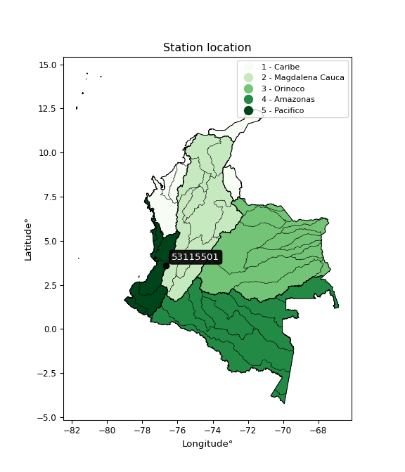

<div align="center">


</div>

# PMP Station (rain, Pmax24h): 53115501

Probable Maximum Precipitation (PMP) is the greatest amount of rainfall for a specific duration that is meteorologically possible for a given location, acting as a "worst-case" scenario for extreme storms, crucial for designing safety-critical infrastructure like bridges, river deviations, dams, spillways, and nuclear plants to prevent catastrophic failure. PMP is calculated by hydrologists using meteorological data to determine the upper limit of extreme rainfall, often leading to the Probable Maximum Flood (PMF) for flood control design, and is increasingly being studied for climate change impacts.

<div align="center">

</img>

</div>


## A. General information


### 1. General running parameters

• app_version: _v20251228_. • runtime: _2025-12-28 08:43:48.795225_. • Python version: _3.14.0_. • SciPy version: _1.16.3_. • Pandas version: _2.3.3_. • NumPy version: _2.3.5_. • Stations dataset (station_dataset_file): _dataset/pmax24h_in/automatic_colombia_2003_2024.csv_. • Stations catalog (station_catalog_file): _dataset/CNE_IDEAM.xls_. • Minimum year to eval til year_max (date_min): _1900_. • Maximum year to eval since year_min (date_max): _2024_. • Creates, save and include plots into reports (create_plot): _False_. • Plot only fit distributions with Δo > Δ (plot_only_fit): _True_. • Eval low extreme values, if False, evaluates high extreme values (low_extreme): _False_. • Eval every SciPy distribution as logarithmic (pdist_logarithmic_on): _True_. • Standard deviation normalized (ddof): _1.0_. • Return periods to eval in years (Tr): _[2, 2.33, 5, 10, 15, 20, 25, 50, 75, 100, 200, 250, 500, 750, 1000]_. • Minimum data sample per station, 0 means any (minimum_sample): _5_. • Z-Score maximum threshold to adjust a value, 0 means disable (zscore_max): _3.5_. • Z-Score minimum threshold to adjust a value, 0 means disable (zscore_min): _-2.5_. • Avoid zeros, e.g. rain = 0 (avoid_zeros): _True_. • Avoid null values (avoid_nans): _True_. [:file_folder:Dataset file.](../../dataset/pmax24h_in/automatic_colombia_2003_2024.csv)

> Delta Degrees of Freedom (DDOF): is a parameter used in the formulas for calculating variance and standard deviation. When ddof=0, the divisor is $N$ (the total number of observations) and this is used when your data set is the entire population. When ddof=1, the divisor is $N-1$ and this is used when your data set is a sample drawn from a larger population. Using $N-1$ provides an unbiased estimate of the population variance (known as Bessel´s correction).


### 2. Station info and location

|   id |   CODIGO | NOMBRE                   | CATEGORIA               | TECNOLOGIA                | ESTADO   | FECHA_INSTALACION   |   FECHA_SUSPENSION |   ALTITUD |   LATITUD |   LONGITUD | DEPARTAMENTO    | MUNICIPIO   | AREA_OPERATIVA                         | ENTIDAD                                    | AREA_HIDROGRAFICA   | ZONA_HIDROGRAFICA         | SUBZONA_HIDROGRAFICA                |   CORRIENTE | Catalogo   |
|-----:|---------:|:-------------------------|:------------------------|:--------------------------|:---------|:--------------------|-------------------:|----------:|----------:|-----------:|:----------------|:------------|:---------------------------------------|:-------------------------------------------|:--------------------|:--------------------------|:------------------------------------|------------:|:-----------|
|    0 | 53115501 | DAGUA  - AUT  [53115501] | Climatológica Principal | Automática con Telemetría | Activa   | 01/09/2013          |                nan |      1453 |   3.61044 |   -76.6379 | Valle Del Cauca | Dagua       | Area Operativa 09 - Cauca-Valle-Caldas | CENTRO NACIONAL DE INVESTIGACIONES DE CAFE | Pacifico            | Tapaje - Dagua - Directos | Dagua - Buenaventura - Bahia Málaga |         nan | CNE_OE     |

<div align="center">

Map location in: [:earth_americas:Google](http://maps.google.com/maps?q=3.610441667,-76.63785833) [:earth_americas:OSM](https://www.openstreetmap.org/#map=18/3.610441667/-76.63785833&layers=P) [:earth_americas:Bing](https://www.bing.com/maps?cp=3.610441667~-76.63785833&lvl=18) [:earth_americas:Apple](https://maps.apple.com/frame?center=3.610441667%2C-76.63785833&span=0.003%2C0.006)

</div>


<div align="center">

```geojson
{
  "type": "Feature",
  "geometry": {
    "type": "Point", 
    "coordinates": [-76.63785833, 3.610441667]
  }, 
  "properties": {
    "Name": "53115501"
  }
}
```

</div>


### 3. Discrete values table and plot

|               |           0 |           1 |           2 |          3 |           4 |          5 |           6 |
|:--------------|------------:|------------:|------------:|-----------:|------------:|-----------:|------------:|
| Date          | 2017        | 2018        | 2019        | 2020       | 2021        | 2022       | 2023        |
| Value         |   27.7      |   25        |   25        |   65.8     |   54.1      |   61.8     |   32.8      |
| Value_initial |   27.7      |   25        |   25        |   65.8     |   54.1      |   61.8     |   32.8      |
| count         |    7        |    7        |    7        |    7       |    7        |    7       |    7        |
| mean          |   41.7429   |   41.7429   |   41.7429   |   41.7429  |   41.7429   |   41.7429  |   41.7429   |
| std           |   18.1271   |   18.1271   |   18.1271   |   18.1271  |   18.1271   |   18.1271  |   18.1271   |
| zscore        |   -0.774687 |   -0.923635 |   -0.923635 |    1.32713 |    0.681693 |    1.10647 |   -0.493341 |

> The initial value (value_initial) correspond to the initial obtained or null completed value, and value (value) is adjusted only when the initial value is outside the valid range definite through the Z-Score value. If Z-Score is active, values out of range or outliers are replaced with the station mean value


### 4. Active continuous probability distributions from SciPy (44 of 104 available)

[scipy.stats](https://docs.scipy.org/doc/scipy/reference/stats.html) is a Python´s powerful submodule within the SciPy library for comprehensive statistical analysis, offering over 130 probability distributions (like Normal, Poisson), functions for descriptive stats (mean, variance), hypothesis testing (t-tests, chi-square), random variable generation, and statistical tests, making it essential for data science, modeling, and research. It provides tools to explore, model, and draw conclusions from data efficiently, working seamlessly with NumPy.

<div align="center">

|   id | p_dist             |   n_parameter | fit_method   | label                                                                       | active   | ref                                                                                                        |
|-----:|:-------------------|--------------:|:-------------|:----------------------------------------------------------------------------|:---------|:-----------------------------------------------------------------------------------------------------------|
|    0 | alpha              |             3 | MLE          | Alpha                                                                       | True     | [:mortar_board:](https://docs.scipy.org/doc/scipy/reference/generated/scipy.stats.alpha.html)              |
|    1 | betaprime          |             4 | MLE          | Beta prime                                                                  | True     | [:mortar_board:](https://docs.scipy.org/doc/scipy/reference/generated/scipy.stats.betaprime.html)          |
|    2 | chi2               |             3 | MLE          | Chi²                                                                        | True     | [:mortar_board:](https://docs.scipy.org/doc/scipy/reference/generated/scipy.stats.chi2.html)               |
|    3 | crystalball        |             4 | MLE          | Crystalball                                                                 | True     | [:mortar_board:](https://docs.scipy.org/doc/scipy/reference/generated/scipy.stats.crystalball.html)        |
|    4 | erlang             |             3 | MLE          | Erlang                                                                      | True     | [:mortar_board:](https://docs.scipy.org/doc/scipy/reference/generated/scipy.stats.erlang.html)             |
|    5 | expon              |             2 | MLE          | Exponential                                                                 | True     | [:mortar_board:](https://docs.scipy.org/doc/scipy/reference/generated/scipy.stats.expon.html)              |
|    6 | exponnorm          |             3 | MLE          | Exponentially modified Normal                                               | True     | [:mortar_board:](https://docs.scipy.org/doc/scipy/reference/generated/scipy.stats.exponnorm.html)          |
|    7 | f                  |             4 | MLE          | F                                                                           | True     | [:mortar_board:](https://docs.scipy.org/doc/scipy/reference/generated/scipy.stats.f.html)                  |
|    8 | fatiguelife        |             3 | MLE          | Fatigue-life (Birnbaum-Saunders)                                            | True     | [:mortar_board:](https://docs.scipy.org/doc/scipy/reference/generated/scipy.stats.fatiguelife.html)        |
|    9 | fisk               |             3 | MLE          | Fisk                                                                        | True     | [:mortar_board:](https://docs.scipy.org/doc/scipy/reference/generated/scipy.stats.fisk.html)               |
|   10 | gamma              |             3 | MLE          | Gamma                                                                       | True     | [:mortar_board:](https://docs.scipy.org/doc/scipy/reference/generated/scipy.stats.gamma.html)              |
|   11 | genexpon           |             5 | MLE          | Generalized exponential                                                     | True     | [:mortar_board:](https://docs.scipy.org/doc/scipy/reference/generated/scipy.stats.genexpon.html)           |
|   12 | genlogistic        |             3 | MLE          | Generalized logistic                                                        | True     | [:mortar_board:](https://docs.scipy.org/doc/scipy/reference/generated/scipy.stats.genlogistic.html)        |
|   13 | gibrat             |             2 | MM           | Gibrat                                                                      | True     | [:mortar_board:](https://docs.scipy.org/doc/scipy/reference/generated/scipy.stats.gibrat.html)             |
|   14 | gompertz           |             3 | MLE          | Gompertz (or truncated Gumbel)                                              | True     | [:mortar_board:](https://docs.scipy.org/doc/scipy/reference/generated/scipy.stats.gompertz.html)           |
|   15 | gumbel_l           |             2 | MM           | Gumbel Left Skew                                                            | True     | [:mortar_board:](https://docs.scipy.org/doc/scipy/reference/generated/scipy.stats.gumbel_l.html)           |
|   16 | gumbel_r           |             2 | MM           | Gumbel Right Skew                                                           | True     | [:mortar_board:](https://docs.scipy.org/doc/scipy/reference/generated/scipy.stats.gumbel_r.html)           |
|   17 | halflogistic       |             2 | MM           | Half-logistic                                                               | True     | [:mortar_board:](https://docs.scipy.org/doc/scipy/reference/generated/scipy.stats.halflogistic.html)       |
|   18 | halfnorm           |             2 | MM           | Half Normal                                                                 | True     | [:mortar_board:](https://docs.scipy.org/doc/scipy/reference/generated/scipy.stats.halfnorm.html)           |
|   19 | hypsecant          |             2 | MM           | hyperbolic secant                                                           | True     | [:mortar_board:](https://docs.scipy.org/doc/scipy/reference/generated/scipy.stats.hypsecant.html)          |
|   20 | invgamma           |             3 | MLE          | Inverted gamma                                                              | True     | [:mortar_board:](https://docs.scipy.org/doc/scipy/reference/generated/scipy.stats.invgamma.html)           |
|   21 | invgauss           |             3 | MLE          | Inverse Gaussian                                                            | True     | [:mortar_board:](https://docs.scipy.org/doc/scipy/reference/generated/scipy.stats.invgauss.html)           |
|   22 | invweibull         |             3 | MLE          | Inverted Weibull                                                            | True     | [:mortar_board:](https://docs.scipy.org/doc/scipy/reference/generated/scipy.stats.invweibull.html)         |
|   23 | johnsonsu          |             4 | MLE          | Johnson Su                                                                  | True     | [:mortar_board:](https://docs.scipy.org/doc/scipy/reference/generated/scipy.stats.johnsonsu.html)          |
|   24 | kstwobign          |             2 | MLE          | Limiting distribution of scaled Kolmogorov-Smirnov two-sided test statistic | True     | [:mortar_board:](https://docs.scipy.org/doc/scipy/reference/generated/scipy.stats.kstwobign.html)          |
|   25 | laplace            |             2 | MM           | Laplace                                                                     | True     | [:mortar_board:](https://docs.scipy.org/doc/scipy/reference/generated/scipy.stats.laplace.html)            |
|   26 | laplace_asymmetric |             3 | MLE          | Asymmetric Laplace                                                          | True     | [:mortar_board:](https://docs.scipy.org/doc/scipy/reference/generated/scipy.stats.laplace_asymmetric.html) |
|   27 | loggamma           |             3 | MLE          | Log gamma                                                                   | True     | [:mortar_board:](https://docs.scipy.org/doc/scipy/reference/generated/scipy.stats.loggamma.html)           |
|   28 | logistic           |             2 | MM           | Logistic (or Sech-squared)                                                  | True     | [:mortar_board:](https://docs.scipy.org/doc/scipy/reference/generated/scipy.stats.logistic.html)           |
|   29 | lognorm            |             3 | MLE          | Log Normal                                                                  | True     | [:mortar_board:](https://docs.scipy.org/doc/scipy/reference/generated/scipy.stats.lognorm.html)            |
|   30 | maxwell            |             2 | MM           | Maxwell                                                                     | True     | [:mortar_board:](https://docs.scipy.org/doc/scipy/reference/generated/scipy.stats.maxwell.html)            |
|   31 | mielke             |             4 | MLE          | Mielke Beta-Kappa / Dagum                                                   | True     | [:mortar_board:](https://docs.scipy.org/doc/scipy/reference/generated/scipy.stats.mielke.html)             |
|   32 | moyal              |             2 | MM           | Moyal                                                                       | True     | [:mortar_board:](https://docs.scipy.org/doc/scipy/reference/generated/scipy.stats.moyal.html)              |
|   33 | nakagami           |             3 | MLE          | Nakagami                                                                    | True     | [:mortar_board:](https://docs.scipy.org/doc/scipy/reference/generated/scipy.stats.nakagami.html)           |
|   34 | ncf                |             5 | MLE          | Non-central F distribution                                                  | True     | [:mortar_board:](https://docs.scipy.org/doc/scipy/reference/generated/scipy.stats.ncf.html)                |
|   35 | nct                |             4 | MLE          | Non-central Student’s t                                                     | True     | [:mortar_board:](https://docs.scipy.org/doc/scipy/reference/generated/scipy.stats.nct.html)                |
|   36 | norm               |             2 | MM           | Normal                                                                      | True     | [:mortar_board:](https://docs.scipy.org/doc/scipy/reference/generated/scipy.stats.norm.html)               |
|   37 | pearson3           |             3 | MM           | Pearson type III                                                            | True     | [:mortar_board:](https://docs.scipy.org/doc/scipy/reference/generated/scipy.stats.pearson3.html)           |
|   38 | rayleigh           |             2 | MM           | Rayleigh                                                                    | True     | [:mortar_board:](https://docs.scipy.org/doc/scipy/reference/generated/scipy.stats.rayleigh.html)           |
|   39 | rice               |             3 | MLE          | Rice                                                                        | True     | [:mortar_board:](https://docs.scipy.org/doc/scipy/reference/generated/scipy.stats.rice.html)               |
|   40 | t                  |             3 | MLE          | Student’s t                                                                 | True     | [:mortar_board:](https://docs.scipy.org/doc/scipy/reference/generated/scipy.stats.t.html)                  |
|   41 | truncnorm          |             4 | MLE          | Truncated normal                                                            | True     | [:mortar_board:](https://docs.scipy.org/doc/scipy/reference/generated/scipy.stats.truncnorm.html)          |
|   42 | wald               |             2 | MM           | Wald                                                                        | True     | [:mortar_board:](https://docs.scipy.org/doc/scipy/reference/generated/scipy.stats.wald.html)               |
|   43 | weibull_min        |             3 | MLE          | Weibull minimum                                                             | True     | [:mortar_board:](https://docs.scipy.org/doc/scipy/reference/generated/scipy.stats.weibull_min.html)        |

</div>

> **n_parameter:** # arguments & localization & scale.
>
> **Fit methods:** (MLE) maximum likelihood, (MM) L-moments.
>
>**Inactive:** foldnorm, gennorm, norminvgauss, powernorm, powerlognorm, skewnorm, genextreme, anglit, arcsine, argus, beta, bradford, burr, burr12, cauchy, cosine, halfcauchy, foldcauchy, skewcauchy, wrapcauchy, dgamma, gengamma, exponweib, exponpow, truncexpon, gausshyper, genhalflogistic, genhyperbolic, geninvgauss, halfgennorm, johnsonsb, kappa4, kappa3, ksone, kstwo, loglaplace, levy, levy_l, levy_stable, ncx2, pareto, genpareto, truncpareto, lomax, powerlaw, rdist, rel_breitwigner, recipinvgauss, semicircular, studentized_range, trapezoid, triang, truncweibull_min, tukeylambda, uniform, loguniform, vonmises, vonmises_line, weibull_max, dweibull, 


## B. Probability distributions vs. Empirical distributions

A continuous probability distribution (CPD) describes probabilities for variables that can take any value within a range (like rain any time), unlike discrete variables with specific outcomes (like temperature). It uses a Probability Density Function (PDF), a curve where the total area under it equals 1, and the probability of the variable falling within an interval (a to b) is found by calculating the area under the curve between those points. A key feature is that the probability of hitting any single exact value is zero, so probabilities are always expressed for ranges, e.g., $P(a ≤ X ≤ b)$.

<div align="center">

Distributions parameters from station values
|    |   station | p_dist                |   n |              loc |           scale | shape                  | shape1                 | shape2             | shape3   |
|---:|----------:|:----------------------|----:|-----------------:|----------------:|:-----------------------|:-----------------------|:-------------------|:---------|
|  0 |  53115501 | alpha                 |   7 |     21.3946      |     6.08807     | 2.871362011864205e-08  |                        |                    |          |
|  1 |  53115501 | betaprime             |   7 |     -0.585746    |     1.87285     | 138.94857555383925     | 7.1315606105675355     |                    |          |
|  2 |  53115501 | chi2                  |   7 |     25           |     7.72598     | 0.7231418524703545     |                        |                    |          |
|  3 |  53115501 | crystalball           |   7 |     41.7429      |    16.7825      | 3717.5967849110352     | 1637.4742491943948     |                    |          |
|  4 |  53115501 | erlang                |   7 |     25           |    12.6356      | 0.2648835985188951     |                        |                    |          |
|  5 |  53115501 | expon                 |   7 |     25           |    16.7429      |                        |                        |                    |          |
|  6 |  53115501 | exponnorm             |   7 |     24.9878      |     0.00362337  | 4626.400152150507      |                        |                    |          |
|  7 |  53115501 | f                     |   7 |     24.9996      |     0.00146417  | 1177.7505535759014     | 0.5678248081190063     |                    |          |
|  8 |  53115501 | fatiguelife           |   7 |     25           |     5.73046e-06 | 1676.1077052775727     |                        |                    |          |
|  9 |  53115501 | fisk                  |   7 |     25           |     7.91488     | 0.6040835372548203     |                        |                    |          |
| 10 |  53115501 | gamma                 |   7 |     25           |    11.2047      | 0.8173998525382455     |                        |                    |          |
| 11 |  53115501 | genexpon              |   7 |     25           |    24.5362      | 1.4654961976183805     | 1.0207495139669426e-08 | 1.4945519804163556 |          |
| 12 |  53115501 | genlogistic           |   7 |    -60.5597      |    12.9811      | 1424.7438699310887     |                        |                    |          |
| 13 |  53115501 | gibrat                |   7 |     28.9399      |     7.76537     |                        |                        |                    |          |
| 14 |  53115501 | gompertz              |   7 |     25           | 26669.5         | 1592.6930229301206     |                        |                    |          |
| 15 |  53115501 | gumbel_l              |   7 |     49.2959      |    13.0852      |                        |                        |                    |          |
| 16 |  53115501 | gumbel_r              |   7 |     34.1899      |    13.0852      |                        |                        |                    |          |
| 17 |  53115501 | halflogistic          |   7 |     21.8517      |    14.3484      |                        |                        |                    |          |
| 18 |  53115501 | halfnorm              |   7 |     19.5295      |    27.8404      |                        |                        |                    |          |
| 19 |  53115501 | hypsecant             |   7 |     41.7429      |    10.684       |                        |                        |                    |          |
| 20 |  53115501 | invgamma              |   7 |     25           |     2.02675e-08 | 0.13149369854220067    |                        |                    |          |
| 21 |  53115501 | invgauss              |   7 |     24.4144      |     1.98883     | 8.712902172723336      |                        |                    |          |
| 22 |  53115501 | invweibull            |   7 |     25           |     1.49097     | 0.06938323651074729    |                        |                    |          |
| 23 |  53115501 | johnsonsu             |   7 |      2.04897e+08 |     9.28253e+08 | 12372224.887113169     | 56499411.272170275     |                    |          |
| 24 |  53115501 | kstwobign             |   7 |    -10.2052      |    59.2887      |                        |                        |                    |          |
| 25 |  53115501 | laplace               |   7 |     41.7429      |    11.867       |                        |                        |                    |          |
| 26 |  53115501 | laplace_asymmetric    |   7 |     25           |     0.000217339 | 1.2981091521751874e-05 |                        |                    |          |
| 27 |  53115501 | loggamma              |   7 |  -6148.17        |   802.597       | 2236.333929383205      |                        |                    |          |
| 28 |  53115501 | logistic              |   7 |     41.7429      |     9.25266     |                        |                        |                    |          |
| 29 |  53115501 | lognorm               |   7 |     25           |     0.000529137 | 16.295652465544993     |                        |                    |          |
| 30 |  53115501 | maxwell               |   7 |      1.97547     |    24.9205      |                        |                        |                    |          |
| 31 |  53115501 | mielke                |   7 |     12.0229      |     2.31204     | 186.06789951492306     | 2.165983114539313      |                    |          |
| 32 |  53115501 | moyal                 |   7 |     32.1456      |     7.55476     |                        |                        |                    |          |
| 33 |  53115501 | nakagami              |   7 |     25           |    24.6386      | 0.1747517356991815     |                        |                    |          |
| 34 |  53115501 | ncf                   |   7 |     -0.0197129   |     9.52663e-05 | 1.550740007734384e-05  | 5.1837949742572125     | 5.607147398556075  |          |
| 35 |  53115501 | nct                   |   7 |     -0.111715    |     0.623371    | 3.880331575601759      | 53.84628952834621      |                    |          |
| 36 |  53115501 | norm                  |   7 |     41.7429      |    16.7825      |                        |                        |                    |          |
| 37 |  53115501 | pearson3              |   7 |     41.7428      |    16.7825      | 0.3326483535377095     |                        |                    |          |
| 38 |  53115501 | rayleigh              |   7 |      9.63703     |    25.6167      |                        |                        |                    |          |
| 39 |  53115501 | rice                  |   7 |     13.8014      |    22.5232      | 0.306911289147069      |                        |                    |          |
| 40 |  53115501 | t                     |   7 |     41.7429      |    16.7824      | 2073398909.7869995     |                        |                    |          |
| 41 |  53115501 | truncnorm             |   7 | -10514.1         |   421.564       | 24.99998671077912      | 67.22269798118884      |                    |          |
| 42 |  53115501 | wald                  |   7 |     24.9604      |    16.7825      |                        |                        |                    |          |
| 43 |  53115501 | weibull_min           |   7 |     25           |    21.3455      | 0.8833529196347792     |                        |                    |          |
| 44 |  53115501 | logalpha              |   7 |      2.34942     |     3.93242     | 3.327478018967133      |                        |                    |          |
| 45 |  53115501 | logbetaprime          |   7 |      2.72414     |   247.457       | 5.763239776878763      | 1602.843789045808      |                    |          |
| 46 |  53115501 | logchi2               |   7 |      3.21888     |     1.02764     | 1.0217573072203026     |                        |                    |          |
| 47 |  53115501 | logcrystalball        |   7 |      3.65014     |     0.402469    | 6.882842637901403      | 914.487689452399       |                    |          |
| 48 |  53115501 | logerlang             |   7 |      3.21888     |     0.361033    | 0.5432184340437969     |                        |                    |          |
| 49 |  53115501 | logexpon              |   7 |      3.21888     |     0.431263    |                        |                        |                    |          |
| 50 |  53115501 | logexponnorm          |   7 |      3.5983      |     0.399118    | 0.12988043387491702    |                        |                    |          |
| 51 |  53115501 | logf                  |   7 |      3.21888     |     1.57148e-11 | 171.09617460161343     | 0.4338890825946995     |                    |          |
| 52 |  53115501 | logfatiguelife        |   7 |      3.21888     |     6.20957e-08 | 2930.547732481089      |                        |                    |          |
| 53 |  53115501 | logfisk               |   7 |      3.21888     |     0.41545     | 0.39029571531955026    |                        |                    |          |
| 54 |  53115501 | loggamma              |   7 |      3.21888     |     0.389926    | 0.8275534485107396     |                        |                    |          |
| 55 |  53115501 | loggenexpon           |   7 |      3.21888     |     0.763202    | 1.7696561515344356     | 1.0159046590222926e-07 | 1.669845395878045  |          |
| 56 |  53115501 | loggenlogistic        |   7 |      1.2177      |     0.322208    | 1037.179484697761      |                        |                    |          |
| 57 |  53115501 | loggibrat             |   7 |      3.34312     |     0.186219    |                        |                        |                    |          |
| 58 |  53115501 | loggompertz           |   7 |      3.21888     |     2.62571     | 5.193777028565847      |                        |                    |          |
| 59 |  53115501 | loggumbel_l           |   7 |      3.83127     |     0.313804    |                        |                        |                    |          |
| 60 |  53115501 | loggumbel_r           |   7 |      3.46901     |     0.313804    |                        |                        |                    |          |
| 61 |  53115501 | loghalflogistic       |   7 |      3.17312     |     0.344097    |                        |                        |                    |          |
| 62 |  53115501 | loghalfnorm           |   7 |      3.11743     |     0.667654    |                        |                        |                    |          |
| 63 |  53115501 | loghypsecant          |   7 |      3.65014     |     0.25622     |                        |                        |                    |          |
| 64 |  53115501 | loginvgamma           |   7 |      2.90862     |     1.75908     | 3.309048077565164      |                        |                    |          |
| 65 |  53115501 | loginvgauss           |   7 |      3.19087     |     0.0992846   | 4.625720061385474      |                        |                    |          |
| 66 |  53115501 | loginvweibull         |   7 |      3.21888     |     0.0404692   | 0.056569299633870196   |                        |                    |          |
| 67 |  53115501 | logjohnsonsu          |   7 |  83418.3         |   302.264       | 1361045.2671798025     | 215579.41204709324     |                    |          |
| 68 |  53115501 | logkstwobign          |   7 |      2.36475     |     1.4655      |                        |                        |                    |          |
| 69 |  53115501 | loglaplace            |   7 |      3.65014     |     0.284589    |                        |                        |                    |          |
| 70 |  53115501 | loglaplace_asymmetric |   7 |      3.21888     |     0.000167486 | 0.00038827764170126864 |                        |                    |          |
| 71 |  53115501 | logloggamma           |   7 |    -66.5221      |    10.7295      | 692.8191698919827      |                        |                    |          |
| 72 |  53115501 | loglogistic           |   7 |      3.65014     |     0.221893    |                        |                        |                    |          |
| 73 |  53115501 | loglognorm            |   7 |      3.21888     |     2.32868e-05 | 15.628239695342494     |                        |                    |          |
| 74 |  53115501 | logmaxwell            |   7 |      2.69646     |     0.597632    |                        |                        |                    |          |
| 75 |  53115501 | logmielke             |   7 |      1.07334     |     1.29835     | 817.4568182180042      | 7.792938350344896      |                    |          |
| 76 |  53115501 | logmoyal              |   7 |      3.41998     |     0.181175    |                        |                        |                    |          |
| 77 |  53115501 | lognakagami           |   7 |      3.21888     |     0.949627    | 0.1001391421980897     |                        |                    |          |
| 78 |  53115501 | logncf                |   7 |     -3.80893     |     7.3755      | 518.1401262461031      | 650.6054754849008      | 4.92656652789746   |          |
| 79 |  53115501 | lognct                |   7 |      0.140257    |     0.0615765   | 40.109351638931074     | 55.9259519287766       |                    |          |
| 80 |  53115501 | lognorm               |   7 |      3.65014     |     0.402469    |                        |                        |                    |          |
| 81 |  53115501 | logpearson3           |   7 |      3.65014     |     0.402469    | 0.21974022057146253    |                        |                    |          |
| 82 |  53115501 | lograyleigh           |   7 |      2.88019     |     0.614329    |                        |                        |                    |          |
| 83 |  53115501 | logrice               |   7 |      2.9618      |     0.526308    | 0.5433824144345538     |                        |                    |          |
| 84 |  53115501 | logt                  |   7 |      3.65017     |     0.402484    | 11829963.03753625      |                        |                    |          |
| 85 |  53115501 | logtruncnorm          |   7 |     -2.97834     |     1.97498     | 3.1378635094767517     | 3.6278759634394544     |                    |          |
| 86 |  53115501 | logwald               |   7 |      3.24765     |     0.40249     |                        |                        |                    |          |
| 87 |  53115501 | logweibull_min        |   7 |      3.21888     |     0.554588    | 0.46395939875926684    |                        |                    |          |

</div>

> **loc** (Location parameter): This shifts the distribution along the x-axis. For many common distributions, like the normal (Gaussian) distribution, loc represents the mean $μ$. For others, like the uniform distribution, it might represent the minimum value, or for the beta distribution, the left end of the support interval.
>
> **scale** (Scale parameter): This determines the width or spread of the distribution. For the normal distribution, scale represents the standard deviation $σ$. For a uniform distribution, it defines the length of the interval (from $loc$ to $loc + scale$).
>
> **shape** (Shape parameters): Refers to parameters that define the specific form of a probability distribution, distinct from its location (loc) and scale (scale). These parameters are required arguments for most distribution functions. For example, a normal (Gaussian) distribution is fully defined by its location (mean) and scale (standard deviation), so it has no specific shape parameters beyond loc and scale. However, other distributions have intrinsic properties that need specification, as Gamma distribution that takes a shape parameter, often named $a$ or $alpha$.


### 0. Cumulative distribution values - CDF (88 evaluated)

Cumulative Distribution Function (CDF), denoted as $F$<sub>$X$</sub>$(x)$, is a function that gives the probability that a random variable $X$ will take a value less than or equal to a specific value, $x$ (i.e., $(P(X≥x)$. It essentially "accumulates" probabilities from a given point up to the far right (positive infinity), providing a complete picture of the distribution´s probabilities for both discrete (like rain) and continuous (like temperature) variables, helping to find probabilities over ranges or above certain values.

<div align="center">

CDF ordered by x ascending and calculating $log(f(x))$ separately
|   id |   Station |   date |    x |   count |    mean |     std |    zscore |   Value_initial |   station |   m |     alpha |   alpha_pdf |   betaprime |   betaprime_pdf |        chi2 |    chi2_pdf |   crystalball |   crystalball_pdf |      erlang |   erlang_pdf |    expon |   expon_pdf |   exponnorm |   exponnorm_pdf |         f |         f_pdf |   fatiguelife |   fatiguelife_pdf |        fisk |       fisk_pdf |       gamma |   gamma_pdf |    genexpon |   genexpon_pdf |   genlogistic |   genlogistic_pdf |   gibrat |   gibrat_pdf |    gompertz |   gompertz_pdf |   gumbel_l |   gumbel_l_pdf |   gumbel_r |   gumbel_r_pdf |   halflogistic |   halflogistic_pdf |   halfnorm |   halfnorm_pdf |   hypsecant |   hypsecant_pdf |   invgamma |   invgamma_pdf |   invgauss |   invgauss_pdf |   invweibull |   invweibull_pdf |   johnsonsu |   johnsonsu_pdf |   kstwobign |   kstwobign_pdf |   laplace |   laplace_pdf |   laplace_asymmetric |   laplace_asymmetric_pdf |    loggamma |   loggamma_pdf |   logistic |   logistic_pdf |   lognorm |   lognorm_pdf |   maxwell |   maxwell_pdf |   mielke |   mielke_pdf |    moyal |   moyal_pdf |    nakagami |   nakagami_pdf |      ncf |    ncf_pdf |      nct |    nct_pdf |     norm |   norm_pdf |   pearson3 |   pearson3_pdf |   rayleigh |   rayleigh_pdf |     rice |   rice_pdf |        t |      t_pdf |   truncnorm |   truncnorm_pdf |        wald |    wald_pdf |   weibull_min |   weibull_min_pdf |   logalpha |   logalpha_pdf |   logbetaprime |   logbetaprime_pdf |    logchi2 |   logchi2_pdf |   logcrystalball |   logcrystalball_pdf |   logerlang |   logerlang_pdf |   logexpon |   logexpon_pdf |   logexponnorm |   logexponnorm_pdf |      logf |    logf_pdf |   logfatiguelife |   logfatiguelife_pdf |     logfisk |   logfisk_pdf |   loggenexpon |   loggenexpon_pdf |   loggenlogistic |   loggenlogistic_pdf |   loggibrat |   loggibrat_pdf |   loggompertz |   loggompertz_pdf |   loggumbel_l |   loggumbel_l_pdf |   loggumbel_r |   loggumbel_r_pdf |   loghalflogistic |   loghalflogistic_pdf |   loghalfnorm |   loghalfnorm_pdf |   loghypsecant |   loghypsecant_pdf |   loginvgamma |   loginvgamma_pdf |   loginvgauss |   loginvgauss_pdf |   loginvweibull |   loginvweibull_pdf |   logjohnsonsu |   logjohnsonsu_pdf |   logkstwobign |   logkstwobign_pdf |   loglaplace |   loglaplace_pdf |   loglaplace_asymmetric |   loglaplace_asymmetric_pdf |   logloggamma |   logloggamma_pdf |   loglogistic |   loglogistic_pdf |   loglognorm |   loglognorm_pdf |   logmaxwell |   logmaxwell_pdf |   logmielke |   logmielke_pdf |   logmoyal |   logmoyal_pdf |   lognakagami |   lognakagami_pdf |   logncf |   logncf_pdf |   lognct |   lognct_pdf |   logpearson3 |   logpearson3_pdf |   lograyleigh |   lograyleigh_pdf |   logrice |   logrice_pdf |     logt |   logt_pdf |   logtruncnorm |   logtruncnorm_pdf |   logwald |   logwald_pdf |   logweibull_min |   logweibull_min_pdf |
|-----:|----------:|-------:|-----:|--------:|--------:|--------:|----------:|----------------:|----------:|----:|----------:|------------:|------------:|----------------:|------------:|------------:|--------------:|------------------:|------------:|-------------:|---------:|------------:|------------:|----------------:|----------:|--------------:|--------------:|------------------:|------------:|---------------:|------------:|------------:|------------:|---------------:|--------------:|------------------:|---------:|-------------:|------------:|---------------:|-----------:|---------------:|-----------:|---------------:|---------------:|-------------------:|-----------:|---------------:|------------:|----------------:|-----------:|---------------:|-----------:|---------------:|-------------:|-----------------:|------------:|----------------:|------------:|----------------:|----------:|--------------:|---------------------:|-------------------------:|------------:|---------------:|-----------:|---------------:|----------:|--------------:|----------:|--------------:|---------:|-------------:|---------:|------------:|------------:|---------------:|---------:|-----------:|---------:|-----------:|---------:|-----------:|-----------:|---------------:|-----------:|---------------:|---------:|-----------:|---------:|-----------:|------------:|----------------:|------------:|------------:|--------------:|------------------:|-----------:|---------------:|---------------:|-------------------:|-----------:|--------------:|-----------------:|---------------------:|------------:|----------------:|-----------:|---------------:|---------------:|-------------------:|----------:|------------:|-----------------:|---------------------:|------------:|--------------:|--------------:|------------------:|-----------------:|---------------------:|------------:|----------------:|--------------:|------------------:|--------------:|------------------:|--------------:|------------------:|------------------:|----------------------:|--------------:|------------------:|---------------:|-------------------:|--------------:|------------------:|--------------:|------------------:|----------------:|--------------------:|---------------:|-------------------:|---------------:|-------------------:|-------------:|-----------------:|------------------------:|----------------------------:|--------------:|------------------:|--------------:|------------------:|-------------:|-----------------:|-------------:|-----------------:|------------:|----------------:|-----------:|---------------:|--------------:|------------------:|---------:|-------------:|---------:|-------------:|--------------:|------------------:|--------------:|------------------:|----------:|--------------:|---------:|-----------:|---------------:|-------------------:|----------:|--------------:|-----------------:|---------------------:|
|    0 |  53115501 |   2018 | 25   |       7 | 41.7429 | 18.1271 | -0.923635 |            25   |  53115501 |   1 | 0.0912928 |  0.0898138  |    0.138482 |      0.0249248  | 5.51083e-06 | 6.23172e+07 |      0.159227 |         0.0144521 | 0.000101068 |  3.76773e+09 | 0        |  0.059727   |  0.00072827 |      0.0595888  | 0.0772826 | 280.45        |     0.0874624 |        9.7275e+10 | 5.35298e-10 | 91019.1        | 2.29045e-13 | 52.698      | 2.89041e-11 |     0.0597279  |      0.141688 |        0.0213147  | 0        |   0          | 1.16167e-06 |     0.0597196  |   0.144596 |     0.0102098  |   0.132867 |     0.0204949  |       0.10927  |         0.034431   |   0.155779 |     0.0281113  |    0.130953 |      0.011914   |   0.094112 |    1.6679e+06  |  0.0731858 |     0.257233   |  5.24345e-05 |      5.04638e+09 |    0.159839 |      0.0144519  |    0.127606 |      0.0217404  |  0.121965 |    0.0102776  |          5.41835e-10 |               0.0597275  | 1.01061e-06 |      40.6615   |   0.140696 |     0.0130666  |  0.141963 |      0.558275 |  0.163398 |    0.0178356  | 0.132148 |   0.0441171  | 0.108566 |  0.0233845  | 2.95155e-06 |    1.45182e+08 | 0.430781 | 0.0124027  | 0.130973 | 0.0284129  | 0.159227 |  0.0144521 |   0.158032 |     0.0162325  |   0.164591 |     0.0195581  | 0.111239 | 0.0187194  | 0.159226 | 0.0144521  |    0        |      0.0593975  | 1.01116e-93 | 5.42213e-90 |   1.15292e-14 |        2.86663    |   0.116017 |       1.01619  |       0.12767  |           0.837283 | 1.1198e-08 |   1.28821e+07 |         0.141963 |             0.558275 |  0.00011929 |    3725.17      |   0        |       2.31877  |       0.141915 |           0.558957 | 0.0587324 | 2.5657e+10  |         0.148743 |           1.8131e+13 | 1.43504e-06 |   1.26121e+09 |    8.1973e-09 |          2.31873  |         0.124912 |             0.805612 |    0        |        0        |   2.55535e-12 |          1.97804  |      0.132429 |          0.392746 |      0.108709 |          0.768743 |         0.0663901 |              1.44668  |      0.120772 |          1.18134  |       0.11694  |           0.446207 |      0.105367 |          1.27865  |     0.0737582 |          5.61916  |      0.00210904 |         1.65533e+12 |       0.13259  |           0.554217 |       0.113822 |           0.834731 |     0.109861 |         0.386035 |             1.77986e-07 |                    2.31827  |      0.145719 |          0.55342  |      0.125257 |          0.493786 |    0.0571248 |      1.65147e+13 |     0.141976 |         0.696222 |    0.125879 |        0.938243 |  0.0815177 |       0.84128  |   0.000710107 |       3.20249e+11 | 0.245306 |     0.536045 | 0.13587  |     0.672121 |      0.14013  |          0.601634 |      0.140986 |          0.770892 |  0.097856 |      0.723219 | 0.141953 |   0.558228 |     4.0311e-06 |           2.07595  | 0         |      0        |       9.9046e-08 |          1.03478e+08 |
|    1 |  53115501 |   2019 | 25   |       7 | 41.7429 | 18.1271 | -0.923635 |            25   |  53115501 |   2 | 0.0912928 |  0.0898138  |    0.138482 |      0.0249248  | 5.51083e-06 | 6.23172e+07 |      0.159227 |         0.0144521 | 0.000101068 |  3.76773e+09 | 0        |  0.059727   |  0.00072827 |      0.0595888  | 0.0772826 | 280.45        |     0.0874624 |        9.7275e+10 | 5.35298e-10 | 91019.1        | 2.29045e-13 | 52.698      | 2.89041e-11 |     0.0597279  |      0.141688 |        0.0213147  | 0        |   0          | 1.16167e-06 |     0.0597196  |   0.144596 |     0.0102098  |   0.132867 |     0.0204949  |       0.10927  |         0.034431   |   0.155779 |     0.0281113  |    0.130953 |      0.011914   |   0.094112 |    1.6679e+06  |  0.0731858 |     0.257233   |  5.24345e-05 |      5.04638e+09 |    0.159839 |      0.0144519  |    0.127606 |      0.0217404  |  0.121965 |    0.0102776  |          5.41835e-10 |               0.0597275  | 1.01061e-06 |      40.6615   |   0.140696 |     0.0130666  |  0.141963 |      0.558275 |  0.163398 |    0.0178356  | 0.132148 |   0.0441171  | 0.108566 |  0.0233845  | 2.95155e-06 |    1.45182e+08 | 0.430781 | 0.0124027  | 0.130973 | 0.0284129  | 0.159227 |  0.0144521 |   0.158032 |     0.0162325  |   0.164591 |     0.0195581  | 0.111239 | 0.0187194  | 0.159226 | 0.0144521  |    0        |      0.0593975  | 1.01116e-93 | 5.42213e-90 |   1.15292e-14 |        2.86663    |   0.116017 |       1.01619  |       0.12767  |           0.837283 | 1.1198e-08 |   1.28821e+07 |         0.141963 |             0.558275 |  0.00011929 |    3725.17      |   0        |       2.31877  |       0.141915 |           0.558957 | 0.0587324 | 2.5657e+10  |         0.148743 |           1.8131e+13 | 1.43504e-06 |   1.26121e+09 |    8.1973e-09 |          2.31873  |         0.124912 |             0.805612 |    0        |        0        |   2.55535e-12 |          1.97804  |      0.132429 |          0.392746 |      0.108709 |          0.768743 |         0.0663901 |              1.44668  |      0.120772 |          1.18134  |       0.11694  |           0.446207 |      0.105367 |          1.27865  |     0.0737582 |          5.61916  |      0.00210904 |         1.65533e+12 |       0.13259  |           0.554217 |       0.113822 |           0.834731 |     0.109861 |         0.386035 |             1.77986e-07 |                    2.31827  |      0.145719 |          0.55342  |      0.125257 |          0.493786 |    0.0571248 |      1.65147e+13 |     0.141976 |         0.696222 |    0.125879 |        0.938243 |  0.0815177 |       0.84128  |   0.000710107 |       3.20249e+11 | 0.245306 |     0.536045 | 0.13587  |     0.672121 |      0.14013  |          0.601634 |      0.140986 |          0.770892 |  0.097856 |      0.723219 | 0.141953 |   0.558228 |     4.0311e-06 |           2.07595  | 0         |      0        |       9.9046e-08 |          1.03478e+08 |
|    2 |  53115501 |   2017 | 27.7 |       7 | 41.7429 | 18.1271 | -0.774687 |            27.7 |  53115501 |   3 | 0.334275  |  0.0766587  |    0.211282 |      0.0286246  | 0.571535    | 0.0672357   |      0.201364 |         0.01675   | 0.704419    |  0.0582705   | 0.148932 |  0.0508317  |  0.149385   |      0.0507431  | 0.908128  |   0.00965799  |     0.658924  |        0.0278217  | 0.34306     |     0.050423   | 0.300276    |  0.0794155  | 0.148934    |     0.0508324  |      0.204463 |        0.0249885  | 0        |   0          | 0.148923    |     0.0508312  |   0.174671 |     0.0121084  |   0.193576 |     0.0242921  |       0.201019 |         0.0334389  |   0.230843 |     0.0274513  |    0.167078 |      0.0149298  |   0.909046 |    0.00442958  |  0.487283  |     0.0774402  |  0.383032    |      0.00944567  |    0.201959 |      0.0167373  |    0.191669 |      0.0254673  |  0.153125 |    0.0129034  |          0.148933    |               0.0508321  | 0.314       |       2.18751  |   0.179799 |     0.0159383  |  0.207043 |      0.710121 |  0.214608 |    0.0200253  | 0.259442 |   0.0479852  | 0.179569 |  0.0287969  | 0.367787    |    0.0475234   | 0.463249 | 0.01165    | 0.214364 | 0.0327206  | 0.201364 |  0.01675   |   0.205278 |     0.0187212  |   0.220108 |     0.0214672  | 0.166109 | 0.0217999  | 0.201363 | 0.01675    |    0.148192 |      0.0506082  | 0.0339137   | 0.0422121   |   0.1487      |        0.0448387  |   0.236425 |       1.28356  |       0.225689 |           1.05603  | 0.239807   |   1.15565     |         0.207043 |             0.710121 |  0.515943   |       2.2653    |   0.211644 |       1.82802  |       0.207078 |           0.711031 | 0.994173  | 0.0123273   |         0.6695   |           0.774746   | 0.366792    |   0.883887    |    0.21164    |          1.82799  |         0.22014  |             1.0333   |    0        |        0        |   0.186879    |          1.67245  |      0.178785 |          0.515464 |      0.201809 |          1.02925  |         0.212235  |              1.38763  |      0.240056 |          1.14055  |       0.172166 |           0.639661 |      0.254392 |          1.52763  |     0.468694  |          2.19306  |      0.387222   |         0.202643    |       0.19789  |           0.718924 |       0.212341 |           1.06316  |     0.157525 |         0.553519 |             0.211603    |                    1.82772  |      0.21001  |          0.699689 |      0.18522  |          0.680119 |    0.70432   |      0.215501    |     0.221381 |         0.845071 |    0.235834 |        1.1729   |  0.189335  |       1.22132  |   0.534531    |       1.04276     | 0.303003 |     0.586952 | 0.214353 |     0.851749 |      0.210236 |          0.76284  |      0.227359 |          0.903341 |  0.182622 |      0.917727 | 0.207028 |   0.710063 |     0.196381   |           1.76143  | 0.0493413 |      2.04782  |       0.366819   |          1.30906     |
|    3 |  53115501 |   2023 | 32.8 |       7 | 41.7429 | 18.1271 | -0.493341 |            32.8 |  53115501 |   4 | 0.593487  |  0.0323839  |    0.363383 |      0.0299246  | 0.775141    | 0.0245536   |      0.297062 |         0.0206251 | 0.867106    |  0.017843    | 0.372411 |  0.037484   |  0.372514   |      0.0374324  | 0.932017  |   0.00247427  |     0.756806  |        0.013971   | 0.497792    |     0.0193613  | 0.593204    |  0.0415049  | 0.372416    |     0.0374843  |      0.342378 |        0.0282594  | 0.24228  |   0.0809506  | 0.372419    |     0.0374899  |   0.246835 |     0.0163161  |   0.32888  |     0.0279502  |       0.364022 |         0.0302294  |   0.3664   |     0.0255816  |    0.260137 |      0.021727   |   0.920889 |    0.00133367  |  0.696339  |     0.0224487  |  0.410025    |      0.00325169  |    0.297529 |      0.0205878  |    0.331279 |      0.0284223  |  0.235337 |    0.0198312  |          0.372414    |               0.0374842  | 0.588082    |       1.19894  |   0.275575 |     0.0215758  |  0.345748 |      0.916185 |  0.324626 |    0.0227948  | 0.479174 |   0.0365932  | 0.338258 |  0.0319706  | 0.531656    |    0.0234698   | 0.519158 | 0.0102923  | 0.383829 | 0.0322669  | 0.297062 |  0.0206251 |   0.310802 |     0.0223766  |   0.335553 |     0.0234535  | 0.287842 | 0.0254537  | 0.297061 | 0.0206251  |    0.370904 |      0.0373943  | 0.335379    | 0.0549417   |   0.336979    |        0.030857   |   0.452846 |       1.19705  |       0.417199 |           1.15689  | 0.383814   |   0.661105    |         0.345748 |             0.916185 |  0.75812    |       0.909216  |   0.467232 |       1.23537  |       0.345939 |           0.917013 | 0.995282  | 0.00376907  |         0.762259 |           0.40635    | 0.458606    |   0.356856    |    0.467225   |          1.23536  |         0.408185 |             1.13464  |    0.407351 |        2.63477  |   0.432152    |          1.24561  |      0.286454 |          0.767447 |      0.392974 |          1.16966  |         0.430961  |              1.1832   |      0.423616 |          1.02238  |       0.313313 |           1.03472  |      0.490455 |          1.20059  |     0.683766  |          0.751506 |      0.407421   |         0.0762083   |       0.340013 |           0.946968 |       0.403232 |           1.13983  |     0.285263 |         1.00237  |             0.467159    |                    1.23527  |      0.346407 |          0.900515 |      0.327445 |          0.992483 |    0.725471  |      0.0785576   |     0.377418 |         0.974958 |    0.438833 |        1.16075  |  0.41033   |       1.29177  |   0.64922     |       0.475268    | 0.407125 |     0.637727 | 0.375063 |     1.0172   |      0.357192 |          0.954727 |      0.389429 |          0.987263 |  0.35357  |      1.06966  | 0.345723 |   0.916126 |     0.456592   |           1.33579  | 0.448776  |      1.8569   |       0.512269   |          0.598309    |
|    4 |  53115501 |   2021 | 54.1 |       7 | 41.7429 | 18.1271 |  0.681693 |            54.1 |  53115501 |   5 | 0.852328  |  0.00446331 |    0.8084   |      0.0114725  | 0.967063    | 0.00266933  |      0.76923  |         0.018127  | 0.987277    |  0.00125613  | 0.824138 |  0.0105037  |  0.823895   |      0.0105054  | 0.953219  |   0.000456401 |     0.910601  |        0.00373271 | 0.687082    |     0.00446317 | 0.948173    |  0.00487641 | 0.824143    |     0.0105036  |      0.812368 |        0.0130035  | 0.88012  |   0.00794513 | 0.824267    |     0.0105062  |   0.763924 |     0.0260446  |   0.80383  |     0.0134144  |       0.808872 |         0.0120475  |   0.785668 |     0.0132569  |    0.805987 |      0.0170555  |   0.933465 |    0.000300651 |  0.876733  |     0.00341973 |  0.443214    |      0.000859886 |    0.768665 |      0.018106   |    0.809952 |      0.0138708  |  0.823503 |    0.0148729  |          0.824141    |               0.0105036  | 0.898274    |       0.277464 |   0.791753 |     0.0178198  |  0.801367 |      0.692744 |  0.776278 |    0.0157163  | 0.852067 |   0.00701523 | 0.815091 |  0.0120164  | 0.815794    |    0.00794869  | 0.688751 | 0.00601379 | 0.814885 | 0.0101162  | 0.76923  |  0.018127  |   0.777318 |     0.0164422  |   0.778277 |     0.0150232  | 0.783091 | 0.0164655  | 0.76923  | 0.0181271  |    0.822865 |      0.0105503  | 0.851645    | 0.0088881   |   0.731494    |        0.0107172  |   0.824621 |       0.377415 |       0.849233 |           0.496669 | 0.606042   |   0.310883    |         0.801367 |             0.692744 |  0.956134   |       0.141077  |   0.833039 |       0.387144 |       0.80146  |           0.691788 | 0.996239  | 0.00105696  |         0.88554  |           0.150755   | 0.560161    |   0.124568    |    0.833033   |          0.38715  |         0.827235 |             0.486904 |    0.893716 |        0.283211 |   0.830541    |          0.449762 |      0.810386 |          1.00472  |      0.827301 |          0.499818 |         0.830021  |              0.452002 |      0.809185 |          0.507904 |       0.83535  |           0.614336 |      0.832273 |          0.335057 |     0.860476  |          0.169792 |      0.428966   |         0.0266057   |       0.810795 |           0.699517 |       0.829632 |           0.515006 |     0.848973 |         0.530684 |             0.832974    |                    0.387211 |      0.798342 |          0.697396 |      0.822796 |          0.657087 |    0.747302  |      0.02649     |     0.804117 |         0.599996 |    0.826425 |        0.420463 |  0.836072  |       0.445983 |   0.796179    |       0.194487    | 0.712733 |     0.525327 | 0.810369 |     0.579742 |      0.804545 |          0.64645  |      0.8049   |          0.574155 |  0.810577 |      0.617422 | 0.801335 |   0.692786 |     0.906933   |           0.564133 | 0.867047  |      0.325372 |       0.688336   |          0.218377    |
|    5 |  53115501 |   2022 | 61.8 |       7 | 41.7429 | 18.1271 |  1.10647  |            61.8 |  53115501 |   6 | 0.880232  |  0.00294179 |    0.87887  |      0.00714931 | 0.982144    | 0.00139603  |      0.883981 |         0.0116385 | 0.993965    |  0.000574688 | 0.88897  |  0.0066315  |  0.888755   |      0.00663629 | 0.956236  |   0.000337636 |     0.934722  |        0.00261328 | 0.716736    |     0.00333273 | 0.974798    |  0.0023498  | 0.888974    |     0.00663138 |      0.891519 |        0.00788596 | 0.925431 |   0.00428891 | 0.889108    |     0.00663156 |   0.925742 |     0.0147561  |   0.885826 |     0.00820721 |       0.883628 |         0.00763855 |   0.871066 |     0.0090506  |    0.903345 |      0.00890829 |   0.935487 |    0.000230516 |  0.898659  |     0.00237507 |  0.449079    |      0.000677831 |    0.883391 |      0.011651   |    0.89533  |      0.00857267 |  0.907755 |    0.00777322 |          0.888972    |               0.00663143 | 0.929143    |       0.191905 |   0.897313 |     0.00995849 |  0.880431 |      0.495773 |  0.876269 |    0.0103424  | 0.894691 |   0.00432935 | 0.888274 |  0.00734587 | 0.868694    |    0.00589571  | 0.730924 | 0.00497775 | 0.876825 | 0.00629558 | 0.883981 |  0.0116385 |   0.880727 |     0.0105189  |   0.874221 |     0.00999824 | 0.885689 | 0.010342   | 0.883982 | 0.0116385  |    0.888042 |      0.00667317 | 0.904748    | 0.00527925  |   0.801683    |        0.00770184 |   0.867178 |       0.268785 |       0.904315 |           0.338102 | 0.644558   |   0.269586    |         0.880431 |             0.495772 |  0.971298   |       0.0907479 |   0.877366 |       0.28436  |       0.880406 |           0.495007 | 0.996368  | 0.000870975 |         0.903665 |           0.1229     | 0.575392    |   0.105362    |    0.877361   |          0.284366 |         0.882055 |             0.34354  |    0.924126 |        0.182907 |   0.882042    |          0.329348 |      0.921207 |          0.638    |      0.883324 |          0.349225 |         0.881301  |              0.324484 |      0.868312 |          0.383638 |       0.90062  |           0.381598 |      0.870345 |          0.24288  |     0.880381  |          0.131801 |      0.43223    |         0.0226616   |       0.889663 |           0.487033 |       0.887954 |           0.366911 |     0.90538  |         0.332481 |             0.87731     |                    0.284428 |      0.878242 |          0.503036 |      0.894269 |          0.426116 |    0.750543  |      0.0224413   |     0.873119 |         0.439483 |    0.873971 |        0.300562 |  0.886036  |       0.312367 |   0.820156    |       0.167068    | 0.777817 |     0.451563 | 0.876196 |     0.414047 |      0.878227 |          0.463112 |      0.871176 |          0.424535 |  0.880739 |      0.440664 | 0.880406 |   0.495829 |     0.973697   |           0.44375  | 0.903134  |      0.224464 |       0.714954   |          0.183406    |
|    6 |  53115501 |   2020 | 65.8 |       7 | 41.7429 | 18.1271 |  1.32713  |            65.8 |  53115501 |   7 | 0.89095   |  0.00244043 |    0.90419  |      0.00557581 | 0.986909    | 0.00100893  |      0.924138 |         0.0085085 | 0.995865    |  0.000388157 | 0.912565 |  0.00522222 |  0.91237    |      0.00522751 | 0.957499  |   0.000295743 |     0.944304  |        0.00219193 | 0.729218    |     0.00292357 | 0.982632    |  0.00161365 | 0.912568    |     0.00522211 |      0.919083 |        0.00597399 | 0.940319 |   0.0032183  | 0.912702    |     0.00522139 |   0.970693 |     0.00790594 |   0.914568 |     0.00624172 |       0.910676 |         0.00594735 |   0.903486 |     0.00720204 |    0.93326  |      0.00620107 |   0.936357 |    0.000205115 |  0.907414  |     0.00201754 |  0.451651    |      0.000610492 |    0.923621 |      0.00853105 |    0.925257 |      0.00646341 |  0.93415  |    0.00554899 |          0.912567    |               0.00522215 | 0.940198    |       0.161516 |   0.930863 |     0.0069555  |  0.90873  |      0.407704 |  0.912649 |    0.00790493 | 0.910162 |   0.00344889 | 0.914145 |  0.00566021 | 0.890529    |    0.00504173  | 0.749907 | 0.00452199 | 0.89922  | 0.00496085 | 0.924138 |  0.0085085 |   0.917373 |     0.00787488 |   0.909588 |     0.00773799 | 0.921596 | 0.00768747 | 0.924139 | 0.00850848 |    0.911795 |      0.00525936 | 0.923401    | 0.0041054   |   0.830056    |        0.00652099 |   0.882779 |       0.229868 |       0.92358  |           0.277765 | 0.660938   |   0.253053    |         0.90873  |             0.407704 |  0.976445   |       0.0739779 |   0.893964 |       0.245873 |       0.908662 |           0.407115 | 0.996419  | 0.000802776 |         0.911026 |           0.112064   | 0.581768    |   0.0981297   |    0.89396    |          0.245879 |         0.901853 |             0.28913  |    0.93456  |        0.151107 |   0.901199    |          0.282529 |      0.955089 |          0.444107 |      0.903401 |          0.292461 |         0.900091  |              0.275848 |      0.890715 |          0.331518 |       0.921953 |           0.301567 |      0.884515 |          0.20993  |     0.888209  |          0.118191 |      0.433603   |         0.0211799   |       0.917252 |           0.394131 |       0.909092 |           0.30838  |     0.924094 |         0.266722 |             0.893912    |                    0.245939 |      0.906999 |          0.41496  |      0.918171 |          0.338601 |    0.751902  |      0.020926    |     0.898496 |         0.370716 |  nan        |      nan        |  0.904053  |       0.263512 |   0.83029     |       0.1563      | 0.804992 |     0.414933 | 0.900007 |     0.346541 |      0.90476  |          0.384164 |      0.895775 |          0.360791 |  0.906018 |      0.366672 | 0.908708 |   0.407761 |     0.999993   |           0.395663 | 0.916098  |      0.190082 |       0.72603    |          0.170061    |


</div>

An Empirical Distribution Function (EDF) is a step-function estimate of a true cumulative distribution function (CDF) based on observed sample data, representing the proportion of data points less than or equal to a given value. It is calculated by ordering your data and jumping up by $1/n$ (where $n$ is sample size) at each unique data point, allowing analysis without assuming an underlying population distribution, and it gets closer to the true CDF as the sample size grows.


### 1. Empirical - EDF California (1923)

California´s estimates the true probability distribution of water-related data (like rainfall, streamflow) using observed samples, crucial for risk assessment.

<div align="center">


$P=m/n$


</div>


**1.1. Empirical values**

<div align="center">

|                | 0                   | 1                  | 2                   | 3                  | 4                  | 5                  | 6              |
|:---------------|:--------------------|:-------------------|:--------------------|:-------------------|:-------------------|:-------------------|:---------------|
| date           | 2018                | 2019               | 2017                | 2023               | 2021               | 2022               | 2020           |
| x              | 25.0                | 25.0               | 27.7                | 32.8               | 54.1               | 61.8               | 65.8           |
| m              | 1                   | 2                  | 3                   | 4                  | 5                  | 6                  | 7              |
| empirical_dist | edf_california      | edf_california     | edf_california      | edf_california     | edf_california     | edf_california     | edf_california |
| empirical      | 0.14285714285714285 | 0.2857142857142857 | 0.42857142857142855 | 0.5714285714285714 | 0.7142857142857143 | 0.8571428571428571 | 1.0            |
| empirical_tr   | 1.1666666666666665  | 1.4                | 1.75                | 2.333333333333333  | 3.5                | 6.999999999999997  | inf            |

</div>


**1.2. Kolmogorov-Smirnov fit test (sorted by Δ)**


<div align="center">

|                | 0                   | 1                   | 2                   | 3                   | 4                   | 5                   | 6                   | 7                   | 8                   | 9                   | 10                  | 11                  | 12                  | 13                  | 14                  | 15                  | 16                  | 17                  | 18                  | 19                  | 20                  | 21                  | 22                  | 23                  | 24                  | 25                  | 26                  | 27                  | 28                  | 29                  | 30                  | 31                  | 32                  | 33                  | 34                  | 35                  | 36                  | 37                  | 38                  | 39                  | 40                  | 41                  | 42                  | 43                  | 44                  | 45                  | 46                  | 47                  | 48                  | 49                  | 50                  | 51                  | 52                  | 53                  | 54                  | 55                  | 56                  | 57                  | 58                    | 59                  | 60                  | 61                  | 62                  | 63                  | 64                  | 65                  | 66                  | 67                  | 68                  | 69                  | 70                  | 71                  | 72                  | 73                  | 74                  | 75                  | 76                  | 77                  | 78                  | 79                  | 80                  | 81                  | 82                  | 83                  | 84                  | 85                  | 86                  | 87                  |
|:---------------|:--------------------|:--------------------|:--------------------|:--------------------|:--------------------|:--------------------|:--------------------|:--------------------|:--------------------|:--------------------|:--------------------|:--------------------|:--------------------|:--------------------|:--------------------|:--------------------|:--------------------|:--------------------|:--------------------|:--------------------|:--------------------|:--------------------|:--------------------|:--------------------|:--------------------|:--------------------|:--------------------|:--------------------|:--------------------|:--------------------|:--------------------|:--------------------|:--------------------|:--------------------|:--------------------|:--------------------|:--------------------|:--------------------|:--------------------|:--------------------|:--------------------|:--------------------|:--------------------|:--------------------|:--------------------|:--------------------|:--------------------|:--------------------|:--------------------|:--------------------|:--------------------|:--------------------|:--------------------|:--------------------|:--------------------|:--------------------|:--------------------|:--------------------|:----------------------|:--------------------|:--------------------|:--------------------|:--------------------|:--------------------|:--------------------|:--------------------|:--------------------|:--------------------|:--------------------|:--------------------|:--------------------|:--------------------|:--------------------|:--------------------|:--------------------|:--------------------|:--------------------|:--------------------|:--------------------|:--------------------|:--------------------|:--------------------|:--------------------|:--------------------|:--------------------|:--------------------|:--------------------|:--------------------|
| station        | 53115501            | 53115501            | 53115501            | 53115501            | 53115501            | 53115501            | 53115501            | 53115501            | 53115501            | 53115501            | 53115501            | 53115501            | 53115501            | 53115501            | 53115501            | 53115501            | 53115501            | 53115501            | 53115501            | 53115501            | 53115501            | 53115501            | 53115501            | 53115501            | 53115501            | 53115501            | 53115501            | 53115501            | 53115501            | 53115501            | 53115501            | 53115501            | 53115501            | 53115501            | 53115501            | 53115501            | 53115501            | 53115501            | 53115501            | 53115501            | 53115501            | 53115501            | 53115501            | 53115501            | 53115501            | 53115501            | 53115501            | 53115501            | 53115501            | 53115501            | 53115501            | 53115501            | 53115501            | 53115501            | 53115501            | 53115501            | 53115501            | 53115501            | 53115501              | 53115501            | 53115501            | 53115501            | 53115501            | 53115501            | 53115501            | 53115501            | 53115501            | 53115501            | 53115501            | 53115501            | 53115501            | 53115501            | 53115501            | 53115501            | 53115501            | 53115501            | 53115501            | 53115501            | 53115501            | 53115501            | 53115501            | 53115501            | 53115501            | 53115501            | 53115501            | 53115501            | 53115501            | 53115501            |
| empirical_dist | edf_california      | edf_california      | edf_california      | edf_california      | edf_california      | edf_california      | edf_california      | edf_california      | edf_california      | edf_california      | edf_california      | edf_california      | edf_california      | edf_california      | edf_california      | edf_california      | edf_california      | edf_california      | edf_california      | edf_california      | edf_california      | edf_california      | edf_california      | edf_california      | edf_california      | edf_california      | edf_california      | edf_california      | edf_california      | edf_california      | edf_california      | edf_california      | edf_california      | edf_california      | edf_california      | edf_california      | edf_california      | edf_california      | edf_california      | edf_california      | edf_california      | edf_california      | edf_california      | edf_california      | edf_california      | edf_california      | edf_california      | edf_california      | edf_california      | edf_california      | edf_california      | edf_california      | edf_california      | edf_california      | edf_california      | edf_california      | edf_california      | edf_california      | edf_california        | edf_california      | edf_california      | edf_california      | edf_california      | edf_california      | edf_california      | edf_california      | edf_california      | edf_california      | edf_california      | edf_california      | edf_california      | edf_california      | edf_california      | edf_california      | edf_california      | edf_california      | edf_california      | edf_california      | edf_california      | edf_california      | edf_california      | edf_california      | edf_california      | edf_california      | edf_california      | edf_california      | edf_california      | edf_california      |
| p_dist         | mielke              | loginvgamma         | loghalfnorm         | logalpha            | logmielke           | alpha               | logncf              | lograyleigh         | logbetaprime        | halfnorm            | logmaxwell          | loggenlogistic      | loginvgauss         | invgauss            | nct                 | lognct              | logkstwobign        | betaprime           | logpearson3         | loghalflogistic     | logloggamma         | logexponnorm        | logcrystalball      | lognorm             | lognorm             | logt                | loggumbel_r         | halflogistic        | genlogistic         | fatiguelife         | logjohnsonsu        | rayleigh            | logmoyal            | kstwobign           | logfatiguelife      | gumbel_r            | loglogistic         | logrice             | maxwell             | moyal               | loghypsecant        | pearson3            | johnsonsu           | norm                | crystalball         | t                   | loglognorm          | rice                | loggumbel_l         | exponnorm           | lognakagami         | logerlang           | chi2                | logtruncnorm        | nakagami            | gompertz            | loggamma            | loggamma            | loglaplace_asymmetric | logweibull_min      | loggenexpon         | laplace_asymmetric  | fisk                | genexpon            | loggompertz         | gamma               | weibull_min         | logexpon            | expon               | truncnorm           | loglaplace          | ncf                 | erlang              | logistic            | hypsecant           | gumbel_l            | laplace             | logchi2             | logwald             | wald                | logfisk             | loggibrat           | gibrat              | f                   | invgamma            | invweibull          | logf                | loginvweibull       |
| delta          | 0.16912942515685048 | 0.18034727861247785 | 0.18851506204989985 | 0.19214653146338176 | 0.19273779491978846 | 0.19442150410409617 | 0.19500808663624492 | 0.2012127284932854  | 0.2028827440974439  | 0.20502888765769683 | 0.20719003019709728 | 0.20843103395948429 | 0.2119560854248476  | 0.21252846542824827 | 0.21420784371266802 | 0.2142179891219489  | 0.2162306050322236  | 0.21728907982233456 | 0.21833553800768923 | 0.21932421382206796 | 0.22502159503087438 | 0.22548941525063615 | 0.22568047494247379 | 0.22568059267531654 | 0.22568059267531654 | 0.2257059937636232  | 0.22676219303425332 | 0.22755195674009937 | 0.22905091008210182 | 0.23035274793357835 | 0.23141575602598674 | 0.235875819646656   | 0.2392364890785907  | 0.24014996430745883 | 0.24092847061456318 | 0.24254835226394345 | 0.24398324340059158 | 0.24594936412127508 | 0.2468025383834676  | 0.24900235409454757 | 0.2581152839988137  | 0.26062692869986226 | 0.2738999039971417  | 0.2743665120838956  | 0.274366512949271   | 0.27436772625529127 | 0.27574872463481653 | 0.28358680969310335 | 0.2849744532627614  | 0.2849860154857706  | 0.2850041790323356  | 0.28559499552084794 | 0.28570877488524565 | 0.28571025460931115 | 0.28571133416481614 | 0.28571312403943083 | 0.2857132751057625  | 0.2857132751057625  | 0.2857141077284231    | 0.28571418666829757 | 0.28571427751698814 | 0.28571428517245034 | 0.2857142851789875  | 0.2857142856853816  | 0.28571428571173035 | 0.28571428571405666 | 0.28571428571427415 | 0.2857142857142857  | 0.2857142857142857  | 0.2857142857142857  | 0.28616552209214774 | 0.2879241670666325  | 0.29567743569521787 | 0.29585345678497943 | 0.31129110069355753 | 0.32459386145808733 | 0.33609187692414155 | 0.33906163391314936 | 0.37923011360136866 | 0.3946577701281538  | 0.4182317380737893  | 0.42857142857142855 | 0.42857142857142855 | 0.47955640309993713 | 0.48047458728801923 | 0.5483492580921367  | 0.5656010769413911  | 0.5663967076596896  |
| deltao         | 0.48442053926100004 | 0.48442053926100004 | 0.48442053926100004 | 0.48442053926100004 | 0.48442053926100004 | 0.48442053926100004 | 0.48442053926100004 | 0.48442053926100004 | 0.48442053926100004 | 0.48442053926100004 | 0.48442053926100004 | 0.48442053926100004 | 0.48442053926100004 | 0.48442053926100004 | 0.48442053926100004 | 0.48442053926100004 | 0.48442053926100004 | 0.48442053926100004 | 0.48442053926100004 | 0.48442053926100004 | 0.48442053926100004 | 0.48442053926100004 | 0.48442053926100004 | 0.48442053926100004 | 0.48442053926100004 | 0.48442053926100004 | 0.48442053926100004 | 0.48442053926100004 | 0.48442053926100004 | 0.48442053926100004 | 0.48442053926100004 | 0.48442053926100004 | 0.48442053926100004 | 0.48442053926100004 | 0.48442053926100004 | 0.48442053926100004 | 0.48442053926100004 | 0.48442053926100004 | 0.48442053926100004 | 0.48442053926100004 | 0.48442053926100004 | 0.48442053926100004 | 0.48442053926100004 | 0.48442053926100004 | 0.48442053926100004 | 0.48442053926100004 | 0.48442053926100004 | 0.48442053926100004 | 0.48442053926100004 | 0.48442053926100004 | 0.48442053926100004 | 0.48442053926100004 | 0.48442053926100004 | 0.48442053926100004 | 0.48442053926100004 | 0.48442053926100004 | 0.48442053926100004 | 0.48442053926100004 | 0.48442053926100004   | 0.48442053926100004 | 0.48442053926100004 | 0.48442053926100004 | 0.48442053926100004 | 0.48442053926100004 | 0.48442053926100004 | 0.48442053926100004 | 0.48442053926100004 | 0.48442053926100004 | 0.48442053926100004 | 0.48442053926100004 | 0.48442053926100004 | 0.48442053926100004 | 0.48442053926100004 | 0.48442053926100004 | 0.48442053926100004 | 0.48442053926100004 | 0.48442053926100004 | 0.48442053926100004 | 0.48442053926100004 | 0.48442053926100004 | 0.48442053926100004 | 0.48442053926100004 | 0.48442053926100004 | 0.48442053926100004 | 0.48442053926100004 | 0.48442053926100004 | 0.48442053926100004 | 0.48442053926100004 |
| eval           | Δo > Δ              | Δo > Δ              | Δo > Δ              | Δo > Δ              | Δo > Δ              | Δo > Δ              | Δo > Δ              | Δo > Δ              | Δo > Δ              | Δo > Δ              | Δo > Δ              | Δo > Δ              | Δo > Δ              | Δo > Δ              | Δo > Δ              | Δo > Δ              | Δo > Δ              | Δo > Δ              | Δo > Δ              | Δo > Δ              | Δo > Δ              | Δo > Δ              | Δo > Δ              | Δo > Δ              | Δo > Δ              | Δo > Δ              | Δo > Δ              | Δo > Δ              | Δo > Δ              | Δo > Δ              | Δo > Δ              | Δo > Δ              | Δo > Δ              | Δo > Δ              | Δo > Δ              | Δo > Δ              | Δo > Δ              | Δo > Δ              | Δo > Δ              | Δo > Δ              | Δo > Δ              | Δo > Δ              | Δo > Δ              | Δo > Δ              | Δo > Δ              | Δo > Δ              | Δo > Δ              | Δo > Δ              | Δo > Δ              | Δo > Δ              | Δo > Δ              | Δo > Δ              | Δo > Δ              | Δo > Δ              | Δo > Δ              | Δo > Δ              | Δo > Δ              | Δo > Δ              | Δo > Δ                | Δo > Δ              | Δo > Δ              | Δo > Δ              | Δo > Δ              | Δo > Δ              | Δo > Δ              | Δo > Δ              | Δo > Δ              | Δo > Δ              | Δo > Δ              | Δo > Δ              | Δo > Δ              | Δo > Δ              | Δo > Δ              | Δo > Δ              | Δo > Δ              | Δo > Δ              | Δo > Δ              | Δo > Δ              | Δo > Δ              | Δo > Δ              | Δo > Δ              | Δo > Δ              | Δo > Δ              | Δo > Δ              | Δo > Δ              | Δo <= Δ             | Δo <= Δ             | Δo <= Δ             |
| fit            | 1                   | 1                   | 1                   | 1                   | 1                   | 1                   | 1                   | 1                   | 1                   | 1                   | 1                   | 1                   | 1                   | 1                   | 1                   | 1                   | 1                   | 1                   | 1                   | 1                   | 1                   | 1                   | 1                   | 1                   | 1                   | 1                   | 1                   | 1                   | 1                   | 1                   | 1                   | 1                   | 1                   | 1                   | 1                   | 1                   | 1                   | 1                   | 1                   | 1                   | 1                   | 1                   | 1                   | 1                   | 1                   | 1                   | 1                   | 1                   | 1                   | 1                   | 1                   | 1                   | 1                   | 1                   | 1                   | 1                   | 1                   | 1                   | 1                     | 1                   | 1                   | 1                   | 1                   | 1                   | 1                   | 1                   | 1                   | 1                   | 1                   | 1                   | 1                   | 1                   | 1                   | 1                   | 1                   | 1                   | 1                   | 1                   | 1                   | 1                   | 1                   | 1                   | 1                   | 1                   | 1                   | 0                   | 0                   | 0                   |
| n              | 7                   | 7                   | 7                   | 7                   | 7                   | 7                   | 7                   | 7                   | 7                   | 7                   | 7                   | 7                   | 7                   | 7                   | 7                   | 7                   | 7                   | 7                   | 7                   | 7                   | 7                   | 7                   | 7                   | 7                   | 7                   | 7                   | 7                   | 7                   | 7                   | 7                   | 7                   | 7                   | 7                   | 7                   | 7                   | 7                   | 7                   | 7                   | 7                   | 7                   | 7                   | 7                   | 7                   | 7                   | 7                   | 7                   | 7                   | 7                   | 7                   | 7                   | 7                   | 7                   | 7                   | 7                   | 7                   | 7                   | 7                   | 7                   | 7                     | 7                   | 7                   | 7                   | 7                   | 7                   | 7                   | 7                   | 7                   | 7                   | 7                   | 7                   | 7                   | 7                   | 7                   | 7                   | 7                   | 7                   | 7                   | 7                   | 7                   | 7                   | 7                   | 7                   | 7                   | 7                   | 7                   | 7                   | 7                   | 7                   |
| best_fit       | 1                   | 0                   | 0                   | 0                   | 0                   | 0                   | 0                   | 0                   | 0                   | 0                   | 0                   | 0                   | 0                   | 0                   | 0                   | 0                   | 0                   | 0                   | 0                   | 0                   | 0                   | 0                   | 0                   | 0                   | 0                   | 0                   | 0                   | 0                   | 0                   | 0                   | 0                   | 0                   | 0                   | 0                   | 0                   | 0                   | 0                   | 0                   | 0                   | 0                   | 0                   | 0                   | 0                   | 0                   | 0                   | 0                   | 0                   | 0                   | 0                   | 0                   | 0                   | 0                   | 0                   | 0                   | 0                   | 0                   | 0                   | 0                   | 0                     | 0                   | 0                   | 0                   | 0                   | 0                   | 0                   | 0                   | 0                   | 0                   | 0                   | 0                   | 0                   | 0                   | 0                   | 0                   | 0                   | 0                   | 0                   | 0                   | 0                   | 0                   | 0                   | 0                   | 0                   | 0                   | 0                   | 0                   | 0                   | 0                   |
| best_fit_sort  | 1                   | 2                   | 3                   | 4                   | 5                   | 6                   | 7                   | 8                   | 9                   | 10                  | 11                  | 12                  | 13                  | 14                  | 15                  | 16                  | 17                  | 18                  | 19                  | 20                  | 21                  | 22                  | 23                  | 24                  | 25                  | 26                  | 27                  | 28                  | 29                  | 30                  | 31                  | 32                  | 33                  | 34                  | 35                  | 36                  | 37                  | 38                  | 39                  | 40                  | 41                  | 42                  | 43                  | 44                  | 45                  | 46                  | 47                  | 48                  | 49                  | 50                  | 51                  | 52                  | 53                  | 54                  | 55                  | 56                  | 57                  | 58                  | 59                    | 60                  | 61                  | 62                  | 63                  | 64                  | 65                  | 66                  | 67                  | 68                  | 69                  | 70                  | 71                  | 72                  | 73                  | 74                  | 75                  | 76                  | 77                  | 78                  | 79                  | 80                  | 81                  | 82                  | 83                  | 84                  | 85                  | 86                  | 87                  | 88                  |

</div>


**1.3. Best fit**

<div align="center">

|   id |   station | empirical_dist   | p_dist   |    delta |   deltao | eval   |   fit |   n |   best_fit |   best_fit_sort |
|-----:|----------:|:-----------------|:---------|---------:|---------:|:-------|------:|----:|-----------:|----------------:|
|    0 |  53115501 | edf_california   | mielke   | 0.169129 | 0.484421 | Δo > Δ |     1 |   7 |          1 |               1 |

</div>


### 2. Empirical - EDF Hazen (1930)

Hazen method for plotting positions is a formula used to estimate the empirical cumulative probability distribution of flood events or other hydrological data. This formula often results in biased estimations, particularly when extrapolating to extreme events (high return periods).

<div align="center">


$P=(m-0.5)/n$


</div>


**2.1. Empirical values**

<div align="center">

|                | 0                   | 1                   | 2                   | 3         | 4                  | 5                  | 6                  |
|:---------------|:--------------------|:--------------------|:--------------------|:----------|:-------------------|:-------------------|:-------------------|
| date           | 2018                | 2019                | 2017                | 2023      | 2021               | 2022               | 2020               |
| x              | 25.0                | 25.0                | 27.7                | 32.8      | 54.1               | 61.8               | 65.8               |
| m              | 1                   | 2                   | 3                   | 4         | 5                  | 6                  | 7                  |
| empirical_dist | edf_hazen           | edf_hazen           | edf_hazen           | edf_hazen | edf_hazen          | edf_hazen          | edf_hazen          |
| empirical      | 0.07142857142857142 | 0.21428571428571427 | 0.35714285714285715 | 0.5       | 0.6428571428571429 | 0.7857142857142857 | 0.9285714285714286 |
| empirical_tr   | 1.0769230769230769  | 1.2727272727272727  | 1.5555555555555558  | 2.0       | 2.8000000000000003 | 4.666666666666666  | 14.000000000000007 |

</div>


**2.2. Kolmogorov-Smirnov fit test (sorted by Δ)**


<div align="center">

|                | 0                   | 1                   | 2                   | 3                   | 4                   | 5                   | 6                   | 7                   | 8                   | 9                   | 10                  | 11                  | 12                  | 13                  | 14                  | 15                  | 16                  | 17                  | 18                  | 19                  | 20                  | 21                  | 22                  | 23                  | 24                  | 25                  | 26                  | 27                  | 28                  | 29                  | 30                  | 31                  | 32                  | 33                  | 34                  | 35                  | 36                  | 37                  | 38                  | 39                  | 40                  | 41                  | 42                  | 43                  | 44                  | 45                  | 46                  | 47                  | 48                    | 49                  | 50                  | 51                  | 52                  | 53                  | 54                  | 55                  | 56                  | 57                  | 58                  | 59                  | 60                  | 61                  | 62                  | 63                  | 64                  | 65                  | 66                  | 67                  | 68                  | 69                  | 70                  | 71                  | 72                  | 73                  | 74                  | 75                  | 76                  | 77                  | 78                  | 79                  | 80                  | 81                  | 82                  | 83                  | 84                  | 85                  | 86                  | 87                  |
|:---------------|:--------------------|:--------------------|:--------------------|:--------------------|:--------------------|:--------------------|:--------------------|:--------------------|:--------------------|:--------------------|:--------------------|:--------------------|:--------------------|:--------------------|:--------------------|:--------------------|:--------------------|:--------------------|:--------------------|:--------------------|:--------------------|:--------------------|:--------------------|:--------------------|:--------------------|:--------------------|:--------------------|:--------------------|:--------------------|:--------------------|:--------------------|:--------------------|:--------------------|:--------------------|:--------------------|:--------------------|:--------------------|:--------------------|:--------------------|:--------------------|:--------------------|:--------------------|:--------------------|:--------------------|:--------------------|:--------------------|:--------------------|:--------------------|:----------------------|:--------------------|:--------------------|:--------------------|:--------------------|:--------------------|:--------------------|:--------------------|:--------------------|:--------------------|:--------------------|:--------------------|:--------------------|:--------------------|:--------------------|:--------------------|:--------------------|:--------------------|:--------------------|:--------------------|:--------------------|:--------------------|:--------------------|:--------------------|:--------------------|:--------------------|:--------------------|:--------------------|:--------------------|:--------------------|:--------------------|:--------------------|:--------------------|:--------------------|:--------------------|:--------------------|:--------------------|:--------------------|:--------------------|:--------------------|
| station        | 53115501            | 53115501            | 53115501            | 53115501            | 53115501            | 53115501            | 53115501            | 53115501            | 53115501            | 53115501            | 53115501            | 53115501            | 53115501            | 53115501            | 53115501            | 53115501            | 53115501            | 53115501            | 53115501            | 53115501            | 53115501            | 53115501            | 53115501            | 53115501            | 53115501            | 53115501            | 53115501            | 53115501            | 53115501            | 53115501            | 53115501            | 53115501            | 53115501            | 53115501            | 53115501            | 53115501            | 53115501            | 53115501            | 53115501            | 53115501            | 53115501            | 53115501            | 53115501            | 53115501            | 53115501            | 53115501            | 53115501            | 53115501            | 53115501              | 53115501            | 53115501            | 53115501            | 53115501            | 53115501            | 53115501            | 53115501            | 53115501            | 53115501            | 53115501            | 53115501            | 53115501            | 53115501            | 53115501            | 53115501            | 53115501            | 53115501            | 53115501            | 53115501            | 53115501            | 53115501            | 53115501            | 53115501            | 53115501            | 53115501            | 53115501            | 53115501            | 53115501            | 53115501            | 53115501            | 53115501            | 53115501            | 53115501            | 53115501            | 53115501            | 53115501            | 53115501            | 53115501            | 53115501            |
| empirical_dist | edf_hazen           | edf_hazen           | edf_hazen           | edf_hazen           | edf_hazen           | edf_hazen           | edf_hazen           | edf_hazen           | edf_hazen           | edf_hazen           | edf_hazen           | edf_hazen           | edf_hazen           | edf_hazen           | edf_hazen           | edf_hazen           | edf_hazen           | edf_hazen           | edf_hazen           | edf_hazen           | edf_hazen           | edf_hazen           | edf_hazen           | edf_hazen           | edf_hazen           | edf_hazen           | edf_hazen           | edf_hazen           | edf_hazen           | edf_hazen           | edf_hazen           | edf_hazen           | edf_hazen           | edf_hazen           | edf_hazen           | edf_hazen           | edf_hazen           | edf_hazen           | edf_hazen           | edf_hazen           | edf_hazen           | edf_hazen           | edf_hazen           | edf_hazen           | edf_hazen           | edf_hazen           | edf_hazen           | edf_hazen           | edf_hazen             | edf_hazen           | edf_hazen           | edf_hazen           | edf_hazen           | edf_hazen           | edf_hazen           | edf_hazen           | edf_hazen           | edf_hazen           | edf_hazen           | edf_hazen           | edf_hazen           | edf_hazen           | edf_hazen           | edf_hazen           | edf_hazen           | edf_hazen           | edf_hazen           | edf_hazen           | edf_hazen           | edf_hazen           | edf_hazen           | edf_hazen           | edf_hazen           | edf_hazen           | edf_hazen           | edf_hazen           | edf_hazen           | edf_hazen           | edf_hazen           | edf_hazen           | edf_hazen           | edf_hazen           | edf_hazen           | edf_hazen           | edf_hazen           | edf_hazen           | edf_hazen           | edf_hazen           |
| p_dist         | halfnorm            | logloggamma         | logt                | lognorm             | lognorm             | logcrystalball      | logexponnorm        | logmaxwell          | logpearson3         | lograyleigh         | rayleigh            | betaprime           | halflogistic        | loghalfnorm         | lognct              | logjohnsonsu        | kstwobign           | genlogistic         | gumbel_r            | nct                 | logncf              | logrice             | maxwell             | moyal               | loglogistic         | logalpha            | logmielke           | loggenlogistic      | loggumbel_r         | logkstwobign        | loghalflogistic     | pearson3            | loginvgamma         | loghypsecant        | logmoyal            | johnsonsu           | norm                | crystalball         | t                   | logbetaprime        | mielke              | alpha               | rice                | loggumbel_l         | exponnorm           | lognakagami         | nakagami            | gompertz            | loglaplace_asymmetric | logweibull_min      | loggenexpon         | laplace_asymmetric  | fisk                | genexpon            | loggompertz         | weibull_min         | expon               | logexpon            | truncnorm           | loglaplace          | loginvgauss         | logistic            | invgauss            | hypsecant           | gumbel_l            | loggamma            | loggamma            | logtruncnorm        | laplace             | logchi2             | fatiguelife         | gamma               | logwald             | logfatiguelife      | logerlang           | wald                | chi2                | logfisk             | loglognorm          | gibrat              | loggibrat           | ncf                 | erlang              | invweibull          | loginvweibull       | f                   | invgamma            | logf                |
| delta          | 0.1428109175400698  | 0.15548461567684657 | 0.15847777896254567 | 0.15850982650084255 | 0.15850982650084255 | 0.15850990861329284 | 0.15860267465372435 | 0.1612601291842124  | 0.16168743577957811 | 0.16204313256100944 | 0.1644472482180846  | 0.16554268466407718 | 0.16601476797937997 | 0.16632784786100796 | 0.16751149454166148 | 0.16793759532628239 | 0.16872139287888743 | 0.16951105285246826 | 0.17111978083537205 | 0.17202766481687715 | 0.17387764896537114 | 0.17452079269270368 | 0.1753739669548962  | 0.17757378266597618 | 0.17993884098294788 | 0.18176399496898799 | 0.1835675214835073  | 0.1843775381607362  | 0.18444434993299064 | 0.1867747850225272  | 0.18716425991385854 | 0.18919835727129086 | 0.18941635287212089 | 0.1924931702707523  | 0.19321504081157792 | 0.2024713325685703  | 0.20293794065532422 | 0.2029379415206996  | 0.20293915482671987 | 0.20637613595003834 | 0.20921018209190734 | 0.20947078681271114 | 0.21215823826453195 | 0.21354588183419    | 0.2135574440571992  | 0.21357560760376418 | 0.21428276273624472 | 0.2142845526108594  | 0.21428553629985167   | 0.21428561523972614 | 0.21428570608841668 | 0.21428571374387892 | 0.2142857137504161  | 0.2142857142568102  | 0.21428571428315893 | 0.21428571428570276 | 0.21428571428571427 | 0.21428571428571427 | 0.21428571428571427 | 0.21473695066357634 | 0.2176186080662761  | 0.22442488535640803 | 0.23387592109963362 | 0.23986252926498614 | 0.25316529002951593 | 0.25541686425661536 | 0.25541686425661536 | 0.2640753997111579  | 0.26466330549557016 | 0.26763306248457797 | 0.30178131936214975 | 0.30531565458102616 | 0.30780154217279726 | 0.3123570420431346  | 0.3132768311304135  | 0.3232291986995824  | 0.32420543643992805 | 0.34680316664521793 | 0.34717729606338793 | 0.35714285714285715 | 0.35714285714285715 | 0.3593527384952039  | 0.36710600712378927 | 0.4769206866635654  | 0.4949681362311183  | 0.5509849745285085  | 0.5519031587165906  | 0.6370296483699625  |
| deltao         | 0.48442053926100004 | 0.48442053926100004 | 0.48442053926100004 | 0.48442053926100004 | 0.48442053926100004 | 0.48442053926100004 | 0.48442053926100004 | 0.48442053926100004 | 0.48442053926100004 | 0.48442053926100004 | 0.48442053926100004 | 0.48442053926100004 | 0.48442053926100004 | 0.48442053926100004 | 0.48442053926100004 | 0.48442053926100004 | 0.48442053926100004 | 0.48442053926100004 | 0.48442053926100004 | 0.48442053926100004 | 0.48442053926100004 | 0.48442053926100004 | 0.48442053926100004 | 0.48442053926100004 | 0.48442053926100004 | 0.48442053926100004 | 0.48442053926100004 | 0.48442053926100004 | 0.48442053926100004 | 0.48442053926100004 | 0.48442053926100004 | 0.48442053926100004 | 0.48442053926100004 | 0.48442053926100004 | 0.48442053926100004 | 0.48442053926100004 | 0.48442053926100004 | 0.48442053926100004 | 0.48442053926100004 | 0.48442053926100004 | 0.48442053926100004 | 0.48442053926100004 | 0.48442053926100004 | 0.48442053926100004 | 0.48442053926100004 | 0.48442053926100004 | 0.48442053926100004 | 0.48442053926100004 | 0.48442053926100004   | 0.48442053926100004 | 0.48442053926100004 | 0.48442053926100004 | 0.48442053926100004 | 0.48442053926100004 | 0.48442053926100004 | 0.48442053926100004 | 0.48442053926100004 | 0.48442053926100004 | 0.48442053926100004 | 0.48442053926100004 | 0.48442053926100004 | 0.48442053926100004 | 0.48442053926100004 | 0.48442053926100004 | 0.48442053926100004 | 0.48442053926100004 | 0.48442053926100004 | 0.48442053926100004 | 0.48442053926100004 | 0.48442053926100004 | 0.48442053926100004 | 0.48442053926100004 | 0.48442053926100004 | 0.48442053926100004 | 0.48442053926100004 | 0.48442053926100004 | 0.48442053926100004 | 0.48442053926100004 | 0.48442053926100004 | 0.48442053926100004 | 0.48442053926100004 | 0.48442053926100004 | 0.48442053926100004 | 0.48442053926100004 | 0.48442053926100004 | 0.48442053926100004 | 0.48442053926100004 | 0.48442053926100004 |
| eval           | Δo > Δ              | Δo > Δ              | Δo > Δ              | Δo > Δ              | Δo > Δ              | Δo > Δ              | Δo > Δ              | Δo > Δ              | Δo > Δ              | Δo > Δ              | Δo > Δ              | Δo > Δ              | Δo > Δ              | Δo > Δ              | Δo > Δ              | Δo > Δ              | Δo > Δ              | Δo > Δ              | Δo > Δ              | Δo > Δ              | Δo > Δ              | Δo > Δ              | Δo > Δ              | Δo > Δ              | Δo > Δ              | Δo > Δ              | Δo > Δ              | Δo > Δ              | Δo > Δ              | Δo > Δ              | Δo > Δ              | Δo > Δ              | Δo > Δ              | Δo > Δ              | Δo > Δ              | Δo > Δ              | Δo > Δ              | Δo > Δ              | Δo > Δ              | Δo > Δ              | Δo > Δ              | Δo > Δ              | Δo > Δ              | Δo > Δ              | Δo > Δ              | Δo > Δ              | Δo > Δ              | Δo > Δ              | Δo > Δ                | Δo > Δ              | Δo > Δ              | Δo > Δ              | Δo > Δ              | Δo > Δ              | Δo > Δ              | Δo > Δ              | Δo > Δ              | Δo > Δ              | Δo > Δ              | Δo > Δ              | Δo > Δ              | Δo > Δ              | Δo > Δ              | Δo > Δ              | Δo > Δ              | Δo > Δ              | Δo > Δ              | Δo > Δ              | Δo > Δ              | Δo > Δ              | Δo > Δ              | Δo > Δ              | Δo > Δ              | Δo > Δ              | Δo > Δ              | Δo > Δ              | Δo > Δ              | Δo > Δ              | Δo > Δ              | Δo > Δ              | Δo > Δ              | Δo > Δ              | Δo > Δ              | Δo > Δ              | Δo <= Δ             | Δo <= Δ             | Δo <= Δ             | Δo <= Δ             |
| fit            | 1                   | 1                   | 1                   | 1                   | 1                   | 1                   | 1                   | 1                   | 1                   | 1                   | 1                   | 1                   | 1                   | 1                   | 1                   | 1                   | 1                   | 1                   | 1                   | 1                   | 1                   | 1                   | 1                   | 1                   | 1                   | 1                   | 1                   | 1                   | 1                   | 1                   | 1                   | 1                   | 1                   | 1                   | 1                   | 1                   | 1                   | 1                   | 1                   | 1                   | 1                   | 1                   | 1                   | 1                   | 1                   | 1                   | 1                   | 1                   | 1                     | 1                   | 1                   | 1                   | 1                   | 1                   | 1                   | 1                   | 1                   | 1                   | 1                   | 1                   | 1                   | 1                   | 1                   | 1                   | 1                   | 1                   | 1                   | 1                   | 1                   | 1                   | 1                   | 1                   | 1                   | 1                   | 1                   | 1                   | 1                   | 1                   | 1                   | 1                   | 1                   | 1                   | 1                   | 1                   | 0                   | 0                   | 0                   | 0                   |
| n              | 7                   | 7                   | 7                   | 7                   | 7                   | 7                   | 7                   | 7                   | 7                   | 7                   | 7                   | 7                   | 7                   | 7                   | 7                   | 7                   | 7                   | 7                   | 7                   | 7                   | 7                   | 7                   | 7                   | 7                   | 7                   | 7                   | 7                   | 7                   | 7                   | 7                   | 7                   | 7                   | 7                   | 7                   | 7                   | 7                   | 7                   | 7                   | 7                   | 7                   | 7                   | 7                   | 7                   | 7                   | 7                   | 7                   | 7                   | 7                   | 7                     | 7                   | 7                   | 7                   | 7                   | 7                   | 7                   | 7                   | 7                   | 7                   | 7                   | 7                   | 7                   | 7                   | 7                   | 7                   | 7                   | 7                   | 7                   | 7                   | 7                   | 7                   | 7                   | 7                   | 7                   | 7                   | 7                   | 7                   | 7                   | 7                   | 7                   | 7                   | 7                   | 7                   | 7                   | 7                   | 7                   | 7                   | 7                   | 7                   |
| best_fit       | 1                   | 0                   | 0                   | 0                   | 0                   | 0                   | 0                   | 0                   | 0                   | 0                   | 0                   | 0                   | 0                   | 0                   | 0                   | 0                   | 0                   | 0                   | 0                   | 0                   | 0                   | 0                   | 0                   | 0                   | 0                   | 0                   | 0                   | 0                   | 0                   | 0                   | 0                   | 0                   | 0                   | 0                   | 0                   | 0                   | 0                   | 0                   | 0                   | 0                   | 0                   | 0                   | 0                   | 0                   | 0                   | 0                   | 0                   | 0                   | 0                     | 0                   | 0                   | 0                   | 0                   | 0                   | 0                   | 0                   | 0                   | 0                   | 0                   | 0                   | 0                   | 0                   | 0                   | 0                   | 0                   | 0                   | 0                   | 0                   | 0                   | 0                   | 0                   | 0                   | 0                   | 0                   | 0                   | 0                   | 0                   | 0                   | 0                   | 0                   | 0                   | 0                   | 0                   | 0                   | 0                   | 0                   | 0                   | 0                   |
| best_fit_sort  | 1                   | 2                   | 3                   | 4                   | 5                   | 6                   | 7                   | 8                   | 9                   | 10                  | 11                  | 12                  | 13                  | 14                  | 15                  | 16                  | 17                  | 18                  | 19                  | 20                  | 21                  | 22                  | 23                  | 24                  | 25                  | 26                  | 27                  | 28                  | 29                  | 30                  | 31                  | 32                  | 33                  | 34                  | 35                  | 36                  | 37                  | 38                  | 39                  | 40                  | 41                  | 42                  | 43                  | 44                  | 45                  | 46                  | 47                  | 48                  | 49                    | 50                  | 51                  | 52                  | 53                  | 54                  | 55                  | 56                  | 57                  | 58                  | 59                  | 60                  | 61                  | 62                  | 63                  | 64                  | 65                  | 66                  | 67                  | 68                  | 69                  | 70                  | 71                  | 72                  | 73                  | 74                  | 75                  | 76                  | 77                  | 78                  | 79                  | 80                  | 81                  | 82                  | 83                  | 84                  | 85                  | 86                  | 87                  | 88                  |

</div>


**2.3. Best fit**

<div align="center">

|   id |   station | empirical_dist   | p_dist   |    delta |   deltao | eval   |   fit |   n |   best_fit |   best_fit_sort |
|-----:|----------:|:-----------------|:---------|---------:|---------:|:-------|------:|----:|-----------:|----------------:|
|    0 |  53115501 | edf_hazen        | halfnorm | 0.142811 | 0.484421 | Δo > Δ |     1 |   7 |          1 |               1 |

</div>


### 3. Empirical - EDF Weibull (1939)

Weibull plotting position formula is an empirical method used to estimate the non-exceedance probability or plotting position for a set of observed data, is often recommended or widely used in practice, particularly in flood frequency analysis.

<div align="center">


$P=m/(n+1)$


</div>


**3.1. Empirical values**

<div align="center">

|                | 0                  | 1                  | 2           | 3           | 4                  | 5           | 6           |
|:---------------|:-------------------|:-------------------|:------------|:------------|:-------------------|:------------|:------------|
| date           | 2018               | 2019               | 2017        | 2023        | 2021               | 2022        | 2020        |
| x              | 25.0               | 25.0               | 27.7        | 32.8        | 54.1               | 61.8        | 65.8        |
| m              | 1                  | 2                  | 3           | 4           | 5                  | 6           | 7           |
| empirical_dist | edf_weibull        | edf_weibull        | edf_weibull | edf_weibull | edf_weibull        | edf_weibull | edf_weibull |
| empirical      | 0.125              | 0.25               | 0.375       | 0.5         | 0.625              | 0.75        | 0.875       |
| empirical_tr   | 1.1428571428571428 | 1.3333333333333333 | 1.6         | 2.0         | 2.6666666666666665 | 4.0         | 8.0         |

</div>


**3.2. Kolmogorov-Smirnov fit test (sorted by Δ)**


<div align="center">

|                | 0                   | 1                   | 2                   | 3                   | 4                   | 5                   | 6                   | 7                   | 8                   | 9                   | 10                  | 11                  | 12                  | 13                  | 14                  | 15                  | 16                  | 17                  | 18                  | 19                  | 20                  | 21                  | 22                  | 23                  | 24                  | 25                  | 26                  | 27                  | 28                  | 29                  | 30                  | 31                  | 32                  | 33                  | 34                  | 35                  | 36                  | 37                  | 38                  | 39                  | 40                  | 41                  | 42                  | 43                  | 44                  | 45                  | 46                  | 47                  | 48                  | 49                  | 50                  | 51                  | 52                    | 53                  | 54                  | 55                  | 56                  | 57                  | 58                  | 59                  | 60                  | 61                  | 62                  | 63                  | 64                  | 65                  | 66                  | 67                  | 68                  | 69                  | 70                  | 71                  | 72                  | 73                  | 74                  | 75                  | 76                  | 77                  | 78                  | 79                  | 80                  | 81                  | 82                  | 83                  | 84                  | 85                  | 86                  | 87                  |
|:---------------|:--------------------|:--------------------|:--------------------|:--------------------|:--------------------|:--------------------|:--------------------|:--------------------|:--------------------|:--------------------|:--------------------|:--------------------|:--------------------|:--------------------|:--------------------|:--------------------|:--------------------|:--------------------|:--------------------|:--------------------|:--------------------|:--------------------|:--------------------|:--------------------|:--------------------|:--------------------|:--------------------|:--------------------|:--------------------|:--------------------|:--------------------|:--------------------|:--------------------|:--------------------|:--------------------|:--------------------|:--------------------|:--------------------|:--------------------|:--------------------|:--------------------|:--------------------|:--------------------|:--------------------|:--------------------|:--------------------|:--------------------|:--------------------|:--------------------|:--------------------|:--------------------|:--------------------|:----------------------|:--------------------|:--------------------|:--------------------|:--------------------|:--------------------|:--------------------|:--------------------|:--------------------|:--------------------|:--------------------|:--------------------|:--------------------|:--------------------|:--------------------|:--------------------|:--------------------|:--------------------|:--------------------|:--------------------|:--------------------|:--------------------|:--------------------|:--------------------|:--------------------|:--------------------|:--------------------|:--------------------|:--------------------|:--------------------|:--------------------|:--------------------|:--------------------|:--------------------|:--------------------|:--------------------|
| station        | 53115501            | 53115501            | 53115501            | 53115501            | 53115501            | 53115501            | 53115501            | 53115501            | 53115501            | 53115501            | 53115501            | 53115501            | 53115501            | 53115501            | 53115501            | 53115501            | 53115501            | 53115501            | 53115501            | 53115501            | 53115501            | 53115501            | 53115501            | 53115501            | 53115501            | 53115501            | 53115501            | 53115501            | 53115501            | 53115501            | 53115501            | 53115501            | 53115501            | 53115501            | 53115501            | 53115501            | 53115501            | 53115501            | 53115501            | 53115501            | 53115501            | 53115501            | 53115501            | 53115501            | 53115501            | 53115501            | 53115501            | 53115501            | 53115501            | 53115501            | 53115501            | 53115501            | 53115501              | 53115501            | 53115501            | 53115501            | 53115501            | 53115501            | 53115501            | 53115501            | 53115501            | 53115501            | 53115501            | 53115501            | 53115501            | 53115501            | 53115501            | 53115501            | 53115501            | 53115501            | 53115501            | 53115501            | 53115501            | 53115501            | 53115501            | 53115501            | 53115501            | 53115501            | 53115501            | 53115501            | 53115501            | 53115501            | 53115501            | 53115501            | 53115501            | 53115501            | 53115501            | 53115501            |
| empirical_dist | edf_weibull         | edf_weibull         | edf_weibull         | edf_weibull         | edf_weibull         | edf_weibull         | edf_weibull         | edf_weibull         | edf_weibull         | edf_weibull         | edf_weibull         | edf_weibull         | edf_weibull         | edf_weibull         | edf_weibull         | edf_weibull         | edf_weibull         | edf_weibull         | edf_weibull         | edf_weibull         | edf_weibull         | edf_weibull         | edf_weibull         | edf_weibull         | edf_weibull         | edf_weibull         | edf_weibull         | edf_weibull         | edf_weibull         | edf_weibull         | edf_weibull         | edf_weibull         | edf_weibull         | edf_weibull         | edf_weibull         | edf_weibull         | edf_weibull         | edf_weibull         | edf_weibull         | edf_weibull         | edf_weibull         | edf_weibull         | edf_weibull         | edf_weibull         | edf_weibull         | edf_weibull         | edf_weibull         | edf_weibull         | edf_weibull         | edf_weibull         | edf_weibull         | edf_weibull         | edf_weibull           | edf_weibull         | edf_weibull         | edf_weibull         | edf_weibull         | edf_weibull         | edf_weibull         | edf_weibull         | edf_weibull         | edf_weibull         | edf_weibull         | edf_weibull         | edf_weibull         | edf_weibull         | edf_weibull         | edf_weibull         | edf_weibull         | edf_weibull         | edf_weibull         | edf_weibull         | edf_weibull         | edf_weibull         | edf_weibull         | edf_weibull         | edf_weibull         | edf_weibull         | edf_weibull         | edf_weibull         | edf_weibull         | edf_weibull         | edf_weibull         | edf_weibull         | edf_weibull         | edf_weibull         | edf_weibull         | edf_weibull         |
| p_dist         | logncf              | halfnorm            | rayleigh            | logloggamma         | maxwell             | logt                | lognorm             | lognorm             | logcrystalball      | logexponnorm        | logmaxwell          | logpearson3         | lograyleigh         | gumbel_r            | betaprime           | halflogistic        | loghalfnorm         | kstwobign           | lognct              | logjohnsonsu        | genlogistic         | pearson3            | nct                 | logrice             | moyal               | loglogistic         | logalpha            | logmielke           | loggenlogistic      | loggumbel_r         | johnsonsu           | norm                | crystalball         | t                   | logkstwobign        | loghalflogistic     | loginvgamma         | loghypsecant        | logmoyal            | rice                | loggumbel_l         | loglaplace          | logbetaprime        | logistic            | mielke              | alpha               | loginvgauss         | hypsecant           | exponnorm           | lognakagami         | nakagami            | gompertz            | loglaplace_asymmetric | logweibull_min      | logchi2             | loggenexpon         | laplace_asymmetric  | fisk                | genexpon            | loggompertz         | weibull_min         | expon               | truncnorm           | logexpon            | invgauss            | gumbel_l            | laplace             | loggamma            | loggamma            | logtruncnorm        | fatiguelife         | logfisk             | logfatiguelife      | ncf                 | gamma               | logwald             | loglognorm          | logerlang           | wald                | chi2                | erlang              | loggibrat           | gibrat              | invweibull          | loginvweibull       | f                   | invgamma            | logf                |
| delta          | 0.12030622039394256 | 0.1606680603972127  | 0.1644472482180846  | 0.17334175853398948 | 0.1753739669548962  | 0.17633492181968857 | 0.17636696935798546 | 0.17636696935798546 | 0.17636705147043574 | 0.17645981751086726 | 0.1791172720413553  | 0.17954457863672102 | 0.17990027541815234 | 0.1814243795596905  | 0.18339982752122008 | 0.18387191083652288 | 0.18418499071815086 | 0.18495166123132278 | 0.18536863739880438 | 0.1857947381834253  | 0.18736819570961116 | 0.18919835727129086 | 0.18988480767402005 | 0.19237793554984653 | 0.19543092552311903 | 0.19779598384009078 | 0.1996211378261309  | 0.2014246643406502  | 0.20223468101787911 | 0.20230149279013354 | 0.2024713325685703  | 0.20293794065532422 | 0.2029379415206996  | 0.20293915482671987 | 0.2046319278796701  | 0.20502140277100145 | 0.2072734957292638  | 0.2103503131278952  | 0.21107218366872083 | 0.21215823826453195 | 0.21354588183419    | 0.22397332091028443 | 0.22423327880718125 | 0.22442488535640803 | 0.22706732494905024 | 0.22732792966985405 | 0.235475750923419   | 0.23986252926498614 | 0.24927172977148493 | 0.2492898933180499  | 0.24999704845053045 | 0.24999883832514513 | 0.2499998220141374    | 0.24999990095401187 | 0.2499999888020185  | 0.2499999918027024  | 0.24999999945816465 | 0.24999999946470183 | 0.24999999997109593 | 0.24999999999744466 | 0.24999999999998848 | 0.25                | 0.25                | 0.25                | 0.2517330639567765  | 0.25316529002951593 | 0.26466330549557016 | 0.27327400711375827 | 0.27327400711375827 | 0.2819325425683008  | 0.2856011568921304  | 0.2932317380737893  | 0.29449989918599173 | 0.30578130992377534 | 0.32317279743816907 | 0.3256586850299401  | 0.3293201532062451  | 0.3311339739875564  | 0.34108634155672524 | 0.34206257929707096 | 0.36710600712378927 | 0.375               | 0.375               | 0.4233492580921368  | 0.4413967076596897  | 0.5331278316713657  | 0.5340460158594478  | 0.6191725055128197  |
| deltao         | 0.48442053926100004 | 0.48442053926100004 | 0.48442053926100004 | 0.48442053926100004 | 0.48442053926100004 | 0.48442053926100004 | 0.48442053926100004 | 0.48442053926100004 | 0.48442053926100004 | 0.48442053926100004 | 0.48442053926100004 | 0.48442053926100004 | 0.48442053926100004 | 0.48442053926100004 | 0.48442053926100004 | 0.48442053926100004 | 0.48442053926100004 | 0.48442053926100004 | 0.48442053926100004 | 0.48442053926100004 | 0.48442053926100004 | 0.48442053926100004 | 0.48442053926100004 | 0.48442053926100004 | 0.48442053926100004 | 0.48442053926100004 | 0.48442053926100004 | 0.48442053926100004 | 0.48442053926100004 | 0.48442053926100004 | 0.48442053926100004 | 0.48442053926100004 | 0.48442053926100004 | 0.48442053926100004 | 0.48442053926100004 | 0.48442053926100004 | 0.48442053926100004 | 0.48442053926100004 | 0.48442053926100004 | 0.48442053926100004 | 0.48442053926100004 | 0.48442053926100004 | 0.48442053926100004 | 0.48442053926100004 | 0.48442053926100004 | 0.48442053926100004 | 0.48442053926100004 | 0.48442053926100004 | 0.48442053926100004 | 0.48442053926100004 | 0.48442053926100004 | 0.48442053926100004 | 0.48442053926100004   | 0.48442053926100004 | 0.48442053926100004 | 0.48442053926100004 | 0.48442053926100004 | 0.48442053926100004 | 0.48442053926100004 | 0.48442053926100004 | 0.48442053926100004 | 0.48442053926100004 | 0.48442053926100004 | 0.48442053926100004 | 0.48442053926100004 | 0.48442053926100004 | 0.48442053926100004 | 0.48442053926100004 | 0.48442053926100004 | 0.48442053926100004 | 0.48442053926100004 | 0.48442053926100004 | 0.48442053926100004 | 0.48442053926100004 | 0.48442053926100004 | 0.48442053926100004 | 0.48442053926100004 | 0.48442053926100004 | 0.48442053926100004 | 0.48442053926100004 | 0.48442053926100004 | 0.48442053926100004 | 0.48442053926100004 | 0.48442053926100004 | 0.48442053926100004 | 0.48442053926100004 | 0.48442053926100004 | 0.48442053926100004 |
| eval           | Δo > Δ              | Δo > Δ              | Δo > Δ              | Δo > Δ              | Δo > Δ              | Δo > Δ              | Δo > Δ              | Δo > Δ              | Δo > Δ              | Δo > Δ              | Δo > Δ              | Δo > Δ              | Δo > Δ              | Δo > Δ              | Δo > Δ              | Δo > Δ              | Δo > Δ              | Δo > Δ              | Δo > Δ              | Δo > Δ              | Δo > Δ              | Δo > Δ              | Δo > Δ              | Δo > Δ              | Δo > Δ              | Δo > Δ              | Δo > Δ              | Δo > Δ              | Δo > Δ              | Δo > Δ              | Δo > Δ              | Δo > Δ              | Δo > Δ              | Δo > Δ              | Δo > Δ              | Δo > Δ              | Δo > Δ              | Δo > Δ              | Δo > Δ              | Δo > Δ              | Δo > Δ              | Δo > Δ              | Δo > Δ              | Δo > Δ              | Δo > Δ              | Δo > Δ              | Δo > Δ              | Δo > Δ              | Δo > Δ              | Δo > Δ              | Δo > Δ              | Δo > Δ              | Δo > Δ                | Δo > Δ              | Δo > Δ              | Δo > Δ              | Δo > Δ              | Δo > Δ              | Δo > Δ              | Δo > Δ              | Δo > Δ              | Δo > Δ              | Δo > Δ              | Δo > Δ              | Δo > Δ              | Δo > Δ              | Δo > Δ              | Δo > Δ              | Δo > Δ              | Δo > Δ              | Δo > Δ              | Δo > Δ              | Δo > Δ              | Δo > Δ              | Δo > Δ              | Δo > Δ              | Δo > Δ              | Δo > Δ              | Δo > Δ              | Δo > Δ              | Δo > Δ              | Δo > Δ              | Δo > Δ              | Δo > Δ              | Δo > Δ              | Δo <= Δ             | Δo <= Δ             | Δo <= Δ             |
| fit            | 1                   | 1                   | 1                   | 1                   | 1                   | 1                   | 1                   | 1                   | 1                   | 1                   | 1                   | 1                   | 1                   | 1                   | 1                   | 1                   | 1                   | 1                   | 1                   | 1                   | 1                   | 1                   | 1                   | 1                   | 1                   | 1                   | 1                   | 1                   | 1                   | 1                   | 1                   | 1                   | 1                   | 1                   | 1                   | 1                   | 1                   | 1                   | 1                   | 1                   | 1                   | 1                   | 1                   | 1                   | 1                   | 1                   | 1                   | 1                   | 1                   | 1                   | 1                   | 1                   | 1                     | 1                   | 1                   | 1                   | 1                   | 1                   | 1                   | 1                   | 1                   | 1                   | 1                   | 1                   | 1                   | 1                   | 1                   | 1                   | 1                   | 1                   | 1                   | 1                   | 1                   | 1                   | 1                   | 1                   | 1                   | 1                   | 1                   | 1                   | 1                   | 1                   | 1                   | 1                   | 1                   | 0                   | 0                   | 0                   |
| n              | 7                   | 7                   | 7                   | 7                   | 7                   | 7                   | 7                   | 7                   | 7                   | 7                   | 7                   | 7                   | 7                   | 7                   | 7                   | 7                   | 7                   | 7                   | 7                   | 7                   | 7                   | 7                   | 7                   | 7                   | 7                   | 7                   | 7                   | 7                   | 7                   | 7                   | 7                   | 7                   | 7                   | 7                   | 7                   | 7                   | 7                   | 7                   | 7                   | 7                   | 7                   | 7                   | 7                   | 7                   | 7                   | 7                   | 7                   | 7                   | 7                   | 7                   | 7                   | 7                   | 7                     | 7                   | 7                   | 7                   | 7                   | 7                   | 7                   | 7                   | 7                   | 7                   | 7                   | 7                   | 7                   | 7                   | 7                   | 7                   | 7                   | 7                   | 7                   | 7                   | 7                   | 7                   | 7                   | 7                   | 7                   | 7                   | 7                   | 7                   | 7                   | 7                   | 7                   | 7                   | 7                   | 7                   | 7                   | 7                   |
| best_fit       | 1                   | 0                   | 0                   | 0                   | 0                   | 0                   | 0                   | 0                   | 0                   | 0                   | 0                   | 0                   | 0                   | 0                   | 0                   | 0                   | 0                   | 0                   | 0                   | 0                   | 0                   | 0                   | 0                   | 0                   | 0                   | 0                   | 0                   | 0                   | 0                   | 0                   | 0                   | 0                   | 0                   | 0                   | 0                   | 0                   | 0                   | 0                   | 0                   | 0                   | 0                   | 0                   | 0                   | 0                   | 0                   | 0                   | 0                   | 0                   | 0                   | 0                   | 0                   | 0                   | 0                     | 0                   | 0                   | 0                   | 0                   | 0                   | 0                   | 0                   | 0                   | 0                   | 0                   | 0                   | 0                   | 0                   | 0                   | 0                   | 0                   | 0                   | 0                   | 0                   | 0                   | 0                   | 0                   | 0                   | 0                   | 0                   | 0                   | 0                   | 0                   | 0                   | 0                   | 0                   | 0                   | 0                   | 0                   | 0                   |
| best_fit_sort  | 1                   | 2                   | 3                   | 4                   | 5                   | 6                   | 7                   | 8                   | 9                   | 10                  | 11                  | 12                  | 13                  | 14                  | 15                  | 16                  | 17                  | 18                  | 19                  | 20                  | 21                  | 22                  | 23                  | 24                  | 25                  | 26                  | 27                  | 28                  | 29                  | 30                  | 31                  | 32                  | 33                  | 34                  | 35                  | 36                  | 37                  | 38                  | 39                  | 40                  | 41                  | 42                  | 43                  | 44                  | 45                  | 46                  | 47                  | 48                  | 49                  | 50                  | 51                  | 52                  | 53                    | 54                  | 55                  | 56                  | 57                  | 58                  | 59                  | 60                  | 61                  | 62                  | 63                  | 64                  | 65                  | 66                  | 67                  | 68                  | 69                  | 70                  | 71                  | 72                  | 73                  | 74                  | 75                  | 76                  | 77                  | 78                  | 79                  | 80                  | 81                  | 82                  | 83                  | 84                  | 85                  | 86                  | 87                  | 88                  |

</div>


**3.3. Best fit**

<div align="center">

|   id |   station | empirical_dist   | p_dist   |    delta |   deltao | eval   |   fit |   n |   best_fit |   best_fit_sort |
|-----:|----------:|:-----------------|:---------|---------:|---------:|:-------|------:|----:|-----------:|----------------:|
|    0 |  53115501 | edf_weibull      | logncf   | 0.120306 | 0.484421 | Δo > Δ |     1 |   7 |          1 |               1 |

</div>


### 4. Empirical - EDF Beard (1943)

The Beard formula (or Beard´s plotting position formula) in hydrology is used to estimate the empirical non-exceedance probability _(P)_ of a flood event (or other extreme hydrological data point) within a given dataset.

<div align="center">


$P=(m-0.31)/(n+0.38)$


</div>


**4.1. Empirical values**

<div align="center">

|                | 0                   | 1                   | 2                   | 3         | 4                  | 5                  | 6                  |
|:---------------|:--------------------|:--------------------|:--------------------|:----------|:-------------------|:-------------------|:-------------------|
| date           | 2018                | 2019                | 2017                | 2023      | 2021               | 2022               | 2020               |
| x              | 25.0                | 25.0                | 27.7                | 32.8      | 54.1               | 61.8               | 65.8               |
| m              | 1                   | 2                   | 3                   | 4         | 5                  | 6                  | 7                  |
| empirical_dist | edf_beard           | edf_beard           | edf_beard           | edf_beard | edf_beard          | edf_beard          | edf_beard          |
| empirical      | 0.09349593495934959 | 0.22899728997289973 | 0.36449864498644985 | 0.5       | 0.6355013550135502 | 0.7710027100271003 | 0.9065040650406505 |
| empirical_tr   | 1.1031390134529149  | 1.29701230228471    | 1.5735607675906182  | 2.0       | 2.743494423791822  | 4.366863905325444  | 10.695652173913055 |

</div>


**4.2. Kolmogorov-Smirnov fit test (sorted by Δ)**


<div align="center">

|                | 0                   | 1                   | 2                   | 3                   | 4                   | 5                   | 6                   | 7                   | 8                   | 9                   | 10                  | 11                  | 12                  | 13                  | 14                  | 15                  | 16                  | 17                  | 18                  | 19                  | 20                  | 21                  | 22                  | 23                  | 24                  | 25                  | 26                  | 27                  | 28                  | 29                  | 30                  | 31                  | 32                  | 33                  | 34                  | 35                  | 36                  | 37                  | 38                  | 39                  | 40                  | 41                  | 42                  | 43                  | 44                  | 45                  | 46                  | 47                  | 48                  | 49                  | 50                  | 51                    | 52                  | 53                  | 54                  | 55                  | 56                  | 57                  | 58                  | 59                  | 60                  | 61                  | 62                  | 63                  | 64                  | 65                  | 66                  | 67                  | 68                  | 69                  | 70                  | 71                  | 72                  | 73                  | 74                  | 75                  | 76                  | 77                  | 78                  | 79                  | 80                  | 81                  | 82                  | 83                  | 84                  | 85                  | 86                  | 87                  |
|:---------------|:--------------------|:--------------------|:--------------------|:--------------------|:--------------------|:--------------------|:--------------------|:--------------------|:--------------------|:--------------------|:--------------------|:--------------------|:--------------------|:--------------------|:--------------------|:--------------------|:--------------------|:--------------------|:--------------------|:--------------------|:--------------------|:--------------------|:--------------------|:--------------------|:--------------------|:--------------------|:--------------------|:--------------------|:--------------------|:--------------------|:--------------------|:--------------------|:--------------------|:--------------------|:--------------------|:--------------------|:--------------------|:--------------------|:--------------------|:--------------------|:--------------------|:--------------------|:--------------------|:--------------------|:--------------------|:--------------------|:--------------------|:--------------------|:--------------------|:--------------------|:--------------------|:----------------------|:--------------------|:--------------------|:--------------------|:--------------------|:--------------------|:--------------------|:--------------------|:--------------------|:--------------------|:--------------------|:--------------------|:--------------------|:--------------------|:--------------------|:--------------------|:--------------------|:--------------------|:--------------------|:--------------------|:--------------------|:--------------------|:--------------------|:--------------------|:--------------------|:--------------------|:--------------------|:--------------------|:--------------------|:--------------------|:--------------------|:--------------------|:--------------------|:--------------------|:--------------------|:--------------------|:--------------------|
| station        | 53115501            | 53115501            | 53115501            | 53115501            | 53115501            | 53115501            | 53115501            | 53115501            | 53115501            | 53115501            | 53115501            | 53115501            | 53115501            | 53115501            | 53115501            | 53115501            | 53115501            | 53115501            | 53115501            | 53115501            | 53115501            | 53115501            | 53115501            | 53115501            | 53115501            | 53115501            | 53115501            | 53115501            | 53115501            | 53115501            | 53115501            | 53115501            | 53115501            | 53115501            | 53115501            | 53115501            | 53115501            | 53115501            | 53115501            | 53115501            | 53115501            | 53115501            | 53115501            | 53115501            | 53115501            | 53115501            | 53115501            | 53115501            | 53115501            | 53115501            | 53115501            | 53115501              | 53115501            | 53115501            | 53115501            | 53115501            | 53115501            | 53115501            | 53115501            | 53115501            | 53115501            | 53115501            | 53115501            | 53115501            | 53115501            | 53115501            | 53115501            | 53115501            | 53115501            | 53115501            | 53115501            | 53115501            | 53115501            | 53115501            | 53115501            | 53115501            | 53115501            | 53115501            | 53115501            | 53115501            | 53115501            | 53115501            | 53115501            | 53115501            | 53115501            | 53115501            | 53115501            | 53115501            |
| empirical_dist | edf_beard           | edf_beard           | edf_beard           | edf_beard           | edf_beard           | edf_beard           | edf_beard           | edf_beard           | edf_beard           | edf_beard           | edf_beard           | edf_beard           | edf_beard           | edf_beard           | edf_beard           | edf_beard           | edf_beard           | edf_beard           | edf_beard           | edf_beard           | edf_beard           | edf_beard           | edf_beard           | edf_beard           | edf_beard           | edf_beard           | edf_beard           | edf_beard           | edf_beard           | edf_beard           | edf_beard           | edf_beard           | edf_beard           | edf_beard           | edf_beard           | edf_beard           | edf_beard           | edf_beard           | edf_beard           | edf_beard           | edf_beard           | edf_beard           | edf_beard           | edf_beard           | edf_beard           | edf_beard           | edf_beard           | edf_beard           | edf_beard           | edf_beard           | edf_beard           | edf_beard             | edf_beard           | edf_beard           | edf_beard           | edf_beard           | edf_beard           | edf_beard           | edf_beard           | edf_beard           | edf_beard           | edf_beard           | edf_beard           | edf_beard           | edf_beard           | edf_beard           | edf_beard           | edf_beard           | edf_beard           | edf_beard           | edf_beard           | edf_beard           | edf_beard           | edf_beard           | edf_beard           | edf_beard           | edf_beard           | edf_beard           | edf_beard           | edf_beard           | edf_beard           | edf_beard           | edf_beard           | edf_beard           | edf_beard           | edf_beard           | edf_beard           | edf_beard           |
| p_dist         | halfnorm            | logncf              | logloggamma         | rayleigh            | logt                | lognorm             | lognorm             | logcrystalball      | logexponnorm        | logmaxwell          | logpearson3         | lograyleigh         | gumbel_r            | betaprime           | halflogistic        | loghalfnorm         | kstwobign           | lognct              | logjohnsonsu        | maxwell             | genlogistic         | nct                 | logrice             | moyal               | loglogistic         | logalpha            | pearson3            | logmielke           | loggenlogistic      | loggumbel_r         | logkstwobign        | loghalflogistic     | loginvgamma         | loghypsecant        | logmoyal            | johnsonsu           | norm                | crystalball         | t                   | rice                | loggumbel_l         | logbetaprime        | loglaplace          | mielke              | alpha               | logistic            | loginvgauss         | exponnorm           | lognakagami         | nakagami            | gompertz            | loglaplace_asymmetric | logweibull_min      | loggenexpon         | laplace_asymmetric  | fisk                | genexpon            | loggompertz         | weibull_min         | logexpon            | truncnorm           | expon               | hypsecant           | invgauss            | logchi2             | gumbel_l            | loggamma            | loggamma            | laplace             | logtruncnorm        | fatiguelife         | logfatiguelife      | gamma               | logwald             | logerlang           | logfisk             | wald                | chi2                | ncf                 | loglognorm          | gibrat              | loggibrat           | erlang              | invweibull          | loginvweibull       | f                   | invgamma            | logf                |
| delta          | 0.1501667053836625  | 0.15181028543459296 | 0.16284040352043927 | 0.1644472482180846  | 0.16583356680613837 | 0.16586561434443525 | 0.16586561434443525 | 0.16586569645688554 | 0.16595846249731705 | 0.1686159170278051  | 0.1690432236231708  | 0.16939892040460214 | 0.17111978083537205 | 0.17289847250766988 | 0.17337055582297267 | 0.17368363570460066 | 0.17445030621777258 | 0.17486728238525417 | 0.17529338316987508 | 0.1753739669548962  | 0.17686684069606096 | 0.17938345266046984 | 0.18187658053629638 | 0.18492957050956887 | 0.18729462882654058 | 0.18911978281258068 | 0.18919835727129086 | 0.1909233093271     | 0.1917333260043289  | 0.19180013777658333 | 0.1941305728661199  | 0.19452004775745124 | 0.19677214071571358 | 0.199848958114345   | 0.20057082865517062 | 0.2024713325685703  | 0.20293794065532422 | 0.2029379415206996  | 0.20293915482671987 | 0.21215823826453195 | 0.21354588183419    | 0.21373192379363104 | 0.21473695066357634 | 0.21656596993550004 | 0.21682657465630384 | 0.22442488535640803 | 0.22497439590986879 | 0.22826901974438465 | 0.22828718329094963 | 0.22899433842343017 | 0.22899612829804486 | 0.22899711198703712   | 0.2289971909269116  | 0.22899728177560214 | 0.22899728943106437 | 0.22899728943760156 | 0.22899728994399565 | 0.22899728997034438 | 0.2289972899728882  | 0.22899728997289973 | 0.22899728997289973 | 0.22899728997289973 | 0.23986252926498614 | 0.24123170894322632 | 0.24556569895379987 | 0.25316529002951593 | 0.26277265210020806 | 0.26277265210020806 | 0.26466330549557016 | 0.2714311875547506  | 0.29442553151855705 | 0.3050012541995419  | 0.31267144242461886 | 0.31515733001638996 | 0.3206326189740062  | 0.32473580311443984 | 0.3305849865431751  | 0.33156122428352075 | 0.33728537496442573 | 0.33982150821979523 | 0.36449864498644985 | 0.36449864498644985 | 0.36710600712378927 | 0.4548533231327873  | 0.4729007727003402  | 0.5436291866849159  | 0.544547370872998   | 0.6296738605263699  |
| deltao         | 0.48442053926100004 | 0.48442053926100004 | 0.48442053926100004 | 0.48442053926100004 | 0.48442053926100004 | 0.48442053926100004 | 0.48442053926100004 | 0.48442053926100004 | 0.48442053926100004 | 0.48442053926100004 | 0.48442053926100004 | 0.48442053926100004 | 0.48442053926100004 | 0.48442053926100004 | 0.48442053926100004 | 0.48442053926100004 | 0.48442053926100004 | 0.48442053926100004 | 0.48442053926100004 | 0.48442053926100004 | 0.48442053926100004 | 0.48442053926100004 | 0.48442053926100004 | 0.48442053926100004 | 0.48442053926100004 | 0.48442053926100004 | 0.48442053926100004 | 0.48442053926100004 | 0.48442053926100004 | 0.48442053926100004 | 0.48442053926100004 | 0.48442053926100004 | 0.48442053926100004 | 0.48442053926100004 | 0.48442053926100004 | 0.48442053926100004 | 0.48442053926100004 | 0.48442053926100004 | 0.48442053926100004 | 0.48442053926100004 | 0.48442053926100004 | 0.48442053926100004 | 0.48442053926100004 | 0.48442053926100004 | 0.48442053926100004 | 0.48442053926100004 | 0.48442053926100004 | 0.48442053926100004 | 0.48442053926100004 | 0.48442053926100004 | 0.48442053926100004 | 0.48442053926100004   | 0.48442053926100004 | 0.48442053926100004 | 0.48442053926100004 | 0.48442053926100004 | 0.48442053926100004 | 0.48442053926100004 | 0.48442053926100004 | 0.48442053926100004 | 0.48442053926100004 | 0.48442053926100004 | 0.48442053926100004 | 0.48442053926100004 | 0.48442053926100004 | 0.48442053926100004 | 0.48442053926100004 | 0.48442053926100004 | 0.48442053926100004 | 0.48442053926100004 | 0.48442053926100004 | 0.48442053926100004 | 0.48442053926100004 | 0.48442053926100004 | 0.48442053926100004 | 0.48442053926100004 | 0.48442053926100004 | 0.48442053926100004 | 0.48442053926100004 | 0.48442053926100004 | 0.48442053926100004 | 0.48442053926100004 | 0.48442053926100004 | 0.48442053926100004 | 0.48442053926100004 | 0.48442053926100004 | 0.48442053926100004 | 0.48442053926100004 |
| eval           | Δo > Δ              | Δo > Δ              | Δo > Δ              | Δo > Δ              | Δo > Δ              | Δo > Δ              | Δo > Δ              | Δo > Δ              | Δo > Δ              | Δo > Δ              | Δo > Δ              | Δo > Δ              | Δo > Δ              | Δo > Δ              | Δo > Δ              | Δo > Δ              | Δo > Δ              | Δo > Δ              | Δo > Δ              | Δo > Δ              | Δo > Δ              | Δo > Δ              | Δo > Δ              | Δo > Δ              | Δo > Δ              | Δo > Δ              | Δo > Δ              | Δo > Δ              | Δo > Δ              | Δo > Δ              | Δo > Δ              | Δo > Δ              | Δo > Δ              | Δo > Δ              | Δo > Δ              | Δo > Δ              | Δo > Δ              | Δo > Δ              | Δo > Δ              | Δo > Δ              | Δo > Δ              | Δo > Δ              | Δo > Δ              | Δo > Δ              | Δo > Δ              | Δo > Δ              | Δo > Δ              | Δo > Δ              | Δo > Δ              | Δo > Δ              | Δo > Δ              | Δo > Δ                | Δo > Δ              | Δo > Δ              | Δo > Δ              | Δo > Δ              | Δo > Δ              | Δo > Δ              | Δo > Δ              | Δo > Δ              | Δo > Δ              | Δo > Δ              | Δo > Δ              | Δo > Δ              | Δo > Δ              | Δo > Δ              | Δo > Δ              | Δo > Δ              | Δo > Δ              | Δo > Δ              | Δo > Δ              | Δo > Δ              | Δo > Δ              | Δo > Δ              | Δo > Δ              | Δo > Δ              | Δo > Δ              | Δo > Δ              | Δo > Δ              | Δo > Δ              | Δo > Δ              | Δo > Δ              | Δo > Δ              | Δo > Δ              | Δo > Δ              | Δo <= Δ             | Δo <= Δ             | Δo <= Δ             |
| fit            | 1                   | 1                   | 1                   | 1                   | 1                   | 1                   | 1                   | 1                   | 1                   | 1                   | 1                   | 1                   | 1                   | 1                   | 1                   | 1                   | 1                   | 1                   | 1                   | 1                   | 1                   | 1                   | 1                   | 1                   | 1                   | 1                   | 1                   | 1                   | 1                   | 1                   | 1                   | 1                   | 1                   | 1                   | 1                   | 1                   | 1                   | 1                   | 1                   | 1                   | 1                   | 1                   | 1                   | 1                   | 1                   | 1                   | 1                   | 1                   | 1                   | 1                   | 1                   | 1                     | 1                   | 1                   | 1                   | 1                   | 1                   | 1                   | 1                   | 1                   | 1                   | 1                   | 1                   | 1                   | 1                   | 1                   | 1                   | 1                   | 1                   | 1                   | 1                   | 1                   | 1                   | 1                   | 1                   | 1                   | 1                   | 1                   | 1                   | 1                   | 1                   | 1                   | 1                   | 1                   | 1                   | 0                   | 0                   | 0                   |
| n              | 7                   | 7                   | 7                   | 7                   | 7                   | 7                   | 7                   | 7                   | 7                   | 7                   | 7                   | 7                   | 7                   | 7                   | 7                   | 7                   | 7                   | 7                   | 7                   | 7                   | 7                   | 7                   | 7                   | 7                   | 7                   | 7                   | 7                   | 7                   | 7                   | 7                   | 7                   | 7                   | 7                   | 7                   | 7                   | 7                   | 7                   | 7                   | 7                   | 7                   | 7                   | 7                   | 7                   | 7                   | 7                   | 7                   | 7                   | 7                   | 7                   | 7                   | 7                   | 7                     | 7                   | 7                   | 7                   | 7                   | 7                   | 7                   | 7                   | 7                   | 7                   | 7                   | 7                   | 7                   | 7                   | 7                   | 7                   | 7                   | 7                   | 7                   | 7                   | 7                   | 7                   | 7                   | 7                   | 7                   | 7                   | 7                   | 7                   | 7                   | 7                   | 7                   | 7                   | 7                   | 7                   | 7                   | 7                   | 7                   |
| best_fit       | 1                   | 0                   | 0                   | 0                   | 0                   | 0                   | 0                   | 0                   | 0                   | 0                   | 0                   | 0                   | 0                   | 0                   | 0                   | 0                   | 0                   | 0                   | 0                   | 0                   | 0                   | 0                   | 0                   | 0                   | 0                   | 0                   | 0                   | 0                   | 0                   | 0                   | 0                   | 0                   | 0                   | 0                   | 0                   | 0                   | 0                   | 0                   | 0                   | 0                   | 0                   | 0                   | 0                   | 0                   | 0                   | 0                   | 0                   | 0                   | 0                   | 0                   | 0                   | 0                     | 0                   | 0                   | 0                   | 0                   | 0                   | 0                   | 0                   | 0                   | 0                   | 0                   | 0                   | 0                   | 0                   | 0                   | 0                   | 0                   | 0                   | 0                   | 0                   | 0                   | 0                   | 0                   | 0                   | 0                   | 0                   | 0                   | 0                   | 0                   | 0                   | 0                   | 0                   | 0                   | 0                   | 0                   | 0                   | 0                   |
| best_fit_sort  | 1                   | 2                   | 3                   | 4                   | 5                   | 6                   | 7                   | 8                   | 9                   | 10                  | 11                  | 12                  | 13                  | 14                  | 15                  | 16                  | 17                  | 18                  | 19                  | 20                  | 21                  | 22                  | 23                  | 24                  | 25                  | 26                  | 27                  | 28                  | 29                  | 30                  | 31                  | 32                  | 33                  | 34                  | 35                  | 36                  | 37                  | 38                  | 39                  | 40                  | 41                  | 42                  | 43                  | 44                  | 45                  | 46                  | 47                  | 48                  | 49                  | 50                  | 51                  | 52                    | 53                  | 54                  | 55                  | 56                  | 57                  | 58                  | 59                  | 60                  | 61                  | 62                  | 63                  | 64                  | 65                  | 66                  | 67                  | 68                  | 69                  | 70                  | 71                  | 72                  | 73                  | 74                  | 75                  | 76                  | 77                  | 78                  | 79                  | 80                  | 81                  | 82                  | 83                  | 84                  | 85                  | 86                  | 87                  | 88                  |

</div>


**4.3. Best fit**

<div align="center">

|   id |   station | empirical_dist   | p_dist   |    delta |   deltao | eval   |   fit |   n |   best_fit |   best_fit_sort |
|-----:|----------:|:-----------------|:---------|---------:|---------:|:-------|------:|----:|-----------:|----------------:|
|    0 |  53115501 | edf_beard        | halfnorm | 0.150167 | 0.484421 | Δo > Δ |     1 |   7 |          1 |               1 |

</div>


### 5. Empirical - EDF Chegodayev (1955)

The Chegodayev formula is an empirical plotting position formula used in hydrological frequency analysis to estimate the exceedance probability or return period of a specific event from a set of observed data. It is primarily used for plotting observed data points on probability paper to fit a theoretical distribution, particularly for analyzing extreme events like maximum flood flows or rainfall intensities. The constant _b_ value in the generalized plotting position formula is 0.3.

<div align="center">


$P=(m-b)/(n+1-2b)$


</div>


**5.1. Empirical values**

<div align="center">

|                | 0                   | 1                   | 2                   | 3              | 4                  | 5                  | 6                  |
|:---------------|:--------------------|:--------------------|:--------------------|:---------------|:-------------------|:-------------------|:-------------------|
| date           | 2018                | 2019                | 2017                | 2023           | 2021               | 2022               | 2020               |
| x              | 25.0                | 25.0                | 27.7                | 32.8           | 54.1               | 61.8               | 65.8               |
| m              | 1                   | 2                   | 3                   | 4              | 5                  | 6                  | 7                  |
| empirical_dist | edf_chegodayev      | edf_chegodayev      | edf_chegodayev      | edf_chegodayev | edf_chegodayev     | edf_chegodayev     | edf_chegodayev     |
| empirical      | 0.09459459459459459 | 0.22972972972972971 | 0.36486486486486486 | 0.5            | 0.6351351351351351 | 0.7702702702702703 | 0.9054054054054054 |
| empirical_tr   | 1.1044776119402986  | 1.2982456140350878  | 1.574468085106383   | 2.0            | 2.7407407407407405 | 4.352941176470589  | 10.571428571428568 |

</div>


**5.2. Kolmogorov-Smirnov fit test (sorted by Δ)**


<div align="center">

|                | 0                   | 1                   | 2                   | 3                   | 4                   | 5                   | 6                   | 7                   | 8                   | 9                   | 10                  | 11                  | 12                  | 13                  | 14                  | 15                  | 16                  | 17                  | 18                  | 19                  | 20                  | 21                  | 22                  | 23                  | 24                  | 25                  | 26                  | 27                  | 28                  | 29                  | 30                  | 31                  | 32                  | 33                  | 34                  | 35                  | 36                  | 37                  | 38                  | 39                  | 40                  | 41                  | 42                  | 43                  | 44                  | 45                  | 46                  | 47                  | 48                  | 49                  | 50                  | 51                    | 52                  | 53                  | 54                  | 55                  | 56                  | 57                  | 58                  | 59                  | 60                  | 61                  | 62                  | 63                  | 64                  | 65                  | 66                  | 67                  | 68                  | 69                  | 70                  | 71                  | 72                  | 73                  | 74                  | 75                  | 76                  | 77                  | 78                  | 79                  | 80                  | 81                  | 82                  | 83                  | 84                  | 85                  | 86                  | 87                  |
|:---------------|:--------------------|:--------------------|:--------------------|:--------------------|:--------------------|:--------------------|:--------------------|:--------------------|:--------------------|:--------------------|:--------------------|:--------------------|:--------------------|:--------------------|:--------------------|:--------------------|:--------------------|:--------------------|:--------------------|:--------------------|:--------------------|:--------------------|:--------------------|:--------------------|:--------------------|:--------------------|:--------------------|:--------------------|:--------------------|:--------------------|:--------------------|:--------------------|:--------------------|:--------------------|:--------------------|:--------------------|:--------------------|:--------------------|:--------------------|:--------------------|:--------------------|:--------------------|:--------------------|:--------------------|:--------------------|:--------------------|:--------------------|:--------------------|:--------------------|:--------------------|:--------------------|:----------------------|:--------------------|:--------------------|:--------------------|:--------------------|:--------------------|:--------------------|:--------------------|:--------------------|:--------------------|:--------------------|:--------------------|:--------------------|:--------------------|:--------------------|:--------------------|:--------------------|:--------------------|:--------------------|:--------------------|:--------------------|:--------------------|:--------------------|:--------------------|:--------------------|:--------------------|:--------------------|:--------------------|:--------------------|:--------------------|:--------------------|:--------------------|:--------------------|:--------------------|:--------------------|:--------------------|:--------------------|
| station        | 53115501            | 53115501            | 53115501            | 53115501            | 53115501            | 53115501            | 53115501            | 53115501            | 53115501            | 53115501            | 53115501            | 53115501            | 53115501            | 53115501            | 53115501            | 53115501            | 53115501            | 53115501            | 53115501            | 53115501            | 53115501            | 53115501            | 53115501            | 53115501            | 53115501            | 53115501            | 53115501            | 53115501            | 53115501            | 53115501            | 53115501            | 53115501            | 53115501            | 53115501            | 53115501            | 53115501            | 53115501            | 53115501            | 53115501            | 53115501            | 53115501            | 53115501            | 53115501            | 53115501            | 53115501            | 53115501            | 53115501            | 53115501            | 53115501            | 53115501            | 53115501            | 53115501              | 53115501            | 53115501            | 53115501            | 53115501            | 53115501            | 53115501            | 53115501            | 53115501            | 53115501            | 53115501            | 53115501            | 53115501            | 53115501            | 53115501            | 53115501            | 53115501            | 53115501            | 53115501            | 53115501            | 53115501            | 53115501            | 53115501            | 53115501            | 53115501            | 53115501            | 53115501            | 53115501            | 53115501            | 53115501            | 53115501            | 53115501            | 53115501            | 53115501            | 53115501            | 53115501            | 53115501            |
| empirical_dist | edf_chegodayev      | edf_chegodayev      | edf_chegodayev      | edf_chegodayev      | edf_chegodayev      | edf_chegodayev      | edf_chegodayev      | edf_chegodayev      | edf_chegodayev      | edf_chegodayev      | edf_chegodayev      | edf_chegodayev      | edf_chegodayev      | edf_chegodayev      | edf_chegodayev      | edf_chegodayev      | edf_chegodayev      | edf_chegodayev      | edf_chegodayev      | edf_chegodayev      | edf_chegodayev      | edf_chegodayev      | edf_chegodayev      | edf_chegodayev      | edf_chegodayev      | edf_chegodayev      | edf_chegodayev      | edf_chegodayev      | edf_chegodayev      | edf_chegodayev      | edf_chegodayev      | edf_chegodayev      | edf_chegodayev      | edf_chegodayev      | edf_chegodayev      | edf_chegodayev      | edf_chegodayev      | edf_chegodayev      | edf_chegodayev      | edf_chegodayev      | edf_chegodayev      | edf_chegodayev      | edf_chegodayev      | edf_chegodayev      | edf_chegodayev      | edf_chegodayev      | edf_chegodayev      | edf_chegodayev      | edf_chegodayev      | edf_chegodayev      | edf_chegodayev      | edf_chegodayev        | edf_chegodayev      | edf_chegodayev      | edf_chegodayev      | edf_chegodayev      | edf_chegodayev      | edf_chegodayev      | edf_chegodayev      | edf_chegodayev      | edf_chegodayev      | edf_chegodayev      | edf_chegodayev      | edf_chegodayev      | edf_chegodayev      | edf_chegodayev      | edf_chegodayev      | edf_chegodayev      | edf_chegodayev      | edf_chegodayev      | edf_chegodayev      | edf_chegodayev      | edf_chegodayev      | edf_chegodayev      | edf_chegodayev      | edf_chegodayev      | edf_chegodayev      | edf_chegodayev      | edf_chegodayev      | edf_chegodayev      | edf_chegodayev      | edf_chegodayev      | edf_chegodayev      | edf_chegodayev      | edf_chegodayev      | edf_chegodayev      | edf_chegodayev      | edf_chegodayev      |
| p_dist         | halfnorm            | logncf              | logloggamma         | rayleigh            | logt                | lognorm             | lognorm             | logcrystalball      | logexponnorm        | logmaxwell          | logpearson3         | lograyleigh         | gumbel_r            | betaprime           | halflogistic        | loghalfnorm         | kstwobign           | lognct              | maxwell             | logjohnsonsu        | genlogistic         | nct                 | logrice             | moyal               | loglogistic         | pearson3            | logalpha            | logmielke           | loggenlogistic      | loggumbel_r         | logkstwobign        | loghalflogistic     | loginvgamma         | loghypsecant        | logmoyal            | johnsonsu           | norm                | crystalball         | t                   | rice                | loggumbel_l         | logbetaprime        | loglaplace          | mielke              | alpha               | logistic            | loginvgauss         | exponnorm           | lognakagami         | nakagami            | gompertz            | loglaplace_asymmetric | logweibull_min      | loggenexpon         | laplace_asymmetric  | fisk                | genexpon            | loggompertz         | weibull_min         | logexpon            | truncnorm           | expon               | hypsecant           | invgauss            | logchi2             | gumbel_l            | loggamma            | loggamma            | laplace             | logtruncnorm        | fatiguelife         | logfatiguelife      | gamma               | logwald             | logerlang           | logfisk             | wald                | chi2                | ncf                 | loglognorm          | gibrat              | loggibrat           | erlang              | invweibull          | loginvweibull       | f                   | invgamma            | logf                |
| delta          | 0.15053292526207762 | 0.150711625799348   | 0.1632066233988544  | 0.1644472482180846  | 0.16619978668455349 | 0.16623183422285037 | 0.16623183422285037 | 0.16623191633530066 | 0.16632468237573217 | 0.16898213690622021 | 0.16940944350158593 | 0.16976514028301726 | 0.17128924442455537 | 0.173264692386085   | 0.1737367757013878  | 0.17404985558301578 | 0.1748165260961877  | 0.1752335022636693  | 0.1753739669548962  | 0.1756596030482902  | 0.17723306057447608 | 0.17974967253888496 | 0.1822428004147114  | 0.18529579038798388 | 0.1876608487049557  | 0.18919835727129086 | 0.1894860026909958  | 0.19128952920551512 | 0.19209954588274403 | 0.19216635765499845 | 0.19449679274453502 | 0.19488626763586636 | 0.1971383605941287  | 0.20021517799276012 | 0.20093704853358574 | 0.2024713325685703  | 0.20293794065532422 | 0.2029379415206996  | 0.20293915482671987 | 0.21215823826453195 | 0.21354588183419    | 0.21409814367204616 | 0.21473695066357634 | 0.21693218981391515 | 0.21719279453471896 | 0.22442488535640803 | 0.2253406157882839  | 0.22900145950121464 | 0.22901962304777962 | 0.22972677818026016 | 0.22972856805487485 | 0.2297295517438671    | 0.22972963068374158 | 0.22972972153243212 | 0.22972972918789436 | 0.22972972919443155 | 0.22972972970082564 | 0.22972972972717437 | 0.2297297297297182  | 0.22972972972972971 | 0.22972972972972971 | 0.22972972972972971 | 0.23986252926498614 | 0.24159792882164144 | 0.24446703931855474 | 0.25316529002951593 | 0.2631388719786232  | 0.2631388719786232  | 0.26466330549557016 | 0.2717974074331657  | 0.29405931164014204 | 0.3046350343211269  | 0.313037662303034   | 0.31552354989480497 | 0.3209988388524213  | 0.3236371434791947  | 0.3309512064215901  | 0.33192744416193587 | 0.33618671532918076 | 0.3394552883413802  | 0.36486486486486486 | 0.36486486486486486 | 0.36710600712378927 | 0.4537546634975422  | 0.47180211306509506 | 0.5432629668065008  | 0.5441811509945829  | 0.6293076406479547  |
| deltao         | 0.48442053926100004 | 0.48442053926100004 | 0.48442053926100004 | 0.48442053926100004 | 0.48442053926100004 | 0.48442053926100004 | 0.48442053926100004 | 0.48442053926100004 | 0.48442053926100004 | 0.48442053926100004 | 0.48442053926100004 | 0.48442053926100004 | 0.48442053926100004 | 0.48442053926100004 | 0.48442053926100004 | 0.48442053926100004 | 0.48442053926100004 | 0.48442053926100004 | 0.48442053926100004 | 0.48442053926100004 | 0.48442053926100004 | 0.48442053926100004 | 0.48442053926100004 | 0.48442053926100004 | 0.48442053926100004 | 0.48442053926100004 | 0.48442053926100004 | 0.48442053926100004 | 0.48442053926100004 | 0.48442053926100004 | 0.48442053926100004 | 0.48442053926100004 | 0.48442053926100004 | 0.48442053926100004 | 0.48442053926100004 | 0.48442053926100004 | 0.48442053926100004 | 0.48442053926100004 | 0.48442053926100004 | 0.48442053926100004 | 0.48442053926100004 | 0.48442053926100004 | 0.48442053926100004 | 0.48442053926100004 | 0.48442053926100004 | 0.48442053926100004 | 0.48442053926100004 | 0.48442053926100004 | 0.48442053926100004 | 0.48442053926100004 | 0.48442053926100004 | 0.48442053926100004   | 0.48442053926100004 | 0.48442053926100004 | 0.48442053926100004 | 0.48442053926100004 | 0.48442053926100004 | 0.48442053926100004 | 0.48442053926100004 | 0.48442053926100004 | 0.48442053926100004 | 0.48442053926100004 | 0.48442053926100004 | 0.48442053926100004 | 0.48442053926100004 | 0.48442053926100004 | 0.48442053926100004 | 0.48442053926100004 | 0.48442053926100004 | 0.48442053926100004 | 0.48442053926100004 | 0.48442053926100004 | 0.48442053926100004 | 0.48442053926100004 | 0.48442053926100004 | 0.48442053926100004 | 0.48442053926100004 | 0.48442053926100004 | 0.48442053926100004 | 0.48442053926100004 | 0.48442053926100004 | 0.48442053926100004 | 0.48442053926100004 | 0.48442053926100004 | 0.48442053926100004 | 0.48442053926100004 | 0.48442053926100004 | 0.48442053926100004 |
| eval           | Δo > Δ              | Δo > Δ              | Δo > Δ              | Δo > Δ              | Δo > Δ              | Δo > Δ              | Δo > Δ              | Δo > Δ              | Δo > Δ              | Δo > Δ              | Δo > Δ              | Δo > Δ              | Δo > Δ              | Δo > Δ              | Δo > Δ              | Δo > Δ              | Δo > Δ              | Δo > Δ              | Δo > Δ              | Δo > Δ              | Δo > Δ              | Δo > Δ              | Δo > Δ              | Δo > Δ              | Δo > Δ              | Δo > Δ              | Δo > Δ              | Δo > Δ              | Δo > Δ              | Δo > Δ              | Δo > Δ              | Δo > Δ              | Δo > Δ              | Δo > Δ              | Δo > Δ              | Δo > Δ              | Δo > Δ              | Δo > Δ              | Δo > Δ              | Δo > Δ              | Δo > Δ              | Δo > Δ              | Δo > Δ              | Δo > Δ              | Δo > Δ              | Δo > Δ              | Δo > Δ              | Δo > Δ              | Δo > Δ              | Δo > Δ              | Δo > Δ              | Δo > Δ                | Δo > Δ              | Δo > Δ              | Δo > Δ              | Δo > Δ              | Δo > Δ              | Δo > Δ              | Δo > Δ              | Δo > Δ              | Δo > Δ              | Δo > Δ              | Δo > Δ              | Δo > Δ              | Δo > Δ              | Δo > Δ              | Δo > Δ              | Δo > Δ              | Δo > Δ              | Δo > Δ              | Δo > Δ              | Δo > Δ              | Δo > Δ              | Δo > Δ              | Δo > Δ              | Δo > Δ              | Δo > Δ              | Δo > Δ              | Δo > Δ              | Δo > Δ              | Δo > Δ              | Δo > Δ              | Δo > Δ              | Δo > Δ              | Δo > Δ              | Δo <= Δ             | Δo <= Δ             | Δo <= Δ             |
| fit            | 1                   | 1                   | 1                   | 1                   | 1                   | 1                   | 1                   | 1                   | 1                   | 1                   | 1                   | 1                   | 1                   | 1                   | 1                   | 1                   | 1                   | 1                   | 1                   | 1                   | 1                   | 1                   | 1                   | 1                   | 1                   | 1                   | 1                   | 1                   | 1                   | 1                   | 1                   | 1                   | 1                   | 1                   | 1                   | 1                   | 1                   | 1                   | 1                   | 1                   | 1                   | 1                   | 1                   | 1                   | 1                   | 1                   | 1                   | 1                   | 1                   | 1                   | 1                   | 1                     | 1                   | 1                   | 1                   | 1                   | 1                   | 1                   | 1                   | 1                   | 1                   | 1                   | 1                   | 1                   | 1                   | 1                   | 1                   | 1                   | 1                   | 1                   | 1                   | 1                   | 1                   | 1                   | 1                   | 1                   | 1                   | 1                   | 1                   | 1                   | 1                   | 1                   | 1                   | 1                   | 1                   | 0                   | 0                   | 0                   |
| n              | 7                   | 7                   | 7                   | 7                   | 7                   | 7                   | 7                   | 7                   | 7                   | 7                   | 7                   | 7                   | 7                   | 7                   | 7                   | 7                   | 7                   | 7                   | 7                   | 7                   | 7                   | 7                   | 7                   | 7                   | 7                   | 7                   | 7                   | 7                   | 7                   | 7                   | 7                   | 7                   | 7                   | 7                   | 7                   | 7                   | 7                   | 7                   | 7                   | 7                   | 7                   | 7                   | 7                   | 7                   | 7                   | 7                   | 7                   | 7                   | 7                   | 7                   | 7                   | 7                     | 7                   | 7                   | 7                   | 7                   | 7                   | 7                   | 7                   | 7                   | 7                   | 7                   | 7                   | 7                   | 7                   | 7                   | 7                   | 7                   | 7                   | 7                   | 7                   | 7                   | 7                   | 7                   | 7                   | 7                   | 7                   | 7                   | 7                   | 7                   | 7                   | 7                   | 7                   | 7                   | 7                   | 7                   | 7                   | 7                   |
| best_fit       | 1                   | 0                   | 0                   | 0                   | 0                   | 0                   | 0                   | 0                   | 0                   | 0                   | 0                   | 0                   | 0                   | 0                   | 0                   | 0                   | 0                   | 0                   | 0                   | 0                   | 0                   | 0                   | 0                   | 0                   | 0                   | 0                   | 0                   | 0                   | 0                   | 0                   | 0                   | 0                   | 0                   | 0                   | 0                   | 0                   | 0                   | 0                   | 0                   | 0                   | 0                   | 0                   | 0                   | 0                   | 0                   | 0                   | 0                   | 0                   | 0                   | 0                   | 0                   | 0                     | 0                   | 0                   | 0                   | 0                   | 0                   | 0                   | 0                   | 0                   | 0                   | 0                   | 0                   | 0                   | 0                   | 0                   | 0                   | 0                   | 0                   | 0                   | 0                   | 0                   | 0                   | 0                   | 0                   | 0                   | 0                   | 0                   | 0                   | 0                   | 0                   | 0                   | 0                   | 0                   | 0                   | 0                   | 0                   | 0                   |
| best_fit_sort  | 1                   | 2                   | 3                   | 4                   | 5                   | 6                   | 7                   | 8                   | 9                   | 10                  | 11                  | 12                  | 13                  | 14                  | 15                  | 16                  | 17                  | 18                  | 19                  | 20                  | 21                  | 22                  | 23                  | 24                  | 25                  | 26                  | 27                  | 28                  | 29                  | 30                  | 31                  | 32                  | 33                  | 34                  | 35                  | 36                  | 37                  | 38                  | 39                  | 40                  | 41                  | 42                  | 43                  | 44                  | 45                  | 46                  | 47                  | 48                  | 49                  | 50                  | 51                  | 52                    | 53                  | 54                  | 55                  | 56                  | 57                  | 58                  | 59                  | 60                  | 61                  | 62                  | 63                  | 64                  | 65                  | 66                  | 67                  | 68                  | 69                  | 70                  | 71                  | 72                  | 73                  | 74                  | 75                  | 76                  | 77                  | 78                  | 79                  | 80                  | 81                  | 82                  | 83                  | 84                  | 85                  | 86                  | 87                  | 88                  |

</div>


**5.3. Best fit**

<div align="center">

|   id |   station | empirical_dist   | p_dist   |    delta |   deltao | eval   |   fit |   n |   best_fit |   best_fit_sort |
|-----:|----------:|:-----------------|:---------|---------:|---------:|:-------|------:|----:|-----------:|----------------:|
|    0 |  53115501 | edf_chegodayev   | halfnorm | 0.150533 | 0.484421 | Δo > Δ |     1 |   7 |          1 |               1 |

</div>


### 6. Empirical - EDF Blom (1958)

The Blom formula is a specific "plotting position" formula used in hydrology and statistical analysis to estimate the empirical cumulative probability (or non-exceedance probability) of a data series. It is particularly recommended for data that are approximately normally distributed. The constant _a_ is set to 0.375 (or 3/8).

<div align="center">


$P=(m-a)/(n+1-2a)$


</div>


**6.1. Empirical values**

<div align="center">

|                | 0                   | 1                   | 2                  | 3        | 4                  | 5                  | 6                  |
|:---------------|:--------------------|:--------------------|:-------------------|:---------|:-------------------|:-------------------|:-------------------|
| date           | 2018                | 2019                | 2017               | 2023     | 2021               | 2022               | 2020               |
| x              | 25.0                | 25.0                | 27.7               | 32.8     | 54.1               | 61.8               | 65.8               |
| m              | 1                   | 2                   | 3                  | 4        | 5                  | 6                  | 7                  |
| empirical_dist | edf_blom            | edf_blom            | edf_blom           | edf_blom | edf_blom           | edf_blom           | edf_blom           |
| empirical      | 0.08620689655172414 | 0.22413793103448276 | 0.3620689655172414 | 0.5      | 0.6379310344827587 | 0.7758620689655172 | 0.9137931034482759 |
| empirical_tr   | 1.0943396226415094  | 1.288888888888889   | 1.5675675675675675 | 2.0      | 2.7619047619047623 | 4.461538461538462  | 11.600000000000007 |

</div>


**6.2. Kolmogorov-Smirnov fit test (sorted by Δ)**


<div align="center">

|                | 0                   | 1                   | 2                   | 3                   | 4                   | 5                   | 6                   | 7                   | 8                   | 9                   | 10                  | 11                  | 12                  | 13                  | 14                  | 15                  | 16                  | 17                  | 18                  | 19                  | 20                  | 21                  | 22                  | 23                  | 24                  | 25                  | 26                  | 27                  | 28                  | 29                  | 30                  | 31                  | 32                  | 33                  | 34                  | 35                  | 36                  | 37                  | 38                  | 39                  | 40                  | 41                  | 42                  | 43                  | 44                  | 45                  | 46                  | 47                  | 48                  | 49                  | 50                    | 51                  | 52                  | 53                  | 54                  | 55                  | 56                  | 57                  | 58                  | 59                  | 60                  | 61                  | 62                  | 63                  | 64                  | 65                  | 66                  | 67                  | 68                  | 69                  | 70                  | 71                  | 72                  | 73                  | 74                  | 75                  | 76                  | 77                  | 78                  | 79                  | 80                  | 81                  | 82                  | 83                  | 84                  | 85                  | 86                  | 87                  |
|:---------------|:--------------------|:--------------------|:--------------------|:--------------------|:--------------------|:--------------------|:--------------------|:--------------------|:--------------------|:--------------------|:--------------------|:--------------------|:--------------------|:--------------------|:--------------------|:--------------------|:--------------------|:--------------------|:--------------------|:--------------------|:--------------------|:--------------------|:--------------------|:--------------------|:--------------------|:--------------------|:--------------------|:--------------------|:--------------------|:--------------------|:--------------------|:--------------------|:--------------------|:--------------------|:--------------------|:--------------------|:--------------------|:--------------------|:--------------------|:--------------------|:--------------------|:--------------------|:--------------------|:--------------------|:--------------------|:--------------------|:--------------------|:--------------------|:--------------------|:--------------------|:----------------------|:--------------------|:--------------------|:--------------------|:--------------------|:--------------------|:--------------------|:--------------------|:--------------------|:--------------------|:--------------------|:--------------------|:--------------------|:--------------------|:--------------------|:--------------------|:--------------------|:--------------------|:--------------------|:--------------------|:--------------------|:--------------------|:--------------------|:--------------------|:--------------------|:--------------------|:--------------------|:--------------------|:--------------------|:--------------------|:--------------------|:--------------------|:--------------------|:--------------------|:--------------------|:--------------------|:--------------------|:--------------------|
| station        | 53115501            | 53115501            | 53115501            | 53115501            | 53115501            | 53115501            | 53115501            | 53115501            | 53115501            | 53115501            | 53115501            | 53115501            | 53115501            | 53115501            | 53115501            | 53115501            | 53115501            | 53115501            | 53115501            | 53115501            | 53115501            | 53115501            | 53115501            | 53115501            | 53115501            | 53115501            | 53115501            | 53115501            | 53115501            | 53115501            | 53115501            | 53115501            | 53115501            | 53115501            | 53115501            | 53115501            | 53115501            | 53115501            | 53115501            | 53115501            | 53115501            | 53115501            | 53115501            | 53115501            | 53115501            | 53115501            | 53115501            | 53115501            | 53115501            | 53115501            | 53115501              | 53115501            | 53115501            | 53115501            | 53115501            | 53115501            | 53115501            | 53115501            | 53115501            | 53115501            | 53115501            | 53115501            | 53115501            | 53115501            | 53115501            | 53115501            | 53115501            | 53115501            | 53115501            | 53115501            | 53115501            | 53115501            | 53115501            | 53115501            | 53115501            | 53115501            | 53115501            | 53115501            | 53115501            | 53115501            | 53115501            | 53115501            | 53115501            | 53115501            | 53115501            | 53115501            | 53115501            | 53115501            |
| empirical_dist | edf_blom            | edf_blom            | edf_blom            | edf_blom            | edf_blom            | edf_blom            | edf_blom            | edf_blom            | edf_blom            | edf_blom            | edf_blom            | edf_blom            | edf_blom            | edf_blom            | edf_blom            | edf_blom            | edf_blom            | edf_blom            | edf_blom            | edf_blom            | edf_blom            | edf_blom            | edf_blom            | edf_blom            | edf_blom            | edf_blom            | edf_blom            | edf_blom            | edf_blom            | edf_blom            | edf_blom            | edf_blom            | edf_blom            | edf_blom            | edf_blom            | edf_blom            | edf_blom            | edf_blom            | edf_blom            | edf_blom            | edf_blom            | edf_blom            | edf_blom            | edf_blom            | edf_blom            | edf_blom            | edf_blom            | edf_blom            | edf_blom            | edf_blom            | edf_blom              | edf_blom            | edf_blom            | edf_blom            | edf_blom            | edf_blom            | edf_blom            | edf_blom            | edf_blom            | edf_blom            | edf_blom            | edf_blom            | edf_blom            | edf_blom            | edf_blom            | edf_blom            | edf_blom            | edf_blom            | edf_blom            | edf_blom            | edf_blom            | edf_blom            | edf_blom            | edf_blom            | edf_blom            | edf_blom            | edf_blom            | edf_blom            | edf_blom            | edf_blom            | edf_blom            | edf_blom            | edf_blom            | edf_blom            | edf_blom            | edf_blom            | edf_blom            | edf_blom            |
| p_dist         | halfnorm            | logncf              | logloggamma         | logt                | lognorm             | lognorm             | logcrystalball      | logexponnorm        | rayleigh            | logmaxwell          | logpearson3         | lograyleigh         | betaprime           | halflogistic        | gumbel_r            | loghalfnorm         | kstwobign           | lognct              | logjohnsonsu        | genlogistic         | maxwell             | nct                 | logrice             | moyal               | loglogistic         | logalpha            | logmielke           | pearson3            | loggenlogistic      | loggumbel_r         | logkstwobign        | loghalflogistic     | loginvgamma         | loghypsecant        | logmoyal            | johnsonsu           | norm                | crystalball         | t                   | logbetaprime        | rice                | loggumbel_l         | mielke              | alpha               | loglaplace          | loginvgauss         | exponnorm           | lognakagami         | nakagami            | gompertz            | loglaplace_asymmetric | logweibull_min      | loggenexpon         | laplace_asymmetric  | fisk                | genexpon            | loggompertz         | weibull_min         | truncnorm           | logexpon            | expon               | logistic            | invgauss            | hypsecant           | logchi2             | gumbel_l            | loggamma            | loggamma            | laplace             | logtruncnorm        | fatiguelife         | logfatiguelife      | gamma               | logwald             | logerlang           | wald                | chi2                | logfisk             | loglognorm          | ncf                 | gibrat              | loggibrat           | erlang              | invweibull          | loginvweibull       | f                   | invgamma            | logf                |
| delta          | 0.14773702591445403 | 0.15909932384221842 | 0.1604107240512308  | 0.1634038873369299  | 0.16343593487522678 | 0.16343593487522678 | 0.16343601698767707 | 0.16352878302810858 | 0.1644472482180846  | 0.16618623755859663 | 0.16661354415396235 | 0.16696924093539367 | 0.1704687930384614  | 0.1709408763537642  | 0.17111978083537205 | 0.1712539562353922  | 0.1720206267485641  | 0.1724376029160457  | 0.17286370370066662 | 0.1744371612268525  | 0.1753739669548962  | 0.17695377319126138 | 0.1794469010670879  | 0.1824998910403604  | 0.1848649493573321  | 0.18669010334337222 | 0.18849362985789153 | 0.18919835727129086 | 0.18930364653512044 | 0.18937045830737487 | 0.19170089339691143 | 0.19209036828824277 | 0.19434246124650512 | 0.19741927864513653 | 0.19814114918596215 | 0.2024713325685703  | 0.20293794065532422 | 0.2029379415206996  | 0.20293915482671987 | 0.21130224432442257 | 0.21215823826453195 | 0.21354588183419    | 0.21413629046629157 | 0.21439689518709537 | 0.21473695066357634 | 0.22254471644066032 | 0.2234096608059677  | 0.22342782435253267 | 0.2241349794850132  | 0.2241367693596279  | 0.22413775304862016   | 0.22413783198849463 | 0.22413792283718517 | 0.2241379304926474  | 0.2241379304991846  | 0.2241379310055787  | 0.22413793103192742 | 0.22413793103447124 | 0.22413793103448276 | 0.22413793103448276 | 0.22413793103448276 | 0.22442488535640803 | 0.23880202947401785 | 0.23986252926498614 | 0.2528547373614253  | 0.25316529002951593 | 0.2603429726309996  | 0.2603429726309996  | 0.26466330549557016 | 0.26900150808554213 | 0.2968552109877655  | 0.30743093366875035 | 0.3102417629554104  | 0.3127276505471815  | 0.3182029395047977  | 0.3281553070739666  | 0.3291315448143123  | 0.33202484152206524 | 0.3422511876890037  | 0.3445744133720512  | 0.3620689655172414  | 0.3620689655172414  | 0.36710600712378927 | 0.4621423615404127  | 0.4801898111079656  | 0.5460588661541244  | 0.5469770503422065  | 0.6321035399955783  |
| deltao         | 0.48442053926100004 | 0.48442053926100004 | 0.48442053926100004 | 0.48442053926100004 | 0.48442053926100004 | 0.48442053926100004 | 0.48442053926100004 | 0.48442053926100004 | 0.48442053926100004 | 0.48442053926100004 | 0.48442053926100004 | 0.48442053926100004 | 0.48442053926100004 | 0.48442053926100004 | 0.48442053926100004 | 0.48442053926100004 | 0.48442053926100004 | 0.48442053926100004 | 0.48442053926100004 | 0.48442053926100004 | 0.48442053926100004 | 0.48442053926100004 | 0.48442053926100004 | 0.48442053926100004 | 0.48442053926100004 | 0.48442053926100004 | 0.48442053926100004 | 0.48442053926100004 | 0.48442053926100004 | 0.48442053926100004 | 0.48442053926100004 | 0.48442053926100004 | 0.48442053926100004 | 0.48442053926100004 | 0.48442053926100004 | 0.48442053926100004 | 0.48442053926100004 | 0.48442053926100004 | 0.48442053926100004 | 0.48442053926100004 | 0.48442053926100004 | 0.48442053926100004 | 0.48442053926100004 | 0.48442053926100004 | 0.48442053926100004 | 0.48442053926100004 | 0.48442053926100004 | 0.48442053926100004 | 0.48442053926100004 | 0.48442053926100004 | 0.48442053926100004   | 0.48442053926100004 | 0.48442053926100004 | 0.48442053926100004 | 0.48442053926100004 | 0.48442053926100004 | 0.48442053926100004 | 0.48442053926100004 | 0.48442053926100004 | 0.48442053926100004 | 0.48442053926100004 | 0.48442053926100004 | 0.48442053926100004 | 0.48442053926100004 | 0.48442053926100004 | 0.48442053926100004 | 0.48442053926100004 | 0.48442053926100004 | 0.48442053926100004 | 0.48442053926100004 | 0.48442053926100004 | 0.48442053926100004 | 0.48442053926100004 | 0.48442053926100004 | 0.48442053926100004 | 0.48442053926100004 | 0.48442053926100004 | 0.48442053926100004 | 0.48442053926100004 | 0.48442053926100004 | 0.48442053926100004 | 0.48442053926100004 | 0.48442053926100004 | 0.48442053926100004 | 0.48442053926100004 | 0.48442053926100004 | 0.48442053926100004 | 0.48442053926100004 |
| eval           | Δo > Δ              | Δo > Δ              | Δo > Δ              | Δo > Δ              | Δo > Δ              | Δo > Δ              | Δo > Δ              | Δo > Δ              | Δo > Δ              | Δo > Δ              | Δo > Δ              | Δo > Δ              | Δo > Δ              | Δo > Δ              | Δo > Δ              | Δo > Δ              | Δo > Δ              | Δo > Δ              | Δo > Δ              | Δo > Δ              | Δo > Δ              | Δo > Δ              | Δo > Δ              | Δo > Δ              | Δo > Δ              | Δo > Δ              | Δo > Δ              | Δo > Δ              | Δo > Δ              | Δo > Δ              | Δo > Δ              | Δo > Δ              | Δo > Δ              | Δo > Δ              | Δo > Δ              | Δo > Δ              | Δo > Δ              | Δo > Δ              | Δo > Δ              | Δo > Δ              | Δo > Δ              | Δo > Δ              | Δo > Δ              | Δo > Δ              | Δo > Δ              | Δo > Δ              | Δo > Δ              | Δo > Δ              | Δo > Δ              | Δo > Δ              | Δo > Δ                | Δo > Δ              | Δo > Δ              | Δo > Δ              | Δo > Δ              | Δo > Δ              | Δo > Δ              | Δo > Δ              | Δo > Δ              | Δo > Δ              | Δo > Δ              | Δo > Δ              | Δo > Δ              | Δo > Δ              | Δo > Δ              | Δo > Δ              | Δo > Δ              | Δo > Δ              | Δo > Δ              | Δo > Δ              | Δo > Δ              | Δo > Δ              | Δo > Δ              | Δo > Δ              | Δo > Δ              | Δo > Δ              | Δo > Δ              | Δo > Δ              | Δo > Δ              | Δo > Δ              | Δo > Δ              | Δo > Δ              | Δo > Δ              | Δo > Δ              | Δo > Δ              | Δo <= Δ             | Δo <= Δ             | Δo <= Δ             |
| fit            | 1                   | 1                   | 1                   | 1                   | 1                   | 1                   | 1                   | 1                   | 1                   | 1                   | 1                   | 1                   | 1                   | 1                   | 1                   | 1                   | 1                   | 1                   | 1                   | 1                   | 1                   | 1                   | 1                   | 1                   | 1                   | 1                   | 1                   | 1                   | 1                   | 1                   | 1                   | 1                   | 1                   | 1                   | 1                   | 1                   | 1                   | 1                   | 1                   | 1                   | 1                   | 1                   | 1                   | 1                   | 1                   | 1                   | 1                   | 1                   | 1                   | 1                   | 1                     | 1                   | 1                   | 1                   | 1                   | 1                   | 1                   | 1                   | 1                   | 1                   | 1                   | 1                   | 1                   | 1                   | 1                   | 1                   | 1                   | 1                   | 1                   | 1                   | 1                   | 1                   | 1                   | 1                   | 1                   | 1                   | 1                   | 1                   | 1                   | 1                   | 1                   | 1                   | 1                   | 1                   | 1                   | 0                   | 0                   | 0                   |
| n              | 7                   | 7                   | 7                   | 7                   | 7                   | 7                   | 7                   | 7                   | 7                   | 7                   | 7                   | 7                   | 7                   | 7                   | 7                   | 7                   | 7                   | 7                   | 7                   | 7                   | 7                   | 7                   | 7                   | 7                   | 7                   | 7                   | 7                   | 7                   | 7                   | 7                   | 7                   | 7                   | 7                   | 7                   | 7                   | 7                   | 7                   | 7                   | 7                   | 7                   | 7                   | 7                   | 7                   | 7                   | 7                   | 7                   | 7                   | 7                   | 7                   | 7                   | 7                     | 7                   | 7                   | 7                   | 7                   | 7                   | 7                   | 7                   | 7                   | 7                   | 7                   | 7                   | 7                   | 7                   | 7                   | 7                   | 7                   | 7                   | 7                   | 7                   | 7                   | 7                   | 7                   | 7                   | 7                   | 7                   | 7                   | 7                   | 7                   | 7                   | 7                   | 7                   | 7                   | 7                   | 7                   | 7                   | 7                   | 7                   |
| best_fit       | 1                   | 0                   | 0                   | 0                   | 0                   | 0                   | 0                   | 0                   | 0                   | 0                   | 0                   | 0                   | 0                   | 0                   | 0                   | 0                   | 0                   | 0                   | 0                   | 0                   | 0                   | 0                   | 0                   | 0                   | 0                   | 0                   | 0                   | 0                   | 0                   | 0                   | 0                   | 0                   | 0                   | 0                   | 0                   | 0                   | 0                   | 0                   | 0                   | 0                   | 0                   | 0                   | 0                   | 0                   | 0                   | 0                   | 0                   | 0                   | 0                   | 0                   | 0                     | 0                   | 0                   | 0                   | 0                   | 0                   | 0                   | 0                   | 0                   | 0                   | 0                   | 0                   | 0                   | 0                   | 0                   | 0                   | 0                   | 0                   | 0                   | 0                   | 0                   | 0                   | 0                   | 0                   | 0                   | 0                   | 0                   | 0                   | 0                   | 0                   | 0                   | 0                   | 0                   | 0                   | 0                   | 0                   | 0                   | 0                   |
| best_fit_sort  | 1                   | 2                   | 3                   | 4                   | 5                   | 6                   | 7                   | 8                   | 9                   | 10                  | 11                  | 12                  | 13                  | 14                  | 15                  | 16                  | 17                  | 18                  | 19                  | 20                  | 21                  | 22                  | 23                  | 24                  | 25                  | 26                  | 27                  | 28                  | 29                  | 30                  | 31                  | 32                  | 33                  | 34                  | 35                  | 36                  | 37                  | 38                  | 39                  | 40                  | 41                  | 42                  | 43                  | 44                  | 45                  | 46                  | 47                  | 48                  | 49                  | 50                  | 51                    | 52                  | 53                  | 54                  | 55                  | 56                  | 57                  | 58                  | 59                  | 60                  | 61                  | 62                  | 63                  | 64                  | 65                  | 66                  | 67                  | 68                  | 69                  | 70                  | 71                  | 72                  | 73                  | 74                  | 75                  | 76                  | 77                  | 78                  | 79                  | 80                  | 81                  | 82                  | 83                  | 84                  | 85                  | 86                  | 87                  | 88                  |

</div>


**6.3. Best fit**

<div align="center">

|   id |   station | empirical_dist   | p_dist   |    delta |   deltao | eval   |   fit |   n |   best_fit |   best_fit_sort |
|-----:|----------:|:-----------------|:---------|---------:|---------:|:-------|------:|----:|-----------:|----------------:|
|    0 |  53115501 | edf_blom         | halfnorm | 0.147737 | 0.484421 | Δo > Δ |     1 |   7 |          1 |               1 |

</div>


### 7. Empirical - EDF Tukey (1962)

In hydrology, the Tukey formula is used as a plotting position formula to estimate the empirical probability or frequency of a flood event (or other hydrological data). The formula parameter is given as _c=0.333_ (or 1/3).

<div align="center">


$P=(m-c)/(n+1-2c)$


</div>


**7.1. Empirical values**

<div align="center">

|                | 0                   | 1                   | 2                   | 3         | 4                  | 5                  | 6                  |
|:---------------|:--------------------|:--------------------|:--------------------|:----------|:-------------------|:-------------------|:-------------------|
| date           | 2018                | 2019                | 2017                | 2023      | 2021               | 2022               | 2020               |
| x              | 25.0                | 25.0                | 27.7                | 32.8      | 54.1               | 61.8               | 65.8               |
| m              | 1                   | 2                   | 3                   | 4         | 5                  | 6                  | 7                  |
| empirical_dist | edf_tukey           | edf_tukey           | edf_tukey           | edf_tukey | edf_tukey          | edf_tukey          | edf_tukey          |
| empirical      | 0.09090909090909091 | 0.22727272727272727 | 0.36363636363636365 | 0.5       | 0.6363636363636364 | 0.7727272727272727 | 0.9090909090909091 |
| empirical_tr   | 1.1                 | 1.2941176470588236  | 1.5714285714285714  | 2.0       | 2.75               | 4.3999999999999995 | 10.999999999999996 |

</div>


**7.2. Kolmogorov-Smirnov fit test (sorted by Δ)**


<div align="center">

|                | 0                   | 1                   | 2                   | 3                   | 4                   | 5                   | 6                   | 7                   | 8                   | 9                   | 10                  | 11                  | 12                  | 13                  | 14                  | 15                  | 16                  | 17                  | 18                  | 19                  | 20                  | 21                  | 22                  | 23                  | 24                  | 25                  | 26                  | 27                  | 28                  | 29                  | 30                  | 31                  | 32                  | 33                  | 34                  | 35                  | 36                  | 37                  | 38                  | 39                  | 40                  | 41                  | 42                  | 43                  | 44                  | 45                  | 46                  | 47                  | 48                  | 49                  | 50                  | 51                    | 52                  | 53                  | 54                  | 55                  | 56                  | 57                  | 58                  | 59                  | 60                  | 61                  | 62                  | 63                  | 64                  | 65                  | 66                  | 67                  | 68                  | 69                  | 70                  | 71                  | 72                  | 73                  | 74                  | 75                  | 76                  | 77                  | 78                  | 79                  | 80                  | 81                  | 82                  | 83                  | 84                  | 85                  | 86                  | 87                  |
|:---------------|:--------------------|:--------------------|:--------------------|:--------------------|:--------------------|:--------------------|:--------------------|:--------------------|:--------------------|:--------------------|:--------------------|:--------------------|:--------------------|:--------------------|:--------------------|:--------------------|:--------------------|:--------------------|:--------------------|:--------------------|:--------------------|:--------------------|:--------------------|:--------------------|:--------------------|:--------------------|:--------------------|:--------------------|:--------------------|:--------------------|:--------------------|:--------------------|:--------------------|:--------------------|:--------------------|:--------------------|:--------------------|:--------------------|:--------------------|:--------------------|:--------------------|:--------------------|:--------------------|:--------------------|:--------------------|:--------------------|:--------------------|:--------------------|:--------------------|:--------------------|:--------------------|:----------------------|:--------------------|:--------------------|:--------------------|:--------------------|:--------------------|:--------------------|:--------------------|:--------------------|:--------------------|:--------------------|:--------------------|:--------------------|:--------------------|:--------------------|:--------------------|:--------------------|:--------------------|:--------------------|:--------------------|:--------------------|:--------------------|:--------------------|:--------------------|:--------------------|:--------------------|:--------------------|:--------------------|:--------------------|:--------------------|:--------------------|:--------------------|:--------------------|:--------------------|:--------------------|:--------------------|:--------------------|
| station        | 53115501            | 53115501            | 53115501            | 53115501            | 53115501            | 53115501            | 53115501            | 53115501            | 53115501            | 53115501            | 53115501            | 53115501            | 53115501            | 53115501            | 53115501            | 53115501            | 53115501            | 53115501            | 53115501            | 53115501            | 53115501            | 53115501            | 53115501            | 53115501            | 53115501            | 53115501            | 53115501            | 53115501            | 53115501            | 53115501            | 53115501            | 53115501            | 53115501            | 53115501            | 53115501            | 53115501            | 53115501            | 53115501            | 53115501            | 53115501            | 53115501            | 53115501            | 53115501            | 53115501            | 53115501            | 53115501            | 53115501            | 53115501            | 53115501            | 53115501            | 53115501            | 53115501              | 53115501            | 53115501            | 53115501            | 53115501            | 53115501            | 53115501            | 53115501            | 53115501            | 53115501            | 53115501            | 53115501            | 53115501            | 53115501            | 53115501            | 53115501            | 53115501            | 53115501            | 53115501            | 53115501            | 53115501            | 53115501            | 53115501            | 53115501            | 53115501            | 53115501            | 53115501            | 53115501            | 53115501            | 53115501            | 53115501            | 53115501            | 53115501            | 53115501            | 53115501            | 53115501            | 53115501            |
| empirical_dist | edf_tukey           | edf_tukey           | edf_tukey           | edf_tukey           | edf_tukey           | edf_tukey           | edf_tukey           | edf_tukey           | edf_tukey           | edf_tukey           | edf_tukey           | edf_tukey           | edf_tukey           | edf_tukey           | edf_tukey           | edf_tukey           | edf_tukey           | edf_tukey           | edf_tukey           | edf_tukey           | edf_tukey           | edf_tukey           | edf_tukey           | edf_tukey           | edf_tukey           | edf_tukey           | edf_tukey           | edf_tukey           | edf_tukey           | edf_tukey           | edf_tukey           | edf_tukey           | edf_tukey           | edf_tukey           | edf_tukey           | edf_tukey           | edf_tukey           | edf_tukey           | edf_tukey           | edf_tukey           | edf_tukey           | edf_tukey           | edf_tukey           | edf_tukey           | edf_tukey           | edf_tukey           | edf_tukey           | edf_tukey           | edf_tukey           | edf_tukey           | edf_tukey           | edf_tukey             | edf_tukey           | edf_tukey           | edf_tukey           | edf_tukey           | edf_tukey           | edf_tukey           | edf_tukey           | edf_tukey           | edf_tukey           | edf_tukey           | edf_tukey           | edf_tukey           | edf_tukey           | edf_tukey           | edf_tukey           | edf_tukey           | edf_tukey           | edf_tukey           | edf_tukey           | edf_tukey           | edf_tukey           | edf_tukey           | edf_tukey           | edf_tukey           | edf_tukey           | edf_tukey           | edf_tukey           | edf_tukey           | edf_tukey           | edf_tukey           | edf_tukey           | edf_tukey           | edf_tukey           | edf_tukey           | edf_tukey           | edf_tukey           |
| p_dist         | halfnorm            | logncf              | logloggamma         | rayleigh            | logt                | lognorm             | lognorm             | logcrystalball      | logexponnorm        | logmaxwell          | logpearson3         | lograyleigh         | gumbel_r            | betaprime           | halflogistic        | loghalfnorm         | kstwobign           | lognct              | logjohnsonsu        | maxwell             | genlogistic         | nct                 | logrice             | moyal               | loglogistic         | logalpha            | pearson3            | logmielke           | loggenlogistic      | loggumbel_r         | logkstwobign        | loghalflogistic     | loginvgamma         | loghypsecant        | logmoyal            | johnsonsu           | norm                | crystalball         | t                   | rice                | logbetaprime        | loggumbel_l         | loglaplace          | mielke              | alpha               | loginvgauss         | logistic            | exponnorm           | lognakagami         | nakagami            | gompertz            | loglaplace_asymmetric | logweibull_min      | loggenexpon         | laplace_asymmetric  | fisk                | genexpon            | loggompertz         | weibull_min         | logexpon            | truncnorm           | expon               | hypsecant           | invgauss            | logchi2             | gumbel_l            | loggamma            | loggamma            | laplace             | logtruncnorm        | fatiguelife         | logfatiguelife      | gamma               | logwald             | logerlang           | logfisk             | wald                | chi2                | ncf                 | loglognorm          | gibrat              | loggibrat           | erlang              | invweibull          | loginvweibull       | f                   | invgamma            | logf                |
| delta          | 0.14930442403357636 | 0.15439712948485165 | 0.16197812217035312 | 0.1644472482180846  | 0.16497128545605222 | 0.1650033329943491  | 0.1650033329943491  | 0.1650034151067994  | 0.1650961811472309  | 0.16775363567771895 | 0.16818094227308467 | 0.168536639054516   | 0.17111978083537205 | 0.17203619115758373 | 0.17250827447288652 | 0.1728213543545145  | 0.17358802486768643 | 0.17400500103516803 | 0.17443110181978894 | 0.1753739669548962  | 0.1760045593459748  | 0.1785211713103837  | 0.18101429918621018 | 0.18406728915948267 | 0.18643234747645443 | 0.18825750146249454 | 0.18919835727129086 | 0.19006102797701385 | 0.19087104465424276 | 0.1909378564264972  | 0.19326829151603375 | 0.1936577664073651  | 0.19590985936562744 | 0.19898667676425885 | 0.19970854730508447 | 0.2024713325685703  | 0.20293794065532422 | 0.2029379415206996  | 0.20293915482671987 | 0.21215823826453195 | 0.2128696424435449  | 0.21354588183419    | 0.21473695066357634 | 0.2157036885854139  | 0.2159642933062177  | 0.22411211455978264 | 0.22442488535640803 | 0.2265444570442122  | 0.22656262059077717 | 0.2272697757232577  | 0.2272715655978724  | 0.22727254928686466   | 0.22727262822673913 | 0.22727271907542967 | 0.2272727267308919  | 0.2272727267374291  | 0.2272727272438232  | 0.22727272727017192 | 0.22727272727271575 | 0.22727272727272727 | 0.22727272727272727 | 0.22727272727272727 | 0.23986252926498614 | 0.24036942759314017 | 0.24815254300405842 | 0.25316529002951593 | 0.2619103707501219  | 0.2619103707501219  | 0.26466330549557016 | 0.27056890620466445 | 0.29528781286864325 | 0.3058635355496281  | 0.3118091610745327  | 0.31429504866630376 | 0.31977033762392004 | 0.3273226471646984  | 0.3297227051930889  | 0.3306989429334346  | 0.33987221901468445 | 0.34068378956988143 | 0.36363636363636365 | 0.36363636363636365 | 0.36710600712378927 | 0.45744016718304586 | 0.47548761675059875 | 0.544491468035002   | 0.5454096522230841  | 0.630536141876456   |
| deltao         | 0.48442053926100004 | 0.48442053926100004 | 0.48442053926100004 | 0.48442053926100004 | 0.48442053926100004 | 0.48442053926100004 | 0.48442053926100004 | 0.48442053926100004 | 0.48442053926100004 | 0.48442053926100004 | 0.48442053926100004 | 0.48442053926100004 | 0.48442053926100004 | 0.48442053926100004 | 0.48442053926100004 | 0.48442053926100004 | 0.48442053926100004 | 0.48442053926100004 | 0.48442053926100004 | 0.48442053926100004 | 0.48442053926100004 | 0.48442053926100004 | 0.48442053926100004 | 0.48442053926100004 | 0.48442053926100004 | 0.48442053926100004 | 0.48442053926100004 | 0.48442053926100004 | 0.48442053926100004 | 0.48442053926100004 | 0.48442053926100004 | 0.48442053926100004 | 0.48442053926100004 | 0.48442053926100004 | 0.48442053926100004 | 0.48442053926100004 | 0.48442053926100004 | 0.48442053926100004 | 0.48442053926100004 | 0.48442053926100004 | 0.48442053926100004 | 0.48442053926100004 | 0.48442053926100004 | 0.48442053926100004 | 0.48442053926100004 | 0.48442053926100004 | 0.48442053926100004 | 0.48442053926100004 | 0.48442053926100004 | 0.48442053926100004 | 0.48442053926100004 | 0.48442053926100004   | 0.48442053926100004 | 0.48442053926100004 | 0.48442053926100004 | 0.48442053926100004 | 0.48442053926100004 | 0.48442053926100004 | 0.48442053926100004 | 0.48442053926100004 | 0.48442053926100004 | 0.48442053926100004 | 0.48442053926100004 | 0.48442053926100004 | 0.48442053926100004 | 0.48442053926100004 | 0.48442053926100004 | 0.48442053926100004 | 0.48442053926100004 | 0.48442053926100004 | 0.48442053926100004 | 0.48442053926100004 | 0.48442053926100004 | 0.48442053926100004 | 0.48442053926100004 | 0.48442053926100004 | 0.48442053926100004 | 0.48442053926100004 | 0.48442053926100004 | 0.48442053926100004 | 0.48442053926100004 | 0.48442053926100004 | 0.48442053926100004 | 0.48442053926100004 | 0.48442053926100004 | 0.48442053926100004 | 0.48442053926100004 | 0.48442053926100004 |
| eval           | Δo > Δ              | Δo > Δ              | Δo > Δ              | Δo > Δ              | Δo > Δ              | Δo > Δ              | Δo > Δ              | Δo > Δ              | Δo > Δ              | Δo > Δ              | Δo > Δ              | Δo > Δ              | Δo > Δ              | Δo > Δ              | Δo > Δ              | Δo > Δ              | Δo > Δ              | Δo > Δ              | Δo > Δ              | Δo > Δ              | Δo > Δ              | Δo > Δ              | Δo > Δ              | Δo > Δ              | Δo > Δ              | Δo > Δ              | Δo > Δ              | Δo > Δ              | Δo > Δ              | Δo > Δ              | Δo > Δ              | Δo > Δ              | Δo > Δ              | Δo > Δ              | Δo > Δ              | Δo > Δ              | Δo > Δ              | Δo > Δ              | Δo > Δ              | Δo > Δ              | Δo > Δ              | Δo > Δ              | Δo > Δ              | Δo > Δ              | Δo > Δ              | Δo > Δ              | Δo > Δ              | Δo > Δ              | Δo > Δ              | Δo > Δ              | Δo > Δ              | Δo > Δ                | Δo > Δ              | Δo > Δ              | Δo > Δ              | Δo > Δ              | Δo > Δ              | Δo > Δ              | Δo > Δ              | Δo > Δ              | Δo > Δ              | Δo > Δ              | Δo > Δ              | Δo > Δ              | Δo > Δ              | Δo > Δ              | Δo > Δ              | Δo > Δ              | Δo > Δ              | Δo > Δ              | Δo > Δ              | Δo > Δ              | Δo > Δ              | Δo > Δ              | Δo > Δ              | Δo > Δ              | Δo > Δ              | Δo > Δ              | Δo > Δ              | Δo > Δ              | Δo > Δ              | Δo > Δ              | Δo > Δ              | Δo > Δ              | Δo > Δ              | Δo <= Δ             | Δo <= Δ             | Δo <= Δ             |
| fit            | 1                   | 1                   | 1                   | 1                   | 1                   | 1                   | 1                   | 1                   | 1                   | 1                   | 1                   | 1                   | 1                   | 1                   | 1                   | 1                   | 1                   | 1                   | 1                   | 1                   | 1                   | 1                   | 1                   | 1                   | 1                   | 1                   | 1                   | 1                   | 1                   | 1                   | 1                   | 1                   | 1                   | 1                   | 1                   | 1                   | 1                   | 1                   | 1                   | 1                   | 1                   | 1                   | 1                   | 1                   | 1                   | 1                   | 1                   | 1                   | 1                   | 1                   | 1                   | 1                     | 1                   | 1                   | 1                   | 1                   | 1                   | 1                   | 1                   | 1                   | 1                   | 1                   | 1                   | 1                   | 1                   | 1                   | 1                   | 1                   | 1                   | 1                   | 1                   | 1                   | 1                   | 1                   | 1                   | 1                   | 1                   | 1                   | 1                   | 1                   | 1                   | 1                   | 1                   | 1                   | 1                   | 0                   | 0                   | 0                   |
| n              | 7                   | 7                   | 7                   | 7                   | 7                   | 7                   | 7                   | 7                   | 7                   | 7                   | 7                   | 7                   | 7                   | 7                   | 7                   | 7                   | 7                   | 7                   | 7                   | 7                   | 7                   | 7                   | 7                   | 7                   | 7                   | 7                   | 7                   | 7                   | 7                   | 7                   | 7                   | 7                   | 7                   | 7                   | 7                   | 7                   | 7                   | 7                   | 7                   | 7                   | 7                   | 7                   | 7                   | 7                   | 7                   | 7                   | 7                   | 7                   | 7                   | 7                   | 7                   | 7                     | 7                   | 7                   | 7                   | 7                   | 7                   | 7                   | 7                   | 7                   | 7                   | 7                   | 7                   | 7                   | 7                   | 7                   | 7                   | 7                   | 7                   | 7                   | 7                   | 7                   | 7                   | 7                   | 7                   | 7                   | 7                   | 7                   | 7                   | 7                   | 7                   | 7                   | 7                   | 7                   | 7                   | 7                   | 7                   | 7                   |
| best_fit       | 1                   | 0                   | 0                   | 0                   | 0                   | 0                   | 0                   | 0                   | 0                   | 0                   | 0                   | 0                   | 0                   | 0                   | 0                   | 0                   | 0                   | 0                   | 0                   | 0                   | 0                   | 0                   | 0                   | 0                   | 0                   | 0                   | 0                   | 0                   | 0                   | 0                   | 0                   | 0                   | 0                   | 0                   | 0                   | 0                   | 0                   | 0                   | 0                   | 0                   | 0                   | 0                   | 0                   | 0                   | 0                   | 0                   | 0                   | 0                   | 0                   | 0                   | 0                   | 0                     | 0                   | 0                   | 0                   | 0                   | 0                   | 0                   | 0                   | 0                   | 0                   | 0                   | 0                   | 0                   | 0                   | 0                   | 0                   | 0                   | 0                   | 0                   | 0                   | 0                   | 0                   | 0                   | 0                   | 0                   | 0                   | 0                   | 0                   | 0                   | 0                   | 0                   | 0                   | 0                   | 0                   | 0                   | 0                   | 0                   |
| best_fit_sort  | 1                   | 2                   | 3                   | 4                   | 5                   | 6                   | 7                   | 8                   | 9                   | 10                  | 11                  | 12                  | 13                  | 14                  | 15                  | 16                  | 17                  | 18                  | 19                  | 20                  | 21                  | 22                  | 23                  | 24                  | 25                  | 26                  | 27                  | 28                  | 29                  | 30                  | 31                  | 32                  | 33                  | 34                  | 35                  | 36                  | 37                  | 38                  | 39                  | 40                  | 41                  | 42                  | 43                  | 44                  | 45                  | 46                  | 47                  | 48                  | 49                  | 50                  | 51                  | 52                    | 53                  | 54                  | 55                  | 56                  | 57                  | 58                  | 59                  | 60                  | 61                  | 62                  | 63                  | 64                  | 65                  | 66                  | 67                  | 68                  | 69                  | 70                  | 71                  | 72                  | 73                  | 74                  | 75                  | 76                  | 77                  | 78                  | 79                  | 80                  | 81                  | 82                  | 83                  | 84                  | 85                  | 86                  | 87                  | 88                  |

</div>


**7.3. Best fit**

<div align="center">

|   id |   station | empirical_dist   | p_dist   |    delta |   deltao | eval   |   fit |   n |   best_fit |   best_fit_sort |
|-----:|----------:|:-----------------|:---------|---------:|---------:|:-------|------:|----:|-----------:|----------------:|
|    0 |  53115501 | edf_tukey        | halfnorm | 0.149304 | 0.484421 | Δo > Δ |     1 |   7 |          1 |               1 |

</div>


### 8. Empirical - EDF Gringorten (1963)

Gringorten plotting position formula is essential for estimating the probability and return periods of extreme events like floods and heavy rainfall. The constant _a=0.44_.

<div align="center">


$P=(m-a)/(n+1-2a)$


</div>


**8.1. Empirical values**

<div align="center">

|                | 0                   | 1                   | 2                  | 3              | 4                  | 5                  | 6                  |
|:---------------|:--------------------|:--------------------|:-------------------|:---------------|:-------------------|:-------------------|:-------------------|
| date           | 2018                | 2019                | 2017               | 2023           | 2021               | 2022               | 2020               |
| x              | 25.0                | 25.0                | 27.7               | 32.8           | 54.1               | 61.8               | 65.8               |
| m              | 1                   | 2                   | 3                  | 4              | 5                  | 6                  | 7                  |
| empirical_dist | edf_gringorten      | edf_gringorten      | edf_gringorten     | edf_gringorten | edf_gringorten     | edf_gringorten     | edf_gringorten     |
| empirical      | 0.07865168539325844 | 0.21910112359550563 | 0.3595505617977528 | 0.5            | 0.6404494382022471 | 0.7808988764044943 | 0.9213483146067415 |
| empirical_tr   | 1.0853658536585364  | 1.2805755395683454  | 1.5614035087719298 | 2.0            | 2.781249999999999  | 4.564102564102562  | 12.714285714285701 |

</div>


**8.2. Kolmogorov-Smirnov fit test (sorted by Δ)**


<div align="center">

|                | 0                   | 1                   | 2                   | 3                   | 4                   | 5                   | 6                   | 7                   | 8                   | 9                   | 10                  | 11                  | 12                  | 13                  | 14                  | 15                  | 16                  | 17                  | 18                  | 19                  | 20                  | 21                  | 22                  | 23                  | 24                  | 25                  | 26                  | 27                  | 28                  | 29                  | 30                  | 31                  | 32                  | 33                  | 34                  | 35                  | 36                  | 37                  | 38                  | 39                  | 40                  | 41                  | 42                  | 43                  | 44                  | 45                  | 46                  | 47                  | 48                  | 49                    | 50                  | 51                  | 52                  | 53                  | 54                  | 55                  | 56                  | 57                  | 58                  | 59                  | 60                  | 61                  | 62                  | 63                  | 64                  | 65                  | 66                  | 67                  | 68                  | 69                  | 70                  | 71                  | 72                  | 73                  | 74                  | 75                  | 76                  | 77                  | 78                  | 79                  | 80                  | 81                  | 82                  | 83                  | 84                  | 85                  | 86                  | 87                  |
|:---------------|:--------------------|:--------------------|:--------------------|:--------------------|:--------------------|:--------------------|:--------------------|:--------------------|:--------------------|:--------------------|:--------------------|:--------------------|:--------------------|:--------------------|:--------------------|:--------------------|:--------------------|:--------------------|:--------------------|:--------------------|:--------------------|:--------------------|:--------------------|:--------------------|:--------------------|:--------------------|:--------------------|:--------------------|:--------------------|:--------------------|:--------------------|:--------------------|:--------------------|:--------------------|:--------------------|:--------------------|:--------------------|:--------------------|:--------------------|:--------------------|:--------------------|:--------------------|:--------------------|:--------------------|:--------------------|:--------------------|:--------------------|:--------------------|:--------------------|:----------------------|:--------------------|:--------------------|:--------------------|:--------------------|:--------------------|:--------------------|:--------------------|:--------------------|:--------------------|:--------------------|:--------------------|:--------------------|:--------------------|:--------------------|:--------------------|:--------------------|:--------------------|:--------------------|:--------------------|:--------------------|:--------------------|:--------------------|:--------------------|:--------------------|:--------------------|:--------------------|:--------------------|:--------------------|:--------------------|:--------------------|:--------------------|:--------------------|:--------------------|:--------------------|:--------------------|:--------------------|:--------------------|:--------------------|
| station        | 53115501            | 53115501            | 53115501            | 53115501            | 53115501            | 53115501            | 53115501            | 53115501            | 53115501            | 53115501            | 53115501            | 53115501            | 53115501            | 53115501            | 53115501            | 53115501            | 53115501            | 53115501            | 53115501            | 53115501            | 53115501            | 53115501            | 53115501            | 53115501            | 53115501            | 53115501            | 53115501            | 53115501            | 53115501            | 53115501            | 53115501            | 53115501            | 53115501            | 53115501            | 53115501            | 53115501            | 53115501            | 53115501            | 53115501            | 53115501            | 53115501            | 53115501            | 53115501            | 53115501            | 53115501            | 53115501            | 53115501            | 53115501            | 53115501            | 53115501              | 53115501            | 53115501            | 53115501            | 53115501            | 53115501            | 53115501            | 53115501            | 53115501            | 53115501            | 53115501            | 53115501            | 53115501            | 53115501            | 53115501            | 53115501            | 53115501            | 53115501            | 53115501            | 53115501            | 53115501            | 53115501            | 53115501            | 53115501            | 53115501            | 53115501            | 53115501            | 53115501            | 53115501            | 53115501            | 53115501            | 53115501            | 53115501            | 53115501            | 53115501            | 53115501            | 53115501            | 53115501            | 53115501            |
| empirical_dist | edf_gringorten      | edf_gringorten      | edf_gringorten      | edf_gringorten      | edf_gringorten      | edf_gringorten      | edf_gringorten      | edf_gringorten      | edf_gringorten      | edf_gringorten      | edf_gringorten      | edf_gringorten      | edf_gringorten      | edf_gringorten      | edf_gringorten      | edf_gringorten      | edf_gringorten      | edf_gringorten      | edf_gringorten      | edf_gringorten      | edf_gringorten      | edf_gringorten      | edf_gringorten      | edf_gringorten      | edf_gringorten      | edf_gringorten      | edf_gringorten      | edf_gringorten      | edf_gringorten      | edf_gringorten      | edf_gringorten      | edf_gringorten      | edf_gringorten      | edf_gringorten      | edf_gringorten      | edf_gringorten      | edf_gringorten      | edf_gringorten      | edf_gringorten      | edf_gringorten      | edf_gringorten      | edf_gringorten      | edf_gringorten      | edf_gringorten      | edf_gringorten      | edf_gringorten      | edf_gringorten      | edf_gringorten      | edf_gringorten      | edf_gringorten        | edf_gringorten      | edf_gringorten      | edf_gringorten      | edf_gringorten      | edf_gringorten      | edf_gringorten      | edf_gringorten      | edf_gringorten      | edf_gringorten      | edf_gringorten      | edf_gringorten      | edf_gringorten      | edf_gringorten      | edf_gringorten      | edf_gringorten      | edf_gringorten      | edf_gringorten      | edf_gringorten      | edf_gringorten      | edf_gringorten      | edf_gringorten      | edf_gringorten      | edf_gringorten      | edf_gringorten      | edf_gringorten      | edf_gringorten      | edf_gringorten      | edf_gringorten      | edf_gringorten      | edf_gringorten      | edf_gringorten      | edf_gringorten      | edf_gringorten      | edf_gringorten      | edf_gringorten      | edf_gringorten      | edf_gringorten      | edf_gringorten      |
| p_dist         | halfnorm            | logloggamma         | logt                | lognorm             | lognorm             | logcrystalball      | logexponnorm        | logmaxwell          | logpearson3         | rayleigh            | lograyleigh         | logncf              | betaprime           | halflogistic        | loghalfnorm         | kstwobign           | lognct              | logjohnsonsu        | gumbel_r            | genlogistic         | nct                 | maxwell             | logrice             | moyal               | loglogistic         | logalpha            | logmielke           | loggenlogistic      | loggumbel_r         | logkstwobign        | pearson3            | loghalflogistic     | loginvgamma         | loghypsecant        | logmoyal            | johnsonsu           | norm                | crystalball         | t                   | logbetaprime        | mielke              | alpha               | rice                | loggumbel_l         | loglaplace          | exponnorm           | lognakagami         | nakagami            | gompertz            | loglaplace_asymmetric | logweibull_min      | loggenexpon         | laplace_asymmetric  | fisk                | genexpon            | loggompertz         | weibull_min         | expon               | truncnorm           | logexpon            | loginvgauss         | logistic            | invgauss            | hypsecant           | gumbel_l            | loggamma            | loggamma            | logchi2             | laplace             | logtruncnorm        | fatiguelife         | gamma               | logfatiguelife      | logwald             | logerlang           | wald                | chi2                | logfisk             | loglognorm          | ncf                 | gibrat              | loggibrat           | erlang              | invweibull          | loginvweibull       | f                   | invgamma            | logf                |
| delta          | 0.14521862219496562 | 0.1578923203317424  | 0.16088548361744148 | 0.16091753115573837 | 0.16091753115573837 | 0.16091761326818865 | 0.16101037930862017 | 0.1636678338391082  | 0.16409514043447393 | 0.1644472482180846  | 0.16445083721590525 | 0.1666545350006841  | 0.167950389318973   | 0.1684224726342758  | 0.16873555251590378 | 0.1695022230290757  | 0.1699191991965573  | 0.1703452999811782  | 0.17111978083537205 | 0.17191875750736407 | 0.17443536947177296 | 0.1753739669548962  | 0.17692849734759933 | 0.17998148732087182 | 0.1823465456378437  | 0.1841716996238838  | 0.18597522613840312 | 0.18678524281563202 | 0.18685205458788645 | 0.18918248967742302 | 0.18919835727129086 | 0.18957196456875436 | 0.1918240575270167  | 0.19490087492564812 | 0.19562274546647374 | 0.2024713325685703  | 0.20293794065532422 | 0.2029379415206996  | 0.20293915482671987 | 0.20878384060493416 | 0.21161788674680315 | 0.21187849146760696 | 0.21215823826453195 | 0.21354588183419    | 0.21473695066357634 | 0.21837285336699055 | 0.21839101691355553 | 0.21909817204603607 | 0.21909996192065076 | 0.21910094560964302   | 0.2191010245495175  | 0.21910111539820804 | 0.21910112305367027 | 0.21910112306020746 | 0.21910112356660155 | 0.21910112359295028 | 0.2191011235954941  | 0.21910112359550563 | 0.21910112359550563 | 0.21910112359550563 | 0.2200263127211719  | 0.22442488535640803 | 0.23628362575452944 | 0.23986252926498614 | 0.25316529002951593 | 0.2578245689115112  | 0.2578245689115112  | 0.26040994851989085 | 0.26466330549557016 | 0.2664831043660537  | 0.2993736147072541  | 0.307723359235922   | 0.30994933738823893 | 0.3102092468276929  | 0.3156845357853093  | 0.32563690335447804 | 0.32661314109482387 | 0.3395800526805308  | 0.3447695914084923  | 0.3521296245305169  | 0.3595505617977528  | 0.3595505617977528  | 0.36710600712378927 | 0.4696975726988783  | 0.4877450222664312  | 0.5485772698736129  | 0.549495454061695   | 0.6346219437150669  |
| deltao         | 0.48442053926100004 | 0.48442053926100004 | 0.48442053926100004 | 0.48442053926100004 | 0.48442053926100004 | 0.48442053926100004 | 0.48442053926100004 | 0.48442053926100004 | 0.48442053926100004 | 0.48442053926100004 | 0.48442053926100004 | 0.48442053926100004 | 0.48442053926100004 | 0.48442053926100004 | 0.48442053926100004 | 0.48442053926100004 | 0.48442053926100004 | 0.48442053926100004 | 0.48442053926100004 | 0.48442053926100004 | 0.48442053926100004 | 0.48442053926100004 | 0.48442053926100004 | 0.48442053926100004 | 0.48442053926100004 | 0.48442053926100004 | 0.48442053926100004 | 0.48442053926100004 | 0.48442053926100004 | 0.48442053926100004 | 0.48442053926100004 | 0.48442053926100004 | 0.48442053926100004 | 0.48442053926100004 | 0.48442053926100004 | 0.48442053926100004 | 0.48442053926100004 | 0.48442053926100004 | 0.48442053926100004 | 0.48442053926100004 | 0.48442053926100004 | 0.48442053926100004 | 0.48442053926100004 | 0.48442053926100004 | 0.48442053926100004 | 0.48442053926100004 | 0.48442053926100004 | 0.48442053926100004 | 0.48442053926100004 | 0.48442053926100004   | 0.48442053926100004 | 0.48442053926100004 | 0.48442053926100004 | 0.48442053926100004 | 0.48442053926100004 | 0.48442053926100004 | 0.48442053926100004 | 0.48442053926100004 | 0.48442053926100004 | 0.48442053926100004 | 0.48442053926100004 | 0.48442053926100004 | 0.48442053926100004 | 0.48442053926100004 | 0.48442053926100004 | 0.48442053926100004 | 0.48442053926100004 | 0.48442053926100004 | 0.48442053926100004 | 0.48442053926100004 | 0.48442053926100004 | 0.48442053926100004 | 0.48442053926100004 | 0.48442053926100004 | 0.48442053926100004 | 0.48442053926100004 | 0.48442053926100004 | 0.48442053926100004 | 0.48442053926100004 | 0.48442053926100004 | 0.48442053926100004 | 0.48442053926100004 | 0.48442053926100004 | 0.48442053926100004 | 0.48442053926100004 | 0.48442053926100004 | 0.48442053926100004 | 0.48442053926100004 |
| eval           | Δo > Δ              | Δo > Δ              | Δo > Δ              | Δo > Δ              | Δo > Δ              | Δo > Δ              | Δo > Δ              | Δo > Δ              | Δo > Δ              | Δo > Δ              | Δo > Δ              | Δo > Δ              | Δo > Δ              | Δo > Δ              | Δo > Δ              | Δo > Δ              | Δo > Δ              | Δo > Δ              | Δo > Δ              | Δo > Δ              | Δo > Δ              | Δo > Δ              | Δo > Δ              | Δo > Δ              | Δo > Δ              | Δo > Δ              | Δo > Δ              | Δo > Δ              | Δo > Δ              | Δo > Δ              | Δo > Δ              | Δo > Δ              | Δo > Δ              | Δo > Δ              | Δo > Δ              | Δo > Δ              | Δo > Δ              | Δo > Δ              | Δo > Δ              | Δo > Δ              | Δo > Δ              | Δo > Δ              | Δo > Δ              | Δo > Δ              | Δo > Δ              | Δo > Δ              | Δo > Δ              | Δo > Δ              | Δo > Δ              | Δo > Δ                | Δo > Δ              | Δo > Δ              | Δo > Δ              | Δo > Δ              | Δo > Δ              | Δo > Δ              | Δo > Δ              | Δo > Δ              | Δo > Δ              | Δo > Δ              | Δo > Δ              | Δo > Δ              | Δo > Δ              | Δo > Δ              | Δo > Δ              | Δo > Δ              | Δo > Δ              | Δo > Δ              | Δo > Δ              | Δo > Δ              | Δo > Δ              | Δo > Δ              | Δo > Δ              | Δo > Δ              | Δo > Δ              | Δo > Δ              | Δo > Δ              | Δo > Δ              | Δo > Δ              | Δo > Δ              | Δo > Δ              | Δo > Δ              | Δo > Δ              | Δo > Δ              | Δo <= Δ             | Δo <= Δ             | Δo <= Δ             | Δo <= Δ             |
| fit            | 1                   | 1                   | 1                   | 1                   | 1                   | 1                   | 1                   | 1                   | 1                   | 1                   | 1                   | 1                   | 1                   | 1                   | 1                   | 1                   | 1                   | 1                   | 1                   | 1                   | 1                   | 1                   | 1                   | 1                   | 1                   | 1                   | 1                   | 1                   | 1                   | 1                   | 1                   | 1                   | 1                   | 1                   | 1                   | 1                   | 1                   | 1                   | 1                   | 1                   | 1                   | 1                   | 1                   | 1                   | 1                   | 1                   | 1                   | 1                   | 1                   | 1                     | 1                   | 1                   | 1                   | 1                   | 1                   | 1                   | 1                   | 1                   | 1                   | 1                   | 1                   | 1                   | 1                   | 1                   | 1                   | 1                   | 1                   | 1                   | 1                   | 1                   | 1                   | 1                   | 1                   | 1                   | 1                   | 1                   | 1                   | 1                   | 1                   | 1                   | 1                   | 1                   | 1                   | 1                   | 0                   | 0                   | 0                   | 0                   |
| n              | 7                   | 7                   | 7                   | 7                   | 7                   | 7                   | 7                   | 7                   | 7                   | 7                   | 7                   | 7                   | 7                   | 7                   | 7                   | 7                   | 7                   | 7                   | 7                   | 7                   | 7                   | 7                   | 7                   | 7                   | 7                   | 7                   | 7                   | 7                   | 7                   | 7                   | 7                   | 7                   | 7                   | 7                   | 7                   | 7                   | 7                   | 7                   | 7                   | 7                   | 7                   | 7                   | 7                   | 7                   | 7                   | 7                   | 7                   | 7                   | 7                   | 7                     | 7                   | 7                   | 7                   | 7                   | 7                   | 7                   | 7                   | 7                   | 7                   | 7                   | 7                   | 7                   | 7                   | 7                   | 7                   | 7                   | 7                   | 7                   | 7                   | 7                   | 7                   | 7                   | 7                   | 7                   | 7                   | 7                   | 7                   | 7                   | 7                   | 7                   | 7                   | 7                   | 7                   | 7                   | 7                   | 7                   | 7                   | 7                   |
| best_fit       | 1                   | 0                   | 0                   | 0                   | 0                   | 0                   | 0                   | 0                   | 0                   | 0                   | 0                   | 0                   | 0                   | 0                   | 0                   | 0                   | 0                   | 0                   | 0                   | 0                   | 0                   | 0                   | 0                   | 0                   | 0                   | 0                   | 0                   | 0                   | 0                   | 0                   | 0                   | 0                   | 0                   | 0                   | 0                   | 0                   | 0                   | 0                   | 0                   | 0                   | 0                   | 0                   | 0                   | 0                   | 0                   | 0                   | 0                   | 0                   | 0                   | 0                     | 0                   | 0                   | 0                   | 0                   | 0                   | 0                   | 0                   | 0                   | 0                   | 0                   | 0                   | 0                   | 0                   | 0                   | 0                   | 0                   | 0                   | 0                   | 0                   | 0                   | 0                   | 0                   | 0                   | 0                   | 0                   | 0                   | 0                   | 0                   | 0                   | 0                   | 0                   | 0                   | 0                   | 0                   | 0                   | 0                   | 0                   | 0                   |
| best_fit_sort  | 1                   | 2                   | 3                   | 4                   | 5                   | 6                   | 7                   | 8                   | 9                   | 10                  | 11                  | 12                  | 13                  | 14                  | 15                  | 16                  | 17                  | 18                  | 19                  | 20                  | 21                  | 22                  | 23                  | 24                  | 25                  | 26                  | 27                  | 28                  | 29                  | 30                  | 31                  | 32                  | 33                  | 34                  | 35                  | 36                  | 37                  | 38                  | 39                  | 40                  | 41                  | 42                  | 43                  | 44                  | 45                  | 46                  | 47                  | 48                  | 49                  | 50                    | 51                  | 52                  | 53                  | 54                  | 55                  | 56                  | 57                  | 58                  | 59                  | 60                  | 61                  | 62                  | 63                  | 64                  | 65                  | 66                  | 67                  | 68                  | 69                  | 70                  | 71                  | 72                  | 73                  | 74                  | 75                  | 76                  | 77                  | 78                  | 79                  | 80                  | 81                  | 82                  | 83                  | 84                  | 85                  | 86                  | 87                  | 88                  |

</div>


**8.3. Best fit**

<div align="center">

|   id |   station | empirical_dist   | p_dist   |    delta |   deltao | eval   |   fit |   n |   best_fit |   best_fit_sort |
|-----:|----------:|:-----------------|:---------|---------:|---------:|:-------|------:|----:|-----------:|----------------:|
|    0 |  53115501 | edf_gringorten   | halfnorm | 0.145219 | 0.484421 | Δo > Δ |     1 |   7 |          1 |               1 |

</div>


### 9. Empirical - EDF Filliben (1975)

The specific values of the constants (0.3175) (often denoted as $alpha$) and (0.365) are derived from a method proposed by James J. Filliben in a 1975 paper. This particular formula is the mean value of the $i$-th order statistic of the normal distribution and is considered a robust and effective plotting position formula for the normal probability plot correlation coefficient test for normality.

<div align="center">


$P=(m-0.3175)/(n+0.365)$


</div>


**9.1. Empirical values**

<div align="center">

|                | 0                   | 1                   | 2                   | 3            | 4                  | 5                  | 6                  |
|:---------------|:--------------------|:--------------------|:--------------------|:-------------|:-------------------|:-------------------|:-------------------|
| date           | 2018                | 2019                | 2017                | 2023         | 2021               | 2022               | 2020               |
| x              | 25.0                | 25.0                | 27.7                | 32.8         | 54.1               | 61.8               | 65.8               |
| m              | 1                   | 2                   | 3                   | 4            | 5                  | 6                  | 7                  |
| empirical_dist | edf_filliben        | edf_filliben        | edf_filliben        | edf_filliben | edf_filliben       | edf_filliben       | edf_filliben       |
| empirical      | 0.09266802443991853 | 0.22844534962661237 | 0.36422267481330617 | 0.5          | 0.6357773251866938 | 0.7715546503733877 | 0.9073319755600815 |
| empirical_tr   | 1.1021324354657687  | 1.2960844698636163  | 1.5728777362520021  | 2.0          | 2.7455731593662627 | 4.377414561664191  | 10.791208791208794 |

</div>


**9.2. Kolmogorov-Smirnov fit test (sorted by Δ)**


<div align="center">

|                | 0                   | 1                   | 2                   | 3                   | 4                   | 5                   | 6                   | 7                   | 8                   | 9                   | 10                  | 11                  | 12                  | 13                  | 14                  | 15                  | 16                  | 17                  | 18                  | 19                  | 20                  | 21                  | 22                  | 23                  | 24                  | 25                  | 26                  | 27                  | 28                  | 29                  | 30                  | 31                  | 32                  | 33                  | 34                  | 35                  | 36                  | 37                  | 38                  | 39                  | 40                  | 41                  | 42                  | 43                  | 44                  | 45                  | 46                  | 47                  | 48                  | 49                  | 50                  | 51                    | 52                  | 53                  | 54                  | 55                  | 56                  | 57                  | 58                  | 59                  | 60                  | 61                  | 62                  | 63                  | 64                  | 65                  | 66                  | 67                  | 68                  | 69                  | 70                  | 71                  | 72                  | 73                  | 74                  | 75                  | 76                  | 77                  | 78                  | 79                  | 80                  | 81                  | 82                  | 83                  | 84                  | 85                  | 86                  | 87                  |
|:---------------|:--------------------|:--------------------|:--------------------|:--------------------|:--------------------|:--------------------|:--------------------|:--------------------|:--------------------|:--------------------|:--------------------|:--------------------|:--------------------|:--------------------|:--------------------|:--------------------|:--------------------|:--------------------|:--------------------|:--------------------|:--------------------|:--------------------|:--------------------|:--------------------|:--------------------|:--------------------|:--------------------|:--------------------|:--------------------|:--------------------|:--------------------|:--------------------|:--------------------|:--------------------|:--------------------|:--------------------|:--------------------|:--------------------|:--------------------|:--------------------|:--------------------|:--------------------|:--------------------|:--------------------|:--------------------|:--------------------|:--------------------|:--------------------|:--------------------|:--------------------|:--------------------|:----------------------|:--------------------|:--------------------|:--------------------|:--------------------|:--------------------|:--------------------|:--------------------|:--------------------|:--------------------|:--------------------|:--------------------|:--------------------|:--------------------|:--------------------|:--------------------|:--------------------|:--------------------|:--------------------|:--------------------|:--------------------|:--------------------|:--------------------|:--------------------|:--------------------|:--------------------|:--------------------|:--------------------|:--------------------|:--------------------|:--------------------|:--------------------|:--------------------|:--------------------|:--------------------|:--------------------|:--------------------|
| station        | 53115501            | 53115501            | 53115501            | 53115501            | 53115501            | 53115501            | 53115501            | 53115501            | 53115501            | 53115501            | 53115501            | 53115501            | 53115501            | 53115501            | 53115501            | 53115501            | 53115501            | 53115501            | 53115501            | 53115501            | 53115501            | 53115501            | 53115501            | 53115501            | 53115501            | 53115501            | 53115501            | 53115501            | 53115501            | 53115501            | 53115501            | 53115501            | 53115501            | 53115501            | 53115501            | 53115501            | 53115501            | 53115501            | 53115501            | 53115501            | 53115501            | 53115501            | 53115501            | 53115501            | 53115501            | 53115501            | 53115501            | 53115501            | 53115501            | 53115501            | 53115501            | 53115501              | 53115501            | 53115501            | 53115501            | 53115501            | 53115501            | 53115501            | 53115501            | 53115501            | 53115501            | 53115501            | 53115501            | 53115501            | 53115501            | 53115501            | 53115501            | 53115501            | 53115501            | 53115501            | 53115501            | 53115501            | 53115501            | 53115501            | 53115501            | 53115501            | 53115501            | 53115501            | 53115501            | 53115501            | 53115501            | 53115501            | 53115501            | 53115501            | 53115501            | 53115501            | 53115501            | 53115501            |
| empirical_dist | edf_filliben        | edf_filliben        | edf_filliben        | edf_filliben        | edf_filliben        | edf_filliben        | edf_filliben        | edf_filliben        | edf_filliben        | edf_filliben        | edf_filliben        | edf_filliben        | edf_filliben        | edf_filliben        | edf_filliben        | edf_filliben        | edf_filliben        | edf_filliben        | edf_filliben        | edf_filliben        | edf_filliben        | edf_filliben        | edf_filliben        | edf_filliben        | edf_filliben        | edf_filliben        | edf_filliben        | edf_filliben        | edf_filliben        | edf_filliben        | edf_filliben        | edf_filliben        | edf_filliben        | edf_filliben        | edf_filliben        | edf_filliben        | edf_filliben        | edf_filliben        | edf_filliben        | edf_filliben        | edf_filliben        | edf_filliben        | edf_filliben        | edf_filliben        | edf_filliben        | edf_filliben        | edf_filliben        | edf_filliben        | edf_filliben        | edf_filliben        | edf_filliben        | edf_filliben          | edf_filliben        | edf_filliben        | edf_filliben        | edf_filliben        | edf_filliben        | edf_filliben        | edf_filliben        | edf_filliben        | edf_filliben        | edf_filliben        | edf_filliben        | edf_filliben        | edf_filliben        | edf_filliben        | edf_filliben        | edf_filliben        | edf_filliben        | edf_filliben        | edf_filliben        | edf_filliben        | edf_filliben        | edf_filliben        | edf_filliben        | edf_filliben        | edf_filliben        | edf_filliben        | edf_filliben        | edf_filliben        | edf_filliben        | edf_filliben        | edf_filliben        | edf_filliben        | edf_filliben        | edf_filliben        | edf_filliben        | edf_filliben        |
| p_dist         | halfnorm            | logncf              | logloggamma         | rayleigh            | logt                | lognorm             | lognorm             | logcrystalball      | logexponnorm        | logmaxwell          | logpearson3         | lograyleigh         | gumbel_r            | betaprime           | halflogistic        | loghalfnorm         | kstwobign           | lognct              | logjohnsonsu        | maxwell             | genlogistic         | nct                 | logrice             | moyal               | loglogistic         | logalpha            | pearson3            | logmielke           | loggenlogistic      | loggumbel_r         | logkstwobign        | loghalflogistic     | loginvgamma         | loghypsecant        | logmoyal            | johnsonsu           | norm                | crystalball         | t                   | rice                | logbetaprime        | loggumbel_l         | loglaplace          | mielke              | alpha               | logistic            | loginvgauss         | exponnorm           | lognakagami         | nakagami            | gompertz            | loglaplace_asymmetric | logweibull_min      | loggenexpon         | laplace_asymmetric  | fisk                | genexpon            | loggompertz         | weibull_min         | logexpon            | truncnorm           | expon               | hypsecant           | invgauss            | logchi2             | gumbel_l            | loggamma            | loggamma            | laplace             | logtruncnorm        | fatiguelife         | logfatiguelife      | gamma               | logwald             | logerlang           | logfisk             | wald                | chi2                | ncf                 | loglognorm          | gibrat              | loggibrat           | erlang              | invweibull          | loginvweibull       | f                   | invgamma            | logf                |
| delta          | 0.14989073521051888 | 0.15263819595402403 | 0.16256443334729564 | 0.1644472482180846  | 0.16555759663299474 | 0.16558964417129163 | 0.16558964417129163 | 0.1655897262837419  | 0.16568249232417342 | 0.16833994685466147 | 0.1687672534500272  | 0.1691229502314585  | 0.17111978083537205 | 0.17262250233452625 | 0.17309458564982905 | 0.17340766553145703 | 0.17417433604462895 | 0.17459131221211055 | 0.17501741299673146 | 0.1753739669548962  | 0.17659087052291733 | 0.17910748248732622 | 0.1816006103631527  | 0.1846536003364252  | 0.18701865865339695 | 0.18884381263943706 | 0.18919835727129086 | 0.19064733915395637 | 0.19145735583118528 | 0.1915241676034397  | 0.19385460269297627 | 0.19424407758430762 | 0.19649617054256996 | 0.19957298794120137 | 0.200294858482027   | 0.2024713325685703  | 0.20293794065532422 | 0.2029379415206996  | 0.20293915482671987 | 0.21215823826453195 | 0.21345595362048742 | 0.21354588183419    | 0.21473695066357634 | 0.2162899997623564  | 0.21655060448316021 | 0.22442488535640803 | 0.22469842573672516 | 0.2277170793980973  | 0.22773524294466227 | 0.2284423980771428  | 0.2284441879517575  | 0.22844517164074976   | 0.22844525058062423 | 0.22844534142931477 | 0.228445349084777   | 0.2284453490913142  | 0.2284453495977083  | 0.22844534962405702 | 0.22844534962660085 | 0.22844534962661237 | 0.22844534962661237 | 0.22844534962661237 | 0.23986252926498614 | 0.2409557387700827  | 0.24639360947323086 | 0.25316529002951593 | 0.26249668192706443 | 0.26249668192706443 | 0.26466330549557016 | 0.27115521738160697 | 0.29470150169170073 | 0.30527722437268556 | 0.31239547225147524 | 0.3148813598432463  | 0.32035664880086256 | 0.3255637136338708  | 0.3303090163700314  | 0.3312852541103771  | 0.3381132854838568  | 0.3400974783929389  | 0.36422267481330617 | 0.36422267481330617 | 0.36710600712378927 | 0.4556812336522183  | 0.4737286832197712  | 0.5439051568580595  | 0.5448233410461416  | 0.6299498306995135  |
| deltao         | 0.48442053926100004 | 0.48442053926100004 | 0.48442053926100004 | 0.48442053926100004 | 0.48442053926100004 | 0.48442053926100004 | 0.48442053926100004 | 0.48442053926100004 | 0.48442053926100004 | 0.48442053926100004 | 0.48442053926100004 | 0.48442053926100004 | 0.48442053926100004 | 0.48442053926100004 | 0.48442053926100004 | 0.48442053926100004 | 0.48442053926100004 | 0.48442053926100004 | 0.48442053926100004 | 0.48442053926100004 | 0.48442053926100004 | 0.48442053926100004 | 0.48442053926100004 | 0.48442053926100004 | 0.48442053926100004 | 0.48442053926100004 | 0.48442053926100004 | 0.48442053926100004 | 0.48442053926100004 | 0.48442053926100004 | 0.48442053926100004 | 0.48442053926100004 | 0.48442053926100004 | 0.48442053926100004 | 0.48442053926100004 | 0.48442053926100004 | 0.48442053926100004 | 0.48442053926100004 | 0.48442053926100004 | 0.48442053926100004 | 0.48442053926100004 | 0.48442053926100004 | 0.48442053926100004 | 0.48442053926100004 | 0.48442053926100004 | 0.48442053926100004 | 0.48442053926100004 | 0.48442053926100004 | 0.48442053926100004 | 0.48442053926100004 | 0.48442053926100004 | 0.48442053926100004   | 0.48442053926100004 | 0.48442053926100004 | 0.48442053926100004 | 0.48442053926100004 | 0.48442053926100004 | 0.48442053926100004 | 0.48442053926100004 | 0.48442053926100004 | 0.48442053926100004 | 0.48442053926100004 | 0.48442053926100004 | 0.48442053926100004 | 0.48442053926100004 | 0.48442053926100004 | 0.48442053926100004 | 0.48442053926100004 | 0.48442053926100004 | 0.48442053926100004 | 0.48442053926100004 | 0.48442053926100004 | 0.48442053926100004 | 0.48442053926100004 | 0.48442053926100004 | 0.48442053926100004 | 0.48442053926100004 | 0.48442053926100004 | 0.48442053926100004 | 0.48442053926100004 | 0.48442053926100004 | 0.48442053926100004 | 0.48442053926100004 | 0.48442053926100004 | 0.48442053926100004 | 0.48442053926100004 | 0.48442053926100004 | 0.48442053926100004 |
| eval           | Δo > Δ              | Δo > Δ              | Δo > Δ              | Δo > Δ              | Δo > Δ              | Δo > Δ              | Δo > Δ              | Δo > Δ              | Δo > Δ              | Δo > Δ              | Δo > Δ              | Δo > Δ              | Δo > Δ              | Δo > Δ              | Δo > Δ              | Δo > Δ              | Δo > Δ              | Δo > Δ              | Δo > Δ              | Δo > Δ              | Δo > Δ              | Δo > Δ              | Δo > Δ              | Δo > Δ              | Δo > Δ              | Δo > Δ              | Δo > Δ              | Δo > Δ              | Δo > Δ              | Δo > Δ              | Δo > Δ              | Δo > Δ              | Δo > Δ              | Δo > Δ              | Δo > Δ              | Δo > Δ              | Δo > Δ              | Δo > Δ              | Δo > Δ              | Δo > Δ              | Δo > Δ              | Δo > Δ              | Δo > Δ              | Δo > Δ              | Δo > Δ              | Δo > Δ              | Δo > Δ              | Δo > Δ              | Δo > Δ              | Δo > Δ              | Δo > Δ              | Δo > Δ                | Δo > Δ              | Δo > Δ              | Δo > Δ              | Δo > Δ              | Δo > Δ              | Δo > Δ              | Δo > Δ              | Δo > Δ              | Δo > Δ              | Δo > Δ              | Δo > Δ              | Δo > Δ              | Δo > Δ              | Δo > Δ              | Δo > Δ              | Δo > Δ              | Δo > Δ              | Δo > Δ              | Δo > Δ              | Δo > Δ              | Δo > Δ              | Δo > Δ              | Δo > Δ              | Δo > Δ              | Δo > Δ              | Δo > Δ              | Δo > Δ              | Δo > Δ              | Δo > Δ              | Δo > Δ              | Δo > Δ              | Δo > Δ              | Δo > Δ              | Δo <= Δ             | Δo <= Δ             | Δo <= Δ             |
| fit            | 1                   | 1                   | 1                   | 1                   | 1                   | 1                   | 1                   | 1                   | 1                   | 1                   | 1                   | 1                   | 1                   | 1                   | 1                   | 1                   | 1                   | 1                   | 1                   | 1                   | 1                   | 1                   | 1                   | 1                   | 1                   | 1                   | 1                   | 1                   | 1                   | 1                   | 1                   | 1                   | 1                   | 1                   | 1                   | 1                   | 1                   | 1                   | 1                   | 1                   | 1                   | 1                   | 1                   | 1                   | 1                   | 1                   | 1                   | 1                   | 1                   | 1                   | 1                   | 1                     | 1                   | 1                   | 1                   | 1                   | 1                   | 1                   | 1                   | 1                   | 1                   | 1                   | 1                   | 1                   | 1                   | 1                   | 1                   | 1                   | 1                   | 1                   | 1                   | 1                   | 1                   | 1                   | 1                   | 1                   | 1                   | 1                   | 1                   | 1                   | 1                   | 1                   | 1                   | 1                   | 1                   | 0                   | 0                   | 0                   |
| n              | 7                   | 7                   | 7                   | 7                   | 7                   | 7                   | 7                   | 7                   | 7                   | 7                   | 7                   | 7                   | 7                   | 7                   | 7                   | 7                   | 7                   | 7                   | 7                   | 7                   | 7                   | 7                   | 7                   | 7                   | 7                   | 7                   | 7                   | 7                   | 7                   | 7                   | 7                   | 7                   | 7                   | 7                   | 7                   | 7                   | 7                   | 7                   | 7                   | 7                   | 7                   | 7                   | 7                   | 7                   | 7                   | 7                   | 7                   | 7                   | 7                   | 7                   | 7                   | 7                     | 7                   | 7                   | 7                   | 7                   | 7                   | 7                   | 7                   | 7                   | 7                   | 7                   | 7                   | 7                   | 7                   | 7                   | 7                   | 7                   | 7                   | 7                   | 7                   | 7                   | 7                   | 7                   | 7                   | 7                   | 7                   | 7                   | 7                   | 7                   | 7                   | 7                   | 7                   | 7                   | 7                   | 7                   | 7                   | 7                   |
| best_fit       | 1                   | 0                   | 0                   | 0                   | 0                   | 0                   | 0                   | 0                   | 0                   | 0                   | 0                   | 0                   | 0                   | 0                   | 0                   | 0                   | 0                   | 0                   | 0                   | 0                   | 0                   | 0                   | 0                   | 0                   | 0                   | 0                   | 0                   | 0                   | 0                   | 0                   | 0                   | 0                   | 0                   | 0                   | 0                   | 0                   | 0                   | 0                   | 0                   | 0                   | 0                   | 0                   | 0                   | 0                   | 0                   | 0                   | 0                   | 0                   | 0                   | 0                   | 0                   | 0                     | 0                   | 0                   | 0                   | 0                   | 0                   | 0                   | 0                   | 0                   | 0                   | 0                   | 0                   | 0                   | 0                   | 0                   | 0                   | 0                   | 0                   | 0                   | 0                   | 0                   | 0                   | 0                   | 0                   | 0                   | 0                   | 0                   | 0                   | 0                   | 0                   | 0                   | 0                   | 0                   | 0                   | 0                   | 0                   | 0                   |
| best_fit_sort  | 1                   | 2                   | 3                   | 4                   | 5                   | 6                   | 7                   | 8                   | 9                   | 10                  | 11                  | 12                  | 13                  | 14                  | 15                  | 16                  | 17                  | 18                  | 19                  | 20                  | 21                  | 22                  | 23                  | 24                  | 25                  | 26                  | 27                  | 28                  | 29                  | 30                  | 31                  | 32                  | 33                  | 34                  | 35                  | 36                  | 37                  | 38                  | 39                  | 40                  | 41                  | 42                  | 43                  | 44                  | 45                  | 46                  | 47                  | 48                  | 49                  | 50                  | 51                  | 52                    | 53                  | 54                  | 55                  | 56                  | 57                  | 58                  | 59                  | 60                  | 61                  | 62                  | 63                  | 64                  | 65                  | 66                  | 67                  | 68                  | 69                  | 70                  | 71                  | 72                  | 73                  | 74                  | 75                  | 76                  | 77                  | 78                  | 79                  | 80                  | 81                  | 82                  | 83                  | 84                  | 85                  | 86                  | 87                  | 88                  |

</div>


**9.3. Best fit**

<div align="center">

|   id |   station | empirical_dist   | p_dist   |    delta |   deltao | eval   |   fit |   n |   best_fit |   best_fit_sort |
|-----:|----------:|:-----------------|:---------|---------:|---------:|:-------|------:|----:|-----------:|----------------:|
|    0 |  53115501 | edf_filliben     | halfnorm | 0.149891 | 0.484421 | Δo > Δ |     1 |   7 |          1 |               1 |

</div>


### 10. Empirical - EDF Jenkinson (1977)

The Jenkinson formula in hydrology is an empirical plotting position formula used to estimate the non-exceedance probability _(P)_ or return period _(T)_ of a given ordered observation within a sample. It is a widely used method in the frequency analysis of extreme events such as floods and rainfall, as it provides a distribution-free way to plot data. _a≈0.31_ and _b≈0.38_ are constants derived to approximate the median of the probability distribution for the given rank.

<div align="center">


$P=(m-a)/(n+b)$


</div>


**10.1. Empirical values**

<div align="center">

|                | 0                   | 1                   | 2                   | 3             | 4                  | 5                  | 6                  |
|:---------------|:--------------------|:--------------------|:--------------------|:--------------|:-------------------|:-------------------|:-------------------|
| date           | 2018                | 2019                | 2017                | 2023          | 2021               | 2022               | 2020               |
| x              | 25.0                | 25.0                | 27.7                | 32.8          | 54.1               | 61.8               | 65.8               |
| m              | 1                   | 2                   | 3                   | 4             | 5                  | 6                  | 7                  |
| empirical_dist | edf_jenkinson       | edf_jenkinson       | edf_jenkinson       | edf_jenkinson | edf_jenkinson      | edf_jenkinson      | edf_jenkinson      |
| empirical      | 0.09349593495934959 | 0.22899728997289973 | 0.36449864498644985 | 0.5           | 0.6355013550135502 | 0.7710027100271003 | 0.9065040650406505 |
| empirical_tr   | 1.1031390134529149  | 1.29701230228471    | 1.5735607675906182  | 2.0           | 2.743494423791822  | 4.366863905325444  | 10.695652173913055 |

</div>


**10.2. Kolmogorov-Smirnov fit test (sorted by Δ)**


<div align="center">

|                | 0                   | 1                   | 2                   | 3                   | 4                   | 5                   | 6                   | 7                   | 8                   | 9                   | 10                  | 11                  | 12                  | 13                  | 14                  | 15                  | 16                  | 17                  | 18                  | 19                  | 20                  | 21                  | 22                  | 23                  | 24                  | 25                  | 26                  | 27                  | 28                  | 29                  | 30                  | 31                  | 32                  | 33                  | 34                  | 35                  | 36                  | 37                  | 38                  | 39                  | 40                  | 41                  | 42                  | 43                  | 44                  | 45                  | 46                  | 47                  | 48                  | 49                  | 50                  | 51                    | 52                  | 53                  | 54                  | 55                  | 56                  | 57                  | 58                  | 59                  | 60                  | 61                  | 62                  | 63                  | 64                  | 65                  | 66                  | 67                  | 68                  | 69                  | 70                  | 71                  | 72                  | 73                  | 74                  | 75                  | 76                  | 77                  | 78                  | 79                  | 80                  | 81                  | 82                  | 83                  | 84                  | 85                  | 86                  | 87                  |
|:---------------|:--------------------|:--------------------|:--------------------|:--------------------|:--------------------|:--------------------|:--------------------|:--------------------|:--------------------|:--------------------|:--------------------|:--------------------|:--------------------|:--------------------|:--------------------|:--------------------|:--------------------|:--------------------|:--------------------|:--------------------|:--------------------|:--------------------|:--------------------|:--------------------|:--------------------|:--------------------|:--------------------|:--------------------|:--------------------|:--------------------|:--------------------|:--------------------|:--------------------|:--------------------|:--------------------|:--------------------|:--------------------|:--------------------|:--------------------|:--------------------|:--------------------|:--------------------|:--------------------|:--------------------|:--------------------|:--------------------|:--------------------|:--------------------|:--------------------|:--------------------|:--------------------|:----------------------|:--------------------|:--------------------|:--------------------|:--------------------|:--------------------|:--------------------|:--------------------|:--------------------|:--------------------|:--------------------|:--------------------|:--------------------|:--------------------|:--------------------|:--------------------|:--------------------|:--------------------|:--------------------|:--------------------|:--------------------|:--------------------|:--------------------|:--------------------|:--------------------|:--------------------|:--------------------|:--------------------|:--------------------|:--------------------|:--------------------|:--------------------|:--------------------|:--------------------|:--------------------|:--------------------|:--------------------|
| station        | 53115501            | 53115501            | 53115501            | 53115501            | 53115501            | 53115501            | 53115501            | 53115501            | 53115501            | 53115501            | 53115501            | 53115501            | 53115501            | 53115501            | 53115501            | 53115501            | 53115501            | 53115501            | 53115501            | 53115501            | 53115501            | 53115501            | 53115501            | 53115501            | 53115501            | 53115501            | 53115501            | 53115501            | 53115501            | 53115501            | 53115501            | 53115501            | 53115501            | 53115501            | 53115501            | 53115501            | 53115501            | 53115501            | 53115501            | 53115501            | 53115501            | 53115501            | 53115501            | 53115501            | 53115501            | 53115501            | 53115501            | 53115501            | 53115501            | 53115501            | 53115501            | 53115501              | 53115501            | 53115501            | 53115501            | 53115501            | 53115501            | 53115501            | 53115501            | 53115501            | 53115501            | 53115501            | 53115501            | 53115501            | 53115501            | 53115501            | 53115501            | 53115501            | 53115501            | 53115501            | 53115501            | 53115501            | 53115501            | 53115501            | 53115501            | 53115501            | 53115501            | 53115501            | 53115501            | 53115501            | 53115501            | 53115501            | 53115501            | 53115501            | 53115501            | 53115501            | 53115501            | 53115501            |
| empirical_dist | edf_jenkinson       | edf_jenkinson       | edf_jenkinson       | edf_jenkinson       | edf_jenkinson       | edf_jenkinson       | edf_jenkinson       | edf_jenkinson       | edf_jenkinson       | edf_jenkinson       | edf_jenkinson       | edf_jenkinson       | edf_jenkinson       | edf_jenkinson       | edf_jenkinson       | edf_jenkinson       | edf_jenkinson       | edf_jenkinson       | edf_jenkinson       | edf_jenkinson       | edf_jenkinson       | edf_jenkinson       | edf_jenkinson       | edf_jenkinson       | edf_jenkinson       | edf_jenkinson       | edf_jenkinson       | edf_jenkinson       | edf_jenkinson       | edf_jenkinson       | edf_jenkinson       | edf_jenkinson       | edf_jenkinson       | edf_jenkinson       | edf_jenkinson       | edf_jenkinson       | edf_jenkinson       | edf_jenkinson       | edf_jenkinson       | edf_jenkinson       | edf_jenkinson       | edf_jenkinson       | edf_jenkinson       | edf_jenkinson       | edf_jenkinson       | edf_jenkinson       | edf_jenkinson       | edf_jenkinson       | edf_jenkinson       | edf_jenkinson       | edf_jenkinson       | edf_jenkinson         | edf_jenkinson       | edf_jenkinson       | edf_jenkinson       | edf_jenkinson       | edf_jenkinson       | edf_jenkinson       | edf_jenkinson       | edf_jenkinson       | edf_jenkinson       | edf_jenkinson       | edf_jenkinson       | edf_jenkinson       | edf_jenkinson       | edf_jenkinson       | edf_jenkinson       | edf_jenkinson       | edf_jenkinson       | edf_jenkinson       | edf_jenkinson       | edf_jenkinson       | edf_jenkinson       | edf_jenkinson       | edf_jenkinson       | edf_jenkinson       | edf_jenkinson       | edf_jenkinson       | edf_jenkinson       | edf_jenkinson       | edf_jenkinson       | edf_jenkinson       | edf_jenkinson       | edf_jenkinson       | edf_jenkinson       | edf_jenkinson       | edf_jenkinson       | edf_jenkinson       |
| p_dist         | halfnorm            | logncf              | logloggamma         | rayleigh            | logt                | lognorm             | lognorm             | logcrystalball      | logexponnorm        | logmaxwell          | logpearson3         | lograyleigh         | gumbel_r            | betaprime           | halflogistic        | loghalfnorm         | kstwobign           | lognct              | logjohnsonsu        | maxwell             | genlogistic         | nct                 | logrice             | moyal               | loglogistic         | logalpha            | pearson3            | logmielke           | loggenlogistic      | loggumbel_r         | logkstwobign        | loghalflogistic     | loginvgamma         | loghypsecant        | logmoyal            | johnsonsu           | norm                | crystalball         | t                   | rice                | loggumbel_l         | logbetaprime        | loglaplace          | mielke              | alpha               | logistic            | loginvgauss         | exponnorm           | lognakagami         | nakagami            | gompertz            | loglaplace_asymmetric | logweibull_min      | loggenexpon         | laplace_asymmetric  | fisk                | genexpon            | loggompertz         | weibull_min         | logexpon            | truncnorm           | expon               | hypsecant           | invgauss            | logchi2             | gumbel_l            | loggamma            | loggamma            | laplace             | logtruncnorm        | fatiguelife         | logfatiguelife      | gamma               | logwald             | logerlang           | logfisk             | wald                | chi2                | ncf                 | loglognorm          | gibrat              | loggibrat           | erlang              | invweibull          | loginvweibull       | f                   | invgamma            | logf                |
| delta          | 0.1501667053836625  | 0.15181028543459296 | 0.16284040352043927 | 0.1644472482180846  | 0.16583356680613837 | 0.16586561434443525 | 0.16586561434443525 | 0.16586569645688554 | 0.16595846249731705 | 0.1686159170278051  | 0.1690432236231708  | 0.16939892040460214 | 0.17111978083537205 | 0.17289847250766988 | 0.17337055582297267 | 0.17368363570460066 | 0.17445030621777258 | 0.17486728238525417 | 0.17529338316987508 | 0.1753739669548962  | 0.17686684069606096 | 0.17938345266046984 | 0.18187658053629638 | 0.18492957050956887 | 0.18729462882654058 | 0.18911978281258068 | 0.18919835727129086 | 0.1909233093271     | 0.1917333260043289  | 0.19180013777658333 | 0.1941305728661199  | 0.19452004775745124 | 0.19677214071571358 | 0.199848958114345   | 0.20057082865517062 | 0.2024713325685703  | 0.20293794065532422 | 0.2029379415206996  | 0.20293915482671987 | 0.21215823826453195 | 0.21354588183419    | 0.21373192379363104 | 0.21473695066357634 | 0.21656596993550004 | 0.21682657465630384 | 0.22442488535640803 | 0.22497439590986879 | 0.22826901974438465 | 0.22828718329094963 | 0.22899433842343017 | 0.22899612829804486 | 0.22899711198703712   | 0.2289971909269116  | 0.22899728177560214 | 0.22899728943106437 | 0.22899728943760156 | 0.22899728994399565 | 0.22899728997034438 | 0.2289972899728882  | 0.22899728997289973 | 0.22899728997289973 | 0.22899728997289973 | 0.23986252926498614 | 0.24123170894322632 | 0.24556569895379987 | 0.25316529002951593 | 0.26277265210020806 | 0.26277265210020806 | 0.26466330549557016 | 0.2714311875547506  | 0.29442553151855705 | 0.3050012541995419  | 0.31267144242461886 | 0.31515733001638996 | 0.3206326189740062  | 0.32473580311443984 | 0.3305849865431751  | 0.33156122428352075 | 0.33728537496442573 | 0.33982150821979523 | 0.36449864498644985 | 0.36449864498644985 | 0.36710600712378927 | 0.4548533231327873  | 0.4729007727003402  | 0.5436291866849159  | 0.544547370872998   | 0.6296738605263699  |
| deltao         | 0.48442053926100004 | 0.48442053926100004 | 0.48442053926100004 | 0.48442053926100004 | 0.48442053926100004 | 0.48442053926100004 | 0.48442053926100004 | 0.48442053926100004 | 0.48442053926100004 | 0.48442053926100004 | 0.48442053926100004 | 0.48442053926100004 | 0.48442053926100004 | 0.48442053926100004 | 0.48442053926100004 | 0.48442053926100004 | 0.48442053926100004 | 0.48442053926100004 | 0.48442053926100004 | 0.48442053926100004 | 0.48442053926100004 | 0.48442053926100004 | 0.48442053926100004 | 0.48442053926100004 | 0.48442053926100004 | 0.48442053926100004 | 0.48442053926100004 | 0.48442053926100004 | 0.48442053926100004 | 0.48442053926100004 | 0.48442053926100004 | 0.48442053926100004 | 0.48442053926100004 | 0.48442053926100004 | 0.48442053926100004 | 0.48442053926100004 | 0.48442053926100004 | 0.48442053926100004 | 0.48442053926100004 | 0.48442053926100004 | 0.48442053926100004 | 0.48442053926100004 | 0.48442053926100004 | 0.48442053926100004 | 0.48442053926100004 | 0.48442053926100004 | 0.48442053926100004 | 0.48442053926100004 | 0.48442053926100004 | 0.48442053926100004 | 0.48442053926100004 | 0.48442053926100004   | 0.48442053926100004 | 0.48442053926100004 | 0.48442053926100004 | 0.48442053926100004 | 0.48442053926100004 | 0.48442053926100004 | 0.48442053926100004 | 0.48442053926100004 | 0.48442053926100004 | 0.48442053926100004 | 0.48442053926100004 | 0.48442053926100004 | 0.48442053926100004 | 0.48442053926100004 | 0.48442053926100004 | 0.48442053926100004 | 0.48442053926100004 | 0.48442053926100004 | 0.48442053926100004 | 0.48442053926100004 | 0.48442053926100004 | 0.48442053926100004 | 0.48442053926100004 | 0.48442053926100004 | 0.48442053926100004 | 0.48442053926100004 | 0.48442053926100004 | 0.48442053926100004 | 0.48442053926100004 | 0.48442053926100004 | 0.48442053926100004 | 0.48442053926100004 | 0.48442053926100004 | 0.48442053926100004 | 0.48442053926100004 | 0.48442053926100004 |
| eval           | Δo > Δ              | Δo > Δ              | Δo > Δ              | Δo > Δ              | Δo > Δ              | Δo > Δ              | Δo > Δ              | Δo > Δ              | Δo > Δ              | Δo > Δ              | Δo > Δ              | Δo > Δ              | Δo > Δ              | Δo > Δ              | Δo > Δ              | Δo > Δ              | Δo > Δ              | Δo > Δ              | Δo > Δ              | Δo > Δ              | Δo > Δ              | Δo > Δ              | Δo > Δ              | Δo > Δ              | Δo > Δ              | Δo > Δ              | Δo > Δ              | Δo > Δ              | Δo > Δ              | Δo > Δ              | Δo > Δ              | Δo > Δ              | Δo > Δ              | Δo > Δ              | Δo > Δ              | Δo > Δ              | Δo > Δ              | Δo > Δ              | Δo > Δ              | Δo > Δ              | Δo > Δ              | Δo > Δ              | Δo > Δ              | Δo > Δ              | Δo > Δ              | Δo > Δ              | Δo > Δ              | Δo > Δ              | Δo > Δ              | Δo > Δ              | Δo > Δ              | Δo > Δ                | Δo > Δ              | Δo > Δ              | Δo > Δ              | Δo > Δ              | Δo > Δ              | Δo > Δ              | Δo > Δ              | Δo > Δ              | Δo > Δ              | Δo > Δ              | Δo > Δ              | Δo > Δ              | Δo > Δ              | Δo > Δ              | Δo > Δ              | Δo > Δ              | Δo > Δ              | Δo > Δ              | Δo > Δ              | Δo > Δ              | Δo > Δ              | Δo > Δ              | Δo > Δ              | Δo > Δ              | Δo > Δ              | Δo > Δ              | Δo > Δ              | Δo > Δ              | Δo > Δ              | Δo > Δ              | Δo > Δ              | Δo > Δ              | Δo > Δ              | Δo <= Δ             | Δo <= Δ             | Δo <= Δ             |
| fit            | 1                   | 1                   | 1                   | 1                   | 1                   | 1                   | 1                   | 1                   | 1                   | 1                   | 1                   | 1                   | 1                   | 1                   | 1                   | 1                   | 1                   | 1                   | 1                   | 1                   | 1                   | 1                   | 1                   | 1                   | 1                   | 1                   | 1                   | 1                   | 1                   | 1                   | 1                   | 1                   | 1                   | 1                   | 1                   | 1                   | 1                   | 1                   | 1                   | 1                   | 1                   | 1                   | 1                   | 1                   | 1                   | 1                   | 1                   | 1                   | 1                   | 1                   | 1                   | 1                     | 1                   | 1                   | 1                   | 1                   | 1                   | 1                   | 1                   | 1                   | 1                   | 1                   | 1                   | 1                   | 1                   | 1                   | 1                   | 1                   | 1                   | 1                   | 1                   | 1                   | 1                   | 1                   | 1                   | 1                   | 1                   | 1                   | 1                   | 1                   | 1                   | 1                   | 1                   | 1                   | 1                   | 0                   | 0                   | 0                   |
| n              | 7                   | 7                   | 7                   | 7                   | 7                   | 7                   | 7                   | 7                   | 7                   | 7                   | 7                   | 7                   | 7                   | 7                   | 7                   | 7                   | 7                   | 7                   | 7                   | 7                   | 7                   | 7                   | 7                   | 7                   | 7                   | 7                   | 7                   | 7                   | 7                   | 7                   | 7                   | 7                   | 7                   | 7                   | 7                   | 7                   | 7                   | 7                   | 7                   | 7                   | 7                   | 7                   | 7                   | 7                   | 7                   | 7                   | 7                   | 7                   | 7                   | 7                   | 7                   | 7                     | 7                   | 7                   | 7                   | 7                   | 7                   | 7                   | 7                   | 7                   | 7                   | 7                   | 7                   | 7                   | 7                   | 7                   | 7                   | 7                   | 7                   | 7                   | 7                   | 7                   | 7                   | 7                   | 7                   | 7                   | 7                   | 7                   | 7                   | 7                   | 7                   | 7                   | 7                   | 7                   | 7                   | 7                   | 7                   | 7                   |
| best_fit       | 1                   | 0                   | 0                   | 0                   | 0                   | 0                   | 0                   | 0                   | 0                   | 0                   | 0                   | 0                   | 0                   | 0                   | 0                   | 0                   | 0                   | 0                   | 0                   | 0                   | 0                   | 0                   | 0                   | 0                   | 0                   | 0                   | 0                   | 0                   | 0                   | 0                   | 0                   | 0                   | 0                   | 0                   | 0                   | 0                   | 0                   | 0                   | 0                   | 0                   | 0                   | 0                   | 0                   | 0                   | 0                   | 0                   | 0                   | 0                   | 0                   | 0                   | 0                   | 0                     | 0                   | 0                   | 0                   | 0                   | 0                   | 0                   | 0                   | 0                   | 0                   | 0                   | 0                   | 0                   | 0                   | 0                   | 0                   | 0                   | 0                   | 0                   | 0                   | 0                   | 0                   | 0                   | 0                   | 0                   | 0                   | 0                   | 0                   | 0                   | 0                   | 0                   | 0                   | 0                   | 0                   | 0                   | 0                   | 0                   |
| best_fit_sort  | 1                   | 2                   | 3                   | 4                   | 5                   | 6                   | 7                   | 8                   | 9                   | 10                  | 11                  | 12                  | 13                  | 14                  | 15                  | 16                  | 17                  | 18                  | 19                  | 20                  | 21                  | 22                  | 23                  | 24                  | 25                  | 26                  | 27                  | 28                  | 29                  | 30                  | 31                  | 32                  | 33                  | 34                  | 35                  | 36                  | 37                  | 38                  | 39                  | 40                  | 41                  | 42                  | 43                  | 44                  | 45                  | 46                  | 47                  | 48                  | 49                  | 50                  | 51                  | 52                    | 53                  | 54                  | 55                  | 56                  | 57                  | 58                  | 59                  | 60                  | 61                  | 62                  | 63                  | 64                  | 65                  | 66                  | 67                  | 68                  | 69                  | 70                  | 71                  | 72                  | 73                  | 74                  | 75                  | 76                  | 77                  | 78                  | 79                  | 80                  | 81                  | 82                  | 83                  | 84                  | 85                  | 86                  | 87                  | 88                  |

</div>


**10.3. Best fit**

<div align="center">

|   id |   station | empirical_dist   | p_dist   |    delta |   deltao | eval   |   fit |   n |   best_fit |   best_fit_sort |
|-----:|----------:|:-----------------|:---------|---------:|---------:|:-------|------:|----:|-----------:|----------------:|
|    0 |  53115501 | edf_jenkinson    | halfnorm | 0.150167 | 0.484421 | Δo > Δ |     1 |   7 |          1 |               1 |

</div>


### 11. Empirical - EDF Cunnane (1978)

Cunnane´s work in statistical hydrology has focused on the performance and evaluation of different probability distributions (such as GEV, Gumbel, Lognormal) for flood frequency estimation. _b_ is a constant, typically set to 0.4.

<div align="center">


$P=(m-b)/(n+1-2b)$


</div>


**11.1. Empirical values**

<div align="center">

|                | 0                   | 1                   | 2                  | 3           | 4                  | 5                  | 6                  |
|:---------------|:--------------------|:--------------------|:-------------------|:------------|:-------------------|:-------------------|:-------------------|
| date           | 2018                | 2019                | 2017               | 2023        | 2021               | 2022               | 2020               |
| x              | 25.0                | 25.0                | 27.7               | 32.8        | 54.1               | 61.8               | 65.8               |
| m              | 1                   | 2                   | 3                  | 4           | 5                  | 6                  | 7                  |
| empirical_dist | edf_cunnane         | edf_cunnane         | edf_cunnane        | edf_cunnane | edf_cunnane        | edf_cunnane        | edf_cunnane        |
| empirical      | 0.08333333333333333 | 0.22222222222222224 | 0.3611111111111111 | 0.5         | 0.6388888888888888 | 0.7777777777777777 | 0.9166666666666666 |
| empirical_tr   | 1.090909090909091   | 1.2857142857142856  | 1.565217391304348  | 2.0         | 2.7692307692307687 | 4.499999999999998  | 11.999999999999995 |

</div>


**11.2. Kolmogorov-Smirnov fit test (sorted by Δ)**


<div align="center">

|                | 0                   | 1                   | 2                   | 3                   | 4                   | 5                   | 6                   | 7                   | 8                   | 9                   | 10                  | 11                  | 12                  | 13                  | 14                  | 15                  | 16                  | 17                  | 18                  | 19                  | 20                  | 21                  | 22                  | 23                  | 24                  | 25                  | 26                  | 27                  | 28                  | 29                  | 30                  | 31                  | 32                  | 33                  | 34                  | 35                  | 36                  | 37                  | 38                  | 39                  | 40                  | 41                  | 42                  | 43                  | 44                  | 45                  | 46                  | 47                  | 48                  | 49                  | 50                    | 51                  | 52                  | 53                  | 54                  | 55                  | 56                  | 57                  | 58                  | 59                  | 60                  | 61                  | 62                  | 63                  | 64                  | 65                  | 66                  | 67                  | 68                  | 69                  | 70                  | 71                  | 72                  | 73                  | 74                  | 75                  | 76                  | 77                  | 78                  | 79                  | 80                  | 81                  | 82                  | 83                  | 84                  | 85                  | 86                  | 87                  |
|:---------------|:--------------------|:--------------------|:--------------------|:--------------------|:--------------------|:--------------------|:--------------------|:--------------------|:--------------------|:--------------------|:--------------------|:--------------------|:--------------------|:--------------------|:--------------------|:--------------------|:--------------------|:--------------------|:--------------------|:--------------------|:--------------------|:--------------------|:--------------------|:--------------------|:--------------------|:--------------------|:--------------------|:--------------------|:--------------------|:--------------------|:--------------------|:--------------------|:--------------------|:--------------------|:--------------------|:--------------------|:--------------------|:--------------------|:--------------------|:--------------------|:--------------------|:--------------------|:--------------------|:--------------------|:--------------------|:--------------------|:--------------------|:--------------------|:--------------------|:--------------------|:----------------------|:--------------------|:--------------------|:--------------------|:--------------------|:--------------------|:--------------------|:--------------------|:--------------------|:--------------------|:--------------------|:--------------------|:--------------------|:--------------------|:--------------------|:--------------------|:--------------------|:--------------------|:--------------------|:--------------------|:--------------------|:--------------------|:--------------------|:--------------------|:--------------------|:--------------------|:--------------------|:--------------------|:--------------------|:--------------------|:--------------------|:--------------------|:--------------------|:--------------------|:--------------------|:--------------------|:--------------------|:--------------------|
| station        | 53115501            | 53115501            | 53115501            | 53115501            | 53115501            | 53115501            | 53115501            | 53115501            | 53115501            | 53115501            | 53115501            | 53115501            | 53115501            | 53115501            | 53115501            | 53115501            | 53115501            | 53115501            | 53115501            | 53115501            | 53115501            | 53115501            | 53115501            | 53115501            | 53115501            | 53115501            | 53115501            | 53115501            | 53115501            | 53115501            | 53115501            | 53115501            | 53115501            | 53115501            | 53115501            | 53115501            | 53115501            | 53115501            | 53115501            | 53115501            | 53115501            | 53115501            | 53115501            | 53115501            | 53115501            | 53115501            | 53115501            | 53115501            | 53115501            | 53115501            | 53115501              | 53115501            | 53115501            | 53115501            | 53115501            | 53115501            | 53115501            | 53115501            | 53115501            | 53115501            | 53115501            | 53115501            | 53115501            | 53115501            | 53115501            | 53115501            | 53115501            | 53115501            | 53115501            | 53115501            | 53115501            | 53115501            | 53115501            | 53115501            | 53115501            | 53115501            | 53115501            | 53115501            | 53115501            | 53115501            | 53115501            | 53115501            | 53115501            | 53115501            | 53115501            | 53115501            | 53115501            | 53115501            |
| empirical_dist | edf_cunnane         | edf_cunnane         | edf_cunnane         | edf_cunnane         | edf_cunnane         | edf_cunnane         | edf_cunnane         | edf_cunnane         | edf_cunnane         | edf_cunnane         | edf_cunnane         | edf_cunnane         | edf_cunnane         | edf_cunnane         | edf_cunnane         | edf_cunnane         | edf_cunnane         | edf_cunnane         | edf_cunnane         | edf_cunnane         | edf_cunnane         | edf_cunnane         | edf_cunnane         | edf_cunnane         | edf_cunnane         | edf_cunnane         | edf_cunnane         | edf_cunnane         | edf_cunnane         | edf_cunnane         | edf_cunnane         | edf_cunnane         | edf_cunnane         | edf_cunnane         | edf_cunnane         | edf_cunnane         | edf_cunnane         | edf_cunnane         | edf_cunnane         | edf_cunnane         | edf_cunnane         | edf_cunnane         | edf_cunnane         | edf_cunnane         | edf_cunnane         | edf_cunnane         | edf_cunnane         | edf_cunnane         | edf_cunnane         | edf_cunnane         | edf_cunnane           | edf_cunnane         | edf_cunnane         | edf_cunnane         | edf_cunnane         | edf_cunnane         | edf_cunnane         | edf_cunnane         | edf_cunnane         | edf_cunnane         | edf_cunnane         | edf_cunnane         | edf_cunnane         | edf_cunnane         | edf_cunnane         | edf_cunnane         | edf_cunnane         | edf_cunnane         | edf_cunnane         | edf_cunnane         | edf_cunnane         | edf_cunnane         | edf_cunnane         | edf_cunnane         | edf_cunnane         | edf_cunnane         | edf_cunnane         | edf_cunnane         | edf_cunnane         | edf_cunnane         | edf_cunnane         | edf_cunnane         | edf_cunnane         | edf_cunnane         | edf_cunnane         | edf_cunnane         | edf_cunnane         | edf_cunnane         |
| p_dist         | halfnorm            | logloggamma         | logncf              | logt                | lognorm             | lognorm             | logcrystalball      | logexponnorm        | rayleigh            | logmaxwell          | logpearson3         | lograyleigh         | betaprime           | halflogistic        | loghalfnorm         | kstwobign           | gumbel_r            | lognct              | logjohnsonsu        | genlogistic         | maxwell             | nct                 | logrice             | moyal               | loglogistic         | logalpha            | logmielke           | loggenlogistic      | loggumbel_r         | pearson3            | logkstwobign        | loghalflogistic     | loginvgamma         | loghypsecant        | logmoyal            | johnsonsu           | norm                | crystalball         | t                   | logbetaprime        | rice                | mielke              | alpha               | loggumbel_l         | loglaplace          | exponnorm           | lognakagami         | loginvgauss         | nakagami            | gompertz            | loglaplace_asymmetric | logweibull_min      | loggenexpon         | laplace_asymmetric  | fisk                | genexpon            | loggompertz         | weibull_min         | truncnorm           | logexpon            | expon               | logistic            | invgauss            | hypsecant           | gumbel_l            | logchi2             | loggamma            | loggamma            | laplace             | logtruncnorm        | fatiguelife         | logfatiguelife      | gamma               | logwald             | logerlang           | wald                | chi2                | logfisk             | loglognorm          | ncf                 | gibrat              | loggibrat           | erlang              | invweibull          | loginvweibull       | f                   | invgamma            | logf                |
| delta          | 0.14677917150832387 | 0.15945286964510064 | 0.16197288706060925 | 0.16244603293079973 | 0.16247808046909662 | 0.16247808046909662 | 0.1624781625815469  | 0.16257092862197842 | 0.1644472482180846  | 0.16522838315246646 | 0.16565568974783218 | 0.1660113865292635  | 0.16951093863233124 | 0.16998302194763404 | 0.17029610182926203 | 0.17106277234243394 | 0.17111978083537205 | 0.17147974850991554 | 0.17190584929453645 | 0.17347930682072232 | 0.1753739669548962  | 0.1759959187851312  | 0.17848904666095763 | 0.18154203663423013 | 0.18390709495120194 | 0.18573224893724205 | 0.18753577545176137 | 0.18834579212899027 | 0.1884126039012447  | 0.18919835727129086 | 0.19074303899078127 | 0.1911325138821126  | 0.19338460684037495 | 0.19646142423900637 | 0.19718329477983199 | 0.2024713325685703  | 0.20293794065532422 | 0.2029379415206996  | 0.20293915482671987 | 0.2103443899182924  | 0.21215823826453195 | 0.2131784360601614  | 0.2134390407809652  | 0.21354588183419    | 0.21473695066357634 | 0.22149395199370717 | 0.22151211554027214 | 0.22158686203453015 | 0.22221927067275268 | 0.22222106054736737 | 0.22222204423635963   | 0.2222221231762341  | 0.22222221402492465 | 0.22222222168038688 | 0.22222222168692407 | 0.22222222219331816 | 0.2222222222196669  | 0.22222222222221072 | 0.22222222222222224 | 0.22222222222222224 | 0.22222222222222224 | 0.22442488535640803 | 0.2378441750678877  | 0.23986252926498614 | 0.25316529002951593 | 0.255728300579816   | 0.2593851182248694  | 0.2593851182248694  | 0.26466330549557016 | 0.26804365367941196 | 0.2978130653938958  | 0.3083887880748806  | 0.30928390854928023 | 0.3117697961410512  | 0.31724508509866756 | 0.32719745266783634 | 0.3281736904081821  | 0.33489840474045596 | 0.343209042095134   | 0.347447976590442   | 0.3611111111111111  | 0.3611111111111111  | 0.36710600712378927 | 0.46501592475880343 | 0.4830633743263563  | 0.5470167205602545  | 0.5479349047483366  | 0.6330613944017085  |
| deltao         | 0.48442053926100004 | 0.48442053926100004 | 0.48442053926100004 | 0.48442053926100004 | 0.48442053926100004 | 0.48442053926100004 | 0.48442053926100004 | 0.48442053926100004 | 0.48442053926100004 | 0.48442053926100004 | 0.48442053926100004 | 0.48442053926100004 | 0.48442053926100004 | 0.48442053926100004 | 0.48442053926100004 | 0.48442053926100004 | 0.48442053926100004 | 0.48442053926100004 | 0.48442053926100004 | 0.48442053926100004 | 0.48442053926100004 | 0.48442053926100004 | 0.48442053926100004 | 0.48442053926100004 | 0.48442053926100004 | 0.48442053926100004 | 0.48442053926100004 | 0.48442053926100004 | 0.48442053926100004 | 0.48442053926100004 | 0.48442053926100004 | 0.48442053926100004 | 0.48442053926100004 | 0.48442053926100004 | 0.48442053926100004 | 0.48442053926100004 | 0.48442053926100004 | 0.48442053926100004 | 0.48442053926100004 | 0.48442053926100004 | 0.48442053926100004 | 0.48442053926100004 | 0.48442053926100004 | 0.48442053926100004 | 0.48442053926100004 | 0.48442053926100004 | 0.48442053926100004 | 0.48442053926100004 | 0.48442053926100004 | 0.48442053926100004 | 0.48442053926100004   | 0.48442053926100004 | 0.48442053926100004 | 0.48442053926100004 | 0.48442053926100004 | 0.48442053926100004 | 0.48442053926100004 | 0.48442053926100004 | 0.48442053926100004 | 0.48442053926100004 | 0.48442053926100004 | 0.48442053926100004 | 0.48442053926100004 | 0.48442053926100004 | 0.48442053926100004 | 0.48442053926100004 | 0.48442053926100004 | 0.48442053926100004 | 0.48442053926100004 | 0.48442053926100004 | 0.48442053926100004 | 0.48442053926100004 | 0.48442053926100004 | 0.48442053926100004 | 0.48442053926100004 | 0.48442053926100004 | 0.48442053926100004 | 0.48442053926100004 | 0.48442053926100004 | 0.48442053926100004 | 0.48442053926100004 | 0.48442053926100004 | 0.48442053926100004 | 0.48442053926100004 | 0.48442053926100004 | 0.48442053926100004 | 0.48442053926100004 | 0.48442053926100004 |
| eval           | Δo > Δ              | Δo > Δ              | Δo > Δ              | Δo > Δ              | Δo > Δ              | Δo > Δ              | Δo > Δ              | Δo > Δ              | Δo > Δ              | Δo > Δ              | Δo > Δ              | Δo > Δ              | Δo > Δ              | Δo > Δ              | Δo > Δ              | Δo > Δ              | Δo > Δ              | Δo > Δ              | Δo > Δ              | Δo > Δ              | Δo > Δ              | Δo > Δ              | Δo > Δ              | Δo > Δ              | Δo > Δ              | Δo > Δ              | Δo > Δ              | Δo > Δ              | Δo > Δ              | Δo > Δ              | Δo > Δ              | Δo > Δ              | Δo > Δ              | Δo > Δ              | Δo > Δ              | Δo > Δ              | Δo > Δ              | Δo > Δ              | Δo > Δ              | Δo > Δ              | Δo > Δ              | Δo > Δ              | Δo > Δ              | Δo > Δ              | Δo > Δ              | Δo > Δ              | Δo > Δ              | Δo > Δ              | Δo > Δ              | Δo > Δ              | Δo > Δ                | Δo > Δ              | Δo > Δ              | Δo > Δ              | Δo > Δ              | Δo > Δ              | Δo > Δ              | Δo > Δ              | Δo > Δ              | Δo > Δ              | Δo > Δ              | Δo > Δ              | Δo > Δ              | Δo > Δ              | Δo > Δ              | Δo > Δ              | Δo > Δ              | Δo > Δ              | Δo > Δ              | Δo > Δ              | Δo > Δ              | Δo > Δ              | Δo > Δ              | Δo > Δ              | Δo > Δ              | Δo > Δ              | Δo > Δ              | Δo > Δ              | Δo > Δ              | Δo > Δ              | Δo > Δ              | Δo > Δ              | Δo > Δ              | Δo > Δ              | Δo > Δ              | Δo <= Δ             | Δo <= Δ             | Δo <= Δ             |
| fit            | 1                   | 1                   | 1                   | 1                   | 1                   | 1                   | 1                   | 1                   | 1                   | 1                   | 1                   | 1                   | 1                   | 1                   | 1                   | 1                   | 1                   | 1                   | 1                   | 1                   | 1                   | 1                   | 1                   | 1                   | 1                   | 1                   | 1                   | 1                   | 1                   | 1                   | 1                   | 1                   | 1                   | 1                   | 1                   | 1                   | 1                   | 1                   | 1                   | 1                   | 1                   | 1                   | 1                   | 1                   | 1                   | 1                   | 1                   | 1                   | 1                   | 1                   | 1                     | 1                   | 1                   | 1                   | 1                   | 1                   | 1                   | 1                   | 1                   | 1                   | 1                   | 1                   | 1                   | 1                   | 1                   | 1                   | 1                   | 1                   | 1                   | 1                   | 1                   | 1                   | 1                   | 1                   | 1                   | 1                   | 1                   | 1                   | 1                   | 1                   | 1                   | 1                   | 1                   | 1                   | 1                   | 0                   | 0                   | 0                   |
| n              | 7                   | 7                   | 7                   | 7                   | 7                   | 7                   | 7                   | 7                   | 7                   | 7                   | 7                   | 7                   | 7                   | 7                   | 7                   | 7                   | 7                   | 7                   | 7                   | 7                   | 7                   | 7                   | 7                   | 7                   | 7                   | 7                   | 7                   | 7                   | 7                   | 7                   | 7                   | 7                   | 7                   | 7                   | 7                   | 7                   | 7                   | 7                   | 7                   | 7                   | 7                   | 7                   | 7                   | 7                   | 7                   | 7                   | 7                   | 7                   | 7                   | 7                   | 7                     | 7                   | 7                   | 7                   | 7                   | 7                   | 7                   | 7                   | 7                   | 7                   | 7                   | 7                   | 7                   | 7                   | 7                   | 7                   | 7                   | 7                   | 7                   | 7                   | 7                   | 7                   | 7                   | 7                   | 7                   | 7                   | 7                   | 7                   | 7                   | 7                   | 7                   | 7                   | 7                   | 7                   | 7                   | 7                   | 7                   | 7                   |
| best_fit       | 1                   | 0                   | 0                   | 0                   | 0                   | 0                   | 0                   | 0                   | 0                   | 0                   | 0                   | 0                   | 0                   | 0                   | 0                   | 0                   | 0                   | 0                   | 0                   | 0                   | 0                   | 0                   | 0                   | 0                   | 0                   | 0                   | 0                   | 0                   | 0                   | 0                   | 0                   | 0                   | 0                   | 0                   | 0                   | 0                   | 0                   | 0                   | 0                   | 0                   | 0                   | 0                   | 0                   | 0                   | 0                   | 0                   | 0                   | 0                   | 0                   | 0                   | 0                     | 0                   | 0                   | 0                   | 0                   | 0                   | 0                   | 0                   | 0                   | 0                   | 0                   | 0                   | 0                   | 0                   | 0                   | 0                   | 0                   | 0                   | 0                   | 0                   | 0                   | 0                   | 0                   | 0                   | 0                   | 0                   | 0                   | 0                   | 0                   | 0                   | 0                   | 0                   | 0                   | 0                   | 0                   | 0                   | 0                   | 0                   |
| best_fit_sort  | 1                   | 2                   | 3                   | 4                   | 5                   | 6                   | 7                   | 8                   | 9                   | 10                  | 11                  | 12                  | 13                  | 14                  | 15                  | 16                  | 17                  | 18                  | 19                  | 20                  | 21                  | 22                  | 23                  | 24                  | 25                  | 26                  | 27                  | 28                  | 29                  | 30                  | 31                  | 32                  | 33                  | 34                  | 35                  | 36                  | 37                  | 38                  | 39                  | 40                  | 41                  | 42                  | 43                  | 44                  | 45                  | 46                  | 47                  | 48                  | 49                  | 50                  | 51                    | 52                  | 53                  | 54                  | 55                  | 56                  | 57                  | 58                  | 59                  | 60                  | 61                  | 62                  | 63                  | 64                  | 65                  | 66                  | 67                  | 68                  | 69                  | 70                  | 71                  | 72                  | 73                  | 74                  | 75                  | 76                  | 77                  | 78                  | 79                  | 80                  | 81                  | 82                  | 83                  | 84                  | 85                  | 86                  | 87                  | 88                  |

</div>


**11.3. Best fit**

<div align="center">

|   id |   station | empirical_dist   | p_dist   |    delta |   deltao | eval   |   fit |   n |   best_fit |   best_fit_sort |
|-----:|----------:|:-----------------|:---------|---------:|---------:|:-------|------:|----:|-----------:|----------------:|
|    0 |  53115501 | edf_cunnane      | halfnorm | 0.146779 | 0.484421 | Δo > Δ |     1 |   7 |          1 |               1 |

</div>


### 12. Empirical - EDF Adamowski (1981)

The Adamowski formula in hydrology refers to a specific plotting position formula used for estimating the non-parametric empirical distribution of hydrological events (like flood peaks) to calculate their return periods. This formula provides an alternative to traditional parametric methods (like the Gumbel or Log Pearson Type III distributions). 

<div align="center">


$P=(m-0.25)/(n+0.5)$


</div>


**12.1. Empirical values**

<div align="center">

|                | 0                  | 1                   | 2                   | 3             | 4                  | 5                  | 6                  |
|:---------------|:-------------------|:--------------------|:--------------------|:--------------|:-------------------|:-------------------|:-------------------|
| date           | 2018               | 2019                | 2017                | 2023          | 2021               | 2022               | 2020               |
| x              | 25.0               | 25.0                | 27.7                | 32.8          | 54.1               | 61.8               | 65.8               |
| m              | 1                  | 2                   | 3                   | 4             | 5                  | 6                  | 7                  |
| empirical_dist | edf_adamowski      | edf_adamowski       | edf_adamowski       | edf_adamowski | edf_adamowski      | edf_adamowski      | edf_adamowski      |
| empirical      | 0.1                | 0.23333333333333334 | 0.36666666666666664 | 0.5           | 0.6333333333333333 | 0.7666666666666667 | 0.9                |
| empirical_tr   | 1.1111111111111112 | 1.3043478260869565  | 1.5789473684210527  | 2.0           | 2.727272727272727  | 4.2857142857142865 | 10.000000000000002 |

</div>


**12.2. Kolmogorov-Smirnov fit test (sorted by Δ)**


<div align="center">

|                | 0                   | 1                   | 2                   | 3                   | 4                   | 5                   | 6                   | 7                   | 8                   | 9                   | 10                  | 11                  | 12                  | 13                  | 14                  | 15                  | 16                  | 17                  | 18                  | 19                  | 20                  | 21                  | 22                  | 23                  | 24                  | 25                  | 26                  | 27                  | 28                  | 29                  | 30                  | 31                  | 32                  | 33                  | 34                  | 35                  | 36                  | 37                  | 38                  | 39                  | 40                  | 41                  | 42                  | 43                  | 44                  | 45                  | 46                  | 47                  | 48                  | 49                  | 50                  | 51                    | 52                  | 53                  | 54                  | 55                  | 56                  | 57                  | 58                  | 59                  | 60                  | 61                  | 62                  | 63                  | 64                  | 65                  | 66                  | 67                  | 68                  | 69                  | 70                  | 71                  | 72                  | 73                  | 74                  | 75                  | 76                  | 77                  | 78                  | 79                  | 80                  | 81                  | 82                  | 83                  | 84                  | 85                  | 86                  | 87                  |
|:---------------|:--------------------|:--------------------|:--------------------|:--------------------|:--------------------|:--------------------|:--------------------|:--------------------|:--------------------|:--------------------|:--------------------|:--------------------|:--------------------|:--------------------|:--------------------|:--------------------|:--------------------|:--------------------|:--------------------|:--------------------|:--------------------|:--------------------|:--------------------|:--------------------|:--------------------|:--------------------|:--------------------|:--------------------|:--------------------|:--------------------|:--------------------|:--------------------|:--------------------|:--------------------|:--------------------|:--------------------|:--------------------|:--------------------|:--------------------|:--------------------|:--------------------|:--------------------|:--------------------|:--------------------|:--------------------|:--------------------|:--------------------|:--------------------|:--------------------|:--------------------|:--------------------|:----------------------|:--------------------|:--------------------|:--------------------|:--------------------|:--------------------|:--------------------|:--------------------|:--------------------|:--------------------|:--------------------|:--------------------|:--------------------|:--------------------|:--------------------|:--------------------|:--------------------|:--------------------|:--------------------|:--------------------|:--------------------|:--------------------|:--------------------|:--------------------|:--------------------|:--------------------|:--------------------|:--------------------|:--------------------|:--------------------|:--------------------|:--------------------|:--------------------|:--------------------|:--------------------|:--------------------|:--------------------|
| station        | 53115501            | 53115501            | 53115501            | 53115501            | 53115501            | 53115501            | 53115501            | 53115501            | 53115501            | 53115501            | 53115501            | 53115501            | 53115501            | 53115501            | 53115501            | 53115501            | 53115501            | 53115501            | 53115501            | 53115501            | 53115501            | 53115501            | 53115501            | 53115501            | 53115501            | 53115501            | 53115501            | 53115501            | 53115501            | 53115501            | 53115501            | 53115501            | 53115501            | 53115501            | 53115501            | 53115501            | 53115501            | 53115501            | 53115501            | 53115501            | 53115501            | 53115501            | 53115501            | 53115501            | 53115501            | 53115501            | 53115501            | 53115501            | 53115501            | 53115501            | 53115501            | 53115501              | 53115501            | 53115501            | 53115501            | 53115501            | 53115501            | 53115501            | 53115501            | 53115501            | 53115501            | 53115501            | 53115501            | 53115501            | 53115501            | 53115501            | 53115501            | 53115501            | 53115501            | 53115501            | 53115501            | 53115501            | 53115501            | 53115501            | 53115501            | 53115501            | 53115501            | 53115501            | 53115501            | 53115501            | 53115501            | 53115501            | 53115501            | 53115501            | 53115501            | 53115501            | 53115501            | 53115501            |
| empirical_dist | edf_adamowski       | edf_adamowski       | edf_adamowski       | edf_adamowski       | edf_adamowski       | edf_adamowski       | edf_adamowski       | edf_adamowski       | edf_adamowski       | edf_adamowski       | edf_adamowski       | edf_adamowski       | edf_adamowski       | edf_adamowski       | edf_adamowski       | edf_adamowski       | edf_adamowski       | edf_adamowski       | edf_adamowski       | edf_adamowski       | edf_adamowski       | edf_adamowski       | edf_adamowski       | edf_adamowski       | edf_adamowski       | edf_adamowski       | edf_adamowski       | edf_adamowski       | edf_adamowski       | edf_adamowski       | edf_adamowski       | edf_adamowski       | edf_adamowski       | edf_adamowski       | edf_adamowski       | edf_adamowski       | edf_adamowski       | edf_adamowski       | edf_adamowski       | edf_adamowski       | edf_adamowski       | edf_adamowski       | edf_adamowski       | edf_adamowski       | edf_adamowski       | edf_adamowski       | edf_adamowski       | edf_adamowski       | edf_adamowski       | edf_adamowski       | edf_adamowski       | edf_adamowski         | edf_adamowski       | edf_adamowski       | edf_adamowski       | edf_adamowski       | edf_adamowski       | edf_adamowski       | edf_adamowski       | edf_adamowski       | edf_adamowski       | edf_adamowski       | edf_adamowski       | edf_adamowski       | edf_adamowski       | edf_adamowski       | edf_adamowski       | edf_adamowski       | edf_adamowski       | edf_adamowski       | edf_adamowski       | edf_adamowski       | edf_adamowski       | edf_adamowski       | edf_adamowski       | edf_adamowski       | edf_adamowski       | edf_adamowski       | edf_adamowski       | edf_adamowski       | edf_adamowski       | edf_adamowski       | edf_adamowski       | edf_adamowski       | edf_adamowski       | edf_adamowski       | edf_adamowski       | edf_adamowski       |
| p_dist         | logncf              | halfnorm            | rayleigh            | logloggamma         | logt                | lognorm             | lognorm             | logcrystalball      | logexponnorm        | logmaxwell          | logpearson3         | lograyleigh         | gumbel_r            | betaprime           | maxwell             | halflogistic        | loghalfnorm         | kstwobign           | lognct              | logjohnsonsu        | genlogistic         | nct                 | logrice             | moyal               | pearson3            | loglogistic         | logalpha            | logmielke           | loggenlogistic      | loggumbel_r         | logkstwobign        | loghalflogistic     | loginvgamma         | loghypsecant        | johnsonsu           | logmoyal            | norm                | crystalball         | t                   | rice                | loggumbel_l         | loglaplace          | logbetaprime        | mielke              | alpha               | logistic            | loginvgauss         | exponnorm           | lognakagami         | nakagami            | gompertz            | loglaplace_asymmetric | logweibull_min      | loggenexpon         | laplace_asymmetric  | fisk                | genexpon            | loggompertz         | weibull_min         | logexpon            | truncnorm           | expon               | logchi2             | hypsecant           | invgauss            | gumbel_l            | laplace             | loggamma            | loggamma            | logtruncnorm        | fatiguelife         | logfatiguelife      | gamma               | logwald             | logfisk             | logerlang           | ncf                 | wald                | chi2                | loglognorm          | gibrat              | loggibrat           | erlang              | invweibull          | loginvweibull       | f                   | invgamma            | logf                |
| delta          | 0.14530622039394256 | 0.1523347270638794  | 0.1644472482180846  | 0.16500842520065617 | 0.16800158848635527 | 0.16803363602465216 | 0.16803363602465216 | 0.16803371813710244 | 0.16812648417753395 | 0.170783938708022   | 0.17121124530338772 | 0.17156694208481904 | 0.17309104622635715 | 0.17506649418788678 | 0.1753739669548962  | 0.17553857750318957 | 0.17585165738481756 | 0.17661832789798948 | 0.17703530406547108 | 0.17746140485009199 | 0.17903486237627786 | 0.18155147434068675 | 0.18404460221651317 | 0.18709759218978567 | 0.18919835727129086 | 0.18946265050675748 | 0.1912878044927976  | 0.1930913310073169  | 0.1939013476845458  | 0.19396815945680024 | 0.1962985945463368  | 0.19668806943766814 | 0.1989401623959305  | 0.2020169797945619  | 0.2024713325685703  | 0.20273885033538752 | 0.20293794065532422 | 0.2029379415206996  | 0.20293915482671987 | 0.21215823826453195 | 0.21354588183419    | 0.21563998757695113 | 0.21589994547384794 | 0.21873399161571694 | 0.21899459633652074 | 0.22442488535640803 | 0.2271424175900857  | 0.23260506310481827 | 0.23262322665138324 | 0.23333038178386378 | 0.23333217165847847 | 0.23333315534747073   | 0.2333332342873452  | 0.23333332513603575 | 0.23333333279149798 | 0.23333333279803517 | 0.23333333330442926 | 0.233333333330778   | 0.23333333333332182 | 0.23333333333333334 | 0.23333333333333334 | 0.23333333333333334 | 0.23906163391314939 | 0.23986252926498614 | 0.24339973062344322 | 0.25316529002951593 | 0.26466330549557016 | 0.26494067378042496 | 0.26494067378042496 | 0.2735992092349675  | 0.29225750983834026 | 0.3028332325193251  | 0.31483946410483576 | 0.31732535169660675 | 0.31823173807378935 | 0.3228006406542231  | 0.3307813099237753  | 0.3327530082233919  | 0.33372924596373765 | 0.33765348653957844 | 0.36666666666666664 | 0.36666666666666664 | 0.36710600712378927 | 0.4483492580921368  | 0.4663967076596897  | 0.541461165004699   | 0.5423793491927811  | 0.627505838846153   |
| deltao         | 0.48442053926100004 | 0.48442053926100004 | 0.48442053926100004 | 0.48442053926100004 | 0.48442053926100004 | 0.48442053926100004 | 0.48442053926100004 | 0.48442053926100004 | 0.48442053926100004 | 0.48442053926100004 | 0.48442053926100004 | 0.48442053926100004 | 0.48442053926100004 | 0.48442053926100004 | 0.48442053926100004 | 0.48442053926100004 | 0.48442053926100004 | 0.48442053926100004 | 0.48442053926100004 | 0.48442053926100004 | 0.48442053926100004 | 0.48442053926100004 | 0.48442053926100004 | 0.48442053926100004 | 0.48442053926100004 | 0.48442053926100004 | 0.48442053926100004 | 0.48442053926100004 | 0.48442053926100004 | 0.48442053926100004 | 0.48442053926100004 | 0.48442053926100004 | 0.48442053926100004 | 0.48442053926100004 | 0.48442053926100004 | 0.48442053926100004 | 0.48442053926100004 | 0.48442053926100004 | 0.48442053926100004 | 0.48442053926100004 | 0.48442053926100004 | 0.48442053926100004 | 0.48442053926100004 | 0.48442053926100004 | 0.48442053926100004 | 0.48442053926100004 | 0.48442053926100004 | 0.48442053926100004 | 0.48442053926100004 | 0.48442053926100004 | 0.48442053926100004 | 0.48442053926100004   | 0.48442053926100004 | 0.48442053926100004 | 0.48442053926100004 | 0.48442053926100004 | 0.48442053926100004 | 0.48442053926100004 | 0.48442053926100004 | 0.48442053926100004 | 0.48442053926100004 | 0.48442053926100004 | 0.48442053926100004 | 0.48442053926100004 | 0.48442053926100004 | 0.48442053926100004 | 0.48442053926100004 | 0.48442053926100004 | 0.48442053926100004 | 0.48442053926100004 | 0.48442053926100004 | 0.48442053926100004 | 0.48442053926100004 | 0.48442053926100004 | 0.48442053926100004 | 0.48442053926100004 | 0.48442053926100004 | 0.48442053926100004 | 0.48442053926100004 | 0.48442053926100004 | 0.48442053926100004 | 0.48442053926100004 | 0.48442053926100004 | 0.48442053926100004 | 0.48442053926100004 | 0.48442053926100004 | 0.48442053926100004 | 0.48442053926100004 |
| eval           | Δo > Δ              | Δo > Δ              | Δo > Δ              | Δo > Δ              | Δo > Δ              | Δo > Δ              | Δo > Δ              | Δo > Δ              | Δo > Δ              | Δo > Δ              | Δo > Δ              | Δo > Δ              | Δo > Δ              | Δo > Δ              | Δo > Δ              | Δo > Δ              | Δo > Δ              | Δo > Δ              | Δo > Δ              | Δo > Δ              | Δo > Δ              | Δo > Δ              | Δo > Δ              | Δo > Δ              | Δo > Δ              | Δo > Δ              | Δo > Δ              | Δo > Δ              | Δo > Δ              | Δo > Δ              | Δo > Δ              | Δo > Δ              | Δo > Δ              | Δo > Δ              | Δo > Δ              | Δo > Δ              | Δo > Δ              | Δo > Δ              | Δo > Δ              | Δo > Δ              | Δo > Δ              | Δo > Δ              | Δo > Δ              | Δo > Δ              | Δo > Δ              | Δo > Δ              | Δo > Δ              | Δo > Δ              | Δo > Δ              | Δo > Δ              | Δo > Δ              | Δo > Δ                | Δo > Δ              | Δo > Δ              | Δo > Δ              | Δo > Δ              | Δo > Δ              | Δo > Δ              | Δo > Δ              | Δo > Δ              | Δo > Δ              | Δo > Δ              | Δo > Δ              | Δo > Δ              | Δo > Δ              | Δo > Δ              | Δo > Δ              | Δo > Δ              | Δo > Δ              | Δo > Δ              | Δo > Δ              | Δo > Δ              | Δo > Δ              | Δo > Δ              | Δo > Δ              | Δo > Δ              | Δo > Δ              | Δo > Δ              | Δo > Δ              | Δo > Δ              | Δo > Δ              | Δo > Δ              | Δo > Δ              | Δo > Δ              | Δo > Δ              | Δo <= Δ             | Δo <= Δ             | Δo <= Δ             |
| fit            | 1                   | 1                   | 1                   | 1                   | 1                   | 1                   | 1                   | 1                   | 1                   | 1                   | 1                   | 1                   | 1                   | 1                   | 1                   | 1                   | 1                   | 1                   | 1                   | 1                   | 1                   | 1                   | 1                   | 1                   | 1                   | 1                   | 1                   | 1                   | 1                   | 1                   | 1                   | 1                   | 1                   | 1                   | 1                   | 1                   | 1                   | 1                   | 1                   | 1                   | 1                   | 1                   | 1                   | 1                   | 1                   | 1                   | 1                   | 1                   | 1                   | 1                   | 1                   | 1                     | 1                   | 1                   | 1                   | 1                   | 1                   | 1                   | 1                   | 1                   | 1                   | 1                   | 1                   | 1                   | 1                   | 1                   | 1                   | 1                   | 1                   | 1                   | 1                   | 1                   | 1                   | 1                   | 1                   | 1                   | 1                   | 1                   | 1                   | 1                   | 1                   | 1                   | 1                   | 1                   | 1                   | 0                   | 0                   | 0                   |
| n              | 7                   | 7                   | 7                   | 7                   | 7                   | 7                   | 7                   | 7                   | 7                   | 7                   | 7                   | 7                   | 7                   | 7                   | 7                   | 7                   | 7                   | 7                   | 7                   | 7                   | 7                   | 7                   | 7                   | 7                   | 7                   | 7                   | 7                   | 7                   | 7                   | 7                   | 7                   | 7                   | 7                   | 7                   | 7                   | 7                   | 7                   | 7                   | 7                   | 7                   | 7                   | 7                   | 7                   | 7                   | 7                   | 7                   | 7                   | 7                   | 7                   | 7                   | 7                   | 7                     | 7                   | 7                   | 7                   | 7                   | 7                   | 7                   | 7                   | 7                   | 7                   | 7                   | 7                   | 7                   | 7                   | 7                   | 7                   | 7                   | 7                   | 7                   | 7                   | 7                   | 7                   | 7                   | 7                   | 7                   | 7                   | 7                   | 7                   | 7                   | 7                   | 7                   | 7                   | 7                   | 7                   | 7                   | 7                   | 7                   |
| best_fit       | 1                   | 0                   | 0                   | 0                   | 0                   | 0                   | 0                   | 0                   | 0                   | 0                   | 0                   | 0                   | 0                   | 0                   | 0                   | 0                   | 0                   | 0                   | 0                   | 0                   | 0                   | 0                   | 0                   | 0                   | 0                   | 0                   | 0                   | 0                   | 0                   | 0                   | 0                   | 0                   | 0                   | 0                   | 0                   | 0                   | 0                   | 0                   | 0                   | 0                   | 0                   | 0                   | 0                   | 0                   | 0                   | 0                   | 0                   | 0                   | 0                   | 0                   | 0                   | 0                     | 0                   | 0                   | 0                   | 0                   | 0                   | 0                   | 0                   | 0                   | 0                   | 0                   | 0                   | 0                   | 0                   | 0                   | 0                   | 0                   | 0                   | 0                   | 0                   | 0                   | 0                   | 0                   | 0                   | 0                   | 0                   | 0                   | 0                   | 0                   | 0                   | 0                   | 0                   | 0                   | 0                   | 0                   | 0                   | 0                   |
| best_fit_sort  | 1                   | 2                   | 3                   | 4                   | 5                   | 6                   | 7                   | 8                   | 9                   | 10                  | 11                  | 12                  | 13                  | 14                  | 15                  | 16                  | 17                  | 18                  | 19                  | 20                  | 21                  | 22                  | 23                  | 24                  | 25                  | 26                  | 27                  | 28                  | 29                  | 30                  | 31                  | 32                  | 33                  | 34                  | 35                  | 36                  | 37                  | 38                  | 39                  | 40                  | 41                  | 42                  | 43                  | 44                  | 45                  | 46                  | 47                  | 48                  | 49                  | 50                  | 51                  | 52                    | 53                  | 54                  | 55                  | 56                  | 57                  | 58                  | 59                  | 60                  | 61                  | 62                  | 63                  | 64                  | 65                  | 66                  | 67                  | 68                  | 69                  | 70                  | 71                  | 72                  | 73                  | 74                  | 75                  | 76                  | 77                  | 78                  | 79                  | 80                  | 81                  | 82                  | 83                  | 84                  | 85                  | 86                  | 87                  | 88                  |

</div>


**12.3. Best fit**

<div align="center">

|   id |   station | empirical_dist   | p_dist   |    delta |   deltao | eval   |   fit |   n |   best_fit |   best_fit_sort |
|-----:|----------:|:-----------------|:---------|---------:|---------:|:-------|------:|----:|-----------:|----------------:|
|    0 |  53115501 | edf_adamowski    | logncf   | 0.145306 | 0.484421 | Δo > Δ |     1 |   7 |          1 |               1 |

</div>


## C. Best fit & Estimate extreme values for specific return periods - Tr


### 1. Best fit (ordered by delta Δ)

<div align="center">

|   id |   station | empirical_dist   | p_dist   |    delta |   deltao | eval   |   fit |   n |   best_fit |   best_fit_sort |
|-----:|----------:|:-----------------|:---------|---------:|---------:|:-------|------:|----:|-----------:|----------------:|
|    0 |  53115501 | edf_weibull      | logncf   | 0.120306 | 0.484421 | Δo > Δ |     1 |   7 |          1 |               1 |
|    1 |  53115501 | edf_hazen        | halfnorm | 0.142811 | 0.484421 | Δo > Δ |     1 |   7 |          1 |               2 |
|    2 |  53115501 | edf_gringorten   | halfnorm | 0.145219 | 0.484421 | Δo > Δ |     1 |   7 |          1 |               3 |
|    3 |  53115501 | edf_adamowski    | logncf   | 0.145306 | 0.484421 | Δo > Δ |     1 |   7 |          1 |               4 |
|    4 |  53115501 | edf_cunnane      | halfnorm | 0.146779 | 0.484421 | Δo > Δ |     1 |   7 |          1 |               5 |
|    5 |  53115501 | edf_blom         | halfnorm | 0.147737 | 0.484421 | Δo > Δ |     1 |   7 |          1 |               6 |
|    6 |  53115501 | edf_tukey        | halfnorm | 0.149304 | 0.484421 | Δo > Δ |     1 |   7 |          1 |               7 |
|    7 |  53115501 | edf_filliben     | halfnorm | 0.149891 | 0.484421 | Δo > Δ |     1 |   7 |          1 |               8 |
|    8 |  53115501 | edf_beard        | halfnorm | 0.150167 | 0.484421 | Δo > Δ |     1 |   7 |          1 |               9 |
|    9 |  53115501 | edf_jenkinson    | halfnorm | 0.150167 | 0.484421 | Δo > Δ |     1 |   7 |          1 |              10 |
|   10 |  53115501 | edf_chegodayev   | halfnorm | 0.150533 | 0.484421 | Δo > Δ |     1 |   7 |          1 |              11 |
|   11 |  53115501 | edf_california   | mielke   | 0.169129 | 0.484421 | Δo > Δ |     1 |   7 |          1 |              12 |

</div>

:file_folder:Tables: [bestfit_53115501.csv](table/bestfit_53115501.csv) | [extreme_53115501.csv](table/extreme_53115501.csv)


### 2. Extreme values

In hydrology, a return period (or recurrence interval $Tr$) is the statistical average time between extreme events like floods or droughts of a specific magnitude, indicating how rare an event is, with a 100-year flood, for example, having a 1% chance of occurring in any given year, not that it happens exactly every century. It is a key tool for infrastructure design (like bridges or dams) and risk assessment, calculated from historical data to determine the probability of future events, although it is important to remember it is statistical average, and events can cluster or be missed.

> risk_rate: assuming the return period as the project useful life.

|   id |      tr |   prob_l |     prob_g |     alpha |   betaprime |     chi2 |   crystalball |   erlang |    expon |   exponnorm |                f |   fatiguelife |        fisk |   gamma |   genexpon |   genlogistic |   gibrat |   gompertz |   gumbel_l |   gumbel_r |   halflogistic |   halfnorm |   hypsecant |         invgamma |   invgauss |     invweibull |   johnsonsu |   kstwobign |   laplace |   laplace_asymmetric |   loggamma |   logistic |   lognorm |   maxwell |   mielke |    moyal |   nakagami |       ncf |      nct |    norm |   pearson3 |   rayleigh |    rice |       t |   truncnorm |     wald |   weibull_min |    logalpha |   logbetaprime |          logchi2 |   logcrystalball |   logerlang |   logexpon |   logexponnorm |          logf |   logfatiguelife |        logfisk |   loggenexpon |   loggenlogistic |   loggibrat |   loggompertz |   loggumbel_l |   loggumbel_r |   loghalflogistic |   loghalfnorm |   loghypsecant |   loginvgamma |      loginvgauss |   loginvweibull |   logjohnsonsu |   logkstwobign |   loglaplace |   loglaplace_asymmetric |   logloggamma |   loglogistic |    loglognorm |   logmaxwell |   logmielke |   logmoyal |   lognakagami |   logncf |   lognct |   logpearson3 |   lograyleigh |   logrice |     logt |   logtruncnorm |   logwald |   logweibull_min |   station |   n |   risk_rate |
|-----:|--------:|---------:|-----------:|----------:|------------:|---------:|--------------:|---------:|---------:|------------:|-----------------:|--------------:|------------:|--------:|-----------:|--------------:|---------:|-----------:|-----------:|-----------:|---------------:|-----------:|------------:|-----------------:|-----------:|---------------:|------------:|------------:|----------:|---------------------:|-----------:|-----------:|----------:|----------:|---------:|---------:|-----------:|----------:|---------:|--------:|-----------:|-----------:|--------:|--------:|------------:|---------:|--------------:|------------:|---------------:|-----------------:|-----------------:|------------:|-----------:|---------------:|--------------:|-----------------:|---------------:|--------------:|-----------------:|------------:|--------------:|--------------:|--------------:|------------------:|--------------:|---------------:|--------------:|-----------------:|----------------:|---------------:|---------------:|-------------:|------------------------:|--------------:|--------------:|--------------:|-------------:|------------:|-----------:|--------------:|---------:|---------:|--------------:|--------------:|----------:|---------:|---------------:|----------:|-----------------:|----------:|----:|------------:|
|    0 |    2    | 0.5      | 0.5        |   30.4208 |     37.5849 |  26.7897 |       41.7429 |  25.6551 |  36.6053 |     36.6071 |     25.0062      |       25      |     32.9149 | 30.8025 |    36.6051 |       38.46   |  36.7053 |    36.6041 |    44.5    |    38.9858 |        37.6151 |    38.3075 |     41.7429 |     25           |    27.8693 |  318.498       |     41.7428 |     38.8606 |   41.7429 |              36.6052 |    30.7093 |    41.7429 |   38.48   |   40.3075 |  33.3818 |  38.0957 |    31.529  |   30.9802 |  36.6318 | 41.7429 |    40.8139 |    39.7984 | 40.9471 | 41.7429 |     36.6632 |  36.3027 |       39.0966 |     34.1592 |        35.2753 |     40.6763      |          38.48   |     27.5106 |    33.7103 |        38.4692 | 25            |          25      |  37.8763       |       33.7105 |          35.6298 |     34.1013 |       34.737  |       41.1103 |       36.018  |           34.8533 |       35.4369 |        38.48   |       33.0642 |     28.1251      |     7.00371e+12 |        38.4751 |        35.7861 |      38.48   |                 33.7125 |       38.5477 |       38.48   |  25.0006      |      37.178  |     34.63   |    35.2573 |       26.9056 |  37.8926 |  37.0657 |       37.9174 |       36.7269 |   37.6238 |  38.4813 |        33.9142 |   33.7732 |     32.1554      |  53115501 |   7 |    0.75     |
|    1 |    2.33 | 0.570815 | 0.429185   |   32.1348 |     40.3744 |  27.6893 |       44.7377 |  26.1106 |  39.1623 |     39.1672 |     25.0111      |       25.5127 |     37.6902 | 32.2764 |    39.162  |       41.2136 |  38.2224 |    39.1602 |    47.1055 |    41.7608 |        40.4683 |    41.5397 |     44.1396 |     25           |    29.0398 | 6263.22        |     44.7452 |     41.6305 |   43.5552 |              39.1621 |    32.3415 |    44.3815 |   41.3453 |   43.4189 |  35.5873 |  40.7226 |    34.5952 |   38.1633 |  39.316  | 44.7377 |    43.8223 |    42.9559 | 43.7875 | 44.7377 |     39.2312 |  38.2664 |       42.6608 |     36.5231 |        37.6692 |     48.6345      |          41.3453 |     28.4439 |    36.0053 |        41.3335 | 25            |          25.4282 |  59.2371       |       36.0056 |          38.1504 |     35.3647 |       37.1534 |       43.761  |       38.4966 |           37.3216 |       38.293  |        40.7566 |       35.2742 |     29.3665      |   inf           |        41.2256 |        38.3221 |      40.1893 |                 36.0082 |       41.4534 |       40.9937 |  25.0095      |      40.0582 |     37.0811 |    37.5499 |       28.8267 |  42.3602 |  39.8219 |       40.7531 |       39.6158 |   40.3276 |  41.3468 |        35.9698 |   35.4019 |     36.7998      |  53115501 |   7 |    0.729209 |
|    2 |    5    | 0.8      | 0.2        |   45.4252 |     53.3835 |  33.8937 |       55.8673 |  29.9564 |  51.9466 |     51.9671 |     25.1737      |       36.4032 |    103.541  | 39.9494 |    51.9462 |       53.1753 |  46.9566 |    51.9363 |    55.5229 |    53.8169 |        53.3784 |    55.2083 |     53.7536 |     25.0067      |    40.1577 |    3.64863e+09 |     55.903  |     53.3967 |   52.6165 |              51.9463 |    42.3176 |    54.5698 |   53.9936 |   55.6653 |  48.113  |  52.8909 |    52.1867 |   78.6199 |  52.6925 | 55.8673 |    55.5285 |    55.5966 | 55.1553 | 55.8673 |     52.0614 |  49.2595 |       61.5824 |     50.9347 |        49.5358 |    140.453       |          53.9936 |     34.5304 |    50.0472 |        53.9862 | 25            |          36.4746 |   4.91149e+07  |       50.0479 |          51.3392 |     43.6048 |       50.7873 |       53.5494 |       51.4028 |           50.8651 |       53.147  |        51.3248 |       49.6277 |     41.6695      |   inf           |        53.2855 |        51.2576 |      49.9441 |                 50.0547 |       54.2291 |       52.3393 |   4.09482e+06 |      53.7326 |     51.0315 |    50.2738 |       55.1865 |  65.0197 |  53.1599 |       53.7238 |       53.6442 |   53.1981 |  53.9961 |        45.9434 |   46.0814 |    117.408       |  53115501 |   7 |    0.67232  |
|    3 |   10    | 0.9      | 0.1        |   69.8429 |     65.0656 |  41.0517 |       63.2504 |  35.0002 |  63.5519 |     63.5864 |     27.0029      |       51.4402 |    325.675  | 47.1547 |    63.5512 |       62.9171 |  56.9125 |    63.5287 |    60.2094 |    63.6364 |        64.0998 |    65.3228 |     61.4307 |     26.3128      |    62.3715 |    1.81687e+14 |     63.3048 |     62.3552 |   60.842  |              63.5515 |    54.4406 |    62.073  |   64.4522 |   64.2837 |  63.0723 |  63.4852 |    67.7521 |  125.263  |  65.9579 | 63.2504 |    63.7593 |    64.6097 | 63.2561 | 63.2504 |     63.6949 |  60.9258 |       79.8723 |     71.4781 |        61.031  |    422.832       |          64.4522 |     42.1087 |    67.4843 |        64.4603 | 25            |          60.0231 |   4.55166e+51  |       67.4856 |          65.3833 |     55.3633 |       65.5229 |       59.919  |       65.0515 |           65.7784 |       67.7362 |        61.6999 |       71.3321 |     73.3751      |   inf           |        63.1736 |        63.9626 |      60.8351 |                 67.4989 |       64.7282 |       62.6577 | inf           |      66.0691 |     68.1481 |    64.8161 |      117.75   |  87.5177 |  65.7986 |       65.0049 |       66.5877 |   64.7545 |  64.4556 |        53.4463 |   60.9588 |    710.544       |  53115501 |   7 |    0.651322 |
|    4 |   15    | 0.933333 | 0.0666667  |   94.1734 |     72.1156 |  45.642  |       66.9348 |  38.381  |  70.3405 |     70.3833 |     33.356       |       61.2747 |    649.806  | 51.4293 |    70.3398 |       68.4133 |  63.7797 |    70.3075 |    62.3317 |    69.1765 |        70.1671 |    70.5863 |     65.8119 |     53.666       |    82.8844 |    8.11782e+16 |     66.9984 |     67.111  |   65.6537 |              70.3401 |    63.2075 |    66.1611 |   70.406  |   68.7056 |  74.0991 |  69.6337 |    76.1848 |  158.484  |  74.5516 | 66.9348 |    68.0077 |    69.2536 | 67.4284 | 66.9347 |     70.4941 |  68.4173 |       90.9319 |     89.9108 |        68.2986 |    834.909       |          70.406  |     47.5614 |    80.3793 |        70.4281 | 25            |          83.1382 |   2.01849e+157 |       80.3811 |          74.9403 |     65.2742 |       75.2422 |       63.0477 |       74.2947 |           76.0807 |       76.8495 |        68.5354 |       91.136  |    115.828       |   inf           |        68.7744 |        71.9415 |      68.2759 |                 80.3997 |       70.6789 |       69.1119 | inf           |      73.4605 |     81.2504 |    75.1137 |      182.462  | 101.914  |  73.7199 |       71.6491 |       74.4322 |   71.6347 |  70.41   |        56.8099 |   72.9567 |   2883.55        |  53115501 |   7 |    0.644736 |
|    5 |   20    | 0.95     | 0.05       |  118.483  |     77.2627 |  49.0297 |       69.3476 |  40.9204 |  75.1571 |     75.2057 |     48.019       |       68.556  |   1060.84   | 54.4816 |    75.1563 |       72.2615 |  69.1665 |    75.1161 |    63.6528 |    73.0555 |        74.418  |    74.0956 |     68.9027 |    280.574       |   101.303  |    5.82081e+18 |     69.4173 |     70.3147 |   69.0676 |              75.1566 |    70.3156 |    68.9867 |   74.6    |   71.6404 |  83.2073 |  73.9882 |    81.8668 |  185.283  |  81.1077 | 69.3476 |    70.8412 |    72.3403 | 70.2008 | 69.3475 |     75.3156 |  74      |       98.9149 |    107.87   |        73.7476 |   1368.63        |          74.6    |     51.9489 |    90.9967 |        74.6343 | 25.0001       |         105.816  | inf            |       90.999  |          82.4515 |     74.2751 |       82.6494 |       65.0771 |       81.5376 |           84.2458 |       83.5969 |        73.8084 |      110.358  |    169.534       |   inf           |        72.7086 |        77.8701 |      74.1009 |                 91.0223 |       74.8595 |       73.9573 | inf           |      78.8168 |     92.4309 |    83.3818 |      246.323  | 112.769  |  79.6398 |       76.4251 |       80.151  |   76.5985 |  74.6044 |        58.7291 |   83.4089 |   9145.08        |  53115501 |   7 |    0.641514 |
|    6 |   25    | 0.96     | 0.04       |  142.783  |     81.3516 |  51.7195 |       71.1237 |  42.957  |  78.8932 |     78.9463 |     75.5162      |       74.3412 |   1549.92   | 56.8582 |    78.8923 |       75.2257 |  73.6572 |    78.8454 |    64.5929 |    76.0434 |        77.6932 |    76.7066 |     71.2947 |   1419.8         |   117.896  |    1.56401e+20 |     71.198  |     72.7144 |   71.7157 |              78.8927 |    76.398  |    71.1483 |   77.8462 |   73.8191 |  91.1236 |  77.3633 |    86.1127 |  208.159  |  86.4862 | 71.1237 |    72.9532 |    74.6337 | 72.2603 | 71.1236 |     79.0539 |  78.4716 |      105.178  |    125.926  |        78.1578 |   2019.08        |          77.8462 |     55.6777 |   100.189  |        77.8911 | 25.0004       |         128.168  | inf            |      100.192  |          88.7466 |     82.7203 |       88.6941 |       66.5609 |       87.5945 |           91.1295 |       88.9987 |        78.1661 |      129.456  |    235.2         |   inf           |        75.7479 |        82.6288 |      78.9593 |                100.219  |       78.089  |       77.8922 | inf           |      83.0444 |    102.428  |    90.4115 |      308.727  | 121.584  |  84.4239 |       80.1757 |       84.6827 |   80.503  |  77.8509 |        59.9717 |   92.851  |  24574.4         |  53115501 |   7 |    0.639603 |
|    7 |   50    | 0.98     | 0.02       |  264.248  |     94.6744 |  60.3537 |       76.2098 |  49.5824 |  90.4984 |     90.5657 |    605.402       |       92.9028 |   4995.45   | 64.2823 |    90.4974 |       84.3567 |  89.4871 |    90.4261 |    67.1448 |    85.2476 |        87.7844 |    84.2958 |     78.7108 | 271558           |   182.342  |    3.95456e+24 |     76.297  |     79.7611 |   79.9412 |              90.4978 |    98.9899 |    77.7525 |   87.9447 |   80.1378 | 121.479  |  87.8412 |    98.4941 |  292.906  | 105.057  | 76.2098 |    79.1244 |    81.2909 | 78.2369 | 76.2097 |     90.6579 |  93.0715 |      124.985  |    224.886  |        92.9944 |   6924.84        |          87.9447 |     69.3278 |   135.096  |        88.0304 | 25.0087       |         237.035  | inf            |      135.1    |         111.322  |    120.914  |      109.189  |       70.7616 |      109.229  |          116.081  |      106.764  |        93.3809 |      228.214  |    769.024       |   inf           |        85.1722 |        98.3505 |      96.1773 |                135.146  |       88.1014 |       91.2593 | inf           |      96.6317 |    143.322  |   116.239  |      598.693  | 151.373  | 100.502  |       92.1416 |       99.3412 |   92.9745 |  87.9504 |        62.6958 |  131.781  | 899585           |  53115501 |   7 |    0.63583  |
|    8 |   75    | 0.986667 | 0.0133333  |  385.696  |    102.961  |  65.5616 |       78.9389 |  53.6261 |  97.2871 |     97.3626 |   2445.81        |      104.081  |   9859.93   | 68.6487 |    97.2859 |       89.664  | 100.179  |    97.1981 |    68.4353 |    90.5975 |        93.6504 |    88.4271 |     83.0448 |      5.92905e+06 |   228.768  |    1.43287e+27 |     79.0329 |     83.6381 |   84.7529 |              97.2864 |   115.276  |    81.5669 |   93.893  |   83.5731 | 144.221  |  93.9685 |   105.238  |  353.914  | 117.416  | 78.9389 |    82.5115 |    84.9127 | 81.4872 | 78.9388 |     97.4399 | 102.056  |      136.794  |    347.003  |       102.558  |  14440.1         |          93.893  |     78.9915 |   160.91   |        94.008  | 25.0566       |         343.268  | inf            |      160.916  |         126.997  |    156.252  |      122.422  |       72.9857 |      124.182  |          133.615  |      117.884  |       103.609  |      336.794  |   1713.16        |   inf           |        90.7034 |       108.242  |     107.941  |                160.975  |       93.9753 |      100.001  | inf           |     104.93   |    176.75   |   134.638  |      859.474  | 170.645  | 110.875  |       99.3988 |      108.355  |  100.535  |  93.8993 |        63.6844 |  163.466  |      1.07922e+07 |  53115501 |   7 |    0.634587 |
|    9 |  100    | 0.99     | 0.01       |  507.14   |    109.087  |  69.3135 |       80.7847 |  56.5557 | 102.104  |    102.185  |   6693.39        |      112.125  |  15947.8    | 71.7553 |   102.102  |       93.4202 | 108.461  |   102.002  |    69.2794 |    94.3839 |        97.8022 |    91.2415 |     86.1191 |      5.28608e+07 |   265.346  |    9.27786e+28 |     80.8834 |     86.2945 |   88.1668 |             102.103  |   128.468  |    84.2599 |   98.1426 |   85.9131 | 163.118  |  98.3155 |   109.828  |  403.317  | 126.948  | 80.7847 |    84.8326 |    87.3801 | 83.7011 | 80.7846 |    102.249  | 108.606  |      145.264  |    500.548  |       109.782  |  24446.4         |          98.1426 |     86.7246 |   182.165  |        98.2811 | 25.2137       |         448.073  | inf            |      182.172  |         139.408  |    190.582  |      132.385  |       74.4781 |      135.986  |          147.603  |      126.115  |       111.536  |      457.308  |   3158.42        |   inf           |        94.6468 |       115.588  |     117.15   |                182.244  |       98.1613 |      106.672  | inf           |     110.986  |    206.418  |   149.431  |     1099.23   | 185.22   | 118.724  |      104.678  |      114.961  |  106.027  |  98.1493 |        64.1954 |  191.272  |      7.47595e+07 |  53115501 |   7 |    0.633968 |
|   10 |  200    | 0.995    | 0.005      |  992.904  |    124.768  |  78.5135 |       84.9716 |  63.784  | 113.709  |    113.804  |  76639.8         |      131.814  |  50603.5    | 79.2648 |   113.708  |      102.451  | 130.994  |   113.573  |    71.114  |   103.487  |       107.784  |    97.6783 |     93.5254 |      1.02907e+10 |   364.725  |    2.09822e+33 |     85.0809 |     92.4128 |   96.3924 |             113.708  |   166.923  |    90.72   |  108.509  |   91.2666 | 220.348  | 108.789  |   120.305  |  547.359  | 152.88   | 84.9716 |    90.1884 |    93.0259 | 88.7651 | 84.9715 |    113.828  | 124.922  |      165.951  |   1614.08   |       128.832  |  88175.7         |         108.509  |    108.861  |   245.634  |       108.713  | 30.7728       |         860.2    | inf            |      245.645  |         174.435  |    327.157  |      158.408  |       77.8282 |      169.161  |          187.523  |      147.165  |       133.215  |     1074.44   |  15730.6         |   inf           |       104.239  |       134.459  |     142.696  |                245.756  |      108.337  |      124.547  | inf           |     126.191  |    307.16   |   192.098  |     1925.98   | 223.678  | 139.5    |      117.879  |      131.628  |  119.725  | 108.516  |        64.9843 |  282.873  |      1.44055e+10 |  53115501 |   7 |    0.633042 |
|   11 |  250    | 0.996    | 0.004      | 1235.78   |    130.115  |  81.5166 |       86.2511 |  66.1547 | 117.445  |    117.545  | 168157           |      138.23   |  73326.6    | 81.6887 |   117.444  |      105.354  | 139.079  |   117.296  |    71.6538 |   106.413  |       110.993  |    99.6585 |     95.9095 |      5.61614e+10 |   399.787  |    5.26899e+34 |     86.3637 |     94.3062 |   99.0404 |             117.444  |   181.643  |    92.794  |  111.89   |   92.9146 | 243.008  | 112.161  |   123.52   |  602.514  | 162.222  | 86.2511 |    91.8503 |    94.7638 | 90.3234 | 86.251  |    117.553  | 130.319  |      172.689  |   2653.54   |       135.5    | 133758           |         111.89   |    117.197  |   270.447  |       112.119  | 44.7005       |        1063.93   | inf            |      270.459  |         187.469  |    397.153  |      167.408  |       78.8423 |      181.46   |          202.524  |      154.323  |       141.053  |     1472.05   |  27331.2         |   inf           |       107.36   |       140.902  |     152.052  |                270.587  |      111.645  |      130.898  | inf           |     131.278  |    351.733  |   208.276  |     2287.08   | 237.137  | 146.806  |      122.284  |      137.23   |  124.281  | 111.898  |        65.1454 |  321.967  |      9.40074e+10 |  53115501 |   7 |    0.632858 |
|   12 |  500    | 0.998    | 0.002      | 2450.18   |    147.742  |  90.9512 |       90.0455 |  73.6299 | 129.05   |    129.164  |      1.93174e+06 |      158.359  | 231701      | 89.2345 |   129.049  |      114.365  | 167.02   |   128.861  |    73.2013 |   115.496  |       120.953  |   105.563  |    103.315  |      1.09332e+13 |   516.992  |    1.16589e+39 |     90.1676 |     99.9806 |  107.266  |             129.049  |   236.296  |    99.226  |  122.549  |   97.8321 | 330.273  | 122.634  |   133.084  |  807.431  | 194.809  | 90.0455 |    96.8489 |    99.9491 | 94.9719 | 90.0453 |    129.115  | 147.483  |      193.846  |  22603.1    |       158.061  | 492751           |         122.549  |    147.611  |   364.674  |       122.863  |  3.61953e+07  |        2072.49   | inf            |      364.693  |         234.457  |    776.171  |      197.358  |       81.8231 |      225.622  |          257.163  |      177.796  |       168.467  |     4529.54   | 167252           |   inf           |       117.175  |       162.118  |     185.209  |                364.887  |      122.041  |      152.73   | inf           |     147.709  |    549.539  |   267.742  |     3809.13   | 282.611  | 171.681  |      136.485  |      155.402  |  138.907  | 122.558  |        65.471  |  485.933  |      5.66343e+13 |  53115501 |   7 |    0.632489 |
|   13 |  750    | 0.998667 | 0.00133333 | 3664.58   |    158.82   |  96.5346 |       92.1533 |  78.0702 | 135.839  |    135.961  |      8.05702e+06 |      170.252  | 453823      | 93.6587 |   135.837  |      119.632  | 185.499  |   135.623  |    74.0283 |   120.806  |       126.775  |   108.861  |    107.647  |      2.38732e+14 |   590.719  |    4.04296e+41 |     92.2808 |    103.168  |  112.078  |             135.838  |   275.693  |   102.984  |  128.903  |  100.582  | 395.849  | 128.76   |   138.41   |  955.258  | 216.685  | 92.1533 |    99.671  |   102.849  | 97.5705 | 92.1531 |    135.872  | 157.773  |      206.37   | 149298      |       172.668  |      1.06277e+06 |         128.903  |    169.099  |   434.357  |       129.274  |  2.13665e+41  |        3073.2    | inf            |      434.381  |         267.207  |   1208.94   |      216.311  |       83.4622 |      256.262  |          295.7    |      192.43   |       186.91   |     9827.79   | 512145           |   inf           |       123.01   |       175.408  |     207.862  |                434.626  |      128.216  |      167.133  | inf           |     157.78   |    727.013  |   310.116  |     5057.42   | 311.982  | 187.924  |      145.176  |      166.592  |  147.81   | 128.913  |        65.5805 |  621.955  |      3.59925e+15 |  53115501 |   7 |    0.632366 |
|   14 | 1000    | 0.999    | 0.001      | 4878.97   |    167.049  | 100.521  |       93.6046 |  81.2466 | 140.656  |    140.784  |      2.21939e+07 |      178.736  | 731039      | 96.8017 |   140.654  |      123.369  | 199.64   |   140.42   |    74.585  |   124.573  |       130.905  |   111.139  |    110.721  |      2.12843e+15 |   645.066  |    2.56123e+43 |     93.7357 |    105.377  |  115.492  |             140.654  |   307.608  |   105.649  |  133.468  |  102.483  | 450.403  | 133.107  |   142.082  | 1075.07   | 233.626  | 93.6046 |   101.633  |   104.852  | 99.3659 | 93.6044 |    140.664  | 165.176  |      215.317  | 882719      |       183.721  |      1.83769e+06 |         133.468  |    186.285  |   491.732  |       133.884  |  6.14451e+151 |        4070.4    | inf            |      491.76   |         293.176  |   1696.98   |      230.417  |       84.5838 |      280.487  |          326.488  |      203.235  |       201.208  |    18084.3    |      1.15994e+06 |   inf           |       127.195  |       185.249  |     225.596  |                492.05   |      132.641  |      178.163  | inf           |     165.139  |    894.697  |   344.187  |     6147.01   | 334.159  | 200.291  |      151.523  |      174.793  |  154.287  | 133.479  |        65.6355 |  742.777  |      8.23548e+16 |  53115501 |   7 |    0.632305 |

<sub>**APP DISCLAIMER**: NO WARRANTY - This software is provided by [github.com/rcfdtools](https://github.com/rcfdtools) "as is", without any express or implied warranty, including warranties of merchantability, fitness for a particular purpose, or non-infringement. There is no guarantee that the software will be error-free or operate without interruption. LIMITATION OF LIABILITY - Neither the authors nor copyright holders will be liable for claims or damages arising from the software or its use. You are responsible for determining if the software is appropriate for your use and assume all associated risks, including errors, legal compliance, and data loss. NO PROFESSIONAL ADVICE - The software provides general information and does not offer professional advice. It should not replace consultation with professional advisors.</sub>