<div align="center">


</div>

# PMax24h Station (Rain): 53115502

Maximum Precipitation in 24 hours (PMax24h) is the greatest amount of rainfall for a specific duration that is meteorologically possible for a given location, acting as a "worst-case" scenario for extreme storms, crucial for designing safety-critical infrastructure like bridges, river deviations, dams, spillways, and nuclear plants to prevent catastrophic failure. The PMax24h is related with the Probable Maximum Precipitation (PMP) and it is calculated by hydrologists using meteorological data to determine the upper limit of extreme rainfall, often leading to the Probable Maximum Flood (PMF) for flood control design, and is increasingly being studied for climate change impacts. Probable Maximum Precipitation (PMP) is the theoretical upper limit of rainfall, a deterministic estimate for extreme events, while probability distributions (like GEV, Gumbel) describe the likelihood and frequency of various precipitation amounts, including rare ones, showing how often events occur, with PMP representing the extreme end of these distributions, used for critical infrastructure design to ensure safety against the worst conceivable weather, unlike standard statistical forecasts which cover typical probabilities.

The most common probability distributions in hydrology, used for analyzing floods, rainfall, and streamflow, include the Normal, Log-Normal, Gumbel, Gamma (including Log-Pearson Type III), and Generalized Extreme Value (GEV) distributions, often chosen based on the data´s skewness and whether modeling extremes or general conditions, with Gumbel and GEV popular for extreme events like floods, while the Normal distribution serves as a baseline, though often requiring transformations for skewed hydrological data. These distributions help in designing water infrastructure, managing water resources, and forecasting hydrologic events.

> Hydrological data often isn´t perfectly normal (it´s skewed), so different distributions are needed for different applications, such as: **Flood Frequency Analysis**: Using Gumbel, GEV, or Log-Pearson Type III for predicting extreme flood magnitudes and their return periods, **Rainfall Analysis**: Normal for annual totals, but Log-Normal, Weibull, or GEV for intensity or extreme daily rainfall, **Streamflow Modeling**: Gamma and Log-Normal for maximum flows, GEV for minimum flows, and Kappa for daily flows.

<div align="center">

</img>

</div>


## A. General information


### 1. General running parameters

• app_version: _v20260312_. • runtime: _2026-03-12 07:15:23.203550_. • Python version: _3.14.0_. • SciPy version: _1.16.3_. • Pandas version: _2.3.3_. • NumPy version: _2.3.5_. • Stations dataset (station_dataset_file): _dataset/pmax24h_in/automatic_colombia_2003_2025.csv_. • Stations catalog (station_catalog_file): _dataset/CNE.xls_. • Minimum year to eval til year_max (date_min): _1900_. • Maximum year to eval since year_min (date_max): _2025_. • Creates, save and include plots into reports (create_plot): _True_. • Plot only fit distributions with Δo > Δ (plot_only_fit): _True_. • Plot only simple graphs avoiding multiple CDFs and multiple Extreme values plots (plot_only_simple): _True_. • Eval low extreme values, if False, evaluates high extreme values (low_extreme): _False_. • Eval every SciPy distribution as logarithmic (pdist_logarithmic_on): _True_. • Standard deviation normalized (ddof): _1.0_. • Return periods to eval in years (Tr): _[2, 2.33, 5, 10, 15, 20, 25, 50, 75, 100, 200, 250, 500, 750, 1000]_. • Minimum data sample per station, 0 means any (minimum_sample): _5_. • Z-Score maximum threshold to adjust a value, 0 means disable (zscore_max): _3.5_. • Z-Score minimum threshold to adjust a value, 0 means disable (zscore_min): _-2.5_. • Avoid zeros, e.g. rain = 0 (avoid_zeros): _True_. • Avoid null values (avoid_nans): _True_. 

:file_folder:Table: [dataset.csv](../../dataset/pmax24h_in/automatic_colombia_2003_2025.csv)

> Delta Degrees of Freedom (DDOF): is a parameter used in the formulas for calculating variance and standard deviation. When ddof=0, the divisor is $N$ (the total number of observations) and this is used when your data set is the entire population. When ddof=1, the divisor is $N-1$ and this is used when your data set is a sample drawn from a larger population. Using $N-1$ provides an unbiased estimate of the population variance (known as Bessel´s correction).


### 2. Station info and location

|   id |   CODIGO | NOMBRE                             | CATEGORIA               | TECNOLOGIA                | ESTADO   | FECHA_INSTALACION   |   FECHA_SUSPENSION |   ALTITUD |   LATITUD |   LONGITUD | DEPARTAMENTO    | MUNICIPIO   | AREA_OPERATIVA                         | ENTIDAD                                    | AREA_HIDROGRAFICA   | ZONA_HIDROGRAFICA         | SUBZONA_HIDROGRAFICA                |   CORRIENTE | Catalogo   |   Version |
|-----:|---------:|:-----------------------------------|:------------------------|:--------------------------|:---------|:--------------------|-------------------:|----------:|----------:|-----------:|:----------------|:------------|:---------------------------------------|:-------------------------------------------|:--------------------|:--------------------------|:------------------------------------|------------:|:-----------|----------:|
|    0 | 53115502 | JULIO FERNANDEZ  - AUT  [53115502] | Climatológica Principal | Automática con Telemetría | Activa   | 23/08/2013          |                nan |      1381 |   3.80916 |   -76.5331 | Valle Del Cauca | Restrepo    | Area Operativa 09 - Cauca-Valle-Caldas | CENTRO NACIONAL DE INVESTIGACIONES DE CAFE | Pacifico            | Tapaje - Dagua - Directos | Dagua - Buenaventura - Bahia Málaga |         nan | CNE_OE     |  20251226 |

<div align="center">

Dynamic map: [:earth_americas:Google](http://maps.google.com/maps?q=3.809163889,-76.53305556) [:earth_americas:OSM](https://www.openstreetmap.org/#map=18/3.809163889/-76.53305556&layers=P) [:earth_americas:Bing](https://www.bing.com/maps?cp=3.809163889~-76.53305556&lvl=18) [:earth_americas:Apple](https://maps.apple.com/frame?center=3.809163889%2C-76.53305556&span=0.003%2C0.006)

</div>


<div align="center">

```geojson
{
  "type": "Feature",
  "geometry": {
    "type": "Point", 
    "coordinates": [-76.53305556, 3.809163889]
  }, 
  "properties": {
    "Name": "53115502"
  }
}
```

</div>


### 3. Discrete values table and plot

<div align="center">

|               |           0 |           1 |           2 |          3 |            4 |           5 |          6 |
|:--------------|------------:|------------:|------------:|-----------:|-------------:|------------:|-----------:|
| Date          | 2017        | 2018        | 2019        | 2020       | 2021         | 2022        | 2023       |
| Value         |   32        |   35.5      |   42.5      |   47.1     |   34.5       |   27.9      |   18.1     |
| Value_initial |   32        |   35.5      |   42.5      |   47.1     |   34.5       |   27.9      |   18.1     |
| count         |    7        |    7        |    7        |    7       |    7         |    7        |    7       |
| mean          |   33.9429   |   33.9429   |   33.9429   |   33.9429  |   33.9429    |   33.9429   |   33.9429  |
| std           |    9.48997  |    9.48997  |    9.48997  |    9.48997 |    9.48997   |    9.48997  |    9.48997 |
| zscore        |   -0.204727 |    0.164083 |    0.901704 |    1.38643 |    0.0587086 |   -0.636763 |   -1.66943 |


</div>


<div align="center">

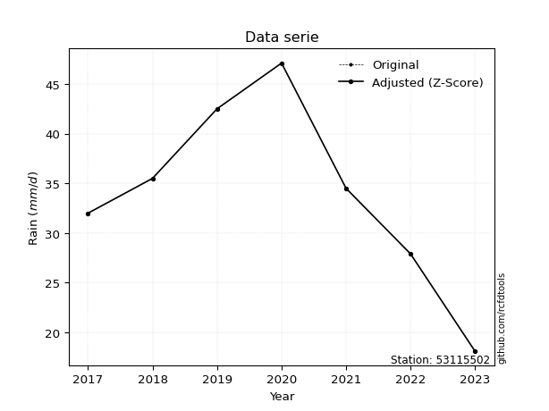</img>

</div>


> The initial value (value_initial) correspond to the initial obtained or null completed value, and value (value) is adjusted only when the initial value is outside the valid range (outlier) definite through the Z-Score value. If Z-Score is active, values out of range or outliers are replaced with the station mean value. A Z-Score (or standard score) measures how many standard deviations a data point is from the mean of a dataset, indicating its relative position; positive scores mean above the mean, negative mean below, and a score of zero is exactly at the mean, allowing for comparison of values from different distributions. It´s calculated using the formula $z=(x–μ)/σ$, where $x$ is the data point, $μ$ is the mean, and $σ$ is the standard deviation, helping identify outliers and understand probability.
>
> <sub>**Note**: In this study, "completing" (filling gaps in) and "extending" (forecasting or lengthening the historical record) rainfall data series are avoided for certain critical analyses because they introduce artificial bias and uncertainty, which can distort the statistics of rare events (extremes), alter day-to-day variability, and compromise the integrity and homogeneity of the original data. Some reasons against Completing/Extending rainfall data are: **Distortion of Extremes and Variability**: The primary issue is that most gap-filling or extension methods rely on averaging or regression with nearby stations, which inherently smooths the data. Rainfall is highly variable in space and time, with a large percentage of zero values and occasional large storms. Infilling methods often underestimate the highest values and overestimate the lowest (zero) values, which severely distorts analyses focused on flood frequency, drought severity, and intensity-duration-frequency (IDF) curves, **Loss of Data Homogeneity**: Infilled or extended data are synthetic estimates, not actual measurements. Combining these estimates with observed data can violate the assumption of data homogeneity, which requires that the data properties do not change over time. Inhomogeneity can lead to incorrect conclusions about long-term trends or changes in climate patterns, **Propagation of Errors**: Errors and biases from the original data (e.g., wind-induced undercatch, instrument errors, site changes) or the data used for imputation can propagate through the analysis, leading to unreliable hydrological models and inaccurate predictions, **Compromised Statistical Integrity**: For statistical analyses, especially those involving the frequency of events, using artificial data can introduce time bias or autocorrelation that doesn´t exist in reality, making it difficult to assess the true probability of events, **Difficulty in Validation**: It is difficult to accurately validate the quality of filled or extended data, especially for past periods where ground-truth measurements are unavailable. The reliability of imputation techniques heavily depends on the density of the surrounding station network and the complexity of the local topography.</sub>


### 4. Active continuous probability distributions from SciPy (80 of 104 available)

A Probability Density Function (PDF) describes the relative likelihood of a continuous random variable falling within a specific range, where the total area under its curve equals 1, and the area over any interval gives the actual probability for that range. Unlike discrete probabilities (like rolling a die), a PDF shows density, not direct probability for a single point (which is zero), with higher points indicating higher likelihood, often visualized as a bell curve for normal distributions.

A log of a probability density function (log-PDF) is simply the logarithm of the PDF´s value, denoted as $log(f(x))$, useful for converting multiplication of probabilities into addition, improving numerical stability with tiny numbers, and connecting to information theory concepts like entropy. Instead of dealing with very small probabilities (e.g., 0.000001), log-PDFs use negative numbers (e.g., $log(0.00001) ≈ -11.51$ that are easier for computers to handle, preventing underflow errors and simplifying complex calculations. In this study, each active probability distribution from SciPy is also evaluated in the $log$ form.

[scipy.stats](https://docs.scipy.org/doc/scipy/reference/stats.html) is a Python´s powerful submodule within the SciPy library for comprehensive statistical analysis, offering over 130 probability distributions (like Normal, Poisson, etc.), functions for descriptive stats (mean, variance), hypothesis testing (t-tests, chi-square), random variable generation, and statistical tests, making it essential for data science, modeling, and research. It provides tools to explore, model, and draw conclusions from data efficiently, working seamlessly with [NumPy](https://numpy.org/).

<div align="center">

|   id | p_dist           |   n_parameter | fit_method   | label                                                                       | active   | ref                                                                                                      |
|-----:|:-----------------|--------------:|:-------------|:----------------------------------------------------------------------------|:---------|:---------------------------------------------------------------------------------------------------------|
|    0 | alpha            |             3 | MLE          | Alpha                                                                       | True     | [:mortar_board:](https://docs.scipy.org/doc/scipy/reference/generated/scipy.stats.alpha.html)            |
|    1 | anglit           |             2 | MM           | Anglit                                                                      | True     | [:mortar_board:](https://docs.scipy.org/doc/scipy/reference/generated/scipy.stats.anglit.html)           |
|    2 | arcsine          |             2 | MM           | Arcsine                                                                     | True     | [:mortar_board:](https://docs.scipy.org/doc/scipy/reference/generated/scipy.stats.arcsine.html)          |
|    3 | argus            |             3 | MLE          | Argus                                                                       | True     | [:mortar_board:](https://docs.scipy.org/doc/scipy/reference/generated/scipy.stats.argus.html)            |
|    4 | beta             |             4 | MLE          | Beta                                                                        | True     | [:mortar_board:](https://docs.scipy.org/doc/scipy/reference/generated/scipy.stats.beta.html)             |
|    5 | betaprime        |             4 | MLE          | Beta prime                                                                  | True     | [:mortar_board:](https://docs.scipy.org/doc/scipy/reference/generated/scipy.stats.betaprime.html)        |
|    6 | bradford         |             3 | MLE          | Bradford                                                                    | True     | [:mortar_board:](https://docs.scipy.org/doc/scipy/reference/generated/scipy.stats.bradford.html)         |
|    7 | burr             |             4 | MLE          | Burr (Type III)                                                             | True     | [:mortar_board:](https://docs.scipy.org/doc/scipy/reference/generated/scipy.stats.burr.html)             |
|    8 | burr12           |             4 | MLE          | Burr (Type III) 12                                                          | True     | [:mortar_board:](https://docs.scipy.org/doc/scipy/reference/generated/scipy.stats.burr12.html)           |
|    9 | cosine           |             2 | MLE          | Cosine                                                                      | True     | [:mortar_board:](https://docs.scipy.org/doc/scipy/reference/generated/scipy.stats.cosine.html)           |
|   10 | crystalball      |             4 | MLE          | Crystalball                                                                 | True     | [:mortar_board:](https://docs.scipy.org/doc/scipy/reference/generated/scipy.stats.crystalball.html)      |
|   11 | dgamma           |             3 | MLE          | Double gamma                                                                | True     | [:mortar_board:](https://docs.scipy.org/doc/scipy/reference/generated/scipy.stats.dgamma.html)           |
|   12 | dweibull         |             3 | MLE          | Double Weibull                                                              | True     | [:mortar_board:](https://docs.scipy.org/doc/scipy/reference/generated/scipy.stats.dweibull.html)         |
|   13 | erlang           |             3 | MLE          | Erlang                                                                      | True     | [:mortar_board:](https://docs.scipy.org/doc/scipy/reference/generated/scipy.stats.erlang.html)           |
|   14 | exponnorm        |             3 | MLE          | Exponentially modified Normal                                               | True     | [:mortar_board:](https://docs.scipy.org/doc/scipy/reference/generated/scipy.stats.exponnorm.html)        |
|   15 | exponpow         |             3 | MLE          | Exponential power                                                           | True     | [:mortar_board:](https://docs.scipy.org/doc/scipy/reference/generated/scipy.stats.exponpow.html)         |
|   16 | exponweib        |             4 | MLE          | Exponentiated Weibull                                                       | True     | [:mortar_board:](https://docs.scipy.org/doc/scipy/reference/generated/scipy.stats.exponweib.html)        |
|   17 | f                |             4 | MLE          | F                                                                           | True     | [:mortar_board:](https://docs.scipy.org/doc/scipy/reference/generated/scipy.stats.f.html)                |
|   18 | fatiguelife      |             3 | MLE          | Fatigue-life (Birnbaum-Saunders)                                            | True     | [:mortar_board:](https://docs.scipy.org/doc/scipy/reference/generated/scipy.stats.fatiguelife.html)      |
|   19 | foldnorm         |             3 | MM           | Fold Normal                                                                 | True     | [:mortar_board:](https://docs.scipy.org/doc/scipy/reference/generated/scipy.stats.foldnorm.html)         |
|   20 | gamma            |             3 | MLE          | Gamma                                                                       | True     | [:mortar_board:](https://docs.scipy.org/doc/scipy/reference/generated/scipy.stats.gamma.html)            |
|   21 | gausshyper       |             6 | MLE          | Gauss hypergeometric                                                        | True     | [:mortar_board:](https://docs.scipy.org/doc/scipy/reference/generated/scipy.stats.gausshyper.html)       |
|   22 | genexpon         |             5 | MLE          | Generalized exponential                                                     | True     | [:mortar_board:](https://docs.scipy.org/doc/scipy/reference/generated/scipy.stats.genexpon.html)         |
|   23 | genextreme       |             3 | MLE          | Generalized exponential                                                     | True     | [:mortar_board:](https://docs.scipy.org/doc/scipy/reference/generated/scipy.stats.genextreme.html)       |
|   24 | gengamma         |             4 | MLE          | Generalized gamma                                                           | True     | [:mortar_board:](https://docs.scipy.org/doc/scipy/reference/generated/scipy.stats.gengamma.html)         |
|   25 | genhalflogistic  |             3 | MLE          | Generalized half-logistic                                                   | True     | [:mortar_board:](https://docs.scipy.org/doc/scipy/reference/generated/scipy.stats.genhalflogistic.html)  |
|   26 | genlogistic      |             3 | MLE          | Generalized logistic                                                        | True     | [:mortar_board:](https://docs.scipy.org/doc/scipy/reference/generated/scipy.stats.genlogistic.html)      |
|   27 | gennorm          |             3 | MLE          | Generalized Normal                                                          | True     | [:mortar_board:](https://docs.scipy.org/doc/scipy/reference/generated/scipy.stats.gennorm.html)          |
|   28 | genpareto        |             3 | MLE          | Generalized Pareto                                                          | True     | [:mortar_board:](https://docs.scipy.org/doc/scipy/reference/generated/scipy.stats.genpareto.html)        |
|   29 | gompertz         |             3 | MLE          | Gompertz (or truncated Gumbel)                                              | True     | [:mortar_board:](https://docs.scipy.org/doc/scipy/reference/generated/scipy.stats.gompertz.html)         |
|   30 | gumbel_l         |             2 | MM           | Gumbel Left Skew                                                            | True     | [:mortar_board:](https://docs.scipy.org/doc/scipy/reference/generated/scipy.stats.gumbel_l.html)         |
|   31 | gumbel_r         |             2 | MM           | Gumbel Right Skew                                                           | True     | [:mortar_board:](https://docs.scipy.org/doc/scipy/reference/generated/scipy.stats.gumbel_r.html)         |
|   32 | halfgennorm      |             3 | MLE          | Upper half of a generalized normal                                          | True     | [:mortar_board:](https://docs.scipy.org/doc/scipy/reference/generated/scipy.stats.halfgennorm.html)      |
|   33 | halflogistic     |             2 | MM           | Half-logistic                                                               | True     | [:mortar_board:](https://docs.scipy.org/doc/scipy/reference/generated/scipy.stats.halflogistic.html)     |
|   34 | halfnorm         |             2 | MM           | Half Normal                                                                 | True     | [:mortar_board:](https://docs.scipy.org/doc/scipy/reference/generated/scipy.stats.halfnorm.html)         |
|   35 | hypsecant        |             2 | MM           | hyperbolic secant                                                           | True     | [:mortar_board:](https://docs.scipy.org/doc/scipy/reference/generated/scipy.stats.hypsecant.html)        |
|   36 | invgamma         |             3 | MLE          | Inverted gamma                                                              | True     | [:mortar_board:](https://docs.scipy.org/doc/scipy/reference/generated/scipy.stats.invgamma.html)         |
|   37 | invgauss         |             3 | MLE          | Inverse Gaussian                                                            | True     | [:mortar_board:](https://docs.scipy.org/doc/scipy/reference/generated/scipy.stats.invgauss.html)         |
|   38 | invweibull       |             3 | MLE          | Inverted Weibull                                                            | True     | [:mortar_board:](https://docs.scipy.org/doc/scipy/reference/generated/scipy.stats.invweibull.html)       |
|   39 | johnsonsb        |             4 | MLE          | Johnson SB                                                                  | True     | [:mortar_board:](https://docs.scipy.org/doc/scipy/reference/generated/scipy.stats.johnsonsb.html)        |
|   40 | johnsonsu        |             4 | MLE          | Johnson Su                                                                  | True     | [:mortar_board:](https://docs.scipy.org/doc/scipy/reference/generated/scipy.stats.johnsonsu.html)        |
|   41 | kappa3           |             3 | MLE          | Kappa 3                                                                     | True     | [:mortar_board:](https://docs.scipy.org/doc/scipy/reference/generated/scipy.stats.kappa3.html)           |
|   42 | kappa4           |             4 | MLE          | Kappa 4                                                                     | True     | [:mortar_board:](https://docs.scipy.org/doc/scipy/reference/generated/scipy.stats.kappa4.html)           |
|   43 | ksone            |             3 | MLE          | Kolmogorov-Smirnov one-sided test statistic distribution                    | True     | [:mortar_board:](https://docs.scipy.org/doc/scipy/reference/generated/scipy.stats.ksone.html)            |
|   44 | kstwobign        |             2 | MLE          | Limiting distribution of scaled Kolmogorov-Smirnov two-sided test statistic | True     | [:mortar_board:](https://docs.scipy.org/doc/scipy/reference/generated/scipy.stats.kstwobign.html)        |
|   45 | laplace          |             2 | MM           | Laplace                                                                     | True     | [:mortar_board:](https://docs.scipy.org/doc/scipy/reference/generated/scipy.stats.laplace.html)          |
|   46 | levy_l           |             2 | MLE          | Left-skewed Levy                                                            | True     | [:mortar_board:](https://docs.scipy.org/doc/scipy/reference/generated/scipy.stats.levy_l.html)           |
|   47 | loggamma         |             3 | MLE          | Log gamma                                                                   | True     | [:mortar_board:](https://docs.scipy.org/doc/scipy/reference/generated/scipy.stats.loggamma.html)         |
|   48 | logistic         |             2 | MM           | Logistic (or Sech-squared)                                                  | True     | [:mortar_board:](https://docs.scipy.org/doc/scipy/reference/generated/scipy.stats.logistic.html)         |
|   49 | loglaplace       |             3 | MLE          | Log-Laplace                                                                 | True     | [:mortar_board:](https://docs.scipy.org/doc/scipy/reference/generated/scipy.stats.loglaplace.html)       |
|   50 | lomax            |             3 | MLE          | Lomax (Pareto of the second kind)                                           | True     | [:mortar_board:](https://docs.scipy.org/doc/scipy/reference/generated/scipy.stats.lomax.html)            |
|   51 | maxwell          |             2 | MM           | Maxwell                                                                     | True     | [:mortar_board:](https://docs.scipy.org/doc/scipy/reference/generated/scipy.stats.maxwell.html)          |
|   52 | mielke           |             4 | MLE          | Mielke Beta-Kappa / Dagum                                                   | True     | [:mortar_board:](https://docs.scipy.org/doc/scipy/reference/generated/scipy.stats.mielke.html)           |
|   53 | moyal            |             2 | MM           | Moyal                                                                       | True     | [:mortar_board:](https://docs.scipy.org/doc/scipy/reference/generated/scipy.stats.moyal.html)            |
|   54 | nakagami         |             3 | MLE          | Nakagami                                                                    | True     | [:mortar_board:](https://docs.scipy.org/doc/scipy/reference/generated/scipy.stats.nakagami.html)         |
|   55 | ncf              |             5 | MLE          | Non-central F distribution                                                  | True     | [:mortar_board:](https://docs.scipy.org/doc/scipy/reference/generated/scipy.stats.ncf.html)              |
|   56 | nct              |             4 | MLE          | Non-central Student’s t                                                     | True     | [:mortar_board:](https://docs.scipy.org/doc/scipy/reference/generated/scipy.stats.nct.html)              |
|   57 | norm             |             2 | MM           | Normal                                                                      | True     | [:mortar_board:](https://docs.scipy.org/doc/scipy/reference/generated/scipy.stats.norm.html)             |
|   58 | pearson3         |             3 | MM           | Pearson type III                                                            | True     | [:mortar_board:](https://docs.scipy.org/doc/scipy/reference/generated/scipy.stats.pearson3.html)         |
|   59 | powerlaw         |             3 | MLE          | Power-function                                                              | True     | [:mortar_board:](https://docs.scipy.org/doc/scipy/reference/generated/scipy.stats.powerlaw.html)         |
|   60 | rayleigh         |             2 | MM           | Rayleigh                                                                    | True     | [:mortar_board:](https://docs.scipy.org/doc/scipy/reference/generated/scipy.stats.rayleigh.html)         |
|   61 | rdist            |             3 | MLE          | R-distributed (symmetric beta)                                              | True     | [:mortar_board:](https://docs.scipy.org/doc/scipy/reference/generated/scipy.stats.rdist.html)            |
|   62 | rice             |             3 | MLE          | Rice                                                                        | True     | [:mortar_board:](https://docs.scipy.org/doc/scipy/reference/generated/scipy.stats.rice.html)             |
|   63 | semicircular     |             2 | MM           | Semicircular                                                                | True     | [:mortar_board:](https://docs.scipy.org/doc/scipy/reference/generated/scipy.stats.semicircular.html)     |
|   64 | skewnorm         |             3 | MLE          | Skew normal                                                                 | True     | [:mortar_board:](https://docs.scipy.org/doc/scipy/reference/generated/scipy.stats.skewnorm.html)         |
|   65 | t                |             3 | MLE          | Student’s t                                                                 | True     | [:mortar_board:](https://docs.scipy.org/doc/scipy/reference/generated/scipy.stats.t.html)                |
|   66 | trapezoid        |             4 | MLE          | Trapezoid                                                                   | True     | [:mortar_board:](https://docs.scipy.org/doc/scipy/reference/generated/scipy.stats.trapezoid.html)        |
|   67 | triang           |             3 | MLE          | Triangular                                                                  | True     | [:mortar_board:](https://docs.scipy.org/doc/scipy/reference/generated/scipy.stats.triang.html)           |
|   68 | truncexpon       |             3 | MLE          | Truncated exponential                                                       | True     | [:mortar_board:](https://docs.scipy.org/doc/scipy/reference/generated/scipy.stats.truncexpon.html)       |
|   69 | truncnorm        |             4 | MLE          | Truncated normal                                                            | True     | [:mortar_board:](https://docs.scipy.org/doc/scipy/reference/generated/scipy.stats.truncnorm.html)        |
|   70 | truncpareto      |             4 | MLE          | Upper truncated Pareto                                                      | True     | [:mortar_board:](https://docs.scipy.org/doc/scipy/reference/generated/scipy.stats.truncpareto.html)      |
|   71 | truncweibull_min |             5 | MLE          | Doubly truncated Weibull minimum                                            | True     | [:mortar_board:](https://docs.scipy.org/doc/scipy/reference/generated/scipy.stats.truncweibull_min.html) |
|   72 | tukeylambda      |             3 | MLE          | Tukey-Lamdba                                                                | True     | [:mortar_board:](https://docs.scipy.org/doc/scipy/reference/generated/scipy.stats.tukeylambda.html)      |
|   73 | uniform          |             2 | MLE          | Uniform                                                                     | True     | [:mortar_board:](https://docs.scipy.org/doc/scipy/reference/generated/scipy.stats.uniform.html)          |
|   74 | vonmises         |             3 | MLE          | Von Mises                                                                   | True     | [:mortar_board:](https://docs.scipy.org/doc/scipy/reference/generated/scipy.stats.vonmises.html)         |
|   75 | vonmises_line    |             3 | MLE          | Von Mises line                                                              | True     | [:mortar_board:](https://docs.scipy.org/doc/scipy/reference/generated/scipy.stats.vonmises_line.html)    |
|   76 | wald             |             2 | MM           | Wald                                                                        | True     | [:mortar_board:](https://docs.scipy.org/doc/scipy/reference/generated/scipy.stats.wald.html)             |
|   77 | weibull_max      |             3 | MLE          | Weibull maximum                                                             | True     | [:mortar_board:](https://docs.scipy.org/doc/scipy/reference/generated/scipy.stats.weibull_max.html)      |
|   78 | weibull_min      |             3 | MLE          | Weibull minimum                                                             | True     | [:mortar_board:](https://docs.scipy.org/doc/scipy/reference/generated/scipy.stats.weibull_min.html)      |
|   79 | wrapcauchy       |             3 | MLE          | Wrapped  Cauchy                                                             | True     | [:mortar_board:](https://docs.scipy.org/doc/scipy/reference/generated/scipy.stats.wrapcauchy.html)       |

</div>

> **n_parameter:** # arguments & localization & scale.
>
> **Fit methods:** (MLE) maximum likelihood, (MM) L-moments.
>
>**Inactive** (With the only purpose of prevent loops, zero divisions, infinite values, over high estimated values or horizontal trending for recurrence intervals estimations, the follow distributions were disabled.)**:** lognorm, norminvgauss, powernorm, powerlognorm, cauchy, halfcauchy, foldcauchy, skewcauchy, chi2, expon, fisk, genhyperbolic, geninvgauss, gibrat, kstwo, laplace_asymmetric, levy, levy_stable, ncx2, pareto, rel_breitwigner, recipinvgauss, studentized_range, loguniform, 


## B. Probability (PDF) vs. Empirical (EDF) distributions functions

A continuous probability distribution (CPD) describes probabilities for variables that can take any value within a range (like rain any time), unlike discrete variables with specific outcomes (like temperature). It uses a Probability Density Function (PDF), a curve where the total area under it equals 1, and the probability of the variable falling within an interval (a to b) is found by calculating the area under the curve between those points. A key feature is that the probability of hitting any single exact value is zero, so probabilities are always expressed for ranges, e.g., $P(a ≤ X ≤ b)$.

<div align="center">

Distributions parameters from station values
|     |   station | p_dist              |   n |             loc |           scale | shape                  | shape1                 | shape2              | shape3             |
|----:|----------:|:--------------------|----:|----------------:|----------------:|:-----------------------|:-----------------------|:--------------------|:-------------------|
|   0 |  53115502 | alpha               |   7 |  -116.1         |  2530.21        | 16.923579953479063     |                        |                     |                    |
|   1 |  53115502 | anglit              |   7 |    33.9429      |    25.7026      |                        |                        |                     |                    |
|   2 |  53115502 | arcsine             |   7 |    21.5176      |    24.8506      |                        |                        |                     |                    |
|   3 |  53115502 | argus               |   7 |    12.4714      |    36.2022      | 0.5558522741468206     |                        |                     |                    |
|   4 |  53115502 | beta                |   7 |    17.1748      |    29.9252      | 0.9236685810510634     | 0.7763740956555789     |                     |                    |
|   5 |  53115502 | betaprime           |   7 |  -146.111       |  4359.28        | 433.9565587606653      | 10511.41714529589      |                     |                    |
|   6 |  53115502 | bradford            |   7 |    18.0983      |    29.143       | 1.7692846358651057e-07 |                        |                     |                    |
|   7 |  53115502 | burr                |   7 |  -292.634       |   231.764       | 37.235551266248166     | 204363.91886767978     |                     |                    |
|   8 |  53115502 | burr12              |   7 |     2.12482     |    15.7453      | 201.20658822715336     | 0.007549797514627581   |                     |                    |
|   9 |  53115502 | cosine              |   7 |    33.516       |     7.46052     |                        |                        |                     |                    |
|  10 |  53115502 | crystalball         |   7 |    33.9429      |     8.786       | 927.4191958957158      | 5650.543305602657      |                     |                    |
|  11 |  53115502 | dgamma              |   7 |    34.5         |     6.50793     | 0.9637127668767409     |                        |                     |                    |
|  12 |  53115502 | dweibull            |   7 |    34.5         |     6.57278     | 0.9558761338549233     |                        |                     |                    |
|  13 |  53115502 | erlang              |   7 |  -120.373       |     0.510305    | 302.3911888163325      |                        |                     |                    |
|  14 |  53115502 | exponnorm           |   7 |    33.9343      |     8.78606     | 0.0009764049590177679  |                        |                     |                    |
|  15 |  53115502 | exponpow            |   7 |    18.1         |     1.4961      | 0.11887556128661861    |                        |                     |                    |
|  16 |  53115502 | exponweib           |   7 |    18.1         |     1.29247     | 1.2183324992249107     | 0.24659101823153423    |                     |                    |
|  17 |  53115502 | f                   |   7 | -2301.9         |  2335.83        | 194426.15225345094     | 505754.2778568218      |                     |                    |
|  18 |  53115502 | fatiguelife         |   7 |    18.1         |     0.000170169 | 356.1706423273354      |                        |                     |                    |
|  19 |  53115502 | foldnorm            |   7 |    34.4085      |     1.43258     | 2.992535626126311e-07  |                        |                     |                    |
|  20 |  53115502 | gamma               |   7 |  -124.144       |     0.497088    | 318.02471370146986     |                        |                     |                    |
|  21 |  53115502 | gausshyper          |   7 |    16.8565      |    30.2435      | 1.1306411337757845     | 0.6593465428594891     | 1.0558369796535667  | 1.0443210309152964 |
|  22 |  53115502 | genexpon            |   7 |    17.5899      |     0.865632    | 0.05295452804893201    | 1.1741560701874702e-06 | 1.4081123405694411  |                    |
|  23 |  53115502 | genextreme          |   7 |    31.9582      |     9.6704      | 0.5349184749464262     |                        |                     |                    |
|  24 |  53115502 | gengamma            |   7 |    18.1         |     1.30318     | 1.2262611793184681     | 0.2618752877891687     |                     |                    |
|  25 |  53115502 | genhalflogistic     |   7 |    16.1831      |    32.3787      | 1.047283629871362      |                        |                     |                    |
|  26 |  53115502 | genlogistic         |   7 |    36.2422      |     4.55547     | 0.7576869308576767     |                        |                     |                    |
|  27 |  53115502 | gennorm             |   7 |    32.6         |    14.5011      | 136671.3020245118      |                        |                     |                    |
|  28 |  53115502 | genpareto           |   7 |    -0.220137    |    83.3884      | -1.7622180300994095    |                        |                     |                    |
|  29 |  53115502 | gompertz            |   7 |    27.9         |     3.2277      | 0.012170029094737002   |                        |                     |                    |
|  30 |  53115502 | gumbel_l            |   7 |    37.897       |     6.85042     |                        |                        |                     |                    |
|  31 |  53115502 | gumbel_r            |   7 |    29.9887      |     6.85042     |                        |                        |                     |                    |
|  32 |  53115502 | halfgennorm         |   7 |    18.1         |     1.32986     | 0.4089748023054835     |                        |                     |                    |
|  33 |  53115502 | halflogistic        |   7 |    23.5294      |     7.51171     |                        |                        |                     |                    |
|  34 |  53115502 | halfnorm            |   7 |    22.3136      |    14.5751      |                        |                        |                     |                    |
|  35 |  53115502 | hypsecant           |   7 |    33.9429      |     5.59334     |                        |                        |                     |                    |
|  36 |  53115502 | invgamma            |   7 |   -86.6096      | 21380           | 178.28766631017606     |                        |                     |                    |
|  37 |  53115502 | invgauss            |   7 |   -28.6862      |  2794.55        | 0.022299678290252097   |                        |                     |                    |
|  38 |  53115502 | invweibull          |   7 |    18.1         |     1.32291     | 0.052866631696162465   |                        |                     |                    |
|  39 |  53115502 | johnsonsb           |   7 |    18.1         |    29           | -0.8675480718574904    | 0.12237899092945166    |                     |                    |
|  40 |  53115502 | johnsonsu           |   7 |    84.1796      |    18.4528      | 10.42880839598801      | 6.085237682401303      |                     |                    |
|  41 |  53115502 | kappa3              |   7 |    17.5259      |    30.0435      | 137.07855217519904     |                        |                     |                    |
|  42 |  53115502 | kappa4              |   7 |    15.5821      |    32.645       | 1.0833474123793414     | 1.0357605088236856     |                     |                    |
|  43 |  53115502 | ksone               |   7 |    15.2         |    34.8         | 1.0                    |                        |                     |                    |
|  44 |  53115502 | kstwobign           |   7 |    -1.78405     |    40.8819      |                        |                        |                     |                    |
|  45 |  53115502 | laplace             |   7 |    33.9429      |     6.21264     |                        |                        |                     |                    |
|  46 |  53115502 | levy_l              |   7 |    48.3601      |     5.56801     |                        |                        |                     |                    |
|  47 |  53115502 | loggamma            |   7 |     1.23398     |    20.0193      | 5.6155363487364385     |                        |                     |                    |
|  48 |  53115502 | logistic            |   7 |    33.9429      |     4.84398     |                        |                        |                     |                    |
|  49 |  53115502 | loglaplace          |   7 |    -0.116271    |    34.6163      | 4.744951095355233      |                        |                     |                    |
|  50 |  53115502 | lomax               |   7 |    18.1         |     1.84767e+09 | 84052089.85570613      |                        |                     |                    |
|  51 |  53115502 | maxwell             |   7 |    13.1237      |    13.0465      |                        |                        |                     |                    |
|  52 |  53115502 | mielke              |   7 |    -0.263948    |    42.0148      | 3.618948524516448      | 11.907918157623072     |                     |                    |
|  53 |  53115502 | moyal               |   7 |    28.9185      |     3.95509     |                        |                        |                     |                    |
|  54 |  53115502 | nakagami            |   7 |    27.9         |     7.31379     | 0.3063675275147709     |                        |                     |                    |
|  55 |  53115502 | ncf                 |   7 |     0.0308353   |     1.55421e-05 | 3.135994624084369e-05  | 127.82178268829573     | 67.50977079198844   |                    |
|  56 |  53115502 | nct                 |   7 |  -439.515       |     8.71722     | 83855.28597835347      | 54.31209816906602      |                     |                    |
|  57 |  53115502 | norm                |   7 |    33.9429      |     8.786       |                        |                        |                     |                    |
|  58 |  53115502 | pearson3            |   7 |    33.9429      |     8.78599     | -0.2730245097583871    |                        |                     |                    |
|  59 |  53115502 | powerlaw            |   7 |    18.1         |    29           | 0.1762681002656312     |                        |                     |                    |
|  60 |  53115502 | rayleigh            |   7 |    17.1347      |    13.411       |                        |                        |                     |                    |
|  61 |  53115502 | rdist               |   7 |    16.4628      |    15.5372      | 1.1068401715871135     |                        |                     |                    |
|  62 |  53115502 | rice                |   7 |    12.8973      |     9.6536      | 1.8923716892485296     |                        |                     |                    |
|  63 |  53115502 | semicircular        |   7 |    33.9429      |    17.572       |                        |                        |                     |                    |
|  64 |  53115502 | skewnorm            |   7 |    42.6872      |    12.3959      | -1.8514606175641712    |                        |                     |                    |
|  65 |  53115502 | t                   |   7 |    33.9434      |     8.78611     | 5870024.722363567      |                        |                     |                    |
|  66 |  53115502 | trapezoid           |   7 |    15.2         |    34.8         | 0.9999999999999999     | 1.0                    |                     |                    |
|  67 |  53115502 | triang              |   7 |    10.5067      |    36.5933      | 0.9999999490504676     |                        |                     |                    |
|  68 |  53115502 | truncexpon          |   7 |    18.0802      |    37.0647      | 0.7829503990496209     |                        |                     |                    |
|  69 |  53115502 | truncnorm           |   7 |   -19.5827      |    30.6941      | 1.2276835080405277     | 600.661967934238       |                     |                    |
|  70 |  53115502 | truncpareto         |   7 |    18.0833      |     0.0166678   | 0.16785884434330078    | 1740.8861420711155     |                     |                    |
|  71 |  53115502 | truncweibull_min    |   7 |    18.0692      |    40.3936      | 0.8499937427966122     | 0.0007581357806012443  | 0.7186965572088919  |                    |
|  72 |  53115502 | tukeylambda         |   7 |    25.573       |     7.86483     | 1.052427763687033      |                        |                     |                    |
|  73 |  53115502 | uniform             |   7 |    18.1         |    29           |                        |                        |                     |                    |
|  74 |  53115502 | vonmises            |   7 |    -2.46739     |     1           | 0.724767343481092      |                        |                     |                    |
|  75 |  53115502 | vonmises_line       |   7 |    32.529       |     4.63809     | 0.2123581820314981     |                        |                     |                    |
|  76 |  53115502 | wald                |   7 |    25.1568      |     8.78601     |                        |                        |                     |                    |
|  77 |  53115502 | weibull_max         |   7 |    47.1         |     1.32719     | 0.29331642078329007    |                        |                     |                    |
|  78 |  53115502 | weibull_min         |   7 |    -2.64301     |    39.9814      | 4.860297379478226      |                        |                     |                    |
|  79 |  53115502 | wrapcauchy          |   7 |    18.1         |     4.64009     | 8.438662491971956e-06  |                        |                     |                    |
|  80 |  53115502 | logalpha            |   7 |    -7.38666     |   400.446       | 36.87189267289918      |                        |                     |                    |
|  81 |  53115502 | loganglit           |   7 |     3.48608     |     0.847118    |                        |                        |                     |                    |
|  82 |  53115502 | logarcsine          |   7 |     3.07652     |     0.81911     |                        |                        |                     |                    |
|  83 |  53115502 | logargus            |   7 |     2.636       |     1.24896     | 1.8119428262277653     |                        |                     |                    |
|  84 |  53115502 | logbeta             |   7 |     2.66557     |     1.18671     | 2.365455507563091      | 0.9568331946783637     |                     |                    |
|  85 |  53115502 | logbetaprime        |   7 |    -3.67924     |    21.0071      | 497.23643283872434     | 1458.4372920127016     |                     |                    |
|  86 |  53115502 | logbradford         |   7 |     2.85998     |     0.99229     | 3.778858662307989e-05  |                        |                     |                    |
|  87 |  53115502 | logburr             |   7 |     2.7613      |     1.10423     | 244.10283156509766     | 0.007163029036651669   |                     |                    |
|  88 |  53115502 | logburr12           |   7 |   -39.8336      |    45.5774      | 194.45192134047076     | 10816.338739881136     |                     |                    |
|  89 |  53115502 | logcosine           |   7 |     3.44814     |     0.252429    |                        |                        |                     |                    |
|  90 |  53115502 | logcrystalball      |   7 |     3.48608     |     0.289573    | 14.10816257652012      | 164.0776873181905      |                     |                    |
|  91 |  53115502 | logdgamma           |   7 |     3.54096     |     0.211423    | 0.8363029033465404     |                        |                     |                    |
|  92 |  53115502 | logdweibull         |   7 |     3.54096     |     0.220259    | 0.9300665404089883     |                        |                     |                    |
|  93 |  53115502 | logerlang           |   7 |    -1.25722     |     0.0191867   | 247.0954605413109      |                        |                     |                    |
|  94 |  53115502 | logexponnorm        |   7 |     3.48589     |     0.289572    | 0.0006582320878364316  |                        |                     |                    |
|  95 |  53115502 | logexponpow         |   7 |     1.53764     |     2.20583     | 6.7044751427797955     |                        |                     |                    |
|  96 |  53115502 | logexponweib        |   7 |    -5.64764     |     6.52147     | 261.44208254630735     | 5.321949044023407      |                     |                    |
|  97 |  53115502 | logf                |   7 |  -487.838       |   491.324       | 14681205.367040597     | 9439537.33276096       |                     |                    |
|  98 |  53115502 | logfatiguelife      |   7 |  -159.984       |   163.469       | 0.0017692546969686543  |                        |                     |                    |
|  99 |  53115502 | logfoldnorm         |   7 |     3.02484     |     0.320272    | 1.3616266874335714     |                        |                     |                    |
| 100 |  53115502 | loggamma            |   7 |    -1.78429     |     0.0169398   | 311.02866741717446     |                        |                     |                    |
| 101 |  53115502 | loggausshyper       |   7 |     2.86416     |     0.988113    | 1.3902419221424984     | 0.7932521348607904     | 0.9007403858761149  | 0.9101653501720872 |
| 102 |  53115502 | loggenexpon         |   7 |     2.89591     |     0.454458    | 0.23765283347839636    | 1.9648479418341316     | 0.37583529770065083 |                    |
| 103 |  53115502 | loggenextreme       |   7 |     3.54796     |     0.334103    | 1.0978856495973979     |                        |                     |                    |
| 104 |  53115502 | loggengamma         |   7 |   -12.5724      |     9.9104      | 49.95703921605292      | 8.086222932346985      |                     |                    |
| 105 |  53115502 | loggenhalflogistic  |   7 |     2.88987     |     1.00618     | 1.0454843478920424     |                        |                     |                    |
| 106 |  53115502 | loggenlogistic      |   7 |     3.73331     |     0.0840363   | 0.3004396953885753     |                        |                     |                    |
| 107 |  53115502 | loggennorm          |   7 |     3.54095     |     0.210698    | 0.9794885455541744     |                        |                     |                    |
| 108 |  53115502 | loggenpareto        |   7 |    -0.00623225  |    13.4816      | -3.4939998137709347    |                        |                     |                    |
| 109 |  53115502 | loggompertz         |   7 |     2.89591     |     0.258514    | 0.06886188670163998    |                        |                     |                    |
| 110 |  53115502 | loggumbel_l         |   7 |     3.6164      |     0.225779    |                        |                        |                     |                    |
| 111 |  53115502 | loggumbel_r         |   7 |     3.35575     |     0.225779    |                        |                        |                     |                    |
| 112 |  53115502 | loghalfgennorm      |   7 |     2.89591     |     0.956514    | 52661.72650888155      |                        |                     |                    |
| 113 |  53115502 | loghalflogistic     |   7 |     3.14287     |     0.247573    |                        |                        |                     |                    |
| 114 |  53115502 | loghalfnorm         |   7 |     3.10283     |     0.480328    |                        |                        |                     |                    |
| 115 |  53115502 | loghypsecant        |   7 |     3.48608     |     0.184348    |                        |                        |                     |                    |
| 116 |  53115502 | loginvgamma         |   7 |    -3.21563     |  3365.18        | 503.44169137695843     |                        |                     |                    |
| 117 |  53115502 | loginvgauss         |   7 |     0.302772    |   325.153       | 0.009777634934578568   |                        |                     |                    |
| 118 |  53115502 | loginvweibull       |   7 |    -3.02197e+07 |     3.02197e+07 | 94878056.23717423      |                        |                     |                    |
| 119 |  53115502 | logjohnsonsb        |   7 |     2.89323     |     0.959041    | -0.581611684092758     | 0.16711860529153022    |                     |                    |
| 120 |  53115502 | logjohnsonsu        |   7 |     4.08301     |     0.0145149   | 8.697732290783936      | 2.026532698312436      |                     |                    |
| 121 |  53115502 | logkappa3           |   7 |     2.89064     |     0.95903     | 631.9919066652656      |                        |                     |                    |
| 122 |  53115502 | logkappa4           |   7 |     2.84691     |     1.08755     | 0.993458468050668      | 1.0817513607667855     |                     |                    |
| 123 |  53115502 | logksone            |   7 |     2.80028     |     1.14763     | 1.0                    |                        |                     |                    |
| 124 |  53115502 | logkstwobign        |   7 |     2.18224     |     1.49143     |                        |                        |                     |                    |
| 125 |  53115502 | loglaplace          |   7 |     3.48608     |     0.204759    |                        |                        |                     |                    |
| 126 |  53115502 | loglevy_l           |   7 |     3.88371     |     0.138462    |                        |                        |                     |                    |
| 127 |  53115502 | logloggamma         |   7 |     3.7576      |     0.14108     | 0.5079913524550497     |                        |                     |                    |
| 128 |  53115502 | loglogistic         |   7 |     3.48608     |     0.15965     |                        |                        |                     |                    |
| 129 |  53115502 | logloglaplace       |   7 |    -0.0972472   |     3.63821     | 16.60308383730704      |                        |                     |                    |
| 130 |  53115502 | loglomax            |   7 |     2.89591     |     4.3935e+12  | 1156200848799.1777     |                        |                     |                    |
| 131 |  53115502 | logmaxwell          |   7 |     2.79991     |     0.429992    |                        |                        |                     |                    |
| 132 |  53115502 | logmielke           |   7 |    -1.38673e+07 |     1.38673e+07 | 37106325.66073364      | 2310449784.036566      |                     |                    |
| 133 |  53115502 | logmoyal            |   7 |     3.32048     |     0.130354    |                        |                        |                     |                    |
| 134 |  53115502 | lognakagami         |   7 |     3.32863     |     0.301775    | 0.14307163645018425    |                        |                     |                    |
| 135 |  53115502 | logncf              |   7 |    -3.56914     |     7.0468      | 804.2491422258036      | 844.5098886035694      | 0.15105204413043222 |                    |
| 136 |  53115502 | lognct              |   7 |    -0.171098    |     0.168379    | 116.15040412916659     | 21.5774369964021       |                     |                    |
| 137 |  53115502 | lognorm             |   7 |     3.48608     |     0.289573    |                        |                        |                     |                    |
| 138 |  53115502 | logpearson3         |   7 |     3.48608     |     0.289574    | -0.8314633235554323    |                        |                     |                    |
| 139 |  53115502 | logpowerlaw         |   7 |     2.89591     |     0.956361    | 0.1867926231726291     |                        |                     |                    |
| 140 |  53115502 | lograyleigh         |   7 |     2.93213     |     0.441991    |                        |                        |                     |                    |
| 141 |  53115502 | logrdist            |   7 |     3.86726     |     0.538631    | 1.0484652575319648     |                        |                     |                    |
| 142 |  53115502 | logrice             |   7 |     2.6765      |     0.308502    | 2.4015802469052168     |                        |                     |                    |
| 143 |  53115502 | logsemicircular     |   7 |     3.48608     |     0.579118    |                        |                        |                     |                    |
| 144 |  53115502 | logskewnorm         |   7 |     3.85227     |     0.466873    | -56657087.22171119     |                        |                     |                    |
| 145 |  53115502 | logt                |   7 |     3.5234      |     0.236498    | 5.165763720737912      |                        |                     |                    |
| 146 |  53115502 | logtrapezoid        |   7 |     2.66704     |     1.22856     | 1.0                    | 1.0                    |                     |                    |
| 147 |  53115502 | logtriang           |   7 |     2.65673     |     1.19555     | 0.9999991237362211     |                        |                     |                    |
| 148 |  53115502 | logtruncexpon       |   7 |     2.89591     |     1.21688     | 0.7859136128081945     |                        |                     |                    |
| 149 |  53115502 | logtruncnorm        |   7 |    -0.0937731   |     0.933707    | 3.6653901028424194     | 4.226227572846897      |                     |                    |
| 150 |  53115502 | logtruncpareto      |   7 |     2.89527     |     0.00063819  | 0.16782286179327469    | 1499.5525091728496     |                     |                    |
| 151 |  53115502 | logtruncweibull_min |   7 |     2.46645     |     2.02603     | 2.872968626276702      | 0.01781387795135847    | 0.6840087025838004  |                    |
| 152 |  53115502 | logtukeylambda      |   7 |     3.59045     |     0.372048    | 1.4209903555341175     |                        |                     |                    |
| 153 |  53115502 | loguniform          |   7 |     2.89591     |     0.956361    |                        |                        |                     |                    |
| 154 |  53115502 | logvonmises         |   7 |    -2.79368     |     1           | 12.442266522909478     |                        |                     |                    |
| 155 |  53115502 | logvonmises_line    |   7 |     3.3737      |     0.152336    | 8.654327416000591e-05  |                        |                     |                    |
| 156 |  53115502 | logwald             |   7 |     3.19654     |     0.289538    |                        |                        |                     |                    |
| 157 |  53115502 | logweibull_max      |   7 |     3.85227     |     0.337046    | 0.5321254836455078     |                        |                     |                    |
| 158 |  53115502 | logweibull_min      |   7 |    -1.52881e+07 |     1.52881e+07 | 69192039.51655856      |                        |                     |                    |
| 159 |  53115502 | logwrapcauchy       |   7 |     2.89591     |     0.15221     | 0.5                    |                        |                     |                    |

</div>

> **loc** (Location parameter): This shifts the distribution along the x-axis. For many common distributions, like the normal (Gaussian) distribution, loc represents the mean $μ$. For others, like the uniform distribution, it might represent the minimum value, or for the beta distribution, the left end of the support interval.
>
> **scale** (Scale parameter): This determines the width or spread of the distribution. For the normal distribution, scale represents the standard deviation $σ$. For a uniform distribution, it defines the length of the interval (from $loc$ to $loc + scale$).
>
> **shape** (Shape parameters): Refers to parameters that define the specific form of a probability distribution, distinct from its location (loc) and scale (scale). These parameters are required arguments for most distribution functions. For example, a normal (Gaussian) distribution is fully defined by its location (mean) and scale (standard deviation), so it has no specific shape parameters beyond loc and scale. However, other distributions have intrinsic properties that need specification, as Gamma distribution that takes a shape parameter, often named $a$ or $alpha$.


### 0. Cumulative distribution values - CDF (160 evaluated)

Cumulative Distribution Function (CDF), denoted as $F$<sub>$X$</sub>$(x)$, is a function that gives the probability that a random variable $X$ will take a value less than or equal to a specific value, $x$ (i.e., $(P(X≥x)$. It essentially "accumulates" probabilities from a given point up to the far right (positive infinity), providing a complete picture of the distribution´s probabilities for both discrete (like rain) and continuous (like temperature) variables, helping to find probabilities over ranges or above certain values. Each station is evaluated separately ordering the $x$ values ascending, calculating the CDF and PDF values for the activated distributions and their logarithmic forms.

<div align="center">

CDF ordered by x ascending and calculating $log(f(x))$ separately
|   id |   Station |   date |    x |   count |    mean |     std |     zscore |   Value_initial |   station |   m |     alpha |   alpha_pdf |    anglit |   anglit_pdf |   arcsine |   arcsine_pdf |     argus |   argus_pdf |      beta |   beta_pdf |   betaprime |   betaprime_pdf |   bradford |   bradford_pdf |      burr |   burr_pdf |    burr12 |   burr12_pdf |    cosine |   cosine_pdf |   crystalball |   crystalball_pdf |    dgamma |   dgamma_pdf |   dweibull |   dweibull_pdf |    erlang |   erlang_pdf |   exponnorm |   exponnorm_pdf |   exponpow |   exponpow_pdf |   exponweib |   exponweib_pdf |        f |      f_pdf |   fatiguelife |   fatiguelife_pdf |   foldnorm |   foldnorm_pdf |     gamma |   gamma_pdf |   gausshyper |   gausshyper_pdf |   genexpon |   genexpon_pdf |   genextreme |   genextreme_pdf |    gengamma |   gengamma_pdf |   genhalflogistic |   genhalflogistic_pdf |   genlogistic |   genlogistic_pdf |    gennorm |   gennorm_pdf |   genpareto |   genpareto_pdf |   gompertz |   gompertz_pdf |   gumbel_l |   gumbel_l_pdf |   gumbel_r |   gumbel_r_pdf |   halfgennorm |   halfgennorm_pdf |   halflogistic |   halflogistic_pdf |   halfnorm |   halfnorm_pdf |   hypsecant |   hypsecant_pdf |   invgamma |   invgamma_pdf |   invgauss |   invgauss_pdf |   invweibull |   invweibull_pdf |   johnsonsb |   johnsonsb_pdf |   johnsonsu |   johnsonsu_pdf |    kappa3 |   kappa3_pdf |      kappa4 |   kappa4_pdf |     ksone |   ksone_pdf |   kstwobign |   kstwobign_pdf |   laplace |   laplace_pdf |   levy_l |   levy_l_pdf |   loggamma |   loggamma_pdf |   logistic |   logistic_pdf |   loglaplace |   loglaplace_pdf |       lomax |   lomax_pdf |   maxwell |   maxwell_pdf |    mielke |   mielke_pdf |       moyal |   moyal_pdf |   nakagami |   nakagami_pdf |       ncf |    ncf_pdf |       nct |    nct_pdf |     norm |   norm_pdf |   pearson3 |   pearson3_pdf |   powerlaw |   powerlaw_pdf |   rayleigh |   rayleigh_pdf |    rdist |      rdist_pdf |      rice |   rice_pdf |   semicircular |   semicircular_pdf |   skewnorm |   skewnorm_pdf |        t |      t_pdf |   trapezoid |   trapezoid_pdf |    triang |   triang_pdf |   truncexpon |   truncexpon_pdf |   truncnorm |   truncnorm_pdf |   truncpareto |   truncpareto_pdf |   truncweibull_min |   truncweibull_min_pdf |   tukeylambda |   tukeylambda_pdf |   uniform |   uniform_pdf |   vonmises |   vonmises_pdf |   vonmises_line |   vonmises_line_pdf |     wald |   wald_pdf |   weibull_max |   weibull_max_pdf |   weibull_min |   weibull_min_pdf |   wrapcauchy |   wrapcauchy_pdf |   logalpha |   logalpha_pdf |   loganglit |   loganglit_pdf |   logarcsine |   logarcsine_pdf |   logargus |   logargus_pdf |   logbeta |   logbeta_pdf |   logbetaprime |   logbetaprime_pdf |   logbradford |   logbradford_pdf |   logburr |   logburr_pdf |   logburr12 |   logburr12_pdf |   logcosine |   logcosine_pdf |   logcrystalball |   logcrystalball_pdf |   logdgamma |   logdgamma_pdf |   logdweibull |   logdweibull_pdf |   logerlang |   logerlang_pdf |   logexponnorm |   logexponnorm_pdf |   logexponpow |   logexponpow_pdf |   logexponweib |   logexponweib_pdf |      logf |   logf_pdf |   logfatiguelife |   logfatiguelife_pdf |   logfoldnorm |   logfoldnorm_pdf |   loggausshyper |   loggausshyper_pdf |   loggenexpon |   loggenexpon_pdf |   loggenextreme |   loggenextreme_pdf |   loggengamma |   loggengamma_pdf |   loggenhalflogistic |   loggenhalflogistic_pdf |   loggenlogistic |   loggenlogistic_pdf |   loggennorm |   loggennorm_pdf |   loggenpareto |   loggenpareto_pdf |   loggompertz |   loggompertz_pdf |   loggumbel_l |   loggumbel_l_pdf |   loggumbel_r |   loggumbel_r_pdf |   loghalfgennorm |   loghalfgennorm_pdf |   loghalflogistic |   loghalflogistic_pdf |   loghalfnorm |   loghalfnorm_pdf |   loghypsecant |   loghypsecant_pdf |   loginvgamma |   loginvgamma_pdf |   loginvgauss |   loginvgauss_pdf |   loginvweibull |   loginvweibull_pdf |   logjohnsonsb |   logjohnsonsb_pdf |   logjohnsonsu |   logjohnsonsu_pdf |   logkappa3 |   logkappa3_pdf |   logkappa4 |   logkappa4_pdf |   logksone |   logksone_pdf |   logkstwobign |   logkstwobign_pdf |   loglevy_l |   loglevy_l_pdf |   logloggamma |   logloggamma_pdf |   loglogistic |   loglogistic_pdf |   logloglaplace |   logloglaplace_pdf |    loglomax |   loglomax_pdf |   logmaxwell |   logmaxwell_pdf |   logmielke |   logmielke_pdf |    logmoyal |   logmoyal_pdf |   lognakagami |   lognakagami_pdf |   logncf |   logncf_pdf |    lognct |   lognct_pdf |   lognorm |   lognorm_pdf |   logpearson3 |   logpearson3_pdf |   logpowerlaw |   logpowerlaw_pdf |   lograyleigh |   lograyleigh_pdf |    logrdist |   logrdist_pdf |   logrice |   logrice_pdf |   logsemicircular |   logsemicircular_pdf |   logskewnorm |   logskewnorm_pdf |     logt |   logt_pdf |   logtrapezoid |   logtrapezoid_pdf |   logtriang |   logtriang_pdf |   logtruncexpon |   logtruncexpon_pdf |   logtruncnorm |   logtruncnorm_pdf |   logtruncpareto |   logtruncpareto_pdf |   logtruncweibull_min |   logtruncweibull_min_pdf |   logtukeylambda |   logtukeylambda_pdf |   loguniform |   loguniform_pdf |   logvonmises |   logvonmises_pdf |   logvonmises_line |   logvonmises_line_pdf |   logwald |   logwald_pdf |   logweibull_max |   logweibull_max_pdf |   logweibull_min |   logweibull_min_pdf |   logwrapcauchy |   logwrapcauchy_pdf |
|-----:|----------:|-------:|-----:|--------:|--------:|--------:|-----------:|----------------:|----------:|----:|----------:|------------:|----------:|-------------:|----------:|--------------:|----------:|------------:|----------:|-----------:|------------:|----------------:|-----------:|---------------:|----------:|-----------:|----------:|-------------:|----------:|-------------:|--------------:|------------------:|----------:|-------------:|-----------:|---------------:|----------:|-------------:|------------:|----------------:|-----------:|---------------:|------------:|----------------:|---------:|-----------:|--------------:|------------------:|-----------:|---------------:|----------:|------------:|-------------:|-----------------:|-----------:|---------------:|-------------:|-----------------:|------------:|---------------:|------------------:|----------------------:|--------------:|------------------:|-----------:|--------------:|------------:|----------------:|-----------:|---------------:|-----------:|---------------:|-----------:|---------------:|--------------:|------------------:|---------------:|-------------------:|-----------:|---------------:|------------:|----------------:|-----------:|---------------:|-----------:|---------------:|-------------:|-----------------:|------------:|----------------:|------------:|----------------:|----------:|-------------:|------------:|-------------:|----------:|------------:|------------:|----------------:|----------:|--------------:|---------:|-------------:|-----------:|---------------:|-----------:|---------------:|-------------:|-----------------:|------------:|------------:|----------:|--------------:|----------:|-------------:|------------:|------------:|-----------:|---------------:|----------:|-----------:|----------:|-----------:|---------:|-----------:|-----------:|---------------:|-----------:|---------------:|-----------:|---------------:|---------:|---------------:|----------:|-----------:|---------------:|-------------------:|-----------:|---------------:|---------:|-----------:|------------:|----------------:|----------:|-------------:|-------------:|-----------------:|------------:|----------------:|--------------:|------------------:|-------------------:|-----------------------:|--------------:|------------------:|----------:|--------------:|-----------:|---------------:|----------------:|--------------------:|---------:|-----------:|--------------:|------------------:|--------------:|------------------:|-------------:|-----------------:|-----------:|---------------:|------------:|----------------:|-------------:|-----------------:|-----------:|---------------:|----------:|--------------:|---------------:|-------------------:|--------------:|------------------:|----------:|--------------:|------------:|----------------:|------------:|----------------:|-----------------:|---------------------:|------------:|----------------:|--------------:|------------------:|------------:|----------------:|---------------:|-------------------:|--------------:|------------------:|---------------:|-------------------:|----------:|-----------:|-----------------:|---------------------:|--------------:|------------------:|----------------:|--------------------:|--------------:|------------------:|----------------:|--------------------:|--------------:|------------------:|---------------------:|-------------------------:|-----------------:|---------------------:|-------------:|-----------------:|---------------:|-------------------:|--------------:|------------------:|--------------:|------------------:|--------------:|------------------:|-----------------:|---------------------:|------------------:|----------------------:|--------------:|------------------:|---------------:|-------------------:|--------------:|------------------:|--------------:|------------------:|----------------:|--------------------:|---------------:|-------------------:|---------------:|-------------------:|------------:|----------------:|------------:|----------------:|-----------:|---------------:|---------------:|-------------------:|------------:|----------------:|--------------:|------------------:|--------------:|------------------:|----------------:|--------------------:|------------:|---------------:|-------------:|-----------------:|------------:|----------------:|------------:|---------------:|--------------:|------------------:|---------:|-------------:|----------:|-------------:|----------:|--------------:|--------------:|------------------:|--------------:|------------------:|--------------:|------------------:|------------:|---------------:|----------:|--------------:|------------------:|----------------------:|--------------:|------------------:|---------:|-----------:|---------------:|-------------------:|------------:|----------------:|----------------:|--------------------:|---------------:|-------------------:|-----------------:|---------------------:|----------------------:|--------------------------:|-----------------:|---------------------:|-------------:|-----------------:|--------------:|------------------:|-------------------:|-----------------------:|----------:|--------------:|-----------------:|---------------------:|-----------------:|---------------------:|----------------:|--------------------:|
|    0 |  53115502 |   2023 | 18.1 |       7 | 33.9429 | 9.48997 | -1.66943   |            18.1 |  53115502 |   1 | 0.0267784 |  0.00869699 | 0.0282922 |    0.0129019 |  0        |     0         | 0.0339151 |   0.0119995 | 0.0317875 |  0.0318517 |   0.0336609 |       0.0090454 | 5.9429e-05 |      0.0343136 | 0.0246157 |  0.0109267 | 0.0221649 |   0.0882059  | 0.0311216 |    0.0111889 |      0.035679 |        0.00893437 | 0.0376418 |    0.0058474 |   0.045519 |     0.00635805 | 0.0335858 |   0.00904966 |   0.0356799 |      0.00893449 |  0.0182596 |    6.10908e+11 | 4.22099e-05 |     3.56896e+09 | 0.035871 | 0.00899634 |     0.0538636 |       1.69732e+08 |  0         |    0           | 0.0334958 |  0.00902272 |    0.0279216 |        0.0250357 |  0.0307218 |      0.0592957 |    0.0551716 |       0.00935699 | 1.88158e-05 |    1.70063e+09 |         0.0305486 |             0.0164476 |     0.0482437 |         0.0078773 | 3.7408e-05 |     0.0344795 |    0.242593 |       0.0148208 | 0          |     0          |  0.0540653 |     0.00767497 | 0.00344241 |     0.00285003 |   3.03019e-13 |        0.240259   |       0        |          0         |   0        |      0         |   0.0374337 |      0.00667713 |  0.0302278 |     0.00913821 |  0.0316275 |      0.0103092 |   0.00275937 |      2.41964e+11 |  0.00173263 |   462.974       |   0.0477507 |      0.00881738 | 0.0184342 |    0.0321115 | 0.000612291 |    0.0569154 | 0.0833333 |   0.0287356 |   0.0280043 |       0.0132813 |  0.039037 |    0.00628347 | 0.332046 |   0.0051582  |  0.0212039 |       0.184345 |  0.0365926 |     0.00727782 |    0.0280046 |         0.136768 | 1.06919e-09 |   0.0454909 | 0.0141312 |    0.00827332 | 0.0500277 |   0.00985836 | 8.63128e-05 | 0.000178014 | 0          |     0          | 0.0237037 | 0.00904736 | 0.0357785 | 0.00895715 | 0.035679 | 0.00893437 |  0.0428916 |     0.00896994 | 0.00156766 |    7.77793e+10 |   0.002587 |     0.00535316 | 0.536022 |      0.0220757 | 0.0255438 |  0.010292  |      0.0182518 |          0.015672  |  0.0473103 |     0.00900109 | 0.035676 | 0.00893364 |  0.00694444 |      0.00478927 | 0.0430583 |    0.0113411 |  0.000983829 |        0.0496652 | 1.61347e-06 |       0.0557229 |      0        |       14.1002     |        1.71561e-05 |              0.116777  |   7.10543e-15 |         0.107641  |  0        |     0.0344828 |    3.87717 |      0.126021  |       0.0038967 |           0.027442  | 0        | 0          |     0.0844935 |       0.00211178  |     0.0403616 |        0.00926365 |  1.01824e-06 |        0.0343005 |  0.0191186 |       0.176492 |  0.00785119 |        0.208373 |     0        |         0        |  0.0313879 |       0.247469 | 0.0193849 |      0.199651 |       0.05195  |           0.306926 |     0.0362075 |           1.00779 |  0.025229 |      0.327705 |   0.0377474 |        0.168496 |   0.0220003 |        0.265761 |        0.0207722 |             0.172661 |   0.0167905 |        0.082799 |     0.0330501 |          0.129455 |   0.0219808 |        0.19001  |       0.020772 |           0.17266  |     0.0387268 |          0.19106  |      0.0199852 |           0.206587 | 0.0207736 |   0.172709 |        0.0205055 |             0.17161  |      0        |          0        |      0.00924947 |            0.401769 |   6.93677e-10 |          0.522936 |       0.0585625 |            0.158271 |     0.0205649 |          0.165488 |           0.00301298 |                 0.500065 |        0.0500956 |             0.179089 |    0.0261227 |         0.118031 |       0.329162 |         0.200758   |   2.68336e-07 |          0.266376 |     0.0402916 |          0.174811 |   0.000468874 |         0.0159182 |         0        |              1.04547 |          0        |              0        |      0        |          0        |      0.0259003 |           0.140342 |     0.0199213 |          0.182566 |     0.0218197 |          0.20459  |       0.0202409 |            0.247842 |       0.058933 |        7.34382     |      0.0513327 |           0.17978  |  0.00544152 |         1.03213 |   0.0503902 |        0.905112 |  0.0833333 |       0.871358 |      0.0239465 |           0.328021 |    0.291891 |        0.140973 |     0.0506408 |          0.182075 |     0.0242068 |          0.147954 |       0.0195764 |            0.10859  | 2.61362e-12 |       0.263162 |   0.00291602 |        0.0902182 |   0.0748311 |        0.200235 | 3.46259e-07 |    3.57372e-05 |   0           |       0           | 0.107912 |     0.411102 | 0.0151444 |     0.158255 | 0.0207724 |      0.172662 |     0.0379199 |          0.19031  |    0.00136735 |       5.75135e+11 |      0        |          0        | 0           |     0          | 0.0174138 |      0.187575 |          0        |              0        |     0.0405168 |          0.209685 | 0.021903 |   0.113497 |      0.0347052 |           0.303272 |   0.0400234 |        0.334673 |     8.69012e-07 |            1.50979  |    0           |           0        |         0        |          371.995     |             0.0403928 |                  0.268874 |      0           |              0       |     0        |          1.04563 |       1.02064 |          0.165742 |        0.000819438 |                1.04467 |  0        |      0        |         0.175191 |          0.169794    |        0.0372634 |             0.165467 |        0        |            3.13689  |
|    1 |  53115502 |   2022 | 27.9 |       7 | 33.9429 | 9.48997 | -0.636763  |            27.9 |  53115502 |   2 | 0.258722  |  0.0394783  | 0.273461  |    0.0346841 |  0.338333 |     0.0293188 | 0.247304  |   0.0308634 | 0.31846   |  0.0289703 |   0.25184   |       0.0370385 | 0.336333   |      0.0343136 | 0.311707  |  0.0422097 | 0.52702   |   0.0278752  | 0.271388  |    0.0369019 |      0.245795 |        0.0358425  | 0.17357   |    0.0272453 |   0.183213 |     0.0266397  | 0.251318  |   0.0368769  |   0.245796  |      0.0358424  |  0.917222  |    0.00438369  | 0.770742    |     0.00927884  | 0.246818 | 0.0358838  |     0.749769  |       0.0109295   |  0         |    0           | 0.25087   |  0.0368572  |    0.299467  |        0.0284855 |  0.467794  |      0.0325581 |    0.232185  |       0.0286324  | 0.750643    |    0.0102757   |         0.223599  |             0.0236227 |     0.223105  |         0.0319837 | 0.5        |     0.0344802 |    0.400626 |       0.0177148 | 6.9612e-08 |     0.00377052 |  0.207364  |     0.0268892  | 0.257564   |     0.0510016  |   0.53858     |        0.0249874  |       0.28298  |          0.0612325 |   0.298491 |      0.050866  |   0.208343  |      0.0346452  |  0.25916   |     0.0383413  |  0.283042  |      0.0402057 |   0.406755   |      0.00197384  |  0.171094   |     0.00479263  |   0.232015  |      0.0313501  | 0.333127  |    0.0321115 | 0.358034    |    0.0339464 | 0.364943  |   0.0287356 |   0.332525  |       0.0412252 |  0.189036 |    0.0304276  | 0.3981   |   0.00887776 |  0.305761  |       1.19743  |  0.223133  |     0.0357856  |    0.231748  |         1.13181  | 0.359695    |   0.0291281 | 0.266769  |    0.041309   | 0.234549  |   0.0298833  | 0.255368    | 0.0600824   | 3.2127e-10 | 55409.3        | 0.272231  | 0.0408294  | 0.246166  | 0.0358563  | 0.245795 | 0.0358425  |  0.238064  |     0.033171   | 0.825938   |    0.0148558   |   0.275434 |     0.0433695  | 0.778684 |      0.0311274 | 0.257405  |  0.0373664 |      0.285467  |          0.0340196 |  0.232086  |     0.0311678  | 0.245779 | 0.0358408  |  0.133183   |      0.0209737  | 0.225923  |    0.0259782 |  0.428673    |        0.0381262 | 0.444941    |       0.0357821 |      0.920171 |        0.00820644 |        0.487969    |              0.0364748 |   0.653533    |         0.0660892 |  0.337931 |     0.0344828 |    5.23092 |      0.201174  |       0.312098  |           0.0380698 | 0.178834 | 0.12202    |     0.111967  |       0.00374525  |     0.236736  |        0.0328121  |  0.336143    |        0.0342997 |  0.308671  |       1.22812  |  0.318385   |        1.09985  |     0.374395 |         0.841909 |  0.257891  |       0.865733 | 0.2402    |      0.868051 |       0.340912 |           1.00411  |     0.472289  |           1.00777 |  0.312091 |      0.961872 |   0.238885  |        0.935985 |   0.352074  |        1.19163  |        0.293311  |             1.18837  |   0.147831  |        0.768922 |     0.190208  |          0.805236 |   0.309     |        1.19418  |       0.293312 |           1.18838  |     0.244721  |          0.895748 |      0.333766  |           1.19146  | 0.293192  |   1.18729  |        0.293275  |             1.1909   |      0.329323 |          1.23016  |      0.343716   |            0.965422 |   0.408105    |          1.07935  |       0.194086  |            0.553475 |     0.285867  |          1.18632  |           0.28312    |                 0.840095 |        0.234752  |             0.832521 |    0.187051  |         0.858654 |       0.435386 |         0.308596   |   0.257964    |          1.05406  |     0.243874  |          0.936193 |   0.323788    |         1.61717   |         0        |              1.04547 |          0.358497 |              1.76005  |      0.361703 |          1.48737  |      0.256199  |           1.24449  |     0.311445  |          1.22056  |     0.325866  |          1.20608  |       0.366983  |            1.15499  |       0.270118 |        0.232487    |      0.237793  |           0.830747 |  0.452061   |         1.03213 |   0.454054  |        0.960985 |  0.460383  |       0.871358 |      0.404113  |           1.11966  |    0.382534 |        0.316865 |     0.23689   |          0.826278 |     0.271658  |          1.23934  |       0.184231  |            0.892853 | 0.10763     |       0.234811 |   0.320475   |        1.31734   |   0.238198  |        0.637375 | 0.332426    |    1.85449     |   4.61386e-05 |       2.97288e+10 | 0.378741 |     0.791006 | 0.308626  |     1.25936  | 0.293312  |      1.18837  |     0.25974   |          0.973824 |    0.862313   |       0.37224     |      0.331271 |          1.35728  | 2.80662e-09 |     1.2302e+07 | 0.302263  |      1.19689  |          0.329071 |              1.05788  |     0.262031  |          0.911111 | 0.223265 |   1.09905  |      0.28999   |           0.876651 |   0.315841  |        0.940152 |     0.549779    |            1.058    |    3.11285e-06 |           4.63071  |         0.941042 |            0.183396  |             0.288522  |                  0.92083  |      1.49778e-08 |              2.68646 |     0.45246  |          1.04563 |       1.28742 |          1.18584  |        0.452901    |                1.04485 |  0.325215 |      3.23383  |         0.28246  |          0.362873    |        0.235987  |             0.930743 |        0.484048 |            0.355541 |
|    2 |  53115502 |   2017 | 32   |       7 | 33.9429 | 9.48997 | -0.204727  |            32   |  53115502 |   3 | 0.436102  |  0.0454293  | 0.424698  |    0.0384628 |  0.450023 |     0.025937  | 0.386918  |   0.0369809 | 0.438769  |  0.029823  |   0.422099  |       0.0447047 | 0.477019   |      0.0343136 | 0.48375   |  0.0402932 | 0.62203   |   0.0192187  | 0.435542  |    0.042227  |      0.412495 |        0.0443099  | 0.331794  |    0.0529903 |   0.33619  |     0.0510225  | 0.420663  |   0.044434   |   0.412495  |      0.0443096  |  0.93156   |    0.00280883  | 0.801699    |     0.00619127  | 0.413428 | 0.0442194  |     0.788846  |       0.00834569  |  0         |    0           | 0.42023   |  0.0444621  |    0.417272  |        0.0290626 |  0.585858  |      0.0253355 |    0.369473  |       0.0381297  | 0.78501     |    0.0068891   |         0.329375  |             0.0281875 |     0.383925  |         0.0458057 | 0.5        |     0.0344802 |    0.477005 |       0.0196544 | 0.030696   |     0.0130175  |  0.344798  |     0.0404395  | 0.474463   |     0.0516386  |   0.624595    |        0.0176473  |       0.51081  |          0.0491947 |   0.493684 |      0.0438955 |   0.391593  |      0.0536401  |  0.431806  |     0.0444085  |  0.458652  |      0.0439115 |   0.413509   |      0.00138883  |  0.190058   |     0.00458933  |   0.383415  |      0.0419765  | 0.464784  |    0.0321115 | 0.495782    |    0.033313  | 0.482759  |   0.0287356 |   0.498123  |       0.0385285 |  0.365725 |    0.0588679  | 0.440367 |   0.0119999  |  0.482515  |       1.33714  |  0.401051  |     0.0495892  |    0.452715  |         2.21096  | 0.468645    |   0.0241719 | 0.446746  |    0.0449494  | 0.379658  |   0.0408261  | 0.498184    | 0.0543174   | 0.532564   |     0.0739093  | 0.450247  | 0.0443468  | 0.41285   | 0.0442868  | 0.412495 | 0.0443099  |  0.395753  |     0.0429655  | 0.878421   |    0.0111394   |   0.458993 |     0.0447153  | 1        | 157718         | 0.426313  |  0.0438304 |      0.429756  |          0.0360071 |  0.382854  |     0.0419359  | 0.412473 | 0.0443088  |  0.233056   |      0.0277447  | 0.344987  |    0.0321018 |  0.576655    |        0.0341337 | 0.57711     |       0.0288436 |      0.94748  |        0.00545935 |        0.62616     |              0.0312051 |   0.927172    |         0.068077  |  0.47931  |     0.0344828 |    5.99388 |      0.0680884 |       0.477814  |           0.041901  | 0.563038 | 0.064016   |     0.129953  |       0.00515109  |     0.392433  |        0.0424743  |  0.476771    |        0.0342994 |  0.489042  |       1.35594  |  0.475996   |        1.17911  |     0.484186 |         0.778169 |  0.396212  |       1.16036  | 0.37732   |      1.13684  |       0.484982 |           1.07385  |     0.610463  |           1.00777 |  0.455676 |      1.13106  |   0.396955  |        1.36968  |   0.522174  |        1.25945  |        0.471997  |             1.37429  |   0.308653  |        1.743    |     0.346     |          1.57502  |   0.484648  |        1.32498  |       0.471999 |           1.3743   |     0.393641  |          1.2832   |      0.500499  |           1.20234  | 0.471409  |   1.37282  |        0.472289  |             1.37622  |      0.502893 |          1.27482  |      0.482045   |            1.05356  |   0.54936     |          0.96779  |       0.288405  |            0.84501  |     0.466669  |          1.4072   |           0.41054    |                 1.02873  |        0.379534  |             1.30292  |    0.352048  |         1.63324  |       0.482374 |         0.383267   |   0.426072    |          1.38559  |     0.401355  |          1.36043  |   0.540969    |         1.47209   |         0        |              1.04547 |          0.573059 |              1.35637  |      0.55007  |          1.24867  |      0.464947  |           1.71622  |     0.49008   |          1.33945  |     0.498968  |          1.27711  |       0.521112  |            1.06638  |       0.302938 |        0.252925    |      0.379415  |           1.2491   |  0.593576   |         1.03213 |   0.587377  |        0.984945 |  0.579854  |       0.871358 |      0.550608  |           1.00028  |    0.435089 |        0.465501 |     0.378205  |          1.25149  |     0.468189  |          1.55959  |       0.353443  |            1.647    | 0.139254    |       0.226521 |   0.505943   |        1.34159   |   0.343773  |        0.919875 | 0.566756    |    1.48786     |   0.643531    |       1.30875     | 0.489458 |     0.813331 | 0.491905  |     1.36363  | 0.471998  |      1.37429  |     0.417477  |          1.31628  |    0.907808   |       0.297586    |      0.517499 |          1.31794  | 0.225047    |     0.898182   | 0.479669  |      1.34826  |          0.477642 |              1.09861  |     0.407711  |          1.21309  | 0.408381 |   1.55192  |      0.422642  |           1.05833  |   0.457897  |        1.132    |     0.686966    |            0.945259 |    0.489458    |           2.6743   |         0.962393 |            0.133036  |             0.431185  |                  1.16018  |      0.273633    |              1.84911 |     0.595825 |          1.04563 |       1.46694 |          1.38764  |        0.59616     |                1.04484 |  0.638529 |      1.53289  |         0.341083 |          0.505063    |        0.393856  |             1.37341  |        0.532826 |            0.378093 |
|    3 |  53115502 |   2021 | 34.5 |       7 | 33.9429 | 9.48997 |  0.0587086 |            34.5 |  53115502 |   4 | 0.548846  |  0.0441716  | 0.52167   |    0.0388701 |  0.514278 |     0.0256437 | 0.483066  |   0.0397985 | 0.514344  |  0.0306877 |   0.534944  |       0.0449649 | 0.562803   |      0.0343136 | 0.579408  |  0.0359921 | 0.665467  |   0.0156966  | 0.541924  |    0.0424806 |      0.525281 |        0.0453154  | 0.5       |    0.262347  |   0.5      |     0.33265    | 0.532814  |   0.0446922  |   0.52528   |      0.0453151  |  0.937857  |    0.00226232  | 0.815719    |     0.00508789  | 0.525892 | 0.0451534  |     0.808288  |       0.00725102  |  0.0509379 |    0.555823    | 0.532485  |  0.0447452  |    0.490716  |        0.0297508 |  0.644591  |      0.0217424 |    0.470801  |       0.0426755  | 0.800624    |    0.00567112  |         0.4041    |             0.0317035 |     0.504673  |         0.0498989 | 0.5        |     0.0344802 |    0.528056 |       0.021255  | 0.0786137  |     0.0268466  |  0.456122  |     0.048353   | 0.595947   |     0.0450285  |   0.664858    |        0.0147001  |       0.623207 |          0.0407106 |   0.596907 |      0.0385944 |   0.531654  |      0.0566275  |  0.542503  |     0.0435834  |  0.566418  |      0.0418088 |   0.416701   |      0.00117588  |  0.201777   |     0.00483387  |   0.493761  |      0.0458028  | 0.545063  |    0.0321115 | 0.578766    |    0.0330922 | 0.554598  |   0.0287356 |   0.589827  |       0.0346647 |  0.542888 |    0.0735778  | 0.473802 |   0.0149237  |  0.582125  |       1.29761  |  0.528723  |     0.0514402  |    0.617558  |         1.86777  | 0.525765    |   0.0215734 | 0.557149  |    0.0428917  | 0.48877   |   0.0460554  | 0.621444    | 0.0440919   | 0.689169   |     0.052734   | 0.55873   | 0.0419472  | 0.525552  | 0.0452725  | 0.525281 | 0.0453154  |  0.507196  |     0.0456397  | 0.904407   |    0.00972062  |   0.567567 |     0.0417524  | 1        |      0         | 0.53655   |  0.0438252 |      0.520181  |          0.036211  |  0.493422  |     0.0460244  | 0.525257 | 0.045315   |  0.307579   |      0.0318734  | 0.429909  |    0.0358358 |  0.659175    |        0.0319073 | 0.644429    |       0.0250706 |      0.959859 |        0.0045014  |        0.700888    |              0.0286423 |   1           |         0         |  0.565517 |     0.0344828 |    6.30094 |      0.240297  |       0.58218   |           0.0411738 | 0.692242 | 0.041328   |     0.144413  |       0.00650535  |     0.502988  |        0.0454692  |  0.562519    |        0.0342994 |  0.589608  |       1.30395  |  0.564605   |        1.17058  |     0.542785 |         0.784283 |  0.490171  |       1.33874  | 0.468807  |      1.29729  |       0.565168 |           1.051    |     0.686271  |           1.00776 |  0.544129 |      1.2203   |   0.50777   |        1.56409  |   0.615729  |        1.21884  |        0.575159  |             1.35317  |   0.5       |      473.987    |     0.5       |         21.4389   |   0.583249  |        1.2834   |       0.575161 |           1.35317  |     0.498076  |          1.48784  |      0.588235  |           1.12217  | 0.57475   |   1.35183  |        0.575559  |             1.35411  |      0.597181 |          1.22235  |      0.56333    |            1.10917  |   0.618949    |          0.880369 |       0.360261  |            1.07611  |     0.572867  |          1.39957  |           0.492811   |                 1.16313  |        0.488363  |             1.58525  |    0.500011  |         2.35175  |       0.513464 |         0.447295   |   0.53515     |          1.50129  |     0.511274  |          1.54976  |   0.643841    |         1.25558   |         0        |              1.04547 |          0.666261 |              1.1231   |      0.638305 |          1.09581  |      0.593393  |           1.65289  |     0.589357  |          1.28676  |     0.593052  |          1.21339  |       0.59769   |            0.965808 |       0.323056 |        0.285364    |      0.482553  |           1.48953  |  0.671217   |         1.03213 |   0.662085  |        1.00197  |  0.645401  |       0.871358 |      0.622298  |           0.903697 |    0.474957 |        0.604491 |     0.481858  |          1.50111  |     0.585104  |          1.52056  |       0.499998  |            2.28176  | 0.156126    |       0.222087 |   0.603745   |        1.24825   |   0.420425  |        1.12498  | 0.667734    |    1.1981      |   0.725643    |       0.919017    | 0.550204 |     0.79869  | 0.592415  |     1.29514  | 0.57516   |      1.35317  |     0.521822  |          1.44647  |    0.929079   |       0.269043    |      0.612766 |          1.20683  | 0.286743    |     0.758968   | 0.580383  |      1.31553  |          0.560239 |              1.09435  |     0.504896  |          1.36833  | 0.528201 |   1.60237  |      0.506002  |           1.15801  |   0.547009  |        1.23726  |     0.755919    |            0.888596 |    0.662496    |           1.96072  |         0.971696 |            0.115119  |             0.523335  |                  1.28928  |      0.410836    |              1.80637 |     0.674481 |          1.04563 |       1.57126 |          1.36979  |        0.674755    |                1.04481 |  0.734102 |      1.04611  |         0.383421 |          0.628259    |        0.505243  |             1.5757   |        0.56391  |            0.459444 |
|    4 |  53115502 |   2018 | 35.5 |       7 | 33.9429 | 9.48997 |  0.164083  |            35.5 |  53115502 |   5 | 0.59234   |  0.0427385  | 0.560435  |    0.0386214 |  0.539996 |     0.0258215 | 0.523314  |   0.040669  | 0.545246  |  0.0311268 |   0.579507  |       0.0440698 | 0.597116   |      0.0343136 | 0.614394  |  0.0339615 | 0.680574  |   0.0145386  | 0.584154  |    0.041916  |      0.570336 |        0.044699   | 0.577482  |    0.068982  |   0.57619  |     0.066974   | 0.577113  |   0.0438154  |   0.570335  |      0.0446987  |  0.940033  |    0.00209173  | 0.820629    |     0.00473905  | 0.570775 | 0.0445185  |     0.81535   |       0.00687839  |  0.553897  |    0.41664     | 0.57684   |  0.0438747  |    0.520654  |        0.0301387 |  0.665682  |      0.0204522 |    0.514161  |       0.0439864  | 0.806098    |    0.00528507  |         0.436597  |             0.0333121 |     0.554647  |         0.049875  | 0.5        |     0.0344802 |    0.54969  |       0.022029  | 0.109553   |     0.0353678  |  0.505769  |     0.0508451  | 0.639351   |     0.0417468  |   0.679063    |        0.0137274  |       0.662241 |          0.0373707 |   0.634387 |      0.0363571 |   0.587492  |      0.0547725  |  0.585511  |     0.0423549  |  0.607461  |      0.0402166 |   0.417842   |      0.00110786  |  0.206699   |     0.00502036  |   0.539912  |      0.0463987  | 0.577174  |    0.0321115 | 0.611828    |    0.0330335 | 0.583333  |   0.0287356 |   0.623614  |       0.0328959 |  0.610849 |    0.0626385  | 0.489463 |   0.016439   |  0.61872   |       1.26214  |  0.57968   |     0.0502998  |    0.66737   |         1.62449  | 0.546855    |   0.020614  | 0.59929   |    0.0413302  | 0.535477  |   0.0472455  | 0.663444    | 0.0399287   | 0.738491   |     0.0460301  | 0.599858  | 0.0402498  | 0.570561  | 0.0446509  | 0.570336 | 0.044699   |  0.552928  |     0.0457245  | 0.913893   |    0.00925805  |   0.608457 |     0.0399813  | 1        |      0         | 0.579974  |  0.0429417 |      0.55634   |          0.0360867 |  0.539841  |     0.0467079  | 0.570311 | 0.044699   |  0.340278   |      0.0335249  | 0.466492  |    0.0373293 |  0.690656    |        0.031058  | 0.66879     |       0.0236594 |      0.964207 |        0.00420104 |        0.729064    |              0.027717  |   1           |         0         |  0.6      |     0.0344828 |    6.57694 |      0.281878  |       0.622909  |           0.0402292 | 0.73034  | 0.0350778  |     0.151267  |       0.00722417  |     0.548646  |        0.0457517  |  0.596819    |        0.0342995 |  0.626314  |       1.26359  |  0.59788    |        1.15763  |     0.565321 |         0.793866 |  0.529398  |       1.40682  | 0.506783  |      1.36109  |       0.594934 |           1.03152  |     0.715066  |           1.00776 |  0.579474 |      1.25362  |   0.553198  |        1.61262  |   0.650153  |        1.18948  |        0.613402  |             1.32165  |   0.593723  |        2.54648  |     0.569492  |          2.09696  |   0.619436  |        1.24788  |       0.613404 |           1.32165  |     0.541536  |          1.55235  |      0.619714  |           1.08037  | 0.612955  |   1.32044  |        0.613824  |             1.32217  |      0.631628 |          1.1875   |      0.595363   |            1.13333  |   0.643594    |          0.844536 |       0.392501  |            1.18252  |     0.612476  |          1.37056  |           0.526874   |                 1.22193  |        0.534973  |             1.67415  |    0.562631  |         2.0419   |       0.526687 |         0.479113   |   0.578365    |          1.52086  |     0.556272  |          1.5969   |   0.678438    |         1.16578   |         0        |              1.04547 |          0.69713  |              1.0381   |      0.668764 |          1.0361   |      0.639416  |           1.56369  |     0.62558   |          1.24703  |     0.627168  |          1.17326  |       0.624677  |            0.922804 |       0.331467 |        0.304082    |      0.526294  |           1.57044  |  0.700709   |         1.03213 |   0.690822  |        1.00957  |  0.670299  |       0.871358 |      0.647561  |           0.864482 |    0.493223 |        0.676266 |     0.525977  |          1.58526  |     0.627787  |          1.46364  |       0.560901  |            1.98823  | 0.162447    |       0.220384 |   0.63871    |        1.19803   |   0.45383   |        1.21437  | 0.70046     |    1.09338     |   0.750486    |       0.822898    | 0.572885 |     0.788453 | 0.628792  |     1.24949  | 0.613403  |      1.32165  |     0.563589  |          1.47471  |    0.936632   |       0.259725    |      0.646498 |          1.15341  | 0.307943    |     0.726236   | 0.617519  |      1.28198  |          0.591422 |              1.08782  |     0.544777  |          1.42266  | 0.573612 |   1.57168  |      0.539631  |           1.19587  |   0.582933  |        1.27724  |     0.781013    |            0.867974 |    0.715304    |           1.73971  |         0.974903 |            0.109442  |             0.56086   |                  1.3372   |      0.462355    |              1.80054 |     0.704358 |          1.04563 |       1.60997 |          1.33817  |        0.704608    |                1.04479 |  0.76203  |      0.912455 |         0.402223 |          0.689432    |        0.551046  |             1.62722  |        0.577747 |            0.511607 |
|    5 |  53115502 |   2019 | 42.5 |       7 | 33.9429 | 9.48997 |  0.901704  |            42.5 |  53115502 |   6 | 0.834027  |  0.0250645  | 0.808867  |    0.0305956 |  0.741813 |     0.0353322 | 0.814403  |   0.0401068 | 0.780344  |  0.0373457 |   0.836287  |       0.0271178 | 0.837311   |      0.0343136 | 0.800942  |  0.0197527 | 0.760802  |   0.00899953 | 0.840236  |    0.0289793 |      0.83496  |        0.0282577  | 0.86063   |    0.0218189 |   0.850399 |     0.0215686  | 0.833122  |   0.0271821  |   0.834958  |      0.0282577  |  0.951646  |    0.00132277  | 0.847509    |     0.00313237  | 0.834226 | 0.0281583  |     0.856143  |       0.00493915  |  1         |    6.58074e-08 | 0.833248  |  0.0272203  |    0.749937  |        0.0372515 |  0.782138  |      0.0133279 |    0.822985  |       0.039771   | 0.83611     |    0.00350028  |         0.720946  |             0.0498428 |     0.842827  |         0.0283204 | 0.5        |     0.0344802 |    0.733584 |       0.0328657 | 0.670186   |     0.114587   |  0.85886   |     0.0403409  | 0.851293   |     0.0200071  |   0.756814    |        0.00897931 |       0.851816 |          0.0182654 |   0.833945 |      0.0209795 |   0.864229  |      0.0235443  |  0.828674  |     0.0256616  |  0.833574  |      0.0235956 |   0.424352   |      0.000788127 |  0.253551   |     0.0101231   |   0.835027  |      0.033136   | 0.801955  |    0.0321115 | 0.842943    |    0.0332066 | 0.784483  |   0.0287356 |   0.808803  |       0.0202107 |  0.87388  |    0.0203005  | 0.670319 |   0.0412645  |  0.813682  |       0.868524 |  0.854028  |     0.0257358  |    0.861884  |         0.674526 | 0.670434    |   0.0149923 | 0.833258  |    0.0245764  | 0.834973  |   0.0316264  | 0.857459    | 0.017827    | 0.936797   |     0.0146791  | 0.825232  | 0.0235391  | 0.834858  | 0.0282268  | 0.83496  | 0.0282577  |  0.83516   |     0.0310546  | 0.970015   |    0.00700749  |   0.832817 |     0.0235782  | 1        |      0         | 0.832086  |  0.0270433 |      0.797287  |          0.0316431 |  0.836274  |     0.0328976  | 0.834942 | 0.0282593  |  0.615413   |      0.0450852  | 0.76439   |    0.0477844 |  0.888766    |        0.025713  | 0.80365     |       0.0153098 |      0.988238 |        0.00283144 |        0.903415    |              0.022392  |   1           |         0         |  0.841379 |     0.0344828 |    7.75606 |      0.209197  |       0.869471  |           0.0302087 | 0.882572 | 0.0128755  |     0.236946  |       0.0217554   |     0.835402  |        0.0319737  |  0.836918    |        0.0343003 |  0.819323  |       0.849299 |  0.791305   |        0.959432 |     0.722397 |         1.01504  |  0.814478  |       1.6859   | 0.79122   |      1.82192  |       0.762484 |           0.80591  |     0.896434  |           1.00776 |  0.823563 |      1.4572   |   0.834903  |        1.32668  |   0.837986  |        0.862573 |        0.81851   |             0.910855 |   0.849226  |        0.785132 |     0.806715  |          0.819292 |   0.8123    |        0.861107 |       0.818513 |           0.910852 |     0.829483  |          1.45757  |      0.785453  |           0.750984 | 0.817965  |   0.91107  |        0.818827  |             0.909506 |      0.816065 |          0.831801 |      0.81882    |            1.40051  |   0.774567    |          0.611401 |       0.689336  |            2.27293  |     0.825375  |          0.939086 |           0.789392   |                 1.75376  |        0.834687  |             1.34876  |    0.809675  |         0.873871 |       0.645714 |         0.986664   |   0.83499     |          1.19401  |     0.835218  |          1.31599  |   0.839602    |         0.650126  |         0        |              1.04547 |          0.841172 |              0.590594 |      0.821798 |          0.671137 |      0.850314  |           0.782379 |     0.816489  |          0.843911 |     0.807184  |          0.805032 |       0.765355  |            0.642575 |       0.410094 |        0.708075    |      0.826375  |           1.55704  |  0.886463   |         1.03213 |   0.878602  |        1.09153  |  0.827118  |       0.871358 |      0.780571  |           0.615966 |    0.690248 |        1.80256  |     0.827316  |          1.53452  |     0.838894  |          0.846543 |       0.801818  |            0.855381 | 0.20119     |       0.210215 |   0.818974   |        0.789953  |   0.734576  |        1.9656   | 0.847041    |    0.579465    |   0.861464    |       0.458259    | 0.705748 |     0.675757 | 0.817759  |     0.825644 | 0.818511  |      0.910853 |     0.819938  |          1.24645  |    0.978989   |       0.214233    |      0.81913  |          0.75677  | 0.427545    |     0.624974   | 0.816211  |      0.885866 |          0.77926  |              0.978982 |     0.825776  |          1.66809  | 0.809192 |   0.97288  |      0.776313  |           1.43434  |   0.83546   |        1.52907  |     0.926221    |            0.748645 |    0.933865    |           0.801642 |         0.99202  |            0.0830219 |             0.827201  |                  1.61421  |      0.790486    |              1.88798 |     0.892542 |          1.04563 |       1.81724 |          0.916632 |        0.892632    |                1.04469 |  0.875045 |      0.420342 |         0.587714 |          1.61746     |        0.836078  |             1.3416   |        0.741772 |            1.67067  |
|    6 |  53115502 |   2020 | 47.1 |       7 | 33.9429 | 9.48997 |  1.38643   |            47.1 |  53115502 |   7 | 0.922177  |  0.0138309  | 0.927045  |    0.0202363 |  1        |     0         | 0.973025  |   0.0250096 | 1         | 89.6802    |   0.930589  |       0.014405  | 0.995154   |      0.0343136 | 0.874933  |  0.0128123 | 0.796963  |   0.00685773 | 0.943995  |    0.0160552 |      0.93287  |        0.0147964  | 0.932028  |    0.0105853 |   0.922376 |     0.0109692  | 0.92813   |   0.0146216  |   0.932868  |      0.0147966  |  0.957035  |    0.00103902  | 0.860424    |     0.00252083  | 0.931991 | 0.0148258  |     0.87678   |       0.00407264  |  1         |    5.0443e-18  | 0.928342  |  0.0146222  |    1         |     5009.46      |  0.835575  |      0.0100588 |    0.967105  |       0.0205941  | 0.850545    |    0.00281776  |         1         |             0.324415  |     0.93534   |         0.0131367 | 0.999962   |     0.0344795 |    1        |   95452.3       | 0.99045    |     0.013798   |  0.978336  |     0.0121187  | 0.921031   |     0.01106    |   0.793451    |        0.00705942 |       0.916854 |          0.0106087 |   0.910981 |      0.0128923 |   0.939607  |      0.0107327  |  0.919603  |     0.0143732  |  0.91777   |      0.0135103 |   0.427671   |      0.000662226 |  0.999857   |     2.09999e+10 |   0.947204  |      0.0158234  | 0.949662  |    0.0320843 | 1           |    0.1089    | 0.916667  |   0.0287356 |   0.885435  |       0.0133958 |  0.939852 |    0.00968154 | 0.964451 |   0.0730548  |  0.889228  |       0.604768 |  0.937975  |     0.0120104  |    0.916388  |         0.408344 | 0.732661    |   0.0121615 | 0.920824  |    0.0139667  | 0.936712  |   0.0138535  | 0.920019    | 0.0100772   | 0.980296   |     0.00541871 | 0.909847  | 0.0137515  | 0.932703  | 0.0147976  | 0.93287  | 0.0147964  |  0.941493  |     0.0154972  | 1          |    0.00607821  |   0.917606 |     0.0137276  | 1        |      0         | 0.927299  |  0.0147773 |      0.927329  |          0.0240144 |  0.946499  |     0.0154007  | 0.93286  | 0.014798   |  0.840278   |      0.052682   | 1         |    0.0546548 |  1           |        0.0227119 | 0.864193    |       0.0111801 |      1        |        0.00231453 |        1           |              0.0196844 |   1           |         0         |  1        |     0.0344828 |    8.30908 |      0.244167  |       1         |           0.0274392 | 0.927672 | 0.00734309 |     0.999935  |       2.68967e+09 |     0.944505  |        0.0156784  |  0.9947      |        0.0343005 |  0.892808  |       0.585137 |  0.880407   |        0.766091 |     0.852209 |         1.73563  |  0.97283   |       1.18889  | 1         |      8.79218  |       0.836633 |           0.635657 |     0.999999  |           1.00775 |  0.978739 |      1.49055  |   0.942003  |        0.734958 |   0.913883  |        0.611479 |        0.896993  |             0.619279 |   0.911106  |        0.452227 |     0.874162  |          0.518663 |   0.887389  |        0.603176 |       0.896995 |           0.619274 |     0.949142  |          0.809411 |      0.852811  |           0.56337  | 0.89651   |   0.620227 |        0.897164  |             0.617905 |      0.889086 |          0.590971 |      1          |         1739.29     |   0.830942    |          0.487903 |       1         |           79.178    |     0.905413  |          0.62144  |           1          |                 9.82805  |        0.936785  |             0.654267 |    0.881116  |         0.543034 |       0.999973 |         1.8137e+10 |   0.933788    |          0.71299  |     0.941723  |          0.733704 |   0.895029    |         0.439624  |         0.999851 |              1.04525 |          0.892223 |              0.411876 |      0.881303 |          0.491781 |      0.913208  |           0.464994 |     0.889796  |          0.586729 |     0.878068  |          0.577936 |       0.823931  |            0.500985 |       0.999966 |        1.81058e+07 |      0.954047  |           0.844973 |  0.992521   |         1.02314 |   1         |       14.7669   |  0.916667  |       0.871358 |      0.837174  |           0.488198 |    0.96416  |        2.94431  |     0.950934  |          0.807495 |     0.908357  |          0.521419 |       0.872075  |            0.537774 | 0.222505    |       0.204624 |   0.887891   |        0.556195  |   0.965264  |        2.29706  | 0.896523    |    0.394674    |   0.901985    |       0.336628    | 0.770689 |     0.586187 | 0.889266  |     0.571333 | 0.896993  |      0.619277 |     0.926497  |          0.80062  |    1          |       0.195316    |      0.885479 |          0.539407 | 0.49085     |     0.610806   | 0.893043  |      0.611981 |          0.873831 |              0.85162  |     1         |          1.709    | 0.889359 |   0.603196 |      0.930716  |           1.57052  |   0.99999   |        1.67287  |     0.999999    |            0.688016 |    0.999995    |           0.506517 |         1        |            0.072707  |             0.999998  |                  1.7445   |      1           |              2.68728 |     1        |          1.04563 |       1.896   |          0.619632 |        0.999992    |                1.04467 |  0.910692 |      0.283989 |         1        |          1.44677e+07 |        0.943825  |             0.732029 |        1        |            3.13689  |


</div>

An Empirical Distribution Function (EDF) is a step-function estimate of a true cumulative distribution function (CDF) based on observed sample data, representing the proportion of data points less than or equal to a given value. It is calculated by ordering your data and jumping up by $1/n$ (where $n$ is sample size) at each unique data point, allowing analysis without assuming an underlying population distribution, and it gets closer to the true CDF as the sample size grows. For the empirical probability calculations, the parameter $m$ correspond to the order number which means the position of the $x$ values in an ascending order list.

The Kolmogorov-Smirnov (K-S) test is a non-parametric statistical test used to determine if a sample data set comes from a specific theoretical distribution (one-sample) or if two different samples come from the same underlying distribution (two-sample), by comparing their cumulative distribution functions (CDFs). It calculates the maximum vertical difference (D statistic) between these functions, with a small p-value indicating a significant difference and rejection of the null hypothesis (that the data/samples match).


### 1. EDF California (1923)

California´s estimates the true probability distribution of water-related data (like rainfall, streamflow) using observed samples, crucial for risk assessment.

<div align="center">


$P=m/n$


</div>


**1.1. Empirical values**

<div align="center">

|                | 0                   | 1                  | 2                   | 3                  | 4                  | 5                  | 6              |
|:---------------|:--------------------|:-------------------|:--------------------|:-------------------|:-------------------|:-------------------|:---------------|
| date           | 2023                | 2022               | 2017                | 2021               | 2018               | 2019               | 2020           |
| x              | 18.1                | 27.9               | 32.0                | 34.5               | 35.5               | 42.5               | 47.1           |
| m              | 1                   | 2                  | 3                   | 4                  | 5                  | 6                  | 7              |
| empirical_dist | edf_california      | edf_california     | edf_california      | edf_california     | edf_california     | edf_california     | edf_california |
| empirical      | 0.14285714285714285 | 0.2857142857142857 | 0.42857142857142855 | 0.5714285714285714 | 0.7142857142857143 | 0.8571428571428571 | 1.0            |
| empirical_tr   | 1.1666666666666665  | 1.4                | 1.75                | 2.333333333333333  | 3.5                | 6.999999999999997  | inf            |

</div>


**1.2. Kolmogorov-Smirnov fit test (sorted by Δ)**


<div align="center">

|                | 0                   | 1                   | 2                   | 3                   | 4                   | 5                   | 6                   | 7                   | 8                   | 9                   | 10                  | 11                  | 12                  | 13                  | 14                  | 15                  | 16                  | 17                  | 18                  | 19                  | 20                  | 21                  | 22                  | 23                  | 24                  | 25                  | 26                  | 27                  | 28                  | 29                  | 30                  | 31                  | 32                  | 33                  | 34                  | 35                  | 36                  | 37                  | 38                  | 39                  | 40                  | 41                  | 42                  | 43                  | 44                  | 45                  | 46                  | 47                  | 48                  | 49                  | 50                  | 51                  | 52                  | 53                  | 54                  | 55                  | 56                  | 57                  | 58                  | 59                  | 60                  | 61                  | 62                  | 63                  | 64                  | 65                  | 66                  | 67                  | 68                  | 69                  | 70                  | 71                  | 72                  | 73                  | 74                  | 75                  | 76                  | 77                  | 78                  | 79                  | 80                  | 81                  | 82                  | 83                  | 84                  | 85                  | 86                  | 87                  | 88                  | 89                  | 90                  | 91                  | 92                  | 93                  | 94                  | 95                  | 96                  | 97                  | 98                  | 99                  | 100                 | 101                 | 102                 | 103                 | 104                 | 105                 | 106                 | 107                 | 108                 | 109                 | 110                 | 111                 | 112                 | 113                 | 114                 | 115                 | 116                 | 117                 | 118                 | 119                 | 120                 | 121                 | 122                 | 123                 | 124                 | 125                 | 126                 | 127                 | 128                 | 129                 | 130                 | 131                 | 132                 | 133                 | 134                 | 135                 | 136                 | 137                 | 138                 | 139                 | 140                 | 141                 | 142                 | 143                 | 144                 | 145                 | 146                 | 147                 | 148                 | 149                 | 150                 | 151                 | 152                 | 153                 | 154                 | 155                 | 156                 | 157                 | 158                 | 159                 |
|:---------------|:--------------------|:--------------------|:--------------------|:--------------------|:--------------------|:--------------------|:--------------------|:--------------------|:--------------------|:--------------------|:--------------------|:--------------------|:--------------------|:--------------------|:--------------------|:--------------------|:--------------------|:--------------------|:--------------------|:--------------------|:--------------------|:--------------------|:--------------------|:--------------------|:--------------------|:--------------------|:--------------------|:--------------------|:--------------------|:--------------------|:--------------------|:--------------------|:--------------------|:--------------------|:--------------------|:--------------------|:--------------------|:--------------------|:--------------------|:--------------------|:--------------------|:--------------------|:--------------------|:--------------------|:--------------------|:--------------------|:--------------------|:--------------------|:--------------------|:--------------------|:--------------------|:--------------------|:--------------------|:--------------------|:--------------------|:--------------------|:--------------------|:--------------------|:--------------------|:--------------------|:--------------------|:--------------------|:--------------------|:--------------------|:--------------------|:--------------------|:--------------------|:--------------------|:--------------------|:--------------------|:--------------------|:--------------------|:--------------------|:--------------------|:--------------------|:--------------------|:--------------------|:--------------------|:--------------------|:--------------------|:--------------------|:--------------------|:--------------------|:--------------------|:--------------------|:--------------------|:--------------------|:--------------------|:--------------------|:--------------------|:--------------------|:--------------------|:--------------------|:--------------------|:--------------------|:--------------------|:--------------------|:--------------------|:--------------------|:--------------------|:--------------------|:--------------------|:--------------------|:--------------------|:--------------------|:--------------------|:--------------------|:--------------------|:--------------------|:--------------------|:--------------------|:--------------------|:--------------------|:--------------------|:--------------------|:--------------------|:--------------------|:--------------------|:--------------------|:--------------------|:--------------------|:--------------------|:--------------------|:--------------------|:--------------------|:--------------------|:--------------------|:--------------------|:--------------------|:--------------------|:--------------------|:--------------------|:--------------------|:--------------------|:--------------------|:--------------------|:--------------------|:--------------------|:--------------------|:--------------------|:--------------------|:--------------------|:--------------------|:--------------------|:--------------------|:--------------------|:--------------------|:--------------------|:--------------------|:--------------------|:--------------------|:--------------------|:--------------------|:--------------------|:--------------------|:--------------------|:--------------------|:--------------------|:--------------------|:--------------------|
| station        | 53115502            | 53115502            | 53115502            | 53115502            | 53115502            | 53115502            | 53115502            | 53115502            | 53115502            | 53115502            | 53115502            | 53115502            | 53115502            | 53115502            | 53115502            | 53115502            | 53115502            | 53115502            | 53115502            | 53115502            | 53115502            | 53115502            | 53115502            | 53115502            | 53115502            | 53115502            | 53115502            | 53115502            | 53115502            | 53115502            | 53115502            | 53115502            | 53115502            | 53115502            | 53115502            | 53115502            | 53115502            | 53115502            | 53115502            | 53115502            | 53115502            | 53115502            | 53115502            | 53115502            | 53115502            | 53115502            | 53115502            | 53115502            | 53115502            | 53115502            | 53115502            | 53115502            | 53115502            | 53115502            | 53115502            | 53115502            | 53115502            | 53115502            | 53115502            | 53115502            | 53115502            | 53115502            | 53115502            | 53115502            | 53115502            | 53115502            | 53115502            | 53115502            | 53115502            | 53115502            | 53115502            | 53115502            | 53115502            | 53115502            | 53115502            | 53115502            | 53115502            | 53115502            | 53115502            | 53115502            | 53115502            | 53115502            | 53115502            | 53115502            | 53115502            | 53115502            | 53115502            | 53115502            | 53115502            | 53115502            | 53115502            | 53115502            | 53115502            | 53115502            | 53115502            | 53115502            | 53115502            | 53115502            | 53115502            | 53115502            | 53115502            | 53115502            | 53115502            | 53115502            | 53115502            | 53115502            | 53115502            | 53115502            | 53115502            | 53115502            | 53115502            | 53115502            | 53115502            | 53115502            | 53115502            | 53115502            | 53115502            | 53115502            | 53115502            | 53115502            | 53115502            | 53115502            | 53115502            | 53115502            | 53115502            | 53115502            | 53115502            | 53115502            | 53115502            | 53115502            | 53115502            | 53115502            | 53115502            | 53115502            | 53115502            | 53115502            | 53115502            | 53115502            | 53115502            | 53115502            | 53115502            | 53115502            | 53115502            | 53115502            | 53115502            | 53115502            | 53115502            | 53115502            | 53115502            | 53115502            | 53115502            | 53115502            | 53115502            | 53115502            | 53115502            | 53115502            | 53115502            | 53115502            | 53115502            | 53115502            |
| empirical_dist | edf_california      | edf_california      | edf_california      | edf_california      | edf_california      | edf_california      | edf_california      | edf_california      | edf_california      | edf_california      | edf_california      | edf_california      | edf_california      | edf_california      | edf_california      | edf_california      | edf_california      | edf_california      | edf_california      | edf_california      | edf_california      | edf_california      | edf_california      | edf_california      | edf_california      | edf_california      | edf_california      | edf_california      | edf_california      | edf_california      | edf_california      | edf_california      | edf_california      | edf_california      | edf_california      | edf_california      | edf_california      | edf_california      | edf_california      | edf_california      | edf_california      | edf_california      | edf_california      | edf_california      | edf_california      | edf_california      | edf_california      | edf_california      | edf_california      | edf_california      | edf_california      | edf_california      | edf_california      | edf_california      | edf_california      | edf_california      | edf_california      | edf_california      | edf_california      | edf_california      | edf_california      | edf_california      | edf_california      | edf_california      | edf_california      | edf_california      | edf_california      | edf_california      | edf_california      | edf_california      | edf_california      | edf_california      | edf_california      | edf_california      | edf_california      | edf_california      | edf_california      | edf_california      | edf_california      | edf_california      | edf_california      | edf_california      | edf_california      | edf_california      | edf_california      | edf_california      | edf_california      | edf_california      | edf_california      | edf_california      | edf_california      | edf_california      | edf_california      | edf_california      | edf_california      | edf_california      | edf_california      | edf_california      | edf_california      | edf_california      | edf_california      | edf_california      | edf_california      | edf_california      | edf_california      | edf_california      | edf_california      | edf_california      | edf_california      | edf_california      | edf_california      | edf_california      | edf_california      | edf_california      | edf_california      | edf_california      | edf_california      | edf_california      | edf_california      | edf_california      | edf_california      | edf_california      | edf_california      | edf_california      | edf_california      | edf_california      | edf_california      | edf_california      | edf_california      | edf_california      | edf_california      | edf_california      | edf_california      | edf_california      | edf_california      | edf_california      | edf_california      | edf_california      | edf_california      | edf_california      | edf_california      | edf_california      | edf_california      | edf_california      | edf_california      | edf_california      | edf_california      | edf_california      | edf_california      | edf_california      | edf_california      | edf_california      | edf_california      | edf_california      | edf_california      | edf_california      | edf_california      | edf_california      | edf_california      | edf_california      |
| p_dist         | laplace             | invgauss            | loglaplace          | loglaplace          | kstwobign           | loghypsecant        | loglogistic         | ncf                 | logcosine           | logerlang           | loggamma            | loggamma            | loginvgauss         | alpha               | logf                | lognorm             | logcrystalball      | logexponnorm        | loggengamma         | logfatiguelife      | loginvgamma         | logalpha            | burr                | logrice             | hypsecant           | lognct              | maxwell             | invgamma            | cosine              | ksone               | logtriang           | loggausshyper       | rice                | logistic            | betaprime           | logburr             | loganglit           | dgamma              | kappa3              | erlang              | gamma               | logdgamma           | dweibull            | vonmises_line       | gumbel_r            | logmaxwell          | rayleigh            | logt                | kappa4              | loggumbel_r         | moyal               | bradford            | wrapcauchy          | logmoyal            | loggompertz         | lograyleigh         | logfoldnorm         | uniform             | halfnorm            | halflogistic        | wald                | loghalfnorm         | logsemicircular     | f                   | nct                 | crystalball         | norm                | exponnorm           | t                   | loghalflogistic     | logdweibull         | logexponweib        | truncexpon          | logarcsine          | logpearson3         | loggennorm          | logloglaplace       | logtruncweibull_min | anglit              | semicircular        | loggumbel_l         | truncnorm           | genlogistic         | logburr12           | pearson3            | logkstwobign        | logweibull_min      | logbetaprime        | genpareto           | weibull_min         | logkappa3           | loguniform          | logvonmises_line    | logkappa4           | beta                | loggenexpon         | logskewnorm         | logexponpow         | arcsine             | johnsonsu           | skewnorm            | logtrapezoid        | logksone            | loginvweibull       | mielke              | loggenlogistic      | genexpon            | logargus            | logbradford         | loggenhalflogistic  | logjohnsonsu        | logloggamma         | argus               | gausshyper          | logwrapcauchy       | genextreme          | truncweibull_min    | logbeta             | gumbel_l            | logwald             | loggenpareto        | loglevy_l           | levy_l              | logncf              | burr12              | triang              | halfgennorm         | logmielke           | logtruncexpon       | lomax               | genhalflogistic     | lognakagami         | logtruncnorm        | logtukeylambda      | nakagami            | logweibull_max      | loggenextreme       | gennorm             | trapezoid           | logjohnsonsb        | fatiguelife         | gengamma            | exponweib           | tukeylambda         | logrdist            | foldnorm            | powerlaw            | rdist               | invweibull          | logpowerlaw         | johnsonsb           | gompertz            | weibull_max         | exponpow            | truncpareto         | logtruncpareto      | loglomax            | loghalfgennorm      | logvonmises         | vonmises            |
| delta          | 0.10382018265752455 | 0.11122961980007101 | 0.11485258448998546 | 0.11485258448998546 | 0.11485280478202627 | 0.11695680520070861 | 0.11865035132902049 | 0.1191534676117901  | 0.1208568467282921  | 0.12087636201345368 | 0.12165320212005525 | 0.12165320212005525 | 0.12193201124163222 | 0.12194525016536317 | 0.12208357151068899 | 0.12208477729899753 | 0.12208491322419965 | 0.12208519025598628 | 0.12229221703881965 | 0.1223516741488817  | 0.12293587365402778 | 0.12373857549507153 | 0.12506733242031753 | 0.12544335003046625 | 0.12679370782588262 | 0.12771278503450656 | 0.12872591615713067 | 0.12877492917110767 | 0.13013197319080316 | 0.13095238095238104 | 0.1313529024322615  | 0.13360767342112714 | 0.134312116016157   | 0.134605810226486   | 0.13477897089173974 | 0.13481204114869094 | 0.13500595033509868 | 0.13680321489073377 | 0.13711131816022815 | 0.1371729400603764  | 0.13744616973470436 | 0.1378830745900856  | 0.13809565477387065 | 0.1389604435057337  | 0.13941473562241308 | 0.1399411218385095  | 0.14027013811979078 | 0.14067411216099746 | 0.14224485193527087 | 0.14238826909552144 | 0.14277083004715502 | 0.14279771387704127 | 0.14285612461671843 | 0.1428567965981661  | 0.1428568745209817  | 0.14285714285714285 | 0.14285714285714285 | 0.14285714285714285 | 0.14285714285714285 | 0.14285714285714285 | 0.14285714285714285 | 0.14285714285714285 | 0.14285714285714285 | 0.14351051365307244 | 0.143724434041958   | 0.1439496035840907  | 0.1439496136315831  | 0.1439504444319616  | 0.1439742513689063  | 0.14448806984959345 | 0.14479328385301693 | 0.14718937230835905 | 0.14808361786379937 | 0.148964316822789   | 0.15069628976617222 | 0.15165468482878575 | 0.15338508472599865 | 0.15342530538770127 | 0.15385068840316574 | 0.15794560028176186 | 0.15801339810286896 | 0.1592268869913704  | 0.15963904897258197 | 0.1610878142157247  | 0.1613573807656431  | 0.16282558640505118 | 0.16324008632339726 | 0.16336736163494447 | 0.1645957806927537  | 0.16563977703615507 | 0.1663470562724541  | 0.16725371187194588 | 0.1675882717953932  | 0.1683401913670825  | 0.1690392442099523  | 0.16905791774038548 | 0.169508555061603   | 0.17274979082103126 | 0.17428980848506148 | 0.17437376534654392 | 0.17444473228916368 | 0.17465437975702847 | 0.17466872007835915 | 0.17606904238664645 | 0.17880854027945214 | 0.1793122891495187  | 0.18208020708315942 | 0.18488758466202648 | 0.18657442003505137 | 0.1874115344750389  | 0.18799204152622206 | 0.18830822751629683 | 0.19097186377407738 | 0.1936312237832708  | 0.19833339713180775 | 0.20012491639966823 | 0.20225488653130247 | 0.2075031861471991  | 0.20851689707147159 | 0.20995736542583315 | 0.21142880808577813 | 0.22106241631198154 | 0.2248223770958372  | 0.22931104251247436 | 0.24130560173217364 | 0.2477941903568796  | 0.2528658374728865  | 0.26045584092726365 | 0.26406475515890226 | 0.26733916347377296 | 0.27768863863557736 | 0.2856681470961125  | 0.2857111728689399  | 0.2857142707365351  | 0.28571428539301547 | 0.3120625361871989  | 0.3217846457270745  | 0.3571428571428571  | 0.37400793650793657 | 0.4470486203076617  | 0.46405479886645296 | 0.46492865637361547 | 0.4850280809451598  | 0.498600696841445   | 0.5091504783094144  | 0.5204906712932462  | 0.5402236622762945  | 0.5714285704453821  | 0.5723290754249017  | 0.5765985485082645  | 0.6035913867638851  | 0.6047331132978557  | 0.6201969114401041  | 0.6315073913610386  | 0.6344571606242874  | 0.6553278731872036  | 0.7774954126822018  | 0.8571428571428571  | 1.03836360955221    | 7.309084735450723   |
| deltao         | 0.48442053926100004 | 0.48442053926100004 | 0.48442053926100004 | 0.48442053926100004 | 0.48442053926100004 | 0.48442053926100004 | 0.48442053926100004 | 0.48442053926100004 | 0.48442053926100004 | 0.48442053926100004 | 0.48442053926100004 | 0.48442053926100004 | 0.48442053926100004 | 0.48442053926100004 | 0.48442053926100004 | 0.48442053926100004 | 0.48442053926100004 | 0.48442053926100004 | 0.48442053926100004 | 0.48442053926100004 | 0.48442053926100004 | 0.48442053926100004 | 0.48442053926100004 | 0.48442053926100004 | 0.48442053926100004 | 0.48442053926100004 | 0.48442053926100004 | 0.48442053926100004 | 0.48442053926100004 | 0.48442053926100004 | 0.48442053926100004 | 0.48442053926100004 | 0.48442053926100004 | 0.48442053926100004 | 0.48442053926100004 | 0.48442053926100004 | 0.48442053926100004 | 0.48442053926100004 | 0.48442053926100004 | 0.48442053926100004 | 0.48442053926100004 | 0.48442053926100004 | 0.48442053926100004 | 0.48442053926100004 | 0.48442053926100004 | 0.48442053926100004 | 0.48442053926100004 | 0.48442053926100004 | 0.48442053926100004 | 0.48442053926100004 | 0.48442053926100004 | 0.48442053926100004 | 0.48442053926100004 | 0.48442053926100004 | 0.48442053926100004 | 0.48442053926100004 | 0.48442053926100004 | 0.48442053926100004 | 0.48442053926100004 | 0.48442053926100004 | 0.48442053926100004 | 0.48442053926100004 | 0.48442053926100004 | 0.48442053926100004 | 0.48442053926100004 | 0.48442053926100004 | 0.48442053926100004 | 0.48442053926100004 | 0.48442053926100004 | 0.48442053926100004 | 0.48442053926100004 | 0.48442053926100004 | 0.48442053926100004 | 0.48442053926100004 | 0.48442053926100004 | 0.48442053926100004 | 0.48442053926100004 | 0.48442053926100004 | 0.48442053926100004 | 0.48442053926100004 | 0.48442053926100004 | 0.48442053926100004 | 0.48442053926100004 | 0.48442053926100004 | 0.48442053926100004 | 0.48442053926100004 | 0.48442053926100004 | 0.48442053926100004 | 0.48442053926100004 | 0.48442053926100004 | 0.48442053926100004 | 0.48442053926100004 | 0.48442053926100004 | 0.48442053926100004 | 0.48442053926100004 | 0.48442053926100004 | 0.48442053926100004 | 0.48442053926100004 | 0.48442053926100004 | 0.48442053926100004 | 0.48442053926100004 | 0.48442053926100004 | 0.48442053926100004 | 0.48442053926100004 | 0.48442053926100004 | 0.48442053926100004 | 0.48442053926100004 | 0.48442053926100004 | 0.48442053926100004 | 0.48442053926100004 | 0.48442053926100004 | 0.48442053926100004 | 0.48442053926100004 | 0.48442053926100004 | 0.48442053926100004 | 0.48442053926100004 | 0.48442053926100004 | 0.48442053926100004 | 0.48442053926100004 | 0.48442053926100004 | 0.48442053926100004 | 0.48442053926100004 | 0.48442053926100004 | 0.48442053926100004 | 0.48442053926100004 | 0.48442053926100004 | 0.48442053926100004 | 0.48442053926100004 | 0.48442053926100004 | 0.48442053926100004 | 0.48442053926100004 | 0.48442053926100004 | 0.48442053926100004 | 0.48442053926100004 | 0.48442053926100004 | 0.48442053926100004 | 0.48442053926100004 | 0.48442053926100004 | 0.48442053926100004 | 0.48442053926100004 | 0.48442053926100004 | 0.48442053926100004 | 0.48442053926100004 | 0.48442053926100004 | 0.48442053926100004 | 0.48442053926100004 | 0.48442053926100004 | 0.48442053926100004 | 0.48442053926100004 | 0.48442053926100004 | 0.48442053926100004 | 0.48442053926100004 | 0.48442053926100004 | 0.48442053926100004 | 0.48442053926100004 | 0.48442053926100004 | 0.48442053926100004 | 0.48442053926100004 | 0.48442053926100004 | 0.48442053926100004 |
| eval           | Δo > Δ              | Δo > Δ              | Δo > Δ              | Δo > Δ              | Δo > Δ              | Δo > Δ              | Δo > Δ              | Δo > Δ              | Δo > Δ              | Δo > Δ              | Δo > Δ              | Δo > Δ              | Δo > Δ              | Δo > Δ              | Δo > Δ              | Δo > Δ              | Δo > Δ              | Δo > Δ              | Δo > Δ              | Δo > Δ              | Δo > Δ              | Δo > Δ              | Δo > Δ              | Δo > Δ              | Δo > Δ              | Δo > Δ              | Δo > Δ              | Δo > Δ              | Δo > Δ              | Δo > Δ              | Δo > Δ              | Δo > Δ              | Δo > Δ              | Δo > Δ              | Δo > Δ              | Δo > Δ              | Δo > Δ              | Δo > Δ              | Δo > Δ              | Δo > Δ              | Δo > Δ              | Δo > Δ              | Δo > Δ              | Δo > Δ              | Δo > Δ              | Δo > Δ              | Δo > Δ              | Δo > Δ              | Δo > Δ              | Δo > Δ              | Δo > Δ              | Δo > Δ              | Δo > Δ              | Δo > Δ              | Δo > Δ              | Δo > Δ              | Δo > Δ              | Δo > Δ              | Δo > Δ              | Δo > Δ              | Δo > Δ              | Δo > Δ              | Δo > Δ              | Δo > Δ              | Δo > Δ              | Δo > Δ              | Δo > Δ              | Δo > Δ              | Δo > Δ              | Δo > Δ              | Δo > Δ              | Δo > Δ              | Δo > Δ              | Δo > Δ              | Δo > Δ              | Δo > Δ              | Δo > Δ              | Δo > Δ              | Δo > Δ              | Δo > Δ              | Δo > Δ              | Δo > Δ              | Δo > Δ              | Δo > Δ              | Δo > Δ              | Δo > Δ              | Δo > Δ              | Δo > Δ              | Δo > Δ              | Δo > Δ              | Δo > Δ              | Δo > Δ              | Δo > Δ              | Δo > Δ              | Δo > Δ              | Δo > Δ              | Δo > Δ              | Δo > Δ              | Δo > Δ              | Δo > Δ              | Δo > Δ              | Δo > Δ              | Δo > Δ              | Δo > Δ              | Δo > Δ              | Δo > Δ              | Δo > Δ              | Δo > Δ              | Δo > Δ              | Δo > Δ              | Δo > Δ              | Δo > Δ              | Δo > Δ              | Δo > Δ              | Δo > Δ              | Δo > Δ              | Δo > Δ              | Δo > Δ              | Δo > Δ              | Δo > Δ              | Δo > Δ              | Δo > Δ              | Δo > Δ              | Δo > Δ              | Δo > Δ              | Δo > Δ              | Δo > Δ              | Δo > Δ              | Δo > Δ              | Δo > Δ              | Δo > Δ              | Δo > Δ              | Δo > Δ              | Δo > Δ              | Δo > Δ              | Δo > Δ              | Δo > Δ              | Δo > Δ              | Δo > Δ              | Δo > Δ              | Δo > Δ              | Δo > Δ              | Δo <= Δ             | Δo <= Δ             | Δo <= Δ             | Δo <= Δ             | Δo <= Δ             | Δo <= Δ             | Δo <= Δ             | Δo <= Δ             | Δo <= Δ             | Δo <= Δ             | Δo <= Δ             | Δo <= Δ             | Δo <= Δ             | Δo <= Δ             | Δo <= Δ             | Δo <= Δ             | Δo <= Δ             | Δo <= Δ             |
| fit            | 1                   | 1                   | 1                   | 1                   | 1                   | 1                   | 1                   | 1                   | 1                   | 1                   | 1                   | 1                   | 1                   | 1                   | 1                   | 1                   | 1                   | 1                   | 1                   | 1                   | 1                   | 1                   | 1                   | 1                   | 1                   | 1                   | 1                   | 1                   | 1                   | 1                   | 1                   | 1                   | 1                   | 1                   | 1                   | 1                   | 1                   | 1                   | 1                   | 1                   | 1                   | 1                   | 1                   | 1                   | 1                   | 1                   | 1                   | 1                   | 1                   | 1                   | 1                   | 1                   | 1                   | 1                   | 1                   | 1                   | 1                   | 1                   | 1                   | 1                   | 1                   | 1                   | 1                   | 1                   | 1                   | 1                   | 1                   | 1                   | 1                   | 1                   | 1                   | 1                   | 1                   | 1                   | 1                   | 1                   | 1                   | 1                   | 1                   | 1                   | 1                   | 1                   | 1                   | 1                   | 1                   | 1                   | 1                   | 1                   | 1                   | 1                   | 1                   | 1                   | 1                   | 1                   | 1                   | 1                   | 1                   | 1                   | 1                   | 1                   | 1                   | 1                   | 1                   | 1                   | 1                   | 1                   | 1                   | 1                   | 1                   | 1                   | 1                   | 1                   | 1                   | 1                   | 1                   | 1                   | 1                   | 1                   | 1                   | 1                   | 1                   | 1                   | 1                   | 1                   | 1                   | 1                   | 1                   | 1                   | 1                   | 1                   | 1                   | 1                   | 1                   | 1                   | 1                   | 1                   | 1                   | 1                   | 1                   | 1                   | 1                   | 1                   | 0                   | 0                   | 0                   | 0                   | 0                   | 0                   | 0                   | 0                   | 0                   | 0                   | 0                   | 0                   | 0                   | 0                   | 0                   | 0                   | 0                   | 0                   |
| n              | 7                   | 7                   | 7                   | 7                   | 7                   | 7                   | 7                   | 7                   | 7                   | 7                   | 7                   | 7                   | 7                   | 7                   | 7                   | 7                   | 7                   | 7                   | 7                   | 7                   | 7                   | 7                   | 7                   | 7                   | 7                   | 7                   | 7                   | 7                   | 7                   | 7                   | 7                   | 7                   | 7                   | 7                   | 7                   | 7                   | 7                   | 7                   | 7                   | 7                   | 7                   | 7                   | 7                   | 7                   | 7                   | 7                   | 7                   | 7                   | 7                   | 7                   | 7                   | 7                   | 7                   | 7                   | 7                   | 7                   | 7                   | 7                   | 7                   | 7                   | 7                   | 7                   | 7                   | 7                   | 7                   | 7                   | 7                   | 7                   | 7                   | 7                   | 7                   | 7                   | 7                   | 7                   | 7                   | 7                   | 7                   | 7                   | 7                   | 7                   | 7                   | 7                   | 7                   | 7                   | 7                   | 7                   | 7                   | 7                   | 7                   | 7                   | 7                   | 7                   | 7                   | 7                   | 7                   | 7                   | 7                   | 7                   | 7                   | 7                   | 7                   | 7                   | 7                   | 7                   | 7                   | 7                   | 7                   | 7                   | 7                   | 7                   | 7                   | 7                   | 7                   | 7                   | 7                   | 7                   | 7                   | 7                   | 7                   | 7                   | 7                   | 7                   | 7                   | 7                   | 7                   | 7                   | 7                   | 7                   | 7                   | 7                   | 7                   | 7                   | 7                   | 7                   | 7                   | 7                   | 7                   | 7                   | 7                   | 7                   | 7                   | 7                   | 7                   | 7                   | 7                   | 7                   | 7                   | 7                   | 7                   | 7                   | 7                   | 7                   | 7                   | 7                   | 7                   | 7                   | 7                   | 7                   | 7                   | 7                   |
| best_fit       | 1                   | 0                   | 0                   | 0                   | 0                   | 0                   | 0                   | 0                   | 0                   | 0                   | 0                   | 0                   | 0                   | 0                   | 0                   | 0                   | 0                   | 0                   | 0                   | 0                   | 0                   | 0                   | 0                   | 0                   | 0                   | 0                   | 0                   | 0                   | 0                   | 0                   | 0                   | 0                   | 0                   | 0                   | 0                   | 0                   | 0                   | 0                   | 0                   | 0                   | 0                   | 0                   | 0                   | 0                   | 0                   | 0                   | 0                   | 0                   | 0                   | 0                   | 0                   | 0                   | 0                   | 0                   | 0                   | 0                   | 0                   | 0                   | 0                   | 0                   | 0                   | 0                   | 0                   | 0                   | 0                   | 0                   | 0                   | 0                   | 0                   | 0                   | 0                   | 0                   | 0                   | 0                   | 0                   | 0                   | 0                   | 0                   | 0                   | 0                   | 0                   | 0                   | 0                   | 0                   | 0                   | 0                   | 0                   | 0                   | 0                   | 0                   | 0                   | 0                   | 0                   | 0                   | 0                   | 0                   | 0                   | 0                   | 0                   | 0                   | 0                   | 0                   | 0                   | 0                   | 0                   | 0                   | 0                   | 0                   | 0                   | 0                   | 0                   | 0                   | 0                   | 0                   | 0                   | 0                   | 0                   | 0                   | 0                   | 0                   | 0                   | 0                   | 0                   | 0                   | 0                   | 0                   | 0                   | 0                   | 0                   | 0                   | 0                   | 0                   | 0                   | 0                   | 0                   | 0                   | 0                   | 0                   | 0                   | 0                   | 0                   | 0                   | 0                   | 0                   | 0                   | 0                   | 0                   | 0                   | 0                   | 0                   | 0                   | 0                   | 0                   | 0                   | 0                   | 0                   | 0                   | 0                   | 0                   | 0                   |
| best_fit_sort  | 1                   | 2                   | 3                   | 4                   | 5                   | 6                   | 7                   | 8                   | 9                   | 10                  | 11                  | 12                  | 13                  | 14                  | 15                  | 16                  | 17                  | 18                  | 19                  | 20                  | 21                  | 22                  | 23                  | 24                  | 25                  | 26                  | 27                  | 28                  | 29                  | 30                  | 31                  | 32                  | 33                  | 34                  | 35                  | 36                  | 37                  | 38                  | 39                  | 40                  | 41                  | 42                  | 43                  | 44                  | 45                  | 46                  | 47                  | 48                  | 49                  | 50                  | 51                  | 52                  | 53                  | 54                  | 55                  | 56                  | 57                  | 58                  | 59                  | 60                  | 61                  | 62                  | 63                  | 64                  | 65                  | 66                  | 67                  | 68                  | 69                  | 70                  | 71                  | 72                  | 73                  | 74                  | 75                  | 76                  | 77                  | 78                  | 79                  | 80                  | 81                  | 82                  | 83                  | 84                  | 85                  | 86                  | 87                  | 88                  | 89                  | 90                  | 91                  | 92                  | 93                  | 94                  | 95                  | 96                  | 97                  | 98                  | 99                  | 100                 | 101                 | 102                 | 103                 | 104                 | 105                 | 106                 | 107                 | 108                 | 109                 | 110                 | 111                 | 112                 | 113                 | 114                 | 115                 | 116                 | 117                 | 118                 | 119                 | 120                 | 121                 | 122                 | 123                 | 124                 | 125                 | 126                 | 127                 | 128                 | 129                 | 130                 | 131                 | 132                 | 133                 | 134                 | 135                 | 136                 | 137                 | 138                 | 139                 | 140                 | 141                 | 142                 | 143                 | 144                 | 145                 | 146                 | 147                 | 148                 | 149                 | 150                 | 151                 | 152                 | 153                 | 154                 | 155                 | 156                 | 157                 | 158                 | 159                 | 160                 |

</div>


**1.3. Best fit**

<div align="center">

|   id |   station | empirical_dist   | p_dist   |   delta |   deltao | eval   |   fit |   n |   best_fit |   best_fit_sort |
|-----:|----------:|:-----------------|:---------|--------:|---------:|:-------|------:|----:|-----------:|----------------:|
|    0 |  53115502 | edf_california   | laplace  | 0.10382 | 0.484421 | Δo > Δ |     1 |   7 |          1 |               1 |

</div>


<div align="center">

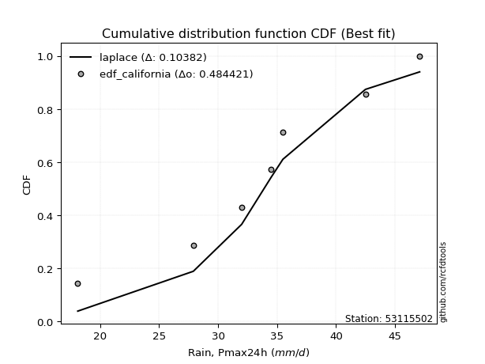</img>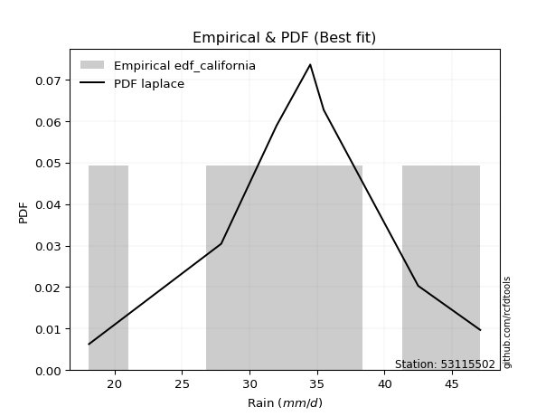</img>

</div>


### 2. EDF Hazen (1930)

Hazen method for plotting positions is a formula used to estimate the empirical cumulative probability distribution of flood events or other hydrological data. This formula often results in biased estimations, particularly when extrapolating to extreme events (high return periods).

<div align="center">


$P=(m-0.5)/n$


</div>


**2.1. Empirical values**

<div align="center">

|                | 0                   | 1                   | 2                   | 3         | 4                  | 5                  | 6                  |
|:---------------|:--------------------|:--------------------|:--------------------|:----------|:-------------------|:-------------------|:-------------------|
| date           | 2023                | 2022                | 2017                | 2021      | 2018               | 2019               | 2020               |
| x              | 18.1                | 27.9                | 32.0                | 34.5      | 35.5               | 42.5               | 47.1               |
| m              | 1                   | 2                   | 3                   | 4         | 5                  | 6                  | 7                  |
| empirical_dist | edf_hazen           | edf_hazen           | edf_hazen           | edf_hazen | edf_hazen          | edf_hazen          | edf_hazen          |
| empirical      | 0.07142857142857142 | 0.21428571428571427 | 0.35714285714285715 | 0.5       | 0.6428571428571429 | 0.7857142857142857 | 0.9285714285714286 |
| empirical_tr   | 1.0769230769230769  | 1.2727272727272727  | 1.5555555555555558  | 2.0       | 2.8000000000000003 | 4.666666666666666  | 14.000000000000007 |

</div>


**2.2. Kolmogorov-Smirnov fit test (sorted by Δ)**


<div align="center">

|                | 0                   | 1                   | 2                   | 3                   | 4                   | 5                   | 6                   | 7                   | 8                   | 9                   | 10                  | 11                  | 12                  | 13                  | 14                  | 15                  | 16                  | 17                  | 18                  | 19                  | 20                  | 21                  | 22                  | 23                  | 24                  | 25                  | 26                  | 27                  | 28                  | 29                  | 30                  | 31                  | 32                  | 33                  | 34                  | 35                  | 36                  | 37                  | 38                  | 39                  | 40                  | 41                  | 42                  | 43                  | 44                  | 45                  | 46                  | 47                  | 48                  | 49                  | 50                  | 51                  | 52                  | 53                  | 54                  | 55                  | 56                  | 57                  | 58                  | 59                  | 60                  | 61                  | 62                  | 63                  | 64                  | 65                  | 66                  | 67                  | 68                  | 69                  | 70                  | 71                  | 72                  | 73                  | 74                  | 75                  | 76                  | 77                  | 78                  | 79                  | 80                  | 81                  | 82                  | 83                  | 84                  | 85                  | 86                  | 87                  | 88                  | 89                  | 90                  | 91                  | 92                  | 93                  | 94                  | 95                  | 96                  | 97                  | 98                  | 99                  | 100                 | 101                 | 102                 | 103                 | 104                 | 105                 | 106                 | 107                 | 108                 | 109                 | 110                 | 111                 | 112                 | 113                 | 114                 | 115                 | 116                 | 117                 | 118                 | 119                 | 120                 | 121                 | 122                 | 123                 | 124                 | 125                 | 126                 | 127                 | 128                 | 129                 | 130                 | 131                 | 132                 | 133                 | 134                 | 135                 | 136                 | 137                 | 138                 | 139                 | 140                 | 141                 | 142                 | 143                 | 144                 | 145                 | 146                 | 147                 | 148                 | 149                 | 150                 | 151                 | 152                 | 153                 | 154                 | 155                 | 156                 | 157                 | 158                 | 159                 |
|:---------------|:--------------------|:--------------------|:--------------------|:--------------------|:--------------------|:--------------------|:--------------------|:--------------------|:--------------------|:--------------------|:--------------------|:--------------------|:--------------------|:--------------------|:--------------------|:--------------------|:--------------------|:--------------------|:--------------------|:--------------------|:--------------------|:--------------------|:--------------------|:--------------------|:--------------------|:--------------------|:--------------------|:--------------------|:--------------------|:--------------------|:--------------------|:--------------------|:--------------------|:--------------------|:--------------------|:--------------------|:--------------------|:--------------------|:--------------------|:--------------------|:--------------------|:--------------------|:--------------------|:--------------------|:--------------------|:--------------------|:--------------------|:--------------------|:--------------------|:--------------------|:--------------------|:--------------------|:--------------------|:--------------------|:--------------------|:--------------------|:--------------------|:--------------------|:--------------------|:--------------------|:--------------------|:--------------------|:--------------------|:--------------------|:--------------------|:--------------------|:--------------------|:--------------------|:--------------------|:--------------------|:--------------------|:--------------------|:--------------------|:--------------------|:--------------------|:--------------------|:--------------------|:--------------------|:--------------------|:--------------------|:--------------------|:--------------------|:--------------------|:--------------------|:--------------------|:--------------------|:--------------------|:--------------------|:--------------------|:--------------------|:--------------------|:--------------------|:--------------------|:--------------------|:--------------------|:--------------------|:--------------------|:--------------------|:--------------------|:--------------------|:--------------------|:--------------------|:--------------------|:--------------------|:--------------------|:--------------------|:--------------------|:--------------------|:--------------------|:--------------------|:--------------------|:--------------------|:--------------------|:--------------------|:--------------------|:--------------------|:--------------------|:--------------------|:--------------------|:--------------------|:--------------------|:--------------------|:--------------------|:--------------------|:--------------------|:--------------------|:--------------------|:--------------------|:--------------------|:--------------------|:--------------------|:--------------------|:--------------------|:--------------------|:--------------------|:--------------------|:--------------------|:--------------------|:--------------------|:--------------------|:--------------------|:--------------------|:--------------------|:--------------------|:--------------------|:--------------------|:--------------------|:--------------------|:--------------------|:--------------------|:--------------------|:--------------------|:--------------------|:--------------------|:--------------------|:--------------------|:--------------------|:--------------------|:--------------------|:--------------------|
| station        | 53115502            | 53115502            | 53115502            | 53115502            | 53115502            | 53115502            | 53115502            | 53115502            | 53115502            | 53115502            | 53115502            | 53115502            | 53115502            | 53115502            | 53115502            | 53115502            | 53115502            | 53115502            | 53115502            | 53115502            | 53115502            | 53115502            | 53115502            | 53115502            | 53115502            | 53115502            | 53115502            | 53115502            | 53115502            | 53115502            | 53115502            | 53115502            | 53115502            | 53115502            | 53115502            | 53115502            | 53115502            | 53115502            | 53115502            | 53115502            | 53115502            | 53115502            | 53115502            | 53115502            | 53115502            | 53115502            | 53115502            | 53115502            | 53115502            | 53115502            | 53115502            | 53115502            | 53115502            | 53115502            | 53115502            | 53115502            | 53115502            | 53115502            | 53115502            | 53115502            | 53115502            | 53115502            | 53115502            | 53115502            | 53115502            | 53115502            | 53115502            | 53115502            | 53115502            | 53115502            | 53115502            | 53115502            | 53115502            | 53115502            | 53115502            | 53115502            | 53115502            | 53115502            | 53115502            | 53115502            | 53115502            | 53115502            | 53115502            | 53115502            | 53115502            | 53115502            | 53115502            | 53115502            | 53115502            | 53115502            | 53115502            | 53115502            | 53115502            | 53115502            | 53115502            | 53115502            | 53115502            | 53115502            | 53115502            | 53115502            | 53115502            | 53115502            | 53115502            | 53115502            | 53115502            | 53115502            | 53115502            | 53115502            | 53115502            | 53115502            | 53115502            | 53115502            | 53115502            | 53115502            | 53115502            | 53115502            | 53115502            | 53115502            | 53115502            | 53115502            | 53115502            | 53115502            | 53115502            | 53115502            | 53115502            | 53115502            | 53115502            | 53115502            | 53115502            | 53115502            | 53115502            | 53115502            | 53115502            | 53115502            | 53115502            | 53115502            | 53115502            | 53115502            | 53115502            | 53115502            | 53115502            | 53115502            | 53115502            | 53115502            | 53115502            | 53115502            | 53115502            | 53115502            | 53115502            | 53115502            | 53115502            | 53115502            | 53115502            | 53115502            | 53115502            | 53115502            | 53115502            | 53115502            | 53115502            | 53115502            |
| empirical_dist | edf_hazen           | edf_hazen           | edf_hazen           | edf_hazen           | edf_hazen           | edf_hazen           | edf_hazen           | edf_hazen           | edf_hazen           | edf_hazen           | edf_hazen           | edf_hazen           | edf_hazen           | edf_hazen           | edf_hazen           | edf_hazen           | edf_hazen           | edf_hazen           | edf_hazen           | edf_hazen           | edf_hazen           | edf_hazen           | edf_hazen           | edf_hazen           | edf_hazen           | edf_hazen           | edf_hazen           | edf_hazen           | edf_hazen           | edf_hazen           | edf_hazen           | edf_hazen           | edf_hazen           | edf_hazen           | edf_hazen           | edf_hazen           | edf_hazen           | edf_hazen           | edf_hazen           | edf_hazen           | edf_hazen           | edf_hazen           | edf_hazen           | edf_hazen           | edf_hazen           | edf_hazen           | edf_hazen           | edf_hazen           | edf_hazen           | edf_hazen           | edf_hazen           | edf_hazen           | edf_hazen           | edf_hazen           | edf_hazen           | edf_hazen           | edf_hazen           | edf_hazen           | edf_hazen           | edf_hazen           | edf_hazen           | edf_hazen           | edf_hazen           | edf_hazen           | edf_hazen           | edf_hazen           | edf_hazen           | edf_hazen           | edf_hazen           | edf_hazen           | edf_hazen           | edf_hazen           | edf_hazen           | edf_hazen           | edf_hazen           | edf_hazen           | edf_hazen           | edf_hazen           | edf_hazen           | edf_hazen           | edf_hazen           | edf_hazen           | edf_hazen           | edf_hazen           | edf_hazen           | edf_hazen           | edf_hazen           | edf_hazen           | edf_hazen           | edf_hazen           | edf_hazen           | edf_hazen           | edf_hazen           | edf_hazen           | edf_hazen           | edf_hazen           | edf_hazen           | edf_hazen           | edf_hazen           | edf_hazen           | edf_hazen           | edf_hazen           | edf_hazen           | edf_hazen           | edf_hazen           | edf_hazen           | edf_hazen           | edf_hazen           | edf_hazen           | edf_hazen           | edf_hazen           | edf_hazen           | edf_hazen           | edf_hazen           | edf_hazen           | edf_hazen           | edf_hazen           | edf_hazen           | edf_hazen           | edf_hazen           | edf_hazen           | edf_hazen           | edf_hazen           | edf_hazen           | edf_hazen           | edf_hazen           | edf_hazen           | edf_hazen           | edf_hazen           | edf_hazen           | edf_hazen           | edf_hazen           | edf_hazen           | edf_hazen           | edf_hazen           | edf_hazen           | edf_hazen           | edf_hazen           | edf_hazen           | edf_hazen           | edf_hazen           | edf_hazen           | edf_hazen           | edf_hazen           | edf_hazen           | edf_hazen           | edf_hazen           | edf_hazen           | edf_hazen           | edf_hazen           | edf_hazen           | edf_hazen           | edf_hazen           | edf_hazen           | edf_hazen           | edf_hazen           | edf_hazen           | edf_hazen           | edf_hazen           | edf_hazen           |
| p_dist         | betaprime           | erlang              | gamma               | logdgamma           | dweibull            | logistic            | rice                | logt                | loggompertz         | f                   | nct                 | crystalball         | norm                | exponnorm           | t                   | logdweibull         | invgamma            | dgamma              | cosine              | hypsecant           | alpha               | logpearson3         | loggennorm          | logloglaplace       | logtruncweibull_min | anglit              | semicircular        | loggumbel_l         | laplace             | genlogistic         | maxwell             | logburr12           | pearson3            | logweibull_min      | ncf                 | weibull_min         | logskewnorm         | logburr             | logexponpow         | invgauss            | logtriang           | rayleigh            | johnsonsu           | skewnorm            | logtrapezoid        | beta                | mielke              | loghypsecant        | loggenlogistic      | loggengamma         | loglogistic         | logargus            | logf                | logcrystalball      | lognorm             | logexponnorm        | logfatiguelife      | loggenhalflogistic  | logjohnsonsu        | logloggamma         | gumbel_r            | loglaplace          | loglaplace          | kappa3              | loganglit           | argus               | logsemicircular     | vonmises_line       | wrapcauchy          | bradford            | gausshyper          | logrice             | uniform             | arcsine             | loggamma            | loggamma            | burr                | logerlang           | logbetaprime        | genextreme          | loggausshyper       | logalpha            | loginvgamma         | lognct              | logbeta             | halfnorm            | gumbel_l            | kstwobign           | moyal               | loginvgauss         | logexponweib        | kappa4              | logfoldnorm         | logmaxwell          | ksone               | halflogistic        | logarcsine          | lograyleigh         | loginvweibull       | logncf              | logcosine           | triang              | loggumbel_r         | genpareto           | logmielke           | loghalfnorm         | logkstwobign        | loggenexpon         | lomax               | wald                | genhalflogistic     | logmoyal            | logtruncnorm        | logtukeylambda      | nakagami            | loghalflogistic     | truncexpon          | loglevy_l           | truncnorm           | logkappa3           | loguniform          | logvonmises_line    | logkappa4           | logweibull_max      | logksone            | loggenextreme       | genexpon            | loggenpareto        | logbradford         | levy_l              | logwrapcauchy       | truncweibull_min    | logwald             | gennorm             | lognakagami         | trapezoid           | burr12              | halfgennorm         | logtruncexpon       | logjohnsonsb        | logrdist            | foldnorm            | invweibull          | johnsonsb           | gompertz            | fatiguelife         | gengamma            | weibull_max         | exponweib           | tukeylambda         | powerlaw            | rdist               | logpowerlaw         | exponpow            | truncpareto         | loglomax            | logtruncpareto      | loghalfgennorm      | logvonmises         | vonmises            |
| delta          | 0.06495657962362744 | 0.065744368631805   | 0.06601759830613296 | 0.06645450316151419 | 0.06666708334529925 | 0.06831415664571394 | 0.06916980997698008 | 0.06924554073242606 | 0.07142830309241029 | 0.07208194222450104 | 0.07229586261338661 | 0.0725210321555193  | 0.0725210422030117  | 0.07252187300339019 | 0.0725456799403349  | 0.07336471242444553 | 0.07466275019357349 | 0.0749161130103837  | 0.07839935510709423 | 0.07851481213335554 | 0.07895944636459923 | 0.07926771833760082 | 0.08022611340021435 | 0.08195651329742726 | 0.08199673395912987 | 0.08242211697459434 | 0.08651702885319046 | 0.08658482667429757 | 0.088165869461171   | 0.08821047754401057 | 0.08960339499854642 | 0.08965924278715331 | 0.0899288093370717  | 0.09181151489482586 | 0.09310415013727436 | 0.09421120560758367 | 0.09807998363303161 | 0.0985332674966255  | 0.10132121939245986 | 0.10150929138519288 | 0.10155549045300613 | 0.10185022135686278 | 0.10294519391797252 | 0.10301616086059229 | 0.10322580832845707 | 0.10417476436676668 | 0.10737996885088075 | 0.10780454250934701 | 0.10788371772094729 | 0.1095258807350929  | 0.11104653001889725 | 0.11345901323345509 | 0.11426642331495518 | 0.11485457295441431 | 0.11485554785532948 | 0.11485611177986238 | 0.11514607511246233 | 0.11598296304646749 | 0.11656347009765067 | 0.11687965608772544 | 0.11732021737233955 | 0.1175576150968527  | 0.1175576150968527  | 0.11884123060394772 | 0.11885347109396782 | 0.11954329234550598 | 0.12049883791424726 | 0.12067124797920759 | 0.12185718172966523 | 0.12204705196204205 | 0.1222026523546994  | 0.12252659291195661 | 0.12364532019704425 | 0.12404750176359683 | 0.12537217740760193 | 0.12537217740760193 | 0.12660718132909615 | 0.12750478867338827 | 0.1278390500118532  | 0.12869634497109683 | 0.12943053089546172 | 0.13189943313061897 | 0.13293685896955398 | 0.13476170929414572 | 0.1360746147186277  | 0.1365413610446966  | 0.1370883256429002  | 0.14097995300546468 | 0.1410408809572528  | 0.14182517388056737 | 0.14335629085027385 | 0.14374872035994127 | 0.14574984198157076 | 0.14880055119681718 | 0.15065681444991788 | 0.15366739209199648 | 0.1601094877355335  | 0.16035598748319896 | 0.16396937208284507 | 0.1644553259831871  | 0.1650310341015156  | 0.1763656189283082  | 0.18382613525684316 | 0.1863402854231049  | 0.18902726949869225 | 0.19292664428697365 | 0.19346474897669869 | 0.19381966932447983 | 0.19591059204520156 | 0.2058947584964031  | 0.20626006720700596 | 0.20961305873466501 | 0.21428260144036843 | 0.21428569930796368 | 0.214285713964444   | 0.21591664127816484 | 0.21951218929237076 | 0.22046231498055355 | 0.2306554584199418  | 0.23777562770102553 | 0.23868228330051727 | 0.2390168432239646  | 0.23976876279565393 | 0.24063396475862753 | 0.24609729150693058 | 0.2503560742985031  | 0.2535087785117308  | 0.2577331324332226  | 0.2580029914636228  | 0.2606175188155577  | 0.26976196856037915 | 0.2736834579598739  | 0.28138593685440455 | 0.2857142857142857  | 0.286387972731494   | 0.30257936507936517 | 0.31273417316074503 | 0.3242944089014579  | 0.33549332658747366 | 0.3756200488790903  | 0.437721906880843   | 0.4490620998646749  | 0.5009005039963303  | 0.5321628153353137  | 0.5333045418692843  | 0.5354833702950244  | 0.5363572278021869  | 0.5487683400115327  | 0.5564566523737312  | 0.5700292682700163  | 0.6116522337048659  | 0.6428571418739535  | 0.6480271199368359  | 0.70293596278961    | 0.7058857320528588  | 0.7060668412536304  | 0.726756444615775   | 0.7857142857142857  | 1.1097921809807814  | 7.380513306879294   |
| deltao         | 0.48442053926100004 | 0.48442053926100004 | 0.48442053926100004 | 0.48442053926100004 | 0.48442053926100004 | 0.48442053926100004 | 0.48442053926100004 | 0.48442053926100004 | 0.48442053926100004 | 0.48442053926100004 | 0.48442053926100004 | 0.48442053926100004 | 0.48442053926100004 | 0.48442053926100004 | 0.48442053926100004 | 0.48442053926100004 | 0.48442053926100004 | 0.48442053926100004 | 0.48442053926100004 | 0.48442053926100004 | 0.48442053926100004 | 0.48442053926100004 | 0.48442053926100004 | 0.48442053926100004 | 0.48442053926100004 | 0.48442053926100004 | 0.48442053926100004 | 0.48442053926100004 | 0.48442053926100004 | 0.48442053926100004 | 0.48442053926100004 | 0.48442053926100004 | 0.48442053926100004 | 0.48442053926100004 | 0.48442053926100004 | 0.48442053926100004 | 0.48442053926100004 | 0.48442053926100004 | 0.48442053926100004 | 0.48442053926100004 | 0.48442053926100004 | 0.48442053926100004 | 0.48442053926100004 | 0.48442053926100004 | 0.48442053926100004 | 0.48442053926100004 | 0.48442053926100004 | 0.48442053926100004 | 0.48442053926100004 | 0.48442053926100004 | 0.48442053926100004 | 0.48442053926100004 | 0.48442053926100004 | 0.48442053926100004 | 0.48442053926100004 | 0.48442053926100004 | 0.48442053926100004 | 0.48442053926100004 | 0.48442053926100004 | 0.48442053926100004 | 0.48442053926100004 | 0.48442053926100004 | 0.48442053926100004 | 0.48442053926100004 | 0.48442053926100004 | 0.48442053926100004 | 0.48442053926100004 | 0.48442053926100004 | 0.48442053926100004 | 0.48442053926100004 | 0.48442053926100004 | 0.48442053926100004 | 0.48442053926100004 | 0.48442053926100004 | 0.48442053926100004 | 0.48442053926100004 | 0.48442053926100004 | 0.48442053926100004 | 0.48442053926100004 | 0.48442053926100004 | 0.48442053926100004 | 0.48442053926100004 | 0.48442053926100004 | 0.48442053926100004 | 0.48442053926100004 | 0.48442053926100004 | 0.48442053926100004 | 0.48442053926100004 | 0.48442053926100004 | 0.48442053926100004 | 0.48442053926100004 | 0.48442053926100004 | 0.48442053926100004 | 0.48442053926100004 | 0.48442053926100004 | 0.48442053926100004 | 0.48442053926100004 | 0.48442053926100004 | 0.48442053926100004 | 0.48442053926100004 | 0.48442053926100004 | 0.48442053926100004 | 0.48442053926100004 | 0.48442053926100004 | 0.48442053926100004 | 0.48442053926100004 | 0.48442053926100004 | 0.48442053926100004 | 0.48442053926100004 | 0.48442053926100004 | 0.48442053926100004 | 0.48442053926100004 | 0.48442053926100004 | 0.48442053926100004 | 0.48442053926100004 | 0.48442053926100004 | 0.48442053926100004 | 0.48442053926100004 | 0.48442053926100004 | 0.48442053926100004 | 0.48442053926100004 | 0.48442053926100004 | 0.48442053926100004 | 0.48442053926100004 | 0.48442053926100004 | 0.48442053926100004 | 0.48442053926100004 | 0.48442053926100004 | 0.48442053926100004 | 0.48442053926100004 | 0.48442053926100004 | 0.48442053926100004 | 0.48442053926100004 | 0.48442053926100004 | 0.48442053926100004 | 0.48442053926100004 | 0.48442053926100004 | 0.48442053926100004 | 0.48442053926100004 | 0.48442053926100004 | 0.48442053926100004 | 0.48442053926100004 | 0.48442053926100004 | 0.48442053926100004 | 0.48442053926100004 | 0.48442053926100004 | 0.48442053926100004 | 0.48442053926100004 | 0.48442053926100004 | 0.48442053926100004 | 0.48442053926100004 | 0.48442053926100004 | 0.48442053926100004 | 0.48442053926100004 | 0.48442053926100004 | 0.48442053926100004 | 0.48442053926100004 | 0.48442053926100004 | 0.48442053926100004 | 0.48442053926100004 |
| eval           | Δo > Δ              | Δo > Δ              | Δo > Δ              | Δo > Δ              | Δo > Δ              | Δo > Δ              | Δo > Δ              | Δo > Δ              | Δo > Δ              | Δo > Δ              | Δo > Δ              | Δo > Δ              | Δo > Δ              | Δo > Δ              | Δo > Δ              | Δo > Δ              | Δo > Δ              | Δo > Δ              | Δo > Δ              | Δo > Δ              | Δo > Δ              | Δo > Δ              | Δo > Δ              | Δo > Δ              | Δo > Δ              | Δo > Δ              | Δo > Δ              | Δo > Δ              | Δo > Δ              | Δo > Δ              | Δo > Δ              | Δo > Δ              | Δo > Δ              | Δo > Δ              | Δo > Δ              | Δo > Δ              | Δo > Δ              | Δo > Δ              | Δo > Δ              | Δo > Δ              | Δo > Δ              | Δo > Δ              | Δo > Δ              | Δo > Δ              | Δo > Δ              | Δo > Δ              | Δo > Δ              | Δo > Δ              | Δo > Δ              | Δo > Δ              | Δo > Δ              | Δo > Δ              | Δo > Δ              | Δo > Δ              | Δo > Δ              | Δo > Δ              | Δo > Δ              | Δo > Δ              | Δo > Δ              | Δo > Δ              | Δo > Δ              | Δo > Δ              | Δo > Δ              | Δo > Δ              | Δo > Δ              | Δo > Δ              | Δo > Δ              | Δo > Δ              | Δo > Δ              | Δo > Δ              | Δo > Δ              | Δo > Δ              | Δo > Δ              | Δo > Δ              | Δo > Δ              | Δo > Δ              | Δo > Δ              | Δo > Δ              | Δo > Δ              | Δo > Δ              | Δo > Δ              | Δo > Δ              | Δo > Δ              | Δo > Δ              | Δo > Δ              | Δo > Δ              | Δo > Δ              | Δo > Δ              | Δo > Δ              | Δo > Δ              | Δo > Δ              | Δo > Δ              | Δo > Δ              | Δo > Δ              | Δo > Δ              | Δo > Δ              | Δo > Δ              | Δo > Δ              | Δo > Δ              | Δo > Δ              | Δo > Δ              | Δo > Δ              | Δo > Δ              | Δo > Δ              | Δo > Δ              | Δo > Δ              | Δo > Δ              | Δo > Δ              | Δo > Δ              | Δo > Δ              | Δo > Δ              | Δo > Δ              | Δo > Δ              | Δo > Δ              | Δo > Δ              | Δo > Δ              | Δo > Δ              | Δo > Δ              | Δo > Δ              | Δo > Δ              | Δo > Δ              | Δo > Δ              | Δo > Δ              | Δo > Δ              | Δo > Δ              | Δo > Δ              | Δo > Δ              | Δo > Δ              | Δo > Δ              | Δo > Δ              | Δo > Δ              | Δo > Δ              | Δo > Δ              | Δo > Δ              | Δo > Δ              | Δo > Δ              | Δo > Δ              | Δo > Δ              | Δo > Δ              | Δo > Δ              | Δo > Δ              | Δo > Δ              | Δo <= Δ             | Δo <= Δ             | Δo <= Δ             | Δo <= Δ             | Δo <= Δ             | Δo <= Δ             | Δo <= Δ             | Δo <= Δ             | Δo <= Δ             | Δo <= Δ             | Δo <= Δ             | Δo <= Δ             | Δo <= Δ             | Δo <= Δ             | Δo <= Δ             | Δo <= Δ             | Δo <= Δ             | Δo <= Δ             |
| fit            | 1                   | 1                   | 1                   | 1                   | 1                   | 1                   | 1                   | 1                   | 1                   | 1                   | 1                   | 1                   | 1                   | 1                   | 1                   | 1                   | 1                   | 1                   | 1                   | 1                   | 1                   | 1                   | 1                   | 1                   | 1                   | 1                   | 1                   | 1                   | 1                   | 1                   | 1                   | 1                   | 1                   | 1                   | 1                   | 1                   | 1                   | 1                   | 1                   | 1                   | 1                   | 1                   | 1                   | 1                   | 1                   | 1                   | 1                   | 1                   | 1                   | 1                   | 1                   | 1                   | 1                   | 1                   | 1                   | 1                   | 1                   | 1                   | 1                   | 1                   | 1                   | 1                   | 1                   | 1                   | 1                   | 1                   | 1                   | 1                   | 1                   | 1                   | 1                   | 1                   | 1                   | 1                   | 1                   | 1                   | 1                   | 1                   | 1                   | 1                   | 1                   | 1                   | 1                   | 1                   | 1                   | 1                   | 1                   | 1                   | 1                   | 1                   | 1                   | 1                   | 1                   | 1                   | 1                   | 1                   | 1                   | 1                   | 1                   | 1                   | 1                   | 1                   | 1                   | 1                   | 1                   | 1                   | 1                   | 1                   | 1                   | 1                   | 1                   | 1                   | 1                   | 1                   | 1                   | 1                   | 1                   | 1                   | 1                   | 1                   | 1                   | 1                   | 1                   | 1                   | 1                   | 1                   | 1                   | 1                   | 1                   | 1                   | 1                   | 1                   | 1                   | 1                   | 1                   | 1                   | 1                   | 1                   | 1                   | 1                   | 1                   | 1                   | 0                   | 0                   | 0                   | 0                   | 0                   | 0                   | 0                   | 0                   | 0                   | 0                   | 0                   | 0                   | 0                   | 0                   | 0                   | 0                   | 0                   | 0                   |
| n              | 7                   | 7                   | 7                   | 7                   | 7                   | 7                   | 7                   | 7                   | 7                   | 7                   | 7                   | 7                   | 7                   | 7                   | 7                   | 7                   | 7                   | 7                   | 7                   | 7                   | 7                   | 7                   | 7                   | 7                   | 7                   | 7                   | 7                   | 7                   | 7                   | 7                   | 7                   | 7                   | 7                   | 7                   | 7                   | 7                   | 7                   | 7                   | 7                   | 7                   | 7                   | 7                   | 7                   | 7                   | 7                   | 7                   | 7                   | 7                   | 7                   | 7                   | 7                   | 7                   | 7                   | 7                   | 7                   | 7                   | 7                   | 7                   | 7                   | 7                   | 7                   | 7                   | 7                   | 7                   | 7                   | 7                   | 7                   | 7                   | 7                   | 7                   | 7                   | 7                   | 7                   | 7                   | 7                   | 7                   | 7                   | 7                   | 7                   | 7                   | 7                   | 7                   | 7                   | 7                   | 7                   | 7                   | 7                   | 7                   | 7                   | 7                   | 7                   | 7                   | 7                   | 7                   | 7                   | 7                   | 7                   | 7                   | 7                   | 7                   | 7                   | 7                   | 7                   | 7                   | 7                   | 7                   | 7                   | 7                   | 7                   | 7                   | 7                   | 7                   | 7                   | 7                   | 7                   | 7                   | 7                   | 7                   | 7                   | 7                   | 7                   | 7                   | 7                   | 7                   | 7                   | 7                   | 7                   | 7                   | 7                   | 7                   | 7                   | 7                   | 7                   | 7                   | 7                   | 7                   | 7                   | 7                   | 7                   | 7                   | 7                   | 7                   | 7                   | 7                   | 7                   | 7                   | 7                   | 7                   | 7                   | 7                   | 7                   | 7                   | 7                   | 7                   | 7                   | 7                   | 7                   | 7                   | 7                   | 7                   |
| best_fit       | 1                   | 0                   | 0                   | 0                   | 0                   | 0                   | 0                   | 0                   | 0                   | 0                   | 0                   | 0                   | 0                   | 0                   | 0                   | 0                   | 0                   | 0                   | 0                   | 0                   | 0                   | 0                   | 0                   | 0                   | 0                   | 0                   | 0                   | 0                   | 0                   | 0                   | 0                   | 0                   | 0                   | 0                   | 0                   | 0                   | 0                   | 0                   | 0                   | 0                   | 0                   | 0                   | 0                   | 0                   | 0                   | 0                   | 0                   | 0                   | 0                   | 0                   | 0                   | 0                   | 0                   | 0                   | 0                   | 0                   | 0                   | 0                   | 0                   | 0                   | 0                   | 0                   | 0                   | 0                   | 0                   | 0                   | 0                   | 0                   | 0                   | 0                   | 0                   | 0                   | 0                   | 0                   | 0                   | 0                   | 0                   | 0                   | 0                   | 0                   | 0                   | 0                   | 0                   | 0                   | 0                   | 0                   | 0                   | 0                   | 0                   | 0                   | 0                   | 0                   | 0                   | 0                   | 0                   | 0                   | 0                   | 0                   | 0                   | 0                   | 0                   | 0                   | 0                   | 0                   | 0                   | 0                   | 0                   | 0                   | 0                   | 0                   | 0                   | 0                   | 0                   | 0                   | 0                   | 0                   | 0                   | 0                   | 0                   | 0                   | 0                   | 0                   | 0                   | 0                   | 0                   | 0                   | 0                   | 0                   | 0                   | 0                   | 0                   | 0                   | 0                   | 0                   | 0                   | 0                   | 0                   | 0                   | 0                   | 0                   | 0                   | 0                   | 0                   | 0                   | 0                   | 0                   | 0                   | 0                   | 0                   | 0                   | 0                   | 0                   | 0                   | 0                   | 0                   | 0                   | 0                   | 0                   | 0                   | 0                   |
| best_fit_sort  | 1                   | 2                   | 3                   | 4                   | 5                   | 6                   | 7                   | 8                   | 9                   | 10                  | 11                  | 12                  | 13                  | 14                  | 15                  | 16                  | 17                  | 18                  | 19                  | 20                  | 21                  | 22                  | 23                  | 24                  | 25                  | 26                  | 27                  | 28                  | 29                  | 30                  | 31                  | 32                  | 33                  | 34                  | 35                  | 36                  | 37                  | 38                  | 39                  | 40                  | 41                  | 42                  | 43                  | 44                  | 45                  | 46                  | 47                  | 48                  | 49                  | 50                  | 51                  | 52                  | 53                  | 54                  | 55                  | 56                  | 57                  | 58                  | 59                  | 60                  | 61                  | 62                  | 63                  | 64                  | 65                  | 66                  | 67                  | 68                  | 69                  | 70                  | 71                  | 72                  | 73                  | 74                  | 75                  | 76                  | 77                  | 78                  | 79                  | 80                  | 81                  | 82                  | 83                  | 84                  | 85                  | 86                  | 87                  | 88                  | 89                  | 90                  | 91                  | 92                  | 93                  | 94                  | 95                  | 96                  | 97                  | 98                  | 99                  | 100                 | 101                 | 102                 | 103                 | 104                 | 105                 | 106                 | 107                 | 108                 | 109                 | 110                 | 111                 | 112                 | 113                 | 114                 | 115                 | 116                 | 117                 | 118                 | 119                 | 120                 | 121                 | 122                 | 123                 | 124                 | 125                 | 126                 | 127                 | 128                 | 129                 | 130                 | 131                 | 132                 | 133                 | 134                 | 135                 | 136                 | 137                 | 138                 | 139                 | 140                 | 141                 | 142                 | 143                 | 144                 | 145                 | 146                 | 147                 | 148                 | 149                 | 150                 | 151                 | 152                 | 153                 | 154                 | 155                 | 156                 | 157                 | 158                 | 159                 | 160                 |

</div>


**2.3. Best fit**

<div align="center">

|   id |   station | empirical_dist   | p_dist    |     delta |   deltao | eval   |   fit |   n |   best_fit |   best_fit_sort |
|-----:|----------:|:-----------------|:----------|----------:|---------:|:-------|------:|----:|-----------:|----------------:|
|    0 |  53115502 | edf_hazen        | betaprime | 0.0649566 | 0.484421 | Δo > Δ |     1 |   7 |          1 |               1 |

</div>


<div align="center">

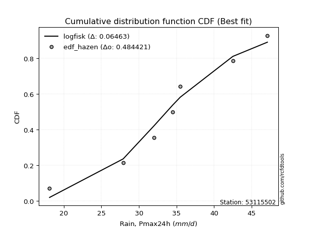</img>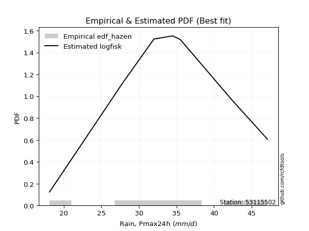</img>

</div>


### 3. EDF Weibull (1939)

Weibull plotting position formula is an empirical method used to estimate the non-exceedance probability or plotting position for a set of observed data, is often recommended or widely used in practice, particularly in flood frequency analysis.

<div align="center">


$P=m/(n+1)$


</div>


**3.1. Empirical values**

<div align="center">

|                | 0                  | 1                  | 2           | 3           | 4                  | 5           | 6           |
|:---------------|:-------------------|:-------------------|:------------|:------------|:-------------------|:------------|:------------|
| date           | 2023               | 2022               | 2017        | 2021        | 2018               | 2019        | 2020        |
| x              | 18.1               | 27.9               | 32.0        | 34.5        | 35.5               | 42.5        | 47.1        |
| m              | 1                  | 2                  | 3           | 4           | 5                  | 6           | 7           |
| empirical_dist | edf_weibull        | edf_weibull        | edf_weibull | edf_weibull | edf_weibull        | edf_weibull | edf_weibull |
| empirical      | 0.125              | 0.25               | 0.375       | 0.5         | 0.625              | 0.75        | 0.875       |
| empirical_tr   | 1.1428571428571428 | 1.3333333333333333 | 1.6         | 2.0         | 2.6666666666666665 | 4.0         | 8.0         |

</div>


**3.2. Kolmogorov-Smirnov fit test (sorted by Δ)**


<div align="center">

|                | 0                   | 1                   | 2                   | 3                   | 4                   | 5                   | 6                   | 7                   | 8                   | 9                   | 10                  | 11                  | 12                  | 13                  | 14                  | 15                  | 16                  | 17                  | 18                  | 19                  | 20                  | 21                  | 22                  | 23                  | 24                  | 25                  | 26                  | 27                  | 28                  | 29                  | 30                  | 31                  | 32                  | 33                  | 34                  | 35                  | 36                  | 37                  | 38                  | 39                  | 40                  | 41                  | 42                  | 43                  | 44                  | 45                  | 46                  | 47                  | 48                  | 49                  | 50                  | 51                  | 52                  | 53                  | 54                  | 55                  | 56                  | 57                  | 58                  | 59                  | 60                  | 61                  | 62                  | 63                  | 64                  | 65                  | 66                  | 67                  | 68                  | 69                  | 70                  | 71                  | 72                  | 73                  | 74                  | 75                  | 76                  | 77                  | 78                  | 79                  | 80                  | 81                  | 82                  | 83                  | 84                  | 85                  | 86                  | 87                  | 88                  | 89                  | 90                  | 91                  | 92                  | 93                  | 94                  | 95                  | 96                  | 97                  | 98                  | 99                  | 100                 | 101                 | 102                 | 103                 | 104                 | 105                 | 106                 | 107                 | 108                 | 109                 | 110                 | 111                 | 112                 | 113                 | 114                 | 115                 | 116                 | 117                 | 118                 | 119                 | 120                 | 121                 | 122                 | 123                 | 124                 | 125                 | 126                 | 127                 | 128                 | 129                 | 130                 | 131                 | 132                 | 133                 | 134                 | 135                 | 136                 | 137                 | 138                 | 139                 | 140                 | 141                 | 142                 | 143                 | 144                 | 145                 | 146                 | 147                 | 148                 | 149                 | 150                 | 151                 | 152                 | 153                 | 154                 | 155                 | 156                 | 157                 | 158                 | 159                 |
|:---------------|:--------------------|:--------------------|:--------------------|:--------------------|:--------------------|:--------------------|:--------------------|:--------------------|:--------------------|:--------------------|:--------------------|:--------------------|:--------------------|:--------------------|:--------------------|:--------------------|:--------------------|:--------------------|:--------------------|:--------------------|:--------------------|:--------------------|:--------------------|:--------------------|:--------------------|:--------------------|:--------------------|:--------------------|:--------------------|:--------------------|:--------------------|:--------------------|:--------------------|:--------------------|:--------------------|:--------------------|:--------------------|:--------------------|:--------------------|:--------------------|:--------------------|:--------------------|:--------------------|:--------------------|:--------------------|:--------------------|:--------------------|:--------------------|:--------------------|:--------------------|:--------------------|:--------------------|:--------------------|:--------------------|:--------------------|:--------------------|:--------------------|:--------------------|:--------------------|:--------------------|:--------------------|:--------------------|:--------------------|:--------------------|:--------------------|:--------------------|:--------------------|:--------------------|:--------------------|:--------------------|:--------------------|:--------------------|:--------------------|:--------------------|:--------------------|:--------------------|:--------------------|:--------------------|:--------------------|:--------------------|:--------------------|:--------------------|:--------------------|:--------------------|:--------------------|:--------------------|:--------------------|:--------------------|:--------------------|:--------------------|:--------------------|:--------------------|:--------------------|:--------------------|:--------------------|:--------------------|:--------------------|:--------------------|:--------------------|:--------------------|:--------------------|:--------------------|:--------------------|:--------------------|:--------------------|:--------------------|:--------------------|:--------------------|:--------------------|:--------------------|:--------------------|:--------------------|:--------------------|:--------------------|:--------------------|:--------------------|:--------------------|:--------------------|:--------------------|:--------------------|:--------------------|:--------------------|:--------------------|:--------------------|:--------------------|:--------------------|:--------------------|:--------------------|:--------------------|:--------------------|:--------------------|:--------------------|:--------------------|:--------------------|:--------------------|:--------------------|:--------------------|:--------------------|:--------------------|:--------------------|:--------------------|:--------------------|:--------------------|:--------------------|:--------------------|:--------------------|:--------------------|:--------------------|:--------------------|:--------------------|:--------------------|:--------------------|:--------------------|:--------------------|:--------------------|:--------------------|:--------------------|:--------------------|:--------------------|:--------------------|
| station        | 53115502            | 53115502            | 53115502            | 53115502            | 53115502            | 53115502            | 53115502            | 53115502            | 53115502            | 53115502            | 53115502            | 53115502            | 53115502            | 53115502            | 53115502            | 53115502            | 53115502            | 53115502            | 53115502            | 53115502            | 53115502            | 53115502            | 53115502            | 53115502            | 53115502            | 53115502            | 53115502            | 53115502            | 53115502            | 53115502            | 53115502            | 53115502            | 53115502            | 53115502            | 53115502            | 53115502            | 53115502            | 53115502            | 53115502            | 53115502            | 53115502            | 53115502            | 53115502            | 53115502            | 53115502            | 53115502            | 53115502            | 53115502            | 53115502            | 53115502            | 53115502            | 53115502            | 53115502            | 53115502            | 53115502            | 53115502            | 53115502            | 53115502            | 53115502            | 53115502            | 53115502            | 53115502            | 53115502            | 53115502            | 53115502            | 53115502            | 53115502            | 53115502            | 53115502            | 53115502            | 53115502            | 53115502            | 53115502            | 53115502            | 53115502            | 53115502            | 53115502            | 53115502            | 53115502            | 53115502            | 53115502            | 53115502            | 53115502            | 53115502            | 53115502            | 53115502            | 53115502            | 53115502            | 53115502            | 53115502            | 53115502            | 53115502            | 53115502            | 53115502            | 53115502            | 53115502            | 53115502            | 53115502            | 53115502            | 53115502            | 53115502            | 53115502            | 53115502            | 53115502            | 53115502            | 53115502            | 53115502            | 53115502            | 53115502            | 53115502            | 53115502            | 53115502            | 53115502            | 53115502            | 53115502            | 53115502            | 53115502            | 53115502            | 53115502            | 53115502            | 53115502            | 53115502            | 53115502            | 53115502            | 53115502            | 53115502            | 53115502            | 53115502            | 53115502            | 53115502            | 53115502            | 53115502            | 53115502            | 53115502            | 53115502            | 53115502            | 53115502            | 53115502            | 53115502            | 53115502            | 53115502            | 53115502            | 53115502            | 53115502            | 53115502            | 53115502            | 53115502            | 53115502            | 53115502            | 53115502            | 53115502            | 53115502            | 53115502            | 53115502            | 53115502            | 53115502            | 53115502            | 53115502            | 53115502            | 53115502            |
| empirical_dist | edf_weibull         | edf_weibull         | edf_weibull         | edf_weibull         | edf_weibull         | edf_weibull         | edf_weibull         | edf_weibull         | edf_weibull         | edf_weibull         | edf_weibull         | edf_weibull         | edf_weibull         | edf_weibull         | edf_weibull         | edf_weibull         | edf_weibull         | edf_weibull         | edf_weibull         | edf_weibull         | edf_weibull         | edf_weibull         | edf_weibull         | edf_weibull         | edf_weibull         | edf_weibull         | edf_weibull         | edf_weibull         | edf_weibull         | edf_weibull         | edf_weibull         | edf_weibull         | edf_weibull         | edf_weibull         | edf_weibull         | edf_weibull         | edf_weibull         | edf_weibull         | edf_weibull         | edf_weibull         | edf_weibull         | edf_weibull         | edf_weibull         | edf_weibull         | edf_weibull         | edf_weibull         | edf_weibull         | edf_weibull         | edf_weibull         | edf_weibull         | edf_weibull         | edf_weibull         | edf_weibull         | edf_weibull         | edf_weibull         | edf_weibull         | edf_weibull         | edf_weibull         | edf_weibull         | edf_weibull         | edf_weibull         | edf_weibull         | edf_weibull         | edf_weibull         | edf_weibull         | edf_weibull         | edf_weibull         | edf_weibull         | edf_weibull         | edf_weibull         | edf_weibull         | edf_weibull         | edf_weibull         | edf_weibull         | edf_weibull         | edf_weibull         | edf_weibull         | edf_weibull         | edf_weibull         | edf_weibull         | edf_weibull         | edf_weibull         | edf_weibull         | edf_weibull         | edf_weibull         | edf_weibull         | edf_weibull         | edf_weibull         | edf_weibull         | edf_weibull         | edf_weibull         | edf_weibull         | edf_weibull         | edf_weibull         | edf_weibull         | edf_weibull         | edf_weibull         | edf_weibull         | edf_weibull         | edf_weibull         | edf_weibull         | edf_weibull         | edf_weibull         | edf_weibull         | edf_weibull         | edf_weibull         | edf_weibull         | edf_weibull         | edf_weibull         | edf_weibull         | edf_weibull         | edf_weibull         | edf_weibull         | edf_weibull         | edf_weibull         | edf_weibull         | edf_weibull         | edf_weibull         | edf_weibull         | edf_weibull         | edf_weibull         | edf_weibull         | edf_weibull         | edf_weibull         | edf_weibull         | edf_weibull         | edf_weibull         | edf_weibull         | edf_weibull         | edf_weibull         | edf_weibull         | edf_weibull         | edf_weibull         | edf_weibull         | edf_weibull         | edf_weibull         | edf_weibull         | edf_weibull         | edf_weibull         | edf_weibull         | edf_weibull         | edf_weibull         | edf_weibull         | edf_weibull         | edf_weibull         | edf_weibull         | edf_weibull         | edf_weibull         | edf_weibull         | edf_weibull         | edf_weibull         | edf_weibull         | edf_weibull         | edf_weibull         | edf_weibull         | edf_weibull         | edf_weibull         | edf_weibull         | edf_weibull         | edf_weibull         |
| p_dist         | johnsonsu           | pearson3            | loggumbel_l         | weibull_min         | logexponpow         | skewnorm            | logpearson3         | logburr12           | logweibull_min      | f                   | nct                 | exponnorm           | norm                | crystalball         | t                   | mielke              | loggenlogistic      | logtrapezoid        | betaprime           | erlang              | gamma               | logdweibull         | genlogistic         | invgauss            | cosine              | invgamma            | anglit              | logargus            | alpha               | logjohnsonsu        | loggennorm          | logloggamma         | rice                | loghypsecant        | dweibull            | loglogistic         | ncf                 | argus               | logt                | logburr             | logistic            | logf                | lognorm             | logcrystalball      | logexponnorm        | loggengamma         | logfatiguelife      | logloglaplace       | kappa3              | semicircular        | loggamma            | loggamma            | logrice             | logdgamma           | burr                | logerlang           | logbetaprime        | dgamma              | genextreme          | maxwell             | logalpha            | hypsecant           | ksone               | loginvgamma         | lognct              | loganglit           | loglaplace          | loglaplace          | gumbel_l            | gumbel_r            | rayleigh            | kstwobign           | laplace             | loginvgauss         | moyal               | bradford            | logtriang           | logtruncweibull_min | wrapcauchy          | loggompertz         | logskewnorm         | vonmises_line       | beta                | gausshyper          | logbeta             | loggenhalflogistic  | kappa4              | logsemicircular     | arcsine             | halfnorm            | logarcsine          | uniform             | loggausshyper       | logexponweib        | logfoldnorm         | logncf              | logmaxwell          | halflogistic        | lomax               | lograyleigh         | loginvweibull       | logcosine           | genpareto           | triang              | loggumbel_r         | loglevy_l           | logmielke           | loggenexpon         | loghalfnorm         | logkstwobign        | genhalflogistic     | logmoyal            | wald                | loghalflogistic     | truncexpon          | truncnorm           | loggenpareto        | levy_l              | logksone            | logkappa4           | genexpon            | logkappa3           | loguniform          | logvonmises_line    | logweibull_max      | loggenextreme       | logwrapcauchy       | logbradford         | logtruncnorm        | logtukeylambda      | nakagami            | gennorm             | truncweibull_min    | logwald             | lognakagami         | burr12              | trapezoid           | halfgennorm         | logtruncexpon       | logjohnsonsb        | logrdist            | invweibull          | foldnorm            | johnsonsb           | fatiguelife         | gengamma            | weibull_max         | gompertz            | exponweib           | tukeylambda         | powerlaw            | logpowerlaw         | rdist               | loglomax            | exponpow            | truncpareto         | logtruncpareto      | loghalfgennorm      | logvonmises         | vonmises            |
| delta          | 0.08508805106082962 | 0.08516038332442721 | 0.08521838483998423 | 0.0854022489207944  | 0.08627321107466905 | 0.08627422705628551 | 0.08708008404470395 | 0.08725260285415828 | 0.0877366156088244  | 0.08912901437885772 | 0.08922149670500851 | 0.0893201003690378  | 0.0893210012869464  | 0.08932100231202987 | 0.08932400113125999 | 0.08952282599373784 | 0.09002657486380439 | 0.09029484379957528 | 0.09133913935292208 | 0.09141423951510441 | 0.09150416680678229 | 0.09194989642555257 | 0.09282736781038514 | 0.09337247694292816 | 0.09387843485372074 | 0.09477223611404331 | 0.0967078113365546  | 0.09782990888516674 | 0.09822157098392154 | 0.09870632724050776 | 0.09887729467713696 | 0.09902251323058253 | 0.09945617170289435 | 0.10031372982428977 | 0.10039859758119762 | 0.10079320847187764 | 0.10129632475464725 | 0.10168614948836308 | 0.10309698357944094 | 0.10373946567341474 | 0.10402844235999964 | 0.10422642865354614 | 0.10422763444185468 | 0.1042277703670568  | 0.10422804739884343 | 0.1044350741816768  | 0.10449453129173886 | 0.10542364672009077 | 0.10656582117758472 | 0.10674822827291885 | 0.10751503455045908 | 0.10751503455045908 | 0.10758620717332339 | 0.10820951443824536 | 0.1087500384719533  | 0.10964764581624542 | 0.10998190715471035 | 0.1106303987246694  | 0.11083920211395393 | 0.11086877329998782 | 0.11404229027347612 | 0.11422909784764124 | 0.11494252873563215 | 0.11507971611241113 | 0.11690456643700287 | 0.11714880747795584 | 0.1175576150968527  | 0.1175576150968527  | 0.11923118278575728 | 0.12155759276527023 | 0.12241299526264793 | 0.12312281014832183 | 0.1238801551754567  | 0.12396803102342452 | 0.12491368719001215 | 0.12494057101989842 | 0.12499000752309963 | 0.12499776547961061 | 0.12499898175957558 | 0.12499973166383886 | 0.12499992208391286 | 0.12499999925932248 | 0.1249999999996162  | 0.12499999999981681 | 0.12499999999999756 | 0.124999999999999   | 0.12499999999999956 | 0.125               | 0.125               | 0.125               | 0.125               | 0.125               | 0.12500000000036127 | 0.125499147993131   | 0.1278926991244279  | 0.12874104026890137 | 0.13094340833967433 | 0.13581024923485363 | 0.14233916347377296 | 0.1424988446260561  | 0.14611222922570222 | 0.14717389124437275 | 0.15062599970881918 | 0.1585084760711653  | 0.1659689923997003  | 0.16689088640912497 | 0.17117012664154935 | 0.1743598959106717  | 0.1750695014298308  | 0.17560760611955584 | 0.18840292434986305 | 0.19175591587752217 | 0.1922419126320717  | 0.198059498421022   | 0.2016550464352279  | 0.20210954236227707 | 0.20416170386179405 | 0.20704609024412912 | 0.21038300579264485 | 0.21237729496307867 | 0.21779449279744512 | 0.21857649120340383 | 0.22082514044337442 | 0.22115970036682175 | 0.22277682190148462 | 0.2324989314413602  | 0.23404768284609345 | 0.2354630954444319  | 0.24999688715465415 | 0.2499999850222494  | 0.24999999967872974 | 0.25                | 0.25115978904929126 | 0.2635287939972617  | 0.2685308298743512  | 0.27701988744645933 | 0.28472222222222227 | 0.2885801231871722  | 0.31196626354549895 | 0.3399057631648046  | 0.3841504783094144  | 0.44732907542490175 | 0.4490620998646749  | 0.49644852962102803 | 0.49976908458073865 | 0.5006429420879012  | 0.513054054297247   | 0.5154473990121415  | 0.5207423666594455  | 0.5521721254128735  | 0.5759379479905802  | 0.6123128342225502  | 0.6249999990168107  | 0.6524954126822018  | 0.6672216770753243  | 0.6701714463385731  | 0.6910421589014893  | 0.75                | 1.0919350381236386  | 7.434084735450723   |
| deltao         | 0.48442053926100004 | 0.48442053926100004 | 0.48442053926100004 | 0.48442053926100004 | 0.48442053926100004 | 0.48442053926100004 | 0.48442053926100004 | 0.48442053926100004 | 0.48442053926100004 | 0.48442053926100004 | 0.48442053926100004 | 0.48442053926100004 | 0.48442053926100004 | 0.48442053926100004 | 0.48442053926100004 | 0.48442053926100004 | 0.48442053926100004 | 0.48442053926100004 | 0.48442053926100004 | 0.48442053926100004 | 0.48442053926100004 | 0.48442053926100004 | 0.48442053926100004 | 0.48442053926100004 | 0.48442053926100004 | 0.48442053926100004 | 0.48442053926100004 | 0.48442053926100004 | 0.48442053926100004 | 0.48442053926100004 | 0.48442053926100004 | 0.48442053926100004 | 0.48442053926100004 | 0.48442053926100004 | 0.48442053926100004 | 0.48442053926100004 | 0.48442053926100004 | 0.48442053926100004 | 0.48442053926100004 | 0.48442053926100004 | 0.48442053926100004 | 0.48442053926100004 | 0.48442053926100004 | 0.48442053926100004 | 0.48442053926100004 | 0.48442053926100004 | 0.48442053926100004 | 0.48442053926100004 | 0.48442053926100004 | 0.48442053926100004 | 0.48442053926100004 | 0.48442053926100004 | 0.48442053926100004 | 0.48442053926100004 | 0.48442053926100004 | 0.48442053926100004 | 0.48442053926100004 | 0.48442053926100004 | 0.48442053926100004 | 0.48442053926100004 | 0.48442053926100004 | 0.48442053926100004 | 0.48442053926100004 | 0.48442053926100004 | 0.48442053926100004 | 0.48442053926100004 | 0.48442053926100004 | 0.48442053926100004 | 0.48442053926100004 | 0.48442053926100004 | 0.48442053926100004 | 0.48442053926100004 | 0.48442053926100004 | 0.48442053926100004 | 0.48442053926100004 | 0.48442053926100004 | 0.48442053926100004 | 0.48442053926100004 | 0.48442053926100004 | 0.48442053926100004 | 0.48442053926100004 | 0.48442053926100004 | 0.48442053926100004 | 0.48442053926100004 | 0.48442053926100004 | 0.48442053926100004 | 0.48442053926100004 | 0.48442053926100004 | 0.48442053926100004 | 0.48442053926100004 | 0.48442053926100004 | 0.48442053926100004 | 0.48442053926100004 | 0.48442053926100004 | 0.48442053926100004 | 0.48442053926100004 | 0.48442053926100004 | 0.48442053926100004 | 0.48442053926100004 | 0.48442053926100004 | 0.48442053926100004 | 0.48442053926100004 | 0.48442053926100004 | 0.48442053926100004 | 0.48442053926100004 | 0.48442053926100004 | 0.48442053926100004 | 0.48442053926100004 | 0.48442053926100004 | 0.48442053926100004 | 0.48442053926100004 | 0.48442053926100004 | 0.48442053926100004 | 0.48442053926100004 | 0.48442053926100004 | 0.48442053926100004 | 0.48442053926100004 | 0.48442053926100004 | 0.48442053926100004 | 0.48442053926100004 | 0.48442053926100004 | 0.48442053926100004 | 0.48442053926100004 | 0.48442053926100004 | 0.48442053926100004 | 0.48442053926100004 | 0.48442053926100004 | 0.48442053926100004 | 0.48442053926100004 | 0.48442053926100004 | 0.48442053926100004 | 0.48442053926100004 | 0.48442053926100004 | 0.48442053926100004 | 0.48442053926100004 | 0.48442053926100004 | 0.48442053926100004 | 0.48442053926100004 | 0.48442053926100004 | 0.48442053926100004 | 0.48442053926100004 | 0.48442053926100004 | 0.48442053926100004 | 0.48442053926100004 | 0.48442053926100004 | 0.48442053926100004 | 0.48442053926100004 | 0.48442053926100004 | 0.48442053926100004 | 0.48442053926100004 | 0.48442053926100004 | 0.48442053926100004 | 0.48442053926100004 | 0.48442053926100004 | 0.48442053926100004 | 0.48442053926100004 | 0.48442053926100004 | 0.48442053926100004 | 0.48442053926100004 | 0.48442053926100004 |
| eval           | Δo > Δ              | Δo > Δ              | Δo > Δ              | Δo > Δ              | Δo > Δ              | Δo > Δ              | Δo > Δ              | Δo > Δ              | Δo > Δ              | Δo > Δ              | Δo > Δ              | Δo > Δ              | Δo > Δ              | Δo > Δ              | Δo > Δ              | Δo > Δ              | Δo > Δ              | Δo > Δ              | Δo > Δ              | Δo > Δ              | Δo > Δ              | Δo > Δ              | Δo > Δ              | Δo > Δ              | Δo > Δ              | Δo > Δ              | Δo > Δ              | Δo > Δ              | Δo > Δ              | Δo > Δ              | Δo > Δ              | Δo > Δ              | Δo > Δ              | Δo > Δ              | Δo > Δ              | Δo > Δ              | Δo > Δ              | Δo > Δ              | Δo > Δ              | Δo > Δ              | Δo > Δ              | Δo > Δ              | Δo > Δ              | Δo > Δ              | Δo > Δ              | Δo > Δ              | Δo > Δ              | Δo > Δ              | Δo > Δ              | Δo > Δ              | Δo > Δ              | Δo > Δ              | Δo > Δ              | Δo > Δ              | Δo > Δ              | Δo > Δ              | Δo > Δ              | Δo > Δ              | Δo > Δ              | Δo > Δ              | Δo > Δ              | Δo > Δ              | Δo > Δ              | Δo > Δ              | Δo > Δ              | Δo > Δ              | Δo > Δ              | Δo > Δ              | Δo > Δ              | Δo > Δ              | Δo > Δ              | Δo > Δ              | Δo > Δ              | Δo > Δ              | Δo > Δ              | Δo > Δ              | Δo > Δ              | Δo > Δ              | Δo > Δ              | Δo > Δ              | Δo > Δ              | Δo > Δ              | Δo > Δ              | Δo > Δ              | Δo > Δ              | Δo > Δ              | Δo > Δ              | Δo > Δ              | Δo > Δ              | Δo > Δ              | Δo > Δ              | Δo > Δ              | Δo > Δ              | Δo > Δ              | Δo > Δ              | Δo > Δ              | Δo > Δ              | Δo > Δ              | Δo > Δ              | Δo > Δ              | Δo > Δ              | Δo > Δ              | Δo > Δ              | Δo > Δ              | Δo > Δ              | Δo > Δ              | Δo > Δ              | Δo > Δ              | Δo > Δ              | Δo > Δ              | Δo > Δ              | Δo > Δ              | Δo > Δ              | Δo > Δ              | Δo > Δ              | Δo > Δ              | Δo > Δ              | Δo > Δ              | Δo > Δ              | Δo > Δ              | Δo > Δ              | Δo > Δ              | Δo > Δ              | Δo > Δ              | Δo > Δ              | Δo > Δ              | Δo > Δ              | Δo > Δ              | Δo > Δ              | Δo > Δ              | Δo > Δ              | Δo > Δ              | Δo > Δ              | Δo > Δ              | Δo > Δ              | Δo > Δ              | Δo > Δ              | Δo > Δ              | Δo > Δ              | Δo > Δ              | Δo > Δ              | Δo > Δ              | Δo > Δ              | Δo <= Δ             | Δo <= Δ             | Δo <= Δ             | Δo <= Δ             | Δo <= Δ             | Δo <= Δ             | Δo <= Δ             | Δo <= Δ             | Δo <= Δ             | Δo <= Δ             | Δo <= Δ             | Δo <= Δ             | Δo <= Δ             | Δo <= Δ             | Δo <= Δ             | Δo <= Δ             | Δo <= Δ             |
| fit            | 1                   | 1                   | 1                   | 1                   | 1                   | 1                   | 1                   | 1                   | 1                   | 1                   | 1                   | 1                   | 1                   | 1                   | 1                   | 1                   | 1                   | 1                   | 1                   | 1                   | 1                   | 1                   | 1                   | 1                   | 1                   | 1                   | 1                   | 1                   | 1                   | 1                   | 1                   | 1                   | 1                   | 1                   | 1                   | 1                   | 1                   | 1                   | 1                   | 1                   | 1                   | 1                   | 1                   | 1                   | 1                   | 1                   | 1                   | 1                   | 1                   | 1                   | 1                   | 1                   | 1                   | 1                   | 1                   | 1                   | 1                   | 1                   | 1                   | 1                   | 1                   | 1                   | 1                   | 1                   | 1                   | 1                   | 1                   | 1                   | 1                   | 1                   | 1                   | 1                   | 1                   | 1                   | 1                   | 1                   | 1                   | 1                   | 1                   | 1                   | 1                   | 1                   | 1                   | 1                   | 1                   | 1                   | 1                   | 1                   | 1                   | 1                   | 1                   | 1                   | 1                   | 1                   | 1                   | 1                   | 1                   | 1                   | 1                   | 1                   | 1                   | 1                   | 1                   | 1                   | 1                   | 1                   | 1                   | 1                   | 1                   | 1                   | 1                   | 1                   | 1                   | 1                   | 1                   | 1                   | 1                   | 1                   | 1                   | 1                   | 1                   | 1                   | 1                   | 1                   | 1                   | 1                   | 1                   | 1                   | 1                   | 1                   | 1                   | 1                   | 1                   | 1                   | 1                   | 1                   | 1                   | 1                   | 1                   | 1                   | 1                   | 1                   | 1                   | 0                   | 0                   | 0                   | 0                   | 0                   | 0                   | 0                   | 0                   | 0                   | 0                   | 0                   | 0                   | 0                   | 0                   | 0                   | 0                   | 0                   |
| n              | 7                   | 7                   | 7                   | 7                   | 7                   | 7                   | 7                   | 7                   | 7                   | 7                   | 7                   | 7                   | 7                   | 7                   | 7                   | 7                   | 7                   | 7                   | 7                   | 7                   | 7                   | 7                   | 7                   | 7                   | 7                   | 7                   | 7                   | 7                   | 7                   | 7                   | 7                   | 7                   | 7                   | 7                   | 7                   | 7                   | 7                   | 7                   | 7                   | 7                   | 7                   | 7                   | 7                   | 7                   | 7                   | 7                   | 7                   | 7                   | 7                   | 7                   | 7                   | 7                   | 7                   | 7                   | 7                   | 7                   | 7                   | 7                   | 7                   | 7                   | 7                   | 7                   | 7                   | 7                   | 7                   | 7                   | 7                   | 7                   | 7                   | 7                   | 7                   | 7                   | 7                   | 7                   | 7                   | 7                   | 7                   | 7                   | 7                   | 7                   | 7                   | 7                   | 7                   | 7                   | 7                   | 7                   | 7                   | 7                   | 7                   | 7                   | 7                   | 7                   | 7                   | 7                   | 7                   | 7                   | 7                   | 7                   | 7                   | 7                   | 7                   | 7                   | 7                   | 7                   | 7                   | 7                   | 7                   | 7                   | 7                   | 7                   | 7                   | 7                   | 7                   | 7                   | 7                   | 7                   | 7                   | 7                   | 7                   | 7                   | 7                   | 7                   | 7                   | 7                   | 7                   | 7                   | 7                   | 7                   | 7                   | 7                   | 7                   | 7                   | 7                   | 7                   | 7                   | 7                   | 7                   | 7                   | 7                   | 7                   | 7                   | 7                   | 7                   | 7                   | 7                   | 7                   | 7                   | 7                   | 7                   | 7                   | 7                   | 7                   | 7                   | 7                   | 7                   | 7                   | 7                   | 7                   | 7                   | 7                   |
| best_fit       | 1                   | 0                   | 0                   | 0                   | 0                   | 0                   | 0                   | 0                   | 0                   | 0                   | 0                   | 0                   | 0                   | 0                   | 0                   | 0                   | 0                   | 0                   | 0                   | 0                   | 0                   | 0                   | 0                   | 0                   | 0                   | 0                   | 0                   | 0                   | 0                   | 0                   | 0                   | 0                   | 0                   | 0                   | 0                   | 0                   | 0                   | 0                   | 0                   | 0                   | 0                   | 0                   | 0                   | 0                   | 0                   | 0                   | 0                   | 0                   | 0                   | 0                   | 0                   | 0                   | 0                   | 0                   | 0                   | 0                   | 0                   | 0                   | 0                   | 0                   | 0                   | 0                   | 0                   | 0                   | 0                   | 0                   | 0                   | 0                   | 0                   | 0                   | 0                   | 0                   | 0                   | 0                   | 0                   | 0                   | 0                   | 0                   | 0                   | 0                   | 0                   | 0                   | 0                   | 0                   | 0                   | 0                   | 0                   | 0                   | 0                   | 0                   | 0                   | 0                   | 0                   | 0                   | 0                   | 0                   | 0                   | 0                   | 0                   | 0                   | 0                   | 0                   | 0                   | 0                   | 0                   | 0                   | 0                   | 0                   | 0                   | 0                   | 0                   | 0                   | 0                   | 0                   | 0                   | 0                   | 0                   | 0                   | 0                   | 0                   | 0                   | 0                   | 0                   | 0                   | 0                   | 0                   | 0                   | 0                   | 0                   | 0                   | 0                   | 0                   | 0                   | 0                   | 0                   | 0                   | 0                   | 0                   | 0                   | 0                   | 0                   | 0                   | 0                   | 0                   | 0                   | 0                   | 0                   | 0                   | 0                   | 0                   | 0                   | 0                   | 0                   | 0                   | 0                   | 0                   | 0                   | 0                   | 0                   | 0                   |
| best_fit_sort  | 1                   | 2                   | 3                   | 4                   | 5                   | 6                   | 7                   | 8                   | 9                   | 10                  | 11                  | 12                  | 13                  | 14                  | 15                  | 16                  | 17                  | 18                  | 19                  | 20                  | 21                  | 22                  | 23                  | 24                  | 25                  | 26                  | 27                  | 28                  | 29                  | 30                  | 31                  | 32                  | 33                  | 34                  | 35                  | 36                  | 37                  | 38                  | 39                  | 40                  | 41                  | 42                  | 43                  | 44                  | 45                  | 46                  | 47                  | 48                  | 49                  | 50                  | 51                  | 52                  | 53                  | 54                  | 55                  | 56                  | 57                  | 58                  | 59                  | 60                  | 61                  | 62                  | 63                  | 64                  | 65                  | 66                  | 67                  | 68                  | 69                  | 70                  | 71                  | 72                  | 73                  | 74                  | 75                  | 76                  | 77                  | 78                  | 79                  | 80                  | 81                  | 82                  | 83                  | 84                  | 85                  | 86                  | 87                  | 88                  | 89                  | 90                  | 91                  | 92                  | 93                  | 94                  | 95                  | 96                  | 97                  | 98                  | 99                  | 100                 | 101                 | 102                 | 103                 | 104                 | 105                 | 106                 | 107                 | 108                 | 109                 | 110                 | 111                 | 112                 | 113                 | 114                 | 115                 | 116                 | 117                 | 118                 | 119                 | 120                 | 121                 | 122                 | 123                 | 124                 | 125                 | 126                 | 127                 | 128                 | 129                 | 130                 | 131                 | 132                 | 133                 | 134                 | 135                 | 136                 | 137                 | 138                 | 139                 | 140                 | 141                 | 142                 | 143                 | 144                 | 145                 | 146                 | 147                 | 148                 | 149                 | 150                 | 151                 | 152                 | 153                 | 154                 | 155                 | 156                 | 157                 | 158                 | 159                 | 160                 |

</div>


**3.3. Best fit**

<div align="center">

|   id |   station | empirical_dist   | p_dist    |     delta |   deltao | eval   |   fit |   n |   best_fit |   best_fit_sort |
|-----:|----------:|:-----------------|:----------|----------:|---------:|:-------|------:|----:|-----------:|----------------:|
|    0 |  53115502 | edf_weibull      | johnsonsu | 0.0850881 | 0.484421 | Δo > Δ |     1 |   7 |          1 |               1 |

</div>


<div align="center">

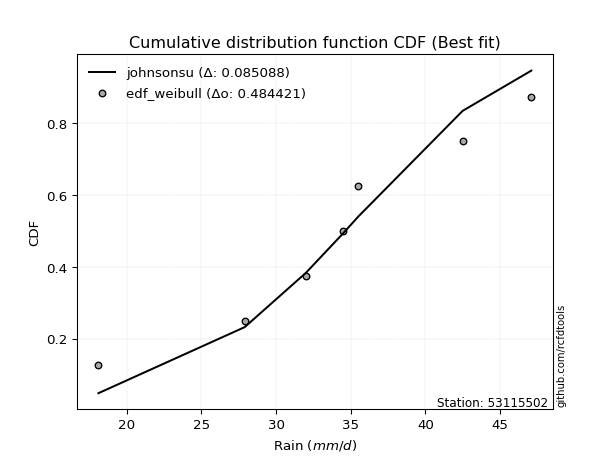</img>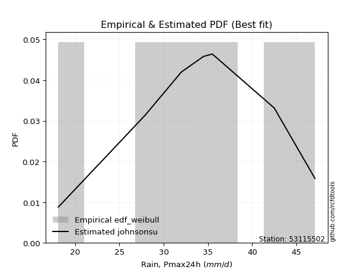</img>

</div>


### 4. EDF Beard (1943)

The Beard formula (or Beard´s plotting position formula) in hydrology is used to estimate the empirical non-exceedance probability _(P)_ of a flood event (or other extreme hydrological data point) within a given dataset.

<div align="center">


$P=(m-0.31)/(n+0.38)$


</div>


**4.1. Empirical values**

<div align="center">

|                | 0                   | 1                   | 2                   | 3         | 4                  | 5                  | 6                  |
|:---------------|:--------------------|:--------------------|:--------------------|:----------|:-------------------|:-------------------|:-------------------|
| date           | 2023                | 2022                | 2017                | 2021      | 2018               | 2019               | 2020               |
| x              | 18.1                | 27.9                | 32.0                | 34.5      | 35.5               | 42.5               | 47.1               |
| m              | 1                   | 2                   | 3                   | 4         | 5                  | 6                  | 7                  |
| empirical_dist | edf_beard           | edf_beard           | edf_beard           | edf_beard | edf_beard          | edf_beard          | edf_beard          |
| empirical      | 0.09349593495934959 | 0.22899728997289973 | 0.36449864498644985 | 0.5       | 0.6355013550135502 | 0.7710027100271003 | 0.9065040650406505 |
| empirical_tr   | 1.1031390134529149  | 1.29701230228471    | 1.5735607675906182  | 2.0       | 2.743494423791822  | 4.366863905325444  | 10.695652173913055 |

</div>


**4.2. Kolmogorov-Smirnov fit test (sorted by Δ)**


<div align="center">

|                | 0                    | 1                   | 2                   | 3                   | 4                   | 5                   | 6                   | 7                   | 8                   | 9                   | 10                  | 11                  | 12                  | 13                  | 14                  | 15                  | 16                  | 17                  | 18                  | 19                  | 20                  | 21                  | 22                  | 23                  | 24                  | 25                  | 26                  | 27                  | 28                  | 29                  | 30                  | 31                  | 32                  | 33                  | 34                  | 35                  | 36                  | 37                  | 38                  | 39                  | 40                  | 41                  | 42                  | 43                  | 44                  | 45                  | 46                  | 47                  | 48                  | 49                  | 50                  | 51                  | 52                  | 53                  | 54                  | 55                  | 56                  | 57                  | 58                  | 59                  | 60                  | 61                  | 62                  | 63                  | 64                  | 65                  | 66                  | 67                  | 68                  | 69                  | 70                  | 71                  | 72                  | 73                  | 74                  | 75                  | 76                  | 77                  | 78                  | 79                  | 80                  | 81                  | 82                  | 83                  | 84                  | 85                  | 86                  | 87                  | 88                  | 89                  | 90                  | 91                  | 92                  | 93                  | 94                  | 95                  | 96                  | 97                  | 98                  | 99                  | 100                 | 101                 | 102                 | 103                 | 104                 | 105                 | 106                 | 107                 | 108                 | 109                 | 110                 | 111                 | 112                 | 113                 | 114                 | 115                 | 116                 | 117                 | 118                 | 119                 | 120                 | 121                 | 122                 | 123                 | 124                 | 125                 | 126                 | 127                 | 128                 | 129                 | 130                 | 131                 | 132                 | 133                 | 134                 | 135                 | 136                 | 137                 | 138                 | 139                 | 140                 | 141                 | 142                 | 143                 | 144                 | 145                 | 146                 | 147                 | 148                 | 149                 | 150                 | 151                 | 152                 | 153                 | 154                 | 155                 | 156                 | 157                 | 158                 | 159                 |
|:---------------|:---------------------|:--------------------|:--------------------|:--------------------|:--------------------|:--------------------|:--------------------|:--------------------|:--------------------|:--------------------|:--------------------|:--------------------|:--------------------|:--------------------|:--------------------|:--------------------|:--------------------|:--------------------|:--------------------|:--------------------|:--------------------|:--------------------|:--------------------|:--------------------|:--------------------|:--------------------|:--------------------|:--------------------|:--------------------|:--------------------|:--------------------|:--------------------|:--------------------|:--------------------|:--------------------|:--------------------|:--------------------|:--------------------|:--------------------|:--------------------|:--------------------|:--------------------|:--------------------|:--------------------|:--------------------|:--------------------|:--------------------|:--------------------|:--------------------|:--------------------|:--------------------|:--------------------|:--------------------|:--------------------|:--------------------|:--------------------|:--------------------|:--------------------|:--------------------|:--------------------|:--------------------|:--------------------|:--------------------|:--------------------|:--------------------|:--------------------|:--------------------|:--------------------|:--------------------|:--------------------|:--------------------|:--------------------|:--------------------|:--------------------|:--------------------|:--------------------|:--------------------|:--------------------|:--------------------|:--------------------|:--------------------|:--------------------|:--------------------|:--------------------|:--------------------|:--------------------|:--------------------|:--------------------|:--------------------|:--------------------|:--------------------|:--------------------|:--------------------|:--------------------|:--------------------|:--------------------|:--------------------|:--------------------|:--------------------|:--------------------|:--------------------|:--------------------|:--------------------|:--------------------|:--------------------|:--------------------|:--------------------|:--------------------|:--------------------|:--------------------|:--------------------|:--------------------|:--------------------|:--------------------|:--------------------|:--------------------|:--------------------|:--------------------|:--------------------|:--------------------|:--------------------|:--------------------|:--------------------|:--------------------|:--------------------|:--------------------|:--------------------|:--------------------|:--------------------|:--------------------|:--------------------|:--------------------|:--------------------|:--------------------|:--------------------|:--------------------|:--------------------|:--------------------|:--------------------|:--------------------|:--------------------|:--------------------|:--------------------|:--------------------|:--------------------|:--------------------|:--------------------|:--------------------|:--------------------|:--------------------|:--------------------|:--------------------|:--------------------|:--------------------|:--------------------|:--------------------|:--------------------|:--------------------|:--------------------|:--------------------|
| station        | 53115502             | 53115502            | 53115502            | 53115502            | 53115502            | 53115502            | 53115502            | 53115502            | 53115502            | 53115502            | 53115502            | 53115502            | 53115502            | 53115502            | 53115502            | 53115502            | 53115502            | 53115502            | 53115502            | 53115502            | 53115502            | 53115502            | 53115502            | 53115502            | 53115502            | 53115502            | 53115502            | 53115502            | 53115502            | 53115502            | 53115502            | 53115502            | 53115502            | 53115502            | 53115502            | 53115502            | 53115502            | 53115502            | 53115502            | 53115502            | 53115502            | 53115502            | 53115502            | 53115502            | 53115502            | 53115502            | 53115502            | 53115502            | 53115502            | 53115502            | 53115502            | 53115502            | 53115502            | 53115502            | 53115502            | 53115502            | 53115502            | 53115502            | 53115502            | 53115502            | 53115502            | 53115502            | 53115502            | 53115502            | 53115502            | 53115502            | 53115502            | 53115502            | 53115502            | 53115502            | 53115502            | 53115502            | 53115502            | 53115502            | 53115502            | 53115502            | 53115502            | 53115502            | 53115502            | 53115502            | 53115502            | 53115502            | 53115502            | 53115502            | 53115502            | 53115502            | 53115502            | 53115502            | 53115502            | 53115502            | 53115502            | 53115502            | 53115502            | 53115502            | 53115502            | 53115502            | 53115502            | 53115502            | 53115502            | 53115502            | 53115502            | 53115502            | 53115502            | 53115502            | 53115502            | 53115502            | 53115502            | 53115502            | 53115502            | 53115502            | 53115502            | 53115502            | 53115502            | 53115502            | 53115502            | 53115502            | 53115502            | 53115502            | 53115502            | 53115502            | 53115502            | 53115502            | 53115502            | 53115502            | 53115502            | 53115502            | 53115502            | 53115502            | 53115502            | 53115502            | 53115502            | 53115502            | 53115502            | 53115502            | 53115502            | 53115502            | 53115502            | 53115502            | 53115502            | 53115502            | 53115502            | 53115502            | 53115502            | 53115502            | 53115502            | 53115502            | 53115502            | 53115502            | 53115502            | 53115502            | 53115502            | 53115502            | 53115502            | 53115502            | 53115502            | 53115502            | 53115502            | 53115502            | 53115502            | 53115502            |
| empirical_dist | edf_beard            | edf_beard           | edf_beard           | edf_beard           | edf_beard           | edf_beard           | edf_beard           | edf_beard           | edf_beard           | edf_beard           | edf_beard           | edf_beard           | edf_beard           | edf_beard           | edf_beard           | edf_beard           | edf_beard           | edf_beard           | edf_beard           | edf_beard           | edf_beard           | edf_beard           | edf_beard           | edf_beard           | edf_beard           | edf_beard           | edf_beard           | edf_beard           | edf_beard           | edf_beard           | edf_beard           | edf_beard           | edf_beard           | edf_beard           | edf_beard           | edf_beard           | edf_beard           | edf_beard           | edf_beard           | edf_beard           | edf_beard           | edf_beard           | edf_beard           | edf_beard           | edf_beard           | edf_beard           | edf_beard           | edf_beard           | edf_beard           | edf_beard           | edf_beard           | edf_beard           | edf_beard           | edf_beard           | edf_beard           | edf_beard           | edf_beard           | edf_beard           | edf_beard           | edf_beard           | edf_beard           | edf_beard           | edf_beard           | edf_beard           | edf_beard           | edf_beard           | edf_beard           | edf_beard           | edf_beard           | edf_beard           | edf_beard           | edf_beard           | edf_beard           | edf_beard           | edf_beard           | edf_beard           | edf_beard           | edf_beard           | edf_beard           | edf_beard           | edf_beard           | edf_beard           | edf_beard           | edf_beard           | edf_beard           | edf_beard           | edf_beard           | edf_beard           | edf_beard           | edf_beard           | edf_beard           | edf_beard           | edf_beard           | edf_beard           | edf_beard           | edf_beard           | edf_beard           | edf_beard           | edf_beard           | edf_beard           | edf_beard           | edf_beard           | edf_beard           | edf_beard           | edf_beard           | edf_beard           | edf_beard           | edf_beard           | edf_beard           | edf_beard           | edf_beard           | edf_beard           | edf_beard           | edf_beard           | edf_beard           | edf_beard           | edf_beard           | edf_beard           | edf_beard           | edf_beard           | edf_beard           | edf_beard           | edf_beard           | edf_beard           | edf_beard           | edf_beard           | edf_beard           | edf_beard           | edf_beard           | edf_beard           | edf_beard           | edf_beard           | edf_beard           | edf_beard           | edf_beard           | edf_beard           | edf_beard           | edf_beard           | edf_beard           | edf_beard           | edf_beard           | edf_beard           | edf_beard           | edf_beard           | edf_beard           | edf_beard           | edf_beard           | edf_beard           | edf_beard           | edf_beard           | edf_beard           | edf_beard           | edf_beard           | edf_beard           | edf_beard           | edf_beard           | edf_beard           | edf_beard           | edf_beard           | edf_beard           |
| p_dist         | erlang               | gamma               | f                   | nct                 | crystalball         | norm                | exponnorm           | t                   | betaprime           | logdweibull         | invgamma            | rice                | cosine              | logt                | alpha               | logpearson3         | loggennorm          | logloglaplace       | anglit              | semicircular        | loggumbel_l         | dweibull            | genlogistic         | logdgamma           | maxwell             | logburr12           | pearson3            | logistic            | logweibull_min      | ncf                 | weibull_min         | dgamma              | logburr             | hypsecant           | logtriang           | logtruncweibull_min | loggompertz         | logskewnorm         | beta                | logexponpow         | invgauss            | rayleigh            | johnsonsu           | skewnorm            | logtrapezoid        | mielke              | loghypsecant        | loggenlogistic      | loggengamma         | laplace             | loglogistic         | kappa3              | logargus            | logf                | logcrystalball      | lognorm             | logexponnorm        | logfatiguelife      | loggenhalflogistic  | logjohnsonsu        | arcsine             | logloggamma         | gumbel_r            | loganglit           | argus               | wrapcauchy          | bradford            | logsemicircular     | vonmises_line       | uniform             | gausshyper          | logrice             | loggausshyper       | loglaplace          | loglaplace          | loggamma            | loggamma            | burr                | logerlang           | logbetaprime        | genextreme          | logalpha            | loginvgamma         | lognct              | logbeta             | halfnorm            | gumbel_l            | kappa4              | kstwobign           | moyal               | loginvgauss         | ksone               | logexponweib        | logfoldnorm         | logmaxwell          | logarcsine          | halflogistic        | logncf              | lograyleigh         | loginvweibull       | logcosine           | triang              | genpareto           | lomax               | loggumbel_r         | logmielke           | loggenexpon         | loghalfnorm         | logkstwobign        | loglevy_l           | wald                | genhalflogistic     | logmoyal            | loghalflogistic     | truncexpon          | truncnorm           | logkappa4           | logtruncnorm        | logtukeylambda      | nakagami            | logkappa3           | loguniform          | logksone            | logvonmises_line    | logweibull_max      | loggenpareto        | levy_l              | genexpon            | loggenextreme       | logbradford         | logwrapcauchy       | truncweibull_min    | gennorm             | logwald             | lognakagami         | trapezoid           | burr12              | halfgennorm         | logtruncexpon       | logjohnsonsb        | logrdist            | foldnorm            | invweibull          | johnsonsb           | fatiguelife         | gengamma            | gompertz            | weibull_max         | exponweib           | tukeylambda         | powerlaw            | logpowerlaw         | rdist               | loglomax            | exponpow            | truncpareto         | logtruncpareto      | loghalfgennorm      | logvonmises         | vonmises            |
| delta          | 0.062119250650305435 | 0.06224568633299854 | 0.06472615438090834 | 0.06494007476979391 | 0.0651652443119266  | 0.065165254359419   | 0.0651660851597975  | 0.0651898920967422  | 0.06528457770889806 | 0.06600892458085283 | 0.06730696234998079 | 0.06795210666224394 | 0.07104356726350153 | 0.07159291853879053 | 0.07160365852100653 | 0.07191193049400812 | 0.07287032555662165 | 0.07460072545383456 | 0.07506632913100164 | 0.07916124100959776 | 0.07922903883070487 | 0.07939588755409732 | 0.08085468970041787 | 0.08116607884869964 | 0.08224760715495372 | 0.08230345494356062 | 0.082573021493479   | 0.08302573233289934 | 0.08445572705123316 | 0.08574836229368166 | 0.08685541776399097 | 0.0896276886975691  | 0.0911774796530328  | 0.09322638782054093 | 0.09348594248244912 | 0.0934937004389601  | 0.09349566662318845 | 0.09349585704326235 | 0.09349593495896569 | 0.09396543154886716 | 0.09415350354160018 | 0.09449443351327008 | 0.09558940607437982 | 0.09566037301699959 | 0.09587002048486437 | 0.10002418100728805 | 0.10044875466575431 | 0.1005279298773546  | 0.1021700928915002  | 0.1028774451483564  | 0.10369074217530455 | 0.10412965491676227 | 0.10610322538986239 | 0.10691063547136248 | 0.10749878511082162 | 0.10749976001173678 | 0.10750032393626968 | 0.10779028726886963 | 0.10862717520287479 | 0.10920768225405797 | 0.10933592607641138 | 0.10952386824413274 | 0.10996442952874685 | 0.11149768325037512 | 0.11218750450191328 | 0.11227216195968498 | 0.11251989928415307 | 0.11314305007065456 | 0.11331546013561489 | 0.11481169984113632 | 0.1148468645111067  | 0.11517080506836391 | 0.11754637918518202 | 0.1175576150968527  | 0.1175576150968527  | 0.11801638956400923 | 0.11801638956400923 | 0.11925139348550345 | 0.12014900082979557 | 0.1204832621682605  | 0.12134055712750413 | 0.12454364528702627 | 0.12558107112596129 | 0.12740592145055302 | 0.128718826875035   | 0.1291855732011039  | 0.1297325377993075  | 0.13128353473159632 | 0.13362416516187198 | 0.13368509311366011 | 0.13446938603697467 | 0.13594523876273243 | 0.13600050300668115 | 0.13839405413797806 | 0.14144476335322448 | 0.14539791204834804 | 0.14631160424840378 | 0.14974375029600165 | 0.15300019963960626 | 0.15661358423925237 | 0.1576752462579229  | 0.1690098310847155  | 0.17162870973591945 | 0.17384322851442346 | 0.17647034741325046 | 0.18167148165509955 | 0.18486125092422184 | 0.18557085644338095 | 0.186108961133106   | 0.19839495144977537 | 0.1985389706528104  | 0.19890427936341326 | 0.20225727089107232 | 0.20856085343457215 | 0.21215640144877806 | 0.21594388273275636 | 0.22505718710846848 | 0.22899417712755388 | 0.22899727499514913 | 0.22899728965162947 | 0.22907784621695398 | 0.23132649545692457 | 0.23138571581974512 | 0.2316610553803719  | 0.23327817691503483 | 0.23566576890244445 | 0.23855015528477952 | 0.2387972028245454  | 0.2430002864549104  | 0.24596445045798204 | 0.25505039287319375 | 0.2616611440628414  | 0.2710027100271003  | 0.27403014901081185 | 0.2790321848879013  | 0.29522357723577247 | 0.29802259747355964 | 0.3095828332142725  | 0.3224676185590491  | 0.3609084731919049  | 0.4156545433500649  | 0.4490620998646749  | 0.47883314046555225 | 0.5174512396481283  | 0.520771794607839   | 0.5216456521150015  | 0.5259487540256917  | 0.5340567643243473  | 0.5417450766865458  | 0.5626734804264237  | 0.5969406580176805  | 0.6333155442496505  | 0.6355013540303609  | 0.6839994777228524  | 0.6882243871024246  | 0.6911741563656734  | 0.7120448689285896  | 0.7710027100271003  | 1.1024363931371888  | 7.402580670410073   |
| deltao         | 0.48442053926100004  | 0.48442053926100004 | 0.48442053926100004 | 0.48442053926100004 | 0.48442053926100004 | 0.48442053926100004 | 0.48442053926100004 | 0.48442053926100004 | 0.48442053926100004 | 0.48442053926100004 | 0.48442053926100004 | 0.48442053926100004 | 0.48442053926100004 | 0.48442053926100004 | 0.48442053926100004 | 0.48442053926100004 | 0.48442053926100004 | 0.48442053926100004 | 0.48442053926100004 | 0.48442053926100004 | 0.48442053926100004 | 0.48442053926100004 | 0.48442053926100004 | 0.48442053926100004 | 0.48442053926100004 | 0.48442053926100004 | 0.48442053926100004 | 0.48442053926100004 | 0.48442053926100004 | 0.48442053926100004 | 0.48442053926100004 | 0.48442053926100004 | 0.48442053926100004 | 0.48442053926100004 | 0.48442053926100004 | 0.48442053926100004 | 0.48442053926100004 | 0.48442053926100004 | 0.48442053926100004 | 0.48442053926100004 | 0.48442053926100004 | 0.48442053926100004 | 0.48442053926100004 | 0.48442053926100004 | 0.48442053926100004 | 0.48442053926100004 | 0.48442053926100004 | 0.48442053926100004 | 0.48442053926100004 | 0.48442053926100004 | 0.48442053926100004 | 0.48442053926100004 | 0.48442053926100004 | 0.48442053926100004 | 0.48442053926100004 | 0.48442053926100004 | 0.48442053926100004 | 0.48442053926100004 | 0.48442053926100004 | 0.48442053926100004 | 0.48442053926100004 | 0.48442053926100004 | 0.48442053926100004 | 0.48442053926100004 | 0.48442053926100004 | 0.48442053926100004 | 0.48442053926100004 | 0.48442053926100004 | 0.48442053926100004 | 0.48442053926100004 | 0.48442053926100004 | 0.48442053926100004 | 0.48442053926100004 | 0.48442053926100004 | 0.48442053926100004 | 0.48442053926100004 | 0.48442053926100004 | 0.48442053926100004 | 0.48442053926100004 | 0.48442053926100004 | 0.48442053926100004 | 0.48442053926100004 | 0.48442053926100004 | 0.48442053926100004 | 0.48442053926100004 | 0.48442053926100004 | 0.48442053926100004 | 0.48442053926100004 | 0.48442053926100004 | 0.48442053926100004 | 0.48442053926100004 | 0.48442053926100004 | 0.48442053926100004 | 0.48442053926100004 | 0.48442053926100004 | 0.48442053926100004 | 0.48442053926100004 | 0.48442053926100004 | 0.48442053926100004 | 0.48442053926100004 | 0.48442053926100004 | 0.48442053926100004 | 0.48442053926100004 | 0.48442053926100004 | 0.48442053926100004 | 0.48442053926100004 | 0.48442053926100004 | 0.48442053926100004 | 0.48442053926100004 | 0.48442053926100004 | 0.48442053926100004 | 0.48442053926100004 | 0.48442053926100004 | 0.48442053926100004 | 0.48442053926100004 | 0.48442053926100004 | 0.48442053926100004 | 0.48442053926100004 | 0.48442053926100004 | 0.48442053926100004 | 0.48442053926100004 | 0.48442053926100004 | 0.48442053926100004 | 0.48442053926100004 | 0.48442053926100004 | 0.48442053926100004 | 0.48442053926100004 | 0.48442053926100004 | 0.48442053926100004 | 0.48442053926100004 | 0.48442053926100004 | 0.48442053926100004 | 0.48442053926100004 | 0.48442053926100004 | 0.48442053926100004 | 0.48442053926100004 | 0.48442053926100004 | 0.48442053926100004 | 0.48442053926100004 | 0.48442053926100004 | 0.48442053926100004 | 0.48442053926100004 | 0.48442053926100004 | 0.48442053926100004 | 0.48442053926100004 | 0.48442053926100004 | 0.48442053926100004 | 0.48442053926100004 | 0.48442053926100004 | 0.48442053926100004 | 0.48442053926100004 | 0.48442053926100004 | 0.48442053926100004 | 0.48442053926100004 | 0.48442053926100004 | 0.48442053926100004 | 0.48442053926100004 | 0.48442053926100004 | 0.48442053926100004 | 0.48442053926100004 |
| eval           | Δo > Δ               | Δo > Δ              | Δo > Δ              | Δo > Δ              | Δo > Δ              | Δo > Δ              | Δo > Δ              | Δo > Δ              | Δo > Δ              | Δo > Δ              | Δo > Δ              | Δo > Δ              | Δo > Δ              | Δo > Δ              | Δo > Δ              | Δo > Δ              | Δo > Δ              | Δo > Δ              | Δo > Δ              | Δo > Δ              | Δo > Δ              | Δo > Δ              | Δo > Δ              | Δo > Δ              | Δo > Δ              | Δo > Δ              | Δo > Δ              | Δo > Δ              | Δo > Δ              | Δo > Δ              | Δo > Δ              | Δo > Δ              | Δo > Δ              | Δo > Δ              | Δo > Δ              | Δo > Δ              | Δo > Δ              | Δo > Δ              | Δo > Δ              | Δo > Δ              | Δo > Δ              | Δo > Δ              | Δo > Δ              | Δo > Δ              | Δo > Δ              | Δo > Δ              | Δo > Δ              | Δo > Δ              | Δo > Δ              | Δo > Δ              | Δo > Δ              | Δo > Δ              | Δo > Δ              | Δo > Δ              | Δo > Δ              | Δo > Δ              | Δo > Δ              | Δo > Δ              | Δo > Δ              | Δo > Δ              | Δo > Δ              | Δo > Δ              | Δo > Δ              | Δo > Δ              | Δo > Δ              | Δo > Δ              | Δo > Δ              | Δo > Δ              | Δo > Δ              | Δo > Δ              | Δo > Δ              | Δo > Δ              | Δo > Δ              | Δo > Δ              | Δo > Δ              | Δo > Δ              | Δo > Δ              | Δo > Δ              | Δo > Δ              | Δo > Δ              | Δo > Δ              | Δo > Δ              | Δo > Δ              | Δo > Δ              | Δo > Δ              | Δo > Δ              | Δo > Δ              | Δo > Δ              | Δo > Δ              | Δo > Δ              | Δo > Δ              | Δo > Δ              | Δo > Δ              | Δo > Δ              | Δo > Δ              | Δo > Δ              | Δo > Δ              | Δo > Δ              | Δo > Δ              | Δo > Δ              | Δo > Δ              | Δo > Δ              | Δo > Δ              | Δo > Δ              | Δo > Δ              | Δo > Δ              | Δo > Δ              | Δo > Δ              | Δo > Δ              | Δo > Δ              | Δo > Δ              | Δo > Δ              | Δo > Δ              | Δo > Δ              | Δo > Δ              | Δo > Δ              | Δo > Δ              | Δo > Δ              | Δo > Δ              | Δo > Δ              | Δo > Δ              | Δo > Δ              | Δo > Δ              | Δo > Δ              | Δo > Δ              | Δo > Δ              | Δo > Δ              | Δo > Δ              | Δo > Δ              | Δo > Δ              | Δo > Δ              | Δo > Δ              | Δo > Δ              | Δo > Δ              | Δo > Δ              | Δo > Δ              | Δo > Δ              | Δo > Δ              | Δo > Δ              | Δo > Δ              | Δo > Δ              | Δo > Δ              | Δo > Δ              | Δo <= Δ             | Δo <= Δ             | Δo <= Δ             | Δo <= Δ             | Δo <= Δ             | Δo <= Δ             | Δo <= Δ             | Δo <= Δ             | Δo <= Δ             | Δo <= Δ             | Δo <= Δ             | Δo <= Δ             | Δo <= Δ             | Δo <= Δ             | Δo <= Δ             | Δo <= Δ             | Δo <= Δ             |
| fit            | 1                    | 1                   | 1                   | 1                   | 1                   | 1                   | 1                   | 1                   | 1                   | 1                   | 1                   | 1                   | 1                   | 1                   | 1                   | 1                   | 1                   | 1                   | 1                   | 1                   | 1                   | 1                   | 1                   | 1                   | 1                   | 1                   | 1                   | 1                   | 1                   | 1                   | 1                   | 1                   | 1                   | 1                   | 1                   | 1                   | 1                   | 1                   | 1                   | 1                   | 1                   | 1                   | 1                   | 1                   | 1                   | 1                   | 1                   | 1                   | 1                   | 1                   | 1                   | 1                   | 1                   | 1                   | 1                   | 1                   | 1                   | 1                   | 1                   | 1                   | 1                   | 1                   | 1                   | 1                   | 1                   | 1                   | 1                   | 1                   | 1                   | 1                   | 1                   | 1                   | 1                   | 1                   | 1                   | 1                   | 1                   | 1                   | 1                   | 1                   | 1                   | 1                   | 1                   | 1                   | 1                   | 1                   | 1                   | 1                   | 1                   | 1                   | 1                   | 1                   | 1                   | 1                   | 1                   | 1                   | 1                   | 1                   | 1                   | 1                   | 1                   | 1                   | 1                   | 1                   | 1                   | 1                   | 1                   | 1                   | 1                   | 1                   | 1                   | 1                   | 1                   | 1                   | 1                   | 1                   | 1                   | 1                   | 1                   | 1                   | 1                   | 1                   | 1                   | 1                   | 1                   | 1                   | 1                   | 1                   | 1                   | 1                   | 1                   | 1                   | 1                   | 1                   | 1                   | 1                   | 1                   | 1                   | 1                   | 1                   | 1                   | 1                   | 1                   | 0                   | 0                   | 0                   | 0                   | 0                   | 0                   | 0                   | 0                   | 0                   | 0                   | 0                   | 0                   | 0                   | 0                   | 0                   | 0                   | 0                   |
| n              | 7                    | 7                   | 7                   | 7                   | 7                   | 7                   | 7                   | 7                   | 7                   | 7                   | 7                   | 7                   | 7                   | 7                   | 7                   | 7                   | 7                   | 7                   | 7                   | 7                   | 7                   | 7                   | 7                   | 7                   | 7                   | 7                   | 7                   | 7                   | 7                   | 7                   | 7                   | 7                   | 7                   | 7                   | 7                   | 7                   | 7                   | 7                   | 7                   | 7                   | 7                   | 7                   | 7                   | 7                   | 7                   | 7                   | 7                   | 7                   | 7                   | 7                   | 7                   | 7                   | 7                   | 7                   | 7                   | 7                   | 7                   | 7                   | 7                   | 7                   | 7                   | 7                   | 7                   | 7                   | 7                   | 7                   | 7                   | 7                   | 7                   | 7                   | 7                   | 7                   | 7                   | 7                   | 7                   | 7                   | 7                   | 7                   | 7                   | 7                   | 7                   | 7                   | 7                   | 7                   | 7                   | 7                   | 7                   | 7                   | 7                   | 7                   | 7                   | 7                   | 7                   | 7                   | 7                   | 7                   | 7                   | 7                   | 7                   | 7                   | 7                   | 7                   | 7                   | 7                   | 7                   | 7                   | 7                   | 7                   | 7                   | 7                   | 7                   | 7                   | 7                   | 7                   | 7                   | 7                   | 7                   | 7                   | 7                   | 7                   | 7                   | 7                   | 7                   | 7                   | 7                   | 7                   | 7                   | 7                   | 7                   | 7                   | 7                   | 7                   | 7                   | 7                   | 7                   | 7                   | 7                   | 7                   | 7                   | 7                   | 7                   | 7                   | 7                   | 7                   | 7                   | 7                   | 7                   | 7                   | 7                   | 7                   | 7                   | 7                   | 7                   | 7                   | 7                   | 7                   | 7                   | 7                   | 7                   | 7                   |
| best_fit       | 1                    | 0                   | 0                   | 0                   | 0                   | 0                   | 0                   | 0                   | 0                   | 0                   | 0                   | 0                   | 0                   | 0                   | 0                   | 0                   | 0                   | 0                   | 0                   | 0                   | 0                   | 0                   | 0                   | 0                   | 0                   | 0                   | 0                   | 0                   | 0                   | 0                   | 0                   | 0                   | 0                   | 0                   | 0                   | 0                   | 0                   | 0                   | 0                   | 0                   | 0                   | 0                   | 0                   | 0                   | 0                   | 0                   | 0                   | 0                   | 0                   | 0                   | 0                   | 0                   | 0                   | 0                   | 0                   | 0                   | 0                   | 0                   | 0                   | 0                   | 0                   | 0                   | 0                   | 0                   | 0                   | 0                   | 0                   | 0                   | 0                   | 0                   | 0                   | 0                   | 0                   | 0                   | 0                   | 0                   | 0                   | 0                   | 0                   | 0                   | 0                   | 0                   | 0                   | 0                   | 0                   | 0                   | 0                   | 0                   | 0                   | 0                   | 0                   | 0                   | 0                   | 0                   | 0                   | 0                   | 0                   | 0                   | 0                   | 0                   | 0                   | 0                   | 0                   | 0                   | 0                   | 0                   | 0                   | 0                   | 0                   | 0                   | 0                   | 0                   | 0                   | 0                   | 0                   | 0                   | 0                   | 0                   | 0                   | 0                   | 0                   | 0                   | 0                   | 0                   | 0                   | 0                   | 0                   | 0                   | 0                   | 0                   | 0                   | 0                   | 0                   | 0                   | 0                   | 0                   | 0                   | 0                   | 0                   | 0                   | 0                   | 0                   | 0                   | 0                   | 0                   | 0                   | 0                   | 0                   | 0                   | 0                   | 0                   | 0                   | 0                   | 0                   | 0                   | 0                   | 0                   | 0                   | 0                   | 0                   |
| best_fit_sort  | 1                    | 2                   | 3                   | 4                   | 5                   | 6                   | 7                   | 8                   | 9                   | 10                  | 11                  | 12                  | 13                  | 14                  | 15                  | 16                  | 17                  | 18                  | 19                  | 20                  | 21                  | 22                  | 23                  | 24                  | 25                  | 26                  | 27                  | 28                  | 29                  | 30                  | 31                  | 32                  | 33                  | 34                  | 35                  | 36                  | 37                  | 38                  | 39                  | 40                  | 41                  | 42                  | 43                  | 44                  | 45                  | 46                  | 47                  | 48                  | 49                  | 50                  | 51                  | 52                  | 53                  | 54                  | 55                  | 56                  | 57                  | 58                  | 59                  | 60                  | 61                  | 62                  | 63                  | 64                  | 65                  | 66                  | 67                  | 68                  | 69                  | 70                  | 71                  | 72                  | 73                  | 74                  | 75                  | 76                  | 77                  | 78                  | 79                  | 80                  | 81                  | 82                  | 83                  | 84                  | 85                  | 86                  | 87                  | 88                  | 89                  | 90                  | 91                  | 92                  | 93                  | 94                  | 95                  | 96                  | 97                  | 98                  | 99                  | 100                 | 101                 | 102                 | 103                 | 104                 | 105                 | 106                 | 107                 | 108                 | 109                 | 110                 | 111                 | 112                 | 113                 | 114                 | 115                 | 116                 | 117                 | 118                 | 119                 | 120                 | 121                 | 122                 | 123                 | 124                 | 125                 | 126                 | 127                 | 128                 | 129                 | 130                 | 131                 | 132                 | 133                 | 134                 | 135                 | 136                 | 137                 | 138                 | 139                 | 140                 | 141                 | 142                 | 143                 | 144                 | 145                 | 146                 | 147                 | 148                 | 149                 | 150                 | 151                 | 152                 | 153                 | 154                 | 155                 | 156                 | 157                 | 158                 | 159                 | 160                 |

</div>


**4.3. Best fit**

<div align="center">

|   id |   station | empirical_dist   | p_dist   |     delta |   deltao | eval   |   fit |   n |   best_fit |   best_fit_sort |
|-----:|----------:|:-----------------|:---------|----------:|---------:|:-------|------:|----:|-----------:|----------------:|
|    0 |  53115502 | edf_beard        | erlang   | 0.0621193 | 0.484421 | Δo > Δ |     1 |   7 |          1 |               1 |

</div>


<div align="center">

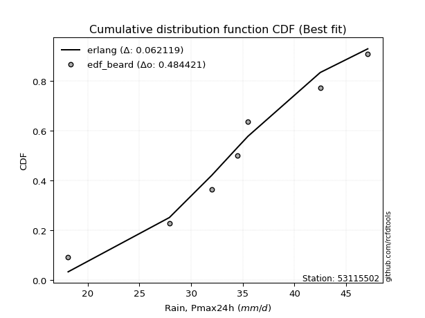</img></img>

</div>


### 5. EDF Chegodayev (1955)

The Chegodayev formula is an empirical plotting position formula used in hydrological frequency analysis to estimate the exceedance probability or return period of a specific event from a set of observed data. It is primarily used for plotting observed data points on probability paper to fit a theoretical distribution, particularly for analyzing extreme events like maximum flood flows or rainfall intensities. The constant _b_ value in the generalized plotting position formula is 0.3.

<div align="center">


$P=(m-b)/(n+1-2b)$


</div>


**5.1. Empirical values**

<div align="center">

|                | 0                   | 1                   | 2                   | 3              | 4                  | 5                  | 6                  |
|:---------------|:--------------------|:--------------------|:--------------------|:---------------|:-------------------|:-------------------|:-------------------|
| date           | 2023                | 2022                | 2017                | 2021           | 2018               | 2019               | 2020               |
| x              | 18.1                | 27.9                | 32.0                | 34.5           | 35.5               | 42.5               | 47.1               |
| m              | 1                   | 2                   | 3                   | 4              | 5                  | 6                  | 7                  |
| empirical_dist | edf_chegodayev      | edf_chegodayev      | edf_chegodayev      | edf_chegodayev | edf_chegodayev     | edf_chegodayev     | edf_chegodayev     |
| empirical      | 0.09459459459459459 | 0.22972972972972971 | 0.36486486486486486 | 0.5            | 0.6351351351351351 | 0.7702702702702703 | 0.9054054054054054 |
| empirical_tr   | 1.1044776119402986  | 1.2982456140350878  | 1.574468085106383   | 2.0            | 2.7407407407407405 | 4.352941176470589  | 10.571428571428568 |

</div>


**5.2. Kolmogorov-Smirnov fit test (sorted by Δ)**


<div align="center">

|                | 0                   | 1                   | 2                   | 3                   | 4                   | 5                   | 6                   | 7                   | 8                   | 9                   | 10                  | 11                  | 12                  | 13                  | 14                  | 15                  | 16                  | 17                  | 18                  | 19                  | 20                  | 21                  | 22                  | 23                  | 24                  | 25                  | 26                  | 27                  | 28                  | 29                  | 30                  | 31                  | 32                  | 33                  | 34                  | 35                  | 36                  | 37                  | 38                  | 39                  | 40                  | 41                  | 42                  | 43                  | 44                  | 45                  | 46                  | 47                  | 48                  | 49                  | 50                  | 51                  | 52                  | 53                  | 54                  | 55                  | 56                  | 57                  | 58                  | 59                  | 60                  | 61                  | 62                  | 63                  | 64                  | 65                  | 66                  | 67                  | 68                  | 69                  | 70                  | 71                  | 72                  | 73                  | 74                  | 75                  | 76                  | 77                  | 78                  | 79                  | 80                  | 81                  | 82                  | 83                  | 84                  | 85                  | 86                  | 87                  | 88                  | 89                  | 90                  | 91                  | 92                  | 93                  | 94                  | 95                  | 96                  | 97                  | 98                  | 99                  | 100                 | 101                 | 102                 | 103                 | 104                 | 105                 | 106                 | 107                 | 108                 | 109                 | 110                 | 111                 | 112                 | 113                 | 114                 | 115                 | 116                 | 117                 | 118                 | 119                 | 120                 | 121                 | 122                 | 123                 | 124                 | 125                 | 126                 | 127                 | 128                 | 129                 | 130                 | 131                 | 132                 | 133                 | 134                 | 135                 | 136                 | 137                 | 138                 | 139                 | 140                 | 141                 | 142                 | 143                 | 144                 | 145                 | 146                 | 147                 | 148                 | 149                 | 150                 | 151                 | 152                 | 153                 | 154                 | 155                 | 156                 | 157                 | 158                 | 159                 |
|:---------------|:--------------------|:--------------------|:--------------------|:--------------------|:--------------------|:--------------------|:--------------------|:--------------------|:--------------------|:--------------------|:--------------------|:--------------------|:--------------------|:--------------------|:--------------------|:--------------------|:--------------------|:--------------------|:--------------------|:--------------------|:--------------------|:--------------------|:--------------------|:--------------------|:--------------------|:--------------------|:--------------------|:--------------------|:--------------------|:--------------------|:--------------------|:--------------------|:--------------------|:--------------------|:--------------------|:--------------------|:--------------------|:--------------------|:--------------------|:--------------------|:--------------------|:--------------------|:--------------------|:--------------------|:--------------------|:--------------------|:--------------------|:--------------------|:--------------------|:--------------------|:--------------------|:--------------------|:--------------------|:--------------------|:--------------------|:--------------------|:--------------------|:--------------------|:--------------------|:--------------------|:--------------------|:--------------------|:--------------------|:--------------------|:--------------------|:--------------------|:--------------------|:--------------------|:--------------------|:--------------------|:--------------------|:--------------------|:--------------------|:--------------------|:--------------------|:--------------------|:--------------------|:--------------------|:--------------------|:--------------------|:--------------------|:--------------------|:--------------------|:--------------------|:--------------------|:--------------------|:--------------------|:--------------------|:--------------------|:--------------------|:--------------------|:--------------------|:--------------------|:--------------------|:--------------------|:--------------------|:--------------------|:--------------------|:--------------------|:--------------------|:--------------------|:--------------------|:--------------------|:--------------------|:--------------------|:--------------------|:--------------------|:--------------------|:--------------------|:--------------------|:--------------------|:--------------------|:--------------------|:--------------------|:--------------------|:--------------------|:--------------------|:--------------------|:--------------------|:--------------------|:--------------------|:--------------------|:--------------------|:--------------------|:--------------------|:--------------------|:--------------------|:--------------------|:--------------------|:--------------------|:--------------------|:--------------------|:--------------------|:--------------------|:--------------------|:--------------------|:--------------------|:--------------------|:--------------------|:--------------------|:--------------------|:--------------------|:--------------------|:--------------------|:--------------------|:--------------------|:--------------------|:--------------------|:--------------------|:--------------------|:--------------------|:--------------------|:--------------------|:--------------------|:--------------------|:--------------------|:--------------------|:--------------------|:--------------------|:--------------------|
| station        | 53115502            | 53115502            | 53115502            | 53115502            | 53115502            | 53115502            | 53115502            | 53115502            | 53115502            | 53115502            | 53115502            | 53115502            | 53115502            | 53115502            | 53115502            | 53115502            | 53115502            | 53115502            | 53115502            | 53115502            | 53115502            | 53115502            | 53115502            | 53115502            | 53115502            | 53115502            | 53115502            | 53115502            | 53115502            | 53115502            | 53115502            | 53115502            | 53115502            | 53115502            | 53115502            | 53115502            | 53115502            | 53115502            | 53115502            | 53115502            | 53115502            | 53115502            | 53115502            | 53115502            | 53115502            | 53115502            | 53115502            | 53115502            | 53115502            | 53115502            | 53115502            | 53115502            | 53115502            | 53115502            | 53115502            | 53115502            | 53115502            | 53115502            | 53115502            | 53115502            | 53115502            | 53115502            | 53115502            | 53115502            | 53115502            | 53115502            | 53115502            | 53115502            | 53115502            | 53115502            | 53115502            | 53115502            | 53115502            | 53115502            | 53115502            | 53115502            | 53115502            | 53115502            | 53115502            | 53115502            | 53115502            | 53115502            | 53115502            | 53115502            | 53115502            | 53115502            | 53115502            | 53115502            | 53115502            | 53115502            | 53115502            | 53115502            | 53115502            | 53115502            | 53115502            | 53115502            | 53115502            | 53115502            | 53115502            | 53115502            | 53115502            | 53115502            | 53115502            | 53115502            | 53115502            | 53115502            | 53115502            | 53115502            | 53115502            | 53115502            | 53115502            | 53115502            | 53115502            | 53115502            | 53115502            | 53115502            | 53115502            | 53115502            | 53115502            | 53115502            | 53115502            | 53115502            | 53115502            | 53115502            | 53115502            | 53115502            | 53115502            | 53115502            | 53115502            | 53115502            | 53115502            | 53115502            | 53115502            | 53115502            | 53115502            | 53115502            | 53115502            | 53115502            | 53115502            | 53115502            | 53115502            | 53115502            | 53115502            | 53115502            | 53115502            | 53115502            | 53115502            | 53115502            | 53115502            | 53115502            | 53115502            | 53115502            | 53115502            | 53115502            | 53115502            | 53115502            | 53115502            | 53115502            | 53115502            | 53115502            |
| empirical_dist | edf_chegodayev      | edf_chegodayev      | edf_chegodayev      | edf_chegodayev      | edf_chegodayev      | edf_chegodayev      | edf_chegodayev      | edf_chegodayev      | edf_chegodayev      | edf_chegodayev      | edf_chegodayev      | edf_chegodayev      | edf_chegodayev      | edf_chegodayev      | edf_chegodayev      | edf_chegodayev      | edf_chegodayev      | edf_chegodayev      | edf_chegodayev      | edf_chegodayev      | edf_chegodayev      | edf_chegodayev      | edf_chegodayev      | edf_chegodayev      | edf_chegodayev      | edf_chegodayev      | edf_chegodayev      | edf_chegodayev      | edf_chegodayev      | edf_chegodayev      | edf_chegodayev      | edf_chegodayev      | edf_chegodayev      | edf_chegodayev      | edf_chegodayev      | edf_chegodayev      | edf_chegodayev      | edf_chegodayev      | edf_chegodayev      | edf_chegodayev      | edf_chegodayev      | edf_chegodayev      | edf_chegodayev      | edf_chegodayev      | edf_chegodayev      | edf_chegodayev      | edf_chegodayev      | edf_chegodayev      | edf_chegodayev      | edf_chegodayev      | edf_chegodayev      | edf_chegodayev      | edf_chegodayev      | edf_chegodayev      | edf_chegodayev      | edf_chegodayev      | edf_chegodayev      | edf_chegodayev      | edf_chegodayev      | edf_chegodayev      | edf_chegodayev      | edf_chegodayev      | edf_chegodayev      | edf_chegodayev      | edf_chegodayev      | edf_chegodayev      | edf_chegodayev      | edf_chegodayev      | edf_chegodayev      | edf_chegodayev      | edf_chegodayev      | edf_chegodayev      | edf_chegodayev      | edf_chegodayev      | edf_chegodayev      | edf_chegodayev      | edf_chegodayev      | edf_chegodayev      | edf_chegodayev      | edf_chegodayev      | edf_chegodayev      | edf_chegodayev      | edf_chegodayev      | edf_chegodayev      | edf_chegodayev      | edf_chegodayev      | edf_chegodayev      | edf_chegodayev      | edf_chegodayev      | edf_chegodayev      | edf_chegodayev      | edf_chegodayev      | edf_chegodayev      | edf_chegodayev      | edf_chegodayev      | edf_chegodayev      | edf_chegodayev      | edf_chegodayev      | edf_chegodayev      | edf_chegodayev      | edf_chegodayev      | edf_chegodayev      | edf_chegodayev      | edf_chegodayev      | edf_chegodayev      | edf_chegodayev      | edf_chegodayev      | edf_chegodayev      | edf_chegodayev      | edf_chegodayev      | edf_chegodayev      | edf_chegodayev      | edf_chegodayev      | edf_chegodayev      | edf_chegodayev      | edf_chegodayev      | edf_chegodayev      | edf_chegodayev      | edf_chegodayev      | edf_chegodayev      | edf_chegodayev      | edf_chegodayev      | edf_chegodayev      | edf_chegodayev      | edf_chegodayev      | edf_chegodayev      | edf_chegodayev      | edf_chegodayev      | edf_chegodayev      | edf_chegodayev      | edf_chegodayev      | edf_chegodayev      | edf_chegodayev      | edf_chegodayev      | edf_chegodayev      | edf_chegodayev      | edf_chegodayev      | edf_chegodayev      | edf_chegodayev      | edf_chegodayev      | edf_chegodayev      | edf_chegodayev      | edf_chegodayev      | edf_chegodayev      | edf_chegodayev      | edf_chegodayev      | edf_chegodayev      | edf_chegodayev      | edf_chegodayev      | edf_chegodayev      | edf_chegodayev      | edf_chegodayev      | edf_chegodayev      | edf_chegodayev      | edf_chegodayev      | edf_chegodayev      | edf_chegodayev      | edf_chegodayev      | edf_chegodayev      | edf_chegodayev      |
| p_dist         | erlang              | gamma               | f                   | nct                 | crystalball         | norm                | exponnorm           | t                   | logdweibull         | betaprime           | invgamma            | rice                | cosine              | alpha               | logpearson3         | loggennorm          | logt                | anglit              | logloglaplace       | semicircular        | loggumbel_l         | dweibull            | genlogistic         | maxwell             | logdgamma           | logburr12           | pearson3            | logistic            | logweibull_min      | ncf                 | weibull_min         | dgamma              | logburr             | logexponpow         | invgauss            | hypsecant           | rayleigh            | logtriang           | logtruncweibull_min | loggompertz         | logskewnorm         | beta                | johnsonsu           | skewnorm            | logtrapezoid        | mielke              | loghypsecant        | loggenlogistic      | loggengamma         | loglogistic         | kappa3              | laplace             | logargus            | logf                | logcrystalball      | lognorm             | logexponnorm        | logfatiguelife      | loggenhalflogistic  | arcsine             | logjohnsonsu        | logloggamma         | gumbel_r            | loganglit           | argus               | wrapcauchy          | bradford            | logsemicircular     | vonmises_line       | uniform             | gausshyper          | logrice             | loggausshyper       | loglaplace          | loglaplace          | loggamma            | loggamma            | burr                | logerlang           | logbetaprime        | genextreme          | logalpha            | loginvgamma         | lognct              | logbeta             | halfnorm            | gumbel_l            | kappa4              | kstwobign           | moyal               | loginvgauss         | ksone               | logexponweib        | logfoldnorm         | logmaxwell          | logarcsine          | halflogistic        | logncf              | lograyleigh         | loginvweibull       | logcosine           | triang              | genpareto           | lomax               | loggumbel_r         | logmielke           | loggenexpon         | loghalfnorm         | logkstwobign        | loglevy_l           | wald                | genhalflogistic     | logmoyal            | loghalflogistic     | truncexpon          | truncnorm           | logkappa4           | logkappa3           | logtruncnorm        | logtukeylambda      | nakagami            | logksone            | loguniform          | logvonmises_line    | logweibull_max      | loggenpareto        | levy_l              | genexpon            | loggenextreme       | logbradford         | logwrapcauchy       | truncweibull_min    | gennorm             | logwald             | lognakagami         | trapezoid           | burr12              | halfgennorm         | logtruncexpon       | logjohnsonsb        | logrdist            | foldnorm            | invweibull          | johnsonsb           | fatiguelife         | gengamma            | gompertz            | weibull_max         | exponweib           | tukeylambda         | powerlaw            | logpowerlaw         | rdist               | loglomax            | exponpow            | truncpareto         | logtruncpareto      | loghalfgennorm      | logvonmises         | vonmises            |
| delta          | 0.06285169040713545 | 0.06297812608982856 | 0.06435993450249322 | 0.06458802914991713 | 0.06479902443351149 | 0.06479903448100388 | 0.06479986528138237 | 0.06482367221832708 | 0.06564270470243772 | 0.06601701746572808 | 0.06694074247156578 | 0.06905076629748894 | 0.07067734738508652 | 0.07123743864259152 | 0.071545710615593   | 0.07250410567820653 | 0.07269157817403553 | 0.07470010925258652 | 0.07501824131468536 | 0.07879502113118264 | 0.07886281895228975 | 0.08012832731092734 | 0.08048846982200275 | 0.08188138727653871 | 0.08189851860552963 | 0.0819372350651455  | 0.08220680161506388 | 0.08375817208972935 | 0.08408950717281805 | 0.08538214241526665 | 0.08648919788557585 | 0.09036012845439911 | 0.09081125977461779 | 0.09359921167045204 | 0.09378728366318517 | 0.09395882757737095 | 0.09412821363485507 | 0.09458460211769426 | 0.09459236007420524 | 0.09459432625843345 | 0.09459451667850749 | 0.09459459459421082 | 0.0952231861959647  | 0.09529415313858447 | 0.09550380060644925 | 0.09965796112887293 | 0.1000825347873393  | 0.10016170999893947 | 0.10180387301308519 | 0.10332452229688954 | 0.10339721515993228 | 0.10360988490518641 | 0.10573700551144727 | 0.10654441559294747 | 0.1071325652324066  | 0.10713354013332177 | 0.10713410405785467 | 0.10742406739045463 | 0.10826095532445967 | 0.10860348631958139 | 0.10884146237564285 | 0.10915764836571762 | 0.10959820965033185 | 0.11113146337196012 | 0.11182128462349816 | 0.11190594208126997 | 0.11215367940573806 | 0.11277683019223955 | 0.11294924025719988 | 0.11444547996272131 | 0.11448064463269159 | 0.1148045851899489  | 0.117180159306767   | 0.1175576150968527  | 0.1175576150968527  | 0.11765016968559422 | 0.11765016968559422 | 0.11888517360708845 | 0.11978278095138056 | 0.12011704228984549 | 0.12097433724908901 | 0.12417742540861126 | 0.12521485124754628 | 0.127039701572138   | 0.12835260699661988 | 0.1288193533226889  | 0.12936631792089237 | 0.1309173148531813  | 0.13325794528345697 | 0.1333188732352451  | 0.13410316615855966 | 0.13521279900590244 | 0.13563428312826614 | 0.13802783425956305 | 0.14107854347480947 | 0.14466547229151805 | 0.14594538436998877 | 0.14901131053917166 | 0.15263397976119125 | 0.15624736436083736 | 0.1573090263795079  | 0.1686436112063004  | 0.17089626997908947 | 0.17274456887917833 | 0.17610412753483545 | 0.18130526177668443 | 0.18449503104580683 | 0.18520463656496594 | 0.18574274125469098 | 0.1972962918145304  | 0.1981727507743954  | 0.19853805948499814 | 0.2018910510126573  | 0.20819463355615714 | 0.21179018157036306 | 0.21521144297592637 | 0.2243247473516385  | 0.22871162633853898 | 0.22972661688438387 | 0.22972971475197912 | 0.22972972940845945 | 0.23065327606291514 | 0.23096027557850957 | 0.2312948355019569  | 0.2329119570366197  | 0.23456710926719948 | 0.23745149564953455 | 0.2380647630677154  | 0.24263406657649528 | 0.24559823057956703 | 0.25431795311636374 | 0.2612949241844264  | 0.2702702702702703  | 0.27366392913239684 | 0.2786659650094863  | 0.29485735735735735 | 0.2972901577167296  | 0.3088503934574425  | 0.3221013986806341  | 0.36017603343507487 | 0.4145558837148198  | 0.4490620998646749  | 0.4777344808303071  | 0.5167187998912983  | 0.5200393548510089  | 0.5209132123581715  | 0.5255825341472766  | 0.5333243245675173  | 0.5410126369297158  | 0.5623072605480086  | 0.5962082182608505  | 0.6325831044928205  | 0.6351351341519458  | 0.6829008180876073  | 0.6874919473455946  | 0.6904417166088433  | 0.7113124291717596  | 0.7702702702702703  | 1.1020701732587737  | 7.403679330045318   |
| deltao         | 0.48442053926100004 | 0.48442053926100004 | 0.48442053926100004 | 0.48442053926100004 | 0.48442053926100004 | 0.48442053926100004 | 0.48442053926100004 | 0.48442053926100004 | 0.48442053926100004 | 0.48442053926100004 | 0.48442053926100004 | 0.48442053926100004 | 0.48442053926100004 | 0.48442053926100004 | 0.48442053926100004 | 0.48442053926100004 | 0.48442053926100004 | 0.48442053926100004 | 0.48442053926100004 | 0.48442053926100004 | 0.48442053926100004 | 0.48442053926100004 | 0.48442053926100004 | 0.48442053926100004 | 0.48442053926100004 | 0.48442053926100004 | 0.48442053926100004 | 0.48442053926100004 | 0.48442053926100004 | 0.48442053926100004 | 0.48442053926100004 | 0.48442053926100004 | 0.48442053926100004 | 0.48442053926100004 | 0.48442053926100004 | 0.48442053926100004 | 0.48442053926100004 | 0.48442053926100004 | 0.48442053926100004 | 0.48442053926100004 | 0.48442053926100004 | 0.48442053926100004 | 0.48442053926100004 | 0.48442053926100004 | 0.48442053926100004 | 0.48442053926100004 | 0.48442053926100004 | 0.48442053926100004 | 0.48442053926100004 | 0.48442053926100004 | 0.48442053926100004 | 0.48442053926100004 | 0.48442053926100004 | 0.48442053926100004 | 0.48442053926100004 | 0.48442053926100004 | 0.48442053926100004 | 0.48442053926100004 | 0.48442053926100004 | 0.48442053926100004 | 0.48442053926100004 | 0.48442053926100004 | 0.48442053926100004 | 0.48442053926100004 | 0.48442053926100004 | 0.48442053926100004 | 0.48442053926100004 | 0.48442053926100004 | 0.48442053926100004 | 0.48442053926100004 | 0.48442053926100004 | 0.48442053926100004 | 0.48442053926100004 | 0.48442053926100004 | 0.48442053926100004 | 0.48442053926100004 | 0.48442053926100004 | 0.48442053926100004 | 0.48442053926100004 | 0.48442053926100004 | 0.48442053926100004 | 0.48442053926100004 | 0.48442053926100004 | 0.48442053926100004 | 0.48442053926100004 | 0.48442053926100004 | 0.48442053926100004 | 0.48442053926100004 | 0.48442053926100004 | 0.48442053926100004 | 0.48442053926100004 | 0.48442053926100004 | 0.48442053926100004 | 0.48442053926100004 | 0.48442053926100004 | 0.48442053926100004 | 0.48442053926100004 | 0.48442053926100004 | 0.48442053926100004 | 0.48442053926100004 | 0.48442053926100004 | 0.48442053926100004 | 0.48442053926100004 | 0.48442053926100004 | 0.48442053926100004 | 0.48442053926100004 | 0.48442053926100004 | 0.48442053926100004 | 0.48442053926100004 | 0.48442053926100004 | 0.48442053926100004 | 0.48442053926100004 | 0.48442053926100004 | 0.48442053926100004 | 0.48442053926100004 | 0.48442053926100004 | 0.48442053926100004 | 0.48442053926100004 | 0.48442053926100004 | 0.48442053926100004 | 0.48442053926100004 | 0.48442053926100004 | 0.48442053926100004 | 0.48442053926100004 | 0.48442053926100004 | 0.48442053926100004 | 0.48442053926100004 | 0.48442053926100004 | 0.48442053926100004 | 0.48442053926100004 | 0.48442053926100004 | 0.48442053926100004 | 0.48442053926100004 | 0.48442053926100004 | 0.48442053926100004 | 0.48442053926100004 | 0.48442053926100004 | 0.48442053926100004 | 0.48442053926100004 | 0.48442053926100004 | 0.48442053926100004 | 0.48442053926100004 | 0.48442053926100004 | 0.48442053926100004 | 0.48442053926100004 | 0.48442053926100004 | 0.48442053926100004 | 0.48442053926100004 | 0.48442053926100004 | 0.48442053926100004 | 0.48442053926100004 | 0.48442053926100004 | 0.48442053926100004 | 0.48442053926100004 | 0.48442053926100004 | 0.48442053926100004 | 0.48442053926100004 | 0.48442053926100004 | 0.48442053926100004 | 0.48442053926100004 |
| eval           | Δo > Δ              | Δo > Δ              | Δo > Δ              | Δo > Δ              | Δo > Δ              | Δo > Δ              | Δo > Δ              | Δo > Δ              | Δo > Δ              | Δo > Δ              | Δo > Δ              | Δo > Δ              | Δo > Δ              | Δo > Δ              | Δo > Δ              | Δo > Δ              | Δo > Δ              | Δo > Δ              | Δo > Δ              | Δo > Δ              | Δo > Δ              | Δo > Δ              | Δo > Δ              | Δo > Δ              | Δo > Δ              | Δo > Δ              | Δo > Δ              | Δo > Δ              | Δo > Δ              | Δo > Δ              | Δo > Δ              | Δo > Δ              | Δo > Δ              | Δo > Δ              | Δo > Δ              | Δo > Δ              | Δo > Δ              | Δo > Δ              | Δo > Δ              | Δo > Δ              | Δo > Δ              | Δo > Δ              | Δo > Δ              | Δo > Δ              | Δo > Δ              | Δo > Δ              | Δo > Δ              | Δo > Δ              | Δo > Δ              | Δo > Δ              | Δo > Δ              | Δo > Δ              | Δo > Δ              | Δo > Δ              | Δo > Δ              | Δo > Δ              | Δo > Δ              | Δo > Δ              | Δo > Δ              | Δo > Δ              | Δo > Δ              | Δo > Δ              | Δo > Δ              | Δo > Δ              | Δo > Δ              | Δo > Δ              | Δo > Δ              | Δo > Δ              | Δo > Δ              | Δo > Δ              | Δo > Δ              | Δo > Δ              | Δo > Δ              | Δo > Δ              | Δo > Δ              | Δo > Δ              | Δo > Δ              | Δo > Δ              | Δo > Δ              | Δo > Δ              | Δo > Δ              | Δo > Δ              | Δo > Δ              | Δo > Δ              | Δo > Δ              | Δo > Δ              | Δo > Δ              | Δo > Δ              | Δo > Δ              | Δo > Δ              | Δo > Δ              | Δo > Δ              | Δo > Δ              | Δo > Δ              | Δo > Δ              | Δo > Δ              | Δo > Δ              | Δo > Δ              | Δo > Δ              | Δo > Δ              | Δo > Δ              | Δo > Δ              | Δo > Δ              | Δo > Δ              | Δo > Δ              | Δo > Δ              | Δo > Δ              | Δo > Δ              | Δo > Δ              | Δo > Δ              | Δo > Δ              | Δo > Δ              | Δo > Δ              | Δo > Δ              | Δo > Δ              | Δo > Δ              | Δo > Δ              | Δo > Δ              | Δo > Δ              | Δo > Δ              | Δo > Δ              | Δo > Δ              | Δo > Δ              | Δo > Δ              | Δo > Δ              | Δo > Δ              | Δo > Δ              | Δo > Δ              | Δo > Δ              | Δo > Δ              | Δo > Δ              | Δo > Δ              | Δo > Δ              | Δo > Δ              | Δo > Δ              | Δo > Δ              | Δo > Δ              | Δo > Δ              | Δo > Δ              | Δo > Δ              | Δo > Δ              | Δo > Δ              | Δo > Δ              | Δo <= Δ             | Δo <= Δ             | Δo <= Δ             | Δo <= Δ             | Δo <= Δ             | Δo <= Δ             | Δo <= Δ             | Δo <= Δ             | Δo <= Δ             | Δo <= Δ             | Δo <= Δ             | Δo <= Δ             | Δo <= Δ             | Δo <= Δ             | Δo <= Δ             | Δo <= Δ             | Δo <= Δ             |
| fit            | 1                   | 1                   | 1                   | 1                   | 1                   | 1                   | 1                   | 1                   | 1                   | 1                   | 1                   | 1                   | 1                   | 1                   | 1                   | 1                   | 1                   | 1                   | 1                   | 1                   | 1                   | 1                   | 1                   | 1                   | 1                   | 1                   | 1                   | 1                   | 1                   | 1                   | 1                   | 1                   | 1                   | 1                   | 1                   | 1                   | 1                   | 1                   | 1                   | 1                   | 1                   | 1                   | 1                   | 1                   | 1                   | 1                   | 1                   | 1                   | 1                   | 1                   | 1                   | 1                   | 1                   | 1                   | 1                   | 1                   | 1                   | 1                   | 1                   | 1                   | 1                   | 1                   | 1                   | 1                   | 1                   | 1                   | 1                   | 1                   | 1                   | 1                   | 1                   | 1                   | 1                   | 1                   | 1                   | 1                   | 1                   | 1                   | 1                   | 1                   | 1                   | 1                   | 1                   | 1                   | 1                   | 1                   | 1                   | 1                   | 1                   | 1                   | 1                   | 1                   | 1                   | 1                   | 1                   | 1                   | 1                   | 1                   | 1                   | 1                   | 1                   | 1                   | 1                   | 1                   | 1                   | 1                   | 1                   | 1                   | 1                   | 1                   | 1                   | 1                   | 1                   | 1                   | 1                   | 1                   | 1                   | 1                   | 1                   | 1                   | 1                   | 1                   | 1                   | 1                   | 1                   | 1                   | 1                   | 1                   | 1                   | 1                   | 1                   | 1                   | 1                   | 1                   | 1                   | 1                   | 1                   | 1                   | 1                   | 1                   | 1                   | 1                   | 1                   | 0                   | 0                   | 0                   | 0                   | 0                   | 0                   | 0                   | 0                   | 0                   | 0                   | 0                   | 0                   | 0                   | 0                   | 0                   | 0                   | 0                   |
| n              | 7                   | 7                   | 7                   | 7                   | 7                   | 7                   | 7                   | 7                   | 7                   | 7                   | 7                   | 7                   | 7                   | 7                   | 7                   | 7                   | 7                   | 7                   | 7                   | 7                   | 7                   | 7                   | 7                   | 7                   | 7                   | 7                   | 7                   | 7                   | 7                   | 7                   | 7                   | 7                   | 7                   | 7                   | 7                   | 7                   | 7                   | 7                   | 7                   | 7                   | 7                   | 7                   | 7                   | 7                   | 7                   | 7                   | 7                   | 7                   | 7                   | 7                   | 7                   | 7                   | 7                   | 7                   | 7                   | 7                   | 7                   | 7                   | 7                   | 7                   | 7                   | 7                   | 7                   | 7                   | 7                   | 7                   | 7                   | 7                   | 7                   | 7                   | 7                   | 7                   | 7                   | 7                   | 7                   | 7                   | 7                   | 7                   | 7                   | 7                   | 7                   | 7                   | 7                   | 7                   | 7                   | 7                   | 7                   | 7                   | 7                   | 7                   | 7                   | 7                   | 7                   | 7                   | 7                   | 7                   | 7                   | 7                   | 7                   | 7                   | 7                   | 7                   | 7                   | 7                   | 7                   | 7                   | 7                   | 7                   | 7                   | 7                   | 7                   | 7                   | 7                   | 7                   | 7                   | 7                   | 7                   | 7                   | 7                   | 7                   | 7                   | 7                   | 7                   | 7                   | 7                   | 7                   | 7                   | 7                   | 7                   | 7                   | 7                   | 7                   | 7                   | 7                   | 7                   | 7                   | 7                   | 7                   | 7                   | 7                   | 7                   | 7                   | 7                   | 7                   | 7                   | 7                   | 7                   | 7                   | 7                   | 7                   | 7                   | 7                   | 7                   | 7                   | 7                   | 7                   | 7                   | 7                   | 7                   | 7                   |
| best_fit       | 1                   | 0                   | 0                   | 0                   | 0                   | 0                   | 0                   | 0                   | 0                   | 0                   | 0                   | 0                   | 0                   | 0                   | 0                   | 0                   | 0                   | 0                   | 0                   | 0                   | 0                   | 0                   | 0                   | 0                   | 0                   | 0                   | 0                   | 0                   | 0                   | 0                   | 0                   | 0                   | 0                   | 0                   | 0                   | 0                   | 0                   | 0                   | 0                   | 0                   | 0                   | 0                   | 0                   | 0                   | 0                   | 0                   | 0                   | 0                   | 0                   | 0                   | 0                   | 0                   | 0                   | 0                   | 0                   | 0                   | 0                   | 0                   | 0                   | 0                   | 0                   | 0                   | 0                   | 0                   | 0                   | 0                   | 0                   | 0                   | 0                   | 0                   | 0                   | 0                   | 0                   | 0                   | 0                   | 0                   | 0                   | 0                   | 0                   | 0                   | 0                   | 0                   | 0                   | 0                   | 0                   | 0                   | 0                   | 0                   | 0                   | 0                   | 0                   | 0                   | 0                   | 0                   | 0                   | 0                   | 0                   | 0                   | 0                   | 0                   | 0                   | 0                   | 0                   | 0                   | 0                   | 0                   | 0                   | 0                   | 0                   | 0                   | 0                   | 0                   | 0                   | 0                   | 0                   | 0                   | 0                   | 0                   | 0                   | 0                   | 0                   | 0                   | 0                   | 0                   | 0                   | 0                   | 0                   | 0                   | 0                   | 0                   | 0                   | 0                   | 0                   | 0                   | 0                   | 0                   | 0                   | 0                   | 0                   | 0                   | 0                   | 0                   | 0                   | 0                   | 0                   | 0                   | 0                   | 0                   | 0                   | 0                   | 0                   | 0                   | 0                   | 0                   | 0                   | 0                   | 0                   | 0                   | 0                   | 0                   |
| best_fit_sort  | 1                   | 2                   | 3                   | 4                   | 5                   | 6                   | 7                   | 8                   | 9                   | 10                  | 11                  | 12                  | 13                  | 14                  | 15                  | 16                  | 17                  | 18                  | 19                  | 20                  | 21                  | 22                  | 23                  | 24                  | 25                  | 26                  | 27                  | 28                  | 29                  | 30                  | 31                  | 32                  | 33                  | 34                  | 35                  | 36                  | 37                  | 38                  | 39                  | 40                  | 41                  | 42                  | 43                  | 44                  | 45                  | 46                  | 47                  | 48                  | 49                  | 50                  | 51                  | 52                  | 53                  | 54                  | 55                  | 56                  | 57                  | 58                  | 59                  | 60                  | 61                  | 62                  | 63                  | 64                  | 65                  | 66                  | 67                  | 68                  | 69                  | 70                  | 71                  | 72                  | 73                  | 74                  | 75                  | 76                  | 77                  | 78                  | 79                  | 80                  | 81                  | 82                  | 83                  | 84                  | 85                  | 86                  | 87                  | 88                  | 89                  | 90                  | 91                  | 92                  | 93                  | 94                  | 95                  | 96                  | 97                  | 98                  | 99                  | 100                 | 101                 | 102                 | 103                 | 104                 | 105                 | 106                 | 107                 | 108                 | 109                 | 110                 | 111                 | 112                 | 113                 | 114                 | 115                 | 116                 | 117                 | 118                 | 119                 | 120                 | 121                 | 122                 | 123                 | 124                 | 125                 | 126                 | 127                 | 128                 | 129                 | 130                 | 131                 | 132                 | 133                 | 134                 | 135                 | 136                 | 137                 | 138                 | 139                 | 140                 | 141                 | 142                 | 143                 | 144                 | 145                 | 146                 | 147                 | 148                 | 149                 | 150                 | 151                 | 152                 | 153                 | 154                 | 155                 | 156                 | 157                 | 158                 | 159                 | 160                 |

</div>


**5.3. Best fit**

<div align="center">

|   id |   station | empirical_dist   | p_dist   |     delta |   deltao | eval   |   fit |   n |   best_fit |   best_fit_sort |
|-----:|----------:|:-----------------|:---------|----------:|---------:|:-------|------:|----:|-----------:|----------------:|
|    0 |  53115502 | edf_chegodayev   | erlang   | 0.0628517 | 0.484421 | Δo > Δ |     1 |   7 |          1 |               1 |

</div>


<div align="center">

</img></img>

</div>


### 6. EDF Blom (1958)

The Blom formula is a specific "plotting position" formula used in hydrology and statistical analysis to estimate the empirical cumulative probability (or non-exceedance probability) of a data series. It is particularly recommended for data that are approximately normally distributed. The constant _a_ is set to 0.375 (or 3/8).

<div align="center">


$P=(m-a)/(n+1-2a)$


</div>


**6.1. Empirical values**

<div align="center">

|                | 0                   | 1                   | 2                  | 3        | 4                  | 5                  | 6                  |
|:---------------|:--------------------|:--------------------|:-------------------|:---------|:-------------------|:-------------------|:-------------------|
| date           | 2023                | 2022                | 2017               | 2021     | 2018               | 2019               | 2020               |
| x              | 18.1                | 27.9                | 32.0               | 34.5     | 35.5               | 42.5               | 47.1               |
| m              | 1                   | 2                   | 3                  | 4        | 5                  | 6                  | 7                  |
| empirical_dist | edf_blom            | edf_blom            | edf_blom           | edf_blom | edf_blom           | edf_blom           | edf_blom           |
| empirical      | 0.08620689655172414 | 0.22413793103448276 | 0.3620689655172414 | 0.5      | 0.6379310344827587 | 0.7758620689655172 | 0.9137931034482759 |
| empirical_tr   | 1.0943396226415094  | 1.288888888888889   | 1.5675675675675675 | 2.0      | 2.7619047619047623 | 4.461538461538462  | 11.600000000000007 |

</div>


**6.2. Kolmogorov-Smirnov fit test (sorted by Δ)**


<div align="center">

|                | 0                    | 1                    | 2                   | 3                   | 4                   | 5                   | 6                   | 7                   | 8                   | 9                   | 10                  | 11                  | 12                  | 13                  | 14                  | 15                  | 16                  | 17                  | 18                  | 19                  | 20                  | 21                  | 22                  | 23                  | 24                  | 25                  | 26                  | 27                  | 28                  | 29                  | 30                  | 31                  | 32                  | 33                  | 34                  | 35                  | 36                  | 37                  | 38                  | 39                  | 40                  | 41                  | 42                  | 43                  | 44                  | 45                  | 46                  | 47                  | 48                  | 49                  | 50                  | 51                  | 52                  | 53                  | 54                  | 55                  | 56                  | 57                  | 58                  | 59                  | 60                  | 61                  | 62                  | 63                  | 64                  | 65                  | 66                  | 67                  | 68                  | 69                  | 70                  | 71                  | 72                  | 73                  | 74                  | 75                  | 76                  | 77                  | 78                  | 79                  | 80                  | 81                  | 82                  | 83                  | 84                  | 85                  | 86                  | 87                  | 88                  | 89                  | 90                  | 91                  | 92                  | 93                  | 94                  | 95                  | 96                  | 97                  | 98                  | 99                  | 100                 | 101                 | 102                 | 103                 | 104                 | 105                 | 106                 | 107                 | 108                 | 109                 | 110                 | 111                 | 112                 | 113                 | 114                 | 115                 | 116                 | 117                 | 118                 | 119                 | 120                 | 121                 | 122                 | 123                 | 124                 | 125                 | 126                 | 127                 | 128                 | 129                 | 130                 | 131                 | 132                 | 133                 | 134                 | 135                 | 136                 | 137                 | 138                 | 139                 | 140                 | 141                 | 142                 | 143                 | 144                 | 145                 | 146                 | 147                 | 148                 | 149                 | 150                 | 151                 | 152                 | 153                 | 154                 | 155                 | 156                 | 157                 | 158                 | 159                 |
|:---------------|:---------------------|:---------------------|:--------------------|:--------------------|:--------------------|:--------------------|:--------------------|:--------------------|:--------------------|:--------------------|:--------------------|:--------------------|:--------------------|:--------------------|:--------------------|:--------------------|:--------------------|:--------------------|:--------------------|:--------------------|:--------------------|:--------------------|:--------------------|:--------------------|:--------------------|:--------------------|:--------------------|:--------------------|:--------------------|:--------------------|:--------------------|:--------------------|:--------------------|:--------------------|:--------------------|:--------------------|:--------------------|:--------------------|:--------------------|:--------------------|:--------------------|:--------------------|:--------------------|:--------------------|:--------------------|:--------------------|:--------------------|:--------------------|:--------------------|:--------------------|:--------------------|:--------------------|:--------------------|:--------------------|:--------------------|:--------------------|:--------------------|:--------------------|:--------------------|:--------------------|:--------------------|:--------------------|:--------------------|:--------------------|:--------------------|:--------------------|:--------------------|:--------------------|:--------------------|:--------------------|:--------------------|:--------------------|:--------------------|:--------------------|:--------------------|:--------------------|:--------------------|:--------------------|:--------------------|:--------------------|:--------------------|:--------------------|:--------------------|:--------------------|:--------------------|:--------------------|:--------------------|:--------------------|:--------------------|:--------------------|:--------------------|:--------------------|:--------------------|:--------------------|:--------------------|:--------------------|:--------------------|:--------------------|:--------------------|:--------------------|:--------------------|:--------------------|:--------------------|:--------------------|:--------------------|:--------------------|:--------------------|:--------------------|:--------------------|:--------------------|:--------------------|:--------------------|:--------------------|:--------------------|:--------------------|:--------------------|:--------------------|:--------------------|:--------------------|:--------------------|:--------------------|:--------------------|:--------------------|:--------------------|:--------------------|:--------------------|:--------------------|:--------------------|:--------------------|:--------------------|:--------------------|:--------------------|:--------------------|:--------------------|:--------------------|:--------------------|:--------------------|:--------------------|:--------------------|:--------------------|:--------------------|:--------------------|:--------------------|:--------------------|:--------------------|:--------------------|:--------------------|:--------------------|:--------------------|:--------------------|:--------------------|:--------------------|:--------------------|:--------------------|:--------------------|:--------------------|:--------------------|:--------------------|:--------------------|:--------------------|
| station        | 53115502             | 53115502             | 53115502            | 53115502            | 53115502            | 53115502            | 53115502            | 53115502            | 53115502            | 53115502            | 53115502            | 53115502            | 53115502            | 53115502            | 53115502            | 53115502            | 53115502            | 53115502            | 53115502            | 53115502            | 53115502            | 53115502            | 53115502            | 53115502            | 53115502            | 53115502            | 53115502            | 53115502            | 53115502            | 53115502            | 53115502            | 53115502            | 53115502            | 53115502            | 53115502            | 53115502            | 53115502            | 53115502            | 53115502            | 53115502            | 53115502            | 53115502            | 53115502            | 53115502            | 53115502            | 53115502            | 53115502            | 53115502            | 53115502            | 53115502            | 53115502            | 53115502            | 53115502            | 53115502            | 53115502            | 53115502            | 53115502            | 53115502            | 53115502            | 53115502            | 53115502            | 53115502            | 53115502            | 53115502            | 53115502            | 53115502            | 53115502            | 53115502            | 53115502            | 53115502            | 53115502            | 53115502            | 53115502            | 53115502            | 53115502            | 53115502            | 53115502            | 53115502            | 53115502            | 53115502            | 53115502            | 53115502            | 53115502            | 53115502            | 53115502            | 53115502            | 53115502            | 53115502            | 53115502            | 53115502            | 53115502            | 53115502            | 53115502            | 53115502            | 53115502            | 53115502            | 53115502            | 53115502            | 53115502            | 53115502            | 53115502            | 53115502            | 53115502            | 53115502            | 53115502            | 53115502            | 53115502            | 53115502            | 53115502            | 53115502            | 53115502            | 53115502            | 53115502            | 53115502            | 53115502            | 53115502            | 53115502            | 53115502            | 53115502            | 53115502            | 53115502            | 53115502            | 53115502            | 53115502            | 53115502            | 53115502            | 53115502            | 53115502            | 53115502            | 53115502            | 53115502            | 53115502            | 53115502            | 53115502            | 53115502            | 53115502            | 53115502            | 53115502            | 53115502            | 53115502            | 53115502            | 53115502            | 53115502            | 53115502            | 53115502            | 53115502            | 53115502            | 53115502            | 53115502            | 53115502            | 53115502            | 53115502            | 53115502            | 53115502            | 53115502            | 53115502            | 53115502            | 53115502            | 53115502            | 53115502            |
| empirical_dist | edf_blom             | edf_blom             | edf_blom            | edf_blom            | edf_blom            | edf_blom            | edf_blom            | edf_blom            | edf_blom            | edf_blom            | edf_blom            | edf_blom            | edf_blom            | edf_blom            | edf_blom            | edf_blom            | edf_blom            | edf_blom            | edf_blom            | edf_blom            | edf_blom            | edf_blom            | edf_blom            | edf_blom            | edf_blom            | edf_blom            | edf_blom            | edf_blom            | edf_blom            | edf_blom            | edf_blom            | edf_blom            | edf_blom            | edf_blom            | edf_blom            | edf_blom            | edf_blom            | edf_blom            | edf_blom            | edf_blom            | edf_blom            | edf_blom            | edf_blom            | edf_blom            | edf_blom            | edf_blom            | edf_blom            | edf_blom            | edf_blom            | edf_blom            | edf_blom            | edf_blom            | edf_blom            | edf_blom            | edf_blom            | edf_blom            | edf_blom            | edf_blom            | edf_blom            | edf_blom            | edf_blom            | edf_blom            | edf_blom            | edf_blom            | edf_blom            | edf_blom            | edf_blom            | edf_blom            | edf_blom            | edf_blom            | edf_blom            | edf_blom            | edf_blom            | edf_blom            | edf_blom            | edf_blom            | edf_blom            | edf_blom            | edf_blom            | edf_blom            | edf_blom            | edf_blom            | edf_blom            | edf_blom            | edf_blom            | edf_blom            | edf_blom            | edf_blom            | edf_blom            | edf_blom            | edf_blom            | edf_blom            | edf_blom            | edf_blom            | edf_blom            | edf_blom            | edf_blom            | edf_blom            | edf_blom            | edf_blom            | edf_blom            | edf_blom            | edf_blom            | edf_blom            | edf_blom            | edf_blom            | edf_blom            | edf_blom            | edf_blom            | edf_blom            | edf_blom            | edf_blom            | edf_blom            | edf_blom            | edf_blom            | edf_blom            | edf_blom            | edf_blom            | edf_blom            | edf_blom            | edf_blom            | edf_blom            | edf_blom            | edf_blom            | edf_blom            | edf_blom            | edf_blom            | edf_blom            | edf_blom            | edf_blom            | edf_blom            | edf_blom            | edf_blom            | edf_blom            | edf_blom            | edf_blom            | edf_blom            | edf_blom            | edf_blom            | edf_blom            | edf_blom            | edf_blom            | edf_blom            | edf_blom            | edf_blom            | edf_blom            | edf_blom            | edf_blom            | edf_blom            | edf_blom            | edf_blom            | edf_blom            | edf_blom            | edf_blom            | edf_blom            | edf_blom            | edf_blom            | edf_blom            | edf_blom            | edf_blom            |
| p_dist         | betaprime            | erlang               | gamma               | rice                | logt                | f                   | nct                 | crystalball         | norm                | exponnorm           | t                   | logdweibull         | invgamma            | cosine              | alpha               | logpearson3         | dweibull            | loggennorm          | logdgamma           | logloglaplace       | anglit              | logistic            | semicircular        | loggumbel_l         | genlogistic         | maxwell             | logburr12           | dgamma              | pearson3            | logtruncweibull_min | loggompertz         | logweibull_min      | ncf                 | hypsecant           | weibull_min         | logskewnorm         | logburr             | beta                | logtriang           | logexponpow         | invgauss            | rayleigh            | laplace             | johnsonsu           | skewnorm            | logtrapezoid        | mielke              | loghypsecant        | loggenlogistic      | loggengamma         | loglogistic         | logargus            | kappa3              | logf                | logcrystalball      | lognorm             | logexponnorm        | logfatiguelife      | loggenhalflogistic  | logjohnsonsu        | logloggamma         | gumbel_r            | loganglit           | arcsine             | argus               | wrapcauchy          | bradford            | logsemicircular     | vonmises_line       | uniform             | gausshyper          | loglaplace          | loglaplace          | logrice             | loggausshyper       | loggamma            | loggamma            | burr                | logerlang           | logbetaprime        | genextreme          | logalpha            | loginvgamma         | lognct              | logbeta             | halfnorm            | gumbel_l            | kappa4              | kstwobign           | moyal               | loginvgauss         | logexponweib        | ksone               | logfoldnorm         | logmaxwell          | halflogistic        | logarcsine          | logncf              | lograyleigh         | loginvweibull       | logcosine           | triang              | genpareto           | loggumbel_r         | lomax               | logmielke           | loggenexpon         | loghalfnorm         | logkstwobign        | wald                | genhalflogistic     | logmoyal            | loglevy_l           | loghalflogistic     | truncexpon          | truncnorm           | logtruncnorm        | logtukeylambda      | nakagami            | logkappa4           | logkappa3           | loguniform          | logvonmises_line    | logweibull_max      | logksone            | loggenpareto        | genexpon            | loggenextreme       | levy_l              | logbradford         | logwrapcauchy       | truncweibull_min    | gennorm             | logwald             | lognakagami         | trapezoid           | burr12              | halfgennorm         | logtruncexpon       | logjohnsonsb        | logrdist            | foldnorm            | invweibull          | johnsonsb           | fatiguelife         | gengamma            | gompertz            | weibull_max         | exponweib           | tukeylambda         | powerlaw            | rdist               | logpowerlaw         | loglomax            | exponpow            | truncpareto         | logtruncpareto      | loghalfgennorm      | logvonmises         | vonmises            |
| delta          | 0.060425218770481126 | 0.060818260257420764 | 0.06109148993174873 | 0.06424370160259585 | 0.06431943235804183 | 0.06715583385011681 | 0.06736975423900238 | 0.06759492378113507 | 0.06759493382862747 | 0.06759576462900596 | 0.06761957156595066 | 0.0684386040500613  | 0.06973664181918926 | 0.07347324673271    | 0.074033337990215   | 0.07434160996321659 | 0.07453652861568039 | 0.07530000502583012 | 0.07630671991028268 | 0.07703040492304303 | 0.07749600860021011 | 0.0781663733944824  | 0.08159092047880623 | 0.08165871829991334 | 0.08328436916962634 | 0.08467728662416218 | 0.08473313441276908 | 0.08476832975915216 | 0.08500270096268747 | 0.0862046620313347  | 0.086206628215563   | 0.08688540652044163 | 0.08817804176289012 | 0.088367028882124   | 0.08928509723319944 | 0.09315387525864738 | 0.09360715912224127 | 0.09432254761799819 | 0.0958279690656268  | 0.09639511101807563 | 0.09658318301080865 | 0.09692411298247855 | 0.09801808620993946 | 0.09801908554358829 | 0.09809005248620806 | 0.09829969995407284 | 0.10245386047649652 | 0.10287843413496278 | 0.10295760934656306 | 0.10459977236070866 | 0.10612042164451302 | 0.10853290485907086 | 0.10898901385517923 | 0.10934031494057095 | 0.10992846458003008 | 0.10992943948094525 | 0.10993000340547815 | 0.1102199667380781  | 0.11105685467208326 | 0.11163736172326644 | 0.1119535477133412  | 0.11239410899795532 | 0.11392736271958359 | 0.11419528501482834 | 0.11461718397112175 | 0.11470184142889345 | 0.11494957875336154 | 0.11557272953986303 | 0.11574513960482335 | 0.11724137931034478 | 0.11727654398031517 | 0.1175576150968527  | 0.1175576150968527  | 0.11760048453757238 | 0.11997605865439048 | 0.1204460690332177  | 0.1204460690332177  | 0.12168107295471192 | 0.12257868029900404 | 0.12291294163746896 | 0.1237702365967126  | 0.12697332475623474 | 0.12801075059516975 | 0.12983560091976148 | 0.13114850634424347 | 0.13161525267031238 | 0.13216221726851596 | 0.13389650361117278 | 0.13605384463108045 | 0.13611477258286858 | 0.13689906550618314 | 0.13843018247588962 | 0.1408045977011494  | 0.14082373360718653 | 0.14387444282243295 | 0.14874128371761225 | 0.150257270986765   | 0.1546031092344186  | 0.15542987910881473 | 0.15904326370846084 | 0.16010492572713136 | 0.17143951055392398 | 0.17648806867433642 | 0.17890002688245893 | 0.18113226692204887 | 0.18410116112430802 | 0.1872909303934303  | 0.18800053591258942 | 0.18853864060231446 | 0.20096865012201887 | 0.20133395883262173 | 0.20468695036028078 | 0.20568398985740083 | 0.21099053290378061 | 0.21458608091798653 | 0.22080324167117332 | 0.22413481818913691 | 0.22413791605673217 | 0.2241379307132125  | 0.22991654604688544 | 0.23150752568616245 | 0.23375617492613304 | 0.23409073484958037 | 0.2357078563842433  | 0.2362450747581621  | 0.2429548073100699  | 0.24365656176296235 | 0.24542996592411886 | 0.24583919369240498 | 0.2483941299271905  | 0.2599097518116107  | 0.2640908235320499  | 0.27586206896551724 | 0.2764598284800203  | 0.2814618643571098  | 0.29765325670498094 | 0.30288195641197657 | 0.3144421921526894  | 0.3256411098387052  | 0.3657678321303218  | 0.4229435817576903  | 0.4490620998646749  | 0.48612217887317766 | 0.5223105985865453  | 0.5256311535462559  | 0.5265050110534184  | 0.5283784334949002  | 0.5389161232627643  | 0.5466044356249627  | 0.5651031598956322  | 0.6018000169560974  | 0.6379310334995694  | 0.6381749031880675  | 0.6912885161304778  | 0.6930837460408416  | 0.6960335153040903  | 0.7169042278670066  | 0.7758620689655172  | 1.1048660726063972  | 7.395291632002447   |
| deltao         | 0.48442053926100004  | 0.48442053926100004  | 0.48442053926100004 | 0.48442053926100004 | 0.48442053926100004 | 0.48442053926100004 | 0.48442053926100004 | 0.48442053926100004 | 0.48442053926100004 | 0.48442053926100004 | 0.48442053926100004 | 0.48442053926100004 | 0.48442053926100004 | 0.48442053926100004 | 0.48442053926100004 | 0.48442053926100004 | 0.48442053926100004 | 0.48442053926100004 | 0.48442053926100004 | 0.48442053926100004 | 0.48442053926100004 | 0.48442053926100004 | 0.48442053926100004 | 0.48442053926100004 | 0.48442053926100004 | 0.48442053926100004 | 0.48442053926100004 | 0.48442053926100004 | 0.48442053926100004 | 0.48442053926100004 | 0.48442053926100004 | 0.48442053926100004 | 0.48442053926100004 | 0.48442053926100004 | 0.48442053926100004 | 0.48442053926100004 | 0.48442053926100004 | 0.48442053926100004 | 0.48442053926100004 | 0.48442053926100004 | 0.48442053926100004 | 0.48442053926100004 | 0.48442053926100004 | 0.48442053926100004 | 0.48442053926100004 | 0.48442053926100004 | 0.48442053926100004 | 0.48442053926100004 | 0.48442053926100004 | 0.48442053926100004 | 0.48442053926100004 | 0.48442053926100004 | 0.48442053926100004 | 0.48442053926100004 | 0.48442053926100004 | 0.48442053926100004 | 0.48442053926100004 | 0.48442053926100004 | 0.48442053926100004 | 0.48442053926100004 | 0.48442053926100004 | 0.48442053926100004 | 0.48442053926100004 | 0.48442053926100004 | 0.48442053926100004 | 0.48442053926100004 | 0.48442053926100004 | 0.48442053926100004 | 0.48442053926100004 | 0.48442053926100004 | 0.48442053926100004 | 0.48442053926100004 | 0.48442053926100004 | 0.48442053926100004 | 0.48442053926100004 | 0.48442053926100004 | 0.48442053926100004 | 0.48442053926100004 | 0.48442053926100004 | 0.48442053926100004 | 0.48442053926100004 | 0.48442053926100004 | 0.48442053926100004 | 0.48442053926100004 | 0.48442053926100004 | 0.48442053926100004 | 0.48442053926100004 | 0.48442053926100004 | 0.48442053926100004 | 0.48442053926100004 | 0.48442053926100004 | 0.48442053926100004 | 0.48442053926100004 | 0.48442053926100004 | 0.48442053926100004 | 0.48442053926100004 | 0.48442053926100004 | 0.48442053926100004 | 0.48442053926100004 | 0.48442053926100004 | 0.48442053926100004 | 0.48442053926100004 | 0.48442053926100004 | 0.48442053926100004 | 0.48442053926100004 | 0.48442053926100004 | 0.48442053926100004 | 0.48442053926100004 | 0.48442053926100004 | 0.48442053926100004 | 0.48442053926100004 | 0.48442053926100004 | 0.48442053926100004 | 0.48442053926100004 | 0.48442053926100004 | 0.48442053926100004 | 0.48442053926100004 | 0.48442053926100004 | 0.48442053926100004 | 0.48442053926100004 | 0.48442053926100004 | 0.48442053926100004 | 0.48442053926100004 | 0.48442053926100004 | 0.48442053926100004 | 0.48442053926100004 | 0.48442053926100004 | 0.48442053926100004 | 0.48442053926100004 | 0.48442053926100004 | 0.48442053926100004 | 0.48442053926100004 | 0.48442053926100004 | 0.48442053926100004 | 0.48442053926100004 | 0.48442053926100004 | 0.48442053926100004 | 0.48442053926100004 | 0.48442053926100004 | 0.48442053926100004 | 0.48442053926100004 | 0.48442053926100004 | 0.48442053926100004 | 0.48442053926100004 | 0.48442053926100004 | 0.48442053926100004 | 0.48442053926100004 | 0.48442053926100004 | 0.48442053926100004 | 0.48442053926100004 | 0.48442053926100004 | 0.48442053926100004 | 0.48442053926100004 | 0.48442053926100004 | 0.48442053926100004 | 0.48442053926100004 | 0.48442053926100004 | 0.48442053926100004 | 0.48442053926100004 | 0.48442053926100004 |
| eval           | Δo > Δ               | Δo > Δ               | Δo > Δ              | Δo > Δ              | Δo > Δ              | Δo > Δ              | Δo > Δ              | Δo > Δ              | Δo > Δ              | Δo > Δ              | Δo > Δ              | Δo > Δ              | Δo > Δ              | Δo > Δ              | Δo > Δ              | Δo > Δ              | Δo > Δ              | Δo > Δ              | Δo > Δ              | Δo > Δ              | Δo > Δ              | Δo > Δ              | Δo > Δ              | Δo > Δ              | Δo > Δ              | Δo > Δ              | Δo > Δ              | Δo > Δ              | Δo > Δ              | Δo > Δ              | Δo > Δ              | Δo > Δ              | Δo > Δ              | Δo > Δ              | Δo > Δ              | Δo > Δ              | Δo > Δ              | Δo > Δ              | Δo > Δ              | Δo > Δ              | Δo > Δ              | Δo > Δ              | Δo > Δ              | Δo > Δ              | Δo > Δ              | Δo > Δ              | Δo > Δ              | Δo > Δ              | Δo > Δ              | Δo > Δ              | Δo > Δ              | Δo > Δ              | Δo > Δ              | Δo > Δ              | Δo > Δ              | Δo > Δ              | Δo > Δ              | Δo > Δ              | Δo > Δ              | Δo > Δ              | Δo > Δ              | Δo > Δ              | Δo > Δ              | Δo > Δ              | Δo > Δ              | Δo > Δ              | Δo > Δ              | Δo > Δ              | Δo > Δ              | Δo > Δ              | Δo > Δ              | Δo > Δ              | Δo > Δ              | Δo > Δ              | Δo > Δ              | Δo > Δ              | Δo > Δ              | Δo > Δ              | Δo > Δ              | Δo > Δ              | Δo > Δ              | Δo > Δ              | Δo > Δ              | Δo > Δ              | Δo > Δ              | Δo > Δ              | Δo > Δ              | Δo > Δ              | Δo > Δ              | Δo > Δ              | Δo > Δ              | Δo > Δ              | Δo > Δ              | Δo > Δ              | Δo > Δ              | Δo > Δ              | Δo > Δ              | Δo > Δ              | Δo > Δ              | Δo > Δ              | Δo > Δ              | Δo > Δ              | Δo > Δ              | Δo > Δ              | Δo > Δ              | Δo > Δ              | Δo > Δ              | Δo > Δ              | Δo > Δ              | Δo > Δ              | Δo > Δ              | Δo > Δ              | Δo > Δ              | Δo > Δ              | Δo > Δ              | Δo > Δ              | Δo > Δ              | Δo > Δ              | Δo > Δ              | Δo > Δ              | Δo > Δ              | Δo > Δ              | Δo > Δ              | Δo > Δ              | Δo > Δ              | Δo > Δ              | Δo > Δ              | Δo > Δ              | Δo > Δ              | Δo > Δ              | Δo > Δ              | Δo > Δ              | Δo > Δ              | Δo > Δ              | Δo > Δ              | Δo > Δ              | Δo > Δ              | Δo > Δ              | Δo > Δ              | Δo > Δ              | Δo > Δ              | Δo > Δ              | Δo <= Δ             | Δo <= Δ             | Δo <= Δ             | Δo <= Δ             | Δo <= Δ             | Δo <= Δ             | Δo <= Δ             | Δo <= Δ             | Δo <= Δ             | Δo <= Δ             | Δo <= Δ             | Δo <= Δ             | Δo <= Δ             | Δo <= Δ             | Δo <= Δ             | Δo <= Δ             | Δo <= Δ             | Δo <= Δ             |
| fit            | 1                    | 1                    | 1                   | 1                   | 1                   | 1                   | 1                   | 1                   | 1                   | 1                   | 1                   | 1                   | 1                   | 1                   | 1                   | 1                   | 1                   | 1                   | 1                   | 1                   | 1                   | 1                   | 1                   | 1                   | 1                   | 1                   | 1                   | 1                   | 1                   | 1                   | 1                   | 1                   | 1                   | 1                   | 1                   | 1                   | 1                   | 1                   | 1                   | 1                   | 1                   | 1                   | 1                   | 1                   | 1                   | 1                   | 1                   | 1                   | 1                   | 1                   | 1                   | 1                   | 1                   | 1                   | 1                   | 1                   | 1                   | 1                   | 1                   | 1                   | 1                   | 1                   | 1                   | 1                   | 1                   | 1                   | 1                   | 1                   | 1                   | 1                   | 1                   | 1                   | 1                   | 1                   | 1                   | 1                   | 1                   | 1                   | 1                   | 1                   | 1                   | 1                   | 1                   | 1                   | 1                   | 1                   | 1                   | 1                   | 1                   | 1                   | 1                   | 1                   | 1                   | 1                   | 1                   | 1                   | 1                   | 1                   | 1                   | 1                   | 1                   | 1                   | 1                   | 1                   | 1                   | 1                   | 1                   | 1                   | 1                   | 1                   | 1                   | 1                   | 1                   | 1                   | 1                   | 1                   | 1                   | 1                   | 1                   | 1                   | 1                   | 1                   | 1                   | 1                   | 1                   | 1                   | 1                   | 1                   | 1                   | 1                   | 1                   | 1                   | 1                   | 1                   | 1                   | 1                   | 1                   | 1                   | 1                   | 1                   | 1                   | 1                   | 0                   | 0                   | 0                   | 0                   | 0                   | 0                   | 0                   | 0                   | 0                   | 0                   | 0                   | 0                   | 0                   | 0                   | 0                   | 0                   | 0                   | 0                   |
| n              | 7                    | 7                    | 7                   | 7                   | 7                   | 7                   | 7                   | 7                   | 7                   | 7                   | 7                   | 7                   | 7                   | 7                   | 7                   | 7                   | 7                   | 7                   | 7                   | 7                   | 7                   | 7                   | 7                   | 7                   | 7                   | 7                   | 7                   | 7                   | 7                   | 7                   | 7                   | 7                   | 7                   | 7                   | 7                   | 7                   | 7                   | 7                   | 7                   | 7                   | 7                   | 7                   | 7                   | 7                   | 7                   | 7                   | 7                   | 7                   | 7                   | 7                   | 7                   | 7                   | 7                   | 7                   | 7                   | 7                   | 7                   | 7                   | 7                   | 7                   | 7                   | 7                   | 7                   | 7                   | 7                   | 7                   | 7                   | 7                   | 7                   | 7                   | 7                   | 7                   | 7                   | 7                   | 7                   | 7                   | 7                   | 7                   | 7                   | 7                   | 7                   | 7                   | 7                   | 7                   | 7                   | 7                   | 7                   | 7                   | 7                   | 7                   | 7                   | 7                   | 7                   | 7                   | 7                   | 7                   | 7                   | 7                   | 7                   | 7                   | 7                   | 7                   | 7                   | 7                   | 7                   | 7                   | 7                   | 7                   | 7                   | 7                   | 7                   | 7                   | 7                   | 7                   | 7                   | 7                   | 7                   | 7                   | 7                   | 7                   | 7                   | 7                   | 7                   | 7                   | 7                   | 7                   | 7                   | 7                   | 7                   | 7                   | 7                   | 7                   | 7                   | 7                   | 7                   | 7                   | 7                   | 7                   | 7                   | 7                   | 7                   | 7                   | 7                   | 7                   | 7                   | 7                   | 7                   | 7                   | 7                   | 7                   | 7                   | 7                   | 7                   | 7                   | 7                   | 7                   | 7                   | 7                   | 7                   | 7                   |
| best_fit       | 1                    | 0                    | 0                   | 0                   | 0                   | 0                   | 0                   | 0                   | 0                   | 0                   | 0                   | 0                   | 0                   | 0                   | 0                   | 0                   | 0                   | 0                   | 0                   | 0                   | 0                   | 0                   | 0                   | 0                   | 0                   | 0                   | 0                   | 0                   | 0                   | 0                   | 0                   | 0                   | 0                   | 0                   | 0                   | 0                   | 0                   | 0                   | 0                   | 0                   | 0                   | 0                   | 0                   | 0                   | 0                   | 0                   | 0                   | 0                   | 0                   | 0                   | 0                   | 0                   | 0                   | 0                   | 0                   | 0                   | 0                   | 0                   | 0                   | 0                   | 0                   | 0                   | 0                   | 0                   | 0                   | 0                   | 0                   | 0                   | 0                   | 0                   | 0                   | 0                   | 0                   | 0                   | 0                   | 0                   | 0                   | 0                   | 0                   | 0                   | 0                   | 0                   | 0                   | 0                   | 0                   | 0                   | 0                   | 0                   | 0                   | 0                   | 0                   | 0                   | 0                   | 0                   | 0                   | 0                   | 0                   | 0                   | 0                   | 0                   | 0                   | 0                   | 0                   | 0                   | 0                   | 0                   | 0                   | 0                   | 0                   | 0                   | 0                   | 0                   | 0                   | 0                   | 0                   | 0                   | 0                   | 0                   | 0                   | 0                   | 0                   | 0                   | 0                   | 0                   | 0                   | 0                   | 0                   | 0                   | 0                   | 0                   | 0                   | 0                   | 0                   | 0                   | 0                   | 0                   | 0                   | 0                   | 0                   | 0                   | 0                   | 0                   | 0                   | 0                   | 0                   | 0                   | 0                   | 0                   | 0                   | 0                   | 0                   | 0                   | 0                   | 0                   | 0                   | 0                   | 0                   | 0                   | 0                   | 0                   |
| best_fit_sort  | 1                    | 2                    | 3                   | 4                   | 5                   | 6                   | 7                   | 8                   | 9                   | 10                  | 11                  | 12                  | 13                  | 14                  | 15                  | 16                  | 17                  | 18                  | 19                  | 20                  | 21                  | 22                  | 23                  | 24                  | 25                  | 26                  | 27                  | 28                  | 29                  | 30                  | 31                  | 32                  | 33                  | 34                  | 35                  | 36                  | 37                  | 38                  | 39                  | 40                  | 41                  | 42                  | 43                  | 44                  | 45                  | 46                  | 47                  | 48                  | 49                  | 50                  | 51                  | 52                  | 53                  | 54                  | 55                  | 56                  | 57                  | 58                  | 59                  | 60                  | 61                  | 62                  | 63                  | 64                  | 65                  | 66                  | 67                  | 68                  | 69                  | 70                  | 71                  | 72                  | 73                  | 74                  | 75                  | 76                  | 77                  | 78                  | 79                  | 80                  | 81                  | 82                  | 83                  | 84                  | 85                  | 86                  | 87                  | 88                  | 89                  | 90                  | 91                  | 92                  | 93                  | 94                  | 95                  | 96                  | 97                  | 98                  | 99                  | 100                 | 101                 | 102                 | 103                 | 104                 | 105                 | 106                 | 107                 | 108                 | 109                 | 110                 | 111                 | 112                 | 113                 | 114                 | 115                 | 116                 | 117                 | 118                 | 119                 | 120                 | 121                 | 122                 | 123                 | 124                 | 125                 | 126                 | 127                 | 128                 | 129                 | 130                 | 131                 | 132                 | 133                 | 134                 | 135                 | 136                 | 137                 | 138                 | 139                 | 140                 | 141                 | 142                 | 143                 | 144                 | 145                 | 146                 | 147                 | 148                 | 149                 | 150                 | 151                 | 152                 | 153                 | 154                 | 155                 | 156                 | 157                 | 158                 | 159                 | 160                 |

</div>


**6.3. Best fit**

<div align="center">

|   id |   station | empirical_dist   | p_dist    |     delta |   deltao | eval   |   fit |   n |   best_fit |   best_fit_sort |
|-----:|----------:|:-----------------|:----------|----------:|---------:|:-------|------:|----:|-----------:|----------------:|
|    0 |  53115502 | edf_blom         | betaprime | 0.0604252 | 0.484421 | Δo > Δ |     1 |   7 |          1 |               1 |

</div>


<div align="center">

</img></img>

</div>


### 7. EDF Tukey (1962)

In hydrology, the Tukey formula is used as a plotting position formula to estimate the empirical probability or frequency of a flood event (or other hydrological data). The formula parameter is given as _c=0.333_ (or 1/3).

<div align="center">


$P=(m-c)/(n+1-2c)$


</div>


**7.1. Empirical values**

<div align="center">

|                | 0                   | 1                   | 2                   | 3         | 4                  | 5                  | 6                  |
|:---------------|:--------------------|:--------------------|:--------------------|:----------|:-------------------|:-------------------|:-------------------|
| date           | 2023                | 2022                | 2017                | 2021      | 2018               | 2019               | 2020               |
| x              | 18.1                | 27.9                | 32.0                | 34.5      | 35.5               | 42.5               | 47.1               |
| m              | 1                   | 2                   | 3                   | 4         | 5                  | 6                  | 7                  |
| empirical_dist | edf_tukey           | edf_tukey           | edf_tukey           | edf_tukey | edf_tukey          | edf_tukey          | edf_tukey          |
| empirical      | 0.09090909090909091 | 0.22727272727272727 | 0.36363636363636365 | 0.5       | 0.6363636363636364 | 0.7727272727272727 | 0.9090909090909091 |
| empirical_tr   | 1.1                 | 1.2941176470588236  | 1.5714285714285714  | 2.0       | 2.75               | 4.3999999999999995 | 10.999999999999996 |

</div>


**7.2. Kolmogorov-Smirnov fit test (sorted by Δ)**


<div align="center">

|                | 0                   | 1                    | 2                   | 3                   | 4                   | 5                   | 6                   | 7                   | 8                   | 9                   | 10                  | 11                  | 12                  | 13                  | 14                  | 15                  | 16                  | 17                  | 18                  | 19                  | 20                  | 21                  | 22                  | 23                  | 24                  | 25                  | 26                  | 27                  | 28                  | 29                  | 30                  | 31                  | 32                  | 33                  | 34                  | 35                  | 36                  | 37                  | 38                  | 39                  | 40                  | 41                  | 42                  | 43                  | 44                  | 45                  | 46                  | 47                  | 48                  | 49                  | 50                  | 51                  | 52                  | 53                  | 54                  | 55                  | 56                  | 57                  | 58                  | 59                  | 60                  | 61                  | 62                  | 63                  | 64                  | 65                  | 66                  | 67                  | 68                  | 69                  | 70                  | 71                  | 72                  | 73                  | 74                  | 75                  | 76                  | 77                  | 78                  | 79                  | 80                  | 81                  | 82                  | 83                  | 84                  | 85                  | 86                  | 87                  | 88                  | 89                  | 90                  | 91                  | 92                  | 93                  | 94                  | 95                  | 96                  | 97                  | 98                  | 99                  | 100                 | 101                 | 102                 | 103                 | 104                 | 105                 | 106                 | 107                 | 108                 | 109                 | 110                 | 111                 | 112                 | 113                 | 114                 | 115                 | 116                 | 117                 | 118                 | 119                 | 120                 | 121                 | 122                 | 123                 | 124                 | 125                 | 126                 | 127                 | 128                 | 129                 | 130                 | 131                 | 132                 | 133                 | 134                 | 135                 | 136                 | 137                 | 138                 | 139                 | 140                 | 141                 | 142                 | 143                 | 144                 | 145                 | 146                 | 147                 | 148                 | 149                 | 150                 | 151                 | 152                 | 153                 | 154                 | 155                 | 156                 | 157                 | 158                 | 159                 |
|:---------------|:--------------------|:---------------------|:--------------------|:--------------------|:--------------------|:--------------------|:--------------------|:--------------------|:--------------------|:--------------------|:--------------------|:--------------------|:--------------------|:--------------------|:--------------------|:--------------------|:--------------------|:--------------------|:--------------------|:--------------------|:--------------------|:--------------------|:--------------------|:--------------------|:--------------------|:--------------------|:--------------------|:--------------------|:--------------------|:--------------------|:--------------------|:--------------------|:--------------------|:--------------------|:--------------------|:--------------------|:--------------------|:--------------------|:--------------------|:--------------------|:--------------------|:--------------------|:--------------------|:--------------------|:--------------------|:--------------------|:--------------------|:--------------------|:--------------------|:--------------------|:--------------------|:--------------------|:--------------------|:--------------------|:--------------------|:--------------------|:--------------------|:--------------------|:--------------------|:--------------------|:--------------------|:--------------------|:--------------------|:--------------------|:--------------------|:--------------------|:--------------------|:--------------------|:--------------------|:--------------------|:--------------------|:--------------------|:--------------------|:--------------------|:--------------------|:--------------------|:--------------------|:--------------------|:--------------------|:--------------------|:--------------------|:--------------------|:--------------------|:--------------------|:--------------------|:--------------------|:--------------------|:--------------------|:--------------------|:--------------------|:--------------------|:--------------------|:--------------------|:--------------------|:--------------------|:--------------------|:--------------------|:--------------------|:--------------------|:--------------------|:--------------------|:--------------------|:--------------------|:--------------------|:--------------------|:--------------------|:--------------------|:--------------------|:--------------------|:--------------------|:--------------------|:--------------------|:--------------------|:--------------------|:--------------------|:--------------------|:--------------------|:--------------------|:--------------------|:--------------------|:--------------------|:--------------------|:--------------------|:--------------------|:--------------------|:--------------------|:--------------------|:--------------------|:--------------------|:--------------------|:--------------------|:--------------------|:--------------------|:--------------------|:--------------------|:--------------------|:--------------------|:--------------------|:--------------------|:--------------------|:--------------------|:--------------------|:--------------------|:--------------------|:--------------------|:--------------------|:--------------------|:--------------------|:--------------------|:--------------------|:--------------------|:--------------------|:--------------------|:--------------------|:--------------------|:--------------------|:--------------------|:--------------------|:--------------------|:--------------------|
| station        | 53115502            | 53115502             | 53115502            | 53115502            | 53115502            | 53115502            | 53115502            | 53115502            | 53115502            | 53115502            | 53115502            | 53115502            | 53115502            | 53115502            | 53115502            | 53115502            | 53115502            | 53115502            | 53115502            | 53115502            | 53115502            | 53115502            | 53115502            | 53115502            | 53115502            | 53115502            | 53115502            | 53115502            | 53115502            | 53115502            | 53115502            | 53115502            | 53115502            | 53115502            | 53115502            | 53115502            | 53115502            | 53115502            | 53115502            | 53115502            | 53115502            | 53115502            | 53115502            | 53115502            | 53115502            | 53115502            | 53115502            | 53115502            | 53115502            | 53115502            | 53115502            | 53115502            | 53115502            | 53115502            | 53115502            | 53115502            | 53115502            | 53115502            | 53115502            | 53115502            | 53115502            | 53115502            | 53115502            | 53115502            | 53115502            | 53115502            | 53115502            | 53115502            | 53115502            | 53115502            | 53115502            | 53115502            | 53115502            | 53115502            | 53115502            | 53115502            | 53115502            | 53115502            | 53115502            | 53115502            | 53115502            | 53115502            | 53115502            | 53115502            | 53115502            | 53115502            | 53115502            | 53115502            | 53115502            | 53115502            | 53115502            | 53115502            | 53115502            | 53115502            | 53115502            | 53115502            | 53115502            | 53115502            | 53115502            | 53115502            | 53115502            | 53115502            | 53115502            | 53115502            | 53115502            | 53115502            | 53115502            | 53115502            | 53115502            | 53115502            | 53115502            | 53115502            | 53115502            | 53115502            | 53115502            | 53115502            | 53115502            | 53115502            | 53115502            | 53115502            | 53115502            | 53115502            | 53115502            | 53115502            | 53115502            | 53115502            | 53115502            | 53115502            | 53115502            | 53115502            | 53115502            | 53115502            | 53115502            | 53115502            | 53115502            | 53115502            | 53115502            | 53115502            | 53115502            | 53115502            | 53115502            | 53115502            | 53115502            | 53115502            | 53115502            | 53115502            | 53115502            | 53115502            | 53115502            | 53115502            | 53115502            | 53115502            | 53115502            | 53115502            | 53115502            | 53115502            | 53115502            | 53115502            | 53115502            | 53115502            |
| empirical_dist | edf_tukey           | edf_tukey            | edf_tukey           | edf_tukey           | edf_tukey           | edf_tukey           | edf_tukey           | edf_tukey           | edf_tukey           | edf_tukey           | edf_tukey           | edf_tukey           | edf_tukey           | edf_tukey           | edf_tukey           | edf_tukey           | edf_tukey           | edf_tukey           | edf_tukey           | edf_tukey           | edf_tukey           | edf_tukey           | edf_tukey           | edf_tukey           | edf_tukey           | edf_tukey           | edf_tukey           | edf_tukey           | edf_tukey           | edf_tukey           | edf_tukey           | edf_tukey           | edf_tukey           | edf_tukey           | edf_tukey           | edf_tukey           | edf_tukey           | edf_tukey           | edf_tukey           | edf_tukey           | edf_tukey           | edf_tukey           | edf_tukey           | edf_tukey           | edf_tukey           | edf_tukey           | edf_tukey           | edf_tukey           | edf_tukey           | edf_tukey           | edf_tukey           | edf_tukey           | edf_tukey           | edf_tukey           | edf_tukey           | edf_tukey           | edf_tukey           | edf_tukey           | edf_tukey           | edf_tukey           | edf_tukey           | edf_tukey           | edf_tukey           | edf_tukey           | edf_tukey           | edf_tukey           | edf_tukey           | edf_tukey           | edf_tukey           | edf_tukey           | edf_tukey           | edf_tukey           | edf_tukey           | edf_tukey           | edf_tukey           | edf_tukey           | edf_tukey           | edf_tukey           | edf_tukey           | edf_tukey           | edf_tukey           | edf_tukey           | edf_tukey           | edf_tukey           | edf_tukey           | edf_tukey           | edf_tukey           | edf_tukey           | edf_tukey           | edf_tukey           | edf_tukey           | edf_tukey           | edf_tukey           | edf_tukey           | edf_tukey           | edf_tukey           | edf_tukey           | edf_tukey           | edf_tukey           | edf_tukey           | edf_tukey           | edf_tukey           | edf_tukey           | edf_tukey           | edf_tukey           | edf_tukey           | edf_tukey           | edf_tukey           | edf_tukey           | edf_tukey           | edf_tukey           | edf_tukey           | edf_tukey           | edf_tukey           | edf_tukey           | edf_tukey           | edf_tukey           | edf_tukey           | edf_tukey           | edf_tukey           | edf_tukey           | edf_tukey           | edf_tukey           | edf_tukey           | edf_tukey           | edf_tukey           | edf_tukey           | edf_tukey           | edf_tukey           | edf_tukey           | edf_tukey           | edf_tukey           | edf_tukey           | edf_tukey           | edf_tukey           | edf_tukey           | edf_tukey           | edf_tukey           | edf_tukey           | edf_tukey           | edf_tukey           | edf_tukey           | edf_tukey           | edf_tukey           | edf_tukey           | edf_tukey           | edf_tukey           | edf_tukey           | edf_tukey           | edf_tukey           | edf_tukey           | edf_tukey           | edf_tukey           | edf_tukey           | edf_tukey           | edf_tukey           | edf_tukey           | edf_tukey           | edf_tukey           | edf_tukey           |
| p_dist         | erlang              | gamma                | betaprime           | rice                | f                   | nct                 | crystalball         | norm                | exponnorm           | t                   | logdweibull         | invgamma            | logt                | cosine              | alpha               | logpearson3         | loggennorm          | logloglaplace       | anglit              | dweibull            | logdgamma           | semicircular        | loggumbel_l         | logistic            | genlogistic         | maxwell             | logburr12           | pearson3            | logweibull_min      | ncf                 | weibull_min         | dgamma              | logtruncweibull_min | loggompertz         | beta                | hypsecant           | logskewnorm         | logburr             | logtriang           | logexponpow         | invgauss            | rayleigh            | johnsonsu           | skewnorm            | logtrapezoid        | mielke              | laplace             | loghypsecant        | loggenlogistic      | loggengamma         | loglogistic         | kappa3              | logargus            | logf                | logcrystalball      | lognorm             | logexponnorm        | logfatiguelife      | loggenhalflogistic  | logjohnsonsu        | logloggamma         | gumbel_r            | arcsine             | loganglit           | argus               | wrapcauchy          | bradford            | logsemicircular     | vonmises_line       | uniform             | gausshyper          | logrice             | loglaplace          | loglaplace          | loggausshyper       | loggamma            | loggamma            | burr                | logerlang           | logbetaprime        | genextreme          | logalpha            | loginvgamma         | lognct              | logbeta             | halfnorm            | gumbel_l            | kappa4              | kstwobign           | moyal               | loginvgauss         | logexponweib        | ksone               | logfoldnorm         | logmaxwell          | logarcsine          | halflogistic        | logncf              | lograyleigh         | loginvweibull       | logcosine           | triang              | genpareto           | lomax               | loggumbel_r         | logmielke           | loggenexpon         | loghalfnorm         | logkstwobign        | wald                | genhalflogistic     | loglevy_l           | logmoyal            | loghalflogistic     | truncexpon          | truncnorm           | logkappa4           | logtruncnorm        | logtukeylambda      | nakagami            | logkappa3           | loguniform          | logvonmises_line    | logksone            | logweibull_max      | loggenpareto        | genexpon            | levy_l              | loggenextreme       | logbradford         | logwrapcauchy       | truncweibull_min    | gennorm             | logwald             | lognakagami         | trapezoid           | burr12              | halfgennorm         | logtruncexpon       | logjohnsonsb        | logrdist            | foldnorm            | invweibull          | johnsonsb           | fatiguelife         | gengamma            | gompertz            | weibull_max         | exponweib           | tukeylambda         | powerlaw            | logpowerlaw         | rdist               | loglomax            | exponpow            | truncpareto         | logtruncpareto      | loghalfgennorm      | logvonmises         | vonmises            |
| delta          | 0.06039468795013303 | 0.060521123632826135 | 0.06356001500872566 | 0.06536526261198526 | 0.06558843573099449 | 0.06580235611988006 | 0.06602752566201275 | 0.06602753570950515 | 0.06602836650988364 | 0.06605217344682834 | 0.06687120593093898 | 0.068169243700067   | 0.06900607448853185 | 0.07190584861358773 | 0.07246593987109273 | 0.07277421184409427 | 0.0737326069067078  | 0.0754630068039207  | 0.07592861048108779 | 0.07767132485392492 | 0.07944151614852718 | 0.08002352235968391 | 0.08009132018079101 | 0.08130116963272693 | 0.08171697105050402 | 0.08310988850503992 | 0.08316573629364676 | 0.08343530284356515 | 0.08531800840131931 | 0.08661064364376786 | 0.08771769911407712 | 0.08790312599739669 | 0.09090685638870155 | 0.09090882257292977 | 0.09118775137975368 | 0.09150182512036853 | 0.09158647713952506 | 0.092039761003119   | 0.09426057094650453 | 0.09482771289895331 | 0.09501578489168638 | 0.09535671486335628 | 0.09645168742446597 | 0.09652265436708574 | 0.09673230183495052 | 0.1008864623573742  | 0.10115288244818399 | 0.10131103601584052 | 0.10139021122744074 | 0.1030323742415864  | 0.10455302352539075 | 0.10585421761693473 | 0.10696550673994853 | 0.10777291682144868 | 0.10836106646090782 | 0.10836204136182298 | 0.10836260528635588 | 0.10865256861895584 | 0.10948945655296094 | 0.11006996360414412 | 0.11038614959421889 | 0.11082671087883306 | 0.11106048877658384 | 0.11235996460046133 | 0.11304978585199943 | 0.11313444330977118 | 0.11338218063423927 | 0.11400533142074076 | 0.11417774148570109 | 0.11567398119122252 | 0.11570914586119285 | 0.11603308641845012 | 0.1175576150968527  | 0.1175576150968527  | 0.11840866053526822 | 0.11887867091409543 | 0.11887867091409543 | 0.12011367483558966 | 0.12101128217988177 | 0.1213455435183467  | 0.12220283847759028 | 0.12540592663711247 | 0.1264433524760475  | 0.12826820280063922 | 0.12958110822512114 | 0.1300478545511901  | 0.13059481914939364 | 0.13214581608168252 | 0.13448644651195818 | 0.13454737446374632 | 0.13533166738706087 | 0.13686278435676735 | 0.1376698014629049  | 0.13925633548806426 | 0.14230704470331068 | 0.1471224747485205  | 0.14717388559848998 | 0.1514683129961741  | 0.15386248098969246 | 0.15747586558933857 | 0.1585375276080091  | 0.16987211243480166 | 0.17335327243609192 | 0.17643007256468202 | 0.17733262876333666 | 0.1825337630051857  | 0.18572353227430805 | 0.18643313779346715 | 0.1869712424831922  | 0.1994012520028966  | 0.1997665607134994  | 0.20098179550003406 | 0.20311955224115852 | 0.20942313478465835 | 0.21301868279886427 | 0.21766844543292882 | 0.22678174980864094 | 0.22726961442738142 | 0.22727271229497667 | 0.227272726951457   | 0.2299401275670402  | 0.23218877680701078 | 0.2325233367304581  | 0.23311027851991759 | 0.23414045826512098 | 0.23825261295270314 | 0.24052176552471785 | 0.2411369993350382  | 0.24386256780499654 | 0.24682673180806824 | 0.25677495557336616 | 0.2625234254129276  | 0.2727272727272727  | 0.27489243036089805 | 0.2798944662379875  | 0.2960858585858586  | 0.29974716017373204 | 0.3113073959144449  | 0.3233298999091353  | 0.3626330358920773  | 0.41824138740032346 | 0.4490620998646749  | 0.4814199845158108  | 0.5191758023483007  | 0.5224963573080114  | 0.5233702148151739  | 0.5268110353757778  | 0.5357813270245197  | 0.5434696393867182  | 0.5635357617765099  | 0.5986652207178529  | 0.6350401069498229  | 0.636363635380447   | 0.686586321773111   | 0.689948949802597   | 0.6928987190658458  | 0.713769431628762   | 0.7727272727272727  | 1.103298674487275   | 7.399993826359814   |
| deltao         | 0.48442053926100004 | 0.48442053926100004  | 0.48442053926100004 | 0.48442053926100004 | 0.48442053926100004 | 0.48442053926100004 | 0.48442053926100004 | 0.48442053926100004 | 0.48442053926100004 | 0.48442053926100004 | 0.48442053926100004 | 0.48442053926100004 | 0.48442053926100004 | 0.48442053926100004 | 0.48442053926100004 | 0.48442053926100004 | 0.48442053926100004 | 0.48442053926100004 | 0.48442053926100004 | 0.48442053926100004 | 0.48442053926100004 | 0.48442053926100004 | 0.48442053926100004 | 0.48442053926100004 | 0.48442053926100004 | 0.48442053926100004 | 0.48442053926100004 | 0.48442053926100004 | 0.48442053926100004 | 0.48442053926100004 | 0.48442053926100004 | 0.48442053926100004 | 0.48442053926100004 | 0.48442053926100004 | 0.48442053926100004 | 0.48442053926100004 | 0.48442053926100004 | 0.48442053926100004 | 0.48442053926100004 | 0.48442053926100004 | 0.48442053926100004 | 0.48442053926100004 | 0.48442053926100004 | 0.48442053926100004 | 0.48442053926100004 | 0.48442053926100004 | 0.48442053926100004 | 0.48442053926100004 | 0.48442053926100004 | 0.48442053926100004 | 0.48442053926100004 | 0.48442053926100004 | 0.48442053926100004 | 0.48442053926100004 | 0.48442053926100004 | 0.48442053926100004 | 0.48442053926100004 | 0.48442053926100004 | 0.48442053926100004 | 0.48442053926100004 | 0.48442053926100004 | 0.48442053926100004 | 0.48442053926100004 | 0.48442053926100004 | 0.48442053926100004 | 0.48442053926100004 | 0.48442053926100004 | 0.48442053926100004 | 0.48442053926100004 | 0.48442053926100004 | 0.48442053926100004 | 0.48442053926100004 | 0.48442053926100004 | 0.48442053926100004 | 0.48442053926100004 | 0.48442053926100004 | 0.48442053926100004 | 0.48442053926100004 | 0.48442053926100004 | 0.48442053926100004 | 0.48442053926100004 | 0.48442053926100004 | 0.48442053926100004 | 0.48442053926100004 | 0.48442053926100004 | 0.48442053926100004 | 0.48442053926100004 | 0.48442053926100004 | 0.48442053926100004 | 0.48442053926100004 | 0.48442053926100004 | 0.48442053926100004 | 0.48442053926100004 | 0.48442053926100004 | 0.48442053926100004 | 0.48442053926100004 | 0.48442053926100004 | 0.48442053926100004 | 0.48442053926100004 | 0.48442053926100004 | 0.48442053926100004 | 0.48442053926100004 | 0.48442053926100004 | 0.48442053926100004 | 0.48442053926100004 | 0.48442053926100004 | 0.48442053926100004 | 0.48442053926100004 | 0.48442053926100004 | 0.48442053926100004 | 0.48442053926100004 | 0.48442053926100004 | 0.48442053926100004 | 0.48442053926100004 | 0.48442053926100004 | 0.48442053926100004 | 0.48442053926100004 | 0.48442053926100004 | 0.48442053926100004 | 0.48442053926100004 | 0.48442053926100004 | 0.48442053926100004 | 0.48442053926100004 | 0.48442053926100004 | 0.48442053926100004 | 0.48442053926100004 | 0.48442053926100004 | 0.48442053926100004 | 0.48442053926100004 | 0.48442053926100004 | 0.48442053926100004 | 0.48442053926100004 | 0.48442053926100004 | 0.48442053926100004 | 0.48442053926100004 | 0.48442053926100004 | 0.48442053926100004 | 0.48442053926100004 | 0.48442053926100004 | 0.48442053926100004 | 0.48442053926100004 | 0.48442053926100004 | 0.48442053926100004 | 0.48442053926100004 | 0.48442053926100004 | 0.48442053926100004 | 0.48442053926100004 | 0.48442053926100004 | 0.48442053926100004 | 0.48442053926100004 | 0.48442053926100004 | 0.48442053926100004 | 0.48442053926100004 | 0.48442053926100004 | 0.48442053926100004 | 0.48442053926100004 | 0.48442053926100004 | 0.48442053926100004 | 0.48442053926100004 | 0.48442053926100004 |
| eval           | Δo > Δ              | Δo > Δ               | Δo > Δ              | Δo > Δ              | Δo > Δ              | Δo > Δ              | Δo > Δ              | Δo > Δ              | Δo > Δ              | Δo > Δ              | Δo > Δ              | Δo > Δ              | Δo > Δ              | Δo > Δ              | Δo > Δ              | Δo > Δ              | Δo > Δ              | Δo > Δ              | Δo > Δ              | Δo > Δ              | Δo > Δ              | Δo > Δ              | Δo > Δ              | Δo > Δ              | Δo > Δ              | Δo > Δ              | Δo > Δ              | Δo > Δ              | Δo > Δ              | Δo > Δ              | Δo > Δ              | Δo > Δ              | Δo > Δ              | Δo > Δ              | Δo > Δ              | Δo > Δ              | Δo > Δ              | Δo > Δ              | Δo > Δ              | Δo > Δ              | Δo > Δ              | Δo > Δ              | Δo > Δ              | Δo > Δ              | Δo > Δ              | Δo > Δ              | Δo > Δ              | Δo > Δ              | Δo > Δ              | Δo > Δ              | Δo > Δ              | Δo > Δ              | Δo > Δ              | Δo > Δ              | Δo > Δ              | Δo > Δ              | Δo > Δ              | Δo > Δ              | Δo > Δ              | Δo > Δ              | Δo > Δ              | Δo > Δ              | Δo > Δ              | Δo > Δ              | Δo > Δ              | Δo > Δ              | Δo > Δ              | Δo > Δ              | Δo > Δ              | Δo > Δ              | Δo > Δ              | Δo > Δ              | Δo > Δ              | Δo > Δ              | Δo > Δ              | Δo > Δ              | Δo > Δ              | Δo > Δ              | Δo > Δ              | Δo > Δ              | Δo > Δ              | Δo > Δ              | Δo > Δ              | Δo > Δ              | Δo > Δ              | Δo > Δ              | Δo > Δ              | Δo > Δ              | Δo > Δ              | Δo > Δ              | Δo > Δ              | Δo > Δ              | Δo > Δ              | Δo > Δ              | Δo > Δ              | Δo > Δ              | Δo > Δ              | Δo > Δ              | Δo > Δ              | Δo > Δ              | Δo > Δ              | Δo > Δ              | Δo > Δ              | Δo > Δ              | Δo > Δ              | Δo > Δ              | Δo > Δ              | Δo > Δ              | Δo > Δ              | Δo > Δ              | Δo > Δ              | Δo > Δ              | Δo > Δ              | Δo > Δ              | Δo > Δ              | Δo > Δ              | Δo > Δ              | Δo > Δ              | Δo > Δ              | Δo > Δ              | Δo > Δ              | Δo > Δ              | Δo > Δ              | Δo > Δ              | Δo > Δ              | Δo > Δ              | Δo > Δ              | Δo > Δ              | Δo > Δ              | Δo > Δ              | Δo > Δ              | Δo > Δ              | Δo > Δ              | Δo > Δ              | Δo > Δ              | Δo > Δ              | Δo > Δ              | Δo > Δ              | Δo > Δ              | Δo > Δ              | Δo > Δ              | Δo > Δ              | Δo > Δ              | Δo <= Δ             | Δo <= Δ             | Δo <= Δ             | Δo <= Δ             | Δo <= Δ             | Δo <= Δ             | Δo <= Δ             | Δo <= Δ             | Δo <= Δ             | Δo <= Δ             | Δo <= Δ             | Δo <= Δ             | Δo <= Δ             | Δo <= Δ             | Δo <= Δ             | Δo <= Δ             | Δo <= Δ             |
| fit            | 1                   | 1                    | 1                   | 1                   | 1                   | 1                   | 1                   | 1                   | 1                   | 1                   | 1                   | 1                   | 1                   | 1                   | 1                   | 1                   | 1                   | 1                   | 1                   | 1                   | 1                   | 1                   | 1                   | 1                   | 1                   | 1                   | 1                   | 1                   | 1                   | 1                   | 1                   | 1                   | 1                   | 1                   | 1                   | 1                   | 1                   | 1                   | 1                   | 1                   | 1                   | 1                   | 1                   | 1                   | 1                   | 1                   | 1                   | 1                   | 1                   | 1                   | 1                   | 1                   | 1                   | 1                   | 1                   | 1                   | 1                   | 1                   | 1                   | 1                   | 1                   | 1                   | 1                   | 1                   | 1                   | 1                   | 1                   | 1                   | 1                   | 1                   | 1                   | 1                   | 1                   | 1                   | 1                   | 1                   | 1                   | 1                   | 1                   | 1                   | 1                   | 1                   | 1                   | 1                   | 1                   | 1                   | 1                   | 1                   | 1                   | 1                   | 1                   | 1                   | 1                   | 1                   | 1                   | 1                   | 1                   | 1                   | 1                   | 1                   | 1                   | 1                   | 1                   | 1                   | 1                   | 1                   | 1                   | 1                   | 1                   | 1                   | 1                   | 1                   | 1                   | 1                   | 1                   | 1                   | 1                   | 1                   | 1                   | 1                   | 1                   | 1                   | 1                   | 1                   | 1                   | 1                   | 1                   | 1                   | 1                   | 1                   | 1                   | 1                   | 1                   | 1                   | 1                   | 1                   | 1                   | 1                   | 1                   | 1                   | 1                   | 1                   | 1                   | 0                   | 0                   | 0                   | 0                   | 0                   | 0                   | 0                   | 0                   | 0                   | 0                   | 0                   | 0                   | 0                   | 0                   | 0                   | 0                   | 0                   |
| n              | 7                   | 7                    | 7                   | 7                   | 7                   | 7                   | 7                   | 7                   | 7                   | 7                   | 7                   | 7                   | 7                   | 7                   | 7                   | 7                   | 7                   | 7                   | 7                   | 7                   | 7                   | 7                   | 7                   | 7                   | 7                   | 7                   | 7                   | 7                   | 7                   | 7                   | 7                   | 7                   | 7                   | 7                   | 7                   | 7                   | 7                   | 7                   | 7                   | 7                   | 7                   | 7                   | 7                   | 7                   | 7                   | 7                   | 7                   | 7                   | 7                   | 7                   | 7                   | 7                   | 7                   | 7                   | 7                   | 7                   | 7                   | 7                   | 7                   | 7                   | 7                   | 7                   | 7                   | 7                   | 7                   | 7                   | 7                   | 7                   | 7                   | 7                   | 7                   | 7                   | 7                   | 7                   | 7                   | 7                   | 7                   | 7                   | 7                   | 7                   | 7                   | 7                   | 7                   | 7                   | 7                   | 7                   | 7                   | 7                   | 7                   | 7                   | 7                   | 7                   | 7                   | 7                   | 7                   | 7                   | 7                   | 7                   | 7                   | 7                   | 7                   | 7                   | 7                   | 7                   | 7                   | 7                   | 7                   | 7                   | 7                   | 7                   | 7                   | 7                   | 7                   | 7                   | 7                   | 7                   | 7                   | 7                   | 7                   | 7                   | 7                   | 7                   | 7                   | 7                   | 7                   | 7                   | 7                   | 7                   | 7                   | 7                   | 7                   | 7                   | 7                   | 7                   | 7                   | 7                   | 7                   | 7                   | 7                   | 7                   | 7                   | 7                   | 7                   | 7                   | 7                   | 7                   | 7                   | 7                   | 7                   | 7                   | 7                   | 7                   | 7                   | 7                   | 7                   | 7                   | 7                   | 7                   | 7                   | 7                   |
| best_fit       | 1                   | 0                    | 0                   | 0                   | 0                   | 0                   | 0                   | 0                   | 0                   | 0                   | 0                   | 0                   | 0                   | 0                   | 0                   | 0                   | 0                   | 0                   | 0                   | 0                   | 0                   | 0                   | 0                   | 0                   | 0                   | 0                   | 0                   | 0                   | 0                   | 0                   | 0                   | 0                   | 0                   | 0                   | 0                   | 0                   | 0                   | 0                   | 0                   | 0                   | 0                   | 0                   | 0                   | 0                   | 0                   | 0                   | 0                   | 0                   | 0                   | 0                   | 0                   | 0                   | 0                   | 0                   | 0                   | 0                   | 0                   | 0                   | 0                   | 0                   | 0                   | 0                   | 0                   | 0                   | 0                   | 0                   | 0                   | 0                   | 0                   | 0                   | 0                   | 0                   | 0                   | 0                   | 0                   | 0                   | 0                   | 0                   | 0                   | 0                   | 0                   | 0                   | 0                   | 0                   | 0                   | 0                   | 0                   | 0                   | 0                   | 0                   | 0                   | 0                   | 0                   | 0                   | 0                   | 0                   | 0                   | 0                   | 0                   | 0                   | 0                   | 0                   | 0                   | 0                   | 0                   | 0                   | 0                   | 0                   | 0                   | 0                   | 0                   | 0                   | 0                   | 0                   | 0                   | 0                   | 0                   | 0                   | 0                   | 0                   | 0                   | 0                   | 0                   | 0                   | 0                   | 0                   | 0                   | 0                   | 0                   | 0                   | 0                   | 0                   | 0                   | 0                   | 0                   | 0                   | 0                   | 0                   | 0                   | 0                   | 0                   | 0                   | 0                   | 0                   | 0                   | 0                   | 0                   | 0                   | 0                   | 0                   | 0                   | 0                   | 0                   | 0                   | 0                   | 0                   | 0                   | 0                   | 0                   | 0                   |
| best_fit_sort  | 1                   | 2                    | 3                   | 4                   | 5                   | 6                   | 7                   | 8                   | 9                   | 10                  | 11                  | 12                  | 13                  | 14                  | 15                  | 16                  | 17                  | 18                  | 19                  | 20                  | 21                  | 22                  | 23                  | 24                  | 25                  | 26                  | 27                  | 28                  | 29                  | 30                  | 31                  | 32                  | 33                  | 34                  | 35                  | 36                  | 37                  | 38                  | 39                  | 40                  | 41                  | 42                  | 43                  | 44                  | 45                  | 46                  | 47                  | 48                  | 49                  | 50                  | 51                  | 52                  | 53                  | 54                  | 55                  | 56                  | 57                  | 58                  | 59                  | 60                  | 61                  | 62                  | 63                  | 64                  | 65                  | 66                  | 67                  | 68                  | 69                  | 70                  | 71                  | 72                  | 73                  | 74                  | 75                  | 76                  | 77                  | 78                  | 79                  | 80                  | 81                  | 82                  | 83                  | 84                  | 85                  | 86                  | 87                  | 88                  | 89                  | 90                  | 91                  | 92                  | 93                  | 94                  | 95                  | 96                  | 97                  | 98                  | 99                  | 100                 | 101                 | 102                 | 103                 | 104                 | 105                 | 106                 | 107                 | 108                 | 109                 | 110                 | 111                 | 112                 | 113                 | 114                 | 115                 | 116                 | 117                 | 118                 | 119                 | 120                 | 121                 | 122                 | 123                 | 124                 | 125                 | 126                 | 127                 | 128                 | 129                 | 130                 | 131                 | 132                 | 133                 | 134                 | 135                 | 136                 | 137                 | 138                 | 139                 | 140                 | 141                 | 142                 | 143                 | 144                 | 145                 | 146                 | 147                 | 148                 | 149                 | 150                 | 151                 | 152                 | 153                 | 154                 | 155                 | 156                 | 157                 | 158                 | 159                 | 160                 |

</div>


**7.3. Best fit**

<div align="center">

|   id |   station | empirical_dist   | p_dist   |     delta |   deltao | eval   |   fit |   n |   best_fit |   best_fit_sort |
|-----:|----------:|:-----------------|:---------|----------:|---------:|:-------|------:|----:|-----------:|----------------:|
|    0 |  53115502 | edf_tukey        | erlang   | 0.0603947 | 0.484421 | Δo > Δ |     1 |   7 |          1 |               1 |

</div>


<div align="center">

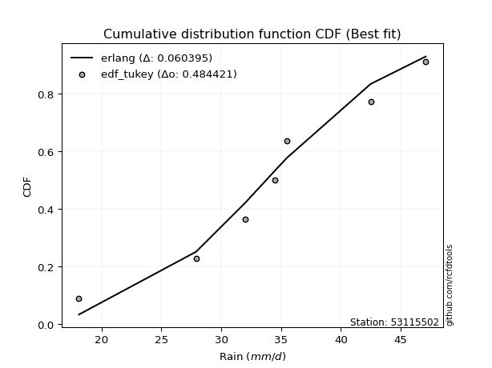</img>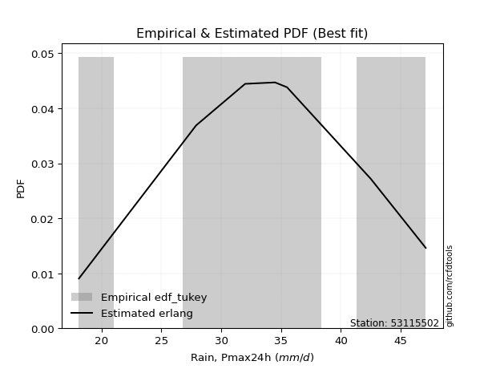</img>

</div>


### 8. EDF Gringorten (1963)

Gringorten plotting position formula is essential for estimating the probability and return periods of extreme events like floods and heavy rainfall. The constant _a=0.44_.

<div align="center">


$P=(m-a)/(n+1-2a)$


</div>


**8.1. Empirical values**

<div align="center">

|                | 0                   | 1                   | 2                  | 3              | 4                  | 5                  | 6                  |
|:---------------|:--------------------|:--------------------|:-------------------|:---------------|:-------------------|:-------------------|:-------------------|
| date           | 2023                | 2022                | 2017               | 2021           | 2018               | 2019               | 2020               |
| x              | 18.1                | 27.9                | 32.0               | 34.5           | 35.5               | 42.5               | 47.1               |
| m              | 1                   | 2                   | 3                  | 4              | 5                  | 6                  | 7                  |
| empirical_dist | edf_gringorten      | edf_gringorten      | edf_gringorten     | edf_gringorten | edf_gringorten     | edf_gringorten     | edf_gringorten     |
| empirical      | 0.07865168539325844 | 0.21910112359550563 | 0.3595505617977528 | 0.5            | 0.6404494382022471 | 0.7808988764044943 | 0.9213483146067415 |
| empirical_tr   | 1.0853658536585364  | 1.2805755395683454  | 1.5614035087719298 | 2.0            | 2.781249999999999  | 4.564102564102562  | 12.714285714285701 |

</div>


**8.2. Kolmogorov-Smirnov fit test (sorted by Δ)**


<div align="center">

|                | 0                   | 1                   | 2                   | 3                   | 4                   | 5                   | 6                   | 7                   | 8                   | 9                   | 10                  | 11                  | 12                  | 13                  | 14                  | 15                  | 16                  | 17                  | 18                  | 19                  | 20                  | 21                  | 22                  | 23                  | 24                  | 25                  | 26                  | 27                  | 28                  | 29                  | 30                  | 31                  | 32                  | 33                  | 34                  | 35                  | 36                  | 37                  | 38                  | 39                  | 40                  | 41                  | 42                  | 43                  | 44                  | 45                  | 46                  | 47                  | 48                  | 49                  | 50                  | 51                  | 52                  | 53                  | 54                  | 55                  | 56                  | 57                  | 58                  | 59                  | 60                  | 61                  | 62                  | 63                  | 64                  | 65                  | 66                  | 67                  | 68                  | 69                  | 70                  | 71                  | 72                  | 73                  | 74                  | 75                  | 76                  | 77                  | 78                  | 79                  | 80                  | 81                  | 82                  | 83                  | 84                  | 85                  | 86                  | 87                  | 88                  | 89                  | 90                  | 91                  | 92                  | 93                  | 94                  | 95                  | 96                  | 97                  | 98                  | 99                  | 100                 | 101                 | 102                 | 103                 | 104                 | 105                 | 106                 | 107                 | 108                 | 109                 | 110                 | 111                 | 112                 | 113                 | 114                 | 115                 | 116                 | 117                 | 118                 | 119                 | 120                 | 121                 | 122                 | 123                 | 124                 | 125                 | 126                 | 127                 | 128                 | 129                 | 130                 | 131                 | 132                 | 133                 | 134                 | 135                 | 136                 | 137                 | 138                 | 139                 | 140                 | 141                 | 142                 | 143                 | 144                 | 145                 | 146                 | 147                 | 148                 | 149                 | 150                 | 151                 | 152                 | 153                 | 154                 | 155                 | 156                 | 157                 | 158                 | 159                 |
|:---------------|:--------------------|:--------------------|:--------------------|:--------------------|:--------------------|:--------------------|:--------------------|:--------------------|:--------------------|:--------------------|:--------------------|:--------------------|:--------------------|:--------------------|:--------------------|:--------------------|:--------------------|:--------------------|:--------------------|:--------------------|:--------------------|:--------------------|:--------------------|:--------------------|:--------------------|:--------------------|:--------------------|:--------------------|:--------------------|:--------------------|:--------------------|:--------------------|:--------------------|:--------------------|:--------------------|:--------------------|:--------------------|:--------------------|:--------------------|:--------------------|:--------------------|:--------------------|:--------------------|:--------------------|:--------------------|:--------------------|:--------------------|:--------------------|:--------------------|:--------------------|:--------------------|:--------------------|:--------------------|:--------------------|:--------------------|:--------------------|:--------------------|:--------------------|:--------------------|:--------------------|:--------------------|:--------------------|:--------------------|:--------------------|:--------------------|:--------------------|:--------------------|:--------------------|:--------------------|:--------------------|:--------------------|:--------------------|:--------------------|:--------------------|:--------------------|:--------------------|:--------------------|:--------------------|:--------------------|:--------------------|:--------------------|:--------------------|:--------------------|:--------------------|:--------------------|:--------------------|:--------------------|:--------------------|:--------------------|:--------------------|:--------------------|:--------------------|:--------------------|:--------------------|:--------------------|:--------------------|:--------------------|:--------------------|:--------------------|:--------------------|:--------------------|:--------------------|:--------------------|:--------------------|:--------------------|:--------------------|:--------------------|:--------------------|:--------------------|:--------------------|:--------------------|:--------------------|:--------------------|:--------------------|:--------------------|:--------------------|:--------------------|:--------------------|:--------------------|:--------------------|:--------------------|:--------------------|:--------------------|:--------------------|:--------------------|:--------------------|:--------------------|:--------------------|:--------------------|:--------------------|:--------------------|:--------------------|:--------------------|:--------------------|:--------------------|:--------------------|:--------------------|:--------------------|:--------------------|:--------------------|:--------------------|:--------------------|:--------------------|:--------------------|:--------------------|:--------------------|:--------------------|:--------------------|:--------------------|:--------------------|:--------------------|:--------------------|:--------------------|:--------------------|:--------------------|:--------------------|:--------------------|:--------------------|:--------------------|:--------------------|
| station        | 53115502            | 53115502            | 53115502            | 53115502            | 53115502            | 53115502            | 53115502            | 53115502            | 53115502            | 53115502            | 53115502            | 53115502            | 53115502            | 53115502            | 53115502            | 53115502            | 53115502            | 53115502            | 53115502            | 53115502            | 53115502            | 53115502            | 53115502            | 53115502            | 53115502            | 53115502            | 53115502            | 53115502            | 53115502            | 53115502            | 53115502            | 53115502            | 53115502            | 53115502            | 53115502            | 53115502            | 53115502            | 53115502            | 53115502            | 53115502            | 53115502            | 53115502            | 53115502            | 53115502            | 53115502            | 53115502            | 53115502            | 53115502            | 53115502            | 53115502            | 53115502            | 53115502            | 53115502            | 53115502            | 53115502            | 53115502            | 53115502            | 53115502            | 53115502            | 53115502            | 53115502            | 53115502            | 53115502            | 53115502            | 53115502            | 53115502            | 53115502            | 53115502            | 53115502            | 53115502            | 53115502            | 53115502            | 53115502            | 53115502            | 53115502            | 53115502            | 53115502            | 53115502            | 53115502            | 53115502            | 53115502            | 53115502            | 53115502            | 53115502            | 53115502            | 53115502            | 53115502            | 53115502            | 53115502            | 53115502            | 53115502            | 53115502            | 53115502            | 53115502            | 53115502            | 53115502            | 53115502            | 53115502            | 53115502            | 53115502            | 53115502            | 53115502            | 53115502            | 53115502            | 53115502            | 53115502            | 53115502            | 53115502            | 53115502            | 53115502            | 53115502            | 53115502            | 53115502            | 53115502            | 53115502            | 53115502            | 53115502            | 53115502            | 53115502            | 53115502            | 53115502            | 53115502            | 53115502            | 53115502            | 53115502            | 53115502            | 53115502            | 53115502            | 53115502            | 53115502            | 53115502            | 53115502            | 53115502            | 53115502            | 53115502            | 53115502            | 53115502            | 53115502            | 53115502            | 53115502            | 53115502            | 53115502            | 53115502            | 53115502            | 53115502            | 53115502            | 53115502            | 53115502            | 53115502            | 53115502            | 53115502            | 53115502            | 53115502            | 53115502            | 53115502            | 53115502            | 53115502            | 53115502            | 53115502            | 53115502            |
| empirical_dist | edf_gringorten      | edf_gringorten      | edf_gringorten      | edf_gringorten      | edf_gringorten      | edf_gringorten      | edf_gringorten      | edf_gringorten      | edf_gringorten      | edf_gringorten      | edf_gringorten      | edf_gringorten      | edf_gringorten      | edf_gringorten      | edf_gringorten      | edf_gringorten      | edf_gringorten      | edf_gringorten      | edf_gringorten      | edf_gringorten      | edf_gringorten      | edf_gringorten      | edf_gringorten      | edf_gringorten      | edf_gringorten      | edf_gringorten      | edf_gringorten      | edf_gringorten      | edf_gringorten      | edf_gringorten      | edf_gringorten      | edf_gringorten      | edf_gringorten      | edf_gringorten      | edf_gringorten      | edf_gringorten      | edf_gringorten      | edf_gringorten      | edf_gringorten      | edf_gringorten      | edf_gringorten      | edf_gringorten      | edf_gringorten      | edf_gringorten      | edf_gringorten      | edf_gringorten      | edf_gringorten      | edf_gringorten      | edf_gringorten      | edf_gringorten      | edf_gringorten      | edf_gringorten      | edf_gringorten      | edf_gringorten      | edf_gringorten      | edf_gringorten      | edf_gringorten      | edf_gringorten      | edf_gringorten      | edf_gringorten      | edf_gringorten      | edf_gringorten      | edf_gringorten      | edf_gringorten      | edf_gringorten      | edf_gringorten      | edf_gringorten      | edf_gringorten      | edf_gringorten      | edf_gringorten      | edf_gringorten      | edf_gringorten      | edf_gringorten      | edf_gringorten      | edf_gringorten      | edf_gringorten      | edf_gringorten      | edf_gringorten      | edf_gringorten      | edf_gringorten      | edf_gringorten      | edf_gringorten      | edf_gringorten      | edf_gringorten      | edf_gringorten      | edf_gringorten      | edf_gringorten      | edf_gringorten      | edf_gringorten      | edf_gringorten      | edf_gringorten      | edf_gringorten      | edf_gringorten      | edf_gringorten      | edf_gringorten      | edf_gringorten      | edf_gringorten      | edf_gringorten      | edf_gringorten      | edf_gringorten      | edf_gringorten      | edf_gringorten      | edf_gringorten      | edf_gringorten      | edf_gringorten      | edf_gringorten      | edf_gringorten      | edf_gringorten      | edf_gringorten      | edf_gringorten      | edf_gringorten      | edf_gringorten      | edf_gringorten      | edf_gringorten      | edf_gringorten      | edf_gringorten      | edf_gringorten      | edf_gringorten      | edf_gringorten      | edf_gringorten      | edf_gringorten      | edf_gringorten      | edf_gringorten      | edf_gringorten      | edf_gringorten      | edf_gringorten      | edf_gringorten      | edf_gringorten      | edf_gringorten      | edf_gringorten      | edf_gringorten      | edf_gringorten      | edf_gringorten      | edf_gringorten      | edf_gringorten      | edf_gringorten      | edf_gringorten      | edf_gringorten      | edf_gringorten      | edf_gringorten      | edf_gringorten      | edf_gringorten      | edf_gringorten      | edf_gringorten      | edf_gringorten      | edf_gringorten      | edf_gringorten      | edf_gringorten      | edf_gringorten      | edf_gringorten      | edf_gringorten      | edf_gringorten      | edf_gringorten      | edf_gringorten      | edf_gringorten      | edf_gringorten      | edf_gringorten      | edf_gringorten      | edf_gringorten      | edf_gringorten      |
| p_dist         | betaprime           | erlang              | gamma               | rice                | logt                | dweibull            | f                   | nct                 | crystalball         | norm                | exponnorm           | t                   | logdweibull         | logdgamma           | invgamma            | logistic            | cosine              | alpha               | logpearson3         | loggennorm          | loggompertz         | logloglaplace       | logtruncweibull_min | dgamma              | anglit              | hypsecant           | semicircular        | loggumbel_l         | genlogistic         | maxwell             | logburr12           | pearson3            | logweibull_min      | ncf                 | weibull_min         | laplace             | logskewnorm         | logburr             | logtriang           | logexponpow         | invgauss            | beta                | rayleigh            | johnsonsu           | skewnorm            | logtrapezoid        | mielke              | loghypsecant        | loggenlogistic      | loggengamma         | loglogistic         | logargus            | logf                | logcrystalball      | lognorm             | logexponnorm        | logfatiguelife      | loggenhalflogistic  | kappa3              | logjohnsonsu        | logloggamma         | gumbel_r            | loganglit           | argus               | wrapcauchy          | bradford            | loglaplace          | loglaplace          | logsemicircular     | vonmises_line       | arcsine             | uniform             | gausshyper          | logrice             | loggamma            | loggamma            | burr                | loggausshyper       | logerlang           | logbetaprime        | genextreme          | logalpha            | loginvgamma         | lognct              | logbeta             | halfnorm            | gumbel_l            | kstwobign           | moyal               | kappa4              | loginvgauss         | logexponweib        | logfoldnorm         | ksone               | logmaxwell          | halflogistic        | logarcsine          | lograyleigh         | logncf              | loginvweibull       | logcosine           | triang              | loggumbel_r         | genpareto           | logmielke           | lomax               | loggenexpon         | loghalfnorm         | logkstwobign        | wald                | genhalflogistic     | logmoyal            | loglevy_l           | loghalflogistic     | truncexpon          | logtruncnorm        | logtukeylambda      | nakagami            | truncnorm           | logkappa3           | logkappa4           | loguniform          | logvonmises_line    | logweibull_max      | logksone            | loggenextreme       | genexpon            | loggenpareto        | logbradford         | levy_l              | logwrapcauchy       | truncweibull_min    | logwald             | gennorm             | lognakagami         | trapezoid           | burr12              | halfgennorm         | logtruncexpon       | logjohnsonsb        | logrdist            | foldnorm            | invweibull          | johnsonsb           | fatiguelife         | gompertz            | gengamma            | weibull_max         | exponweib           | tukeylambda         | powerlaw            | rdist               | logpowerlaw         | exponpow            | loglomax            | truncpareto         | logtruncpareto      | loghalfgennorm      | logvonmises         | vonmises            |
| delta          | 0.0625488749687318  | 0.06333666397690918 | 0.06360989365123715 | 0.06676210532208443 | 0.06683783607753024 | 0.06949972117670333 | 0.06967423756960522 | 0.06988815795849079 | 0.07011332750062349 | 0.07011333754811588 | 0.07011416834849438 | 0.07013797528543908 | 0.07095700776954972 | 0.07126991247130554 | 0.07225504553867784 | 0.07312956595550535 | 0.07599165045219858 | 0.07655174170970358 | 0.07686001368270501 | 0.07781840874531853 | 0.0786514170570973  | 0.07954880864253144 | 0.07958902930423406 | 0.07973152232017511 | 0.08001441231969852 | 0.08333022144314695 | 0.08410932419829464 | 0.08417712201940175 | 0.08580277288911475 | 0.08719569034365077 | 0.0872515381322575  | 0.08752110468217589 | 0.08940381023993005 | 0.09069644548237871 | 0.09180350095268786 | 0.0929812787709624  | 0.0956722789781358  | 0.09612556284172985 | 0.09834637278511538 | 0.09891351473756405 | 0.09910158673029723 | 0.09935935505697532 | 0.09944251670196713 | 0.10053748926307671 | 0.10060845620569647 | 0.10081810367356125 | 0.10497226419598493 | 0.10539683785445136 | 0.10547601306605148 | 0.10711817608019725 | 0.1086388253640016  | 0.11105130857855927 | 0.11185871866005953 | 0.11244686829951867 | 0.11244784320043383 | 0.11244840712496673 | 0.11273837045756668 | 0.11357525839157168 | 0.11402582129415637 | 0.11415576544275485 | 0.11447195143282962 | 0.1149125127174439  | 0.11644576643907217 | 0.11713558769061017 | 0.11722024514838203 | 0.11746798247285012 | 0.1175576150968527  | 0.1175576150968527  | 0.11809113325935161 | 0.11826354332431194 | 0.11923209245380548 | 0.11975978302983337 | 0.11979494769980359 | 0.12011888825706096 | 0.12296447275270628 | 0.12296447275270628 | 0.1241994766742005  | 0.12461512158567037 | 0.12509708401849262 | 0.12543134535695755 | 0.12628864031620102 | 0.12949172847572332 | 0.13052915431465834 | 0.13235400463925007 | 0.13366691006373188 | 0.13413365638980096 | 0.13468062098800437 | 0.13857224835056903 | 0.13863317630235716 | 0.13893331105014992 | 0.13941746922567172 | 0.1409485861953782  | 0.1433421373266751  | 0.14584140514012653 | 0.14639284654192153 | 0.15125968743710083 | 0.15529407842574214 | 0.1579482828283033  | 0.15963991667339575 | 0.16156166742794942 | 0.16262332944661995 | 0.1739579142734124  | 0.1814184306019475  | 0.18152487611331355 | 0.18661956484379644 | 0.18868747808051445 | 0.1898093341129189  | 0.190518939632078   | 0.19105704432180304 | 0.20348705384150745 | 0.20385236255211014 | 0.20720535407976937 | 0.21323920101586652 | 0.2135089366232692  | 0.21710448463747511 | 0.21909801075015978 | 0.21910110861775503 | 0.21910112327423537 | 0.22584004911015046 | 0.23402592940565103 | 0.23495335348586258 | 0.23627457864562162 | 0.23660913856906896 | 0.2382262601037317  | 0.24128188219713922 | 0.24794836964360728 | 0.2486933692019395  | 0.2505100184685356  | 0.2531875821538314  | 0.25339440485087067 | 0.26494655925058785 | 0.2688680486500825  | 0.2789782321995089  | 0.2808988764044944  | 0.2839802680765984  | 0.30017166042446936 | 0.30791876385095374 | 0.3194789995916666  | 0.33067791727768236 | 0.3708046395692989  | 0.4304987929161559  | 0.4490620998646749  | 0.49367739003164324 | 0.5273474060255223  | 0.5306679609852331  | 0.5308968372143885  | 0.5315418184923956  | 0.5439529307017413  | 0.5516412430639399  | 0.5676215636151207  | 0.6068368243950746  | 0.6404494372190579  | 0.6432117106270446  | 0.6981205534798187  | 0.6988437272889434  | 0.7010703227430675  | 0.7219410353059837  | 0.7808988764044943  | 1.1073844763258858  | 7.387736420843981   |
| deltao         | 0.48442053926100004 | 0.48442053926100004 | 0.48442053926100004 | 0.48442053926100004 | 0.48442053926100004 | 0.48442053926100004 | 0.48442053926100004 | 0.48442053926100004 | 0.48442053926100004 | 0.48442053926100004 | 0.48442053926100004 | 0.48442053926100004 | 0.48442053926100004 | 0.48442053926100004 | 0.48442053926100004 | 0.48442053926100004 | 0.48442053926100004 | 0.48442053926100004 | 0.48442053926100004 | 0.48442053926100004 | 0.48442053926100004 | 0.48442053926100004 | 0.48442053926100004 | 0.48442053926100004 | 0.48442053926100004 | 0.48442053926100004 | 0.48442053926100004 | 0.48442053926100004 | 0.48442053926100004 | 0.48442053926100004 | 0.48442053926100004 | 0.48442053926100004 | 0.48442053926100004 | 0.48442053926100004 | 0.48442053926100004 | 0.48442053926100004 | 0.48442053926100004 | 0.48442053926100004 | 0.48442053926100004 | 0.48442053926100004 | 0.48442053926100004 | 0.48442053926100004 | 0.48442053926100004 | 0.48442053926100004 | 0.48442053926100004 | 0.48442053926100004 | 0.48442053926100004 | 0.48442053926100004 | 0.48442053926100004 | 0.48442053926100004 | 0.48442053926100004 | 0.48442053926100004 | 0.48442053926100004 | 0.48442053926100004 | 0.48442053926100004 | 0.48442053926100004 | 0.48442053926100004 | 0.48442053926100004 | 0.48442053926100004 | 0.48442053926100004 | 0.48442053926100004 | 0.48442053926100004 | 0.48442053926100004 | 0.48442053926100004 | 0.48442053926100004 | 0.48442053926100004 | 0.48442053926100004 | 0.48442053926100004 | 0.48442053926100004 | 0.48442053926100004 | 0.48442053926100004 | 0.48442053926100004 | 0.48442053926100004 | 0.48442053926100004 | 0.48442053926100004 | 0.48442053926100004 | 0.48442053926100004 | 0.48442053926100004 | 0.48442053926100004 | 0.48442053926100004 | 0.48442053926100004 | 0.48442053926100004 | 0.48442053926100004 | 0.48442053926100004 | 0.48442053926100004 | 0.48442053926100004 | 0.48442053926100004 | 0.48442053926100004 | 0.48442053926100004 | 0.48442053926100004 | 0.48442053926100004 | 0.48442053926100004 | 0.48442053926100004 | 0.48442053926100004 | 0.48442053926100004 | 0.48442053926100004 | 0.48442053926100004 | 0.48442053926100004 | 0.48442053926100004 | 0.48442053926100004 | 0.48442053926100004 | 0.48442053926100004 | 0.48442053926100004 | 0.48442053926100004 | 0.48442053926100004 | 0.48442053926100004 | 0.48442053926100004 | 0.48442053926100004 | 0.48442053926100004 | 0.48442053926100004 | 0.48442053926100004 | 0.48442053926100004 | 0.48442053926100004 | 0.48442053926100004 | 0.48442053926100004 | 0.48442053926100004 | 0.48442053926100004 | 0.48442053926100004 | 0.48442053926100004 | 0.48442053926100004 | 0.48442053926100004 | 0.48442053926100004 | 0.48442053926100004 | 0.48442053926100004 | 0.48442053926100004 | 0.48442053926100004 | 0.48442053926100004 | 0.48442053926100004 | 0.48442053926100004 | 0.48442053926100004 | 0.48442053926100004 | 0.48442053926100004 | 0.48442053926100004 | 0.48442053926100004 | 0.48442053926100004 | 0.48442053926100004 | 0.48442053926100004 | 0.48442053926100004 | 0.48442053926100004 | 0.48442053926100004 | 0.48442053926100004 | 0.48442053926100004 | 0.48442053926100004 | 0.48442053926100004 | 0.48442053926100004 | 0.48442053926100004 | 0.48442053926100004 | 0.48442053926100004 | 0.48442053926100004 | 0.48442053926100004 | 0.48442053926100004 | 0.48442053926100004 | 0.48442053926100004 | 0.48442053926100004 | 0.48442053926100004 | 0.48442053926100004 | 0.48442053926100004 | 0.48442053926100004 | 0.48442053926100004 | 0.48442053926100004 |
| eval           | Δo > Δ              | Δo > Δ              | Δo > Δ              | Δo > Δ              | Δo > Δ              | Δo > Δ              | Δo > Δ              | Δo > Δ              | Δo > Δ              | Δo > Δ              | Δo > Δ              | Δo > Δ              | Δo > Δ              | Δo > Δ              | Δo > Δ              | Δo > Δ              | Δo > Δ              | Δo > Δ              | Δo > Δ              | Δo > Δ              | Δo > Δ              | Δo > Δ              | Δo > Δ              | Δo > Δ              | Δo > Δ              | Δo > Δ              | Δo > Δ              | Δo > Δ              | Δo > Δ              | Δo > Δ              | Δo > Δ              | Δo > Δ              | Δo > Δ              | Δo > Δ              | Δo > Δ              | Δo > Δ              | Δo > Δ              | Δo > Δ              | Δo > Δ              | Δo > Δ              | Δo > Δ              | Δo > Δ              | Δo > Δ              | Δo > Δ              | Δo > Δ              | Δo > Δ              | Δo > Δ              | Δo > Δ              | Δo > Δ              | Δo > Δ              | Δo > Δ              | Δo > Δ              | Δo > Δ              | Δo > Δ              | Δo > Δ              | Δo > Δ              | Δo > Δ              | Δo > Δ              | Δo > Δ              | Δo > Δ              | Δo > Δ              | Δo > Δ              | Δo > Δ              | Δo > Δ              | Δo > Δ              | Δo > Δ              | Δo > Δ              | Δo > Δ              | Δo > Δ              | Δo > Δ              | Δo > Δ              | Δo > Δ              | Δo > Δ              | Δo > Δ              | Δo > Δ              | Δo > Δ              | Δo > Δ              | Δo > Δ              | Δo > Δ              | Δo > Δ              | Δo > Δ              | Δo > Δ              | Δo > Δ              | Δo > Δ              | Δo > Δ              | Δo > Δ              | Δo > Δ              | Δo > Δ              | Δo > Δ              | Δo > Δ              | Δo > Δ              | Δo > Δ              | Δo > Δ              | Δo > Δ              | Δo > Δ              | Δo > Δ              | Δo > Δ              | Δo > Δ              | Δo > Δ              | Δo > Δ              | Δo > Δ              | Δo > Δ              | Δo > Δ              | Δo > Δ              | Δo > Δ              | Δo > Δ              | Δo > Δ              | Δo > Δ              | Δo > Δ              | Δo > Δ              | Δo > Δ              | Δo > Δ              | Δo > Δ              | Δo > Δ              | Δo > Δ              | Δo > Δ              | Δo > Δ              | Δo > Δ              | Δo > Δ              | Δo > Δ              | Δo > Δ              | Δo > Δ              | Δo > Δ              | Δo > Δ              | Δo > Δ              | Δo > Δ              | Δo > Δ              | Δo > Δ              | Δo > Δ              | Δo > Δ              | Δo > Δ              | Δo > Δ              | Δo > Δ              | Δo > Δ              | Δo > Δ              | Δo > Δ              | Δo > Δ              | Δo > Δ              | Δo > Δ              | Δo > Δ              | Δo > Δ              | Δo > Δ              | Δo <= Δ             | Δo <= Δ             | Δo <= Δ             | Δo <= Δ             | Δo <= Δ             | Δo <= Δ             | Δo <= Δ             | Δo <= Δ             | Δo <= Δ             | Δo <= Δ             | Δo <= Δ             | Δo <= Δ             | Δo <= Δ             | Δo <= Δ             | Δo <= Δ             | Δo <= Δ             | Δo <= Δ             | Δo <= Δ             |
| fit            | 1                   | 1                   | 1                   | 1                   | 1                   | 1                   | 1                   | 1                   | 1                   | 1                   | 1                   | 1                   | 1                   | 1                   | 1                   | 1                   | 1                   | 1                   | 1                   | 1                   | 1                   | 1                   | 1                   | 1                   | 1                   | 1                   | 1                   | 1                   | 1                   | 1                   | 1                   | 1                   | 1                   | 1                   | 1                   | 1                   | 1                   | 1                   | 1                   | 1                   | 1                   | 1                   | 1                   | 1                   | 1                   | 1                   | 1                   | 1                   | 1                   | 1                   | 1                   | 1                   | 1                   | 1                   | 1                   | 1                   | 1                   | 1                   | 1                   | 1                   | 1                   | 1                   | 1                   | 1                   | 1                   | 1                   | 1                   | 1                   | 1                   | 1                   | 1                   | 1                   | 1                   | 1                   | 1                   | 1                   | 1                   | 1                   | 1                   | 1                   | 1                   | 1                   | 1                   | 1                   | 1                   | 1                   | 1                   | 1                   | 1                   | 1                   | 1                   | 1                   | 1                   | 1                   | 1                   | 1                   | 1                   | 1                   | 1                   | 1                   | 1                   | 1                   | 1                   | 1                   | 1                   | 1                   | 1                   | 1                   | 1                   | 1                   | 1                   | 1                   | 1                   | 1                   | 1                   | 1                   | 1                   | 1                   | 1                   | 1                   | 1                   | 1                   | 1                   | 1                   | 1                   | 1                   | 1                   | 1                   | 1                   | 1                   | 1                   | 1                   | 1                   | 1                   | 1                   | 1                   | 1                   | 1                   | 1                   | 1                   | 1                   | 1                   | 0                   | 0                   | 0                   | 0                   | 0                   | 0                   | 0                   | 0                   | 0                   | 0                   | 0                   | 0                   | 0                   | 0                   | 0                   | 0                   | 0                   | 0                   |
| n              | 7                   | 7                   | 7                   | 7                   | 7                   | 7                   | 7                   | 7                   | 7                   | 7                   | 7                   | 7                   | 7                   | 7                   | 7                   | 7                   | 7                   | 7                   | 7                   | 7                   | 7                   | 7                   | 7                   | 7                   | 7                   | 7                   | 7                   | 7                   | 7                   | 7                   | 7                   | 7                   | 7                   | 7                   | 7                   | 7                   | 7                   | 7                   | 7                   | 7                   | 7                   | 7                   | 7                   | 7                   | 7                   | 7                   | 7                   | 7                   | 7                   | 7                   | 7                   | 7                   | 7                   | 7                   | 7                   | 7                   | 7                   | 7                   | 7                   | 7                   | 7                   | 7                   | 7                   | 7                   | 7                   | 7                   | 7                   | 7                   | 7                   | 7                   | 7                   | 7                   | 7                   | 7                   | 7                   | 7                   | 7                   | 7                   | 7                   | 7                   | 7                   | 7                   | 7                   | 7                   | 7                   | 7                   | 7                   | 7                   | 7                   | 7                   | 7                   | 7                   | 7                   | 7                   | 7                   | 7                   | 7                   | 7                   | 7                   | 7                   | 7                   | 7                   | 7                   | 7                   | 7                   | 7                   | 7                   | 7                   | 7                   | 7                   | 7                   | 7                   | 7                   | 7                   | 7                   | 7                   | 7                   | 7                   | 7                   | 7                   | 7                   | 7                   | 7                   | 7                   | 7                   | 7                   | 7                   | 7                   | 7                   | 7                   | 7                   | 7                   | 7                   | 7                   | 7                   | 7                   | 7                   | 7                   | 7                   | 7                   | 7                   | 7                   | 7                   | 7                   | 7                   | 7                   | 7                   | 7                   | 7                   | 7                   | 7                   | 7                   | 7                   | 7                   | 7                   | 7                   | 7                   | 7                   | 7                   | 7                   |
| best_fit       | 1                   | 0                   | 0                   | 0                   | 0                   | 0                   | 0                   | 0                   | 0                   | 0                   | 0                   | 0                   | 0                   | 0                   | 0                   | 0                   | 0                   | 0                   | 0                   | 0                   | 0                   | 0                   | 0                   | 0                   | 0                   | 0                   | 0                   | 0                   | 0                   | 0                   | 0                   | 0                   | 0                   | 0                   | 0                   | 0                   | 0                   | 0                   | 0                   | 0                   | 0                   | 0                   | 0                   | 0                   | 0                   | 0                   | 0                   | 0                   | 0                   | 0                   | 0                   | 0                   | 0                   | 0                   | 0                   | 0                   | 0                   | 0                   | 0                   | 0                   | 0                   | 0                   | 0                   | 0                   | 0                   | 0                   | 0                   | 0                   | 0                   | 0                   | 0                   | 0                   | 0                   | 0                   | 0                   | 0                   | 0                   | 0                   | 0                   | 0                   | 0                   | 0                   | 0                   | 0                   | 0                   | 0                   | 0                   | 0                   | 0                   | 0                   | 0                   | 0                   | 0                   | 0                   | 0                   | 0                   | 0                   | 0                   | 0                   | 0                   | 0                   | 0                   | 0                   | 0                   | 0                   | 0                   | 0                   | 0                   | 0                   | 0                   | 0                   | 0                   | 0                   | 0                   | 0                   | 0                   | 0                   | 0                   | 0                   | 0                   | 0                   | 0                   | 0                   | 0                   | 0                   | 0                   | 0                   | 0                   | 0                   | 0                   | 0                   | 0                   | 0                   | 0                   | 0                   | 0                   | 0                   | 0                   | 0                   | 0                   | 0                   | 0                   | 0                   | 0                   | 0                   | 0                   | 0                   | 0                   | 0                   | 0                   | 0                   | 0                   | 0                   | 0                   | 0                   | 0                   | 0                   | 0                   | 0                   | 0                   |
| best_fit_sort  | 1                   | 2                   | 3                   | 4                   | 5                   | 6                   | 7                   | 8                   | 9                   | 10                  | 11                  | 12                  | 13                  | 14                  | 15                  | 16                  | 17                  | 18                  | 19                  | 20                  | 21                  | 22                  | 23                  | 24                  | 25                  | 26                  | 27                  | 28                  | 29                  | 30                  | 31                  | 32                  | 33                  | 34                  | 35                  | 36                  | 37                  | 38                  | 39                  | 40                  | 41                  | 42                  | 43                  | 44                  | 45                  | 46                  | 47                  | 48                  | 49                  | 50                  | 51                  | 52                  | 53                  | 54                  | 55                  | 56                  | 57                  | 58                  | 59                  | 60                  | 61                  | 62                  | 63                  | 64                  | 65                  | 66                  | 67                  | 68                  | 69                  | 70                  | 71                  | 72                  | 73                  | 74                  | 75                  | 76                  | 77                  | 78                  | 79                  | 80                  | 81                  | 82                  | 83                  | 84                  | 85                  | 86                  | 87                  | 88                  | 89                  | 90                  | 91                  | 92                  | 93                  | 94                  | 95                  | 96                  | 97                  | 98                  | 99                  | 100                 | 101                 | 102                 | 103                 | 104                 | 105                 | 106                 | 107                 | 108                 | 109                 | 110                 | 111                 | 112                 | 113                 | 114                 | 115                 | 116                 | 117                 | 118                 | 119                 | 120                 | 121                 | 122                 | 123                 | 124                 | 125                 | 126                 | 127                 | 128                 | 129                 | 130                 | 131                 | 132                 | 133                 | 134                 | 135                 | 136                 | 137                 | 138                 | 139                 | 140                 | 141                 | 142                 | 143                 | 144                 | 145                 | 146                 | 147                 | 148                 | 149                 | 150                 | 151                 | 152                 | 153                 | 154                 | 155                 | 156                 | 157                 | 158                 | 159                 | 160                 |

</div>


**8.3. Best fit**

<div align="center">

|   id |   station | empirical_dist   | p_dist    |     delta |   deltao | eval   |   fit |   n |   best_fit |   best_fit_sort |
|-----:|----------:|:-----------------|:----------|----------:|---------:|:-------|------:|----:|-----------:|----------------:|
|    0 |  53115502 | edf_gringorten   | betaprime | 0.0625489 | 0.484421 | Δo > Δ |     1 |   7 |          1 |               1 |

</div>


<div align="center">

</img></img>

</div>


### 9. EDF Filliben (1975)

The specific values of the constants (0.3175) (often denoted as $alpha$) and (0.365) are derived from a method proposed by James J. Filliben in a 1975 paper. This particular formula is the mean value of the $i$-th order statistic of the normal distribution and is considered a robust and effective plotting position formula for the normal probability plot correlation coefficient test for normality.

<div align="center">


$P=(m-0.3175)/(n+0.365)$


</div>


**9.1. Empirical values**

<div align="center">

|                | 0                   | 1                   | 2                   | 3            | 4                  | 5                  | 6                  |
|:---------------|:--------------------|:--------------------|:--------------------|:-------------|:-------------------|:-------------------|:-------------------|
| date           | 2023                | 2022                | 2017                | 2021         | 2018               | 2019               | 2020               |
| x              | 18.1                | 27.9                | 32.0                | 34.5         | 35.5               | 42.5               | 47.1               |
| m              | 1                   | 2                   | 3                   | 4            | 5                  | 6                  | 7                  |
| empirical_dist | edf_filliben        | edf_filliben        | edf_filliben        | edf_filliben | edf_filliben       | edf_filliben       | edf_filliben       |
| empirical      | 0.09266802443991853 | 0.22844534962661237 | 0.36422267481330617 | 0.5          | 0.6357773251866938 | 0.7715546503733877 | 0.9073319755600815 |
| empirical_tr   | 1.1021324354657687  | 1.2960844698636163  | 1.5728777362520021  | 2.0          | 2.7455731593662627 | 4.377414561664191  | 10.791208791208794 |

</div>


**9.2. Kolmogorov-Smirnov fit test (sorted by Δ)**


<div align="center">

|                | 0                    | 1                   | 2                   | 3                   | 4                   | 5                   | 6                   | 7                   | 8                   | 9                   | 10                  | 11                  | 12                  | 13                  | 14                  | 15                  | 16                  | 17                  | 18                  | 19                  | 20                  | 21                  | 22                  | 23                  | 24                  | 25                  | 26                  | 27                  | 28                  | 29                  | 30                  | 31                  | 32                  | 33                  | 34                  | 35                  | 36                  | 37                  | 38                  | 39                  | 40                  | 41                  | 42                  | 43                  | 44                  | 45                  | 46                  | 47                  | 48                  | 49                  | 50                  | 51                  | 52                  | 53                  | 54                  | 55                  | 56                  | 57                  | 58                  | 59                  | 60                  | 61                  | 62                  | 63                  | 64                  | 65                  | 66                  | 67                  | 68                  | 69                  | 70                  | 71                  | 72                  | 73                  | 74                  | 75                  | 76                  | 77                  | 78                  | 79                  | 80                  | 81                  | 82                  | 83                  | 84                  | 85                  | 86                  | 87                  | 88                  | 89                  | 90                  | 91                  | 92                  | 93                  | 94                  | 95                  | 96                  | 97                  | 98                  | 99                  | 100                 | 101                 | 102                 | 103                 | 104                 | 105                 | 106                 | 107                 | 108                 | 109                 | 110                 | 111                 | 112                 | 113                 | 114                 | 115                 | 116                 | 117                 | 118                 | 119                 | 120                 | 121                 | 122                 | 123                 | 124                 | 125                 | 126                 | 127                 | 128                 | 129                 | 130                 | 131                 | 132                 | 133                 | 134                 | 135                 | 136                 | 137                 | 138                 | 139                 | 140                 | 141                 | 142                 | 143                 | 144                 | 145                 | 146                 | 147                 | 148                 | 149                 | 150                 | 151                 | 152                 | 153                 | 154                 | 155                 | 156                 | 157                 | 158                 | 159                 |
|:---------------|:---------------------|:--------------------|:--------------------|:--------------------|:--------------------|:--------------------|:--------------------|:--------------------|:--------------------|:--------------------|:--------------------|:--------------------|:--------------------|:--------------------|:--------------------|:--------------------|:--------------------|:--------------------|:--------------------|:--------------------|:--------------------|:--------------------|:--------------------|:--------------------|:--------------------|:--------------------|:--------------------|:--------------------|:--------------------|:--------------------|:--------------------|:--------------------|:--------------------|:--------------------|:--------------------|:--------------------|:--------------------|:--------------------|:--------------------|:--------------------|:--------------------|:--------------------|:--------------------|:--------------------|:--------------------|:--------------------|:--------------------|:--------------------|:--------------------|:--------------------|:--------------------|:--------------------|:--------------------|:--------------------|:--------------------|:--------------------|:--------------------|:--------------------|:--------------------|:--------------------|:--------------------|:--------------------|:--------------------|:--------------------|:--------------------|:--------------------|:--------------------|:--------------------|:--------------------|:--------------------|:--------------------|:--------------------|:--------------------|:--------------------|:--------------------|:--------------------|:--------------------|:--------------------|:--------------------|:--------------------|:--------------------|:--------------------|:--------------------|:--------------------|:--------------------|:--------------------|:--------------------|:--------------------|:--------------------|:--------------------|:--------------------|:--------------------|:--------------------|:--------------------|:--------------------|:--------------------|:--------------------|:--------------------|:--------------------|:--------------------|:--------------------|:--------------------|:--------------------|:--------------------|:--------------------|:--------------------|:--------------------|:--------------------|:--------------------|:--------------------|:--------------------|:--------------------|:--------------------|:--------------------|:--------------------|:--------------------|:--------------------|:--------------------|:--------------------|:--------------------|:--------------------|:--------------------|:--------------------|:--------------------|:--------------------|:--------------------|:--------------------|:--------------------|:--------------------|:--------------------|:--------------------|:--------------------|:--------------------|:--------------------|:--------------------|:--------------------|:--------------------|:--------------------|:--------------------|:--------------------|:--------------------|:--------------------|:--------------------|:--------------------|:--------------------|:--------------------|:--------------------|:--------------------|:--------------------|:--------------------|:--------------------|:--------------------|:--------------------|:--------------------|:--------------------|:--------------------|:--------------------|:--------------------|:--------------------|:--------------------|
| station        | 53115502             | 53115502            | 53115502            | 53115502            | 53115502            | 53115502            | 53115502            | 53115502            | 53115502            | 53115502            | 53115502            | 53115502            | 53115502            | 53115502            | 53115502            | 53115502            | 53115502            | 53115502            | 53115502            | 53115502            | 53115502            | 53115502            | 53115502            | 53115502            | 53115502            | 53115502            | 53115502            | 53115502            | 53115502            | 53115502            | 53115502            | 53115502            | 53115502            | 53115502            | 53115502            | 53115502            | 53115502            | 53115502            | 53115502            | 53115502            | 53115502            | 53115502            | 53115502            | 53115502            | 53115502            | 53115502            | 53115502            | 53115502            | 53115502            | 53115502            | 53115502            | 53115502            | 53115502            | 53115502            | 53115502            | 53115502            | 53115502            | 53115502            | 53115502            | 53115502            | 53115502            | 53115502            | 53115502            | 53115502            | 53115502            | 53115502            | 53115502            | 53115502            | 53115502            | 53115502            | 53115502            | 53115502            | 53115502            | 53115502            | 53115502            | 53115502            | 53115502            | 53115502            | 53115502            | 53115502            | 53115502            | 53115502            | 53115502            | 53115502            | 53115502            | 53115502            | 53115502            | 53115502            | 53115502            | 53115502            | 53115502            | 53115502            | 53115502            | 53115502            | 53115502            | 53115502            | 53115502            | 53115502            | 53115502            | 53115502            | 53115502            | 53115502            | 53115502            | 53115502            | 53115502            | 53115502            | 53115502            | 53115502            | 53115502            | 53115502            | 53115502            | 53115502            | 53115502            | 53115502            | 53115502            | 53115502            | 53115502            | 53115502            | 53115502            | 53115502            | 53115502            | 53115502            | 53115502            | 53115502            | 53115502            | 53115502            | 53115502            | 53115502            | 53115502            | 53115502            | 53115502            | 53115502            | 53115502            | 53115502            | 53115502            | 53115502            | 53115502            | 53115502            | 53115502            | 53115502            | 53115502            | 53115502            | 53115502            | 53115502            | 53115502            | 53115502            | 53115502            | 53115502            | 53115502            | 53115502            | 53115502            | 53115502            | 53115502            | 53115502            | 53115502            | 53115502            | 53115502            | 53115502            | 53115502            | 53115502            |
| empirical_dist | edf_filliben         | edf_filliben        | edf_filliben        | edf_filliben        | edf_filliben        | edf_filliben        | edf_filliben        | edf_filliben        | edf_filliben        | edf_filliben        | edf_filliben        | edf_filliben        | edf_filliben        | edf_filliben        | edf_filliben        | edf_filliben        | edf_filliben        | edf_filliben        | edf_filliben        | edf_filliben        | edf_filliben        | edf_filliben        | edf_filliben        | edf_filliben        | edf_filliben        | edf_filliben        | edf_filliben        | edf_filliben        | edf_filliben        | edf_filliben        | edf_filliben        | edf_filliben        | edf_filliben        | edf_filliben        | edf_filliben        | edf_filliben        | edf_filliben        | edf_filliben        | edf_filliben        | edf_filliben        | edf_filliben        | edf_filliben        | edf_filliben        | edf_filliben        | edf_filliben        | edf_filliben        | edf_filliben        | edf_filliben        | edf_filliben        | edf_filliben        | edf_filliben        | edf_filliben        | edf_filliben        | edf_filliben        | edf_filliben        | edf_filliben        | edf_filliben        | edf_filliben        | edf_filliben        | edf_filliben        | edf_filliben        | edf_filliben        | edf_filliben        | edf_filliben        | edf_filliben        | edf_filliben        | edf_filliben        | edf_filliben        | edf_filliben        | edf_filliben        | edf_filliben        | edf_filliben        | edf_filliben        | edf_filliben        | edf_filliben        | edf_filliben        | edf_filliben        | edf_filliben        | edf_filliben        | edf_filliben        | edf_filliben        | edf_filliben        | edf_filliben        | edf_filliben        | edf_filliben        | edf_filliben        | edf_filliben        | edf_filliben        | edf_filliben        | edf_filliben        | edf_filliben        | edf_filliben        | edf_filliben        | edf_filliben        | edf_filliben        | edf_filliben        | edf_filliben        | edf_filliben        | edf_filliben        | edf_filliben        | edf_filliben        | edf_filliben        | edf_filliben        | edf_filliben        | edf_filliben        | edf_filliben        | edf_filliben        | edf_filliben        | edf_filliben        | edf_filliben        | edf_filliben        | edf_filliben        | edf_filliben        | edf_filliben        | edf_filliben        | edf_filliben        | edf_filliben        | edf_filliben        | edf_filliben        | edf_filliben        | edf_filliben        | edf_filliben        | edf_filliben        | edf_filliben        | edf_filliben        | edf_filliben        | edf_filliben        | edf_filliben        | edf_filliben        | edf_filliben        | edf_filliben        | edf_filliben        | edf_filliben        | edf_filliben        | edf_filliben        | edf_filliben        | edf_filliben        | edf_filliben        | edf_filliben        | edf_filliben        | edf_filliben        | edf_filliben        | edf_filliben        | edf_filliben        | edf_filliben        | edf_filliben        | edf_filliben        | edf_filliben        | edf_filliben        | edf_filliben        | edf_filliben        | edf_filliben        | edf_filliben        | edf_filliben        | edf_filliben        | edf_filliben        | edf_filliben        | edf_filliben        | edf_filliben        | edf_filliben        |
| p_dist         | erlang               | gamma               | betaprime           | f                   | nct                 | crystalball         | norm                | exponnorm           | t                   | logdweibull         | rice                | invgamma            | logt                | cosine              | alpha               | logpearson3         | loggennorm          | logloglaplace       | anglit              | dweibull            | semicircular        | loggumbel_l         | logdgamma           | genlogistic         | logistic            | maxwell             | logburr12           | pearson3            | logweibull_min      | ncf                 | weibull_min         | dgamma              | logburr             | logtruncweibull_min | loggompertz         | logskewnorm         | beta                | hypsecant           | logtriang           | logexponpow         | invgauss            | rayleigh            | johnsonsu           | skewnorm            | logtrapezoid        | mielke              | loghypsecant        | loggenlogistic      | laplace             | loggengamma         | loglogistic         | kappa3              | logargus            | logf                | logcrystalball      | lognorm             | logexponnorm        | logfatiguelife      | loggenhalflogistic  | logjohnsonsu        | logloggamma         | arcsine             | gumbel_r            | loganglit           | argus               | wrapcauchy          | bradford            | logsemicircular     | vonmises_line       | uniform             | gausshyper          | logrice             | loglaplace          | loglaplace          | loggausshyper       | loggamma            | loggamma            | burr                | logerlang           | logbetaprime        | genextreme          | logalpha            | loginvgamma         | lognct              | logbeta             | halfnorm            | gumbel_l            | kappa4              | kstwobign           | moyal               | loginvgauss         | logexponweib        | ksone               | logfoldnorm         | logmaxwell          | logarcsine          | halflogistic        | logncf              | lograyleigh         | loginvweibull       | logcosine           | triang              | genpareto           | lomax               | loggumbel_r         | logmielke           | loggenexpon         | loghalfnorm         | logkstwobign        | wald                | genhalflogistic     | loglevy_l           | logmoyal            | loghalflogistic     | truncexpon          | truncnorm           | logkappa4           | logtruncnorm        | logtukeylambda      | nakagami            | logkappa3           | loguniform          | logvonmises_line    | logksone            | logweibull_max      | loggenpareto        | genexpon            | levy_l              | loggenextreme       | logbradford         | logwrapcauchy       | truncweibull_min    | gennorm             | logwald             | lognakagami         | trapezoid           | burr12              | halfgennorm         | logtruncexpon       | logjohnsonsb        | logrdist            | foldnorm            | invweibull          | johnsonsb           | fatiguelife         | gengamma            | gompertz            | weibull_max         | exponweib           | tukeylambda         | powerlaw            | logpowerlaw         | rdist               | loglomax            | exponpow            | truncpareto         | logtruncpareto      | loghalfgennorm      | logvonmises         | vonmises            |
| delta          | 0.061567310304018075 | 0.06169374598671118 | 0.0647326373626107  | 0.06500212455405197 | 0.06521604494293753 | 0.06544121448507023 | 0.06544122453256263 | 0.06544205533294112 | 0.06546586226988582 | 0.06628489475399646 | 0.06712419614281288 | 0.06758293252312447 | 0.07076500801935948 | 0.07131953743664521 | 0.07187962869415021 | 0.07218790066715175 | 0.07314629572976528 | 0.07487669562697818 | 0.07534229930414527 | 0.07884394720780996 | 0.07943721118274139 | 0.07950500900384849 | 0.08061413850241228 | 0.0811306598735615  | 0.08247379198661198 | 0.0825235773280974  | 0.08257942511670424 | 0.08284899166662263 | 0.08473169722437679 | 0.08602433246682534 | 0.0871313879371346  | 0.08907574835128174 | 0.09145344982617648 | 0.09266578991952912 | 0.0926677561037574  | 0.09266794652383137 | 0.0926680244395347  | 0.09267444747425357 | 0.09367425976956201 | 0.09424140172201079 | 0.09442947371474386 | 0.09477040368641376 | 0.09586537624752345 | 0.09593634319014321 | 0.096145990658008   | 0.10030015118043167 | 0.100724724838898   | 0.10080390005049822 | 0.10232550480206903 | 0.10244606306464388 | 0.10396671234844823 | 0.10468159526304963 | 0.10637919556300601 | 0.10718660564450616 | 0.1077747552839653  | 0.10777573018488046 | 0.10777629410941336 | 0.10806625744201331 | 0.10890314537601842 | 0.1094836524272016  | 0.10979983841727636 | 0.10988786642269874 | 0.11024039970189053 | 0.1117736534235188  | 0.11246347467505691 | 0.11254813213282866 | 0.11279586945729675 | 0.11341902024379824 | 0.11359143030875857 | 0.11508767001428    | 0.11512283468425033 | 0.1154467752415076  | 0.1175576150968527  | 0.1175576150968527  | 0.1178223493583257  | 0.11829235973715291 | 0.11829235973715291 | 0.11952736365864713 | 0.12042497100293925 | 0.12075923234140418 | 0.12161652730064776 | 0.12481961546016995 | 0.12585704129910497 | 0.1276818916236967  | 0.12899479704817862 | 0.1294615433742476  | 0.13000850797245112 | 0.13155950490474    | 0.13390013533501566 | 0.1339610632868038  | 0.13474535621011835 | 0.13627647317982483 | 0.1364971791090198  | 0.13867002431112174 | 0.14172073352636816 | 0.1459498523946354  | 0.14658757442154746 | 0.150295690642289   | 0.15327616981274994 | 0.15688955441239605 | 0.15795121643106658 | 0.16928580125785914 | 0.17218065008220682 | 0.17467113903385445 | 0.17674631758639414 | 0.18194745182824318 | 0.18513722109736552 | 0.18584682661652463 | 0.18638493130624967 | 0.19881494082595408 | 0.19918024953655689 | 0.19922286196920644 | 0.202533241064216   | 0.20883682360771583 | 0.21243237162192175 | 0.21649582307904372 | 0.22560912745475584 | 0.22844223678126652 | 0.22844533464886177 | 0.2284453493053421  | 0.22935381639009766 | 0.23160246563006825 | 0.23193702555351559 | 0.23193765616603249 | 0.23355414708817845 | 0.23649367942187552 | 0.23934914317083275 | 0.2393780658042106  | 0.24327625662805402 | 0.24624042063112572 | 0.2556023332194811  | 0.2619371142359851  | 0.27155465037338766 | 0.27430611918395553 | 0.279308155061045   | 0.2954995474089161  | 0.298574537819847   | 0.31013477356055985 | 0.3227435887321928  | 0.36146041353819225 | 0.4164824538694959  | 0.4490620998646749  | 0.47966105098498324 | 0.5180031799944157  | 0.5213237349541263  | 0.5221975924612888  | 0.5262247241988354  | 0.5346087046706347  | 0.5422970170328332  | 0.5629494505995674  | 0.5974925983639678  | 0.6338674845959379  | 0.6357773242035045  | 0.6848273882422833  | 0.688776327448712   | 0.6917260967119607  | 0.712596809274877   | 0.7715546503733877  | 1.1027123633103324  | 7.401752759890641   |
| deltao         | 0.48442053926100004  | 0.48442053926100004 | 0.48442053926100004 | 0.48442053926100004 | 0.48442053926100004 | 0.48442053926100004 | 0.48442053926100004 | 0.48442053926100004 | 0.48442053926100004 | 0.48442053926100004 | 0.48442053926100004 | 0.48442053926100004 | 0.48442053926100004 | 0.48442053926100004 | 0.48442053926100004 | 0.48442053926100004 | 0.48442053926100004 | 0.48442053926100004 | 0.48442053926100004 | 0.48442053926100004 | 0.48442053926100004 | 0.48442053926100004 | 0.48442053926100004 | 0.48442053926100004 | 0.48442053926100004 | 0.48442053926100004 | 0.48442053926100004 | 0.48442053926100004 | 0.48442053926100004 | 0.48442053926100004 | 0.48442053926100004 | 0.48442053926100004 | 0.48442053926100004 | 0.48442053926100004 | 0.48442053926100004 | 0.48442053926100004 | 0.48442053926100004 | 0.48442053926100004 | 0.48442053926100004 | 0.48442053926100004 | 0.48442053926100004 | 0.48442053926100004 | 0.48442053926100004 | 0.48442053926100004 | 0.48442053926100004 | 0.48442053926100004 | 0.48442053926100004 | 0.48442053926100004 | 0.48442053926100004 | 0.48442053926100004 | 0.48442053926100004 | 0.48442053926100004 | 0.48442053926100004 | 0.48442053926100004 | 0.48442053926100004 | 0.48442053926100004 | 0.48442053926100004 | 0.48442053926100004 | 0.48442053926100004 | 0.48442053926100004 | 0.48442053926100004 | 0.48442053926100004 | 0.48442053926100004 | 0.48442053926100004 | 0.48442053926100004 | 0.48442053926100004 | 0.48442053926100004 | 0.48442053926100004 | 0.48442053926100004 | 0.48442053926100004 | 0.48442053926100004 | 0.48442053926100004 | 0.48442053926100004 | 0.48442053926100004 | 0.48442053926100004 | 0.48442053926100004 | 0.48442053926100004 | 0.48442053926100004 | 0.48442053926100004 | 0.48442053926100004 | 0.48442053926100004 | 0.48442053926100004 | 0.48442053926100004 | 0.48442053926100004 | 0.48442053926100004 | 0.48442053926100004 | 0.48442053926100004 | 0.48442053926100004 | 0.48442053926100004 | 0.48442053926100004 | 0.48442053926100004 | 0.48442053926100004 | 0.48442053926100004 | 0.48442053926100004 | 0.48442053926100004 | 0.48442053926100004 | 0.48442053926100004 | 0.48442053926100004 | 0.48442053926100004 | 0.48442053926100004 | 0.48442053926100004 | 0.48442053926100004 | 0.48442053926100004 | 0.48442053926100004 | 0.48442053926100004 | 0.48442053926100004 | 0.48442053926100004 | 0.48442053926100004 | 0.48442053926100004 | 0.48442053926100004 | 0.48442053926100004 | 0.48442053926100004 | 0.48442053926100004 | 0.48442053926100004 | 0.48442053926100004 | 0.48442053926100004 | 0.48442053926100004 | 0.48442053926100004 | 0.48442053926100004 | 0.48442053926100004 | 0.48442053926100004 | 0.48442053926100004 | 0.48442053926100004 | 0.48442053926100004 | 0.48442053926100004 | 0.48442053926100004 | 0.48442053926100004 | 0.48442053926100004 | 0.48442053926100004 | 0.48442053926100004 | 0.48442053926100004 | 0.48442053926100004 | 0.48442053926100004 | 0.48442053926100004 | 0.48442053926100004 | 0.48442053926100004 | 0.48442053926100004 | 0.48442053926100004 | 0.48442053926100004 | 0.48442053926100004 | 0.48442053926100004 | 0.48442053926100004 | 0.48442053926100004 | 0.48442053926100004 | 0.48442053926100004 | 0.48442053926100004 | 0.48442053926100004 | 0.48442053926100004 | 0.48442053926100004 | 0.48442053926100004 | 0.48442053926100004 | 0.48442053926100004 | 0.48442053926100004 | 0.48442053926100004 | 0.48442053926100004 | 0.48442053926100004 | 0.48442053926100004 | 0.48442053926100004 | 0.48442053926100004 | 0.48442053926100004 |
| eval           | Δo > Δ               | Δo > Δ              | Δo > Δ              | Δo > Δ              | Δo > Δ              | Δo > Δ              | Δo > Δ              | Δo > Δ              | Δo > Δ              | Δo > Δ              | Δo > Δ              | Δo > Δ              | Δo > Δ              | Δo > Δ              | Δo > Δ              | Δo > Δ              | Δo > Δ              | Δo > Δ              | Δo > Δ              | Δo > Δ              | Δo > Δ              | Δo > Δ              | Δo > Δ              | Δo > Δ              | Δo > Δ              | Δo > Δ              | Δo > Δ              | Δo > Δ              | Δo > Δ              | Δo > Δ              | Δo > Δ              | Δo > Δ              | Δo > Δ              | Δo > Δ              | Δo > Δ              | Δo > Δ              | Δo > Δ              | Δo > Δ              | Δo > Δ              | Δo > Δ              | Δo > Δ              | Δo > Δ              | Δo > Δ              | Δo > Δ              | Δo > Δ              | Δo > Δ              | Δo > Δ              | Δo > Δ              | Δo > Δ              | Δo > Δ              | Δo > Δ              | Δo > Δ              | Δo > Δ              | Δo > Δ              | Δo > Δ              | Δo > Δ              | Δo > Δ              | Δo > Δ              | Δo > Δ              | Δo > Δ              | Δo > Δ              | Δo > Δ              | Δo > Δ              | Δo > Δ              | Δo > Δ              | Δo > Δ              | Δo > Δ              | Δo > Δ              | Δo > Δ              | Δo > Δ              | Δo > Δ              | Δo > Δ              | Δo > Δ              | Δo > Δ              | Δo > Δ              | Δo > Δ              | Δo > Δ              | Δo > Δ              | Δo > Δ              | Δo > Δ              | Δo > Δ              | Δo > Δ              | Δo > Δ              | Δo > Δ              | Δo > Δ              | Δo > Δ              | Δo > Δ              | Δo > Δ              | Δo > Δ              | Δo > Δ              | Δo > Δ              | Δo > Δ              | Δo > Δ              | Δo > Δ              | Δo > Δ              | Δo > Δ              | Δo > Δ              | Δo > Δ              | Δo > Δ              | Δo > Δ              | Δo > Δ              | Δo > Δ              | Δo > Δ              | Δo > Δ              | Δo > Δ              | Δo > Δ              | Δo > Δ              | Δo > Δ              | Δo > Δ              | Δo > Δ              | Δo > Δ              | Δo > Δ              | Δo > Δ              | Δo > Δ              | Δo > Δ              | Δo > Δ              | Δo > Δ              | Δo > Δ              | Δo > Δ              | Δo > Δ              | Δo > Δ              | Δo > Δ              | Δo > Δ              | Δo > Δ              | Δo > Δ              | Δo > Δ              | Δo > Δ              | Δo > Δ              | Δo > Δ              | Δo > Δ              | Δo > Δ              | Δo > Δ              | Δo > Δ              | Δo > Δ              | Δo > Δ              | Δo > Δ              | Δo > Δ              | Δo > Δ              | Δo > Δ              | Δo > Δ              | Δo > Δ              | Δo > Δ              | Δo > Δ              | Δo <= Δ             | Δo <= Δ             | Δo <= Δ             | Δo <= Δ             | Δo <= Δ             | Δo <= Δ             | Δo <= Δ             | Δo <= Δ             | Δo <= Δ             | Δo <= Δ             | Δo <= Δ             | Δo <= Δ             | Δo <= Δ             | Δo <= Δ             | Δo <= Δ             | Δo <= Δ             | Δo <= Δ             |
| fit            | 1                    | 1                   | 1                   | 1                   | 1                   | 1                   | 1                   | 1                   | 1                   | 1                   | 1                   | 1                   | 1                   | 1                   | 1                   | 1                   | 1                   | 1                   | 1                   | 1                   | 1                   | 1                   | 1                   | 1                   | 1                   | 1                   | 1                   | 1                   | 1                   | 1                   | 1                   | 1                   | 1                   | 1                   | 1                   | 1                   | 1                   | 1                   | 1                   | 1                   | 1                   | 1                   | 1                   | 1                   | 1                   | 1                   | 1                   | 1                   | 1                   | 1                   | 1                   | 1                   | 1                   | 1                   | 1                   | 1                   | 1                   | 1                   | 1                   | 1                   | 1                   | 1                   | 1                   | 1                   | 1                   | 1                   | 1                   | 1                   | 1                   | 1                   | 1                   | 1                   | 1                   | 1                   | 1                   | 1                   | 1                   | 1                   | 1                   | 1                   | 1                   | 1                   | 1                   | 1                   | 1                   | 1                   | 1                   | 1                   | 1                   | 1                   | 1                   | 1                   | 1                   | 1                   | 1                   | 1                   | 1                   | 1                   | 1                   | 1                   | 1                   | 1                   | 1                   | 1                   | 1                   | 1                   | 1                   | 1                   | 1                   | 1                   | 1                   | 1                   | 1                   | 1                   | 1                   | 1                   | 1                   | 1                   | 1                   | 1                   | 1                   | 1                   | 1                   | 1                   | 1                   | 1                   | 1                   | 1                   | 1                   | 1                   | 1                   | 1                   | 1                   | 1                   | 1                   | 1                   | 1                   | 1                   | 1                   | 1                   | 1                   | 1                   | 1                   | 0                   | 0                   | 0                   | 0                   | 0                   | 0                   | 0                   | 0                   | 0                   | 0                   | 0                   | 0                   | 0                   | 0                   | 0                   | 0                   | 0                   |
| n              | 7                    | 7                   | 7                   | 7                   | 7                   | 7                   | 7                   | 7                   | 7                   | 7                   | 7                   | 7                   | 7                   | 7                   | 7                   | 7                   | 7                   | 7                   | 7                   | 7                   | 7                   | 7                   | 7                   | 7                   | 7                   | 7                   | 7                   | 7                   | 7                   | 7                   | 7                   | 7                   | 7                   | 7                   | 7                   | 7                   | 7                   | 7                   | 7                   | 7                   | 7                   | 7                   | 7                   | 7                   | 7                   | 7                   | 7                   | 7                   | 7                   | 7                   | 7                   | 7                   | 7                   | 7                   | 7                   | 7                   | 7                   | 7                   | 7                   | 7                   | 7                   | 7                   | 7                   | 7                   | 7                   | 7                   | 7                   | 7                   | 7                   | 7                   | 7                   | 7                   | 7                   | 7                   | 7                   | 7                   | 7                   | 7                   | 7                   | 7                   | 7                   | 7                   | 7                   | 7                   | 7                   | 7                   | 7                   | 7                   | 7                   | 7                   | 7                   | 7                   | 7                   | 7                   | 7                   | 7                   | 7                   | 7                   | 7                   | 7                   | 7                   | 7                   | 7                   | 7                   | 7                   | 7                   | 7                   | 7                   | 7                   | 7                   | 7                   | 7                   | 7                   | 7                   | 7                   | 7                   | 7                   | 7                   | 7                   | 7                   | 7                   | 7                   | 7                   | 7                   | 7                   | 7                   | 7                   | 7                   | 7                   | 7                   | 7                   | 7                   | 7                   | 7                   | 7                   | 7                   | 7                   | 7                   | 7                   | 7                   | 7                   | 7                   | 7                   | 7                   | 7                   | 7                   | 7                   | 7                   | 7                   | 7                   | 7                   | 7                   | 7                   | 7                   | 7                   | 7                   | 7                   | 7                   | 7                   | 7                   |
| best_fit       | 1                    | 0                   | 0                   | 0                   | 0                   | 0                   | 0                   | 0                   | 0                   | 0                   | 0                   | 0                   | 0                   | 0                   | 0                   | 0                   | 0                   | 0                   | 0                   | 0                   | 0                   | 0                   | 0                   | 0                   | 0                   | 0                   | 0                   | 0                   | 0                   | 0                   | 0                   | 0                   | 0                   | 0                   | 0                   | 0                   | 0                   | 0                   | 0                   | 0                   | 0                   | 0                   | 0                   | 0                   | 0                   | 0                   | 0                   | 0                   | 0                   | 0                   | 0                   | 0                   | 0                   | 0                   | 0                   | 0                   | 0                   | 0                   | 0                   | 0                   | 0                   | 0                   | 0                   | 0                   | 0                   | 0                   | 0                   | 0                   | 0                   | 0                   | 0                   | 0                   | 0                   | 0                   | 0                   | 0                   | 0                   | 0                   | 0                   | 0                   | 0                   | 0                   | 0                   | 0                   | 0                   | 0                   | 0                   | 0                   | 0                   | 0                   | 0                   | 0                   | 0                   | 0                   | 0                   | 0                   | 0                   | 0                   | 0                   | 0                   | 0                   | 0                   | 0                   | 0                   | 0                   | 0                   | 0                   | 0                   | 0                   | 0                   | 0                   | 0                   | 0                   | 0                   | 0                   | 0                   | 0                   | 0                   | 0                   | 0                   | 0                   | 0                   | 0                   | 0                   | 0                   | 0                   | 0                   | 0                   | 0                   | 0                   | 0                   | 0                   | 0                   | 0                   | 0                   | 0                   | 0                   | 0                   | 0                   | 0                   | 0                   | 0                   | 0                   | 0                   | 0                   | 0                   | 0                   | 0                   | 0                   | 0                   | 0                   | 0                   | 0                   | 0                   | 0                   | 0                   | 0                   | 0                   | 0                   | 0                   |
| best_fit_sort  | 1                    | 2                   | 3                   | 4                   | 5                   | 6                   | 7                   | 8                   | 9                   | 10                  | 11                  | 12                  | 13                  | 14                  | 15                  | 16                  | 17                  | 18                  | 19                  | 20                  | 21                  | 22                  | 23                  | 24                  | 25                  | 26                  | 27                  | 28                  | 29                  | 30                  | 31                  | 32                  | 33                  | 34                  | 35                  | 36                  | 37                  | 38                  | 39                  | 40                  | 41                  | 42                  | 43                  | 44                  | 45                  | 46                  | 47                  | 48                  | 49                  | 50                  | 51                  | 52                  | 53                  | 54                  | 55                  | 56                  | 57                  | 58                  | 59                  | 60                  | 61                  | 62                  | 63                  | 64                  | 65                  | 66                  | 67                  | 68                  | 69                  | 70                  | 71                  | 72                  | 73                  | 74                  | 75                  | 76                  | 77                  | 78                  | 79                  | 80                  | 81                  | 82                  | 83                  | 84                  | 85                  | 86                  | 87                  | 88                  | 89                  | 90                  | 91                  | 92                  | 93                  | 94                  | 95                  | 96                  | 97                  | 98                  | 99                  | 100                 | 101                 | 102                 | 103                 | 104                 | 105                 | 106                 | 107                 | 108                 | 109                 | 110                 | 111                 | 112                 | 113                 | 114                 | 115                 | 116                 | 117                 | 118                 | 119                 | 120                 | 121                 | 122                 | 123                 | 124                 | 125                 | 126                 | 127                 | 128                 | 129                 | 130                 | 131                 | 132                 | 133                 | 134                 | 135                 | 136                 | 137                 | 138                 | 139                 | 140                 | 141                 | 142                 | 143                 | 144                 | 145                 | 146                 | 147                 | 148                 | 149                 | 150                 | 151                 | 152                 | 153                 | 154                 | 155                 | 156                 | 157                 | 158                 | 159                 | 160                 |

</div>


**9.3. Best fit**

<div align="center">

|   id |   station | empirical_dist   | p_dist   |     delta |   deltao | eval   |   fit |   n |   best_fit |   best_fit_sort |
|-----:|----------:|:-----------------|:---------|----------:|---------:|:-------|------:|----:|-----------:|----------------:|
|    0 |  53115502 | edf_filliben     | erlang   | 0.0615673 | 0.484421 | Δo > Δ |     1 |   7 |          1 |               1 |

</div>


<div align="center">

</img>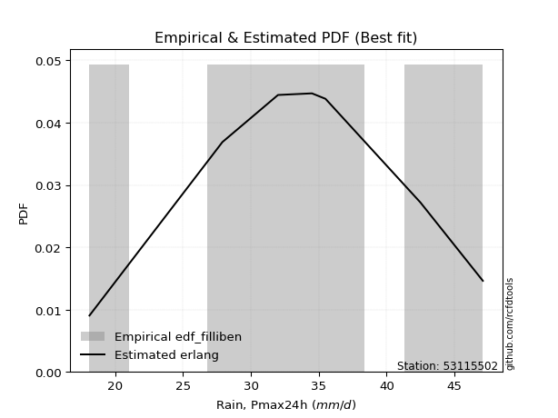</img>

</div>


### 10. EDF Jenkinson (1977)

The Jenkinson formula in hydrology is an empirical plotting position formula used to estimate the non-exceedance probability _(P)_ or return period _(T)_ of a given ordered observation within a sample. It is a widely used method in the frequency analysis of extreme events such as floods and rainfall, as it provides a distribution-free way to plot data. _a≈0.31_ and _b≈0.38_ are constants derived to approximate the median of the probability distribution for the given rank.

<div align="center">


$P=(m-a)/(n+b)$


</div>


**10.1. Empirical values**

<div align="center">

|                | 0                   | 1                   | 2                   | 3             | 4                  | 5                  | 6                  |
|:---------------|:--------------------|:--------------------|:--------------------|:--------------|:-------------------|:-------------------|:-------------------|
| date           | 2023                | 2022                | 2017                | 2021          | 2018               | 2019               | 2020               |
| x              | 18.1                | 27.9                | 32.0                | 34.5          | 35.5               | 42.5               | 47.1               |
| m              | 1                   | 2                   | 3                   | 4             | 5                  | 6                  | 7                  |
| empirical_dist | edf_jenkinson       | edf_jenkinson       | edf_jenkinson       | edf_jenkinson | edf_jenkinson      | edf_jenkinson      | edf_jenkinson      |
| empirical      | 0.09349593495934959 | 0.22899728997289973 | 0.36449864498644985 | 0.5           | 0.6355013550135502 | 0.7710027100271003 | 0.9065040650406505 |
| empirical_tr   | 1.1031390134529149  | 1.29701230228471    | 1.5735607675906182  | 2.0           | 2.743494423791822  | 4.366863905325444  | 10.695652173913055 |

</div>


**10.2. Kolmogorov-Smirnov fit test (sorted by Δ)**


<div align="center">

|                | 0                    | 1                   | 2                   | 3                   | 4                   | 5                   | 6                   | 7                   | 8                   | 9                   | 10                  | 11                  | 12                  | 13                  | 14                  | 15                  | 16                  | 17                  | 18                  | 19                  | 20                  | 21                  | 22                  | 23                  | 24                  | 25                  | 26                  | 27                  | 28                  | 29                  | 30                  | 31                  | 32                  | 33                  | 34                  | 35                  | 36                  | 37                  | 38                  | 39                  | 40                  | 41                  | 42                  | 43                  | 44                  | 45                  | 46                  | 47                  | 48                  | 49                  | 50                  | 51                  | 52                  | 53                  | 54                  | 55                  | 56                  | 57                  | 58                  | 59                  | 60                  | 61                  | 62                  | 63                  | 64                  | 65                  | 66                  | 67                  | 68                  | 69                  | 70                  | 71                  | 72                  | 73                  | 74                  | 75                  | 76                  | 77                  | 78                  | 79                  | 80                  | 81                  | 82                  | 83                  | 84                  | 85                  | 86                  | 87                  | 88                  | 89                  | 90                  | 91                  | 92                  | 93                  | 94                  | 95                  | 96                  | 97                  | 98                  | 99                  | 100                 | 101                 | 102                 | 103                 | 104                 | 105                 | 106                 | 107                 | 108                 | 109                 | 110                 | 111                 | 112                 | 113                 | 114                 | 115                 | 116                 | 117                 | 118                 | 119                 | 120                 | 121                 | 122                 | 123                 | 124                 | 125                 | 126                 | 127                 | 128                 | 129                 | 130                 | 131                 | 132                 | 133                 | 134                 | 135                 | 136                 | 137                 | 138                 | 139                 | 140                 | 141                 | 142                 | 143                 | 144                 | 145                 | 146                 | 147                 | 148                 | 149                 | 150                 | 151                 | 152                 | 153                 | 154                 | 155                 | 156                 | 157                 | 158                 | 159                 |
|:---------------|:---------------------|:--------------------|:--------------------|:--------------------|:--------------------|:--------------------|:--------------------|:--------------------|:--------------------|:--------------------|:--------------------|:--------------------|:--------------------|:--------------------|:--------------------|:--------------------|:--------------------|:--------------------|:--------------------|:--------------------|:--------------------|:--------------------|:--------------------|:--------------------|:--------------------|:--------------------|:--------------------|:--------------------|:--------------------|:--------------------|:--------------------|:--------------------|:--------------------|:--------------------|:--------------------|:--------------------|:--------------------|:--------------------|:--------------------|:--------------------|:--------------------|:--------------------|:--------------------|:--------------------|:--------------------|:--------------------|:--------------------|:--------------------|:--------------------|:--------------------|:--------------------|:--------------------|:--------------------|:--------------------|:--------------------|:--------------------|:--------------------|:--------------------|:--------------------|:--------------------|:--------------------|:--------------------|:--------------------|:--------------------|:--------------------|:--------------------|:--------------------|:--------------------|:--------------------|:--------------------|:--------------------|:--------------------|:--------------------|:--------------------|:--------------------|:--------------------|:--------------------|:--------------------|:--------------------|:--------------------|:--------------------|:--------------------|:--------------------|:--------------------|:--------------------|:--------------------|:--------------------|:--------------------|:--------------------|:--------------------|:--------------------|:--------------------|:--------------------|:--------------------|:--------------------|:--------------------|:--------------------|:--------------------|:--------------------|:--------------------|:--------------------|:--------------------|:--------------------|:--------------------|:--------------------|:--------------------|:--------------------|:--------------------|:--------------------|:--------------------|:--------------------|:--------------------|:--------------------|:--------------------|:--------------------|:--------------------|:--------------------|:--------------------|:--------------------|:--------------------|:--------------------|:--------------------|:--------------------|:--------------------|:--------------------|:--------------------|:--------------------|:--------------------|:--------------------|:--------------------|:--------------------|:--------------------|:--------------------|:--------------------|:--------------------|:--------------------|:--------------------|:--------------------|:--------------------|:--------------------|:--------------------|:--------------------|:--------------------|:--------------------|:--------------------|:--------------------|:--------------------|:--------------------|:--------------------|:--------------------|:--------------------|:--------------------|:--------------------|:--------------------|:--------------------|:--------------------|:--------------------|:--------------------|:--------------------|:--------------------|
| station        | 53115502             | 53115502            | 53115502            | 53115502            | 53115502            | 53115502            | 53115502            | 53115502            | 53115502            | 53115502            | 53115502            | 53115502            | 53115502            | 53115502            | 53115502            | 53115502            | 53115502            | 53115502            | 53115502            | 53115502            | 53115502            | 53115502            | 53115502            | 53115502            | 53115502            | 53115502            | 53115502            | 53115502            | 53115502            | 53115502            | 53115502            | 53115502            | 53115502            | 53115502            | 53115502            | 53115502            | 53115502            | 53115502            | 53115502            | 53115502            | 53115502            | 53115502            | 53115502            | 53115502            | 53115502            | 53115502            | 53115502            | 53115502            | 53115502            | 53115502            | 53115502            | 53115502            | 53115502            | 53115502            | 53115502            | 53115502            | 53115502            | 53115502            | 53115502            | 53115502            | 53115502            | 53115502            | 53115502            | 53115502            | 53115502            | 53115502            | 53115502            | 53115502            | 53115502            | 53115502            | 53115502            | 53115502            | 53115502            | 53115502            | 53115502            | 53115502            | 53115502            | 53115502            | 53115502            | 53115502            | 53115502            | 53115502            | 53115502            | 53115502            | 53115502            | 53115502            | 53115502            | 53115502            | 53115502            | 53115502            | 53115502            | 53115502            | 53115502            | 53115502            | 53115502            | 53115502            | 53115502            | 53115502            | 53115502            | 53115502            | 53115502            | 53115502            | 53115502            | 53115502            | 53115502            | 53115502            | 53115502            | 53115502            | 53115502            | 53115502            | 53115502            | 53115502            | 53115502            | 53115502            | 53115502            | 53115502            | 53115502            | 53115502            | 53115502            | 53115502            | 53115502            | 53115502            | 53115502            | 53115502            | 53115502            | 53115502            | 53115502            | 53115502            | 53115502            | 53115502            | 53115502            | 53115502            | 53115502            | 53115502            | 53115502            | 53115502            | 53115502            | 53115502            | 53115502            | 53115502            | 53115502            | 53115502            | 53115502            | 53115502            | 53115502            | 53115502            | 53115502            | 53115502            | 53115502            | 53115502            | 53115502            | 53115502            | 53115502            | 53115502            | 53115502            | 53115502            | 53115502            | 53115502            | 53115502            | 53115502            |
| empirical_dist | edf_jenkinson        | edf_jenkinson       | edf_jenkinson       | edf_jenkinson       | edf_jenkinson       | edf_jenkinson       | edf_jenkinson       | edf_jenkinson       | edf_jenkinson       | edf_jenkinson       | edf_jenkinson       | edf_jenkinson       | edf_jenkinson       | edf_jenkinson       | edf_jenkinson       | edf_jenkinson       | edf_jenkinson       | edf_jenkinson       | edf_jenkinson       | edf_jenkinson       | edf_jenkinson       | edf_jenkinson       | edf_jenkinson       | edf_jenkinson       | edf_jenkinson       | edf_jenkinson       | edf_jenkinson       | edf_jenkinson       | edf_jenkinson       | edf_jenkinson       | edf_jenkinson       | edf_jenkinson       | edf_jenkinson       | edf_jenkinson       | edf_jenkinson       | edf_jenkinson       | edf_jenkinson       | edf_jenkinson       | edf_jenkinson       | edf_jenkinson       | edf_jenkinson       | edf_jenkinson       | edf_jenkinson       | edf_jenkinson       | edf_jenkinson       | edf_jenkinson       | edf_jenkinson       | edf_jenkinson       | edf_jenkinson       | edf_jenkinson       | edf_jenkinson       | edf_jenkinson       | edf_jenkinson       | edf_jenkinson       | edf_jenkinson       | edf_jenkinson       | edf_jenkinson       | edf_jenkinson       | edf_jenkinson       | edf_jenkinson       | edf_jenkinson       | edf_jenkinson       | edf_jenkinson       | edf_jenkinson       | edf_jenkinson       | edf_jenkinson       | edf_jenkinson       | edf_jenkinson       | edf_jenkinson       | edf_jenkinson       | edf_jenkinson       | edf_jenkinson       | edf_jenkinson       | edf_jenkinson       | edf_jenkinson       | edf_jenkinson       | edf_jenkinson       | edf_jenkinson       | edf_jenkinson       | edf_jenkinson       | edf_jenkinson       | edf_jenkinson       | edf_jenkinson       | edf_jenkinson       | edf_jenkinson       | edf_jenkinson       | edf_jenkinson       | edf_jenkinson       | edf_jenkinson       | edf_jenkinson       | edf_jenkinson       | edf_jenkinson       | edf_jenkinson       | edf_jenkinson       | edf_jenkinson       | edf_jenkinson       | edf_jenkinson       | edf_jenkinson       | edf_jenkinson       | edf_jenkinson       | edf_jenkinson       | edf_jenkinson       | edf_jenkinson       | edf_jenkinson       | edf_jenkinson       | edf_jenkinson       | edf_jenkinson       | edf_jenkinson       | edf_jenkinson       | edf_jenkinson       | edf_jenkinson       | edf_jenkinson       | edf_jenkinson       | edf_jenkinson       | edf_jenkinson       | edf_jenkinson       | edf_jenkinson       | edf_jenkinson       | edf_jenkinson       | edf_jenkinson       | edf_jenkinson       | edf_jenkinson       | edf_jenkinson       | edf_jenkinson       | edf_jenkinson       | edf_jenkinson       | edf_jenkinson       | edf_jenkinson       | edf_jenkinson       | edf_jenkinson       | edf_jenkinson       | edf_jenkinson       | edf_jenkinson       | edf_jenkinson       | edf_jenkinson       | edf_jenkinson       | edf_jenkinson       | edf_jenkinson       | edf_jenkinson       | edf_jenkinson       | edf_jenkinson       | edf_jenkinson       | edf_jenkinson       | edf_jenkinson       | edf_jenkinson       | edf_jenkinson       | edf_jenkinson       | edf_jenkinson       | edf_jenkinson       | edf_jenkinson       | edf_jenkinson       | edf_jenkinson       | edf_jenkinson       | edf_jenkinson       | edf_jenkinson       | edf_jenkinson       | edf_jenkinson       | edf_jenkinson       | edf_jenkinson       | edf_jenkinson       |
| p_dist         | erlang               | gamma               | f                   | nct                 | crystalball         | norm                | exponnorm           | t                   | betaprime           | logdweibull         | invgamma            | rice                | cosine              | logt                | alpha               | logpearson3         | loggennorm          | logloglaplace       | anglit              | semicircular        | loggumbel_l         | dweibull            | genlogistic         | logdgamma           | maxwell             | logburr12           | pearson3            | logistic            | logweibull_min      | ncf                 | weibull_min         | dgamma              | logburr             | hypsecant           | logtriang           | logtruncweibull_min | loggompertz         | logskewnorm         | beta                | logexponpow         | invgauss            | rayleigh            | johnsonsu           | skewnorm            | logtrapezoid        | mielke              | loghypsecant        | loggenlogistic      | loggengamma         | laplace             | loglogistic         | kappa3              | logargus            | logf                | logcrystalball      | lognorm             | logexponnorm        | logfatiguelife      | loggenhalflogistic  | logjohnsonsu        | arcsine             | logloggamma         | gumbel_r            | loganglit           | argus               | wrapcauchy          | bradford            | logsemicircular     | vonmises_line       | uniform             | gausshyper          | logrice             | loggausshyper       | loglaplace          | loglaplace          | loggamma            | loggamma            | burr                | logerlang           | logbetaprime        | genextreme          | logalpha            | loginvgamma         | lognct              | logbeta             | halfnorm            | gumbel_l            | kappa4              | kstwobign           | moyal               | loginvgauss         | ksone               | logexponweib        | logfoldnorm         | logmaxwell          | logarcsine          | halflogistic        | logncf              | lograyleigh         | loginvweibull       | logcosine           | triang              | genpareto           | lomax               | loggumbel_r         | logmielke           | loggenexpon         | loghalfnorm         | logkstwobign        | loglevy_l           | wald                | genhalflogistic     | logmoyal            | loghalflogistic     | truncexpon          | truncnorm           | logkappa4           | logtruncnorm        | logtukeylambda      | nakagami            | logkappa3           | loguniform          | logksone            | logvonmises_line    | logweibull_max      | loggenpareto        | levy_l              | genexpon            | loggenextreme       | logbradford         | logwrapcauchy       | truncweibull_min    | gennorm             | logwald             | lognakagami         | trapezoid           | burr12              | halfgennorm         | logtruncexpon       | logjohnsonsb        | logrdist            | foldnorm            | invweibull          | johnsonsb           | fatiguelife         | gengamma            | gompertz            | weibull_max         | exponweib           | tukeylambda         | powerlaw            | logpowerlaw         | rdist               | loglomax            | exponpow            | truncpareto         | logtruncpareto      | loghalfgennorm      | logvonmises         | vonmises            |
| delta          | 0.062119250650305435 | 0.06224568633299854 | 0.06472615438090834 | 0.06494007476979391 | 0.0651652443119266  | 0.065165254359419   | 0.0651660851597975  | 0.0651898920967422  | 0.06528457770889806 | 0.06600892458085283 | 0.06730696234998079 | 0.06795210666224394 | 0.07104356726350153 | 0.07159291853879053 | 0.07160365852100653 | 0.07191193049400812 | 0.07287032555662165 | 0.07460072545383456 | 0.07506632913100164 | 0.07916124100959776 | 0.07922903883070487 | 0.07939588755409732 | 0.08085468970041787 | 0.08116607884869964 | 0.08224760715495372 | 0.08230345494356062 | 0.082573021493479   | 0.08302573233289934 | 0.08445572705123316 | 0.08574836229368166 | 0.08685541776399097 | 0.0896276886975691  | 0.0911774796530328  | 0.09322638782054093 | 0.09348594248244912 | 0.0934937004389601  | 0.09349566662318845 | 0.09349585704326235 | 0.09349593495896569 | 0.09396543154886716 | 0.09415350354160018 | 0.09449443351327008 | 0.09558940607437982 | 0.09566037301699959 | 0.09587002048486437 | 0.10002418100728805 | 0.10044875466575431 | 0.1005279298773546  | 0.1021700928915002  | 0.1028774451483564  | 0.10369074217530455 | 0.10412965491676227 | 0.10610322538986239 | 0.10691063547136248 | 0.10749878511082162 | 0.10749976001173678 | 0.10750032393626968 | 0.10779028726886963 | 0.10862717520287479 | 0.10920768225405797 | 0.10933592607641138 | 0.10952386824413274 | 0.10996442952874685 | 0.11149768325037512 | 0.11218750450191328 | 0.11227216195968498 | 0.11251989928415307 | 0.11314305007065456 | 0.11331546013561489 | 0.11481169984113632 | 0.1148468645111067  | 0.11517080506836391 | 0.11754637918518202 | 0.1175576150968527  | 0.1175576150968527  | 0.11801638956400923 | 0.11801638956400923 | 0.11925139348550345 | 0.12014900082979557 | 0.1204832621682605  | 0.12134055712750413 | 0.12454364528702627 | 0.12558107112596129 | 0.12740592145055302 | 0.128718826875035   | 0.1291855732011039  | 0.1297325377993075  | 0.13128353473159632 | 0.13362416516187198 | 0.13368509311366011 | 0.13446938603697467 | 0.13594523876273243 | 0.13600050300668115 | 0.13839405413797806 | 0.14144476335322448 | 0.14539791204834804 | 0.14631160424840378 | 0.14974375029600165 | 0.15300019963960626 | 0.15661358423925237 | 0.1576752462579229  | 0.1690098310847155  | 0.17162870973591945 | 0.17384322851442346 | 0.17647034741325046 | 0.18167148165509955 | 0.18486125092422184 | 0.18557085644338095 | 0.186108961133106   | 0.19839495144977537 | 0.1985389706528104  | 0.19890427936341326 | 0.20225727089107232 | 0.20856085343457215 | 0.21215640144877806 | 0.21594388273275636 | 0.22505718710846848 | 0.22899417712755388 | 0.22899727499514913 | 0.22899728965162947 | 0.22907784621695398 | 0.23132649545692457 | 0.23138571581974512 | 0.2316610553803719  | 0.23327817691503483 | 0.23566576890244445 | 0.23855015528477952 | 0.2387972028245454  | 0.2430002864549104  | 0.24596445045798204 | 0.25505039287319375 | 0.2616611440628414  | 0.2710027100271003  | 0.27403014901081185 | 0.2790321848879013  | 0.29522357723577247 | 0.29802259747355964 | 0.3095828332142725  | 0.3224676185590491  | 0.3609084731919049  | 0.4156545433500649  | 0.4490620998646749  | 0.47883314046555225 | 0.5174512396481283  | 0.520771794607839   | 0.5216456521150015  | 0.5259487540256917  | 0.5340567643243473  | 0.5417450766865458  | 0.5626734804264237  | 0.5969406580176805  | 0.6333155442496505  | 0.6355013540303609  | 0.6839994777228524  | 0.6882243871024246  | 0.6911741563656734  | 0.7120448689285896  | 0.7710027100271003  | 1.1024363931371888  | 7.402580670410073   |
| deltao         | 0.48442053926100004  | 0.48442053926100004 | 0.48442053926100004 | 0.48442053926100004 | 0.48442053926100004 | 0.48442053926100004 | 0.48442053926100004 | 0.48442053926100004 | 0.48442053926100004 | 0.48442053926100004 | 0.48442053926100004 | 0.48442053926100004 | 0.48442053926100004 | 0.48442053926100004 | 0.48442053926100004 | 0.48442053926100004 | 0.48442053926100004 | 0.48442053926100004 | 0.48442053926100004 | 0.48442053926100004 | 0.48442053926100004 | 0.48442053926100004 | 0.48442053926100004 | 0.48442053926100004 | 0.48442053926100004 | 0.48442053926100004 | 0.48442053926100004 | 0.48442053926100004 | 0.48442053926100004 | 0.48442053926100004 | 0.48442053926100004 | 0.48442053926100004 | 0.48442053926100004 | 0.48442053926100004 | 0.48442053926100004 | 0.48442053926100004 | 0.48442053926100004 | 0.48442053926100004 | 0.48442053926100004 | 0.48442053926100004 | 0.48442053926100004 | 0.48442053926100004 | 0.48442053926100004 | 0.48442053926100004 | 0.48442053926100004 | 0.48442053926100004 | 0.48442053926100004 | 0.48442053926100004 | 0.48442053926100004 | 0.48442053926100004 | 0.48442053926100004 | 0.48442053926100004 | 0.48442053926100004 | 0.48442053926100004 | 0.48442053926100004 | 0.48442053926100004 | 0.48442053926100004 | 0.48442053926100004 | 0.48442053926100004 | 0.48442053926100004 | 0.48442053926100004 | 0.48442053926100004 | 0.48442053926100004 | 0.48442053926100004 | 0.48442053926100004 | 0.48442053926100004 | 0.48442053926100004 | 0.48442053926100004 | 0.48442053926100004 | 0.48442053926100004 | 0.48442053926100004 | 0.48442053926100004 | 0.48442053926100004 | 0.48442053926100004 | 0.48442053926100004 | 0.48442053926100004 | 0.48442053926100004 | 0.48442053926100004 | 0.48442053926100004 | 0.48442053926100004 | 0.48442053926100004 | 0.48442053926100004 | 0.48442053926100004 | 0.48442053926100004 | 0.48442053926100004 | 0.48442053926100004 | 0.48442053926100004 | 0.48442053926100004 | 0.48442053926100004 | 0.48442053926100004 | 0.48442053926100004 | 0.48442053926100004 | 0.48442053926100004 | 0.48442053926100004 | 0.48442053926100004 | 0.48442053926100004 | 0.48442053926100004 | 0.48442053926100004 | 0.48442053926100004 | 0.48442053926100004 | 0.48442053926100004 | 0.48442053926100004 | 0.48442053926100004 | 0.48442053926100004 | 0.48442053926100004 | 0.48442053926100004 | 0.48442053926100004 | 0.48442053926100004 | 0.48442053926100004 | 0.48442053926100004 | 0.48442053926100004 | 0.48442053926100004 | 0.48442053926100004 | 0.48442053926100004 | 0.48442053926100004 | 0.48442053926100004 | 0.48442053926100004 | 0.48442053926100004 | 0.48442053926100004 | 0.48442053926100004 | 0.48442053926100004 | 0.48442053926100004 | 0.48442053926100004 | 0.48442053926100004 | 0.48442053926100004 | 0.48442053926100004 | 0.48442053926100004 | 0.48442053926100004 | 0.48442053926100004 | 0.48442053926100004 | 0.48442053926100004 | 0.48442053926100004 | 0.48442053926100004 | 0.48442053926100004 | 0.48442053926100004 | 0.48442053926100004 | 0.48442053926100004 | 0.48442053926100004 | 0.48442053926100004 | 0.48442053926100004 | 0.48442053926100004 | 0.48442053926100004 | 0.48442053926100004 | 0.48442053926100004 | 0.48442053926100004 | 0.48442053926100004 | 0.48442053926100004 | 0.48442053926100004 | 0.48442053926100004 | 0.48442053926100004 | 0.48442053926100004 | 0.48442053926100004 | 0.48442053926100004 | 0.48442053926100004 | 0.48442053926100004 | 0.48442053926100004 | 0.48442053926100004 | 0.48442053926100004 | 0.48442053926100004 | 0.48442053926100004 |
| eval           | Δo > Δ               | Δo > Δ              | Δo > Δ              | Δo > Δ              | Δo > Δ              | Δo > Δ              | Δo > Δ              | Δo > Δ              | Δo > Δ              | Δo > Δ              | Δo > Δ              | Δo > Δ              | Δo > Δ              | Δo > Δ              | Δo > Δ              | Δo > Δ              | Δo > Δ              | Δo > Δ              | Δo > Δ              | Δo > Δ              | Δo > Δ              | Δo > Δ              | Δo > Δ              | Δo > Δ              | Δo > Δ              | Δo > Δ              | Δo > Δ              | Δo > Δ              | Δo > Δ              | Δo > Δ              | Δo > Δ              | Δo > Δ              | Δo > Δ              | Δo > Δ              | Δo > Δ              | Δo > Δ              | Δo > Δ              | Δo > Δ              | Δo > Δ              | Δo > Δ              | Δo > Δ              | Δo > Δ              | Δo > Δ              | Δo > Δ              | Δo > Δ              | Δo > Δ              | Δo > Δ              | Δo > Δ              | Δo > Δ              | Δo > Δ              | Δo > Δ              | Δo > Δ              | Δo > Δ              | Δo > Δ              | Δo > Δ              | Δo > Δ              | Δo > Δ              | Δo > Δ              | Δo > Δ              | Δo > Δ              | Δo > Δ              | Δo > Δ              | Δo > Δ              | Δo > Δ              | Δo > Δ              | Δo > Δ              | Δo > Δ              | Δo > Δ              | Δo > Δ              | Δo > Δ              | Δo > Δ              | Δo > Δ              | Δo > Δ              | Δo > Δ              | Δo > Δ              | Δo > Δ              | Δo > Δ              | Δo > Δ              | Δo > Δ              | Δo > Δ              | Δo > Δ              | Δo > Δ              | Δo > Δ              | Δo > Δ              | Δo > Δ              | Δo > Δ              | Δo > Δ              | Δo > Δ              | Δo > Δ              | Δo > Δ              | Δo > Δ              | Δo > Δ              | Δo > Δ              | Δo > Δ              | Δo > Δ              | Δo > Δ              | Δo > Δ              | Δo > Δ              | Δo > Δ              | Δo > Δ              | Δo > Δ              | Δo > Δ              | Δo > Δ              | Δo > Δ              | Δo > Δ              | Δo > Δ              | Δo > Δ              | Δo > Δ              | Δo > Δ              | Δo > Δ              | Δo > Δ              | Δo > Δ              | Δo > Δ              | Δo > Δ              | Δo > Δ              | Δo > Δ              | Δo > Δ              | Δo > Δ              | Δo > Δ              | Δo > Δ              | Δo > Δ              | Δo > Δ              | Δo > Δ              | Δo > Δ              | Δo > Δ              | Δo > Δ              | Δo > Δ              | Δo > Δ              | Δo > Δ              | Δo > Δ              | Δo > Δ              | Δo > Δ              | Δo > Δ              | Δo > Δ              | Δo > Δ              | Δo > Δ              | Δo > Δ              | Δo > Δ              | Δo > Δ              | Δo > Δ              | Δo > Δ              | Δo > Δ              | Δo > Δ              | Δo <= Δ             | Δo <= Δ             | Δo <= Δ             | Δo <= Δ             | Δo <= Δ             | Δo <= Δ             | Δo <= Δ             | Δo <= Δ             | Δo <= Δ             | Δo <= Δ             | Δo <= Δ             | Δo <= Δ             | Δo <= Δ             | Δo <= Δ             | Δo <= Δ             | Δo <= Δ             | Δo <= Δ             |
| fit            | 1                    | 1                   | 1                   | 1                   | 1                   | 1                   | 1                   | 1                   | 1                   | 1                   | 1                   | 1                   | 1                   | 1                   | 1                   | 1                   | 1                   | 1                   | 1                   | 1                   | 1                   | 1                   | 1                   | 1                   | 1                   | 1                   | 1                   | 1                   | 1                   | 1                   | 1                   | 1                   | 1                   | 1                   | 1                   | 1                   | 1                   | 1                   | 1                   | 1                   | 1                   | 1                   | 1                   | 1                   | 1                   | 1                   | 1                   | 1                   | 1                   | 1                   | 1                   | 1                   | 1                   | 1                   | 1                   | 1                   | 1                   | 1                   | 1                   | 1                   | 1                   | 1                   | 1                   | 1                   | 1                   | 1                   | 1                   | 1                   | 1                   | 1                   | 1                   | 1                   | 1                   | 1                   | 1                   | 1                   | 1                   | 1                   | 1                   | 1                   | 1                   | 1                   | 1                   | 1                   | 1                   | 1                   | 1                   | 1                   | 1                   | 1                   | 1                   | 1                   | 1                   | 1                   | 1                   | 1                   | 1                   | 1                   | 1                   | 1                   | 1                   | 1                   | 1                   | 1                   | 1                   | 1                   | 1                   | 1                   | 1                   | 1                   | 1                   | 1                   | 1                   | 1                   | 1                   | 1                   | 1                   | 1                   | 1                   | 1                   | 1                   | 1                   | 1                   | 1                   | 1                   | 1                   | 1                   | 1                   | 1                   | 1                   | 1                   | 1                   | 1                   | 1                   | 1                   | 1                   | 1                   | 1                   | 1                   | 1                   | 1                   | 1                   | 1                   | 0                   | 0                   | 0                   | 0                   | 0                   | 0                   | 0                   | 0                   | 0                   | 0                   | 0                   | 0                   | 0                   | 0                   | 0                   | 0                   | 0                   |
| n              | 7                    | 7                   | 7                   | 7                   | 7                   | 7                   | 7                   | 7                   | 7                   | 7                   | 7                   | 7                   | 7                   | 7                   | 7                   | 7                   | 7                   | 7                   | 7                   | 7                   | 7                   | 7                   | 7                   | 7                   | 7                   | 7                   | 7                   | 7                   | 7                   | 7                   | 7                   | 7                   | 7                   | 7                   | 7                   | 7                   | 7                   | 7                   | 7                   | 7                   | 7                   | 7                   | 7                   | 7                   | 7                   | 7                   | 7                   | 7                   | 7                   | 7                   | 7                   | 7                   | 7                   | 7                   | 7                   | 7                   | 7                   | 7                   | 7                   | 7                   | 7                   | 7                   | 7                   | 7                   | 7                   | 7                   | 7                   | 7                   | 7                   | 7                   | 7                   | 7                   | 7                   | 7                   | 7                   | 7                   | 7                   | 7                   | 7                   | 7                   | 7                   | 7                   | 7                   | 7                   | 7                   | 7                   | 7                   | 7                   | 7                   | 7                   | 7                   | 7                   | 7                   | 7                   | 7                   | 7                   | 7                   | 7                   | 7                   | 7                   | 7                   | 7                   | 7                   | 7                   | 7                   | 7                   | 7                   | 7                   | 7                   | 7                   | 7                   | 7                   | 7                   | 7                   | 7                   | 7                   | 7                   | 7                   | 7                   | 7                   | 7                   | 7                   | 7                   | 7                   | 7                   | 7                   | 7                   | 7                   | 7                   | 7                   | 7                   | 7                   | 7                   | 7                   | 7                   | 7                   | 7                   | 7                   | 7                   | 7                   | 7                   | 7                   | 7                   | 7                   | 7                   | 7                   | 7                   | 7                   | 7                   | 7                   | 7                   | 7                   | 7                   | 7                   | 7                   | 7                   | 7                   | 7                   | 7                   | 7                   |
| best_fit       | 1                    | 0                   | 0                   | 0                   | 0                   | 0                   | 0                   | 0                   | 0                   | 0                   | 0                   | 0                   | 0                   | 0                   | 0                   | 0                   | 0                   | 0                   | 0                   | 0                   | 0                   | 0                   | 0                   | 0                   | 0                   | 0                   | 0                   | 0                   | 0                   | 0                   | 0                   | 0                   | 0                   | 0                   | 0                   | 0                   | 0                   | 0                   | 0                   | 0                   | 0                   | 0                   | 0                   | 0                   | 0                   | 0                   | 0                   | 0                   | 0                   | 0                   | 0                   | 0                   | 0                   | 0                   | 0                   | 0                   | 0                   | 0                   | 0                   | 0                   | 0                   | 0                   | 0                   | 0                   | 0                   | 0                   | 0                   | 0                   | 0                   | 0                   | 0                   | 0                   | 0                   | 0                   | 0                   | 0                   | 0                   | 0                   | 0                   | 0                   | 0                   | 0                   | 0                   | 0                   | 0                   | 0                   | 0                   | 0                   | 0                   | 0                   | 0                   | 0                   | 0                   | 0                   | 0                   | 0                   | 0                   | 0                   | 0                   | 0                   | 0                   | 0                   | 0                   | 0                   | 0                   | 0                   | 0                   | 0                   | 0                   | 0                   | 0                   | 0                   | 0                   | 0                   | 0                   | 0                   | 0                   | 0                   | 0                   | 0                   | 0                   | 0                   | 0                   | 0                   | 0                   | 0                   | 0                   | 0                   | 0                   | 0                   | 0                   | 0                   | 0                   | 0                   | 0                   | 0                   | 0                   | 0                   | 0                   | 0                   | 0                   | 0                   | 0                   | 0                   | 0                   | 0                   | 0                   | 0                   | 0                   | 0                   | 0                   | 0                   | 0                   | 0                   | 0                   | 0                   | 0                   | 0                   | 0                   | 0                   |
| best_fit_sort  | 1                    | 2                   | 3                   | 4                   | 5                   | 6                   | 7                   | 8                   | 9                   | 10                  | 11                  | 12                  | 13                  | 14                  | 15                  | 16                  | 17                  | 18                  | 19                  | 20                  | 21                  | 22                  | 23                  | 24                  | 25                  | 26                  | 27                  | 28                  | 29                  | 30                  | 31                  | 32                  | 33                  | 34                  | 35                  | 36                  | 37                  | 38                  | 39                  | 40                  | 41                  | 42                  | 43                  | 44                  | 45                  | 46                  | 47                  | 48                  | 49                  | 50                  | 51                  | 52                  | 53                  | 54                  | 55                  | 56                  | 57                  | 58                  | 59                  | 60                  | 61                  | 62                  | 63                  | 64                  | 65                  | 66                  | 67                  | 68                  | 69                  | 70                  | 71                  | 72                  | 73                  | 74                  | 75                  | 76                  | 77                  | 78                  | 79                  | 80                  | 81                  | 82                  | 83                  | 84                  | 85                  | 86                  | 87                  | 88                  | 89                  | 90                  | 91                  | 92                  | 93                  | 94                  | 95                  | 96                  | 97                  | 98                  | 99                  | 100                 | 101                 | 102                 | 103                 | 104                 | 105                 | 106                 | 107                 | 108                 | 109                 | 110                 | 111                 | 112                 | 113                 | 114                 | 115                 | 116                 | 117                 | 118                 | 119                 | 120                 | 121                 | 122                 | 123                 | 124                 | 125                 | 126                 | 127                 | 128                 | 129                 | 130                 | 131                 | 132                 | 133                 | 134                 | 135                 | 136                 | 137                 | 138                 | 139                 | 140                 | 141                 | 142                 | 143                 | 144                 | 145                 | 146                 | 147                 | 148                 | 149                 | 150                 | 151                 | 152                 | 153                 | 154                 | 155                 | 156                 | 157                 | 158                 | 159                 | 160                 |

</div>


**10.3. Best fit**

<div align="center">

|   id |   station | empirical_dist   | p_dist   |     delta |   deltao | eval   |   fit |   n |   best_fit |   best_fit_sort |
|-----:|----------:|:-----------------|:---------|----------:|---------:|:-------|------:|----:|-----------:|----------------:|
|    0 |  53115502 | edf_jenkinson    | erlang   | 0.0621193 | 0.484421 | Δo > Δ |     1 |   7 |          1 |               1 |

</div>


<div align="center">

</img></img>

</div>


### 11. EDF Cunnane (1978)

Cunnane´s work in statistical hydrology has focused on the performance and evaluation of different probability distributions (such as GEV, Gumbel, Lognormal) for flood frequency estimation. _b_ is a constant, typically set to 0.4.

<div align="center">


$P=(m-b)/(n+1-2b)$


</div>


**11.1. Empirical values**

<div align="center">

|                | 0                   | 1                   | 2                  | 3           | 4                  | 5                  | 6                  |
|:---------------|:--------------------|:--------------------|:-------------------|:------------|:-------------------|:-------------------|:-------------------|
| date           | 2023                | 2022                | 2017               | 2021        | 2018               | 2019               | 2020               |
| x              | 18.1                | 27.9                | 32.0               | 34.5        | 35.5               | 42.5               | 47.1               |
| m              | 1                   | 2                   | 3                  | 4           | 5                  | 6                  | 7                  |
| empirical_dist | edf_cunnane         | edf_cunnane         | edf_cunnane        | edf_cunnane | edf_cunnane        | edf_cunnane        | edf_cunnane        |
| empirical      | 0.08333333333333333 | 0.22222222222222224 | 0.3611111111111111 | 0.5         | 0.6388888888888888 | 0.7777777777777777 | 0.9166666666666666 |
| empirical_tr   | 1.090909090909091   | 1.2857142857142856  | 1.565217391304348  | 2.0         | 2.7692307692307687 | 4.499999999999998  | 11.999999999999995 |

</div>


**11.2. Kolmogorov-Smirnov fit test (sorted by Δ)**


<div align="center">

|                | 0                   | 1                   | 2                   | 3                   | 4                   | 5                   | 6                   | 7                   | 8                   | 9                   | 10                  | 11                  | 12                  | 13                  | 14                  | 15                  | 16                  | 17                  | 18                  | 19                  | 20                  | 21                  | 22                  | 23                  | 24                  | 25                  | 26                  | 27                  | 28                  | 29                  | 30                  | 31                  | 32                  | 33                  | 34                  | 35                  | 36                  | 37                  | 38                  | 39                  | 40                  | 41                  | 42                  | 43                  | 44                  | 45                  | 46                  | 47                  | 48                  | 49                  | 50                  | 51                  | 52                  | 53                  | 54                  | 55                  | 56                  | 57                  | 58                  | 59                  | 60                  | 61                  | 62                  | 63                  | 64                  | 65                  | 66                  | 67                  | 68                  | 69                  | 70                  | 71                  | 72                  | 73                  | 74                  | 75                  | 76                  | 77                  | 78                  | 79                  | 80                  | 81                  | 82                  | 83                  | 84                  | 85                  | 86                  | 87                  | 88                  | 89                  | 90                  | 91                  | 92                  | 93                  | 94                  | 95                  | 96                  | 97                  | 98                  | 99                  | 100                 | 101                 | 102                 | 103                 | 104                 | 105                 | 106                 | 107                 | 108                 | 109                 | 110                 | 111                 | 112                 | 113                 | 114                 | 115                 | 116                 | 117                 | 118                 | 119                 | 120                 | 121                 | 122                 | 123                 | 124                 | 125                 | 126                 | 127                 | 128                 | 129                 | 130                 | 131                 | 132                 | 133                 | 134                 | 135                 | 136                 | 137                 | 138                 | 139                 | 140                 | 141                 | 142                 | 143                 | 144                 | 145                 | 146                 | 147                 | 148                 | 149                 | 150                 | 151                 | 152                 | 153                 | 154                 | 155                 | 156                 | 157                 | 158                 | 159                 |
|:---------------|:--------------------|:--------------------|:--------------------|:--------------------|:--------------------|:--------------------|:--------------------|:--------------------|:--------------------|:--------------------|:--------------------|:--------------------|:--------------------|:--------------------|:--------------------|:--------------------|:--------------------|:--------------------|:--------------------|:--------------------|:--------------------|:--------------------|:--------------------|:--------------------|:--------------------|:--------------------|:--------------------|:--------------------|:--------------------|:--------------------|:--------------------|:--------------------|:--------------------|:--------------------|:--------------------|:--------------------|:--------------------|:--------------------|:--------------------|:--------------------|:--------------------|:--------------------|:--------------------|:--------------------|:--------------------|:--------------------|:--------------------|:--------------------|:--------------------|:--------------------|:--------------------|:--------------------|:--------------------|:--------------------|:--------------------|:--------------------|:--------------------|:--------------------|:--------------------|:--------------------|:--------------------|:--------------------|:--------------------|:--------------------|:--------------------|:--------------------|:--------------------|:--------------------|:--------------------|:--------------------|:--------------------|:--------------------|:--------------------|:--------------------|:--------------------|:--------------------|:--------------------|:--------------------|:--------------------|:--------------------|:--------------------|:--------------------|:--------------------|:--------------------|:--------------------|:--------------------|:--------------------|:--------------------|:--------------------|:--------------------|:--------------------|:--------------------|:--------------------|:--------------------|:--------------------|:--------------------|:--------------------|:--------------------|:--------------------|:--------------------|:--------------------|:--------------------|:--------------------|:--------------------|:--------------------|:--------------------|:--------------------|:--------------------|:--------------------|:--------------------|:--------------------|:--------------------|:--------------------|:--------------------|:--------------------|:--------------------|:--------------------|:--------------------|:--------------------|:--------------------|:--------------------|:--------------------|:--------------------|:--------------------|:--------------------|:--------------------|:--------------------|:--------------------|:--------------------|:--------------------|:--------------------|:--------------------|:--------------------|:--------------------|:--------------------|:--------------------|:--------------------|:--------------------|:--------------------|:--------------------|:--------------------|:--------------------|:--------------------|:--------------------|:--------------------|:--------------------|:--------------------|:--------------------|:--------------------|:--------------------|:--------------------|:--------------------|:--------------------|:--------------------|:--------------------|:--------------------|:--------------------|:--------------------|:--------------------|:--------------------|
| station        | 53115502            | 53115502            | 53115502            | 53115502            | 53115502            | 53115502            | 53115502            | 53115502            | 53115502            | 53115502            | 53115502            | 53115502            | 53115502            | 53115502            | 53115502            | 53115502            | 53115502            | 53115502            | 53115502            | 53115502            | 53115502            | 53115502            | 53115502            | 53115502            | 53115502            | 53115502            | 53115502            | 53115502            | 53115502            | 53115502            | 53115502            | 53115502            | 53115502            | 53115502            | 53115502            | 53115502            | 53115502            | 53115502            | 53115502            | 53115502            | 53115502            | 53115502            | 53115502            | 53115502            | 53115502            | 53115502            | 53115502            | 53115502            | 53115502            | 53115502            | 53115502            | 53115502            | 53115502            | 53115502            | 53115502            | 53115502            | 53115502            | 53115502            | 53115502            | 53115502            | 53115502            | 53115502            | 53115502            | 53115502            | 53115502            | 53115502            | 53115502            | 53115502            | 53115502            | 53115502            | 53115502            | 53115502            | 53115502            | 53115502            | 53115502            | 53115502            | 53115502            | 53115502            | 53115502            | 53115502            | 53115502            | 53115502            | 53115502            | 53115502            | 53115502            | 53115502            | 53115502            | 53115502            | 53115502            | 53115502            | 53115502            | 53115502            | 53115502            | 53115502            | 53115502            | 53115502            | 53115502            | 53115502            | 53115502            | 53115502            | 53115502            | 53115502            | 53115502            | 53115502            | 53115502            | 53115502            | 53115502            | 53115502            | 53115502            | 53115502            | 53115502            | 53115502            | 53115502            | 53115502            | 53115502            | 53115502            | 53115502            | 53115502            | 53115502            | 53115502            | 53115502            | 53115502            | 53115502            | 53115502            | 53115502            | 53115502            | 53115502            | 53115502            | 53115502            | 53115502            | 53115502            | 53115502            | 53115502            | 53115502            | 53115502            | 53115502            | 53115502            | 53115502            | 53115502            | 53115502            | 53115502            | 53115502            | 53115502            | 53115502            | 53115502            | 53115502            | 53115502            | 53115502            | 53115502            | 53115502            | 53115502            | 53115502            | 53115502            | 53115502            | 53115502            | 53115502            | 53115502            | 53115502            | 53115502            | 53115502            |
| empirical_dist | edf_cunnane         | edf_cunnane         | edf_cunnane         | edf_cunnane         | edf_cunnane         | edf_cunnane         | edf_cunnane         | edf_cunnane         | edf_cunnane         | edf_cunnane         | edf_cunnane         | edf_cunnane         | edf_cunnane         | edf_cunnane         | edf_cunnane         | edf_cunnane         | edf_cunnane         | edf_cunnane         | edf_cunnane         | edf_cunnane         | edf_cunnane         | edf_cunnane         | edf_cunnane         | edf_cunnane         | edf_cunnane         | edf_cunnane         | edf_cunnane         | edf_cunnane         | edf_cunnane         | edf_cunnane         | edf_cunnane         | edf_cunnane         | edf_cunnane         | edf_cunnane         | edf_cunnane         | edf_cunnane         | edf_cunnane         | edf_cunnane         | edf_cunnane         | edf_cunnane         | edf_cunnane         | edf_cunnane         | edf_cunnane         | edf_cunnane         | edf_cunnane         | edf_cunnane         | edf_cunnane         | edf_cunnane         | edf_cunnane         | edf_cunnane         | edf_cunnane         | edf_cunnane         | edf_cunnane         | edf_cunnane         | edf_cunnane         | edf_cunnane         | edf_cunnane         | edf_cunnane         | edf_cunnane         | edf_cunnane         | edf_cunnane         | edf_cunnane         | edf_cunnane         | edf_cunnane         | edf_cunnane         | edf_cunnane         | edf_cunnane         | edf_cunnane         | edf_cunnane         | edf_cunnane         | edf_cunnane         | edf_cunnane         | edf_cunnane         | edf_cunnane         | edf_cunnane         | edf_cunnane         | edf_cunnane         | edf_cunnane         | edf_cunnane         | edf_cunnane         | edf_cunnane         | edf_cunnane         | edf_cunnane         | edf_cunnane         | edf_cunnane         | edf_cunnane         | edf_cunnane         | edf_cunnane         | edf_cunnane         | edf_cunnane         | edf_cunnane         | edf_cunnane         | edf_cunnane         | edf_cunnane         | edf_cunnane         | edf_cunnane         | edf_cunnane         | edf_cunnane         | edf_cunnane         | edf_cunnane         | edf_cunnane         | edf_cunnane         | edf_cunnane         | edf_cunnane         | edf_cunnane         | edf_cunnane         | edf_cunnane         | edf_cunnane         | edf_cunnane         | edf_cunnane         | edf_cunnane         | edf_cunnane         | edf_cunnane         | edf_cunnane         | edf_cunnane         | edf_cunnane         | edf_cunnane         | edf_cunnane         | edf_cunnane         | edf_cunnane         | edf_cunnane         | edf_cunnane         | edf_cunnane         | edf_cunnane         | edf_cunnane         | edf_cunnane         | edf_cunnane         | edf_cunnane         | edf_cunnane         | edf_cunnane         | edf_cunnane         | edf_cunnane         | edf_cunnane         | edf_cunnane         | edf_cunnane         | edf_cunnane         | edf_cunnane         | edf_cunnane         | edf_cunnane         | edf_cunnane         | edf_cunnane         | edf_cunnane         | edf_cunnane         | edf_cunnane         | edf_cunnane         | edf_cunnane         | edf_cunnane         | edf_cunnane         | edf_cunnane         | edf_cunnane         | edf_cunnane         | edf_cunnane         | edf_cunnane         | edf_cunnane         | edf_cunnane         | edf_cunnane         | edf_cunnane         | edf_cunnane         | edf_cunnane         | edf_cunnane         |
| p_dist         | betaprime           | erlang              | gamma               | rice                | logt                | f                   | nct                 | crystalball         | norm                | exponnorm           | t                   | logdweibull         | invgamma            | dweibull            | logdgamma           | cosine              | alpha               | logpearson3         | logistic            | loggennorm          | logloglaplace       | anglit              | semicircular        | loggumbel_l         | dgamma              | logtruncweibull_min | loggompertz         | genlogistic         | maxwell             | logburr12           | pearson3            | hypsecant           | logweibull_min      | ncf                 | weibull_min         | logskewnorm         | logburr             | laplace             | beta                | logtriang           | logexponpow         | invgauss            | rayleigh            | johnsonsu           | skewnorm            | logtrapezoid        | mielke              | loghypsecant        | loggenlogistic      | loggengamma         | loglogistic         | logargus            | logf                | logcrystalball      | lognorm             | logexponnorm        | kappa3              | logfatiguelife      | loggenhalflogistic  | logjohnsonsu        | logloggamma         | gumbel_r            | loganglit           | argus               | wrapcauchy          | bradford            | arcsine             | logsemicircular     | vonmises_line       | loglaplace          | loglaplace          | uniform             | gausshyper          | logrice             | loggamma            | loggamma            | loggausshyper       | burr                | logerlang           | logbetaprime        | genextreme          | logalpha            | loginvgamma         | lognct              | logbeta             | halfnorm            | gumbel_l            | kappa4              | kstwobign           | moyal               | loginvgauss         | logexponweib        | logfoldnorm         | ksone               | logmaxwell          | halflogistic        | logarcsine          | lograyleigh         | logncf              | loginvweibull       | logcosine           | triang              | genpareto           | loggumbel_r         | lomax               | logmielke           | loggenexpon         | loghalfnorm         | logkstwobign        | wald                | genhalflogistic     | logmoyal            | loglevy_l           | loghalflogistic     | truncexpon          | logtruncnorm        | logtukeylambda      | nakagami            | truncnorm           | logkappa4           | logkappa3           | loguniform          | logvonmises_line    | logweibull_max      | logksone            | genexpon            | loggenpareto        | loggenextreme       | levy_l              | logbradford         | logwrapcauchy       | truncweibull_min    | logwald             | gennorm             | lognakagami         | trapezoid           | burr12              | halfgennorm         | logtruncexpon       | logjohnsonsb        | logrdist            | foldnorm            | invweibull          | johnsonsb           | fatiguelife         | gengamma            | gompertz            | weibull_max         | exponweib           | tukeylambda         | powerlaw            | rdist               | logpowerlaw         | loglomax            | exponpow            | truncpareto         | logtruncpareto      | loghalfgennorm      | logvonmises         | vonmises            |
| delta          | 0.06098832565537349 | 0.06177611466355093 | 0.0620493443378789  | 0.06520155600872612 | 0.065277286764172   | 0.06811368825624697 | 0.06832760864513254 | 0.06855277818726524 | 0.06855278823475763 | 0.06855361903513613 | 0.06857742597208083 | 0.06939645845619147 | 0.07069449622531954 | 0.07262081980341994 | 0.07439101109802215 | 0.07443110113884027 | 0.07499119239634527 | 0.07529946436934676 | 0.07625066458222196 | 0.07625785943196028 | 0.07798825932917319 | 0.07845386300634027 | 0.0825487748849364  | 0.0826165727060435  | 0.08285262094689172 | 0.08333109881294398 | 0.08333306499717219 | 0.0842422235757565  | 0.08563514103029246 | 0.08569098881889925 | 0.08596055536881764 | 0.08645132006986356 | 0.0878432609265718  | 0.0891358961690204  | 0.0902429516393296  | 0.09411172966477754 | 0.09456501352837154 | 0.09610237739767902 | 0.09623825643025871 | 0.09678582347175707 | 0.0973529654242058  | 0.09754103741693892 | 0.09788196738860883 | 0.09897693994971846 | 0.09904790689233822 | 0.099257554360203   | 0.10341171488262668 | 0.10383628854109306 | 0.10391546375269323 | 0.10555762676683894 | 0.1070782760506433  | 0.10949075926520102 | 0.11029816934670122 | 0.11088631898616036 | 0.11088729388707552 | 0.11088785781160843 | 0.11090472266743975 | 0.11117782114420838 | 0.11201470907821343 | 0.1125952161293966  | 0.11291140211947137 | 0.1133519634040856  | 0.11488521712571387 | 0.11557503837725192 | 0.11565969583502372 | 0.11590743315949181 | 0.11611099382708887 | 0.1165305839459933  | 0.11670299401095363 | 0.1175576150968527  | 0.1175576150968527  | 0.11819923371647506 | 0.11823439838644534 | 0.11855833894370266 | 0.12140392343934797 | 0.12140392343934797 | 0.12149402295895376 | 0.1226389273608422  | 0.12353653470513432 | 0.12387079604359924 | 0.12472809100284277 | 0.12793117916236502 | 0.12896860500130003 | 0.13079345532589176 | 0.13210636075037363 | 0.13257310707644265 | 0.13312007167464612 | 0.1358122124234333  | 0.13701169903721072 | 0.13707262698899886 | 0.1378569199123134  | 0.1393880368820199  | 0.1417815880133168  | 0.14272030651340992 | 0.14483229722856322 | 0.14969913812374253 | 0.15217297979902553 | 0.156387733514945   | 0.15651881804667914 | 0.1600011181145911  | 0.16106278013326164 | 0.17239736496005414 | 0.17840377748659694 | 0.1798578812885892  | 0.18400583014043959 | 0.1850590155304382  | 0.1882487847995606  | 0.1889583903187197  | 0.18949649500844473 | 0.20192650452814914 | 0.2022918132387519  | 0.20564480476641106 | 0.20855755307579166 | 0.2119483873099109  | 0.2155439353241168  | 0.2222191093768764  | 0.22222220724447164 | 0.22222222190095198 | 0.22271895048343385 | 0.23183225485914596 | 0.23246538009229273 | 0.23471402933226332 | 0.23504858925571065 | 0.23666571079037346 | 0.2381607835704226  | 0.24557227057522288 | 0.24582837052846074 | 0.24638782033024903 | 0.2487127569107958  | 0.2500664835271148  | 0.26182546062387124 | 0.2657469500233659  | 0.2774176828861506  | 0.2777777777777778  | 0.28241971876324007 | 0.2986111111111111  | 0.3047976652242371  | 0.31635790096495    | 0.32755681865096575 | 0.36768354094258227 | 0.42581714497608103 | 0.4490620998646749  | 0.4889957420915684  | 0.5242263073988057  | 0.5275468623585164  | 0.528420719865679   | 0.5293362879010304  | 0.5408318320750247  | 0.5485201444372233  | 0.5660610143017624  | 0.603715725768358   | 0.6388888879056995  | 0.640090612000328   | 0.6941620793488685  | 0.6949994548531021  | 0.6979492241163509  | 0.7188199366792671  | 0.7777777777777777  | 1.1058239270125274  | 7.392418068784056   |
| deltao         | 0.48442053926100004 | 0.48442053926100004 | 0.48442053926100004 | 0.48442053926100004 | 0.48442053926100004 | 0.48442053926100004 | 0.48442053926100004 | 0.48442053926100004 | 0.48442053926100004 | 0.48442053926100004 | 0.48442053926100004 | 0.48442053926100004 | 0.48442053926100004 | 0.48442053926100004 | 0.48442053926100004 | 0.48442053926100004 | 0.48442053926100004 | 0.48442053926100004 | 0.48442053926100004 | 0.48442053926100004 | 0.48442053926100004 | 0.48442053926100004 | 0.48442053926100004 | 0.48442053926100004 | 0.48442053926100004 | 0.48442053926100004 | 0.48442053926100004 | 0.48442053926100004 | 0.48442053926100004 | 0.48442053926100004 | 0.48442053926100004 | 0.48442053926100004 | 0.48442053926100004 | 0.48442053926100004 | 0.48442053926100004 | 0.48442053926100004 | 0.48442053926100004 | 0.48442053926100004 | 0.48442053926100004 | 0.48442053926100004 | 0.48442053926100004 | 0.48442053926100004 | 0.48442053926100004 | 0.48442053926100004 | 0.48442053926100004 | 0.48442053926100004 | 0.48442053926100004 | 0.48442053926100004 | 0.48442053926100004 | 0.48442053926100004 | 0.48442053926100004 | 0.48442053926100004 | 0.48442053926100004 | 0.48442053926100004 | 0.48442053926100004 | 0.48442053926100004 | 0.48442053926100004 | 0.48442053926100004 | 0.48442053926100004 | 0.48442053926100004 | 0.48442053926100004 | 0.48442053926100004 | 0.48442053926100004 | 0.48442053926100004 | 0.48442053926100004 | 0.48442053926100004 | 0.48442053926100004 | 0.48442053926100004 | 0.48442053926100004 | 0.48442053926100004 | 0.48442053926100004 | 0.48442053926100004 | 0.48442053926100004 | 0.48442053926100004 | 0.48442053926100004 | 0.48442053926100004 | 0.48442053926100004 | 0.48442053926100004 | 0.48442053926100004 | 0.48442053926100004 | 0.48442053926100004 | 0.48442053926100004 | 0.48442053926100004 | 0.48442053926100004 | 0.48442053926100004 | 0.48442053926100004 | 0.48442053926100004 | 0.48442053926100004 | 0.48442053926100004 | 0.48442053926100004 | 0.48442053926100004 | 0.48442053926100004 | 0.48442053926100004 | 0.48442053926100004 | 0.48442053926100004 | 0.48442053926100004 | 0.48442053926100004 | 0.48442053926100004 | 0.48442053926100004 | 0.48442053926100004 | 0.48442053926100004 | 0.48442053926100004 | 0.48442053926100004 | 0.48442053926100004 | 0.48442053926100004 | 0.48442053926100004 | 0.48442053926100004 | 0.48442053926100004 | 0.48442053926100004 | 0.48442053926100004 | 0.48442053926100004 | 0.48442053926100004 | 0.48442053926100004 | 0.48442053926100004 | 0.48442053926100004 | 0.48442053926100004 | 0.48442053926100004 | 0.48442053926100004 | 0.48442053926100004 | 0.48442053926100004 | 0.48442053926100004 | 0.48442053926100004 | 0.48442053926100004 | 0.48442053926100004 | 0.48442053926100004 | 0.48442053926100004 | 0.48442053926100004 | 0.48442053926100004 | 0.48442053926100004 | 0.48442053926100004 | 0.48442053926100004 | 0.48442053926100004 | 0.48442053926100004 | 0.48442053926100004 | 0.48442053926100004 | 0.48442053926100004 | 0.48442053926100004 | 0.48442053926100004 | 0.48442053926100004 | 0.48442053926100004 | 0.48442053926100004 | 0.48442053926100004 | 0.48442053926100004 | 0.48442053926100004 | 0.48442053926100004 | 0.48442053926100004 | 0.48442053926100004 | 0.48442053926100004 | 0.48442053926100004 | 0.48442053926100004 | 0.48442053926100004 | 0.48442053926100004 | 0.48442053926100004 | 0.48442053926100004 | 0.48442053926100004 | 0.48442053926100004 | 0.48442053926100004 | 0.48442053926100004 | 0.48442053926100004 | 0.48442053926100004 |
| eval           | Δo > Δ              | Δo > Δ              | Δo > Δ              | Δo > Δ              | Δo > Δ              | Δo > Δ              | Δo > Δ              | Δo > Δ              | Δo > Δ              | Δo > Δ              | Δo > Δ              | Δo > Δ              | Δo > Δ              | Δo > Δ              | Δo > Δ              | Δo > Δ              | Δo > Δ              | Δo > Δ              | Δo > Δ              | Δo > Δ              | Δo > Δ              | Δo > Δ              | Δo > Δ              | Δo > Δ              | Δo > Δ              | Δo > Δ              | Δo > Δ              | Δo > Δ              | Δo > Δ              | Δo > Δ              | Δo > Δ              | Δo > Δ              | Δo > Δ              | Δo > Δ              | Δo > Δ              | Δo > Δ              | Δo > Δ              | Δo > Δ              | Δo > Δ              | Δo > Δ              | Δo > Δ              | Δo > Δ              | Δo > Δ              | Δo > Δ              | Δo > Δ              | Δo > Δ              | Δo > Δ              | Δo > Δ              | Δo > Δ              | Δo > Δ              | Δo > Δ              | Δo > Δ              | Δo > Δ              | Δo > Δ              | Δo > Δ              | Δo > Δ              | Δo > Δ              | Δo > Δ              | Δo > Δ              | Δo > Δ              | Δo > Δ              | Δo > Δ              | Δo > Δ              | Δo > Δ              | Δo > Δ              | Δo > Δ              | Δo > Δ              | Δo > Δ              | Δo > Δ              | Δo > Δ              | Δo > Δ              | Δo > Δ              | Δo > Δ              | Δo > Δ              | Δo > Δ              | Δo > Δ              | Δo > Δ              | Δo > Δ              | Δo > Δ              | Δo > Δ              | Δo > Δ              | Δo > Δ              | Δo > Δ              | Δo > Δ              | Δo > Δ              | Δo > Δ              | Δo > Δ              | Δo > Δ              | Δo > Δ              | Δo > Δ              | Δo > Δ              | Δo > Δ              | Δo > Δ              | Δo > Δ              | Δo > Δ              | Δo > Δ              | Δo > Δ              | Δo > Δ              | Δo > Δ              | Δo > Δ              | Δo > Δ              | Δo > Δ              | Δo > Δ              | Δo > Δ              | Δo > Δ              | Δo > Δ              | Δo > Δ              | Δo > Δ              | Δo > Δ              | Δo > Δ              | Δo > Δ              | Δo > Δ              | Δo > Δ              | Δo > Δ              | Δo > Δ              | Δo > Δ              | Δo > Δ              | Δo > Δ              | Δo > Δ              | Δo > Δ              | Δo > Δ              | Δo > Δ              | Δo > Δ              | Δo > Δ              | Δo > Δ              | Δo > Δ              | Δo > Δ              | Δo > Δ              | Δo > Δ              | Δo > Δ              | Δo > Δ              | Δo > Δ              | Δo > Δ              | Δo > Δ              | Δo > Δ              | Δo > Δ              | Δo > Δ              | Δo > Δ              | Δo > Δ              | Δo > Δ              | Δo > Δ              | Δo > Δ              | Δo <= Δ             | Δo <= Δ             | Δo <= Δ             | Δo <= Δ             | Δo <= Δ             | Δo <= Δ             | Δo <= Δ             | Δo <= Δ             | Δo <= Δ             | Δo <= Δ             | Δo <= Δ             | Δo <= Δ             | Δo <= Δ             | Δo <= Δ             | Δo <= Δ             | Δo <= Δ             | Δo <= Δ             | Δo <= Δ             |
| fit            | 1                   | 1                   | 1                   | 1                   | 1                   | 1                   | 1                   | 1                   | 1                   | 1                   | 1                   | 1                   | 1                   | 1                   | 1                   | 1                   | 1                   | 1                   | 1                   | 1                   | 1                   | 1                   | 1                   | 1                   | 1                   | 1                   | 1                   | 1                   | 1                   | 1                   | 1                   | 1                   | 1                   | 1                   | 1                   | 1                   | 1                   | 1                   | 1                   | 1                   | 1                   | 1                   | 1                   | 1                   | 1                   | 1                   | 1                   | 1                   | 1                   | 1                   | 1                   | 1                   | 1                   | 1                   | 1                   | 1                   | 1                   | 1                   | 1                   | 1                   | 1                   | 1                   | 1                   | 1                   | 1                   | 1                   | 1                   | 1                   | 1                   | 1                   | 1                   | 1                   | 1                   | 1                   | 1                   | 1                   | 1                   | 1                   | 1                   | 1                   | 1                   | 1                   | 1                   | 1                   | 1                   | 1                   | 1                   | 1                   | 1                   | 1                   | 1                   | 1                   | 1                   | 1                   | 1                   | 1                   | 1                   | 1                   | 1                   | 1                   | 1                   | 1                   | 1                   | 1                   | 1                   | 1                   | 1                   | 1                   | 1                   | 1                   | 1                   | 1                   | 1                   | 1                   | 1                   | 1                   | 1                   | 1                   | 1                   | 1                   | 1                   | 1                   | 1                   | 1                   | 1                   | 1                   | 1                   | 1                   | 1                   | 1                   | 1                   | 1                   | 1                   | 1                   | 1                   | 1                   | 1                   | 1                   | 1                   | 1                   | 1                   | 1                   | 0                   | 0                   | 0                   | 0                   | 0                   | 0                   | 0                   | 0                   | 0                   | 0                   | 0                   | 0                   | 0                   | 0                   | 0                   | 0                   | 0                   | 0                   |
| n              | 7                   | 7                   | 7                   | 7                   | 7                   | 7                   | 7                   | 7                   | 7                   | 7                   | 7                   | 7                   | 7                   | 7                   | 7                   | 7                   | 7                   | 7                   | 7                   | 7                   | 7                   | 7                   | 7                   | 7                   | 7                   | 7                   | 7                   | 7                   | 7                   | 7                   | 7                   | 7                   | 7                   | 7                   | 7                   | 7                   | 7                   | 7                   | 7                   | 7                   | 7                   | 7                   | 7                   | 7                   | 7                   | 7                   | 7                   | 7                   | 7                   | 7                   | 7                   | 7                   | 7                   | 7                   | 7                   | 7                   | 7                   | 7                   | 7                   | 7                   | 7                   | 7                   | 7                   | 7                   | 7                   | 7                   | 7                   | 7                   | 7                   | 7                   | 7                   | 7                   | 7                   | 7                   | 7                   | 7                   | 7                   | 7                   | 7                   | 7                   | 7                   | 7                   | 7                   | 7                   | 7                   | 7                   | 7                   | 7                   | 7                   | 7                   | 7                   | 7                   | 7                   | 7                   | 7                   | 7                   | 7                   | 7                   | 7                   | 7                   | 7                   | 7                   | 7                   | 7                   | 7                   | 7                   | 7                   | 7                   | 7                   | 7                   | 7                   | 7                   | 7                   | 7                   | 7                   | 7                   | 7                   | 7                   | 7                   | 7                   | 7                   | 7                   | 7                   | 7                   | 7                   | 7                   | 7                   | 7                   | 7                   | 7                   | 7                   | 7                   | 7                   | 7                   | 7                   | 7                   | 7                   | 7                   | 7                   | 7                   | 7                   | 7                   | 7                   | 7                   | 7                   | 7                   | 7                   | 7                   | 7                   | 7                   | 7                   | 7                   | 7                   | 7                   | 7                   | 7                   | 7                   | 7                   | 7                   | 7                   |
| best_fit       | 1                   | 0                   | 0                   | 0                   | 0                   | 0                   | 0                   | 0                   | 0                   | 0                   | 0                   | 0                   | 0                   | 0                   | 0                   | 0                   | 0                   | 0                   | 0                   | 0                   | 0                   | 0                   | 0                   | 0                   | 0                   | 0                   | 0                   | 0                   | 0                   | 0                   | 0                   | 0                   | 0                   | 0                   | 0                   | 0                   | 0                   | 0                   | 0                   | 0                   | 0                   | 0                   | 0                   | 0                   | 0                   | 0                   | 0                   | 0                   | 0                   | 0                   | 0                   | 0                   | 0                   | 0                   | 0                   | 0                   | 0                   | 0                   | 0                   | 0                   | 0                   | 0                   | 0                   | 0                   | 0                   | 0                   | 0                   | 0                   | 0                   | 0                   | 0                   | 0                   | 0                   | 0                   | 0                   | 0                   | 0                   | 0                   | 0                   | 0                   | 0                   | 0                   | 0                   | 0                   | 0                   | 0                   | 0                   | 0                   | 0                   | 0                   | 0                   | 0                   | 0                   | 0                   | 0                   | 0                   | 0                   | 0                   | 0                   | 0                   | 0                   | 0                   | 0                   | 0                   | 0                   | 0                   | 0                   | 0                   | 0                   | 0                   | 0                   | 0                   | 0                   | 0                   | 0                   | 0                   | 0                   | 0                   | 0                   | 0                   | 0                   | 0                   | 0                   | 0                   | 0                   | 0                   | 0                   | 0                   | 0                   | 0                   | 0                   | 0                   | 0                   | 0                   | 0                   | 0                   | 0                   | 0                   | 0                   | 0                   | 0                   | 0                   | 0                   | 0                   | 0                   | 0                   | 0                   | 0                   | 0                   | 0                   | 0                   | 0                   | 0                   | 0                   | 0                   | 0                   | 0                   | 0                   | 0                   | 0                   |
| best_fit_sort  | 1                   | 2                   | 3                   | 4                   | 5                   | 6                   | 7                   | 8                   | 9                   | 10                  | 11                  | 12                  | 13                  | 14                  | 15                  | 16                  | 17                  | 18                  | 19                  | 20                  | 21                  | 22                  | 23                  | 24                  | 25                  | 26                  | 27                  | 28                  | 29                  | 30                  | 31                  | 32                  | 33                  | 34                  | 35                  | 36                  | 37                  | 38                  | 39                  | 40                  | 41                  | 42                  | 43                  | 44                  | 45                  | 46                  | 47                  | 48                  | 49                  | 50                  | 51                  | 52                  | 53                  | 54                  | 55                  | 56                  | 57                  | 58                  | 59                  | 60                  | 61                  | 62                  | 63                  | 64                  | 65                  | 66                  | 67                  | 68                  | 69                  | 70                  | 71                  | 72                  | 73                  | 74                  | 75                  | 76                  | 77                  | 78                  | 79                  | 80                  | 81                  | 82                  | 83                  | 84                  | 85                  | 86                  | 87                  | 88                  | 89                  | 90                  | 91                  | 92                  | 93                  | 94                  | 95                  | 96                  | 97                  | 98                  | 99                  | 100                 | 101                 | 102                 | 103                 | 104                 | 105                 | 106                 | 107                 | 108                 | 109                 | 110                 | 111                 | 112                 | 113                 | 114                 | 115                 | 116                 | 117                 | 118                 | 119                 | 120                 | 121                 | 122                 | 123                 | 124                 | 125                 | 126                 | 127                 | 128                 | 129                 | 130                 | 131                 | 132                 | 133                 | 134                 | 135                 | 136                 | 137                 | 138                 | 139                 | 140                 | 141                 | 142                 | 143                 | 144                 | 145                 | 146                 | 147                 | 148                 | 149                 | 150                 | 151                 | 152                 | 153                 | 154                 | 155                 | 156                 | 157                 | 158                 | 159                 | 160                 |

</div>


**11.3. Best fit**

<div align="center">

|   id |   station | empirical_dist   | p_dist    |     delta |   deltao | eval   |   fit |   n |   best_fit |   best_fit_sort |
|-----:|----------:|:-----------------|:----------|----------:|---------:|:-------|------:|----:|-----------:|----------------:|
|    0 |  53115502 | edf_cunnane      | betaprime | 0.0609883 | 0.484421 | Δo > Δ |     1 |   7 |          1 |               1 |

</div>


<div align="center">

</img></img>

</div>


### 12. EDF Adamowski (1981)

The Adamowski formula in hydrology refers to a specific plotting position formula used for estimating the non-parametric empirical distribution of hydrological events (like flood peaks) to calculate their return periods. This formula provides an alternative to traditional parametric methods (like the Gumbel or Log Pearson Type III distributions). 

<div align="center">


$P=(m-0.25)/(n+0.5)$


</div>


**12.1. Empirical values**

<div align="center">

|                | 0                  | 1                   | 2                   | 3             | 4                  | 5                  | 6                  |
|:---------------|:-------------------|:--------------------|:--------------------|:--------------|:-------------------|:-------------------|:-------------------|
| date           | 2023               | 2022                | 2017                | 2021          | 2018               | 2019               | 2020               |
| x              | 18.1               | 27.9                | 32.0                | 34.5          | 35.5               | 42.5               | 47.1               |
| m              | 1                  | 2                   | 3                   | 4             | 5                  | 6                  | 7                  |
| empirical_dist | edf_adamowski      | edf_adamowski       | edf_adamowski       | edf_adamowski | edf_adamowski      | edf_adamowski      | edf_adamowski      |
| empirical      | 0.1                | 0.23333333333333334 | 0.36666666666666664 | 0.5           | 0.6333333333333333 | 0.7666666666666667 | 0.9                |
| empirical_tr   | 1.1111111111111112 | 1.3043478260869565  | 1.5789473684210527  | 2.0           | 2.727272727272727  | 4.2857142857142865 | 10.000000000000002 |

</div>


**12.2. Kolmogorov-Smirnov fit test (sorted by Δ)**


<div align="center">

|                | 0                   | 1                   | 2                   | 3                   | 4                   | 5                   | 6                   | 7                   | 8                   | 9                   | 10                  | 11                  | 12                  | 13                  | 14                  | 15                  | 16                  | 17                  | 18                  | 19                  | 20                  | 21                  | 22                  | 23                  | 24                  | 25                  | 26                  | 27                  | 28                  | 29                  | 30                  | 31                  | 32                  | 33                  | 34                  | 35                  | 36                  | 37                  | 38                  | 39                  | 40                  | 41                  | 42                  | 43                  | 44                  | 45                  | 46                  | 47                  | 48                  | 49                  | 50                  | 51                  | 52                  | 53                  | 54                  | 55                  | 56                  | 57                  | 58                  | 59                  | 60                  | 61                  | 62                  | 63                  | 64                  | 65                  | 66                  | 67                  | 68                  | 69                  | 70                  | 71                  | 72                  | 73                  | 74                  | 75                  | 76                  | 77                  | 78                  | 79                  | 80                  | 81                  | 82                  | 83                  | 84                  | 85                  | 86                  | 87                  | 88                  | 89                  | 90                  | 91                  | 92                  | 93                  | 94                  | 95                  | 96                  | 97                  | 98                  | 99                  | 100                 | 101                 | 102                 | 103                 | 104                 | 105                 | 106                 | 107                 | 108                 | 109                 | 110                 | 111                 | 112                 | 113                 | 114                 | 115                 | 116                 | 117                 | 118                 | 119                 | 120                 | 121                 | 122                 | 123                 | 124                 | 125                 | 126                 | 127                 | 128                 | 129                 | 130                 | 131                 | 132                 | 133                 | 134                 | 135                 | 136                 | 137                 | 138                 | 139                 | 140                 | 141                 | 142                 | 143                 | 144                 | 145                 | 146                 | 147                 | 148                 | 149                 | 150                 | 151                 | 152                 | 153                 | 154                 | 155                 | 156                 | 157                 | 158                 | 159                 |
|:---------------|:--------------------|:--------------------|:--------------------|:--------------------|:--------------------|:--------------------|:--------------------|:--------------------|:--------------------|:--------------------|:--------------------|:--------------------|:--------------------|:--------------------|:--------------------|:--------------------|:--------------------|:--------------------|:--------------------|:--------------------|:--------------------|:--------------------|:--------------------|:--------------------|:--------------------|:--------------------|:--------------------|:--------------------|:--------------------|:--------------------|:--------------------|:--------------------|:--------------------|:--------------------|:--------------------|:--------------------|:--------------------|:--------------------|:--------------------|:--------------------|:--------------------|:--------------------|:--------------------|:--------------------|:--------------------|:--------------------|:--------------------|:--------------------|:--------------------|:--------------------|:--------------------|:--------------------|:--------------------|:--------------------|:--------------------|:--------------------|:--------------------|:--------------------|:--------------------|:--------------------|:--------------------|:--------------------|:--------------------|:--------------------|:--------------------|:--------------------|:--------------------|:--------------------|:--------------------|:--------------------|:--------------------|:--------------------|:--------------------|:--------------------|:--------------------|:--------------------|:--------------------|:--------------------|:--------------------|:--------------------|:--------------------|:--------------------|:--------------------|:--------------------|:--------------------|:--------------------|:--------------------|:--------------------|:--------------------|:--------------------|:--------------------|:--------------------|:--------------------|:--------------------|:--------------------|:--------------------|:--------------------|:--------------------|:--------------------|:--------------------|:--------------------|:--------------------|:--------------------|:--------------------|:--------------------|:--------------------|:--------------------|:--------------------|:--------------------|:--------------------|:--------------------|:--------------------|:--------------------|:--------------------|:--------------------|:--------------------|:--------------------|:--------------------|:--------------------|:--------------------|:--------------------|:--------------------|:--------------------|:--------------------|:--------------------|:--------------------|:--------------------|:--------------------|:--------------------|:--------------------|:--------------------|:--------------------|:--------------------|:--------------------|:--------------------|:--------------------|:--------------------|:--------------------|:--------------------|:--------------------|:--------------------|:--------------------|:--------------------|:--------------------|:--------------------|:--------------------|:--------------------|:--------------------|:--------------------|:--------------------|:--------------------|:--------------------|:--------------------|:--------------------|:--------------------|:--------------------|:--------------------|:--------------------|:--------------------|:--------------------|
| station        | 53115502            | 53115502            | 53115502            | 53115502            | 53115502            | 53115502            | 53115502            | 53115502            | 53115502            | 53115502            | 53115502            | 53115502            | 53115502            | 53115502            | 53115502            | 53115502            | 53115502            | 53115502            | 53115502            | 53115502            | 53115502            | 53115502            | 53115502            | 53115502            | 53115502            | 53115502            | 53115502            | 53115502            | 53115502            | 53115502            | 53115502            | 53115502            | 53115502            | 53115502            | 53115502            | 53115502            | 53115502            | 53115502            | 53115502            | 53115502            | 53115502            | 53115502            | 53115502            | 53115502            | 53115502            | 53115502            | 53115502            | 53115502            | 53115502            | 53115502            | 53115502            | 53115502            | 53115502            | 53115502            | 53115502            | 53115502            | 53115502            | 53115502            | 53115502            | 53115502            | 53115502            | 53115502            | 53115502            | 53115502            | 53115502            | 53115502            | 53115502            | 53115502            | 53115502            | 53115502            | 53115502            | 53115502            | 53115502            | 53115502            | 53115502            | 53115502            | 53115502            | 53115502            | 53115502            | 53115502            | 53115502            | 53115502            | 53115502            | 53115502            | 53115502            | 53115502            | 53115502            | 53115502            | 53115502            | 53115502            | 53115502            | 53115502            | 53115502            | 53115502            | 53115502            | 53115502            | 53115502            | 53115502            | 53115502            | 53115502            | 53115502            | 53115502            | 53115502            | 53115502            | 53115502            | 53115502            | 53115502            | 53115502            | 53115502            | 53115502            | 53115502            | 53115502            | 53115502            | 53115502            | 53115502            | 53115502            | 53115502            | 53115502            | 53115502            | 53115502            | 53115502            | 53115502            | 53115502            | 53115502            | 53115502            | 53115502            | 53115502            | 53115502            | 53115502            | 53115502            | 53115502            | 53115502            | 53115502            | 53115502            | 53115502            | 53115502            | 53115502            | 53115502            | 53115502            | 53115502            | 53115502            | 53115502            | 53115502            | 53115502            | 53115502            | 53115502            | 53115502            | 53115502            | 53115502            | 53115502            | 53115502            | 53115502            | 53115502            | 53115502            | 53115502            | 53115502            | 53115502            | 53115502            | 53115502            | 53115502            |
| empirical_dist | edf_adamowski       | edf_adamowski       | edf_adamowski       | edf_adamowski       | edf_adamowski       | edf_adamowski       | edf_adamowski       | edf_adamowski       | edf_adamowski       | edf_adamowski       | edf_adamowski       | edf_adamowski       | edf_adamowski       | edf_adamowski       | edf_adamowski       | edf_adamowski       | edf_adamowski       | edf_adamowski       | edf_adamowski       | edf_adamowski       | edf_adamowski       | edf_adamowski       | edf_adamowski       | edf_adamowski       | edf_adamowski       | edf_adamowski       | edf_adamowski       | edf_adamowski       | edf_adamowski       | edf_adamowski       | edf_adamowski       | edf_adamowski       | edf_adamowski       | edf_adamowski       | edf_adamowski       | edf_adamowski       | edf_adamowski       | edf_adamowski       | edf_adamowski       | edf_adamowski       | edf_adamowski       | edf_adamowski       | edf_adamowski       | edf_adamowski       | edf_adamowski       | edf_adamowski       | edf_adamowski       | edf_adamowski       | edf_adamowski       | edf_adamowski       | edf_adamowski       | edf_adamowski       | edf_adamowski       | edf_adamowski       | edf_adamowski       | edf_adamowski       | edf_adamowski       | edf_adamowski       | edf_adamowski       | edf_adamowski       | edf_adamowski       | edf_adamowski       | edf_adamowski       | edf_adamowski       | edf_adamowski       | edf_adamowski       | edf_adamowski       | edf_adamowski       | edf_adamowski       | edf_adamowski       | edf_adamowski       | edf_adamowski       | edf_adamowski       | edf_adamowski       | edf_adamowski       | edf_adamowski       | edf_adamowski       | edf_adamowski       | edf_adamowski       | edf_adamowski       | edf_adamowski       | edf_adamowski       | edf_adamowski       | edf_adamowski       | edf_adamowski       | edf_adamowski       | edf_adamowski       | edf_adamowski       | edf_adamowski       | edf_adamowski       | edf_adamowski       | edf_adamowski       | edf_adamowski       | edf_adamowski       | edf_adamowski       | edf_adamowski       | edf_adamowski       | edf_adamowski       | edf_adamowski       | edf_adamowski       | edf_adamowski       | edf_adamowski       | edf_adamowski       | edf_adamowski       | edf_adamowski       | edf_adamowski       | edf_adamowski       | edf_adamowski       | edf_adamowski       | edf_adamowski       | edf_adamowski       | edf_adamowski       | edf_adamowski       | edf_adamowski       | edf_adamowski       | edf_adamowski       | edf_adamowski       | edf_adamowski       | edf_adamowski       | edf_adamowski       | edf_adamowski       | edf_adamowski       | edf_adamowski       | edf_adamowski       | edf_adamowski       | edf_adamowski       | edf_adamowski       | edf_adamowski       | edf_adamowski       | edf_adamowski       | edf_adamowski       | edf_adamowski       | edf_adamowski       | edf_adamowski       | edf_adamowski       | edf_adamowski       | edf_adamowski       | edf_adamowski       | edf_adamowski       | edf_adamowski       | edf_adamowski       | edf_adamowski       | edf_adamowski       | edf_adamowski       | edf_adamowski       | edf_adamowski       | edf_adamowski       | edf_adamowski       | edf_adamowski       | edf_adamowski       | edf_adamowski       | edf_adamowski       | edf_adamowski       | edf_adamowski       | edf_adamowski       | edf_adamowski       | edf_adamowski       | edf_adamowski       | edf_adamowski       | edf_adamowski       |
| p_dist         | erlang              | gamma               | logdweibull         | f                   | nct                 | t                   | exponnorm           | norm                | crystalball         | betaprime           | logpearson3         | invgamma            | anglit              | alpha               | cosine              | loggennorm          | rice                | loggumbel_l         | logt                | genlogistic         | logburr12           | pearson3            | logloglaplace       | semicircular        | logweibull_min      | ncf                 | dweibull            | weibull_min         | logdgamma           | maxwell             | logistic            | logburr             | logexponpow         | invgauss            | johnsonsu           | skewnorm            | logtrapezoid        | dgamma              | rayleigh            | hypsecant           | mielke              | loghypsecant        | loggenlogistic      | kappa3              | logtriang           | logtruncweibull_min | loggompertz         | logskewnorm         | beta                | loggengamma         | loglogistic         | logargus            | logf                | arcsine             | logcrystalball      | lognorm             | logexponnorm        | logfatiguelife      | loggenhalflogistic  | logjohnsonsu        | laplace             | logloggamma         | gumbel_r            | loganglit           | argus               | wrapcauchy          | bradford            | logsemicircular     | vonmises_line       | uniform             | gausshyper          | logrice             | loggausshyper       | loggamma            | loggamma            | burr                | loglaplace          | loglaplace          | logerlang           | logbetaprime        | genextreme          | logalpha            | loginvgamma         | lognct              | logbeta             | halfnorm            | gumbel_l            | kappa4              | kstwobign           | moyal               | ksone               | loginvgauss         | logexponweib        | logfoldnorm         | logmaxwell          | logarcsine          | halflogistic        | logncf              | lograyleigh         | loginvweibull       | logcosine           | triang              | genpareto           | lomax               | loggumbel_r         | logmielke           | loggenexpon         | loghalfnorm         | logkstwobign        | loglevy_l           | wald                | genhalflogistic     | logmoyal            | loghalflogistic     | truncexpon          | truncnorm           | logkappa4           | logkappa3           | logksone            | loguniform          | loggenpareto        | logvonmises_line    | logweibull_max      | levy_l              | logtruncnorm        | logtukeylambda      | nakagami            | genexpon            | loggenextreme       | logbradford         | logwrapcauchy       | truncweibull_min    | gennorm             | logwald             | lognakagami         | trapezoid           | burr12              | halfgennorm         | logtruncexpon       | logjohnsonsb        | logrdist            | foldnorm            | invweibull          | johnsonsb           | fatiguelife         | gengamma            | gompertz            | weibull_max         | exponweib           | tukeylambda         | powerlaw            | logpowerlaw         | rdist               | loglomax            | exponpow            | truncpareto         | logtruncpareto      | loghalfgennorm      | logvonmises         | vonmises            |
| delta          | 0.06645529401073902 | 0.06658172969343212 | 0.06694989642555257 | 0.06755915437352511 | 0.06819163275352069 | 0.06827502621855308 | 0.06829115275093689 | 0.06829303574493129 | 0.0682930459563571  | 0.06962062106933165 | 0.06974390881379122 | 0.06977223611404332 | 0.07289830745078474 | 0.07322157098392154 | 0.0735697173628248  | 0.07387729467713697 | 0.07445617170289436 | 0.07706101715048796 | 0.07809698357944095 | 0.07868666802020097 | 0.08013543326334371 | 0.0804049998132621  | 0.08042364672009078 | 0.08174822827291886 | 0.08228770537101626 | 0.08358034061346487 | 0.0837319309145309  | 0.08468739608377407 | 0.08550212220913325 | 0.08586877329998782 | 0.08736177569333292 | 0.08900945797281601 | 0.09179740986865026 | 0.09198548186138339 | 0.09342138439416292 | 0.09349235133678269 | 0.09370199880464747 | 0.09396373205800268 | 0.09741299526264793 | 0.09756243118097452 | 0.09785615932707115 | 0.09828073298553752 | 0.09835990819713769 | 0.09979361155632865 | 0.09999000752309961 | 0.09999776547961059 | 0.09999973166383887 | 0.09999992208391284 | 0.09999999999961617 | 0.1000020712112834  | 0.10152272049508776 | 0.10393520370964549 | 0.10474261379114569 | 0.10499988271597777 | 0.10533076343060482 | 0.10533173833151999 | 0.10533230225605289 | 0.10562226558865284 | 0.10645915352265789 | 0.10703966057384107 | 0.10721348850878998 | 0.10735584656391584 | 0.10779640784853006 | 0.10932966157015833 | 0.11001948282169638 | 0.11010414027946819 | 0.11035187760393628 | 0.11097502839043777 | 0.1111474384553981  | 0.11264367816091952 | 0.1126788428308898  | 0.11300278338814712 | 0.11537835750496522 | 0.11584836788379244 | 0.11584836788379244 | 0.11708337180528666 | 0.1175576150968527  | 0.1175576150968527  | 0.11798097914957878 | 0.1183152404880437  | 0.11917253544728723 | 0.12237562360680948 | 0.1234130494457445  | 0.12523789977033623 | 0.1265508051948181  | 0.12701755152088712 | 0.1275645161190906  | 0.12911551305137953 | 0.13145614348165519 | 0.13151707143344332 | 0.13160919540229882 | 0.13230136435675788 | 0.13383248132646436 | 0.13622603245776127 | 0.1392767416730077  | 0.14106186868791443 | 0.144143582568187   | 0.14540770693556804 | 0.15083217795938947 | 0.15444556255903558 | 0.1555072245777061  | 0.1668418094044986  | 0.16729266637548584 | 0.16733916347377298 | 0.17430232573303367 | 0.17950345997488265 | 0.18269322924400505 | 0.18340283476316416 | 0.1839409394528892  | 0.19189088640912497 | 0.1963709489725936  | 0.19673625768319636 | 0.20008924921085552 | 0.20639283175435535 | 0.20998837976856127 | 0.21160783937232275 | 0.22072114374803486 | 0.2269098245367372  | 0.2270496724593115  | 0.22915847377670778 | 0.22916170386179405 | 0.2294930337001551  | 0.23111015523481793 | 0.23204609024412912 | 0.2333302204879875  | 0.23333331835558274 | 0.23333333301206308 | 0.23446115946411178 | 0.2408322647746935  | 0.24379642877776525 | 0.2507143495127601  | 0.2594931223826246  | 0.2666666666666667  | 0.27186212733059506 | 0.27686416320768453 | 0.29305555555555557 | 0.293686554113126   | 0.30524678985383885 | 0.3202995968788323  | 0.3565724298314713  | 0.4091504783094144  | 0.4490620998646749  | 0.47232907542490177 | 0.5131151962876948  | 0.5164357512474054  | 0.5173096087545679  | 0.5237807323454748  | 0.5297207209639138  | 0.5374090333261121  | 0.5605054587462068  | 0.5926046146572468  | 0.628979500889217   | 0.633333332350144   | 0.6774954126822019  | 0.6838883437419909  | 0.6868381130052397  | 0.7077088255681561  | 0.7666666666666667  | 1.1002683714569719  | 7.4090847354507225  |
| deltao         | 0.48442053926100004 | 0.48442053926100004 | 0.48442053926100004 | 0.48442053926100004 | 0.48442053926100004 | 0.48442053926100004 | 0.48442053926100004 | 0.48442053926100004 | 0.48442053926100004 | 0.48442053926100004 | 0.48442053926100004 | 0.48442053926100004 | 0.48442053926100004 | 0.48442053926100004 | 0.48442053926100004 | 0.48442053926100004 | 0.48442053926100004 | 0.48442053926100004 | 0.48442053926100004 | 0.48442053926100004 | 0.48442053926100004 | 0.48442053926100004 | 0.48442053926100004 | 0.48442053926100004 | 0.48442053926100004 | 0.48442053926100004 | 0.48442053926100004 | 0.48442053926100004 | 0.48442053926100004 | 0.48442053926100004 | 0.48442053926100004 | 0.48442053926100004 | 0.48442053926100004 | 0.48442053926100004 | 0.48442053926100004 | 0.48442053926100004 | 0.48442053926100004 | 0.48442053926100004 | 0.48442053926100004 | 0.48442053926100004 | 0.48442053926100004 | 0.48442053926100004 | 0.48442053926100004 | 0.48442053926100004 | 0.48442053926100004 | 0.48442053926100004 | 0.48442053926100004 | 0.48442053926100004 | 0.48442053926100004 | 0.48442053926100004 | 0.48442053926100004 | 0.48442053926100004 | 0.48442053926100004 | 0.48442053926100004 | 0.48442053926100004 | 0.48442053926100004 | 0.48442053926100004 | 0.48442053926100004 | 0.48442053926100004 | 0.48442053926100004 | 0.48442053926100004 | 0.48442053926100004 | 0.48442053926100004 | 0.48442053926100004 | 0.48442053926100004 | 0.48442053926100004 | 0.48442053926100004 | 0.48442053926100004 | 0.48442053926100004 | 0.48442053926100004 | 0.48442053926100004 | 0.48442053926100004 | 0.48442053926100004 | 0.48442053926100004 | 0.48442053926100004 | 0.48442053926100004 | 0.48442053926100004 | 0.48442053926100004 | 0.48442053926100004 | 0.48442053926100004 | 0.48442053926100004 | 0.48442053926100004 | 0.48442053926100004 | 0.48442053926100004 | 0.48442053926100004 | 0.48442053926100004 | 0.48442053926100004 | 0.48442053926100004 | 0.48442053926100004 | 0.48442053926100004 | 0.48442053926100004 | 0.48442053926100004 | 0.48442053926100004 | 0.48442053926100004 | 0.48442053926100004 | 0.48442053926100004 | 0.48442053926100004 | 0.48442053926100004 | 0.48442053926100004 | 0.48442053926100004 | 0.48442053926100004 | 0.48442053926100004 | 0.48442053926100004 | 0.48442053926100004 | 0.48442053926100004 | 0.48442053926100004 | 0.48442053926100004 | 0.48442053926100004 | 0.48442053926100004 | 0.48442053926100004 | 0.48442053926100004 | 0.48442053926100004 | 0.48442053926100004 | 0.48442053926100004 | 0.48442053926100004 | 0.48442053926100004 | 0.48442053926100004 | 0.48442053926100004 | 0.48442053926100004 | 0.48442053926100004 | 0.48442053926100004 | 0.48442053926100004 | 0.48442053926100004 | 0.48442053926100004 | 0.48442053926100004 | 0.48442053926100004 | 0.48442053926100004 | 0.48442053926100004 | 0.48442053926100004 | 0.48442053926100004 | 0.48442053926100004 | 0.48442053926100004 | 0.48442053926100004 | 0.48442053926100004 | 0.48442053926100004 | 0.48442053926100004 | 0.48442053926100004 | 0.48442053926100004 | 0.48442053926100004 | 0.48442053926100004 | 0.48442053926100004 | 0.48442053926100004 | 0.48442053926100004 | 0.48442053926100004 | 0.48442053926100004 | 0.48442053926100004 | 0.48442053926100004 | 0.48442053926100004 | 0.48442053926100004 | 0.48442053926100004 | 0.48442053926100004 | 0.48442053926100004 | 0.48442053926100004 | 0.48442053926100004 | 0.48442053926100004 | 0.48442053926100004 | 0.48442053926100004 | 0.48442053926100004 | 0.48442053926100004 | 0.48442053926100004 |
| eval           | Δo > Δ              | Δo > Δ              | Δo > Δ              | Δo > Δ              | Δo > Δ              | Δo > Δ              | Δo > Δ              | Δo > Δ              | Δo > Δ              | Δo > Δ              | Δo > Δ              | Δo > Δ              | Δo > Δ              | Δo > Δ              | Δo > Δ              | Δo > Δ              | Δo > Δ              | Δo > Δ              | Δo > Δ              | Δo > Δ              | Δo > Δ              | Δo > Δ              | Δo > Δ              | Δo > Δ              | Δo > Δ              | Δo > Δ              | Δo > Δ              | Δo > Δ              | Δo > Δ              | Δo > Δ              | Δo > Δ              | Δo > Δ              | Δo > Δ              | Δo > Δ              | Δo > Δ              | Δo > Δ              | Δo > Δ              | Δo > Δ              | Δo > Δ              | Δo > Δ              | Δo > Δ              | Δo > Δ              | Δo > Δ              | Δo > Δ              | Δo > Δ              | Δo > Δ              | Δo > Δ              | Δo > Δ              | Δo > Δ              | Δo > Δ              | Δo > Δ              | Δo > Δ              | Δo > Δ              | Δo > Δ              | Δo > Δ              | Δo > Δ              | Δo > Δ              | Δo > Δ              | Δo > Δ              | Δo > Δ              | Δo > Δ              | Δo > Δ              | Δo > Δ              | Δo > Δ              | Δo > Δ              | Δo > Δ              | Δo > Δ              | Δo > Δ              | Δo > Δ              | Δo > Δ              | Δo > Δ              | Δo > Δ              | Δo > Δ              | Δo > Δ              | Δo > Δ              | Δo > Δ              | Δo > Δ              | Δo > Δ              | Δo > Δ              | Δo > Δ              | Δo > Δ              | Δo > Δ              | Δo > Δ              | Δo > Δ              | Δo > Δ              | Δo > Δ              | Δo > Δ              | Δo > Δ              | Δo > Δ              | Δo > Δ              | Δo > Δ              | Δo > Δ              | Δo > Δ              | Δo > Δ              | Δo > Δ              | Δo > Δ              | Δo > Δ              | Δo > Δ              | Δo > Δ              | Δo > Δ              | Δo > Δ              | Δo > Δ              | Δo > Δ              | Δo > Δ              | Δo > Δ              | Δo > Δ              | Δo > Δ              | Δo > Δ              | Δo > Δ              | Δo > Δ              | Δo > Δ              | Δo > Δ              | Δo > Δ              | Δo > Δ              | Δo > Δ              | Δo > Δ              | Δo > Δ              | Δo > Δ              | Δo > Δ              | Δo > Δ              | Δo > Δ              | Δo > Δ              | Δo > Δ              | Δo > Δ              | Δo > Δ              | Δo > Δ              | Δo > Δ              | Δo > Δ              | Δo > Δ              | Δo > Δ              | Δo > Δ              | Δo > Δ              | Δo > Δ              | Δo > Δ              | Δo > Δ              | Δo > Δ              | Δo > Δ              | Δo > Δ              | Δo > Δ              | Δo > Δ              | Δo > Δ              | Δo > Δ              | Δo > Δ              | Δo <= Δ             | Δo <= Δ             | Δo <= Δ             | Δo <= Δ             | Δo <= Δ             | Δo <= Δ             | Δo <= Δ             | Δo <= Δ             | Δo <= Δ             | Δo <= Δ             | Δo <= Δ             | Δo <= Δ             | Δo <= Δ             | Δo <= Δ             | Δo <= Δ             | Δo <= Δ             | Δo <= Δ             |
| fit            | 1                   | 1                   | 1                   | 1                   | 1                   | 1                   | 1                   | 1                   | 1                   | 1                   | 1                   | 1                   | 1                   | 1                   | 1                   | 1                   | 1                   | 1                   | 1                   | 1                   | 1                   | 1                   | 1                   | 1                   | 1                   | 1                   | 1                   | 1                   | 1                   | 1                   | 1                   | 1                   | 1                   | 1                   | 1                   | 1                   | 1                   | 1                   | 1                   | 1                   | 1                   | 1                   | 1                   | 1                   | 1                   | 1                   | 1                   | 1                   | 1                   | 1                   | 1                   | 1                   | 1                   | 1                   | 1                   | 1                   | 1                   | 1                   | 1                   | 1                   | 1                   | 1                   | 1                   | 1                   | 1                   | 1                   | 1                   | 1                   | 1                   | 1                   | 1                   | 1                   | 1                   | 1                   | 1                   | 1                   | 1                   | 1                   | 1                   | 1                   | 1                   | 1                   | 1                   | 1                   | 1                   | 1                   | 1                   | 1                   | 1                   | 1                   | 1                   | 1                   | 1                   | 1                   | 1                   | 1                   | 1                   | 1                   | 1                   | 1                   | 1                   | 1                   | 1                   | 1                   | 1                   | 1                   | 1                   | 1                   | 1                   | 1                   | 1                   | 1                   | 1                   | 1                   | 1                   | 1                   | 1                   | 1                   | 1                   | 1                   | 1                   | 1                   | 1                   | 1                   | 1                   | 1                   | 1                   | 1                   | 1                   | 1                   | 1                   | 1                   | 1                   | 1                   | 1                   | 1                   | 1                   | 1                   | 1                   | 1                   | 1                   | 1                   | 1                   | 0                   | 0                   | 0                   | 0                   | 0                   | 0                   | 0                   | 0                   | 0                   | 0                   | 0                   | 0                   | 0                   | 0                   | 0                   | 0                   | 0                   |
| n              | 7                   | 7                   | 7                   | 7                   | 7                   | 7                   | 7                   | 7                   | 7                   | 7                   | 7                   | 7                   | 7                   | 7                   | 7                   | 7                   | 7                   | 7                   | 7                   | 7                   | 7                   | 7                   | 7                   | 7                   | 7                   | 7                   | 7                   | 7                   | 7                   | 7                   | 7                   | 7                   | 7                   | 7                   | 7                   | 7                   | 7                   | 7                   | 7                   | 7                   | 7                   | 7                   | 7                   | 7                   | 7                   | 7                   | 7                   | 7                   | 7                   | 7                   | 7                   | 7                   | 7                   | 7                   | 7                   | 7                   | 7                   | 7                   | 7                   | 7                   | 7                   | 7                   | 7                   | 7                   | 7                   | 7                   | 7                   | 7                   | 7                   | 7                   | 7                   | 7                   | 7                   | 7                   | 7                   | 7                   | 7                   | 7                   | 7                   | 7                   | 7                   | 7                   | 7                   | 7                   | 7                   | 7                   | 7                   | 7                   | 7                   | 7                   | 7                   | 7                   | 7                   | 7                   | 7                   | 7                   | 7                   | 7                   | 7                   | 7                   | 7                   | 7                   | 7                   | 7                   | 7                   | 7                   | 7                   | 7                   | 7                   | 7                   | 7                   | 7                   | 7                   | 7                   | 7                   | 7                   | 7                   | 7                   | 7                   | 7                   | 7                   | 7                   | 7                   | 7                   | 7                   | 7                   | 7                   | 7                   | 7                   | 7                   | 7                   | 7                   | 7                   | 7                   | 7                   | 7                   | 7                   | 7                   | 7                   | 7                   | 7                   | 7                   | 7                   | 7                   | 7                   | 7                   | 7                   | 7                   | 7                   | 7                   | 7                   | 7                   | 7                   | 7                   | 7                   | 7                   | 7                   | 7                   | 7                   | 7                   |
| best_fit       | 1                   | 0                   | 0                   | 0                   | 0                   | 0                   | 0                   | 0                   | 0                   | 0                   | 0                   | 0                   | 0                   | 0                   | 0                   | 0                   | 0                   | 0                   | 0                   | 0                   | 0                   | 0                   | 0                   | 0                   | 0                   | 0                   | 0                   | 0                   | 0                   | 0                   | 0                   | 0                   | 0                   | 0                   | 0                   | 0                   | 0                   | 0                   | 0                   | 0                   | 0                   | 0                   | 0                   | 0                   | 0                   | 0                   | 0                   | 0                   | 0                   | 0                   | 0                   | 0                   | 0                   | 0                   | 0                   | 0                   | 0                   | 0                   | 0                   | 0                   | 0                   | 0                   | 0                   | 0                   | 0                   | 0                   | 0                   | 0                   | 0                   | 0                   | 0                   | 0                   | 0                   | 0                   | 0                   | 0                   | 0                   | 0                   | 0                   | 0                   | 0                   | 0                   | 0                   | 0                   | 0                   | 0                   | 0                   | 0                   | 0                   | 0                   | 0                   | 0                   | 0                   | 0                   | 0                   | 0                   | 0                   | 0                   | 0                   | 0                   | 0                   | 0                   | 0                   | 0                   | 0                   | 0                   | 0                   | 0                   | 0                   | 0                   | 0                   | 0                   | 0                   | 0                   | 0                   | 0                   | 0                   | 0                   | 0                   | 0                   | 0                   | 0                   | 0                   | 0                   | 0                   | 0                   | 0                   | 0                   | 0                   | 0                   | 0                   | 0                   | 0                   | 0                   | 0                   | 0                   | 0                   | 0                   | 0                   | 0                   | 0                   | 0                   | 0                   | 0                   | 0                   | 0                   | 0                   | 0                   | 0                   | 0                   | 0                   | 0                   | 0                   | 0                   | 0                   | 0                   | 0                   | 0                   | 0                   | 0                   |
| best_fit_sort  | 1                   | 2                   | 3                   | 4                   | 5                   | 6                   | 7                   | 8                   | 9                   | 10                  | 11                  | 12                  | 13                  | 14                  | 15                  | 16                  | 17                  | 18                  | 19                  | 20                  | 21                  | 22                  | 23                  | 24                  | 25                  | 26                  | 27                  | 28                  | 29                  | 30                  | 31                  | 32                  | 33                  | 34                  | 35                  | 36                  | 37                  | 38                  | 39                  | 40                  | 41                  | 42                  | 43                  | 44                  | 45                  | 46                  | 47                  | 48                  | 49                  | 50                  | 51                  | 52                  | 53                  | 54                  | 55                  | 56                  | 57                  | 58                  | 59                  | 60                  | 61                  | 62                  | 63                  | 64                  | 65                  | 66                  | 67                  | 68                  | 69                  | 70                  | 71                  | 72                  | 73                  | 74                  | 75                  | 76                  | 77                  | 78                  | 79                  | 80                  | 81                  | 82                  | 83                  | 84                  | 85                  | 86                  | 87                  | 88                  | 89                  | 90                  | 91                  | 92                  | 93                  | 94                  | 95                  | 96                  | 97                  | 98                  | 99                  | 100                 | 101                 | 102                 | 103                 | 104                 | 105                 | 106                 | 107                 | 108                 | 109                 | 110                 | 111                 | 112                 | 113                 | 114                 | 115                 | 116                 | 117                 | 118                 | 119                 | 120                 | 121                 | 122                 | 123                 | 124                 | 125                 | 126                 | 127                 | 128                 | 129                 | 130                 | 131                 | 132                 | 133                 | 134                 | 135                 | 136                 | 137                 | 138                 | 139                 | 140                 | 141                 | 142                 | 143                 | 144                 | 145                 | 146                 | 147                 | 148                 | 149                 | 150                 | 151                 | 152                 | 153                 | 154                 | 155                 | 156                 | 157                 | 158                 | 159                 | 160                 |

</div>


**12.3. Best fit**

<div align="center">

|   id |   station | empirical_dist   | p_dist   |     delta |   deltao | eval   |   fit |   n |   best_fit |   best_fit_sort |
|-----:|----------:|:-----------------|:---------|----------:|---------:|:-------|------:|----:|-----------:|----------------:|
|    0 |  53115502 | edf_adamowski    | erlang   | 0.0664553 | 0.484421 | Δo > Δ |     1 |   7 |          1 |               1 |

</div>


<div align="center">

</img></img>

</div>


## C. Best fit & Estimate extreme values for specific return periods - Tr

Best fit in probability distribution analysis means finding the theoretical distribution (like Normal, Poisson, Exponential, etc.) that most accurately mirrors your real-world data´s patterns (shape, center, spread) for better predictions, using methods like visual checks (Q-Q plots), goodness-of-fit tests (Kolmogorov-Smirnov, Chi-Squared), and information criteria (AIC) to score and select the simplest, most representative model.


### 1. Best fit (ordered by delta Δ)

:file_folder:Table: [bestfit_53115502.csv](table/bestfit_53115502.csv)

<div align="center">

|   id |   station | empirical_dist   | p_dist    |     delta |   deltao | eval   |   fit |   n |   best_fit |   best_fit_sort |
|-----:|----------:|:-----------------|:----------|----------:|---------:|:-------|------:|----:|-----------:|----------------:|
|    0 |  53115502 | edf_tukey        | erlang    | 0.0603947 | 0.484421 | Δo > Δ |     1 |   7 |          1 |               1 |
|    1 |  53115502 | edf_blom         | betaprime | 0.0604252 | 0.484421 | Δo > Δ |     1 |   7 |          1 |               2 |
|    2 |  53115502 | edf_cunnane      | betaprime | 0.0609883 | 0.484421 | Δo > Δ |     1 |   7 |          1 |               3 |
|    3 |  53115502 | edf_filliben     | erlang    | 0.0615673 | 0.484421 | Δo > Δ |     1 |   7 |          1 |               4 |
|    4 |  53115502 | edf_jenkinson    | erlang    | 0.0621193 | 0.484421 | Δo > Δ |     1 |   7 |          1 |               5 |
|    5 |  53115502 | edf_beard        | erlang    | 0.0621193 | 0.484421 | Δo > Δ |     1 |   7 |          1 |               6 |
|    6 |  53115502 | edf_gringorten   | betaprime | 0.0625489 | 0.484421 | Δo > Δ |     1 |   7 |          1 |               7 |
|    7 |  53115502 | edf_chegodayev   | erlang    | 0.0628517 | 0.484421 | Δo > Δ |     1 |   7 |          1 |               8 |
|    8 |  53115502 | edf_hazen        | betaprime | 0.0649566 | 0.484421 | Δo > Δ |     1 |   7 |          1 |               9 |
|    9 |  53115502 | edf_adamowski    | erlang    | 0.0664553 | 0.484421 | Δo > Δ |     1 |   7 |          1 |              10 |
|   10 |  53115502 | edf_weibull      | johnsonsu | 0.0850881 | 0.484421 | Δo > Δ |     1 |   7 |          1 |              11 |
|   11 |  53115502 | edf_california   | laplace   | 0.10382   | 0.484421 | Δo > Δ |     1 |   7 |          1 |              12 |

</div>


### 2. Extreme values and % difference analysis

In hydrology, a return period (or recurrence interval $Tr$) is the statistical average time between extreme events like floods or droughts of a specific magnitude, indicating how rare an event is, with a 100-year flood, for example, having a 1% chance of occurring in any given year, not that it happens exactly every century. It is a key tool for infrastructure design (like bridges or dams) and risk assessment, calculated from historical data to determine the probability of future events, although it is important to remember it is statistical average, and events can cluster or be missed.

The extreme value porcentage difference is evaluated as $pdiff = 1 - (ETrBf / ETr) * 100$, where _ETrBf_ correspond to the bestfit extreme value for a specific recurrence interval and _ETr_ correspond to the extreme value for one of the most used PDFsused in hydrology.

> risk_rate: assuming the return period as the project useful life.

:file_folder:Table: [extreme_53115502.csv](table/extreme_53115502.csv), all PDFs.  
:file_folder:Table: [extremepdiff_53115502.csv](table/extremepdiff_53115502.csv), % difference between bestfit and most used PDFs in Hydrology.

<div align="center">

Extreme values table for only best fit PDFs
|   id |      tr |   prob_l |     prob_g |   alpha |   anglit |   arcsine |   argus |    beta |   betaprime |   bradford |    burr |   burr12 |   cosine |   crystalball |   dgamma |   dweibull |   erlang |   exponnorm |   exponpow |   exponweib |       f |   fatiguelife |   foldnorm |   gamma |   gausshyper |   genexpon |   genextreme |   gengamma |   genhalflogistic |   genlogistic |   gennorm |   genpareto |   gompertz |   gumbel_l |   gumbel_r |   halfgennorm |   halflogistic |   halfnorm |   hypsecant |   invgamma |   invgauss |      invweibull |   johnsonsb |   johnsonsu |   kappa3 |   kappa4 |   ksone |   kstwobign |   laplace |   levy_l |   loggamma |   logistic |   loglaplace |    lomax |   maxwell |   mielke |   moyal |   nakagami |     ncf |     nct |    norm |   pearson3 |   powerlaw |   rayleigh |   rdist |    rice |   semicircular |   skewnorm |       t |   trapezoid |   triang |   truncexpon |   truncnorm |   truncpareto |   truncweibull_min |   tukeylambda |   uniform |   vonmises |   vonmises_line |    wald |   weibull_max |   weibull_min |   wrapcauchy |   logalpha |   loganglit |   logarcsine |   logargus |   logbeta |   logbetaprime |   logbradford |   logburr |   logburr12 |   logcosine |   logcrystalball |   logdgamma |   logdweibull |   logerlang |   logexponnorm |   logexponpow |   logexponweib |    logf |   logfatiguelife |   logfoldnorm |   loggausshyper |   loggenexpon |   loggenextreme |   loggengamma |   loggenhalflogistic |   loggenlogistic |   loggennorm |   loggenpareto |   loggompertz |   loggumbel_l |   loggumbel_r |   loghalfgennorm |   loghalflogistic |   loghalfnorm |   loghypsecant |   loginvgamma |   loginvgauss |   loginvweibull |   logjohnsonsb |   logjohnsonsu |   logkappa3 |   logkappa4 |   logksone |   logkstwobign |   loglevy_l |   logloggamma |   loglogistic |   logloglaplace |         loglomax |   logmaxwell |   logmielke |   logmoyal |   lognakagami |   logncf |   lognct |   lognorm |   logpearson3 |   logpowerlaw |   lograyleigh |   logrdist |   logrice |   logsemicircular |   logskewnorm |     logt |   logtrapezoid |   logtriang |   logtruncexpon |   logtruncnorm |   logtruncpareto |   logtruncweibull_min |   logtukeylambda |   loguniform |   logvonmises |   logvonmises_line |   logwald |   logweibull_max |   logweibull_min |   logwrapcauchy |   station |   n |   risk_rate |
|-----:|--------:|---------:|-----------:|--------:|---------:|----------:|--------:|--------:|------------:|-----------:|--------:|---------:|---------:|--------------:|---------:|-----------:|---------:|------------:|-----------:|------------:|--------:|--------------:|-----------:|--------:|-------------:|-----------:|-------------:|-----------:|------------------:|--------------:|----------:|------------:|-----------:|-----------:|-----------:|--------------:|---------------:|-----------:|------------:|-----------:|-----------:|----------------:|------------:|------------:|---------:|---------:|--------:|------------:|----------:|---------:|-----------:|-----------:|-------------:|---------:|----------:|---------:|--------:|-----------:|--------:|--------:|--------:|-----------:|-----------:|-----------:|--------:|--------:|---------------:|-----------:|--------:|------------:|---------:|-------------:|------------:|--------------:|-------------------:|--------------:|----------:|-----------:|----------------:|--------:|--------------:|--------------:|-------------:|-----------:|------------:|-------------:|-----------:|----------:|---------------:|--------------:|----------:|------------:|------------:|-----------------:|------------:|--------------:|------------:|---------------:|--------------:|---------------:|--------:|-----------------:|--------------:|----------------:|--------------:|----------------:|--------------:|---------------------:|-----------------:|-------------:|---------------:|--------------:|--------------:|--------------:|-----------------:|------------------:|--------------:|---------------:|--------------:|--------------:|----------------:|---------------:|---------------:|------------:|------------:|-----------:|---------------:|------------:|--------------:|--------------:|----------------:|-----------------:|-------------:|------------:|-----------:|--------------:|---------:|---------:|----------:|--------------:|--------------:|--------------:|-----------:|----------:|------------------:|--------------:|---------:|---------------:|------------:|----------------:|---------------:|-----------------:|----------------------:|-----------------:|-------------:|--------------:|-------------------:|----------:|-----------------:|-----------------:|----------------:|----------:|----:|------------:|
|    0 |    2    | 0.5      | 0.5        | 33.4077 |  33.9429 |   33.9429 | 34.9234 | 34.0311 |     33.726  |    32.6697 | 32.4062 |  26.9744 |  33.516  |       33.9429 |  34.5    |    34.5    |  33.7686 |     33.9429 |    18.1068 |     18.7221 | 33.9274 |       18.1002 |    35.3747 | 33.7767 |      34.8115 |    28.9204 |      35.1767 |    19.0231 |           37.3161 |       34.4063 |   32.6    |     33.1503 |    41.0034 |    35.3863 |    32.4995 |       26.4616 |        31.7819 |    32.1444 |     33.9429 |    33.5337 |    32.9456 |  1374.54        |     47.0758 |     34.636  |  33.0967 |  32.1266 | 32.6    |     32.0488 |   33.9429 |  36.121  |    32.4213 |    33.9429 |      32.6576 |  33.337  |   33.1914 |  34.7429 | 32.0335 |    31.5727 | 33.1296 | 33.9364 | 33.9429 |    34.3422 |    18.6683 |    32.9249 | 16.4628 | 33.6699 |        33.9429 |    34.6427 | 33.9434 |     39.8073 |  36.3821 |      29.8197 |     29.5024 |       18.315  |            28.2321 |       25.573  |   32.6    | -2.46739   |         32.529  | 31.0948 |       46.7196 |       34.4343 |      32.6772 |    32.2598 |     32.6576 |      32.6575 |    34.7526 |   35.3228 |        32.4508 |       28.6778 |   33.253  |     34.3285 |     31.442  |          32.6576 |     34.5    |       34.5    |     32.3731 |        32.6576 |       34.5446 |        31.9867 | 32.6653 |          32.6499 |       31.9275 |         32.547  |       30.4485 |         38.4274 |       32.7642 |              34.7128 |          34.7522 |      34.4998 |        33.4417 |       33.6948 |       34.2487 |       31.1404 |          18.1    |           30.4125 |       30.7783 |        32.6576 |       32.238  |       32.0259 |         31.3791 |        45.7695 |        34.9018 |     29.2264 |     29.2609 |    29.1978 |        30.463  |     35.8503 |       34.9144 |       32.6576 |         34.5    |    252.102       |      31.8587 |     36.8089 |    30.6658 |       29.5116 |  32.4178 |  32.1907 |   32.6576 |       33.9799 |       18.5284 |       31.5802 |    47.8111 |   32.486  |           32.6576 |       34.3765 |  33.8994 |        34.3211 |     33.1855 |         26.6413 |        32.1274 |          18.2443 |               33.8737 |          36.2504 |      29.1978 |     0.0611958 |            29.1864 |   29.732  |          39.766  |          34.3851 |         29.1978 |  53115502 |   7 |    0.75     |
|    1 |    2.33 | 0.570815 | 0.429185   | 35.001  |  35.7691 |   36.6844 | 36.6562 | 36.3162 |     35.3033 |    34.7335 | 34.2628 |  29.6026 |  35.1826 |       35.5107 |  35.4042 |    35.4204 |  35.3565 |     35.5107 |    18.1244 |     19.3787 | 35.5009 |       18.7878 |    35.5411 | 35.3629 |      37.1429 |    31.4168 |      36.7703 |    19.9063 |           39.1554 |       35.8249 |   32.6    |     36.4418 |    41.636  |    36.7503 |    33.9523 |       29.2733 |        33.2756 |    33.8365 |     35.1976 |    35.155  |    34.6054 | 74935.2         |     47.0944 |     36.1653 |  35.302  |  34.2598 | 35.0644 |     33.9588 |   34.8917 |  39.4517 |    34.2016 |    35.3243 |      33.695  |  36.6942 |   34.8203 |  36.2443 | 33.4087 |    32.5372 | 34.7897 | 35.5057 | 35.5107 |    35.8917 |    19.3049 |    34.5779 | 19.6661 | 35.2873 |        35.9016 |    36.1621 | 35.5113 |     41.4922 |  38.1538 |      31.8293 |     31.7831 |       18.4608 |            30.2809 |       26.647  |   34.6536 | -2.22079   |         34.2247 | 32.1229 |       46.9154 |       35.9848 |      34.7419 |    34.0095 |     34.6837 |      35.7461 |    36.5355 |   37.1455 |        34.6862 |       30.7655 |   35.2549 |     35.8883 |     33.266  |          34.3896 |     35.197  |       35.5225 |     34.1687 |        34.3895 |       36.168  |        33.9734 | 34.3998 |          34.3795 |       33.7702 |         34.733  |       32.7267 |         40.0866 |       34.4495 |              36.7592 |          36.256  |      35.644  |        38.5294 |       35.3241 |       35.8236 |       32.6677 |          18.1    |           31.9472 |       32.5434 |        34.0365 |       34.0096 |       33.879  |         33.5719 |        46.6291 |        36.4985 |     31.302  |     31.4655 |    31.6698 |        32.6613 |     38.9461 |       36.4957 |       34.1788 |         35.6796 |    450.413       |      33.6159 |     38.6769 |    32.0877 |       30.5126 |  35.407  |  33.9343 |   34.3895 |       35.6742 |       18.9812 |       33.3484 |    53.6449 |   34.2506 |           34.8353 |       36.1482 |  35.437  |        36.4246 |     35.163  |         28.465  |        33.0568 |          18.3411 |               35.7641 |          37.7043 |      31.2437 |     0.0644061 |            31.2331 |   30.7565 |          42.0411 |          35.9317 |         35.009  |  53115502 |   7 |    0.729209 |
|    2 |    5    | 0.8      | 0.2        | 41.2319 |  42.2127 |   43.9951 | 42.1429 | 43.0198 |     41.2489 |    41.4126 | 42.4524 |  47.5485 |  41.1888 |       41.3373 |  40.198  |    40.4983 |  41.3532 |     41.3374 |    19.1532 |     31.7287 | 41.3562 |       33.3911 |    36.2444 | 41.3507 |      43.786  |    43.8984 |      41.9324 |    34.3904 |           44.0038 |       41.1238 |   32.6    |     44.3247 |    43.6905 |    41.157  |    40.2639 |       48.0496 |        40.0343 |    40.9924 |     40.2308 |    41.4423 |    41.1711 |     2.77587e+12 |     47.1    |     41.4968 |  42.4391 |  41.2038 | 43.04   |     42.072  |   39.6354 |  44.9699 |    41.8506 |    40.658  |      39.3973 |  53.4793 |   41.2316 |  41.4676 | 39.7791 |    36.9801 | 41.4821 | 41.3393 | 41.3373 |    41.4296 |    26.2773 |    41.1956 | 28.5626 | 41.3797 |        42.5859 |    41.4583 | 41.338  |     46.3261 |  43.2367 |      39.1993 |     42.2635 |       20.6764 |            38.1698 |       30.1083 |   41.3    | -1.25695   |         40.3036 | 37.878  |       47.092  |       41.4511 |      41.4237 |    41.5754 |     42.89   |      45.4863 |    42.1368 |   42.7045 |        44.6327 |       38.6216 |   41.8141 |     41.4412 |     40.7622 |          41.6703 |     40.2762 |       42.1594 |     41.9094 |        41.6702 |       41.6705 |        43.353  | 41.694  |          41.6555 |       41.7079 |         41.9253 |       44.3908 |         44.4178 |       41.4126 |              42.756  |          41.4786 |      42.0436 |        46.448  |       41.3247 |       41.4234 |       40.2218 |          18.1    |           39.9185 |       41.1983 |        40.1779 |       41.7006 |       42.1271 |         45.022  |        47.091  |        41.8006 |     39.0848 |     39.4824 |    41.1977 |        43.9114 |     44.6745 |       41.7682 |       40.7477 |         42.4102 |   8198.36        |      41.5253 |     43.8769 |    39.5842 |       37.9862 |  49.6217 |  41.6241 |   41.6703 |       41.8392 |       24.1799 |       41.4759 |    73.3677 |   41.7494 |           43.4202 |       41.8458 |  42.1078 |        43.2023 |     41.5153 |         36.2923 |        37.4884 |          19.8249 |               41.7846 |          42.7143 |      38.9003 |     0.0779291 |            38.8939 |   37.1796 |          46.1621 |          41.4196 |         43.8135 |  53115502 |   7 |    0.67232  |
|    3 |   10    | 0.9      | 0.1        | 45.6569 |  45.8598 |   45.76   | 44.7457 | 45.423  |     45.2666 |    44.3269 | 49.2741 |  73.8133 |  44.8174 |       45.2026 |  44.6237 |    45.3134 |  45.4147 |     45.2027 |    24.7818 |     70.4212 | 45.2474 |       53.5546 |    36.7649 | 45.4041 |      45.921  |    55.2288 |      44.6118 |    74.711  |           45.6843 |       44.9092 |   32.6    |     46.2819 |    44.8392 |    43.6105 |    45.4046 |       71.8404 |        45.6472 |    46.2875 |     44.2499 |    45.853  |    45.8884 |     4.05593e+18 |     47.1    |     44.7499 |  45.5533 |  44.2103 | 46.52   |     48.2492 |   43.9417 |  46.3021 |    47.9792 |    44.5862 |      45.4051 |  68.7163 |   45.7435 |  44.9772 | 45.3255 |    40.4444 | 46.4149 | 45.2105 | 45.2026 |    44.9146 |    34.0517 |    45.9142 | 30.994  | 45.4704 |        46.0157 |    44.733  | 45.2032 |     48.2142 |  45.2222 |      42.9395 |     50.7411 |       25.7648 |            42.3478 |       31.5994 |   44.2    | -0.555668  |         43.5296 | 43.9856 |       47.0994 |       44.823  |      44.3391 |    47.698  |     48.3682 |      48.2109 |    44.759  |   44.982  |        52.972  |       42.6507 |   44.7441 |     44.9066 |     46.0872 |          47.3318 |     46.0247 |       49.8175 |     48.1399 |        47.3316 |       44.8262 |        51.9152 | 47.3691 |          47.3189 |       48.0113 |         44.8645 |       56.0427 |         45.9039 |       46.6997 |              45.0588 |          44.9794 |      48.9193 |        47.0418 |       45.1881 |       44.9122 |       47.648  |          18.1    |           48.0302 |       49.053  |        45.8686 |       47.9572 |       49.0659 |         57.178  |        47.0993 |        44.7591 |     43.0611 |     43.3348 |    46.2077 |        55.0107 |     46.1793 |       44.7907 |       46.3798 |         49.9635 | 114189           |      48.1831 |     45.8518 |    47.5238 |       46.8255 |  62.6196 |  48.0295 |   47.3317 |       45.6945 |       31.1865 |       48.4544 |    79.4981 |   47.6519 |           48.6164 |       44.4162 |  47.9792 |        46.1802 |     44.2975 |         41.0575 |        40.8846 |          23.5557 |               44.4241 |          44.9673 |      42.8042 |     0.0885345 |            42.8008 |   45.469  |          46.8693 |          44.8305 |         45.5782 |  53115502 |   7 |    0.651322 |
|    4 |   15    | 0.933333 | 0.0666667  | 47.9595 |  47.4172 |   46.0966 | 45.7274 | 46.1042 |     47.2936 |    45.2984 | 53.1839 |  95.7451 |  46.4704 |       47.1314 |  47.2246 |    48.1788 |  47.4665 |     47.1315 |    32.6505 |    114.979  | 47.1912 |       66.7419 |    37.0357 | 47.4512 |      46.4597 |    61.8567 |      45.7112 |   118.118  |           46.1908 |       46.9494 |   32.6    |     46.6996 |    45.3602 |    44.7216 |    48.305  |       88.76   |        48.8236 |    49.0431 |     46.5436 |    48.1297 |    48.3552 |     1.21943e+22 |     47.1    |     46.2951 |  46.5913 |  45.1983 | 47.68   |     51.5286 |   46.4607 |  46.7046 |    51.408  |    46.7264 |      49.3357 |  77.6294 |   48.0585 |  46.8621 | 48.5444 |    42.2693 | 49.0367 | 47.1427 | 47.1314 |    46.5984 |    37.707  |    48.3454 | 31.5141 | 47.5222 |        47.3532 |    46.3139 | 47.1321 |     48.82   |  45.8592 |      44.2751 |     55.3484 |       29.6687 |            43.8623 |       32.0904 |   45.1667 | -0.21811   |         44.6932 | 47.9076 |       47.0999 |       46.4338 |      45.3109 |    51.148  |     50.9157 |      48.7488 |    45.7411 |   45.7158 |        57.77   |       44.085  |   45.7326 |     46.5722 |     48.7381 |          50.4384 |     49.8531 |       55.0788 |     51.6361 |        50.4382 |       46.2594 |        57.1221 | 50.4845 |          50.4287 |       51.5071 |         45.7456 |       63.5295 |         46.3449 |       49.5567 |              45.7778 |          46.8578 |      53.4759 |        47.0859 |       47.07   |       46.5874 |       52.4276 |          18.1    |           53.3311 |       53.7161 |        49.4706 |       51.4942 |       53.0741 |         65.4327 |        47.0998 |        46.0744 |     44.4744 |     44.6363 |    48.0096 |        62.0017 |     46.6437 |       46.1772 |       49.7696 |         55.1684 | 533043           |      52.0033 |     46.4827 |    52.8428 |       52.5479 |  70.5187 |  51.7116 |   50.4384 |       47.5152 |       35.0554 |       52.4967 |    80.7944 |   50.9126 |           50.8074 |       45.296  |  51.6422 |        47.1785 |     45.2291 |         42.9073 |        42.4718 |          26.8127 |               45.3112 |          45.7065 |      44.1908 |     0.0944076 |            44.1885 |   51.7424 |          46.9958 |          46.4662 |         46.0966 |  53115502 |   7 |    0.644736 |
|    5 |   20    | 0.95     | 0.05       | 49.5032 |  48.3333 |   46.2152 | 46.2643 | 46.4122 |     48.629  |    45.7841 | 55.9481 | 115.265  |  47.4869 |       48.3945 |  49.0733 |    50.2284 |  48.8192 |     48.3947 |    41.2983 |    160.562  | 48.4649 |       76.5055 |    37.2163 | 48.8006 |      46.6853 |    66.5592 |      46.3454 |   160.865  |           46.4333 |       48.3537 |   32.6    |     46.8588 |    45.6847 |    45.4132 |    50.3358 |      102.127  |        51.049  |    50.8803 |     48.1616 |    49.6489 |    50.0125 |     3.32208e+24 |     47.1    |     47.2802 |  47.1105 |  45.6873 | 48.26   |     53.7377 |   48.248  |  46.9107 |    53.8014 |    48.2057 |      52.3291 |  83.9534 |   49.5949 |  48.1722 | 50.824  |    43.49   | 50.8145 | 48.4083 | 48.3945 |    47.6813 |    39.778  |    49.9613 | 31.7106 | 48.8689 |        48.0951 |    47.3331 | 48.3953 |     49.1188 |  46.1734 |      44.9614 |     58.4844 |       32.4707 |            44.6448 |       32.334  |   45.65   | -0.0206473 |         45.2876 | 50.8302 |       47.0999 |       47.4639 |      45.7968 |    53.5668 |     52.4765 |      48.9397 |    46.2766 |   46.076  |        61.1727 |       44.8202 |   46.2293 |     47.6407 |     50.4436 |          52.5825 |     52.789  |       59.2016 |     54.0806 |        52.5824 |       47.1502 |        60.9326 | 52.6351 |          52.5758 |       53.9337 |         46.1533 |       69.1935 |         46.5535 |       51.5112 |              46.1263 |          48.1628 |      56.9735 |        47.0948 |       48.285  |       47.6615 |       56.0567 |          18.1    |           57.3898 |       57.0689 |        52.1804 |       53.9786 |       55.9249 |         71.912  |        47.0999 |        46.8803 |     45.1984 |     45.2823 |    48.9367 |        67.2053 |     46.8834 |       47.0459 |       52.2562 |         59.2748 |      1.59046e+06 |      54.7044 |     46.7991 |    56.966  |       56.8126 |  76.2998 |  54.3243 |   52.5825 |       48.6643 |       37.4358 |       55.3683 |    81.2718 |   53.1713 |           52.0649 |       45.7411 |  54.4126 |        47.6789 |     45.6958 |         43.8901 |        43.4053 |          29.3959 |               45.7564 |          46.0699 |      44.9008 |     0.0984881 |            44.8991 |   56.9739 |          47.0403 |          47.5144 |         46.3498 |  53115502 |   7 |    0.641514 |
|    6 |   25    | 0.96     | 0.04       | 50.6583 |  48.9542 |   46.2702 | 46.6098 | 46.5839 |     49.6162 |    46.0755 | 58.0922 | 133.167  |  48.1997 |       49.3244 |  50.5089 |    51.8265 |  49.8196 |     49.3245 |    50.1654 |    205.731  | 49.4029 |       84.263  |    37.3506 | 49.7984 |      46.8041 |    70.2068 |      46.7698 |   202.139  |           46.5751 |       49.4257 |   32.6    |     46.9372 |    45.9157 |    45.9054 |    51.9    |      113.281  |        52.7636 |    52.2472 |     49.4139 |    50.7817 |    51.2538 |     2.49571e+26 |     47.1    |     47.9922 |  47.4226 |  45.9783 | 48.608  |     55.3923 |   49.6343 |  47.04   |    55.6427 |    49.3373 |      54.7756 |  88.8586 |   50.7355 |  49.1833 | 52.591  |    44.3994 | 52.1549 | 49.3399 | 49.3244 |    48.4685 |    41.1049 |    51.162  | 31.8064 | 49.8617 |        48.5763 |    48.0761 | 49.3251 |     49.2969 |  46.3607 |      45.3794 |     60.8482 |       34.5313 |            45.1226 |       32.4793 |   45.94   |  0.107408  |         45.6473 | 53.1712 |       47.1    |       48.2101 |      46.0884 |    55.4335 |     53.5614 |      49.0285 |    46.6205 |   46.2894 |        63.8194 |       45.2671 |   46.5286 |     48.4164 |     51.675  |          54.2189 |     55.198  |       62.6405 |     55.9634 |        54.2188 |       47.7829 |        63.9615 | 54.2767 |          54.215  |       55.7928 |         46.3835 |       73.8063 |         46.6741 |       52.9936 |              46.3313 |          49.1697 |      59.8484 |        47.0976 |       49.1703 |       48.4409 |       59.0224 |          18.1    |           60.7263 |       59.6984 |        54.3791 |       55.8984 |       58.1475 |         77.337  |        47.1    |        47.4464 |     45.6385 |     45.6662 |    49.5015 |        71.3871 |     47.0345 |       47.6666 |       54.242  |         62.7234 |      3.71343e+06 |      56.8001 |     46.9939 |    60.382  |       60.2302 |  80.8975 |  56.3584 |   54.2189 |       49.4867 |       39.0378 |       57.6031 |    81.4997 |   54.8993 |           52.8973 |       46.01   |  56.6844 |        47.9795 |     45.9762 |         44.4997 |        44.0228 |          31.4398 |               46.0242 |          46.2849 |      45.3322 |     0.101619  |            45.331  |   61.5431 |          47.0611 |          48.2747 |         46.5004 |  53115502 |   7 |    0.639603 |
|    7 |   50    | 0.98     | 0.02       | 54.057  |  50.4825 |   46.3436 | 47.3911 | 46.8886 |     52.4621 |    46.6584 | 64.7807 | 208.939  |  50.0663 |       51.9871 |  54.9747 |    56.83   |  52.706  |     51.9872 |    92.7477 |    415.975  | 52.0907 |      109.153  |    37.7411 | 52.6769 |      46.9964 |    81.5372 |      47.7941 |   385.893  |           46.8487 |       52.6924 |   32.6    |     47.052  |    46.543  |    47.2414 |    56.7186 |      152.374  |        58.0466 |    56.2204 |     53.2965 |    54.0956 |    54.911  |     1.49829e+32 |     47.1    |     49.9711 |  48.059  |  46.5524 | 49.304  |     60.2513 |   53.9406 |  47.3313 |    61.3153 |    52.7947 |      63.1285 | 104.096  |   54.0435 |  52.3443 | 58.0764 |    47.0457 | 56.1484 | 52.0083 | 51.9871 |    50.6766 |    43.9596 |    54.6472 | 31.9446 | 52.7107 |        49.6758 |    50.1731 | 51.9879 |     49.6502 |  46.7322 |      46.2297 |     67.8523 |       39.7826 |            46.0978 |       32.7671 |   46.52   |  0.382615  |         46.3718 | 60.8146 |       47.1    |       50.2921 |      46.6714 |    61.2171 |     56.3284 |      49.1473 |    47.3965 |   46.7075 |        72.1269 |       46.1745 |   47.14   |     50.5877 |     55.044  |          59.1922 |     63.4701 |       74.8202 |     61.7758 |        59.1919 |       49.4927 |        73.8138 | 59.2671 |          59.199  |       61.4792 |         46.7996 |       89.494  |         46.9028 |       57.4512 |              46.7299 |          52.317  |      69.7661 |        47.0998 |       51.6631 |       50.6215 |       69.1814 |          18.1    |           72.2762 |       68.05   |        61.8024 |       61.8597 |       65.1542 |         96.7581 |        47.1    |        48.9453 |     46.5315 |     46.4171 |    50.6509 |        85.2322 |     47.3763 |       49.3629 |       60.7889 |         75.1377 |      5.17217e+07 |      63.343  |     47.4292 |    72.3476 |       71.4336 |  95.8865 |  62.7584 |   59.1921 |       51.7245 |       42.7015 |       64.6146 |    81.8163 |   60.1719 |           54.8492 |       46.552  |  64.6185 |        48.5818 |     46.5377 |         45.7662 |        45.4197 |          37.2644 |               46.5611 |          46.7052 |      46.2077 |     0.11123   |            46.2072 |   79.1718 |          47.0896 |          50.4003 |         46.8003 |  53115502 |   7 |    0.63583  |
|    8 |   75    | 0.986667 | 0.0133333  | 55.9384 |  51.1551 |   46.3572 | 47.7001 | 46.9746 |     54.0008 |    46.8527 | 68.7267 | 272.21   |  50.9577 |       53.4158 |  57.5907 |    59.7809 |  54.268  |     53.416  |   130.477  |    601.241  | 53.534  |      124.142  |    37.9537 | 54.2342 |      47.044  |    88.1651 |      48.2346 |   540.949  |           46.9362 |       54.5754 |   32.6    |     47.0765 |    46.8603 |    47.917  |    59.5194 |      178.408  |        61.1176 |    58.3832 |     55.5654 |    55.9174 |    56.9368 |     3.42155e+35 |     47.1    |     50.9977 |  48.291  |  46.7401 | 49.536  |     62.9247 |   56.4596 |  47.451  |    64.6223 |    54.7917 |      68.5933 | 113.009  |   55.842  |  54.2334 | 61.2842 |    48.4864 | 58.3895 | 53.4402 | 53.4158 |    51.8333 |    44.9736 |    56.5433 | 31.9734 | 54.2426 |        50.115  |    51.2817 | 53.4166 |     49.7672 |  46.8552 |      46.5175 |     71.7398 |       41.9522 |            46.4288 |       32.8618 |   46.7133 |  0.47871   |         46.6143 | 65.518  |       47.1    |       51.3771 |      46.8658 |    64.6116 |     57.591  |      49.1694 |    47.7028 |   46.8431 |        77.0728 |       46.481  |   47.3628 |     51.7234 |     56.7294 |          62.0461 |     68.9108 |       83.1305 |     65.1722 |        62.0459 |       50.3519 |        79.9091 | 62.1317 |          62.0607 |       64.7658 |         46.9196 |       99.7313 |         46.974  |       59.9781 |              46.8583 |          54.1976 |      76.333  |        47.0999 |       52.9749 |       51.7613 |       75.8715 |          46.5098 |           79.9746 |       73.0774 |        66.6012 |       65.367  |       69.3488 |        110.215  |        47.1    |        49.6787 |     46.833  |     46.6585 |    51.0399 |        93.9636 |     47.5176 |       50.2273 |       64.9243 |         83.8062 |      2.41441e+08 |      67.2112 |     47.6163 |    80.4154 |       78.3928 | 105.202  |  66.5832 |   62.0461 |       52.8498 |       44.0779 |       68.7812 |    81.8786 |   63.2111 |           55.6489 |       46.7339 |  70.0443 |        48.7828 |     46.7251 |         46.2031 |        45.9434 |          39.9559 |               46.7405 |          46.841  |      46.5032 |     0.116819  |            46.503  |   92.4453 |          47.0952 |          51.5106 |         46.9001 |  53115502 |   7 |    0.634587 |
|    9 |  100    | 0.99     | 0.01       | 57.2347 |  51.555  |   46.362  | 47.8724 | 47.0134 |     55.0462 |    46.9498 | 71.5459 | 328.523  |  51.5164 |       54.3822 |  59.448  |    61.8839 |  55.3297 |     54.3823 |   164.012  |    767.477  | 54.5106 |      134.928  |    38.0986 | 55.2927 |      47.0638 |    92.8677 |      48.493  |   676.605  |           46.979  |       55.9037 |   32.6    |     47.0859 |    47.068  |    48.3588 |    61.5016 |      198.319  |        63.2912 |    59.8566 |     57.1748 |    57.1673 |    58.3326 |     8.15326e+37 |     47.1    |     51.6785 |  48.4214 |  46.8328 | 49.652  |     64.7564 |   58.2469 |  47.5209 |    66.9712 |    56.2015 |      72.7552 | 119.333  |   57.067  |  55.6001 | 63.5599 |    49.4675 | 59.9458 | 54.4089 | 54.3822 |    52.6047 |    45.4928 |    57.835  | 31.9842 | 55.2799 |        50.361  |    52.0257 | 54.3829 |     49.8256 |  46.9166 |      46.6623 |     74.4151 |       43.1315 |            46.5955 |       32.9087 |   46.81   |  0.527289  |         46.7356 | 68.9472 |       47.1    |       52.0989 |      46.963  |    67.0328 |     58.3552 |      49.1771 |    47.8734 |   46.9099 |        80.6301 |       46.635  |   47.4879 |     52.4804 |     57.8121 |          64.054  |     73.0659 |       89.6296 |     67.5879 |        64.0537 |       50.9115 |        84.39   | 64.1475 |          64.0748 |       67.0878 |         46.9744 |      107.523  |         47.0083 |       61.7428 |              46.9213 |          55.558  |      81.3723 |        47.1    |       53.8521 |       52.5207 |       80.9939 |          46.6583 |           85.914  |       76.7133 |        70.2295 |       67.8725 |       72.3769 |        120.856  |        47.1    |        50.1481 |     46.9846 |     46.7761 |    51.2355 |       100.457  |     47.6003 |       50.7951 |       68.0124 |         90.7046 |      7.20395e+08 |      69.9803 |     47.7328 |    86.679  |       83.5125 | 112.077  |  69.3423 |   64.054  |       53.5798 |       44.7986 |       71.7727 |    81.9011 |   65.3547 |           56.1018 |       46.8252 |  74.3387 |        48.8834 |     46.8189 |         46.4244 |        46.2181 |          41.4951 |               46.8303 |          46.9078 |      46.6517 |     0.120785  |            46.6516 |  103.505  |          47.0972 |          52.25   |         46.95   |  53115502 |   7 |    0.633968 |
|   10 |  200    | 0.995    | 0.005      | 60.2487 |  52.3106 |   46.3666 | 48.1715 | 47.0645 |     57.4315 |    47.0955 | 78.4137 | 517.252  |  52.6525 |       56.5741 |  63.9265 |    66.9796 |  57.7537 |     56.5743 |   271.153  |   1313.26   | 56.7272 |      161.329  |    38.4298 | 57.709  |      47.0873 |   104.198  |      48.9726 |  1107.04   |           47.0416 |       59.088  |   32.6    |     47.0958 |    47.5194 |    49.3193 |    66.2672 |      251.286  |        68.5168 |    63.2264 |     61.0522 |    60.0568 |    61.5764 |     4.22802e+43 |     47.1    |     53.1839 |  48.6702 |  46.9696 | 49.826  |     68.9752 |   62.5531 |  47.6535 |    72.6585 |    59.5835 |      83.85   | 134.57   |   59.8697 |  59.0023 | 69.043  |    51.7097 | 63.6016 | 56.6063 | 56.5741 |    54.3218 |    46.2869 |    60.7907 | 31.9955 | 57.6358 |        50.7898 |    53.6978 | 56.5749 |     49.9129 |  47.0084 |      46.8805 |     80.6083 |       45.0306 |            46.8469 |       32.9784 |   46.955  |  0.600604  |         46.9178 | 77.4889 |       47.1    |       53.7011 |      47.1088 |    72.9304 |     59.8267 |      49.1846 |    48.1692 |   47.0079 |        89.3911 |       46.8669 |   47.7259 |     54.165  |     60.0775 |          68.8527 |     84.1814 |      107.632  |     73.4484 |        68.8524 |       52.1205 |        95.7396 | 68.9663 |          68.8905 |       72.6681 |         47.0475 |      128.292  |         47.0572 |       65.9182 |              47.0136 |          58.9445 |      94.9538 |        47.1    |       55.812  |       54.2099 |       94.7688 |          46.882  |          102.061  |       85.7237 |        79.803  |       73.9874 |       79.8747 |        150.834  |        47.1    |        51.1377 |     47.2157 |     46.9467 |    51.5303 |       117.171  |     47.7575 |       52.0364 |       76.032  |        110.379  |      1.00339e+10 |      76.7525 |     47.9812 |   103.848  |       96.4785 | 129.624  |  76.1701 |   68.8527 |       55.1405 |       45.9223 |       79.116  |    81.9237 |   70.4953 |           56.9002 |       46.9624 |  86.6119 |        49.0344 |     46.9595 |         46.76   |        46.6478 |          44.0929 |               46.9651 |          47.0059 |      46.8753 |     0.130392  |            46.8754 |  137.155  |          47.0992 |          53.8941 |         47.025  |  53115502 |   7 |    0.633042 |
|   11 |  250    | 0.996    | 0.004      | 61.1907 |  52.5029 |   46.3672 | 48.2414 | 47.0734 |     58.1643 |    47.1247 | 80.649  | inf      |  52.9639 |       57.244  |  65.3692 |    68.6278 |  58.4989 |     57.2441 |   314.366  |   1540.23   | 57.4049 |      169.933  |    38.5317 | 58.4516 |      47.091  |   107.846  |      49.0925 |  1281.24   |           47.0538 |       60.1098 |   32.6    |     47.0972 |    47.6523 |    49.6019 |    67.7993 |      269.859  |        70.1967 |    64.2631 |     62.3004 |    60.9552 |    62.5895 |     2.90646e+45 |     47.1    |     53.6334 |  48.7383 |  46.9965 | 49.8608 |     70.2808 |   63.9394 |  47.688  |    74.5018 |    60.6693 |      87.77   | 139.475  |   60.7324 |  60.1343 | 70.8081 |    52.3989 | 64.7548 | 57.2778 | 57.244  |    54.8376 |    46.448  |    61.7005 | 31.997  | 58.3566 |        50.8903 |    54.2048 | 57.2448 |     49.9303 |  47.0267 |      46.9243 |     82.5327 |       45.4303 |            46.8974 |       32.9922 |   46.984  |  0.615311  |         46.9542 | 80.3148 |       47.1    |       54.1813 |      47.1379 |    74.8525 |     60.2071 |      49.1855 |    48.2383 |   47.027  |        92.2743 |       46.9135 |   47.7909 |     54.6712 |     60.7139 |          70.3897 |     88.1201 |      114.217  |     75.3512 |        70.3894 |       52.4742 |        99.5642 | 70.51   |          70.4336 |       74.4643 |         47.0604 |      135.634  |         47.0665 |       67.2433 |              47.0316 |          60.0713 |      99.8003 |        47.1    |       56.4028 |       54.7172 |       99.677  |          46.9268 |          107.871  |       88.703  |        83.1543 |       75.9839 |       82.3548 |        161.97   |        47.1    |        51.4202 |     47.2644 |     46.9795 |    51.5895 |       122.887  |     47.7984 |       52.4035 |       78.8021 |        117.788  |      2.34272e+10 |      78.9663 |     48.0551 |   110.068  |      100.846  | 135.585  |  78.4281 |   70.3897 |       55.5907 |       46.1534 |       81.5243 |    81.9266 |   72.1467 |           57.0892 |       46.9899 |  91.2749 |        49.0645 |     46.9877 |         46.8277 |        46.7364 |          44.6591 |               46.9921 |          47.0252 |      46.9202 |     0.133509  |            46.9203 |  150.541  |          47.0995 |          54.3875 |         47.04   |  53115502 |   7 |    0.632858 |
|   12 |  500    | 0.998    | 0.002      | 64.0446 |  52.9798 |   46.3679 | 48.4021 | 47.0891 |     60.3481 |    47.1829 | 87.6731 | inf      |  53.7926 |       59.2304 |  69.8528 |    73.7696 |  60.7207 |     59.2306 |   478.745  |   2439.11   | 59.4156 |      196.925  |    38.8355 | 60.6657 |      47.0968 |   119.176  |      49.3853 |  1952.89   |           47.0777 |       63.278  |   47.0431 |     47.0992 |    48.0332 |    50.4121 |    72.5545 |      332.369  |        75.411  |    67.3541 |     66.1774 |    63.6623 |    65.6547 |     1.46467e+51 |     47.1    |     54.9386 |  48.9304 |  47.0495 | 49.9304 |     74.1934 |   68.2457 |  47.7771 |    80.28   |    64.0366 |     101.154  | 154.712  |   63.3069 |  63.7775 | 76.2911 |    54.4517 | 68.277  | 59.2697 | 59.2304 |    56.3425 |    46.7725 |    64.4152 | 31.9991 | 60.4961 |        51.122  |    55.6985 | 59.2313 |     49.9652 |  47.0634 |      47.012  |     88.3187 |       46.2507 |            46.9985 |       33.0195 |   47.042  |  0.644749  |         47.0271 | 89.3001 |       47.1    |       55.5809 |      47.1962 |    80.911  |     61.1607 |      49.1866 |    48.3971 |   47.0646 |       101.445  |       47.0067 |   47.9743 |     56.1491 |     62.4405 |          75.1524 |    101.605  |      137.529  |     81.3257 |        75.152  |       53.4825 |       111.992  | 75.2947 |          75.2173 |       80.0563 |         47.0835 |      160.724  |         47.0844 |       71.3136 |              47.0669 |          63.6976 |     116.519  |        47.1    |       58.1331 |       56.1978 |      116.59   |          47.0167 |          128.098  |       98.2149 |        94.4887 |       82.2878 |       90.2861 |        202.048  |        47.1    |        52.2065 |     47.3741 |     47.0431 |    51.7081 |       141.742  |     47.9045 |       53.461  |       88.0515 |        144.942  |      3.26301e+11 |      85.959  |     48.2744 |   131.869  |      115.028  | 155.147  |  85.6504 |   75.1523 |       56.852  |       46.6222 |       89.1543 |    81.9305 |   77.2783 |           57.5266 |       47.0449 | 108.695  |        49.125  |     47.044  |         46.9635 |        46.9165 |          45.8429 |               47.0461 |          47.0632 |      47.01   |     0.143302  |            47.0103 |  202.42   |          47.0999 |          55.8274 |         47.07   |  53115502 |   7 |    0.632489 |
|   13 |  750    | 0.998667 | 0.00133333 | 65.6701 |  53.1909 |   46.368  | 48.4667 | 47.0935 |     61.5681 |    47.2024 | 91.8404 | inf      |  54.1942 |       60.3339 |  72.4769 |    76.7915 |  61.9627 |     60.3341 |   597.636  |   3122.68   | 60.5332 |      212.872  |    39.0052 | 61.9032 |      47.0983 |   125.804  |      49.5124 |  2449.54   |           47.0854 |       65.1286 |   47.0624 |     47.0996 |    48.2368 |    50.845  |    75.3344 |      372.36   |        78.4592 |    69.0809 |     68.4453 |    65.1945 |    67.3971 |     3.15747e+54 |     47.1    |     55.6461 |  49.0344 |  47.0668 | 49.9536 |     76.3915 |   70.7647 |  47.8193 |    83.703  |    66.0039 |     109.911  | 163.625  |   64.7468 |  66.0037 | 79.4984 |    55.5972 | 70.3022 | 60.3763 | 60.3339 |    57.1628 |    46.8813 |    65.9332 | 31.9996 | 61.6859 |        51.2152 |    56.5225 | 60.3348 |     49.9768 |  47.0756 |      47.0413 |     91.58   |       46.5305 |            47.0323 |       33.0285 |   47.0613 |  0.654567  |         47.0514 | 94.6875 |       47.1    |       56.343  |      47.2157 |    84.524  |     61.5878 |      49.1869 |    48.4608 |   47.0769 |       106.971  |       47.0378 |   48.0735 |     56.9557 |     63.2947 |          77.9359 |    110.454  |      153.441  |     84.8719 |        77.9355 |       54.0179 |       119.654  | 78.0919 |          78.0146 |       83.3422 |         47.0901 |      177.163  |         47.09   |       73.6681 |              47.0783 |          65.9134 |     127.59   |        47.1    |       59.0805 |       57.0055 |      127.776  |          47.0467 |          141.636  |      103.966  |       101.822  |       86.0545 |       95.0959 |        229.926  |        47.1    |        52.6117 |     47.4215 |     47.0633 |    51.7476 |       153.576  |     47.9548 |       54.0293 |       93.9498 |        164.312  |      1.5232e+12  |      90.1367 |     48.3982 |   146.572  |      123.767  | 167.365  |  90.0327 |   77.9359 |       57.5049 |       46.7805 |       93.7282 |    81.9313 |   80.2872 |           57.7036 |       47.0633 | 121.511  |        49.1451 |     47.0627 |         47.0089 |        46.9774 |          46.2535 |               47.0641 |          47.0756 |      47.04   |     0.149126  |            47.0403 |  241.744  |          47.0999 |          56.6125 |         47.08   |  53115502 |   7 |    0.632366 |
|   14 | 1000    | 0.999    | 0.001      | 66.8063 |  53.3167 |   46.3681 | 48.5029 | 47.0955 |     62.411  |    47.2121 | 94.8241 | inf      |  54.4476 |       61.0937 |  74.3393 |    78.9413 |  62.8211 |     61.0938 |   692.855  |   3689.26   | 61.303  |      224.248  |    39.1224 | 62.7584 |      47.0989 |   130.507  |      49.5871 |  2854.38   |           47.0892 |       66.4409 |   47.0721 |     47.0998 |    48.3739 |    51.1365 |    77.3063 |      402.291  |        80.6215 |    70.2734 |     70.0544 |    66.2614 |    68.6135 |     7.31125e+56 |     47.1    |     56.1261 |  49.1061 |  47.0754 | 49.9652 |     77.9143 |   72.552  |  47.8459 |    86.1535 |    67.399  |     116.58   | 169.949  |   65.742  |  67.6282 | 81.774  |    56.3877 | 71.7258 | 61.1382 | 61.0937 |    57.721  |    46.9359 |    66.9822 | 31.9998 | 62.5055 |        51.2676 |    57.0875 | 61.0945 |     49.9826 |  47.0817 |      47.056  |     93.8434 |       46.6717 |            47.0492 |       33.033  |   47.071  |  0.659476  |         47.0636 | 98.5628 |       47.1    |       56.8616 |      47.2254 |    87.1213 |     61.8437 |      49.1869 |    48.4966 |   47.0829 |       110.967  |       47.0533 |   48.1418 |     57.5052 |     63.8396 |          79.9121 |    117.205  |      165.893  |     87.4137 |        79.9117 |       54.3768 |       125.27   | 80.0781 |          80.0012 |       85.6826 |         47.0931 |      189.695  |         47.0927 |       75.3291 |              47.084  |          67.5304 |     136.087  |        47.1    |       59.7271 |       57.5557 |      136.356  |          47.0617 |          152.097  |      108.133  |       107.368  |       88.7656 |       98.5897 |        252.003  |        47.1    |        52.8782 |     47.451  |     47.0731 |    51.7674 |       162.349  |     47.9865 |       54.4131 |       98.3706 |        179.942  |      4.54482e+12 |      93.1422 |     48.485  |   157.988  |      130.172  | 176.402  |  93.2177 |   79.9121 |       57.9347 |       46.86   |       97.0253 |    81.9315 |   82.4274 |           57.8033 |       47.0725 | 132.124  |        49.1552 |     47.0721 |         47.0317 |        47.008  |          46.462  |               47.0731 |          47.0818 |      47.055  |     0.153308  |            47.0553 |  274.675  |          47.1    |          57.1471 |         47.085  |  53115502 |   7 |    0.632305 |


</div>


<div align="center">

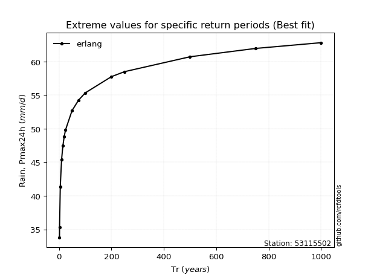</img>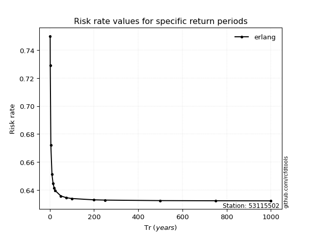</img>

</div>


<sub>**APP DISCLAIMER**: NO WARRANTY - This software is provided by [github.com/rcfdtools](https://github.com/rcfdtools) "as is", without any express or implied warranty, including warranties of merchantability, fitness for a particular purpose, or non-infringement. There is no guarantee that the software will be error-free or operate without interruption. LIMITATION OF LIABILITY - Neither the authors nor copyright holders will be liable for claims or damages arising from the software or its use. You are responsible for determining if the software is appropriate for your use and assume all associated risks, including errors, legal compliance, and data loss. NO PROFESSIONAL ADVICE - The software provides general information and does not offer professional advice. It should not replace consultation with professional advisors.</sub>