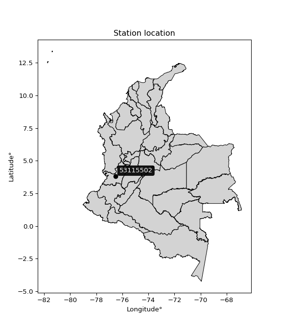

<div align="center">


</div>

# PMP Station (Rain, Pmax24h): 53115502

Probable Maximum Precipitation (PMP) is the greatest amount of rainfall for a specific duration that is meteorologically possible for a given location, acting as a "worst-case" scenario for extreme storms, crucial for designing safety-critical infrastructure like bridges, river deviations, dams, spillways, and nuclear plants to prevent catastrophic failure. PMP is calculated by hydrologists using meteorological data to determine the upper limit of extreme rainfall, often leading to the Probable Maximum Flood (PMF) for flood control design, and is increasingly being studied for climate change impacts. Probable Maximum Precipitation (PMP) is the theoretical upper limit of rainfall, a deterministic estimate for extreme events, while probability distributions (like GEV, Gumbel) describe the likelihood and frequency of various precipitation amounts, including rare ones, showing how often events occur, with PMP representing the extreme end of these distributions, used for critical infrastructure design to ensure safety against the worst conceivable weather, unlike standard statistical forecasts which cover typical probabilities.

The most common probability distributions in hydrology, used for analyzing floods, rainfall, and streamflow, include the Normal, Log-Normal, Gumbel, Gamma (including Log-Pearson Type III), and Generalized Extreme Value (GEV) distributions, often chosen based on the data´s skewness and whether modeling extremes or general conditions, with Gumbel and GEV popular for extreme events like floods, while the Normal distribution serves as a baseline, though often requiring transformations for skewed hydrological data. These distributions help in designing water infrastructure, managing water resources, and forecasting hydrologic events.

> Hydrological data often isn´t perfectly normal (it´s skewed), so different distributions are needed for different applications, such as: **Flood Frequency Analysis**: Using Gumbel, GEV, or Log-Pearson Type III for predicting extreme flood magnitudes and their return periods, **Rainfall Analysis**: Normal for annual totals, but Log-Normal, Weibull, or GEV for intensity or extreme daily rainfall, **Streamflow Modeling**: Gamma and Log-Normal for maximum flows, GEV for minimum flows, and Kappa for daily flows.

<div align="center">

</img>

</div>


## A. General information


### 1. General running parameters

• app_version: _v20260113_. • runtime: _2026-01-13 16:28:34.738620_. • Python version: _3.14.0_. • SciPy version: _1.16.3_. • Pandas version: _2.3.3_. • NumPy version: _2.3.5_. • Stations dataset (station_dataset_file): _dataset/pmax24h_in/automatic_colombia_2003_2025.csv_. • Stations catalog (station_catalog_file): _dataset/CNE.xls_. • Minimum year to eval til year_max (date_min): _1900_. • Maximum year to eval since year_min (date_max): _2025_. • Creates, save and include plots into reports (create_plot): _False_. • Plot only fit distributions with Δo > Δ (plot_only_fit): _True_. • Plot only simple graphs avoiding multiple CDFs and multiple Extreme values plots (plot_only_simple): _True_. • Eval low extreme values, if False, evaluates high extreme values (low_extreme): _False_. • Eval every SciPy distribution as logarithmic (pdist_logarithmic_on): _True_. • Standard deviation normalized (ddof): _1.0_. • Return periods to eval in years (Tr): _[2, 2.33, 5, 10, 15, 20, 25, 50, 75, 100, 200, 250, 500, 750, 1000]_. • Minimum data sample per station, 0 means any (minimum_sample): _5_. • Z-Score maximum threshold to adjust a value, 0 means disable (zscore_max): _3.5_. • Z-Score minimum threshold to adjust a value, 0 means disable (zscore_min): _-2.5_. • Avoid zeros, e.g. rain = 0 (avoid_zeros): _True_. • Avoid null values (avoid_nans): _True_. 

:file_folder:Table: [dataset.csv](../../dataset/pmax24h_in/automatic_colombia_2003_2025.csv)

> Delta Degrees of Freedom (DDOF): is a parameter used in the formulas for calculating variance and standard deviation. When ddof=0, the divisor is $N$ (the total number of observations) and this is used when your data set is the entire population. When ddof=1, the divisor is $N-1$ and this is used when your data set is a sample drawn from a larger population. Using $N-1$ provides an unbiased estimate of the population variance (known as Bessel´s correction).


### 2. Station info and location

|   id |   CODIGO | NOMBRE                             | CATEGORIA               | TECNOLOGIA                | ESTADO   | FECHA_INSTALACION   |   FECHA_SUSPENSION |   ALTITUD |   LATITUD |   LONGITUD | DEPARTAMENTO    | MUNICIPIO   | AREA_OPERATIVA                         | ENTIDAD                                    | AREA_HIDROGRAFICA   | ZONA_HIDROGRAFICA         | SUBZONA_HIDROGRAFICA                |   CORRIENTE | Catalogo   |   Version |
|-----:|---------:|:-----------------------------------|:------------------------|:--------------------------|:---------|:--------------------|-------------------:|----------:|----------:|-----------:|:----------------|:------------|:---------------------------------------|:-------------------------------------------|:--------------------|:--------------------------|:------------------------------------|------------:|:-----------|----------:|
|    0 | 53115502 | JULIO FERNANDEZ  - AUT  [53115502] | Climatológica Principal | Automática con Telemetría | Activa   | 23/08/2013          |                nan |      1381 |   3.80916 |   -76.5331 | Valle Del Cauca | Restrepo    | Area Operativa 09 - Cauca-Valle-Caldas | CENTRO NACIONAL DE INVESTIGACIONES DE CAFE | Pacifico            | Tapaje - Dagua - Directos | Dagua - Buenaventura - Bahia Málaga |         nan | CNE_OE     |  20251226 |

<div align="center">

Dynamic map: [:earth_americas:Google](http://maps.google.com/maps?q=3.809163889,-76.53305556) [:earth_americas:OSM](https://www.openstreetmap.org/#map=18/3.809163889/-76.53305556&layers=P) [:earth_americas:Bing](https://www.bing.com/maps?cp=3.809163889~-76.53305556&lvl=18) [:earth_americas:Apple](https://maps.apple.com/frame?center=3.809163889%2C-76.53305556&span=0.003%2C0.006)

</div>


<div align="center">

```geojson
{
  "type": "Feature",
  "geometry": {
    "type": "Point", 
    "coordinates": [-76.53305556, 3.809163889]
  }, 
  "properties": {
    "Name": "53115502"
  }
}
```

</div>


### 3. Discrete values table and plot

<div align="center">

|               |           0 |           1 |           2 |          3 |            4 |           5 |          6 |
|:--------------|------------:|------------:|------------:|-----------:|-------------:|------------:|-----------:|
| Date          | 2017        | 2018        | 2019        | 2020       | 2021         | 2022        | 2023       |
| Value         |   32        |   35.5      |   42.5      |   47.1     |   34.5       |   27.9      |   18.1     |
| Value_initial |   32        |   35.5      |   42.5      |   47.1     |   34.5       |   27.9      |   18.1     |
| count         |    7        |    7        |    7        |    7       |    7         |    7        |    7       |
| mean          |   33.9429   |   33.9429   |   33.9429   |   33.9429  |   33.9429    |   33.9429   |   33.9429  |
| std           |    9.48997  |    9.48997  |    9.48997  |    9.48997 |    9.48997   |    9.48997  |    9.48997 |
| zscore        |   -0.204727 |    0.164083 |    0.901704 |    1.38643 |    0.0587086 |   -0.636763 |   -1.66943 |


</div>


> The initial value (value_initial) correspond to the initial obtained or null completed value, and value (value) is adjusted only when the initial value is outside the valid range (outlier) definite through the Z-Score value. If Z-Score is active, values out of range or outliers are replaced with the station mean value. A Z-Score (or standard score) measures how many standard deviations a data point is from the mean of a dataset, indicating its relative position; positive scores mean above the mean, negative mean below, and a score of zero is exactly at the mean, allowing for comparison of values from different distributions. It´s calculated using the formula $z=(x–μ)/σ$, where $x$ is the data point, $μ$ is the mean, and $σ$ is the standard deviation, helping identify outliers and understand probability.
>
> <sub>**Note**: In this study, "completing" (filling gaps in) and "extending" (forecasting or lengthening the historical record) rainfall data series are avoided for certain critical analyses because they introduce artificial bias and uncertainty, which can distort the statistics of rare events (extremes), alter day-to-day variability, and compromise the integrity and homogeneity of the original data. Some reasons against Completing/Extending rainfall data are: **Distortion of Extremes and Variability**: The primary issue is that most gap-filling or extension methods rely on averaging or regression with nearby stations, which inherently smooths the data. Rainfall is highly variable in space and time, with a large percentage of zero values and occasional large storms. Infilling methods often underestimate the highest values and overestimate the lowest (zero) values, which severely distorts analyses focused on flood frequency, drought severity, and intensity-duration-frequency (IDF) curves, **Loss of Data Homogeneity**: Infilled or extended data are synthetic estimates, not actual measurements. Combining these estimates with observed data can violate the assumption of data homogeneity, which requires that the data properties do not change over time. Inhomogeneity can lead to incorrect conclusions about long-term trends or changes in climate patterns, **Propagation of Errors**: Errors and biases from the original data (e.g., wind-induced undercatch, instrument errors, site changes) or the data used for imputation can propagate through the analysis, leading to unreliable hydrological models and inaccurate predictions, **Compromised Statistical Integrity**: For statistical analyses, especially those involving the frequency of events, using artificial data can introduce time bias or autocorrelation that doesn´t exist in reality, making it difficult to assess the true probability of events, **Difficulty in Validation**: It is difficult to accurately validate the quality of filled or extended data, especially for past periods where ground-truth measurements are unavailable. The reliability of imputation techniques heavily depends on the density of the surrounding station network and the complexity of the local topography.</sub>


### 4. Active continuous probability distributions from SciPy (45 of 104 available)

A Probability Density Function (PDF) describes the relative likelihood of a continuous random variable falling within a specific range, where the total area under its curve equals 1, and the area over any interval gives the actual probability for that range. Unlike discrete probabilities (like rolling a die), a PDF shows density, not direct probability for a single point (which is zero), with higher points indicating higher likelihood, often visualized as a bell curve for normal distributions.

A log of a probability density function (log-PDF) is simply the logarithm of the PDF´s value, denoted as $log(f(x))$, useful for converting multiplication of probabilities into addition, improving numerical stability with tiny numbers, and connecting to information theory concepts like entropy. Instead of dealing with very small probabilities (e.g., 0.000001), log-PDFs use negative numbers (e.g., $log(0.00001) ≈ -11.51$ that are easier for computers to handle, preventing underflow errors and simplifying complex calculations. In this study, each active probability distribution from SciPy is also evaluated in the $log$ form.

[scipy.stats](https://docs.scipy.org/doc/scipy/reference/stats.html) is a Python´s powerful submodule within the SciPy library for comprehensive statistical analysis, offering over 130 probability distributions (like Normal, Poisson), functions for descriptive stats (mean, variance), hypothesis testing (t-tests, chi-square), random variable generation, and statistical tests, making it essential for data science, modeling, and research. It provides tools to explore, model, and draw conclusions from data efficiently, working seamlessly with NumPy.

<div align="center">

|   id | p_dist             |   n_parameter | fit_method   | label                                                                       | active   | ref                                                                                                        |
|-----:|:-------------------|--------------:|:-------------|:----------------------------------------------------------------------------|:---------|:-----------------------------------------------------------------------------------------------------------|
|    0 | alpha              |             3 | MLE          | Alpha                                                                       | True     | [:mortar_board:](https://docs.scipy.org/doc/scipy/reference/generated/scipy.stats.alpha.html)              |
|    1 | betaprime          |             4 | MLE          | Beta prime                                                                  | True     | [:mortar_board:](https://docs.scipy.org/doc/scipy/reference/generated/scipy.stats.betaprime.html)          |
|    2 | chi2               |             3 | MLE          | Chi²                                                                        | True     | [:mortar_board:](https://docs.scipy.org/doc/scipy/reference/generated/scipy.stats.chi2.html)               |
|    3 | crystalball        |             4 | MLE          | Crystalball                                                                 | True     | [:mortar_board:](https://docs.scipy.org/doc/scipy/reference/generated/scipy.stats.crystalball.html)        |
|    4 | dweibull           |             3 | MLE          | Double Weibull                                                              | True     | [:mortar_board:](https://docs.scipy.org/doc/scipy/reference/generated/scipy.stats.dweibull.html)           |
|    5 | erlang             |             3 | MLE          | Erlang                                                                      | True     | [:mortar_board:](https://docs.scipy.org/doc/scipy/reference/generated/scipy.stats.erlang.html)             |
|    6 | expon              |             2 | MLE          | Exponential                                                                 | True     | [:mortar_board:](https://docs.scipy.org/doc/scipy/reference/generated/scipy.stats.expon.html)              |
|    7 | exponnorm          |             3 | MLE          | Exponentially modified Normal                                               | True     | [:mortar_board:](https://docs.scipy.org/doc/scipy/reference/generated/scipy.stats.exponnorm.html)          |
|    8 | f                  |             4 | MLE          | F                                                                           | True     | [:mortar_board:](https://docs.scipy.org/doc/scipy/reference/generated/scipy.stats.f.html)                  |
|    9 | fatiguelife        |             3 | MLE          | Fatigue-life (Birnbaum-Saunders)                                            | True     | [:mortar_board:](https://docs.scipy.org/doc/scipy/reference/generated/scipy.stats.fatiguelife.html)        |
|   10 | fisk               |             3 | MLE          | Fisk                                                                        | True     | [:mortar_board:](https://docs.scipy.org/doc/scipy/reference/generated/scipy.stats.fisk.html)               |
|   11 | gamma              |             3 | MLE          | Gamma                                                                       | True     | [:mortar_board:](https://docs.scipy.org/doc/scipy/reference/generated/scipy.stats.gamma.html)              |
|   12 | genexpon           |             5 | MLE          | Generalized exponential                                                     | True     | [:mortar_board:](https://docs.scipy.org/doc/scipy/reference/generated/scipy.stats.genexpon.html)           |
|   13 | genlogistic        |             3 | MLE          | Generalized logistic                                                        | True     | [:mortar_board:](https://docs.scipy.org/doc/scipy/reference/generated/scipy.stats.genlogistic.html)        |
|   14 | gibrat             |             2 | MM           | Gibrat                                                                      | True     | [:mortar_board:](https://docs.scipy.org/doc/scipy/reference/generated/scipy.stats.gibrat.html)             |
|   15 | gompertz           |             3 | MLE          | Gompertz (or truncated Gumbel)                                              | True     | [:mortar_board:](https://docs.scipy.org/doc/scipy/reference/generated/scipy.stats.gompertz.html)           |
|   16 | gumbel_l           |             2 | MM           | Gumbel Left Skew                                                            | True     | [:mortar_board:](https://docs.scipy.org/doc/scipy/reference/generated/scipy.stats.gumbel_l.html)           |
|   17 | gumbel_r           |             2 | MM           | Gumbel Right Skew                                                           | True     | [:mortar_board:](https://docs.scipy.org/doc/scipy/reference/generated/scipy.stats.gumbel_r.html)           |
|   18 | halflogistic       |             2 | MM           | Half-logistic                                                               | True     | [:mortar_board:](https://docs.scipy.org/doc/scipy/reference/generated/scipy.stats.halflogistic.html)       |
|   19 | halfnorm           |             2 | MM           | Half Normal                                                                 | True     | [:mortar_board:](https://docs.scipy.org/doc/scipy/reference/generated/scipy.stats.halfnorm.html)           |
|   20 | hypsecant          |             2 | MM           | hyperbolic secant                                                           | True     | [:mortar_board:](https://docs.scipy.org/doc/scipy/reference/generated/scipy.stats.hypsecant.html)          |
|   21 | invgamma           |             3 | MLE          | Inverted gamma                                                              | True     | [:mortar_board:](https://docs.scipy.org/doc/scipy/reference/generated/scipy.stats.invgamma.html)           |
|   22 | invgauss           |             3 | MLE          | Inverse Gaussian                                                            | True     | [:mortar_board:](https://docs.scipy.org/doc/scipy/reference/generated/scipy.stats.invgauss.html)           |
|   23 | invweibull         |             3 | MLE          | Inverted Weibull                                                            | True     | [:mortar_board:](https://docs.scipy.org/doc/scipy/reference/generated/scipy.stats.invweibull.html)         |
|   24 | kappa4             |             4 | MLE          | Kappa 4                                                                     | True     | [:mortar_board:](https://docs.scipy.org/doc/scipy/reference/generated/scipy.stats.kappa4.html)             |
|   25 | kstwobign          |             2 | MLE          | Limiting distribution of scaled Kolmogorov-Smirnov two-sided test statistic | True     | [:mortar_board:](https://docs.scipy.org/doc/scipy/reference/generated/scipy.stats.kstwobign.html)          |
|   26 | laplace            |             2 | MM           | Laplace                                                                     | True     | [:mortar_board:](https://docs.scipy.org/doc/scipy/reference/generated/scipy.stats.laplace.html)            |
|   27 | laplace_asymmetric |             3 | MLE          | Asymmetric Laplace                                                          | True     | [:mortar_board:](https://docs.scipy.org/doc/scipy/reference/generated/scipy.stats.laplace_asymmetric.html) |
|   28 | loggamma           |             3 | MLE          | Log gamma                                                                   | True     | [:mortar_board:](https://docs.scipy.org/doc/scipy/reference/generated/scipy.stats.loggamma.html)           |
|   29 | logistic           |             2 | MM           | Logistic (or Sech-squared)                                                  | True     | [:mortar_board:](https://docs.scipy.org/doc/scipy/reference/generated/scipy.stats.logistic.html)           |
|   30 | lognorm            |             3 | MLE          | Log Normal                                                                  | True     | [:mortar_board:](https://docs.scipy.org/doc/scipy/reference/generated/scipy.stats.lognorm.html)            |
|   31 | maxwell            |             2 | MM           | Maxwell                                                                     | True     | [:mortar_board:](https://docs.scipy.org/doc/scipy/reference/generated/scipy.stats.maxwell.html)            |
|   32 | mielke             |             4 | MLE          | Mielke Beta-Kappa / Dagum                                                   | True     | [:mortar_board:](https://docs.scipy.org/doc/scipy/reference/generated/scipy.stats.mielke.html)             |
|   33 | moyal              |             2 | MM           | Moyal                                                                       | True     | [:mortar_board:](https://docs.scipy.org/doc/scipy/reference/generated/scipy.stats.moyal.html)              |
|   34 | nakagami           |             3 | MLE          | Nakagami                                                                    | True     | [:mortar_board:](https://docs.scipy.org/doc/scipy/reference/generated/scipy.stats.nakagami.html)           |
|   35 | ncf                |             5 | MLE          | Non-central F distribution                                                  | True     | [:mortar_board:](https://docs.scipy.org/doc/scipy/reference/generated/scipy.stats.ncf.html)                |
|   36 | nct                |             4 | MLE          | Non-central Student’s t                                                     | True     | [:mortar_board:](https://docs.scipy.org/doc/scipy/reference/generated/scipy.stats.nct.html)                |
|   37 | norm               |             2 | MM           | Normal                                                                      | True     | [:mortar_board:](https://docs.scipy.org/doc/scipy/reference/generated/scipy.stats.norm.html)               |
|   38 | pearson3           |             3 | MM           | Pearson type III                                                            | True     | [:mortar_board:](https://docs.scipy.org/doc/scipy/reference/generated/scipy.stats.pearson3.html)           |
|   39 | rayleigh           |             2 | MM           | Rayleigh                                                                    | True     | [:mortar_board:](https://docs.scipy.org/doc/scipy/reference/generated/scipy.stats.rayleigh.html)           |
|   40 | rice               |             3 | MLE          | Rice                                                                        | True     | [:mortar_board:](https://docs.scipy.org/doc/scipy/reference/generated/scipy.stats.rice.html)               |
|   41 | t                  |             3 | MLE          | Student’s t                                                                 | True     | [:mortar_board:](https://docs.scipy.org/doc/scipy/reference/generated/scipy.stats.t.html)                  |
|   42 | truncnorm          |             4 | MLE          | Truncated normal                                                            | True     | [:mortar_board:](https://docs.scipy.org/doc/scipy/reference/generated/scipy.stats.truncnorm.html)          |
|   43 | wald               |             2 | MM           | Wald                                                                        | True     | [:mortar_board:](https://docs.scipy.org/doc/scipy/reference/generated/scipy.stats.wald.html)               |
|   44 | weibull_min        |             3 | MLE          | Weibull minimum                                                             | True     | [:mortar_board:](https://docs.scipy.org/doc/scipy/reference/generated/scipy.stats.weibull_min.html)        |

</div>

> **n_parameter:** # arguments & localization & scale.
>
> **Fit methods:** (MLE) maximum likelihood, (MM) L-moments.
>
>**Inactive** (With the only purpose of prevent loops, zero divisions, infinite values, over high estimated values or horizontal trending for recurrence intervals estimations, the follow distributions were disabled.)**:** foldnorm, gennorm, norminvgauss, powernorm, powerlognorm, skewnorm, genextreme, anglit, arcsine, argus, beta, bradford, burr, burr12, cauchy, cosine, halfcauchy, foldcauchy, skewcauchy, wrapcauchy, dgamma, gengamma, exponweib, exponpow, truncexpon, gausshyper, genhalflogistic, genhyperbolic, geninvgauss, halfgennorm, johnsonsb, johnsonsu, kappa3, ksone, kstwo, loglaplace, levy, levy_l, levy_stable, ncx2, pareto, genpareto, truncpareto, lomax, powerlaw, rdist, rel_breitwigner, recipinvgauss, semicircular, studentized_range, trapezoid, triang, truncweibull_min, tukeylambda, uniform, loguniform, vonmises, vonmises_line, weibull_max, 


## B. Probability (PDF) vs. Empirical (EDF) distributions functions

A continuous probability distribution (CPD) describes probabilities for variables that can take any value within a range (like rain any time), unlike discrete variables with specific outcomes (like temperature). It uses a Probability Density Function (PDF), a curve where the total area under it equals 1, and the probability of the variable falling within an interval (a to b) is found by calculating the area under the curve between those points. A key feature is that the probability of hitting any single exact value is zero, so probabilities are always expressed for ranges, e.g., $P(a ≤ X ≤ b)$.

<div align="center">

Distributions parameters from station values
|    |   station | p_dist                |   n |               loc |            scale | shape                 | shape1                 | shape2              | shape3   |
|---:|----------:|:----------------------|----:|------------------:|-----------------:|:----------------------|:-----------------------|:--------------------|:---------|
|  0 |  53115502 | alpha                 |   7 |    -116.1         |   2530.21        | 16.923579953479063    |                        |                     |          |
|  1 |  53115502 | betaprime             |   7 |    -146.111       |   4359.28        | 433.9565587606653     | 10511.41714529589      |                     |          |
|  2 |  53115502 | chi2                  |   7 |      18.1         |      1.32346     | 0.8677277076591321    |                        |                     |          |
|  3 |  53115502 | crystalball           |   7 |      33.9429      |      8.786       | 927.4191958957158     | 5650.543305602657      |                     |          |
|  4 |  53115502 | dweibull              |   7 |      34.5         |      6.57278     | 0.9558761338549233    |                        |                     |          |
|  5 |  53115502 | erlang                |   7 |    -120.373       |      0.510305    | 302.3911888163325     |                        |                     |          |
|  6 |  53115502 | expon                 |   7 |      18.1         |     15.8429      |                       |                        |                     |          |
|  7 |  53115502 | exponnorm             |   7 |      33.9343      |      8.78606     | 0.0009764049590177679 |                        |                     |          |
|  8 |  53115502 | f                     |   7 |   -2301.9         |   2335.83        | 194426.15225345094    | 505754.2778568218      |                     |          |
|  9 |  53115502 | fatiguelife           |   7 |      18.1         |      0.000170169 | 356.1706423273354     |                        |                     |          |
| 10 |  53115502 | fisk                  |   7 |      -7.22787e+08 |      7.22787e+08 | 143031755.19598272    |                        |                     |          |
| 11 |  53115502 | gamma                 |   7 |    -124.144       |      0.497088    | 318.02471370146986    |                        |                     |          |
| 12 |  53115502 | genexpon              |   7 |      17.5899      |      0.865632    | 0.05295452804893201   | 1.1741560701874702e-06 | 1.4081123405694411  |          |
| 13 |  53115502 | genlogistic           |   7 |      36.2422      |      4.55547     | 0.7576869308576767    |                        |                     |          |
| 14 |  53115502 | gibrat                |   7 |      27.2402      |      4.06536     |                       |                        |                     |          |
| 15 |  53115502 | gompertz              |   7 |      27.9         |      3.2277      | 0.012170029094737002  |                        |                     |          |
| 16 |  53115502 | gumbel_l              |   7 |      37.897       |      6.85042     |                       |                        |                     |          |
| 17 |  53115502 | gumbel_r              |   7 |      29.9887      |      6.85042     |                       |                        |                     |          |
| 18 |  53115502 | halflogistic          |   7 |      23.5294      |      7.51171     |                       |                        |                     |          |
| 19 |  53115502 | halfnorm              |   7 |      22.3136      |     14.5751      |                       |                        |                     |          |
| 20 |  53115502 | hypsecant             |   7 |      33.9429      |      5.59334     |                       |                        |                     |          |
| 21 |  53115502 | invgamma              |   7 |     -86.6096      |  21380           | 178.28766631017606    |                        |                     |          |
| 22 |  53115502 | invgauss              |   7 |     -28.6862      |   2794.55        | 0.022299678290252097  |                        |                     |          |
| 23 |  53115502 | invweibull            |   7 |      18.1         |      1.32291     | 0.052866631696162465  |                        |                     |          |
| 24 |  53115502 | kappa4                |   7 |      15.5821      |     32.645       | 1.0833474123793414    | 1.0357605088236856     |                     |          |
| 25 |  53115502 | kstwobign             |   7 |      -1.78405     |     40.8819      |                       |                        |                     |          |
| 26 |  53115502 | laplace               |   7 |      33.9429      |      6.21264     |                       |                        |                     |          |
| 27 |  53115502 | laplace_asymmetric    |   7 |      34.5         |      6.71124     | 1.0423595581827447    |                        |                     |          |
| 28 |  53115502 | loggamma              |   7 |       1.23398     |     20.0193      | 5.6155363487364385    |                        |                     |          |
| 29 |  53115502 | logistic              |   7 |      33.9429      |      4.84398     |                       |                        |                     |          |
| 30 |  53115502 | lognorm               |   7 |      18.1         |      0.099671    | 12.645770090208877    |                        |                     |          |
| 31 |  53115502 | maxwell               |   7 |      13.1237      |     13.0465      |                       |                        |                     |          |
| 32 |  53115502 | mielke                |   7 |      -0.263948    |     42.0148      | 3.618948524516448     | 11.907918157623072     |                     |          |
| 33 |  53115502 | moyal                 |   7 |      28.9185      |      3.95509     |                       |                        |                     |          |
| 34 |  53115502 | nakagami              |   7 |      27.9         |      7.31379     | 0.3063675275147709    |                        |                     |          |
| 35 |  53115502 | ncf                   |   7 |       0.0308353   |      1.55421e-05 | 3.135994624084369e-05 | 127.82178268829573     | 67.50977079198844   |          |
| 36 |  53115502 | nct                   |   7 |    -439.515       |      8.71722     | 83855.28597835347     | 54.31209816906602      |                     |          |
| 37 |  53115502 | norm                  |   7 |      33.9429      |      8.786       |                       |                        |                     |          |
| 38 |  53115502 | pearson3              |   7 |      33.9429      |      8.78599     | -0.2730245097583871   |                        |                     |          |
| 39 |  53115502 | rayleigh              |   7 |      17.1347      |     13.411       |                       |                        |                     |          |
| 40 |  53115502 | rice                  |   7 |      12.8973      |      9.6536      | 1.8923716892485296    |                        |                     |          |
| 41 |  53115502 | t                     |   7 |      33.9434      |      8.78611     | 5870024.722363567     |                        |                     |          |
| 42 |  53115502 | truncnorm             |   7 |     -19.5827      |     30.6941      | 1.2276835080405277    | 600.661967934238       |                     |          |
| 43 |  53115502 | wald                  |   7 |      25.1568      |      8.78601     |                       |                        |                     |          |
| 44 |  53115502 | weibull_min           |   7 |      -2.64301     |     39.9814      | 4.860297379478226     |                        |                     |          |
| 45 |  53115502 | logalpha              |   7 |      -7.38666     |    400.446       | 36.87189267289918     |                        |                     |          |
| 46 |  53115502 | logbetaprime          |   7 |      -3.67924     |     21.0071      | 497.23643283872434    | 1458.4372920127016     |                     |          |
| 47 |  53115502 | logchi2               |   7 |       2.89591     |      0.985922    | 1.0789956335658109    |                        |                     |          |
| 48 |  53115502 | logcrystalball        |   7 |       3.48608     |      0.289573    | 14.10816257652012     | 164.0776873181905      |                     |          |
| 49 |  53115502 | logdweibull           |   7 |       3.54096     |      0.220259    | 0.9300665404089883    |                        |                     |          |
| 50 |  53115502 | logerlang             |   7 |      -1.25722     |      0.0191867   | 247.0954605413109     |                        |                     |          |
| 51 |  53115502 | logexpon              |   7 |       2.89591     |      0.590166    |                       |                        |                     |          |
| 52 |  53115502 | logexponnorm          |   7 |       3.48589     |      0.289572    | 0.0006582320878364316 |                        |                     |          |
| 53 |  53115502 | logf                  |   7 |    -487.838       |    491.324       | 14681205.367040597    | 9439537.33276096       |                     |          |
| 54 |  53115502 | logfatiguelife        |   7 |    -159.984       |    163.469       | 0.0017692546969686543 |                        |                     |          |
| 55 |  53115502 | logfisk               |   7 | -151637           | 151640           | 947474.2020539888     |                        |                     |          |
| 56 |  53115502 | loggamma              |   7 |      -1.78429     |      0.0169398   | 311.02866741717446    |                        |                     |          |
| 57 |  53115502 | loggenexpon           |   7 |       2.89591     |      0.454458    | 0.23765283347839636   | 1.9648479418341316     | 0.37583529770065083 |          |
| 58 |  53115502 | loggenlogistic        |   7 |       3.73331     |      0.0840363   | 0.3004396953885753    |                        |                     |          |
| 59 |  53115502 | loggibrat             |   7 |       3.26518     |      0.13398     |                       |                        |                     |          |
| 60 |  53115502 | loggompertz           |   7 |       2.89591     |      0.258514    | 0.06886188670163998   |                        |                     |          |
| 61 |  53115502 | loggumbel_l           |   7 |       3.6164      |      0.225779    |                       |                        |                     |          |
| 62 |  53115502 | loggumbel_r           |   7 |       3.35575     |      0.225779    |                       |                        |                     |          |
| 63 |  53115502 | loghalflogistic       |   7 |       3.14287     |      0.247573    |                       |                        |                     |          |
| 64 |  53115502 | loghalfnorm           |   7 |       3.10283     |      0.480328    |                       |                        |                     |          |
| 65 |  53115502 | loghypsecant          |   7 |       3.48608     |      0.184348    |                       |                        |                     |          |
| 66 |  53115502 | loginvgamma           |   7 |      -3.21563     |   3365.18        | 503.44169137695843    |                        |                     |          |
| 67 |  53115502 | loginvgauss           |   7 |       0.302772    |    325.153       | 0.009777634934578568  |                        |                     |          |
| 68 |  53115502 | loginvweibull         |   7 |      -3.02197e+07 |      3.02197e+07 | 94878056.23717423     |                        |                     |          |
| 69 |  53115502 | logkappa4             |   7 |       2.84691     |      1.08755     | 0.993458468050668     | 1.0817513607667855     |                     |          |
| 70 |  53115502 | logkstwobign          |   7 |       2.18224     |      1.49143     |                       |                        |                     |          |
| 71 |  53115502 | loglaplace            |   7 |       3.48608     |      0.204759    |                       |                        |                     |          |
| 72 |  53115502 | loglaplace_asymmetric |   7 |       3.54096     |      0.206141    | 1.1419778604329318    |                        |                     |          |
| 73 |  53115502 | logloggamma           |   7 |       3.7576      |      0.14108     | 0.5079913524550497    |                        |                     |          |
| 74 |  53115502 | loglogistic           |   7 |       3.48608     |      0.15965     |                       |                        |                     |          |
| 75 |  53115502 | loglognorm            |   7 |       2.89591     |      0.00452494  | 12.23035744203257     |                        |                     |          |
| 76 |  53115502 | logmaxwell            |   7 |       2.79991     |      0.429992    |                       |                        |                     |          |
| 77 |  53115502 | logmielke             |   7 |      -1.38673e+07 |      1.38673e+07 | 37106325.66073364     | 2310449784.036566      |                     |          |
| 78 |  53115502 | logmoyal              |   7 |       3.32048     |      0.130354    |                       |                        |                     |          |
| 79 |  53115502 | lognakagami           |   7 |       3.32863     |      0.301775    | 0.14307163645018425   |                        |                     |          |
| 80 |  53115502 | logncf                |   7 |      -3.56914     |      7.0468      | 804.2491422258036     | 844.5098886035694      | 0.15105204413043222 |          |
| 81 |  53115502 | lognct                |   7 |      -0.171098    |      0.168379    | 116.15040412916659    | 21.5774369964021       |                     |          |
| 82 |  53115502 | lognorm               |   7 |       3.48608     |      0.289573    |                       |                        |                     |          |
| 83 |  53115502 | logpearson3           |   7 |       3.48608     |      0.289574    | -0.8314633235554323   |                        |                     |          |
| 84 |  53115502 | lograyleigh           |   7 |       2.93213     |      0.441991    |                       |                        |                     |          |
| 85 |  53115502 | logrice               |   7 |       2.6765      |      0.308502    | 2.4015802469052168    |                        |                     |          |
| 86 |  53115502 | logt                  |   7 |       3.5234      |      0.236498    | 5.165763720737912     |                        |                     |          |
| 87 |  53115502 | logtruncnorm          |   7 |      -0.0937731   |      0.933707    | 3.6653901028424194    | 4.226227572846897      |                     |          |
| 88 |  53115502 | logwald               |   7 |       3.19654     |      0.289538    |                       |                        |                     |          |
| 89 |  53115502 | logweibull_min        |   7 |      -1.52881e+07 |      1.52881e+07 | 69192039.51655856     |                        |                     |          |

</div>

> **loc** (Location parameter): This shifts the distribution along the x-axis. For many common distributions, like the normal (Gaussian) distribution, loc represents the mean $μ$. For others, like the uniform distribution, it might represent the minimum value, or for the beta distribution, the left end of the support interval.
>
> **scale** (Scale parameter): This determines the width or spread of the distribution. For the normal distribution, scale represents the standard deviation $σ$. For a uniform distribution, it defines the length of the interval (from $loc$ to $loc + scale$).
>
> **shape** (Shape parameters): Refers to parameters that define the specific form of a probability distribution, distinct from its location (loc) and scale (scale). These parameters are required arguments for most distribution functions. For example, a normal (Gaussian) distribution is fully defined by its location (mean) and scale (standard deviation), so it has no specific shape parameters beyond loc and scale. However, other distributions have intrinsic properties that need specification, as Gamma distribution that takes a shape parameter, often named $a$ or $alpha$.


### 0. Cumulative distribution values - CDF (90 evaluated)

Cumulative Distribution Function (CDF), denoted as $F$<sub>$X$</sub>$(x)$, is a function that gives the probability that a random variable $X$ will take a value less than or equal to a specific value, $x$ (i.e., $(P(X≥x)$. It essentially "accumulates" probabilities from a given point up to the far right (positive infinity), providing a complete picture of the distribution´s probabilities for both discrete (like rain) and continuous (like temperature) variables, helping to find probabilities over ranges or above certain values. Each station is evaluated separately ordering the $x$ values ascending, calculating the CDF and PDF values for the activated distributions and their logarithmic forms.

<div align="center">

CDF ordered by x ascending and calculating $log(f(x))$ separately
|   id |   Station |   date |    x |   count |    mean |     std |     zscore |   Value_initial |   station |   m |     alpha |   alpha_pdf |   betaprime |   betaprime_pdf |        chi2 |    chi2_pdf |   crystalball |   crystalball_pdf |   dweibull |   dweibull_pdf |    erlang |   erlang_pdf |    expon |   expon_pdf |   exponnorm |   exponnorm_pdf |        f |      f_pdf |   fatiguelife |   fatiguelife_pdf |      fisk |   fisk_pdf |     gamma |   gamma_pdf |   genexpon |   genexpon_pdf |   genlogistic |   genlogistic_pdf |    gibrat |   gibrat_pdf |   gompertz |   gompertz_pdf |   gumbel_l |   gumbel_l_pdf |   gumbel_r |   gumbel_r_pdf |   halflogistic |   halflogistic_pdf |   halfnorm |   halfnorm_pdf |   hypsecant |   hypsecant_pdf |   invgamma |   invgamma_pdf |   invgauss |   invgauss_pdf |   invweibull |   invweibull_pdf |      kappa4 |   kappa4_pdf |   kstwobign |   kstwobign_pdf |   laplace |   laplace_pdf |   laplace_asymmetric |   laplace_asymmetric_pdf |   loggamma |   loggamma_pdf |   logistic |   logistic_pdf |   lognorm |   lognorm_pdf |   maxwell |   maxwell_pdf |    mielke |   mielke_pdf |       moyal |   moyal_pdf |   nakagami |   nakagami_pdf |       ncf |    ncf_pdf |       nct |    nct_pdf |     norm |   norm_pdf |   pearson3 |   pearson3_pdf |   rayleigh |   rayleigh_pdf |      rice |   rice_pdf |        t |      t_pdf |   truncnorm |   truncnorm_pdf |     wald |   wald_pdf |   weibull_min |   weibull_min_pdf |   logalpha |   logalpha_pdf |   logbetaprime |   logbetaprime_pdf |     logchi2 |   logchi2_pdf |   logcrystalball |   logcrystalball_pdf |   logdweibull |   logdweibull_pdf |   logerlang |   logerlang_pdf |   logexpon |   logexpon_pdf |   logexponnorm |   logexponnorm_pdf |      logf |   logf_pdf |   logfatiguelife |   logfatiguelife_pdf |   logfisk |   logfisk_pdf |   loggenexpon |   loggenexpon_pdf |   loggenlogistic |   loggenlogistic_pdf |   loggibrat |   loggibrat_pdf |   loggompertz |   loggompertz_pdf |   loggumbel_l |   loggumbel_l_pdf |   loggumbel_r |   loggumbel_r_pdf |   loghalflogistic |   loghalflogistic_pdf |   loghalfnorm |   loghalfnorm_pdf |   loghypsecant |   loghypsecant_pdf |   loginvgamma |   loginvgamma_pdf |   loginvgauss |   loginvgauss_pdf |   loginvweibull |   loginvweibull_pdf |   logkappa4 |   logkappa4_pdf |   logkstwobign |   logkstwobign_pdf |   loglaplace |   loglaplace_pdf |   loglaplace_asymmetric |   loglaplace_asymmetric_pdf |   logloggamma |   logloggamma_pdf |   loglogistic |   loglogistic_pdf |   loglognorm |   loglognorm_pdf |   logmaxwell |   logmaxwell_pdf |   logmielke |   logmielke_pdf |    logmoyal |   logmoyal_pdf |   lognakagami |   lognakagami_pdf |   logncf |   logncf_pdf |    lognct |   lognct_pdf |   logpearson3 |   logpearson3_pdf |   lograyleigh |   lograyleigh_pdf |   logrice |   logrice_pdf |     logt |   logt_pdf |   logtruncnorm |   logtruncnorm_pdf |   logwald |   logwald_pdf |   logweibull_min |   logweibull_min_pdf |
|-----:|----------:|-------:|-----:|--------:|--------:|--------:|-----------:|----------------:|----------:|----:|----------:|------------:|------------:|----------------:|------------:|------------:|--------------:|------------------:|-----------:|---------------:|----------:|-------------:|---------:|------------:|------------:|----------------:|---------:|-----------:|--------------:|------------------:|----------:|-----------:|----------:|------------:|-----------:|---------------:|--------------:|------------------:|----------:|-------------:|-----------:|---------------:|-----------:|---------------:|-----------:|---------------:|---------------:|-------------------:|-----------:|---------------:|------------:|----------------:|-----------:|---------------:|-----------:|---------------:|-------------:|-----------------:|------------:|-------------:|------------:|----------------:|----------:|--------------:|---------------------:|-------------------------:|-----------:|---------------:|-----------:|---------------:|----------:|--------------:|----------:|--------------:|----------:|-------------:|------------:|------------:|-----------:|---------------:|----------:|-----------:|----------:|-----------:|---------:|-----------:|-----------:|---------------:|-----------:|---------------:|----------:|-----------:|---------:|-----------:|------------:|----------------:|---------:|-----------:|--------------:|------------------:|-----------:|---------------:|---------------:|-------------------:|------------:|--------------:|-----------------:|---------------------:|--------------:|------------------:|------------:|----------------:|-----------:|---------------:|---------------:|-------------------:|----------:|-----------:|-----------------:|---------------------:|----------:|--------------:|--------------:|------------------:|-----------------:|---------------------:|------------:|----------------:|--------------:|------------------:|--------------:|------------------:|--------------:|------------------:|------------------:|----------------------:|--------------:|------------------:|---------------:|-------------------:|--------------:|------------------:|--------------:|------------------:|----------------:|--------------------:|------------:|----------------:|---------------:|-------------------:|-------------:|-----------------:|------------------------:|----------------------------:|--------------:|------------------:|--------------:|------------------:|-------------:|-----------------:|-------------:|-----------------:|------------:|----------------:|------------:|---------------:|--------------:|------------------:|---------:|-------------:|----------:|-------------:|--------------:|------------------:|--------------:|------------------:|----------:|--------------:|---------:|-----------:|---------------:|-------------------:|----------:|--------------:|-----------------:|---------------------:|
|    0 |  53115502 |   2023 | 18.1 |       7 | 33.9429 | 9.48997 | -1.66943   |            18.1 |  53115502 |   1 | 0.0267784 |  0.00869699 |   0.0336609 |       0.0090454 | 3.98195e-07 | 4.86283e+07 |      0.035679 |        0.00893437 |   0.045519 |     0.00635805 | 0.0335858 |   0.00904966 | 0        |   0.0631199 |   0.0356799 |      0.00893449 | 0.035871 | 0.00899634 |     0.0538636 |       1.69732e+08 | 0.0396841 | 0.00754142 | 0.0334958 |  0.00902272 |  0.0307218 |      0.0592957 |     0.0482437 |         0.0078773 | 0         |   0          | 0          |     0          |  0.0540653 |     0.00767497 | 0.00344241 |     0.00285003 |       0        |          0         |   0        |      0         |   0.0374337 |      0.00667713 |  0.0302278 |     0.00913821 |  0.0316275 |      0.0103092 |   0.00275937 |      2.41964e+11 | 0.000612291 |    0.0569154 |   0.0280043 |       0.0132813 |  0.039037 |    0.00628347 |            0.0499429 |               0.00713926 |  0.0212039 |       0.184345 |  0.0365926 |     0.00727782 | 0.0207724 |      0.172662 | 0.0141312 |    0.00827332 | 0.0500277 |   0.00985836 | 8.63128e-05 | 0.000178014 | 0          |     0          | 0.0237037 | 0.00904736 | 0.0357785 | 0.00895715 | 0.035679 | 0.00893437 |  0.0428916 |     0.00896994 |   0.002587 |     0.00535316 | 0.0255438 |  0.010292  | 0.035676 | 0.00893364 | 1.61347e-06 |       0.0557229 | 0        | 0          |     0.0403616 |        0.00926365 |  0.0191186 |       0.176492 |       0.05195  |           0.306926 | 4.07171e-09 |   4.94648e+06 |        0.0207722 |             0.172661 |     0.0330501 |          0.129455 |   0.0219808 |        0.19001  |   0        |       1.69444  |       0.020772 |           0.17266  | 0.0207736 |   0.172709 |        0.0205055 |             0.17161  | 0.0203151 |      0.124354 |   6.93677e-10 |          0.522936 |        0.0500956 |             0.179089 |    0        |        0        |   2.68336e-07 |          0.266376 |     0.0402916 |          0.174811 |   0.000468874 |         0.0159182 |          0        |              0        |      0        |          0        |      0.0259003 |           0.140342 |     0.0199213 |          0.182566 |     0.0218197 |          0.20459  |       0.0202409 |            0.247842 |   0.0503902 |        0.905112 |      0.0239465 |           0.328021 |    0.0280046 |         0.136768 |               0.0365421 |                    0.155228 |     0.0506408 |          0.182075 |     0.0242068 |          0.147954 |   0.00716233 |      3.66117e+12 |   0.00291602 |        0.0902182 |   0.0748311 |        0.200235 | 3.46259e-07 |    3.57372e-05 |   0           |       0           | 0.107912 |     0.411102 | 0.0151444 |     0.158255 |     0.0379199 |          0.19031  |      0        |          0        | 0.0174138 |      0.187575 | 0.021903 |   0.113497 |    0           |           0        |  0        |      0        |        0.0372634 |             0.165467 |
|    1 |  53115502 |   2022 | 27.9 |       7 | 33.9429 | 9.48997 | -0.636763  |            27.9 |  53115502 |   2 | 0.258722  |  0.0394783  |   0.25184   |       0.0370385 | 0.994891    | 0.00217486  |      0.245795 |        0.0358425  |   0.183213 |     0.0266397  | 0.251318  |   0.0368769  | 0.461289 |   0.0340034 |   0.245796  |      0.0358424  | 0.246818 | 0.0358838  |     0.749769  |       0.0109295   | 0.22322   | 0.0343126  | 0.25087   |  0.0368572  |  0.467794  |      0.0325581 |     0.223105  |         0.0319837 | 0.0345066 |   0.115756   | 6.9612e-08 |     0.00377052 |  0.207364  |     0.0268892  | 0.257564   |     0.0510016  |       0.28298  |          0.0612325 |   0.298491 |      0.050866  |   0.208343  |      0.0346452  |  0.25916   |     0.0383413  |  0.283042  |      0.0402057 |   0.406755   |      0.00197384  | 0.358034    |    0.0339464 |   0.332525  |       0.0412252 |  0.189036 |    0.0304276  |            0.20271   |               0.028977   |  0.305761  |       1.19743  |  0.223133  |     0.0357856  | 0.293312  |      1.18837  | 0.266769  |    0.041309   | 0.234549  |   0.0298833  | 0.255368    | 0.0600824   | 3.2127e-10 | 55409.3        | 0.272231  | 0.0408294  | 0.246166  | 0.0358563  | 0.245795 | 0.0358425  |  0.238064  |     0.033171   |   0.275434 |     0.0433695  | 0.257405  |  0.0373664 | 0.245779 | 0.0358408  | 0.444941    |       0.0357821 | 0.178834 | 0.12202    |     0.236736  |        0.0328121  |  0.308671  |       1.22812  |       0.340912 |           1.00411  | 0.46099     |   0.497334    |        0.293311  |             1.18837  |     0.190208  |          0.805236 |   0.309     |        1.19418  |   0.519635 |       0.813949 |       0.293312 |           1.18838  | 0.293192  |   1.18729  |        0.293275  |             1.1909   | 0.236461  |      1.12809  |   0.408105    |          1.07935  |        0.234752  |             0.832521 |    0.227379 |        4.75526  |   0.257964    |          1.05406  |     0.243874  |          0.936193 |   0.323788    |         1.61717   |          0.358497 |              1.76005  |      0.361703 |          1.48737  |      0.256199  |           1.24449  |     0.311445  |          1.22056  |     0.325866  |          1.20608  |       0.366983  |            1.15499  |   0.454054  |        0.960985 |      0.404113  |           1.11966  |    0.231748  |         1.13181  |               0.229662  |                    0.975587 |     0.23689   |          0.826278 |     0.271658  |          1.23934  |   0.645382   |      0.0703197   |   0.320475   |        1.31734   |   0.238198  |        0.637375 | 0.332426    |    1.85449     |   4.61386e-05 |       2.97288e+10 | 0.378741 |     0.791006 | 0.308626  |     1.25936  |     0.25974   |          0.973824 |      0.331271 |          1.35728  | 0.302263  |      1.19689  | 0.223265 |   1.09905  |    3.11285e-06 |           4.63071  |  0.325215 |      3.23383  |        0.235987  |             0.930743 |
|    2 |  53115502 |   2017 | 32   |       7 | 33.9429 | 9.48997 | -0.204727  |            32   |  53115502 |   3 | 0.436102  |  0.0454293  |   0.422099  |       0.0447047 | 0.999082    | 0.000379132 |      0.412495 |        0.0443099  |   0.33619  |     0.0510225  | 0.420663  |   0.044434   | 0.584124 |   0.0262501 |   0.412495  |      0.0443096  | 0.413428 | 0.0442194  |     0.788846  |       0.00834569  | 0.392778  | 0.0471972  | 0.42023   |  0.0444621  |  0.585858  |      0.0253355 |     0.383925  |         0.0458057 | 0.562654  |   0.0827793  | 0.030696   |     0.0130175  |  0.344798  |     0.0404395  | 0.474463   |     0.0516386  |       0.51081  |          0.0491947 |   0.493684 |      0.0438955 |   0.391593  |      0.0536401  |  0.431806  |     0.0444085  |  0.458652  |      0.0439115 |   0.413509   |      0.00138883  | 0.495782    |    0.033313  |   0.498123  |       0.0385285 |  0.365725 |    0.0588679  |            0.364258  |               0.0520702  |  0.482515  |       1.33714  |  0.401051  |     0.0495892  | 0.471998  |      1.37429  | 0.446746  |    0.0449494  | 0.379658  |   0.0408261  | 0.498184    | 0.0543174   | 0.532564   |     0.0739093  | 0.450247  | 0.0443468  | 0.41285   | 0.0442868  | 0.412495 | 0.0443099  |  0.395753  |     0.0429655  |   0.458993 |     0.0447153  | 0.426313  |  0.0438304 | 0.412473 | 0.0443088  | 0.57711     |       0.0288436 | 0.563038 | 0.064016   |     0.392433  |        0.0424743  |  0.489042  |       1.35594  |       0.484982 |           1.07385  | 0.522724    |   0.408698    |        0.471997  |             1.37429  |     0.346     |          1.57502  |   0.484648  |        1.32498  |   0.619219 |       0.645209 |       0.471999 |           1.3743   | 0.471409  |   1.37282  |        0.472289  |             1.37622  | 0.421773  |      1.52381  |   0.54936     |          0.96779  |        0.379534  |             1.30292  |    0.656672 |        1.83375  |   0.426072    |          1.38559  |     0.401355  |          1.36043  |   0.540969    |         1.47209   |          0.573059 |              1.35637  |      0.55007  |          1.24867  |      0.464947  |           1.71622  |     0.49008   |          1.33945  |     0.498968  |          1.27711  |       0.521112  |            1.06638  |   0.587377  |        0.984945 |      0.550608  |           1.00028  |    0.452715  |         2.21096  |               0.411183  |                    1.74668  |     0.378205  |          1.25149  |     0.468189  |          1.55959  |   0.653721   |      0.0529399   |   0.505943   |        1.34159   |   0.343773  |        0.919875 | 0.566756    |    1.48786     |   0.643531    |       1.30875     | 0.489458 |     0.813331 | 0.491905  |     1.36363  |     0.417477  |          1.31628  |      0.517499 |          1.31794  | 0.479669  |      1.34826  | 0.408381 |   1.55192  |    0.489458    |           2.6743   |  0.638529 |      1.53289  |        0.393856  |             1.37341  |
|    3 |  53115502 |   2021 | 34.5 |       7 | 33.9429 | 9.48997 |  0.0587086 |            34.5 |  53115502 |   4 | 0.548846  |  0.0441716  |   0.534944  |       0.0449649 | 0.999671    | 0.000134257 |      0.525281 |        0.0453154  |   0.5      |     0.33265    | 0.532814  |   0.0446922  | 0.644833 |   0.0224181 |   0.52528   |      0.0453151  | 0.525892 | 0.0451534  |     0.808288  |       0.00725102  | 0.514764  | 0.0494292  | 0.532485  |  0.0447452  |  0.644591  |      0.0217424 |     0.504673  |         0.0498989 | 0.718992  |   0.0464489  | 0.0786137  |     0.0268466  |  0.456122  |     0.048353   | 0.595947   |     0.0450285  |       0.623207 |          0.0407106 |   0.596907 |      0.0385944 |   0.531654  |      0.0566275  |  0.542503  |     0.0435834  |  0.566418  |      0.0418088 |   0.416701   |      0.00117588  | 0.578766    |    0.0330922 |   0.589827  |       0.0346647 |  0.542888 |    0.0735778  |            0.520732  |               0.0744378  |  0.582125  |       1.29761  |  0.528723  |     0.0514402  | 0.57516   |      1.35317  | 0.557149  |    0.0428917  | 0.48877   |   0.0460554  | 0.621444    | 0.0440919   | 0.689169   |     0.052734   | 0.55873   | 0.0419472  | 0.525552  | 0.0452725  | 0.525281 | 0.0453154  |  0.507196  |     0.0456397  |   0.567567 |     0.0417524  | 0.53655   |  0.0438252 | 0.525257 | 0.045315   | 0.644429    |       0.0250706 | 0.692242 | 0.041328   |     0.502988  |        0.0454692  |  0.589608  |       1.30395  |       0.565168 |           1.051    | 0.552032    |   0.371566    |        0.575159  |             1.35317  |     0.5       |         21.4389   |   0.583249  |        1.2834   |   0.664789 |       0.567996 |       0.575161 |           1.35317  | 0.57475   |   1.35183  |        0.575559  |             1.35411  | 0.538551  |      1.55276  |   0.618949    |          0.880369 |        0.488363  |             1.58525  |    0.764824 |        1.11477  |   0.53515     |          1.50129  |     0.511274  |          1.54976  |   0.643841    |         1.25558   |          0.666261 |              1.1231   |      0.638305 |          1.09581  |      0.593393  |           1.65289  |     0.589357  |          1.28676  |     0.593052  |          1.21339  |       0.59769   |            0.965808 |   0.662085  |        1.00197  |      0.622298  |           0.903697 |    0.617558  |         1.86777  |               0.565993  |                    2.4043   |     0.481858  |          1.50111  |     0.585104  |          1.52056  |   0.657454   |      0.0465768   |   0.603745   |        1.24825   |   0.420425  |        1.12498  | 0.667734    |    1.1981      |   0.725643    |       0.919017    | 0.550204 |     0.79869  | 0.592415  |     1.29514  |     0.521822  |          1.44647  |      0.612766 |          1.20683  | 0.580383  |      1.31553  | 0.528201 |   1.60237  |    0.662496    |           1.96072  |  0.734102 |      1.04611  |        0.505243  |             1.5757   |
|    4 |  53115502 |   2018 | 35.5 |       7 | 33.9429 | 9.48997 |  0.164083  |            35.5 |  53115502 |   5 | 0.59234   |  0.0427385  |   0.579507  |       0.0440698 | 0.999781    | 8.89833e-05 |      0.570336 |        0.044699   |   0.57619  |     0.066974   | 0.577113  |   0.0438154  | 0.666558 |   0.0210468 |   0.570335  |      0.0446987  | 0.570775 | 0.0445185  |     0.81535   |       0.00687839  | 0.563889  | 0.0486645  | 0.57684   |  0.0438747  |  0.665682  |      0.0204522 |     0.554647  |         0.049875  | 0.760806  |   0.0375679  | 0.109553   |     0.0353678  |  0.505769  |     0.0508451  | 0.639351   |     0.0417468  |       0.662241 |          0.0373707 |   0.634387 |      0.0363571 |   0.587492  |      0.0547725  |  0.585511  |     0.0423549  |  0.607461  |      0.0402166 |   0.417842   |      0.00110786  | 0.611828    |    0.0330335 |   0.623614  |       0.0328959 |  0.610849 |    0.0626385  |            0.589677  |               0.0637295  |  0.61872   |       1.26214  |  0.57968   |     0.0502998  | 0.613403  |      1.32165  | 0.59929   |    0.0413302  | 0.535477  |   0.0472455  | 0.663444    | 0.0399287   | 0.738491   |     0.0460301  | 0.599858  | 0.0402498  | 0.570561  | 0.0446509  | 0.570336 | 0.044699   |  0.552928  |     0.0457245  |   0.608457 |     0.0399813  | 0.579974  |  0.0429417 | 0.570311 | 0.044699   | 0.66879     |       0.0236594 | 0.73034  | 0.0350778  |     0.548646  |        0.0457517  |  0.626314  |       1.26359  |       0.594934 |           1.03152  | 0.562467    |   0.358983    |        0.613402  |             1.32165  |     0.569492  |          2.09696  |   0.619436  |        1.24788  |   0.680631 |       0.541151 |       0.613404 |           1.32165  | 0.612955  |   1.32044  |        0.613824  |             1.32217  | 0.582499  |      1.51952  |   0.643594    |          0.844536 |        0.534973  |             1.67415  |    0.794033 |        0.936157 |   0.578365    |          1.52086  |     0.556272  |          1.5969   |   0.678438    |         1.16578   |          0.69713  |              1.0381   |      0.668764 |          1.0361   |      0.639416  |           1.56369  |     0.62558   |          1.24703  |     0.627168  |          1.17326  |       0.624677  |            0.922804 |   0.690822  |        1.00957  |      0.647561  |           0.864482 |    0.66737   |         1.62449  |               0.629531  |                    2.05232  |     0.525977  |          1.58526  |     0.627787  |          1.46364  |   0.658756   |      0.0445368   |   0.63871    |        1.19803   |   0.45383   |        1.21437  | 0.70046     |    1.09338     |   0.750486    |       0.822898    | 0.572885 |     0.788453 | 0.628792  |     1.24949  |     0.563589  |          1.47471  |      0.646498 |          1.15341  | 0.617519  |      1.28198  | 0.573612 |   1.57168  |    0.715304    |           1.73971  |  0.76203  |      0.912455 |        0.551046  |             1.62722  |
|    5 |  53115502 |   2019 | 42.5 |       7 | 33.9429 | 9.48997 |  0.901704  |            42.5 |  53115502 |   6 | 0.834027  |  0.0250645  |   0.836287  |       0.0271178 | 0.999987    | 5.21975e-06 |      0.83496  |        0.0282577  |   0.850399 |     0.0215686  | 0.833122  |   0.0271821  | 0.785646 |   0.01353   |   0.834958  |      0.0282577  | 0.834226 | 0.0281583  |     0.856143  |       0.00493915  | 0.837832  | 0.0268871  | 0.833248  |  0.0272203  |  0.782138  |      0.0133279 |     0.842827  |         0.0283204 | 0.907036  |   0.0109004  | 0.670186   |     0.114587   |  0.85886   |     0.0403409  | 0.851293   |     0.0200071  |       0.851816 |          0.0182654 |   0.833945 |      0.0209795 |   0.864229  |      0.0235443  |  0.828674  |     0.0256616  |  0.833574  |      0.0235956 |   0.424352   |      0.000788127 | 0.842943    |    0.0332066 |   0.808803  |       0.0202107 |  0.87388  |    0.0203005  |            0.861657  |               0.0214868  |  0.813682  |       0.868524 |  0.854028  |     0.0257358  | 0.818511  |      0.910853 | 0.833258  |    0.0245764  | 0.834973  |   0.0316264  | 0.857459    | 0.017827    | 0.936797   |     0.0146791  | 0.825232  | 0.0235391  | 0.834858  | 0.0282268  | 0.83496  | 0.0282577  |  0.83516   |     0.0310546  |   0.832817 |     0.0235782  | 0.832086  |  0.0270433 | 0.834942 | 0.0282593  | 0.80365     |       0.0153098 | 0.882572 | 0.0128755  |     0.835402  |        0.0319737  |  0.819323  |       0.849299 |       0.762484 |           0.80591  | 0.620889    |   0.293819    |        0.81851   |             0.910855 |     0.806715  |          0.819292 |   0.8123    |        0.861107 |   0.764574 |       0.398914 |       0.818513 |           0.910852 | 0.817965  |   0.91107  |        0.818827  |             0.909506 | 0.811155  |      0.957109 |   0.774567    |          0.611401 |        0.834687  |             1.34876  |    0.900615 |        0.360729 |   0.83499     |          1.19401  |     0.835218  |          1.31599  |   0.839602    |         0.650126  |          0.841172 |              0.590594 |      0.821798 |          0.671137 |      0.850314  |           0.782379 |     0.816489  |          0.843911 |     0.807184  |          0.805032 |       0.765355  |            0.642575 |   0.878602  |        1.09153  |      0.780571  |           0.615966 |    0.861884  |         0.674526 |               0.863303  |                    0.757273 |     0.827316  |          1.53452  |     0.838894  |          0.846543 |   0.665831   |      0.0348628   |   0.818974   |        0.789953  |   0.734576  |        1.9656   | 0.847041    |    0.579465    |   0.861464    |       0.458259    | 0.705748 |     0.675757 | 0.817759  |     0.825644 |     0.819938  |          1.24645  |      0.81913  |          0.75677  | 0.816211  |      0.885866 | 0.809192 |   0.97288  |    0.933865    |           0.801642 |  0.875045 |      0.420342 |        0.836078  |             1.3416   |
|    6 |  53115502 |   2020 | 47.1 |       7 | 33.9429 | 9.48997 |  1.38643   |            47.1 |  53115502 |   7 | 0.922177  |  0.0138309  |   0.930589  |       0.014405  | 0.999998    | 8.32604e-07 |      0.93287  |        0.0147964  |   0.922376 |     0.0109692  | 0.92813   |   0.0146216  | 0.839663 |   0.0101205 |   0.932868  |      0.0147966  | 0.931991 | 0.0148258  |     0.87678   |       0.00407264  | 0.92774   | 0.0132663  | 0.928342  |  0.0146222  |  0.835575  |      0.0100588 |     0.93534   |         0.0131367 | 0.943652  |   0.00570939 | 0.99045    |     0.013798   |  0.978336  |     0.0121187  | 0.921031   |     0.01106    |       0.916854 |          0.0106087 |   0.910981 |      0.0128923 |   0.939607  |      0.0107327  |  0.919603  |     0.0143732  |  0.91777   |      0.0135103 |   0.427671   |      0.000662226 | 1           |    0.1089    |   0.885435  |       0.0133958 |  0.939852 |    0.00968154 |            0.932286  |               0.010517   |  0.889228  |       0.604768 |  0.937975  |     0.0120104  | 0.896993  |      0.619277 | 0.920824  |    0.0139667  | 0.936712  |   0.0138535  | 0.920019    | 0.0100772   | 0.980296   |     0.00541871 | 0.909847  | 0.0137515  | 0.932703  | 0.0147976  | 0.93287  | 0.0147964  |  0.941493  |     0.0154972  |   0.917606 |     0.0137276  | 0.927299  |  0.0147773 | 0.93286  | 0.014798   | 0.864193    |       0.0111801 | 0.927672 | 0.00734309 |     0.944505  |        0.0156784  |  0.892808  |       0.585137 |       0.836633 |           0.635657 | 0.649546    |   0.264673    |        0.896993  |             0.619279 |     0.874162  |          0.518663 |   0.887389  |        0.603176 |   0.802199 |       0.335161 |       0.896995 |           0.619274 | 0.89651   |   0.620227 |        0.897164  |             0.617905 | 0.890869  |      0.607454 |   0.830942    |          0.487903 |        0.936785  |             0.654267 |    0.930228 |        0.228126 |   0.933788    |          0.71299  |     0.941723  |          0.733704 |   0.895029    |         0.439624  |          0.892223 |              0.411876 |      0.881303 |          0.491781 |      0.913208  |           0.464994 |     0.889796  |          0.586729 |     0.878068  |          0.577936 |       0.823931  |            0.500985 |   1         |       14.7669   |      0.837174  |           0.488198 |    0.916388  |         0.408344 |               0.922641  |                    0.428549 |     0.950934  |          0.807495 |     0.908357  |          0.521419 |   0.669207   |      0.0309915   |   0.887891   |        0.556195  |   0.965264  |        2.29706  | 0.896523    |    0.394674    |   0.901985    |       0.336628    | 0.770689 |     0.586187 | 0.889266  |     0.571333 |     0.926497  |          0.80062  |      0.885479 |          0.539407 | 0.893043  |      0.611981 | 0.889359 |   0.603196 |    0.999995    |           0.506517 |  0.910692 |      0.283989 |        0.943825  |             0.732029 |


</div>

An Empirical Distribution Function (EDF) is a step-function estimate of a true cumulative distribution function (CDF) based on observed sample data, representing the proportion of data points less than or equal to a given value. It is calculated by ordering your data and jumping up by $1/n$ (where $n$ is sample size) at each unique data point, allowing analysis without assuming an underlying population distribution, and it gets closer to the true CDF as the sample size grows. For the empirical probability calculations, the parameter $m$ correspond to the order number which means the position of the $x$ values in an ascending order list.

The Kolmogorov-Smirnov (K-S) test is a non-parametric statistical test used to determine if a sample data set comes from a specific theoretical distribution (one-sample) or if two different samples come from the same underlying distribution (two-sample), by comparing their cumulative distribution functions (CDFs). It calculates the maximum vertical difference (D statistic) between these functions, with a small p-value indicating a significant difference and rejection of the null hypothesis (that the data/samples match).


### 1. EDF California (1923)

California´s estimates the true probability distribution of water-related data (like rainfall, streamflow) using observed samples, crucial for risk assessment.

<div align="center">


$P=m/n$


</div>


**1.1. Empirical values**

<div align="center">

|                | 0                   | 1                  | 2                   | 3                  | 4                  | 5                  | 6              |
|:---------------|:--------------------|:-------------------|:--------------------|:-------------------|:-------------------|:-------------------|:---------------|
| date           | 2023                | 2022               | 2017                | 2021               | 2018               | 2019               | 2020           |
| x              | 18.1                | 27.9               | 32.0                | 34.5               | 35.5               | 42.5               | 47.1           |
| m              | 1                   | 2                  | 3                   | 4                  | 5                  | 6                  | 7              |
| empirical_dist | edf_california      | edf_california     | edf_california      | edf_california     | edf_california     | edf_california     | edf_california |
| empirical      | 0.14285714285714285 | 0.2857142857142857 | 0.42857142857142855 | 0.5714285714285714 | 0.7142857142857143 | 0.8571428571428571 | 1.0            |
| empirical_tr   | 1.1666666666666665  | 1.4                | 1.75                | 2.333333333333333  | 3.5                | 6.999999999999997  | inf            |

</div>


**1.2. Kolmogorov-Smirnov fit test (sorted by Δ)**


<div align="center">

|                | 0                   | 1                     | 2                   | 3                   | 4                   | 5                   | 6                   | 7                   | 8                   | 9                   | 10                  | 11                  | 12                  | 13                  | 14                  | 15                  | 16                  | 17                  | 18                  | 19                  | 20                  | 21                  | 22                  | 23                  | 24                  | 25                  | 26                  | 27                  | 28                  | 29                  | 30                  | 31                  | 32                  | 33                  | 34                  | 35                  | 36                  | 37                  | 38                  | 39                  | 40                  | 41                  | 42                  | 43                  | 44                  | 45                  | 46                  | 47                  | 48                  | 49                  | 50                  | 51                  | 52                  | 53                  | 54                  | 55                  | 56                  | 57                  | 58                  | 59                  | 60                  | 61                  | 62                  | 63                  | 64                  | 65                  | 66                  | 67                  | 68                  | 69                  | 70                  | 71                  | 72                  | 73                  | 74                  | 75                  | 76                  | 77                  | 78                  | 79                  | 80                  | 81                  | 82                  | 83                  | 84                  | 85                  | 86                  | 87                  | 88                  | 89                  |
|:---------------|:--------------------|:----------------------|:--------------------|:--------------------|:--------------------|:--------------------|:--------------------|:--------------------|:--------------------|:--------------------|:--------------------|:--------------------|:--------------------|:--------------------|:--------------------|:--------------------|:--------------------|:--------------------|:--------------------|:--------------------|:--------------------|:--------------------|:--------------------|:--------------------|:--------------------|:--------------------|:--------------------|:--------------------|:--------------------|:--------------------|:--------------------|:--------------------|:--------------------|:--------------------|:--------------------|:--------------------|:--------------------|:--------------------|:--------------------|:--------------------|:--------------------|:--------------------|:--------------------|:--------------------|:--------------------|:--------------------|:--------------------|:--------------------|:--------------------|:--------------------|:--------------------|:--------------------|:--------------------|:--------------------|:--------------------|:--------------------|:--------------------|:--------------------|:--------------------|:--------------------|:--------------------|:--------------------|:--------------------|:--------------------|:--------------------|:--------------------|:--------------------|:--------------------|:--------------------|:--------------------|:--------------------|:--------------------|:--------------------|:--------------------|:--------------------|:--------------------|:--------------------|:--------------------|:--------------------|:--------------------|:--------------------|:--------------------|:--------------------|:--------------------|:--------------------|:--------------------|:--------------------|:--------------------|:--------------------|:--------------------|
| station        | 53115502            | 53115502              | 53115502            | 53115502            | 53115502            | 53115502            | 53115502            | 53115502            | 53115502            | 53115502            | 53115502            | 53115502            | 53115502            | 53115502            | 53115502            | 53115502            | 53115502            | 53115502            | 53115502            | 53115502            | 53115502            | 53115502            | 53115502            | 53115502            | 53115502            | 53115502            | 53115502            | 53115502            | 53115502            | 53115502            | 53115502            | 53115502            | 53115502            | 53115502            | 53115502            | 53115502            | 53115502            | 53115502            | 53115502            | 53115502            | 53115502            | 53115502            | 53115502            | 53115502            | 53115502            | 53115502            | 53115502            | 53115502            | 53115502            | 53115502            | 53115502            | 53115502            | 53115502            | 53115502            | 53115502            | 53115502            | 53115502            | 53115502            | 53115502            | 53115502            | 53115502            | 53115502            | 53115502            | 53115502            | 53115502            | 53115502            | 53115502            | 53115502            | 53115502            | 53115502            | 53115502            | 53115502            | 53115502            | 53115502            | 53115502            | 53115502            | 53115502            | 53115502            | 53115502            | 53115502            | 53115502            | 53115502            | 53115502            | 53115502            | 53115502            | 53115502            | 53115502            | 53115502            | 53115502            | 53115502            |
| empirical_dist | edf_california      | edf_california        | edf_california      | edf_california      | edf_california      | edf_california      | edf_california      | edf_california      | edf_california      | edf_california      | edf_california      | edf_california      | edf_california      | edf_california      | edf_california      | edf_california      | edf_california      | edf_california      | edf_california      | edf_california      | edf_california      | edf_california      | edf_california      | edf_california      | edf_california      | edf_california      | edf_california      | edf_california      | edf_california      | edf_california      | edf_california      | edf_california      | edf_california      | edf_california      | edf_california      | edf_california      | edf_california      | edf_california      | edf_california      | edf_california      | edf_california      | edf_california      | edf_california      | edf_california      | edf_california      | edf_california      | edf_california      | edf_california      | edf_california      | edf_california      | edf_california      | edf_california      | edf_california      | edf_california      | edf_california      | edf_california      | edf_california      | edf_california      | edf_california      | edf_california      | edf_california      | edf_california      | edf_california      | edf_california      | edf_california      | edf_california      | edf_california      | edf_california      | edf_california      | edf_california      | edf_california      | edf_california      | edf_california      | edf_california      | edf_california      | edf_california      | edf_california      | edf_california      | edf_california      | edf_california      | edf_california      | edf_california      | edf_california      | edf_california      | edf_california      | edf_california      | edf_california      | edf_california      | edf_california      | edf_california      |
| p_dist         | laplace             | loglaplace_asymmetric | invgauss            | loglaplace          | kstwobign           | loghypsecant        | loglogistic         | ncf                 | logerlang           | loggamma            | loggamma            | loginvgauss         | alpha               | logf                | lognorm             | lognorm             | logcrystalball      | logexponnorm        | logfatiguelife      | loginvgamma         | logalpha            | laplace_asymmetric  | logrice             | hypsecant           | lognct              | maxwell             | invgamma            | logfisk             | rice                | logistic            | betaprime           | erlang              | gamma               | dweibull            | gumbel_r            | logmaxwell          | rayleigh            | logt                | kappa4              | loggumbel_r         | moyal               | logmoyal            | loggompertz         | loghalfnorm         | wald                | halflogistic        | lograyleigh         | halfnorm            | f                   | nct                 | crystalball         | norm                | exponnorm           | t                   | loghalflogistic     | logdweibull         | fisk                | logpearson3         | loggumbel_l         | truncnorm           | genlogistic         | pearson3            | logkstwobign        | logweibull_min      | logbetaprime        | weibull_min         | logkappa4           | loggenexpon         | expon               | loginvweibull       | mielke              | loggenlogistic      | genexpon            | logloggamma         | gumbel_l            | logwald             | loggibrat           | logncf              | logexpon            | gibrat              | logmielke           | lognakagami         | logtruncnorm        | nakagami            | logchi2             | loglognorm          | fatiguelife         | invweibull          | gompertz            | chi2                |
| delta          | 0.10382018265752455 | 0.1063149996840515    | 0.11122961980007101 | 0.11485258448998546 | 0.11485280478202627 | 0.11695680520070861 | 0.11865035132902049 | 0.1191534676117901  | 0.12087636201345368 | 0.12165320212005525 | 0.12165320212005525 | 0.12193201124163222 | 0.12194525016536317 | 0.12208357151068899 | 0.12208477729899753 | 0.12208477729899753 | 0.12208491322419965 | 0.12208519025598628 | 0.1223516741488817  | 0.12293587365402778 | 0.12373857549507153 | 0.12460902467708179 | 0.12544335003046625 | 0.12679370782588262 | 0.12771278503450656 | 0.12872591615713067 | 0.12877492917110767 | 0.13178627787606545 | 0.134312116016157   | 0.134605810226486   | 0.13477897089173974 | 0.1371729400603764  | 0.13744616973470436 | 0.13809565477387065 | 0.13941473562241308 | 0.1399411218385095  | 0.14027013811979078 | 0.14067411216099746 | 0.14224485193527087 | 0.14238826909552144 | 0.14277083004715502 | 0.1428567965981661  | 0.1428568745209817  | 0.14285714285714285 | 0.14285714285714285 | 0.14285714285714285 | 0.14285714285714285 | 0.14285714285714285 | 0.14351051365307244 | 0.143724434041958   | 0.1439496035840907  | 0.1439496136315831  | 0.1439504444319616  | 0.1439742513689063  | 0.14448806984959345 | 0.14479328385301693 | 0.15039658243961385 | 0.15069628976617222 | 0.15801339810286896 | 0.1592268869913704  | 0.15963904897258197 | 0.1613573807656431  | 0.16282558640505118 | 0.16324008632339726 | 0.16336736163494447 | 0.16563977703615507 | 0.1683401913670825  | 0.16905791774038548 | 0.1755743172992923  | 0.17606904238664645 | 0.17880854027945214 | 0.1793122891495187  | 0.18208020708315942 | 0.18830822751629683 | 0.20851689707147159 | 0.20995736542583315 | 0.22810080568620467 | 0.22931104251247436 | 0.23392063546010677 | 0.25120763792617967 | 0.26045584092726365 | 0.2856681470961125  | 0.2857111728689399  | 0.28571428539301547 | 0.35045364107440047 | 0.3596673830841439  | 0.46405479886645296 | 0.5723290754249017  | 0.6047331132978557  | 0.7091766079824767  |
| deltao         | 0.48442053926100004 | 0.48442053926100004   | 0.48442053926100004 | 0.48442053926100004 | 0.48442053926100004 | 0.48442053926100004 | 0.48442053926100004 | 0.48442053926100004 | 0.48442053926100004 | 0.48442053926100004 | 0.48442053926100004 | 0.48442053926100004 | 0.48442053926100004 | 0.48442053926100004 | 0.48442053926100004 | 0.48442053926100004 | 0.48442053926100004 | 0.48442053926100004 | 0.48442053926100004 | 0.48442053926100004 | 0.48442053926100004 | 0.48442053926100004 | 0.48442053926100004 | 0.48442053926100004 | 0.48442053926100004 | 0.48442053926100004 | 0.48442053926100004 | 0.48442053926100004 | 0.48442053926100004 | 0.48442053926100004 | 0.48442053926100004 | 0.48442053926100004 | 0.48442053926100004 | 0.48442053926100004 | 0.48442053926100004 | 0.48442053926100004 | 0.48442053926100004 | 0.48442053926100004 | 0.48442053926100004 | 0.48442053926100004 | 0.48442053926100004 | 0.48442053926100004 | 0.48442053926100004 | 0.48442053926100004 | 0.48442053926100004 | 0.48442053926100004 | 0.48442053926100004 | 0.48442053926100004 | 0.48442053926100004 | 0.48442053926100004 | 0.48442053926100004 | 0.48442053926100004 | 0.48442053926100004 | 0.48442053926100004 | 0.48442053926100004 | 0.48442053926100004 | 0.48442053926100004 | 0.48442053926100004 | 0.48442053926100004 | 0.48442053926100004 | 0.48442053926100004 | 0.48442053926100004 | 0.48442053926100004 | 0.48442053926100004 | 0.48442053926100004 | 0.48442053926100004 | 0.48442053926100004 | 0.48442053926100004 | 0.48442053926100004 | 0.48442053926100004 | 0.48442053926100004 | 0.48442053926100004 | 0.48442053926100004 | 0.48442053926100004 | 0.48442053926100004 | 0.48442053926100004 | 0.48442053926100004 | 0.48442053926100004 | 0.48442053926100004 | 0.48442053926100004 | 0.48442053926100004 | 0.48442053926100004 | 0.48442053926100004 | 0.48442053926100004 | 0.48442053926100004 | 0.48442053926100004 | 0.48442053926100004 | 0.48442053926100004 | 0.48442053926100004 | 0.48442053926100004 |
| eval           | Δo > Δ              | Δo > Δ                | Δo > Δ              | Δo > Δ              | Δo > Δ              | Δo > Δ              | Δo > Δ              | Δo > Δ              | Δo > Δ              | Δo > Δ              | Δo > Δ              | Δo > Δ              | Δo > Δ              | Δo > Δ              | Δo > Δ              | Δo > Δ              | Δo > Δ              | Δo > Δ              | Δo > Δ              | Δo > Δ              | Δo > Δ              | Δo > Δ              | Δo > Δ              | Δo > Δ              | Δo > Δ              | Δo > Δ              | Δo > Δ              | Δo > Δ              | Δo > Δ              | Δo > Δ              | Δo > Δ              | Δo > Δ              | Δo > Δ              | Δo > Δ              | Δo > Δ              | Δo > Δ              | Δo > Δ              | Δo > Δ              | Δo > Δ              | Δo > Δ              | Δo > Δ              | Δo > Δ              | Δo > Δ              | Δo > Δ              | Δo > Δ              | Δo > Δ              | Δo > Δ              | Δo > Δ              | Δo > Δ              | Δo > Δ              | Δo > Δ              | Δo > Δ              | Δo > Δ              | Δo > Δ              | Δo > Δ              | Δo > Δ              | Δo > Δ              | Δo > Δ              | Δo > Δ              | Δo > Δ              | Δo > Δ              | Δo > Δ              | Δo > Δ              | Δo > Δ              | Δo > Δ              | Δo > Δ              | Δo > Δ              | Δo > Δ              | Δo > Δ              | Δo > Δ              | Δo > Δ              | Δo > Δ              | Δo > Δ              | Δo > Δ              | Δo > Δ              | Δo > Δ              | Δo > Δ              | Δo > Δ              | Δo > Δ              | Δo > Δ              | Δo > Δ              | Δo > Δ              | Δo > Δ              | Δo > Δ              | Δo > Δ              | Δo > Δ              | Δo > Δ              | Δo <= Δ             | Δo <= Δ             | Δo <= Δ             |
| fit            | 1                   | 1                     | 1                   | 1                   | 1                   | 1                   | 1                   | 1                   | 1                   | 1                   | 1                   | 1                   | 1                   | 1                   | 1                   | 1                   | 1                   | 1                   | 1                   | 1                   | 1                   | 1                   | 1                   | 1                   | 1                   | 1                   | 1                   | 1                   | 1                   | 1                   | 1                   | 1                   | 1                   | 1                   | 1                   | 1                   | 1                   | 1                   | 1                   | 1                   | 1                   | 1                   | 1                   | 1                   | 1                   | 1                   | 1                   | 1                   | 1                   | 1                   | 1                   | 1                   | 1                   | 1                   | 1                   | 1                   | 1                   | 1                   | 1                   | 1                   | 1                   | 1                   | 1                   | 1                   | 1                   | 1                   | 1                   | 1                   | 1                   | 1                   | 1                   | 1                   | 1                   | 1                   | 1                   | 1                   | 1                   | 1                   | 1                   | 1                   | 1                   | 1                   | 1                   | 1                   | 1                   | 1                   | 1                   | 0                   | 0                   | 0                   |
| n              | 7                   | 7                     | 7                   | 7                   | 7                   | 7                   | 7                   | 7                   | 7                   | 7                   | 7                   | 7                   | 7                   | 7                   | 7                   | 7                   | 7                   | 7                   | 7                   | 7                   | 7                   | 7                   | 7                   | 7                   | 7                   | 7                   | 7                   | 7                   | 7                   | 7                   | 7                   | 7                   | 7                   | 7                   | 7                   | 7                   | 7                   | 7                   | 7                   | 7                   | 7                   | 7                   | 7                   | 7                   | 7                   | 7                   | 7                   | 7                   | 7                   | 7                   | 7                   | 7                   | 7                   | 7                   | 7                   | 7                   | 7                   | 7                   | 7                   | 7                   | 7                   | 7                   | 7                   | 7                   | 7                   | 7                   | 7                   | 7                   | 7                   | 7                   | 7                   | 7                   | 7                   | 7                   | 7                   | 7                   | 7                   | 7                   | 7                   | 7                   | 7                   | 7                   | 7                   | 7                   | 7                   | 7                   | 7                   | 7                   | 7                   | 7                   |
| best_fit       | 1                   | 0                     | 0                   | 0                   | 0                   | 0                   | 0                   | 0                   | 0                   | 0                   | 0                   | 0                   | 0                   | 0                   | 0                   | 0                   | 0                   | 0                   | 0                   | 0                   | 0                   | 0                   | 0                   | 0                   | 0                   | 0                   | 0                   | 0                   | 0                   | 0                   | 0                   | 0                   | 0                   | 0                   | 0                   | 0                   | 0                   | 0                   | 0                   | 0                   | 0                   | 0                   | 0                   | 0                   | 0                   | 0                   | 0                   | 0                   | 0                   | 0                   | 0                   | 0                   | 0                   | 0                   | 0                   | 0                   | 0                   | 0                   | 0                   | 0                   | 0                   | 0                   | 0                   | 0                   | 0                   | 0                   | 0                   | 0                   | 0                   | 0                   | 0                   | 0                   | 0                   | 0                   | 0                   | 0                   | 0                   | 0                   | 0                   | 0                   | 0                   | 0                   | 0                   | 0                   | 0                   | 0                   | 0                   | 0                   | 0                   | 0                   |
| best_fit_sort  | 1                   | 2                     | 3                   | 4                   | 5                   | 6                   | 7                   | 8                   | 9                   | 10                  | 11                  | 12                  | 13                  | 14                  | 15                  | 16                  | 17                  | 18                  | 19                  | 20                  | 21                  | 22                  | 23                  | 24                  | 25                  | 26                  | 27                  | 28                  | 29                  | 30                  | 31                  | 32                  | 33                  | 34                  | 35                  | 36                  | 37                  | 38                  | 39                  | 40                  | 41                  | 42                  | 43                  | 44                  | 45                  | 46                  | 47                  | 48                  | 49                  | 50                  | 51                  | 52                  | 53                  | 54                  | 55                  | 56                  | 57                  | 58                  | 59                  | 60                  | 61                  | 62                  | 63                  | 64                  | 65                  | 66                  | 67                  | 68                  | 69                  | 70                  | 71                  | 72                  | 73                  | 74                  | 75                  | 76                  | 77                  | 78                  | 79                  | 80                  | 81                  | 82                  | 83                  | 84                  | 85                  | 86                  | 87                  | 88                  | 89                  | 90                  |

</div>


**1.3. Best fit**

<div align="center">

|   id |   station | empirical_dist   | p_dist   |   delta |   deltao | eval   |   fit |   n |   best_fit |   best_fit_sort |
|-----:|----------:|:-----------------|:---------|--------:|---------:|:-------|------:|----:|-----------:|----------------:|
|    0 |  53115502 | edf_california   | laplace  | 0.10382 | 0.484421 | Δo > Δ |     1 |   7 |          1 |               1 |

</div>


### 2. EDF Hazen (1930)

Hazen method for plotting positions is a formula used to estimate the empirical cumulative probability distribution of flood events or other hydrological data. This formula often results in biased estimations, particularly when extrapolating to extreme events (high return periods).

<div align="center">


$P=(m-0.5)/n$


</div>


**2.1. Empirical values**

<div align="center">

|                | 0                   | 1                   | 2                   | 3         | 4                  | 5                  | 6                  |
|:---------------|:--------------------|:--------------------|:--------------------|:----------|:-------------------|:-------------------|:-------------------|
| date           | 2023                | 2022                | 2017                | 2021      | 2018               | 2019               | 2020               |
| x              | 18.1                | 27.9                | 32.0                | 34.5      | 35.5               | 42.5               | 47.1               |
| m              | 1                   | 2                   | 3                   | 4         | 5                  | 6                  | 7                  |
| empirical_dist | edf_hazen           | edf_hazen           | edf_hazen           | edf_hazen | edf_hazen          | edf_hazen          | edf_hazen          |
| empirical      | 0.07142857142857142 | 0.21428571428571427 | 0.35714285714285715 | 0.5       | 0.6428571428571429 | 0.7857142857142857 | 0.9285714285714286 |
| empirical_tr   | 1.0769230769230769  | 1.2727272727272727  | 1.5555555555555558  | 2.0       | 2.8000000000000003 | 4.666666666666666  | 14.000000000000007 |

</div>


**2.2. Kolmogorov-Smirnov fit test (sorted by Δ)**


<div align="center">

|                | 0                   | 1                   | 2                   | 3                   | 4                   | 5                   | 6                   | 7                   | 8                   | 9                   | 10                  | 11                  | 12                  | 13                  | 14                  | 15                  | 16                  | 17                  | 18                    | 19                  | 20                  | 21                  | 22                  | 23                  | 24                  | 25                  | 26                  | 27                  | 28                  | 29                  | 30                  | 31                  | 32                  | 33                  | 34                  | 35                  | 36                  | 37                  | 38                  | 39                  | 40                  | 41                  | 42                  | 43                  | 44                  | 45                  | 46                  | 47                  | 48                  | 49                  | 50                  | 51                  | 52                  | 53                  | 54                  | 55                  | 56                  | 57                  | 58                  | 59                  | 60                  | 61                  | 62                  | 63                  | 64                  | 65                  | 66                  | 67                  | 68                  | 69                  | 70                  | 71                  | 72                  | 73                  | 74                  | 75                  | 76                  | 77                  | 78                  | 79                  | 80                  | 81                  | 82                  | 83                  | 84                  | 85                  | 86                  | 87                  | 88                  | 89                  |
|:---------------|:--------------------|:--------------------|:--------------------|:--------------------|:--------------------|:--------------------|:--------------------|:--------------------|:--------------------|:--------------------|:--------------------|:--------------------|:--------------------|:--------------------|:--------------------|:--------------------|:--------------------|:--------------------|:----------------------|:--------------------|:--------------------|:--------------------|:--------------------|:--------------------|:--------------------|:--------------------|:--------------------|:--------------------|:--------------------|:--------------------|:--------------------|:--------------------|:--------------------|:--------------------|:--------------------|:--------------------|:--------------------|:--------------------|:--------------------|:--------------------|:--------------------|:--------------------|:--------------------|:--------------------|:--------------------|:--------------------|:--------------------|:--------------------|:--------------------|:--------------------|:--------------------|:--------------------|:--------------------|:--------------------|:--------------------|:--------------------|:--------------------|:--------------------|:--------------------|:--------------------|:--------------------|:--------------------|:--------------------|:--------------------|:--------------------|:--------------------|:--------------------|:--------------------|:--------------------|:--------------------|:--------------------|:--------------------|:--------------------|:--------------------|:--------------------|:--------------------|:--------------------|:--------------------|:--------------------|:--------------------|:--------------------|:--------------------|:--------------------|:--------------------|:--------------------|:--------------------|:--------------------|:--------------------|:--------------------|:--------------------|
| station        | 53115502            | 53115502            | 53115502            | 53115502            | 53115502            | 53115502            | 53115502            | 53115502            | 53115502            | 53115502            | 53115502            | 53115502            | 53115502            | 53115502            | 53115502            | 53115502            | 53115502            | 53115502            | 53115502              | 53115502            | 53115502            | 53115502            | 53115502            | 53115502            | 53115502            | 53115502            | 53115502            | 53115502            | 53115502            | 53115502            | 53115502            | 53115502            | 53115502            | 53115502            | 53115502            | 53115502            | 53115502            | 53115502            | 53115502            | 53115502            | 53115502            | 53115502            | 53115502            | 53115502            | 53115502            | 53115502            | 53115502            | 53115502            | 53115502            | 53115502            | 53115502            | 53115502            | 53115502            | 53115502            | 53115502            | 53115502            | 53115502            | 53115502            | 53115502            | 53115502            | 53115502            | 53115502            | 53115502            | 53115502            | 53115502            | 53115502            | 53115502            | 53115502            | 53115502            | 53115502            | 53115502            | 53115502            | 53115502            | 53115502            | 53115502            | 53115502            | 53115502            | 53115502            | 53115502            | 53115502            | 53115502            | 53115502            | 53115502            | 53115502            | 53115502            | 53115502            | 53115502            | 53115502            | 53115502            | 53115502            |
| empirical_dist | edf_hazen           | edf_hazen           | edf_hazen           | edf_hazen           | edf_hazen           | edf_hazen           | edf_hazen           | edf_hazen           | edf_hazen           | edf_hazen           | edf_hazen           | edf_hazen           | edf_hazen           | edf_hazen           | edf_hazen           | edf_hazen           | edf_hazen           | edf_hazen           | edf_hazen             | edf_hazen           | edf_hazen           | edf_hazen           | edf_hazen           | edf_hazen           | edf_hazen           | edf_hazen           | edf_hazen           | edf_hazen           | edf_hazen           | edf_hazen           | edf_hazen           | edf_hazen           | edf_hazen           | edf_hazen           | edf_hazen           | edf_hazen           | edf_hazen           | edf_hazen           | edf_hazen           | edf_hazen           | edf_hazen           | edf_hazen           | edf_hazen           | edf_hazen           | edf_hazen           | edf_hazen           | edf_hazen           | edf_hazen           | edf_hazen           | edf_hazen           | edf_hazen           | edf_hazen           | edf_hazen           | edf_hazen           | edf_hazen           | edf_hazen           | edf_hazen           | edf_hazen           | edf_hazen           | edf_hazen           | edf_hazen           | edf_hazen           | edf_hazen           | edf_hazen           | edf_hazen           | edf_hazen           | edf_hazen           | edf_hazen           | edf_hazen           | edf_hazen           | edf_hazen           | edf_hazen           | edf_hazen           | edf_hazen           | edf_hazen           | edf_hazen           | edf_hazen           | edf_hazen           | edf_hazen           | edf_hazen           | edf_hazen           | edf_hazen           | edf_hazen           | edf_hazen           | edf_hazen           | edf_hazen           | edf_hazen           | edf_hazen           | edf_hazen           | edf_hazen           |
| p_dist         | logfisk             | betaprime           | erlang              | gamma               | dweibull            | logistic            | rice                | logt                | loggompertz         | f                   | nct                 | crystalball         | norm                | exponnorm           | t                   | logdweibull         | invgamma            | laplace_asymmetric  | loglaplace_asymmetric | hypsecant           | alpha               | fisk                | logpearson3         | loggumbel_l         | laplace             | genlogistic         | maxwell             | pearson3            | logweibull_min      | ncf                 | weibull_min         | invgauss            | rayleigh            | mielke              | loghypsecant        | loggenlogistic      | loglogistic         | logf                | logcrystalball      | lognorm             | lognorm             | logexponnorm        | logfatiguelife      | logloggamma         | gumbel_r            | loglaplace          | logrice             | loggamma            | loggamma            | logerlang           | logbetaprime        | logalpha            | loginvgamma         | lognct              | halfnorm            | gumbel_l            | kstwobign           | moyal               | loginvgauss         | kappa4              | logmaxwell          | halflogistic        | lograyleigh         | loginvweibull       | logncf              | loggumbel_r         | logmielke           | loghalfnorm         | logkstwobign        | loggenexpon         | wald                | logmoyal            | logtruncnorm        | nakagami            | loghalflogistic     | gibrat              | truncnorm           | logkappa4           | expon               | genexpon            | logchi2             | logwald             | lognakagami         | loggibrat           | logexpon            | loglognorm          | invweibull          | gompertz            | fatiguelife         | chi2                |
| delta          | 0.06463034434853349 | 0.06495657962362744 | 0.065744368631805   | 0.06601759830613296 | 0.06666708334529925 | 0.06831415664571394 | 0.06916980997698008 | 0.06924554073242606 | 0.07142830309241029 | 0.07208194222450104 | 0.07229586261338661 | 0.0725210321555193  | 0.0725210422030117  | 0.07252187300339019 | 0.0725456799403349  | 0.07336471242444553 | 0.07466275019357349 | 0.07594250619091081 | 0.07758847483292708   | 0.07851481213335554 | 0.07895944636459923 | 0.07896801101104245 | 0.07926771833760082 | 0.08658482667429757 | 0.088165869461171   | 0.08821047754401057 | 0.08960339499854642 | 0.0899288093370717  | 0.09181151489482586 | 0.09310415013727436 | 0.09421120560758367 | 0.10150929138519288 | 0.10185022135686278 | 0.10737996885088075 | 0.10780454250934701 | 0.10788371772094729 | 0.11104653001889725 | 0.11426642331495518 | 0.11485457295441431 | 0.11485554785532948 | 0.11485554785532948 | 0.11485611177986238 | 0.11514607511246233 | 0.11687965608772544 | 0.11732021737233955 | 0.1175576150968527  | 0.12252659291195661 | 0.12537217740760193 | 0.12537217740760193 | 0.12750478867338827 | 0.1278390500118532  | 0.13189943313061897 | 0.13293685896955398 | 0.13476170929414572 | 0.1365413610446966  | 0.1370883256429002  | 0.14097995300546468 | 0.1410408809572528  | 0.14182517388056737 | 0.14374872035994127 | 0.14880055119681718 | 0.15366739209199648 | 0.16035598748319896 | 0.16396937208284507 | 0.1644553259831871  | 0.18382613525684316 | 0.18902726949869225 | 0.19292664428697365 | 0.19346474897669869 | 0.19381966932447983 | 0.2058947584964031  | 0.20961305873466501 | 0.21428260144036843 | 0.214285713964444   | 0.21591664127816484 | 0.21899184736582145 | 0.2306554584199418  | 0.23976876279565393 | 0.24700288872786372 | 0.2535087785117308  | 0.27902506964582907 | 0.28138593685440455 | 0.286387972731494   | 0.29952937711477606 | 0.30534920688867817 | 0.4310959545127153  | 0.5009005039963303  | 0.5333045418692843  | 0.5354833702950244  | 0.7806051794110481  |
| deltao         | 0.48442053926100004 | 0.48442053926100004 | 0.48442053926100004 | 0.48442053926100004 | 0.48442053926100004 | 0.48442053926100004 | 0.48442053926100004 | 0.48442053926100004 | 0.48442053926100004 | 0.48442053926100004 | 0.48442053926100004 | 0.48442053926100004 | 0.48442053926100004 | 0.48442053926100004 | 0.48442053926100004 | 0.48442053926100004 | 0.48442053926100004 | 0.48442053926100004 | 0.48442053926100004   | 0.48442053926100004 | 0.48442053926100004 | 0.48442053926100004 | 0.48442053926100004 | 0.48442053926100004 | 0.48442053926100004 | 0.48442053926100004 | 0.48442053926100004 | 0.48442053926100004 | 0.48442053926100004 | 0.48442053926100004 | 0.48442053926100004 | 0.48442053926100004 | 0.48442053926100004 | 0.48442053926100004 | 0.48442053926100004 | 0.48442053926100004 | 0.48442053926100004 | 0.48442053926100004 | 0.48442053926100004 | 0.48442053926100004 | 0.48442053926100004 | 0.48442053926100004 | 0.48442053926100004 | 0.48442053926100004 | 0.48442053926100004 | 0.48442053926100004 | 0.48442053926100004 | 0.48442053926100004 | 0.48442053926100004 | 0.48442053926100004 | 0.48442053926100004 | 0.48442053926100004 | 0.48442053926100004 | 0.48442053926100004 | 0.48442053926100004 | 0.48442053926100004 | 0.48442053926100004 | 0.48442053926100004 | 0.48442053926100004 | 0.48442053926100004 | 0.48442053926100004 | 0.48442053926100004 | 0.48442053926100004 | 0.48442053926100004 | 0.48442053926100004 | 0.48442053926100004 | 0.48442053926100004 | 0.48442053926100004 | 0.48442053926100004 | 0.48442053926100004 | 0.48442053926100004 | 0.48442053926100004 | 0.48442053926100004 | 0.48442053926100004 | 0.48442053926100004 | 0.48442053926100004 | 0.48442053926100004 | 0.48442053926100004 | 0.48442053926100004 | 0.48442053926100004 | 0.48442053926100004 | 0.48442053926100004 | 0.48442053926100004 | 0.48442053926100004 | 0.48442053926100004 | 0.48442053926100004 | 0.48442053926100004 | 0.48442053926100004 | 0.48442053926100004 | 0.48442053926100004 |
| eval           | Δo > Δ              | Δo > Δ              | Δo > Δ              | Δo > Δ              | Δo > Δ              | Δo > Δ              | Δo > Δ              | Δo > Δ              | Δo > Δ              | Δo > Δ              | Δo > Δ              | Δo > Δ              | Δo > Δ              | Δo > Δ              | Δo > Δ              | Δo > Δ              | Δo > Δ              | Δo > Δ              | Δo > Δ                | Δo > Δ              | Δo > Δ              | Δo > Δ              | Δo > Δ              | Δo > Δ              | Δo > Δ              | Δo > Δ              | Δo > Δ              | Δo > Δ              | Δo > Δ              | Δo > Δ              | Δo > Δ              | Δo > Δ              | Δo > Δ              | Δo > Δ              | Δo > Δ              | Δo > Δ              | Δo > Δ              | Δo > Δ              | Δo > Δ              | Δo > Δ              | Δo > Δ              | Δo > Δ              | Δo > Δ              | Δo > Δ              | Δo > Δ              | Δo > Δ              | Δo > Δ              | Δo > Δ              | Δo > Δ              | Δo > Δ              | Δo > Δ              | Δo > Δ              | Δo > Δ              | Δo > Δ              | Δo > Δ              | Δo > Δ              | Δo > Δ              | Δo > Δ              | Δo > Δ              | Δo > Δ              | Δo > Δ              | Δo > Δ              | Δo > Δ              | Δo > Δ              | Δo > Δ              | Δo > Δ              | Δo > Δ              | Δo > Δ              | Δo > Δ              | Δo > Δ              | Δo > Δ              | Δo > Δ              | Δo > Δ              | Δo > Δ              | Δo > Δ              | Δo > Δ              | Δo > Δ              | Δo > Δ              | Δo > Δ              | Δo > Δ              | Δo > Δ              | Δo > Δ              | Δo > Δ              | Δo > Δ              | Δo > Δ              | Δo > Δ              | Δo <= Δ             | Δo <= Δ             | Δo <= Δ             | Δo <= Δ             |
| fit            | 1                   | 1                   | 1                   | 1                   | 1                   | 1                   | 1                   | 1                   | 1                   | 1                   | 1                   | 1                   | 1                   | 1                   | 1                   | 1                   | 1                   | 1                   | 1                     | 1                   | 1                   | 1                   | 1                   | 1                   | 1                   | 1                   | 1                   | 1                   | 1                   | 1                   | 1                   | 1                   | 1                   | 1                   | 1                   | 1                   | 1                   | 1                   | 1                   | 1                   | 1                   | 1                   | 1                   | 1                   | 1                   | 1                   | 1                   | 1                   | 1                   | 1                   | 1                   | 1                   | 1                   | 1                   | 1                   | 1                   | 1                   | 1                   | 1                   | 1                   | 1                   | 1                   | 1                   | 1                   | 1                   | 1                   | 1                   | 1                   | 1                   | 1                   | 1                   | 1                   | 1                   | 1                   | 1                   | 1                   | 1                   | 1                   | 1                   | 1                   | 1                   | 1                   | 1                   | 1                   | 1                   | 1                   | 0                   | 0                   | 0                   | 0                   |
| n              | 7                   | 7                   | 7                   | 7                   | 7                   | 7                   | 7                   | 7                   | 7                   | 7                   | 7                   | 7                   | 7                   | 7                   | 7                   | 7                   | 7                   | 7                   | 7                     | 7                   | 7                   | 7                   | 7                   | 7                   | 7                   | 7                   | 7                   | 7                   | 7                   | 7                   | 7                   | 7                   | 7                   | 7                   | 7                   | 7                   | 7                   | 7                   | 7                   | 7                   | 7                   | 7                   | 7                   | 7                   | 7                   | 7                   | 7                   | 7                   | 7                   | 7                   | 7                   | 7                   | 7                   | 7                   | 7                   | 7                   | 7                   | 7                   | 7                   | 7                   | 7                   | 7                   | 7                   | 7                   | 7                   | 7                   | 7                   | 7                   | 7                   | 7                   | 7                   | 7                   | 7                   | 7                   | 7                   | 7                   | 7                   | 7                   | 7                   | 7                   | 7                   | 7                   | 7                   | 7                   | 7                   | 7                   | 7                   | 7                   | 7                   | 7                   |
| best_fit       | 1                   | 0                   | 0                   | 0                   | 0                   | 0                   | 0                   | 0                   | 0                   | 0                   | 0                   | 0                   | 0                   | 0                   | 0                   | 0                   | 0                   | 0                   | 0                     | 0                   | 0                   | 0                   | 0                   | 0                   | 0                   | 0                   | 0                   | 0                   | 0                   | 0                   | 0                   | 0                   | 0                   | 0                   | 0                   | 0                   | 0                   | 0                   | 0                   | 0                   | 0                   | 0                   | 0                   | 0                   | 0                   | 0                   | 0                   | 0                   | 0                   | 0                   | 0                   | 0                   | 0                   | 0                   | 0                   | 0                   | 0                   | 0                   | 0                   | 0                   | 0                   | 0                   | 0                   | 0                   | 0                   | 0                   | 0                   | 0                   | 0                   | 0                   | 0                   | 0                   | 0                   | 0                   | 0                   | 0                   | 0                   | 0                   | 0                   | 0                   | 0                   | 0                   | 0                   | 0                   | 0                   | 0                   | 0                   | 0                   | 0                   | 0                   |
| best_fit_sort  | 1                   | 2                   | 3                   | 4                   | 5                   | 6                   | 7                   | 8                   | 9                   | 10                  | 11                  | 12                  | 13                  | 14                  | 15                  | 16                  | 17                  | 18                  | 19                    | 20                  | 21                  | 22                  | 23                  | 24                  | 25                  | 26                  | 27                  | 28                  | 29                  | 30                  | 31                  | 32                  | 33                  | 34                  | 35                  | 36                  | 37                  | 38                  | 39                  | 40                  | 41                  | 42                  | 43                  | 44                  | 45                  | 46                  | 47                  | 48                  | 49                  | 50                  | 51                  | 52                  | 53                  | 54                  | 55                  | 56                  | 57                  | 58                  | 59                  | 60                  | 61                  | 62                  | 63                  | 64                  | 65                  | 66                  | 67                  | 68                  | 69                  | 70                  | 71                  | 72                  | 73                  | 74                  | 75                  | 76                  | 77                  | 78                  | 79                  | 80                  | 81                  | 82                  | 83                  | 84                  | 85                  | 86                  | 87                  | 88                  | 89                  | 90                  |

</div>


**2.3. Best fit**

<div align="center">

|   id |   station | empirical_dist   | p_dist   |     delta |   deltao | eval   |   fit |   n |   best_fit |   best_fit_sort |
|-----:|----------:|:-----------------|:---------|----------:|---------:|:-------|------:|----:|-----------:|----------------:|
|    0 |  53115502 | edf_hazen        | logfisk  | 0.0646303 | 0.484421 | Δo > Δ |     1 |   7 |          1 |               1 |

</div>


### 3. EDF Weibull (1939)

Weibull plotting position formula is an empirical method used to estimate the non-exceedance probability or plotting position for a set of observed data, is often recommended or widely used in practice, particularly in flood frequency analysis.

<div align="center">


$P=m/(n+1)$


</div>


**3.1. Empirical values**

<div align="center">

|                | 0                  | 1                  | 2           | 3           | 4                  | 5           | 6           |
|:---------------|:-------------------|:-------------------|:------------|:------------|:-------------------|:------------|:------------|
| date           | 2023               | 2022               | 2017        | 2021        | 2018               | 2019        | 2020        |
| x              | 18.1               | 27.9               | 32.0        | 34.5        | 35.5               | 42.5        | 47.1        |
| m              | 1                  | 2                  | 3           | 4           | 5                  | 6           | 7           |
| empirical_dist | edf_weibull        | edf_weibull        | edf_weibull | edf_weibull | edf_weibull        | edf_weibull | edf_weibull |
| empirical      | 0.125              | 0.25               | 0.375       | 0.5         | 0.625              | 0.75        | 0.875       |
| empirical_tr   | 1.1428571428571428 | 1.3333333333333333 | 1.6         | 2.0         | 2.6666666666666665 | 4.0         | 8.0         |

</div>


**3.2. Kolmogorov-Smirnov fit test (sorted by Δ)**


<div align="center">

|                | 0                   | 1                   | 2                   | 3                   | 4                   | 5                   | 6                   | 7                   | 8                   | 9                   | 10                  | 11                  | 12                  | 13                  | 14                  | 15                  | 16                  | 17                  | 18                  | 19                  | 20                  | 21                  | 22                  | 23                  | 24                  | 25                  | 26                  | 27                  | 28                  | 29                  | 30                  | 31                  | 32                  | 33                  | 34                  | 35                  | 36                  | 37                  | 38                  | 39                  | 40                  | 41                  | 42                  | 43                  | 44                    | 45                  | 46                  | 47                  | 48                  | 49                  | 50                  | 51                  | 52                  | 53                  | 54                  | 55                  | 56                  | 57                  | 58                  | 59                  | 60                  | 61                  | 62                  | 63                  | 64                  | 65                  | 66                  | 67                  | 68                  | 69                  | 70                  | 71                  | 72                  | 73                  | 74                  | 75                  | 76                  | 77                  | 78                  | 79                  | 80                  | 81                  | 82                  | 83                  | 84                  | 85                  | 86                  | 87                  | 88                  | 89                  |
|:---------------|:--------------------|:--------------------|:--------------------|:--------------------|:--------------------|:--------------------|:--------------------|:--------------------|:--------------------|:--------------------|:--------------------|:--------------------|:--------------------|:--------------------|:--------------------|:--------------------|:--------------------|:--------------------|:--------------------|:--------------------|:--------------------|:--------------------|:--------------------|:--------------------|:--------------------|:--------------------|:--------------------|:--------------------|:--------------------|:--------------------|:--------------------|:--------------------|:--------------------|:--------------------|:--------------------|:--------------------|:--------------------|:--------------------|:--------------------|:--------------------|:--------------------|:--------------------|:--------------------|:--------------------|:----------------------|:--------------------|:--------------------|:--------------------|:--------------------|:--------------------|:--------------------|:--------------------|:--------------------|:--------------------|:--------------------|:--------------------|:--------------------|:--------------------|:--------------------|:--------------------|:--------------------|:--------------------|:--------------------|:--------------------|:--------------------|:--------------------|:--------------------|:--------------------|:--------------------|:--------------------|:--------------------|:--------------------|:--------------------|:--------------------|:--------------------|:--------------------|:--------------------|:--------------------|:--------------------|:--------------------|:--------------------|:--------------------|:--------------------|:--------------------|:--------------------|:--------------------|:--------------------|:--------------------|:--------------------|:--------------------|
| station        | 53115502            | 53115502            | 53115502            | 53115502            | 53115502            | 53115502            | 53115502            | 53115502            | 53115502            | 53115502            | 53115502            | 53115502            | 53115502            | 53115502            | 53115502            | 53115502            | 53115502            | 53115502            | 53115502            | 53115502            | 53115502            | 53115502            | 53115502            | 53115502            | 53115502            | 53115502            | 53115502            | 53115502            | 53115502            | 53115502            | 53115502            | 53115502            | 53115502            | 53115502            | 53115502            | 53115502            | 53115502            | 53115502            | 53115502            | 53115502            | 53115502            | 53115502            | 53115502            | 53115502            | 53115502              | 53115502            | 53115502            | 53115502            | 53115502            | 53115502            | 53115502            | 53115502            | 53115502            | 53115502            | 53115502            | 53115502            | 53115502            | 53115502            | 53115502            | 53115502            | 53115502            | 53115502            | 53115502            | 53115502            | 53115502            | 53115502            | 53115502            | 53115502            | 53115502            | 53115502            | 53115502            | 53115502            | 53115502            | 53115502            | 53115502            | 53115502            | 53115502            | 53115502            | 53115502            | 53115502            | 53115502            | 53115502            | 53115502            | 53115502            | 53115502            | 53115502            | 53115502            | 53115502            | 53115502            | 53115502            |
| empirical_dist | edf_weibull         | edf_weibull         | edf_weibull         | edf_weibull         | edf_weibull         | edf_weibull         | edf_weibull         | edf_weibull         | edf_weibull         | edf_weibull         | edf_weibull         | edf_weibull         | edf_weibull         | edf_weibull         | edf_weibull         | edf_weibull         | edf_weibull         | edf_weibull         | edf_weibull         | edf_weibull         | edf_weibull         | edf_weibull         | edf_weibull         | edf_weibull         | edf_weibull         | edf_weibull         | edf_weibull         | edf_weibull         | edf_weibull         | edf_weibull         | edf_weibull         | edf_weibull         | edf_weibull         | edf_weibull         | edf_weibull         | edf_weibull         | edf_weibull         | edf_weibull         | edf_weibull         | edf_weibull         | edf_weibull         | edf_weibull         | edf_weibull         | edf_weibull         | edf_weibull           | edf_weibull         | edf_weibull         | edf_weibull         | edf_weibull         | edf_weibull         | edf_weibull         | edf_weibull         | edf_weibull         | edf_weibull         | edf_weibull         | edf_weibull         | edf_weibull         | edf_weibull         | edf_weibull         | edf_weibull         | edf_weibull         | edf_weibull         | edf_weibull         | edf_weibull         | edf_weibull         | edf_weibull         | edf_weibull         | edf_weibull         | edf_weibull         | edf_weibull         | edf_weibull         | edf_weibull         | edf_weibull         | edf_weibull         | edf_weibull         | edf_weibull         | edf_weibull         | edf_weibull         | edf_weibull         | edf_weibull         | edf_weibull         | edf_weibull         | edf_weibull         | edf_weibull         | edf_weibull         | edf_weibull         | edf_weibull         | edf_weibull         | edf_weibull         | edf_weibull         |
| p_dist         | pearson3            | loggumbel_l         | weibull_min         | logpearson3         | logweibull_min      | fisk                | f                   | nct                 | exponnorm           | norm                | crystalball         | t                   | mielke              | loggenlogistic      | betaprime           | erlang              | gamma               | logdweibull         | genlogistic         | invgauss            | invgamma            | alpha               | logloggamma         | rice                | loghypsecant        | dweibull            | loglogistic         | ncf                 | logt                | logistic            | logf                | lognorm             | lognorm             | logcrystalball      | logexponnorm        | logfatiguelife      | logfisk             | loggamma            | loggamma            | logrice             | logerlang           | logbetaprime        | maxwell             | laplace_asymmetric  | loglaplace_asymmetric | logalpha            | hypsecant           | loginvgamma         | lognct              | loglaplace          | gumbel_l            | gumbel_r            | rayleigh            | kstwobign           | laplace             | loginvgauss         | moyal               | loggompertz         | kappa4              | halfnorm            | logncf              | logmaxwell          | halflogistic        | lograyleigh         | loginvweibull       | loggumbel_r         | logmielke           | loggenexpon         | loghalfnorm         | logkstwobign        | logmoyal            | wald                | loghalflogistic     | truncnorm           | expon               | logkappa4           | genexpon            | gibrat              | logchi2             | logtruncnorm        | nakagami            | logwald             | lognakagami         | logexpon            | loggibrat           | loglognorm          | invweibull          | fatiguelife         | gompertz            | chi2                |
| delta          | 0.08516038332442721 | 0.08521838483998423 | 0.0854022489207944  | 0.08708008404470395 | 0.0877366156088244  | 0.087832092746841   | 0.08912901437885772 | 0.08922149670500851 | 0.0893201003690378  | 0.0893210012869464  | 0.08932100231202987 | 0.08932400113125999 | 0.08952282599373784 | 0.09002657486380439 | 0.09133913935292208 | 0.09141423951510441 | 0.09150416680678229 | 0.09194989642555257 | 0.09282736781038514 | 0.09337247694292816 | 0.09477223611404331 | 0.09822157098392154 | 0.09902251323058253 | 0.09945617170289435 | 0.10031372982428977 | 0.10039859758119762 | 0.10079320847187764 | 0.10129632475464725 | 0.10309698357944094 | 0.10402844235999964 | 0.10422642865354614 | 0.10422763444185468 | 0.10422763444185468 | 0.1042277703670568  | 0.10422804739884343 | 0.10449453129173886 | 0.10468491918253821 | 0.10751503455045908 | 0.10751503455045908 | 0.10758620717332339 | 0.10964764581624542 | 0.10998190715471035 | 0.11086877329998782 | 0.1116567919051965  | 0.11330276054721278   | 0.11404229027347612 | 0.11422909784764124 | 0.11507971611241113 | 0.11690456643700287 | 0.1175576150968527  | 0.11923118278575728 | 0.12155759276527023 | 0.12241299526264793 | 0.12312281014832183 | 0.1238801551754567  | 0.12396803102342452 | 0.12491368719001215 | 0.12499973166383886 | 0.12499999999999956 | 0.125               | 0.12874104026890137 | 0.13094340833967433 | 0.13581024923485363 | 0.1424988446260561  | 0.14611222922570222 | 0.1659689923997003  | 0.17117012664154935 | 0.1743598959106717  | 0.1750695014298308  | 0.17560760611955584 | 0.19175591587752217 | 0.1922419126320717  | 0.198059498421022   | 0.20210954236227707 | 0.211288603013578   | 0.21237729496307867 | 0.21779449279744512 | 0.21899184736582145 | 0.22545364107440047 | 0.24999688715465415 | 0.24999999967872974 | 0.2635287939972617  | 0.2685308298743512  | 0.2696349211743925  | 0.2816722342576332  | 0.3953816687984296  | 0.44732907542490175 | 0.49976908458073865 | 0.5154473990121415  | 0.7448908936967624  |
| deltao         | 0.48442053926100004 | 0.48442053926100004 | 0.48442053926100004 | 0.48442053926100004 | 0.48442053926100004 | 0.48442053926100004 | 0.48442053926100004 | 0.48442053926100004 | 0.48442053926100004 | 0.48442053926100004 | 0.48442053926100004 | 0.48442053926100004 | 0.48442053926100004 | 0.48442053926100004 | 0.48442053926100004 | 0.48442053926100004 | 0.48442053926100004 | 0.48442053926100004 | 0.48442053926100004 | 0.48442053926100004 | 0.48442053926100004 | 0.48442053926100004 | 0.48442053926100004 | 0.48442053926100004 | 0.48442053926100004 | 0.48442053926100004 | 0.48442053926100004 | 0.48442053926100004 | 0.48442053926100004 | 0.48442053926100004 | 0.48442053926100004 | 0.48442053926100004 | 0.48442053926100004 | 0.48442053926100004 | 0.48442053926100004 | 0.48442053926100004 | 0.48442053926100004 | 0.48442053926100004 | 0.48442053926100004 | 0.48442053926100004 | 0.48442053926100004 | 0.48442053926100004 | 0.48442053926100004 | 0.48442053926100004 | 0.48442053926100004   | 0.48442053926100004 | 0.48442053926100004 | 0.48442053926100004 | 0.48442053926100004 | 0.48442053926100004 | 0.48442053926100004 | 0.48442053926100004 | 0.48442053926100004 | 0.48442053926100004 | 0.48442053926100004 | 0.48442053926100004 | 0.48442053926100004 | 0.48442053926100004 | 0.48442053926100004 | 0.48442053926100004 | 0.48442053926100004 | 0.48442053926100004 | 0.48442053926100004 | 0.48442053926100004 | 0.48442053926100004 | 0.48442053926100004 | 0.48442053926100004 | 0.48442053926100004 | 0.48442053926100004 | 0.48442053926100004 | 0.48442053926100004 | 0.48442053926100004 | 0.48442053926100004 | 0.48442053926100004 | 0.48442053926100004 | 0.48442053926100004 | 0.48442053926100004 | 0.48442053926100004 | 0.48442053926100004 | 0.48442053926100004 | 0.48442053926100004 | 0.48442053926100004 | 0.48442053926100004 | 0.48442053926100004 | 0.48442053926100004 | 0.48442053926100004 | 0.48442053926100004 | 0.48442053926100004 | 0.48442053926100004 | 0.48442053926100004 |
| eval           | Δo > Δ              | Δo > Δ              | Δo > Δ              | Δo > Δ              | Δo > Δ              | Δo > Δ              | Δo > Δ              | Δo > Δ              | Δo > Δ              | Δo > Δ              | Δo > Δ              | Δo > Δ              | Δo > Δ              | Δo > Δ              | Δo > Δ              | Δo > Δ              | Δo > Δ              | Δo > Δ              | Δo > Δ              | Δo > Δ              | Δo > Δ              | Δo > Δ              | Δo > Δ              | Δo > Δ              | Δo > Δ              | Δo > Δ              | Δo > Δ              | Δo > Δ              | Δo > Δ              | Δo > Δ              | Δo > Δ              | Δo > Δ              | Δo > Δ              | Δo > Δ              | Δo > Δ              | Δo > Δ              | Δo > Δ              | Δo > Δ              | Δo > Δ              | Δo > Δ              | Δo > Δ              | Δo > Δ              | Δo > Δ              | Δo > Δ              | Δo > Δ                | Δo > Δ              | Δo > Δ              | Δo > Δ              | Δo > Δ              | Δo > Δ              | Δo > Δ              | Δo > Δ              | Δo > Δ              | Δo > Δ              | Δo > Δ              | Δo > Δ              | Δo > Δ              | Δo > Δ              | Δo > Δ              | Δo > Δ              | Δo > Δ              | Δo > Δ              | Δo > Δ              | Δo > Δ              | Δo > Δ              | Δo > Δ              | Δo > Δ              | Δo > Δ              | Δo > Δ              | Δo > Δ              | Δo > Δ              | Δo > Δ              | Δo > Δ              | Δo > Δ              | Δo > Δ              | Δo > Δ              | Δo > Δ              | Δo > Δ              | Δo > Δ              | Δo > Δ              | Δo > Δ              | Δo > Δ              | Δo > Δ              | Δo > Δ              | Δo > Δ              | Δo > Δ              | Δo > Δ              | Δo <= Δ             | Δo <= Δ             | Δo <= Δ             |
| fit            | 1                   | 1                   | 1                   | 1                   | 1                   | 1                   | 1                   | 1                   | 1                   | 1                   | 1                   | 1                   | 1                   | 1                   | 1                   | 1                   | 1                   | 1                   | 1                   | 1                   | 1                   | 1                   | 1                   | 1                   | 1                   | 1                   | 1                   | 1                   | 1                   | 1                   | 1                   | 1                   | 1                   | 1                   | 1                   | 1                   | 1                   | 1                   | 1                   | 1                   | 1                   | 1                   | 1                   | 1                   | 1                     | 1                   | 1                   | 1                   | 1                   | 1                   | 1                   | 1                   | 1                   | 1                   | 1                   | 1                   | 1                   | 1                   | 1                   | 1                   | 1                   | 1                   | 1                   | 1                   | 1                   | 1                   | 1                   | 1                   | 1                   | 1                   | 1                   | 1                   | 1                   | 1                   | 1                   | 1                   | 1                   | 1                   | 1                   | 1                   | 1                   | 1                   | 1                   | 1                   | 1                   | 1                   | 1                   | 0                   | 0                   | 0                   |
| n              | 7                   | 7                   | 7                   | 7                   | 7                   | 7                   | 7                   | 7                   | 7                   | 7                   | 7                   | 7                   | 7                   | 7                   | 7                   | 7                   | 7                   | 7                   | 7                   | 7                   | 7                   | 7                   | 7                   | 7                   | 7                   | 7                   | 7                   | 7                   | 7                   | 7                   | 7                   | 7                   | 7                   | 7                   | 7                   | 7                   | 7                   | 7                   | 7                   | 7                   | 7                   | 7                   | 7                   | 7                   | 7                     | 7                   | 7                   | 7                   | 7                   | 7                   | 7                   | 7                   | 7                   | 7                   | 7                   | 7                   | 7                   | 7                   | 7                   | 7                   | 7                   | 7                   | 7                   | 7                   | 7                   | 7                   | 7                   | 7                   | 7                   | 7                   | 7                   | 7                   | 7                   | 7                   | 7                   | 7                   | 7                   | 7                   | 7                   | 7                   | 7                   | 7                   | 7                   | 7                   | 7                   | 7                   | 7                   | 7                   | 7                   | 7                   |
| best_fit       | 1                   | 0                   | 0                   | 0                   | 0                   | 0                   | 0                   | 0                   | 0                   | 0                   | 0                   | 0                   | 0                   | 0                   | 0                   | 0                   | 0                   | 0                   | 0                   | 0                   | 0                   | 0                   | 0                   | 0                   | 0                   | 0                   | 0                   | 0                   | 0                   | 0                   | 0                   | 0                   | 0                   | 0                   | 0                   | 0                   | 0                   | 0                   | 0                   | 0                   | 0                   | 0                   | 0                   | 0                   | 0                     | 0                   | 0                   | 0                   | 0                   | 0                   | 0                   | 0                   | 0                   | 0                   | 0                   | 0                   | 0                   | 0                   | 0                   | 0                   | 0                   | 0                   | 0                   | 0                   | 0                   | 0                   | 0                   | 0                   | 0                   | 0                   | 0                   | 0                   | 0                   | 0                   | 0                   | 0                   | 0                   | 0                   | 0                   | 0                   | 0                   | 0                   | 0                   | 0                   | 0                   | 0                   | 0                   | 0                   | 0                   | 0                   |
| best_fit_sort  | 1                   | 2                   | 3                   | 4                   | 5                   | 6                   | 7                   | 8                   | 9                   | 10                  | 11                  | 12                  | 13                  | 14                  | 15                  | 16                  | 17                  | 18                  | 19                  | 20                  | 21                  | 22                  | 23                  | 24                  | 25                  | 26                  | 27                  | 28                  | 29                  | 30                  | 31                  | 32                  | 33                  | 34                  | 35                  | 36                  | 37                  | 38                  | 39                  | 40                  | 41                  | 42                  | 43                  | 44                  | 45                    | 46                  | 47                  | 48                  | 49                  | 50                  | 51                  | 52                  | 53                  | 54                  | 55                  | 56                  | 57                  | 58                  | 59                  | 60                  | 61                  | 62                  | 63                  | 64                  | 65                  | 66                  | 67                  | 68                  | 69                  | 70                  | 71                  | 72                  | 73                  | 74                  | 75                  | 76                  | 77                  | 78                  | 79                  | 80                  | 81                  | 82                  | 83                  | 84                  | 85                  | 86                  | 87                  | 88                  | 89                  | 90                  |

</div>


**3.3. Best fit**

<div align="center">

|   id |   station | empirical_dist   | p_dist   |     delta |   deltao | eval   |   fit |   n |   best_fit |   best_fit_sort |
|-----:|----------:|:-----------------|:---------|----------:|---------:|:-------|------:|----:|-----------:|----------------:|
|    0 |  53115502 | edf_weibull      | pearson3 | 0.0851604 | 0.484421 | Δo > Δ |     1 |   7 |          1 |               1 |

</div>


### 4. EDF Beard (1943)

The Beard formula (or Beard´s plotting position formula) in hydrology is used to estimate the empirical non-exceedance probability _(P)_ of a flood event (or other extreme hydrological data point) within a given dataset.

<div align="center">


$P=(m-0.31)/(n+0.38)$


</div>


**4.1. Empirical values**

<div align="center">

|                | 0                   | 1                   | 2                   | 3         | 4                  | 5                  | 6                  |
|:---------------|:--------------------|:--------------------|:--------------------|:----------|:-------------------|:-------------------|:-------------------|
| date           | 2023                | 2022                | 2017                | 2021      | 2018               | 2019               | 2020               |
| x              | 18.1                | 27.9                | 32.0                | 34.5      | 35.5               | 42.5               | 47.1               |
| m              | 1                   | 2                   | 3                   | 4         | 5                  | 6                  | 7                  |
| empirical_dist | edf_beard           | edf_beard           | edf_beard           | edf_beard | edf_beard          | edf_beard          | edf_beard          |
| empirical      | 0.09349593495934959 | 0.22899728997289973 | 0.36449864498644985 | 0.5       | 0.6355013550135502 | 0.7710027100271003 | 0.9065040650406505 |
| empirical_tr   | 1.1031390134529149  | 1.29701230228471    | 1.5735607675906182  | 2.0       | 2.743494423791822  | 4.366863905325444  | 10.695652173913055 |

</div>


**4.2. Kolmogorov-Smirnov fit test (sorted by Δ)**


<div align="center">

|                | 0                    | 1                   | 2                   | 3                   | 4                   | 5                   | 6                   | 7                   | 8                   | 9                   | 10                  | 11                  | 12                  | 13                  | 14                  | 15                  | 16                  | 17                  | 18                  | 19                  | 20                  | 21                  | 22                  | 23                  | 24                  | 25                  | 26                  | 27                    | 28                  | 29                  | 30                  | 31                  | 32                  | 33                  | 34                  | 35                  | 36                  | 37                  | 38                  | 39                  | 40                  | 41                  | 42                  | 43                  | 44                  | 45                  | 46                  | 47                  | 48                  | 49                  | 50                  | 51                  | 52                  | 53                  | 54                  | 55                  | 56                  | 57                  | 58                  | 59                  | 60                  | 61                  | 62                  | 63                  | 64                  | 65                  | 66                  | 67                  | 68                  | 69                  | 70                  | 71                  | 72                  | 73                  | 74                  | 75                  | 76                  | 77                  | 78                  | 79                  | 80                  | 81                  | 82                  | 83                  | 84                  | 85                  | 86                  | 87                  | 88                  | 89                  |
|:---------------|:---------------------|:--------------------|:--------------------|:--------------------|:--------------------|:--------------------|:--------------------|:--------------------|:--------------------|:--------------------|:--------------------|:--------------------|:--------------------|:--------------------|:--------------------|:--------------------|:--------------------|:--------------------|:--------------------|:--------------------|:--------------------|:--------------------|:--------------------|:--------------------|:--------------------|:--------------------|:--------------------|:----------------------|:--------------------|:--------------------|:--------------------|:--------------------|:--------------------|:--------------------|:--------------------|:--------------------|:--------------------|:--------------------|:--------------------|:--------------------|:--------------------|:--------------------|:--------------------|:--------------------|:--------------------|:--------------------|:--------------------|:--------------------|:--------------------|:--------------------|:--------------------|:--------------------|:--------------------|:--------------------|:--------------------|:--------------------|:--------------------|:--------------------|:--------------------|:--------------------|:--------------------|:--------------------|:--------------------|:--------------------|:--------------------|:--------------------|:--------------------|:--------------------|:--------------------|:--------------------|:--------------------|:--------------------|:--------------------|:--------------------|:--------------------|:--------------------|:--------------------|:--------------------|:--------------------|:--------------------|:--------------------|:--------------------|:--------------------|:--------------------|:--------------------|:--------------------|:--------------------|:--------------------|:--------------------|:--------------------|
| station        | 53115502             | 53115502            | 53115502            | 53115502            | 53115502            | 53115502            | 53115502            | 53115502            | 53115502            | 53115502            | 53115502            | 53115502            | 53115502            | 53115502            | 53115502            | 53115502            | 53115502            | 53115502            | 53115502            | 53115502            | 53115502            | 53115502            | 53115502            | 53115502            | 53115502            | 53115502            | 53115502            | 53115502              | 53115502            | 53115502            | 53115502            | 53115502            | 53115502            | 53115502            | 53115502            | 53115502            | 53115502            | 53115502            | 53115502            | 53115502            | 53115502            | 53115502            | 53115502            | 53115502            | 53115502            | 53115502            | 53115502            | 53115502            | 53115502            | 53115502            | 53115502            | 53115502            | 53115502            | 53115502            | 53115502            | 53115502            | 53115502            | 53115502            | 53115502            | 53115502            | 53115502            | 53115502            | 53115502            | 53115502            | 53115502            | 53115502            | 53115502            | 53115502            | 53115502            | 53115502            | 53115502            | 53115502            | 53115502            | 53115502            | 53115502            | 53115502            | 53115502            | 53115502            | 53115502            | 53115502            | 53115502            | 53115502            | 53115502            | 53115502            | 53115502            | 53115502            | 53115502            | 53115502            | 53115502            | 53115502            |
| empirical_dist | edf_beard            | edf_beard           | edf_beard           | edf_beard           | edf_beard           | edf_beard           | edf_beard           | edf_beard           | edf_beard           | edf_beard           | edf_beard           | edf_beard           | edf_beard           | edf_beard           | edf_beard           | edf_beard           | edf_beard           | edf_beard           | edf_beard           | edf_beard           | edf_beard           | edf_beard           | edf_beard           | edf_beard           | edf_beard           | edf_beard           | edf_beard           | edf_beard             | edf_beard           | edf_beard           | edf_beard           | edf_beard           | edf_beard           | edf_beard           | edf_beard           | edf_beard           | edf_beard           | edf_beard           | edf_beard           | edf_beard           | edf_beard           | edf_beard           | edf_beard           | edf_beard           | edf_beard           | edf_beard           | edf_beard           | edf_beard           | edf_beard           | edf_beard           | edf_beard           | edf_beard           | edf_beard           | edf_beard           | edf_beard           | edf_beard           | edf_beard           | edf_beard           | edf_beard           | edf_beard           | edf_beard           | edf_beard           | edf_beard           | edf_beard           | edf_beard           | edf_beard           | edf_beard           | edf_beard           | edf_beard           | edf_beard           | edf_beard           | edf_beard           | edf_beard           | edf_beard           | edf_beard           | edf_beard           | edf_beard           | edf_beard           | edf_beard           | edf_beard           | edf_beard           | edf_beard           | edf_beard           | edf_beard           | edf_beard           | edf_beard           | edf_beard           | edf_beard           | edf_beard           | edf_beard           |
| p_dist         | erlang               | gamma               | f                   | nct                 | crystalball         | norm                | exponnorm           | t                   | betaprime           | logdweibull         | invgamma            | rice                | logt                | alpha               | fisk                | logpearson3         | logfisk             | loggumbel_l         | dweibull            | genlogistic         | maxwell             | pearson3            | logistic            | logweibull_min      | ncf                 | weibull_min         | laplace_asymmetric  | loglaplace_asymmetric | hypsecant           | loggompertz         | invgauss            | rayleigh            | mielke              | loghypsecant        | loggenlogistic      | laplace             | loglogistic         | logf                | logcrystalball      | lognorm             | lognorm             | logexponnorm        | logfatiguelife      | logloggamma         | gumbel_r            | logrice             | loglaplace          | loggamma            | loggamma            | logerlang           | logbetaprime        | logalpha            | loginvgamma         | lognct              | halfnorm            | gumbel_l            | kappa4              | kstwobign           | moyal               | loginvgauss         | logmaxwell          | halflogistic        | logncf              | lograyleigh         | loginvweibull       | loggumbel_r         | logmielke           | loggenexpon         | loghalfnorm         | logkstwobign        | wald                | logmoyal            | loghalflogistic     | truncnorm           | gibrat              | logkappa4           | logtruncnorm        | nakagami            | expon               | genexpon            | logchi2             | logwald             | lognakagami         | logexpon            | loggibrat           | loglognorm          | invweibull          | fatiguelife         | gompertz            | chi2                |
| delta          | 0.062119250650305435 | 0.06224568633299854 | 0.06472615438090834 | 0.06494007476979391 | 0.0651652443119266  | 0.065165254359419   | 0.0651660851597975  | 0.0651898920967422  | 0.06528457770889806 | 0.06600892458085283 | 0.06730696234998079 | 0.06795210666224394 | 0.07159291853879053 | 0.07160365852100653 | 0.07161222316744975 | 0.07191193049400812 | 0.0731808541418878  | 0.07922903883070487 | 0.07939588755409732 | 0.08085468970041787 | 0.08224760715495372 | 0.082573021493479   | 0.08302573233289934 | 0.08445572705123316 | 0.08574836229368166 | 0.08685541776399097 | 0.0906540818780962  | 0.09230005052011248   | 0.09322638782054093 | 0.09349566662318845 | 0.09415350354160018 | 0.09449443351327008 | 0.10002418100728805 | 0.10044875466575431 | 0.1005279298773546  | 0.1028774451483564  | 0.10369074217530455 | 0.10691063547136248 | 0.10749878511082162 | 0.10749976001173678 | 0.10749976001173678 | 0.10750032393626968 | 0.10779028726886963 | 0.10952386824413274 | 0.10996442952874685 | 0.11517080506836391 | 0.1175576150968527  | 0.11801638956400923 | 0.11801638956400923 | 0.12014900082979557 | 0.1204832621682605  | 0.12454364528702627 | 0.12558107112596129 | 0.12740592145055302 | 0.1291855732011039  | 0.1297325377993075  | 0.13128353473159632 | 0.13362416516187198 | 0.13368509311366011 | 0.13446938603697467 | 0.14144476335322448 | 0.14631160424840378 | 0.14974375029600165 | 0.15300019963960626 | 0.15661358423925237 | 0.17647034741325046 | 0.18167148165509955 | 0.18486125092422184 | 0.18557085644338095 | 0.186108961133106   | 0.1985389706528104  | 0.20225727089107232 | 0.20856085343457215 | 0.21594388273275636 | 0.21899184736582145 | 0.22505718710846848 | 0.22899417712755388 | 0.22899728965162947 | 0.23229131304067827 | 0.2387972028245454  | 0.256957706115051   | 0.27403014901081185 | 0.2790321848879013  | 0.2906376312014928  | 0.29217358927118336 | 0.4163843788255299  | 0.47883314046555225 | 0.520771794607839   | 0.5259487540256917  | 0.7658936037238627  |
| deltao         | 0.48442053926100004  | 0.48442053926100004 | 0.48442053926100004 | 0.48442053926100004 | 0.48442053926100004 | 0.48442053926100004 | 0.48442053926100004 | 0.48442053926100004 | 0.48442053926100004 | 0.48442053926100004 | 0.48442053926100004 | 0.48442053926100004 | 0.48442053926100004 | 0.48442053926100004 | 0.48442053926100004 | 0.48442053926100004 | 0.48442053926100004 | 0.48442053926100004 | 0.48442053926100004 | 0.48442053926100004 | 0.48442053926100004 | 0.48442053926100004 | 0.48442053926100004 | 0.48442053926100004 | 0.48442053926100004 | 0.48442053926100004 | 0.48442053926100004 | 0.48442053926100004   | 0.48442053926100004 | 0.48442053926100004 | 0.48442053926100004 | 0.48442053926100004 | 0.48442053926100004 | 0.48442053926100004 | 0.48442053926100004 | 0.48442053926100004 | 0.48442053926100004 | 0.48442053926100004 | 0.48442053926100004 | 0.48442053926100004 | 0.48442053926100004 | 0.48442053926100004 | 0.48442053926100004 | 0.48442053926100004 | 0.48442053926100004 | 0.48442053926100004 | 0.48442053926100004 | 0.48442053926100004 | 0.48442053926100004 | 0.48442053926100004 | 0.48442053926100004 | 0.48442053926100004 | 0.48442053926100004 | 0.48442053926100004 | 0.48442053926100004 | 0.48442053926100004 | 0.48442053926100004 | 0.48442053926100004 | 0.48442053926100004 | 0.48442053926100004 | 0.48442053926100004 | 0.48442053926100004 | 0.48442053926100004 | 0.48442053926100004 | 0.48442053926100004 | 0.48442053926100004 | 0.48442053926100004 | 0.48442053926100004 | 0.48442053926100004 | 0.48442053926100004 | 0.48442053926100004 | 0.48442053926100004 | 0.48442053926100004 | 0.48442053926100004 | 0.48442053926100004 | 0.48442053926100004 | 0.48442053926100004 | 0.48442053926100004 | 0.48442053926100004 | 0.48442053926100004 | 0.48442053926100004 | 0.48442053926100004 | 0.48442053926100004 | 0.48442053926100004 | 0.48442053926100004 | 0.48442053926100004 | 0.48442053926100004 | 0.48442053926100004 | 0.48442053926100004 | 0.48442053926100004 |
| eval           | Δo > Δ               | Δo > Δ              | Δo > Δ              | Δo > Δ              | Δo > Δ              | Δo > Δ              | Δo > Δ              | Δo > Δ              | Δo > Δ              | Δo > Δ              | Δo > Δ              | Δo > Δ              | Δo > Δ              | Δo > Δ              | Δo > Δ              | Δo > Δ              | Δo > Δ              | Δo > Δ              | Δo > Δ              | Δo > Δ              | Δo > Δ              | Δo > Δ              | Δo > Δ              | Δo > Δ              | Δo > Δ              | Δo > Δ              | Δo > Δ              | Δo > Δ                | Δo > Δ              | Δo > Δ              | Δo > Δ              | Δo > Δ              | Δo > Δ              | Δo > Δ              | Δo > Δ              | Δo > Δ              | Δo > Δ              | Δo > Δ              | Δo > Δ              | Δo > Δ              | Δo > Δ              | Δo > Δ              | Δo > Δ              | Δo > Δ              | Δo > Δ              | Δo > Δ              | Δo > Δ              | Δo > Δ              | Δo > Δ              | Δo > Δ              | Δo > Δ              | Δo > Δ              | Δo > Δ              | Δo > Δ              | Δo > Δ              | Δo > Δ              | Δo > Δ              | Δo > Δ              | Δo > Δ              | Δo > Δ              | Δo > Δ              | Δo > Δ              | Δo > Δ              | Δo > Δ              | Δo > Δ              | Δo > Δ              | Δo > Δ              | Δo > Δ              | Δo > Δ              | Δo > Δ              | Δo > Δ              | Δo > Δ              | Δo > Δ              | Δo > Δ              | Δo > Δ              | Δo > Δ              | Δo > Δ              | Δo > Δ              | Δo > Δ              | Δo > Δ              | Δo > Δ              | Δo > Δ              | Δo > Δ              | Δo > Δ              | Δo > Δ              | Δo > Δ              | Δo > Δ              | Δo <= Δ             | Δo <= Δ             | Δo <= Δ             |
| fit            | 1                    | 1                   | 1                   | 1                   | 1                   | 1                   | 1                   | 1                   | 1                   | 1                   | 1                   | 1                   | 1                   | 1                   | 1                   | 1                   | 1                   | 1                   | 1                   | 1                   | 1                   | 1                   | 1                   | 1                   | 1                   | 1                   | 1                   | 1                     | 1                   | 1                   | 1                   | 1                   | 1                   | 1                   | 1                   | 1                   | 1                   | 1                   | 1                   | 1                   | 1                   | 1                   | 1                   | 1                   | 1                   | 1                   | 1                   | 1                   | 1                   | 1                   | 1                   | 1                   | 1                   | 1                   | 1                   | 1                   | 1                   | 1                   | 1                   | 1                   | 1                   | 1                   | 1                   | 1                   | 1                   | 1                   | 1                   | 1                   | 1                   | 1                   | 1                   | 1                   | 1                   | 1                   | 1                   | 1                   | 1                   | 1                   | 1                   | 1                   | 1                   | 1                   | 1                   | 1                   | 1                   | 1                   | 1                   | 0                   | 0                   | 0                   |
| n              | 7                    | 7                   | 7                   | 7                   | 7                   | 7                   | 7                   | 7                   | 7                   | 7                   | 7                   | 7                   | 7                   | 7                   | 7                   | 7                   | 7                   | 7                   | 7                   | 7                   | 7                   | 7                   | 7                   | 7                   | 7                   | 7                   | 7                   | 7                     | 7                   | 7                   | 7                   | 7                   | 7                   | 7                   | 7                   | 7                   | 7                   | 7                   | 7                   | 7                   | 7                   | 7                   | 7                   | 7                   | 7                   | 7                   | 7                   | 7                   | 7                   | 7                   | 7                   | 7                   | 7                   | 7                   | 7                   | 7                   | 7                   | 7                   | 7                   | 7                   | 7                   | 7                   | 7                   | 7                   | 7                   | 7                   | 7                   | 7                   | 7                   | 7                   | 7                   | 7                   | 7                   | 7                   | 7                   | 7                   | 7                   | 7                   | 7                   | 7                   | 7                   | 7                   | 7                   | 7                   | 7                   | 7                   | 7                   | 7                   | 7                   | 7                   |
| best_fit       | 1                    | 0                   | 0                   | 0                   | 0                   | 0                   | 0                   | 0                   | 0                   | 0                   | 0                   | 0                   | 0                   | 0                   | 0                   | 0                   | 0                   | 0                   | 0                   | 0                   | 0                   | 0                   | 0                   | 0                   | 0                   | 0                   | 0                   | 0                     | 0                   | 0                   | 0                   | 0                   | 0                   | 0                   | 0                   | 0                   | 0                   | 0                   | 0                   | 0                   | 0                   | 0                   | 0                   | 0                   | 0                   | 0                   | 0                   | 0                   | 0                   | 0                   | 0                   | 0                   | 0                   | 0                   | 0                   | 0                   | 0                   | 0                   | 0                   | 0                   | 0                   | 0                   | 0                   | 0                   | 0                   | 0                   | 0                   | 0                   | 0                   | 0                   | 0                   | 0                   | 0                   | 0                   | 0                   | 0                   | 0                   | 0                   | 0                   | 0                   | 0                   | 0                   | 0                   | 0                   | 0                   | 0                   | 0                   | 0                   | 0                   | 0                   |
| best_fit_sort  | 1                    | 2                   | 3                   | 4                   | 5                   | 6                   | 7                   | 8                   | 9                   | 10                  | 11                  | 12                  | 13                  | 14                  | 15                  | 16                  | 17                  | 18                  | 19                  | 20                  | 21                  | 22                  | 23                  | 24                  | 25                  | 26                  | 27                  | 28                    | 29                  | 30                  | 31                  | 32                  | 33                  | 34                  | 35                  | 36                  | 37                  | 38                  | 39                  | 40                  | 41                  | 42                  | 43                  | 44                  | 45                  | 46                  | 47                  | 48                  | 49                  | 50                  | 51                  | 52                  | 53                  | 54                  | 55                  | 56                  | 57                  | 58                  | 59                  | 60                  | 61                  | 62                  | 63                  | 64                  | 65                  | 66                  | 67                  | 68                  | 69                  | 70                  | 71                  | 72                  | 73                  | 74                  | 75                  | 76                  | 77                  | 78                  | 79                  | 80                  | 81                  | 82                  | 83                  | 84                  | 85                  | 86                  | 87                  | 88                  | 89                  | 90                  |

</div>


**4.3. Best fit**

<div align="center">

|   id |   station | empirical_dist   | p_dist   |     delta |   deltao | eval   |   fit |   n |   best_fit |   best_fit_sort |
|-----:|----------:|:-----------------|:---------|----------:|---------:|:-------|------:|----:|-----------:|----------------:|
|    0 |  53115502 | edf_beard        | erlang   | 0.0621193 | 0.484421 | Δo > Δ |     1 |   7 |          1 |               1 |

</div>


### 5. EDF Chegodayev (1955)

The Chegodayev formula is an empirical plotting position formula used in hydrological frequency analysis to estimate the exceedance probability or return period of a specific event from a set of observed data. It is primarily used for plotting observed data points on probability paper to fit a theoretical distribution, particularly for analyzing extreme events like maximum flood flows or rainfall intensities. The constant _b_ value in the generalized plotting position formula is 0.3.

<div align="center">


$P=(m-b)/(n+1-2b)$


</div>


**5.1. Empirical values**

<div align="center">

|                | 0                   | 1                   | 2                   | 3              | 4                  | 5                  | 6                  |
|:---------------|:--------------------|:--------------------|:--------------------|:---------------|:-------------------|:-------------------|:-------------------|
| date           | 2023                | 2022                | 2017                | 2021           | 2018               | 2019               | 2020               |
| x              | 18.1                | 27.9                | 32.0                | 34.5           | 35.5               | 42.5               | 47.1               |
| m              | 1                   | 2                   | 3                   | 4              | 5                  | 6                  | 7                  |
| empirical_dist | edf_chegodayev      | edf_chegodayev      | edf_chegodayev      | edf_chegodayev | edf_chegodayev     | edf_chegodayev     | edf_chegodayev     |
| empirical      | 0.09459459459459459 | 0.22972972972972971 | 0.36486486486486486 | 0.5            | 0.6351351351351351 | 0.7702702702702703 | 0.9054054054054054 |
| empirical_tr   | 1.1044776119402986  | 1.2982456140350878  | 1.574468085106383   | 2.0            | 2.7407407407407405 | 4.352941176470589  | 10.571428571428568 |

</div>


**5.2. Kolmogorov-Smirnov fit test (sorted by Δ)**


<div align="center">

|                | 0                   | 1                   | 2                   | 3                   | 4                   | 5                   | 6                   | 7                   | 8                   | 9                   | 10                  | 11                  | 12                  | 13                  | 14                  | 15                  | 16                  | 17                  | 18                  | 19                  | 20                  | 21                  | 22                  | 23                  | 24                  | 25                  | 26                  | 27                    | 28                  | 29                  | 30                  | 31                  | 32                  | 33                  | 34                  | 35                  | 36                  | 37                  | 38                  | 39                  | 40                  | 41                  | 42                  | 43                  | 44                  | 45                  | 46                  | 47                  | 48                  | 49                  | 50                  | 51                  | 52                  | 53                  | 54                  | 55                  | 56                  | 57                  | 58                  | 59                  | 60                  | 61                  | 62                  | 63                  | 64                  | 65                  | 66                  | 67                  | 68                  | 69                  | 70                  | 71                  | 72                  | 73                  | 74                  | 75                  | 76                  | 77                  | 78                  | 79                  | 80                  | 81                  | 82                  | 83                  | 84                  | 85                  | 86                  | 87                  | 88                  | 89                  |
|:---------------|:--------------------|:--------------------|:--------------------|:--------------------|:--------------------|:--------------------|:--------------------|:--------------------|:--------------------|:--------------------|:--------------------|:--------------------|:--------------------|:--------------------|:--------------------|:--------------------|:--------------------|:--------------------|:--------------------|:--------------------|:--------------------|:--------------------|:--------------------|:--------------------|:--------------------|:--------------------|:--------------------|:----------------------|:--------------------|:--------------------|:--------------------|:--------------------|:--------------------|:--------------------|:--------------------|:--------------------|:--------------------|:--------------------|:--------------------|:--------------------|:--------------------|:--------------------|:--------------------|:--------------------|:--------------------|:--------------------|:--------------------|:--------------------|:--------------------|:--------------------|:--------------------|:--------------------|:--------------------|:--------------------|:--------------------|:--------------------|:--------------------|:--------------------|:--------------------|:--------------------|:--------------------|:--------------------|:--------------------|:--------------------|:--------------------|:--------------------|:--------------------|:--------------------|:--------------------|:--------------------|:--------------------|:--------------------|:--------------------|:--------------------|:--------------------|:--------------------|:--------------------|:--------------------|:--------------------|:--------------------|:--------------------|:--------------------|:--------------------|:--------------------|:--------------------|:--------------------|:--------------------|:--------------------|:--------------------|:--------------------|
| station        | 53115502            | 53115502            | 53115502            | 53115502            | 53115502            | 53115502            | 53115502            | 53115502            | 53115502            | 53115502            | 53115502            | 53115502            | 53115502            | 53115502            | 53115502            | 53115502            | 53115502            | 53115502            | 53115502            | 53115502            | 53115502            | 53115502            | 53115502            | 53115502            | 53115502            | 53115502            | 53115502            | 53115502              | 53115502            | 53115502            | 53115502            | 53115502            | 53115502            | 53115502            | 53115502            | 53115502            | 53115502            | 53115502            | 53115502            | 53115502            | 53115502            | 53115502            | 53115502            | 53115502            | 53115502            | 53115502            | 53115502            | 53115502            | 53115502            | 53115502            | 53115502            | 53115502            | 53115502            | 53115502            | 53115502            | 53115502            | 53115502            | 53115502            | 53115502            | 53115502            | 53115502            | 53115502            | 53115502            | 53115502            | 53115502            | 53115502            | 53115502            | 53115502            | 53115502            | 53115502            | 53115502            | 53115502            | 53115502            | 53115502            | 53115502            | 53115502            | 53115502            | 53115502            | 53115502            | 53115502            | 53115502            | 53115502            | 53115502            | 53115502            | 53115502            | 53115502            | 53115502            | 53115502            | 53115502            | 53115502            |
| empirical_dist | edf_chegodayev      | edf_chegodayev      | edf_chegodayev      | edf_chegodayev      | edf_chegodayev      | edf_chegodayev      | edf_chegodayev      | edf_chegodayev      | edf_chegodayev      | edf_chegodayev      | edf_chegodayev      | edf_chegodayev      | edf_chegodayev      | edf_chegodayev      | edf_chegodayev      | edf_chegodayev      | edf_chegodayev      | edf_chegodayev      | edf_chegodayev      | edf_chegodayev      | edf_chegodayev      | edf_chegodayev      | edf_chegodayev      | edf_chegodayev      | edf_chegodayev      | edf_chegodayev      | edf_chegodayev      | edf_chegodayev        | edf_chegodayev      | edf_chegodayev      | edf_chegodayev      | edf_chegodayev      | edf_chegodayev      | edf_chegodayev      | edf_chegodayev      | edf_chegodayev      | edf_chegodayev      | edf_chegodayev      | edf_chegodayev      | edf_chegodayev      | edf_chegodayev      | edf_chegodayev      | edf_chegodayev      | edf_chegodayev      | edf_chegodayev      | edf_chegodayev      | edf_chegodayev      | edf_chegodayev      | edf_chegodayev      | edf_chegodayev      | edf_chegodayev      | edf_chegodayev      | edf_chegodayev      | edf_chegodayev      | edf_chegodayev      | edf_chegodayev      | edf_chegodayev      | edf_chegodayev      | edf_chegodayev      | edf_chegodayev      | edf_chegodayev      | edf_chegodayev      | edf_chegodayev      | edf_chegodayev      | edf_chegodayev      | edf_chegodayev      | edf_chegodayev      | edf_chegodayev      | edf_chegodayev      | edf_chegodayev      | edf_chegodayev      | edf_chegodayev      | edf_chegodayev      | edf_chegodayev      | edf_chegodayev      | edf_chegodayev      | edf_chegodayev      | edf_chegodayev      | edf_chegodayev      | edf_chegodayev      | edf_chegodayev      | edf_chegodayev      | edf_chegodayev      | edf_chegodayev      | edf_chegodayev      | edf_chegodayev      | edf_chegodayev      | edf_chegodayev      | edf_chegodayev      | edf_chegodayev      |
| p_dist         | erlang              | gamma               | f                   | nct                 | crystalball         | norm                | exponnorm           | t                   | logdweibull         | betaprime           | invgamma            | rice                | alpha               | fisk                | logpearson3         | logt                | logfisk             | loggumbel_l         | dweibull            | genlogistic         | maxwell             | pearson3            | logistic            | logweibull_min      | ncf                 | weibull_min         | laplace_asymmetric  | loglaplace_asymmetric | invgauss            | hypsecant           | rayleigh            | loggompertz         | mielke              | loghypsecant        | loggenlogistic      | loglogistic         | laplace             | logf                | logcrystalball      | lognorm             | lognorm             | logexponnorm        | logfatiguelife      | logloggamma         | gumbel_r            | logrice             | loglaplace          | loggamma            | loggamma            | logerlang           | logbetaprime        | logalpha            | loginvgamma         | lognct              | halfnorm            | gumbel_l            | kappa4              | kstwobign           | moyal               | loginvgauss         | logmaxwell          | halflogistic        | logncf              | lograyleigh         | loginvweibull       | loggumbel_r         | logmielke           | loggenexpon         | loghalfnorm         | logkstwobign        | wald                | logmoyal            | loghalflogistic     | truncnorm           | gibrat              | logkappa4           | logtruncnorm        | nakagami            | expon               | genexpon            | logchi2             | logwald             | lognakagami         | logexpon            | loggibrat           | loglognorm          | invweibull          | fatiguelife         | gompertz            | chi2                |
| delta          | 0.06285169040713545 | 0.06297812608982856 | 0.06435993450249322 | 0.06458802914991713 | 0.06479902443351149 | 0.06479903448100388 | 0.06479986528138237 | 0.06482367221832708 | 0.06564270470243772 | 0.06601701746572808 | 0.06694074247156578 | 0.06905076629748894 | 0.07123743864259152 | 0.07124600328903463 | 0.071545710615593   | 0.07269157817403553 | 0.0742795137771328  | 0.07886281895228975 | 0.08012832731092734 | 0.08048846982200275 | 0.08188138727653871 | 0.08220680161506388 | 0.08375817208972935 | 0.08408950717281805 | 0.08538214241526665 | 0.08648919788557585 | 0.09138652163492622 | 0.09303249027694249   | 0.09378728366318517 | 0.09395882757737095 | 0.09412821363485507 | 0.09459432625843345 | 0.09965796112887293 | 0.1000825347873393  | 0.10016170999893947 | 0.10332452229688954 | 0.10360988490518641 | 0.10654441559294747 | 0.1071325652324066  | 0.10713354013332177 | 0.10713354013332177 | 0.10713410405785467 | 0.10742406739045463 | 0.10915764836571762 | 0.10959820965033185 | 0.1148045851899489  | 0.1175576150968527  | 0.11765016968559422 | 0.11765016968559422 | 0.11978278095138056 | 0.12011704228984549 | 0.12417742540861126 | 0.12521485124754628 | 0.127039701572138   | 0.1288193533226889  | 0.12936631792089237 | 0.1309173148531813  | 0.13325794528345697 | 0.1333188732352451  | 0.13410316615855966 | 0.14107854347480947 | 0.14594538436998877 | 0.14901131053917166 | 0.15263397976119125 | 0.15624736436083736 | 0.17610412753483545 | 0.18130526177668443 | 0.18449503104580683 | 0.18520463656496594 | 0.18574274125469098 | 0.1981727507743954  | 0.2018910510126573  | 0.20819463355615714 | 0.21521144297592637 | 0.21899184736582145 | 0.2243247473516385  | 0.22972661688438387 | 0.22972972940845945 | 0.23155887328384828 | 0.2380647630677154  | 0.25585904647980584 | 0.27366392913239684 | 0.2786659650094863  | 0.28990519144466276 | 0.29180736939276836 | 0.4156519390686999  | 0.4777344808303071  | 0.5200393548510089  | 0.5255825341472766  | 0.7651611639670327  |
| deltao         | 0.48442053926100004 | 0.48442053926100004 | 0.48442053926100004 | 0.48442053926100004 | 0.48442053926100004 | 0.48442053926100004 | 0.48442053926100004 | 0.48442053926100004 | 0.48442053926100004 | 0.48442053926100004 | 0.48442053926100004 | 0.48442053926100004 | 0.48442053926100004 | 0.48442053926100004 | 0.48442053926100004 | 0.48442053926100004 | 0.48442053926100004 | 0.48442053926100004 | 0.48442053926100004 | 0.48442053926100004 | 0.48442053926100004 | 0.48442053926100004 | 0.48442053926100004 | 0.48442053926100004 | 0.48442053926100004 | 0.48442053926100004 | 0.48442053926100004 | 0.48442053926100004   | 0.48442053926100004 | 0.48442053926100004 | 0.48442053926100004 | 0.48442053926100004 | 0.48442053926100004 | 0.48442053926100004 | 0.48442053926100004 | 0.48442053926100004 | 0.48442053926100004 | 0.48442053926100004 | 0.48442053926100004 | 0.48442053926100004 | 0.48442053926100004 | 0.48442053926100004 | 0.48442053926100004 | 0.48442053926100004 | 0.48442053926100004 | 0.48442053926100004 | 0.48442053926100004 | 0.48442053926100004 | 0.48442053926100004 | 0.48442053926100004 | 0.48442053926100004 | 0.48442053926100004 | 0.48442053926100004 | 0.48442053926100004 | 0.48442053926100004 | 0.48442053926100004 | 0.48442053926100004 | 0.48442053926100004 | 0.48442053926100004 | 0.48442053926100004 | 0.48442053926100004 | 0.48442053926100004 | 0.48442053926100004 | 0.48442053926100004 | 0.48442053926100004 | 0.48442053926100004 | 0.48442053926100004 | 0.48442053926100004 | 0.48442053926100004 | 0.48442053926100004 | 0.48442053926100004 | 0.48442053926100004 | 0.48442053926100004 | 0.48442053926100004 | 0.48442053926100004 | 0.48442053926100004 | 0.48442053926100004 | 0.48442053926100004 | 0.48442053926100004 | 0.48442053926100004 | 0.48442053926100004 | 0.48442053926100004 | 0.48442053926100004 | 0.48442053926100004 | 0.48442053926100004 | 0.48442053926100004 | 0.48442053926100004 | 0.48442053926100004 | 0.48442053926100004 | 0.48442053926100004 |
| eval           | Δo > Δ              | Δo > Δ              | Δo > Δ              | Δo > Δ              | Δo > Δ              | Δo > Δ              | Δo > Δ              | Δo > Δ              | Δo > Δ              | Δo > Δ              | Δo > Δ              | Δo > Δ              | Δo > Δ              | Δo > Δ              | Δo > Δ              | Δo > Δ              | Δo > Δ              | Δo > Δ              | Δo > Δ              | Δo > Δ              | Δo > Δ              | Δo > Δ              | Δo > Δ              | Δo > Δ              | Δo > Δ              | Δo > Δ              | Δo > Δ              | Δo > Δ                | Δo > Δ              | Δo > Δ              | Δo > Δ              | Δo > Δ              | Δo > Δ              | Δo > Δ              | Δo > Δ              | Δo > Δ              | Δo > Δ              | Δo > Δ              | Δo > Δ              | Δo > Δ              | Δo > Δ              | Δo > Δ              | Δo > Δ              | Δo > Δ              | Δo > Δ              | Δo > Δ              | Δo > Δ              | Δo > Δ              | Δo > Δ              | Δo > Δ              | Δo > Δ              | Δo > Δ              | Δo > Δ              | Δo > Δ              | Δo > Δ              | Δo > Δ              | Δo > Δ              | Δo > Δ              | Δo > Δ              | Δo > Δ              | Δo > Δ              | Δo > Δ              | Δo > Δ              | Δo > Δ              | Δo > Δ              | Δo > Δ              | Δo > Δ              | Δo > Δ              | Δo > Δ              | Δo > Δ              | Δo > Δ              | Δo > Δ              | Δo > Δ              | Δo > Δ              | Δo > Δ              | Δo > Δ              | Δo > Δ              | Δo > Δ              | Δo > Δ              | Δo > Δ              | Δo > Δ              | Δo > Δ              | Δo > Δ              | Δo > Δ              | Δo > Δ              | Δo > Δ              | Δo > Δ              | Δo <= Δ             | Δo <= Δ             | Δo <= Δ             |
| fit            | 1                   | 1                   | 1                   | 1                   | 1                   | 1                   | 1                   | 1                   | 1                   | 1                   | 1                   | 1                   | 1                   | 1                   | 1                   | 1                   | 1                   | 1                   | 1                   | 1                   | 1                   | 1                   | 1                   | 1                   | 1                   | 1                   | 1                   | 1                     | 1                   | 1                   | 1                   | 1                   | 1                   | 1                   | 1                   | 1                   | 1                   | 1                   | 1                   | 1                   | 1                   | 1                   | 1                   | 1                   | 1                   | 1                   | 1                   | 1                   | 1                   | 1                   | 1                   | 1                   | 1                   | 1                   | 1                   | 1                   | 1                   | 1                   | 1                   | 1                   | 1                   | 1                   | 1                   | 1                   | 1                   | 1                   | 1                   | 1                   | 1                   | 1                   | 1                   | 1                   | 1                   | 1                   | 1                   | 1                   | 1                   | 1                   | 1                   | 1                   | 1                   | 1                   | 1                   | 1                   | 1                   | 1                   | 1                   | 0                   | 0                   | 0                   |
| n              | 7                   | 7                   | 7                   | 7                   | 7                   | 7                   | 7                   | 7                   | 7                   | 7                   | 7                   | 7                   | 7                   | 7                   | 7                   | 7                   | 7                   | 7                   | 7                   | 7                   | 7                   | 7                   | 7                   | 7                   | 7                   | 7                   | 7                   | 7                     | 7                   | 7                   | 7                   | 7                   | 7                   | 7                   | 7                   | 7                   | 7                   | 7                   | 7                   | 7                   | 7                   | 7                   | 7                   | 7                   | 7                   | 7                   | 7                   | 7                   | 7                   | 7                   | 7                   | 7                   | 7                   | 7                   | 7                   | 7                   | 7                   | 7                   | 7                   | 7                   | 7                   | 7                   | 7                   | 7                   | 7                   | 7                   | 7                   | 7                   | 7                   | 7                   | 7                   | 7                   | 7                   | 7                   | 7                   | 7                   | 7                   | 7                   | 7                   | 7                   | 7                   | 7                   | 7                   | 7                   | 7                   | 7                   | 7                   | 7                   | 7                   | 7                   |
| best_fit       | 1                   | 0                   | 0                   | 0                   | 0                   | 0                   | 0                   | 0                   | 0                   | 0                   | 0                   | 0                   | 0                   | 0                   | 0                   | 0                   | 0                   | 0                   | 0                   | 0                   | 0                   | 0                   | 0                   | 0                   | 0                   | 0                   | 0                   | 0                     | 0                   | 0                   | 0                   | 0                   | 0                   | 0                   | 0                   | 0                   | 0                   | 0                   | 0                   | 0                   | 0                   | 0                   | 0                   | 0                   | 0                   | 0                   | 0                   | 0                   | 0                   | 0                   | 0                   | 0                   | 0                   | 0                   | 0                   | 0                   | 0                   | 0                   | 0                   | 0                   | 0                   | 0                   | 0                   | 0                   | 0                   | 0                   | 0                   | 0                   | 0                   | 0                   | 0                   | 0                   | 0                   | 0                   | 0                   | 0                   | 0                   | 0                   | 0                   | 0                   | 0                   | 0                   | 0                   | 0                   | 0                   | 0                   | 0                   | 0                   | 0                   | 0                   |
| best_fit_sort  | 1                   | 2                   | 3                   | 4                   | 5                   | 6                   | 7                   | 8                   | 9                   | 10                  | 11                  | 12                  | 13                  | 14                  | 15                  | 16                  | 17                  | 18                  | 19                  | 20                  | 21                  | 22                  | 23                  | 24                  | 25                  | 26                  | 27                  | 28                    | 29                  | 30                  | 31                  | 32                  | 33                  | 34                  | 35                  | 36                  | 37                  | 38                  | 39                  | 40                  | 41                  | 42                  | 43                  | 44                  | 45                  | 46                  | 47                  | 48                  | 49                  | 50                  | 51                  | 52                  | 53                  | 54                  | 55                  | 56                  | 57                  | 58                  | 59                  | 60                  | 61                  | 62                  | 63                  | 64                  | 65                  | 66                  | 67                  | 68                  | 69                  | 70                  | 71                  | 72                  | 73                  | 74                  | 75                  | 76                  | 77                  | 78                  | 79                  | 80                  | 81                  | 82                  | 83                  | 84                  | 85                  | 86                  | 87                  | 88                  | 89                  | 90                  |

</div>


**5.3. Best fit**

<div align="center">

|   id |   station | empirical_dist   | p_dist   |     delta |   deltao | eval   |   fit |   n |   best_fit |   best_fit_sort |
|-----:|----------:|:-----------------|:---------|----------:|---------:|:-------|------:|----:|-----------:|----------------:|
|    0 |  53115502 | edf_chegodayev   | erlang   | 0.0628517 | 0.484421 | Δo > Δ |     1 |   7 |          1 |               1 |

</div>


### 6. EDF Blom (1958)

The Blom formula is a specific "plotting position" formula used in hydrology and statistical analysis to estimate the empirical cumulative probability (or non-exceedance probability) of a data series. It is particularly recommended for data that are approximately normally distributed. The constant _a_ is set to 0.375 (or 3/8).

<div align="center">


$P=(m-a)/(n+1-2a)$


</div>


**6.1. Empirical values**

<div align="center">

|                | 0                   | 1                   | 2                  | 3        | 4                  | 5                  | 6                  |
|:---------------|:--------------------|:--------------------|:-------------------|:---------|:-------------------|:-------------------|:-------------------|
| date           | 2023                | 2022                | 2017               | 2021     | 2018               | 2019               | 2020               |
| x              | 18.1                | 27.9                | 32.0               | 34.5     | 35.5               | 42.5               | 47.1               |
| m              | 1                   | 2                   | 3                  | 4        | 5                  | 6                  | 7                  |
| empirical_dist | edf_blom            | edf_blom            | edf_blom           | edf_blom | edf_blom           | edf_blom           | edf_blom           |
| empirical      | 0.08620689655172414 | 0.22413793103448276 | 0.3620689655172414 | 0.5      | 0.6379310344827587 | 0.7758620689655172 | 0.9137931034482759 |
| empirical_tr   | 1.0943396226415094  | 1.288888888888889   | 1.5675675675675675 | 2.0      | 2.7619047619047623 | 4.461538461538462  | 11.600000000000007 |

</div>


**6.2. Kolmogorov-Smirnov fit test (sorted by Δ)**


<div align="center">

|                | 0                    | 1                    | 2                   | 3                   | 4                   | 5                   | 6                   | 7                   | 8                   | 9                   | 10                  | 11                  | 12                  | 13                  | 14                  | 15                  | 16                  | 17                  | 18                  | 19                  | 20                  | 21                  | 22                  | 23                  | 24                  | 25                  | 26                    | 27                  | 28                  | 29                  | 30                  | 31                  | 32                  | 33                  | 34                  | 35                  | 36                  | 37                  | 38                  | 39                  | 40                  | 41                  | 42                  | 43                  | 44                  | 45                  | 46                  | 47                  | 48                  | 49                  | 50                  | 51                  | 52                  | 53                  | 54                  | 55                  | 56                  | 57                  | 58                  | 59                  | 60                  | 61                  | 62                  | 63                  | 64                  | 65                  | 66                  | 67                  | 68                  | 69                  | 70                  | 71                  | 72                  | 73                  | 74                  | 75                  | 76                  | 77                  | 78                  | 79                  | 80                  | 81                  | 82                  | 83                  | 84                  | 85                  | 86                  | 87                  | 88                  | 89                  |
|:---------------|:---------------------|:---------------------|:--------------------|:--------------------|:--------------------|:--------------------|:--------------------|:--------------------|:--------------------|:--------------------|:--------------------|:--------------------|:--------------------|:--------------------|:--------------------|:--------------------|:--------------------|:--------------------|:--------------------|:--------------------|:--------------------|:--------------------|:--------------------|:--------------------|:--------------------|:--------------------|:----------------------|:--------------------|:--------------------|:--------------------|:--------------------|:--------------------|:--------------------|:--------------------|:--------------------|:--------------------|:--------------------|:--------------------|:--------------------|:--------------------|:--------------------|:--------------------|:--------------------|:--------------------|:--------------------|:--------------------|:--------------------|:--------------------|:--------------------|:--------------------|:--------------------|:--------------------|:--------------------|:--------------------|:--------------------|:--------------------|:--------------------|:--------------------|:--------------------|:--------------------|:--------------------|:--------------------|:--------------------|:--------------------|:--------------------|:--------------------|:--------------------|:--------------------|:--------------------|:--------------------|:--------------------|:--------------------|:--------------------|:--------------------|:--------------------|:--------------------|:--------------------|:--------------------|:--------------------|:--------------------|:--------------------|:--------------------|:--------------------|:--------------------|:--------------------|:--------------------|:--------------------|:--------------------|:--------------------|:--------------------|
| station        | 53115502             | 53115502             | 53115502            | 53115502            | 53115502            | 53115502            | 53115502            | 53115502            | 53115502            | 53115502            | 53115502            | 53115502            | 53115502            | 53115502            | 53115502            | 53115502            | 53115502            | 53115502            | 53115502            | 53115502            | 53115502            | 53115502            | 53115502            | 53115502            | 53115502            | 53115502            | 53115502              | 53115502            | 53115502            | 53115502            | 53115502            | 53115502            | 53115502            | 53115502            | 53115502            | 53115502            | 53115502            | 53115502            | 53115502            | 53115502            | 53115502            | 53115502            | 53115502            | 53115502            | 53115502            | 53115502            | 53115502            | 53115502            | 53115502            | 53115502            | 53115502            | 53115502            | 53115502            | 53115502            | 53115502            | 53115502            | 53115502            | 53115502            | 53115502            | 53115502            | 53115502            | 53115502            | 53115502            | 53115502            | 53115502            | 53115502            | 53115502            | 53115502            | 53115502            | 53115502            | 53115502            | 53115502            | 53115502            | 53115502            | 53115502            | 53115502            | 53115502            | 53115502            | 53115502            | 53115502            | 53115502            | 53115502            | 53115502            | 53115502            | 53115502            | 53115502            | 53115502            | 53115502            | 53115502            | 53115502            |
| empirical_dist | edf_blom             | edf_blom             | edf_blom            | edf_blom            | edf_blom            | edf_blom            | edf_blom            | edf_blom            | edf_blom            | edf_blom            | edf_blom            | edf_blom            | edf_blom            | edf_blom            | edf_blom            | edf_blom            | edf_blom            | edf_blom            | edf_blom            | edf_blom            | edf_blom            | edf_blom            | edf_blom            | edf_blom            | edf_blom            | edf_blom            | edf_blom              | edf_blom            | edf_blom            | edf_blom            | edf_blom            | edf_blom            | edf_blom            | edf_blom            | edf_blom            | edf_blom            | edf_blom            | edf_blom            | edf_blom            | edf_blom            | edf_blom            | edf_blom            | edf_blom            | edf_blom            | edf_blom            | edf_blom            | edf_blom            | edf_blom            | edf_blom            | edf_blom            | edf_blom            | edf_blom            | edf_blom            | edf_blom            | edf_blom            | edf_blom            | edf_blom            | edf_blom            | edf_blom            | edf_blom            | edf_blom            | edf_blom            | edf_blom            | edf_blom            | edf_blom            | edf_blom            | edf_blom            | edf_blom            | edf_blom            | edf_blom            | edf_blom            | edf_blom            | edf_blom            | edf_blom            | edf_blom            | edf_blom            | edf_blom            | edf_blom            | edf_blom            | edf_blom            | edf_blom            | edf_blom            | edf_blom            | edf_blom            | edf_blom            | edf_blom            | edf_blom            | edf_blom            | edf_blom            | edf_blom            |
| p_dist         | betaprime            | erlang               | gamma               | rice                | logt                | logfisk             | f                   | nct                 | crystalball         | norm                | exponnorm           | t                   | logdweibull         | invgamma            | alpha               | fisk                | logpearson3         | dweibull            | logistic            | loggumbel_l         | genlogistic         | maxwell             | pearson3            | laplace_asymmetric  | loggompertz         | logweibull_min      | loglaplace_asymmetric | ncf                 | hypsecant           | weibull_min         | invgauss            | rayleigh            | laplace             | mielke              | loghypsecant        | loggenlogistic      | loglogistic         | logf                | logcrystalball      | lognorm             | lognorm             | logexponnorm        | logfatiguelife      | logloggamma         | gumbel_r            | loglaplace          | logrice             | loggamma            | loggamma            | logerlang           | logbetaprime        | logalpha            | loginvgamma         | lognct              | halfnorm            | gumbel_l            | kappa4              | kstwobign           | moyal               | loginvgauss         | logmaxwell          | halflogistic        | logncf              | lograyleigh         | loginvweibull       | loggumbel_r         | logmielke           | loggenexpon         | loghalfnorm         | logkstwobign        | wald                | logmoyal            | loghalflogistic     | gibrat              | truncnorm           | logtruncnorm        | nakagami            | logkappa4           | expon               | genexpon            | logchi2             | logwald             | lognakagami         | loggibrat           | logexpon            | loglognorm          | invweibull          | fatiguelife         | gompertz            | chi2                |
| delta          | 0.060425218770481126 | 0.060818260257420764 | 0.06109148993174873 | 0.06424370160259585 | 0.06431943235804183 | 0.06589181573426235 | 0.06715583385011681 | 0.06736975423900238 | 0.06759492378113507 | 0.06759493382862747 | 0.06759576462900596 | 0.06761957156595066 | 0.0684386040500613  | 0.06973664181918926 | 0.074033337990215   | 0.07404190263665822 | 0.07434160996321659 | 0.07453652861568039 | 0.0781663733944824  | 0.08165871829991334 | 0.08328436916962634 | 0.08467728662416218 | 0.08500270096268747 | 0.08579472293967927 | 0.086206628215563   | 0.08688540652044163 | 0.08744069158169554   | 0.08817804176289012 | 0.088367028882124   | 0.08928509723319944 | 0.09658318301080865 | 0.09692411298247855 | 0.09801808620993946 | 0.10245386047649652 | 0.10287843413496278 | 0.10295760934656306 | 0.10612042164451302 | 0.10934031494057095 | 0.10992846458003008 | 0.10992943948094525 | 0.10992943948094525 | 0.10993000340547815 | 0.1102199667380781  | 0.1119535477133412  | 0.11239410899795532 | 0.1175576150968527  | 0.11760048453757238 | 0.1204460690332177  | 0.1204460690332177  | 0.12257868029900404 | 0.12291294163746896 | 0.12697332475623474 | 0.12801075059516975 | 0.12983560091976148 | 0.13161525267031238 | 0.13216221726851596 | 0.13389650361117278 | 0.13605384463108045 | 0.13611477258286858 | 0.13689906550618314 | 0.14387444282243295 | 0.14874128371761225 | 0.1546031092344186  | 0.15542987910881473 | 0.15904326370846084 | 0.17890002688245893 | 0.18410116112430802 | 0.1872909303934303  | 0.18800053591258942 | 0.18853864060231446 | 0.20096865012201887 | 0.20468695036028078 | 0.21099053290378061 | 0.21899184736582145 | 0.22080324167117332 | 0.22413481818913691 | 0.2241379307132125  | 0.22991654604688544 | 0.23715067197909523 | 0.24365656176296235 | 0.2642467445226764  | 0.2764598284800203  | 0.2814618643571098  | 0.29460326874039183 | 0.2954969901399097  | 0.42124373776394686 | 0.48612217887317766 | 0.5256311535462559  | 0.5283784334949002  | 0.7707529626622797  |
| deltao         | 0.48442053926100004  | 0.48442053926100004  | 0.48442053926100004 | 0.48442053926100004 | 0.48442053926100004 | 0.48442053926100004 | 0.48442053926100004 | 0.48442053926100004 | 0.48442053926100004 | 0.48442053926100004 | 0.48442053926100004 | 0.48442053926100004 | 0.48442053926100004 | 0.48442053926100004 | 0.48442053926100004 | 0.48442053926100004 | 0.48442053926100004 | 0.48442053926100004 | 0.48442053926100004 | 0.48442053926100004 | 0.48442053926100004 | 0.48442053926100004 | 0.48442053926100004 | 0.48442053926100004 | 0.48442053926100004 | 0.48442053926100004 | 0.48442053926100004   | 0.48442053926100004 | 0.48442053926100004 | 0.48442053926100004 | 0.48442053926100004 | 0.48442053926100004 | 0.48442053926100004 | 0.48442053926100004 | 0.48442053926100004 | 0.48442053926100004 | 0.48442053926100004 | 0.48442053926100004 | 0.48442053926100004 | 0.48442053926100004 | 0.48442053926100004 | 0.48442053926100004 | 0.48442053926100004 | 0.48442053926100004 | 0.48442053926100004 | 0.48442053926100004 | 0.48442053926100004 | 0.48442053926100004 | 0.48442053926100004 | 0.48442053926100004 | 0.48442053926100004 | 0.48442053926100004 | 0.48442053926100004 | 0.48442053926100004 | 0.48442053926100004 | 0.48442053926100004 | 0.48442053926100004 | 0.48442053926100004 | 0.48442053926100004 | 0.48442053926100004 | 0.48442053926100004 | 0.48442053926100004 | 0.48442053926100004 | 0.48442053926100004 | 0.48442053926100004 | 0.48442053926100004 | 0.48442053926100004 | 0.48442053926100004 | 0.48442053926100004 | 0.48442053926100004 | 0.48442053926100004 | 0.48442053926100004 | 0.48442053926100004 | 0.48442053926100004 | 0.48442053926100004 | 0.48442053926100004 | 0.48442053926100004 | 0.48442053926100004 | 0.48442053926100004 | 0.48442053926100004 | 0.48442053926100004 | 0.48442053926100004 | 0.48442053926100004 | 0.48442053926100004 | 0.48442053926100004 | 0.48442053926100004 | 0.48442053926100004 | 0.48442053926100004 | 0.48442053926100004 | 0.48442053926100004 |
| eval           | Δo > Δ               | Δo > Δ               | Δo > Δ              | Δo > Δ              | Δo > Δ              | Δo > Δ              | Δo > Δ              | Δo > Δ              | Δo > Δ              | Δo > Δ              | Δo > Δ              | Δo > Δ              | Δo > Δ              | Δo > Δ              | Δo > Δ              | Δo > Δ              | Δo > Δ              | Δo > Δ              | Δo > Δ              | Δo > Δ              | Δo > Δ              | Δo > Δ              | Δo > Δ              | Δo > Δ              | Δo > Δ              | Δo > Δ              | Δo > Δ                | Δo > Δ              | Δo > Δ              | Δo > Δ              | Δo > Δ              | Δo > Δ              | Δo > Δ              | Δo > Δ              | Δo > Δ              | Δo > Δ              | Δo > Δ              | Δo > Δ              | Δo > Δ              | Δo > Δ              | Δo > Δ              | Δo > Δ              | Δo > Δ              | Δo > Δ              | Δo > Δ              | Δo > Δ              | Δo > Δ              | Δo > Δ              | Δo > Δ              | Δo > Δ              | Δo > Δ              | Δo > Δ              | Δo > Δ              | Δo > Δ              | Δo > Δ              | Δo > Δ              | Δo > Δ              | Δo > Δ              | Δo > Δ              | Δo > Δ              | Δo > Δ              | Δo > Δ              | Δo > Δ              | Δo > Δ              | Δo > Δ              | Δo > Δ              | Δo > Δ              | Δo > Δ              | Δo > Δ              | Δo > Δ              | Δo > Δ              | Δo > Δ              | Δo > Δ              | Δo > Δ              | Δo > Δ              | Δo > Δ              | Δo > Δ              | Δo > Δ              | Δo > Δ              | Δo > Δ              | Δo > Δ              | Δo > Δ              | Δo > Δ              | Δo > Δ              | Δo > Δ              | Δo > Δ              | Δo <= Δ             | Δo <= Δ             | Δo <= Δ             | Δo <= Δ             |
| fit            | 1                    | 1                    | 1                   | 1                   | 1                   | 1                   | 1                   | 1                   | 1                   | 1                   | 1                   | 1                   | 1                   | 1                   | 1                   | 1                   | 1                   | 1                   | 1                   | 1                   | 1                   | 1                   | 1                   | 1                   | 1                   | 1                   | 1                     | 1                   | 1                   | 1                   | 1                   | 1                   | 1                   | 1                   | 1                   | 1                   | 1                   | 1                   | 1                   | 1                   | 1                   | 1                   | 1                   | 1                   | 1                   | 1                   | 1                   | 1                   | 1                   | 1                   | 1                   | 1                   | 1                   | 1                   | 1                   | 1                   | 1                   | 1                   | 1                   | 1                   | 1                   | 1                   | 1                   | 1                   | 1                   | 1                   | 1                   | 1                   | 1                   | 1                   | 1                   | 1                   | 1                   | 1                   | 1                   | 1                   | 1                   | 1                   | 1                   | 1                   | 1                   | 1                   | 1                   | 1                   | 1                   | 1                   | 0                   | 0                   | 0                   | 0                   |
| n              | 7                    | 7                    | 7                   | 7                   | 7                   | 7                   | 7                   | 7                   | 7                   | 7                   | 7                   | 7                   | 7                   | 7                   | 7                   | 7                   | 7                   | 7                   | 7                   | 7                   | 7                   | 7                   | 7                   | 7                   | 7                   | 7                   | 7                     | 7                   | 7                   | 7                   | 7                   | 7                   | 7                   | 7                   | 7                   | 7                   | 7                   | 7                   | 7                   | 7                   | 7                   | 7                   | 7                   | 7                   | 7                   | 7                   | 7                   | 7                   | 7                   | 7                   | 7                   | 7                   | 7                   | 7                   | 7                   | 7                   | 7                   | 7                   | 7                   | 7                   | 7                   | 7                   | 7                   | 7                   | 7                   | 7                   | 7                   | 7                   | 7                   | 7                   | 7                   | 7                   | 7                   | 7                   | 7                   | 7                   | 7                   | 7                   | 7                   | 7                   | 7                   | 7                   | 7                   | 7                   | 7                   | 7                   | 7                   | 7                   | 7                   | 7                   |
| best_fit       | 1                    | 0                    | 0                   | 0                   | 0                   | 0                   | 0                   | 0                   | 0                   | 0                   | 0                   | 0                   | 0                   | 0                   | 0                   | 0                   | 0                   | 0                   | 0                   | 0                   | 0                   | 0                   | 0                   | 0                   | 0                   | 0                   | 0                     | 0                   | 0                   | 0                   | 0                   | 0                   | 0                   | 0                   | 0                   | 0                   | 0                   | 0                   | 0                   | 0                   | 0                   | 0                   | 0                   | 0                   | 0                   | 0                   | 0                   | 0                   | 0                   | 0                   | 0                   | 0                   | 0                   | 0                   | 0                   | 0                   | 0                   | 0                   | 0                   | 0                   | 0                   | 0                   | 0                   | 0                   | 0                   | 0                   | 0                   | 0                   | 0                   | 0                   | 0                   | 0                   | 0                   | 0                   | 0                   | 0                   | 0                   | 0                   | 0                   | 0                   | 0                   | 0                   | 0                   | 0                   | 0                   | 0                   | 0                   | 0                   | 0                   | 0                   |
| best_fit_sort  | 1                    | 2                    | 3                   | 4                   | 5                   | 6                   | 7                   | 8                   | 9                   | 10                  | 11                  | 12                  | 13                  | 14                  | 15                  | 16                  | 17                  | 18                  | 19                  | 20                  | 21                  | 22                  | 23                  | 24                  | 25                  | 26                  | 27                    | 28                  | 29                  | 30                  | 31                  | 32                  | 33                  | 34                  | 35                  | 36                  | 37                  | 38                  | 39                  | 40                  | 41                  | 42                  | 43                  | 44                  | 45                  | 46                  | 47                  | 48                  | 49                  | 50                  | 51                  | 52                  | 53                  | 54                  | 55                  | 56                  | 57                  | 58                  | 59                  | 60                  | 61                  | 62                  | 63                  | 64                  | 65                  | 66                  | 67                  | 68                  | 69                  | 70                  | 71                  | 72                  | 73                  | 74                  | 75                  | 76                  | 77                  | 78                  | 79                  | 80                  | 81                  | 82                  | 83                  | 84                  | 85                  | 86                  | 87                  | 88                  | 89                  | 90                  |

</div>


**6.3. Best fit**

<div align="center">

|   id |   station | empirical_dist   | p_dist    |     delta |   deltao | eval   |   fit |   n |   best_fit |   best_fit_sort |
|-----:|----------:|:-----------------|:----------|----------:|---------:|:-------|------:|----:|-----------:|----------------:|
|    0 |  53115502 | edf_blom         | betaprime | 0.0604252 | 0.484421 | Δo > Δ |     1 |   7 |          1 |               1 |

</div>


### 7. EDF Tukey (1962)

In hydrology, the Tukey formula is used as a plotting position formula to estimate the empirical probability or frequency of a flood event (or other hydrological data). The formula parameter is given as _c=0.333_ (or 1/3).

<div align="center">


$P=(m-c)/(n+1-2c)$


</div>


**7.1. Empirical values**

<div align="center">

|                | 0                   | 1                   | 2                   | 3         | 4                  | 5                  | 6                  |
|:---------------|:--------------------|:--------------------|:--------------------|:----------|:-------------------|:-------------------|:-------------------|
| date           | 2023                | 2022                | 2017                | 2021      | 2018               | 2019               | 2020               |
| x              | 18.1                | 27.9                | 32.0                | 34.5      | 35.5               | 42.5               | 47.1               |
| m              | 1                   | 2                   | 3                   | 4         | 5                  | 6                  | 7                  |
| empirical_dist | edf_tukey           | edf_tukey           | edf_tukey           | edf_tukey | edf_tukey          | edf_tukey          | edf_tukey          |
| empirical      | 0.09090909090909091 | 0.22727272727272727 | 0.36363636363636365 | 0.5       | 0.6363636363636364 | 0.7727272727272727 | 0.9090909090909091 |
| empirical_tr   | 1.1                 | 1.2941176470588236  | 1.5714285714285714  | 2.0       | 2.75               | 4.3999999999999995 | 10.999999999999996 |

</div>


**7.2. Kolmogorov-Smirnov fit test (sorted by Δ)**


<div align="center">

|                | 0                   | 1                    | 2                   | 3                   | 4                   | 5                   | 6                   | 7                   | 8                   | 9                   | 10                  | 11                  | 12                  | 13                  | 14                  | 15                  | 16                  | 17                  | 18                  | 19                  | 20                  | 21                  | 22                  | 23                  | 24                  | 25                  | 26                  | 27                    | 28                  | 29                  | 30                  | 31                  | 32                  | 33                  | 34                  | 35                  | 36                  | 37                  | 38                  | 39                  | 40                  | 41                  | 42                  | 43                  | 44                  | 45                  | 46                  | 47                  | 48                  | 49                  | 50                  | 51                  | 52                  | 53                  | 54                  | 55                  | 56                  | 57                  | 58                  | 59                  | 60                  | 61                  | 62                  | 63                  | 64                  | 65                  | 66                  | 67                  | 68                  | 69                  | 70                  | 71                  | 72                  | 73                  | 74                  | 75                  | 76                  | 77                  | 78                  | 79                  | 80                  | 81                  | 82                  | 83                  | 84                  | 85                  | 86                  | 87                  | 88                  | 89                  |
|:---------------|:--------------------|:---------------------|:--------------------|:--------------------|:--------------------|:--------------------|:--------------------|:--------------------|:--------------------|:--------------------|:--------------------|:--------------------|:--------------------|:--------------------|:--------------------|:--------------------|:--------------------|:--------------------|:--------------------|:--------------------|:--------------------|:--------------------|:--------------------|:--------------------|:--------------------|:--------------------|:--------------------|:----------------------|:--------------------|:--------------------|:--------------------|:--------------------|:--------------------|:--------------------|:--------------------|:--------------------|:--------------------|:--------------------|:--------------------|:--------------------|:--------------------|:--------------------|:--------------------|:--------------------|:--------------------|:--------------------|:--------------------|:--------------------|:--------------------|:--------------------|:--------------------|:--------------------|:--------------------|:--------------------|:--------------------|:--------------------|:--------------------|:--------------------|:--------------------|:--------------------|:--------------------|:--------------------|:--------------------|:--------------------|:--------------------|:--------------------|:--------------------|:--------------------|:--------------------|:--------------------|:--------------------|:--------------------|:--------------------|:--------------------|:--------------------|:--------------------|:--------------------|:--------------------|:--------------------|:--------------------|:--------------------|:--------------------|:--------------------|:--------------------|:--------------------|:--------------------|:--------------------|:--------------------|:--------------------|:--------------------|
| station        | 53115502            | 53115502             | 53115502            | 53115502            | 53115502            | 53115502            | 53115502            | 53115502            | 53115502            | 53115502            | 53115502            | 53115502            | 53115502            | 53115502            | 53115502            | 53115502            | 53115502            | 53115502            | 53115502            | 53115502            | 53115502            | 53115502            | 53115502            | 53115502            | 53115502            | 53115502            | 53115502            | 53115502              | 53115502            | 53115502            | 53115502            | 53115502            | 53115502            | 53115502            | 53115502            | 53115502            | 53115502            | 53115502            | 53115502            | 53115502            | 53115502            | 53115502            | 53115502            | 53115502            | 53115502            | 53115502            | 53115502            | 53115502            | 53115502            | 53115502            | 53115502            | 53115502            | 53115502            | 53115502            | 53115502            | 53115502            | 53115502            | 53115502            | 53115502            | 53115502            | 53115502            | 53115502            | 53115502            | 53115502            | 53115502            | 53115502            | 53115502            | 53115502            | 53115502            | 53115502            | 53115502            | 53115502            | 53115502            | 53115502            | 53115502            | 53115502            | 53115502            | 53115502            | 53115502            | 53115502            | 53115502            | 53115502            | 53115502            | 53115502            | 53115502            | 53115502            | 53115502            | 53115502            | 53115502            | 53115502            |
| empirical_dist | edf_tukey           | edf_tukey            | edf_tukey           | edf_tukey           | edf_tukey           | edf_tukey           | edf_tukey           | edf_tukey           | edf_tukey           | edf_tukey           | edf_tukey           | edf_tukey           | edf_tukey           | edf_tukey           | edf_tukey           | edf_tukey           | edf_tukey           | edf_tukey           | edf_tukey           | edf_tukey           | edf_tukey           | edf_tukey           | edf_tukey           | edf_tukey           | edf_tukey           | edf_tukey           | edf_tukey           | edf_tukey             | edf_tukey           | edf_tukey           | edf_tukey           | edf_tukey           | edf_tukey           | edf_tukey           | edf_tukey           | edf_tukey           | edf_tukey           | edf_tukey           | edf_tukey           | edf_tukey           | edf_tukey           | edf_tukey           | edf_tukey           | edf_tukey           | edf_tukey           | edf_tukey           | edf_tukey           | edf_tukey           | edf_tukey           | edf_tukey           | edf_tukey           | edf_tukey           | edf_tukey           | edf_tukey           | edf_tukey           | edf_tukey           | edf_tukey           | edf_tukey           | edf_tukey           | edf_tukey           | edf_tukey           | edf_tukey           | edf_tukey           | edf_tukey           | edf_tukey           | edf_tukey           | edf_tukey           | edf_tukey           | edf_tukey           | edf_tukey           | edf_tukey           | edf_tukey           | edf_tukey           | edf_tukey           | edf_tukey           | edf_tukey           | edf_tukey           | edf_tukey           | edf_tukey           | edf_tukey           | edf_tukey           | edf_tukey           | edf_tukey           | edf_tukey           | edf_tukey           | edf_tukey           | edf_tukey           | edf_tukey           | edf_tukey           | edf_tukey           |
| p_dist         | erlang              | gamma                | betaprime           | rice                | f                   | nct                 | crystalball         | norm                | exponnorm           | t                   | logdweibull         | invgamma            | logt                | logfisk             | alpha               | fisk                | logpearson3         | dweibull            | loggumbel_l         | logistic            | genlogistic         | maxwell             | pearson3            | logweibull_min      | ncf                 | weibull_min         | laplace_asymmetric  | loglaplace_asymmetric | loggompertz         | hypsecant           | invgauss            | rayleigh            | mielke              | laplace             | loghypsecant        | loggenlogistic      | loglogistic         | logf                | logcrystalball      | lognorm             | lognorm             | logexponnorm        | logfatiguelife      | logloggamma         | gumbel_r            | logrice             | loglaplace          | loggamma            | loggamma            | logerlang           | logbetaprime        | logalpha            | loginvgamma         | lognct              | halfnorm            | gumbel_l            | kappa4              | kstwobign           | moyal               | loginvgauss         | logmaxwell          | halflogistic        | logncf              | lograyleigh         | loginvweibull       | loggumbel_r         | logmielke           | loggenexpon         | loghalfnorm         | logkstwobign        | wald                | logmoyal            | loghalflogistic     | truncnorm           | gibrat              | logkappa4           | logtruncnorm        | nakagami            | expon               | genexpon            | logchi2             | logwald             | lognakagami         | logexpon            | loggibrat           | loglognorm          | invweibull          | fatiguelife         | gompertz            | chi2                |
| delta          | 0.06039468795013303 | 0.060521123632826135 | 0.06356001500872566 | 0.06536526261198526 | 0.06558843573099449 | 0.06580235611988006 | 0.06602752566201275 | 0.06602753570950515 | 0.06602836650988364 | 0.06605217344682834 | 0.06687120593093898 | 0.068169243700067   | 0.06900607448853185 | 0.07059401009162912 | 0.07246593987109273 | 0.0724745045175359  | 0.07277421184409427 | 0.07767132485392492 | 0.08009132018079101 | 0.08130116963272693 | 0.08171697105050402 | 0.08310988850503992 | 0.08343530284356515 | 0.08531800840131931 | 0.08661064364376786 | 0.08771769911407712 | 0.0889295191779238  | 0.09057548781994007   | 0.09090882257292977 | 0.09150182512036853 | 0.09501578489168638 | 0.09535671486335628 | 0.1008864623573742  | 0.10115288244818399 | 0.10131103601584052 | 0.10139021122744074 | 0.10455302352539075 | 0.10777291682144868 | 0.10836106646090782 | 0.10836204136182298 | 0.10836204136182298 | 0.10836260528635588 | 0.10865256861895584 | 0.11038614959421889 | 0.11082671087883306 | 0.11603308641845012 | 0.1175576150968527  | 0.11887867091409543 | 0.11887867091409543 | 0.12101128217988177 | 0.1213455435183467  | 0.12540592663711247 | 0.1264433524760475  | 0.12826820280063922 | 0.1300478545511901  | 0.13059481914939364 | 0.13214581608168252 | 0.13448644651195818 | 0.13454737446374632 | 0.13533166738706087 | 0.14230704470331068 | 0.14717388559848998 | 0.1514683129961741  | 0.15386248098969246 | 0.15747586558933857 | 0.17733262876333666 | 0.1825337630051857  | 0.18572353227430805 | 0.18643313779346715 | 0.1869712424831922  | 0.1994012520028966  | 0.20311955224115852 | 0.20942313478465835 | 0.21766844543292882 | 0.21899184736582145 | 0.22678174980864094 | 0.22726961442738142 | 0.227272726951457   | 0.23401587574085073 | 0.24052176552471785 | 0.25954455016530953 | 0.27489243036089805 | 0.2798944662379875  | 0.2923621939016652  | 0.29303587062126957 | 0.4181089415257023  | 0.4814199845158108  | 0.5224963573080114  | 0.5268110353757778  | 0.7676181664240351  |
| deltao         | 0.48442053926100004 | 0.48442053926100004  | 0.48442053926100004 | 0.48442053926100004 | 0.48442053926100004 | 0.48442053926100004 | 0.48442053926100004 | 0.48442053926100004 | 0.48442053926100004 | 0.48442053926100004 | 0.48442053926100004 | 0.48442053926100004 | 0.48442053926100004 | 0.48442053926100004 | 0.48442053926100004 | 0.48442053926100004 | 0.48442053926100004 | 0.48442053926100004 | 0.48442053926100004 | 0.48442053926100004 | 0.48442053926100004 | 0.48442053926100004 | 0.48442053926100004 | 0.48442053926100004 | 0.48442053926100004 | 0.48442053926100004 | 0.48442053926100004 | 0.48442053926100004   | 0.48442053926100004 | 0.48442053926100004 | 0.48442053926100004 | 0.48442053926100004 | 0.48442053926100004 | 0.48442053926100004 | 0.48442053926100004 | 0.48442053926100004 | 0.48442053926100004 | 0.48442053926100004 | 0.48442053926100004 | 0.48442053926100004 | 0.48442053926100004 | 0.48442053926100004 | 0.48442053926100004 | 0.48442053926100004 | 0.48442053926100004 | 0.48442053926100004 | 0.48442053926100004 | 0.48442053926100004 | 0.48442053926100004 | 0.48442053926100004 | 0.48442053926100004 | 0.48442053926100004 | 0.48442053926100004 | 0.48442053926100004 | 0.48442053926100004 | 0.48442053926100004 | 0.48442053926100004 | 0.48442053926100004 | 0.48442053926100004 | 0.48442053926100004 | 0.48442053926100004 | 0.48442053926100004 | 0.48442053926100004 | 0.48442053926100004 | 0.48442053926100004 | 0.48442053926100004 | 0.48442053926100004 | 0.48442053926100004 | 0.48442053926100004 | 0.48442053926100004 | 0.48442053926100004 | 0.48442053926100004 | 0.48442053926100004 | 0.48442053926100004 | 0.48442053926100004 | 0.48442053926100004 | 0.48442053926100004 | 0.48442053926100004 | 0.48442053926100004 | 0.48442053926100004 | 0.48442053926100004 | 0.48442053926100004 | 0.48442053926100004 | 0.48442053926100004 | 0.48442053926100004 | 0.48442053926100004 | 0.48442053926100004 | 0.48442053926100004 | 0.48442053926100004 | 0.48442053926100004 |
| eval           | Δo > Δ              | Δo > Δ               | Δo > Δ              | Δo > Δ              | Δo > Δ              | Δo > Δ              | Δo > Δ              | Δo > Δ              | Δo > Δ              | Δo > Δ              | Δo > Δ              | Δo > Δ              | Δo > Δ              | Δo > Δ              | Δo > Δ              | Δo > Δ              | Δo > Δ              | Δo > Δ              | Δo > Δ              | Δo > Δ              | Δo > Δ              | Δo > Δ              | Δo > Δ              | Δo > Δ              | Δo > Δ              | Δo > Δ              | Δo > Δ              | Δo > Δ                | Δo > Δ              | Δo > Δ              | Δo > Δ              | Δo > Δ              | Δo > Δ              | Δo > Δ              | Δo > Δ              | Δo > Δ              | Δo > Δ              | Δo > Δ              | Δo > Δ              | Δo > Δ              | Δo > Δ              | Δo > Δ              | Δo > Δ              | Δo > Δ              | Δo > Δ              | Δo > Δ              | Δo > Δ              | Δo > Δ              | Δo > Δ              | Δo > Δ              | Δo > Δ              | Δo > Δ              | Δo > Δ              | Δo > Δ              | Δo > Δ              | Δo > Δ              | Δo > Δ              | Δo > Δ              | Δo > Δ              | Δo > Δ              | Δo > Δ              | Δo > Δ              | Δo > Δ              | Δo > Δ              | Δo > Δ              | Δo > Δ              | Δo > Δ              | Δo > Δ              | Δo > Δ              | Δo > Δ              | Δo > Δ              | Δo > Δ              | Δo > Δ              | Δo > Δ              | Δo > Δ              | Δo > Δ              | Δo > Δ              | Δo > Δ              | Δo > Δ              | Δo > Δ              | Δo > Δ              | Δo > Δ              | Δo > Δ              | Δo > Δ              | Δo > Δ              | Δo > Δ              | Δo > Δ              | Δo <= Δ             | Δo <= Δ             | Δo <= Δ             |
| fit            | 1                   | 1                    | 1                   | 1                   | 1                   | 1                   | 1                   | 1                   | 1                   | 1                   | 1                   | 1                   | 1                   | 1                   | 1                   | 1                   | 1                   | 1                   | 1                   | 1                   | 1                   | 1                   | 1                   | 1                   | 1                   | 1                   | 1                   | 1                     | 1                   | 1                   | 1                   | 1                   | 1                   | 1                   | 1                   | 1                   | 1                   | 1                   | 1                   | 1                   | 1                   | 1                   | 1                   | 1                   | 1                   | 1                   | 1                   | 1                   | 1                   | 1                   | 1                   | 1                   | 1                   | 1                   | 1                   | 1                   | 1                   | 1                   | 1                   | 1                   | 1                   | 1                   | 1                   | 1                   | 1                   | 1                   | 1                   | 1                   | 1                   | 1                   | 1                   | 1                   | 1                   | 1                   | 1                   | 1                   | 1                   | 1                   | 1                   | 1                   | 1                   | 1                   | 1                   | 1                   | 1                   | 1                   | 1                   | 0                   | 0                   | 0                   |
| n              | 7                   | 7                    | 7                   | 7                   | 7                   | 7                   | 7                   | 7                   | 7                   | 7                   | 7                   | 7                   | 7                   | 7                   | 7                   | 7                   | 7                   | 7                   | 7                   | 7                   | 7                   | 7                   | 7                   | 7                   | 7                   | 7                   | 7                   | 7                     | 7                   | 7                   | 7                   | 7                   | 7                   | 7                   | 7                   | 7                   | 7                   | 7                   | 7                   | 7                   | 7                   | 7                   | 7                   | 7                   | 7                   | 7                   | 7                   | 7                   | 7                   | 7                   | 7                   | 7                   | 7                   | 7                   | 7                   | 7                   | 7                   | 7                   | 7                   | 7                   | 7                   | 7                   | 7                   | 7                   | 7                   | 7                   | 7                   | 7                   | 7                   | 7                   | 7                   | 7                   | 7                   | 7                   | 7                   | 7                   | 7                   | 7                   | 7                   | 7                   | 7                   | 7                   | 7                   | 7                   | 7                   | 7                   | 7                   | 7                   | 7                   | 7                   |
| best_fit       | 1                   | 0                    | 0                   | 0                   | 0                   | 0                   | 0                   | 0                   | 0                   | 0                   | 0                   | 0                   | 0                   | 0                   | 0                   | 0                   | 0                   | 0                   | 0                   | 0                   | 0                   | 0                   | 0                   | 0                   | 0                   | 0                   | 0                   | 0                     | 0                   | 0                   | 0                   | 0                   | 0                   | 0                   | 0                   | 0                   | 0                   | 0                   | 0                   | 0                   | 0                   | 0                   | 0                   | 0                   | 0                   | 0                   | 0                   | 0                   | 0                   | 0                   | 0                   | 0                   | 0                   | 0                   | 0                   | 0                   | 0                   | 0                   | 0                   | 0                   | 0                   | 0                   | 0                   | 0                   | 0                   | 0                   | 0                   | 0                   | 0                   | 0                   | 0                   | 0                   | 0                   | 0                   | 0                   | 0                   | 0                   | 0                   | 0                   | 0                   | 0                   | 0                   | 0                   | 0                   | 0                   | 0                   | 0                   | 0                   | 0                   | 0                   |
| best_fit_sort  | 1                   | 2                    | 3                   | 4                   | 5                   | 6                   | 7                   | 8                   | 9                   | 10                  | 11                  | 12                  | 13                  | 14                  | 15                  | 16                  | 17                  | 18                  | 19                  | 20                  | 21                  | 22                  | 23                  | 24                  | 25                  | 26                  | 27                  | 28                    | 29                  | 30                  | 31                  | 32                  | 33                  | 34                  | 35                  | 36                  | 37                  | 38                  | 39                  | 40                  | 41                  | 42                  | 43                  | 44                  | 45                  | 46                  | 47                  | 48                  | 49                  | 50                  | 51                  | 52                  | 53                  | 54                  | 55                  | 56                  | 57                  | 58                  | 59                  | 60                  | 61                  | 62                  | 63                  | 64                  | 65                  | 66                  | 67                  | 68                  | 69                  | 70                  | 71                  | 72                  | 73                  | 74                  | 75                  | 76                  | 77                  | 78                  | 79                  | 80                  | 81                  | 82                  | 83                  | 84                  | 85                  | 86                  | 87                  | 88                  | 89                  | 90                  |

</div>


**7.3. Best fit**

<div align="center">

|   id |   station | empirical_dist   | p_dist   |     delta |   deltao | eval   |   fit |   n |   best_fit |   best_fit_sort |
|-----:|----------:|:-----------------|:---------|----------:|---------:|:-------|------:|----:|-----------:|----------------:|
|    0 |  53115502 | edf_tukey        | erlang   | 0.0603947 | 0.484421 | Δo > Δ |     1 |   7 |          1 |               1 |

</div>


### 8. EDF Gringorten (1963)

Gringorten plotting position formula is essential for estimating the probability and return periods of extreme events like floods and heavy rainfall. The constant _a=0.44_.

<div align="center">


$P=(m-a)/(n+1-2a)$


</div>


**8.1. Empirical values**

<div align="center">

|                | 0                   | 1                   | 2                  | 3              | 4                  | 5                  | 6                  |
|:---------------|:--------------------|:--------------------|:-------------------|:---------------|:-------------------|:-------------------|:-------------------|
| date           | 2023                | 2022                | 2017               | 2021           | 2018               | 2019               | 2020               |
| x              | 18.1                | 27.9                | 32.0               | 34.5           | 35.5               | 42.5               | 47.1               |
| m              | 1                   | 2                   | 3                  | 4              | 5                  | 6                  | 7                  |
| empirical_dist | edf_gringorten      | edf_gringorten      | edf_gringorten     | edf_gringorten | edf_gringorten     | edf_gringorten     | edf_gringorten     |
| empirical      | 0.07865168539325844 | 0.21910112359550563 | 0.3595505617977528 | 0.5            | 0.6404494382022471 | 0.7808988764044943 | 0.9213483146067415 |
| empirical_tr   | 1.0853658536585364  | 1.2805755395683454  | 1.5614035087719298 | 2.0            | 2.781249999999999  | 4.564102564102562  | 12.714285714285701 |

</div>


**8.2. Kolmogorov-Smirnov fit test (sorted by Δ)**


<div align="center">

|                | 0                   | 1                   | 2                   | 3                   | 4                   | 5                   | 6                   | 7                   | 8                   | 9                   | 10                  | 11                  | 12                  | 13                  | 14                  | 15                  | 16                  | 17                  | 18                  | 19                  | 20                  | 21                    | 22                  | 23                  | 24                  | 25                  | 26                  | 27                  | 28                  | 29                  | 30                  | 31                  | 32                  | 33                  | 34                  | 35                  | 36                  | 37                  | 38                  | 39                  | 40                  | 41                  | 42                  | 43                  | 44                  | 45                  | 46                  | 47                  | 48                  | 49                  | 50                  | 51                  | 52                  | 53                  | 54                  | 55                  | 56                  | 57                  | 58                  | 59                  | 60                  | 61                  | 62                  | 63                  | 64                  | 65                  | 66                  | 67                  | 68                  | 69                  | 70                  | 71                  | 72                  | 73                  | 74                  | 75                  | 76                  | 77                  | 78                  | 79                  | 80                  | 81                  | 82                  | 83                  | 84                  | 85                  | 86                  | 87                  | 88                  | 89                  |
|:---------------|:--------------------|:--------------------|:--------------------|:--------------------|:--------------------|:--------------------|:--------------------|:--------------------|:--------------------|:--------------------|:--------------------|:--------------------|:--------------------|:--------------------|:--------------------|:--------------------|:--------------------|:--------------------|:--------------------|:--------------------|:--------------------|:----------------------|:--------------------|:--------------------|:--------------------|:--------------------|:--------------------|:--------------------|:--------------------|:--------------------|:--------------------|:--------------------|:--------------------|:--------------------|:--------------------|:--------------------|:--------------------|:--------------------|:--------------------|:--------------------|:--------------------|:--------------------|:--------------------|:--------------------|:--------------------|:--------------------|:--------------------|:--------------------|:--------------------|:--------------------|:--------------------|:--------------------|:--------------------|:--------------------|:--------------------|:--------------------|:--------------------|:--------------------|:--------------------|:--------------------|:--------------------|:--------------------|:--------------------|:--------------------|:--------------------|:--------------------|:--------------------|:--------------------|:--------------------|:--------------------|:--------------------|:--------------------|:--------------------|:--------------------|:--------------------|:--------------------|:--------------------|:--------------------|:--------------------|:--------------------|:--------------------|:--------------------|:--------------------|:--------------------|:--------------------|:--------------------|:--------------------|:--------------------|:--------------------|:--------------------|
| station        | 53115502            | 53115502            | 53115502            | 53115502            | 53115502            | 53115502            | 53115502            | 53115502            | 53115502            | 53115502            | 53115502            | 53115502            | 53115502            | 53115502            | 53115502            | 53115502            | 53115502            | 53115502            | 53115502            | 53115502            | 53115502            | 53115502              | 53115502            | 53115502            | 53115502            | 53115502            | 53115502            | 53115502            | 53115502            | 53115502            | 53115502            | 53115502            | 53115502            | 53115502            | 53115502            | 53115502            | 53115502            | 53115502            | 53115502            | 53115502            | 53115502            | 53115502            | 53115502            | 53115502            | 53115502            | 53115502            | 53115502            | 53115502            | 53115502            | 53115502            | 53115502            | 53115502            | 53115502            | 53115502            | 53115502            | 53115502            | 53115502            | 53115502            | 53115502            | 53115502            | 53115502            | 53115502            | 53115502            | 53115502            | 53115502            | 53115502            | 53115502            | 53115502            | 53115502            | 53115502            | 53115502            | 53115502            | 53115502            | 53115502            | 53115502            | 53115502            | 53115502            | 53115502            | 53115502            | 53115502            | 53115502            | 53115502            | 53115502            | 53115502            | 53115502            | 53115502            | 53115502            | 53115502            | 53115502            | 53115502            |
| empirical_dist | edf_gringorten      | edf_gringorten      | edf_gringorten      | edf_gringorten      | edf_gringorten      | edf_gringorten      | edf_gringorten      | edf_gringorten      | edf_gringorten      | edf_gringorten      | edf_gringorten      | edf_gringorten      | edf_gringorten      | edf_gringorten      | edf_gringorten      | edf_gringorten      | edf_gringorten      | edf_gringorten      | edf_gringorten      | edf_gringorten      | edf_gringorten      | edf_gringorten        | edf_gringorten      | edf_gringorten      | edf_gringorten      | edf_gringorten      | edf_gringorten      | edf_gringorten      | edf_gringorten      | edf_gringorten      | edf_gringorten      | edf_gringorten      | edf_gringorten      | edf_gringorten      | edf_gringorten      | edf_gringorten      | edf_gringorten      | edf_gringorten      | edf_gringorten      | edf_gringorten      | edf_gringorten      | edf_gringorten      | edf_gringorten      | edf_gringorten      | edf_gringorten      | edf_gringorten      | edf_gringorten      | edf_gringorten      | edf_gringorten      | edf_gringorten      | edf_gringorten      | edf_gringorten      | edf_gringorten      | edf_gringorten      | edf_gringorten      | edf_gringorten      | edf_gringorten      | edf_gringorten      | edf_gringorten      | edf_gringorten      | edf_gringorten      | edf_gringorten      | edf_gringorten      | edf_gringorten      | edf_gringorten      | edf_gringorten      | edf_gringorten      | edf_gringorten      | edf_gringorten      | edf_gringorten      | edf_gringorten      | edf_gringorten      | edf_gringorten      | edf_gringorten      | edf_gringorten      | edf_gringorten      | edf_gringorten      | edf_gringorten      | edf_gringorten      | edf_gringorten      | edf_gringorten      | edf_gringorten      | edf_gringorten      | edf_gringorten      | edf_gringorten      | edf_gringorten      | edf_gringorten      | edf_gringorten      | edf_gringorten      | edf_gringorten      |
| p_dist         | logfisk             | betaprime           | erlang              | gamma               | rice                | logt                | dweibull            | f                   | nct                 | crystalball         | norm                | exponnorm           | t                   | logdweibull         | invgamma            | logistic            | alpha               | fisk                | logpearson3         | loggompertz         | laplace_asymmetric  | loglaplace_asymmetric | hypsecant           | loggumbel_l         | genlogistic         | maxwell             | pearson3            | logweibull_min      | ncf                 | weibull_min         | laplace             | invgauss            | rayleigh            | mielke              | loghypsecant        | loggenlogistic      | loglogistic         | logf                | logcrystalball      | lognorm             | lognorm             | logexponnorm        | logfatiguelife      | logloggamma         | gumbel_r            | loglaplace          | logrice             | loggamma            | loggamma            | logerlang           | logbetaprime        | logalpha            | loginvgamma         | lognct              | halfnorm            | gumbel_l            | kstwobign           | moyal               | kappa4              | loginvgauss         | logmaxwell          | halflogistic        | lograyleigh         | logncf              | loginvweibull       | loggumbel_r         | logmielke           | loggenexpon         | loghalfnorm         | logkstwobign        | wald                | logmoyal            | loghalflogistic     | gibrat              | logtruncnorm        | nakagami            | truncnorm           | logkappa4           | expon               | genexpon            | logchi2             | logwald             | lognakagami         | loggibrat           | logexpon            | loglognorm          | invweibull          | fatiguelife         | gompertz            | chi2                |
| delta          | 0.06222263969363784 | 0.0625488749687318  | 0.06333666397690918 | 0.06360989365123715 | 0.06676210532208443 | 0.06683783607753024 | 0.06949972117670333 | 0.06967423756960522 | 0.06988815795849079 | 0.07011332750062349 | 0.07011333754811588 | 0.07011416834849438 | 0.07013797528543908 | 0.07095700776954972 | 0.07225504553867784 | 0.07312956595550535 | 0.07655174170970358 | 0.07656030635614663 | 0.07686001368270501 | 0.0786514170570973  | 0.08075791550070222 | 0.08240388414271849   | 0.08333022144314695 | 0.08417712201940175 | 0.08580277288911475 | 0.08719569034365077 | 0.08752110468217589 | 0.08940381023993005 | 0.09069644548237871 | 0.09180350095268786 | 0.0929812787709624  | 0.09910158673029723 | 0.09944251670196713 | 0.10497226419598493 | 0.10539683785445136 | 0.10547601306605148 | 0.1086388253640016  | 0.11185871866005953 | 0.11244686829951867 | 0.11244784320043383 | 0.11244784320043383 | 0.11244840712496673 | 0.11273837045756668 | 0.11447195143282962 | 0.1149125127174439  | 0.1175576150968527  | 0.12011888825706096 | 0.12296447275270628 | 0.12296447275270628 | 0.12509708401849262 | 0.12543134535695755 | 0.12949172847572332 | 0.13052915431465834 | 0.13235400463925007 | 0.13413365638980096 | 0.13468062098800437 | 0.13857224835056903 | 0.13863317630235716 | 0.13893331105014992 | 0.13941746922567172 | 0.14639284654192153 | 0.15125968743710083 | 0.1579482828283033  | 0.15963991667339575 | 0.16156166742794942 | 0.1814184306019475  | 0.18661956484379644 | 0.1898093341129189  | 0.190518939632078   | 0.19105704432180304 | 0.20348705384150745 | 0.20720535407976937 | 0.2135089366232692  | 0.21899184736582145 | 0.21909801075015978 | 0.21910112327423537 | 0.22584004911015046 | 0.23495335348586258 | 0.24218747941807237 | 0.2486933692019395  | 0.27180195568114196 | 0.2789782321995089  | 0.2839802680765984  | 0.2971216724598804  | 0.3005337975788869  | 0.426280545202924   | 0.49367739003164324 | 0.5306679609852331  | 0.5308968372143885  | 0.7757897701012568  |
| deltao         | 0.48442053926100004 | 0.48442053926100004 | 0.48442053926100004 | 0.48442053926100004 | 0.48442053926100004 | 0.48442053926100004 | 0.48442053926100004 | 0.48442053926100004 | 0.48442053926100004 | 0.48442053926100004 | 0.48442053926100004 | 0.48442053926100004 | 0.48442053926100004 | 0.48442053926100004 | 0.48442053926100004 | 0.48442053926100004 | 0.48442053926100004 | 0.48442053926100004 | 0.48442053926100004 | 0.48442053926100004 | 0.48442053926100004 | 0.48442053926100004   | 0.48442053926100004 | 0.48442053926100004 | 0.48442053926100004 | 0.48442053926100004 | 0.48442053926100004 | 0.48442053926100004 | 0.48442053926100004 | 0.48442053926100004 | 0.48442053926100004 | 0.48442053926100004 | 0.48442053926100004 | 0.48442053926100004 | 0.48442053926100004 | 0.48442053926100004 | 0.48442053926100004 | 0.48442053926100004 | 0.48442053926100004 | 0.48442053926100004 | 0.48442053926100004 | 0.48442053926100004 | 0.48442053926100004 | 0.48442053926100004 | 0.48442053926100004 | 0.48442053926100004 | 0.48442053926100004 | 0.48442053926100004 | 0.48442053926100004 | 0.48442053926100004 | 0.48442053926100004 | 0.48442053926100004 | 0.48442053926100004 | 0.48442053926100004 | 0.48442053926100004 | 0.48442053926100004 | 0.48442053926100004 | 0.48442053926100004 | 0.48442053926100004 | 0.48442053926100004 | 0.48442053926100004 | 0.48442053926100004 | 0.48442053926100004 | 0.48442053926100004 | 0.48442053926100004 | 0.48442053926100004 | 0.48442053926100004 | 0.48442053926100004 | 0.48442053926100004 | 0.48442053926100004 | 0.48442053926100004 | 0.48442053926100004 | 0.48442053926100004 | 0.48442053926100004 | 0.48442053926100004 | 0.48442053926100004 | 0.48442053926100004 | 0.48442053926100004 | 0.48442053926100004 | 0.48442053926100004 | 0.48442053926100004 | 0.48442053926100004 | 0.48442053926100004 | 0.48442053926100004 | 0.48442053926100004 | 0.48442053926100004 | 0.48442053926100004 | 0.48442053926100004 | 0.48442053926100004 | 0.48442053926100004 |
| eval           | Δo > Δ              | Δo > Δ              | Δo > Δ              | Δo > Δ              | Δo > Δ              | Δo > Δ              | Δo > Δ              | Δo > Δ              | Δo > Δ              | Δo > Δ              | Δo > Δ              | Δo > Δ              | Δo > Δ              | Δo > Δ              | Δo > Δ              | Δo > Δ              | Δo > Δ              | Δo > Δ              | Δo > Δ              | Δo > Δ              | Δo > Δ              | Δo > Δ                | Δo > Δ              | Δo > Δ              | Δo > Δ              | Δo > Δ              | Δo > Δ              | Δo > Δ              | Δo > Δ              | Δo > Δ              | Δo > Δ              | Δo > Δ              | Δo > Δ              | Δo > Δ              | Δo > Δ              | Δo > Δ              | Δo > Δ              | Δo > Δ              | Δo > Δ              | Δo > Δ              | Δo > Δ              | Δo > Δ              | Δo > Δ              | Δo > Δ              | Δo > Δ              | Δo > Δ              | Δo > Δ              | Δo > Δ              | Δo > Δ              | Δo > Δ              | Δo > Δ              | Δo > Δ              | Δo > Δ              | Δo > Δ              | Δo > Δ              | Δo > Δ              | Δo > Δ              | Δo > Δ              | Δo > Δ              | Δo > Δ              | Δo > Δ              | Δo > Δ              | Δo > Δ              | Δo > Δ              | Δo > Δ              | Δo > Δ              | Δo > Δ              | Δo > Δ              | Δo > Δ              | Δo > Δ              | Δo > Δ              | Δo > Δ              | Δo > Δ              | Δo > Δ              | Δo > Δ              | Δo > Δ              | Δo > Δ              | Δo > Δ              | Δo > Δ              | Δo > Δ              | Δo > Δ              | Δo > Δ              | Δo > Δ              | Δo > Δ              | Δo > Δ              | Δo > Δ              | Δo <= Δ             | Δo <= Δ             | Δo <= Δ             | Δo <= Δ             |
| fit            | 1                   | 1                   | 1                   | 1                   | 1                   | 1                   | 1                   | 1                   | 1                   | 1                   | 1                   | 1                   | 1                   | 1                   | 1                   | 1                   | 1                   | 1                   | 1                   | 1                   | 1                   | 1                     | 1                   | 1                   | 1                   | 1                   | 1                   | 1                   | 1                   | 1                   | 1                   | 1                   | 1                   | 1                   | 1                   | 1                   | 1                   | 1                   | 1                   | 1                   | 1                   | 1                   | 1                   | 1                   | 1                   | 1                   | 1                   | 1                   | 1                   | 1                   | 1                   | 1                   | 1                   | 1                   | 1                   | 1                   | 1                   | 1                   | 1                   | 1                   | 1                   | 1                   | 1                   | 1                   | 1                   | 1                   | 1                   | 1                   | 1                   | 1                   | 1                   | 1                   | 1                   | 1                   | 1                   | 1                   | 1                   | 1                   | 1                   | 1                   | 1                   | 1                   | 1                   | 1                   | 1                   | 1                   | 0                   | 0                   | 0                   | 0                   |
| n              | 7                   | 7                   | 7                   | 7                   | 7                   | 7                   | 7                   | 7                   | 7                   | 7                   | 7                   | 7                   | 7                   | 7                   | 7                   | 7                   | 7                   | 7                   | 7                   | 7                   | 7                   | 7                     | 7                   | 7                   | 7                   | 7                   | 7                   | 7                   | 7                   | 7                   | 7                   | 7                   | 7                   | 7                   | 7                   | 7                   | 7                   | 7                   | 7                   | 7                   | 7                   | 7                   | 7                   | 7                   | 7                   | 7                   | 7                   | 7                   | 7                   | 7                   | 7                   | 7                   | 7                   | 7                   | 7                   | 7                   | 7                   | 7                   | 7                   | 7                   | 7                   | 7                   | 7                   | 7                   | 7                   | 7                   | 7                   | 7                   | 7                   | 7                   | 7                   | 7                   | 7                   | 7                   | 7                   | 7                   | 7                   | 7                   | 7                   | 7                   | 7                   | 7                   | 7                   | 7                   | 7                   | 7                   | 7                   | 7                   | 7                   | 7                   |
| best_fit       | 1                   | 0                   | 0                   | 0                   | 0                   | 0                   | 0                   | 0                   | 0                   | 0                   | 0                   | 0                   | 0                   | 0                   | 0                   | 0                   | 0                   | 0                   | 0                   | 0                   | 0                   | 0                     | 0                   | 0                   | 0                   | 0                   | 0                   | 0                   | 0                   | 0                   | 0                   | 0                   | 0                   | 0                   | 0                   | 0                   | 0                   | 0                   | 0                   | 0                   | 0                   | 0                   | 0                   | 0                   | 0                   | 0                   | 0                   | 0                   | 0                   | 0                   | 0                   | 0                   | 0                   | 0                   | 0                   | 0                   | 0                   | 0                   | 0                   | 0                   | 0                   | 0                   | 0                   | 0                   | 0                   | 0                   | 0                   | 0                   | 0                   | 0                   | 0                   | 0                   | 0                   | 0                   | 0                   | 0                   | 0                   | 0                   | 0                   | 0                   | 0                   | 0                   | 0                   | 0                   | 0                   | 0                   | 0                   | 0                   | 0                   | 0                   |
| best_fit_sort  | 1                   | 2                   | 3                   | 4                   | 5                   | 6                   | 7                   | 8                   | 9                   | 10                  | 11                  | 12                  | 13                  | 14                  | 15                  | 16                  | 17                  | 18                  | 19                  | 20                  | 21                  | 22                    | 23                  | 24                  | 25                  | 26                  | 27                  | 28                  | 29                  | 30                  | 31                  | 32                  | 33                  | 34                  | 35                  | 36                  | 37                  | 38                  | 39                  | 40                  | 41                  | 42                  | 43                  | 44                  | 45                  | 46                  | 47                  | 48                  | 49                  | 50                  | 51                  | 52                  | 53                  | 54                  | 55                  | 56                  | 57                  | 58                  | 59                  | 60                  | 61                  | 62                  | 63                  | 64                  | 65                  | 66                  | 67                  | 68                  | 69                  | 70                  | 71                  | 72                  | 73                  | 74                  | 75                  | 76                  | 77                  | 78                  | 79                  | 80                  | 81                  | 82                  | 83                  | 84                  | 85                  | 86                  | 87                  | 88                  | 89                  | 90                  |

</div>


**8.3. Best fit**

<div align="center">

|   id |   station | empirical_dist   | p_dist   |     delta |   deltao | eval   |   fit |   n |   best_fit |   best_fit_sort |
|-----:|----------:|:-----------------|:---------|----------:|---------:|:-------|------:|----:|-----------:|----------------:|
|    0 |  53115502 | edf_gringorten   | logfisk  | 0.0622226 | 0.484421 | Δo > Δ |     1 |   7 |          1 |               1 |

</div>


### 9. EDF Filliben (1975)

The specific values of the constants (0.3175) (often denoted as $alpha$) and (0.365) are derived from a method proposed by James J. Filliben in a 1975 paper. This particular formula is the mean value of the $i$-th order statistic of the normal distribution and is considered a robust and effective plotting position formula for the normal probability plot correlation coefficient test for normality.

<div align="center">


$P=(m-0.3175)/(n+0.365)$


</div>


**9.1. Empirical values**

<div align="center">

|                | 0                   | 1                   | 2                   | 3            | 4                  | 5                  | 6                  |
|:---------------|:--------------------|:--------------------|:--------------------|:-------------|:-------------------|:-------------------|:-------------------|
| date           | 2023                | 2022                | 2017                | 2021         | 2018               | 2019               | 2020               |
| x              | 18.1                | 27.9                | 32.0                | 34.5         | 35.5               | 42.5               | 47.1               |
| m              | 1                   | 2                   | 3                   | 4            | 5                  | 6                  | 7                  |
| empirical_dist | edf_filliben        | edf_filliben        | edf_filliben        | edf_filliben | edf_filliben       | edf_filliben       | edf_filliben       |
| empirical      | 0.09266802443991853 | 0.22844534962661237 | 0.36422267481330617 | 0.5          | 0.6357773251866938 | 0.7715546503733877 | 0.9073319755600815 |
| empirical_tr   | 1.1021324354657687  | 1.2960844698636163  | 1.5728777362520021  | 2.0          | 2.7455731593662627 | 4.377414561664191  | 10.791208791208794 |

</div>


**9.2. Kolmogorov-Smirnov fit test (sorted by Δ)**


<div align="center">

|                | 0                    | 1                   | 2                   | 3                   | 4                   | 5                   | 6                   | 7                   | 8                   | 9                   | 10                  | 11                  | 12                  | 13                  | 14                  | 15                  | 16                  | 17                  | 18                  | 19                  | 20                  | 21                  | 22                  | 23                  | 24                  | 25                  | 26                  | 27                    | 28                  | 29                  | 30                  | 31                  | 32                  | 33                  | 34                  | 35                  | 36                  | 37                  | 38                  | 39                  | 40                  | 41                  | 42                  | 43                  | 44                  | 45                  | 46                  | 47                  | 48                  | 49                  | 50                  | 51                  | 52                  | 53                  | 54                  | 55                  | 56                  | 57                  | 58                  | 59                  | 60                  | 61                  | 62                  | 63                  | 64                  | 65                  | 66                  | 67                  | 68                  | 69                  | 70                  | 71                  | 72                  | 73                  | 74                  | 75                  | 76                  | 77                  | 78                  | 79                  | 80                  | 81                  | 82                  | 83                  | 84                  | 85                  | 86                  | 87                  | 88                  | 89                  |
|:---------------|:---------------------|:--------------------|:--------------------|:--------------------|:--------------------|:--------------------|:--------------------|:--------------------|:--------------------|:--------------------|:--------------------|:--------------------|:--------------------|:--------------------|:--------------------|:--------------------|:--------------------|:--------------------|:--------------------|:--------------------|:--------------------|:--------------------|:--------------------|:--------------------|:--------------------|:--------------------|:--------------------|:----------------------|:--------------------|:--------------------|:--------------------|:--------------------|:--------------------|:--------------------|:--------------------|:--------------------|:--------------------|:--------------------|:--------------------|:--------------------|:--------------------|:--------------------|:--------------------|:--------------------|:--------------------|:--------------------|:--------------------|:--------------------|:--------------------|:--------------------|:--------------------|:--------------------|:--------------------|:--------------------|:--------------------|:--------------------|:--------------------|:--------------------|:--------------------|:--------------------|:--------------------|:--------------------|:--------------------|:--------------------|:--------------------|:--------------------|:--------------------|:--------------------|:--------------------|:--------------------|:--------------------|:--------------------|:--------------------|:--------------------|:--------------------|:--------------------|:--------------------|:--------------------|:--------------------|:--------------------|:--------------------|:--------------------|:--------------------|:--------------------|:--------------------|:--------------------|:--------------------|:--------------------|:--------------------|:--------------------|
| station        | 53115502             | 53115502            | 53115502            | 53115502            | 53115502            | 53115502            | 53115502            | 53115502            | 53115502            | 53115502            | 53115502            | 53115502            | 53115502            | 53115502            | 53115502            | 53115502            | 53115502            | 53115502            | 53115502            | 53115502            | 53115502            | 53115502            | 53115502            | 53115502            | 53115502            | 53115502            | 53115502            | 53115502              | 53115502            | 53115502            | 53115502            | 53115502            | 53115502            | 53115502            | 53115502            | 53115502            | 53115502            | 53115502            | 53115502            | 53115502            | 53115502            | 53115502            | 53115502            | 53115502            | 53115502            | 53115502            | 53115502            | 53115502            | 53115502            | 53115502            | 53115502            | 53115502            | 53115502            | 53115502            | 53115502            | 53115502            | 53115502            | 53115502            | 53115502            | 53115502            | 53115502            | 53115502            | 53115502            | 53115502            | 53115502            | 53115502            | 53115502            | 53115502            | 53115502            | 53115502            | 53115502            | 53115502            | 53115502            | 53115502            | 53115502            | 53115502            | 53115502            | 53115502            | 53115502            | 53115502            | 53115502            | 53115502            | 53115502            | 53115502            | 53115502            | 53115502            | 53115502            | 53115502            | 53115502            | 53115502            |
| empirical_dist | edf_filliben         | edf_filliben        | edf_filliben        | edf_filliben        | edf_filliben        | edf_filliben        | edf_filliben        | edf_filliben        | edf_filliben        | edf_filliben        | edf_filliben        | edf_filliben        | edf_filliben        | edf_filliben        | edf_filliben        | edf_filliben        | edf_filliben        | edf_filliben        | edf_filliben        | edf_filliben        | edf_filliben        | edf_filliben        | edf_filliben        | edf_filliben        | edf_filliben        | edf_filliben        | edf_filliben        | edf_filliben          | edf_filliben        | edf_filliben        | edf_filliben        | edf_filliben        | edf_filliben        | edf_filliben        | edf_filliben        | edf_filliben        | edf_filliben        | edf_filliben        | edf_filliben        | edf_filliben        | edf_filliben        | edf_filliben        | edf_filliben        | edf_filliben        | edf_filliben        | edf_filliben        | edf_filliben        | edf_filliben        | edf_filliben        | edf_filliben        | edf_filliben        | edf_filliben        | edf_filliben        | edf_filliben        | edf_filliben        | edf_filliben        | edf_filliben        | edf_filliben        | edf_filliben        | edf_filliben        | edf_filliben        | edf_filliben        | edf_filliben        | edf_filliben        | edf_filliben        | edf_filliben        | edf_filliben        | edf_filliben        | edf_filliben        | edf_filliben        | edf_filliben        | edf_filliben        | edf_filliben        | edf_filliben        | edf_filliben        | edf_filliben        | edf_filliben        | edf_filliben        | edf_filliben        | edf_filliben        | edf_filliben        | edf_filliben        | edf_filliben        | edf_filliben        | edf_filliben        | edf_filliben        | edf_filliben        | edf_filliben        | edf_filliben        | edf_filliben        |
| p_dist         | erlang               | gamma               | betaprime           | f                   | nct                 | crystalball         | norm                | exponnorm           | t                   | logdweibull         | rice                | invgamma            | logt                | alpha               | fisk                | logpearson3         | logfisk             | dweibull            | loggumbel_l         | genlogistic         | logistic            | maxwell             | pearson3            | logweibull_min      | ncf                 | weibull_min         | laplace_asymmetric  | loglaplace_asymmetric | loggompertz         | hypsecant           | invgauss            | rayleigh            | mielke              | loghypsecant        | loggenlogistic      | laplace             | loglogistic         | logf                | logcrystalball      | lognorm             | lognorm             | logexponnorm        | logfatiguelife      | logloggamma         | gumbel_r            | logrice             | loglaplace          | loggamma            | loggamma            | logerlang           | logbetaprime        | logalpha            | loginvgamma         | lognct              | halfnorm            | gumbel_l            | kappa4              | kstwobign           | moyal               | loginvgauss         | logmaxwell          | halflogistic        | logncf              | lograyleigh         | loginvweibull       | loggumbel_r         | logmielke           | loggenexpon         | loghalfnorm         | logkstwobign        | wald                | logmoyal            | loghalflogistic     | truncnorm           | gibrat              | logkappa4           | logtruncnorm        | nakagami            | expon               | genexpon            | logchi2             | logwald             | lognakagami         | logexpon            | loggibrat           | loglognorm          | invweibull          | fatiguelife         | gompertz            | chi2                |
| delta          | 0.061567310304018075 | 0.06169374598671118 | 0.0647326373626107  | 0.06500212455405197 | 0.06521604494293753 | 0.06544121448507023 | 0.06544122453256263 | 0.06544205533294112 | 0.06546586226988582 | 0.06628489475399646 | 0.06712419614281288 | 0.06758293252312447 | 0.07076500801935948 | 0.07187962869415021 | 0.07188819334059338 | 0.07218790066715175 | 0.07235294362245674 | 0.07884394720780996 | 0.07950500900384849 | 0.0811306598735615  | 0.08247379198661198 | 0.0825235773280974  | 0.08284899166662263 | 0.08473169722437679 | 0.08602433246682534 | 0.0871313879371346  | 0.09010214153180884 | 0.09174811017382511   | 0.0926677561037574  | 0.09267444747425357 | 0.09442947371474386 | 0.09477040368641376 | 0.10030015118043167 | 0.100724724838898   | 0.10080390005049822 | 0.10232550480206903 | 0.10396671234844823 | 0.10718660564450616 | 0.1077747552839653  | 0.10777573018488046 | 0.10777573018488046 | 0.10777629410941336 | 0.10806625744201331 | 0.10979983841727636 | 0.11024039970189053 | 0.1154467752415076  | 0.1175576150968527  | 0.11829235973715291 | 0.11829235973715291 | 0.12042497100293925 | 0.12075923234140418 | 0.12481961546016995 | 0.12585704129910497 | 0.1276818916236967  | 0.1294615433742476  | 0.13000850797245112 | 0.13155950490474    | 0.13390013533501566 | 0.1339610632868038  | 0.13474535621011835 | 0.14172073352636816 | 0.14658757442154746 | 0.150295690642289   | 0.15327616981274994 | 0.15688955441239605 | 0.17674631758639414 | 0.18194745182824318 | 0.18513722109736552 | 0.18584682661652463 | 0.18638493130624967 | 0.19881494082595408 | 0.202533241064216   | 0.20883682360771583 | 0.21649582307904372 | 0.21899184736582145 | 0.22560912745475584 | 0.22844223678126652 | 0.2284453493053421  | 0.23284325338696563 | 0.23934914317083275 | 0.25778561663448196 | 0.27430611918395553 | 0.279308155061045   | 0.29118957154778013 | 0.29244955944432705 | 0.4169363191718173  | 0.47966105098498324 | 0.5213237349541263  | 0.5262247241988354  | 0.7664455440701501  |
| deltao         | 0.48442053926100004  | 0.48442053926100004 | 0.48442053926100004 | 0.48442053926100004 | 0.48442053926100004 | 0.48442053926100004 | 0.48442053926100004 | 0.48442053926100004 | 0.48442053926100004 | 0.48442053926100004 | 0.48442053926100004 | 0.48442053926100004 | 0.48442053926100004 | 0.48442053926100004 | 0.48442053926100004 | 0.48442053926100004 | 0.48442053926100004 | 0.48442053926100004 | 0.48442053926100004 | 0.48442053926100004 | 0.48442053926100004 | 0.48442053926100004 | 0.48442053926100004 | 0.48442053926100004 | 0.48442053926100004 | 0.48442053926100004 | 0.48442053926100004 | 0.48442053926100004   | 0.48442053926100004 | 0.48442053926100004 | 0.48442053926100004 | 0.48442053926100004 | 0.48442053926100004 | 0.48442053926100004 | 0.48442053926100004 | 0.48442053926100004 | 0.48442053926100004 | 0.48442053926100004 | 0.48442053926100004 | 0.48442053926100004 | 0.48442053926100004 | 0.48442053926100004 | 0.48442053926100004 | 0.48442053926100004 | 0.48442053926100004 | 0.48442053926100004 | 0.48442053926100004 | 0.48442053926100004 | 0.48442053926100004 | 0.48442053926100004 | 0.48442053926100004 | 0.48442053926100004 | 0.48442053926100004 | 0.48442053926100004 | 0.48442053926100004 | 0.48442053926100004 | 0.48442053926100004 | 0.48442053926100004 | 0.48442053926100004 | 0.48442053926100004 | 0.48442053926100004 | 0.48442053926100004 | 0.48442053926100004 | 0.48442053926100004 | 0.48442053926100004 | 0.48442053926100004 | 0.48442053926100004 | 0.48442053926100004 | 0.48442053926100004 | 0.48442053926100004 | 0.48442053926100004 | 0.48442053926100004 | 0.48442053926100004 | 0.48442053926100004 | 0.48442053926100004 | 0.48442053926100004 | 0.48442053926100004 | 0.48442053926100004 | 0.48442053926100004 | 0.48442053926100004 | 0.48442053926100004 | 0.48442053926100004 | 0.48442053926100004 | 0.48442053926100004 | 0.48442053926100004 | 0.48442053926100004 | 0.48442053926100004 | 0.48442053926100004 | 0.48442053926100004 | 0.48442053926100004 |
| eval           | Δo > Δ               | Δo > Δ              | Δo > Δ              | Δo > Δ              | Δo > Δ              | Δo > Δ              | Δo > Δ              | Δo > Δ              | Δo > Δ              | Δo > Δ              | Δo > Δ              | Δo > Δ              | Δo > Δ              | Δo > Δ              | Δo > Δ              | Δo > Δ              | Δo > Δ              | Δo > Δ              | Δo > Δ              | Δo > Δ              | Δo > Δ              | Δo > Δ              | Δo > Δ              | Δo > Δ              | Δo > Δ              | Δo > Δ              | Δo > Δ              | Δo > Δ                | Δo > Δ              | Δo > Δ              | Δo > Δ              | Δo > Δ              | Δo > Δ              | Δo > Δ              | Δo > Δ              | Δo > Δ              | Δo > Δ              | Δo > Δ              | Δo > Δ              | Δo > Δ              | Δo > Δ              | Δo > Δ              | Δo > Δ              | Δo > Δ              | Δo > Δ              | Δo > Δ              | Δo > Δ              | Δo > Δ              | Δo > Δ              | Δo > Δ              | Δo > Δ              | Δo > Δ              | Δo > Δ              | Δo > Δ              | Δo > Δ              | Δo > Δ              | Δo > Δ              | Δo > Δ              | Δo > Δ              | Δo > Δ              | Δo > Δ              | Δo > Δ              | Δo > Δ              | Δo > Δ              | Δo > Δ              | Δo > Δ              | Δo > Δ              | Δo > Δ              | Δo > Δ              | Δo > Δ              | Δo > Δ              | Δo > Δ              | Δo > Δ              | Δo > Δ              | Δo > Δ              | Δo > Δ              | Δo > Δ              | Δo > Δ              | Δo > Δ              | Δo > Δ              | Δo > Δ              | Δo > Δ              | Δo > Δ              | Δo > Δ              | Δo > Δ              | Δo > Δ              | Δo > Δ              | Δo <= Δ             | Δo <= Δ             | Δo <= Δ             |
| fit            | 1                    | 1                   | 1                   | 1                   | 1                   | 1                   | 1                   | 1                   | 1                   | 1                   | 1                   | 1                   | 1                   | 1                   | 1                   | 1                   | 1                   | 1                   | 1                   | 1                   | 1                   | 1                   | 1                   | 1                   | 1                   | 1                   | 1                   | 1                     | 1                   | 1                   | 1                   | 1                   | 1                   | 1                   | 1                   | 1                   | 1                   | 1                   | 1                   | 1                   | 1                   | 1                   | 1                   | 1                   | 1                   | 1                   | 1                   | 1                   | 1                   | 1                   | 1                   | 1                   | 1                   | 1                   | 1                   | 1                   | 1                   | 1                   | 1                   | 1                   | 1                   | 1                   | 1                   | 1                   | 1                   | 1                   | 1                   | 1                   | 1                   | 1                   | 1                   | 1                   | 1                   | 1                   | 1                   | 1                   | 1                   | 1                   | 1                   | 1                   | 1                   | 1                   | 1                   | 1                   | 1                   | 1                   | 1                   | 0                   | 0                   | 0                   |
| n              | 7                    | 7                   | 7                   | 7                   | 7                   | 7                   | 7                   | 7                   | 7                   | 7                   | 7                   | 7                   | 7                   | 7                   | 7                   | 7                   | 7                   | 7                   | 7                   | 7                   | 7                   | 7                   | 7                   | 7                   | 7                   | 7                   | 7                   | 7                     | 7                   | 7                   | 7                   | 7                   | 7                   | 7                   | 7                   | 7                   | 7                   | 7                   | 7                   | 7                   | 7                   | 7                   | 7                   | 7                   | 7                   | 7                   | 7                   | 7                   | 7                   | 7                   | 7                   | 7                   | 7                   | 7                   | 7                   | 7                   | 7                   | 7                   | 7                   | 7                   | 7                   | 7                   | 7                   | 7                   | 7                   | 7                   | 7                   | 7                   | 7                   | 7                   | 7                   | 7                   | 7                   | 7                   | 7                   | 7                   | 7                   | 7                   | 7                   | 7                   | 7                   | 7                   | 7                   | 7                   | 7                   | 7                   | 7                   | 7                   | 7                   | 7                   |
| best_fit       | 1                    | 0                   | 0                   | 0                   | 0                   | 0                   | 0                   | 0                   | 0                   | 0                   | 0                   | 0                   | 0                   | 0                   | 0                   | 0                   | 0                   | 0                   | 0                   | 0                   | 0                   | 0                   | 0                   | 0                   | 0                   | 0                   | 0                   | 0                     | 0                   | 0                   | 0                   | 0                   | 0                   | 0                   | 0                   | 0                   | 0                   | 0                   | 0                   | 0                   | 0                   | 0                   | 0                   | 0                   | 0                   | 0                   | 0                   | 0                   | 0                   | 0                   | 0                   | 0                   | 0                   | 0                   | 0                   | 0                   | 0                   | 0                   | 0                   | 0                   | 0                   | 0                   | 0                   | 0                   | 0                   | 0                   | 0                   | 0                   | 0                   | 0                   | 0                   | 0                   | 0                   | 0                   | 0                   | 0                   | 0                   | 0                   | 0                   | 0                   | 0                   | 0                   | 0                   | 0                   | 0                   | 0                   | 0                   | 0                   | 0                   | 0                   |
| best_fit_sort  | 1                    | 2                   | 3                   | 4                   | 5                   | 6                   | 7                   | 8                   | 9                   | 10                  | 11                  | 12                  | 13                  | 14                  | 15                  | 16                  | 17                  | 18                  | 19                  | 20                  | 21                  | 22                  | 23                  | 24                  | 25                  | 26                  | 27                  | 28                    | 29                  | 30                  | 31                  | 32                  | 33                  | 34                  | 35                  | 36                  | 37                  | 38                  | 39                  | 40                  | 41                  | 42                  | 43                  | 44                  | 45                  | 46                  | 47                  | 48                  | 49                  | 50                  | 51                  | 52                  | 53                  | 54                  | 55                  | 56                  | 57                  | 58                  | 59                  | 60                  | 61                  | 62                  | 63                  | 64                  | 65                  | 66                  | 67                  | 68                  | 69                  | 70                  | 71                  | 72                  | 73                  | 74                  | 75                  | 76                  | 77                  | 78                  | 79                  | 80                  | 81                  | 82                  | 83                  | 84                  | 85                  | 86                  | 87                  | 88                  | 89                  | 90                  |

</div>


**9.3. Best fit**

<div align="center">

|   id |   station | empirical_dist   | p_dist   |     delta |   deltao | eval   |   fit |   n |   best_fit |   best_fit_sort |
|-----:|----------:|:-----------------|:---------|----------:|---------:|:-------|------:|----:|-----------:|----------------:|
|    0 |  53115502 | edf_filliben     | erlang   | 0.0615673 | 0.484421 | Δo > Δ |     1 |   7 |          1 |               1 |

</div>


### 10. EDF Jenkinson (1977)

The Jenkinson formula in hydrology is an empirical plotting position formula used to estimate the non-exceedance probability _(P)_ or return period _(T)_ of a given ordered observation within a sample. It is a widely used method in the frequency analysis of extreme events such as floods and rainfall, as it provides a distribution-free way to plot data. _a≈0.31_ and _b≈0.38_ are constants derived to approximate the median of the probability distribution for the given rank.

<div align="center">


$P=(m-a)/(n+b)$


</div>


**10.1. Empirical values**

<div align="center">

|                | 0                   | 1                   | 2                   | 3             | 4                  | 5                  | 6                  |
|:---------------|:--------------------|:--------------------|:--------------------|:--------------|:-------------------|:-------------------|:-------------------|
| date           | 2023                | 2022                | 2017                | 2021          | 2018               | 2019               | 2020               |
| x              | 18.1                | 27.9                | 32.0                | 34.5          | 35.5               | 42.5               | 47.1               |
| m              | 1                   | 2                   | 3                   | 4             | 5                  | 6                  | 7                  |
| empirical_dist | edf_jenkinson       | edf_jenkinson       | edf_jenkinson       | edf_jenkinson | edf_jenkinson      | edf_jenkinson      | edf_jenkinson      |
| empirical      | 0.09349593495934959 | 0.22899728997289973 | 0.36449864498644985 | 0.5           | 0.6355013550135502 | 0.7710027100271003 | 0.9065040650406505 |
| empirical_tr   | 1.1031390134529149  | 1.29701230228471    | 1.5735607675906182  | 2.0           | 2.743494423791822  | 4.366863905325444  | 10.695652173913055 |

</div>


**10.2. Kolmogorov-Smirnov fit test (sorted by Δ)**


<div align="center">

|                | 0                    | 1                   | 2                   | 3                   | 4                   | 5                   | 6                   | 7                   | 8                   | 9                   | 10                  | 11                  | 12                  | 13                  | 14                  | 15                  | 16                  | 17                  | 18                  | 19                  | 20                  | 21                  | 22                  | 23                  | 24                  | 25                  | 26                  | 27                    | 28                  | 29                  | 30                  | 31                  | 32                  | 33                  | 34                  | 35                  | 36                  | 37                  | 38                  | 39                  | 40                  | 41                  | 42                  | 43                  | 44                  | 45                  | 46                  | 47                  | 48                  | 49                  | 50                  | 51                  | 52                  | 53                  | 54                  | 55                  | 56                  | 57                  | 58                  | 59                  | 60                  | 61                  | 62                  | 63                  | 64                  | 65                  | 66                  | 67                  | 68                  | 69                  | 70                  | 71                  | 72                  | 73                  | 74                  | 75                  | 76                  | 77                  | 78                  | 79                  | 80                  | 81                  | 82                  | 83                  | 84                  | 85                  | 86                  | 87                  | 88                  | 89                  |
|:---------------|:---------------------|:--------------------|:--------------------|:--------------------|:--------------------|:--------------------|:--------------------|:--------------------|:--------------------|:--------------------|:--------------------|:--------------------|:--------------------|:--------------------|:--------------------|:--------------------|:--------------------|:--------------------|:--------------------|:--------------------|:--------------------|:--------------------|:--------------------|:--------------------|:--------------------|:--------------------|:--------------------|:----------------------|:--------------------|:--------------------|:--------------------|:--------------------|:--------------------|:--------------------|:--------------------|:--------------------|:--------------------|:--------------------|:--------------------|:--------------------|:--------------------|:--------------------|:--------------------|:--------------------|:--------------------|:--------------------|:--------------------|:--------------------|:--------------------|:--------------------|:--------------------|:--------------------|:--------------------|:--------------------|:--------------------|:--------------------|:--------------------|:--------------------|:--------------------|:--------------------|:--------------------|:--------------------|:--------------------|:--------------------|:--------------------|:--------------------|:--------------------|:--------------------|:--------------------|:--------------------|:--------------------|:--------------------|:--------------------|:--------------------|:--------------------|:--------------------|:--------------------|:--------------------|:--------------------|:--------------------|:--------------------|:--------------------|:--------------------|:--------------------|:--------------------|:--------------------|:--------------------|:--------------------|:--------------------|:--------------------|
| station        | 53115502             | 53115502            | 53115502            | 53115502            | 53115502            | 53115502            | 53115502            | 53115502            | 53115502            | 53115502            | 53115502            | 53115502            | 53115502            | 53115502            | 53115502            | 53115502            | 53115502            | 53115502            | 53115502            | 53115502            | 53115502            | 53115502            | 53115502            | 53115502            | 53115502            | 53115502            | 53115502            | 53115502              | 53115502            | 53115502            | 53115502            | 53115502            | 53115502            | 53115502            | 53115502            | 53115502            | 53115502            | 53115502            | 53115502            | 53115502            | 53115502            | 53115502            | 53115502            | 53115502            | 53115502            | 53115502            | 53115502            | 53115502            | 53115502            | 53115502            | 53115502            | 53115502            | 53115502            | 53115502            | 53115502            | 53115502            | 53115502            | 53115502            | 53115502            | 53115502            | 53115502            | 53115502            | 53115502            | 53115502            | 53115502            | 53115502            | 53115502            | 53115502            | 53115502            | 53115502            | 53115502            | 53115502            | 53115502            | 53115502            | 53115502            | 53115502            | 53115502            | 53115502            | 53115502            | 53115502            | 53115502            | 53115502            | 53115502            | 53115502            | 53115502            | 53115502            | 53115502            | 53115502            | 53115502            | 53115502            |
| empirical_dist | edf_jenkinson        | edf_jenkinson       | edf_jenkinson       | edf_jenkinson       | edf_jenkinson       | edf_jenkinson       | edf_jenkinson       | edf_jenkinson       | edf_jenkinson       | edf_jenkinson       | edf_jenkinson       | edf_jenkinson       | edf_jenkinson       | edf_jenkinson       | edf_jenkinson       | edf_jenkinson       | edf_jenkinson       | edf_jenkinson       | edf_jenkinson       | edf_jenkinson       | edf_jenkinson       | edf_jenkinson       | edf_jenkinson       | edf_jenkinson       | edf_jenkinson       | edf_jenkinson       | edf_jenkinson       | edf_jenkinson         | edf_jenkinson       | edf_jenkinson       | edf_jenkinson       | edf_jenkinson       | edf_jenkinson       | edf_jenkinson       | edf_jenkinson       | edf_jenkinson       | edf_jenkinson       | edf_jenkinson       | edf_jenkinson       | edf_jenkinson       | edf_jenkinson       | edf_jenkinson       | edf_jenkinson       | edf_jenkinson       | edf_jenkinson       | edf_jenkinson       | edf_jenkinson       | edf_jenkinson       | edf_jenkinson       | edf_jenkinson       | edf_jenkinson       | edf_jenkinson       | edf_jenkinson       | edf_jenkinson       | edf_jenkinson       | edf_jenkinson       | edf_jenkinson       | edf_jenkinson       | edf_jenkinson       | edf_jenkinson       | edf_jenkinson       | edf_jenkinson       | edf_jenkinson       | edf_jenkinson       | edf_jenkinson       | edf_jenkinson       | edf_jenkinson       | edf_jenkinson       | edf_jenkinson       | edf_jenkinson       | edf_jenkinson       | edf_jenkinson       | edf_jenkinson       | edf_jenkinson       | edf_jenkinson       | edf_jenkinson       | edf_jenkinson       | edf_jenkinson       | edf_jenkinson       | edf_jenkinson       | edf_jenkinson       | edf_jenkinson       | edf_jenkinson       | edf_jenkinson       | edf_jenkinson       | edf_jenkinson       | edf_jenkinson       | edf_jenkinson       | edf_jenkinson       | edf_jenkinson       |
| p_dist         | erlang               | gamma               | f                   | nct                 | crystalball         | norm                | exponnorm           | t                   | betaprime           | logdweibull         | invgamma            | rice                | logt                | alpha               | fisk                | logpearson3         | logfisk             | loggumbel_l         | dweibull            | genlogistic         | maxwell             | pearson3            | logistic            | logweibull_min      | ncf                 | weibull_min         | laplace_asymmetric  | loglaplace_asymmetric | hypsecant           | loggompertz         | invgauss            | rayleigh            | mielke              | loghypsecant        | loggenlogistic      | laplace             | loglogistic         | logf                | logcrystalball      | lognorm             | lognorm             | logexponnorm        | logfatiguelife      | logloggamma         | gumbel_r            | logrice             | loglaplace          | loggamma            | loggamma            | logerlang           | logbetaprime        | logalpha            | loginvgamma         | lognct              | halfnorm            | gumbel_l            | kappa4              | kstwobign           | moyal               | loginvgauss         | logmaxwell          | halflogistic        | logncf              | lograyleigh         | loginvweibull       | loggumbel_r         | logmielke           | loggenexpon         | loghalfnorm         | logkstwobign        | wald                | logmoyal            | loghalflogistic     | truncnorm           | gibrat              | logkappa4           | logtruncnorm        | nakagami            | expon               | genexpon            | logchi2             | logwald             | lognakagami         | logexpon            | loggibrat           | loglognorm          | invweibull          | fatiguelife         | gompertz            | chi2                |
| delta          | 0.062119250650305435 | 0.06224568633299854 | 0.06472615438090834 | 0.06494007476979391 | 0.0651652443119266  | 0.065165254359419   | 0.0651660851597975  | 0.0651898920967422  | 0.06528457770889806 | 0.06600892458085283 | 0.06730696234998079 | 0.06795210666224394 | 0.07159291853879053 | 0.07160365852100653 | 0.07161222316744975 | 0.07191193049400812 | 0.0731808541418878  | 0.07922903883070487 | 0.07939588755409732 | 0.08085468970041787 | 0.08224760715495372 | 0.082573021493479   | 0.08302573233289934 | 0.08445572705123316 | 0.08574836229368166 | 0.08685541776399097 | 0.0906540818780962  | 0.09230005052011248   | 0.09322638782054093 | 0.09349566662318845 | 0.09415350354160018 | 0.09449443351327008 | 0.10002418100728805 | 0.10044875466575431 | 0.1005279298773546  | 0.1028774451483564  | 0.10369074217530455 | 0.10691063547136248 | 0.10749878511082162 | 0.10749976001173678 | 0.10749976001173678 | 0.10750032393626968 | 0.10779028726886963 | 0.10952386824413274 | 0.10996442952874685 | 0.11517080506836391 | 0.1175576150968527  | 0.11801638956400923 | 0.11801638956400923 | 0.12014900082979557 | 0.1204832621682605  | 0.12454364528702627 | 0.12558107112596129 | 0.12740592145055302 | 0.1291855732011039  | 0.1297325377993075  | 0.13128353473159632 | 0.13362416516187198 | 0.13368509311366011 | 0.13446938603697467 | 0.14144476335322448 | 0.14631160424840378 | 0.14974375029600165 | 0.15300019963960626 | 0.15661358423925237 | 0.17647034741325046 | 0.18167148165509955 | 0.18486125092422184 | 0.18557085644338095 | 0.186108961133106   | 0.1985389706528104  | 0.20225727089107232 | 0.20856085343457215 | 0.21594388273275636 | 0.21899184736582145 | 0.22505718710846848 | 0.22899417712755388 | 0.22899728965162947 | 0.23229131304067827 | 0.2387972028245454  | 0.256957706115051   | 0.27403014901081185 | 0.2790321848879013  | 0.2906376312014928  | 0.29217358927118336 | 0.4163843788255299  | 0.47883314046555225 | 0.520771794607839   | 0.5259487540256917  | 0.7658936037238627  |
| deltao         | 0.48442053926100004  | 0.48442053926100004 | 0.48442053926100004 | 0.48442053926100004 | 0.48442053926100004 | 0.48442053926100004 | 0.48442053926100004 | 0.48442053926100004 | 0.48442053926100004 | 0.48442053926100004 | 0.48442053926100004 | 0.48442053926100004 | 0.48442053926100004 | 0.48442053926100004 | 0.48442053926100004 | 0.48442053926100004 | 0.48442053926100004 | 0.48442053926100004 | 0.48442053926100004 | 0.48442053926100004 | 0.48442053926100004 | 0.48442053926100004 | 0.48442053926100004 | 0.48442053926100004 | 0.48442053926100004 | 0.48442053926100004 | 0.48442053926100004 | 0.48442053926100004   | 0.48442053926100004 | 0.48442053926100004 | 0.48442053926100004 | 0.48442053926100004 | 0.48442053926100004 | 0.48442053926100004 | 0.48442053926100004 | 0.48442053926100004 | 0.48442053926100004 | 0.48442053926100004 | 0.48442053926100004 | 0.48442053926100004 | 0.48442053926100004 | 0.48442053926100004 | 0.48442053926100004 | 0.48442053926100004 | 0.48442053926100004 | 0.48442053926100004 | 0.48442053926100004 | 0.48442053926100004 | 0.48442053926100004 | 0.48442053926100004 | 0.48442053926100004 | 0.48442053926100004 | 0.48442053926100004 | 0.48442053926100004 | 0.48442053926100004 | 0.48442053926100004 | 0.48442053926100004 | 0.48442053926100004 | 0.48442053926100004 | 0.48442053926100004 | 0.48442053926100004 | 0.48442053926100004 | 0.48442053926100004 | 0.48442053926100004 | 0.48442053926100004 | 0.48442053926100004 | 0.48442053926100004 | 0.48442053926100004 | 0.48442053926100004 | 0.48442053926100004 | 0.48442053926100004 | 0.48442053926100004 | 0.48442053926100004 | 0.48442053926100004 | 0.48442053926100004 | 0.48442053926100004 | 0.48442053926100004 | 0.48442053926100004 | 0.48442053926100004 | 0.48442053926100004 | 0.48442053926100004 | 0.48442053926100004 | 0.48442053926100004 | 0.48442053926100004 | 0.48442053926100004 | 0.48442053926100004 | 0.48442053926100004 | 0.48442053926100004 | 0.48442053926100004 | 0.48442053926100004 |
| eval           | Δo > Δ               | Δo > Δ              | Δo > Δ              | Δo > Δ              | Δo > Δ              | Δo > Δ              | Δo > Δ              | Δo > Δ              | Δo > Δ              | Δo > Δ              | Δo > Δ              | Δo > Δ              | Δo > Δ              | Δo > Δ              | Δo > Δ              | Δo > Δ              | Δo > Δ              | Δo > Δ              | Δo > Δ              | Δo > Δ              | Δo > Δ              | Δo > Δ              | Δo > Δ              | Δo > Δ              | Δo > Δ              | Δo > Δ              | Δo > Δ              | Δo > Δ                | Δo > Δ              | Δo > Δ              | Δo > Δ              | Δo > Δ              | Δo > Δ              | Δo > Δ              | Δo > Δ              | Δo > Δ              | Δo > Δ              | Δo > Δ              | Δo > Δ              | Δo > Δ              | Δo > Δ              | Δo > Δ              | Δo > Δ              | Δo > Δ              | Δo > Δ              | Δo > Δ              | Δo > Δ              | Δo > Δ              | Δo > Δ              | Δo > Δ              | Δo > Δ              | Δo > Δ              | Δo > Δ              | Δo > Δ              | Δo > Δ              | Δo > Δ              | Δo > Δ              | Δo > Δ              | Δo > Δ              | Δo > Δ              | Δo > Δ              | Δo > Δ              | Δo > Δ              | Δo > Δ              | Δo > Δ              | Δo > Δ              | Δo > Δ              | Δo > Δ              | Δo > Δ              | Δo > Δ              | Δo > Δ              | Δo > Δ              | Δo > Δ              | Δo > Δ              | Δo > Δ              | Δo > Δ              | Δo > Δ              | Δo > Δ              | Δo > Δ              | Δo > Δ              | Δo > Δ              | Δo > Δ              | Δo > Δ              | Δo > Δ              | Δo > Δ              | Δo > Δ              | Δo > Δ              | Δo <= Δ             | Δo <= Δ             | Δo <= Δ             |
| fit            | 1                    | 1                   | 1                   | 1                   | 1                   | 1                   | 1                   | 1                   | 1                   | 1                   | 1                   | 1                   | 1                   | 1                   | 1                   | 1                   | 1                   | 1                   | 1                   | 1                   | 1                   | 1                   | 1                   | 1                   | 1                   | 1                   | 1                   | 1                     | 1                   | 1                   | 1                   | 1                   | 1                   | 1                   | 1                   | 1                   | 1                   | 1                   | 1                   | 1                   | 1                   | 1                   | 1                   | 1                   | 1                   | 1                   | 1                   | 1                   | 1                   | 1                   | 1                   | 1                   | 1                   | 1                   | 1                   | 1                   | 1                   | 1                   | 1                   | 1                   | 1                   | 1                   | 1                   | 1                   | 1                   | 1                   | 1                   | 1                   | 1                   | 1                   | 1                   | 1                   | 1                   | 1                   | 1                   | 1                   | 1                   | 1                   | 1                   | 1                   | 1                   | 1                   | 1                   | 1                   | 1                   | 1                   | 1                   | 0                   | 0                   | 0                   |
| n              | 7                    | 7                   | 7                   | 7                   | 7                   | 7                   | 7                   | 7                   | 7                   | 7                   | 7                   | 7                   | 7                   | 7                   | 7                   | 7                   | 7                   | 7                   | 7                   | 7                   | 7                   | 7                   | 7                   | 7                   | 7                   | 7                   | 7                   | 7                     | 7                   | 7                   | 7                   | 7                   | 7                   | 7                   | 7                   | 7                   | 7                   | 7                   | 7                   | 7                   | 7                   | 7                   | 7                   | 7                   | 7                   | 7                   | 7                   | 7                   | 7                   | 7                   | 7                   | 7                   | 7                   | 7                   | 7                   | 7                   | 7                   | 7                   | 7                   | 7                   | 7                   | 7                   | 7                   | 7                   | 7                   | 7                   | 7                   | 7                   | 7                   | 7                   | 7                   | 7                   | 7                   | 7                   | 7                   | 7                   | 7                   | 7                   | 7                   | 7                   | 7                   | 7                   | 7                   | 7                   | 7                   | 7                   | 7                   | 7                   | 7                   | 7                   |
| best_fit       | 1                    | 0                   | 0                   | 0                   | 0                   | 0                   | 0                   | 0                   | 0                   | 0                   | 0                   | 0                   | 0                   | 0                   | 0                   | 0                   | 0                   | 0                   | 0                   | 0                   | 0                   | 0                   | 0                   | 0                   | 0                   | 0                   | 0                   | 0                     | 0                   | 0                   | 0                   | 0                   | 0                   | 0                   | 0                   | 0                   | 0                   | 0                   | 0                   | 0                   | 0                   | 0                   | 0                   | 0                   | 0                   | 0                   | 0                   | 0                   | 0                   | 0                   | 0                   | 0                   | 0                   | 0                   | 0                   | 0                   | 0                   | 0                   | 0                   | 0                   | 0                   | 0                   | 0                   | 0                   | 0                   | 0                   | 0                   | 0                   | 0                   | 0                   | 0                   | 0                   | 0                   | 0                   | 0                   | 0                   | 0                   | 0                   | 0                   | 0                   | 0                   | 0                   | 0                   | 0                   | 0                   | 0                   | 0                   | 0                   | 0                   | 0                   |
| best_fit_sort  | 1                    | 2                   | 3                   | 4                   | 5                   | 6                   | 7                   | 8                   | 9                   | 10                  | 11                  | 12                  | 13                  | 14                  | 15                  | 16                  | 17                  | 18                  | 19                  | 20                  | 21                  | 22                  | 23                  | 24                  | 25                  | 26                  | 27                  | 28                    | 29                  | 30                  | 31                  | 32                  | 33                  | 34                  | 35                  | 36                  | 37                  | 38                  | 39                  | 40                  | 41                  | 42                  | 43                  | 44                  | 45                  | 46                  | 47                  | 48                  | 49                  | 50                  | 51                  | 52                  | 53                  | 54                  | 55                  | 56                  | 57                  | 58                  | 59                  | 60                  | 61                  | 62                  | 63                  | 64                  | 65                  | 66                  | 67                  | 68                  | 69                  | 70                  | 71                  | 72                  | 73                  | 74                  | 75                  | 76                  | 77                  | 78                  | 79                  | 80                  | 81                  | 82                  | 83                  | 84                  | 85                  | 86                  | 87                  | 88                  | 89                  | 90                  |

</div>


**10.3. Best fit**

<div align="center">

|   id |   station | empirical_dist   | p_dist   |     delta |   deltao | eval   |   fit |   n |   best_fit |   best_fit_sort |
|-----:|----------:|:-----------------|:---------|----------:|---------:|:-------|------:|----:|-----------:|----------------:|
|    0 |  53115502 | edf_jenkinson    | erlang   | 0.0621193 | 0.484421 | Δo > Δ |     1 |   7 |          1 |               1 |

</div>


### 11. EDF Cunnane (1978)

Cunnane´s work in statistical hydrology has focused on the performance and evaluation of different probability distributions (such as GEV, Gumbel, Lognormal) for flood frequency estimation. _b_ is a constant, typically set to 0.4.

<div align="center">


$P=(m-b)/(n+1-2b)$


</div>


**11.1. Empirical values**

<div align="center">

|                | 0                   | 1                   | 2                  | 3           | 4                  | 5                  | 6                  |
|:---------------|:--------------------|:--------------------|:-------------------|:------------|:-------------------|:-------------------|:-------------------|
| date           | 2023                | 2022                | 2017               | 2021        | 2018               | 2019               | 2020               |
| x              | 18.1                | 27.9                | 32.0               | 34.5        | 35.5               | 42.5               | 47.1               |
| m              | 1                   | 2                   | 3                  | 4           | 5                  | 6                  | 7                  |
| empirical_dist | edf_cunnane         | edf_cunnane         | edf_cunnane        | edf_cunnane | edf_cunnane        | edf_cunnane        | edf_cunnane        |
| empirical      | 0.08333333333333333 | 0.22222222222222224 | 0.3611111111111111 | 0.5         | 0.6388888888888888 | 0.7777777777777777 | 0.9166666666666666 |
| empirical_tr   | 1.090909090909091   | 1.2857142857142856  | 1.565217391304348  | 2.0         | 2.7692307692307687 | 4.499999999999998  | 11.999999999999995 |

</div>


**11.2. Kolmogorov-Smirnov fit test (sorted by Δ)**


<div align="center">

|                | 0                   | 1                   | 2                   | 3                   | 4                   | 5                   | 6                   | 7                   | 8                   | 9                   | 10                  | 11                  | 12                  | 13                  | 14                  | 15                  | 16                  | 17                  | 18                  | 19                  | 20                  | 21                  | 22                  | 23                    | 24                  | 25                  | 26                  | 27                  | 28                  | 29                  | 30                  | 31                  | 32                  | 33                  | 34                  | 35                  | 36                  | 37                  | 38                  | 39                  | 40                  | 41                  | 42                  | 43                  | 44                  | 45                  | 46                  | 47                  | 48                  | 49                  | 50                  | 51                  | 52                  | 53                  | 54                  | 55                  | 56                  | 57                  | 58                  | 59                  | 60                  | 61                  | 62                  | 63                  | 64                  | 65                  | 66                  | 67                  | 68                  | 69                  | 70                  | 71                  | 72                  | 73                  | 74                  | 75                  | 76                  | 77                  | 78                  | 79                  | 80                  | 81                  | 82                  | 83                  | 84                  | 85                  | 86                  | 87                  | 88                  | 89                  |
|:---------------|:--------------------|:--------------------|:--------------------|:--------------------|:--------------------|:--------------------|:--------------------|:--------------------|:--------------------|:--------------------|:--------------------|:--------------------|:--------------------|:--------------------|:--------------------|:--------------------|:--------------------|:--------------------|:--------------------|:--------------------|:--------------------|:--------------------|:--------------------|:----------------------|:--------------------|:--------------------|:--------------------|:--------------------|:--------------------|:--------------------|:--------------------|:--------------------|:--------------------|:--------------------|:--------------------|:--------------------|:--------------------|:--------------------|:--------------------|:--------------------|:--------------------|:--------------------|:--------------------|:--------------------|:--------------------|:--------------------|:--------------------|:--------------------|:--------------------|:--------------------|:--------------------|:--------------------|:--------------------|:--------------------|:--------------------|:--------------------|:--------------------|:--------------------|:--------------------|:--------------------|:--------------------|:--------------------|:--------------------|:--------------------|:--------------------|:--------------------|:--------------------|:--------------------|:--------------------|:--------------------|:--------------------|:--------------------|:--------------------|:--------------------|:--------------------|:--------------------|:--------------------|:--------------------|:--------------------|:--------------------|:--------------------|:--------------------|:--------------------|:--------------------|:--------------------|:--------------------|:--------------------|:--------------------|:--------------------|:--------------------|
| station        | 53115502            | 53115502            | 53115502            | 53115502            | 53115502            | 53115502            | 53115502            | 53115502            | 53115502            | 53115502            | 53115502            | 53115502            | 53115502            | 53115502            | 53115502            | 53115502            | 53115502            | 53115502            | 53115502            | 53115502            | 53115502            | 53115502            | 53115502            | 53115502              | 53115502            | 53115502            | 53115502            | 53115502            | 53115502            | 53115502            | 53115502            | 53115502            | 53115502            | 53115502            | 53115502            | 53115502            | 53115502            | 53115502            | 53115502            | 53115502            | 53115502            | 53115502            | 53115502            | 53115502            | 53115502            | 53115502            | 53115502            | 53115502            | 53115502            | 53115502            | 53115502            | 53115502            | 53115502            | 53115502            | 53115502            | 53115502            | 53115502            | 53115502            | 53115502            | 53115502            | 53115502            | 53115502            | 53115502            | 53115502            | 53115502            | 53115502            | 53115502            | 53115502            | 53115502            | 53115502            | 53115502            | 53115502            | 53115502            | 53115502            | 53115502            | 53115502            | 53115502            | 53115502            | 53115502            | 53115502            | 53115502            | 53115502            | 53115502            | 53115502            | 53115502            | 53115502            | 53115502            | 53115502            | 53115502            | 53115502            |
| empirical_dist | edf_cunnane         | edf_cunnane         | edf_cunnane         | edf_cunnane         | edf_cunnane         | edf_cunnane         | edf_cunnane         | edf_cunnane         | edf_cunnane         | edf_cunnane         | edf_cunnane         | edf_cunnane         | edf_cunnane         | edf_cunnane         | edf_cunnane         | edf_cunnane         | edf_cunnane         | edf_cunnane         | edf_cunnane         | edf_cunnane         | edf_cunnane         | edf_cunnane         | edf_cunnane         | edf_cunnane           | edf_cunnane         | edf_cunnane         | edf_cunnane         | edf_cunnane         | edf_cunnane         | edf_cunnane         | edf_cunnane         | edf_cunnane         | edf_cunnane         | edf_cunnane         | edf_cunnane         | edf_cunnane         | edf_cunnane         | edf_cunnane         | edf_cunnane         | edf_cunnane         | edf_cunnane         | edf_cunnane         | edf_cunnane         | edf_cunnane         | edf_cunnane         | edf_cunnane         | edf_cunnane         | edf_cunnane         | edf_cunnane         | edf_cunnane         | edf_cunnane         | edf_cunnane         | edf_cunnane         | edf_cunnane         | edf_cunnane         | edf_cunnane         | edf_cunnane         | edf_cunnane         | edf_cunnane         | edf_cunnane         | edf_cunnane         | edf_cunnane         | edf_cunnane         | edf_cunnane         | edf_cunnane         | edf_cunnane         | edf_cunnane         | edf_cunnane         | edf_cunnane         | edf_cunnane         | edf_cunnane         | edf_cunnane         | edf_cunnane         | edf_cunnane         | edf_cunnane         | edf_cunnane         | edf_cunnane         | edf_cunnane         | edf_cunnane         | edf_cunnane         | edf_cunnane         | edf_cunnane         | edf_cunnane         | edf_cunnane         | edf_cunnane         | edf_cunnane         | edf_cunnane         | edf_cunnane         | edf_cunnane         | edf_cunnane         |
| p_dist         | betaprime           | erlang              | gamma               | logfisk             | rice                | logt                | f                   | nct                 | crystalball         | norm                | exponnorm           | t                   | logdweibull         | invgamma            | dweibull            | alpha               | fisk                | logpearson3         | logistic            | loggumbel_l         | loggompertz         | laplace_asymmetric  | genlogistic         | loglaplace_asymmetric | maxwell             | pearson3            | hypsecant           | logweibull_min      | ncf                 | weibull_min         | laplace             | invgauss            | rayleigh            | mielke              | loghypsecant        | loggenlogistic      | loglogistic         | logf                | logcrystalball      | lognorm             | lognorm             | logexponnorm        | logfatiguelife      | logloggamma         | gumbel_r            | loglaplace          | logrice             | loggamma            | loggamma            | logerlang           | logbetaprime        | logalpha            | loginvgamma         | lognct              | halfnorm            | gumbel_l            | kappa4              | kstwobign           | moyal               | loginvgauss         | logmaxwell          | halflogistic        | lograyleigh         | logncf              | loginvweibull       | loggumbel_r         | logmielke           | loggenexpon         | loghalfnorm         | logkstwobign        | wald                | logmoyal            | loghalflogistic     | gibrat              | logtruncnorm        | nakagami            | truncnorm           | logkappa4           | expon               | genexpon            | logchi2             | logwald             | lognakagami         | loggibrat           | logexpon            | loglognorm          | invweibull          | fatiguelife         | gompertz            | chi2                |
| delta          | 0.06098832565537349 | 0.06177611466355093 | 0.0620493443378789  | 0.06301825251587154 | 0.06520155600872612 | 0.065277286764172   | 0.06811368825624697 | 0.06832760864513254 | 0.06855277818726524 | 0.06855278823475763 | 0.06855361903513613 | 0.06857742597208083 | 0.06939645845619147 | 0.07069449622531954 | 0.07262081980341994 | 0.07499119239634527 | 0.07499975704278838 | 0.07529946436934676 | 0.07625066458222196 | 0.0826165727060435  | 0.08333306499717219 | 0.08387901412741883 | 0.0842422235757565  | 0.0855249827694351    | 0.08563514103029246 | 0.08596055536881764 | 0.08645132006986356 | 0.0878432609265718  | 0.0891358961690204  | 0.0902429516393296  | 0.09610237739767902 | 0.09754103741693892 | 0.09788196738860883 | 0.10341171488262668 | 0.10383628854109306 | 0.10391546375269323 | 0.1070782760506433  | 0.11029816934670122 | 0.11088631898616036 | 0.11088729388707552 | 0.11088729388707552 | 0.11088785781160843 | 0.11117782114420838 | 0.11291140211947137 | 0.1133519634040856  | 0.1175576150968527  | 0.11855833894370266 | 0.12140392343934797 | 0.12140392343934797 | 0.12353653470513432 | 0.12387079604359924 | 0.12793117916236502 | 0.12896860500130003 | 0.13079345532589176 | 0.13257310707644265 | 0.13312007167464612 | 0.1358122124234333  | 0.13701169903721072 | 0.13707262698899886 | 0.1378569199123134  | 0.14483229722856322 | 0.14969913812374253 | 0.156387733514945   | 0.15651881804667914 | 0.1600011181145911  | 0.1798578812885892  | 0.1850590155304382  | 0.1882487847995606  | 0.1889583903187197  | 0.18949649500844473 | 0.20192650452814914 | 0.20564480476641106 | 0.2119483873099109  | 0.21899184736582145 | 0.2222191093768764  | 0.22222222190095198 | 0.22271895048343385 | 0.23183225485914596 | 0.23906638079135575 | 0.24557227057522288 | 0.2671203077410671  | 0.2774176828861506  | 0.28241971876324007 | 0.2955611231465221  | 0.29741269895217026 | 0.4231594465762074  | 0.4889957420915684  | 0.5275468623585164  | 0.5293362879010304  | 0.7726686714745402  |
| deltao         | 0.48442053926100004 | 0.48442053926100004 | 0.48442053926100004 | 0.48442053926100004 | 0.48442053926100004 | 0.48442053926100004 | 0.48442053926100004 | 0.48442053926100004 | 0.48442053926100004 | 0.48442053926100004 | 0.48442053926100004 | 0.48442053926100004 | 0.48442053926100004 | 0.48442053926100004 | 0.48442053926100004 | 0.48442053926100004 | 0.48442053926100004 | 0.48442053926100004 | 0.48442053926100004 | 0.48442053926100004 | 0.48442053926100004 | 0.48442053926100004 | 0.48442053926100004 | 0.48442053926100004   | 0.48442053926100004 | 0.48442053926100004 | 0.48442053926100004 | 0.48442053926100004 | 0.48442053926100004 | 0.48442053926100004 | 0.48442053926100004 | 0.48442053926100004 | 0.48442053926100004 | 0.48442053926100004 | 0.48442053926100004 | 0.48442053926100004 | 0.48442053926100004 | 0.48442053926100004 | 0.48442053926100004 | 0.48442053926100004 | 0.48442053926100004 | 0.48442053926100004 | 0.48442053926100004 | 0.48442053926100004 | 0.48442053926100004 | 0.48442053926100004 | 0.48442053926100004 | 0.48442053926100004 | 0.48442053926100004 | 0.48442053926100004 | 0.48442053926100004 | 0.48442053926100004 | 0.48442053926100004 | 0.48442053926100004 | 0.48442053926100004 | 0.48442053926100004 | 0.48442053926100004 | 0.48442053926100004 | 0.48442053926100004 | 0.48442053926100004 | 0.48442053926100004 | 0.48442053926100004 | 0.48442053926100004 | 0.48442053926100004 | 0.48442053926100004 | 0.48442053926100004 | 0.48442053926100004 | 0.48442053926100004 | 0.48442053926100004 | 0.48442053926100004 | 0.48442053926100004 | 0.48442053926100004 | 0.48442053926100004 | 0.48442053926100004 | 0.48442053926100004 | 0.48442053926100004 | 0.48442053926100004 | 0.48442053926100004 | 0.48442053926100004 | 0.48442053926100004 | 0.48442053926100004 | 0.48442053926100004 | 0.48442053926100004 | 0.48442053926100004 | 0.48442053926100004 | 0.48442053926100004 | 0.48442053926100004 | 0.48442053926100004 | 0.48442053926100004 | 0.48442053926100004 |
| eval           | Δo > Δ              | Δo > Δ              | Δo > Δ              | Δo > Δ              | Δo > Δ              | Δo > Δ              | Δo > Δ              | Δo > Δ              | Δo > Δ              | Δo > Δ              | Δo > Δ              | Δo > Δ              | Δo > Δ              | Δo > Δ              | Δo > Δ              | Δo > Δ              | Δo > Δ              | Δo > Δ              | Δo > Δ              | Δo > Δ              | Δo > Δ              | Δo > Δ              | Δo > Δ              | Δo > Δ                | Δo > Δ              | Δo > Δ              | Δo > Δ              | Δo > Δ              | Δo > Δ              | Δo > Δ              | Δo > Δ              | Δo > Δ              | Δo > Δ              | Δo > Δ              | Δo > Δ              | Δo > Δ              | Δo > Δ              | Δo > Δ              | Δo > Δ              | Δo > Δ              | Δo > Δ              | Δo > Δ              | Δo > Δ              | Δo > Δ              | Δo > Δ              | Δo > Δ              | Δo > Δ              | Δo > Δ              | Δo > Δ              | Δo > Δ              | Δo > Δ              | Δo > Δ              | Δo > Δ              | Δo > Δ              | Δo > Δ              | Δo > Δ              | Δo > Δ              | Δo > Δ              | Δo > Δ              | Δo > Δ              | Δo > Δ              | Δo > Δ              | Δo > Δ              | Δo > Δ              | Δo > Δ              | Δo > Δ              | Δo > Δ              | Δo > Δ              | Δo > Δ              | Δo > Δ              | Δo > Δ              | Δo > Δ              | Δo > Δ              | Δo > Δ              | Δo > Δ              | Δo > Δ              | Δo > Δ              | Δo > Δ              | Δo > Δ              | Δo > Δ              | Δo > Δ              | Δo > Δ              | Δo > Δ              | Δo > Δ              | Δo > Δ              | Δo > Δ              | Δo <= Δ             | Δo <= Δ             | Δo <= Δ             | Δo <= Δ             |
| fit            | 1                   | 1                   | 1                   | 1                   | 1                   | 1                   | 1                   | 1                   | 1                   | 1                   | 1                   | 1                   | 1                   | 1                   | 1                   | 1                   | 1                   | 1                   | 1                   | 1                   | 1                   | 1                   | 1                   | 1                     | 1                   | 1                   | 1                   | 1                   | 1                   | 1                   | 1                   | 1                   | 1                   | 1                   | 1                   | 1                   | 1                   | 1                   | 1                   | 1                   | 1                   | 1                   | 1                   | 1                   | 1                   | 1                   | 1                   | 1                   | 1                   | 1                   | 1                   | 1                   | 1                   | 1                   | 1                   | 1                   | 1                   | 1                   | 1                   | 1                   | 1                   | 1                   | 1                   | 1                   | 1                   | 1                   | 1                   | 1                   | 1                   | 1                   | 1                   | 1                   | 1                   | 1                   | 1                   | 1                   | 1                   | 1                   | 1                   | 1                   | 1                   | 1                   | 1                   | 1                   | 1                   | 1                   | 0                   | 0                   | 0                   | 0                   |
| n              | 7                   | 7                   | 7                   | 7                   | 7                   | 7                   | 7                   | 7                   | 7                   | 7                   | 7                   | 7                   | 7                   | 7                   | 7                   | 7                   | 7                   | 7                   | 7                   | 7                   | 7                   | 7                   | 7                   | 7                     | 7                   | 7                   | 7                   | 7                   | 7                   | 7                   | 7                   | 7                   | 7                   | 7                   | 7                   | 7                   | 7                   | 7                   | 7                   | 7                   | 7                   | 7                   | 7                   | 7                   | 7                   | 7                   | 7                   | 7                   | 7                   | 7                   | 7                   | 7                   | 7                   | 7                   | 7                   | 7                   | 7                   | 7                   | 7                   | 7                   | 7                   | 7                   | 7                   | 7                   | 7                   | 7                   | 7                   | 7                   | 7                   | 7                   | 7                   | 7                   | 7                   | 7                   | 7                   | 7                   | 7                   | 7                   | 7                   | 7                   | 7                   | 7                   | 7                   | 7                   | 7                   | 7                   | 7                   | 7                   | 7                   | 7                   |
| best_fit       | 1                   | 0                   | 0                   | 0                   | 0                   | 0                   | 0                   | 0                   | 0                   | 0                   | 0                   | 0                   | 0                   | 0                   | 0                   | 0                   | 0                   | 0                   | 0                   | 0                   | 0                   | 0                   | 0                   | 0                     | 0                   | 0                   | 0                   | 0                   | 0                   | 0                   | 0                   | 0                   | 0                   | 0                   | 0                   | 0                   | 0                   | 0                   | 0                   | 0                   | 0                   | 0                   | 0                   | 0                   | 0                   | 0                   | 0                   | 0                   | 0                   | 0                   | 0                   | 0                   | 0                   | 0                   | 0                   | 0                   | 0                   | 0                   | 0                   | 0                   | 0                   | 0                   | 0                   | 0                   | 0                   | 0                   | 0                   | 0                   | 0                   | 0                   | 0                   | 0                   | 0                   | 0                   | 0                   | 0                   | 0                   | 0                   | 0                   | 0                   | 0                   | 0                   | 0                   | 0                   | 0                   | 0                   | 0                   | 0                   | 0                   | 0                   |
| best_fit_sort  | 1                   | 2                   | 3                   | 4                   | 5                   | 6                   | 7                   | 8                   | 9                   | 10                  | 11                  | 12                  | 13                  | 14                  | 15                  | 16                  | 17                  | 18                  | 19                  | 20                  | 21                  | 22                  | 23                  | 24                    | 25                  | 26                  | 27                  | 28                  | 29                  | 30                  | 31                  | 32                  | 33                  | 34                  | 35                  | 36                  | 37                  | 38                  | 39                  | 40                  | 41                  | 42                  | 43                  | 44                  | 45                  | 46                  | 47                  | 48                  | 49                  | 50                  | 51                  | 52                  | 53                  | 54                  | 55                  | 56                  | 57                  | 58                  | 59                  | 60                  | 61                  | 62                  | 63                  | 64                  | 65                  | 66                  | 67                  | 68                  | 69                  | 70                  | 71                  | 72                  | 73                  | 74                  | 75                  | 76                  | 77                  | 78                  | 79                  | 80                  | 81                  | 82                  | 83                  | 84                  | 85                  | 86                  | 87                  | 88                  | 89                  | 90                  |

</div>


**11.3. Best fit**

<div align="center">

|   id |   station | empirical_dist   | p_dist    |     delta |   deltao | eval   |   fit |   n |   best_fit |   best_fit_sort |
|-----:|----------:|:-----------------|:----------|----------:|---------:|:-------|------:|----:|-----------:|----------------:|
|    0 |  53115502 | edf_cunnane      | betaprime | 0.0609883 | 0.484421 | Δo > Δ |     1 |   7 |          1 |               1 |

</div>


### 12. EDF Adamowski (1981)

The Adamowski formula in hydrology refers to a specific plotting position formula used for estimating the non-parametric empirical distribution of hydrological events (like flood peaks) to calculate their return periods. This formula provides an alternative to traditional parametric methods (like the Gumbel or Log Pearson Type III distributions). 

<div align="center">


$P=(m-0.25)/(n+0.5)$


</div>


**12.1. Empirical values**

<div align="center">

|                | 0                  | 1                   | 2                   | 3             | 4                  | 5                  | 6                  |
|:---------------|:-------------------|:--------------------|:--------------------|:--------------|:-------------------|:-------------------|:-------------------|
| date           | 2023               | 2022                | 2017                | 2021          | 2018               | 2019               | 2020               |
| x              | 18.1               | 27.9                | 32.0                | 34.5          | 35.5               | 42.5               | 47.1               |
| m              | 1                  | 2                   | 3                   | 4             | 5                  | 6                  | 7                  |
| empirical_dist | edf_adamowski      | edf_adamowski       | edf_adamowski       | edf_adamowski | edf_adamowski      | edf_adamowski      | edf_adamowski      |
| empirical      | 0.1                | 0.23333333333333334 | 0.36666666666666664 | 0.5           | 0.6333333333333333 | 0.7666666666666667 | 0.9                |
| empirical_tr   | 1.1111111111111112 | 1.3043478260869565  | 1.5789473684210527  | 2.0           | 2.727272727272727  | 4.2857142857142865 | 10.000000000000002 |

</div>


**12.2. Kolmogorov-Smirnov fit test (sorted by Δ)**


<div align="center">

|                | 0                   | 1                   | 2                   | 3                   | 4                   | 5                   | 6                   | 7                   | 8                   | 9                   | 10                  | 11                  | 12                  | 13                  | 14                  | 15                  | 16                  | 17                  | 18                  | 19                  | 20                  | 21                  | 22                  | 23                  | 24                  | 25                  | 26                  | 27                  | 28                    | 29                  | 30                  | 31                  | 32                  | 33                  | 34                  | 35                  | 36                  | 37                  | 38                  | 39                  | 40                  | 41                  | 42                  | 43                  | 44                  | 45                  | 46                  | 47                  | 48                  | 49                  | 50                  | 51                  | 52                  | 53                  | 54                  | 55                  | 56                  | 57                  | 58                  | 59                  | 60                  | 61                  | 62                  | 63                  | 64                  | 65                  | 66                  | 67                  | 68                  | 69                  | 70                  | 71                  | 72                  | 73                  | 74                  | 75                  | 76                  | 77                  | 78                  | 79                  | 80                  | 81                  | 82                  | 83                  | 84                  | 85                  | 86                  | 87                  | 88                  | 89                  |
|:---------------|:--------------------|:--------------------|:--------------------|:--------------------|:--------------------|:--------------------|:--------------------|:--------------------|:--------------------|:--------------------|:--------------------|:--------------------|:--------------------|:--------------------|:--------------------|:--------------------|:--------------------|:--------------------|:--------------------|:--------------------|:--------------------|:--------------------|:--------------------|:--------------------|:--------------------|:--------------------|:--------------------|:--------------------|:----------------------|:--------------------|:--------------------|:--------------------|:--------------------|:--------------------|:--------------------|:--------------------|:--------------------|:--------------------|:--------------------|:--------------------|:--------------------|:--------------------|:--------------------|:--------------------|:--------------------|:--------------------|:--------------------|:--------------------|:--------------------|:--------------------|:--------------------|:--------------------|:--------------------|:--------------------|:--------------------|:--------------------|:--------------------|:--------------------|:--------------------|:--------------------|:--------------------|:--------------------|:--------------------|:--------------------|:--------------------|:--------------------|:--------------------|:--------------------|:--------------------|:--------------------|:--------------------|:--------------------|:--------------------|:--------------------|:--------------------|:--------------------|:--------------------|:--------------------|:--------------------|:--------------------|:--------------------|:--------------------|:--------------------|:--------------------|:--------------------|:--------------------|:--------------------|:--------------------|:--------------------|:--------------------|
| station        | 53115502            | 53115502            | 53115502            | 53115502            | 53115502            | 53115502            | 53115502            | 53115502            | 53115502            | 53115502            | 53115502            | 53115502            | 53115502            | 53115502            | 53115502            | 53115502            | 53115502            | 53115502            | 53115502            | 53115502            | 53115502            | 53115502            | 53115502            | 53115502            | 53115502            | 53115502            | 53115502            | 53115502            | 53115502              | 53115502            | 53115502            | 53115502            | 53115502            | 53115502            | 53115502            | 53115502            | 53115502            | 53115502            | 53115502            | 53115502            | 53115502            | 53115502            | 53115502            | 53115502            | 53115502            | 53115502            | 53115502            | 53115502            | 53115502            | 53115502            | 53115502            | 53115502            | 53115502            | 53115502            | 53115502            | 53115502            | 53115502            | 53115502            | 53115502            | 53115502            | 53115502            | 53115502            | 53115502            | 53115502            | 53115502            | 53115502            | 53115502            | 53115502            | 53115502            | 53115502            | 53115502            | 53115502            | 53115502            | 53115502            | 53115502            | 53115502            | 53115502            | 53115502            | 53115502            | 53115502            | 53115502            | 53115502            | 53115502            | 53115502            | 53115502            | 53115502            | 53115502            | 53115502            | 53115502            | 53115502            |
| empirical_dist | edf_adamowski       | edf_adamowski       | edf_adamowski       | edf_adamowski       | edf_adamowski       | edf_adamowski       | edf_adamowski       | edf_adamowski       | edf_adamowski       | edf_adamowski       | edf_adamowski       | edf_adamowski       | edf_adamowski       | edf_adamowski       | edf_adamowski       | edf_adamowski       | edf_adamowski       | edf_adamowski       | edf_adamowski       | edf_adamowski       | edf_adamowski       | edf_adamowski       | edf_adamowski       | edf_adamowski       | edf_adamowski       | edf_adamowski       | edf_adamowski       | edf_adamowski       | edf_adamowski         | edf_adamowski       | edf_adamowski       | edf_adamowski       | edf_adamowski       | edf_adamowski       | edf_adamowski       | edf_adamowski       | edf_adamowski       | edf_adamowski       | edf_adamowski       | edf_adamowski       | edf_adamowski       | edf_adamowski       | edf_adamowski       | edf_adamowski       | edf_adamowski       | edf_adamowski       | edf_adamowski       | edf_adamowski       | edf_adamowski       | edf_adamowski       | edf_adamowski       | edf_adamowski       | edf_adamowski       | edf_adamowski       | edf_adamowski       | edf_adamowski       | edf_adamowski       | edf_adamowski       | edf_adamowski       | edf_adamowski       | edf_adamowski       | edf_adamowski       | edf_adamowski       | edf_adamowski       | edf_adamowski       | edf_adamowski       | edf_adamowski       | edf_adamowski       | edf_adamowski       | edf_adamowski       | edf_adamowski       | edf_adamowski       | edf_adamowski       | edf_adamowski       | edf_adamowski       | edf_adamowski       | edf_adamowski       | edf_adamowski       | edf_adamowski       | edf_adamowski       | edf_adamowski       | edf_adamowski       | edf_adamowski       | edf_adamowski       | edf_adamowski       | edf_adamowski       | edf_adamowski       | edf_adamowski       | edf_adamowski       | edf_adamowski       |
| p_dist         | erlang              | gamma               | logdweibull         | f                   | nct                 | t                   | exponnorm           | norm                | crystalball         | betaprime           | logpearson3         | invgamma            | fisk                | alpha               | rice                | loggumbel_l         | logt                | genlogistic         | logfisk             | pearson3            | logweibull_min      | ncf                 | dweibull            | weibull_min         | maxwell             | logistic            | invgauss            | laplace_asymmetric  | loglaplace_asymmetric | rayleigh            | hypsecant           | mielke              | loghypsecant        | loggenlogistic      | loggompertz         | loglogistic         | logf                | logcrystalball      | lognorm             | lognorm             | logexponnorm        | logfatiguelife      | laplace             | logloggamma         | gumbel_r            | logrice             | loggamma            | loggamma            | loglaplace          | logerlang           | logbetaprime        | logalpha            | loginvgamma         | lognct              | halfnorm            | gumbel_l            | kappa4              | kstwobign           | moyal               | loginvgauss         | logmaxwell          | halflogistic        | logncf              | lograyleigh         | loginvweibull       | loggumbel_r         | logmielke           | loggenexpon         | loghalfnorm         | logkstwobign        | wald                | logmoyal            | loghalflogistic     | truncnorm           | gibrat              | logkappa4           | expon               | logtruncnorm        | nakagami            | genexpon            | logchi2             | logwald             | lognakagami         | logexpon            | loggibrat           | loglognorm          | invweibull          | fatiguelife         | gompertz            | chi2                |
| delta          | 0.06645529401073902 | 0.06658172969343212 | 0.06694989642555257 | 0.06755915437352511 | 0.06819163275352069 | 0.06827502621855308 | 0.06829115275093689 | 0.06829303574493129 | 0.0682930459563571  | 0.06962062106933165 | 0.06974390881379122 | 0.06977223611404332 | 0.07116542608017429 | 0.07322157098392154 | 0.07445617170289436 | 0.07706101715048796 | 0.07809698357944095 | 0.07868666802020097 | 0.07968491918253821 | 0.0804049998132621  | 0.08228770537101626 | 0.08358034061346487 | 0.0837319309145309  | 0.08468739608377407 | 0.08586877329998782 | 0.08736177569333292 | 0.09198548186138339 | 0.09499012523852979 | 0.09663609388054606   | 0.09741299526264793 | 0.09756243118097452 | 0.09785615932707115 | 0.09828073298553752 | 0.09835990819713769 | 0.09999973166383887 | 0.10152272049508776 | 0.10474261379114569 | 0.10533076343060482 | 0.10533173833151999 | 0.10533173833151999 | 0.10533230225605289 | 0.10562226558865284 | 0.10721348850878998 | 0.10735584656391584 | 0.10779640784853006 | 0.11300278338814712 | 0.11584836788379244 | 0.11584836788379244 | 0.1175576150968527  | 0.11798097914957878 | 0.1183152404880437  | 0.12237562360680948 | 0.1234130494457445  | 0.12523789977033623 | 0.12701755152088712 | 0.1275645161190906  | 0.12911551305137953 | 0.13145614348165519 | 0.13151707143344332 | 0.13230136435675788 | 0.1392767416730077  | 0.144143582568187   | 0.14540770693556804 | 0.15083217795938947 | 0.15444556255903558 | 0.17430232573303367 | 0.17950345997488265 | 0.18269322924400505 | 0.18340283476316416 | 0.1839409394528892  | 0.1963709489725936  | 0.20008924921085552 | 0.20639283175435535 | 0.21160783937232275 | 0.21899184736582145 | 0.22072114374803486 | 0.22795526968024465 | 0.2333302204879875  | 0.23333333301206308 | 0.23446115946411178 | 0.2504536410744005  | 0.27186212733059506 | 0.27686416320768453 | 0.28630158784105914 | 0.2900055675909666  | 0.4120483354650963  | 0.47232907542490177 | 0.5164357512474054  | 0.5237807323454748  | 0.761557560363429   |
| deltao         | 0.48442053926100004 | 0.48442053926100004 | 0.48442053926100004 | 0.48442053926100004 | 0.48442053926100004 | 0.48442053926100004 | 0.48442053926100004 | 0.48442053926100004 | 0.48442053926100004 | 0.48442053926100004 | 0.48442053926100004 | 0.48442053926100004 | 0.48442053926100004 | 0.48442053926100004 | 0.48442053926100004 | 0.48442053926100004 | 0.48442053926100004 | 0.48442053926100004 | 0.48442053926100004 | 0.48442053926100004 | 0.48442053926100004 | 0.48442053926100004 | 0.48442053926100004 | 0.48442053926100004 | 0.48442053926100004 | 0.48442053926100004 | 0.48442053926100004 | 0.48442053926100004 | 0.48442053926100004   | 0.48442053926100004 | 0.48442053926100004 | 0.48442053926100004 | 0.48442053926100004 | 0.48442053926100004 | 0.48442053926100004 | 0.48442053926100004 | 0.48442053926100004 | 0.48442053926100004 | 0.48442053926100004 | 0.48442053926100004 | 0.48442053926100004 | 0.48442053926100004 | 0.48442053926100004 | 0.48442053926100004 | 0.48442053926100004 | 0.48442053926100004 | 0.48442053926100004 | 0.48442053926100004 | 0.48442053926100004 | 0.48442053926100004 | 0.48442053926100004 | 0.48442053926100004 | 0.48442053926100004 | 0.48442053926100004 | 0.48442053926100004 | 0.48442053926100004 | 0.48442053926100004 | 0.48442053926100004 | 0.48442053926100004 | 0.48442053926100004 | 0.48442053926100004 | 0.48442053926100004 | 0.48442053926100004 | 0.48442053926100004 | 0.48442053926100004 | 0.48442053926100004 | 0.48442053926100004 | 0.48442053926100004 | 0.48442053926100004 | 0.48442053926100004 | 0.48442053926100004 | 0.48442053926100004 | 0.48442053926100004 | 0.48442053926100004 | 0.48442053926100004 | 0.48442053926100004 | 0.48442053926100004 | 0.48442053926100004 | 0.48442053926100004 | 0.48442053926100004 | 0.48442053926100004 | 0.48442053926100004 | 0.48442053926100004 | 0.48442053926100004 | 0.48442053926100004 | 0.48442053926100004 | 0.48442053926100004 | 0.48442053926100004 | 0.48442053926100004 | 0.48442053926100004 |
| eval           | Δo > Δ              | Δo > Δ              | Δo > Δ              | Δo > Δ              | Δo > Δ              | Δo > Δ              | Δo > Δ              | Δo > Δ              | Δo > Δ              | Δo > Δ              | Δo > Δ              | Δo > Δ              | Δo > Δ              | Δo > Δ              | Δo > Δ              | Δo > Δ              | Δo > Δ              | Δo > Δ              | Δo > Δ              | Δo > Δ              | Δo > Δ              | Δo > Δ              | Δo > Δ              | Δo > Δ              | Δo > Δ              | Δo > Δ              | Δo > Δ              | Δo > Δ              | Δo > Δ                | Δo > Δ              | Δo > Δ              | Δo > Δ              | Δo > Δ              | Δo > Δ              | Δo > Δ              | Δo > Δ              | Δo > Δ              | Δo > Δ              | Δo > Δ              | Δo > Δ              | Δo > Δ              | Δo > Δ              | Δo > Δ              | Δo > Δ              | Δo > Δ              | Δo > Δ              | Δo > Δ              | Δo > Δ              | Δo > Δ              | Δo > Δ              | Δo > Δ              | Δo > Δ              | Δo > Δ              | Δo > Δ              | Δo > Δ              | Δo > Δ              | Δo > Δ              | Δo > Δ              | Δo > Δ              | Δo > Δ              | Δo > Δ              | Δo > Δ              | Δo > Δ              | Δo > Δ              | Δo > Δ              | Δo > Δ              | Δo > Δ              | Δo > Δ              | Δo > Δ              | Δo > Δ              | Δo > Δ              | Δo > Δ              | Δo > Δ              | Δo > Δ              | Δo > Δ              | Δo > Δ              | Δo > Δ              | Δo > Δ              | Δo > Δ              | Δo > Δ              | Δo > Δ              | Δo > Δ              | Δo > Δ              | Δo > Δ              | Δo > Δ              | Δo > Δ              | Δo > Δ              | Δo <= Δ             | Δo <= Δ             | Δo <= Δ             |
| fit            | 1                   | 1                   | 1                   | 1                   | 1                   | 1                   | 1                   | 1                   | 1                   | 1                   | 1                   | 1                   | 1                   | 1                   | 1                   | 1                   | 1                   | 1                   | 1                   | 1                   | 1                   | 1                   | 1                   | 1                   | 1                   | 1                   | 1                   | 1                   | 1                     | 1                   | 1                   | 1                   | 1                   | 1                   | 1                   | 1                   | 1                   | 1                   | 1                   | 1                   | 1                   | 1                   | 1                   | 1                   | 1                   | 1                   | 1                   | 1                   | 1                   | 1                   | 1                   | 1                   | 1                   | 1                   | 1                   | 1                   | 1                   | 1                   | 1                   | 1                   | 1                   | 1                   | 1                   | 1                   | 1                   | 1                   | 1                   | 1                   | 1                   | 1                   | 1                   | 1                   | 1                   | 1                   | 1                   | 1                   | 1                   | 1                   | 1                   | 1                   | 1                   | 1                   | 1                   | 1                   | 1                   | 1                   | 1                   | 0                   | 0                   | 0                   |
| n              | 7                   | 7                   | 7                   | 7                   | 7                   | 7                   | 7                   | 7                   | 7                   | 7                   | 7                   | 7                   | 7                   | 7                   | 7                   | 7                   | 7                   | 7                   | 7                   | 7                   | 7                   | 7                   | 7                   | 7                   | 7                   | 7                   | 7                   | 7                   | 7                     | 7                   | 7                   | 7                   | 7                   | 7                   | 7                   | 7                   | 7                   | 7                   | 7                   | 7                   | 7                   | 7                   | 7                   | 7                   | 7                   | 7                   | 7                   | 7                   | 7                   | 7                   | 7                   | 7                   | 7                   | 7                   | 7                   | 7                   | 7                   | 7                   | 7                   | 7                   | 7                   | 7                   | 7                   | 7                   | 7                   | 7                   | 7                   | 7                   | 7                   | 7                   | 7                   | 7                   | 7                   | 7                   | 7                   | 7                   | 7                   | 7                   | 7                   | 7                   | 7                   | 7                   | 7                   | 7                   | 7                   | 7                   | 7                   | 7                   | 7                   | 7                   |
| best_fit       | 1                   | 0                   | 0                   | 0                   | 0                   | 0                   | 0                   | 0                   | 0                   | 0                   | 0                   | 0                   | 0                   | 0                   | 0                   | 0                   | 0                   | 0                   | 0                   | 0                   | 0                   | 0                   | 0                   | 0                   | 0                   | 0                   | 0                   | 0                   | 0                     | 0                   | 0                   | 0                   | 0                   | 0                   | 0                   | 0                   | 0                   | 0                   | 0                   | 0                   | 0                   | 0                   | 0                   | 0                   | 0                   | 0                   | 0                   | 0                   | 0                   | 0                   | 0                   | 0                   | 0                   | 0                   | 0                   | 0                   | 0                   | 0                   | 0                   | 0                   | 0                   | 0                   | 0                   | 0                   | 0                   | 0                   | 0                   | 0                   | 0                   | 0                   | 0                   | 0                   | 0                   | 0                   | 0                   | 0                   | 0                   | 0                   | 0                   | 0                   | 0                   | 0                   | 0                   | 0                   | 0                   | 0                   | 0                   | 0                   | 0                   | 0                   |
| best_fit_sort  | 1                   | 2                   | 3                   | 4                   | 5                   | 6                   | 7                   | 8                   | 9                   | 10                  | 11                  | 12                  | 13                  | 14                  | 15                  | 16                  | 17                  | 18                  | 19                  | 20                  | 21                  | 22                  | 23                  | 24                  | 25                  | 26                  | 27                  | 28                  | 29                    | 30                  | 31                  | 32                  | 33                  | 34                  | 35                  | 36                  | 37                  | 38                  | 39                  | 40                  | 41                  | 42                  | 43                  | 44                  | 45                  | 46                  | 47                  | 48                  | 49                  | 50                  | 51                  | 52                  | 53                  | 54                  | 55                  | 56                  | 57                  | 58                  | 59                  | 60                  | 61                  | 62                  | 63                  | 64                  | 65                  | 66                  | 67                  | 68                  | 69                  | 70                  | 71                  | 72                  | 73                  | 74                  | 75                  | 76                  | 77                  | 78                  | 79                  | 80                  | 81                  | 82                  | 83                  | 84                  | 85                  | 86                  | 87                  | 88                  | 89                  | 90                  |

</div>


**12.3. Best fit**

<div align="center">

|   id |   station | empirical_dist   | p_dist   |     delta |   deltao | eval   |   fit |   n |   best_fit |   best_fit_sort |
|-----:|----------:|:-----------------|:---------|----------:|---------:|:-------|------:|----:|-----------:|----------------:|
|    0 |  53115502 | edf_adamowski    | erlang   | 0.0664553 | 0.484421 | Δo > Δ |     1 |   7 |          1 |               1 |

</div>


## C. Best fit & Estimate extreme values for specific return periods - Tr

Best fit in probability distribution analysis means finding the theoretical distribution (like Normal, Poisson, Exponential) that most accurately mirrors your real-world data´s patterns (shape, center, spread) for better predictions, using methods like visual checks (Q-Q plots), goodness-of-fit tests (Kolmogorov-Smirnov, Chi-Squared), and information criteria (AIC) to score and select the simplest, most representative model.


### 1. Best fit (ordered by delta Δ)

:file_folder:Table: [bestfit_53115502.csv](table/bestfit_53115502.csv)

<div align="center">

|   id |   station | empirical_dist   | p_dist    |     delta |   deltao | eval   |   fit |   n |   best_fit |   best_fit_sort |
|-----:|----------:|:-----------------|:----------|----------:|---------:|:-------|------:|----:|-----------:|----------------:|
|    0 |  53115502 | edf_tukey        | erlang    | 0.0603947 | 0.484421 | Δo > Δ |     1 |   7 |          1 |               1 |
|    1 |  53115502 | edf_blom         | betaprime | 0.0604252 | 0.484421 | Δo > Δ |     1 |   7 |          1 |               2 |
|    2 |  53115502 | edf_cunnane      | betaprime | 0.0609883 | 0.484421 | Δo > Δ |     1 |   7 |          1 |               3 |
|    3 |  53115502 | edf_filliben     | erlang    | 0.0615673 | 0.484421 | Δo > Δ |     1 |   7 |          1 |               4 |
|    4 |  53115502 | edf_jenkinson    | erlang    | 0.0621193 | 0.484421 | Δo > Δ |     1 |   7 |          1 |               5 |
|    5 |  53115502 | edf_beard        | erlang    | 0.0621193 | 0.484421 | Δo > Δ |     1 |   7 |          1 |               6 |
|    6 |  53115502 | edf_gringorten   | logfisk   | 0.0622226 | 0.484421 | Δo > Δ |     1 |   7 |          1 |               7 |
|    7 |  53115502 | edf_chegodayev   | erlang    | 0.0628517 | 0.484421 | Δo > Δ |     1 |   7 |          1 |               8 |
|    8 |  53115502 | edf_hazen        | logfisk   | 0.0646303 | 0.484421 | Δo > Δ |     1 |   7 |          1 |               9 |
|    9 |  53115502 | edf_adamowski    | erlang    | 0.0664553 | 0.484421 | Δo > Δ |     1 |   7 |          1 |              10 |
|   10 |  53115502 | edf_weibull      | pearson3  | 0.0851604 | 0.484421 | Δo > Δ |     1 |   7 |          1 |              11 |
|   11 |  53115502 | edf_california   | laplace   | 0.10382   | 0.484421 | Δo > Δ |     1 |   7 |          1 |              12 |

</div>


### 2. Extreme values and % difference analysis

In hydrology, a return period (or recurrence interval $Tr$) is the statistical average time between extreme events like floods or droughts of a specific magnitude, indicating how rare an event is, with a 100-year flood, for example, having a 1% chance of occurring in any given year, not that it happens exactly every century. It is a key tool for infrastructure design (like bridges or dams) and risk assessment, calculated from historical data to determine the probability of future events, although it is important to remember it is statistical average, and events can cluster or be missed.

The extreme value porcentage difference is evaluated as $pdiff = 1 - (ETrBf / ETr) * 100$, where _ETrBf_ correspond to the bestfit extreme value for a specific recurrence interval and _ETr_ correspond to the extreme value for one of the most used PDFsused in hydrology.

> risk_rate: assuming the return period as the project useful life.

:file_folder:Table: [extreme_53115502.csv](table/extreme_53115502.csv), all PDFs.  
:file_folder:Table: [extremepdiff_53115502.csv](table/extremepdiff_53115502.csv), % difference between bestfit and most used PDFs in Hydrology.

<div align="center">

Extreme values table for only best fit PDFs
|   id |      tr |   prob_l |     prob_g |   alpha |   betaprime |    chi2 |   crystalball |   dweibull |   erlang |    expon |   exponnorm |       f |   fatiguelife |    fisk |   gamma |   genexpon |   genlogistic |   gibrat |   gompertz |   gumbel_l |   gumbel_r |   halflogistic |   halfnorm |   hypsecant |   invgamma |   invgauss |      invweibull |   kappa4 |   kstwobign |   laplace |   laplace_asymmetric |   loggamma |   logistic |   lognorm |   maxwell |   mielke |   moyal |   nakagami |     ncf |     nct |    norm |   pearson3 |   rayleigh |    rice |       t |   truncnorm |    wald |   weibull_min |   logalpha |   logbetaprime |          logchi2 |   logcrystalball |   logdweibull |   logerlang |   logexpon |   logexponnorm |    logf |   logfatiguelife |   logfisk |   loggenexpon |   loggenlogistic |   loggibrat |   loggompertz |   loggumbel_l |   loggumbel_r |   loghalflogistic |   loghalfnorm |   loghypsecant |   loginvgamma |   loginvgauss |   loginvweibull |   logkappa4 |   logkstwobign |   loglaplace |   loglaplace_asymmetric |   logloggamma |   loglogistic |    loglognorm |   logmaxwell |   logmielke |   logmoyal |   lognakagami |   logncf |   lognct |   logpearson3 |   lograyleigh |   logrice |     logt |   logtruncnorm |   logwald |   logweibull_min |   station |   n |   risk_rate |
|-----:|--------:|---------:|-----------:|--------:|------------:|--------:|--------------:|-----------:|---------:|---------:|------------:|--------:|--------------:|--------:|--------:|-----------:|--------------:|---------:|-----------:|-----------:|-----------:|---------------:|-----------:|------------:|-----------:|-----------:|----------------:|---------:|------------:|----------:|---------------------:|-----------:|-----------:|----------:|----------:|---------:|--------:|-----------:|--------:|--------:|--------:|-----------:|-----------:|--------:|--------:|------------:|--------:|--------------:|-----------:|---------------:|-----------------:|-----------------:|--------------:|------------:|-----------:|---------------:|--------:|-----------------:|----------:|--------------:|-----------------:|------------:|--------------:|--------------:|--------------:|------------------:|--------------:|---------------:|--------------:|--------------:|----------------:|------------:|---------------:|-------------:|------------------------:|--------------:|--------------:|--------------:|-------------:|------------:|-----------:|--------------:|---------:|---------:|--------------:|--------------:|----------:|---------:|---------------:|----------:|-----------------:|----------:|----:|------------:|
|    0 |    2    | 0.5      | 0.5        | 33.4077 |     33.726  | 18.5555 |       33.9429 |    34.5    |  33.7686 |  29.0814 |     33.9429 | 33.9274 |       18.1002 | 34.2015 | 33.7767 |    28.9204 |       34.4063 |  31.3056 |    41.0034 |    35.3863 |    32.4995 |        31.7819 |    32.1444 |     33.9429 |    33.5337 |    32.9456 |  1374.54        |  32.1266 |     32.0488 |   33.9429 |              34.2158 |    32.4213 |    33.9429 |   32.6576 |   33.1914 |  34.7429 | 32.0335 |    31.5727 | 33.1296 | 33.9364 | 33.9429 |    34.3422 |    32.9249 | 33.6699 | 33.9434 |     29.5024 | 31.0948 |       34.4343 |    32.2598 |        32.4508 |     30.3292      |          32.6576 |       34.5    |     32.3731 |    27.2481 |        32.6576 | 32.6653 |          32.6499 |   33.6573 |       30.4485 |          34.7522 |     29.939  |       33.6948 |       34.2487 |       31.1404 |           30.4125 |       30.7783 |        32.6576 |       32.238  |       32.0259 |         31.3791 |     29.2609 |        30.463  |      32.6576 |                 33.5077 |       34.9144 |       32.6576 |  18.1821      |      31.8587 |     36.8089 |    30.6658 |       29.5116 |  32.4178 |  32.1907 |       33.9799 |       31.5802 |   32.486  |  33.8994 |        32.1274 |   29.732  |          34.3851 |  53115502 |   7 |    0.75     |
|    1 |    2.33 | 0.570815 | 0.429185   | 35.001  |     35.3033 | 18.7485 |       35.5107 |    35.4204 |  35.3565 |  31.501  |     35.5107 | 35.5009 |       18.7878 | 35.6426 | 35.3629 |    31.4168 |       35.8249 |  32.0998 |    41.636  |    36.7503 |    33.9523 |        33.2756 |    33.8365 |     35.1976 |    35.155  |    34.6054 | 74935.2         |  34.2598 |     33.9588 |   34.8917 |              35.2106 |    34.2016 |    35.3243 |   34.3895 |   34.8203 |  36.2443 | 33.4087 |    32.5372 | 34.7897 | 35.5057 | 35.5107 |    35.8917 |    34.5779 | 35.2873 | 35.5113 |     31.7831 | 32.1229 |       35.9848 |    34.0095 |        34.6862 |     36.3471      |          34.3896 |       35.5225 |     34.1687 |    29.8181 |        34.3895 | 34.3998 |          34.3795 |   35.2291 |       32.7267 |          36.256  |     30.733  |       35.3241 |       35.8236 |       32.6677 |           31.9472 |       32.5434 |        34.0365 |       34.0096 |       33.879  |         33.5719 |     31.4655 |        32.6613 |      33.695  |                 34.5697 |       36.4957 |       34.1788 |  18.8411      |      33.6159 |     38.6769 |    32.0877 |       30.5126 |  35.407  |  33.9343 |       35.6742 |       33.3484 |   34.2506 |  35.437  |        33.0568 |   30.7565 |          35.9317 |  53115502 |   7 |    0.729209 |
|    2 |    5    | 0.8      | 0.2        | 41.2319 |     41.2489 | 19.9688 |       41.3373 |    40.4983 |  41.3532 |  43.5981 |     41.3374 | 41.3562 |       33.3911 | 41.2069 | 41.3507 |    43.8984 |       41.1238 |  36.6723 |    43.6905 |    41.157  |    40.2639 |        40.0343 |    40.9924 |     40.2308 |    41.4423 |    41.1711 |     2.77587e+12 |  41.2038 |     42.072  |   39.6354 |              40.1269 |    41.8506 |    40.658  |   41.6703 |   41.2316 |  41.4676 | 39.7791 |    36.9801 | 41.4821 | 41.3393 | 41.3373 |    41.4296 |    41.1956 | 41.3797 | 41.338  |     42.2635 | 37.878  |       41.4511 |    41.5754 |        44.6327 |    104.323       |          41.6703 |       42.1594 |     41.9094 |    46.7936 |        41.6702 | 41.694  |          41.6555 |   42.0182 |       44.3908 |          41.4786 |     35.7314 |       41.3247 |       41.4234 |       40.2218 |           39.9185 |       41.1983 |        40.1779 |       41.7006 |       42.1271 |         45.022  |     39.4824 |        43.9114 |      39.3973 |                 39.6785 |       41.7682 |       40.7477 |   1.98819e+59 |      41.5253 |     43.8769 |    39.5842 |       37.9862 |  49.6217 |  41.6241 |       41.8392 |       41.4759 |   41.7494 |  42.1078 |        37.4884 |   37.1796 |          41.4196 |  53115502 |   7 |    0.67232  |
|    3 |   10    | 0.9      | 0.1        | 45.6569 |     45.2666 | 21.2959 |       45.2026 |    45.3134 |  45.4147 |  54.5795 |     45.2027 | 45.2474 |       53.5546 | 45.3048 | 45.4041 |    55.2288 |       44.9092 |  41.8845 |    44.8392 |    43.6105 |    45.4046 |        45.6472 |    46.2875 |     44.2499 |    45.853  |    45.8884 |     4.05593e+18 |  44.2103 |     48.2492 |   43.9417 |              44.5897 |    47.9792 |    44.5862 |   47.3317 |   45.7435 |  44.9772 | 45.3255 |    40.4444 | 46.4149 | 45.2105 | 45.2026 |    44.9146 |    45.9142 | 45.4704 | 45.2032 |     50.7411 | 43.9856 |       44.823  |    47.698  |        52.972  |    307.416       |          47.3318 |       49.8175 |     48.1399 |    70.444  |        47.3316 | 47.3691 |          47.3189 |   47.8413 |       56.0427 |          44.9794 |     42.4279 |       45.1881 |       44.9122 |       47.648  |           48.0302 |       49.053  |        45.8686 |       47.9572 |       49.0659 |         57.178  |     43.3348 |        55.0107 |      45.4051 |                 44.9671 |       44.7907 |       46.3798 | inf           |      48.1831 |     45.8518 |    47.5238 |       46.8255 |  62.6196 |  48.0295 |       45.6945 |       48.4544 |   47.6519 |  47.9792 |        40.8846 |   45.469  |          44.8305 |  53115502 |   7 |    0.651322 |
|    4 |   15    | 0.933333 | 0.0666667  | 47.9595 |     47.2936 | 22.1289 |       47.1314 |    48.1788 |  47.4665 |  61.0033 |     47.1315 | 47.1912 |       66.7419 | 47.5375 | 47.4512 |    61.8567 |       46.9494 |  45.4797 |    45.3602 |    44.7216 |    48.305  |        48.8236 |    49.0431 |     46.5436 |    48.1297 |    48.3552 |     1.21943e+22 |  45.1983 |     51.5286 |   46.4607 |              47.2003 |    51.408  |    46.7264 |   50.4384 |   48.0585 |  46.8621 | 48.5444 |    42.2693 | 49.0367 | 47.1427 | 47.1314 |    46.5984 |    48.3454 | 47.5222 | 47.1321 |     55.3484 | 47.9076 |       46.4338 |    51.148  |        57.77   |    596.974       |          50.4384 |       55.0788 |     51.6361 |    89.4885 |        50.4382 | 50.4845 |          50.4287 |   51.3468 |       63.5295 |          46.8578 |     47.7648 |       47.07   |       46.5874 |       52.4276 |           53.3311 |       53.7161 |        49.4706 |       51.4942 |       53.0741 |         65.4327 |     44.6363 |        62.0017 |      49.3357 |                 48.3818 |       46.1772 |       49.7696 | inf           |      52.0033 |     46.4827 |    52.8428 |       52.5479 |  70.5187 |  51.7116 |       47.5152 |       52.4967 |   50.9126 |  51.6422 |        42.4718 |   51.7424 |          46.4662 |  53115502 |   7 |    0.644736 |
|    5 |   20    | 0.95     | 0.05       | 49.5032 |     48.629  | 22.7384 |       48.3945 |    50.2284 |  48.8192 |  65.561  |     48.3947 | 48.4649 |       76.5055 | 49.0807 | 48.8006 |    66.5592 |       48.3537 |  48.2998 |    45.6847 |    45.4132 |    50.3358 |        51.049  |    50.8803 |     48.1616 |    49.6489 |    50.0125 |     3.32208e+24 |  45.6873 |     53.7377 |   48.248  |              49.0526 |    53.8014 |    48.2057 |   52.5825 |   49.5949 |  48.1722 | 50.824  |    43.49   | 50.8145 | 48.4083 | 48.3945 |    47.6813 |    49.9613 | 48.8689 | 48.3953 |     58.4844 | 50.8302 |       47.4639 |    53.5668 |        61.1727 |    965.777       |          52.5825 |       59.2016 |     54.0806 |   106.048  |        52.5824 | 52.6351 |          52.5758 |   53.9188 |       69.1935 |          48.1628 |     52.417  |       48.285  |       47.6615 |       56.0567 |           57.3898 |       57.0689 |        52.1804 |       53.9786 |       55.9249 |         71.912  |     45.2823 |        67.2053 |      52.3291 |                 50.9607 |       47.0459 |       52.2562 | inf           |      54.7044 |     46.7991 |    56.966  |       56.8126 |  76.2998 |  54.3243 |       48.6643 |       55.3683 |   53.1713 |  54.4126 |        43.4053 |   56.9739 |          47.5144 |  53115502 |   7 |    0.641514 |
|    6 |   25    | 0.96     | 0.04       | 50.6583 |     49.6162 | 23.2199 |       49.3244 |    51.8265 |  49.8196 |  69.0962 |     49.3245 | 49.4029 |       84.263  | 50.2613 | 49.7984 |    70.2068 |       49.4257 |  50.6508 |    45.9157 |    45.9054 |    51.9    |        52.7636 |    52.2472 |     49.4139 |    50.7817 |    51.2538 |     2.49571e+26 |  45.9783 |     55.3923 |   49.6343 |              50.4893 |    55.6427 |    49.3373 |   54.2189 |   50.7355 |  49.1833 | 52.591  |    44.3994 | 52.1549 | 49.3399 | 49.3244 |    48.4685 |    51.162  | 49.8617 | 49.3251 |     60.8482 | 53.1712 |       48.2101 |    55.4335 |        63.8194 |   1409.38        |          54.2189 |       62.6405 |     55.9634 |   120.975  |        54.2188 | 54.2767 |          54.215  |   55.9729 |       73.8063 |          49.1697 |     56.6398 |       49.1703 |       48.4409 |       59.0224 |           60.7263 |       59.6984 |        54.3791 |       55.8984 |       58.1475 |         77.337  |     45.6662 |        71.3871 |      54.7756 |                 53.0553 |       47.6666 |       54.242  | inf           |      56.8001 |     46.9939 |    60.382  |       60.2302 |  80.8975 |  56.3584 |       49.4867 |       57.6031 |   54.8993 |  56.6844 |        44.0228 |   61.5431 |          48.2747 |  53115502 |   7 |    0.639603 |
|    7 |   50    | 0.98     | 0.02       | 54.057  |     52.4621 | 24.7549 |       51.9871 |    56.83   |  52.706  |  80.0776 |     51.9872 | 52.0907 |      109.153  | 53.8682 | 52.6769 |    81.5372 |       52.6924 |  58.9381 |    46.543  |    47.2414 |    56.7186 |        58.0466 |    56.2204 |     53.2965 |    54.0956 |    54.911  |     1.49829e+32 |  46.5524 |     60.2513 |   53.9406 |              54.9521 |    61.3153 |    52.7947 |   59.1921 |   54.0435 |  52.3443 | 58.0764 |    47.0457 | 56.1484 | 52.0083 | 51.9871 |    50.6766 |    54.6472 | 52.7107 | 51.9879 |     67.8523 | 60.8146 |       50.2921 |    61.2171 |        72.1269 |   4659.92        |          59.1922 |       74.8202 |     61.7758 |   182.118  |        59.1919 | 59.2671 |          59.199  |   62.7466 |       89.494  |          52.317  |     74.428  |       51.6631 |       50.6215 |       69.1814 |           72.2762 |       68.05   |        61.8024 |       61.8597 |       65.1542 |         96.7581 |     46.4171 |        85.2322 |      63.1285 |                 60.1268 |       49.3629 |       60.7889 | inf           |      63.343  |     47.4292 |    72.3476 |       71.4336 |  95.8865 |  62.7584 |       51.7245 |       64.6146 |   60.1719 |  64.6185 |        45.4197 |   79.1718 |          50.4003 |  53115502 |   7 |    0.63583  |
|    8 |   75    | 0.986667 | 0.0133333  | 55.9384 |     54.0008 | 25.6749 |       53.4158 |    59.7809 |  54.268  |  86.5013 |     53.416  | 53.534  |      124.142  | 55.9514 | 54.2342 |    88.1651 |       54.5754 |  64.5354 |    46.8603 |    47.917  |    59.5194 |        61.1176 |    58.3832 |     55.5654 |    55.9174 |    56.9368 |     3.42155e+35 |  46.7401 |     62.9247 |   56.4596 |              57.5627 |    64.6223 |    54.7917 |   62.0461 |   55.842  |  54.2334 | 61.2842 |    48.4864 | 58.3895 | 53.4402 | 53.4158 |    51.8333 |    56.5433 | 54.2426 | 53.4166 |     71.7398 | 65.518  |       51.3771 |    64.6116 |        77.0728 |   9495.82        |          62.0461 |       83.1305 |     65.1722 |   231.353  |        62.0459 | 62.1317 |          62.0607 |   67.0262 |       99.7313 |          54.1976 |     89.5055 |       52.9749 |       51.7613 |       75.8715 |           79.9746 |       73.0774 |        66.6012 |       65.367  |       69.3488 |        110.215  |     46.6585 |        93.9636 |      68.5933 |                 64.6926 |       50.2273 |       64.9243 | inf           |      67.2112 |     47.6163 |    80.4154 |       78.3928 | 105.202  |  66.5832 |       52.8498 |       68.7812 |   63.2111 |  70.0443 |        45.9434 |   92.4453 |          51.5106 |  53115502 |   7 |    0.634587 |
|    9 |  100    | 0.99     | 0.01       | 57.2347 |     55.0462 | 26.3358 |       54.3822 |    61.8839 |  55.3297 |  91.0591 |     54.3823 | 54.5106 |      134.928  | 57.4222 | 55.2927 |    92.8677 |       55.9037 |  68.8714 |    47.068  |    48.3588 |    61.5016 |        63.2912 |    59.8566 |     57.1748 |    57.1673 |    58.3326 |     8.15326e+37 |  46.8328 |     64.7564 |   58.2469 |              59.415  |    66.9712 |    56.2015 |   64.054  |   57.067  |  55.6001 | 63.5599 |    49.4675 | 59.9458 | 54.4089 | 54.3822 |    52.6047 |    57.835  | 55.2799 | 54.3829 |     74.4151 | 68.9472 |       52.0989 |    67.0328 |        80.6301 |  15806.1         |          64.054  |       89.6296 |     67.5879 |   274.164  |        64.0537 | 64.1475 |          64.0748 |   70.2223 |      107.523  |          55.558  |    103.255  |       53.8521 |       52.5207 |       80.9939 |           85.914  |       76.7133 |        70.2295 |       67.8725 |       72.3769 |        120.856  |     46.7761 |       100.457  |      72.7552 |                 68.1409 |       50.7951 |       68.0124 | inf           |      69.9803 |     47.7328 |    86.679  |       83.5125 | 112.077  |  69.3423 |       53.5798 |       71.7727 |   65.3547 |  74.3387 |        46.2181 |  103.505  |          52.25   |  53115502 |   7 |    0.633968 |
|   10 |  200    | 0.995    | 0.005      | 60.2487 |     57.4315 | 27.9507 |       56.5741 |    66.9796 |  57.7537 | 102.04   |     56.5743 | 56.7272 |      161.329  | 60.9503 | 57.709  |   104.198  |       59.088  |  80.668  |    47.5194 |    49.3193 |    66.2672 |        68.5168 |    63.2264 |     61.0522 |    60.0568 |    61.5764 |     4.22802e+43 |  46.9696 |     68.9752 |   62.5531 |              63.8778 |    72.6585 |    59.5835 |   68.8527 |   59.8697 |  59.0023 | 69.043  |    51.7097 | 63.6016 | 56.6063 | 56.5741 |    54.3218 |    60.7907 | 57.6358 | 56.5749 |     80.6083 | 77.4889 |       53.7011 |    72.9304 |        89.3911 |  54641.5         |          68.8527 |      107.632  |     73.4484 |   412.731  |        68.8524 | 68.9663 |          68.8905 |   78.5243 |      128.292  |          58.9445 |    152.318  |       55.812  |       54.2099 |       94.7688 |          102.061  |       85.7237 |        79.803  |       73.9874 |       79.8747 |        150.834  |     46.9467 |       117.171  |      83.85   |                 77.2231 |       52.0364 |       76.032  | inf           |      76.7525 |     47.9812 |   103.848  |       96.4785 | 129.624  |  76.1701 |       55.1405 |       79.116  |   70.4953 |  86.6119 |        46.6478 |  137.155  |          53.8941 |  53115502 |   7 |    0.633042 |
|   11 |  250    | 0.996    | 0.004      | 61.1907 |     58.1643 | 28.4765 |       57.244  |    68.6278 |  58.4989 | 105.576  |     57.2441 | 57.4049 |      169.933  | 62.083  | 58.4516 |   107.846  |       60.1098 |  84.9007 |    47.6523 |    49.6019 |    67.7993 |        70.1967 |    64.2631 |     62.3004 |    60.9552 |    62.5895 |     2.90646e+45 |  46.9965 |     70.2808 |   63.9394 |              65.3145 |    74.5018 |    60.6693 |   70.3897 |   60.7324 |  60.1343 | 70.8081 |    52.3989 | 64.7548 | 57.2778 | 57.244  |    54.8376 |    61.7005 | 58.3566 | 57.2448 |     82.5327 | 80.3148 |       54.1813 |    74.8525 |        92.2743 |  81728.4         |          70.3897 |      114.217  |     75.3512 |   470.826  |        70.3894 | 70.51   |          70.4336 |   81.3925 |      135.634  |          60.0713 |    175.119  |       56.4028 |       54.7172 |       99.677  |          107.871  |       88.703  |        83.1543 |       75.9839 |       82.3548 |        161.97   |     46.9795 |       122.887  |      87.77   |                 80.3972 |       52.4035 |       78.8021 | inf           |      78.9663 |     48.0551 |   110.068  |      100.846  | 135.585  |  78.4281 |       55.5907 |       81.5243 |   72.1467 |  91.2749 |        46.7364 |  150.541  |          54.3875 |  53115502 |   7 |    0.632858 |
|   12 |  500    | 0.998    | 0.002      | 64.0446 |     60.3481 | 30.1248 |       59.2304 |    73.7696 |  60.7207 | 116.557  |     59.2306 | 59.4156 |      196.925  | 65.5959 | 60.6657 |   119.176  |       63.278  |  99.5286 |    48.0332 |    50.4121 |    72.5545 |        75.411  |    67.3541 |     66.1774 |    63.6623 |    65.6547 |     1.46467e+51 |  47.0495 |     74.1934 |   68.2457 |              69.7773 |    80.28   |    64.0366 |   75.1523 |   63.3069 |  63.7775 | 76.2911 |    54.4517 | 68.277  | 59.2697 | 59.2304 |    56.3425 |    64.4152 | 60.4961 | 59.2313 |     88.3187 | 89.3001 |       55.5809 |    80.911  |       101.445  | 287872           |          75.1524 |      137.529  |     81.3257 |   708.791  |        75.152  | 75.2947 |          75.2173 |   90.971  |      160.724  |          63.6976 |    283.596  |       58.1331 |       56.1978 |      116.59   |          128.098  |       98.2149 |        94.4887 |       82.2878 |       90.2861 |        202.048  |     47.0431 |       141.742  |     101.154  |                 91.1131 |       53.461  |       88.0515 | inf           |      85.959  |     48.2744 |   131.869  |      115.028  | 155.147  |  85.6504 |       56.852  |       89.1543 |   77.2783 | 108.695  |        46.9165 |  202.42   |          55.8274 |  53115502 |   7 |    0.632489 |
|   13 |  750    | 0.998667 | 0.00133333 | 65.6701 |     61.5681 | 31.0983 |       60.3339 |    76.7915 |  61.9627 | 122.981  |     60.3341 | 60.5332 |      212.872  | 67.6482 | 61.9032 |   125.804  |       65.1286 | 109.203  |    48.2368 |    50.845  |    75.3344 |        78.4592 |    69.0809 |     68.4453 |    65.1945 |    67.3971 |     3.15747e+54 |  47.0668 |     76.3915 |   70.7647 |              72.3879 |    83.703  |    66.0039 |   77.9359 |   64.7468 |  66.0037 | 79.4984 |    55.5972 | 70.3022 | 60.3763 | 60.3339 |    57.1628 |    65.9332 | 61.6859 | 60.3348 |     91.58   | 94.6875 |       56.343  |    84.524  |       106.971  | 604404           |          77.9359 |      153.441  |     84.8719 |   900.412  |        77.9355 | 78.0919 |          78.0146 |   97.0806 |      177.163  |          65.9134 |    390.088  |       59.0805 |       57.0055 |      127.776  |          141.636  |      103.966  |       101.822  |       86.0545 |       95.0959 |        229.926  |     47.0633 |       153.576  |     109.911  |                 98.0319 |       54.0293 |       93.9498 | inf           |      90.1367 |     48.3982 |   146.572  |      123.767  | 167.365  |  90.0327 |       57.5049 |       93.7282 |   80.2872 | 121.511  |        46.9774 |  241.744  |          56.6125 |  53115502 |   7 |    0.632366 |
|   14 | 1000    | 0.999    | 0.001      | 66.8063 |     62.411  | 31.7925 |       61.0937 |    78.9413 |  62.8211 | 127.539  |     61.0938 | 61.303  |      224.248  | 69.1036 | 62.7584 |   130.507  |       66.4409 | 116.606  |    48.3739 |    51.1365 |    77.3063 |        80.6215 |    70.2734 |     70.0544 |    66.2614 |    68.6135 |     7.31125e+56 |  47.0754 |     77.9143 |   72.552  |              74.2402 |    86.1535 |    67.399  |   79.9121 |   65.742  |  67.6282 | 81.774  |    56.3877 | 71.7258 | 61.1382 | 61.0937 |    57.721  |    66.9822 | 62.5055 | 61.0945 |     93.8434 | 98.5628 |       56.8616 |    87.1213 |       110.967  |      1.02508e+06 |          79.9121 |      165.893  |     87.4137 |  1067.03   |        79.9117 | 80.0781 |          80.0012 |  101.66   |      189.695  |          67.5304 |    497.876  |       59.7271 |       57.5557 |      136.356  |          152.097  |      108.133  |       107.368  |       88.7656 |       98.5897 |        252.003  |     47.0731 |       162.349  |     116.58   |                103.257  |       54.4131 |       98.3706 | inf           |      93.1422 |     48.485  |   157.988  |      130.172  | 176.402  |  93.2177 |       57.9347 |       97.0253 |   82.4274 | 132.124  |        47.008  |  274.675  |          57.1471 |  53115502 |   7 |    0.632305 |


</div>


<sub>**APP DISCLAIMER**: NO WARRANTY - This software is provided by [github.com/rcfdtools](https://github.com/rcfdtools) "as is", without any express or implied warranty, including warranties of merchantability, fitness for a particular purpose, or non-infringement. There is no guarantee that the software will be error-free or operate without interruption. LIMITATION OF LIABILITY - Neither the authors nor copyright holders will be liable for claims or damages arising from the software or its use. You are responsible for determining if the software is appropriate for your use and assume all associated risks, including errors, legal compliance, and data loss. NO PROFESSIONAL ADVICE - The software provides general information and does not offer professional advice. It should not replace consultation with professional advisors.</sub>