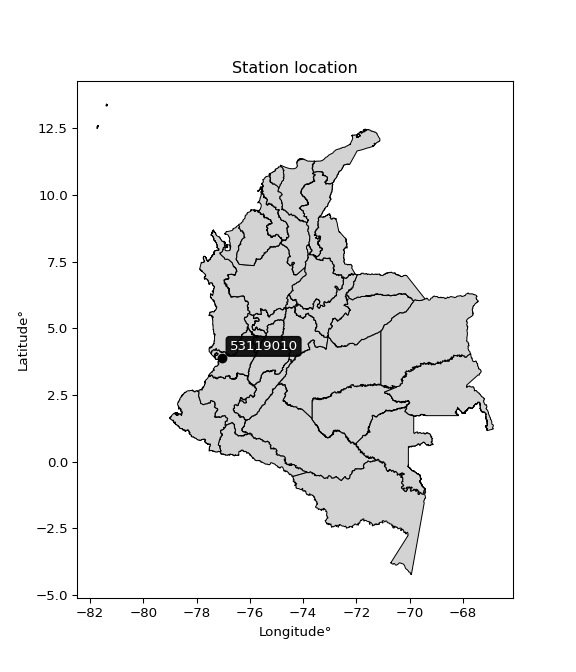

<div align="center">


</div>

# Station (rain, Pmax24h): 53119010

Probable Maximum Precipitation (PMP) is the greatest amount of rainfall for a specific duration that is meteorologically possible for a given location, acting as a "worst-case" scenario for extreme storms, crucial for designing safety-critical infrastructure like bridges, river deviations, dams, spillways, and nuclear plants to prevent catastrophic failure. PMP is calculated by hydrologists using meteorological data to determine the upper limit of extreme rainfall, often leading to the Probable Maximum Flood (PMF) for flood control design, and is increasingly being studied for climate change impacts.

<div align="center">

</img>

</div>


## A. General information


### 1. General running parameters

• app_version: _v20251226_. • runtime: _2025-12-26 15:38:16.554582_. • Python version: _3.14.0_. • SciPy version: _1.16.3_. • Pandas version: _2.3.3_. • NumPy version: _2.3.5_. • Stations dataset (station_dataset_file): _dataset/pmax24h_in/automatic_colombia_2003_2024.csv_. • Stations catalog (station_catalog_file): _dataset/CNE_IDEAM.xls_. • Minimum year to eval til year_max (date_min): _2003_. • Maximum year to eval since year_min (date_max): _2024_. • Creates, save and include plots into reports (create_plot): _False_. • Plot only fit distributions with Δo > Δ (plot_only_fit): _True_. • Eval low extreme values, if False, evaluates high extreme values (low_extreme): _False_. • Eval every SciPy distribution as logarithmic (pdist_logarithmic_on): _True_. • Standard deviation normalized (ddof): _1.0_. • Return periods to eval in years (Tr): _[2, 2.33, 5, 10, 15, 20, 25, 50, 75, 100, 200, 250, 500, 750, 1000]_. • Minimum data sample per station, 0 means any (minimum_sample): _5_. • Z-Score threshold to adjust a value, 0 means disable (zscore): _3.5_. • Avoid zeros, e.g. rain = 0 (avoid_zeros): _True_. • Avoid null values (avoid_nans): _True_. [:file_folder:Dataset file.](../../dataset/pmax24h_in/automatic_colombia_2003_2024.csv)


### 2. Station info and location

|   id |   CODIGO | NOMBRE                               | CATEGORIA            | TECNOLOGIA                              | ESTADO           | FECHA_INSTALACION   |   FECHA_SUSPENSION |   ALTITUD |   LATITUD |   LONGITUD | DEPARTAMENTO    | MUNICIPIO    | AREA_OPERATIVA                         | ENTIDAD                                                     | AREA_HIDROGRAFICA   | ZONA_HIDROGRAFICA         | SUBZONA_HIDROGRAFICA                | CORRIENTE   | OBSERVACION                                                                                                                                                                                                                                    |   SUBRED | Catalogo   |
|-----:|---------:|:-------------------------------------|:---------------------|:----------------------------------------|:-----------------|:--------------------|-------------------:|----------:|----------:|-----------:|:----------------|:-------------|:---------------------------------------|:------------------------------------------------------------|:--------------------|:--------------------------|:------------------------------------|:------------|:-----------------------------------------------------------------------------------------------------------------------------------------------------------------------------------------------------------------------------------------------|---------:|:-----------|
|    0 | 53119010 | BUENAVENTURA IDEAM  - AUT [53119010] | Meteorologica Marina | Automática con Telemetría, Convencional | En Mantenimiento | 15/05/1941          |                nan |        40 |   3.89018 |   -77.0619 | Valle Del Cauca | Buenaventura | Area Operativa 09 - Cauca-Valle-Caldas | INSTITUTO DE HIDROLOGIA METEOROLOGIA Y ESTUDIOS AMBIENTALES | Pacifico            | Tapaje - Dagua - Directos | Dagua - Buenaventura - Bahia Málaga | Pacifico    | Cambio de tecnología por instalación o repotenciación de estaciones proyecto Fondo de Adaptación|22/08/2022$Migracion$Se Cambia Estado por orden de la Coordinación de Planeacion Operativa Decisión tomada en la Reunión de la RED 19/08/2022 |      nan | CNE_IDEAM  |

<div align="center">

Map location in: [:earth_americas:Google](http://maps.google.com/maps?q=3.890175,-77.06190833) [:earth_americas:OSM](https://www.openstreetmap.org/#map=18/3.890175/-77.06190833&layers=P) [:earth_americas:Bing](https://www.bing.com/maps?cp=3.890175~-77.06190833&lvl=18) [:earth_americas:Apple](https://maps.apple.com/frame?center=3.890175%2C-77.06190833&span=0.003%2C0.006)

</div>


<div align="center">

```geojson
{
  "type": "Feature",
  "geometry": {
    "type": "Point", 
    "coordinates": [-77.06190833, 3.890175]
  }, 
  "properties": {
    "Name": "53119010"
  }
}
```

</div>


### 3. Discrete values table and plot

|               |          0 |            1 |            2 |           3 |          4 |
|:--------------|-----------:|-------------:|-------------:|------------:|-----------:|
| Date          | 2017       | 2018         | 2019         | 2020        | 2024       |
| Value         |  203.9     |  120.3       |  116.8       |   99.4      |   46.6     |
| Value_initial |  203.9     |  120.3       |  116.8       |   99.4      |   46.6     |
| count         |    5       |    5         |    5         |    5        |    5       |
| mean          |  117.4     |  117.4       |  117.4       |  117.4      |  117.4     |
| std           |   56.6296  |   56.6296    |   56.6296    |   56.6296   |   56.6296  |
| zscore        |    1.52747 |    0.0512099 |   -0.0105952 |   -0.317855 |   -1.25023 |
> If Z-Score is active, values out of range or outliers are replaced with the station mean value.


### 4. Active continuous probability distributions from SciPy (45 of 104 available)

[scipy.stats](https://docs.scipy.org/doc/scipy/reference/stats.html) is a Python´s powerful submodule within the SciPy library for comprehensive statistical analysis, offering over 130 probability distributions (like Normal, Poisson), functions for descriptive stats (mean, variance), hypothesis testing (t-tests, chi-square), random variable generation, and statistical tests, making it essential for data science, modeling, and research. It provides tools to explore, model, and draw conclusions from data efficiently, working seamlessly with NumPy.

<div align="center">

|   id | p_dist             |   n_parameter | fit_method   | label                                                                       | active   | ref                                                                                                        |
|-----:|:-------------------|--------------:|:-------------|:----------------------------------------------------------------------------|:---------|:-----------------------------------------------------------------------------------------------------------|
|    0 | alpha              |             3 | MLE          | Alpha                                                                       | True     | [:mortar_board:](https://docs.scipy.org/doc/scipy/reference/generated/scipy.stats.alpha.html)              |
|    1 | betaprime          |             4 | MLE          | Beta prime                                                                  | True     | [:mortar_board:](https://docs.scipy.org/doc/scipy/reference/generated/scipy.stats.betaprime.html)          |
|    2 | chi2               |             3 | MLE          | Chi²                                                                        | True     | [:mortar_board:](https://docs.scipy.org/doc/scipy/reference/generated/scipy.stats.chi2.html)               |
|    3 | crystalball        |             4 | MLE          | Crystalball                                                                 | True     | [:mortar_board:](https://docs.scipy.org/doc/scipy/reference/generated/scipy.stats.crystalball.html)        |
|    4 | erlang             |             3 | MLE          | Erlang                                                                      | True     | [:mortar_board:](https://docs.scipy.org/doc/scipy/reference/generated/scipy.stats.erlang.html)             |
|    5 | expon              |             2 | MLE          | Exponential                                                                 | True     | [:mortar_board:](https://docs.scipy.org/doc/scipy/reference/generated/scipy.stats.expon.html)              |
|    6 | exponnorm          |             3 | MLE          | Exponentially modified Normal                                               | True     | [:mortar_board:](https://docs.scipy.org/doc/scipy/reference/generated/scipy.stats.exponnorm.html)          |
|    7 | f                  |             4 | MLE          | F                                                                           | True     | [:mortar_board:](https://docs.scipy.org/doc/scipy/reference/generated/scipy.stats.f.html)                  |
|    8 | fatiguelife        |             3 | MLE          | Fatigue-life (Birnbaum-Saunders)                                            | True     | [:mortar_board:](https://docs.scipy.org/doc/scipy/reference/generated/scipy.stats.fatiguelife.html)        |
|    9 | fisk               |             3 | MLE          | Fisk                                                                        | True     | [:mortar_board:](https://docs.scipy.org/doc/scipy/reference/generated/scipy.stats.fisk.html)               |
|   10 | gamma              |             3 | MLE          | Gamma                                                                       | True     | [:mortar_board:](https://docs.scipy.org/doc/scipy/reference/generated/scipy.stats.gamma.html)              |
|   11 | genexpon           |             5 | MLE          | Generalized exponential                                                     | True     | [:mortar_board:](https://docs.scipy.org/doc/scipy/reference/generated/scipy.stats.genexpon.html)           |
|   12 | genlogistic        |             3 | MLE          | Generalized logistic                                                        | True     | [:mortar_board:](https://docs.scipy.org/doc/scipy/reference/generated/scipy.stats.genlogistic.html)        |
|   13 | gibrat             |             2 | MM           | Gibrat                                                                      | True     | [:mortar_board:](https://docs.scipy.org/doc/scipy/reference/generated/scipy.stats.gibrat.html)             |
|   14 | gompertz           |             3 | MLE          | Gompertz (or truncated Gumbel)                                              | True     | [:mortar_board:](https://docs.scipy.org/doc/scipy/reference/generated/scipy.stats.gompertz.html)           |
|   15 | gumbel_l           |             2 | MM           | Gumbel Left Skew                                                            | True     | [:mortar_board:](https://docs.scipy.org/doc/scipy/reference/generated/scipy.stats.gumbel_l.html)           |
|   16 | gumbel_r           |             2 | MM           | Gumbel Right Skew                                                           | True     | [:mortar_board:](https://docs.scipy.org/doc/scipy/reference/generated/scipy.stats.gumbel_r.html)           |
|   17 | halflogistic       |             2 | MM           | Half-logistic                                                               | True     | [:mortar_board:](https://docs.scipy.org/doc/scipy/reference/generated/scipy.stats.halflogistic.html)       |
|   18 | halfnorm           |             2 | MM           | Half Normal                                                                 | True     | [:mortar_board:](https://docs.scipy.org/doc/scipy/reference/generated/scipy.stats.halfnorm.html)           |
|   19 | hypsecant          |             2 | MM           | hyperbolic secant                                                           | True     | [:mortar_board:](https://docs.scipy.org/doc/scipy/reference/generated/scipy.stats.hypsecant.html)          |
|   20 | invgamma           |             3 | MLE          | Inverted gamma                                                              | True     | [:mortar_board:](https://docs.scipy.org/doc/scipy/reference/generated/scipy.stats.invgamma.html)           |
|   21 | invgauss           |             3 | MLE          | Inverse Gaussian                                                            | True     | [:mortar_board:](https://docs.scipy.org/doc/scipy/reference/generated/scipy.stats.invgauss.html)           |
|   22 | invweibull         |             3 | MLE          | Inverted Weibull                                                            | True     | [:mortar_board:](https://docs.scipy.org/doc/scipy/reference/generated/scipy.stats.invweibull.html)         |
|   23 | johnsonsu          |             4 | MLE          | Johnson Su                                                                  | True     | [:mortar_board:](https://docs.scipy.org/doc/scipy/reference/generated/scipy.stats.johnsonsu.html)          |
|   24 | kstwobign          |             2 | MLE          | Limiting distribution of scaled Kolmogorov-Smirnov two-sided test statistic | True     | [:mortar_board:](https://docs.scipy.org/doc/scipy/reference/generated/scipy.stats.kstwobign.html)          |
|   25 | laplace            |             2 | MM           | Laplace                                                                     | True     | [:mortar_board:](https://docs.scipy.org/doc/scipy/reference/generated/scipy.stats.laplace.html)            |
|   26 | laplace_asymmetric |             3 | MLE          | Asymmetric Laplace                                                          | True     | [:mortar_board:](https://docs.scipy.org/doc/scipy/reference/generated/scipy.stats.laplace_asymmetric.html) |
|   27 | loggamma           |             3 | MLE          | Log gamma                                                                   | True     | [:mortar_board:](https://docs.scipy.org/doc/scipy/reference/generated/scipy.stats.loggamma.html)           |
|   28 | logistic           |             2 | MM           | Logistic (or Sech-squared)                                                  | True     | [:mortar_board:](https://docs.scipy.org/doc/scipy/reference/generated/scipy.stats.logistic.html)           |
|   29 | lognorm            |             3 | MLE          | Log Normal                                                                  | True     | [:mortar_board:](https://docs.scipy.org/doc/scipy/reference/generated/scipy.stats.lognorm.html)            |
|   30 | maxwell            |             2 | MM           | Maxwell                                                                     | True     | [:mortar_board:](https://docs.scipy.org/doc/scipy/reference/generated/scipy.stats.maxwell.html)            |
|   31 | mielke             |             4 | MLE          | Mielke Beta-Kappa / Dagum                                                   | True     | [:mortar_board:](https://docs.scipy.org/doc/scipy/reference/generated/scipy.stats.mielke.html)             |
|   32 | moyal              |             2 | MM           | Moyal                                                                       | True     | [:mortar_board:](https://docs.scipy.org/doc/scipy/reference/generated/scipy.stats.moyal.html)              |
|   33 | nakagami           |             3 | MLE          | Nakagami                                                                    | True     | [:mortar_board:](https://docs.scipy.org/doc/scipy/reference/generated/scipy.stats.nakagami.html)           |
|   34 | ncf                |             5 | MLE          | Non-central F distribution                                                  | True     | [:mortar_board:](https://docs.scipy.org/doc/scipy/reference/generated/scipy.stats.ncf.html)                |
|   35 | nct                |             4 | MLE          | Non-central Student’s t                                                     | True     | [:mortar_board:](https://docs.scipy.org/doc/scipy/reference/generated/scipy.stats.nct.html)                |
|   36 | norm               |             2 | MM           | Normal                                                                      | True     | [:mortar_board:](https://docs.scipy.org/doc/scipy/reference/generated/scipy.stats.norm.html)               |
|   37 | pareto             |             3 | MLE          | Pareto                                                                      | True     | [:mortar_board:](https://docs.scipy.org/doc/scipy/reference/generated/scipy.stats.pareto.html)             |
|   38 | pearson3           |             3 | MM           | Pearson type III                                                            | True     | [:mortar_board:](https://docs.scipy.org/doc/scipy/reference/generated/scipy.stats.pearson3.html)           |
|   39 | rayleigh           |             2 | MM           | Rayleigh                                                                    | True     | [:mortar_board:](https://docs.scipy.org/doc/scipy/reference/generated/scipy.stats.rayleigh.html)           |
|   40 | rice               |             3 | MLE          | Rice                                                                        | True     | [:mortar_board:](https://docs.scipy.org/doc/scipy/reference/generated/scipy.stats.rice.html)               |
|   41 | t                  |             3 | MLE          | Student’s t                                                                 | True     | [:mortar_board:](https://docs.scipy.org/doc/scipy/reference/generated/scipy.stats.t.html)                  |
|   42 | truncnorm          |             4 | MLE          | Truncated normal                                                            | True     | [:mortar_board:](https://docs.scipy.org/doc/scipy/reference/generated/scipy.stats.truncnorm.html)          |
|   43 | wald               |             2 | MM           | Wald                                                                        | True     | [:mortar_board:](https://docs.scipy.org/doc/scipy/reference/generated/scipy.stats.wald.html)               |
|   44 | weibull_min        |             3 | MLE          | Weibull minimum                                                             | True     | [:mortar_board:](https://docs.scipy.org/doc/scipy/reference/generated/scipy.stats.weibull_min.html)        |

</div>

> **n_parameter:** # arguments & localization & scale.
>
> **Fit methods:** (MLE) maximum likelihood, (MM) L-moments.
>
>**Inactive:** foldnorm, gennorm, norminvgauss, powernorm, powerlognorm, skewnorm, genextreme, anglit, arcsine, argus, beta, bradford, burr, burr12, cauchy, cosine, halfcauchy, foldcauchy, skewcauchy, wrapcauchy, dgamma, gengamma, exponweib, exponpow, truncexpon, gausshyper, genhalflogistic, genhyperbolic, geninvgauss, halfgennorm, johnsonsb, kappa4, kappa3, ksone, kstwo, loglaplace, levy, levy_l, levy_stable, ncx2, genpareto, truncpareto, lomax, powerlaw, rdist, rel_breitwigner, recipinvgauss, semicircular, studentized_range, trapezoid, triang, truncweibull_min, tukeylambda, uniform, loguniform, vonmises, vonmises_line, weibull_max, dweibull, 


## B. Probability distributions vs. Empirical distributions

A continuous probability distribution (CPD) describes probabilities for variables that can take any value within a range (like rain any time), unlike discrete variables with specific outcomes (like temperature). It uses a Probability Density Function (PDF), a curve where the total area under it equals 1, and the probability of the variable falling within an interval (a to b) is found by calculating the area under the curve between those points. A key feature is that the probability of hitting any single exact value is zero, so probabilities are always expressed for ranges, e.g., $P(a ≤ X ≤ b)$.

<div align="center">

Distributions parameters
|    |   station | p_dist                |   n |              loc |           scale | shape                 | shape1                | shape2                 | shape3   |
|---:|----------:|:----------------------|----:|-----------------:|----------------:|:----------------------|:----------------------|:-----------------------|:---------|
|  0 |  53119010 | alpha                 |   5 |   -343.462       |  4245.72        | 9.321581767731299     |                       |                        |          |
|  1 |  53119010 | betaprime             |   5 |      1.35245     | 25332.9         | 4.893734335485529     | 1067.8981929819824    |                        |          |
|  2 |  53119010 | chi2                  |   5 |      0.176148    |    11.8189      | 9.918312235151408     |                       |                        |          |
|  3 |  53119010 | crystalball           |   5 |    117.4         |    50.6511      | 9928.665989311281     | 2822.6542121436437    |                        |          |
|  4 |  53119010 | erlang                |   5 |      0.176111    |    23.6378      | 4.9591618461437195    |                       |                        |          |
|  5 |  53119010 | expon                 |   5 |     46.6         |    70.8         |                       |                       |                        |          |
|  6 |  53119010 | exponnorm             |   5 |     74.9963      |    31.7986      | 1.3335097270076992    |                       |                        |          |
|  7 |  53119010 | f                     |   5 |     -0.184404    |   117.606       | 10.003373936915828    | 100584.91112308469    |                        |          |
|  8 |  53119010 | fatiguelife           |   5 |     46.6         |     0.00068035  | 329.746773441169      |                       |                        |          |
|  9 |  53119010 | fisk                  |   5 |    -88.4767      |   200.248       | 7.122828301940879     |                       |                        |          |
| 10 |  53119010 | gamma                 |   5 |      0.176105    |    23.6378      | 4.959162724994066     |                       |                        |          |
| 11 |  53119010 | genexpon              |   5 |     46.6         |     3.36349     | 0.04751764666240534   | 7.450679669522534e-08 | 1.3836480721294346     |          |
| 12 |  53119010 | genlogistic           |   5 |     -9.98128     |    41.4652      | 12.802113007668801    |                       |                        |          |
| 13 |  53119010 | gibrat                |   5 |     78.7596      |    23.4366      |                       |                       |                        |          |
| 14 |  53119010 | gompertz              |   5 |     46.6         |   118.386       | 1.0059572331140805    |                       |                        |          |
| 15 |  53119010 | gumbel_l              |   5 |    140.196       |    39.4925      |                       |                       |                        |          |
| 16 |  53119010 | gumbel_r              |   5 |     94.6043      |    39.4925      |                       |                       |                        |          |
| 17 |  53119010 | halflogistic          |   5 |     57.3667      |    43.3049      |                       |                       |                        |          |
| 18 |  53119010 | halfnorm              |   5 |     50.3578      |    84.0249      |                       |                       |                        |          |
| 19 |  53119010 | hypsecant             |   5 |    117.4         |    32.2455      |                       |                       |                        |          |
| 20 |  53119010 | invgamma              |   5 |   -174.634       |  9728.11        | 34.30712984693621     |                       |                        |          |
| 21 |  53119010 | invgauss              |   5 |    -86.779       |  3201.92        | 0.06376798285784485   |                       |                        |          |
| 22 |  53119010 | invweibull            |   5 |     46.6         |     1.25664     | 0.044643564397495866  |                       |                        |          |
| 23 |  53119010 | johnsonsu             |   5 |    118.204       |     2.50006     | 0.16042142094245804   | 0.3473665574843916    |                        |          |
| 24 |  53119010 | kstwobign             |   5 |    -59.7585      |   203.259       |                       |                       |                        |          |
| 25 |  53119010 | laplace               |   5 |    117.4         |    35.8157      |                       |                       |                        |          |
| 26 |  53119010 | laplace_asymmetric    |   5 |    116.8         |    35.6492      | 0.9917375889474829    |                       |                        |          |
| 27 |  53119010 | loggamma              |   5 | -11026.6         |  1618.1         | 980.0558421510959     |                       |                        |          |
| 28 |  53119010 | logistic              |   5 |    117.4         |    27.9254      |                       |                       |                        |          |
| 29 |  53119010 | lognorm               |   5 |     46.6         |     0.0497681   | 14.793183784531033    |                       |                        |          |
| 30 |  53119010 | maxwell               |   5 |     -2.62179     |    75.2125      |                       |                       |                        |          |
| 31 |  53119010 | mielke                |   5 |     -0.640237    |   137.979       | 2.644829992863146     | 5.208954579780763     |                        |          |
| 32 |  53119010 | moyal                 |   5 |     88.4345      |    22.801       |                       |                       |                        |          |
| 33 |  53119010 | nakagami              |   5 |     99.4         |    50.7291      | 0.13438140683910849   |                       |                        |          |
| 34 |  53119010 | ncf                   |   5 |     -0.248677    |     3.57905e-07 | 7.22538030336404e-08  | 61.66765081946515     | 23.01790810949842      |          |
| 35 |  53119010 | nct                   |   5 |     -0.141047    |    40.451       | 12.109525451411727    | 2.720338555446906     |                        |          |
| 36 |  53119010 | norm                  |   5 |    117.4         |    50.6511      |                       |                       |                        |          |
| 37 |  53119010 | pareto                |   5 |     45.9162      |     0.683831    | 0.2613377693084727    |                       |                        |          |
| 38 |  53119010 | pearson3              |   5 |    117.4         |    50.6511      | 0.44096268933659694   |                       |                        |          |
| 39 |  53119010 | rayleigh              |   5 |     20.5015      |    77.3138      |                       |                       |                        |          |
| 40 |  53119010 | rice                  |   5 |     22.9123      |    70.1067      | 0.5817831395054658    |                       |                        |          |
| 41 |  53119010 | t                     |   5 |    117.399       |    50.6429      | 1442605.8233024362    |                       |                        |          |
| 42 |  53119010 | truncnorm             |   5 |    117.4         |    50.6511      | -1525.3445784261887   | 6464.912443689127     |                        |          |
| 43 |  53119010 | wald                  |   5 |     66.7489      |    50.6511      |                       |                       |                        |          |
| 44 |  53119010 | weibull_min           |   5 |     36.6427      |    88.9373      | 1.5189324477972905    |                       |                        |          |
| 45 |  53119010 | logalpha              |   5 |     -6.93369     |   273.677       | 23.6491104797215      |                       |                        |          |
| 46 |  53119010 | logbetaprime          |   5 |     -6.33435     |    17.7673      | 787.6113941651874     | 1273.5216214888947    |                        |          |
| 47 |  53119010 | logchi2               |   5 |      3.8416      |     0.989684    | 1.0421052430178932    |                       |                        |          |
| 48 |  53119010 | logcrystalball        |   5 |      4.66177     |     0.476011    | 198.03217926579805    | 767.8858743899759     |                        |          |
| 49 |  53119010 | logerlang             |   5 |     -3.70807     |     0.0282595   | 296.018339969296      |                       |                        |          |
| 50 |  53119010 | logexpon              |   5 |      3.8416      |     0.820166    |                       |                       |                        |          |
| 51 |  53119010 | logexponnorm          |   5 |      4.66151     |     0.476006    | 0.0005499424060192242 |                       |                        |          |
| 52 |  53119010 | logf                  |   5 |   -320.762       |   325.424       | 1856228.6897488255    | 1853423.5303129042    |                        |          |
| 53 |  53119010 | logfatiguelife        |   5 |   -161.598       |   166.259       | 0.0028548639743580795 |                       |                        |          |
| 54 |  53119010 | logfisk               |   5 |     -3.1965e+07  |     3.1965e+07  | 119443427.58704713    |                       |                        |          |
| 55 |  53119010 | loggamma              |   5 |     -3.73542     |     0.0281484   | 298.26661945185435    |                       |                        |          |
| 56 |  53119010 | loggenexpon           |   5 |      3.83833     |     0.00844422  | 0.004580454208349065  | 1.6075939811412439    | 5.3899862981761525e-05 |          |
| 57 |  53119010 | loggenlogistic        |   5 |      4.92456     |     0.192475    | 0.5039379576554284    |                       |                        |          |
| 58 |  53119010 | loggibrat             |   5 |      4.29859     |     0.220275    |                       |                       |                        |          |
| 59 |  53119010 | loggompertz           |   5 |      3.8416      |     0.537901    | 0.1852725848419715    |                       |                        |          |
| 60 |  53119010 | loggumbel_l           |   5 |      4.876       |     0.371144    |                       |                       |                        |          |
| 61 |  53119010 | loggumbel_r           |   5 |      4.44754     |     0.371144    |                       |                       |                        |          |
| 62 |  53119010 | loghalflogistic       |   5 |      4.09755     |     0.406994    |                       |                       |                        |          |
| 63 |  53119010 | loghalfnorm           |   5 |      4.0317      |     0.789665    |                       |                       |                        |          |
| 64 |  53119010 | loghypsecant          |   5 |      4.66177     |     0.303038    |                       |                       |                        |          |
| 65 |  53119010 | loginvgamma           |   5 |     -5.55527     |  4543.39        | 445.4353222577846     |                       |                        |          |
| 66 |  53119010 | loginvgauss           |   5 |     -0.207304    |   459.192       | 0.010591877045882561  |                       |                        |          |
| 67 |  53119010 | loginvweibull         |   5 |     -6.31024e+07 |     6.31024e+07 | 125486698.0426122     |                       |                        |          |
| 68 |  53119010 | logjohnsonsu          |   5 |      4.77576     |     0.0204646   | 0.23504406424439453   | 0.34178713710450803   |                        |          |
| 69 |  53119010 | logkstwobign          |   5 |      2.69035     |     2.25091     |                       |                       |                        |          |
| 70 |  53119010 | loglaplace            |   5 |      4.66177     |     0.33659     |                       |                       |                        |          |
| 71 |  53119010 | loglaplace_asymmetric |   5 |      4.76046     |     0.322176    | 1.164872200264778     |                       |                        |          |
| 72 |  53119010 | logloggamma           |   5 |      4.49133     |     0.568598    | 1.8201701644138542    |                       |                        |          |
| 73 |  53119010 | loglogistic           |   5 |      4.66177     |     0.262438    |                       |                       |                        |          |
| 74 |  53119010 | loglognorm            |   5 |      3.8416      |     0.000845752 | 14.139297494657585    |                       |                        |          |
| 75 |  53119010 | logmaxwell            |   5 |      3.53382     |     0.706835    |                       |                       |                        |          |
| 76 |  53119010 | logmielke             |   5 |     -0.180224    |     5.16051     | 11.46517784748659     | 28.240905677066948    |                        |          |
| 77 |  53119010 | logmoyal              |   5 |      4.38955     |     0.21428     |                       |                       |                        |          |
| 78 |  53119010 | lognakagami           |   5 |      4.59915     |     0.22377     | 0.20793181460846602   |                       |                        |          |
| 79 |  53119010 | logncf                |   5 |    -14.6468      |    13.4956      | 5075.478863261556     | 7491.830308277977     | 2185.1031184714166     |          |
| 80 |  53119010 | lognct                |   5 |    -21.4993      |     0.464407    | 27672.11984600022     | 56.32986373420141     |                        |          |
| 81 |  53119010 | lognorm               |   5 |      4.66177     |     0.476011    |                       |                       |                        |          |
| 82 |  53119010 | logpareto             |   5 |      3.83331     |     0.00829394  | 0.26072642013594094   |                       |                        |          |
| 83 |  53119010 | logpearson3           |   5 |      4.66177     |     0.47601     | -0.4946017019287611   |                       |                        |          |
| 84 |  53119010 | lograyleigh           |   5 |      3.75113     |     0.726583    |                       |                       |                        |          |
| 85 |  53119010 | logrice               |   5 |      3.52652     |     0.523981    | 1.8759621183556536    |                       |                        |          |
| 86 |  53119010 | logt                  |   5 |      4.66176     |     0.476018    | 56191994.52588451     |                       |                        |          |
| 87 |  53119010 | logtruncnorm          |   5 |     -0.122062    |     1.05728     | 4.465413673922875     | 5.144984072500877     |                        |          |
| 88 |  53119010 | logwald               |   5 |      4.18578     |     0.475994    |                       |                       |                        |          |
| 89 |  53119010 | logweibull_min        |   5 |      1.06348     |     3.80028     | 9.176799995005894     |                       |                        |          |

</div>

> **loc** (Location parameter): This shifts the distribution along the x-axis. For many common distributions, like the normal (Gaussian) distribution, loc represents the mean $μ$. For others, like the uniform distribution, it might represent the minimum value, or for the beta distribution, the left end of the support interval.
>
> **scale** (Scale parameter): This determines the width or spread of the distribution. For the normal distribution, scale represents the standard deviation $σ$. For a uniform distribution, it defines the length of the interval (from $loc$ to $loc + scale$).
>
> **shape** (Shape parameters): Refers to parameters that define the specific form of a probability distribution, distinct from its location (loc) and scale (scale). These parameters are required arguments for most distribution functions. For example, a normal (Gaussian) distribution is fully defined by its location (mean) and scale (standard deviation), so it has no specific shape parameters beyond loc and scale. However, other distributions have intrinsic properties that need specification, as Gamma distribution that takes a shape parameter, often named $a$ or $alpha$.


### 0. Cumulative distribution values - CDF (90 evaluated)

> Ordered by x ascending and calculating $log(f(x))$ separately. 

|   id |   Station |   date |     x |   count |   mean |     std |     zscore |   Value_initial |   station |   m |     alpha |   alpha_pdf |   betaprime |   betaprime_pdf |      chi2 |   chi2_pdf |   crystalball |   crystalball_pdf |   erlang |   erlang_pdf |    expon |   expon_pdf |   exponnorm |   exponnorm_pdf |         f |      f_pdf |   fatiguelife |   fatiguelife_pdf |      fisk |   fisk_pdf |    gamma |   gamma_pdf |    genexpon |   genexpon_pdf |   genlogistic |   genlogistic_pdf |   gibrat |   gibrat_pdf |    gompertz |   gompertz_pdf |   gumbel_l |   gumbel_l_pdf |   gumbel_r |   gumbel_r_pdf |   halflogistic |   halflogistic_pdf |   halfnorm |   halfnorm_pdf |   hypsecant |   hypsecant_pdf |   invgamma |   invgamma_pdf |   invgauss |   invgauss_pdf |   invweibull |   invweibull_pdf |   johnsonsu |   johnsonsu_pdf |   kstwobign |   kstwobign_pdf |   laplace |   laplace_pdf |   laplace_asymmetric |   laplace_asymmetric_pdf |   loggamma |   loggamma_pdf |   logistic |   logistic_pdf |   lognorm |   lognorm_pdf |   maxwell |   maxwell_pdf |    mielke |   mielke_pdf |     moyal |   moyal_pdf |    nakagami |   nakagami_pdf |       ncf |    ncf_pdf |      nct |    nct_pdf |      norm |   norm_pdf |      pareto |   pareto_pdf |   pearson3 |   pearson3_pdf |   rayleigh |   rayleigh_pdf |      rice |   rice_pdf |         t |      t_pdf |   truncnorm |   truncnorm_pdf |     wald |   wald_pdf |   weibull_min |   weibull_min_pdf |   logalpha |   logalpha_pdf |   logbetaprime |   logbetaprime_pdf |    logchi2 |   logchi2_pdf |   logcrystalball |   logcrystalball_pdf |   logerlang |   logerlang_pdf |   logexpon |   logexpon_pdf |   logexponnorm |   logexponnorm_pdf |     logf |   logf_pdf |   logfatiguelife |   logfatiguelife_pdf |   logfisk |   logfisk_pdf |   loggenexpon |   loggenexpon_pdf |   loggenlogistic |   loggenlogistic_pdf |   loggibrat |   loggibrat_pdf |   loggompertz |   loggompertz_pdf |   loggumbel_l |   loggumbel_l_pdf |   loggumbel_r |   loggumbel_r_pdf |   loghalflogistic |   loghalflogistic_pdf |   loghalfnorm |   loghalfnorm_pdf |   loghypsecant |   loghypsecant_pdf |   loginvgamma |   loginvgamma_pdf |   loginvgauss |   loginvgauss_pdf |   loginvweibull |   loginvweibull_pdf |   logjohnsonsu |   logjohnsonsu_pdf |   logkstwobign |   logkstwobign_pdf |   loglaplace |   loglaplace_pdf |   loglaplace_asymmetric |   loglaplace_asymmetric_pdf |   logloggamma |   logloggamma_pdf |   loglogistic |   loglogistic_pdf |   loglognorm |   loglognorm_pdf |   logmaxwell |   logmaxwell_pdf |   logmielke |   logmielke_pdf |   logmoyal |   logmoyal_pdf |   lognakagami |   lognakagami_pdf |    logncf |   logncf_pdf |    lognct |   lognct_pdf |   logpareto |   logpareto_pdf |   logpearson3 |   logpearson3_pdf |   lograyleigh |   lograyleigh_pdf |   logrice |   logrice_pdf |     logt |   logt_pdf |   logtruncnorm |   logtruncnorm_pdf |   logwald |   logwald_pdf |   logweibull_min |   logweibull_min_pdf |
|-----:|----------:|-------:|------:|--------:|-------:|--------:|-----------:|----------------:|----------:|----:|----------:|------------:|------------:|----------------:|----------:|-----------:|--------------:|------------------:|---------:|-------------:|---------:|------------:|------------:|----------------:|----------:|-----------:|--------------:|------------------:|----------:|-----------:|---------:|------------:|------------:|---------------:|--------------:|------------------:|---------:|-------------:|------------:|---------------:|-----------:|---------------:|-----------:|---------------:|---------------:|-------------------:|-----------:|---------------:|------------:|----------------:|-----------:|---------------:|-----------:|---------------:|-------------:|-----------------:|------------:|----------------:|------------:|----------------:|----------:|--------------:|---------------------:|-------------------------:|-----------:|---------------:|-----------:|---------------:|----------:|--------------:|----------:|--------------:|----------:|-------------:|----------:|------------:|------------:|---------------:|----------:|-----------:|---------:|-----------:|----------:|-----------:|------------:|-------------:|-----------:|---------------:|-----------:|---------------:|----------:|-----------:|----------:|-----------:|------------:|----------------:|---------:|-----------:|--------------:|------------------:|-----------:|---------------:|---------------:|-------------------:|-----------:|--------------:|-----------------:|---------------------:|------------:|----------------:|-----------:|---------------:|---------------:|-------------------:|---------:|-----------:|-----------------:|---------------------:|----------:|--------------:|--------------:|------------------:|-----------------:|---------------------:|------------:|----------------:|--------------:|------------------:|--------------:|------------------:|--------------:|------------------:|------------------:|----------------------:|--------------:|------------------:|---------------:|-------------------:|--------------:|------------------:|--------------:|------------------:|----------------:|--------------------:|---------------:|-------------------:|---------------:|-------------------:|-------------:|-----------------:|------------------------:|----------------------------:|--------------:|------------------:|--------------:|------------------:|-------------:|-----------------:|-------------:|-----------------:|------------:|----------------:|-----------:|---------------:|--------------:|------------------:|----------:|-------------:|----------:|-------------:|------------:|----------------:|--------------:|------------------:|--------------:|------------------:|----------:|--------------:|---------:|-----------:|---------------:|-------------------:|----------:|--------------:|-----------------:|---------------------:|
|    0 |  53119010 |   2024 |  46.6 |       5 |  117.4 | 56.6296 | -1.25023   |            46.6 |  53119010 |   1 | 0.0590107 |  0.0032811  |   0.0504699 |      0.00378444 | 0.0517211 | 0.00380573 |     0.0810868 |        0.00296517 | 0.051721 |   0.00380573 | 0        |  0.0141243  |   0.0560123 |      0.00306376 | 0.0516371 | 0.0037925  |     0.0401312 |       3.69511e+07 | 0.0570886 | 0.00283852 | 0.051721 |  0.00380572 | 9.77917e-08 |     0.0141275  |     0.0543194 |        0.00341289 | 0        |  0           | 7.24277e-13 |     0.00849725 |  0.0892477 |     0.00215588 |  0.0343181 |     0.00293027 |       0        |         0          |   0        |     0          |   0.0705562 |      0.00217022 |  0.0579535 |     0.00333678 |  0.0561223 |     0.00346083 |    0.0132232 |      3.59394e+11 |    0.106415 |     0.000890162 |   0.0529123 |      0.00398561 | 0.0692569 |    0.0019337  |             0.06808  |               0.00192563 |  0.0424652 |       0.199283 |  0.0734185 |     0.00243607 | 0.0424443 |      0.189951 | 0.0656609 |    0.00366761 | 0.0586136 |   0.00326929 | 0.0123239 |  0.00191088 | 0           |    0           | 0.0608664 | 0.00386196 | 0.060972 | 0.00305024 | 0.0810868 | 0.00296517 | 1.11022e-16 |   0.382167   |  0.0669624 |     0.00328306 |  0.0553826 |     0.00412436 | 0.0470696 | 0.00388062 | 0.0810546 | 0.00296476 |   0.0810868 |      0.00296517 | 0        | 0          |     0.0353024 |        0.00528898 |  0.0401032 |       0.203547 |      0.0459857 |           0.207742 | 7.9077e-09 |   9.27815e+06 |        0.0424442 |             0.189951 |   0.0430913 |        0.201621 |   0        |       1.21926  |      0.0424418 |           0.189944 | 0.042809 |   0.190999 |        0.0416533 |             0.188549 | 0.0391121 |      0.140433 |    0.00177982 |          0.54544  |        0.0585888 |             0.152847 |    0        |        0        |   1.95952e-10 |          0.344436 |     0.0597437 |          0.156064 |    0.00599249 |          0.082623 |          0        |              0        |      0        |          0        |       0.042445 |           0.13965  |     0.0383362 |          0.192172 |      0.041357 |          0.213665 |       0.0428573 |            0.268454 |      0.0954606 |          0.0620454 |      0.0438608 |           0.321259 |     0.043725 |         0.129906 |               0.0497613 |                    0.132593 |     0.0598208 |          0.170491 |     0.0420807 |          0.153597 |     0.022763 |      8.60261e+12 |    0.0207498 |         0.194667 |   0.0573477 |        0.16334  | 0.00032869 |      0.0105718 |   0           |       0           | 0.0421416 |     0.193903 | 0.0428489 |     0.191432 | 1.11022e-16 |      31.4358    |     0.0542016 |          0.182655 |    0.00772196 |          0.170047 | 0.0330923 |      0.221609 | 0.042448 |   0.189962 |     0          |           0        |  0        |      0        |         0.054849 |             0.176118 |
|    1 |  53119010 |   2020 |  99.4 |       5 |  117.4 | 56.6296 | -0.317855  |            99.4 |  53119010 |   2 | 0.395347  |  0.00833734 |   0.416708  |      0.00826705 | 0.41726   | 0.00824856 |     0.361155  |        0.00739431 | 0.41726  |   0.00824857 | 0.525628 |  0.00670017 |   0.400863  |      0.00890792 | 0.416704  | 0.0082524  |     0.800895  |       0.00223377  | 0.388353  | 0.00900549 | 0.41726  |  0.00824857 | 0.525708    |     0.00670056 |     0.413029  |        0.00851047 | 0.449451 |  0.0191729   | 0.431865    |     0.00754092 |  0.299484  |     0.00631361 |  0.412446  |     0.00924943 |       0.450493 |         0.00920285 |   0.440553 |     0.00800863 |   0.330882  |      0.00851067 |  0.398179  |     0.00833576 |  0.403674  |     0.00831174 |    0.428999  |      0.000306977 |    0.216878 |     0.00537755  |   0.428022  |      0.00813293 | 0.302486  |    0.00844562 |             0.303118 |               0.00857363 |  0.457465  |       0.819885 |  0.344213  |     0.00808334 | 0.447674  |      0.830876 | 0.39372   |    0.00777886 | 0.391573  |   0.00871889 | 0.431712  |  0.0100991  | 5.37674e-05 |    1.01688e+09 | 0.418174  | 0.00808252 | 0.389533 | 0.00849418 | 0.361155  | 0.00739431 | 0.679951    |   0.00156385 |  0.385512  |     0.00796254 |  0.405899  |     0.00784178 | 0.396162  | 0.00799444 | 0.361138  | 0.00739539 |   0.361155  |      0.00739431 | 0.478729 | 0.013798   |     0.445034  |        0.00790941 |  0.467663  |       0.818175 |      0.457575  |           0.799957 | 0.603294   |   0.320589    |        0.447674  |             0.830876 |   0.460018  |        0.820118 |   0.602935 |       0.484127 |      0.447668  |           0.830882 | 0.447641 |   0.82776  |        0.447677  |             0.833576 | 0.408374  |      0.902802 |    0.534125   |          0.682386 |        0.391699  |             0.865878 |    0.622017 |        1.26474  |   0.435798    |          0.79466  |     0.377677  |          0.795285 |    0.514458   |          0.921286 |          0.548494 |              0.858925 |      0.527608 |          0.78049  |       0.434693 |           1.02837  |     0.456137  |          0.825338 |      0.474539 |          0.805926 |       0.497434  |            0.690756 |      0.229758  |          0.583386  |      0.531656  |           0.677145 |     0.415126 |         1.23333  |               0.374575  |                    0.998085 |     0.397271  |          0.791461 |     0.440634  |          0.939175 |     0.684657 |      0.0331803   |    0.482018  |         0.823535 |   0.397048  |        0.854585 | 0.539749   |      0.945968  |   8.07705e-07 |       3.78184e+08 | 0.451107  |     0.822511 | 0.448544  |     0.828665 | 0.692692    |       0.104621  |     0.415869  |          0.800756 |    0.493942   |          0.8129   | 0.461314  |      0.814937 | 0.44768  |   0.830865 |     1.6727e-06 |           4.57103  |  0.609998 |      1.02533  |         0.402894 |             0.799163 |
|    2 |  53119010 |   2019 | 116.8 |       5 |  117.4 | 56.6296 | -0.0105952 |           116.8 |  53119010 |   3 | 0.538646  |  0.00795804 |   0.55494   |      0.00749782 | 0.555268  | 0.00749049 |     0.495274  |        0.00787573 | 0.555268 |   0.00749049 | 0.62899  |  0.00524026 |   0.552838  |      0.00832112 | 0.554836  | 0.00750001 |     0.835004  |       0.00172231  | 0.544048  | 0.00860734 | 0.555268 |  0.00749049 | 0.629073    |     0.00524027 |     0.555421  |        0.00769842 | 0.685931 |  0.0093266   | 0.556999    |     0.00681096 |  0.424775  |     0.00805459 |  0.565494  |     0.00816264 |       0.595548 |         0.00745092 |   0.570907 |     0.00694632 |   0.494077  |      0.00986975 |  0.540876  |     0.00789709 |  0.544942  |     0.00777117 |    0.433611  |      0.000230422 |    0.489771 |     0.0483139   |   0.562545  |      0.00723311 | 0.491694  |    0.0137284  |             0.495852 |               0.0140251  |  0.588802  |       0.793855 |  0.494629  |     0.00895139 | 0.582128  |      0.820272 | 0.528507  |    0.00758213 | 0.544132  |   0.00855798 | 0.591367  |  0.0081326  | 0.609231    |    0.00927997  | 0.553828  | 0.00738374 | 0.536641 | 0.00820706 | 0.495274  | 0.00787573 | 0.702664    |   0.00109623 |  0.524614  |     0.00786443 |  0.539619  |     0.0074169  | 0.533022  | 0.00761562 | 0.495278  | 0.00787701 |   0.495274  |      0.00787573 | 0.663334 | 0.00801777 |     0.574272  |        0.0068891  |  0.597234  |       0.77455  |      0.585727  |           0.775327 | 0.650689   |   0.269402    |        0.582128  |             0.820273 |   0.591251  |        0.792381 |   0.67383  |       0.397688 |      0.582124  |           0.820282 | 0.581568 |   0.817042 |        0.582497  |             0.821978 | 0.557761  |      0.921706 |    0.637904   |          0.600977 |        0.544122  |             0.998805 |    0.770476 |        0.656663 |   0.567117    |          0.822919 |     0.519295  |          0.948734 |    0.650277   |          0.754023 |          0.672009 |              0.673724 |      0.643926 |          0.660016 |       0.601885 |           0.997047 |     0.58787   |          0.793293 |      0.60153  |          0.755924 |       0.602501  |            0.607059 |      0.499514  |          5.33635   |      0.633859  |           0.587105 |     0.627072 |         1.10796  |               0.575718  |                    1.53405  |     0.534186  |          0.892239 |     0.592926  |          0.9197   |     0.689493 |      0.0271738   |    0.610162  |         0.75415  |   0.54703   |        0.982157 | 0.673865   |      0.717126  |   0.674844    |       1.5903      | 0.583526  |     0.80418  | 0.582553  |     0.817128 | 0.707632    |       0.0822171 |     0.55096   |          0.859555 |    0.618967   |          0.728495 | 0.59153   |      0.785976 | 0.582132 |   0.820258 |     0.532968   |           2.28601  |  0.739426 |      0.620627 |         0.54001  |             0.88667  |
|    3 |  53119010 |   2018 | 120.3 |       5 |  117.4 | 56.6296 |  0.0512099 |           120.3 |  53119010 |   4 | 0.566173  |  0.00776677 |   0.580784  |      0.00726718 | 0.58109   | 0.00726187 |     0.522829  |        0.00786338 | 0.58109  |   0.00726187 | 0.646885 |  0.00498751 |   0.5815    |      0.00805069 | 0.580692  | 0.00727193 |     0.84089   |       0.00164162  | 0.573727  | 0.0083438  | 0.58109  |  0.00726187 | 0.646968    |     0.00498746 |     0.581919  |        0.00743987 | 0.716464 |  0.00815269  | 0.580545    |     0.00664246 |  0.45351   |     0.00836136 |  0.593506  |     0.0078404  |       0.621    |         0.00709342 |   0.594816 |     0.00671542 |   0.528589  |      0.00983167 |  0.568178  |     0.00769923 |  0.571786  |     0.00756371 |    0.434398  |      0.000219401 |    0.664665 |     0.038806    |   0.587449  |      0.00699588 | 0.538889  |    0.0128745  |             0.542625 |               0.0127239  |  0.612042  |       0.779982 |  0.525939  |     0.00892833 | 0.606177  |      0.808234 | 0.554826  |    0.00745285 | 0.57373   |   0.00834623 | 0.619052  |  0.00768781 | 0.639466    |    0.0080594   | 0.579294  | 0.00716503 | 0.565036 | 0.00801209 | 0.522829  | 0.00786338 | 0.706385    |   0.00103158 |  0.551921  |     0.00773407 |  0.565306  |     0.00725761 | 0.559409  | 0.00745885 | 0.522837  | 0.00786465 |   0.522829  |      0.00786338 | 0.689996 | 0.007234   |     0.59797   |        0.00665151 |  0.619867  |       0.758234 |      0.608433  |           0.76235  | 0.658525   |   0.261423    |        0.606176  |             0.808235 |   0.614444  |        0.778239 |   0.685363 |       0.383626 |      0.606173  |           0.808244 | 0.605523 |   0.805107 |        0.606592  |             0.809695 | 0.584775  |      0.907318 |    0.655402   |          0.584225 |        0.573699  |             1.00337  |    0.788834 |        0.588399 |   0.591387    |          0.820612 |     0.547584  |          0.966835 |    0.672033   |          0.719661 |          0.69142  |              0.641212 |      0.663076 |          0.637185 |       0.630836 |           0.962907 |     0.611079  |          0.778401 |      0.623607 |          0.739186 |       0.620163  |            0.589223 |      0.676075  |          4.92903   |      0.65093   |           0.569203 |     0.658392 |         1.01491  |               0.618678  |                    1.37872  |     0.560658  |          0.900263 |     0.619772  |          0.897943 |     0.690282 |      0.0262987   |    0.632149  |         0.734947 |   0.576123  |        0.987304 | 0.694444   |      0.677057  |   0.718597    |       1.38066     | 0.607087  |     0.791332 | 0.606508  |     0.805033 | 0.710012    |       0.079031  |     0.576355  |          0.860057 |    0.640178   |          0.708067 | 0.614539  |      0.772207 | 0.60618  |   0.80822  |     0.596284   |           2.00863  |  0.756983 |      0.569524 |         0.56628  |             0.892217 |
|    4 |  53119010 |   2017 | 203.9 |       5 |  117.4 | 56.6296 |  1.52747   |           203.9 |  53119010 |   5 | 0.941196  |  0.00166165 |   0.93254   |      0.0017126  | 0.93297   | 0.00171143 |     0.95616   |        0.00183241 | 0.93297  |   0.00171143 | 0.891581 |  0.00153134 |   0.936633  |      0.00149377 | 0.933105  | 0.00171201 |     0.927607  |       0.000638621 | 0.936783  | 0.00144272 | 0.93297  |  0.00171143 | 0.891636    |     0.00153092 |     0.929196  |        0.00164091 | 0.953046 |  0.000783752 | 0.938743    |     0.00196554 |  0.993384  |     0.00084072 |  0.939114  |     0.0014938  |       0.934386 |         0.00146545 |   0.932351 |     0.0017883  |   0.95653   |      0.00134391 |  0.940162  |     0.00167306 |  0.938327  |     0.00169516 |    0.446621  |      0.000102171 |    0.948347 |     0.000428842 |   0.930894  |      0.00176385 | 0.955323  |    0.00124742 |             0.955308 |               0.00124332 |  0.909475  |       0.319068 |  0.956791  |     0.00148044 | 0.915872  |      0.324382 | 0.943452  |    0.00184411 | 0.940396  |   0.00138618 | 0.936637  |  0.00138656 | 0.930377    |    0.00143696  | 0.928691  | 0.00172657 | 0.942827 | 0.00158932 | 0.95616   | 0.00183241 | 0.758851    |   0.00039891 |  0.945467  |     0.00176549 |  0.940006  |     0.00184074 | 0.943063  | 0.00183036 | 0.956186  | 0.0018318  |   0.95616   |      0.00183241 | 0.939894 | 0.00103163 |     0.926468  |        0.00174292 |  0.904989  |       0.308209 |      0.903226  |           0.32577  | 0.767302   |   0.162018    |        0.915872  |             0.324382 |   0.910411  |        0.31644  |   0.834647 |       0.20161  |      0.915872  |           0.324385 | 0.914726 |   0.325745 |        0.916127  |             0.3233   | 0.910033  |      0.305934 |    0.88091    |          0.277672 |        0.940376  |             0.282754 |    0.937207 |        0.121127 |   0.932505    |          0.361501 |     0.962628  |          0.330966 |    0.908547   |          0.234782 |          0.904947 |              0.222449 |      0.896569 |          0.268324 |       0.927215 |           0.238097 |     0.906323  |          0.317878 |      0.901882 |          0.305386 |       0.845936  |            0.281459 |      0.944294  |          0.0708264 |      0.868911  |           0.271674 |     0.92876  |         0.211653 |               0.943407  |                    0.20462  |     0.942148  |          0.367144 |     0.924079  |          0.267326 |     0.701228 |      0.016629    |    0.905019  |         0.29765  |   0.939146  |        0.28062  | 0.908695   |      0.212118  |   0.98867     |       0.0867948   | 0.910537  |     0.324451 | 0.915178  |     0.324455 | 0.741391    |       0.0454256 |     0.931924  |          0.365647 |    0.902131   |          0.290405 | 0.910318  |      0.319617 | 0.915871 |   0.32438  |     0.999996   |           0.174536 |  0.919459 |      0.153338 |         0.940157 |             0.363523 |

An Empirical Distribution Function (EDF) is a step-function estimate of a true cumulative distribution function (CDF) based on observed sample data, representing the proportion of data points less than or equal to a given value. It is calculated by ordering your data and jumping up by $1/n$ (where $n$ is sample size) at each unique data point, allowing analysis without assuming an underlying population distribution, and it gets closer to the true CDF as the sample size grows.


### 1. Empirical - EDF California (1923)

California´s estimates the true probability distribution of water-related data (like rainfall, streamflow) using observed samples, crucial for risk assessment.

<div align="center">


$P=m/n$


</div>


**1.1. Empirical values**

<div align="center">

|                | 0              | 1                  | 2              | 3                 | 4              |
|:---------------|:---------------|:-------------------|:---------------|:------------------|:---------------|
| date           | 2024           | 2020               | 2019           | 2018              | 2017           |
| x              | 46.6           | 99.4               | 116.8          | 120.3             | 203.9          |
| m              | 1              | 2                  | 3              | 4                 | 5              |
| empirical_dist | edf_california | edf_california     | edf_california | edf_california    | edf_california |
| empirical      | 0.2            | 0.4                | 0.6            | 0.8               | 1.0            |
| empirical_tr   | 1.25           | 1.6666666666666667 | 2.5            | 5.000000000000001 | inf            |

</div>


**1.2. Kolmogorov-Smirnov fit test (sorted by Δ)**


<div align="center">

|                | 0                   | 1                  | 2                  | 3                  | 4                  | 5                   | 6                   | 7                   | 8                   | 9                     | 10                  | 11                  | 12                  | 13                 | 14                  | 15                  | 16                  | 17                  | 18                 | 19                  | 20                  | 21                  | 22                  | 23                 | 24                 | 25                  | 26                  | 27                 | 28                  | 29                 | 30                  | 31                  | 32                 | 33                 | 34                 | 35                 | 36                 | 37                 | 38                 | 39                  | 40                 | 41                  | 42                  | 43                  | 44                 | 45                  | 46                 | 47                 | 48                 | 49                  | 50                  | 51                 | 52                  | 53                  | 54                  | 55                  | 56                 | 57                  | 58                  | 59                 | 60                 | 61                  | 62                 | 63                 | 64                  | 65                 | 66                  | 67                 | 68                  | 69                  | 70                  | 71                 | 72                  | 73                 | 74                 | 75                  | 76                 | 77                 | 78                  | 79                  | 80                 | 81                  | 82                  | 83                  | 84                  | 85                  | 86                  | 87                 | 88                 | 89                 |
|:---------------|:--------------------|:-------------------|:-------------------|:-------------------|:-------------------|:--------------------|:--------------------|:--------------------|:--------------------|:----------------------|:--------------------|:--------------------|:--------------------|:-------------------|:--------------------|:--------------------|:--------------------|:--------------------|:-------------------|:--------------------|:--------------------|:--------------------|:--------------------|:-------------------|:-------------------|:--------------------|:--------------------|:-------------------|:--------------------|:-------------------|:--------------------|:--------------------|:-------------------|:-------------------|:-------------------|:-------------------|:-------------------|:-------------------|:-------------------|:--------------------|:-------------------|:--------------------|:--------------------|:--------------------|:-------------------|:--------------------|:-------------------|:-------------------|:-------------------|:--------------------|:--------------------|:-------------------|:--------------------|:--------------------|:--------------------|:--------------------|:-------------------|:--------------------|:--------------------|:-------------------|:-------------------|:--------------------|:-------------------|:-------------------|:--------------------|:-------------------|:--------------------|:-------------------|:--------------------|:--------------------|:--------------------|:-------------------|:--------------------|:-------------------|:-------------------|:--------------------|:-------------------|:-------------------|:--------------------|:--------------------|:-------------------|:--------------------|:--------------------|:--------------------|:--------------------|:--------------------|:--------------------|:-------------------|:-------------------|:-------------------|
| station        | 53119010            | 53119010           | 53119010           | 53119010           | 53119010           | 53119010            | 53119010            | 53119010            | 53119010            | 53119010              | 53119010            | 53119010            | 53119010            | 53119010           | 53119010            | 53119010            | 53119010            | 53119010            | 53119010           | 53119010            | 53119010            | 53119010            | 53119010            | 53119010           | 53119010           | 53119010            | 53119010            | 53119010           | 53119010            | 53119010           | 53119010            | 53119010            | 53119010           | 53119010           | 53119010           | 53119010           | 53119010           | 53119010           | 53119010           | 53119010            | 53119010           | 53119010            | 53119010            | 53119010            | 53119010           | 53119010            | 53119010           | 53119010           | 53119010           | 53119010            | 53119010            | 53119010           | 53119010            | 53119010            | 53119010            | 53119010            | 53119010           | 53119010            | 53119010            | 53119010           | 53119010           | 53119010            | 53119010           | 53119010           | 53119010            | 53119010           | 53119010            | 53119010           | 53119010            | 53119010            | 53119010            | 53119010           | 53119010            | 53119010           | 53119010           | 53119010            | 53119010           | 53119010           | 53119010            | 53119010            | 53119010           | 53119010            | 53119010            | 53119010            | 53119010            | 53119010            | 53119010            | 53119010           | 53119010           | 53119010           |
| empirical_dist | edf_california      | edf_california     | edf_california     | edf_california     | edf_california     | edf_california      | edf_california      | edf_california      | edf_california      | edf_california        | edf_california      | edf_california      | edf_california      | edf_california     | edf_california      | edf_california      | edf_california      | edf_california      | edf_california     | edf_california      | edf_california      | edf_california      | edf_california      | edf_california     | edf_california     | edf_california      | edf_california      | edf_california     | edf_california      | edf_california     | edf_california      | edf_california      | edf_california     | edf_california     | edf_california     | edf_california     | edf_california     | edf_california     | edf_california     | edf_california      | edf_california     | edf_california      | edf_california      | edf_california      | edf_california     | edf_california      | edf_california     | edf_california     | edf_california     | edf_california      | edf_california      | edf_california     | edf_california      | edf_california      | edf_california      | edf_california      | edf_california     | edf_california      | edf_california      | edf_california     | edf_california     | edf_california      | edf_california     | edf_california     | edf_california      | edf_california     | edf_california      | edf_california     | edf_california      | edf_california      | edf_california      | edf_california     | edf_california      | edf_california     | edf_california     | edf_california      | edf_california     | edf_california     | edf_california      | edf_california      | edf_california     | edf_california      | edf_california      | edf_california      | edf_california      | edf_california      | edf_california      | edf_california     | edf_california     | edf_california     |
| p_dist         | logkstwobign        | loglaplace         | loghypsecant       | logjohnsonsu       | loginvgauss        | logmaxwell          | loginvweibull       | logalpha            | loglogistic         | loglaplace_asymmetric | johnsonsu           | logrice             | logerlang           | moyal              | loggamma            | loggamma            | loginvgamma         | logbetaprime        | lograyleigh        | logncf              | logfatiguelife      | lognct              | logt                | lognorm            | lognorm            | logcrystalball      | logexponnorm        | loggumbel_r        | logf                | loggenexpon        | logmoyal            | genexpon            | wald               | expon              | loghalflogistic    | loghalfnorm        | gibrat             | halflogistic       | weibull_min        | logexpon            | halfnorm           | gumbel_r            | loggompertz         | logwald             | kstwobign          | logfisk             | genlogistic        | exponnorm          | chi2               | erlang              | gamma               | betaprime          | f                   | gompertz            | ncf                 | loggibrat           | logpearson3        | logmielke           | mielke              | fisk               | loggenlogistic     | invgauss            | invgamma           | logchi2            | logweibull_min      | alpha              | rayleigh            | nct                | logloggamma         | rice                | maxwell             | pearson3           | loggumbel_l         | laplace_asymmetric | laplace            | hypsecant           | logistic           | t                  | truncnorm           | norm                | crystalball        | pareto              | logpareto           | loglognorm          | gumbel_l            | nakagami            | logtruncnorm        | lognakagami        | fatiguelife        | invweibull         |
| delta          | 0.15613917001176808 | 0.1562750479659408 | 0.1691640209504356 | 0.1702420914627535 | 0.1763928372597674 | 0.17925018455985792 | 0.17983702175126937 | 0.18013261382741652 | 0.18022847854056112 | 0.18132179502843282   | 0.18312239169314226 | 0.18546086025931607 | 0.18555554445556033 | 0.1876760574143528 | 0.18795793510951875 | 0.18795793510951875 | 0.18892091993366178 | 0.19156719320163096 | 0.1922780351132142 | 0.19291341657348138 | 0.19340811611915432 | 0.19349192939519222 | 0.19381968728954224 | 0.1938234541724615 | 0.1938234541724615 | 0.19382358455472448 | 0.19382730785349456 | 0.1940075139080784 | 0.19447725304786312 | 0.1982201793479677 | 0.19967130970900085 | 0.19999990220828118 | 0.2                | 0.2                | 0.2                | 0.2                | 0.2                | 0.2                | 0.2020302880267958 | 0.20293532399124814 | 0.2051842073734612 | 0.20649398897117932 | 0.20861315351932364 | 0.20999773901333008 | 0.2125505115553723 | 0.21522498077832153 | 0.2180808632681983 | 0.2184997620867155 | 0.2189096128671958 | 0.21890963752183012 | 0.21890974447083278 | 0.219215548361251  | 0.21930785607194037 | 0.21945545249818887 | 0.22070614025040425 | 0.22201704701099567 | 0.2236449800057536 | 0.22387749109539612 | 0.22627021111645385 | 0.2262733736166882 | 0.2263013791875873 | 0.22821441458106095 | 0.2318219702484039 | 0.2326979284397962 | 0.23371950773465477 | 0.2338265838831658 | 0.23469406242594282 | 0.2349642655522468 | 0.23934231604302392 | 0.24059127454705842 | 0.24517407287782478 | 0.2480789386672393 | 0.25241582885873015 | 0.2573745880745587 | 0.261110666932286  | 0.27141128601394626 | 0.2740612837785946 | 0.2771628102581194 | 0.27717124374291857 | 0.27717125049186475 | 0.2771712541009833 | 0.27995124522701764 | 0.29269234830065616 | 0.29877197100228003 | 0.34648965551864563 | 0.39994623264545026 | 0.39999832729535717 | 0.3999991922953209 | 0.4008945975714514 | 0.5533790383983955 |
| deltao         | 0.5865427407550001  | 0.5865427407550001 | 0.5865427407550001 | 0.5865427407550001 | 0.5865427407550001 | 0.5865427407550001  | 0.5865427407550001  | 0.5865427407550001  | 0.5865427407550001  | 0.5865427407550001    | 0.5865427407550001  | 0.5865427407550001  | 0.5865427407550001  | 0.5865427407550001 | 0.5865427407550001  | 0.5865427407550001  | 0.5865427407550001  | 0.5865427407550001  | 0.5865427407550001 | 0.5865427407550001  | 0.5865427407550001  | 0.5865427407550001  | 0.5865427407550001  | 0.5865427407550001 | 0.5865427407550001 | 0.5865427407550001  | 0.5865427407550001  | 0.5865427407550001 | 0.5865427407550001  | 0.5865427407550001 | 0.5865427407550001  | 0.5865427407550001  | 0.5865427407550001 | 0.5865427407550001 | 0.5865427407550001 | 0.5865427407550001 | 0.5865427407550001 | 0.5865427407550001 | 0.5865427407550001 | 0.5865427407550001  | 0.5865427407550001 | 0.5865427407550001  | 0.5865427407550001  | 0.5865427407550001  | 0.5865427407550001 | 0.5865427407550001  | 0.5865427407550001 | 0.5865427407550001 | 0.5865427407550001 | 0.5865427407550001  | 0.5865427407550001  | 0.5865427407550001 | 0.5865427407550001  | 0.5865427407550001  | 0.5865427407550001  | 0.5865427407550001  | 0.5865427407550001 | 0.5865427407550001  | 0.5865427407550001  | 0.5865427407550001 | 0.5865427407550001 | 0.5865427407550001  | 0.5865427407550001 | 0.5865427407550001 | 0.5865427407550001  | 0.5865427407550001 | 0.5865427407550001  | 0.5865427407550001 | 0.5865427407550001  | 0.5865427407550001  | 0.5865427407550001  | 0.5865427407550001 | 0.5865427407550001  | 0.5865427407550001 | 0.5865427407550001 | 0.5865427407550001  | 0.5865427407550001 | 0.5865427407550001 | 0.5865427407550001  | 0.5865427407550001  | 0.5865427407550001 | 0.5865427407550001  | 0.5865427407550001  | 0.5865427407550001  | 0.5865427407550001  | 0.5865427407550001  | 0.5865427407550001  | 0.5865427407550001 | 0.5865427407550001 | 0.5865427407550001 |
| eval           | Δo > Δ              | Δo > Δ             | Δo > Δ             | Δo > Δ             | Δo > Δ             | Δo > Δ              | Δo > Δ              | Δo > Δ              | Δo > Δ              | Δo > Δ                | Δo > Δ              | Δo > Δ              | Δo > Δ              | Δo > Δ             | Δo > Δ              | Δo > Δ              | Δo > Δ              | Δo > Δ              | Δo > Δ             | Δo > Δ              | Δo > Δ              | Δo > Δ              | Δo > Δ              | Δo > Δ             | Δo > Δ             | Δo > Δ              | Δo > Δ              | Δo > Δ             | Δo > Δ              | Δo > Δ             | Δo > Δ              | Δo > Δ              | Δo > Δ             | Δo > Δ             | Δo > Δ             | Δo > Δ             | Δo > Δ             | Δo > Δ             | Δo > Δ             | Δo > Δ              | Δo > Δ             | Δo > Δ              | Δo > Δ              | Δo > Δ              | Δo > Δ             | Δo > Δ              | Δo > Δ             | Δo > Δ             | Δo > Δ             | Δo > Δ              | Δo > Δ              | Δo > Δ             | Δo > Δ              | Δo > Δ              | Δo > Δ              | Δo > Δ              | Δo > Δ             | Δo > Δ              | Δo > Δ              | Δo > Δ             | Δo > Δ             | Δo > Δ              | Δo > Δ             | Δo > Δ             | Δo > Δ              | Δo > Δ             | Δo > Δ              | Δo > Δ             | Δo > Δ              | Δo > Δ              | Δo > Δ              | Δo > Δ             | Δo > Δ              | Δo > Δ             | Δo > Δ             | Δo > Δ              | Δo > Δ             | Δo > Δ             | Δo > Δ              | Δo > Δ              | Δo > Δ             | Δo > Δ              | Δo > Δ              | Δo > Δ              | Δo > Δ              | Δo > Δ              | Δo > Δ              | Δo > Δ             | Δo > Δ             | Δo > Δ             |
| fit            | 1                   | 1                  | 1                  | 1                  | 1                  | 1                   | 1                   | 1                   | 1                   | 1                     | 1                   | 1                   | 1                   | 1                  | 1                   | 1                   | 1                   | 1                   | 1                  | 1                   | 1                   | 1                   | 1                   | 1                  | 1                  | 1                   | 1                   | 1                  | 1                   | 1                  | 1                   | 1                   | 1                  | 1                  | 1                  | 1                  | 1                  | 1                  | 1                  | 1                   | 1                  | 1                   | 1                   | 1                   | 1                  | 1                   | 1                  | 1                  | 1                  | 1                   | 1                   | 1                  | 1                   | 1                   | 1                   | 1                   | 1                  | 1                   | 1                   | 1                  | 1                  | 1                   | 1                  | 1                  | 1                   | 1                  | 1                   | 1                  | 1                   | 1                   | 1                   | 1                  | 1                   | 1                  | 1                  | 1                   | 1                  | 1                  | 1                   | 1                   | 1                  | 1                   | 1                   | 1                   | 1                   | 1                   | 1                   | 1                  | 1                  | 1                  |
| n              | 5                   | 5                  | 5                  | 5                  | 5                  | 5                   | 5                   | 5                   | 5                   | 5                     | 5                   | 5                   | 5                   | 5                  | 5                   | 5                   | 5                   | 5                   | 5                  | 5                   | 5                   | 5                   | 5                   | 5                  | 5                  | 5                   | 5                   | 5                  | 5                   | 5                  | 5                   | 5                   | 5                  | 5                  | 5                  | 5                  | 5                  | 5                  | 5                  | 5                   | 5                  | 5                   | 5                   | 5                   | 5                  | 5                   | 5                  | 5                  | 5                  | 5                   | 5                   | 5                  | 5                   | 5                   | 5                   | 5                   | 5                  | 5                   | 5                   | 5                  | 5                  | 5                   | 5                  | 5                  | 5                   | 5                  | 5                   | 5                  | 5                   | 5                   | 5                   | 5                  | 5                   | 5                  | 5                  | 5                   | 5                  | 5                  | 5                   | 5                   | 5                  | 5                   | 5                   | 5                   | 5                   | 5                   | 5                   | 5                  | 5                  | 5                  |
| best_fit       | 1                   | 0                  | 0                  | 0                  | 0                  | 0                   | 0                   | 0                   | 0                   | 0                     | 0                   | 0                   | 0                   | 0                  | 0                   | 0                   | 0                   | 0                   | 0                  | 0                   | 0                   | 0                   | 0                   | 0                  | 0                  | 0                   | 0                   | 0                  | 0                   | 0                  | 0                   | 0                   | 0                  | 0                  | 0                  | 0                  | 0                  | 0                  | 0                  | 0                   | 0                  | 0                   | 0                   | 0                   | 0                  | 0                   | 0                  | 0                  | 0                  | 0                   | 0                   | 0                  | 0                   | 0                   | 0                   | 0                   | 0                  | 0                   | 0                   | 0                  | 0                  | 0                   | 0                  | 0                  | 0                   | 0                  | 0                   | 0                  | 0                   | 0                   | 0                   | 0                  | 0                   | 0                  | 0                  | 0                   | 0                  | 0                  | 0                   | 0                   | 0                  | 0                   | 0                   | 0                   | 0                   | 0                   | 0                   | 0                  | 0                  | 0                  |
| best_fit_sort  | 1                   | 2                  | 3                  | 4                  | 5                  | 6                   | 7                   | 8                   | 9                   | 10                    | 11                  | 12                  | 13                  | 14                 | 15                  | 16                  | 17                  | 18                  | 19                 | 20                  | 21                  | 22                  | 23                  | 24                 | 25                 | 26                  | 27                  | 28                 | 29                  | 30                 | 31                  | 32                  | 33                 | 34                 | 35                 | 36                 | 37                 | 38                 | 39                 | 40                  | 41                 | 42                  | 43                  | 44                  | 45                 | 46                  | 47                 | 48                 | 49                 | 50                  | 51                  | 52                 | 53                  | 54                  | 55                  | 56                  | 57                 | 58                  | 59                  | 60                 | 61                 | 62                  | 63                 | 64                 | 65                  | 66                 | 67                  | 68                 | 69                  | 70                  | 71                  | 72                 | 73                  | 74                 | 75                 | 76                  | 77                 | 78                 | 79                  | 80                  | 81                 | 82                  | 83                  | 84                  | 85                  | 86                  | 87                  | 88                 | 89                 | 90                 |

</div>


**1.3. Best fit**

<div align="center">

|   id |   station | empirical_dist   | p_dist       |    delta |   deltao | eval   |   fit |   n |   best_fit |   best_fit_sort |
|-----:|----------:|:-----------------|:-------------|---------:|---------:|:-------|------:|----:|-----------:|----------------:|
|    0 |  53119010 | edf_california   | logkstwobign | 0.156139 | 0.586543 | Δo > Δ |     1 |   5 |          1 |               1 |

</div>


### 2. Empirical - EDF Hazen (1930)

Hazen method for plotting positions is a formula used to estimate the empirical cumulative probability distribution of flood events or other hydrological data. This formula often results in biased estimations, particularly when extrapolating to extreme events (high return periods).

<div align="center">


$P=(m-0.5)/n$


</div>


**2.1. Empirical values**

<div align="center">

|                | 0                  | 1                  | 2         | 3                 | 4                  |
|:---------------|:-------------------|:-------------------|:----------|:------------------|:-------------------|
| date           | 2024               | 2020               | 2019      | 2018              | 2017               |
| x              | 46.6               | 99.4               | 116.8     | 120.3             | 203.9              |
| m              | 1                  | 2                  | 3         | 4                 | 5                  |
| empirical_dist | edf_hazen          | edf_hazen          | edf_hazen | edf_hazen         | edf_hazen          |
| empirical      | 0.1                | 0.3                | 0.5       | 0.7               | 0.9                |
| empirical_tr   | 1.1111111111111112 | 1.4285714285714286 | 2.0       | 3.333333333333333 | 10.000000000000002 |

</div>


**2.2. Kolmogorov-Smirnov fit test (sorted by Δ)**


<div align="center">

|                | 0                   | 1                     | 2                   | 3                   | 4                   | 5                   | 6                   | 7                  | 8                   | 9                   | 10                  | 11                  | 12                  | 13                  | 14                  | 15                  | 16                 | 17                  | 18                  | 19                 | 20                  | 21                  | 22                 | 23                  | 24                  | 25                 | 26                  | 27                  | 28                  | 29                  | 30                  | 31                  | 32                  | 33                 | 34                 | 35                 | 36                  | 37                  | 38                  | 39                  | 40                  | 41                  | 42                  | 43                 | 44                 | 45                  | 46                  | 47                  | 48                  | 49                  | 50                  | 51                  | 52                  | 53                  | 54                  | 55                  | 56                  | 57                  | 58                  | 59                  | 60                 | 61                  | 62                  | 63                  | 64                 | 65                  | 66                 | 67                 | 68                 | 69                 | 70                 | 71                 | 72                  | 73                  | 74                 | 75                  | 76                  | 77                  | 78                  | 79                  | 80                  | 81                 | 82                  | 83                 | 84                 | 85                 | 86                 | 87                 | 88                  | 89                 |
|:---------------|:--------------------|:----------------------|:--------------------|:--------------------|:--------------------|:--------------------|:--------------------|:-------------------|:--------------------|:--------------------|:--------------------|:--------------------|:--------------------|:--------------------|:--------------------|:--------------------|:-------------------|:--------------------|:--------------------|:-------------------|:--------------------|:--------------------|:-------------------|:--------------------|:--------------------|:-------------------|:--------------------|:--------------------|:--------------------|:--------------------|:--------------------|:--------------------|:--------------------|:-------------------|:-------------------|:-------------------|:--------------------|:--------------------|:--------------------|:--------------------|:--------------------|:--------------------|:--------------------|:-------------------|:-------------------|:--------------------|:--------------------|:--------------------|:--------------------|:--------------------|:--------------------|:--------------------|:--------------------|:--------------------|:--------------------|:--------------------|:--------------------|:--------------------|:--------------------|:--------------------|:-------------------|:--------------------|:--------------------|:--------------------|:-------------------|:--------------------|:-------------------|:-------------------|:-------------------|:-------------------|:-------------------|:-------------------|:--------------------|:--------------------|:-------------------|:--------------------|:--------------------|:--------------------|:--------------------|:--------------------|:--------------------|:-------------------|:--------------------|:-------------------|:-------------------|:-------------------|:-------------------|:-------------------|:--------------------|:-------------------|
| station        | 53119010            | 53119010              | 53119010            | 53119010            | 53119010            | 53119010            | 53119010            | 53119010           | 53119010            | 53119010            | 53119010            | 53119010            | 53119010            | 53119010            | 53119010            | 53119010            | 53119010           | 53119010            | 53119010            | 53119010           | 53119010            | 53119010            | 53119010           | 53119010            | 53119010            | 53119010           | 53119010            | 53119010            | 53119010            | 53119010            | 53119010            | 53119010            | 53119010            | 53119010           | 53119010           | 53119010           | 53119010            | 53119010            | 53119010            | 53119010            | 53119010            | 53119010            | 53119010            | 53119010           | 53119010           | 53119010            | 53119010            | 53119010            | 53119010            | 53119010            | 53119010            | 53119010            | 53119010            | 53119010            | 53119010            | 53119010            | 53119010            | 53119010            | 53119010            | 53119010            | 53119010           | 53119010            | 53119010            | 53119010            | 53119010           | 53119010            | 53119010           | 53119010           | 53119010           | 53119010           | 53119010           | 53119010           | 53119010            | 53119010            | 53119010           | 53119010            | 53119010            | 53119010            | 53119010            | 53119010            | 53119010            | 53119010           | 53119010            | 53119010           | 53119010           | 53119010           | 53119010           | 53119010           | 53119010            | 53119010           |
| empirical_dist | edf_hazen           | edf_hazen             | edf_hazen           | edf_hazen           | edf_hazen           | edf_hazen           | edf_hazen           | edf_hazen          | edf_hazen           | edf_hazen           | edf_hazen           | edf_hazen           | edf_hazen           | edf_hazen           | edf_hazen           | edf_hazen           | edf_hazen          | edf_hazen           | edf_hazen           | edf_hazen          | edf_hazen           | edf_hazen           | edf_hazen          | edf_hazen           | edf_hazen           | edf_hazen          | edf_hazen           | edf_hazen           | edf_hazen           | edf_hazen           | edf_hazen           | edf_hazen           | edf_hazen           | edf_hazen          | edf_hazen          | edf_hazen          | edf_hazen           | edf_hazen           | edf_hazen           | edf_hazen           | edf_hazen           | edf_hazen           | edf_hazen           | edf_hazen          | edf_hazen          | edf_hazen           | edf_hazen           | edf_hazen           | edf_hazen           | edf_hazen           | edf_hazen           | edf_hazen           | edf_hazen           | edf_hazen           | edf_hazen           | edf_hazen           | edf_hazen           | edf_hazen           | edf_hazen           | edf_hazen           | edf_hazen          | edf_hazen           | edf_hazen           | edf_hazen           | edf_hazen          | edf_hazen           | edf_hazen          | edf_hazen          | edf_hazen          | edf_hazen          | edf_hazen          | edf_hazen          | edf_hazen           | edf_hazen           | edf_hazen          | edf_hazen           | edf_hazen           | edf_hazen           | edf_hazen           | edf_hazen           | edf_hazen           | edf_hazen          | edf_hazen           | edf_hazen          | edf_hazen          | edf_hazen          | edf_hazen          | edf_hazen          | edf_hazen           | edf_hazen          |
| p_dist         | logjohnsonsu        | loglaplace_asymmetric | johnsonsu           | gumbel_r            | logfisk             | genlogistic         | exponnorm           | chi2               | erlang              | gamma               | betaprime           | f                   | ncf                 | logpearson3         | logmielke           | mielke              | fisk               | loggenlogistic      | loglaplace          | kstwobign          | invgauss            | moyal               | invgamma           | gompertz            | logweibull_min      | alpha              | loghypsecant        | rayleigh            | nct                 | loggompertz         | logloggamma         | halfnorm            | rice                | loglogistic        | weibull_min        | maxwell            | logf                | logexponnorm        | logcrystalball      | lognorm             | lognorm             | logfatiguelife      | logt                | pearson3           | lognct             | halflogistic        | logncf              | loggumbel_l         | loginvgamma         | laplace_asymmetric  | loggamma            | loggamma            | logbetaprime        | logerlang           | laplace             | logrice             | logalpha            | hypsecant           | logistic            | loginvgauss         | t                  | truncnorm           | norm                | crystalball         | wald               | logmaxwell          | gibrat             | lograyleigh        | loginvweibull      | loggumbel_r        | expon              | genexpon           | loghalfnorm         | logkstwobign        | loggenexpon        | logmoyal            | gumbel_l            | loghalflogistic     | nakagami            | logtruncnorm        | lognakagami         | logexpon           | logchi2             | logwald            | loggibrat          | pareto             | loglognorm         | logpareto          | invweibull          | fatiguelife        |
| delta          | 0.07024209146275345 | 0.08132179502843273   | 0.08312239169314223 | 0.11244574674637808 | 0.11522498077832144 | 0.11808086326819822 | 0.11849976208671542 | 0.1189096128671957 | 0.11890963752183004 | 0.11890974447083269 | 0.11921554836125092 | 0.11930785607194028 | 0.12070614025040416 | 0.12364498000575352 | 0.12387749109539603 | 0.12627021111645376 | 0.1262733736166881 | 0.12630137918758721 | 0.12707233312850663 | 0.1280221436015455 | 0.12821441458106086 | 0.13171246129207764 | 0.1318219702484038 | 0.13186499262352397 | 0.13371950773465469 | 0.1338265838831657 | 0.13469280783404824 | 0.13469406242594273 | 0.13496426555224672 | 0.13579800489039434 | 0.13934231604302383 | 0.14055261797731772 | 0.14059127454705833 | 0.1406343278393381 | 0.1450344762154297 | 0.1451740728778247 | 0.14764113371289445 | 0.14766847164730867 | 0.14767368464315322 | 0.14767387629905454 | 0.14767387629905454 | 0.14767697100385802 | 0.14768018405437416 | 0.1480789386672392 | 0.1485441000873034 | 0.15049283144674153 | 0.15110665267947454 | 0.15241582885873006 | 0.15613665856822573 | 0.15737458807455862 | 0.15746462786271054 | 0.15746462786271054 | 0.15757493077342627 | 0.16001843008869876 | 0.16111066693228593 | 0.16131406045189867 | 0.16766312654977883 | 0.17141128601394617 | 0.17406128377859453 | 0.17453870062181898 | 0.1771628102581193 | 0.17717124374291848 | 0.17717125049186466 | 0.17717125410098322 | 0.1787289780169608 | 0.18201759617737318 | 0.1859313250754191 | 0.1939423025187979 | 0.1974342952065939 | 0.2144582495377178 | 0.225627647494745  | 0.2257081003222104 | 0.22760848032151498 | 0.23165636186295818 | 0.2341253499871105 | 0.23974918568098685 | 0.24648965551864555 | 0.24849358111081393 | 0.29994623264545023 | 0.29999832729535714 | 0.29999919229532085 | 0.3029353239912482 | 0.30329367999172535 | 0.3099977390133301 | 0.3220170470109957 | 0.3799512452270177 | 0.3846567757414208 | 0.3926923483006562 | 0.45337903839839555 | 0.5008945975714514 |
| deltao         | 0.5865427407550001  | 0.5865427407550001    | 0.5865427407550001  | 0.5865427407550001  | 0.5865427407550001  | 0.5865427407550001  | 0.5865427407550001  | 0.5865427407550001 | 0.5865427407550001  | 0.5865427407550001  | 0.5865427407550001  | 0.5865427407550001  | 0.5865427407550001  | 0.5865427407550001  | 0.5865427407550001  | 0.5865427407550001  | 0.5865427407550001 | 0.5865427407550001  | 0.5865427407550001  | 0.5865427407550001 | 0.5865427407550001  | 0.5865427407550001  | 0.5865427407550001 | 0.5865427407550001  | 0.5865427407550001  | 0.5865427407550001 | 0.5865427407550001  | 0.5865427407550001  | 0.5865427407550001  | 0.5865427407550001  | 0.5865427407550001  | 0.5865427407550001  | 0.5865427407550001  | 0.5865427407550001 | 0.5865427407550001 | 0.5865427407550001 | 0.5865427407550001  | 0.5865427407550001  | 0.5865427407550001  | 0.5865427407550001  | 0.5865427407550001  | 0.5865427407550001  | 0.5865427407550001  | 0.5865427407550001 | 0.5865427407550001 | 0.5865427407550001  | 0.5865427407550001  | 0.5865427407550001  | 0.5865427407550001  | 0.5865427407550001  | 0.5865427407550001  | 0.5865427407550001  | 0.5865427407550001  | 0.5865427407550001  | 0.5865427407550001  | 0.5865427407550001  | 0.5865427407550001  | 0.5865427407550001  | 0.5865427407550001  | 0.5865427407550001  | 0.5865427407550001 | 0.5865427407550001  | 0.5865427407550001  | 0.5865427407550001  | 0.5865427407550001 | 0.5865427407550001  | 0.5865427407550001 | 0.5865427407550001 | 0.5865427407550001 | 0.5865427407550001 | 0.5865427407550001 | 0.5865427407550001 | 0.5865427407550001  | 0.5865427407550001  | 0.5865427407550001 | 0.5865427407550001  | 0.5865427407550001  | 0.5865427407550001  | 0.5865427407550001  | 0.5865427407550001  | 0.5865427407550001  | 0.5865427407550001 | 0.5865427407550001  | 0.5865427407550001 | 0.5865427407550001 | 0.5865427407550001 | 0.5865427407550001 | 0.5865427407550001 | 0.5865427407550001  | 0.5865427407550001 |
| eval           | Δo > Δ              | Δo > Δ                | Δo > Δ              | Δo > Δ              | Δo > Δ              | Δo > Δ              | Δo > Δ              | Δo > Δ             | Δo > Δ              | Δo > Δ              | Δo > Δ              | Δo > Δ              | Δo > Δ              | Δo > Δ              | Δo > Δ              | Δo > Δ              | Δo > Δ             | Δo > Δ              | Δo > Δ              | Δo > Δ             | Δo > Δ              | Δo > Δ              | Δo > Δ             | Δo > Δ              | Δo > Δ              | Δo > Δ             | Δo > Δ              | Δo > Δ              | Δo > Δ              | Δo > Δ              | Δo > Δ              | Δo > Δ              | Δo > Δ              | Δo > Δ             | Δo > Δ             | Δo > Δ             | Δo > Δ              | Δo > Δ              | Δo > Δ              | Δo > Δ              | Δo > Δ              | Δo > Δ              | Δo > Δ              | Δo > Δ             | Δo > Δ             | Δo > Δ              | Δo > Δ              | Δo > Δ              | Δo > Δ              | Δo > Δ              | Δo > Δ              | Δo > Δ              | Δo > Δ              | Δo > Δ              | Δo > Δ              | Δo > Δ              | Δo > Δ              | Δo > Δ              | Δo > Δ              | Δo > Δ              | Δo > Δ             | Δo > Δ              | Δo > Δ              | Δo > Δ              | Δo > Δ             | Δo > Δ              | Δo > Δ             | Δo > Δ             | Δo > Δ             | Δo > Δ             | Δo > Δ             | Δo > Δ             | Δo > Δ              | Δo > Δ              | Δo > Δ             | Δo > Δ              | Δo > Δ              | Δo > Δ              | Δo > Δ              | Δo > Δ              | Δo > Δ              | Δo > Δ             | Δo > Δ              | Δo > Δ             | Δo > Δ             | Δo > Δ             | Δo > Δ             | Δo > Δ             | Δo > Δ              | Δo > Δ             |
| fit            | 1                   | 1                     | 1                   | 1                   | 1                   | 1                   | 1                   | 1                  | 1                   | 1                   | 1                   | 1                   | 1                   | 1                   | 1                   | 1                   | 1                  | 1                   | 1                   | 1                  | 1                   | 1                   | 1                  | 1                   | 1                   | 1                  | 1                   | 1                   | 1                   | 1                   | 1                   | 1                   | 1                   | 1                  | 1                  | 1                  | 1                   | 1                   | 1                   | 1                   | 1                   | 1                   | 1                   | 1                  | 1                  | 1                   | 1                   | 1                   | 1                   | 1                   | 1                   | 1                   | 1                   | 1                   | 1                   | 1                   | 1                   | 1                   | 1                   | 1                   | 1                  | 1                   | 1                   | 1                   | 1                  | 1                   | 1                  | 1                  | 1                  | 1                  | 1                  | 1                  | 1                   | 1                   | 1                  | 1                   | 1                   | 1                   | 1                   | 1                   | 1                   | 1                  | 1                   | 1                  | 1                  | 1                  | 1                  | 1                  | 1                   | 1                  |
| n              | 5                   | 5                     | 5                   | 5                   | 5                   | 5                   | 5                   | 5                  | 5                   | 5                   | 5                   | 5                   | 5                   | 5                   | 5                   | 5                   | 5                  | 5                   | 5                   | 5                  | 5                   | 5                   | 5                  | 5                   | 5                   | 5                  | 5                   | 5                   | 5                   | 5                   | 5                   | 5                   | 5                   | 5                  | 5                  | 5                  | 5                   | 5                   | 5                   | 5                   | 5                   | 5                   | 5                   | 5                  | 5                  | 5                   | 5                   | 5                   | 5                   | 5                   | 5                   | 5                   | 5                   | 5                   | 5                   | 5                   | 5                   | 5                   | 5                   | 5                   | 5                  | 5                   | 5                   | 5                   | 5                  | 5                   | 5                  | 5                  | 5                  | 5                  | 5                  | 5                  | 5                   | 5                   | 5                  | 5                   | 5                   | 5                   | 5                   | 5                   | 5                   | 5                  | 5                   | 5                  | 5                  | 5                  | 5                  | 5                  | 5                   | 5                  |
| best_fit       | 1                   | 0                     | 0                   | 0                   | 0                   | 0                   | 0                   | 0                  | 0                   | 0                   | 0                   | 0                   | 0                   | 0                   | 0                   | 0                   | 0                  | 0                   | 0                   | 0                  | 0                   | 0                   | 0                  | 0                   | 0                   | 0                  | 0                   | 0                   | 0                   | 0                   | 0                   | 0                   | 0                   | 0                  | 0                  | 0                  | 0                   | 0                   | 0                   | 0                   | 0                   | 0                   | 0                   | 0                  | 0                  | 0                   | 0                   | 0                   | 0                   | 0                   | 0                   | 0                   | 0                   | 0                   | 0                   | 0                   | 0                   | 0                   | 0                   | 0                   | 0                  | 0                   | 0                   | 0                   | 0                  | 0                   | 0                  | 0                  | 0                  | 0                  | 0                  | 0                  | 0                   | 0                   | 0                  | 0                   | 0                   | 0                   | 0                   | 0                   | 0                   | 0                  | 0                   | 0                  | 0                  | 0                  | 0                  | 0                  | 0                   | 0                  |
| best_fit_sort  | 1                   | 2                     | 3                   | 4                   | 5                   | 6                   | 7                   | 8                  | 9                   | 10                  | 11                  | 12                  | 13                  | 14                  | 15                  | 16                  | 17                 | 18                  | 19                  | 20                 | 21                  | 22                  | 23                 | 24                  | 25                  | 26                 | 27                  | 28                  | 29                  | 30                  | 31                  | 32                  | 33                  | 34                 | 35                 | 36                 | 37                  | 38                  | 39                  | 40                  | 41                  | 42                  | 43                  | 44                 | 45                 | 46                  | 47                  | 48                  | 49                  | 50                  | 51                  | 52                  | 53                  | 54                  | 55                  | 56                  | 57                  | 58                  | 59                  | 60                  | 61                 | 62                  | 63                  | 64                  | 65                 | 66                  | 67                 | 68                 | 69                 | 70                 | 71                 | 72                 | 73                  | 74                  | 75                 | 76                  | 77                  | 78                  | 79                  | 80                  | 81                  | 82                 | 83                  | 84                 | 85                 | 86                 | 87                 | 88                 | 89                  | 90                 |

</div>


**2.3. Best fit**

<div align="center">

|   id |   station | empirical_dist   | p_dist       |     delta |   deltao | eval   |   fit |   n |   best_fit |   best_fit_sort |
|-----:|----------:|:-----------------|:-------------|----------:|---------:|:-------|------:|----:|-----------:|----------------:|
|    0 |  53119010 | edf_hazen        | logjohnsonsu | 0.0702421 | 0.586543 | Δo > Δ |     1 |   5 |          1 |               1 |

</div>


### 3. Empirical - EDF Weibull (1939)

Weibull plotting position formula is an empirical method used to estimate the non-exceedance probability or plotting position for a set of observed data, is often recommended or widely used in practice, particularly in flood frequency analysis.

<div align="center">


$P=m/(n+1)$


</div>


**3.1. Empirical values**

<div align="center">

|                | 0                   | 1                  | 2           | 3                  | 4                  |
|:---------------|:--------------------|:-------------------|:------------|:-------------------|:-------------------|
| date           | 2024                | 2020               | 2019        | 2018               | 2017               |
| x              | 46.6                | 99.4               | 116.8       | 120.3              | 203.9              |
| m              | 1                   | 2                  | 3           | 4                  | 5                  |
| empirical_dist | edf_weibull         | edf_weibull        | edf_weibull | edf_weibull        | edf_weibull        |
| empirical      | 0.16666666666666666 | 0.3333333333333333 | 0.5         | 0.6666666666666666 | 0.8333333333333334 |
| empirical_tr   | 1.2                 | 1.4999999999999998 | 2.0         | 2.9999999999999996 | 6.000000000000002  |

</div>


**3.2. Kolmogorov-Smirnov fit test (sorted by Δ)**


<div align="center">

|                | 0                   | 1                   | 2                   | 3                   | 4                   | 5                   | 6                   | 7                   | 8                   | 9                   | 10                  | 11                  | 12                  | 13                  | 14                  | 15                 | 16                  | 17                  | 18                  | 19                  | 20                  | 21                  | 22                  | 23                  | 24                  | 25                    | 26                  | 27                 | 28                  | 29                  | 30                  | 31                  | 32                  | 33                  | 34                  | 35                  | 36                  | 37                  | 38                  | 39                  | 40                  | 41                 | 42                  | 43                  | 44                  | 45                 | 46                 | 47                 | 48                  | 49                  | 50                  | 51                 | 52                  | 53                 | 54                  | 55                  | 56                  | 57                  | 58                 | 59                  | 60                  | 61                  | 62                  | 63                 | 64                  | 65                  | 66                  | 67                  | 68                  | 69                 | 70                  | 71                  | 72                  | 73                  | 74                  | 75                  | 76                  | 77                 | 78                  | 79                 | 80                 | 81                 | 82                  | 83                  | 84                 | 85                  | 86                 | 87                  | 88                 | 89                 |
|:---------------|:--------------------|:--------------------|:--------------------|:--------------------|:--------------------|:--------------------|:--------------------|:--------------------|:--------------------|:--------------------|:--------------------|:--------------------|:--------------------|:--------------------|:--------------------|:-------------------|:--------------------|:--------------------|:--------------------|:--------------------|:--------------------|:--------------------|:--------------------|:--------------------|:--------------------|:----------------------|:--------------------|:-------------------|:--------------------|:--------------------|:--------------------|:--------------------|:--------------------|:--------------------|:--------------------|:--------------------|:--------------------|:--------------------|:--------------------|:--------------------|:--------------------|:-------------------|:--------------------|:--------------------|:--------------------|:-------------------|:-------------------|:-------------------|:--------------------|:--------------------|:--------------------|:-------------------|:--------------------|:-------------------|:--------------------|:--------------------|:--------------------|:--------------------|:-------------------|:--------------------|:--------------------|:--------------------|:--------------------|:-------------------|:--------------------|:--------------------|:--------------------|:--------------------|:--------------------|:-------------------|:--------------------|:--------------------|:--------------------|:--------------------|:--------------------|:--------------------|:--------------------|:-------------------|:--------------------|:-------------------|:-------------------|:-------------------|:--------------------|:--------------------|:-------------------|:--------------------|:-------------------|:--------------------|:-------------------|:-------------------|
| station        | 53119010            | 53119010            | 53119010            | 53119010            | 53119010            | 53119010            | 53119010            | 53119010            | 53119010            | 53119010            | 53119010            | 53119010            | 53119010            | 53119010            | 53119010            | 53119010           | 53119010            | 53119010            | 53119010            | 53119010            | 53119010            | 53119010            | 53119010            | 53119010            | 53119010            | 53119010              | 53119010            | 53119010           | 53119010            | 53119010            | 53119010            | 53119010            | 53119010            | 53119010            | 53119010            | 53119010            | 53119010            | 53119010            | 53119010            | 53119010            | 53119010            | 53119010           | 53119010            | 53119010            | 53119010            | 53119010           | 53119010           | 53119010           | 53119010            | 53119010            | 53119010            | 53119010           | 53119010            | 53119010           | 53119010            | 53119010            | 53119010            | 53119010            | 53119010           | 53119010            | 53119010            | 53119010            | 53119010            | 53119010           | 53119010            | 53119010            | 53119010            | 53119010            | 53119010            | 53119010           | 53119010            | 53119010            | 53119010            | 53119010            | 53119010            | 53119010            | 53119010            | 53119010           | 53119010            | 53119010           | 53119010           | 53119010           | 53119010            | 53119010            | 53119010           | 53119010            | 53119010           | 53119010            | 53119010           | 53119010           |
| empirical_dist | edf_weibull         | edf_weibull         | edf_weibull         | edf_weibull         | edf_weibull         | edf_weibull         | edf_weibull         | edf_weibull         | edf_weibull         | edf_weibull         | edf_weibull         | edf_weibull         | edf_weibull         | edf_weibull         | edf_weibull         | edf_weibull        | edf_weibull         | edf_weibull         | edf_weibull         | edf_weibull         | edf_weibull         | edf_weibull         | edf_weibull         | edf_weibull         | edf_weibull         | edf_weibull           | edf_weibull         | edf_weibull        | edf_weibull         | edf_weibull         | edf_weibull         | edf_weibull         | edf_weibull         | edf_weibull         | edf_weibull         | edf_weibull         | edf_weibull         | edf_weibull         | edf_weibull         | edf_weibull         | edf_weibull         | edf_weibull        | edf_weibull         | edf_weibull         | edf_weibull         | edf_weibull        | edf_weibull        | edf_weibull        | edf_weibull         | edf_weibull         | edf_weibull         | edf_weibull        | edf_weibull         | edf_weibull        | edf_weibull         | edf_weibull         | edf_weibull         | edf_weibull         | edf_weibull        | edf_weibull         | edf_weibull         | edf_weibull         | edf_weibull         | edf_weibull        | edf_weibull         | edf_weibull         | edf_weibull         | edf_weibull         | edf_weibull         | edf_weibull        | edf_weibull         | edf_weibull         | edf_weibull         | edf_weibull         | edf_weibull         | edf_weibull         | edf_weibull         | edf_weibull        | edf_weibull         | edf_weibull        | edf_weibull        | edf_weibull        | edf_weibull         | edf_weibull         | edf_weibull        | edf_weibull         | edf_weibull        | edf_weibull         | edf_weibull        | edf_weibull        |
| p_dist         | ncf                 | alpha               | mielke              | loggenlogistic      | invgamma            | logloggamma         | logmielke           | nct                 | fisk                | invgauss            | exponnorm           | logjohnsonsu        | rayleigh            | logweibull_min      | maxwell             | genlogistic        | logpearson3         | kstwobign           | pearson3            | chi2                | erlang              | gamma               | f                   | betaprime           | johnsonsu           | loglaplace_asymmetric | rice                | lognct             | logf                | laplace_asymmetric  | loggamma            | loggamma            | logt                | loghypsecant        | lognorm             | lognorm             | logcrystalball      | logexponnorm        | logbetaprime        | logncf              | loglogistic         | logfatiguelife     | logerlang           | loglaplace          | logfisk             | laplace            | loginvgamma        | loggumbel_l        | weibull_min         | gumbel_r            | logrice             | logalpha           | hypsecant           | logistic           | loginvgauss         | t                   | truncnorm           | norm                | crystalball        | logmaxwell          | moyal               | lograyleigh         | loginvweibull       | loggompertz        | gompertz            | halflogistic        | halfnorm            | wald                | loggumbel_r         | gibrat             | expon               | genexpon            | loghalfnorm         | logkstwobign        | loggenexpon         | logmoyal            | gumbel_l            | loghalflogistic    | logexpon            | logchi2            | logwald            | loggibrat          | nakagami            | logtruncnorm        | lognakagami        | pareto              | loglognorm         | logpareto           | invweibull         | fatiguelife        |
| delta          | 0.10580029780003575 | 0.10786314430144617 | 0.10805308842131098 | 0.10807789024619072 | 0.10871317782717493 | 0.10881423665987144 | 0.10931900524258219 | 0.10949381658462953 | 0.10957805072613298 | 0.11054432015446689 | 0.11065440645859795 | 0.11096083090324205 | 0.11128411299286345 | 0.11181762120173022 | 0.11184073954449136 | 0.1123472587193066 | 0.11246510498125575 | 0.11375441539256498 | 0.11474560533390588 | 0.11494560856239333 | 0.11494564170503675 | 0.11494566706298175 | 0.11502952653548892 | 0.11619676131677106 | 0.11645572502647555 | 0.11690539217670495   | 0.11959709612289485 | 0.1238177892602536 | 0.12385768879394339 | 0.12404125474122529 | 0.12420150159490104 | 0.12420150159490104 | 0.12421869909422384 | 0.12422170956128553 | 0.12422235341770663 | 0.12422235341770663 | 0.12422244952573255 | 0.12422489854090261 | 0.12424159744009294 | 0.12452502281471008 | 0.12458600511301601 | 0.1250133503940709 | 0.12668509675536543 | 0.12707233312850663 | 0.12755460315152703 | 0.1277773335989526 | 0.1283305111981709 | 0.1292944143953827 | 0.13136429652969134 | 0.13234856339554935 | 0.13357438506550273 | 0.1343297932164455 | 0.13807795268061285 | 0.1407279504452612 | 0.14120536728848565 | 0.14382947692478598 | 0.14383791040958516 | 0.14383791715853134 | 0.1438379207676499 | 0.14868426284403985 | 0.15434272408101946 | 0.16060896918546458 | 0.16410096187326056 | 0.1666666664707147 | 0.16666666666594238 | 0.16666666666666666 | 0.16666666666666666 | 0.16666666666666666 | 0.18112491620438448 | 0.1859313250754191 | 0.19229431416141168 | 0.19237476698887707 | 0.19427514698818166 | 0.19832302852962486 | 0.20079201665377716 | 0.20641585234765353 | 0.21315632218531222 | 0.2151602477774806 | 0.26960199065791485 | 0.269960346658392  | 0.2766644056799968 | 0.2886837136776624 | 0.33327956597878355 | 0.33333166062869046 | 0.3333325256286542 | 0.34661791189368435 | 0.3513234424080875 | 0.35935901496732287 | 0.3867123717317289 | 0.4675612642381181 |
| deltao         | 0.5865427407550001  | 0.5865427407550001  | 0.5865427407550001  | 0.5865427407550001  | 0.5865427407550001  | 0.5865427407550001  | 0.5865427407550001  | 0.5865427407550001  | 0.5865427407550001  | 0.5865427407550001  | 0.5865427407550001  | 0.5865427407550001  | 0.5865427407550001  | 0.5865427407550001  | 0.5865427407550001  | 0.5865427407550001 | 0.5865427407550001  | 0.5865427407550001  | 0.5865427407550001  | 0.5865427407550001  | 0.5865427407550001  | 0.5865427407550001  | 0.5865427407550001  | 0.5865427407550001  | 0.5865427407550001  | 0.5865427407550001    | 0.5865427407550001  | 0.5865427407550001 | 0.5865427407550001  | 0.5865427407550001  | 0.5865427407550001  | 0.5865427407550001  | 0.5865427407550001  | 0.5865427407550001  | 0.5865427407550001  | 0.5865427407550001  | 0.5865427407550001  | 0.5865427407550001  | 0.5865427407550001  | 0.5865427407550001  | 0.5865427407550001  | 0.5865427407550001 | 0.5865427407550001  | 0.5865427407550001  | 0.5865427407550001  | 0.5865427407550001 | 0.5865427407550001 | 0.5865427407550001 | 0.5865427407550001  | 0.5865427407550001  | 0.5865427407550001  | 0.5865427407550001 | 0.5865427407550001  | 0.5865427407550001 | 0.5865427407550001  | 0.5865427407550001  | 0.5865427407550001  | 0.5865427407550001  | 0.5865427407550001 | 0.5865427407550001  | 0.5865427407550001  | 0.5865427407550001  | 0.5865427407550001  | 0.5865427407550001 | 0.5865427407550001  | 0.5865427407550001  | 0.5865427407550001  | 0.5865427407550001  | 0.5865427407550001  | 0.5865427407550001 | 0.5865427407550001  | 0.5865427407550001  | 0.5865427407550001  | 0.5865427407550001  | 0.5865427407550001  | 0.5865427407550001  | 0.5865427407550001  | 0.5865427407550001 | 0.5865427407550001  | 0.5865427407550001 | 0.5865427407550001 | 0.5865427407550001 | 0.5865427407550001  | 0.5865427407550001  | 0.5865427407550001 | 0.5865427407550001  | 0.5865427407550001 | 0.5865427407550001  | 0.5865427407550001 | 0.5865427407550001 |
| eval           | Δo > Δ              | Δo > Δ              | Δo > Δ              | Δo > Δ              | Δo > Δ              | Δo > Δ              | Δo > Δ              | Δo > Δ              | Δo > Δ              | Δo > Δ              | Δo > Δ              | Δo > Δ              | Δo > Δ              | Δo > Δ              | Δo > Δ              | Δo > Δ             | Δo > Δ              | Δo > Δ              | Δo > Δ              | Δo > Δ              | Δo > Δ              | Δo > Δ              | Δo > Δ              | Δo > Δ              | Δo > Δ              | Δo > Δ                | Δo > Δ              | Δo > Δ             | Δo > Δ              | Δo > Δ              | Δo > Δ              | Δo > Δ              | Δo > Δ              | Δo > Δ              | Δo > Δ              | Δo > Δ              | Δo > Δ              | Δo > Δ              | Δo > Δ              | Δo > Δ              | Δo > Δ              | Δo > Δ             | Δo > Δ              | Δo > Δ              | Δo > Δ              | Δo > Δ             | Δo > Δ             | Δo > Δ             | Δo > Δ              | Δo > Δ              | Δo > Δ              | Δo > Δ             | Δo > Δ              | Δo > Δ             | Δo > Δ              | Δo > Δ              | Δo > Δ              | Δo > Δ              | Δo > Δ             | Δo > Δ              | Δo > Δ              | Δo > Δ              | Δo > Δ              | Δo > Δ             | Δo > Δ              | Δo > Δ              | Δo > Δ              | Δo > Δ              | Δo > Δ              | Δo > Δ             | Δo > Δ              | Δo > Δ              | Δo > Δ              | Δo > Δ              | Δo > Δ              | Δo > Δ              | Δo > Δ              | Δo > Δ             | Δo > Δ              | Δo > Δ             | Δo > Δ             | Δo > Δ             | Δo > Δ              | Δo > Δ              | Δo > Δ             | Δo > Δ              | Δo > Δ             | Δo > Δ              | Δo > Δ             | Δo > Δ             |
| fit            | 1                   | 1                   | 1                   | 1                   | 1                   | 1                   | 1                   | 1                   | 1                   | 1                   | 1                   | 1                   | 1                   | 1                   | 1                   | 1                  | 1                   | 1                   | 1                   | 1                   | 1                   | 1                   | 1                   | 1                   | 1                   | 1                     | 1                   | 1                  | 1                   | 1                   | 1                   | 1                   | 1                   | 1                   | 1                   | 1                   | 1                   | 1                   | 1                   | 1                   | 1                   | 1                  | 1                   | 1                   | 1                   | 1                  | 1                  | 1                  | 1                   | 1                   | 1                   | 1                  | 1                   | 1                  | 1                   | 1                   | 1                   | 1                   | 1                  | 1                   | 1                   | 1                   | 1                   | 1                  | 1                   | 1                   | 1                   | 1                   | 1                   | 1                  | 1                   | 1                   | 1                   | 1                   | 1                   | 1                   | 1                   | 1                  | 1                   | 1                  | 1                  | 1                  | 1                   | 1                   | 1                  | 1                   | 1                  | 1                   | 1                  | 1                  |
| n              | 5                   | 5                   | 5                   | 5                   | 5                   | 5                   | 5                   | 5                   | 5                   | 5                   | 5                   | 5                   | 5                   | 5                   | 5                   | 5                  | 5                   | 5                   | 5                   | 5                   | 5                   | 5                   | 5                   | 5                   | 5                   | 5                     | 5                   | 5                  | 5                   | 5                   | 5                   | 5                   | 5                   | 5                   | 5                   | 5                   | 5                   | 5                   | 5                   | 5                   | 5                   | 5                  | 5                   | 5                   | 5                   | 5                  | 5                  | 5                  | 5                   | 5                   | 5                   | 5                  | 5                   | 5                  | 5                   | 5                   | 5                   | 5                   | 5                  | 5                   | 5                   | 5                   | 5                   | 5                  | 5                   | 5                   | 5                   | 5                   | 5                   | 5                  | 5                   | 5                   | 5                   | 5                   | 5                   | 5                   | 5                   | 5                  | 5                   | 5                  | 5                  | 5                  | 5                   | 5                   | 5                  | 5                   | 5                  | 5                   | 5                  | 5                  |
| best_fit       | 1                   | 0                   | 0                   | 0                   | 0                   | 0                   | 0                   | 0                   | 0                   | 0                   | 0                   | 0                   | 0                   | 0                   | 0                   | 0                  | 0                   | 0                   | 0                   | 0                   | 0                   | 0                   | 0                   | 0                   | 0                   | 0                     | 0                   | 0                  | 0                   | 0                   | 0                   | 0                   | 0                   | 0                   | 0                   | 0                   | 0                   | 0                   | 0                   | 0                   | 0                   | 0                  | 0                   | 0                   | 0                   | 0                  | 0                  | 0                  | 0                   | 0                   | 0                   | 0                  | 0                   | 0                  | 0                   | 0                   | 0                   | 0                   | 0                  | 0                   | 0                   | 0                   | 0                   | 0                  | 0                   | 0                   | 0                   | 0                   | 0                   | 0                  | 0                   | 0                   | 0                   | 0                   | 0                   | 0                   | 0                   | 0                  | 0                   | 0                  | 0                  | 0                  | 0                   | 0                   | 0                  | 0                   | 0                  | 0                   | 0                  | 0                  |
| best_fit_sort  | 1                   | 2                   | 3                   | 4                   | 5                   | 6                   | 7                   | 8                   | 9                   | 10                  | 11                  | 12                  | 13                  | 14                  | 15                  | 16                 | 17                  | 18                  | 19                  | 20                  | 21                  | 22                  | 23                  | 24                  | 25                  | 26                    | 27                  | 28                 | 29                  | 30                  | 31                  | 32                  | 33                  | 34                  | 35                  | 36                  | 37                  | 38                  | 39                  | 40                  | 41                  | 42                 | 43                  | 44                  | 45                  | 46                 | 47                 | 48                 | 49                  | 50                  | 51                  | 52                 | 53                  | 54                 | 55                  | 56                  | 57                  | 58                  | 59                 | 60                  | 61                  | 62                  | 63                  | 64                 | 65                  | 66                  | 67                  | 68                  | 69                  | 70                 | 71                  | 72                  | 73                  | 74                  | 75                  | 76                  | 77                  | 78                 | 79                  | 80                 | 81                 | 82                 | 83                  | 84                  | 85                 | 86                  | 87                 | 88                  | 89                 | 90                 |

</div>


**3.3. Best fit**

<div align="center">

|   id |   station | empirical_dist   | p_dist   |   delta |   deltao | eval   |   fit |   n |   best_fit |   best_fit_sort |
|-----:|----------:|:-----------------|:---------|--------:|---------:|:-------|------:|----:|-----------:|----------------:|
|    0 |  53119010 | edf_weibull      | ncf      |  0.1058 | 0.586543 | Δo > Δ |     1 |   5 |          1 |               1 |

</div>


### 4. Empirical - EDF Beard (1943)

The Beard formula (or Beard´s plotting position formula) in hydrology is used to estimate the empirical non-exceedance probability _(P)_ of a flood event (or other extreme hydrological data point) within a given dataset.

<div align="center">


$P=(m-0.31)/(n+0.38)$


</div>


**4.1. Empirical values**

<div align="center">

|                | 0                   | 1                  | 2         | 3                  | 4                  |
|:---------------|:--------------------|:-------------------|:----------|:-------------------|:-------------------|
| date           | 2024                | 2020               | 2019      | 2018               | 2017               |
| x              | 46.6                | 99.4               | 116.8     | 120.3              | 203.9              |
| m              | 1                   | 2                  | 3         | 4                  | 5                  |
| empirical_dist | edf_beard           | edf_beard          | edf_beard | edf_beard          | edf_beard          |
| empirical      | 0.12825278810408922 | 0.3141263940520446 | 0.5       | 0.6858736059479554 | 0.8717472118959109 |
| empirical_tr   | 1.1471215351812367  | 1.4579945799457996 | 2.0       | 3.183431952662722  | 7.797101449275368  |

</div>


**4.2. Kolmogorov-Smirnov fit test (sorted by Δ)**


<div align="center">

|                | 0                     | 1                   | 2                   | 3                   | 4                   | 5                  | 6                  | 7                   | 8                   | 9                   | 10                 | 11                  | 12                  | 13                 | 14                  | 15                  | 16                  | 17                  | 18                  | 19                  | 20                  | 21                  | 22                  | 23                  | 24                  | 25                 | 26                 | 27                 | 28                 | 29                  | 30                  | 31                  | 32                  | 33                  | 34                  | 35                  | 36                 | 37                  | 38                 | 39                 | 40                 | 41                  | 42                  | 43                  | 44                  | 45                 | 46                 | 47                  | 48                 | 49                 | 50                 | 51                 | 52                  | 53                  | 54                 | 55                  | 56                 | 57                  | 58                 | 59                  | 60                  | 61                  | 62                  | 63                 | 64                  | 65                  | 66                  | 67                  | 68                 | 69                  | 70                  | 71                  | 72                  | 73                  | 74                  | 75                  | 76                  | 77                 | 78                  | 79                 | 80                 | 81                  | 82                  | 83                  | 84                 | 85                  | 86                 | 87                  | 88                 | 89                 |
|:---------------|:----------------------|:--------------------|:--------------------|:--------------------|:--------------------|:-------------------|:-------------------|:--------------------|:--------------------|:--------------------|:-------------------|:--------------------|:--------------------|:-------------------|:--------------------|:--------------------|:--------------------|:--------------------|:--------------------|:--------------------|:--------------------|:--------------------|:--------------------|:--------------------|:--------------------|:-------------------|:-------------------|:-------------------|:-------------------|:--------------------|:--------------------|:--------------------|:--------------------|:--------------------|:--------------------|:--------------------|:-------------------|:--------------------|:-------------------|:-------------------|:-------------------|:--------------------|:--------------------|:--------------------|:--------------------|:-------------------|:-------------------|:--------------------|:-------------------|:-------------------|:-------------------|:-------------------|:--------------------|:--------------------|:-------------------|:--------------------|:-------------------|:--------------------|:-------------------|:--------------------|:--------------------|:--------------------|:--------------------|:-------------------|:--------------------|:--------------------|:--------------------|:--------------------|:-------------------|:--------------------|:--------------------|:--------------------|:--------------------|:--------------------|:--------------------|:--------------------|:--------------------|:-------------------|:--------------------|:-------------------|:-------------------|:--------------------|:--------------------|:--------------------|:-------------------|:--------------------|:-------------------|:--------------------|:-------------------|:-------------------|
| station        | 53119010              | 53119010            | 53119010            | 53119010            | 53119010            | 53119010           | 53119010           | 53119010            | 53119010            | 53119010            | 53119010           | 53119010            | 53119010            | 53119010           | 53119010            | 53119010            | 53119010            | 53119010            | 53119010            | 53119010            | 53119010            | 53119010            | 53119010            | 53119010            | 53119010            | 53119010           | 53119010           | 53119010           | 53119010           | 53119010            | 53119010            | 53119010            | 53119010            | 53119010            | 53119010            | 53119010            | 53119010           | 53119010            | 53119010           | 53119010           | 53119010           | 53119010            | 53119010            | 53119010            | 53119010            | 53119010           | 53119010           | 53119010            | 53119010           | 53119010           | 53119010           | 53119010           | 53119010            | 53119010            | 53119010           | 53119010            | 53119010           | 53119010            | 53119010           | 53119010            | 53119010            | 53119010            | 53119010            | 53119010           | 53119010            | 53119010            | 53119010            | 53119010            | 53119010           | 53119010            | 53119010            | 53119010            | 53119010            | 53119010            | 53119010            | 53119010            | 53119010            | 53119010           | 53119010            | 53119010           | 53119010           | 53119010            | 53119010            | 53119010            | 53119010           | 53119010            | 53119010           | 53119010            | 53119010           | 53119010           |
| empirical_dist | edf_beard             | edf_beard           | edf_beard           | edf_beard           | edf_beard           | edf_beard          | edf_beard          | edf_beard           | edf_beard           | edf_beard           | edf_beard          | edf_beard           | edf_beard           | edf_beard          | edf_beard           | edf_beard           | edf_beard           | edf_beard           | edf_beard           | edf_beard           | edf_beard           | edf_beard           | edf_beard           | edf_beard           | edf_beard           | edf_beard          | edf_beard          | edf_beard          | edf_beard          | edf_beard           | edf_beard           | edf_beard           | edf_beard           | edf_beard           | edf_beard           | edf_beard           | edf_beard          | edf_beard           | edf_beard          | edf_beard          | edf_beard          | edf_beard           | edf_beard           | edf_beard           | edf_beard           | edf_beard          | edf_beard          | edf_beard           | edf_beard          | edf_beard          | edf_beard          | edf_beard          | edf_beard           | edf_beard           | edf_beard          | edf_beard           | edf_beard          | edf_beard           | edf_beard          | edf_beard           | edf_beard           | edf_beard           | edf_beard           | edf_beard          | edf_beard           | edf_beard           | edf_beard           | edf_beard           | edf_beard          | edf_beard           | edf_beard           | edf_beard           | edf_beard           | edf_beard           | edf_beard           | edf_beard           | edf_beard           | edf_beard          | edf_beard           | edf_beard          | edf_beard          | edf_beard           | edf_beard           | edf_beard           | edf_beard          | edf_beard           | edf_beard          | edf_beard           | edf_beard          | edf_beard          |
| p_dist         | loglaplace_asymmetric | logjohnsonsu        | johnsonsu           | gumbel_r            | logfisk             | genlogistic        | exponnorm          | chi2                | erlang              | gamma               | betaprime          | f                   | ncf                 | logpearson3        | logmielke           | mielke              | fisk                | loggenlogistic      | kstwobign           | invgauss            | moyal               | invgamma            | logweibull_min      | alpha               | loghypsecant        | rayleigh           | nct                | logloggamma        | rice               | loglogistic         | loglaplace          | loggompertz         | gompertz            | halfnorm            | weibull_min         | maxwell             | logf               | logexponnorm        | logcrystalball     | lognorm            | lognorm            | logfatiguelife      | logt                | pearson3            | lognct              | halflogistic       | logncf             | loggumbel_l         | loginvgamma        | laplace_asymmetric | loggamma           | loggamma           | logbetaprime        | logerlang           | laplace            | logrice             | logalpha           | hypsecant           | logistic           | loginvgauss         | t                   | truncnorm           | norm                | crystalball        | wald                | logmaxwell          | lograyleigh         | loginvweibull       | gibrat             | loggumbel_r         | expon               | genexpon            | loghalfnorm         | logkstwobign        | loggenexpon         | logmoyal            | gumbel_l            | loghalflogistic    | logexpon            | logchi2            | logwald            | loggibrat           | nakagami            | logtruncnorm        | lognakagami        | pareto              | loglognorm         | logpareto           | invweibull         | fatiguelife        |
| delta          | 0.07849151361412751   | 0.08436848551479809 | 0.09724878574518686 | 0.09831935269433345 | 0.10109858672627692 | 0.1039544692161537 | 0.1043733680346709 | 0.10478321881515118 | 0.10478324346978551 | 0.10478335041878817 | 0.1050891543092064 | 0.10518146201989576 | 0.10657974619835964 | 0.109518585953709  | 0.10975109704335151 | 0.11214381706440923 | 0.11214697956464359 | 0.11217498513554269 | 0.11389574954950088 | 0.11408802052901634 | 0.11758606724003301 | 0.11769557619635929 | 0.11959311368261016 | 0.11970018983112118 | 0.12056641378200361 | 0.1205676683738982 | 0.1208378715002022 | 0.1252159219909793 | 0.1264648804950138 | 0.12650793378729347 | 0.12707233312850663 | 0.12825278790813727 | 0.12825278810336493 | 0.12825278810408922 | 0.13090808216338506 | 0.13104767882578017 | 0.1335147396608498 | 0.13354207759526404 | 0.1335472905911086 | 0.1335474822470099 | 0.1335474822470099 | 0.13355057695181338 | 0.13355379000232953 | 0.13395254461519468 | 0.13441770603525877 | 0.1363664373946969 | 0.1369802586274299 | 0.13828943480668554 | 0.1420102645161811 | 0.1432481940225141 | 0.1433382338106659 | 0.1433382338106659 | 0.14344853672138164 | 0.14589203603665413 | 0.1469842728802414 | 0.14718766639985403 | 0.1535367324977342 | 0.15728489196190165 | 0.15993488972655   | 0.16041230656977434 | 0.16303641620607479 | 0.16304484969087396 | 0.16304485643982014 | 0.1630448600489387 | 0.16460258396491617 | 0.16789120212532854 | 0.17981590846675327 | 0.18330790115454926 | 0.1859313250754191 | 0.20033185548567317 | 0.21150125344270038 | 0.21158170627016576 | 0.21348208626947035 | 0.21752996781091355 | 0.21999895593506585 | 0.22562279162894222 | 0.23236326146660102 | 0.2343671870587693 | 0.28880892993920354 | 0.2891672859396807 | 0.2958713449612855 | 0.30789065295895107 | 0.31407262669749486 | 0.31412472134740177 | 0.3141255863473655 | 0.36582485117497304 | 0.3705303816893762 | 0.37856595424861156 | 0.4251262502943064 | 0.4867682035194068 |
| deltao         | 0.5865427407550001    | 0.5865427407550001  | 0.5865427407550001  | 0.5865427407550001  | 0.5865427407550001  | 0.5865427407550001 | 0.5865427407550001 | 0.5865427407550001  | 0.5865427407550001  | 0.5865427407550001  | 0.5865427407550001 | 0.5865427407550001  | 0.5865427407550001  | 0.5865427407550001 | 0.5865427407550001  | 0.5865427407550001  | 0.5865427407550001  | 0.5865427407550001  | 0.5865427407550001  | 0.5865427407550001  | 0.5865427407550001  | 0.5865427407550001  | 0.5865427407550001  | 0.5865427407550001  | 0.5865427407550001  | 0.5865427407550001 | 0.5865427407550001 | 0.5865427407550001 | 0.5865427407550001 | 0.5865427407550001  | 0.5865427407550001  | 0.5865427407550001  | 0.5865427407550001  | 0.5865427407550001  | 0.5865427407550001  | 0.5865427407550001  | 0.5865427407550001 | 0.5865427407550001  | 0.5865427407550001 | 0.5865427407550001 | 0.5865427407550001 | 0.5865427407550001  | 0.5865427407550001  | 0.5865427407550001  | 0.5865427407550001  | 0.5865427407550001 | 0.5865427407550001 | 0.5865427407550001  | 0.5865427407550001 | 0.5865427407550001 | 0.5865427407550001 | 0.5865427407550001 | 0.5865427407550001  | 0.5865427407550001  | 0.5865427407550001 | 0.5865427407550001  | 0.5865427407550001 | 0.5865427407550001  | 0.5865427407550001 | 0.5865427407550001  | 0.5865427407550001  | 0.5865427407550001  | 0.5865427407550001  | 0.5865427407550001 | 0.5865427407550001  | 0.5865427407550001  | 0.5865427407550001  | 0.5865427407550001  | 0.5865427407550001 | 0.5865427407550001  | 0.5865427407550001  | 0.5865427407550001  | 0.5865427407550001  | 0.5865427407550001  | 0.5865427407550001  | 0.5865427407550001  | 0.5865427407550001  | 0.5865427407550001 | 0.5865427407550001  | 0.5865427407550001 | 0.5865427407550001 | 0.5865427407550001  | 0.5865427407550001  | 0.5865427407550001  | 0.5865427407550001 | 0.5865427407550001  | 0.5865427407550001 | 0.5865427407550001  | 0.5865427407550001 | 0.5865427407550001 |
| eval           | Δo > Δ                | Δo > Δ              | Δo > Δ              | Δo > Δ              | Δo > Δ              | Δo > Δ             | Δo > Δ             | Δo > Δ              | Δo > Δ              | Δo > Δ              | Δo > Δ             | Δo > Δ              | Δo > Δ              | Δo > Δ             | Δo > Δ              | Δo > Δ              | Δo > Δ              | Δo > Δ              | Δo > Δ              | Δo > Δ              | Δo > Δ              | Δo > Δ              | Δo > Δ              | Δo > Δ              | Δo > Δ              | Δo > Δ             | Δo > Δ             | Δo > Δ             | Δo > Δ             | Δo > Δ              | Δo > Δ              | Δo > Δ              | Δo > Δ              | Δo > Δ              | Δo > Δ              | Δo > Δ              | Δo > Δ             | Δo > Δ              | Δo > Δ             | Δo > Δ             | Δo > Δ             | Δo > Δ              | Δo > Δ              | Δo > Δ              | Δo > Δ              | Δo > Δ             | Δo > Δ             | Δo > Δ              | Δo > Δ             | Δo > Δ             | Δo > Δ             | Δo > Δ             | Δo > Δ              | Δo > Δ              | Δo > Δ             | Δo > Δ              | Δo > Δ             | Δo > Δ              | Δo > Δ             | Δo > Δ              | Δo > Δ              | Δo > Δ              | Δo > Δ              | Δo > Δ             | Δo > Δ              | Δo > Δ              | Δo > Δ              | Δo > Δ              | Δo > Δ             | Δo > Δ              | Δo > Δ              | Δo > Δ              | Δo > Δ              | Δo > Δ              | Δo > Δ              | Δo > Δ              | Δo > Δ              | Δo > Δ             | Δo > Δ              | Δo > Δ             | Δo > Δ             | Δo > Δ              | Δo > Δ              | Δo > Δ              | Δo > Δ             | Δo > Δ              | Δo > Δ             | Δo > Δ              | Δo > Δ             | Δo > Δ             |
| fit            | 1                     | 1                   | 1                   | 1                   | 1                   | 1                  | 1                  | 1                   | 1                   | 1                   | 1                  | 1                   | 1                   | 1                  | 1                   | 1                   | 1                   | 1                   | 1                   | 1                   | 1                   | 1                   | 1                   | 1                   | 1                   | 1                  | 1                  | 1                  | 1                  | 1                   | 1                   | 1                   | 1                   | 1                   | 1                   | 1                   | 1                  | 1                   | 1                  | 1                  | 1                  | 1                   | 1                   | 1                   | 1                   | 1                  | 1                  | 1                   | 1                  | 1                  | 1                  | 1                  | 1                   | 1                   | 1                  | 1                   | 1                  | 1                   | 1                  | 1                   | 1                   | 1                   | 1                   | 1                  | 1                   | 1                   | 1                   | 1                   | 1                  | 1                   | 1                   | 1                   | 1                   | 1                   | 1                   | 1                   | 1                   | 1                  | 1                   | 1                  | 1                  | 1                   | 1                   | 1                   | 1                  | 1                   | 1                  | 1                   | 1                  | 1                  |
| n              | 5                     | 5                   | 5                   | 5                   | 5                   | 5                  | 5                  | 5                   | 5                   | 5                   | 5                  | 5                   | 5                   | 5                  | 5                   | 5                   | 5                   | 5                   | 5                   | 5                   | 5                   | 5                   | 5                   | 5                   | 5                   | 5                  | 5                  | 5                  | 5                  | 5                   | 5                   | 5                   | 5                   | 5                   | 5                   | 5                   | 5                  | 5                   | 5                  | 5                  | 5                  | 5                   | 5                   | 5                   | 5                   | 5                  | 5                  | 5                   | 5                  | 5                  | 5                  | 5                  | 5                   | 5                   | 5                  | 5                   | 5                  | 5                   | 5                  | 5                   | 5                   | 5                   | 5                   | 5                  | 5                   | 5                   | 5                   | 5                   | 5                  | 5                   | 5                   | 5                   | 5                   | 5                   | 5                   | 5                   | 5                   | 5                  | 5                   | 5                  | 5                  | 5                   | 5                   | 5                   | 5                  | 5                   | 5                  | 5                   | 5                  | 5                  |
| best_fit       | 1                     | 0                   | 0                   | 0                   | 0                   | 0                  | 0                  | 0                   | 0                   | 0                   | 0                  | 0                   | 0                   | 0                  | 0                   | 0                   | 0                   | 0                   | 0                   | 0                   | 0                   | 0                   | 0                   | 0                   | 0                   | 0                  | 0                  | 0                  | 0                  | 0                   | 0                   | 0                   | 0                   | 0                   | 0                   | 0                   | 0                  | 0                   | 0                  | 0                  | 0                  | 0                   | 0                   | 0                   | 0                   | 0                  | 0                  | 0                   | 0                  | 0                  | 0                  | 0                  | 0                   | 0                   | 0                  | 0                   | 0                  | 0                   | 0                  | 0                   | 0                   | 0                   | 0                   | 0                  | 0                   | 0                   | 0                   | 0                   | 0                  | 0                   | 0                   | 0                   | 0                   | 0                   | 0                   | 0                   | 0                   | 0                  | 0                   | 0                  | 0                  | 0                   | 0                   | 0                   | 0                  | 0                   | 0                  | 0                   | 0                  | 0                  |
| best_fit_sort  | 1                     | 2                   | 3                   | 4                   | 5                   | 6                  | 7                  | 8                   | 9                   | 10                  | 11                 | 12                  | 13                  | 14                 | 15                  | 16                  | 17                  | 18                  | 19                  | 20                  | 21                  | 22                  | 23                  | 24                  | 25                  | 26                 | 27                 | 28                 | 29                 | 30                  | 31                  | 32                  | 33                  | 34                  | 35                  | 36                  | 37                 | 38                  | 39                 | 40                 | 41                 | 42                  | 43                  | 44                  | 45                  | 46                 | 47                 | 48                  | 49                 | 50                 | 51                 | 52                 | 53                  | 54                  | 55                 | 56                  | 57                 | 58                  | 59                 | 60                  | 61                  | 62                  | 63                  | 64                 | 65                  | 66                  | 67                  | 68                  | 69                 | 70                  | 71                  | 72                  | 73                  | 74                  | 75                  | 76                  | 77                  | 78                 | 79                  | 80                 | 81                 | 82                  | 83                  | 84                  | 85                 | 86                  | 87                 | 88                  | 89                 | 90                 |

</div>


**4.3. Best fit**

<div align="center">

|   id |   station | empirical_dist   | p_dist                |     delta |   deltao | eval   |   fit |   n |   best_fit |   best_fit_sort |
|-----:|----------:|:-----------------|:----------------------|----------:|---------:|:-------|------:|----:|-----------:|----------------:|
|    0 |  53119010 | edf_beard        | loglaplace_asymmetric | 0.0784915 | 0.586543 | Δo > Δ |     1 |   5 |          1 |               1 |

</div>


### 5. Empirical - EDF Chegodayev (1955)

The Chegodayev formula is an empirical plotting position formula used in hydrological frequency analysis to estimate the exceedance probability or return period of a specific event from a set of observed data. It is primarily used for plotting observed data points on probability paper to fit a theoretical distribution, particularly for analyzing extreme events like maximum flood flows or rainfall intensities. The constant _b_ value in the generalized plotting position formula is 0.3.

<div align="center">


$P=(m-b)/(n+1-2b)$


</div>


**5.1. Empirical values**

<div align="center">

|                | 0                   | 1                   | 2              | 3                  | 4                  |
|:---------------|:--------------------|:--------------------|:---------------|:-------------------|:-------------------|
| date           | 2024                | 2020                | 2019           | 2018               | 2017               |
| x              | 46.6                | 99.4                | 116.8          | 120.3              | 203.9              |
| m              | 1                   | 2                   | 3              | 4                  | 5                  |
| empirical_dist | edf_chegodayev      | edf_chegodayev      | edf_chegodayev | edf_chegodayev     | edf_chegodayev     |
| empirical      | 0.12962962962962962 | 0.31481481481481477 | 0.5            | 0.6851851851851851 | 0.8703703703703703 |
| empirical_tr   | 1.148936170212766   | 1.4594594594594594  | 2.0            | 3.1764705882352935 | 7.714285714285713  |

</div>


**5.2. Kolmogorov-Smirnov fit test (sorted by Δ)**


<div align="center">

|                | 0                     | 1                   | 2                  | 3                   | 4                  | 5                   | 6                   | 7                   | 8                  | 9                   | 10                  | 11                  | 12                  | 13                  | 14                 | 15                  | 16                  | 17                  | 18                  | 19                  | 20                  | 21                  | 22                  | 23                  | 24                  | 25                  | 26                  | 27                  | 28                 | 29                  | 30                  | 31                  | 32                  | 33                  | 34                  | 35                  | 36                  | 37                 | 38                  | 39                  | 40                  | 41                  | 42                  | 43                  | 44                  | 45                  | 46                  | 47                  | 48                  | 49                  | 50                  | 51                  | 52                 | 53                  | 54                 | 55                  | 56                  | 57                  | 58                 | 59                 | 60                  | 61                  | 62                  | 63                  | 64                  | 65                 | 66                  | 67                 | 68                 | 69                  | 70                  | 71                 | 72                 | 73                 | 74                 | 75                  | 76                 | 77                  | 78                 | 79                  | 80                  | 81                 | 82                 | 83                 | 84                  | 85                 | 86                  | 87                 | 88                 | 89                  |
|:---------------|:----------------------|:--------------------|:-------------------|:--------------------|:-------------------|:--------------------|:--------------------|:--------------------|:-------------------|:--------------------|:--------------------|:--------------------|:--------------------|:--------------------|:-------------------|:--------------------|:--------------------|:--------------------|:--------------------|:--------------------|:--------------------|:--------------------|:--------------------|:--------------------|:--------------------|:--------------------|:--------------------|:--------------------|:-------------------|:--------------------|:--------------------|:--------------------|:--------------------|:--------------------|:--------------------|:--------------------|:--------------------|:-------------------|:--------------------|:--------------------|:--------------------|:--------------------|:--------------------|:--------------------|:--------------------|:--------------------|:--------------------|:--------------------|:--------------------|:--------------------|:--------------------|:--------------------|:-------------------|:--------------------|:-------------------|:--------------------|:--------------------|:--------------------|:-------------------|:-------------------|:--------------------|:--------------------|:--------------------|:--------------------|:--------------------|:-------------------|:--------------------|:-------------------|:-------------------|:--------------------|:--------------------|:-------------------|:-------------------|:-------------------|:-------------------|:--------------------|:-------------------|:--------------------|:-------------------|:--------------------|:--------------------|:-------------------|:-------------------|:-------------------|:--------------------|:-------------------|:--------------------|:-------------------|:-------------------|:--------------------|
| station        | 53119010              | 53119010            | 53119010           | 53119010            | 53119010           | 53119010            | 53119010            | 53119010            | 53119010           | 53119010            | 53119010            | 53119010            | 53119010            | 53119010            | 53119010           | 53119010            | 53119010            | 53119010            | 53119010            | 53119010            | 53119010            | 53119010            | 53119010            | 53119010            | 53119010            | 53119010            | 53119010            | 53119010            | 53119010           | 53119010            | 53119010            | 53119010            | 53119010            | 53119010            | 53119010            | 53119010            | 53119010            | 53119010           | 53119010            | 53119010            | 53119010            | 53119010            | 53119010            | 53119010            | 53119010            | 53119010            | 53119010            | 53119010            | 53119010            | 53119010            | 53119010            | 53119010            | 53119010           | 53119010            | 53119010           | 53119010            | 53119010            | 53119010            | 53119010           | 53119010           | 53119010            | 53119010            | 53119010            | 53119010            | 53119010            | 53119010           | 53119010            | 53119010           | 53119010           | 53119010            | 53119010            | 53119010           | 53119010           | 53119010           | 53119010           | 53119010            | 53119010           | 53119010            | 53119010           | 53119010            | 53119010            | 53119010           | 53119010           | 53119010           | 53119010            | 53119010           | 53119010            | 53119010           | 53119010           | 53119010            |
| empirical_dist | edf_chegodayev        | edf_chegodayev      | edf_chegodayev     | edf_chegodayev      | edf_chegodayev     | edf_chegodayev      | edf_chegodayev      | edf_chegodayev      | edf_chegodayev     | edf_chegodayev      | edf_chegodayev      | edf_chegodayev      | edf_chegodayev      | edf_chegodayev      | edf_chegodayev     | edf_chegodayev      | edf_chegodayev      | edf_chegodayev      | edf_chegodayev      | edf_chegodayev      | edf_chegodayev      | edf_chegodayev      | edf_chegodayev      | edf_chegodayev      | edf_chegodayev      | edf_chegodayev      | edf_chegodayev      | edf_chegodayev      | edf_chegodayev     | edf_chegodayev      | edf_chegodayev      | edf_chegodayev      | edf_chegodayev      | edf_chegodayev      | edf_chegodayev      | edf_chegodayev      | edf_chegodayev      | edf_chegodayev     | edf_chegodayev      | edf_chegodayev      | edf_chegodayev      | edf_chegodayev      | edf_chegodayev      | edf_chegodayev      | edf_chegodayev      | edf_chegodayev      | edf_chegodayev      | edf_chegodayev      | edf_chegodayev      | edf_chegodayev      | edf_chegodayev      | edf_chegodayev      | edf_chegodayev     | edf_chegodayev      | edf_chegodayev     | edf_chegodayev      | edf_chegodayev      | edf_chegodayev      | edf_chegodayev     | edf_chegodayev     | edf_chegodayev      | edf_chegodayev      | edf_chegodayev      | edf_chegodayev      | edf_chegodayev      | edf_chegodayev     | edf_chegodayev      | edf_chegodayev     | edf_chegodayev     | edf_chegodayev      | edf_chegodayev      | edf_chegodayev     | edf_chegodayev     | edf_chegodayev     | edf_chegodayev     | edf_chegodayev      | edf_chegodayev     | edf_chegodayev      | edf_chegodayev     | edf_chegodayev      | edf_chegodayev      | edf_chegodayev     | edf_chegodayev     | edf_chegodayev     | edf_chegodayev      | edf_chegodayev     | edf_chegodayev      | edf_chegodayev     | edf_chegodayev     | edf_chegodayev      |
| p_dist         | loglaplace_asymmetric | logjohnsonsu        | gumbel_r           | johnsonsu           | logfisk            | genlogistic         | exponnorm           | chi2                | erlang             | gamma               | betaprime           | f                   | ncf                 | logpearson3         | logmielke          | mielke              | fisk                | loggenlogistic      | kstwobign           | invgauss            | invgamma            | moyal               | logweibull_min      | alpha               | loghypsecant        | rayleigh            | nct                 | logloggamma         | rice               | loglogistic         | loglaplace          | loggompertz         | gompertz            | halfnorm            | weibull_min         | maxwell             | logf                | logexponnorm       | logcrystalball      | lognorm             | lognorm             | logfatiguelife      | logt                | pearson3            | lognct              | halflogistic        | logncf              | loggumbel_l         | loginvgamma         | laplace_asymmetric  | loggamma            | loggamma            | logbetaprime       | logerlang           | laplace            | logrice             | logalpha            | hypsecant           | logistic           | loginvgauss        | t                   | truncnorm           | norm                | crystalball         | wald                | logmaxwell         | lograyleigh         | loginvweibull      | gibrat             | loggumbel_r         | expon               | genexpon           | loghalfnorm        | logkstwobign       | loggenexpon        | logmoyal            | gumbel_l           | loghalflogistic     | logexpon           | logchi2             | logwald             | loggibrat          | nakagami           | logtruncnorm       | lognakagami         | pareto             | loglognorm          | logpareto          | invweibull         | fatiguelife         |
| delta          | 0.07986835513966792   | 0.08505690627756823 | 0.0976309319315633 | 0.09793720650795701 | 0.1004101659635066 | 0.10326604845338339 | 0.10368494727190058 | 0.10409479805238087 | 0.1040948227070152 | 0.10409492965601785 | 0.10440073354643609 | 0.10449304125712544 | 0.10589132543558932 | 0.10883016519093869 | 0.1090626762805812 | 0.11145539630163892 | 0.11145855880187328 | 0.11148656437277238 | 0.11320732878673073 | 0.11339959976624603 | 0.11700715543358897 | 0.11730568704398243 | 0.11890469291983985 | 0.11901176906835087 | 0.11987799301923346 | 0.11987924761112789 | 0.12014945073743188 | 0.12452750122820899 | 0.1257764597322435 | 0.12581951302452332 | 0.12707233312850663 | 0.12962962943367767 | 0.12962962962890534 | 0.12962962962962962 | 0.13021966140061492 | 0.13035925806300985 | 0.13282631889807966 | 0.1328536568324939 | 0.13285886982833844 | 0.13285906148423976 | 0.13285906148423976 | 0.13286215618904323 | 0.13286536923955938 | 0.13326412385242437 | 0.13372928527248862 | 0.13567801663192675 | 0.13629183786465976 | 0.13760101404391523 | 0.14132184375341095 | 0.14255977325974378 | 0.14264981304789576 | 0.14264981304789576 | 0.1427601159586115 | 0.14520361527388398 | 0.1462958521174711 | 0.14649924563708389 | 0.15284831173496405 | 0.15659647119913134 | 0.1592464689637797 | 0.1597238858070042 | 0.16234799544330447 | 0.16235642892810365 | 0.16235643567704983 | 0.16235643928616839 | 0.16391416320214602 | 0.1672027813625584 | 0.17912748770398312 | 0.1826194803917791 | 0.1859313250754191 | 0.19964343472290302 | 0.21081283267993023 | 0.2108932855073956 | 0.2127936655067002 | 0.2168415470481434 | 0.2193105351722957 | 0.22493437086617207 | 0.2316748407038307 | 0.23367876629599915 | 0.2881205091764334 | 0.28847886517691057 | 0.29518292419851533 | 0.3072022321961809 | 0.314761047460265  | 0.3148131421101719 | 0.31481400711013563 | 0.3651364304122029 | 0.36984196092660604 | 0.3778775334858414 | 0.4237494087687659 | 0.48607978275663666 |
| deltao         | 0.5865427407550001    | 0.5865427407550001  | 0.5865427407550001 | 0.5865427407550001  | 0.5865427407550001 | 0.5865427407550001  | 0.5865427407550001  | 0.5865427407550001  | 0.5865427407550001 | 0.5865427407550001  | 0.5865427407550001  | 0.5865427407550001  | 0.5865427407550001  | 0.5865427407550001  | 0.5865427407550001 | 0.5865427407550001  | 0.5865427407550001  | 0.5865427407550001  | 0.5865427407550001  | 0.5865427407550001  | 0.5865427407550001  | 0.5865427407550001  | 0.5865427407550001  | 0.5865427407550001  | 0.5865427407550001  | 0.5865427407550001  | 0.5865427407550001  | 0.5865427407550001  | 0.5865427407550001 | 0.5865427407550001  | 0.5865427407550001  | 0.5865427407550001  | 0.5865427407550001  | 0.5865427407550001  | 0.5865427407550001  | 0.5865427407550001  | 0.5865427407550001  | 0.5865427407550001 | 0.5865427407550001  | 0.5865427407550001  | 0.5865427407550001  | 0.5865427407550001  | 0.5865427407550001  | 0.5865427407550001  | 0.5865427407550001  | 0.5865427407550001  | 0.5865427407550001  | 0.5865427407550001  | 0.5865427407550001  | 0.5865427407550001  | 0.5865427407550001  | 0.5865427407550001  | 0.5865427407550001 | 0.5865427407550001  | 0.5865427407550001 | 0.5865427407550001  | 0.5865427407550001  | 0.5865427407550001  | 0.5865427407550001 | 0.5865427407550001 | 0.5865427407550001  | 0.5865427407550001  | 0.5865427407550001  | 0.5865427407550001  | 0.5865427407550001  | 0.5865427407550001 | 0.5865427407550001  | 0.5865427407550001 | 0.5865427407550001 | 0.5865427407550001  | 0.5865427407550001  | 0.5865427407550001 | 0.5865427407550001 | 0.5865427407550001 | 0.5865427407550001 | 0.5865427407550001  | 0.5865427407550001 | 0.5865427407550001  | 0.5865427407550001 | 0.5865427407550001  | 0.5865427407550001  | 0.5865427407550001 | 0.5865427407550001 | 0.5865427407550001 | 0.5865427407550001  | 0.5865427407550001 | 0.5865427407550001  | 0.5865427407550001 | 0.5865427407550001 | 0.5865427407550001  |
| eval           | Δo > Δ                | Δo > Δ              | Δo > Δ             | Δo > Δ              | Δo > Δ             | Δo > Δ              | Δo > Δ              | Δo > Δ              | Δo > Δ             | Δo > Δ              | Δo > Δ              | Δo > Δ              | Δo > Δ              | Δo > Δ              | Δo > Δ             | Δo > Δ              | Δo > Δ              | Δo > Δ              | Δo > Δ              | Δo > Δ              | Δo > Δ              | Δo > Δ              | Δo > Δ              | Δo > Δ              | Δo > Δ              | Δo > Δ              | Δo > Δ              | Δo > Δ              | Δo > Δ             | Δo > Δ              | Δo > Δ              | Δo > Δ              | Δo > Δ              | Δo > Δ              | Δo > Δ              | Δo > Δ              | Δo > Δ              | Δo > Δ             | Δo > Δ              | Δo > Δ              | Δo > Δ              | Δo > Δ              | Δo > Δ              | Δo > Δ              | Δo > Δ              | Δo > Δ              | Δo > Δ              | Δo > Δ              | Δo > Δ              | Δo > Δ              | Δo > Δ              | Δo > Δ              | Δo > Δ             | Δo > Δ              | Δo > Δ             | Δo > Δ              | Δo > Δ              | Δo > Δ              | Δo > Δ             | Δo > Δ             | Δo > Δ              | Δo > Δ              | Δo > Δ              | Δo > Δ              | Δo > Δ              | Δo > Δ             | Δo > Δ              | Δo > Δ             | Δo > Δ             | Δo > Δ              | Δo > Δ              | Δo > Δ             | Δo > Δ             | Δo > Δ             | Δo > Δ             | Δo > Δ              | Δo > Δ             | Δo > Δ              | Δo > Δ             | Δo > Δ              | Δo > Δ              | Δo > Δ             | Δo > Δ             | Δo > Δ             | Δo > Δ              | Δo > Δ             | Δo > Δ              | Δo > Δ             | Δo > Δ             | Δo > Δ              |
| fit            | 1                     | 1                   | 1                  | 1                   | 1                  | 1                   | 1                   | 1                   | 1                  | 1                   | 1                   | 1                   | 1                   | 1                   | 1                  | 1                   | 1                   | 1                   | 1                   | 1                   | 1                   | 1                   | 1                   | 1                   | 1                   | 1                   | 1                   | 1                   | 1                  | 1                   | 1                   | 1                   | 1                   | 1                   | 1                   | 1                   | 1                   | 1                  | 1                   | 1                   | 1                   | 1                   | 1                   | 1                   | 1                   | 1                   | 1                   | 1                   | 1                   | 1                   | 1                   | 1                   | 1                  | 1                   | 1                  | 1                   | 1                   | 1                   | 1                  | 1                  | 1                   | 1                   | 1                   | 1                   | 1                   | 1                  | 1                   | 1                  | 1                  | 1                   | 1                   | 1                  | 1                  | 1                  | 1                  | 1                   | 1                  | 1                   | 1                  | 1                   | 1                   | 1                  | 1                  | 1                  | 1                   | 1                  | 1                   | 1                  | 1                  | 1                   |
| n              | 5                     | 5                   | 5                  | 5                   | 5                  | 5                   | 5                   | 5                   | 5                  | 5                   | 5                   | 5                   | 5                   | 5                   | 5                  | 5                   | 5                   | 5                   | 5                   | 5                   | 5                   | 5                   | 5                   | 5                   | 5                   | 5                   | 5                   | 5                   | 5                  | 5                   | 5                   | 5                   | 5                   | 5                   | 5                   | 5                   | 5                   | 5                  | 5                   | 5                   | 5                   | 5                   | 5                   | 5                   | 5                   | 5                   | 5                   | 5                   | 5                   | 5                   | 5                   | 5                   | 5                  | 5                   | 5                  | 5                   | 5                   | 5                   | 5                  | 5                  | 5                   | 5                   | 5                   | 5                   | 5                   | 5                  | 5                   | 5                  | 5                  | 5                   | 5                   | 5                  | 5                  | 5                  | 5                  | 5                   | 5                  | 5                   | 5                  | 5                   | 5                   | 5                  | 5                  | 5                  | 5                   | 5                  | 5                   | 5                  | 5                  | 5                   |
| best_fit       | 1                     | 0                   | 0                  | 0                   | 0                  | 0                   | 0                   | 0                   | 0                  | 0                   | 0                   | 0                   | 0                   | 0                   | 0                  | 0                   | 0                   | 0                   | 0                   | 0                   | 0                   | 0                   | 0                   | 0                   | 0                   | 0                   | 0                   | 0                   | 0                  | 0                   | 0                   | 0                   | 0                   | 0                   | 0                   | 0                   | 0                   | 0                  | 0                   | 0                   | 0                   | 0                   | 0                   | 0                   | 0                   | 0                   | 0                   | 0                   | 0                   | 0                   | 0                   | 0                   | 0                  | 0                   | 0                  | 0                   | 0                   | 0                   | 0                  | 0                  | 0                   | 0                   | 0                   | 0                   | 0                   | 0                  | 0                   | 0                  | 0                  | 0                   | 0                   | 0                  | 0                  | 0                  | 0                  | 0                   | 0                  | 0                   | 0                  | 0                   | 0                   | 0                  | 0                  | 0                  | 0                   | 0                  | 0                   | 0                  | 0                  | 0                   |
| best_fit_sort  | 1                     | 2                   | 3                  | 4                   | 5                  | 6                   | 7                   | 8                   | 9                  | 10                  | 11                  | 12                  | 13                  | 14                  | 15                 | 16                  | 17                  | 18                  | 19                  | 20                  | 21                  | 22                  | 23                  | 24                  | 25                  | 26                  | 27                  | 28                  | 29                 | 30                  | 31                  | 32                  | 33                  | 34                  | 35                  | 36                  | 37                  | 38                 | 39                  | 40                  | 41                  | 42                  | 43                  | 44                  | 45                  | 46                  | 47                  | 48                  | 49                  | 50                  | 51                  | 52                  | 53                 | 54                  | 55                 | 56                  | 57                  | 58                  | 59                 | 60                 | 61                  | 62                  | 63                  | 64                  | 65                  | 66                 | 67                  | 68                 | 69                 | 70                  | 71                  | 72                 | 73                 | 74                 | 75                 | 76                  | 77                 | 78                  | 79                 | 80                  | 81                  | 82                 | 83                 | 84                 | 85                  | 86                 | 87                  | 88                 | 89                 | 90                  |

</div>


**5.3. Best fit**

<div align="center">

|   id |   station | empirical_dist   | p_dist                |     delta |   deltao | eval   |   fit |   n |   best_fit |   best_fit_sort |
|-----:|----------:|:-----------------|:----------------------|----------:|---------:|:-------|------:|----:|-----------:|----------------:|
|    0 |  53119010 | edf_chegodayev   | loglaplace_asymmetric | 0.0798684 | 0.586543 | Δo > Δ |     1 |   5 |          1 |               1 |

</div>


### 6. Empirical - EDF Blom (1958)

The Blom formula is a specific "plotting position" formula used in hydrology and statistical analysis to estimate the empirical cumulative probability (or non-exceedance probability) of a data series. It is particularly recommended for data that are approximately normally distributed. The constant _a_ is set to 0.375 (or 3/8).

<div align="center">


$P=(m-a)/(n+1-2a)$


</div>


**6.1. Empirical values**

<div align="center">

|                | 0                   | 1                   | 2        | 3                  | 4                  |
|:---------------|:--------------------|:--------------------|:---------|:-------------------|:-------------------|
| date           | 2024                | 2020                | 2019     | 2018               | 2017               |
| x              | 46.6                | 99.4                | 116.8    | 120.3              | 203.9              |
| m              | 1                   | 2                   | 3        | 4                  | 5                  |
| empirical_dist | edf_blom            | edf_blom            | edf_blom | edf_blom           | edf_blom           |
| empirical      | 0.11904761904761904 | 0.30952380952380953 | 0.5      | 0.6904761904761905 | 0.8809523809523809 |
| empirical_tr   | 1.135135135135135   | 1.4482758620689655  | 2.0      | 3.230769230769231  | 8.399999999999999  |

</div>


**6.2. Kolmogorov-Smirnov fit test (sorted by Δ)**


<div align="center">

|                | 0                     | 1                  | 2                   | 3                   | 4                   | 5                   | 6                   | 7                   | 8                   | 9                  | 10                  | 11                  | 12                  | 13                  | 14                  | 15                  | 16                  | 17                  | 18                  | 19                  | 20                 | 21                  | 22                  | 23                 | 24                  | 25                 | 26                  | 27                  | 28                 | 29                  | 30                  | 31                  | 32                  | 33                  | 34                  | 35                 | 36                 | 37                  | 38                  | 39                 | 40                 | 41                  | 42                  | 43                 | 44                  | 45                  | 46                 | 47                  | 48                  | 49                  | 50                 | 51                 | 52                  | 53                  | 54                  | 55                  | 56                  | 57                  | 58                  | 59                  | 60                  | 61                 | 62                  | 63                  | 64                  | 65                  | 66                  | 67                 | 68                  | 69                  | 70                  | 71                  | 72                  | 73                  | 74                  | 75                 | 76                  | 77                 | 78                 | 79                 | 80                  | 81                 | 82                 | 83                 | 84                  | 85                  | 86                 | 87                  | 88                  | 89                 |
|:---------------|:----------------------|:-------------------|:--------------------|:--------------------|:--------------------|:--------------------|:--------------------|:--------------------|:--------------------|:-------------------|:--------------------|:--------------------|:--------------------|:--------------------|:--------------------|:--------------------|:--------------------|:--------------------|:--------------------|:--------------------|:-------------------|:--------------------|:--------------------|:-------------------|:--------------------|:-------------------|:--------------------|:--------------------|:-------------------|:--------------------|:--------------------|:--------------------|:--------------------|:--------------------|:--------------------|:-------------------|:-------------------|:--------------------|:--------------------|:-------------------|:-------------------|:--------------------|:--------------------|:-------------------|:--------------------|:--------------------|:-------------------|:--------------------|:--------------------|:--------------------|:-------------------|:-------------------|:--------------------|:--------------------|:--------------------|:--------------------|:--------------------|:--------------------|:--------------------|:--------------------|:--------------------|:-------------------|:--------------------|:--------------------|:--------------------|:--------------------|:--------------------|:-------------------|:--------------------|:--------------------|:--------------------|:--------------------|:--------------------|:--------------------|:--------------------|:-------------------|:--------------------|:-------------------|:-------------------|:-------------------|:--------------------|:-------------------|:-------------------|:-------------------|:--------------------|:--------------------|:-------------------|:--------------------|:--------------------|:-------------------|
| station        | 53119010              | 53119010           | 53119010            | 53119010            | 53119010            | 53119010            | 53119010            | 53119010            | 53119010            | 53119010           | 53119010            | 53119010            | 53119010            | 53119010            | 53119010            | 53119010            | 53119010            | 53119010            | 53119010            | 53119010            | 53119010           | 53119010            | 53119010            | 53119010           | 53119010            | 53119010           | 53119010            | 53119010            | 53119010           | 53119010            | 53119010            | 53119010            | 53119010            | 53119010            | 53119010            | 53119010           | 53119010           | 53119010            | 53119010            | 53119010           | 53119010           | 53119010            | 53119010            | 53119010           | 53119010            | 53119010            | 53119010           | 53119010            | 53119010            | 53119010            | 53119010           | 53119010           | 53119010            | 53119010            | 53119010            | 53119010            | 53119010            | 53119010            | 53119010            | 53119010            | 53119010            | 53119010           | 53119010            | 53119010            | 53119010            | 53119010            | 53119010            | 53119010           | 53119010            | 53119010            | 53119010            | 53119010            | 53119010            | 53119010            | 53119010            | 53119010           | 53119010            | 53119010           | 53119010           | 53119010           | 53119010            | 53119010           | 53119010           | 53119010           | 53119010            | 53119010            | 53119010           | 53119010            | 53119010            | 53119010           |
| empirical_dist | edf_blom              | edf_blom           | edf_blom            | edf_blom            | edf_blom            | edf_blom            | edf_blom            | edf_blom            | edf_blom            | edf_blom           | edf_blom            | edf_blom            | edf_blom            | edf_blom            | edf_blom            | edf_blom            | edf_blom            | edf_blom            | edf_blom            | edf_blom            | edf_blom           | edf_blom            | edf_blom            | edf_blom           | edf_blom            | edf_blom           | edf_blom            | edf_blom            | edf_blom           | edf_blom            | edf_blom            | edf_blom            | edf_blom            | edf_blom            | edf_blom            | edf_blom           | edf_blom           | edf_blom            | edf_blom            | edf_blom           | edf_blom           | edf_blom            | edf_blom            | edf_blom           | edf_blom            | edf_blom            | edf_blom           | edf_blom            | edf_blom            | edf_blom            | edf_blom           | edf_blom           | edf_blom            | edf_blom            | edf_blom            | edf_blom            | edf_blom            | edf_blom            | edf_blom            | edf_blom            | edf_blom            | edf_blom           | edf_blom            | edf_blom            | edf_blom            | edf_blom            | edf_blom            | edf_blom           | edf_blom            | edf_blom            | edf_blom            | edf_blom            | edf_blom            | edf_blom            | edf_blom            | edf_blom           | edf_blom            | edf_blom           | edf_blom           | edf_blom           | edf_blom            | edf_blom           | edf_blom           | edf_blom           | edf_blom            | edf_blom            | edf_blom           | edf_blom            | edf_blom            | edf_blom           |
| p_dist         | loglaplace_asymmetric | logjohnsonsu       | johnsonsu           | gumbel_r            | logfisk             | genlogistic         | exponnorm           | chi2                | erlang              | gamma              | betaprime           | f                   | ncf                 | logpearson3         | logmielke           | mielke              | fisk                | loggenlogistic      | kstwobign           | invgauss            | moyal              | invgamma            | gompertz            | logweibull_min     | alpha               | loghypsecant       | rayleigh            | nct                 | loggompertz        | loglaplace          | logloggamma         | halfnorm            | rice                | loglogistic         | weibull_min         | maxwell            | logf               | logexponnorm        | logcrystalball      | lognorm            | lognorm            | logfatiguelife      | logt                | pearson3           | lognct              | halflogistic        | logncf             | loggumbel_l         | loginvgamma         | laplace_asymmetric  | loggamma           | loggamma           | logbetaprime        | logerlang           | laplace             | logrice             | logalpha            | hypsecant           | logistic            | loginvgauss         | t                   | truncnorm          | norm                | crystalball         | wald                | logmaxwell          | lograyleigh         | gibrat             | loginvweibull       | loggumbel_r         | expon               | genexpon            | loghalfnorm         | logkstwobign        | loggenexpon         | logmoyal           | gumbel_l            | loghalflogistic    | logexpon           | logchi2            | logwald             | nakagami           | logtruncnorm       | lognakagami        | loggibrat           | pareto              | loglognorm         | logpareto           | invweibull          | fatiguelife        |
| delta          | 0.07571840232514304   | 0.079765900986563  | 0.09264620121695177 | 0.10292193722256854 | 0.10570117125451195 | 0.10855705374438873 | 0.10897595256290593 | 0.10938580334338621 | 0.10938582799802055 | 0.1093859349470232 | 0.10969173883744143 | 0.10978404654813079 | 0.11118233072659467 | 0.11412117048194403 | 0.11435368157158654 | 0.11674640159264427 | 0.11674956409287862 | 0.11677756966377772 | 0.11849833407773597 | 0.11869060505725137 | 0.1221886517682681 | 0.12229816072459432 | 0.12234118309971442 | 0.1241956982108452 | 0.12430277435935622 | 0.1251689983102387 | 0.12517025290213324 | 0.12544045602843723 | 0.1262741953665848 | 0.12707233312850663 | 0.12981850651921434 | 0.13102880845350817 | 0.13106746502324884 | 0.13111051831552856 | 0.13551066669162015 | 0.1356502633540152 | 0.1381173241890849 | 0.13814466212349913 | 0.13814987511934368 | 0.138150066775245  | 0.138150066775245  | 0.13815316148004847 | 0.13815637453056462 | 0.1385551291434297 | 0.13902029056349385 | 0.14096902192293198 | 0.141582843155665  | 0.14289201933492057 | 0.14661284904441618 | 0.14785077855074913 | 0.147940818338901  | 0.147940818338901  | 0.14805112124961672 | 0.15049462056488921 | 0.15158685740847644 | 0.15179025092808912 | 0.15813931702596928 | 0.16188747649013668 | 0.16453747425478504 | 0.16501489109800943 | 0.16763900073430982 | 0.167647434219109  | 0.16764744096805517 | 0.16764744457717373 | 0.16920516849315126 | 0.17249378665356363 | 0.18441849299498836 | 0.1859313250754191 | 0.18791048568278435 | 0.20493444001390826 | 0.21610383797093546 | 0.21618429079840085 | 0.21808467079770544 | 0.22213255233914864 | 0.22460154046330094 | 0.2302253761571773 | 0.23696584599483606 | 0.2389697715870044 | 0.2934115144674386 | 0.2937698704679158 | 0.30047392948952056 | 0.3094700421692598 | 0.3095221368191667 | 0.3095230018191304 | 0.31249323748718616 | 0.37042743570320813 | 0.3751329662176113 | 0.38316853877684665 | 0.43433141935077646 | 0.4913707880476419 |
| deltao         | 0.5865427407550001    | 0.5865427407550001 | 0.5865427407550001  | 0.5865427407550001  | 0.5865427407550001  | 0.5865427407550001  | 0.5865427407550001  | 0.5865427407550001  | 0.5865427407550001  | 0.5865427407550001 | 0.5865427407550001  | 0.5865427407550001  | 0.5865427407550001  | 0.5865427407550001  | 0.5865427407550001  | 0.5865427407550001  | 0.5865427407550001  | 0.5865427407550001  | 0.5865427407550001  | 0.5865427407550001  | 0.5865427407550001 | 0.5865427407550001  | 0.5865427407550001  | 0.5865427407550001 | 0.5865427407550001  | 0.5865427407550001 | 0.5865427407550001  | 0.5865427407550001  | 0.5865427407550001 | 0.5865427407550001  | 0.5865427407550001  | 0.5865427407550001  | 0.5865427407550001  | 0.5865427407550001  | 0.5865427407550001  | 0.5865427407550001 | 0.5865427407550001 | 0.5865427407550001  | 0.5865427407550001  | 0.5865427407550001 | 0.5865427407550001 | 0.5865427407550001  | 0.5865427407550001  | 0.5865427407550001 | 0.5865427407550001  | 0.5865427407550001  | 0.5865427407550001 | 0.5865427407550001  | 0.5865427407550001  | 0.5865427407550001  | 0.5865427407550001 | 0.5865427407550001 | 0.5865427407550001  | 0.5865427407550001  | 0.5865427407550001  | 0.5865427407550001  | 0.5865427407550001  | 0.5865427407550001  | 0.5865427407550001  | 0.5865427407550001  | 0.5865427407550001  | 0.5865427407550001 | 0.5865427407550001  | 0.5865427407550001  | 0.5865427407550001  | 0.5865427407550001  | 0.5865427407550001  | 0.5865427407550001 | 0.5865427407550001  | 0.5865427407550001  | 0.5865427407550001  | 0.5865427407550001  | 0.5865427407550001  | 0.5865427407550001  | 0.5865427407550001  | 0.5865427407550001 | 0.5865427407550001  | 0.5865427407550001 | 0.5865427407550001 | 0.5865427407550001 | 0.5865427407550001  | 0.5865427407550001 | 0.5865427407550001 | 0.5865427407550001 | 0.5865427407550001  | 0.5865427407550001  | 0.5865427407550001 | 0.5865427407550001  | 0.5865427407550001  | 0.5865427407550001 |
| eval           | Δo > Δ                | Δo > Δ             | Δo > Δ              | Δo > Δ              | Δo > Δ              | Δo > Δ              | Δo > Δ              | Δo > Δ              | Δo > Δ              | Δo > Δ             | Δo > Δ              | Δo > Δ              | Δo > Δ              | Δo > Δ              | Δo > Δ              | Δo > Δ              | Δo > Δ              | Δo > Δ              | Δo > Δ              | Δo > Δ              | Δo > Δ             | Δo > Δ              | Δo > Δ              | Δo > Δ             | Δo > Δ              | Δo > Δ             | Δo > Δ              | Δo > Δ              | Δo > Δ             | Δo > Δ              | Δo > Δ              | Δo > Δ              | Δo > Δ              | Δo > Δ              | Δo > Δ              | Δo > Δ             | Δo > Δ             | Δo > Δ              | Δo > Δ              | Δo > Δ             | Δo > Δ             | Δo > Δ              | Δo > Δ              | Δo > Δ             | Δo > Δ              | Δo > Δ              | Δo > Δ             | Δo > Δ              | Δo > Δ              | Δo > Δ              | Δo > Δ             | Δo > Δ             | Δo > Δ              | Δo > Δ              | Δo > Δ              | Δo > Δ              | Δo > Δ              | Δo > Δ              | Δo > Δ              | Δo > Δ              | Δo > Δ              | Δo > Δ             | Δo > Δ              | Δo > Δ              | Δo > Δ              | Δo > Δ              | Δo > Δ              | Δo > Δ             | Δo > Δ              | Δo > Δ              | Δo > Δ              | Δo > Δ              | Δo > Δ              | Δo > Δ              | Δo > Δ              | Δo > Δ             | Δo > Δ              | Δo > Δ             | Δo > Δ             | Δo > Δ             | Δo > Δ              | Δo > Δ             | Δo > Δ             | Δo > Δ             | Δo > Δ              | Δo > Δ              | Δo > Δ             | Δo > Δ              | Δo > Δ              | Δo > Δ             |
| fit            | 1                     | 1                  | 1                   | 1                   | 1                   | 1                   | 1                   | 1                   | 1                   | 1                  | 1                   | 1                   | 1                   | 1                   | 1                   | 1                   | 1                   | 1                   | 1                   | 1                   | 1                  | 1                   | 1                   | 1                  | 1                   | 1                  | 1                   | 1                   | 1                  | 1                   | 1                   | 1                   | 1                   | 1                   | 1                   | 1                  | 1                  | 1                   | 1                   | 1                  | 1                  | 1                   | 1                   | 1                  | 1                   | 1                   | 1                  | 1                   | 1                   | 1                   | 1                  | 1                  | 1                   | 1                   | 1                   | 1                   | 1                   | 1                   | 1                   | 1                   | 1                   | 1                  | 1                   | 1                   | 1                   | 1                   | 1                   | 1                  | 1                   | 1                   | 1                   | 1                   | 1                   | 1                   | 1                   | 1                  | 1                   | 1                  | 1                  | 1                  | 1                   | 1                  | 1                  | 1                  | 1                   | 1                   | 1                  | 1                   | 1                   | 1                  |
| n              | 5                     | 5                  | 5                   | 5                   | 5                   | 5                   | 5                   | 5                   | 5                   | 5                  | 5                   | 5                   | 5                   | 5                   | 5                   | 5                   | 5                   | 5                   | 5                   | 5                   | 5                  | 5                   | 5                   | 5                  | 5                   | 5                  | 5                   | 5                   | 5                  | 5                   | 5                   | 5                   | 5                   | 5                   | 5                   | 5                  | 5                  | 5                   | 5                   | 5                  | 5                  | 5                   | 5                   | 5                  | 5                   | 5                   | 5                  | 5                   | 5                   | 5                   | 5                  | 5                  | 5                   | 5                   | 5                   | 5                   | 5                   | 5                   | 5                   | 5                   | 5                   | 5                  | 5                   | 5                   | 5                   | 5                   | 5                   | 5                  | 5                   | 5                   | 5                   | 5                   | 5                   | 5                   | 5                   | 5                  | 5                   | 5                  | 5                  | 5                  | 5                   | 5                  | 5                  | 5                  | 5                   | 5                   | 5                  | 5                   | 5                   | 5                  |
| best_fit       | 1                     | 0                  | 0                   | 0                   | 0                   | 0                   | 0                   | 0                   | 0                   | 0                  | 0                   | 0                   | 0                   | 0                   | 0                   | 0                   | 0                   | 0                   | 0                   | 0                   | 0                  | 0                   | 0                   | 0                  | 0                   | 0                  | 0                   | 0                   | 0                  | 0                   | 0                   | 0                   | 0                   | 0                   | 0                   | 0                  | 0                  | 0                   | 0                   | 0                  | 0                  | 0                   | 0                   | 0                  | 0                   | 0                   | 0                  | 0                   | 0                   | 0                   | 0                  | 0                  | 0                   | 0                   | 0                   | 0                   | 0                   | 0                   | 0                   | 0                   | 0                   | 0                  | 0                   | 0                   | 0                   | 0                   | 0                   | 0                  | 0                   | 0                   | 0                   | 0                   | 0                   | 0                   | 0                   | 0                  | 0                   | 0                  | 0                  | 0                  | 0                   | 0                  | 0                  | 0                  | 0                   | 0                   | 0                  | 0                   | 0                   | 0                  |
| best_fit_sort  | 1                     | 2                  | 3                   | 4                   | 5                   | 6                   | 7                   | 8                   | 9                   | 10                 | 11                  | 12                  | 13                  | 14                  | 15                  | 16                  | 17                  | 18                  | 19                  | 20                  | 21                 | 22                  | 23                  | 24                 | 25                  | 26                 | 27                  | 28                  | 29                 | 30                  | 31                  | 32                  | 33                  | 34                  | 35                  | 36                 | 37                 | 38                  | 39                  | 40                 | 41                 | 42                  | 43                  | 44                 | 45                  | 46                  | 47                 | 48                  | 49                  | 50                  | 51                 | 52                 | 53                  | 54                  | 55                  | 56                  | 57                  | 58                  | 59                  | 60                  | 61                  | 62                 | 63                  | 64                  | 65                  | 66                  | 67                  | 68                 | 69                  | 70                  | 71                  | 72                  | 73                  | 74                  | 75                  | 76                 | 77                  | 78                 | 79                 | 80                 | 81                  | 82                 | 83                 | 84                 | 85                  | 86                  | 87                 | 88                  | 89                  | 90                 |

</div>


**6.3. Best fit**

<div align="center">

|   id |   station | empirical_dist   | p_dist                |     delta |   deltao | eval   |   fit |   n |   best_fit |   best_fit_sort |
|-----:|----------:|:-----------------|:----------------------|----------:|---------:|:-------|------:|----:|-----------:|----------------:|
|    0 |  53119010 | edf_blom         | loglaplace_asymmetric | 0.0757184 | 0.586543 | Δo > Δ |     1 |   5 |          1 |               1 |

</div>


### 7. Empirical - EDF Tukey (1962)

In hydrology, the Tukey formula is used as a plotting position formula to estimate the empirical probability or frequency of a flood event (or other hydrological data). The formula parameter is given as _c=0.333_ (or 1/3).

<div align="center">


$P=(m-c)/(n+1-2c)$


</div>


**7.1. Empirical values**

<div align="center">

|                | 0                  | 1                  | 2         | 3         | 4         |
|:---------------|:-------------------|:-------------------|:----------|:----------|:----------|
| date           | 2024               | 2020               | 2019      | 2018      | 2017      |
| x              | 46.6               | 99.4               | 116.8     | 120.3     | 203.9     |
| m              | 1                  | 2                  | 3         | 4         | 5         |
| empirical_dist | edf_tukey          | edf_tukey          | edf_tukey | edf_tukey | edf_tukey |
| empirical      | 0.125              | 0.3125             | 0.5       | 0.6875    | 0.875     |
| empirical_tr   | 1.1428571428571428 | 1.4545454545454546 | 2.0       | 3.2       | 8.0       |

</div>


**7.2. Kolmogorov-Smirnov fit test (sorted by Δ)**


<div align="center">

|                | 0                     | 1                   | 2                   | 3                   | 4                   | 5                   | 6                   | 7                   | 8                   | 9                   | 10                  | 11                  | 12                 | 13                  | 14                  | 15                 | 16                  | 17                  | 18                 | 19                  | 20                  | 21                  | 22                  | 23                  | 24                  | 25                  | 26                  | 27                  | 28                  | 29                  | 30                  | 31                 | 32                  | 33                 | 34                 | 35                  | 36                  | 37                  | 38                 | 39                  | 40                  | 41                 | 42                  | 43                  | 44                 | 45                  | 46                  | 47                 | 48                  | 49                  | 50                  | 51                  | 52                  | 53                  | 54                  | 55                  | 56                  | 57                  | 58                  | 59                  | 60                  | 61                  | 62                 | 63                  | 64                 | 65                  | 66                 | 67                  | 68                 | 69                 | 70                 | 71                  | 72                  | 73                  | 74                  | 75                  | 76                 | 77                  | 78                  | 79                  | 80                 | 81                 | 82                  | 83                  | 84                  | 85                  | 86                 | 87                 | 88                  | 89                 |
|:---------------|:----------------------|:--------------------|:--------------------|:--------------------|:--------------------|:--------------------|:--------------------|:--------------------|:--------------------|:--------------------|:--------------------|:--------------------|:-------------------|:--------------------|:--------------------|:-------------------|:--------------------|:--------------------|:-------------------|:--------------------|:--------------------|:--------------------|:--------------------|:--------------------|:--------------------|:--------------------|:--------------------|:--------------------|:--------------------|:--------------------|:--------------------|:-------------------|:--------------------|:-------------------|:-------------------|:--------------------|:--------------------|:--------------------|:-------------------|:--------------------|:--------------------|:-------------------|:--------------------|:--------------------|:-------------------|:--------------------|:--------------------|:-------------------|:--------------------|:--------------------|:--------------------|:--------------------|:--------------------|:--------------------|:--------------------|:--------------------|:--------------------|:--------------------|:--------------------|:--------------------|:--------------------|:--------------------|:-------------------|:--------------------|:-------------------|:--------------------|:-------------------|:--------------------|:-------------------|:-------------------|:-------------------|:--------------------|:--------------------|:--------------------|:--------------------|:--------------------|:-------------------|:--------------------|:--------------------|:--------------------|:-------------------|:-------------------|:--------------------|:--------------------|:--------------------|:--------------------|:-------------------|:-------------------|:--------------------|:-------------------|
| station        | 53119010              | 53119010            | 53119010            | 53119010            | 53119010            | 53119010            | 53119010            | 53119010            | 53119010            | 53119010            | 53119010            | 53119010            | 53119010           | 53119010            | 53119010            | 53119010           | 53119010            | 53119010            | 53119010           | 53119010            | 53119010            | 53119010            | 53119010            | 53119010            | 53119010            | 53119010            | 53119010            | 53119010            | 53119010            | 53119010            | 53119010            | 53119010           | 53119010            | 53119010           | 53119010           | 53119010            | 53119010            | 53119010            | 53119010           | 53119010            | 53119010            | 53119010           | 53119010            | 53119010            | 53119010           | 53119010            | 53119010            | 53119010           | 53119010            | 53119010            | 53119010            | 53119010            | 53119010            | 53119010            | 53119010            | 53119010            | 53119010            | 53119010            | 53119010            | 53119010            | 53119010            | 53119010            | 53119010           | 53119010            | 53119010           | 53119010            | 53119010           | 53119010            | 53119010           | 53119010           | 53119010           | 53119010            | 53119010            | 53119010            | 53119010            | 53119010            | 53119010           | 53119010            | 53119010            | 53119010            | 53119010           | 53119010           | 53119010            | 53119010            | 53119010            | 53119010            | 53119010           | 53119010           | 53119010            | 53119010           |
| empirical_dist | edf_tukey             | edf_tukey           | edf_tukey           | edf_tukey           | edf_tukey           | edf_tukey           | edf_tukey           | edf_tukey           | edf_tukey           | edf_tukey           | edf_tukey           | edf_tukey           | edf_tukey          | edf_tukey           | edf_tukey           | edf_tukey          | edf_tukey           | edf_tukey           | edf_tukey          | edf_tukey           | edf_tukey           | edf_tukey           | edf_tukey           | edf_tukey           | edf_tukey           | edf_tukey           | edf_tukey           | edf_tukey           | edf_tukey           | edf_tukey           | edf_tukey           | edf_tukey          | edf_tukey           | edf_tukey          | edf_tukey          | edf_tukey           | edf_tukey           | edf_tukey           | edf_tukey          | edf_tukey           | edf_tukey           | edf_tukey          | edf_tukey           | edf_tukey           | edf_tukey          | edf_tukey           | edf_tukey           | edf_tukey          | edf_tukey           | edf_tukey           | edf_tukey           | edf_tukey           | edf_tukey           | edf_tukey           | edf_tukey           | edf_tukey           | edf_tukey           | edf_tukey           | edf_tukey           | edf_tukey           | edf_tukey           | edf_tukey           | edf_tukey          | edf_tukey           | edf_tukey          | edf_tukey           | edf_tukey          | edf_tukey           | edf_tukey          | edf_tukey          | edf_tukey          | edf_tukey           | edf_tukey           | edf_tukey           | edf_tukey           | edf_tukey           | edf_tukey          | edf_tukey           | edf_tukey           | edf_tukey           | edf_tukey          | edf_tukey          | edf_tukey           | edf_tukey           | edf_tukey           | edf_tukey           | edf_tukey          | edf_tukey          | edf_tukey           | edf_tukey          |
| p_dist         | loglaplace_asymmetric | logjohnsonsu        | johnsonsu           | gumbel_r            | logfisk             | genlogistic         | exponnorm           | chi2                | erlang              | gamma               | betaprime           | f                   | ncf                | logpearson3         | logmielke           | mielke             | fisk                | loggenlogistic      | kstwobign          | invgauss            | moyal               | invgamma            | logweibull_min      | alpha               | loghypsecant        | rayleigh            | nct                 | loggompertz         | gompertz            | logloggamma         | loglaplace          | halfnorm           | rice                | loglogistic        | weibull_min        | maxwell             | logf                | logexponnorm        | logcrystalball     | lognorm             | lognorm             | logfatiguelife     | logt                | pearson3            | lognct             | halflogistic        | logncf              | loggumbel_l        | loginvgamma         | laplace_asymmetric  | loggamma            | loggamma            | logbetaprime        | logerlang           | laplace             | logrice             | logalpha            | hypsecant           | logistic            | loginvgauss         | t                   | truncnorm           | norm               | crystalball         | wald               | logmaxwell          | lograyleigh        | loginvweibull       | gibrat             | loggumbel_r        | expon              | genexpon            | loghalfnorm         | logkstwobign        | loggenexpon         | logmoyal            | gumbel_l           | loghalflogistic     | logexpon            | logchi2             | logwald            | loggibrat          | nakagami            | logtruncnorm        | lognakagami         | pareto              | loglognorm         | logpareto          | invweibull          | fatiguelife        |
| delta          | 0.07571840232514304   | 0.08274209146275346 | 0.09562239169314224 | 0.09994574674637807 | 0.10272498077832148 | 0.10558086326819827 | 0.10599976208671547 | 0.10640961286719575 | 0.10640963752183008 | 0.10640974447083273 | 0.10671554836125097 | 0.10680785607194032 | 0.1082061402504042 | 0.11114498000575357 | 0.11137749109539608 | 0.1137702111164538 | 0.11377337361668816 | 0.11380137918758726 | 0.1155221436015455 | 0.11571441458106091 | 0.11921246129207763 | 0.11932197024840385 | 0.12121950773465473 | 0.12132658388316575 | 0.12219280783404823 | 0.12219406242594277 | 0.12246426555224676 | 0.12499999980404804 | 0.12499999999927572 | 0.12684231604302387 | 0.12707233312850663 | 0.1280526179773177 | 0.12809127454705838 | 0.1281343278393381 | 0.1325344762154297 | 0.13267407287782473 | 0.13514113371289443 | 0.13516847164730866 | 0.1351736846431532 | 0.13517387629905453 | 0.13517387629905453 | 0.135176971003858  | 0.13518018405437415 | 0.13557893866723925 | 0.1360441000873034 | 0.13799283144674152 | 0.13860665267947453 | 0.1399158288587301 | 0.14363665856822572 | 0.14487458807455866 | 0.14496462786271053 | 0.14496462786271053 | 0.14507493077342626 | 0.14751843008869875 | 0.14861066693228597 | 0.14881406045189866 | 0.15516312654977882 | 0.15891128601394622 | 0.16156128377859458 | 0.16203870062181897 | 0.16466281025811935 | 0.16467124374291853 | 0.1646712504918647 | 0.16467125410098327 | 0.1662289780169608 | 0.16951759617737316 | 0.1814423025187979 | 0.18493429520659388 | 0.1859313250754191 | 0.2019582495377178 | 0.213127647494745  | 0.21320810032221038 | 0.21510848032151497 | 0.21915636186295817 | 0.22162534998711048 | 0.22724918568098684 | 0.2339896555186456 | 0.23599358111081392 | 0.29043532399124816 | 0.29079367999172534 | 0.2974977390133301 | 0.3095170470109957 | 0.31244623264545024 | 0.31249832729535715 | 0.31249919229532086 | 0.36745124522701766 | 0.3721567757414208 | 0.3801923483006562 | 0.42837903839839553 | 0.4883945975714514 |
| deltao         | 0.5865427407550001    | 0.5865427407550001  | 0.5865427407550001  | 0.5865427407550001  | 0.5865427407550001  | 0.5865427407550001  | 0.5865427407550001  | 0.5865427407550001  | 0.5865427407550001  | 0.5865427407550001  | 0.5865427407550001  | 0.5865427407550001  | 0.5865427407550001 | 0.5865427407550001  | 0.5865427407550001  | 0.5865427407550001 | 0.5865427407550001  | 0.5865427407550001  | 0.5865427407550001 | 0.5865427407550001  | 0.5865427407550001  | 0.5865427407550001  | 0.5865427407550001  | 0.5865427407550001  | 0.5865427407550001  | 0.5865427407550001  | 0.5865427407550001  | 0.5865427407550001  | 0.5865427407550001  | 0.5865427407550001  | 0.5865427407550001  | 0.5865427407550001 | 0.5865427407550001  | 0.5865427407550001 | 0.5865427407550001 | 0.5865427407550001  | 0.5865427407550001  | 0.5865427407550001  | 0.5865427407550001 | 0.5865427407550001  | 0.5865427407550001  | 0.5865427407550001 | 0.5865427407550001  | 0.5865427407550001  | 0.5865427407550001 | 0.5865427407550001  | 0.5865427407550001  | 0.5865427407550001 | 0.5865427407550001  | 0.5865427407550001  | 0.5865427407550001  | 0.5865427407550001  | 0.5865427407550001  | 0.5865427407550001  | 0.5865427407550001  | 0.5865427407550001  | 0.5865427407550001  | 0.5865427407550001  | 0.5865427407550001  | 0.5865427407550001  | 0.5865427407550001  | 0.5865427407550001  | 0.5865427407550001 | 0.5865427407550001  | 0.5865427407550001 | 0.5865427407550001  | 0.5865427407550001 | 0.5865427407550001  | 0.5865427407550001 | 0.5865427407550001 | 0.5865427407550001 | 0.5865427407550001  | 0.5865427407550001  | 0.5865427407550001  | 0.5865427407550001  | 0.5865427407550001  | 0.5865427407550001 | 0.5865427407550001  | 0.5865427407550001  | 0.5865427407550001  | 0.5865427407550001 | 0.5865427407550001 | 0.5865427407550001  | 0.5865427407550001  | 0.5865427407550001  | 0.5865427407550001  | 0.5865427407550001 | 0.5865427407550001 | 0.5865427407550001  | 0.5865427407550001 |
| eval           | Δo > Δ                | Δo > Δ              | Δo > Δ              | Δo > Δ              | Δo > Δ              | Δo > Δ              | Δo > Δ              | Δo > Δ              | Δo > Δ              | Δo > Δ              | Δo > Δ              | Δo > Δ              | Δo > Δ             | Δo > Δ              | Δo > Δ              | Δo > Δ             | Δo > Δ              | Δo > Δ              | Δo > Δ             | Δo > Δ              | Δo > Δ              | Δo > Δ              | Δo > Δ              | Δo > Δ              | Δo > Δ              | Δo > Δ              | Δo > Δ              | Δo > Δ              | Δo > Δ              | Δo > Δ              | Δo > Δ              | Δo > Δ             | Δo > Δ              | Δo > Δ             | Δo > Δ             | Δo > Δ              | Δo > Δ              | Δo > Δ              | Δo > Δ             | Δo > Δ              | Δo > Δ              | Δo > Δ             | Δo > Δ              | Δo > Δ              | Δo > Δ             | Δo > Δ              | Δo > Δ              | Δo > Δ             | Δo > Δ              | Δo > Δ              | Δo > Δ              | Δo > Δ              | Δo > Δ              | Δo > Δ              | Δo > Δ              | Δo > Δ              | Δo > Δ              | Δo > Δ              | Δo > Δ              | Δo > Δ              | Δo > Δ              | Δo > Δ              | Δo > Δ             | Δo > Δ              | Δo > Δ             | Δo > Δ              | Δo > Δ             | Δo > Δ              | Δo > Δ             | Δo > Δ             | Δo > Δ             | Δo > Δ              | Δo > Δ              | Δo > Δ              | Δo > Δ              | Δo > Δ              | Δo > Δ             | Δo > Δ              | Δo > Δ              | Δo > Δ              | Δo > Δ             | Δo > Δ             | Δo > Δ              | Δo > Δ              | Δo > Δ              | Δo > Δ              | Δo > Δ             | Δo > Δ             | Δo > Δ              | Δo > Δ             |
| fit            | 1                     | 1                   | 1                   | 1                   | 1                   | 1                   | 1                   | 1                   | 1                   | 1                   | 1                   | 1                   | 1                  | 1                   | 1                   | 1                  | 1                   | 1                   | 1                  | 1                   | 1                   | 1                   | 1                   | 1                   | 1                   | 1                   | 1                   | 1                   | 1                   | 1                   | 1                   | 1                  | 1                   | 1                  | 1                  | 1                   | 1                   | 1                   | 1                  | 1                   | 1                   | 1                  | 1                   | 1                   | 1                  | 1                   | 1                   | 1                  | 1                   | 1                   | 1                   | 1                   | 1                   | 1                   | 1                   | 1                   | 1                   | 1                   | 1                   | 1                   | 1                   | 1                   | 1                  | 1                   | 1                  | 1                   | 1                  | 1                   | 1                  | 1                  | 1                  | 1                   | 1                   | 1                   | 1                   | 1                   | 1                  | 1                   | 1                   | 1                   | 1                  | 1                  | 1                   | 1                   | 1                   | 1                   | 1                  | 1                  | 1                   | 1                  |
| n              | 5                     | 5                   | 5                   | 5                   | 5                   | 5                   | 5                   | 5                   | 5                   | 5                   | 5                   | 5                   | 5                  | 5                   | 5                   | 5                  | 5                   | 5                   | 5                  | 5                   | 5                   | 5                   | 5                   | 5                   | 5                   | 5                   | 5                   | 5                   | 5                   | 5                   | 5                   | 5                  | 5                   | 5                  | 5                  | 5                   | 5                   | 5                   | 5                  | 5                   | 5                   | 5                  | 5                   | 5                   | 5                  | 5                   | 5                   | 5                  | 5                   | 5                   | 5                   | 5                   | 5                   | 5                   | 5                   | 5                   | 5                   | 5                   | 5                   | 5                   | 5                   | 5                   | 5                  | 5                   | 5                  | 5                   | 5                  | 5                   | 5                  | 5                  | 5                  | 5                   | 5                   | 5                   | 5                   | 5                   | 5                  | 5                   | 5                   | 5                   | 5                  | 5                  | 5                   | 5                   | 5                   | 5                   | 5                  | 5                  | 5                   | 5                  |
| best_fit       | 1                     | 0                   | 0                   | 0                   | 0                   | 0                   | 0                   | 0                   | 0                   | 0                   | 0                   | 0                   | 0                  | 0                   | 0                   | 0                  | 0                   | 0                   | 0                  | 0                   | 0                   | 0                   | 0                   | 0                   | 0                   | 0                   | 0                   | 0                   | 0                   | 0                   | 0                   | 0                  | 0                   | 0                  | 0                  | 0                   | 0                   | 0                   | 0                  | 0                   | 0                   | 0                  | 0                   | 0                   | 0                  | 0                   | 0                   | 0                  | 0                   | 0                   | 0                   | 0                   | 0                   | 0                   | 0                   | 0                   | 0                   | 0                   | 0                   | 0                   | 0                   | 0                   | 0                  | 0                   | 0                  | 0                   | 0                  | 0                   | 0                  | 0                  | 0                  | 0                   | 0                   | 0                   | 0                   | 0                   | 0                  | 0                   | 0                   | 0                   | 0                  | 0                  | 0                   | 0                   | 0                   | 0                   | 0                  | 0                  | 0                   | 0                  |
| best_fit_sort  | 1                     | 2                   | 3                   | 4                   | 5                   | 6                   | 7                   | 8                   | 9                   | 10                  | 11                  | 12                  | 13                 | 14                  | 15                  | 16                 | 17                  | 18                  | 19                 | 20                  | 21                  | 22                  | 23                  | 24                  | 25                  | 26                  | 27                  | 28                  | 29                  | 30                  | 31                  | 32                 | 33                  | 34                 | 35                 | 36                  | 37                  | 38                  | 39                 | 40                  | 41                  | 42                 | 43                  | 44                  | 45                 | 46                  | 47                  | 48                 | 49                  | 50                  | 51                  | 52                  | 53                  | 54                  | 55                  | 56                  | 57                  | 58                  | 59                  | 60                  | 61                  | 62                  | 63                 | 64                  | 65                 | 66                  | 67                 | 68                  | 69                 | 70                 | 71                 | 72                  | 73                  | 74                  | 75                  | 76                  | 77                 | 78                  | 79                  | 80                  | 81                 | 82                 | 83                  | 84                  | 85                  | 86                  | 87                 | 88                 | 89                  | 90                 |

</div>


**7.3. Best fit**

<div align="center">

|   id |   station | empirical_dist   | p_dist                |     delta |   deltao | eval   |   fit |   n |   best_fit |   best_fit_sort |
|-----:|----------:|:-----------------|:----------------------|----------:|---------:|:-------|------:|----:|-----------:|----------------:|
|    0 |  53119010 | edf_tukey        | loglaplace_asymmetric | 0.0757184 | 0.586543 | Δo > Δ |     1 |   5 |          1 |               1 |

</div>


### 8. Empirical - EDF Gringorten (1963)

Gringorten plotting position formula is essential for estimating the probability and return periods of extreme events like floods and heavy rainfall. The constant _a=0.44_.

<div align="center">


$P=(m-a)/(n+1-2a)$


</div>


**8.1. Empirical values**

<div align="center">

|                | 0                   | 1                  | 2              | 3                 | 4                  |
|:---------------|:--------------------|:-------------------|:---------------|:------------------|:-------------------|
| date           | 2024                | 2020               | 2019           | 2018              | 2017               |
| x              | 46.6                | 99.4               | 116.8          | 120.3             | 203.9              |
| m              | 1                   | 2                  | 3              | 4                 | 5                  |
| empirical_dist | edf_gringorten      | edf_gringorten     | edf_gringorten | edf_gringorten    | edf_gringorten     |
| empirical      | 0.10937500000000001 | 0.3046875          | 0.5            | 0.6953125         | 0.8906249999999999 |
| empirical_tr   | 1.1228070175438596  | 1.4382022471910112 | 2.0            | 3.282051282051282 | 9.142857142857133  |

</div>


**8.2. Kolmogorov-Smirnov fit test (sorted by Δ)**


<div align="center">

|                | 0                   | 1                     | 2                   | 3                   | 4                   | 5                   | 6                   | 7                   | 8                   | 9                   | 10                  | 11                  | 12                 | 13                  | 14                  | 15                 | 16                  | 17                  | 18                 | 19                  | 20                  | 21                  | 22                  | 23                  | 24                  | 25                  | 26                  | 27                  | 28                  | 29                  | 30                  | 31                 | 32                  | 33                 | 34                 | 35                  | 36                  | 37                  | 38                 | 39                  | 40                  | 41                 | 42                  | 43                  | 44                 | 45                  | 46                  | 47                 | 48                  | 49                  | 50                  | 51                  | 52                  | 53                  | 54                  | 55                  | 56                  | 57                  | 58                  | 59                  | 60                  | 61                  | 62                 | 63                  | 64                 | 65                  | 66                 | 67                 | 68                  | 69                 | 70                 | 71                  | 72                  | 73                  | 74                  | 75                  | 76                 | 77                  | 78                  | 79                  | 80                  | 81                  | 82                  | 83                 | 84                 | 85                  | 86                 | 87                 | 88                 | 89                 |
|:---------------|:--------------------|:----------------------|:--------------------|:--------------------|:--------------------|:--------------------|:--------------------|:--------------------|:--------------------|:--------------------|:--------------------|:--------------------|:-------------------|:--------------------|:--------------------|:-------------------|:--------------------|:--------------------|:-------------------|:--------------------|:--------------------|:--------------------|:--------------------|:--------------------|:--------------------|:--------------------|:--------------------|:--------------------|:--------------------|:--------------------|:--------------------|:-------------------|:--------------------|:-------------------|:-------------------|:--------------------|:--------------------|:--------------------|:-------------------|:--------------------|:--------------------|:-------------------|:--------------------|:--------------------|:-------------------|:--------------------|:--------------------|:-------------------|:--------------------|:--------------------|:--------------------|:--------------------|:--------------------|:--------------------|:--------------------|:--------------------|:--------------------|:--------------------|:--------------------|:--------------------|:--------------------|:--------------------|:-------------------|:--------------------|:-------------------|:--------------------|:-------------------|:-------------------|:--------------------|:-------------------|:-------------------|:--------------------|:--------------------|:--------------------|:--------------------|:--------------------|:-------------------|:--------------------|:--------------------|:--------------------|:--------------------|:--------------------|:--------------------|:-------------------|:-------------------|:--------------------|:-------------------|:-------------------|:-------------------|:-------------------|
| station        | 53119010            | 53119010              | 53119010            | 53119010            | 53119010            | 53119010            | 53119010            | 53119010            | 53119010            | 53119010            | 53119010            | 53119010            | 53119010           | 53119010            | 53119010            | 53119010           | 53119010            | 53119010            | 53119010           | 53119010            | 53119010            | 53119010            | 53119010            | 53119010            | 53119010            | 53119010            | 53119010            | 53119010            | 53119010            | 53119010            | 53119010            | 53119010           | 53119010            | 53119010           | 53119010           | 53119010            | 53119010            | 53119010            | 53119010           | 53119010            | 53119010            | 53119010           | 53119010            | 53119010            | 53119010           | 53119010            | 53119010            | 53119010           | 53119010            | 53119010            | 53119010            | 53119010            | 53119010            | 53119010            | 53119010            | 53119010            | 53119010            | 53119010            | 53119010            | 53119010            | 53119010            | 53119010            | 53119010           | 53119010            | 53119010           | 53119010            | 53119010           | 53119010           | 53119010            | 53119010           | 53119010           | 53119010            | 53119010            | 53119010            | 53119010            | 53119010            | 53119010           | 53119010            | 53119010            | 53119010            | 53119010            | 53119010            | 53119010            | 53119010           | 53119010           | 53119010            | 53119010           | 53119010           | 53119010           | 53119010           |
| empirical_dist | edf_gringorten      | edf_gringorten        | edf_gringorten      | edf_gringorten      | edf_gringorten      | edf_gringorten      | edf_gringorten      | edf_gringorten      | edf_gringorten      | edf_gringorten      | edf_gringorten      | edf_gringorten      | edf_gringorten     | edf_gringorten      | edf_gringorten      | edf_gringorten     | edf_gringorten      | edf_gringorten      | edf_gringorten     | edf_gringorten      | edf_gringorten      | edf_gringorten      | edf_gringorten      | edf_gringorten      | edf_gringorten      | edf_gringorten      | edf_gringorten      | edf_gringorten      | edf_gringorten      | edf_gringorten      | edf_gringorten      | edf_gringorten     | edf_gringorten      | edf_gringorten     | edf_gringorten     | edf_gringorten      | edf_gringorten      | edf_gringorten      | edf_gringorten     | edf_gringorten      | edf_gringorten      | edf_gringorten     | edf_gringorten      | edf_gringorten      | edf_gringorten     | edf_gringorten      | edf_gringorten      | edf_gringorten     | edf_gringorten      | edf_gringorten      | edf_gringorten      | edf_gringorten      | edf_gringorten      | edf_gringorten      | edf_gringorten      | edf_gringorten      | edf_gringorten      | edf_gringorten      | edf_gringorten      | edf_gringorten      | edf_gringorten      | edf_gringorten      | edf_gringorten     | edf_gringorten      | edf_gringorten     | edf_gringorten      | edf_gringorten     | edf_gringorten     | edf_gringorten      | edf_gringorten     | edf_gringorten     | edf_gringorten      | edf_gringorten      | edf_gringorten      | edf_gringorten      | edf_gringorten      | edf_gringorten     | edf_gringorten      | edf_gringorten      | edf_gringorten      | edf_gringorten      | edf_gringorten      | edf_gringorten      | edf_gringorten     | edf_gringorten     | edf_gringorten      | edf_gringorten     | edf_gringorten     | edf_gringorten     | edf_gringorten     |
| p_dist         | logjohnsonsu        | loglaplace_asymmetric | johnsonsu           | gumbel_r            | logfisk             | genlogistic         | exponnorm           | chi2                | erlang              | gamma               | betaprime           | f                   | ncf                | logpearson3         | logmielke           | mielke             | fisk                | loggenlogistic      | kstwobign          | invgauss            | moyal               | loglaplace          | invgamma            | gompertz            | logweibull_min      | alpha               | loghypsecant        | rayleigh            | nct                 | loggompertz         | logloggamma         | halfnorm           | rice                | loglogistic        | weibull_min        | maxwell             | logf                | logexponnorm        | logcrystalball     | lognorm             | lognorm             | logfatiguelife     | logt                | pearson3            | lognct             | halflogistic        | logncf              | loggumbel_l        | loginvgamma         | laplace_asymmetric  | loggamma            | loggamma            | logbetaprime        | logerlang           | laplace             | logrice             | logalpha            | hypsecant           | logistic            | loginvgauss         | t                   | truncnorm           | norm               | crystalball         | wald               | logmaxwell          | gibrat             | lograyleigh        | loginvweibull       | loggumbel_r        | expon              | genexpon            | loghalfnorm         | logkstwobign        | loggenexpon         | logmoyal            | gumbel_l           | loghalflogistic     | logexpon            | logchi2             | nakagami            | logtruncnorm        | lognakagami         | logwald            | loggibrat          | pareto              | loglognorm         | logpareto          | invweibull         | fatiguelife        |
| delta          | 0.07492959146275346 | 0.07663429502843278   | 0.08780989169314224 | 0.10775824674637807 | 0.11053748077832148 | 0.11339336326819827 | 0.11381226208671547 | 0.11422211286719575 | 0.11422213752183008 | 0.11422224447083273 | 0.11452804836125097 | 0.11462035607194032 | 0.1160186402504042 | 0.11895748000575357 | 0.11918999109539608 | 0.1215827111164538 | 0.12158587361668816 | 0.12161387918758726 | 0.1233346436015455 | 0.12352691458106091 | 0.12702496129207763 | 0.12707233312850663 | 0.12713447024840385 | 0.12717749262352396 | 0.12903200773465473 | 0.12913908388316575 | 0.13000530783404823 | 0.13000656242594277 | 0.13027676555224676 | 0.13111050489039433 | 0.13465481604302387 | 0.1358651179773177 | 0.13590377454705838 | 0.1359468278393381 | 0.1403469762154297 | 0.14048657287782473 | 0.14295363371289443 | 0.14298097164730866 | 0.1429861846431532 | 0.14298637629905453 | 0.14298637629905453 | 0.142989471003858  | 0.14299268405437415 | 0.14339143866723925 | 0.1438566000873034 | 0.14580533144674152 | 0.14641915267947453 | 0.1477283288587301 | 0.15144915856822572 | 0.15268708807455866 | 0.15277712786271053 | 0.15277712786271053 | 0.15288743077342626 | 0.15533093008869875 | 0.15642316693228597 | 0.15662656045189866 | 0.16297562654977882 | 0.16672378601394622 | 0.16937378377859458 | 0.16985120062181897 | 0.17247531025811935 | 0.17248374374291853 | 0.1724837504918647 | 0.17248375410098327 | 0.1740414780169608 | 0.17733009617737316 | 0.1859313250754191 | 0.1892548025187979 | 0.19274679520659388 | 0.2097707495377178 | 0.220940147494745  | 0.22102060032221038 | 0.22292098032151497 | 0.22696886186295817 | 0.22943784998711048 | 0.23506168568098684 | 0.2418021555186456 | 0.24380608111081392 | 0.29824782399124816 | 0.29860617999172534 | 0.30463373264545024 | 0.30468582729535715 | 0.30468669229532086 | 0.3053102390133301 | 0.3173295470109957 | 0.37526374522701766 | 0.3799692757414208 | 0.3880048483006562 | 0.4440040383983954 | 0.4962070975714514 |
| deltao         | 0.5865427407550001  | 0.5865427407550001    | 0.5865427407550001  | 0.5865427407550001  | 0.5865427407550001  | 0.5865427407550001  | 0.5865427407550001  | 0.5865427407550001  | 0.5865427407550001  | 0.5865427407550001  | 0.5865427407550001  | 0.5865427407550001  | 0.5865427407550001 | 0.5865427407550001  | 0.5865427407550001  | 0.5865427407550001 | 0.5865427407550001  | 0.5865427407550001  | 0.5865427407550001 | 0.5865427407550001  | 0.5865427407550001  | 0.5865427407550001  | 0.5865427407550001  | 0.5865427407550001  | 0.5865427407550001  | 0.5865427407550001  | 0.5865427407550001  | 0.5865427407550001  | 0.5865427407550001  | 0.5865427407550001  | 0.5865427407550001  | 0.5865427407550001 | 0.5865427407550001  | 0.5865427407550001 | 0.5865427407550001 | 0.5865427407550001  | 0.5865427407550001  | 0.5865427407550001  | 0.5865427407550001 | 0.5865427407550001  | 0.5865427407550001  | 0.5865427407550001 | 0.5865427407550001  | 0.5865427407550001  | 0.5865427407550001 | 0.5865427407550001  | 0.5865427407550001  | 0.5865427407550001 | 0.5865427407550001  | 0.5865427407550001  | 0.5865427407550001  | 0.5865427407550001  | 0.5865427407550001  | 0.5865427407550001  | 0.5865427407550001  | 0.5865427407550001  | 0.5865427407550001  | 0.5865427407550001  | 0.5865427407550001  | 0.5865427407550001  | 0.5865427407550001  | 0.5865427407550001  | 0.5865427407550001 | 0.5865427407550001  | 0.5865427407550001 | 0.5865427407550001  | 0.5865427407550001 | 0.5865427407550001 | 0.5865427407550001  | 0.5865427407550001 | 0.5865427407550001 | 0.5865427407550001  | 0.5865427407550001  | 0.5865427407550001  | 0.5865427407550001  | 0.5865427407550001  | 0.5865427407550001 | 0.5865427407550001  | 0.5865427407550001  | 0.5865427407550001  | 0.5865427407550001  | 0.5865427407550001  | 0.5865427407550001  | 0.5865427407550001 | 0.5865427407550001 | 0.5865427407550001  | 0.5865427407550001 | 0.5865427407550001 | 0.5865427407550001 | 0.5865427407550001 |
| eval           | Δo > Δ              | Δo > Δ                | Δo > Δ              | Δo > Δ              | Δo > Δ              | Δo > Δ              | Δo > Δ              | Δo > Δ              | Δo > Δ              | Δo > Δ              | Δo > Δ              | Δo > Δ              | Δo > Δ             | Δo > Δ              | Δo > Δ              | Δo > Δ             | Δo > Δ              | Δo > Δ              | Δo > Δ             | Δo > Δ              | Δo > Δ              | Δo > Δ              | Δo > Δ              | Δo > Δ              | Δo > Δ              | Δo > Δ              | Δo > Δ              | Δo > Δ              | Δo > Δ              | Δo > Δ              | Δo > Δ              | Δo > Δ             | Δo > Δ              | Δo > Δ             | Δo > Δ             | Δo > Δ              | Δo > Δ              | Δo > Δ              | Δo > Δ             | Δo > Δ              | Δo > Δ              | Δo > Δ             | Δo > Δ              | Δo > Δ              | Δo > Δ             | Δo > Δ              | Δo > Δ              | Δo > Δ             | Δo > Δ              | Δo > Δ              | Δo > Δ              | Δo > Δ              | Δo > Δ              | Δo > Δ              | Δo > Δ              | Δo > Δ              | Δo > Δ              | Δo > Δ              | Δo > Δ              | Δo > Δ              | Δo > Δ              | Δo > Δ              | Δo > Δ             | Δo > Δ              | Δo > Δ             | Δo > Δ              | Δo > Δ             | Δo > Δ             | Δo > Δ              | Δo > Δ             | Δo > Δ             | Δo > Δ              | Δo > Δ              | Δo > Δ              | Δo > Δ              | Δo > Δ              | Δo > Δ             | Δo > Δ              | Δo > Δ              | Δo > Δ              | Δo > Δ              | Δo > Δ              | Δo > Δ              | Δo > Δ             | Δo > Δ             | Δo > Δ              | Δo > Δ             | Δo > Δ             | Δo > Δ             | Δo > Δ             |
| fit            | 1                   | 1                     | 1                   | 1                   | 1                   | 1                   | 1                   | 1                   | 1                   | 1                   | 1                   | 1                   | 1                  | 1                   | 1                   | 1                  | 1                   | 1                   | 1                  | 1                   | 1                   | 1                   | 1                   | 1                   | 1                   | 1                   | 1                   | 1                   | 1                   | 1                   | 1                   | 1                  | 1                   | 1                  | 1                  | 1                   | 1                   | 1                   | 1                  | 1                   | 1                   | 1                  | 1                   | 1                   | 1                  | 1                   | 1                   | 1                  | 1                   | 1                   | 1                   | 1                   | 1                   | 1                   | 1                   | 1                   | 1                   | 1                   | 1                   | 1                   | 1                   | 1                   | 1                  | 1                   | 1                  | 1                   | 1                  | 1                  | 1                   | 1                  | 1                  | 1                   | 1                   | 1                   | 1                   | 1                   | 1                  | 1                   | 1                   | 1                   | 1                   | 1                   | 1                   | 1                  | 1                  | 1                   | 1                  | 1                  | 1                  | 1                  |
| n              | 5                   | 5                     | 5                   | 5                   | 5                   | 5                   | 5                   | 5                   | 5                   | 5                   | 5                   | 5                   | 5                  | 5                   | 5                   | 5                  | 5                   | 5                   | 5                  | 5                   | 5                   | 5                   | 5                   | 5                   | 5                   | 5                   | 5                   | 5                   | 5                   | 5                   | 5                   | 5                  | 5                   | 5                  | 5                  | 5                   | 5                   | 5                   | 5                  | 5                   | 5                   | 5                  | 5                   | 5                   | 5                  | 5                   | 5                   | 5                  | 5                   | 5                   | 5                   | 5                   | 5                   | 5                   | 5                   | 5                   | 5                   | 5                   | 5                   | 5                   | 5                   | 5                   | 5                  | 5                   | 5                  | 5                   | 5                  | 5                  | 5                   | 5                  | 5                  | 5                   | 5                   | 5                   | 5                   | 5                   | 5                  | 5                   | 5                   | 5                   | 5                   | 5                   | 5                   | 5                  | 5                  | 5                   | 5                  | 5                  | 5                  | 5                  |
| best_fit       | 1                   | 0                     | 0                   | 0                   | 0                   | 0                   | 0                   | 0                   | 0                   | 0                   | 0                   | 0                   | 0                  | 0                   | 0                   | 0                  | 0                   | 0                   | 0                  | 0                   | 0                   | 0                   | 0                   | 0                   | 0                   | 0                   | 0                   | 0                   | 0                   | 0                   | 0                   | 0                  | 0                   | 0                  | 0                  | 0                   | 0                   | 0                   | 0                  | 0                   | 0                   | 0                  | 0                   | 0                   | 0                  | 0                   | 0                   | 0                  | 0                   | 0                   | 0                   | 0                   | 0                   | 0                   | 0                   | 0                   | 0                   | 0                   | 0                   | 0                   | 0                   | 0                   | 0                  | 0                   | 0                  | 0                   | 0                  | 0                  | 0                   | 0                  | 0                  | 0                   | 0                   | 0                   | 0                   | 0                   | 0                  | 0                   | 0                   | 0                   | 0                   | 0                   | 0                   | 0                  | 0                  | 0                   | 0                  | 0                  | 0                  | 0                  |
| best_fit_sort  | 1                   | 2                     | 3                   | 4                   | 5                   | 6                   | 7                   | 8                   | 9                   | 10                  | 11                  | 12                  | 13                 | 14                  | 15                  | 16                 | 17                  | 18                  | 19                 | 20                  | 21                  | 22                  | 23                  | 24                  | 25                  | 26                  | 27                  | 28                  | 29                  | 30                  | 31                  | 32                 | 33                  | 34                 | 35                 | 36                  | 37                  | 38                  | 39                 | 40                  | 41                  | 42                 | 43                  | 44                  | 45                 | 46                  | 47                  | 48                 | 49                  | 50                  | 51                  | 52                  | 53                  | 54                  | 55                  | 56                  | 57                  | 58                  | 59                  | 60                  | 61                  | 62                  | 63                 | 64                  | 65                 | 66                  | 67                 | 68                 | 69                  | 70                 | 71                 | 72                  | 73                  | 74                  | 75                  | 76                  | 77                 | 78                  | 79                  | 80                  | 81                  | 82                  | 83                  | 84                 | 85                 | 86                  | 87                 | 88                 | 89                 | 90                 |

</div>


**8.3. Best fit**

<div align="center">

|   id |   station | empirical_dist   | p_dist       |     delta |   deltao | eval   |   fit |   n |   best_fit |   best_fit_sort |
|-----:|----------:|:-----------------|:-------------|----------:|---------:|:-------|------:|----:|-----------:|----------------:|
|    0 |  53119010 | edf_gringorten   | logjohnsonsu | 0.0749296 | 0.586543 | Δo > Δ |     1 |   5 |          1 |               1 |

</div>


### 9. Empirical - EDF Filliben (1975)

The specific values of the constants (0.3175) (often denoted as $alpha$) and (0.365) are derived from a method proposed by James J. Filliben in a 1975 paper. This particular formula is the mean value of the $i$-th order statistic of the normal distribution and is considered a robust and effective plotting position formula for the normal probability plot correlation coefficient test for normality.

<div align="center">


$P=(m-0.3175)/(n+0.365)$


</div>


**9.1. Empirical values**

<div align="center">

|                | 0                   | 1                  | 2            | 3                  | 4                  |
|:---------------|:--------------------|:-------------------|:-------------|:-------------------|:-------------------|
| date           | 2024                | 2020               | 2019         | 2018               | 2017               |
| x              | 46.6                | 99.4               | 116.8        | 120.3              | 203.9              |
| m              | 1                   | 2                  | 3            | 4                  | 5                  |
| empirical_dist | edf_filliben        | edf_filliben       | edf_filliben | edf_filliben       | edf_filliben       |
| empirical      | 0.12721342031686858 | 0.3136067101584343 | 0.5          | 0.6863932898415657 | 0.8727865796831314 |
| empirical_tr   | 1.1457554725040042  | 1.456890699253225  | 2.0          | 3.188707280832095  | 7.860805860805863  |

</div>


**9.2. Kolmogorov-Smirnov fit test (sorted by Δ)**


<div align="center">

|                | 0                     | 1                   | 2                   | 3                  | 4                   | 5                   | 6                   | 7                   | 8                   | 9                  | 10                  | 11                  | 12                  | 13                  | 14                  | 15                  | 16                  | 17                  | 18                  | 19                  | 20                  | 21                  | 22                 | 23                  | 24                  | 25                  | 26                  | 27                  | 28                  | 29                  | 30                  | 31                  | 32                 | 33                  | 34                 | 35                 | 36                  | 37                 | 38                  | 39                  | 40                  | 41                  | 42                  | 43                  | 44                 | 45                  | 46                  | 47                  | 48                  | 49                  | 50                  | 51                  | 52                  | 53                  | 54                  | 55                  | 56                  | 57                  | 58                  | 59                 | 60                  | 61                 | 62                  | 63                  | 64                  | 65                 | 66                  | 67                 | 68                 | 69                  | 70                  | 71                 | 72                 | 73                 | 74                 | 75                  | 76                  | 77                  | 78                 | 79                  | 80                 | 81                 | 82                 | 83                 | 84                  | 85                 | 86                  | 87                 | 88                 | 89                  |
|:---------------|:----------------------|:--------------------|:--------------------|:-------------------|:--------------------|:--------------------|:--------------------|:--------------------|:--------------------|:-------------------|:--------------------|:--------------------|:--------------------|:--------------------|:--------------------|:--------------------|:--------------------|:--------------------|:--------------------|:--------------------|:--------------------|:--------------------|:-------------------|:--------------------|:--------------------|:--------------------|:--------------------|:--------------------|:--------------------|:--------------------|:--------------------|:--------------------|:-------------------|:--------------------|:-------------------|:-------------------|:--------------------|:-------------------|:--------------------|:--------------------|:--------------------|:--------------------|:--------------------|:--------------------|:-------------------|:--------------------|:--------------------|:--------------------|:--------------------|:--------------------|:--------------------|:--------------------|:--------------------|:--------------------|:--------------------|:--------------------|:--------------------|:--------------------|:--------------------|:-------------------|:--------------------|:-------------------|:--------------------|:--------------------|:--------------------|:-------------------|:--------------------|:-------------------|:-------------------|:--------------------|:--------------------|:-------------------|:-------------------|:-------------------|:-------------------|:--------------------|:--------------------|:--------------------|:-------------------|:--------------------|:-------------------|:-------------------|:-------------------|:-------------------|:--------------------|:-------------------|:--------------------|:-------------------|:-------------------|:--------------------|
| station        | 53119010              | 53119010            | 53119010            | 53119010           | 53119010            | 53119010            | 53119010            | 53119010            | 53119010            | 53119010           | 53119010            | 53119010            | 53119010            | 53119010            | 53119010            | 53119010            | 53119010            | 53119010            | 53119010            | 53119010            | 53119010            | 53119010            | 53119010           | 53119010            | 53119010            | 53119010            | 53119010            | 53119010            | 53119010            | 53119010            | 53119010            | 53119010            | 53119010           | 53119010            | 53119010           | 53119010           | 53119010            | 53119010           | 53119010            | 53119010            | 53119010            | 53119010            | 53119010            | 53119010            | 53119010           | 53119010            | 53119010            | 53119010            | 53119010            | 53119010            | 53119010            | 53119010            | 53119010            | 53119010            | 53119010            | 53119010            | 53119010            | 53119010            | 53119010            | 53119010           | 53119010            | 53119010           | 53119010            | 53119010            | 53119010            | 53119010           | 53119010            | 53119010           | 53119010           | 53119010            | 53119010            | 53119010           | 53119010           | 53119010           | 53119010           | 53119010            | 53119010            | 53119010            | 53119010           | 53119010            | 53119010           | 53119010           | 53119010           | 53119010           | 53119010            | 53119010           | 53119010            | 53119010           | 53119010           | 53119010            |
| empirical_dist | edf_filliben          | edf_filliben        | edf_filliben        | edf_filliben       | edf_filliben        | edf_filliben        | edf_filliben        | edf_filliben        | edf_filliben        | edf_filliben       | edf_filliben        | edf_filliben        | edf_filliben        | edf_filliben        | edf_filliben        | edf_filliben        | edf_filliben        | edf_filliben        | edf_filliben        | edf_filliben        | edf_filliben        | edf_filliben        | edf_filliben       | edf_filliben        | edf_filliben        | edf_filliben        | edf_filliben        | edf_filliben        | edf_filliben        | edf_filliben        | edf_filliben        | edf_filliben        | edf_filliben       | edf_filliben        | edf_filliben       | edf_filliben       | edf_filliben        | edf_filliben       | edf_filliben        | edf_filliben        | edf_filliben        | edf_filliben        | edf_filliben        | edf_filliben        | edf_filliben       | edf_filliben        | edf_filliben        | edf_filliben        | edf_filliben        | edf_filliben        | edf_filliben        | edf_filliben        | edf_filliben        | edf_filliben        | edf_filliben        | edf_filliben        | edf_filliben        | edf_filliben        | edf_filliben        | edf_filliben       | edf_filliben        | edf_filliben       | edf_filliben        | edf_filliben        | edf_filliben        | edf_filliben       | edf_filliben        | edf_filliben       | edf_filliben       | edf_filliben        | edf_filliben        | edf_filliben       | edf_filliben       | edf_filliben       | edf_filliben       | edf_filliben        | edf_filliben        | edf_filliben        | edf_filliben       | edf_filliben        | edf_filliben       | edf_filliben       | edf_filliben       | edf_filliben       | edf_filliben        | edf_filliben       | edf_filliben        | edf_filliben       | edf_filliben       | edf_filliben        |
| p_dist         | loglaplace_asymmetric | logjohnsonsu        | johnsonsu           | gumbel_r           | logfisk             | genlogistic         | exponnorm           | chi2                | erlang              | gamma              | betaprime           | f                   | ncf                 | logpearson3         | logmielke           | mielke              | fisk                | loggenlogistic      | kstwobign           | invgauss            | moyal               | invgamma            | logweibull_min     | alpha               | loghypsecant        | rayleigh            | nct                 | logloggamma         | rice                | loglogistic         | loglaplace          | loggompertz         | gompertz           | halfnorm            | weibull_min        | maxwell            | logf                | logexponnorm       | logcrystalball      | lognorm             | lognorm             | logfatiguelife      | logt                | pearson3            | lognct             | halflogistic        | logncf              | loggumbel_l         | loginvgamma         | laplace_asymmetric  | loggamma            | loggamma            | logbetaprime        | logerlang           | laplace             | logrice             | logalpha            | hypsecant           | logistic            | loginvgauss        | t                   | truncnorm          | norm                | crystalball         | wald                | logmaxwell         | lograyleigh         | loginvweibull      | gibrat             | loggumbel_r         | expon               | genexpon           | loghalfnorm        | logkstwobign       | loggenexpon        | logmoyal            | gumbel_l            | loghalflogistic     | logexpon           | logchi2             | logwald            | loggibrat          | nakagami           | logtruncnorm       | lognakagami         | pareto             | loglognorm          | logpareto          | invweibull         | fatiguelife         |
| delta          | 0.07745214582690688   | 0.08384880162118774 | 0.09672910185157652 | 0.0988390365879438 | 0.10161827061988715 | 0.10447415310976393 | 0.10489305192828113 | 0.10530290270876141 | 0.10530292736339575 | 0.1053030343123984 | 0.10560883820281664 | 0.10570114591350599 | 0.10709943009196987 | 0.11003826984731924 | 0.11027078093696174 | 0.11266350095801947 | 0.11266666345825382 | 0.11269466902915293 | 0.11441543344311123 | 0.11460770442262658 | 0.11810575113364336 | 0.11821526008996952 | 0.1201127975762204 | 0.12021987372473142 | 0.12108609767561396 | 0.12108735226750844 | 0.12135755539381243 | 0.12573560588458954 | 0.12698456438862404 | 0.12702761768090381 | 0.12707233312850663 | 0.12721342012091663 | 0.1272134203161443 | 0.12721342031686858 | 0.1314277660569954 | 0.1315673627193904 | 0.13403442355446016 | 0.1340617614888744 | 0.13406697448471894 | 0.13406716614062025 | 0.13406716614062025 | 0.13407026084542373 | 0.13407347389593988 | 0.13447222850880491 | 0.1349373899288691 | 0.13688612128830724 | 0.13749994252104025 | 0.13880911870029577 | 0.14252994840979144 | 0.14376787791612433 | 0.14385791770427625 | 0.14385791770427625 | 0.14396822061499198 | 0.14641171993026447 | 0.14750395677385164 | 0.14770735029346438 | 0.15405641639134454 | 0.15780457585551189 | 0.16045457362016025 | 0.1609319904633847 | 0.16355610009968502 | 0.1635645335844842 | 0.16356454033343037 | 0.16356454394254893 | 0.16512226785852652 | 0.1684108860189389 | 0.18033559236036362 | 0.1838275850481596 | 0.1859313250754191 | 0.20085153937928352 | 0.21202093733631072 | 0.2121013901637761 | 0.2140017701630807 | 0.2180496517045239 | 0.2205186398286762 | 0.22614247552255257 | 0.23288294536021126 | 0.23488687095237964 | 0.2893286138328139 | 0.28968696983329106 | 0.2963910288548958 | 0.3084103368525614 | 0.3135529428038845 | 0.3136050374537914 | 0.31360590245375514 | 0.3663445350685834 | 0.37105006558298653 | 0.3790856381422219 | 0.426165618081527  | 0.48728788741301715 |
| deltao         | 0.5865427407550001    | 0.5865427407550001  | 0.5865427407550001  | 0.5865427407550001 | 0.5865427407550001  | 0.5865427407550001  | 0.5865427407550001  | 0.5865427407550001  | 0.5865427407550001  | 0.5865427407550001 | 0.5865427407550001  | 0.5865427407550001  | 0.5865427407550001  | 0.5865427407550001  | 0.5865427407550001  | 0.5865427407550001  | 0.5865427407550001  | 0.5865427407550001  | 0.5865427407550001  | 0.5865427407550001  | 0.5865427407550001  | 0.5865427407550001  | 0.5865427407550001 | 0.5865427407550001  | 0.5865427407550001  | 0.5865427407550001  | 0.5865427407550001  | 0.5865427407550001  | 0.5865427407550001  | 0.5865427407550001  | 0.5865427407550001  | 0.5865427407550001  | 0.5865427407550001 | 0.5865427407550001  | 0.5865427407550001 | 0.5865427407550001 | 0.5865427407550001  | 0.5865427407550001 | 0.5865427407550001  | 0.5865427407550001  | 0.5865427407550001  | 0.5865427407550001  | 0.5865427407550001  | 0.5865427407550001  | 0.5865427407550001 | 0.5865427407550001  | 0.5865427407550001  | 0.5865427407550001  | 0.5865427407550001  | 0.5865427407550001  | 0.5865427407550001  | 0.5865427407550001  | 0.5865427407550001  | 0.5865427407550001  | 0.5865427407550001  | 0.5865427407550001  | 0.5865427407550001  | 0.5865427407550001  | 0.5865427407550001  | 0.5865427407550001 | 0.5865427407550001  | 0.5865427407550001 | 0.5865427407550001  | 0.5865427407550001  | 0.5865427407550001  | 0.5865427407550001 | 0.5865427407550001  | 0.5865427407550001 | 0.5865427407550001 | 0.5865427407550001  | 0.5865427407550001  | 0.5865427407550001 | 0.5865427407550001 | 0.5865427407550001 | 0.5865427407550001 | 0.5865427407550001  | 0.5865427407550001  | 0.5865427407550001  | 0.5865427407550001 | 0.5865427407550001  | 0.5865427407550001 | 0.5865427407550001 | 0.5865427407550001 | 0.5865427407550001 | 0.5865427407550001  | 0.5865427407550001 | 0.5865427407550001  | 0.5865427407550001 | 0.5865427407550001 | 0.5865427407550001  |
| eval           | Δo > Δ                | Δo > Δ              | Δo > Δ              | Δo > Δ             | Δo > Δ              | Δo > Δ              | Δo > Δ              | Δo > Δ              | Δo > Δ              | Δo > Δ             | Δo > Δ              | Δo > Δ              | Δo > Δ              | Δo > Δ              | Δo > Δ              | Δo > Δ              | Δo > Δ              | Δo > Δ              | Δo > Δ              | Δo > Δ              | Δo > Δ              | Δo > Δ              | Δo > Δ             | Δo > Δ              | Δo > Δ              | Δo > Δ              | Δo > Δ              | Δo > Δ              | Δo > Δ              | Δo > Δ              | Δo > Δ              | Δo > Δ              | Δo > Δ             | Δo > Δ              | Δo > Δ             | Δo > Δ             | Δo > Δ              | Δo > Δ             | Δo > Δ              | Δo > Δ              | Δo > Δ              | Δo > Δ              | Δo > Δ              | Δo > Δ              | Δo > Δ             | Δo > Δ              | Δo > Δ              | Δo > Δ              | Δo > Δ              | Δo > Δ              | Δo > Δ              | Δo > Δ              | Δo > Δ              | Δo > Δ              | Δo > Δ              | Δo > Δ              | Δo > Δ              | Δo > Δ              | Δo > Δ              | Δo > Δ             | Δo > Δ              | Δo > Δ             | Δo > Δ              | Δo > Δ              | Δo > Δ              | Δo > Δ             | Δo > Δ              | Δo > Δ             | Δo > Δ             | Δo > Δ              | Δo > Δ              | Δo > Δ             | Δo > Δ             | Δo > Δ             | Δo > Δ             | Δo > Δ              | Δo > Δ              | Δo > Δ              | Δo > Δ             | Δo > Δ              | Δo > Δ             | Δo > Δ             | Δo > Δ             | Δo > Δ             | Δo > Δ              | Δo > Δ             | Δo > Δ              | Δo > Δ             | Δo > Δ             | Δo > Δ              |
| fit            | 1                     | 1                   | 1                   | 1                  | 1                   | 1                   | 1                   | 1                   | 1                   | 1                  | 1                   | 1                   | 1                   | 1                   | 1                   | 1                   | 1                   | 1                   | 1                   | 1                   | 1                   | 1                   | 1                  | 1                   | 1                   | 1                   | 1                   | 1                   | 1                   | 1                   | 1                   | 1                   | 1                  | 1                   | 1                  | 1                  | 1                   | 1                  | 1                   | 1                   | 1                   | 1                   | 1                   | 1                   | 1                  | 1                   | 1                   | 1                   | 1                   | 1                   | 1                   | 1                   | 1                   | 1                   | 1                   | 1                   | 1                   | 1                   | 1                   | 1                  | 1                   | 1                  | 1                   | 1                   | 1                   | 1                  | 1                   | 1                  | 1                  | 1                   | 1                   | 1                  | 1                  | 1                  | 1                  | 1                   | 1                   | 1                   | 1                  | 1                   | 1                  | 1                  | 1                  | 1                  | 1                   | 1                  | 1                   | 1                  | 1                  | 1                   |
| n              | 5                     | 5                   | 5                   | 5                  | 5                   | 5                   | 5                   | 5                   | 5                   | 5                  | 5                   | 5                   | 5                   | 5                   | 5                   | 5                   | 5                   | 5                   | 5                   | 5                   | 5                   | 5                   | 5                  | 5                   | 5                   | 5                   | 5                   | 5                   | 5                   | 5                   | 5                   | 5                   | 5                  | 5                   | 5                  | 5                  | 5                   | 5                  | 5                   | 5                   | 5                   | 5                   | 5                   | 5                   | 5                  | 5                   | 5                   | 5                   | 5                   | 5                   | 5                   | 5                   | 5                   | 5                   | 5                   | 5                   | 5                   | 5                   | 5                   | 5                  | 5                   | 5                  | 5                   | 5                   | 5                   | 5                  | 5                   | 5                  | 5                  | 5                   | 5                   | 5                  | 5                  | 5                  | 5                  | 5                   | 5                   | 5                   | 5                  | 5                   | 5                  | 5                  | 5                  | 5                  | 5                   | 5                  | 5                   | 5                  | 5                  | 5                   |
| best_fit       | 1                     | 0                   | 0                   | 0                  | 0                   | 0                   | 0                   | 0                   | 0                   | 0                  | 0                   | 0                   | 0                   | 0                   | 0                   | 0                   | 0                   | 0                   | 0                   | 0                   | 0                   | 0                   | 0                  | 0                   | 0                   | 0                   | 0                   | 0                   | 0                   | 0                   | 0                   | 0                   | 0                  | 0                   | 0                  | 0                  | 0                   | 0                  | 0                   | 0                   | 0                   | 0                   | 0                   | 0                   | 0                  | 0                   | 0                   | 0                   | 0                   | 0                   | 0                   | 0                   | 0                   | 0                   | 0                   | 0                   | 0                   | 0                   | 0                   | 0                  | 0                   | 0                  | 0                   | 0                   | 0                   | 0                  | 0                   | 0                  | 0                  | 0                   | 0                   | 0                  | 0                  | 0                  | 0                  | 0                   | 0                   | 0                   | 0                  | 0                   | 0                  | 0                  | 0                  | 0                  | 0                   | 0                  | 0                   | 0                  | 0                  | 0                   |
| best_fit_sort  | 1                     | 2                   | 3                   | 4                  | 5                   | 6                   | 7                   | 8                   | 9                   | 10                 | 11                  | 12                  | 13                  | 14                  | 15                  | 16                  | 17                  | 18                  | 19                  | 20                  | 21                  | 22                  | 23                 | 24                  | 25                  | 26                  | 27                  | 28                  | 29                  | 30                  | 31                  | 32                  | 33                 | 34                  | 35                 | 36                 | 37                  | 38                 | 39                  | 40                  | 41                  | 42                  | 43                  | 44                  | 45                 | 46                  | 47                  | 48                  | 49                  | 50                  | 51                  | 52                  | 53                  | 54                  | 55                  | 56                  | 57                  | 58                  | 59                  | 60                 | 61                  | 62                 | 63                  | 64                  | 65                  | 66                 | 67                  | 68                 | 69                 | 70                  | 71                  | 72                 | 73                 | 74                 | 75                 | 76                  | 77                  | 78                  | 79                 | 80                  | 81                 | 82                 | 83                 | 84                 | 85                  | 86                 | 87                  | 88                 | 89                 | 90                  |

</div>


**9.3. Best fit**

<div align="center">

|   id |   station | empirical_dist   | p_dist                |     delta |   deltao | eval   |   fit |   n |   best_fit |   best_fit_sort |
|-----:|----------:|:-----------------|:----------------------|----------:|---------:|:-------|------:|----:|-----------:|----------------:|
|    0 |  53119010 | edf_filliben     | loglaplace_asymmetric | 0.0774521 | 0.586543 | Δo > Δ |     1 |   5 |          1 |               1 |

</div>


### 10. Empirical - EDF Jenkinson (1977)

The Jenkinson formula in hydrology is an empirical plotting position formula used to estimate the non-exceedance probability _(P)_ or return period _(T)_ of a given ordered observation within a sample. It is a widely used method in the frequency analysis of extreme events such as floods and rainfall, as it provides a distribution-free way to plot data. _a≈0.31_ and _b≈0.38_ are constants derived to approximate the median of the probability distribution for the given rank.

<div align="center">


$P=(m-a)/(n+b)$


</div>


**10.1. Empirical values**

<div align="center">

|                | 0                   | 1                  | 2             | 3                  | 4                  |
|:---------------|:--------------------|:-------------------|:--------------|:-------------------|:-------------------|
| date           | 2024                | 2020               | 2019          | 2018               | 2017               |
| x              | 46.6                | 99.4               | 116.8         | 120.3              | 203.9              |
| m              | 1                   | 2                  | 3             | 4                  | 5                  |
| empirical_dist | edf_jenkinson       | edf_jenkinson      | edf_jenkinson | edf_jenkinson      | edf_jenkinson      |
| empirical      | 0.12825278810408922 | 0.3141263940520446 | 0.5           | 0.6858736059479554 | 0.8717472118959109 |
| empirical_tr   | 1.1471215351812367  | 1.4579945799457996 | 2.0           | 3.183431952662722  | 7.797101449275368  |

</div>


**10.2. Kolmogorov-Smirnov fit test (sorted by Δ)**


<div align="center">

|                | 0                     | 1                   | 2                   | 3                   | 4                   | 5                  | 6                  | 7                   | 8                   | 9                   | 10                 | 11                  | 12                  | 13                 | 14                  | 15                  | 16                  | 17                  | 18                  | 19                  | 20                  | 21                  | 22                  | 23                  | 24                  | 25                 | 26                 | 27                 | 28                 | 29                  | 30                  | 31                  | 32                  | 33                  | 34                  | 35                  | 36                 | 37                  | 38                 | 39                 | 40                 | 41                  | 42                  | 43                  | 44                  | 45                 | 46                 | 47                  | 48                 | 49                 | 50                 | 51                 | 52                  | 53                  | 54                 | 55                  | 56                 | 57                  | 58                 | 59                  | 60                  | 61                  | 62                  | 63                 | 64                  | 65                  | 66                  | 67                  | 68                 | 69                  | 70                  | 71                  | 72                  | 73                  | 74                  | 75                  | 76                  | 77                 | 78                  | 79                 | 80                 | 81                  | 82                  | 83                  | 84                 | 85                  | 86                 | 87                  | 88                 | 89                 |
|:---------------|:----------------------|:--------------------|:--------------------|:--------------------|:--------------------|:-------------------|:-------------------|:--------------------|:--------------------|:--------------------|:-------------------|:--------------------|:--------------------|:-------------------|:--------------------|:--------------------|:--------------------|:--------------------|:--------------------|:--------------------|:--------------------|:--------------------|:--------------------|:--------------------|:--------------------|:-------------------|:-------------------|:-------------------|:-------------------|:--------------------|:--------------------|:--------------------|:--------------------|:--------------------|:--------------------|:--------------------|:-------------------|:--------------------|:-------------------|:-------------------|:-------------------|:--------------------|:--------------------|:--------------------|:--------------------|:-------------------|:-------------------|:--------------------|:-------------------|:-------------------|:-------------------|:-------------------|:--------------------|:--------------------|:-------------------|:--------------------|:-------------------|:--------------------|:-------------------|:--------------------|:--------------------|:--------------------|:--------------------|:-------------------|:--------------------|:--------------------|:--------------------|:--------------------|:-------------------|:--------------------|:--------------------|:--------------------|:--------------------|:--------------------|:--------------------|:--------------------|:--------------------|:-------------------|:--------------------|:-------------------|:-------------------|:--------------------|:--------------------|:--------------------|:-------------------|:--------------------|:-------------------|:--------------------|:-------------------|:-------------------|
| station        | 53119010              | 53119010            | 53119010            | 53119010            | 53119010            | 53119010           | 53119010           | 53119010            | 53119010            | 53119010            | 53119010           | 53119010            | 53119010            | 53119010           | 53119010            | 53119010            | 53119010            | 53119010            | 53119010            | 53119010            | 53119010            | 53119010            | 53119010            | 53119010            | 53119010            | 53119010           | 53119010           | 53119010           | 53119010           | 53119010            | 53119010            | 53119010            | 53119010            | 53119010            | 53119010            | 53119010            | 53119010           | 53119010            | 53119010           | 53119010           | 53119010           | 53119010            | 53119010            | 53119010            | 53119010            | 53119010           | 53119010           | 53119010            | 53119010           | 53119010           | 53119010           | 53119010           | 53119010            | 53119010            | 53119010           | 53119010            | 53119010           | 53119010            | 53119010           | 53119010            | 53119010            | 53119010            | 53119010            | 53119010           | 53119010            | 53119010            | 53119010            | 53119010            | 53119010           | 53119010            | 53119010            | 53119010            | 53119010            | 53119010            | 53119010            | 53119010            | 53119010            | 53119010           | 53119010            | 53119010           | 53119010           | 53119010            | 53119010            | 53119010            | 53119010           | 53119010            | 53119010           | 53119010            | 53119010           | 53119010           |
| empirical_dist | edf_jenkinson         | edf_jenkinson       | edf_jenkinson       | edf_jenkinson       | edf_jenkinson       | edf_jenkinson      | edf_jenkinson      | edf_jenkinson       | edf_jenkinson       | edf_jenkinson       | edf_jenkinson      | edf_jenkinson       | edf_jenkinson       | edf_jenkinson      | edf_jenkinson       | edf_jenkinson       | edf_jenkinson       | edf_jenkinson       | edf_jenkinson       | edf_jenkinson       | edf_jenkinson       | edf_jenkinson       | edf_jenkinson       | edf_jenkinson       | edf_jenkinson       | edf_jenkinson      | edf_jenkinson      | edf_jenkinson      | edf_jenkinson      | edf_jenkinson       | edf_jenkinson       | edf_jenkinson       | edf_jenkinson       | edf_jenkinson       | edf_jenkinson       | edf_jenkinson       | edf_jenkinson      | edf_jenkinson       | edf_jenkinson      | edf_jenkinson      | edf_jenkinson      | edf_jenkinson       | edf_jenkinson       | edf_jenkinson       | edf_jenkinson       | edf_jenkinson      | edf_jenkinson      | edf_jenkinson       | edf_jenkinson      | edf_jenkinson      | edf_jenkinson      | edf_jenkinson      | edf_jenkinson       | edf_jenkinson       | edf_jenkinson      | edf_jenkinson       | edf_jenkinson      | edf_jenkinson       | edf_jenkinson      | edf_jenkinson       | edf_jenkinson       | edf_jenkinson       | edf_jenkinson       | edf_jenkinson      | edf_jenkinson       | edf_jenkinson       | edf_jenkinson       | edf_jenkinson       | edf_jenkinson      | edf_jenkinson       | edf_jenkinson       | edf_jenkinson       | edf_jenkinson       | edf_jenkinson       | edf_jenkinson       | edf_jenkinson       | edf_jenkinson       | edf_jenkinson      | edf_jenkinson       | edf_jenkinson      | edf_jenkinson      | edf_jenkinson       | edf_jenkinson       | edf_jenkinson       | edf_jenkinson      | edf_jenkinson       | edf_jenkinson      | edf_jenkinson       | edf_jenkinson      | edf_jenkinson      |
| p_dist         | loglaplace_asymmetric | logjohnsonsu        | johnsonsu           | gumbel_r            | logfisk             | genlogistic        | exponnorm          | chi2                | erlang              | gamma               | betaprime          | f                   | ncf                 | logpearson3        | logmielke           | mielke              | fisk                | loggenlogistic      | kstwobign           | invgauss            | moyal               | invgamma            | logweibull_min      | alpha               | loghypsecant        | rayleigh           | nct                | logloggamma        | rice               | loglogistic         | loglaplace          | loggompertz         | gompertz            | halfnorm            | weibull_min         | maxwell             | logf               | logexponnorm        | logcrystalball     | lognorm            | lognorm            | logfatiguelife      | logt                | pearson3            | lognct              | halflogistic       | logncf             | loggumbel_l         | loginvgamma        | laplace_asymmetric | loggamma           | loggamma           | logbetaprime        | logerlang           | laplace            | logrice             | logalpha           | hypsecant           | logistic           | loginvgauss         | t                   | truncnorm           | norm                | crystalball        | wald                | logmaxwell          | lograyleigh         | loginvweibull       | gibrat             | loggumbel_r         | expon               | genexpon            | loghalfnorm         | logkstwobign        | loggenexpon         | logmoyal            | gumbel_l            | loghalflogistic    | logexpon            | logchi2            | logwald            | loggibrat           | nakagami            | logtruncnorm        | lognakagami        | pareto              | loglognorm         | logpareto           | invweibull         | fatiguelife        |
| delta          | 0.07849151361412751   | 0.08436848551479809 | 0.09724878574518686 | 0.09831935269433345 | 0.10109858672627692 | 0.1039544692161537 | 0.1043733680346709 | 0.10478321881515118 | 0.10478324346978551 | 0.10478335041878817 | 0.1050891543092064 | 0.10518146201989576 | 0.10657974619835964 | 0.109518585953709  | 0.10975109704335151 | 0.11214381706440923 | 0.11214697956464359 | 0.11217498513554269 | 0.11389574954950088 | 0.11408802052901634 | 0.11758606724003301 | 0.11769557619635929 | 0.11959311368261016 | 0.11970018983112118 | 0.12056641378200361 | 0.1205676683738982 | 0.1208378715002022 | 0.1252159219909793 | 0.1264648804950138 | 0.12650793378729347 | 0.12707233312850663 | 0.12825278790813727 | 0.12825278810336493 | 0.12825278810408922 | 0.13090808216338506 | 0.13104767882578017 | 0.1335147396608498 | 0.13354207759526404 | 0.1335472905911086 | 0.1335474822470099 | 0.1335474822470099 | 0.13355057695181338 | 0.13355379000232953 | 0.13395254461519468 | 0.13441770603525877 | 0.1363664373946969 | 0.1369802586274299 | 0.13828943480668554 | 0.1420102645161811 | 0.1432481940225141 | 0.1433382338106659 | 0.1433382338106659 | 0.14344853672138164 | 0.14589203603665413 | 0.1469842728802414 | 0.14718766639985403 | 0.1535367324977342 | 0.15728489196190165 | 0.15993488972655   | 0.16041230656977434 | 0.16303641620607479 | 0.16304484969087396 | 0.16304485643982014 | 0.1630448600489387 | 0.16460258396491617 | 0.16789120212532854 | 0.17981590846675327 | 0.18330790115454926 | 0.1859313250754191 | 0.20033185548567317 | 0.21150125344270038 | 0.21158170627016576 | 0.21348208626947035 | 0.21752996781091355 | 0.21999895593506585 | 0.22562279162894222 | 0.23236326146660102 | 0.2343671870587693 | 0.28880892993920354 | 0.2891672859396807 | 0.2958713449612855 | 0.30789065295895107 | 0.31407262669749486 | 0.31412472134740177 | 0.3141255863473655 | 0.36582485117497304 | 0.3705303816893762 | 0.37856595424861156 | 0.4251262502943064 | 0.4867682035194068 |
| deltao         | 0.5865427407550001    | 0.5865427407550001  | 0.5865427407550001  | 0.5865427407550001  | 0.5865427407550001  | 0.5865427407550001 | 0.5865427407550001 | 0.5865427407550001  | 0.5865427407550001  | 0.5865427407550001  | 0.5865427407550001 | 0.5865427407550001  | 0.5865427407550001  | 0.5865427407550001 | 0.5865427407550001  | 0.5865427407550001  | 0.5865427407550001  | 0.5865427407550001  | 0.5865427407550001  | 0.5865427407550001  | 0.5865427407550001  | 0.5865427407550001  | 0.5865427407550001  | 0.5865427407550001  | 0.5865427407550001  | 0.5865427407550001 | 0.5865427407550001 | 0.5865427407550001 | 0.5865427407550001 | 0.5865427407550001  | 0.5865427407550001  | 0.5865427407550001  | 0.5865427407550001  | 0.5865427407550001  | 0.5865427407550001  | 0.5865427407550001  | 0.5865427407550001 | 0.5865427407550001  | 0.5865427407550001 | 0.5865427407550001 | 0.5865427407550001 | 0.5865427407550001  | 0.5865427407550001  | 0.5865427407550001  | 0.5865427407550001  | 0.5865427407550001 | 0.5865427407550001 | 0.5865427407550001  | 0.5865427407550001 | 0.5865427407550001 | 0.5865427407550001 | 0.5865427407550001 | 0.5865427407550001  | 0.5865427407550001  | 0.5865427407550001 | 0.5865427407550001  | 0.5865427407550001 | 0.5865427407550001  | 0.5865427407550001 | 0.5865427407550001  | 0.5865427407550001  | 0.5865427407550001  | 0.5865427407550001  | 0.5865427407550001 | 0.5865427407550001  | 0.5865427407550001  | 0.5865427407550001  | 0.5865427407550001  | 0.5865427407550001 | 0.5865427407550001  | 0.5865427407550001  | 0.5865427407550001  | 0.5865427407550001  | 0.5865427407550001  | 0.5865427407550001  | 0.5865427407550001  | 0.5865427407550001  | 0.5865427407550001 | 0.5865427407550001  | 0.5865427407550001 | 0.5865427407550001 | 0.5865427407550001  | 0.5865427407550001  | 0.5865427407550001  | 0.5865427407550001 | 0.5865427407550001  | 0.5865427407550001 | 0.5865427407550001  | 0.5865427407550001 | 0.5865427407550001 |
| eval           | Δo > Δ                | Δo > Δ              | Δo > Δ              | Δo > Δ              | Δo > Δ              | Δo > Δ             | Δo > Δ             | Δo > Δ              | Δo > Δ              | Δo > Δ              | Δo > Δ             | Δo > Δ              | Δo > Δ              | Δo > Δ             | Δo > Δ              | Δo > Δ              | Δo > Δ              | Δo > Δ              | Δo > Δ              | Δo > Δ              | Δo > Δ              | Δo > Δ              | Δo > Δ              | Δo > Δ              | Δo > Δ              | Δo > Δ             | Δo > Δ             | Δo > Δ             | Δo > Δ             | Δo > Δ              | Δo > Δ              | Δo > Δ              | Δo > Δ              | Δo > Δ              | Δo > Δ              | Δo > Δ              | Δo > Δ             | Δo > Δ              | Δo > Δ             | Δo > Δ             | Δo > Δ             | Δo > Δ              | Δo > Δ              | Δo > Δ              | Δo > Δ              | Δo > Δ             | Δo > Δ             | Δo > Δ              | Δo > Δ             | Δo > Δ             | Δo > Δ             | Δo > Δ             | Δo > Δ              | Δo > Δ              | Δo > Δ             | Δo > Δ              | Δo > Δ             | Δo > Δ              | Δo > Δ             | Δo > Δ              | Δo > Δ              | Δo > Δ              | Δo > Δ              | Δo > Δ             | Δo > Δ              | Δo > Δ              | Δo > Δ              | Δo > Δ              | Δo > Δ             | Δo > Δ              | Δo > Δ              | Δo > Δ              | Δo > Δ              | Δo > Δ              | Δo > Δ              | Δo > Δ              | Δo > Δ              | Δo > Δ             | Δo > Δ              | Δo > Δ             | Δo > Δ             | Δo > Δ              | Δo > Δ              | Δo > Δ              | Δo > Δ             | Δo > Δ              | Δo > Δ             | Δo > Δ              | Δo > Δ             | Δo > Δ             |
| fit            | 1                     | 1                   | 1                   | 1                   | 1                   | 1                  | 1                  | 1                   | 1                   | 1                   | 1                  | 1                   | 1                   | 1                  | 1                   | 1                   | 1                   | 1                   | 1                   | 1                   | 1                   | 1                   | 1                   | 1                   | 1                   | 1                  | 1                  | 1                  | 1                  | 1                   | 1                   | 1                   | 1                   | 1                   | 1                   | 1                   | 1                  | 1                   | 1                  | 1                  | 1                  | 1                   | 1                   | 1                   | 1                   | 1                  | 1                  | 1                   | 1                  | 1                  | 1                  | 1                  | 1                   | 1                   | 1                  | 1                   | 1                  | 1                   | 1                  | 1                   | 1                   | 1                   | 1                   | 1                  | 1                   | 1                   | 1                   | 1                   | 1                  | 1                   | 1                   | 1                   | 1                   | 1                   | 1                   | 1                   | 1                   | 1                  | 1                   | 1                  | 1                  | 1                   | 1                   | 1                   | 1                  | 1                   | 1                  | 1                   | 1                  | 1                  |
| n              | 5                     | 5                   | 5                   | 5                   | 5                   | 5                  | 5                  | 5                   | 5                   | 5                   | 5                  | 5                   | 5                   | 5                  | 5                   | 5                   | 5                   | 5                   | 5                   | 5                   | 5                   | 5                   | 5                   | 5                   | 5                   | 5                  | 5                  | 5                  | 5                  | 5                   | 5                   | 5                   | 5                   | 5                   | 5                   | 5                   | 5                  | 5                   | 5                  | 5                  | 5                  | 5                   | 5                   | 5                   | 5                   | 5                  | 5                  | 5                   | 5                  | 5                  | 5                  | 5                  | 5                   | 5                   | 5                  | 5                   | 5                  | 5                   | 5                  | 5                   | 5                   | 5                   | 5                   | 5                  | 5                   | 5                   | 5                   | 5                   | 5                  | 5                   | 5                   | 5                   | 5                   | 5                   | 5                   | 5                   | 5                   | 5                  | 5                   | 5                  | 5                  | 5                   | 5                   | 5                   | 5                  | 5                   | 5                  | 5                   | 5                  | 5                  |
| best_fit       | 1                     | 0                   | 0                   | 0                   | 0                   | 0                  | 0                  | 0                   | 0                   | 0                   | 0                  | 0                   | 0                   | 0                  | 0                   | 0                   | 0                   | 0                   | 0                   | 0                   | 0                   | 0                   | 0                   | 0                   | 0                   | 0                  | 0                  | 0                  | 0                  | 0                   | 0                   | 0                   | 0                   | 0                   | 0                   | 0                   | 0                  | 0                   | 0                  | 0                  | 0                  | 0                   | 0                   | 0                   | 0                   | 0                  | 0                  | 0                   | 0                  | 0                  | 0                  | 0                  | 0                   | 0                   | 0                  | 0                   | 0                  | 0                   | 0                  | 0                   | 0                   | 0                   | 0                   | 0                  | 0                   | 0                   | 0                   | 0                   | 0                  | 0                   | 0                   | 0                   | 0                   | 0                   | 0                   | 0                   | 0                   | 0                  | 0                   | 0                  | 0                  | 0                   | 0                   | 0                   | 0                  | 0                   | 0                  | 0                   | 0                  | 0                  |
| best_fit_sort  | 1                     | 2                   | 3                   | 4                   | 5                   | 6                  | 7                  | 8                   | 9                   | 10                  | 11                 | 12                  | 13                  | 14                 | 15                  | 16                  | 17                  | 18                  | 19                  | 20                  | 21                  | 22                  | 23                  | 24                  | 25                  | 26                 | 27                 | 28                 | 29                 | 30                  | 31                  | 32                  | 33                  | 34                  | 35                  | 36                  | 37                 | 38                  | 39                 | 40                 | 41                 | 42                  | 43                  | 44                  | 45                  | 46                 | 47                 | 48                  | 49                 | 50                 | 51                 | 52                 | 53                  | 54                  | 55                 | 56                  | 57                 | 58                  | 59                 | 60                  | 61                  | 62                  | 63                  | 64                 | 65                  | 66                  | 67                  | 68                  | 69                 | 70                  | 71                  | 72                  | 73                  | 74                  | 75                  | 76                  | 77                  | 78                 | 79                  | 80                 | 81                 | 82                  | 83                  | 84                  | 85                 | 86                  | 87                 | 88                  | 89                 | 90                 |

</div>


**10.3. Best fit**

<div align="center">

|   id |   station | empirical_dist   | p_dist                |     delta |   deltao | eval   |   fit |   n |   best_fit |   best_fit_sort |
|-----:|----------:|:-----------------|:----------------------|----------:|---------:|:-------|------:|----:|-----------:|----------------:|
|    0 |  53119010 | edf_jenkinson    | loglaplace_asymmetric | 0.0784915 | 0.586543 | Δo > Δ |     1 |   5 |          1 |               1 |

</div>


### 11. Empirical - EDF Cunnane (1978)

Cunnane´s work in statistical hydrology has focused on the performance and evaluation of different probability distributions (such as GEV, Gumbel, Lognormal) for flood frequency estimation. _b_ is a constant, typically set to 0.4.

<div align="center">


$P=(m-b)/(n+1-2b)$


</div>


**11.1. Empirical values**

<div align="center">

|                | 0                   | 1                  | 2           | 3                  | 4                  |
|:---------------|:--------------------|:-------------------|:------------|:-------------------|:-------------------|
| date           | 2024                | 2020               | 2019        | 2018               | 2017               |
| x              | 46.6                | 99.4               | 116.8       | 120.3              | 203.9              |
| m              | 1                   | 2                  | 3           | 4                  | 5                  |
| empirical_dist | edf_cunnane         | edf_cunnane        | edf_cunnane | edf_cunnane        | edf_cunnane        |
| empirical      | 0.11538461538461538 | 0.3076923076923077 | 0.5         | 0.6923076923076923 | 0.8846153846153845 |
| empirical_tr   | 1.1304347826086958  | 1.4444444444444444 | 2.0         | 3.25               | 8.666666666666655  |

</div>


**11.2. Kolmogorov-Smirnov fit test (sorted by Δ)**


<div align="center">

|                | 0                     | 1                   | 2                   | 3                   | 4                   | 5                   | 6                   | 7                   | 8                   | 9                   | 10                  | 11                  | 12                 | 13                  | 14                  | 15                  | 16                  | 17                  | 18                  | 19                 | 20                  | 21                  | 22                  | 23                  | 24                  | 25                  | 26                  | 27                  | 28                  | 29                  | 30                  | 31                 | 32                  | 33                  | 34                  | 35                  | 36                  | 37                  | 38                 | 39                  | 40                  | 41                 | 42                  | 43                  | 44                  | 45                 | 46                  | 47                 | 48                 | 49                  | 50                  | 51                  | 52                  | 53                  | 54                  | 55                  | 56                 | 57                 | 58                  | 59                  | 60                  | 61                  | 62                 | 63                  | 64                  | 65                  | 66                 | 67                  | 68                  | 69                  | 70                 | 71                  | 72                  | 73                  | 74                  | 75                  | 76                  | 77                 | 78                  | 79                  | 80                 | 81                  | 82                  | 83                  | 84                 | 85                  | 86                 | 87                  | 88                 | 89                 |
|:---------------|:----------------------|:--------------------|:--------------------|:--------------------|:--------------------|:--------------------|:--------------------|:--------------------|:--------------------|:--------------------|:--------------------|:--------------------|:-------------------|:--------------------|:--------------------|:--------------------|:--------------------|:--------------------|:--------------------|:-------------------|:--------------------|:--------------------|:--------------------|:--------------------|:--------------------|:--------------------|:--------------------|:--------------------|:--------------------|:--------------------|:--------------------|:-------------------|:--------------------|:--------------------|:--------------------|:--------------------|:--------------------|:--------------------|:-------------------|:--------------------|:--------------------|:-------------------|:--------------------|:--------------------|:--------------------|:-------------------|:--------------------|:-------------------|:-------------------|:--------------------|:--------------------|:--------------------|:--------------------|:--------------------|:--------------------|:--------------------|:-------------------|:-------------------|:--------------------|:--------------------|:--------------------|:--------------------|:-------------------|:--------------------|:--------------------|:--------------------|:-------------------|:--------------------|:--------------------|:--------------------|:-------------------|:--------------------|:--------------------|:--------------------|:--------------------|:--------------------|:--------------------|:-------------------|:--------------------|:--------------------|:-------------------|:--------------------|:--------------------|:--------------------|:-------------------|:--------------------|:-------------------|:--------------------|:-------------------|:-------------------|
| station        | 53119010              | 53119010            | 53119010            | 53119010            | 53119010            | 53119010            | 53119010            | 53119010            | 53119010            | 53119010            | 53119010            | 53119010            | 53119010           | 53119010            | 53119010            | 53119010            | 53119010            | 53119010            | 53119010            | 53119010           | 53119010            | 53119010            | 53119010            | 53119010            | 53119010            | 53119010            | 53119010            | 53119010            | 53119010            | 53119010            | 53119010            | 53119010           | 53119010            | 53119010            | 53119010            | 53119010            | 53119010            | 53119010            | 53119010           | 53119010            | 53119010            | 53119010           | 53119010            | 53119010            | 53119010            | 53119010           | 53119010            | 53119010           | 53119010           | 53119010            | 53119010            | 53119010            | 53119010            | 53119010            | 53119010            | 53119010            | 53119010           | 53119010           | 53119010            | 53119010            | 53119010            | 53119010            | 53119010           | 53119010            | 53119010            | 53119010            | 53119010           | 53119010            | 53119010            | 53119010            | 53119010           | 53119010            | 53119010            | 53119010            | 53119010            | 53119010            | 53119010            | 53119010           | 53119010            | 53119010            | 53119010           | 53119010            | 53119010            | 53119010            | 53119010           | 53119010            | 53119010           | 53119010            | 53119010           | 53119010           |
| empirical_dist | edf_cunnane           | edf_cunnane         | edf_cunnane         | edf_cunnane         | edf_cunnane         | edf_cunnane         | edf_cunnane         | edf_cunnane         | edf_cunnane         | edf_cunnane         | edf_cunnane         | edf_cunnane         | edf_cunnane        | edf_cunnane         | edf_cunnane         | edf_cunnane         | edf_cunnane         | edf_cunnane         | edf_cunnane         | edf_cunnane        | edf_cunnane         | edf_cunnane         | edf_cunnane         | edf_cunnane         | edf_cunnane         | edf_cunnane         | edf_cunnane         | edf_cunnane         | edf_cunnane         | edf_cunnane         | edf_cunnane         | edf_cunnane        | edf_cunnane         | edf_cunnane         | edf_cunnane         | edf_cunnane         | edf_cunnane         | edf_cunnane         | edf_cunnane        | edf_cunnane         | edf_cunnane         | edf_cunnane        | edf_cunnane         | edf_cunnane         | edf_cunnane         | edf_cunnane        | edf_cunnane         | edf_cunnane        | edf_cunnane        | edf_cunnane         | edf_cunnane         | edf_cunnane         | edf_cunnane         | edf_cunnane         | edf_cunnane         | edf_cunnane         | edf_cunnane        | edf_cunnane        | edf_cunnane         | edf_cunnane         | edf_cunnane         | edf_cunnane         | edf_cunnane        | edf_cunnane         | edf_cunnane         | edf_cunnane         | edf_cunnane        | edf_cunnane         | edf_cunnane         | edf_cunnane         | edf_cunnane        | edf_cunnane         | edf_cunnane         | edf_cunnane         | edf_cunnane         | edf_cunnane         | edf_cunnane         | edf_cunnane        | edf_cunnane         | edf_cunnane         | edf_cunnane        | edf_cunnane         | edf_cunnane         | edf_cunnane         | edf_cunnane        | edf_cunnane         | edf_cunnane        | edf_cunnane         | edf_cunnane        | edf_cunnane        |
| p_dist         | loglaplace_asymmetric | logjohnsonsu        | johnsonsu           | gumbel_r            | logfisk             | genlogistic         | exponnorm           | chi2                | erlang              | gamma               | betaprime           | f                   | ncf                | logpearson3         | logmielke           | mielke              | fisk                | loggenlogistic      | kstwobign           | invgauss           | moyal               | invgamma            | gompertz            | logweibull_min      | alpha               | loghypsecant        | rayleigh            | loglaplace          | nct                 | loggompertz         | logloggamma         | halfnorm           | rice                | loglogistic         | weibull_min         | maxwell             | logf                | logexponnorm        | logcrystalball     | lognorm             | lognorm             | logfatiguelife     | logt                | pearson3            | lognct              | halflogistic       | logncf              | loggumbel_l        | loginvgamma        | laplace_asymmetric  | loggamma            | loggamma            | logbetaprime        | logerlang           | laplace             | logrice             | logalpha           | hypsecant          | logistic            | loginvgauss         | t                   | truncnorm           | norm               | crystalball         | wald                | logmaxwell          | gibrat             | lograyleigh         | loginvweibull       | loggumbel_r         | expon              | genexpon            | loghalfnorm         | logkstwobign        | loggenexpon         | logmoyal            | gumbel_l            | loghalflogistic    | logexpon            | logchi2             | logwald            | nakagami            | logtruncnorm        | lognakagami         | loggibrat          | pareto              | loglognorm         | logpareto           | invweibull         | fatiguelife        |
| delta          | 0.07571840232514304   | 0.07793439915506117 | 0.09081469938544995 | 0.10475343905407036 | 0.10753267308601377 | 0.11038855557589056 | 0.11080745439440776 | 0.11121730517488804 | 0.11121732982952237 | 0.11121743677852503 | 0.11152324066894326 | 0.11161554837963261 | 0.1130138325580965 | 0.11595267231344586 | 0.11618518340308837 | 0.11857790342414609 | 0.11858106592438045 | 0.11860907149527955 | 0.12032983590923779 | 0.1205221068887532 | 0.12402015359976992 | 0.12412966255609614 | 0.12417268493121625 | 0.12602720004234702 | 0.12613427619085804 | 0.12700050014174052 | 0.12700175473363506 | 0.12707233312850663 | 0.12727195785993906 | 0.12810569719808662 | 0.13165000835071616 | 0.13286031028501   | 0.13289896685475067 | 0.13294202014703038 | 0.13734216852312198 | 0.13748176518551702 | 0.13994882602058673 | 0.13997616395500095 | 0.1399813769508455 | 0.13998156860674682 | 0.13998156860674682 | 0.1399846633115503 | 0.13998787636206644 | 0.14038663097493154 | 0.14085179239499568 | 0.1428005237544338 | 0.14341434498716682 | 0.1447235211664224 | 0.148444350875918  | 0.14968228038225095 | 0.14977232017040282 | 0.14977232017040282 | 0.14988262308111855 | 0.15232612239639104 | 0.15341835923997826 | 0.15362175275959095 | 0.1599708188574711 | 0.1637189783216385 | 0.16636897608628687 | 0.16684639292951126 | 0.16947050256581164 | 0.16947893605061082 | 0.169478942799557  | 0.16947894640867556 | 0.17103667032465308 | 0.17432528848506545 | 0.1859313250754191 | 0.18624999482649018 | 0.18974198751428617 | 0.20676594184541008 | 0.2179353398024373 | 0.21801579262990267 | 0.21991617262920726 | 0.22396405417065046 | 0.22643304229480277 | 0.23205687798867913 | 0.23879734782633788 | 0.2408012734185062 | 0.29524301629894045 | 0.29560137229941763 | 0.3023054313210224 | 0.30763854033775795 | 0.30769063498766486 | 0.30769149998762857 | 0.314324739318688  | 0.37225893753470995 | 0.3769644680491131 | 0.38500004060834847 | 0.43799442301378   | 0.4932022898791437 |
| deltao         | 0.5865427407550001    | 0.5865427407550001  | 0.5865427407550001  | 0.5865427407550001  | 0.5865427407550001  | 0.5865427407550001  | 0.5865427407550001  | 0.5865427407550001  | 0.5865427407550001  | 0.5865427407550001  | 0.5865427407550001  | 0.5865427407550001  | 0.5865427407550001 | 0.5865427407550001  | 0.5865427407550001  | 0.5865427407550001  | 0.5865427407550001  | 0.5865427407550001  | 0.5865427407550001  | 0.5865427407550001 | 0.5865427407550001  | 0.5865427407550001  | 0.5865427407550001  | 0.5865427407550001  | 0.5865427407550001  | 0.5865427407550001  | 0.5865427407550001  | 0.5865427407550001  | 0.5865427407550001  | 0.5865427407550001  | 0.5865427407550001  | 0.5865427407550001 | 0.5865427407550001  | 0.5865427407550001  | 0.5865427407550001  | 0.5865427407550001  | 0.5865427407550001  | 0.5865427407550001  | 0.5865427407550001 | 0.5865427407550001  | 0.5865427407550001  | 0.5865427407550001 | 0.5865427407550001  | 0.5865427407550001  | 0.5865427407550001  | 0.5865427407550001 | 0.5865427407550001  | 0.5865427407550001 | 0.5865427407550001 | 0.5865427407550001  | 0.5865427407550001  | 0.5865427407550001  | 0.5865427407550001  | 0.5865427407550001  | 0.5865427407550001  | 0.5865427407550001  | 0.5865427407550001 | 0.5865427407550001 | 0.5865427407550001  | 0.5865427407550001  | 0.5865427407550001  | 0.5865427407550001  | 0.5865427407550001 | 0.5865427407550001  | 0.5865427407550001  | 0.5865427407550001  | 0.5865427407550001 | 0.5865427407550001  | 0.5865427407550001  | 0.5865427407550001  | 0.5865427407550001 | 0.5865427407550001  | 0.5865427407550001  | 0.5865427407550001  | 0.5865427407550001  | 0.5865427407550001  | 0.5865427407550001  | 0.5865427407550001 | 0.5865427407550001  | 0.5865427407550001  | 0.5865427407550001 | 0.5865427407550001  | 0.5865427407550001  | 0.5865427407550001  | 0.5865427407550001 | 0.5865427407550001  | 0.5865427407550001 | 0.5865427407550001  | 0.5865427407550001 | 0.5865427407550001 |
| eval           | Δo > Δ                | Δo > Δ              | Δo > Δ              | Δo > Δ              | Δo > Δ              | Δo > Δ              | Δo > Δ              | Δo > Δ              | Δo > Δ              | Δo > Δ              | Δo > Δ              | Δo > Δ              | Δo > Δ             | Δo > Δ              | Δo > Δ              | Δo > Δ              | Δo > Δ              | Δo > Δ              | Δo > Δ              | Δo > Δ             | Δo > Δ              | Δo > Δ              | Δo > Δ              | Δo > Δ              | Δo > Δ              | Δo > Δ              | Δo > Δ              | Δo > Δ              | Δo > Δ              | Δo > Δ              | Δo > Δ              | Δo > Δ             | Δo > Δ              | Δo > Δ              | Δo > Δ              | Δo > Δ              | Δo > Δ              | Δo > Δ              | Δo > Δ             | Δo > Δ              | Δo > Δ              | Δo > Δ             | Δo > Δ              | Δo > Δ              | Δo > Δ              | Δo > Δ             | Δo > Δ              | Δo > Δ             | Δo > Δ             | Δo > Δ              | Δo > Δ              | Δo > Δ              | Δo > Δ              | Δo > Δ              | Δo > Δ              | Δo > Δ              | Δo > Δ             | Δo > Δ             | Δo > Δ              | Δo > Δ              | Δo > Δ              | Δo > Δ              | Δo > Δ             | Δo > Δ              | Δo > Δ              | Δo > Δ              | Δo > Δ             | Δo > Δ              | Δo > Δ              | Δo > Δ              | Δo > Δ             | Δo > Δ              | Δo > Δ              | Δo > Δ              | Δo > Δ              | Δo > Δ              | Δo > Δ              | Δo > Δ             | Δo > Δ              | Δo > Δ              | Δo > Δ             | Δo > Δ              | Δo > Δ              | Δo > Δ              | Δo > Δ             | Δo > Δ              | Δo > Δ             | Δo > Δ              | Δo > Δ             | Δo > Δ             |
| fit            | 1                     | 1                   | 1                   | 1                   | 1                   | 1                   | 1                   | 1                   | 1                   | 1                   | 1                   | 1                   | 1                  | 1                   | 1                   | 1                   | 1                   | 1                   | 1                   | 1                  | 1                   | 1                   | 1                   | 1                   | 1                   | 1                   | 1                   | 1                   | 1                   | 1                   | 1                   | 1                  | 1                   | 1                   | 1                   | 1                   | 1                   | 1                   | 1                  | 1                   | 1                   | 1                  | 1                   | 1                   | 1                   | 1                  | 1                   | 1                  | 1                  | 1                   | 1                   | 1                   | 1                   | 1                   | 1                   | 1                   | 1                  | 1                  | 1                   | 1                   | 1                   | 1                   | 1                  | 1                   | 1                   | 1                   | 1                  | 1                   | 1                   | 1                   | 1                  | 1                   | 1                   | 1                   | 1                   | 1                   | 1                   | 1                  | 1                   | 1                   | 1                  | 1                   | 1                   | 1                   | 1                  | 1                   | 1                  | 1                   | 1                  | 1                  |
| n              | 5                     | 5                   | 5                   | 5                   | 5                   | 5                   | 5                   | 5                   | 5                   | 5                   | 5                   | 5                   | 5                  | 5                   | 5                   | 5                   | 5                   | 5                   | 5                   | 5                  | 5                   | 5                   | 5                   | 5                   | 5                   | 5                   | 5                   | 5                   | 5                   | 5                   | 5                   | 5                  | 5                   | 5                   | 5                   | 5                   | 5                   | 5                   | 5                  | 5                   | 5                   | 5                  | 5                   | 5                   | 5                   | 5                  | 5                   | 5                  | 5                  | 5                   | 5                   | 5                   | 5                   | 5                   | 5                   | 5                   | 5                  | 5                  | 5                   | 5                   | 5                   | 5                   | 5                  | 5                   | 5                   | 5                   | 5                  | 5                   | 5                   | 5                   | 5                  | 5                   | 5                   | 5                   | 5                   | 5                   | 5                   | 5                  | 5                   | 5                   | 5                  | 5                   | 5                   | 5                   | 5                  | 5                   | 5                  | 5                   | 5                  | 5                  |
| best_fit       | 1                     | 0                   | 0                   | 0                   | 0                   | 0                   | 0                   | 0                   | 0                   | 0                   | 0                   | 0                   | 0                  | 0                   | 0                   | 0                   | 0                   | 0                   | 0                   | 0                  | 0                   | 0                   | 0                   | 0                   | 0                   | 0                   | 0                   | 0                   | 0                   | 0                   | 0                   | 0                  | 0                   | 0                   | 0                   | 0                   | 0                   | 0                   | 0                  | 0                   | 0                   | 0                  | 0                   | 0                   | 0                   | 0                  | 0                   | 0                  | 0                  | 0                   | 0                   | 0                   | 0                   | 0                   | 0                   | 0                   | 0                  | 0                  | 0                   | 0                   | 0                   | 0                   | 0                  | 0                   | 0                   | 0                   | 0                  | 0                   | 0                   | 0                   | 0                  | 0                   | 0                   | 0                   | 0                   | 0                   | 0                   | 0                  | 0                   | 0                   | 0                  | 0                   | 0                   | 0                   | 0                  | 0                   | 0                  | 0                   | 0                  | 0                  |
| best_fit_sort  | 1                     | 2                   | 3                   | 4                   | 5                   | 6                   | 7                   | 8                   | 9                   | 10                  | 11                  | 12                  | 13                 | 14                  | 15                  | 16                  | 17                  | 18                  | 19                  | 20                 | 21                  | 22                  | 23                  | 24                  | 25                  | 26                  | 27                  | 28                  | 29                  | 30                  | 31                  | 32                 | 33                  | 34                  | 35                  | 36                  | 37                  | 38                  | 39                 | 40                  | 41                  | 42                 | 43                  | 44                  | 45                  | 46                 | 47                  | 48                 | 49                 | 50                  | 51                  | 52                  | 53                  | 54                  | 55                  | 56                  | 57                 | 58                 | 59                  | 60                  | 61                  | 62                  | 63                 | 64                  | 65                  | 66                  | 67                 | 68                  | 69                  | 70                  | 71                 | 72                  | 73                  | 74                  | 75                  | 76                  | 77                  | 78                 | 79                  | 80                  | 81                 | 82                  | 83                  | 84                  | 85                 | 86                  | 87                 | 88                  | 89                 | 90                 |

</div>


**11.3. Best fit**

<div align="center">

|   id |   station | empirical_dist   | p_dist                |     delta |   deltao | eval   |   fit |   n |   best_fit |   best_fit_sort |
|-----:|----------:|:-----------------|:----------------------|----------:|---------:|:-------|------:|----:|-----------:|----------------:|
|    0 |  53119010 | edf_cunnane      | loglaplace_asymmetric | 0.0757184 | 0.586543 | Δo > Δ |     1 |   5 |          1 |               1 |

</div>


### 12. Empirical - EDF Adamowski (1981)

The Adamowski formula in hydrology refers to a specific plotting position formula used for estimating the non-parametric empirical distribution of hydrological events (like flood peaks) to calculate their return periods. This formula provides an alternative to traditional parametric methods (like the Gumbel or Log Pearson Type III distributions). 

<div align="center">


$P=(m-0.25)/(n+0.5)$


</div>


**12.1. Empirical values**

<div align="center">

|                | 0                   | 1                  | 2             | 3                  | 4                  |
|:---------------|:--------------------|:-------------------|:--------------|:-------------------|:-------------------|
| date           | 2024                | 2020               | 2019          | 2018               | 2017               |
| x              | 46.6                | 99.4               | 116.8         | 120.3              | 203.9              |
| m              | 1                   | 2                  | 3             | 4                  | 5                  |
| empirical_dist | edf_adamowski       | edf_adamowski      | edf_adamowski | edf_adamowski      | edf_adamowski      |
| empirical      | 0.13636363636363635 | 0.3181818181818182 | 0.5           | 0.6818181818181818 | 0.8636363636363636 |
| empirical_tr   | 1.1578947368421053  | 1.4666666666666666 | 2.0           | 3.1428571428571423 | 7.333333333333334  |

</div>


**12.2. Kolmogorov-Smirnov fit test (sorted by Δ)**


<div align="center">

|                | 0                     | 1                   | 2                   | 3                   | 4                   | 5                   | 6                   | 7                  | 8                   | 9                   | 10                  | 11                  | 12                  | 13                  | 14                  | 15                  | 16                  | 17                  | 18                  | 19                  | 20                  | 21                 | 22                  | 23                  | 24                  | 25                  | 26                  | 27                  | 28                  | 29                  | 30                 | 31                 | 32                  | 33                  | 34                 | 35                  | 36                  | 37                  | 38                  | 39                  | 40                 | 41                 | 42                  | 43                  | 44                 | 45                  | 46                  | 47                  | 48                  | 49                  | 50                  | 51                  | 52                  | 53                  | 54                  | 55                  | 56                  | 57                  | 58                  | 59                 | 60                  | 61                 | 62                  | 63                  | 64                 | 65                 | 66                  | 67                 | 68                 | 69                  | 70                  | 71                 | 72                 | 73                 | 74                 | 75                  | 76                  | 77                  | 78                 | 79                  | 80                 | 81                 | 82                 | 83                 | 84                  | 85                 | 86                  | 87                 | 88                 | 89                  |
|:---------------|:----------------------|:--------------------|:--------------------|:--------------------|:--------------------|:--------------------|:--------------------|:-------------------|:--------------------|:--------------------|:--------------------|:--------------------|:--------------------|:--------------------|:--------------------|:--------------------|:--------------------|:--------------------|:--------------------|:--------------------|:--------------------|:-------------------|:--------------------|:--------------------|:--------------------|:--------------------|:--------------------|:--------------------|:--------------------|:--------------------|:-------------------|:-------------------|:--------------------|:--------------------|:-------------------|:--------------------|:--------------------|:--------------------|:--------------------|:--------------------|:-------------------|:-------------------|:--------------------|:--------------------|:-------------------|:--------------------|:--------------------|:--------------------|:--------------------|:--------------------|:--------------------|:--------------------|:--------------------|:--------------------|:--------------------|:--------------------|:--------------------|:--------------------|:--------------------|:-------------------|:--------------------|:-------------------|:--------------------|:--------------------|:-------------------|:-------------------|:--------------------|:-------------------|:-------------------|:--------------------|:--------------------|:-------------------|:-------------------|:-------------------|:-------------------|:--------------------|:--------------------|:--------------------|:-------------------|:--------------------|:-------------------|:-------------------|:-------------------|:-------------------|:--------------------|:-------------------|:--------------------|:-------------------|:-------------------|:--------------------|
| station        | 53119010              | 53119010            | 53119010            | 53119010            | 53119010            | 53119010            | 53119010            | 53119010           | 53119010            | 53119010            | 53119010            | 53119010            | 53119010            | 53119010            | 53119010            | 53119010            | 53119010            | 53119010            | 53119010            | 53119010            | 53119010            | 53119010           | 53119010            | 53119010            | 53119010            | 53119010            | 53119010            | 53119010            | 53119010            | 53119010            | 53119010           | 53119010           | 53119010            | 53119010            | 53119010           | 53119010            | 53119010            | 53119010            | 53119010            | 53119010            | 53119010           | 53119010           | 53119010            | 53119010            | 53119010           | 53119010            | 53119010            | 53119010            | 53119010            | 53119010            | 53119010            | 53119010            | 53119010            | 53119010            | 53119010            | 53119010            | 53119010            | 53119010            | 53119010            | 53119010           | 53119010            | 53119010           | 53119010            | 53119010            | 53119010           | 53119010           | 53119010            | 53119010           | 53119010           | 53119010            | 53119010            | 53119010           | 53119010           | 53119010           | 53119010           | 53119010            | 53119010            | 53119010            | 53119010           | 53119010            | 53119010           | 53119010           | 53119010           | 53119010           | 53119010            | 53119010           | 53119010            | 53119010           | 53119010           | 53119010            |
| empirical_dist | edf_adamowski         | edf_adamowski       | edf_adamowski       | edf_adamowski       | edf_adamowski       | edf_adamowski       | edf_adamowski       | edf_adamowski      | edf_adamowski       | edf_adamowski       | edf_adamowski       | edf_adamowski       | edf_adamowski       | edf_adamowski       | edf_adamowski       | edf_adamowski       | edf_adamowski       | edf_adamowski       | edf_adamowski       | edf_adamowski       | edf_adamowski       | edf_adamowski      | edf_adamowski       | edf_adamowski       | edf_adamowski       | edf_adamowski       | edf_adamowski       | edf_adamowski       | edf_adamowski       | edf_adamowski       | edf_adamowski      | edf_adamowski      | edf_adamowski       | edf_adamowski       | edf_adamowski      | edf_adamowski       | edf_adamowski       | edf_adamowski       | edf_adamowski       | edf_adamowski       | edf_adamowski      | edf_adamowski      | edf_adamowski       | edf_adamowski       | edf_adamowski      | edf_adamowski       | edf_adamowski       | edf_adamowski       | edf_adamowski       | edf_adamowski       | edf_adamowski       | edf_adamowski       | edf_adamowski       | edf_adamowski       | edf_adamowski       | edf_adamowski       | edf_adamowski       | edf_adamowski       | edf_adamowski       | edf_adamowski      | edf_adamowski       | edf_adamowski      | edf_adamowski       | edf_adamowski       | edf_adamowski      | edf_adamowski      | edf_adamowski       | edf_adamowski      | edf_adamowski      | edf_adamowski       | edf_adamowski       | edf_adamowski      | edf_adamowski      | edf_adamowski      | edf_adamowski      | edf_adamowski       | edf_adamowski       | edf_adamowski       | edf_adamowski      | edf_adamowski       | edf_adamowski      | edf_adamowski      | edf_adamowski      | edf_adamowski      | edf_adamowski       | edf_adamowski      | edf_adamowski       | edf_adamowski      | edf_adamowski      | edf_adamowski       |
| p_dist         | loglaplace_asymmetric | logjohnsonsu        | logfisk             | genlogistic         | exponnorm           | chi2                | erlang              | gamma              | betaprime           | f                   | johnsonsu           | gumbel_r            | ncf                 | logpearson3         | logmielke           | mielke              | fisk                | loggenlogistic      | kstwobign           | invgauss            | invgamma            | logweibull_min     | alpha               | loghypsecant        | rayleigh            | nct                 | logloggamma         | rice                | loglogistic         | moyal               | weibull_min        | maxwell            | loglaplace          | logf                | logexponnorm       | logcrystalball      | lognorm             | lognorm             | logfatiguelife      | logt                | pearson3           | lognct             | logncf              | loggumbel_l         | loggompertz        | gompertz            | halflogistic        | halfnorm            | loginvgamma         | laplace_asymmetric  | loggamma            | loggamma            | logbetaprime        | logerlang           | laplace             | logrice             | logalpha            | hypsecant           | logistic            | loginvgauss        | t                   | truncnorm          | norm                | crystalball         | wald               | logmaxwell         | lograyleigh         | loginvweibull      | gibrat             | loggumbel_r         | expon               | genexpon           | loghalfnorm        | logkstwobign       | loggenexpon        | logmoyal            | gumbel_l            | loghalflogistic     | logexpon           | logchi2             | logwald            | loggibrat          | nakagami           | logtruncnorm       | lognakagami         | pareto             | loglognorm          | logpareto          | invweibull         | fatiguelife         |
| delta          | 0.08660236187367465   | 0.08842390964457164 | 0.09725157284849673 | 0.09989904508638003 | 0.10031794390489723 | 0.10072779468537751 | 0.10072781934001185 | 0.1007279262890145 | 0.10103373017943273 | 0.10112603789012209 | 0.10130420987496042 | 0.10204553309251904 | 0.10252432206858597 | 0.10546316182393534 | 0.10569567291357784 | 0.10808839293463557 | 0.10809155543486992 | 0.10811956100576903 | 0.10984032541972732 | 0.11003259639924268 | 0.11364015206658562 | 0.1155376895528365 | 0.11564476570134752 | 0.11651098965223006 | 0.11651224424412454 | 0.11678244737042853 | 0.12116049786120564 | 0.12240945636524014 | 0.12245250965751991 | 0.12403969377798917 | 0.1268526580336115 | 0.1269922546960065 | 0.12707233312850663 | 0.12945931553107626 | 0.1294866534654905 | 0.12949186646133504 | 0.12949205811723635 | 0.12949205811723635 | 0.12949515282203983 | 0.12949836587255598 | 0.129897120485421  | 0.1303622819054852 | 0.13292483449765635 | 0.13423401067691187 | 0.1363636361676844 | 0.13636363636291207 | 0.13636363636363635 | 0.13636363636363635 | 0.13795484038640754 | 0.13919276989274043 | 0.13928280968089235 | 0.13928280968089235 | 0.13939311259160808 | 0.14183661190688057 | 0.14292884875046774 | 0.14313224227008048 | 0.14948130836796064 | 0.15322946783212799 | 0.15587946559677635 | 0.1563568824400008 | 0.15898099207630112 | 0.1589894255611003 | 0.15898943231004647 | 0.15898943591916503 | 0.1633338633894862 | 0.163835777995555  | 0.17576048433697972 | 0.1792524770247757 | 0.1859313250754191 | 0.19627643135589962 | 0.20744582931292682 | 0.2075262821403922 | 0.2094266621396968 | 0.21347454368114   | 0.2159435318052923 | 0.22156736749916867 | 0.22830783733682736 | 0.23031176292899574 | 0.28475350580943   | 0.28511186180990716 | 0.2918159208315119 | 0.3038352288291775 | 0.3181280508272684 | 0.3181801454771753 | 0.31818101047713904 | 0.3617694270451995 | 0.36647495755960263 | 0.374510530118838  | 0.4170154020347592 | 0.48271277938963325 |
| deltao         | 0.5865427407550001    | 0.5865427407550001  | 0.5865427407550001  | 0.5865427407550001  | 0.5865427407550001  | 0.5865427407550001  | 0.5865427407550001  | 0.5865427407550001 | 0.5865427407550001  | 0.5865427407550001  | 0.5865427407550001  | 0.5865427407550001  | 0.5865427407550001  | 0.5865427407550001  | 0.5865427407550001  | 0.5865427407550001  | 0.5865427407550001  | 0.5865427407550001  | 0.5865427407550001  | 0.5865427407550001  | 0.5865427407550001  | 0.5865427407550001 | 0.5865427407550001  | 0.5865427407550001  | 0.5865427407550001  | 0.5865427407550001  | 0.5865427407550001  | 0.5865427407550001  | 0.5865427407550001  | 0.5865427407550001  | 0.5865427407550001 | 0.5865427407550001 | 0.5865427407550001  | 0.5865427407550001  | 0.5865427407550001 | 0.5865427407550001  | 0.5865427407550001  | 0.5865427407550001  | 0.5865427407550001  | 0.5865427407550001  | 0.5865427407550001 | 0.5865427407550001 | 0.5865427407550001  | 0.5865427407550001  | 0.5865427407550001 | 0.5865427407550001  | 0.5865427407550001  | 0.5865427407550001  | 0.5865427407550001  | 0.5865427407550001  | 0.5865427407550001  | 0.5865427407550001  | 0.5865427407550001  | 0.5865427407550001  | 0.5865427407550001  | 0.5865427407550001  | 0.5865427407550001  | 0.5865427407550001  | 0.5865427407550001  | 0.5865427407550001 | 0.5865427407550001  | 0.5865427407550001 | 0.5865427407550001  | 0.5865427407550001  | 0.5865427407550001 | 0.5865427407550001 | 0.5865427407550001  | 0.5865427407550001 | 0.5865427407550001 | 0.5865427407550001  | 0.5865427407550001  | 0.5865427407550001 | 0.5865427407550001 | 0.5865427407550001 | 0.5865427407550001 | 0.5865427407550001  | 0.5865427407550001  | 0.5865427407550001  | 0.5865427407550001 | 0.5865427407550001  | 0.5865427407550001 | 0.5865427407550001 | 0.5865427407550001 | 0.5865427407550001 | 0.5865427407550001  | 0.5865427407550001 | 0.5865427407550001  | 0.5865427407550001 | 0.5865427407550001 | 0.5865427407550001  |
| eval           | Δo > Δ                | Δo > Δ              | Δo > Δ              | Δo > Δ              | Δo > Δ              | Δo > Δ              | Δo > Δ              | Δo > Δ             | Δo > Δ              | Δo > Δ              | Δo > Δ              | Δo > Δ              | Δo > Δ              | Δo > Δ              | Δo > Δ              | Δo > Δ              | Δo > Δ              | Δo > Δ              | Δo > Δ              | Δo > Δ              | Δo > Δ              | Δo > Δ             | Δo > Δ              | Δo > Δ              | Δo > Δ              | Δo > Δ              | Δo > Δ              | Δo > Δ              | Δo > Δ              | Δo > Δ              | Δo > Δ             | Δo > Δ             | Δo > Δ              | Δo > Δ              | Δo > Δ             | Δo > Δ              | Δo > Δ              | Δo > Δ              | Δo > Δ              | Δo > Δ              | Δo > Δ             | Δo > Δ             | Δo > Δ              | Δo > Δ              | Δo > Δ             | Δo > Δ              | Δo > Δ              | Δo > Δ              | Δo > Δ              | Δo > Δ              | Δo > Δ              | Δo > Δ              | Δo > Δ              | Δo > Δ              | Δo > Δ              | Δo > Δ              | Δo > Δ              | Δo > Δ              | Δo > Δ              | Δo > Δ             | Δo > Δ              | Δo > Δ             | Δo > Δ              | Δo > Δ              | Δo > Δ             | Δo > Δ             | Δo > Δ              | Δo > Δ             | Δo > Δ             | Δo > Δ              | Δo > Δ              | Δo > Δ             | Δo > Δ             | Δo > Δ             | Δo > Δ             | Δo > Δ              | Δo > Δ              | Δo > Δ              | Δo > Δ             | Δo > Δ              | Δo > Δ             | Δo > Δ             | Δo > Δ             | Δo > Δ             | Δo > Δ              | Δo > Δ             | Δo > Δ              | Δo > Δ             | Δo > Δ             | Δo > Δ              |
| fit            | 1                     | 1                   | 1                   | 1                   | 1                   | 1                   | 1                   | 1                  | 1                   | 1                   | 1                   | 1                   | 1                   | 1                   | 1                   | 1                   | 1                   | 1                   | 1                   | 1                   | 1                   | 1                  | 1                   | 1                   | 1                   | 1                   | 1                   | 1                   | 1                   | 1                   | 1                  | 1                  | 1                   | 1                   | 1                  | 1                   | 1                   | 1                   | 1                   | 1                   | 1                  | 1                  | 1                   | 1                   | 1                  | 1                   | 1                   | 1                   | 1                   | 1                   | 1                   | 1                   | 1                   | 1                   | 1                   | 1                   | 1                   | 1                   | 1                   | 1                  | 1                   | 1                  | 1                   | 1                   | 1                  | 1                  | 1                   | 1                  | 1                  | 1                   | 1                   | 1                  | 1                  | 1                  | 1                  | 1                   | 1                   | 1                   | 1                  | 1                   | 1                  | 1                  | 1                  | 1                  | 1                   | 1                  | 1                   | 1                  | 1                  | 1                   |
| n              | 5                     | 5                   | 5                   | 5                   | 5                   | 5                   | 5                   | 5                  | 5                   | 5                   | 5                   | 5                   | 5                   | 5                   | 5                   | 5                   | 5                   | 5                   | 5                   | 5                   | 5                   | 5                  | 5                   | 5                   | 5                   | 5                   | 5                   | 5                   | 5                   | 5                   | 5                  | 5                  | 5                   | 5                   | 5                  | 5                   | 5                   | 5                   | 5                   | 5                   | 5                  | 5                  | 5                   | 5                   | 5                  | 5                   | 5                   | 5                   | 5                   | 5                   | 5                   | 5                   | 5                   | 5                   | 5                   | 5                   | 5                   | 5                   | 5                   | 5                  | 5                   | 5                  | 5                   | 5                   | 5                  | 5                  | 5                   | 5                  | 5                  | 5                   | 5                   | 5                  | 5                  | 5                  | 5                  | 5                   | 5                   | 5                   | 5                  | 5                   | 5                  | 5                  | 5                  | 5                  | 5                   | 5                  | 5                   | 5                  | 5                  | 5                   |
| best_fit       | 1                     | 0                   | 0                   | 0                   | 0                   | 0                   | 0                   | 0                  | 0                   | 0                   | 0                   | 0                   | 0                   | 0                   | 0                   | 0                   | 0                   | 0                   | 0                   | 0                   | 0                   | 0                  | 0                   | 0                   | 0                   | 0                   | 0                   | 0                   | 0                   | 0                   | 0                  | 0                  | 0                   | 0                   | 0                  | 0                   | 0                   | 0                   | 0                   | 0                   | 0                  | 0                  | 0                   | 0                   | 0                  | 0                   | 0                   | 0                   | 0                   | 0                   | 0                   | 0                   | 0                   | 0                   | 0                   | 0                   | 0                   | 0                   | 0                   | 0                  | 0                   | 0                  | 0                   | 0                   | 0                  | 0                  | 0                   | 0                  | 0                  | 0                   | 0                   | 0                  | 0                  | 0                  | 0                  | 0                   | 0                   | 0                   | 0                  | 0                   | 0                  | 0                  | 0                  | 0                  | 0                   | 0                  | 0                   | 0                  | 0                  | 0                   |
| best_fit_sort  | 1                     | 2                   | 3                   | 4                   | 5                   | 6                   | 7                   | 8                  | 9                   | 10                  | 11                  | 12                  | 13                  | 14                  | 15                  | 16                  | 17                  | 18                  | 19                  | 20                  | 21                  | 22                 | 23                  | 24                  | 25                  | 26                  | 27                  | 28                  | 29                  | 30                  | 31                 | 32                 | 33                  | 34                  | 35                 | 36                  | 37                  | 38                  | 39                  | 40                  | 41                 | 42                 | 43                  | 44                  | 45                 | 46                  | 47                  | 48                  | 49                  | 50                  | 51                  | 52                  | 53                  | 54                  | 55                  | 56                  | 57                  | 58                  | 59                  | 60                 | 61                  | 62                 | 63                  | 64                  | 65                 | 66                 | 67                  | 68                 | 69                 | 70                  | 71                  | 72                 | 73                 | 74                 | 75                 | 76                  | 77                  | 78                  | 79                 | 80                  | 81                 | 82                 | 83                 | 84                 | 85                  | 86                 | 87                  | 88                 | 89                 | 90                  |

</div>


**12.3. Best fit**

<div align="center">

|   id |   station | empirical_dist   | p_dist                |     delta |   deltao | eval   |   fit |   n |   best_fit |   best_fit_sort |
|-----:|----------:|:-----------------|:----------------------|----------:|---------:|:-------|------:|----:|-----------:|----------------:|
|    0 |  53119010 | edf_adamowski    | loglaplace_asymmetric | 0.0866024 | 0.586543 | Δo > Δ |     1 |   5 |          1 |               1 |

</div>


## C. Best fit & Estimate extreme values for specific return periods - Tr


### 1. Best fit (ordered by delta Δ)

<div align="center">

|   id |   station | empirical_dist   | p_dist                |     delta |   deltao | eval   |   fit |   n |   best_fit |   best_fit_sort |
|-----:|----------:|:-----------------|:----------------------|----------:|---------:|:-------|------:|----:|-----------:|----------------:|
|    0 |  53119010 | edf_hazen        | logjohnsonsu          | 0.0702421 | 0.586543 | Δo > Δ |     1 |   5 |          1 |               1 |
|    1 |  53119010 | edf_gringorten   | logjohnsonsu          | 0.0749296 | 0.586543 | Δo > Δ |     1 |   5 |          1 |               2 |
|    2 |  53119010 | edf_tukey        | loglaplace_asymmetric | 0.0757184 | 0.586543 | Δo > Δ |     1 |   5 |          1 |               3 |
|    3 |  53119010 | edf_cunnane      | loglaplace_asymmetric | 0.0757184 | 0.586543 | Δo > Δ |     1 |   5 |          1 |               4 |
|    4 |  53119010 | edf_blom         | loglaplace_asymmetric | 0.0757184 | 0.586543 | Δo > Δ |     1 |   5 |          1 |               5 |
|    5 |  53119010 | edf_filliben     | loglaplace_asymmetric | 0.0774521 | 0.586543 | Δo > Δ |     1 |   5 |          1 |               6 |
|    6 |  53119010 | edf_beard        | loglaplace_asymmetric | 0.0784915 | 0.586543 | Δo > Δ |     1 |   5 |          1 |               7 |
|    7 |  53119010 | edf_jenkinson    | loglaplace_asymmetric | 0.0784915 | 0.586543 | Δo > Δ |     1 |   5 |          1 |               8 |
|    8 |  53119010 | edf_chegodayev   | loglaplace_asymmetric | 0.0798684 | 0.586543 | Δo > Δ |     1 |   5 |          1 |               9 |
|    9 |  53119010 | edf_adamowski    | loglaplace_asymmetric | 0.0866024 | 0.586543 | Δo > Δ |     1 |   5 |          1 |              10 |
|   10 |  53119010 | edf_weibull      | ncf                   | 0.1058    | 0.586543 | Δo > Δ |     1 |   5 |          1 |              11 |
|   11 |  53119010 | edf_california   | logkstwobign          | 0.156139  | 0.586543 | Δo > Δ |     1 |   5 |          1 |              12 |

</div>

:file_folder:Tables: [bestfit_53119010.csv](table/bestfit_53119010.csv) | [extreme_53119010.csv](table/extreme_53119010.csv)


### 2. Extreme values

In hydrology, a return period (or recurrence interval $Tr$) is the statistical average time between extreme events like floods or droughts of a specific magnitude, indicating how rare an event is, with a 100-year flood, for example, having a 1% chance of occurring in any given year, not that it happens exactly every century. It is a key tool for infrastructure design (like bridges or dams) and risk assessment, calculated from historical data to determine the probability of future events, although it is important to remember it is statistical average, and events can cluster or be missed.

> risk_rate: assuming the return period as the project useful life.

|   id |      tr |   prob_l |     prob_g |   alpha |   betaprime |    chi2 |   crystalball |   erlang |    expon |   exponnorm |       f |   fatiguelife |    fisk |   gamma |   genexpon |   genlogistic |   gibrat |   gompertz |   gumbel_l |   gumbel_r |   halflogistic |   halfnorm |   hypsecant |   invgamma |   invgauss |       invweibull |   johnsonsu |   kstwobign |   laplace |   laplace_asymmetric |   loggamma |   logistic |   lognorm |   maxwell |   mielke |   moyal |   nakagami |     ncf |     nct |    norm |           pareto |   pearson3 |   rayleigh |    rice |       t |   truncnorm |    wald |   weibull_min |   logalpha |   logbetaprime |          logchi2 |   logcrystalball |   logerlang |   logexpon |   logexponnorm |    logf |   logfatiguelife |   logfisk |   loggenexpon |   loggenlogistic |   loggibrat |   loggompertz |   loggumbel_l |   loggumbel_r |   loghalflogistic |   loghalfnorm |   loghypsecant |   loginvgamma |   loginvgauss |   loginvweibull |    logjohnsonsu |   logkstwobign |   loglaplace |   loglaplace_asymmetric |   logloggamma |   loglogistic |    loglognorm |   logmaxwell |   logmielke |   logmoyal |   lognakagami |   logncf |   lognct |       logpareto |   logpearson3 |   lograyleigh |   logrice |    logt |   logtruncnorm |   logwald |   logweibull_min |   station |   n |   risk_rate |
|-----:|--------:|---------:|-----------:|--------:|------------:|--------:|--------------:|---------:|---------:|------------:|--------:|--------------:|--------:|--------:|-----------:|--------------:|---------:|-----------:|-----------:|-----------:|---------------:|-----------:|------------:|-----------:|-----------:|-----------------:|------------:|------------:|----------:|---------------------:|-----------:|-----------:|----------:|----------:|---------:|--------:|-----------:|--------:|--------:|--------:|-----------------:|-----------:|-----------:|--------:|--------:|------------:|--------:|--------------:|-----------:|---------------:|-----------------:|-----------------:|------------:|-----------:|---------------:|--------:|-----------------:|----------:|--------------:|-----------------:|------------:|--------------:|--------------:|--------------:|------------------:|--------------:|---------------:|--------------:|--------------:|----------------:|----------------:|---------------:|-------------:|------------------------:|--------------:|--------------:|--------------:|-------------:|------------:|-----------:|--------------:|---------:|---------:|----------------:|--------------:|--------------:|----------:|--------:|---------------:|----------:|-----------------:|----------:|----:|------------:|
|    0 |    2    | 0.5      | 0.5        | 112.009 |     109.672 | 109.622 |       117.4   |  109.622 |  95.6748 |     110.598 | 109.685 |       46.6007 | 111.772 | 109.622 |    95.6637 |       109.809 |  102.196 |    108.654 |    125.721 |    109.079 |        104.942 |    107.032 |     117.4   |    111.702 |    111.122 |   4666.83        |     117.008 |     108.453 |   117.4   |              117.097 |    104.684 |    117.4   |   105.823 |   113.068 |  111.711 | 106.392 |    107.697 | 109.698 | 112.389 | 117.4   |     55.6175      |    113.688 |    111.532 | 112.511 | 117.399 |     117.4   | 100.981 |       106.513 |    103.412 |        104.805 |     75.7814      |          105.823 |     104.359 |    82.2774 |        105.824 | 105.853 |          105.802 |   109.766 |       94.6218 |          111.708 |     91.7313 |       107.634 |       114.431 |       97.8627 |           94.1305 |       95.9978 |        105.823 |       104.822 |       102.597 |         99.7703 |   116.811       |        94.9306 |      105.823 |                 110.78  |       112.373 |       105.823 |  46.6394      |      101.601 |     111.284 |     95.423 |       107.229 |  105.465 |  105.732 |   52.0239       |       110.042 |       100.145 |   104.229 | 105.822 |        115.178 |   90.6922 |          111.606 |  53119010 |   5 |    0.75     |
|    1 |    2.33 | 0.570815 | 0.429185   | 120.899 |     118.937 | 118.894 |       126.439 |  118.894 | 106.487  |     118.982 | 118.95  |       48.9571 | 119.952 | 118.894 |   106.474  |       118.819 |  106.775 |    118.843 |    133.585 |    117.454 |        113.553 |    116.787 |     124.634 |    120.643 |    120.172 | 534293           |     118.334 |     117.949 |   122.87  |              122.587 |    114.198 |    125.364 |   115.205 |   122.459 |  119.951 | 114.321 |    113.019 | 119.123 | 121.023 | 126.439 |     63.3192      |    122.76  |    121.061 | 121.837 | 126.437 |     126.439 | 106.908 |       116.3   |    112.923 |        114.585 |     90.3233      |          115.205 |     113.845 |    93.2564 |        115.205 | 115.277 |          115.157 |   118.472 |      104.995  |          119.955 |     95.765  |       117.326 |       123.208 |      105.877  |          102.065  |      105.215  |        113.267 |       114.33  |       112.209 |        110.998  |   118.198       |       105.458  |      111.405 |                 116.426 |       121.663 |       114.047 |  47.094       |      110.975 |     119.655 |    102.805 |       110.426 |  114.975 |  115.139 |   57.1677       |       119.528 |       109.527 |   113.782 | 115.204 |        118.825 |   95.8868 |          120.913 |  53119010 |   5 |    0.729209 |
|    2 |    5    | 0.8      | 0.2        | 157.214 |     157.973 | 157.892 |       160.029 |  157.892 | 160.548  |     154.769 | 157.9   |       99.0008 | 154.797 | 157.892 |   160.522  |       157.572 |  133.135 |    159.715 |    158.99  |    153.841 |        152.517 |    158.04  |     153.65  |    157.317 |    157.535 |      4.90557e+14 |     126.912 |     158.287 |   150.218 |              150.034 |    158.616 |    156.113 |   157.967 |   159.419 |  154.017 | 151.046 |    149.801 | 158.828 | 156.35  | 160.029 |    369.163       |    158.587 |    159.212 | 159.027 | 160.022 |     160.029 | 140.086 |       158.303 |    158.501 |        160.577 |    254.199       |          157.967 |     158.138 |   174.445  |        157.968 | 158.301 |          157.831 |   159.071 |      160.901  |          154.034 |    122.689  |       158.072 |       156.432 |      149.042  |          147.203  |      155.043  |        148.775 |       159.255 |       158.831 |        176.413  |   125.761       |       164.846  |      144.053 |                 143.807 |       158.795 |       152.259 |   5.70904e+55 |      157.065 |     154.077 |    145.179 |       128.84  |  158.974 |  158.088 | 2467.27         |       159.088 |       156.759 |   158.336 | 157.967 |        137.645 |  130.969  |          158.544 |  53119010 |   5 |    0.67232  |
|    3 |   10    | 0.9      | 0.1        | 184.61  |     188.054 | 187.876 |       182.312 |  187.876 | 209.623  |     184.529 | 187.83  |      168.098  | 184.131 | 187.876 |   209.586  |       188.88  |  163.183 |    187.547 |    173.134 |    183.477 |        184.875 |    188.567 |     176.82  |    185.035 |    185.82  |      9.79216e+21 |     149.676 |     189     |   175.043 |              174.95  |    198.154 |    178.758 |   194.766 |   185.43  |  182.224 | 183.021 |    185.945 | 189.723 | 183.435 | 182.312 |   4631.71        |    184.231 |    186.414 | 185.389 | 182.301 |     182.312 | 175.296 |       190.653 |    200.691 |        201.915 |    740.975       |          194.766 |     197.57  |   308.001  |        194.766 | 195.403 |          194.605 |   197.624 |      219.459  |          182.239 |    162.726  |       188.428 |       178.67  |      196.91   |          199.522  |      206.559  |        184.968 |       199.984 |       202.656 |        257.286  |   147.514       |       231.626  |      181.906 |                 174.196 |       185.452 |       188.369 | inf           |      200.558 |     182.62  |    196.067 |       146.687 |  197.65  |  195.132 |    2.10963e+26  |       188.873 |       202.422 |   197.68  | 194.767 |        154.724 |  182.335  |          185.923 |  53119010 |   5 |    0.651322 |
|    4 |   15    | 0.933333 | 0.0666667  | 199.434 |     204.366 | 204.113 |       193.432 |  204.113 | 238.33   |     201.746 | 204.034 |      213.289  | 201.577 | 204.113 |   238.286  |       206.495 |  183.909 |    201.233 |    179.539 |    200.197 |        203.187 |    204.452 |     190.043 |    200.015 |    201.056 |      1.28701e+26 |     177.482 |     205.304 |   189.565 |              189.525 |    221.736 |    191.097 |   216.221 |   198.776 |  199.116 | 201.577 |    205.997 | 206.673 | 198.352 | 193.432 |  21684.2         |    197.6   |    200.43  | 198.921 | 193.419 |     193.432 | 197.906 |       208.009 |    226.568 |        226.728 |   1432.45        |          216.221 |     221.091 |   429.513  |        216.221 | 217.064 |          216.067 |   222.429 |      257.819  |          199.13  |    197.723  |       204.37  |       189.756 |      230.415  |          236.991  |      239.819  |        209.443 |       224.597 |       229.789 |        318.331  |   179.669       |       277.461  |      208.505 |                 194.868 |       199.29  |       211.528 | inf           |      227.359 |     199.892 |    233.423 |       157.244 |  220.525 |  216.763 |    2.78735e+118 |       204.693 |       230.92  |   220.958 | 216.222 |        164.12  |  225.501  |          200.245 |  53119010 |   5 |    0.644736 |
|    5 |   20    | 0.95     | 0.05       | 209.601 |     215.528 | 215.215 |       200.714 |  215.215 | 258.698  |     213.948 | 215.111 |      246.748  | 214.283 | 215.215 |   258.65   |       218.815 |  200.167 |    210.065 |    183.526 |    211.905 |        216.017 |    215.044 |     199.371 |    210.273 |    211.454 |      9.84907e+28 |     207.894 |     216.287 |   199.869 |              199.866 |    238.799 |    199.625 |   231.536 |   207.634 |  211.536 | 214.719 |    219.59  | 218.37  | 208.708 | 200.714 |  65103.2         |    206.564 |    209.746 | 207.895 | 200.7   |     200.714 | 214.755 |       219.787 |    245.619 |        244.749 |   2311.42        |          231.536 |     238.111 |   543.81   |        231.536 | 232.539 |          231.396 |   241.371 |      287.053  |          211.55  |    230.366  |       215.061 |       197.002 |      257.214  |          267.361  |      264.918  |        228.633 |       242.552 |       249.869 |        369.504  |   223.303       |       313.346  |      229.705 |                 211.006 |       208.533 |       229.178 | inf           |      247.094 |     212.717 |    264.108 |       164.761 |  236.995 |  232.218 |  inf            |       215.368 |       252.048 |   237.708 | 231.537 |        170.295 |  264.189  |          209.852 |  53119010 |   5 |    0.641514 |
|    6 |   25    | 0.96     | 0.04       | 217.332 |     223.99  | 223.627 |       206.074 |  223.627 | 274.496  |     223.411 | 223.504 |      273.332  | 224.377 | 223.627 |   274.445  |       228.301 |  213.72  |    216.489 |    186.364 |    220.922 |        225.901 |    222.924 |     206.59  |    218.062 |    219.326 |      1.63941e+31 |     239.851 |     224.514 |   207.861 |              207.887 |    252.258 |    206.148 |   243.499 |   214.209 |  221.49  | 224.906 |    229.773 | 227.296 | 216.656 | 206.074 | 152844           |    213.269 |    216.668 | 214.553 | 206.059 |     206.074 | 228.251 |       228.657 |    260.835 |        259.001 |   3367.32        |          243.499 |     251.536 |   653.024  |        243.498 | 244.633 |          243.376 |   256.943 |      310.946  |          221.504 |    261.662  |       223.048 |       202.325 |      279.962  |          293.389  |      285.282  |        244.683 |       256.798 |       265.965 |        414.463  |   280.983       |       343.235  |      247.622 |                 224.439 |       215.424 |       243.669 | inf           |      262.845 |     223.082 |    290.642 |       170.604 |  249.938 |  244.298 |  inf            |       223.376 |       268.989 |   250.865 | 243.5   |        174.728 |  299.913  |          217.037 |  53119010 |   5 |    0.639603 |
|    7 |   50    | 0.98     | 0.02       | 240.717 |     249.39  | 248.855 |       221.425 |  248.855 | 323.571  |     252.803 | 248.67  |      358.625  | 257.353 | 248.855 |   323.508  |       257.501 |  261.496 |    234.474 |    194.066 |    248.702 |        256.358 |    245.829 |     228.973 |    241.543 |    242.914 |      1.14139e+38 |     409.304 |     248.672 |   232.686 |              232.803 |    295.494 |    226.081 |   281.286 |   233.28  |  254.609 | 256.529 |    259.529 | 254.423 | 241.115 | 221.425 |      2.16775e+06 |    232.972 |    236.76  | 233.833 | 221.407 |     221.425 | 272.315 |       254.964 |    310.839 |        304.996 |  11088.5         |          281.286 |     294.667 |  1152.99   |        281.286 | 282.872 |          281.249 |   311.024 |      392.421  |          254.629 |    409.972  |       246.43  |       217.513 |      363.478  |          390.622  |      353.803  |        301.965 |       303.052 |       319.182 |        590.34   |   962.43        |       448.515  |      312.689 |                 271.866 |       235.55  |       293.868 | inf           |      314.437 |     258.186 |    391.224 |       188.836 |  291.263 |  282.497 |  inf            |       246.946 |       324.891 |   292.804 | 281.289 |        186.135 |  453.766  |          238.122 |  53119010 |   5 |    0.63583  |
|    8 |   75    | 0.986667 | 0.0133333  | 254.087 |     263.742 | 263.095 |       229.661 |  263.095 | 352.278  |     269.997 | 262.874 |      409.993  | 277.958 | 263.095 |   352.209  |       274.465 |  293.765 |    243.853 |    197.96  |    264.848 |        274.062 |    258.298 |     242.053 |    254.904 |    256.226 |      1.08318e+42 |     583.099 |     261.964 |   247.208 |              247.378 |    321.907 |    237.593 |   303.925 |   243.648 |  275.806 | 275.022 |    275.747 | 269.992 | 255.397 | 229.661 |      1.02284e+07 |    243.854 |    247.691 | 244.293 | 229.642 |     229.661 | 299.43  |       269.609 |    342.211 |        333.243 |  22558.5         |          303.924 |     321.019 |  1607.86   |        303.923 | 305.806 |          303.96  |   347.302 |      445.534  |          275.835 |    555.223  |       259.261 |       225.622 |      423.037  |          461.337  |      397.788  |        341.463 |       331.664 |       352.787 |        725.087  |  3446.52        |       519.639  |      358.413 |                 304.129 |       246.577 |       327.445 | inf           |      346.618 |     281.189 |    465.481 |       199.571 |  316.329 |  305.41  |  inf            |       259.94  |       360.041 |   318.184 | 303.927 |        191.072 |  585.457  |          249.741 |  53119010 |   5 |    0.634587 |
|    9 |  100    | 0.99     | 0.01       | 263.482 |     273.739 | 273.008 |       235.232 |  273.008 | 372.646  |     282.195 | 272.76  |      446.954  | 293.242 | 273.008 |   372.572  |       286.469 |  318.761 |    250.084 |    200.508 |    276.276 |        286.593 |    266.792 |     251.332 |    264.261 |    265.495 |      7.07386e+44 |     756.269 |     271.071 |   257.512 |              257.719 |    341.196 |    245.721 |   320.26  |   250.71  |  291.785 | 288.142 |    286.784 | 280.948 | 265.569 | 235.232 |      3.07525e+07 |    251.337 |    255.138 | 251.408 | 235.212 |     235.232 | 319.199 |       279.715 |    365.51  |        353.938 |  37515.2         |          320.26  |     340.264 |  2035.72   |        320.259 | 322.366 |          320.358 |   375.435 |      485.836  |          291.822 |    702.263  |       268.044 |       231.088 |      470.998  |          518.996  |      430.844  |        372.574 |       352.725 |       377.839 |        838.657  | 12383.9         |       574.779  |      394.854 |                 329.316 |       254.12  |       353.436 | inf           |      370.404 |     298.816 |    526.562 |       207.226 |  334.554 |  321.958 |  inf            |       268.849 |       386.141 |   336.607 | 320.263 |        193.851 |  704.984  |          257.717 |  53119010 |   5 |    0.633968 |
|   10 |  200    | 0.995    | 0.005      | 285.929 |     297.293 | 296.344 |       247.869 |  296.344 | 421.721  |     311.587 | 296.033 |      537.427  | 332.554 | 296.344 |   421.636  |       315.323 |  386.768 |    263.873 |    206.045 |    303.749 |        316.718 |    286.219 |     273.685 |    286.496 |    287.332 |      4.1409e+51  |    1426.72  |     292.046 |   282.337 |              282.635 |    389.683 |    265.218 |   360.643 |   266.867 |  333.886 | 319.751 |    311.958 | 307.143 | 290.34  | 247.869 |      4.36276e+08 |    268.683 |    272.177 | 267.656 | 247.847 |     247.869 | 368.442 |       303.221 |    425.491 |        406.192 | 129500           |          360.643 |     388.643 |  3594.29   |        360.641 | 363.341 |          360.931 |   452.565 |      592.489  |          333.955 |   1330.74   |       288.254 |       243.432 |      609.748  |          688.851  |      517.144  |        459.668 |       406.257 |       442.659 |       1189.9    |     1.83201e+06 |       725.069  |      498.609 |                 398.906 |       271.479 |       424.509 | inf           |      431.142 |     346.471 |    708.701 |       225.824 |  380.087 |  362.908 |  inf            |       289.364 |       453.201 |   382.514 | 360.648 |        198.508 | 1119.84   |          276.156 |  53119010 |   5 |    0.633042 |
|   11 |  250    | 0.996    | 0.004      | 293.124 |     304.736 | 303.713 |       251.73  |  303.713 | 437.519  |     321.05  | 303.381 |      566.913  | 346.014 | 303.713 |   437.431  |       324.598 |  411.169 |    267.991 |    207.674 |    312.581 |        326.403 |    292.195 |     280.88  |    293.584 |    294.234 |      6.20478e+53 |    1747.87  |     298.537 |   290.33  |              290.657 |    405.93  |    271.477 |   373.972 |   271.841 |  348.628 | 329.927 |    319.678 | 315.538 | 298.422 | 251.73  |      1.02467e+09 |    274.088 |    277.422 | 272.648 | 251.708 |     251.73  | 384.733 |       310.561 |    446.036 |        423.772 | 193642           |          373.972 |     404.856 |  4316.14   |        373.97  | 376.876 |          374.332 |   480.543 |      629.863  |          348.711 |   1673.76   |       294.505 |       247.188 |      662.52   |          754.494  |      547.022  |        491.827 |       424.379 |       464.956 |       1331.53   |     2.04044e+07 |       779.11   |      537.501 |                 424.301 |       276.849 |       450.23  | inf           |      451.773 |     363.578 |    779.821 |       231.863 |  395.261 |  376.437 |  inf            |       295.706 |       476.101 |   397.772 | 373.977 |        199.521 | 1305.1    |          281.885 |  53119010 |   5 |    0.632858 |
|   12 |  500    | 0.998    | 0.002      | 315.461 |     327.49  | 326.224 |       263.182 |  326.224 | 486.594  |     350.442 | 325.827 |      659.408  | 390.556 | 326.224 |   486.494  |       353.384 |  495.499 |    279.939 |    212.345 |    339.995 |        356.463 |    310.014 |     303.231 |    315.455 |    315.341 |      3.51111e+60 |    3242.64  |     317.99  |   315.155 |              315.573 |    458.508 |    290.89  |   416.465 |   286.683 |  398.566 | 361.536 |    342.621 | 341.57  | 323.963 | 263.182 |      1.45367e+10 |    290.401 |    293.072 | 287.519 | 263.158 |     263.182 | 436.533 |       332.739 |    514.027 |        480.895 | 681797           |          416.465 |     457.325 |  7620.62   |        416.462 | 420.062 |          417.092 |   578.796 |      756.134  |          398.71  |   3697.53   |       313.236 |       258.279 |      857.208  |         1000.81   |      646.746  |        606.789 |       483.64  |       539.04  |       1887.76   |     1.65639e+12 |       966.401  |      678.74  |                 513.963 |       292.948 |       540.337 | inf           |      519.392 |     423.156 |   1049.56  |       250.806 |  444.099 |  419.61  |  inf            |       314.668 |       551.535 |   446.744 | 416.471 |        201.643 | 2123.51   |          299.13  |  53119010 |   5 |    0.632489 |
|   13 |  750    | 0.998667 | 0.00133333 | 328.56  |     340.575 | 339.158 |       269.544 |  339.158 | 515.301  |     367.635 | 338.723 |      714.059  | 418.663 | 339.158 |   515.195  |       370.212 |  551.269 |    286.406 |    214.841 |    356.021 |        374.036 |    319.969 |     316.306 |    328.182 |    327.487 |      3.11224e+64 |    4603.58  |     328.919 |   329.677 |              330.148 |    490.816 |    302.231 |   442.123 |   294.984 |  430.964 | 380.026 |    355.385 | 356.801 | 339.26  | 269.544 |      6.85918e+10 |    299.65  |    301.823 | 295.82  | 269.519 |     269.544 | 467.591 |       345.32  |    556.926 |        516.159 |      1.43156e+06 |          442.123 |     489.567 | 10627.1    |        442.12  | 446.163 |          442.936 |   645.25  |      837.577  |          431.155 |   6245.34   |       323.759 |       264.409 |      996.541  |         1180.53   |      710.173  |        686.12  |       520.503 |       585.986 |       2315.1    |     5.30119e+16 |      1090.73   |      777.99  |                 574.956 |       302     |       601.11  | inf           |      561.532 |     463.155 |   1248.74  |       262.027 |  473.918 |  445.708 |  inf            |       325.279 |       598.812 |   476.54  | 442.13  |        202.381 | 2843.22   |          308.872 |  53119010 |   5 |    0.632366 |
|   14 | 1000    | 0.999    | 0.001      | 337.886 |     349.77  | 348.243 |       273.924 |  348.243 | 535.669  |     379.834 | 347.78  |      753.042  | 439.59  | 348.243 |   535.558  |       382.148 |  593.947 |    290.79  |    216.521 |    367.389 |        386.501 |    326.844 |     325.582 |    337.195 |    336.026 |      1.96462e+67 |    5871.44  |     336.49  |   339.981 |              340.489 |    514.466 |    310.274 |   460.702 |   300.721 |  455.515 | 393.145 |    364.179 | 367.623 | 350.294 | 273.924 |      2.06227e+11 |    306.096 |    307.871 | 301.55  | 273.898 |     273.924 | 489.932 |       354.087 |    588.86  |        542.049 |      2.42834e+06 |          460.701 |     513.171 | 13455      |        460.698 | 465.073 |          461.659 |   696.952 |      898.97   |          455.746 |   9327.41   |       331.05  |       268.617 |     1108.9    |         1327.26   |      757.572  |        748.62  |       547.699 |       621.023 |       2675.67   |     8.7503e+20  |      1186.12   |      857.091 |                 622.572 |       308.275 |       648.307 | inf           |      592.64  |     494.172 |   1412.59  |       270.055 |  495.661 |  464.618 |  inf            |       332.608 |       633.831 |   498.215 | 460.709 |        202.755 | 3507.44   |          315.646 |  53119010 |   5 |    0.632305 |

<sub>**APP DISCLAIMER**: NO WARRANTY - This software is provided by [github.com/rcfdtools](https://github.com/rcfdtools) "as is", without any express or implied warranty, including warranties of merchantability, fitness for a particular purpose, or non-infringement. There is no guarantee that the software will be error-free or operate without interruption. LIMITATION OF LIABILITY - Neither the authors nor copyright holders will be liable for claims or damages arising from the software or its use. You are responsible for determining if the software is appropriate for your use and assume all associated risks, including errors, legal compliance, and data loss. NO PROFESSIONAL ADVICE - The software provides general information and does not offer professional advice. It should not replace consultation with professional advisors.</sub>