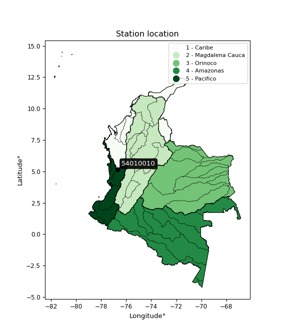

<div align="center">


</div>

# PMP Station (Rain, Pmax24h): 54010010

Probable Maximum Precipitation (PMP) is the greatest amount of rainfall for a specific duration that is meteorologically possible for a given location, acting as a "worst-case" scenario for extreme storms, crucial for designing safety-critical infrastructure like bridges, river deviations, dams, spillways, and nuclear plants to prevent catastrophic failure. PMP is calculated by hydrologists using meteorological data to determine the upper limit of extreme rainfall, often leading to the Probable Maximum Flood (PMF) for flood control design, and is increasingly being studied for climate change impacts. Probable Maximum Precipitation (PMP) is the theoretical upper limit of rainfall, a deterministic estimate for extreme events, while probability distributions (like GEV, Gumbel) describe the likelihood and frequency of various precipitation amounts, including rare ones, showing how often events occur, with PMP representing the extreme end of these distributions, used for critical infrastructure design to ensure safety against the worst conceivable weather, unlike standard statistical forecasts which cover typical probabilities.

The most common probability distributions in hydrology, used for analyzing floods, rainfall, and streamflow, include the Normal, Log-Normal, Gumbel, Gamma (including Log-Pearson Type III), and Generalized Extreme Value (GEV) distributions, often chosen based on the data´s skewness and whether modeling extremes or general conditions, with Gumbel and GEV popular for extreme events like floods, while the Normal distribution serves as a baseline, though often requiring transformations for skewed hydrological data. These distributions help in designing water infrastructure, managing water resources, and forecasting hydrologic events.

> Hydrological data often isn´t perfectly normal (it´s skewed), so different distributions are needed for different applications, such as: **Flood Frequency Analysis**: Using Gumbel, GEV, or Log-Pearson Type III for predicting extreme flood magnitudes and their return periods, **Rainfall Analysis**: Normal for annual totals, but Log-Normal, Weibull, or GEV for intensity or extreme daily rainfall, **Streamflow Modeling**: Gamma and Log-Normal for maximum flows, GEV for minimum flows, and Kappa for daily flows.

<div align="center">

</img>

</div>


## A. General information


### 1. General running parameters

• app_version: _v20260113_. • runtime: _2026-01-13 16:28:34.738620_. • Python version: _3.14.0_. • SciPy version: _1.16.3_. • Pandas version: _2.3.3_. • NumPy version: _2.3.5_. • Stations dataset (station_dataset_file): _dataset/pmax24h_in/automatic_colombia_2003_2025.csv_. • Stations catalog (station_catalog_file): _dataset/CNE.xls_. • Minimum year to eval til year_max (date_min): _1900_. • Maximum year to eval since year_min (date_max): _2025_. • Creates, save and include plots into reports (create_plot): _False_. • Plot only fit distributions with Δo > Δ (plot_only_fit): _True_. • Plot only simple graphs avoiding multiple CDFs and multiple Extreme values plots (plot_only_simple): _True_. • Eval low extreme values, if False, evaluates high extreme values (low_extreme): _False_. • Eval every SciPy distribution as logarithmic (pdist_logarithmic_on): _True_. • Standard deviation normalized (ddof): _1.0_. • Return periods to eval in years (Tr): _[2, 2.33, 5, 10, 15, 20, 25, 50, 75, 100, 200, 250, 500, 750, 1000]_. • Minimum data sample per station, 0 means any (minimum_sample): _5_. • Z-Score maximum threshold to adjust a value, 0 means disable (zscore_max): _3.5_. • Z-Score minimum threshold to adjust a value, 0 means disable (zscore_min): _-2.5_. • Avoid zeros, e.g. rain = 0 (avoid_zeros): _True_. • Avoid null values (avoid_nans): _True_. 

:file_folder:Table: [dataset.csv](../../dataset/pmax24h_in/automatic_colombia_2003_2025.csv)

> Delta Degrees of Freedom (DDOF): is a parameter used in the formulas for calculating variance and standard deviation. When ddof=0, the divisor is $N$ (the total number of observations) and this is used when your data set is the entire population. When ddof=1, the divisor is $N-1$ and this is used when your data set is a sample drawn from a larger population. Using $N-1$ provides an unbiased estimate of the population variance (known as Bessel´s correction).


### 2. Station info and location

|   id |   CODIGO | NOMBRE             | CATEGORIA               | TECNOLOGIA                | ESTADO   | FECHA_INSTALACION   |   FECHA_SUSPENSION |   ALTITUD |   LATITUD |   LONGITUD | DEPARTAMENTO   | MUNICIPIO   | AREA_OPERATIVA                         | ENTIDAD                                                     | AREA_HIDROGRAFICA   | ZONA_HIDROGRAFICA   | SUBZONA_HIDROGRAFICA   |   CORRIENTE | Catalogo   |   Version |
|-----:|---------:|:-------------------|:------------------------|:--------------------------|:---------|:--------------------|-------------------:|----------:|----------:|-----------:|:---------------|:------------|:---------------------------------------|:------------------------------------------------------------|:--------------------|:--------------------|:-----------------------|------------:|:-----------|----------:|
|    0 | 54010010 | ISTMINA [54010010] | Climatológica Ordinaria | Automática con Telemetría | Activa   | 15/01/1967          |                nan |        78 |   5.15875 |   -76.6892 | Choco          | Istmina     | Area Operativa 09 - Cauca-Valle-Caldas | INSTITUTO DE HIDROLOGIA METEOROLOGIA Y ESTUDIOS AMBIENTALES | Pacifico            | San Juán            | Río San Juan Alto      |         nan | CNE_IDEAM  |  20251226 |

<div align="center">

Dynamic map: [:earth_americas:Google](http://maps.google.com/maps?q=5.15875,-76.689222222) [:earth_americas:OSM](https://www.openstreetmap.org/#map=18/5.15875/-76.689222222&layers=P) [:earth_americas:Bing](https://www.bing.com/maps?cp=5.15875~-76.689222222&lvl=18) [:earth_americas:Apple](https://maps.apple.com/frame?center=5.15875%2C-76.689222222&span=0.003%2C0.006)

</div>


<div align="center">

```geojson
{
  "type": "Feature",
  "geometry": {
    "type": "Point", 
    "coordinates": [-76.689222222, 5.15875]
  }, 
  "properties": {
    "Name": "54010010"
  }
}
```

</div>


### 3. Discrete values table and plot

<div align="center">

|               |          0 |            1 |          2 |           3 |          4 |           5 |
|:--------------|-----------:|-------------:|-----------:|------------:|-----------:|------------:|
| Date          | 2018       | 2019         | 2021       | 2022        | 2023       | 2024        |
| Value         |   70.7     |  148.9       |  473.4     |   40.1      |  118.8     |    1.2      |
| Value_initial |   70.7     |  148.9       |  473.4     |   40.1      |  118.8     |    1.2      |
| count         |    6       |    6         |    6       |    6        |    6       |    6        |
| mean          |  142.183   |  142.183     |  142.183   |  142.183    |  142.183   |  142.183    |
| std           |  170.707   |  170.707     |  170.707   |  170.707    |  170.707   |  170.707    |
| zscore        |   -0.41875 |    0.0393463 |    1.94027 |   -0.598005 |   -0.13698 |   -0.825881 |


</div>


> The initial value (value_initial) correspond to the initial obtained or null completed value, and value (value) is adjusted only when the initial value is outside the valid range (outlier) definite through the Z-Score value. If Z-Score is active, values out of range or outliers are replaced with the station mean value. A Z-Score (or standard score) measures how many standard deviations a data point is from the mean of a dataset, indicating its relative position; positive scores mean above the mean, negative mean below, and a score of zero is exactly at the mean, allowing for comparison of values from different distributions. It´s calculated using the formula $z=(x–μ)/σ$, where $x$ is the data point, $μ$ is the mean, and $σ$ is the standard deviation, helping identify outliers and understand probability.
>
> <sub>**Note**: In this study, "completing" (filling gaps in) and "extending" (forecasting or lengthening the historical record) rainfall data series are avoided for certain critical analyses because they introduce artificial bias and uncertainty, which can distort the statistics of rare events (extremes), alter day-to-day variability, and compromise the integrity and homogeneity of the original data. Some reasons against Completing/Extending rainfall data are: **Distortion of Extremes and Variability**: The primary issue is that most gap-filling or extension methods rely on averaging or regression with nearby stations, which inherently smooths the data. Rainfall is highly variable in space and time, with a large percentage of zero values and occasional large storms. Infilling methods often underestimate the highest values and overestimate the lowest (zero) values, which severely distorts analyses focused on flood frequency, drought severity, and intensity-duration-frequency (IDF) curves, **Loss of Data Homogeneity**: Infilled or extended data are synthetic estimates, not actual measurements. Combining these estimates with observed data can violate the assumption of data homogeneity, which requires that the data properties do not change over time. Inhomogeneity can lead to incorrect conclusions about long-term trends or changes in climate patterns, **Propagation of Errors**: Errors and biases from the original data (e.g., wind-induced undercatch, instrument errors, site changes) or the data used for imputation can propagate through the analysis, leading to unreliable hydrological models and inaccurate predictions, **Compromised Statistical Integrity**: For statistical analyses, especially those involving the frequency of events, using artificial data can introduce time bias or autocorrelation that doesn´t exist in reality, making it difficult to assess the true probability of events, **Difficulty in Validation**: It is difficult to accurately validate the quality of filled or extended data, especially for past periods where ground-truth measurements are unavailable. The reliability of imputation techniques heavily depends on the density of the surrounding station network and the complexity of the local topography.</sub>


### 4. Active continuous probability distributions from SciPy (45 of 104 available)

A Probability Density Function (PDF) describes the relative likelihood of a continuous random variable falling within a specific range, where the total area under its curve equals 1, and the area over any interval gives the actual probability for that range. Unlike discrete probabilities (like rolling a die), a PDF shows density, not direct probability for a single point (which is zero), with higher points indicating higher likelihood, often visualized as a bell curve for normal distributions.

A log of a probability density function (log-PDF) is simply the logarithm of the PDF´s value, denoted as $log(f(x))$, useful for converting multiplication of probabilities into addition, improving numerical stability with tiny numbers, and connecting to information theory concepts like entropy. Instead of dealing with very small probabilities (e.g., 0.000001), log-PDFs use negative numbers (e.g., $log(0.00001) ≈ -11.51$ that are easier for computers to handle, preventing underflow errors and simplifying complex calculations. In this study, each active probability distribution from SciPy is also evaluated in the $log$ form.

[scipy.stats](https://docs.scipy.org/doc/scipy/reference/stats.html) is a Python´s powerful submodule within the SciPy library for comprehensive statistical analysis, offering over 130 probability distributions (like Normal, Poisson), functions for descriptive stats (mean, variance), hypothesis testing (t-tests, chi-square), random variable generation, and statistical tests, making it essential for data science, modeling, and research. It provides tools to explore, model, and draw conclusions from data efficiently, working seamlessly with NumPy.

<div align="center">

|   id | p_dist             |   n_parameter | fit_method   | label                                                                       | active   | ref                                                                                                        |
|-----:|:-------------------|--------------:|:-------------|:----------------------------------------------------------------------------|:---------|:-----------------------------------------------------------------------------------------------------------|
|    0 | alpha              |             3 | MLE          | Alpha                                                                       | True     | [:mortar_board:](https://docs.scipy.org/doc/scipy/reference/generated/scipy.stats.alpha.html)              |
|    1 | betaprime          |             4 | MLE          | Beta prime                                                                  | True     | [:mortar_board:](https://docs.scipy.org/doc/scipy/reference/generated/scipy.stats.betaprime.html)          |
|    2 | chi2               |             3 | MLE          | Chi²                                                                        | True     | [:mortar_board:](https://docs.scipy.org/doc/scipy/reference/generated/scipy.stats.chi2.html)               |
|    3 | crystalball        |             4 | MLE          | Crystalball                                                                 | True     | [:mortar_board:](https://docs.scipy.org/doc/scipy/reference/generated/scipy.stats.crystalball.html)        |
|    4 | dweibull           |             3 | MLE          | Double Weibull                                                              | True     | [:mortar_board:](https://docs.scipy.org/doc/scipy/reference/generated/scipy.stats.dweibull.html)           |
|    5 | erlang             |             3 | MLE          | Erlang                                                                      | True     | [:mortar_board:](https://docs.scipy.org/doc/scipy/reference/generated/scipy.stats.erlang.html)             |
|    6 | expon              |             2 | MLE          | Exponential                                                                 | True     | [:mortar_board:](https://docs.scipy.org/doc/scipy/reference/generated/scipy.stats.expon.html)              |
|    7 | exponnorm          |             3 | MLE          | Exponentially modified Normal                                               | True     | [:mortar_board:](https://docs.scipy.org/doc/scipy/reference/generated/scipy.stats.exponnorm.html)          |
|    8 | f                  |             4 | MLE          | F                                                                           | True     | [:mortar_board:](https://docs.scipy.org/doc/scipy/reference/generated/scipy.stats.f.html)                  |
|    9 | fatiguelife        |             3 | MLE          | Fatigue-life (Birnbaum-Saunders)                                            | True     | [:mortar_board:](https://docs.scipy.org/doc/scipy/reference/generated/scipy.stats.fatiguelife.html)        |
|   10 | fisk               |             3 | MLE          | Fisk                                                                        | True     | [:mortar_board:](https://docs.scipy.org/doc/scipy/reference/generated/scipy.stats.fisk.html)               |
|   11 | gamma              |             3 | MLE          | Gamma                                                                       | True     | [:mortar_board:](https://docs.scipy.org/doc/scipy/reference/generated/scipy.stats.gamma.html)              |
|   12 | genexpon           |             5 | MLE          | Generalized exponential                                                     | True     | [:mortar_board:](https://docs.scipy.org/doc/scipy/reference/generated/scipy.stats.genexpon.html)           |
|   13 | genlogistic        |             3 | MLE          | Generalized logistic                                                        | True     | [:mortar_board:](https://docs.scipy.org/doc/scipy/reference/generated/scipy.stats.genlogistic.html)        |
|   14 | gibrat             |             2 | MM           | Gibrat                                                                      | True     | [:mortar_board:](https://docs.scipy.org/doc/scipy/reference/generated/scipy.stats.gibrat.html)             |
|   15 | gompertz           |             3 | MLE          | Gompertz (or truncated Gumbel)                                              | True     | [:mortar_board:](https://docs.scipy.org/doc/scipy/reference/generated/scipy.stats.gompertz.html)           |
|   16 | gumbel_l           |             2 | MM           | Gumbel Left Skew                                                            | True     | [:mortar_board:](https://docs.scipy.org/doc/scipy/reference/generated/scipy.stats.gumbel_l.html)           |
|   17 | gumbel_r           |             2 | MM           | Gumbel Right Skew                                                           | True     | [:mortar_board:](https://docs.scipy.org/doc/scipy/reference/generated/scipy.stats.gumbel_r.html)           |
|   18 | halflogistic       |             2 | MM           | Half-logistic                                                               | True     | [:mortar_board:](https://docs.scipy.org/doc/scipy/reference/generated/scipy.stats.halflogistic.html)       |
|   19 | halfnorm           |             2 | MM           | Half Normal                                                                 | True     | [:mortar_board:](https://docs.scipy.org/doc/scipy/reference/generated/scipy.stats.halfnorm.html)           |
|   20 | hypsecant          |             2 | MM           | hyperbolic secant                                                           | True     | [:mortar_board:](https://docs.scipy.org/doc/scipy/reference/generated/scipy.stats.hypsecant.html)          |
|   21 | invgamma           |             3 | MLE          | Inverted gamma                                                              | True     | [:mortar_board:](https://docs.scipy.org/doc/scipy/reference/generated/scipy.stats.invgamma.html)           |
|   22 | invgauss           |             3 | MLE          | Inverse Gaussian                                                            | True     | [:mortar_board:](https://docs.scipy.org/doc/scipy/reference/generated/scipy.stats.invgauss.html)           |
|   23 | invweibull         |             3 | MLE          | Inverted Weibull                                                            | True     | [:mortar_board:](https://docs.scipy.org/doc/scipy/reference/generated/scipy.stats.invweibull.html)         |
|   24 | kappa4             |             4 | MLE          | Kappa 4                                                                     | True     | [:mortar_board:](https://docs.scipy.org/doc/scipy/reference/generated/scipy.stats.kappa4.html)             |
|   25 | kstwobign          |             2 | MLE          | Limiting distribution of scaled Kolmogorov-Smirnov two-sided test statistic | True     | [:mortar_board:](https://docs.scipy.org/doc/scipy/reference/generated/scipy.stats.kstwobign.html)          |
|   26 | laplace            |             2 | MM           | Laplace                                                                     | True     | [:mortar_board:](https://docs.scipy.org/doc/scipy/reference/generated/scipy.stats.laplace.html)            |
|   27 | laplace_asymmetric |             3 | MLE          | Asymmetric Laplace                                                          | True     | [:mortar_board:](https://docs.scipy.org/doc/scipy/reference/generated/scipy.stats.laplace_asymmetric.html) |
|   28 | loggamma           |             3 | MLE          | Log gamma                                                                   | True     | [:mortar_board:](https://docs.scipy.org/doc/scipy/reference/generated/scipy.stats.loggamma.html)           |
|   29 | logistic           |             2 | MM           | Logistic (or Sech-squared)                                                  | True     | [:mortar_board:](https://docs.scipy.org/doc/scipy/reference/generated/scipy.stats.logistic.html)           |
|   30 | lognorm            |             3 | MLE          | Log Normal                                                                  | True     | [:mortar_board:](https://docs.scipy.org/doc/scipy/reference/generated/scipy.stats.lognorm.html)            |
|   31 | maxwell            |             2 | MM           | Maxwell                                                                     | True     | [:mortar_board:](https://docs.scipy.org/doc/scipy/reference/generated/scipy.stats.maxwell.html)            |
|   32 | mielke             |             4 | MLE          | Mielke Beta-Kappa / Dagum                                                   | True     | [:mortar_board:](https://docs.scipy.org/doc/scipy/reference/generated/scipy.stats.mielke.html)             |
|   33 | moyal              |             2 | MM           | Moyal                                                                       | True     | [:mortar_board:](https://docs.scipy.org/doc/scipy/reference/generated/scipy.stats.moyal.html)              |
|   34 | nakagami           |             3 | MLE          | Nakagami                                                                    | True     | [:mortar_board:](https://docs.scipy.org/doc/scipy/reference/generated/scipy.stats.nakagami.html)           |
|   35 | ncf                |             5 | MLE          | Non-central F distribution                                                  | True     | [:mortar_board:](https://docs.scipy.org/doc/scipy/reference/generated/scipy.stats.ncf.html)                |
|   36 | nct                |             4 | MLE          | Non-central Student’s t                                                     | True     | [:mortar_board:](https://docs.scipy.org/doc/scipy/reference/generated/scipy.stats.nct.html)                |
|   37 | norm               |             2 | MM           | Normal                                                                      | True     | [:mortar_board:](https://docs.scipy.org/doc/scipy/reference/generated/scipy.stats.norm.html)               |
|   38 | pearson3           |             3 | MM           | Pearson type III                                                            | True     | [:mortar_board:](https://docs.scipy.org/doc/scipy/reference/generated/scipy.stats.pearson3.html)           |
|   39 | rayleigh           |             2 | MM           | Rayleigh                                                                    | True     | [:mortar_board:](https://docs.scipy.org/doc/scipy/reference/generated/scipy.stats.rayleigh.html)           |
|   40 | rice               |             3 | MLE          | Rice                                                                        | True     | [:mortar_board:](https://docs.scipy.org/doc/scipy/reference/generated/scipy.stats.rice.html)               |
|   41 | t                  |             3 | MLE          | Student’s t                                                                 | True     | [:mortar_board:](https://docs.scipy.org/doc/scipy/reference/generated/scipy.stats.t.html)                  |
|   42 | truncnorm          |             4 | MLE          | Truncated normal                                                            | True     | [:mortar_board:](https://docs.scipy.org/doc/scipy/reference/generated/scipy.stats.truncnorm.html)          |
|   43 | wald               |             2 | MM           | Wald                                                                        | True     | [:mortar_board:](https://docs.scipy.org/doc/scipy/reference/generated/scipy.stats.wald.html)               |
|   44 | weibull_min        |             3 | MLE          | Weibull minimum                                                             | True     | [:mortar_board:](https://docs.scipy.org/doc/scipy/reference/generated/scipy.stats.weibull_min.html)        |

</div>

> **n_parameter:** # arguments & localization & scale.
>
> **Fit methods:** (MLE) maximum likelihood, (MM) L-moments.
>
>**Inactive** (With the only purpose of prevent loops, zero divisions, infinite values, over high estimated values or horizontal trending for recurrence intervals estimations, the follow distributions were disabled.)**:** foldnorm, gennorm, norminvgauss, powernorm, powerlognorm, skewnorm, genextreme, anglit, arcsine, argus, beta, bradford, burr, burr12, cauchy, cosine, halfcauchy, foldcauchy, skewcauchy, wrapcauchy, dgamma, gengamma, exponweib, exponpow, truncexpon, gausshyper, genhalflogistic, genhyperbolic, geninvgauss, halfgennorm, johnsonsb, johnsonsu, kappa3, ksone, kstwo, loglaplace, levy, levy_l, levy_stable, ncx2, pareto, genpareto, truncpareto, lomax, powerlaw, rdist, rel_breitwigner, recipinvgauss, semicircular, studentized_range, trapezoid, triang, truncweibull_min, tukeylambda, uniform, loguniform, vonmises, vonmises_line, weibull_max, 


## B. Probability (PDF) vs. Empirical (EDF) distributions functions

A continuous probability distribution (CPD) describes probabilities for variables that can take any value within a range (like rain any time), unlike discrete variables with specific outcomes (like temperature). It uses a Probability Density Function (PDF), a curve where the total area under it equals 1, and the probability of the variable falling within an interval (a to b) is found by calculating the area under the curve between those points. A key feature is that the probability of hitting any single exact value is zero, so probabilities are always expressed for ranges, e.g., $P(a ≤ X ≤ b)$.

<div align="center">

Distributions parameters from station values
|    |   station | p_dist                |   n |              loc |           scale | shape                  | shape1                 | shape2                 | shape3   |
|---:|----------:|:----------------------|----:|-----------------:|----------------:|:-----------------------|:-----------------------|:-----------------------|:---------|
|  0 |  54010010 | alpha                 |   6 |    -79.755       |   269.785       | 1.642586304734193      |                        |                        |          |
|  1 |  54010010 | betaprime             |   6 |      1.2         |   669.375       | 0.6948126667100775     | 4.292902863276227      |                        |          |
|  2 |  54010010 | chi2                  |   6 |      1.2         |    57.1614      | 1.4541859175046223     |                        |                        |          |
|  3 |  54010010 | crystalball           |   6 |    142.169       |   155.835       | 12259.021188790613     | 798.399936427265       |                        |          |
|  4 |  54010010 | dweibull              |   6 |     70.7         |   104.191       | 0.8990919808613274     |                        |                        |          |
|  5 |  54010010 | erlang                |   6 |      1.2         |   107.252       | 0.8833131507937599     |                        |                        |          |
|  6 |  54010010 | expon                 |   6 |      1.2         |   140.983       |                        |                        |                        |          |
|  7 |  54010010 | exponnorm             |   6 |      1.09173     |     0.0319525   | 4392.815766838555      |                        |                        |          |
|  8 |  54010010 | f                     |   6 |      1.2         |   138.612       | 1.3090307253570166     | 1464.629967253939      |                        |          |
|  9 |  54010010 | fatiguelife           |   6 |    -12.6971      |    87.1806      | 1.2254925404652797     |                        |                        |          |
| 10 |  54010010 | fisk                  |   6 |      1.2         |    78.7625      | 0.85646263666118       |                        |                        |          |
| 11 |  54010010 | gamma                 |   6 |      1.2         |   106.918       | 0.8964106704565704     |                        |                        |          |
| 12 |  54010010 | genexpon              |   6 |      1.2         |   251.924       | 1.7864674115972417     | 2.0128341147347614e-09 | 1.1837617995340786     |          |
| 13 |  54010010 | genlogistic           |   6 |   -624.96        |    93.3695      | 1861.2060626008256     |                        |                        |          |
| 14 |  54010010 | gibrat                |   6 |     23.3024      |    72.1049      |                        |                        |                        |          |
| 15 |  54010010 | gompertz              |   6 |      1.19372     | 66504.6         | 490.85011017707495     |                        |                        |          |
| 16 |  54010010 | gumbel_l              |   6 |    212.316       |   121.502       |                        |                        |                        |          |
| 17 |  54010010 | gumbel_r              |   6 |     72.0502      |   121.502       |                        |                        |                        |          |
| 18 |  54010010 | halflogistic          |   6 |    -42.515       |   133.232       |                        |                        |                        |          |
| 19 |  54010010 | halfnorm              |   6 |    -64.0785      |   258.511       |                        |                        |                        |          |
| 20 |  54010010 | hypsecant             |   6 |    142.183       |    99.2064      |                        |                        |                        |          |
| 21 |  54010010 | invgamma              |   6 |    -46.3318      |   240.596       | 2.1755925672054275     |                        |                        |          |
| 22 |  54010010 | invgauss              |   6 |    -24.2055      |   135.844       | 1.22485087283638       |                        |                        |          |
| 23 |  54010010 | invweibull            |   6 |      1.2         |     6.70948     | 0.04124160585824379    |                        |                        |          |
| 24 |  54010010 | kappa4                |   6 |    -43.9218      |   532.515       | 1.0927073835199481     | 1.0292848155717533     |                        |          |
| 25 |  54010010 | kstwobign             |   6 |   -274.148       |   484.559       |                        |                        |                        |          |
| 26 |  54010010 | laplace               |   6 |    142.183       |   110.191       |                        |                        |                        |          |
| 27 |  54010010 | laplace_asymmetric    |   6 |      1.2         |     0.000228302 | 1.6193536838882639e-06 |                        |                        |          |
| 28 |  54010010 | loggamma              |   6 | -54041           |  7110.82        | 2039.1697505199527     |                        |                        |          |
| 29 |  54010010 | logistic              |   6 |    142.183       |    85.9152      |                        |                        |                        |          |
| 30 |  54010010 | lognorm               |   6 |      1.2         |     0.130431    | 15.22736125113251      |                        |                        |          |
| 31 |  54010010 | maxwell               |   6 |   -227.075       |   231.399       |                        |                        |                        |          |
| 32 |  54010010 | mielke                |   6 |      1.2         |   370.3         | 0.49902057567594305    | 1.8305712488262866     |                        |          |
| 33 |  54010010 | moyal                 |   6 |     53.068       |    70.1495      |                        |                        |                        |          |
| 34 |  54010010 | nakagami              |   6 |      1.2         |   354.453       | 0.057151859914911514   |                        |                        |          |
| 35 |  54010010 | ncf                   |   6 |      1.2         |    44.2071      | 0.8473626747187732     | 124.92188502606069     | 2.180245905883691      |          |
| 36 |  54010010 | nct                   |   6 |     -0.205662    |     0.0628691   | 0.2771612793082132     | 54.736179833205895     |                        |          |
| 37 |  54010010 | norm                  |   6 |    142.183       |   155.833       |                        |                        |                        |          |
| 38 |  54010010 | pearson3              |   6 |    142.183       |   155.833       | 1.4134147936895716     |                        |                        |          |
| 39 |  54010010 | rayleigh              |   6 |   -155.934       |   237.863       |                        |                        |                        |          |
| 40 |  54010010 | rice                  |   6 |    -89.9598      |   197.705       | 0.000248126935019645   |                        |                        |          |
| 41 |  54010010 | t                     |   6 |     82.0433      |    60.7169      | 1.4615032878266425     |                        |                        |          |
| 42 |  54010010 | truncnorm             |   6 |   -592.688       |   345.636       | 1.718244750865384      | 549.2595600619608      |                        |          |
| 43 |  54010010 | wald                  |   6 |    -13.6497      |   155.833       |                        |                        |                        |          |
| 44 |  54010010 | weibull_min           |   6 |      1.2         |    86.5123      | 0.7636882932960223     |                        |                        |          |
| 45 |  54010010 | logalpha              |   6 |      0.00219135  |     0.44119     | 4.073520834116805e-08  |                        |                        |          |
| 46 |  54010010 | logbetaprime          |   6 |    -38.1696      |   611.127       | 487.08746807486034     | 7057.266621802501      |                        |          |
| 47 |  54010010 | logchi2               |   6 |      0.182322    |     1.69013     | 0.34674317720721526    |                        |                        |          |
| 48 |  54010010 | logcrystalball        |   6 |      4.01213     |     1.87137     | 224.9354597520524      | 11.004515311961622     |                        |          |
| 49 |  54010010 | logdweibull           |   6 |      4.77744     |     1.36096     | 0.8829978301123678     |                        |                        |          |
| 50 |  54010010 | logerlang             |   6 |    -26.0857      |     0.126762    | 237.23490766439937     |                        |                        |          |
| 51 |  54010010 | logexpon              |   6 |      0.182322    |     3.82981     |                        |                        |                        |          |
| 52 |  54010010 | logexponnorm          |   6 |      4.01099     |     1.87137     | 0.000617778454631132   |                        |                        |          |
| 53 |  54010010 | logf                  |   6 |  -3053.58        |  3057.59        | 15786200.04498978      | 8055810.969422244      |                        |          |
| 54 |  54010010 | logfatiguelife        |   6 |  -1122.57        |  1126.57        | 0.0016625395179319267  |                        |                        |          |
| 55 |  54010010 | logfisk               |   6 |     -2.31465e+08 |     2.31465e+08 | 239808087.95632052     |                        |                        |          |
| 56 |  54010010 | loggamma              |   6 |    -28.8675      |     0.113058    | 290.6144181344659      |                        |                        |          |
| 57 |  54010010 | loggenexpon           |   6 |      0.144505    |     0.00742083  | 0.0006559818038806356  | 3.0575150060913145     | 1.2916187929530739e-06 |          |
| 58 |  54010010 | loggenlogistic        |   6 |      5.5769      |     0.420954    | 0.2465806905188444     |                        |                        |          |
| 59 |  54010010 | loggibrat             |   6 |      2.58454     |     0.865888    |                        |                        |                        |          |
| 60 |  54010010 | loggompertz           |   6 |      0.182321    |     1.45415     | 0.04452600381479905    |                        |                        |          |
| 61 |  54010010 | loggumbel_l           |   6 |      4.85435     |     1.4591      |                        |                        |                        |          |
| 62 |  54010010 | loggumbel_r           |   6 |      3.16992     |     1.4591      |                        |                        |                        |          |
| 63 |  54010010 | loghalflogistic       |   6 |      1.79414     |     1.59995     |                        |                        |                        |          |
| 64 |  54010010 | loghalfnorm           |   6 |      1.5352      |     3.10439     |                        |                        |                        |          |
| 65 |  54010010 | loghypsecant          |   6 |      4.01213     |     1.19135     |                        |                        |                        |          |
| 66 |  54010010 | loginvgamma           |   6 |    -30.0525      |  9853.35        | 290.4220988242746      |                        |                        |          |
| 67 |  54010010 | loginvgauss           |   6 |    -16.2239      |  1955.89        | 0.01031776094256881    |                        |                        |          |
| 68 |  54010010 | loginvweibull         |   6 |     -1.11324e+06 |     1.11324e+06 | 516442.40705593163     |                        |                        |          |
| 69 |  54010010 | logkappa4             |   6 |     -0.376625    |     7.06475     | 1.0862070039930112     | 1.0766372033780294     |                        |          |
| 70 |  54010010 | logkstwobign          |   6 |     -4.67723     |     9.92631     |                        |                        |                        |          |
| 71 |  54010010 | loglaplace            |   6 |      4.01213     |     1.32326     |                        |                        |                        |          |
| 72 |  54010010 | loglaplace_asymmetric |   6 |      5.00327     |     1.05558     | 1.574187000061932      |                        |                        |          |
| 73 |  54010010 | logloggamma           |   6 |      5.88304     |     0.621833    | 0.34596859246777795    |                        |                        |          |
| 74 |  54010010 | loglogistic           |   6 |      4.01213     |     1.03174     |                        |                        |                        |          |
| 75 |  54010010 | loglognorm            |   6 |      0.182322    |     0.00612056  | 14.771007812836881     |                        |                        |          |
| 76 |  54010010 | logmaxwell            |   6 |     -0.422227    |     2.77882     |                        |                        |                        |          |
| 77 |  54010010 | logmielke             |   6 |      0.182322    |     6.47599     | 0.7657581811960015     | 85.4401988852157       |                        |          |
| 78 |  54010010 | logmoyal              |   6 |      2.94196     |     0.842412    |                        |                        |                        |          |
| 79 |  54010010 | lognakagami           |   6 |  -1355.54        |  1359.55        | 131858.42141439562     |                        |                        |          |
| 80 |  54010010 | logncf                |   6 |     -0.164096    |     1.63953e-07 | 4.818048322618557e-07  | 45.690843199622776     | 12.192366079346307     |          |
| 81 |  54010010 | lognct                |   6 |   -155.621       |     1.86513     | 469009.9448442301      | 85.58793650439733      |                        |          |
| 82 |  54010010 | lognorm               |   6 |      4.01213     |     1.87137     |                        |                        |                        |          |
| 83 |  54010010 | logpearson3           |   6 |      4.01213     |     1.87138     | -1.140939235011622     |                        |                        |          |
| 84 |  54010010 | lograyleigh           |   6 |      0.43205     |     2.85649     |                        |                        |                        |          |
| 85 |  54010010 | logrice               |   6 |   -752.367       |     1.87125     | 404.2095460228143      |                        |                        |          |
| 86 |  54010010 | logt                  |   6 |      4.57987     |     0.802727    | 1.4685304023418846     |                        |                        |          |
| 87 |  54010010 | logtruncnorm          |   6 |     -1.17671     |     5.06748     | 0.26818670291472435    | 1.449963571382761      |                        |          |
| 88 |  54010010 | logwald               |   6 |      2.14077     |     1.87136     |                        |                        |                        |          |
| 89 |  54010010 | logweibull_min        |   6 |     -1.22359e+08 |     1.22359e+08 | 94138184.48948818      |                        |                        |          |

</div>

> **loc** (Location parameter): This shifts the distribution along the x-axis. For many common distributions, like the normal (Gaussian) distribution, loc represents the mean $μ$. For others, like the uniform distribution, it might represent the minimum value, or for the beta distribution, the left end of the support interval.
>
> **scale** (Scale parameter): This determines the width or spread of the distribution. For the normal distribution, scale represents the standard deviation $σ$. For a uniform distribution, it defines the length of the interval (from $loc$ to $loc + scale$).
>
> **shape** (Shape parameters): Refers to parameters that define the specific form of a probability distribution, distinct from its location (loc) and scale (scale). These parameters are required arguments for most distribution functions. For example, a normal (Gaussian) distribution is fully defined by its location (mean) and scale (standard deviation), so it has no specific shape parameters beyond loc and scale. However, other distributions have intrinsic properties that need specification, as Gamma distribution that takes a shape parameter, often named $a$ or $alpha$.


### 0. Cumulative distribution values - CDF (90 evaluated)

Cumulative Distribution Function (CDF), denoted as $F$<sub>$X$</sub>$(x)$, is a function that gives the probability that a random variable $X$ will take a value less than or equal to a specific value, $x$ (i.e., $(P(X≥x)$. It essentially "accumulates" probabilities from a given point up to the far right (positive infinity), providing a complete picture of the distribution´s probabilities for both discrete (like rain) and continuous (like temperature) variables, helping to find probabilities over ranges or above certain values. Each station is evaluated separately ordering the $x$ values ascending, calculating the CDF and PDF values for the activated distributions and their logarithmic forms.

<div align="center">

CDF ordered by x ascending and calculating $log(f(x))$ separately
|   id |   Station |   date |     x |   count |    mean |     std |     zscore |   Value_initial |   station |   m |     alpha |   alpha_pdf |   betaprime |   betaprime_pdf |        chi2 |     chi2_pdf |   crystalball |   crystalball_pdf |   dweibull |   dweibull_pdf |      erlang |   erlang_pdf |    expon |   expon_pdf |   exponnorm |   exponnorm_pdf |           f |          f_pdf |   fatiguelife |   fatiguelife_pdf |       fisk |    fisk_pdf |       gamma |   gamma_pdf |    genexpon |   genexpon_pdf |   genlogistic |   genlogistic_pdf |   gibrat |   gibrat_pdf |    gompertz |   gompertz_pdf |   gumbel_l |   gumbel_l_pdf |   gumbel_r |   gumbel_r_pdf |   halflogistic |   halflogistic_pdf |   halfnorm |   halfnorm_pdf |   hypsecant |   hypsecant_pdf |   invgamma |   invgamma_pdf |   invgauss |   invgauss_pdf |   invweibull |   invweibull_pdf |      kappa4 |   kappa4_pdf |   kstwobign |   kstwobign_pdf |   laplace |   laplace_pdf |   laplace_asymmetric |   laplace_asymmetric_pdf |   loggamma |   loggamma_pdf |   logistic |   logistic_pdf |   lognorm |   lognorm_pdf |   maxwell |   maxwell_pdf |      mielke |   mielke_pdf |    moyal |   moyal_pdf |   nakagami |   nakagami_pdf |         ncf |          ncf_pdf |       nct |     nct_pdf |     norm |    norm_pdf |   pearson3 |   pearson3_pdf |   rayleigh |   rayleigh_pdf |     rice |    rice_pdf |        t |       t_pdf |   truncnorm |   truncnorm_pdf |     wald |    wald_pdf |   weibull_min |   weibull_min_pdf |   logalpha |   logalpha_pdf |   logbetaprime |   logbetaprime_pdf |    logchi2 |   logchi2_pdf |   logcrystalball |   logcrystalball_pdf |   logdweibull |   logdweibull_pdf |   logerlang |   logerlang_pdf |   logexpon |   logexpon_pdf |   logexponnorm |   logexponnorm_pdf |      logf |   logf_pdf |   logfatiguelife |   logfatiguelife_pdf |   logfisk |   logfisk_pdf |   loggenexpon |   loggenexpon_pdf |   loggenlogistic |   loggenlogistic_pdf |   loggibrat |   loggibrat_pdf |   loggompertz |   loggompertz_pdf |   loggumbel_l |   loggumbel_l_pdf |   loggumbel_r |   loggumbel_r_pdf |   loghalflogistic |   loghalflogistic_pdf |   loghalfnorm |   loghalfnorm_pdf |   loghypsecant |   loghypsecant_pdf |   loginvgamma |   loginvgamma_pdf |   loginvgauss |   loginvgauss_pdf |   loginvweibull |   loginvweibull_pdf |   logkappa4 |   logkappa4_pdf |   logkstwobign |   logkstwobign_pdf |   loglaplace |   loglaplace_pdf |   loglaplace_asymmetric |   loglaplace_asymmetric_pdf |   logloggamma |   logloggamma_pdf |   loglogistic |   loglogistic_pdf |   loglognorm |   loglognorm_pdf |   logmaxwell |   logmaxwell_pdf |   logmielke |   logmielke_pdf |    logmoyal |   logmoyal_pdf |   lognakagami |   lognakagami_pdf |    logncf |   logncf_pdf |    lognct |   lognct_pdf |   logpearson3 |   logpearson3_pdf |   lograyleigh |   lograyleigh_pdf |   logrice |   logrice_pdf |      logt |   logt_pdf |   logtruncnorm |   logtruncnorm_pdf |   logwald |   logwald_pdf |   logweibull_min |   logweibull_min_pdf |
|-----:|----------:|-------:|------:|--------:|--------:|--------:|-----------:|----------------:|----------:|----:|----------:|------------:|------------:|----------------:|------------:|-------------:|--------------:|------------------:|-----------:|---------------:|------------:|-------------:|---------:|------------:|------------:|----------------:|------------:|---------------:|--------------:|------------------:|-----------:|------------:|------------:|------------:|------------:|---------------:|--------------:|------------------:|---------:|-------------:|------------:|---------------:|-----------:|---------------:|-----------:|---------------:|---------------:|-------------------:|-----------:|---------------:|------------:|----------------:|-----------:|---------------:|-----------:|---------------:|-------------:|-----------------:|------------:|-------------:|------------:|----------------:|----------:|--------------:|---------------------:|-------------------------:|-----------:|---------------:|-----------:|---------------:|----------:|--------------:|----------:|--------------:|------------:|-------------:|---------:|------------:|-----------:|---------------:|------------:|-----------------:|----------:|------------:|---------:|------------:|-----------:|---------------:|-----------:|---------------:|---------:|------------:|---------:|------------:|------------:|----------------:|---------:|------------:|--------------:|------------------:|-----------:|---------------:|---------------:|-------------------:|-----------:|--------------:|-----------------:|---------------------:|--------------:|------------------:|------------:|----------------:|-----------:|---------------:|---------------:|-------------------:|----------:|-----------:|-----------------:|---------------------:|----------:|--------------:|--------------:|------------------:|-----------------:|---------------------:|------------:|----------------:|--------------:|------------------:|--------------:|------------------:|--------------:|------------------:|------------------:|----------------------:|--------------:|------------------:|---------------:|-------------------:|--------------:|------------------:|--------------:|------------------:|----------------:|--------------------:|------------:|----------------:|---------------:|-------------------:|-------------:|-----------------:|------------------------:|----------------------------:|--------------:|------------------:|--------------:|------------------:|-------------:|-----------------:|-------------:|-----------------:|------------:|----------------:|------------:|---------------:|--------------:|------------------:|----------:|-------------:|----------:|-------------:|--------------:|------------------:|--------------:|------------------:|----------:|--------------:|----------:|-----------:|---------------:|-------------------:|----------:|--------------:|-----------------:|---------------------:|
|    0 |  54010010 |   2024 |   1.2 |       6 | 142.183 | 170.707 | -0.825881  |             1.2 |  54010010 |   1 | 0.0479274 |  0.00414643 | 7.75646e-11 |   136.508       | 1.80961e-09 | 13.7567      |      0.182838 |       0.00170041  |   0.249572 |    0.00224343  | 2.50606e-16 |  0.996933    | 0        | 0.00709304  | 0.000771066 |     0.00711646  | 1.89444e-12 | 5584.19        |     0.0428984 |       0.00777523  | 4.9315e-15 | 2.71737     | 1.46758e-16 | 0.592473    | 1.20774e-10 |    0.00709129  |      0.102765 |       0.00250274  | 0        |  0           | 4.63715e-05 |    0.00738036  |   0.161341 |    0.00121449  |   0.166691 |     0.00245794 |       0.1626   |        0.00365364  |   0.199359 |     0.00298961 |    0.150822 |     0.00146404  |  0.0485776 |    0.00417423  |  0.0447164 |    0.00532653  |   0.00837347 |      7.43829e+12 | 2.50627e-15 |   0.0425025  |   0.0966638 |     0.0023315   |  0.139095 |   0.00126231  |           3.1064e-12 |               0.00709305 |  0.0208216 |      0.0282267 |   0.162335 |    0.00158275  | 0.0203522 |     0.0262589 |  0.192261 |   0.00206277  | 1.14028e-09 |  1.28132e+06 | 0.147814 | 0.00288797  | 0.00726891 |    3.74188e+12 | 3.91081e-07 | 213388           | 0.0455046 | 0.0893875   | 0.18281  | 0.00170026  |   0.163025 |    0.00317948  |   0.196036 |    0.00223281  | 0.100847 | 0.00209702  | 0.176655 | 0.00210317  | 1.39409e-07 |      0.00615146 | 0.003124 | 0.00118718  |   3.68329e-14 |     126.681       |  0.0143141 |     0.540416   |      0.0233433 |          0.0298715 | 0.00117864 |    7.3622e+12 |        0.0203522 |             0.026259 |     0.0267429 |         0.0150485 |   0.0219285 |       0.0293494 |   0        |      0.261109  |      0.0203519 |          0.0262586 | 0.0204261 |  0.0263634 |        0.0204787 |            0.0264645 | 0.0135972 |     0.0138957 |    0.00338838 |         0.0908005 |        0.0424273 |            0.0248524 |    0        |       0         |   4.99633e-09 |          0.03062  |     0.0398648 |         0.0267695 |   0.000431188 |        0.00228995 |          0        |             0         |      0        |         0         |      0.0255581 |          0.02143   |     0.0216041 |         0.0302822 |      0.023073 |         0.0330054 |       0.0255059 |           0.0434115 |  2.0495e-15 |        2.62963  |       0.029769 |          0.0569397 |    0.0276708 |        0.0209111 |               0.0391543 |                   0.023563  |     0.0470305 |         0.0261643 |     0.0238463 |         0.0225615 |    0.0126781 |      7.98995e+13 |   0.00270005 |        0.0132722 | 5.01586e-14 |     1383.84     | 2.68144e-07 |    4.36114e-06 |     0.0204476 |         0.0263787 | 0.0133642 |    0.0447833 | 0.0204033 |     0.02631  |     0.0414861 |         0.0285352 |      0        |         0         | 0.0203461 |      0.026254 | 0.0298255 |  0.0096277 |    1.36725e-09 |          0.236779  |  0        |     0         |         0.027727 |            0.0210336 |
|    1 |  54010010 |   2022 |  40.1 |       6 | 142.183 | 170.707 | -0.598005  |            40.1 |  54010010 |   2 | 0.285841  |  0.00655598 | 0.365955    |     0.0055225   | 0.435139    |  0.0066448   |      0.25624  |       0.00206581  |   0.358621 |    0.0035019   | 0.362231    |  0.00674618  | 0.241126 | 0.00538272  | 0.242637    |     0.0053958   | 0.340953    |    0.00512576  |     0.339603  |       0.00583938  | 0.353387   | 0.00503099  | 0.356157    | 0.00673622  | 0.241074    |    0.00538176  |      0.223051 |       0.00358276  | 0.072574 |  0.00821796  | 0.249668    |    0.00554121  |   0.215215 |    0.00156531  |   0.272321 |     0.0029154  |       0.300476 |        0.00341403  |   0.313048 |     0.00284574 |    0.218501 |     0.00203355  |  0.273447  |    0.00609949  |  0.298592  |    0.00605887  |   0.394521   |      0.000389025 | 0.0992611   |   0.00233811 |   0.205706  |     0.00318566  |  0.197983 |   0.00179674  |           0.241126   |               0.00538273 |  0.446239  |      0.206336  |   0.233583 |    0.00208371  | 0.431954  |     0.210073  |  0.278718 |   0.00236029  | 0.323413    |  0.00408284  | 0.272712 | 0.00341813  | 0.679908   |    0.00199654  | 0.286718    |      0.00393535  | 0.589699  | 0.00281893  | 0.256208 | 0.00206569  |   0.291273 |    0.00332881  |   0.287951 |    0.0024671   | 0.194573 | 0.00268     | 0.291416 | 0.00394855  | 0.21714     |      0.00503783 | 0.213692 | 0.0067844   |   0.419072    |       0.00619429  |  0.904808  |     0.0256802  |      0.441155  |          0.200753  | 0.958059   |    0.0190239  |        0.431954  |             0.210073 |     0.220357  |         0.146793  |   0.448249  |       0.203922  |   0.599983 |      0.104448  |      0.431951  |          0.210073  | 0.432728  |  0.210066  |        0.43369   |            0.210109  | 0.343289  |     0.233567  |    0.534446   |         0.159534  |        0.330464  |            0.191403  |    0.596969 |       0.349733  |   0.364142    |          0.217458 |     0.362791  |         0.196808  |   0.496832    |        0.238185   |          0.531982 |             0.224068  |      0.512668 |         0.201934  |      0.415316  |          0.257784  |     0.455319  |         0.200558  |      0.468238 |         0.196843  |       0.486579  |           0.162605  |  0.584205   |        0.158831 |       0.524097 |          0.154779  |    0.392371  |        0.296519  |               0.323519  |                   0.194693  |     0.328854  |         0.178996  |     0.422898  |         0.236547  |    0.6664    |      0.00701714  |   0.466357   |        0.210351  | 0.625489    |        0.136496 | 0.521554    |    0.247174    |     0.432832  |         0.210096  | 0.501575  |    0.159992  | 0.432105  |     0.209978 |     0.360894  |         0.186425  |      0.478461 |         0.208329  | 0.431954  |      0.210087 | 0.208595  |  0.200143  |    0.704346    |          0.154727  |  0.589927 |     0.277675  |         0.341828 |            0.21181   |
|    2 |  54010010 |   2018 |  70.7 |       6 | 142.183 | 170.707 | -0.41875   |            70.7 |  54010010 |   3 | 0.463451  |  0.00494967 | 0.504719    |     0.00374626  | 0.599442    |  0.00433965  |      0.323254 |       0.00230448  |   0.5      |    0.172136    | 0.535593    |  0.00473958  | 0.389188 | 0.00433251  | 0.39099     |     0.00433886  | 0.472324    |    0.00362993  |     0.485559  |       0.00390185  | 0.473238   | 0.00307197  | 0.529874    | 0.00476445  | 0.389114    |    0.00433197  |      0.339184 |       0.00392659  | 0.337407 |  0.0077078   | 0.401467    |    0.00442221  |   0.267838 |    0.00187859  |   0.363791 |     0.00302756 |       0.401034 |        0.0031493   |   0.397887 |     0.00269424 |    0.288246 |     0.00252439  |  0.441895  |    0.00482374  |  0.457878  |    0.00440683  |   0.403295   |      0.000217321 | 0.168977    |   0.00223023 |   0.308277  |     0.00346107  |  0.261356 |   0.00237185  |           0.389188   |               0.00433251 |  0.56321   |      0.203257  |   0.303218 |    0.00245913  | 0.552358  |     0.211343  |  0.353237 |   0.00249484  | 0.428564    |  0.00293967  | 0.37783  | 0.00339953  | 0.72648    |    0.00119233  | 0.394384    |      0.00318656  | 0.649129  | 0.00137112  | 0.323219 | 0.0023044   |   0.391193 |    0.00317439  |   0.364858 |    0.00254414  | 0.281205 | 0.00295446  | 0.437195 | 0.00543065  | 0.359275    |      0.00426726 | 0.400136 | 0.00529297  |   0.570879    |       0.00398924  |  0.917442  |     0.0193276  |      0.555308  |          0.199101  | 0.967402   |    0.0142123  |        0.552358  |             0.211343 |     0.326271  |         0.236962  |   0.563717  |       0.200489  |   0.655036 |      0.0900734 |      0.552355  |          0.211344  | 0.553098  |  0.211169  |        0.554005  |            0.210998  | 0.484714  |     0.258769  |    0.621057   |         0.145254  |        0.457107  |            0.256565  |    0.745104 |       0.191791  |   0.498405    |          0.253355 |     0.485577  |         0.234351  |   0.622353    |        0.202282   |          0.647    |             0.181691  |      0.619636 |         0.17493   |      0.565347  |          0.261573  |     0.568074  |         0.19451   |      0.578111 |         0.188309  |       0.574802  |           0.147655  |  0.674494   |        0.159783 |       0.607546 |          0.139038  |    0.584922  |        0.313679  |               0.455101  |                   0.273879  |     0.445865  |         0.234859  |     0.559402  |         0.238889  |    0.670081  |      0.00601433  |   0.582592   |        0.197186  | 0.701516    |        0.13179  | 0.647114    |    0.195224    |     0.5532    |         0.211197  | 0.58788   |    0.143757  | 0.552445  |     0.211216 |     0.477072  |         0.222304  |      0.592287 |         0.191197  | 0.552366  |      0.211357 | 0.369682  |  0.372366  |    0.787367    |          0.138089  |  0.715819 |     0.175741  |         0.476422 |            0.260653  |
|    3 |  54010010 |   2023 | 118.8 |       6 | 142.183 | 170.707 | -0.13698   |           118.8 |  54010010 |   4 | 0.644092  |  0.00276092 | 0.646915    |     0.00232956  | 0.757963    |  0.00246827  |      0.440399 |       0.00253141  |   0.696462 |    0.00283179  | 0.713707    |  0.00284653  | 0.565753 | 0.00308013  | 0.567688    |     0.00307999  | 0.614497    |    0.00241165  |     0.632222  |       0.00238792  | 0.584996   | 0.0017681   | 0.709428    | 0.00287721  | 0.565663    |    0.00308001  |      0.524139 |       0.00362575  | 0.610637 |  0.00401582  | 0.580539    |    0.0031014   |   0.370713 |    0.00239884  |   0.506307 |     0.00283614 |       0.540876 |        0.00265497  |   0.520701 |     0.00240319 |    0.425658 |     0.00312145  |  0.625495  |    0.00294181  |  0.624515  |    0.00269357  |   0.41123    |      0.000128151 | 0.273866    |   0.00214032 |   0.47355   |     0.0033165   |  0.404398 |   0.00366999  |           0.565753   |               0.00308013 |  0.664771  |      0.186093  |   0.432375 |    0.00285662  | 0.658714  |     0.19608   |  0.474752 |   0.00252088  | 0.546682    |  0.00206663  | 0.53136  | 0.00292642  | 0.771325   |    0.000745256 | 0.529866    |      0.00249165  | 0.696032  | 0.000707863 | 0.440361 | 0.0025314   |   0.533467 |    0.00271479  |   0.486765 |    0.00249215  | 0.42735  | 0.00305845  | 0.687335 | 0.00424493  | 0.538863    |      0.00323552 | 0.600835 | 0.00322412  |   0.71754     |       0.00231893  |  0.926387  |     0.0153716  |      0.655234  |          0.184023  | 0.973914   |    0.0110397  |        0.658714  |             0.19608  |     0.5       |        19.4       |   0.663892  |       0.183612  |   0.698754 |      0.0786581 |      0.658712  |          0.196081  | 0.659324  |  0.195796  |        0.660108  |            0.195473  | 0.61693   |     0.244845  |    0.692401   |         0.129347  |        0.604899  |            0.308194  |    0.823614 |       0.118139  |   0.63395     |          0.264191 |     0.612739  |         0.251784  |   0.717273    |        0.163353   |          0.73167  |             0.145211  |      0.703703 |         0.148971  |      0.691712  |          0.220172  |     0.664839  |         0.176721  |      0.671387 |         0.169726  |       0.647106  |           0.13066   |  0.757877   |        0.161759 |       0.675557 |          0.122906  |    0.719589  |        0.21191   |               0.621944  |                   0.374286  |     0.581211  |         0.284889  |     0.677382  |         0.211813  |    0.673013  |      0.00531584  |   0.679407   |        0.174587  | 0.768944    |        0.128141 | 0.73656     |    0.15055     |     0.659447  |         0.195814  | 0.658099  |    0.12665   | 0.658733  |     0.195954 |     0.598985  |         0.245019  |      0.685597 |         0.167437  | 0.658728  |      0.19609  | 0.582226  |  0.402573  |    0.855123    |          0.123077  |  0.791468 |     0.120124  |         0.618877 |            0.282852  |
|    4 |  54010010 |   2019 | 148.9 |       6 | 142.183 | 170.707 |  0.0393463 |           148.9 |  54010010 |   5 | 0.714086  |  0.00194741 | 0.708639    |     0.00180204  | 0.821303    |  0.00178253  |      0.517227 |       0.00255765  |   0.769093 |    0.00205109  | 0.787438    |  0.00209355  | 0.649236 | 0.00248798  | 0.651129    |     0.00248552  | 0.679532    |    0.00193372  |     0.695535  |       0.00185219  | 0.631463   | 0.00134945  | 0.784033    | 0.00212058  | 0.649145    |    0.00248801  |      0.626253 |       0.00313861  | 0.710539 |  0.00272302  | 0.66425     |    0.00248358  |   0.447538 |    0.00269801  |   0.587861 |     0.0025704  |       0.615889 |        0.00232933  |   0.589985 |     0.00219822 |    0.521534 |     0.00320122  |  0.701651  |    0.00216393  |  0.695168  |    0.00204027  |   0.414663   |      0.000101924 | 0.337723    |   0.00210444 |   0.569017  |     0.00300904  |  0.529567 |   0.00426927  |           0.649236   |               0.00248798 |  0.705605  |      0.17525   |   0.519535 |    0.0029054   | 0.701817  |     0.185284  |  0.549473 |   0.00243174  | 0.603418    |  0.00171912  | 0.613509 | 0.00252839  | 0.791526   |    0.000606831 | 0.599632    |      0.00215217  | 0.714445  | 0.000530762 | 0.51719  | 0.00255769  |   0.61019  |    0.00238172  |   0.560091 |    0.00237013  | 0.518009 | 0.00294542  | 0.790199 | 0.00265809  | 0.627914    |      0.00269428 | 0.684756 | 0.0024009   |   0.777883    |       0.00172792  |  0.929703  |     0.01402    |      0.695711  |          0.174166  | 0.976278   |    0.00992475 |        0.701817  |             0.185284 |     0.592572  |         0.326162  |   0.704195  |       0.173047  |   0.716004 |      0.0741539 |      0.701815  |          0.185285  | 0.70236   |  0.184973  |        0.703066  |            0.184608  | 0.670515  |     0.228888  |    0.720779   |         0.121932  |        0.675562  |            0.315072  |    0.847848 |       0.0973151 |   0.693126    |          0.258694 |     0.669602  |         0.250772  |   0.752278    |        0.146758   |          0.762804 |             0.13067   |      0.736071 |         0.137707  |      0.738681  |          0.195525  |     0.703593  |         0.166266  |      0.708568 |         0.159373  |       0.675735  |           0.12287   |  0.794553   |        0.163118 |       0.702504 |          0.115743  |    0.763584  |        0.178662  |               0.712484  |                   0.428772  |     0.647387  |         0.299991  |     0.723252  |         0.194001  |    0.674185  |      0.00505943  |   0.717512   |        0.162728  | 0.79772     |        0.126709 | 0.768596    |    0.133428    |     0.702486  |         0.184984  | 0.685838  |    0.119002  | 0.701809  |     0.185167 |     0.654864  |         0.249103  |      0.722095 |         0.155692  | 0.701833  |      0.185292 | 0.666757  |  0.341598  |    0.882194    |          0.116682  |  0.816579 |     0.102813  |         0.682627 |            0.280234  |
|    5 |  54010010 |   2021 | 473.4 |       6 | 142.183 | 170.707 |  1.94027   |           473.4 |  54010010 |   6 | 0.922256  |  0.00019011 | 0.94071     |     0.000238393 | 0.991771    |  7.59564e-05 |      0.983229 |       0.000267425 |   0.982842 |    0.000129182 | 0.990692    |  8.87135e-05 | 0.964892 | 0.000249021 | 0.965436    |     0.000246251 | 0.946734    |    0.000280086 |     0.943089  |       0.000267114 | 0.822576   | 0.000264711 | 0.990523    | 9.03802e-05 | 0.964863    |    0.000249165 |      0.985619 |       0.000152911 | 0.966475 |  0.000165704 | 0.969731    |    0.000225002 |   0.999811 |    1.33281e-05 |   0.963903 |     0.00029166 |       0.959228 |        0.000299783 |   0.962395 |     0.00035545 |    0.977419 |     0.000227421 |  0.942054  |    0.000208474 |  0.945703  |    0.000243894 |   0.432103   |      3.16669e-05 | 0.999894    |   0.00245533 |   0.98287   |     0.000218149 |  0.975252 |   0.000224595 |           0.964892   |               0.00024902 |  0.869088  |      0.105688  |   0.979269 |    0.000236298 | 0.874458  |     0.110334  |  0.972807 |   0.000323446 | 0.873721    |  0.000360615 | 0.960132 | 0.000283928 | 0.899632   |    0.000197823 | 0.937735    |      0.000373404 | 0.79271   | 0.000121309 | 0.983226 | 0.000267468 |   0.959776 |    0.000304337 |   0.969805 |    0.000335863 | 0.982748 | 0.000248652 | 0.976108 | 8.70585e-05 | 0.976216    |      0.00023132 | 0.957853 | 0.000224912 |   0.974136    |       0.000152885 |  0.942882  |     0.00925991 |      0.86047   |          0.108478  | 0.985202   |    0.00590076 |        0.874458  |             0.110334 |     0.81861   |         0.11747   |   0.866258  |       0.105471  |   0.790035 |      0.0548239 |      0.874456  |          0.110335  | 0.874646  |  0.110079  |        0.874914  |            0.10975   | 0.870892  |     0.116492  |    0.839391   |         0.0834457 |        0.946405  |            0.110986  |    0.921916 |       0.0408238 |   0.93083     |          0.12918  |     0.913432  |         0.145169  |   0.879119    |        0.077624   |          0.8774   |             0.0719303 |      0.863708 |         0.0847308 |      0.896     |          0.0857507 |     0.85971   |         0.102642  |      0.858275 |         0.0989646 |       0.795176  |           0.0845462 |  0.994272   |        0.210353 |       0.815762 |          0.0808644 |    0.901359  |        0.0745441 |               0.948769  |                   0.0764008 |     0.953198  |         0.152828  |     0.889115  |         0.0955566 |    0.679412  |      0.00405327  |   0.867834   |        0.0974429 | 0.940512    |        0.120355 | 0.882277    |    0.0693635   |     0.874762  |         0.110051  | 0.801543  |    0.082019  | 0.874363  |     0.110309 |     0.916331  |         0.171172  |      0.866073 |         0.0940154 | 0.874476  |      0.110331 | 0.884095  |  0.085942  |    0.999054    |          0.0860594 |  0.900439 |     0.0498425 |         0.938852 |            0.131465  |


</div>

An Empirical Distribution Function (EDF) is a step-function estimate of a true cumulative distribution function (CDF) based on observed sample data, representing the proportion of data points less than or equal to a given value. It is calculated by ordering your data and jumping up by $1/n$ (where $n$ is sample size) at each unique data point, allowing analysis without assuming an underlying population distribution, and it gets closer to the true CDF as the sample size grows. For the empirical probability calculations, the parameter $m$ correspond to the order number which means the position of the $x$ values in an ascending order list.

The Kolmogorov-Smirnov (K-S) test is a non-parametric statistical test used to determine if a sample data set comes from a specific theoretical distribution (one-sample) or if two different samples come from the same underlying distribution (two-sample), by comparing their cumulative distribution functions (CDFs). It calculates the maximum vertical difference (D statistic) between these functions, with a small p-value indicating a significant difference and rejection of the null hypothesis (that the data/samples match).


### 1. EDF California (1923)

California´s estimates the true probability distribution of water-related data (like rainfall, streamflow) using observed samples, crucial for risk assessment.

<div align="center">


$P=m/n$


</div>


**1.1. Empirical values**

<div align="center">

|                | 0                   | 1                  | 2              | 3                  | 4                  | 5              |
|:---------------|:--------------------|:-------------------|:---------------|:-------------------|:-------------------|:---------------|
| date           | 2024                | 2022               | 2018           | 2023               | 2019               | 2021           |
| x              | 1.2                 | 40.1               | 70.7           | 118.8              | 148.9              | 473.4          |
| m              | 1                   | 2                  | 3              | 4                  | 5                  | 6              |
| empirical_dist | edf_california      | edf_california     | edf_california | edf_california     | edf_california     | edf_california |
| empirical      | 0.16666666666666666 | 0.3333333333333333 | 0.5            | 0.6666666666666666 | 0.8333333333333334 | 1.0            |
| empirical_tr   | 1.2                 | 1.4999999999999998 | 2.0            | 2.9999999999999996 | 6.000000000000002  | inf            |

</div>


**1.2. Kolmogorov-Smirnov fit test (sorted by Δ)**


<div align="center">

|                | 0                   | 1                   | 2                   | 3                     | 4                  | 5                  | 6                   | 7                   | 8                   | 9                   | 10                  | 11                  | 12                  | 13                  | 14                  | 15                  | 16                  | 17                 | 18                 | 19                 | 20                  | 21                  | 22                  | 23                  | 24                  | 25                  | 26                  | 27                 | 28                  | 29                  | 30                 | 31                  | 32                  | 33                  | 34                  | 35                  | 36                  | 37                  | 38                 | 39                  | 40                  | 41                | 42                  | 43                  | 44                  | 45                  | 46                 | 47                  | 48                  | 49                 | 50                  | 51                 | 52                  | 53                  | 54                  | 55                  | 56                  | 57                  | 58                  | 59                  | 60                 | 61                  | 62                  | 63                 | 64                  | 65                  | 66                 | 67                  | 68                 | 69                  | 70                  | 71                  | 72                  | 73                 | 74                | 75                 | 76                 | 77                  | 78                  | 79                  | 80                  | 81                 | 82                  | 83                  | 84                 | 85                 | 86                 | 87                 | 88                 | 89                 |
|:---------------|:--------------------|:--------------------|:--------------------|:----------------------|:-------------------|:-------------------|:--------------------|:--------------------|:--------------------|:--------------------|:--------------------|:--------------------|:--------------------|:--------------------|:--------------------|:--------------------|:--------------------|:-------------------|:-------------------|:-------------------|:--------------------|:--------------------|:--------------------|:--------------------|:--------------------|:--------------------|:--------------------|:-------------------|:--------------------|:--------------------|:-------------------|:--------------------|:--------------------|:--------------------|:--------------------|:--------------------|:--------------------|:--------------------|:-------------------|:--------------------|:--------------------|:------------------|:--------------------|:--------------------|:--------------------|:--------------------|:-------------------|:--------------------|:--------------------|:-------------------|:--------------------|:-------------------|:--------------------|:--------------------|:--------------------|:--------------------|:--------------------|:--------------------|:--------------------|:--------------------|:-------------------|:--------------------|:--------------------|:-------------------|:--------------------|:--------------------|:-------------------|:--------------------|:-------------------|:--------------------|:--------------------|:--------------------|:--------------------|:-------------------|:------------------|:-------------------|:-------------------|:--------------------|:--------------------|:--------------------|:--------------------|:-------------------|:--------------------|:--------------------|:-------------------|:-------------------|:-------------------|:-------------------|:-------------------|:-------------------|
| station        | 54010010            | 54010010            | 54010010            | 54010010              | 54010010           | 54010010           | 54010010            | 54010010            | 54010010            | 54010010            | 54010010            | 54010010            | 54010010            | 54010010            | 54010010            | 54010010            | 54010010            | 54010010           | 54010010           | 54010010           | 54010010            | 54010010            | 54010010            | 54010010            | 54010010            | 54010010            | 54010010            | 54010010           | 54010010            | 54010010            | 54010010           | 54010010            | 54010010            | 54010010            | 54010010            | 54010010            | 54010010            | 54010010            | 54010010           | 54010010            | 54010010            | 54010010          | 54010010            | 54010010            | 54010010            | 54010010            | 54010010           | 54010010            | 54010010            | 54010010           | 54010010            | 54010010           | 54010010            | 54010010            | 54010010            | 54010010            | 54010010            | 54010010            | 54010010            | 54010010            | 54010010           | 54010010            | 54010010            | 54010010           | 54010010            | 54010010            | 54010010           | 54010010            | 54010010           | 54010010            | 54010010            | 54010010            | 54010010            | 54010010           | 54010010          | 54010010           | 54010010           | 54010010            | 54010010            | 54010010            | 54010010            | 54010010           | 54010010            | 54010010            | 54010010           | 54010010           | 54010010           | 54010010           | 54010010           | 54010010           |
| empirical_dist | edf_california      | edf_california      | edf_california      | edf_california        | edf_california     | edf_california     | edf_california      | edf_california      | edf_california      | edf_california      | edf_california      | edf_california      | edf_california      | edf_california      | edf_california      | edf_california      | edf_california      | edf_california     | edf_california     | edf_california     | edf_california      | edf_california      | edf_california      | edf_california      | edf_california      | edf_california      | edf_california      | edf_california     | edf_california      | edf_california      | edf_california     | edf_california      | edf_california      | edf_california      | edf_california      | edf_california      | edf_california      | edf_california      | edf_california     | edf_california      | edf_california      | edf_california    | edf_california      | edf_california      | edf_california      | edf_california      | edf_california     | edf_california      | edf_california      | edf_california     | edf_california      | edf_california     | edf_california      | edf_california      | edf_california      | edf_california      | edf_california      | edf_california      | edf_california      | edf_california      | edf_california     | edf_california      | edf_california      | edf_california     | edf_california      | edf_california      | edf_california     | edf_california      | edf_california     | edf_california      | edf_california      | edf_california      | edf_california      | edf_california     | edf_california    | edf_california     | edf_california     | edf_california      | edf_california      | edf_california      | edf_california      | edf_california     | edf_california      | edf_california      | edf_california     | edf_california     | edf_california     | edf_california     | edf_california     | edf_california     |
| p_dist         | t                   | dweibull            | alpha               | loglaplace_asymmetric | invgamma           | fatiguelife        | invgauss            | loglaplace          | loghypsecant        | loglogistic         | logbetaprime        | loginvgauss         | logerlang           | loginvgamma         | loggamma            | loggamma            | logfatiguelife      | lognakagami        | logf               | lognct             | logcrystalball      | lognorm             | lognorm             | logexponnorm        | logrice             | logweibull_min      | loggenlogistic      | logfisk            | wald                | loggumbel_l         | logmaxwell         | loggumbel_r         | logt                | loggompertz         | chi2                | betaprime           | f                   | weibull_min         | erlang             | gamma               | lograyleigh         | gompertz          | logpearson3         | loghalfnorm         | exponnorm           | laplace_asymmetric  | expon              | genexpon            | logloggamma         | logmoyal           | logkstwobign        | logncf             | loghalflogistic     | loggenexpon         | fisk                | loginvweibull       | truncnorm           | genlogistic         | halflogistic        | moyal               | pearson3           | mielke              | ncf                 | logdweibull        | halfnorm            | gumbel_r            | logkappa4          | nct                 | logwald            | gibrat              | loggibrat           | kstwobign           | logexpon            | rayleigh           | maxwell           | logmielke          | laplace            | hypsecant           | logistic            | rice                | crystalball         | norm               | loglognorm          | nakagami            | logtruncnorm       | gumbel_l           | kappa4             | invweibull         | logalpha           | logchi2            |
| delta          | 0.06280540930029843 | 0.08290504523261821 | 0.11924779607751612 | 0.1275123634669996    | 0.1316825993816786 | 0.1377981017679727 | 0.13816495630148118 | 0.13899581898722127 | 0.14110854019952065 | 0.14282040168480772 | 0.14332339344811224 | 0.14359370856020823 | 0.14473813982623962 | 0.14506252315295004 | 0.14584502483313275 | 0.14584502483313275 | 0.14618794974860416 | 0.1462191122568489 | 0.1462405342414178 | 0.1462633384726959 | 0.14631442814114265 | 0.14631447671697956 | 0.14631447671697956 | 0.14631480965661703 | 0.14632053513605414 | 0.15070585054176966 | 0.15777114038913076 | 0.1628188318654109 | 0.16354266464566003 | 0.16373132866765616 | 0.1639666189289039 | 0.16623547844305708 | 0.16657645513118757 | 0.16666666167033317 | 0.16666666485706097 | 0.16666666658910206 | 0.16666666666477223 | 0.16666666666662983 | 0.1666666666666664 | 0.16666666666666652 | 0.16666666666666666 | 0.169083773041646 | 0.17846915113401096 | 0.17933442773444824 | 0.18220430173761748 | 0.18409687166882593 | 0.1840973617909235 | 0.18418793493847796 | 0.18594646791290548 | 0.1882207942927609 | 0.19076383978764572 | 0.1984570704051264 | 0.19864911770828503 | 0.20111235984593095 | 0.20187039700114462 | 0.20482374370169676 | 0.20541930203893322 | 0.20708066217873022 | 0.21744469866534266 | 0.21982468200325112 | 0.2231437133713462 | 0.22991496636354625 | 0.23370150693628722 | 0.2407612811144353 | 0.24334863336949675 | 0.24547203670949547 | 0.2508717564544624 | 0.25636536676269767 | 0.2565939490212122 | 0.26075935349997537 | 0.26363521738052403 | 0.26431632853271314 | 0.26664929356325934 | 0.2732423801521612 | 0.283860325118248 | 0.2921554195249069 | 0.3037661209647625 | 0.31179893085955723 | 0.31379882444647955 | 0.31532421273403666 | 0.31610628460523504 | 0.3161435671115084 | 0.33306676486160497 | 0.34657507418639905 | 0.3710126900835488 | 0.3857951757281417 | 0.4956099208987183 | 0.5678965848517528 | 0.5714745417519831 | 0.6247257922815208 |
| deltao         | 0.530385761606      | 0.530385761606      | 0.530385761606      | 0.530385761606        | 0.530385761606     | 0.530385761606     | 0.530385761606      | 0.530385761606      | 0.530385761606      | 0.530385761606      | 0.530385761606      | 0.530385761606      | 0.530385761606      | 0.530385761606      | 0.530385761606      | 0.530385761606      | 0.530385761606      | 0.530385761606     | 0.530385761606     | 0.530385761606     | 0.530385761606      | 0.530385761606      | 0.530385761606      | 0.530385761606      | 0.530385761606      | 0.530385761606      | 0.530385761606      | 0.530385761606     | 0.530385761606      | 0.530385761606      | 0.530385761606     | 0.530385761606      | 0.530385761606      | 0.530385761606      | 0.530385761606      | 0.530385761606      | 0.530385761606      | 0.530385761606      | 0.530385761606     | 0.530385761606      | 0.530385761606      | 0.530385761606    | 0.530385761606      | 0.530385761606      | 0.530385761606      | 0.530385761606      | 0.530385761606     | 0.530385761606      | 0.530385761606      | 0.530385761606     | 0.530385761606      | 0.530385761606     | 0.530385761606      | 0.530385761606      | 0.530385761606      | 0.530385761606      | 0.530385761606      | 0.530385761606      | 0.530385761606      | 0.530385761606      | 0.530385761606     | 0.530385761606      | 0.530385761606      | 0.530385761606     | 0.530385761606      | 0.530385761606      | 0.530385761606     | 0.530385761606      | 0.530385761606     | 0.530385761606      | 0.530385761606      | 0.530385761606      | 0.530385761606      | 0.530385761606     | 0.530385761606    | 0.530385761606     | 0.530385761606     | 0.530385761606      | 0.530385761606      | 0.530385761606      | 0.530385761606      | 0.530385761606     | 0.530385761606      | 0.530385761606      | 0.530385761606     | 0.530385761606     | 0.530385761606     | 0.530385761606     | 0.530385761606     | 0.530385761606     |
| eval           | Δo > Δ              | Δo > Δ              | Δo > Δ              | Δo > Δ                | Δo > Δ             | Δo > Δ             | Δo > Δ              | Δo > Δ              | Δo > Δ              | Δo > Δ              | Δo > Δ              | Δo > Δ              | Δo > Δ              | Δo > Δ              | Δo > Δ              | Δo > Δ              | Δo > Δ              | Δo > Δ             | Δo > Δ             | Δo > Δ             | Δo > Δ              | Δo > Δ              | Δo > Δ              | Δo > Δ              | Δo > Δ              | Δo > Δ              | Δo > Δ              | Δo > Δ             | Δo > Δ              | Δo > Δ              | Δo > Δ             | Δo > Δ              | Δo > Δ              | Δo > Δ              | Δo > Δ              | Δo > Δ              | Δo > Δ              | Δo > Δ              | Δo > Δ             | Δo > Δ              | Δo > Δ              | Δo > Δ            | Δo > Δ              | Δo > Δ              | Δo > Δ              | Δo > Δ              | Δo > Δ             | Δo > Δ              | Δo > Δ              | Δo > Δ             | Δo > Δ              | Δo > Δ             | Δo > Δ              | Δo > Δ              | Δo > Δ              | Δo > Δ              | Δo > Δ              | Δo > Δ              | Δo > Δ              | Δo > Δ              | Δo > Δ             | Δo > Δ              | Δo > Δ              | Δo > Δ             | Δo > Δ              | Δo > Δ              | Δo > Δ             | Δo > Δ              | Δo > Δ             | Δo > Δ              | Δo > Δ              | Δo > Δ              | Δo > Δ              | Δo > Δ             | Δo > Δ            | Δo > Δ             | Δo > Δ             | Δo > Δ              | Δo > Δ              | Δo > Δ              | Δo > Δ              | Δo > Δ             | Δo > Δ              | Δo > Δ              | Δo > Δ             | Δo > Δ             | Δo > Δ             | Δo <= Δ            | Δo <= Δ            | Δo <= Δ            |
| fit            | 1                   | 1                   | 1                   | 1                     | 1                  | 1                  | 1                   | 1                   | 1                   | 1                   | 1                   | 1                   | 1                   | 1                   | 1                   | 1                   | 1                   | 1                  | 1                  | 1                  | 1                   | 1                   | 1                   | 1                   | 1                   | 1                   | 1                   | 1                  | 1                   | 1                   | 1                  | 1                   | 1                   | 1                   | 1                   | 1                   | 1                   | 1                   | 1                  | 1                   | 1                   | 1                 | 1                   | 1                   | 1                   | 1                   | 1                  | 1                   | 1                   | 1                  | 1                   | 1                  | 1                   | 1                   | 1                   | 1                   | 1                   | 1                   | 1                   | 1                   | 1                  | 1                   | 1                   | 1                  | 1                   | 1                   | 1                  | 1                   | 1                  | 1                   | 1                   | 1                   | 1                   | 1                  | 1                 | 1                  | 1                  | 1                   | 1                   | 1                   | 1                   | 1                  | 1                   | 1                   | 1                  | 1                  | 1                  | 0                  | 0                  | 0                  |
| n              | 6                   | 6                   | 6                   | 6                     | 6                  | 6                  | 6                   | 6                   | 6                   | 6                   | 6                   | 6                   | 6                   | 6                   | 6                   | 6                   | 6                   | 6                  | 6                  | 6                  | 6                   | 6                   | 6                   | 6                   | 6                   | 6                   | 6                   | 6                  | 6                   | 6                   | 6                  | 6                   | 6                   | 6                   | 6                   | 6                   | 6                   | 6                   | 6                  | 6                   | 6                   | 6                 | 6                   | 6                   | 6                   | 6                   | 6                  | 6                   | 6                   | 6                  | 6                   | 6                  | 6                   | 6                   | 6                   | 6                   | 6                   | 6                   | 6                   | 6                   | 6                  | 6                   | 6                   | 6                  | 6                   | 6                   | 6                  | 6                   | 6                  | 6                   | 6                   | 6                   | 6                   | 6                  | 6                 | 6                  | 6                  | 6                   | 6                   | 6                   | 6                   | 6                  | 6                   | 6                   | 6                  | 6                  | 6                  | 6                  | 6                  | 6                  |
| best_fit       | 1                   | 0                   | 0                   | 0                     | 0                  | 0                  | 0                   | 0                   | 0                   | 0                   | 0                   | 0                   | 0                   | 0                   | 0                   | 0                   | 0                   | 0                  | 0                  | 0                  | 0                   | 0                   | 0                   | 0                   | 0                   | 0                   | 0                   | 0                  | 0                   | 0                   | 0                  | 0                   | 0                   | 0                   | 0                   | 0                   | 0                   | 0                   | 0                  | 0                   | 0                   | 0                 | 0                   | 0                   | 0                   | 0                   | 0                  | 0                   | 0                   | 0                  | 0                   | 0                  | 0                   | 0                   | 0                   | 0                   | 0                   | 0                   | 0                   | 0                   | 0                  | 0                   | 0                   | 0                  | 0                   | 0                   | 0                  | 0                   | 0                  | 0                   | 0                   | 0                   | 0                   | 0                  | 0                 | 0                  | 0                  | 0                   | 0                   | 0                   | 0                   | 0                  | 0                   | 0                   | 0                  | 0                  | 0                  | 0                  | 0                  | 0                  |
| best_fit_sort  | 1                   | 2                   | 3                   | 4                     | 5                  | 6                  | 7                   | 8                   | 9                   | 10                  | 11                  | 12                  | 13                  | 14                  | 15                  | 16                  | 17                  | 18                 | 19                 | 20                 | 21                  | 22                  | 23                  | 24                  | 25                  | 26                  | 27                  | 28                 | 29                  | 30                  | 31                 | 32                  | 33                  | 34                  | 35                  | 36                  | 37                  | 38                  | 39                 | 40                  | 41                  | 42                | 43                  | 44                  | 45                  | 46                  | 47                 | 48                  | 49                  | 50                 | 51                  | 52                 | 53                  | 54                  | 55                  | 56                  | 57                  | 58                  | 59                  | 60                  | 61                 | 62                  | 63                  | 64                 | 65                  | 66                  | 67                 | 68                  | 69                 | 70                  | 71                  | 72                  | 73                  | 74                 | 75                | 76                 | 77                 | 78                  | 79                  | 80                  | 81                  | 82                 | 83                  | 84                  | 85                 | 86                 | 87                 | 88                 | 89                 | 90                 |

</div>


**1.3. Best fit**

<div align="center">

|   id |   station | empirical_dist   | p_dist   |     delta |   deltao | eval   |   fit |   n |   best_fit |   best_fit_sort |
|-----:|----------:|:-----------------|:---------|----------:|---------:|:-------|------:|----:|-----------:|----------------:|
|    0 |  54010010 | edf_california   | t        | 0.0628054 | 0.530386 | Δo > Δ |     1 |   6 |          1 |               1 |

</div>


### 2. EDF Hazen (1930)

Hazen method for plotting positions is a formula used to estimate the empirical cumulative probability distribution of flood events or other hydrological data. This formula often results in biased estimations, particularly when extrapolating to extreme events (high return periods).

<div align="center">


$P=(m-0.5)/n$


</div>


**2.1. Empirical values**

<div align="center">

|                | 0                   | 1                  | 2                  | 3                  | 4         | 5                  |
|:---------------|:--------------------|:-------------------|:-------------------|:-------------------|:----------|:-------------------|
| date           | 2024                | 2022               | 2018               | 2023               | 2019      | 2021               |
| x              | 1.2                 | 40.1               | 70.7               | 118.8              | 148.9     | 473.4              |
| m              | 1                   | 2                  | 3                  | 4                  | 5         | 6                  |
| empirical_dist | edf_hazen           | edf_hazen          | edf_hazen          | edf_hazen          | edf_hazen | edf_hazen          |
| empirical      | 0.08333333333333333 | 0.25               | 0.4166666666666667 | 0.5833333333333334 | 0.75      | 0.9166666666666666 |
| empirical_tr   | 1.090909090909091   | 1.3333333333333333 | 1.7142857142857144 | 2.4000000000000004 | 4.0       | 11.999999999999995 |

</div>


**2.2. Kolmogorov-Smirnov fit test (sorted by Δ)**


<div align="center">

|                | 0                   | 1                   | 2                   | 3                     | 4                   | 5                   | 6                  | 7                   | 8                   | 9                  | 10                  | 11                  | 12                  | 13                  | 14                  | 15                  | 16                  | 17                  | 18                  | 19                  | 20                  | 21                  | 22                  | 23                  | 24                  | 25                 | 26                 | 27                 | 28                  | 29                  | 30                  | 31                  | 32                  | 33                  | 34                 | 35                  | 36                  | 37                | 38                  | 39                 | 40                  | 41                  | 42                  | 43                 | 44                 | 45                  | 46                  | 47                  | 48                  | 49                  | 50                 | 51                  | 52                 | 53                  | 54                  | 55                  | 56                  | 57                  | 58                  | 59                 | 60                  | 61                  | 62                 | 63                  | 64                  | 65                 | 66                  | 67                | 68                 | 69                  | 70                | 71                  | 72                 | 73                  | 74                  | 75                  | 76                  | 77                  | 78                | 79                 | 80                  | 81                  | 82                  | 83                  | 84                 | 85                  | 86                 | 87                  | 88                 | 89                 |
|:---------------|:--------------------|:--------------------|:--------------------|:----------------------|:--------------------|:--------------------|:-------------------|:--------------------|:--------------------|:-------------------|:--------------------|:--------------------|:--------------------|:--------------------|:--------------------|:--------------------|:--------------------|:--------------------|:--------------------|:--------------------|:--------------------|:--------------------|:--------------------|:--------------------|:--------------------|:-------------------|:-------------------|:-------------------|:--------------------|:--------------------|:--------------------|:--------------------|:--------------------|:--------------------|:-------------------|:--------------------|:--------------------|:------------------|:--------------------|:-------------------|:--------------------|:--------------------|:--------------------|:-------------------|:-------------------|:--------------------|:--------------------|:--------------------|:--------------------|:--------------------|:-------------------|:--------------------|:-------------------|:--------------------|:--------------------|:--------------------|:--------------------|:--------------------|:--------------------|:-------------------|:--------------------|:--------------------|:-------------------|:--------------------|:--------------------|:-------------------|:--------------------|:------------------|:-------------------|:--------------------|:------------------|:--------------------|:-------------------|:--------------------|:--------------------|:--------------------|:--------------------|:--------------------|:------------------|:-------------------|:--------------------|:--------------------|:--------------------|:--------------------|:-------------------|:--------------------|:-------------------|:--------------------|:-------------------|:-------------------|
| station        | 54010010            | 54010010            | 54010010            | 54010010              | 54010010            | 54010010            | 54010010           | 54010010            | 54010010            | 54010010           | 54010010            | 54010010            | 54010010            | 54010010            | 54010010            | 54010010            | 54010010            | 54010010            | 54010010            | 54010010            | 54010010            | 54010010            | 54010010            | 54010010            | 54010010            | 54010010           | 54010010           | 54010010           | 54010010            | 54010010            | 54010010            | 54010010            | 54010010            | 54010010            | 54010010           | 54010010            | 54010010            | 54010010          | 54010010            | 54010010           | 54010010            | 54010010            | 54010010            | 54010010           | 54010010           | 54010010            | 54010010            | 54010010            | 54010010            | 54010010            | 54010010           | 54010010            | 54010010           | 54010010            | 54010010            | 54010010            | 54010010            | 54010010            | 54010010            | 54010010           | 54010010            | 54010010            | 54010010           | 54010010            | 54010010            | 54010010           | 54010010            | 54010010          | 54010010           | 54010010            | 54010010          | 54010010            | 54010010           | 54010010            | 54010010            | 54010010            | 54010010            | 54010010            | 54010010          | 54010010           | 54010010            | 54010010            | 54010010            | 54010010            | 54010010           | 54010010            | 54010010           | 54010010            | 54010010           | 54010010           |
| empirical_dist | edf_hazen           | edf_hazen           | edf_hazen           | edf_hazen             | edf_hazen           | edf_hazen           | edf_hazen          | edf_hazen           | edf_hazen           | edf_hazen          | edf_hazen           | edf_hazen           | edf_hazen           | edf_hazen           | edf_hazen           | edf_hazen           | edf_hazen           | edf_hazen           | edf_hazen           | edf_hazen           | edf_hazen           | edf_hazen           | edf_hazen           | edf_hazen           | edf_hazen           | edf_hazen          | edf_hazen          | edf_hazen          | edf_hazen           | edf_hazen           | edf_hazen           | edf_hazen           | edf_hazen           | edf_hazen           | edf_hazen          | edf_hazen           | edf_hazen           | edf_hazen         | edf_hazen           | edf_hazen          | edf_hazen           | edf_hazen           | edf_hazen           | edf_hazen          | edf_hazen          | edf_hazen           | edf_hazen           | edf_hazen           | edf_hazen           | edf_hazen           | edf_hazen          | edf_hazen           | edf_hazen          | edf_hazen           | edf_hazen           | edf_hazen           | edf_hazen           | edf_hazen           | edf_hazen           | edf_hazen          | edf_hazen           | edf_hazen           | edf_hazen          | edf_hazen           | edf_hazen           | edf_hazen          | edf_hazen           | edf_hazen         | edf_hazen          | edf_hazen           | edf_hazen         | edf_hazen           | edf_hazen          | edf_hazen           | edf_hazen           | edf_hazen           | edf_hazen           | edf_hazen           | edf_hazen         | edf_hazen          | edf_hazen           | edf_hazen           | edf_hazen           | edf_hazen           | edf_hazen          | edf_hazen           | edf_hazen          | edf_hazen           | edf_hazen          | edf_hazen          |
| p_dist         | invgamma            | invgauss            | alpha               | loglaplace_asymmetric | wald                | loggenlogistic      | logt               | gompertz            | fatiguelife         | f                  | logweibull_min      | logfisk             | exponnorm           | laplace_asymmetric  | expon               | genexpon            | logloggamma         | t                   | logpearson3         | loggumbel_l         | loggompertz         | betaprime           | fisk                | truncnorm           | genlogistic         | gamma              | erlang             | halflogistic       | moyal               | pearson3            | mielke              | ncf                 | logdweibull         | halfnorm            | gumbel_r           | loghypsecant        | dweibull            | loglaplace        | weibull_min         | loglogistic        | gibrat              | kstwobign           | logexponnorm        | lognorm            | lognorm            | logcrystalball      | logrice             | lognct              | logf                | lognakagami         | logfatiguelife     | chi2                | rayleigh           | logbetaprime        | loggamma            | loggamma            | logerlang           | maxwell             | loginvgamma         | logmaxwell         | loginvgauss         | laplace             | lograyleigh        | hypsecant           | logistic            | rice               | crystalball         | norm              | loginvweibull      | loggumbel_r         | logncf            | loghalfnorm         | logmoyal           | logkstwobign        | loghalflogistic     | loggenexpon         | gumbel_l            | logkappa4           | nct               | logwald            | loggibrat           | logexpon            | logmielke           | kappa4              | loglognorm         | nakagami            | logtruncnorm       | invweibull          | logalpha           | logchi2            |
| delta          | 0.04834926604834522 | 0.05483162296814781 | 0.06075816890756702 | 0.07351884659919766   | 0.08020933131232671 | 0.08046367331715998 | 0.0832431217978542 | 0.08575043970831264 | 0.08960338437480614 | 0.0909534398671521 | 0.09182750705618842 | 0.09328915854353714 | 0.09887096840428411 | 0.10076353833549256 | 0.10076402845759014 | 0.10085460160514459 | 0.10261313457957211 | 0.10400208375895714 | 0.11089374325004481 | 0.11279094779816662 | 0.11414248968487734 | 0.11595546591646083 | 0.11853706366781125 | 0.12208596870559985 | 0.12374732884539685 | 0.1260945055352134 | 0.1303736448828381 | 0.1341113653320093 | 0.13649134866991774 | 0.13981038003801283 | 0.14658163303021288 | 0.15036817360295385 | 0.15742794778110192 | 0.16001530003616338 | 0.1621387033761621 | 0.16531587037468165 | 0.16623837856595153 | 0.168254924125608 | 0.16907183950560978 | 0.1728976629583549 | 0.17742602016664208 | 0.18098299519937977 | 0.18195108589639214 | 0.1819537209618718 | 0.1819537209618718 | 0.18195383170817991 | 0.18195388706574883 | 0.18210460251565636 | 0.18272838893427196 | 0.18283167232089975 | 0.1836901835086101 | 0.18513861555758027 | 0.1899090468188278 | 0.19115544553600883 | 0.19623901403285648 | 0.19623901403285648 | 0.19824876416074771 | 0.20052699178491462 | 0.20531854356527457 | 0.2163570087860231 | 0.21823819854484916 | 0.22043278763142915 | 0.2284608760677339 | 0.22846559752622386 | 0.23046549111314618 | 0.2319908794007033 | 0.23277295127190167 | 0.232810233778175 | 0.2365787195506313 | 0.24683163655255558 | 0.251575272456811 | 0.26266776106778156 | 0.2715541276260942 | 0.27409717312097903 | 0.28198245104161834 | 0.28444569317926427 | 0.30246184239480833 | 0.33420508978779573 | 0.339698700096031 | 0.3399272823545455 | 0.34696855071385735 | 0.34998262689659265 | 0.37548875285824024 | 0.41227658756538493 | 0.4164000981949383 | 0.42990840751973236 | 0.4543460234168821 | 0.48456325151841934 | 0.6548078750853163 | 0.7080591256148541 |
| deltao         | 0.530385761606      | 0.530385761606      | 0.530385761606      | 0.530385761606        | 0.530385761606      | 0.530385761606      | 0.530385761606     | 0.530385761606      | 0.530385761606      | 0.530385761606     | 0.530385761606      | 0.530385761606      | 0.530385761606      | 0.530385761606      | 0.530385761606      | 0.530385761606      | 0.530385761606      | 0.530385761606      | 0.530385761606      | 0.530385761606      | 0.530385761606      | 0.530385761606      | 0.530385761606      | 0.530385761606      | 0.530385761606      | 0.530385761606     | 0.530385761606     | 0.530385761606     | 0.530385761606      | 0.530385761606      | 0.530385761606      | 0.530385761606      | 0.530385761606      | 0.530385761606      | 0.530385761606     | 0.530385761606      | 0.530385761606      | 0.530385761606    | 0.530385761606      | 0.530385761606     | 0.530385761606      | 0.530385761606      | 0.530385761606      | 0.530385761606     | 0.530385761606     | 0.530385761606      | 0.530385761606      | 0.530385761606      | 0.530385761606      | 0.530385761606      | 0.530385761606     | 0.530385761606      | 0.530385761606     | 0.530385761606      | 0.530385761606      | 0.530385761606      | 0.530385761606      | 0.530385761606      | 0.530385761606      | 0.530385761606     | 0.530385761606      | 0.530385761606      | 0.530385761606     | 0.530385761606      | 0.530385761606      | 0.530385761606     | 0.530385761606      | 0.530385761606    | 0.530385761606     | 0.530385761606      | 0.530385761606    | 0.530385761606      | 0.530385761606     | 0.530385761606      | 0.530385761606      | 0.530385761606      | 0.530385761606      | 0.530385761606      | 0.530385761606    | 0.530385761606     | 0.530385761606      | 0.530385761606      | 0.530385761606      | 0.530385761606      | 0.530385761606     | 0.530385761606      | 0.530385761606     | 0.530385761606      | 0.530385761606     | 0.530385761606     |
| eval           | Δo > Δ              | Δo > Δ              | Δo > Δ              | Δo > Δ                | Δo > Δ              | Δo > Δ              | Δo > Δ             | Δo > Δ              | Δo > Δ              | Δo > Δ             | Δo > Δ              | Δo > Δ              | Δo > Δ              | Δo > Δ              | Δo > Δ              | Δo > Δ              | Δo > Δ              | Δo > Δ              | Δo > Δ              | Δo > Δ              | Δo > Δ              | Δo > Δ              | Δo > Δ              | Δo > Δ              | Δo > Δ              | Δo > Δ             | Δo > Δ             | Δo > Δ             | Δo > Δ              | Δo > Δ              | Δo > Δ              | Δo > Δ              | Δo > Δ              | Δo > Δ              | Δo > Δ             | Δo > Δ              | Δo > Δ              | Δo > Δ            | Δo > Δ              | Δo > Δ             | Δo > Δ              | Δo > Δ              | Δo > Δ              | Δo > Δ             | Δo > Δ             | Δo > Δ              | Δo > Δ              | Δo > Δ              | Δo > Δ              | Δo > Δ              | Δo > Δ             | Δo > Δ              | Δo > Δ             | Δo > Δ              | Δo > Δ              | Δo > Δ              | Δo > Δ              | Δo > Δ              | Δo > Δ              | Δo > Δ             | Δo > Δ              | Δo > Δ              | Δo > Δ             | Δo > Δ              | Δo > Δ              | Δo > Δ             | Δo > Δ              | Δo > Δ            | Δo > Δ             | Δo > Δ              | Δo > Δ            | Δo > Δ              | Δo > Δ             | Δo > Δ              | Δo > Δ              | Δo > Δ              | Δo > Δ              | Δo > Δ              | Δo > Δ            | Δo > Δ             | Δo > Δ              | Δo > Δ              | Δo > Δ              | Δo > Δ              | Δo > Δ             | Δo > Δ              | Δo > Δ             | Δo > Δ              | Δo <= Δ            | Δo <= Δ            |
| fit            | 1                   | 1                   | 1                   | 1                     | 1                   | 1                   | 1                  | 1                   | 1                   | 1                  | 1                   | 1                   | 1                   | 1                   | 1                   | 1                   | 1                   | 1                   | 1                   | 1                   | 1                   | 1                   | 1                   | 1                   | 1                   | 1                  | 1                  | 1                  | 1                   | 1                   | 1                   | 1                   | 1                   | 1                   | 1                  | 1                   | 1                   | 1                 | 1                   | 1                  | 1                   | 1                   | 1                   | 1                  | 1                  | 1                   | 1                   | 1                   | 1                   | 1                   | 1                  | 1                   | 1                  | 1                   | 1                   | 1                   | 1                   | 1                   | 1                   | 1                  | 1                   | 1                   | 1                  | 1                   | 1                   | 1                  | 1                   | 1                 | 1                  | 1                   | 1                 | 1                   | 1                  | 1                   | 1                   | 1                   | 1                   | 1                   | 1                 | 1                  | 1                   | 1                   | 1                   | 1                   | 1                  | 1                   | 1                  | 1                   | 0                  | 0                  |
| n              | 6                   | 6                   | 6                   | 6                     | 6                   | 6                   | 6                  | 6                   | 6                   | 6                  | 6                   | 6                   | 6                   | 6                   | 6                   | 6                   | 6                   | 6                   | 6                   | 6                   | 6                   | 6                   | 6                   | 6                   | 6                   | 6                  | 6                  | 6                  | 6                   | 6                   | 6                   | 6                   | 6                   | 6                   | 6                  | 6                   | 6                   | 6                 | 6                   | 6                  | 6                   | 6                   | 6                   | 6                  | 6                  | 6                   | 6                   | 6                   | 6                   | 6                   | 6                  | 6                   | 6                  | 6                   | 6                   | 6                   | 6                   | 6                   | 6                   | 6                  | 6                   | 6                   | 6                  | 6                   | 6                   | 6                  | 6                   | 6                 | 6                  | 6                   | 6                 | 6                   | 6                  | 6                   | 6                   | 6                   | 6                   | 6                   | 6                 | 6                  | 6                   | 6                   | 6                   | 6                   | 6                  | 6                   | 6                  | 6                   | 6                  | 6                  |
| best_fit       | 1                   | 0                   | 0                   | 0                     | 0                   | 0                   | 0                  | 0                   | 0                   | 0                  | 0                   | 0                   | 0                   | 0                   | 0                   | 0                   | 0                   | 0                   | 0                   | 0                   | 0                   | 0                   | 0                   | 0                   | 0                   | 0                  | 0                  | 0                  | 0                   | 0                   | 0                   | 0                   | 0                   | 0                   | 0                  | 0                   | 0                   | 0                 | 0                   | 0                  | 0                   | 0                   | 0                   | 0                  | 0                  | 0                   | 0                   | 0                   | 0                   | 0                   | 0                  | 0                   | 0                  | 0                   | 0                   | 0                   | 0                   | 0                   | 0                   | 0                  | 0                   | 0                   | 0                  | 0                   | 0                   | 0                  | 0                   | 0                 | 0                  | 0                   | 0                 | 0                   | 0                  | 0                   | 0                   | 0                   | 0                   | 0                   | 0                 | 0                  | 0                   | 0                   | 0                   | 0                   | 0                  | 0                   | 0                  | 0                   | 0                  | 0                  |
| best_fit_sort  | 1                   | 2                   | 3                   | 4                     | 5                   | 6                   | 7                  | 8                   | 9                   | 10                 | 11                  | 12                  | 13                  | 14                  | 15                  | 16                  | 17                  | 18                  | 19                  | 20                  | 21                  | 22                  | 23                  | 24                  | 25                  | 26                 | 27                 | 28                 | 29                  | 30                  | 31                  | 32                  | 33                  | 34                  | 35                 | 36                  | 37                  | 38                | 39                  | 40                 | 41                  | 42                  | 43                  | 44                 | 45                 | 46                  | 47                  | 48                  | 49                  | 50                  | 51                 | 52                  | 53                 | 54                  | 55                  | 56                  | 57                  | 58                  | 59                  | 60                 | 61                  | 62                  | 63                 | 64                  | 65                  | 66                 | 67                  | 68                | 69                 | 70                  | 71                | 72                  | 73                 | 74                  | 75                  | 76                  | 77                  | 78                  | 79                | 80                 | 81                  | 82                  | 83                  | 84                  | 85                 | 86                  | 87                 | 88                  | 89                 | 90                 |

</div>


**2.3. Best fit**

<div align="center">

|   id |   station | empirical_dist   | p_dist   |     delta |   deltao | eval   |   fit |   n |   best_fit |   best_fit_sort |
|-----:|----------:|:-----------------|:---------|----------:|---------:|:-------|------:|----:|-----------:|----------------:|
|    0 |  54010010 | edf_hazen        | invgamma | 0.0483493 | 0.530386 | Δo > Δ |     1 |   6 |          1 |               1 |

</div>


### 3. EDF Weibull (1939)

Weibull plotting position formula is an empirical method used to estimate the non-exceedance probability or plotting position for a set of observed data, is often recommended or widely used in practice, particularly in flood frequency analysis.

<div align="center">


$P=m/(n+1)$


</div>


**3.1. Empirical values**

<div align="center">

|                | 0                   | 1                  | 2                   | 3                  | 4                  | 5                  |
|:---------------|:--------------------|:-------------------|:--------------------|:-------------------|:-------------------|:-------------------|
| date           | 2024                | 2022               | 2018                | 2023               | 2019               | 2021               |
| x              | 1.2                 | 40.1               | 70.7                | 118.8              | 148.9              | 473.4              |
| m              | 1                   | 2                  | 3                   | 4                  | 5                  | 6                  |
| empirical_dist | edf_weibull         | edf_weibull        | edf_weibull         | edf_weibull        | edf_weibull        | edf_weibull        |
| empirical      | 0.14285714285714285 | 0.2857142857142857 | 0.42857142857142855 | 0.5714285714285714 | 0.7142857142857143 | 0.8571428571428571 |
| empirical_tr   | 1.1666666666666665  | 1.4                | 1.75                | 2.333333333333333  | 3.5                | 6.999999999999997  |

</div>


**3.2. Kolmogorov-Smirnov fit test (sorted by Δ)**


<div align="center">

|                | 0                   | 1                  | 2                  | 3                 | 4                   | 5                   | 6                   | 7                   | 8                  | 9                   | 10                    | 11                  | 12                  | 13                  | 14                  | 15                  | 16                  | 17                  | 18                 | 19                 | 20                  | 21                  | 22                 | 23                  | 24                 | 25                  | 26                 | 27                  | 28                  | 29                  | 30                  | 31                  | 32                  | 33                  | 34                 | 35                 | 36                 | 37                  | 38                  | 39                 | 40                  | 41                 | 42                 | 43                  | 44                  | 45                  | 46                  | 47                  | 48                 | 49                 | 50                  | 51                  | 52                 | 53                 | 54                  | 55                  | 56                  | 57                 | 58                  | 59                  | 60                  | 61                 | 62                  | 63                  | 64                 | 65                  | 66                 | 67                 | 68                  | 69                  | 70                 | 71                  | 72                 | 73                  | 74                  | 75                  | 76                  | 77                  | 78                 | 79                 | 80                  | 81                  | 82                  | 83                  | 84                 | 85                  | 86                  | 87                 | 88                 | 89                 |
|:---------------|:--------------------|:-------------------|:-------------------|:------------------|:--------------------|:--------------------|:--------------------|:--------------------|:-------------------|:--------------------|:----------------------|:--------------------|:--------------------|:--------------------|:--------------------|:--------------------|:--------------------|:--------------------|:-------------------|:-------------------|:--------------------|:--------------------|:-------------------|:--------------------|:-------------------|:--------------------|:-------------------|:--------------------|:--------------------|:--------------------|:--------------------|:--------------------|:--------------------|:--------------------|:-------------------|:-------------------|:-------------------|:--------------------|:--------------------|:-------------------|:--------------------|:-------------------|:-------------------|:--------------------|:--------------------|:--------------------|:--------------------|:--------------------|:-------------------|:-------------------|:--------------------|:--------------------|:-------------------|:-------------------|:--------------------|:--------------------|:--------------------|:-------------------|:--------------------|:--------------------|:--------------------|:-------------------|:--------------------|:--------------------|:-------------------|:--------------------|:-------------------|:-------------------|:--------------------|:--------------------|:-------------------|:--------------------|:-------------------|:--------------------|:--------------------|:--------------------|:--------------------|:--------------------|:-------------------|:-------------------|:--------------------|:--------------------|:--------------------|:--------------------|:-------------------|:--------------------|:--------------------|:-------------------|:-------------------|:-------------------|
| station        | 54010010            | 54010010           | 54010010           | 54010010          | 54010010            | 54010010            | 54010010            | 54010010            | 54010010           | 54010010            | 54010010              | 54010010            | 54010010            | 54010010            | 54010010            | 54010010            | 54010010            | 54010010            | 54010010           | 54010010           | 54010010            | 54010010            | 54010010           | 54010010            | 54010010           | 54010010            | 54010010           | 54010010            | 54010010            | 54010010            | 54010010            | 54010010            | 54010010            | 54010010            | 54010010           | 54010010           | 54010010           | 54010010            | 54010010            | 54010010           | 54010010            | 54010010           | 54010010           | 54010010            | 54010010            | 54010010            | 54010010            | 54010010            | 54010010           | 54010010           | 54010010            | 54010010            | 54010010           | 54010010           | 54010010            | 54010010            | 54010010            | 54010010           | 54010010            | 54010010            | 54010010            | 54010010           | 54010010            | 54010010            | 54010010           | 54010010            | 54010010           | 54010010           | 54010010            | 54010010            | 54010010           | 54010010            | 54010010           | 54010010            | 54010010            | 54010010            | 54010010            | 54010010            | 54010010           | 54010010           | 54010010            | 54010010            | 54010010            | 54010010            | 54010010           | 54010010            | 54010010            | 54010010           | 54010010           | 54010010           |
| empirical_dist | edf_weibull         | edf_weibull        | edf_weibull        | edf_weibull       | edf_weibull         | edf_weibull         | edf_weibull         | edf_weibull         | edf_weibull        | edf_weibull         | edf_weibull           | edf_weibull         | edf_weibull         | edf_weibull         | edf_weibull         | edf_weibull         | edf_weibull         | edf_weibull         | edf_weibull        | edf_weibull        | edf_weibull         | edf_weibull         | edf_weibull        | edf_weibull         | edf_weibull        | edf_weibull         | edf_weibull        | edf_weibull         | edf_weibull         | edf_weibull         | edf_weibull         | edf_weibull         | edf_weibull         | edf_weibull         | edf_weibull        | edf_weibull        | edf_weibull        | edf_weibull         | edf_weibull         | edf_weibull        | edf_weibull         | edf_weibull        | edf_weibull        | edf_weibull         | edf_weibull         | edf_weibull         | edf_weibull         | edf_weibull         | edf_weibull        | edf_weibull        | edf_weibull         | edf_weibull         | edf_weibull        | edf_weibull        | edf_weibull         | edf_weibull         | edf_weibull         | edf_weibull        | edf_weibull         | edf_weibull         | edf_weibull         | edf_weibull        | edf_weibull         | edf_weibull         | edf_weibull        | edf_weibull         | edf_weibull        | edf_weibull        | edf_weibull         | edf_weibull         | edf_weibull        | edf_weibull         | edf_weibull        | edf_weibull         | edf_weibull         | edf_weibull         | edf_weibull         | edf_weibull         | edf_weibull        | edf_weibull        | edf_weibull         | edf_weibull         | edf_weibull         | edf_weibull         | edf_weibull        | edf_weibull         | edf_weibull         | edf_weibull        | edf_weibull        | edf_weibull        |
| p_dist         | invgamma            | alpha              | logloggamma        | invgauss          | fatiguelife         | loggenlogistic      | logpearson3         | halflogistic        | moyal              | loggumbel_l         | loglaplace_asymmetric | pearson3            | logt                | logweibull_min      | t                   | logdweibull         | halfnorm            | dweibull            | gumbel_r           | genlogistic        | logfisk             | loghypsecant        | loglogistic        | wald                | exponnorm          | gompertz            | ncf                | truncnorm           | loggompertz         | mielke              | genexpon            | betaprime           | laplace_asymmetric  | f                   | fisk               | erlang             | gamma              | expon               | kstwobign           | weibull_min        | logexponnorm        | lognorm            | lognorm            | logcrystalball      | logrice             | lognct              | logf                | lognakagami         | logfatiguelife     | rayleigh           | logbetaprime        | loglaplace          | loggamma           | loggamma           | logerlang           | maxwell             | loginvgamma         | logmaxwell         | loginvgauss         | laplace             | chi2                | lograyleigh        | hypsecant           | logistic            | rice               | crystalball         | norm               | loginvweibull      | loggumbel_r         | gibrat              | logncf             | loghalfnorm         | logmoyal           | logkstwobign        | loghalflogistic     | loggenexpon         | gumbel_l            | logkappa4           | nct                | logwald            | logexpon            | loggibrat           | logmielke           | kappa4              | loglognorm         | nakagami            | logtruncnorm        | invweibull         | logalpha           | logchi2            |
| delta          | 0.09427957900829367 | 0.0949297391499253 | 0.0960554045584816 | 0.098140767152586 | 0.09995870857704936 | 0.10042983030831547 | 0.10137106862096602 | 0.10208532515932611 | 0.1029891162901101 | 0.10299237431746153 | 0.10370283965747579   | 0.10409609432372713 | 0.11303160150195872 | 0.11513012060981659 | 0.11896544141784049 | 0.12171366206681622 | 0.12430101432187768 | 0.12569870449716447 | 0.1264244176618764 | 0.1284759421977557 | 0.12925997360755218 | 0.13677532764518635 | 0.1371833772440692 | 0.13973314083613622 | 0.1420860767806536 | 0.14281077134636266 | 0.1428567517761405 | 0.14285700344852753 | 0.14285713786080936 | 0.14285714171686462 | 0.14285714273636876 | 0.14285714277957826 | 0.14285714285403645 | 0.14285714285524842 | 0.1428571428571379 | 0.1428571428571426 | 0.1428571428571427 | 0.14285714285714285 | 0.14526870948509407 | 0.1461115831214186 | 0.14623680018210644 | 0.1462394352475861 | 0.1462394352475861 | 0.14623954599389422 | 0.14623960135146313 | 0.14639031680137066 | 0.14701410321998626 | 0.14711738660661405 | 0.1479758977943244 | 0.1541947611045421 | 0.15544115982172313 | 0.15635016222084613 | 0.1605247283185708 | 0.1605247283185708 | 0.16253447844646202 | 0.16481270607062892 | 0.16960425785098887 | 0.1806427230717374 | 0.18252391283056346 | 0.18471850191714345 | 0.18653393817557795 | 0.1927465903534482 | 0.19275131181193816 | 0.19475120539886048 | 0.1962765936864176 | 0.19705866555761598 | 0.1970959480638893 | 0.2008644338363456 | 0.21111735083826988 | 0.21314030588092778 | 0.2158609867425253 | 0.22695347535349586 | 0.2358398419118085 | 0.23838288740669333 | 0.24626816532733264 | 0.24873140746497857 | 0.26674755668052264 | 0.29849080407351003 | 0.3039844143817453 | 0.3042129966402598 | 0.31426834118230695 | 0.31653238534356115 | 0.33977446714395454 | 0.37656230185109923 | 0.3806858124806526 | 0.39419412180544666 | 0.41863173770259643 | 0.4250394419946098 | 0.6190935893710307 | 0.6723448399005684 |
| deltao         | 0.530385761606      | 0.530385761606     | 0.530385761606     | 0.530385761606    | 0.530385761606      | 0.530385761606      | 0.530385761606      | 0.530385761606      | 0.530385761606     | 0.530385761606      | 0.530385761606        | 0.530385761606      | 0.530385761606      | 0.530385761606      | 0.530385761606      | 0.530385761606      | 0.530385761606      | 0.530385761606      | 0.530385761606     | 0.530385761606     | 0.530385761606      | 0.530385761606      | 0.530385761606     | 0.530385761606      | 0.530385761606     | 0.530385761606      | 0.530385761606     | 0.530385761606      | 0.530385761606      | 0.530385761606      | 0.530385761606      | 0.530385761606      | 0.530385761606      | 0.530385761606      | 0.530385761606     | 0.530385761606     | 0.530385761606     | 0.530385761606      | 0.530385761606      | 0.530385761606     | 0.530385761606      | 0.530385761606     | 0.530385761606     | 0.530385761606      | 0.530385761606      | 0.530385761606      | 0.530385761606      | 0.530385761606      | 0.530385761606     | 0.530385761606     | 0.530385761606      | 0.530385761606      | 0.530385761606     | 0.530385761606     | 0.530385761606      | 0.530385761606      | 0.530385761606      | 0.530385761606     | 0.530385761606      | 0.530385761606      | 0.530385761606      | 0.530385761606     | 0.530385761606      | 0.530385761606      | 0.530385761606     | 0.530385761606      | 0.530385761606     | 0.530385761606     | 0.530385761606      | 0.530385761606      | 0.530385761606     | 0.530385761606      | 0.530385761606     | 0.530385761606      | 0.530385761606      | 0.530385761606      | 0.530385761606      | 0.530385761606      | 0.530385761606     | 0.530385761606     | 0.530385761606      | 0.530385761606      | 0.530385761606      | 0.530385761606      | 0.530385761606     | 0.530385761606      | 0.530385761606      | 0.530385761606     | 0.530385761606     | 0.530385761606     |
| eval           | Δo > Δ              | Δo > Δ             | Δo > Δ             | Δo > Δ            | Δo > Δ              | Δo > Δ              | Δo > Δ              | Δo > Δ              | Δo > Δ             | Δo > Δ              | Δo > Δ                | Δo > Δ              | Δo > Δ              | Δo > Δ              | Δo > Δ              | Δo > Δ              | Δo > Δ              | Δo > Δ              | Δo > Δ             | Δo > Δ             | Δo > Δ              | Δo > Δ              | Δo > Δ             | Δo > Δ              | Δo > Δ             | Δo > Δ              | Δo > Δ             | Δo > Δ              | Δo > Δ              | Δo > Δ              | Δo > Δ              | Δo > Δ              | Δo > Δ              | Δo > Δ              | Δo > Δ             | Δo > Δ             | Δo > Δ             | Δo > Δ              | Δo > Δ              | Δo > Δ             | Δo > Δ              | Δo > Δ             | Δo > Δ             | Δo > Δ              | Δo > Δ              | Δo > Δ              | Δo > Δ              | Δo > Δ              | Δo > Δ             | Δo > Δ             | Δo > Δ              | Δo > Δ              | Δo > Δ             | Δo > Δ             | Δo > Δ              | Δo > Δ              | Δo > Δ              | Δo > Δ             | Δo > Δ              | Δo > Δ              | Δo > Δ              | Δo > Δ             | Δo > Δ              | Δo > Δ              | Δo > Δ             | Δo > Δ              | Δo > Δ             | Δo > Δ             | Δo > Δ              | Δo > Δ              | Δo > Δ             | Δo > Δ              | Δo > Δ             | Δo > Δ              | Δo > Δ              | Δo > Δ              | Δo > Δ              | Δo > Δ              | Δo > Δ             | Δo > Δ             | Δo > Δ              | Δo > Δ              | Δo > Δ              | Δo > Δ              | Δo > Δ             | Δo > Δ              | Δo > Δ              | Δo > Δ             | Δo <= Δ            | Δo <= Δ            |
| fit            | 1                   | 1                  | 1                  | 1                 | 1                   | 1                   | 1                   | 1                   | 1                  | 1                   | 1                     | 1                   | 1                   | 1                   | 1                   | 1                   | 1                   | 1                   | 1                  | 1                  | 1                   | 1                   | 1                  | 1                   | 1                  | 1                   | 1                  | 1                   | 1                   | 1                   | 1                   | 1                   | 1                   | 1                   | 1                  | 1                  | 1                  | 1                   | 1                   | 1                  | 1                   | 1                  | 1                  | 1                   | 1                   | 1                   | 1                   | 1                   | 1                  | 1                  | 1                   | 1                   | 1                  | 1                  | 1                   | 1                   | 1                   | 1                  | 1                   | 1                   | 1                   | 1                  | 1                   | 1                   | 1                  | 1                   | 1                  | 1                  | 1                   | 1                   | 1                  | 1                   | 1                  | 1                   | 1                   | 1                   | 1                   | 1                   | 1                  | 1                  | 1                   | 1                   | 1                   | 1                   | 1                  | 1                   | 1                   | 1                  | 0                  | 0                  |
| n              | 6                   | 6                  | 6                  | 6                 | 6                   | 6                   | 6                   | 6                   | 6                  | 6                   | 6                     | 6                   | 6                   | 6                   | 6                   | 6                   | 6                   | 6                   | 6                  | 6                  | 6                   | 6                   | 6                  | 6                   | 6                  | 6                   | 6                  | 6                   | 6                   | 6                   | 6                   | 6                   | 6                   | 6                   | 6                  | 6                  | 6                  | 6                   | 6                   | 6                  | 6                   | 6                  | 6                  | 6                   | 6                   | 6                   | 6                   | 6                   | 6                  | 6                  | 6                   | 6                   | 6                  | 6                  | 6                   | 6                   | 6                   | 6                  | 6                   | 6                   | 6                   | 6                  | 6                   | 6                   | 6                  | 6                   | 6                  | 6                  | 6                   | 6                   | 6                  | 6                   | 6                  | 6                   | 6                   | 6                   | 6                   | 6                   | 6                  | 6                  | 6                   | 6                   | 6                   | 6                   | 6                  | 6                   | 6                   | 6                  | 6                  | 6                  |
| best_fit       | 1                   | 0                  | 0                  | 0                 | 0                   | 0                   | 0                   | 0                   | 0                  | 0                   | 0                     | 0                   | 0                   | 0                   | 0                   | 0                   | 0                   | 0                   | 0                  | 0                  | 0                   | 0                   | 0                  | 0                   | 0                  | 0                   | 0                  | 0                   | 0                   | 0                   | 0                   | 0                   | 0                   | 0                   | 0                  | 0                  | 0                  | 0                   | 0                   | 0                  | 0                   | 0                  | 0                  | 0                   | 0                   | 0                   | 0                   | 0                   | 0                  | 0                  | 0                   | 0                   | 0                  | 0                  | 0                   | 0                   | 0                   | 0                  | 0                   | 0                   | 0                   | 0                  | 0                   | 0                   | 0                  | 0                   | 0                  | 0                  | 0                   | 0                   | 0                  | 0                   | 0                  | 0                   | 0                   | 0                   | 0                   | 0                   | 0                  | 0                  | 0                   | 0                   | 0                   | 0                   | 0                  | 0                   | 0                   | 0                  | 0                  | 0                  |
| best_fit_sort  | 1                   | 2                  | 3                  | 4                 | 5                   | 6                   | 7                   | 8                   | 9                  | 10                  | 11                    | 12                  | 13                  | 14                  | 15                  | 16                  | 17                  | 18                  | 19                 | 20                 | 21                  | 22                  | 23                 | 24                  | 25                 | 26                  | 27                 | 28                  | 29                  | 30                  | 31                  | 32                  | 33                  | 34                  | 35                 | 36                 | 37                 | 38                  | 39                  | 40                 | 41                  | 42                 | 43                 | 44                  | 45                  | 46                  | 47                  | 48                  | 49                 | 50                 | 51                  | 52                  | 53                 | 54                 | 55                  | 56                  | 57                  | 58                 | 59                  | 60                  | 61                  | 62                 | 63                  | 64                  | 65                 | 66                  | 67                 | 68                 | 69                  | 70                  | 71                 | 72                  | 73                 | 74                  | 75                  | 76                  | 77                  | 78                  | 79                 | 80                 | 81                  | 82                  | 83                  | 84                  | 85                 | 86                  | 87                  | 88                 | 89                 | 90                 |

</div>


**3.3. Best fit**

<div align="center">

|   id |   station | empirical_dist   | p_dist   |     delta |   deltao | eval   |   fit |   n |   best_fit |   best_fit_sort |
|-----:|----------:|:-----------------|:---------|----------:|---------:|:-------|------:|----:|-----------:|----------------:|
|    0 |  54010010 | edf_weibull      | invgamma | 0.0942796 | 0.530386 | Δo > Δ |     1 |   6 |          1 |               1 |

</div>


### 4. EDF Beard (1943)

The Beard formula (or Beard´s plotting position formula) in hydrology is used to estimate the empirical non-exceedance probability _(P)_ of a flood event (or other extreme hydrological data point) within a given dataset.

<div align="center">


$P=(m-0.31)/(n+0.38)$


</div>


**4.1. Empirical values**

<div align="center">

|                | 0                   | 1                   | 2                  | 3                  | 4                  | 5                  |
|:---------------|:--------------------|:--------------------|:-------------------|:-------------------|:-------------------|:-------------------|
| date           | 2024                | 2022                | 2018               | 2023               | 2019               | 2021               |
| x              | 1.2                 | 40.1                | 70.7               | 118.8              | 148.9              | 473.4              |
| m              | 1                   | 2                   | 3                  | 4                  | 5                  | 6                  |
| empirical_dist | edf_beard           | edf_beard           | edf_beard          | edf_beard          | edf_beard          | edf_beard          |
| empirical      | 0.10815047021943573 | 0.26489028213166144 | 0.4216300940438871 | 0.5783699059561128 | 0.7351097178683387 | 0.8918495297805643 |
| empirical_tr   | 1.1212653778558874  | 1.3603411513859276  | 1.7289972899728996 | 2.3717472118959106 | 3.7751479289940844 | 9.246376811594207  |

</div>


**4.2. Kolmogorov-Smirnov fit test (sorted by Δ)**


<div align="center">

|                | 0                   | 1                   | 2                   | 3                   | 4                     | 5                  | 6                  | 7                   | 8                   | 9                   | 10                  | 11                  | 12                  | 13                  | 14                  | 15                  | 16                  | 17                  | 18                  | 19                  | 20                  | 21                 | 22                  | 23                  | 24                 | 25                  | 26                  | 27                 | 28                  | 29                  | 30                  | 31                  | 32                  | 33                 | 34                  | 35                  | 36                  | 37                  | 38                  | 39                  | 40                  | 41                 | 42                  | 43                  | 44                  | 45                 | 46                  | 47                  | 48                  | 49                  | 50                  | 51                 | 52                  | 53                  | 54                  | 55                  | 56                 | 57                  | 58                  | 59                  | 60                  | 61                  | 62                  | 63                  | 64                  | 65                  | 66                  | 67                  | 68                  | 69                  | 70                  | 71                  | 72                 | 73                 | 74                 | 75                  | 76                | 77                 | 78                  | 79                  | 80                 | 81                 | 82                 | 83                 | 84                  | 85                 | 86                 | 87                | 88                 | 89                 |
|:---------------|:--------------------|:--------------------|:--------------------|:--------------------|:----------------------|:-------------------|:-------------------|:--------------------|:--------------------|:--------------------|:--------------------|:--------------------|:--------------------|:--------------------|:--------------------|:--------------------|:--------------------|:--------------------|:--------------------|:--------------------|:--------------------|:-------------------|:--------------------|:--------------------|:-------------------|:--------------------|:--------------------|:-------------------|:--------------------|:--------------------|:--------------------|:--------------------|:--------------------|:-------------------|:--------------------|:--------------------|:--------------------|:--------------------|:--------------------|:--------------------|:--------------------|:-------------------|:--------------------|:--------------------|:--------------------|:-------------------|:--------------------|:--------------------|:--------------------|:--------------------|:--------------------|:-------------------|:--------------------|:--------------------|:--------------------|:--------------------|:-------------------|:--------------------|:--------------------|:--------------------|:--------------------|:--------------------|:--------------------|:--------------------|:--------------------|:--------------------|:--------------------|:--------------------|:--------------------|:--------------------|:--------------------|:--------------------|:-------------------|:-------------------|:-------------------|:--------------------|:------------------|:-------------------|:--------------------|:--------------------|:-------------------|:-------------------|:-------------------|:-------------------|:--------------------|:-------------------|:-------------------|:------------------|:-------------------|:-------------------|
| station        | 54010010            | 54010010            | 54010010            | 54010010            | 54010010              | 54010010           | 54010010           | 54010010            | 54010010            | 54010010            | 54010010            | 54010010            | 54010010            | 54010010            | 54010010            | 54010010            | 54010010            | 54010010            | 54010010            | 54010010            | 54010010            | 54010010           | 54010010            | 54010010            | 54010010           | 54010010            | 54010010            | 54010010           | 54010010            | 54010010            | 54010010            | 54010010            | 54010010            | 54010010           | 54010010            | 54010010            | 54010010            | 54010010            | 54010010            | 54010010            | 54010010            | 54010010           | 54010010            | 54010010            | 54010010            | 54010010           | 54010010            | 54010010            | 54010010            | 54010010            | 54010010            | 54010010           | 54010010            | 54010010            | 54010010            | 54010010            | 54010010           | 54010010            | 54010010            | 54010010            | 54010010            | 54010010            | 54010010            | 54010010            | 54010010            | 54010010            | 54010010            | 54010010            | 54010010            | 54010010            | 54010010            | 54010010            | 54010010           | 54010010           | 54010010           | 54010010            | 54010010          | 54010010           | 54010010            | 54010010            | 54010010           | 54010010           | 54010010           | 54010010           | 54010010            | 54010010           | 54010010           | 54010010          | 54010010           | 54010010           |
| empirical_dist | edf_beard           | edf_beard           | edf_beard           | edf_beard           | edf_beard             | edf_beard          | edf_beard          | edf_beard           | edf_beard           | edf_beard           | edf_beard           | edf_beard           | edf_beard           | edf_beard           | edf_beard           | edf_beard           | edf_beard           | edf_beard           | edf_beard           | edf_beard           | edf_beard           | edf_beard          | edf_beard           | edf_beard           | edf_beard          | edf_beard           | edf_beard           | edf_beard          | edf_beard           | edf_beard           | edf_beard           | edf_beard           | edf_beard           | edf_beard          | edf_beard           | edf_beard           | edf_beard           | edf_beard           | edf_beard           | edf_beard           | edf_beard           | edf_beard          | edf_beard           | edf_beard           | edf_beard           | edf_beard          | edf_beard           | edf_beard           | edf_beard           | edf_beard           | edf_beard           | edf_beard          | edf_beard           | edf_beard           | edf_beard           | edf_beard           | edf_beard          | edf_beard           | edf_beard           | edf_beard           | edf_beard           | edf_beard           | edf_beard           | edf_beard           | edf_beard           | edf_beard           | edf_beard           | edf_beard           | edf_beard           | edf_beard           | edf_beard           | edf_beard           | edf_beard          | edf_beard          | edf_beard          | edf_beard           | edf_beard         | edf_beard          | edf_beard           | edf_beard           | edf_beard          | edf_beard          | edf_beard          | edf_beard          | edf_beard           | edf_beard          | edf_beard          | edf_beard         | edf_beard          | edf_beard          |
| p_dist         | invgamma            | invgauss            | alpha               | loggenlogistic      | loglaplace_asymmetric | fatiguelife        | logt               | logweibull_min      | logloggamma         | logfisk             | logpearson3         | loggumbel_l         | wald                | exponnorm           | gompertz            | truncnorm           | loggompertz         | genexpon            | betaprime           | laplace_asymmetric  | f                   | fisk               | expon               | genlogistic         | t                  | halflogistic        | moyal               | pearson3           | gamma               | mielke              | erlang              | ncf                 | dweibull            | logdweibull        | halfnorm            | gumbel_r            | loghypsecant        | weibull_min         | loglogistic         | loglaplace          | kstwobign           | logexponnorm       | lognorm             | lognorm             | logcrystalball      | logrice            | lognct              | logf                | lognakagami         | logfatiguelife      | rayleigh            | logbetaprime       | chi2                | loggamma            | loggamma            | logerlang           | maxwell            | loginvgamma         | gibrat              | logmaxwell          | loginvgauss         | laplace             | lograyleigh         | hypsecant           | logistic            | rice                | crystalball         | norm                | loginvweibull       | loggumbel_r         | logncf              | loghalfnorm         | logmoyal           | logkstwobign       | loghalflogistic    | loggenexpon         | gumbel_l          | logkappa4          | nct                 | logwald             | loggibrat          | logexpon           | logmielke          | kappa4             | loglognorm          | nakagami           | logtruncnorm       | invweibull        | logalpha           | logchi2            |
| delta          | 0.05957290637058655 | 0.06343409451487889 | 0.06572159628478758 | 0.06572315767060835 | 0.06899616701976868   | 0.0747131022431447 | 0.0783249288642516 | 0.08042344797210946 | 0.08772285244791078 | 0.09455330096984504 | 0.09600346111838337 | 0.09790066566650518 | 0.10502646819842912 | 0.10737940414294649 | 0.10810409870865555 | 0.10815033081082041 | 0.10815046522310225 | 0.10815047009866166 | 0.10815047014187114 | 0.10815047021632933 | 0.10815047021754129 | 0.1081504702194308 | 0.10815047021943573 | 0.10885704671373553 | 0.1089655111361777 | 0.11922108320034797 | 0.12160106653825642 | 0.1249200979063515 | 0.13105793291243395 | 0.13169135089855155 | 0.13533707226005864 | 0.13547789147129252 | 0.14142124167984915 | 0.1425376656494406 | 0.14512501790450205 | 0.14724842124450077 | 0.15042558824302021 | 0.15418155737394834 | 0.15800738082669347 | 0.16329149674838755 | 0.16609271306771844 | 0.1670608037647307 | 0.16706343883021035 | 0.16706343883021035 | 0.16706354957651848 | 0.1670636049340874 | 0.16721432038399492 | 0.16783810680261052 | 0.16794139018923832 | 0.16879990137694867 | 0.17501876468716648 | 0.1762651634043474 | 0.17959260364803653 | 0.18134873190119505 | 0.18134873190119505 | 0.18335848202908628 | 0.1856367096532533 | 0.19042826143361313 | 0.19231630229830352 | 0.20146672665436166 | 0.20334791641318772 | 0.20554250549976782 | 0.21357059393607247 | 0.21357531539456254 | 0.21557520898148486 | 0.21710059726904196 | 0.21788266914024035 | 0.21791995164651368 | 0.22168843741896987 | 0.23194135442089414 | 0.23668499032514956 | 0.24777747893612012 | 0.2566638454944328 | 0.2592068909893176 | 0.2670921689099569 | 0.26955541104760283 | 0.287571560263147 | 0.3193148076561343 | 0.32480841796436954 | 0.32503700022288406 | 0.3320782685821959 | 0.3350923447649312 | 0.3605984707265788 | 0.3973863054337236 | 0.40150981606327685 | 0.4150181253880709 | 0.4394557412852207 | 0.459746114632317 | 0.6399175929536549 | 0.6931688434831926 |
| deltao         | 0.530385761606      | 0.530385761606      | 0.530385761606      | 0.530385761606      | 0.530385761606        | 0.530385761606     | 0.530385761606     | 0.530385761606      | 0.530385761606      | 0.530385761606      | 0.530385761606      | 0.530385761606      | 0.530385761606      | 0.530385761606      | 0.530385761606      | 0.530385761606      | 0.530385761606      | 0.530385761606      | 0.530385761606      | 0.530385761606      | 0.530385761606      | 0.530385761606     | 0.530385761606      | 0.530385761606      | 0.530385761606     | 0.530385761606      | 0.530385761606      | 0.530385761606     | 0.530385761606      | 0.530385761606      | 0.530385761606      | 0.530385761606      | 0.530385761606      | 0.530385761606     | 0.530385761606      | 0.530385761606      | 0.530385761606      | 0.530385761606      | 0.530385761606      | 0.530385761606      | 0.530385761606      | 0.530385761606     | 0.530385761606      | 0.530385761606      | 0.530385761606      | 0.530385761606     | 0.530385761606      | 0.530385761606      | 0.530385761606      | 0.530385761606      | 0.530385761606      | 0.530385761606     | 0.530385761606      | 0.530385761606      | 0.530385761606      | 0.530385761606      | 0.530385761606     | 0.530385761606      | 0.530385761606      | 0.530385761606      | 0.530385761606      | 0.530385761606      | 0.530385761606      | 0.530385761606      | 0.530385761606      | 0.530385761606      | 0.530385761606      | 0.530385761606      | 0.530385761606      | 0.530385761606      | 0.530385761606      | 0.530385761606      | 0.530385761606     | 0.530385761606     | 0.530385761606     | 0.530385761606      | 0.530385761606    | 0.530385761606     | 0.530385761606      | 0.530385761606      | 0.530385761606     | 0.530385761606     | 0.530385761606     | 0.530385761606     | 0.530385761606      | 0.530385761606     | 0.530385761606     | 0.530385761606    | 0.530385761606     | 0.530385761606     |
| eval           | Δo > Δ              | Δo > Δ              | Δo > Δ              | Δo > Δ              | Δo > Δ                | Δo > Δ             | Δo > Δ             | Δo > Δ              | Δo > Δ              | Δo > Δ              | Δo > Δ              | Δo > Δ              | Δo > Δ              | Δo > Δ              | Δo > Δ              | Δo > Δ              | Δo > Δ              | Δo > Δ              | Δo > Δ              | Δo > Δ              | Δo > Δ              | Δo > Δ             | Δo > Δ              | Δo > Δ              | Δo > Δ             | Δo > Δ              | Δo > Δ              | Δo > Δ             | Δo > Δ              | Δo > Δ              | Δo > Δ              | Δo > Δ              | Δo > Δ              | Δo > Δ             | Δo > Δ              | Δo > Δ              | Δo > Δ              | Δo > Δ              | Δo > Δ              | Δo > Δ              | Δo > Δ              | Δo > Δ             | Δo > Δ              | Δo > Δ              | Δo > Δ              | Δo > Δ             | Δo > Δ              | Δo > Δ              | Δo > Δ              | Δo > Δ              | Δo > Δ              | Δo > Δ             | Δo > Δ              | Δo > Δ              | Δo > Δ              | Δo > Δ              | Δo > Δ             | Δo > Δ              | Δo > Δ              | Δo > Δ              | Δo > Δ              | Δo > Δ              | Δo > Δ              | Δo > Δ              | Δo > Δ              | Δo > Δ              | Δo > Δ              | Δo > Δ              | Δo > Δ              | Δo > Δ              | Δo > Δ              | Δo > Δ              | Δo > Δ             | Δo > Δ             | Δo > Δ             | Δo > Δ              | Δo > Δ            | Δo > Δ             | Δo > Δ              | Δo > Δ              | Δo > Δ             | Δo > Δ             | Δo > Δ             | Δo > Δ             | Δo > Δ              | Δo > Δ             | Δo > Δ             | Δo > Δ            | Δo <= Δ            | Δo <= Δ            |
| fit            | 1                   | 1                   | 1                   | 1                   | 1                     | 1                  | 1                  | 1                   | 1                   | 1                   | 1                   | 1                   | 1                   | 1                   | 1                   | 1                   | 1                   | 1                   | 1                   | 1                   | 1                   | 1                  | 1                   | 1                   | 1                  | 1                   | 1                   | 1                  | 1                   | 1                   | 1                   | 1                   | 1                   | 1                  | 1                   | 1                   | 1                   | 1                   | 1                   | 1                   | 1                   | 1                  | 1                   | 1                   | 1                   | 1                  | 1                   | 1                   | 1                   | 1                   | 1                   | 1                  | 1                   | 1                   | 1                   | 1                   | 1                  | 1                   | 1                   | 1                   | 1                   | 1                   | 1                   | 1                   | 1                   | 1                   | 1                   | 1                   | 1                   | 1                   | 1                   | 1                   | 1                  | 1                  | 1                  | 1                   | 1                 | 1                  | 1                   | 1                   | 1                  | 1                  | 1                  | 1                  | 1                   | 1                  | 1                  | 1                 | 0                  | 0                  |
| n              | 6                   | 6                   | 6                   | 6                   | 6                     | 6                  | 6                  | 6                   | 6                   | 6                   | 6                   | 6                   | 6                   | 6                   | 6                   | 6                   | 6                   | 6                   | 6                   | 6                   | 6                   | 6                  | 6                   | 6                   | 6                  | 6                   | 6                   | 6                  | 6                   | 6                   | 6                   | 6                   | 6                   | 6                  | 6                   | 6                   | 6                   | 6                   | 6                   | 6                   | 6                   | 6                  | 6                   | 6                   | 6                   | 6                  | 6                   | 6                   | 6                   | 6                   | 6                   | 6                  | 6                   | 6                   | 6                   | 6                   | 6                  | 6                   | 6                   | 6                   | 6                   | 6                   | 6                   | 6                   | 6                   | 6                   | 6                   | 6                   | 6                   | 6                   | 6                   | 6                   | 6                  | 6                  | 6                  | 6                   | 6                 | 6                  | 6                   | 6                   | 6                  | 6                  | 6                  | 6                  | 6                   | 6                  | 6                  | 6                 | 6                  | 6                  |
| best_fit       | 1                   | 0                   | 0                   | 0                   | 0                     | 0                  | 0                  | 0                   | 0                   | 0                   | 0                   | 0                   | 0                   | 0                   | 0                   | 0                   | 0                   | 0                   | 0                   | 0                   | 0                   | 0                  | 0                   | 0                   | 0                  | 0                   | 0                   | 0                  | 0                   | 0                   | 0                   | 0                   | 0                   | 0                  | 0                   | 0                   | 0                   | 0                   | 0                   | 0                   | 0                   | 0                  | 0                   | 0                   | 0                   | 0                  | 0                   | 0                   | 0                   | 0                   | 0                   | 0                  | 0                   | 0                   | 0                   | 0                   | 0                  | 0                   | 0                   | 0                   | 0                   | 0                   | 0                   | 0                   | 0                   | 0                   | 0                   | 0                   | 0                   | 0                   | 0                   | 0                   | 0                  | 0                  | 0                  | 0                   | 0                 | 0                  | 0                   | 0                   | 0                  | 0                  | 0                  | 0                  | 0                   | 0                  | 0                  | 0                 | 0                  | 0                  |
| best_fit_sort  | 1                   | 2                   | 3                   | 4                   | 5                     | 6                  | 7                  | 8                   | 9                   | 10                  | 11                  | 12                  | 13                  | 14                  | 15                  | 16                  | 17                  | 18                  | 19                  | 20                  | 21                  | 22                 | 23                  | 24                  | 25                 | 26                  | 27                  | 28                 | 29                  | 30                  | 31                  | 32                  | 33                  | 34                 | 35                  | 36                  | 37                  | 38                  | 39                  | 40                  | 41                  | 42                 | 43                  | 44                  | 45                  | 46                 | 47                  | 48                  | 49                  | 50                  | 51                  | 52                 | 53                  | 54                  | 55                  | 56                  | 57                 | 58                  | 59                  | 60                  | 61                  | 62                  | 63                  | 64                  | 65                  | 66                  | 67                  | 68                  | 69                  | 70                  | 71                  | 72                  | 73                 | 74                 | 75                 | 76                  | 77                | 78                 | 79                  | 80                  | 81                 | 82                 | 83                 | 84                 | 85                  | 86                 | 87                 | 88                | 89                 | 90                 |

</div>


**4.3. Best fit**

<div align="center">

|   id |   station | empirical_dist   | p_dist   |     delta |   deltao | eval   |   fit |   n |   best_fit |   best_fit_sort |
|-----:|----------:|:-----------------|:---------|----------:|---------:|:-------|------:|----:|-----------:|----------------:|
|    0 |  54010010 | edf_beard        | invgamma | 0.0595729 | 0.530386 | Δo > Δ |     1 |   6 |          1 |               1 |

</div>


### 5. EDF Chegodayev (1955)

The Chegodayev formula is an empirical plotting position formula used in hydrological frequency analysis to estimate the exceedance probability or return period of a specific event from a set of observed data. It is primarily used for plotting observed data points on probability paper to fit a theoretical distribution, particularly for analyzing extreme events like maximum flood flows or rainfall intensities. The constant _b_ value in the generalized plotting position formula is 0.3.

<div align="center">


$P=(m-b)/(n+1-2b)$


</div>


**5.1. Empirical values**

<div align="center">

|                | 0                   | 1                  | 2                  | 3                  | 4                 | 5                 |
|:---------------|:--------------------|:-------------------|:-------------------|:-------------------|:------------------|:------------------|
| date           | 2024                | 2022               | 2018               | 2023               | 2019              | 2021              |
| x              | 1.2                 | 40.1               | 70.7               | 118.8              | 148.9             | 473.4             |
| m              | 1                   | 2                  | 3                  | 4                  | 5                 | 6                 |
| empirical_dist | edf_chegodayev      | edf_chegodayev     | edf_chegodayev     | edf_chegodayev     | edf_chegodayev    | edf_chegodayev    |
| empirical      | 0.10937499999999999 | 0.265625           | 0.421875           | 0.578125           | 0.734375          | 0.890625          |
| empirical_tr   | 1.1228070175438596  | 1.3617021276595744 | 1.7297297297297298 | 2.3703703703703702 | 3.764705882352941 | 9.142857142857142 |

</div>


**5.2. Kolmogorov-Smirnov fit test (sorted by Δ)**


<div align="center">

|                | 0                    | 1                   | 2                  | 3                  | 4                     | 5                   | 6                   | 7                   | 8                   | 9                   | 10                 | 11                  | 12                  | 13                  | 14                  | 15                  | 16                 | 17                  | 18                 | 19                  | 20                  | 21                  | 22                  | 23                  | 24                  | 25                  | 26                  | 27                  | 28                  | 29                  | 30                  | 31                  | 32                 | 33                  | 34                  | 35                 | 36                  | 37                  | 38                 | 39                  | 40                  | 41                  | 42                 | 43                 | 44                  | 45                  | 46                  | 47                  | 48                  | 49                 | 50                 | 51                  | 52                  | 53                  | 54                  | 55                  | 56                  | 57                  | 58                  | 59                 | 60                  | 61                  | 62                 | 63                  | 64                  | 65                 | 66                  | 67                | 68                 | 69                  | 70                | 71                  | 72                 | 73                  | 74                  | 75                  | 76                  | 77                  | 78                | 79                 | 80                  | 81                  | 82                  | 83                  | 84                 | 85                  | 86                 | 87                 | 88                 | 89                 |
|:---------------|:---------------------|:--------------------|:-------------------|:-------------------|:----------------------|:--------------------|:--------------------|:--------------------|:--------------------|:--------------------|:-------------------|:--------------------|:--------------------|:--------------------|:--------------------|:--------------------|:-------------------|:--------------------|:-------------------|:--------------------|:--------------------|:--------------------|:--------------------|:--------------------|:--------------------|:--------------------|:--------------------|:--------------------|:--------------------|:--------------------|:--------------------|:--------------------|:-------------------|:--------------------|:--------------------|:-------------------|:--------------------|:--------------------|:-------------------|:--------------------|:--------------------|:--------------------|:-------------------|:-------------------|:--------------------|:--------------------|:--------------------|:--------------------|:--------------------|:-------------------|:-------------------|:--------------------|:--------------------|:--------------------|:--------------------|:--------------------|:--------------------|:--------------------|:--------------------|:-------------------|:--------------------|:--------------------|:-------------------|:--------------------|:--------------------|:-------------------|:--------------------|:------------------|:-------------------|:--------------------|:------------------|:--------------------|:-------------------|:--------------------|:--------------------|:--------------------|:--------------------|:--------------------|:------------------|:-------------------|:--------------------|:--------------------|:--------------------|:--------------------|:-------------------|:--------------------|:-------------------|:-------------------|:-------------------|:-------------------|
| station        | 54010010             | 54010010            | 54010010           | 54010010           | 54010010              | 54010010            | 54010010            | 54010010            | 54010010            | 54010010            | 54010010           | 54010010            | 54010010            | 54010010            | 54010010            | 54010010            | 54010010           | 54010010            | 54010010           | 54010010            | 54010010            | 54010010            | 54010010            | 54010010            | 54010010            | 54010010            | 54010010            | 54010010            | 54010010            | 54010010            | 54010010            | 54010010            | 54010010           | 54010010            | 54010010            | 54010010           | 54010010            | 54010010            | 54010010           | 54010010            | 54010010            | 54010010            | 54010010           | 54010010           | 54010010            | 54010010            | 54010010            | 54010010            | 54010010            | 54010010           | 54010010           | 54010010            | 54010010            | 54010010            | 54010010            | 54010010            | 54010010            | 54010010            | 54010010            | 54010010           | 54010010            | 54010010            | 54010010           | 54010010            | 54010010            | 54010010           | 54010010            | 54010010          | 54010010           | 54010010            | 54010010          | 54010010            | 54010010           | 54010010            | 54010010            | 54010010            | 54010010            | 54010010            | 54010010          | 54010010           | 54010010            | 54010010            | 54010010            | 54010010            | 54010010           | 54010010            | 54010010           | 54010010           | 54010010           | 54010010           |
| empirical_dist | edf_chegodayev       | edf_chegodayev      | edf_chegodayev     | edf_chegodayev     | edf_chegodayev        | edf_chegodayev      | edf_chegodayev      | edf_chegodayev      | edf_chegodayev      | edf_chegodayev      | edf_chegodayev     | edf_chegodayev      | edf_chegodayev      | edf_chegodayev      | edf_chegodayev      | edf_chegodayev      | edf_chegodayev     | edf_chegodayev      | edf_chegodayev     | edf_chegodayev      | edf_chegodayev      | edf_chegodayev      | edf_chegodayev      | edf_chegodayev      | edf_chegodayev      | edf_chegodayev      | edf_chegodayev      | edf_chegodayev      | edf_chegodayev      | edf_chegodayev      | edf_chegodayev      | edf_chegodayev      | edf_chegodayev     | edf_chegodayev      | edf_chegodayev      | edf_chegodayev     | edf_chegodayev      | edf_chegodayev      | edf_chegodayev     | edf_chegodayev      | edf_chegodayev      | edf_chegodayev      | edf_chegodayev     | edf_chegodayev     | edf_chegodayev      | edf_chegodayev      | edf_chegodayev      | edf_chegodayev      | edf_chegodayev      | edf_chegodayev     | edf_chegodayev     | edf_chegodayev      | edf_chegodayev      | edf_chegodayev      | edf_chegodayev      | edf_chegodayev      | edf_chegodayev      | edf_chegodayev      | edf_chegodayev      | edf_chegodayev     | edf_chegodayev      | edf_chegodayev      | edf_chegodayev     | edf_chegodayev      | edf_chegodayev      | edf_chegodayev     | edf_chegodayev      | edf_chegodayev    | edf_chegodayev     | edf_chegodayev      | edf_chegodayev    | edf_chegodayev      | edf_chegodayev     | edf_chegodayev      | edf_chegodayev      | edf_chegodayev      | edf_chegodayev      | edf_chegodayev      | edf_chegodayev    | edf_chegodayev     | edf_chegodayev      | edf_chegodayev      | edf_chegodayev      | edf_chegodayev      | edf_chegodayev     | edf_chegodayev      | edf_chegodayev     | edf_chegodayev     | edf_chegodayev     | edf_chegodayev     |
| p_dist         | invgamma             | invgauss            | alpha              | loggenlogistic     | loglaplace_asymmetric | fatiguelife         | logt                | logweibull_min      | logloggamma         | logpearson3         | logfisk            | loggumbel_l         | wald                | genlogistic         | exponnorm           | t                   | gompertz           | truncnorm           | loggompertz        | genexpon            | betaprime           | laplace_asymmetric  | f                   | fisk                | expon               | halflogistic        | moyal               | pearson3            | mielke              | gamma               | ncf                 | erlang              | dweibull           | logdweibull         | halfnorm            | gumbel_r           | loghypsecant        | weibull_min         | loglogistic        | loglaplace          | kstwobign           | logexponnorm        | lognorm            | lognorm            | logcrystalball      | logrice             | lognct              | logf                | lognakagami         | logfatiguelife     | rayleigh           | logbetaprime        | chi2                | loggamma            | loggamma            | logerlang           | maxwell             | loginvgamma         | gibrat              | logmaxwell         | loginvgauss         | laplace             | lograyleigh        | hypsecant           | logistic            | rice               | crystalball         | norm              | loginvweibull      | loggumbel_r         | logncf            | loghalfnorm         | logmoyal           | logkstwobign        | loghalflogistic     | loggenexpon         | gumbel_l            | logkappa4           | nct               | logwald            | loggibrat           | logexpon            | logmielke           | kappa4              | loglognorm         | nakagami            | logtruncnorm       | invweibull         | logalpha           | logchi2            |
| delta          | 0.060797436151150804 | 0.06465862429544314 | 0.0659665022409004 | 0.0669476874511726 | 0.07022069680033294   | 0.07397838437480614 | 0.07954945864481586 | 0.08164797775267371 | 0.08698813457957211 | 0.09526874325004481 | 0.0957778307504093 | 0.09716594779816662 | 0.10625099797899337 | 0.10812232884539685 | 0.10860393392351074 | 0.10921041709229051 | 0.1093286284892198 | 0.10937486059138467 | 0.1093749950036665 | 0.10937499987922591 | 0.10937499992243539 | 0.10937499999689358 | 0.10937499999810554 | 0.10937499999999506 | 0.10937499999999999 | 0.11848636533200929 | 0.12086634866991774 | 0.12418538003801283 | 0.13095663303021288 | 0.13130283886854677 | 0.13474317360295385 | 0.13558197821617146 | 0.1401967118992849 | 0.14180294778110192 | 0.14439030003616338 | 0.1465137033761621 | 0.14969087037468165 | 0.15344683950560978 | 0.1572726629583549 | 0.16304659079227468 | 0.16535799519937977 | 0.16632608589639214 | 0.1663287209618718 | 0.1663287209618718 | 0.16632883170817991 | 0.16632888706574883 | 0.16647960251565636 | 0.16710338893427196 | 0.16720667232089975 | 0.1680651835086101 | 0.1742840468188278 | 0.17553044553600883 | 0.17983750960414935 | 0.18061401403285648 | 0.18061401403285648 | 0.18262376416074771 | 0.18490199178491462 | 0.18969354356527457 | 0.19305102016664208 | 0.2007320087860231 | 0.20261319854484916 | 0.20480778763142915 | 0.2128358760677339 | 0.21284059752622386 | 0.21484049111314618 | 0.2163658794007033 | 0.21714795127190167 | 0.217185233778175 | 0.2209537195506313 | 0.23120663655255558 | 0.235950272456811 | 0.24704276106778156 | 0.2559291276260942 | 0.25847217312097903 | 0.26635745104161834 | 0.26882069317926427 | 0.28683684239480833 | 0.31858008978779573 | 0.324073700096031 | 0.3243022823545455 | 0.33134355071385735 | 0.33435762689659265 | 0.35986375285824024 | 0.39665158756538493 | 0.4007750981949383 | 0.41428340751973236 | 0.4387210234168821 | 0.4585215848517527 | 0.6391828750853163 | 0.6924341256148541 |
| deltao         | 0.530385761606       | 0.530385761606      | 0.530385761606     | 0.530385761606     | 0.530385761606        | 0.530385761606      | 0.530385761606      | 0.530385761606      | 0.530385761606      | 0.530385761606      | 0.530385761606     | 0.530385761606      | 0.530385761606      | 0.530385761606      | 0.530385761606      | 0.530385761606      | 0.530385761606     | 0.530385761606      | 0.530385761606     | 0.530385761606      | 0.530385761606      | 0.530385761606      | 0.530385761606      | 0.530385761606      | 0.530385761606      | 0.530385761606      | 0.530385761606      | 0.530385761606      | 0.530385761606      | 0.530385761606      | 0.530385761606      | 0.530385761606      | 0.530385761606     | 0.530385761606      | 0.530385761606      | 0.530385761606     | 0.530385761606      | 0.530385761606      | 0.530385761606     | 0.530385761606      | 0.530385761606      | 0.530385761606      | 0.530385761606     | 0.530385761606     | 0.530385761606      | 0.530385761606      | 0.530385761606      | 0.530385761606      | 0.530385761606      | 0.530385761606     | 0.530385761606     | 0.530385761606      | 0.530385761606      | 0.530385761606      | 0.530385761606      | 0.530385761606      | 0.530385761606      | 0.530385761606      | 0.530385761606      | 0.530385761606     | 0.530385761606      | 0.530385761606      | 0.530385761606     | 0.530385761606      | 0.530385761606      | 0.530385761606     | 0.530385761606      | 0.530385761606    | 0.530385761606     | 0.530385761606      | 0.530385761606    | 0.530385761606      | 0.530385761606     | 0.530385761606      | 0.530385761606      | 0.530385761606      | 0.530385761606      | 0.530385761606      | 0.530385761606    | 0.530385761606     | 0.530385761606      | 0.530385761606      | 0.530385761606      | 0.530385761606      | 0.530385761606     | 0.530385761606      | 0.530385761606     | 0.530385761606     | 0.530385761606     | 0.530385761606     |
| eval           | Δo > Δ               | Δo > Δ              | Δo > Δ             | Δo > Δ             | Δo > Δ                | Δo > Δ              | Δo > Δ              | Δo > Δ              | Δo > Δ              | Δo > Δ              | Δo > Δ             | Δo > Δ              | Δo > Δ              | Δo > Δ              | Δo > Δ              | Δo > Δ              | Δo > Δ             | Δo > Δ              | Δo > Δ             | Δo > Δ              | Δo > Δ              | Δo > Δ              | Δo > Δ              | Δo > Δ              | Δo > Δ              | Δo > Δ              | Δo > Δ              | Δo > Δ              | Δo > Δ              | Δo > Δ              | Δo > Δ              | Δo > Δ              | Δo > Δ             | Δo > Δ              | Δo > Δ              | Δo > Δ             | Δo > Δ              | Δo > Δ              | Δo > Δ             | Δo > Δ              | Δo > Δ              | Δo > Δ              | Δo > Δ             | Δo > Δ             | Δo > Δ              | Δo > Δ              | Δo > Δ              | Δo > Δ              | Δo > Δ              | Δo > Δ             | Δo > Δ             | Δo > Δ              | Δo > Δ              | Δo > Δ              | Δo > Δ              | Δo > Δ              | Δo > Δ              | Δo > Δ              | Δo > Δ              | Δo > Δ             | Δo > Δ              | Δo > Δ              | Δo > Δ             | Δo > Δ              | Δo > Δ              | Δo > Δ             | Δo > Δ              | Δo > Δ            | Δo > Δ             | Δo > Δ              | Δo > Δ            | Δo > Δ              | Δo > Δ             | Δo > Δ              | Δo > Δ              | Δo > Δ              | Δo > Δ              | Δo > Δ              | Δo > Δ            | Δo > Δ             | Δo > Δ              | Δo > Δ              | Δo > Δ              | Δo > Δ              | Δo > Δ             | Δo > Δ              | Δo > Δ             | Δo > Δ             | Δo <= Δ            | Δo <= Δ            |
| fit            | 1                    | 1                   | 1                  | 1                  | 1                     | 1                   | 1                   | 1                   | 1                   | 1                   | 1                  | 1                   | 1                   | 1                   | 1                   | 1                   | 1                  | 1                   | 1                  | 1                   | 1                   | 1                   | 1                   | 1                   | 1                   | 1                   | 1                   | 1                   | 1                   | 1                   | 1                   | 1                   | 1                  | 1                   | 1                   | 1                  | 1                   | 1                   | 1                  | 1                   | 1                   | 1                   | 1                  | 1                  | 1                   | 1                   | 1                   | 1                   | 1                   | 1                  | 1                  | 1                   | 1                   | 1                   | 1                   | 1                   | 1                   | 1                   | 1                   | 1                  | 1                   | 1                   | 1                  | 1                   | 1                   | 1                  | 1                   | 1                 | 1                  | 1                   | 1                 | 1                   | 1                  | 1                   | 1                   | 1                   | 1                   | 1                   | 1                 | 1                  | 1                   | 1                   | 1                   | 1                   | 1                  | 1                   | 1                  | 1                  | 0                  | 0                  |
| n              | 6                    | 6                   | 6                  | 6                  | 6                     | 6                   | 6                   | 6                   | 6                   | 6                   | 6                  | 6                   | 6                   | 6                   | 6                   | 6                   | 6                  | 6                   | 6                  | 6                   | 6                   | 6                   | 6                   | 6                   | 6                   | 6                   | 6                   | 6                   | 6                   | 6                   | 6                   | 6                   | 6                  | 6                   | 6                   | 6                  | 6                   | 6                   | 6                  | 6                   | 6                   | 6                   | 6                  | 6                  | 6                   | 6                   | 6                   | 6                   | 6                   | 6                  | 6                  | 6                   | 6                   | 6                   | 6                   | 6                   | 6                   | 6                   | 6                   | 6                  | 6                   | 6                   | 6                  | 6                   | 6                   | 6                  | 6                   | 6                 | 6                  | 6                   | 6                 | 6                   | 6                  | 6                   | 6                   | 6                   | 6                   | 6                   | 6                 | 6                  | 6                   | 6                   | 6                   | 6                   | 6                  | 6                   | 6                  | 6                  | 6                  | 6                  |
| best_fit       | 1                    | 0                   | 0                  | 0                  | 0                     | 0                   | 0                   | 0                   | 0                   | 0                   | 0                  | 0                   | 0                   | 0                   | 0                   | 0                   | 0                  | 0                   | 0                  | 0                   | 0                   | 0                   | 0                   | 0                   | 0                   | 0                   | 0                   | 0                   | 0                   | 0                   | 0                   | 0                   | 0                  | 0                   | 0                   | 0                  | 0                   | 0                   | 0                  | 0                   | 0                   | 0                   | 0                  | 0                  | 0                   | 0                   | 0                   | 0                   | 0                   | 0                  | 0                  | 0                   | 0                   | 0                   | 0                   | 0                   | 0                   | 0                   | 0                   | 0                  | 0                   | 0                   | 0                  | 0                   | 0                   | 0                  | 0                   | 0                 | 0                  | 0                   | 0                 | 0                   | 0                  | 0                   | 0                   | 0                   | 0                   | 0                   | 0                 | 0                  | 0                   | 0                   | 0                   | 0                   | 0                  | 0                   | 0                  | 0                  | 0                  | 0                  |
| best_fit_sort  | 1                    | 2                   | 3                  | 4                  | 5                     | 6                   | 7                   | 8                   | 9                   | 10                  | 11                 | 12                  | 13                  | 14                  | 15                  | 16                  | 17                 | 18                  | 19                 | 20                  | 21                  | 22                  | 23                  | 24                  | 25                  | 26                  | 27                  | 28                  | 29                  | 30                  | 31                  | 32                  | 33                 | 34                  | 35                  | 36                 | 37                  | 38                  | 39                 | 40                  | 41                  | 42                  | 43                 | 44                 | 45                  | 46                  | 47                  | 48                  | 49                  | 50                 | 51                 | 52                  | 53                  | 54                  | 55                  | 56                  | 57                  | 58                  | 59                  | 60                 | 61                  | 62                  | 63                 | 64                  | 65                  | 66                 | 67                  | 68                | 69                 | 70                  | 71                | 72                  | 73                 | 74                  | 75                  | 76                  | 77                  | 78                  | 79                | 80                 | 81                  | 82                  | 83                  | 84                  | 85                 | 86                  | 87                 | 88                 | 89                 | 90                 |

</div>


**5.3. Best fit**

<div align="center">

|   id |   station | empirical_dist   | p_dist   |     delta |   deltao | eval   |   fit |   n |   best_fit |   best_fit_sort |
|-----:|----------:|:-----------------|:---------|----------:|---------:|:-------|------:|----:|-----------:|----------------:|
|    0 |  54010010 | edf_chegodayev   | invgamma | 0.0607974 | 0.530386 | Δo > Δ |     1 |   6 |          1 |               1 |

</div>


### 6. EDF Blom (1958)

The Blom formula is a specific "plotting position" formula used in hydrology and statistical analysis to estimate the empirical cumulative probability (or non-exceedance probability) of a data series. It is particularly recommended for data that are approximately normally distributed. The constant _a_ is set to 0.375 (or 3/8).

<div align="center">


$P=(m-a)/(n+1-2a)$


</div>


**6.1. Empirical values**

<div align="center">

|                | 0                  | 1                  | 2                  | 3                 | 4                 | 5                  |
|:---------------|:-------------------|:-------------------|:-------------------|:------------------|:------------------|:-------------------|
| date           | 2024               | 2022               | 2018               | 2023              | 2019              | 2021               |
| x              | 1.2                | 40.1               | 70.7               | 118.8             | 148.9             | 473.4              |
| m              | 1                  | 2                  | 3                  | 4                 | 5                 | 6                  |
| empirical_dist | edf_blom           | edf_blom           | edf_blom           | edf_blom          | edf_blom          | edf_blom           |
| empirical      | 0.1                | 0.26               | 0.42               | 0.58              | 0.74              | 0.9                |
| empirical_tr   | 1.1111111111111112 | 1.3513513513513513 | 1.7241379310344827 | 2.380952380952381 | 3.846153846153846 | 10.000000000000002 |

</div>


**6.2. Kolmogorov-Smirnov fit test (sorted by Δ)**


<div align="center">

|                | 0                   | 1                   | 2                     | 3                   | 4                   | 5                  | 6                   | 7                   | 8                   | 9                  | 10                  | 11                  | 12                  | 13                  | 14                 | 15                  | 16             | 17                 | 18                  | 19                  | 20                  | 21                  | 22                  | 23                  | 24                  | 25                  | 26                  | 27                 | 28                  | 29                 | 30                  | 31                  | 32                 | 33                  | 34                  | 35                 | 36                  | 37                  | 38                 | 39                 | 40                  | 41                  | 42                  | 43                  | 44                 | 45                  | 46                  | 47                  | 48                  | 49                 | 50                 | 51                 | 52                  | 53                  | 54                  | 55                 | 56                 | 57                 | 58                  | 59                 | 60                  | 61                  | 62                 | 63                  | 64                  | 65                  | 66                  | 67                | 68                 | 69                  | 70                  | 71                  | 72                 | 73                | 74                  | 75                  | 76                 | 77                 | 78                  | 79                 | 80                  | 81                  | 82                  | 83                 | 84                 | 85                  | 86                 | 87                  | 88                 | 89                 |
|:---------------|:--------------------|:--------------------|:----------------------|:--------------------|:--------------------|:-------------------|:--------------------|:--------------------|:--------------------|:-------------------|:--------------------|:--------------------|:--------------------|:--------------------|:-------------------|:--------------------|:---------------|:-------------------|:--------------------|:--------------------|:--------------------|:--------------------|:--------------------|:--------------------|:--------------------|:--------------------|:--------------------|:-------------------|:--------------------|:-------------------|:--------------------|:--------------------|:-------------------|:--------------------|:--------------------|:-------------------|:--------------------|:--------------------|:-------------------|:-------------------|:--------------------|:--------------------|:--------------------|:--------------------|:-------------------|:--------------------|:--------------------|:--------------------|:--------------------|:-------------------|:-------------------|:-------------------|:--------------------|:--------------------|:--------------------|:-------------------|:-------------------|:-------------------|:--------------------|:-------------------|:--------------------|:--------------------|:-------------------|:--------------------|:--------------------|:--------------------|:--------------------|:------------------|:-------------------|:--------------------|:--------------------|:--------------------|:-------------------|:------------------|:--------------------|:--------------------|:-------------------|:-------------------|:--------------------|:-------------------|:--------------------|:--------------------|:--------------------|:-------------------|:-------------------|:--------------------|:-------------------|:--------------------|:-------------------|:-------------------|
| station        | 54010010            | 54010010            | 54010010              | 54010010            | 54010010            | 54010010           | 54010010            | 54010010            | 54010010            | 54010010           | 54010010            | 54010010            | 54010010            | 54010010            | 54010010           | 54010010            | 54010010       | 54010010           | 54010010            | 54010010            | 54010010            | 54010010            | 54010010            | 54010010            | 54010010            | 54010010            | 54010010            | 54010010           | 54010010            | 54010010           | 54010010            | 54010010            | 54010010           | 54010010            | 54010010            | 54010010           | 54010010            | 54010010            | 54010010           | 54010010           | 54010010            | 54010010            | 54010010            | 54010010            | 54010010           | 54010010            | 54010010            | 54010010            | 54010010            | 54010010           | 54010010           | 54010010           | 54010010            | 54010010            | 54010010            | 54010010           | 54010010           | 54010010           | 54010010            | 54010010           | 54010010            | 54010010            | 54010010           | 54010010            | 54010010            | 54010010            | 54010010            | 54010010          | 54010010           | 54010010            | 54010010            | 54010010            | 54010010           | 54010010          | 54010010            | 54010010            | 54010010           | 54010010           | 54010010            | 54010010           | 54010010            | 54010010            | 54010010            | 54010010           | 54010010           | 54010010            | 54010010           | 54010010            | 54010010           | 54010010           |
| empirical_dist | edf_blom            | edf_blom            | edf_blom              | edf_blom            | edf_blom            | edf_blom           | edf_blom            | edf_blom            | edf_blom            | edf_blom           | edf_blom            | edf_blom            | edf_blom            | edf_blom            | edf_blom           | edf_blom            | edf_blom       | edf_blom           | edf_blom            | edf_blom            | edf_blom            | edf_blom            | edf_blom            | edf_blom            | edf_blom            | edf_blom            | edf_blom            | edf_blom           | edf_blom            | edf_blom           | edf_blom            | edf_blom            | edf_blom           | edf_blom            | edf_blom            | edf_blom           | edf_blom            | edf_blom            | edf_blom           | edf_blom           | edf_blom            | edf_blom            | edf_blom            | edf_blom            | edf_blom           | edf_blom            | edf_blom            | edf_blom            | edf_blom            | edf_blom           | edf_blom           | edf_blom           | edf_blom            | edf_blom            | edf_blom            | edf_blom           | edf_blom           | edf_blom           | edf_blom            | edf_blom           | edf_blom            | edf_blom            | edf_blom           | edf_blom            | edf_blom            | edf_blom            | edf_blom            | edf_blom          | edf_blom           | edf_blom            | edf_blom            | edf_blom            | edf_blom           | edf_blom          | edf_blom            | edf_blom            | edf_blom           | edf_blom           | edf_blom            | edf_blom           | edf_blom            | edf_blom            | edf_blom            | edf_blom           | edf_blom           | edf_blom            | edf_blom           | edf_blom            | edf_blom           | edf_blom           |
| p_dist         | invgamma            | invgauss            | loglaplace_asymmetric | alpha               | loggenlogistic      | logt               | fatiguelife         | logweibull_min      | logfisk             | logloggamma        | wald                | exponnorm           | gompertz            | genexpon            | laplace_asymmetric | f                   | expon          | logpearson3        | loggumbel_l         | loggompertz         | betaprime           | t                   | fisk                | truncnorm           | genlogistic         | halflogistic        | moyal               | gamma              | pearson3            | erlang             | mielke              | ncf                 | logdweibull        | dweibull            | halfnorm            | gumbel_r           | loghypsecant        | weibull_min         | loglogistic        | loglaplace         | kstwobign           | logexponnorm        | lognorm             | lognorm             | logcrystalball     | logrice             | lognct              | logf                | lognakagami         | logfatiguelife     | chi2               | rayleigh           | logbetaprime        | loggamma            | loggamma            | gibrat             | logerlang          | maxwell            | loginvgamma         | logmaxwell         | loginvgauss         | laplace             | lograyleigh        | hypsecant           | logistic            | rice                | crystalball         | norm              | loginvweibull      | loggumbel_r         | logncf              | loghalfnorm         | logmoyal           | logkstwobign      | loghalflogistic     | loggenexpon         | gumbel_l           | logkappa4          | nct                 | logwald            | loggibrat           | logexpon            | logmielke           | kappa4             | loglognorm         | nakagami            | logtruncnorm       | invweibull          | logalpha           | logchi2            |
| delta          | 0.05142243615115082 | 0.05528362429544316 | 0.06351884659919765   | 0.06409150224090043 | 0.07046367331715997 | 0.0732431217978542 | 0.07960338437480613 | 0.08182750705618841 | 0.08640283075040932 | 0.0926131345795721 | 0.09687599797899339 | 0.09922893392351076 | 0.09995362848921982 | 0.09999999987922593 | 0.0999999999968936 | 0.09999999999810556 | 0.1            | 0.1008937432500448 | 0.10279094779816661 | 0.10414248968487733 | 0.10595546591646082 | 0.10733541709229055 | 0.10853706366781124 | 0.11208596870559984 | 0.11374732884539684 | 0.12411136533200928 | 0.12649134866991774 | 0.1294278388685468 | 0.12981038003801282 | 0.1337069782161715 | 0.13658163303021287 | 0.14036817360295384 | 0.1474279477811019 | 0.14957171189928486 | 0.15001530003616337 | 0.1521387033761621 | 0.15531587037468164 | 0.15907183950560977 | 0.1628976629583549 | 0.1649215907922747 | 0.17098299519937976 | 0.17195108589639213 | 0.17195372096187178 | 0.17195372096187178 | 0.1719538317081799 | 0.17195388706574882 | 0.17210460251565635 | 0.17272838893427195 | 0.17283167232089974 | 0.1736901835086101 | 0.1794421530679003 | 0.1799090468188278 | 0.18115544553600882 | 0.18623901403285648 | 0.18623901403285648 | 0.1874260201666421 | 0.1882487641607477 | 0.1905269917849146 | 0.19531854356527456 | 0.2063570087860231 | 0.20823819854484915 | 0.21043278763142914 | 0.2184608760677339 | 0.21846559752622385 | 0.22046549111314617 | 0.22199087940070328 | 0.22277295127190166 | 0.222810233778175 | 0.2265787195506313 | 0.23683163655255557 | 0.24157527245681099 | 0.25266776106778155 | 0.2615541276260942 | 0.264097173120979 | 0.27198245104161833 | 0.27444569317926426 | 0.2924618423948083 | 0.3242050897877957 | 0.32969870009603097 | 0.3299272823545455 | 0.33696855071385734 | 0.33998262689659264 | 0.36548875285824023 | 0.4022765875653849 | 0.4064000981949383 | 0.41990840751973235 | 0.4443460234168821 | 0.46789658485175273 | 0.6448078750853163 | 0.6980591256148541 |
| deltao         | 0.530385761606      | 0.530385761606      | 0.530385761606        | 0.530385761606      | 0.530385761606      | 0.530385761606     | 0.530385761606      | 0.530385761606      | 0.530385761606      | 0.530385761606     | 0.530385761606      | 0.530385761606      | 0.530385761606      | 0.530385761606      | 0.530385761606     | 0.530385761606      | 0.530385761606 | 0.530385761606     | 0.530385761606      | 0.530385761606      | 0.530385761606      | 0.530385761606      | 0.530385761606      | 0.530385761606      | 0.530385761606      | 0.530385761606      | 0.530385761606      | 0.530385761606     | 0.530385761606      | 0.530385761606     | 0.530385761606      | 0.530385761606      | 0.530385761606     | 0.530385761606      | 0.530385761606      | 0.530385761606     | 0.530385761606      | 0.530385761606      | 0.530385761606     | 0.530385761606     | 0.530385761606      | 0.530385761606      | 0.530385761606      | 0.530385761606      | 0.530385761606     | 0.530385761606      | 0.530385761606      | 0.530385761606      | 0.530385761606      | 0.530385761606     | 0.530385761606     | 0.530385761606     | 0.530385761606      | 0.530385761606      | 0.530385761606      | 0.530385761606     | 0.530385761606     | 0.530385761606     | 0.530385761606      | 0.530385761606     | 0.530385761606      | 0.530385761606      | 0.530385761606     | 0.530385761606      | 0.530385761606      | 0.530385761606      | 0.530385761606      | 0.530385761606    | 0.530385761606     | 0.530385761606      | 0.530385761606      | 0.530385761606      | 0.530385761606     | 0.530385761606    | 0.530385761606      | 0.530385761606      | 0.530385761606     | 0.530385761606     | 0.530385761606      | 0.530385761606     | 0.530385761606      | 0.530385761606      | 0.530385761606      | 0.530385761606     | 0.530385761606     | 0.530385761606      | 0.530385761606     | 0.530385761606      | 0.530385761606     | 0.530385761606     |
| eval           | Δo > Δ              | Δo > Δ              | Δo > Δ                | Δo > Δ              | Δo > Δ              | Δo > Δ             | Δo > Δ              | Δo > Δ              | Δo > Δ              | Δo > Δ             | Δo > Δ              | Δo > Δ              | Δo > Δ              | Δo > Δ              | Δo > Δ             | Δo > Δ              | Δo > Δ         | Δo > Δ             | Δo > Δ              | Δo > Δ              | Δo > Δ              | Δo > Δ              | Δo > Δ              | Δo > Δ              | Δo > Δ              | Δo > Δ              | Δo > Δ              | Δo > Δ             | Δo > Δ              | Δo > Δ             | Δo > Δ              | Δo > Δ              | Δo > Δ             | Δo > Δ              | Δo > Δ              | Δo > Δ             | Δo > Δ              | Δo > Δ              | Δo > Δ             | Δo > Δ             | Δo > Δ              | Δo > Δ              | Δo > Δ              | Δo > Δ              | Δo > Δ             | Δo > Δ              | Δo > Δ              | Δo > Δ              | Δo > Δ              | Δo > Δ             | Δo > Δ             | Δo > Δ             | Δo > Δ              | Δo > Δ              | Δo > Δ              | Δo > Δ             | Δo > Δ             | Δo > Δ             | Δo > Δ              | Δo > Δ             | Δo > Δ              | Δo > Δ              | Δo > Δ             | Δo > Δ              | Δo > Δ              | Δo > Δ              | Δo > Δ              | Δo > Δ            | Δo > Δ             | Δo > Δ              | Δo > Δ              | Δo > Δ              | Δo > Δ             | Δo > Δ            | Δo > Δ              | Δo > Δ              | Δo > Δ             | Δo > Δ             | Δo > Δ              | Δo > Δ             | Δo > Δ              | Δo > Δ              | Δo > Δ              | Δo > Δ             | Δo > Δ             | Δo > Δ              | Δo > Δ             | Δo > Δ              | Δo <= Δ            | Δo <= Δ            |
| fit            | 1                   | 1                   | 1                     | 1                   | 1                   | 1                  | 1                   | 1                   | 1                   | 1                  | 1                   | 1                   | 1                   | 1                   | 1                  | 1                   | 1              | 1                  | 1                   | 1                   | 1                   | 1                   | 1                   | 1                   | 1                   | 1                   | 1                   | 1                  | 1                   | 1                  | 1                   | 1                   | 1                  | 1                   | 1                   | 1                  | 1                   | 1                   | 1                  | 1                  | 1                   | 1                   | 1                   | 1                   | 1                  | 1                   | 1                   | 1                   | 1                   | 1                  | 1                  | 1                  | 1                   | 1                   | 1                   | 1                  | 1                  | 1                  | 1                   | 1                  | 1                   | 1                   | 1                  | 1                   | 1                   | 1                   | 1                   | 1                 | 1                  | 1                   | 1                   | 1                   | 1                  | 1                 | 1                   | 1                   | 1                  | 1                  | 1                   | 1                  | 1                   | 1                   | 1                   | 1                  | 1                  | 1                   | 1                  | 1                   | 0                  | 0                  |
| n              | 6                   | 6                   | 6                     | 6                   | 6                   | 6                  | 6                   | 6                   | 6                   | 6                  | 6                   | 6                   | 6                   | 6                   | 6                  | 6                   | 6              | 6                  | 6                   | 6                   | 6                   | 6                   | 6                   | 6                   | 6                   | 6                   | 6                   | 6                  | 6                   | 6                  | 6                   | 6                   | 6                  | 6                   | 6                   | 6                  | 6                   | 6                   | 6                  | 6                  | 6                   | 6                   | 6                   | 6                   | 6                  | 6                   | 6                   | 6                   | 6                   | 6                  | 6                  | 6                  | 6                   | 6                   | 6                   | 6                  | 6                  | 6                  | 6                   | 6                  | 6                   | 6                   | 6                  | 6                   | 6                   | 6                   | 6                   | 6                 | 6                  | 6                   | 6                   | 6                   | 6                  | 6                 | 6                   | 6                   | 6                  | 6                  | 6                   | 6                  | 6                   | 6                   | 6                   | 6                  | 6                  | 6                   | 6                  | 6                   | 6                  | 6                  |
| best_fit       | 1                   | 0                   | 0                     | 0                   | 0                   | 0                  | 0                   | 0                   | 0                   | 0                  | 0                   | 0                   | 0                   | 0                   | 0                  | 0                   | 0              | 0                  | 0                   | 0                   | 0                   | 0                   | 0                   | 0                   | 0                   | 0                   | 0                   | 0                  | 0                   | 0                  | 0                   | 0                   | 0                  | 0                   | 0                   | 0                  | 0                   | 0                   | 0                  | 0                  | 0                   | 0                   | 0                   | 0                   | 0                  | 0                   | 0                   | 0                   | 0                   | 0                  | 0                  | 0                  | 0                   | 0                   | 0                   | 0                  | 0                  | 0                  | 0                   | 0                  | 0                   | 0                   | 0                  | 0                   | 0                   | 0                   | 0                   | 0                 | 0                  | 0                   | 0                   | 0                   | 0                  | 0                 | 0                   | 0                   | 0                  | 0                  | 0                   | 0                  | 0                   | 0                   | 0                   | 0                  | 0                  | 0                   | 0                  | 0                   | 0                  | 0                  |
| best_fit_sort  | 1                   | 2                   | 3                     | 4                   | 5                   | 6                  | 7                   | 8                   | 9                   | 10                 | 11                  | 12                  | 13                  | 14                  | 15                 | 16                  | 17             | 18                 | 19                  | 20                  | 21                  | 22                  | 23                  | 24                  | 25                  | 26                  | 27                  | 28                 | 29                  | 30                 | 31                  | 32                  | 33                 | 34                  | 35                  | 36                 | 37                  | 38                  | 39                 | 40                 | 41                  | 42                  | 43                  | 44                  | 45                 | 46                  | 47                  | 48                  | 49                  | 50                 | 51                 | 52                 | 53                  | 54                  | 55                  | 56                 | 57                 | 58                 | 59                  | 60                 | 61                  | 62                  | 63                 | 64                  | 65                  | 66                  | 67                  | 68                | 69                 | 70                  | 71                  | 72                  | 73                 | 74                | 75                  | 76                  | 77                 | 78                 | 79                  | 80                 | 81                  | 82                  | 83                  | 84                 | 85                 | 86                  | 87                 | 88                  | 89                 | 90                 |

</div>


**6.3. Best fit**

<div align="center">

|   id |   station | empirical_dist   | p_dist   |     delta |   deltao | eval   |   fit |   n |   best_fit |   best_fit_sort |
|-----:|----------:|:-----------------|:---------|----------:|---------:|:-------|------:|----:|-----------:|----------------:|
|    0 |  54010010 | edf_blom         | invgamma | 0.0514224 | 0.530386 | Δo > Δ |     1 |   6 |          1 |               1 |

</div>


### 7. EDF Tukey (1962)

In hydrology, the Tukey formula is used as a plotting position formula to estimate the empirical probability or frequency of a flood event (or other hydrological data). The formula parameter is given as _c=0.333_ (or 1/3).

<div align="center">


$P=(m-c)/(n+1-2c)$


</div>


**7.1. Empirical values**

<div align="center">

|                | 0                   | 1                  | 2                   | 3                  | 4                  | 5                  |
|:---------------|:--------------------|:-------------------|:--------------------|:-------------------|:-------------------|:-------------------|
| date           | 2024                | 2022               | 2018                | 2023               | 2019               | 2021               |
| x              | 1.2                 | 40.1               | 70.7                | 118.8              | 148.9              | 473.4              |
| m              | 1                   | 2                  | 3                   | 4                  | 5                  | 6                  |
| empirical_dist | edf_tukey           | edf_tukey          | edf_tukey           | edf_tukey          | edf_tukey          | edf_tukey          |
| empirical      | 0.10526315789473684 | 0.2631578947368421 | 0.42105263157894735 | 0.5789473684210527 | 0.7368421052631579 | 0.8947368421052632 |
| empirical_tr   | 1.1176470588235294  | 1.357142857142857  | 1.7272727272727273  | 2.375              | 3.7999999999999994 | 9.5                |

</div>


**7.2. Kolmogorov-Smirnov fit test (sorted by Δ)**


<div align="center">

|                | 0                    | 1                   | 2                   | 3                     | 4                   | 5                   | 6                   | 7                   | 8                   | 9                   | 10                  | 11                  | 12                  | 13                  | 14                  | 15                  | 16                  | 17                  | 18                  | 19                 | 20                  | 21                 | 22                  | 23                 | 24                  | 25                  | 26                 | 27                  | 28                 | 29                  | 30                 | 31                 | 32                  | 33                  | 34                  | 35                  | 36                  | 37                 | 38                 | 39                  | 40                  | 41                  | 42                 | 43                 | 44                  | 45                  | 46                  | 47                  | 48                  | 49                  | 50                  | 51                  | 52                 | 53                 | 54                 | 55                  | 56                  | 57                  | 58                  | 59                | 60                  | 61                | 62                  | 63                  | 64                  | 65                  | 66                  | 67                  | 68                  | 69                 | 70                 | 71                  | 72                 | 73                  | 74                  | 75                 | 76                 | 77                  | 78                 | 79                 | 80                  | 81                  | 82                  | 83                 | 84                 | 85                  | 86                  | 87                  | 88                 | 89                |
|:---------------|:---------------------|:--------------------|:--------------------|:----------------------|:--------------------|:--------------------|:--------------------|:--------------------|:--------------------|:--------------------|:--------------------|:--------------------|:--------------------|:--------------------|:--------------------|:--------------------|:--------------------|:--------------------|:--------------------|:-------------------|:--------------------|:-------------------|:--------------------|:-------------------|:--------------------|:--------------------|:-------------------|:--------------------|:-------------------|:--------------------|:-------------------|:-------------------|:--------------------|:--------------------|:--------------------|:--------------------|:--------------------|:-------------------|:-------------------|:--------------------|:--------------------|:--------------------|:-------------------|:-------------------|:--------------------|:--------------------|:--------------------|:--------------------|:--------------------|:--------------------|:--------------------|:--------------------|:-------------------|:-------------------|:-------------------|:--------------------|:--------------------|:--------------------|:--------------------|:------------------|:--------------------|:------------------|:--------------------|:--------------------|:--------------------|:--------------------|:--------------------|:--------------------|:--------------------|:-------------------|:-------------------|:--------------------|:-------------------|:--------------------|:--------------------|:-------------------|:-------------------|:--------------------|:-------------------|:-------------------|:--------------------|:--------------------|:--------------------|:-------------------|:-------------------|:--------------------|:--------------------|:--------------------|:-------------------|:------------------|
| station        | 54010010             | 54010010            | 54010010            | 54010010              | 54010010            | 54010010            | 54010010            | 54010010            | 54010010            | 54010010            | 54010010            | 54010010            | 54010010            | 54010010            | 54010010            | 54010010            | 54010010            | 54010010            | 54010010            | 54010010           | 54010010            | 54010010           | 54010010            | 54010010           | 54010010            | 54010010            | 54010010           | 54010010            | 54010010           | 54010010            | 54010010           | 54010010           | 54010010            | 54010010            | 54010010            | 54010010            | 54010010            | 54010010           | 54010010           | 54010010            | 54010010            | 54010010            | 54010010           | 54010010           | 54010010            | 54010010            | 54010010            | 54010010            | 54010010            | 54010010            | 54010010            | 54010010            | 54010010           | 54010010           | 54010010           | 54010010            | 54010010            | 54010010            | 54010010            | 54010010          | 54010010            | 54010010          | 54010010            | 54010010            | 54010010            | 54010010            | 54010010            | 54010010            | 54010010            | 54010010           | 54010010           | 54010010            | 54010010           | 54010010            | 54010010            | 54010010           | 54010010           | 54010010            | 54010010           | 54010010           | 54010010            | 54010010            | 54010010            | 54010010           | 54010010           | 54010010            | 54010010            | 54010010            | 54010010           | 54010010          |
| empirical_dist | edf_tukey            | edf_tukey           | edf_tukey           | edf_tukey             | edf_tukey           | edf_tukey           | edf_tukey           | edf_tukey           | edf_tukey           | edf_tukey           | edf_tukey           | edf_tukey           | edf_tukey           | edf_tukey           | edf_tukey           | edf_tukey           | edf_tukey           | edf_tukey           | edf_tukey           | edf_tukey          | edf_tukey           | edf_tukey          | edf_tukey           | edf_tukey          | edf_tukey           | edf_tukey           | edf_tukey          | edf_tukey           | edf_tukey          | edf_tukey           | edf_tukey          | edf_tukey          | edf_tukey           | edf_tukey           | edf_tukey           | edf_tukey           | edf_tukey           | edf_tukey          | edf_tukey          | edf_tukey           | edf_tukey           | edf_tukey           | edf_tukey          | edf_tukey          | edf_tukey           | edf_tukey           | edf_tukey           | edf_tukey           | edf_tukey           | edf_tukey           | edf_tukey           | edf_tukey           | edf_tukey          | edf_tukey          | edf_tukey          | edf_tukey           | edf_tukey           | edf_tukey           | edf_tukey           | edf_tukey         | edf_tukey           | edf_tukey         | edf_tukey           | edf_tukey           | edf_tukey           | edf_tukey           | edf_tukey           | edf_tukey           | edf_tukey           | edf_tukey          | edf_tukey          | edf_tukey           | edf_tukey          | edf_tukey           | edf_tukey           | edf_tukey          | edf_tukey          | edf_tukey           | edf_tukey          | edf_tukey          | edf_tukey           | edf_tukey           | edf_tukey           | edf_tukey          | edf_tukey          | edf_tukey           | edf_tukey           | edf_tukey           | edf_tukey          | edf_tukey         |
| p_dist         | invgamma             | invgauss            | alpha               | loglaplace_asymmetric | loggenlogistic      | logt                | fatiguelife         | logweibull_min      | logloggamma         | logfisk             | logpearson3         | loggumbel_l         | wald                | exponnorm           | gompertz            | loggompertz         | genexpon            | betaprime           | laplace_asymmetric  | f                  | expon               | fisk               | t                   | truncnorm          | genlogistic         | halflogistic        | moyal              | pearson3            | gamma              | mielke              | erlang             | ncf                | logdweibull         | dweibull            | halfnorm            | gumbel_r            | loghypsecant        | weibull_min        | loglogistic        | loglaplace          | kstwobign           | logexponnorm        | lognorm            | lognorm            | logcrystalball      | logrice             | lognct              | logf                | lognakagami         | logfatiguelife      | rayleigh            | logbetaprime        | chi2               | loggamma           | loggamma           | logerlang           | maxwell             | gibrat              | loginvgamma         | logmaxwell        | loginvgauss         | laplace           | lograyleigh         | hypsecant           | logistic            | rice                | crystalball         | norm                | loginvweibull       | loggumbel_r        | logncf             | loghalfnorm         | logmoyal           | logkstwobign        | loghalflogistic     | loggenexpon        | gumbel_l           | logkappa4           | nct                | logwald            | loggibrat           | logexpon            | logmielke           | kappa4             | loglognorm         | nakagami            | logtruncnorm        | invweibull          | logalpha           | logchi2           |
| delta          | 0.056685594045887654 | 0.06054678219017999 | 0.06514413381984774 | 0.06610885469506977   | 0.06730577858031789 | 0.07543761653955271 | 0.07644548963796405 | 0.07866961231934633 | 0.08945523984272996 | 0.09166598864514615 | 0.09773584851320272 | 0.09963305306132453 | 0.10213915587373022 | 0.10449209181824759 | 0.10521678638395665 | 0.10526315289840335 | 0.10526315777396276 | 0.10526315781717224 | 0.10526315789163043 | 0.1052631578928424 | 0.10526315789473684 | 0.1053791689309691 | 0.10838804867123786 | 0.1089280739687577 | 0.11058943410855471 | 0.12095347059516715 | 0.1233334539330756 | 0.12665248530117068 | 0.1304804704474941 | 0.13342373829337073 | 0.1347596097951188 | 0.1372102788661117 | 0.14427005304425977 | 0.14430855400454803 | 0.14685740529932123 | 0.14898080863931995 | 0.15215797563783956 | 0.1559139447687677 | 0.1597397682215128 | 0.16386895921332734 | 0.16782510046253762 | 0.16879319115955005 | 0.1687958262250297 | 0.1687958262250297 | 0.16879593697133782 | 0.16879599232890674 | 0.16894670777881426 | 0.16957049419742987 | 0.16967377758405766 | 0.17053228877176801 | 0.17675115208198566 | 0.17799755079916674 | 0.1790151411830967 | 0.1830811192960144 | 0.1830811192960144 | 0.18509086942390562 | 0.18736909704807247 | 0.19058391490348417 | 0.19216064882843248 | 0.203199114049181 | 0.20508030380800707 | 0.207274892894587 | 0.21530298133089182 | 0.21530770278938172 | 0.21730759637630404 | 0.21883298466386114 | 0.21961505653505953 | 0.21965233904133286 | 0.22342082481378922 | 0.2336737418157135 | 0.2384173777199689 | 0.24950986633093947 | 0.2583962328892521 | 0.26093927838413694 | 0.26882455630477625 | 0.2712877984424222 | 0.2893039476579662 | 0.32104719505095364 | 0.3265408053591889 | 0.3267693876177034 | 0.33381065597701526 | 0.33682473215975056 | 0.36233085812139815 | 0.3991186928285428 | 0.4032422034580962 | 0.41675051278289027 | 0.44118812868004004 | 0.46263342695701587 | 0.6416499803484743 | 0.694901230878012 |
| deltao         | 0.530385761606       | 0.530385761606      | 0.530385761606      | 0.530385761606        | 0.530385761606      | 0.530385761606      | 0.530385761606      | 0.530385761606      | 0.530385761606      | 0.530385761606      | 0.530385761606      | 0.530385761606      | 0.530385761606      | 0.530385761606      | 0.530385761606      | 0.530385761606      | 0.530385761606      | 0.530385761606      | 0.530385761606      | 0.530385761606     | 0.530385761606      | 0.530385761606     | 0.530385761606      | 0.530385761606     | 0.530385761606      | 0.530385761606      | 0.530385761606     | 0.530385761606      | 0.530385761606     | 0.530385761606      | 0.530385761606     | 0.530385761606     | 0.530385761606      | 0.530385761606      | 0.530385761606      | 0.530385761606      | 0.530385761606      | 0.530385761606     | 0.530385761606     | 0.530385761606      | 0.530385761606      | 0.530385761606      | 0.530385761606     | 0.530385761606     | 0.530385761606      | 0.530385761606      | 0.530385761606      | 0.530385761606      | 0.530385761606      | 0.530385761606      | 0.530385761606      | 0.530385761606      | 0.530385761606     | 0.530385761606     | 0.530385761606     | 0.530385761606      | 0.530385761606      | 0.530385761606      | 0.530385761606      | 0.530385761606    | 0.530385761606      | 0.530385761606    | 0.530385761606      | 0.530385761606      | 0.530385761606      | 0.530385761606      | 0.530385761606      | 0.530385761606      | 0.530385761606      | 0.530385761606     | 0.530385761606     | 0.530385761606      | 0.530385761606     | 0.530385761606      | 0.530385761606      | 0.530385761606     | 0.530385761606     | 0.530385761606      | 0.530385761606     | 0.530385761606     | 0.530385761606      | 0.530385761606      | 0.530385761606      | 0.530385761606     | 0.530385761606     | 0.530385761606      | 0.530385761606      | 0.530385761606      | 0.530385761606     | 0.530385761606    |
| eval           | Δo > Δ               | Δo > Δ              | Δo > Δ              | Δo > Δ                | Δo > Δ              | Δo > Δ              | Δo > Δ              | Δo > Δ              | Δo > Δ              | Δo > Δ              | Δo > Δ              | Δo > Δ              | Δo > Δ              | Δo > Δ              | Δo > Δ              | Δo > Δ              | Δo > Δ              | Δo > Δ              | Δo > Δ              | Δo > Δ             | Δo > Δ              | Δo > Δ             | Δo > Δ              | Δo > Δ             | Δo > Δ              | Δo > Δ              | Δo > Δ             | Δo > Δ              | Δo > Δ             | Δo > Δ              | Δo > Δ             | Δo > Δ             | Δo > Δ              | Δo > Δ              | Δo > Δ              | Δo > Δ              | Δo > Δ              | Δo > Δ             | Δo > Δ             | Δo > Δ              | Δo > Δ              | Δo > Δ              | Δo > Δ             | Δo > Δ             | Δo > Δ              | Δo > Δ              | Δo > Δ              | Δo > Δ              | Δo > Δ              | Δo > Δ              | Δo > Δ              | Δo > Δ              | Δo > Δ             | Δo > Δ             | Δo > Δ             | Δo > Δ              | Δo > Δ              | Δo > Δ              | Δo > Δ              | Δo > Δ            | Δo > Δ              | Δo > Δ            | Δo > Δ              | Δo > Δ              | Δo > Δ              | Δo > Δ              | Δo > Δ              | Δo > Δ              | Δo > Δ              | Δo > Δ             | Δo > Δ             | Δo > Δ              | Δo > Δ             | Δo > Δ              | Δo > Δ              | Δo > Δ             | Δo > Δ             | Δo > Δ              | Δo > Δ             | Δo > Δ             | Δo > Δ              | Δo > Δ              | Δo > Δ              | Δo > Δ             | Δo > Δ             | Δo > Δ              | Δo > Δ              | Δo > Δ              | Δo <= Δ            | Δo <= Δ           |
| fit            | 1                    | 1                   | 1                   | 1                     | 1                   | 1                   | 1                   | 1                   | 1                   | 1                   | 1                   | 1                   | 1                   | 1                   | 1                   | 1                   | 1                   | 1                   | 1                   | 1                  | 1                   | 1                  | 1                   | 1                  | 1                   | 1                   | 1                  | 1                   | 1                  | 1                   | 1                  | 1                  | 1                   | 1                   | 1                   | 1                   | 1                   | 1                  | 1                  | 1                   | 1                   | 1                   | 1                  | 1                  | 1                   | 1                   | 1                   | 1                   | 1                   | 1                   | 1                   | 1                   | 1                  | 1                  | 1                  | 1                   | 1                   | 1                   | 1                   | 1                 | 1                   | 1                 | 1                   | 1                   | 1                   | 1                   | 1                   | 1                   | 1                   | 1                  | 1                  | 1                   | 1                  | 1                   | 1                   | 1                  | 1                  | 1                   | 1                  | 1                  | 1                   | 1                   | 1                   | 1                  | 1                  | 1                   | 1                   | 1                   | 0                  | 0                 |
| n              | 6                    | 6                   | 6                   | 6                     | 6                   | 6                   | 6                   | 6                   | 6                   | 6                   | 6                   | 6                   | 6                   | 6                   | 6                   | 6                   | 6                   | 6                   | 6                   | 6                  | 6                   | 6                  | 6                   | 6                  | 6                   | 6                   | 6                  | 6                   | 6                  | 6                   | 6                  | 6                  | 6                   | 6                   | 6                   | 6                   | 6                   | 6                  | 6                  | 6                   | 6                   | 6                   | 6                  | 6                  | 6                   | 6                   | 6                   | 6                   | 6                   | 6                   | 6                   | 6                   | 6                  | 6                  | 6                  | 6                   | 6                   | 6                   | 6                   | 6                 | 6                   | 6                 | 6                   | 6                   | 6                   | 6                   | 6                   | 6                   | 6                   | 6                  | 6                  | 6                   | 6                  | 6                   | 6                   | 6                  | 6                  | 6                   | 6                  | 6                  | 6                   | 6                   | 6                   | 6                  | 6                  | 6                   | 6                   | 6                   | 6                  | 6                 |
| best_fit       | 1                    | 0                   | 0                   | 0                     | 0                   | 0                   | 0                   | 0                   | 0                   | 0                   | 0                   | 0                   | 0                   | 0                   | 0                   | 0                   | 0                   | 0                   | 0                   | 0                  | 0                   | 0                  | 0                   | 0                  | 0                   | 0                   | 0                  | 0                   | 0                  | 0                   | 0                  | 0                  | 0                   | 0                   | 0                   | 0                   | 0                   | 0                  | 0                  | 0                   | 0                   | 0                   | 0                  | 0                  | 0                   | 0                   | 0                   | 0                   | 0                   | 0                   | 0                   | 0                   | 0                  | 0                  | 0                  | 0                   | 0                   | 0                   | 0                   | 0                 | 0                   | 0                 | 0                   | 0                   | 0                   | 0                   | 0                   | 0                   | 0                   | 0                  | 0                  | 0                   | 0                  | 0                   | 0                   | 0                  | 0                  | 0                   | 0                  | 0                  | 0                   | 0                   | 0                   | 0                  | 0                  | 0                   | 0                   | 0                   | 0                  | 0                 |
| best_fit_sort  | 1                    | 2                   | 3                   | 4                     | 5                   | 6                   | 7                   | 8                   | 9                   | 10                  | 11                  | 12                  | 13                  | 14                  | 15                  | 16                  | 17                  | 18                  | 19                  | 20                 | 21                  | 22                 | 23                  | 24                 | 25                  | 26                  | 27                 | 28                  | 29                 | 30                  | 31                 | 32                 | 33                  | 34                  | 35                  | 36                  | 37                  | 38                 | 39                 | 40                  | 41                  | 42                  | 43                 | 44                 | 45                  | 46                  | 47                  | 48                  | 49                  | 50                  | 51                  | 52                  | 53                 | 54                 | 55                 | 56                  | 57                  | 58                  | 59                  | 60                | 61                  | 62                | 63                  | 64                  | 65                  | 66                  | 67                  | 68                  | 69                  | 70                 | 71                 | 72                  | 73                 | 74                  | 75                  | 76                 | 77                 | 78                  | 79                 | 80                 | 81                  | 82                  | 83                  | 84                 | 85                 | 86                  | 87                  | 88                  | 89                 | 90                |

</div>


**7.3. Best fit**

<div align="center">

|   id |   station | empirical_dist   | p_dist   |     delta |   deltao | eval   |   fit |   n |   best_fit |   best_fit_sort |
|-----:|----------:|:-----------------|:---------|----------:|---------:|:-------|------:|----:|-----------:|----------------:|
|    0 |  54010010 | edf_tukey        | invgamma | 0.0566856 | 0.530386 | Δo > Δ |     1 |   6 |          1 |               1 |

</div>


### 8. EDF Gringorten (1963)

Gringorten plotting position formula is essential for estimating the probability and return periods of extreme events like floods and heavy rainfall. The constant _a=0.44_.

<div align="center">


$P=(m-a)/(n+1-2a)$


</div>


**8.1. Empirical values**

<div align="center">

|                | 0                   | 1                  | 2                   | 3                  | 4                  | 5                  |
|:---------------|:--------------------|:-------------------|:--------------------|:-------------------|:-------------------|:-------------------|
| date           | 2024                | 2022               | 2018                | 2023               | 2019               | 2021               |
| x              | 1.2                 | 40.1               | 70.7                | 118.8              | 148.9              | 473.4              |
| m              | 1                   | 2                  | 3                   | 4                  | 5                  | 6                  |
| empirical_dist | edf_gringorten      | edf_gringorten     | edf_gringorten      | edf_gringorten     | edf_gringorten     | edf_gringorten     |
| empirical      | 0.09150326797385622 | 0.2549019607843137 | 0.41830065359477125 | 0.5816993464052288 | 0.7450980392156862 | 0.9084967320261437 |
| empirical_tr   | 1.1007194244604317  | 1.3421052631578947 | 1.7191011235955058  | 2.3906250000000004 | 3.9230769230769216 | 10.928571428571415 |

</div>


**8.2. Kolmogorov-Smirnov fit test (sorted by Δ)**


<div align="center">

|                | 0                   | 1                   | 2                   | 3                     | 4                   | 5                   | 6                   | 7                   | 8                  | 9                   | 10                  | 11                  | 12                  | 13                  | 14                  | 15                  | 16                  | 17                  | 18                 | 19                  | 20                  | 21                  | 22                  | 23                  | 24                  | 25                  | 26                  | 27                  | 28                  | 29                | 30                  | 31                  | 32                 | 33                  | 34                  | 35                  | 36                  | 37                  | 38                  | 39                 | 40                  | 41                  | 42                  | 43                  | 44                 | 45                  | 46                  | 47                  | 48                  | 49                 | 50                  | 51                 | 52                | 53                  | 54                  | 55                  | 56                | 57                 | 58                  | 59                 | 60                  | 61                  | 62                 | 63                  | 64                  | 65                  | 66                  | 67                  | 68                 | 69                  | 70                 | 71                  | 72                 | 73                 | 74                  | 75                  | 76                 | 77                | 78                 | 79                 | 80                  | 81                  | 82                  | 83                 | 84                 | 85                  | 86                 | 87                 | 88                 | 89                 |
|:---------------|:--------------------|:--------------------|:--------------------|:----------------------|:--------------------|:--------------------|:--------------------|:--------------------|:-------------------|:--------------------|:--------------------|:--------------------|:--------------------|:--------------------|:--------------------|:--------------------|:--------------------|:--------------------|:-------------------|:--------------------|:--------------------|:--------------------|:--------------------|:--------------------|:--------------------|:--------------------|:--------------------|:--------------------|:--------------------|:------------------|:--------------------|:--------------------|:-------------------|:--------------------|:--------------------|:--------------------|:--------------------|:--------------------|:--------------------|:-------------------|:--------------------|:--------------------|:--------------------|:--------------------|:-------------------|:--------------------|:--------------------|:--------------------|:--------------------|:-------------------|:--------------------|:-------------------|:------------------|:--------------------|:--------------------|:--------------------|:------------------|:-------------------|:--------------------|:-------------------|:--------------------|:--------------------|:-------------------|:--------------------|:--------------------|:--------------------|:--------------------|:--------------------|:-------------------|:--------------------|:-------------------|:--------------------|:-------------------|:-------------------|:--------------------|:--------------------|:-------------------|:------------------|:-------------------|:-------------------|:--------------------|:--------------------|:--------------------|:-------------------|:-------------------|:--------------------|:-------------------|:-------------------|:-------------------|:-------------------|
| station        | 54010010            | 54010010            | 54010010            | 54010010              | 54010010            | 54010010            | 54010010            | 54010010            | 54010010           | 54010010            | 54010010            | 54010010            | 54010010            | 54010010            | 54010010            | 54010010            | 54010010            | 54010010            | 54010010           | 54010010            | 54010010            | 54010010            | 54010010            | 54010010            | 54010010            | 54010010            | 54010010            | 54010010            | 54010010            | 54010010          | 54010010            | 54010010            | 54010010           | 54010010            | 54010010            | 54010010            | 54010010            | 54010010            | 54010010            | 54010010           | 54010010            | 54010010            | 54010010            | 54010010            | 54010010           | 54010010            | 54010010            | 54010010            | 54010010            | 54010010           | 54010010            | 54010010           | 54010010          | 54010010            | 54010010            | 54010010            | 54010010          | 54010010           | 54010010            | 54010010           | 54010010            | 54010010            | 54010010           | 54010010            | 54010010            | 54010010            | 54010010            | 54010010            | 54010010           | 54010010            | 54010010           | 54010010            | 54010010           | 54010010           | 54010010            | 54010010            | 54010010           | 54010010          | 54010010           | 54010010           | 54010010            | 54010010            | 54010010            | 54010010           | 54010010           | 54010010            | 54010010           | 54010010           | 54010010           | 54010010           |
| empirical_dist | edf_gringorten      | edf_gringorten      | edf_gringorten      | edf_gringorten        | edf_gringorten      | edf_gringorten      | edf_gringorten      | edf_gringorten      | edf_gringorten     | edf_gringorten      | edf_gringorten      | edf_gringorten      | edf_gringorten      | edf_gringorten      | edf_gringorten      | edf_gringorten      | edf_gringorten      | edf_gringorten      | edf_gringorten     | edf_gringorten      | edf_gringorten      | edf_gringorten      | edf_gringorten      | edf_gringorten      | edf_gringorten      | edf_gringorten      | edf_gringorten      | edf_gringorten      | edf_gringorten      | edf_gringorten    | edf_gringorten      | edf_gringorten      | edf_gringorten     | edf_gringorten      | edf_gringorten      | edf_gringorten      | edf_gringorten      | edf_gringorten      | edf_gringorten      | edf_gringorten     | edf_gringorten      | edf_gringorten      | edf_gringorten      | edf_gringorten      | edf_gringorten     | edf_gringorten      | edf_gringorten      | edf_gringorten      | edf_gringorten      | edf_gringorten     | edf_gringorten      | edf_gringorten     | edf_gringorten    | edf_gringorten      | edf_gringorten      | edf_gringorten      | edf_gringorten    | edf_gringorten     | edf_gringorten      | edf_gringorten     | edf_gringorten      | edf_gringorten      | edf_gringorten     | edf_gringorten      | edf_gringorten      | edf_gringorten      | edf_gringorten      | edf_gringorten      | edf_gringorten     | edf_gringorten      | edf_gringorten     | edf_gringorten      | edf_gringorten     | edf_gringorten     | edf_gringorten      | edf_gringorten      | edf_gringorten     | edf_gringorten    | edf_gringorten     | edf_gringorten     | edf_gringorten      | edf_gringorten      | edf_gringorten      | edf_gringorten     | edf_gringorten     | edf_gringorten      | edf_gringorten     | edf_gringorten     | edf_gringorten     | edf_gringorten     |
| p_dist         | invgamma            | invgauss            | alpha               | loglaplace_asymmetric | loggenlogistic      | logt                | fatiguelife         | logweibull_min      | wald               | logfisk             | gompertz            | f                   | exponnorm           | laplace_asymmetric  | expon               | genexpon            | logloggamma         | t                   | logpearson3        | loggumbel_l         | loggompertz         | betaprime           | fisk                | truncnorm           | genlogistic         | gamma               | halflogistic        | moyal               | erlang              | pearson3          | mielke              | ncf                 | logdweibull        | halfnorm            | gumbel_r            | dweibull            | loghypsecant        | weibull_min         | loglaplace          | loglogistic        | kstwobign           | logexponnorm        | lognorm             | lognorm             | logcrystalball     | logrice             | lognct              | logf                | lognakagami         | logfatiguelife     | chi2                | gibrat             | rayleigh          | logbetaprime        | loggamma            | loggamma            | logerlang         | maxwell            | loginvgamma         | logmaxwell         | loginvgauss         | laplace             | lograyleigh        | hypsecant           | logistic            | rice                | crystalball         | norm                | loginvweibull      | loggumbel_r         | logncf             | loghalfnorm         | logmoyal           | logkstwobign       | loghalflogistic     | loggenexpon         | gumbel_l           | logkappa4         | nct                | logwald            | loggibrat           | logexpon            | logmielke           | kappa4             | loglognorm         | nakagami            | logtruncnorm       | invweibull         | logalpha           | logchi2            |
| delta          | 0.04379583939987708 | 0.04992966218383399 | 0.06239215583567159 | 0.06861688581488395   | 0.07556171253284627 | 0.07834116101354038 | 0.08470142359049243 | 0.08692554627187471 | 0.0883792659528496 | 0.08838719775922343 | 0.09145689646307603 | 0.09150326797196177 | 0.09396900761997029 | 0.09586157755117874 | 0.09586206767327632 | 0.09595264082083077 | 0.09771117379525829 | 0.10563607068706171 | 0.1059917824657311 | 0.10788898701385291 | 0.10924052890056363 | 0.11105350513214712 | 0.11363510288349743 | 0.11718400792128603 | 0.11884536806108303 | 0.12772849246331797 | 0.12920940454769547 | 0.13158938788560393 | 0.13200763181094266 | 0.134908419253699 | 0.14167967224589906 | 0.14546621281864003 | 0.1525259869967881 | 0.15511333925184956 | 0.15723674259184828 | 0.15806844392542865 | 0.16041390959036794 | 0.16416987872129607 | 0.16662093719750343 | 0.1679957021740412 | 0.17608103441506595 | 0.17704912511207843 | 0.17705176017755808 | 0.17705176017755808 | 0.1770518709238662 | 0.17705192628143512 | 0.17720264173134265 | 0.17782642814995825 | 0.17792971153658604 | 0.1787882227242964 | 0.18114149947312902 | 0.1823279809509558 | 0.185007086034514 | 0.18625348475169512 | 0.19133705324854278 | 0.19133705324854278 | 0.193346803376434 | 0.1956250310006008 | 0.20041658278096086 | 0.2114550480017094 | 0.21333623776053545 | 0.21553082684711533 | 0.2235589152834202 | 0.22356363674191004 | 0.22556353032883236 | 0.22708891861638947 | 0.22787099048758785 | 0.22790827299386118 | 0.2316767587663176 | 0.24192967576824187 | 0.2466733116724973 | 0.25776580028346785 | 0.2666521668417805 | 0.2691952123366653 | 0.27708049025730463 | 0.27954373239495056 | 0.2975598816104945 | 0.329303129003482 | 0.3347967393117173 | 0.3350253215702318 | 0.34206658992954364 | 0.34508066611227894 | 0.37058679207392653 | 0.4073746267810711 | 0.4114981374106246 | 0.42500644673541865 | 0.4494440626325684 | 0.4763933168778964 | 0.6499059143010026 | 0.7031571648305404 |
| deltao         | 0.530385761606      | 0.530385761606      | 0.530385761606      | 0.530385761606        | 0.530385761606      | 0.530385761606      | 0.530385761606      | 0.530385761606      | 0.530385761606     | 0.530385761606      | 0.530385761606      | 0.530385761606      | 0.530385761606      | 0.530385761606      | 0.530385761606      | 0.530385761606      | 0.530385761606      | 0.530385761606      | 0.530385761606     | 0.530385761606      | 0.530385761606      | 0.530385761606      | 0.530385761606      | 0.530385761606      | 0.530385761606      | 0.530385761606      | 0.530385761606      | 0.530385761606      | 0.530385761606      | 0.530385761606    | 0.530385761606      | 0.530385761606      | 0.530385761606     | 0.530385761606      | 0.530385761606      | 0.530385761606      | 0.530385761606      | 0.530385761606      | 0.530385761606      | 0.530385761606     | 0.530385761606      | 0.530385761606      | 0.530385761606      | 0.530385761606      | 0.530385761606     | 0.530385761606      | 0.530385761606      | 0.530385761606      | 0.530385761606      | 0.530385761606     | 0.530385761606      | 0.530385761606     | 0.530385761606    | 0.530385761606      | 0.530385761606      | 0.530385761606      | 0.530385761606    | 0.530385761606     | 0.530385761606      | 0.530385761606     | 0.530385761606      | 0.530385761606      | 0.530385761606     | 0.530385761606      | 0.530385761606      | 0.530385761606      | 0.530385761606      | 0.530385761606      | 0.530385761606     | 0.530385761606      | 0.530385761606     | 0.530385761606      | 0.530385761606     | 0.530385761606     | 0.530385761606      | 0.530385761606      | 0.530385761606     | 0.530385761606    | 0.530385761606     | 0.530385761606     | 0.530385761606      | 0.530385761606      | 0.530385761606      | 0.530385761606     | 0.530385761606     | 0.530385761606      | 0.530385761606     | 0.530385761606     | 0.530385761606     | 0.530385761606     |
| eval           | Δo > Δ              | Δo > Δ              | Δo > Δ              | Δo > Δ                | Δo > Δ              | Δo > Δ              | Δo > Δ              | Δo > Δ              | Δo > Δ             | Δo > Δ              | Δo > Δ              | Δo > Δ              | Δo > Δ              | Δo > Δ              | Δo > Δ              | Δo > Δ              | Δo > Δ              | Δo > Δ              | Δo > Δ             | Δo > Δ              | Δo > Δ              | Δo > Δ              | Δo > Δ              | Δo > Δ              | Δo > Δ              | Δo > Δ              | Δo > Δ              | Δo > Δ              | Δo > Δ              | Δo > Δ            | Δo > Δ              | Δo > Δ              | Δo > Δ             | Δo > Δ              | Δo > Δ              | Δo > Δ              | Δo > Δ              | Δo > Δ              | Δo > Δ              | Δo > Δ             | Δo > Δ              | Δo > Δ              | Δo > Δ              | Δo > Δ              | Δo > Δ             | Δo > Δ              | Δo > Δ              | Δo > Δ              | Δo > Δ              | Δo > Δ             | Δo > Δ              | Δo > Δ             | Δo > Δ            | Δo > Δ              | Δo > Δ              | Δo > Δ              | Δo > Δ            | Δo > Δ             | Δo > Δ              | Δo > Δ             | Δo > Δ              | Δo > Δ              | Δo > Δ             | Δo > Δ              | Δo > Δ              | Δo > Δ              | Δo > Δ              | Δo > Δ              | Δo > Δ             | Δo > Δ              | Δo > Δ             | Δo > Δ              | Δo > Δ             | Δo > Δ             | Δo > Δ              | Δo > Δ              | Δo > Δ             | Δo > Δ            | Δo > Δ             | Δo > Δ             | Δo > Δ              | Δo > Δ              | Δo > Δ              | Δo > Δ             | Δo > Δ             | Δo > Δ              | Δo > Δ             | Δo > Δ             | Δo <= Δ            | Δo <= Δ            |
| fit            | 1                   | 1                   | 1                   | 1                     | 1                   | 1                   | 1                   | 1                   | 1                  | 1                   | 1                   | 1                   | 1                   | 1                   | 1                   | 1                   | 1                   | 1                   | 1                  | 1                   | 1                   | 1                   | 1                   | 1                   | 1                   | 1                   | 1                   | 1                   | 1                   | 1                 | 1                   | 1                   | 1                  | 1                   | 1                   | 1                   | 1                   | 1                   | 1                   | 1                  | 1                   | 1                   | 1                   | 1                   | 1                  | 1                   | 1                   | 1                   | 1                   | 1                  | 1                   | 1                  | 1                 | 1                   | 1                   | 1                   | 1                 | 1                  | 1                   | 1                  | 1                   | 1                   | 1                  | 1                   | 1                   | 1                   | 1                   | 1                   | 1                  | 1                   | 1                  | 1                   | 1                  | 1                  | 1                   | 1                   | 1                  | 1                 | 1                  | 1                  | 1                   | 1                   | 1                   | 1                  | 1                  | 1                   | 1                  | 1                  | 0                  | 0                  |
| n              | 6                   | 6                   | 6                   | 6                     | 6                   | 6                   | 6                   | 6                   | 6                  | 6                   | 6                   | 6                   | 6                   | 6                   | 6                   | 6                   | 6                   | 6                   | 6                  | 6                   | 6                   | 6                   | 6                   | 6                   | 6                   | 6                   | 6                   | 6                   | 6                   | 6                 | 6                   | 6                   | 6                  | 6                   | 6                   | 6                   | 6                   | 6                   | 6                   | 6                  | 6                   | 6                   | 6                   | 6                   | 6                  | 6                   | 6                   | 6                   | 6                   | 6                  | 6                   | 6                  | 6                 | 6                   | 6                   | 6                   | 6                 | 6                  | 6                   | 6                  | 6                   | 6                   | 6                  | 6                   | 6                   | 6                   | 6                   | 6                   | 6                  | 6                   | 6                  | 6                   | 6                  | 6                  | 6                   | 6                   | 6                  | 6                 | 6                  | 6                  | 6                   | 6                   | 6                   | 6                  | 6                  | 6                   | 6                  | 6                  | 6                  | 6                  |
| best_fit       | 1                   | 0                   | 0                   | 0                     | 0                   | 0                   | 0                   | 0                   | 0                  | 0                   | 0                   | 0                   | 0                   | 0                   | 0                   | 0                   | 0                   | 0                   | 0                  | 0                   | 0                   | 0                   | 0                   | 0                   | 0                   | 0                   | 0                   | 0                   | 0                   | 0                 | 0                   | 0                   | 0                  | 0                   | 0                   | 0                   | 0                   | 0                   | 0                   | 0                  | 0                   | 0                   | 0                   | 0                   | 0                  | 0                   | 0                   | 0                   | 0                   | 0                  | 0                   | 0                  | 0                 | 0                   | 0                   | 0                   | 0                 | 0                  | 0                   | 0                  | 0                   | 0                   | 0                  | 0                   | 0                   | 0                   | 0                   | 0                   | 0                  | 0                   | 0                  | 0                   | 0                  | 0                  | 0                   | 0                   | 0                  | 0                 | 0                  | 0                  | 0                   | 0                   | 0                   | 0                  | 0                  | 0                   | 0                  | 0                  | 0                  | 0                  |
| best_fit_sort  | 1                   | 2                   | 3                   | 4                     | 5                   | 6                   | 7                   | 8                   | 9                  | 10                  | 11                  | 12                  | 13                  | 14                  | 15                  | 16                  | 17                  | 18                  | 19                 | 20                  | 21                  | 22                  | 23                  | 24                  | 25                  | 26                  | 27                  | 28                  | 29                  | 30                | 31                  | 32                  | 33                 | 34                  | 35                  | 36                  | 37                  | 38                  | 39                  | 40                 | 41                  | 42                  | 43                  | 44                  | 45                 | 46                  | 47                  | 48                  | 49                  | 50                 | 51                  | 52                 | 53                | 54                  | 55                  | 56                  | 57                | 58                 | 59                  | 60                 | 61                  | 62                  | 63                 | 64                  | 65                  | 66                  | 67                  | 68                  | 69                 | 70                  | 71                 | 72                  | 73                 | 74                 | 75                  | 76                  | 77                 | 78                | 79                 | 80                 | 81                  | 82                  | 83                  | 84                 | 85                 | 86                  | 87                 | 88                 | 89                 | 90                 |

</div>


**8.3. Best fit**

<div align="center">

|   id |   station | empirical_dist   | p_dist   |     delta |   deltao | eval   |   fit |   n |   best_fit |   best_fit_sort |
|-----:|----------:|:-----------------|:---------|----------:|---------:|:-------|------:|----:|-----------:|----------------:|
|    0 |  54010010 | edf_gringorten   | invgamma | 0.0437958 | 0.530386 | Δo > Δ |     1 |   6 |          1 |               1 |

</div>


### 9. EDF Filliben (1975)

The specific values of the constants (0.3175) (often denoted as $alpha$) and (0.365) are derived from a method proposed by James J. Filliben in a 1975 paper. This particular formula is the mean value of the $i$-th order statistic of the normal distribution and is considered a robust and effective plotting position formula for the normal probability plot correlation coefficient test for normality.

<div align="center">


$P=(m-0.3175)/(n+0.365)$


</div>


**9.1. Empirical values**

<div align="center">

|                | 0                   | 1                   | 2                  | 3                  | 4                  | 5                  |
|:---------------|:--------------------|:--------------------|:-------------------|:-------------------|:-------------------|:-------------------|
| date           | 2024                | 2022                | 2018               | 2023               | 2019               | 2021               |
| x              | 1.2                 | 40.1                | 70.7               | 118.8              | 148.9              | 473.4              |
| m              | 1                   | 2                   | 3                  | 4                  | 5                  | 6                  |
| empirical_dist | edf_filliben        | edf_filliben        | edf_filliben       | edf_filliben       | edf_filliben       | edf_filliben       |
| empirical      | 0.10722702278083267 | 0.26433621366849963 | 0.4214454045561665 | 0.5785545954438335 | 0.7356637863315004 | 0.8927729772191673 |
| empirical_tr   | 1.1201055873295205  | 1.3593166043780034  | 1.7284453496266123 | 2.3727865796831313 | 3.783060921248143  | 9.326007326007321  |

</div>


**9.2. Kolmogorov-Smirnov fit test (sorted by Δ)**


<div align="center">

|                | 0                    | 1                   | 2                   | 3                   | 4                     | 5                   | 6                   | 7                  | 8                   | 9                   | 10                  | 11                  | 12                  | 13                  | 14                  | 15                  | 16                 | 17                  | 18                  | 19                  | 20                  | 21                  | 22                  | 23                  | 24                  | 25                  | 26                  | 27                  | 28                 | 29                 | 30                | 31                  | 32                  | 33                  | 34                 | 35                  | 36                  | 37                  | 38                  | 39                  | 40                 | 41                 | 42                  | 43                  | 44                  | 45                 | 46                  | 47                  | 48                  | 49                  | 50                  | 51                 | 52                  | 53                  | 54                  | 55                  | 56                  | 57                  | 58                 | 59                  | 60                  | 61                  | 62                  | 63                 | 64                 | 65                 | 66                 | 67                  | 68                  | 69                  | 70                  | 71                  | 72                 | 73                 | 74                 | 75                  | 76                  | 77                 | 78                  | 79                  | 80                 | 81                | 82                 | 83                  | 84                  | 85                  | 86                 | 87                  | 88                 | 89                 |
|:---------------|:---------------------|:--------------------|:--------------------|:--------------------|:----------------------|:--------------------|:--------------------|:-------------------|:--------------------|:--------------------|:--------------------|:--------------------|:--------------------|:--------------------|:--------------------|:--------------------|:-------------------|:--------------------|:--------------------|:--------------------|:--------------------|:--------------------|:--------------------|:--------------------|:--------------------|:--------------------|:--------------------|:--------------------|:-------------------|:-------------------|:------------------|:--------------------|:--------------------|:--------------------|:-------------------|:--------------------|:--------------------|:--------------------|:--------------------|:--------------------|:-------------------|:-------------------|:--------------------|:--------------------|:--------------------|:-------------------|:--------------------|:--------------------|:--------------------|:--------------------|:--------------------|:-------------------|:--------------------|:--------------------|:--------------------|:--------------------|:--------------------|:--------------------|:-------------------|:--------------------|:--------------------|:--------------------|:--------------------|:-------------------|:-------------------|:-------------------|:-------------------|:--------------------|:--------------------|:--------------------|:--------------------|:--------------------|:-------------------|:-------------------|:-------------------|:--------------------|:--------------------|:-------------------|:--------------------|:--------------------|:-------------------|:------------------|:-------------------|:--------------------|:--------------------|:--------------------|:-------------------|:--------------------|:-------------------|:-------------------|
| station        | 54010010             | 54010010            | 54010010            | 54010010            | 54010010              | 54010010            | 54010010            | 54010010           | 54010010            | 54010010            | 54010010            | 54010010            | 54010010            | 54010010            | 54010010            | 54010010            | 54010010           | 54010010            | 54010010            | 54010010            | 54010010            | 54010010            | 54010010            | 54010010            | 54010010            | 54010010            | 54010010            | 54010010            | 54010010           | 54010010           | 54010010          | 54010010            | 54010010            | 54010010            | 54010010           | 54010010            | 54010010            | 54010010            | 54010010            | 54010010            | 54010010           | 54010010           | 54010010            | 54010010            | 54010010            | 54010010           | 54010010            | 54010010            | 54010010            | 54010010            | 54010010            | 54010010           | 54010010            | 54010010            | 54010010            | 54010010            | 54010010            | 54010010            | 54010010           | 54010010            | 54010010            | 54010010            | 54010010            | 54010010           | 54010010           | 54010010           | 54010010           | 54010010            | 54010010            | 54010010            | 54010010            | 54010010            | 54010010           | 54010010           | 54010010           | 54010010            | 54010010            | 54010010           | 54010010            | 54010010            | 54010010           | 54010010          | 54010010           | 54010010            | 54010010            | 54010010            | 54010010           | 54010010            | 54010010           | 54010010           |
| empirical_dist | edf_filliben         | edf_filliben        | edf_filliben        | edf_filliben        | edf_filliben          | edf_filliben        | edf_filliben        | edf_filliben       | edf_filliben        | edf_filliben        | edf_filliben        | edf_filliben        | edf_filliben        | edf_filliben        | edf_filliben        | edf_filliben        | edf_filliben       | edf_filliben        | edf_filliben        | edf_filliben        | edf_filliben        | edf_filliben        | edf_filliben        | edf_filliben        | edf_filliben        | edf_filliben        | edf_filliben        | edf_filliben        | edf_filliben       | edf_filliben       | edf_filliben      | edf_filliben        | edf_filliben        | edf_filliben        | edf_filliben       | edf_filliben        | edf_filliben        | edf_filliben        | edf_filliben        | edf_filliben        | edf_filliben       | edf_filliben       | edf_filliben        | edf_filliben        | edf_filliben        | edf_filliben       | edf_filliben        | edf_filliben        | edf_filliben        | edf_filliben        | edf_filliben        | edf_filliben       | edf_filliben        | edf_filliben        | edf_filliben        | edf_filliben        | edf_filliben        | edf_filliben        | edf_filliben       | edf_filliben        | edf_filliben        | edf_filliben        | edf_filliben        | edf_filliben       | edf_filliben       | edf_filliben       | edf_filliben       | edf_filliben        | edf_filliben        | edf_filliben        | edf_filliben        | edf_filliben        | edf_filliben       | edf_filliben       | edf_filliben       | edf_filliben        | edf_filliben        | edf_filliben       | edf_filliben        | edf_filliben        | edf_filliben       | edf_filliben      | edf_filliben       | edf_filliben        | edf_filliben        | edf_filliben        | edf_filliben       | edf_filliben        | edf_filliben       | edf_filliben       |
| p_dist         | invgamma             | invgauss            | alpha               | loggenlogistic      | loglaplace_asymmetric | fatiguelife         | logt                | logweibull_min     | logloggamma         | logfisk             | logpearson3         | loggumbel_l         | wald                | exponnorm           | gompertz            | loggompertz         | genexpon           | betaprime           | laplace_asymmetric  | f                   | fisk                | expon               | truncnorm           | t                   | genlogistic         | halflogistic        | moyal               | pearson3            | gamma              | mielke             | erlang            | ncf                 | dweibull            | logdweibull         | halfnorm           | gumbel_r            | loghypsecant        | weibull_min         | loglogistic         | loglaplace          | kstwobign          | logexponnorm       | lognorm             | lognorm             | logcrystalball      | logrice            | lognct              | logf                | lognakagami         | logfatiguelife      | rayleigh            | logbetaprime       | chi2                | loggamma            | loggamma            | logerlang           | maxwell             | loginvgamma         | gibrat             | logmaxwell          | loginvgauss         | laplace             | lograyleigh         | hypsecant          | logistic           | rice               | crystalball        | norm                | loginvweibull       | loggumbel_r         | logncf              | loghalfnorm         | logmoyal           | logkstwobign       | loghalflogistic    | loggenexpon         | gumbel_l            | logkappa4          | nct                 | logwald             | loggibrat          | logexpon          | logmielke          | kappa4              | loglognorm          | nakagami            | logtruncnorm       | invweibull          | logalpha           | logchi2            |
| delta          | 0.058649458931983485 | 0.06251064707627582 | 0.06553690679706692 | 0.06612745964866035 | 0.06807271958116562   | 0.07526717070630651 | 0.07740148142564854 | 0.0795000005335064 | 0.08827692091107253 | 0.09362985353124198 | 0.09655752958154518 | 0.09845473412966699 | 0.10410302075982605 | 0.10645595670434342 | 0.10718065127005248 | 0.10722701778449918 | 0.1072270226600586 | 0.10722702270326807 | 0.10722702277772626 | 0.10722702277893822 | 0.10722702278082774 | 0.10722702278083267 | 0.10774975503710027 | 0.10878082164845704 | 0.10941111517689728 | 0.11977515166350972 | 0.12215513500141817 | 0.12547416636951325 | 0.1308732434247133 | 0.1322454193617133 | 0.135152382772338 | 0.13603195993445427 | 0.14234468911845222 | 0.14309173411260234 | 0.1456790863676638 | 0.14780248970766252 | 0.15097965670618202 | 0.15473562583711015 | 0.15856144928985527 | 0.16347618623610816 | 0.1666467815308802 | 0.1676148722278925 | 0.16761750729337216 | 0.16761750729337216 | 0.16761761803968028 | 0.1676176733972492 | 0.16776838884715672 | 0.16839217526577233 | 0.16849545865240012 | 0.16935396984011047 | 0.17557283315032823 | 0.1768192318675092 | 0.17940791416031587 | 0.18190280036435685 | 0.18190280036435685 | 0.18391255049224808 | 0.18619077811641505 | 0.19098232989677494 | 0.1917622338351417 | 0.20202079511752347 | 0.20390198487634953 | 0.20609657396292957 | 0.21412466239923428 | 0.2141293838577243 | 0.2161292774446466 | 0.2176546657322037 | 0.2184367376034021 | 0.21847402010967543 | 0.22224250588213168 | 0.23249542288405595 | 0.23723905878831136 | 0.24833154739928193 | 0.2572179139575946 | 0.2597609594524794 | 0.2676462373731187 | 0.27010947951076464 | 0.28812562872630876 | 0.3198688761192961 | 0.32536248642753135 | 0.32559106868604587 | 0.3326323370453577 | 0.335646413228093 | 0.3611525391897406 | 0.39794037389688536 | 0.40206388452643865 | 0.41557219385123273 | 0.4400098097483825 | 0.46066956207091997 | 0.6404716614168167 | 0.6937229119463544 |
| deltao         | 0.530385761606       | 0.530385761606      | 0.530385761606      | 0.530385761606      | 0.530385761606        | 0.530385761606      | 0.530385761606      | 0.530385761606     | 0.530385761606      | 0.530385761606      | 0.530385761606      | 0.530385761606      | 0.530385761606      | 0.530385761606      | 0.530385761606      | 0.530385761606      | 0.530385761606     | 0.530385761606      | 0.530385761606      | 0.530385761606      | 0.530385761606      | 0.530385761606      | 0.530385761606      | 0.530385761606      | 0.530385761606      | 0.530385761606      | 0.530385761606      | 0.530385761606      | 0.530385761606     | 0.530385761606     | 0.530385761606    | 0.530385761606      | 0.530385761606      | 0.530385761606      | 0.530385761606     | 0.530385761606      | 0.530385761606      | 0.530385761606      | 0.530385761606      | 0.530385761606      | 0.530385761606     | 0.530385761606     | 0.530385761606      | 0.530385761606      | 0.530385761606      | 0.530385761606     | 0.530385761606      | 0.530385761606      | 0.530385761606      | 0.530385761606      | 0.530385761606      | 0.530385761606     | 0.530385761606      | 0.530385761606      | 0.530385761606      | 0.530385761606      | 0.530385761606      | 0.530385761606      | 0.530385761606     | 0.530385761606      | 0.530385761606      | 0.530385761606      | 0.530385761606      | 0.530385761606     | 0.530385761606     | 0.530385761606     | 0.530385761606     | 0.530385761606      | 0.530385761606      | 0.530385761606      | 0.530385761606      | 0.530385761606      | 0.530385761606     | 0.530385761606     | 0.530385761606     | 0.530385761606      | 0.530385761606      | 0.530385761606     | 0.530385761606      | 0.530385761606      | 0.530385761606     | 0.530385761606    | 0.530385761606     | 0.530385761606      | 0.530385761606      | 0.530385761606      | 0.530385761606     | 0.530385761606      | 0.530385761606     | 0.530385761606     |
| eval           | Δo > Δ               | Δo > Δ              | Δo > Δ              | Δo > Δ              | Δo > Δ                | Δo > Δ              | Δo > Δ              | Δo > Δ             | Δo > Δ              | Δo > Δ              | Δo > Δ              | Δo > Δ              | Δo > Δ              | Δo > Δ              | Δo > Δ              | Δo > Δ              | Δo > Δ             | Δo > Δ              | Δo > Δ              | Δo > Δ              | Δo > Δ              | Δo > Δ              | Δo > Δ              | Δo > Δ              | Δo > Δ              | Δo > Δ              | Δo > Δ              | Δo > Δ              | Δo > Δ             | Δo > Δ             | Δo > Δ            | Δo > Δ              | Δo > Δ              | Δo > Δ              | Δo > Δ             | Δo > Δ              | Δo > Δ              | Δo > Δ              | Δo > Δ              | Δo > Δ              | Δo > Δ             | Δo > Δ             | Δo > Δ              | Δo > Δ              | Δo > Δ              | Δo > Δ             | Δo > Δ              | Δo > Δ              | Δo > Δ              | Δo > Δ              | Δo > Δ              | Δo > Δ             | Δo > Δ              | Δo > Δ              | Δo > Δ              | Δo > Δ              | Δo > Δ              | Δo > Δ              | Δo > Δ             | Δo > Δ              | Δo > Δ              | Δo > Δ              | Δo > Δ              | Δo > Δ             | Δo > Δ             | Δo > Δ             | Δo > Δ             | Δo > Δ              | Δo > Δ              | Δo > Δ              | Δo > Δ              | Δo > Δ              | Δo > Δ             | Δo > Δ             | Δo > Δ             | Δo > Δ              | Δo > Δ              | Δo > Δ             | Δo > Δ              | Δo > Δ              | Δo > Δ             | Δo > Δ            | Δo > Δ             | Δo > Δ              | Δo > Δ              | Δo > Δ              | Δo > Δ             | Δo > Δ              | Δo <= Δ            | Δo <= Δ            |
| fit            | 1                    | 1                   | 1                   | 1                   | 1                     | 1                   | 1                   | 1                  | 1                   | 1                   | 1                   | 1                   | 1                   | 1                   | 1                   | 1                   | 1                  | 1                   | 1                   | 1                   | 1                   | 1                   | 1                   | 1                   | 1                   | 1                   | 1                   | 1                   | 1                  | 1                  | 1                 | 1                   | 1                   | 1                   | 1                  | 1                   | 1                   | 1                   | 1                   | 1                   | 1                  | 1                  | 1                   | 1                   | 1                   | 1                  | 1                   | 1                   | 1                   | 1                   | 1                   | 1                  | 1                   | 1                   | 1                   | 1                   | 1                   | 1                   | 1                  | 1                   | 1                   | 1                   | 1                   | 1                  | 1                  | 1                  | 1                  | 1                   | 1                   | 1                   | 1                   | 1                   | 1                  | 1                  | 1                  | 1                   | 1                   | 1                  | 1                   | 1                   | 1                  | 1                 | 1                  | 1                   | 1                   | 1                   | 1                  | 1                   | 0                  | 0                  |
| n              | 6                    | 6                   | 6                   | 6                   | 6                     | 6                   | 6                   | 6                  | 6                   | 6                   | 6                   | 6                   | 6                   | 6                   | 6                   | 6                   | 6                  | 6                   | 6                   | 6                   | 6                   | 6                   | 6                   | 6                   | 6                   | 6                   | 6                   | 6                   | 6                  | 6                  | 6                 | 6                   | 6                   | 6                   | 6                  | 6                   | 6                   | 6                   | 6                   | 6                   | 6                  | 6                  | 6                   | 6                   | 6                   | 6                  | 6                   | 6                   | 6                   | 6                   | 6                   | 6                  | 6                   | 6                   | 6                   | 6                   | 6                   | 6                   | 6                  | 6                   | 6                   | 6                   | 6                   | 6                  | 6                  | 6                  | 6                  | 6                   | 6                   | 6                   | 6                   | 6                   | 6                  | 6                  | 6                  | 6                   | 6                   | 6                  | 6                   | 6                   | 6                  | 6                 | 6                  | 6                   | 6                   | 6                   | 6                  | 6                   | 6                  | 6                  |
| best_fit       | 1                    | 0                   | 0                   | 0                   | 0                     | 0                   | 0                   | 0                  | 0                   | 0                   | 0                   | 0                   | 0                   | 0                   | 0                   | 0                   | 0                  | 0                   | 0                   | 0                   | 0                   | 0                   | 0                   | 0                   | 0                   | 0                   | 0                   | 0                   | 0                  | 0                  | 0                 | 0                   | 0                   | 0                   | 0                  | 0                   | 0                   | 0                   | 0                   | 0                   | 0                  | 0                  | 0                   | 0                   | 0                   | 0                  | 0                   | 0                   | 0                   | 0                   | 0                   | 0                  | 0                   | 0                   | 0                   | 0                   | 0                   | 0                   | 0                  | 0                   | 0                   | 0                   | 0                   | 0                  | 0                  | 0                  | 0                  | 0                   | 0                   | 0                   | 0                   | 0                   | 0                  | 0                  | 0                  | 0                   | 0                   | 0                  | 0                   | 0                   | 0                  | 0                 | 0                  | 0                   | 0                   | 0                   | 0                  | 0                   | 0                  | 0                  |
| best_fit_sort  | 1                    | 2                   | 3                   | 4                   | 5                     | 6                   | 7                   | 8                  | 9                   | 10                  | 11                  | 12                  | 13                  | 14                  | 15                  | 16                  | 17                 | 18                  | 19                  | 20                  | 21                  | 22                  | 23                  | 24                  | 25                  | 26                  | 27                  | 28                  | 29                 | 30                 | 31                | 32                  | 33                  | 34                  | 35                 | 36                  | 37                  | 38                  | 39                  | 40                  | 41                 | 42                 | 43                  | 44                  | 45                  | 46                 | 47                  | 48                  | 49                  | 50                  | 51                  | 52                 | 53                  | 54                  | 55                  | 56                  | 57                  | 58                  | 59                 | 60                  | 61                  | 62                  | 63                  | 64                 | 65                 | 66                 | 67                 | 68                  | 69                  | 70                  | 71                  | 72                  | 73                 | 74                 | 75                 | 76                  | 77                  | 78                 | 79                  | 80                  | 81                 | 82                | 83                 | 84                  | 85                  | 86                  | 87                 | 88                  | 89                 | 90                 |

</div>


**9.3. Best fit**

<div align="center">

|   id |   station | empirical_dist   | p_dist   |     delta |   deltao | eval   |   fit |   n |   best_fit |   best_fit_sort |
|-----:|----------:|:-----------------|:---------|----------:|---------:|:-------|------:|----:|-----------:|----------------:|
|    0 |  54010010 | edf_filliben     | invgamma | 0.0586495 | 0.530386 | Δo > Δ |     1 |   6 |          1 |               1 |

</div>


### 10. EDF Jenkinson (1977)

The Jenkinson formula in hydrology is an empirical plotting position formula used to estimate the non-exceedance probability _(P)_ or return period _(T)_ of a given ordered observation within a sample. It is a widely used method in the frequency analysis of extreme events such as floods and rainfall, as it provides a distribution-free way to plot data. _a≈0.31_ and _b≈0.38_ are constants derived to approximate the median of the probability distribution for the given rank.

<div align="center">


$P=(m-a)/(n+b)$


</div>


**10.1. Empirical values**

<div align="center">

|                | 0                   | 1                   | 2                  | 3                  | 4                  | 5                  |
|:---------------|:--------------------|:--------------------|:-------------------|:-------------------|:-------------------|:-------------------|
| date           | 2024                | 2022                | 2018               | 2023               | 2019               | 2021               |
| x              | 1.2                 | 40.1                | 70.7               | 118.8              | 148.9              | 473.4              |
| m              | 1                   | 2                   | 3                  | 4                  | 5                  | 6                  |
| empirical_dist | edf_jenkinson       | edf_jenkinson       | edf_jenkinson      | edf_jenkinson      | edf_jenkinson      | edf_jenkinson      |
| empirical      | 0.10815047021943573 | 0.26489028213166144 | 0.4216300940438871 | 0.5783699059561128 | 0.7351097178683387 | 0.8918495297805643 |
| empirical_tr   | 1.1212653778558874  | 1.3603411513859276  | 1.7289972899728996 | 2.3717472118959106 | 3.7751479289940844 | 9.246376811594207  |

</div>


**10.2. Kolmogorov-Smirnov fit test (sorted by Δ)**


<div align="center">

|                | 0                   | 1                   | 2                   | 3                   | 4                     | 5                  | 6                  | 7                   | 8                   | 9                   | 10                  | 11                  | 12                  | 13                  | 14                  | 15                  | 16                  | 17                  | 18                  | 19                  | 20                  | 21                 | 22                  | 23                  | 24                 | 25                  | 26                  | 27                 | 28                  | 29                  | 30                  | 31                  | 32                  | 33                 | 34                  | 35                  | 36                  | 37                  | 38                  | 39                  | 40                  | 41                 | 42                  | 43                  | 44                  | 45                 | 46                  | 47                  | 48                  | 49                  | 50                  | 51                 | 52                  | 53                  | 54                  | 55                  | 56                 | 57                  | 58                  | 59                  | 60                  | 61                  | 62                  | 63                  | 64                  | 65                  | 66                  | 67                  | 68                  | 69                  | 70                  | 71                  | 72                 | 73                 | 74                 | 75                  | 76                | 77                 | 78                  | 79                  | 80                 | 81                 | 82                 | 83                 | 84                  | 85                 | 86                 | 87                | 88                 | 89                 |
|:---------------|:--------------------|:--------------------|:--------------------|:--------------------|:----------------------|:-------------------|:-------------------|:--------------------|:--------------------|:--------------------|:--------------------|:--------------------|:--------------------|:--------------------|:--------------------|:--------------------|:--------------------|:--------------------|:--------------------|:--------------------|:--------------------|:-------------------|:--------------------|:--------------------|:-------------------|:--------------------|:--------------------|:-------------------|:--------------------|:--------------------|:--------------------|:--------------------|:--------------------|:-------------------|:--------------------|:--------------------|:--------------------|:--------------------|:--------------------|:--------------------|:--------------------|:-------------------|:--------------------|:--------------------|:--------------------|:-------------------|:--------------------|:--------------------|:--------------------|:--------------------|:--------------------|:-------------------|:--------------------|:--------------------|:--------------------|:--------------------|:-------------------|:--------------------|:--------------------|:--------------------|:--------------------|:--------------------|:--------------------|:--------------------|:--------------------|:--------------------|:--------------------|:--------------------|:--------------------|:--------------------|:--------------------|:--------------------|:-------------------|:-------------------|:-------------------|:--------------------|:------------------|:-------------------|:--------------------|:--------------------|:-------------------|:-------------------|:-------------------|:-------------------|:--------------------|:-------------------|:-------------------|:------------------|:-------------------|:-------------------|
| station        | 54010010            | 54010010            | 54010010            | 54010010            | 54010010              | 54010010           | 54010010           | 54010010            | 54010010            | 54010010            | 54010010            | 54010010            | 54010010            | 54010010            | 54010010            | 54010010            | 54010010            | 54010010            | 54010010            | 54010010            | 54010010            | 54010010           | 54010010            | 54010010            | 54010010           | 54010010            | 54010010            | 54010010           | 54010010            | 54010010            | 54010010            | 54010010            | 54010010            | 54010010           | 54010010            | 54010010            | 54010010            | 54010010            | 54010010            | 54010010            | 54010010            | 54010010           | 54010010            | 54010010            | 54010010            | 54010010           | 54010010            | 54010010            | 54010010            | 54010010            | 54010010            | 54010010           | 54010010            | 54010010            | 54010010            | 54010010            | 54010010           | 54010010            | 54010010            | 54010010            | 54010010            | 54010010            | 54010010            | 54010010            | 54010010            | 54010010            | 54010010            | 54010010            | 54010010            | 54010010            | 54010010            | 54010010            | 54010010           | 54010010           | 54010010           | 54010010            | 54010010          | 54010010           | 54010010            | 54010010            | 54010010           | 54010010           | 54010010           | 54010010           | 54010010            | 54010010           | 54010010           | 54010010          | 54010010           | 54010010           |
| empirical_dist | edf_jenkinson       | edf_jenkinson       | edf_jenkinson       | edf_jenkinson       | edf_jenkinson         | edf_jenkinson      | edf_jenkinson      | edf_jenkinson       | edf_jenkinson       | edf_jenkinson       | edf_jenkinson       | edf_jenkinson       | edf_jenkinson       | edf_jenkinson       | edf_jenkinson       | edf_jenkinson       | edf_jenkinson       | edf_jenkinson       | edf_jenkinson       | edf_jenkinson       | edf_jenkinson       | edf_jenkinson      | edf_jenkinson       | edf_jenkinson       | edf_jenkinson      | edf_jenkinson       | edf_jenkinson       | edf_jenkinson      | edf_jenkinson       | edf_jenkinson       | edf_jenkinson       | edf_jenkinson       | edf_jenkinson       | edf_jenkinson      | edf_jenkinson       | edf_jenkinson       | edf_jenkinson       | edf_jenkinson       | edf_jenkinson       | edf_jenkinson       | edf_jenkinson       | edf_jenkinson      | edf_jenkinson       | edf_jenkinson       | edf_jenkinson       | edf_jenkinson      | edf_jenkinson       | edf_jenkinson       | edf_jenkinson       | edf_jenkinson       | edf_jenkinson       | edf_jenkinson      | edf_jenkinson       | edf_jenkinson       | edf_jenkinson       | edf_jenkinson       | edf_jenkinson      | edf_jenkinson       | edf_jenkinson       | edf_jenkinson       | edf_jenkinson       | edf_jenkinson       | edf_jenkinson       | edf_jenkinson       | edf_jenkinson       | edf_jenkinson       | edf_jenkinson       | edf_jenkinson       | edf_jenkinson       | edf_jenkinson       | edf_jenkinson       | edf_jenkinson       | edf_jenkinson      | edf_jenkinson      | edf_jenkinson      | edf_jenkinson       | edf_jenkinson     | edf_jenkinson      | edf_jenkinson       | edf_jenkinson       | edf_jenkinson      | edf_jenkinson      | edf_jenkinson      | edf_jenkinson      | edf_jenkinson       | edf_jenkinson      | edf_jenkinson      | edf_jenkinson     | edf_jenkinson      | edf_jenkinson      |
| p_dist         | invgamma            | invgauss            | alpha               | loggenlogistic      | loglaplace_asymmetric | fatiguelife        | logt               | logweibull_min      | logloggamma         | logfisk             | logpearson3         | loggumbel_l         | wald                | exponnorm           | gompertz            | truncnorm           | loggompertz         | genexpon            | betaprime           | laplace_asymmetric  | f                   | fisk               | expon               | genlogistic         | t                  | halflogistic        | moyal               | pearson3           | gamma               | mielke              | erlang              | ncf                 | dweibull            | logdweibull        | halfnorm            | gumbel_r            | loghypsecant        | weibull_min         | loglogistic         | loglaplace          | kstwobign           | logexponnorm       | lognorm             | lognorm             | logcrystalball      | logrice            | lognct              | logf                | lognakagami         | logfatiguelife      | rayleigh            | logbetaprime       | chi2                | loggamma            | loggamma            | logerlang           | maxwell            | loginvgamma         | gibrat              | logmaxwell          | loginvgauss         | laplace             | lograyleigh         | hypsecant           | logistic            | rice                | crystalball         | norm                | loginvweibull       | loggumbel_r         | logncf              | loghalfnorm         | logmoyal           | logkstwobign       | loghalflogistic    | loggenexpon         | gumbel_l          | logkappa4          | nct                 | logwald             | loggibrat          | logexpon           | logmielke          | kappa4             | loglognorm          | nakagami           | logtruncnorm       | invweibull        | logalpha           | logchi2            |
| delta          | 0.05957290637058655 | 0.06343409451487889 | 0.06572159628478758 | 0.06572315767060835 | 0.06899616701976868   | 0.0747131022431447 | 0.0783249288642516 | 0.08042344797210946 | 0.08772285244791078 | 0.09455330096984504 | 0.09600346111838337 | 0.09790066566650518 | 0.10502646819842912 | 0.10737940414294649 | 0.10810409870865555 | 0.10815033081082041 | 0.10815046522310225 | 0.10815047009866166 | 0.10815047014187114 | 0.10815047021632933 | 0.10815047021754129 | 0.1081504702194308 | 0.10815047021943573 | 0.10885704671373553 | 0.1089655111361777 | 0.11922108320034797 | 0.12160106653825642 | 0.1249200979063515 | 0.13105793291243395 | 0.13169135089855155 | 0.13533707226005864 | 0.13547789147129252 | 0.14142124167984915 | 0.1425376656494406 | 0.14512501790450205 | 0.14724842124450077 | 0.15042558824302021 | 0.15418155737394834 | 0.15800738082669347 | 0.16329149674838755 | 0.16609271306771844 | 0.1670608037647307 | 0.16706343883021035 | 0.16706343883021035 | 0.16706354957651848 | 0.1670636049340874 | 0.16721432038399492 | 0.16783810680261052 | 0.16794139018923832 | 0.16879990137694867 | 0.17501876468716648 | 0.1762651634043474 | 0.17959260364803653 | 0.18134873190119505 | 0.18134873190119505 | 0.18335848202908628 | 0.1856367096532533 | 0.19042826143361313 | 0.19231630229830352 | 0.20146672665436166 | 0.20334791641318772 | 0.20554250549976782 | 0.21357059393607247 | 0.21357531539456254 | 0.21557520898148486 | 0.21710059726904196 | 0.21788266914024035 | 0.21791995164651368 | 0.22168843741896987 | 0.23194135442089414 | 0.23668499032514956 | 0.24777747893612012 | 0.2566638454944328 | 0.2592068909893176 | 0.2670921689099569 | 0.26955541104760283 | 0.287571560263147 | 0.3193148076561343 | 0.32480841796436954 | 0.32503700022288406 | 0.3320782685821959 | 0.3350923447649312 | 0.3605984707265788 | 0.3973863054337236 | 0.40150981606327685 | 0.4150181253880709 | 0.4394557412852207 | 0.459746114632317 | 0.6399175929536549 | 0.6931688434831926 |
| deltao         | 0.530385761606      | 0.530385761606      | 0.530385761606      | 0.530385761606      | 0.530385761606        | 0.530385761606     | 0.530385761606     | 0.530385761606      | 0.530385761606      | 0.530385761606      | 0.530385761606      | 0.530385761606      | 0.530385761606      | 0.530385761606      | 0.530385761606      | 0.530385761606      | 0.530385761606      | 0.530385761606      | 0.530385761606      | 0.530385761606      | 0.530385761606      | 0.530385761606     | 0.530385761606      | 0.530385761606      | 0.530385761606     | 0.530385761606      | 0.530385761606      | 0.530385761606     | 0.530385761606      | 0.530385761606      | 0.530385761606      | 0.530385761606      | 0.530385761606      | 0.530385761606     | 0.530385761606      | 0.530385761606      | 0.530385761606      | 0.530385761606      | 0.530385761606      | 0.530385761606      | 0.530385761606      | 0.530385761606     | 0.530385761606      | 0.530385761606      | 0.530385761606      | 0.530385761606     | 0.530385761606      | 0.530385761606      | 0.530385761606      | 0.530385761606      | 0.530385761606      | 0.530385761606     | 0.530385761606      | 0.530385761606      | 0.530385761606      | 0.530385761606      | 0.530385761606     | 0.530385761606      | 0.530385761606      | 0.530385761606      | 0.530385761606      | 0.530385761606      | 0.530385761606      | 0.530385761606      | 0.530385761606      | 0.530385761606      | 0.530385761606      | 0.530385761606      | 0.530385761606      | 0.530385761606      | 0.530385761606      | 0.530385761606      | 0.530385761606     | 0.530385761606     | 0.530385761606     | 0.530385761606      | 0.530385761606    | 0.530385761606     | 0.530385761606      | 0.530385761606      | 0.530385761606     | 0.530385761606     | 0.530385761606     | 0.530385761606     | 0.530385761606      | 0.530385761606     | 0.530385761606     | 0.530385761606    | 0.530385761606     | 0.530385761606     |
| eval           | Δo > Δ              | Δo > Δ              | Δo > Δ              | Δo > Δ              | Δo > Δ                | Δo > Δ             | Δo > Δ             | Δo > Δ              | Δo > Δ              | Δo > Δ              | Δo > Δ              | Δo > Δ              | Δo > Δ              | Δo > Δ              | Δo > Δ              | Δo > Δ              | Δo > Δ              | Δo > Δ              | Δo > Δ              | Δo > Δ              | Δo > Δ              | Δo > Δ             | Δo > Δ              | Δo > Δ              | Δo > Δ             | Δo > Δ              | Δo > Δ              | Δo > Δ             | Δo > Δ              | Δo > Δ              | Δo > Δ              | Δo > Δ              | Δo > Δ              | Δo > Δ             | Δo > Δ              | Δo > Δ              | Δo > Δ              | Δo > Δ              | Δo > Δ              | Δo > Δ              | Δo > Δ              | Δo > Δ             | Δo > Δ              | Δo > Δ              | Δo > Δ              | Δo > Δ             | Δo > Δ              | Δo > Δ              | Δo > Δ              | Δo > Δ              | Δo > Δ              | Δo > Δ             | Δo > Δ              | Δo > Δ              | Δo > Δ              | Δo > Δ              | Δo > Δ             | Δo > Δ              | Δo > Δ              | Δo > Δ              | Δo > Δ              | Δo > Δ              | Δo > Δ              | Δo > Δ              | Δo > Δ              | Δo > Δ              | Δo > Δ              | Δo > Δ              | Δo > Δ              | Δo > Δ              | Δo > Δ              | Δo > Δ              | Δo > Δ             | Δo > Δ             | Δo > Δ             | Δo > Δ              | Δo > Δ            | Δo > Δ             | Δo > Δ              | Δo > Δ              | Δo > Δ             | Δo > Δ             | Δo > Δ             | Δo > Δ             | Δo > Δ              | Δo > Δ             | Δo > Δ             | Δo > Δ            | Δo <= Δ            | Δo <= Δ            |
| fit            | 1                   | 1                   | 1                   | 1                   | 1                     | 1                  | 1                  | 1                   | 1                   | 1                   | 1                   | 1                   | 1                   | 1                   | 1                   | 1                   | 1                   | 1                   | 1                   | 1                   | 1                   | 1                  | 1                   | 1                   | 1                  | 1                   | 1                   | 1                  | 1                   | 1                   | 1                   | 1                   | 1                   | 1                  | 1                   | 1                   | 1                   | 1                   | 1                   | 1                   | 1                   | 1                  | 1                   | 1                   | 1                   | 1                  | 1                   | 1                   | 1                   | 1                   | 1                   | 1                  | 1                   | 1                   | 1                   | 1                   | 1                  | 1                   | 1                   | 1                   | 1                   | 1                   | 1                   | 1                   | 1                   | 1                   | 1                   | 1                   | 1                   | 1                   | 1                   | 1                   | 1                  | 1                  | 1                  | 1                   | 1                 | 1                  | 1                   | 1                   | 1                  | 1                  | 1                  | 1                  | 1                   | 1                  | 1                  | 1                 | 0                  | 0                  |
| n              | 6                   | 6                   | 6                   | 6                   | 6                     | 6                  | 6                  | 6                   | 6                   | 6                   | 6                   | 6                   | 6                   | 6                   | 6                   | 6                   | 6                   | 6                   | 6                   | 6                   | 6                   | 6                  | 6                   | 6                   | 6                  | 6                   | 6                   | 6                  | 6                   | 6                   | 6                   | 6                   | 6                   | 6                  | 6                   | 6                   | 6                   | 6                   | 6                   | 6                   | 6                   | 6                  | 6                   | 6                   | 6                   | 6                  | 6                   | 6                   | 6                   | 6                   | 6                   | 6                  | 6                   | 6                   | 6                   | 6                   | 6                  | 6                   | 6                   | 6                   | 6                   | 6                   | 6                   | 6                   | 6                   | 6                   | 6                   | 6                   | 6                   | 6                   | 6                   | 6                   | 6                  | 6                  | 6                  | 6                   | 6                 | 6                  | 6                   | 6                   | 6                  | 6                  | 6                  | 6                  | 6                   | 6                  | 6                  | 6                 | 6                  | 6                  |
| best_fit       | 1                   | 0                   | 0                   | 0                   | 0                     | 0                  | 0                  | 0                   | 0                   | 0                   | 0                   | 0                   | 0                   | 0                   | 0                   | 0                   | 0                   | 0                   | 0                   | 0                   | 0                   | 0                  | 0                   | 0                   | 0                  | 0                   | 0                   | 0                  | 0                   | 0                   | 0                   | 0                   | 0                   | 0                  | 0                   | 0                   | 0                   | 0                   | 0                   | 0                   | 0                   | 0                  | 0                   | 0                   | 0                   | 0                  | 0                   | 0                   | 0                   | 0                   | 0                   | 0                  | 0                   | 0                   | 0                   | 0                   | 0                  | 0                   | 0                   | 0                   | 0                   | 0                   | 0                   | 0                   | 0                   | 0                   | 0                   | 0                   | 0                   | 0                   | 0                   | 0                   | 0                  | 0                  | 0                  | 0                   | 0                 | 0                  | 0                   | 0                   | 0                  | 0                  | 0                  | 0                  | 0                   | 0                  | 0                  | 0                 | 0                  | 0                  |
| best_fit_sort  | 1                   | 2                   | 3                   | 4                   | 5                     | 6                  | 7                  | 8                   | 9                   | 10                  | 11                  | 12                  | 13                  | 14                  | 15                  | 16                  | 17                  | 18                  | 19                  | 20                  | 21                  | 22                 | 23                  | 24                  | 25                 | 26                  | 27                  | 28                 | 29                  | 30                  | 31                  | 32                  | 33                  | 34                 | 35                  | 36                  | 37                  | 38                  | 39                  | 40                  | 41                  | 42                 | 43                  | 44                  | 45                  | 46                 | 47                  | 48                  | 49                  | 50                  | 51                  | 52                 | 53                  | 54                  | 55                  | 56                  | 57                 | 58                  | 59                  | 60                  | 61                  | 62                  | 63                  | 64                  | 65                  | 66                  | 67                  | 68                  | 69                  | 70                  | 71                  | 72                  | 73                 | 74                 | 75                 | 76                  | 77                | 78                 | 79                  | 80                  | 81                 | 82                 | 83                 | 84                 | 85                  | 86                 | 87                 | 88                | 89                 | 90                 |

</div>


**10.3. Best fit**

<div align="center">

|   id |   station | empirical_dist   | p_dist   |     delta |   deltao | eval   |   fit |   n |   best_fit |   best_fit_sort |
|-----:|----------:|:-----------------|:---------|----------:|---------:|:-------|------:|----:|-----------:|----------------:|
|    0 |  54010010 | edf_jenkinson    | invgamma | 0.0595729 | 0.530386 | Δo > Δ |     1 |   6 |          1 |               1 |

</div>


### 11. EDF Cunnane (1978)

Cunnane´s work in statistical hydrology has focused on the performance and evaluation of different probability distributions (such as GEV, Gumbel, Lognormal) for flood frequency estimation. _b_ is a constant, typically set to 0.4.

<div align="center">


$P=(m-b)/(n+1-2b)$


</div>


**11.1. Empirical values**

<div align="center">

|                | 0                  | 1                   | 2                   | 3                  | 4                  | 5                  |
|:---------------|:-------------------|:--------------------|:--------------------|:-------------------|:-------------------|:-------------------|
| date           | 2024               | 2022                | 2018                | 2023               | 2019               | 2021               |
| x              | 1.2                | 40.1                | 70.7                | 118.8              | 148.9              | 473.4              |
| m              | 1                  | 2                   | 3                   | 4                  | 5                  | 6                  |
| empirical_dist | edf_cunnane        | edf_cunnane         | edf_cunnane         | edf_cunnane        | edf_cunnane        | edf_cunnane        |
| empirical      | 0.0967741935483871 | 0.25806451612903225 | 0.41935483870967744 | 0.5806451612903226 | 0.7419354838709676 | 0.9032258064516128 |
| empirical_tr   | 1.1071428571428572 | 1.3478260869565217  | 1.7222222222222225  | 2.384615384615385  | 3.8749999999999982 | 10.333333333333318 |

</div>


**11.2. Kolmogorov-Smirnov fit test (sorted by Δ)**


<div align="center">

|                | 0                   | 1                   | 2                   | 3                     | 4                   | 5                   | 6                   | 7                   | 8                   | 9                   | 10                  | 11                  | 12                  | 13                  | 14                  | 15                  | 16                 | 17                  | 18                  | 19                  | 20                  | 21                  | 22                  | 23                  | 24                  | 25                  | 26                  | 27                  | 28                  | 29                  | 30                  | 31                  | 32                  | 33                  | 34                  | 35                  | 36                 | 37                  | 38                  | 39                  | 40                 | 41                 | 42                  | 43                  | 44                  | 45                  | 46                 | 47                 | 48                 | 49                  | 50                  | 51                  | 52                  | 53                  | 54                  | 55                  | 56                  | 57                  | 58                  | 59                  | 60                 | 61                 | 62                  | 63                 | 64                  | 65                  | 66                 | 67                  | 68                  | 69                  | 70                  | 71                 | 72                  | 73                 | 74                 | 75                | 76                  | 77                 | 78                  | 79                  | 80                 | 81                 | 82                | 83                  | 84                  | 85                 | 86                 | 87                 | 88                 | 89                 |
|:---------------|:--------------------|:--------------------|:--------------------|:----------------------|:--------------------|:--------------------|:--------------------|:--------------------|:--------------------|:--------------------|:--------------------|:--------------------|:--------------------|:--------------------|:--------------------|:--------------------|:-------------------|:--------------------|:--------------------|:--------------------|:--------------------|:--------------------|:--------------------|:--------------------|:--------------------|:--------------------|:--------------------|:--------------------|:--------------------|:--------------------|:--------------------|:--------------------|:--------------------|:--------------------|:--------------------|:--------------------|:-------------------|:--------------------|:--------------------|:--------------------|:-------------------|:-------------------|:--------------------|:--------------------|:--------------------|:--------------------|:-------------------|:-------------------|:-------------------|:--------------------|:--------------------|:--------------------|:--------------------|:--------------------|:--------------------|:--------------------|:--------------------|:--------------------|:--------------------|:--------------------|:-------------------|:-------------------|:--------------------|:-------------------|:--------------------|:--------------------|:-------------------|:--------------------|:--------------------|:--------------------|:--------------------|:-------------------|:--------------------|:-------------------|:-------------------|:------------------|:--------------------|:-------------------|:--------------------|:--------------------|:-------------------|:-------------------|:------------------|:--------------------|:--------------------|:-------------------|:-------------------|:-------------------|:-------------------|:-------------------|
| station        | 54010010            | 54010010            | 54010010            | 54010010              | 54010010            | 54010010            | 54010010            | 54010010            | 54010010            | 54010010            | 54010010            | 54010010            | 54010010            | 54010010            | 54010010            | 54010010            | 54010010           | 54010010            | 54010010            | 54010010            | 54010010            | 54010010            | 54010010            | 54010010            | 54010010            | 54010010            | 54010010            | 54010010            | 54010010            | 54010010            | 54010010            | 54010010            | 54010010            | 54010010            | 54010010            | 54010010            | 54010010           | 54010010            | 54010010            | 54010010            | 54010010           | 54010010           | 54010010            | 54010010            | 54010010            | 54010010            | 54010010           | 54010010           | 54010010           | 54010010            | 54010010            | 54010010            | 54010010            | 54010010            | 54010010            | 54010010            | 54010010            | 54010010            | 54010010            | 54010010            | 54010010           | 54010010           | 54010010            | 54010010           | 54010010            | 54010010            | 54010010           | 54010010            | 54010010            | 54010010            | 54010010            | 54010010           | 54010010            | 54010010           | 54010010           | 54010010          | 54010010            | 54010010           | 54010010            | 54010010            | 54010010           | 54010010           | 54010010          | 54010010            | 54010010            | 54010010           | 54010010           | 54010010           | 54010010           | 54010010           |
| empirical_dist | edf_cunnane         | edf_cunnane         | edf_cunnane         | edf_cunnane           | edf_cunnane         | edf_cunnane         | edf_cunnane         | edf_cunnane         | edf_cunnane         | edf_cunnane         | edf_cunnane         | edf_cunnane         | edf_cunnane         | edf_cunnane         | edf_cunnane         | edf_cunnane         | edf_cunnane        | edf_cunnane         | edf_cunnane         | edf_cunnane         | edf_cunnane         | edf_cunnane         | edf_cunnane         | edf_cunnane         | edf_cunnane         | edf_cunnane         | edf_cunnane         | edf_cunnane         | edf_cunnane         | edf_cunnane         | edf_cunnane         | edf_cunnane         | edf_cunnane         | edf_cunnane         | edf_cunnane         | edf_cunnane         | edf_cunnane        | edf_cunnane         | edf_cunnane         | edf_cunnane         | edf_cunnane        | edf_cunnane        | edf_cunnane         | edf_cunnane         | edf_cunnane         | edf_cunnane         | edf_cunnane        | edf_cunnane        | edf_cunnane        | edf_cunnane         | edf_cunnane         | edf_cunnane         | edf_cunnane         | edf_cunnane         | edf_cunnane         | edf_cunnane         | edf_cunnane         | edf_cunnane         | edf_cunnane         | edf_cunnane         | edf_cunnane        | edf_cunnane        | edf_cunnane         | edf_cunnane        | edf_cunnane         | edf_cunnane         | edf_cunnane        | edf_cunnane         | edf_cunnane         | edf_cunnane         | edf_cunnane         | edf_cunnane        | edf_cunnane         | edf_cunnane        | edf_cunnane        | edf_cunnane       | edf_cunnane         | edf_cunnane        | edf_cunnane         | edf_cunnane         | edf_cunnane        | edf_cunnane        | edf_cunnane       | edf_cunnane         | edf_cunnane         | edf_cunnane        | edf_cunnane        | edf_cunnane        | edf_cunnane        | edf_cunnane        |
| p_dist         | invgamma            | invgauss            | alpha               | loglaplace_asymmetric | loggenlogistic      | logt                | fatiguelife         | logweibull_min      | logfisk             | wald                | logloggamma         | exponnorm           | gompertz            | genexpon            | laplace_asymmetric  | f                   | expon              | logpearson3         | loggumbel_l         | loggompertz         | t                   | betaprime           | fisk                | truncnorm           | genlogistic         | halflogistic        | moyal               | gamma               | pearson3            | erlang              | mielke              | ncf                 | logdweibull         | halfnorm            | dweibull            | gumbel_r            | loghypsecant       | weibull_min         | loglogistic         | loglaplace          | kstwobign          | logexponnorm       | lognorm             | lognorm             | logcrystalball      | logrice             | lognct             | logf               | lognakagami        | logfatiguelife      | chi2                | rayleigh            | logbetaprime        | gibrat              | loggamma            | loggamma            | logerlang           | maxwell             | loginvgamma         | logmaxwell          | loginvgauss        | laplace            | lograyleigh         | hypsecant          | logistic            | rice                | crystalball        | norm                | loginvweibull       | loggumbel_r         | logncf              | loghalfnorm        | logmoyal            | logkstwobign       | loghalflogistic    | loggenexpon       | gumbel_l            | logkappa4          | nct                 | logwald             | loggibrat          | logexpon           | logmielke         | kappa4              | loglognorm          | nakagami           | logtruncnorm       | invweibull         | logalpha           | logchi2            |
| delta          | 0.04819662969953791 | 0.05205781784383025 | 0.06344634095057777 | 0.06545433047016541   | 0.07239915718812773 | 0.07517860566882184 | 0.08153886824577389 | 0.08376299092715617 | 0.08522464241450489 | 0.09365019152738048 | 0.09454861845053975 | 0.09600312747189785 | 0.09672782203760691 | 0.09677419342761302 | 0.09677419354528069 | 0.09677419354649265 | 0.0967741935483871 | 0.10282922712101256 | 0.10472643166913437 | 0.10607797355584508 | 0.10669025580196789 | 0.10789094978742858 | 0.11047254753877889 | 0.11402145257656748 | 0.11568281271636449 | 0.12604684920297693 | 0.12842683254088538 | 0.12878267757822415 | 0.13174586390898047 | 0.13306181692584884 | 0.13851711690118051 | 0.14230365747392149 | 0.14936343165206956 | 0.15195078390713102 | 0.15279751835089778 | 0.15407418724712973 | 0.1572513542456494 | 0.16100732337657753 | 0.16483314682932265 | 0.16556675208259725 | 0.1729184790703474 | 0.1738865697673599 | 0.17388920483283954 | 0.17388920483283954 | 0.17388931557914766 | 0.17388937093671658 | 0.1740400863866241 | 0.1746638728052397 | 0.1747671561918675 | 0.17562566737957785 | 0.18008731435822284 | 0.18184453068979545 | 0.18309092940697658 | 0.18549053629567433 | 0.18817449790382423 | 0.18817449790382423 | 0.19018424803171546 | 0.19246247565588226 | 0.19725402743624232 | 0.20829249265699085 | 0.2101736824158169 | 0.2123682715023968 | 0.22039635993870166 | 0.2204010813971915 | 0.22240097498411382 | 0.22392636327167093 | 0.2247084351428693 | 0.22474571764914264 | 0.22851420342159906 | 0.23876712042352333 | 0.24351075632777874 | 0.2546032449387493 | 0.26348961149706196 | 0.2660326569919468 | 0.2739179349125861 | 0.276381177050232 | 0.29439732626577597 | 0.3261405736587635 | 0.33163418396699873 | 0.33186276622551325 | 0.3389040345848251 | 0.3419181107675604 | 0.367424236729208 | 0.40421207143635257 | 0.40833558206590603 | 0.4218438913907001 | 0.4462815072878499 | 0.4711223913033655 | 0.6467433589562841 | 0.6999946094858218 |
| deltao         | 0.530385761606      | 0.530385761606      | 0.530385761606      | 0.530385761606        | 0.530385761606      | 0.530385761606      | 0.530385761606      | 0.530385761606      | 0.530385761606      | 0.530385761606      | 0.530385761606      | 0.530385761606      | 0.530385761606      | 0.530385761606      | 0.530385761606      | 0.530385761606      | 0.530385761606     | 0.530385761606      | 0.530385761606      | 0.530385761606      | 0.530385761606      | 0.530385761606      | 0.530385761606      | 0.530385761606      | 0.530385761606      | 0.530385761606      | 0.530385761606      | 0.530385761606      | 0.530385761606      | 0.530385761606      | 0.530385761606      | 0.530385761606      | 0.530385761606      | 0.530385761606      | 0.530385761606      | 0.530385761606      | 0.530385761606     | 0.530385761606      | 0.530385761606      | 0.530385761606      | 0.530385761606     | 0.530385761606     | 0.530385761606      | 0.530385761606      | 0.530385761606      | 0.530385761606      | 0.530385761606     | 0.530385761606     | 0.530385761606     | 0.530385761606      | 0.530385761606      | 0.530385761606      | 0.530385761606      | 0.530385761606      | 0.530385761606      | 0.530385761606      | 0.530385761606      | 0.530385761606      | 0.530385761606      | 0.530385761606      | 0.530385761606     | 0.530385761606     | 0.530385761606      | 0.530385761606     | 0.530385761606      | 0.530385761606      | 0.530385761606     | 0.530385761606      | 0.530385761606      | 0.530385761606      | 0.530385761606      | 0.530385761606     | 0.530385761606      | 0.530385761606     | 0.530385761606     | 0.530385761606    | 0.530385761606      | 0.530385761606     | 0.530385761606      | 0.530385761606      | 0.530385761606     | 0.530385761606     | 0.530385761606    | 0.530385761606      | 0.530385761606      | 0.530385761606     | 0.530385761606     | 0.530385761606     | 0.530385761606     | 0.530385761606     |
| eval           | Δo > Δ              | Δo > Δ              | Δo > Δ              | Δo > Δ                | Δo > Δ              | Δo > Δ              | Δo > Δ              | Δo > Δ              | Δo > Δ              | Δo > Δ              | Δo > Δ              | Δo > Δ              | Δo > Δ              | Δo > Δ              | Δo > Δ              | Δo > Δ              | Δo > Δ             | Δo > Δ              | Δo > Δ              | Δo > Δ              | Δo > Δ              | Δo > Δ              | Δo > Δ              | Δo > Δ              | Δo > Δ              | Δo > Δ              | Δo > Δ              | Δo > Δ              | Δo > Δ              | Δo > Δ              | Δo > Δ              | Δo > Δ              | Δo > Δ              | Δo > Δ              | Δo > Δ              | Δo > Δ              | Δo > Δ             | Δo > Δ              | Δo > Δ              | Δo > Δ              | Δo > Δ             | Δo > Δ             | Δo > Δ              | Δo > Δ              | Δo > Δ              | Δo > Δ              | Δo > Δ             | Δo > Δ             | Δo > Δ             | Δo > Δ              | Δo > Δ              | Δo > Δ              | Δo > Δ              | Δo > Δ              | Δo > Δ              | Δo > Δ              | Δo > Δ              | Δo > Δ              | Δo > Δ              | Δo > Δ              | Δo > Δ             | Δo > Δ             | Δo > Δ              | Δo > Δ             | Δo > Δ              | Δo > Δ              | Δo > Δ             | Δo > Δ              | Δo > Δ              | Δo > Δ              | Δo > Δ              | Δo > Δ             | Δo > Δ              | Δo > Δ             | Δo > Δ             | Δo > Δ            | Δo > Δ              | Δo > Δ             | Δo > Δ              | Δo > Δ              | Δo > Δ             | Δo > Δ             | Δo > Δ            | Δo > Δ              | Δo > Δ              | Δo > Δ             | Δo > Δ             | Δo > Δ             | Δo <= Δ            | Δo <= Δ            |
| fit            | 1                   | 1                   | 1                   | 1                     | 1                   | 1                   | 1                   | 1                   | 1                   | 1                   | 1                   | 1                   | 1                   | 1                   | 1                   | 1                   | 1                  | 1                   | 1                   | 1                   | 1                   | 1                   | 1                   | 1                   | 1                   | 1                   | 1                   | 1                   | 1                   | 1                   | 1                   | 1                   | 1                   | 1                   | 1                   | 1                   | 1                  | 1                   | 1                   | 1                   | 1                  | 1                  | 1                   | 1                   | 1                   | 1                   | 1                  | 1                  | 1                  | 1                   | 1                   | 1                   | 1                   | 1                   | 1                   | 1                   | 1                   | 1                   | 1                   | 1                   | 1                  | 1                  | 1                   | 1                  | 1                   | 1                   | 1                  | 1                   | 1                   | 1                   | 1                   | 1                  | 1                   | 1                  | 1                  | 1                 | 1                   | 1                  | 1                   | 1                   | 1                  | 1                  | 1                 | 1                   | 1                   | 1                  | 1                  | 1                  | 0                  | 0                  |
| n              | 6                   | 6                   | 6                   | 6                     | 6                   | 6                   | 6                   | 6                   | 6                   | 6                   | 6                   | 6                   | 6                   | 6                   | 6                   | 6                   | 6                  | 6                   | 6                   | 6                   | 6                   | 6                   | 6                   | 6                   | 6                   | 6                   | 6                   | 6                   | 6                   | 6                   | 6                   | 6                   | 6                   | 6                   | 6                   | 6                   | 6                  | 6                   | 6                   | 6                   | 6                  | 6                  | 6                   | 6                   | 6                   | 6                   | 6                  | 6                  | 6                  | 6                   | 6                   | 6                   | 6                   | 6                   | 6                   | 6                   | 6                   | 6                   | 6                   | 6                   | 6                  | 6                  | 6                   | 6                  | 6                   | 6                   | 6                  | 6                   | 6                   | 6                   | 6                   | 6                  | 6                   | 6                  | 6                  | 6                 | 6                   | 6                  | 6                   | 6                   | 6                  | 6                  | 6                 | 6                   | 6                   | 6                  | 6                  | 6                  | 6                  | 6                  |
| best_fit       | 1                   | 0                   | 0                   | 0                     | 0                   | 0                   | 0                   | 0                   | 0                   | 0                   | 0                   | 0                   | 0                   | 0                   | 0                   | 0                   | 0                  | 0                   | 0                   | 0                   | 0                   | 0                   | 0                   | 0                   | 0                   | 0                   | 0                   | 0                   | 0                   | 0                   | 0                   | 0                   | 0                   | 0                   | 0                   | 0                   | 0                  | 0                   | 0                   | 0                   | 0                  | 0                  | 0                   | 0                   | 0                   | 0                   | 0                  | 0                  | 0                  | 0                   | 0                   | 0                   | 0                   | 0                   | 0                   | 0                   | 0                   | 0                   | 0                   | 0                   | 0                  | 0                  | 0                   | 0                  | 0                   | 0                   | 0                  | 0                   | 0                   | 0                   | 0                   | 0                  | 0                   | 0                  | 0                  | 0                 | 0                   | 0                  | 0                   | 0                   | 0                  | 0                  | 0                 | 0                   | 0                   | 0                  | 0                  | 0                  | 0                  | 0                  |
| best_fit_sort  | 1                   | 2                   | 3                   | 4                     | 5                   | 6                   | 7                   | 8                   | 9                   | 10                  | 11                  | 12                  | 13                  | 14                  | 15                  | 16                  | 17                 | 18                  | 19                  | 20                  | 21                  | 22                  | 23                  | 24                  | 25                  | 26                  | 27                  | 28                  | 29                  | 30                  | 31                  | 32                  | 33                  | 34                  | 35                  | 36                  | 37                 | 38                  | 39                  | 40                  | 41                 | 42                 | 43                  | 44                  | 45                  | 46                  | 47                 | 48                 | 49                 | 50                  | 51                  | 52                  | 53                  | 54                  | 55                  | 56                  | 57                  | 58                  | 59                  | 60                  | 61                 | 62                 | 63                  | 64                 | 65                  | 66                  | 67                 | 68                  | 69                  | 70                  | 71                  | 72                 | 73                  | 74                 | 75                 | 76                | 77                  | 78                 | 79                  | 80                  | 81                 | 82                 | 83                | 84                  | 85                  | 86                 | 87                 | 88                 | 89                 | 90                 |

</div>


**11.3. Best fit**

<div align="center">

|   id |   station | empirical_dist   | p_dist   |     delta |   deltao | eval   |   fit |   n |   best_fit |   best_fit_sort |
|-----:|----------:|:-----------------|:---------|----------:|---------:|:-------|------:|----:|-----------:|----------------:|
|    0 |  54010010 | edf_cunnane      | invgamma | 0.0481966 | 0.530386 | Δo > Δ |     1 |   6 |          1 |               1 |

</div>


### 12. EDF Adamowski (1981)

The Adamowski formula in hydrology refers to a specific plotting position formula used for estimating the non-parametric empirical distribution of hydrological events (like flood peaks) to calculate their return periods. This formula provides an alternative to traditional parametric methods (like the Gumbel or Log Pearson Type III distributions). 

<div align="center">


$P=(m-0.25)/(n+0.5)$


</div>


**12.1. Empirical values**

<div align="center">

|                | 0                   | 1                  | 2                  | 3                  | 4                  | 5                  |
|:---------------|:--------------------|:-------------------|:-------------------|:-------------------|:-------------------|:-------------------|
| date           | 2024                | 2022               | 2018               | 2023               | 2019               | 2021               |
| x              | 1.2                 | 40.1               | 70.7               | 118.8              | 148.9              | 473.4              |
| m              | 1                   | 2                  | 3                  | 4                  | 5                  | 6                  |
| empirical_dist | edf_adamowski       | edf_adamowski      | edf_adamowski      | edf_adamowski      | edf_adamowski      | edf_adamowski      |
| empirical      | 0.11538461538461539 | 0.2692307692307692 | 0.4230769230769231 | 0.5769230769230769 | 0.7307692307692307 | 0.8846153846153846 |
| empirical_tr   | 1.1304347826086958  | 1.3684210526315788 | 1.7333333333333334 | 2.3636363636363633 | 3.7142857142857135 | 8.666666666666664  |

</div>


**12.2. Kolmogorov-Smirnov fit test (sorted by Δ)**


<div align="center">

|                | 0                   | 1                   | 2                   | 3                  | 4                   | 5                     | 6                   | 7                   | 8                   | 9                   | 10                 | 11                 | 12                  | 13                  | 14                  | 15                  | 16                  | 17                 | 18                  | 19                 | 20                  | 21                 | 22                  | 23                  | 24                  | 25                  | 26                  | 27                  | 28                 | 29                  | 30                 | 31                  | 32                 | 33                  | 34                 | 35                  | 36                  | 37                  | 38                  | 39                 | 40                 | 41                  | 42                  | 43                  | 44                 | 45                 | 46                  | 47                  | 48                  | 49                 | 50                  | 51                 | 52                  | 53                  | 54                 | 55                  | 56                  | 57                  | 58                 | 59                  | 60                  | 61                  | 62                 | 63                 | 64                 | 65                | 66                 | 67                  | 68                 | 69                  | 70                  | 71                  | 72                | 73                 | 74                 | 75                  | 76                  | 77                 | 78                  | 79                 | 80                  | 81                  | 82                | 83                  | 84                  | 85                  | 86                 | 87                 | 88                 | 89                 |
|:---------------|:--------------------|:--------------------|:--------------------|:-------------------|:--------------------|:----------------------|:--------------------|:--------------------|:--------------------|:--------------------|:-------------------|:-------------------|:--------------------|:--------------------|:--------------------|:--------------------|:--------------------|:-------------------|:--------------------|:-------------------|:--------------------|:-------------------|:--------------------|:--------------------|:--------------------|:--------------------|:--------------------|:--------------------|:-------------------|:--------------------|:-------------------|:--------------------|:-------------------|:--------------------|:-------------------|:--------------------|:--------------------|:--------------------|:--------------------|:-------------------|:-------------------|:--------------------|:--------------------|:--------------------|:-------------------|:-------------------|:--------------------|:--------------------|:--------------------|:-------------------|:--------------------|:-------------------|:--------------------|:--------------------|:-------------------|:--------------------|:--------------------|:--------------------|:-------------------|:--------------------|:--------------------|:--------------------|:-------------------|:-------------------|:-------------------|:------------------|:-------------------|:--------------------|:-------------------|:--------------------|:--------------------|:--------------------|:------------------|:-------------------|:-------------------|:--------------------|:--------------------|:-------------------|:--------------------|:-------------------|:--------------------|:--------------------|:------------------|:--------------------|:--------------------|:--------------------|:-------------------|:-------------------|:-------------------|:-------------------|
| station        | 54010010            | 54010010            | 54010010            | 54010010           | 54010010            | 54010010              | 54010010            | 54010010            | 54010010            | 54010010            | 54010010           | 54010010           | 54010010            | 54010010            | 54010010            | 54010010            | 54010010            | 54010010           | 54010010            | 54010010           | 54010010            | 54010010           | 54010010            | 54010010            | 54010010            | 54010010            | 54010010            | 54010010            | 54010010           | 54010010            | 54010010           | 54010010            | 54010010           | 54010010            | 54010010           | 54010010            | 54010010            | 54010010            | 54010010            | 54010010           | 54010010           | 54010010            | 54010010            | 54010010            | 54010010           | 54010010           | 54010010            | 54010010            | 54010010            | 54010010           | 54010010            | 54010010           | 54010010            | 54010010            | 54010010           | 54010010            | 54010010            | 54010010            | 54010010           | 54010010            | 54010010            | 54010010            | 54010010           | 54010010           | 54010010           | 54010010          | 54010010           | 54010010            | 54010010           | 54010010            | 54010010            | 54010010            | 54010010          | 54010010           | 54010010           | 54010010            | 54010010            | 54010010           | 54010010            | 54010010           | 54010010            | 54010010            | 54010010          | 54010010            | 54010010            | 54010010            | 54010010           | 54010010           | 54010010           | 54010010           |
| empirical_dist | edf_adamowski       | edf_adamowski       | edf_adamowski       | edf_adamowski      | edf_adamowski       | edf_adamowski         | edf_adamowski       | edf_adamowski       | edf_adamowski       | edf_adamowski       | edf_adamowski      | edf_adamowski      | edf_adamowski       | edf_adamowski       | edf_adamowski       | edf_adamowski       | edf_adamowski       | edf_adamowski      | edf_adamowski       | edf_adamowski      | edf_adamowski       | edf_adamowski      | edf_adamowski       | edf_adamowski       | edf_adamowski       | edf_adamowski       | edf_adamowski       | edf_adamowski       | edf_adamowski      | edf_adamowski       | edf_adamowski      | edf_adamowski       | edf_adamowski      | edf_adamowski       | edf_adamowski      | edf_adamowski       | edf_adamowski       | edf_adamowski       | edf_adamowski       | edf_adamowski      | edf_adamowski      | edf_adamowski       | edf_adamowski       | edf_adamowski       | edf_adamowski      | edf_adamowski      | edf_adamowski       | edf_adamowski       | edf_adamowski       | edf_adamowski      | edf_adamowski       | edf_adamowski      | edf_adamowski       | edf_adamowski       | edf_adamowski      | edf_adamowski       | edf_adamowski       | edf_adamowski       | edf_adamowski      | edf_adamowski       | edf_adamowski       | edf_adamowski       | edf_adamowski      | edf_adamowski      | edf_adamowski      | edf_adamowski     | edf_adamowski      | edf_adamowski       | edf_adamowski      | edf_adamowski       | edf_adamowski       | edf_adamowski       | edf_adamowski     | edf_adamowski      | edf_adamowski      | edf_adamowski       | edf_adamowski       | edf_adamowski      | edf_adamowski       | edf_adamowski      | edf_adamowski       | edf_adamowski       | edf_adamowski     | edf_adamowski       | edf_adamowski       | edf_adamowski       | edf_adamowski      | edf_adamowski      | edf_adamowski      | edf_adamowski      |
| p_dist         | invgamma            | alpha               | invgauss            | fatiguelife        | loggenlogistic      | loglaplace_asymmetric | logloggamma         | logt                | logweibull_min      | logpearson3         | loggumbel_l        | logfisk            | genlogistic         | t                   | wald                | exponnorm           | halflogistic        | gompertz           | truncnorm           | loggompertz        | genexpon            | betaprime          | laplace_asymmetric  | f                   | fisk                | expon               | moyal               | pearson3            | mielke             | ncf                 | gamma              | dweibull            | erlang             | logdweibull         | halfnorm           | gumbel_r            | loghypsecant        | weibull_min         | loglogistic         | kstwobign          | loglaplace         | logexponnorm        | lognorm             | lognorm             | logcrystalball     | logrice            | lognct              | logf                | lognakagami         | logfatiguelife     | rayleigh            | logbetaprime       | loggamma            | loggamma            | logerlang          | chi2                | maxwell             | loginvgamma         | gibrat             | logmaxwell          | loginvgauss         | laplace             | lograyleigh        | hypsecant          | logistic           | rice              | crystalball        | norm                | loginvweibull      | loggumbel_r         | logncf              | loghalfnorm         | logmoyal          | logkstwobign       | loghalflogistic    | loggenexpon         | gumbel_l            | logkappa4          | nct                 | logwald            | loggibrat           | logexpon            | logmielke         | kappa4              | loglognorm          | nakagami            | logtruncnorm       | invweibull         | logalpha           | logchi2            |
| delta          | 0.06680705153576622 | 0.06745721167739784 | 0.07066823968005854 | 0.0724861811045219 | 0.07295730283578801 | 0.07623031218494833   | 0.08338236534880283 | 0.08555907402943126 | 0.08765759313728913 | 0.09166297401927559 | 0.0935601785673974 | 0.1017874461350247 | 0.10451655961462758 | 0.11041234016921364 | 0.11226061336360878 | 0.11461354930812614 | 0.11488059610124002 | 0.1153382438738352 | 0.11538447597600007 | 0.1153846103882819 | 0.11538461526384132 | 0.1153846153070508 | 0.11538461538150899 | 0.11538461538272095 | 0.11538461538461046 | 0.11538461538461539 | 0.11726057943914847 | 0.12057961080724355 | 0.1273508637994436 | 0.13113740437218457 | 0.1325047619454699 | 0.13418709651466948 | 0.1367839012930946 | 0.13819717855033264 | 0.1407845308053941 | 0.14290793414539282 | 0.14608510114391243 | 0.14984107027484056 | 0.15366689372758568 | 0.1617522259686105 | 0.1618446677153516 | 0.16272031666562292 | 0.16272295173110257 | 0.16272295173110257 | 0.1627230624774107 | 0.1627231178349796 | 0.16287383328488714 | 0.16349761970350274 | 0.16360090309013053 | 0.1644594142778409 | 0.17067827758805854 | 0.1719246763052396 | 0.17700824480208727 | 0.17700824480208727 | 0.1790179949299785 | 0.18103943268107248 | 0.18129622255414535 | 0.18608777433450535 | 0.1966567893974113 | 0.19712623955525388 | 0.19900742931407994 | 0.20120201840065988 | 0.2092301068369647 | 0.2092348282954546 | 0.2112347218823769 | 0.212760110169934 | 0.2135421820411324 | 0.21357946454740573 | 0.2173479503198621 | 0.22760086732178636 | 0.23234450322604178 | 0.24343699183701234 | 0.252323358395325 | 0.2548664038902098 | 0.2627516818108491 | 0.26521492394849505 | 0.28323107316403906 | 0.3149743205570265 | 0.32046793086526176 | 0.3206965131237763 | 0.32773778148308813 | 0.33075185766582343 | 0.356257983627471 | 0.39304581833461566 | 0.39716932896416907 | 0.41067763828896314 | 0.4351152541861129 | 0.4525119694671373 | 0.6355771058545472 | 0.6888283563840849 |
| deltao         | 0.530385761606      | 0.530385761606      | 0.530385761606      | 0.530385761606     | 0.530385761606      | 0.530385761606        | 0.530385761606      | 0.530385761606      | 0.530385761606      | 0.530385761606      | 0.530385761606     | 0.530385761606     | 0.530385761606      | 0.530385761606      | 0.530385761606      | 0.530385761606      | 0.530385761606      | 0.530385761606     | 0.530385761606      | 0.530385761606     | 0.530385761606      | 0.530385761606     | 0.530385761606      | 0.530385761606      | 0.530385761606      | 0.530385761606      | 0.530385761606      | 0.530385761606      | 0.530385761606     | 0.530385761606      | 0.530385761606     | 0.530385761606      | 0.530385761606     | 0.530385761606      | 0.530385761606     | 0.530385761606      | 0.530385761606      | 0.530385761606      | 0.530385761606      | 0.530385761606     | 0.530385761606     | 0.530385761606      | 0.530385761606      | 0.530385761606      | 0.530385761606     | 0.530385761606     | 0.530385761606      | 0.530385761606      | 0.530385761606      | 0.530385761606     | 0.530385761606      | 0.530385761606     | 0.530385761606      | 0.530385761606      | 0.530385761606     | 0.530385761606      | 0.530385761606      | 0.530385761606      | 0.530385761606     | 0.530385761606      | 0.530385761606      | 0.530385761606      | 0.530385761606     | 0.530385761606     | 0.530385761606     | 0.530385761606    | 0.530385761606     | 0.530385761606      | 0.530385761606     | 0.530385761606      | 0.530385761606      | 0.530385761606      | 0.530385761606    | 0.530385761606     | 0.530385761606     | 0.530385761606      | 0.530385761606      | 0.530385761606     | 0.530385761606      | 0.530385761606     | 0.530385761606      | 0.530385761606      | 0.530385761606    | 0.530385761606      | 0.530385761606      | 0.530385761606      | 0.530385761606     | 0.530385761606     | 0.530385761606     | 0.530385761606     |
| eval           | Δo > Δ              | Δo > Δ              | Δo > Δ              | Δo > Δ             | Δo > Δ              | Δo > Δ                | Δo > Δ              | Δo > Δ              | Δo > Δ              | Δo > Δ              | Δo > Δ             | Δo > Δ             | Δo > Δ              | Δo > Δ              | Δo > Δ              | Δo > Δ              | Δo > Δ              | Δo > Δ             | Δo > Δ              | Δo > Δ             | Δo > Δ              | Δo > Δ             | Δo > Δ              | Δo > Δ              | Δo > Δ              | Δo > Δ              | Δo > Δ              | Δo > Δ              | Δo > Δ             | Δo > Δ              | Δo > Δ             | Δo > Δ              | Δo > Δ             | Δo > Δ              | Δo > Δ             | Δo > Δ              | Δo > Δ              | Δo > Δ              | Δo > Δ              | Δo > Δ             | Δo > Δ             | Δo > Δ              | Δo > Δ              | Δo > Δ              | Δo > Δ             | Δo > Δ             | Δo > Δ              | Δo > Δ              | Δo > Δ              | Δo > Δ             | Δo > Δ              | Δo > Δ             | Δo > Δ              | Δo > Δ              | Δo > Δ             | Δo > Δ              | Δo > Δ              | Δo > Δ              | Δo > Δ             | Δo > Δ              | Δo > Δ              | Δo > Δ              | Δo > Δ             | Δo > Δ             | Δo > Δ             | Δo > Δ            | Δo > Δ             | Δo > Δ              | Δo > Δ             | Δo > Δ              | Δo > Δ              | Δo > Δ              | Δo > Δ            | Δo > Δ             | Δo > Δ             | Δo > Δ              | Δo > Δ              | Δo > Δ             | Δo > Δ              | Δo > Δ             | Δo > Δ              | Δo > Δ              | Δo > Δ            | Δo > Δ              | Δo > Δ              | Δo > Δ              | Δo > Δ             | Δo > Δ             | Δo <= Δ            | Δo <= Δ            |
| fit            | 1                   | 1                   | 1                   | 1                  | 1                   | 1                     | 1                   | 1                   | 1                   | 1                   | 1                  | 1                  | 1                   | 1                   | 1                   | 1                   | 1                   | 1                  | 1                   | 1                  | 1                   | 1                  | 1                   | 1                   | 1                   | 1                   | 1                   | 1                   | 1                  | 1                   | 1                  | 1                   | 1                  | 1                   | 1                  | 1                   | 1                   | 1                   | 1                   | 1                  | 1                  | 1                   | 1                   | 1                   | 1                  | 1                  | 1                   | 1                   | 1                   | 1                  | 1                   | 1                  | 1                   | 1                   | 1                  | 1                   | 1                   | 1                   | 1                  | 1                   | 1                   | 1                   | 1                  | 1                  | 1                  | 1                 | 1                  | 1                   | 1                  | 1                   | 1                   | 1                   | 1                 | 1                  | 1                  | 1                   | 1                   | 1                  | 1                   | 1                  | 1                   | 1                   | 1                 | 1                   | 1                   | 1                   | 1                  | 1                  | 0                  | 0                  |
| n              | 6                   | 6                   | 6                   | 6                  | 6                   | 6                     | 6                   | 6                   | 6                   | 6                   | 6                  | 6                  | 6                   | 6                   | 6                   | 6                   | 6                   | 6                  | 6                   | 6                  | 6                   | 6                  | 6                   | 6                   | 6                   | 6                   | 6                   | 6                   | 6                  | 6                   | 6                  | 6                   | 6                  | 6                   | 6                  | 6                   | 6                   | 6                   | 6                   | 6                  | 6                  | 6                   | 6                   | 6                   | 6                  | 6                  | 6                   | 6                   | 6                   | 6                  | 6                   | 6                  | 6                   | 6                   | 6                  | 6                   | 6                   | 6                   | 6                  | 6                   | 6                   | 6                   | 6                  | 6                  | 6                  | 6                 | 6                  | 6                   | 6                  | 6                   | 6                   | 6                   | 6                 | 6                  | 6                  | 6                   | 6                   | 6                  | 6                   | 6                  | 6                   | 6                   | 6                 | 6                   | 6                   | 6                   | 6                  | 6                  | 6                  | 6                  |
| best_fit       | 1                   | 0                   | 0                   | 0                  | 0                   | 0                     | 0                   | 0                   | 0                   | 0                   | 0                  | 0                  | 0                   | 0                   | 0                   | 0                   | 0                   | 0                  | 0                   | 0                  | 0                   | 0                  | 0                   | 0                   | 0                   | 0                   | 0                   | 0                   | 0                  | 0                   | 0                  | 0                   | 0                  | 0                   | 0                  | 0                   | 0                   | 0                   | 0                   | 0                  | 0                  | 0                   | 0                   | 0                   | 0                  | 0                  | 0                   | 0                   | 0                   | 0                  | 0                   | 0                  | 0                   | 0                   | 0                  | 0                   | 0                   | 0                   | 0                  | 0                   | 0                   | 0                   | 0                  | 0                  | 0                  | 0                 | 0                  | 0                   | 0                  | 0                   | 0                   | 0                   | 0                 | 0                  | 0                  | 0                   | 0                   | 0                  | 0                   | 0                  | 0                   | 0                   | 0                 | 0                   | 0                   | 0                   | 0                  | 0                  | 0                  | 0                  |
| best_fit_sort  | 1                   | 2                   | 3                   | 4                  | 5                   | 6                     | 7                   | 8                   | 9                   | 10                  | 11                 | 12                 | 13                  | 14                  | 15                  | 16                  | 17                  | 18                 | 19                  | 20                 | 21                  | 22                 | 23                  | 24                  | 25                  | 26                  | 27                  | 28                  | 29                 | 30                  | 31                 | 32                  | 33                 | 34                  | 35                 | 36                  | 37                  | 38                  | 39                  | 40                 | 41                 | 42                  | 43                  | 44                  | 45                 | 46                 | 47                  | 48                  | 49                  | 50                 | 51                  | 52                 | 53                  | 54                  | 55                 | 56                  | 57                  | 58                  | 59                 | 60                  | 61                  | 62                  | 63                 | 64                 | 65                 | 66                | 67                 | 68                  | 69                 | 70                  | 71                  | 72                  | 73                | 74                 | 75                 | 76                  | 77                  | 78                 | 79                  | 80                 | 81                  | 82                  | 83                | 84                  | 85                  | 86                  | 87                 | 88                 | 89                 | 90                 |

</div>


**12.3. Best fit**

<div align="center">

|   id |   station | empirical_dist   | p_dist   |     delta |   deltao | eval   |   fit |   n |   best_fit |   best_fit_sort |
|-----:|----------:|:-----------------|:---------|----------:|---------:|:-------|------:|----:|-----------:|----------------:|
|    0 |  54010010 | edf_adamowski    | invgamma | 0.0668071 | 0.530386 | Δo > Δ |     1 |   6 |          1 |               1 |

</div>


## C. Best fit & Estimate extreme values for specific return periods - Tr

Best fit in probability distribution analysis means finding the theoretical distribution (like Normal, Poisson, Exponential) that most accurately mirrors your real-world data´s patterns (shape, center, spread) for better predictions, using methods like visual checks (Q-Q plots), goodness-of-fit tests (Kolmogorov-Smirnov, Chi-Squared), and information criteria (AIC) to score and select the simplest, most representative model.


### 1. Best fit (ordered by delta Δ)

:file_folder:Table: [bestfit_54010010.csv](table/bestfit_54010010.csv)

<div align="center">

|   id |   station | empirical_dist   | p_dist   |     delta |   deltao | eval   |   fit |   n |   best_fit |   best_fit_sort |
|-----:|----------:|:-----------------|:---------|----------:|---------:|:-------|------:|----:|-----------:|----------------:|
|    0 |  54010010 | edf_gringorten   | invgamma | 0.0437958 | 0.530386 | Δo > Δ |     1 |   6 |          1 |               1 |
|    1 |  54010010 | edf_cunnane      | invgamma | 0.0481966 | 0.530386 | Δo > Δ |     1 |   6 |          1 |               2 |
|    2 |  54010010 | edf_hazen        | invgamma | 0.0483493 | 0.530386 | Δo > Δ |     1 |   6 |          1 |               3 |
|    3 |  54010010 | edf_blom         | invgamma | 0.0514224 | 0.530386 | Δo > Δ |     1 |   6 |          1 |               4 |
|    4 |  54010010 | edf_tukey        | invgamma | 0.0566856 | 0.530386 | Δo > Δ |     1 |   6 |          1 |               5 |
|    5 |  54010010 | edf_filliben     | invgamma | 0.0586495 | 0.530386 | Δo > Δ |     1 |   6 |          1 |               6 |
|    6 |  54010010 | edf_beard        | invgamma | 0.0595729 | 0.530386 | Δo > Δ |     1 |   6 |          1 |               7 |
|    7 |  54010010 | edf_jenkinson    | invgamma | 0.0595729 | 0.530386 | Δo > Δ |     1 |   6 |          1 |               8 |
|    8 |  54010010 | edf_chegodayev   | invgamma | 0.0607974 | 0.530386 | Δo > Δ |     1 |   6 |          1 |               9 |
|    9 |  54010010 | edf_california   | t        | 0.0628054 | 0.530386 | Δo > Δ |     1 |   6 |          1 |              10 |
|   10 |  54010010 | edf_adamowski    | invgamma | 0.0668071 | 0.530386 | Δo > Δ |     1 |   6 |          1 |              11 |
|   11 |  54010010 | edf_weibull      | invgamma | 0.0942796 | 0.530386 | Δo > Δ |     1 |   6 |          1 |              12 |

</div>


### 2. Extreme values and % difference analysis

In hydrology, a return period (or recurrence interval $Tr$) is the statistical average time between extreme events like floods or droughts of a specific magnitude, indicating how rare an event is, with a 100-year flood, for example, having a 1% chance of occurring in any given year, not that it happens exactly every century. It is a key tool for infrastructure design (like bridges or dams) and risk assessment, calculated from historical data to determine the probability of future events, although it is important to remember it is statistical average, and events can cluster or be missed.

The extreme value porcentage difference is evaluated as $pdiff = 1 - (ETrBf / ETr) * 100$, where _ETrBf_ correspond to the bestfit extreme value for a specific recurrence interval and _ETr_ correspond to the extreme value for one of the most used PDFsused in hydrology.

> risk_rate: assuming the return period as the project useful life.

:file_folder:Table: [extreme_54010010.csv](table/extreme_54010010.csv), all PDFs.  
:file_folder:Table: [extremepdiff_54010010.csv](table/extremepdiff_54010010.csv), % difference between bestfit and most used PDFs in Hydrology.

<div align="center">

Extreme values table for only best fit PDFs
|   id |      tr |   prob_l |     prob_g |      alpha |   betaprime |     chi2 |   crystalball |   dweibull |   erlang |    expon |   exponnorm |         f |   fatiguelife |        fisk |    gamma |   genexpon |   genlogistic |    gibrat |   gompertz |   gumbel_l |   gumbel_r |   halflogistic |   halfnorm |   hypsecant |   invgamma |   invgauss |      invweibull |   kappa4 |   kstwobign |   laplace |   laplace_asymmetric |   loggamma |   logistic |    lognorm |   maxwell |    mielke |   moyal |   nakagami |      ncf |              nct |    norm |   pearson3 |   rayleigh |    rice |         t |   truncnorm |      wald |   weibull_min |        logalpha |   logbetaprime |      logchi2 |   logcrystalball |      logdweibull |   logerlang |         logexpon |   logexponnorm |       logf |   logfatiguelife |    logfisk |   loggenexpon |   loggenlogistic |       loggibrat |   loggompertz |   loggumbel_l |   loggumbel_r |   loghalflogistic |   loghalfnorm |   loghypsecant |   loginvgamma |   loginvgauss |    loginvweibull |   logkappa4 |     logkstwobign |   loglaplace |   loglaplace_asymmetric |   logloggamma |   loglogistic |   loglognorm |   logmaxwell |   logmielke |         logmoyal |   lognakagami |           logncf |     lognct |   logpearson3 |   lograyleigh |    logrice |             logt |   logtruncnorm |          logwald |   logweibull_min |   station |   n |   risk_rate |
|-----:|--------:|---------:|-----------:|-----------:|------------:|---------:|--------------:|-----------:|---------:|---------:|------------:|----------:|--------------:|------------:|---------:|-----------:|--------------:|----------:|-----------:|-----------:|-----------:|---------------:|-----------:|------------:|-----------:|-----------:|----------------:|---------:|------------:|----------:|---------------------:|-----------:|-----------:|-----------:|----------:|----------:|--------:|-----------:|---------:|-----------------:|--------:|-----------:|-----------:|--------:|----------:|------------:|----------:|--------------:|----------------:|---------------:|-------------:|-----------------:|-----------------:|------------:|-----------------:|---------------:|-----------:|-----------------:|-----------:|--------------:|-----------------:|----------------:|--------------:|--------------:|--------------:|------------------:|--------------:|---------------:|--------------:|--------------:|-----------------:|------------:|-----------------:|-------------:|------------------------:|--------------:|--------------:|-------------:|-------------:|------------:|-----------------:|--------------:|-----------------:|-----------:|--------------:|--------------:|-----------:|-----------------:|---------------:|-----------------:|-----------------:|----------:|----:|------------:|
|    0 |    2    | 0.5      | 0.5        |    78.4219 |     69.4492 |  50.6666 |       142.169 |    70.7    |  63.486  |  98.9222 |      98.383 |   78.6151 |       74.4834 |     79.9625 |  64.6346 |    98.9463 |       112.221 |   95.4073 |     95.041 |    167.784 |    116.582 |        103.855 |    110.284 |     142.183 |     83.519 |    80.7822 | 48558.1         |  227.23  |     126.86  |   142.183 |              98.9221 |     51.989 |    142.183 |    55.2646 |   128.855 |   97.7488 | 108.318 |    3.84265 |  107.152 |     19.5161      | 142.183 |    106.759 |    124.129 | 142.82  |   82.0433 |     107.197 |   91.6687 |       54.7364 |    1.92765      |        53.6821 |      1.24915 |          55.2646 |    118.8         |     51.6475 |     17.0636      |        55.2653 |    55.0595 |          54.8221 |    74.9994 |       32.4056 |           83.071 |    31.5138      |       71.1463 |       75.1563 |       40.6377 |      34.8782      |       37.678  |        55.2646 |       50.1092 |       47.1364 |     43.5703      |     23.5925 |     34.3817      |      55.2646 |                 82.6646 |       88.0924 |       55.2646 |      1.20737 |      47.091  |     16.4721 |     36.7981      |       55.0396 |     39.7074      |    55.2344 |       78.2804 |       44.4918 |    55.2634 |     97.5014      |        12.213  |     30.1297      |          77.3126 |  54010010 |   6 |    0.75     |
|    1 |    2.33 | 0.570815 | 0.429185   |    95.7994 |     90.259  |  64.3672 |       169.977 |    83.5865 |  78.4513 | 120.453  |     119.819 |  101.86   |       95.7473 |    111.082  |  79.7176 |   120.483  |       132.026 |  109.494  |    115.701 |    191.978 |    142.35  |        130.348 |    140.297 |     164.438 |    101.813 |   100.588  |     8.30825e+06 |  261.999 |     149.498 |   159.012 |             120.453  |     73.401 |    166.685 |    77.1754 |   157.747 |  130.932  | 132.71  |    9.62008 |  135.929 |     34.0543      | 169.992 |    132.962 |    153.447 | 167.188 |   94.8673 |     128.979 |  109.903  |       70.6841 |    2.18258      |        76.4485 |      1.30933 |          77.1754 |    139.697       |     73.2528 |     30.6256      |        77.1763 |    76.9119 |          76.583  |    98.7645 |       50.5586 |          106.211 |    37.3222      |       93.5369 |      100.495  |       55.3754 |      47.943       |       54.0273 |        72.1965 |       71.7043 |       68.0205 |     68.822       |     36.8575 |     54.6682      |      67.6416 |                103.017  |      114.521  |       74.1703 |      1.30701 |      66.6217 |     27.0124 |     49.322       |       76.8712 |     62.8804      |    77.1477 |      105.809  |       63.2686 |    77.172  |    115.502       |        17.9732 |     37.5053      |         100.15   |  54010010 |   6 |    0.729209 |
|    2 |    5    | 0.8      | 0.2        |   208.204  |    213.381  | 137.65   |       273.323 |   165.237  | 155.09   | 228.104  |     226.995 |  229.675  |      222.025  |    398.648  | 156.729  |   228.16   |       218.061 |  190.595  |    218.897 |    270.138 |    254.297 |        250.225 |    267.217 |     253.709 |    208.569 |   216.115  |     4.18598e+16 |  375.738 |     245.662 |   243.15  |             228.104  |    270.112 |    261.287 |   266.965  |   271.46  |  326.56   | 245.698 |  163.479   |  274.233 |    538.708       | 273.336 |    251.765 |    270.822 | 264.747 |  152.706  |     231.125 |  211.979  |      162.526  |    5.7181       |       289.718  |      2.44038 |         266.965  |    407.53        |    274.89   |    570.302       |       266.968  |   266.332  |         265.476  |   285.873  |      306.344  |          224.574 |    98.8403      |      230.18   |      256.907  |      212.402  |     202.266       |      248.05   |       210.908  |      284.084  |      282.044  |    501.492       |    153.952  |    391.982       |     185.791  |                189.931  |      246.547  |      231.003  |    inf       |     261.019  |    151.605  |    191.564       |      266.106  |    464.607       |   267.082  |      269.362  |      259.028  |   266.931  |    247.773       |        77.5432 |    127.777       |         231.085  |  54010010 |   6 |    0.67232  |
|    3 |   10    | 0.9      | 0.1        |   381.108  |    351.529  | 207.993  |       341.879 |   247.589  | 226.086  | 325.826  |     324.286 |  355.119  |      356.092  |   1025.64   | 227.894  |   325.906  |       288.131 |  283.041  |    312.438 |    313.653 |    345.475 |        349.778 |    361.134 |     324.994 |    338.864 |   344.276  |     3.34325e+24 |  425.317 |     318.878 |   319.528 |             325.826  |    653.039 |    330.958 |   608.131  |   351.485 |  559.367  | 344.071 |  475.263   |  393.766 |   6570.9         | 341.891 |    350.416 |    354.513 | 334.308 |  217.651  |     315.832 |  320.306  |      259.055  |   33.5533       |       712.578  |      6.99976 |         608.131  |   1224.63        |    674.796  |   8109.48        |       608.138  |   607.293  |         606.046  |   625.321  |     1119.68   |          344.368 |   299.963       |      382.92   |      433.238  |      634.877  |     668.532       |      766.215  |       496.444  |      737.545  |      764.115  |   2528.06        |    280.855  |   1756.48        |     464.906  |                302.311  |      359.082  |      533.308  |    inf       |     682.391  |    338.953  |    624.261       |      606.592  |   2333.6         |   608.77   |      431.897  |      707.665  |   608.021  |    582.377       |       173.952  |    469.261       |         368.079  |  54010010 |   6 |    0.651322 |
|    4 |   15    | 0.933333 | 0.0666667  |   540.819  |    444.656  | 250.099  |       376.09  |   297.808  | 267.971  | 382.99   |     381.198 |  430.898  |      439.891  |   1717.25   | 269.834  |   383.084  |       327.663 |  346.805  |    367.095 |    333.361 |    396.918 |        406.115 |    410.008 |     365.676 |    435.635 |   428.453  |     9.60769e+28 |  441.684 |     357.747 |   364.207 |             382.989  |   1020.17  |    368.919 |   917.103  |   392.545 |  732.132  | 401.163 |  685.404   |  461.999 |  28377.5         | 376.102 |    405.883 |    397.634 | 370.149 |  268.496  |     362.512 |  389.868  |      320.07   |  195.648        |      1121.99   |     15.0909  |         917.104  |   2407.62        |   1062.93   |  38316.8         |       917.115  |   916.379  |         915.151  |   957.884  |     2188.01   |          425.304 |   645.093       |      482.774  |      548.917  |     1177.55   |    1315.05        |     1377.99   |       809.172  |     1202.45   |     1277.21   |   6297.18        |    340.662  |   3894.45        |     795.022  |                396.765  |      421.219  |      841.306  |    inf       |    1117.32   |    446.029  |   1239.14        |      915.155  |   5760.03        |   918.37   |      525.465  |     1187.74   |   916.913  |   1135.39        |       236.773  |   1081.95        |         454.463  |  54010010 |   6 |    0.644736 |
|    5 |   20    | 0.95     | 0.05       |   695.603  |    516.688  | 280.282  |       398.494 |   334.15   | 297.803  | 423.548  |     421.578 |  485.445  |      501.11   |   2452.43   | 299.692  |   423.652  |       355.342 |  396.824  |    405.847 |    345.628 |    432.936 |        445.587 |    442.593 |     394.375 |    515.787 |   491.87   |     1.27149e+32 |  449.804 |     383.931 |   395.907 |             423.548  |   1369.04  |    395.156 |  1200.22   |   419.796 |  876.571  | 441.596 |  835.523   |  509.866 |  80122.8         | 398.506 |    444.515 |    426.295 | 393.971 |  313.005  |     394.515 |  441.706  |      365.138  | 1139.05         |      1513.11   |     27.383   |        1200.22   |   3933.76        |   1434.54   | 115314           |      1200.24   |  1199.78   |        1198.79   |  1286.25   |     3417.44   |          489.465 |  1176.21        |      557.855  |      636.038  |     1814.8    |    2112.53        |     2037.93   |      1142.14   |     1663.89   |     1798.79   |  11930.7         |    374.302  |   6658.72        |    1163.34   |                481.184  |      463.787  |     1152.89   |    inf       |    1549.87   |    512.329  |   2013.69        |     1198.02   |  10818.6         |  1202.15   |      589.651  |     1675.73   |  1199.95   |   2035.27        |       278.922  |   2016.32        |         518.19   |  54010010 |   6 |    0.641514 |
|    6 |   25    | 0.96     | 0.04       |   847.916  |    576.174  | 303.841  |       414.986 |   362.697  | 320.997  | 455.008  |     452.898 |  528.13   |      549.432  |   3221.12   | 322.899  |   455.12   |       376.662 |  438.522  |    435.891 |    354.357 |    460.68  |        475.999 |    466.838 |     416.586 |    585.544 |   543.011  |     3.22726e+34 |  454.645 |     403.543 |   420.495 |             455.007  |   1701.75  |    415.227 |  1463.1    |   440.026 | 1003.62   | 472.936 |  950.482   |  546.741 | 179229           | 414.998 |    474.138 |    447.59  | 411.671 |  353.595  |     418.752 |  483.227  |      401.037  | 6627.41         |      1887.42   |     44.5342  |        1463.1    |   5789.91        |   1790.86   | 271037           |      1463.12   |  1463.03   |        1462.42   |  1611.58   |     4760.97   |          543.837 |  1940.69        |      618.374  |      706.332  |     2532.35   |    3043.74        |     2726.66   |      1491.27   |     2118.4    |     2321.62   |  19517.8         |    395.65   |   9951.18        |    1562.94   |                558.85   |      495.998  |     1467.12   |    inf       |    1976.08   |    557.176  |   2933.88        |     1460.74   |  17564.3         |  1465.7    |      637.809  |     2164.04   |  1462.75   |   3463.86        |       308.816  |   3319.75        |         568.91   |  54010010 |   6 |    0.639603 |
|    7 |   50    | 0.98     | 0.02       |  1595.58   |    782.85   | 377.685  |       462.214 |   453.098  | 393.29   | 552.73   |     550.19  |  662.423  |      703.299  |   7410.56   | 395.204  |   552.866  |       442.339 |  585.51   |    529.127 |    378.053 |    546.145 |        569.701 |    537.308 |     485.448 |    853.401 |   711.653  |     8.24195e+41 |  464.223 |     461.135 |   496.873 |             552.729  |   3188.06  |    476.55  |  2579.77   |   498.698 | 1504.58   | 570.228 | 1292.94    |  660.196 |      2.18538e+06 | 462.225 |    564.598 |    509.405 | 463.05  |  525.213  |     491.089 |  618.793  |      517.365  |    4.40696e+07  |      3569.42   |    224.777   |        2579.78   |  19775.1         |   3398.64   |      3.85404e+06 |      2579.81   |  2582.26   |        2584.46   |  3209.62   |    12478.2    |          744.501 | 11338.2         |      818.247  |      938.838  |     7067.34   |    9377.65        |     6355.56   |      3409.57   |     4279.23   |     4891.57   |  88906.9         |    440.578  |  32377.7         |    3910.96   |                889.514  |      592      |     3064.01   |    inf       |    3997.62   |    663.735  |   9437.46        |     2577.4    |  77988           |  2585.68   |      776.693  |     4546.29   |  2579.06   |  32680.5         |       381.912  |  16909.5         |         733.046  |  54010010 |   6 |    0.63583  |
|    8 |   75    | 0.986667 | 0.0133333  |  2335.67   |    920.642  | 421.257  |       487.555 |   507.039  | 435.718  | 609.894  |     607.101 |  741.957  |      795.424  |  11991.3    | 437.623  |   610.044  |       480.513 |  684.786  |    583.606 |    390.035 |    595.821 |        624.169 |    575.669 |     525.691 |   1054.2   |   816.404  |     1.66485e+46 |  467.367 |     492.821 |   541.552 |             609.893  |   4478.03  |    511.968 |  3497.37   |   530.597 | 1893.74   | 627.122 | 1481.41    |  725.995 |      9.4377e+06  | 487.566 |    616.625 |    543.035 | 491.002 |  669.324  |     531.545 |  702.215  |      588.515  |    2.92684e+11  |      5037.36   |    615.578   |        3497.38   |  41262.5         |   4808.78   |      1.82101e+07 |      3497.42   |  3502.81   |        3508.43   |  4778.16   |    21089      |          889.512 | 37350.8         |      942.969  |     1084.14   |    12833.1    |   18037.1         |    10074.4    |      5528.15   |     6285.33   |     7362.67   | 214627           |    455.972  |  61965.3         |    6688.01   |               1167.43   |      645.613  |     4688.23   |    inf       |    5863.62   |    709.574  |  18688.8         |     3495.57   | 185625           |  3506.39   |      849.774  |     6808.5    |  3496.34   | 214419           |       411.11   |  46046.9         |         833.297  |  54010010 |   6 |    0.634587 |
|    9 |  100    | 0.99     | 0.01       |  3073.46   |   1026.78   | 452.308  |       504.695 |   545.728  | 465.873  | 650.452  |     647.481 |  798.749  |      861.553  |  16843.8    | 467.764  |   650.612  |       507.531 |  761.691  |    622.233 |    397.873 |    630.98  |        662.721 |    601.801 |     554.238 |   1221.04  |   893.139  |     1.85581e+49 |  468.923 |     514.531 |   573.251 |             650.451  |   5641.52  |    536.974 |  4296.65   |   552.325 | 2225.4    | 667.487 | 1609.81    |  772.499 |      2.66469e+07 | 504.705 |    653.212 |    565.947 | 510.045 |  798.375  |     559.501 |  763.037  |      640.279  |    1.94324e+15  |      6365.54   |   1285.57    |        4296.65   |  70004.1         |   6089.07   |      5.48031e+07 |      4296.7    |  4305.13   |        4314.35   |  6328      |    30158.1    |         1007.66  | 94055.7         |     1034.74   |     1191.13   |    19574.8    |   28656.7         |    13788.3    |      7788.6    |     8175.46   |     9743.61   | 400478           |    463.661  |  96671.1         |    9786.41   |               1415.83   |      682.638  |     6330.3    |    inf       |    7611.73   |    737.624  |  30345.6         |     4295.66   | 343366           |  4308.58   |      897.875  |     8964.85   |  4295.32   |      1.15347e+06 |       426.783  |  95589           |         906.176  |  54010010 |   6 |    0.633968 |
|   10 |  200    | 0.995    | 0.005      |  6018.27   |   1314.19   | 527.515  |       543.572 |   640.227  | 538.673  | 748.174  |     744.772 |  936.627  |     1023.04   |  38059.1    | 540.516  |   748.359  |       572.485 |  970.921  |    715.208 |    414.908 |    715.505 |        755.404 |    661.57  |     623.008 |   1726.13  |  1085.31   |     3.92832e+56 |  471.227 |     564.535 |   649.63  |             748.173  |   9559.75  |    596.959 |  6853.14   |   602.034 | 3270.23   | 764.737 | 1902.33    |  884.114 |      3.24911e+08 | 543.583 |    740.43  |    618.37  | 553.618 | 1235.7    |     624.546 |  914.538  |      769.073  |    3.77314e+30  |     10856.9    |   8050.4     |        6853.15   | 255408           |  10442.3    |      7.79279e+08 |      6853.23   |  6873.58   |        6897.26   | 12414.7    |    68403.5    |         1356.34  |     1.16034e+06 |     1266.45   |     1461.53   |    54016.4    |   87217.1         |    28263.4    |     17787.8    |    14974.3    |    18599.2    |      1.79407e+06 |    475.032  | 269255           |   24488.6    |               2253.56   |      768.746  |    13009.7    |    inf       |   13827.3    |    796.488  |  97564.6         |     6856.28   |      1.51778e+06 |  6875.4    |     1001.27   |    16824.9    |  6850.81   |      3.42028e+08 |       451.757  | 589573           |        1087.32   |  54010010 |   6 |    0.633042 |
|   11 |  250    | 0.996    | 0.004      |  7489.44   |   1417.16   | 551.828  |       555.453 |   671.003  | 562.147  | 779.634  |     776.093 |  981.288  |     1075.58   |  49444.3    | 563.97   |   779.826  |       593.367 | 1045.99   |    745.112 |    419.921 |    742.678 |        785.201 |    679.958 |     645.146 |   1926.02  |  1149.16   |     8.89823e+58 |  471.682 |     580.01  |   674.218 |             779.633  |  11242.5   |    616.217 |  7904.1    |   617.336 | 3698.77   | 796.045 | 1991.82    |  919.958 |      7.26803e+08 | 555.463 |    768.263 |    634.507 | 567.031 | 1426.51   |     644.845 |  964.659  |      811.693  |    1.66238e+38  |     12792      |  14756.4     |        7904.11   | 389656           |  12326.9    |      1.83164e+09 |      7904.19   |  7930.24   |        7960.89   | 15413.3    |    88027.4    |         1491.52  |     2.85832e+06 |     1344.08   |     1552.2    |    74859.1    |  124738           |    35246.8    |     23205      |    18061      |    22731.5    |      2.90542e+06 |    477.254  | 369691           |   32900.4    |               2617.29   |      795.615  |    16394.7    |    inf       |   16616.6    |    813.931  | 142092           |     7909.47   |      2.45477e+06 |  7930.94   |     1030.95   |    20422.8    |  7901.34   |      4.08392e+09 |       456.975  |      1.0763e+06  |        1147.22   |  54010010 |   6 |    0.632858 |
|   12 |  500    | 0.998    | 0.002      | 14842.6    |   1773.7    | 627.613  |       590.686 |   767.596  | 635.163  | 877.356  |     873.384 | 1120.74   |     1240.2    | 111329      | 636.911  |   877.572  |       658.179 | 1305.44   |    837.916 |    434.29  |    827.019 |        877.684 |    734.78  |     713.912 |   2695.2   |  1352.84   |     1.81569e+66 |  472.579 |     626.386 |   750.596 |             877.355  |  18232.7   |    675.941 | 12067.1    |   662.998 | 5414.66   | 893.293 | 2256.93    | 1031.16  |      8.86207e+09 | 590.696 |    854.08  |    682.656 | 607.05  | 2243.79   |     706.099 | 1124.03   |      947.44   |    2.75898e+76  |     20854.4    | 100775       |       12067.1    |      1.47069e+06 |  20223.2    |      2.60453e+10 |     12067.3    | 12119.1    |       12181.9    | 30150.4    |   186890      |         2001.14  |     6.44485e+07 |     1594.22   |     1844.54   |   206117      |  378729           |    68082.8    |     52993      |    31705.8    |    41564.1    |      1.29734e+07 |    481.587  | 955925           |   82326.8    |               4165.91   |      876.718  |    33588.2    |    inf       |   28753.1    |    866.233  | 456831           |    12083.6    |      1.10487e+07 | 12113.5    |     1112.81   |    36410.6    | 12062.5    |      1.64759e+14 |       467.646  |      7.29614e+06 |        1337.83   |  54010010 |   6 |    0.632489 |
|   13 |  750    | 0.998667 | 0.00133333 | 22194.6    |   2010.74   | 672.105  |       610.259 |   824.745  | 677.935  | 934.52   |     930.296 | 1202.77   |     1337.36   | 178874      | 679.632  |   934.75   |       696.069 | 1477.02   |    892.143 |    441.969 |    876.325 |        931.749 |    765.407 |     754.137 |   3272.68  |  1475.37   |     3.40648e+70 |  472.874 |     652.438 |   795.275 |             934.519  |  23891.9   |    710.834 | 15264.4    |   688.537 | 6762.64   | 950.179 | 2403.85    | 1096.18  |      3.82714e+10 | 610.268 |    903.883 |    709.58  | 629.429 | 2935.47   |     740.765 | 1219.58   |     1029.08   |    4.5784e+114  |     27401.6    | 317401       |       15264.4    |      3.23229e+06 |  26676.5    |      1.23062e+11 |     15264.6    | 15339.2    |       15430.5    | 44620.9    |   284777      |         2375.27  |     5.05906e+08 |     1746.58   |     2022.73   |   372614      |  724930           |    98348.4    |     85902.5    |    43539.1    |    58441.9    |      3.11137e+07 |    482.978  |      1.63006e+06 |  140785      |               5467.5    |      922.645  |    51070      |    inf       |   39073.2    |    896.468  | 904563           |    15291.3    |      2.68844e+07 | 15327      |     1154.01   |    50309.4    | 15258.4    |      1.28233e+18 |       471.274  |      2.29845e+07 |        1452.38   |  54010010 |   6 |    0.632366 |
|   14 | 1000    | 0.999    | 0.001      | 29546.3    |   2193.1    | 703.736  |       623.734 |   865.562  | 708.306  | 975.078  |     970.676 | 1261.16   |     1406.64   | 250377      | 709.964  |   975.318  |       722.945 | 1608.33   |    930.591 |    447.138 |    911.299 |        970.099 |    786.558 |     782.677 |   3752.79  |  1563.67   |     3.66013e+73 |  473.019 |     670.487 |   826.975 |             975.077  |  28800.2   |    735.579 | 17945.6    |   706.188 | 7916.65   | 990.541 | 2504.81    | 1142.33  |      1.08057e+11 | 623.744 |    939.064 |    728.186 | 644.893 | 3556.49   |     764.878 | 1288.31   |     1087.96   |    7.59741e+152 |     33089.7    | 722824       |       17945.6    |      5.6762e+06  |  32306.8    |      3.70354e+11 |     17945.8    | 18041      |       18158.3    | 58921.1    |   381013      |         2682.01  |     2.44828e+09 |     1857.27   |     2152.26   |   567105      |       1.14897e+06 |   126788      |    121019      |    54268.4    |    74069      |      5.78666e+07 |    483.656  |      2.35927e+06 |  206007      |               6630.83   |      954.611  |    68741.6    |    inf       |   48298.8    |    918.065  |      1.46872e+06 |    17982.4    |      5.07709e+07 | 18022.5    |     1180.53   |    62905.2    | 17938.4    |      3.96048e+21 |       473.102  |      5.24696e+07 |        1534.94   |  54010010 |   6 |    0.632305 |


</div>


<sub>**APP DISCLAIMER**: NO WARRANTY - This software is provided by [github.com/rcfdtools](https://github.com/rcfdtools) "as is", without any express or implied warranty, including warranties of merchantability, fitness for a particular purpose, or non-infringement. There is no guarantee that the software will be error-free or operate without interruption. LIMITATION OF LIABILITY - Neither the authors nor copyright holders will be liable for claims or damages arising from the software or its use. You are responsible for determining if the software is appropriate for your use and assume all associated risks, including errors, legal compliance, and data loss. NO PROFESSIONAL ADVICE - The software provides general information and does not offer professional advice. It should not replace consultation with professional advisors.</sub>