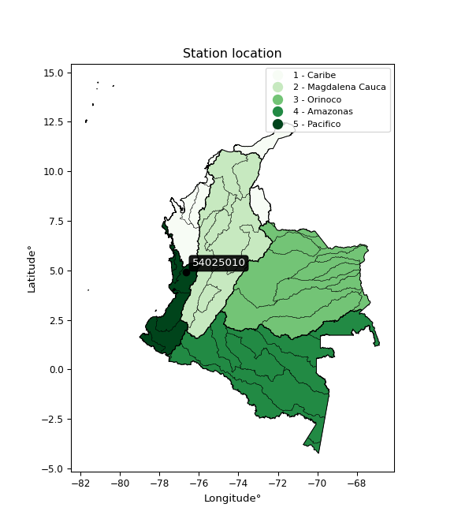

<div align="center">


</div>

# PMP Station (Rain, Pmax24h): 54025010

Probable Maximum Precipitation (PMP) is the greatest amount of rainfall for a specific duration that is meteorologically possible for a given location, acting as a "worst-case" scenario for extreme storms, crucial for designing safety-critical infrastructure like bridges, river deviations, dams, spillways, and nuclear plants to prevent catastrophic failure. PMP is calculated by hydrologists using meteorological data to determine the upper limit of extreme rainfall, often leading to the Probable Maximum Flood (PMF) for flood control design, and is increasingly being studied for climate change impacts.

<div align="center">

</img>

</div>


## A. General information


### 1. General running parameters

• app_version: _v20260103_. • runtime: _2026-01-03 07:24:50.581521_. • Python version: _3.14.0_. • SciPy version: _1.16.3_. • Pandas version: _2.3.3_. • NumPy version: _2.3.5_. • Stations dataset (station_dataset_file): _dataset/pmax24h_in/automatic_colombia_2003_2024.csv_. • Stations catalog (station_catalog_file): _dataset/CNE.xls_. • Minimum year to eval til year_max (date_min): _1900_. • Maximum year to eval since year_min (date_max): _2024_. • Creates, save and include plots into reports (create_plot): _False_. • Plot only fit distributions with Δo > Δ (plot_only_fit): _True_. • Eval low extreme values, if False, evaluates high extreme values (low_extreme): _False_. • Eval every SciPy distribution as logarithmic (pdist_logarithmic_on): _True_. • Standard deviation normalized (ddof): _1.0_. • Return periods to eval in years (Tr): _[2, 2.33, 5, 10, 15, 20, 25, 50, 75, 100, 200, 250, 500, 750, 1000]_. • Minimum data sample per station, 0 means any (minimum_sample): _5_. • Z-Score maximum threshold to adjust a value, 0 means disable (zscore_max): _3.5_. • Z-Score minimum threshold to adjust a value, 0 means disable (zscore_min): _-2.5_. • Avoid zeros, e.g. rain = 0 (avoid_zeros): _True_. • Avoid null values (avoid_nans): _True_. [:file_folder:Dataset file.](../../dataset/pmax24h_in/automatic_colombia_2003_2024.csv)

> Delta Degrees of Freedom (DDOF): is a parameter used in the formulas for calculating variance and standard deviation. When ddof=0, the divisor is $N$ (the total number of observations) and this is used when your data set is the entire population. When ddof=1, the divisor is $N-1$ and this is used when your data set is a sample drawn from a larger population. Using $N-1$ provides an unbiased estimate of the population variance (known as Bessel´s correction).


### 2. Station info and location

|   id |   CODIGO | NOMBRE                     | CATEGORIA               | TECNOLOGIA                              | ESTADO   | FECHA_INSTALACION   |   FECHA_SUSPENSION |   ALTITUD |   LATITUD |   LONGITUD | DEPARTAMENTO   | MUNICIPIO   | AREA_OPERATIVA                         | ENTIDAD                                                     | AREA_HIDROGRAFICA   | ZONA_HIDROGRAFICA   | SUBZONA_HIDROGRAFICA   |   CORRIENTE | Catalogo   |   Version |
|-----:|---------:|:---------------------------|:------------------------|:----------------------------------------|:---------|:--------------------|-------------------:|----------:|----------:|-----------:|:---------------|:------------|:---------------------------------------|:------------------------------------------------------------|:--------------------|:--------------------|:-----------------------|------------:|:-----------|----------:|
|    0 | 54025010 | SAN JOSE PALMAR [54025010] | Climatológica Ordinaria | Automática con Telemetría, Convencional | Activa   | 15/09/1973          |                nan |      1115 |   4.89808 |   -76.6767 | Choco          | Nóvita      | Area Operativa 09 - Cauca-Valle-Caldas | INSTITUTO DE HIDROLOGIA METEOROLOGIA Y ESTUDIOS AMBIENTALES | Pacifico            | San Juán            | Río Cajón              |         nan | CNE_IDEAM  |  20251226 |

<div align="center">

Dynamic map: [:earth_americas:Google](http://maps.google.com/maps?q=4.898083333,-76.676666667) [:earth_americas:OSM](https://www.openstreetmap.org/#map=18/4.898083333/-76.676666667&layers=P) [:earth_americas:Bing](https://www.bing.com/maps?cp=4.898083333~-76.676666667&lvl=18) [:earth_americas:Apple](https://maps.apple.com/frame?center=4.898083333%2C-76.676666667&span=0.003%2C0.006)

</div>


<div align="center">

```geojson
{
  "type": "Feature",
  "geometry": {
    "type": "Point", 
    "coordinates": [-76.676666667, 4.898083333]
  }, 
  "properties": {
    "Name": "54025010"
  }
}
```

</div>


### 3. Discrete values table and plot

<div align="center">

|               |          0 |           1 |           2 |           3 |           4 |           5 |           6 |
|:--------------|-----------:|------------:|------------:|------------:|------------:|------------:|------------:|
| Date          | 2018       | 2019        | 2020        | 2021        | 2022        | 2023        | 2024        |
| Value         |   72.9     |  964.8      |  964.8      |  964.8      |  964.8      |  964.8      |  964.8      |
| Value_initial |   72.9     |  964.8      |  964.8      |  964.8      |  964.8      |  964.8      |  964.8      |
| count         |    7       |    7        |    7        |    7        |    7        |    7        |    7        |
| mean          |  837.386   |  837.386    |  837.386    |  837.386    |  837.386    |  837.386    |  837.386    |
| std           |  337.107   |  337.107    |  337.107    |  337.107    |  337.107    |  337.107    |  337.107    |
| zscore        |   -2.26779 |    0.377964 |    0.377964 |    0.377964 |    0.377964 |    0.377964 |    0.377964 |


</div>


> The initial value (value_initial) correspond to the initial obtained or null completed value, and value (value) is adjusted only when the initial value is outside the valid range definite through the Z-Score value. If Z-Score is active, values out of range or outliers are replaced with the station mean value


### 4. Active continuous probability distributions from SciPy (44 of 104 available)

A Probability Density Function (PDF) describes the relative likelihood of a continuous random variable falling within a specific range, where the total area under its curve equals 1, and the area over any interval gives the actual probability for that range. Unlike discrete probabilities (like rolling a die), a PDF shows density, not direct probability for a single point (which is zero), with higher points indicating higher likelihood, often visualized as a bell curve for normal distributions.

A log of a probability density function (log-PDF) is simply the logarithm of the PDF´s value, denoted as $log(f(x))$, useful for converting multiplication of probabilities into addition, improving numerical stability with tiny numbers, and connecting to information theory concepts like entropy. Instead of dealing with very small probabilities (e.g., 0.000001), log-PDFs use negative numbers (e.g., $log(0.00001) ≈ -11.51$ that are easier for computers to handle, preventing underflow errors and simplifying complex calculations. In this study, each active probability distribution from SciPy is also evaluated in the $log$ form.

[scipy.stats](https://docs.scipy.org/doc/scipy/reference/stats.html) is a Python´s powerful submodule within the SciPy library for comprehensive statistical analysis, offering over 130 probability distributions (like Normal, Poisson), functions for descriptive stats (mean, variance), hypothesis testing (t-tests, chi-square), random variable generation, and statistical tests, making it essential for data science, modeling, and research. It provides tools to explore, model, and draw conclusions from data efficiently, working seamlessly with NumPy.

<div align="center">

|   id | p_dist             |   n_parameter | fit_method   | label                                                                       | active   | ref                                                                                                        |
|-----:|:-------------------|--------------:|:-------------|:----------------------------------------------------------------------------|:---------|:-----------------------------------------------------------------------------------------------------------|
|    0 | alpha              |             3 | MLE          | Alpha                                                                       | True     | [:mortar_board:](https://docs.scipy.org/doc/scipy/reference/generated/scipy.stats.alpha.html)              |
|    1 | betaprime          |             4 | MLE          | Beta prime                                                                  | True     | [:mortar_board:](https://docs.scipy.org/doc/scipy/reference/generated/scipy.stats.betaprime.html)          |
|    2 | chi2               |             3 | MLE          | Chi²                                                                        | True     | [:mortar_board:](https://docs.scipy.org/doc/scipy/reference/generated/scipy.stats.chi2.html)               |
|    3 | crystalball        |             4 | MLE          | Crystalball                                                                 | True     | [:mortar_board:](https://docs.scipy.org/doc/scipy/reference/generated/scipy.stats.crystalball.html)        |
|    4 | erlang             |             3 | MLE          | Erlang                                                                      | True     | [:mortar_board:](https://docs.scipy.org/doc/scipy/reference/generated/scipy.stats.erlang.html)             |
|    5 | expon              |             2 | MLE          | Exponential                                                                 | True     | [:mortar_board:](https://docs.scipy.org/doc/scipy/reference/generated/scipy.stats.expon.html)              |
|    6 | exponnorm          |             3 | MLE          | Exponentially modified Normal                                               | True     | [:mortar_board:](https://docs.scipy.org/doc/scipy/reference/generated/scipy.stats.exponnorm.html)          |
|    7 | f                  |             4 | MLE          | F                                                                           | True     | [:mortar_board:](https://docs.scipy.org/doc/scipy/reference/generated/scipy.stats.f.html)                  |
|    8 | fatiguelife        |             3 | MLE          | Fatigue-life (Birnbaum-Saunders)                                            | True     | [:mortar_board:](https://docs.scipy.org/doc/scipy/reference/generated/scipy.stats.fatiguelife.html)        |
|    9 | fisk               |             3 | MLE          | Fisk                                                                        | True     | [:mortar_board:](https://docs.scipy.org/doc/scipy/reference/generated/scipy.stats.fisk.html)               |
|   10 | gamma              |             3 | MLE          | Gamma                                                                       | True     | [:mortar_board:](https://docs.scipy.org/doc/scipy/reference/generated/scipy.stats.gamma.html)              |
|   11 | genexpon           |             5 | MLE          | Generalized exponential                                                     | True     | [:mortar_board:](https://docs.scipy.org/doc/scipy/reference/generated/scipy.stats.genexpon.html)           |
|   12 | genlogistic        |             3 | MLE          | Generalized logistic                                                        | True     | [:mortar_board:](https://docs.scipy.org/doc/scipy/reference/generated/scipy.stats.genlogistic.html)        |
|   13 | gibrat             |             2 | MM           | Gibrat                                                                      | True     | [:mortar_board:](https://docs.scipy.org/doc/scipy/reference/generated/scipy.stats.gibrat.html)             |
|   14 | gompertz           |             3 | MLE          | Gompertz (or truncated Gumbel)                                              | True     | [:mortar_board:](https://docs.scipy.org/doc/scipy/reference/generated/scipy.stats.gompertz.html)           |
|   15 | gumbel_l           |             2 | MM           | Gumbel Left Skew                                                            | True     | [:mortar_board:](https://docs.scipy.org/doc/scipy/reference/generated/scipy.stats.gumbel_l.html)           |
|   16 | gumbel_r           |             2 | MM           | Gumbel Right Skew                                                           | True     | [:mortar_board:](https://docs.scipy.org/doc/scipy/reference/generated/scipy.stats.gumbel_r.html)           |
|   17 | halflogistic       |             2 | MM           | Half-logistic                                                               | True     | [:mortar_board:](https://docs.scipy.org/doc/scipy/reference/generated/scipy.stats.halflogistic.html)       |
|   18 | halfnorm           |             2 | MM           | Half Normal                                                                 | True     | [:mortar_board:](https://docs.scipy.org/doc/scipy/reference/generated/scipy.stats.halfnorm.html)           |
|   19 | hypsecant          |             2 | MM           | hyperbolic secant                                                           | True     | [:mortar_board:](https://docs.scipy.org/doc/scipy/reference/generated/scipy.stats.hypsecant.html)          |
|   20 | invgamma           |             3 | MLE          | Inverted gamma                                                              | True     | [:mortar_board:](https://docs.scipy.org/doc/scipy/reference/generated/scipy.stats.invgamma.html)           |
|   21 | invgauss           |             3 | MLE          | Inverse Gaussian                                                            | True     | [:mortar_board:](https://docs.scipy.org/doc/scipy/reference/generated/scipy.stats.invgauss.html)           |
|   22 | invweibull         |             3 | MLE          | Inverted Weibull                                                            | True     | [:mortar_board:](https://docs.scipy.org/doc/scipy/reference/generated/scipy.stats.invweibull.html)         |
|   23 | johnsonsu          |             4 | MLE          | Johnson Su                                                                  | True     | [:mortar_board:](https://docs.scipy.org/doc/scipy/reference/generated/scipy.stats.johnsonsu.html)          |
|   24 | kstwobign          |             2 | MLE          | Limiting distribution of scaled Kolmogorov-Smirnov two-sided test statistic | True     | [:mortar_board:](https://docs.scipy.org/doc/scipy/reference/generated/scipy.stats.kstwobign.html)          |
|   25 | laplace            |             2 | MM           | Laplace                                                                     | True     | [:mortar_board:](https://docs.scipy.org/doc/scipy/reference/generated/scipy.stats.laplace.html)            |
|   26 | laplace_asymmetric |             3 | MLE          | Asymmetric Laplace                                                          | True     | [:mortar_board:](https://docs.scipy.org/doc/scipy/reference/generated/scipy.stats.laplace_asymmetric.html) |
|   27 | loggamma           |             3 | MLE          | Log gamma                                                                   | True     | [:mortar_board:](https://docs.scipy.org/doc/scipy/reference/generated/scipy.stats.loggamma.html)           |
|   28 | logistic           |             2 | MM           | Logistic (or Sech-squared)                                                  | True     | [:mortar_board:](https://docs.scipy.org/doc/scipy/reference/generated/scipy.stats.logistic.html)           |
|   29 | lognorm            |             3 | MLE          | Log Normal                                                                  | True     | [:mortar_board:](https://docs.scipy.org/doc/scipy/reference/generated/scipy.stats.lognorm.html)            |
|   30 | maxwell            |             2 | MM           | Maxwell                                                                     | True     | [:mortar_board:](https://docs.scipy.org/doc/scipy/reference/generated/scipy.stats.maxwell.html)            |
|   31 | mielke             |             4 | MLE          | Mielke Beta-Kappa / Dagum                                                   | True     | [:mortar_board:](https://docs.scipy.org/doc/scipy/reference/generated/scipy.stats.mielke.html)             |
|   32 | moyal              |             2 | MM           | Moyal                                                                       | True     | [:mortar_board:](https://docs.scipy.org/doc/scipy/reference/generated/scipy.stats.moyal.html)              |
|   33 | nakagami           |             3 | MLE          | Nakagami                                                                    | True     | [:mortar_board:](https://docs.scipy.org/doc/scipy/reference/generated/scipy.stats.nakagami.html)           |
|   34 | ncf                |             5 | MLE          | Non-central F distribution                                                  | True     | [:mortar_board:](https://docs.scipy.org/doc/scipy/reference/generated/scipy.stats.ncf.html)                |
|   35 | nct                |             4 | MLE          | Non-central Student’s t                                                     | True     | [:mortar_board:](https://docs.scipy.org/doc/scipy/reference/generated/scipy.stats.nct.html)                |
|   36 | norm               |             2 | MM           | Normal                                                                      | True     | [:mortar_board:](https://docs.scipy.org/doc/scipy/reference/generated/scipy.stats.norm.html)               |
|   37 | pearson3           |             3 | MM           | Pearson type III                                                            | True     | [:mortar_board:](https://docs.scipy.org/doc/scipy/reference/generated/scipy.stats.pearson3.html)           |
|   38 | rayleigh           |             2 | MM           | Rayleigh                                                                    | True     | [:mortar_board:](https://docs.scipy.org/doc/scipy/reference/generated/scipy.stats.rayleigh.html)           |
|   39 | rice               |             3 | MLE          | Rice                                                                        | True     | [:mortar_board:](https://docs.scipy.org/doc/scipy/reference/generated/scipy.stats.rice.html)               |
|   40 | t                  |             3 | MLE          | Student’s t                                                                 | True     | [:mortar_board:](https://docs.scipy.org/doc/scipy/reference/generated/scipy.stats.t.html)                  |
|   41 | truncnorm          |             4 | MLE          | Truncated normal                                                            | True     | [:mortar_board:](https://docs.scipy.org/doc/scipy/reference/generated/scipy.stats.truncnorm.html)          |
|   42 | wald               |             2 | MM           | Wald                                                                        | True     | [:mortar_board:](https://docs.scipy.org/doc/scipy/reference/generated/scipy.stats.wald.html)               |
|   43 | weibull_min        |             3 | MLE          | Weibull minimum                                                             | True     | [:mortar_board:](https://docs.scipy.org/doc/scipy/reference/generated/scipy.stats.weibull_min.html)        |

</div>

> **n_parameter:** # arguments & localization & scale.
>
> **Fit methods:** (MLE) maximum likelihood, (MM) L-moments.
>
>**Inactive** (With the only purpose of prevent loops, zero divisions, infinite values, over high estimated values or horizontal trending for recurrence intervals estimations, the follow distributions were disabled.)**:** foldnorm, gennorm, norminvgauss, powernorm, powerlognorm, skewnorm, genextreme, anglit, arcsine, argus, beta, bradford, burr, burr12, cauchy, cosine, halfcauchy, foldcauchy, skewcauchy, wrapcauchy, dgamma, gengamma, exponweib, exponpow, truncexpon, gausshyper, genhalflogistic, genhyperbolic, geninvgauss, halfgennorm, johnsonsb, kappa4, kappa3, ksone, kstwo, loglaplace, levy, levy_l, levy_stable, ncx2, pareto, genpareto, truncpareto, lomax, powerlaw, rdist, rel_breitwigner, recipinvgauss, semicircular, studentized_range, trapezoid, triang, truncweibull_min, tukeylambda, uniform, loguniform, vonmises, vonmises_line, weibull_max, dweibull, 


## B. Probability distributions vs. Empirical distributions

A continuous probability distribution (CPD) describes probabilities for variables that can take any value within a range (like rain any time), unlike discrete variables with specific outcomes (like temperature). It uses a Probability Density Function (PDF), a curve where the total area under it equals 1, and the probability of the variable falling within an interval (a to b) is found by calculating the area under the curve between those points. A key feature is that the probability of hitting any single exact value is zero, so probabilities are always expressed for ranges, e.g., $P(a ≤ X ≤ b)$.

<div align="center">

Distributions parameters from station values
|    |   station | p_dist                |   n |               loc |            scale | shape                  | shape1             | shape2                 | shape3   |
|---:|----------:|:----------------------|----:|------------------:|-----------------:|:-----------------------|:-------------------|:-----------------------|:---------|
|  0 |  54025010 | alpha                 |   7 |      -0.526583    |    191.365       | 5.837711132174942e-14  |                    |                        |          |
|  1 |  54025010 | betaprime             |   7 |  -13402.1         |      5.90694e+06 | 2007.4496345983894     | 832547.6142496828  |                        |          |
|  2 |  54025010 | chi2                  |   7 |      72.9         |     12.8264      | 0.33784598132304744    |                    |                        |          |
|  3 |  54025010 | crystalball           |   7 |      -0.542333    |    893.957       | 4.3319502733858535     | 9.165648920760308  |                        |          |
|  4 |  54025010 | erlang                |   7 |   -3396.63        |     29.9562      | 141.37430864973976     |                    |                        |          |
|  5 |  54025010 | expon                 |   7 |      72.9         |    764.486       |                        |                    |                        |          |
|  6 |  54025010 | exponnorm             |   7 |     837.202       |    312.101       | 0.0005899248623339366  |                    |                        |          |
|  7 |  54025010 | f                     |   7 | -145754           | 146590           | 458023.44962241105     | 9698741.336377218  |                        |          |
|  8 |  54025010 | fatiguelife           |   7 |      72.9         |      0.00556109  | 361.45772523728886     |                    |                        |          |
|  9 |  54025010 | fisk                  |   7 |      -2.80852e+10 |      2.80852e+10 | 341684208.61543113     |                    |                        |          |
| 10 |  54025010 | gamma                 |   7 |   -3213.68        |     29.8828      | 135.2471962487068      |                    |                        |          |
| 11 |  54025010 | genexpon              |   7 |     -60.9576      |      1.44685     | 9.262756739511864e-06  | 0.1132044640176628 | 4.0934851567342884e-05 |          |
| 12 |  54025010 | genlogistic           |   7 |     964.8         |      1.05581e-05 | 8.281764711775473e-08  |                    |                        |          |
| 13 |  54025010 | gibrat                |   7 |     599.293       |    144.411       |                        |                    |                        |          |
| 14 |  54025010 | gompertz              |   7 |     764.399       |      1.75425e-25 | 67.05221132533526      |                    |                        |          |
| 15 |  54025010 | gumbel_l              |   7 |     977.847       |    243.343       |                        |                    |                        |          |
| 16 |  54025010 | gumbel_r              |   7 |     696.924       |    243.343       |                        |                    |                        |          |
| 17 |  54025010 | halflogistic          |   7 |     467.475       |    266.834       |                        |                    |                        |          |
| 18 |  54025010 | halfnorm              |   7 |     424.288       |    517.742       |                        |                    |                        |          |
| 19 |  54025010 | hypsecant             |   7 |     837.386       |    198.689       |                        |                    |                        |          |
| 20 |  54025010 | invgamma              |   7 |   -3282.04        | 500390           | 122.22853901005033     |                    |                        |          |
| 21 |  54025010 | invgauss              |   7 |    -710.428       |  12449.9         | 0.12400526606170548    |                    |                        |          |
| 22 |  54025010 | invweibull            |   7 |      72.9         |      9.50473     | 0.04664584946956016    |                    |                        |          |
| 23 |  54025010 | johnsonsu             |   7 |     964.8         |      1.57793e-22 | 1.1796934169190123     | 0.257372331135451  |                        |          |
| 24 |  54025010 | kstwobign             |   7 |    -816.35        |   1892.53        |                        |                    |                        |          |
| 25 |  54025010 | laplace               |   7 |     837.386       |    220.688       |                        |                    |                        |          |
| 26 |  54025010 | laplace_asymmetric    |   7 |     964.849       |      5.08734     | 25.039763038612236     |                    |                        |          |
| 27 |  54025010 | loggamma              |   7 |     964.8         |      7.38456e-06 | 5.8009788760476e-08    |                    |                        |          |
| 28 |  54025010 | logistic              |   7 |     837.386       |    172.07        |                        |                    |                        |          |
| 29 |  54025010 | lognorm               |   7 |      72.9         |      3.55341     | 13.534524114683279     |                    |                        |          |
| 30 |  54025010 | maxwell               |   7 |      97.8398      |    463.442       |                        |                    |                        |          |
| 31 |  54025010 | mielke                |   7 | -122088           | 123053           | 989.9958630746005      | 5583287.5502370875 |                        |          |
| 32 |  54025010 | moyal                 |   7 |     658.907       |    140.494       |                        |                    |                        |          |
| 33 |  54025010 | nakagami              |   7 | -507895           | 508733           | 662400.0851277565      |                    |                        |          |
| 34 |  54025010 | ncf                   |   7 |       0.0106996   |      7.78195e-06 | 1.4991299346860875e-07 | 16.387316892862927 | 15.819010538796952     |          |
| 35 |  54025010 | nct                   |   7 |    -346.826       |    312.313       | 72738.00040981543      | 3.792798812959017  |                        |          |
| 36 |  54025010 | norm                  |   7 |     837.386       |    312.1         |                        |                    |                        |          |
| 37 |  54025010 | pearson3              |   7 |     837.386       |    312.1         | -2.041241464837624     |                    |                        |          |
| 38 |  54025010 | rayleigh              |   7 |     240.32        |    476.389       |                        |                    |                        |          |
| 39 |  54025010 | rice                  |   7 |     -19.6623      |      3.90213e-30 | 1.3053444453258112     |                    |                        |          |
| 40 |  54025010 | t                     |   7 |     833.984       |    302.655       | 6.114315625137438      |                    |                        |          |
| 41 |  54025010 | truncnorm             |   7 |     -79.6097      |      1.56259     | 97.60034952658361      | 657.9897761827017  |                        |          |
| 42 |  54025010 | wald                  |   7 |     525.286       |    312.1         |                        |                    |                        |          |
| 43 |  54025010 | weibull_min           |   7 |      72.9         |      7.9039      | 0.2486551964261735     |                    |                        |          |
| 44 |  54025010 | logalpha              |   7 |     -20.1089      |    696.165       | 26.195953536159735     |                    |                        |          |
| 45 |  54025010 | logbetaprime          |   7 |     -22.1417      |    122.457       | 1094.079897721816      | 4680.3491401124065 |                        |          |
| 46 |  54025010 | logchi2               |   7 |       4.28909     |      0.970153    | 1.096047008863295      |                    |                        |          |
| 47 |  54025010 | logcrystalball        |   7 |       6.50294     |      0.903803    | 1468.318856526449      | 246.4113434202264  |                        |          |
| 48 |  54025010 | logerlang             |   7 |      -2.58448     |      0.120346    | 75.35270141283328      |                    |                        |          |
| 49 |  54025010 | logexpon              |   7 |       4.28909     |      2.21386     |                        |                    |                        |          |
| 50 |  54025010 | logexponnorm          |   7 |       6.50282     |      0.903829    | 0.0001390702223154983  |                    |                        |          |
| 51 |  54025010 | logf                  |   7 |    -659.995       |    666.489       | 1461891.3235804625     | 4168287.83259736   |                        |          |
| 52 |  54025010 | logfatiguelife        |   7 |    -565.055       |    571.552       | 0.0015793407369517978  |                    |                        |          |
| 53 |  54025010 | logfisk               |   7 |      -7.35529e+07 |      7.35529e+07 | 197015714.92683        |                    |                        |          |
| 54 |  54025010 | loggamma              |   7 |      -9.02343     |      0.0616593   | 251.8031042473815      |                    |                        |          |
| 55 |  54025010 | loggenexpon           |   7 |       4.28894     |      0.00681756  | 0.0008799577144446577  | 0.9847553238815328 | 1.1695057731731209e-05 |          |
| 56 |  54025010 | loggenlogistic        |   7 |       6.87256     |      7.59942e-05 | 0.0001959179261987133  |                    |                        |          |
| 57 |  54025010 | loggibrat             |   7 |       5.81349     |      0.418179    |                        |                    |                        |          |
| 58 |  54025010 | loggompertz           |   7 |       4.28522     |      0.371386    | 0.001102743653377699   |                    |                        |          |
| 59 |  54025010 | loggumbel_l           |   7 |       6.9097      |      0.704692    |                        |                    |                        |          |
| 60 |  54025010 | loggumbel_r           |   7 |       6.09619     |      0.704692    |                        |                    |                        |          |
| 61 |  54025010 | loghalflogistic       |   7 |       5.4317      |      0.772741    |                        |                    |                        |          |
| 62 |  54025010 | loghalfnorm           |   7 |       5.30667     |      1.49931     |                        |                    |                        |          |
| 63 |  54025010 | loghypsecant          |   7 |       6.50294     |      0.575379    |                        |                    |                        |          |
| 64 |  54025010 | loginvgamma           |   7 |     -19.4048      |  19391.5         | 749.54533169855        |                    |                        |          |
| 65 |  54025010 | loginvgauss           |   7 |      -5.1146      |   1620.67        | 0.0071549908805581125  |                    |                        |          |
| 66 |  54025010 | loginvweibull         |   7 |      -8.83101e+07 |      8.83101e+07 | 75173841.86696097      |                    |                        |          |
| 67 |  54025010 | logjohnsonsu          |   7 |       6.87192     |      1.8287e-11  | 1.5620030828869225     | 0.5076681195073829 |                        |          |
| 68 |  54025010 | logkstwobign          |   7 |       1.71391     |      5.48057     |                        |                    |                        |          |
| 69 |  54025010 | loglaplace            |   7 |       6.50294     |      0.639085    |                        |                    |                        |          |
| 70 |  54025010 | loglaplace_asymmetric |   7 |       6.87192     |      0.00491016  | 75.0222578895524       |                    |                        |          |
| 71 |  54025010 | logloggamma           |   7 |       6.87194     |      1.259e-06   | 3.4273241975208446e-06 |                    |                        |          |
| 72 |  54025010 | loglogistic           |   7 |       6.50294     |      0.498293    |                        |                    |                        |          |
| 73 |  54025010 | loglognorm            |   7 |       4.28909     |      0.0159592   | 12.459590472424628     |                    |                        |          |
| 74 |  54025010 | logmaxwell            |   7 |       4.36134     |      1.34205     |                        |                    |                        |          |
| 75 |  54025010 | logmielke             |   7 |      -1.27731e+08 |      1.27731e+08 | 331124437.6171436      | 40669104015.24127  |                        |          |
| 76 |  54025010 | logmoyal              |   7 |       5.98609     |      0.406854    |                        |                    |                        |          |
| 77 |  54025010 | lognakagami           |   7 |       6.87192     |      8.66041e-16 | 1.7293893333034829     |                    |                        |          |
| 78 |  54025010 | logncf                |   7 |     -88.6201      |     67.8098      | 31757.652987095396     | 54666.11160265861  | 12791.332305979915     |          |
| 79 |  54025010 | lognct                |   7 |     -54.6127      |      0.857885    | 20489.491157563156     | 71.23521884537371  |                        |          |
| 80 |  54025010 | lognorm               |   7 |       6.50294     |      0.903803    |                        |                    |                        |          |
| 81 |  54025010 | logpearson3           |   7 |       6.50294     |      0.903803    | -2.0412652773113846    |                    |                        |          |
| 82 |  54025010 | lograyleigh           |   7 |       4.77387     |      1.3796      |                        |                    |                        |          |
| 83 |  54025010 | logrice               |   7 |    -510.409       |      0.905117    | 571.0989092422033      |                    |                        |          |
| 84 |  54025010 | logt                  |   7 |       6.87192     |      5.62624e-12 | 0.15894766695262463    |                    |                        |          |
| 85 |  54025010 | logtruncnorm          |   7 |      -0.280593    |      1.38443     | 5.166382131268904      | 5.166382131268905  |                        |          |
| 86 |  54025010 | logwald               |   7 |       5.59915     |      0.903798    |                        |                    |                        |          |
| 87 |  54025010 | logweibull_min        |   7 |       4.28909     |      1.34788     | 0.19745416911876823    |                    |                        |          |

</div>

> **loc** (Location parameter): This shifts the distribution along the x-axis. For many common distributions, like the normal (Gaussian) distribution, loc represents the mean $μ$. For others, like the uniform distribution, it might represent the minimum value, or for the beta distribution, the left end of the support interval.
>
> **scale** (Scale parameter): This determines the width or spread of the distribution. For the normal distribution, scale represents the standard deviation $σ$. For a uniform distribution, it defines the length of the interval (from $loc$ to $loc + scale$).
>
> **shape** (Shape parameters): Refers to parameters that define the specific form of a probability distribution, distinct from its location (loc) and scale (scale). These parameters are required arguments for most distribution functions. For example, a normal (Gaussian) distribution is fully defined by its location (mean) and scale (standard deviation), so it has no specific shape parameters beyond loc and scale. However, other distributions have intrinsic properties that need specification, as Gamma distribution that takes a shape parameter, often named $a$ or $alpha$.


### 0. Cumulative distribution values - CDF (88 evaluated)

Cumulative Distribution Function (CDF), denoted as $F$<sub>$X$</sub>$(x)$, is a function that gives the probability that a random variable $X$ will take a value less than or equal to a specific value, $x$ (i.e., $(P(X≥x)$. It essentially "accumulates" probabilities from a given point up to the far right (positive infinity), providing a complete picture of the distribution´s probabilities for both discrete (like rain) and continuous (like temperature) variables, helping to find probabilities over ranges or above certain values. Each station is evaluated separately ordering the $x$ values ascending, calculating the CDF and PDF values for the activated distributions and their logarithmic forms.

<div align="center">

CDF ordered by x ascending and calculating $log(f(x))$ separately
|   id |   Station |   date |     x |   count |    mean |     std |    zscore |   Value_initial |   station |   m |      alpha |   alpha_pdf |   betaprime |   betaprime_pdf |       chi2 |    chi2_pdf |   crystalball |   crystalball_pdf |    erlang |   erlang_pdf |    expon |   expon_pdf |   exponnorm |   exponnorm_pdf |          f |      f_pdf |   fatiguelife |   fatiguelife_pdf |        fisk |   fisk_pdf |     gamma |   gamma_pdf |   genexpon |   genexpon_pdf |   genlogistic |   genlogistic_pdf |   gibrat |   gibrat_pdf |   gompertz |   gompertz_pdf |   gumbel_l |   gumbel_l_pdf |    gumbel_r |   gumbel_r_pdf |   halflogistic |   halflogistic_pdf |   halfnorm |   halfnorm_pdf |   hypsecant |   hypsecant_pdf |   invgamma |   invgamma_pdf |   invgauss |   invgauss_pdf |   invweibull |   invweibull_pdf |   johnsonsu |   johnsonsu_pdf |   kstwobign |   kstwobign_pdf |   laplace |   laplace_pdf |   laplace_asymmetric |   laplace_asymmetric_pdf |   loggamma |   loggamma_pdf |   logistic |   logistic_pdf |    lognorm |   lognorm_pdf |   maxwell |   maxwell_pdf |      mielke |   mielke_pdf |       moyal |   moyal_pdf |   nakagami |   nakagami_pdf |        ncf |     ncf_pdf |        nct |     nct_pdf |       norm |    norm_pdf |   pearson3 |   pearson3_pdf |   rayleigh |   rayleigh_pdf |   rice |   rice_pdf |        t |       t_pdf |   truncnorm |   truncnorm_pdf |     wald |    wald_pdf |   weibull_min |   weibull_min_pdf |   logalpha |   logalpha_pdf |   logbetaprime |   logbetaprime_pdf |     logchi2 |   logchi2_pdf |   logcrystalball |   logcrystalball_pdf |   logerlang |   logerlang_pdf |   logexpon |   logexpon_pdf |   logexponnorm |   logexponnorm_pdf |       logf |   logf_pdf |   logfatiguelife |   logfatiguelife_pdf |    logfisk |   logfisk_pdf |   loggenexpon |   loggenexpon_pdf |   loggenlogistic |   loggenlogistic_pdf |   loggibrat |   loggibrat_pdf |   loggompertz |   loggompertz_pdf |   loggumbel_l |   loggumbel_l_pdf |   loggumbel_r |   loggumbel_r_pdf |   loghalflogistic |   loghalflogistic_pdf |   loghalfnorm |   loghalfnorm_pdf |   loghypsecant |   loghypsecant_pdf |   loginvgamma |   loginvgamma_pdf |   loginvgauss |   loginvgauss_pdf |   loginvweibull |   loginvweibull_pdf |   logjohnsonsu |   logjohnsonsu_pdf |   logkstwobign |   logkstwobign_pdf |   loglaplace |   loglaplace_pdf |   loglaplace_asymmetric |   loglaplace_asymmetric_pdf |   logloggamma |   logloggamma_pdf |   loglogistic |   loglogistic_pdf |   loglognorm |   loglognorm_pdf |   logmaxwell |   logmaxwell_pdf |   logmielke |   logmielke_pdf |    logmoyal |   logmoyal_pdf |   lognakagami |   lognakagami_pdf |     logncf |   logncf_pdf |     lognct |   lognct_pdf |   logpearson3 |   logpearson3_pdf |   lograyleigh |   lograyleigh_pdf |    logrice |   logrice_pdf |       logt |    logt_pdf |   logtruncnorm |   logtruncnorm_pdf |   logwald |   logwald_pdf |   logweibull_min |   logweibull_min_pdf |
|-----:|----------:|-------:|------:|--------:|--------:|--------:|----------:|----------------:|----------:|----:|-----------:|------------:|------------:|----------------:|-----------:|------------:|--------------:|------------------:|----------:|-------------:|---------:|------------:|------------:|----------------:|-----------:|-----------:|--------------:|------------------:|------------:|-----------:|----------:|------------:|-----------:|---------------:|--------------:|------------------:|---------:|-------------:|-----------:|---------------:|-----------:|---------------:|------------:|---------------:|---------------:|-------------------:|-----------:|---------------:|------------:|----------------:|-----------:|---------------:|-----------:|---------------:|-------------:|-----------------:|------------:|----------------:|------------:|----------------:|----------:|--------------:|---------------------:|-------------------------:|-----------:|---------------:|-----------:|---------------:|-----------:|--------------:|----------:|--------------:|------------:|-------------:|------------:|------------:|-----------:|---------------:|-----------:|------------:|-----------:|------------:|-----------:|------------:|-----------:|---------------:|-----------:|---------------:|-------:|-----------:|---------:|------------:|------------:|----------------:|---------:|------------:|--------------:|------------------:|-----------:|---------------:|---------------:|-------------------:|------------:|--------------:|-----------------:|---------------------:|------------:|----------------:|-----------:|---------------:|---------------:|-------------------:|-----------:|-----------:|-----------------:|---------------------:|-----------:|--------------:|--------------:|------------------:|-----------------:|---------------------:|------------:|----------------:|--------------:|------------------:|--------------:|------------------:|--------------:|------------------:|------------------:|----------------------:|--------------:|------------------:|---------------:|-------------------:|--------------:|------------------:|--------------:|------------------:|----------------:|--------------------:|---------------:|-------------------:|---------------:|-------------------:|-------------:|-----------------:|------------------------:|----------------------------:|--------------:|------------------:|--------------:|------------------:|-------------:|-----------------:|-------------:|-----------------:|------------:|----------------:|------------:|---------------:|--------------:|------------------:|-----------:|-------------:|-----------:|-------------:|--------------:|------------------:|--------------:|------------------:|-----------:|--------------:|-----------:|------------:|---------------:|-------------------:|----------:|--------------:|-----------------:|---------------------:|
|    0 |  54025010 |   2018 |  72.9 |       7 | 837.386 | 337.107 | -2.26779  |            72.9 |  54025010 |   1 | 0.00915493 | 0.000948761 |  0.00713829 |     6.46484e-05 | 0.00285582 | 3.39469e+10 |      0.532739 |       0.000444761 | 0.0117297 |  9.82861e-05 | 0        | 0.00130807  |  0.00715313 |     6.36416e-05 | 0.00734493 | 6.5096e-05 |      0.049412 |       5.39698e+06 | 2.71462e-05 | 3.3025e-07 | 0.0108493 | 9.46027e-05 |  0.0204519 |    0.000295977 |      0        |       7.18122e-06 | 0        |  0           |          0 |              0 |  0.0239709 |    9.73162e-05 | 2.27721e-06 |    1.21584e-07 |       0        |        0           |   0        |    0           |   0.0135769 |     6.83118e-05 |  0.0105581 |    9.84908e-05 |  0.0341732 |    0.000295158 |   0.00733438 |      1.1833e+11  | 7.94754e-43 |     3.15108e-45 |   0.0199676 |     0.00022849  | 0.0156506 |   7.09171e-05 |           0.00090865 |              7.13306e-06 | 0.00917545 |      0.0280096 |  0.0116252 |    6.67758e-05 | 0.00715294 |     0.0219762 |  0        |    0          | 0.000743969 |  6.02916e-06 | 8.36394e-16 | 1.95723e-16 | 0.00723326 |    6.42129e-05 | 0.00559067 | 0.00012602  | 0.00716543 | 6.36958e-05 | 0.00715294 | 6.36404e-05 |   0.031987 |    0.000101379 |   0        |     0          |      1 |          0 | 0.022443 | 0.000101215 | 0.000284709 |         62.4492 | 0        | 0           |   0.000215515 |       3.77058e+09 |  0.0096996 |      0.0303507 |     0.00941353 |           0.028011 | 4.41466e-09 |   2.72393e+06 |       0.00715293 |            0.0219762 |    0.011908 |       0.0357892 |   0        |       0.451701 |     0.00715435 |          0.0219794 | 0.00740883 |  0.0226757 |       0.00712176 |            0.0220041 | 0.00138208 |    0.00369686 |   1.89002e-05 |          0.129106 |         0        |           0.00330168 |    0        |        0        |   1.15334e-05 |        0.00300028 |     0.0239709 |         0.0336051 |   2.27721e-06 |       4.19853e-05 |          0        |               0       |      0        |          0        |      0.0135769 |          0.0235893 |    0.00705445 |         0.0233495 |    0.00730622 |         0.0256054 |       0.0149583 |           0.0535114 |    1.47364e-32 |        3.44887e-32 |      0.0199681 |          0.0789027 |    0.0156506 |         0.024489 |             0.000901302 |                  0.00244672 |   0.000883876 |        0.00240614 |     0.0116252 |         0.0230589 |   0.00715294 |      1.79483e+12 |     0        |         0        |  0.00119032 |      0.00308574 | 8.36394e-16 |    6.75869e-14 |      0        |       0           | 0.00775993 |    0.0235942 | 0.00734151 |    0.0225183 |      0.031987 |          0.035008 |      0        |          0        | 0.00722811 |     0.0221476 | 0.00547092 | 0.000336681 |              0 |        0           |  0        |      0        |       0.00100508 |           2.2333e+11 |
|    1 |  54025010 |   2019 | 964.8 |       7 | 837.386 | 337.107 |  0.377964 |           964.8 |  54025010 |   2 | 0.842858   | 0.000160665 |  0.653877   |     0.00115232  | 1          | 2.95817e-19 |      0.859896 |       0.000249104 | 0.647783  |  0.00102188  | 0.688597 | 0.000407337 |  0.658453   |     0.00117604  | 0.658958   | 0.00116954 |      0.866057 |       0.000134131 | 0.583361    | 0.00295695 | 0.662088  | 0.00102856  |  0.686502  |    0.000703628 |      0.999998 |       0.00784395  | 0.823458 |  0.000709183 |          1 |              0 |  0.612405  |    0.00150964  | 0.717057    |    0.000980069 |       0.731478 |        0.000871214 |   0.703506 |    0.000893633 |   0.69142   |     0.001321    |  0.645356  |    0.000956879 |  0.658097  |    0.000631973 |   0.445263   |      1.88413e-05 | 0.880939    |     3.24478e+20 |   0.661525  |     0.000663309 | 0.719308  |   0.00127189  |           0.998022   |              0.00783465  | 0.653765   |      0.371164  |  0.677101  |    0.00127062  | 0.658454   |     0.406111  |  0.679175 |    0.00104723 | 0.998228    |  0.00803068  | 0.73636     | 0.000903339 | 0.658688   |    0.00117401  | 0.621858   | 0.000641667 | 0.657951   | 0.00117581  | 0.658454   | 0.00117605  |   0.551274 |    0.00179101  |   0.685375 |     0.00100437 |      1 |          0 | 0.659798 | 0.00113707  | 1           |          0      | 0.791308 | 0.000720938 |   0.960782    |       3.54103e-05 |  0.653107  |      0.353062  |     0.65847    |           0.377748 | 0.88376     |   0.0737742   |       0.658454   |            0.406111  |    0.657089 |       0.342078  |   0.688597 |       0.140661 |     0.65845    |          0.406101  | 0.661756   |  0.403426  |       0.660874   |            0.40525   | 0.583092   |    0.651146   |   0.686122    |          0.240957 |         0.998345 |           2.57325    |    0.823461 |        0.244898 |   0.68857     |        0.979174   |     0.612405  |         0.521306  |   0.717057    |       0.338436    |          0.731475 |               0.30084 |      0.703507 |          0.308589 |      0.69142   |          0.456164  |    0.660113   |         0.379729  |    0.667978   |         0.358419  |       0.627328  |           0.249002  |    0.885505    |        4.2609e+09  |      0.661522  |          0.229052  |    0.719308  |         0.439209 |             0.999822    |                  2.71417    |   0.999957    |        2.72214    |     0.677101  |         0.438769  |   0.658454   |      0.0114056   |     0.679177 |         0.361632 |  0.962735   |      2.47223    | 0.73636     |    0.31194     |      0.626251 |       1.12383e+15 | 0.655469   |    0.397102  | 0.658724   |    0.402929  |      0.551273 |          0.618475 |      0.685373 |          0.346821 | 0.658315   |     0.405585  | 0.561741   | 2.15367e+10 |              0 |        2.16933e+15 |  0.791308 |      0.248955 |       0.679228   |           0.0278828  |
|    2 |  54025010 |   2020 | 964.8 |       7 | 837.386 | 337.107 |  0.377964 |           964.8 |  54025010 |   3 | 0.842858   | 0.000160665 |  0.653877   |     0.00115232  | 1          | 2.95817e-19 |      0.859896 |       0.000249104 | 0.647783  |  0.00102188  | 0.688597 | 0.000407337 |  0.658453   |     0.00117604  | 0.658958   | 0.00116954 |      0.866057 |       0.000134131 | 0.583361    | 0.00295695 | 0.662088  | 0.00102856  |  0.686502  |    0.000703628 |      0.999998 |       0.00784395  | 0.823458 |  0.000709183 |          1 |              0 |  0.612405  |    0.00150964  | 0.717057    |    0.000980069 |       0.731478 |        0.000871214 |   0.703506 |    0.000893633 |   0.69142   |     0.001321    |  0.645356  |    0.000956879 |  0.658097  |    0.000631973 |   0.445263   |      1.88413e-05 | 0.880939    |     3.24478e+20 |   0.661525  |     0.000663309 | 0.719308  |   0.00127189  |           0.998022   |              0.00783465  | 0.653765   |      0.371164  |  0.677101  |    0.00127062  | 0.658454   |     0.406111  |  0.679175 |    0.00104723 | 0.998228    |  0.00803068  | 0.73636     | 0.000903339 | 0.658688   |    0.00117401  | 0.621858   | 0.000641667 | 0.657951   | 0.00117581  | 0.658454   | 0.00117605  |   0.551274 |    0.00179101  |   0.685375 |     0.00100437 |      1 |          0 | 0.659798 | 0.00113707  | 1           |          0      | 0.791308 | 0.000720938 |   0.960782    |       3.54103e-05 |  0.653107  |      0.353062  |     0.65847    |           0.377748 | 0.88376     |   0.0737742   |       0.658454   |            0.406111  |    0.657089 |       0.342078  |   0.688597 |       0.140661 |     0.65845    |          0.406101  | 0.661756   |  0.403426  |       0.660874   |            0.40525   | 0.583092   |    0.651146   |   0.686122    |          0.240957 |         0.998345 |           2.57325    |    0.823461 |        0.244898 |   0.68857     |        0.979174   |     0.612405  |         0.521306  |   0.717057    |       0.338436    |          0.731475 |               0.30084 |      0.703507 |          0.308589 |      0.69142   |          0.456164  |    0.660113   |         0.379729  |    0.667978   |         0.358419  |       0.627328  |           0.249002  |    0.885505    |        4.2609e+09  |      0.661522  |          0.229052  |    0.719308  |         0.439209 |             0.999822    |                  2.71417    |   0.999957    |        2.72214    |     0.677101  |         0.438769  |   0.658454   |      0.0114056   |     0.679177 |         0.361632 |  0.962735   |      2.47223    | 0.73636     |    0.31194     |      0.626251 |       1.12383e+15 | 0.655469   |    0.397102  | 0.658724   |    0.402929  |      0.551273 |          0.618475 |      0.685373 |          0.346821 | 0.658315   |     0.405585  | 0.561741   | 2.15367e+10 |              0 |        2.16933e+15 |  0.791308 |      0.248955 |       0.679228   |           0.0278828  |
|    3 |  54025010 |   2021 | 964.8 |       7 | 837.386 | 337.107 |  0.377964 |           964.8 |  54025010 |   4 | 0.842858   | 0.000160665 |  0.653877   |     0.00115232  | 1          | 2.95817e-19 |      0.859896 |       0.000249104 | 0.647783  |  0.00102188  | 0.688597 | 0.000407337 |  0.658453   |     0.00117604  | 0.658958   | 0.00116954 |      0.866057 |       0.000134131 | 0.583361    | 0.00295695 | 0.662088  | 0.00102856  |  0.686502  |    0.000703628 |      0.999998 |       0.00784395  | 0.823458 |  0.000709183 |          1 |              0 |  0.612405  |    0.00150964  | 0.717057    |    0.000980069 |       0.731478 |        0.000871214 |   0.703506 |    0.000893633 |   0.69142   |     0.001321    |  0.645356  |    0.000956879 |  0.658097  |    0.000631973 |   0.445263   |      1.88413e-05 | 0.880939    |     3.24478e+20 |   0.661525  |     0.000663309 | 0.719308  |   0.00127189  |           0.998022   |              0.00783465  | 0.653765   |      0.371164  |  0.677101  |    0.00127062  | 0.658454   |     0.406111  |  0.679175 |    0.00104723 | 0.998228    |  0.00803068  | 0.73636     | 0.000903339 | 0.658688   |    0.00117401  | 0.621858   | 0.000641667 | 0.657951   | 0.00117581  | 0.658454   | 0.00117605  |   0.551274 |    0.00179101  |   0.685375 |     0.00100437 |      1 |          0 | 0.659798 | 0.00113707  | 1           |          0      | 0.791308 | 0.000720938 |   0.960782    |       3.54103e-05 |  0.653107  |      0.353062  |     0.65847    |           0.377748 | 0.88376     |   0.0737742   |       0.658454   |            0.406111  |    0.657089 |       0.342078  |   0.688597 |       0.140661 |     0.65845    |          0.406101  | 0.661756   |  0.403426  |       0.660874   |            0.40525   | 0.583092   |    0.651146   |   0.686122    |          0.240957 |         0.998345 |           2.57325    |    0.823461 |        0.244898 |   0.68857     |        0.979174   |     0.612405  |         0.521306  |   0.717057    |       0.338436    |          0.731475 |               0.30084 |      0.703507 |          0.308589 |      0.69142   |          0.456164  |    0.660113   |         0.379729  |    0.667978   |         0.358419  |       0.627328  |           0.249002  |    0.885505    |        4.2609e+09  |      0.661522  |          0.229052  |    0.719308  |         0.439209 |             0.999822    |                  2.71417    |   0.999957    |        2.72214    |     0.677101  |         0.438769  |   0.658454   |      0.0114056   |     0.679177 |         0.361632 |  0.962735   |      2.47223    | 0.73636     |    0.31194     |      0.626251 |       1.12383e+15 | 0.655469   |    0.397102  | 0.658724   |    0.402929  |      0.551273 |          0.618475 |      0.685373 |          0.346821 | 0.658315   |     0.405585  | 0.561741   | 2.15367e+10 |              0 |        2.16933e+15 |  0.791308 |      0.248955 |       0.679228   |           0.0278828  |
|    4 |  54025010 |   2022 | 964.8 |       7 | 837.386 | 337.107 |  0.377964 |           964.8 |  54025010 |   5 | 0.842858   | 0.000160665 |  0.653877   |     0.00115232  | 1          | 2.95817e-19 |      0.859896 |       0.000249104 | 0.647783  |  0.00102188  | 0.688597 | 0.000407337 |  0.658453   |     0.00117604  | 0.658958   | 0.00116954 |      0.866057 |       0.000134131 | 0.583361    | 0.00295695 | 0.662088  | 0.00102856  |  0.686502  |    0.000703628 |      0.999998 |       0.00784395  | 0.823458 |  0.000709183 |          1 |              0 |  0.612405  |    0.00150964  | 0.717057    |    0.000980069 |       0.731478 |        0.000871214 |   0.703506 |    0.000893633 |   0.69142   |     0.001321    |  0.645356  |    0.000956879 |  0.658097  |    0.000631973 |   0.445263   |      1.88413e-05 | 0.880939    |     3.24478e+20 |   0.661525  |     0.000663309 | 0.719308  |   0.00127189  |           0.998022   |              0.00783465  | 0.653765   |      0.371164  |  0.677101  |    0.00127062  | 0.658454   |     0.406111  |  0.679175 |    0.00104723 | 0.998228    |  0.00803068  | 0.73636     | 0.000903339 | 0.658688   |    0.00117401  | 0.621858   | 0.000641667 | 0.657951   | 0.00117581  | 0.658454   | 0.00117605  |   0.551274 |    0.00179101  |   0.685375 |     0.00100437 |      1 |          0 | 0.659798 | 0.00113707  | 1           |          0      | 0.791308 | 0.000720938 |   0.960782    |       3.54103e-05 |  0.653107  |      0.353062  |     0.65847    |           0.377748 | 0.88376     |   0.0737742   |       0.658454   |            0.406111  |    0.657089 |       0.342078  |   0.688597 |       0.140661 |     0.65845    |          0.406101  | 0.661756   |  0.403426  |       0.660874   |            0.40525   | 0.583092   |    0.651146   |   0.686122    |          0.240957 |         0.998345 |           2.57325    |    0.823461 |        0.244898 |   0.68857     |        0.979174   |     0.612405  |         0.521306  |   0.717057    |       0.338436    |          0.731475 |               0.30084 |      0.703507 |          0.308589 |      0.69142   |          0.456164  |    0.660113   |         0.379729  |    0.667978   |         0.358419  |       0.627328  |           0.249002  |    0.885505    |        4.2609e+09  |      0.661522  |          0.229052  |    0.719308  |         0.439209 |             0.999822    |                  2.71417    |   0.999957    |        2.72214    |     0.677101  |         0.438769  |   0.658454   |      0.0114056   |     0.679177 |         0.361632 |  0.962735   |      2.47223    | 0.73636     |    0.31194     |      0.626251 |       1.12383e+15 | 0.655469   |    0.397102  | 0.658724   |    0.402929  |      0.551273 |          0.618475 |      0.685373 |          0.346821 | 0.658315   |     0.405585  | 0.561741   | 2.15367e+10 |              0 |        2.16933e+15 |  0.791308 |      0.248955 |       0.679228   |           0.0278828  |
|    5 |  54025010 |   2023 | 964.8 |       7 | 837.386 | 337.107 |  0.377964 |           964.8 |  54025010 |   6 | 0.842858   | 0.000160665 |  0.653877   |     0.00115232  | 1          | 2.95817e-19 |      0.859896 |       0.000249104 | 0.647783  |  0.00102188  | 0.688597 | 0.000407337 |  0.658453   |     0.00117604  | 0.658958   | 0.00116954 |      0.866057 |       0.000134131 | 0.583361    | 0.00295695 | 0.662088  | 0.00102856  |  0.686502  |    0.000703628 |      0.999998 |       0.00784395  | 0.823458 |  0.000709183 |          1 |              0 |  0.612405  |    0.00150964  | 0.717057    |    0.000980069 |       0.731478 |        0.000871214 |   0.703506 |    0.000893633 |   0.69142   |     0.001321    |  0.645356  |    0.000956879 |  0.658097  |    0.000631973 |   0.445263   |      1.88413e-05 | 0.880939    |     3.24478e+20 |   0.661525  |     0.000663309 | 0.719308  |   0.00127189  |           0.998022   |              0.00783465  | 0.653765   |      0.371164  |  0.677101  |    0.00127062  | 0.658454   |     0.406111  |  0.679175 |    0.00104723 | 0.998228    |  0.00803068  | 0.73636     | 0.000903339 | 0.658688   |    0.00117401  | 0.621858   | 0.000641667 | 0.657951   | 0.00117581  | 0.658454   | 0.00117605  |   0.551274 |    0.00179101  |   0.685375 |     0.00100437 |      1 |          0 | 0.659798 | 0.00113707  | 1           |          0      | 0.791308 | 0.000720938 |   0.960782    |       3.54103e-05 |  0.653107  |      0.353062  |     0.65847    |           0.377748 | 0.88376     |   0.0737742   |       0.658454   |            0.406111  |    0.657089 |       0.342078  |   0.688597 |       0.140661 |     0.65845    |          0.406101  | 0.661756   |  0.403426  |       0.660874   |            0.40525   | 0.583092   |    0.651146   |   0.686122    |          0.240957 |         0.998345 |           2.57325    |    0.823461 |        0.244898 |   0.68857     |        0.979174   |     0.612405  |         0.521306  |   0.717057    |       0.338436    |          0.731475 |               0.30084 |      0.703507 |          0.308589 |      0.69142   |          0.456164  |    0.660113   |         0.379729  |    0.667978   |         0.358419  |       0.627328  |           0.249002  |    0.885505    |        4.2609e+09  |      0.661522  |          0.229052  |    0.719308  |         0.439209 |             0.999822    |                  2.71417    |   0.999957    |        2.72214    |     0.677101  |         0.438769  |   0.658454   |      0.0114056   |     0.679177 |         0.361632 |  0.962735   |      2.47223    | 0.73636     |    0.31194     |      0.626251 |       1.12383e+15 | 0.655469   |    0.397102  | 0.658724   |    0.402929  |      0.551273 |          0.618475 |      0.685373 |          0.346821 | 0.658315   |     0.405585  | 0.561741   | 2.15367e+10 |              0 |        2.16933e+15 |  0.791308 |      0.248955 |       0.679228   |           0.0278828  |
|    6 |  54025010 |   2024 | 964.8 |       7 | 837.386 | 337.107 |  0.377964 |           964.8 |  54025010 |   7 | 0.842858   | 0.000160665 |  0.653877   |     0.00115232  | 1          | 2.95817e-19 |      0.859896 |       0.000249104 | 0.647783  |  0.00102188  | 0.688597 | 0.000407337 |  0.658453   |     0.00117604  | 0.658958   | 0.00116954 |      0.866057 |       0.000134131 | 0.583361    | 0.00295695 | 0.662088  | 0.00102856  |  0.686502  |    0.000703628 |      0.999998 |       0.00784395  | 0.823458 |  0.000709183 |          1 |              0 |  0.612405  |    0.00150964  | 0.717057    |    0.000980069 |       0.731478 |        0.000871214 |   0.703506 |    0.000893633 |   0.69142   |     0.001321    |  0.645356  |    0.000956879 |  0.658097  |    0.000631973 |   0.445263   |      1.88413e-05 | 0.880939    |     3.24478e+20 |   0.661525  |     0.000663309 | 0.719308  |   0.00127189  |           0.998022   |              0.00783465  | 0.653765   |      0.371164  |  0.677101  |    0.00127062  | 0.658454   |     0.406111  |  0.679175 |    0.00104723 | 0.998228    |  0.00803068  | 0.73636     | 0.000903339 | 0.658688   |    0.00117401  | 0.621858   | 0.000641667 | 0.657951   | 0.00117581  | 0.658454   | 0.00117605  |   0.551274 |    0.00179101  |   0.685375 |     0.00100437 |      1 |          0 | 0.659798 | 0.00113707  | 1           |          0      | 0.791308 | 0.000720938 |   0.960782    |       3.54103e-05 |  0.653107  |      0.353062  |     0.65847    |           0.377748 | 0.88376     |   0.0737742   |       0.658454   |            0.406111  |    0.657089 |       0.342078  |   0.688597 |       0.140661 |     0.65845    |          0.406101  | 0.661756   |  0.403426  |       0.660874   |            0.40525   | 0.583092   |    0.651146   |   0.686122    |          0.240957 |         0.998345 |           2.57325    |    0.823461 |        0.244898 |   0.68857     |        0.979174   |     0.612405  |         0.521306  |   0.717057    |       0.338436    |          0.731475 |               0.30084 |      0.703507 |          0.308589 |      0.69142   |          0.456164  |    0.660113   |         0.379729  |    0.667978   |         0.358419  |       0.627328  |           0.249002  |    0.885505    |        4.2609e+09  |      0.661522  |          0.229052  |    0.719308  |         0.439209 |             0.999822    |                  2.71417    |   0.999957    |        2.72214    |     0.677101  |         0.438769  |   0.658454   |      0.0114056   |     0.679177 |         0.361632 |  0.962735   |      2.47223    | 0.73636     |    0.31194     |      0.626251 |       1.12383e+15 | 0.655469   |    0.397102  | 0.658724   |    0.402929  |      0.551273 |          0.618475 |      0.685373 |          0.346821 | 0.658315   |     0.405585  | 0.561741   | 2.15367e+10 |              0 |        2.16933e+15 |  0.791308 |      0.248955 |       0.679228   |           0.0278828  |


</div>

An Empirical Distribution Function (EDF) is a step-function estimate of a true cumulative distribution function (CDF) based on observed sample data, representing the proportion of data points less than or equal to a given value. It is calculated by ordering your data and jumping up by $1/n$ (where $n$ is sample size) at each unique data point, allowing analysis without assuming an underlying population distribution, and it gets closer to the true CDF as the sample size grows. For the empirical probability calculations, the parameter $m$ correspond to the order number which means the position of the $x$ values in an ascending order list.


### 1. Empirical - EDF California (1923)

California´s estimates the true probability distribution of water-related data (like rainfall, streamflow) using observed samples, crucial for risk assessment.

<div align="center">


$P=m/n$


</div>


**1.1. Empirical values**

<div align="center">

|                | 0                   | 1                  | 2                   | 3                  | 4                  | 5                  | 6              |
|:---------------|:--------------------|:-------------------|:--------------------|:-------------------|:-------------------|:-------------------|:---------------|
| date           | 2018                | 2019               | 2020                | 2021               | 2022               | 2023               | 2024           |
| x              | 72.9                | 964.8              | 964.8               | 964.8              | 964.8              | 964.8              | 964.8          |
| m              | 1                   | 2                  | 3                   | 4                  | 5                  | 6                  | 7              |
| empirical_dist | edf_california      | edf_california     | edf_california      | edf_california     | edf_california     | edf_california     | edf_california |
| empirical      | 0.14285714285714285 | 0.2857142857142857 | 0.42857142857142855 | 0.5714285714285714 | 0.7142857142857143 | 0.8571428571428571 | 1.0            |
| empirical_tr   | 1.1666666666666665  | 1.4                | 1.75                | 2.333333333333333  | 3.5                | 6.999999999999997  | inf            |

</div>


**1.2. Kolmogorov-Smirnov fit test (sorted by Δ)**


<div align="center">

|                | 0                   | 1                   | 2                   | 3                   | 4                   | 5                   | 6                   | 7                   | 8                   | 9                   | 10                  | 11                  | 12                  | 13                  | 14                  | 15                  | 16                  | 17                  | 18                  | 19                  | 20                  | 21                  | 22                  | 23                  | 24                  | 25                  | 26                  | 27                  | 28                  | 29                  | 30                  | 31                  | 32                  | 33                  | 34                  | 35                  | 36                  | 37                  | 38                  | 39                  | 40                  | 41                  | 42                  | 43                  | 44                  | 45                  | 46                  | 47                  | 48                  | 49                  | 50                  | 51                  | 52                  | 53                  | 54                  | 55                  | 56                  | 57                  | 58                  | 59                  | 60                  | 61                  | 62                  | 63                  | 64                  | 65                  | 66                  | 67                  | 68                  | 69                  | 70                  | 71                  | 72                  | 73                  | 74                  | 75                  | 76                  | 77                  | 78                  | 79                  | 80                    | 81                  | 82                  | 83                  | 84                  | 85                  | 86                  | 87                  |
|:---------------|:--------------------|:--------------------|:--------------------|:--------------------|:--------------------|:--------------------|:--------------------|:--------------------|:--------------------|:--------------------|:--------------------|:--------------------|:--------------------|:--------------------|:--------------------|:--------------------|:--------------------|:--------------------|:--------------------|:--------------------|:--------------------|:--------------------|:--------------------|:--------------------|:--------------------|:--------------------|:--------------------|:--------------------|:--------------------|:--------------------|:--------------------|:--------------------|:--------------------|:--------------------|:--------------------|:--------------------|:--------------------|:--------------------|:--------------------|:--------------------|:--------------------|:--------------------|:--------------------|:--------------------|:--------------------|:--------------------|:--------------------|:--------------------|:--------------------|:--------------------|:--------------------|:--------------------|:--------------------|:--------------------|:--------------------|:--------------------|:--------------------|:--------------------|:--------------------|:--------------------|:--------------------|:--------------------|:--------------------|:--------------------|:--------------------|:--------------------|:--------------------|:--------------------|:--------------------|:--------------------|:--------------------|:--------------------|:--------------------|:--------------------|:--------------------|:--------------------|:--------------------|:--------------------|:--------------------|:--------------------|:----------------------|:--------------------|:--------------------|:--------------------|:--------------------|:--------------------|:--------------------|:--------------------|
| station        | 54025010            | 54025010            | 54025010            | 54025010            | 54025010            | 54025010            | 54025010            | 54025010            | 54025010            | 54025010            | 54025010            | 54025010            | 54025010            | 54025010            | 54025010            | 54025010            | 54025010            | 54025010            | 54025010            | 54025010            | 54025010            | 54025010            | 54025010            | 54025010            | 54025010            | 54025010            | 54025010            | 54025010            | 54025010            | 54025010            | 54025010            | 54025010            | 54025010            | 54025010            | 54025010            | 54025010            | 54025010            | 54025010            | 54025010            | 54025010            | 54025010            | 54025010            | 54025010            | 54025010            | 54025010            | 54025010            | 54025010            | 54025010            | 54025010            | 54025010            | 54025010            | 54025010            | 54025010            | 54025010            | 54025010            | 54025010            | 54025010            | 54025010            | 54025010            | 54025010            | 54025010            | 54025010            | 54025010            | 54025010            | 54025010            | 54025010            | 54025010            | 54025010            | 54025010            | 54025010            | 54025010            | 54025010            | 54025010            | 54025010            | 54025010            | 54025010            | 54025010            | 54025010            | 54025010            | 54025010            | 54025010              | 54025010            | 54025010            | 54025010            | 54025010            | 54025010            | 54025010            | 54025010            |
| empirical_dist | edf_california      | edf_california      | edf_california      | edf_california      | edf_california      | edf_california      | edf_california      | edf_california      | edf_california      | edf_california      | edf_california      | edf_california      | edf_california      | edf_california      | edf_california      | edf_california      | edf_california      | edf_california      | edf_california      | edf_california      | edf_california      | edf_california      | edf_california      | edf_california      | edf_california      | edf_california      | edf_california      | edf_california      | edf_california      | edf_california      | edf_california      | edf_california      | edf_california      | edf_california      | edf_california      | edf_california      | edf_california      | edf_california      | edf_california      | edf_california      | edf_california      | edf_california      | edf_california      | edf_california      | edf_california      | edf_california      | edf_california      | edf_california      | edf_california      | edf_california      | edf_california      | edf_california      | edf_california      | edf_california      | edf_california      | edf_california      | edf_california      | edf_california      | edf_california      | edf_california      | edf_california      | edf_california      | edf_california      | edf_california      | edf_california      | edf_california      | edf_california      | edf_california      | edf_california      | edf_california      | edf_california      | edf_california      | edf_california      | edf_california      | edf_california      | edf_california      | edf_california      | edf_california      | edf_california      | edf_california      | edf_california        | edf_california      | edf_california      | edf_california      | edf_california      | edf_california      | edf_california      | edf_california      |
| p_dist         | invgamma            | erlang              | logalpha            | loggamma            | loggamma            | betaprime           | logncf              | logerlang           | nct                 | invgauss            | logrice             | loginvweibull       | logexponnorm        | exponnorm           | logcrystalball      | norm                | lognorm             | lognorm             | loglognorm          | logbetaprime        | nakagami            | lognct              | f                   | lognakagami         | t                   | loginvgamma         | logfatiguelife      | logkstwobign        | kstwobign           | logf                | gamma               | ncf                 | loginvgauss         | loggumbel_l         | gumbel_l            | logistic            | loglogistic         | maxwell             | logmaxwell          | logweibull_min      | lograyleigh         | rayleigh            | loggenexpon         | genexpon            | loggompertz         | expon               | logexpon            | hypsecant           | loghypsecant        | fisk                | logfisk             | halfnorm            | loghalfnorm         | loggumbel_r         | gumbel_r            | loglaplace          | laplace             | logt                | loghalflogistic     | halflogistic        | pearson3            | logpearson3         | logmoyal            | moyal               | wald                | logwald             | gibrat              | loggibrat           | invweibull          | alpha               | crystalball         | fatiguelife         | johnsonsu           | logchi2             | logjohnsonsu        | weibull_min         | logmielke           | laplace_asymmetric  | mielke              | loggenlogistic      | loglaplace_asymmetric | logloggamma         | genlogistic         | chi2                | gompertz            | truncnorm           | rice                | logtruncnorm        |
| delta          | 0.35964132428993556 | 0.3620687623345714  | 0.367392239697539   | 0.3680502319716372  | 0.3680502319716372  | 0.3681631265120774  | 0.36975463705497835 | 0.3713744027816126  | 0.37223718181665355 | 0.3723823473656438  | 0.37260057117849255 | 0.3726719914217066  | 0.3727359746501865  | 0.3727389088194336  | 0.3727399952454934  | 0.3727400151309098  | 0.37274001513090993 | 0.37274001513090993 | 0.37274001513091004 | 0.37275604383485395 | 0.37297384675197165 | 0.3730092615758068  | 0.3732433477475481  | 0.37374945427215334 | 0.3740836261208541  | 0.3743986329745662  | 0.3751593835224224  | 0.3758079279043903  | 0.37581024493328596 | 0.37604158405898225 | 0.37637394796128143 | 0.37814216125784483 | 0.3822632606278895  | 0.3875946711379077  | 0.3875946711379079  | 0.3913866314538317  | 0.3913866314538318  | 0.3934609876359999  | 0.3934622704480394  | 0.39351390960147226 | 0.3996585892051582  | 0.3996608904681126  | 0.4004075848817027  | 0.4007879162042496  | 0.40285614115181845 | 0.40288249037111656 | 0.4028824903711167  | 0.4057055493312529  | 0.4057055493312529  | 0.4166391678621889  | 0.4169082056757484  | 0.4177914562954912  | 0.41779271370341053 | 0.4313426090641447  | 0.4313426090641447  | 0.43359375738625017 | 0.43359375738625017 | 0.4382594297961445  | 0.4457611856497562  | 0.44576366769847153 | 0.4487258940407097  | 0.4487271087073781  | 0.4506461174200942  | 0.4506461174200942  | 0.5055938564139981  | 0.5055939117929391  | 0.53774396812547    | 0.5377471181305513  | 0.5547369155878201  | 0.5571437901140459  | 0.5741820454483555  | 0.5803426795953482  | 0.5952246277341533  | 0.5980452340489035  | 0.5997906570230275  | 0.6750672924796974  | 0.6770210980174466  | 0.7123076433258158  | 0.7125137893985662  | 0.7126308661011874  | 0.7141077387535085    | 0.7142424394398612  | 0.7142841134986518  | 0.7142857142857143  | 0.7142857142857143  | 0.7142857142857143  | 0.8571428571428525  | 1.0                 |
| deltao         | 0.48442053926100004 | 0.48442053926100004 | 0.48442053926100004 | 0.48442053926100004 | 0.48442053926100004 | 0.48442053926100004 | 0.48442053926100004 | 0.48442053926100004 | 0.48442053926100004 | 0.48442053926100004 | 0.48442053926100004 | 0.48442053926100004 | 0.48442053926100004 | 0.48442053926100004 | 0.48442053926100004 | 0.48442053926100004 | 0.48442053926100004 | 0.48442053926100004 | 0.48442053926100004 | 0.48442053926100004 | 0.48442053926100004 | 0.48442053926100004 | 0.48442053926100004 | 0.48442053926100004 | 0.48442053926100004 | 0.48442053926100004 | 0.48442053926100004 | 0.48442053926100004 | 0.48442053926100004 | 0.48442053926100004 | 0.48442053926100004 | 0.48442053926100004 | 0.48442053926100004 | 0.48442053926100004 | 0.48442053926100004 | 0.48442053926100004 | 0.48442053926100004 | 0.48442053926100004 | 0.48442053926100004 | 0.48442053926100004 | 0.48442053926100004 | 0.48442053926100004 | 0.48442053926100004 | 0.48442053926100004 | 0.48442053926100004 | 0.48442053926100004 | 0.48442053926100004 | 0.48442053926100004 | 0.48442053926100004 | 0.48442053926100004 | 0.48442053926100004 | 0.48442053926100004 | 0.48442053926100004 | 0.48442053926100004 | 0.48442053926100004 | 0.48442053926100004 | 0.48442053926100004 | 0.48442053926100004 | 0.48442053926100004 | 0.48442053926100004 | 0.48442053926100004 | 0.48442053926100004 | 0.48442053926100004 | 0.48442053926100004 | 0.48442053926100004 | 0.48442053926100004 | 0.48442053926100004 | 0.48442053926100004 | 0.48442053926100004 | 0.48442053926100004 | 0.48442053926100004 | 0.48442053926100004 | 0.48442053926100004 | 0.48442053926100004 | 0.48442053926100004 | 0.48442053926100004 | 0.48442053926100004 | 0.48442053926100004 | 0.48442053926100004 | 0.48442053926100004 | 0.48442053926100004   | 0.48442053926100004 | 0.48442053926100004 | 0.48442053926100004 | 0.48442053926100004 | 0.48442053926100004 | 0.48442053926100004 | 0.48442053926100004 |
| eval           | Δo > Δ              | Δo > Δ              | Δo > Δ              | Δo > Δ              | Δo > Δ              | Δo > Δ              | Δo > Δ              | Δo > Δ              | Δo > Δ              | Δo > Δ              | Δo > Δ              | Δo > Δ              | Δo > Δ              | Δo > Δ              | Δo > Δ              | Δo > Δ              | Δo > Δ              | Δo > Δ              | Δo > Δ              | Δo > Δ              | Δo > Δ              | Δo > Δ              | Δo > Δ              | Δo > Δ              | Δo > Δ              | Δo > Δ              | Δo > Δ              | Δo > Δ              | Δo > Δ              | Δo > Δ              | Δo > Δ              | Δo > Δ              | Δo > Δ              | Δo > Δ              | Δo > Δ              | Δo > Δ              | Δo > Δ              | Δo > Δ              | Δo > Δ              | Δo > Δ              | Δo > Δ              | Δo > Δ              | Δo > Δ              | Δo > Δ              | Δo > Δ              | Δo > Δ              | Δo > Δ              | Δo > Δ              | Δo > Δ              | Δo > Δ              | Δo > Δ              | Δo > Δ              | Δo > Δ              | Δo > Δ              | Δo > Δ              | Δo > Δ              | Δo > Δ              | Δo > Δ              | Δo > Δ              | Δo > Δ              | Δo > Δ              | Δo > Δ              | Δo > Δ              | Δo > Δ              | Δo <= Δ             | Δo <= Δ             | Δo <= Δ             | Δo <= Δ             | Δo <= Δ             | Δo <= Δ             | Δo <= Δ             | Δo <= Δ             | Δo <= Δ             | Δo <= Δ             | Δo <= Δ             | Δo <= Δ             | Δo <= Δ             | Δo <= Δ             | Δo <= Δ             | Δo <= Δ             | Δo <= Δ               | Δo <= Δ             | Δo <= Δ             | Δo <= Δ             | Δo <= Δ             | Δo <= Δ             | Δo <= Δ             | Δo <= Δ             |
| fit            | 1                   | 1                   | 1                   | 1                   | 1                   | 1                   | 1                   | 1                   | 1                   | 1                   | 1                   | 1                   | 1                   | 1                   | 1                   | 1                   | 1                   | 1                   | 1                   | 1                   | 1                   | 1                   | 1                   | 1                   | 1                   | 1                   | 1                   | 1                   | 1                   | 1                   | 1                   | 1                   | 1                   | 1                   | 1                   | 1                   | 1                   | 1                   | 1                   | 1                   | 1                   | 1                   | 1                   | 1                   | 1                   | 1                   | 1                   | 1                   | 1                   | 1                   | 1                   | 1                   | 1                   | 1                   | 1                   | 1                   | 1                   | 1                   | 1                   | 1                   | 1                   | 1                   | 1                   | 1                   | 0                   | 0                   | 0                   | 0                   | 0                   | 0                   | 0                   | 0                   | 0                   | 0                   | 0                   | 0                   | 0                   | 0                   | 0                   | 0                   | 0                     | 0                   | 0                   | 0                   | 0                   | 0                   | 0                   | 0                   |
| n              | 7                   | 7                   | 7                   | 7                   | 7                   | 7                   | 7                   | 7                   | 7                   | 7                   | 7                   | 7                   | 7                   | 7                   | 7                   | 7                   | 7                   | 7                   | 7                   | 7                   | 7                   | 7                   | 7                   | 7                   | 7                   | 7                   | 7                   | 7                   | 7                   | 7                   | 7                   | 7                   | 7                   | 7                   | 7                   | 7                   | 7                   | 7                   | 7                   | 7                   | 7                   | 7                   | 7                   | 7                   | 7                   | 7                   | 7                   | 7                   | 7                   | 7                   | 7                   | 7                   | 7                   | 7                   | 7                   | 7                   | 7                   | 7                   | 7                   | 7                   | 7                   | 7                   | 7                   | 7                   | 7                   | 7                   | 7                   | 7                   | 7                   | 7                   | 7                   | 7                   | 7                   | 7                   | 7                   | 7                   | 7                   | 7                   | 7                   | 7                   | 7                     | 7                   | 7                   | 7                   | 7                   | 7                   | 7                   | 7                   |
| best_fit       | 1                   | 0                   | 0                   | 0                   | 0                   | 0                   | 0                   | 0                   | 0                   | 0                   | 0                   | 0                   | 0                   | 0                   | 0                   | 0                   | 0                   | 0                   | 0                   | 0                   | 0                   | 0                   | 0                   | 0                   | 0                   | 0                   | 0                   | 0                   | 0                   | 0                   | 0                   | 0                   | 0                   | 0                   | 0                   | 0                   | 0                   | 0                   | 0                   | 0                   | 0                   | 0                   | 0                   | 0                   | 0                   | 0                   | 0                   | 0                   | 0                   | 0                   | 0                   | 0                   | 0                   | 0                   | 0                   | 0                   | 0                   | 0                   | 0                   | 0                   | 0                   | 0                   | 0                   | 0                   | 0                   | 0                   | 0                   | 0                   | 0                   | 0                   | 0                   | 0                   | 0                   | 0                   | 0                   | 0                   | 0                   | 0                   | 0                   | 0                   | 0                     | 0                   | 0                   | 0                   | 0                   | 0                   | 0                   | 0                   |
| best_fit_sort  | 1                   | 2                   | 3                   | 4                   | 5                   | 6                   | 7                   | 8                   | 9                   | 10                  | 11                  | 12                  | 13                  | 14                  | 15                  | 16                  | 17                  | 18                  | 19                  | 20                  | 21                  | 22                  | 23                  | 24                  | 25                  | 26                  | 27                  | 28                  | 29                  | 30                  | 31                  | 32                  | 33                  | 34                  | 35                  | 36                  | 37                  | 38                  | 39                  | 40                  | 41                  | 42                  | 43                  | 44                  | 45                  | 46                  | 47                  | 48                  | 49                  | 50                  | 51                  | 52                  | 53                  | 54                  | 55                  | 56                  | 57                  | 58                  | 59                  | 60                  | 61                  | 62                  | 63                  | 64                  | 65                  | 66                  | 67                  | 68                  | 69                  | 70                  | 71                  | 72                  | 73                  | 74                  | 75                  | 76                  | 77                  | 78                  | 79                  | 80                  | 81                    | 82                  | 83                  | 84                  | 85                  | 86                  | 87                  | 88                  |

</div>


**1.3. Best fit**

<div align="center">

|   id |   station | empirical_dist   | p_dist   |    delta |   deltao | eval   |   fit |   n |   best_fit |   best_fit_sort |
|-----:|----------:|:-----------------|:---------|---------:|---------:|:-------|------:|----:|-----------:|----------------:|
|    0 |  54025010 | edf_california   | invgamma | 0.359641 | 0.484421 | Δo > Δ |     1 |   7 |          1 |               1 |

</div>


### 2. Empirical - EDF Hazen (1930)

Hazen method for plotting positions is a formula used to estimate the empirical cumulative probability distribution of flood events or other hydrological data. This formula often results in biased estimations, particularly when extrapolating to extreme events (high return periods).

<div align="center">


$P=(m-0.5)/n$


</div>


**2.1. Empirical values**

<div align="center">

|                | 0                   | 1                   | 2                   | 3         | 4                  | 5                  | 6                  |
|:---------------|:--------------------|:--------------------|:--------------------|:----------|:-------------------|:-------------------|:-------------------|
| date           | 2018                | 2019                | 2020                | 2021      | 2022               | 2023               | 2024               |
| x              | 72.9                | 964.8               | 964.8               | 964.8     | 964.8              | 964.8              | 964.8              |
| m              | 1                   | 2                   | 3                   | 4         | 5                  | 6                  | 7                  |
| empirical_dist | edf_hazen           | edf_hazen           | edf_hazen           | edf_hazen | edf_hazen          | edf_hazen          | edf_hazen          |
| empirical      | 0.07142857142857142 | 0.21428571428571427 | 0.35714285714285715 | 0.5       | 0.6428571428571429 | 0.7857142857142857 | 0.9285714285714286 |
| empirical_tr   | 1.0769230769230769  | 1.2727272727272727  | 1.5555555555555558  | 2.0       | 2.8000000000000003 | 4.666666666666666  | 14.000000000000007 |

</div>


**2.2. Kolmogorov-Smirnov fit test (sorted by Δ)**


<div align="center">

|                | 0                   | 1                   | 2                   | 3                   | 4                   | 5                   | 6                   | 7                   | 8                   | 9                   | 10                  | 11                  | 12                  | 13                  | 14                  | 15                  | 16                  | 17                  | 18                  | 19                  | 20                  | 21                  | 22                  | 23                  | 24                  | 25                  | 26                  | 27                  | 28                  | 29                  | 30                  | 31                  | 32                  | 33                  | 34                  | 35                  | 36                  | 37                  | 38                  | 39                  | 40                  | 41                  | 42                  | 43                  | 44                  | 45                  | 46                  | 47                  | 48                  | 49                  | 50                  | 51                  | 52                  | 53                  | 54                  | 55                  | 56                  | 57                  | 58                  | 59                  | 60                  | 61                  | 62                  | 63                  | 64                  | 65                  | 66                  | 67                  | 68                  | 69                  | 70                  | 71                  | 72                  | 73                  | 74                  | 75                  | 76                  | 77                  | 78                  | 79                  | 80                    | 81                  | 82                  | 83                  | 84                  | 85                  | 86                  | 87                  |
|:---------------|:--------------------|:--------------------|:--------------------|:--------------------|:--------------------|:--------------------|:--------------------|:--------------------|:--------------------|:--------------------|:--------------------|:--------------------|:--------------------|:--------------------|:--------------------|:--------------------|:--------------------|:--------------------|:--------------------|:--------------------|:--------------------|:--------------------|:--------------------|:--------------------|:--------------------|:--------------------|:--------------------|:--------------------|:--------------------|:--------------------|:--------------------|:--------------------|:--------------------|:--------------------|:--------------------|:--------------------|:--------------------|:--------------------|:--------------------|:--------------------|:--------------------|:--------------------|:--------------------|:--------------------|:--------------------|:--------------------|:--------------------|:--------------------|:--------------------|:--------------------|:--------------------|:--------------------|:--------------------|:--------------------|:--------------------|:--------------------|:--------------------|:--------------------|:--------------------|:--------------------|:--------------------|:--------------------|:--------------------|:--------------------|:--------------------|:--------------------|:--------------------|:--------------------|:--------------------|:--------------------|:--------------------|:--------------------|:--------------------|:--------------------|:--------------------|:--------------------|:--------------------|:--------------------|:--------------------|:--------------------|:----------------------|:--------------------|:--------------------|:--------------------|:--------------------|:--------------------|:--------------------|:--------------------|
| station        | 54025010            | 54025010            | 54025010            | 54025010            | 54025010            | 54025010            | 54025010            | 54025010            | 54025010            | 54025010            | 54025010            | 54025010            | 54025010            | 54025010            | 54025010            | 54025010            | 54025010            | 54025010            | 54025010            | 54025010            | 54025010            | 54025010            | 54025010            | 54025010            | 54025010            | 54025010            | 54025010            | 54025010            | 54025010            | 54025010            | 54025010            | 54025010            | 54025010            | 54025010            | 54025010            | 54025010            | 54025010            | 54025010            | 54025010            | 54025010            | 54025010            | 54025010            | 54025010            | 54025010            | 54025010            | 54025010            | 54025010            | 54025010            | 54025010            | 54025010            | 54025010            | 54025010            | 54025010            | 54025010            | 54025010            | 54025010            | 54025010            | 54025010            | 54025010            | 54025010            | 54025010            | 54025010            | 54025010            | 54025010            | 54025010            | 54025010            | 54025010            | 54025010            | 54025010            | 54025010            | 54025010            | 54025010            | 54025010            | 54025010            | 54025010            | 54025010            | 54025010            | 54025010            | 54025010            | 54025010            | 54025010              | 54025010            | 54025010            | 54025010            | 54025010            | 54025010            | 54025010            | 54025010            |
| empirical_dist | edf_hazen           | edf_hazen           | edf_hazen           | edf_hazen           | edf_hazen           | edf_hazen           | edf_hazen           | edf_hazen           | edf_hazen           | edf_hazen           | edf_hazen           | edf_hazen           | edf_hazen           | edf_hazen           | edf_hazen           | edf_hazen           | edf_hazen           | edf_hazen           | edf_hazen           | edf_hazen           | edf_hazen           | edf_hazen           | edf_hazen           | edf_hazen           | edf_hazen           | edf_hazen           | edf_hazen           | edf_hazen           | edf_hazen           | edf_hazen           | edf_hazen           | edf_hazen           | edf_hazen           | edf_hazen           | edf_hazen           | edf_hazen           | edf_hazen           | edf_hazen           | edf_hazen           | edf_hazen           | edf_hazen           | edf_hazen           | edf_hazen           | edf_hazen           | edf_hazen           | edf_hazen           | edf_hazen           | edf_hazen           | edf_hazen           | edf_hazen           | edf_hazen           | edf_hazen           | edf_hazen           | edf_hazen           | edf_hazen           | edf_hazen           | edf_hazen           | edf_hazen           | edf_hazen           | edf_hazen           | edf_hazen           | edf_hazen           | edf_hazen           | edf_hazen           | edf_hazen           | edf_hazen           | edf_hazen           | edf_hazen           | edf_hazen           | edf_hazen           | edf_hazen           | edf_hazen           | edf_hazen           | edf_hazen           | edf_hazen           | edf_hazen           | edf_hazen           | edf_hazen           | edf_hazen           | edf_hazen           | edf_hazen             | edf_hazen           | edf_hazen           | edf_hazen           | edf_hazen           | edf_hazen           | edf_hazen           | edf_hazen           |
| p_dist         | logt                | logfisk             | fisk                | pearson3            | logpearson3         | gumbel_l            | loggumbel_l         | ncf                 | lognakagami         | loginvweibull       | invgamma            | erlang              | logalpha            | loggamma            | loggamma            | betaprime           | logncf              | logerlang           | nct                 | invgauss            | logrice             | logexponnorm        | exponnorm           | logcrystalball      | norm                | lognorm             | lognorm             | loglognorm          | logbetaprime        | nakagami            | lognct              | f                   | t                   | loginvgamma         | logfatiguelife      | logkstwobign        | kstwobign           | logf                | gamma               | loginvgauss         | logistic            | loglogistic         | maxwell             | logmaxwell          | logweibull_min      | lograyleigh         | rayleigh            | loggenexpon         | genexpon            | loggompertz         | expon               | logexpon            | loghypsecant        | hypsecant           | invweibull          | halfnorm            | loghalfnorm         | gumbel_r            | loggumbel_r         | laplace             | loglaplace          | loghalflogistic     | halflogistic        | moyal               | logmoyal            | wald                | logwald             | gibrat              | loggibrat           | alpha               | crystalball         | fatiguelife         | johnsonsu           | logchi2             | logjohnsonsu        | weibull_min         | logmielke           | laplace_asymmetric  | mielke              | loggenlogistic      | loglaplace_asymmetric | logloggamma         | genlogistic         | chi2                | gompertz            | truncnorm           | rice                | logtruncnorm        |
| delta          | 0.3668308583675731  | 0.3688060800385373  | 0.3690751178520968  | 0.37729732261213833 | 0.3772985372788067  | 0.3981196145763778  | 0.398119614576378   | 0.40757212445644087 | 0.41196483144213236 | 0.4130422942925791  | 0.43106989571850696 | 0.4334973337631428  | 0.4388208111261104  | 0.4394788034002086  | 0.4394788034002086  | 0.4395916979406488  | 0.44118320848354975 | 0.442802974210184   | 0.44366575324522495 | 0.4438109187942152  | 0.44402914260706394 | 0.4441645460787579  | 0.444167480248005   | 0.4441685666740648  | 0.4441685865594812  | 0.4441685865594813  | 0.4441685865594813  | 0.44416858655948144 | 0.44418461526342534 | 0.44440241818054305 | 0.4444378330043782  | 0.4446719191761195  | 0.4455121975494255  | 0.4458272044031376  | 0.4465879549509938  | 0.4472364993329617  | 0.44723881636185736 | 0.44747015548755364 | 0.4478025193898528  | 0.4536918320564609  | 0.4628152028824031  | 0.4628152028824032  | 0.4648895590645713  | 0.4648908418766108  | 0.46494248103004365 | 0.4710871606337296  | 0.471089461896684   | 0.4718361563102741  | 0.472216487632821   | 0.47428471258038984 | 0.47431106179968796 | 0.47431106179968807 | 0.4771341207598243  | 0.4771341207598243  | 0.48330834415924867 | 0.4892200277240626  | 0.48922128513198193 | 0.5027711804927161  | 0.5027711804927161  | 0.5050223288148216  | 0.5050223288148216  | 0.5171897570783276  | 0.5171922391270429  | 0.5220746888486656  | 0.5220746888486656  | 0.5770224278425695  | 0.5770224832215105  | 0.6091725395540414  | 0.6091756895591227  | 0.6285723615426173  | 0.6456106168769269  | 0.6517712510239196  | 0.6666531991627247  | 0.6694738054774749  | 0.6712192284515989  | 0.7464958639082688  | 0.748449669446018   | 0.7837362147543872  | 0.7839423608271376  | 0.7840594375297588  | 0.7855363101820799    | 0.7856710108684326  | 0.7857126849272232  | 0.7857142857142857  | 0.7857142857142857  | 0.7857142857142857  | 0.928571428571424   | 0.9285714285714286  |
| deltao         | 0.48442053926100004 | 0.48442053926100004 | 0.48442053926100004 | 0.48442053926100004 | 0.48442053926100004 | 0.48442053926100004 | 0.48442053926100004 | 0.48442053926100004 | 0.48442053926100004 | 0.48442053926100004 | 0.48442053926100004 | 0.48442053926100004 | 0.48442053926100004 | 0.48442053926100004 | 0.48442053926100004 | 0.48442053926100004 | 0.48442053926100004 | 0.48442053926100004 | 0.48442053926100004 | 0.48442053926100004 | 0.48442053926100004 | 0.48442053926100004 | 0.48442053926100004 | 0.48442053926100004 | 0.48442053926100004 | 0.48442053926100004 | 0.48442053926100004 | 0.48442053926100004 | 0.48442053926100004 | 0.48442053926100004 | 0.48442053926100004 | 0.48442053926100004 | 0.48442053926100004 | 0.48442053926100004 | 0.48442053926100004 | 0.48442053926100004 | 0.48442053926100004 | 0.48442053926100004 | 0.48442053926100004 | 0.48442053926100004 | 0.48442053926100004 | 0.48442053926100004 | 0.48442053926100004 | 0.48442053926100004 | 0.48442053926100004 | 0.48442053926100004 | 0.48442053926100004 | 0.48442053926100004 | 0.48442053926100004 | 0.48442053926100004 | 0.48442053926100004 | 0.48442053926100004 | 0.48442053926100004 | 0.48442053926100004 | 0.48442053926100004 | 0.48442053926100004 | 0.48442053926100004 | 0.48442053926100004 | 0.48442053926100004 | 0.48442053926100004 | 0.48442053926100004 | 0.48442053926100004 | 0.48442053926100004 | 0.48442053926100004 | 0.48442053926100004 | 0.48442053926100004 | 0.48442053926100004 | 0.48442053926100004 | 0.48442053926100004 | 0.48442053926100004 | 0.48442053926100004 | 0.48442053926100004 | 0.48442053926100004 | 0.48442053926100004 | 0.48442053926100004 | 0.48442053926100004 | 0.48442053926100004 | 0.48442053926100004 | 0.48442053926100004 | 0.48442053926100004 | 0.48442053926100004   | 0.48442053926100004 | 0.48442053926100004 | 0.48442053926100004 | 0.48442053926100004 | 0.48442053926100004 | 0.48442053926100004 | 0.48442053926100004 |
| eval           | Δo > Δ              | Δo > Δ              | Δo > Δ              | Δo > Δ              | Δo > Δ              | Δo > Δ              | Δo > Δ              | Δo > Δ              | Δo > Δ              | Δo > Δ              | Δo > Δ              | Δo > Δ              | Δo > Δ              | Δo > Δ              | Δo > Δ              | Δo > Δ              | Δo > Δ              | Δo > Δ              | Δo > Δ              | Δo > Δ              | Δo > Δ              | Δo > Δ              | Δo > Δ              | Δo > Δ              | Δo > Δ              | Δo > Δ              | Δo > Δ              | Δo > Δ              | Δo > Δ              | Δo > Δ              | Δo > Δ              | Δo > Δ              | Δo > Δ              | Δo > Δ              | Δo > Δ              | Δo > Δ              | Δo > Δ              | Δo > Δ              | Δo > Δ              | Δo > Δ              | Δo > Δ              | Δo > Δ              | Δo > Δ              | Δo > Δ              | Δo > Δ              | Δo > Δ              | Δo > Δ              | Δo > Δ              | Δo > Δ              | Δo > Δ              | Δo > Δ              | Δo > Δ              | Δo > Δ              | Δo > Δ              | Δo > Δ              | Δo <= Δ             | Δo <= Δ             | Δo <= Δ             | Δo <= Δ             | Δo <= Δ             | Δo <= Δ             | Δo <= Δ             | Δo <= Δ             | Δo <= Δ             | Δo <= Δ             | Δo <= Δ             | Δo <= Δ             | Δo <= Δ             | Δo <= Δ             | Δo <= Δ             | Δo <= Δ             | Δo <= Δ             | Δo <= Δ             | Δo <= Δ             | Δo <= Δ             | Δo <= Δ             | Δo <= Δ             | Δo <= Δ             | Δo <= Δ             | Δo <= Δ             | Δo <= Δ               | Δo <= Δ             | Δo <= Δ             | Δo <= Δ             | Δo <= Δ             | Δo <= Δ             | Δo <= Δ             | Δo <= Δ             |
| fit            | 1                   | 1                   | 1                   | 1                   | 1                   | 1                   | 1                   | 1                   | 1                   | 1                   | 1                   | 1                   | 1                   | 1                   | 1                   | 1                   | 1                   | 1                   | 1                   | 1                   | 1                   | 1                   | 1                   | 1                   | 1                   | 1                   | 1                   | 1                   | 1                   | 1                   | 1                   | 1                   | 1                   | 1                   | 1                   | 1                   | 1                   | 1                   | 1                   | 1                   | 1                   | 1                   | 1                   | 1                   | 1                   | 1                   | 1                   | 1                   | 1                   | 1                   | 1                   | 1                   | 1                   | 1                   | 1                   | 0                   | 0                   | 0                   | 0                   | 0                   | 0                   | 0                   | 0                   | 0                   | 0                   | 0                   | 0                   | 0                   | 0                   | 0                   | 0                   | 0                   | 0                   | 0                   | 0                   | 0                   | 0                   | 0                   | 0                   | 0                   | 0                     | 0                   | 0                   | 0                   | 0                   | 0                   | 0                   | 0                   |
| n              | 7                   | 7                   | 7                   | 7                   | 7                   | 7                   | 7                   | 7                   | 7                   | 7                   | 7                   | 7                   | 7                   | 7                   | 7                   | 7                   | 7                   | 7                   | 7                   | 7                   | 7                   | 7                   | 7                   | 7                   | 7                   | 7                   | 7                   | 7                   | 7                   | 7                   | 7                   | 7                   | 7                   | 7                   | 7                   | 7                   | 7                   | 7                   | 7                   | 7                   | 7                   | 7                   | 7                   | 7                   | 7                   | 7                   | 7                   | 7                   | 7                   | 7                   | 7                   | 7                   | 7                   | 7                   | 7                   | 7                   | 7                   | 7                   | 7                   | 7                   | 7                   | 7                   | 7                   | 7                   | 7                   | 7                   | 7                   | 7                   | 7                   | 7                   | 7                   | 7                   | 7                   | 7                   | 7                   | 7                   | 7                   | 7                   | 7                   | 7                   | 7                     | 7                   | 7                   | 7                   | 7                   | 7                   | 7                   | 7                   |
| best_fit       | 1                   | 0                   | 0                   | 0                   | 0                   | 0                   | 0                   | 0                   | 0                   | 0                   | 0                   | 0                   | 0                   | 0                   | 0                   | 0                   | 0                   | 0                   | 0                   | 0                   | 0                   | 0                   | 0                   | 0                   | 0                   | 0                   | 0                   | 0                   | 0                   | 0                   | 0                   | 0                   | 0                   | 0                   | 0                   | 0                   | 0                   | 0                   | 0                   | 0                   | 0                   | 0                   | 0                   | 0                   | 0                   | 0                   | 0                   | 0                   | 0                   | 0                   | 0                   | 0                   | 0                   | 0                   | 0                   | 0                   | 0                   | 0                   | 0                   | 0                   | 0                   | 0                   | 0                   | 0                   | 0                   | 0                   | 0                   | 0                   | 0                   | 0                   | 0                   | 0                   | 0                   | 0                   | 0                   | 0                   | 0                   | 0                   | 0                   | 0                   | 0                     | 0                   | 0                   | 0                   | 0                   | 0                   | 0                   | 0                   |
| best_fit_sort  | 1                   | 2                   | 3                   | 4                   | 5                   | 6                   | 7                   | 8                   | 9                   | 10                  | 11                  | 12                  | 13                  | 14                  | 15                  | 16                  | 17                  | 18                  | 19                  | 20                  | 21                  | 22                  | 23                  | 24                  | 25                  | 26                  | 27                  | 28                  | 29                  | 30                  | 31                  | 32                  | 33                  | 34                  | 35                  | 36                  | 37                  | 38                  | 39                  | 40                  | 41                  | 42                  | 43                  | 44                  | 45                  | 46                  | 47                  | 48                  | 49                  | 50                  | 51                  | 52                  | 53                  | 54                  | 55                  | 56                  | 57                  | 58                  | 59                  | 60                  | 61                  | 62                  | 63                  | 64                  | 65                  | 66                  | 67                  | 68                  | 69                  | 70                  | 71                  | 72                  | 73                  | 74                  | 75                  | 76                  | 77                  | 78                  | 79                  | 80                  | 81                    | 82                  | 83                  | 84                  | 85                  | 86                  | 87                  | 88                  |

</div>


**2.3. Best fit**

<div align="center">

|   id |   station | empirical_dist   | p_dist   |    delta |   deltao | eval   |   fit |   n |   best_fit |   best_fit_sort |
|-----:|----------:|:-----------------|:---------|---------:|---------:|:-------|------:|----:|-----------:|----------------:|
|    0 |  54025010 | edf_hazen        | logt     | 0.366831 | 0.484421 | Δo > Δ |     1 |   7 |          1 |               1 |

</div>


### 3. Empirical - EDF Weibull (1939)

Weibull plotting position formula is an empirical method used to estimate the non-exceedance probability or plotting position for a set of observed data, is often recommended or widely used in practice, particularly in flood frequency analysis.

<div align="center">


$P=m/(n+1)$


</div>


**3.1. Empirical values**

<div align="center">

|                | 0                  | 1                  | 2           | 3           | 4                  | 5           | 6           |
|:---------------|:-------------------|:-------------------|:------------|:------------|:-------------------|:------------|:------------|
| date           | 2018               | 2019               | 2020        | 2021        | 2022               | 2023        | 2024        |
| x              | 72.9               | 964.8              | 964.8       | 964.8       | 964.8              | 964.8       | 964.8       |
| m              | 1                  | 2                  | 3           | 4           | 5                  | 6           | 7           |
| empirical_dist | edf_weibull        | edf_weibull        | edf_weibull | edf_weibull | edf_weibull        | edf_weibull | edf_weibull |
| empirical      | 0.125              | 0.25               | 0.375       | 0.5         | 0.625              | 0.75        | 0.875       |
| empirical_tr   | 1.1428571428571428 | 1.3333333333333333 | 1.6         | 2.0         | 2.6666666666666665 | 4.0         | 8.0         |

</div>


**3.2. Kolmogorov-Smirnov fit test (sorted by Δ)**


<div align="center">

|                | 0                   | 1                   | 2                   | 3                   | 4                   | 5                   | 6                   | 7                   | 8                   | 9                   | 10                  | 11                  | 12                  | 13                  | 14                  | 15                  | 16                  | 17                  | 18                  | 19                  | 20                  | 21                  | 22                  | 23                  | 24                  | 25                  | 26                  | 27                  | 28                  | 29                  | 30                  | 31                  | 32                  | 33                  | 34                  | 35                  | 36                  | 37                  | 38                  | 39                  | 40                  | 41                  | 42                  | 43                  | 44                  | 45                  | 46                  | 47                  | 48                  | 49                  | 50                  | 51                  | 52                  | 53                  | 54                  | 55                  | 56                  | 57                  | 58                  | 59                  | 60                  | 61                  | 62                  | 63                  | 64                  | 65                  | 66                  | 67                  | 68                  | 69                  | 70                  | 71                  | 72                  | 73                  | 74                  | 75                  | 76                  | 77                  | 78                  | 79                  | 80                    | 81                  | 82                  | 83                  | 84                  | 85                  | 86                  | 87                  |
|:---------------|:--------------------|:--------------------|:--------------------|:--------------------|:--------------------|:--------------------|:--------------------|:--------------------|:--------------------|:--------------------|:--------------------|:--------------------|:--------------------|:--------------------|:--------------------|:--------------------|:--------------------|:--------------------|:--------------------|:--------------------|:--------------------|:--------------------|:--------------------|:--------------------|:--------------------|:--------------------|:--------------------|:--------------------|:--------------------|:--------------------|:--------------------|:--------------------|:--------------------|:--------------------|:--------------------|:--------------------|:--------------------|:--------------------|:--------------------|:--------------------|:--------------------|:--------------------|:--------------------|:--------------------|:--------------------|:--------------------|:--------------------|:--------------------|:--------------------|:--------------------|:--------------------|:--------------------|:--------------------|:--------------------|:--------------------|:--------------------|:--------------------|:--------------------|:--------------------|:--------------------|:--------------------|:--------------------|:--------------------|:--------------------|:--------------------|:--------------------|:--------------------|:--------------------|:--------------------|:--------------------|:--------------------|:--------------------|:--------------------|:--------------------|:--------------------|:--------------------|:--------------------|:--------------------|:--------------------|:--------------------|:----------------------|:--------------------|:--------------------|:--------------------|:--------------------|:--------------------|:--------------------|:--------------------|
| station        | 54025010            | 54025010            | 54025010            | 54025010            | 54025010            | 54025010            | 54025010            | 54025010            | 54025010            | 54025010            | 54025010            | 54025010            | 54025010            | 54025010            | 54025010            | 54025010            | 54025010            | 54025010            | 54025010            | 54025010            | 54025010            | 54025010            | 54025010            | 54025010            | 54025010            | 54025010            | 54025010            | 54025010            | 54025010            | 54025010            | 54025010            | 54025010            | 54025010            | 54025010            | 54025010            | 54025010            | 54025010            | 54025010            | 54025010            | 54025010            | 54025010            | 54025010            | 54025010            | 54025010            | 54025010            | 54025010            | 54025010            | 54025010            | 54025010            | 54025010            | 54025010            | 54025010            | 54025010            | 54025010            | 54025010            | 54025010            | 54025010            | 54025010            | 54025010            | 54025010            | 54025010            | 54025010            | 54025010            | 54025010            | 54025010            | 54025010            | 54025010            | 54025010            | 54025010            | 54025010            | 54025010            | 54025010            | 54025010            | 54025010            | 54025010            | 54025010            | 54025010            | 54025010            | 54025010            | 54025010            | 54025010              | 54025010            | 54025010            | 54025010            | 54025010            | 54025010            | 54025010            | 54025010            |
| empirical_dist | edf_weibull         | edf_weibull         | edf_weibull         | edf_weibull         | edf_weibull         | edf_weibull         | edf_weibull         | edf_weibull         | edf_weibull         | edf_weibull         | edf_weibull         | edf_weibull         | edf_weibull         | edf_weibull         | edf_weibull         | edf_weibull         | edf_weibull         | edf_weibull         | edf_weibull         | edf_weibull         | edf_weibull         | edf_weibull         | edf_weibull         | edf_weibull         | edf_weibull         | edf_weibull         | edf_weibull         | edf_weibull         | edf_weibull         | edf_weibull         | edf_weibull         | edf_weibull         | edf_weibull         | edf_weibull         | edf_weibull         | edf_weibull         | edf_weibull         | edf_weibull         | edf_weibull         | edf_weibull         | edf_weibull         | edf_weibull         | edf_weibull         | edf_weibull         | edf_weibull         | edf_weibull         | edf_weibull         | edf_weibull         | edf_weibull         | edf_weibull         | edf_weibull         | edf_weibull         | edf_weibull         | edf_weibull         | edf_weibull         | edf_weibull         | edf_weibull         | edf_weibull         | edf_weibull         | edf_weibull         | edf_weibull         | edf_weibull         | edf_weibull         | edf_weibull         | edf_weibull         | edf_weibull         | edf_weibull         | edf_weibull         | edf_weibull         | edf_weibull         | edf_weibull         | edf_weibull         | edf_weibull         | edf_weibull         | edf_weibull         | edf_weibull         | edf_weibull         | edf_weibull         | edf_weibull         | edf_weibull         | edf_weibull           | edf_weibull         | edf_weibull         | edf_weibull         | edf_weibull         | edf_weibull         | edf_weibull         | edf_weibull         |
| p_dist         | logt                | pearson3            | logpearson3         | logfisk             | fisk                | gumbel_l            | loggumbel_l         | ncf                 | lognakagami         | loginvweibull       | invgamma            | erlang              | logalpha            | loggamma            | loggamma            | betaprime           | logncf              | logerlang           | nct                 | invgauss            | logrice             | logexponnorm        | exponnorm           | logcrystalball      | norm                | lognorm             | lognorm             | loglognorm          | logbetaprime        | nakagami            | lognct              | f                   | t                   | loginvgamma         | logfatiguelife      | logkstwobign        | kstwobign           | logf                | gamma               | loginvgauss         | logistic            | loglogistic         | maxwell             | logmaxwell          | logweibull_min      | invweibull          | lograyleigh         | rayleigh            | loggenexpon         | genexpon            | loggompertz         | expon               | logexpon            | loghypsecant        | hypsecant           | halfnorm            | loghalfnorm         | gumbel_r            | loggumbel_r         | laplace             | loglaplace          | loghalflogistic     | halflogistic        | moyal               | logmoyal            | wald                | logwald             | gibrat              | loggibrat           | alpha               | crystalball         | fatiguelife         | johnsonsu           | logchi2             | logjohnsonsu        | weibull_min         | logmielke           | laplace_asymmetric  | mielke              | loggenlogistic      | loglaplace_asymmetric | logloggamma         | genlogistic         | chi2                | gompertz            | truncnorm           | rice                | logtruncnorm        |
| delta          | 0.3132594297961445  | 0.3237258940407097  | 0.3237271087073781  | 0.3330917943242516  | 0.3333608321378111  | 0.3624053288620921  | 0.3624053288620923  | 0.37185783874215517 | 0.37625054572784666 | 0.3773280085782934  | 0.39535561000422126 | 0.3977830480488571  | 0.4031065254118247  | 0.4037645176859229  | 0.4037645176859229  | 0.4038774122263631  | 0.40546892276926405 | 0.4070886884958983  | 0.40795146753093925 | 0.4080966330799295  | 0.40831485689277824 | 0.4084502603644722  | 0.4084531945337193  | 0.4084542809597791  | 0.4084543008451955  | 0.40845430084519563 | 0.40845430084519563 | 0.40845430084519574 | 0.40847032954913964 | 0.40868813246625735 | 0.4087235472900925  | 0.4089576334618338  | 0.4097979118351398  | 0.4101129186888519  | 0.4108736692367081  | 0.411522213618676   | 0.41152453064757166 | 0.41175586977326795 | 0.41208823367556713 | 0.4179775463421752  | 0.4271009171681174  | 0.4271009171681175  | 0.4291752733502856  | 0.4291765561623251  | 0.42922819531575795 | 0.42973691558782007 | 0.4353728749194439  | 0.4353751761823983  | 0.4361218705959884  | 0.4365022019185353  | 0.43857042686610415 | 0.43859677608540226 | 0.4385967760854024  | 0.4414198350455386  | 0.4414198350455386  | 0.4535057420097769  | 0.45350699941769623 | 0.4670568947784304  | 0.4670568947784304  | 0.46930804310053587 | 0.46930804310053587 | 0.4814754713640419  | 0.48147795341275723 | 0.4863604031343799  | 0.4863604031343799  | 0.5413081421282838  | 0.5413081975072248  | 0.5734582538397557  | 0.573461403844837   | 0.5928580758283316  | 0.6098963311626412  | 0.6160569653096339  | 0.630938913448439   | 0.6337595197631892  | 0.6355049427373132  | 0.7107815781939831  | 0.7127353837317323  | 0.7480219290401015  | 0.7482280751128519  | 0.7483451518154731  | 0.7498220244677942    | 0.7499567251541469  | 0.7499983992129375  | 0.75                | 0.75                | 0.75                | 0.8749999999999954  | 0.875               |
| deltao         | 0.48442053926100004 | 0.48442053926100004 | 0.48442053926100004 | 0.48442053926100004 | 0.48442053926100004 | 0.48442053926100004 | 0.48442053926100004 | 0.48442053926100004 | 0.48442053926100004 | 0.48442053926100004 | 0.48442053926100004 | 0.48442053926100004 | 0.48442053926100004 | 0.48442053926100004 | 0.48442053926100004 | 0.48442053926100004 | 0.48442053926100004 | 0.48442053926100004 | 0.48442053926100004 | 0.48442053926100004 | 0.48442053926100004 | 0.48442053926100004 | 0.48442053926100004 | 0.48442053926100004 | 0.48442053926100004 | 0.48442053926100004 | 0.48442053926100004 | 0.48442053926100004 | 0.48442053926100004 | 0.48442053926100004 | 0.48442053926100004 | 0.48442053926100004 | 0.48442053926100004 | 0.48442053926100004 | 0.48442053926100004 | 0.48442053926100004 | 0.48442053926100004 | 0.48442053926100004 | 0.48442053926100004 | 0.48442053926100004 | 0.48442053926100004 | 0.48442053926100004 | 0.48442053926100004 | 0.48442053926100004 | 0.48442053926100004 | 0.48442053926100004 | 0.48442053926100004 | 0.48442053926100004 | 0.48442053926100004 | 0.48442053926100004 | 0.48442053926100004 | 0.48442053926100004 | 0.48442053926100004 | 0.48442053926100004 | 0.48442053926100004 | 0.48442053926100004 | 0.48442053926100004 | 0.48442053926100004 | 0.48442053926100004 | 0.48442053926100004 | 0.48442053926100004 | 0.48442053926100004 | 0.48442053926100004 | 0.48442053926100004 | 0.48442053926100004 | 0.48442053926100004 | 0.48442053926100004 | 0.48442053926100004 | 0.48442053926100004 | 0.48442053926100004 | 0.48442053926100004 | 0.48442053926100004 | 0.48442053926100004 | 0.48442053926100004 | 0.48442053926100004 | 0.48442053926100004 | 0.48442053926100004 | 0.48442053926100004 | 0.48442053926100004 | 0.48442053926100004 | 0.48442053926100004   | 0.48442053926100004 | 0.48442053926100004 | 0.48442053926100004 | 0.48442053926100004 | 0.48442053926100004 | 0.48442053926100004 | 0.48442053926100004 |
| eval           | Δo > Δ              | Δo > Δ              | Δo > Δ              | Δo > Δ              | Δo > Δ              | Δo > Δ              | Δo > Δ              | Δo > Δ              | Δo > Δ              | Δo > Δ              | Δo > Δ              | Δo > Δ              | Δo > Δ              | Δo > Δ              | Δo > Δ              | Δo > Δ              | Δo > Δ              | Δo > Δ              | Δo > Δ              | Δo > Δ              | Δo > Δ              | Δo > Δ              | Δo > Δ              | Δo > Δ              | Δo > Δ              | Δo > Δ              | Δo > Δ              | Δo > Δ              | Δo > Δ              | Δo > Δ              | Δo > Δ              | Δo > Δ              | Δo > Δ              | Δo > Δ              | Δo > Δ              | Δo > Δ              | Δo > Δ              | Δo > Δ              | Δo > Δ              | Δo > Δ              | Δo > Δ              | Δo > Δ              | Δo > Δ              | Δo > Δ              | Δo > Δ              | Δo > Δ              | Δo > Δ              | Δo > Δ              | Δo > Δ              | Δo > Δ              | Δo > Δ              | Δo > Δ              | Δo > Δ              | Δo > Δ              | Δo > Δ              | Δo > Δ              | Δo > Δ              | Δo > Δ              | Δo > Δ              | Δo > Δ              | Δo > Δ              | Δo > Δ              | Δo > Δ              | Δo <= Δ             | Δo <= Δ             | Δo <= Δ             | Δo <= Δ             | Δo <= Δ             | Δo <= Δ             | Δo <= Δ             | Δo <= Δ             | Δo <= Δ             | Δo <= Δ             | Δo <= Δ             | Δo <= Δ             | Δo <= Δ             | Δo <= Δ             | Δo <= Δ             | Δo <= Δ             | Δo <= Δ             | Δo <= Δ               | Δo <= Δ             | Δo <= Δ             | Δo <= Δ             | Δo <= Δ             | Δo <= Δ             | Δo <= Δ             | Δo <= Δ             |
| fit            | 1                   | 1                   | 1                   | 1                   | 1                   | 1                   | 1                   | 1                   | 1                   | 1                   | 1                   | 1                   | 1                   | 1                   | 1                   | 1                   | 1                   | 1                   | 1                   | 1                   | 1                   | 1                   | 1                   | 1                   | 1                   | 1                   | 1                   | 1                   | 1                   | 1                   | 1                   | 1                   | 1                   | 1                   | 1                   | 1                   | 1                   | 1                   | 1                   | 1                   | 1                   | 1                   | 1                   | 1                   | 1                   | 1                   | 1                   | 1                   | 1                   | 1                   | 1                   | 1                   | 1                   | 1                   | 1                   | 1                   | 1                   | 1                   | 1                   | 1                   | 1                   | 1                   | 1                   | 0                   | 0                   | 0                   | 0                   | 0                   | 0                   | 0                   | 0                   | 0                   | 0                   | 0                   | 0                   | 0                   | 0                   | 0                   | 0                   | 0                   | 0                     | 0                   | 0                   | 0                   | 0                   | 0                   | 0                   | 0                   |
| n              | 7                   | 7                   | 7                   | 7                   | 7                   | 7                   | 7                   | 7                   | 7                   | 7                   | 7                   | 7                   | 7                   | 7                   | 7                   | 7                   | 7                   | 7                   | 7                   | 7                   | 7                   | 7                   | 7                   | 7                   | 7                   | 7                   | 7                   | 7                   | 7                   | 7                   | 7                   | 7                   | 7                   | 7                   | 7                   | 7                   | 7                   | 7                   | 7                   | 7                   | 7                   | 7                   | 7                   | 7                   | 7                   | 7                   | 7                   | 7                   | 7                   | 7                   | 7                   | 7                   | 7                   | 7                   | 7                   | 7                   | 7                   | 7                   | 7                   | 7                   | 7                   | 7                   | 7                   | 7                   | 7                   | 7                   | 7                   | 7                   | 7                   | 7                   | 7                   | 7                   | 7                   | 7                   | 7                   | 7                   | 7                   | 7                   | 7                   | 7                   | 7                     | 7                   | 7                   | 7                   | 7                   | 7                   | 7                   | 7                   |
| best_fit       | 1                   | 0                   | 0                   | 0                   | 0                   | 0                   | 0                   | 0                   | 0                   | 0                   | 0                   | 0                   | 0                   | 0                   | 0                   | 0                   | 0                   | 0                   | 0                   | 0                   | 0                   | 0                   | 0                   | 0                   | 0                   | 0                   | 0                   | 0                   | 0                   | 0                   | 0                   | 0                   | 0                   | 0                   | 0                   | 0                   | 0                   | 0                   | 0                   | 0                   | 0                   | 0                   | 0                   | 0                   | 0                   | 0                   | 0                   | 0                   | 0                   | 0                   | 0                   | 0                   | 0                   | 0                   | 0                   | 0                   | 0                   | 0                   | 0                   | 0                   | 0                   | 0                   | 0                   | 0                   | 0                   | 0                   | 0                   | 0                   | 0                   | 0                   | 0                   | 0                   | 0                   | 0                   | 0                   | 0                   | 0                   | 0                   | 0                   | 0                   | 0                     | 0                   | 0                   | 0                   | 0                   | 0                   | 0                   | 0                   |
| best_fit_sort  | 1                   | 2                   | 3                   | 4                   | 5                   | 6                   | 7                   | 8                   | 9                   | 10                  | 11                  | 12                  | 13                  | 14                  | 15                  | 16                  | 17                  | 18                  | 19                  | 20                  | 21                  | 22                  | 23                  | 24                  | 25                  | 26                  | 27                  | 28                  | 29                  | 30                  | 31                  | 32                  | 33                  | 34                  | 35                  | 36                  | 37                  | 38                  | 39                  | 40                  | 41                  | 42                  | 43                  | 44                  | 45                  | 46                  | 47                  | 48                  | 49                  | 50                  | 51                  | 52                  | 53                  | 54                  | 55                  | 56                  | 57                  | 58                  | 59                  | 60                  | 61                  | 62                  | 63                  | 64                  | 65                  | 66                  | 67                  | 68                  | 69                  | 70                  | 71                  | 72                  | 73                  | 74                  | 75                  | 76                  | 77                  | 78                  | 79                  | 80                  | 81                    | 82                  | 83                  | 84                  | 85                  | 86                  | 87                  | 88                  |

</div>


**3.3. Best fit**

<div align="center">

|   id |   station | empirical_dist   | p_dist   |    delta |   deltao | eval   |   fit |   n |   best_fit |   best_fit_sort |
|-----:|----------:|:-----------------|:---------|---------:|---------:|:-------|------:|----:|-----------:|----------------:|
|    0 |  54025010 | edf_weibull      | logt     | 0.313259 | 0.484421 | Δo > Δ |     1 |   7 |          1 |               1 |

</div>


### 4. Empirical - EDF Beard (1943)

The Beard formula (or Beard´s plotting position formula) in hydrology is used to estimate the empirical non-exceedance probability _(P)_ of a flood event (or other extreme hydrological data point) within a given dataset.

<div align="center">


$P=(m-0.31)/(n+0.38)$


</div>


**4.1. Empirical values**

<div align="center">

|                | 0                   | 1                   | 2                   | 3         | 4                  | 5                  | 6                  |
|:---------------|:--------------------|:--------------------|:--------------------|:----------|:-------------------|:-------------------|:-------------------|
| date           | 2018                | 2019                | 2020                | 2021      | 2022               | 2023               | 2024               |
| x              | 72.9                | 964.8               | 964.8               | 964.8     | 964.8              | 964.8              | 964.8              |
| m              | 1                   | 2                   | 3                   | 4         | 5                  | 6                  | 7                  |
| empirical_dist | edf_beard           | edf_beard           | edf_beard           | edf_beard | edf_beard          | edf_beard          | edf_beard          |
| empirical      | 0.09349593495934959 | 0.22899728997289973 | 0.36449864498644985 | 0.5       | 0.6355013550135502 | 0.7710027100271003 | 0.9065040650406505 |
| empirical_tr   | 1.1031390134529149  | 1.29701230228471    | 1.5735607675906182  | 2.0       | 2.743494423791822  | 4.366863905325444  | 10.695652173913055 |

</div>


**4.2. Kolmogorov-Smirnov fit test (sorted by Δ)**


<div align="center">

|                | 0                   | 1                   | 2                   | 3                   | 4                   | 5                   | 6                   | 7                   | 8                   | 9                   | 10                  | 11                  | 12                  | 13                  | 14                  | 15                  | 16                  | 17                  | 18                  | 19                  | 20                  | 21                  | 22                  | 23                  | 24                  | 25                  | 26                  | 27                  | 28                  | 29                  | 30                  | 31                  | 32                  | 33                  | 34                  | 35                  | 36                  | 37                  | 38                  | 39                  | 40                  | 41                  | 42                  | 43                  | 44                  | 45                  | 46                  | 47                  | 48                  | 49                  | 50                  | 51                  | 52                  | 53                  | 54                  | 55                  | 56                  | 57                  | 58                  | 59                  | 60                  | 61                  | 62                  | 63                  | 64                  | 65                  | 66                  | 67                  | 68                  | 69                  | 70                  | 71                  | 72                  | 73                  | 74                  | 75                  | 76                  | 77                  | 78                  | 79                  | 80                    | 81                  | 82                  | 83                  | 84                  | 85                  | 86                  | 87                  |
|:---------------|:--------------------|:--------------------|:--------------------|:--------------------|:--------------------|:--------------------|:--------------------|:--------------------|:--------------------|:--------------------|:--------------------|:--------------------|:--------------------|:--------------------|:--------------------|:--------------------|:--------------------|:--------------------|:--------------------|:--------------------|:--------------------|:--------------------|:--------------------|:--------------------|:--------------------|:--------------------|:--------------------|:--------------------|:--------------------|:--------------------|:--------------------|:--------------------|:--------------------|:--------------------|:--------------------|:--------------------|:--------------------|:--------------------|:--------------------|:--------------------|:--------------------|:--------------------|:--------------------|:--------------------|:--------------------|:--------------------|:--------------------|:--------------------|:--------------------|:--------------------|:--------------------|:--------------------|:--------------------|:--------------------|:--------------------|:--------------------|:--------------------|:--------------------|:--------------------|:--------------------|:--------------------|:--------------------|:--------------------|:--------------------|:--------------------|:--------------------|:--------------------|:--------------------|:--------------------|:--------------------|:--------------------|:--------------------|:--------------------|:--------------------|:--------------------|:--------------------|:--------------------|:--------------------|:--------------------|:--------------------|:----------------------|:--------------------|:--------------------|:--------------------|:--------------------|:--------------------|:--------------------|:--------------------|
| station        | 54025010            | 54025010            | 54025010            | 54025010            | 54025010            | 54025010            | 54025010            | 54025010            | 54025010            | 54025010            | 54025010            | 54025010            | 54025010            | 54025010            | 54025010            | 54025010            | 54025010            | 54025010            | 54025010            | 54025010            | 54025010            | 54025010            | 54025010            | 54025010            | 54025010            | 54025010            | 54025010            | 54025010            | 54025010            | 54025010            | 54025010            | 54025010            | 54025010            | 54025010            | 54025010            | 54025010            | 54025010            | 54025010            | 54025010            | 54025010            | 54025010            | 54025010            | 54025010            | 54025010            | 54025010            | 54025010            | 54025010            | 54025010            | 54025010            | 54025010            | 54025010            | 54025010            | 54025010            | 54025010            | 54025010            | 54025010            | 54025010            | 54025010            | 54025010            | 54025010            | 54025010            | 54025010            | 54025010            | 54025010            | 54025010            | 54025010            | 54025010            | 54025010            | 54025010            | 54025010            | 54025010            | 54025010            | 54025010            | 54025010            | 54025010            | 54025010            | 54025010            | 54025010            | 54025010            | 54025010            | 54025010              | 54025010            | 54025010            | 54025010            | 54025010            | 54025010            | 54025010            | 54025010            |
| empirical_dist | edf_beard           | edf_beard           | edf_beard           | edf_beard           | edf_beard           | edf_beard           | edf_beard           | edf_beard           | edf_beard           | edf_beard           | edf_beard           | edf_beard           | edf_beard           | edf_beard           | edf_beard           | edf_beard           | edf_beard           | edf_beard           | edf_beard           | edf_beard           | edf_beard           | edf_beard           | edf_beard           | edf_beard           | edf_beard           | edf_beard           | edf_beard           | edf_beard           | edf_beard           | edf_beard           | edf_beard           | edf_beard           | edf_beard           | edf_beard           | edf_beard           | edf_beard           | edf_beard           | edf_beard           | edf_beard           | edf_beard           | edf_beard           | edf_beard           | edf_beard           | edf_beard           | edf_beard           | edf_beard           | edf_beard           | edf_beard           | edf_beard           | edf_beard           | edf_beard           | edf_beard           | edf_beard           | edf_beard           | edf_beard           | edf_beard           | edf_beard           | edf_beard           | edf_beard           | edf_beard           | edf_beard           | edf_beard           | edf_beard           | edf_beard           | edf_beard           | edf_beard           | edf_beard           | edf_beard           | edf_beard           | edf_beard           | edf_beard           | edf_beard           | edf_beard           | edf_beard           | edf_beard           | edf_beard           | edf_beard           | edf_beard           | edf_beard           | edf_beard           | edf_beard             | edf_beard           | edf_beard           | edf_beard           | edf_beard           | edf_beard           | edf_beard           | edf_beard           |
| p_dist         | logt                | logfisk             | fisk                | pearson3            | logpearson3         | gumbel_l            | loggumbel_l         | ncf                 | lognakagami         | loginvweibull       | invgamma            | erlang              | logalpha            | loggamma            | loggamma            | betaprime           | logncf              | logerlang           | nct                 | invgauss            | logrice             | logexponnorm        | exponnorm           | logcrystalball      | norm                | lognorm             | lognorm             | loglognorm          | logbetaprime        | nakagami            | lognct              | f                   | t                   | loginvgamma         | logfatiguelife      | logkstwobign        | kstwobign           | logf                | gamma               | loginvgauss         | logistic            | loglogistic         | maxwell             | logmaxwell          | logweibull_min      | lograyleigh         | rayleigh            | loggenexpon         | genexpon            | loggompertz         | expon               | logexpon            | invweibull          | loghypsecant        | hypsecant           | halfnorm            | loghalfnorm         | gumbel_r            | loggumbel_r         | laplace             | loglaplace          | loghalflogistic     | halflogistic        | moyal               | logmoyal            | wald                | logwald             | gibrat              | loggibrat           | alpha               | crystalball         | fatiguelife         | johnsonsu           | logchi2             | logjohnsonsu        | weibull_min         | logmielke           | laplace_asymmetric  | mielke              | loggenlogistic      | loglaplace_asymmetric | logloggamma         | genlogistic         | chi2                | gompertz            | truncnorm           | rice                | logtruncnorm        |
| delta          | 0.344763494836795   | 0.3540945043513519  | 0.3543635421649114  | 0.35522995908136024 | 0.3552311737480286  | 0.3834080388891924  | 0.3834080388891926  | 0.39286054876925547 | 0.39725325575494697 | 0.3983307186053937  | 0.41635832003132156 | 0.4187857580759574  | 0.424109235438925   | 0.4247672277130232  | 0.4247672277130232  | 0.4248801222534634  | 0.42647163279636435 | 0.4280913985229986  | 0.42895417755803955 | 0.4290993431070298  | 0.42931756691987855 | 0.4294529703915725  | 0.4294559045608196  | 0.4294569909868794  | 0.4294570108722958  | 0.42945701087229593 | 0.42945701087229593 | 0.42945701087229604 | 0.42947303957623995 | 0.42969084249335765 | 0.42972625731719283 | 0.4299603434889341  | 0.4308006218622401  | 0.4311156287159522  | 0.4318763792638084  | 0.4325249236457763  | 0.43252724067467196 | 0.43275857980036825 | 0.43309094370266743 | 0.4389802563692755  | 0.4481036271952177  | 0.4481036271952178  | 0.4501779833773859  | 0.4501792661894254  | 0.45023090534285826 | 0.4563755849465442  | 0.4563778862094986  | 0.4571245806230887  | 0.4575049119456356  | 0.45957313689320445 | 0.45959948611250256 | 0.4595994861125027  | 0.4612409806284706  | 0.4624225450726389  | 0.4624225450726389  | 0.4745084520368772  | 0.47450970944479653 | 0.4880596048055307  | 0.4880596048055307  | 0.49031075312763617 | 0.49031075312763617 | 0.5024781813911422  | 0.5024806634398575  | 0.5073631131614802  | 0.5073631131614802  | 0.5623108521553841  | 0.5623109075343251  | 0.594460963866856   | 0.5944641138719373  | 0.6138607858554319  | 0.6308990411897415  | 0.6370596753367342  | 0.6519416234755393  | 0.6547622297902895  | 0.6565076527644135  | 0.7317842882210834  | 0.7337380937588326  | 0.7690246390672018  | 0.7692307851399522  | 0.7693478618425734  | 0.7708247344948945    | 0.7709594351812472  | 0.7710011092400378  | 0.7710027100271003  | 0.7710027100271003  | 0.7710027100271003  | 0.9065040650406458  | 0.9065040650406505  |
| deltao         | 0.48442053926100004 | 0.48442053926100004 | 0.48442053926100004 | 0.48442053926100004 | 0.48442053926100004 | 0.48442053926100004 | 0.48442053926100004 | 0.48442053926100004 | 0.48442053926100004 | 0.48442053926100004 | 0.48442053926100004 | 0.48442053926100004 | 0.48442053926100004 | 0.48442053926100004 | 0.48442053926100004 | 0.48442053926100004 | 0.48442053926100004 | 0.48442053926100004 | 0.48442053926100004 | 0.48442053926100004 | 0.48442053926100004 | 0.48442053926100004 | 0.48442053926100004 | 0.48442053926100004 | 0.48442053926100004 | 0.48442053926100004 | 0.48442053926100004 | 0.48442053926100004 | 0.48442053926100004 | 0.48442053926100004 | 0.48442053926100004 | 0.48442053926100004 | 0.48442053926100004 | 0.48442053926100004 | 0.48442053926100004 | 0.48442053926100004 | 0.48442053926100004 | 0.48442053926100004 | 0.48442053926100004 | 0.48442053926100004 | 0.48442053926100004 | 0.48442053926100004 | 0.48442053926100004 | 0.48442053926100004 | 0.48442053926100004 | 0.48442053926100004 | 0.48442053926100004 | 0.48442053926100004 | 0.48442053926100004 | 0.48442053926100004 | 0.48442053926100004 | 0.48442053926100004 | 0.48442053926100004 | 0.48442053926100004 | 0.48442053926100004 | 0.48442053926100004 | 0.48442053926100004 | 0.48442053926100004 | 0.48442053926100004 | 0.48442053926100004 | 0.48442053926100004 | 0.48442053926100004 | 0.48442053926100004 | 0.48442053926100004 | 0.48442053926100004 | 0.48442053926100004 | 0.48442053926100004 | 0.48442053926100004 | 0.48442053926100004 | 0.48442053926100004 | 0.48442053926100004 | 0.48442053926100004 | 0.48442053926100004 | 0.48442053926100004 | 0.48442053926100004 | 0.48442053926100004 | 0.48442053926100004 | 0.48442053926100004 | 0.48442053926100004 | 0.48442053926100004 | 0.48442053926100004   | 0.48442053926100004 | 0.48442053926100004 | 0.48442053926100004 | 0.48442053926100004 | 0.48442053926100004 | 0.48442053926100004 | 0.48442053926100004 |
| eval           | Δo > Δ              | Δo > Δ              | Δo > Δ              | Δo > Δ              | Δo > Δ              | Δo > Δ              | Δo > Δ              | Δo > Δ              | Δo > Δ              | Δo > Δ              | Δo > Δ              | Δo > Δ              | Δo > Δ              | Δo > Δ              | Δo > Δ              | Δo > Δ              | Δo > Δ              | Δo > Δ              | Δo > Δ              | Δo > Δ              | Δo > Δ              | Δo > Δ              | Δo > Δ              | Δo > Δ              | Δo > Δ              | Δo > Δ              | Δo > Δ              | Δo > Δ              | Δo > Δ              | Δo > Δ              | Δo > Δ              | Δo > Δ              | Δo > Δ              | Δo > Δ              | Δo > Δ              | Δo > Δ              | Δo > Δ              | Δo > Δ              | Δo > Δ              | Δo > Δ              | Δo > Δ              | Δo > Δ              | Δo > Δ              | Δo > Δ              | Δo > Δ              | Δo > Δ              | Δo > Δ              | Δo > Δ              | Δo > Δ              | Δo > Δ              | Δo > Δ              | Δo > Δ              | Δo > Δ              | Δo > Δ              | Δo > Δ              | Δo > Δ              | Δo > Δ              | Δo <= Δ             | Δo <= Δ             | Δo <= Δ             | Δo <= Δ             | Δo <= Δ             | Δo <= Δ             | Δo <= Δ             | Δo <= Δ             | Δo <= Δ             | Δo <= Δ             | Δo <= Δ             | Δo <= Δ             | Δo <= Δ             | Δo <= Δ             | Δo <= Δ             | Δo <= Δ             | Δo <= Δ             | Δo <= Δ             | Δo <= Δ             | Δo <= Δ             | Δo <= Δ             | Δo <= Δ             | Δo <= Δ             | Δo <= Δ               | Δo <= Δ             | Δo <= Δ             | Δo <= Δ             | Δo <= Δ             | Δo <= Δ             | Δo <= Δ             | Δo <= Δ             |
| fit            | 1                   | 1                   | 1                   | 1                   | 1                   | 1                   | 1                   | 1                   | 1                   | 1                   | 1                   | 1                   | 1                   | 1                   | 1                   | 1                   | 1                   | 1                   | 1                   | 1                   | 1                   | 1                   | 1                   | 1                   | 1                   | 1                   | 1                   | 1                   | 1                   | 1                   | 1                   | 1                   | 1                   | 1                   | 1                   | 1                   | 1                   | 1                   | 1                   | 1                   | 1                   | 1                   | 1                   | 1                   | 1                   | 1                   | 1                   | 1                   | 1                   | 1                   | 1                   | 1                   | 1                   | 1                   | 1                   | 1                   | 1                   | 0                   | 0                   | 0                   | 0                   | 0                   | 0                   | 0                   | 0                   | 0                   | 0                   | 0                   | 0                   | 0                   | 0                   | 0                   | 0                   | 0                   | 0                   | 0                   | 0                   | 0                   | 0                   | 0                   | 0                     | 0                   | 0                   | 0                   | 0                   | 0                   | 0                   | 0                   |
| n              | 7                   | 7                   | 7                   | 7                   | 7                   | 7                   | 7                   | 7                   | 7                   | 7                   | 7                   | 7                   | 7                   | 7                   | 7                   | 7                   | 7                   | 7                   | 7                   | 7                   | 7                   | 7                   | 7                   | 7                   | 7                   | 7                   | 7                   | 7                   | 7                   | 7                   | 7                   | 7                   | 7                   | 7                   | 7                   | 7                   | 7                   | 7                   | 7                   | 7                   | 7                   | 7                   | 7                   | 7                   | 7                   | 7                   | 7                   | 7                   | 7                   | 7                   | 7                   | 7                   | 7                   | 7                   | 7                   | 7                   | 7                   | 7                   | 7                   | 7                   | 7                   | 7                   | 7                   | 7                   | 7                   | 7                   | 7                   | 7                   | 7                   | 7                   | 7                   | 7                   | 7                   | 7                   | 7                   | 7                   | 7                   | 7                   | 7                   | 7                   | 7                     | 7                   | 7                   | 7                   | 7                   | 7                   | 7                   | 7                   |
| best_fit       | 1                   | 0                   | 0                   | 0                   | 0                   | 0                   | 0                   | 0                   | 0                   | 0                   | 0                   | 0                   | 0                   | 0                   | 0                   | 0                   | 0                   | 0                   | 0                   | 0                   | 0                   | 0                   | 0                   | 0                   | 0                   | 0                   | 0                   | 0                   | 0                   | 0                   | 0                   | 0                   | 0                   | 0                   | 0                   | 0                   | 0                   | 0                   | 0                   | 0                   | 0                   | 0                   | 0                   | 0                   | 0                   | 0                   | 0                   | 0                   | 0                   | 0                   | 0                   | 0                   | 0                   | 0                   | 0                   | 0                   | 0                   | 0                   | 0                   | 0                   | 0                   | 0                   | 0                   | 0                   | 0                   | 0                   | 0                   | 0                   | 0                   | 0                   | 0                   | 0                   | 0                   | 0                   | 0                   | 0                   | 0                   | 0                   | 0                   | 0                   | 0                     | 0                   | 0                   | 0                   | 0                   | 0                   | 0                   | 0                   |
| best_fit_sort  | 1                   | 2                   | 3                   | 4                   | 5                   | 6                   | 7                   | 8                   | 9                   | 10                  | 11                  | 12                  | 13                  | 14                  | 15                  | 16                  | 17                  | 18                  | 19                  | 20                  | 21                  | 22                  | 23                  | 24                  | 25                  | 26                  | 27                  | 28                  | 29                  | 30                  | 31                  | 32                  | 33                  | 34                  | 35                  | 36                  | 37                  | 38                  | 39                  | 40                  | 41                  | 42                  | 43                  | 44                  | 45                  | 46                  | 47                  | 48                  | 49                  | 50                  | 51                  | 52                  | 53                  | 54                  | 55                  | 56                  | 57                  | 58                  | 59                  | 60                  | 61                  | 62                  | 63                  | 64                  | 65                  | 66                  | 67                  | 68                  | 69                  | 70                  | 71                  | 72                  | 73                  | 74                  | 75                  | 76                  | 77                  | 78                  | 79                  | 80                  | 81                    | 82                  | 83                  | 84                  | 85                  | 86                  | 87                  | 88                  |

</div>


**4.3. Best fit**

<div align="center">

|   id |   station | empirical_dist   | p_dist   |    delta |   deltao | eval   |   fit |   n |   best_fit |   best_fit_sort |
|-----:|----------:|:-----------------|:---------|---------:|---------:|:-------|------:|----:|-----------:|----------------:|
|    0 |  54025010 | edf_beard        | logt     | 0.344763 | 0.484421 | Δo > Δ |     1 |   7 |          1 |               1 |

</div>


### 5. Empirical - EDF Chegodayev (1955)

The Chegodayev formula is an empirical plotting position formula used in hydrological frequency analysis to estimate the exceedance probability or return period of a specific event from a set of observed data. It is primarily used for plotting observed data points on probability paper to fit a theoretical distribution, particularly for analyzing extreme events like maximum flood flows or rainfall intensities. The constant _b_ value in the generalized plotting position formula is 0.3.

<div align="center">


$P=(m-b)/(n+1-2b)$


</div>


**5.1. Empirical values**

<div align="center">

|                | 0                   | 1                   | 2                   | 3              | 4                  | 5                  | 6                  |
|:---------------|:--------------------|:--------------------|:--------------------|:---------------|:-------------------|:-------------------|:-------------------|
| date           | 2018                | 2019                | 2020                | 2021           | 2022               | 2023               | 2024               |
| x              | 72.9                | 964.8               | 964.8               | 964.8          | 964.8              | 964.8              | 964.8              |
| m              | 1                   | 2                   | 3                   | 4              | 5                  | 6                  | 7                  |
| empirical_dist | edf_chegodayev      | edf_chegodayev      | edf_chegodayev      | edf_chegodayev | edf_chegodayev     | edf_chegodayev     | edf_chegodayev     |
| empirical      | 0.09459459459459459 | 0.22972972972972971 | 0.36486486486486486 | 0.5            | 0.6351351351351351 | 0.7702702702702703 | 0.9054054054054054 |
| empirical_tr   | 1.1044776119402986  | 1.2982456140350878  | 1.574468085106383   | 2.0            | 2.7407407407407405 | 4.352941176470589  | 10.571428571428568 |

</div>


**5.2. Kolmogorov-Smirnov fit test (sorted by Δ)**


<div align="center">

|                | 0                   | 1                   | 2                   | 3                   | 4                   | 5                   | 6                   | 7                   | 8                   | 9                   | 10                  | 11                  | 12                  | 13                  | 14                  | 15                  | 16                  | 17                  | 18                  | 19                  | 20                  | 21                  | 22                  | 23                  | 24                  | 25                  | 26                  | 27                  | 28                  | 29                  | 30                  | 31                  | 32                  | 33                  | 34                  | 35                  | 36                  | 37                  | 38                  | 39                  | 40                  | 41                  | 42                  | 43                  | 44                  | 45                  | 46                  | 47                  | 48                  | 49                  | 50                  | 51                  | 52                  | 53                  | 54                  | 55                  | 56                  | 57                  | 58                  | 59                  | 60                  | 61                  | 62                  | 63                  | 64                  | 65                  | 66                  | 67                  | 68                  | 69                  | 70                  | 71                  | 72                  | 73                  | 74                  | 75                  | 76                  | 77                  | 78                  | 79                  | 80                    | 81                  | 82                  | 83                  | 84                  | 85                  | 86                  | 87                  |
|:---------------|:--------------------|:--------------------|:--------------------|:--------------------|:--------------------|:--------------------|:--------------------|:--------------------|:--------------------|:--------------------|:--------------------|:--------------------|:--------------------|:--------------------|:--------------------|:--------------------|:--------------------|:--------------------|:--------------------|:--------------------|:--------------------|:--------------------|:--------------------|:--------------------|:--------------------|:--------------------|:--------------------|:--------------------|:--------------------|:--------------------|:--------------------|:--------------------|:--------------------|:--------------------|:--------------------|:--------------------|:--------------------|:--------------------|:--------------------|:--------------------|:--------------------|:--------------------|:--------------------|:--------------------|:--------------------|:--------------------|:--------------------|:--------------------|:--------------------|:--------------------|:--------------------|:--------------------|:--------------------|:--------------------|:--------------------|:--------------------|:--------------------|:--------------------|:--------------------|:--------------------|:--------------------|:--------------------|:--------------------|:--------------------|:--------------------|:--------------------|:--------------------|:--------------------|:--------------------|:--------------------|:--------------------|:--------------------|:--------------------|:--------------------|:--------------------|:--------------------|:--------------------|:--------------------|:--------------------|:--------------------|:----------------------|:--------------------|:--------------------|:--------------------|:--------------------|:--------------------|:--------------------|:--------------------|
| station        | 54025010            | 54025010            | 54025010            | 54025010            | 54025010            | 54025010            | 54025010            | 54025010            | 54025010            | 54025010            | 54025010            | 54025010            | 54025010            | 54025010            | 54025010            | 54025010            | 54025010            | 54025010            | 54025010            | 54025010            | 54025010            | 54025010            | 54025010            | 54025010            | 54025010            | 54025010            | 54025010            | 54025010            | 54025010            | 54025010            | 54025010            | 54025010            | 54025010            | 54025010            | 54025010            | 54025010            | 54025010            | 54025010            | 54025010            | 54025010            | 54025010            | 54025010            | 54025010            | 54025010            | 54025010            | 54025010            | 54025010            | 54025010            | 54025010            | 54025010            | 54025010            | 54025010            | 54025010            | 54025010            | 54025010            | 54025010            | 54025010            | 54025010            | 54025010            | 54025010            | 54025010            | 54025010            | 54025010            | 54025010            | 54025010            | 54025010            | 54025010            | 54025010            | 54025010            | 54025010            | 54025010            | 54025010            | 54025010            | 54025010            | 54025010            | 54025010            | 54025010            | 54025010            | 54025010            | 54025010            | 54025010              | 54025010            | 54025010            | 54025010            | 54025010            | 54025010            | 54025010            | 54025010            |
| empirical_dist | edf_chegodayev      | edf_chegodayev      | edf_chegodayev      | edf_chegodayev      | edf_chegodayev      | edf_chegodayev      | edf_chegodayev      | edf_chegodayev      | edf_chegodayev      | edf_chegodayev      | edf_chegodayev      | edf_chegodayev      | edf_chegodayev      | edf_chegodayev      | edf_chegodayev      | edf_chegodayev      | edf_chegodayev      | edf_chegodayev      | edf_chegodayev      | edf_chegodayev      | edf_chegodayev      | edf_chegodayev      | edf_chegodayev      | edf_chegodayev      | edf_chegodayev      | edf_chegodayev      | edf_chegodayev      | edf_chegodayev      | edf_chegodayev      | edf_chegodayev      | edf_chegodayev      | edf_chegodayev      | edf_chegodayev      | edf_chegodayev      | edf_chegodayev      | edf_chegodayev      | edf_chegodayev      | edf_chegodayev      | edf_chegodayev      | edf_chegodayev      | edf_chegodayev      | edf_chegodayev      | edf_chegodayev      | edf_chegodayev      | edf_chegodayev      | edf_chegodayev      | edf_chegodayev      | edf_chegodayev      | edf_chegodayev      | edf_chegodayev      | edf_chegodayev      | edf_chegodayev      | edf_chegodayev      | edf_chegodayev      | edf_chegodayev      | edf_chegodayev      | edf_chegodayev      | edf_chegodayev      | edf_chegodayev      | edf_chegodayev      | edf_chegodayev      | edf_chegodayev      | edf_chegodayev      | edf_chegodayev      | edf_chegodayev      | edf_chegodayev      | edf_chegodayev      | edf_chegodayev      | edf_chegodayev      | edf_chegodayev      | edf_chegodayev      | edf_chegodayev      | edf_chegodayev      | edf_chegodayev      | edf_chegodayev      | edf_chegodayev      | edf_chegodayev      | edf_chegodayev      | edf_chegodayev      | edf_chegodayev      | edf_chegodayev        | edf_chegodayev      | edf_chegodayev      | edf_chegodayev      | edf_chegodayev      | edf_chegodayev      | edf_chegodayev      | edf_chegodayev      |
| p_dist         | logt                | logfisk             | fisk                | pearson3            | logpearson3         | gumbel_l            | loggumbel_l         | ncf                 | lognakagami         | loginvweibull       | invgamma            | erlang              | logalpha            | loggamma            | loggamma            | betaprime           | logncf              | logerlang           | nct                 | invgauss            | logrice             | logexponnorm        | exponnorm           | logcrystalball      | norm                | lognorm             | lognorm             | loglognorm          | logbetaprime        | nakagami            | lognct              | f                   | t                   | loginvgamma         | logfatiguelife      | logkstwobign        | kstwobign           | logf                | gamma               | loginvgauss         | logistic            | loglogistic         | maxwell             | logmaxwell          | logweibull_min      | lograyleigh         | rayleigh            | loggenexpon         | genexpon            | loggompertz         | expon               | logexpon            | invweibull          | loghypsecant        | hypsecant           | halfnorm            | loghalfnorm         | gumbel_r            | loggumbel_r         | laplace             | loglaplace          | loghalflogistic     | halflogistic        | moyal               | logmoyal            | wald                | logwald             | gibrat              | loggibrat           | alpha               | crystalball         | fatiguelife         | johnsonsu           | logchi2             | logjohnsonsu        | weibull_min         | logmielke           | laplace_asymmetric  | mielke              | loggenlogistic      | loglaplace_asymmetric | logloggamma         | genlogistic         | chi2                | gompertz            | truncnorm           | rice                | logtruncnorm        |
| delta          | 0.3436648352015499  | 0.3533620645945219  | 0.3536311024080814  | 0.3541312994461151  | 0.35413251411278346 | 0.3826755991323624  | 0.3826755991323626  | 0.39212810901242545 | 0.39652081599811695 | 0.3975982788485637  | 0.41562588027449154 | 0.4180533183191274  | 0.42337679568209496 | 0.4240347879561932  | 0.4240347879561932  | 0.42414768249663337 | 0.42573919303953434 | 0.4273589587661686  | 0.42822173780120953 | 0.4283669033501998  | 0.42858512716304853 | 0.42872053063474247 | 0.4287234648039896  | 0.4287245512300494  | 0.4287245711154658  | 0.4287245711154659  | 0.4287245711154659  | 0.428724571115466   | 0.42874059981940993 | 0.42895840273652763 | 0.4289938175603628  | 0.42922790373210407 | 0.4300681821054101  | 0.4303831889591222  | 0.4311439395069784  | 0.4317924838889463  | 0.43179480091784195 | 0.43202614004353823 | 0.4323585039458374  | 0.4382478166124455  | 0.44737118743838766 | 0.4473711874383878  | 0.4494455436205559  | 0.44944682643259537 | 0.44949846558602824 | 0.45564314518971416 | 0.4556454464526686  | 0.4563921408662587  | 0.45677247218880557 | 0.45884069713637443 | 0.45886704635567255 | 0.45886704635567266 | 0.46014232099322544 | 0.4616901053158089  | 0.4616901053158089  | 0.4737760122800472  | 0.4737772696879665  | 0.48732716504870066 | 0.48732716504870066 | 0.48957831337080615 | 0.48957831337080615 | 0.5017457416343122  | 0.5017482236830275  | 0.5066306734046502  | 0.5066306734046502  | 0.5615784123985541  | 0.5615784677774951  | 0.593728524110026   | 0.5937316741151073  | 0.6131283460986019  | 0.6301666014329115  | 0.6363272355799042  | 0.6512091837187093  | 0.6540297900334595  | 0.6557752130075835  | 0.7310518484642534  | 0.7330056540020026  | 0.7682921993103717  | 0.7684983453831222  | 0.7686154220857434  | 0.7700922947380645    | 0.7702269954244172  | 0.7702686694832078  | 0.7702702702702703  | 0.7702702702702703  | 0.7702702702702703  | 0.9054054054054008  | 0.9054054054054054  |
| deltao         | 0.48442053926100004 | 0.48442053926100004 | 0.48442053926100004 | 0.48442053926100004 | 0.48442053926100004 | 0.48442053926100004 | 0.48442053926100004 | 0.48442053926100004 | 0.48442053926100004 | 0.48442053926100004 | 0.48442053926100004 | 0.48442053926100004 | 0.48442053926100004 | 0.48442053926100004 | 0.48442053926100004 | 0.48442053926100004 | 0.48442053926100004 | 0.48442053926100004 | 0.48442053926100004 | 0.48442053926100004 | 0.48442053926100004 | 0.48442053926100004 | 0.48442053926100004 | 0.48442053926100004 | 0.48442053926100004 | 0.48442053926100004 | 0.48442053926100004 | 0.48442053926100004 | 0.48442053926100004 | 0.48442053926100004 | 0.48442053926100004 | 0.48442053926100004 | 0.48442053926100004 | 0.48442053926100004 | 0.48442053926100004 | 0.48442053926100004 | 0.48442053926100004 | 0.48442053926100004 | 0.48442053926100004 | 0.48442053926100004 | 0.48442053926100004 | 0.48442053926100004 | 0.48442053926100004 | 0.48442053926100004 | 0.48442053926100004 | 0.48442053926100004 | 0.48442053926100004 | 0.48442053926100004 | 0.48442053926100004 | 0.48442053926100004 | 0.48442053926100004 | 0.48442053926100004 | 0.48442053926100004 | 0.48442053926100004 | 0.48442053926100004 | 0.48442053926100004 | 0.48442053926100004 | 0.48442053926100004 | 0.48442053926100004 | 0.48442053926100004 | 0.48442053926100004 | 0.48442053926100004 | 0.48442053926100004 | 0.48442053926100004 | 0.48442053926100004 | 0.48442053926100004 | 0.48442053926100004 | 0.48442053926100004 | 0.48442053926100004 | 0.48442053926100004 | 0.48442053926100004 | 0.48442053926100004 | 0.48442053926100004 | 0.48442053926100004 | 0.48442053926100004 | 0.48442053926100004 | 0.48442053926100004 | 0.48442053926100004 | 0.48442053926100004 | 0.48442053926100004 | 0.48442053926100004   | 0.48442053926100004 | 0.48442053926100004 | 0.48442053926100004 | 0.48442053926100004 | 0.48442053926100004 | 0.48442053926100004 | 0.48442053926100004 |
| eval           | Δo > Δ              | Δo > Δ              | Δo > Δ              | Δo > Δ              | Δo > Δ              | Δo > Δ              | Δo > Δ              | Δo > Δ              | Δo > Δ              | Δo > Δ              | Δo > Δ              | Δo > Δ              | Δo > Δ              | Δo > Δ              | Δo > Δ              | Δo > Δ              | Δo > Δ              | Δo > Δ              | Δo > Δ              | Δo > Δ              | Δo > Δ              | Δo > Δ              | Δo > Δ              | Δo > Δ              | Δo > Δ              | Δo > Δ              | Δo > Δ              | Δo > Δ              | Δo > Δ              | Δo > Δ              | Δo > Δ              | Δo > Δ              | Δo > Δ              | Δo > Δ              | Δo > Δ              | Δo > Δ              | Δo > Δ              | Δo > Δ              | Δo > Δ              | Δo > Δ              | Δo > Δ              | Δo > Δ              | Δo > Δ              | Δo > Δ              | Δo > Δ              | Δo > Δ              | Δo > Δ              | Δo > Δ              | Δo > Δ              | Δo > Δ              | Δo > Δ              | Δo > Δ              | Δo > Δ              | Δo > Δ              | Δo > Δ              | Δo > Δ              | Δo > Δ              | Δo <= Δ             | Δo <= Δ             | Δo <= Δ             | Δo <= Δ             | Δo <= Δ             | Δo <= Δ             | Δo <= Δ             | Δo <= Δ             | Δo <= Δ             | Δo <= Δ             | Δo <= Δ             | Δo <= Δ             | Δo <= Δ             | Δo <= Δ             | Δo <= Δ             | Δo <= Δ             | Δo <= Δ             | Δo <= Δ             | Δo <= Δ             | Δo <= Δ             | Δo <= Δ             | Δo <= Δ             | Δo <= Δ             | Δo <= Δ               | Δo <= Δ             | Δo <= Δ             | Δo <= Δ             | Δo <= Δ             | Δo <= Δ             | Δo <= Δ             | Δo <= Δ             |
| fit            | 1                   | 1                   | 1                   | 1                   | 1                   | 1                   | 1                   | 1                   | 1                   | 1                   | 1                   | 1                   | 1                   | 1                   | 1                   | 1                   | 1                   | 1                   | 1                   | 1                   | 1                   | 1                   | 1                   | 1                   | 1                   | 1                   | 1                   | 1                   | 1                   | 1                   | 1                   | 1                   | 1                   | 1                   | 1                   | 1                   | 1                   | 1                   | 1                   | 1                   | 1                   | 1                   | 1                   | 1                   | 1                   | 1                   | 1                   | 1                   | 1                   | 1                   | 1                   | 1                   | 1                   | 1                   | 1                   | 1                   | 1                   | 0                   | 0                   | 0                   | 0                   | 0                   | 0                   | 0                   | 0                   | 0                   | 0                   | 0                   | 0                   | 0                   | 0                   | 0                   | 0                   | 0                   | 0                   | 0                   | 0                   | 0                   | 0                   | 0                   | 0                     | 0                   | 0                   | 0                   | 0                   | 0                   | 0                   | 0                   |
| n              | 7                   | 7                   | 7                   | 7                   | 7                   | 7                   | 7                   | 7                   | 7                   | 7                   | 7                   | 7                   | 7                   | 7                   | 7                   | 7                   | 7                   | 7                   | 7                   | 7                   | 7                   | 7                   | 7                   | 7                   | 7                   | 7                   | 7                   | 7                   | 7                   | 7                   | 7                   | 7                   | 7                   | 7                   | 7                   | 7                   | 7                   | 7                   | 7                   | 7                   | 7                   | 7                   | 7                   | 7                   | 7                   | 7                   | 7                   | 7                   | 7                   | 7                   | 7                   | 7                   | 7                   | 7                   | 7                   | 7                   | 7                   | 7                   | 7                   | 7                   | 7                   | 7                   | 7                   | 7                   | 7                   | 7                   | 7                   | 7                   | 7                   | 7                   | 7                   | 7                   | 7                   | 7                   | 7                   | 7                   | 7                   | 7                   | 7                   | 7                   | 7                     | 7                   | 7                   | 7                   | 7                   | 7                   | 7                   | 7                   |
| best_fit       | 1                   | 0                   | 0                   | 0                   | 0                   | 0                   | 0                   | 0                   | 0                   | 0                   | 0                   | 0                   | 0                   | 0                   | 0                   | 0                   | 0                   | 0                   | 0                   | 0                   | 0                   | 0                   | 0                   | 0                   | 0                   | 0                   | 0                   | 0                   | 0                   | 0                   | 0                   | 0                   | 0                   | 0                   | 0                   | 0                   | 0                   | 0                   | 0                   | 0                   | 0                   | 0                   | 0                   | 0                   | 0                   | 0                   | 0                   | 0                   | 0                   | 0                   | 0                   | 0                   | 0                   | 0                   | 0                   | 0                   | 0                   | 0                   | 0                   | 0                   | 0                   | 0                   | 0                   | 0                   | 0                   | 0                   | 0                   | 0                   | 0                   | 0                   | 0                   | 0                   | 0                   | 0                   | 0                   | 0                   | 0                   | 0                   | 0                   | 0                   | 0                     | 0                   | 0                   | 0                   | 0                   | 0                   | 0                   | 0                   |
| best_fit_sort  | 1                   | 2                   | 3                   | 4                   | 5                   | 6                   | 7                   | 8                   | 9                   | 10                  | 11                  | 12                  | 13                  | 14                  | 15                  | 16                  | 17                  | 18                  | 19                  | 20                  | 21                  | 22                  | 23                  | 24                  | 25                  | 26                  | 27                  | 28                  | 29                  | 30                  | 31                  | 32                  | 33                  | 34                  | 35                  | 36                  | 37                  | 38                  | 39                  | 40                  | 41                  | 42                  | 43                  | 44                  | 45                  | 46                  | 47                  | 48                  | 49                  | 50                  | 51                  | 52                  | 53                  | 54                  | 55                  | 56                  | 57                  | 58                  | 59                  | 60                  | 61                  | 62                  | 63                  | 64                  | 65                  | 66                  | 67                  | 68                  | 69                  | 70                  | 71                  | 72                  | 73                  | 74                  | 75                  | 76                  | 77                  | 78                  | 79                  | 80                  | 81                    | 82                  | 83                  | 84                  | 85                  | 86                  | 87                  | 88                  |

</div>


**5.3. Best fit**

<div align="center">

|   id |   station | empirical_dist   | p_dist   |    delta |   deltao | eval   |   fit |   n |   best_fit |   best_fit_sort |
|-----:|----------:|:-----------------|:---------|---------:|---------:|:-------|------:|----:|-----------:|----------------:|
|    0 |  54025010 | edf_chegodayev   | logt     | 0.343665 | 0.484421 | Δo > Δ |     1 |   7 |          1 |               1 |

</div>


### 6. Empirical - EDF Blom (1958)

The Blom formula is a specific "plotting position" formula used in hydrology and statistical analysis to estimate the empirical cumulative probability (or non-exceedance probability) of a data series. It is particularly recommended for data that are approximately normally distributed. The constant _a_ is set to 0.375 (or 3/8).

<div align="center">


$P=(m-a)/(n+1-2a)$


</div>


**6.1. Empirical values**

<div align="center">

|                | 0                   | 1                   | 2                  | 3        | 4                  | 5                  | 6                  |
|:---------------|:--------------------|:--------------------|:-------------------|:---------|:-------------------|:-------------------|:-------------------|
| date           | 2018                | 2019                | 2020               | 2021     | 2022               | 2023               | 2024               |
| x              | 72.9                | 964.8               | 964.8              | 964.8    | 964.8              | 964.8              | 964.8              |
| m              | 1                   | 2                   | 3                  | 4        | 5                  | 6                  | 7                  |
| empirical_dist | edf_blom            | edf_blom            | edf_blom           | edf_blom | edf_blom           | edf_blom           | edf_blom           |
| empirical      | 0.08620689655172414 | 0.22413793103448276 | 0.3620689655172414 | 0.5      | 0.6379310344827587 | 0.7758620689655172 | 0.9137931034482759 |
| empirical_tr   | 1.0943396226415094  | 1.288888888888889   | 1.5675675675675675 | 2.0      | 2.7619047619047623 | 4.461538461538462  | 11.600000000000007 |

</div>


**6.2. Kolmogorov-Smirnov fit test (sorted by Δ)**


<div align="center">

|                | 0                   | 1                   | 2                   | 3                   | 4                   | 5                   | 6                   | 7                   | 8                   | 9                   | 10                  | 11                  | 12                  | 13                  | 14                  | 15                  | 16                  | 17                  | 18                  | 19                  | 20                  | 21                  | 22                  | 23                  | 24                  | 25                  | 26                  | 27                  | 28                  | 29                  | 30                  | 31                  | 32                  | 33                  | 34                  | 35                  | 36                  | 37                  | 38                  | 39                  | 40                  | 41                  | 42                  | 43                  | 44                  | 45                  | 46                  | 47                  | 48                  | 49                  | 50                  | 51                  | 52                  | 53                  | 54                  | 55                  | 56                  | 57                  | 58                  | 59                  | 60                  | 61                  | 62                  | 63                  | 64                  | 65                  | 66                  | 67                  | 68                  | 69                  | 70                  | 71                  | 72                  | 73                  | 74                  | 75                  | 76                  | 77                  | 78                  | 79                  | 80                    | 81                  | 82                  | 83                  | 84                  | 85                  | 86                  | 87                  |
|:---------------|:--------------------|:--------------------|:--------------------|:--------------------|:--------------------|:--------------------|:--------------------|:--------------------|:--------------------|:--------------------|:--------------------|:--------------------|:--------------------|:--------------------|:--------------------|:--------------------|:--------------------|:--------------------|:--------------------|:--------------------|:--------------------|:--------------------|:--------------------|:--------------------|:--------------------|:--------------------|:--------------------|:--------------------|:--------------------|:--------------------|:--------------------|:--------------------|:--------------------|:--------------------|:--------------------|:--------------------|:--------------------|:--------------------|:--------------------|:--------------------|:--------------------|:--------------------|:--------------------|:--------------------|:--------------------|:--------------------|:--------------------|:--------------------|:--------------------|:--------------------|:--------------------|:--------------------|:--------------------|:--------------------|:--------------------|:--------------------|:--------------------|:--------------------|:--------------------|:--------------------|:--------------------|:--------------------|:--------------------|:--------------------|:--------------------|:--------------------|:--------------------|:--------------------|:--------------------|:--------------------|:--------------------|:--------------------|:--------------------|:--------------------|:--------------------|:--------------------|:--------------------|:--------------------|:--------------------|:--------------------|:----------------------|:--------------------|:--------------------|:--------------------|:--------------------|:--------------------|:--------------------|:--------------------|
| station        | 54025010            | 54025010            | 54025010            | 54025010            | 54025010            | 54025010            | 54025010            | 54025010            | 54025010            | 54025010            | 54025010            | 54025010            | 54025010            | 54025010            | 54025010            | 54025010            | 54025010            | 54025010            | 54025010            | 54025010            | 54025010            | 54025010            | 54025010            | 54025010            | 54025010            | 54025010            | 54025010            | 54025010            | 54025010            | 54025010            | 54025010            | 54025010            | 54025010            | 54025010            | 54025010            | 54025010            | 54025010            | 54025010            | 54025010            | 54025010            | 54025010            | 54025010            | 54025010            | 54025010            | 54025010            | 54025010            | 54025010            | 54025010            | 54025010            | 54025010            | 54025010            | 54025010            | 54025010            | 54025010            | 54025010            | 54025010            | 54025010            | 54025010            | 54025010            | 54025010            | 54025010            | 54025010            | 54025010            | 54025010            | 54025010            | 54025010            | 54025010            | 54025010            | 54025010            | 54025010            | 54025010            | 54025010            | 54025010            | 54025010            | 54025010            | 54025010            | 54025010            | 54025010            | 54025010            | 54025010            | 54025010              | 54025010            | 54025010            | 54025010            | 54025010            | 54025010            | 54025010            | 54025010            |
| empirical_dist | edf_blom            | edf_blom            | edf_blom            | edf_blom            | edf_blom            | edf_blom            | edf_blom            | edf_blom            | edf_blom            | edf_blom            | edf_blom            | edf_blom            | edf_blom            | edf_blom            | edf_blom            | edf_blom            | edf_blom            | edf_blom            | edf_blom            | edf_blom            | edf_blom            | edf_blom            | edf_blom            | edf_blom            | edf_blom            | edf_blom            | edf_blom            | edf_blom            | edf_blom            | edf_blom            | edf_blom            | edf_blom            | edf_blom            | edf_blom            | edf_blom            | edf_blom            | edf_blom            | edf_blom            | edf_blom            | edf_blom            | edf_blom            | edf_blom            | edf_blom            | edf_blom            | edf_blom            | edf_blom            | edf_blom            | edf_blom            | edf_blom            | edf_blom            | edf_blom            | edf_blom            | edf_blom            | edf_blom            | edf_blom            | edf_blom            | edf_blom            | edf_blom            | edf_blom            | edf_blom            | edf_blom            | edf_blom            | edf_blom            | edf_blom            | edf_blom            | edf_blom            | edf_blom            | edf_blom            | edf_blom            | edf_blom            | edf_blom            | edf_blom            | edf_blom            | edf_blom            | edf_blom            | edf_blom            | edf_blom            | edf_blom            | edf_blom            | edf_blom            | edf_blom              | edf_blom            | edf_blom            | edf_blom            | edf_blom            | edf_blom            | edf_blom            | edf_blom            |
| p_dist         | logt                | logfisk             | fisk                | pearson3            | logpearson3         | gumbel_l            | loggumbel_l         | ncf                 | lognakagami         | loginvweibull       | invgamma            | erlang              | logalpha            | loggamma            | loggamma            | betaprime           | logncf              | logerlang           | nct                 | invgauss            | logrice             | logexponnorm        | exponnorm           | logcrystalball      | norm                | lognorm             | lognorm             | loglognorm          | logbetaprime        | nakagami            | lognct              | f                   | t                   | loginvgamma         | logfatiguelife      | logkstwobign        | kstwobign           | logf                | gamma               | loginvgauss         | logistic            | loglogistic         | maxwell             | logmaxwell          | logweibull_min      | lograyleigh         | rayleigh            | loggenexpon         | genexpon            | loggompertz         | expon               | logexpon            | loghypsecant        | hypsecant           | invweibull          | halfnorm            | loghalfnorm         | gumbel_r            | loggumbel_r         | laplace             | loglaplace          | loghalflogistic     | halflogistic        | moyal               | logmoyal            | wald                | logwald             | gibrat              | loggibrat           | alpha               | crystalball         | fatiguelife         | johnsonsu           | logchi2             | logjohnsonsu        | weibull_min         | logmielke           | laplace_asymmetric  | mielke              | loggenlogistic      | loglaplace_asymmetric | logloggamma         | genlogistic         | chi2                | gompertz            | truncnorm           | rice                | logtruncnorm        |
| delta          | 0.35205253324442043 | 0.35895386328976886 | 0.35922290110332833 | 0.36251899748898564 | 0.362520212155654   | 0.38826739782760933 | 0.38826739782760955 | 0.3977199077076724  | 0.4021126146933639  | 0.40319007754381064 | 0.4212176789697385  | 0.42364511701437435 | 0.4289685943773419  | 0.42962658665144016 | 0.42962658665144016 | 0.4297394811918803  | 0.4313309917347813  | 0.43295075746141554 | 0.4338135364964565  | 0.43395870204544673 | 0.4341769258582955  | 0.4343123293299894  | 0.43431526349923655 | 0.43431634992529633 | 0.43431636981071275 | 0.43431636981071287 | 0.43431636981071287 | 0.434316369810713   | 0.4343323985146569  | 0.4345502014317746  | 0.43458561625560976 | 0.434819702427351   | 0.43565998080065704 | 0.43597498765436915 | 0.43673573820222533 | 0.43738428258419326 | 0.4373865996130889  | 0.4376179387387852  | 0.43795030264108437 | 0.44383961530769245 | 0.4529629861336346  | 0.4529629861336347  | 0.45503734231580284 | 0.4550386251278423  | 0.4550902642812752  | 0.4612349438849611  | 0.46123724514791553 | 0.46198393956150563 | 0.4623642708840525  | 0.4644324958316214  | 0.4644588450509195  | 0.4644588450509196  | 0.46728190401105585 | 0.46728190401105585 | 0.468530019036096   | 0.47936781097529413 | 0.47936906838321347 | 0.4929189637439476  | 0.4929189637439476  | 0.4951701120660531  | 0.4951701120660531  | 0.5073375403295591  | 0.5073400223782745  | 0.5122224720998971  | 0.5122224720998971  | 0.5671702110938011  | 0.567170266472742   | 0.5993203228052729  | 0.5993234728103543  | 0.6187201447938488  | 0.6357584001281584  | 0.6419190342751512  | 0.6568009824139562  | 0.6596215887287065  | 0.6613670117028304  | 0.7366436471595004  | 0.7385974526972495  | 0.7738839980056187  | 0.7740901440783692  | 0.7742072207809904  | 0.7756840934333115    | 0.7758187941196641  | 0.7758604681784548  | 0.7758620689655172  | 0.7758620689655172  | 0.7758620689655172  | 0.9137931034482714  | 0.9137931034482759  |
| deltao         | 0.48442053926100004 | 0.48442053926100004 | 0.48442053926100004 | 0.48442053926100004 | 0.48442053926100004 | 0.48442053926100004 | 0.48442053926100004 | 0.48442053926100004 | 0.48442053926100004 | 0.48442053926100004 | 0.48442053926100004 | 0.48442053926100004 | 0.48442053926100004 | 0.48442053926100004 | 0.48442053926100004 | 0.48442053926100004 | 0.48442053926100004 | 0.48442053926100004 | 0.48442053926100004 | 0.48442053926100004 | 0.48442053926100004 | 0.48442053926100004 | 0.48442053926100004 | 0.48442053926100004 | 0.48442053926100004 | 0.48442053926100004 | 0.48442053926100004 | 0.48442053926100004 | 0.48442053926100004 | 0.48442053926100004 | 0.48442053926100004 | 0.48442053926100004 | 0.48442053926100004 | 0.48442053926100004 | 0.48442053926100004 | 0.48442053926100004 | 0.48442053926100004 | 0.48442053926100004 | 0.48442053926100004 | 0.48442053926100004 | 0.48442053926100004 | 0.48442053926100004 | 0.48442053926100004 | 0.48442053926100004 | 0.48442053926100004 | 0.48442053926100004 | 0.48442053926100004 | 0.48442053926100004 | 0.48442053926100004 | 0.48442053926100004 | 0.48442053926100004 | 0.48442053926100004 | 0.48442053926100004 | 0.48442053926100004 | 0.48442053926100004 | 0.48442053926100004 | 0.48442053926100004 | 0.48442053926100004 | 0.48442053926100004 | 0.48442053926100004 | 0.48442053926100004 | 0.48442053926100004 | 0.48442053926100004 | 0.48442053926100004 | 0.48442053926100004 | 0.48442053926100004 | 0.48442053926100004 | 0.48442053926100004 | 0.48442053926100004 | 0.48442053926100004 | 0.48442053926100004 | 0.48442053926100004 | 0.48442053926100004 | 0.48442053926100004 | 0.48442053926100004 | 0.48442053926100004 | 0.48442053926100004 | 0.48442053926100004 | 0.48442053926100004 | 0.48442053926100004 | 0.48442053926100004   | 0.48442053926100004 | 0.48442053926100004 | 0.48442053926100004 | 0.48442053926100004 | 0.48442053926100004 | 0.48442053926100004 | 0.48442053926100004 |
| eval           | Δo > Δ              | Δo > Δ              | Δo > Δ              | Δo > Δ              | Δo > Δ              | Δo > Δ              | Δo > Δ              | Δo > Δ              | Δo > Δ              | Δo > Δ              | Δo > Δ              | Δo > Δ              | Δo > Δ              | Δo > Δ              | Δo > Δ              | Δo > Δ              | Δo > Δ              | Δo > Δ              | Δo > Δ              | Δo > Δ              | Δo > Δ              | Δo > Δ              | Δo > Δ              | Δo > Δ              | Δo > Δ              | Δo > Δ              | Δo > Δ              | Δo > Δ              | Δo > Δ              | Δo > Δ              | Δo > Δ              | Δo > Δ              | Δo > Δ              | Δo > Δ              | Δo > Δ              | Δo > Δ              | Δo > Δ              | Δo > Δ              | Δo > Δ              | Δo > Δ              | Δo > Δ              | Δo > Δ              | Δo > Δ              | Δo > Δ              | Δo > Δ              | Δo > Δ              | Δo > Δ              | Δo > Δ              | Δo > Δ              | Δo > Δ              | Δo > Δ              | Δo > Δ              | Δo > Δ              | Δo > Δ              | Δo > Δ              | Δo > Δ              | Δo > Δ              | Δo <= Δ             | Δo <= Δ             | Δo <= Δ             | Δo <= Δ             | Δo <= Δ             | Δo <= Δ             | Δo <= Δ             | Δo <= Δ             | Δo <= Δ             | Δo <= Δ             | Δo <= Δ             | Δo <= Δ             | Δo <= Δ             | Δo <= Δ             | Δo <= Δ             | Δo <= Δ             | Δo <= Δ             | Δo <= Δ             | Δo <= Δ             | Δo <= Δ             | Δo <= Δ             | Δo <= Δ             | Δo <= Δ             | Δo <= Δ               | Δo <= Δ             | Δo <= Δ             | Δo <= Δ             | Δo <= Δ             | Δo <= Δ             | Δo <= Δ             | Δo <= Δ             |
| fit            | 1                   | 1                   | 1                   | 1                   | 1                   | 1                   | 1                   | 1                   | 1                   | 1                   | 1                   | 1                   | 1                   | 1                   | 1                   | 1                   | 1                   | 1                   | 1                   | 1                   | 1                   | 1                   | 1                   | 1                   | 1                   | 1                   | 1                   | 1                   | 1                   | 1                   | 1                   | 1                   | 1                   | 1                   | 1                   | 1                   | 1                   | 1                   | 1                   | 1                   | 1                   | 1                   | 1                   | 1                   | 1                   | 1                   | 1                   | 1                   | 1                   | 1                   | 1                   | 1                   | 1                   | 1                   | 1                   | 1                   | 1                   | 0                   | 0                   | 0                   | 0                   | 0                   | 0                   | 0                   | 0                   | 0                   | 0                   | 0                   | 0                   | 0                   | 0                   | 0                   | 0                   | 0                   | 0                   | 0                   | 0                   | 0                   | 0                   | 0                   | 0                     | 0                   | 0                   | 0                   | 0                   | 0                   | 0                   | 0                   |
| n              | 7                   | 7                   | 7                   | 7                   | 7                   | 7                   | 7                   | 7                   | 7                   | 7                   | 7                   | 7                   | 7                   | 7                   | 7                   | 7                   | 7                   | 7                   | 7                   | 7                   | 7                   | 7                   | 7                   | 7                   | 7                   | 7                   | 7                   | 7                   | 7                   | 7                   | 7                   | 7                   | 7                   | 7                   | 7                   | 7                   | 7                   | 7                   | 7                   | 7                   | 7                   | 7                   | 7                   | 7                   | 7                   | 7                   | 7                   | 7                   | 7                   | 7                   | 7                   | 7                   | 7                   | 7                   | 7                   | 7                   | 7                   | 7                   | 7                   | 7                   | 7                   | 7                   | 7                   | 7                   | 7                   | 7                   | 7                   | 7                   | 7                   | 7                   | 7                   | 7                   | 7                   | 7                   | 7                   | 7                   | 7                   | 7                   | 7                   | 7                   | 7                     | 7                   | 7                   | 7                   | 7                   | 7                   | 7                   | 7                   |
| best_fit       | 1                   | 0                   | 0                   | 0                   | 0                   | 0                   | 0                   | 0                   | 0                   | 0                   | 0                   | 0                   | 0                   | 0                   | 0                   | 0                   | 0                   | 0                   | 0                   | 0                   | 0                   | 0                   | 0                   | 0                   | 0                   | 0                   | 0                   | 0                   | 0                   | 0                   | 0                   | 0                   | 0                   | 0                   | 0                   | 0                   | 0                   | 0                   | 0                   | 0                   | 0                   | 0                   | 0                   | 0                   | 0                   | 0                   | 0                   | 0                   | 0                   | 0                   | 0                   | 0                   | 0                   | 0                   | 0                   | 0                   | 0                   | 0                   | 0                   | 0                   | 0                   | 0                   | 0                   | 0                   | 0                   | 0                   | 0                   | 0                   | 0                   | 0                   | 0                   | 0                   | 0                   | 0                   | 0                   | 0                   | 0                   | 0                   | 0                   | 0                   | 0                     | 0                   | 0                   | 0                   | 0                   | 0                   | 0                   | 0                   |
| best_fit_sort  | 1                   | 2                   | 3                   | 4                   | 5                   | 6                   | 7                   | 8                   | 9                   | 10                  | 11                  | 12                  | 13                  | 14                  | 15                  | 16                  | 17                  | 18                  | 19                  | 20                  | 21                  | 22                  | 23                  | 24                  | 25                  | 26                  | 27                  | 28                  | 29                  | 30                  | 31                  | 32                  | 33                  | 34                  | 35                  | 36                  | 37                  | 38                  | 39                  | 40                  | 41                  | 42                  | 43                  | 44                  | 45                  | 46                  | 47                  | 48                  | 49                  | 50                  | 51                  | 52                  | 53                  | 54                  | 55                  | 56                  | 57                  | 58                  | 59                  | 60                  | 61                  | 62                  | 63                  | 64                  | 65                  | 66                  | 67                  | 68                  | 69                  | 70                  | 71                  | 72                  | 73                  | 74                  | 75                  | 76                  | 77                  | 78                  | 79                  | 80                  | 81                    | 82                  | 83                  | 84                  | 85                  | 86                  | 87                  | 88                  |

</div>


**6.3. Best fit**

<div align="center">

|   id |   station | empirical_dist   | p_dist   |    delta |   deltao | eval   |   fit |   n |   best_fit |   best_fit_sort |
|-----:|----------:|:-----------------|:---------|---------:|---------:|:-------|------:|----:|-----------:|----------------:|
|    0 |  54025010 | edf_blom         | logt     | 0.352053 | 0.484421 | Δo > Δ |     1 |   7 |          1 |               1 |

</div>


### 7. Empirical - EDF Tukey (1962)

In hydrology, the Tukey formula is used as a plotting position formula to estimate the empirical probability or frequency of a flood event (or other hydrological data). The formula parameter is given as _c=0.333_ (or 1/3).

<div align="center">


$P=(m-c)/(n+1-2c)$


</div>


**7.1. Empirical values**

<div align="center">

|                | 0                   | 1                   | 2                   | 3         | 4                  | 5                  | 6                  |
|:---------------|:--------------------|:--------------------|:--------------------|:----------|:-------------------|:-------------------|:-------------------|
| date           | 2018                | 2019                | 2020                | 2021      | 2022               | 2023               | 2024               |
| x              | 72.9                | 964.8               | 964.8               | 964.8     | 964.8              | 964.8              | 964.8              |
| m              | 1                   | 2                   | 3                   | 4         | 5                  | 6                  | 7                  |
| empirical_dist | edf_tukey           | edf_tukey           | edf_tukey           | edf_tukey | edf_tukey          | edf_tukey          | edf_tukey          |
| empirical      | 0.09090909090909091 | 0.22727272727272727 | 0.36363636363636365 | 0.5       | 0.6363636363636364 | 0.7727272727272727 | 0.9090909090909091 |
| empirical_tr   | 1.1                 | 1.2941176470588236  | 1.5714285714285714  | 2.0       | 2.75               | 4.3999999999999995 | 10.999999999999996 |

</div>


**7.2. Kolmogorov-Smirnov fit test (sorted by Δ)**


<div align="center">

|                | 0                   | 1                   | 2                   | 3                   | 4                   | 5                   | 6                   | 7                   | 8                   | 9                   | 10                  | 11                  | 12                  | 13                  | 14                  | 15                  | 16                  | 17                  | 18                  | 19                  | 20                  | 21                  | 22                  | 23                  | 24                  | 25                  | 26                  | 27                  | 28                  | 29                  | 30                  | 31                  | 32                  | 33                  | 34                  | 35                  | 36                  | 37                  | 38                  | 39                  | 40                  | 41                  | 42                  | 43                  | 44                  | 45                  | 46                  | 47                  | 48                  | 49                  | 50                  | 51                  | 52                  | 53                  | 54                  | 55                  | 56                  | 57                  | 58                  | 59                  | 60                  | 61                  | 62                  | 63                  | 64                  | 65                  | 66                  | 67                  | 68                  | 69                  | 70                  | 71                  | 72                  | 73                  | 74                  | 75                  | 76                  | 77                  | 78                  | 79                  | 80                    | 81                  | 82                  | 83                  | 84                  | 85                  | 86                  | 87                  |
|:---------------|:--------------------|:--------------------|:--------------------|:--------------------|:--------------------|:--------------------|:--------------------|:--------------------|:--------------------|:--------------------|:--------------------|:--------------------|:--------------------|:--------------------|:--------------------|:--------------------|:--------------------|:--------------------|:--------------------|:--------------------|:--------------------|:--------------------|:--------------------|:--------------------|:--------------------|:--------------------|:--------------------|:--------------------|:--------------------|:--------------------|:--------------------|:--------------------|:--------------------|:--------------------|:--------------------|:--------------------|:--------------------|:--------------------|:--------------------|:--------------------|:--------------------|:--------------------|:--------------------|:--------------------|:--------------------|:--------------------|:--------------------|:--------------------|:--------------------|:--------------------|:--------------------|:--------------------|:--------------------|:--------------------|:--------------------|:--------------------|:--------------------|:--------------------|:--------------------|:--------------------|:--------------------|:--------------------|:--------------------|:--------------------|:--------------------|:--------------------|:--------------------|:--------------------|:--------------------|:--------------------|:--------------------|:--------------------|:--------------------|:--------------------|:--------------------|:--------------------|:--------------------|:--------------------|:--------------------|:--------------------|:----------------------|:--------------------|:--------------------|:--------------------|:--------------------|:--------------------|:--------------------|:--------------------|
| station        | 54025010            | 54025010            | 54025010            | 54025010            | 54025010            | 54025010            | 54025010            | 54025010            | 54025010            | 54025010            | 54025010            | 54025010            | 54025010            | 54025010            | 54025010            | 54025010            | 54025010            | 54025010            | 54025010            | 54025010            | 54025010            | 54025010            | 54025010            | 54025010            | 54025010            | 54025010            | 54025010            | 54025010            | 54025010            | 54025010            | 54025010            | 54025010            | 54025010            | 54025010            | 54025010            | 54025010            | 54025010            | 54025010            | 54025010            | 54025010            | 54025010            | 54025010            | 54025010            | 54025010            | 54025010            | 54025010            | 54025010            | 54025010            | 54025010            | 54025010            | 54025010            | 54025010            | 54025010            | 54025010            | 54025010            | 54025010            | 54025010            | 54025010            | 54025010            | 54025010            | 54025010            | 54025010            | 54025010            | 54025010            | 54025010            | 54025010            | 54025010            | 54025010            | 54025010            | 54025010            | 54025010            | 54025010            | 54025010            | 54025010            | 54025010            | 54025010            | 54025010            | 54025010            | 54025010            | 54025010            | 54025010              | 54025010            | 54025010            | 54025010            | 54025010            | 54025010            | 54025010            | 54025010            |
| empirical_dist | edf_tukey           | edf_tukey           | edf_tukey           | edf_tukey           | edf_tukey           | edf_tukey           | edf_tukey           | edf_tukey           | edf_tukey           | edf_tukey           | edf_tukey           | edf_tukey           | edf_tukey           | edf_tukey           | edf_tukey           | edf_tukey           | edf_tukey           | edf_tukey           | edf_tukey           | edf_tukey           | edf_tukey           | edf_tukey           | edf_tukey           | edf_tukey           | edf_tukey           | edf_tukey           | edf_tukey           | edf_tukey           | edf_tukey           | edf_tukey           | edf_tukey           | edf_tukey           | edf_tukey           | edf_tukey           | edf_tukey           | edf_tukey           | edf_tukey           | edf_tukey           | edf_tukey           | edf_tukey           | edf_tukey           | edf_tukey           | edf_tukey           | edf_tukey           | edf_tukey           | edf_tukey           | edf_tukey           | edf_tukey           | edf_tukey           | edf_tukey           | edf_tukey           | edf_tukey           | edf_tukey           | edf_tukey           | edf_tukey           | edf_tukey           | edf_tukey           | edf_tukey           | edf_tukey           | edf_tukey           | edf_tukey           | edf_tukey           | edf_tukey           | edf_tukey           | edf_tukey           | edf_tukey           | edf_tukey           | edf_tukey           | edf_tukey           | edf_tukey           | edf_tukey           | edf_tukey           | edf_tukey           | edf_tukey           | edf_tukey           | edf_tukey           | edf_tukey           | edf_tukey           | edf_tukey           | edf_tukey           | edf_tukey             | edf_tukey           | edf_tukey           | edf_tukey           | edf_tukey           | edf_tukey           | edf_tukey           | edf_tukey           |
| p_dist         | logt                | logfisk             | fisk                | pearson3            | logpearson3         | gumbel_l            | loggumbel_l         | ncf                 | lognakagami         | loginvweibull       | invgamma            | erlang              | logalpha            | loggamma            | loggamma            | betaprime           | logncf              | logerlang           | nct                 | invgauss            | logrice             | logexponnorm        | exponnorm           | logcrystalball      | norm                | lognorm             | lognorm             | loglognorm          | logbetaprime        | nakagami            | lognct              | f                   | t                   | loginvgamma         | logfatiguelife      | logkstwobign        | kstwobign           | logf                | gamma               | loginvgauss         | logistic            | loglogistic         | maxwell             | logmaxwell          | logweibull_min      | lograyleigh         | rayleigh            | loggenexpon         | genexpon            | loggompertz         | expon               | logexpon            | invweibull          | loghypsecant        | hypsecant           | halfnorm            | loghalfnorm         | gumbel_r            | loggumbel_r         | laplace             | loglaplace          | loghalflogistic     | halflogistic        | moyal               | logmoyal            | wald                | logwald             | gibrat              | loggibrat           | alpha               | crystalball         | fatiguelife         | johnsonsu           | logchi2             | logjohnsonsu        | weibull_min         | logmielke           | laplace_asymmetric  | mielke              | loggenlogistic      | loglaplace_asymmetric | logloggamma         | genlogistic         | chi2                | gompertz            | truncnorm           | rice                | logtruncnorm        |
| delta          | 0.3473503388870536  | 0.35581906705152433 | 0.3560881048650838  | 0.3578168031316188  | 0.35781801779828715 | 0.3851326015893648  | 0.385132601589365   | 0.3945851114694279  | 0.39897781845511937 | 0.4000552813055661  | 0.41808288273149397 | 0.4205103207761298  | 0.4258337981390974  | 0.4264917904131956  | 0.4264917904131956  | 0.4266046849536358  | 0.42819619549653676 | 0.429815961223171   | 0.43067874025821196 | 0.4308239058072022  | 0.43104212962005095 | 0.4311775330917449  | 0.431180467260992   | 0.4311815536870518  | 0.4311815735724682  | 0.43118157357246834 | 0.43118157357246834 | 0.43118157357246845 | 0.43119760227641235 | 0.43141540519353005 | 0.43145082001736523 | 0.4316849061891065  | 0.4325251845624125  | 0.4328401914161246  | 0.4336009419639808  | 0.43424948634594873 | 0.43425180337484437 | 0.43448314250054065 | 0.43481550640283984 | 0.4407048190694479  | 0.4498281898953901  | 0.4498281898953902  | 0.4519025460775583  | 0.4519038288895978  | 0.45195546804303066 | 0.4581001476467166  | 0.458102448909671   | 0.4588491433232611  | 0.459229474645808   | 0.46129769959337685 | 0.46132404881267497 | 0.4613240488126751  | 0.46382782467872913 | 0.4641471077728113  | 0.4641471077728113  | 0.4762330147370496  | 0.47623427214496894 | 0.4897841675057031  | 0.4897841675057031  | 0.4920353158278086  | 0.4920353158278086  | 0.5042027440913146  | 0.5042052261400299  | 0.5090876758616526  | 0.5090876758616526  | 0.5640354148555565  | 0.5640354702344975  | 0.5961855265670284  | 0.5961886765721097  | 0.6155853485556043  | 0.6326236038899139  | 0.6387842380369066  | 0.6536661861757117  | 0.6564867924904619  | 0.6582322154645859  | 0.7335088509212558  | 0.735462656459005   | 0.7707492017673742  | 0.7709553478401246  | 0.7710724245427458  | 0.7725492971950669    | 0.7726839978814196  | 0.7727256719402102  | 0.7727272727272727  | 0.7727272727272727  | 0.7727272727272727  | 0.9090909090909045  | 0.9090909090909091  |
| deltao         | 0.48442053926100004 | 0.48442053926100004 | 0.48442053926100004 | 0.48442053926100004 | 0.48442053926100004 | 0.48442053926100004 | 0.48442053926100004 | 0.48442053926100004 | 0.48442053926100004 | 0.48442053926100004 | 0.48442053926100004 | 0.48442053926100004 | 0.48442053926100004 | 0.48442053926100004 | 0.48442053926100004 | 0.48442053926100004 | 0.48442053926100004 | 0.48442053926100004 | 0.48442053926100004 | 0.48442053926100004 | 0.48442053926100004 | 0.48442053926100004 | 0.48442053926100004 | 0.48442053926100004 | 0.48442053926100004 | 0.48442053926100004 | 0.48442053926100004 | 0.48442053926100004 | 0.48442053926100004 | 0.48442053926100004 | 0.48442053926100004 | 0.48442053926100004 | 0.48442053926100004 | 0.48442053926100004 | 0.48442053926100004 | 0.48442053926100004 | 0.48442053926100004 | 0.48442053926100004 | 0.48442053926100004 | 0.48442053926100004 | 0.48442053926100004 | 0.48442053926100004 | 0.48442053926100004 | 0.48442053926100004 | 0.48442053926100004 | 0.48442053926100004 | 0.48442053926100004 | 0.48442053926100004 | 0.48442053926100004 | 0.48442053926100004 | 0.48442053926100004 | 0.48442053926100004 | 0.48442053926100004 | 0.48442053926100004 | 0.48442053926100004 | 0.48442053926100004 | 0.48442053926100004 | 0.48442053926100004 | 0.48442053926100004 | 0.48442053926100004 | 0.48442053926100004 | 0.48442053926100004 | 0.48442053926100004 | 0.48442053926100004 | 0.48442053926100004 | 0.48442053926100004 | 0.48442053926100004 | 0.48442053926100004 | 0.48442053926100004 | 0.48442053926100004 | 0.48442053926100004 | 0.48442053926100004 | 0.48442053926100004 | 0.48442053926100004 | 0.48442053926100004 | 0.48442053926100004 | 0.48442053926100004 | 0.48442053926100004 | 0.48442053926100004 | 0.48442053926100004 | 0.48442053926100004   | 0.48442053926100004 | 0.48442053926100004 | 0.48442053926100004 | 0.48442053926100004 | 0.48442053926100004 | 0.48442053926100004 | 0.48442053926100004 |
| eval           | Δo > Δ              | Δo > Δ              | Δo > Δ              | Δo > Δ              | Δo > Δ              | Δo > Δ              | Δo > Δ              | Δo > Δ              | Δo > Δ              | Δo > Δ              | Δo > Δ              | Δo > Δ              | Δo > Δ              | Δo > Δ              | Δo > Δ              | Δo > Δ              | Δo > Δ              | Δo > Δ              | Δo > Δ              | Δo > Δ              | Δo > Δ              | Δo > Δ              | Δo > Δ              | Δo > Δ              | Δo > Δ              | Δo > Δ              | Δo > Δ              | Δo > Δ              | Δo > Δ              | Δo > Δ              | Δo > Δ              | Δo > Δ              | Δo > Δ              | Δo > Δ              | Δo > Δ              | Δo > Δ              | Δo > Δ              | Δo > Δ              | Δo > Δ              | Δo > Δ              | Δo > Δ              | Δo > Δ              | Δo > Δ              | Δo > Δ              | Δo > Δ              | Δo > Δ              | Δo > Δ              | Δo > Δ              | Δo > Δ              | Δo > Δ              | Δo > Δ              | Δo > Δ              | Δo > Δ              | Δo > Δ              | Δo > Δ              | Δo > Δ              | Δo > Δ              | Δo <= Δ             | Δo <= Δ             | Δo <= Δ             | Δo <= Δ             | Δo <= Δ             | Δo <= Δ             | Δo <= Δ             | Δo <= Δ             | Δo <= Δ             | Δo <= Δ             | Δo <= Δ             | Δo <= Δ             | Δo <= Δ             | Δo <= Δ             | Δo <= Δ             | Δo <= Δ             | Δo <= Δ             | Δo <= Δ             | Δo <= Δ             | Δo <= Δ             | Δo <= Δ             | Δo <= Δ             | Δo <= Δ             | Δo <= Δ               | Δo <= Δ             | Δo <= Δ             | Δo <= Δ             | Δo <= Δ             | Δo <= Δ             | Δo <= Δ             | Δo <= Δ             |
| fit            | 1                   | 1                   | 1                   | 1                   | 1                   | 1                   | 1                   | 1                   | 1                   | 1                   | 1                   | 1                   | 1                   | 1                   | 1                   | 1                   | 1                   | 1                   | 1                   | 1                   | 1                   | 1                   | 1                   | 1                   | 1                   | 1                   | 1                   | 1                   | 1                   | 1                   | 1                   | 1                   | 1                   | 1                   | 1                   | 1                   | 1                   | 1                   | 1                   | 1                   | 1                   | 1                   | 1                   | 1                   | 1                   | 1                   | 1                   | 1                   | 1                   | 1                   | 1                   | 1                   | 1                   | 1                   | 1                   | 1                   | 1                   | 0                   | 0                   | 0                   | 0                   | 0                   | 0                   | 0                   | 0                   | 0                   | 0                   | 0                   | 0                   | 0                   | 0                   | 0                   | 0                   | 0                   | 0                   | 0                   | 0                   | 0                   | 0                   | 0                   | 0                     | 0                   | 0                   | 0                   | 0                   | 0                   | 0                   | 0                   |
| n              | 7                   | 7                   | 7                   | 7                   | 7                   | 7                   | 7                   | 7                   | 7                   | 7                   | 7                   | 7                   | 7                   | 7                   | 7                   | 7                   | 7                   | 7                   | 7                   | 7                   | 7                   | 7                   | 7                   | 7                   | 7                   | 7                   | 7                   | 7                   | 7                   | 7                   | 7                   | 7                   | 7                   | 7                   | 7                   | 7                   | 7                   | 7                   | 7                   | 7                   | 7                   | 7                   | 7                   | 7                   | 7                   | 7                   | 7                   | 7                   | 7                   | 7                   | 7                   | 7                   | 7                   | 7                   | 7                   | 7                   | 7                   | 7                   | 7                   | 7                   | 7                   | 7                   | 7                   | 7                   | 7                   | 7                   | 7                   | 7                   | 7                   | 7                   | 7                   | 7                   | 7                   | 7                   | 7                   | 7                   | 7                   | 7                   | 7                   | 7                   | 7                     | 7                   | 7                   | 7                   | 7                   | 7                   | 7                   | 7                   |
| best_fit       | 1                   | 0                   | 0                   | 0                   | 0                   | 0                   | 0                   | 0                   | 0                   | 0                   | 0                   | 0                   | 0                   | 0                   | 0                   | 0                   | 0                   | 0                   | 0                   | 0                   | 0                   | 0                   | 0                   | 0                   | 0                   | 0                   | 0                   | 0                   | 0                   | 0                   | 0                   | 0                   | 0                   | 0                   | 0                   | 0                   | 0                   | 0                   | 0                   | 0                   | 0                   | 0                   | 0                   | 0                   | 0                   | 0                   | 0                   | 0                   | 0                   | 0                   | 0                   | 0                   | 0                   | 0                   | 0                   | 0                   | 0                   | 0                   | 0                   | 0                   | 0                   | 0                   | 0                   | 0                   | 0                   | 0                   | 0                   | 0                   | 0                   | 0                   | 0                   | 0                   | 0                   | 0                   | 0                   | 0                   | 0                   | 0                   | 0                   | 0                   | 0                     | 0                   | 0                   | 0                   | 0                   | 0                   | 0                   | 0                   |
| best_fit_sort  | 1                   | 2                   | 3                   | 4                   | 5                   | 6                   | 7                   | 8                   | 9                   | 10                  | 11                  | 12                  | 13                  | 14                  | 15                  | 16                  | 17                  | 18                  | 19                  | 20                  | 21                  | 22                  | 23                  | 24                  | 25                  | 26                  | 27                  | 28                  | 29                  | 30                  | 31                  | 32                  | 33                  | 34                  | 35                  | 36                  | 37                  | 38                  | 39                  | 40                  | 41                  | 42                  | 43                  | 44                  | 45                  | 46                  | 47                  | 48                  | 49                  | 50                  | 51                  | 52                  | 53                  | 54                  | 55                  | 56                  | 57                  | 58                  | 59                  | 60                  | 61                  | 62                  | 63                  | 64                  | 65                  | 66                  | 67                  | 68                  | 69                  | 70                  | 71                  | 72                  | 73                  | 74                  | 75                  | 76                  | 77                  | 78                  | 79                  | 80                  | 81                    | 82                  | 83                  | 84                  | 85                  | 86                  | 87                  | 88                  |

</div>


**7.3. Best fit**

<div align="center">

|   id |   station | empirical_dist   | p_dist   |   delta |   deltao | eval   |   fit |   n |   best_fit |   best_fit_sort |
|-----:|----------:|:-----------------|:---------|--------:|---------:|:-------|------:|----:|-----------:|----------------:|
|    0 |  54025010 | edf_tukey        | logt     | 0.34735 | 0.484421 | Δo > Δ |     1 |   7 |          1 |               1 |

</div>


### 8. Empirical - EDF Gringorten (1963)

Gringorten plotting position formula is essential for estimating the probability and return periods of extreme events like floods and heavy rainfall. The constant _a=0.44_.

<div align="center">


$P=(m-a)/(n+1-2a)$


</div>


**8.1. Empirical values**

<div align="center">

|                | 0                   | 1                   | 2                  | 3              | 4                  | 5                  | 6                  |
|:---------------|:--------------------|:--------------------|:-------------------|:---------------|:-------------------|:-------------------|:-------------------|
| date           | 2018                | 2019                | 2020               | 2021           | 2022               | 2023               | 2024               |
| x              | 72.9                | 964.8               | 964.8              | 964.8          | 964.8              | 964.8              | 964.8              |
| m              | 1                   | 2                   | 3                  | 4              | 5                  | 6                  | 7                  |
| empirical_dist | edf_gringorten      | edf_gringorten      | edf_gringorten     | edf_gringorten | edf_gringorten     | edf_gringorten     | edf_gringorten     |
| empirical      | 0.07865168539325844 | 0.21910112359550563 | 0.3595505617977528 | 0.5            | 0.6404494382022471 | 0.7808988764044943 | 0.9213483146067415 |
| empirical_tr   | 1.0853658536585364  | 1.2805755395683454  | 1.5614035087719298 | 2.0            | 2.781249999999999  | 4.564102564102562  | 12.714285714285701 |

</div>


**8.2. Kolmogorov-Smirnov fit test (sorted by Δ)**


<div align="center">

|                | 0                   | 1                   | 2                   | 3                   | 4                   | 5                   | 6                   | 7                   | 8                   | 9                   | 10                  | 11                  | 12                  | 13                  | 14                  | 15                  | 16                  | 17                  | 18                  | 19                  | 20                  | 21                  | 22                  | 23                  | 24                  | 25                  | 26                  | 27                  | 28                  | 29                  | 30                  | 31                  | 32                  | 33                  | 34                  | 35                  | 36                  | 37                  | 38                  | 39                  | 40                  | 41                  | 42                  | 43                  | 44                  | 45                  | 46                  | 47                  | 48                  | 49                  | 50                  | 51                  | 52                  | 53                  | 54                  | 55                  | 56                  | 57                  | 58                  | 59                  | 60                  | 61                  | 62                  | 63                  | 64                  | 65                  | 66                  | 67                  | 68                  | 69                  | 70                  | 71                  | 72                  | 73                  | 74                  | 75                  | 76                  | 77                  | 78                  | 79                  | 80                    | 81                  | 82                  | 83                  | 84                  | 85                  | 86                  | 87                  |
|:---------------|:--------------------|:--------------------|:--------------------|:--------------------|:--------------------|:--------------------|:--------------------|:--------------------|:--------------------|:--------------------|:--------------------|:--------------------|:--------------------|:--------------------|:--------------------|:--------------------|:--------------------|:--------------------|:--------------------|:--------------------|:--------------------|:--------------------|:--------------------|:--------------------|:--------------------|:--------------------|:--------------------|:--------------------|:--------------------|:--------------------|:--------------------|:--------------------|:--------------------|:--------------------|:--------------------|:--------------------|:--------------------|:--------------------|:--------------------|:--------------------|:--------------------|:--------------------|:--------------------|:--------------------|:--------------------|:--------------------|:--------------------|:--------------------|:--------------------|:--------------------|:--------------------|:--------------------|:--------------------|:--------------------|:--------------------|:--------------------|:--------------------|:--------------------|:--------------------|:--------------------|:--------------------|:--------------------|:--------------------|:--------------------|:--------------------|:--------------------|:--------------------|:--------------------|:--------------------|:--------------------|:--------------------|:--------------------|:--------------------|:--------------------|:--------------------|:--------------------|:--------------------|:--------------------|:--------------------|:--------------------|:----------------------|:--------------------|:--------------------|:--------------------|:--------------------|:--------------------|:--------------------|:--------------------|
| station        | 54025010            | 54025010            | 54025010            | 54025010            | 54025010            | 54025010            | 54025010            | 54025010            | 54025010            | 54025010            | 54025010            | 54025010            | 54025010            | 54025010            | 54025010            | 54025010            | 54025010            | 54025010            | 54025010            | 54025010            | 54025010            | 54025010            | 54025010            | 54025010            | 54025010            | 54025010            | 54025010            | 54025010            | 54025010            | 54025010            | 54025010            | 54025010            | 54025010            | 54025010            | 54025010            | 54025010            | 54025010            | 54025010            | 54025010            | 54025010            | 54025010            | 54025010            | 54025010            | 54025010            | 54025010            | 54025010            | 54025010            | 54025010            | 54025010            | 54025010            | 54025010            | 54025010            | 54025010            | 54025010            | 54025010            | 54025010            | 54025010            | 54025010            | 54025010            | 54025010            | 54025010            | 54025010            | 54025010            | 54025010            | 54025010            | 54025010            | 54025010            | 54025010            | 54025010            | 54025010            | 54025010            | 54025010            | 54025010            | 54025010            | 54025010            | 54025010            | 54025010            | 54025010            | 54025010            | 54025010            | 54025010              | 54025010            | 54025010            | 54025010            | 54025010            | 54025010            | 54025010            | 54025010            |
| empirical_dist | edf_gringorten      | edf_gringorten      | edf_gringorten      | edf_gringorten      | edf_gringorten      | edf_gringorten      | edf_gringorten      | edf_gringorten      | edf_gringorten      | edf_gringorten      | edf_gringorten      | edf_gringorten      | edf_gringorten      | edf_gringorten      | edf_gringorten      | edf_gringorten      | edf_gringorten      | edf_gringorten      | edf_gringorten      | edf_gringorten      | edf_gringorten      | edf_gringorten      | edf_gringorten      | edf_gringorten      | edf_gringorten      | edf_gringorten      | edf_gringorten      | edf_gringorten      | edf_gringorten      | edf_gringorten      | edf_gringorten      | edf_gringorten      | edf_gringorten      | edf_gringorten      | edf_gringorten      | edf_gringorten      | edf_gringorten      | edf_gringorten      | edf_gringorten      | edf_gringorten      | edf_gringorten      | edf_gringorten      | edf_gringorten      | edf_gringorten      | edf_gringorten      | edf_gringorten      | edf_gringorten      | edf_gringorten      | edf_gringorten      | edf_gringorten      | edf_gringorten      | edf_gringorten      | edf_gringorten      | edf_gringorten      | edf_gringorten      | edf_gringorten      | edf_gringorten      | edf_gringorten      | edf_gringorten      | edf_gringorten      | edf_gringorten      | edf_gringorten      | edf_gringorten      | edf_gringorten      | edf_gringorten      | edf_gringorten      | edf_gringorten      | edf_gringorten      | edf_gringorten      | edf_gringorten      | edf_gringorten      | edf_gringorten      | edf_gringorten      | edf_gringorten      | edf_gringorten      | edf_gringorten      | edf_gringorten      | edf_gringorten      | edf_gringorten      | edf_gringorten      | edf_gringorten        | edf_gringorten      | edf_gringorten      | edf_gringorten      | edf_gringorten      | edf_gringorten      | edf_gringorten      | edf_gringorten      |
| p_dist         | logt                | logfisk             | fisk                | pearson3            | logpearson3         | gumbel_l            | loggumbel_l         | ncf                 | lognakagami         | loginvweibull       | invgamma            | erlang              | logalpha            | loggamma            | loggamma            | betaprime           | logncf              | logerlang           | nct                 | invgauss            | logrice             | logexponnorm        | exponnorm           | logcrystalball      | norm                | lognorm             | lognorm             | loglognorm          | logbetaprime        | nakagami            | lognct              | f                   | t                   | loginvgamma         | logfatiguelife      | logkstwobign        | kstwobign           | logf                | gamma               | loginvgauss         | logistic            | loglogistic         | maxwell             | logmaxwell          | logweibull_min      | lograyleigh         | rayleigh            | loggenexpon         | genexpon            | loggompertz         | expon               | logexpon            | loghypsecant        | hypsecant           | invweibull          | halfnorm            | loghalfnorm         | gumbel_r            | loggumbel_r         | laplace             | loglaplace          | loghalflogistic     | halflogistic        | moyal               | logmoyal            | wald                | logwald             | gibrat              | loggibrat           | alpha               | crystalball         | fatiguelife         | johnsonsu           | logchi2             | logjohnsonsu        | weibull_min         | logmielke           | laplace_asymmetric  | mielke              | loggenlogistic      | loglaplace_asymmetric | logloggamma         | genlogistic         | chi2                | gompertz            | truncnorm           | rice                | logtruncnorm        |
| delta          | 0.359607744402886   | 0.363990670728746   | 0.3642597085423055  | 0.3700742086474512  | 0.3700754233141196  | 0.3933042052665865  | 0.3933042052665867  | 0.40275671514664957 | 0.40714942213234107 | 0.4082268849827878  | 0.42625448640871566 | 0.4286819244533515  | 0.4340054018163191  | 0.4346633940904173  | 0.4346633940904173  | 0.4347762886308575  | 0.43636779917375845 | 0.4379875649003927  | 0.43885034393543365 | 0.4389955094844239  | 0.43921373329727265 | 0.4393491367689666  | 0.4393520709382137  | 0.4393531573642735  | 0.4393531772496899  | 0.43935317724969003 | 0.43935317724969003 | 0.43935317724969014 | 0.43936920595363405 | 0.43958700887075175 | 0.43962242369458693 | 0.4398565098663282  | 0.4406967882396342  | 0.4410117950933463  | 0.4417725456412025  | 0.4424210900231704  | 0.44242340705206606 | 0.44265474617776235 | 0.44298711008006153 | 0.4488764227466696  | 0.4579997935726118  | 0.4579997935726119  | 0.46007414975478    | 0.4600754325668195  | 0.46012707172025236 | 0.4662717513239383  | 0.4662740525868927  | 0.4670207470004828  | 0.4674010783230297  | 0.46946930327059855 | 0.46949565248989666 | 0.4694956524898968  | 0.472318711450033   | 0.472318711450033   | 0.47608523019456156 | 0.4844046184142713  | 0.48440587582219063 | 0.4979557711829248  | 0.4979557711829248  | 0.5002069195050303  | 0.5002069195050303  | 0.5123743477685363  | 0.5123768298172516  | 0.5172592795388743  | 0.5172592795388743  | 0.5722070185327782  | 0.5722070739117192  | 0.6043571302442501  | 0.6043602802493314  | 0.623756952232826   | 0.6407952075671356  | 0.6469558417141283  | 0.6618377898529334  | 0.6646583961676836  | 0.6664038191418076  | 0.7416804545984775  | 0.7436342601362267  | 0.7789208054445959  | 0.7791269515173463  | 0.7792440282199675  | 0.7807209008722886    | 0.7808556015586413  | 0.7808972756174319  | 0.7808988764044944  | 0.7808988764044944  | 0.7808988764044944  | 0.921348314606737   | 0.9213483146067415  |
| deltao         | 0.48442053926100004 | 0.48442053926100004 | 0.48442053926100004 | 0.48442053926100004 | 0.48442053926100004 | 0.48442053926100004 | 0.48442053926100004 | 0.48442053926100004 | 0.48442053926100004 | 0.48442053926100004 | 0.48442053926100004 | 0.48442053926100004 | 0.48442053926100004 | 0.48442053926100004 | 0.48442053926100004 | 0.48442053926100004 | 0.48442053926100004 | 0.48442053926100004 | 0.48442053926100004 | 0.48442053926100004 | 0.48442053926100004 | 0.48442053926100004 | 0.48442053926100004 | 0.48442053926100004 | 0.48442053926100004 | 0.48442053926100004 | 0.48442053926100004 | 0.48442053926100004 | 0.48442053926100004 | 0.48442053926100004 | 0.48442053926100004 | 0.48442053926100004 | 0.48442053926100004 | 0.48442053926100004 | 0.48442053926100004 | 0.48442053926100004 | 0.48442053926100004 | 0.48442053926100004 | 0.48442053926100004 | 0.48442053926100004 | 0.48442053926100004 | 0.48442053926100004 | 0.48442053926100004 | 0.48442053926100004 | 0.48442053926100004 | 0.48442053926100004 | 0.48442053926100004 | 0.48442053926100004 | 0.48442053926100004 | 0.48442053926100004 | 0.48442053926100004 | 0.48442053926100004 | 0.48442053926100004 | 0.48442053926100004 | 0.48442053926100004 | 0.48442053926100004 | 0.48442053926100004 | 0.48442053926100004 | 0.48442053926100004 | 0.48442053926100004 | 0.48442053926100004 | 0.48442053926100004 | 0.48442053926100004 | 0.48442053926100004 | 0.48442053926100004 | 0.48442053926100004 | 0.48442053926100004 | 0.48442053926100004 | 0.48442053926100004 | 0.48442053926100004 | 0.48442053926100004 | 0.48442053926100004 | 0.48442053926100004 | 0.48442053926100004 | 0.48442053926100004 | 0.48442053926100004 | 0.48442053926100004 | 0.48442053926100004 | 0.48442053926100004 | 0.48442053926100004 | 0.48442053926100004   | 0.48442053926100004 | 0.48442053926100004 | 0.48442053926100004 | 0.48442053926100004 | 0.48442053926100004 | 0.48442053926100004 | 0.48442053926100004 |
| eval           | Δo > Δ              | Δo > Δ              | Δo > Δ              | Δo > Δ              | Δo > Δ              | Δo > Δ              | Δo > Δ              | Δo > Δ              | Δo > Δ              | Δo > Δ              | Δo > Δ              | Δo > Δ              | Δo > Δ              | Δo > Δ              | Δo > Δ              | Δo > Δ              | Δo > Δ              | Δo > Δ              | Δo > Δ              | Δo > Δ              | Δo > Δ              | Δo > Δ              | Δo > Δ              | Δo > Δ              | Δo > Δ              | Δo > Δ              | Δo > Δ              | Δo > Δ              | Δo > Δ              | Δo > Δ              | Δo > Δ              | Δo > Δ              | Δo > Δ              | Δo > Δ              | Δo > Δ              | Δo > Δ              | Δo > Δ              | Δo > Δ              | Δo > Δ              | Δo > Δ              | Δo > Δ              | Δo > Δ              | Δo > Δ              | Δo > Δ              | Δo > Δ              | Δo > Δ              | Δo > Δ              | Δo > Δ              | Δo > Δ              | Δo > Δ              | Δo > Δ              | Δo > Δ              | Δo > Δ              | Δo > Δ              | Δo > Δ              | Δo > Δ              | Δo > Δ              | Δo <= Δ             | Δo <= Δ             | Δo <= Δ             | Δo <= Δ             | Δo <= Δ             | Δo <= Δ             | Δo <= Δ             | Δo <= Δ             | Δo <= Δ             | Δo <= Δ             | Δo <= Δ             | Δo <= Δ             | Δo <= Δ             | Δo <= Δ             | Δo <= Δ             | Δo <= Δ             | Δo <= Δ             | Δo <= Δ             | Δo <= Δ             | Δo <= Δ             | Δo <= Δ             | Δo <= Δ             | Δo <= Δ             | Δo <= Δ               | Δo <= Δ             | Δo <= Δ             | Δo <= Δ             | Δo <= Δ             | Δo <= Δ             | Δo <= Δ             | Δo <= Δ             |
| fit            | 1                   | 1                   | 1                   | 1                   | 1                   | 1                   | 1                   | 1                   | 1                   | 1                   | 1                   | 1                   | 1                   | 1                   | 1                   | 1                   | 1                   | 1                   | 1                   | 1                   | 1                   | 1                   | 1                   | 1                   | 1                   | 1                   | 1                   | 1                   | 1                   | 1                   | 1                   | 1                   | 1                   | 1                   | 1                   | 1                   | 1                   | 1                   | 1                   | 1                   | 1                   | 1                   | 1                   | 1                   | 1                   | 1                   | 1                   | 1                   | 1                   | 1                   | 1                   | 1                   | 1                   | 1                   | 1                   | 1                   | 1                   | 0                   | 0                   | 0                   | 0                   | 0                   | 0                   | 0                   | 0                   | 0                   | 0                   | 0                   | 0                   | 0                   | 0                   | 0                   | 0                   | 0                   | 0                   | 0                   | 0                   | 0                   | 0                   | 0                   | 0                     | 0                   | 0                   | 0                   | 0                   | 0                   | 0                   | 0                   |
| n              | 7                   | 7                   | 7                   | 7                   | 7                   | 7                   | 7                   | 7                   | 7                   | 7                   | 7                   | 7                   | 7                   | 7                   | 7                   | 7                   | 7                   | 7                   | 7                   | 7                   | 7                   | 7                   | 7                   | 7                   | 7                   | 7                   | 7                   | 7                   | 7                   | 7                   | 7                   | 7                   | 7                   | 7                   | 7                   | 7                   | 7                   | 7                   | 7                   | 7                   | 7                   | 7                   | 7                   | 7                   | 7                   | 7                   | 7                   | 7                   | 7                   | 7                   | 7                   | 7                   | 7                   | 7                   | 7                   | 7                   | 7                   | 7                   | 7                   | 7                   | 7                   | 7                   | 7                   | 7                   | 7                   | 7                   | 7                   | 7                   | 7                   | 7                   | 7                   | 7                   | 7                   | 7                   | 7                   | 7                   | 7                   | 7                   | 7                   | 7                   | 7                     | 7                   | 7                   | 7                   | 7                   | 7                   | 7                   | 7                   |
| best_fit       | 1                   | 0                   | 0                   | 0                   | 0                   | 0                   | 0                   | 0                   | 0                   | 0                   | 0                   | 0                   | 0                   | 0                   | 0                   | 0                   | 0                   | 0                   | 0                   | 0                   | 0                   | 0                   | 0                   | 0                   | 0                   | 0                   | 0                   | 0                   | 0                   | 0                   | 0                   | 0                   | 0                   | 0                   | 0                   | 0                   | 0                   | 0                   | 0                   | 0                   | 0                   | 0                   | 0                   | 0                   | 0                   | 0                   | 0                   | 0                   | 0                   | 0                   | 0                   | 0                   | 0                   | 0                   | 0                   | 0                   | 0                   | 0                   | 0                   | 0                   | 0                   | 0                   | 0                   | 0                   | 0                   | 0                   | 0                   | 0                   | 0                   | 0                   | 0                   | 0                   | 0                   | 0                   | 0                   | 0                   | 0                   | 0                   | 0                   | 0                   | 0                     | 0                   | 0                   | 0                   | 0                   | 0                   | 0                   | 0                   |
| best_fit_sort  | 1                   | 2                   | 3                   | 4                   | 5                   | 6                   | 7                   | 8                   | 9                   | 10                  | 11                  | 12                  | 13                  | 14                  | 15                  | 16                  | 17                  | 18                  | 19                  | 20                  | 21                  | 22                  | 23                  | 24                  | 25                  | 26                  | 27                  | 28                  | 29                  | 30                  | 31                  | 32                  | 33                  | 34                  | 35                  | 36                  | 37                  | 38                  | 39                  | 40                  | 41                  | 42                  | 43                  | 44                  | 45                  | 46                  | 47                  | 48                  | 49                  | 50                  | 51                  | 52                  | 53                  | 54                  | 55                  | 56                  | 57                  | 58                  | 59                  | 60                  | 61                  | 62                  | 63                  | 64                  | 65                  | 66                  | 67                  | 68                  | 69                  | 70                  | 71                  | 72                  | 73                  | 74                  | 75                  | 76                  | 77                  | 78                  | 79                  | 80                  | 81                    | 82                  | 83                  | 84                  | 85                  | 86                  | 87                  | 88                  |

</div>


**8.3. Best fit**

<div align="center">

|   id |   station | empirical_dist   | p_dist   |    delta |   deltao | eval   |   fit |   n |   best_fit |   best_fit_sort |
|-----:|----------:|:-----------------|:---------|---------:|---------:|:-------|------:|----:|-----------:|----------------:|
|    0 |  54025010 | edf_gringorten   | logt     | 0.359608 | 0.484421 | Δo > Δ |     1 |   7 |          1 |               1 |

</div>


### 9. Empirical - EDF Filliben (1975)

The specific values of the constants (0.3175) (often denoted as $alpha$) and (0.365) are derived from a method proposed by James J. Filliben in a 1975 paper. This particular formula is the mean value of the $i$-th order statistic of the normal distribution and is considered a robust and effective plotting position formula for the normal probability plot correlation coefficient test for normality.

<div align="center">


$P=(m-0.3175)/(n+0.365)$


</div>


**9.1. Empirical values**

<div align="center">

|                | 0                   | 1                   | 2                   | 3            | 4                  | 5                  | 6                  |
|:---------------|:--------------------|:--------------------|:--------------------|:-------------|:-------------------|:-------------------|:-------------------|
| date           | 2018                | 2019                | 2020                | 2021         | 2022               | 2023               | 2024               |
| x              | 72.9                | 964.8               | 964.8               | 964.8        | 964.8              | 964.8              | 964.8              |
| m              | 1                   | 2                   | 3                   | 4            | 5                  | 6                  | 7                  |
| empirical_dist | edf_filliben        | edf_filliben        | edf_filliben        | edf_filliben | edf_filliben       | edf_filliben       | edf_filliben       |
| empirical      | 0.09266802443991853 | 0.22844534962661237 | 0.36422267481330617 | 0.5          | 0.6357773251866938 | 0.7715546503733877 | 0.9073319755600815 |
| empirical_tr   | 1.1021324354657687  | 1.2960844698636163  | 1.5728777362520021  | 2.0          | 2.7455731593662627 | 4.377414561664191  | 10.791208791208794 |

</div>


**9.2. Kolmogorov-Smirnov fit test (sorted by Δ)**


<div align="center">

|                | 0                   | 1                   | 2                   | 3                   | 4                   | 5                   | 6                   | 7                   | 8                   | 9                   | 10                  | 11                  | 12                  | 13                  | 14                  | 15                  | 16                  | 17                  | 18                  | 19                  | 20                  | 21                  | 22                  | 23                  | 24                  | 25                  | 26                  | 27                  | 28                  | 29                  | 30                  | 31                  | 32                  | 33                  | 34                  | 35                  | 36                  | 37                  | 38                  | 39                  | 40                  | 41                  | 42                  | 43                  | 44                  | 45                  | 46                  | 47                  | 48                  | 49                  | 50                  | 51                  | 52                  | 53                  | 54                  | 55                  | 56                  | 57                  | 58                  | 59                  | 60                  | 61                  | 62                  | 63                  | 64                  | 65                  | 66                  | 67                  | 68                  | 69                  | 70                  | 71                  | 72                  | 73                  | 74                  | 75                  | 76                  | 77                  | 78                  | 79                  | 80                    | 81                  | 82                  | 83                  | 84                  | 85                  | 86                  | 87                  |
|:---------------|:--------------------|:--------------------|:--------------------|:--------------------|:--------------------|:--------------------|:--------------------|:--------------------|:--------------------|:--------------------|:--------------------|:--------------------|:--------------------|:--------------------|:--------------------|:--------------------|:--------------------|:--------------------|:--------------------|:--------------------|:--------------------|:--------------------|:--------------------|:--------------------|:--------------------|:--------------------|:--------------------|:--------------------|:--------------------|:--------------------|:--------------------|:--------------------|:--------------------|:--------------------|:--------------------|:--------------------|:--------------------|:--------------------|:--------------------|:--------------------|:--------------------|:--------------------|:--------------------|:--------------------|:--------------------|:--------------------|:--------------------|:--------------------|:--------------------|:--------------------|:--------------------|:--------------------|:--------------------|:--------------------|:--------------------|:--------------------|:--------------------|:--------------------|:--------------------|:--------------------|:--------------------|:--------------------|:--------------------|:--------------------|:--------------------|:--------------------|:--------------------|:--------------------|:--------------------|:--------------------|:--------------------|:--------------------|:--------------------|:--------------------|:--------------------|:--------------------|:--------------------|:--------------------|:--------------------|:--------------------|:----------------------|:--------------------|:--------------------|:--------------------|:--------------------|:--------------------|:--------------------|:--------------------|
| station        | 54025010            | 54025010            | 54025010            | 54025010            | 54025010            | 54025010            | 54025010            | 54025010            | 54025010            | 54025010            | 54025010            | 54025010            | 54025010            | 54025010            | 54025010            | 54025010            | 54025010            | 54025010            | 54025010            | 54025010            | 54025010            | 54025010            | 54025010            | 54025010            | 54025010            | 54025010            | 54025010            | 54025010            | 54025010            | 54025010            | 54025010            | 54025010            | 54025010            | 54025010            | 54025010            | 54025010            | 54025010            | 54025010            | 54025010            | 54025010            | 54025010            | 54025010            | 54025010            | 54025010            | 54025010            | 54025010            | 54025010            | 54025010            | 54025010            | 54025010            | 54025010            | 54025010            | 54025010            | 54025010            | 54025010            | 54025010            | 54025010            | 54025010            | 54025010            | 54025010            | 54025010            | 54025010            | 54025010            | 54025010            | 54025010            | 54025010            | 54025010            | 54025010            | 54025010            | 54025010            | 54025010            | 54025010            | 54025010            | 54025010            | 54025010            | 54025010            | 54025010            | 54025010            | 54025010            | 54025010            | 54025010              | 54025010            | 54025010            | 54025010            | 54025010            | 54025010            | 54025010            | 54025010            |
| empirical_dist | edf_filliben        | edf_filliben        | edf_filliben        | edf_filliben        | edf_filliben        | edf_filliben        | edf_filliben        | edf_filliben        | edf_filliben        | edf_filliben        | edf_filliben        | edf_filliben        | edf_filliben        | edf_filliben        | edf_filliben        | edf_filliben        | edf_filliben        | edf_filliben        | edf_filliben        | edf_filliben        | edf_filliben        | edf_filliben        | edf_filliben        | edf_filliben        | edf_filliben        | edf_filliben        | edf_filliben        | edf_filliben        | edf_filliben        | edf_filliben        | edf_filliben        | edf_filliben        | edf_filliben        | edf_filliben        | edf_filliben        | edf_filliben        | edf_filliben        | edf_filliben        | edf_filliben        | edf_filliben        | edf_filliben        | edf_filliben        | edf_filliben        | edf_filliben        | edf_filliben        | edf_filliben        | edf_filliben        | edf_filliben        | edf_filliben        | edf_filliben        | edf_filliben        | edf_filliben        | edf_filliben        | edf_filliben        | edf_filliben        | edf_filliben        | edf_filliben        | edf_filliben        | edf_filliben        | edf_filliben        | edf_filliben        | edf_filliben        | edf_filliben        | edf_filliben        | edf_filliben        | edf_filliben        | edf_filliben        | edf_filliben        | edf_filliben        | edf_filliben        | edf_filliben        | edf_filliben        | edf_filliben        | edf_filliben        | edf_filliben        | edf_filliben        | edf_filliben        | edf_filliben        | edf_filliben        | edf_filliben        | edf_filliben          | edf_filliben        | edf_filliben        | edf_filliben        | edf_filliben        | edf_filliben        | edf_filliben        | edf_filliben        |
| p_dist         | logt                | logfisk             | fisk                | pearson3            | logpearson3         | gumbel_l            | loggumbel_l         | ncf                 | lognakagami         | loginvweibull       | invgamma            | erlang              | logalpha            | loggamma            | loggamma            | betaprime           | logncf              | logerlang           | nct                 | invgauss            | logrice             | logexponnorm        | exponnorm           | logcrystalball      | norm                | lognorm             | lognorm             | loglognorm          | logbetaprime        | nakagami            | lognct              | f                   | t                   | loginvgamma         | logfatiguelife      | logkstwobign        | kstwobign           | logf                | gamma               | loginvgauss         | logistic            | loglogistic         | maxwell             | logmaxwell          | logweibull_min      | lograyleigh         | rayleigh            | loggenexpon         | genexpon            | loggompertz         | expon               | logexpon            | invweibull          | loghypsecant        | hypsecant           | halfnorm            | loghalfnorm         | gumbel_r            | loggumbel_r         | laplace             | loglaplace          | loghalflogistic     | halflogistic        | moyal               | logmoyal            | wald                | logwald             | gibrat              | loggibrat           | alpha               | crystalball         | fatiguelife         | johnsonsu           | logchi2             | logjohnsonsu        | weibull_min         | logmielke           | laplace_asymmetric  | mielke              | loggenlogistic      | loglaplace_asymmetric | logloggamma         | genlogistic         | chi2                | gompertz            | truncnorm           | rice                | logtruncnorm        |
| delta          | 0.345591405356226   | 0.3546464446976393  | 0.35491548251119875 | 0.3560578696007912  | 0.3560590842674596  | 0.38395997923547975 | 0.38395997923548    | 0.39341248911554283 | 0.3978051961012343  | 0.39888265895168107 | 0.4169102603776089  | 0.4193376984222448  | 0.42466117578521234 | 0.4253191680593106  | 0.4253191680593106  | 0.42543206259975075 | 0.4270235731426517  | 0.42864333886928596 | 0.4295061179043269  | 0.42965128345331716 | 0.4298695072661659  | 0.43000491073785985 | 0.430007844907107   | 0.43000893133316676 | 0.4300089512185832  | 0.4300089512185833  | 0.4300089512185833  | 0.4300089512185834  | 0.4300249799225273  | 0.430242782839645   | 0.4302781976634802  | 0.43051228383522144 | 0.43135256220852747 | 0.4316675690622396  | 0.43242831961009576 | 0.4330768639920637  | 0.4330791810209593  | 0.4333105201466556  | 0.4336428840489548  | 0.4395321967155629  | 0.44865556754150504 | 0.44865556754150515 | 0.45072992372367326 | 0.45073120653571275 | 0.4507828456891456  | 0.45692752529283154 | 0.45692982655578596 | 0.45767652096937605 | 0.45805685229192294 | 0.4601250772394918  | 0.4601514264587899  | 0.46015142645879004 | 0.46206889114790156 | 0.4629744854189263  | 0.4629744854189263  | 0.47506039238316455 | 0.4750616497910839  | 0.48861154515181804 | 0.48861154515181804 | 0.49086269347392353 | 0.49086269347392353 | 0.5030301217374296  | 0.5030326037861449  | 0.5079150535077676  | 0.5079150535077676  | 0.5628627925016715  | 0.5628628478806125  | 0.5950129042131433  | 0.5950160542182247  | 0.6144127262017193  | 0.6314509815360289  | 0.6376116156830216  | 0.6524935638218267  | 0.6553141701365769  | 0.6570595931107008  | 0.7323362285673708  | 0.73429003410512    | 0.7695765794134891  | 0.7697827254862396  | 0.7698998021888608  | 0.7713766748411819    | 0.7715113755275346  | 0.7715530495863252  | 0.7715546503733877  | 0.7715546503733877  | 0.7715546503733877  | 0.9073319755600769  | 0.9073319755600815  |
| deltao         | 0.48442053926100004 | 0.48442053926100004 | 0.48442053926100004 | 0.48442053926100004 | 0.48442053926100004 | 0.48442053926100004 | 0.48442053926100004 | 0.48442053926100004 | 0.48442053926100004 | 0.48442053926100004 | 0.48442053926100004 | 0.48442053926100004 | 0.48442053926100004 | 0.48442053926100004 | 0.48442053926100004 | 0.48442053926100004 | 0.48442053926100004 | 0.48442053926100004 | 0.48442053926100004 | 0.48442053926100004 | 0.48442053926100004 | 0.48442053926100004 | 0.48442053926100004 | 0.48442053926100004 | 0.48442053926100004 | 0.48442053926100004 | 0.48442053926100004 | 0.48442053926100004 | 0.48442053926100004 | 0.48442053926100004 | 0.48442053926100004 | 0.48442053926100004 | 0.48442053926100004 | 0.48442053926100004 | 0.48442053926100004 | 0.48442053926100004 | 0.48442053926100004 | 0.48442053926100004 | 0.48442053926100004 | 0.48442053926100004 | 0.48442053926100004 | 0.48442053926100004 | 0.48442053926100004 | 0.48442053926100004 | 0.48442053926100004 | 0.48442053926100004 | 0.48442053926100004 | 0.48442053926100004 | 0.48442053926100004 | 0.48442053926100004 | 0.48442053926100004 | 0.48442053926100004 | 0.48442053926100004 | 0.48442053926100004 | 0.48442053926100004 | 0.48442053926100004 | 0.48442053926100004 | 0.48442053926100004 | 0.48442053926100004 | 0.48442053926100004 | 0.48442053926100004 | 0.48442053926100004 | 0.48442053926100004 | 0.48442053926100004 | 0.48442053926100004 | 0.48442053926100004 | 0.48442053926100004 | 0.48442053926100004 | 0.48442053926100004 | 0.48442053926100004 | 0.48442053926100004 | 0.48442053926100004 | 0.48442053926100004 | 0.48442053926100004 | 0.48442053926100004 | 0.48442053926100004 | 0.48442053926100004 | 0.48442053926100004 | 0.48442053926100004 | 0.48442053926100004 | 0.48442053926100004   | 0.48442053926100004 | 0.48442053926100004 | 0.48442053926100004 | 0.48442053926100004 | 0.48442053926100004 | 0.48442053926100004 | 0.48442053926100004 |
| eval           | Δo > Δ              | Δo > Δ              | Δo > Δ              | Δo > Δ              | Δo > Δ              | Δo > Δ              | Δo > Δ              | Δo > Δ              | Δo > Δ              | Δo > Δ              | Δo > Δ              | Δo > Δ              | Δo > Δ              | Δo > Δ              | Δo > Δ              | Δo > Δ              | Δo > Δ              | Δo > Δ              | Δo > Δ              | Δo > Δ              | Δo > Δ              | Δo > Δ              | Δo > Δ              | Δo > Δ              | Δo > Δ              | Δo > Δ              | Δo > Δ              | Δo > Δ              | Δo > Δ              | Δo > Δ              | Δo > Δ              | Δo > Δ              | Δo > Δ              | Δo > Δ              | Δo > Δ              | Δo > Δ              | Δo > Δ              | Δo > Δ              | Δo > Δ              | Δo > Δ              | Δo > Δ              | Δo > Δ              | Δo > Δ              | Δo > Δ              | Δo > Δ              | Δo > Δ              | Δo > Δ              | Δo > Δ              | Δo > Δ              | Δo > Δ              | Δo > Δ              | Δo > Δ              | Δo > Δ              | Δo > Δ              | Δo > Δ              | Δo > Δ              | Δo > Δ              | Δo <= Δ             | Δo <= Δ             | Δo <= Δ             | Δo <= Δ             | Δo <= Δ             | Δo <= Δ             | Δo <= Δ             | Δo <= Δ             | Δo <= Δ             | Δo <= Δ             | Δo <= Δ             | Δo <= Δ             | Δo <= Δ             | Δo <= Δ             | Δo <= Δ             | Δo <= Δ             | Δo <= Δ             | Δo <= Δ             | Δo <= Δ             | Δo <= Δ             | Δo <= Δ             | Δo <= Δ             | Δo <= Δ             | Δo <= Δ               | Δo <= Δ             | Δo <= Δ             | Δo <= Δ             | Δo <= Δ             | Δo <= Δ             | Δo <= Δ             | Δo <= Δ             |
| fit            | 1                   | 1                   | 1                   | 1                   | 1                   | 1                   | 1                   | 1                   | 1                   | 1                   | 1                   | 1                   | 1                   | 1                   | 1                   | 1                   | 1                   | 1                   | 1                   | 1                   | 1                   | 1                   | 1                   | 1                   | 1                   | 1                   | 1                   | 1                   | 1                   | 1                   | 1                   | 1                   | 1                   | 1                   | 1                   | 1                   | 1                   | 1                   | 1                   | 1                   | 1                   | 1                   | 1                   | 1                   | 1                   | 1                   | 1                   | 1                   | 1                   | 1                   | 1                   | 1                   | 1                   | 1                   | 1                   | 1                   | 1                   | 0                   | 0                   | 0                   | 0                   | 0                   | 0                   | 0                   | 0                   | 0                   | 0                   | 0                   | 0                   | 0                   | 0                   | 0                   | 0                   | 0                   | 0                   | 0                   | 0                   | 0                   | 0                   | 0                   | 0                     | 0                   | 0                   | 0                   | 0                   | 0                   | 0                   | 0                   |
| n              | 7                   | 7                   | 7                   | 7                   | 7                   | 7                   | 7                   | 7                   | 7                   | 7                   | 7                   | 7                   | 7                   | 7                   | 7                   | 7                   | 7                   | 7                   | 7                   | 7                   | 7                   | 7                   | 7                   | 7                   | 7                   | 7                   | 7                   | 7                   | 7                   | 7                   | 7                   | 7                   | 7                   | 7                   | 7                   | 7                   | 7                   | 7                   | 7                   | 7                   | 7                   | 7                   | 7                   | 7                   | 7                   | 7                   | 7                   | 7                   | 7                   | 7                   | 7                   | 7                   | 7                   | 7                   | 7                   | 7                   | 7                   | 7                   | 7                   | 7                   | 7                   | 7                   | 7                   | 7                   | 7                   | 7                   | 7                   | 7                   | 7                   | 7                   | 7                   | 7                   | 7                   | 7                   | 7                   | 7                   | 7                   | 7                   | 7                   | 7                   | 7                     | 7                   | 7                   | 7                   | 7                   | 7                   | 7                   | 7                   |
| best_fit       | 1                   | 0                   | 0                   | 0                   | 0                   | 0                   | 0                   | 0                   | 0                   | 0                   | 0                   | 0                   | 0                   | 0                   | 0                   | 0                   | 0                   | 0                   | 0                   | 0                   | 0                   | 0                   | 0                   | 0                   | 0                   | 0                   | 0                   | 0                   | 0                   | 0                   | 0                   | 0                   | 0                   | 0                   | 0                   | 0                   | 0                   | 0                   | 0                   | 0                   | 0                   | 0                   | 0                   | 0                   | 0                   | 0                   | 0                   | 0                   | 0                   | 0                   | 0                   | 0                   | 0                   | 0                   | 0                   | 0                   | 0                   | 0                   | 0                   | 0                   | 0                   | 0                   | 0                   | 0                   | 0                   | 0                   | 0                   | 0                   | 0                   | 0                   | 0                   | 0                   | 0                   | 0                   | 0                   | 0                   | 0                   | 0                   | 0                   | 0                   | 0                     | 0                   | 0                   | 0                   | 0                   | 0                   | 0                   | 0                   |
| best_fit_sort  | 1                   | 2                   | 3                   | 4                   | 5                   | 6                   | 7                   | 8                   | 9                   | 10                  | 11                  | 12                  | 13                  | 14                  | 15                  | 16                  | 17                  | 18                  | 19                  | 20                  | 21                  | 22                  | 23                  | 24                  | 25                  | 26                  | 27                  | 28                  | 29                  | 30                  | 31                  | 32                  | 33                  | 34                  | 35                  | 36                  | 37                  | 38                  | 39                  | 40                  | 41                  | 42                  | 43                  | 44                  | 45                  | 46                  | 47                  | 48                  | 49                  | 50                  | 51                  | 52                  | 53                  | 54                  | 55                  | 56                  | 57                  | 58                  | 59                  | 60                  | 61                  | 62                  | 63                  | 64                  | 65                  | 66                  | 67                  | 68                  | 69                  | 70                  | 71                  | 72                  | 73                  | 74                  | 75                  | 76                  | 77                  | 78                  | 79                  | 80                  | 81                    | 82                  | 83                  | 84                  | 85                  | 86                  | 87                  | 88                  |

</div>


**9.3. Best fit**

<div align="center">

|   id |   station | empirical_dist   | p_dist   |    delta |   deltao | eval   |   fit |   n |   best_fit |   best_fit_sort |
|-----:|----------:|:-----------------|:---------|---------:|---------:|:-------|------:|----:|-----------:|----------------:|
|    0 |  54025010 | edf_filliben     | logt     | 0.345591 | 0.484421 | Δo > Δ |     1 |   7 |          1 |               1 |

</div>


### 10. Empirical - EDF Jenkinson (1977)

The Jenkinson formula in hydrology is an empirical plotting position formula used to estimate the non-exceedance probability _(P)_ or return period _(T)_ of a given ordered observation within a sample. It is a widely used method in the frequency analysis of extreme events such as floods and rainfall, as it provides a distribution-free way to plot data. _a≈0.31_ and _b≈0.38_ are constants derived to approximate the median of the probability distribution for the given rank.

<div align="center">


$P=(m-a)/(n+b)$


</div>


**10.1. Empirical values**

<div align="center">

|                | 0                   | 1                   | 2                   | 3             | 4                  | 5                  | 6                  |
|:---------------|:--------------------|:--------------------|:--------------------|:--------------|:-------------------|:-------------------|:-------------------|
| date           | 2018                | 2019                | 2020                | 2021          | 2022               | 2023               | 2024               |
| x              | 72.9                | 964.8               | 964.8               | 964.8         | 964.8              | 964.8              | 964.8              |
| m              | 1                   | 2                   | 3                   | 4             | 5                  | 6                  | 7                  |
| empirical_dist | edf_jenkinson       | edf_jenkinson       | edf_jenkinson       | edf_jenkinson | edf_jenkinson      | edf_jenkinson      | edf_jenkinson      |
| empirical      | 0.09349593495934959 | 0.22899728997289973 | 0.36449864498644985 | 0.5           | 0.6355013550135502 | 0.7710027100271003 | 0.9065040650406505 |
| empirical_tr   | 1.1031390134529149  | 1.29701230228471    | 1.5735607675906182  | 2.0           | 2.743494423791822  | 4.366863905325444  | 10.695652173913055 |

</div>


**10.2. Kolmogorov-Smirnov fit test (sorted by Δ)**


<div align="center">

|                | 0                   | 1                   | 2                   | 3                   | 4                   | 5                   | 6                   | 7                   | 8                   | 9                   | 10                  | 11                  | 12                  | 13                  | 14                  | 15                  | 16                  | 17                  | 18                  | 19                  | 20                  | 21                  | 22                  | 23                  | 24                  | 25                  | 26                  | 27                  | 28                  | 29                  | 30                  | 31                  | 32                  | 33                  | 34                  | 35                  | 36                  | 37                  | 38                  | 39                  | 40                  | 41                  | 42                  | 43                  | 44                  | 45                  | 46                  | 47                  | 48                  | 49                  | 50                  | 51                  | 52                  | 53                  | 54                  | 55                  | 56                  | 57                  | 58                  | 59                  | 60                  | 61                  | 62                  | 63                  | 64                  | 65                  | 66                  | 67                  | 68                  | 69                  | 70                  | 71                  | 72                  | 73                  | 74                  | 75                  | 76                  | 77                  | 78                  | 79                  | 80                    | 81                  | 82                  | 83                  | 84                  | 85                  | 86                  | 87                  |
|:---------------|:--------------------|:--------------------|:--------------------|:--------------------|:--------------------|:--------------------|:--------------------|:--------------------|:--------------------|:--------------------|:--------------------|:--------------------|:--------------------|:--------------------|:--------------------|:--------------------|:--------------------|:--------------------|:--------------------|:--------------------|:--------------------|:--------------------|:--------------------|:--------------------|:--------------------|:--------------------|:--------------------|:--------------------|:--------------------|:--------------------|:--------------------|:--------------------|:--------------------|:--------------------|:--------------------|:--------------------|:--------------------|:--------------------|:--------------------|:--------------------|:--------------------|:--------------------|:--------------------|:--------------------|:--------------------|:--------------------|:--------------------|:--------------------|:--------------------|:--------------------|:--------------------|:--------------------|:--------------------|:--------------------|:--------------------|:--------------------|:--------------------|:--------------------|:--------------------|:--------------------|:--------------------|:--------------------|:--------------------|:--------------------|:--------------------|:--------------------|:--------------------|:--------------------|:--------------------|:--------------------|:--------------------|:--------------------|:--------------------|:--------------------|:--------------------|:--------------------|:--------------------|:--------------------|:--------------------|:--------------------|:----------------------|:--------------------|:--------------------|:--------------------|:--------------------|:--------------------|:--------------------|:--------------------|
| station        | 54025010            | 54025010            | 54025010            | 54025010            | 54025010            | 54025010            | 54025010            | 54025010            | 54025010            | 54025010            | 54025010            | 54025010            | 54025010            | 54025010            | 54025010            | 54025010            | 54025010            | 54025010            | 54025010            | 54025010            | 54025010            | 54025010            | 54025010            | 54025010            | 54025010            | 54025010            | 54025010            | 54025010            | 54025010            | 54025010            | 54025010            | 54025010            | 54025010            | 54025010            | 54025010            | 54025010            | 54025010            | 54025010            | 54025010            | 54025010            | 54025010            | 54025010            | 54025010            | 54025010            | 54025010            | 54025010            | 54025010            | 54025010            | 54025010            | 54025010            | 54025010            | 54025010            | 54025010            | 54025010            | 54025010            | 54025010            | 54025010            | 54025010            | 54025010            | 54025010            | 54025010            | 54025010            | 54025010            | 54025010            | 54025010            | 54025010            | 54025010            | 54025010            | 54025010            | 54025010            | 54025010            | 54025010            | 54025010            | 54025010            | 54025010            | 54025010            | 54025010            | 54025010            | 54025010            | 54025010            | 54025010              | 54025010            | 54025010            | 54025010            | 54025010            | 54025010            | 54025010            | 54025010            |
| empirical_dist | edf_jenkinson       | edf_jenkinson       | edf_jenkinson       | edf_jenkinson       | edf_jenkinson       | edf_jenkinson       | edf_jenkinson       | edf_jenkinson       | edf_jenkinson       | edf_jenkinson       | edf_jenkinson       | edf_jenkinson       | edf_jenkinson       | edf_jenkinson       | edf_jenkinson       | edf_jenkinson       | edf_jenkinson       | edf_jenkinson       | edf_jenkinson       | edf_jenkinson       | edf_jenkinson       | edf_jenkinson       | edf_jenkinson       | edf_jenkinson       | edf_jenkinson       | edf_jenkinson       | edf_jenkinson       | edf_jenkinson       | edf_jenkinson       | edf_jenkinson       | edf_jenkinson       | edf_jenkinson       | edf_jenkinson       | edf_jenkinson       | edf_jenkinson       | edf_jenkinson       | edf_jenkinson       | edf_jenkinson       | edf_jenkinson       | edf_jenkinson       | edf_jenkinson       | edf_jenkinson       | edf_jenkinson       | edf_jenkinson       | edf_jenkinson       | edf_jenkinson       | edf_jenkinson       | edf_jenkinson       | edf_jenkinson       | edf_jenkinson       | edf_jenkinson       | edf_jenkinson       | edf_jenkinson       | edf_jenkinson       | edf_jenkinson       | edf_jenkinson       | edf_jenkinson       | edf_jenkinson       | edf_jenkinson       | edf_jenkinson       | edf_jenkinson       | edf_jenkinson       | edf_jenkinson       | edf_jenkinson       | edf_jenkinson       | edf_jenkinson       | edf_jenkinson       | edf_jenkinson       | edf_jenkinson       | edf_jenkinson       | edf_jenkinson       | edf_jenkinson       | edf_jenkinson       | edf_jenkinson       | edf_jenkinson       | edf_jenkinson       | edf_jenkinson       | edf_jenkinson       | edf_jenkinson       | edf_jenkinson       | edf_jenkinson         | edf_jenkinson       | edf_jenkinson       | edf_jenkinson       | edf_jenkinson       | edf_jenkinson       | edf_jenkinson       | edf_jenkinson       |
| p_dist         | logt                | logfisk             | fisk                | pearson3            | logpearson3         | gumbel_l            | loggumbel_l         | ncf                 | lognakagami         | loginvweibull       | invgamma            | erlang              | logalpha            | loggamma            | loggamma            | betaprime           | logncf              | logerlang           | nct                 | invgauss            | logrice             | logexponnorm        | exponnorm           | logcrystalball      | norm                | lognorm             | lognorm             | loglognorm          | logbetaprime        | nakagami            | lognct              | f                   | t                   | loginvgamma         | logfatiguelife      | logkstwobign        | kstwobign           | logf                | gamma               | loginvgauss         | logistic            | loglogistic         | maxwell             | logmaxwell          | logweibull_min      | lograyleigh         | rayleigh            | loggenexpon         | genexpon            | loggompertz         | expon               | logexpon            | invweibull          | loghypsecant        | hypsecant           | halfnorm            | loghalfnorm         | gumbel_r            | loggumbel_r         | laplace             | loglaplace          | loghalflogistic     | halflogistic        | moyal               | logmoyal            | wald                | logwald             | gibrat              | loggibrat           | alpha               | crystalball         | fatiguelife         | johnsonsu           | logchi2             | logjohnsonsu        | weibull_min         | logmielke           | laplace_asymmetric  | mielke              | loggenlogistic      | loglaplace_asymmetric | logloggamma         | genlogistic         | chi2                | gompertz            | truncnorm           | rice                | logtruncnorm        |
| delta          | 0.344763494836795   | 0.3540945043513519  | 0.3543635421649114  | 0.35522995908136024 | 0.3552311737480286  | 0.3834080388891924  | 0.3834080388891926  | 0.39286054876925547 | 0.39725325575494697 | 0.3983307186053937  | 0.41635832003132156 | 0.4187857580759574  | 0.424109235438925   | 0.4247672277130232  | 0.4247672277130232  | 0.4248801222534634  | 0.42647163279636435 | 0.4280913985229986  | 0.42895417755803955 | 0.4290993431070298  | 0.42931756691987855 | 0.4294529703915725  | 0.4294559045608196  | 0.4294569909868794  | 0.4294570108722958  | 0.42945701087229593 | 0.42945701087229593 | 0.42945701087229604 | 0.42947303957623995 | 0.42969084249335765 | 0.42972625731719283 | 0.4299603434889341  | 0.4308006218622401  | 0.4311156287159522  | 0.4318763792638084  | 0.4325249236457763  | 0.43252724067467196 | 0.43275857980036825 | 0.43309094370266743 | 0.4389802563692755  | 0.4481036271952177  | 0.4481036271952178  | 0.4501779833773859  | 0.4501792661894254  | 0.45023090534285826 | 0.4563755849465442  | 0.4563778862094986  | 0.4571245806230887  | 0.4575049119456356  | 0.45957313689320445 | 0.45959948611250256 | 0.4595994861125027  | 0.4612409806284706  | 0.4624225450726389  | 0.4624225450726389  | 0.4745084520368772  | 0.47450970944479653 | 0.4880596048055307  | 0.4880596048055307  | 0.49031075312763617 | 0.49031075312763617 | 0.5024781813911422  | 0.5024806634398575  | 0.5073631131614802  | 0.5073631131614802  | 0.5623108521553841  | 0.5623109075343251  | 0.594460963866856   | 0.5944641138719373  | 0.6138607858554319  | 0.6308990411897415  | 0.6370596753367342  | 0.6519416234755393  | 0.6547622297902895  | 0.6565076527644135  | 0.7317842882210834  | 0.7337380937588326  | 0.7690246390672018  | 0.7692307851399522  | 0.7693478618425734  | 0.7708247344948945    | 0.7709594351812472  | 0.7710011092400378  | 0.7710027100271003  | 0.7710027100271003  | 0.7710027100271003  | 0.9065040650406458  | 0.9065040650406505  |
| deltao         | 0.48442053926100004 | 0.48442053926100004 | 0.48442053926100004 | 0.48442053926100004 | 0.48442053926100004 | 0.48442053926100004 | 0.48442053926100004 | 0.48442053926100004 | 0.48442053926100004 | 0.48442053926100004 | 0.48442053926100004 | 0.48442053926100004 | 0.48442053926100004 | 0.48442053926100004 | 0.48442053926100004 | 0.48442053926100004 | 0.48442053926100004 | 0.48442053926100004 | 0.48442053926100004 | 0.48442053926100004 | 0.48442053926100004 | 0.48442053926100004 | 0.48442053926100004 | 0.48442053926100004 | 0.48442053926100004 | 0.48442053926100004 | 0.48442053926100004 | 0.48442053926100004 | 0.48442053926100004 | 0.48442053926100004 | 0.48442053926100004 | 0.48442053926100004 | 0.48442053926100004 | 0.48442053926100004 | 0.48442053926100004 | 0.48442053926100004 | 0.48442053926100004 | 0.48442053926100004 | 0.48442053926100004 | 0.48442053926100004 | 0.48442053926100004 | 0.48442053926100004 | 0.48442053926100004 | 0.48442053926100004 | 0.48442053926100004 | 0.48442053926100004 | 0.48442053926100004 | 0.48442053926100004 | 0.48442053926100004 | 0.48442053926100004 | 0.48442053926100004 | 0.48442053926100004 | 0.48442053926100004 | 0.48442053926100004 | 0.48442053926100004 | 0.48442053926100004 | 0.48442053926100004 | 0.48442053926100004 | 0.48442053926100004 | 0.48442053926100004 | 0.48442053926100004 | 0.48442053926100004 | 0.48442053926100004 | 0.48442053926100004 | 0.48442053926100004 | 0.48442053926100004 | 0.48442053926100004 | 0.48442053926100004 | 0.48442053926100004 | 0.48442053926100004 | 0.48442053926100004 | 0.48442053926100004 | 0.48442053926100004 | 0.48442053926100004 | 0.48442053926100004 | 0.48442053926100004 | 0.48442053926100004 | 0.48442053926100004 | 0.48442053926100004 | 0.48442053926100004 | 0.48442053926100004   | 0.48442053926100004 | 0.48442053926100004 | 0.48442053926100004 | 0.48442053926100004 | 0.48442053926100004 | 0.48442053926100004 | 0.48442053926100004 |
| eval           | Δo > Δ              | Δo > Δ              | Δo > Δ              | Δo > Δ              | Δo > Δ              | Δo > Δ              | Δo > Δ              | Δo > Δ              | Δo > Δ              | Δo > Δ              | Δo > Δ              | Δo > Δ              | Δo > Δ              | Δo > Δ              | Δo > Δ              | Δo > Δ              | Δo > Δ              | Δo > Δ              | Δo > Δ              | Δo > Δ              | Δo > Δ              | Δo > Δ              | Δo > Δ              | Δo > Δ              | Δo > Δ              | Δo > Δ              | Δo > Δ              | Δo > Δ              | Δo > Δ              | Δo > Δ              | Δo > Δ              | Δo > Δ              | Δo > Δ              | Δo > Δ              | Δo > Δ              | Δo > Δ              | Δo > Δ              | Δo > Δ              | Δo > Δ              | Δo > Δ              | Δo > Δ              | Δo > Δ              | Δo > Δ              | Δo > Δ              | Δo > Δ              | Δo > Δ              | Δo > Δ              | Δo > Δ              | Δo > Δ              | Δo > Δ              | Δo > Δ              | Δo > Δ              | Δo > Δ              | Δo > Δ              | Δo > Δ              | Δo > Δ              | Δo > Δ              | Δo <= Δ             | Δo <= Δ             | Δo <= Δ             | Δo <= Δ             | Δo <= Δ             | Δo <= Δ             | Δo <= Δ             | Δo <= Δ             | Δo <= Δ             | Δo <= Δ             | Δo <= Δ             | Δo <= Δ             | Δo <= Δ             | Δo <= Δ             | Δo <= Δ             | Δo <= Δ             | Δo <= Δ             | Δo <= Δ             | Δo <= Δ             | Δo <= Δ             | Δo <= Δ             | Δo <= Δ             | Δo <= Δ             | Δo <= Δ               | Δo <= Δ             | Δo <= Δ             | Δo <= Δ             | Δo <= Δ             | Δo <= Δ             | Δo <= Δ             | Δo <= Δ             |
| fit            | 1                   | 1                   | 1                   | 1                   | 1                   | 1                   | 1                   | 1                   | 1                   | 1                   | 1                   | 1                   | 1                   | 1                   | 1                   | 1                   | 1                   | 1                   | 1                   | 1                   | 1                   | 1                   | 1                   | 1                   | 1                   | 1                   | 1                   | 1                   | 1                   | 1                   | 1                   | 1                   | 1                   | 1                   | 1                   | 1                   | 1                   | 1                   | 1                   | 1                   | 1                   | 1                   | 1                   | 1                   | 1                   | 1                   | 1                   | 1                   | 1                   | 1                   | 1                   | 1                   | 1                   | 1                   | 1                   | 1                   | 1                   | 0                   | 0                   | 0                   | 0                   | 0                   | 0                   | 0                   | 0                   | 0                   | 0                   | 0                   | 0                   | 0                   | 0                   | 0                   | 0                   | 0                   | 0                   | 0                   | 0                   | 0                   | 0                   | 0                   | 0                     | 0                   | 0                   | 0                   | 0                   | 0                   | 0                   | 0                   |
| n              | 7                   | 7                   | 7                   | 7                   | 7                   | 7                   | 7                   | 7                   | 7                   | 7                   | 7                   | 7                   | 7                   | 7                   | 7                   | 7                   | 7                   | 7                   | 7                   | 7                   | 7                   | 7                   | 7                   | 7                   | 7                   | 7                   | 7                   | 7                   | 7                   | 7                   | 7                   | 7                   | 7                   | 7                   | 7                   | 7                   | 7                   | 7                   | 7                   | 7                   | 7                   | 7                   | 7                   | 7                   | 7                   | 7                   | 7                   | 7                   | 7                   | 7                   | 7                   | 7                   | 7                   | 7                   | 7                   | 7                   | 7                   | 7                   | 7                   | 7                   | 7                   | 7                   | 7                   | 7                   | 7                   | 7                   | 7                   | 7                   | 7                   | 7                   | 7                   | 7                   | 7                   | 7                   | 7                   | 7                   | 7                   | 7                   | 7                   | 7                   | 7                     | 7                   | 7                   | 7                   | 7                   | 7                   | 7                   | 7                   |
| best_fit       | 1                   | 0                   | 0                   | 0                   | 0                   | 0                   | 0                   | 0                   | 0                   | 0                   | 0                   | 0                   | 0                   | 0                   | 0                   | 0                   | 0                   | 0                   | 0                   | 0                   | 0                   | 0                   | 0                   | 0                   | 0                   | 0                   | 0                   | 0                   | 0                   | 0                   | 0                   | 0                   | 0                   | 0                   | 0                   | 0                   | 0                   | 0                   | 0                   | 0                   | 0                   | 0                   | 0                   | 0                   | 0                   | 0                   | 0                   | 0                   | 0                   | 0                   | 0                   | 0                   | 0                   | 0                   | 0                   | 0                   | 0                   | 0                   | 0                   | 0                   | 0                   | 0                   | 0                   | 0                   | 0                   | 0                   | 0                   | 0                   | 0                   | 0                   | 0                   | 0                   | 0                   | 0                   | 0                   | 0                   | 0                   | 0                   | 0                   | 0                   | 0                     | 0                   | 0                   | 0                   | 0                   | 0                   | 0                   | 0                   |
| best_fit_sort  | 1                   | 2                   | 3                   | 4                   | 5                   | 6                   | 7                   | 8                   | 9                   | 10                  | 11                  | 12                  | 13                  | 14                  | 15                  | 16                  | 17                  | 18                  | 19                  | 20                  | 21                  | 22                  | 23                  | 24                  | 25                  | 26                  | 27                  | 28                  | 29                  | 30                  | 31                  | 32                  | 33                  | 34                  | 35                  | 36                  | 37                  | 38                  | 39                  | 40                  | 41                  | 42                  | 43                  | 44                  | 45                  | 46                  | 47                  | 48                  | 49                  | 50                  | 51                  | 52                  | 53                  | 54                  | 55                  | 56                  | 57                  | 58                  | 59                  | 60                  | 61                  | 62                  | 63                  | 64                  | 65                  | 66                  | 67                  | 68                  | 69                  | 70                  | 71                  | 72                  | 73                  | 74                  | 75                  | 76                  | 77                  | 78                  | 79                  | 80                  | 81                    | 82                  | 83                  | 84                  | 85                  | 86                  | 87                  | 88                  |

</div>


**10.3. Best fit**

<div align="center">

|   id |   station | empirical_dist   | p_dist   |    delta |   deltao | eval   |   fit |   n |   best_fit |   best_fit_sort |
|-----:|----------:|:-----------------|:---------|---------:|---------:|:-------|------:|----:|-----------:|----------------:|
|    0 |  54025010 | edf_jenkinson    | logt     | 0.344763 | 0.484421 | Δo > Δ |     1 |   7 |          1 |               1 |

</div>


### 11. Empirical - EDF Cunnane (1978)

Cunnane´s work in statistical hydrology has focused on the performance and evaluation of different probability distributions (such as GEV, Gumbel, Lognormal) for flood frequency estimation. _b_ is a constant, typically set to 0.4.

<div align="center">


$P=(m-b)/(n+1-2b)$


</div>


**11.1. Empirical values**

<div align="center">

|                | 0                   | 1                   | 2                  | 3           | 4                  | 5                  | 6                  |
|:---------------|:--------------------|:--------------------|:-------------------|:------------|:-------------------|:-------------------|:-------------------|
| date           | 2018                | 2019                | 2020               | 2021        | 2022               | 2023               | 2024               |
| x              | 72.9                | 964.8               | 964.8              | 964.8       | 964.8              | 964.8              | 964.8              |
| m              | 1                   | 2                   | 3                  | 4           | 5                  | 6                  | 7                  |
| empirical_dist | edf_cunnane         | edf_cunnane         | edf_cunnane        | edf_cunnane | edf_cunnane        | edf_cunnane        | edf_cunnane        |
| empirical      | 0.08333333333333333 | 0.22222222222222224 | 0.3611111111111111 | 0.5         | 0.6388888888888888 | 0.7777777777777777 | 0.9166666666666666 |
| empirical_tr   | 1.090909090909091   | 1.2857142857142856  | 1.565217391304348  | 2.0         | 2.7692307692307687 | 4.499999999999998  | 11.999999999999995 |

</div>


**11.2. Kolmogorov-Smirnov fit test (sorted by Δ)**


<div align="center">

|                | 0                   | 1                   | 2                   | 3                   | 4                   | 5                   | 6                   | 7                   | 8                   | 9                   | 10                  | 11                  | 12                  | 13                  | 14                  | 15                  | 16                  | 17                  | 18                  | 19                  | 20                  | 21                  | 22                  | 23                  | 24                  | 25                  | 26                  | 27                  | 28                  | 29                  | 30                  | 31                  | 32                  | 33                  | 34                  | 35                  | 36                  | 37                  | 38                  | 39                  | 40                  | 41                  | 42                  | 43                  | 44                  | 45                  | 46                  | 47                  | 48                  | 49                  | 50                  | 51                  | 52                  | 53                  | 54                  | 55                  | 56                  | 57                  | 58                  | 59                  | 60                  | 61                  | 62                  | 63                  | 64                  | 65                  | 66                  | 67                  | 68                  | 69                  | 70                  | 71                  | 72                  | 73                  | 74                  | 75                  | 76                  | 77                  | 78                  | 79                  | 80                    | 81                  | 82                  | 83                  | 84                  | 85                  | 86                  | 87                  |
|:---------------|:--------------------|:--------------------|:--------------------|:--------------------|:--------------------|:--------------------|:--------------------|:--------------------|:--------------------|:--------------------|:--------------------|:--------------------|:--------------------|:--------------------|:--------------------|:--------------------|:--------------------|:--------------------|:--------------------|:--------------------|:--------------------|:--------------------|:--------------------|:--------------------|:--------------------|:--------------------|:--------------------|:--------------------|:--------------------|:--------------------|:--------------------|:--------------------|:--------------------|:--------------------|:--------------------|:--------------------|:--------------------|:--------------------|:--------------------|:--------------------|:--------------------|:--------------------|:--------------------|:--------------------|:--------------------|:--------------------|:--------------------|:--------------------|:--------------------|:--------------------|:--------------------|:--------------------|:--------------------|:--------------------|:--------------------|:--------------------|:--------------------|:--------------------|:--------------------|:--------------------|:--------------------|:--------------------|:--------------------|:--------------------|:--------------------|:--------------------|:--------------------|:--------------------|:--------------------|:--------------------|:--------------------|:--------------------|:--------------------|:--------------------|:--------------------|:--------------------|:--------------------|:--------------------|:--------------------|:--------------------|:----------------------|:--------------------|:--------------------|:--------------------|:--------------------|:--------------------|:--------------------|:--------------------|
| station        | 54025010            | 54025010            | 54025010            | 54025010            | 54025010            | 54025010            | 54025010            | 54025010            | 54025010            | 54025010            | 54025010            | 54025010            | 54025010            | 54025010            | 54025010            | 54025010            | 54025010            | 54025010            | 54025010            | 54025010            | 54025010            | 54025010            | 54025010            | 54025010            | 54025010            | 54025010            | 54025010            | 54025010            | 54025010            | 54025010            | 54025010            | 54025010            | 54025010            | 54025010            | 54025010            | 54025010            | 54025010            | 54025010            | 54025010            | 54025010            | 54025010            | 54025010            | 54025010            | 54025010            | 54025010            | 54025010            | 54025010            | 54025010            | 54025010            | 54025010            | 54025010            | 54025010            | 54025010            | 54025010            | 54025010            | 54025010            | 54025010            | 54025010            | 54025010            | 54025010            | 54025010            | 54025010            | 54025010            | 54025010            | 54025010            | 54025010            | 54025010            | 54025010            | 54025010            | 54025010            | 54025010            | 54025010            | 54025010            | 54025010            | 54025010            | 54025010            | 54025010            | 54025010            | 54025010            | 54025010            | 54025010              | 54025010            | 54025010            | 54025010            | 54025010            | 54025010            | 54025010            | 54025010            |
| empirical_dist | edf_cunnane         | edf_cunnane         | edf_cunnane         | edf_cunnane         | edf_cunnane         | edf_cunnane         | edf_cunnane         | edf_cunnane         | edf_cunnane         | edf_cunnane         | edf_cunnane         | edf_cunnane         | edf_cunnane         | edf_cunnane         | edf_cunnane         | edf_cunnane         | edf_cunnane         | edf_cunnane         | edf_cunnane         | edf_cunnane         | edf_cunnane         | edf_cunnane         | edf_cunnane         | edf_cunnane         | edf_cunnane         | edf_cunnane         | edf_cunnane         | edf_cunnane         | edf_cunnane         | edf_cunnane         | edf_cunnane         | edf_cunnane         | edf_cunnane         | edf_cunnane         | edf_cunnane         | edf_cunnane         | edf_cunnane         | edf_cunnane         | edf_cunnane         | edf_cunnane         | edf_cunnane         | edf_cunnane         | edf_cunnane         | edf_cunnane         | edf_cunnane         | edf_cunnane         | edf_cunnane         | edf_cunnane         | edf_cunnane         | edf_cunnane         | edf_cunnane         | edf_cunnane         | edf_cunnane         | edf_cunnane         | edf_cunnane         | edf_cunnane         | edf_cunnane         | edf_cunnane         | edf_cunnane         | edf_cunnane         | edf_cunnane         | edf_cunnane         | edf_cunnane         | edf_cunnane         | edf_cunnane         | edf_cunnane         | edf_cunnane         | edf_cunnane         | edf_cunnane         | edf_cunnane         | edf_cunnane         | edf_cunnane         | edf_cunnane         | edf_cunnane         | edf_cunnane         | edf_cunnane         | edf_cunnane         | edf_cunnane         | edf_cunnane         | edf_cunnane         | edf_cunnane           | edf_cunnane         | edf_cunnane         | edf_cunnane         | edf_cunnane         | edf_cunnane         | edf_cunnane         | edf_cunnane         |
| p_dist         | logt                | logfisk             | fisk                | pearson3            | logpearson3         | gumbel_l            | loggumbel_l         | ncf                 | lognakagami         | loginvweibull       | invgamma            | erlang              | logalpha            | loggamma            | loggamma            | betaprime           | logncf              | logerlang           | nct                 | invgauss            | logrice             | logexponnorm        | exponnorm           | logcrystalball      | norm                | lognorm             | lognorm             | loglognorm          | logbetaprime        | nakagami            | lognct              | f                   | t                   | loginvgamma         | logfatiguelife      | logkstwobign        | kstwobign           | logf                | gamma               | loginvgauss         | logistic            | loglogistic         | maxwell             | logmaxwell          | logweibull_min      | lograyleigh         | rayleigh            | loggenexpon         | genexpon            | loggompertz         | expon               | logexpon            | loghypsecant        | hypsecant           | invweibull          | halfnorm            | loghalfnorm         | gumbel_r            | loggumbel_r         | laplace             | loglaplace          | loghalflogistic     | halflogistic        | moyal               | logmoyal            | wald                | logwald             | gibrat              | loggibrat           | alpha               | crystalball         | fatiguelife         | johnsonsu           | logchi2             | logjohnsonsu        | weibull_min         | logmielke           | laplace_asymmetric  | mielke              | loggenlogistic      | loglaplace_asymmetric | logloggamma         | genlogistic         | chi2                | gompertz            | truncnorm           | rice                | logtruncnorm        |
| delta          | 0.35492609646281115 | 0.3608695721020294  | 0.3611386099155889  | 0.36539256070737636 | 0.3653937753740447  | 0.3901831066398699  | 0.3901831066398701  | 0.39963561651993296 | 0.40402832350562445 | 0.4051057863560712  | 0.42313338778199905 | 0.4255608258266349  | 0.43088430318960247 | 0.4315422954637007  | 0.4315422954637007  | 0.4316551900041409  | 0.43324670054704184 | 0.4348664662736761  | 0.43572924530871704 | 0.4358744108577073  | 0.43609263467055603 | 0.43622803814225    | 0.4362309723114971  | 0.4362320587375569  | 0.4362320786229733  | 0.4362320786229734  | 0.4362320786229734  | 0.43623207862297353 | 0.43624810732691743 | 0.43646591024403514 | 0.4365013250678703  | 0.43673541123961157 | 0.4375756896129176  | 0.4378906964666297  | 0.4386514470144859  | 0.4392999913964538  | 0.43930230842534945 | 0.43953364755104574 | 0.4398660114533449  | 0.445755324119953   | 0.45487869494589517 | 0.4548786949458953  | 0.4569530511280634  | 0.4569543339401029  | 0.45700597309353574 | 0.46315065269722167 | 0.4631529539601761  | 0.4638996483737662  | 0.46427997969631307 | 0.46634820464388194 | 0.46637455386318005 | 0.46637455386318016 | 0.4691976128233164  | 0.4691976128233164  | 0.4714035822544867  | 0.4812835197875547  | 0.481284777195474   | 0.49483467255620817 | 0.49483467255620817 | 0.49708582087831366 | 0.49708582087831366 | 0.5092532491418197  | 0.509255731190535   | 0.5141381809121577  | 0.5141381809121577  | 0.5690859199060616  | 0.5690859752850026  | 0.6012360316175335  | 0.6012391816226148  | 0.6206358536061094  | 0.637674108940419   | 0.6438347430874117  | 0.6587166912262168  | 0.661537297540967   | 0.663282720515091   | 0.7385593559717609  | 0.7405131615095101  | 0.7757997068178792  | 0.7760058528906297  | 0.7761229295932509  | 0.777599802245572     | 0.7777345029319247  | 0.7777761769907153  | 0.7777777777777778  | 0.7777777777777778  | 0.7777777777777778  | 0.9166666666666621  | 0.9166666666666666  |
| deltao         | 0.48442053926100004 | 0.48442053926100004 | 0.48442053926100004 | 0.48442053926100004 | 0.48442053926100004 | 0.48442053926100004 | 0.48442053926100004 | 0.48442053926100004 | 0.48442053926100004 | 0.48442053926100004 | 0.48442053926100004 | 0.48442053926100004 | 0.48442053926100004 | 0.48442053926100004 | 0.48442053926100004 | 0.48442053926100004 | 0.48442053926100004 | 0.48442053926100004 | 0.48442053926100004 | 0.48442053926100004 | 0.48442053926100004 | 0.48442053926100004 | 0.48442053926100004 | 0.48442053926100004 | 0.48442053926100004 | 0.48442053926100004 | 0.48442053926100004 | 0.48442053926100004 | 0.48442053926100004 | 0.48442053926100004 | 0.48442053926100004 | 0.48442053926100004 | 0.48442053926100004 | 0.48442053926100004 | 0.48442053926100004 | 0.48442053926100004 | 0.48442053926100004 | 0.48442053926100004 | 0.48442053926100004 | 0.48442053926100004 | 0.48442053926100004 | 0.48442053926100004 | 0.48442053926100004 | 0.48442053926100004 | 0.48442053926100004 | 0.48442053926100004 | 0.48442053926100004 | 0.48442053926100004 | 0.48442053926100004 | 0.48442053926100004 | 0.48442053926100004 | 0.48442053926100004 | 0.48442053926100004 | 0.48442053926100004 | 0.48442053926100004 | 0.48442053926100004 | 0.48442053926100004 | 0.48442053926100004 | 0.48442053926100004 | 0.48442053926100004 | 0.48442053926100004 | 0.48442053926100004 | 0.48442053926100004 | 0.48442053926100004 | 0.48442053926100004 | 0.48442053926100004 | 0.48442053926100004 | 0.48442053926100004 | 0.48442053926100004 | 0.48442053926100004 | 0.48442053926100004 | 0.48442053926100004 | 0.48442053926100004 | 0.48442053926100004 | 0.48442053926100004 | 0.48442053926100004 | 0.48442053926100004 | 0.48442053926100004 | 0.48442053926100004 | 0.48442053926100004 | 0.48442053926100004   | 0.48442053926100004 | 0.48442053926100004 | 0.48442053926100004 | 0.48442053926100004 | 0.48442053926100004 | 0.48442053926100004 | 0.48442053926100004 |
| eval           | Δo > Δ              | Δo > Δ              | Δo > Δ              | Δo > Δ              | Δo > Δ              | Δo > Δ              | Δo > Δ              | Δo > Δ              | Δo > Δ              | Δo > Δ              | Δo > Δ              | Δo > Δ              | Δo > Δ              | Δo > Δ              | Δo > Δ              | Δo > Δ              | Δo > Δ              | Δo > Δ              | Δo > Δ              | Δo > Δ              | Δo > Δ              | Δo > Δ              | Δo > Δ              | Δo > Δ              | Δo > Δ              | Δo > Δ              | Δo > Δ              | Δo > Δ              | Δo > Δ              | Δo > Δ              | Δo > Δ              | Δo > Δ              | Δo > Δ              | Δo > Δ              | Δo > Δ              | Δo > Δ              | Δo > Δ              | Δo > Δ              | Δo > Δ              | Δo > Δ              | Δo > Δ              | Δo > Δ              | Δo > Δ              | Δo > Δ              | Δo > Δ              | Δo > Δ              | Δo > Δ              | Δo > Δ              | Δo > Δ              | Δo > Δ              | Δo > Δ              | Δo > Δ              | Δo > Δ              | Δo > Δ              | Δo > Δ              | Δo > Δ              | Δo > Δ              | Δo <= Δ             | Δo <= Δ             | Δo <= Δ             | Δo <= Δ             | Δo <= Δ             | Δo <= Δ             | Δo <= Δ             | Δo <= Δ             | Δo <= Δ             | Δo <= Δ             | Δo <= Δ             | Δo <= Δ             | Δo <= Δ             | Δo <= Δ             | Δo <= Δ             | Δo <= Δ             | Δo <= Δ             | Δo <= Δ             | Δo <= Δ             | Δo <= Δ             | Δo <= Δ             | Δo <= Δ             | Δo <= Δ             | Δo <= Δ               | Δo <= Δ             | Δo <= Δ             | Δo <= Δ             | Δo <= Δ             | Δo <= Δ             | Δo <= Δ             | Δo <= Δ             |
| fit            | 1                   | 1                   | 1                   | 1                   | 1                   | 1                   | 1                   | 1                   | 1                   | 1                   | 1                   | 1                   | 1                   | 1                   | 1                   | 1                   | 1                   | 1                   | 1                   | 1                   | 1                   | 1                   | 1                   | 1                   | 1                   | 1                   | 1                   | 1                   | 1                   | 1                   | 1                   | 1                   | 1                   | 1                   | 1                   | 1                   | 1                   | 1                   | 1                   | 1                   | 1                   | 1                   | 1                   | 1                   | 1                   | 1                   | 1                   | 1                   | 1                   | 1                   | 1                   | 1                   | 1                   | 1                   | 1                   | 1                   | 1                   | 0                   | 0                   | 0                   | 0                   | 0                   | 0                   | 0                   | 0                   | 0                   | 0                   | 0                   | 0                   | 0                   | 0                   | 0                   | 0                   | 0                   | 0                   | 0                   | 0                   | 0                   | 0                   | 0                   | 0                     | 0                   | 0                   | 0                   | 0                   | 0                   | 0                   | 0                   |
| n              | 7                   | 7                   | 7                   | 7                   | 7                   | 7                   | 7                   | 7                   | 7                   | 7                   | 7                   | 7                   | 7                   | 7                   | 7                   | 7                   | 7                   | 7                   | 7                   | 7                   | 7                   | 7                   | 7                   | 7                   | 7                   | 7                   | 7                   | 7                   | 7                   | 7                   | 7                   | 7                   | 7                   | 7                   | 7                   | 7                   | 7                   | 7                   | 7                   | 7                   | 7                   | 7                   | 7                   | 7                   | 7                   | 7                   | 7                   | 7                   | 7                   | 7                   | 7                   | 7                   | 7                   | 7                   | 7                   | 7                   | 7                   | 7                   | 7                   | 7                   | 7                   | 7                   | 7                   | 7                   | 7                   | 7                   | 7                   | 7                   | 7                   | 7                   | 7                   | 7                   | 7                   | 7                   | 7                   | 7                   | 7                   | 7                   | 7                   | 7                   | 7                     | 7                   | 7                   | 7                   | 7                   | 7                   | 7                   | 7                   |
| best_fit       | 1                   | 0                   | 0                   | 0                   | 0                   | 0                   | 0                   | 0                   | 0                   | 0                   | 0                   | 0                   | 0                   | 0                   | 0                   | 0                   | 0                   | 0                   | 0                   | 0                   | 0                   | 0                   | 0                   | 0                   | 0                   | 0                   | 0                   | 0                   | 0                   | 0                   | 0                   | 0                   | 0                   | 0                   | 0                   | 0                   | 0                   | 0                   | 0                   | 0                   | 0                   | 0                   | 0                   | 0                   | 0                   | 0                   | 0                   | 0                   | 0                   | 0                   | 0                   | 0                   | 0                   | 0                   | 0                   | 0                   | 0                   | 0                   | 0                   | 0                   | 0                   | 0                   | 0                   | 0                   | 0                   | 0                   | 0                   | 0                   | 0                   | 0                   | 0                   | 0                   | 0                   | 0                   | 0                   | 0                   | 0                   | 0                   | 0                   | 0                   | 0                     | 0                   | 0                   | 0                   | 0                   | 0                   | 0                   | 0                   |
| best_fit_sort  | 1                   | 2                   | 3                   | 4                   | 5                   | 6                   | 7                   | 8                   | 9                   | 10                  | 11                  | 12                  | 13                  | 14                  | 15                  | 16                  | 17                  | 18                  | 19                  | 20                  | 21                  | 22                  | 23                  | 24                  | 25                  | 26                  | 27                  | 28                  | 29                  | 30                  | 31                  | 32                  | 33                  | 34                  | 35                  | 36                  | 37                  | 38                  | 39                  | 40                  | 41                  | 42                  | 43                  | 44                  | 45                  | 46                  | 47                  | 48                  | 49                  | 50                  | 51                  | 52                  | 53                  | 54                  | 55                  | 56                  | 57                  | 58                  | 59                  | 60                  | 61                  | 62                  | 63                  | 64                  | 65                  | 66                  | 67                  | 68                  | 69                  | 70                  | 71                  | 72                  | 73                  | 74                  | 75                  | 76                  | 77                  | 78                  | 79                  | 80                  | 81                    | 82                  | 83                  | 84                  | 85                  | 86                  | 87                  | 88                  |

</div>


**11.3. Best fit**

<div align="center">

|   id |   station | empirical_dist   | p_dist   |    delta |   deltao | eval   |   fit |   n |   best_fit |   best_fit_sort |
|-----:|----------:|:-----------------|:---------|---------:|---------:|:-------|------:|----:|-----------:|----------------:|
|    0 |  54025010 | edf_cunnane      | logt     | 0.354926 | 0.484421 | Δo > Δ |     1 |   7 |          1 |               1 |

</div>


### 12. Empirical - EDF Adamowski (1981)

The Adamowski formula in hydrology refers to a specific plotting position formula used for estimating the non-parametric empirical distribution of hydrological events (like flood peaks) to calculate their return periods. This formula provides an alternative to traditional parametric methods (like the Gumbel or Log Pearson Type III distributions). 

<div align="center">


$P=(m-0.25)/(n+0.5)$


</div>


**12.1. Empirical values**

<div align="center">

|                | 0                  | 1                   | 2                   | 3             | 4                  | 5                  | 6                  |
|:---------------|:-------------------|:--------------------|:--------------------|:--------------|:-------------------|:-------------------|:-------------------|
| date           | 2018               | 2019                | 2020                | 2021          | 2022               | 2023               | 2024               |
| x              | 72.9               | 964.8               | 964.8               | 964.8         | 964.8              | 964.8              | 964.8              |
| m              | 1                  | 2                   | 3                   | 4             | 5                  | 6                  | 7                  |
| empirical_dist | edf_adamowski      | edf_adamowski       | edf_adamowski       | edf_adamowski | edf_adamowski      | edf_adamowski      | edf_adamowski      |
| empirical      | 0.1                | 0.23333333333333334 | 0.36666666666666664 | 0.5           | 0.6333333333333333 | 0.7666666666666667 | 0.9                |
| empirical_tr   | 1.1111111111111112 | 1.3043478260869565  | 1.5789473684210527  | 2.0           | 2.727272727272727  | 4.2857142857142865 | 10.000000000000002 |

</div>


**12.2. Kolmogorov-Smirnov fit test (sorted by Δ)**


<div align="center">

|                | 0                   | 1                   | 2                   | 3                   | 4                   | 5                   | 6                   | 7                   | 8                   | 9                   | 10                  | 11                  | 12                  | 13                  | 14                  | 15                  | 16                  | 17                  | 18                  | 19                  | 20                  | 21                  | 22                  | 23                  | 24                  | 25                  | 26                  | 27                  | 28                  | 29                  | 30                  | 31                  | 32                  | 33                  | 34                  | 35                  | 36                  | 37                  | 38                  | 39                  | 40                  | 41                  | 42                  | 43                  | 44                  | 45                  | 46                  | 47                  | 48                  | 49                  | 50                  | 51                  | 52                  | 53                  | 54                  | 55                  | 56                  | 57                  | 58                  | 59                  | 60                  | 61                  | 62                  | 63                  | 64                  | 65                  | 66                  | 67                  | 68                  | 69                  | 70                  | 71                  | 72                  | 73                  | 74                  | 75                  | 76                  | 77                  | 78                  | 79                  | 80                    | 81                  | 82                  | 83                  | 84                  | 85                  | 86                  | 87                  |
|:---------------|:--------------------|:--------------------|:--------------------|:--------------------|:--------------------|:--------------------|:--------------------|:--------------------|:--------------------|:--------------------|:--------------------|:--------------------|:--------------------|:--------------------|:--------------------|:--------------------|:--------------------|:--------------------|:--------------------|:--------------------|:--------------------|:--------------------|:--------------------|:--------------------|:--------------------|:--------------------|:--------------------|:--------------------|:--------------------|:--------------------|:--------------------|:--------------------|:--------------------|:--------------------|:--------------------|:--------------------|:--------------------|:--------------------|:--------------------|:--------------------|:--------------------|:--------------------|:--------------------|:--------------------|:--------------------|:--------------------|:--------------------|:--------------------|:--------------------|:--------------------|:--------------------|:--------------------|:--------------------|:--------------------|:--------------------|:--------------------|:--------------------|:--------------------|:--------------------|:--------------------|:--------------------|:--------------------|:--------------------|:--------------------|:--------------------|:--------------------|:--------------------|:--------------------|:--------------------|:--------------------|:--------------------|:--------------------|:--------------------|:--------------------|:--------------------|:--------------------|:--------------------|:--------------------|:--------------------|:--------------------|:----------------------|:--------------------|:--------------------|:--------------------|:--------------------|:--------------------|:--------------------|:--------------------|
| station        | 54025010            | 54025010            | 54025010            | 54025010            | 54025010            | 54025010            | 54025010            | 54025010            | 54025010            | 54025010            | 54025010            | 54025010            | 54025010            | 54025010            | 54025010            | 54025010            | 54025010            | 54025010            | 54025010            | 54025010            | 54025010            | 54025010            | 54025010            | 54025010            | 54025010            | 54025010            | 54025010            | 54025010            | 54025010            | 54025010            | 54025010            | 54025010            | 54025010            | 54025010            | 54025010            | 54025010            | 54025010            | 54025010            | 54025010            | 54025010            | 54025010            | 54025010            | 54025010            | 54025010            | 54025010            | 54025010            | 54025010            | 54025010            | 54025010            | 54025010            | 54025010            | 54025010            | 54025010            | 54025010            | 54025010            | 54025010            | 54025010            | 54025010            | 54025010            | 54025010            | 54025010            | 54025010            | 54025010            | 54025010            | 54025010            | 54025010            | 54025010            | 54025010            | 54025010            | 54025010            | 54025010            | 54025010            | 54025010            | 54025010            | 54025010            | 54025010            | 54025010            | 54025010            | 54025010            | 54025010            | 54025010              | 54025010            | 54025010            | 54025010            | 54025010            | 54025010            | 54025010            | 54025010            |
| empirical_dist | edf_adamowski       | edf_adamowski       | edf_adamowski       | edf_adamowski       | edf_adamowski       | edf_adamowski       | edf_adamowski       | edf_adamowski       | edf_adamowski       | edf_adamowski       | edf_adamowski       | edf_adamowski       | edf_adamowski       | edf_adamowski       | edf_adamowski       | edf_adamowski       | edf_adamowski       | edf_adamowski       | edf_adamowski       | edf_adamowski       | edf_adamowski       | edf_adamowski       | edf_adamowski       | edf_adamowski       | edf_adamowski       | edf_adamowski       | edf_adamowski       | edf_adamowski       | edf_adamowski       | edf_adamowski       | edf_adamowski       | edf_adamowski       | edf_adamowski       | edf_adamowski       | edf_adamowski       | edf_adamowski       | edf_adamowski       | edf_adamowski       | edf_adamowski       | edf_adamowski       | edf_adamowski       | edf_adamowski       | edf_adamowski       | edf_adamowski       | edf_adamowski       | edf_adamowski       | edf_adamowski       | edf_adamowski       | edf_adamowski       | edf_adamowski       | edf_adamowski       | edf_adamowski       | edf_adamowski       | edf_adamowski       | edf_adamowski       | edf_adamowski       | edf_adamowski       | edf_adamowski       | edf_adamowski       | edf_adamowski       | edf_adamowski       | edf_adamowski       | edf_adamowski       | edf_adamowski       | edf_adamowski       | edf_adamowski       | edf_adamowski       | edf_adamowski       | edf_adamowski       | edf_adamowski       | edf_adamowski       | edf_adamowski       | edf_adamowski       | edf_adamowski       | edf_adamowski       | edf_adamowski       | edf_adamowski       | edf_adamowski       | edf_adamowski       | edf_adamowski       | edf_adamowski         | edf_adamowski       | edf_adamowski       | edf_adamowski       | edf_adamowski       | edf_adamowski       | edf_adamowski       | edf_adamowski       |
| p_dist         | logt                | pearson3            | logpearson3         | logfisk             | fisk                | gumbel_l            | loggumbel_l         | ncf                 | lognakagami         | loginvweibull       | invgamma            | erlang              | logalpha            | loggamma            | loggamma            | betaprime           | logncf              | logerlang           | nct                 | invgauss            | logrice             | logexponnorm        | exponnorm           | logcrystalball      | norm                | lognorm             | lognorm             | loglognorm          | logbetaprime        | nakagami            | lognct              | f                   | t                   | loginvgamma         | logfatiguelife      | logkstwobign        | kstwobign           | logf                | gamma               | loginvgauss         | logistic            | loglogistic         | maxwell             | logmaxwell          | logweibull_min      | lograyleigh         | rayleigh            | loggenexpon         | genexpon            | invweibull          | loggompertz         | expon               | logexpon            | loghypsecant        | hypsecant           | halfnorm            | loghalfnorm         | gumbel_r            | loggumbel_r         | laplace             | loglaplace          | loghalflogistic     | halflogistic        | moyal               | logmoyal            | wald                | logwald             | gibrat              | loggibrat           | alpha               | crystalball         | fatiguelife         | johnsonsu           | logchi2             | logjohnsonsu        | weibull_min         | logmielke           | laplace_asymmetric  | mielke              | loggenlogistic      | loglaplace_asymmetric | logloggamma         | genlogistic         | chi2                | gompertz            | truncnorm           | rice                | logtruncnorm        |
| delta          | 0.33825942979614454 | 0.34872589404070975 | 0.3487271087073781  | 0.3497584609909183  | 0.35002749880447775 | 0.37907199552875875 | 0.379071995528759   | 0.38852450540882183 | 0.3929172123945133  | 0.39399467524496007 | 0.4120222766708879  | 0.4144497147155238  | 0.41977319207849134 | 0.4204311843525896  | 0.4204311843525896  | 0.42054407889302975 | 0.4221355894359307  | 0.42375535516256496 | 0.4246181341976059  | 0.42476329974659616 | 0.4249815235594449  | 0.42511692703113885 | 0.425119861200386   | 0.42512094762644576 | 0.4251209675118622  | 0.4251209675118623  | 0.4251209675118623  | 0.4251209675118624  | 0.4251369962158063  | 0.425354799132924   | 0.4253902139567592  | 0.42562430012850044 | 0.42646457850180647 | 0.4267795853555186  | 0.42754033590337476 | 0.4281888802853427  | 0.4281911973142383  | 0.4284225364399346  | 0.4287549003422338  | 0.4346442130088419  | 0.44376758383478404 | 0.44376758383478415 | 0.44584194001695227 | 0.44584322282899175 | 0.4458948619824246  | 0.45203954158611054 | 0.45204184284906496 | 0.45278853726265506 | 0.45316886858520194 | 0.4547369155878201  | 0.4552370935327708  | 0.4552634427520689  | 0.45526344275206904 | 0.4580865017122053  | 0.4580865017122053  | 0.47017240867644355 | 0.4701736660843629  | 0.48372356144509704 | 0.48372356144509704 | 0.48597470976720253 | 0.48597470976720253 | 0.49814213803070856 | 0.4981446200794239  | 0.5030270698010466  | 0.5030270698010466  | 0.5579748087949505  | 0.5579748641738915  | 0.5901249205064223  | 0.5901280705115037  | 0.6095247424949983  | 0.6265629978293079  | 0.6327236319763005  | 0.6476055801151057  | 0.650426186429856   | 0.6521716094039798  | 0.7274482448606499  | 0.7294020503983989  | 0.7646885957067682  | 0.7648947417795187  | 0.7650118184821397  | 0.7664886911344608    | 0.7666233918208136  | 0.7666650658796041  | 0.7666666666666666  | 0.7666666666666666  | 0.7666666666666666  | 0.8999999999999955  | 0.9                 |
| deltao         | 0.48442053926100004 | 0.48442053926100004 | 0.48442053926100004 | 0.48442053926100004 | 0.48442053926100004 | 0.48442053926100004 | 0.48442053926100004 | 0.48442053926100004 | 0.48442053926100004 | 0.48442053926100004 | 0.48442053926100004 | 0.48442053926100004 | 0.48442053926100004 | 0.48442053926100004 | 0.48442053926100004 | 0.48442053926100004 | 0.48442053926100004 | 0.48442053926100004 | 0.48442053926100004 | 0.48442053926100004 | 0.48442053926100004 | 0.48442053926100004 | 0.48442053926100004 | 0.48442053926100004 | 0.48442053926100004 | 0.48442053926100004 | 0.48442053926100004 | 0.48442053926100004 | 0.48442053926100004 | 0.48442053926100004 | 0.48442053926100004 | 0.48442053926100004 | 0.48442053926100004 | 0.48442053926100004 | 0.48442053926100004 | 0.48442053926100004 | 0.48442053926100004 | 0.48442053926100004 | 0.48442053926100004 | 0.48442053926100004 | 0.48442053926100004 | 0.48442053926100004 | 0.48442053926100004 | 0.48442053926100004 | 0.48442053926100004 | 0.48442053926100004 | 0.48442053926100004 | 0.48442053926100004 | 0.48442053926100004 | 0.48442053926100004 | 0.48442053926100004 | 0.48442053926100004 | 0.48442053926100004 | 0.48442053926100004 | 0.48442053926100004 | 0.48442053926100004 | 0.48442053926100004 | 0.48442053926100004 | 0.48442053926100004 | 0.48442053926100004 | 0.48442053926100004 | 0.48442053926100004 | 0.48442053926100004 | 0.48442053926100004 | 0.48442053926100004 | 0.48442053926100004 | 0.48442053926100004 | 0.48442053926100004 | 0.48442053926100004 | 0.48442053926100004 | 0.48442053926100004 | 0.48442053926100004 | 0.48442053926100004 | 0.48442053926100004 | 0.48442053926100004 | 0.48442053926100004 | 0.48442053926100004 | 0.48442053926100004 | 0.48442053926100004 | 0.48442053926100004 | 0.48442053926100004   | 0.48442053926100004 | 0.48442053926100004 | 0.48442053926100004 | 0.48442053926100004 | 0.48442053926100004 | 0.48442053926100004 | 0.48442053926100004 |
| eval           | Δo > Δ              | Δo > Δ              | Δo > Δ              | Δo > Δ              | Δo > Δ              | Δo > Δ              | Δo > Δ              | Δo > Δ              | Δo > Δ              | Δo > Δ              | Δo > Δ              | Δo > Δ              | Δo > Δ              | Δo > Δ              | Δo > Δ              | Δo > Δ              | Δo > Δ              | Δo > Δ              | Δo > Δ              | Δo > Δ              | Δo > Δ              | Δo > Δ              | Δo > Δ              | Δo > Δ              | Δo > Δ              | Δo > Δ              | Δo > Δ              | Δo > Δ              | Δo > Δ              | Δo > Δ              | Δo > Δ              | Δo > Δ              | Δo > Δ              | Δo > Δ              | Δo > Δ              | Δo > Δ              | Δo > Δ              | Δo > Δ              | Δo > Δ              | Δo > Δ              | Δo > Δ              | Δo > Δ              | Δo > Δ              | Δo > Δ              | Δo > Δ              | Δo > Δ              | Δo > Δ              | Δo > Δ              | Δo > Δ              | Δo > Δ              | Δo > Δ              | Δo > Δ              | Δo > Δ              | Δo > Δ              | Δo > Δ              | Δo > Δ              | Δo > Δ              | Δo > Δ              | Δo > Δ              | Δo <= Δ             | Δo <= Δ             | Δo <= Δ             | Δo <= Δ             | Δo <= Δ             | Δo <= Δ             | Δo <= Δ             | Δo <= Δ             | Δo <= Δ             | Δo <= Δ             | Δo <= Δ             | Δo <= Δ             | Δo <= Δ             | Δo <= Δ             | Δo <= Δ             | Δo <= Δ             | Δo <= Δ             | Δo <= Δ             | Δo <= Δ             | Δo <= Δ             | Δo <= Δ             | Δo <= Δ               | Δo <= Δ             | Δo <= Δ             | Δo <= Δ             | Δo <= Δ             | Δo <= Δ             | Δo <= Δ             | Δo <= Δ             |
| fit            | 1                   | 1                   | 1                   | 1                   | 1                   | 1                   | 1                   | 1                   | 1                   | 1                   | 1                   | 1                   | 1                   | 1                   | 1                   | 1                   | 1                   | 1                   | 1                   | 1                   | 1                   | 1                   | 1                   | 1                   | 1                   | 1                   | 1                   | 1                   | 1                   | 1                   | 1                   | 1                   | 1                   | 1                   | 1                   | 1                   | 1                   | 1                   | 1                   | 1                   | 1                   | 1                   | 1                   | 1                   | 1                   | 1                   | 1                   | 1                   | 1                   | 1                   | 1                   | 1                   | 1                   | 1                   | 1                   | 1                   | 1                   | 1                   | 1                   | 0                   | 0                   | 0                   | 0                   | 0                   | 0                   | 0                   | 0                   | 0                   | 0                   | 0                   | 0                   | 0                   | 0                   | 0                   | 0                   | 0                   | 0                   | 0                   | 0                   | 0                   | 0                     | 0                   | 0                   | 0                   | 0                   | 0                   | 0                   | 0                   |
| n              | 7                   | 7                   | 7                   | 7                   | 7                   | 7                   | 7                   | 7                   | 7                   | 7                   | 7                   | 7                   | 7                   | 7                   | 7                   | 7                   | 7                   | 7                   | 7                   | 7                   | 7                   | 7                   | 7                   | 7                   | 7                   | 7                   | 7                   | 7                   | 7                   | 7                   | 7                   | 7                   | 7                   | 7                   | 7                   | 7                   | 7                   | 7                   | 7                   | 7                   | 7                   | 7                   | 7                   | 7                   | 7                   | 7                   | 7                   | 7                   | 7                   | 7                   | 7                   | 7                   | 7                   | 7                   | 7                   | 7                   | 7                   | 7                   | 7                   | 7                   | 7                   | 7                   | 7                   | 7                   | 7                   | 7                   | 7                   | 7                   | 7                   | 7                   | 7                   | 7                   | 7                   | 7                   | 7                   | 7                   | 7                   | 7                   | 7                   | 7                   | 7                     | 7                   | 7                   | 7                   | 7                   | 7                   | 7                   | 7                   |
| best_fit       | 1                   | 0                   | 0                   | 0                   | 0                   | 0                   | 0                   | 0                   | 0                   | 0                   | 0                   | 0                   | 0                   | 0                   | 0                   | 0                   | 0                   | 0                   | 0                   | 0                   | 0                   | 0                   | 0                   | 0                   | 0                   | 0                   | 0                   | 0                   | 0                   | 0                   | 0                   | 0                   | 0                   | 0                   | 0                   | 0                   | 0                   | 0                   | 0                   | 0                   | 0                   | 0                   | 0                   | 0                   | 0                   | 0                   | 0                   | 0                   | 0                   | 0                   | 0                   | 0                   | 0                   | 0                   | 0                   | 0                   | 0                   | 0                   | 0                   | 0                   | 0                   | 0                   | 0                   | 0                   | 0                   | 0                   | 0                   | 0                   | 0                   | 0                   | 0                   | 0                   | 0                   | 0                   | 0                   | 0                   | 0                   | 0                   | 0                   | 0                   | 0                     | 0                   | 0                   | 0                   | 0                   | 0                   | 0                   | 0                   |
| best_fit_sort  | 1                   | 2                   | 3                   | 4                   | 5                   | 6                   | 7                   | 8                   | 9                   | 10                  | 11                  | 12                  | 13                  | 14                  | 15                  | 16                  | 17                  | 18                  | 19                  | 20                  | 21                  | 22                  | 23                  | 24                  | 25                  | 26                  | 27                  | 28                  | 29                  | 30                  | 31                  | 32                  | 33                  | 34                  | 35                  | 36                  | 37                  | 38                  | 39                  | 40                  | 41                  | 42                  | 43                  | 44                  | 45                  | 46                  | 47                  | 48                  | 49                  | 50                  | 51                  | 52                  | 53                  | 54                  | 55                  | 56                  | 57                  | 58                  | 59                  | 60                  | 61                  | 62                  | 63                  | 64                  | 65                  | 66                  | 67                  | 68                  | 69                  | 70                  | 71                  | 72                  | 73                  | 74                  | 75                  | 76                  | 77                  | 78                  | 79                  | 80                  | 81                    | 82                  | 83                  | 84                  | 85                  | 86                  | 87                  | 88                  |

</div>


**12.3. Best fit**

<div align="center">

|   id |   station | empirical_dist   | p_dist   |    delta |   deltao | eval   |   fit |   n |   best_fit |   best_fit_sort |
|-----:|----------:|:-----------------|:---------|---------:|---------:|:-------|------:|----:|-----------:|----------------:|
|    0 |  54025010 | edf_adamowski    | logt     | 0.338259 | 0.484421 | Δo > Δ |     1 |   7 |          1 |               1 |

</div>


## C. Best fit & Estimate extreme values for specific return periods - Tr

Best fit in probability distribution analysis means finding the theoretical distribution (like Normal, Poisson, Exponential) that most accurately mirrors your real-world data´s patterns (shape, center, spread) for better predictions, using methods like visual checks (Q-Q plots), goodness-of-fit tests (Kolmogorov-Smirnov, Chi-Squared), and information criteria (AIC) to score and select the simplest, most representative model.


### 1. Best fit (ordered by delta Δ)

<div align="center">

|   id |   station | empirical_dist   | p_dist   |    delta |   deltao | eval   |   fit |   n |   best_fit |   best_fit_sort |
|-----:|----------:|:-----------------|:---------|---------:|---------:|:-------|------:|----:|-----------:|----------------:|
|    0 |  54025010 | edf_weibull      | logt     | 0.313259 | 0.484421 | Δo > Δ |     1 |   7 |          1 |               1 |
|    1 |  54025010 | edf_adamowski    | logt     | 0.338259 | 0.484421 | Δo > Δ |     1 |   7 |          1 |               2 |
|    2 |  54025010 | edf_chegodayev   | logt     | 0.343665 | 0.484421 | Δo > Δ |     1 |   7 |          1 |               3 |
|    3 |  54025010 | edf_jenkinson    | logt     | 0.344763 | 0.484421 | Δo > Δ |     1 |   7 |          1 |               4 |
|    4 |  54025010 | edf_beard        | logt     | 0.344763 | 0.484421 | Δo > Δ |     1 |   7 |          1 |               5 |
|    5 |  54025010 | edf_filliben     | logt     | 0.345591 | 0.484421 | Δo > Δ |     1 |   7 |          1 |               6 |
|    6 |  54025010 | edf_tukey        | logt     | 0.34735  | 0.484421 | Δo > Δ |     1 |   7 |          1 |               7 |
|    7 |  54025010 | edf_blom         | logt     | 0.352053 | 0.484421 | Δo > Δ |     1 |   7 |          1 |               8 |
|    8 |  54025010 | edf_cunnane      | logt     | 0.354926 | 0.484421 | Δo > Δ |     1 |   7 |          1 |               9 |
|    9 |  54025010 | edf_gringorten   | logt     | 0.359608 | 0.484421 | Δo > Δ |     1 |   7 |          1 |              10 |
|   10 |  54025010 | edf_california   | invgamma | 0.359641 | 0.484421 | Δo > Δ |     1 |   7 |          1 |              11 |
|   11 |  54025010 | edf_hazen        | logt     | 0.366831 | 0.484421 | Δo > Δ |     1 |   7 |          1 |              12 |

</div>

:file_folder:Tables: [bestfit_54025010.csv](table/bestfit_54025010.csv) | [extreme_54025010.csv](table/extreme_54025010.csv)


### 2. Extreme values

In hydrology, a return period (or recurrence interval $Tr$) is the statistical average time between extreme events like floods or droughts of a specific magnitude, indicating how rare an event is, with a 100-year flood, for example, having a 1% chance of occurring in any given year, not that it happens exactly every century. It is a key tool for infrastructure design (like bridges or dams) and risk assessment, calculated from historical data to determine the probability of future events, although it is important to remember it is statistical average, and events can cluster or be missed.

> risk_rate: assuming the return period as the project useful life.

|   id |      tr |   prob_l |     prob_g |      alpha |   betaprime |     chi2 |   crystalball |   erlang |    expon |   exponnorm |        f |   fatiguelife |     fisk |    gamma |   genexpon |   genlogistic |   gibrat |   gompertz |   gumbel_l |   gumbel_r |   halflogistic |   halfnorm |   hypsecant |   invgamma |   invgauss |      invweibull |   johnsonsu |   kstwobign |   laplace |   laplace_asymmetric |   loggamma |   logistic |   lognorm |   maxwell |      mielke |    moyal |   nakagami |      ncf |      nct |     norm |   pearson3 |   rayleigh |     rice |        t |   truncnorm |     wald |   weibull_min |   logalpha |   logbetaprime |          logchi2 |   logcrystalball |   logerlang |         logexpon |   logexponnorm |      logf |   logfatiguelife |   logfisk |   loggenexpon |   loggenlogistic |        loggibrat |   loggompertz |   loggumbel_l |   loggumbel_r |   loghalflogistic |   loghalfnorm |   loghypsecant |   loginvgamma |   loginvgauss |    loginvweibull |   logjohnsonsu |   logkstwobign |   loglaplace |   loglaplace_asymmetric |   logloggamma |   loglogistic |     loglognorm |   logmaxwell |   logmielke |   logmoyal |   lognakagami |    logncf |    lognct |   logpearson3 |   lograyleigh |   logrice |            logt |   logtruncnorm |    logwald |   logweibull_min |   station |   n |   risk_rate |
|-----:|--------:|---------:|-----------:|-----------:|------------:|---------:|--------------:|---------:|---------:|------------:|---------:|--------------:|---------:|---------:|-----------:|--------------:|---------:|-----------:|-----------:|-----------:|---------------:|-----------:|------------:|-----------:|-----------:|----------------:|------------:|------------:|----------:|---------------------:|-----------:|-----------:|----------:|----------:|------------:|---------:|-----------:|---------:|---------:|---------:|-----------:|-----------:|---------:|---------:|------------:|---------:|--------------:|-----------:|---------------:|-----------------:|-----------------:|------------:|-----------------:|---------------:|----------:|-----------------:|----------:|--------------:|-----------------:|-----------------:|--------------:|--------------:|--------------:|------------------:|--------------:|---------------:|--------------:|--------------:|-----------------:|---------------:|---------------:|-------------:|------------------------:|--------------:|--------------:|---------------:|-------------:|------------:|-----------:|--------------:|----------:|----------:|--------------:|--------------:|----------:|----------------:|---------------:|-----------:|-----------------:|----------:|----:|------------:|
|    0 |    2    | 0.5      | 0.5        |    283.192 |     838.464 |  73.173  |     -0.543799 |  828.431 |  602.801 |     837.386 |  836.357 |       72.9056 |  937.134 |  817.938 |    730.445 |           inf |  743.703 |    764.399 |    888.659 |    786.113 |        760.622 |    773.499 |     837.386 |    823.038 |    744.064 | 24639.5         |       964.8 |     749.857 |   837.386 |              876.755 |    653.293 |    837.386 |   667.103 |   810.693 | -122088     |  769.56  |    837.003 |  794.664 |  837.718 |  837.386 |    934.703 |    801.226 | -19.6623 |  833.984 |     72.9111 |  736.216 |       74.7101 |    643.166 |        650.247 |    122.928       |          667.103 |     628.805 |    338.193       |        667.103 |   661.024 |          663.364 |   851.224 |       488.263 |          inf     |    508.601       |       795.38  |       773.887 |       575.054 |           534.13  |       554.428 |        667.103 |       650.451 |       626.363 |    605.588       |          964.8 |        517.742 |      667.103 |                 747.438 |       747.934 |       667.103 |  74.0728       |      617.481 |     749.315 |    548.139 |         964.8 |   666.154 |   664.956 |       884.274 |       600.777 |   666.975 |   964.8         |          964.8 |    497.688 |    89.9916       |  54025010 |   7 |    0.75     |
|    1 |    2.33 | 0.570815 | 0.429185   |    337.067 |     895.33  |  73.5047 |    158.984    |  892.222 |  719.554 |     893.081 |  892.304 |       96.0484 |  960.575 |  880.183 |    813.939 |           inf |  771.916 |    764.399 |    937.114 |    837.72  |        813.682 |    833.608 |     881.958 |    890.094 |    836.945 |     2.31675e+06 |       964.8 |     838.275 |   871.089 |              893.628 |    778.327 |    886.456 |   783.859 |   868.556 | -122088     |  818.413 |    892.777 |  889.21  |  893.454 |  893.08  |    975.515 |    859.944 | -19.6623 |  890.316 |     72.9135 |  772.735 |       76.9316 |    771.765 |        772.226 |    147.296       |          783.859 |     758.272 |    474.243       |        783.862 |   777.034 |          779.326 |   946.851 |       622.319 |          inf     |    551.897       |       856.337 |       890.466 |       667.749 |           622.846 |       659.844 |        759.014 |       770.575 |       746.583 |    776.918       |          964.8 |        668.829 |      735.497 |                 784.812 |       785.227 |       768.966 |  84.4816       |      730.12  |     788.597 |    631.439 |         964.8 |   785.681 |   782.162 |       995.208 |       712.137 |   783.892 |   964.8         |          964.8 |    553.205 |   129.864        |  54025010 |   7 |    0.729209 |
|    2 |    5    | 0.8      | 0.2        |    754.822 |    1107.99  |  78.0578 |    751.83     | 1134.9   | 1303.29  |    1100.06  | 1100.35  |      587.557  | 1051.08  | 1117.1   |   1148.86  |           inf |  934.344 |    764.399 |   1093.65  |   1061.92  |       1053.77  |   1087.8   |    1060.75  |   1152.47  |   1236.57  |     8.77155e+14 |       964.8 |    1213.86  |  1039.6   |              936.627 |   1509.41  |   1075.93  |  1427.39  |  1096.3   | -122088     | 1044.7   |   1100.06  | 1327.01  | 1100.59  | 1100.06  |   1078.32  |   1095.02  | -19.6623 | 1107.71  |     72.9258 |  977.172 |      126.481  |   1553.95  |       1473.5   |    420.093       |         1427.39  |    1555.27  |   2571.26        |       1427.42  |  1417.53  |         1418.76  |  1428.28  |      1655.95  |          inf     |    883.343       |      1087.18  |      1401.16  |      1278.17  |          1248.35  |      1377.61  |       1273.82  |      1465.65  |      1467.85  |   2293.16        |          964.8 |       1984.61  |     1198.15  |                 888.724 |       888.884 |      1331.05  |   1.34712e+250 |     1411.94  |     898.263 |   1215.99  |         964.8 |  1454.1   |  1431.09  |      1340.31  |      1406.76  |  1428.7   |   964.8         |          964.8 |    999.992 |     2.40409e+08  |  54025010 |   7 |    0.67232  |
|    3 |   10    | 0.9      | 0.1        |   1522.34  |    1250.22  |  85.9157 |   1145.11     | 1300.81  | 1833.19  |    1237.36  | 1238.47  |     1266.21   | 1117.74  | 1279.17  |   1388.31  |           inf | 1119.49  |    764.399 |   1180.8   |   1244.54  |       1253.15  |   1275.9   |    1203.52  |   1338.73  |   1554.17  |     8.50947e+21 |       964.8 |    1499.82  |  1192.57  |              951.631 |   2365.97  |   1215.46  |  2124.34  |  1256.57  |     951.925 | 1241.72  |   1237.59  | 1714.55  | 1238     | 1237.36  |   1113.35  |   1262.64  | -19.6623 | 1268.74  |     72.9369 | 1194.13  |      299.125  |   2523.46  |       2276.36  |   1224.82        |         2124.34  |    2555.05  |  11928.4         |       2124.41  |  2112.73  |         2111.85  |  1933.29  |      3341.43  |          926.76  |   1509.99        |      1241.75  |      1803.42  |      2168.96  |          2223.83  |      2375.13  |       1926.02  |      2271.62  |      2347.36  |   5537.22        |          964.8 |       4542.74  |     1865.93  |                 928.133 |       928.187 |      1993.82  | inf            |     2245.86  |     940.017 |   2151.37  |         964.8 |  2191.87  |  2138.1   |      1483.41  |      2285.74  |  2127.51  |   964.8         |          964.8 |   1874.35  |     6.99289e+41  |  54025010 |   7 |    0.651322 |
|    4 |   15    | 0.933333 | 0.0666667  |   2287.12  |    1321.54  |  91.6811 |   1341.36     | 1385.08  | 2143.17  |    1305.88  | 1307.43  |     1710.05   | 1154.06  | 1361.53  |   1511.9   |           inf | 1247.2   |    764.399 |   1220.27  |   1347.56  |       1365.99  |   1373.78  |    1284.99  |   1435.57  |   1729.87  |     7.44408e+25 |       964.8 |    1651.63  |  1282.05  |              956.264 |   2969.84  |   1291.49  |  2590.56  |  1338.81  |     956.445 | 1356.07  |   1306.22  | 1945.78  | 1306.57  | 1305.87  |   1123.95  |   1349     | -19.6623 | 1357.73  |     72.9433 | 1333.45  |      507.238  |   3235.02  |       2833.53  |   2360.73        |         2590.56  |    3293     |  29270.1         |       2590.66  |  2578.47  |         2575.82  |  2279.99  |      4801.54  |          939.927 |   2185.65        |      1318.81  |      2021.79  |      2922.98  |          3083.27  |      3153.5   |       2438.55  |      2836.99  |      2986.26  |   9105.35        |          964.8 |       7050.89  |     2417.86  |                 940.65  |       940.67  |      2484.85  | inf            |     2849.74  |     953.298 |   2995.84  |         964.8 |  2691.6   |  2612.97  |      1529.65  |      2935.25  |  2595.18  |   964.8         |          964.8 |   2805.86  |     5.9206e+92   |  54025010 |   7 |    0.644736 |
|    5 |   20    | 0.95     | 0.05       |   3051.22  |    1368.37  |  96.1635 |   1469.89     | 1440.81  | 2363.09  |    1350.75  | 1352.6   |     2038.67   | 1179.16  | 1416     |   1594.12  |           inf | 1347.38  |    764.399 |   1244.84  |   1419.7   |       1445.04  |   1439.04  |    1342.47  |   1500.45  |   1851.47  |     4.28385e+28 |       964.8 |    1753.89  |  1345.54  |              958.518 |   3450.35  |   1344.03  |  2950.02  |  1393.38  |     958.645 | 1437.04  |   1351.17  | 2113.37  | 1351.48  | 1350.74  |   1129.04  |   1406.4   | -19.6623 | 1420.13  |     72.9479 | 1437.27  |      724.771  |   3815.67  |       3272.63  |   3797.34        |         2950.02  |    3896.73  |  55337.7         |       2950.15  |  2937.88  |         2933.71  |  2555.33  |      6111.32  |          946.402 |   2921.23        |      1369.18  |      2170.87  |      3602.05  |          3876.47  |      3809.51  |       2880.19  |      3285.79  |      3504.43  |  12898.5         |          964.8 |       9481.1   |     2905.88  |                 946.803 |       946.806 |      2893.25  | inf            |     3337.66  |     959.834 |   3787.58  |         964.8 |  3079.76  |  2979.96  |      1552.38  |      3466.09  |  2955.83  |   964.802       |          964.8 |   3789.98  |     2.83028e+153 |  54025010 |   7 |    0.641514 |
|    6 |   25    | 0.96     | 0.04       |   3815.06  |    1402.91  |  99.8268 |   1564.5      | 1482.1   | 2533.68  |    1383.78  | 1385.86  |     2299.77   | 1198.36  | 1456.37  |   1655.25  |           inf | 1430.89  |    764.399 |   1262.32  |   1475.27  |       1505.95  |   1487.6   |    1386.95  |   1548.97  |   1944.38  |     5.72501e+30 |       964.8 |    1830.49  |  1394.78  |              959.852 |   3855.22  |   1384.23  |  3246.13  |  1433.9   |     959.947 | 1499.81  |   1384.25  | 2245.8   | 1384.54  | 1383.77  |   1132.03  |   1449.05  | -19.6623 | 1468.5   |     72.9515 | 1520.42  |      943.145  |   4314.06  |       3640.06  |   5515.89        |         3246.13  |    4415.69  |  90691.3         |       3246.28  |  3234.12  |         3228.63  |  2788.21  |      7311.61  |          950.254 |   3720.42        |      1406.19  |      2283.61  |      4230.89  |          4624.23  |      4384.67  |       3276.17  |      3663.38  |      3947.25  |  16866.8         |          964.8 |      11835.7   |     3351.29  |                 950.463 |       950.455 |      3250.44  | inf            |     3753.17  |     963.733 |   4542.58  |         964.8 |  3401.21  |  3282.81  |      1565.86  |      3921.74  |  3252.98  |   964.809       |          964.8 |   4821.92  |     9.50008e+219 |  54025010 |   7 |    0.639603 |
|    7 |   50    | 0.98     | 0.02       |   7633.05  |    1502.11  | 112.041  |   1835.42     | 1601.64  | 3063.59  |    1478.36  | 1481.13  |     3137.48   | 1257.03  | 1573.25  |   1832.9   |           inf | 1725.27  |    764.399 |   1309.78  |   1646.43  |       1693.61  |   1628.73  |    1524.87  |   1691.56  |   2226.89  |     2.02674e+37 |       964.8 |    2055.42  |  1547.75  |              962.479 |   5310.93  |   1507.05  |  4268.98  |  1551.41  |     962.509 | 1694.67  |   1479.01  | 2673.22  | 1479.21  | 1478.36  |   1137.81  |   1572.85  | -19.6623 | 1620.7   |     72.9626 | 1791.93  |     1979.51   |   6168.01  |       4944.92  |  17960.8         |         4268.97  |    6349.71  | 420729           |       4269.2   |  4258.57  |         4247.99  |  3639.6   |     12310.5   |          957.884 |   8725.98        |      1511.78  |      2620.04  |      6945.52  |          7962.79  |      6598.37  |       4884.49  |      5018.2   |      5581.59  |  38538.9         |          964.8 |      22703.3   |     5219.1   |                 957.709 |       957.682 |      4638.8   | inf            |     5274.51  |     971.675 |   7986.64  |         964.8 |  4521.96  |  4332.08  |      1592.3   |      5612.87  |  4279.68  |   965.516       |          964.8 |  10584.9   |   inf            |  54025010 |   7 |    0.63583  |
|    8 |   75    | 0.986667 | 0.0133333  |  11450.5   |    1555.53  | 119.652  |   1980.79     | 1666.56  | 3373.56  |    1529.12  | 1532.27  |     3642      | 1290.91  | 1636.75  |   1929.68  |           inf | 1924.1   |    764.399 |   1333.78  |   1745.92  |       1802.7   |   1705.56  |    1605.47  |   1770.37  |   2388.84  |     1.29819e+41 |       964.8 |    2179.18  |  1637.23  |              963.342 |   6317.07  |   1577.99  |  4944.84  |  1615.29  |     963.352 | 1808.61  |   1529.85  | 2936.12  | 1530.01  | 1529.11  |   1139.67  |   1640.21  | -19.6623 | 1712.42  |     72.9691 | 1959.01  |     2907.61   |   7500.15  |       5834.31  |  36256           |         4944.84  |    7740.89  |      1.03239e+06 |       4945.12  |  4936.33  |         4922.07  |  4245.16  |     16348.5   |          960.406 |  15519           |      1568.16  |      2808.59  |      9264.65  |         10921.1   |      8242.53  |       6168.56  |      5952.96  |      6745.64  |  62299.7         |          964.8 |      32488.9   |     6762.9   |                 960.104 |       960.07  |      5696.62  | inf            |     6346.42  |     974.606 |  11108.9   |         964.8 |  5270.29  |  5027.79  |      1600.9   |      6821.74  |  4958.3   |   974.017       |          964.8 |  17171.5   |   inf            |  54025010 |   7 |    0.634587 |
|    9 |  100    | 0.99     | 0.01       |  15267.8   |    1591.72  | 125.219  |   2079.11     | 1710.78  | 3593.49  |    1563.44  | 1566.86  |     4005.01   | 1314.84  | 1680.01  |   1995.65  |           inf | 2078.13  |    764.399 |   1349.48  |   1816.34  |       1879.91  |   1757.9   |    1662.64  |   1824.61  |   2502.58  |     6.41891e+43 |       964.8 |    2263.97  |  1700.72  |              963.772 |   7108.08  |   1628.07  |  5461.64  |  1658.81  |     963.771 | 1889.46  |   1564.24  | 3129.1   | 1564.36  | 1563.44  |   1140.58  |   1686.09  | -19.6623 | 1779.2   |     72.9737 | 2080.82  |     3747.18   |   8573.65  |       6527.51  |  59935.7         |         5461.64  |    8862.09  |      1.95182e+06 |       5461.97  |  5454.98  |         5437.76  |  4732.44  |     19835.9   |          961.664 |  24241.9         |      1606.17  |      2939.21  |     11360.2   |         13657.6   |      9591.45  |       7279.26  |      6687.3   |      7678.49  |  87521.7         |          964.8 |      41531.4   |     8127.92  |                 961.298 |       961.26  |      6585.72  | inf            |     7198.73  |     976.274 |  14039.2   |         964.8 |  5846.17  |  5560.89  |      1605.13  |      7791.24  |  5477.3   |  1022.51        |          964.8 |  24434.8   |   inf            |  54025010 |   7 |    0.633968 |
|   10 |  200    | 0.995    | 0.005      |  30536.8   |    1674.04  | 139.097  |   2302.14     | 1812.04  | 4123.39  |    1641.31  | 1645.35  |     4893.6    | 1372.22  | 1779.08  |   2146.78  |           inf | 2497.17  |    764.399 |   1383.6   |   1985.62  |       2065.54  |   1877.61  |    1800.37  |   1950.53  |   2773.51  |     1.92489e+50 |       964.8 |    2459.27  |  1853.69  |              964.414 |   9306.84  |   1748.2   |  6843.04  |  1758.37  |     964.397 | 2084.23  |   1642.25  | 3618.22  | 1642.3   | 1641.3   |   1141.92  |   1791.09  | -19.6623 | 1947.49  |     72.9848 | 2384.25  |     6530.32   |  11666.8   |       8430.86  | 203689           |         6843.04  |   12090.7   |      9.05476e+06 |       6843.49  |  6842.78  |         6817.15  |  6141.67  |     30881.4   |          963.545 |  81575.5         |      1692.01  |      3244.45  |     18547.7   |         23379.5   |     13565.3   |      10847     |      8727.21  |     10344.9   | 198168           |          964.8 |      73113.6   |    12658     |                 963.083 |       963.04  |      9325.99  | inf            |     9604.28  |     979.505 |  24677.4   |         964.8 |  7399.34  |  6990.1   |      1611.36  |     10559.8   |  6864.91  | 91318.2         |          964.8 |  58831.7   |   inf            |  54025010 |   7 |    0.633042 |
|   11 |  250    | 0.996    | 0.004      |  38171.2   |    1699.26  | 143.683  |   2370.29     | 1843.24  | 4293.98  |    1665.1   | 1669.34  |     5183.2    | 1390.65  | 1809.61  |   2193.34  |           inf | 2647.52  |    764.399 |   1393.63  |   2040.05  |       2125.21  |   1914.43  |    1844.71  |   1989.83  |   2859.94  |     2.32621e+52 |       964.8 |    2519.71  |  1902.94  |              964.542 |  10111.2   |   1786.77  |  7331.19  |  1789.02  |     964.522 | 2146.93  |   1666.09  | 3783.5   | 1666.12  | 1665.1   |   1142.18  |   1823.4   | -19.6623 | 2004.25  |     72.9884 | 2484.63  |     7695.63   |  12835.1   |       9119.63  | 302953           |         7331.19  |   13308.9   |      1.48396e+07 |       7331.69  |  7333.66  |         7304.91  |  6677.74  |     35391.7   |          963.92  | 126080           |      1718.12  |      3340.15  |     21713.8   |         27790.1   |     15091.9   |      12333.1   |      9473.24  |     11344.9   | 257711           |          964.8 |      87098.9   |    14598.1   |                 963.44  |       963.396 |     10428     | inf            |    10495.6   |     980.401 |  29590.9   |         964.8 |  7952.57  |  7496.48  |      1612.58  |     11595.9   |  7355.36  |     1.06944e+11 |          964.8 |  78678.6   |   inf            |  54025010 |   7 |    0.632858 |
|   12 |  500    | 0.998    | 0.002      |  76343.1   |    1774.21  | 158.228  |   2572.41     | 1936.49  | 4823.88  |    1735.66  | 1740.51  |     6091.65   | 1447.79  | 1900.88  |   2332.38  |           inf | 3167.14  |    764.399 |   1422.41  |   2208.96  |       2310.43  |   2024.23  |    1982.43  |   2108.67  |   3126.52  |     6.75311e+58 |       964.8 |    2700.84  |  2055.91  |              964.797 |  12947.8   |   1906.39  |  8993.31  |  1880.47  |     964.772 | 2341.7   |   1736.8   | 4323.4   | 1736.75  | 1735.66  |   1142.7   |   1919.84  | -19.6623 | 2190.08  |     72.9994 | 2803.81  |    12337.7    |  17096.8   |      11521.8   |      1.04825e+06 |         8993.3   |   17744     |      6.88429e+07 |       8993.97  |  9006.66  |         8966.78  |  8656.45  |     53164.1   |          964.671 | 567708           |      1795.25  |      3630.44  |     35414.1   |         47516.4   |     20741.2   |      18377.2   |     12104.4   |     14965.2   | 582476           |          964.8 |     147167     |    22734.3   |                 964.152 |       964.106 |     14744.7   | inf            |    13677.9   |     982.944 |  52012.7   |         964.8 |  9851.34  |  9225.25  |      1614.98  |     15331.5   |  9025.63  |   inf           |          964.8 | 198278     |   inf            |  54025010 |   7 |    0.632489 |
|   13 |  750    | 0.998667 | 0.00133333 | 114515     |    1815.95  | 166.917  |   2684.69     | 1988.76  | 5133.85  |    1774.86  | 1780.05  |     6628.4    | 1481.17  | 1952.05  |   2410.21  |           inf | 3510.78  |    764.399 |   1437.79  |   2307.71  |       2418.72  |   2085.57  |    2063     |   2176.22  |   3281.34  |     4.05209e+62 |       964.8 |    2802.59  |  2145.39  |              964.885 |  14868.5   |   1976.27  | 10074.4   |  1931.61  |     964.855 | 2455.63  |   1776.07  | 4659.12  | 1775.98  | 1774.86  |   1142.86  |   1973.76  | -19.6623 | 2306.27  |     73.0059 | 2995.18  |    15887.2    |  20097     |      13127.7   |      2.1776e+06  |        10074.4   |   20857.8   |      1.68927e+08 |      10075.2   | 10096     |        10048.5   | 10073.7   |     66754.4   |          964.921 |      1.53566e+06 |      1837.88  |      3795.79  |     47137.8   |         65017.3   |     24772.9   |      23205.9   |     13886.7   |     17491.8   | 938233           |          964.8 |     197598     |    29459     |                 964.389 |       964.343 |     18052     | inf            |    15861.6   |     984.329 |  72343     |         964.8 | 11097.7   | 10353.1   |      1615.76  |     17922.7   | 10112.3   |   inf           |          964.8 | 345109     |   inf            |  54025010 |   7 |    0.632366 |
|   14 | 1000    | 0.999    | 0.001      | 152687     |    1844.73  | 173.151  |   2761.99     | 2024.94  | 5353.78  |    1801.85  | 1807.28  |     7011.28   | 1504.84  | 1987.47  |   2464.03  |           inf | 3773.75  |    764.399 |   1448.14  |   2377.76  |       2495.52  |   2127.93  |    2120.16  |   2223.38  |   3390.76  |     1.93948e+65 |       964.8 |    2873.09  |  2208.88  |              964.944 |  16360.4   |   2025.83  | 10893.3   |  1966.97  |     964.896 | 2536.46  |   1803.12  | 4906.84  | 1803     | 1801.85  |   1142.95  |   2011.02  | -19.6623 | 2392.46  |     73.0105 | 3132.84  |    18837.8    |  22486.4   |      14365.3   |      3.66522e+06 |        10893.3   |   23332.2   |      3.19371e+08 |      10894.2   | 10921.8   |        10868.4   | 11217.3   |     78129.4   |          965.046 |      3.28861e+06 |      1867.14  |      3911.3   |     57738.2   |         81213.9   |     28006.1   |      27383.3   |     15271.9   |     19492.8   |      1.31573e+06 |          964.8 |     242348     |    35405     |                 964.508 |       964.461 |     20837.9   | inf            |    17571.4   |     985.284 |  91424     |         964.8 | 12047.2   | 11209.2   |      1616.14  |     19965     | 10935.5   |   inf           |          964.8 | 514144     |   inf            |  54025010 |   7 |    0.632305 |

<sub>**APP DISCLAIMER**: NO WARRANTY - This software is provided by [github.com/rcfdtools](https://github.com/rcfdtools) "as is", without any express or implied warranty, including warranties of merchantability, fitness for a particular purpose, or non-infringement. There is no guarantee that the software will be error-free or operate without interruption. LIMITATION OF LIABILITY - Neither the authors nor copyright holders will be liable for claims or damages arising from the software or its use. You are responsible for determining if the software is appropriate for your use and assume all associated risks, including errors, legal compliance, and data loss. NO PROFESSIONAL ADVICE - The software provides general information and does not offer professional advice. It should not replace consultation with professional advisors.</sub>