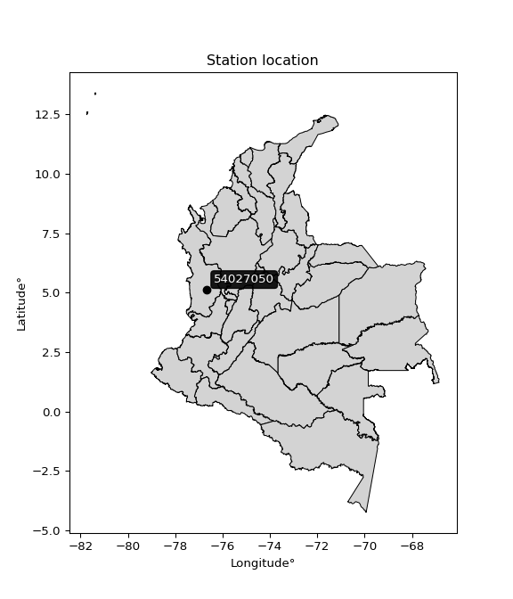

<div align="center">


</div>

# PMP Station (Rain, Pmax24h): 54027050

Probable Maximum Precipitation (PMP) is the greatest amount of rainfall for a specific duration that is meteorologically possible for a given location, acting as a "worst-case" scenario for extreme storms, crucial for designing safety-critical infrastructure like bridges, river deviations, dams, spillways, and nuclear plants to prevent catastrophic failure. PMP is calculated by hydrologists using meteorological data to determine the upper limit of extreme rainfall, often leading to the Probable Maximum Flood (PMF) for flood control design, and is increasingly being studied for climate change impacts. Probable Maximum Precipitation (PMP) is the theoretical upper limit of rainfall, a deterministic estimate for extreme events, while probability distributions (like GEV, Gumbel) describe the likelihood and frequency of various precipitation amounts, including rare ones, showing how often events occur, with PMP representing the extreme end of these distributions, used for critical infrastructure design to ensure safety against the worst conceivable weather, unlike standard statistical forecasts which cover typical probabilities.

The most common probability distributions in hydrology, used for analyzing floods, rainfall, and streamflow, include the Normal, Log-Normal, Gumbel, Gamma (including Log-Pearson Type III), and Generalized Extreme Value (GEV) distributions, often chosen based on the data´s skewness and whether modeling extremes or general conditions, with Gumbel and GEV popular for extreme events like floods, while the Normal distribution serves as a baseline, though often requiring transformations for skewed hydrological data. These distributions help in designing water infrastructure, managing water resources, and forecasting hydrologic events.

> Hydrological data often isn´t perfectly normal (it´s skewed), so different distributions are needed for different applications, such as: **Flood Frequency Analysis**: Using Gumbel, GEV, or Log-Pearson Type III for predicting extreme flood magnitudes and their return periods, **Rainfall Analysis**: Normal for annual totals, but Log-Normal, Weibull, or GEV for intensity or extreme daily rainfall, **Streamflow Modeling**: Gamma and Log-Normal for maximum flows, GEV for minimum flows, and Kappa for daily flows.

<div align="center">

</img>

</div>


## A. General information


### 1. General running parameters

• app_version: _v20260108_. • runtime: _2026-01-08 18:05:13.093906_. • Python version: _3.14.0_. • SciPy version: _1.16.3_. • Pandas version: _2.3.3_. • NumPy version: _2.3.5_. • Stations dataset (station_dataset_file): _dataset/pmax24h_in/automatic_colombia_2003_2024.csv_. • Stations catalog (station_catalog_file): _dataset/CNE.xls_. • Minimum year to eval til year_max (date_min): _1900_. • Maximum year to eval since year_min (date_max): _2024_. • Creates, save and include plots into reports (create_plot): _False_. • Plot only fit distributions with Δo > Δ (plot_only_fit): _True_. • Plot only simple graphs avoiding multiple CDFs and multiple Extreme values plots (plot_only_simple): _False_. • Eval low extreme values, if False, evaluates high extreme values (low_extreme): _False_. • Eval every SciPy distribution as logarithmic (pdist_logarithmic_on): _True_. • Standard deviation normalized (ddof): _1.0_. • Return periods to eval in years (Tr): _[2, 2.33, 5, 10, 15, 20, 25, 50, 75, 100, 200, 250, 500, 750, 1000]_. • Minimum data sample per station, 0 means any (minimum_sample): _5_. • Z-Score maximum threshold to adjust a value, 0 means disable (zscore_max): _3.5_. • Z-Score minimum threshold to adjust a value, 0 means disable (zscore_min): _-2.5_. • Avoid zeros, e.g. rain = 0 (avoid_zeros): _True_. • Avoid null values (avoid_nans): _True_. 

:file_folder:Table: [dataset.csv](../../dataset/pmax24h_in/automatic_colombia_2003_2024.csv)

> Delta Degrees of Freedom (DDOF): is a parameter used in the formulas for calculating variance and standard deviation. When ddof=0, the divisor is $N$ (the total number of observations) and this is used when your data set is the entire population. When ddof=1, the divisor is $N-1$ and this is used when your data set is a sample drawn from a larger population. Using $N-1$ provides an unbiased estimate of the population variance (known as Bessel´s correction).


### 2. Station info and location

|   id |   CODIGO | NOMBRE                    | CATEGORIA    | TECNOLOGIA                | ESTADO   | FECHA_INSTALACION   |   FECHA_SUSPENSION |   ALTITUD |   LATITUD |   LONGITUD | DEPARTAMENTO   | MUNICIPIO            | AREA_OPERATIVA                         | ENTIDAD                                                     | AREA_HIDROGRAFICA   | ZONA_HIDROGRAFICA   | SUBZONA_HIDROGRAFICA                 |   CORRIENTE | Catalogo   |   Version |
|-----:|---------:|:--------------------------|:-------------|:--------------------------|:---------|:--------------------|-------------------:|----------:|----------:|-----------:|:---------------|:---------------------|:---------------------------------------|:------------------------------------------------------------|:--------------------|:--------------------|:-------------------------------------|------------:|:-----------|----------:|
|    0 | 54027050 | RIO IRO - AUT  [54027050] | Limnigráfica | Automática con Telemetría | Activa   | 29/12/2017          |                nan |        63 |   5.11662 |   -76.6656 | Choco          | Rio Iró (Santa Rita) | Area Operativa 09 - Cauca-Valle-Caldas | INSTITUTO DE HIDROLOGIA METEOROLOGIA Y ESTUDIOS AMBIENTALES | Pacifico            | San Juán            | Río Tamaná y otros Directos San Juan |         nan | CNE_IDEAM  |  20251226 |

<div align="center">

Dynamic map: [:earth_americas:Google](http://maps.google.com/maps?q=5.116622222,-76.665580556) [:earth_americas:OSM](https://www.openstreetmap.org/#map=18/5.116622222/-76.665580556&layers=P) [:earth_americas:Bing](https://www.bing.com/maps?cp=5.116622222~-76.665580556&lvl=18) [:earth_americas:Apple](https://maps.apple.com/frame?center=5.116622222%2C-76.665580556&span=0.003%2C0.006)

</div>


<div align="center">

```geojson
{
  "type": "Feature",
  "geometry": {
    "type": "Point", 
    "coordinates": [-76.665580556, 5.116622222]
  }, 
  "properties": {
    "Name": "54027050"
  }
}
```

</div>


### 3. Discrete values table and plot

<div align="center">

|               |           0 |           1 |           2 |           3 |          4 |
|:--------------|------------:|------------:|------------:|------------:|-----------:|
| Date          | 2018        | 2019        | 2021        | 2022        | 2024       |
| Value         |   99.3      |   99.5      |  401.4      |   55.1      |  736.4     |
| Value_initial |   99.3      |   99.5      |  401.4      |   55.1      |  736.4     |
| count         |    5        |    5        |    5        |    5        |    5       |
| mean          |  278.34     |  278.34     |  278.34     |  278.34     |  278.34    |
| std           |  291.049    |  291.049    |  291.049    |  291.049    |  291.049   |
| zscore        |   -0.615154 |   -0.614467 |    0.422816 |   -0.767019 |    1.57382 |


</div>


> The initial value (value_initial) correspond to the initial obtained or null completed value, and value (value) is adjusted only when the initial value is outside the valid range (outlier) definite through the Z-Score value. If Z-Score is active, values out of range or outliers are replaced with the station mean value. A Z-Score (or standard score) measures how many standard deviations a data point is from the mean of a dataset, indicating its relative position; positive scores mean above the mean, negative mean below, and a score of zero is exactly at the mean, allowing for comparison of values from different distributions. It´s calculated using the formula $z=(x–μ)/σ$, where $x$ is the data point, $μ$ is the mean, and $σ$ is the standard deviation, helping identify outliers and understand probability.
>
> <sub>**Note**: In this study, "completing" (filling gaps in) and "extending" (forecasting or lengthening the historical record) rainfall data series are avoided for certain critical analyses because they introduce artificial bias and uncertainty, which can distort the statistics of rare events (extremes), alter day-to-day variability, and compromise the integrity and homogeneity of the original data. Some reasons against Completing/Extending rainfall data are: **Distortion of Extremes and Variability**: The primary issue is that most gap-filling or extension methods rely on averaging or regression with nearby stations, which inherently smooths the data. Rainfall is highly variable in space and time, with a large percentage of zero values and occasional large storms. Infilling methods often underestimate the highest values and overestimate the lowest (zero) values, which severely distorts analyses focused on flood frequency, drought severity, and intensity-duration-frequency (IDF) curves, **Loss of Data Homogeneity**: Infilled or extended data are synthetic estimates, not actual measurements. Combining these estimates with observed data can violate the assumption of data homogeneity, which requires that the data properties do not change over time. Inhomogeneity can lead to incorrect conclusions about long-term trends or changes in climate patterns, **Propagation of Errors**: Errors and biases from the original data (e.g., wind-induced undercatch, instrument errors, site changes) or the data used for imputation can propagate through the analysis, leading to unreliable hydrological models and inaccurate predictions, **Compromised Statistical Integrity**: For statistical analyses, especially those involving the frequency of events, using artificial data can introduce time bias or autocorrelation that doesn´t exist in reality, making it difficult to assess the true probability of events, **Difficulty in Validation**: It is difficult to accurately validate the quality of filled or extended data, especially for past periods where ground-truth measurements are unavailable. The reliability of imputation techniques heavily depends on the density of the surrounding station network and the complexity of the local topography.</sub>


### 4. Active continuous probability distributions from SciPy (43 of 104 available)

A Probability Density Function (PDF) describes the relative likelihood of a continuous random variable falling within a specific range, where the total area under its curve equals 1, and the area over any interval gives the actual probability for that range. Unlike discrete probabilities (like rolling a die), a PDF shows density, not direct probability for a single point (which is zero), with higher points indicating higher likelihood, often visualized as a bell curve for normal distributions.

A log of a probability density function (log-PDF) is simply the logarithm of the PDF´s value, denoted as $log(f(x))$, useful for converting multiplication of probabilities into addition, improving numerical stability with tiny numbers, and connecting to information theory concepts like entropy. Instead of dealing with very small probabilities (e.g., 0.000001), log-PDFs use negative numbers (e.g., $log(0.00001) ≈ -11.51$ that are easier for computers to handle, preventing underflow errors and simplifying complex calculations. In this study, each active probability distribution from SciPy is also evaluated in the $log$ form.

[scipy.stats](https://docs.scipy.org/doc/scipy/reference/stats.html) is a Python´s powerful submodule within the SciPy library for comprehensive statistical analysis, offering over 130 probability distributions (like Normal, Poisson), functions for descriptive stats (mean, variance), hypothesis testing (t-tests, chi-square), random variable generation, and statistical tests, making it essential for data science, modeling, and research. It provides tools to explore, model, and draw conclusions from data efficiently, working seamlessly with NumPy.

<div align="center">

|   id | p_dist             |   n_parameter | fit_method   | label                                                                       | active   | ref                                                                                                        |
|-----:|:-------------------|--------------:|:-------------|:----------------------------------------------------------------------------|:---------|:-----------------------------------------------------------------------------------------------------------|
|    0 | alpha              |             3 | MLE          | Alpha                                                                       | True     | [:mortar_board:](https://docs.scipy.org/doc/scipy/reference/generated/scipy.stats.alpha.html)              |
|    1 | betaprime          |             4 | MLE          | Beta prime                                                                  | True     | [:mortar_board:](https://docs.scipy.org/doc/scipy/reference/generated/scipy.stats.betaprime.html)          |
|    2 | chi2               |             3 | MLE          | Chi²                                                                        | True     | [:mortar_board:](https://docs.scipy.org/doc/scipy/reference/generated/scipy.stats.chi2.html)               |
|    3 | crystalball        |             4 | MLE          | Crystalball                                                                 | True     | [:mortar_board:](https://docs.scipy.org/doc/scipy/reference/generated/scipy.stats.crystalball.html)        |
|    4 | erlang             |             3 | MLE          | Erlang                                                                      | True     | [:mortar_board:](https://docs.scipy.org/doc/scipy/reference/generated/scipy.stats.erlang.html)             |
|    5 | expon              |             2 | MLE          | Exponential                                                                 | True     | [:mortar_board:](https://docs.scipy.org/doc/scipy/reference/generated/scipy.stats.expon.html)              |
|    6 | exponnorm          |             3 | MLE          | Exponentially modified Normal                                               | True     | [:mortar_board:](https://docs.scipy.org/doc/scipy/reference/generated/scipy.stats.exponnorm.html)          |
|    7 | f                  |             4 | MLE          | F                                                                           | True     | [:mortar_board:](https://docs.scipy.org/doc/scipy/reference/generated/scipy.stats.f.html)                  |
|    8 | fatiguelife        |             3 | MLE          | Fatigue-life (Birnbaum-Saunders)                                            | True     | [:mortar_board:](https://docs.scipy.org/doc/scipy/reference/generated/scipy.stats.fatiguelife.html)        |
|    9 | fisk               |             3 | MLE          | Fisk                                                                        | True     | [:mortar_board:](https://docs.scipy.org/doc/scipy/reference/generated/scipy.stats.fisk.html)               |
|   10 | gamma              |             3 | MLE          | Gamma                                                                       | True     | [:mortar_board:](https://docs.scipy.org/doc/scipy/reference/generated/scipy.stats.gamma.html)              |
|   11 | genexpon           |             5 | MLE          | Generalized exponential                                                     | True     | [:mortar_board:](https://docs.scipy.org/doc/scipy/reference/generated/scipy.stats.genexpon.html)           |
|   12 | genlogistic        |             3 | MLE          | Generalized logistic                                                        | True     | [:mortar_board:](https://docs.scipy.org/doc/scipy/reference/generated/scipy.stats.genlogistic.html)        |
|   13 | gibrat             |             2 | MM           | Gibrat                                                                      | True     | [:mortar_board:](https://docs.scipy.org/doc/scipy/reference/generated/scipy.stats.gibrat.html)             |
|   14 | gompertz           |             3 | MLE          | Gompertz (or truncated Gumbel)                                              | True     | [:mortar_board:](https://docs.scipy.org/doc/scipy/reference/generated/scipy.stats.gompertz.html)           |
|   15 | gumbel_l           |             2 | MM           | Gumbel Left Skew                                                            | True     | [:mortar_board:](https://docs.scipy.org/doc/scipy/reference/generated/scipy.stats.gumbel_l.html)           |
|   16 | gumbel_r           |             2 | MM           | Gumbel Right Skew                                                           | True     | [:mortar_board:](https://docs.scipy.org/doc/scipy/reference/generated/scipy.stats.gumbel_r.html)           |
|   17 | halflogistic       |             2 | MM           | Half-logistic                                                               | True     | [:mortar_board:](https://docs.scipy.org/doc/scipy/reference/generated/scipy.stats.halflogistic.html)       |
|   18 | halfnorm           |             2 | MM           | Half Normal                                                                 | True     | [:mortar_board:](https://docs.scipy.org/doc/scipy/reference/generated/scipy.stats.halfnorm.html)           |
|   19 | hypsecant          |             2 | MM           | hyperbolic secant                                                           | True     | [:mortar_board:](https://docs.scipy.org/doc/scipy/reference/generated/scipy.stats.hypsecant.html)          |
|   20 | invgamma           |             3 | MLE          | Inverted gamma                                                              | True     | [:mortar_board:](https://docs.scipy.org/doc/scipy/reference/generated/scipy.stats.invgamma.html)           |
|   21 | invgauss           |             3 | MLE          | Inverse Gaussian                                                            | True     | [:mortar_board:](https://docs.scipy.org/doc/scipy/reference/generated/scipy.stats.invgauss.html)           |
|   22 | invweibull         |             3 | MLE          | Inverted Weibull                                                            | True     | [:mortar_board:](https://docs.scipy.org/doc/scipy/reference/generated/scipy.stats.invweibull.html)         |
|   23 | kstwobign          |             2 | MLE          | Limiting distribution of scaled Kolmogorov-Smirnov two-sided test statistic | True     | [:mortar_board:](https://docs.scipy.org/doc/scipy/reference/generated/scipy.stats.kstwobign.html)          |
|   24 | laplace            |             2 | MM           | Laplace                                                                     | True     | [:mortar_board:](https://docs.scipy.org/doc/scipy/reference/generated/scipy.stats.laplace.html)            |
|   25 | laplace_asymmetric |             3 | MLE          | Asymmetric Laplace                                                          | True     | [:mortar_board:](https://docs.scipy.org/doc/scipy/reference/generated/scipy.stats.laplace_asymmetric.html) |
|   26 | loggamma           |             3 | MLE          | Log gamma                                                                   | True     | [:mortar_board:](https://docs.scipy.org/doc/scipy/reference/generated/scipy.stats.loggamma.html)           |
|   27 | logistic           |             2 | MM           | Logistic (or Sech-squared)                                                  | True     | [:mortar_board:](https://docs.scipy.org/doc/scipy/reference/generated/scipy.stats.logistic.html)           |
|   28 | lognorm            |             3 | MLE          | Log Normal                                                                  | True     | [:mortar_board:](https://docs.scipy.org/doc/scipy/reference/generated/scipy.stats.lognorm.html)            |
|   29 | maxwell            |             2 | MM           | Maxwell                                                                     | True     | [:mortar_board:](https://docs.scipy.org/doc/scipy/reference/generated/scipy.stats.maxwell.html)            |
|   30 | mielke             |             4 | MLE          | Mielke Beta-Kappa / Dagum                                                   | True     | [:mortar_board:](https://docs.scipy.org/doc/scipy/reference/generated/scipy.stats.mielke.html)             |
|   31 | moyal              |             2 | MM           | Moyal                                                                       | True     | [:mortar_board:](https://docs.scipy.org/doc/scipy/reference/generated/scipy.stats.moyal.html)              |
|   32 | nakagami           |             3 | MLE          | Nakagami                                                                    | True     | [:mortar_board:](https://docs.scipy.org/doc/scipy/reference/generated/scipy.stats.nakagami.html)           |
|   33 | ncf                |             5 | MLE          | Non-central F distribution                                                  | True     | [:mortar_board:](https://docs.scipy.org/doc/scipy/reference/generated/scipy.stats.ncf.html)                |
|   34 | nct                |             4 | MLE          | Non-central Student’s t                                                     | True     | [:mortar_board:](https://docs.scipy.org/doc/scipy/reference/generated/scipy.stats.nct.html)                |
|   35 | norm               |             2 | MM           | Normal                                                                      | True     | [:mortar_board:](https://docs.scipy.org/doc/scipy/reference/generated/scipy.stats.norm.html)               |
|   36 | pearson3           |             3 | MM           | Pearson type III                                                            | True     | [:mortar_board:](https://docs.scipy.org/doc/scipy/reference/generated/scipy.stats.pearson3.html)           |
|   37 | rayleigh           |             2 | MM           | Rayleigh                                                                    | True     | [:mortar_board:](https://docs.scipy.org/doc/scipy/reference/generated/scipy.stats.rayleigh.html)           |
|   38 | rice               |             3 | MLE          | Rice                                                                        | True     | [:mortar_board:](https://docs.scipy.org/doc/scipy/reference/generated/scipy.stats.rice.html)               |
|   39 | t                  |             3 | MLE          | Student’s t                                                                 | True     | [:mortar_board:](https://docs.scipy.org/doc/scipy/reference/generated/scipy.stats.t.html)                  |
|   40 | truncnorm          |             4 | MLE          | Truncated normal                                                            | True     | [:mortar_board:](https://docs.scipy.org/doc/scipy/reference/generated/scipy.stats.truncnorm.html)          |
|   41 | wald               |             2 | MM           | Wald                                                                        | True     | [:mortar_board:](https://docs.scipy.org/doc/scipy/reference/generated/scipy.stats.wald.html)               |
|   42 | weibull_min        |             3 | MLE          | Weibull minimum                                                             | True     | [:mortar_board:](https://docs.scipy.org/doc/scipy/reference/generated/scipy.stats.weibull_min.html)        |

</div>

> **n_parameter:** # arguments & localization & scale.
>
> **Fit methods:** (MLE) maximum likelihood, (MM) L-moments.
>
>**Inactive** (With the only purpose of prevent loops, zero divisions, infinite values, over high estimated values or horizontal trending for recurrence intervals estimations, the follow distributions were disabled.)**:** foldnorm, gennorm, norminvgauss, powernorm, powerlognorm, skewnorm, genextreme, anglit, arcsine, argus, beta, bradford, burr, burr12, cauchy, cosine, halfcauchy, foldcauchy, skewcauchy, wrapcauchy, dgamma, gengamma, exponweib, exponpow, truncexpon, gausshyper, genhalflogistic, genhyperbolic, geninvgauss, halfgennorm, johnsonsb, johnsonsu, kappa4, kappa3, ksone, kstwo, loglaplace, levy, levy_l, levy_stable, ncx2, pareto, genpareto, truncpareto, lomax, powerlaw, rdist, rel_breitwigner, recipinvgauss, semicircular, studentized_range, trapezoid, triang, truncweibull_min, tukeylambda, uniform, loguniform, vonmises, vonmises_line, weibull_max, dweibull, 


## B. Probability (PDF) vs. Empirical (EDF) distributions functions

A continuous probability distribution (CPD) describes probabilities for variables that can take any value within a range (like rain any time), unlike discrete variables with specific outcomes (like temperature). It uses a Probability Density Function (PDF), a curve where the total area under it equals 1, and the probability of the variable falling within an interval (a to b) is found by calculating the area under the curve between those points. A key feature is that the probability of hitting any single exact value is zero, so probabilities are always expressed for ranges, e.g., $P(a ≤ X ≤ b)$.

<div align="center">

Distributions parameters from station values
|    |   station | p_dist                |   n |             loc |           scale | shape                  | shape1             | shape2                 | shape3   |
|---:|----------:|:----------------------|----:|----------------:|----------------:|:-----------------------|:-------------------|:-----------------------|:---------|
|  0 |  54027050 | alpha                 |   5 |      16.7907    |    71.3144      | 1.5229104385880012e-06 |                    |                        |          |
|  1 |  54027050 | betaprime             |   5 |      -0.530899  |     0.873818    | 200.4117014537096      | 1.4550640051376282 |                        |          |
|  2 |  54027050 | chi2                  |   5 |      55.1       |   186.707       | 0.7323621520621038     |                    |                        |          |
|  3 |  54027050 | crystalball           |   5 |      -0.233587  |   381.198       | 4.5593611201372894     | 2.2316559731741408 |                        |          |
|  4 |  54027050 | erlang                |   5 |      55.1       |   270.158       | 0.12473981976190526    |                    |                        |          |
|  5 |  54027050 | expon                 |   5 |      55.1       |   223.24        |                        |                    |                        |          |
|  6 |  54027050 | exponnorm             |   5 |      54.8947    |     0.0621271   | 3609.737707939921      |                    |                        |          |
|  7 |  54027050 | f                     |   5 |      42.0068    |    44.6663      | 55.72181535361295      | 1.4348122100557985 |                        |          |
|  8 |  54027050 | fatiguelife           |   5 |      55.1       |     5.61015e-05 | 1875.7357695824094     |                    |                        |          |
|  9 |  54027050 | fisk                  |   5 |      55.1       |    72.952       | 0.7594657072038675     |                    |                        |          |
| 10 |  54027050 | gamma                 |   5 |      55.1       |   187.877       | 0.1265258011932986     |                    |                        |          |
| 11 |  54027050 | genexpon              |   5 |      55.1       |   733.746       | 3.286807100711568      | 0.9583069714980428 | 3.7546457230452976e-11 |          |
| 12 |  54027050 | genlogistic           |   5 |   -1167.33      |   174.971       | 1993.6907640330464     |                    |                        |          |
| 13 |  54027050 | gibrat                |   5 |      79.747     |   120.453       |                        |                    |                        |          |
| 14 |  54027050 | gompertz              |   5 |      55.0997    |     1.14775e+06 | 5049.552312438638      |                    |                        |          |
| 15 |  54027050 | gumbel_l              |   5 |     395.499     |   202.972       |                        |                    |                        |          |
| 16 |  54027050 | gumbel_r              |   5 |     161.181     |   202.972       |                        |                    |                        |          |
| 17 |  54027050 | halflogistic          |   5 |     -30.2021    |   222.566       |                        |                    |                        |          |
| 18 |  54027050 | halfnorm              |   5 |     -66.2244    |   431.847       |                        |                    |                        |          |
| 19 |  54027050 | hypsecant             |   5 |     278.34      |   165.726       |                        |                    |                        |          |
| 20 |  54027050 | invgamma              |   5 |      41.6455    |    31.6841      | 0.7171578966473904     |                    |                        |          |
| 21 |  54027050 | invgauss              |   5 |      43.2561    |    48.5341      | 4.843682569870271      |                    |                        |          |
| 22 |  54027050 | invweibull            |   5 |      55.1       |     7.0151      | 0.04262660091498227    |                    |                        |          |
| 23 |  54027050 | kstwobign             |   5 |    -455.062     |   843.928       |                        |                    |                        |          |
| 24 |  54027050 | laplace               |   5 |     278.34      |   184.075       |                        |                    |                        |          |
| 25 |  54027050 | laplace_asymmetric    |   5 |      55.1       |     1.71282     | 0.007672899243402404   |                    |                        |          |
| 26 |  54027050 | loggamma              |   5 |  -82535.2       | 11097.9         | 1741.1778627268914     |                    |                        |          |
| 27 |  54027050 | logistic              |   5 |     278.34      |   143.523       |                        |                    |                        |          |
| 28 |  54027050 | lognorm               |   5 |      55.1       |     0.080064    | 15.066128031048228     |                    |                        |          |
| 29 |  54027050 | maxwell               |   5 |    -338.514     |   386.556       |                        |                    |                        |          |
| 30 |  54027050 | mielke                |   5 |      -0.555624  |     3.34101     | 131.28520248181894     | 1.313690543285945  |                        |          |
| 31 |  54027050 | moyal                 |   5 |     129.471     |   117.186       |                        |                    |                        |          |
| 32 |  54027050 | nakagami              |   5 |      55.1       |   370.067       | 0.05208334989857222    |                    |                        |          |
| 33 |  54027050 | ncf                   |   5 |      -1.05574   |   121.471       | 158.00692701823175     | 2.9459708121428463 | 1.2461580036072547e-08 |          |
| 34 |  54027050 | nct                   |   5 |      -0.232631  |     2.11102     | 1.062310373988391      | 45.76184039799304  |                        |          |
| 35 |  54027050 | norm                  |   5 |     278.34      |   260.322       |                        |                    |                        |          |
| 36 |  54027050 | pearson3              |   5 |     278.34      |   260.322       | 0.85467974122485       |                    |                        |          |
| 37 |  54027050 | rayleigh              |   5 |    -219.671     |   397.356       |                        |                    |                        |          |
| 38 |  54027050 | rice                  |   5 |    -125.409     |   339.692       | 0.000556292234004867   |                    |                        |          |
| 39 |  54027050 | t                     |   5 |      99.5       |     1.41267e-05 | 0.10886307392075698    |                    |                        |          |
| 40 |  54027050 | truncnorm             |   5 | -791078         | 14358.2         | 55.09978220613951      | 773.7917710950858  |                        |          |
| 41 |  54027050 | wald                  |   5 |      18.0179    |   260.322       |                        |                    |                        |          |
| 42 |  54027050 | weibull_min           |   5 |      55.1       |   449.292       | 0.12640182594055066    |                    |                        |          |
| 43 |  54027050 | logalpha              |   5 |       1.48743   |    13.6341      | 3.971914085960343      |                    |                        |          |
| 44 |  54027050 | logbetaprime          |   5 |      -0.41905   |     1.72732     | 145.07959950544512     | 46.024313236768904 |                        |          |
| 45 |  54027050 | logchi2               |   5 |       4.00915   |     0.941919    | 1.063062477773157      |                    |                        |          |
| 46 |  54027050 | logcrystalball        |   5 |       5.16084   |     0.972566    | 7.74159028941623       | 5.015787253709736  |                        |          |
| 47 |  54027050 | logerlang             |   5 |       4.00915   |     1.25056     | 0.5028238599897965     |                    |                        |          |
| 48 |  54027050 | logexpon              |   5 |       4.00915   |     1.15169     |                        |                    |                        |          |
| 49 |  54027050 | logexponnorm          |   5 |       4.0079    |     0.000369571 | 3113.251979013272      |                    |                        |          |
| 50 |  54027050 | logf                  |   5 |       3.12965   |     1.59591     | 3107.488905671368      | 8.607385134704941  |                        |          |
| 51 |  54027050 | logfatiguelife        |   5 |       3.80685   |     0.892999    | 0.997718395852967      |                    |                        |          |
| 52 |  54027050 | logfisk               |   5 |       4.00915   |     0.819603    | 0.32767281959894323    |                    |                        |          |
| 53 |  54027050 | loggamma              |   5 |       4.00915   |     1.1996      | 0.6989563581329357     |                    |                        |          |
| 54 |  54027050 | loggenexpon           |   5 |       4.00915   |     1.41406     | 1.096773411265788      | 0.516032524449191  | 0.421053791452607      |          |
| 55 |  54027050 | loggenlogistic        |   5 |      -0.572854  |     0.766616    | 966.654310145374       |                    |                        |          |
| 56 |  54027050 | loggibrat             |   5 |       4.41891   |     0.450003    |                        |                    |                        |          |
| 57 |  54027050 | loggompertz           |   5 |       4.00915   |     3.23498     | 2.0190820228741395     |                    |                        |          |
| 58 |  54027050 | loggumbel_l           |   5 |       5.59854   |     0.758307    |                        |                    |                        |          |
| 59 |  54027050 | loggumbel_r           |   5 |       4.72313   |     0.758307    |                        |                    |                        |          |
| 60 |  54027050 | loghalflogistic       |   5 |       4.00812   |     0.831509    |                        |                    |                        |          |
| 61 |  54027050 | loghalfnorm           |   5 |       3.87354   |     1.61339     |                        |                    |                        |          |
| 62 |  54027050 | loghypsecant          |   5 |       5.16084   |     0.619155    |                        |                    |                        |          |
| 63 |  54027050 | loginvgamma           |   5 |       3.12745   |     6.87552     | 4.303657426153858      |                    |                        |          |
| 64 |  54027050 | loginvgauss           |   5 |       3.60263   |     2.48817     | 0.6262477328701541     |                    |                        |          |
| 65 |  54027050 | loginvweibull         |   5 |       1.77108   |     2.83466     | 4.177393418196186      |                    |                        |          |
| 66 |  54027050 | logkstwobign          |   5 |       2.05774   |     3.54805     |                        |                    |                        |          |
| 67 |  54027050 | loglaplace            |   5 |       5.16084   |     0.687708    |                        |                    |                        |          |
| 68 |  54027050 | loglaplace_asymmetric |   5 |       4.59815   |     0.621761    | 0.6451915346559258     |                    |                        |          |
| 69 |  54027050 | logloggamma           |   5 |    -290.397     |    39.8477      | 1664.7311402577898     |                    |                        |          |
| 70 |  54027050 | loglogistic           |   5 |       5.16084   |     0.536204    |                        |                    |                        |          |
| 71 |  54027050 | loglognorm            |   5 |       4.00915   |     0.00109743  | 13.934569085310297     |                    |                        |          |
| 72 |  54027050 | logmaxwell            |   5 |       2.85626   |     1.44418     |                        |                    |                        |          |
| 73 |  54027050 | logmielke             |   5 |       1.41495   |     1.2793      | 334.5827577147585      | 4.657732045393292  |                        |          |
| 74 |  54027050 | logmoyal              |   5 |       4.60466   |     0.437809    |                        |                    |                        |          |
| 75 |  54027050 | lognakagami           |   5 |       4.00915   |     2.00211     | 0.059055278566503604   |                    |                        |          |
| 76 |  54027050 | logncf                |   5 |      -0.753325  |     5.87344     | 101.8165892276084      | 293.6528573149184  | 4.745496390614253e-10  |          |
| 77 |  54027050 | lognct                |   5 |      -0.0305709 |     0.099325    | 15.901838874486103     | 49.72470830113056  |                        |          |
| 78 |  54027050 | lognorm               |   5 |       5.16084   |     0.972566    |                        |                    |                        |          |
| 79 |  54027050 | logpearson3           |   5 |       5.16084   |     0.972565    | 0.3674783097323493     |                    |                        |          |
| 80 |  54027050 | lograyleigh           |   5 |       3.30026   |     1.48452     |                        |                    |                        |          |
| 81 |  54027050 | logrice               |   5 |       3.49409   |     1.32776     | 0.33518852697244284    |                    |                        |          |
| 82 |  54027050 | logt                  |   5 |       5.16083   |     0.972551    | 237877370.90767065     |                    |                        |          |
| 83 |  54027050 | logtruncnorm          |   5 |      -0.227042  |     2.19229     | 2.2009802348832164     | 11.126454316265313 |                        |          |
| 84 |  54027050 | logwald               |   5 |       4.18831   |     0.972526    |                        |                    |                        |          |
| 85 |  54027050 | logweibull_min        |   5 |       4.00915   |     0.373823    | 0.7894282240833692     |                    |                        |          |

</div>

> **loc** (Location parameter): This shifts the distribution along the x-axis. For many common distributions, like the normal (Gaussian) distribution, loc represents the mean $μ$. For others, like the uniform distribution, it might represent the minimum value, or for the beta distribution, the left end of the support interval.
>
> **scale** (Scale parameter): This determines the width or spread of the distribution. For the normal distribution, scale represents the standard deviation $σ$. For a uniform distribution, it defines the length of the interval (from $loc$ to $loc + scale$).
>
> **shape** (Shape parameters): Refers to parameters that define the specific form of a probability distribution, distinct from its location (loc) and scale (scale). These parameters are required arguments for most distribution functions. For example, a normal (Gaussian) distribution is fully defined by its location (mean) and scale (standard deviation), so it has no specific shape parameters beyond loc and scale. However, other distributions have intrinsic properties that need specification, as Gamma distribution that takes a shape parameter, often named $a$ or $alpha$.


### 0. Cumulative distribution values - CDF (86 evaluated)

Cumulative Distribution Function (CDF), denoted as $F$<sub>$X$</sub>$(x)$, is a function that gives the probability that a random variable $X$ will take a value less than or equal to a specific value, $x$ (i.e., $(P(X≥x)$. It essentially "accumulates" probabilities from a given point up to the far right (positive infinity), providing a complete picture of the distribution´s probabilities for both discrete (like rain) and continuous (like temperature) variables, helping to find probabilities over ranges or above certain values. Each station is evaluated separately ordering the $x$ values ascending, calculating the CDF and PDF values for the activated distributions and their logarithmic forms.

<div align="center">

CDF ordered by x ascending and calculating $log(f(x))$ separately
|   id |   Station |   date |     x |   count |   mean |     std |    zscore |   Value_initial |   station |   m |     alpha |   alpha_pdf |   betaprime |   betaprime_pdf |        chi2 |    chi2_pdf |   crystalball |   crystalball_pdf |     erlang |   erlang_pdf |    expon |   expon_pdf |   exponnorm |   exponnorm_pdf |        f |       f_pdf |   fatiguelife |   fatiguelife_pdf |        fisk |     fisk_pdf |      gamma |   gamma_pdf |    genexpon |   genexpon_pdf |   genlogistic |   genlogistic_pdf |    gibrat |   gibrat_pdf |    gompertz |   gompertz_pdf |   gumbel_l |   gumbel_l_pdf |   gumbel_r |   gumbel_r_pdf |   halflogistic |   halflogistic_pdf |   halfnorm |   halfnorm_pdf |   hypsecant |   hypsecant_pdf |   invgamma |   invgamma_pdf |   invgauss |   invgauss_pdf |   invweibull |   invweibull_pdf |   kstwobign |   kstwobign_pdf |   laplace |   laplace_pdf |   laplace_asymmetric |   laplace_asymmetric_pdf |    loggamma |   loggamma_pdf |   logistic |   logistic_pdf |   lognorm |   lognorm_pdf |   maxwell |   maxwell_pdf |    mielke |   mielke_pdf |    moyal |   moyal_pdf |   nakagami |   nakagami_pdf |       ncf |     ncf_pdf |       nct |     nct_pdf |     norm |    norm_pdf |   pearson3 |   pearson3_pdf |   rayleigh |   rayleigh_pdf |     rice |    rice_pdf |         t |          t_pdf |   truncnorm |   truncnorm_pdf |     wald |    wald_pdf |   weibull_min |   weibull_min_pdf |   logalpha |   logalpha_pdf |   logbetaprime |   logbetaprime_pdf |     logchi2 |   logchi2_pdf |   logcrystalball |   logcrystalball_pdf |   logerlang |   logerlang_pdf |   logexpon |   logexpon_pdf |   logexponnorm |   logexponnorm_pdf |     logf |   logf_pdf |   logfatiguelife |   logfatiguelife_pdf |     logfisk |   logfisk_pdf |   loggenexpon |   loggenexpon_pdf |   loggenlogistic |   loggenlogistic_pdf |   loggibrat |   loggibrat_pdf |   loggompertz |   loggompertz_pdf |   loggumbel_l |   loggumbel_l_pdf |   loggumbel_r |   loggumbel_r_pdf |   loghalflogistic |   loghalflogistic_pdf |   loghalfnorm |   loghalfnorm_pdf |   loghypsecant |   loghypsecant_pdf |   loginvgamma |   loginvgamma_pdf |   loginvgauss |   loginvgauss_pdf |   loginvweibull |   loginvweibull_pdf |   logkstwobign |   logkstwobign_pdf |   loglaplace |   loglaplace_pdf |   loglaplace_asymmetric |   loglaplace_asymmetric_pdf |   logloggamma |   logloggamma_pdf |   loglogistic |   loglogistic_pdf |   loglognorm |   loglognorm_pdf |   logmaxwell |   logmaxwell_pdf |   logmielke |   logmielke_pdf |   logmoyal |   logmoyal_pdf |   lognakagami |   lognakagami_pdf |   logncf |   logncf_pdf |    lognct |   lognct_pdf |   logpearson3 |   logpearson3_pdf |   lograyleigh |   lograyleigh_pdf |   logrice |   logrice_pdf |     logt |   logt_pdf |   logtruncnorm |   logtruncnorm_pdf |   logwald |   logwald_pdf |   logweibull_min |   logweibull_min_pdf |
|-----:|----------:|-------:|------:|--------:|-------:|--------:|----------:|----------------:|----------:|----:|----------:|------------:|------------:|----------------:|------------:|------------:|--------------:|------------------:|-----------:|-------------:|---------:|------------:|------------:|----------------:|---------:|------------:|--------------:|------------------:|------------:|-------------:|-----------:|------------:|------------:|---------------:|--------------:|------------------:|----------:|-------------:|------------:|---------------:|-----------:|---------------:|-----------:|---------------:|---------------:|-------------------:|-----------:|---------------:|------------:|----------------:|-----------:|---------------:|-----------:|---------------:|-------------:|-----------------:|------------:|----------------:|----------:|--------------:|---------------------:|-------------------------:|------------:|---------------:|-----------:|---------------:|----------:|--------------:|----------:|--------------:|----------:|-------------:|---------:|------------:|-----------:|---------------:|----------:|------------:|----------:|------------:|---------:|------------:|-----------:|---------------:|-----------:|---------------:|---------:|------------:|----------:|---------------:|------------:|----------------:|---------:|------------:|--------------:|------------------:|-----------:|---------------:|---------------:|-------------------:|------------:|--------------:|-----------------:|---------------------:|------------:|----------------:|-----------:|---------------:|---------------:|-------------------:|---------:|-----------:|-----------------:|---------------------:|------------:|--------------:|--------------:|------------------:|-----------------:|---------------------:|------------:|----------------:|--------------:|------------------:|--------------:|------------------:|--------------:|------------------:|------------------:|----------------------:|--------------:|------------------:|---------------:|-------------------:|--------------:|------------------:|--------------:|------------------:|----------------:|--------------------:|---------------:|-------------------:|-------------:|-----------------:|------------------------:|----------------------------:|--------------:|------------------:|--------------:|------------------:|-------------:|-----------------:|-------------:|-----------------:|------------:|----------------:|-----------:|---------------:|--------------:|------------------:|---------:|-------------:|----------:|-------------:|--------------:|------------------:|--------------:|------------------:|----------:|--------------:|---------:|-----------:|---------------:|-------------------:|----------:|--------------:|-----------------:|---------------------:|
|    0 |  54027050 |   2022 |  55.1 |       5 | 278.34 | 291.049 | -0.767019 |            55.1 |  54027050 |   1 | 0.0626679 | 0.00685521  |   0.0937907 |     0.00463932  | 8.47268e-07 | 4.36643e+07 |      0.557708 |       0.00103558  | 0.00907474 |  1.59312e+11 | 0        | 0.00447948  | 0.000915072 |     0.00445286  | 0.054935 | 0.0102562   |     0.0698687 |       1.35401e+10 | 4.27324e-12 | 41.5224      | 0.00888141 | 1.58151e+11 | 1.14965e-13 |    0.00447949  |      0.158504 |       0.00166785  | 0         |  0           | 1.18427e-06 |    0.00439953  |   0.170491 |    0.00076391  |   0.185172 |    0.00153857  |       0.189321 |        0.002166    |   0.221246 |    0.00177611  |    0.161941 |     0.000935548 |  0.0536657 |    0.0102516   |  0.0525796 |    0.0107465   |     0.01282  |      3.35075e+11 |    0.141743 |     0.00159814  |  0.148687 |   0.000807751 |          5.88725e-05 |              0.00447941  | 2.92496e-11 |  23018.1       |   0.174303 |    0.00100278  |  0.118172 |      0.203466 |  0.207664 |   0.00127437  | 0.0861124 |  0.00492347  | 0.169615 | 0.00182066  |  0.0159937 |    2.34471e+11 | 0.0956949 | 0.00462051  | 0.0786101 | 0.00553471  | 0.19557  | 0.00106099  |   0.199101 |    0.00145563  |   0.212653 |    0.00137018  | 0.131674 | 0.00135835  | 0.0809871 |    0.00019857  | 6.82121e-13 |     0.00383878  | 0.020665 | 0.00215712  |    0.00749374 |       1.32809e+11 |  0.0756813 |      0.305603  |       0.101958 |           0.245432 | 8.03931e-09 |   4.81113e+06 |         0.118172 |             0.203466 | 2.72476e-08 |     1.54257e+07 |   0        |      0.868291  |     0.00108819 |          0.867885  | 0.064104 |   0.361001 |        0.0516783 |            0.67595   | 1.24835e-05 |   4.60545e+09 |   2.81059e-11 |         0.775618  |        0.0863859 |            0.275608  |    0        |       0         |   5.45866e-11 |          0.62414  |      0.115692 |          0.14338  |     0.0770005 |          0.26035  |       0.000619025 |             0.601316  |     0.0669852 |          0.492796 |      0.0983059 |          0.156262  |     0.0641039 |         0.361002  |     0.0558179 |         0.456214  |        0.068317 |           0.342199  |      0.0771772 |           0.283051 |    0.0936846 |        0.136227  |               0.0676982 |                   0.168758  |      0.119981 |          0.202825 |      0.104532 |          0.17457  |    0.0228533 |      4.37907e+12 |     0.112153 |         0.256016 |   0.0727933 |       0.336271  |  0.0483721 |      0.25631   |     0.0134177 |        1.7843e+12 | 0.107734 |     0.230455 | 0.0938257 |     0.264702 |      0.111146 |          0.229572 |      0.107753 |          0.287004 | 0.0686638 |      0.257267 | 0.11817  |   0.203467 |    0           |           0        |  0        |     0         |       2.8528e-12 |         2535.62      |
|    1 |  54027050 |   2018 |  99.3 |       5 | 278.34 | 291.049 | -0.615154 |            99.3 |  54027050 |   2 | 0.387413  | 0.00575297  |   0.307136  |     0.00441898  | 0.498763    | 0.00378696  |      0.602996 |       0.00101147  | 0.832408   |  0.00202994  | 0.179625 | 0.00367486  | 0.179635    |     0.00365806  | 0.424431 | 0.00510901  |     0.681967  |       0.00190935  | 0.405994    |  0.00414378  | 0.862732   | 0.00200168  | 0.179625    |    0.00367486  |      0.239085 |       0.00195456  | 0.0345221 |  0.00390747  | 0.176724    |    0.00362217  |   0.207369 |    0.00090754  |   0.257572 |    0.00172134  |       0.28299  |        0.00206661  |   0.298498 |    0.00171675  |    0.208349 |     0.00116932  |  0.425047  |    0.00512464  |  0.427493  |    0.00515306  |     0.396715 |      0.000353721 |    0.218724 |     0.0018616   |  0.189041 |   0.00102698  |          0.17968     |              0.00367477  | 0.552926    |      0.486274  |   0.223139 |    0.00120781  |  0.281442 |      0.34698  |  0.266776 |   0.00139421  | 0.318154  |  0.00476607  | 0.255377 | 0.00202782  |  0.706522  |    0.00166389  | 0.307682  | 0.00439575  | 0.337325  | 0.00504437  | 0.245801 | 0.00120972  |   0.266652 |    0.00158955  |   0.275441 |    0.00146375  | 0.196515 | 0.00156469  | 0.14583   |    0.0793764   | 0.156064    |     0.00323987  | 0.178853 | 0.00411822  |    0.525709   |       0.00101176  |  0.340537  |      0.516589  |       0.303099 |           0.416644 | 0.547152    |   0.400867    |         0.281442 |             0.34698  | 0.666351    |     0.411857    |   0.400357 |      0.520665  |     0.401307   |          0.520345  | 0.369009 |   0.543661 |        0.451738  |            0.502534  | 0.472961    |   0.138674    |   0.377884    |         0.519045  |        0.320915  |            0.475506  |    0.178648 |       1.45704   |   0.331827    |          0.500314 |      0.234583 |          0.269842 |     0.30753   |          0.478216 |       0.340618    |             0.531551  |     0.346655  |          0.447096 |      0.243885  |          0.356477  |     0.36901   |         0.543662  |     0.400679  |         0.538274  |        0.363755 |           0.543561  |      0.315538  |           0.473603 |    0.22061   |        0.32079   |               0.293921  |                   0.732687  |      0.282189 |          0.34432  |      0.259341 |          0.358228 |    0.67403   |      0.0439059   |     0.307254 |         0.388343 |   0.360011  |       0.534358  |  0.313709  |      0.552655  |     0.755343  |        0.150739   | 0.294348 |     0.389399 | 0.312993  |     0.445897 |      0.295086 |          0.382202 |      0.317627 |          0.401867 | 0.278856  |      0.427179 | 0.281441 |   0.346985 |    2.38273e-10 |           1.16425  |  0.291876 |     1.00798   |       0.761112   |            0.458422  |
|    2 |  54027050 |   2019 |  99.5 |       5 | 278.34 | 291.049 | -0.614467 |            99.5 |  54027050 |   3 | 0.388562  | 0.00573552  |   0.308019  |     0.00441275  | 0.499519    | 0.00377412  |      0.603198 |       0.00101133  | 0.832813   |  0.00202044  | 0.180359 | 0.00367157  | 0.180366    |     0.0036548   | 0.425451 | 0.00508847  |     0.682349  |       0.00190408  | 0.406821    |  0.00412776  | 0.863131   | 0.00199168  | 0.180359    |    0.00367157  |      0.239476 |       0.00195553  | 0.0353068 |  0.00393994  | 0.177448    |    0.00361898  |   0.20755  |    0.000908226 |   0.257916 |    0.00172195  |       0.283403 |        0.00206609  |   0.298841 |    0.00171645  |    0.208583 |     0.00117044  |  0.42607   |    0.00510395  |  0.428522  |    0.00513305  |     0.396785 |      0.000352123 |    0.219096 |     0.00186246  |  0.189246 |   0.00102809  |          0.180414    |              0.00367148  | 0.553903    |      0.484961  |   0.223381 |    0.00120874  |  0.28214  |      0.347394 |  0.267054 |   0.00139467  | 0.319107  |  0.0047584   | 0.255783 | 0.00202833  |  0.706854  |    0.00165717  | 0.308561  | 0.00438964  | 0.338333  | 0.00503362  | 0.246043 | 0.00121036  |   0.26697  |    0.00159     |   0.275734 |    0.00146408  | 0.196828 | 0.00156547  | 0.474322  | 9478.81        | 0.156712    |     0.00323738  | 0.179677 | 0.00411764  |    0.52591    |       0.00100735  |  0.341576  |      0.516521  |       0.303937 |           0.416964 | 0.547957    |   0.399799    |         0.28214  |             0.347394 | 0.667178    |     0.410498    |   0.401403 |      0.519756  |     0.402353   |          0.519436  | 0.370103 |   0.543192 |        0.452748  |            0.501375  | 0.473239    |   0.138211    |   0.378928    |         0.518288  |        0.321871  |            0.475676  |    0.181578 |       1.45565   |   0.332834    |          0.499871 |      0.235127 |          0.270366 |     0.308493  |          0.478441 |       0.341687    |             0.531112  |     0.347555  |          0.446846 |      0.244604  |          0.357311  |     0.370103  |         0.543192  |     0.401761  |         0.537446  |        0.364848 |           0.54319   |      0.316491  |           0.473709 |    0.221256  |        0.32173   |               0.295394  |                   0.731159  |      0.282882 |          0.344732 |      0.260062 |          0.358874 |    0.674118  |      0.0437516   |     0.308035 |         0.388587 |   0.361086  |       0.534063  |  0.314821  |      0.552672  |     0.755646  |        0.150281   | 0.295132 |     0.389755 | 0.313891  |     0.446124 |      0.295856 |          0.38255  |      0.318436 |          0.402013 | 0.279715  |      0.427448 | 0.28214  |   0.3474   |    0.00234019  |           1.1619   |  0.293902 |     1.00537   |       0.762032   |            0.456328  |
|    3 |  54027050 |   2021 | 401.4 |       5 | 278.34 | 291.049 |  0.422816 |           401.4 |  54027050 |   4 | 0.852899  | 0.000378104 |   0.81984   |     0.00054191  | 0.881059    | 0.000457386 |      0.853969 |       0.000600766 | 0.980013   |  0.000109479 | 0.788016 | 0.000949578 | 0.786707    |     0.000951087 | 0.814288 | 0.000351393 |     0.907339  |       0.000317341 | 0.765464    |  0.000393723 | 0.990802   | 6.63975e-05 | 0.788016    |    0.000949578 |      0.775203 |       0.00112806  | 0.837003  |  0.00076565  | 0.782115    |    0.00095888  |   0.642815 |    0.00181169  |   0.736237 |    0.00111069  |       0.74853  |        0.000987802 |   0.721123 |    0.001028    |    0.717225 |     0.00149054  |  0.814877  |    0.000350465 |  0.843067  |    0.000402516 |     0.428756 |      4.46945e-05 |    0.745581 |     0.00121617  |  0.743769 |   0.00139199  |          0.788043    |              0.0009495   | 0.888119    |      0.105266  |   0.702122 |    0.00145723  |  0.804457 |      0.283965 |  0.699875 |   0.00121079  | 0.831359  |  0.000501364 | 0.753969 | 0.00101582  |  0.873573  |    0.000251616 | 0.820497  | 0.000543541 | 0.824688  | 0.000454452 | 0.681794 | 0.00137048  |   0.720722 |    0.00113775  |   0.705213 |    0.00115955  | 0.699576 | 0.00137157  | 0.934266  |    2.37032e-05 | 0.735433    |     0.00101606  | 0.805222 | 0.00079482  |    0.620016   |       0.000134207 |  0.828255  |      0.170948  |       0.822163 |           0.232716 | 0.84177     |   0.108072    |         0.804457 |             0.283965 | 0.924673    |     0.0736615   |   0.821695 |      0.154821  |     0.822187   |          0.154543  | 0.825794 |   0.153594 |        0.823457  |            0.130857  | 0.571991    |   0.0403966   |   0.820544    |         0.168423  |        0.832045  |            0.199543  |    0.894974 |       0.115395  |   0.81936     |          0.2083   |      0.814867 |          0.411786 |     0.829529  |          0.204451 |       0.832036    |             0.185034  |     0.811451  |          0.208339 |      0.838083  |          0.25038   |     0.825795  |         0.153593  |     0.825926  |         0.146522  |        0.827797 |           0.154722  |      0.829713  |           0.21264  |    0.851333  |        0.216177  |               0.834284  |                   0.171961  |      0.803829 |          0.285293 |      0.825722 |          0.268378 |    0.704811  |      0.0124727   |     0.806794 |         0.245979 |   0.827998  |       0.158724  |  0.838059  |      0.182384  |     0.869403  |        0.0489474  | 0.812778 |     0.249997 | 0.82265   |     0.212531 |      0.809721 |          0.253227 |      0.807462 |          0.235425 | 0.813468  |      0.250801 | 0.804463 |   0.283965 |    0.836398    |           0.233809 |  0.868506 |     0.132912  |       0.97618    |            0.0353888 |
|    4 |  54027050 |   2024 | 736.4 |       5 | 278.34 | 291.049 |  1.57382  |           736.4 |  54027050 |   5 | 0.921058  | 0.000109343 |   0.916479  |     0.000149303 | 0.963918    | 0.000121449 |      0.973346 |       0.000161763 | 0.996287   |  1.75216e-05 | 0.95273  | 0.000211747 | 0.952111    |     0.000213539 | 0.882101 | 0.000118487 |     0.968405  |       9.68381e-05 | 0.845116    |  0.000145912 | 0.999033   | 6.18114e-06 | 0.95273     |    0.000211746 |      0.963161 |       0.000206614 | 0.955047  |  0.000144226 | 0.950128    |    0.000219545 |   0.995314 |    0.000123825 |   0.942915 |    0.000273058 |       0.938126 |        0.000269402 |   0.936914 |    0.000328482 |    0.959919 |     0.00024121  |  0.882491  |    0.000118108 |  0.92067   |    0.000133343 |     0.439205 |      2.26099e-05 |    0.962867 |     0.000248476 |  0.95848  |   0.000225559 |          0.952739    |              0.000211716 | 0.936368    |      0.0585788 |   0.960515 |    0.000264251 |  0.930774 |      0.136878 |  0.948125 |   0.000334155 | 0.920043  |  0           | 0.940175 | 0.000254779 |  0.931617  |    0.000120395 | 0.917297  | 0.000149194 | 0.90727   | 0.00013293  | 0.960761 | 0.000325895 |   0.943279 |    0.000302368 |   0.94468  |    0.000334975 | 0.959976 | 0.000298927 | 0.939397  |    1.03587e-05 | 0.926941    |     0.000280699 | 0.942535 | 0.000190766 |    0.651471   |       6.81567e-05 |  0.904266  |      0.0886266 |       0.924704 |           0.113972 | 0.894506    |   0.0691146   |         0.930774 |             0.136878 | 0.95792     |     0.039713    |   0.894722 |      0.0914118 |     0.895067   |          0.0912013 | 0.895703 |   0.084354 |        0.886213  |            0.0806339 | 0.593234    |   0.030498    |   0.899517    |         0.0976608 |        0.920054  |            0.0999957 |    0.942848 |       0.0525274 |   0.916333    |          0.116384 |      0.976591 |          0.115907 |     0.919468  |          0.101803 |       0.915357    |             0.0974868 |     0.909163  |          0.118379 |      0.938086  |          0.0993685 |     0.895703  |         0.0843538 |     0.894312  |         0.0849766 |        0.897745 |           0.0837429 |      0.924781  |           0.108587 |    0.938482  |        0.0894541 |               0.911713  |                   0.0916141 |      0.930911 |          0.137743 |      0.936273 |          0.111275 |    0.711381  |      0.00945377  |     0.91885  |         0.128673 |   0.899614  |       0.0853992 |  0.918596  |      0.0926438 |     0.895246  |        0.0371389  | 0.9239   |     0.123628 | 0.916939  |     0.107237 |      0.922944 |          0.126628 |      0.915667 |          0.126338 | 0.925326  |      0.124924 | 0.930778 |   0.136874 |    0.933666    |           0.102577 |  0.926639 |     0.0674235 |       0.990076   |            0.0139384 |


</div>

An Empirical Distribution Function (EDF) is a step-function estimate of a true cumulative distribution function (CDF) based on observed sample data, representing the proportion of data points less than or equal to a given value. It is calculated by ordering your data and jumping up by $1/n$ (where $n$ is sample size) at each unique data point, allowing analysis without assuming an underlying population distribution, and it gets closer to the true CDF as the sample size grows. For the empirical probability calculations, the parameter $m$ correspond to the order number which means the position of the $x$ values in an ascending order list.

The Kolmogorov-Smirnov (K-S) test is a non-parametric statistical test used to determine if a sample data set comes from a specific theoretical distribution (one-sample) or if two different samples come from the same underlying distribution (two-sample), by comparing their cumulative distribution functions (CDFs). It calculates the maximum vertical difference (D statistic) between these functions, with a small p-value indicating a significant difference and rejection of the null hypothesis (that the data/samples match).


### 1. EDF California (1923)

California´s estimates the true probability distribution of water-related data (like rainfall, streamflow) using observed samples, crucial for risk assessment.

<div align="center">


$P=m/n$


</div>


**1.1. Empirical values**

<div align="center">

|                | 0              | 1                  | 2              | 3                 | 4              |
|:---------------|:---------------|:-------------------|:---------------|:------------------|:---------------|
| date           | 2022           | 2018               | 2019           | 2021              | 2024           |
| x              | 55.1           | 99.3               | 99.5           | 401.4             | 736.4          |
| m              | 1              | 2                  | 3              | 4                 | 5              |
| empirical_dist | edf_california | edf_california     | edf_california | edf_california    | edf_california |
| empirical      | 0.2            | 0.4                | 0.6            | 0.8               | 1.0            |
| empirical_tr   | 1.25           | 1.6666666666666667 | 2.5            | 5.000000000000001 | inf            |

</div>


**1.2. Kolmogorov-Smirnov fit test (sorted by Δ)**


<div align="center">

|                | 0                  | 1                   | 2                  | 3                  | 4                   | 5                  | 6                  | 7                   | 8                   | 9                   | 10                  | 11                 | 12                  | 13                 | 14                 | 15                  | 16                  | 17                  | 18                  | 19                 | 20                  | 21                  | 22                  | 23                  | 24                 | 25                  | 26                 | 27                 | 28                 | 29                  | 30                 | 31                 | 32                 | 33                  | 34                 | 35                 | 36                 | 37                  | 38                 | 39                  | 40                    | 41                 | 42                 | 43                  | 44                 | 45                  | 46                  | 47                 | 48                 | 49                  | 50                  | 51                  | 52                  | 53                 | 54                  | 55                 | 56                 | 57                 | 58                  | 59                 | 60                 | 61                  | 62                  | 63                 | 64                 | 65                 | 66                 | 67                  | 68                  | 69                  | 70                 | 71                  | 72                 | 73                  | 74                  | 75                  | 76                 | 77                  | 78                 | 79                 | 80                  | 81                 | 82                 | 83                 | 84                 | 85                 |
|:---------------|:-------------------|:--------------------|:-------------------|:-------------------|:--------------------|:-------------------|:-------------------|:--------------------|:--------------------|:--------------------|:--------------------|:-------------------|:--------------------|:-------------------|:-------------------|:--------------------|:--------------------|:--------------------|:--------------------|:-------------------|:--------------------|:--------------------|:--------------------|:--------------------|:-------------------|:--------------------|:-------------------|:-------------------|:-------------------|:--------------------|:-------------------|:-------------------|:-------------------|:--------------------|:-------------------|:-------------------|:-------------------|:--------------------|:-------------------|:--------------------|:----------------------|:-------------------|:-------------------|:--------------------|:-------------------|:--------------------|:--------------------|:-------------------|:-------------------|:--------------------|:--------------------|:--------------------|:--------------------|:-------------------|:--------------------|:-------------------|:-------------------|:-------------------|:--------------------|:-------------------|:-------------------|:--------------------|:--------------------|:-------------------|:-------------------|:-------------------|:-------------------|:--------------------|:--------------------|:--------------------|:-------------------|:--------------------|:-------------------|:--------------------|:--------------------|:--------------------|:-------------------|:--------------------|:-------------------|:-------------------|:--------------------|:-------------------|:-------------------|:-------------------|:-------------------|:-------------------|
| station        | 54027050           | 54027050            | 54027050           | 54027050           | 54027050            | 54027050           | 54027050           | 54027050            | 54027050            | 54027050            | 54027050            | 54027050           | 54027050            | 54027050           | 54027050           | 54027050            | 54027050            | 54027050            | 54027050            | 54027050           | 54027050            | 54027050            | 54027050            | 54027050            | 54027050           | 54027050            | 54027050           | 54027050           | 54027050           | 54027050            | 54027050           | 54027050           | 54027050           | 54027050            | 54027050           | 54027050           | 54027050           | 54027050            | 54027050           | 54027050            | 54027050              | 54027050           | 54027050           | 54027050            | 54027050           | 54027050            | 54027050            | 54027050           | 54027050           | 54027050            | 54027050            | 54027050            | 54027050            | 54027050           | 54027050            | 54027050           | 54027050           | 54027050           | 54027050            | 54027050           | 54027050           | 54027050            | 54027050            | 54027050           | 54027050           | 54027050           | 54027050           | 54027050            | 54027050            | 54027050            | 54027050           | 54027050            | 54027050           | 54027050            | 54027050            | 54027050            | 54027050           | 54027050            | 54027050           | 54027050           | 54027050            | 54027050           | 54027050           | 54027050           | 54027050           | 54027050           |
| empirical_dist | edf_california     | edf_california      | edf_california     | edf_california     | edf_california      | edf_california     | edf_california     | edf_california      | edf_california      | edf_california      | edf_california      | edf_california     | edf_california      | edf_california     | edf_california     | edf_california      | edf_california      | edf_california      | edf_california      | edf_california     | edf_california      | edf_california      | edf_california      | edf_california      | edf_california     | edf_california      | edf_california     | edf_california     | edf_california     | edf_california      | edf_california     | edf_california     | edf_california     | edf_california      | edf_california     | edf_california     | edf_california     | edf_california      | edf_california     | edf_california      | edf_california        | edf_california     | edf_california     | edf_california      | edf_california     | edf_california      | edf_california      | edf_california     | edf_california     | edf_california      | edf_california      | edf_california      | edf_california      | edf_california     | edf_california      | edf_california     | edf_california     | edf_california     | edf_california      | edf_california     | edf_california     | edf_california      | edf_california      | edf_california     | edf_california     | edf_california     | edf_california     | edf_california      | edf_california      | edf_california      | edf_california     | edf_california      | edf_california     | edf_california      | edf_california      | edf_california      | edf_california     | edf_california      | edf_california     | edf_california     | edf_california      | edf_california     | edf_california     | edf_california     | edf_california     | edf_california     |
| p_dist         | logfatiguelife     | invgauss            | invgamma           | f                  | loginvgauss         | logexponnorm       | chi2               | logchi2             | loggamma            | loggamma            | fisk                | logexpon           | alpha               | loggenexpon        | loginvgamma        | logf                | loginvweibull       | logmielke           | loghalfnorm         | t                  | loghalflogistic     | logalpha            | nct                 | logerlang           | loggompertz        | loggenlogistic      | mielke             | lograyleigh        | fatiguelife        | logkstwobign        | logmoyal           | lognct             | loglognorm         | ncf                 | loggumbel_r        | logmaxwell         | betaprime          | logbetaprime        | halfnorm           | logpearson3         | loglaplace_asymmetric | logncf             | logwald            | nakagami            | halflogistic       | logloggamma         | logcrystalball      | lognorm            | lognorm            | logt                | logrice             | rayleigh            | maxwell             | pearson3           | loglogistic         | gumbel_r           | moyal              | weibull_min        | norm                | lognakagami        | loghypsecant       | crystalball         | genlogistic         | logweibull_min     | loggumbel_l        | logistic           | loglaplace         | kstwobign           | hypsecant           | gumbel_l            | rice               | logfisk             | laplace            | loggibrat           | laplace_asymmetric  | exponnorm           | genexpon           | expon               | wald               | gompertz           | erlang              | truncnorm          | gamma              | invweibull         | gibrat             | logtruncnorm       |
| delta          | 0.1483216756974315 | 0.17147818151288252 | 0.1739296488472608 | 0.1745489009464546 | 0.19823911122163218 | 0.1989118115032606 | 0.1999991527315032 | 0.19999999196068755 | 0.19999999997075044 | 0.19999999997075044 | 0.19999999999572676 | 0.2                | 0.21143831080791858 | 0.2210721541120692 | 0.2298967761412543 | 0.22989739965191325 | 0.23515152019858676 | 0.23891402923416588 | 0.25244546109808874 | 0.2541702097857225 | 0.25831267565543364 | 0.25842390236780405 | 0.26166733738038606 | 0.26635052631462786 | 0.2671664653624919 | 0.27812853377528707 | 0.2808933896742342 | 0.2815639847868135 | 0.2819674703010583 | 0.28350901124939165 | 0.2851785752871763 | 0.2861093285510356 | 0.2886190812867053 | 0.29143949139958625 | 0.2915074279357441 | 0.2919647656679986 | 0.2919807878151992 | 0.29606277629658917 | 0.301158695335977  | 0.30414414575621357 | 0.304606383414725     | 0.3048680653333127 | 0.3060982918343673 | 0.30652160496288305 | 0.3165965299937662 | 0.31711821017072556 | 0.31785963198055134 | 0.3178596375248671 | 0.3178596375248671 | 0.31786008856276216 | 0.32028466592321864 | 0.32426629934630535 | 0.33294553035969615 | 0.3330301175361532 | 0.33993794698427765 | 0.3420836050532208 | 0.3442169726289883 | 0.3485288483281235 | 0.35395711097105914 | 0.3553432541494672 | 0.3553964349093445 | 0.35770757533381276 | 0.36052448133827164 | 0.3611117591769416 | 0.3648730908129426 | 0.3766190584025414 | 0.3787438210875408 | 0.38090362721187876 | 0.39141722932171064 | 0.39244951206770007 | 0.4031719546678076 | 0.40676621383413003 | 0.4107535327476657 | 0.41842164916062763 | 0.41958554910769474 | 0.41963376192729407 | 0.419640698460652  | 0.41964079631051465 | 0.4203232961129252 | 0.4225515383661276 | 0.43240784245544917 | 0.4432880508665679 | 0.4627315964368345 | 0.5607945687648881 | 0.5646931778910013 | 0.5976598073122066 |
| deltao         | 0.5865427407550001 | 0.5865427407550001  | 0.5865427407550001 | 0.5865427407550001 | 0.5865427407550001  | 0.5865427407550001 | 0.5865427407550001 | 0.5865427407550001  | 0.5865427407550001  | 0.5865427407550001  | 0.5865427407550001  | 0.5865427407550001 | 0.5865427407550001  | 0.5865427407550001 | 0.5865427407550001 | 0.5865427407550001  | 0.5865427407550001  | 0.5865427407550001  | 0.5865427407550001  | 0.5865427407550001 | 0.5865427407550001  | 0.5865427407550001  | 0.5865427407550001  | 0.5865427407550001  | 0.5865427407550001 | 0.5865427407550001  | 0.5865427407550001 | 0.5865427407550001 | 0.5865427407550001 | 0.5865427407550001  | 0.5865427407550001 | 0.5865427407550001 | 0.5865427407550001 | 0.5865427407550001  | 0.5865427407550001 | 0.5865427407550001 | 0.5865427407550001 | 0.5865427407550001  | 0.5865427407550001 | 0.5865427407550001  | 0.5865427407550001    | 0.5865427407550001 | 0.5865427407550001 | 0.5865427407550001  | 0.5865427407550001 | 0.5865427407550001  | 0.5865427407550001  | 0.5865427407550001 | 0.5865427407550001 | 0.5865427407550001  | 0.5865427407550001  | 0.5865427407550001  | 0.5865427407550001  | 0.5865427407550001 | 0.5865427407550001  | 0.5865427407550001 | 0.5865427407550001 | 0.5865427407550001 | 0.5865427407550001  | 0.5865427407550001 | 0.5865427407550001 | 0.5865427407550001  | 0.5865427407550001  | 0.5865427407550001 | 0.5865427407550001 | 0.5865427407550001 | 0.5865427407550001 | 0.5865427407550001  | 0.5865427407550001  | 0.5865427407550001  | 0.5865427407550001 | 0.5865427407550001  | 0.5865427407550001 | 0.5865427407550001  | 0.5865427407550001  | 0.5865427407550001  | 0.5865427407550001 | 0.5865427407550001  | 0.5865427407550001 | 0.5865427407550001 | 0.5865427407550001  | 0.5865427407550001 | 0.5865427407550001 | 0.5865427407550001 | 0.5865427407550001 | 0.5865427407550001 |
| eval           | Δo > Δ             | Δo > Δ              | Δo > Δ             | Δo > Δ             | Δo > Δ              | Δo > Δ             | Δo > Δ             | Δo > Δ              | Δo > Δ              | Δo > Δ              | Δo > Δ              | Δo > Δ             | Δo > Δ              | Δo > Δ             | Δo > Δ             | Δo > Δ              | Δo > Δ              | Δo > Δ              | Δo > Δ              | Δo > Δ             | Δo > Δ              | Δo > Δ              | Δo > Δ              | Δo > Δ              | Δo > Δ             | Δo > Δ              | Δo > Δ             | Δo > Δ             | Δo > Δ             | Δo > Δ              | Δo > Δ             | Δo > Δ             | Δo > Δ             | Δo > Δ              | Δo > Δ             | Δo > Δ             | Δo > Δ             | Δo > Δ              | Δo > Δ             | Δo > Δ              | Δo > Δ                | Δo > Δ             | Δo > Δ             | Δo > Δ              | Δo > Δ             | Δo > Δ              | Δo > Δ              | Δo > Δ             | Δo > Δ             | Δo > Δ              | Δo > Δ              | Δo > Δ              | Δo > Δ              | Δo > Δ             | Δo > Δ              | Δo > Δ             | Δo > Δ             | Δo > Δ             | Δo > Δ              | Δo > Δ             | Δo > Δ             | Δo > Δ              | Δo > Δ              | Δo > Δ             | Δo > Δ             | Δo > Δ             | Δo > Δ             | Δo > Δ              | Δo > Δ              | Δo > Δ              | Δo > Δ             | Δo > Δ              | Δo > Δ             | Δo > Δ              | Δo > Δ              | Δo > Δ              | Δo > Δ             | Δo > Δ              | Δo > Δ             | Δo > Δ             | Δo > Δ              | Δo > Δ             | Δo > Δ             | Δo > Δ             | Δo > Δ             | Δo <= Δ            |
| fit            | 1                  | 1                   | 1                  | 1                  | 1                   | 1                  | 1                  | 1                   | 1                   | 1                   | 1                   | 1                  | 1                   | 1                  | 1                  | 1                   | 1                   | 1                   | 1                   | 1                  | 1                   | 1                   | 1                   | 1                   | 1                  | 1                   | 1                  | 1                  | 1                  | 1                   | 1                  | 1                  | 1                  | 1                   | 1                  | 1                  | 1                  | 1                   | 1                  | 1                   | 1                     | 1                  | 1                  | 1                   | 1                  | 1                   | 1                   | 1                  | 1                  | 1                   | 1                   | 1                   | 1                   | 1                  | 1                   | 1                  | 1                  | 1                  | 1                   | 1                  | 1                  | 1                   | 1                   | 1                  | 1                  | 1                  | 1                  | 1                   | 1                   | 1                   | 1                  | 1                   | 1                  | 1                   | 1                   | 1                   | 1                  | 1                   | 1                  | 1                  | 1                   | 1                  | 1                  | 1                  | 1                  | 0                  |
| n              | 5                  | 5                   | 5                  | 5                  | 5                   | 5                  | 5                  | 5                   | 5                   | 5                   | 5                   | 5                  | 5                   | 5                  | 5                  | 5                   | 5                   | 5                   | 5                   | 5                  | 5                   | 5                   | 5                   | 5                   | 5                  | 5                   | 5                  | 5                  | 5                  | 5                   | 5                  | 5                  | 5                  | 5                   | 5                  | 5                  | 5                  | 5                   | 5                  | 5                   | 5                     | 5                  | 5                  | 5                   | 5                  | 5                   | 5                   | 5                  | 5                  | 5                   | 5                   | 5                   | 5                   | 5                  | 5                   | 5                  | 5                  | 5                  | 5                   | 5                  | 5                  | 5                   | 5                   | 5                  | 5                  | 5                  | 5                  | 5                   | 5                   | 5                   | 5                  | 5                   | 5                  | 5                   | 5                   | 5                   | 5                  | 5                   | 5                  | 5                  | 5                   | 5                  | 5                  | 5                  | 5                  | 5                  |
| best_fit       | 1                  | 0                   | 0                  | 0                  | 0                   | 0                  | 0                  | 0                   | 0                   | 0                   | 0                   | 0                  | 0                   | 0                  | 0                  | 0                   | 0                   | 0                   | 0                   | 0                  | 0                   | 0                   | 0                   | 0                   | 0                  | 0                   | 0                  | 0                  | 0                  | 0                   | 0                  | 0                  | 0                  | 0                   | 0                  | 0                  | 0                  | 0                   | 0                  | 0                   | 0                     | 0                  | 0                  | 0                   | 0                  | 0                   | 0                   | 0                  | 0                  | 0                   | 0                   | 0                   | 0                   | 0                  | 0                   | 0                  | 0                  | 0                  | 0                   | 0                  | 0                  | 0                   | 0                   | 0                  | 0                  | 0                  | 0                  | 0                   | 0                   | 0                   | 0                  | 0                   | 0                  | 0                   | 0                   | 0                   | 0                  | 0                   | 0                  | 0                  | 0                   | 0                  | 0                  | 0                  | 0                  | 0                  |
| best_fit_sort  | 1                  | 2                   | 3                  | 4                  | 5                   | 6                  | 7                  | 8                   | 9                   | 10                  | 11                  | 12                 | 13                  | 14                 | 15                 | 16                  | 17                  | 18                  | 19                  | 20                 | 21                  | 22                  | 23                  | 24                  | 25                 | 26                  | 27                 | 28                 | 29                 | 30                  | 31                 | 32                 | 33                 | 34                  | 35                 | 36                 | 37                 | 38                  | 39                 | 40                  | 41                    | 42                 | 43                 | 44                  | 45                 | 46                  | 47                  | 48                 | 49                 | 50                  | 51                  | 52                  | 53                  | 54                 | 55                  | 56                 | 57                 | 58                 | 59                  | 60                 | 61                 | 62                  | 63                  | 64                 | 65                 | 66                 | 67                 | 68                  | 69                  | 70                  | 71                 | 72                  | 73                 | 74                  | 75                  | 76                  | 77                 | 78                  | 79                 | 80                 | 81                  | 82                 | 83                 | 84                 | 85                 | 86                 |

</div>


**1.3. Best fit**

<div align="center">

|   id |   station | empirical_dist   | p_dist         |    delta |   deltao | eval   |   fit |   n |   best_fit |   best_fit_sort |
|-----:|----------:|:-----------------|:---------------|---------:|---------:|:-------|------:|----:|-----------:|----------------:|
|    0 |  54027050 | edf_california   | logfatiguelife | 0.148322 | 0.586543 | Δo > Δ |     1 |   5 |          1 |               1 |

</div>


### 2. EDF Hazen (1930)

Hazen method for plotting positions is a formula used to estimate the empirical cumulative probability distribution of flood events or other hydrological data. This formula often results in biased estimations, particularly when extrapolating to extreme events (high return periods).

<div align="center">


$P=(m-0.5)/n$


</div>


**2.1. Empirical values**

<div align="center">

|                | 0                  | 1                  | 2         | 3                 | 4                  |
|:---------------|:-------------------|:-------------------|:----------|:------------------|:-------------------|
| date           | 2022               | 2018               | 2019      | 2021              | 2024               |
| x              | 55.1               | 99.3               | 99.5      | 401.4             | 736.4              |
| m              | 1                  | 2                  | 3         | 4                 | 5                  |
| empirical_dist | edf_hazen          | edf_hazen          | edf_hazen | edf_hazen         | edf_hazen          |
| empirical      | 0.1                | 0.3                | 0.5       | 0.7               | 0.9                |
| empirical_tr   | 1.1111111111111112 | 1.4285714285714286 | 2.0       | 3.333333333333333 | 10.000000000000002 |

</div>


**2.2. Kolmogorov-Smirnov fit test (sorted by Δ)**


<div align="center">

|                | 0                  | 1                   | 2                   | 3                   | 4                   | 5                   | 6                   | 7                   | 8                   | 9                   | 10                 | 11                  | 12                 | 13                  | 14                  | 15                  | 16                  | 17                  | 18                 | 19                 | 20                  | 21                  | 22                  | 23                 | 24                  | 25                  | 26                 | 27                  | 28                  | 29                 | 30                  | 31                  | 32                 | 33                    | 34                 | 35                  | 36                  | 37                  | 38                  | 39                  | 40                  | 41                  | 42                  | 43                  | 44                  | 45                  | 46                  | 47                  | 48                 | 49                  | 50                  | 51                 | 52                 | 53                 | 54                  | 55                  | 56                  | 57                  | 58                 | 59                 | 60                 | 61                  | 62                 | 63                 | 64                  | 65                 | 66                  | 67                  | 68                 | 69                 | 70                 | 71                 | 72                 | 73                  | 74                 | 75                  | 76                 | 77                 | 78                  | 79                 | 80                  | 81                  | 82                 | 83                 | 84                 | 85                 |
|:---------------|:-------------------|:--------------------|:--------------------|:--------------------|:--------------------|:--------------------|:--------------------|:--------------------|:--------------------|:--------------------|:-------------------|:--------------------|:-------------------|:--------------------|:--------------------|:--------------------|:--------------------|:--------------------|:-------------------|:-------------------|:--------------------|:--------------------|:--------------------|:-------------------|:--------------------|:--------------------|:-------------------|:--------------------|:--------------------|:-------------------|:--------------------|:--------------------|:-------------------|:----------------------|:-------------------|:--------------------|:--------------------|:--------------------|:--------------------|:--------------------|:--------------------|:--------------------|:--------------------|:--------------------|:--------------------|:--------------------|:--------------------|:--------------------|:-------------------|:--------------------|:--------------------|:-------------------|:-------------------|:-------------------|:--------------------|:--------------------|:--------------------|:--------------------|:-------------------|:-------------------|:-------------------|:--------------------|:-------------------|:-------------------|:--------------------|:-------------------|:--------------------|:--------------------|:-------------------|:-------------------|:-------------------|:-------------------|:-------------------|:--------------------|:-------------------|:--------------------|:-------------------|:-------------------|:--------------------|:-------------------|:--------------------|:--------------------|:-------------------|:-------------------|:-------------------|:-------------------|
| station        | 54027050           | 54027050            | 54027050            | 54027050            | 54027050            | 54027050            | 54027050            | 54027050            | 54027050            | 54027050            | 54027050           | 54027050            | 54027050           | 54027050            | 54027050            | 54027050            | 54027050            | 54027050            | 54027050           | 54027050           | 54027050            | 54027050            | 54027050            | 54027050           | 54027050            | 54027050            | 54027050           | 54027050            | 54027050            | 54027050           | 54027050            | 54027050            | 54027050           | 54027050              | 54027050           | 54027050            | 54027050            | 54027050            | 54027050            | 54027050            | 54027050            | 54027050            | 54027050            | 54027050            | 54027050            | 54027050            | 54027050            | 54027050            | 54027050           | 54027050            | 54027050            | 54027050           | 54027050           | 54027050           | 54027050            | 54027050            | 54027050            | 54027050            | 54027050           | 54027050           | 54027050           | 54027050            | 54027050           | 54027050           | 54027050            | 54027050           | 54027050            | 54027050            | 54027050           | 54027050           | 54027050           | 54027050           | 54027050           | 54027050            | 54027050           | 54027050            | 54027050           | 54027050           | 54027050            | 54027050           | 54027050            | 54027050            | 54027050           | 54027050           | 54027050           | 54027050           |
| empirical_dist | edf_hazen          | edf_hazen           | edf_hazen           | edf_hazen           | edf_hazen           | edf_hazen           | edf_hazen           | edf_hazen           | edf_hazen           | edf_hazen           | edf_hazen          | edf_hazen           | edf_hazen          | edf_hazen           | edf_hazen           | edf_hazen           | edf_hazen           | edf_hazen           | edf_hazen          | edf_hazen          | edf_hazen           | edf_hazen           | edf_hazen           | edf_hazen          | edf_hazen           | edf_hazen           | edf_hazen          | edf_hazen           | edf_hazen           | edf_hazen          | edf_hazen           | edf_hazen           | edf_hazen          | edf_hazen             | edf_hazen          | edf_hazen           | edf_hazen           | edf_hazen           | edf_hazen           | edf_hazen           | edf_hazen           | edf_hazen           | edf_hazen           | edf_hazen           | edf_hazen           | edf_hazen           | edf_hazen           | edf_hazen           | edf_hazen          | edf_hazen           | edf_hazen           | edf_hazen          | edf_hazen          | edf_hazen          | edf_hazen           | edf_hazen           | edf_hazen           | edf_hazen           | edf_hazen          | edf_hazen          | edf_hazen          | edf_hazen           | edf_hazen          | edf_hazen          | edf_hazen           | edf_hazen          | edf_hazen           | edf_hazen           | edf_hazen          | edf_hazen          | edf_hazen          | edf_hazen          | edf_hazen          | edf_hazen           | edf_hazen          | edf_hazen           | edf_hazen          | edf_hazen          | edf_hazen           | edf_hazen          | edf_hazen           | edf_hazen           | edf_hazen          | edf_hazen          | edf_hazen          | edf_hazen          |
| p_dist         | fisk               | loggenexpon         | logexpon            | logexponnorm        | f                   | invgamma            | loginvgauss         | loginvgamma         | logf                | loginvweibull       | logmielke          | invgauss            | logfatiguelife     | loghalfnorm         | alpha               | loghalflogistic     | logalpha            | nct                 | loggompertz        | loggenlogistic     | mielke              | lograyleigh         | logkstwobign        | logmoyal           | lognct              | ncf                 | loggumbel_r        | logmaxwell          | betaprime           | logbetaprime       | chi2                | halfnorm            | logpearson3        | loglaplace_asymmetric | logncf             | logwald             | halflogistic        | logloggamma         | logcrystalball      | lognorm             | lognorm             | logt                | logrice             | rayleigh            | maxwell             | pearson3            | t                   | loglogistic         | gumbel_r           | moyal               | logchi2             | weibull_min        | loggamma           | loggamma           | norm                | loghypsecant        | genlogistic         | loggumbel_l         | logistic           | loglaplace         | kstwobign          | hypsecant           | gumbel_l           | rice               | logfisk             | laplace            | loggibrat           | laplace_asymmetric  | exponnorm          | genexpon           | expon              | wald               | gompertz           | truncnorm           | logerlang          | loglognorm          | fatiguelife        | nakagami           | lognakagami         | crystalball        | invweibull          | logweibull_min      | gibrat             | logtruncnorm       | erlang             | gamma              |
| delta          | 0.1059940328229158 | 0.12107215411206923 | 0.12169512371171765 | 0.12218740872229561 | 0.12443135255092924 | 0.12504749409787047 | 0.12592608438986297 | 0.12989677614125433 | 0.12989739965191327 | 0.13515152019858678 | 0.1389140292341659 | 0.14306742774845538 | 0.1517383084913626 | 0.15244546109808876 | 0.15289946320299708 | 0.15831267565543367 | 0.15842390236780407 | 0.16166733738038608 | 0.1671664653624919 | 0.1781285337752871 | 0.18089338967423424 | 0.18156398478681351 | 0.18350901124939167 | 0.1851785752871763 | 0.18610932855103562 | 0.19143949139958627 | 0.1915074279357441 | 0.19196476566799864 | 0.19198078781519923 | 0.1960627762965892 | 0.19876320779398998 | 0.20115869533597702 | 0.2041441457562136 | 0.20460638341472503   | 0.2048680653333127 | 0.20609829183436734 | 0.21659652999376622 | 0.21711821017072558 | 0.21785963198055136 | 0.21785963752486714 | 0.21785963752486714 | 0.21786008856276218 | 0.22028466592321866 | 0.22426629934630538 | 0.23294553035969617 | 0.23303011753615321 | 0.23426611633771544 | 0.23993794698427767 | 0.2420836050532208 | 0.24421697262898834 | 0.24715179462560438 | 0.2485288483281235 | 0.2529259612397298 | 0.2529259612397298 | 0.25395711097105916 | 0.25539643490934455 | 0.26052448133827166 | 0.26487309081294264 | 0.2766190584025414 | 0.2787438210875408 | 0.2809036272118788 | 0.29141722932171066 | 0.2924495120677001 | 0.3031719546678076 | 0.30676621383413005 | 0.3107535327476657 | 0.31842164916062765 | 0.31958554910769477 | 0.3196337619272941 | 0.319640698460652  | 0.3196407963105147 | 0.3203232961129252 | 0.3225515383661276 | 0.34328805086656794 | 0.3663505263146279 | 0.37403000232920286 | 0.3819674703010583 | 0.4065216049628831 | 0.45534325414946725 | 0.4577075753338128 | 0.46079456876488817 | 0.46111175917694164 | 0.4646931778910013 | 0.4976598073122066 | 0.5324078424554493 | 0.5627315964368345 |
| deltao         | 0.5865427407550001 | 0.5865427407550001  | 0.5865427407550001  | 0.5865427407550001  | 0.5865427407550001  | 0.5865427407550001  | 0.5865427407550001  | 0.5865427407550001  | 0.5865427407550001  | 0.5865427407550001  | 0.5865427407550001 | 0.5865427407550001  | 0.5865427407550001 | 0.5865427407550001  | 0.5865427407550001  | 0.5865427407550001  | 0.5865427407550001  | 0.5865427407550001  | 0.5865427407550001 | 0.5865427407550001 | 0.5865427407550001  | 0.5865427407550001  | 0.5865427407550001  | 0.5865427407550001 | 0.5865427407550001  | 0.5865427407550001  | 0.5865427407550001 | 0.5865427407550001  | 0.5865427407550001  | 0.5865427407550001 | 0.5865427407550001  | 0.5865427407550001  | 0.5865427407550001 | 0.5865427407550001    | 0.5865427407550001 | 0.5865427407550001  | 0.5865427407550001  | 0.5865427407550001  | 0.5865427407550001  | 0.5865427407550001  | 0.5865427407550001  | 0.5865427407550001  | 0.5865427407550001  | 0.5865427407550001  | 0.5865427407550001  | 0.5865427407550001  | 0.5865427407550001  | 0.5865427407550001  | 0.5865427407550001 | 0.5865427407550001  | 0.5865427407550001  | 0.5865427407550001 | 0.5865427407550001 | 0.5865427407550001 | 0.5865427407550001  | 0.5865427407550001  | 0.5865427407550001  | 0.5865427407550001  | 0.5865427407550001 | 0.5865427407550001 | 0.5865427407550001 | 0.5865427407550001  | 0.5865427407550001 | 0.5865427407550001 | 0.5865427407550001  | 0.5865427407550001 | 0.5865427407550001  | 0.5865427407550001  | 0.5865427407550001 | 0.5865427407550001 | 0.5865427407550001 | 0.5865427407550001 | 0.5865427407550001 | 0.5865427407550001  | 0.5865427407550001 | 0.5865427407550001  | 0.5865427407550001 | 0.5865427407550001 | 0.5865427407550001  | 0.5865427407550001 | 0.5865427407550001  | 0.5865427407550001  | 0.5865427407550001 | 0.5865427407550001 | 0.5865427407550001 | 0.5865427407550001 |
| eval           | Δo > Δ             | Δo > Δ              | Δo > Δ              | Δo > Δ              | Δo > Δ              | Δo > Δ              | Δo > Δ              | Δo > Δ              | Δo > Δ              | Δo > Δ              | Δo > Δ             | Δo > Δ              | Δo > Δ             | Δo > Δ              | Δo > Δ              | Δo > Δ              | Δo > Δ              | Δo > Δ              | Δo > Δ             | Δo > Δ             | Δo > Δ              | Δo > Δ              | Δo > Δ              | Δo > Δ             | Δo > Δ              | Δo > Δ              | Δo > Δ             | Δo > Δ              | Δo > Δ              | Δo > Δ             | Δo > Δ              | Δo > Δ              | Δo > Δ             | Δo > Δ                | Δo > Δ             | Δo > Δ              | Δo > Δ              | Δo > Δ              | Δo > Δ              | Δo > Δ              | Δo > Δ              | Δo > Δ              | Δo > Δ              | Δo > Δ              | Δo > Δ              | Δo > Δ              | Δo > Δ              | Δo > Δ              | Δo > Δ             | Δo > Δ              | Δo > Δ              | Δo > Δ             | Δo > Δ             | Δo > Δ             | Δo > Δ              | Δo > Δ              | Δo > Δ              | Δo > Δ              | Δo > Δ             | Δo > Δ             | Δo > Δ             | Δo > Δ              | Δo > Δ             | Δo > Δ             | Δo > Δ              | Δo > Δ             | Δo > Δ              | Δo > Δ              | Δo > Δ             | Δo > Δ             | Δo > Δ             | Δo > Δ             | Δo > Δ             | Δo > Δ              | Δo > Δ             | Δo > Δ              | Δo > Δ             | Δo > Δ             | Δo > Δ              | Δo > Δ             | Δo > Δ              | Δo > Δ              | Δo > Δ             | Δo > Δ             | Δo > Δ             | Δo > Δ             |
| fit            | 1                  | 1                   | 1                   | 1                   | 1                   | 1                   | 1                   | 1                   | 1                   | 1                   | 1                  | 1                   | 1                  | 1                   | 1                   | 1                   | 1                   | 1                   | 1                  | 1                  | 1                   | 1                   | 1                   | 1                  | 1                   | 1                   | 1                  | 1                   | 1                   | 1                  | 1                   | 1                   | 1                  | 1                     | 1                  | 1                   | 1                   | 1                   | 1                   | 1                   | 1                   | 1                   | 1                   | 1                   | 1                   | 1                   | 1                   | 1                   | 1                  | 1                   | 1                   | 1                  | 1                  | 1                  | 1                   | 1                   | 1                   | 1                   | 1                  | 1                  | 1                  | 1                   | 1                  | 1                  | 1                   | 1                  | 1                   | 1                   | 1                  | 1                  | 1                  | 1                  | 1                  | 1                   | 1                  | 1                   | 1                  | 1                  | 1                   | 1                  | 1                   | 1                   | 1                  | 1                  | 1                  | 1                  |
| n              | 5                  | 5                   | 5                   | 5                   | 5                   | 5                   | 5                   | 5                   | 5                   | 5                   | 5                  | 5                   | 5                  | 5                   | 5                   | 5                   | 5                   | 5                   | 5                  | 5                  | 5                   | 5                   | 5                   | 5                  | 5                   | 5                   | 5                  | 5                   | 5                   | 5                  | 5                   | 5                   | 5                  | 5                     | 5                  | 5                   | 5                   | 5                   | 5                   | 5                   | 5                   | 5                   | 5                   | 5                   | 5                   | 5                   | 5                   | 5                   | 5                  | 5                   | 5                   | 5                  | 5                  | 5                  | 5                   | 5                   | 5                   | 5                   | 5                  | 5                  | 5                  | 5                   | 5                  | 5                  | 5                   | 5                  | 5                   | 5                   | 5                  | 5                  | 5                  | 5                  | 5                  | 5                   | 5                  | 5                   | 5                  | 5                  | 5                   | 5                  | 5                   | 5                   | 5                  | 5                  | 5                  | 5                  |
| best_fit       | 1                  | 0                   | 0                   | 0                   | 0                   | 0                   | 0                   | 0                   | 0                   | 0                   | 0                  | 0                   | 0                  | 0                   | 0                   | 0                   | 0                   | 0                   | 0                  | 0                  | 0                   | 0                   | 0                   | 0                  | 0                   | 0                   | 0                  | 0                   | 0                   | 0                  | 0                   | 0                   | 0                  | 0                     | 0                  | 0                   | 0                   | 0                   | 0                   | 0                   | 0                   | 0                   | 0                   | 0                   | 0                   | 0                   | 0                   | 0                   | 0                  | 0                   | 0                   | 0                  | 0                  | 0                  | 0                   | 0                   | 0                   | 0                   | 0                  | 0                  | 0                  | 0                   | 0                  | 0                  | 0                   | 0                  | 0                   | 0                   | 0                  | 0                  | 0                  | 0                  | 0                  | 0                   | 0                  | 0                   | 0                  | 0                  | 0                   | 0                  | 0                   | 0                   | 0                  | 0                  | 0                  | 0                  |
| best_fit_sort  | 1                  | 2                   | 3                   | 4                   | 5                   | 6                   | 7                   | 8                   | 9                   | 10                  | 11                 | 12                  | 13                 | 14                  | 15                  | 16                  | 17                  | 18                  | 19                 | 20                 | 21                  | 22                  | 23                  | 24                 | 25                  | 26                  | 27                 | 28                  | 29                  | 30                 | 31                  | 32                  | 33                 | 34                    | 35                 | 36                  | 37                  | 38                  | 39                  | 40                  | 41                  | 42                  | 43                  | 44                  | 45                  | 46                  | 47                  | 48                  | 49                 | 50                  | 51                  | 52                 | 53                 | 54                 | 55                  | 56                  | 57                  | 58                  | 59                 | 60                 | 61                 | 62                  | 63                 | 64                 | 65                  | 66                 | 67                  | 68                  | 69                 | 70                 | 71                 | 72                 | 73                 | 74                  | 75                 | 76                  | 77                 | 78                 | 79                  | 80                 | 81                  | 82                  | 83                 | 84                 | 85                 | 86                 |

</div>


**2.3. Best fit**

<div align="center">

|   id |   station | empirical_dist   | p_dist   |    delta |   deltao | eval   |   fit |   n |   best_fit |   best_fit_sort |
|-----:|----------:|:-----------------|:---------|---------:|---------:|:-------|------:|----:|-----------:|----------------:|
|    0 |  54027050 | edf_hazen        | fisk     | 0.105994 | 0.586543 | Δo > Δ |     1 |   5 |          1 |               1 |

</div>


### 3. EDF Weibull (1939)

Weibull plotting position formula is an empirical method used to estimate the non-exceedance probability or plotting position for a set of observed data, is often recommended or widely used in practice, particularly in flood frequency analysis.

<div align="center">


$P=m/(n+1)$


</div>


**3.1. Empirical values**

<div align="center">

|                | 0                   | 1                  | 2           | 3                  | 4                  |
|:---------------|:--------------------|:-------------------|:------------|:-------------------|:-------------------|
| date           | 2022                | 2018               | 2019        | 2021               | 2024               |
| x              | 55.1                | 99.3               | 99.5        | 401.4              | 736.4              |
| m              | 1                   | 2                  | 3           | 4                  | 5                  |
| empirical_dist | edf_weibull         | edf_weibull        | edf_weibull | edf_weibull        | edf_weibull        |
| empirical      | 0.16666666666666666 | 0.3333333333333333 | 0.5         | 0.6666666666666666 | 0.8333333333333334 |
| empirical_tr   | 1.2                 | 1.4999999999999998 | 2.0         | 2.9999999999999996 | 6.000000000000002  |

</div>


**3.2. Kolmogorov-Smirnov fit test (sorted by Δ)**


<div align="center">

|                | 0                   | 1                   | 2                   | 3                   | 4                  | 5                  | 6                  | 7                   | 8                  | 9                   | 10                  | 11                  | 12                  | 13                  | 14                 | 15                  | 16                 | 17                 | 18                 | 19                  | 20                  | 21                  | 22                 | 23                  | 24                 | 25                  | 26                 | 27                  | 28                  | 29                  | 30                 | 31                  | 32                 | 33                    | 34                 | 35                  | 36                  | 37                  | 38                  | 39                  | 40                  | 41                  | 42                  | 43                  | 44                  | 45                  | 46                  | 47                  | 48                  | 49                  | 50                  | 51                 | 52                 | 53                  | 54                  | 55                  | 56                  | 57                  | 58                  | 59                 | 60                 | 61                 | 62                  | 63                 | 64                 | 65                 | 66                  | 67                  | 68                 | 69                 | 70                 | 71                 | 72                 | 73                  | 74                  | 75                  | 76                 | 77                  | 78                  | 79                 | 80                 | 81                 | 82                 | 83                 | 84                 | 85                 |
|:---------------|:--------------------|:--------------------|:--------------------|:--------------------|:-------------------|:-------------------|:-------------------|:--------------------|:-------------------|:--------------------|:--------------------|:--------------------|:--------------------|:--------------------|:-------------------|:--------------------|:-------------------|:-------------------|:-------------------|:--------------------|:--------------------|:--------------------|:-------------------|:--------------------|:-------------------|:--------------------|:-------------------|:--------------------|:--------------------|:--------------------|:-------------------|:--------------------|:-------------------|:----------------------|:-------------------|:--------------------|:--------------------|:--------------------|:--------------------|:--------------------|:--------------------|:--------------------|:--------------------|:--------------------|:--------------------|:--------------------|:--------------------|:--------------------|:--------------------|:--------------------|:--------------------|:-------------------|:-------------------|:--------------------|:--------------------|:--------------------|:--------------------|:--------------------|:--------------------|:-------------------|:-------------------|:-------------------|:--------------------|:-------------------|:-------------------|:-------------------|:--------------------|:--------------------|:-------------------|:-------------------|:-------------------|:-------------------|:-------------------|:--------------------|:--------------------|:--------------------|:-------------------|:--------------------|:--------------------|:-------------------|:-------------------|:-------------------|:-------------------|:-------------------|:-------------------|:-------------------|
| station        | 54027050            | 54027050            | 54027050            | 54027050            | 54027050           | 54027050           | 54027050           | 54027050            | 54027050           | 54027050            | 54027050            | 54027050            | 54027050            | 54027050            | 54027050           | 54027050            | 54027050           | 54027050           | 54027050           | 54027050            | 54027050            | 54027050            | 54027050           | 54027050            | 54027050           | 54027050            | 54027050           | 54027050            | 54027050            | 54027050            | 54027050           | 54027050            | 54027050           | 54027050              | 54027050           | 54027050            | 54027050            | 54027050            | 54027050            | 54027050            | 54027050            | 54027050            | 54027050            | 54027050            | 54027050            | 54027050            | 54027050            | 54027050            | 54027050            | 54027050            | 54027050            | 54027050           | 54027050           | 54027050            | 54027050            | 54027050            | 54027050            | 54027050            | 54027050            | 54027050           | 54027050           | 54027050           | 54027050            | 54027050           | 54027050           | 54027050           | 54027050            | 54027050            | 54027050           | 54027050           | 54027050           | 54027050           | 54027050           | 54027050            | 54027050            | 54027050            | 54027050           | 54027050            | 54027050            | 54027050           | 54027050           | 54027050           | 54027050           | 54027050           | 54027050           | 54027050           |
| empirical_dist | edf_weibull         | edf_weibull         | edf_weibull         | edf_weibull         | edf_weibull        | edf_weibull        | edf_weibull        | edf_weibull         | edf_weibull        | edf_weibull         | edf_weibull         | edf_weibull         | edf_weibull         | edf_weibull         | edf_weibull        | edf_weibull         | edf_weibull        | edf_weibull        | edf_weibull        | edf_weibull         | edf_weibull         | edf_weibull         | edf_weibull        | edf_weibull         | edf_weibull        | edf_weibull         | edf_weibull        | edf_weibull         | edf_weibull         | edf_weibull         | edf_weibull        | edf_weibull         | edf_weibull        | edf_weibull           | edf_weibull        | edf_weibull         | edf_weibull         | edf_weibull         | edf_weibull         | edf_weibull         | edf_weibull         | edf_weibull         | edf_weibull         | edf_weibull         | edf_weibull         | edf_weibull         | edf_weibull         | edf_weibull         | edf_weibull         | edf_weibull         | edf_weibull         | edf_weibull        | edf_weibull        | edf_weibull         | edf_weibull         | edf_weibull         | edf_weibull         | edf_weibull         | edf_weibull         | edf_weibull        | edf_weibull        | edf_weibull        | edf_weibull         | edf_weibull        | edf_weibull        | edf_weibull        | edf_weibull         | edf_weibull         | edf_weibull        | edf_weibull        | edf_weibull        | edf_weibull        | edf_weibull        | edf_weibull         | edf_weibull         | edf_weibull         | edf_weibull        | edf_weibull         | edf_weibull         | edf_weibull        | edf_weibull        | edf_weibull        | edf_weibull        | edf_weibull        | edf_weibull        | edf_weibull        |
| p_dist         | f                   | invgamma            | loghalfnorm         | logfatiguelife      | logf               | loginvgamma        | loginvgauss        | loginvweibull       | logmielke          | logalpha            | nct                 | logexponnorm        | loghalflogistic     | loggenexpon         | fisk               | logexpon            | loggompertz        | invgauss           | loggenlogistic     | mielke              | lograyleigh         | logkstwobign        | logmoyal           | lognct              | alpha              | ncf                 | loggumbel_r        | logmaxwell          | betaprime           | weibull_min         | logbetaprime       | halfnorm            | logpearson3        | loglaplace_asymmetric | logncf             | logwald             | logchi2             | chi2                | halflogistic        | logloggamma         | logcrystalball      | lognorm             | lognorm             | logt                | logrice             | loggamma            | loggamma            | rayleigh            | maxwell             | pearson3            | loglogistic         | logfisk            | gumbel_r           | moyal               | norm                | loghypsecant        | genlogistic         | loggumbel_l         | t                   | logistic           | loglaplace         | kstwobign          | hypsecant           | gumbel_l           | rice               | laplace            | loggibrat           | laplace_asymmetric  | exponnorm          | genexpon           | expon              | wald               | gompertz           | logerlang           | loglognorm          | truncnorm           | fatiguelife        | nakagami            | crystalball         | invweibull         | lognakagami        | logweibull_min     | gibrat             | logtruncnorm       | erlang             | gamma              |
| delta          | 0.14762134325641507 | 0.14821021537313794 | 0.15244546109808876 | 0.15678986409506335 | 0.1591278222371625 | 0.159127983723781  | 0.1592594177231963 | 0.16113015701586553 | 0.1613311607377116 | 0.16158832380085342 | 0.16166733738038608 | 0.16557847816992724 | 0.16604764124153767 | 0.16666666663856072 | 0.1666666666623934 | 0.16666666666666666 | 0.1671664653624919 | 0.1764007610817887 | 0.1781285337752871 | 0.18089338967423424 | 0.18156398478681351 | 0.18350901124939167 | 0.1851785752871763 | 0.18610932855103562 | 0.1862327965363304 | 0.19143949139958627 | 0.1915074279357441 | 0.19196476566799864 | 0.19198078781519923 | 0.19237520587777585 | 0.1960627762965892 | 0.20115869533597702 | 0.2041441457562136 | 0.20460638341472503   | 0.2048680653333127 | 0.20609829183436734 | 0.21381846129227106 | 0.21439216128283234 | 0.21659652999376622 | 0.21711821017072558 | 0.21785963198055136 | 0.21785963752486714 | 0.21785963752486714 | 0.21786008856276218 | 0.22028466592321866 | 0.22145184149198094 | 0.22145184149198094 | 0.22426629934630538 | 0.23294553035969617 | 0.23303011753615321 | 0.23993794698427767 | 0.2400995471674634 | 0.2420836050532208 | 0.24421697262898834 | 0.25395711097105916 | 0.25539643490934455 | 0.26052448133827166 | 0.26487309081294264 | 0.26759944967104876 | 0.2766190584025414 | 0.2787438210875408 | 0.2809036272118788 | 0.29141722932171066 | 0.2924495120677001 | 0.3031719546678076 | 0.3107535327476657 | 0.31842164916062765 | 0.31958554910769477 | 0.3196337619272941 | 0.319640698460652  | 0.3196407963105147 | 0.3203232961129252 | 0.3225515383661276 | 0.33301719298129456 | 0.34069666899586953 | 0.34328805086656794 | 0.348634136967725  | 0.37318827162954976 | 0.39104090866714614 | 0.3941279020982215 | 0.4220099208161339 | 0.4277784258436083 | 0.4646931778910013 | 0.4976598073122066 | 0.4990745091221159 | 0.5293982631035012 |
| deltao         | 0.5865427407550001  | 0.5865427407550001  | 0.5865427407550001  | 0.5865427407550001  | 0.5865427407550001 | 0.5865427407550001 | 0.5865427407550001 | 0.5865427407550001  | 0.5865427407550001 | 0.5865427407550001  | 0.5865427407550001  | 0.5865427407550001  | 0.5865427407550001  | 0.5865427407550001  | 0.5865427407550001 | 0.5865427407550001  | 0.5865427407550001 | 0.5865427407550001 | 0.5865427407550001 | 0.5865427407550001  | 0.5865427407550001  | 0.5865427407550001  | 0.5865427407550001 | 0.5865427407550001  | 0.5865427407550001 | 0.5865427407550001  | 0.5865427407550001 | 0.5865427407550001  | 0.5865427407550001  | 0.5865427407550001  | 0.5865427407550001 | 0.5865427407550001  | 0.5865427407550001 | 0.5865427407550001    | 0.5865427407550001 | 0.5865427407550001  | 0.5865427407550001  | 0.5865427407550001  | 0.5865427407550001  | 0.5865427407550001  | 0.5865427407550001  | 0.5865427407550001  | 0.5865427407550001  | 0.5865427407550001  | 0.5865427407550001  | 0.5865427407550001  | 0.5865427407550001  | 0.5865427407550001  | 0.5865427407550001  | 0.5865427407550001  | 0.5865427407550001  | 0.5865427407550001 | 0.5865427407550001 | 0.5865427407550001  | 0.5865427407550001  | 0.5865427407550001  | 0.5865427407550001  | 0.5865427407550001  | 0.5865427407550001  | 0.5865427407550001 | 0.5865427407550001 | 0.5865427407550001 | 0.5865427407550001  | 0.5865427407550001 | 0.5865427407550001 | 0.5865427407550001 | 0.5865427407550001  | 0.5865427407550001  | 0.5865427407550001 | 0.5865427407550001 | 0.5865427407550001 | 0.5865427407550001 | 0.5865427407550001 | 0.5865427407550001  | 0.5865427407550001  | 0.5865427407550001  | 0.5865427407550001 | 0.5865427407550001  | 0.5865427407550001  | 0.5865427407550001 | 0.5865427407550001 | 0.5865427407550001 | 0.5865427407550001 | 0.5865427407550001 | 0.5865427407550001 | 0.5865427407550001 |
| eval           | Δo > Δ              | Δo > Δ              | Δo > Δ              | Δo > Δ              | Δo > Δ             | Δo > Δ             | Δo > Δ             | Δo > Δ              | Δo > Δ             | Δo > Δ              | Δo > Δ              | Δo > Δ              | Δo > Δ              | Δo > Δ              | Δo > Δ             | Δo > Δ              | Δo > Δ             | Δo > Δ             | Δo > Δ             | Δo > Δ              | Δo > Δ              | Δo > Δ              | Δo > Δ             | Δo > Δ              | Δo > Δ             | Δo > Δ              | Δo > Δ             | Δo > Δ              | Δo > Δ              | Δo > Δ              | Δo > Δ             | Δo > Δ              | Δo > Δ             | Δo > Δ                | Δo > Δ             | Δo > Δ              | Δo > Δ              | Δo > Δ              | Δo > Δ              | Δo > Δ              | Δo > Δ              | Δo > Δ              | Δo > Δ              | Δo > Δ              | Δo > Δ              | Δo > Δ              | Δo > Δ              | Δo > Δ              | Δo > Δ              | Δo > Δ              | Δo > Δ              | Δo > Δ             | Δo > Δ             | Δo > Δ              | Δo > Δ              | Δo > Δ              | Δo > Δ              | Δo > Δ              | Δo > Δ              | Δo > Δ             | Δo > Δ             | Δo > Δ             | Δo > Δ              | Δo > Δ             | Δo > Δ             | Δo > Δ             | Δo > Δ              | Δo > Δ              | Δo > Δ             | Δo > Δ             | Δo > Δ             | Δo > Δ             | Δo > Δ             | Δo > Δ              | Δo > Δ              | Δo > Δ              | Δo > Δ             | Δo > Δ              | Δo > Δ              | Δo > Δ             | Δo > Δ             | Δo > Δ             | Δo > Δ             | Δo > Δ             | Δo > Δ             | Δo > Δ             |
| fit            | 1                   | 1                   | 1                   | 1                   | 1                  | 1                  | 1                  | 1                   | 1                  | 1                   | 1                   | 1                   | 1                   | 1                   | 1                  | 1                   | 1                  | 1                  | 1                  | 1                   | 1                   | 1                   | 1                  | 1                   | 1                  | 1                   | 1                  | 1                   | 1                   | 1                   | 1                  | 1                   | 1                  | 1                     | 1                  | 1                   | 1                   | 1                   | 1                   | 1                   | 1                   | 1                   | 1                   | 1                   | 1                   | 1                   | 1                   | 1                   | 1                   | 1                   | 1                   | 1                  | 1                  | 1                   | 1                   | 1                   | 1                   | 1                   | 1                   | 1                  | 1                  | 1                  | 1                   | 1                  | 1                  | 1                  | 1                   | 1                   | 1                  | 1                  | 1                  | 1                  | 1                  | 1                   | 1                   | 1                   | 1                  | 1                   | 1                   | 1                  | 1                  | 1                  | 1                  | 1                  | 1                  | 1                  |
| n              | 5                   | 5                   | 5                   | 5                   | 5                  | 5                  | 5                  | 5                   | 5                  | 5                   | 5                   | 5                   | 5                   | 5                   | 5                  | 5                   | 5                  | 5                  | 5                  | 5                   | 5                   | 5                   | 5                  | 5                   | 5                  | 5                   | 5                  | 5                   | 5                   | 5                   | 5                  | 5                   | 5                  | 5                     | 5                  | 5                   | 5                   | 5                   | 5                   | 5                   | 5                   | 5                   | 5                   | 5                   | 5                   | 5                   | 5                   | 5                   | 5                   | 5                   | 5                   | 5                  | 5                  | 5                   | 5                   | 5                   | 5                   | 5                   | 5                   | 5                  | 5                  | 5                  | 5                   | 5                  | 5                  | 5                  | 5                   | 5                   | 5                  | 5                  | 5                  | 5                  | 5                  | 5                   | 5                   | 5                   | 5                  | 5                   | 5                   | 5                  | 5                  | 5                  | 5                  | 5                  | 5                  | 5                  |
| best_fit       | 1                   | 0                   | 0                   | 0                   | 0                  | 0                  | 0                  | 0                   | 0                  | 0                   | 0                   | 0                   | 0                   | 0                   | 0                  | 0                   | 0                  | 0                  | 0                  | 0                   | 0                   | 0                   | 0                  | 0                   | 0                  | 0                   | 0                  | 0                   | 0                   | 0                   | 0                  | 0                   | 0                  | 0                     | 0                  | 0                   | 0                   | 0                   | 0                   | 0                   | 0                   | 0                   | 0                   | 0                   | 0                   | 0                   | 0                   | 0                   | 0                   | 0                   | 0                   | 0                  | 0                  | 0                   | 0                   | 0                   | 0                   | 0                   | 0                   | 0                  | 0                  | 0                  | 0                   | 0                  | 0                  | 0                  | 0                   | 0                   | 0                  | 0                  | 0                  | 0                  | 0                  | 0                   | 0                   | 0                   | 0                  | 0                   | 0                   | 0                  | 0                  | 0                  | 0                  | 0                  | 0                  | 0                  |
| best_fit_sort  | 1                   | 2                   | 3                   | 4                   | 5                  | 6                  | 7                  | 8                   | 9                  | 10                  | 11                  | 12                  | 13                  | 14                  | 15                 | 16                  | 17                 | 18                 | 19                 | 20                  | 21                  | 22                  | 23                 | 24                  | 25                 | 26                  | 27                 | 28                  | 29                  | 30                  | 31                 | 32                  | 33                 | 34                    | 35                 | 36                  | 37                  | 38                  | 39                  | 40                  | 41                  | 42                  | 43                  | 44                  | 45                  | 46                  | 47                  | 48                  | 49                  | 50                  | 51                  | 52                 | 53                 | 54                  | 55                  | 56                  | 57                  | 58                  | 59                  | 60                 | 61                 | 62                 | 63                  | 64                 | 65                 | 66                 | 67                  | 68                  | 69                 | 70                 | 71                 | 72                 | 73                 | 74                  | 75                  | 76                  | 77                 | 78                  | 79                  | 80                 | 81                 | 82                 | 83                 | 84                 | 85                 | 86                 |

</div>


**3.3. Best fit**

<div align="center">

|   id |   station | empirical_dist   | p_dist   |    delta |   deltao | eval   |   fit |   n |   best_fit |   best_fit_sort |
|-----:|----------:|:-----------------|:---------|---------:|---------:|:-------|------:|----:|-----------:|----------------:|
|    0 |  54027050 | edf_weibull      | f        | 0.147621 | 0.586543 | Δo > Δ |     1 |   5 |          1 |               1 |

</div>


### 4. EDF Beard (1943)

The Beard formula (or Beard´s plotting position formula) in hydrology is used to estimate the empirical non-exceedance probability _(P)_ of a flood event (or other extreme hydrological data point) within a given dataset.

<div align="center">


$P=(m-0.31)/(n+0.38)$


</div>


**4.1. Empirical values**

<div align="center">

|                | 0                   | 1                  | 2         | 3                  | 4                  |
|:---------------|:--------------------|:-------------------|:----------|:-------------------|:-------------------|
| date           | 2022                | 2018               | 2019      | 2021               | 2024               |
| x              | 55.1                | 99.3               | 99.5      | 401.4              | 736.4              |
| m              | 1                   | 2                  | 3         | 4                  | 5                  |
| empirical_dist | edf_beard           | edf_beard          | edf_beard | edf_beard          | edf_beard          |
| empirical      | 0.12825278810408922 | 0.3141263940520446 | 0.5       | 0.6858736059479554 | 0.8717472118959109 |
| empirical_tr   | 1.1471215351812367  | 1.4579945799457996 | 2.0       | 3.183431952662722  | 7.797101449275368  |

</div>


**4.2. Kolmogorov-Smirnov fit test (sorted by Δ)**


<div align="center">

|                | 0                   | 1                   | 2                   | 3                   | 4                   | 5                   | 6                   | 7                   | 8                  | 9                  | 10                  | 11                  | 12                  | 13                 | 14                  | 15                  | 16                  | 17                 | 18                 | 19                 | 20                  | 21                  | 22                  | 23                 | 24                  | 25                  | 26                 | 27                  | 28                  | 29                  | 30                 | 31                  | 32                 | 33                    | 34                 | 35                  | 36                  | 37                  | 38                  | 39                  | 40                  | 41                  | 42                  | 43                  | 44                  | 45                  | 46                  | 47                  | 48                 | 49                 | 50                  | 51                 | 52                  | 53                  | 54                  | 55                  | 56                  | 57                  | 58                 | 59                 | 60                 | 61                 | 62                  | 63                 | 64                 | 65                 | 66                  | 67                  | 68                 | 69                 | 70                 | 71                 | 72                 | 73                  | 74                  | 75                 | 76                 | 77                  | 78                 | 79                 | 80                 | 81                 | 82                 | 83                 | 84                 | 85                 |
|:---------------|:--------------------|:--------------------|:--------------------|:--------------------|:--------------------|:--------------------|:--------------------|:--------------------|:-------------------|:-------------------|:--------------------|:--------------------|:--------------------|:-------------------|:--------------------|:--------------------|:--------------------|:-------------------|:-------------------|:-------------------|:--------------------|:--------------------|:--------------------|:-------------------|:--------------------|:--------------------|:-------------------|:--------------------|:--------------------|:--------------------|:-------------------|:--------------------|:-------------------|:----------------------|:-------------------|:--------------------|:--------------------|:--------------------|:--------------------|:--------------------|:--------------------|:--------------------|:--------------------|:--------------------|:--------------------|:--------------------|:--------------------|:--------------------|:-------------------|:-------------------|:--------------------|:-------------------|:--------------------|:--------------------|:--------------------|:--------------------|:--------------------|:--------------------|:-------------------|:-------------------|:-------------------|:-------------------|:--------------------|:-------------------|:-------------------|:-------------------|:--------------------|:--------------------|:-------------------|:-------------------|:-------------------|:-------------------|:-------------------|:--------------------|:--------------------|:-------------------|:-------------------|:--------------------|:-------------------|:-------------------|:-------------------|:-------------------|:-------------------|:-------------------|:-------------------|:-------------------|
| station        | 54027050            | 54027050            | 54027050            | 54027050            | 54027050            | 54027050            | 54027050            | 54027050            | 54027050           | 54027050           | 54027050            | 54027050            | 54027050            | 54027050           | 54027050            | 54027050            | 54027050            | 54027050           | 54027050           | 54027050           | 54027050            | 54027050            | 54027050            | 54027050           | 54027050            | 54027050            | 54027050           | 54027050            | 54027050            | 54027050            | 54027050           | 54027050            | 54027050           | 54027050              | 54027050           | 54027050            | 54027050            | 54027050            | 54027050            | 54027050            | 54027050            | 54027050            | 54027050            | 54027050            | 54027050            | 54027050            | 54027050            | 54027050            | 54027050           | 54027050           | 54027050            | 54027050           | 54027050            | 54027050            | 54027050            | 54027050            | 54027050            | 54027050            | 54027050           | 54027050           | 54027050           | 54027050           | 54027050            | 54027050           | 54027050           | 54027050           | 54027050            | 54027050            | 54027050           | 54027050           | 54027050           | 54027050           | 54027050           | 54027050            | 54027050            | 54027050           | 54027050           | 54027050            | 54027050           | 54027050           | 54027050           | 54027050           | 54027050           | 54027050           | 54027050           | 54027050           |
| empirical_dist | edf_beard           | edf_beard           | edf_beard           | edf_beard           | edf_beard           | edf_beard           | edf_beard           | edf_beard           | edf_beard          | edf_beard          | edf_beard           | edf_beard           | edf_beard           | edf_beard          | edf_beard           | edf_beard           | edf_beard           | edf_beard          | edf_beard          | edf_beard          | edf_beard           | edf_beard           | edf_beard           | edf_beard          | edf_beard           | edf_beard           | edf_beard          | edf_beard           | edf_beard           | edf_beard           | edf_beard          | edf_beard           | edf_beard          | edf_beard             | edf_beard          | edf_beard           | edf_beard           | edf_beard           | edf_beard           | edf_beard           | edf_beard           | edf_beard           | edf_beard           | edf_beard           | edf_beard           | edf_beard           | edf_beard           | edf_beard           | edf_beard          | edf_beard          | edf_beard           | edf_beard          | edf_beard           | edf_beard           | edf_beard           | edf_beard           | edf_beard           | edf_beard           | edf_beard          | edf_beard          | edf_beard          | edf_beard          | edf_beard           | edf_beard          | edf_beard          | edf_beard          | edf_beard           | edf_beard           | edf_beard          | edf_beard          | edf_beard          | edf_beard          | edf_beard          | edf_beard           | edf_beard           | edf_beard          | edf_beard          | edf_beard           | edf_beard          | edf_beard          | edf_beard          | edf_beard          | edf_beard          | edf_beard          | edf_beard          | edf_beard          |
| p_dist         | fisk                | f                   | invgamma            | loggenexpon         | logexpon            | logexponnorm        | logfatiguelife      | logf                | loginvgamma        | loginvgauss        | loginvweibull       | logmielke           | loghalfnorm         | invgauss           | loghalflogistic     | logalpha            | nct                 | alpha              | loggompertz        | loggenlogistic     | mielke              | lograyleigh         | logkstwobign        | logmoyal           | lognct              | ncf                 | loggumbel_r        | logmaxwell          | betaprime           | chi2                | logbetaprime       | halfnorm            | logpearson3        | loglaplace_asymmetric | logncf             | logwald             | halflogistic        | logloggamma         | logcrystalball      | lognorm             | lognorm             | logt                | weibull_min         | logrice             | rayleigh            | maxwell             | logchi2             | pearson3            | loggamma           | loggamma           | loglogistic         | gumbel_r           | moyal               | t                   | norm                | loghypsecant        | genlogistic         | loggumbel_l         | logistic           | logfisk            | loglaplace         | kstwobign          | hypsecant           | gumbel_l           | rice               | laplace            | loggibrat           | laplace_asymmetric  | exponnorm          | genexpon           | expon              | wald               | gompertz           | truncnorm           | logerlang           | loglognorm         | fatiguelife        | nakagami            | crystalball        | invweibull         | lognakagami        | logweibull_min     | gibrat             | logtruncnorm       | erlang             | gamma              |
| delta          | 0.12825278809981597 | 0.12841440397512627 | 0.12900327609184914 | 0.13466999603385144 | 0.13582151776376217 | 0.13631380277434013 | 0.13761191443931797 | 0.13992088295587368 | 0.1399210444424922 | 0.1400524784419075 | 0.14192321773457672 | 0.14212422145642278 | 0.15244546109808876 | 0.1571938218004999 | 0.15831267565543367 | 0.15842390236780407 | 0.16166733738038608 | 0.1670258572550416 | 0.1671664653624919 | 0.1781285337752871 | 0.18089338967423424 | 0.18156398478681351 | 0.18350901124939167 | 0.1851785752871763 | 0.18610932855103562 | 0.19143949139958627 | 0.1915074279357441 | 0.19196476566799864 | 0.19198078781519923 | 0.19518522200154353 | 0.1960627762965892 | 0.20115869533597702 | 0.2041441457562136 | 0.20460638341472503   | 0.2048680653333127 | 0.20609829183436734 | 0.21659652999376622 | 0.21711821017072558 | 0.21785963198055136 | 0.21785963752486714 | 0.21785963752486714 | 0.21786008856276218 | 0.22027606022403434 | 0.22028466592321866 | 0.22426629934630538 | 0.23294553035969617 | 0.23302540057355975 | 0.23303011753615321 | 0.2387995671876852 | 0.2387995671876852 | 0.23993794698427767 | 0.2420836050532208 | 0.24421697262898834 | 0.24839251038975996 | 0.25395711097105916 | 0.25539643490934455 | 0.26052448133827166 | 0.26487309081294264 | 0.2766190584025414 | 0.2785134257300409 | 0.2787438210875408 | 0.2809036272118788 | 0.29141722932171066 | 0.2924495120677001 | 0.3031719546678076 | 0.3107535327476657 | 0.31842164916062765 | 0.31958554910769477 | 0.3196337619272941 | 0.319640698460652  | 0.3196407963105147 | 0.3203232961129252 | 0.3225515383661276 | 0.34328805086656794 | 0.35222413226258326 | 0.3599036082771582 | 0.3678410762490137 | 0.39239521091083845 | 0.4294547872297235 | 0.432541780660799  | 0.4412168600974226 | 0.446985365124897  | 0.4646931778910013 | 0.4976598073122066 | 0.5182814484034046 | 0.5486052023847898 |
| deltao         | 0.5865427407550001  | 0.5865427407550001  | 0.5865427407550001  | 0.5865427407550001  | 0.5865427407550001  | 0.5865427407550001  | 0.5865427407550001  | 0.5865427407550001  | 0.5865427407550001 | 0.5865427407550001 | 0.5865427407550001  | 0.5865427407550001  | 0.5865427407550001  | 0.5865427407550001 | 0.5865427407550001  | 0.5865427407550001  | 0.5865427407550001  | 0.5865427407550001 | 0.5865427407550001 | 0.5865427407550001 | 0.5865427407550001  | 0.5865427407550001  | 0.5865427407550001  | 0.5865427407550001 | 0.5865427407550001  | 0.5865427407550001  | 0.5865427407550001 | 0.5865427407550001  | 0.5865427407550001  | 0.5865427407550001  | 0.5865427407550001 | 0.5865427407550001  | 0.5865427407550001 | 0.5865427407550001    | 0.5865427407550001 | 0.5865427407550001  | 0.5865427407550001  | 0.5865427407550001  | 0.5865427407550001  | 0.5865427407550001  | 0.5865427407550001  | 0.5865427407550001  | 0.5865427407550001  | 0.5865427407550001  | 0.5865427407550001  | 0.5865427407550001  | 0.5865427407550001  | 0.5865427407550001  | 0.5865427407550001 | 0.5865427407550001 | 0.5865427407550001  | 0.5865427407550001 | 0.5865427407550001  | 0.5865427407550001  | 0.5865427407550001  | 0.5865427407550001  | 0.5865427407550001  | 0.5865427407550001  | 0.5865427407550001 | 0.5865427407550001 | 0.5865427407550001 | 0.5865427407550001 | 0.5865427407550001  | 0.5865427407550001 | 0.5865427407550001 | 0.5865427407550001 | 0.5865427407550001  | 0.5865427407550001  | 0.5865427407550001 | 0.5865427407550001 | 0.5865427407550001 | 0.5865427407550001 | 0.5865427407550001 | 0.5865427407550001  | 0.5865427407550001  | 0.5865427407550001 | 0.5865427407550001 | 0.5865427407550001  | 0.5865427407550001 | 0.5865427407550001 | 0.5865427407550001 | 0.5865427407550001 | 0.5865427407550001 | 0.5865427407550001 | 0.5865427407550001 | 0.5865427407550001 |
| eval           | Δo > Δ              | Δo > Δ              | Δo > Δ              | Δo > Δ              | Δo > Δ              | Δo > Δ              | Δo > Δ              | Δo > Δ              | Δo > Δ             | Δo > Δ             | Δo > Δ              | Δo > Δ              | Δo > Δ              | Δo > Δ             | Δo > Δ              | Δo > Δ              | Δo > Δ              | Δo > Δ             | Δo > Δ             | Δo > Δ             | Δo > Δ              | Δo > Δ              | Δo > Δ              | Δo > Δ             | Δo > Δ              | Δo > Δ              | Δo > Δ             | Δo > Δ              | Δo > Δ              | Δo > Δ              | Δo > Δ             | Δo > Δ              | Δo > Δ             | Δo > Δ                | Δo > Δ             | Δo > Δ              | Δo > Δ              | Δo > Δ              | Δo > Δ              | Δo > Δ              | Δo > Δ              | Δo > Δ              | Δo > Δ              | Δo > Δ              | Δo > Δ              | Δo > Δ              | Δo > Δ              | Δo > Δ              | Δo > Δ             | Δo > Δ             | Δo > Δ              | Δo > Δ             | Δo > Δ              | Δo > Δ              | Δo > Δ              | Δo > Δ              | Δo > Δ              | Δo > Δ              | Δo > Δ             | Δo > Δ             | Δo > Δ             | Δo > Δ             | Δo > Δ              | Δo > Δ             | Δo > Δ             | Δo > Δ             | Δo > Δ              | Δo > Δ              | Δo > Δ             | Δo > Δ             | Δo > Δ             | Δo > Δ             | Δo > Δ             | Δo > Δ              | Δo > Δ              | Δo > Δ             | Δo > Δ             | Δo > Δ              | Δo > Δ             | Δo > Δ             | Δo > Δ             | Δo > Δ             | Δo > Δ             | Δo > Δ             | Δo > Δ             | Δo > Δ             |
| fit            | 1                   | 1                   | 1                   | 1                   | 1                   | 1                   | 1                   | 1                   | 1                  | 1                  | 1                   | 1                   | 1                   | 1                  | 1                   | 1                   | 1                   | 1                  | 1                  | 1                  | 1                   | 1                   | 1                   | 1                  | 1                   | 1                   | 1                  | 1                   | 1                   | 1                   | 1                  | 1                   | 1                  | 1                     | 1                  | 1                   | 1                   | 1                   | 1                   | 1                   | 1                   | 1                   | 1                   | 1                   | 1                   | 1                   | 1                   | 1                   | 1                  | 1                  | 1                   | 1                  | 1                   | 1                   | 1                   | 1                   | 1                   | 1                   | 1                  | 1                  | 1                  | 1                  | 1                   | 1                  | 1                  | 1                  | 1                   | 1                   | 1                  | 1                  | 1                  | 1                  | 1                  | 1                   | 1                   | 1                  | 1                  | 1                   | 1                  | 1                  | 1                  | 1                  | 1                  | 1                  | 1                  | 1                  |
| n              | 5                   | 5                   | 5                   | 5                   | 5                   | 5                   | 5                   | 5                   | 5                  | 5                  | 5                   | 5                   | 5                   | 5                  | 5                   | 5                   | 5                   | 5                  | 5                  | 5                  | 5                   | 5                   | 5                   | 5                  | 5                   | 5                   | 5                  | 5                   | 5                   | 5                   | 5                  | 5                   | 5                  | 5                     | 5                  | 5                   | 5                   | 5                   | 5                   | 5                   | 5                   | 5                   | 5                   | 5                   | 5                   | 5                   | 5                   | 5                   | 5                  | 5                  | 5                   | 5                  | 5                   | 5                   | 5                   | 5                   | 5                   | 5                   | 5                  | 5                  | 5                  | 5                  | 5                   | 5                  | 5                  | 5                  | 5                   | 5                   | 5                  | 5                  | 5                  | 5                  | 5                  | 5                   | 5                   | 5                  | 5                  | 5                   | 5                  | 5                  | 5                  | 5                  | 5                  | 5                  | 5                  | 5                  |
| best_fit       | 1                   | 0                   | 0                   | 0                   | 0                   | 0                   | 0                   | 0                   | 0                  | 0                  | 0                   | 0                   | 0                   | 0                  | 0                   | 0                   | 0                   | 0                  | 0                  | 0                  | 0                   | 0                   | 0                   | 0                  | 0                   | 0                   | 0                  | 0                   | 0                   | 0                   | 0                  | 0                   | 0                  | 0                     | 0                  | 0                   | 0                   | 0                   | 0                   | 0                   | 0                   | 0                   | 0                   | 0                   | 0                   | 0                   | 0                   | 0                   | 0                  | 0                  | 0                   | 0                  | 0                   | 0                   | 0                   | 0                   | 0                   | 0                   | 0                  | 0                  | 0                  | 0                  | 0                   | 0                  | 0                  | 0                  | 0                   | 0                   | 0                  | 0                  | 0                  | 0                  | 0                  | 0                   | 0                   | 0                  | 0                  | 0                   | 0                  | 0                  | 0                  | 0                  | 0                  | 0                  | 0                  | 0                  |
| best_fit_sort  | 1                   | 2                   | 3                   | 4                   | 5                   | 6                   | 7                   | 8                   | 9                  | 10                 | 11                  | 12                  | 13                  | 14                 | 15                  | 16                  | 17                  | 18                 | 19                 | 20                 | 21                  | 22                  | 23                  | 24                 | 25                  | 26                  | 27                 | 28                  | 29                  | 30                  | 31                 | 32                  | 33                 | 34                    | 35                 | 36                  | 37                  | 38                  | 39                  | 40                  | 41                  | 42                  | 43                  | 44                  | 45                  | 46                  | 47                  | 48                  | 49                 | 50                 | 51                  | 52                 | 53                  | 54                  | 55                  | 56                  | 57                  | 58                  | 59                 | 60                 | 61                 | 62                 | 63                  | 64                 | 65                 | 66                 | 67                  | 68                  | 69                 | 70                 | 71                 | 72                 | 73                 | 74                  | 75                  | 76                 | 77                 | 78                  | 79                 | 80                 | 81                 | 82                 | 83                 | 84                 | 85                 | 86                 |

</div>


**4.3. Best fit**

<div align="center">

|   id |   station | empirical_dist   | p_dist   |    delta |   deltao | eval   |   fit |   n |   best_fit |   best_fit_sort |
|-----:|----------:|:-----------------|:---------|---------:|---------:|:-------|------:|----:|-----------:|----------------:|
|    0 |  54027050 | edf_beard        | fisk     | 0.128253 | 0.586543 | Δo > Δ |     1 |   5 |          1 |               1 |

</div>


### 5. EDF Chegodayev (1955)

The Chegodayev formula is an empirical plotting position formula used in hydrological frequency analysis to estimate the exceedance probability or return period of a specific event from a set of observed data. It is primarily used for plotting observed data points on probability paper to fit a theoretical distribution, particularly for analyzing extreme events like maximum flood flows or rainfall intensities. The constant _b_ value in the generalized plotting position formula is 0.3.

<div align="center">


$P=(m-b)/(n+1-2b)$


</div>


**5.1. Empirical values**

<div align="center">

|                | 0                   | 1                   | 2              | 3                  | 4                  |
|:---------------|:--------------------|:--------------------|:---------------|:-------------------|:-------------------|
| date           | 2022                | 2018                | 2019           | 2021               | 2024               |
| x              | 55.1                | 99.3                | 99.5           | 401.4              | 736.4              |
| m              | 1                   | 2                   | 3              | 4                  | 5                  |
| empirical_dist | edf_chegodayev      | edf_chegodayev      | edf_chegodayev | edf_chegodayev     | edf_chegodayev     |
| empirical      | 0.12962962962962962 | 0.31481481481481477 | 0.5            | 0.6851851851851851 | 0.8703703703703703 |
| empirical_tr   | 1.148936170212766   | 1.4594594594594594  | 2.0            | 3.1764705882352935 | 7.714285714285713  |

</div>


**5.2. Kolmogorov-Smirnov fit test (sorted by Δ)**


<div align="center">

|                | 0                   | 1                   | 2                   | 3                   | 4                   | 5                   | 6                   | 7                  | 8                   | 9                  | 10                  | 11                 | 12                  | 13                  | 14                  | 15                  | 16                  | 17                 | 18                 | 19                 | 20                  | 21                  | 22                  | 23                 | 24                  | 25                  | 26                 | 27                  | 28                  | 29                  | 30                 | 31                  | 32                 | 33                    | 34                 | 35                  | 36                  | 37                  | 38                  | 39                  | 40                  | 41                  | 42                  | 43                  | 44                  | 45                 | 46                  | 47                  | 48                  | 49                  | 50                  | 51                 | 52                  | 53                  | 54                  | 55                  | 56                  | 57                  | 58                 | 59                 | 60                 | 61                 | 62                  | 63                 | 64                 | 65                 | 66                  | 67                  | 68                 | 69                 | 70                 | 71                 | 72                 | 73                  | 74                 | 75                 | 76                  | 77                 | 78                 | 79                 | 80                  | 81                  | 82                 | 83                 | 84                 | 85                 |
|:---------------|:--------------------|:--------------------|:--------------------|:--------------------|:--------------------|:--------------------|:--------------------|:-------------------|:--------------------|:-------------------|:--------------------|:-------------------|:--------------------|:--------------------|:--------------------|:--------------------|:--------------------|:-------------------|:-------------------|:-------------------|:--------------------|:--------------------|:--------------------|:-------------------|:--------------------|:--------------------|:-------------------|:--------------------|:--------------------|:--------------------|:-------------------|:--------------------|:-------------------|:----------------------|:-------------------|:--------------------|:--------------------|:--------------------|:--------------------|:--------------------|:--------------------|:--------------------|:--------------------|:--------------------|:--------------------|:-------------------|:--------------------|:--------------------|:--------------------|:--------------------|:--------------------|:-------------------|:--------------------|:--------------------|:--------------------|:--------------------|:--------------------|:--------------------|:-------------------|:-------------------|:-------------------|:-------------------|:--------------------|:-------------------|:-------------------|:-------------------|:--------------------|:--------------------|:-------------------|:-------------------|:-------------------|:-------------------|:-------------------|:--------------------|:-------------------|:-------------------|:--------------------|:-------------------|:-------------------|:-------------------|:--------------------|:--------------------|:-------------------|:-------------------|:-------------------|:-------------------|
| station        | 54027050            | 54027050            | 54027050            | 54027050            | 54027050            | 54027050            | 54027050            | 54027050           | 54027050            | 54027050           | 54027050            | 54027050           | 54027050            | 54027050            | 54027050            | 54027050            | 54027050            | 54027050           | 54027050           | 54027050           | 54027050            | 54027050            | 54027050            | 54027050           | 54027050            | 54027050            | 54027050           | 54027050            | 54027050            | 54027050            | 54027050           | 54027050            | 54027050           | 54027050              | 54027050           | 54027050            | 54027050            | 54027050            | 54027050            | 54027050            | 54027050            | 54027050            | 54027050            | 54027050            | 54027050            | 54027050           | 54027050            | 54027050            | 54027050            | 54027050            | 54027050            | 54027050           | 54027050            | 54027050            | 54027050            | 54027050            | 54027050            | 54027050            | 54027050           | 54027050           | 54027050           | 54027050           | 54027050            | 54027050           | 54027050           | 54027050           | 54027050            | 54027050            | 54027050           | 54027050           | 54027050           | 54027050           | 54027050           | 54027050            | 54027050           | 54027050           | 54027050            | 54027050           | 54027050           | 54027050           | 54027050            | 54027050            | 54027050           | 54027050           | 54027050           | 54027050           |
| empirical_dist | edf_chegodayev      | edf_chegodayev      | edf_chegodayev      | edf_chegodayev      | edf_chegodayev      | edf_chegodayev      | edf_chegodayev      | edf_chegodayev     | edf_chegodayev      | edf_chegodayev     | edf_chegodayev      | edf_chegodayev     | edf_chegodayev      | edf_chegodayev      | edf_chegodayev      | edf_chegodayev      | edf_chegodayev      | edf_chegodayev     | edf_chegodayev     | edf_chegodayev     | edf_chegodayev      | edf_chegodayev      | edf_chegodayev      | edf_chegodayev     | edf_chegodayev      | edf_chegodayev      | edf_chegodayev     | edf_chegodayev      | edf_chegodayev      | edf_chegodayev      | edf_chegodayev     | edf_chegodayev      | edf_chegodayev     | edf_chegodayev        | edf_chegodayev     | edf_chegodayev      | edf_chegodayev      | edf_chegodayev      | edf_chegodayev      | edf_chegodayev      | edf_chegodayev      | edf_chegodayev      | edf_chegodayev      | edf_chegodayev      | edf_chegodayev      | edf_chegodayev     | edf_chegodayev      | edf_chegodayev      | edf_chegodayev      | edf_chegodayev      | edf_chegodayev      | edf_chegodayev     | edf_chegodayev      | edf_chegodayev      | edf_chegodayev      | edf_chegodayev      | edf_chegodayev      | edf_chegodayev      | edf_chegodayev     | edf_chegodayev     | edf_chegodayev     | edf_chegodayev     | edf_chegodayev      | edf_chegodayev     | edf_chegodayev     | edf_chegodayev     | edf_chegodayev      | edf_chegodayev      | edf_chegodayev     | edf_chegodayev     | edf_chegodayev     | edf_chegodayev     | edf_chegodayev     | edf_chegodayev      | edf_chegodayev     | edf_chegodayev     | edf_chegodayev      | edf_chegodayev     | edf_chegodayev     | edf_chegodayev     | edf_chegodayev      | edf_chegodayev      | edf_chegodayev     | edf_chegodayev     | edf_chegodayev     | edf_chegodayev     |
| p_dist         | f                   | fisk                | invgamma            | loggenexpon         | logexpon            | logexponnorm        | logfatiguelife      | logf               | loginvgamma         | loginvgauss        | loginvweibull       | logmielke          | loghalfnorm         | invgauss            | loghalflogistic     | logalpha            | nct                 | loggompertz        | alpha              | loggenlogistic     | mielke              | lograyleigh         | logkstwobign        | logmoyal           | lognct              | ncf                 | loggumbel_r        | logmaxwell          | betaprime           | chi2                | logbetaprime       | halfnorm            | logpearson3        | loglaplace_asymmetric | logncf             | logwald             | halflogistic        | logloggamma         | logcrystalball      | lognorm             | lognorm             | logt                | weibull_min         | logrice             | rayleigh            | logchi2            | maxwell             | pearson3            | loggamma            | loggamma            | loglogistic         | gumbel_r           | moyal               | t                   | norm                | loghypsecant        | genlogistic         | loggumbel_l         | logistic           | logfisk            | loglaplace         | kstwobign          | hypsecant           | gumbel_l           | rice               | laplace            | loggibrat           | laplace_asymmetric  | exponnorm          | genexpon           | expon              | wald               | gompertz           | truncnorm           | logerlang          | loglognorm         | fatiguelife         | nakagami           | crystalball        | invweibull         | lognakagami         | logweibull_min      | gibrat             | logtruncnorm       | erlang             | gamma              |
| delta          | 0.12910282473789658 | 0.12962962962535637 | 0.12969169685461945 | 0.13535841679662175 | 0.13650993852653248 | 0.13700222353711045 | 0.13827134557654486 | 0.140609303718644  | 0.14060946520526252 | 0.1407408992046778 | 0.14261163849734704 | 0.1428126422191931 | 0.15244546109808876 | 0.15788224256327021 | 0.15831267565543367 | 0.15842390236780407 | 0.16166733738038608 | 0.1671664653624919 | 0.1677142780178119 | 0.1781285337752871 | 0.18089338967423424 | 0.18156398478681351 | 0.18350901124939167 | 0.1851785752871763 | 0.18610932855103562 | 0.19143949139958627 | 0.1915074279357441 | 0.19196476566799864 | 0.19198078781519923 | 0.19587364276431385 | 0.1960627762965892 | 0.20115869533597702 | 0.2041441457562136 | 0.20460638341472503   | 0.2048680653333127 | 0.20609829183436734 | 0.21659652999376622 | 0.21711821017072558 | 0.21785963198055136 | 0.21785963752486714 | 0.21785963752486714 | 0.21786008856276218 | 0.21889921869849382 | 0.22028466592321866 | 0.22426629934630538 | 0.2323369798107896 | 0.23294553035969617 | 0.23303011753615321 | 0.23811114642491504 | 0.23811114642491504 | 0.23993794698427767 | 0.2420836050532208 | 0.24421697262898834 | 0.24908093115253027 | 0.25395711097105916 | 0.25539643490934455 | 0.26052448133827166 | 0.26487309081294264 | 0.2766190584025414 | 0.2771365842045004 | 0.2787438210875408 | 0.2809036272118788 | 0.29141722932171066 | 0.2924495120677001 | 0.3031719546678076 | 0.3107535327476657 | 0.31842164916062765 | 0.31958554910769477 | 0.3196337619272941 | 0.319640698460652  | 0.3196407963105147 | 0.3203232961129252 | 0.3225515383661276 | 0.34328805086656794 | 0.3515357114998131 | 0.3592151875143881 | 0.36715265548624354 | 0.3917067901480683 | 0.4280779457041831 | 0.4311649391352585 | 0.44052843933465247 | 0.44629694436212686 | 0.4646931778910013 | 0.4976598073122066 | 0.5175930276406344 | 0.5479167816220197 |
| deltao         | 0.5865427407550001  | 0.5865427407550001  | 0.5865427407550001  | 0.5865427407550001  | 0.5865427407550001  | 0.5865427407550001  | 0.5865427407550001  | 0.5865427407550001 | 0.5865427407550001  | 0.5865427407550001 | 0.5865427407550001  | 0.5865427407550001 | 0.5865427407550001  | 0.5865427407550001  | 0.5865427407550001  | 0.5865427407550001  | 0.5865427407550001  | 0.5865427407550001 | 0.5865427407550001 | 0.5865427407550001 | 0.5865427407550001  | 0.5865427407550001  | 0.5865427407550001  | 0.5865427407550001 | 0.5865427407550001  | 0.5865427407550001  | 0.5865427407550001 | 0.5865427407550001  | 0.5865427407550001  | 0.5865427407550001  | 0.5865427407550001 | 0.5865427407550001  | 0.5865427407550001 | 0.5865427407550001    | 0.5865427407550001 | 0.5865427407550001  | 0.5865427407550001  | 0.5865427407550001  | 0.5865427407550001  | 0.5865427407550001  | 0.5865427407550001  | 0.5865427407550001  | 0.5865427407550001  | 0.5865427407550001  | 0.5865427407550001  | 0.5865427407550001 | 0.5865427407550001  | 0.5865427407550001  | 0.5865427407550001  | 0.5865427407550001  | 0.5865427407550001  | 0.5865427407550001 | 0.5865427407550001  | 0.5865427407550001  | 0.5865427407550001  | 0.5865427407550001  | 0.5865427407550001  | 0.5865427407550001  | 0.5865427407550001 | 0.5865427407550001 | 0.5865427407550001 | 0.5865427407550001 | 0.5865427407550001  | 0.5865427407550001 | 0.5865427407550001 | 0.5865427407550001 | 0.5865427407550001  | 0.5865427407550001  | 0.5865427407550001 | 0.5865427407550001 | 0.5865427407550001 | 0.5865427407550001 | 0.5865427407550001 | 0.5865427407550001  | 0.5865427407550001 | 0.5865427407550001 | 0.5865427407550001  | 0.5865427407550001 | 0.5865427407550001 | 0.5865427407550001 | 0.5865427407550001  | 0.5865427407550001  | 0.5865427407550001 | 0.5865427407550001 | 0.5865427407550001 | 0.5865427407550001 |
| eval           | Δo > Δ              | Δo > Δ              | Δo > Δ              | Δo > Δ              | Δo > Δ              | Δo > Δ              | Δo > Δ              | Δo > Δ             | Δo > Δ              | Δo > Δ             | Δo > Δ              | Δo > Δ             | Δo > Δ              | Δo > Δ              | Δo > Δ              | Δo > Δ              | Δo > Δ              | Δo > Δ             | Δo > Δ             | Δo > Δ             | Δo > Δ              | Δo > Δ              | Δo > Δ              | Δo > Δ             | Δo > Δ              | Δo > Δ              | Δo > Δ             | Δo > Δ              | Δo > Δ              | Δo > Δ              | Δo > Δ             | Δo > Δ              | Δo > Δ             | Δo > Δ                | Δo > Δ             | Δo > Δ              | Δo > Δ              | Δo > Δ              | Δo > Δ              | Δo > Δ              | Δo > Δ              | Δo > Δ              | Δo > Δ              | Δo > Δ              | Δo > Δ              | Δo > Δ             | Δo > Δ              | Δo > Δ              | Δo > Δ              | Δo > Δ              | Δo > Δ              | Δo > Δ             | Δo > Δ              | Δo > Δ              | Δo > Δ              | Δo > Δ              | Δo > Δ              | Δo > Δ              | Δo > Δ             | Δo > Δ             | Δo > Δ             | Δo > Δ             | Δo > Δ              | Δo > Δ             | Δo > Δ             | Δo > Δ             | Δo > Δ              | Δo > Δ              | Δo > Δ             | Δo > Δ             | Δo > Δ             | Δo > Δ             | Δo > Δ             | Δo > Δ              | Δo > Δ             | Δo > Δ             | Δo > Δ              | Δo > Δ             | Δo > Δ             | Δo > Δ             | Δo > Δ              | Δo > Δ              | Δo > Δ             | Δo > Δ             | Δo > Δ             | Δo > Δ             |
| fit            | 1                   | 1                   | 1                   | 1                   | 1                   | 1                   | 1                   | 1                  | 1                   | 1                  | 1                   | 1                  | 1                   | 1                   | 1                   | 1                   | 1                   | 1                  | 1                  | 1                  | 1                   | 1                   | 1                   | 1                  | 1                   | 1                   | 1                  | 1                   | 1                   | 1                   | 1                  | 1                   | 1                  | 1                     | 1                  | 1                   | 1                   | 1                   | 1                   | 1                   | 1                   | 1                   | 1                   | 1                   | 1                   | 1                  | 1                   | 1                   | 1                   | 1                   | 1                   | 1                  | 1                   | 1                   | 1                   | 1                   | 1                   | 1                   | 1                  | 1                  | 1                  | 1                  | 1                   | 1                  | 1                  | 1                  | 1                   | 1                   | 1                  | 1                  | 1                  | 1                  | 1                  | 1                   | 1                  | 1                  | 1                   | 1                  | 1                  | 1                  | 1                   | 1                   | 1                  | 1                  | 1                  | 1                  |
| n              | 5                   | 5                   | 5                   | 5                   | 5                   | 5                   | 5                   | 5                  | 5                   | 5                  | 5                   | 5                  | 5                   | 5                   | 5                   | 5                   | 5                   | 5                  | 5                  | 5                  | 5                   | 5                   | 5                   | 5                  | 5                   | 5                   | 5                  | 5                   | 5                   | 5                   | 5                  | 5                   | 5                  | 5                     | 5                  | 5                   | 5                   | 5                   | 5                   | 5                   | 5                   | 5                   | 5                   | 5                   | 5                   | 5                  | 5                   | 5                   | 5                   | 5                   | 5                   | 5                  | 5                   | 5                   | 5                   | 5                   | 5                   | 5                   | 5                  | 5                  | 5                  | 5                  | 5                   | 5                  | 5                  | 5                  | 5                   | 5                   | 5                  | 5                  | 5                  | 5                  | 5                  | 5                   | 5                  | 5                  | 5                   | 5                  | 5                  | 5                  | 5                   | 5                   | 5                  | 5                  | 5                  | 5                  |
| best_fit       | 1                   | 0                   | 0                   | 0                   | 0                   | 0                   | 0                   | 0                  | 0                   | 0                  | 0                   | 0                  | 0                   | 0                   | 0                   | 0                   | 0                   | 0                  | 0                  | 0                  | 0                   | 0                   | 0                   | 0                  | 0                   | 0                   | 0                  | 0                   | 0                   | 0                   | 0                  | 0                   | 0                  | 0                     | 0                  | 0                   | 0                   | 0                   | 0                   | 0                   | 0                   | 0                   | 0                   | 0                   | 0                   | 0                  | 0                   | 0                   | 0                   | 0                   | 0                   | 0                  | 0                   | 0                   | 0                   | 0                   | 0                   | 0                   | 0                  | 0                  | 0                  | 0                  | 0                   | 0                  | 0                  | 0                  | 0                   | 0                   | 0                  | 0                  | 0                  | 0                  | 0                  | 0                   | 0                  | 0                  | 0                   | 0                  | 0                  | 0                  | 0                   | 0                   | 0                  | 0                  | 0                  | 0                  |
| best_fit_sort  | 1                   | 2                   | 3                   | 4                   | 5                   | 6                   | 7                   | 8                  | 9                   | 10                 | 11                  | 12                 | 13                  | 14                  | 15                  | 16                  | 17                  | 18                 | 19                 | 20                 | 21                  | 22                  | 23                  | 24                 | 25                  | 26                  | 27                 | 28                  | 29                  | 30                  | 31                 | 32                  | 33                 | 34                    | 35                 | 36                  | 37                  | 38                  | 39                  | 40                  | 41                  | 42                  | 43                  | 44                  | 45                  | 46                 | 47                  | 48                  | 49                  | 50                  | 51                  | 52                 | 53                  | 54                  | 55                  | 56                  | 57                  | 58                  | 59                 | 60                 | 61                 | 62                 | 63                  | 64                 | 65                 | 66                 | 67                  | 68                  | 69                 | 70                 | 71                 | 72                 | 73                 | 74                  | 75                 | 76                 | 77                  | 78                 | 79                 | 80                 | 81                  | 82                  | 83                 | 84                 | 85                 | 86                 |

</div>


**5.3. Best fit**

<div align="center">

|   id |   station | empirical_dist   | p_dist   |    delta |   deltao | eval   |   fit |   n |   best_fit |   best_fit_sort |
|-----:|----------:|:-----------------|:---------|---------:|---------:|:-------|------:|----:|-----------:|----------------:|
|    0 |  54027050 | edf_chegodayev   | f        | 0.129103 | 0.586543 | Δo > Δ |     1 |   5 |          1 |               1 |

</div>


### 6. EDF Blom (1958)

The Blom formula is a specific "plotting position" formula used in hydrology and statistical analysis to estimate the empirical cumulative probability (or non-exceedance probability) of a data series. It is particularly recommended for data that are approximately normally distributed. The constant _a_ is set to 0.375 (or 3/8).

<div align="center">


$P=(m-a)/(n+1-2a)$


</div>


**6.1. Empirical values**

<div align="center">

|                | 0                   | 1                   | 2        | 3                  | 4                  |
|:---------------|:--------------------|:--------------------|:---------|:-------------------|:-------------------|
| date           | 2022                | 2018                | 2019     | 2021               | 2024               |
| x              | 55.1                | 99.3                | 99.5     | 401.4              | 736.4              |
| m              | 1                   | 2                   | 3        | 4                  | 5                  |
| empirical_dist | edf_blom            | edf_blom            | edf_blom | edf_blom           | edf_blom           |
| empirical      | 0.11904761904761904 | 0.30952380952380953 | 0.5      | 0.6904761904761905 | 0.8809523809523809 |
| empirical_tr   | 1.135135135135135   | 1.4482758620689655  | 2.0      | 3.230769230769231  | 8.399999999999999  |

</div>


**6.2. Kolmogorov-Smirnov fit test (sorted by Δ)**


<div align="center">

|                | 0                  | 1                   | 2                   | 3                  | 4                   | 5                  | 6                   | 7                   | 8                   | 9                  | 10                 | 11                  | 12                  | 13                  | 14                  | 15                  | 16                  | 17                  | 18                 | 19                 | 20                  | 21                  | 22                  | 23                 | 24                  | 25                 | 26                  | 27                 | 28                  | 29                  | 30                 | 31                  | 32                 | 33                    | 34                 | 35                  | 36                  | 37                  | 38                  | 39                  | 40                  | 41                  | 42                  | 43                  | 44                 | 45                  | 46                  | 47                  | 48                  | 49                 | 50                  | 51                  | 52                  | 53                  | 54                  | 55                  | 56                  | 57                  | 58                 | 59                 | 60                 | 61                  | 62                  | 63                 | 64                 | 65                 | 66                  | 67                  | 68                 | 69                 | 70                 | 71                 | 72                 | 73                  | 74                  | 75                 | 76                 | 77                  | 78                 | 79                 | 80                 | 81                 | 82                 | 83                 | 84                 | 85                 |
|:---------------|:-------------------|:--------------------|:--------------------|:-------------------|:--------------------|:-------------------|:--------------------|:--------------------|:--------------------|:-------------------|:-------------------|:--------------------|:--------------------|:--------------------|:--------------------|:--------------------|:--------------------|:--------------------|:-------------------|:-------------------|:--------------------|:--------------------|:--------------------|:-------------------|:--------------------|:-------------------|:--------------------|:-------------------|:--------------------|:--------------------|:-------------------|:--------------------|:-------------------|:----------------------|:-------------------|:--------------------|:--------------------|:--------------------|:--------------------|:--------------------|:--------------------|:--------------------|:--------------------|:--------------------|:-------------------|:--------------------|:--------------------|:--------------------|:--------------------|:-------------------|:--------------------|:--------------------|:--------------------|:--------------------|:--------------------|:--------------------|:--------------------|:--------------------|:-------------------|:-------------------|:-------------------|:--------------------|:--------------------|:-------------------|:-------------------|:-------------------|:--------------------|:--------------------|:-------------------|:-------------------|:-------------------|:-------------------|:-------------------|:--------------------|:--------------------|:-------------------|:-------------------|:--------------------|:-------------------|:-------------------|:-------------------|:-------------------|:-------------------|:-------------------|:-------------------|:-------------------|
| station        | 54027050           | 54027050            | 54027050            | 54027050           | 54027050            | 54027050           | 54027050            | 54027050            | 54027050            | 54027050           | 54027050           | 54027050            | 54027050            | 54027050            | 54027050            | 54027050            | 54027050            | 54027050            | 54027050           | 54027050           | 54027050            | 54027050            | 54027050            | 54027050           | 54027050            | 54027050           | 54027050            | 54027050           | 54027050            | 54027050            | 54027050           | 54027050            | 54027050           | 54027050              | 54027050           | 54027050            | 54027050            | 54027050            | 54027050            | 54027050            | 54027050            | 54027050            | 54027050            | 54027050            | 54027050           | 54027050            | 54027050            | 54027050            | 54027050            | 54027050           | 54027050            | 54027050            | 54027050            | 54027050            | 54027050            | 54027050            | 54027050            | 54027050            | 54027050           | 54027050           | 54027050           | 54027050            | 54027050            | 54027050           | 54027050           | 54027050           | 54027050            | 54027050            | 54027050           | 54027050           | 54027050           | 54027050           | 54027050           | 54027050            | 54027050            | 54027050           | 54027050           | 54027050            | 54027050           | 54027050           | 54027050           | 54027050           | 54027050           | 54027050           | 54027050           | 54027050           |
| empirical_dist | edf_blom           | edf_blom            | edf_blom            | edf_blom           | edf_blom            | edf_blom           | edf_blom            | edf_blom            | edf_blom            | edf_blom           | edf_blom           | edf_blom            | edf_blom            | edf_blom            | edf_blom            | edf_blom            | edf_blom            | edf_blom            | edf_blom           | edf_blom           | edf_blom            | edf_blom            | edf_blom            | edf_blom           | edf_blom            | edf_blom           | edf_blom            | edf_blom           | edf_blom            | edf_blom            | edf_blom           | edf_blom            | edf_blom           | edf_blom              | edf_blom           | edf_blom            | edf_blom            | edf_blom            | edf_blom            | edf_blom            | edf_blom            | edf_blom            | edf_blom            | edf_blom            | edf_blom           | edf_blom            | edf_blom            | edf_blom            | edf_blom            | edf_blom           | edf_blom            | edf_blom            | edf_blom            | edf_blom            | edf_blom            | edf_blom            | edf_blom            | edf_blom            | edf_blom           | edf_blom           | edf_blom           | edf_blom            | edf_blom            | edf_blom           | edf_blom           | edf_blom           | edf_blom            | edf_blom            | edf_blom           | edf_blom           | edf_blom           | edf_blom           | edf_blom           | edf_blom            | edf_blom            | edf_blom           | edf_blom           | edf_blom            | edf_blom           | edf_blom           | edf_blom           | edf_blom           | edf_blom           | edf_blom           | edf_blom           | edf_blom           |
| p_dist         | fisk               | f                   | invgamma            | loggenexpon        | logexpon            | logexponnorm       | logf                | loginvgamma         | loginvgauss         | loginvweibull      | logmielke          | logfatiguelife      | loghalfnorm         | invgauss            | loghalflogistic     | logalpha            | nct                 | alpha               | loggompertz        | loggenlogistic     | mielke              | lograyleigh         | logkstwobign        | logmoyal           | lognct              | chi2               | ncf                 | loggumbel_r        | logmaxwell          | betaprime           | logbetaprime       | halfnorm            | logpearson3        | loglaplace_asymmetric | logncf             | logwald             | halflogistic        | logloggamma         | logcrystalball      | lognorm             | lognorm             | logt                | logrice             | rayleigh            | weibull_min        | maxwell             | pearson3            | logchi2             | loglogistic         | gumbel_r           | loggamma            | loggamma            | t                   | moyal               | norm                | loghypsecant        | genlogistic         | loggumbel_l         | logistic           | loglaplace         | kstwobign          | logfisk             | hypsecant           | gumbel_l           | rice               | laplace            | loggibrat           | laplace_asymmetric  | exponnorm          | genexpon           | expon              | wald               | gompertz           | truncnorm           | logerlang           | loglognorm         | fatiguelife        | nakagami            | crystalball        | invweibull         | lognakagami        | logweibull_min     | gibrat             | logtruncnorm       | erlang             | gamma              |
| delta          | 0.1190476190433458 | 0.12381181944689124 | 0.12440069156361411 | 0.1300674115056164 | 0.13121893323552714 | 0.1317112182461051 | 0.13531829842763865 | 0.13531845991425717 | 0.13544989391367246 | 0.1373206332063417 | 0.1389140292341659 | 0.14221449896755306 | 0.15244546109808876 | 0.15259123727226487 | 0.15831267565543367 | 0.15842390236780407 | 0.16166733738038608 | 0.16242327272680657 | 0.1671664653624919 | 0.1781285337752871 | 0.18089338967423424 | 0.18156398478681351 | 0.18350901124939167 | 0.1851785752871763 | 0.18610932855103562 | 0.1905826374733085 | 0.19143949139958627 | 0.1915074279357441 | 0.19196476566799864 | 0.19198078781519923 | 0.1960627762965892 | 0.20115869533597702 | 0.2041441457562136 | 0.20460638341472503   | 0.2048680653333127 | 0.20609829183436734 | 0.21659652999376622 | 0.21711821017072558 | 0.21785963198055136 | 0.21785963752486714 | 0.21785963752486714 | 0.21786008856276218 | 0.22028466592321866 | 0.22426629934630538 | 0.2294812292805044 | 0.23294553035969617 | 0.23303011753615321 | 0.23762798510179484 | 0.23993794698427767 | 0.2420836050532208 | 0.24340215171592028 | 0.24340215171592028 | 0.24378992586152493 | 0.24421697262898834 | 0.25395711097105916 | 0.25539643490934455 | 0.26052448133827166 | 0.26487309081294264 | 0.2766190584025414 | 0.2787438210875408 | 0.2809036272118788 | 0.28771859478651096 | 0.29141722932171066 | 0.2924495120677001 | 0.3031719546678076 | 0.3107535327476657 | 0.31842164916062765 | 0.31958554910769477 | 0.3196337619272941 | 0.319640698460652  | 0.3196407963105147 | 0.3203232961129252 | 0.3225515383661276 | 0.34328805086656794 | 0.35682671679081834 | 0.3645061928053933 | 0.3724436607772488 | 0.39699779543907354 | 0.4386599562861937 | 0.4417469497172691 | 0.4458194446256577 | 0.4515879496531321 | 0.4646931778910013 | 0.4976598073122066 | 0.5228840329316397 | 0.553207786913025  |
| deltao         | 0.5865427407550001 | 0.5865427407550001  | 0.5865427407550001  | 0.5865427407550001 | 0.5865427407550001  | 0.5865427407550001 | 0.5865427407550001  | 0.5865427407550001  | 0.5865427407550001  | 0.5865427407550001 | 0.5865427407550001 | 0.5865427407550001  | 0.5865427407550001  | 0.5865427407550001  | 0.5865427407550001  | 0.5865427407550001  | 0.5865427407550001  | 0.5865427407550001  | 0.5865427407550001 | 0.5865427407550001 | 0.5865427407550001  | 0.5865427407550001  | 0.5865427407550001  | 0.5865427407550001 | 0.5865427407550001  | 0.5865427407550001 | 0.5865427407550001  | 0.5865427407550001 | 0.5865427407550001  | 0.5865427407550001  | 0.5865427407550001 | 0.5865427407550001  | 0.5865427407550001 | 0.5865427407550001    | 0.5865427407550001 | 0.5865427407550001  | 0.5865427407550001  | 0.5865427407550001  | 0.5865427407550001  | 0.5865427407550001  | 0.5865427407550001  | 0.5865427407550001  | 0.5865427407550001  | 0.5865427407550001  | 0.5865427407550001 | 0.5865427407550001  | 0.5865427407550001  | 0.5865427407550001  | 0.5865427407550001  | 0.5865427407550001 | 0.5865427407550001  | 0.5865427407550001  | 0.5865427407550001  | 0.5865427407550001  | 0.5865427407550001  | 0.5865427407550001  | 0.5865427407550001  | 0.5865427407550001  | 0.5865427407550001 | 0.5865427407550001 | 0.5865427407550001 | 0.5865427407550001  | 0.5865427407550001  | 0.5865427407550001 | 0.5865427407550001 | 0.5865427407550001 | 0.5865427407550001  | 0.5865427407550001  | 0.5865427407550001 | 0.5865427407550001 | 0.5865427407550001 | 0.5865427407550001 | 0.5865427407550001 | 0.5865427407550001  | 0.5865427407550001  | 0.5865427407550001 | 0.5865427407550001 | 0.5865427407550001  | 0.5865427407550001 | 0.5865427407550001 | 0.5865427407550001 | 0.5865427407550001 | 0.5865427407550001 | 0.5865427407550001 | 0.5865427407550001 | 0.5865427407550001 |
| eval           | Δo > Δ             | Δo > Δ              | Δo > Δ              | Δo > Δ             | Δo > Δ              | Δo > Δ             | Δo > Δ              | Δo > Δ              | Δo > Δ              | Δo > Δ             | Δo > Δ             | Δo > Δ              | Δo > Δ              | Δo > Δ              | Δo > Δ              | Δo > Δ              | Δo > Δ              | Δo > Δ              | Δo > Δ             | Δo > Δ             | Δo > Δ              | Δo > Δ              | Δo > Δ              | Δo > Δ             | Δo > Δ              | Δo > Δ             | Δo > Δ              | Δo > Δ             | Δo > Δ              | Δo > Δ              | Δo > Δ             | Δo > Δ              | Δo > Δ             | Δo > Δ                | Δo > Δ             | Δo > Δ              | Δo > Δ              | Δo > Δ              | Δo > Δ              | Δo > Δ              | Δo > Δ              | Δo > Δ              | Δo > Δ              | Δo > Δ              | Δo > Δ             | Δo > Δ              | Δo > Δ              | Δo > Δ              | Δo > Δ              | Δo > Δ             | Δo > Δ              | Δo > Δ              | Δo > Δ              | Δo > Δ              | Δo > Δ              | Δo > Δ              | Δo > Δ              | Δo > Δ              | Δo > Δ             | Δo > Δ             | Δo > Δ             | Δo > Δ              | Δo > Δ              | Δo > Δ             | Δo > Δ             | Δo > Δ             | Δo > Δ              | Δo > Δ              | Δo > Δ             | Δo > Δ             | Δo > Δ             | Δo > Δ             | Δo > Δ             | Δo > Δ              | Δo > Δ              | Δo > Δ             | Δo > Δ             | Δo > Δ              | Δo > Δ             | Δo > Δ             | Δo > Δ             | Δo > Δ             | Δo > Δ             | Δo > Δ             | Δo > Δ             | Δo > Δ             |
| fit            | 1                  | 1                   | 1                   | 1                  | 1                   | 1                  | 1                   | 1                   | 1                   | 1                  | 1                  | 1                   | 1                   | 1                   | 1                   | 1                   | 1                   | 1                   | 1                  | 1                  | 1                   | 1                   | 1                   | 1                  | 1                   | 1                  | 1                   | 1                  | 1                   | 1                   | 1                  | 1                   | 1                  | 1                     | 1                  | 1                   | 1                   | 1                   | 1                   | 1                   | 1                   | 1                   | 1                   | 1                   | 1                  | 1                   | 1                   | 1                   | 1                   | 1                  | 1                   | 1                   | 1                   | 1                   | 1                   | 1                   | 1                   | 1                   | 1                  | 1                  | 1                  | 1                   | 1                   | 1                  | 1                  | 1                  | 1                   | 1                   | 1                  | 1                  | 1                  | 1                  | 1                  | 1                   | 1                   | 1                  | 1                  | 1                   | 1                  | 1                  | 1                  | 1                  | 1                  | 1                  | 1                  | 1                  |
| n              | 5                  | 5                   | 5                   | 5                  | 5                   | 5                  | 5                   | 5                   | 5                   | 5                  | 5                  | 5                   | 5                   | 5                   | 5                   | 5                   | 5                   | 5                   | 5                  | 5                  | 5                   | 5                   | 5                   | 5                  | 5                   | 5                  | 5                   | 5                  | 5                   | 5                   | 5                  | 5                   | 5                  | 5                     | 5                  | 5                   | 5                   | 5                   | 5                   | 5                   | 5                   | 5                   | 5                   | 5                   | 5                  | 5                   | 5                   | 5                   | 5                   | 5                  | 5                   | 5                   | 5                   | 5                   | 5                   | 5                   | 5                   | 5                   | 5                  | 5                  | 5                  | 5                   | 5                   | 5                  | 5                  | 5                  | 5                   | 5                   | 5                  | 5                  | 5                  | 5                  | 5                  | 5                   | 5                   | 5                  | 5                  | 5                   | 5                  | 5                  | 5                  | 5                  | 5                  | 5                  | 5                  | 5                  |
| best_fit       | 1                  | 0                   | 0                   | 0                  | 0                   | 0                  | 0                   | 0                   | 0                   | 0                  | 0                  | 0                   | 0                   | 0                   | 0                   | 0                   | 0                   | 0                   | 0                  | 0                  | 0                   | 0                   | 0                   | 0                  | 0                   | 0                  | 0                   | 0                  | 0                   | 0                   | 0                  | 0                   | 0                  | 0                     | 0                  | 0                   | 0                   | 0                   | 0                   | 0                   | 0                   | 0                   | 0                   | 0                   | 0                  | 0                   | 0                   | 0                   | 0                   | 0                  | 0                   | 0                   | 0                   | 0                   | 0                   | 0                   | 0                   | 0                   | 0                  | 0                  | 0                  | 0                   | 0                   | 0                  | 0                  | 0                  | 0                   | 0                   | 0                  | 0                  | 0                  | 0                  | 0                  | 0                   | 0                   | 0                  | 0                  | 0                   | 0                  | 0                  | 0                  | 0                  | 0                  | 0                  | 0                  | 0                  |
| best_fit_sort  | 1                  | 2                   | 3                   | 4                  | 5                   | 6                  | 7                   | 8                   | 9                   | 10                 | 11                 | 12                  | 13                  | 14                  | 15                  | 16                  | 17                  | 18                  | 19                 | 20                 | 21                  | 22                  | 23                  | 24                 | 25                  | 26                 | 27                  | 28                 | 29                  | 30                  | 31                 | 32                  | 33                 | 34                    | 35                 | 36                  | 37                  | 38                  | 39                  | 40                  | 41                  | 42                  | 43                  | 44                  | 45                 | 46                  | 47                  | 48                  | 49                  | 50                 | 51                  | 52                  | 53                  | 54                  | 55                  | 56                  | 57                  | 58                  | 59                 | 60                 | 61                 | 62                  | 63                  | 64                 | 65                 | 66                 | 67                  | 68                  | 69                 | 70                 | 71                 | 72                 | 73                 | 74                  | 75                  | 76                 | 77                 | 78                  | 79                 | 80                 | 81                 | 82                 | 83                 | 84                 | 85                 | 86                 |

</div>


**6.3. Best fit**

<div align="center">

|   id |   station | empirical_dist   | p_dist   |    delta |   deltao | eval   |   fit |   n |   best_fit |   best_fit_sort |
|-----:|----------:|:-----------------|:---------|---------:|---------:|:-------|------:|----:|-----------:|----------------:|
|    0 |  54027050 | edf_blom         | fisk     | 0.119048 | 0.586543 | Δo > Δ |     1 |   5 |          1 |               1 |

</div>


### 7. EDF Tukey (1962)

In hydrology, the Tukey formula is used as a plotting position formula to estimate the empirical probability or frequency of a flood event (or other hydrological data). The formula parameter is given as _c=0.333_ (or 1/3).

<div align="center">


$P=(m-c)/(n+1-2c)$


</div>


**7.1. Empirical values**

<div align="center">

|                | 0                  | 1                  | 2         | 3         | 4         |
|:---------------|:-------------------|:-------------------|:----------|:----------|:----------|
| date           | 2022               | 2018               | 2019      | 2021      | 2024      |
| x              | 55.1               | 99.3               | 99.5      | 401.4     | 736.4     |
| m              | 1                  | 2                  | 3         | 4         | 5         |
| empirical_dist | edf_tukey          | edf_tukey          | edf_tukey | edf_tukey | edf_tukey |
| empirical      | 0.125              | 0.3125             | 0.5       | 0.6875    | 0.875     |
| empirical_tr   | 1.1428571428571428 | 1.4545454545454546 | 2.0       | 3.2       | 8.0       |

</div>


**7.2. Kolmogorov-Smirnov fit test (sorted by Δ)**


<div align="center">

|                | 0                   | 1                  | 2                   | 3                   | 4                  | 5                   | 6                   | 7                   | 8                   | 9                  | 10                  | 11                  | 12                  | 13                  | 14                  | 15                  | 16                  | 17                  | 18                 | 19                 | 20                  | 21                  | 22                  | 23                 | 24                  | 25                  | 26                 | 27                  | 28                  | 29                  | 30                 | 31                  | 32                 | 33                    | 34                 | 35                  | 36                  | 37                  | 38                  | 39                  | 40                  | 41                  | 42                  | 43                  | 44                  | 45                  | 46                  | 47                  | 48                  | 49                 | 50                 | 51                 | 52                  | 53                 | 54                  | 55                  | 56                  | 57                  | 58                 | 59                 | 60                 | 61                  | 62                  | 63                 | 64                 | 65                 | 66                  | 67                  | 68                 | 69                 | 70                 | 71                 | 72                 | 73                  | 74                 | 75                  | 76                 | 77                 | 78                  | 79                  | 80                  | 81                 | 82                 | 83                 | 84                 | 85                 |
|:---------------|:--------------------|:-------------------|:--------------------|:--------------------|:-------------------|:--------------------|:--------------------|:--------------------|:--------------------|:-------------------|:--------------------|:--------------------|:--------------------|:--------------------|:--------------------|:--------------------|:--------------------|:--------------------|:-------------------|:-------------------|:--------------------|:--------------------|:--------------------|:-------------------|:--------------------|:--------------------|:-------------------|:--------------------|:--------------------|:--------------------|:-------------------|:--------------------|:-------------------|:----------------------|:-------------------|:--------------------|:--------------------|:--------------------|:--------------------|:--------------------|:--------------------|:--------------------|:--------------------|:--------------------|:--------------------|:--------------------|:--------------------|:--------------------|:--------------------|:-------------------|:-------------------|:-------------------|:--------------------|:-------------------|:--------------------|:--------------------|:--------------------|:--------------------|:-------------------|:-------------------|:-------------------|:--------------------|:--------------------|:-------------------|:-------------------|:-------------------|:--------------------|:--------------------|:-------------------|:-------------------|:-------------------|:-------------------|:-------------------|:--------------------|:-------------------|:--------------------|:-------------------|:-------------------|:--------------------|:--------------------|:--------------------|:-------------------|:-------------------|:-------------------|:-------------------|:-------------------|
| station        | 54027050            | 54027050           | 54027050            | 54027050            | 54027050           | 54027050            | 54027050            | 54027050            | 54027050            | 54027050           | 54027050            | 54027050            | 54027050            | 54027050            | 54027050            | 54027050            | 54027050            | 54027050            | 54027050           | 54027050           | 54027050            | 54027050            | 54027050            | 54027050           | 54027050            | 54027050            | 54027050           | 54027050            | 54027050            | 54027050            | 54027050           | 54027050            | 54027050           | 54027050              | 54027050           | 54027050            | 54027050            | 54027050            | 54027050            | 54027050            | 54027050            | 54027050            | 54027050            | 54027050            | 54027050            | 54027050            | 54027050            | 54027050            | 54027050            | 54027050           | 54027050           | 54027050           | 54027050            | 54027050           | 54027050            | 54027050            | 54027050            | 54027050            | 54027050           | 54027050           | 54027050           | 54027050            | 54027050            | 54027050           | 54027050           | 54027050           | 54027050            | 54027050            | 54027050           | 54027050           | 54027050           | 54027050           | 54027050           | 54027050            | 54027050           | 54027050            | 54027050           | 54027050           | 54027050            | 54027050            | 54027050            | 54027050           | 54027050           | 54027050           | 54027050           | 54027050           |
| empirical_dist | edf_tukey           | edf_tukey          | edf_tukey           | edf_tukey           | edf_tukey          | edf_tukey           | edf_tukey           | edf_tukey           | edf_tukey           | edf_tukey          | edf_tukey           | edf_tukey           | edf_tukey           | edf_tukey           | edf_tukey           | edf_tukey           | edf_tukey           | edf_tukey           | edf_tukey          | edf_tukey          | edf_tukey           | edf_tukey           | edf_tukey           | edf_tukey          | edf_tukey           | edf_tukey           | edf_tukey          | edf_tukey           | edf_tukey           | edf_tukey           | edf_tukey          | edf_tukey           | edf_tukey          | edf_tukey             | edf_tukey          | edf_tukey           | edf_tukey           | edf_tukey           | edf_tukey           | edf_tukey           | edf_tukey           | edf_tukey           | edf_tukey           | edf_tukey           | edf_tukey           | edf_tukey           | edf_tukey           | edf_tukey           | edf_tukey           | edf_tukey          | edf_tukey          | edf_tukey          | edf_tukey           | edf_tukey          | edf_tukey           | edf_tukey           | edf_tukey           | edf_tukey           | edf_tukey          | edf_tukey          | edf_tukey          | edf_tukey           | edf_tukey           | edf_tukey          | edf_tukey          | edf_tukey          | edf_tukey           | edf_tukey           | edf_tukey          | edf_tukey          | edf_tukey          | edf_tukey          | edf_tukey          | edf_tukey           | edf_tukey          | edf_tukey           | edf_tukey          | edf_tukey          | edf_tukey           | edf_tukey           | edf_tukey           | edf_tukey          | edf_tukey          | edf_tukey          | edf_tukey          | edf_tukey          |
| p_dist         | fisk                | f                  | invgamma            | loggenexpon         | logexpon           | logexponnorm        | logf                | loginvgamma         | loginvgauss         | logfatiguelife     | loginvweibull       | logmielke           | loghalfnorm         | invgauss            | loghalflogistic     | logalpha            | nct                 | alpha               | loggompertz        | loggenlogistic     | mielke              | lograyleigh         | logkstwobign        | logmoyal           | lognct              | ncf                 | loggumbel_r        | logmaxwell          | betaprime           | chi2                | logbetaprime       | halfnorm            | logpearson3        | loglaplace_asymmetric | logncf             | logwald             | halflogistic        | logloggamma         | logcrystalball      | lognorm             | lognorm             | logt                | logrice             | weibull_min         | rayleigh            | maxwell             | pearson3            | logchi2             | loglogistic         | loggamma           | loggamma           | gumbel_r           | moyal               | t                  | norm                | loghypsecant        | genlogistic         | loggumbel_l         | logistic           | loglaplace         | kstwobign          | logfisk             | hypsecant           | gumbel_l           | rice               | laplace            | loggibrat           | laplace_asymmetric  | exponnorm          | genexpon           | expon              | wald               | gompertz           | truncnorm           | logerlang          | loglognorm          | fatiguelife        | nakagami           | crystalball         | invweibull          | lognakagami         | logweibull_min     | gibrat             | logtruncnorm       | erlang             | gamma              |
| delta          | 0.12499999999572677 | 0.1267880099230817 | 0.12737688203980457 | 0.13304360198180687 | 0.1341951237117176 | 0.13468740872229557 | 0.13829448890382912 | 0.13829465039044764 | 0.13842608438986292 | 0.1392383084913626 | 0.14029682368253216 | 0.14049782740437822 | 0.15244546109808876 | 0.15556742774845533 | 0.15831267565543367 | 0.15842390236780407 | 0.16166733738038608 | 0.16539946320299703 | 0.1671664653624919 | 0.1781285337752871 | 0.18089338967423424 | 0.18156398478681351 | 0.18350901124939167 | 0.1851785752871763 | 0.18610932855103562 | 0.19143949139958627 | 0.1915074279357441 | 0.19196476566799864 | 0.19198078781519923 | 0.19355882794949897 | 0.1960627762965892 | 0.20115869533597702 | 0.2041441457562136 | 0.20460638341472503   | 0.2048680653333127 | 0.20609829183436734 | 0.21659652999376622 | 0.21711821017072558 | 0.21785963198055136 | 0.21785963752486714 | 0.21785963752486714 | 0.21786008856276218 | 0.22028466592321866 | 0.22352884832812348 | 0.22426629934630538 | 0.23294553035969617 | 0.23303011753615321 | 0.23465179462560437 | 0.23993794698427767 | 0.2404259612397298 | 0.2404259612397298 | 0.2420836050532208 | 0.24421697262898834 | 0.2467661163377154 | 0.25395711097105916 | 0.25539643490934455 | 0.26052448133827166 | 0.26487309081294264 | 0.2766190584025414 | 0.2787438210875408 | 0.2809036272118788 | 0.28176621383413003 | 0.29141722932171066 | 0.2924495120677001 | 0.3031719546678076 | 0.3107535327476657 | 0.31842164916062765 | 0.31958554910769477 | 0.3196337619272941 | 0.319640698460652  | 0.3196407963105147 | 0.3203232961129252 | 0.3225515383661276 | 0.34328805086656794 | 0.3538505263146279 | 0.36153000232920285 | 0.3694674703010583 | 0.3940216049628831 | 0.43270757533381277 | 0.43579456876488815 | 0.44284325414946724 | 0.4486117591769416 | 0.4646931778910013 | 0.4976598073122066 | 0.5199078424554492 | 0.5502315964368345 |
| deltao         | 0.5865427407550001  | 0.5865427407550001 | 0.5865427407550001  | 0.5865427407550001  | 0.5865427407550001 | 0.5865427407550001  | 0.5865427407550001  | 0.5865427407550001  | 0.5865427407550001  | 0.5865427407550001 | 0.5865427407550001  | 0.5865427407550001  | 0.5865427407550001  | 0.5865427407550001  | 0.5865427407550001  | 0.5865427407550001  | 0.5865427407550001  | 0.5865427407550001  | 0.5865427407550001 | 0.5865427407550001 | 0.5865427407550001  | 0.5865427407550001  | 0.5865427407550001  | 0.5865427407550001 | 0.5865427407550001  | 0.5865427407550001  | 0.5865427407550001 | 0.5865427407550001  | 0.5865427407550001  | 0.5865427407550001  | 0.5865427407550001 | 0.5865427407550001  | 0.5865427407550001 | 0.5865427407550001    | 0.5865427407550001 | 0.5865427407550001  | 0.5865427407550001  | 0.5865427407550001  | 0.5865427407550001  | 0.5865427407550001  | 0.5865427407550001  | 0.5865427407550001  | 0.5865427407550001  | 0.5865427407550001  | 0.5865427407550001  | 0.5865427407550001  | 0.5865427407550001  | 0.5865427407550001  | 0.5865427407550001  | 0.5865427407550001 | 0.5865427407550001 | 0.5865427407550001 | 0.5865427407550001  | 0.5865427407550001 | 0.5865427407550001  | 0.5865427407550001  | 0.5865427407550001  | 0.5865427407550001  | 0.5865427407550001 | 0.5865427407550001 | 0.5865427407550001 | 0.5865427407550001  | 0.5865427407550001  | 0.5865427407550001 | 0.5865427407550001 | 0.5865427407550001 | 0.5865427407550001  | 0.5865427407550001  | 0.5865427407550001 | 0.5865427407550001 | 0.5865427407550001 | 0.5865427407550001 | 0.5865427407550001 | 0.5865427407550001  | 0.5865427407550001 | 0.5865427407550001  | 0.5865427407550001 | 0.5865427407550001 | 0.5865427407550001  | 0.5865427407550001  | 0.5865427407550001  | 0.5865427407550001 | 0.5865427407550001 | 0.5865427407550001 | 0.5865427407550001 | 0.5865427407550001 |
| eval           | Δo > Δ              | Δo > Δ             | Δo > Δ              | Δo > Δ              | Δo > Δ             | Δo > Δ              | Δo > Δ              | Δo > Δ              | Δo > Δ              | Δo > Δ             | Δo > Δ              | Δo > Δ              | Δo > Δ              | Δo > Δ              | Δo > Δ              | Δo > Δ              | Δo > Δ              | Δo > Δ              | Δo > Δ             | Δo > Δ             | Δo > Δ              | Δo > Δ              | Δo > Δ              | Δo > Δ             | Δo > Δ              | Δo > Δ              | Δo > Δ             | Δo > Δ              | Δo > Δ              | Δo > Δ              | Δo > Δ             | Δo > Δ              | Δo > Δ             | Δo > Δ                | Δo > Δ             | Δo > Δ              | Δo > Δ              | Δo > Δ              | Δo > Δ              | Δo > Δ              | Δo > Δ              | Δo > Δ              | Δo > Δ              | Δo > Δ              | Δo > Δ              | Δo > Δ              | Δo > Δ              | Δo > Δ              | Δo > Δ              | Δo > Δ             | Δo > Δ             | Δo > Δ             | Δo > Δ              | Δo > Δ             | Δo > Δ              | Δo > Δ              | Δo > Δ              | Δo > Δ              | Δo > Δ             | Δo > Δ             | Δo > Δ             | Δo > Δ              | Δo > Δ              | Δo > Δ             | Δo > Δ             | Δo > Δ             | Δo > Δ              | Δo > Δ              | Δo > Δ             | Δo > Δ             | Δo > Δ             | Δo > Δ             | Δo > Δ             | Δo > Δ              | Δo > Δ             | Δo > Δ              | Δo > Δ             | Δo > Δ             | Δo > Δ              | Δo > Δ              | Δo > Δ              | Δo > Δ             | Δo > Δ             | Δo > Δ             | Δo > Δ             | Δo > Δ             |
| fit            | 1                   | 1                  | 1                   | 1                   | 1                  | 1                   | 1                   | 1                   | 1                   | 1                  | 1                   | 1                   | 1                   | 1                   | 1                   | 1                   | 1                   | 1                   | 1                  | 1                  | 1                   | 1                   | 1                   | 1                  | 1                   | 1                   | 1                  | 1                   | 1                   | 1                   | 1                  | 1                   | 1                  | 1                     | 1                  | 1                   | 1                   | 1                   | 1                   | 1                   | 1                   | 1                   | 1                   | 1                   | 1                   | 1                   | 1                   | 1                   | 1                   | 1                  | 1                  | 1                  | 1                   | 1                  | 1                   | 1                   | 1                   | 1                   | 1                  | 1                  | 1                  | 1                   | 1                   | 1                  | 1                  | 1                  | 1                   | 1                   | 1                  | 1                  | 1                  | 1                  | 1                  | 1                   | 1                  | 1                   | 1                  | 1                  | 1                   | 1                   | 1                   | 1                  | 1                  | 1                  | 1                  | 1                  |
| n              | 5                   | 5                  | 5                   | 5                   | 5                  | 5                   | 5                   | 5                   | 5                   | 5                  | 5                   | 5                   | 5                   | 5                   | 5                   | 5                   | 5                   | 5                   | 5                  | 5                  | 5                   | 5                   | 5                   | 5                  | 5                   | 5                   | 5                  | 5                   | 5                   | 5                   | 5                  | 5                   | 5                  | 5                     | 5                  | 5                   | 5                   | 5                   | 5                   | 5                   | 5                   | 5                   | 5                   | 5                   | 5                   | 5                   | 5                   | 5                   | 5                   | 5                  | 5                  | 5                  | 5                   | 5                  | 5                   | 5                   | 5                   | 5                   | 5                  | 5                  | 5                  | 5                   | 5                   | 5                  | 5                  | 5                  | 5                   | 5                   | 5                  | 5                  | 5                  | 5                  | 5                  | 5                   | 5                  | 5                   | 5                  | 5                  | 5                   | 5                   | 5                   | 5                  | 5                  | 5                  | 5                  | 5                  |
| best_fit       | 1                   | 0                  | 0                   | 0                   | 0                  | 0                   | 0                   | 0                   | 0                   | 0                  | 0                   | 0                   | 0                   | 0                   | 0                   | 0                   | 0                   | 0                   | 0                  | 0                  | 0                   | 0                   | 0                   | 0                  | 0                   | 0                   | 0                  | 0                   | 0                   | 0                   | 0                  | 0                   | 0                  | 0                     | 0                  | 0                   | 0                   | 0                   | 0                   | 0                   | 0                   | 0                   | 0                   | 0                   | 0                   | 0                   | 0                   | 0                   | 0                   | 0                  | 0                  | 0                  | 0                   | 0                  | 0                   | 0                   | 0                   | 0                   | 0                  | 0                  | 0                  | 0                   | 0                   | 0                  | 0                  | 0                  | 0                   | 0                   | 0                  | 0                  | 0                  | 0                  | 0                  | 0                   | 0                  | 0                   | 0                  | 0                  | 0                   | 0                   | 0                   | 0                  | 0                  | 0                  | 0                  | 0                  |
| best_fit_sort  | 1                   | 2                  | 3                   | 4                   | 5                  | 6                   | 7                   | 8                   | 9                   | 10                 | 11                  | 12                  | 13                  | 14                  | 15                  | 16                  | 17                  | 18                  | 19                 | 20                 | 21                  | 22                  | 23                  | 24                 | 25                  | 26                  | 27                 | 28                  | 29                  | 30                  | 31                 | 32                  | 33                 | 34                    | 35                 | 36                  | 37                  | 38                  | 39                  | 40                  | 41                  | 42                  | 43                  | 44                  | 45                  | 46                  | 47                  | 48                  | 49                  | 50                 | 51                 | 52                 | 53                  | 54                 | 55                  | 56                  | 57                  | 58                  | 59                 | 60                 | 61                 | 62                  | 63                  | 64                 | 65                 | 66                 | 67                  | 68                  | 69                 | 70                 | 71                 | 72                 | 73                 | 74                  | 75                 | 76                  | 77                 | 78                 | 79                  | 80                  | 81                  | 82                 | 83                 | 84                 | 85                 | 86                 |

</div>


**7.3. Best fit**

<div align="center">

|   id |   station | empirical_dist   | p_dist   |   delta |   deltao | eval   |   fit |   n |   best_fit |   best_fit_sort |
|-----:|----------:|:-----------------|:---------|--------:|---------:|:-------|------:|----:|-----------:|----------------:|
|    0 |  54027050 | edf_tukey        | fisk     |   0.125 | 0.586543 | Δo > Δ |     1 |   5 |          1 |               1 |

</div>


### 8. EDF Gringorten (1963)

Gringorten plotting position formula is essential for estimating the probability and return periods of extreme events like floods and heavy rainfall. The constant _a=0.44_.

<div align="center">


$P=(m-a)/(n+1-2a)$


</div>


**8.1. Empirical values**

<div align="center">

|                | 0                   | 1                  | 2              | 3                 | 4                  |
|:---------------|:--------------------|:-------------------|:---------------|:------------------|:-------------------|
| date           | 2022                | 2018               | 2019           | 2021              | 2024               |
| x              | 55.1                | 99.3               | 99.5           | 401.4             | 736.4              |
| m              | 1                   | 2                  | 3              | 4                 | 5                  |
| empirical_dist | edf_gringorten      | edf_gringorten     | edf_gringorten | edf_gringorten    | edf_gringorten     |
| empirical      | 0.10937500000000001 | 0.3046875          | 0.5            | 0.6953125         | 0.8906249999999999 |
| empirical_tr   | 1.1228070175438596  | 1.4382022471910112 | 2.0            | 3.282051282051282 | 9.142857142857133  |

</div>


**8.2. Kolmogorov-Smirnov fit test (sorted by Δ)**


<div align="center">

|                | 0                   | 1                   | 2                   | 3                   | 4                  | 5                   | 6                   | 7                   | 8                   | 9                   | 10                 | 11                 | 12                  | 13                  | 14                  | 15                  | 16                  | 17                  | 18                 | 19                 | 20                  | 21                  | 22                  | 23                 | 24                  | 25                  | 26                 | 27                  | 28                  | 29                  | 30                 | 31                  | 32                 | 33                    | 34                 | 35                  | 36                  | 37                  | 38                  | 39                  | 40                  | 41                  | 42                  | 43                  | 44                  | 45                  | 46                 | 47                  | 48                  | 49                 | 50                  | 51                  | 52                 | 53                 | 54                  | 55                  | 56                  | 57                  | 58                 | 59                 | 60                 | 61                  | 62                 | 63                 | 64                 | 65                 | 66                  | 67                  | 68                 | 69                 | 70                 | 71                 | 72                 | 73                  | 74                 | 75                  | 76                 | 77                 | 78                  | 79                  | 80                  | 81                 | 82                 | 83                 | 84                 | 85                 |
|:---------------|:--------------------|:--------------------|:--------------------|:--------------------|:-------------------|:--------------------|:--------------------|:--------------------|:--------------------|:--------------------|:-------------------|:-------------------|:--------------------|:--------------------|:--------------------|:--------------------|:--------------------|:--------------------|:-------------------|:-------------------|:--------------------|:--------------------|:--------------------|:-------------------|:--------------------|:--------------------|:-------------------|:--------------------|:--------------------|:--------------------|:-------------------|:--------------------|:-------------------|:----------------------|:-------------------|:--------------------|:--------------------|:--------------------|:--------------------|:--------------------|:--------------------|:--------------------|:--------------------|:--------------------|:--------------------|:--------------------|:-------------------|:--------------------|:--------------------|:-------------------|:--------------------|:--------------------|:-------------------|:-------------------|:--------------------|:--------------------|:--------------------|:--------------------|:-------------------|:-------------------|:-------------------|:--------------------|:-------------------|:-------------------|:-------------------|:-------------------|:--------------------|:--------------------|:-------------------|:-------------------|:-------------------|:-------------------|:-------------------|:--------------------|:-------------------|:--------------------|:-------------------|:-------------------|:--------------------|:--------------------|:--------------------|:-------------------|:-------------------|:-------------------|:-------------------|:-------------------|
| station        | 54027050            | 54027050            | 54027050            | 54027050            | 54027050           | 54027050            | 54027050            | 54027050            | 54027050            | 54027050            | 54027050           | 54027050           | 54027050            | 54027050            | 54027050            | 54027050            | 54027050            | 54027050            | 54027050           | 54027050           | 54027050            | 54027050            | 54027050            | 54027050           | 54027050            | 54027050            | 54027050           | 54027050            | 54027050            | 54027050            | 54027050           | 54027050            | 54027050           | 54027050              | 54027050           | 54027050            | 54027050            | 54027050            | 54027050            | 54027050            | 54027050            | 54027050            | 54027050            | 54027050            | 54027050            | 54027050            | 54027050           | 54027050            | 54027050            | 54027050           | 54027050            | 54027050            | 54027050           | 54027050           | 54027050            | 54027050            | 54027050            | 54027050            | 54027050           | 54027050           | 54027050           | 54027050            | 54027050           | 54027050           | 54027050           | 54027050           | 54027050            | 54027050            | 54027050           | 54027050           | 54027050           | 54027050           | 54027050           | 54027050            | 54027050           | 54027050            | 54027050           | 54027050           | 54027050            | 54027050            | 54027050            | 54027050           | 54027050           | 54027050           | 54027050           | 54027050           |
| empirical_dist | edf_gringorten      | edf_gringorten      | edf_gringorten      | edf_gringorten      | edf_gringorten     | edf_gringorten      | edf_gringorten      | edf_gringorten      | edf_gringorten      | edf_gringorten      | edf_gringorten     | edf_gringorten     | edf_gringorten      | edf_gringorten      | edf_gringorten      | edf_gringorten      | edf_gringorten      | edf_gringorten      | edf_gringorten     | edf_gringorten     | edf_gringorten      | edf_gringorten      | edf_gringorten      | edf_gringorten     | edf_gringorten      | edf_gringorten      | edf_gringorten     | edf_gringorten      | edf_gringorten      | edf_gringorten      | edf_gringorten     | edf_gringorten      | edf_gringorten     | edf_gringorten        | edf_gringorten     | edf_gringorten      | edf_gringorten      | edf_gringorten      | edf_gringorten      | edf_gringorten      | edf_gringorten      | edf_gringorten      | edf_gringorten      | edf_gringorten      | edf_gringorten      | edf_gringorten      | edf_gringorten     | edf_gringorten      | edf_gringorten      | edf_gringorten     | edf_gringorten      | edf_gringorten      | edf_gringorten     | edf_gringorten     | edf_gringorten      | edf_gringorten      | edf_gringorten      | edf_gringorten      | edf_gringorten     | edf_gringorten     | edf_gringorten     | edf_gringorten      | edf_gringorten     | edf_gringorten     | edf_gringorten     | edf_gringorten     | edf_gringorten      | edf_gringorten      | edf_gringorten     | edf_gringorten     | edf_gringorten     | edf_gringorten     | edf_gringorten     | edf_gringorten      | edf_gringorten     | edf_gringorten      | edf_gringorten     | edf_gringorten     | edf_gringorten      | edf_gringorten      | edf_gringorten      | edf_gringorten     | edf_gringorten     | edf_gringorten     | edf_gringorten     | edf_gringorten     |
| p_dist         | fisk                | f                   | invgamma            | loggenexpon         | logexpon           | logexponnorm        | logf                | loginvgamma         | loginvgauss         | loginvweibull       | logmielke          | logfatiguelife     | invgauss            | loghalfnorm         | alpha               | loghalflogistic     | logalpha            | nct                 | loggompertz        | loggenlogistic     | mielke              | lograyleigh         | logkstwobign        | logmoyal           | lognct              | ncf                 | loggumbel_r        | logmaxwell          | betaprime           | chi2                | logbetaprime       | halfnorm            | logpearson3        | loglaplace_asymmetric | logncf             | logwald             | halflogistic        | logloggamma         | logcrystalball      | lognorm             | lognorm             | logt                | logrice             | rayleigh            | maxwell             | pearson3            | t                  | weibull_min         | loglogistic         | gumbel_r           | logchi2             | moyal               | loggamma           | loggamma           | norm                | loghypsecant        | genlogistic         | loggumbel_l         | logistic           | loglaplace         | kstwobign          | hypsecant           | gumbel_l           | logfisk            | rice               | laplace            | loggibrat           | laplace_asymmetric  | exponnorm          | genexpon           | expon              | wald               | gompertz           | truncnorm           | logerlang          | loglognorm          | fatiguelife        | nakagami           | crystalball         | lognakagami         | invweibull          | logweibull_min     | gibrat             | logtruncnorm       | erlang             | gamma              |
| delta          | 0.10937499999572678 | 0.11974385255092923 | 0.12035999409787046 | 0.12523110198180687 | 0.1263826237117176 | 0.12687490872229557 | 0.13048198890382912 | 0.13048215039044764 | 0.13061358438986292 | 0.13515152019858678 | 0.1389140292341659 | 0.1470508084913626 | 0.14775492774845533 | 0.15244546109808876 | 0.15758696320299703 | 0.15831267565543367 | 0.15842390236780407 | 0.16166733738038608 | 0.1671664653624919 | 0.1781285337752871 | 0.18089338967423424 | 0.18156398478681351 | 0.18350901124939167 | 0.1851785752871763 | 0.18610932855103562 | 0.19143949139958627 | 0.1915074279357441 | 0.19196476566799864 | 0.19198078781519923 | 0.19407570779398997 | 0.1960627762965892 | 0.20115869533597702 | 0.2041441457562136 | 0.20460638341472503   | 0.2048680653333127 | 0.20609829183436734 | 0.21659652999376622 | 0.21711821017072558 | 0.21785963198055136 | 0.21785963752486714 | 0.21785963752486714 | 0.21786008856276218 | 0.22028466592321866 | 0.22426629934630538 | 0.23294553035969617 | 0.23303011753615321 | 0.2389536163377154 | 0.23915384832812336 | 0.23993794698427767 | 0.2420836050532208 | 0.24246429462560437 | 0.24421697262898834 | 0.2482384612397298 | 0.2482384612397298 | 0.25395711097105916 | 0.25539643490934455 | 0.26052448133827166 | 0.26487309081294264 | 0.2766190584025414 | 0.2787438210875408 | 0.2809036272118788 | 0.29141722932171066 | 0.2924495120677001 | 0.2973912138341299 | 0.3031719546678076 | 0.3107535327476657 | 0.31842164916062765 | 0.31958554910769477 | 0.3196337619272941 | 0.319640698460652  | 0.3196407963105147 | 0.3203232961129252 | 0.3225515383661276 | 0.34328805086656794 | 0.3616630263146279 | 0.36934250232920285 | 0.3772799703010583 | 0.4018341049628831 | 0.44833257533381277 | 0.45065575414946724 | 0.45141956876488804 | 0.4564242591769416 | 0.4646931778910013 | 0.4976598073122066 | 0.5277203424554492 | 0.5580440964368345 |
| deltao         | 0.5865427407550001  | 0.5865427407550001  | 0.5865427407550001  | 0.5865427407550001  | 0.5865427407550001 | 0.5865427407550001  | 0.5865427407550001  | 0.5865427407550001  | 0.5865427407550001  | 0.5865427407550001  | 0.5865427407550001 | 0.5865427407550001 | 0.5865427407550001  | 0.5865427407550001  | 0.5865427407550001  | 0.5865427407550001  | 0.5865427407550001  | 0.5865427407550001  | 0.5865427407550001 | 0.5865427407550001 | 0.5865427407550001  | 0.5865427407550001  | 0.5865427407550001  | 0.5865427407550001 | 0.5865427407550001  | 0.5865427407550001  | 0.5865427407550001 | 0.5865427407550001  | 0.5865427407550001  | 0.5865427407550001  | 0.5865427407550001 | 0.5865427407550001  | 0.5865427407550001 | 0.5865427407550001    | 0.5865427407550001 | 0.5865427407550001  | 0.5865427407550001  | 0.5865427407550001  | 0.5865427407550001  | 0.5865427407550001  | 0.5865427407550001  | 0.5865427407550001  | 0.5865427407550001  | 0.5865427407550001  | 0.5865427407550001  | 0.5865427407550001  | 0.5865427407550001 | 0.5865427407550001  | 0.5865427407550001  | 0.5865427407550001 | 0.5865427407550001  | 0.5865427407550001  | 0.5865427407550001 | 0.5865427407550001 | 0.5865427407550001  | 0.5865427407550001  | 0.5865427407550001  | 0.5865427407550001  | 0.5865427407550001 | 0.5865427407550001 | 0.5865427407550001 | 0.5865427407550001  | 0.5865427407550001 | 0.5865427407550001 | 0.5865427407550001 | 0.5865427407550001 | 0.5865427407550001  | 0.5865427407550001  | 0.5865427407550001 | 0.5865427407550001 | 0.5865427407550001 | 0.5865427407550001 | 0.5865427407550001 | 0.5865427407550001  | 0.5865427407550001 | 0.5865427407550001  | 0.5865427407550001 | 0.5865427407550001 | 0.5865427407550001  | 0.5865427407550001  | 0.5865427407550001  | 0.5865427407550001 | 0.5865427407550001 | 0.5865427407550001 | 0.5865427407550001 | 0.5865427407550001 |
| eval           | Δo > Δ              | Δo > Δ              | Δo > Δ              | Δo > Δ              | Δo > Δ             | Δo > Δ              | Δo > Δ              | Δo > Δ              | Δo > Δ              | Δo > Δ              | Δo > Δ             | Δo > Δ             | Δo > Δ              | Δo > Δ              | Δo > Δ              | Δo > Δ              | Δo > Δ              | Δo > Δ              | Δo > Δ             | Δo > Δ             | Δo > Δ              | Δo > Δ              | Δo > Δ              | Δo > Δ             | Δo > Δ              | Δo > Δ              | Δo > Δ             | Δo > Δ              | Δo > Δ              | Δo > Δ              | Δo > Δ             | Δo > Δ              | Δo > Δ             | Δo > Δ                | Δo > Δ             | Δo > Δ              | Δo > Δ              | Δo > Δ              | Δo > Δ              | Δo > Δ              | Δo > Δ              | Δo > Δ              | Δo > Δ              | Δo > Δ              | Δo > Δ              | Δo > Δ              | Δo > Δ             | Δo > Δ              | Δo > Δ              | Δo > Δ             | Δo > Δ              | Δo > Δ              | Δo > Δ             | Δo > Δ             | Δo > Δ              | Δo > Δ              | Δo > Δ              | Δo > Δ              | Δo > Δ             | Δo > Δ             | Δo > Δ             | Δo > Δ              | Δo > Δ             | Δo > Δ             | Δo > Δ             | Δo > Δ             | Δo > Δ              | Δo > Δ              | Δo > Δ             | Δo > Δ             | Δo > Δ             | Δo > Δ             | Δo > Δ             | Δo > Δ              | Δo > Δ             | Δo > Δ              | Δo > Δ             | Δo > Δ             | Δo > Δ              | Δo > Δ              | Δo > Δ              | Δo > Δ             | Δo > Δ             | Δo > Δ             | Δo > Δ             | Δo > Δ             |
| fit            | 1                   | 1                   | 1                   | 1                   | 1                  | 1                   | 1                   | 1                   | 1                   | 1                   | 1                  | 1                  | 1                   | 1                   | 1                   | 1                   | 1                   | 1                   | 1                  | 1                  | 1                   | 1                   | 1                   | 1                  | 1                   | 1                   | 1                  | 1                   | 1                   | 1                   | 1                  | 1                   | 1                  | 1                     | 1                  | 1                   | 1                   | 1                   | 1                   | 1                   | 1                   | 1                   | 1                   | 1                   | 1                   | 1                   | 1                  | 1                   | 1                   | 1                  | 1                   | 1                   | 1                  | 1                  | 1                   | 1                   | 1                   | 1                   | 1                  | 1                  | 1                  | 1                   | 1                  | 1                  | 1                  | 1                  | 1                   | 1                   | 1                  | 1                  | 1                  | 1                  | 1                  | 1                   | 1                  | 1                   | 1                  | 1                  | 1                   | 1                   | 1                   | 1                  | 1                  | 1                  | 1                  | 1                  |
| n              | 5                   | 5                   | 5                   | 5                   | 5                  | 5                   | 5                   | 5                   | 5                   | 5                   | 5                  | 5                  | 5                   | 5                   | 5                   | 5                   | 5                   | 5                   | 5                  | 5                  | 5                   | 5                   | 5                   | 5                  | 5                   | 5                   | 5                  | 5                   | 5                   | 5                   | 5                  | 5                   | 5                  | 5                     | 5                  | 5                   | 5                   | 5                   | 5                   | 5                   | 5                   | 5                   | 5                   | 5                   | 5                   | 5                   | 5                  | 5                   | 5                   | 5                  | 5                   | 5                   | 5                  | 5                  | 5                   | 5                   | 5                   | 5                   | 5                  | 5                  | 5                  | 5                   | 5                  | 5                  | 5                  | 5                  | 5                   | 5                   | 5                  | 5                  | 5                  | 5                  | 5                  | 5                   | 5                  | 5                   | 5                  | 5                  | 5                   | 5                   | 5                   | 5                  | 5                  | 5                  | 5                  | 5                  |
| best_fit       | 1                   | 0                   | 0                   | 0                   | 0                  | 0                   | 0                   | 0                   | 0                   | 0                   | 0                  | 0                  | 0                   | 0                   | 0                   | 0                   | 0                   | 0                   | 0                  | 0                  | 0                   | 0                   | 0                   | 0                  | 0                   | 0                   | 0                  | 0                   | 0                   | 0                   | 0                  | 0                   | 0                  | 0                     | 0                  | 0                   | 0                   | 0                   | 0                   | 0                   | 0                   | 0                   | 0                   | 0                   | 0                   | 0                   | 0                  | 0                   | 0                   | 0                  | 0                   | 0                   | 0                  | 0                  | 0                   | 0                   | 0                   | 0                   | 0                  | 0                  | 0                  | 0                   | 0                  | 0                  | 0                  | 0                  | 0                   | 0                   | 0                  | 0                  | 0                  | 0                  | 0                  | 0                   | 0                  | 0                   | 0                  | 0                  | 0                   | 0                   | 0                   | 0                  | 0                  | 0                  | 0                  | 0                  |
| best_fit_sort  | 1                   | 2                   | 3                   | 4                   | 5                  | 6                   | 7                   | 8                   | 9                   | 10                  | 11                 | 12                 | 13                  | 14                  | 15                  | 16                  | 17                  | 18                  | 19                 | 20                 | 21                  | 22                  | 23                  | 24                 | 25                  | 26                  | 27                 | 28                  | 29                  | 30                  | 31                 | 32                  | 33                 | 34                    | 35                 | 36                  | 37                  | 38                  | 39                  | 40                  | 41                  | 42                  | 43                  | 44                  | 45                  | 46                  | 47                 | 48                  | 49                  | 50                 | 51                  | 52                  | 53                 | 54                 | 55                  | 56                  | 57                  | 58                  | 59                 | 60                 | 61                 | 62                  | 63                 | 64                 | 65                 | 66                 | 67                  | 68                  | 69                 | 70                 | 71                 | 72                 | 73                 | 74                  | 75                 | 76                  | 77                 | 78                 | 79                  | 80                  | 81                  | 82                 | 83                 | 84                 | 85                 | 86                 |

</div>


**8.3. Best fit**

<div align="center">

|   id |   station | empirical_dist   | p_dist   |    delta |   deltao | eval   |   fit |   n |   best_fit |   best_fit_sort |
|-----:|----------:|:-----------------|:---------|---------:|---------:|:-------|------:|----:|-----------:|----------------:|
|    0 |  54027050 | edf_gringorten   | fisk     | 0.109375 | 0.586543 | Δo > Δ |     1 |   5 |          1 |               1 |

</div>


### 9. EDF Filliben (1975)

The specific values of the constants (0.3175) (often denoted as $alpha$) and (0.365) are derived from a method proposed by James J. Filliben in a 1975 paper. This particular formula is the mean value of the $i$-th order statistic of the normal distribution and is considered a robust and effective plotting position formula for the normal probability plot correlation coefficient test for normality.

<div align="center">


$P=(m-0.3175)/(n+0.365)$


</div>


**9.1. Empirical values**

<div align="center">

|                | 0                   | 1                  | 2            | 3                  | 4                  |
|:---------------|:--------------------|:-------------------|:-------------|:-------------------|:-------------------|
| date           | 2022                | 2018               | 2019         | 2021               | 2024               |
| x              | 55.1                | 99.3               | 99.5         | 401.4              | 736.4              |
| m              | 1                   | 2                  | 3            | 4                  | 5                  |
| empirical_dist | edf_filliben        | edf_filliben       | edf_filliben | edf_filliben       | edf_filliben       |
| empirical      | 0.12721342031686858 | 0.3136067101584343 | 0.5          | 0.6863932898415657 | 0.8727865796831314 |
| empirical_tr   | 1.1457554725040042  | 1.456890699253225  | 2.0          | 3.188707280832095  | 7.860805860805863  |

</div>


**9.2. Kolmogorov-Smirnov fit test (sorted by Δ)**


<div align="center">

|                | 0                   | 1                   | 2                  | 3                  | 4                   | 5                  | 6                   | 7                   | 8                   | 9                   | 10                 | 11                  | 12                  | 13                  | 14                  | 15                  | 16                  | 17                  | 18                 | 19                 | 20                  | 21                  | 22                  | 23                 | 24                  | 25                  | 26                 | 27                  | 28                  | 29                 | 30                 | 31                  | 32                 | 33                    | 34                 | 35                  | 36                  | 37                  | 38                  | 39                  | 40                  | 41                  | 42                  | 43                  | 44                  | 45                  | 46                  | 47                 | 48                  | 49                  | 50                  | 51                 | 52                  | 53                  | 54                  | 55                  | 56                  | 57                  | 58                 | 59                 | 60                 | 61                 | 62                  | 63                 | 64                 | 65                 | 66                  | 67                  | 68                 | 69                 | 70                 | 71                 | 72                 | 73                  | 74                 | 75                  | 76                  | 77                 | 78                 | 79                 | 80                  | 81                  | 82                 | 83                 | 84                 | 85                 |
|:---------------|:--------------------|:--------------------|:-------------------|:-------------------|:--------------------|:-------------------|:--------------------|:--------------------|:--------------------|:--------------------|:-------------------|:--------------------|:--------------------|:--------------------|:--------------------|:--------------------|:--------------------|:--------------------|:-------------------|:-------------------|:--------------------|:--------------------|:--------------------|:-------------------|:--------------------|:--------------------|:-------------------|:--------------------|:--------------------|:-------------------|:-------------------|:--------------------|:-------------------|:----------------------|:-------------------|:--------------------|:--------------------|:--------------------|:--------------------|:--------------------|:--------------------|:--------------------|:--------------------|:--------------------|:--------------------|:--------------------|:--------------------|:-------------------|:--------------------|:--------------------|:--------------------|:-------------------|:--------------------|:--------------------|:--------------------|:--------------------|:--------------------|:--------------------|:-------------------|:-------------------|:-------------------|:-------------------|:--------------------|:-------------------|:-------------------|:-------------------|:--------------------|:--------------------|:-------------------|:-------------------|:-------------------|:-------------------|:-------------------|:--------------------|:-------------------|:--------------------|:--------------------|:-------------------|:-------------------|:-------------------|:--------------------|:--------------------|:-------------------|:-------------------|:-------------------|:-------------------|
| station        | 54027050            | 54027050            | 54027050           | 54027050           | 54027050            | 54027050           | 54027050            | 54027050            | 54027050            | 54027050            | 54027050           | 54027050            | 54027050            | 54027050            | 54027050            | 54027050            | 54027050            | 54027050            | 54027050           | 54027050           | 54027050            | 54027050            | 54027050            | 54027050           | 54027050            | 54027050            | 54027050           | 54027050            | 54027050            | 54027050           | 54027050           | 54027050            | 54027050           | 54027050              | 54027050           | 54027050            | 54027050            | 54027050            | 54027050            | 54027050            | 54027050            | 54027050            | 54027050            | 54027050            | 54027050            | 54027050            | 54027050            | 54027050           | 54027050            | 54027050            | 54027050            | 54027050           | 54027050            | 54027050            | 54027050            | 54027050            | 54027050            | 54027050            | 54027050           | 54027050           | 54027050           | 54027050           | 54027050            | 54027050           | 54027050           | 54027050           | 54027050            | 54027050            | 54027050           | 54027050           | 54027050           | 54027050           | 54027050           | 54027050            | 54027050           | 54027050            | 54027050            | 54027050           | 54027050           | 54027050           | 54027050            | 54027050            | 54027050           | 54027050           | 54027050           | 54027050           |
| empirical_dist | edf_filliben        | edf_filliben        | edf_filliben       | edf_filliben       | edf_filliben        | edf_filliben       | edf_filliben        | edf_filliben        | edf_filliben        | edf_filliben        | edf_filliben       | edf_filliben        | edf_filliben        | edf_filliben        | edf_filliben        | edf_filliben        | edf_filliben        | edf_filliben        | edf_filliben       | edf_filliben       | edf_filliben        | edf_filliben        | edf_filliben        | edf_filliben       | edf_filliben        | edf_filliben        | edf_filliben       | edf_filliben        | edf_filliben        | edf_filliben       | edf_filliben       | edf_filliben        | edf_filliben       | edf_filliben          | edf_filliben       | edf_filliben        | edf_filliben        | edf_filliben        | edf_filliben        | edf_filliben        | edf_filliben        | edf_filliben        | edf_filliben        | edf_filliben        | edf_filliben        | edf_filliben        | edf_filliben        | edf_filliben       | edf_filliben        | edf_filliben        | edf_filliben        | edf_filliben       | edf_filliben        | edf_filliben        | edf_filliben        | edf_filliben        | edf_filliben        | edf_filliben        | edf_filliben       | edf_filliben       | edf_filliben       | edf_filliben       | edf_filliben        | edf_filliben       | edf_filliben       | edf_filliben       | edf_filliben        | edf_filliben        | edf_filliben       | edf_filliben       | edf_filliben       | edf_filliben       | edf_filliben       | edf_filliben        | edf_filliben       | edf_filliben        | edf_filliben        | edf_filliben       | edf_filliben       | edf_filliben       | edf_filliben        | edf_filliben        | edf_filliben       | edf_filliben       | edf_filliben       | edf_filliben       |
| p_dist         | fisk                | f                   | invgamma           | loggenexpon        | logexpon            | logexponnorm       | logfatiguelife      | logf                | loginvgamma         | loginvgauss         | loginvweibull      | logmielke           | loghalfnorm         | invgauss            | loghalflogistic     | logalpha            | nct                 | alpha               | loggompertz        | loggenlogistic     | mielke              | lograyleigh         | logkstwobign        | logmoyal           | lognct              | ncf                 | loggumbel_r        | logmaxwell          | betaprime           | chi2               | logbetaprime       | halfnorm            | logpearson3        | loglaplace_asymmetric | logncf             | logwald             | halflogistic        | logloggamma         | logcrystalball      | lognorm             | lognorm             | logt                | logrice             | weibull_min         | rayleigh            | maxwell             | pearson3            | logchi2            | loggamma            | loggamma            | loglogistic         | gumbel_r           | moyal               | t                   | norm                | loghypsecant        | genlogistic         | loggumbel_l         | logistic           | loglaplace         | logfisk            | kstwobign          | hypsecant           | gumbel_l           | rice               | laplace            | loggibrat           | laplace_asymmetric  | exponnorm          | genexpon           | expon              | wald               | gompertz           | truncnorm           | logerlang          | loglognorm          | fatiguelife         | nakagami           | crystalball        | invweibull         | lognakagami         | logweibull_min      | gibrat             | logtruncnorm       | erlang             | gamma              |
| delta          | 0.12721342031259533 | 0.12789472008151603 | 0.1284835921982389 | 0.1341503121402412 | 0.13530183387015193 | 0.1357941188807299 | 0.13813159833292832 | 0.13940119906226345 | 0.13940136054888197 | 0.13953279454829726 | 0.1414035338409665 | 0.14160453756281255 | 0.15244546109808876 | 0.15667413790688967 | 0.15831267565543367 | 0.15842390236780407 | 0.16166733738038608 | 0.16650617336143136 | 0.1671664653624919 | 0.1781285337752871 | 0.18089338967423424 | 0.18156398478681351 | 0.18350901124939167 | 0.1851785752871763 | 0.18610932855103562 | 0.19143949139958627 | 0.1915074279357441 | 0.19196476566799864 | 0.19198078781519923 | 0.1946655381079333 | 0.1960627762965892 | 0.20115869533597702 | 0.2041441457562136 | 0.20460638341472503   | 0.2048680653333127 | 0.20609829183436734 | 0.21659652999376622 | 0.21711821017072558 | 0.21785963198055136 | 0.21785963752486714 | 0.21785963752486714 | 0.21786008856276218 | 0.22028466592321866 | 0.22131542801125492 | 0.22426629934630538 | 0.23294553035969617 | 0.23303011753615321 | 0.2335450844671701 | 0.23931925108129554 | 0.23931925108129554 | 0.23993794698427767 | 0.2420836050532208 | 0.24421697262898834 | 0.24787282649614972 | 0.25395711097105916 | 0.25539643490934455 | 0.26052448133827166 | 0.26487309081294264 | 0.2766190584025414 | 0.2787438210875408 | 0.2795527935172615 | 0.2809036272118788 | 0.29141722932171066 | 0.2924495120677001 | 0.3031719546678076 | 0.3107535327476657 | 0.31842164916062765 | 0.31958554910769477 | 0.3196337619272941 | 0.319640698460652  | 0.3196407963105147 | 0.3203232961129252 | 0.3225515383661276 | 0.34328805086656794 | 0.3527438161561936 | 0.36042329217076857 | 0.36836076014262403 | 0.3929148948044488 | 0.4304941550169442 | 0.4335811484480196 | 0.44173654399103296 | 0.44750504901850735 | 0.4646931778910013 | 0.4976598073122066 | 0.518801132297015  | 0.5491248862784002 |
| deltao         | 0.5865427407550001  | 0.5865427407550001  | 0.5865427407550001 | 0.5865427407550001 | 0.5865427407550001  | 0.5865427407550001 | 0.5865427407550001  | 0.5865427407550001  | 0.5865427407550001  | 0.5865427407550001  | 0.5865427407550001 | 0.5865427407550001  | 0.5865427407550001  | 0.5865427407550001  | 0.5865427407550001  | 0.5865427407550001  | 0.5865427407550001  | 0.5865427407550001  | 0.5865427407550001 | 0.5865427407550001 | 0.5865427407550001  | 0.5865427407550001  | 0.5865427407550001  | 0.5865427407550001 | 0.5865427407550001  | 0.5865427407550001  | 0.5865427407550001 | 0.5865427407550001  | 0.5865427407550001  | 0.5865427407550001 | 0.5865427407550001 | 0.5865427407550001  | 0.5865427407550001 | 0.5865427407550001    | 0.5865427407550001 | 0.5865427407550001  | 0.5865427407550001  | 0.5865427407550001  | 0.5865427407550001  | 0.5865427407550001  | 0.5865427407550001  | 0.5865427407550001  | 0.5865427407550001  | 0.5865427407550001  | 0.5865427407550001  | 0.5865427407550001  | 0.5865427407550001  | 0.5865427407550001 | 0.5865427407550001  | 0.5865427407550001  | 0.5865427407550001  | 0.5865427407550001 | 0.5865427407550001  | 0.5865427407550001  | 0.5865427407550001  | 0.5865427407550001  | 0.5865427407550001  | 0.5865427407550001  | 0.5865427407550001 | 0.5865427407550001 | 0.5865427407550001 | 0.5865427407550001 | 0.5865427407550001  | 0.5865427407550001 | 0.5865427407550001 | 0.5865427407550001 | 0.5865427407550001  | 0.5865427407550001  | 0.5865427407550001 | 0.5865427407550001 | 0.5865427407550001 | 0.5865427407550001 | 0.5865427407550001 | 0.5865427407550001  | 0.5865427407550001 | 0.5865427407550001  | 0.5865427407550001  | 0.5865427407550001 | 0.5865427407550001 | 0.5865427407550001 | 0.5865427407550001  | 0.5865427407550001  | 0.5865427407550001 | 0.5865427407550001 | 0.5865427407550001 | 0.5865427407550001 |
| eval           | Δo > Δ              | Δo > Δ              | Δo > Δ             | Δo > Δ             | Δo > Δ              | Δo > Δ             | Δo > Δ              | Δo > Δ              | Δo > Δ              | Δo > Δ              | Δo > Δ             | Δo > Δ              | Δo > Δ              | Δo > Δ              | Δo > Δ              | Δo > Δ              | Δo > Δ              | Δo > Δ              | Δo > Δ             | Δo > Δ             | Δo > Δ              | Δo > Δ              | Δo > Δ              | Δo > Δ             | Δo > Δ              | Δo > Δ              | Δo > Δ             | Δo > Δ              | Δo > Δ              | Δo > Δ             | Δo > Δ             | Δo > Δ              | Δo > Δ             | Δo > Δ                | Δo > Δ             | Δo > Δ              | Δo > Δ              | Δo > Δ              | Δo > Δ              | Δo > Δ              | Δo > Δ              | Δo > Δ              | Δo > Δ              | Δo > Δ              | Δo > Δ              | Δo > Δ              | Δo > Δ              | Δo > Δ             | Δo > Δ              | Δo > Δ              | Δo > Δ              | Δo > Δ             | Δo > Δ              | Δo > Δ              | Δo > Δ              | Δo > Δ              | Δo > Δ              | Δo > Δ              | Δo > Δ             | Δo > Δ             | Δo > Δ             | Δo > Δ             | Δo > Δ              | Δo > Δ             | Δo > Δ             | Δo > Δ             | Δo > Δ              | Δo > Δ              | Δo > Δ             | Δo > Δ             | Δo > Δ             | Δo > Δ             | Δo > Δ             | Δo > Δ              | Δo > Δ             | Δo > Δ              | Δo > Δ              | Δo > Δ             | Δo > Δ             | Δo > Δ             | Δo > Δ              | Δo > Δ              | Δo > Δ             | Δo > Δ             | Δo > Δ             | Δo > Δ             |
| fit            | 1                   | 1                   | 1                  | 1                  | 1                   | 1                  | 1                   | 1                   | 1                   | 1                   | 1                  | 1                   | 1                   | 1                   | 1                   | 1                   | 1                   | 1                   | 1                  | 1                  | 1                   | 1                   | 1                   | 1                  | 1                   | 1                   | 1                  | 1                   | 1                   | 1                  | 1                  | 1                   | 1                  | 1                     | 1                  | 1                   | 1                   | 1                   | 1                   | 1                   | 1                   | 1                   | 1                   | 1                   | 1                   | 1                   | 1                   | 1                  | 1                   | 1                   | 1                   | 1                  | 1                   | 1                   | 1                   | 1                   | 1                   | 1                   | 1                  | 1                  | 1                  | 1                  | 1                   | 1                  | 1                  | 1                  | 1                   | 1                   | 1                  | 1                  | 1                  | 1                  | 1                  | 1                   | 1                  | 1                   | 1                   | 1                  | 1                  | 1                  | 1                   | 1                   | 1                  | 1                  | 1                  | 1                  |
| n              | 5                   | 5                   | 5                  | 5                  | 5                   | 5                  | 5                   | 5                   | 5                   | 5                   | 5                  | 5                   | 5                   | 5                   | 5                   | 5                   | 5                   | 5                   | 5                  | 5                  | 5                   | 5                   | 5                   | 5                  | 5                   | 5                   | 5                  | 5                   | 5                   | 5                  | 5                  | 5                   | 5                  | 5                     | 5                  | 5                   | 5                   | 5                   | 5                   | 5                   | 5                   | 5                   | 5                   | 5                   | 5                   | 5                   | 5                   | 5                  | 5                   | 5                   | 5                   | 5                  | 5                   | 5                   | 5                   | 5                   | 5                   | 5                   | 5                  | 5                  | 5                  | 5                  | 5                   | 5                  | 5                  | 5                  | 5                   | 5                   | 5                  | 5                  | 5                  | 5                  | 5                  | 5                   | 5                  | 5                   | 5                   | 5                  | 5                  | 5                  | 5                   | 5                   | 5                  | 5                  | 5                  | 5                  |
| best_fit       | 1                   | 0                   | 0                  | 0                  | 0                   | 0                  | 0                   | 0                   | 0                   | 0                   | 0                  | 0                   | 0                   | 0                   | 0                   | 0                   | 0                   | 0                   | 0                  | 0                  | 0                   | 0                   | 0                   | 0                  | 0                   | 0                   | 0                  | 0                   | 0                   | 0                  | 0                  | 0                   | 0                  | 0                     | 0                  | 0                   | 0                   | 0                   | 0                   | 0                   | 0                   | 0                   | 0                   | 0                   | 0                   | 0                   | 0                   | 0                  | 0                   | 0                   | 0                   | 0                  | 0                   | 0                   | 0                   | 0                   | 0                   | 0                   | 0                  | 0                  | 0                  | 0                  | 0                   | 0                  | 0                  | 0                  | 0                   | 0                   | 0                  | 0                  | 0                  | 0                  | 0                  | 0                   | 0                  | 0                   | 0                   | 0                  | 0                  | 0                  | 0                   | 0                   | 0                  | 0                  | 0                  | 0                  |
| best_fit_sort  | 1                   | 2                   | 3                  | 4                  | 5                   | 6                  | 7                   | 8                   | 9                   | 10                  | 11                 | 12                  | 13                  | 14                  | 15                  | 16                  | 17                  | 18                  | 19                 | 20                 | 21                  | 22                  | 23                  | 24                 | 25                  | 26                  | 27                 | 28                  | 29                  | 30                 | 31                 | 32                  | 33                 | 34                    | 35                 | 36                  | 37                  | 38                  | 39                  | 40                  | 41                  | 42                  | 43                  | 44                  | 45                  | 46                  | 47                  | 48                 | 49                  | 50                  | 51                  | 52                 | 53                  | 54                  | 55                  | 56                  | 57                  | 58                  | 59                 | 60                 | 61                 | 62                 | 63                  | 64                 | 65                 | 66                 | 67                  | 68                  | 69                 | 70                 | 71                 | 72                 | 73                 | 74                  | 75                 | 76                  | 77                  | 78                 | 79                 | 80                 | 81                  | 82                  | 83                 | 84                 | 85                 | 86                 |

</div>


**9.3. Best fit**

<div align="center">

|   id |   station | empirical_dist   | p_dist   |    delta |   deltao | eval   |   fit |   n |   best_fit |   best_fit_sort |
|-----:|----------:|:-----------------|:---------|---------:|---------:|:-------|------:|----:|-----------:|----------------:|
|    0 |  54027050 | edf_filliben     | fisk     | 0.127213 | 0.586543 | Δo > Δ |     1 |   5 |          1 |               1 |

</div>


### 10. EDF Jenkinson (1977)

The Jenkinson formula in hydrology is an empirical plotting position formula used to estimate the non-exceedance probability _(P)_ or return period _(T)_ of a given ordered observation within a sample. It is a widely used method in the frequency analysis of extreme events such as floods and rainfall, as it provides a distribution-free way to plot data. _a≈0.31_ and _b≈0.38_ are constants derived to approximate the median of the probability distribution for the given rank.

<div align="center">


$P=(m-a)/(n+b)$


</div>


**10.1. Empirical values**

<div align="center">

|                | 0                   | 1                  | 2             | 3                  | 4                  |
|:---------------|:--------------------|:-------------------|:--------------|:-------------------|:-------------------|
| date           | 2022                | 2018               | 2019          | 2021               | 2024               |
| x              | 55.1                | 99.3               | 99.5          | 401.4              | 736.4              |
| m              | 1                   | 2                  | 3             | 4                  | 5                  |
| empirical_dist | edf_jenkinson       | edf_jenkinson      | edf_jenkinson | edf_jenkinson      | edf_jenkinson      |
| empirical      | 0.12825278810408922 | 0.3141263940520446 | 0.5           | 0.6858736059479554 | 0.8717472118959109 |
| empirical_tr   | 1.1471215351812367  | 1.4579945799457996 | 2.0           | 3.183431952662722  | 7.797101449275368  |

</div>


**10.2. Kolmogorov-Smirnov fit test (sorted by Δ)**


<div align="center">

|                | 0                   | 1                   | 2                   | 3                   | 4                   | 5                   | 6                   | 7                   | 8                  | 9                  | 10                  | 11                  | 12                  | 13                 | 14                  | 15                  | 16                  | 17                 | 18                 | 19                 | 20                  | 21                  | 22                  | 23                 | 24                  | 25                  | 26                 | 27                  | 28                  | 29                  | 30                 | 31                  | 32                 | 33                    | 34                 | 35                  | 36                  | 37                  | 38                  | 39                  | 40                  | 41                  | 42                  | 43                  | 44                  | 45                  | 46                  | 47                  | 48                 | 49                 | 50                  | 51                 | 52                  | 53                  | 54                  | 55                  | 56                  | 57                  | 58                 | 59                 | 60                 | 61                 | 62                  | 63                 | 64                 | 65                 | 66                  | 67                  | 68                 | 69                 | 70                 | 71                 | 72                 | 73                  | 74                  | 75                 | 76                 | 77                  | 78                 | 79                 | 80                 | 81                 | 82                 | 83                 | 84                 | 85                 |
|:---------------|:--------------------|:--------------------|:--------------------|:--------------------|:--------------------|:--------------------|:--------------------|:--------------------|:-------------------|:-------------------|:--------------------|:--------------------|:--------------------|:-------------------|:--------------------|:--------------------|:--------------------|:-------------------|:-------------------|:-------------------|:--------------------|:--------------------|:--------------------|:-------------------|:--------------------|:--------------------|:-------------------|:--------------------|:--------------------|:--------------------|:-------------------|:--------------------|:-------------------|:----------------------|:-------------------|:--------------------|:--------------------|:--------------------|:--------------------|:--------------------|:--------------------|:--------------------|:--------------------|:--------------------|:--------------------|:--------------------|:--------------------|:--------------------|:-------------------|:-------------------|:--------------------|:-------------------|:--------------------|:--------------------|:--------------------|:--------------------|:--------------------|:--------------------|:-------------------|:-------------------|:-------------------|:-------------------|:--------------------|:-------------------|:-------------------|:-------------------|:--------------------|:--------------------|:-------------------|:-------------------|:-------------------|:-------------------|:-------------------|:--------------------|:--------------------|:-------------------|:-------------------|:--------------------|:-------------------|:-------------------|:-------------------|:-------------------|:-------------------|:-------------------|:-------------------|:-------------------|
| station        | 54027050            | 54027050            | 54027050            | 54027050            | 54027050            | 54027050            | 54027050            | 54027050            | 54027050           | 54027050           | 54027050            | 54027050            | 54027050            | 54027050           | 54027050            | 54027050            | 54027050            | 54027050           | 54027050           | 54027050           | 54027050            | 54027050            | 54027050            | 54027050           | 54027050            | 54027050            | 54027050           | 54027050            | 54027050            | 54027050            | 54027050           | 54027050            | 54027050           | 54027050              | 54027050           | 54027050            | 54027050            | 54027050            | 54027050            | 54027050            | 54027050            | 54027050            | 54027050            | 54027050            | 54027050            | 54027050            | 54027050            | 54027050            | 54027050           | 54027050           | 54027050            | 54027050           | 54027050            | 54027050            | 54027050            | 54027050            | 54027050            | 54027050            | 54027050           | 54027050           | 54027050           | 54027050           | 54027050            | 54027050           | 54027050           | 54027050           | 54027050            | 54027050            | 54027050           | 54027050           | 54027050           | 54027050           | 54027050           | 54027050            | 54027050            | 54027050           | 54027050           | 54027050            | 54027050           | 54027050           | 54027050           | 54027050           | 54027050           | 54027050           | 54027050           | 54027050           |
| empirical_dist | edf_jenkinson       | edf_jenkinson       | edf_jenkinson       | edf_jenkinson       | edf_jenkinson       | edf_jenkinson       | edf_jenkinson       | edf_jenkinson       | edf_jenkinson      | edf_jenkinson      | edf_jenkinson       | edf_jenkinson       | edf_jenkinson       | edf_jenkinson      | edf_jenkinson       | edf_jenkinson       | edf_jenkinson       | edf_jenkinson      | edf_jenkinson      | edf_jenkinson      | edf_jenkinson       | edf_jenkinson       | edf_jenkinson       | edf_jenkinson      | edf_jenkinson       | edf_jenkinson       | edf_jenkinson      | edf_jenkinson       | edf_jenkinson       | edf_jenkinson       | edf_jenkinson      | edf_jenkinson       | edf_jenkinson      | edf_jenkinson         | edf_jenkinson      | edf_jenkinson       | edf_jenkinson       | edf_jenkinson       | edf_jenkinson       | edf_jenkinson       | edf_jenkinson       | edf_jenkinson       | edf_jenkinson       | edf_jenkinson       | edf_jenkinson       | edf_jenkinson       | edf_jenkinson       | edf_jenkinson       | edf_jenkinson      | edf_jenkinson      | edf_jenkinson       | edf_jenkinson      | edf_jenkinson       | edf_jenkinson       | edf_jenkinson       | edf_jenkinson       | edf_jenkinson       | edf_jenkinson       | edf_jenkinson      | edf_jenkinson      | edf_jenkinson      | edf_jenkinson      | edf_jenkinson       | edf_jenkinson      | edf_jenkinson      | edf_jenkinson      | edf_jenkinson       | edf_jenkinson       | edf_jenkinson      | edf_jenkinson      | edf_jenkinson      | edf_jenkinson      | edf_jenkinson      | edf_jenkinson       | edf_jenkinson       | edf_jenkinson      | edf_jenkinson      | edf_jenkinson       | edf_jenkinson      | edf_jenkinson      | edf_jenkinson      | edf_jenkinson      | edf_jenkinson      | edf_jenkinson      | edf_jenkinson      | edf_jenkinson      |
| p_dist         | fisk                | f                   | invgamma            | loggenexpon         | logexpon            | logexponnorm        | logfatiguelife      | logf                | loginvgamma        | loginvgauss        | loginvweibull       | logmielke           | loghalfnorm         | invgauss           | loghalflogistic     | logalpha            | nct                 | alpha              | loggompertz        | loggenlogistic     | mielke              | lograyleigh         | logkstwobign        | logmoyal           | lognct              | ncf                 | loggumbel_r        | logmaxwell          | betaprime           | chi2                | logbetaprime       | halfnorm            | logpearson3        | loglaplace_asymmetric | logncf             | logwald             | halflogistic        | logloggamma         | logcrystalball      | lognorm             | lognorm             | logt                | weibull_min         | logrice             | rayleigh            | maxwell             | logchi2             | pearson3            | loggamma           | loggamma           | loglogistic         | gumbel_r           | moyal               | t                   | norm                | loghypsecant        | genlogistic         | loggumbel_l         | logistic           | logfisk            | loglaplace         | kstwobign          | hypsecant           | gumbel_l           | rice               | laplace            | loggibrat           | laplace_asymmetric  | exponnorm          | genexpon           | expon              | wald               | gompertz           | truncnorm           | logerlang           | loglognorm         | fatiguelife        | nakagami            | crystalball        | invweibull         | lognakagami        | logweibull_min     | gibrat             | logtruncnorm       | erlang             | gamma              |
| delta          | 0.12825278809981597 | 0.12841440397512627 | 0.12900327609184914 | 0.13466999603385144 | 0.13582151776376217 | 0.13631380277434013 | 0.13761191443931797 | 0.13992088295587368 | 0.1399210444424922 | 0.1400524784419075 | 0.14192321773457672 | 0.14212422145642278 | 0.15244546109808876 | 0.1571938218004999 | 0.15831267565543367 | 0.15842390236780407 | 0.16166733738038608 | 0.1670258572550416 | 0.1671664653624919 | 0.1781285337752871 | 0.18089338967423424 | 0.18156398478681351 | 0.18350901124939167 | 0.1851785752871763 | 0.18610932855103562 | 0.19143949139958627 | 0.1915074279357441 | 0.19196476566799864 | 0.19198078781519923 | 0.19518522200154353 | 0.1960627762965892 | 0.20115869533597702 | 0.2041441457562136 | 0.20460638341472503   | 0.2048680653333127 | 0.20609829183436734 | 0.21659652999376622 | 0.21711821017072558 | 0.21785963198055136 | 0.21785963752486714 | 0.21785963752486714 | 0.21786008856276218 | 0.22027606022403434 | 0.22028466592321866 | 0.22426629934630538 | 0.23294553035969617 | 0.23302540057355975 | 0.23303011753615321 | 0.2387995671876852 | 0.2387995671876852 | 0.23993794698427767 | 0.2420836050532208 | 0.24421697262898834 | 0.24839251038975996 | 0.25395711097105916 | 0.25539643490934455 | 0.26052448133827166 | 0.26487309081294264 | 0.2766190584025414 | 0.2785134257300409 | 0.2787438210875408 | 0.2809036272118788 | 0.29141722932171066 | 0.2924495120677001 | 0.3031719546678076 | 0.3107535327476657 | 0.31842164916062765 | 0.31958554910769477 | 0.3196337619272941 | 0.319640698460652  | 0.3196407963105147 | 0.3203232961129252 | 0.3225515383661276 | 0.34328805086656794 | 0.35222413226258326 | 0.3599036082771582 | 0.3678410762490137 | 0.39239521091083845 | 0.4294547872297235 | 0.432541780660799  | 0.4412168600974226 | 0.446985365124897  | 0.4646931778910013 | 0.4976598073122066 | 0.5182814484034046 | 0.5486052023847898 |
| deltao         | 0.5865427407550001  | 0.5865427407550001  | 0.5865427407550001  | 0.5865427407550001  | 0.5865427407550001  | 0.5865427407550001  | 0.5865427407550001  | 0.5865427407550001  | 0.5865427407550001 | 0.5865427407550001 | 0.5865427407550001  | 0.5865427407550001  | 0.5865427407550001  | 0.5865427407550001 | 0.5865427407550001  | 0.5865427407550001  | 0.5865427407550001  | 0.5865427407550001 | 0.5865427407550001 | 0.5865427407550001 | 0.5865427407550001  | 0.5865427407550001  | 0.5865427407550001  | 0.5865427407550001 | 0.5865427407550001  | 0.5865427407550001  | 0.5865427407550001 | 0.5865427407550001  | 0.5865427407550001  | 0.5865427407550001  | 0.5865427407550001 | 0.5865427407550001  | 0.5865427407550001 | 0.5865427407550001    | 0.5865427407550001 | 0.5865427407550001  | 0.5865427407550001  | 0.5865427407550001  | 0.5865427407550001  | 0.5865427407550001  | 0.5865427407550001  | 0.5865427407550001  | 0.5865427407550001  | 0.5865427407550001  | 0.5865427407550001  | 0.5865427407550001  | 0.5865427407550001  | 0.5865427407550001  | 0.5865427407550001 | 0.5865427407550001 | 0.5865427407550001  | 0.5865427407550001 | 0.5865427407550001  | 0.5865427407550001  | 0.5865427407550001  | 0.5865427407550001  | 0.5865427407550001  | 0.5865427407550001  | 0.5865427407550001 | 0.5865427407550001 | 0.5865427407550001 | 0.5865427407550001 | 0.5865427407550001  | 0.5865427407550001 | 0.5865427407550001 | 0.5865427407550001 | 0.5865427407550001  | 0.5865427407550001  | 0.5865427407550001 | 0.5865427407550001 | 0.5865427407550001 | 0.5865427407550001 | 0.5865427407550001 | 0.5865427407550001  | 0.5865427407550001  | 0.5865427407550001 | 0.5865427407550001 | 0.5865427407550001  | 0.5865427407550001 | 0.5865427407550001 | 0.5865427407550001 | 0.5865427407550001 | 0.5865427407550001 | 0.5865427407550001 | 0.5865427407550001 | 0.5865427407550001 |
| eval           | Δo > Δ              | Δo > Δ              | Δo > Δ              | Δo > Δ              | Δo > Δ              | Δo > Δ              | Δo > Δ              | Δo > Δ              | Δo > Δ             | Δo > Δ             | Δo > Δ              | Δo > Δ              | Δo > Δ              | Δo > Δ             | Δo > Δ              | Δo > Δ              | Δo > Δ              | Δo > Δ             | Δo > Δ             | Δo > Δ             | Δo > Δ              | Δo > Δ              | Δo > Δ              | Δo > Δ             | Δo > Δ              | Δo > Δ              | Δo > Δ             | Δo > Δ              | Δo > Δ              | Δo > Δ              | Δo > Δ             | Δo > Δ              | Δo > Δ             | Δo > Δ                | Δo > Δ             | Δo > Δ              | Δo > Δ              | Δo > Δ              | Δo > Δ              | Δo > Δ              | Δo > Δ              | Δo > Δ              | Δo > Δ              | Δo > Δ              | Δo > Δ              | Δo > Δ              | Δo > Δ              | Δo > Δ              | Δo > Δ             | Δo > Δ             | Δo > Δ              | Δo > Δ             | Δo > Δ              | Δo > Δ              | Δo > Δ              | Δo > Δ              | Δo > Δ              | Δo > Δ              | Δo > Δ             | Δo > Δ             | Δo > Δ             | Δo > Δ             | Δo > Δ              | Δo > Δ             | Δo > Δ             | Δo > Δ             | Δo > Δ              | Δo > Δ              | Δo > Δ             | Δo > Δ             | Δo > Δ             | Δo > Δ             | Δo > Δ             | Δo > Δ              | Δo > Δ              | Δo > Δ             | Δo > Δ             | Δo > Δ              | Δo > Δ             | Δo > Δ             | Δo > Δ             | Δo > Δ             | Δo > Δ             | Δo > Δ             | Δo > Δ             | Δo > Δ             |
| fit            | 1                   | 1                   | 1                   | 1                   | 1                   | 1                   | 1                   | 1                   | 1                  | 1                  | 1                   | 1                   | 1                   | 1                  | 1                   | 1                   | 1                   | 1                  | 1                  | 1                  | 1                   | 1                   | 1                   | 1                  | 1                   | 1                   | 1                  | 1                   | 1                   | 1                   | 1                  | 1                   | 1                  | 1                     | 1                  | 1                   | 1                   | 1                   | 1                   | 1                   | 1                   | 1                   | 1                   | 1                   | 1                   | 1                   | 1                   | 1                   | 1                  | 1                  | 1                   | 1                  | 1                   | 1                   | 1                   | 1                   | 1                   | 1                   | 1                  | 1                  | 1                  | 1                  | 1                   | 1                  | 1                  | 1                  | 1                   | 1                   | 1                  | 1                  | 1                  | 1                  | 1                  | 1                   | 1                   | 1                  | 1                  | 1                   | 1                  | 1                  | 1                  | 1                  | 1                  | 1                  | 1                  | 1                  |
| n              | 5                   | 5                   | 5                   | 5                   | 5                   | 5                   | 5                   | 5                   | 5                  | 5                  | 5                   | 5                   | 5                   | 5                  | 5                   | 5                   | 5                   | 5                  | 5                  | 5                  | 5                   | 5                   | 5                   | 5                  | 5                   | 5                   | 5                  | 5                   | 5                   | 5                   | 5                  | 5                   | 5                  | 5                     | 5                  | 5                   | 5                   | 5                   | 5                   | 5                   | 5                   | 5                   | 5                   | 5                   | 5                   | 5                   | 5                   | 5                   | 5                  | 5                  | 5                   | 5                  | 5                   | 5                   | 5                   | 5                   | 5                   | 5                   | 5                  | 5                  | 5                  | 5                  | 5                   | 5                  | 5                  | 5                  | 5                   | 5                   | 5                  | 5                  | 5                  | 5                  | 5                  | 5                   | 5                   | 5                  | 5                  | 5                   | 5                  | 5                  | 5                  | 5                  | 5                  | 5                  | 5                  | 5                  |
| best_fit       | 1                   | 0                   | 0                   | 0                   | 0                   | 0                   | 0                   | 0                   | 0                  | 0                  | 0                   | 0                   | 0                   | 0                  | 0                   | 0                   | 0                   | 0                  | 0                  | 0                  | 0                   | 0                   | 0                   | 0                  | 0                   | 0                   | 0                  | 0                   | 0                   | 0                   | 0                  | 0                   | 0                  | 0                     | 0                  | 0                   | 0                   | 0                   | 0                   | 0                   | 0                   | 0                   | 0                   | 0                   | 0                   | 0                   | 0                   | 0                   | 0                  | 0                  | 0                   | 0                  | 0                   | 0                   | 0                   | 0                   | 0                   | 0                   | 0                  | 0                  | 0                  | 0                  | 0                   | 0                  | 0                  | 0                  | 0                   | 0                   | 0                  | 0                  | 0                  | 0                  | 0                  | 0                   | 0                   | 0                  | 0                  | 0                   | 0                  | 0                  | 0                  | 0                  | 0                  | 0                  | 0                  | 0                  |
| best_fit_sort  | 1                   | 2                   | 3                   | 4                   | 5                   | 6                   | 7                   | 8                   | 9                  | 10                 | 11                  | 12                  | 13                  | 14                 | 15                  | 16                  | 17                  | 18                 | 19                 | 20                 | 21                  | 22                  | 23                  | 24                 | 25                  | 26                  | 27                 | 28                  | 29                  | 30                  | 31                 | 32                  | 33                 | 34                    | 35                 | 36                  | 37                  | 38                  | 39                  | 40                  | 41                  | 42                  | 43                  | 44                  | 45                  | 46                  | 47                  | 48                  | 49                 | 50                 | 51                  | 52                 | 53                  | 54                  | 55                  | 56                  | 57                  | 58                  | 59                 | 60                 | 61                 | 62                 | 63                  | 64                 | 65                 | 66                 | 67                  | 68                  | 69                 | 70                 | 71                 | 72                 | 73                 | 74                  | 75                  | 76                 | 77                 | 78                  | 79                 | 80                 | 81                 | 82                 | 83                 | 84                 | 85                 | 86                 |

</div>


**10.3. Best fit**

<div align="center">

|   id |   station | empirical_dist   | p_dist   |    delta |   deltao | eval   |   fit |   n |   best_fit |   best_fit_sort |
|-----:|----------:|:-----------------|:---------|---------:|---------:|:-------|------:|----:|-----------:|----------------:|
|    0 |  54027050 | edf_jenkinson    | fisk     | 0.128253 | 0.586543 | Δo > Δ |     1 |   5 |          1 |               1 |

</div>


### 11. EDF Cunnane (1978)

Cunnane´s work in statistical hydrology has focused on the performance and evaluation of different probability distributions (such as GEV, Gumbel, Lognormal) for flood frequency estimation. _b_ is a constant, typically set to 0.4.

<div align="center">


$P=(m-b)/(n+1-2b)$


</div>


**11.1. Empirical values**

<div align="center">

|                | 0                   | 1                  | 2           | 3                  | 4                  |
|:---------------|:--------------------|:-------------------|:------------|:-------------------|:-------------------|
| date           | 2022                | 2018               | 2019        | 2021               | 2024               |
| x              | 55.1                | 99.3               | 99.5        | 401.4              | 736.4              |
| m              | 1                   | 2                  | 3           | 4                  | 5                  |
| empirical_dist | edf_cunnane         | edf_cunnane        | edf_cunnane | edf_cunnane        | edf_cunnane        |
| empirical      | 0.11538461538461538 | 0.3076923076923077 | 0.5         | 0.6923076923076923 | 0.8846153846153845 |
| empirical_tr   | 1.1304347826086958  | 1.4444444444444444 | 2.0         | 3.25               | 8.666666666666655  |

</div>


**11.2. Kolmogorov-Smirnov fit test (sorted by Δ)**


<div align="center">

|                | 0                   | 1                   | 2                   | 3                   | 4                  | 5                   | 6                   | 7                   | 8                   | 9                   | 10                 | 11                  | 12                  | 13                  | 14                  | 15                  | 16                  | 17                  | 18                 | 19                 | 20                  | 21                  | 22                  | 23                 | 24                  | 25                  | 26                  | 27                 | 28                  | 29                  | 30                 | 31                  | 32                 | 33                    | 34                 | 35                  | 36                  | 37                  | 38                  | 39                  | 40                  | 41                  | 42                  | 43                  | 44                  | 45                  | 46                  | 47                  | 48                  | 49                 | 50                 | 51                  | 52                 | 53                 | 54                  | 55                  | 56                  | 57                  | 58                 | 59                 | 60                 | 61                 | 62                  | 63                 | 64                 | 65                 | 66                  | 67                  | 68                 | 69                 | 70                 | 71                 | 72                 | 73                  | 74                  | 75                  | 76                 | 77                  | 78                 | 79                 | 80                 | 81                 | 82                 | 83                 | 84                 | 85                 |
|:---------------|:--------------------|:--------------------|:--------------------|:--------------------|:-------------------|:--------------------|:--------------------|:--------------------|:--------------------|:--------------------|:-------------------|:--------------------|:--------------------|:--------------------|:--------------------|:--------------------|:--------------------|:--------------------|:-------------------|:-------------------|:--------------------|:--------------------|:--------------------|:-------------------|:--------------------|:--------------------|:--------------------|:-------------------|:--------------------|:--------------------|:-------------------|:--------------------|:-------------------|:----------------------|:-------------------|:--------------------|:--------------------|:--------------------|:--------------------|:--------------------|:--------------------|:--------------------|:--------------------|:--------------------|:--------------------|:--------------------|:--------------------|:--------------------|:--------------------|:-------------------|:-------------------|:--------------------|:-------------------|:-------------------|:--------------------|:--------------------|:--------------------|:--------------------|:-------------------|:-------------------|:-------------------|:-------------------|:--------------------|:-------------------|:-------------------|:-------------------|:--------------------|:--------------------|:-------------------|:-------------------|:-------------------|:-------------------|:-------------------|:--------------------|:--------------------|:--------------------|:-------------------|:--------------------|:-------------------|:-------------------|:-------------------|:-------------------|:-------------------|:-------------------|:-------------------|:-------------------|
| station        | 54027050            | 54027050            | 54027050            | 54027050            | 54027050           | 54027050            | 54027050            | 54027050            | 54027050            | 54027050            | 54027050           | 54027050            | 54027050            | 54027050            | 54027050            | 54027050            | 54027050            | 54027050            | 54027050           | 54027050           | 54027050            | 54027050            | 54027050            | 54027050           | 54027050            | 54027050            | 54027050            | 54027050           | 54027050            | 54027050            | 54027050           | 54027050            | 54027050           | 54027050              | 54027050           | 54027050            | 54027050            | 54027050            | 54027050            | 54027050            | 54027050            | 54027050            | 54027050            | 54027050            | 54027050            | 54027050            | 54027050            | 54027050            | 54027050            | 54027050           | 54027050           | 54027050            | 54027050           | 54027050           | 54027050            | 54027050            | 54027050            | 54027050            | 54027050           | 54027050           | 54027050           | 54027050           | 54027050            | 54027050           | 54027050           | 54027050           | 54027050            | 54027050            | 54027050           | 54027050           | 54027050           | 54027050           | 54027050           | 54027050            | 54027050            | 54027050            | 54027050           | 54027050            | 54027050           | 54027050           | 54027050           | 54027050           | 54027050           | 54027050           | 54027050           | 54027050           |
| empirical_dist | edf_cunnane         | edf_cunnane         | edf_cunnane         | edf_cunnane         | edf_cunnane        | edf_cunnane         | edf_cunnane         | edf_cunnane         | edf_cunnane         | edf_cunnane         | edf_cunnane        | edf_cunnane         | edf_cunnane         | edf_cunnane         | edf_cunnane         | edf_cunnane         | edf_cunnane         | edf_cunnane         | edf_cunnane        | edf_cunnane        | edf_cunnane         | edf_cunnane         | edf_cunnane         | edf_cunnane        | edf_cunnane         | edf_cunnane         | edf_cunnane         | edf_cunnane        | edf_cunnane         | edf_cunnane         | edf_cunnane        | edf_cunnane         | edf_cunnane        | edf_cunnane           | edf_cunnane        | edf_cunnane         | edf_cunnane         | edf_cunnane         | edf_cunnane         | edf_cunnane         | edf_cunnane         | edf_cunnane         | edf_cunnane         | edf_cunnane         | edf_cunnane         | edf_cunnane         | edf_cunnane         | edf_cunnane         | edf_cunnane         | edf_cunnane        | edf_cunnane        | edf_cunnane         | edf_cunnane        | edf_cunnane        | edf_cunnane         | edf_cunnane         | edf_cunnane         | edf_cunnane         | edf_cunnane        | edf_cunnane        | edf_cunnane        | edf_cunnane        | edf_cunnane         | edf_cunnane        | edf_cunnane        | edf_cunnane        | edf_cunnane         | edf_cunnane         | edf_cunnane        | edf_cunnane        | edf_cunnane        | edf_cunnane        | edf_cunnane        | edf_cunnane         | edf_cunnane         | edf_cunnane         | edf_cunnane        | edf_cunnane         | edf_cunnane        | edf_cunnane        | edf_cunnane        | edf_cunnane        | edf_cunnane        | edf_cunnane        | edf_cunnane        | edf_cunnane        |
| p_dist         | fisk                | f                   | invgamma            | loggenexpon         | logexpon           | logexponnorm        | logf                | loginvgamma         | loginvgauss         | loginvweibull       | logmielke          | logfatiguelife      | invgauss            | loghalfnorm         | loghalflogistic     | logalpha            | alpha               | nct                 | loggompertz        | loggenlogistic     | mielke              | lograyleigh         | logkstwobign        | logmoyal           | lognct              | chi2                | ncf                 | loggumbel_r        | logmaxwell          | betaprime           | logbetaprime       | halfnorm            | logpearson3        | loglaplace_asymmetric | logncf             | logwald             | halflogistic        | logloggamma         | logcrystalball      | lognorm             | lognorm             | logt                | logrice             | rayleigh            | maxwell             | pearson3            | weibull_min         | logchi2             | loglogistic         | t                  | gumbel_r           | moyal               | loggamma           | loggamma           | norm                | loghypsecant        | genlogistic         | loggumbel_l         | logistic           | loglaplace         | kstwobign          | logfisk            | hypsecant           | gumbel_l           | rice               | laplace            | loggibrat           | laplace_asymmetric  | exponnorm          | genexpon           | expon              | wald               | gompertz           | truncnorm           | logerlang           | loglognorm          | fatiguelife        | nakagami            | crystalball        | invweibull         | lognakagami        | logweibull_min     | gibrat             | logtruncnorm       | erlang             | gamma              |
| delta          | 0.11538461538034214 | 0.12198031761538941 | 0.12256918973211228 | 0.12823590967411458 | 0.1293874314040253 | 0.12987971641460327 | 0.13348679659613683 | 0.13348695808275535 | 0.13361839208217063 | 0.13548913137483987 | 0.1389140292341659 | 0.14404600079905489 | 0.15075973544076304 | 0.15244546109808876 | 0.15831267565543367 | 0.15842390236780407 | 0.16059177089530474 | 0.16166733738038608 | 0.1671664653624919 | 0.1781285337752871 | 0.18089338967423424 | 0.18156398478681351 | 0.18350901124939167 | 0.1851785752871763 | 0.18610932855103562 | 0.19107090010168226 | 0.19143949139958627 | 0.1915074279357441 | 0.19196476566799864 | 0.19198078781519923 | 0.1960627762965892 | 0.20115869533597702 | 0.2041441457562136 | 0.20460638341472503   | 0.2048680653333127 | 0.20609829183436734 | 0.21659652999376622 | 0.21711821017072558 | 0.21785963198055136 | 0.21785963752486714 | 0.21785963752486714 | 0.21786008856276218 | 0.22028466592321866 | 0.22426629934630538 | 0.23294553035969617 | 0.23303011753615321 | 0.23314423294350795 | 0.23945948693329666 | 0.23993794698427767 | 0.2419584240300231 | 0.2420836050532208 | 0.24421697262898834 | 0.2452336535474221 | 0.2452336535474221 | 0.25395711097105916 | 0.25539643490934455 | 0.26052448133827166 | 0.26487309081294264 | 0.2766190584025414 | 0.2787438210875408 | 0.2809036272118788 | 0.2913815984495145 | 0.29141722932171066 | 0.2924495120677001 | 0.3031719546678076 | 0.3107535327476657 | 0.31842164916062765 | 0.31958554910769477 | 0.3196337619272941 | 0.319640698460652  | 0.3196407963105147 | 0.3203232961129252 | 0.3225515383661276 | 0.34328805086656794 | 0.35865821862232017 | 0.36633769463689514 | 0.3742751626087506 | 0.39882929727057537 | 0.4423229599491974 | 0.4454099533802726 | 0.4476509464571595 | 0.4534194514846339 | 0.4646931778910013 | 0.4976598073122066 | 0.5247155347631415 | 0.5550392887445268 |
| deltao         | 0.5865427407550001  | 0.5865427407550001  | 0.5865427407550001  | 0.5865427407550001  | 0.5865427407550001 | 0.5865427407550001  | 0.5865427407550001  | 0.5865427407550001  | 0.5865427407550001  | 0.5865427407550001  | 0.5865427407550001 | 0.5865427407550001  | 0.5865427407550001  | 0.5865427407550001  | 0.5865427407550001  | 0.5865427407550001  | 0.5865427407550001  | 0.5865427407550001  | 0.5865427407550001 | 0.5865427407550001 | 0.5865427407550001  | 0.5865427407550001  | 0.5865427407550001  | 0.5865427407550001 | 0.5865427407550001  | 0.5865427407550001  | 0.5865427407550001  | 0.5865427407550001 | 0.5865427407550001  | 0.5865427407550001  | 0.5865427407550001 | 0.5865427407550001  | 0.5865427407550001 | 0.5865427407550001    | 0.5865427407550001 | 0.5865427407550001  | 0.5865427407550001  | 0.5865427407550001  | 0.5865427407550001  | 0.5865427407550001  | 0.5865427407550001  | 0.5865427407550001  | 0.5865427407550001  | 0.5865427407550001  | 0.5865427407550001  | 0.5865427407550001  | 0.5865427407550001  | 0.5865427407550001  | 0.5865427407550001  | 0.5865427407550001 | 0.5865427407550001 | 0.5865427407550001  | 0.5865427407550001 | 0.5865427407550001 | 0.5865427407550001  | 0.5865427407550001  | 0.5865427407550001  | 0.5865427407550001  | 0.5865427407550001 | 0.5865427407550001 | 0.5865427407550001 | 0.5865427407550001 | 0.5865427407550001  | 0.5865427407550001 | 0.5865427407550001 | 0.5865427407550001 | 0.5865427407550001  | 0.5865427407550001  | 0.5865427407550001 | 0.5865427407550001 | 0.5865427407550001 | 0.5865427407550001 | 0.5865427407550001 | 0.5865427407550001  | 0.5865427407550001  | 0.5865427407550001  | 0.5865427407550001 | 0.5865427407550001  | 0.5865427407550001 | 0.5865427407550001 | 0.5865427407550001 | 0.5865427407550001 | 0.5865427407550001 | 0.5865427407550001 | 0.5865427407550001 | 0.5865427407550001 |
| eval           | Δo > Δ              | Δo > Δ              | Δo > Δ              | Δo > Δ              | Δo > Δ             | Δo > Δ              | Δo > Δ              | Δo > Δ              | Δo > Δ              | Δo > Δ              | Δo > Δ             | Δo > Δ              | Δo > Δ              | Δo > Δ              | Δo > Δ              | Δo > Δ              | Δo > Δ              | Δo > Δ              | Δo > Δ             | Δo > Δ             | Δo > Δ              | Δo > Δ              | Δo > Δ              | Δo > Δ             | Δo > Δ              | Δo > Δ              | Δo > Δ              | Δo > Δ             | Δo > Δ              | Δo > Δ              | Δo > Δ             | Δo > Δ              | Δo > Δ             | Δo > Δ                | Δo > Δ             | Δo > Δ              | Δo > Δ              | Δo > Δ              | Δo > Δ              | Δo > Δ              | Δo > Δ              | Δo > Δ              | Δo > Δ              | Δo > Δ              | Δo > Δ              | Δo > Δ              | Δo > Δ              | Δo > Δ              | Δo > Δ              | Δo > Δ             | Δo > Δ             | Δo > Δ              | Δo > Δ             | Δo > Δ             | Δo > Δ              | Δo > Δ              | Δo > Δ              | Δo > Δ              | Δo > Δ             | Δo > Δ             | Δo > Δ             | Δo > Δ             | Δo > Δ              | Δo > Δ             | Δo > Δ             | Δo > Δ             | Δo > Δ              | Δo > Δ              | Δo > Δ             | Δo > Δ             | Δo > Δ             | Δo > Δ             | Δo > Δ             | Δo > Δ              | Δo > Δ              | Δo > Δ              | Δo > Δ             | Δo > Δ              | Δo > Δ             | Δo > Δ             | Δo > Δ             | Δo > Δ             | Δo > Δ             | Δo > Δ             | Δo > Δ             | Δo > Δ             |
| fit            | 1                   | 1                   | 1                   | 1                   | 1                  | 1                   | 1                   | 1                   | 1                   | 1                   | 1                  | 1                   | 1                   | 1                   | 1                   | 1                   | 1                   | 1                   | 1                  | 1                  | 1                   | 1                   | 1                   | 1                  | 1                   | 1                   | 1                   | 1                  | 1                   | 1                   | 1                  | 1                   | 1                  | 1                     | 1                  | 1                   | 1                   | 1                   | 1                   | 1                   | 1                   | 1                   | 1                   | 1                   | 1                   | 1                   | 1                   | 1                   | 1                   | 1                  | 1                  | 1                   | 1                  | 1                  | 1                   | 1                   | 1                   | 1                   | 1                  | 1                  | 1                  | 1                  | 1                   | 1                  | 1                  | 1                  | 1                   | 1                   | 1                  | 1                  | 1                  | 1                  | 1                  | 1                   | 1                   | 1                   | 1                  | 1                   | 1                  | 1                  | 1                  | 1                  | 1                  | 1                  | 1                  | 1                  |
| n              | 5                   | 5                   | 5                   | 5                   | 5                  | 5                   | 5                   | 5                   | 5                   | 5                   | 5                  | 5                   | 5                   | 5                   | 5                   | 5                   | 5                   | 5                   | 5                  | 5                  | 5                   | 5                   | 5                   | 5                  | 5                   | 5                   | 5                   | 5                  | 5                   | 5                   | 5                  | 5                   | 5                  | 5                     | 5                  | 5                   | 5                   | 5                   | 5                   | 5                   | 5                   | 5                   | 5                   | 5                   | 5                   | 5                   | 5                   | 5                   | 5                   | 5                  | 5                  | 5                   | 5                  | 5                  | 5                   | 5                   | 5                   | 5                   | 5                  | 5                  | 5                  | 5                  | 5                   | 5                  | 5                  | 5                  | 5                   | 5                   | 5                  | 5                  | 5                  | 5                  | 5                  | 5                   | 5                   | 5                   | 5                  | 5                   | 5                  | 5                  | 5                  | 5                  | 5                  | 5                  | 5                  | 5                  |
| best_fit       | 1                   | 0                   | 0                   | 0                   | 0                  | 0                   | 0                   | 0                   | 0                   | 0                   | 0                  | 0                   | 0                   | 0                   | 0                   | 0                   | 0                   | 0                   | 0                  | 0                  | 0                   | 0                   | 0                   | 0                  | 0                   | 0                   | 0                   | 0                  | 0                   | 0                   | 0                  | 0                   | 0                  | 0                     | 0                  | 0                   | 0                   | 0                   | 0                   | 0                   | 0                   | 0                   | 0                   | 0                   | 0                   | 0                   | 0                   | 0                   | 0                   | 0                  | 0                  | 0                   | 0                  | 0                  | 0                   | 0                   | 0                   | 0                   | 0                  | 0                  | 0                  | 0                  | 0                   | 0                  | 0                  | 0                  | 0                   | 0                   | 0                  | 0                  | 0                  | 0                  | 0                  | 0                   | 0                   | 0                   | 0                  | 0                   | 0                  | 0                  | 0                  | 0                  | 0                  | 0                  | 0                  | 0                  |
| best_fit_sort  | 1                   | 2                   | 3                   | 4                   | 5                  | 6                   | 7                   | 8                   | 9                   | 10                  | 11                 | 12                  | 13                  | 14                  | 15                  | 16                  | 17                  | 18                  | 19                 | 20                 | 21                  | 22                  | 23                  | 24                 | 25                  | 26                  | 27                  | 28                 | 29                  | 30                  | 31                 | 32                  | 33                 | 34                    | 35                 | 36                  | 37                  | 38                  | 39                  | 40                  | 41                  | 42                  | 43                  | 44                  | 45                  | 46                  | 47                  | 48                  | 49                  | 50                 | 51                 | 52                  | 53                 | 54                 | 55                  | 56                  | 57                  | 58                  | 59                 | 60                 | 61                 | 62                 | 63                  | 64                 | 65                 | 66                 | 67                  | 68                  | 69                 | 70                 | 71                 | 72                 | 73                 | 74                  | 75                  | 76                  | 77                 | 78                  | 79                 | 80                 | 81                 | 82                 | 83                 | 84                 | 85                 | 86                 |

</div>


**11.3. Best fit**

<div align="center">

|   id |   station | empirical_dist   | p_dist   |    delta |   deltao | eval   |   fit |   n |   best_fit |   best_fit_sort |
|-----:|----------:|:-----------------|:---------|---------:|---------:|:-------|------:|----:|-----------:|----------------:|
|    0 |  54027050 | edf_cunnane      | fisk     | 0.115385 | 0.586543 | Δo > Δ |     1 |   5 |          1 |               1 |

</div>


### 12. EDF Adamowski (1981)

The Adamowski formula in hydrology refers to a specific plotting position formula used for estimating the non-parametric empirical distribution of hydrological events (like flood peaks) to calculate their return periods. This formula provides an alternative to traditional parametric methods (like the Gumbel or Log Pearson Type III distributions). 

<div align="center">


$P=(m-0.25)/(n+0.5)$


</div>


**12.1. Empirical values**

<div align="center">

|                | 0                   | 1                  | 2             | 3                  | 4                  |
|:---------------|:--------------------|:-------------------|:--------------|:-------------------|:-------------------|
| date           | 2022                | 2018               | 2019          | 2021               | 2024               |
| x              | 55.1                | 99.3               | 99.5          | 401.4              | 736.4              |
| m              | 1                   | 2                  | 3             | 4                  | 5                  |
| empirical_dist | edf_adamowski       | edf_adamowski      | edf_adamowski | edf_adamowski      | edf_adamowski      |
| empirical      | 0.13636363636363635 | 0.3181818181818182 | 0.5           | 0.6818181818181818 | 0.8636363636363636 |
| empirical_tr   | 1.1578947368421053  | 1.4666666666666666 | 2.0           | 3.1428571428571423 | 7.333333333333334  |

</div>


**12.2. Kolmogorov-Smirnov fit test (sorted by Δ)**


<div align="center">

|                | 0                   | 1                  | 2                  | 3                  | 4                   | 5                  | 6                  | 7                   | 8                   | 9                   | 10                 | 11                  | 12                  | 13                  | 14                  | 15                  | 16                  | 17                 | 18                  | 19                 | 20                  | 21                  | 22                  | 23                 | 24                  | 25                  | 26                 | 27                  | 28                  | 29                 | 30                 | 31                  | 32                 | 33                    | 34                 | 35                  | 36                  | 37                  | 38                  | 39                  | 40                  | 41                  | 42                  | 43                  | 44                  | 45                 | 46                  | 47                  | 48                  | 49                  | 50                  | 51                 | 52                  | 53                 | 54                  | 55                  | 56                  | 57                  | 58                 | 59                 | 60                 | 61                 | 62                  | 63                 | 64                 | 65                 | 66                  | 67                  | 68                 | 69                 | 70                 | 71                 | 72                 | 73                  | 74                 | 75                  | 76                  | 77                 | 78                 | 79                 | 80                  | 81                  | 82                 | 83                 | 84                 | 85                 |
|:---------------|:--------------------|:-------------------|:-------------------|:-------------------|:--------------------|:-------------------|:-------------------|:--------------------|:--------------------|:--------------------|:-------------------|:--------------------|:--------------------|:--------------------|:--------------------|:--------------------|:--------------------|:-------------------|:--------------------|:-------------------|:--------------------|:--------------------|:--------------------|:-------------------|:--------------------|:--------------------|:-------------------|:--------------------|:--------------------|:-------------------|:-------------------|:--------------------|:-------------------|:----------------------|:-------------------|:--------------------|:--------------------|:--------------------|:--------------------|:--------------------|:--------------------|:--------------------|:--------------------|:--------------------|:--------------------|:-------------------|:--------------------|:--------------------|:--------------------|:--------------------|:--------------------|:-------------------|:--------------------|:-------------------|:--------------------|:--------------------|:--------------------|:--------------------|:-------------------|:-------------------|:-------------------|:-------------------|:--------------------|:-------------------|:-------------------|:-------------------|:--------------------|:--------------------|:-------------------|:-------------------|:-------------------|:-------------------|:-------------------|:--------------------|:-------------------|:--------------------|:--------------------|:-------------------|:-------------------|:-------------------|:--------------------|:--------------------|:-------------------|:-------------------|:-------------------|:-------------------|
| station        | 54027050            | 54027050           | 54027050           | 54027050           | 54027050            | 54027050           | 54027050           | 54027050            | 54027050            | 54027050            | 54027050           | 54027050            | 54027050            | 54027050            | 54027050            | 54027050            | 54027050            | 54027050           | 54027050            | 54027050           | 54027050            | 54027050            | 54027050            | 54027050           | 54027050            | 54027050            | 54027050           | 54027050            | 54027050            | 54027050           | 54027050           | 54027050            | 54027050           | 54027050              | 54027050           | 54027050            | 54027050            | 54027050            | 54027050            | 54027050            | 54027050            | 54027050            | 54027050            | 54027050            | 54027050            | 54027050           | 54027050            | 54027050            | 54027050            | 54027050            | 54027050            | 54027050           | 54027050            | 54027050           | 54027050            | 54027050            | 54027050            | 54027050            | 54027050           | 54027050           | 54027050           | 54027050           | 54027050            | 54027050           | 54027050           | 54027050           | 54027050            | 54027050            | 54027050           | 54027050           | 54027050           | 54027050           | 54027050           | 54027050            | 54027050           | 54027050            | 54027050            | 54027050           | 54027050           | 54027050           | 54027050            | 54027050            | 54027050           | 54027050           | 54027050           | 54027050           |
| empirical_dist | edf_adamowski       | edf_adamowski      | edf_adamowski      | edf_adamowski      | edf_adamowski       | edf_adamowski      | edf_adamowski      | edf_adamowski       | edf_adamowski       | edf_adamowski       | edf_adamowski      | edf_adamowski       | edf_adamowski       | edf_adamowski       | edf_adamowski       | edf_adamowski       | edf_adamowski       | edf_adamowski      | edf_adamowski       | edf_adamowski      | edf_adamowski       | edf_adamowski       | edf_adamowski       | edf_adamowski      | edf_adamowski       | edf_adamowski       | edf_adamowski      | edf_adamowski       | edf_adamowski       | edf_adamowski      | edf_adamowski      | edf_adamowski       | edf_adamowski      | edf_adamowski         | edf_adamowski      | edf_adamowski       | edf_adamowski       | edf_adamowski       | edf_adamowski       | edf_adamowski       | edf_adamowski       | edf_adamowski       | edf_adamowski       | edf_adamowski       | edf_adamowski       | edf_adamowski      | edf_adamowski       | edf_adamowski       | edf_adamowski       | edf_adamowski       | edf_adamowski       | edf_adamowski      | edf_adamowski       | edf_adamowski      | edf_adamowski       | edf_adamowski       | edf_adamowski       | edf_adamowski       | edf_adamowski      | edf_adamowski      | edf_adamowski      | edf_adamowski      | edf_adamowski       | edf_adamowski      | edf_adamowski      | edf_adamowski      | edf_adamowski       | edf_adamowski       | edf_adamowski      | edf_adamowski      | edf_adamowski      | edf_adamowski      | edf_adamowski      | edf_adamowski       | edf_adamowski      | edf_adamowski       | edf_adamowski       | edf_adamowski      | edf_adamowski      | edf_adamowski      | edf_adamowski       | edf_adamowski       | edf_adamowski      | edf_adamowski      | edf_adamowski      | edf_adamowski      |
| p_dist         | f                   | invgamma           | fisk               | loggenexpon        | logexpon            | logexponnorm       | logfatiguelife     | logf                | loginvgamma         | loginvgauss         | loginvweibull      | logmielke           | loghalfnorm         | loghalflogistic     | logalpha            | invgauss            | nct                 | loggompertz        | alpha               | loggenlogistic     | mielke              | lograyleigh         | logkstwobign        | logmoyal           | lognct              | ncf                 | loggumbel_r        | logmaxwell          | betaprime           | logbetaprime       | chi2               | halfnorm            | logpearson3        | loglaplace_asymmetric | logncf             | logwald             | weibull_min         | halflogistic        | logloggamma         | logcrystalball      | lognorm             | lognorm             | logt                | logrice             | rayleigh            | logchi2            | maxwell             | pearson3            | loggamma            | loggamma            | loglogistic         | gumbel_r           | moyal               | t                  | norm                | loghypsecant        | genlogistic         | loggumbel_l         | logfisk            | logistic           | loglaplace         | kstwobign          | hypsecant           | gumbel_l           | rice               | laplace            | loggibrat           | laplace_asymmetric  | exponnorm          | genexpon           | expon              | wald               | gompertz           | truncnorm           | logerlang          | loglognorm          | fatiguelife         | nakagami           | crystalball        | invweibull         | lognakagami         | logweibull_min      | gibrat             | logtruncnorm       | erlang             | gamma              |
| delta          | 0.13246982810489993 | 0.1330587002216228 | 0.1363636363593631 | 0.1387254201636251 | 0.13987694189353583 | 0.1403692269041138 | 0.1416383489435482 | 0.14397630708564735 | 0.14397646857226587 | 0.14410790257168116 | 0.1459786418643504 | 0.14617964558619645 | 0.15244546109808876 | 0.15831267565543367 | 0.15842390236780407 | 0.16124924593027357 | 0.16166733738038608 | 0.1671664653624919 | 0.17108128138481526 | 0.1781285337752871 | 0.18089338967423424 | 0.18156398478681351 | 0.18350901124939167 | 0.1851785752871763 | 0.18610932855103562 | 0.19143949139958627 | 0.1915074279357441 | 0.19196476566799864 | 0.19198078781519923 | 0.1960627762965892 | 0.1992406461313172 | 0.20115869533597702 | 0.2041441457562136 | 0.20460638341472503   | 0.2048680653333127 | 0.20609829183436734 | 0.21216521196448712 | 0.21659652999376622 | 0.21711821017072558 | 0.21785963198055136 | 0.21785963752486714 | 0.21785963752486714 | 0.21786008856276218 | 0.22028466592321866 | 0.22426629934630538 | 0.2289699764437862 | 0.23294553035969617 | 0.23303011753615321 | 0.23474414305791164 | 0.23474414305791164 | 0.23993794698427767 | 0.2420836050532208 | 0.24421697262898834 | 0.2524479345195336 | 0.25395711097105916 | 0.25539643490934455 | 0.26052448133827166 | 0.26487309081294264 | 0.2704025774704937 | 0.2766190584025414 | 0.2787438210875408 | 0.2809036272118788 | 0.29141722932171066 | 0.2924495120677001 | 0.3031719546678076 | 0.3107535327476657 | 0.31842164916062765 | 0.31958554910769477 | 0.3196337619272941 | 0.319640698460652  | 0.3196407963105147 | 0.3203232961129252 | 0.3225515383661276 | 0.34328805086656794 | 0.3481687081328097 | 0.35584818414738467 | 0.36378565211924013 | 0.3883397867810649 | 0.4213439389701764 | 0.4244309324012518 | 0.43716143596764906 | 0.44292994099512345 | 0.4646931778910013 | 0.4976598073122066 | 0.514226024273631  | 0.5445497782550164 |
| deltao         | 0.5865427407550001  | 0.5865427407550001 | 0.5865427407550001 | 0.5865427407550001 | 0.5865427407550001  | 0.5865427407550001 | 0.5865427407550001 | 0.5865427407550001  | 0.5865427407550001  | 0.5865427407550001  | 0.5865427407550001 | 0.5865427407550001  | 0.5865427407550001  | 0.5865427407550001  | 0.5865427407550001  | 0.5865427407550001  | 0.5865427407550001  | 0.5865427407550001 | 0.5865427407550001  | 0.5865427407550001 | 0.5865427407550001  | 0.5865427407550001  | 0.5865427407550001  | 0.5865427407550001 | 0.5865427407550001  | 0.5865427407550001  | 0.5865427407550001 | 0.5865427407550001  | 0.5865427407550001  | 0.5865427407550001 | 0.5865427407550001 | 0.5865427407550001  | 0.5865427407550001 | 0.5865427407550001    | 0.5865427407550001 | 0.5865427407550001  | 0.5865427407550001  | 0.5865427407550001  | 0.5865427407550001  | 0.5865427407550001  | 0.5865427407550001  | 0.5865427407550001  | 0.5865427407550001  | 0.5865427407550001  | 0.5865427407550001  | 0.5865427407550001 | 0.5865427407550001  | 0.5865427407550001  | 0.5865427407550001  | 0.5865427407550001  | 0.5865427407550001  | 0.5865427407550001 | 0.5865427407550001  | 0.5865427407550001 | 0.5865427407550001  | 0.5865427407550001  | 0.5865427407550001  | 0.5865427407550001  | 0.5865427407550001 | 0.5865427407550001 | 0.5865427407550001 | 0.5865427407550001 | 0.5865427407550001  | 0.5865427407550001 | 0.5865427407550001 | 0.5865427407550001 | 0.5865427407550001  | 0.5865427407550001  | 0.5865427407550001 | 0.5865427407550001 | 0.5865427407550001 | 0.5865427407550001 | 0.5865427407550001 | 0.5865427407550001  | 0.5865427407550001 | 0.5865427407550001  | 0.5865427407550001  | 0.5865427407550001 | 0.5865427407550001 | 0.5865427407550001 | 0.5865427407550001  | 0.5865427407550001  | 0.5865427407550001 | 0.5865427407550001 | 0.5865427407550001 | 0.5865427407550001 |
| eval           | Δo > Δ              | Δo > Δ             | Δo > Δ             | Δo > Δ             | Δo > Δ              | Δo > Δ             | Δo > Δ             | Δo > Δ              | Δo > Δ              | Δo > Δ              | Δo > Δ             | Δo > Δ              | Δo > Δ              | Δo > Δ              | Δo > Δ              | Δo > Δ              | Δo > Δ              | Δo > Δ             | Δo > Δ              | Δo > Δ             | Δo > Δ              | Δo > Δ              | Δo > Δ              | Δo > Δ             | Δo > Δ              | Δo > Δ              | Δo > Δ             | Δo > Δ              | Δo > Δ              | Δo > Δ             | Δo > Δ             | Δo > Δ              | Δo > Δ             | Δo > Δ                | Δo > Δ             | Δo > Δ              | Δo > Δ              | Δo > Δ              | Δo > Δ              | Δo > Δ              | Δo > Δ              | Δo > Δ              | Δo > Δ              | Δo > Δ              | Δo > Δ              | Δo > Δ             | Δo > Δ              | Δo > Δ              | Δo > Δ              | Δo > Δ              | Δo > Δ              | Δo > Δ             | Δo > Δ              | Δo > Δ             | Δo > Δ              | Δo > Δ              | Δo > Δ              | Δo > Δ              | Δo > Δ             | Δo > Δ             | Δo > Δ             | Δo > Δ             | Δo > Δ              | Δo > Δ             | Δo > Δ             | Δo > Δ             | Δo > Δ              | Δo > Δ              | Δo > Δ             | Δo > Δ             | Δo > Δ             | Δo > Δ             | Δo > Δ             | Δo > Δ              | Δo > Δ             | Δo > Δ              | Δo > Δ              | Δo > Δ             | Δo > Δ             | Δo > Δ             | Δo > Δ              | Δo > Δ              | Δo > Δ             | Δo > Δ             | Δo > Δ             | Δo > Δ             |
| fit            | 1                   | 1                  | 1                  | 1                  | 1                   | 1                  | 1                  | 1                   | 1                   | 1                   | 1                  | 1                   | 1                   | 1                   | 1                   | 1                   | 1                   | 1                  | 1                   | 1                  | 1                   | 1                   | 1                   | 1                  | 1                   | 1                   | 1                  | 1                   | 1                   | 1                  | 1                  | 1                   | 1                  | 1                     | 1                  | 1                   | 1                   | 1                   | 1                   | 1                   | 1                   | 1                   | 1                   | 1                   | 1                   | 1                  | 1                   | 1                   | 1                   | 1                   | 1                   | 1                  | 1                   | 1                  | 1                   | 1                   | 1                   | 1                   | 1                  | 1                  | 1                  | 1                  | 1                   | 1                  | 1                  | 1                  | 1                   | 1                   | 1                  | 1                  | 1                  | 1                  | 1                  | 1                   | 1                  | 1                   | 1                   | 1                  | 1                  | 1                  | 1                   | 1                   | 1                  | 1                  | 1                  | 1                  |
| n              | 5                   | 5                  | 5                  | 5                  | 5                   | 5                  | 5                  | 5                   | 5                   | 5                   | 5                  | 5                   | 5                   | 5                   | 5                   | 5                   | 5                   | 5                  | 5                   | 5                  | 5                   | 5                   | 5                   | 5                  | 5                   | 5                   | 5                  | 5                   | 5                   | 5                  | 5                  | 5                   | 5                  | 5                     | 5                  | 5                   | 5                   | 5                   | 5                   | 5                   | 5                   | 5                   | 5                   | 5                   | 5                   | 5                  | 5                   | 5                   | 5                   | 5                   | 5                   | 5                  | 5                   | 5                  | 5                   | 5                   | 5                   | 5                   | 5                  | 5                  | 5                  | 5                  | 5                   | 5                  | 5                  | 5                  | 5                   | 5                   | 5                  | 5                  | 5                  | 5                  | 5                  | 5                   | 5                  | 5                   | 5                   | 5                  | 5                  | 5                  | 5                   | 5                   | 5                  | 5                  | 5                  | 5                  |
| best_fit       | 1                   | 0                  | 0                  | 0                  | 0                   | 0                  | 0                  | 0                   | 0                   | 0                   | 0                  | 0                   | 0                   | 0                   | 0                   | 0                   | 0                   | 0                  | 0                   | 0                  | 0                   | 0                   | 0                   | 0                  | 0                   | 0                   | 0                  | 0                   | 0                   | 0                  | 0                  | 0                   | 0                  | 0                     | 0                  | 0                   | 0                   | 0                   | 0                   | 0                   | 0                   | 0                   | 0                   | 0                   | 0                   | 0                  | 0                   | 0                   | 0                   | 0                   | 0                   | 0                  | 0                   | 0                  | 0                   | 0                   | 0                   | 0                   | 0                  | 0                  | 0                  | 0                  | 0                   | 0                  | 0                  | 0                  | 0                   | 0                   | 0                  | 0                  | 0                  | 0                  | 0                  | 0                   | 0                  | 0                   | 0                   | 0                  | 0                  | 0                  | 0                   | 0                   | 0                  | 0                  | 0                  | 0                  |
| best_fit_sort  | 1                   | 2                  | 3                  | 4                  | 5                   | 6                  | 7                  | 8                   | 9                   | 10                  | 11                 | 12                  | 13                  | 14                  | 15                  | 16                  | 17                  | 18                 | 19                  | 20                 | 21                  | 22                  | 23                  | 24                 | 25                  | 26                  | 27                 | 28                  | 29                  | 30                 | 31                 | 32                  | 33                 | 34                    | 35                 | 36                  | 37                  | 38                  | 39                  | 40                  | 41                  | 42                  | 43                  | 44                  | 45                  | 46                 | 47                  | 48                  | 49                  | 50                  | 51                  | 52                 | 53                  | 54                 | 55                  | 56                  | 57                  | 58                  | 59                 | 60                 | 61                 | 62                 | 63                  | 64                 | 65                 | 66                 | 67                  | 68                  | 69                 | 70                 | 71                 | 72                 | 73                 | 74                  | 75                 | 76                  | 77                  | 78                 | 79                 | 80                 | 81                  | 82                  | 83                 | 84                 | 85                 | 86                 |

</div>


**12.3. Best fit**

<div align="center">

|   id |   station | empirical_dist   | p_dist   |   delta |   deltao | eval   |   fit |   n |   best_fit |   best_fit_sort |
|-----:|----------:|:-----------------|:---------|--------:|---------:|:-------|------:|----:|-----------:|----------------:|
|    0 |  54027050 | edf_adamowski    | f        | 0.13247 | 0.586543 | Δo > Δ |     1 |   5 |          1 |               1 |

</div>


## C. Best fit & Estimate extreme values for specific return periods - Tr

Best fit in probability distribution analysis means finding the theoretical distribution (like Normal, Poisson, Exponential) that most accurately mirrors your real-world data´s patterns (shape, center, spread) for better predictions, using methods like visual checks (Q-Q plots), goodness-of-fit tests (Kolmogorov-Smirnov, Chi-Squared), and information criteria (AIC) to score and select the simplest, most representative model.


### 1. Best fit (ordered by delta Δ)

:file_folder:Table: [bestfit_54027050.csv](table/bestfit_54027050.csv)

<div align="center">

|   id |   station | empirical_dist   | p_dist         |    delta |   deltao | eval   |   fit |   n |   best_fit |   best_fit_sort |
|-----:|----------:|:-----------------|:---------------|---------:|---------:|:-------|------:|----:|-----------:|----------------:|
|    0 |  54027050 | edf_hazen        | fisk           | 0.105994 | 0.586543 | Δo > Δ |     1 |   5 |          1 |               1 |
|    1 |  54027050 | edf_gringorten   | fisk           | 0.109375 | 0.586543 | Δo > Δ |     1 |   5 |          1 |               2 |
|    2 |  54027050 | edf_cunnane      | fisk           | 0.115385 | 0.586543 | Δo > Δ |     1 |   5 |          1 |               3 |
|    3 |  54027050 | edf_blom         | fisk           | 0.119048 | 0.586543 | Δo > Δ |     1 |   5 |          1 |               4 |
|    4 |  54027050 | edf_tukey        | fisk           | 0.125    | 0.586543 | Δo > Δ |     1 |   5 |          1 |               5 |
|    5 |  54027050 | edf_filliben     | fisk           | 0.127213 | 0.586543 | Δo > Δ |     1 |   5 |          1 |               6 |
|    6 |  54027050 | edf_beard        | fisk           | 0.128253 | 0.586543 | Δo > Δ |     1 |   5 |          1 |               7 |
|    7 |  54027050 | edf_jenkinson    | fisk           | 0.128253 | 0.586543 | Δo > Δ |     1 |   5 |          1 |               8 |
|    8 |  54027050 | edf_chegodayev   | f              | 0.129103 | 0.586543 | Δo > Δ |     1 |   5 |          1 |               9 |
|    9 |  54027050 | edf_adamowski    | f              | 0.13247  | 0.586543 | Δo > Δ |     1 |   5 |          1 |              10 |
|   10 |  54027050 | edf_weibull      | f              | 0.147621 | 0.586543 | Δo > Δ |     1 |   5 |          1 |              11 |
|   11 |  54027050 | edf_california   | logfatiguelife | 0.148322 | 0.586543 | Δo > Δ |     1 |   5 |          1 |              12 |

</div>


### 2. Extreme values and % difference analysis

In hydrology, a return period (or recurrence interval $Tr$) is the statistical average time between extreme events like floods or droughts of a specific magnitude, indicating how rare an event is, with a 100-year flood, for example, having a 1% chance of occurring in any given year, not that it happens exactly every century. It is a key tool for infrastructure design (like bridges or dams) and risk assessment, calculated from historical data to determine the probability of future events, although it is important to remember it is statistical average, and events can cluster or be missed.

> risk_rate: assuming the return period as the project useful life.

:file_folder:Table: [extreme_54027050.csv](table/extreme_54027050.csv), all PDFs.  
:file_folder:Table: [extremepdiff_54027050.csv](table/extremepdiff_54027050.csv), % difference between bestfit and most used PDFs in Hydrology.

<div align="center">

Extreme values table for only best fit PDFs
|   id |      tr |   prob_l |     prob_g |     alpha |   betaprime |      chi2 |   crystalball |    erlang |    expon |   exponnorm |          f |   fatiguelife |       fisk |    gamma |   genexpon |   genlogistic |   gibrat |   gompertz |   gumbel_l |   gumbel_r |   halflogistic |   halfnorm |   hypsecant |   invgamma |   invgauss |      invweibull |   kstwobign |   laplace |   laplace_asymmetric |   loggamma |   logistic |   lognorm |   maxwell |    mielke |    moyal |   nakagami |       ncf |       nct |     norm |   pearson3 |   rayleigh |     rice |               t |   truncnorm |     wald |      weibull_min |         logalpha |   logbetaprime |          logchi2 |   logcrystalball |   logerlang |   logexpon |   logexponnorm |             logf |   logfatiguelife |        logfisk |   loggenexpon |   loggenlogistic |        loggibrat |   loggompertz |   loggumbel_l |   loggumbel_r |   loghalflogistic |   loghalfnorm |   loghypsecant |      loginvgamma |   loginvgauss |    loginvweibull |   logkstwobign |   loglaplace |   loglaplace_asymmetric |   logloggamma |   loglogistic |    loglognorm |   logmaxwell |        logmielke |   logmoyal |      lognakagami |   logncf |    lognct |   logpearson3 |   lograyleigh |   logrice |     logt |   logtruncnorm |    logwald |   logweibull_min |   station |   n |   risk_rate |
|-----:|--------:|---------:|-----------:|----------:|------------:|----------:|--------------:|----------:|---------:|------------:|-----------:|--------------:|-----------:|---------:|-----------:|--------------:|---------:|-----------:|-----------:|-----------:|---------------:|-----------:|------------:|-----------:|-----------:|----------------:|------------:|----------:|---------------------:|-----------:|-----------:|----------:|----------:|----------:|---------:|-----------:|----------:|----------:|---------:|-----------:|-----------:|---------:|----------------:|------------:|---------:|-----------------:|-----------------:|---------------:|-----------------:|-----------------:|------------:|-----------:|---------------:|-----------------:|-----------------:|---------------:|--------------:|-----------------:|-----------------:|--------------:|--------------:|--------------:|------------------:|--------------:|---------------:|-----------------:|--------------:|-----------------:|---------------:|-------------:|------------------------:|--------------:|--------------:|--------------:|-------------:|-----------------:|-----------:|-----------------:|---------:|----------:|--------------:|--------------:|----------:|---------:|---------------:|-----------:|-----------------:|----------:|----:|------------:|
|    0 |    2    | 0.5      | 0.5        |   122.521 |     153.006 |   99.6275 |      -0.23468 |   55.7466 |  209.838 |     210.342 |    116.691 |       55.1001 |    128.052 |  55.5871 |    209.838 |       226.159 |  200.2   |    212.639 |    321.107 |    235.573 |        214.312 |    225.052 |     278.34  |    116.477 |    115.593 | 38091           |     243.351 |   278.34  |              209.818 |    89.7233 |    278.34  |   174.31  |   256.076 |   146.038 |  221.767 |    56.6987 |   153.011 |   139.321 |  278.34  |    241.686 |    248.179 |  274.547 |    99.5         |     235.644 |  193.954 |     79.8317      |    137.005       |        156.483 |     89.0459      |          174.31  |     73.4531 |    122.418 |        122.17  |    128.638       |    109.931       | 125.055        |       128.574 |          145.103 |    130.179       |       143.149 |       204.509 |       148.571 |           137.226 |       142.844 |        174.31  |    128.638       |       121.287 |    129.76        |        147.528 |      174.31  |                 138.481 |       174.584 |       174.31  |  55.1605      |      160.398 |    131.145       |    141.101 |     56.0933      |  163.2   |   150.511 |       164.25  |       155.735 |   164.266 |  174.309 |        175.46  |    127.178 |          69.6951 |  54027050 |   5 |    0.75     |
|    1 |    2.33 | 0.570815 | 0.429185   |   142.599 |     181.044 |  121.734  |      67.7905  |   56.9775 |  243.932 |     244.591 |    139.62  |       61.3858 |    161.298 |  56.4936 |    243.932 |       263.272 |  223.732 |    247.347 |    361.523 |    278.619 |        258.569 |    275.189 |     315.518 |    139.282 |    137.273 |     5.50675e+06 |     282.779 |   306.452 |              243.91  |   103.117  |    319.27  |   207.347 |   304.339 |   171.807 |  262.515 |    60.802  |   181.043 |   164.516 |  324.795 |    287.657 |    297.156 |  316.417 |    99.5         |     275.417 |  224.415 |    174.609       |    161.013       |        185.216 |    105.59        |          207.347 |     81.7463 |    145.959 |        145.638 |    151.445       |    130.795       | 389.977        |       153.422 |          170.728 |    142.142       |       170.903 |       237.843 |       174.492 |           161.899 |       172.27  |        200.283 |    151.445       |       143.461 |    152.451       |        174.126 |      193.614 |                 160.438 |       207.8   |       203.111 |  55.8317      |      192.091 |    154.202       |    164.303 |     58.2062      |  193.866 |   178.03  |       195.528 |       187.005 |   194.348 |  207.345 |        197.648 |    142.506 |          74.5557 |  54027050 |   5 |    0.729209 |
|    2 |    5    | 0.8      | 0.2        |   298.279 |     367.851 |  273.192  |     320.59    |   85.9422 |  414.391 |     415.831 |    364.179 |      194.914  |    507.767 |  77.186  |    414.391 |       424.497 |  359.212 |    420.862 |    492.09  |    465.627 |        458.826 |    487.21  |     464.646 |    362.69  |    315.045 |     1.34258e+16 |     450.262 |   447.007 |              414.362 |   218.649  |    477.305 |   395.191 |   494.299 |   347.456 |  451.263 |   201.319  |   366.933 |   353.535 |  497.433 |    479.834 |    493.233 |  484.039 |    99.511       |     474.247 |  394.935 |  19445.4         |    344.751       |        366.483 |    286.355       |          395.191 |    154.802  |    351.679 |        350.607 |    343.746       |    339.659       |   1.65491e+26  |       357.465 |          346.032 |    235.797       |       367.028 |       387.382 |       350.915 |           342.11  |       380.383 |        349.63  |    343.746       |       340.735 |    340.451       |        352.098 |      327.333 |                 334.871 |       396.079 |       366.564 |   6.55228e+60 |      390.591 |    341.391       |    332.579 |    144.155       |  381.853 |   362.758 |       386.538 |       389.039 |   380.907 |  395.183 |        348.293 |    269.46  |         109.096  |  54027050 |   5 |    0.67232  |
|    3 |   10    | 0.9      | 0.1        |   584.303 |     641.601 |  447.154  |     488.291   |  151.553  |  569.129 |     571.278 |    920.561 |      379.283  |   1371.85  | 123.374  |    569.128 |       555.805 |  513.645 |    578.351 |    564.784 |    617.943 |        625.13  |    644.101 |     583.729 |    916.41  |    606.901 |     5.93678e+23 |     577.778 |   574.598 |              569.094 |   452.411  |    593.692 |   606.212 |   627.983 |   615.859 |  615.598 |   524.283  |   637.574 |   685.56  |  611.956 |    626.62  |    633.04  |  603.558 |   105.899       |     654.695 |  575.897 | 329754           |    702.635       |        608.334 |    799.187       |          606.212 |    301.401  |    781.338 |        778.353 |    775.873       |    884.52        |   3.34077e+292 |       740.058 |          615.151 |    419.859       |       646.109 |       508.261 |       619.925 |           636.796 |       683.568 |        545.538 |    775.873       |       788.983 |    756.775       |        601.854 |      527.242 |                 653.093 |       606.435 |       566.228 | inf           |      643.619 |    739.747       |    614.516 |    839.898       |  619.908 |   637.228 |       625.908 |       655.895 |   615.214 |  606.196 |        562.148 |    529.784 |         161.479  |  54027050 |   5 |    0.651322 |
|    4 |   15    | 0.933333 | 0.0666667  |   869.305 |     872.701 |  558.537  |     571.977   |  204.16   |  659.645 |     662.209 |   1602.75  |      499.863  |   2411.02  | 160.229  |    659.645 |       629.887 |  620.165 |    670.466 |    597.706 |    703.879 |        719.244 |    725.747 |     651.688 |   1595.5   |    844.532 |     1.22219e+28 |     645.474 |   649.234 |              659.606 |   700.081  |    657.106 |   750.502 |   696.575 |   850.387 |  710.97  |   750.846  |   865.002 |  1006.13  |  669.106 |    705.839 |    705.075 |  665.139 |   364.747       |     760.231 |  692.103 |      1.18964e+06 |   1102           |        797.588 |   1502.34        |          750.502 |    455.047  |   1246.35  |       1241.03  |   1311.89        |   1591.09        | inf            |      1118.32  |          851.037 |    625.075       |       863.568 |       574.782 |       854.618 |           905.112 |       927.371 |        703.22  |   1311.89        |      1320.96  |   1270.6         |        800.008 |      696.802 |                 965.321 |       749.648 |       717.598 | inf           |      831.612 |   1212.72        |    877.563 |   2713.2         |  798.207 |   872.196 |       803.348 |       858.446 |   787.486 |  750.479 |        734.02  |    817.782 |         206.36   |  54027050 |   5 |    0.644736 |
|    5 |   20    | 0.95     | 0.05       |  1154.06  |    1080.16  |  640.688  |     626.781   |  246.412  |  723.867 |     726.725 |   2382.19  |      589.138  |   3577.12  | 189.778  |    723.867 |       681.757 |  703.722 |    735.819 |    618.198 |    764.049 |        785.183 |    780.181 |     699.631 |   2371.54  |   1043.77  |     1.28058e+31 |     691.076 |   702.189 |              723.825 |   957.771  |    700.935 |   863.13  |   742.097 |  1065.87  |  778.515 |   914.547  |  1068.57  |  1320.02  |  706.532 |    759.912 |    752.954 |  706.07  |  3826.16        |     835.102 |  778.699 |      2.64414e+06 |   1549.27        |        959.021 |   2374.55        |          863.13  |    613.921  |   1735.93  |       1727.95  |   1955.29        |   2435.95        | inf            |      1492.02  |         1068.19  |    854.089       |      1045.43  |       620.514 |      1070.04  |          1157.95  |      1136.51  |        841.162 |   1955.3         |      1923.38  |   1886.77        |        969.076 |      849.241 |                1273.72  |       861.122 |       845.27  | inf           |      985.784 |   1762.36        |   1129.46  |   6251.2         |  945.799 |  1085.54  |       949.126 |      1026.59  |   927.859 |  863.102 |        882.29  |   1130.15  |         247.094  |  54027050 |   5 |    0.641514 |
|    6 |   25    | 0.96     | 0.04       |  1438.71  |    1271.71  |  705.891  |     667.124   |  281.547  |  773.682 |     776.768 |   3243.02  |      660.071  |   4845.62  | 214.327  |    773.682 |       721.71  |  773.38  |    786.507 |    632.78  |    810.395 |        835.985 |    820.682 |     736.735 |   3228.7   |   1215.51  |     2.7152e+33  |     725.234 |   743.265 |              773.638 |  1223.46   |    734.464 |   956.705 |   775.892 |  1268.37  |  830.869 |  1040.52   |  1256.13  |  1629.14  |  734.082 |    800.84  |    788.528 |  736.481 | 29041           |     893.171 |  848.06  |      4.66791e+06 |   2047.59        |       1102.4   |   3402.87        |          956.705 |    777.091  |   2244.61  |       2233.75  |   2709.5         |   3405.01        | inf            |      1861.6   |         1272.54  |   1107.96        |      1203.54  |       655.257 |      1272.32  |          1399.97  |      1322.17  |        966.232 |   2709.51        |      2588.11  |   2609.4         |       1118.73  |      990.095 |                1579.3   |       953.543 |       958.07  | inf           |     1118.45  |   2389.81        |   1373.46  |  11833.8         | 1073.89  |  1284.48  |      1074.89  |      1172.51  |  1048.09  |  956.672 |       1014.76  |   1464.45  |         285.073  |  54027050 |   5 |    0.639603 |
|    7 |   50    | 0.98     | 0.02       |  2861.52  |    2093.33  |  915.083  |     782.651   |  401.277  |  928.42  |     932.215 |   8485.17  |      887.654  |  12316.6   | 297.886  |    928.419 |       844.786 | 1018.93  |    943.946 |    672.364 |    953.167 |        992.516 |    938.403 |     851.771 |   8449.84  |   1839.72  |     3.98408e+40 |     825.538 |   870.856 |              928.369 |  2637.89   |    836.906 |  1284.65  |   873.905 |  2167.19  |  993.397 |  1417.42   |  2057.35  |  3130.08  |  812.976 |    923.366 |    891.792 |  824.759 |     1.68554e+07 |    1073.52  | 1074.53  |      2.18364e+07 |   5391.83        |       1672.72  |  10628.9         |         1284.65  |   1640.93   |   4986.93  |       4958.95  |   8287.4         |   9840.21        | inf            |      3661.58  |         2182.05  |   2772.81        |      1799.14  |       759.693 |      2168.95  |          2512.43  |      2052.55  |       1485.02  |   8287.5         |      6690.51  |   7980.75        |       1705.56  |     1594.77  |                3080.08  |      1276.2   |      1404.79  | inf           |     1613.04  |   6745.61        |   2520.71  |  79001.4         | 1560.83  |  2157.46  |      1547.27  |      1724.51  |  1492.59  | 1284.6   |       1544.65  |   3412.76  |         451.843  |  54027050 |   5 |    0.63583  |
|    8 |   75    | 0.986667 | 0.0133333  |  4284.14  |    2789.79  | 1041.21   |     844.639   |  477.221  | 1018.94  |    1023.15  |  14914.6   |     1024.72   |  21155.1   | 350.839  |   1018.94  |       916.323 | 1184.77  |   1036.03  |    692.381 |   1036.15  |       1083.51  |   1002.49  |     918.997 |  14855.1   |   2263.44  |     5.83158e+44 |     880.724 |   945.492 |             1018.88  |  4152.99   |    896.073 |  1504.77  |   927.193 |  2958.69  | 1088.44  |  1625.33   |  2733.5   |  4585.29  |  855.308 |    992.401 |    947.971 |  872.786 |     6.98691e+08 |    1179     | 1213.88  |      4.76452e+07 |  10395.8         |       2116.37  |  20944.5         |         1504.77  |   2563      |   7954.92  |       7906.69  |  17313.1         |  18528.1         | inf            |      5403.79  |         2985.29  |   5152.26        |      2228.28  |       818.684 |      2957.28  |          3529.63  |      2607.77  |       1909.01  |  17313.4         |     11868.5   |  16755.9         |       2150.95  |     2107.64  |                4552.58  |      1491.8   |      1752.31  | inf           |     1968.36  |  13303.8         |   3595.29  | 224410           | 1919.85  |  2920.23  |      1890.5   |      2127.25  |  1808.98  | 1504.71  |       1956.87  |   5743.91  |         597.84   |  54027050 |   5 |    0.634587 |
|    9 |  100    | 0.99     | 0.01       |  5706.7   |    3415.75  | 1132.05   |     886.565   |  533.203  | 1083.16  |    1087.66  |  22261     |     1123.34   |  31009.4   | 389.857  |   1083.16  |       966.953 | 1313.24  |   1101.36  |    705.474 |   1094.88  |       1147.91  |   1046.14  |     966.685 |  22175     |   2587.68  |     5.17532e+47 |     918.536 |   998.448 |             1083.1   |  5739.95   |    937.846 |  1674.66  |   963.489 |  3687.92  | 1155.87  |  1767.06   |  3339.46  |  6011.68  |  883.94  |   1040.41  |    986.245 |  905.506 |     9.81644e+09 |    1253.84  | 1315.49  |      7.93688e+07 |  17433.1         |       2493.31  |  34039.2         |         1674.66  |   3527.91   |  11079.7   |      11008.9   |  30443.9         |  29157.3         | inf            |      7105     |         3726.73  |   8326.11        |      2572.46  |       859.726 |      3682.89  |          4489.75  |      3069.74  |       2281.3   |  30444.6         |     17951.6   |  29646.7         |       2521.55  |     2568.73  |                6007.02  |      1657.71  |      2048.28  | inf           |     2254.22  |  22332.5         |   4625.3   | 456993           | 2214.15  |  3621.94  |      2169.05  |      2454.25  |  2062.04  | 1674.59  |       2305.76  |   8395.7   |         732.395  |  54027050 |   5 |    0.633968 |
|   10 |  200    | 0.995    | 0.005      | 11396.8   |    5544.79  | 1354.75   |     981.667   |  673.902  | 1237.9   |    1243.11  |  58462.4   |     1364.74   |  77674.8   | 487.882  |   1237.9   |      1088.67  | 1662.76  |   1258.76  |    733.933 |   1236.08  |       1302.74  |   1145.99  |    1081.57  |  58255.5   |   3440.49  |     6.33273e+54 |    1005.62  |  1126.04  |             1237.83  | 12575.8    |   1038.05  |  2134.53  |  1046.53  |  6263.21  | 1318.33  |  2089.94   |  5391.66  | 11544.9   |  948.885 |   1153.29  |   1073.82  |  980.371 |     5.71703e+12 |    1434.11  | 1568.57  |      2.4065e+08  |  75833.7         |       3670.86  | 111054           |         2134.53  |   7686.89   |  24616.1   |      24440     | 139142           |  88043.3         | inf            |     13642.2   |         6352.43  |  30728.4         |      3549.47  |       956.17  |      6241.52  |          8006.41  |      4457.62  |       3504.15  | 139147           |     49729.7   | 138970           |       3636.48  |     4137.51  |               11715.4   |      2104.98  |      2978.36  | inf           |     3074.21  |  89235.4         |   8486.62  |      2.30955e+06 | 3084.32  |  6109.83  |      2980.03  |      3404.17  |  2781.97  | 2134.43  |       3383.53  |  21611.2   |        1210.95   |  54027050 |   5 |    0.633042 |
|   11 |  250    | 0.996    | 0.004      | 14241.9   |    6475.88  | 1427.43   |    1010.73    |  720.674  | 1287.71  |    1293.15  |  79783.9   |     1443.41   | 104323     | 520.458  |   1287.71  |      1127.81  | 1788.17  |   1309.43  |    742.306 |   1281.48  |       1352.51  |   1176.7   |    1118.55  |  79509.9   |   3734.39  |     1.20273e+57 |    1032.58  |  1167.11  |             1287.64  | 16207.3    |   1070.22  |  2298.82  |  1072.09  |  7425.75  | 1370.63  |  2188.71   |  6285.89  | 14243.6   |  968.732 |   1188.9   |   1100.78  | 1003.42  |     4.43988e+13 |    1492.13  | 1652.3   |      3.33522e+08 | 132480           |       4149.37  | 163027           |         2298.82  |   9900.12   |  31829.4   |      31593.9   | 239287           | 126077           | inf            |     16799.1   |         7540.5   |  49092.7         |      3911.72  |       986.554 |      7395.09  |          9642.74  |      4999.67  |       4023.34  | 239296           |     69453.8   | 241803           |       4072.78  |     4823.75  |               14526     |      2264.16  |      3358.72  | inf           |     3382.28  | 145822           |  10317.9   |      3.79149e+06 | 3420.78  |  7242.06  |      3289.17  |      3764.87  |  3050.51  | 2298.71  |       3815.52  |  29547.7   |        1429.28   |  54027050 |   5 |    0.632858 |
|   12 |  500    | 0.998    | 0.002      | 28467.1   |   10472     | 1655.73   |    1096.92    |  869.674  | 1442.45  |    1448.6   | 209627     |     1690.21   | 260471     | 624.212  |   1442.45  |      1249.26  | 2221.58  |   1466.79  |    766.309 |   1422.37  |       1507.01  |   1268.28  |    1233.42  | 208976     |   4699.28  |     1.42038e+64 |    1113.35  |  1294.71  |             1442.38  | 35750.6    |   1169.99  |  2864.19  |  1148.37  | 12596.1   | 1533.08  |  2481.2    | 10108.4   | 27352.6   | 1027.59  |   1297.57  |   1181.21  | 1072.18  |     2.58576e+16 |    1672.35  | 1918.53  |      8.50051e+08 |      1.07704e+06 |       6042.44  | 541698           |         2864.19  |  21856.5    |  70716.5   |      70138.8   |      1.55462e+06 | 387928           | inf            |     31915.6   |        12838.3   | 247871           |      5198.97  |      1079.11  |     12518.3   |         17174     |      7039.41  |       6179.79  |      1.55472e+06 |    199355     |      1.65042e+06 |       5719.59  |     7769.72  |               28329.9   |      2809.84  |      4875.9   | inf           |     4497.52  | 785159           |  18931.3   |      1.6468e+07  | 4679.77  | 12364.1   |      4427.55  |      5084.57  |  4015.46  | 2864.04  |       5490.01  |  79885.4   |        2418.94   |  54027050 |   5 |    0.632489 |
|   13 |  750    | 0.998667 | 0.00133333 | 42692.2   |   13860.6   | 1790.82   |    1144.79    |  959.056  | 1532.97  |    1539.53  | 368878     |     1836.03   | 444595     | 686.439  |   1532.96  |      1320.27  | 2508.22  |   1558.84  |    779.138 |   1504.74  |       1597.32  |   1319.45  |    1300.62  | 367804     |   5296.07  |     1.93563e+68 |    1158.72  |  1369.34  |             1532.89  | 56896      |   1228.28  |  3236.31  |  1191.03  | 17155.2   | 1628.11  |  2643.22   | 13335.3   | 40064.9   | 1060.28  |   1359.94  |   1226.19  | 1110.63  |     1.07186e+18 |    1777.75  | 2078.15  |      1.40153e+09 |      5.14828e+06 |       7508.09  |      1.09905e+06 |         3236.31  |  34862      | 112804     |     111831     |      5.37506e+06 | 752586           | inf            |     46319.6   |        17523.2   | 723242           |      6073.7   |      1132.09  |     17028.9   |         24066.5   |      8522.16  |       7943.32  |      5.37545e+06 |    373388     |      5.93502e+06 |       6921.69  |    10268.5   |               41873.7   |      3167.38  |      6062.21  | inf           |     5274.67  |      2.37493e+06 |  27000.3   |      3.71681e+07 | 5592.95  | 17000.5   |      5237.69  |      6014.94  |  4682.25  | 3236.14  |       6750.59  | 145028     |        3315.38   |  54027050 |   5 |    0.632366 |
|   14 | 1000    | 0.999    | 0.001      | 56917.4   |   16906.6   | 1887.27   |    1177.76    | 1023.32   | 1597.19  |    1604.05  | 550842     |     1940.05   | 649602     | 731.176  |   1597.19  |      1370.63  | 2727.56  |   1624.14  |    787.772 |   1563.16  |       1661.39  |   1354.78  |    1348.3   | 549314     |   5732.28  |     1.65778e+71 |    1190.16  |  1422.3   |             1597.11  | 79173.6    |   1269.62  |  3520.27  |  1220.52  | 21358     | 1695.54  |  2754.52   | 16227.7   | 52526     | 1082.8   |   1403.72  |   1257.27  | 1137.2   |     1.50593e+19 |    1852.53  | 2192.97  |      1.96226e+09 |      1.92062e+07 |       8750.62  |      1.81919e+06 |         3520.27  |  48622.5    | 157113     |     155709     |      1.39396e+07 |      1.20683e+06 | inf            |     60261.8   |        21849.9   |      1.64123e+06 |      6752.67  |      1169.21  |     21182.9   |         30574.6   |      9724.78  |       9492.02  |      1.39408e+07 |    585364     |      1.59126e+07 |       7899.65  |    12514.9   |               55251.3   |      3439.41  |      7074.59  | inf           |     5888.96  |      5.53257e+06 |  34735     |      6.50318e+07 | 6334.47  | 21370.3   |      5887.28  |      6755.58  |  5206.53  | 3520.07  |       7796.89  | 222712     |        4159.54   |  54027050 |   5 |    0.632305 |


</div>


<sub>**APP DISCLAIMER**: NO WARRANTY - This software is provided by [github.com/rcfdtools](https://github.com/rcfdtools) "as is", without any express or implied warranty, including warranties of merchantability, fitness for a particular purpose, or non-infringement. There is no guarantee that the software will be error-free or operate without interruption. LIMITATION OF LIABILITY - Neither the authors nor copyright holders will be liable for claims or damages arising from the software or its use. You are responsible for determining if the software is appropriate for your use and assume all associated risks, including errors, legal compliance, and data loss. NO PROFESSIONAL ADVICE - The software provides general information and does not offer professional advice. It should not replace consultation with professional advisors.</sub>