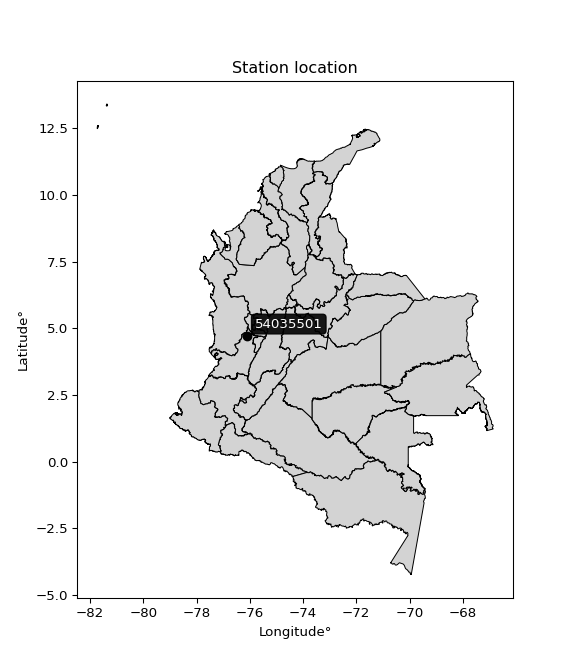

<div align="center">


</div>

# PMP Station (Rain, Pmax24h): 54035501

Probable Maximum Precipitation (PMP) is the greatest amount of rainfall for a specific duration that is meteorologically possible for a given location, acting as a "worst-case" scenario for extreme storms, crucial for designing safety-critical infrastructure like bridges, river deviations, dams, spillways, and nuclear plants to prevent catastrophic failure. PMP is calculated by hydrologists using meteorological data to determine the upper limit of extreme rainfall, often leading to the Probable Maximum Flood (PMF) for flood control design, and is increasingly being studied for climate change impacts.

<div align="center">

</img>

</div>


## A. General information


### 1. General running parameters

• app_version: _v20260103_. • runtime: _2026-01-03 07:24:50.581521_. • Python version: _3.14.0_. • SciPy version: _1.16.3_. • Pandas version: _2.3.3_. • NumPy version: _2.3.5_. • Stations dataset (station_dataset_file): _dataset/pmax24h_in/automatic_colombia_2003_2024.csv_. • Stations catalog (station_catalog_file): _dataset/CNE.xls_. • Minimum year to eval til year_max (date_min): _1900_. • Maximum year to eval since year_min (date_max): _2024_. • Creates, save and include plots into reports (create_plot): _False_. • Plot only fit distributions with Δo > Δ (plot_only_fit): _True_. • Eval low extreme values, if False, evaluates high extreme values (low_extreme): _False_. • Eval every SciPy distribution as logarithmic (pdist_logarithmic_on): _True_. • Standard deviation normalized (ddof): _1.0_. • Return periods to eval in years (Tr): _[2, 2.33, 5, 10, 15, 20, 25, 50, 75, 100, 200, 250, 500, 750, 1000]_. • Minimum data sample per station, 0 means any (minimum_sample): _5_. • Z-Score maximum threshold to adjust a value, 0 means disable (zscore_max): _3.5_. • Z-Score minimum threshold to adjust a value, 0 means disable (zscore_min): _-2.5_. • Avoid zeros, e.g. rain = 0 (avoid_zeros): _True_. • Avoid null values (avoid_nans): _True_. [:file_folder:Dataset file.](../../dataset/pmax24h_in/automatic_colombia_2003_2024.csv)

> Delta Degrees of Freedom (DDOF): is a parameter used in the formulas for calculating variance and standard deviation. When ddof=0, the divisor is $N$ (the total number of observations) and this is used when your data set is the entire population. When ddof=1, the divisor is $N-1$ and this is used when your data set is a sample drawn from a larger population. Using $N-1$ provides an unbiased estimate of the population variance (known as Bessel´s correction).


### 2. Station info and location

|   id |   CODIGO | NOMBRE                                | CATEGORIA               | TECNOLOGIA                | ESTADO   | FECHA_INSTALACION   |   FECHA_SUSPENSION |   ALTITUD |   LATITUD |   LONGITUD | DEPARTAMENTO    | MUNICIPIO   | AREA_OPERATIVA                         | ENTIDAD                                    | AREA_HIDROGRAFICA   | ZONA_HIDROGRAFICA   | SUBZONA_HIDROGRAFICA   |   CORRIENTE | Catalogo   |   Version |
|-----:|---------:|:--------------------------------------|:------------------------|:--------------------------|:---------|:--------------------|-------------------:|----------:|----------:|-----------:|:----------------|:------------|:---------------------------------------|:-------------------------------------------|:--------------------|:--------------------|:-----------------------|------------:|:-----------|----------:|
|    0 | 54035501 | SANTIAGO GUTIERREZ  - AUT  [54035501] | Climatológica Principal | Automática con Telemetría | Activa   | 25/08/2013          |                nan |      1530 |   4.72639 |   -76.1145 | Valle Del Cauca | Argelia     | Area Operativa 09 - Cauca-Valle-Caldas | CENTRO NACIONAL DE INVESTIGACIONES DE CAFE | Pacifico            | San Juán            | Río Sipí               |         nan | CNE_OE     |  20251226 |

<div align="center">

Dynamic map: [:earth_americas:Google](http://maps.google.com/maps?q=4.726388889,-76.11446944) [:earth_americas:OSM](https://www.openstreetmap.org/#map=18/4.726388889/-76.11446944&layers=P) [:earth_americas:Bing](https://www.bing.com/maps?cp=4.726388889~-76.11446944&lvl=18) [:earth_americas:Apple](https://maps.apple.com/frame?center=4.726388889%2C-76.11446944&span=0.003%2C0.006)

</div>


<div align="center">

```geojson
{
  "type": "Feature",
  "geometry": {
    "type": "Point", 
    "coordinates": [-76.11446944, 4.726388889]
  }, 
  "properties": {
    "Name": "54035501"
  }
}
```

</div>


### 3. Discrete values table and plot

<div align="center">

|               |           0 |           1 |           2 |          3 |           4 |          5 |            6 |
|:--------------|------------:|------------:|------------:|-----------:|------------:|-----------:|-------------:|
| Date          | 2017        | 2018        | 2019        | 2020       | 2021        | 2022       | 2023         |
| Value         |   46.8      |   44.4      |   49.9      |   61.4     |   54.2      |   32.7     |   49.1       |
| Value_initial |   46.8      |   44.4      |   49.9      |   61.4     |   54.2      |   32.7     |   49.1       |
| count         |    7        |    7        |    7        |    7       |    7        |    7       |    7         |
| mean          |   48.3571   |   48.3571   |   48.3571   |   48.3571  |   48.3571   |   48.3571  |   48.3571    |
| std           |    8.85454  |    8.85454  |    8.85454  |    8.85454 |    8.85454  |    8.85454 |    8.85454   |
| zscore        |   -0.175858 |   -0.446906 |    0.174245 |    1.47301 |    0.659871 |   -1.76826 |    0.0838956 |


</div>


> The initial value (value_initial) correspond to the initial obtained or null completed value, and value (value) is adjusted only when the initial value is outside the valid range definite through the Z-Score value. If Z-Score is active, values out of range or outliers are replaced with the station mean value


### 4. Active continuous probability distributions from SciPy (44 of 104 available)

A Probability Density Function (PDF) describes the relative likelihood of a continuous random variable falling within a specific range, where the total area under its curve equals 1, and the area over any interval gives the actual probability for that range. Unlike discrete probabilities (like rolling a die), a PDF shows density, not direct probability for a single point (which is zero), with higher points indicating higher likelihood, often visualized as a bell curve for normal distributions.

A log of a probability density function (log-PDF) is simply the logarithm of the PDF´s value, denoted as $log(f(x))$, useful for converting multiplication of probabilities into addition, improving numerical stability with tiny numbers, and connecting to information theory concepts like entropy. Instead of dealing with very small probabilities (e.g., 0.000001), log-PDFs use negative numbers (e.g., $log(0.00001) ≈ -11.51$ that are easier for computers to handle, preventing underflow errors and simplifying complex calculations. In this study, each active probability distribution from SciPy is also evaluated in the $log$ form.

[scipy.stats](https://docs.scipy.org/doc/scipy/reference/stats.html) is a Python´s powerful submodule within the SciPy library for comprehensive statistical analysis, offering over 130 probability distributions (like Normal, Poisson), functions for descriptive stats (mean, variance), hypothesis testing (t-tests, chi-square), random variable generation, and statistical tests, making it essential for data science, modeling, and research. It provides tools to explore, model, and draw conclusions from data efficiently, working seamlessly with NumPy.

<div align="center">

|   id | p_dist             |   n_parameter | fit_method   | label                                                                       | active   | ref                                                                                                        |
|-----:|:-------------------|--------------:|:-------------|:----------------------------------------------------------------------------|:---------|:-----------------------------------------------------------------------------------------------------------|
|    0 | alpha              |             3 | MLE          | Alpha                                                                       | True     | [:mortar_board:](https://docs.scipy.org/doc/scipy/reference/generated/scipy.stats.alpha.html)              |
|    1 | betaprime          |             4 | MLE          | Beta prime                                                                  | True     | [:mortar_board:](https://docs.scipy.org/doc/scipy/reference/generated/scipy.stats.betaprime.html)          |
|    2 | chi2               |             3 | MLE          | Chi²                                                                        | True     | [:mortar_board:](https://docs.scipy.org/doc/scipy/reference/generated/scipy.stats.chi2.html)               |
|    3 | crystalball        |             4 | MLE          | Crystalball                                                                 | True     | [:mortar_board:](https://docs.scipy.org/doc/scipy/reference/generated/scipy.stats.crystalball.html)        |
|    4 | erlang             |             3 | MLE          | Erlang                                                                      | True     | [:mortar_board:](https://docs.scipy.org/doc/scipy/reference/generated/scipy.stats.erlang.html)             |
|    5 | expon              |             2 | MLE          | Exponential                                                                 | True     | [:mortar_board:](https://docs.scipy.org/doc/scipy/reference/generated/scipy.stats.expon.html)              |
|    6 | exponnorm          |             3 | MLE          | Exponentially modified Normal                                               | True     | [:mortar_board:](https://docs.scipy.org/doc/scipy/reference/generated/scipy.stats.exponnorm.html)          |
|    7 | f                  |             4 | MLE          | F                                                                           | True     | [:mortar_board:](https://docs.scipy.org/doc/scipy/reference/generated/scipy.stats.f.html)                  |
|    8 | fatiguelife        |             3 | MLE          | Fatigue-life (Birnbaum-Saunders)                                            | True     | [:mortar_board:](https://docs.scipy.org/doc/scipy/reference/generated/scipy.stats.fatiguelife.html)        |
|    9 | fisk               |             3 | MLE          | Fisk                                                                        | True     | [:mortar_board:](https://docs.scipy.org/doc/scipy/reference/generated/scipy.stats.fisk.html)               |
|   10 | gamma              |             3 | MLE          | Gamma                                                                       | True     | [:mortar_board:](https://docs.scipy.org/doc/scipy/reference/generated/scipy.stats.gamma.html)              |
|   11 | genexpon           |             5 | MLE          | Generalized exponential                                                     | True     | [:mortar_board:](https://docs.scipy.org/doc/scipy/reference/generated/scipy.stats.genexpon.html)           |
|   12 | genlogistic        |             3 | MLE          | Generalized logistic                                                        | True     | [:mortar_board:](https://docs.scipy.org/doc/scipy/reference/generated/scipy.stats.genlogistic.html)        |
|   13 | gibrat             |             2 | MM           | Gibrat                                                                      | True     | [:mortar_board:](https://docs.scipy.org/doc/scipy/reference/generated/scipy.stats.gibrat.html)             |
|   14 | gompertz           |             3 | MLE          | Gompertz (or truncated Gumbel)                                              | True     | [:mortar_board:](https://docs.scipy.org/doc/scipy/reference/generated/scipy.stats.gompertz.html)           |
|   15 | gumbel_l           |             2 | MM           | Gumbel Left Skew                                                            | True     | [:mortar_board:](https://docs.scipy.org/doc/scipy/reference/generated/scipy.stats.gumbel_l.html)           |
|   16 | gumbel_r           |             2 | MM           | Gumbel Right Skew                                                           | True     | [:mortar_board:](https://docs.scipy.org/doc/scipy/reference/generated/scipy.stats.gumbel_r.html)           |
|   17 | halflogistic       |             2 | MM           | Half-logistic                                                               | True     | [:mortar_board:](https://docs.scipy.org/doc/scipy/reference/generated/scipy.stats.halflogistic.html)       |
|   18 | halfnorm           |             2 | MM           | Half Normal                                                                 | True     | [:mortar_board:](https://docs.scipy.org/doc/scipy/reference/generated/scipy.stats.halfnorm.html)           |
|   19 | hypsecant          |             2 | MM           | hyperbolic secant                                                           | True     | [:mortar_board:](https://docs.scipy.org/doc/scipy/reference/generated/scipy.stats.hypsecant.html)          |
|   20 | invgamma           |             3 | MLE          | Inverted gamma                                                              | True     | [:mortar_board:](https://docs.scipy.org/doc/scipy/reference/generated/scipy.stats.invgamma.html)           |
|   21 | invgauss           |             3 | MLE          | Inverse Gaussian                                                            | True     | [:mortar_board:](https://docs.scipy.org/doc/scipy/reference/generated/scipy.stats.invgauss.html)           |
|   22 | invweibull         |             3 | MLE          | Inverted Weibull                                                            | True     | [:mortar_board:](https://docs.scipy.org/doc/scipy/reference/generated/scipy.stats.invweibull.html)         |
|   23 | johnsonsu          |             4 | MLE          | Johnson Su                                                                  | True     | [:mortar_board:](https://docs.scipy.org/doc/scipy/reference/generated/scipy.stats.johnsonsu.html)          |
|   24 | kstwobign          |             2 | MLE          | Limiting distribution of scaled Kolmogorov-Smirnov two-sided test statistic | True     | [:mortar_board:](https://docs.scipy.org/doc/scipy/reference/generated/scipy.stats.kstwobign.html)          |
|   25 | laplace            |             2 | MM           | Laplace                                                                     | True     | [:mortar_board:](https://docs.scipy.org/doc/scipy/reference/generated/scipy.stats.laplace.html)            |
|   26 | laplace_asymmetric |             3 | MLE          | Asymmetric Laplace                                                          | True     | [:mortar_board:](https://docs.scipy.org/doc/scipy/reference/generated/scipy.stats.laplace_asymmetric.html) |
|   27 | loggamma           |             3 | MLE          | Log gamma                                                                   | True     | [:mortar_board:](https://docs.scipy.org/doc/scipy/reference/generated/scipy.stats.loggamma.html)           |
|   28 | logistic           |             2 | MM           | Logistic (or Sech-squared)                                                  | True     | [:mortar_board:](https://docs.scipy.org/doc/scipy/reference/generated/scipy.stats.logistic.html)           |
|   29 | lognorm            |             3 | MLE          | Log Normal                                                                  | True     | [:mortar_board:](https://docs.scipy.org/doc/scipy/reference/generated/scipy.stats.lognorm.html)            |
|   30 | maxwell            |             2 | MM           | Maxwell                                                                     | True     | [:mortar_board:](https://docs.scipy.org/doc/scipy/reference/generated/scipy.stats.maxwell.html)            |
|   31 | mielke             |             4 | MLE          | Mielke Beta-Kappa / Dagum                                                   | True     | [:mortar_board:](https://docs.scipy.org/doc/scipy/reference/generated/scipy.stats.mielke.html)             |
|   32 | moyal              |             2 | MM           | Moyal                                                                       | True     | [:mortar_board:](https://docs.scipy.org/doc/scipy/reference/generated/scipy.stats.moyal.html)              |
|   33 | nakagami           |             3 | MLE          | Nakagami                                                                    | True     | [:mortar_board:](https://docs.scipy.org/doc/scipy/reference/generated/scipy.stats.nakagami.html)           |
|   34 | ncf                |             5 | MLE          | Non-central F distribution                                                  | True     | [:mortar_board:](https://docs.scipy.org/doc/scipy/reference/generated/scipy.stats.ncf.html)                |
|   35 | nct                |             4 | MLE          | Non-central Student’s t                                                     | True     | [:mortar_board:](https://docs.scipy.org/doc/scipy/reference/generated/scipy.stats.nct.html)                |
|   36 | norm               |             2 | MM           | Normal                                                                      | True     | [:mortar_board:](https://docs.scipy.org/doc/scipy/reference/generated/scipy.stats.norm.html)               |
|   37 | pearson3           |             3 | MM           | Pearson type III                                                            | True     | [:mortar_board:](https://docs.scipy.org/doc/scipy/reference/generated/scipy.stats.pearson3.html)           |
|   38 | rayleigh           |             2 | MM           | Rayleigh                                                                    | True     | [:mortar_board:](https://docs.scipy.org/doc/scipy/reference/generated/scipy.stats.rayleigh.html)           |
|   39 | rice               |             3 | MLE          | Rice                                                                        | True     | [:mortar_board:](https://docs.scipy.org/doc/scipy/reference/generated/scipy.stats.rice.html)               |
|   40 | t                  |             3 | MLE          | Student’s t                                                                 | True     | [:mortar_board:](https://docs.scipy.org/doc/scipy/reference/generated/scipy.stats.t.html)                  |
|   41 | truncnorm          |             4 | MLE          | Truncated normal                                                            | True     | [:mortar_board:](https://docs.scipy.org/doc/scipy/reference/generated/scipy.stats.truncnorm.html)          |
|   42 | wald               |             2 | MM           | Wald                                                                        | True     | [:mortar_board:](https://docs.scipy.org/doc/scipy/reference/generated/scipy.stats.wald.html)               |
|   43 | weibull_min        |             3 | MLE          | Weibull minimum                                                             | True     | [:mortar_board:](https://docs.scipy.org/doc/scipy/reference/generated/scipy.stats.weibull_min.html)        |

</div>

> **n_parameter:** # arguments & localization & scale.
>
> **Fit methods:** (MLE) maximum likelihood, (MM) L-moments.
>
>**Inactive** (With the only purpose of prevent loops, zero divisions, infinite values, over high estimated values or horizontal trending for recurrence intervals estimations, the follow distributions were disabled.)**:** foldnorm, gennorm, norminvgauss, powernorm, powerlognorm, skewnorm, genextreme, anglit, arcsine, argus, beta, bradford, burr, burr12, cauchy, cosine, halfcauchy, foldcauchy, skewcauchy, wrapcauchy, dgamma, gengamma, exponweib, exponpow, truncexpon, gausshyper, genhalflogistic, genhyperbolic, geninvgauss, halfgennorm, johnsonsb, kappa4, kappa3, ksone, kstwo, loglaplace, levy, levy_l, levy_stable, ncx2, pareto, genpareto, truncpareto, lomax, powerlaw, rdist, rel_breitwigner, recipinvgauss, semicircular, studentized_range, trapezoid, triang, truncweibull_min, tukeylambda, uniform, loguniform, vonmises, vonmises_line, weibull_max, dweibull, 


## B. Probability distributions vs. Empirical distributions

A continuous probability distribution (CPD) describes probabilities for variables that can take any value within a range (like rain any time), unlike discrete variables with specific outcomes (like temperature). It uses a Probability Density Function (PDF), a curve where the total area under it equals 1, and the probability of the variable falling within an interval (a to b) is found by calculating the area under the curve between those points. A key feature is that the probability of hitting any single exact value is zero, so probabilities are always expressed for ranges, e.g., $P(a ≤ X ≤ b)$.

<div align="center">

Distributions parameters from station values
|    |   station | p_dist                |   n |              loc |           scale | shape                 | shape1                | shape2                 | shape3   |
|---:|----------:|:----------------------|----:|-----------------:|----------------:|:----------------------|:----------------------|:-----------------------|:---------|
|  0 |  54035501 | alpha                 |   7 |   -190.083       |  6814.28        | 28.624117989978537    |                       |                        |          |
|  1 |  54035501 | betaprime             |   7 |    -13.2664      |  2704.59        | 50.63342229497172     | 2220.622955670733     |                        |          |
|  2 |  54035501 | chi2                  |   7 |    -53.6092      |     0.344917    | 295.5802545712602     |                       |                        |          |
|  3 |  54035501 | crystalball           |   7 |     48.3571      |     8.19771     | 4207.5575900728945    | 335.53375241707204    |                        |          |
|  4 |  54035501 | erlang                |   7 |    -81.1803      |     0.538076    | 240.76477819351152    |                       |                        |          |
|  5 |  54035501 | expon                 |   7 |     32.7         |    15.6571      |                       |                       |                        |          |
|  6 |  54035501 | exponnorm             |   7 |     48.3519      |     8.1977      | 0.0006395043281797268 |                       |                        |          |
|  7 |  54035501 | f                     |   7 |  -1383.24        |  1431.61        | 79719.84400623743     | 248996.3513121087     |                        |          |
|  8 |  54035501 | fatiguelife           |   7 |     32.7         |     9.372e-06   | 1104.9621628173481    |                       |                        |          |
|  9 |  54035501 | fisk                  |   7 | -17750.7         | 17799.4         | 3927.356902759695     |                       |                        |          |
| 10 |  54035501 | gamma                 |   7 |    -87.6839      |     0.514812    | 264.1457778381531     |                       |                        |          |
| 11 |  54035501 | genexpon              |   7 |     32.7         |     1.19425     | 0.07617936918924734   | 4.492502697161168e-07 | 4.326422499054242      |          |
| 12 |  54035501 | genlogistic           |   7 |     51.2578      |     3.80237     | 0.6580857055818234    |                       |                        |          |
| 13 |  54035501 | gibrat                |   7 |     42.1033      |     3.79316     |                       |                       |                        |          |
| 14 |  54035501 | gompertz              |   7 |     44.0999      |     2.33883     | 0.0034396079152994815 |                       |                        |          |
| 15 |  54035501 | gumbel_l              |   7 |     52.0465      |     6.39173     |                       |                       |                        |          |
| 16 |  54035501 | gumbel_r              |   7 |     44.6677      |     6.39173     |                       |                       |                        |          |
| 17 |  54035501 | halflogistic          |   7 |     38.641       |     7.00873     |                       |                       |                        |          |
| 18 |  54035501 | halfnorm              |   7 |     37.5066      |    13.5992      |                       |                       |                        |          |
| 19 |  54035501 | hypsecant             |   7 |     48.3571      |     5.21882     |                       |                       |                        |          |
| 20 |  54035501 | invgamma              |   7 |    -78.4603      | 29368.2         | 232.8234664342669     |                       |                        |          |
| 21 |  54035501 | invgauss              |   7 |    -10.9635      |  2732.87        | 0.021634608527505796  |                       |                        |          |
| 22 |  54035501 | invweibull            |   7 |     -1.31933e+09 |     1.31933e+09 | 166976902.412942      |                       |                        |          |
| 23 |  54035501 | johnsonsu             |   7 |     98.6121      |    13.9984      | 12.627520151458665    | 6.383085613816434     |                        |          |
| 24 |  54035501 | kstwobign             |   7 |     13.4997      |    39.922       |                       |                       |                        |          |
| 25 |  54035501 | laplace               |   7 |     48.3571      |     5.79666     |                       |                       |                        |          |
| 26 |  54035501 | laplace_asymmetric    |   7 |     49.1         |     5.90791     | 1.064825258541296     |                       |                        |          |
| 27 |  54035501 | loggamma              |   7 |     20.4908      |    17.9073      | 5.2317778704892355    |                       |                        |          |
| 28 |  54035501 | logistic              |   7 |     48.3571      |     4.51963     |                       |                       |                        |          |
| 29 |  54035501 | lognorm               |   7 |     32.7         |     0.110724    | 12.404322198029023    |                       |                        |          |
| 30 |  54035501 | maxwell               |   7 |     28.932       |    12.1729      |                       |                       |                        |          |
| 31 |  54035501 | mielke                |   7 |     -0.196476    |    53.5222      | 6.741999067684857     | 15.576474262981131    |                        |          |
| 32 |  54035501 | moyal                 |   7 |     43.6692      |     3.69027     |                       |                       |                        |          |
| 33 |  54035501 | nakagami              |   7 |     44.4         |     8.22124     | 0.26341746789523157   |                       |                        |          |
| 34 |  54035501 | ncf                   |   7 |      1.18754     |     2.11156e-06 | 7.906249916088883e-06 | 194.7857761318275     | 174.96879872290938     |          |
| 35 |  54035501 | nct                   |   7 |   -494.902       |     8.13329     | 136396.5964436538     | 66.79417384906176     |                        |          |
| 36 |  54035501 | norm                  |   7 |     48.3571      |     8.19771     |                       |                       |                        |          |
| 37 |  54035501 | pearson3              |   7 |     48.3571      |     8.19773     | -0.38427138229251245  |                       |                        |          |
| 38 |  54035501 | rayleigh              |   7 |     32.6744      |    12.513       |                       |                       |                        |          |
| 39 |  54035501 | rice                  |   7 |     27.3917      |     8.86304     | 2.1097423612945017    |                       |                        |          |
| 40 |  54035501 | t                     |   7 |     48.3569      |     8.19752     | 6165031.676782537     |                       |                        |          |
| 41 |  54035501 | truncnorm             |   7 |     24.2371      |    13.9372      | 1.446693877442776     | 105.58687248239409    |                        |          |
| 42 |  54035501 | wald                  |   7 |     40.1594      |     8.1977      |                       |                       |                        |          |
| 43 |  54035501 | weibull_min           |   7 |      9.54031     |    42.0518      | 5.537321792835011     |                       |                        |          |
| 44 |  54035501 | logalpha              |   7 |     -4.10697     |   342.941       | 43.06007409860098     |                       |                        |          |
| 45 |  54035501 | logbetaprime          |   7 |     -3.77285     |     3.77997     | 1387.4243140054823    | 687.15942439219       |                        |          |
| 46 |  54035501 | logchi2               |   7 |      3.48738     |     0.984033    | 1.0289321775950566    |                       |                        |          |
| 47 |  54035501 | logcrystalball        |   7 |      3.86292     |     0.181643    | 535.7096121810848     | 277.9319075474144     |                        |          |
| 48 |  54035501 | logerlang             |   7 |      0.88447     |     0.0118002   | 252.2574140854132     |                       |                        |          |
| 49 |  54035501 | logexpon              |   7 |      3.48738     |     0.375549    |                       |                       |                        |          |
| 50 |  54035501 | logexponnorm          |   7 |      3.86277     |     0.181642    | 0.0008294366967397412 |                       |                        |          |
| 51 |  54035501 | logf                  |   7 |   -156.602       |   160.464       | 6253046.012078345     | 2064562.9776214394    |                        |          |
| 52 |  54035501 | logfatiguelife        |   7 |    -57.8058      |    61.6681      | 0.0029435891110195043 |                       |                        |          |
| 53 |  54035501 | logfisk               |   7 |     -1.5769e+07  |     1.5769e+07  | 161385415.86439714    |                       |                        |          |
| 54 |  54035501 | loggamma              |   7 |      0.649291    |     0.0109008   | 294.6181909365124     |                       |                        |          |
| 55 |  54035501 | loggenexpon           |   7 |      3.48685     |     0.00301647  | 0.002558716347941184  | 3.4157022816446787    | 2.0730013114963088e-05 |          |
| 56 |  54035501 | loggenlogistic        |   7 |      3.97657     |     0.0644094   | 0.432098177791314     |                       |                        |          |
| 57 |  54035501 | loggibrat             |   7 |      3.72433     |     0.0840628   |                       |                       |                        |          |
| 58 |  54035501 | loggompertz           |   7 |      3.48737     |     0.169223    | 0.07542094110893016   |                       |                        |          |
| 59 |  54035501 | loggumbel_l           |   7 |      3.94467     |     0.141626    |                       |                       |                        |          |
| 60 |  54035501 | loggumbel_r           |   7 |      3.78118     |     0.141626    |                       |                       |                        |          |
| 61 |  54035501 | loghalflogistic       |   7 |      3.64767     |     0.155276    |                       |                       |                        |          |
| 62 |  54035501 | loghalfnorm           |   7 |      3.62252     |     0.301297    |                       |                       |                        |          |
| 63 |  54035501 | loghypsecant          |   7 |      3.86292     |     0.115637    |                       |                       |                        |          |
| 64 |  54035501 | loginvgamma           |   7 |     -0.315285    |  2057.75        | 493.42012060855177    |                       |                        |          |
| 65 |  54035501 | loginvgauss           |   7 |      2.01233     |   167.151       | 0.011063716229843784  |                       |                        |          |
| 66 |  54035501 | loginvweibull         |   7 |     -1.29156e+07 |     1.29156e+07 | 63661500.64865303     |                       |                        |          |
| 67 |  54035501 | logjohnsonsu          |   7 |      4.3941      |     0.0498494   | 8.95940210626955      | 2.9806670027865967    |                        |          |
| 68 |  54035501 | logkstwobign          |   7 |      3.03596     |     0.946541    |                       |                       |                        |          |
| 69 |  54035501 | loglaplace            |   7 |      3.86292     |     0.128441    |                       |                       |                        |          |
| 70 |  54035501 | loglaplace_asymmetric |   7 |      3.89386     |     0.124745    | 1.1308380521006451    |                       |                        |          |
| 71 |  54035501 | logloggamma           |   7 |      3.92572     |     0.154808    | 1.1127509135569507    |                       |                        |          |
| 72 |  54035501 | loglogistic           |   7 |      3.86292     |     0.100145    |                       |                       |                        |          |
| 73 |  54035501 | loglognorm            |   7 |      3.48738     |     0.00308566  | 12.073621957349381    |                       |                        |          |
| 74 |  54035501 | logmaxwell            |   7 |      3.43251     |     0.269724    |                       |                       |                        |          |
| 75 |  54035501 | logmielke             |   7 |    -37.1866      |    41.1641      | 273.94637620654953    | 640.5375510482312     |                        |          |
| 76 |  54035501 | logmoyal              |   7 |      3.75905     |     0.0817679   |                       |                       |                        |          |
| 77 |  54035501 | lognakagami           |   7 |      3.79324     |     0.133255    | 0.25597204711301313   |                       |                        |          |
| 78 |  54035501 | logncf                |   7 |     -3.08441     |     6.53558     | 2674.03565346308      | 1850.1602746448798    | 172.74073550016521     |          |
| 79 |  54035501 | lognct                |   7 |     -5.99476     |     0.0860602   | 1560.0274957210595    | 114.49552514301905    |                        |          |
| 80 |  54035501 | lognorm               |   7 |      3.86292     |     0.181643    |                       |                       |                        |          |
| 81 |  54035501 | logpearson3           |   7 |      3.86292     |     0.181643    | -0.8226555525241454   |                       |                        |          |
| 82 |  54035501 | lograyleigh           |   7 |      3.51543     |     0.277257    |                       |                       |                        |          |
| 83 |  54035501 | logrice               |   7 |      3.34051     |     0.192586    | 2.4995977599463686    |                       |                        |          |
| 84 |  54035501 | logt                  |   7 |      3.89148     |     0.10563     | 2.118414436675415     |                       |                        |          |
| 85 |  54035501 | logtruncnorm          |   7 |     -0.0505881   |     1.24212     | 2.848324785738196     | 4.514470918340425     |                        |          |
| 86 |  54035501 | logwald               |   7 |      3.68132     |     0.181607    |                       |                       |                        |          |
| 87 |  54035501 | logweibull_min        |   7 |     -1.39638     |     5.3404      | 36.486962166408766    |                       |                        |          |

</div>

> **loc** (Location parameter): This shifts the distribution along the x-axis. For many common distributions, like the normal (Gaussian) distribution, loc represents the mean $μ$. For others, like the uniform distribution, it might represent the minimum value, or for the beta distribution, the left end of the support interval.
>
> **scale** (Scale parameter): This determines the width or spread of the distribution. For the normal distribution, scale represents the standard deviation $σ$. For a uniform distribution, it defines the length of the interval (from $loc$ to $loc + scale$).
>
> **shape** (Shape parameters): Refers to parameters that define the specific form of a probability distribution, distinct from its location (loc) and scale (scale). These parameters are required arguments for most distribution functions. For example, a normal (Gaussian) distribution is fully defined by its location (mean) and scale (standard deviation), so it has no specific shape parameters beyond loc and scale. However, other distributions have intrinsic properties that need specification, as Gamma distribution that takes a shape parameter, often named $a$ or $alpha$.


### 0. Cumulative distribution values - CDF (88 evaluated)

Cumulative Distribution Function (CDF), denoted as $F$<sub>$X$</sub>$(x)$, is a function that gives the probability that a random variable $X$ will take a value less than or equal to a specific value, $x$ (i.e., $(P(X≥x)$. It essentially "accumulates" probabilities from a given point up to the far right (positive infinity), providing a complete picture of the distribution´s probabilities for both discrete (like rain) and continuous (like temperature) variables, helping to find probabilities over ranges or above certain values. Each station is evaluated separately ordering the $x$ values ascending, calculating the CDF and PDF values for the activated distributions and their logarithmic forms.

<div align="center">

CDF ordered by x ascending and calculating $log(f(x))$ separately
|   id |   Station |   date |    x |   count |    mean |     std |     zscore |   Value_initial |   station |   m |     alpha |   alpha_pdf |   betaprime |   betaprime_pdf |      chi2 |   chi2_pdf |   crystalball |   crystalball_pdf |   erlang |   erlang_pdf |    expon |   expon_pdf |   exponnorm |   exponnorm_pdf |         f |      f_pdf |   fatiguelife |   fatiguelife_pdf |      fisk |   fisk_pdf |     gamma |   gamma_pdf |    genexpon |   genexpon_pdf |   genlogistic |   genlogistic_pdf |   gibrat |   gibrat_pdf |    gompertz |   gompertz_pdf |   gumbel_l |   gumbel_l_pdf |   gumbel_r |   gumbel_r_pdf |   halflogistic |   halflogistic_pdf |   halfnorm |   halfnorm_pdf |   hypsecant |   hypsecant_pdf |   invgamma |   invgamma_pdf |   invgauss |   invgauss_pdf |   invweibull |   invweibull_pdf |   johnsonsu |   johnsonsu_pdf |   kstwobign |   kstwobign_pdf |   laplace |   laplace_pdf |   laplace_asymmetric |   laplace_asymmetric_pdf |   loggamma |   loggamma_pdf |   logistic |   logistic_pdf |   lognorm |   lognorm_pdf |    maxwell |   maxwell_pdf |    mielke |   mielke_pdf |       moyal |   moyal_pdf |    nakagami |   nakagami_pdf |       ncf |    ncf_pdf |       nct |    nct_pdf |      norm |   norm_pdf |   pearson3 |   pearson3_pdf |    rayleigh |   rayleigh_pdf |      rice |   rice_pdf |         t |      t_pdf |   truncnorm |   truncnorm_pdf |     wald |   wald_pdf |   weibull_min |   weibull_min_pdf |   logalpha |   logalpha_pdf |   logbetaprime |   logbetaprime_pdf |    logchi2 |   logchi2_pdf |   logcrystalball |   logcrystalball_pdf |   logerlang |   logerlang_pdf |   logexpon |   logexpon_pdf |   logexponnorm |   logexponnorm_pdf |      logf |   logf_pdf |   logfatiguelife |   logfatiguelife_pdf |   logfisk |   logfisk_pdf |   loggenexpon |   loggenexpon_pdf |   loggenlogistic |   loggenlogistic_pdf |   loggibrat |   loggibrat_pdf |   loggompertz |   loggompertz_pdf |   loggumbel_l |   loggumbel_l_pdf |   loggumbel_r |   loggumbel_r_pdf |   loghalflogistic |   loghalflogistic_pdf |   loghalfnorm |   loghalfnorm_pdf |   loghypsecant |   loghypsecant_pdf |   loginvgamma |   loginvgamma_pdf |   loginvgauss |   loginvgauss_pdf |   loginvweibull |   loginvweibull_pdf |   logjohnsonsu |   logjohnsonsu_pdf |   logkstwobign |   logkstwobign_pdf |   loglaplace |   loglaplace_pdf |   loglaplace_asymmetric |   loglaplace_asymmetric_pdf |   logloggamma |   logloggamma_pdf |   loglogistic |   loglogistic_pdf |   loglognorm |   loglognorm_pdf |   logmaxwell |   logmaxwell_pdf |   logmielke |   logmielke_pdf |    logmoyal |   logmoyal_pdf |   lognakagami |   lognakagami_pdf |    logncf |   logncf_pdf |    lognct |   lognct_pdf |   logpearson3 |   logpearson3_pdf |   lograyleigh |   lograyleigh_pdf |   logrice |   logrice_pdf |      logt |   logt_pdf |   logtruncnorm |   logtruncnorm_pdf |   logwald |   logwald_pdf |   logweibull_min |   logweibull_min_pdf |
|-----:|----------:|-------:|-----:|--------:|--------:|--------:|-----------:|----------------:|----------:|----:|----------:|------------:|------------:|----------------:|----------:|-----------:|--------------:|------------------:|---------:|-------------:|---------:|------------:|------------:|----------------:|----------:|-----------:|--------------:|------------------:|----------:|-----------:|----------:|------------:|------------:|---------------:|--------------:|------------------:|---------:|-------------:|------------:|---------------:|-----------:|---------------:|-----------:|---------------:|---------------:|-------------------:|-----------:|---------------:|------------:|----------------:|-----------:|---------------:|-----------:|---------------:|-------------:|-----------------:|------------:|----------------:|------------:|----------------:|----------:|--------------:|---------------------:|-------------------------:|-----------:|---------------:|-----------:|---------------:|----------:|--------------:|-----------:|--------------:|----------:|-------------:|------------:|------------:|------------:|---------------:|----------:|-----------:|----------:|-----------:|----------:|-----------:|-----------:|---------------:|------------:|---------------:|----------:|-----------:|----------:|-----------:|------------:|----------------:|---------:|-----------:|--------------:|------------------:|-----------:|---------------:|---------------:|-------------------:|-----------:|--------------:|-----------------:|---------------------:|------------:|----------------:|-----------:|---------------:|---------------:|-------------------:|----------:|-----------:|-----------------:|---------------------:|----------:|--------------:|--------------:|------------------:|-----------------:|---------------------:|------------:|----------------:|--------------:|------------------:|--------------:|------------------:|--------------:|------------------:|------------------:|----------------------:|--------------:|------------------:|---------------:|-------------------:|--------------:|------------------:|--------------:|------------------:|----------------:|--------------------:|---------------:|-------------------:|---------------:|-------------------:|-------------:|-----------------:|------------------------:|----------------------------:|--------------:|------------------:|--------------:|------------------:|-------------:|-----------------:|-------------:|-----------------:|------------:|----------------:|------------:|---------------:|--------------:|------------------:|----------:|-------------:|----------:|-------------:|--------------:|------------------:|--------------:|------------------:|----------:|--------------:|----------:|-----------:|---------------:|-------------------:|----------:|--------------:|-----------------:|---------------------:|
|    0 |  54035501 |   2022 | 32.7 |       7 | 48.3571 | 8.85454 | -1.76826   |            32.7 |  54035501 |   1 | 0.0248268 |  0.00797759 |   0.0269003 |      0.00867203 | 0.0260508 |  0.0080655 |     0.0280704 |        0.00785401 | 0.026398 |   0.00798666 | 0        |   0.0638686 |   0.0280704 |      0.00785402 | 0.0281463 | 0.00790397 |      0.115966 |       2.17262e+10 | 0.0282027 | 0.00605276 | 0.0274021 |  0.00818296 | 1.04891e-07 |      0.0637885 |     0.0400822 |        0.00688484 | 0        |   0          | 0           |     0          |  0.0473141 |     0.00722444 | 0.00149781 |     0.00152406 |       0        |          0         |   0        |      0         |   0.0316652 |      0.0060575  |  0.0231854 |     0.00785702 |   0.022677 |     0.00850467 |    0.0173457 |       0.00890067 |   0.0394144 |      0.00806591 |   0.0251567 |       0.0126661 |  0.033567 |    0.00579075 |            0.0391933 |               0.00623016 |  0.0197176 |       0.277728 |  0.0303467 |     0.00651066 | 0.0193428 |      0.259102 | 0.00766507 |    0.00598648 | 0.0375623 |   0.00769431 | 9.85193e-06 |  2.7307e-05 | 0           |      0         | 0.0203814 | 0.00775658 | 0.0280548 | 0.00785573 | 0.0280704 | 0.00785401 |  0.0376482 |     0.00813701 | 2.08544e-06 |    0.000163212 | 0.0214009 | 0.00878968 | 0.0280696 | 0.00785399 | 0           |       0         | 0        | 0          |     0.0361063 |        0.00847502 |  0.0179825 |       0.263008 |       0.140359 |           0.661882 | 1.0059e-08 |   1.16531e+07 |        0.0193428 |             0.259102 |   0.0195413 |        0.277118 |   0        |       2.66277  |      0.0193429 |           0.259103 | 0.0195411 |   0.26134  |        0.0191517 |             0.258664 | 0.0174739 |      0.175708 |   0.000444729 |          0.851939 |        0.0375523 |             0.251798 |    0        |        0        |     3.623e-08 |          0.445689 |     0.0388269 |          0.268758 |   0.000349022 |         0.0196174 |          0        |              0        |      0        |          0        |      0.0247302 |           0.213645 |     0.0179829 |          0.266502 |     0.0176456 |          0.282728 |       0.0195612 |            0.379327 |      0.0396031 |           0.280567 |      0.0231709 |           0.505516 |    0.0268616 |         0.209136 |               0.0314535 |                    0.22297  |     0.0394251 |          0.275553 |     0.0229761 |          0.224157 |   0.00716067 |      3.70794e+12 |    0.0022112 |         0.119903 |   0.0375689 |        0.252916 | 1.39508e-07 |    2.44558e-05 |   0           |       0           | 0.0900773 |     0.580444 | 0.0253856 |     0.318162 |     0.0361953 |          0.29178  |      0        |          0        | 0.0166577 |      0.278237 | 0.0282997 |   0.133998 |    6.69925e-07 |           2.5336   |  0        |      0        |        0.0376084 |             0.275624 |
|    1 |  54035501 |   2018 | 44.4 |       7 | 48.3571 | 8.85454 | -0.446906  |            44.4 |  54035501 |   2 | 0.331152  |  0.0449458  |   0.336685  |      0.0435729  | 0.326833  |  0.0441552 |     0.31465   |        0.0433131  | 0.32317  |   0.0439058  | 0.526339 |   0.0302521 |   0.31465   |      0.0433132  | 0.315415  | 0.0432404  |      0.844035 |       0.0103394   | 0.27754   | 0.0442528  | 0.326259  |  0.0439246  | 0.525897    |      0.0302425 |     0.276032  |        0.0410174  | 0.307934 |   0.153159   | 0.000470841 |     0.00167123 |  0.260887  |     0.0349573  | 0.352474   |     0.0575044  |       0.389191 |          0.0605338 |   0.387776 |      0.0515979 |   0.278917  |      0.0468631  |  0.335252  |     0.0456535  |   0.35386  |     0.0458153  |    0.397634  |       0.0464111  |   0.293498  |      0.0392426  |   0.413066  |       0.0416872 |  0.252636 |    0.043583   |            0.251725  |               0.0400141  |  0.36522   |       2.03784  |  0.294102  |     0.0459342  | 0.350624  |      2.04048  | 0.343929   |    0.0472072  | 0.285204  |   0.0407405  | 0.365083    |  0.0649702  | 9.02502e-09 | 669164         | 0.341179  | 0.0457391  | 0.31474   | 0.0433188  | 0.31465   | 0.0433131  |  0.297305  |     0.0397823  | 0.355352    |    0.0482763   | 0.325838  | 0.0437227  | 0.314657  | 0.0433145  | 7.15608e-10 |       0.135857  | 0.379969 | 0.104426   |     0.298079  |        0.0394627  |  0.363541  |       2.06254  |       0.424134 |           1.11077  | 0.41093    |   0.62311     |        0.350624  |             2.04049  |   0.365377  |        2.03716  |   0.557115 |       1.1793   |      0.350626  |           2.04049  | 0.351445  |   2.03754  |        0.351774  |             2.04651  | 0.289235  |      2.10395  |   0.464679    |          1.72908  |        0.285287  |             1.80886  |    0.421247 |        5.67582  |     0.31905   |          1.84977  |     0.290551  |          1.71953  |   0.39918     |         2.58839   |          0.43719  |              2.6046   |      0.429016 |          2.25545  |      0.318838  |           2.31874  |     0.36402   |          2.04041  |     0.379653  |          2.03524  |       0.418456  |            1.79689  |      0.297465  |           1.71226  |      0.455936  |           1.71883  |    0.290634  |         2.26279  |               0.274993  |                    1.94939  |     0.295085  |          1.72207  |     0.332736  |          2.21702  |   0.648285   |      0.100478    |    0.382598  |         2.16345  |   0.285779  |        1.80826  | 0.417171    |    2.84831     |   3.02169e-08 |       3.48339e+07 | 0.392149  |     1.30823  | 0.364864  |     1.9326   |     0.308163  |          1.74981  |      0.39467  |          2.1876   | 0.358831  |      2.03413  | 0.222889  |   1.97506  |    0.552336    |           1.21889  |  0.458454 |      4.02932  |        0.296506  |             1.73952  |
|    2 |  54035501 |   2017 | 46.8 |       7 | 48.3571 | 8.85454 | -0.175858  |            46.8 |  54035501 |   3 | 0.443421  |  0.0479584  |   0.444715  |      0.045867   | 0.43751   |  0.0474573 |     0.424675  |        0.047795   | 0.433587 |   0.0474981  | 0.593653 |   0.0259528 |   0.424675  |      0.0477951  | 0.425128  | 0.0476094  |      0.866513 |       0.00848071  | 0.39483   | 0.0527266  | 0.436604  |  0.047422   | 0.593196    |      0.0259496 |     0.387112  |        0.0511583  | 0.584596 |   0.0830236  | 0.00744426  |     0.00463074 |  0.356005  |     0.0443384  | 0.488536   |     0.0547518  |       0.524162 |          0.0517393 |   0.505635 |      0.0464534 |   0.406404  |      0.0583749  |  0.448816  |     0.0483033  |   0.465914 |     0.0469132  |    0.506291  |       0.0436137  |   0.395986  |      0.0458253  |   0.510269  |       0.0390169 |  0.382214 |    0.065937   |            0.368647  |               0.0586001  |  0.475773  |       2.13468  |  0.41471   |     0.0537047  | 0.462628  |      2.18666  | 0.459051   |    0.0480892  | 0.39445   |   0.0499904  | 0.512924    |  0.0571036  | 0.405143    |      0.0873669 | 0.453697  | 0.0473545  | 0.424767  | 0.0477909  | 0.424675  | 0.047795   |  0.400677  |     0.04599    | 0.471216    |    0.0477048   | 0.435572  | 0.0471556  | 0.424685  | 0.0477964  | 0.287282    |       0.10434   | 0.580146 | 0.0652796  |     0.40054   |        0.0455888  |  0.475415  |       2.15902  |       0.483002 |           1.12158  | 0.442055   |   0.561643    |        0.462628  |             2.18666  |   0.475835  |        2.13178  |   0.615043 |       1.02505  |      0.46263   |           2.18666  | 0.463219  |   2.18112  |        0.464014  |             2.18935  | 0.41088   |      2.4773   |   0.553219    |          1.62571  |        0.394522  |             2.33916  |    0.643871 |        3.06612  |     0.424209  |          2.13487  |     0.392139  |          2.1366   |   0.530865    |         2.37364   |          0.563719 |              2.1968   |      0.541504 |          2.01191  |      0.453261  |           2.72304  |     0.474435  |          2.1267   |     0.488421  |          2.07056  |       0.510648  |            1.69161  |      0.397652  |           2.08866  |      0.543247  |           1.58969  |    0.437875  |         3.40916  |               0.399387  |                    2.8312   |     0.39626   |          2.11659  |     0.457562  |          2.4784   |   0.653154   |      0.0852885   |    0.49677   |         2.14699  |   0.394922  |        2.33629  | 0.556513    |    2.41347     |   0.480592    |       4.52703     | 0.462068  |     1.34114  | 0.469792  |     2.0303   |     0.409112  |          2.07619  |      0.508482 |          2.1129   | 0.469685  |      2.15041  | 0.352983  |   2.95359  |    0.612456    |           1.06811  |  0.62787  |      2.53433  |        0.398469  |             2.12803  |
|    3 |  54035501 |   2023 | 49.1 |       7 | 48.3571 | 8.85454 |  0.0838956 |            49.1 |  54035501 |   4 | 0.553424  |  0.0470925  |   0.549565  |      0.044792   | 0.546821  |  0.0470014 |     0.536102  |        0.0484657  | 0.543318 |   0.0473175  | 0.649167 |   0.0224072 |   0.536103  |      0.0484657  | 0.53603   | 0.0482035  |      0.884381 |       0.00711169  | 0.520102  | 0.0550711  | 0.546076  |  0.0471726  | 0.648708    |      0.0224085 |     0.512208  |        0.0565745  | 0.729812 |   0.0472737  | 0.0254049   |     0.0121564  |  0.467758  |     0.0525151  | 0.606619   |     0.0474396  |       0.632842 |          0.0427689 |   0.606069 |      0.0407954 |   0.545157  |      0.0603799  |  0.559126  |     0.0470144  |   0.571671 |     0.0445463  |    0.60125   |       0.0387131  |   0.506226  |      0.0494855  |   0.595774  |       0.0351926 |  0.56014  |    0.0758816  |            0.531364  |               0.0844656  |  0.57736   |       2.07756  |  0.540998  |     0.0549423  | 0.567616  |      2.16468  | 0.567361   |    0.0456059  | 0.516558  |   0.0552902  | 0.631863    |  0.0461785  | 0.56981     |      0.0596481 | 0.560886  | 0.0453169  | 0.536173  | 0.0484519  | 0.536102  | 0.0484657  |  0.510752  |     0.0491705  | 0.5775      |    0.0443226   | 0.544563  | 0.047048   | 0.536115  | 0.0484667  | 0.496991    |       0.078797  | 0.701926 | 0.0425671  |     0.509824  |        0.0489196  |  0.57805   |       2.09623  |       0.536615 |           1.11009  | 0.467866   |   0.515692    |        0.567616  |             2.16468  |   0.577245  |        2.07322  |   0.661209 |       0.902121 |      0.567618  |           2.16468  | 0.567907  |   2.15787  |        0.569041  |             2.16362  | 0.532621  |      2.54769  |   0.628122    |          1.49163  |        0.516606  |             2.71416  |    0.7585   |        1.83992  |     0.531242  |          2.3077   |     0.50268   |          2.45286  |   0.636805    |         2.02918   |          0.659966 |              1.81755  |      0.632176 |          1.76538  |      0.584155  |           2.65701  |     0.575424  |          2.06113  |     0.585846  |          1.97173  |       0.588287  |            1.5384   |      0.504912  |           2.36518  |      0.615978  |           1.43873  |    0.60702   |         3.05962  |               0.56117   |                    3.97807  |     0.505195  |          2.40544  |     0.576617  |          2.43777  |   0.656986   |      0.0749106   |    0.596773  |         2.00422  |   0.516832  |        2.71007  | 0.661008    |    1.94339     |   0.65573     |       2.96806     | 0.52639   |     1.33448  | 0.566801  |     1.99392  |     0.514371  |          2.29355  |      0.606023 |          1.93948  | 0.572456  |      2.11059  | 0.508009  |   3.36726  |    0.660705    |           0.945522 |  0.728203 |      1.71369  |        0.507715  |             2.40624  |
|    4 |  54035501 |   2019 | 49.9 |       7 | 48.3571 | 8.85454 |  0.174245  |            49.9 |  54035501 |   5 | 0.590678  |  0.0459782  |   0.584996  |      0.0437313  | 0.584062  |  0.0460346 |     0.574642  |        0.0478108  | 0.580843 |   0.0464279  | 0.666643 |   0.0212911 |   0.574643  |      0.0478108  | 0.574355  | 0.0475359  |      0.889906 |       0.00670577  | 0.563889  | 0.0542572  | 0.583478  |  0.0462661  | 0.666185    |      0.0212937 |     0.557615  |        0.0567792  | 0.764393 |   0.0394703  | 0.0369316   |     0.0169118  |  0.510682  |     0.054717   | 0.643361   |     0.0443939  |       0.66583  |          0.0397127 |   0.637882 |      0.0387328 |   0.592761  |      0.058421   |  0.596262  |     0.0457639  |   0.606739 |     0.0430774  |    0.631437  |       0.0367418  |   0.546016  |      0.0499082  |   0.623336  |       0.0337026 |  0.616843 |    0.0660997  |            0.594291  |               0.0731238  |  0.610563  |       2.02892  |  0.584523  |     0.0537335  | 0.602292  |      2.1237   | 0.603268   |    0.0441148  | 0.560991  |   0.0556404  | 0.667276    |  0.0423721  | 0.615057    |      0.0536394 | 0.596599  | 0.0439155  | 0.574702  | 0.0477944  | 0.574642  | 0.0478108  |  0.550224  |     0.0494303  | 0.612304    |    0.0426523   | 0.581897  | 0.0462206  | 0.574656  | 0.0478116  | 0.556877    |       0.0710107 | 0.733696 | 0.0370175  |     0.549132  |        0.0492755  |  0.611534  |       2.04492  |       0.554492 |           1.10179  | 0.476088   |   0.501883    |        0.602292  |             2.1237   |   0.610375  |        2.02432  |   0.67548  |       0.864122 |      0.602294  |           2.1237   | 0.602472  |   2.11678  |        0.60369   |             2.12142  | 0.573483  |      2.50332  |   0.651818    |          1.44025  |        0.561029  |             2.77587  |    0.785978 |        1.56932  |     0.568789  |          2.3356   |     0.54295   |          2.52674  |   0.668565    |         1.90063   |          0.688341 |              1.69436  |      0.660017 |          1.67971  |      0.626199  |           2.53914  |     0.608345  |          2.01058  |     0.617264  |          1.91443  |       0.612678  |            1.4795   |      0.543678  |           2.42886  |      0.638791  |           1.38405  |    0.653485  |         2.69786  |               0.620976  |                    3.43593  |     0.544624  |          2.47027  |     0.615452  |          2.36329  |   0.658173   |      0.0719516   |    0.628614  |         1.93447  |   0.561189  |        2.7718   | 0.691178    |    1.79114     |   0.700847    |       2.62363     | 0.547883  |     1.32451  | 0.598734  |     1.95561  |     0.551821  |          2.3379   |      0.636772 |          1.86448  | 0.606232  |      2.06659  | 0.561985  |   3.29354  |    0.675674    |           0.907173 |  0.75424  |      1.51348  |        0.547121  |             2.4667   |
|    5 |  54035501 |   2021 | 54.2 |       7 | 48.3571 | 8.85454 |  0.659871  |            54.2 |  54035501 |   6 | 0.767033  |  0.0349226  |   0.753733  |      0.0338141  | 0.762057  |  0.0355427 |     0.761997  |        0.0377491  | 0.761001 |   0.0360728  | 0.746699 |   0.016178  |   0.761998  |      0.037749   | 0.760613  | 0.0375528  |      0.914772 |       0.00497041  | 0.769513  | 0.0391223  | 0.76284   |  0.035881   | 0.746264    |      0.0161855 |     0.7791    |        0.0425643  | 0.876922 |   0.0168338  | 0.224915    |     0.0855745  |  0.753555  |     0.0540034  | 0.79846    |     0.0281159  |       0.804053 |          0.0252184 |   0.780378 |      0.0276199 |   0.799137  |      0.0359842  |  0.770583  |     0.0342932  |   0.769263 |     0.031857   |    0.76583   |       0.0258591  |   0.751888  |      0.0433844  |   0.750315  |       0.025355  |  0.81752  |    0.0314801  |            0.813092  |               0.0336878  |  0.762523  |       1.60811  |  0.784616  |     0.037391   | 0.762495  |      1.7017   | 0.770005   |    0.0327538  | 0.779711  |   0.0422538  | 0.810279    |  0.0252156  | 0.793899    |      0.0315812 | 0.762926  | 0.0327017  | 0.761973  | 0.0377297  | 0.761997  | 0.0377491  |  0.752788  |     0.042491   | 0.772281    |    0.0313063   | 0.761997  | 0.0362315  | 0.762012  | 0.0377487  | 0.786682    |       0.0383648 | 0.848079 | 0.0187186  |     0.752263  |        0.0428618  |  0.764198  |       1.60941  |       0.642851 |           1.02777  | 0.514964   |   0.441261    |        0.762496  |             1.7017   |   0.761963  |        1.60428  |   0.739594 |       0.693402 |      0.762497  |           1.70169  | 0.762156  |   1.69667  |        0.763503  |             1.69524  | 0.758055  |      1.87705  |   0.759119    |          1.15085  |        0.779714  |             2.28994  |    0.877128 |        0.757931 |     0.757907  |          2.13713  |     0.754267  |          2.4352   |   0.798831    |         1.26687   |          0.804404 |              1.13647  |      0.780758 |          1.24509  |      0.799611  |           1.62069  |     0.75869   |          1.59036  |     0.759383  |          1.49739  |       0.721828  |            1.15977  |      0.746736  |           2.3577   |      0.74135   |           1.09756  |    0.817935  |         1.4175   |               0.820842  |                    1.62411  |     0.750179  |          2.36521  |     0.785109  |          1.68469  |   0.663588   |      0.0598132   |    0.770437  |         1.47643  |   0.779634  |        2.28854  | 0.810611    |    1.13609     |   0.861918    |       1.38616     | 0.653586  |     1.21869  | 0.747202  |     1.59798  |     0.744805  |          2.22779  |      0.772695 |          1.41119  | 0.761811  |      1.65311  | 0.782874  |   1.9217   |    0.743192    |           0.732107 |  0.848346 |      0.843184 |        0.751499  |             2.34255  |
|    6 |  54035501 |   2020 | 61.4 |       7 | 48.3571 | 8.85454 |  1.47301   |            61.4 |  54035501 |   7 | 0.936713  |  0.013381   |   0.923966  |      0.0143266  | 0.936041  |  0.0137811 |     0.944199  |        0.0137256  | 0.937307 |   0.0138537  | 0.840072 |   0.0102144 |   0.9442    |      0.0137255  | 0.942652  | 0.01385    |      0.943371 |       0.00314077  | 0.942318  | 0.0119846  | 0.938004  |  0.0137393  | 0.839705    |      0.010225  |     0.956783  |        0.0107518  | 0.948103 |   0.00550549 | 0.996326    |     0.00881263 |  0.986707  |     0.00898568 | 0.929635   |     0.010612   |       0.925147 |          0.0102802 |   0.921078 |      0.0125343 |   0.947818  |      0.00995405 |  0.936604  |     0.0131103  |   0.926864 |     0.0131451  |    0.898294  |       0.0121941  |   0.959743  |      0.0139074  |   0.887669  |       0.0134972 |  0.947304 |    0.00909078 |            0.948945  |               0.00920206 |  0.912374  |       0.808366 |  0.947141  |     0.0110772  | 0.919397  |      0.823115 | 0.931653   |    0.0133     | 0.955064  |   0.0105347  | 0.927888    |  0.00974393 | 0.939944    |      0.0114718 | 0.924861  | 0.0134999  | 0.944112  | 0.0137287  | 0.944199  | 0.0137256  |  0.957664  |     0.0140762  | 0.928283    |    0.0131574   | 0.939514  | 0.0138833  | 0.944207  | 0.0137245  | 0.948199    |       0.0110572 | 0.933428 | 0.00715909 |     0.958935  |        0.0139986  |  0.9134    |       0.800037 |       0.760108 |           0.8411   | 0.565466   |   0.372093    |        0.919397  |             0.823114 |   0.911616  |        0.80913  |   0.813185 |       0.497445 |      0.919398  |           0.823107 | 0.918801  |   0.823862 |        0.919631  |             0.818454 | 0.918232  |      0.768415 |   0.875029    |          0.717898 |        0.955058  |             0.646815 |    0.938519 |        0.308881 |     0.952472  |          0.876807 |     0.966158  |          0.809101 |   0.911104    |         0.598916  |          0.9074   |              0.568747 |      0.899518 |          0.687243 |      0.929798  |           0.602182 |     0.907631  |          0.812942 |     0.900869  |          0.79025  |       0.838393  |            0.728422 |      0.960873  |           0.897355 |      0.853098  |           0.708432 |    0.931058  |         0.536758 |               0.942166  |                    0.524277 |     0.960373  |          0.859843 |     0.926979  |          0.675914 |   0.67023    |      0.0475952   |    0.908261  |         0.75909  |   0.954952  |        0.647128 | 0.911007    |    0.541917    |   0.966266    |       0.426561    | 0.789055  |     0.936775 | 0.900401  |     0.859661 |     0.953666  |          0.962937 |      0.905298 |          0.741606 | 0.915581  |      0.821523 | 0.920654  |   0.560309 |    0.820964    |           0.525325 |  0.921147 |      0.392231 |        0.959585  |             0.8581   |


</div>

An Empirical Distribution Function (EDF) is a step-function estimate of a true cumulative distribution function (CDF) based on observed sample data, representing the proportion of data points less than or equal to a given value. It is calculated by ordering your data and jumping up by $1/n$ (where $n$ is sample size) at each unique data point, allowing analysis without assuming an underlying population distribution, and it gets closer to the true CDF as the sample size grows. For the empirical probability calculations, the parameter $m$ correspond to the order number which means the position of the $x$ values in an ascending order list.


### 1. Empirical - EDF California (1923)

California´s estimates the true probability distribution of water-related data (like rainfall, streamflow) using observed samples, crucial for risk assessment.

<div align="center">


$P=m/n$


</div>


**1.1. Empirical values**

<div align="center">

|                | 0                   | 1                  | 2                   | 3                  | 4                  | 5                  | 6              |
|:---------------|:--------------------|:-------------------|:--------------------|:-------------------|:-------------------|:-------------------|:---------------|
| date           | 2022                | 2018               | 2017                | 2023               | 2019               | 2021               | 2020           |
| x              | 32.7                | 44.4               | 46.8                | 49.1               | 49.9               | 54.2               | 61.4           |
| m              | 1                   | 2                  | 3                   | 4                  | 5                  | 6                  | 7              |
| empirical_dist | edf_california      | edf_california     | edf_california      | edf_california     | edf_california     | edf_california     | edf_california |
| empirical      | 0.14285714285714285 | 0.2857142857142857 | 0.42857142857142855 | 0.5714285714285714 | 0.7142857142857143 | 0.8571428571428571 | 1.0            |
| empirical_tr   | 1.1666666666666665  | 1.4                | 1.75                | 2.333333333333333  | 3.5                | 6.999999999999997  | inf            |

</div>


**1.2. Kolmogorov-Smirnov fit test (sorted by Δ)**


<div align="center">

|                | 0                   | 1                     | 2                   | 3                   | 4                   | 5                   | 6                   | 7                   | 8                   | 9                   | 10                  | 11                  | 12                  | 13                  | 14                  | 15                  | 16                  | 17                  | 18                  | 19                  | 20                  | 21                  | 22                  | 23                  | 24                  | 25                  | 26                  | 27                  | 28                  | 29                  | 30                  | 31                  | 32                  | 33                  | 34                  | 35                  | 36                  | 37                  | 38                  | 39                  | 40                  | 41                  | 42                  | 43                  | 44                  | 45                  | 46                  | 47                  | 48                  | 49                  | 50                  | 51                  | 52                  | 53                  | 54                  | 55                  | 56                  | 57                  | 58                  | 59                  | 60                  | 61                  | 62                  | 63                  | 64                  | 65                  | 66                  | 67                  | 68                  | 69                  | 70                  | 71                  | 72                  | 73                  | 74                  | 75                  | 76                  | 77                  | 78                  | 79                  | 80                  | 81                  | 82                  | 83                  | 84                  | 85                  | 86                  | 87                  |
|:---------------|:--------------------|:----------------------|:--------------------|:--------------------|:--------------------|:--------------------|:--------------------|:--------------------|:--------------------|:--------------------|:--------------------|:--------------------|:--------------------|:--------------------|:--------------------|:--------------------|:--------------------|:--------------------|:--------------------|:--------------------|:--------------------|:--------------------|:--------------------|:--------------------|:--------------------|:--------------------|:--------------------|:--------------------|:--------------------|:--------------------|:--------------------|:--------------------|:--------------------|:--------------------|:--------------------|:--------------------|:--------------------|:--------------------|:--------------------|:--------------------|:--------------------|:--------------------|:--------------------|:--------------------|:--------------------|:--------------------|:--------------------|:--------------------|:--------------------|:--------------------|:--------------------|:--------------------|:--------------------|:--------------------|:--------------------|:--------------------|:--------------------|:--------------------|:--------------------|:--------------------|:--------------------|:--------------------|:--------------------|:--------------------|:--------------------|:--------------------|:--------------------|:--------------------|:--------------------|:--------------------|:--------------------|:--------------------|:--------------------|:--------------------|:--------------------|:--------------------|:--------------------|:--------------------|:--------------------|:--------------------|:--------------------|:--------------------|:--------------------|:--------------------|:--------------------|:--------------------|:--------------------|:--------------------|
| station        | 54035501            | 54035501              | 54035501            | 54035501            | 54035501            | 54035501            | 54035501            | 54035501            | 54035501            | 54035501            | 54035501            | 54035501            | 54035501            | 54035501            | 54035501            | 54035501            | 54035501            | 54035501            | 54035501            | 54035501            | 54035501            | 54035501            | 54035501            | 54035501            | 54035501            | 54035501            | 54035501            | 54035501            | 54035501            | 54035501            | 54035501            | 54035501            | 54035501            | 54035501            | 54035501            | 54035501            | 54035501            | 54035501            | 54035501            | 54035501            | 54035501            | 54035501            | 54035501            | 54035501            | 54035501            | 54035501            | 54035501            | 54035501            | 54035501            | 54035501            | 54035501            | 54035501            | 54035501            | 54035501            | 54035501            | 54035501            | 54035501            | 54035501            | 54035501            | 54035501            | 54035501            | 54035501            | 54035501            | 54035501            | 54035501            | 54035501            | 54035501            | 54035501            | 54035501            | 54035501            | 54035501            | 54035501            | 54035501            | 54035501            | 54035501            | 54035501            | 54035501            | 54035501            | 54035501            | 54035501            | 54035501            | 54035501            | 54035501            | 54035501            | 54035501            | 54035501            | 54035501            | 54035501            |
| empirical_dist | edf_california      | edf_california        | edf_california      | edf_california      | edf_california      | edf_california      | edf_california      | edf_california      | edf_california      | edf_california      | edf_california      | edf_california      | edf_california      | edf_california      | edf_california      | edf_california      | edf_california      | edf_california      | edf_california      | edf_california      | edf_california      | edf_california      | edf_california      | edf_california      | edf_california      | edf_california      | edf_california      | edf_california      | edf_california      | edf_california      | edf_california      | edf_california      | edf_california      | edf_california      | edf_california      | edf_california      | edf_california      | edf_california      | edf_california      | edf_california      | edf_california      | edf_california      | edf_california      | edf_california      | edf_california      | edf_california      | edf_california      | edf_california      | edf_california      | edf_california      | edf_california      | edf_california      | edf_california      | edf_california      | edf_california      | edf_california      | edf_california      | edf_california      | edf_california      | edf_california      | edf_california      | edf_california      | edf_california      | edf_california      | edf_california      | edf_california      | edf_california      | edf_california      | edf_california      | edf_california      | edf_california      | edf_california      | edf_california      | edf_california      | edf_california      | edf_california      | edf_california      | edf_california      | edf_california      | edf_california      | edf_california      | edf_california      | edf_california      | edf_california      | edf_california      | edf_california      | edf_california      | edf_california      |
| p_dist         | laplace             | loglaplace_asymmetric | loglaplace          | lognct              | loghypsecant        | invgamma            | loglogistic         | laplace_asymmetric  | invgauss            | hypsecant           | ncf                 | loggamma            | loggamma            | logerlang           | logf                | logexponnorm        | lognorm             | lognorm             | logcrystalball      | alpha               | logfatiguelife      | loginvgamma         | logalpha            | loginvgauss         | invweibull          | logrice             | kstwobign           | betaprime           | logistic            | chi2                | gamma               | rice                | erlang              | maxwell             | nct                 | t                   | exponnorm           | norm                | crystalball         | f                   | logmaxwell          | logfisk             | gumbel_r            | loggumbel_r         | moyal               | rayleigh            | logmoyal            | halflogistic        | halfnorm            | lograyleigh         | loghalfnorm         | loggompertz         | fisk                | loghalflogistic     | wald                | logt                | logmielke           | loggenlogistic      | mielke              | genlogistic         | gibrat              | loginvweibull       | logpearson3         | pearson3            | weibull_min         | logweibull_min      | johnsonsu           | logloggamma         | logkstwobign        | logjohnsonsu        | loggumbel_l         | loggenexpon         | logwald             | gumbel_l            | logncf              | loggibrat           | logbetaprime        | genexpon            | expon               | logtruncnorm        | logexpon            | lognakagami         | nakagami            | truncnorm           | loglognorm          | logchi2             | fatiguelife         | gompertz            |
| delta          | 0.10929013905487    | 0.11140360051381637   | 0.11599550178782779 | 0.11747155998175862 | 0.11812699035228445 | 0.11967174364886884 | 0.11988109181978372 | 0.11999481444943527 | 0.12018018818191947 | 0.12152431778812267 | 0.1224757083051352  | 0.1231394946710153  | 0.1231394946710153  | 0.12331581490808034 | 0.1233160393950786  | 0.12351425938267149 | 0.12351435195784008 | 0.12351435195784008 | 0.12351435545203801 | 0.1236074488431732  | 0.12370545998702749 | 0.12487425068973464 | 0.12487465670613888 | 0.12521157407805042 | 0.1255114130463806  | 0.12619940715535855 | 0.1273519580305169  | 0.12928951331641492 | 0.129763001863764   | 0.13022400055749106 | 0.13080786525069565 | 0.13238897639795366 | 0.13344232261355948 | 0.13519206954308421 | 0.13958397267494727 | 0.139629691390447   | 0.13964244188930286 | 0.13964334968750125 | 0.13964336769306296 | 0.1399303835262179  | 0.14064594145459888 | 0.1408025809948179  | 0.14135933078404406 | 0.1425081211976267  | 0.14284729092342205 | 0.14285505741975651 | 0.14285700334940085 | 0.14285714285714285 | 0.14285714285714285 | 0.14285714285714285 | 0.1433012331902928  | 0.14549664462687095 | 0.15039635336717094 | 0.15147533351625608 | 0.15157431405951566 | 0.1523004232386389  | 0.15309631878676544 | 0.15325646196897602 | 0.15329496613215654 | 0.15667027042714188 | 0.15838302164561613 | 0.16160699422525804 | 0.16246424109162383 | 0.1640614978836593  | 0.16515334968947093 | 0.167164243785897   | 0.16826981366886073 | 0.16966185630972375 | 0.17022216956050534 | 0.170607928632582   | 0.1713361546077644  | 0.1789644195514314  | 0.19929903393707166 | 0.2036035703170408  | 0.21094457483212992 | 0.21529938171128365 | 0.2398924009426835  | 0.24018228115892926 | 0.24062441620690111 | 0.2666213882440044  | 0.2714011113013167  | 0.2857142554973647  | 0.2857142766892705  | 0.28571428499867724 | 0.3625711879511059  | 0.4345339611399738  | 0.5583209210083463  | 0.6773541308473272  |
| deltao         | 0.48442053926100004 | 0.48442053926100004   | 0.48442053926100004 | 0.48442053926100004 | 0.48442053926100004 | 0.48442053926100004 | 0.48442053926100004 | 0.48442053926100004 | 0.48442053926100004 | 0.48442053926100004 | 0.48442053926100004 | 0.48442053926100004 | 0.48442053926100004 | 0.48442053926100004 | 0.48442053926100004 | 0.48442053926100004 | 0.48442053926100004 | 0.48442053926100004 | 0.48442053926100004 | 0.48442053926100004 | 0.48442053926100004 | 0.48442053926100004 | 0.48442053926100004 | 0.48442053926100004 | 0.48442053926100004 | 0.48442053926100004 | 0.48442053926100004 | 0.48442053926100004 | 0.48442053926100004 | 0.48442053926100004 | 0.48442053926100004 | 0.48442053926100004 | 0.48442053926100004 | 0.48442053926100004 | 0.48442053926100004 | 0.48442053926100004 | 0.48442053926100004 | 0.48442053926100004 | 0.48442053926100004 | 0.48442053926100004 | 0.48442053926100004 | 0.48442053926100004 | 0.48442053926100004 | 0.48442053926100004 | 0.48442053926100004 | 0.48442053926100004 | 0.48442053926100004 | 0.48442053926100004 | 0.48442053926100004 | 0.48442053926100004 | 0.48442053926100004 | 0.48442053926100004 | 0.48442053926100004 | 0.48442053926100004 | 0.48442053926100004 | 0.48442053926100004 | 0.48442053926100004 | 0.48442053926100004 | 0.48442053926100004 | 0.48442053926100004 | 0.48442053926100004 | 0.48442053926100004 | 0.48442053926100004 | 0.48442053926100004 | 0.48442053926100004 | 0.48442053926100004 | 0.48442053926100004 | 0.48442053926100004 | 0.48442053926100004 | 0.48442053926100004 | 0.48442053926100004 | 0.48442053926100004 | 0.48442053926100004 | 0.48442053926100004 | 0.48442053926100004 | 0.48442053926100004 | 0.48442053926100004 | 0.48442053926100004 | 0.48442053926100004 | 0.48442053926100004 | 0.48442053926100004 | 0.48442053926100004 | 0.48442053926100004 | 0.48442053926100004 | 0.48442053926100004 | 0.48442053926100004 | 0.48442053926100004 | 0.48442053926100004 |
| eval           | Δo > Δ              | Δo > Δ                | Δo > Δ              | Δo > Δ              | Δo > Δ              | Δo > Δ              | Δo > Δ              | Δo > Δ              | Δo > Δ              | Δo > Δ              | Δo > Δ              | Δo > Δ              | Δo > Δ              | Δo > Δ              | Δo > Δ              | Δo > Δ              | Δo > Δ              | Δo > Δ              | Δo > Δ              | Δo > Δ              | Δo > Δ              | Δo > Δ              | Δo > Δ              | Δo > Δ              | Δo > Δ              | Δo > Δ              | Δo > Δ              | Δo > Δ              | Δo > Δ              | Δo > Δ              | Δo > Δ              | Δo > Δ              | Δo > Δ              | Δo > Δ              | Δo > Δ              | Δo > Δ              | Δo > Δ              | Δo > Δ              | Δo > Δ              | Δo > Δ              | Δo > Δ              | Δo > Δ              | Δo > Δ              | Δo > Δ              | Δo > Δ              | Δo > Δ              | Δo > Δ              | Δo > Δ              | Δo > Δ              | Δo > Δ              | Δo > Δ              | Δo > Δ              | Δo > Δ              | Δo > Δ              | Δo > Δ              | Δo > Δ              | Δo > Δ              | Δo > Δ              | Δo > Δ              | Δo > Δ              | Δo > Δ              | Δo > Δ              | Δo > Δ              | Δo > Δ              | Δo > Δ              | Δo > Δ              | Δo > Δ              | Δo > Δ              | Δo > Δ              | Δo > Δ              | Δo > Δ              | Δo > Δ              | Δo > Δ              | Δo > Δ              | Δo > Δ              | Δo > Δ              | Δo > Δ              | Δo > Δ              | Δo > Δ              | Δo > Δ              | Δo > Δ              | Δo > Δ              | Δo > Δ              | Δo > Δ              | Δo > Δ              | Δo > Δ              | Δo <= Δ             | Δo <= Δ             |
| fit            | 1                   | 1                     | 1                   | 1                   | 1                   | 1                   | 1                   | 1                   | 1                   | 1                   | 1                   | 1                   | 1                   | 1                   | 1                   | 1                   | 1                   | 1                   | 1                   | 1                   | 1                   | 1                   | 1                   | 1                   | 1                   | 1                   | 1                   | 1                   | 1                   | 1                   | 1                   | 1                   | 1                   | 1                   | 1                   | 1                   | 1                   | 1                   | 1                   | 1                   | 1                   | 1                   | 1                   | 1                   | 1                   | 1                   | 1                   | 1                   | 1                   | 1                   | 1                   | 1                   | 1                   | 1                   | 1                   | 1                   | 1                   | 1                   | 1                   | 1                   | 1                   | 1                   | 1                   | 1                   | 1                   | 1                   | 1                   | 1                   | 1                   | 1                   | 1                   | 1                   | 1                   | 1                   | 1                   | 1                   | 1                   | 1                   | 1                   | 1                   | 1                   | 1                   | 1                   | 1                   | 1                   | 1                   | 0                   | 0                   |
| n              | 7                   | 7                     | 7                   | 7                   | 7                   | 7                   | 7                   | 7                   | 7                   | 7                   | 7                   | 7                   | 7                   | 7                   | 7                   | 7                   | 7                   | 7                   | 7                   | 7                   | 7                   | 7                   | 7                   | 7                   | 7                   | 7                   | 7                   | 7                   | 7                   | 7                   | 7                   | 7                   | 7                   | 7                   | 7                   | 7                   | 7                   | 7                   | 7                   | 7                   | 7                   | 7                   | 7                   | 7                   | 7                   | 7                   | 7                   | 7                   | 7                   | 7                   | 7                   | 7                   | 7                   | 7                   | 7                   | 7                   | 7                   | 7                   | 7                   | 7                   | 7                   | 7                   | 7                   | 7                   | 7                   | 7                   | 7                   | 7                   | 7                   | 7                   | 7                   | 7                   | 7                   | 7                   | 7                   | 7                   | 7                   | 7                   | 7                   | 7                   | 7                   | 7                   | 7                   | 7                   | 7                   | 7                   | 7                   | 7                   |
| best_fit       | 1                   | 0                     | 0                   | 0                   | 0                   | 0                   | 0                   | 0                   | 0                   | 0                   | 0                   | 0                   | 0                   | 0                   | 0                   | 0                   | 0                   | 0                   | 0                   | 0                   | 0                   | 0                   | 0                   | 0                   | 0                   | 0                   | 0                   | 0                   | 0                   | 0                   | 0                   | 0                   | 0                   | 0                   | 0                   | 0                   | 0                   | 0                   | 0                   | 0                   | 0                   | 0                   | 0                   | 0                   | 0                   | 0                   | 0                   | 0                   | 0                   | 0                   | 0                   | 0                   | 0                   | 0                   | 0                   | 0                   | 0                   | 0                   | 0                   | 0                   | 0                   | 0                   | 0                   | 0                   | 0                   | 0                   | 0                   | 0                   | 0                   | 0                   | 0                   | 0                   | 0                   | 0                   | 0                   | 0                   | 0                   | 0                   | 0                   | 0                   | 0                   | 0                   | 0                   | 0                   | 0                   | 0                   | 0                   | 0                   |
| best_fit_sort  | 1                   | 2                     | 3                   | 4                   | 5                   | 6                   | 7                   | 8                   | 9                   | 10                  | 11                  | 12                  | 13                  | 14                  | 15                  | 16                  | 17                  | 18                  | 19                  | 20                  | 21                  | 22                  | 23                  | 24                  | 25                  | 26                  | 27                  | 28                  | 29                  | 30                  | 31                  | 32                  | 33                  | 34                  | 35                  | 36                  | 37                  | 38                  | 39                  | 40                  | 41                  | 42                  | 43                  | 44                  | 45                  | 46                  | 47                  | 48                  | 49                  | 50                  | 51                  | 52                  | 53                  | 54                  | 55                  | 56                  | 57                  | 58                  | 59                  | 60                  | 61                  | 62                  | 63                  | 64                  | 65                  | 66                  | 67                  | 68                  | 69                  | 70                  | 71                  | 72                  | 73                  | 74                  | 75                  | 76                  | 77                  | 78                  | 79                  | 80                  | 81                  | 82                  | 83                  | 84                  | 85                  | 86                  | 87                  | 88                  |

</div>


**1.3. Best fit**

<div align="center">

|   id |   station | empirical_dist   | p_dist   |   delta |   deltao | eval   |   fit |   n |   best_fit |   best_fit_sort |
|-----:|----------:|:-----------------|:---------|--------:|---------:|:-------|------:|----:|-----------:|----------------:|
|    0 |  54035501 | edf_california   | laplace  | 0.10929 | 0.484421 | Δo > Δ |     1 |   7 |          1 |               1 |

</div>


### 2. Empirical - EDF Hazen (1930)

Hazen method for plotting positions is a formula used to estimate the empirical cumulative probability distribution of flood events or other hydrological data. This formula often results in biased estimations, particularly when extrapolating to extreme events (high return periods).

<div align="center">


$P=(m-0.5)/n$


</div>


**2.1. Empirical values**

<div align="center">

|                | 0                   | 1                   | 2                   | 3         | 4                  | 5                  | 6                  |
|:---------------|:--------------------|:--------------------|:--------------------|:----------|:-------------------|:-------------------|:-------------------|
| date           | 2022                | 2018                | 2017                | 2023      | 2019               | 2021               | 2020               |
| x              | 32.7                | 44.4                | 46.8                | 49.1      | 49.9               | 54.2               | 61.4               |
| m              | 1                   | 2                   | 3                   | 4         | 5                  | 6                  | 7                  |
| empirical_dist | edf_hazen           | edf_hazen           | edf_hazen           | edf_hazen | edf_hazen          | edf_hazen          | edf_hazen          |
| empirical      | 0.07142857142857142 | 0.21428571428571427 | 0.35714285714285715 | 0.5       | 0.6428571428571429 | 0.7857142857142857 | 0.9285714285714286 |
| empirical_tr   | 1.0769230769230769  | 1.2727272727272727  | 1.5555555555555558  | 2.0       | 2.8000000000000003 | 4.666666666666666  | 14.000000000000007 |

</div>


**2.2. Kolmogorov-Smirnov fit test (sorted by Δ)**


<div align="center">

|                | 0                    | 1                   | 2                     | 3                   | 4                   | 5                   | 6                   | 7                   | 8                   | 9                   | 10                  | 11                  | 12                  | 13                  | 14                  | 15                  | 16                  | 17                  | 18                  | 19                  | 20                  | 21                  | 22                  | 23                  | 24                  | 25                  | 26                  | 27                  | 28                  | 29                  | 30                  | 31                  | 32                  | 33                  | 34                  | 35                  | 36                  | 37                  | 38                  | 39                  | 40                  | 41                  | 42                  | 43                  | 44                  | 45                  | 46                  | 47                  | 48                  | 49                  | 50                  | 51                  | 52                  | 53                  | 54                  | 55                  | 56                  | 57                  | 58                  | 59                  | 60                  | 61                  | 62                  | 63                  | 64                  | 65                  | 66                  | 67                  | 68                  | 69                  | 70                  | 71                  | 72                  | 73                  | 74                  | 75                  | 76                  | 77                  | 78                  | 79                  | 80                  | 81                  | 82                  | 83                  | 84                  | 85                  | 86                  | 87                  |
|:---------------|:---------------------|:--------------------|:----------------------|:--------------------|:--------------------|:--------------------|:--------------------|:--------------------|:--------------------|:--------------------|:--------------------|:--------------------|:--------------------|:--------------------|:--------------------|:--------------------|:--------------------|:--------------------|:--------------------|:--------------------|:--------------------|:--------------------|:--------------------|:--------------------|:--------------------|:--------------------|:--------------------|:--------------------|:--------------------|:--------------------|:--------------------|:--------------------|:--------------------|:--------------------|:--------------------|:--------------------|:--------------------|:--------------------|:--------------------|:--------------------|:--------------------|:--------------------|:--------------------|:--------------------|:--------------------|:--------------------|:--------------------|:--------------------|:--------------------|:--------------------|:--------------------|:--------------------|:--------------------|:--------------------|:--------------------|:--------------------|:--------------------|:--------------------|:--------------------|:--------------------|:--------------------|:--------------------|:--------------------|:--------------------|:--------------------|:--------------------|:--------------------|:--------------------|:--------------------|:--------------------|:--------------------|:--------------------|:--------------------|:--------------------|:--------------------|:--------------------|:--------------------|:--------------------|:--------------------|:--------------------|:--------------------|:--------------------|:--------------------|:--------------------|:--------------------|:--------------------|:--------------------|:--------------------|
| station        | 54035501             | 54035501            | 54035501              | 54035501            | 54035501            | 54035501            | 54035501            | 54035501            | 54035501            | 54035501            | 54035501            | 54035501            | 54035501            | 54035501            | 54035501            | 54035501            | 54035501            | 54035501            | 54035501            | 54035501            | 54035501            | 54035501            | 54035501            | 54035501            | 54035501            | 54035501            | 54035501            | 54035501            | 54035501            | 54035501            | 54035501            | 54035501            | 54035501            | 54035501            | 54035501            | 54035501            | 54035501            | 54035501            | 54035501            | 54035501            | 54035501            | 54035501            | 54035501            | 54035501            | 54035501            | 54035501            | 54035501            | 54035501            | 54035501            | 54035501            | 54035501            | 54035501            | 54035501            | 54035501            | 54035501            | 54035501            | 54035501            | 54035501            | 54035501            | 54035501            | 54035501            | 54035501            | 54035501            | 54035501            | 54035501            | 54035501            | 54035501            | 54035501            | 54035501            | 54035501            | 54035501            | 54035501            | 54035501            | 54035501            | 54035501            | 54035501            | 54035501            | 54035501            | 54035501            | 54035501            | 54035501            | 54035501            | 54035501            | 54035501            | 54035501            | 54035501            | 54035501            | 54035501            |
| empirical_dist | edf_hazen            | edf_hazen           | edf_hazen             | edf_hazen           | edf_hazen           | edf_hazen           | edf_hazen           | edf_hazen           | edf_hazen           | edf_hazen           | edf_hazen           | edf_hazen           | edf_hazen           | edf_hazen           | edf_hazen           | edf_hazen           | edf_hazen           | edf_hazen           | edf_hazen           | edf_hazen           | edf_hazen           | edf_hazen           | edf_hazen           | edf_hazen           | edf_hazen           | edf_hazen           | edf_hazen           | edf_hazen           | edf_hazen           | edf_hazen           | edf_hazen           | edf_hazen           | edf_hazen           | edf_hazen           | edf_hazen           | edf_hazen           | edf_hazen           | edf_hazen           | edf_hazen           | edf_hazen           | edf_hazen           | edf_hazen           | edf_hazen           | edf_hazen           | edf_hazen           | edf_hazen           | edf_hazen           | edf_hazen           | edf_hazen           | edf_hazen           | edf_hazen           | edf_hazen           | edf_hazen           | edf_hazen           | edf_hazen           | edf_hazen           | edf_hazen           | edf_hazen           | edf_hazen           | edf_hazen           | edf_hazen           | edf_hazen           | edf_hazen           | edf_hazen           | edf_hazen           | edf_hazen           | edf_hazen           | edf_hazen           | edf_hazen           | edf_hazen           | edf_hazen           | edf_hazen           | edf_hazen           | edf_hazen           | edf_hazen           | edf_hazen           | edf_hazen           | edf_hazen           | edf_hazen           | edf_hazen           | edf_hazen           | edf_hazen           | edf_hazen           | edf_hazen           | edf_hazen           | edf_hazen           | edf_hazen           | edf_hazen           |
| p_dist         | laplace_asymmetric   | laplace             | loglaplace_asymmetric | hypsecant           | logfisk             | fisk                | logistic            | logt                | logmielke           | loggenlogistic      | mielke              | genlogistic         | pearson3            | weibull_min         | logpearson3         | logweibull_min      | johnsonsu           | logloggamma         | logjohnsonsu        | loggumbel_l         | crystalball         | norm                | exponnorm           | t                   | nct                 | f                   | loghypsecant        | loggompertz         | loglaplace          | erlang              | rice                | gamma               | chi2                | alpha               | loglogistic         | invgamma            | betaprime           | ncf                 | maxwell             | gumbel_l            | lognorm             | lognorm             | logcrystalball      | logexponnorm        | logf                | logfatiguelife      | gumbel_r            | invgauss            | rayleigh            | logrice             | logalpha            | loginvgamma         | lognct              | loggamma            | loggamma            | logerlang           | moyal               | loginvgauss         | logmaxwell          | halfnorm            | halflogistic        | logncf              | lograyleigh         | invweibull          | loggumbel_r         | kstwobign           | logmoyal            | loginvweibull       | logbetaprime        | lognakagami         | nakagami            | truncnorm           | loghalfnorm         | loghalflogistic     | wald                | gibrat              | logkstwobign        | loggenexpon         | logwald             | loggibrat           | genexpon            | expon               | logtruncnorm        | logexpon            | logchi2             | loglognorm          | gompertz            | fatiguelife         |
| delta          | 0.048566243020863875 | 0.06014048092859725 | 0.06117049566828947   | 0.06463140758295824 | 0.0749489849925696  | 0.07896778193859955 | 0.07981611993671076 | 0.08087185181006751 | 0.08166774735819404 | 0.08182789054040462 | 0.08186639470358514 | 0.08524169899857048 | 0.09263292645508792 | 0.09372477826089953 | 0.09387684579716951 | 0.09573567235732561 | 0.09684124224028934 | 0.09823328488115235 | 0.09917935720401061 | 0.09990758317919302 | 0.1003639574973145  | 0.10036397876791206 | 0.10036456422894394 | 0.10037087358746735 | 0.10045405898616147 | 0.10112936503128714 | 0.10455179773414333 | 0.10476384753676601 | 0.10702026802412545 | 0.10888437590421032 | 0.11155180710864607 | 0.1119732455470028  | 0.11254743801658126 | 0.11686622691818907 | 0.11844986573534891 | 0.12096588808222733 | 0.12239963405135076 | 0.1268936331827014  | 0.12964290339728626 | 0.1321749988884694  | 0.136338505468835   | 0.136338505468835   | 0.13633876081418397 | 0.13634029938760003 | 0.1371589016667887  | 0.13748871167595947 | 0.13818851845486682 | 0.13957424124255693 | 0.14106649784690675 | 0.14454498696330095 | 0.14925500133344574 | 0.1497339668963669  | 0.1505786837471361  | 0.15093451058032106 | 0.15093451058032106 | 0.15109128765977056 | 0.15578089327350403 | 0.16536727807312615 | 0.16831184400070973 | 0.17348980856555904 | 0.1749051579710804  | 0.17786302890709718 | 0.1803839242356368  | 0.1833484893218663  | 0.18489399286709354 | 0.19878052945908833 | 0.20288527306202922 | 0.20417070540275664 | 0.20984821922254351 | 0.21428568406879325 | 0.2142857052606991  | 0.2142857135701058  | 0.21472980461886423 | 0.2229039049448275  | 0.22300288548808705 | 0.22981159307418753 | 0.24165074098907677 | 0.2503929909800028  | 0.27072760536564305 | 0.28672795313985505 | 0.31161085258750065 | 0.3120529876354725  | 0.3380499596725758  | 0.3428296827298881  | 0.3631053897114024  | 0.4339997593796773  | 0.6059255594187558  | 0.6297494924369177  |
| deltao         | 0.48442053926100004  | 0.48442053926100004 | 0.48442053926100004   | 0.48442053926100004 | 0.48442053926100004 | 0.48442053926100004 | 0.48442053926100004 | 0.48442053926100004 | 0.48442053926100004 | 0.48442053926100004 | 0.48442053926100004 | 0.48442053926100004 | 0.48442053926100004 | 0.48442053926100004 | 0.48442053926100004 | 0.48442053926100004 | 0.48442053926100004 | 0.48442053926100004 | 0.48442053926100004 | 0.48442053926100004 | 0.48442053926100004 | 0.48442053926100004 | 0.48442053926100004 | 0.48442053926100004 | 0.48442053926100004 | 0.48442053926100004 | 0.48442053926100004 | 0.48442053926100004 | 0.48442053926100004 | 0.48442053926100004 | 0.48442053926100004 | 0.48442053926100004 | 0.48442053926100004 | 0.48442053926100004 | 0.48442053926100004 | 0.48442053926100004 | 0.48442053926100004 | 0.48442053926100004 | 0.48442053926100004 | 0.48442053926100004 | 0.48442053926100004 | 0.48442053926100004 | 0.48442053926100004 | 0.48442053926100004 | 0.48442053926100004 | 0.48442053926100004 | 0.48442053926100004 | 0.48442053926100004 | 0.48442053926100004 | 0.48442053926100004 | 0.48442053926100004 | 0.48442053926100004 | 0.48442053926100004 | 0.48442053926100004 | 0.48442053926100004 | 0.48442053926100004 | 0.48442053926100004 | 0.48442053926100004 | 0.48442053926100004 | 0.48442053926100004 | 0.48442053926100004 | 0.48442053926100004 | 0.48442053926100004 | 0.48442053926100004 | 0.48442053926100004 | 0.48442053926100004 | 0.48442053926100004 | 0.48442053926100004 | 0.48442053926100004 | 0.48442053926100004 | 0.48442053926100004 | 0.48442053926100004 | 0.48442053926100004 | 0.48442053926100004 | 0.48442053926100004 | 0.48442053926100004 | 0.48442053926100004 | 0.48442053926100004 | 0.48442053926100004 | 0.48442053926100004 | 0.48442053926100004 | 0.48442053926100004 | 0.48442053926100004 | 0.48442053926100004 | 0.48442053926100004 | 0.48442053926100004 | 0.48442053926100004 | 0.48442053926100004 |
| eval           | Δo > Δ               | Δo > Δ              | Δo > Δ                | Δo > Δ              | Δo > Δ              | Δo > Δ              | Δo > Δ              | Δo > Δ              | Δo > Δ              | Δo > Δ              | Δo > Δ              | Δo > Δ              | Δo > Δ              | Δo > Δ              | Δo > Δ              | Δo > Δ              | Δo > Δ              | Δo > Δ              | Δo > Δ              | Δo > Δ              | Δo > Δ              | Δo > Δ              | Δo > Δ              | Δo > Δ              | Δo > Δ              | Δo > Δ              | Δo > Δ              | Δo > Δ              | Δo > Δ              | Δo > Δ              | Δo > Δ              | Δo > Δ              | Δo > Δ              | Δo > Δ              | Δo > Δ              | Δo > Δ              | Δo > Δ              | Δo > Δ              | Δo > Δ              | Δo > Δ              | Δo > Δ              | Δo > Δ              | Δo > Δ              | Δo > Δ              | Δo > Δ              | Δo > Δ              | Δo > Δ              | Δo > Δ              | Δo > Δ              | Δo > Δ              | Δo > Δ              | Δo > Δ              | Δo > Δ              | Δo > Δ              | Δo > Δ              | Δo > Δ              | Δo > Δ              | Δo > Δ              | Δo > Δ              | Δo > Δ              | Δo > Δ              | Δo > Δ              | Δo > Δ              | Δo > Δ              | Δo > Δ              | Δo > Δ              | Δo > Δ              | Δo > Δ              | Δo > Δ              | Δo > Δ              | Δo > Δ              | Δo > Δ              | Δo > Δ              | Δo > Δ              | Δo > Δ              | Δo > Δ              | Δo > Δ              | Δo > Δ              | Δo > Δ              | Δo > Δ              | Δo > Δ              | Δo > Δ              | Δo > Δ              | Δo > Δ              | Δo > Δ              | Δo > Δ              | Δo <= Δ             | Δo <= Δ             |
| fit            | 1                    | 1                   | 1                     | 1                   | 1                   | 1                   | 1                   | 1                   | 1                   | 1                   | 1                   | 1                   | 1                   | 1                   | 1                   | 1                   | 1                   | 1                   | 1                   | 1                   | 1                   | 1                   | 1                   | 1                   | 1                   | 1                   | 1                   | 1                   | 1                   | 1                   | 1                   | 1                   | 1                   | 1                   | 1                   | 1                   | 1                   | 1                   | 1                   | 1                   | 1                   | 1                   | 1                   | 1                   | 1                   | 1                   | 1                   | 1                   | 1                   | 1                   | 1                   | 1                   | 1                   | 1                   | 1                   | 1                   | 1                   | 1                   | 1                   | 1                   | 1                   | 1                   | 1                   | 1                   | 1                   | 1                   | 1                   | 1                   | 1                   | 1                   | 1                   | 1                   | 1                   | 1                   | 1                   | 1                   | 1                   | 1                   | 1                   | 1                   | 1                   | 1                   | 1                   | 1                   | 1                   | 1                   | 0                   | 0                   |
| n              | 7                    | 7                   | 7                     | 7                   | 7                   | 7                   | 7                   | 7                   | 7                   | 7                   | 7                   | 7                   | 7                   | 7                   | 7                   | 7                   | 7                   | 7                   | 7                   | 7                   | 7                   | 7                   | 7                   | 7                   | 7                   | 7                   | 7                   | 7                   | 7                   | 7                   | 7                   | 7                   | 7                   | 7                   | 7                   | 7                   | 7                   | 7                   | 7                   | 7                   | 7                   | 7                   | 7                   | 7                   | 7                   | 7                   | 7                   | 7                   | 7                   | 7                   | 7                   | 7                   | 7                   | 7                   | 7                   | 7                   | 7                   | 7                   | 7                   | 7                   | 7                   | 7                   | 7                   | 7                   | 7                   | 7                   | 7                   | 7                   | 7                   | 7                   | 7                   | 7                   | 7                   | 7                   | 7                   | 7                   | 7                   | 7                   | 7                   | 7                   | 7                   | 7                   | 7                   | 7                   | 7                   | 7                   | 7                   | 7                   |
| best_fit       | 1                    | 0                   | 0                     | 0                   | 0                   | 0                   | 0                   | 0                   | 0                   | 0                   | 0                   | 0                   | 0                   | 0                   | 0                   | 0                   | 0                   | 0                   | 0                   | 0                   | 0                   | 0                   | 0                   | 0                   | 0                   | 0                   | 0                   | 0                   | 0                   | 0                   | 0                   | 0                   | 0                   | 0                   | 0                   | 0                   | 0                   | 0                   | 0                   | 0                   | 0                   | 0                   | 0                   | 0                   | 0                   | 0                   | 0                   | 0                   | 0                   | 0                   | 0                   | 0                   | 0                   | 0                   | 0                   | 0                   | 0                   | 0                   | 0                   | 0                   | 0                   | 0                   | 0                   | 0                   | 0                   | 0                   | 0                   | 0                   | 0                   | 0                   | 0                   | 0                   | 0                   | 0                   | 0                   | 0                   | 0                   | 0                   | 0                   | 0                   | 0                   | 0                   | 0                   | 0                   | 0                   | 0                   | 0                   | 0                   |
| best_fit_sort  | 1                    | 2                   | 3                     | 4                   | 5                   | 6                   | 7                   | 8                   | 9                   | 10                  | 11                  | 12                  | 13                  | 14                  | 15                  | 16                  | 17                  | 18                  | 19                  | 20                  | 21                  | 22                  | 23                  | 24                  | 25                  | 26                  | 27                  | 28                  | 29                  | 30                  | 31                  | 32                  | 33                  | 34                  | 35                  | 36                  | 37                  | 38                  | 39                  | 40                  | 41                  | 42                  | 43                  | 44                  | 45                  | 46                  | 47                  | 48                  | 49                  | 50                  | 51                  | 52                  | 53                  | 54                  | 55                  | 56                  | 57                  | 58                  | 59                  | 60                  | 61                  | 62                  | 63                  | 64                  | 65                  | 66                  | 67                  | 68                  | 69                  | 70                  | 71                  | 72                  | 73                  | 74                  | 75                  | 76                  | 77                  | 78                  | 79                  | 80                  | 81                  | 82                  | 83                  | 84                  | 85                  | 86                  | 87                  | 88                  |

</div>


**2.3. Best fit**

<div align="center">

|   id |   station | empirical_dist   | p_dist             |     delta |   deltao | eval   |   fit |   n |   best_fit |   best_fit_sort |
|-----:|----------:|:-----------------|:-------------------|----------:|---------:|:-------|------:|----:|-----------:|----------------:|
|    0 |  54035501 | edf_hazen        | laplace_asymmetric | 0.0485662 | 0.484421 | Δo > Δ |     1 |   7 |          1 |               1 |

</div>


### 3. Empirical - EDF Weibull (1939)

Weibull plotting position formula is an empirical method used to estimate the non-exceedance probability or plotting position for a set of observed data, is often recommended or widely used in practice, particularly in flood frequency analysis.

<div align="center">


$P=m/(n+1)$


</div>


**3.1. Empirical values**

<div align="center">

|                | 0                  | 1                  | 2           | 3           | 4                  | 5           | 6           |
|:---------------|:-------------------|:-------------------|:------------|:------------|:-------------------|:------------|:------------|
| date           | 2022               | 2018               | 2017        | 2023        | 2019               | 2021        | 2020        |
| x              | 32.7               | 44.4               | 46.8        | 49.1        | 49.9               | 54.2        | 61.4        |
| m              | 1                  | 2                  | 3           | 4           | 5                  | 6           | 7           |
| empirical_dist | edf_weibull        | edf_weibull        | edf_weibull | edf_weibull | edf_weibull        | edf_weibull | edf_weibull |
| empirical      | 0.125              | 0.25               | 0.375       | 0.5         | 0.625              | 0.75        | 0.875       |
| empirical_tr   | 1.1428571428571428 | 1.3333333333333333 | 1.6         | 2.0         | 2.6666666666666665 | 4.0         | 8.0         |

</div>


**3.2. Kolmogorov-Smirnov fit test (sorted by Δ)**


<div align="center">

|                | 0                   | 1                   | 2                   | 3                   | 4                   | 5                   | 6                   | 7                   | 8                   | 9                   | 10                  | 11                  | 12                  | 13                  | 14                  | 15                    | 16                  | 17                  | 18                  | 19                  | 20                  | 21                  | 22                  | 23                  | 24                  | 25                  | 26                  | 27                  | 28                  | 29                  | 30                  | 31                  | 32                  | 33                  | 34                  | 35                  | 36                  | 37                  | 38                  | 39                  | 40                  | 41                  | 42                  | 43                  | 44                  | 45                  | 46                  | 47                  | 48                  | 49                  | 50                  | 51                  | 52                  | 53                  | 54                  | 55                  | 56                  | 57                  | 58                  | 59                  | 60                  | 61                  | 62                  | 63                  | 64                  | 65                  | 66                  | 67                  | 68                  | 69                  | 70                  | 71                  | 72                  | 73                  | 74                  | 75                  | 76                  | 77                  | 78                  | 79                  | 80                  | 81                  | 82                  | 83                  | 84                  | 85                  | 86                  | 87                  |
|:---------------|:--------------------|:--------------------|:--------------------|:--------------------|:--------------------|:--------------------|:--------------------|:--------------------|:--------------------|:--------------------|:--------------------|:--------------------|:--------------------|:--------------------|:--------------------|:----------------------|:--------------------|:--------------------|:--------------------|:--------------------|:--------------------|:--------------------|:--------------------|:--------------------|:--------------------|:--------------------|:--------------------|:--------------------|:--------------------|:--------------------|:--------------------|:--------------------|:--------------------|:--------------------|:--------------------|:--------------------|:--------------------|:--------------------|:--------------------|:--------------------|:--------------------|:--------------------|:--------------------|:--------------------|:--------------------|:--------------------|:--------------------|:--------------------|:--------------------|:--------------------|:--------------------|:--------------------|:--------------------|:--------------------|:--------------------|:--------------------|:--------------------|:--------------------|:--------------------|:--------------------|:--------------------|:--------------------|:--------------------|:--------------------|:--------------------|:--------------------|:--------------------|:--------------------|:--------------------|:--------------------|:--------------------|:--------------------|:--------------------|:--------------------|:--------------------|:--------------------|:--------------------|:--------------------|:--------------------|:--------------------|:--------------------|:--------------------|:--------------------|:--------------------|:--------------------|:--------------------|:--------------------|:--------------------|
| station        | 54035501            | 54035501            | 54035501            | 54035501            | 54035501            | 54035501            | 54035501            | 54035501            | 54035501            | 54035501            | 54035501            | 54035501            | 54035501            | 54035501            | 54035501            | 54035501              | 54035501            | 54035501            | 54035501            | 54035501            | 54035501            | 54035501            | 54035501            | 54035501            | 54035501            | 54035501            | 54035501            | 54035501            | 54035501            | 54035501            | 54035501            | 54035501            | 54035501            | 54035501            | 54035501            | 54035501            | 54035501            | 54035501            | 54035501            | 54035501            | 54035501            | 54035501            | 54035501            | 54035501            | 54035501            | 54035501            | 54035501            | 54035501            | 54035501            | 54035501            | 54035501            | 54035501            | 54035501            | 54035501            | 54035501            | 54035501            | 54035501            | 54035501            | 54035501            | 54035501            | 54035501            | 54035501            | 54035501            | 54035501            | 54035501            | 54035501            | 54035501            | 54035501            | 54035501            | 54035501            | 54035501            | 54035501            | 54035501            | 54035501            | 54035501            | 54035501            | 54035501            | 54035501            | 54035501            | 54035501            | 54035501            | 54035501            | 54035501            | 54035501            | 54035501            | 54035501            | 54035501            | 54035501            |
| empirical_dist | edf_weibull         | edf_weibull         | edf_weibull         | edf_weibull         | edf_weibull         | edf_weibull         | edf_weibull         | edf_weibull         | edf_weibull         | edf_weibull         | edf_weibull         | edf_weibull         | edf_weibull         | edf_weibull         | edf_weibull         | edf_weibull           | edf_weibull         | edf_weibull         | edf_weibull         | edf_weibull         | edf_weibull         | edf_weibull         | edf_weibull         | edf_weibull         | edf_weibull         | edf_weibull         | edf_weibull         | edf_weibull         | edf_weibull         | edf_weibull         | edf_weibull         | edf_weibull         | edf_weibull         | edf_weibull         | edf_weibull         | edf_weibull         | edf_weibull         | edf_weibull         | edf_weibull         | edf_weibull         | edf_weibull         | edf_weibull         | edf_weibull         | edf_weibull         | edf_weibull         | edf_weibull         | edf_weibull         | edf_weibull         | edf_weibull         | edf_weibull         | edf_weibull         | edf_weibull         | edf_weibull         | edf_weibull         | edf_weibull         | edf_weibull         | edf_weibull         | edf_weibull         | edf_weibull         | edf_weibull         | edf_weibull         | edf_weibull         | edf_weibull         | edf_weibull         | edf_weibull         | edf_weibull         | edf_weibull         | edf_weibull         | edf_weibull         | edf_weibull         | edf_weibull         | edf_weibull         | edf_weibull         | edf_weibull         | edf_weibull         | edf_weibull         | edf_weibull         | edf_weibull         | edf_weibull         | edf_weibull         | edf_weibull         | edf_weibull         | edf_weibull         | edf_weibull         | edf_weibull         | edf_weibull         | edf_weibull         | edf_weibull         |
| p_dist         | genlogistic         | logloggamma         | johnsonsu           | laplace_asymmetric  | logjohnsonsu        | pearson3            | logweibull_min      | logmielke           | mielke              | loggenlogistic      | logpearson3         | weibull_min         | loggumbel_l         | laplace             | hypsecant           | loglaplace_asymmetric | logistic            | logt                | fisk                | f                   | exponnorm           | norm                | crystalball         | t                   | nct                 | gamma               | betaprime           | erlang              | chi2                | alpha               | loghypsecant        | invgamma            | loglogistic         | rice                | invgauss            | ncf                 | logf                | logexponnorm        | lognorm             | lognorm             | logcrystalball      | logfatiguelife      | loglaplace          | logfisk             | logrice             | logalpha            | loginvgamma         | gumbel_l            | lognct              | loggamma            | loggamma            | logerlang           | maxwell             | gumbel_r            | rayleigh            | loggompertz         | loginvgauss         | logmaxwell          | halfnorm            | moyal               | logncf              | lograyleigh         | invweibull          | halflogistic        | loggumbel_r         | kstwobign           | loginvweibull       | logbetaprime        | loghalfnorm         | logmoyal            | loghalflogistic     | wald                | logkstwobign        | loggenexpon         | gibrat              | lognakagami         | nakagami            | truncnorm           | logwald             | loggibrat           | genexpon            | expon               | logtruncnorm        | logexpon            | logchi2             | loglognorm          | gompertz            | fatiguelife         |
| delta          | 0.08491784563053903 | 0.0855749487182625  | 0.08558559265210229 | 0.08580671712283716 | 0.08587267891970662 | 0.08735183736155167 | 0.08739162501008482 | 0.08743108240351564 | 0.08743773628790735 | 0.08744769152281215 | 0.08880466379348306 | 0.08889365160399468 | 0.09115835850194931 | 0.09143299619772716 | 0.09333477654333647 | 0.09354645765667352   | 0.09465327254342516 | 0.09670031577366951 | 0.09679729240475181 | 0.09685373627847277 | 0.09692958365228439 | 0.09692959840067034 | 0.09692960417051777 | 0.09693044426764448 | 0.09694521648282381 | 0.09759788189273677 | 0.09809969557957923 | 0.09860202091509292 | 0.09894915718736638 | 0.10017319179687305 | 0.1002698474951416  | 0.101814600791726   | 0.10202394896264087 | 0.1035991398830367  | 0.10385995552827121 | 0.10461856544799235 | 0.10545889653793575 | 0.10565711652552864 | 0.10565720910069723 | 0.10565720910069723 | 0.10565721259489516 | 0.10584831712988464 | 0.10702026802412545 | 0.10752612633234493 | 0.10883070124901523 | 0.11354071561916002 | 0.11401968118208117 | 0.11431785603132649 | 0.11486439803285037 | 0.11522022486603534 | 0.11522022486603534 | 0.11537700194548484 | 0.11733492668594137 | 0.12350218792690121 | 0.12499791456261368 | 0.1249999637700275  | 0.12965299235884042 | 0.132597558286424   | 0.1377755228512733  | 0.13792375041636118 | 0.14214874319281146 | 0.14466963852135106 | 0.14763420360758056 | 0.14916188383989282 | 0.15586461874482394 | 0.1630662437448026  | 0.16845641968847092 | 0.1741339335082578  | 0.1790155189045785  | 0.18151271658409196 | 0.18871868823672755 | 0.2051457426309442  | 0.20593645527479104 | 0.21467870526571708 | 0.22981159307418753 | 0.24999996978307898 | 0.24999999097498482 | 0.24999999928439154 | 0.2528704625085002  | 0.2688708102827122  | 0.27589656687321495 | 0.2763387019211868  | 0.3023356739582901  | 0.3071153970156024  | 0.3095339611399738  | 0.3982854736653916  | 0.588068416561613   | 0.594035206722632   |
| deltao         | 0.48442053926100004 | 0.48442053926100004 | 0.48442053926100004 | 0.48442053926100004 | 0.48442053926100004 | 0.48442053926100004 | 0.48442053926100004 | 0.48442053926100004 | 0.48442053926100004 | 0.48442053926100004 | 0.48442053926100004 | 0.48442053926100004 | 0.48442053926100004 | 0.48442053926100004 | 0.48442053926100004 | 0.48442053926100004   | 0.48442053926100004 | 0.48442053926100004 | 0.48442053926100004 | 0.48442053926100004 | 0.48442053926100004 | 0.48442053926100004 | 0.48442053926100004 | 0.48442053926100004 | 0.48442053926100004 | 0.48442053926100004 | 0.48442053926100004 | 0.48442053926100004 | 0.48442053926100004 | 0.48442053926100004 | 0.48442053926100004 | 0.48442053926100004 | 0.48442053926100004 | 0.48442053926100004 | 0.48442053926100004 | 0.48442053926100004 | 0.48442053926100004 | 0.48442053926100004 | 0.48442053926100004 | 0.48442053926100004 | 0.48442053926100004 | 0.48442053926100004 | 0.48442053926100004 | 0.48442053926100004 | 0.48442053926100004 | 0.48442053926100004 | 0.48442053926100004 | 0.48442053926100004 | 0.48442053926100004 | 0.48442053926100004 | 0.48442053926100004 | 0.48442053926100004 | 0.48442053926100004 | 0.48442053926100004 | 0.48442053926100004 | 0.48442053926100004 | 0.48442053926100004 | 0.48442053926100004 | 0.48442053926100004 | 0.48442053926100004 | 0.48442053926100004 | 0.48442053926100004 | 0.48442053926100004 | 0.48442053926100004 | 0.48442053926100004 | 0.48442053926100004 | 0.48442053926100004 | 0.48442053926100004 | 0.48442053926100004 | 0.48442053926100004 | 0.48442053926100004 | 0.48442053926100004 | 0.48442053926100004 | 0.48442053926100004 | 0.48442053926100004 | 0.48442053926100004 | 0.48442053926100004 | 0.48442053926100004 | 0.48442053926100004 | 0.48442053926100004 | 0.48442053926100004 | 0.48442053926100004 | 0.48442053926100004 | 0.48442053926100004 | 0.48442053926100004 | 0.48442053926100004 | 0.48442053926100004 | 0.48442053926100004 |
| eval           | Δo > Δ              | Δo > Δ              | Δo > Δ              | Δo > Δ              | Δo > Δ              | Δo > Δ              | Δo > Δ              | Δo > Δ              | Δo > Δ              | Δo > Δ              | Δo > Δ              | Δo > Δ              | Δo > Δ              | Δo > Δ              | Δo > Δ              | Δo > Δ                | Δo > Δ              | Δo > Δ              | Δo > Δ              | Δo > Δ              | Δo > Δ              | Δo > Δ              | Δo > Δ              | Δo > Δ              | Δo > Δ              | Δo > Δ              | Δo > Δ              | Δo > Δ              | Δo > Δ              | Δo > Δ              | Δo > Δ              | Δo > Δ              | Δo > Δ              | Δo > Δ              | Δo > Δ              | Δo > Δ              | Δo > Δ              | Δo > Δ              | Δo > Δ              | Δo > Δ              | Δo > Δ              | Δo > Δ              | Δo > Δ              | Δo > Δ              | Δo > Δ              | Δo > Δ              | Δo > Δ              | Δo > Δ              | Δo > Δ              | Δo > Δ              | Δo > Δ              | Δo > Δ              | Δo > Δ              | Δo > Δ              | Δo > Δ              | Δo > Δ              | Δo > Δ              | Δo > Δ              | Δo > Δ              | Δo > Δ              | Δo > Δ              | Δo > Δ              | Δo > Δ              | Δo > Δ              | Δo > Δ              | Δo > Δ              | Δo > Δ              | Δo > Δ              | Δo > Δ              | Δo > Δ              | Δo > Δ              | Δo > Δ              | Δo > Δ              | Δo > Δ              | Δo > Δ              | Δo > Δ              | Δo > Δ              | Δo > Δ              | Δo > Δ              | Δo > Δ              | Δo > Δ              | Δo > Δ              | Δo > Δ              | Δo > Δ              | Δo > Δ              | Δo > Δ              | Δo <= Δ             | Δo <= Δ             |
| fit            | 1                   | 1                   | 1                   | 1                   | 1                   | 1                   | 1                   | 1                   | 1                   | 1                   | 1                   | 1                   | 1                   | 1                   | 1                   | 1                     | 1                   | 1                   | 1                   | 1                   | 1                   | 1                   | 1                   | 1                   | 1                   | 1                   | 1                   | 1                   | 1                   | 1                   | 1                   | 1                   | 1                   | 1                   | 1                   | 1                   | 1                   | 1                   | 1                   | 1                   | 1                   | 1                   | 1                   | 1                   | 1                   | 1                   | 1                   | 1                   | 1                   | 1                   | 1                   | 1                   | 1                   | 1                   | 1                   | 1                   | 1                   | 1                   | 1                   | 1                   | 1                   | 1                   | 1                   | 1                   | 1                   | 1                   | 1                   | 1                   | 1                   | 1                   | 1                   | 1                   | 1                   | 1                   | 1                   | 1                   | 1                   | 1                   | 1                   | 1                   | 1                   | 1                   | 1                   | 1                   | 1                   | 1                   | 0                   | 0                   |
| n              | 7                   | 7                   | 7                   | 7                   | 7                   | 7                   | 7                   | 7                   | 7                   | 7                   | 7                   | 7                   | 7                   | 7                   | 7                   | 7                     | 7                   | 7                   | 7                   | 7                   | 7                   | 7                   | 7                   | 7                   | 7                   | 7                   | 7                   | 7                   | 7                   | 7                   | 7                   | 7                   | 7                   | 7                   | 7                   | 7                   | 7                   | 7                   | 7                   | 7                   | 7                   | 7                   | 7                   | 7                   | 7                   | 7                   | 7                   | 7                   | 7                   | 7                   | 7                   | 7                   | 7                   | 7                   | 7                   | 7                   | 7                   | 7                   | 7                   | 7                   | 7                   | 7                   | 7                   | 7                   | 7                   | 7                   | 7                   | 7                   | 7                   | 7                   | 7                   | 7                   | 7                   | 7                   | 7                   | 7                   | 7                   | 7                   | 7                   | 7                   | 7                   | 7                   | 7                   | 7                   | 7                   | 7                   | 7                   | 7                   |
| best_fit       | 1                   | 0                   | 0                   | 0                   | 0                   | 0                   | 0                   | 0                   | 0                   | 0                   | 0                   | 0                   | 0                   | 0                   | 0                   | 0                     | 0                   | 0                   | 0                   | 0                   | 0                   | 0                   | 0                   | 0                   | 0                   | 0                   | 0                   | 0                   | 0                   | 0                   | 0                   | 0                   | 0                   | 0                   | 0                   | 0                   | 0                   | 0                   | 0                   | 0                   | 0                   | 0                   | 0                   | 0                   | 0                   | 0                   | 0                   | 0                   | 0                   | 0                   | 0                   | 0                   | 0                   | 0                   | 0                   | 0                   | 0                   | 0                   | 0                   | 0                   | 0                   | 0                   | 0                   | 0                   | 0                   | 0                   | 0                   | 0                   | 0                   | 0                   | 0                   | 0                   | 0                   | 0                   | 0                   | 0                   | 0                   | 0                   | 0                   | 0                   | 0                   | 0                   | 0                   | 0                   | 0                   | 0                   | 0                   | 0                   |
| best_fit_sort  | 1                   | 2                   | 3                   | 4                   | 5                   | 6                   | 7                   | 8                   | 9                   | 10                  | 11                  | 12                  | 13                  | 14                  | 15                  | 16                    | 17                  | 18                  | 19                  | 20                  | 21                  | 22                  | 23                  | 24                  | 25                  | 26                  | 27                  | 28                  | 29                  | 30                  | 31                  | 32                  | 33                  | 34                  | 35                  | 36                  | 37                  | 38                  | 39                  | 40                  | 41                  | 42                  | 43                  | 44                  | 45                  | 46                  | 47                  | 48                  | 49                  | 50                  | 51                  | 52                  | 53                  | 54                  | 55                  | 56                  | 57                  | 58                  | 59                  | 60                  | 61                  | 62                  | 63                  | 64                  | 65                  | 66                  | 67                  | 68                  | 69                  | 70                  | 71                  | 72                  | 73                  | 74                  | 75                  | 76                  | 77                  | 78                  | 79                  | 80                  | 81                  | 82                  | 83                  | 84                  | 85                  | 86                  | 87                  | 88                  |

</div>


**3.3. Best fit**

<div align="center">

|   id |   station | empirical_dist   | p_dist      |     delta |   deltao | eval   |   fit |   n |   best_fit |   best_fit_sort |
|-----:|----------:|:-----------------|:------------|----------:|---------:|:-------|------:|----:|-----------:|----------------:|
|    0 |  54035501 | edf_weibull      | genlogistic | 0.0849178 | 0.484421 | Δo > Δ |     1 |   7 |          1 |               1 |

</div>


### 4. Empirical - EDF Beard (1943)

The Beard formula (or Beard´s plotting position formula) in hydrology is used to estimate the empirical non-exceedance probability _(P)_ of a flood event (or other extreme hydrological data point) within a given dataset.

<div align="center">


$P=(m-0.31)/(n+0.38)$


</div>


**4.1. Empirical values**

<div align="center">

|                | 0                   | 1                   | 2                   | 3         | 4                  | 5                  | 6                  |
|:---------------|:--------------------|:--------------------|:--------------------|:----------|:-------------------|:-------------------|:-------------------|
| date           | 2022                | 2018                | 2017                | 2023      | 2019               | 2021               | 2020               |
| x              | 32.7                | 44.4                | 46.8                | 49.1      | 49.9               | 54.2               | 61.4               |
| m              | 1                   | 2                   | 3                   | 4         | 5                  | 6                  | 7                  |
| empirical_dist | edf_beard           | edf_beard           | edf_beard           | edf_beard | edf_beard          | edf_beard          | edf_beard          |
| empirical      | 0.09349593495934959 | 0.22899728997289973 | 0.36449864498644985 | 0.5       | 0.6355013550135502 | 0.7710027100271003 | 0.9065040650406505 |
| empirical_tr   | 1.1031390134529149  | 1.29701230228471    | 1.5735607675906182  | 2.0       | 2.743494423791822  | 4.366863905325444  | 10.695652173913055 |

</div>


**4.2. Kolmogorov-Smirnov fit test (sorted by Δ)**


<div align="center">

|                | 0                   | 1                   | 2                   | 3                     | 4                   | 5                   | 6                   | 7                   | 8                   | 9                   | 10                  | 11                  | 12                  | 13                  | 14                  | 15                  | 16                  | 17                  | 18                  | 19                  | 20                  | 21                  | 22                  | 23                  | 24                  | 25                  | 26                  | 27                  | 28                  | 29                  | 30                  | 31                  | 32                  | 33                  | 34                  | 35                  | 36                  | 37                  | 38                  | 39                  | 40                  | 41                  | 42                  | 43                  | 44                  | 45                  | 46                  | 47                  | 48                  | 49                  | 50                  | 51                  | 52                  | 53                  | 54                  | 55                  | 56                  | 57                  | 58                  | 59                  | 60                  | 61                  | 62                  | 63                  | 64                  | 65                  | 66                  | 67                  | 68                  | 69                  | 70                  | 71                  | 72                  | 73                  | 74                  | 75                  | 76                  | 77                  | 78                  | 79                  | 80                  | 81                  | 82                  | 83                  | 84                  | 85                  | 86                  | 87                  |
|:---------------|:--------------------|:--------------------|:--------------------|:----------------------|:--------------------|:--------------------|:--------------------|:--------------------|:--------------------|:--------------------|:--------------------|:--------------------|:--------------------|:--------------------|:--------------------|:--------------------|:--------------------|:--------------------|:--------------------|:--------------------|:--------------------|:--------------------|:--------------------|:--------------------|:--------------------|:--------------------|:--------------------|:--------------------|:--------------------|:--------------------|:--------------------|:--------------------|:--------------------|:--------------------|:--------------------|:--------------------|:--------------------|:--------------------|:--------------------|:--------------------|:--------------------|:--------------------|:--------------------|:--------------------|:--------------------|:--------------------|:--------------------|:--------------------|:--------------------|:--------------------|:--------------------|:--------------------|:--------------------|:--------------------|:--------------------|:--------------------|:--------------------|:--------------------|:--------------------|:--------------------|:--------------------|:--------------------|:--------------------|:--------------------|:--------------------|:--------------------|:--------------------|:--------------------|:--------------------|:--------------------|:--------------------|:--------------------|:--------------------|:--------------------|:--------------------|:--------------------|:--------------------|:--------------------|:--------------------|:--------------------|:--------------------|:--------------------|:--------------------|:--------------------|:--------------------|:--------------------|:--------------------|:--------------------|
| station        | 54035501            | 54035501            | 54035501            | 54035501              | 54035501            | 54035501            | 54035501            | 54035501            | 54035501            | 54035501            | 54035501            | 54035501            | 54035501            | 54035501            | 54035501            | 54035501            | 54035501            | 54035501            | 54035501            | 54035501            | 54035501            | 54035501            | 54035501            | 54035501            | 54035501            | 54035501            | 54035501            | 54035501            | 54035501            | 54035501            | 54035501            | 54035501            | 54035501            | 54035501            | 54035501            | 54035501            | 54035501            | 54035501            | 54035501            | 54035501            | 54035501            | 54035501            | 54035501            | 54035501            | 54035501            | 54035501            | 54035501            | 54035501            | 54035501            | 54035501            | 54035501            | 54035501            | 54035501            | 54035501            | 54035501            | 54035501            | 54035501            | 54035501            | 54035501            | 54035501            | 54035501            | 54035501            | 54035501            | 54035501            | 54035501            | 54035501            | 54035501            | 54035501            | 54035501            | 54035501            | 54035501            | 54035501            | 54035501            | 54035501            | 54035501            | 54035501            | 54035501            | 54035501            | 54035501            | 54035501            | 54035501            | 54035501            | 54035501            | 54035501            | 54035501            | 54035501            | 54035501            | 54035501            |
| empirical_dist | edf_beard           | edf_beard           | edf_beard           | edf_beard             | edf_beard           | edf_beard           | edf_beard           | edf_beard           | edf_beard           | edf_beard           | edf_beard           | edf_beard           | edf_beard           | edf_beard           | edf_beard           | edf_beard           | edf_beard           | edf_beard           | edf_beard           | edf_beard           | edf_beard           | edf_beard           | edf_beard           | edf_beard           | edf_beard           | edf_beard           | edf_beard           | edf_beard           | edf_beard           | edf_beard           | edf_beard           | edf_beard           | edf_beard           | edf_beard           | edf_beard           | edf_beard           | edf_beard           | edf_beard           | edf_beard           | edf_beard           | edf_beard           | edf_beard           | edf_beard           | edf_beard           | edf_beard           | edf_beard           | edf_beard           | edf_beard           | edf_beard           | edf_beard           | edf_beard           | edf_beard           | edf_beard           | edf_beard           | edf_beard           | edf_beard           | edf_beard           | edf_beard           | edf_beard           | edf_beard           | edf_beard           | edf_beard           | edf_beard           | edf_beard           | edf_beard           | edf_beard           | edf_beard           | edf_beard           | edf_beard           | edf_beard           | edf_beard           | edf_beard           | edf_beard           | edf_beard           | edf_beard           | edf_beard           | edf_beard           | edf_beard           | edf_beard           | edf_beard           | edf_beard           | edf_beard           | edf_beard           | edf_beard           | edf_beard           | edf_beard           | edf_beard           | edf_beard           |
| p_dist         | laplace_asymmetric  | laplace             | hypsecant           | loglaplace_asymmetric | logistic            | fisk                | logt                | logmielke           | loggenlogistic      | mielke              | logfisk             | genlogistic         | logpearson3         | pearson3            | crystalball         | norm                | exponnorm           | t                   | nct                 | weibull_min         | f                   | logweibull_min      | johnsonsu           | loghypsecant        | logloggamma         | logjohnsonsu        | loggumbel_l         | loggompertz         | erlang              | rice                | gamma               | chi2                | alpha               | loglogistic         | invgamma            | loglaplace          | betaprime           | ncf                 | maxwell             | lognorm             | lognorm             | logcrystalball      | logexponnorm        | logf                | logfatiguelife      | gumbel_r            | gumbel_l            | invgauss            | rayleigh            | logrice             | logalpha            | loginvgamma         | lognct              | loggamma            | loggamma            | logerlang           | moyal               | loginvgauss         | logmaxwell          | halfnorm            | halflogistic        | logncf              | lograyleigh         | invweibull          | loggumbel_r         | kstwobign           | loginvweibull       | logmoyal            | logbetaprime        | loghalfnorm         | loghalflogistic     | wald                | logkstwobign        | lognakagami         | nakagami            | truncnorm           | gibrat              | loggenexpon         | logwald             | loggibrat           | genexpon            | expon               | logtruncnorm        | logexpon            | logchi2             | loglognorm          | gompertz            | fatiguelife         |
| delta          | 0.05430265208218676 | 0.06014048092859725 | 0.06183071150268605 | 0.06204239261602311   | 0.0651045442495253  | 0.07161199409500685 | 0.07351606396647481 | 0.07431195951460134 | 0.07447210269681193 | 0.07451060685999245 | 0.07602206129169452 | 0.07788591115497778 | 0.08367988181945973 | 0.08527713861149522 | 0.08565238181012905 | 0.08565240308072661 | 0.08565298854175848 | 0.0856592979002819  | 0.08574248329897602 | 0.08636899041730683 | 0.08641778934410169 | 0.08837988451373291 | 0.08948545439669664 | 0.08984022204695788 | 0.09087749703755965 | 0.09182356936041791 | 0.09255179533560032 | 0.0934958987293771  | 0.09417280021702487 | 0.09684023142146062 | 0.09726166985981735 | 0.09783586232939581 | 0.10215465123100362 | 0.10373829004816346 | 0.10625431239504188 | 0.10702026802412545 | 0.10768805836416531 | 0.11218205749551594 | 0.11493132771010081 | 0.12162692978164955 | 0.12162692978164955 | 0.12162718512699852 | 0.12162872370041458 | 0.12244732597960326 | 0.12277713598877402 | 0.12403729015101789 | 0.1248192110448767  | 0.12486266555537148 | 0.1263549221597213  | 0.1298334112761155  | 0.1345434256462603  | 0.13502239120918144 | 0.13586710805995064 | 0.1362229348931356  | 0.1362229348931356  | 0.1363797119725851  | 0.14842510542991133 | 0.1506557023859407  | 0.15360026831352427 | 0.1587782328783736  | 0.16019358228389494 | 0.16315145321991173 | 0.16567234854845134 | 0.16863691363468084 | 0.1701824171799081  | 0.18406895377190288 | 0.1894591297155712  | 0.1920140715976421  | 0.19513664353535806 | 0.20001822893167878 | 0.20819232925764206 | 0.21564709764449436 | 0.22693916530189132 | 0.2289972597559787  | 0.22899728094788455 | 0.22899728925729126 | 0.22981159307418753 | 0.23568141529281736 | 0.26337181752205036 | 0.27937216529626235 | 0.29689927690031526 | 0.2973414119482871  | 0.3233383839853904  | 0.3281181070427027  | 0.3410380261806243  | 0.4192881836924919  | 0.5985697715751632  | 0.6150379167497323  |
| deltao         | 0.48442053926100004 | 0.48442053926100004 | 0.48442053926100004 | 0.48442053926100004   | 0.48442053926100004 | 0.48442053926100004 | 0.48442053926100004 | 0.48442053926100004 | 0.48442053926100004 | 0.48442053926100004 | 0.48442053926100004 | 0.48442053926100004 | 0.48442053926100004 | 0.48442053926100004 | 0.48442053926100004 | 0.48442053926100004 | 0.48442053926100004 | 0.48442053926100004 | 0.48442053926100004 | 0.48442053926100004 | 0.48442053926100004 | 0.48442053926100004 | 0.48442053926100004 | 0.48442053926100004 | 0.48442053926100004 | 0.48442053926100004 | 0.48442053926100004 | 0.48442053926100004 | 0.48442053926100004 | 0.48442053926100004 | 0.48442053926100004 | 0.48442053926100004 | 0.48442053926100004 | 0.48442053926100004 | 0.48442053926100004 | 0.48442053926100004 | 0.48442053926100004 | 0.48442053926100004 | 0.48442053926100004 | 0.48442053926100004 | 0.48442053926100004 | 0.48442053926100004 | 0.48442053926100004 | 0.48442053926100004 | 0.48442053926100004 | 0.48442053926100004 | 0.48442053926100004 | 0.48442053926100004 | 0.48442053926100004 | 0.48442053926100004 | 0.48442053926100004 | 0.48442053926100004 | 0.48442053926100004 | 0.48442053926100004 | 0.48442053926100004 | 0.48442053926100004 | 0.48442053926100004 | 0.48442053926100004 | 0.48442053926100004 | 0.48442053926100004 | 0.48442053926100004 | 0.48442053926100004 | 0.48442053926100004 | 0.48442053926100004 | 0.48442053926100004 | 0.48442053926100004 | 0.48442053926100004 | 0.48442053926100004 | 0.48442053926100004 | 0.48442053926100004 | 0.48442053926100004 | 0.48442053926100004 | 0.48442053926100004 | 0.48442053926100004 | 0.48442053926100004 | 0.48442053926100004 | 0.48442053926100004 | 0.48442053926100004 | 0.48442053926100004 | 0.48442053926100004 | 0.48442053926100004 | 0.48442053926100004 | 0.48442053926100004 | 0.48442053926100004 | 0.48442053926100004 | 0.48442053926100004 | 0.48442053926100004 | 0.48442053926100004 |
| eval           | Δo > Δ              | Δo > Δ              | Δo > Δ              | Δo > Δ                | Δo > Δ              | Δo > Δ              | Δo > Δ              | Δo > Δ              | Δo > Δ              | Δo > Δ              | Δo > Δ              | Δo > Δ              | Δo > Δ              | Δo > Δ              | Δo > Δ              | Δo > Δ              | Δo > Δ              | Δo > Δ              | Δo > Δ              | Δo > Δ              | Δo > Δ              | Δo > Δ              | Δo > Δ              | Δo > Δ              | Δo > Δ              | Δo > Δ              | Δo > Δ              | Δo > Δ              | Δo > Δ              | Δo > Δ              | Δo > Δ              | Δo > Δ              | Δo > Δ              | Δo > Δ              | Δo > Δ              | Δo > Δ              | Δo > Δ              | Δo > Δ              | Δo > Δ              | Δo > Δ              | Δo > Δ              | Δo > Δ              | Δo > Δ              | Δo > Δ              | Δo > Δ              | Δo > Δ              | Δo > Δ              | Δo > Δ              | Δo > Δ              | Δo > Δ              | Δo > Δ              | Δo > Δ              | Δo > Δ              | Δo > Δ              | Δo > Δ              | Δo > Δ              | Δo > Δ              | Δo > Δ              | Δo > Δ              | Δo > Δ              | Δo > Δ              | Δo > Δ              | Δo > Δ              | Δo > Δ              | Δo > Δ              | Δo > Δ              | Δo > Δ              | Δo > Δ              | Δo > Δ              | Δo > Δ              | Δo > Δ              | Δo > Δ              | Δo > Δ              | Δo > Δ              | Δo > Δ              | Δo > Δ              | Δo > Δ              | Δo > Δ              | Δo > Δ              | Δo > Δ              | Δo > Δ              | Δo > Δ              | Δo > Δ              | Δo > Δ              | Δo > Δ              | Δo > Δ              | Δo <= Δ             | Δo <= Δ             |
| fit            | 1                   | 1                   | 1                   | 1                     | 1                   | 1                   | 1                   | 1                   | 1                   | 1                   | 1                   | 1                   | 1                   | 1                   | 1                   | 1                   | 1                   | 1                   | 1                   | 1                   | 1                   | 1                   | 1                   | 1                   | 1                   | 1                   | 1                   | 1                   | 1                   | 1                   | 1                   | 1                   | 1                   | 1                   | 1                   | 1                   | 1                   | 1                   | 1                   | 1                   | 1                   | 1                   | 1                   | 1                   | 1                   | 1                   | 1                   | 1                   | 1                   | 1                   | 1                   | 1                   | 1                   | 1                   | 1                   | 1                   | 1                   | 1                   | 1                   | 1                   | 1                   | 1                   | 1                   | 1                   | 1                   | 1                   | 1                   | 1                   | 1                   | 1                   | 1                   | 1                   | 1                   | 1                   | 1                   | 1                   | 1                   | 1                   | 1                   | 1                   | 1                   | 1                   | 1                   | 1                   | 1                   | 1                   | 0                   | 0                   |
| n              | 7                   | 7                   | 7                   | 7                     | 7                   | 7                   | 7                   | 7                   | 7                   | 7                   | 7                   | 7                   | 7                   | 7                   | 7                   | 7                   | 7                   | 7                   | 7                   | 7                   | 7                   | 7                   | 7                   | 7                   | 7                   | 7                   | 7                   | 7                   | 7                   | 7                   | 7                   | 7                   | 7                   | 7                   | 7                   | 7                   | 7                   | 7                   | 7                   | 7                   | 7                   | 7                   | 7                   | 7                   | 7                   | 7                   | 7                   | 7                   | 7                   | 7                   | 7                   | 7                   | 7                   | 7                   | 7                   | 7                   | 7                   | 7                   | 7                   | 7                   | 7                   | 7                   | 7                   | 7                   | 7                   | 7                   | 7                   | 7                   | 7                   | 7                   | 7                   | 7                   | 7                   | 7                   | 7                   | 7                   | 7                   | 7                   | 7                   | 7                   | 7                   | 7                   | 7                   | 7                   | 7                   | 7                   | 7                   | 7                   |
| best_fit       | 1                   | 0                   | 0                   | 0                     | 0                   | 0                   | 0                   | 0                   | 0                   | 0                   | 0                   | 0                   | 0                   | 0                   | 0                   | 0                   | 0                   | 0                   | 0                   | 0                   | 0                   | 0                   | 0                   | 0                   | 0                   | 0                   | 0                   | 0                   | 0                   | 0                   | 0                   | 0                   | 0                   | 0                   | 0                   | 0                   | 0                   | 0                   | 0                   | 0                   | 0                   | 0                   | 0                   | 0                   | 0                   | 0                   | 0                   | 0                   | 0                   | 0                   | 0                   | 0                   | 0                   | 0                   | 0                   | 0                   | 0                   | 0                   | 0                   | 0                   | 0                   | 0                   | 0                   | 0                   | 0                   | 0                   | 0                   | 0                   | 0                   | 0                   | 0                   | 0                   | 0                   | 0                   | 0                   | 0                   | 0                   | 0                   | 0                   | 0                   | 0                   | 0                   | 0                   | 0                   | 0                   | 0                   | 0                   | 0                   |
| best_fit_sort  | 1                   | 2                   | 3                   | 4                     | 5                   | 6                   | 7                   | 8                   | 9                   | 10                  | 11                  | 12                  | 13                  | 14                  | 15                  | 16                  | 17                  | 18                  | 19                  | 20                  | 21                  | 22                  | 23                  | 24                  | 25                  | 26                  | 27                  | 28                  | 29                  | 30                  | 31                  | 32                  | 33                  | 34                  | 35                  | 36                  | 37                  | 38                  | 39                  | 40                  | 41                  | 42                  | 43                  | 44                  | 45                  | 46                  | 47                  | 48                  | 49                  | 50                  | 51                  | 52                  | 53                  | 54                  | 55                  | 56                  | 57                  | 58                  | 59                  | 60                  | 61                  | 62                  | 63                  | 64                  | 65                  | 66                  | 67                  | 68                  | 69                  | 70                  | 71                  | 72                  | 73                  | 74                  | 75                  | 76                  | 77                  | 78                  | 79                  | 80                  | 81                  | 82                  | 83                  | 84                  | 85                  | 86                  | 87                  | 88                  |

</div>


**4.3. Best fit**

<div align="center">

|   id |   station | empirical_dist   | p_dist             |     delta |   deltao | eval   |   fit |   n |   best_fit |   best_fit_sort |
|-----:|----------:|:-----------------|:-------------------|----------:|---------:|:-------|------:|----:|-----------:|----------------:|
|    0 |  54035501 | edf_beard        | laplace_asymmetric | 0.0543027 | 0.484421 | Δo > Δ |     1 |   7 |          1 |               1 |

</div>


### 5. Empirical - EDF Chegodayev (1955)

The Chegodayev formula is an empirical plotting position formula used in hydrological frequency analysis to estimate the exceedance probability or return period of a specific event from a set of observed data. It is primarily used for plotting observed data points on probability paper to fit a theoretical distribution, particularly for analyzing extreme events like maximum flood flows or rainfall intensities. The constant _b_ value in the generalized plotting position formula is 0.3.

<div align="center">


$P=(m-b)/(n+1-2b)$


</div>


**5.1. Empirical values**

<div align="center">

|                | 0                   | 1                   | 2                   | 3              | 4                  | 5                  | 6                  |
|:---------------|:--------------------|:--------------------|:--------------------|:---------------|:-------------------|:-------------------|:-------------------|
| date           | 2022                | 2018                | 2017                | 2023           | 2019               | 2021               | 2020               |
| x              | 32.7                | 44.4                | 46.8                | 49.1           | 49.9               | 54.2               | 61.4               |
| m              | 1                   | 2                   | 3                   | 4              | 5                  | 6                  | 7                  |
| empirical_dist | edf_chegodayev      | edf_chegodayev      | edf_chegodayev      | edf_chegodayev | edf_chegodayev     | edf_chegodayev     | edf_chegodayev     |
| empirical      | 0.09459459459459459 | 0.22972972972972971 | 0.36486486486486486 | 0.5            | 0.6351351351351351 | 0.7702702702702703 | 0.9054054054054054 |
| empirical_tr   | 1.1044776119402986  | 1.2982456140350878  | 1.574468085106383   | 2.0            | 2.7407407407407405 | 4.352941176470589  | 10.571428571428568 |

</div>


**5.2. Kolmogorov-Smirnov fit test (sorted by Δ)**


<div align="center">

|                | 0                    | 1                    | 2                   | 3                     | 4                   | 5                   | 6                   | 7                   | 8                   | 9                   | 10                  | 11                  | 12                  | 13                  | 14                  | 15                  | 16                  | 17                  | 18                  | 19                  | 20                  | 21                  | 22                  | 23                  | 24                  | 25                  | 26                  | 27                  | 28                  | 29                  | 30                  | 31                  | 32                  | 33                  | 34                  | 35                  | 36                  | 37                  | 38                  | 39                  | 40                  | 41                  | 42                  | 43                  | 44                  | 45                  | 46                  | 47                  | 48                  | 49                  | 50                  | 51                  | 52                  | 53                  | 54                  | 55                  | 56                  | 57                  | 58                  | 59                  | 60                  | 61                  | 62                  | 63                  | 64                  | 65                  | 66                  | 67                  | 68                  | 69                  | 70                  | 71                  | 72                  | 73                  | 74                  | 75                  | 76                  | 77                  | 78                  | 79                  | 80                  | 81                  | 82                  | 83                  | 84                  | 85                  | 86                  | 87                  |
|:---------------|:---------------------|:---------------------|:--------------------|:----------------------|:--------------------|:--------------------|:--------------------|:--------------------|:--------------------|:--------------------|:--------------------|:--------------------|:--------------------|:--------------------|:--------------------|:--------------------|:--------------------|:--------------------|:--------------------|:--------------------|:--------------------|:--------------------|:--------------------|:--------------------|:--------------------|:--------------------|:--------------------|:--------------------|:--------------------|:--------------------|:--------------------|:--------------------|:--------------------|:--------------------|:--------------------|:--------------------|:--------------------|:--------------------|:--------------------|:--------------------|:--------------------|:--------------------|:--------------------|:--------------------|:--------------------|:--------------------|:--------------------|:--------------------|:--------------------|:--------------------|:--------------------|:--------------------|:--------------------|:--------------------|:--------------------|:--------------------|:--------------------|:--------------------|:--------------------|:--------------------|:--------------------|:--------------------|:--------------------|:--------------------|:--------------------|:--------------------|:--------------------|:--------------------|:--------------------|:--------------------|:--------------------|:--------------------|:--------------------|:--------------------|:--------------------|:--------------------|:--------------------|:--------------------|:--------------------|:--------------------|:--------------------|:--------------------|:--------------------|:--------------------|:--------------------|:--------------------|:--------------------|:--------------------|
| station        | 54035501             | 54035501             | 54035501            | 54035501              | 54035501            | 54035501            | 54035501            | 54035501            | 54035501            | 54035501            | 54035501            | 54035501            | 54035501            | 54035501            | 54035501            | 54035501            | 54035501            | 54035501            | 54035501            | 54035501            | 54035501            | 54035501            | 54035501            | 54035501            | 54035501            | 54035501            | 54035501            | 54035501            | 54035501            | 54035501            | 54035501            | 54035501            | 54035501            | 54035501            | 54035501            | 54035501            | 54035501            | 54035501            | 54035501            | 54035501            | 54035501            | 54035501            | 54035501            | 54035501            | 54035501            | 54035501            | 54035501            | 54035501            | 54035501            | 54035501            | 54035501            | 54035501            | 54035501            | 54035501            | 54035501            | 54035501            | 54035501            | 54035501            | 54035501            | 54035501            | 54035501            | 54035501            | 54035501            | 54035501            | 54035501            | 54035501            | 54035501            | 54035501            | 54035501            | 54035501            | 54035501            | 54035501            | 54035501            | 54035501            | 54035501            | 54035501            | 54035501            | 54035501            | 54035501            | 54035501            | 54035501            | 54035501            | 54035501            | 54035501            | 54035501            | 54035501            | 54035501            | 54035501            |
| empirical_dist | edf_chegodayev       | edf_chegodayev       | edf_chegodayev      | edf_chegodayev        | edf_chegodayev      | edf_chegodayev      | edf_chegodayev      | edf_chegodayev      | edf_chegodayev      | edf_chegodayev      | edf_chegodayev      | edf_chegodayev      | edf_chegodayev      | edf_chegodayev      | edf_chegodayev      | edf_chegodayev      | edf_chegodayev      | edf_chegodayev      | edf_chegodayev      | edf_chegodayev      | edf_chegodayev      | edf_chegodayev      | edf_chegodayev      | edf_chegodayev      | edf_chegodayev      | edf_chegodayev      | edf_chegodayev      | edf_chegodayev      | edf_chegodayev      | edf_chegodayev      | edf_chegodayev      | edf_chegodayev      | edf_chegodayev      | edf_chegodayev      | edf_chegodayev      | edf_chegodayev      | edf_chegodayev      | edf_chegodayev      | edf_chegodayev      | edf_chegodayev      | edf_chegodayev      | edf_chegodayev      | edf_chegodayev      | edf_chegodayev      | edf_chegodayev      | edf_chegodayev      | edf_chegodayev      | edf_chegodayev      | edf_chegodayev      | edf_chegodayev      | edf_chegodayev      | edf_chegodayev      | edf_chegodayev      | edf_chegodayev      | edf_chegodayev      | edf_chegodayev      | edf_chegodayev      | edf_chegodayev      | edf_chegodayev      | edf_chegodayev      | edf_chegodayev      | edf_chegodayev      | edf_chegodayev      | edf_chegodayev      | edf_chegodayev      | edf_chegodayev      | edf_chegodayev      | edf_chegodayev      | edf_chegodayev      | edf_chegodayev      | edf_chegodayev      | edf_chegodayev      | edf_chegodayev      | edf_chegodayev      | edf_chegodayev      | edf_chegodayev      | edf_chegodayev      | edf_chegodayev      | edf_chegodayev      | edf_chegodayev      | edf_chegodayev      | edf_chegodayev      | edf_chegodayev      | edf_chegodayev      | edf_chegodayev      | edf_chegodayev      | edf_chegodayev      | edf_chegodayev      |
| p_dist         | laplace_asymmetric   | laplace              | hypsecant           | loglaplace_asymmetric | logistic            | fisk                | logt                | logmielke           | loggenlogistic      | mielke              | logfisk             | genlogistic         | logpearson3         | pearson3            | crystalball         | norm                | exponnorm           | t                   | nct                 | f                   | weibull_min         | logweibull_min      | loghypsecant        | johnsonsu           | logloggamma         | logjohnsonsu        | loggumbel_l         | erlang              | loggompertz         | rice                | gamma               | chi2                | alpha               | loglogistic         | invgamma            | betaprime           | loglaplace          | ncf                 | maxwell             | lognorm             | lognorm             | logcrystalball      | logexponnorm        | logf                | logfatiguelife      | gumbel_r            | invgauss            | gumbel_l            | rayleigh            | logrice             | logalpha            | loginvgamma         | lognct              | loggamma            | loggamma            | logerlang           | moyal               | loginvgauss         | logmaxwell          | halfnorm            | halflogistic        | logncf              | lograyleigh         | invweibull          | loggumbel_r         | kstwobign           | loginvweibull       | logmoyal            | logbetaprime        | loghalfnorm         | loghalflogistic     | wald                | logkstwobign        | lognakagami         | nakagami            | truncnorm           | gibrat              | loggenexpon         | logwald             | loggibrat           | genexpon            | expon               | logtruncnorm        | logexpon            | logchi2             | loglognorm          | gompertz            | fatiguelife         |
| delta          | 0.055401311717431755 | 0.061027590792321736 | 0.06292937113793104 | 0.0631410522512681    | 0.06437210449269531 | 0.07124577421659173 | 0.07314984408805969 | 0.07394573963618623 | 0.0741058828183968  | 0.07414438698157733 | 0.07712072092693951 | 0.07751969127656266 | 0.08331366194104461 | 0.0849109187330801  | 0.08491994205329906 | 0.08491996332389662 | 0.0849205487849285  | 0.08492685814345191 | 0.08501004354214603 | 0.0856853495872717  | 0.08600277053889172 | 0.08801366463531779 | 0.08910778229012789 | 0.08911923451828152 | 0.09051127715914453 | 0.09145734948200279 | 0.0921855754571852  | 0.09344036046019488 | 0.09459455836462209 | 0.09610779166463063 | 0.09652923010298736 | 0.09710342257256582 | 0.10142221147417363 | 0.10300585029133347 | 0.10552187263821189 | 0.10695561860733532 | 0.10702026802412545 | 0.11144961773868595 | 0.11419888795327082 | 0.12089449002481956 | 0.12089449002481956 | 0.12089474537016853 | 0.12089628394358459 | 0.12171488622277327 | 0.12204469623194403 | 0.12367107027260288 | 0.1241302257985415  | 0.12445299116646158 | 0.1256224824028913  | 0.1291009715192855  | 0.1338109858894303  | 0.13428995145235145 | 0.13513466830312065 | 0.13549049513630562 | 0.13549049513630562 | 0.13564727221575512 | 0.14805888555149632 | 0.1499232626291107  | 0.15286782855669429 | 0.1580457931215436  | 0.15946114252706495 | 0.16241901346308174 | 0.16493990879162135 | 0.16790447387785085 | 0.1694499774230781  | 0.1833365140150729  | 0.1887266899587412  | 0.1916478517192271  | 0.19440420377852807 | 0.1992857891748488  | 0.20745988950081207 | 0.21528087776607935 | 0.22620672554506133 | 0.2297296995128087  | 0.22972972070471454 | 0.22972972901412125 | 0.22981159307418753 | 0.23494897553598737 | 0.26300559764363535 | 0.27900594541784735 | 0.29616683714348524 | 0.2966089721914571  | 0.32260594422856037 | 0.3273856672858727  | 0.33993936654537915 | 0.41855574393566186 | 0.5982035516967481  | 0.6143054769929023  |
| deltao         | 0.48442053926100004  | 0.48442053926100004  | 0.48442053926100004 | 0.48442053926100004   | 0.48442053926100004 | 0.48442053926100004 | 0.48442053926100004 | 0.48442053926100004 | 0.48442053926100004 | 0.48442053926100004 | 0.48442053926100004 | 0.48442053926100004 | 0.48442053926100004 | 0.48442053926100004 | 0.48442053926100004 | 0.48442053926100004 | 0.48442053926100004 | 0.48442053926100004 | 0.48442053926100004 | 0.48442053926100004 | 0.48442053926100004 | 0.48442053926100004 | 0.48442053926100004 | 0.48442053926100004 | 0.48442053926100004 | 0.48442053926100004 | 0.48442053926100004 | 0.48442053926100004 | 0.48442053926100004 | 0.48442053926100004 | 0.48442053926100004 | 0.48442053926100004 | 0.48442053926100004 | 0.48442053926100004 | 0.48442053926100004 | 0.48442053926100004 | 0.48442053926100004 | 0.48442053926100004 | 0.48442053926100004 | 0.48442053926100004 | 0.48442053926100004 | 0.48442053926100004 | 0.48442053926100004 | 0.48442053926100004 | 0.48442053926100004 | 0.48442053926100004 | 0.48442053926100004 | 0.48442053926100004 | 0.48442053926100004 | 0.48442053926100004 | 0.48442053926100004 | 0.48442053926100004 | 0.48442053926100004 | 0.48442053926100004 | 0.48442053926100004 | 0.48442053926100004 | 0.48442053926100004 | 0.48442053926100004 | 0.48442053926100004 | 0.48442053926100004 | 0.48442053926100004 | 0.48442053926100004 | 0.48442053926100004 | 0.48442053926100004 | 0.48442053926100004 | 0.48442053926100004 | 0.48442053926100004 | 0.48442053926100004 | 0.48442053926100004 | 0.48442053926100004 | 0.48442053926100004 | 0.48442053926100004 | 0.48442053926100004 | 0.48442053926100004 | 0.48442053926100004 | 0.48442053926100004 | 0.48442053926100004 | 0.48442053926100004 | 0.48442053926100004 | 0.48442053926100004 | 0.48442053926100004 | 0.48442053926100004 | 0.48442053926100004 | 0.48442053926100004 | 0.48442053926100004 | 0.48442053926100004 | 0.48442053926100004 | 0.48442053926100004 |
| eval           | Δo > Δ               | Δo > Δ               | Δo > Δ              | Δo > Δ                | Δo > Δ              | Δo > Δ              | Δo > Δ              | Δo > Δ              | Δo > Δ              | Δo > Δ              | Δo > Δ              | Δo > Δ              | Δo > Δ              | Δo > Δ              | Δo > Δ              | Δo > Δ              | Δo > Δ              | Δo > Δ              | Δo > Δ              | Δo > Δ              | Δo > Δ              | Δo > Δ              | Δo > Δ              | Δo > Δ              | Δo > Δ              | Δo > Δ              | Δo > Δ              | Δo > Δ              | Δo > Δ              | Δo > Δ              | Δo > Δ              | Δo > Δ              | Δo > Δ              | Δo > Δ              | Δo > Δ              | Δo > Δ              | Δo > Δ              | Δo > Δ              | Δo > Δ              | Δo > Δ              | Δo > Δ              | Δo > Δ              | Δo > Δ              | Δo > Δ              | Δo > Δ              | Δo > Δ              | Δo > Δ              | Δo > Δ              | Δo > Δ              | Δo > Δ              | Δo > Δ              | Δo > Δ              | Δo > Δ              | Δo > Δ              | Δo > Δ              | Δo > Δ              | Δo > Δ              | Δo > Δ              | Δo > Δ              | Δo > Δ              | Δo > Δ              | Δo > Δ              | Δo > Δ              | Δo > Δ              | Δo > Δ              | Δo > Δ              | Δo > Δ              | Δo > Δ              | Δo > Δ              | Δo > Δ              | Δo > Δ              | Δo > Δ              | Δo > Δ              | Δo > Δ              | Δo > Δ              | Δo > Δ              | Δo > Δ              | Δo > Δ              | Δo > Δ              | Δo > Δ              | Δo > Δ              | Δo > Δ              | Δo > Δ              | Δo > Δ              | Δo > Δ              | Δo > Δ              | Δo <= Δ             | Δo <= Δ             |
| fit            | 1                    | 1                    | 1                   | 1                     | 1                   | 1                   | 1                   | 1                   | 1                   | 1                   | 1                   | 1                   | 1                   | 1                   | 1                   | 1                   | 1                   | 1                   | 1                   | 1                   | 1                   | 1                   | 1                   | 1                   | 1                   | 1                   | 1                   | 1                   | 1                   | 1                   | 1                   | 1                   | 1                   | 1                   | 1                   | 1                   | 1                   | 1                   | 1                   | 1                   | 1                   | 1                   | 1                   | 1                   | 1                   | 1                   | 1                   | 1                   | 1                   | 1                   | 1                   | 1                   | 1                   | 1                   | 1                   | 1                   | 1                   | 1                   | 1                   | 1                   | 1                   | 1                   | 1                   | 1                   | 1                   | 1                   | 1                   | 1                   | 1                   | 1                   | 1                   | 1                   | 1                   | 1                   | 1                   | 1                   | 1                   | 1                   | 1                   | 1                   | 1                   | 1                   | 1                   | 1                   | 1                   | 1                   | 0                   | 0                   |
| n              | 7                    | 7                    | 7                   | 7                     | 7                   | 7                   | 7                   | 7                   | 7                   | 7                   | 7                   | 7                   | 7                   | 7                   | 7                   | 7                   | 7                   | 7                   | 7                   | 7                   | 7                   | 7                   | 7                   | 7                   | 7                   | 7                   | 7                   | 7                   | 7                   | 7                   | 7                   | 7                   | 7                   | 7                   | 7                   | 7                   | 7                   | 7                   | 7                   | 7                   | 7                   | 7                   | 7                   | 7                   | 7                   | 7                   | 7                   | 7                   | 7                   | 7                   | 7                   | 7                   | 7                   | 7                   | 7                   | 7                   | 7                   | 7                   | 7                   | 7                   | 7                   | 7                   | 7                   | 7                   | 7                   | 7                   | 7                   | 7                   | 7                   | 7                   | 7                   | 7                   | 7                   | 7                   | 7                   | 7                   | 7                   | 7                   | 7                   | 7                   | 7                   | 7                   | 7                   | 7                   | 7                   | 7                   | 7                   | 7                   |
| best_fit       | 1                    | 0                    | 0                   | 0                     | 0                   | 0                   | 0                   | 0                   | 0                   | 0                   | 0                   | 0                   | 0                   | 0                   | 0                   | 0                   | 0                   | 0                   | 0                   | 0                   | 0                   | 0                   | 0                   | 0                   | 0                   | 0                   | 0                   | 0                   | 0                   | 0                   | 0                   | 0                   | 0                   | 0                   | 0                   | 0                   | 0                   | 0                   | 0                   | 0                   | 0                   | 0                   | 0                   | 0                   | 0                   | 0                   | 0                   | 0                   | 0                   | 0                   | 0                   | 0                   | 0                   | 0                   | 0                   | 0                   | 0                   | 0                   | 0                   | 0                   | 0                   | 0                   | 0                   | 0                   | 0                   | 0                   | 0                   | 0                   | 0                   | 0                   | 0                   | 0                   | 0                   | 0                   | 0                   | 0                   | 0                   | 0                   | 0                   | 0                   | 0                   | 0                   | 0                   | 0                   | 0                   | 0                   | 0                   | 0                   |
| best_fit_sort  | 1                    | 2                    | 3                   | 4                     | 5                   | 6                   | 7                   | 8                   | 9                   | 10                  | 11                  | 12                  | 13                  | 14                  | 15                  | 16                  | 17                  | 18                  | 19                  | 20                  | 21                  | 22                  | 23                  | 24                  | 25                  | 26                  | 27                  | 28                  | 29                  | 30                  | 31                  | 32                  | 33                  | 34                  | 35                  | 36                  | 37                  | 38                  | 39                  | 40                  | 41                  | 42                  | 43                  | 44                  | 45                  | 46                  | 47                  | 48                  | 49                  | 50                  | 51                  | 52                  | 53                  | 54                  | 55                  | 56                  | 57                  | 58                  | 59                  | 60                  | 61                  | 62                  | 63                  | 64                  | 65                  | 66                  | 67                  | 68                  | 69                  | 70                  | 71                  | 72                  | 73                  | 74                  | 75                  | 76                  | 77                  | 78                  | 79                  | 80                  | 81                  | 82                  | 83                  | 84                  | 85                  | 86                  | 87                  | 88                  |

</div>


**5.3. Best fit**

<div align="center">

|   id |   station | empirical_dist   | p_dist             |     delta |   deltao | eval   |   fit |   n |   best_fit |   best_fit_sort |
|-----:|----------:|:-----------------|:-------------------|----------:|---------:|:-------|------:|----:|-----------:|----------------:|
|    0 |  54035501 | edf_chegodayev   | laplace_asymmetric | 0.0554013 | 0.484421 | Δo > Δ |     1 |   7 |          1 |               1 |

</div>


### 6. Empirical - EDF Blom (1958)

The Blom formula is a specific "plotting position" formula used in hydrology and statistical analysis to estimate the empirical cumulative probability (or non-exceedance probability) of a data series. It is particularly recommended for data that are approximately normally distributed. The constant _a_ is set to 0.375 (or 3/8).

<div align="center">


$P=(m-a)/(n+1-2a)$


</div>


**6.1. Empirical values**

<div align="center">

|                | 0                   | 1                   | 2                  | 3        | 4                  | 5                  | 6                  |
|:---------------|:--------------------|:--------------------|:-------------------|:---------|:-------------------|:-------------------|:-------------------|
| date           | 2022                | 2018                | 2017               | 2023     | 2019               | 2021               | 2020               |
| x              | 32.7                | 44.4                | 46.8               | 49.1     | 49.9               | 54.2               | 61.4               |
| m              | 1                   | 2                   | 3                  | 4        | 5                  | 6                  | 7                  |
| empirical_dist | edf_blom            | edf_blom            | edf_blom           | edf_blom | edf_blom           | edf_blom           | edf_blom           |
| empirical      | 0.08620689655172414 | 0.22413793103448276 | 0.3620689655172414 | 0.5      | 0.6379310344827587 | 0.7758620689655172 | 0.9137931034482759 |
| empirical_tr   | 1.0943396226415094  | 1.288888888888889   | 1.5675675675675675 | 2.0      | 2.7619047619047623 | 4.461538461538462  | 11.600000000000007 |

</div>


**6.2. Kolmogorov-Smirnov fit test (sorted by Δ)**


<div align="center">

|                | 0                   | 1                   | 2                   | 3                     | 4                   | 5                   | 6                   | 7                   | 8                   | 9                   | 10                  | 11                  | 12                  | 13                  | 14                  | 15                  | 16                  | 17                  | 18                  | 19                  | 20                  | 21                  | 22                  | 23                  | 24                  | 25                  | 26                  | 27                  | 28                  | 29                  | 30                  | 31                  | 32                  | 33                  | 34                  | 35                  | 36                  | 37                  | 38                  | 39                  | 40                  | 41                  | 42                  | 43                  | 44                  | 45                  | 46                  | 47                  | 48                  | 49                  | 50                  | 51                  | 52                  | 53                  | 54                  | 55                  | 56                  | 57                  | 58                  | 59                  | 60                  | 61                  | 62                  | 63                  | 64                  | 65                  | 66                  | 67                  | 68                  | 69                  | 70                  | 71                  | 72                  | 73                  | 74                  | 75                  | 76                  | 77                  | 78                  | 79                  | 80                  | 81                  | 82                  | 83                  | 84                  | 85                  | 86                  | 87                  |
|:---------------|:--------------------|:--------------------|:--------------------|:----------------------|:--------------------|:--------------------|:--------------------|:--------------------|:--------------------|:--------------------|:--------------------|:--------------------|:--------------------|:--------------------|:--------------------|:--------------------|:--------------------|:--------------------|:--------------------|:--------------------|:--------------------|:--------------------|:--------------------|:--------------------|:--------------------|:--------------------|:--------------------|:--------------------|:--------------------|:--------------------|:--------------------|:--------------------|:--------------------|:--------------------|:--------------------|:--------------------|:--------------------|:--------------------|:--------------------|:--------------------|:--------------------|:--------------------|:--------------------|:--------------------|:--------------------|:--------------------|:--------------------|:--------------------|:--------------------|:--------------------|:--------------------|:--------------------|:--------------------|:--------------------|:--------------------|:--------------------|:--------------------|:--------------------|:--------------------|:--------------------|:--------------------|:--------------------|:--------------------|:--------------------|:--------------------|:--------------------|:--------------------|:--------------------|:--------------------|:--------------------|:--------------------|:--------------------|:--------------------|:--------------------|:--------------------|:--------------------|:--------------------|:--------------------|:--------------------|:--------------------|:--------------------|:--------------------|:--------------------|:--------------------|:--------------------|:--------------------|:--------------------|:--------------------|
| station        | 54035501            | 54035501            | 54035501            | 54035501              | 54035501            | 54035501            | 54035501            | 54035501            | 54035501            | 54035501            | 54035501            | 54035501            | 54035501            | 54035501            | 54035501            | 54035501            | 54035501            | 54035501            | 54035501            | 54035501            | 54035501            | 54035501            | 54035501            | 54035501            | 54035501            | 54035501            | 54035501            | 54035501            | 54035501            | 54035501            | 54035501            | 54035501            | 54035501            | 54035501            | 54035501            | 54035501            | 54035501            | 54035501            | 54035501            | 54035501            | 54035501            | 54035501            | 54035501            | 54035501            | 54035501            | 54035501            | 54035501            | 54035501            | 54035501            | 54035501            | 54035501            | 54035501            | 54035501            | 54035501            | 54035501            | 54035501            | 54035501            | 54035501            | 54035501            | 54035501            | 54035501            | 54035501            | 54035501            | 54035501            | 54035501            | 54035501            | 54035501            | 54035501            | 54035501            | 54035501            | 54035501            | 54035501            | 54035501            | 54035501            | 54035501            | 54035501            | 54035501            | 54035501            | 54035501            | 54035501            | 54035501            | 54035501            | 54035501            | 54035501            | 54035501            | 54035501            | 54035501            | 54035501            |
| empirical_dist | edf_blom            | edf_blom            | edf_blom            | edf_blom              | edf_blom            | edf_blom            | edf_blom            | edf_blom            | edf_blom            | edf_blom            | edf_blom            | edf_blom            | edf_blom            | edf_blom            | edf_blom            | edf_blom            | edf_blom            | edf_blom            | edf_blom            | edf_blom            | edf_blom            | edf_blom            | edf_blom            | edf_blom            | edf_blom            | edf_blom            | edf_blom            | edf_blom            | edf_blom            | edf_blom            | edf_blom            | edf_blom            | edf_blom            | edf_blom            | edf_blom            | edf_blom            | edf_blom            | edf_blom            | edf_blom            | edf_blom            | edf_blom            | edf_blom            | edf_blom            | edf_blom            | edf_blom            | edf_blom            | edf_blom            | edf_blom            | edf_blom            | edf_blom            | edf_blom            | edf_blom            | edf_blom            | edf_blom            | edf_blom            | edf_blom            | edf_blom            | edf_blom            | edf_blom            | edf_blom            | edf_blom            | edf_blom            | edf_blom            | edf_blom            | edf_blom            | edf_blom            | edf_blom            | edf_blom            | edf_blom            | edf_blom            | edf_blom            | edf_blom            | edf_blom            | edf_blom            | edf_blom            | edf_blom            | edf_blom            | edf_blom            | edf_blom            | edf_blom            | edf_blom            | edf_blom            | edf_blom            | edf_blom            | edf_blom            | edf_blom            | edf_blom            | edf_blom            |
| p_dist         | laplace_asymmetric  | hypsecant           | laplace             | loglaplace_asymmetric | logfisk             | logistic            | fisk                | logt                | logmielke           | loggenlogistic      | mielke              | genlogistic         | logpearson3         | pearson3            | weibull_min         | crystalball         | norm                | exponnorm           | t                   | nct                 | logweibull_min      | f                   | johnsonsu           | logloggamma         | logjohnsonsu        | loghypsecant        | loggompertz         | loggumbel_l         | erlang              | rice                | gamma               | chi2                | alpha               | loglaplace          | loglogistic         | invgamma            | betaprime           | ncf                 | maxwell             | lognorm             | lognorm             | logcrystalball      | logexponnorm        | gumbel_l            | logf                | logfatiguelife      | gumbel_r            | invgauss            | rayleigh            | logrice             | logalpha            | loginvgamma         | lognct              | loggamma            | loggamma            | logerlang           | moyal               | loginvgauss         | logmaxwell          | halfnorm            | halflogistic        | logncf              | lograyleigh         | invweibull          | loggumbel_r         | kstwobign           | loginvweibull       | logmoyal            | logbetaprime        | loghalfnorm         | loghalflogistic     | wald                | lognakagami         | nakagami            | truncnorm           | gibrat              | logkstwobign        | loggenexpon         | logwald             | loggibrat           | genexpon            | expon               | logtruncnorm        | logexpon            | logchi2             | loglognorm          | gompertz            | fatiguelife         |
| delta          | 0.04701361367456131 | 0.05477919083418975 | 0.06014048092859725 | 0.06117049566828947   | 0.06873302288406907 | 0.06996390318794227 | 0.07404167356421532 | 0.07594574343568328 | 0.07674163898380981 | 0.0769017821660204  | 0.07694028632920091 | 0.08031559062418625 | 0.0861095612886682  | 0.08770681808070369 | 0.0887986698865153  | 0.09051174074854601 | 0.09051176201914357 | 0.09051234748017545 | 0.09051865683869886 | 0.09060184223739298 | 0.09080956398294138 | 0.09127714828251865 | 0.09191513386590511 | 0.09330717650676812 | 0.09425324882962638 | 0.09469958098537484 | 0.09491163078799753 | 0.09498147480480879 | 0.09903215915544183 | 0.10169959035987758 | 0.10212102879823431 | 0.10269522126781278 | 0.10701401016942058 | 0.10702026802412545 | 0.10859764898658042 | 0.11111367133345884 | 0.11254741730258228 | 0.1170414164339329  | 0.11979068664851777 | 0.1264862887200665  | 0.1264862887200665  | 0.12648654406541548 | 0.12648808263883154 | 0.12724889051408517 | 0.12730668491802022 | 0.12763649492719098 | 0.12833630170609833 | 0.12972202449378845 | 0.13121428109813826 | 0.13469277021453246 | 0.13940278458467725 | 0.1398817501475984  | 0.1407264669983676  | 0.14108229383155257 | 0.14108229383155257 | 0.14123907091100207 | 0.1508547848991198  | 0.15551506132435766 | 0.15845962725194124 | 0.16363759181679055 | 0.1650529412223119  | 0.1680108121583287  | 0.1705317074868683  | 0.1734962725730978  | 0.17504177611832505 | 0.18892831271031985 | 0.19431848865398815 | 0.19444375106685058 | 0.19999600247377503 | 0.20487758787009575 | 0.21305168819605902 | 0.21807677711370282 | 0.22413790081756174 | 0.22413792200946758 | 0.2241379303188743  | 0.22981159307418753 | 0.23179852424030828 | 0.24054077423123432 | 0.2658014969912588  | 0.2818018447654708  | 0.3017586358387322  | 0.30220077088670405 | 0.3281977429238073  | 0.33297746598111966 | 0.3483270645882497  | 0.4241475426309088  | 0.6009994510443717  | 0.6198972756881492  |
| deltao         | 0.48442053926100004 | 0.48442053926100004 | 0.48442053926100004 | 0.48442053926100004   | 0.48442053926100004 | 0.48442053926100004 | 0.48442053926100004 | 0.48442053926100004 | 0.48442053926100004 | 0.48442053926100004 | 0.48442053926100004 | 0.48442053926100004 | 0.48442053926100004 | 0.48442053926100004 | 0.48442053926100004 | 0.48442053926100004 | 0.48442053926100004 | 0.48442053926100004 | 0.48442053926100004 | 0.48442053926100004 | 0.48442053926100004 | 0.48442053926100004 | 0.48442053926100004 | 0.48442053926100004 | 0.48442053926100004 | 0.48442053926100004 | 0.48442053926100004 | 0.48442053926100004 | 0.48442053926100004 | 0.48442053926100004 | 0.48442053926100004 | 0.48442053926100004 | 0.48442053926100004 | 0.48442053926100004 | 0.48442053926100004 | 0.48442053926100004 | 0.48442053926100004 | 0.48442053926100004 | 0.48442053926100004 | 0.48442053926100004 | 0.48442053926100004 | 0.48442053926100004 | 0.48442053926100004 | 0.48442053926100004 | 0.48442053926100004 | 0.48442053926100004 | 0.48442053926100004 | 0.48442053926100004 | 0.48442053926100004 | 0.48442053926100004 | 0.48442053926100004 | 0.48442053926100004 | 0.48442053926100004 | 0.48442053926100004 | 0.48442053926100004 | 0.48442053926100004 | 0.48442053926100004 | 0.48442053926100004 | 0.48442053926100004 | 0.48442053926100004 | 0.48442053926100004 | 0.48442053926100004 | 0.48442053926100004 | 0.48442053926100004 | 0.48442053926100004 | 0.48442053926100004 | 0.48442053926100004 | 0.48442053926100004 | 0.48442053926100004 | 0.48442053926100004 | 0.48442053926100004 | 0.48442053926100004 | 0.48442053926100004 | 0.48442053926100004 | 0.48442053926100004 | 0.48442053926100004 | 0.48442053926100004 | 0.48442053926100004 | 0.48442053926100004 | 0.48442053926100004 | 0.48442053926100004 | 0.48442053926100004 | 0.48442053926100004 | 0.48442053926100004 | 0.48442053926100004 | 0.48442053926100004 | 0.48442053926100004 | 0.48442053926100004 |
| eval           | Δo > Δ              | Δo > Δ              | Δo > Δ              | Δo > Δ                | Δo > Δ              | Δo > Δ              | Δo > Δ              | Δo > Δ              | Δo > Δ              | Δo > Δ              | Δo > Δ              | Δo > Δ              | Δo > Δ              | Δo > Δ              | Δo > Δ              | Δo > Δ              | Δo > Δ              | Δo > Δ              | Δo > Δ              | Δo > Δ              | Δo > Δ              | Δo > Δ              | Δo > Δ              | Δo > Δ              | Δo > Δ              | Δo > Δ              | Δo > Δ              | Δo > Δ              | Δo > Δ              | Δo > Δ              | Δo > Δ              | Δo > Δ              | Δo > Δ              | Δo > Δ              | Δo > Δ              | Δo > Δ              | Δo > Δ              | Δo > Δ              | Δo > Δ              | Δo > Δ              | Δo > Δ              | Δo > Δ              | Δo > Δ              | Δo > Δ              | Δo > Δ              | Δo > Δ              | Δo > Δ              | Δo > Δ              | Δo > Δ              | Δo > Δ              | Δo > Δ              | Δo > Δ              | Δo > Δ              | Δo > Δ              | Δo > Δ              | Δo > Δ              | Δo > Δ              | Δo > Δ              | Δo > Δ              | Δo > Δ              | Δo > Δ              | Δo > Δ              | Δo > Δ              | Δo > Δ              | Δo > Δ              | Δo > Δ              | Δo > Δ              | Δo > Δ              | Δo > Δ              | Δo > Δ              | Δo > Δ              | Δo > Δ              | Δo > Δ              | Δo > Δ              | Δo > Δ              | Δo > Δ              | Δo > Δ              | Δo > Δ              | Δo > Δ              | Δo > Δ              | Δo > Δ              | Δo > Δ              | Δo > Δ              | Δo > Δ              | Δo > Δ              | Δo > Δ              | Δo <= Δ             | Δo <= Δ             |
| fit            | 1                   | 1                   | 1                   | 1                     | 1                   | 1                   | 1                   | 1                   | 1                   | 1                   | 1                   | 1                   | 1                   | 1                   | 1                   | 1                   | 1                   | 1                   | 1                   | 1                   | 1                   | 1                   | 1                   | 1                   | 1                   | 1                   | 1                   | 1                   | 1                   | 1                   | 1                   | 1                   | 1                   | 1                   | 1                   | 1                   | 1                   | 1                   | 1                   | 1                   | 1                   | 1                   | 1                   | 1                   | 1                   | 1                   | 1                   | 1                   | 1                   | 1                   | 1                   | 1                   | 1                   | 1                   | 1                   | 1                   | 1                   | 1                   | 1                   | 1                   | 1                   | 1                   | 1                   | 1                   | 1                   | 1                   | 1                   | 1                   | 1                   | 1                   | 1                   | 1                   | 1                   | 1                   | 1                   | 1                   | 1                   | 1                   | 1                   | 1                   | 1                   | 1                   | 1                   | 1                   | 1                   | 1                   | 0                   | 0                   |
| n              | 7                   | 7                   | 7                   | 7                     | 7                   | 7                   | 7                   | 7                   | 7                   | 7                   | 7                   | 7                   | 7                   | 7                   | 7                   | 7                   | 7                   | 7                   | 7                   | 7                   | 7                   | 7                   | 7                   | 7                   | 7                   | 7                   | 7                   | 7                   | 7                   | 7                   | 7                   | 7                   | 7                   | 7                   | 7                   | 7                   | 7                   | 7                   | 7                   | 7                   | 7                   | 7                   | 7                   | 7                   | 7                   | 7                   | 7                   | 7                   | 7                   | 7                   | 7                   | 7                   | 7                   | 7                   | 7                   | 7                   | 7                   | 7                   | 7                   | 7                   | 7                   | 7                   | 7                   | 7                   | 7                   | 7                   | 7                   | 7                   | 7                   | 7                   | 7                   | 7                   | 7                   | 7                   | 7                   | 7                   | 7                   | 7                   | 7                   | 7                   | 7                   | 7                   | 7                   | 7                   | 7                   | 7                   | 7                   | 7                   |
| best_fit       | 1                   | 0                   | 0                   | 0                     | 0                   | 0                   | 0                   | 0                   | 0                   | 0                   | 0                   | 0                   | 0                   | 0                   | 0                   | 0                   | 0                   | 0                   | 0                   | 0                   | 0                   | 0                   | 0                   | 0                   | 0                   | 0                   | 0                   | 0                   | 0                   | 0                   | 0                   | 0                   | 0                   | 0                   | 0                   | 0                   | 0                   | 0                   | 0                   | 0                   | 0                   | 0                   | 0                   | 0                   | 0                   | 0                   | 0                   | 0                   | 0                   | 0                   | 0                   | 0                   | 0                   | 0                   | 0                   | 0                   | 0                   | 0                   | 0                   | 0                   | 0                   | 0                   | 0                   | 0                   | 0                   | 0                   | 0                   | 0                   | 0                   | 0                   | 0                   | 0                   | 0                   | 0                   | 0                   | 0                   | 0                   | 0                   | 0                   | 0                   | 0                   | 0                   | 0                   | 0                   | 0                   | 0                   | 0                   | 0                   |
| best_fit_sort  | 1                   | 2                   | 3                   | 4                     | 5                   | 6                   | 7                   | 8                   | 9                   | 10                  | 11                  | 12                  | 13                  | 14                  | 15                  | 16                  | 17                  | 18                  | 19                  | 20                  | 21                  | 22                  | 23                  | 24                  | 25                  | 26                  | 27                  | 28                  | 29                  | 30                  | 31                  | 32                  | 33                  | 34                  | 35                  | 36                  | 37                  | 38                  | 39                  | 40                  | 41                  | 42                  | 43                  | 44                  | 45                  | 46                  | 47                  | 48                  | 49                  | 50                  | 51                  | 52                  | 53                  | 54                  | 55                  | 56                  | 57                  | 58                  | 59                  | 60                  | 61                  | 62                  | 63                  | 64                  | 65                  | 66                  | 67                  | 68                  | 69                  | 70                  | 71                  | 72                  | 73                  | 74                  | 75                  | 76                  | 77                  | 78                  | 79                  | 80                  | 81                  | 82                  | 83                  | 84                  | 85                  | 86                  | 87                  | 88                  |

</div>


**6.3. Best fit**

<div align="center">

|   id |   station | empirical_dist   | p_dist             |     delta |   deltao | eval   |   fit |   n |   best_fit |   best_fit_sort |
|-----:|----------:|:-----------------|:-------------------|----------:|---------:|:-------|------:|----:|-----------:|----------------:|
|    0 |  54035501 | edf_blom         | laplace_asymmetric | 0.0470136 | 0.484421 | Δo > Δ |     1 |   7 |          1 |               1 |

</div>


### 7. Empirical - EDF Tukey (1962)

In hydrology, the Tukey formula is used as a plotting position formula to estimate the empirical probability or frequency of a flood event (or other hydrological data). The formula parameter is given as _c=0.333_ (or 1/3).

<div align="center">


$P=(m-c)/(n+1-2c)$


</div>


**7.1. Empirical values**

<div align="center">

|                | 0                   | 1                   | 2                   | 3         | 4                  | 5                  | 6                  |
|:---------------|:--------------------|:--------------------|:--------------------|:----------|:-------------------|:-------------------|:-------------------|
| date           | 2022                | 2018                | 2017                | 2023      | 2019               | 2021               | 2020               |
| x              | 32.7                | 44.4                | 46.8                | 49.1      | 49.9               | 54.2               | 61.4               |
| m              | 1                   | 2                   | 3                   | 4         | 5                  | 6                  | 7                  |
| empirical_dist | edf_tukey           | edf_tukey           | edf_tukey           | edf_tukey | edf_tukey          | edf_tukey          | edf_tukey          |
| empirical      | 0.09090909090909091 | 0.22727272727272727 | 0.36363636363636365 | 0.5       | 0.6363636363636364 | 0.7727272727272727 | 0.9090909090909091 |
| empirical_tr   | 1.1                 | 1.2941176470588236  | 1.5714285714285714  | 2.0       | 2.75               | 4.3999999999999995 | 10.999999999999996 |

</div>


**7.2. Kolmogorov-Smirnov fit test (sorted by Δ)**


<div align="center">

|                | 0                   | 1                   | 2                   | 3                     | 4                   | 5                   | 6                   | 7                   | 8                   | 9                   | 10                  | 11                  | 12                  | 13                  | 14                  | 15                  | 16                  | 17                  | 18                  | 19                  | 20                  | 21                  | 22                  | 23                  | 24                  | 25                  | 26                  | 27                  | 28                  | 29                  | 30                  | 31                  | 32                  | 33                  | 34                  | 35                  | 36                  | 37                  | 38                  | 39                  | 40                  | 41                  | 42                  | 43                  | 44                  | 45                  | 46                  | 47                  | 48                  | 49                  | 50                  | 51                  | 52                  | 53                  | 54                  | 55                  | 56                  | 57                  | 58                  | 59                  | 60                  | 61                  | 62                  | 63                  | 64                  | 65                  | 66                  | 67                  | 68                  | 69                  | 70                  | 71                  | 72                  | 73                  | 74                  | 75                  | 76                  | 77                  | 78                  | 79                  | 80                  | 81                  | 82                  | 83                  | 84                  | 85                  | 86                  | 87                  |
|:---------------|:--------------------|:--------------------|:--------------------|:----------------------|:--------------------|:--------------------|:--------------------|:--------------------|:--------------------|:--------------------|:--------------------|:--------------------|:--------------------|:--------------------|:--------------------|:--------------------|:--------------------|:--------------------|:--------------------|:--------------------|:--------------------|:--------------------|:--------------------|:--------------------|:--------------------|:--------------------|:--------------------|:--------------------|:--------------------|:--------------------|:--------------------|:--------------------|:--------------------|:--------------------|:--------------------|:--------------------|:--------------------|:--------------------|:--------------------|:--------------------|:--------------------|:--------------------|:--------------------|:--------------------|:--------------------|:--------------------|:--------------------|:--------------------|:--------------------|:--------------------|:--------------------|:--------------------|:--------------------|:--------------------|:--------------------|:--------------------|:--------------------|:--------------------|:--------------------|:--------------------|:--------------------|:--------------------|:--------------------|:--------------------|:--------------------|:--------------------|:--------------------|:--------------------|:--------------------|:--------------------|:--------------------|:--------------------|:--------------------|:--------------------|:--------------------|:--------------------|:--------------------|:--------------------|:--------------------|:--------------------|:--------------------|:--------------------|:--------------------|:--------------------|:--------------------|:--------------------|:--------------------|:--------------------|
| station        | 54035501            | 54035501            | 54035501            | 54035501              | 54035501            | 54035501            | 54035501            | 54035501            | 54035501            | 54035501            | 54035501            | 54035501            | 54035501            | 54035501            | 54035501            | 54035501            | 54035501            | 54035501            | 54035501            | 54035501            | 54035501            | 54035501            | 54035501            | 54035501            | 54035501            | 54035501            | 54035501            | 54035501            | 54035501            | 54035501            | 54035501            | 54035501            | 54035501            | 54035501            | 54035501            | 54035501            | 54035501            | 54035501            | 54035501            | 54035501            | 54035501            | 54035501            | 54035501            | 54035501            | 54035501            | 54035501            | 54035501            | 54035501            | 54035501            | 54035501            | 54035501            | 54035501            | 54035501            | 54035501            | 54035501            | 54035501            | 54035501            | 54035501            | 54035501            | 54035501            | 54035501            | 54035501            | 54035501            | 54035501            | 54035501            | 54035501            | 54035501            | 54035501            | 54035501            | 54035501            | 54035501            | 54035501            | 54035501            | 54035501            | 54035501            | 54035501            | 54035501            | 54035501            | 54035501            | 54035501            | 54035501            | 54035501            | 54035501            | 54035501            | 54035501            | 54035501            | 54035501            | 54035501            |
| empirical_dist | edf_tukey           | edf_tukey           | edf_tukey           | edf_tukey             | edf_tukey           | edf_tukey           | edf_tukey           | edf_tukey           | edf_tukey           | edf_tukey           | edf_tukey           | edf_tukey           | edf_tukey           | edf_tukey           | edf_tukey           | edf_tukey           | edf_tukey           | edf_tukey           | edf_tukey           | edf_tukey           | edf_tukey           | edf_tukey           | edf_tukey           | edf_tukey           | edf_tukey           | edf_tukey           | edf_tukey           | edf_tukey           | edf_tukey           | edf_tukey           | edf_tukey           | edf_tukey           | edf_tukey           | edf_tukey           | edf_tukey           | edf_tukey           | edf_tukey           | edf_tukey           | edf_tukey           | edf_tukey           | edf_tukey           | edf_tukey           | edf_tukey           | edf_tukey           | edf_tukey           | edf_tukey           | edf_tukey           | edf_tukey           | edf_tukey           | edf_tukey           | edf_tukey           | edf_tukey           | edf_tukey           | edf_tukey           | edf_tukey           | edf_tukey           | edf_tukey           | edf_tukey           | edf_tukey           | edf_tukey           | edf_tukey           | edf_tukey           | edf_tukey           | edf_tukey           | edf_tukey           | edf_tukey           | edf_tukey           | edf_tukey           | edf_tukey           | edf_tukey           | edf_tukey           | edf_tukey           | edf_tukey           | edf_tukey           | edf_tukey           | edf_tukey           | edf_tukey           | edf_tukey           | edf_tukey           | edf_tukey           | edf_tukey           | edf_tukey           | edf_tukey           | edf_tukey           | edf_tukey           | edf_tukey           | edf_tukey           | edf_tukey           |
| p_dist         | laplace_asymmetric  | hypsecant           | laplace             | loglaplace_asymmetric | logistic            | fisk                | logfisk             | logt                | logmielke           | loggenlogistic      | mielke              | genlogistic         | logpearson3         | pearson3            | weibull_min         | crystalball         | norm                | exponnorm           | t                   | nct                 | f                   | logweibull_min      | johnsonsu           | loghypsecant        | logloggamma         | loggompertz         | logjohnsonsu        | loggumbel_l         | erlang              | rice                | gamma               | chi2                | alpha               | loglogistic         | loglaplace          | invgamma            | betaprime           | ncf                 | maxwell             | lognorm             | lognorm             | logcrystalball      | logexponnorm        | logf                | logfatiguelife      | gumbel_r            | gumbel_l            | invgauss            | rayleigh            | logrice             | logalpha            | loginvgamma         | lognct              | loggamma            | loggamma            | logerlang           | moyal               | loginvgauss         | logmaxwell          | halfnorm            | halflogistic        | logncf              | lograyleigh         | invweibull          | loggumbel_r         | kstwobign           | loginvweibull       | logmoyal            | logbetaprime        | loghalfnorm         | loghalflogistic     | wald                | lognakagami         | nakagami            | truncnorm           | logkstwobign        | gibrat              | loggenexpon         | logwald             | loggibrat           | genexpon            | expon               | logtruncnorm        | logexpon            | logchi2             | loglognorm          | gompertz            | fatiguelife         |
| delta          | 0.05171580803192808 | 0.05924386745242737 | 0.06014048092859725 | 0.06117049566828947   | 0.06682910694969776 | 0.072474275445093   | 0.07343521724143584 | 0.07437834531656096 | 0.07517424086468749 | 0.07533438404689807 | 0.07537288821007859 | 0.07874819250506393 | 0.08454216316954588 | 0.08613941996158136 | 0.08723127176739298 | 0.08737694451030151 | 0.08737696578089907 | 0.08737755124193095 | 0.08738386060045436 | 0.08746704599914848 | 0.08814235204427415 | 0.08924216586381906 | 0.09034773574678279 | 0.09156478474713034 | 0.0917397783876458  | 0.09177683454975302 | 0.09268585071050406 | 0.09341407668568646 | 0.09589736291719733 | 0.09856479412163308 | 0.09898623255998981 | 0.09956042502956827 | 0.10387921393117608 | 0.10546285274833592 | 0.10702026802412545 | 0.10797887509521434 | 0.10941262106433777 | 0.1139066201956884  | 0.11665589041027327 | 0.123351492481822   | 0.123351492481822   | 0.12335174782717098 | 0.12335328640058704 | 0.12417188867977572 | 0.12450169868894648 | 0.12520150546785383 | 0.12568149239496285 | 0.12658722825554394 | 0.12807948485989376 | 0.13155797397628796 | 0.13626798834643275 | 0.1367469539093539  | 0.1375916707601231  | 0.13794749759330807 | 0.13794749759330807 | 0.13810427467275757 | 0.14928738677999753 | 0.15238026508611316 | 0.15532483101369673 | 0.16050279557854605 | 0.1619181449840674  | 0.1648760159200842  | 0.1673969112486238  | 0.1703614763348533  | 0.17190697988008055 | 0.18579351647207534 | 0.19118369241574365 | 0.1928763529477283  | 0.19686120623553052 | 0.20174279163185124 | 0.20991689195781452 | 0.21650937899458056 | 0.22727269705580624 | 0.22727271824771209 | 0.2272727265571188  | 0.22866372800206378 | 0.22981159307418753 | 0.23740597799298982 | 0.26423409887213656 | 0.28023444664634856 | 0.29862383960048766 | 0.2990659746484595  | 0.3250629466855628  | 0.3298426697428751  | 0.34362487023088284 | 0.4210127463926643  | 0.5994320529252493  | 0.6167624794499047  |
| deltao         | 0.48442053926100004 | 0.48442053926100004 | 0.48442053926100004 | 0.48442053926100004   | 0.48442053926100004 | 0.48442053926100004 | 0.48442053926100004 | 0.48442053926100004 | 0.48442053926100004 | 0.48442053926100004 | 0.48442053926100004 | 0.48442053926100004 | 0.48442053926100004 | 0.48442053926100004 | 0.48442053926100004 | 0.48442053926100004 | 0.48442053926100004 | 0.48442053926100004 | 0.48442053926100004 | 0.48442053926100004 | 0.48442053926100004 | 0.48442053926100004 | 0.48442053926100004 | 0.48442053926100004 | 0.48442053926100004 | 0.48442053926100004 | 0.48442053926100004 | 0.48442053926100004 | 0.48442053926100004 | 0.48442053926100004 | 0.48442053926100004 | 0.48442053926100004 | 0.48442053926100004 | 0.48442053926100004 | 0.48442053926100004 | 0.48442053926100004 | 0.48442053926100004 | 0.48442053926100004 | 0.48442053926100004 | 0.48442053926100004 | 0.48442053926100004 | 0.48442053926100004 | 0.48442053926100004 | 0.48442053926100004 | 0.48442053926100004 | 0.48442053926100004 | 0.48442053926100004 | 0.48442053926100004 | 0.48442053926100004 | 0.48442053926100004 | 0.48442053926100004 | 0.48442053926100004 | 0.48442053926100004 | 0.48442053926100004 | 0.48442053926100004 | 0.48442053926100004 | 0.48442053926100004 | 0.48442053926100004 | 0.48442053926100004 | 0.48442053926100004 | 0.48442053926100004 | 0.48442053926100004 | 0.48442053926100004 | 0.48442053926100004 | 0.48442053926100004 | 0.48442053926100004 | 0.48442053926100004 | 0.48442053926100004 | 0.48442053926100004 | 0.48442053926100004 | 0.48442053926100004 | 0.48442053926100004 | 0.48442053926100004 | 0.48442053926100004 | 0.48442053926100004 | 0.48442053926100004 | 0.48442053926100004 | 0.48442053926100004 | 0.48442053926100004 | 0.48442053926100004 | 0.48442053926100004 | 0.48442053926100004 | 0.48442053926100004 | 0.48442053926100004 | 0.48442053926100004 | 0.48442053926100004 | 0.48442053926100004 | 0.48442053926100004 |
| eval           | Δo > Δ              | Δo > Δ              | Δo > Δ              | Δo > Δ                | Δo > Δ              | Δo > Δ              | Δo > Δ              | Δo > Δ              | Δo > Δ              | Δo > Δ              | Δo > Δ              | Δo > Δ              | Δo > Δ              | Δo > Δ              | Δo > Δ              | Δo > Δ              | Δo > Δ              | Δo > Δ              | Δo > Δ              | Δo > Δ              | Δo > Δ              | Δo > Δ              | Δo > Δ              | Δo > Δ              | Δo > Δ              | Δo > Δ              | Δo > Δ              | Δo > Δ              | Δo > Δ              | Δo > Δ              | Δo > Δ              | Δo > Δ              | Δo > Δ              | Δo > Δ              | Δo > Δ              | Δo > Δ              | Δo > Δ              | Δo > Δ              | Δo > Δ              | Δo > Δ              | Δo > Δ              | Δo > Δ              | Δo > Δ              | Δo > Δ              | Δo > Δ              | Δo > Δ              | Δo > Δ              | Δo > Δ              | Δo > Δ              | Δo > Δ              | Δo > Δ              | Δo > Δ              | Δo > Δ              | Δo > Δ              | Δo > Δ              | Δo > Δ              | Δo > Δ              | Δo > Δ              | Δo > Δ              | Δo > Δ              | Δo > Δ              | Δo > Δ              | Δo > Δ              | Δo > Δ              | Δo > Δ              | Δo > Δ              | Δo > Δ              | Δo > Δ              | Δo > Δ              | Δo > Δ              | Δo > Δ              | Δo > Δ              | Δo > Δ              | Δo > Δ              | Δo > Δ              | Δo > Δ              | Δo > Δ              | Δo > Δ              | Δo > Δ              | Δo > Δ              | Δo > Δ              | Δo > Δ              | Δo > Δ              | Δo > Δ              | Δo > Δ              | Δo > Δ              | Δo <= Δ             | Δo <= Δ             |
| fit            | 1                   | 1                   | 1                   | 1                     | 1                   | 1                   | 1                   | 1                   | 1                   | 1                   | 1                   | 1                   | 1                   | 1                   | 1                   | 1                   | 1                   | 1                   | 1                   | 1                   | 1                   | 1                   | 1                   | 1                   | 1                   | 1                   | 1                   | 1                   | 1                   | 1                   | 1                   | 1                   | 1                   | 1                   | 1                   | 1                   | 1                   | 1                   | 1                   | 1                   | 1                   | 1                   | 1                   | 1                   | 1                   | 1                   | 1                   | 1                   | 1                   | 1                   | 1                   | 1                   | 1                   | 1                   | 1                   | 1                   | 1                   | 1                   | 1                   | 1                   | 1                   | 1                   | 1                   | 1                   | 1                   | 1                   | 1                   | 1                   | 1                   | 1                   | 1                   | 1                   | 1                   | 1                   | 1                   | 1                   | 1                   | 1                   | 1                   | 1                   | 1                   | 1                   | 1                   | 1                   | 1                   | 1                   | 0                   | 0                   |
| n              | 7                   | 7                   | 7                   | 7                     | 7                   | 7                   | 7                   | 7                   | 7                   | 7                   | 7                   | 7                   | 7                   | 7                   | 7                   | 7                   | 7                   | 7                   | 7                   | 7                   | 7                   | 7                   | 7                   | 7                   | 7                   | 7                   | 7                   | 7                   | 7                   | 7                   | 7                   | 7                   | 7                   | 7                   | 7                   | 7                   | 7                   | 7                   | 7                   | 7                   | 7                   | 7                   | 7                   | 7                   | 7                   | 7                   | 7                   | 7                   | 7                   | 7                   | 7                   | 7                   | 7                   | 7                   | 7                   | 7                   | 7                   | 7                   | 7                   | 7                   | 7                   | 7                   | 7                   | 7                   | 7                   | 7                   | 7                   | 7                   | 7                   | 7                   | 7                   | 7                   | 7                   | 7                   | 7                   | 7                   | 7                   | 7                   | 7                   | 7                   | 7                   | 7                   | 7                   | 7                   | 7                   | 7                   | 7                   | 7                   |
| best_fit       | 1                   | 0                   | 0                   | 0                     | 0                   | 0                   | 0                   | 0                   | 0                   | 0                   | 0                   | 0                   | 0                   | 0                   | 0                   | 0                   | 0                   | 0                   | 0                   | 0                   | 0                   | 0                   | 0                   | 0                   | 0                   | 0                   | 0                   | 0                   | 0                   | 0                   | 0                   | 0                   | 0                   | 0                   | 0                   | 0                   | 0                   | 0                   | 0                   | 0                   | 0                   | 0                   | 0                   | 0                   | 0                   | 0                   | 0                   | 0                   | 0                   | 0                   | 0                   | 0                   | 0                   | 0                   | 0                   | 0                   | 0                   | 0                   | 0                   | 0                   | 0                   | 0                   | 0                   | 0                   | 0                   | 0                   | 0                   | 0                   | 0                   | 0                   | 0                   | 0                   | 0                   | 0                   | 0                   | 0                   | 0                   | 0                   | 0                   | 0                   | 0                   | 0                   | 0                   | 0                   | 0                   | 0                   | 0                   | 0                   |
| best_fit_sort  | 1                   | 2                   | 3                   | 4                     | 5                   | 6                   | 7                   | 8                   | 9                   | 10                  | 11                  | 12                  | 13                  | 14                  | 15                  | 16                  | 17                  | 18                  | 19                  | 20                  | 21                  | 22                  | 23                  | 24                  | 25                  | 26                  | 27                  | 28                  | 29                  | 30                  | 31                  | 32                  | 33                  | 34                  | 35                  | 36                  | 37                  | 38                  | 39                  | 40                  | 41                  | 42                  | 43                  | 44                  | 45                  | 46                  | 47                  | 48                  | 49                  | 50                  | 51                  | 52                  | 53                  | 54                  | 55                  | 56                  | 57                  | 58                  | 59                  | 60                  | 61                  | 62                  | 63                  | 64                  | 65                  | 66                  | 67                  | 68                  | 69                  | 70                  | 71                  | 72                  | 73                  | 74                  | 75                  | 76                  | 77                  | 78                  | 79                  | 80                  | 81                  | 82                  | 83                  | 84                  | 85                  | 86                  | 87                  | 88                  |

</div>


**7.3. Best fit**

<div align="center">

|   id |   station | empirical_dist   | p_dist             |     delta |   deltao | eval   |   fit |   n |   best_fit |   best_fit_sort |
|-----:|----------:|:-----------------|:-------------------|----------:|---------:|:-------|------:|----:|-----------:|----------------:|
|    0 |  54035501 | edf_tukey        | laplace_asymmetric | 0.0517158 | 0.484421 | Δo > Δ |     1 |   7 |          1 |               1 |

</div>


### 8. Empirical - EDF Gringorten (1963)

Gringorten plotting position formula is essential for estimating the probability and return periods of extreme events like floods and heavy rainfall. The constant _a=0.44_.

<div align="center">


$P=(m-a)/(n+1-2a)$


</div>


**8.1. Empirical values**

<div align="center">

|                | 0                   | 1                   | 2                  | 3              | 4                  | 5                  | 6                  |
|:---------------|:--------------------|:--------------------|:-------------------|:---------------|:-------------------|:-------------------|:-------------------|
| date           | 2022                | 2018                | 2017               | 2023           | 2019               | 2021               | 2020               |
| x              | 32.7                | 44.4                | 46.8               | 49.1           | 49.9               | 54.2               | 61.4               |
| m              | 1                   | 2                   | 3                  | 4              | 5                  | 6                  | 7                  |
| empirical_dist | edf_gringorten      | edf_gringorten      | edf_gringorten     | edf_gringorten | edf_gringorten     | edf_gringorten     | edf_gringorten     |
| empirical      | 0.07865168539325844 | 0.21910112359550563 | 0.3595505617977528 | 0.5            | 0.6404494382022471 | 0.7808988764044943 | 0.9213483146067415 |
| empirical_tr   | 1.0853658536585364  | 1.2805755395683454  | 1.5614035087719298 | 2.0            | 2.781249999999999  | 4.564102564102562  | 12.714285714285701 |

</div>


**8.2. Kolmogorov-Smirnov fit test (sorted by Δ)**


<div align="center">

|                | 0                   | 1                   | 2                   | 3                     | 4                   | 5                   | 6                   | 7                   | 8                   | 9                   | 10                  | 11                  | 12                  | 13                  | 14                  | 15                  | 16                  | 17                  | 18                  | 19                  | 20                  | 21                  | 22                  | 23                  | 24                  | 25                  | 26                  | 27                  | 28                  | 29                  | 30                  | 31                  | 32                  | 33                  | 34                  | 35                  | 36                  | 37                  | 38                  | 39                  | 40                  | 41                  | 42                  | 43                  | 44                  | 45                  | 46                  | 47                  | 48                  | 49                  | 50                  | 51                  | 52                  | 53                  | 54                  | 55                  | 56                  | 57                  | 58                  | 59                  | 60                  | 61                  | 62                  | 63                  | 64                  | 65                  | 66                  | 67                  | 68                  | 69                  | 70                  | 71                  | 72                  | 73                  | 74                  | 75                  | 76                  | 77                  | 78                  | 79                  | 80                  | 81                  | 82                  | 83                  | 84                  | 85                  | 86                  | 87                  |
|:---------------|:--------------------|:--------------------|:--------------------|:----------------------|:--------------------|:--------------------|:--------------------|:--------------------|:--------------------|:--------------------|:--------------------|:--------------------|:--------------------|:--------------------|:--------------------|:--------------------|:--------------------|:--------------------|:--------------------|:--------------------|:--------------------|:--------------------|:--------------------|:--------------------|:--------------------|:--------------------|:--------------------|:--------------------|:--------------------|:--------------------|:--------------------|:--------------------|:--------------------|:--------------------|:--------------------|:--------------------|:--------------------|:--------------------|:--------------------|:--------------------|:--------------------|:--------------------|:--------------------|:--------------------|:--------------------|:--------------------|:--------------------|:--------------------|:--------------------|:--------------------|:--------------------|:--------------------|:--------------------|:--------------------|:--------------------|:--------------------|:--------------------|:--------------------|:--------------------|:--------------------|:--------------------|:--------------------|:--------------------|:--------------------|:--------------------|:--------------------|:--------------------|:--------------------|:--------------------|:--------------------|:--------------------|:--------------------|:--------------------|:--------------------|:--------------------|:--------------------|:--------------------|:--------------------|:--------------------|:--------------------|:--------------------|:--------------------|:--------------------|:--------------------|:--------------------|:--------------------|:--------------------|:--------------------|
| station        | 54035501            | 54035501            | 54035501            | 54035501              | 54035501            | 54035501            | 54035501            | 54035501            | 54035501            | 54035501            | 54035501            | 54035501            | 54035501            | 54035501            | 54035501            | 54035501            | 54035501            | 54035501            | 54035501            | 54035501            | 54035501            | 54035501            | 54035501            | 54035501            | 54035501            | 54035501            | 54035501            | 54035501            | 54035501            | 54035501            | 54035501            | 54035501            | 54035501            | 54035501            | 54035501            | 54035501            | 54035501            | 54035501            | 54035501            | 54035501            | 54035501            | 54035501            | 54035501            | 54035501            | 54035501            | 54035501            | 54035501            | 54035501            | 54035501            | 54035501            | 54035501            | 54035501            | 54035501            | 54035501            | 54035501            | 54035501            | 54035501            | 54035501            | 54035501            | 54035501            | 54035501            | 54035501            | 54035501            | 54035501            | 54035501            | 54035501            | 54035501            | 54035501            | 54035501            | 54035501            | 54035501            | 54035501            | 54035501            | 54035501            | 54035501            | 54035501            | 54035501            | 54035501            | 54035501            | 54035501            | 54035501            | 54035501            | 54035501            | 54035501            | 54035501            | 54035501            | 54035501            | 54035501            |
| empirical_dist | edf_gringorten      | edf_gringorten      | edf_gringorten      | edf_gringorten        | edf_gringorten      | edf_gringorten      | edf_gringorten      | edf_gringorten      | edf_gringorten      | edf_gringorten      | edf_gringorten      | edf_gringorten      | edf_gringorten      | edf_gringorten      | edf_gringorten      | edf_gringorten      | edf_gringorten      | edf_gringorten      | edf_gringorten      | edf_gringorten      | edf_gringorten      | edf_gringorten      | edf_gringorten      | edf_gringorten      | edf_gringorten      | edf_gringorten      | edf_gringorten      | edf_gringorten      | edf_gringorten      | edf_gringorten      | edf_gringorten      | edf_gringorten      | edf_gringorten      | edf_gringorten      | edf_gringorten      | edf_gringorten      | edf_gringorten      | edf_gringorten      | edf_gringorten      | edf_gringorten      | edf_gringorten      | edf_gringorten      | edf_gringorten      | edf_gringorten      | edf_gringorten      | edf_gringorten      | edf_gringorten      | edf_gringorten      | edf_gringorten      | edf_gringorten      | edf_gringorten      | edf_gringorten      | edf_gringorten      | edf_gringorten      | edf_gringorten      | edf_gringorten      | edf_gringorten      | edf_gringorten      | edf_gringorten      | edf_gringorten      | edf_gringorten      | edf_gringorten      | edf_gringorten      | edf_gringorten      | edf_gringorten      | edf_gringorten      | edf_gringorten      | edf_gringorten      | edf_gringorten      | edf_gringorten      | edf_gringorten      | edf_gringorten      | edf_gringorten      | edf_gringorten      | edf_gringorten      | edf_gringorten      | edf_gringorten      | edf_gringorten      | edf_gringorten      | edf_gringorten      | edf_gringorten      | edf_gringorten      | edf_gringorten      | edf_gringorten      | edf_gringorten      | edf_gringorten      | edf_gringorten      | edf_gringorten      |
| p_dist         | laplace_asymmetric  | hypsecant           | laplace             | loglaplace_asymmetric | logfisk             | logistic            | fisk                | logt                | logmielke           | loggenlogistic      | mielke              | genlogistic         | logpearson3         | pearson3            | weibull_min         | logweibull_min      | johnsonsu           | crystalball         | norm                | exponnorm           | t                   | nct                 | logloggamma         | f                   | logjohnsonsu        | loggumbel_l         | loghypsecant        | loggompertz         | erlang              | rice                | loglaplace          | gamma               | chi2                | alpha               | loglogistic         | invgamma            | betaprime           | ncf                 | maxwell             | gumbel_l            | lognorm             | lognorm             | logcrystalball      | logexponnorm        | logf                | logfatiguelife      | gumbel_r            | invgauss            | rayleigh            | logrice             | logalpha            | loginvgamma         | lognct              | loggamma            | loggamma            | logerlang           | moyal               | loginvgauss         | logmaxwell          | halfnorm            | halflogistic        | logncf              | lograyleigh         | invweibull          | loggumbel_r         | kstwobign           | logmoyal            | loginvweibull       | logbetaprime        | loghalfnorm         | loghalflogistic     | lognakagami         | nakagami            | truncnorm           | wald                | gibrat              | logkstwobign        | loggenexpon         | logwald             | loggibrat           | genexpon            | expon               | logtruncnorm        | logexpon            | logchi2             | loglognorm          | gompertz            | fatiguelife         |
| delta          | 0.04615853836596806 | 0.05981599827316689 | 0.06014048092859725 | 0.06117049566828947   | 0.07013357568277825 | 0.0750007106269194  | 0.07656007728370373 | 0.07846414715517169 | 0.07926004270329823 | 0.07942018588550881 | 0.07945869004868933 | 0.08283399434367467 | 0.08906143648737816 | 0.0902252218001921  | 0.09131707360600372 | 0.09332796770242979 | 0.09443353758539352 | 0.09554854818752315 | 0.09554856945812071 | 0.09554915491915258 | 0.095555464277676   | 0.09563864967637012 | 0.09582558022625653 | 0.09631395572149579 | 0.0967716525491148  | 0.0974998785242972  | 0.09973638842435198 | 0.09994843822697466 | 0.10406896659441897 | 0.10673639779885472 | 0.10702026802412545 | 0.10715783623721145 | 0.10773202870678991 | 0.11205081760839772 | 0.11363445642555756 | 0.11615047877243598 | 0.11758422474155941 | 0.12207822387291004 | 0.12482749408749491 | 0.12976729423357358 | 0.13152309615904365 | 0.13152309615904365 | 0.13152335150439262 | 0.13152489007780868 | 0.13234349235699736 | 0.13267330236616812 | 0.13337310914507547 | 0.13475883193276558 | 0.1362510885371154  | 0.1397295776535096  | 0.1444395920236544  | 0.14491855758657554 | 0.14576327443734474 | 0.1461191012705297  | 0.1461191012705297  | 0.1462758783499792  | 0.15337318861860838 | 0.1605518687633348  | 0.16349643469091837 | 0.1686743992557677  | 0.17008974866128904 | 0.17304761959730583 | 0.17556851492584544 | 0.17853308001207494 | 0.1800785835573022  | 0.19396512014929698 | 0.19806986375223787 | 0.1993552960929653  | 0.20503280991275216 | 0.20991439530907288 | 0.21808849563503616 | 0.2191010933785846  | 0.21910111457049045 | 0.21910112287989716 | 0.2205951808331914  | 0.22981159307418753 | 0.23683533167928542 | 0.24557758167021146 | 0.2683199007107474  | 0.2843202484849594  | 0.30679544327770936 | 0.3072375783256812  | 0.3332345503627845  | 0.3380142734200968  | 0.35588227574671527 | 0.429184350069886   | 0.60351785476386    | 0.6249340831271264  |
| deltao         | 0.48442053926100004 | 0.48442053926100004 | 0.48442053926100004 | 0.48442053926100004   | 0.48442053926100004 | 0.48442053926100004 | 0.48442053926100004 | 0.48442053926100004 | 0.48442053926100004 | 0.48442053926100004 | 0.48442053926100004 | 0.48442053926100004 | 0.48442053926100004 | 0.48442053926100004 | 0.48442053926100004 | 0.48442053926100004 | 0.48442053926100004 | 0.48442053926100004 | 0.48442053926100004 | 0.48442053926100004 | 0.48442053926100004 | 0.48442053926100004 | 0.48442053926100004 | 0.48442053926100004 | 0.48442053926100004 | 0.48442053926100004 | 0.48442053926100004 | 0.48442053926100004 | 0.48442053926100004 | 0.48442053926100004 | 0.48442053926100004 | 0.48442053926100004 | 0.48442053926100004 | 0.48442053926100004 | 0.48442053926100004 | 0.48442053926100004 | 0.48442053926100004 | 0.48442053926100004 | 0.48442053926100004 | 0.48442053926100004 | 0.48442053926100004 | 0.48442053926100004 | 0.48442053926100004 | 0.48442053926100004 | 0.48442053926100004 | 0.48442053926100004 | 0.48442053926100004 | 0.48442053926100004 | 0.48442053926100004 | 0.48442053926100004 | 0.48442053926100004 | 0.48442053926100004 | 0.48442053926100004 | 0.48442053926100004 | 0.48442053926100004 | 0.48442053926100004 | 0.48442053926100004 | 0.48442053926100004 | 0.48442053926100004 | 0.48442053926100004 | 0.48442053926100004 | 0.48442053926100004 | 0.48442053926100004 | 0.48442053926100004 | 0.48442053926100004 | 0.48442053926100004 | 0.48442053926100004 | 0.48442053926100004 | 0.48442053926100004 | 0.48442053926100004 | 0.48442053926100004 | 0.48442053926100004 | 0.48442053926100004 | 0.48442053926100004 | 0.48442053926100004 | 0.48442053926100004 | 0.48442053926100004 | 0.48442053926100004 | 0.48442053926100004 | 0.48442053926100004 | 0.48442053926100004 | 0.48442053926100004 | 0.48442053926100004 | 0.48442053926100004 | 0.48442053926100004 | 0.48442053926100004 | 0.48442053926100004 | 0.48442053926100004 |
| eval           | Δo > Δ              | Δo > Δ              | Δo > Δ              | Δo > Δ                | Δo > Δ              | Δo > Δ              | Δo > Δ              | Δo > Δ              | Δo > Δ              | Δo > Δ              | Δo > Δ              | Δo > Δ              | Δo > Δ              | Δo > Δ              | Δo > Δ              | Δo > Δ              | Δo > Δ              | Δo > Δ              | Δo > Δ              | Δo > Δ              | Δo > Δ              | Δo > Δ              | Δo > Δ              | Δo > Δ              | Δo > Δ              | Δo > Δ              | Δo > Δ              | Δo > Δ              | Δo > Δ              | Δo > Δ              | Δo > Δ              | Δo > Δ              | Δo > Δ              | Δo > Δ              | Δo > Δ              | Δo > Δ              | Δo > Δ              | Δo > Δ              | Δo > Δ              | Δo > Δ              | Δo > Δ              | Δo > Δ              | Δo > Δ              | Δo > Δ              | Δo > Δ              | Δo > Δ              | Δo > Δ              | Δo > Δ              | Δo > Δ              | Δo > Δ              | Δo > Δ              | Δo > Δ              | Δo > Δ              | Δo > Δ              | Δo > Δ              | Δo > Δ              | Δo > Δ              | Δo > Δ              | Δo > Δ              | Δo > Δ              | Δo > Δ              | Δo > Δ              | Δo > Δ              | Δo > Δ              | Δo > Δ              | Δo > Δ              | Δo > Δ              | Δo > Δ              | Δo > Δ              | Δo > Δ              | Δo > Δ              | Δo > Δ              | Δo > Δ              | Δo > Δ              | Δo > Δ              | Δo > Δ              | Δo > Δ              | Δo > Δ              | Δo > Δ              | Δo > Δ              | Δo > Δ              | Δo > Δ              | Δo > Δ              | Δo > Δ              | Δo > Δ              | Δo > Δ              | Δo <= Δ             | Δo <= Δ             |
| fit            | 1                   | 1                   | 1                   | 1                     | 1                   | 1                   | 1                   | 1                   | 1                   | 1                   | 1                   | 1                   | 1                   | 1                   | 1                   | 1                   | 1                   | 1                   | 1                   | 1                   | 1                   | 1                   | 1                   | 1                   | 1                   | 1                   | 1                   | 1                   | 1                   | 1                   | 1                   | 1                   | 1                   | 1                   | 1                   | 1                   | 1                   | 1                   | 1                   | 1                   | 1                   | 1                   | 1                   | 1                   | 1                   | 1                   | 1                   | 1                   | 1                   | 1                   | 1                   | 1                   | 1                   | 1                   | 1                   | 1                   | 1                   | 1                   | 1                   | 1                   | 1                   | 1                   | 1                   | 1                   | 1                   | 1                   | 1                   | 1                   | 1                   | 1                   | 1                   | 1                   | 1                   | 1                   | 1                   | 1                   | 1                   | 1                   | 1                   | 1                   | 1                   | 1                   | 1                   | 1                   | 1                   | 1                   | 0                   | 0                   |
| n              | 7                   | 7                   | 7                   | 7                     | 7                   | 7                   | 7                   | 7                   | 7                   | 7                   | 7                   | 7                   | 7                   | 7                   | 7                   | 7                   | 7                   | 7                   | 7                   | 7                   | 7                   | 7                   | 7                   | 7                   | 7                   | 7                   | 7                   | 7                   | 7                   | 7                   | 7                   | 7                   | 7                   | 7                   | 7                   | 7                   | 7                   | 7                   | 7                   | 7                   | 7                   | 7                   | 7                   | 7                   | 7                   | 7                   | 7                   | 7                   | 7                   | 7                   | 7                   | 7                   | 7                   | 7                   | 7                   | 7                   | 7                   | 7                   | 7                   | 7                   | 7                   | 7                   | 7                   | 7                   | 7                   | 7                   | 7                   | 7                   | 7                   | 7                   | 7                   | 7                   | 7                   | 7                   | 7                   | 7                   | 7                   | 7                   | 7                   | 7                   | 7                   | 7                   | 7                   | 7                   | 7                   | 7                   | 7                   | 7                   |
| best_fit       | 1                   | 0                   | 0                   | 0                     | 0                   | 0                   | 0                   | 0                   | 0                   | 0                   | 0                   | 0                   | 0                   | 0                   | 0                   | 0                   | 0                   | 0                   | 0                   | 0                   | 0                   | 0                   | 0                   | 0                   | 0                   | 0                   | 0                   | 0                   | 0                   | 0                   | 0                   | 0                   | 0                   | 0                   | 0                   | 0                   | 0                   | 0                   | 0                   | 0                   | 0                   | 0                   | 0                   | 0                   | 0                   | 0                   | 0                   | 0                   | 0                   | 0                   | 0                   | 0                   | 0                   | 0                   | 0                   | 0                   | 0                   | 0                   | 0                   | 0                   | 0                   | 0                   | 0                   | 0                   | 0                   | 0                   | 0                   | 0                   | 0                   | 0                   | 0                   | 0                   | 0                   | 0                   | 0                   | 0                   | 0                   | 0                   | 0                   | 0                   | 0                   | 0                   | 0                   | 0                   | 0                   | 0                   | 0                   | 0                   |
| best_fit_sort  | 1                   | 2                   | 3                   | 4                     | 5                   | 6                   | 7                   | 8                   | 9                   | 10                  | 11                  | 12                  | 13                  | 14                  | 15                  | 16                  | 17                  | 18                  | 19                  | 20                  | 21                  | 22                  | 23                  | 24                  | 25                  | 26                  | 27                  | 28                  | 29                  | 30                  | 31                  | 32                  | 33                  | 34                  | 35                  | 36                  | 37                  | 38                  | 39                  | 40                  | 41                  | 42                  | 43                  | 44                  | 45                  | 46                  | 47                  | 48                  | 49                  | 50                  | 51                  | 52                  | 53                  | 54                  | 55                  | 56                  | 57                  | 58                  | 59                  | 60                  | 61                  | 62                  | 63                  | 64                  | 65                  | 66                  | 67                  | 68                  | 69                  | 70                  | 71                  | 72                  | 73                  | 74                  | 75                  | 76                  | 77                  | 78                  | 79                  | 80                  | 81                  | 82                  | 83                  | 84                  | 85                  | 86                  | 87                  | 88                  |

</div>


**8.3. Best fit**

<div align="center">

|   id |   station | empirical_dist   | p_dist             |     delta |   deltao | eval   |   fit |   n |   best_fit |   best_fit_sort |
|-----:|----------:|:-----------------|:-------------------|----------:|---------:|:-------|------:|----:|-----------:|----------------:|
|    0 |  54035501 | edf_gringorten   | laplace_asymmetric | 0.0461585 | 0.484421 | Δo > Δ |     1 |   7 |          1 |               1 |

</div>


### 9. Empirical - EDF Filliben (1975)

The specific values of the constants (0.3175) (often denoted as $alpha$) and (0.365) are derived from a method proposed by James J. Filliben in a 1975 paper. This particular formula is the mean value of the $i$-th order statistic of the normal distribution and is considered a robust and effective plotting position formula for the normal probability plot correlation coefficient test for normality.

<div align="center">


$P=(m-0.3175)/(n+0.365)$


</div>


**9.1. Empirical values**

<div align="center">

|                | 0                   | 1                   | 2                   | 3            | 4                  | 5                  | 6                  |
|:---------------|:--------------------|:--------------------|:--------------------|:-------------|:-------------------|:-------------------|:-------------------|
| date           | 2022                | 2018                | 2017                | 2023         | 2019               | 2021               | 2020               |
| x              | 32.7                | 44.4                | 46.8                | 49.1         | 49.9               | 54.2               | 61.4               |
| m              | 1                   | 2                   | 3                   | 4            | 5                  | 6                  | 7                  |
| empirical_dist | edf_filliben        | edf_filliben        | edf_filliben        | edf_filliben | edf_filliben       | edf_filliben       | edf_filliben       |
| empirical      | 0.09266802443991853 | 0.22844534962661237 | 0.36422267481330617 | 0.5          | 0.6357773251866938 | 0.7715546503733877 | 0.9073319755600815 |
| empirical_tr   | 1.1021324354657687  | 1.2960844698636163  | 1.5728777362520021  | 2.0          | 2.7455731593662627 | 4.377414561664191  | 10.791208791208794 |

</div>


**9.2. Kolmogorov-Smirnov fit test (sorted by Δ)**


<div align="center">

|                | 0                   | 1                   | 2                    | 3                     | 4                   | 5                   | 6                   | 7                   | 8                   | 9                   | 10                  | 11                  | 12                  | 13                  | 14                  | 15                  | 16                  | 17                  | 18                  | 19                  | 20                  | 21                  | 22                  | 23                  | 24                  | 25                  | 26                  | 27                  | 28                  | 29                  | 30                  | 31                  | 32                  | 33                  | 34                  | 35                  | 36                  | 37                  | 38                  | 39                  | 40                  | 41                  | 42                  | 43                  | 44                  | 45                  | 46                  | 47                  | 48                  | 49                  | 50                  | 51                  | 52                  | 53                  | 54                  | 55                  | 56                  | 57                  | 58                  | 59                  | 60                  | 61                  | 62                  | 63                  | 64                  | 65                  | 66                  | 67                  | 68                  | 69                  | 70                  | 71                  | 72                  | 73                  | 74                  | 75                  | 76                  | 77                  | 78                  | 79                  | 80                  | 81                  | 82                  | 83                  | 84                  | 85                  | 86                  | 87                  |
|:---------------|:--------------------|:--------------------|:---------------------|:----------------------|:--------------------|:--------------------|:--------------------|:--------------------|:--------------------|:--------------------|:--------------------|:--------------------|:--------------------|:--------------------|:--------------------|:--------------------|:--------------------|:--------------------|:--------------------|:--------------------|:--------------------|:--------------------|:--------------------|:--------------------|:--------------------|:--------------------|:--------------------|:--------------------|:--------------------|:--------------------|:--------------------|:--------------------|:--------------------|:--------------------|:--------------------|:--------------------|:--------------------|:--------------------|:--------------------|:--------------------|:--------------------|:--------------------|:--------------------|:--------------------|:--------------------|:--------------------|:--------------------|:--------------------|:--------------------|:--------------------|:--------------------|:--------------------|:--------------------|:--------------------|:--------------------|:--------------------|:--------------------|:--------------------|:--------------------|:--------------------|:--------------------|:--------------------|:--------------------|:--------------------|:--------------------|:--------------------|:--------------------|:--------------------|:--------------------|:--------------------|:--------------------|:--------------------|:--------------------|:--------------------|:--------------------|:--------------------|:--------------------|:--------------------|:--------------------|:--------------------|:--------------------|:--------------------|:--------------------|:--------------------|:--------------------|:--------------------|:--------------------|:--------------------|
| station        | 54035501            | 54035501            | 54035501             | 54035501              | 54035501            | 54035501            | 54035501            | 54035501            | 54035501            | 54035501            | 54035501            | 54035501            | 54035501            | 54035501            | 54035501            | 54035501            | 54035501            | 54035501            | 54035501            | 54035501            | 54035501            | 54035501            | 54035501            | 54035501            | 54035501            | 54035501            | 54035501            | 54035501            | 54035501            | 54035501            | 54035501            | 54035501            | 54035501            | 54035501            | 54035501            | 54035501            | 54035501            | 54035501            | 54035501            | 54035501            | 54035501            | 54035501            | 54035501            | 54035501            | 54035501            | 54035501            | 54035501            | 54035501            | 54035501            | 54035501            | 54035501            | 54035501            | 54035501            | 54035501            | 54035501            | 54035501            | 54035501            | 54035501            | 54035501            | 54035501            | 54035501            | 54035501            | 54035501            | 54035501            | 54035501            | 54035501            | 54035501            | 54035501            | 54035501            | 54035501            | 54035501            | 54035501            | 54035501            | 54035501            | 54035501            | 54035501            | 54035501            | 54035501            | 54035501            | 54035501            | 54035501            | 54035501            | 54035501            | 54035501            | 54035501            | 54035501            | 54035501            | 54035501            |
| empirical_dist | edf_filliben        | edf_filliben        | edf_filliben         | edf_filliben          | edf_filliben        | edf_filliben        | edf_filliben        | edf_filliben        | edf_filliben        | edf_filliben        | edf_filliben        | edf_filliben        | edf_filliben        | edf_filliben        | edf_filliben        | edf_filliben        | edf_filliben        | edf_filliben        | edf_filliben        | edf_filliben        | edf_filliben        | edf_filliben        | edf_filliben        | edf_filliben        | edf_filliben        | edf_filliben        | edf_filliben        | edf_filliben        | edf_filliben        | edf_filliben        | edf_filliben        | edf_filliben        | edf_filliben        | edf_filliben        | edf_filliben        | edf_filliben        | edf_filliben        | edf_filliben        | edf_filliben        | edf_filliben        | edf_filliben        | edf_filliben        | edf_filliben        | edf_filliben        | edf_filliben        | edf_filliben        | edf_filliben        | edf_filliben        | edf_filliben        | edf_filliben        | edf_filliben        | edf_filliben        | edf_filliben        | edf_filliben        | edf_filliben        | edf_filliben        | edf_filliben        | edf_filliben        | edf_filliben        | edf_filliben        | edf_filliben        | edf_filliben        | edf_filliben        | edf_filliben        | edf_filliben        | edf_filliben        | edf_filliben        | edf_filliben        | edf_filliben        | edf_filliben        | edf_filliben        | edf_filliben        | edf_filliben        | edf_filliben        | edf_filliben        | edf_filliben        | edf_filliben        | edf_filliben        | edf_filliben        | edf_filliben        | edf_filliben        | edf_filliben        | edf_filliben        | edf_filliben        | edf_filliben        | edf_filliben        | edf_filliben        | edf_filliben        |
| p_dist         | laplace_asymmetric  | laplace             | hypsecant            | loglaplace_asymmetric | logistic            | fisk                | logt                | logmielke           | loggenlogistic      | mielke              | logfisk             | genlogistic         | logpearson3         | pearson3            | crystalball         | norm                | exponnorm           | t                   | nct                 | weibull_min         | f                   | logweibull_min      | johnsonsu           | loghypsecant        | logloggamma         | logjohnsonsu        | loggompertz         | loggumbel_l         | erlang              | rice                | gamma               | chi2                | alpha               | loglogistic         | invgamma            | loglaplace          | betaprime           | ncf                 | maxwell             | lognorm             | lognorm             | logcrystalball      | logexponnorm        | logf                | logfatiguelife      | gumbel_r            | gumbel_l            | invgauss            | rayleigh            | logrice             | logalpha            | loginvgamma         | lognct              | loggamma            | loggamma            | logerlang           | moyal               | loginvgauss         | logmaxwell          | halfnorm            | halflogistic        | logncf              | lograyleigh         | invweibull          | loggumbel_r         | kstwobign           | loginvweibull       | logmoyal            | logbetaprime        | loghalfnorm         | loghalflogistic     | wald                | logkstwobign        | lognakagami         | nakagami            | truncnorm           | gibrat              | loggenexpon         | logwald             | loggibrat           | genexpon            | expon               | logtruncnorm        | logexpon            | logchi2             | loglognorm          | gompertz            | fatiguelife         |
| delta          | 0.0534747415627557  | 0.06014048092859725 | 0.061002800983254994 | 0.061214482096592054  | 0.06565648459581266 | 0.07188796426815047 | 0.07379203413961843 | 0.07458792968774497 | 0.07474807286995555 | 0.07478657703313607 | 0.07519415077226346 | 0.07816188132812141 | 0.08395585199260336 | 0.08555310878463884 | 0.08620432215641641 | 0.08620434342701397 | 0.08620492888804585 | 0.08621123824656926 | 0.08629442364526338 | 0.08664496059045046 | 0.08696972969038905 | 0.08865585468687653 | 0.08976142456984026 | 0.09039216239324524 | 0.09115346721070328 | 0.09209953953356154 | 0.09266798820994604 | 0.09282776550874394 | 0.09472474056331223 | 0.09739217176774798 | 0.09781361020610471 | 0.09838780267568317 | 0.10270659157729098 | 0.10429023039445082 | 0.10680625274132924 | 0.10702026802412545 | 0.10823999871045267 | 0.1127339978418033  | 0.11548326805638817 | 0.1221788701279369  | 0.1221788701279369  | 0.12217912547328588 | 0.12218066404670194 | 0.12299926632589062 | 0.12332907633506138 | 0.12431326032416157 | 0.12509518121802032 | 0.12541460590165884 | 0.12690686250600866 | 0.13038535162240286 | 0.13509536599254765 | 0.1355743315554688  | 0.136419048406238   | 0.13677487523942297 | 0.13677487523942297 | 0.13693165231887247 | 0.148701075603055   | 0.15120764273222806 | 0.15415220865981163 | 0.15933017322466095 | 0.1607455226301823  | 0.1637033935661991  | 0.1662242888947387  | 0.1691888539809682  | 0.17073435752619545 | 0.18462089411819024 | 0.19001107006185855 | 0.1922900417707858  | 0.19568858388164542 | 0.20057016927796614 | 0.20874426960392942 | 0.21592306781763804 | 0.22749110564817868 | 0.22844531940969134 | 0.22844534060159719 | 0.2284453489110039  | 0.22981159307418753 | 0.23623335563910472 | 0.26364778769519404 | 0.27964813546940603 | 0.2974512172466026  | 0.2978933522945745  | 0.32389032433167775 | 0.3286700473889901  | 0.3418659367000553  | 0.41984012403877924 | 0.5988457417483068  | 0.6155898570960197  |
| deltao         | 0.48442053926100004 | 0.48442053926100004 | 0.48442053926100004  | 0.48442053926100004   | 0.48442053926100004 | 0.48442053926100004 | 0.48442053926100004 | 0.48442053926100004 | 0.48442053926100004 | 0.48442053926100004 | 0.48442053926100004 | 0.48442053926100004 | 0.48442053926100004 | 0.48442053926100004 | 0.48442053926100004 | 0.48442053926100004 | 0.48442053926100004 | 0.48442053926100004 | 0.48442053926100004 | 0.48442053926100004 | 0.48442053926100004 | 0.48442053926100004 | 0.48442053926100004 | 0.48442053926100004 | 0.48442053926100004 | 0.48442053926100004 | 0.48442053926100004 | 0.48442053926100004 | 0.48442053926100004 | 0.48442053926100004 | 0.48442053926100004 | 0.48442053926100004 | 0.48442053926100004 | 0.48442053926100004 | 0.48442053926100004 | 0.48442053926100004 | 0.48442053926100004 | 0.48442053926100004 | 0.48442053926100004 | 0.48442053926100004 | 0.48442053926100004 | 0.48442053926100004 | 0.48442053926100004 | 0.48442053926100004 | 0.48442053926100004 | 0.48442053926100004 | 0.48442053926100004 | 0.48442053926100004 | 0.48442053926100004 | 0.48442053926100004 | 0.48442053926100004 | 0.48442053926100004 | 0.48442053926100004 | 0.48442053926100004 | 0.48442053926100004 | 0.48442053926100004 | 0.48442053926100004 | 0.48442053926100004 | 0.48442053926100004 | 0.48442053926100004 | 0.48442053926100004 | 0.48442053926100004 | 0.48442053926100004 | 0.48442053926100004 | 0.48442053926100004 | 0.48442053926100004 | 0.48442053926100004 | 0.48442053926100004 | 0.48442053926100004 | 0.48442053926100004 | 0.48442053926100004 | 0.48442053926100004 | 0.48442053926100004 | 0.48442053926100004 | 0.48442053926100004 | 0.48442053926100004 | 0.48442053926100004 | 0.48442053926100004 | 0.48442053926100004 | 0.48442053926100004 | 0.48442053926100004 | 0.48442053926100004 | 0.48442053926100004 | 0.48442053926100004 | 0.48442053926100004 | 0.48442053926100004 | 0.48442053926100004 | 0.48442053926100004 |
| eval           | Δo > Δ              | Δo > Δ              | Δo > Δ               | Δo > Δ                | Δo > Δ              | Δo > Δ              | Δo > Δ              | Δo > Δ              | Δo > Δ              | Δo > Δ              | Δo > Δ              | Δo > Δ              | Δo > Δ              | Δo > Δ              | Δo > Δ              | Δo > Δ              | Δo > Δ              | Δo > Δ              | Δo > Δ              | Δo > Δ              | Δo > Δ              | Δo > Δ              | Δo > Δ              | Δo > Δ              | Δo > Δ              | Δo > Δ              | Δo > Δ              | Δo > Δ              | Δo > Δ              | Δo > Δ              | Δo > Δ              | Δo > Δ              | Δo > Δ              | Δo > Δ              | Δo > Δ              | Δo > Δ              | Δo > Δ              | Δo > Δ              | Δo > Δ              | Δo > Δ              | Δo > Δ              | Δo > Δ              | Δo > Δ              | Δo > Δ              | Δo > Δ              | Δo > Δ              | Δo > Δ              | Δo > Δ              | Δo > Δ              | Δo > Δ              | Δo > Δ              | Δo > Δ              | Δo > Δ              | Δo > Δ              | Δo > Δ              | Δo > Δ              | Δo > Δ              | Δo > Δ              | Δo > Δ              | Δo > Δ              | Δo > Δ              | Δo > Δ              | Δo > Δ              | Δo > Δ              | Δo > Δ              | Δo > Δ              | Δo > Δ              | Δo > Δ              | Δo > Δ              | Δo > Δ              | Δo > Δ              | Δo > Δ              | Δo > Δ              | Δo > Δ              | Δo > Δ              | Δo > Δ              | Δo > Δ              | Δo > Δ              | Δo > Δ              | Δo > Δ              | Δo > Δ              | Δo > Δ              | Δo > Δ              | Δo > Δ              | Δo > Δ              | Δo > Δ              | Δo <= Δ             | Δo <= Δ             |
| fit            | 1                   | 1                   | 1                    | 1                     | 1                   | 1                   | 1                   | 1                   | 1                   | 1                   | 1                   | 1                   | 1                   | 1                   | 1                   | 1                   | 1                   | 1                   | 1                   | 1                   | 1                   | 1                   | 1                   | 1                   | 1                   | 1                   | 1                   | 1                   | 1                   | 1                   | 1                   | 1                   | 1                   | 1                   | 1                   | 1                   | 1                   | 1                   | 1                   | 1                   | 1                   | 1                   | 1                   | 1                   | 1                   | 1                   | 1                   | 1                   | 1                   | 1                   | 1                   | 1                   | 1                   | 1                   | 1                   | 1                   | 1                   | 1                   | 1                   | 1                   | 1                   | 1                   | 1                   | 1                   | 1                   | 1                   | 1                   | 1                   | 1                   | 1                   | 1                   | 1                   | 1                   | 1                   | 1                   | 1                   | 1                   | 1                   | 1                   | 1                   | 1                   | 1                   | 1                   | 1                   | 1                   | 1                   | 0                   | 0                   |
| n              | 7                   | 7                   | 7                    | 7                     | 7                   | 7                   | 7                   | 7                   | 7                   | 7                   | 7                   | 7                   | 7                   | 7                   | 7                   | 7                   | 7                   | 7                   | 7                   | 7                   | 7                   | 7                   | 7                   | 7                   | 7                   | 7                   | 7                   | 7                   | 7                   | 7                   | 7                   | 7                   | 7                   | 7                   | 7                   | 7                   | 7                   | 7                   | 7                   | 7                   | 7                   | 7                   | 7                   | 7                   | 7                   | 7                   | 7                   | 7                   | 7                   | 7                   | 7                   | 7                   | 7                   | 7                   | 7                   | 7                   | 7                   | 7                   | 7                   | 7                   | 7                   | 7                   | 7                   | 7                   | 7                   | 7                   | 7                   | 7                   | 7                   | 7                   | 7                   | 7                   | 7                   | 7                   | 7                   | 7                   | 7                   | 7                   | 7                   | 7                   | 7                   | 7                   | 7                   | 7                   | 7                   | 7                   | 7                   | 7                   |
| best_fit       | 1                   | 0                   | 0                    | 0                     | 0                   | 0                   | 0                   | 0                   | 0                   | 0                   | 0                   | 0                   | 0                   | 0                   | 0                   | 0                   | 0                   | 0                   | 0                   | 0                   | 0                   | 0                   | 0                   | 0                   | 0                   | 0                   | 0                   | 0                   | 0                   | 0                   | 0                   | 0                   | 0                   | 0                   | 0                   | 0                   | 0                   | 0                   | 0                   | 0                   | 0                   | 0                   | 0                   | 0                   | 0                   | 0                   | 0                   | 0                   | 0                   | 0                   | 0                   | 0                   | 0                   | 0                   | 0                   | 0                   | 0                   | 0                   | 0                   | 0                   | 0                   | 0                   | 0                   | 0                   | 0                   | 0                   | 0                   | 0                   | 0                   | 0                   | 0                   | 0                   | 0                   | 0                   | 0                   | 0                   | 0                   | 0                   | 0                   | 0                   | 0                   | 0                   | 0                   | 0                   | 0                   | 0                   | 0                   | 0                   |
| best_fit_sort  | 1                   | 2                   | 3                    | 4                     | 5                   | 6                   | 7                   | 8                   | 9                   | 10                  | 11                  | 12                  | 13                  | 14                  | 15                  | 16                  | 17                  | 18                  | 19                  | 20                  | 21                  | 22                  | 23                  | 24                  | 25                  | 26                  | 27                  | 28                  | 29                  | 30                  | 31                  | 32                  | 33                  | 34                  | 35                  | 36                  | 37                  | 38                  | 39                  | 40                  | 41                  | 42                  | 43                  | 44                  | 45                  | 46                  | 47                  | 48                  | 49                  | 50                  | 51                  | 52                  | 53                  | 54                  | 55                  | 56                  | 57                  | 58                  | 59                  | 60                  | 61                  | 62                  | 63                  | 64                  | 65                  | 66                  | 67                  | 68                  | 69                  | 70                  | 71                  | 72                  | 73                  | 74                  | 75                  | 76                  | 77                  | 78                  | 79                  | 80                  | 81                  | 82                  | 83                  | 84                  | 85                  | 86                  | 87                  | 88                  |

</div>


**9.3. Best fit**

<div align="center">

|   id |   station | empirical_dist   | p_dist             |     delta |   deltao | eval   |   fit |   n |   best_fit |   best_fit_sort |
|-----:|----------:|:-----------------|:-------------------|----------:|---------:|:-------|------:|----:|-----------:|----------------:|
|    0 |  54035501 | edf_filliben     | laplace_asymmetric | 0.0534747 | 0.484421 | Δo > Δ |     1 |   7 |          1 |               1 |

</div>


### 10. Empirical - EDF Jenkinson (1977)

The Jenkinson formula in hydrology is an empirical plotting position formula used to estimate the non-exceedance probability _(P)_ or return period _(T)_ of a given ordered observation within a sample. It is a widely used method in the frequency analysis of extreme events such as floods and rainfall, as it provides a distribution-free way to plot data. _a≈0.31_ and _b≈0.38_ are constants derived to approximate the median of the probability distribution for the given rank.

<div align="center">


$P=(m-a)/(n+b)$


</div>


**10.1. Empirical values**

<div align="center">

|                | 0                   | 1                   | 2                   | 3             | 4                  | 5                  | 6                  |
|:---------------|:--------------------|:--------------------|:--------------------|:--------------|:-------------------|:-------------------|:-------------------|
| date           | 2022                | 2018                | 2017                | 2023          | 2019               | 2021               | 2020               |
| x              | 32.7                | 44.4                | 46.8                | 49.1          | 49.9               | 54.2               | 61.4               |
| m              | 1                   | 2                   | 3                   | 4             | 5                  | 6                  | 7                  |
| empirical_dist | edf_jenkinson       | edf_jenkinson       | edf_jenkinson       | edf_jenkinson | edf_jenkinson      | edf_jenkinson      | edf_jenkinson      |
| empirical      | 0.09349593495934959 | 0.22899728997289973 | 0.36449864498644985 | 0.5           | 0.6355013550135502 | 0.7710027100271003 | 0.9065040650406505 |
| empirical_tr   | 1.1031390134529149  | 1.29701230228471    | 1.5735607675906182  | 2.0           | 2.743494423791822  | 4.366863905325444  | 10.695652173913055 |

</div>


**10.2. Kolmogorov-Smirnov fit test (sorted by Δ)**


<div align="center">

|                | 0                   | 1                   | 2                   | 3                     | 4                   | 5                   | 6                   | 7                   | 8                   | 9                   | 10                  | 11                  | 12                  | 13                  | 14                  | 15                  | 16                  | 17                  | 18                  | 19                  | 20                  | 21                  | 22                  | 23                  | 24                  | 25                  | 26                  | 27                  | 28                  | 29                  | 30                  | 31                  | 32                  | 33                  | 34                  | 35                  | 36                  | 37                  | 38                  | 39                  | 40                  | 41                  | 42                  | 43                  | 44                  | 45                  | 46                  | 47                  | 48                  | 49                  | 50                  | 51                  | 52                  | 53                  | 54                  | 55                  | 56                  | 57                  | 58                  | 59                  | 60                  | 61                  | 62                  | 63                  | 64                  | 65                  | 66                  | 67                  | 68                  | 69                  | 70                  | 71                  | 72                  | 73                  | 74                  | 75                  | 76                  | 77                  | 78                  | 79                  | 80                  | 81                  | 82                  | 83                  | 84                  | 85                  | 86                  | 87                  |
|:---------------|:--------------------|:--------------------|:--------------------|:----------------------|:--------------------|:--------------------|:--------------------|:--------------------|:--------------------|:--------------------|:--------------------|:--------------------|:--------------------|:--------------------|:--------------------|:--------------------|:--------------------|:--------------------|:--------------------|:--------------------|:--------------------|:--------------------|:--------------------|:--------------------|:--------------------|:--------------------|:--------------------|:--------------------|:--------------------|:--------------------|:--------------------|:--------------------|:--------------------|:--------------------|:--------------------|:--------------------|:--------------------|:--------------------|:--------------------|:--------------------|:--------------------|:--------------------|:--------------------|:--------------------|:--------------------|:--------------------|:--------------------|:--------------------|:--------------------|:--------------------|:--------------------|:--------------------|:--------------------|:--------------------|:--------------------|:--------------------|:--------------------|:--------------------|:--------------------|:--------------------|:--------------------|:--------------------|:--------------------|:--------------------|:--------------------|:--------------------|:--------------------|:--------------------|:--------------------|:--------------------|:--------------------|:--------------------|:--------------------|:--------------------|:--------------------|:--------------------|:--------------------|:--------------------|:--------------------|:--------------------|:--------------------|:--------------------|:--------------------|:--------------------|:--------------------|:--------------------|:--------------------|:--------------------|
| station        | 54035501            | 54035501            | 54035501            | 54035501              | 54035501            | 54035501            | 54035501            | 54035501            | 54035501            | 54035501            | 54035501            | 54035501            | 54035501            | 54035501            | 54035501            | 54035501            | 54035501            | 54035501            | 54035501            | 54035501            | 54035501            | 54035501            | 54035501            | 54035501            | 54035501            | 54035501            | 54035501            | 54035501            | 54035501            | 54035501            | 54035501            | 54035501            | 54035501            | 54035501            | 54035501            | 54035501            | 54035501            | 54035501            | 54035501            | 54035501            | 54035501            | 54035501            | 54035501            | 54035501            | 54035501            | 54035501            | 54035501            | 54035501            | 54035501            | 54035501            | 54035501            | 54035501            | 54035501            | 54035501            | 54035501            | 54035501            | 54035501            | 54035501            | 54035501            | 54035501            | 54035501            | 54035501            | 54035501            | 54035501            | 54035501            | 54035501            | 54035501            | 54035501            | 54035501            | 54035501            | 54035501            | 54035501            | 54035501            | 54035501            | 54035501            | 54035501            | 54035501            | 54035501            | 54035501            | 54035501            | 54035501            | 54035501            | 54035501            | 54035501            | 54035501            | 54035501            | 54035501            | 54035501            |
| empirical_dist | edf_jenkinson       | edf_jenkinson       | edf_jenkinson       | edf_jenkinson         | edf_jenkinson       | edf_jenkinson       | edf_jenkinson       | edf_jenkinson       | edf_jenkinson       | edf_jenkinson       | edf_jenkinson       | edf_jenkinson       | edf_jenkinson       | edf_jenkinson       | edf_jenkinson       | edf_jenkinson       | edf_jenkinson       | edf_jenkinson       | edf_jenkinson       | edf_jenkinson       | edf_jenkinson       | edf_jenkinson       | edf_jenkinson       | edf_jenkinson       | edf_jenkinson       | edf_jenkinson       | edf_jenkinson       | edf_jenkinson       | edf_jenkinson       | edf_jenkinson       | edf_jenkinson       | edf_jenkinson       | edf_jenkinson       | edf_jenkinson       | edf_jenkinson       | edf_jenkinson       | edf_jenkinson       | edf_jenkinson       | edf_jenkinson       | edf_jenkinson       | edf_jenkinson       | edf_jenkinson       | edf_jenkinson       | edf_jenkinson       | edf_jenkinson       | edf_jenkinson       | edf_jenkinson       | edf_jenkinson       | edf_jenkinson       | edf_jenkinson       | edf_jenkinson       | edf_jenkinson       | edf_jenkinson       | edf_jenkinson       | edf_jenkinson       | edf_jenkinson       | edf_jenkinson       | edf_jenkinson       | edf_jenkinson       | edf_jenkinson       | edf_jenkinson       | edf_jenkinson       | edf_jenkinson       | edf_jenkinson       | edf_jenkinson       | edf_jenkinson       | edf_jenkinson       | edf_jenkinson       | edf_jenkinson       | edf_jenkinson       | edf_jenkinson       | edf_jenkinson       | edf_jenkinson       | edf_jenkinson       | edf_jenkinson       | edf_jenkinson       | edf_jenkinson       | edf_jenkinson       | edf_jenkinson       | edf_jenkinson       | edf_jenkinson       | edf_jenkinson       | edf_jenkinson       | edf_jenkinson       | edf_jenkinson       | edf_jenkinson       | edf_jenkinson       | edf_jenkinson       |
| p_dist         | laplace_asymmetric  | laplace             | hypsecant           | loglaplace_asymmetric | logistic            | fisk                | logt                | logmielke           | loggenlogistic      | mielke              | logfisk             | genlogistic         | logpearson3         | pearson3            | crystalball         | norm                | exponnorm           | t                   | nct                 | weibull_min         | f                   | logweibull_min      | johnsonsu           | loghypsecant        | logloggamma         | logjohnsonsu        | loggumbel_l         | loggompertz         | erlang              | rice                | gamma               | chi2                | alpha               | loglogistic         | invgamma            | loglaplace          | betaprime           | ncf                 | maxwell             | lognorm             | lognorm             | logcrystalball      | logexponnorm        | logf                | logfatiguelife      | gumbel_r            | gumbel_l            | invgauss            | rayleigh            | logrice             | logalpha            | loginvgamma         | lognct              | loggamma            | loggamma            | logerlang           | moyal               | loginvgauss         | logmaxwell          | halfnorm            | halflogistic        | logncf              | lograyleigh         | invweibull          | loggumbel_r         | kstwobign           | loginvweibull       | logmoyal            | logbetaprime        | loghalfnorm         | loghalflogistic     | wald                | logkstwobign        | lognakagami         | nakagami            | truncnorm           | gibrat              | loggenexpon         | logwald             | loggibrat           | genexpon            | expon               | logtruncnorm        | logexpon            | logchi2             | loglognorm          | gompertz            | fatiguelife         |
| delta          | 0.05430265208218676 | 0.06014048092859725 | 0.06183071150268605 | 0.06204239261602311   | 0.0651045442495253  | 0.07161199409500685 | 0.07351606396647481 | 0.07431195951460134 | 0.07447210269681193 | 0.07451060685999245 | 0.07602206129169452 | 0.07788591115497778 | 0.08367988181945973 | 0.08527713861149522 | 0.08565238181012905 | 0.08565240308072661 | 0.08565298854175848 | 0.0856592979002819  | 0.08574248329897602 | 0.08636899041730683 | 0.08641778934410169 | 0.08837988451373291 | 0.08948545439669664 | 0.08984022204695788 | 0.09087749703755965 | 0.09182356936041791 | 0.09255179533560032 | 0.0934958987293771  | 0.09417280021702487 | 0.09684023142146062 | 0.09726166985981735 | 0.09783586232939581 | 0.10215465123100362 | 0.10373829004816346 | 0.10625431239504188 | 0.10702026802412545 | 0.10768805836416531 | 0.11218205749551594 | 0.11493132771010081 | 0.12162692978164955 | 0.12162692978164955 | 0.12162718512699852 | 0.12162872370041458 | 0.12244732597960326 | 0.12277713598877402 | 0.12403729015101789 | 0.1248192110448767  | 0.12486266555537148 | 0.1263549221597213  | 0.1298334112761155  | 0.1345434256462603  | 0.13502239120918144 | 0.13586710805995064 | 0.1362229348931356  | 0.1362229348931356  | 0.1363797119725851  | 0.14842510542991133 | 0.1506557023859407  | 0.15360026831352427 | 0.1587782328783736  | 0.16019358228389494 | 0.16315145321991173 | 0.16567234854845134 | 0.16863691363468084 | 0.1701824171799081  | 0.18406895377190288 | 0.1894591297155712  | 0.1920140715976421  | 0.19513664353535806 | 0.20001822893167878 | 0.20819232925764206 | 0.21564709764449436 | 0.22693916530189132 | 0.2289972597559787  | 0.22899728094788455 | 0.22899728925729126 | 0.22981159307418753 | 0.23568141529281736 | 0.26337181752205036 | 0.27937216529626235 | 0.29689927690031526 | 0.2973414119482871  | 0.3233383839853904  | 0.3281181070427027  | 0.3410380261806243  | 0.4192881836924919  | 0.5985697715751632  | 0.6150379167497323  |
| deltao         | 0.48442053926100004 | 0.48442053926100004 | 0.48442053926100004 | 0.48442053926100004   | 0.48442053926100004 | 0.48442053926100004 | 0.48442053926100004 | 0.48442053926100004 | 0.48442053926100004 | 0.48442053926100004 | 0.48442053926100004 | 0.48442053926100004 | 0.48442053926100004 | 0.48442053926100004 | 0.48442053926100004 | 0.48442053926100004 | 0.48442053926100004 | 0.48442053926100004 | 0.48442053926100004 | 0.48442053926100004 | 0.48442053926100004 | 0.48442053926100004 | 0.48442053926100004 | 0.48442053926100004 | 0.48442053926100004 | 0.48442053926100004 | 0.48442053926100004 | 0.48442053926100004 | 0.48442053926100004 | 0.48442053926100004 | 0.48442053926100004 | 0.48442053926100004 | 0.48442053926100004 | 0.48442053926100004 | 0.48442053926100004 | 0.48442053926100004 | 0.48442053926100004 | 0.48442053926100004 | 0.48442053926100004 | 0.48442053926100004 | 0.48442053926100004 | 0.48442053926100004 | 0.48442053926100004 | 0.48442053926100004 | 0.48442053926100004 | 0.48442053926100004 | 0.48442053926100004 | 0.48442053926100004 | 0.48442053926100004 | 0.48442053926100004 | 0.48442053926100004 | 0.48442053926100004 | 0.48442053926100004 | 0.48442053926100004 | 0.48442053926100004 | 0.48442053926100004 | 0.48442053926100004 | 0.48442053926100004 | 0.48442053926100004 | 0.48442053926100004 | 0.48442053926100004 | 0.48442053926100004 | 0.48442053926100004 | 0.48442053926100004 | 0.48442053926100004 | 0.48442053926100004 | 0.48442053926100004 | 0.48442053926100004 | 0.48442053926100004 | 0.48442053926100004 | 0.48442053926100004 | 0.48442053926100004 | 0.48442053926100004 | 0.48442053926100004 | 0.48442053926100004 | 0.48442053926100004 | 0.48442053926100004 | 0.48442053926100004 | 0.48442053926100004 | 0.48442053926100004 | 0.48442053926100004 | 0.48442053926100004 | 0.48442053926100004 | 0.48442053926100004 | 0.48442053926100004 | 0.48442053926100004 | 0.48442053926100004 | 0.48442053926100004 |
| eval           | Δo > Δ              | Δo > Δ              | Δo > Δ              | Δo > Δ                | Δo > Δ              | Δo > Δ              | Δo > Δ              | Δo > Δ              | Δo > Δ              | Δo > Δ              | Δo > Δ              | Δo > Δ              | Δo > Δ              | Δo > Δ              | Δo > Δ              | Δo > Δ              | Δo > Δ              | Δo > Δ              | Δo > Δ              | Δo > Δ              | Δo > Δ              | Δo > Δ              | Δo > Δ              | Δo > Δ              | Δo > Δ              | Δo > Δ              | Δo > Δ              | Δo > Δ              | Δo > Δ              | Δo > Δ              | Δo > Δ              | Δo > Δ              | Δo > Δ              | Δo > Δ              | Δo > Δ              | Δo > Δ              | Δo > Δ              | Δo > Δ              | Δo > Δ              | Δo > Δ              | Δo > Δ              | Δo > Δ              | Δo > Δ              | Δo > Δ              | Δo > Δ              | Δo > Δ              | Δo > Δ              | Δo > Δ              | Δo > Δ              | Δo > Δ              | Δo > Δ              | Δo > Δ              | Δo > Δ              | Δo > Δ              | Δo > Δ              | Δo > Δ              | Δo > Δ              | Δo > Δ              | Δo > Δ              | Δo > Δ              | Δo > Δ              | Δo > Δ              | Δo > Δ              | Δo > Δ              | Δo > Δ              | Δo > Δ              | Δo > Δ              | Δo > Δ              | Δo > Δ              | Δo > Δ              | Δo > Δ              | Δo > Δ              | Δo > Δ              | Δo > Δ              | Δo > Δ              | Δo > Δ              | Δo > Δ              | Δo > Δ              | Δo > Δ              | Δo > Δ              | Δo > Δ              | Δo > Δ              | Δo > Δ              | Δo > Δ              | Δo > Δ              | Δo > Δ              | Δo <= Δ             | Δo <= Δ             |
| fit            | 1                   | 1                   | 1                   | 1                     | 1                   | 1                   | 1                   | 1                   | 1                   | 1                   | 1                   | 1                   | 1                   | 1                   | 1                   | 1                   | 1                   | 1                   | 1                   | 1                   | 1                   | 1                   | 1                   | 1                   | 1                   | 1                   | 1                   | 1                   | 1                   | 1                   | 1                   | 1                   | 1                   | 1                   | 1                   | 1                   | 1                   | 1                   | 1                   | 1                   | 1                   | 1                   | 1                   | 1                   | 1                   | 1                   | 1                   | 1                   | 1                   | 1                   | 1                   | 1                   | 1                   | 1                   | 1                   | 1                   | 1                   | 1                   | 1                   | 1                   | 1                   | 1                   | 1                   | 1                   | 1                   | 1                   | 1                   | 1                   | 1                   | 1                   | 1                   | 1                   | 1                   | 1                   | 1                   | 1                   | 1                   | 1                   | 1                   | 1                   | 1                   | 1                   | 1                   | 1                   | 1                   | 1                   | 0                   | 0                   |
| n              | 7                   | 7                   | 7                   | 7                     | 7                   | 7                   | 7                   | 7                   | 7                   | 7                   | 7                   | 7                   | 7                   | 7                   | 7                   | 7                   | 7                   | 7                   | 7                   | 7                   | 7                   | 7                   | 7                   | 7                   | 7                   | 7                   | 7                   | 7                   | 7                   | 7                   | 7                   | 7                   | 7                   | 7                   | 7                   | 7                   | 7                   | 7                   | 7                   | 7                   | 7                   | 7                   | 7                   | 7                   | 7                   | 7                   | 7                   | 7                   | 7                   | 7                   | 7                   | 7                   | 7                   | 7                   | 7                   | 7                   | 7                   | 7                   | 7                   | 7                   | 7                   | 7                   | 7                   | 7                   | 7                   | 7                   | 7                   | 7                   | 7                   | 7                   | 7                   | 7                   | 7                   | 7                   | 7                   | 7                   | 7                   | 7                   | 7                   | 7                   | 7                   | 7                   | 7                   | 7                   | 7                   | 7                   | 7                   | 7                   |
| best_fit       | 1                   | 0                   | 0                   | 0                     | 0                   | 0                   | 0                   | 0                   | 0                   | 0                   | 0                   | 0                   | 0                   | 0                   | 0                   | 0                   | 0                   | 0                   | 0                   | 0                   | 0                   | 0                   | 0                   | 0                   | 0                   | 0                   | 0                   | 0                   | 0                   | 0                   | 0                   | 0                   | 0                   | 0                   | 0                   | 0                   | 0                   | 0                   | 0                   | 0                   | 0                   | 0                   | 0                   | 0                   | 0                   | 0                   | 0                   | 0                   | 0                   | 0                   | 0                   | 0                   | 0                   | 0                   | 0                   | 0                   | 0                   | 0                   | 0                   | 0                   | 0                   | 0                   | 0                   | 0                   | 0                   | 0                   | 0                   | 0                   | 0                   | 0                   | 0                   | 0                   | 0                   | 0                   | 0                   | 0                   | 0                   | 0                   | 0                   | 0                   | 0                   | 0                   | 0                   | 0                   | 0                   | 0                   | 0                   | 0                   |
| best_fit_sort  | 1                   | 2                   | 3                   | 4                     | 5                   | 6                   | 7                   | 8                   | 9                   | 10                  | 11                  | 12                  | 13                  | 14                  | 15                  | 16                  | 17                  | 18                  | 19                  | 20                  | 21                  | 22                  | 23                  | 24                  | 25                  | 26                  | 27                  | 28                  | 29                  | 30                  | 31                  | 32                  | 33                  | 34                  | 35                  | 36                  | 37                  | 38                  | 39                  | 40                  | 41                  | 42                  | 43                  | 44                  | 45                  | 46                  | 47                  | 48                  | 49                  | 50                  | 51                  | 52                  | 53                  | 54                  | 55                  | 56                  | 57                  | 58                  | 59                  | 60                  | 61                  | 62                  | 63                  | 64                  | 65                  | 66                  | 67                  | 68                  | 69                  | 70                  | 71                  | 72                  | 73                  | 74                  | 75                  | 76                  | 77                  | 78                  | 79                  | 80                  | 81                  | 82                  | 83                  | 84                  | 85                  | 86                  | 87                  | 88                  |

</div>


**10.3. Best fit**

<div align="center">

|   id |   station | empirical_dist   | p_dist             |     delta |   deltao | eval   |   fit |   n |   best_fit |   best_fit_sort |
|-----:|----------:|:-----------------|:-------------------|----------:|---------:|:-------|------:|----:|-----------:|----------------:|
|    0 |  54035501 | edf_jenkinson    | laplace_asymmetric | 0.0543027 | 0.484421 | Δo > Δ |     1 |   7 |          1 |               1 |

</div>


### 11. Empirical - EDF Cunnane (1978)

Cunnane´s work in statistical hydrology has focused on the performance and evaluation of different probability distributions (such as GEV, Gumbel, Lognormal) for flood frequency estimation. _b_ is a constant, typically set to 0.4.

<div align="center">


$P=(m-b)/(n+1-2b)$


</div>


**11.1. Empirical values**

<div align="center">

|                | 0                   | 1                   | 2                  | 3           | 4                  | 5                  | 6                  |
|:---------------|:--------------------|:--------------------|:-------------------|:------------|:-------------------|:-------------------|:-------------------|
| date           | 2022                | 2018                | 2017               | 2023        | 2019               | 2021               | 2020               |
| x              | 32.7                | 44.4                | 46.8               | 49.1        | 49.9               | 54.2               | 61.4               |
| m              | 1                   | 2                   | 3                  | 4           | 5                  | 6                  | 7                  |
| empirical_dist | edf_cunnane         | edf_cunnane         | edf_cunnane        | edf_cunnane | edf_cunnane        | edf_cunnane        | edf_cunnane        |
| empirical      | 0.08333333333333333 | 0.22222222222222224 | 0.3611111111111111 | 0.5         | 0.6388888888888888 | 0.7777777777777777 | 0.9166666666666666 |
| empirical_tr   | 1.090909090909091   | 1.2857142857142856  | 1.565217391304348  | 2.0         | 2.7692307692307687 | 4.499999999999998  | 11.999999999999995 |

</div>


**11.2. Kolmogorov-Smirnov fit test (sorted by Δ)**


<div align="center">

|                | 0                   | 1                    | 2                   | 3                     | 4                   | 5                   | 6                   | 7                   | 8                   | 9                   | 10                  | 11                  | 12                  | 13                  | 14                  | 15                  | 16                  | 17                  | 18                  | 19                  | 20                  | 21                  | 22                  | 23                  | 24                  | 25                  | 26                  | 27                  | 28                  | 29                  | 30                  | 31                  | 32                  | 33                  | 34                  | 35                  | 36                  | 37                  | 38                  | 39                  | 40                  | 41                  | 42                  | 43                  | 44                  | 45                  | 46                  | 47                  | 48                  | 49                  | 50                  | 51                  | 52                  | 53                  | 54                  | 55                  | 56                  | 57                  | 58                  | 59                  | 60                  | 61                  | 62                  | 63                  | 64                  | 65                  | 66                  | 67                  | 68                  | 69                  | 70                  | 71                  | 72                  | 73                  | 74                  | 75                  | 76                  | 77                  | 78                  | 79                  | 80                  | 81                  | 82                  | 83                  | 84                  | 85                  | 86                  | 87                  |
|:---------------|:--------------------|:---------------------|:--------------------|:----------------------|:--------------------|:--------------------|:--------------------|:--------------------|:--------------------|:--------------------|:--------------------|:--------------------|:--------------------|:--------------------|:--------------------|:--------------------|:--------------------|:--------------------|:--------------------|:--------------------|:--------------------|:--------------------|:--------------------|:--------------------|:--------------------|:--------------------|:--------------------|:--------------------|:--------------------|:--------------------|:--------------------|:--------------------|:--------------------|:--------------------|:--------------------|:--------------------|:--------------------|:--------------------|:--------------------|:--------------------|:--------------------|:--------------------|:--------------------|:--------------------|:--------------------|:--------------------|:--------------------|:--------------------|:--------------------|:--------------------|:--------------------|:--------------------|:--------------------|:--------------------|:--------------------|:--------------------|:--------------------|:--------------------|:--------------------|:--------------------|:--------------------|:--------------------|:--------------------|:--------------------|:--------------------|:--------------------|:--------------------|:--------------------|:--------------------|:--------------------|:--------------------|:--------------------|:--------------------|:--------------------|:--------------------|:--------------------|:--------------------|:--------------------|:--------------------|:--------------------|:--------------------|:--------------------|:--------------------|:--------------------|:--------------------|:--------------------|:--------------------|:--------------------|
| station        | 54035501            | 54035501             | 54035501            | 54035501              | 54035501            | 54035501            | 54035501            | 54035501            | 54035501            | 54035501            | 54035501            | 54035501            | 54035501            | 54035501            | 54035501            | 54035501            | 54035501            | 54035501            | 54035501            | 54035501            | 54035501            | 54035501            | 54035501            | 54035501            | 54035501            | 54035501            | 54035501            | 54035501            | 54035501            | 54035501            | 54035501            | 54035501            | 54035501            | 54035501            | 54035501            | 54035501            | 54035501            | 54035501            | 54035501            | 54035501            | 54035501            | 54035501            | 54035501            | 54035501            | 54035501            | 54035501            | 54035501            | 54035501            | 54035501            | 54035501            | 54035501            | 54035501            | 54035501            | 54035501            | 54035501            | 54035501            | 54035501            | 54035501            | 54035501            | 54035501            | 54035501            | 54035501            | 54035501            | 54035501            | 54035501            | 54035501            | 54035501            | 54035501            | 54035501            | 54035501            | 54035501            | 54035501            | 54035501            | 54035501            | 54035501            | 54035501            | 54035501            | 54035501            | 54035501            | 54035501            | 54035501            | 54035501            | 54035501            | 54035501            | 54035501            | 54035501            | 54035501            | 54035501            |
| empirical_dist | edf_cunnane         | edf_cunnane          | edf_cunnane         | edf_cunnane           | edf_cunnane         | edf_cunnane         | edf_cunnane         | edf_cunnane         | edf_cunnane         | edf_cunnane         | edf_cunnane         | edf_cunnane         | edf_cunnane         | edf_cunnane         | edf_cunnane         | edf_cunnane         | edf_cunnane         | edf_cunnane         | edf_cunnane         | edf_cunnane         | edf_cunnane         | edf_cunnane         | edf_cunnane         | edf_cunnane         | edf_cunnane         | edf_cunnane         | edf_cunnane         | edf_cunnane         | edf_cunnane         | edf_cunnane         | edf_cunnane         | edf_cunnane         | edf_cunnane         | edf_cunnane         | edf_cunnane         | edf_cunnane         | edf_cunnane         | edf_cunnane         | edf_cunnane         | edf_cunnane         | edf_cunnane         | edf_cunnane         | edf_cunnane         | edf_cunnane         | edf_cunnane         | edf_cunnane         | edf_cunnane         | edf_cunnane         | edf_cunnane         | edf_cunnane         | edf_cunnane         | edf_cunnane         | edf_cunnane         | edf_cunnane         | edf_cunnane         | edf_cunnane         | edf_cunnane         | edf_cunnane         | edf_cunnane         | edf_cunnane         | edf_cunnane         | edf_cunnane         | edf_cunnane         | edf_cunnane         | edf_cunnane         | edf_cunnane         | edf_cunnane         | edf_cunnane         | edf_cunnane         | edf_cunnane         | edf_cunnane         | edf_cunnane         | edf_cunnane         | edf_cunnane         | edf_cunnane         | edf_cunnane         | edf_cunnane         | edf_cunnane         | edf_cunnane         | edf_cunnane         | edf_cunnane         | edf_cunnane         | edf_cunnane         | edf_cunnane         | edf_cunnane         | edf_cunnane         | edf_cunnane         | edf_cunnane         |
| p_dist         | laplace_asymmetric  | hypsecant            | laplace             | loglaplace_asymmetric | logfisk             | logistic            | fisk                | logt                | logmielke           | loggenlogistic      | mielke              | genlogistic         | logpearson3         | pearson3            | weibull_min         | logweibull_min      | crystalball         | norm                | exponnorm           | t                   | nct                 | johnsonsu           | f                   | logloggamma         | logjohnsonsu        | loggumbel_l         | loghypsecant        | loggompertz         | erlang              | rice                | gamma               | chi2                | loglaplace          | alpha               | loglogistic         | invgamma            | betaprime           | ncf                 | maxwell             | gumbel_l            | lognorm             | lognorm             | logcrystalball      | logexponnorm        | logf                | logfatiguelife      | gumbel_r            | invgauss            | rayleigh            | logrice             | logalpha            | loginvgamma         | lognct              | loggamma            | loggamma            | logerlang           | moyal               | loginvgauss         | logmaxwell          | halfnorm            | halflogistic        | logncf              | lograyleigh         | invweibull          | loggumbel_r         | kstwobign           | logmoyal            | loginvweibull       | logbetaprime        | loghalfnorm         | loghalflogistic     | wald                | lognakagami         | nakagami            | truncnorm           | gibrat              | logkstwobign        | loggenexpon         | logwald             | loggibrat           | genexpon            | expon               | logtruncnorm        | logexpon            | logchi2             | loglognorm          | gompertz            | fatiguelife         |
| delta          | 0.04459798905260981 | 0.056694899646450275 | 0.06014048092859725 | 0.06117049566828947   | 0.06701247705606164 | 0.07187961200020279 | 0.07499952797034548 | 0.07690359784181344 | 0.07769949338993998 | 0.07785963657215056 | 0.07789814073533108 | 0.08127344503031642 | 0.08706741569479837 | 0.08866467248683385 | 0.08975652429264547 | 0.09176741838907154 | 0.09242744956080653 | 0.0924274708314041  | 0.09242805629243597 | 0.09243436565095939 | 0.09251755104965351 | 0.09287298827203527 | 0.09319285709477917 | 0.09426503091289828 | 0.09521110323575654 | 0.09593932921093895 | 0.09661528979763537 | 0.09682733960025805 | 0.10094786796770236 | 0.1036152991721381  | 0.10403673761049484 | 0.1046109300800733  | 0.10702026802412545 | 0.1089297189816811  | 0.11051335779884094 | 0.11302938014571937 | 0.1144631261148428  | 0.11895712524619342 | 0.1217063954607783  | 0.12820674492021533 | 0.12840199753232703 | 0.12840199753232703 | 0.128402252877676   | 0.12840379145109207 | 0.12922239373028074 | 0.1295522037394515  | 0.13025201051835886 | 0.13163773330604897 | 0.1331299899103988  | 0.136608479026793   | 0.14131849339693778 | 0.14179745895985893 | 0.14264217581062813 | 0.1429980026438131  | 0.1429980026438131  | 0.1431547797232626  | 0.15181263930525007 | 0.1574307701366182  | 0.16037533606420176 | 0.16555330062905108 | 0.16696865003457242 | 0.16992652097058922 | 0.17244741629912883 | 0.17541198138535832 | 0.17695748493058558 | 0.19084402152258037 | 0.19540160547298085 | 0.19623419746624868 | 0.20191171128603555 | 0.20679329668235627 | 0.21496739700831954 | 0.2190346315198331  | 0.22222219200530122 | 0.22222221319720706 | 0.22222222150661378 | 0.22981159307418753 | 0.2337142330525688  | 0.24245648304349485 | 0.2667593513973891  | 0.2827596991716011  | 0.30367434465099274 | 0.3041164796989646  | 0.3301134517360679  | 0.3348931747933802  | 0.3512006278066404  | 0.42606325144316937 | 0.6019573054505019  | 0.6218129845004098  |
| deltao         | 0.48442053926100004 | 0.48442053926100004  | 0.48442053926100004 | 0.48442053926100004   | 0.48442053926100004 | 0.48442053926100004 | 0.48442053926100004 | 0.48442053926100004 | 0.48442053926100004 | 0.48442053926100004 | 0.48442053926100004 | 0.48442053926100004 | 0.48442053926100004 | 0.48442053926100004 | 0.48442053926100004 | 0.48442053926100004 | 0.48442053926100004 | 0.48442053926100004 | 0.48442053926100004 | 0.48442053926100004 | 0.48442053926100004 | 0.48442053926100004 | 0.48442053926100004 | 0.48442053926100004 | 0.48442053926100004 | 0.48442053926100004 | 0.48442053926100004 | 0.48442053926100004 | 0.48442053926100004 | 0.48442053926100004 | 0.48442053926100004 | 0.48442053926100004 | 0.48442053926100004 | 0.48442053926100004 | 0.48442053926100004 | 0.48442053926100004 | 0.48442053926100004 | 0.48442053926100004 | 0.48442053926100004 | 0.48442053926100004 | 0.48442053926100004 | 0.48442053926100004 | 0.48442053926100004 | 0.48442053926100004 | 0.48442053926100004 | 0.48442053926100004 | 0.48442053926100004 | 0.48442053926100004 | 0.48442053926100004 | 0.48442053926100004 | 0.48442053926100004 | 0.48442053926100004 | 0.48442053926100004 | 0.48442053926100004 | 0.48442053926100004 | 0.48442053926100004 | 0.48442053926100004 | 0.48442053926100004 | 0.48442053926100004 | 0.48442053926100004 | 0.48442053926100004 | 0.48442053926100004 | 0.48442053926100004 | 0.48442053926100004 | 0.48442053926100004 | 0.48442053926100004 | 0.48442053926100004 | 0.48442053926100004 | 0.48442053926100004 | 0.48442053926100004 | 0.48442053926100004 | 0.48442053926100004 | 0.48442053926100004 | 0.48442053926100004 | 0.48442053926100004 | 0.48442053926100004 | 0.48442053926100004 | 0.48442053926100004 | 0.48442053926100004 | 0.48442053926100004 | 0.48442053926100004 | 0.48442053926100004 | 0.48442053926100004 | 0.48442053926100004 | 0.48442053926100004 | 0.48442053926100004 | 0.48442053926100004 | 0.48442053926100004 |
| eval           | Δo > Δ              | Δo > Δ               | Δo > Δ              | Δo > Δ                | Δo > Δ              | Δo > Δ              | Δo > Δ              | Δo > Δ              | Δo > Δ              | Δo > Δ              | Δo > Δ              | Δo > Δ              | Δo > Δ              | Δo > Δ              | Δo > Δ              | Δo > Δ              | Δo > Δ              | Δo > Δ              | Δo > Δ              | Δo > Δ              | Δo > Δ              | Δo > Δ              | Δo > Δ              | Δo > Δ              | Δo > Δ              | Δo > Δ              | Δo > Δ              | Δo > Δ              | Δo > Δ              | Δo > Δ              | Δo > Δ              | Δo > Δ              | Δo > Δ              | Δo > Δ              | Δo > Δ              | Δo > Δ              | Δo > Δ              | Δo > Δ              | Δo > Δ              | Δo > Δ              | Δo > Δ              | Δo > Δ              | Δo > Δ              | Δo > Δ              | Δo > Δ              | Δo > Δ              | Δo > Δ              | Δo > Δ              | Δo > Δ              | Δo > Δ              | Δo > Δ              | Δo > Δ              | Δo > Δ              | Δo > Δ              | Δo > Δ              | Δo > Δ              | Δo > Δ              | Δo > Δ              | Δo > Δ              | Δo > Δ              | Δo > Δ              | Δo > Δ              | Δo > Δ              | Δo > Δ              | Δo > Δ              | Δo > Δ              | Δo > Δ              | Δo > Δ              | Δo > Δ              | Δo > Δ              | Δo > Δ              | Δo > Δ              | Δo > Δ              | Δo > Δ              | Δo > Δ              | Δo > Δ              | Δo > Δ              | Δo > Δ              | Δo > Δ              | Δo > Δ              | Δo > Δ              | Δo > Δ              | Δo > Δ              | Δo > Δ              | Δo > Δ              | Δo > Δ              | Δo <= Δ             | Δo <= Δ             |
| fit            | 1                   | 1                    | 1                   | 1                     | 1                   | 1                   | 1                   | 1                   | 1                   | 1                   | 1                   | 1                   | 1                   | 1                   | 1                   | 1                   | 1                   | 1                   | 1                   | 1                   | 1                   | 1                   | 1                   | 1                   | 1                   | 1                   | 1                   | 1                   | 1                   | 1                   | 1                   | 1                   | 1                   | 1                   | 1                   | 1                   | 1                   | 1                   | 1                   | 1                   | 1                   | 1                   | 1                   | 1                   | 1                   | 1                   | 1                   | 1                   | 1                   | 1                   | 1                   | 1                   | 1                   | 1                   | 1                   | 1                   | 1                   | 1                   | 1                   | 1                   | 1                   | 1                   | 1                   | 1                   | 1                   | 1                   | 1                   | 1                   | 1                   | 1                   | 1                   | 1                   | 1                   | 1                   | 1                   | 1                   | 1                   | 1                   | 1                   | 1                   | 1                   | 1                   | 1                   | 1                   | 1                   | 1                   | 0                   | 0                   |
| n              | 7                   | 7                    | 7                   | 7                     | 7                   | 7                   | 7                   | 7                   | 7                   | 7                   | 7                   | 7                   | 7                   | 7                   | 7                   | 7                   | 7                   | 7                   | 7                   | 7                   | 7                   | 7                   | 7                   | 7                   | 7                   | 7                   | 7                   | 7                   | 7                   | 7                   | 7                   | 7                   | 7                   | 7                   | 7                   | 7                   | 7                   | 7                   | 7                   | 7                   | 7                   | 7                   | 7                   | 7                   | 7                   | 7                   | 7                   | 7                   | 7                   | 7                   | 7                   | 7                   | 7                   | 7                   | 7                   | 7                   | 7                   | 7                   | 7                   | 7                   | 7                   | 7                   | 7                   | 7                   | 7                   | 7                   | 7                   | 7                   | 7                   | 7                   | 7                   | 7                   | 7                   | 7                   | 7                   | 7                   | 7                   | 7                   | 7                   | 7                   | 7                   | 7                   | 7                   | 7                   | 7                   | 7                   | 7                   | 7                   |
| best_fit       | 1                   | 0                    | 0                   | 0                     | 0                   | 0                   | 0                   | 0                   | 0                   | 0                   | 0                   | 0                   | 0                   | 0                   | 0                   | 0                   | 0                   | 0                   | 0                   | 0                   | 0                   | 0                   | 0                   | 0                   | 0                   | 0                   | 0                   | 0                   | 0                   | 0                   | 0                   | 0                   | 0                   | 0                   | 0                   | 0                   | 0                   | 0                   | 0                   | 0                   | 0                   | 0                   | 0                   | 0                   | 0                   | 0                   | 0                   | 0                   | 0                   | 0                   | 0                   | 0                   | 0                   | 0                   | 0                   | 0                   | 0                   | 0                   | 0                   | 0                   | 0                   | 0                   | 0                   | 0                   | 0                   | 0                   | 0                   | 0                   | 0                   | 0                   | 0                   | 0                   | 0                   | 0                   | 0                   | 0                   | 0                   | 0                   | 0                   | 0                   | 0                   | 0                   | 0                   | 0                   | 0                   | 0                   | 0                   | 0                   |
| best_fit_sort  | 1                   | 2                    | 3                   | 4                     | 5                   | 6                   | 7                   | 8                   | 9                   | 10                  | 11                  | 12                  | 13                  | 14                  | 15                  | 16                  | 17                  | 18                  | 19                  | 20                  | 21                  | 22                  | 23                  | 24                  | 25                  | 26                  | 27                  | 28                  | 29                  | 30                  | 31                  | 32                  | 33                  | 34                  | 35                  | 36                  | 37                  | 38                  | 39                  | 40                  | 41                  | 42                  | 43                  | 44                  | 45                  | 46                  | 47                  | 48                  | 49                  | 50                  | 51                  | 52                  | 53                  | 54                  | 55                  | 56                  | 57                  | 58                  | 59                  | 60                  | 61                  | 62                  | 63                  | 64                  | 65                  | 66                  | 67                  | 68                  | 69                  | 70                  | 71                  | 72                  | 73                  | 74                  | 75                  | 76                  | 77                  | 78                  | 79                  | 80                  | 81                  | 82                  | 83                  | 84                  | 85                  | 86                  | 87                  | 88                  |

</div>


**11.3. Best fit**

<div align="center">

|   id |   station | empirical_dist   | p_dist             |    delta |   deltao | eval   |   fit |   n |   best_fit |   best_fit_sort |
|-----:|----------:|:-----------------|:-------------------|---------:|---------:|:-------|------:|----:|-----------:|----------------:|
|    0 |  54035501 | edf_cunnane      | laplace_asymmetric | 0.044598 | 0.484421 | Δo > Δ |     1 |   7 |          1 |               1 |

</div>


### 12. Empirical - EDF Adamowski (1981)

The Adamowski formula in hydrology refers to a specific plotting position formula used for estimating the non-parametric empirical distribution of hydrological events (like flood peaks) to calculate their return periods. This formula provides an alternative to traditional parametric methods (like the Gumbel or Log Pearson Type III distributions). 

<div align="center">


$P=(m-0.25)/(n+0.5)$


</div>


**12.1. Empirical values**

<div align="center">

|                | 0                  | 1                   | 2                   | 3             | 4                  | 5                  | 6                  |
|:---------------|:-------------------|:--------------------|:--------------------|:--------------|:-------------------|:-------------------|:-------------------|
| date           | 2022               | 2018                | 2017                | 2023          | 2019               | 2021               | 2020               |
| x              | 32.7               | 44.4                | 46.8                | 49.1          | 49.9               | 54.2               | 61.4               |
| m              | 1                  | 2                   | 3                   | 4             | 5                  | 6                  | 7                  |
| empirical_dist | edf_adamowski      | edf_adamowski       | edf_adamowski       | edf_adamowski | edf_adamowski      | edf_adamowski      | edf_adamowski      |
| empirical      | 0.1                | 0.23333333333333334 | 0.36666666666666664 | 0.5           | 0.6333333333333333 | 0.7666666666666667 | 0.9                |
| empirical_tr   | 1.1111111111111112 | 1.3043478260869565  | 1.5789473684210527  | 2.0           | 2.727272727272727  | 4.2857142857142865 | 10.000000000000002 |

</div>


**12.2. Kolmogorov-Smirnov fit test (sorted by Δ)**


<div align="center">

|                | 0                    | 1                   | 2                   | 3                     | 4                   | 5                   | 6                   | 7                   | 8                   | 9                   | 10                  | 11                  | 12                  | 13                  | 14                  | 15                  | 16                  | 17                  | 18                  | 19                  | 20                  | 21                  | 22                  | 23                  | 24                  | 25                  | 26                  | 27                  | 28                  | 29                  | 30                  | 31                  | 32                  | 33                  | 34                  | 35                  | 36                  | 37                  | 38                  | 39                  | 40                  | 41                  | 42                  | 43                  | 44                  | 45                  | 46                  | 47                  | 48                  | 49                  | 50                  | 51                  | 52                  | 53                  | 54                  | 55                  | 56                  | 57                  | 58                  | 59                  | 60                  | 61                  | 62                  | 63                  | 64                  | 65                  | 66                  | 67                  | 68                  | 69                  | 70                  | 71                  | 72                  | 73                  | 74                  | 75                  | 76                  | 77                  | 78                  | 79                  | 80                  | 81                  | 82                  | 83                  | 84                  | 85                  | 86                  | 87                  |
|:---------------|:---------------------|:--------------------|:--------------------|:----------------------|:--------------------|:--------------------|:--------------------|:--------------------|:--------------------|:--------------------|:--------------------|:--------------------|:--------------------|:--------------------|:--------------------|:--------------------|:--------------------|:--------------------|:--------------------|:--------------------|:--------------------|:--------------------|:--------------------|:--------------------|:--------------------|:--------------------|:--------------------|:--------------------|:--------------------|:--------------------|:--------------------|:--------------------|:--------------------|:--------------------|:--------------------|:--------------------|:--------------------|:--------------------|:--------------------|:--------------------|:--------------------|:--------------------|:--------------------|:--------------------|:--------------------|:--------------------|:--------------------|:--------------------|:--------------------|:--------------------|:--------------------|:--------------------|:--------------------|:--------------------|:--------------------|:--------------------|:--------------------|:--------------------|:--------------------|:--------------------|:--------------------|:--------------------|:--------------------|:--------------------|:--------------------|:--------------------|:--------------------|:--------------------|:--------------------|:--------------------|:--------------------|:--------------------|:--------------------|:--------------------|:--------------------|:--------------------|:--------------------|:--------------------|:--------------------|:--------------------|:--------------------|:--------------------|:--------------------|:--------------------|:--------------------|:--------------------|:--------------------|:--------------------|
| station        | 54035501             | 54035501            | 54035501            | 54035501              | 54035501            | 54035501            | 54035501            | 54035501            | 54035501            | 54035501            | 54035501            | 54035501            | 54035501            | 54035501            | 54035501            | 54035501            | 54035501            | 54035501            | 54035501            | 54035501            | 54035501            | 54035501            | 54035501            | 54035501            | 54035501            | 54035501            | 54035501            | 54035501            | 54035501            | 54035501            | 54035501            | 54035501            | 54035501            | 54035501            | 54035501            | 54035501            | 54035501            | 54035501            | 54035501            | 54035501            | 54035501            | 54035501            | 54035501            | 54035501            | 54035501            | 54035501            | 54035501            | 54035501            | 54035501            | 54035501            | 54035501            | 54035501            | 54035501            | 54035501            | 54035501            | 54035501            | 54035501            | 54035501            | 54035501            | 54035501            | 54035501            | 54035501            | 54035501            | 54035501            | 54035501            | 54035501            | 54035501            | 54035501            | 54035501            | 54035501            | 54035501            | 54035501            | 54035501            | 54035501            | 54035501            | 54035501            | 54035501            | 54035501            | 54035501            | 54035501            | 54035501            | 54035501            | 54035501            | 54035501            | 54035501            | 54035501            | 54035501            | 54035501            |
| empirical_dist | edf_adamowski        | edf_adamowski       | edf_adamowski       | edf_adamowski         | edf_adamowski       | edf_adamowski       | edf_adamowski       | edf_adamowski       | edf_adamowski       | edf_adamowski       | edf_adamowski       | edf_adamowski       | edf_adamowski       | edf_adamowski       | edf_adamowski       | edf_adamowski       | edf_adamowski       | edf_adamowski       | edf_adamowski       | edf_adamowski       | edf_adamowski       | edf_adamowski       | edf_adamowski       | edf_adamowski       | edf_adamowski       | edf_adamowski       | edf_adamowski       | edf_adamowski       | edf_adamowski       | edf_adamowski       | edf_adamowski       | edf_adamowski       | edf_adamowski       | edf_adamowski       | edf_adamowski       | edf_adamowski       | edf_adamowski       | edf_adamowski       | edf_adamowski       | edf_adamowski       | edf_adamowski       | edf_adamowski       | edf_adamowski       | edf_adamowski       | edf_adamowski       | edf_adamowski       | edf_adamowski       | edf_adamowski       | edf_adamowski       | edf_adamowski       | edf_adamowski       | edf_adamowski       | edf_adamowski       | edf_adamowski       | edf_adamowski       | edf_adamowski       | edf_adamowski       | edf_adamowski       | edf_adamowski       | edf_adamowski       | edf_adamowski       | edf_adamowski       | edf_adamowski       | edf_adamowski       | edf_adamowski       | edf_adamowski       | edf_adamowski       | edf_adamowski       | edf_adamowski       | edf_adamowski       | edf_adamowski       | edf_adamowski       | edf_adamowski       | edf_adamowski       | edf_adamowski       | edf_adamowski       | edf_adamowski       | edf_adamowski       | edf_adamowski       | edf_adamowski       | edf_adamowski       | edf_adamowski       | edf_adamowski       | edf_adamowski       | edf_adamowski       | edf_adamowski       | edf_adamowski       | edf_adamowski       |
| p_dist         | laplace_asymmetric   | laplace             | hypsecant           | loglaplace_asymmetric | logistic            | logt                | fisk                | logmielke           | loggenlogistic      | mielke              | genlogistic         | crystalball         | norm                | exponnorm           | t                   | nct                 | logpearson3         | f                   | logfisk             | pearson3            | weibull_min         | logweibull_min      | loghypsecant        | johnsonsu           | logloggamma         | logjohnsonsu        | erlang              | loggumbel_l         | rice                | gamma               | chi2                | alpha               | loglogistic         | loggompertz         | invgamma            | betaprime           | loglaplace          | ncf                 | maxwell             | lognorm             | lognorm             | logcrystalball      | logexponnorm        | logf                | logfatiguelife      | invgauss            | gumbel_r            | rayleigh            | gumbel_l            | logrice             | logalpha            | loginvgamma         | lognct              | loggamma            | loggamma            | logerlang           | moyal               | loginvgauss         | logmaxwell          | halfnorm            | halflogistic        | logncf              | lograyleigh         | invweibull          | loggumbel_r         | kstwobign           | loginvweibull       | logmoyal            | logbetaprime        | loghalfnorm         | loghalflogistic     | wald                | logkstwobign        | gibrat              | loggenexpon         | lognakagami         | nakagami            | truncnorm           | logwald             | loggibrat           | genexpon            | expon               | logtruncnorm        | logexpon            | logchi2             | loglognorm          | gompertz            | fatiguelife         |
| delta          | 0.060806717122837174 | 0.06643299619772716 | 0.06833477654333647 | 0.06854645765667353   | 0.06965327254342517 | 0.07170031577366952 | 0.07179729240475181 | 0.07214393783438444 | 0.07230408101659502 | 0.07234258517977554 | 0.07571788947476088 | 0.08131633844969544 | 0.081316359720293   | 0.08131694518132487 | 0.08132325453984829 | 0.08140643993854241 | 0.08151186013924283 | 0.08208174598366808 | 0.08252612633234493 | 0.08310911693127832 | 0.08420096873708993 | 0.086211862833516   | 0.08659450331618501 | 0.08731743271647974 | 0.08870947535734275 | 0.08965554768020101 | 0.08983675685659126 | 0.09038377365538341 | 0.092504188061027   | 0.09292562649938374 | 0.0934998189689622  | 0.09781860787057    | 0.09940224668772984 | 0.09999996377002751 | 0.10191826903460827 | 0.1033520150037317  | 0.10702026802412545 | 0.10784601413508232 | 0.1105952843496672  | 0.11729088642121593 | 0.11729088642121593 | 0.11729114176656491 | 0.11729268033998097 | 0.11811128261916964 | 0.1184410926283404  | 0.12052662219493787 | 0.1218692684708011  | 0.12201887879928769 | 0.1226511893646598  | 0.1254973679156819  | 0.13020738228582668 | 0.13068634784874783 | 0.13153106469951703 | 0.131886891532702   | 0.131886891532702   | 0.1320436686121515  | 0.14625708374969454 | 0.1463196590255071  | 0.14926422495309066 | 0.15444218951793998 | 0.15749521717322618 | 0.15881540985947812 | 0.16133630518801773 | 0.16430087027424722 | 0.16584637381947448 | 0.17973291041146927 | 0.18512308635513758 | 0.18984604991742532 | 0.19080060017492445 | 0.19568218557124517 | 0.20385628589720844 | 0.21347907596427756 | 0.2226031219414577  | 0.22981159307418753 | 0.23134537193238375 | 0.23333330311641232 | 0.23333332430831816 | 0.23333333261772488 | 0.26120379584183356 | 0.27720414361604556 | 0.2925632335398816  | 0.2930053685878535  | 0.31900234062495675 | 0.3237820636822691  | 0.3345339611399738  | 0.41495214033205824 | 0.5964017498949463  | 0.6107018733892986  |
| deltao         | 0.48442053926100004  | 0.48442053926100004 | 0.48442053926100004 | 0.48442053926100004   | 0.48442053926100004 | 0.48442053926100004 | 0.48442053926100004 | 0.48442053926100004 | 0.48442053926100004 | 0.48442053926100004 | 0.48442053926100004 | 0.48442053926100004 | 0.48442053926100004 | 0.48442053926100004 | 0.48442053926100004 | 0.48442053926100004 | 0.48442053926100004 | 0.48442053926100004 | 0.48442053926100004 | 0.48442053926100004 | 0.48442053926100004 | 0.48442053926100004 | 0.48442053926100004 | 0.48442053926100004 | 0.48442053926100004 | 0.48442053926100004 | 0.48442053926100004 | 0.48442053926100004 | 0.48442053926100004 | 0.48442053926100004 | 0.48442053926100004 | 0.48442053926100004 | 0.48442053926100004 | 0.48442053926100004 | 0.48442053926100004 | 0.48442053926100004 | 0.48442053926100004 | 0.48442053926100004 | 0.48442053926100004 | 0.48442053926100004 | 0.48442053926100004 | 0.48442053926100004 | 0.48442053926100004 | 0.48442053926100004 | 0.48442053926100004 | 0.48442053926100004 | 0.48442053926100004 | 0.48442053926100004 | 0.48442053926100004 | 0.48442053926100004 | 0.48442053926100004 | 0.48442053926100004 | 0.48442053926100004 | 0.48442053926100004 | 0.48442053926100004 | 0.48442053926100004 | 0.48442053926100004 | 0.48442053926100004 | 0.48442053926100004 | 0.48442053926100004 | 0.48442053926100004 | 0.48442053926100004 | 0.48442053926100004 | 0.48442053926100004 | 0.48442053926100004 | 0.48442053926100004 | 0.48442053926100004 | 0.48442053926100004 | 0.48442053926100004 | 0.48442053926100004 | 0.48442053926100004 | 0.48442053926100004 | 0.48442053926100004 | 0.48442053926100004 | 0.48442053926100004 | 0.48442053926100004 | 0.48442053926100004 | 0.48442053926100004 | 0.48442053926100004 | 0.48442053926100004 | 0.48442053926100004 | 0.48442053926100004 | 0.48442053926100004 | 0.48442053926100004 | 0.48442053926100004 | 0.48442053926100004 | 0.48442053926100004 | 0.48442053926100004 |
| eval           | Δo > Δ               | Δo > Δ              | Δo > Δ              | Δo > Δ                | Δo > Δ              | Δo > Δ              | Δo > Δ              | Δo > Δ              | Δo > Δ              | Δo > Δ              | Δo > Δ              | Δo > Δ              | Δo > Δ              | Δo > Δ              | Δo > Δ              | Δo > Δ              | Δo > Δ              | Δo > Δ              | Δo > Δ              | Δo > Δ              | Δo > Δ              | Δo > Δ              | Δo > Δ              | Δo > Δ              | Δo > Δ              | Δo > Δ              | Δo > Δ              | Δo > Δ              | Δo > Δ              | Δo > Δ              | Δo > Δ              | Δo > Δ              | Δo > Δ              | Δo > Δ              | Δo > Δ              | Δo > Δ              | Δo > Δ              | Δo > Δ              | Δo > Δ              | Δo > Δ              | Δo > Δ              | Δo > Δ              | Δo > Δ              | Δo > Δ              | Δo > Δ              | Δo > Δ              | Δo > Δ              | Δo > Δ              | Δo > Δ              | Δo > Δ              | Δo > Δ              | Δo > Δ              | Δo > Δ              | Δo > Δ              | Δo > Δ              | Δo > Δ              | Δo > Δ              | Δo > Δ              | Δo > Δ              | Δo > Δ              | Δo > Δ              | Δo > Δ              | Δo > Δ              | Δo > Δ              | Δo > Δ              | Δo > Δ              | Δo > Δ              | Δo > Δ              | Δo > Δ              | Δo > Δ              | Δo > Δ              | Δo > Δ              | Δo > Δ              | Δo > Δ              | Δo > Δ              | Δo > Δ              | Δo > Δ              | Δo > Δ              | Δo > Δ              | Δo > Δ              | Δo > Δ              | Δo > Δ              | Δo > Δ              | Δo > Δ              | Δo > Δ              | Δo > Δ              | Δo <= Δ             | Δo <= Δ             |
| fit            | 1                    | 1                   | 1                   | 1                     | 1                   | 1                   | 1                   | 1                   | 1                   | 1                   | 1                   | 1                   | 1                   | 1                   | 1                   | 1                   | 1                   | 1                   | 1                   | 1                   | 1                   | 1                   | 1                   | 1                   | 1                   | 1                   | 1                   | 1                   | 1                   | 1                   | 1                   | 1                   | 1                   | 1                   | 1                   | 1                   | 1                   | 1                   | 1                   | 1                   | 1                   | 1                   | 1                   | 1                   | 1                   | 1                   | 1                   | 1                   | 1                   | 1                   | 1                   | 1                   | 1                   | 1                   | 1                   | 1                   | 1                   | 1                   | 1                   | 1                   | 1                   | 1                   | 1                   | 1                   | 1                   | 1                   | 1                   | 1                   | 1                   | 1                   | 1                   | 1                   | 1                   | 1                   | 1                   | 1                   | 1                   | 1                   | 1                   | 1                   | 1                   | 1                   | 1                   | 1                   | 1                   | 1                   | 0                   | 0                   |
| n              | 7                    | 7                   | 7                   | 7                     | 7                   | 7                   | 7                   | 7                   | 7                   | 7                   | 7                   | 7                   | 7                   | 7                   | 7                   | 7                   | 7                   | 7                   | 7                   | 7                   | 7                   | 7                   | 7                   | 7                   | 7                   | 7                   | 7                   | 7                   | 7                   | 7                   | 7                   | 7                   | 7                   | 7                   | 7                   | 7                   | 7                   | 7                   | 7                   | 7                   | 7                   | 7                   | 7                   | 7                   | 7                   | 7                   | 7                   | 7                   | 7                   | 7                   | 7                   | 7                   | 7                   | 7                   | 7                   | 7                   | 7                   | 7                   | 7                   | 7                   | 7                   | 7                   | 7                   | 7                   | 7                   | 7                   | 7                   | 7                   | 7                   | 7                   | 7                   | 7                   | 7                   | 7                   | 7                   | 7                   | 7                   | 7                   | 7                   | 7                   | 7                   | 7                   | 7                   | 7                   | 7                   | 7                   | 7                   | 7                   |
| best_fit       | 1                    | 0                   | 0                   | 0                     | 0                   | 0                   | 0                   | 0                   | 0                   | 0                   | 0                   | 0                   | 0                   | 0                   | 0                   | 0                   | 0                   | 0                   | 0                   | 0                   | 0                   | 0                   | 0                   | 0                   | 0                   | 0                   | 0                   | 0                   | 0                   | 0                   | 0                   | 0                   | 0                   | 0                   | 0                   | 0                   | 0                   | 0                   | 0                   | 0                   | 0                   | 0                   | 0                   | 0                   | 0                   | 0                   | 0                   | 0                   | 0                   | 0                   | 0                   | 0                   | 0                   | 0                   | 0                   | 0                   | 0                   | 0                   | 0                   | 0                   | 0                   | 0                   | 0                   | 0                   | 0                   | 0                   | 0                   | 0                   | 0                   | 0                   | 0                   | 0                   | 0                   | 0                   | 0                   | 0                   | 0                   | 0                   | 0                   | 0                   | 0                   | 0                   | 0                   | 0                   | 0                   | 0                   | 0                   | 0                   |
| best_fit_sort  | 1                    | 2                   | 3                   | 4                     | 5                   | 6                   | 7                   | 8                   | 9                   | 10                  | 11                  | 12                  | 13                  | 14                  | 15                  | 16                  | 17                  | 18                  | 19                  | 20                  | 21                  | 22                  | 23                  | 24                  | 25                  | 26                  | 27                  | 28                  | 29                  | 30                  | 31                  | 32                  | 33                  | 34                  | 35                  | 36                  | 37                  | 38                  | 39                  | 40                  | 41                  | 42                  | 43                  | 44                  | 45                  | 46                  | 47                  | 48                  | 49                  | 50                  | 51                  | 52                  | 53                  | 54                  | 55                  | 56                  | 57                  | 58                  | 59                  | 60                  | 61                  | 62                  | 63                  | 64                  | 65                  | 66                  | 67                  | 68                  | 69                  | 70                  | 71                  | 72                  | 73                  | 74                  | 75                  | 76                  | 77                  | 78                  | 79                  | 80                  | 81                  | 82                  | 83                  | 84                  | 85                  | 86                  | 87                  | 88                  |

</div>


**12.3. Best fit**

<div align="center">

|   id |   station | empirical_dist   | p_dist             |     delta |   deltao | eval   |   fit |   n |   best_fit |   best_fit_sort |
|-----:|----------:|:-----------------|:-------------------|----------:|---------:|:-------|------:|----:|-----------:|----------------:|
|    0 |  54035501 | edf_adamowski    | laplace_asymmetric | 0.0608067 | 0.484421 | Δo > Δ |     1 |   7 |          1 |               1 |

</div>


## C. Best fit & Estimate extreme values for specific return periods - Tr

Best fit in probability distribution analysis means finding the theoretical distribution (like Normal, Poisson, Exponential) that most accurately mirrors your real-world data´s patterns (shape, center, spread) for better predictions, using methods like visual checks (Q-Q plots), goodness-of-fit tests (Kolmogorov-Smirnov, Chi-Squared), and information criteria (AIC) to score and select the simplest, most representative model.


### 1. Best fit (ordered by delta Δ)

<div align="center">

|   id |   station | empirical_dist   | p_dist             |     delta |   deltao | eval   |   fit |   n |   best_fit |   best_fit_sort |
|-----:|----------:|:-----------------|:-------------------|----------:|---------:|:-------|------:|----:|-----------:|----------------:|
|    0 |  54035501 | edf_cunnane      | laplace_asymmetric | 0.044598  | 0.484421 | Δo > Δ |     1 |   7 |          1 |               1 |
|    1 |  54035501 | edf_gringorten   | laplace_asymmetric | 0.0461585 | 0.484421 | Δo > Δ |     1 |   7 |          1 |               2 |
|    2 |  54035501 | edf_blom         | laplace_asymmetric | 0.0470136 | 0.484421 | Δo > Δ |     1 |   7 |          1 |               3 |
|    3 |  54035501 | edf_hazen        | laplace_asymmetric | 0.0485662 | 0.484421 | Δo > Δ |     1 |   7 |          1 |               4 |
|    4 |  54035501 | edf_tukey        | laplace_asymmetric | 0.0517158 | 0.484421 | Δo > Δ |     1 |   7 |          1 |               5 |
|    5 |  54035501 | edf_filliben     | laplace_asymmetric | 0.0534747 | 0.484421 | Δo > Δ |     1 |   7 |          1 |               6 |
|    6 |  54035501 | edf_beard        | laplace_asymmetric | 0.0543027 | 0.484421 | Δo > Δ |     1 |   7 |          1 |               7 |
|    7 |  54035501 | edf_jenkinson    | laplace_asymmetric | 0.0543027 | 0.484421 | Δo > Δ |     1 |   7 |          1 |               8 |
|    8 |  54035501 | edf_chegodayev   | laplace_asymmetric | 0.0554013 | 0.484421 | Δo > Δ |     1 |   7 |          1 |               9 |
|    9 |  54035501 | edf_adamowski    | laplace_asymmetric | 0.0608067 | 0.484421 | Δo > Δ |     1 |   7 |          1 |              10 |
|   10 |  54035501 | edf_weibull      | genlogistic        | 0.0849178 | 0.484421 | Δo > Δ |     1 |   7 |          1 |              11 |
|   11 |  54035501 | edf_california   | laplace            | 0.10929   | 0.484421 | Δo > Δ |     1 |   7 |          1 |              12 |

</div>

:file_folder:Tables: [bestfit_54035501.csv](table/bestfit_54035501.csv) | [extreme_54035501.csv](table/extreme_54035501.csv)


### 2. Extreme values

In hydrology, a return period (or recurrence interval $Tr$) is the statistical average time between extreme events like floods or droughts of a specific magnitude, indicating how rare an event is, with a 100-year flood, for example, having a 1% chance of occurring in any given year, not that it happens exactly every century. It is a key tool for infrastructure design (like bridges or dams) and risk assessment, calculated from historical data to determine the probability of future events, although it is important to remember it is statistical average, and events can cluster or be missed.

> risk_rate: assuming the return period as the project useful life.

|   id |      tr |   prob_l |     prob_g |   alpha |   betaprime |    chi2 |   crystalball |   erlang |    expon |   exponnorm |       f |   fatiguelife |    fisk |   gamma |   genexpon |   genlogistic |   gibrat |   gompertz |   gumbel_l |   gumbel_r |   halflogistic |   halfnorm |   hypsecant |   invgamma |   invgauss |   invweibull |   johnsonsu |   kstwobign |   laplace |   laplace_asymmetric |   loggamma |   logistic |   lognorm |   maxwell |   mielke |   moyal |   nakagami |     ncf |     nct |    norm |   pearson3 |   rayleigh |    rice |       t |   truncnorm |     wald |   weibull_min |   logalpha |   logbetaprime |          logchi2 |   logcrystalball |   logerlang |   logexpon |   logexponnorm |    logf |   logfatiguelife |   logfisk |   loggenexpon |   loggenlogistic |   loggibrat |   loggompertz |   loggumbel_l |   loggumbel_r |   loghalflogistic |   loghalfnorm |   loghypsecant |   loginvgamma |   loginvgauss |   loginvweibull |   logjohnsonsu |   logkstwobign |   loglaplace |   loglaplace_asymmetric |   logloggamma |   loglogistic |    loglognorm |   logmaxwell |   logmielke |   logmoyal |   lognakagami |   logncf |   lognct |   logpearson3 |   lograyleigh |   logrice |     logt |   logtruncnorm |   logwald |   logweibull_min |   station |   n |   risk_rate |
|-----:|--------:|---------:|-----------:|--------:|------------:|--------:|--------------:|---------:|---------:|------------:|--------:|--------------:|--------:|--------:|-----------:|--------------:|---------:|-----------:|-----------:|-----------:|---------------:|-----------:|------------:|-----------:|-----------:|-------------:|------------:|------------:|----------:|---------------------:|-----------:|-----------:|----------:|----------:|---------:|--------:|-----------:|--------:|--------:|--------:|-----------:|-----------:|--------:|--------:|------------:|---------:|--------------:|-----------:|---------------:|-----------------:|-----------------:|------------:|-----------:|---------------:|--------:|-----------------:|----------:|--------------:|-----------------:|------------:|--------------:|--------------:|--------------:|------------------:|--------------:|---------------:|--------------:|--------------:|----------------:|---------------:|---------------:|-------------:|------------------------:|--------------:|--------------:|--------------:|-------------:|------------:|-----------:|--------------:|---------:|---------:|--------------:|--------------:|----------:|---------:|---------------:|----------:|-----------------:|----------:|----:|------------:|
|    0 |    2    | 0.5      | 0.5        | 47.9776 |     48.0058 | 48.1116 |       48.3571 |  48.1903 |  43.5527 |     48.3571 | 48.3547 |       32.7    | 48.7354 | 48.1299 |    43.5663 |       48.8838 |  45.8964 |    56.521  |    49.7039 |    47.0104 |        46.3409 |    46.6791 |     48.3571 |    47.8597 |    47.5294 |      46.6562 |     48.9741 |     46.5381 |   48.3571 |              48.7173 |    47.3341 |    48.3571 |   47.6043 |   47.656  |  48.7996 | 46.5756 |    48.0181 | 47.7816 | 48.3555 | 48.3571 |    48.881  |    47.4074 | 48.1584 | 48.3569 |     49.1383 |  45.6998 |       48.8989 |    47.3361 |        47.515  |     52.4363      |          47.6043 |     47.3336 |    42.4228 |        47.6043 | 47.5936 |          47.5736 |   48.4771 |       45.3251 |          48.7987 |     45.0777 |       48.4348 |       49.0463 |       46.2048 |           45.5247 |       45.867  |        47.6043 |       47.3663 |       47.0628 |         46.5078 |        48.9979 |        45.572  |      47.6043 |                 48.3071 |       48.9939 |       47.6043 |  32.8011      |      46.8705 |     48.7941 |    45.7618 |       47.0058 |  48.1414 |  47.5009 |       48.7919 |       46.613  |   47.4637 |  48.9834 |        42.625  |   44.8829 |          48.9424 |  54035501 |   7 |    0.75     |
|    1 |    2.33 | 0.570815 | 0.429185   | 49.4711 |     49.5775 | 49.6135 |       49.82   |  49.6847 |  45.9439 |     49.82   | 49.8256 |       33.0644 | 50.0279 | 49.6274 |    45.9604 |       50.1327 |  46.6375 |    56.9846 |    50.9766 |    48.3659 |        47.7346 |    48.2579 |     49.5279 |    49.3496 |    49.0808 |      48.3318 |     50.3967 |     48.4032 |   49.2424 |              49.5879 |    48.9459 |    49.646  |   49.1727 |   49.1759 |  50.0766 | 47.8588 |    49.1169 | 49.32   | 49.8188 | 49.82   |    50.3167 |    48.9497 | 49.661  | 49.8197 |     50.0989 |  46.659  |       50.3399 |    48.9312 |        50.6479 |     62.2974      |          49.1727 |     48.9483 |    44.927  |        49.1726 | 49.1663 |          49.1403 |   49.8469 |       47.3137 |          50.076  |     45.8241 |       49.9433 |       50.4491 |       47.6136 |           46.9523 |       47.4998 |        48.8554 |       48.9905 |       48.7293 |         48.5525 |        50.4568 |        47.6325 |      48.5474 |                 49.2205 |       50.4285 |       48.9835 |  33.5818      |      48.4758 |     50.0734 |    47.0816 |       47.851  |  50.7762 |  49.199  |       50.3057 |       48.2335 |   49.0619 |  50.0344 |        45.0915 |   45.8469 |          50.379  |  54035501 |   7 |    0.729209 |
|    2 |    5    | 0.8      | 0.2        | 55.1893 |     55.6587 | 55.3241 |       55.2565 |  55.339  |  57.8992 |     55.2565 | 55.3027 |       40.8052 | 55.0194 | 55.2886 |    57.9307 |       54.7073 |  50.9039 |    58.4846 |    55.0883 |    54.2549 |        54.0407 |    54.9346 |     54.224  |    55.0957 |    55.2121 |      55.6117 |     55.3618 |     56.326  |   53.6686 |              53.8244 |    55.5445 |    54.6227 |   55.4676 |   55.1578 |  54.6958 | 53.8026 |    54.3956 | 55.3996 | 55.2578 | 55.2565 |    55.3644 |    55.1243 | 55.302  | 55.2561 |     54.5568 |  52.0288 |       55.366  |    55.4809 |        64.5513 |    172.805       |          55.4675 |     55.5693 |    59.8474 |        55.4675 | 55.4836 |          55.4367 |   55.5091 |       56.2863 |          54.6957 |     50.3683 |       55.3149 |       55.2612 |       54.2502 |           53.9925 |       55.0725 |        54.213  |       55.7095 |       55.7807 |         58.5317 |        55.4818 |        57.4757 |      53.5499 |                 53.546  |       55.3956 |       54.694  |   1.59432e+36 |      55.3464 |     54.6981 |    53.7091 |       52.169  |  62.1337 |  56.146  |       55.6099 |       55.3052 |   55.5313 |  54.7069 |        59.1162 |   51.6384 |          55.375  |  54035501 |   7 |    0.67232  |
|    3 |   10    | 0.9      | 0.1        | 59.1356 |     59.9055 | 59.2257 |       58.8629 |  59.178  |  68.7519 |     58.8629 | 58.9456 |       51.4931 | 58.6963 | 59.1284 |    68.797  |       57.9151 |  55.7671 |    59.3208 |    57.3775 |    59.0515 |        59.2778 |    59.8752 |     57.974  |    59.0985 |    59.6121 |      61.541  |     58.3946 |     62.3581 |   57.6865 |              57.6701 |    60.5133 |    58.2878 |   60.0819 |   59.3676 |  57.9424 | 58.9776 |    58.6141 | 59.7704 | 58.8669 | 58.8629 |    58.4682 |    59.5269 | 59.0792 | 58.8624 |     58.206  |  57.7274 |       58.4279 |    60.4354 |        76.1781 |    497.938       |          60.0819 |     60.5653 |    77.642  |        60.0818 | 60.1195 |          60.0604 |   60.0864 |       63.7678 |          57.9426 |     56.1002 |       58.6363 |       58.1365 |       60.3334 |           60.6348 |       61.4432 |        58.9101 |       60.8437 |       61.3328 |         68.1571 |        58.4642 |        66.3128 |      58.536  |                 57.8009 |       58.3984 |       59.3211 | inf           |      60.7576 |     57.9478 |    60.2347 |       55.9188 |  71.2792 |  61.3714 |       58.787  |       60.9722 |   60.3179 |  59.4923 |        74.5444 |   58.5867 |          58.4106 |  54035501 |   7 |    0.651322 |
|    4 |   15    | 0.933333 | 0.0666667  | 61.1528 |     62.0893 | 61.2068 |       60.6626 |  61.1202 |  75.1003 |     60.6626 | 60.7664 |       58.4833 | 60.7    | 61.0698 |    75.1533 |       59.6324 |  59.1215 |    59.6996 |    58.4142 |    61.7576 |        62.2415 |    62.4463 |     60.1141 |    61.1556 |    61.9115 |      64.8863 |     59.8357 |     65.5605 |   60.0368 |              59.9198 |    63.1905 |    60.2847 |   62.5262 |   61.5276 |  59.7111 | 61.981  |    60.8487 | 62.0597 | 60.6682 | 60.6626 |    59.9459 |    61.7953 | 60.9717 | 60.6621 |     60.2022 |  61.3868 |       59.881  |    63.1136 |        82.8606 |    956.564       |          62.5262 |     63.2607 |    90.4123 |        62.5261 | 62.5769 |          62.5124 |   62.7372 |       68.0156 |          59.7115 |     60.4296 |       60.2194 |       59.4874 |       64.0618 |           64.7497 |       65.0448 |        61.7709 |       63.6369 |       64.4105 |         74.2704 |        59.8487 |        71.5438 |      61.6652 |                 60.4448 |       59.8181 |       62.0048 | inf           |      63.7362 |     59.7188 |    64.3796 |       58.0156 |  76.4142 |  64.1848 |       60.2553 |       64.1152 |   62.8658 |  62.9801 |        84.8772 |   63.534  |          59.85   |  54035501 |   7 |    0.644736 |
|    5 |   20    | 0.95     | 0.05       | 62.4916 |     63.543  | 62.5165 |       61.8412 |  62.4017 |  79.6046 |     61.8411 | 61.9598 |       63.6586 | 62.085  | 62.3504 |    79.6632 |       60.8115 |  61.7528 |    59.9354 |    59.0595 |    63.6524 |        64.3179 |    64.1605 |     61.6239 |    62.525  |    63.4557 |      67.2286 |     60.7545 |     67.7177 |   61.7044 |              61.5159 |    65.0202 |    61.6649 |   64.1805 |   62.9611 |  60.9442 | 64.108  |    62.3456 | 63.5997 | 61.848  | 61.8412 |    60.8883 |    63.3031 | 62.2133 | 61.8406 |     61.5655 |  64.1137 |       60.8073 |    64.9476 |        87.5978 |   1536.85        |          64.1805 |     65.1041 |   100.728  |        64.1804 | 64.2408 |          64.1731 |   64.6374 |       70.9982 |          60.9448 |     64.0582 |       61.2301 |       60.3441 |       66.8087 |           67.7979 |       67.5626 |        63.8722 |       65.5568 |       66.5487 |         78.8742 |        60.7187 |        75.2983 |      63.9864 |                 62.3938 |       60.7214 |       63.9304 | inf           |      65.7931 |     60.954  |    67.4864 |       59.4645 |  80.0063 |  66.1068 |       61.1721 |       66.2933 |   64.5948 |  65.9224 |        92.8229 |   67.4905 |          60.7671 |  54035501 |   7 |    0.641514 |
|    6 |   25    | 0.96     | 0.04       | 63.4863 |     64.6251 | 63.4869 |       62.7088 |  63.3499 |  83.0984 |     62.7087 | 62.8388 |       67.7706 | 63.1446 | 63.2977 |    83.1614 |       61.7103 |  63.9464 |    60.1033 |    59.5187 |    65.1119 |        65.9177 |    65.4359 |     62.7923 |    63.5445 |    64.6121 |      69.0327 |     61.4185 |     69.3335 |   62.9979 |              62.7539 |    66.4074 |    62.7208 |   65.4262 |   64.0254 |  61.8962 | 65.7566 |    63.4615 | 64.7545 | 62.7165 | 62.7088 |    61.5694 |    64.4233 | 63.1284 | 62.7082 |     62.5954 |  66.298  |       61.4768 |    66.3402 |        91.2818 |   2231.56        |          65.4262 |     66.5025 |   109.532  |        65.4261 | 65.4941 |          65.4242 |   66.1298 |       73.3003 |          61.8969 |     67.2492 |       61.9612 |       60.9613 |       69.0045 |           70.244  |       69.4989 |        65.5474 |       67.0182 |       68.1886 |         82.614  |        61.3408 |        78.239  |      65.8468 |                 63.9487 |       61.3734 |       65.4437 | inf           |      67.363  |     61.9079 |    69.9973 |       60.5682 |  82.7741 |  67.5635 |       61.8239 |       67.9594 |   65.8989 |  68.5487 |        99.3422 |   70.8366 |          61.4298 |  54035501 |   7 |    0.639603 |
|    7 |   50    | 0.98     | 0.02       | 66.3785 |     67.7804 | 66.2953 |       65.1932 |  66.088  |  93.9511 |     65.1931 | 65.3584 |       80.9638 | 66.3824 | 66.0322 |    94.0277 |       64.4449 |  71.6788 |    60.559  |    60.7652 |    69.6079 |        70.8469 |    69.143  |     66.4149 |    66.5184 |    68.0176 |      74.5905 |     63.2642 |     74.0784 |   67.0159 |              66.5997 |    70.5783 |    65.9467 |   69.1289 |   67.1119 |  64.865  | 70.8747 |    66.7097 | 68.1638 | 65.2038 | 65.1932 |    63.4611 |    67.6751 | 65.7533 | 65.1925 |     65.6571 |  73.4295 |       63.3386 |    70.538  |       102.843  |   7275.96        |          69.1288 |     70.7107 |   142.1    |        69.1288 | 69.2209 |          69.1456 |   70.9065 |       80.4224 |          64.8664 |     79.8197 |       63.9961 |       62.6685 |       76.2328 |           78.3496 |       75.4481 |        71.0257 |       71.4431 |       73.2168 |         95.2863 |        63.0381 |        87.5551 |      71.9779 |                 69.0302 |       63.1833 |       70.2928 | inf           |      72.1312 |     64.8849 |    78.4031 |       63.8993 |  91.3253 |  71.9412 |       63.5797 |       73.0368 |   69.7857 |  79.4107 |       121.538  |   82.9604 |          63.2723 |  54035501 |   7 |    0.63583  |
|    8 |   75    | 0.986667 | 0.0133333  | 67.9577 |     69.5082 | 67.8202 |       66.5262 |  67.5712 | 100.3    |     66.5262 | 66.7119 |       88.9094 | 68.2527 | 67.5129 |   100.384  |       66.0192 |  76.9013 |    60.7894 |    61.3956 |    72.2211 |        73.7123 |    71.161  |     68.5319 |    68.1482 |    69.9033 |      77.8209 |     64.2214 |     76.689  |   69.3662 |              68.8493 |    72.9438 |    67.8099 |   71.2012 |   68.7899 |  66.6291 | 73.8677 |    68.4783 | 70.0577 | 66.5386 | 66.5262 |    64.4406 |    69.4443 | 67.1642 | 66.5256 |     67.3624 |  77.818  |       64.3053 |    72.9262 |       109.726  |  14719.1         |          71.2012 |     73.0998 |   165.472  |        71.2011 | 71.3079 |          71.2303 |   73.821  |       84.5881 |          66.6312 |     89.6138 |       65.0535 |       63.5499 |       80.7772 |           83.4846 |       78.8979 |        74.4368 |       73.9732 |       76.1339 |        103.527  |        63.8988 |        93.1457 |      75.8257 |                 72.1878 |       64.1211 |       73.2555 | inf           |      74.8636 |     66.6555 |    83.7788 |       65.7893 |  96.3268 |  74.4227 |       64.4534 |       75.9567 |   71.9677 |  88.5483 |       135.764  |   91.4307 |          64.2288 |  54035501 |   7 |    0.634587 |
|    9 |  100    | 0.99     | 0.01       | 69.0369 |     70.6908 | 68.8588 |       67.4279 |  68.58   | 104.804  |     67.4278 | 67.6279 |       94.6265 | 69.5733 | 68.5197 |   104.894  |       67.1292 |  80.947  |    60.9402 |    61.8079 |    74.0706 |        75.7403 |    72.5357 |     70.0336 |    69.2643 |    71.2021 |      80.1073 |     64.8561 |     78.4776 |   71.0338 |              70.4454 |    74.597  |    69.1254 |   72.638  |   69.9329 |  67.8993 | 75.9911 |    69.6825 | 71.3652 | 67.4414 | 67.4279 |    65.0893 |    70.6495 | 68.1193 | 67.4272 |     68.5381 |  81.0176 |       64.947  |    74.5984 |       114.676  |  24382           |          72.638  |     74.7704 |   184.351  |        72.6379 | 72.7552 |          72.6765 |   75.9505 |       87.5506 |          67.9018 |     98.0197 |       65.7556 |       64.1332 |       84.1564 |           87.3211 |       81.3379 |        76.9553 |       75.7502 |       78.2003 |        109.787  |        64.4617 |        97.1808 |      78.6799 |                 74.5154 |       64.7429 |       75.4222 | inf           |      76.7839 |     67.9311 |    87.8148 |       67.1081 |  99.8867 |  76.1562 |       65.0172 |       78.0125 |   73.4831 |  96.9052 |       146.296  |   98.1467 |          64.8637 |  54035501 |   7 |    0.633968 |
|   10 |  200    | 0.995    | 0.005      | 71.5187 |     73.4151 | 71.2363 |       69.473  |  70.8848 | 115.657  |     69.473  | 69.7075 |      108.621  | 72.7416 | 70.8192 |   115.76   |       69.789  |  91.9538 |    61.2679 |    62.704  |    78.5171 |        80.616  |    75.6799 |     73.6513 |    71.8381 |    74.2197 |      85.6039 |     66.2589 |     82.5974 |   75.0517 |              74.2912 |    78.5134 |    72.2809 |   76.0054 |   72.548  |  71.0361 | 81.1071 |    72.4336 | 74.4123 | 69.4895 | 69.473  |    66.5198 |    73.4073 | 70.2883 | 69.4723 |     71.2661 |  88.9874 |       66.3679 |    78.5709 |       126.872  |  83385.8         |          76.0054 |     78.7315 |   239.165  |        76.0053 | 76.149  |          76.0684 |   81.3127 |       94.73   |          71.0403 |    125.098  |       67.3104 |       65.4194 |       92.87   |           97.2817 |       87.206  |        83.378  |       79.989  |       83.188  |        126.428  |        65.6824 |       107.152  |      86.0059 |                 80.4365 |       66.1175 |       80.8844 | inf           |      81.3644 |     71.0845 |    98.3554 |       70.2209 | 108.532  |  80.2611 |       66.2146 |       82.9281 |   77.0428 | 127.289  |       172.419  |  117.099  |          66.2694 |  54035501 |   7 |    0.633042 |
|   11 |  250    | 0.996    | 0.004      | 72.2866 |     74.2593 | 71.9689 |       70.098  |  71.5938 | 119.15   |     70.098  | 70.3435 |      113.182  | 73.7589 | 71.5264 |   119.258  |       70.6423 |  95.903  |    61.3643 |    62.9677 |    79.9466 |        82.1835 |    76.6472 |     74.8159 |    72.6364 |    75.1619 |      87.371  |     66.6777 |     83.8723 |   76.3452 |              75.5292 |    79.7582 |    73.294  |   77.0653 |   73.3529 |  72.0716 | 82.754  |    73.2789 | 75.3666 | 70.1155 | 70.098  |    66.9457 |    74.2562 | 70.9517 | 70.0973 |     72.1154 |  91.624  |       66.7928 |    79.8367 |       130.887  | 124319           |          77.0653 |     79.9915 |   260.071  |        77.0652 | 77.2176 |          77.1367 |   83.1132 |       97.0575 |          72.0764 |    136.54   |       67.7754 |       65.8027 |       95.8587 |          100.719  |       89.0951 |        85.5576 |       81.3448 |       84.8004 |        132.297  |        66.0404 |       110.441  |      88.5065 |                 82.4411 |       66.5281 |       82.7206 | inf           |      82.8286 |     72.1264 |   102.011  |       71.206  | 111.341  |  81.5653 |       66.5582 |       84.5027 |   78.1654 | 141.814  |       180.779  |  124.143  |          66.6898 |  54035501 |   7 |    0.632858 |
|   12 |  500    | 0.998    | 0.002      | 74.5907 |     76.7951 | 74.1578 |       71.9515 |  73.709  | 130.003  |     71.9514 | 72.2309 |      127.489  | 76.9141 | 73.6357 |   130.125  |       73.2875 | 109.552  |    61.6407 |    63.7236 |    84.3834 |        87.0486 |    79.5312 |     78.4333 |    75.0372 |    78.0117 |      92.8557 |     67.8929 |     87.6931 |   80.3632 |              79.375  |    83.5886 |    76.4359 |   80.2961 |   75.755  |  75.3763 | 87.8698 |    75.7959 | 78.2623 | 71.9719 | 71.9515 |    68.1783 |    76.7891 | 72.9207 | 71.9507 |     74.6732 | 100.008  |       68.0287 |    83.7417 |       143.663  | 433771           |          80.2961 |     83.8712 |   337.399  |        80.2959 | 80.4763 |          80.3953 |   88.9547 |      104.351  |          75.3833 |    184.767  |       69.1278 |       66.9141 |      105.761  |          112.182  |       94.9737 |        92.6978 |       85.5424 |       89.8436 |        152.304  |        67.0616 |       120.913  |      96.7475 |                 88.992  |       67.7208 |       88.6844 | inf           |      87.3565 |     75.4547 |   114.255  |       74.2215 | 120.172  |  85.5767 |       67.5165 |       89.3809 |   81.5937 | 215.202  |       205.182  |  149.479  |          67.9125 |  54035501 |   7 |    0.632489 |
|   13 |  750    | 0.998667 | 0.00133333 | 75.8882 |     78.2247 | 75.3844 |       72.9811 |  74.8923 | 136.351  |     72.981  | 73.2803 |      135.942  | 78.7578 | 74.8153 |   136.481  |       74.8324 | 118.578  |    61.7885 |    64.1276 |    86.9772 |        89.8927 |    81.1423 |     80.5494 |    76.3927 |    79.6313 |      96.062  |     68.5513 |     89.8395 |   82.7135 |              81.6246 |    85.8097 |    78.2714 |   82.149  |   77.0985 |  77.3748 | 90.8624 |    77.1998 | 79.9144 | 73.0033 | 72.9811 |    68.8435 |    78.2054 | 74.0155 | 72.9803 |     76.1175 | 105.034  |       68.7001 |    86.013  |       151.365  | 906032           |          82.149  |     86.1228 |   392.893  |        82.1488 | 82.346  |          82.2656 |   92.5557 |      108.668  |          77.3835 |    225.683  |       69.8625 |       67.5158 |      112.018  |          119.478  |       98.4252 |        97.1476 |       87.9943 |       92.8245 |        165.373  |        67.6037 |       127.226  |     101.919  |                 93.0627 |       68.3679 |       92.3658 | inf           |      89.9961 |     77.4699 |   122.088  |       75.9584 | 125.42   |  87.9016 |       68.0103 |       92.2304 |   83.5641 | 294.747  |       217.554  |  167.087  |          68.5768 |  54035501 |   7 |    0.632366 |
|   14 | 1000    | 0.999    | 0.001      | 76.7889 |     79.2177 | 76.2335 |       73.69   |  75.7104 | 140.856  |     73.6899 | 74.0032 |      141.972  | 80.0654 | 75.6308 |   140.991  |       75.9279 | 125.485  |    61.8879 |    64.3995 |    88.817  |        91.9102 |    82.255  |     82.0508 |    77.3351 |    80.7617 |      98.3364 |     68.9978 |     91.3266 |   84.3811 |              83.2208 |    87.3791 |    79.5731 |   83.4495 |   78.027  |  78.8236 | 92.9856 |    78.1683 | 81.0705 | 73.7134 | 73.69   |    69.2935 |    79.1842 | 74.7696 | 73.6891 |     77.1209 | 108.65   |       69.1563 |    87.621  |       156.939  |      1.53124e+06 |          83.4495 |     87.7147 |   437.718  |        83.4494 | 83.6586 |          83.5789 |   95.1974 |      111.756  |          78.8335 |    263.015  |       70.3616 |       67.9238 |      116.679  |          124.94   |      100.882  |       100.434  |       89.7347 |       94.956  |        175.319  |        67.9667 |       131.791  |     105.756  |                 96.0634 |       68.8073 |       95.0687 | inf           |      91.867  |     78.9319 |   127.969  |       77.1803 | 129.184  |  89.544  |       68.3346 |       94.2525 |   84.9487 | 383.181  |       225.195  |  181.022  |          69.0283 |  54035501 |   7 |    0.632305 |

<sub>**APP DISCLAIMER**: NO WARRANTY - This software is provided by [github.com/rcfdtools](https://github.com/rcfdtools) "as is", without any express or implied warranty, including warranties of merchantability, fitness for a particular purpose, or non-infringement. There is no guarantee that the software will be error-free or operate without interruption. LIMITATION OF LIABILITY - Neither the authors nor copyright holders will be liable for claims or damages arising from the software or its use. You are responsible for determining if the software is appropriate for your use and assume all associated risks, including errors, legal compliance, and data loss. NO PROFESSIONAL ADVICE - The software provides general information and does not offer professional advice. It should not replace consultation with professional advisors.</sub>