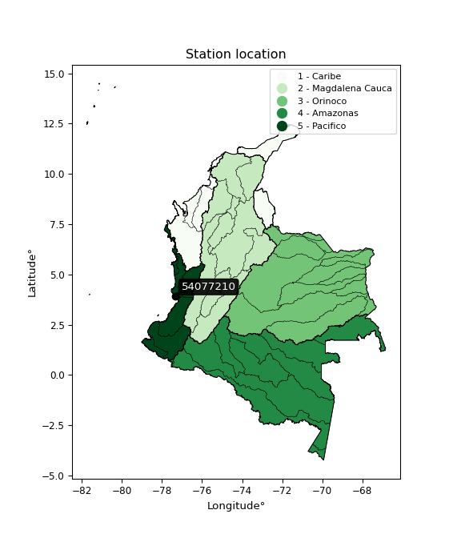

<div align="center">


</div>

# PMax24h Station (Rain, Pmax24h): 54077210

Maximum Precipitation in 24 hours (PMax24h) is the greatest amount of rainfall for a specific duration that is meteorologically possible for a given location, acting as a "worst-case" scenario for extreme storms, crucial for designing safety-critical infrastructure like bridges, river deviations, dams, spillways, and nuclear plants to prevent catastrophic failure. The PMax24h is related with the Probable Maximum Precipitation (PMP) and it is calculated by hydrologists using meteorological data to determine the upper limit of extreme rainfall, often leading to the Probable Maximum Flood (PMF) for flood control design, and is increasingly being studied for climate change impacts. Probable Maximum Precipitation (PMP) is the theoretical upper limit of rainfall, a deterministic estimate for extreme events, while probability distributions (like GEV, Gumbel) describe the likelihood and frequency of various precipitation amounts, including rare ones, showing how often events occur, with PMP representing the extreme end of these distributions, used for critical infrastructure design to ensure safety against the worst conceivable weather, unlike standard statistical forecasts which cover typical probabilities.

The most common probability distributions in hydrology, used for analyzing floods, rainfall, and streamflow, include the Normal, Log-Normal, Gumbel, Gamma (including Log-Pearson Type III), and Generalized Extreme Value (GEV) distributions, often chosen based on the data´s skewness and whether modeling extremes or general conditions, with Gumbel and GEV popular for extreme events like floods, while the Normal distribution serves as a baseline, though often requiring transformations for skewed hydrological data. These distributions help in designing water infrastructure, managing water resources, and forecasting hydrologic events.

> Hydrological data often isn´t perfectly normal (it´s skewed), so different distributions are needed for different applications, such as: **Flood Frequency Analysis**: Using Gumbel, GEV, or Log-Pearson Type III for predicting extreme flood magnitudes and their return periods, **Rainfall Analysis**: Normal for annual totals, but Log-Normal, Weibull, or GEV for intensity or extreme daily rainfall, **Streamflow Modeling**: Gamma and Log-Normal for maximum flows, GEV for minimum flows, and Kappa for daily flows.

<div align="center">

</img>

</div>


## A. General information


### 1. General running parameters

• app_version: _v20260225_. • runtime: _2026-02-27 14:50:08.749431_. • Python version: _3.14.0_. • SciPy version: _1.16.3_. • Pandas version: _2.3.3_. • NumPy version: _2.3.5_. • Stations dataset (station_dataset_file): _dataset/pmax24h_in/automatic_colombia_2003_2025.csv_. • Stations catalog (station_catalog_file): _dataset/CNE.xls_. • Minimum year to eval til year_max (date_min): _1900_. • Maximum year to eval since year_min (date_max): _2025_. • Creates, save and include plots into reports (create_plot): _False_. • Plot only fit distributions with Δo > Δ (plot_only_fit): _True_. • Plot only simple graphs avoiding multiple CDFs and multiple Extreme values plots (plot_only_simple): _False_. • Eval low extreme values, if False, evaluates high extreme values (low_extreme): _False_. • Eval every SciPy distribution as logarithmic (pdist_logarithmic_on): _True_. • Standard deviation normalized (ddof): _1.0_. • Return periods to eval in years (Tr): _[2, 2.33, 5, 10, 15, 20, 25, 50, 75, 100, 200, 250, 500, 750, 1000]_. • Minimum data sample per station, 0 means any (minimum_sample): _5_. • Z-Score maximum threshold to adjust a value, 0 means disable (zscore_max): _3.5_. • Z-Score minimum threshold to adjust a value, 0 means disable (zscore_min): _-2.5_. • Avoid zeros, e.g. rain = 0 (avoid_zeros): _True_. • Avoid null values (avoid_nans): _True_. 

:file_folder:Table: [dataset.csv](../../dataset/pmax24h_in/automatic_colombia_2003_2025.csv)

> Delta Degrees of Freedom (DDOF): is a parameter used in the formulas for calculating variance and standard deviation. When ddof=0, the divisor is $N$ (the total number of observations) and this is used when your data set is the entire population. When ddof=1, the divisor is $N-1$ and this is used when your data set is a sample drawn from a larger population. Using $N-1$ provides an unbiased estimate of the population variance (known as Bessel´s correction).


### 2. Station info and location

|   id |   CODIGO | NOMBRE                     | CATEGORIA            | TECNOLOGIA                | ESTADO           | FECHA_INSTALACION   |   FECHA_SUSPENSION |   ALTITUD |   LATITUD |   LONGITUD | DEPARTAMENTO    | MUNICIPIO    | AREA_OPERATIVA                         | ENTIDAD                                                     | AREA_HIDROGRAFICA   | ZONA_HIDROGRAFICA   | SUBZONA_HIDROGRAFICA         | CORRIENTE       | Catalogo   |   Version |
|-----:|---------:|:---------------------------|:---------------------|:--------------------------|:-----------------|:--------------------|-------------------:|----------:|----------:|-----------:|:----------------|:-------------|:---------------------------------------|:------------------------------------------------------------|:--------------------|:--------------------|:-----------------------------|:----------------|:-----------|----------:|
|    0 | 54077210 | JUANCHACO - AUT [54077210] | Meteorologica Marina | Automática con Telemetría | En Mantenimiento | 23/06/2005          |                nan |        18 |   3.92515 |    -77.349 | Valle Del Cauca | Buenaventura | Area Operativa 09 - Cauca-Valle-Caldas | INSTITUTO DE HIDROLOGIA METEOROLOGIA Y ESTUDIOS AMBIENTALES | Pacifico            | San Juán            | Ríos Calima y  Bajo San Juan | Oceano Pacifico | CNE_IDEAM  |  20251226 |

<div align="center">

Dynamic map: [:earth_americas:Google](http://maps.google.com/maps?q=3.925147222,-77.34900556) [:earth_americas:OSM](https://www.openstreetmap.org/#map=18/3.925147222/-77.34900556&layers=P) [:earth_americas:Bing](https://www.bing.com/maps?cp=3.925147222~-77.34900556&lvl=18) [:earth_americas:Apple](https://maps.apple.com/frame?center=3.925147222%2C-77.34900556&span=0.003%2C0.006)

</div>


<div align="center">

```geojson
{
  "type": "Feature",
  "geometry": {
    "type": "Point", 
    "coordinates": [-77.34900556, 3.925147222]
  }, 
  "properties": {
    "Name": "54077210"
  }
}
```

</div>


### 3. Discrete values table and plot

<div align="center">

|               |          0 |           1 |          2 |           3 |           4 |
|:--------------|-----------:|------------:|-----------:|------------:|------------:|
| Date          | 2017       | 2018        | 2019       | 2020        | 2025        |
| Value         |   33.8     |    9.6      |    6       |   19.4      |   28.9      |
| Value_initial |   33.8     |    9.6      |    6       |   19.4      |   28.9      |
| count         |    5       |    5        |    5       |    5        |    5        |
| mean          |   19.54    |   19.54     |   19.54    |   19.54     |   19.54     |
| std           |   11.9699  |   11.9699   |   11.9699  |   11.9699   |   11.9699   |
| zscore        |    1.19132 |   -0.830418 |   -1.13117 |   -0.011696 |    0.781963 |


</div>


> The initial value (value_initial) correspond to the initial obtained or null completed value, and value (value) is adjusted only when the initial value is outside the valid range (outlier) definite through the Z-Score value. If Z-Score is active, values out of range or outliers are replaced with the station mean value. A Z-Score (or standard score) measures how many standard deviations a data point is from the mean of a dataset, indicating its relative position; positive scores mean above the mean, negative mean below, and a score of zero is exactly at the mean, allowing for comparison of values from different distributions. It´s calculated using the formula $z=(x–μ)/σ$, where $x$ is the data point, $μ$ is the mean, and $σ$ is the standard deviation, helping identify outliers and understand probability.
>
> <sub>**Note**: In this study, "completing" (filling gaps in) and "extending" (forecasting or lengthening the historical record) rainfall data series are avoided for certain critical analyses because they introduce artificial bias and uncertainty, which can distort the statistics of rare events (extremes), alter day-to-day variability, and compromise the integrity and homogeneity of the original data. Some reasons against Completing/Extending rainfall data are: **Distortion of Extremes and Variability**: The primary issue is that most gap-filling or extension methods rely on averaging or regression with nearby stations, which inherently smooths the data. Rainfall is highly variable in space and time, with a large percentage of zero values and occasional large storms. Infilling methods often underestimate the highest values and overestimate the lowest (zero) values, which severely distorts analyses focused on flood frequency, drought severity, and intensity-duration-frequency (IDF) curves, **Loss of Data Homogeneity**: Infilled or extended data are synthetic estimates, not actual measurements. Combining these estimates with observed data can violate the assumption of data homogeneity, which requires that the data properties do not change over time. Inhomogeneity can lead to incorrect conclusions about long-term trends or changes in climate patterns, **Propagation of Errors**: Errors and biases from the original data (e.g., wind-induced undercatch, instrument errors, site changes) or the data used for imputation can propagate through the analysis, leading to unreliable hydrological models and inaccurate predictions, **Compromised Statistical Integrity**: For statistical analyses, especially those involving the frequency of events, using artificial data can introduce time bias or autocorrelation that doesn´t exist in reality, making it difficult to assess the true probability of events, **Difficulty in Validation**: It is difficult to accurately validate the quality of filled or extended data, especially for past periods where ground-truth measurements are unavailable. The reliability of imputation techniques heavily depends on the density of the surrounding station network and the complexity of the local topography.</sub>


### 4. Active continuous probability distributions from SciPy (80 of 104 available)

A Probability Density Function (PDF) describes the relative likelihood of a continuous random variable falling within a specific range, where the total area under its curve equals 1, and the area over any interval gives the actual probability for that range. Unlike discrete probabilities (like rolling a die), a PDF shows density, not direct probability for a single point (which is zero), with higher points indicating higher likelihood, often visualized as a bell curve for normal distributions.

A log of a probability density function (log-PDF) is simply the logarithm of the PDF´s value, denoted as $log(f(x))$, useful for converting multiplication of probabilities into addition, improving numerical stability with tiny numbers, and connecting to information theory concepts like entropy. Instead of dealing with very small probabilities (e.g., 0.000001), log-PDFs use negative numbers (e.g., $log(0.00001) ≈ -11.51$ that are easier for computers to handle, preventing underflow errors and simplifying complex calculations. In this study, each active probability distribution from SciPy is also evaluated in the $log$ form.

[scipy.stats](https://docs.scipy.org/doc/scipy/reference/stats.html) is a Python´s powerful submodule within the SciPy library for comprehensive statistical analysis, offering over 130 probability distributions (like Normal, Poisson, etc.), functions for descriptive stats (mean, variance), hypothesis testing (t-tests, chi-square), random variable generation, and statistical tests, making it essential for data science, modeling, and research. It provides tools to explore, model, and draw conclusions from data efficiently, working seamlessly with [NumPy](https://numpy.org/).

<div align="center">

|   id | p_dist           |   n_parameter | fit_method   | label                                                                       | active   | ref                                                                                                      |
|-----:|:-----------------|--------------:|:-------------|:----------------------------------------------------------------------------|:---------|:---------------------------------------------------------------------------------------------------------|
|    0 | alpha            |             3 | MLE          | Alpha                                                                       | True     | [:mortar_board:](https://docs.scipy.org/doc/scipy/reference/generated/scipy.stats.alpha.html)            |
|    1 | anglit           |             2 | MM           | Anglit                                                                      | True     | [:mortar_board:](https://docs.scipy.org/doc/scipy/reference/generated/scipy.stats.anglit.html)           |
|    2 | arcsine          |             2 | MM           | Arcsine                                                                     | True     | [:mortar_board:](https://docs.scipy.org/doc/scipy/reference/generated/scipy.stats.arcsine.html)          |
|    3 | argus            |             3 | MLE          | Argus                                                                       | True     | [:mortar_board:](https://docs.scipy.org/doc/scipy/reference/generated/scipy.stats.argus.html)            |
|    4 | beta             |             4 | MLE          | Beta                                                                        | True     | [:mortar_board:](https://docs.scipy.org/doc/scipy/reference/generated/scipy.stats.beta.html)             |
|    5 | betaprime        |             4 | MLE          | Beta prime                                                                  | True     | [:mortar_board:](https://docs.scipy.org/doc/scipy/reference/generated/scipy.stats.betaprime.html)        |
|    6 | bradford         |             3 | MLE          | Bradford                                                                    | True     | [:mortar_board:](https://docs.scipy.org/doc/scipy/reference/generated/scipy.stats.bradford.html)         |
|    7 | burr             |             4 | MLE          | Burr (Type III)                                                             | True     | [:mortar_board:](https://docs.scipy.org/doc/scipy/reference/generated/scipy.stats.burr.html)             |
|    8 | burr12           |             4 | MLE          | Burr (Type III) 12                                                          | True     | [:mortar_board:](https://docs.scipy.org/doc/scipy/reference/generated/scipy.stats.burr12.html)           |
|    9 | cosine           |             2 | MLE          | Cosine                                                                      | True     | [:mortar_board:](https://docs.scipy.org/doc/scipy/reference/generated/scipy.stats.cosine.html)           |
|   10 | crystalball      |             4 | MLE          | Crystalball                                                                 | True     | [:mortar_board:](https://docs.scipy.org/doc/scipy/reference/generated/scipy.stats.crystalball.html)      |
|   11 | dgamma           |             3 | MLE          | Double gamma                                                                | True     | [:mortar_board:](https://docs.scipy.org/doc/scipy/reference/generated/scipy.stats.dgamma.html)           |
|   12 | dweibull         |             3 | MLE          | Double Weibull                                                              | True     | [:mortar_board:](https://docs.scipy.org/doc/scipy/reference/generated/scipy.stats.dweibull.html)         |
|   13 | erlang           |             3 | MLE          | Erlang                                                                      | True     | [:mortar_board:](https://docs.scipy.org/doc/scipy/reference/generated/scipy.stats.erlang.html)           |
|   14 | exponnorm        |             3 | MLE          | Exponentially modified Normal                                               | True     | [:mortar_board:](https://docs.scipy.org/doc/scipy/reference/generated/scipy.stats.exponnorm.html)        |
|   15 | exponpow         |             3 | MLE          | Exponential power                                                           | True     | [:mortar_board:](https://docs.scipy.org/doc/scipy/reference/generated/scipy.stats.exponpow.html)         |
|   16 | exponweib        |             4 | MLE          | Exponentiated Weibull                                                       | True     | [:mortar_board:](https://docs.scipy.org/doc/scipy/reference/generated/scipy.stats.exponweib.html)        |
|   17 | f                |             4 | MLE          | F                                                                           | True     | [:mortar_board:](https://docs.scipy.org/doc/scipy/reference/generated/scipy.stats.f.html)                |
|   18 | fatiguelife      |             3 | MLE          | Fatigue-life (Birnbaum-Saunders)                                            | True     | [:mortar_board:](https://docs.scipy.org/doc/scipy/reference/generated/scipy.stats.fatiguelife.html)      |
|   19 | foldnorm         |             3 | MM           | Fold Normal                                                                 | True     | [:mortar_board:](https://docs.scipy.org/doc/scipy/reference/generated/scipy.stats.foldnorm.html)         |
|   20 | gamma            |             3 | MLE          | Gamma                                                                       | True     | [:mortar_board:](https://docs.scipy.org/doc/scipy/reference/generated/scipy.stats.gamma.html)            |
|   21 | gausshyper       |             6 | MLE          | Gauss hypergeometric                                                        | True     | [:mortar_board:](https://docs.scipy.org/doc/scipy/reference/generated/scipy.stats.gausshyper.html)       |
|   22 | genexpon         |             5 | MLE          | Generalized exponential                                                     | True     | [:mortar_board:](https://docs.scipy.org/doc/scipy/reference/generated/scipy.stats.genexpon.html)         |
|   23 | genextreme       |             3 | MLE          | Generalized exponential                                                     | True     | [:mortar_board:](https://docs.scipy.org/doc/scipy/reference/generated/scipy.stats.genextreme.html)       |
|   24 | gengamma         |             4 | MLE          | Generalized gamma                                                           | True     | [:mortar_board:](https://docs.scipy.org/doc/scipy/reference/generated/scipy.stats.gengamma.html)         |
|   25 | genhalflogistic  |             3 | MLE          | Generalized half-logistic                                                   | True     | [:mortar_board:](https://docs.scipy.org/doc/scipy/reference/generated/scipy.stats.genhalflogistic.html)  |
|   26 | genlogistic      |             3 | MLE          | Generalized logistic                                                        | True     | [:mortar_board:](https://docs.scipy.org/doc/scipy/reference/generated/scipy.stats.genlogistic.html)      |
|   27 | gennorm          |             3 | MLE          | Generalized Normal                                                          | True     | [:mortar_board:](https://docs.scipy.org/doc/scipy/reference/generated/scipy.stats.gennorm.html)          |
|   28 | genpareto        |             3 | MLE          | Generalized Pareto                                                          | True     | [:mortar_board:](https://docs.scipy.org/doc/scipy/reference/generated/scipy.stats.genpareto.html)        |
|   29 | gompertz         |             3 | MLE          | Gompertz (or truncated Gumbel)                                              | True     | [:mortar_board:](https://docs.scipy.org/doc/scipy/reference/generated/scipy.stats.gompertz.html)         |
|   30 | gumbel_l         |             2 | MM           | Gumbel Left Skew                                                            | True     | [:mortar_board:](https://docs.scipy.org/doc/scipy/reference/generated/scipy.stats.gumbel_l.html)         |
|   31 | gumbel_r         |             2 | MM           | Gumbel Right Skew                                                           | True     | [:mortar_board:](https://docs.scipy.org/doc/scipy/reference/generated/scipy.stats.gumbel_r.html)         |
|   32 | halfgennorm      |             3 | MLE          | Upper half of a generalized normal                                          | True     | [:mortar_board:](https://docs.scipy.org/doc/scipy/reference/generated/scipy.stats.halfgennorm.html)      |
|   33 | halflogistic     |             2 | MM           | Half-logistic                                                               | True     | [:mortar_board:](https://docs.scipy.org/doc/scipy/reference/generated/scipy.stats.halflogistic.html)     |
|   34 | halfnorm         |             2 | MM           | Half Normal                                                                 | True     | [:mortar_board:](https://docs.scipy.org/doc/scipy/reference/generated/scipy.stats.halfnorm.html)         |
|   35 | hypsecant        |             2 | MM           | hyperbolic secant                                                           | True     | [:mortar_board:](https://docs.scipy.org/doc/scipy/reference/generated/scipy.stats.hypsecant.html)        |
|   36 | invgamma         |             3 | MLE          | Inverted gamma                                                              | True     | [:mortar_board:](https://docs.scipy.org/doc/scipy/reference/generated/scipy.stats.invgamma.html)         |
|   37 | invgauss         |             3 | MLE          | Inverse Gaussian                                                            | True     | [:mortar_board:](https://docs.scipy.org/doc/scipy/reference/generated/scipy.stats.invgauss.html)         |
|   38 | invweibull       |             3 | MLE          | Inverted Weibull                                                            | True     | [:mortar_board:](https://docs.scipy.org/doc/scipy/reference/generated/scipy.stats.invweibull.html)       |
|   39 | johnsonsb        |             4 | MLE          | Johnson SB                                                                  | True     | [:mortar_board:](https://docs.scipy.org/doc/scipy/reference/generated/scipy.stats.johnsonsb.html)        |
|   40 | johnsonsu        |             4 | MLE          | Johnson Su                                                                  | True     | [:mortar_board:](https://docs.scipy.org/doc/scipy/reference/generated/scipy.stats.johnsonsu.html)        |
|   41 | kappa3           |             3 | MLE          | Kappa 3                                                                     | True     | [:mortar_board:](https://docs.scipy.org/doc/scipy/reference/generated/scipy.stats.kappa3.html)           |
|   42 | kappa4           |             4 | MLE          | Kappa 4                                                                     | True     | [:mortar_board:](https://docs.scipy.org/doc/scipy/reference/generated/scipy.stats.kappa4.html)           |
|   43 | ksone            |             3 | MLE          | Kolmogorov-Smirnov one-sided test statistic distribution                    | True     | [:mortar_board:](https://docs.scipy.org/doc/scipy/reference/generated/scipy.stats.ksone.html)            |
|   44 | kstwobign        |             2 | MLE          | Limiting distribution of scaled Kolmogorov-Smirnov two-sided test statistic | True     | [:mortar_board:](https://docs.scipy.org/doc/scipy/reference/generated/scipy.stats.kstwobign.html)        |
|   45 | laplace          |             2 | MM           | Laplace                                                                     | True     | [:mortar_board:](https://docs.scipy.org/doc/scipy/reference/generated/scipy.stats.laplace.html)          |
|   46 | levy_l           |             2 | MLE          | Left-skewed Levy                                                            | True     | [:mortar_board:](https://docs.scipy.org/doc/scipy/reference/generated/scipy.stats.levy_l.html)           |
|   47 | loggamma         |             3 | MLE          | Log gamma                                                                   | True     | [:mortar_board:](https://docs.scipy.org/doc/scipy/reference/generated/scipy.stats.loggamma.html)         |
|   48 | logistic         |             2 | MM           | Logistic (or Sech-squared)                                                  | True     | [:mortar_board:](https://docs.scipy.org/doc/scipy/reference/generated/scipy.stats.logistic.html)         |
|   49 | loglaplace       |             3 | MLE          | Log-Laplace                                                                 | True     | [:mortar_board:](https://docs.scipy.org/doc/scipy/reference/generated/scipy.stats.loglaplace.html)       |
|   50 | lomax            |             3 | MLE          | Lomax (Pareto of the second kind)                                           | True     | [:mortar_board:](https://docs.scipy.org/doc/scipy/reference/generated/scipy.stats.lomax.html)            |
|   51 | maxwell          |             2 | MM           | Maxwell                                                                     | True     | [:mortar_board:](https://docs.scipy.org/doc/scipy/reference/generated/scipy.stats.maxwell.html)          |
|   52 | mielke           |             4 | MLE          | Mielke Beta-Kappa / Dagum                                                   | True     | [:mortar_board:](https://docs.scipy.org/doc/scipy/reference/generated/scipy.stats.mielke.html)           |
|   53 | moyal            |             2 | MM           | Moyal                                                                       | True     | [:mortar_board:](https://docs.scipy.org/doc/scipy/reference/generated/scipy.stats.moyal.html)            |
|   54 | nakagami         |             3 | MLE          | Nakagami                                                                    | True     | [:mortar_board:](https://docs.scipy.org/doc/scipy/reference/generated/scipy.stats.nakagami.html)         |
|   55 | ncf              |             5 | MLE          | Non-central F distribution                                                  | True     | [:mortar_board:](https://docs.scipy.org/doc/scipy/reference/generated/scipy.stats.ncf.html)              |
|   56 | nct              |             4 | MLE          | Non-central Student’s t                                                     | True     | [:mortar_board:](https://docs.scipy.org/doc/scipy/reference/generated/scipy.stats.nct.html)              |
|   57 | norm             |             2 | MM           | Normal                                                                      | True     | [:mortar_board:](https://docs.scipy.org/doc/scipy/reference/generated/scipy.stats.norm.html)             |
|   58 | pearson3         |             3 | MM           | Pearson type III                                                            | True     | [:mortar_board:](https://docs.scipy.org/doc/scipy/reference/generated/scipy.stats.pearson3.html)         |
|   59 | powerlaw         |             3 | MLE          | Power-function                                                              | True     | [:mortar_board:](https://docs.scipy.org/doc/scipy/reference/generated/scipy.stats.powerlaw.html)         |
|   60 | rayleigh         |             2 | MM           | Rayleigh                                                                    | True     | [:mortar_board:](https://docs.scipy.org/doc/scipy/reference/generated/scipy.stats.rayleigh.html)         |
|   61 | rdist            |             3 | MLE          | R-distributed (symmetric beta)                                              | True     | [:mortar_board:](https://docs.scipy.org/doc/scipy/reference/generated/scipy.stats.rdist.html)            |
|   62 | rice             |             3 | MLE          | Rice                                                                        | True     | [:mortar_board:](https://docs.scipy.org/doc/scipy/reference/generated/scipy.stats.rice.html)             |
|   63 | semicircular     |             2 | MM           | Semicircular                                                                | True     | [:mortar_board:](https://docs.scipy.org/doc/scipy/reference/generated/scipy.stats.semicircular.html)     |
|   64 | skewnorm         |             3 | MLE          | Skew normal                                                                 | True     | [:mortar_board:](https://docs.scipy.org/doc/scipy/reference/generated/scipy.stats.skewnorm.html)         |
|   65 | t                |             3 | MLE          | Student’s t                                                                 | True     | [:mortar_board:](https://docs.scipy.org/doc/scipy/reference/generated/scipy.stats.t.html)                |
|   66 | trapezoid        |             4 | MLE          | Trapezoid                                                                   | True     | [:mortar_board:](https://docs.scipy.org/doc/scipy/reference/generated/scipy.stats.trapezoid.html)        |
|   67 | triang           |             3 | MLE          | Triangular                                                                  | True     | [:mortar_board:](https://docs.scipy.org/doc/scipy/reference/generated/scipy.stats.triang.html)           |
|   68 | truncexpon       |             3 | MLE          | Truncated exponential                                                       | True     | [:mortar_board:](https://docs.scipy.org/doc/scipy/reference/generated/scipy.stats.truncexpon.html)       |
|   69 | truncnorm        |             4 | MLE          | Truncated normal                                                            | True     | [:mortar_board:](https://docs.scipy.org/doc/scipy/reference/generated/scipy.stats.truncnorm.html)        |
|   70 | truncpareto      |             4 | MLE          | Upper truncated Pareto                                                      | True     | [:mortar_board:](https://docs.scipy.org/doc/scipy/reference/generated/scipy.stats.truncpareto.html)      |
|   71 | truncweibull_min |             5 | MLE          | Doubly truncated Weibull minimum                                            | True     | [:mortar_board:](https://docs.scipy.org/doc/scipy/reference/generated/scipy.stats.truncweibull_min.html) |
|   72 | tukeylambda      |             3 | MLE          | Tukey-Lamdba                                                                | True     | [:mortar_board:](https://docs.scipy.org/doc/scipy/reference/generated/scipy.stats.tukeylambda.html)      |
|   73 | uniform          |             2 | MLE          | Uniform                                                                     | True     | [:mortar_board:](https://docs.scipy.org/doc/scipy/reference/generated/scipy.stats.uniform.html)          |
|   74 | vonmises         |             3 | MLE          | Von Mises                                                                   | True     | [:mortar_board:](https://docs.scipy.org/doc/scipy/reference/generated/scipy.stats.vonmises.html)         |
|   75 | vonmises_line    |             3 | MLE          | Von Mises line                                                              | True     | [:mortar_board:](https://docs.scipy.org/doc/scipy/reference/generated/scipy.stats.vonmises_line.html)    |
|   76 | wald             |             2 | MM           | Wald                                                                        | True     | [:mortar_board:](https://docs.scipy.org/doc/scipy/reference/generated/scipy.stats.wald.html)             |
|   77 | weibull_max      |             3 | MLE          | Weibull maximum                                                             | True     | [:mortar_board:](https://docs.scipy.org/doc/scipy/reference/generated/scipy.stats.weibull_max.html)      |
|   78 | weibull_min      |             3 | MLE          | Weibull minimum                                                             | True     | [:mortar_board:](https://docs.scipy.org/doc/scipy/reference/generated/scipy.stats.weibull_min.html)      |
|   79 | wrapcauchy       |             3 | MLE          | Wrapped  Cauchy                                                             | True     | [:mortar_board:](https://docs.scipy.org/doc/scipy/reference/generated/scipy.stats.wrapcauchy.html)       |

</div>

> **n_parameter:** # arguments & localization & scale.
>
> **Fit methods:** (MLE) maximum likelihood, (MM) L-moments.
>
>**Inactive** (With the only purpose of prevent loops, zero divisions, infinite values, over high estimated values or horizontal trending for recurrence intervals estimations, the follow distributions were disabled.)**:** lognorm, norminvgauss, powernorm, powerlognorm, cauchy, halfcauchy, foldcauchy, skewcauchy, chi2, expon, fisk, genhyperbolic, geninvgauss, gibrat, kstwo, laplace_asymmetric, levy, levy_stable, ncx2, pareto, rel_breitwigner, recipinvgauss, studentized_range, loguniform, 


## B. Probability (PDF) vs. Empirical (EDF) distributions functions

A continuous probability distribution (CPD) describes probabilities for variables that can take any value within a range (like rain any time), unlike discrete variables with specific outcomes (like temperature). It uses a Probability Density Function (PDF), a curve where the total area under it equals 1, and the probability of the variable falling within an interval (a to b) is found by calculating the area under the curve between those points. A key feature is that the probability of hitting any single exact value is zero, so probabilities are always expressed for ranges, e.g., $P(a ≤ X ≤ b)$.

<div align="center">

Distributions parameters from station values
|     |   station | p_dist              |   n |             loc |          scale | shape                 | shape1                 | shape2                 | shape3             |
|----:|----------:|:--------------------|----:|----------------:|---------------:|:----------------------|:-----------------------|:-----------------------|:-------------------|
|   0 |  54077210 | alpha               |   5 |    -0.0446335   |   14.1311      | 0.6536159345228754    |                        |                        |                    |
|   1 |  54077210 | anglit              |   5 |    19.54        |   31.3199      |                       |                        |                        |                    |
|   2 |  54077210 | arcsine             |   5 |     4.39917     |   30.2817      |                       |                        |                        |                    |
|   3 |  54077210 | argus               |   5 |    -2.82934     |   38.9325      | 0.40873233844695783   |                        |                        |                    |
|   4 |  54077210 | beta                |   5 |     6           |   28.2653      | 0.37633544905196803   | 0.3788660782430734     |                        |                    |
|   5 |  54077210 | betaprime           |   5 |     6           |  135.204       | 0.9109560615969591    | 8.403462502354829      |                        |                    |
|   6 |  54077210 | bradford            |   5 |     5.99997     |   27.8         | 0.2979485589645391    |                        |                        |                    |
|   7 |  54077210 | burr                |   5 |    -1.01467     |   35.1434      | 439.81901949414424    | 0.003233533801906605   |                        |                    |
|   8 |  54077210 | burr12              |   5 |    -1.79084     |    7.71808     | 464.35875918311945    | 0.0024939000760097678  |                        |                    |
|   9 |  54077210 | cosine              |   5 |    19.6129      |    8.46286     |                       |                        |                        |                    |
|  10 |  54077210 | crystalball         |   5 |    19.54        |   10.7062      | 2102.9318402776275    | 10.673850089031117     |                        |                    |
|  11 |  54077210 | dgamma              |   5 |    15.7184      |    2.82767     | 3.59176310408695      |                        |                        |                    |
|  12 |  54077210 | dweibull            |   5 |    19.4         |    8.41533     | 0.9244609883955243    |                        |                        |                    |
|  13 |  54077210 | erlang              |   5 |  -434.206       |    0.252402    | 1797.7064198652515    |                        |                        |                    |
|  14 |  54077210 | exponnorm           |   5 |    19.2599      |   10.7025      | 0.026169538232268717  |                        |                        |                    |
|  15 |  54077210 | exponpow            |   5 |     6           |   19.5413      | 0.80072858511901      |                        |                        |                    |
|  16 |  54077210 | exponweib           |   5 |     6           |    0.0325922   | 1.5265837469534427    | 0.15945482433178476    |                        |                    |
|  17 |  54077210 | f                   |   5 |     6           |   10.4937      | 1.665453383831676     | 13.966856716507042     |                        |                    |
|  18 |  54077210 | fatiguelife         |   5 |     6           |    2.4071e-05  | 758.3104999145412     |                        |                        |                    |
|  19 |  54077210 | foldnorm            |   5 |    -9.57188     |   10.7678      | 2.7015062178314593    |                        |                        |                    |
|  20 |  54077210 | gamma               |   5 |  -438.048       |    0.250054    | 1829.941843200907     |                        |                        |                    |
|  21 |  54077210 | gausshyper          |   5 |     5.28546     |   28.5145      | 1.0066466229533062    | 0.2715806713495087     | 1.3960711260194762     | 1.0947135103653007 |
|  22 |  54077210 | genexpon            |   5 |     5.99998     |    1.82496     | 0.13455254195321076   | 3.086049389402504e-07  | 1.074478844834852      |                    |
|  23 |  54077210 | genextreme          |   5 |     7.05486     |    9.13794     | -8.66269967868071     |                        |                        |                    |
|  24 |  54077210 | gengamma            |   5 |     6           |    0.353567    | 2.331900706058616     | 0.36179403753030875    |                        |                    |
|  25 |  54077210 | genhalflogistic     |   5 |    -3.6565      |   42.6351      | 1.1382551941900672    |                        |                        |                    |
|  26 |  54077210 | genlogistic         |   5 |   -47.6041      |    9.21927     | 819.6908715919053     |                        |                        |                    |
|  27 |  54077210 | gennorm             |   5 |    19.9         |   13.9         | 17038620.13756837     |                        |                        |                    |
|  28 |  54077210 | genpareto           |   5 |    -0.00608837  |   44.8903      | -1.3278747879352482   |                        |                        |                    |
|  29 |  54077210 | gompertz            |   5 |     6           |   23.0217      | 0.9983649709876015    |                        |                        |                    |
|  30 |  54077210 | gumbel_l            |   5 |    24.3584      |    8.34758     |                       |                        |                        |                    |
|  31 |  54077210 | gumbel_r            |   5 |    14.7216      |    8.34758     |                       |                        |                        |                    |
|  32 |  54077210 | halfgennorm         |   5 |     6           |    0.32275     | 0.33788124999032065   |                        |                        |                    |
|  33 |  54077210 | halflogistic        |   5 |     6.85065     |    9.15342     |                       |                        |                        |                    |
|  34 |  54077210 | halfnorm            |   5 |     5.36921     |   17.7605      |                       |                        |                        |                    |
|  35 |  54077210 | hypsecant           |   5 |    19.54        |    6.81577     |                       |                        |                        |                    |
|  36 |  54077210 | invgamma            |   5 |   -44.7355      | 2228.47        | 35.665289931315314    |                        |                        |                    |
|  37 |  54077210 | invgauss            |   5 |     0.241251    |   36.1523      | 0.5338183333534987    |                        |                        |                    |
|  38 |  54077210 | invweibull          |   5 |    -6.78453e+08 |    6.78453e+08 | 73064268.81518342     |                        |                        |                    |
|  39 |  54077210 | johnsonsb           |   5 |     5.07165     |   28.7284      | -0.07483641285156407  | 0.10392528424402578    |                        |                    |
|  40 |  54077210 | johnsonsu           |   5 |     6.93645e+07 |    5.9865e+06  | 20444117.122693405    | 6500775.999939167      |                        |                    |
|  41 |  54077210 | kappa3              |   5 |     5.99816     |   27.8004      | 23230.141488213092    |                        |                        |                    |
|  42 |  54077210 | kappa4              |   5 |     0.957694    |   33.767       | 1.1759476932951518    | 1.0250859756042046     |                        |                    |
|  43 |  54077210 | ksone               |   5 |     0.996343    |   37.0873      | 1.0                   |                        |                        |                    |
|  44 |  54077210 | kstwobign           |   5 |   -17.0366      |   41.6722      |                       |                        |                        |                    |
|  45 |  54077210 | laplace             |   5 |    19.54        |    7.57042     |                       |                        |                        |                    |
|  46 |  54077210 | levy_l              |   5 |    34.8215      |    3.88492     |                       |                        |                        |                    |
|  47 |  54077210 | loggamma            |   5 | -1590.44        |  254.4         | 560.7647323598776     |                        |                        |                    |
|  48 |  54077210 | logistic            |   5 |    19.54        |    5.90263     |                       |                        |                        |                    |
|  49 |  54077210 | loglaplace          |   5 |    -0.0226609   |   19.4227      | 1.769398386390212     |                        |                        |                    |
|  50 |  54077210 | lomax               |   5 |     6           |  591.996       | 44.430968699464245    |                        |                        |                    |
|  51 |  54077210 | maxwell             |   5 |    -5.82916     |   15.8978      |                       |                        |                        |                    |
|  52 |  54077210 | mielke              |   5 |     6           |   28.1749      | 0.7046501637881761    | 488.770622400863       |                        |                    |
|  53 |  54077210 | moyal               |   5 |    13.4175      |    4.81948     |                       |                        |                        |                    |
|  54 |  54077210 | nakagami            |   5 |     9.6         |   13.9446      | 0.18077626337845235   |                        |                        |                    |
|  55 |  54077210 | ncf                 |   5 |     6           |   11.1394      | 1.4284144927488618    | 2347.1605180512224     | 0.7459486801501188     |                    |
|  56 |  54077210 | nct                 |   5 |  -443.403       |   10.6457      | 80941.82188533334     | 43.48610613461008      |                        |                    |
|  57 |  54077210 | norm                |   5 |    19.54        |   10.7062      |                       |                        |                        |                    |
|  58 |  54077210 | pearson3            |   5 |    19.54        |   10.7062      | 0.04164455327109391   |                        |                        |                    |
|  59 |  54077210 | powerlaw            |   5 |     6           |   27.8         | 0.12209959241209956   |                        |                        |                    |
|  60 |  54077210 | rayleigh            |   5 |    -0.941557    |   16.3419      |                       |                        |                        |                    |
|  61 |  54077210 | rdist               |   5 |    20.1541      |   14.1541      | 1.0571472364529326    |                        |                        |                    |
|  62 |  54077210 | rice                |   5 |    -0.0383188   |   13.401       | 0.8790234303058924    |                        |                        |                    |
|  63 |  54077210 | semicircular        |   5 |    19.54        |   21.4124      |                       |                        |                        |                    |
|  64 |  54077210 | skewnorm            |   5 |    18.25        |   10.7836      | 0.15164288974652684   |                        |                        |                    |
|  65 |  54077210 | t                   |   5 |    19.5404      |   10.7063      | 111251377.6032852     |                        |                        |                    |
|  66 |  54077210 | trapezoid           |   5 |   -11.2787      |   45.4225      | 1.0                   | 1.0                    |                        |                    |
|  67 |  54077210 | triang              |   5 |    -4.76988     |   38.5711      | 0.9999999999806755    |                        |                        |                    |
|  68 |  54077210 | truncexpon          |   5 |     4.50612     |   39.1072      | 0.7490656126695243    |                        |                        |                    |
|  69 |  54077210 | truncnorm           |   5 |    19.54        |   10.7062      | -57.27617281062268    | 312.04340918159886     |                        |                    |
|  70 |  54077210 | truncpareto         |   5 |     5.87699     |    0.123009    | 0.2664270095909215    | 227.00001295156414     |                        |                    |
|  71 |  54077210 | truncweibull_min    |   5 |     4.34225     |   34.1504      | 0.9997805851014814    | 1.2847481053560726e-05 | 0.8625893076662401     |                    |
|  72 |  54077210 | tukeylambda         |   5 |    19.9162      |   15.733       | 1.130550102218584     |                        |                        |                    |
|  73 |  54077210 | uniform             |   5 |     6           |   27.8         |                       |                        |                        |                    |
|  74 |  54077210 | vonmises            |   5 |     2.90529     |    1           | 0.2950101042642666    |                        |                        |                    |
|  75 |  54077210 | vonmises_line       |   5 |    19.9007      |    4.42472     | 0.01883206168773495   |                        |                        |                    |
|  76 |  54077210 | wald                |   5 |     8.83383     |   10.7062      |                       |                        |                        |                    |
|  77 |  54077210 | weibull_max         |   5 |    33.8         |    1.41886     | 0.26813304798635107   |                        |                        |                    |
|  78 |  54077210 | weibull_min         |   5 |     6           |   18.9208      | 0.3121798305359679    |                        |                        |                    |
|  79 |  54077210 | wrapcauchy          |   5 |     5.99999     |    4.42451     | 0.510607858278459     |                        |                        |                    |
|  80 |  54077210 | logalpha            |   5 |   -11.0693      |  281.487       | 20.362568458172852    |                        |                        |                    |
|  81 |  54077210 | loganglit           |   5 |     2.78062     |    1.92662     |                       |                        |                        |                    |
|  82 |  54077210 | logarcsine          |   5 |     1.84924     |    1.86275     |                       |                        |                        |                    |
|  83 |  54077210 | logargus            |   5 |     1.15188     |    2.46483     | 1.7415299138859914    |                        |                        |                    |
|  84 |  54077210 | logbeta             |   5 |     1.72387     |    1.79659     | 0.4600339020659221    | 0.322707017581934      |                        |                    |
|  85 |  54077210 | logbetaprime        |   5 |    -8.50734     |    8.14933     | 666.0328452900451     | 481.85966726178503     |                        |                    |
|  86 |  54077210 | logbradford         |   5 |     1.78725     |    1.75473     | 7.187688219375003e-05 |                        |                        |                    |
|  87 |  54077210 | logburr             |   5 |     0.336503    |    3.19812     | 901.4477373092593     | 0.003577793761306524   |                        |                    |
|  88 |  54077210 | logburr12           |   5 |   -13.9367      |   23.8432      | 31.25959589866676     | 37905.83981679901      |                        |                    |
|  89 |  54077210 | logcosine           |   5 |     2.74703     |    0.525216    |                       |                        |                        |                    |
|  90 |  54077210 | logcrystalball      |   5 |     2.78062     |    0.658584    | 15.927275889876942    | 614.0385933861578      |                        |                    |
|  91 |  54077210 | logdgamma           |   5 |     2.64574     |    0.100951    | 6.241302721847807     |                        |                        |                    |
|  92 |  54077210 | logdweibull         |   5 |     2.65054     |    0.707414    | 3.12322352098192      |                        |                        |                    |
|  93 |  54077210 | logerlang           |   5 |    -7.64136     |    0.042739    | 243.77746798262422    |                        |                        |                    |
|  94 |  54077210 | logexponnorm        |   5 |     2.78017     |    0.658584    | 0.0006766354711280057 |                        |                        |                    |
|  95 |  54077210 | logexponpow         |   5 |     1.79176     |    1.76832     | 0.6078659945129214    |                        |                        |                    |
|  96 |  54077210 | logexponweib        |   5 |     1.79176     |    1.34974     | 0.3646111363671359    | 1.2115148639305828     |                        |                    |
|  97 |  54077210 | logf                |   5 |   -79.72        |   82.4978      | 67998.79301927258     | 57655.71543599026      |                        |                    |
|  98 |  54077210 | logfatiguelife      |   5 |  -154.91        |  157.691       | 0.004195371513184429  |                        |                        |                    |
|  99 |  54077210 | logfoldnorm         |   5 |    -0.487671    |    0.645862    | 5.063258603632871     |                        |                        |                    |
| 100 |  54077210 | loggamma            |   5 |    -7.07533     |    0.0455393   | 216.3220705367611     |                        |                        |                    |
| 101 |  54077210 | loggausshyper       |   5 |     1.72907     |    1.79139     | 1.208337256364145     | 0.4943923373085481     | 0.7181573188206933     | 1.5119735682531663 |
| 102 |  54077210 | loggenexpon         |   5 |     1.79075     |    0.00274706  | 0.0015716089749953795 | 0.3150038069708545     | 1.4878206570280306e-05 |                    |
| 103 |  54077210 | loggenextreme       |   5 |     2.77722     |    0.971123    | 1.3066134001457415    |                        |                        |                    |
| 104 |  54077210 | loggengamma         |   5 |     1.79176     |    1.28984     | 0.4760936871588727    | 1.1743285368014693     |                        |                    |
| 105 |  54077210 | loggenhalflogistic  |   5 |     1.37434     |    2.26497     | 1.0553794933078389    |                        |                        |                    |
| 106 |  54077210 | loggenlogistic      |   5 |     3.52078     |    3.88431e-05 | 5.21712438969017e-05  |                        |                        |                    |
| 107 |  54077210 | loggennorm          |   5 |     2.65611     |    0.86436     | 1170620.949381705     |                        |                        |                    |
| 108 |  54077210 | loggenpareto        |   5 |    -0.00736237  |    7.72824     | -2.1906530072132586   |                        |                        |                    |
| 109 |  54077210 | loggompertz         |   5 |     1.79176     |    1.278       | 0.7031955310597167    |                        |                        |                    |
| 110 |  54077210 | loggumbel_l         |   5 |     3.07702     |    0.513496    |                       |                        |                        |                    |
| 111 |  54077210 | loggumbel_r         |   5 |     2.48422     |    0.513496    |                       |                        |                        |                    |
| 112 |  54077210 | loghalfgennorm      |   5 |     1.79099     |    1.73741     | 1280.8507486647504    |                        |                        |                    |
| 113 |  54077210 | loghalflogistic     |   5 |     2.00006     |    0.563055    |                       |                        |                        |                    |
| 114 |  54077210 | loghalfnorm         |   5 |     1.90894     |    1.09249     |                       |                        |                        |                    |
| 115 |  54077210 | loghypsecant        |   5 |     2.78062     |    0.419268    |                       |                        |                        |                    |
| 116 |  54077210 | loginvgamma         |   5 |    -6.18392     | 1577.66        | 177.19649546162225    |                        |                        |                    |
| 117 |  54077210 | loginvgauss         |   5 |    -2.09621     |  235.383       | 0.02069782442855051   |                        |                        |                    |
| 118 |  54077210 | loginvweibull       |   5 |    -1.04926e+08 |    1.04926e+08 | 165492731.95861286    |                        |                        |                    |
| 119 |  54077210 | logjohnsonsb        |   5 |     1.79176     |    1.7287      | 0.027269887804510957  | 0.2437340282327251     |                        |                    |
| 120 |  54077210 | logjohnsonsu        |   5 |     3.52046     |    7.69965e-15 | 2.15240751590129      | 0.09959371560223429    |                        |                    |
| 121 |  54077210 | logkappa3           |   5 |     1.79176     |    1.72711     | 1761.1820047438812    |                        |                        |                    |
| 122 |  54077210 | logkappa4           |   5 |     1.59507     |    2.06924     | 1.1042298583011716    | 1.0747137022338455     |                        |                    |
| 123 |  54077210 | logksone            |   5 |     1.63992     |    2.2814      | 1.0                   |                        |                        |                    |
| 124 |  54077210 | logkstwobign        |   5 |     0.296276    |    2.82786     |                       |                        |                        |                    |
| 125 |  54077210 | loglaplace          |   5 |     2.78062     |    0.465689    |                       |                        |                        |                    |
| 126 |  54077210 | loglevy_l           |   5 |     3.55997     |    0.1496      |                       |                        |                        |                    |
| 127 |  54077210 | logloggamma         |   5 |     3.52051     |    2.33578e-06 | 3.150648534991364e-06 |                        |                        |                    |
| 128 |  54077210 | loglogistic         |   5 |     2.78062     |    0.363097    |                       |                        |                        |                    |
| 129 |  54077210 | logloglaplace       |   5 |    -0.00438267  |    2.96966     | 4.6708965261879865    |                        |                        |                    |
| 130 |  54077210 | loglomax            |   5 |     1.79176     |    3.94674e+11 | 349848234098.27136    |                        |                        |                    |
| 131 |  54077210 | logmaxwell          |   5 |     1.22005     |    0.977941    |                       |                        |                        |                    |
| 132 |  54077210 | logmielke           |   5 |     1.79176     |    1.75247     | 0.881727681606489     | 445.50449213202955     |                        |                    |
| 133 |  54077210 | logmoyal            |   5 |     2.404       |    0.296467    |                       |                        |                        |                    |
| 134 |  54077210 | lognakagami         |   5 |     2.26176     |    0.700354    | 0.18245798291101578   |                        |                        |                    |
| 135 |  54077210 | logncf              |   5 |    -8.88845     |   11.6526      | 1085.6955193036465    | 1312.6869514563577     | 0.11221447702325263    |                    |
| 136 |  54077210 | lognct              |   5 |   -22.5101      |    0.614428    | 5338.46755719397      | 41.155513561613205     |                        |                    |
| 137 |  54077210 | lognorm             |   5 |     2.78062     |    0.658584    |                       |                        |                        |                    |
| 138 |  54077210 | logpearson3         |   5 |     2.78062     |    0.658583    | -0.3479484608562546   |                        |                        |                    |
| 139 |  54077210 | logpowerlaw         |   5 |     1.79176     |    1.7287      | 0.1302906240703087    |                        |                        |                    |
| 140 |  54077210 | lograyleigh         |   5 |     1.52071     |    1.00526     |                       |                        |                        |                    |
| 141 |  54077210 | logrdist            |   5 |     2.74836     |    0.956601    | 1.078673853926845     |                        |                        |                    |
| 142 |  54077210 | logrice             |   5 |     1.41113     |    0.763381    | 1.400950878232635     |                        |                        |                    |
| 143 |  54077210 | logsemicircular     |   5 |     2.78062     |    1.31717     |                       |                        |                        |                    |
| 144 |  54077210 | logskewnorm         |   5 |     3.52046     |    0.990589    | -13450797.189355507   |                        |                        |                    |
| 145 |  54077210 | logt                |   5 |     2.78062     |    0.658586    | 2916772054.592745     |                        |                        |                    |
| 146 |  54077210 | logtrapezoid        |   5 |     0.917862    |    2.79414     | 1.0                   | 1.0                    |                        |                    |
| 147 |  54077210 | logtriang           |   5 |     1.27619     |    2.24428     | 0.9999994951592894    |                        |                        |                    |
| 148 |  54077210 | logtruncexpon       |   5 |     1.79176     |    1.92018     | 0.9002878179296101    |                        |                        |                    |
| 149 |  54077210 | logtruncnorm        |   5 |    -0.136579    |    1.70775     | 1.4043852831661914    | 2.1414362868806434     |                        |                    |
| 150 |  54077210 | logtruncpareto      |   5 |     1.78221     |    0.00954941  | 0.26247205191451034   | 182.0270910926126      |                        |                    |
| 151 |  54077210 | logtruncweibull_min |   5 |     1.79164     |    2.54025     | 0.9218748976040596    | 2.704468967380781e-05  | 0.6805725293608508     |                    |
| 152 |  54077210 | logtukeylambda      |   5 |     2.65789     |    1.03853     | 1.1990435062319476    |                        |                        |                    |
| 153 |  54077210 | loguniform          |   5 |     1.79176     |    1.7287      |                       |                        |                        |                    |
| 154 |  54077210 | logvonmises         |   5 |     2.80004     |    1           | 2.8113462298973073    |                        |                        |                    |
| 155 |  54077210 | logvonmises_line    |   5 |     2.65614     |    0.275142    | 0.012622988726983541  |                        |                        |                    |
| 156 |  54077210 | logwald             |   5 |     2.122       |    0.658614    |                       |                        |                        |                    |
| 157 |  54077210 | logweibull_max      |   5 |     3.52046     |    1.05227     | 0.6796415045137967    |                        |                        |                    |
| 158 |  54077210 | logweibull_min      |   5 |    -6.88443e+07 |    6.88443e+07 | 134966040.62636933    |                        |                        |                    |
| 159 |  54077210 | logwrapcauchy       |   5 |     1.79175     |    0.275133    | 0.5366481134550651    |                        |                        |                    |

</div>

> **loc** (Location parameter): This shifts the distribution along the x-axis. For many common distributions, like the normal (Gaussian) distribution, loc represents the mean $μ$. For others, like the uniform distribution, it might represent the minimum value, or for the beta distribution, the left end of the support interval.
>
> **scale** (Scale parameter): This determines the width or spread of the distribution. For the normal distribution, scale represents the standard deviation $σ$. For a uniform distribution, it defines the length of the interval (from $loc$ to $loc + scale$).
>
> **shape** (Shape parameters): Refers to parameters that define the specific form of a probability distribution, distinct from its location (loc) and scale (scale). These parameters are required arguments for most distribution functions. For example, a normal (Gaussian) distribution is fully defined by its location (mean) and scale (standard deviation), so it has no specific shape parameters beyond loc and scale. However, other distributions have intrinsic properties that need specification, as Gamma distribution that takes a shape parameter, often named $a$ or $alpha$.


### 0. Cumulative distribution values - CDF (160 evaluated)

Cumulative Distribution Function (CDF), denoted as $F$<sub>$X$</sub>$(x)$, is a function that gives the probability that a random variable $X$ will take a value less than or equal to a specific value, $x$ (i.e., $(P(X≥x)$. It essentially "accumulates" probabilities from a given point up to the far right (positive infinity), providing a complete picture of the distribution´s probabilities for both discrete (like rain) and continuous (like temperature) variables, helping to find probabilities over ranges or above certain values. Each station is evaluated separately ordering the $x$ values ascending, calculating the CDF and PDF values for the activated distributions and their logarithmic forms.

<div align="center">

CDF ordered by x ascending and calculating $log(f(x))$ separately
|   id |   Station |   date |    x |   count |   mean |     std |    zscore |   Value_initial |   station |   m |     alpha |   alpha_pdf |   anglit |   anglit_pdf |   arcsine |   arcsine_pdf |     argus |   argus_pdf |        beta |    beta_pdf |   betaprime |   betaprime_pdf |    bradford |   bradford_pdf |     burr |    burr_pdf |    burr12 |   burr12_pdf |    cosine |   cosine_pdf |   crystalball |   crystalball_pdf |   dgamma |   dgamma_pdf |   dweibull |   dweibull_pdf |   erlang |   erlang_pdf |   exponnorm |   exponnorm_pdf |    exponpow |   exponpow_pdf |   exponweib |   exponweib_pdf |           f |       f_pdf |   fatiguelife |   fatiguelife_pdf |   foldnorm |   foldnorm_pdf |    gamma |   gamma_pdf |   gausshyper |   gausshyper_pdf |    genexpon |   genexpon_pdf |   genextreme |   genextreme_pdf |    gengamma |   gengamma_pdf |   genhalflogistic |   genhalflogistic_pdf |   genlogistic |   genlogistic_pdf |     gennorm |   gennorm_pdf |   genpareto |   genpareto_pdf |    gompertz |   gompertz_pdf |   gumbel_l |   gumbel_l_pdf |   gumbel_r |   gumbel_r_pdf |   halfgennorm |   halfgennorm_pdf |   halflogistic |   halflogistic_pdf |   halfnorm |   halfnorm_pdf |   hypsecant |   hypsecant_pdf |   invgamma |   invgamma_pdf |   invgauss |   invgauss_pdf |   invweibull |   invweibull_pdf |   johnsonsb |   johnsonsb_pdf |   johnsonsu |   johnsonsu_pdf |      kappa3 |   kappa3_pdf |     kappa4 |   kappa4_pdf |    ksone |   ksone_pdf |   kstwobign |   kstwobign_pdf |   laplace |   laplace_pdf |   levy_l |   levy_l_pdf |   loggamma |   loggamma_pdf |   logistic |   logistic_pdf |   loglaplace |   loglaplace_pdf |       lomax |   lomax_pdf |   maxwell |   maxwell_pdf |      mielke |   mielke_pdf |     moyal |   moyal_pdf |    nakagami |   nakagami_pdf |        ncf |      ncf_pdf |      nct |   nct_pdf |     norm |   norm_pdf |   pearson3 |   pearson3_pdf |   powerlaw |   powerlaw_pdf |   rayleigh |   rayleigh_pdf |       rdist |      rdist_pdf |      rice |   rice_pdf |   semicircular |   semicircular_pdf |   skewnorm |   skewnorm_pdf |        t |     t_pdf |   trapezoid |   trapezoid_pdf |    triang |   triang_pdf |   truncexpon |   truncexpon_pdf |   truncnorm |   truncnorm_pdf |   truncpareto |   truncpareto_pdf |   truncweibull_min |   truncweibull_min_pdf |   tukeylambda |   tukeylambda_pdf |   uniform |   uniform_pdf |   vonmises |   vonmises_pdf |   vonmises_line |   vonmises_line_pdf |        wald |   wald_pdf |   weibull_max |   weibull_max_pdf |   weibull_min |   weibull_min_pdf |   wrapcauchy |   wrapcauchy_pdf |   logalpha |   logalpha_pdf |   loganglit |   loganglit_pdf |   logarcsine |   logarcsine_pdf |   logargus |   logargus_pdf |   logbeta |   logbeta_pdf |   logbetaprime |   logbetaprime_pdf |   logbradford |   logbradford_pdf |   logburr |   logburr_pdf |   logburr12 |   logburr12_pdf |   logcosine |   logcosine_pdf |   logcrystalball |   logcrystalball_pdf |   logdgamma |   logdgamma_pdf |   logdweibull |   logdweibull_pdf |   logerlang |   logerlang_pdf |   logexponnorm |   logexponnorm_pdf |   logexponpow |   logexponpow_pdf |   logexponweib |   logexponweib_pdf |     logf |   logf_pdf |   logfatiguelife |   logfatiguelife_pdf |   logfoldnorm |   logfoldnorm_pdf |   loggausshyper |   loggausshyper_pdf |   loggenexpon |   loggenexpon_pdf |   loggenextreme |   loggenextreme_pdf |   loggengamma |   loggengamma_pdf |   loggenhalflogistic |   loggenhalflogistic_pdf |   loggenlogistic |   loggenlogistic_pdf |   loggennorm |   loggennorm_pdf |   loggenpareto |   loggenpareto_pdf |   loggompertz |   loggompertz_pdf |   loggumbel_l |   loggumbel_l_pdf |   loggumbel_r |   loggumbel_r_pdf |   loghalfgennorm |   loghalfgennorm_pdf |   loghalflogistic |   loghalflogistic_pdf |   loghalfnorm |   loghalfnorm_pdf |   loghypsecant |   loghypsecant_pdf |   loginvgamma |   loginvgamma_pdf |   loginvgauss |   loginvgauss_pdf |   loginvweibull |   loginvweibull_pdf |   logjohnsonsb |   logjohnsonsb_pdf |   logjohnsonsu |   logjohnsonsu_pdf |   logkappa3 |   logkappa3_pdf |   logkappa4 |   logkappa4_pdf |   logksone |   logksone_pdf |   logkstwobign |   logkstwobign_pdf |   loglevy_l |   loglevy_l_pdf |   logloggamma |   logloggamma_pdf |   loglogistic |   loglogistic_pdf |   logloglaplace |   logloglaplace_pdf |    loglomax |   loglomax_pdf |   logmaxwell |   logmaxwell_pdf |   logmielke |   logmielke_pdf |   logmoyal |   logmoyal_pdf |   lognakagami |   lognakagami_pdf |    logncf |   logncf_pdf |    lognct |   lognct_pdf |   lognorm |   lognorm_pdf |   logpearson3 |   logpearson3_pdf |   logpowerlaw |   logpowerlaw_pdf |   lograyleigh |   lograyleigh_pdf |    logrdist |   logrdist_pdf |   logrice |   logrice_pdf |   logsemicircular |   logsemicircular_pdf |   logskewnorm |   logskewnorm_pdf |      logt |   logt_pdf |   logtrapezoid |   logtrapezoid_pdf |   logtriang |   logtriang_pdf |   logtruncexpon |   logtruncexpon_pdf |   logtruncnorm |   logtruncnorm_pdf |   logtruncpareto |   logtruncpareto_pdf |   logtruncweibull_min |   logtruncweibull_min_pdf |   logtukeylambda |   logtukeylambda_pdf |   loguniform |   loguniform_pdf |   logvonmises |   logvonmises_pdf |   logvonmises_line |   logvonmises_line_pdf |   logwald |   logwald_pdf |   logweibull_max |   logweibull_max_pdf |   logweibull_min |   logweibull_min_pdf |   logwrapcauchy |   logwrapcauchy_pdf |
|-----:|----------:|-------:|-----:|--------:|-------:|--------:|----------:|----------------:|----------:|----:|----------:|------------:|---------:|-------------:|----------:|--------------:|----------:|------------:|------------:|------------:|------------:|----------------:|------------:|---------------:|---------:|------------:|----------:|-------------:|----------:|-------------:|--------------:|------------------:|---------:|-------------:|-----------:|---------------:|---------:|-------------:|------------:|----------------:|------------:|---------------:|------------:|----------------:|------------:|------------:|--------------:|------------------:|-----------:|---------------:|---------:|------------:|-------------:|-----------------:|------------:|---------------:|-------------:|-----------------:|------------:|---------------:|------------------:|----------------------:|--------------:|------------------:|------------:|--------------:|------------:|----------------:|------------:|---------------:|-----------:|---------------:|-----------:|---------------:|--------------:|------------------:|---------------:|-------------------:|-----------:|---------------:|------------:|----------------:|-----------:|---------------:|-----------:|---------------:|-------------:|-----------------:|------------:|----------------:|------------:|----------------:|------------:|-------------:|-----------:|-------------:|---------:|------------:|------------:|----------------:|----------:|--------------:|---------:|-------------:|-----------:|---------------:|-----------:|---------------:|-------------:|-----------------:|------------:|------------:|----------:|--------------:|------------:|-------------:|----------:|------------:|------------:|---------------:|-----------:|-------------:|---------:|----------:|---------:|-----------:|-----------:|---------------:|-----------:|---------------:|-----------:|---------------:|------------:|---------------:|----------:|-----------:|---------------:|-------------------:|-----------:|---------------:|---------:|----------:|------------:|----------------:|----------:|-------------:|-------------:|-----------------:|------------:|----------------:|--------------:|------------------:|-------------------:|-----------------------:|--------------:|------------------:|----------:|--------------:|-----------:|---------------:|----------------:|--------------------:|------------:|-----------:|--------------:|------------------:|--------------:|------------------:|-------------:|-----------------:|-----------:|---------------:|------------:|----------------:|-------------:|-----------------:|-----------:|---------------:|----------:|--------------:|---------------:|-------------------:|--------------:|------------------:|----------:|--------------:|------------:|----------------:|------------:|----------------:|-----------------:|---------------------:|------------:|----------------:|--------------:|------------------:|------------:|----------------:|---------------:|-------------------:|--------------:|------------------:|---------------:|-------------------:|---------:|-----------:|-----------------:|---------------------:|--------------:|------------------:|----------------:|--------------------:|--------------:|------------------:|----------------:|--------------------:|--------------:|------------------:|---------------------:|-------------------------:|-----------------:|---------------------:|-------------:|-----------------:|---------------:|-------------------:|--------------:|------------------:|--------------:|------------------:|--------------:|------------------:|-----------------:|---------------------:|------------------:|----------------------:|--------------:|------------------:|---------------:|-------------------:|--------------:|------------------:|--------------:|------------------:|----------------:|--------------------:|---------------:|-------------------:|---------------:|-------------------:|------------:|----------------:|------------:|----------------:|-----------:|---------------:|---------------:|-------------------:|------------:|----------------:|--------------:|------------------:|--------------:|------------------:|----------------:|--------------------:|------------:|---------------:|-------------:|-----------------:|------------:|----------------:|-----------:|---------------:|--------------:|------------------:|----------:|-------------:|----------:|-------------:|----------:|--------------:|--------------:|------------------:|--------------:|------------------:|--------------:|------------------:|------------:|---------------:|----------:|--------------:|------------------:|----------------------:|--------------:|------------------:|----------:|-----------:|---------------:|-------------------:|------------:|----------------:|----------------:|--------------------:|---------------:|-------------------:|-----------------:|---------------------:|----------------------:|--------------------------:|-----------------:|---------------------:|-------------:|-----------------:|--------------:|------------------:|-------------------:|-----------------------:|----------:|--------------:|-----------------:|---------------------:|-----------------:|---------------------:|----------------:|--------------------:|
|    0 |  54077210 |   2019 |  6   |       5 |  19.54 | 11.9699 | -1.13117  |             6   |  54077210 |   1 | 0.0619847 |  0.0502628  | 0.119573 |    0.0207192 |  0.147695 |     0.0469766 | 0.0737848 |   0.0165276 | 3.59944e-07 | 1.52514e+08 | 5.76064e-10 |      0.468331   | 1.20756e-06 |      0.0410973 | 0.101091 | nan         | 0.0108384 |   0.145173   | 0.0849506 |    0.0180966 |      0.102991 |         0.0167479 | 0.23116  |   0.0378789  |   0.107475 |      0.0113989 | 0.102043 |    0.0169823 |    0.102991 |       0.0167481 | 8.20597e-14 |    73.9801     | 0.000496375 |     1.35573e+11 | 6.65159e-14 | 31.1816     |      0.070331 |       5.14777e+09 |   0.104659 |      0.0168561 | 0.101991 |   0.0169808 |    0.0147132 |       0.0205319  | 1.50964e-06 |     0.0737289  |  6.24634e-05 |   22982.5        | 1.73527e-13 |   164.83       |          0.130222 |             0.0155331 |     0.0869304 |         0.022998  | 4.13073e-07 |     0.0359712 |    0.136971 |       0.0233789 | 8.44292e-12 |      0.0433662 |   0.10496  |      0.0118895 |  0.0582586 |      0.0198406 |   8.73051e-13 |        0.543056   |       0        |          0         |  0.0283323 |      0.0448965 |   0.0867805 |       0.0125752 |  0.0895806 |      0.0204265 |  0.0635601 |     0.0370218  |    0.0872322 |        0.0229143 |    0.334283 |     0.04211     |    0.103065 |       0.0167509 | 6.61663e-05 |    0.0359552 | 2.7075e-14 |    7.25156   | 0.134916 |   0.0269634 |   0.0800283 |       0.0245753 |  0.083602 |     0.0110432 | 0.286486 |   0.00475069 |  0.0670223 |       0.20798  |   0.09163  |      0.0141012 |    0.0598101 |         0.128434 | 1.19989e-15 |  0.0750529  |  0.093044 |     0.0210677 | 1.09475e-07 |   20.6843    | 0.0308685 |  0.0173841  | 0           |    0           | 1.8893e-12 | 1519.24      | 0.102979 | 0.0167552 | 0.102991 |  0.0167479 |   0.102218 |      0.0169556 | 0.00968057 |    1.33081e+12 |  0.0862651 |      0.0237504 | 1.66456e-09 | 559902         | 0.0668702 |  0.0214605 |       0.126162 |          0.0230325 |   0.102977 |      0.0167515 | 0.102988 | 0.0167473 |    0.144705 |       0.0167494 | 0.0779646 |    0.0144783 |    0.0710922 |        0.0466858 |    0.102991 |       0.0167479 |   1.45253e-16 |        2.83372    |          0.0820185 |              0.0482865 |   7.10543e-15 |         0.0626696 |  0        |     0.0359712 |   0.994563 |       0.115996 |      2.5141e-07 |           0.0352953 | 0           | 0          |      0.108552 |       0.00232487  |   9.92119e-06 |       1.74356e+09 |  1.31783e-06 |        0.111032  |  0.0637354 |       0.212506 |   0.0722483 |        0.268759 |     0        |         0        |  0.0525733 |       0.16988  |  0.107793 |   0.743665    |      0.0663157 |           0.209932 |    0.00256847 |          0.56991  | 0.0789093 |    nan        |   0.0817262 |        0.155601 |   0.0562423 |        0.228641 |        0.0666139 |             0.19622  |   0.0880154 |        0.418051 |     0.0800191 |          0.533236 |   0.0661697 |        0.205887 |      0.0666146 |           0.196222 |   2.15898e-10 |     591040        |    1.06608e-07 |        2.12084e+08 | 0.066514 |   0.19785  |        0.0668895 |             0.197197 |     0.0625176 |          0.19046  |       0.0129078 |         0.246713    |   0.000578303 |          0.572403 |        0.148384 |            0.125339 |   1.73445e-09 |       4.36722e+06 |             0.102114 |                 0.2712   |          0       |             0.131691 |   4.6663e-06 |         0.578457 |       0.277917 |        0.190675    |   3.55579e-08 |          0.55023  |     0.0785831 |          0.146858 |     0.0212428 |          0.159342 |         0        |             0.575829 |          0        |              0        |      0        |          0        |      0.0600191 |           0.142305 |     0.0646353 |          0.21861  |     0.0662936 |          0.232264 |       0.0605381 |            0.267779 |    2.08401e-05 |         284.435    |       0.113582 |        0.0110842   | 5.64955e-09 |        0.576551 |  0.00212206 |        0.924856 |  0.0665561 |       0.438327 |       0.057541 |           0.300984 |    0.228849 |       0.0629073 |     0.0971166 |          0.130997 |     0.0616061 |          0.159216 |       0.0477538 |            0.124184 | 2.26743e-13 |       0.886423 |    0.0480079 |         0.235038 | 7.18297e-10 |        8.47604  | 0.00498127 |      0.0732649 |   0           |       0           | 0.0668982 |     0.208534 | 0.0669069 |     0.198063 |  0.066614 |      0.19622  |     0.0742963 |          0.182927 |    0.00850189 |       4.98871e+12 |     0.0356977 |          0.258645 | 1.63084e-09 |    4.14095e+06 | 0.0464825 |      0.243385 |         0.0718325 |              0.319279 |     0.0809632 |          0.175684 | 0.0666149 |   0.196222 |      0.0978196 |           0.22387  |   0.0527751 |        0.204724 |     3.41778e-08 |            0.877408 |    0           |           0        |      1.49051e-16 |           36.9004    |            8.2263e-05 |                  1.5675   |      7.10543e-15 |             0.961433 |     0        |         0.578469 |     0.0653323 |          0.16992  |        1.78148e-06 |               0.571167 | 0         |      0        |         0.24628  |             0.13568  |        0.0741132 |             0.139773 |     1.18846e-05 |            1.91841  |
|    1 |  54077210 |   2018 |  9.6 |       5 |  19.54 | 11.9699 | -0.830418 |             9.6 |  54077210 |   2 | 0.280529  |  0.0586568  | 0.203516 |    0.0257097 |  0.272035 |     0.0278704 | 0.144601  |   0.0227344 | 0.275356    | 0.0306215   | 0.234984    |      0.0522061  | 0.145169    |      0.0395705 | 0.182205 |   0.0244121 | 0.362862  |   0.0647754  | 0.164349  |    0.0259151 |      0.176591 |         0.0242156 | 0.379399 |   0.0407828  |   0.158126 |      0.0171721 | 0.176789 |    0.0246036 |    0.176591 |       0.0242159 | 0.255047    |     0.0553522  | 0.822216    |     0.0161052   | 0.322751    |  0.0627171  |      0.694968 |       0.024812    |   0.178517 |      0.0242445 | 0.176741 |   0.0246075 |    0.086246  |       0.019274   | 0.233121    |     0.0565413  |  0.419841    |       0.0116839  | 0.582913    |     0.0590839  |          0.189564 |             0.0174993 |     0.191321  |         0.0342856 | 0.5         |     0.0359712 |    0.222558 |       0.0241933 | 0.15548     |      0.0428227 |   0.156906 |      0.0172382 |  0.157714  |      0.0348955 |   0.402944    |        0.0567355  |       0.149062 |          0.0534106 |  0.188285  |      0.043668  |   0.145498  |       0.0206116 |  0.181553  |      0.0303713 |  0.230203  |     0.0501906  |    0.191039  |        0.0340547 |    0.401675 |     0.0105371   |    0.176667 |       0.024214  | 0.129505    |    0.0359552 | 0.171886   |    0.0406724 | 0.231984 |   0.0269634 |   0.191459  |       0.0362204 |  0.134505 |     0.0177672 | 0.305288 |   0.00574774 |  0.224076  |       0.462956 |   0.156567 |      0.022372  |    0.164094  |         0.352368 | 0.236141    |  0.0569833  |  0.184698 |     0.0295177 | 0.234614    |    0.0459224 | 0.137294  |  0.0407798  | 1.42376e-06 |    2.89787e+08 | 0.253121   |    0.046921  | 0.176611 | 0.0242257 | 0.176591 |  0.0242156 |   0.176824 |      0.0245533 | 0.779125   |    0.0264252   |  0.187836  |      0.0320585 | 0.22369     |      0.0342646 | 0.162394  |  0.0310438 |       0.215457 |          0.0263337 |   0.176594 |      0.0242216 | 0.176585 | 0.0242148 |    0.211284 |       0.0202392 | 0.138798  |    0.0193178 |    0.231657  |        0.04258   |    0.176591 |       0.0242156 |   0.780914    |        0.0377426  |          0.246974  |              0.0434431 |   0.13678     |         0.0362738 |  0.129496 |     0.0359712 |   1.58538  |       0.204102 |      0.127319   |           0.035504  | 0.000488135 | 0.00471696 |      0.117717 |       0.00279049  |   0.448826    |       0.0284723   |  0.294778    |        0.0475466 |  0.225872  |       0.476073 |   0.243525  |        0.445556 |     0.31192  |         0.411538 |  0.169087  |       0.334516 |  0.298036 |   0.301526    |      0.225025  |           0.466654 |    0.270426   |          0.569899 | 0.194603  |      0.325999 |   0.192678  |        0.333453 |   0.225949  |        0.485658 |        0.215396  |             0.444139 |   0.421186  |        0.666369 |     0.428555  |          0.530837 |   0.222289  |        0.461699 |      0.215398  |           0.44414  |   0.430751    |          0.514383 |    0.59714     |        0.486674    | 0.216529 |   0.447066 |        0.216076  |             0.444405 |     0.210046  |          0.446284 |       0.162754  |         0.359539    |   0.287021    |          0.616199 |        0.223891 |            0.203738 |   0.58417     |       0.562677    |             0.247542 |                 0.353327 |          0       |             0.24758  |   0.5        |         0.578463 |       0.375282 |        0.226563    |   0.268437    |          0.581453 |     0.184867  |          0.324475 |     0.213906  |          0.642438 |         0        |             0.575829 |          0.228297 |              0.84173  |      0.253269 |          0.693228 |      0.179749  |           0.406297 |     0.231542  |          0.488866 |     0.240192  |          0.498139 |       0.262813  |            0.553924 |    0.41573     |           0.277771 |       0.119778 |        0.0158074   | 0.270981    |        0.576551 |  0.291626   |        0.565983 |  0.272571  |       0.438327 |       0.280529 |           0.586267 |    0.265739 |       0.0984769 |     0.183072  |          0.246939 |     0.193258  |          0.429388 |       0.141423  |            0.291497 | 0.34073     |       0.5844   |    0.231288  |         0.524936 | 0.313365    |        0.587873 | 0.203692   |      0.762551  |   2.25968e-06 |       1.85682e+09 | 0.223967  |     0.461625 | 0.216803  |     0.44632  |  0.215396 |      0.444139 |     0.208432  |          0.399773 |    0.843928   |       0.233947    |     0.237927  |          0.558839 | 0.321733    |    0.402401    | 0.225511  |      0.502436 |         0.25587   |              0.444246 |     0.203851  |          0.359292 | 0.215398  |   0.44414  |      0.231334  |           0.344272 |   0.192854  |        0.391353 |     0.365793    |            0.686909 |    1.65372e-06 |           1.3619   |      0.862251    |            0.262871  |            0.377524   |                  0.665104 |      0.279876    |             0.562164 |     0.271882 |         0.578469 |     0.200818  |          0.424027 |        0.269883    |               0.579424 | 0.0750313 |      1.43574  |         0.323206 |             0.197111 |        0.175929  |             0.312607 |     0.418233    |            0.286997 |
|    2 |  54077210 |   2020 | 19.4 |       5 |  19.54 | 11.9699 | -0.011696 |            19.4 |  54077210 |   3 | 0.63345   |  0.0200054  | 0.49553  |    0.0319273 |  0.497057 |     0.0210242 | 0.437631  |   0.035889  | 0.488343    | 0.0184771   | 0.588707    |      0.0245993  | 0.51458     |      0.0359363 | 0.461857 |   0.0321749 | 0.689524  |   0.0169673  | 0.491993  |    0.0376066 |      0.494783 |         0.0372596 | 0.53622  |   0.0258821  |   0.5      |      0.755828  | 0.497976 |    0.037285  |    0.494786 |       0.0372596 | 0.665259    |     0.0309706  | 0.890055    |     0.00334702  | 0.697328    |  0.0227452  |      0.837421 |       0.00902644  |   0.495655 |      0.0370475 | 0.498046 |   0.037302  |    0.270135  |       0.0191873  | 0.627669    |     0.0274517  |  0.474399    |       0.00304757 | 0.838177    |     0.0117491  |          0.396863 |             0.0257003 |     0.564601  |         0.0349956 | 0.5         |     0.0359712 |    0.474124 |       0.0275019 | 0.545442    |      0.0352798 |   0.424273 |      0.0380795 |  0.564985  |      0.0386437 |   0.691616    |        0.0160467  |       0.595083 |          0.0352806 |  0.570473  |      0.0328824 |   0.493462  |       0.0466921 |  0.539531  |      0.0366174 |  0.627242  |     0.0286026  |    0.562067  |        0.0348736 |    0.469966 |     0.00575639  |    0.494776 |       0.0372468 | 0.481865    |    0.0359552 | 0.528042   |    0.0338085 | 0.496225 |   0.0269634 |   0.570916  |       0.034902  |  0.490838 |     0.0648364 | 0.384271 |   0.0114474  |  0.619319  |       0.561539 |   0.494071 |      0.0423481 |    0.66367   |         0.722219 | 0.63009     |  0.0271483  |  0.528034 |     0.0358809 | 0.592338    |    0.0311486 | 0.590859  |  0.0385129  | 0.690324    |    0.0236079   | 0.568897   |    0.0228313 | 0.494852 | 0.0372546 | 0.494783 |  0.0372596 |   0.497552 |      0.0372685 | 0.914749   |    0.00833511  |  0.539157  |      0.0351019 | 0.482371    |      0.0233988 | 0.521328  |  0.0372378 |       0.495838 |          0.0297308 |   0.494833 |      0.0372601 | 0.494769 | 0.0372591 |    0.456177 |       0.0297389 | 0.392667  |    0.0324923 |    0.600764  |        0.0331417 |    0.494783 |       0.0372596 |   0.934298    |        0.00736896 |          0.617023  |              0.0325976 |   0.482041    |         0.0347929 |  0.482014 |     0.0359712 |   3.09399  |       0.126459 |      0.481651   |           0.0366456 | 0.662834    | 0.0380026  |      0.155445 |       0.00538789  |   0.592573    |       0.00852265  |  0.494168    |        0.011687  |  0.620168  |       0.544059 |   0.595257  |        0.509537 |     0.56353  |         0.348686 |  0.52329   |       0.692715 |  0.506747 |   0.334168    |      0.619159  |           0.554629 |    0.671349   |          0.569883 | 0.531374  |      0.651934 |   0.554441  |        0.666173 |   0.630382  |        0.580268 |        0.610407  |             0.582409 |   0.541602  |        0.481688 |     0.538303  |          0.365152 |   0.618336  |        0.564523 |      0.610408  |           0.582408 |   0.692765    |          0.270415 |    0.814709    |        0.195239    | 0.611537 |   0.578881 |        0.609882  |             0.579324 |     0.611409  |          0.593444 |       0.457567  |         0.506494    |   0.666936    |          0.432729 |        0.449369 |            0.495516 |   0.829405    |       0.208493    |             0.565295 |                 0.580647 |          0       |             0.636916 |   0.5        |         0.578463 |       0.570056 |        0.353507    |   0.652929    |          0.478355 |     0.552659  |          0.700797 |     0.67579   |          0.515727 |         0.676188 |             0.575829 |          0.69477  |              0.459365 |      0.666409 |          0.457627 |      0.635866  |           0.691089 |     0.631455  |          0.543603 |     0.632185  |          0.518911 |       0.643669  |            0.447274 |    0.583046    |           0.252389 |       0.136851 |        0.0393132   | 0.676591    |        0.576551 |  0.679655   |        0.548549 |  0.580939  |       0.438327 |       0.664868 |           0.440976 |    0.384017 |       0.29669   |     0.472869  |          0.637835 |     0.624467  |          0.645856 |       0.5       |            0.786437 | 0.646626    |       0.313236 |    0.635992  |         0.528619 | 0.702161    |        0.527574 | 0.697974   |      0.484316  |   0.774082    |       0.343291    | 0.616021  |     0.55558  | 0.611205  |     0.578433 |  0.610407 |      0.582409 |     0.589711  |          0.609924 |    0.950782   |       0.105562    |     0.643879  |          0.509067 | 0.576654    |    0.359184    | 0.625208  |      0.54531  |         0.588954  |              0.478551 |     0.575164  |          0.688393 | 0.610408  |   0.582407 |      0.536927  |           0.524493 |   0.566437  |        0.670702 |     0.770405    |            0.476194 |    0.710235    |           0.701515 |      0.9636      |            0.0840694 |            0.76935    |                  0.468187 |      0.670425    |             0.558115 |     0.678841 |         0.578469 |     0.602947  |          0.60732  |        0.68063     |               0.581589 | 0.759943  |      0.405453 |         0.523327 |             0.414845 |        0.536302  |             0.698631 |     0.559712    |            0.235083 |
|    3 |  54077210 |   2025 | 28.9 |       5 |  19.54 | 11.9699 |  0.781963 |            28.9 |  54077210 |   4 | 0.761028  |  0.00892959 | 0.781373 |    0.0263932 |  0.712136 |     0.0267464 | 0.798864  |   0.0371946 | 0.679542    | 0.0249108   | 0.761601    |      0.0131682  | 0.841623    |      0.0329984 | 0.795253 |   0.037807  | 0.797819  |   0.00762896 | 0.816308  |    0.0273803 |      0.809012 |         0.0254274 | 0.877386 |   0.0245227  |   0.836632 |      0.0177831 | 0.80967  |    0.025041  |    0.809012 |       0.0254271 | 0.879061    |     0.0149443  | 0.912535    |     0.00170458  | 0.845373    |  0.0103269  |      0.900821 |       0.00489909  |   0.808224 |      0.0253459 | 0.80984  |   0.0250414 |    0.488701  |       0.03139    | 0.815185    |     0.0136263  |  0.496102    |       0.00175301 | 0.910456    |     0.00486961 |          0.713093 |             0.0440612 |     0.815437  |         0.0180442 | 0.5         |     0.0359712 |    0.766485 |       0.035889  | 0.817529    |      0.0213966 |   0.82147  |      0.0368498 |  0.832803  |      0.018253  |   0.799061    |        0.007976   |       0.835001 |          0.0165388 |  0.814795  |      0.0186774 |   0.842082  |       0.0222307 |  0.815432  |      0.0204653 |  0.818352  |     0.013479   |    0.812928  |        0.0181319 |    0.535672 |     0.0101604   |    0.808924 |       0.0254259 | 0.82344     |    0.0359552 | 0.838698   |    0.0319882 | 0.752377 |   0.0269634 |   0.824095  |       0.0185744 |  0.854785 |     0.0191819 | 0.582049 |   0.0393088  |  0.811543  |       0.387826 |   0.830015 |      0.0239029 |    0.857089  |         0.306881 | 0.814797    |  0.0133824  |  0.81074  |     0.0220321 | 0.864098    |    0.0265889 | 0.84098   |  0.0162775  | 0.850651    |    0.0118447   | 0.737124   |    0.0135477 | 0.808968 | 0.0254153 | 0.809012 |  0.0254274 |   0.80947  |      0.0250865 | 0.976603   |    0.00520711  |  0.811239  |      0.0210925 | 0.71933     |      0.0293144 | 0.81341   |  0.0226057 |       0.76915  |          0.0267404 |   0.809021 |      0.0254212 | 0.808999 | 0.0254282 |    0.78244  |       0.0389479 | 0.762006  |    0.0452634 |    0.880285  |        0.0259941 |    0.809012 |       0.0254274 |   0.983735    |        0.0037562  |          0.887346  |              0.0246796 |   0.815232    |         0.035792  |  0.823741 |     0.0359712 |   4.67416  |       0.188722 |      0.826377   |           0.035665  | 0.870629    | 0.0118434  |      0.248032 |       0.0189228   |   0.654028    |       0.00500597  |  0.653638    |        0.0330626 |  0.805045  |       0.372498 |   0.78456   |        0.426786 |     0.71539  |         0.438348 |  0.834753  |       0.821507 |  0.683254 |   0.677495    |      0.808683  |           0.382624 |    0.898485   |          0.569873 | 0.837783  |      0.892538 |   0.812721  |        0.566838 |   0.833725  |        0.420025 |        0.812075  |             0.409265 |   0.83978   |        0.647601 |     0.820819  |          0.80512  |   0.811663  |        0.389955 |      0.812076  |           0.409264 |   0.78498     |          0.196373 |    0.877907    |        0.127365    | 0.811616 |   0.405727 |        0.810572  |             0.407915 |     0.815968  |          0.411946 |       0.714745  |         0.912442    |   0.811043    |          0.291926 |        0.738097 |            1.09531  |   0.894827    |       0.127018    |             0.845491 |                 0.862547 |          0       |             1.08786  |   0.5        |         0.578463 |       0.758715 |        0.703253    |   0.817838    |          0.34295  |     0.825908  |          0.592687 |     0.835     |          0.293226 |         0.905695 |             0.575829 |          0.836995 |              0.265906 |      0.817052 |          0.300892 |      0.844752  |           0.355776 |     0.814385  |          0.36433  |     0.806821  |          0.350414 |       0.790598  |            0.292991 |    0.722205    |           0.573838 |       0.166387 |        0.158707    | 0.906386    |        0.576551 |  0.902645   |        0.581539 |  0.755642  |       0.438327 |       0.810077 |           0.290665 |    0.617531 |       1.21318   |     0.809513  |          1.09192  |     0.832889  |          0.383327 |       0.722351  |            0.38503  | 0.751802    |       0.220007 |    0.813394  |         0.354702 | 0.908667    |        0.509641 | 0.842939   |      0.26144   |   0.879102    |       0.197514    | 0.806626  |     0.386373 | 0.811271  |     0.406039 |  0.812075 |      0.409265 |     0.809708  |          0.461079 |    0.987703   |       0.0818586   |     0.813781  |          0.339643 | 0.73281     |    0.448402    | 0.811476  |      0.377299 |         0.772383  |              0.433362 |     0.874372  |          0.79546  | 0.812076  |   0.409263 |      0.766321  |           0.626596 |   0.865297  |        0.828966 |     0.941798    |            0.386936 |    0.936292    |           0.446793 |      0.991405    |            0.0582698 |            0.940424   |                  0.393159 |      0.898436    |             0.596884 |     0.909401 |         0.578469 |     0.809803  |          0.408396 |        0.910447    |               0.572306 | 0.872049  |      0.190028 |         0.760335 |             0.904034 |        0.813405  |             0.614129 |     0.754801    |            1.07272  |
|    4 |  54077210 |   2017 | 33.8 |       5 |  19.54 | 11.9699 |  1.19132  |            33.8 |  54077210 |   5 | 0.7982    |  0.00643911 | 0.894937 |    0.0195808 |  0.89089  |     0.0625495 | 0.95934   |   0.0255755 | 0.877135    | 0.100787    | 0.817249    |      0.00974005 | 1           |      0.0316633 | 0.986672 |   0.0396696 | 0.829689  |   0.00554164 | 0.925075  |    0.016824  |      0.90856  |         0.0153477 | 0.957868 |   0.00983461 |   0.903312 |      0.0101992 | 0.907709 |    0.0151443 |    0.908559 |       0.0153475 | 0.937113    |     0.00904719 | 0.919899    |     0.00132818  | 0.887588    |  0.00713055 |      0.921786 |       0.00372512  |   0.907652 |      0.015372  | 0.907857 |   0.0151358 |    1         |       3.1972e+09 | 0.871223    |     0.00949463 |  0.50386     |       0.00143414 | 0.930427    |     0.00340103 |          1        |             3.43572   |     0.886991  |         0.0115368 | 1           |     0.0359712 |    1        |     163.297     | 0.903813    |      0.0139541 |   0.954904 |      0.0167416 |  0.903279  |      0.0110074 |   0.832951    |        0.00599331 |       0.899976 |          0.010381  |  0.890577  |      0.0124749 |   0.921827  |       0.0113545 |  0.895907  |      0.0127411 |  0.873198  |     0.00919491 |    0.884981  |        0.0116453 |    0.999909 |     1.17921e+10 |    0.908481 |       0.0153522 | 0.99962     |    0.0359499 | 0.996557   |    0.0341636 | 0.884498 |   0.0269634 |   0.898061  |       0.011932  |  0.923983 |     0.0100414 | 0.948844 |   0.113736   |  0.865949  |       0.307303 |   0.91803  |      0.0127488 |    0.897905  |         0.219235 | 0.869836    |  0.00933099 |  0.898341 |     0.0139525 | 0.990604    |    0.025073  | 0.903943  |  0.00991723 | 0.899841    |    0.0084088   | 0.795679   |    0.0104917 | 0.908478 | 0.0153445 | 0.90856  |  0.0153477 |   0.907704 |      0.0151748 | 1          |    0.00439207  |  0.895625  |      0.0135782 | 0.92201     |      0.0815744 | 0.902719  |  0.014088  |       0.890118 |          0.022179  |   0.908545 |      0.0153443 | 0.908552 | 0.0153485 |    0.984922 |       0.0436978 | 0.999935  |    0.0518506 |    1         |        0.0229329 |    0.90856  |       0.0153477 |   1           |        0.00294186 |          1         |              0.0213805 |   0.998506    |         0.0445267 |  1        |     0.0359712 |   5.39239  |       0.201155 |      0.999952   |           0.0352953 | 0.916024    | 0.00715319 |      0.999854 |       5.52459e+09 |   0.6762      |       0.00410018  |  0.999997    |        0.111032  |  0.857497  |       0.297891 |   0.847356  |        0.373342 |     0.792192 |         0.562621 |  0.954723  |       0.659914 |  0.999994 |   4.94198e+09 |      0.862458  |           0.304496 |    0.987738   |          0.56987  | 0.985725  |      0.980542 |   0.891416  |        0.431678 |   0.89276   |        0.332736 |        0.869362  |             0.322301 |   0.920323  |        0.386027 |     0.925779  |          0.50831  |   0.866343  |        0.308644 |      0.869363  |           0.3223   |   0.813877    |          0.173085 |    0.896313    |        0.108235    | 0.868438 |   0.319971 |        0.867737  |             0.322087 |     0.873398  |          0.321571 |       1         |         3.04283e+07 |   0.852769    |          0.241655 |        1        |         5710.48     |   0.912936    |       0.104963    |             1        |                 6.06961  |          0.99957 |             1.3422   |   0.999995   |         0.578462 |       1        |        6.07408e+07 |   0.866886    |          0.283282 |     0.906671  |          0.431047 |     0.875535  |          0.226635 |         0.995879 |             0.574194 |          0.874084 |              0.20955  |      0.859812 |          0.246056 |      0.892023  |           0.252626 |     0.865464  |          0.288724 |     0.856269  |          0.28179  |       0.832322  |            0.24094  |    0.999979    |         227.408    |       0.982036 |        4.95157e+11 | 0.996683    |        0.574892 |  1          |        6.21364  |  0.824292  |       0.438327 |       0.851495 |           0.239204 |    0.94832  |       2.95887   |     0.999935  |          1.34877  |     0.884687  |          0.28096  |       0.775458  |            0.297549 | 0.783975    |       0.191491 |    0.86334   |         0.283837 | 0.988029    |        0.502799 | 0.879075   |      0.202374  |   0.906861    |       0.158203    | 0.860989  |     0.30816  | 0.868154  |     0.320409 |  0.869362 |      0.322301 |     0.874352  |          0.36282  |    1          |       0.0753691   |     0.86174   |          0.273598 | 0.810991    |    0.569669    | 0.864618  |      0.301641 |         0.837772  |              0.399877 |     1         |          0.805465 | 0.869363  |   0.3223   |      0.867599  |           0.666718 |   0.999999  |        0.891156 |     0.999994    |            0.356628 |    1           |           0.368673 |      1           |            0.0517217 |            1          |                  0.367972 |      0.997273    |             0.736052 |     1        |         0.578469 |     0.866293  |          0.313817 |        0.999962    |               0.571167 | 0.898134  |      0.145445 |         1        |         54394.5      |        0.897939  |             0.456633 |     0.999996    |            1.91841  |


</div>

An Empirical Distribution Function (EDF) is a step-function estimate of a true cumulative distribution function (CDF) based on observed sample data, representing the proportion of data points less than or equal to a given value. It is calculated by ordering your data and jumping up by $1/n$ (where $n$ is sample size) at each unique data point, allowing analysis without assuming an underlying population distribution, and it gets closer to the true CDF as the sample size grows. For the empirical probability calculations, the parameter $m$ correspond to the order number which means the position of the $x$ values in an ascending order list.

The Kolmogorov-Smirnov (K-S) test is a non-parametric statistical test used to determine if a sample data set comes from a specific theoretical distribution (one-sample) or if two different samples come from the same underlying distribution (two-sample), by comparing their cumulative distribution functions (CDFs). It calculates the maximum vertical difference (D statistic) between these functions, with a small p-value indicating a significant difference and rejection of the null hypothesis (that the data/samples match).


### 1. EDF California (1923)

California´s estimates the true probability distribution of water-related data (like rainfall, streamflow) using observed samples, crucial for risk assessment.

<div align="center">


$P=m/n$


</div>


**1.1. Empirical values**

<div align="center">

|                | 0              | 1                  | 2              | 3                 | 4              |
|:---------------|:---------------|:-------------------|:---------------|:------------------|:---------------|
| date           | 2019           | 2018               | 2020           | 2025              | 2017           |
| x              | 6.0            | 9.6                | 19.4           | 28.9              | 33.8           |
| m              | 1              | 2                  | 3              | 4                 | 5              |
| empirical_dist | edf_california | edf_california     | edf_california | edf_california    | edf_california |
| empirical      | 0.2            | 0.4                | 0.6            | 0.8               | 1.0            |
| empirical_tr   | 1.25           | 1.6666666666666667 | 2.5            | 5.000000000000001 | inf            |

</div>


**1.2. Kolmogorov-Smirnov fit test (sorted by Δ)**


<div align="center">

|                | 0                   | 1                   | 2                   | 3                  | 4                   | 5                   | 6                   | 7                   | 8                   | 9                   | 10                  | 11                  | 12                  | 13                  | 14                  | 15                 | 16                  | 17                  | 18                  | 19                  | 20                 | 21                 | 22                 | 23                  | 24                  | 25                  | 26                  | 27                  | 28                  | 29                  | 30                  | 31                  | 32                 | 33                  | 34                  | 35                 | 36                  | 37                  | 38                  | 39                  | 40                 | 41                  | 42                  | 43                  | 44                 | 45                  | 46                 | 47                  | 48                  | 49                 | 50                 | 51                  | 52                  | 53                  | 54                  | 55                  | 56                  | 57                  | 58                 | 59                  | 60                  | 61                 | 62                  | 63                  | 64                  | 65                 | 66                  | 67                  | 68                  | 69                  | 70                 | 71                 | 72                  | 73                 | 74                 | 75                 | 76                  | 77                  | 78                  | 79                  | 80                  | 81                  | 82                 | 83                  | 84                  | 85                 | 86                  | 87                  | 88                  | 89                  | 90                  | 91                  | 92                  | 93                  | 94                  | 95                  | 96                  | 97                  | 98                  | 99                  | 100                 | 101                 | 102                 | 103                 | 104                | 105                 | 106                 | 107                 | 108                 | 109                | 110                | 111                 | 112                 | 113                 | 114                | 115                 | 116                 | 117                 | 118                | 119                 | 120                | 121                 | 122                | 123                 | 124                 | 125                 | 126                 | 127                 | 128                 | 129                | 130                | 131                | 132                 | 133                 | 134                | 135                 | 136                 | 137                | 138                | 139                 | 140                 | 141                 | 142                 | 143                 | 144                 | 145                | 146                | 147                | 148                | 149                 | 150                 | 151                | 152                 | 153                | 154                 | 155                | 156                | 157                | 158                | 159                |
|:---------------|:--------------------|:--------------------|:--------------------|:-------------------|:--------------------|:--------------------|:--------------------|:--------------------|:--------------------|:--------------------|:--------------------|:--------------------|:--------------------|:--------------------|:--------------------|:-------------------|:--------------------|:--------------------|:--------------------|:--------------------|:-------------------|:-------------------|:-------------------|:--------------------|:--------------------|:--------------------|:--------------------|:--------------------|:--------------------|:--------------------|:--------------------|:--------------------|:-------------------|:--------------------|:--------------------|:-------------------|:--------------------|:--------------------|:--------------------|:--------------------|:-------------------|:--------------------|:--------------------|:--------------------|:-------------------|:--------------------|:-------------------|:--------------------|:--------------------|:-------------------|:-------------------|:--------------------|:--------------------|:--------------------|:--------------------|:--------------------|:--------------------|:--------------------|:-------------------|:--------------------|:--------------------|:-------------------|:--------------------|:--------------------|:--------------------|:-------------------|:--------------------|:--------------------|:--------------------|:--------------------|:-------------------|:-------------------|:--------------------|:-------------------|:-------------------|:-------------------|:--------------------|:--------------------|:--------------------|:--------------------|:--------------------|:--------------------|:-------------------|:--------------------|:--------------------|:-------------------|:--------------------|:--------------------|:--------------------|:--------------------|:--------------------|:--------------------|:--------------------|:--------------------|:--------------------|:--------------------|:--------------------|:--------------------|:--------------------|:--------------------|:--------------------|:--------------------|:--------------------|:--------------------|:-------------------|:--------------------|:--------------------|:--------------------|:--------------------|:-------------------|:-------------------|:--------------------|:--------------------|:--------------------|:-------------------|:--------------------|:--------------------|:--------------------|:-------------------|:--------------------|:-------------------|:--------------------|:-------------------|:--------------------|:--------------------|:--------------------|:--------------------|:--------------------|:--------------------|:-------------------|:-------------------|:-------------------|:--------------------|:--------------------|:-------------------|:--------------------|:--------------------|:-------------------|:-------------------|:--------------------|:--------------------|:--------------------|:--------------------|:--------------------|:--------------------|:-------------------|:-------------------|:-------------------|:-------------------|:--------------------|:--------------------|:-------------------|:--------------------|:-------------------|:--------------------|:-------------------|:-------------------|:-------------------|:-------------------|:-------------------|
| station        | 54077210            | 54077210            | 54077210            | 54077210           | 54077210            | 54077210            | 54077210            | 54077210            | 54077210            | 54077210            | 54077210            | 54077210            | 54077210            | 54077210            | 54077210            | 54077210           | 54077210            | 54077210            | 54077210            | 54077210            | 54077210           | 54077210           | 54077210           | 54077210            | 54077210            | 54077210            | 54077210            | 54077210            | 54077210            | 54077210            | 54077210            | 54077210            | 54077210           | 54077210            | 54077210            | 54077210           | 54077210            | 54077210            | 54077210            | 54077210            | 54077210           | 54077210            | 54077210            | 54077210            | 54077210           | 54077210            | 54077210           | 54077210            | 54077210            | 54077210           | 54077210           | 54077210            | 54077210            | 54077210            | 54077210            | 54077210            | 54077210            | 54077210            | 54077210           | 54077210            | 54077210            | 54077210           | 54077210            | 54077210            | 54077210            | 54077210           | 54077210            | 54077210            | 54077210            | 54077210            | 54077210           | 54077210           | 54077210            | 54077210           | 54077210           | 54077210           | 54077210            | 54077210            | 54077210            | 54077210            | 54077210            | 54077210            | 54077210           | 54077210            | 54077210            | 54077210           | 54077210            | 54077210            | 54077210            | 54077210            | 54077210            | 54077210            | 54077210            | 54077210            | 54077210            | 54077210            | 54077210            | 54077210            | 54077210            | 54077210            | 54077210            | 54077210            | 54077210            | 54077210            | 54077210           | 54077210            | 54077210            | 54077210            | 54077210            | 54077210           | 54077210           | 54077210            | 54077210            | 54077210            | 54077210           | 54077210            | 54077210            | 54077210            | 54077210           | 54077210            | 54077210           | 54077210            | 54077210           | 54077210            | 54077210            | 54077210            | 54077210            | 54077210            | 54077210            | 54077210           | 54077210           | 54077210           | 54077210            | 54077210            | 54077210           | 54077210            | 54077210            | 54077210           | 54077210           | 54077210            | 54077210            | 54077210            | 54077210            | 54077210            | 54077210            | 54077210           | 54077210           | 54077210           | 54077210           | 54077210            | 54077210            | 54077210           | 54077210            | 54077210           | 54077210            | 54077210           | 54077210           | 54077210           | 54077210           | 54077210           |
| empirical_dist | edf_california      | edf_california      | edf_california      | edf_california     | edf_california      | edf_california      | edf_california      | edf_california      | edf_california      | edf_california      | edf_california      | edf_california      | edf_california      | edf_california      | edf_california      | edf_california     | edf_california      | edf_california      | edf_california      | edf_california      | edf_california     | edf_california     | edf_california     | edf_california      | edf_california      | edf_california      | edf_california      | edf_california      | edf_california      | edf_california      | edf_california      | edf_california      | edf_california     | edf_california      | edf_california      | edf_california     | edf_california      | edf_california      | edf_california      | edf_california      | edf_california     | edf_california      | edf_california      | edf_california      | edf_california     | edf_california      | edf_california     | edf_california      | edf_california      | edf_california     | edf_california     | edf_california      | edf_california      | edf_california      | edf_california      | edf_california      | edf_california      | edf_california      | edf_california     | edf_california      | edf_california      | edf_california     | edf_california      | edf_california      | edf_california      | edf_california     | edf_california      | edf_california      | edf_california      | edf_california      | edf_california     | edf_california     | edf_california      | edf_california     | edf_california     | edf_california     | edf_california      | edf_california      | edf_california      | edf_california      | edf_california      | edf_california      | edf_california     | edf_california      | edf_california      | edf_california     | edf_california      | edf_california      | edf_california      | edf_california      | edf_california      | edf_california      | edf_california      | edf_california      | edf_california      | edf_california      | edf_california      | edf_california      | edf_california      | edf_california      | edf_california      | edf_california      | edf_california      | edf_california      | edf_california     | edf_california      | edf_california      | edf_california      | edf_california      | edf_california     | edf_california     | edf_california      | edf_california      | edf_california      | edf_california     | edf_california      | edf_california      | edf_california      | edf_california     | edf_california      | edf_california     | edf_california      | edf_california     | edf_california      | edf_california      | edf_california      | edf_california      | edf_california      | edf_california      | edf_california     | edf_california     | edf_california     | edf_california      | edf_california      | edf_california     | edf_california      | edf_california      | edf_california     | edf_california     | edf_california      | edf_california      | edf_california      | edf_california      | edf_california      | edf_california      | edf_california     | edf_california     | edf_california     | edf_california     | edf_california      | edf_california      | edf_california     | edf_california      | edf_california     | edf_california      | edf_california     | edf_california     | edf_california     | edf_california     | edf_california     |
| p_dist         | logweibull_max      | dgamma              | loggenpareto        | logdgamma          | logbeta             | logdweibull         | arcsine             | logkstwobign        | loggenhalflogistic  | truncweibull_min    | loganglit           | loginvgauss         | logsemicircular     | lograyleigh         | loginvweibull       | ksone              | truncexpon          | loginvgamma         | logtrapezoid        | logmaxwell          | invgauss           | logcosine          | logalpha           | logrice             | logbetaprime        | logksone            | loggamma            | loggamma            | logncf              | loggenextreme       | genpareto           | logerlang           | lognct             | logf                | logfatiguelife      | semicircular       | logt                | logexponnorm        | lognorm             | logcrystalball      | loggumbel_r        | trapezoid           | burr12              | logfoldnorm         | logpearson3        | logskewnorm         | logmoyal           | anglit              | logbradford         | logkappa4          | logvonmises        | loggenexpon         | logtruncweibull_min | logjohnsonsb        | logwrapcauchy       | logvonmises_line    | genexpon            | wrapcauchy          | beta               | mielke              | loggompertz         | logtruncexpon      | logkappa3           | rdist               | logrdist            | logmielke          | betaprime           | logexponpow         | halfgennorm         | exponpow            | f                  | logtukeylambda     | lomax               | loghalfnorm        | loguniform         | loghalflogistic    | alpha               | ncf                 | logburr             | loglogistic         | logtriang           | logburr12           | logarcsine         | kstwobign           | genlogistic         | invweibull         | genhalflogistic     | halfnorm            | rayleigh            | logexponweib        | loggumbel_l         | maxwell             | loglevy_l           | loglomax            | logloggamma         | burr                | levy_l              | invgamma            | loghypsecant        | foldnorm            | pearson3            | erlang              | gamma               | johnsonsu           | nct                | skewnorm            | exponnorm           | truncnorm           | norm                | crystalball        | t                  | logweibull_min      | kappa4              | loggengamma         | logargus           | cosine              | loglaplace          | loglaplace          | loggausshyper      | rice                | gengamma           | dweibull            | gumbel_r           | gumbel_l            | logistic            | gompertz            | halflogistic        | hypsecant           | bradford            | argus              | logloglaplace      | triang             | moyal               | tukeylambda         | johnsonsb          | laplace             | kappa3              | uniform            | vonmises_line      | fatiguelife         | gennorm             | loggennorm          | weibull_min         | logwald             | gausshyper          | powerlaw           | truncpareto        | wald               | lognakagami        | logtruncnorm        | nakagami            | loghalfgennorm     | exponweib           | logpowerlaw        | logtruncpareto      | genextreme         | weibull_max        | logjohnsonsu       | loggenlogistic     | vonmises           |
| delta          | 0.07679380012958753 | 0.07738635542767192 | 0.07791722149751518 | 0.1119846314565556 | 0.11674606260747067 | 0.11998086185823731 | 0.12796502772791252 | 0.14850452512245482 | 0.15245765048194854 | 0.15302615696778601 | 0.15647502819022038 | 0.15980780993890423 | 0.16222831964997042 | 0.16430230726797257 | 0.16767829030073156 | 0.168016179760007  | 0.16834286878233565 | 0.16845842755710297 | 0.16866602936752823 | 0.16871180699800115 | 0.1697968122616721 | 0.1740507600988052 | 0.1741275330382706 | 0.17448866495609822 | 0.17497520110102474 | 0.17570777910077828 | 0.17592405161380498 | 0.17592405161380498 | 0.17603319841855508 | 0.17610929386136107 | 0.17744152996412876 | 0.17771082263836224 | 0.1831969144833216 | 0.18347108014893088 | 0.18392367131948356 | 0.1845430940351217 | 0.18460200041723435 | 0.18460240813370812 | 0.18460372751634468 | 0.18460373831913834 | 0.1860944735149774 | 0.18871586520240619 | 0.18916162634919134 | 0.18995421097735776 | 0.1915675116203178 | 0.19614894087315168 | 0.1963077711086736 | 0.19648446047548915 | 0.19743153071280714 | 0.1978779375687314 | 0.1991816559333081 | 0.19942169739866328 | 0.199917736954445   | 0.19997915993046378 | 0.19998811540521805 | 0.19999821851835667 | 0.19999849036064357 | 0.19999868217413783 | 0.1999996400563643 | 0.19999989052522685 | 0.19999996444213608 | 0.1999999658222398 | 0.19999999435044644 | 0.19999999833544174 | 0.19999999836916002 | 0.1999999992817026 | 0.19999999942393615 | 0.19999999978410188 | 0.19999999999912696 | 0.19999999999991794 | 0.1999999999999335 | 0.1999999999999929 | 0.19999999999999882 | 0.2                | 0.2                | 0.2                | 0.20180028674685246 | 0.20432146229400328 | 0.20539670690298525 | 0.20674182874475383 | 0.20714582727606232 | 0.20732234051508153 | 0.2078076383411166 | 0.20854090959227942 | 0.20867896855785179 | 0.2089613770034992 | 0.21043617869961592 | 0.21171493799768495 | 0.21216418851740299 | 0.21470934871446679 | 0.21513264955427325 | 0.21530230105612735 | 0.21598266349232487 | 0.21602516624262258 | 0.21692751909706778 | 0.21779482085444263 | 0.21795055316348289 | 0.21844697435867313 | 0.22025071853534733 | 0.22148280938429865 | 0.22317623938677464 | 0.22321058048862796 | 0.22325900202033377 | 0.22333254367099753 | 0.2233890942108092 | 0.22340575970783702 | 0.22340884317204115 | 0.22340908246823163 | 0.22340908778567886 | 0.2234090908455428 | 0.2234153410705827 | 0.22407126437753974 | 0.22811449530719674 | 0.22940492136739088 | 0.2309126458880083 | 0.23565140677328356 | 0.23590598739627144 | 0.23590598739627144 | 0.237245755856105  | 0.23760643731218642 | 0.2381765085847517 | 0.24187427451243063 | 0.2422863783876969 | 0.24309352929258643 | 0.24343285318874508 | 0.24451999994263682 | 0.25093766144477625 | 0.25450189138029994 | 0.25483141928664965 | 0.2553991953149405 | 0.2585765455672222 | 0.2612024680233932 | 0.26270631532316924 | 0.26322035501950014 | 0.2643279467086347 | 0.26549487102229574 | 0.27049520936349275 | 0.2705035971223022 | 0.2726808440639463 | 0.29496753916763385 | 0.30000000000000004 | 0.30000000000000004 | 0.32379971653494577 | 0.32496865268430364 | 0.32986530592051017 | 0.3791247985247682 | 0.3809137053022724 | 0.399511865031479  | 0.39999774032382   | 0.39999834627809755 | 0.39999857623687785 | 0.4                | 0.42221594979311317 | 0.4439275785838398 | 0.46225058771011696 | 0.4961404690720017 | 0.5519679674775039 | 0.6336131079622898 | 0.8                | 4.392385302824897  |
| deltao         | 0.5865427407550001  | 0.5865427407550001  | 0.5865427407550001  | 0.5865427407550001 | 0.5865427407550001  | 0.5865427407550001  | 0.5865427407550001  | 0.5865427407550001  | 0.5865427407550001  | 0.5865427407550001  | 0.5865427407550001  | 0.5865427407550001  | 0.5865427407550001  | 0.5865427407550001  | 0.5865427407550001  | 0.5865427407550001 | 0.5865427407550001  | 0.5865427407550001  | 0.5865427407550001  | 0.5865427407550001  | 0.5865427407550001 | 0.5865427407550001 | 0.5865427407550001 | 0.5865427407550001  | 0.5865427407550001  | 0.5865427407550001  | 0.5865427407550001  | 0.5865427407550001  | 0.5865427407550001  | 0.5865427407550001  | 0.5865427407550001  | 0.5865427407550001  | 0.5865427407550001 | 0.5865427407550001  | 0.5865427407550001  | 0.5865427407550001 | 0.5865427407550001  | 0.5865427407550001  | 0.5865427407550001  | 0.5865427407550001  | 0.5865427407550001 | 0.5865427407550001  | 0.5865427407550001  | 0.5865427407550001  | 0.5865427407550001 | 0.5865427407550001  | 0.5865427407550001 | 0.5865427407550001  | 0.5865427407550001  | 0.5865427407550001 | 0.5865427407550001 | 0.5865427407550001  | 0.5865427407550001  | 0.5865427407550001  | 0.5865427407550001  | 0.5865427407550001  | 0.5865427407550001  | 0.5865427407550001  | 0.5865427407550001 | 0.5865427407550001  | 0.5865427407550001  | 0.5865427407550001 | 0.5865427407550001  | 0.5865427407550001  | 0.5865427407550001  | 0.5865427407550001 | 0.5865427407550001  | 0.5865427407550001  | 0.5865427407550001  | 0.5865427407550001  | 0.5865427407550001 | 0.5865427407550001 | 0.5865427407550001  | 0.5865427407550001 | 0.5865427407550001 | 0.5865427407550001 | 0.5865427407550001  | 0.5865427407550001  | 0.5865427407550001  | 0.5865427407550001  | 0.5865427407550001  | 0.5865427407550001  | 0.5865427407550001 | 0.5865427407550001  | 0.5865427407550001  | 0.5865427407550001 | 0.5865427407550001  | 0.5865427407550001  | 0.5865427407550001  | 0.5865427407550001  | 0.5865427407550001  | 0.5865427407550001  | 0.5865427407550001  | 0.5865427407550001  | 0.5865427407550001  | 0.5865427407550001  | 0.5865427407550001  | 0.5865427407550001  | 0.5865427407550001  | 0.5865427407550001  | 0.5865427407550001  | 0.5865427407550001  | 0.5865427407550001  | 0.5865427407550001  | 0.5865427407550001 | 0.5865427407550001  | 0.5865427407550001  | 0.5865427407550001  | 0.5865427407550001  | 0.5865427407550001 | 0.5865427407550001 | 0.5865427407550001  | 0.5865427407550001  | 0.5865427407550001  | 0.5865427407550001 | 0.5865427407550001  | 0.5865427407550001  | 0.5865427407550001  | 0.5865427407550001 | 0.5865427407550001  | 0.5865427407550001 | 0.5865427407550001  | 0.5865427407550001 | 0.5865427407550001  | 0.5865427407550001  | 0.5865427407550001  | 0.5865427407550001  | 0.5865427407550001  | 0.5865427407550001  | 0.5865427407550001 | 0.5865427407550001 | 0.5865427407550001 | 0.5865427407550001  | 0.5865427407550001  | 0.5865427407550001 | 0.5865427407550001  | 0.5865427407550001  | 0.5865427407550001 | 0.5865427407550001 | 0.5865427407550001  | 0.5865427407550001  | 0.5865427407550001  | 0.5865427407550001  | 0.5865427407550001  | 0.5865427407550001  | 0.5865427407550001 | 0.5865427407550001 | 0.5865427407550001 | 0.5865427407550001 | 0.5865427407550001  | 0.5865427407550001  | 0.5865427407550001 | 0.5865427407550001  | 0.5865427407550001 | 0.5865427407550001  | 0.5865427407550001 | 0.5865427407550001 | 0.5865427407550001 | 0.5865427407550001 | 0.5865427407550001 |
| eval           | Δo > Δ              | Δo > Δ              | Δo > Δ              | Δo > Δ             | Δo > Δ              | Δo > Δ              | Δo > Δ              | Δo > Δ              | Δo > Δ              | Δo > Δ              | Δo > Δ              | Δo > Δ              | Δo > Δ              | Δo > Δ              | Δo > Δ              | Δo > Δ             | Δo > Δ              | Δo > Δ              | Δo > Δ              | Δo > Δ              | Δo > Δ             | Δo > Δ             | Δo > Δ             | Δo > Δ              | Δo > Δ              | Δo > Δ              | Δo > Δ              | Δo > Δ              | Δo > Δ              | Δo > Δ              | Δo > Δ              | Δo > Δ              | Δo > Δ             | Δo > Δ              | Δo > Δ              | Δo > Δ             | Δo > Δ              | Δo > Δ              | Δo > Δ              | Δo > Δ              | Δo > Δ             | Δo > Δ              | Δo > Δ              | Δo > Δ              | Δo > Δ             | Δo > Δ              | Δo > Δ             | Δo > Δ              | Δo > Δ              | Δo > Δ             | Δo > Δ             | Δo > Δ              | Δo > Δ              | Δo > Δ              | Δo > Δ              | Δo > Δ              | Δo > Δ              | Δo > Δ              | Δo > Δ             | Δo > Δ              | Δo > Δ              | Δo > Δ             | Δo > Δ              | Δo > Δ              | Δo > Δ              | Δo > Δ             | Δo > Δ              | Δo > Δ              | Δo > Δ              | Δo > Δ              | Δo > Δ             | Δo > Δ             | Δo > Δ              | Δo > Δ             | Δo > Δ             | Δo > Δ             | Δo > Δ              | Δo > Δ              | Δo > Δ              | Δo > Δ              | Δo > Δ              | Δo > Δ              | Δo > Δ             | Δo > Δ              | Δo > Δ              | Δo > Δ             | Δo > Δ              | Δo > Δ              | Δo > Δ              | Δo > Δ              | Δo > Δ              | Δo > Δ              | Δo > Δ              | Δo > Δ              | Δo > Δ              | Δo > Δ              | Δo > Δ              | Δo > Δ              | Δo > Δ              | Δo > Δ              | Δo > Δ              | Δo > Δ              | Δo > Δ              | Δo > Δ              | Δo > Δ             | Δo > Δ              | Δo > Δ              | Δo > Δ              | Δo > Δ              | Δo > Δ             | Δo > Δ             | Δo > Δ              | Δo > Δ              | Δo > Δ              | Δo > Δ             | Δo > Δ              | Δo > Δ              | Δo > Δ              | Δo > Δ             | Δo > Δ              | Δo > Δ             | Δo > Δ              | Δo > Δ             | Δo > Δ              | Δo > Δ              | Δo > Δ              | Δo > Δ              | Δo > Δ              | Δo > Δ              | Δo > Δ             | Δo > Δ             | Δo > Δ             | Δo > Δ              | Δo > Δ              | Δo > Δ             | Δo > Δ              | Δo > Δ              | Δo > Δ             | Δo > Δ             | Δo > Δ              | Δo > Δ              | Δo > Δ              | Δo > Δ              | Δo > Δ              | Δo > Δ              | Δo > Δ             | Δo > Δ             | Δo > Δ             | Δo > Δ             | Δo > Δ              | Δo > Δ              | Δo > Δ             | Δo > Δ              | Δo > Δ             | Δo > Δ              | Δo > Δ             | Δo > Δ             | Δo <= Δ            | Δo <= Δ            | Δo <= Δ            |
| fit            | 1                   | 1                   | 1                   | 1                  | 1                   | 1                   | 1                   | 1                   | 1                   | 1                   | 1                   | 1                   | 1                   | 1                   | 1                   | 1                  | 1                   | 1                   | 1                   | 1                   | 1                  | 1                  | 1                  | 1                   | 1                   | 1                   | 1                   | 1                   | 1                   | 1                   | 1                   | 1                   | 1                  | 1                   | 1                   | 1                  | 1                   | 1                   | 1                   | 1                   | 1                  | 1                   | 1                   | 1                   | 1                  | 1                   | 1                  | 1                   | 1                   | 1                  | 1                  | 1                   | 1                   | 1                   | 1                   | 1                   | 1                   | 1                   | 1                  | 1                   | 1                   | 1                  | 1                   | 1                   | 1                   | 1                  | 1                   | 1                   | 1                   | 1                   | 1                  | 1                  | 1                   | 1                  | 1                  | 1                  | 1                   | 1                   | 1                   | 1                   | 1                   | 1                   | 1                  | 1                   | 1                   | 1                  | 1                   | 1                   | 1                   | 1                   | 1                   | 1                   | 1                   | 1                   | 1                   | 1                   | 1                   | 1                   | 1                   | 1                   | 1                   | 1                   | 1                   | 1                   | 1                  | 1                   | 1                   | 1                   | 1                   | 1                  | 1                  | 1                   | 1                   | 1                   | 1                  | 1                   | 1                   | 1                   | 1                  | 1                   | 1                  | 1                   | 1                  | 1                   | 1                   | 1                   | 1                   | 1                   | 1                   | 1                  | 1                  | 1                  | 1                   | 1                   | 1                  | 1                   | 1                   | 1                  | 1                  | 1                   | 1                   | 1                   | 1                   | 1                   | 1                   | 1                  | 1                  | 1                  | 1                  | 1                   | 1                   | 1                  | 1                   | 1                  | 1                   | 1                  | 1                  | 0                  | 0                  | 0                  |
| n              | 5                   | 5                   | 5                   | 5                  | 5                   | 5                   | 5                   | 5                   | 5                   | 5                   | 5                   | 5                   | 5                   | 5                   | 5                   | 5                  | 5                   | 5                   | 5                   | 5                   | 5                  | 5                  | 5                  | 5                   | 5                   | 5                   | 5                   | 5                   | 5                   | 5                   | 5                   | 5                   | 5                  | 5                   | 5                   | 5                  | 5                   | 5                   | 5                   | 5                   | 5                  | 5                   | 5                   | 5                   | 5                  | 5                   | 5                  | 5                   | 5                   | 5                  | 5                  | 5                   | 5                   | 5                   | 5                   | 5                   | 5                   | 5                   | 5                  | 5                   | 5                   | 5                  | 5                   | 5                   | 5                   | 5                  | 5                   | 5                   | 5                   | 5                   | 5                  | 5                  | 5                   | 5                  | 5                  | 5                  | 5                   | 5                   | 5                   | 5                   | 5                   | 5                   | 5                  | 5                   | 5                   | 5                  | 5                   | 5                   | 5                   | 5                   | 5                   | 5                   | 5                   | 5                   | 5                   | 5                   | 5                   | 5                   | 5                   | 5                   | 5                   | 5                   | 5                   | 5                   | 5                  | 5                   | 5                   | 5                   | 5                   | 5                  | 5                  | 5                   | 5                   | 5                   | 5                  | 5                   | 5                   | 5                   | 5                  | 5                   | 5                  | 5                   | 5                  | 5                   | 5                   | 5                   | 5                   | 5                   | 5                   | 5                  | 5                  | 5                  | 5                   | 5                   | 5                  | 5                   | 5                   | 5                  | 5                  | 5                   | 5                   | 5                   | 5                   | 5                   | 5                   | 5                  | 5                  | 5                  | 5                  | 5                   | 5                   | 5                  | 5                   | 5                  | 5                   | 5                  | 5                  | 5                  | 5                  | 5                  |
| best_fit       | 1                   | 0                   | 0                   | 0                  | 0                   | 0                   | 0                   | 0                   | 0                   | 0                   | 0                   | 0                   | 0                   | 0                   | 0                   | 0                  | 0                   | 0                   | 0                   | 0                   | 0                  | 0                  | 0                  | 0                   | 0                   | 0                   | 0                   | 0                   | 0                   | 0                   | 0                   | 0                   | 0                  | 0                   | 0                   | 0                  | 0                   | 0                   | 0                   | 0                   | 0                  | 0                   | 0                   | 0                   | 0                  | 0                   | 0                  | 0                   | 0                   | 0                  | 0                  | 0                   | 0                   | 0                   | 0                   | 0                   | 0                   | 0                   | 0                  | 0                   | 0                   | 0                  | 0                   | 0                   | 0                   | 0                  | 0                   | 0                   | 0                   | 0                   | 0                  | 0                  | 0                   | 0                  | 0                  | 0                  | 0                   | 0                   | 0                   | 0                   | 0                   | 0                   | 0                  | 0                   | 0                   | 0                  | 0                   | 0                   | 0                   | 0                   | 0                   | 0                   | 0                   | 0                   | 0                   | 0                   | 0                   | 0                   | 0                   | 0                   | 0                   | 0                   | 0                   | 0                   | 0                  | 0                   | 0                   | 0                   | 0                   | 0                  | 0                  | 0                   | 0                   | 0                   | 0                  | 0                   | 0                   | 0                   | 0                  | 0                   | 0                  | 0                   | 0                  | 0                   | 0                   | 0                   | 0                   | 0                   | 0                   | 0                  | 0                  | 0                  | 0                   | 0                   | 0                  | 0                   | 0                   | 0                  | 0                  | 0                   | 0                   | 0                   | 0                   | 0                   | 0                   | 0                  | 0                  | 0                  | 0                  | 0                   | 0                   | 0                  | 0                   | 0                  | 0                   | 0                  | 0                  | 0                  | 0                  | 0                  |
| best_fit_sort  | 1                   | 2                   | 3                   | 4                  | 5                   | 6                   | 7                   | 8                   | 9                   | 10                  | 11                  | 12                  | 13                  | 14                  | 15                  | 16                 | 17                  | 18                  | 19                  | 20                  | 21                 | 22                 | 23                 | 24                  | 25                  | 26                  | 27                  | 28                  | 29                  | 30                  | 31                  | 32                  | 33                 | 34                  | 35                  | 36                 | 37                  | 38                  | 39                  | 40                  | 41                 | 42                  | 43                  | 44                  | 45                 | 46                  | 47                 | 48                  | 49                  | 50                 | 51                 | 52                  | 53                  | 54                  | 55                  | 56                  | 57                  | 58                  | 59                 | 60                  | 61                  | 62                 | 63                  | 64                  | 65                  | 66                 | 67                  | 68                  | 69                  | 70                  | 71                 | 72                 | 73                  | 74                 | 75                 | 76                 | 77                  | 78                  | 79                  | 80                  | 81                  | 82                  | 83                 | 84                  | 85                  | 86                 | 87                  | 88                  | 89                  | 90                  | 91                  | 92                  | 93                  | 94                  | 95                  | 96                  | 97                  | 98                  | 99                  | 100                 | 101                 | 102                 | 103                 | 104                 | 105                | 106                 | 107                 | 108                 | 109                 | 110                | 111                | 112                 | 113                 | 114                 | 115                | 116                 | 117                 | 118                 | 119                | 120                 | 121                | 122                 | 123                | 124                 | 125                 | 126                 | 127                 | 128                 | 129                 | 130                | 131                | 132                | 133                 | 134                 | 135                | 136                 | 137                 | 138                | 139                | 140                 | 141                 | 142                 | 143                 | 144                 | 145                 | 146                | 147                | 148                | 149                | 150                 | 151                 | 152                | 153                 | 154                | 155                 | 156                | 157                | 158                | 159                | 160                |

</div>


**1.3. Best fit**

<div align="center">

|   id |   station | empirical_dist   | p_dist         |     delta |   deltao | eval   |   fit |   n |   best_fit |   best_fit_sort |
|-----:|----------:|:-----------------|:---------------|----------:|---------:|:-------|------:|----:|-----------:|----------------:|
|    0 |  54077210 | edf_california   | logweibull_max | 0.0767938 | 0.586543 | Δo > Δ |     1 |   5 |          1 |               1 |

</div>


### 2. EDF Hazen (1930)

Hazen method for plotting positions is a formula used to estimate the empirical cumulative probability distribution of flood events or other hydrological data. This formula often results in biased estimations, particularly when extrapolating to extreme events (high return periods).

<div align="center">


$P=(m-0.5)/n$


</div>


**2.1. Empirical values**

<div align="center">

|                | 0                  | 1                  | 2         | 3                 | 4                  |
|:---------------|:-------------------|:-------------------|:----------|:------------------|:-------------------|
| date           | 2019               | 2018               | 2020      | 2025              | 2017               |
| x              | 6.0                | 9.6                | 19.4      | 28.9              | 33.8               |
| m              | 1                  | 2                  | 3         | 4                 | 5                  |
| empirical_dist | edf_hazen          | edf_hazen          | edf_hazen | edf_hazen         | edf_hazen          |
| empirical      | 0.1                | 0.3                | 0.5       | 0.7               | 0.9                |
| empirical_tr   | 1.1111111111111112 | 1.4285714285714286 | 2.0       | 3.333333333333333 | 10.000000000000002 |

</div>


**2.2. Kolmogorov-Smirnov fit test (sorted by Δ)**


<div align="center">

|                | 0                   | 1                   | 2                   | 3                   | 4                   | 5                   | 6                   | 7                   | 8                   | 9                   | 10                  | 11                  | 12                  | 13                  | 14                  | 15                  | 16                  | 17                 | 18                  | 19                  | 20                  | 21                  | 22                 | 23                  | 24                  | 25                  | 26                  | 27                  | 28                 | 29                  | 30                  | 31                  | 32                  | 33                  | 34                  | 35                  | 36                  | 37                  | 38                  | 39                 | 40                  | 41                 | 42                 | 43                  | 44                 | 45                 | 46                 | 47                  | 48                 | 49                  | 50                  | 51                 | 52                  | 53                  | 54                  | 55                 | 56                  | 57                  | 58                  | 59                  | 60                  | 61                 | 62                  | 63                 | 64                 | 65                  | 66                  | 67                  | 68                  | 69                 | 70                  | 71                  | 72                  | 73                  | 74                  | 75                 | 76                  | 77                  | 78                  | 79                  | 80                  | 81                 | 82                  | 83                 | 84                  | 85                 | 86                  | 87                  | 88                  | 89                  | 90                  | 91                  | 92                  | 93                  | 94                 | 95                 | 96                  | 97                  | 98                 | 99                  | 100                | 101                 | 102                 | 103                 | 104                 | 105                | 106                | 107                | 108                 | 109                 | 110                 | 111                 | 112                 | 113                 | 114                | 115                 | 116                 | 117                | 118                 | 119                 | 120                 | 121                 | 122                 | 123                 | 124                 | 125                 | 126                 | 127                | 128                | 129                | 130                | 131                 | 132                 | 133                 | 134                 | 135                | 136                | 137                 | 138                | 139                 | 140                | 141                | 142                | 143                | 144                | 145                | 146                 | 147                 | 148                | 149                | 150                 | 151                | 152                 | 153                 | 154                | 155                | 156                | 157                | 158                | 159                |
|:---------------|:--------------------|:--------------------|:--------------------|:--------------------|:--------------------|:--------------------|:--------------------|:--------------------|:--------------------|:--------------------|:--------------------|:--------------------|:--------------------|:--------------------|:--------------------|:--------------------|:--------------------|:-------------------|:--------------------|:--------------------|:--------------------|:--------------------|:-------------------|:--------------------|:--------------------|:--------------------|:--------------------|:--------------------|:-------------------|:--------------------|:--------------------|:--------------------|:--------------------|:--------------------|:--------------------|:--------------------|:--------------------|:--------------------|:--------------------|:-------------------|:--------------------|:-------------------|:-------------------|:--------------------|:-------------------|:-------------------|:-------------------|:--------------------|:-------------------|:--------------------|:--------------------|:-------------------|:--------------------|:--------------------|:--------------------|:-------------------|:--------------------|:--------------------|:--------------------|:--------------------|:--------------------|:-------------------|:--------------------|:-------------------|:-------------------|:--------------------|:--------------------|:--------------------|:--------------------|:-------------------|:--------------------|:--------------------|:--------------------|:--------------------|:--------------------|:-------------------|:--------------------|:--------------------|:--------------------|:--------------------|:--------------------|:-------------------|:--------------------|:-------------------|:--------------------|:-------------------|:--------------------|:--------------------|:--------------------|:--------------------|:--------------------|:--------------------|:--------------------|:--------------------|:-------------------|:-------------------|:--------------------|:--------------------|:-------------------|:--------------------|:-------------------|:--------------------|:--------------------|:--------------------|:--------------------|:-------------------|:-------------------|:-------------------|:--------------------|:--------------------|:--------------------|:--------------------|:--------------------|:--------------------|:-------------------|:--------------------|:--------------------|:-------------------|:--------------------|:--------------------|:--------------------|:--------------------|:--------------------|:--------------------|:--------------------|:--------------------|:--------------------|:-------------------|:-------------------|:-------------------|:-------------------|:--------------------|:--------------------|:--------------------|:--------------------|:-------------------|:-------------------|:--------------------|:-------------------|:--------------------|:-------------------|:-------------------|:-------------------|:-------------------|:-------------------|:-------------------|:--------------------|:--------------------|:-------------------|:-------------------|:--------------------|:-------------------|:--------------------|:--------------------|:-------------------|:-------------------|:-------------------|:-------------------|:-------------------|:-------------------|
| station        | 54077210            | 54077210            | 54077210            | 54077210            | 54077210            | 54077210            | 54077210            | 54077210            | 54077210            | 54077210            | 54077210            | 54077210            | 54077210            | 54077210            | 54077210            | 54077210            | 54077210            | 54077210           | 54077210            | 54077210            | 54077210            | 54077210            | 54077210           | 54077210            | 54077210            | 54077210            | 54077210            | 54077210            | 54077210           | 54077210            | 54077210            | 54077210            | 54077210            | 54077210            | 54077210            | 54077210            | 54077210            | 54077210            | 54077210            | 54077210           | 54077210            | 54077210           | 54077210           | 54077210            | 54077210           | 54077210           | 54077210           | 54077210            | 54077210           | 54077210            | 54077210            | 54077210           | 54077210            | 54077210            | 54077210            | 54077210           | 54077210            | 54077210            | 54077210            | 54077210            | 54077210            | 54077210           | 54077210            | 54077210           | 54077210           | 54077210            | 54077210            | 54077210            | 54077210            | 54077210           | 54077210            | 54077210            | 54077210            | 54077210            | 54077210            | 54077210           | 54077210            | 54077210            | 54077210            | 54077210            | 54077210            | 54077210           | 54077210            | 54077210           | 54077210            | 54077210           | 54077210            | 54077210            | 54077210            | 54077210            | 54077210            | 54077210            | 54077210            | 54077210            | 54077210           | 54077210           | 54077210            | 54077210            | 54077210           | 54077210            | 54077210           | 54077210            | 54077210            | 54077210            | 54077210            | 54077210           | 54077210           | 54077210           | 54077210            | 54077210            | 54077210            | 54077210            | 54077210            | 54077210            | 54077210           | 54077210            | 54077210            | 54077210           | 54077210            | 54077210            | 54077210            | 54077210            | 54077210            | 54077210            | 54077210            | 54077210            | 54077210            | 54077210           | 54077210           | 54077210           | 54077210           | 54077210            | 54077210            | 54077210            | 54077210            | 54077210           | 54077210           | 54077210            | 54077210           | 54077210            | 54077210           | 54077210           | 54077210           | 54077210           | 54077210           | 54077210           | 54077210            | 54077210            | 54077210           | 54077210           | 54077210            | 54077210           | 54077210            | 54077210            | 54077210           | 54077210           | 54077210           | 54077210           | 54077210           | 54077210           |
| empirical_dist | edf_hazen           | edf_hazen           | edf_hazen           | edf_hazen           | edf_hazen           | edf_hazen           | edf_hazen           | edf_hazen           | edf_hazen           | edf_hazen           | edf_hazen           | edf_hazen           | edf_hazen           | edf_hazen           | edf_hazen           | edf_hazen           | edf_hazen           | edf_hazen          | edf_hazen           | edf_hazen           | edf_hazen           | edf_hazen           | edf_hazen          | edf_hazen           | edf_hazen           | edf_hazen           | edf_hazen           | edf_hazen           | edf_hazen          | edf_hazen           | edf_hazen           | edf_hazen           | edf_hazen           | edf_hazen           | edf_hazen           | edf_hazen           | edf_hazen           | edf_hazen           | edf_hazen           | edf_hazen          | edf_hazen           | edf_hazen          | edf_hazen          | edf_hazen           | edf_hazen          | edf_hazen          | edf_hazen          | edf_hazen           | edf_hazen          | edf_hazen           | edf_hazen           | edf_hazen          | edf_hazen           | edf_hazen           | edf_hazen           | edf_hazen          | edf_hazen           | edf_hazen           | edf_hazen           | edf_hazen           | edf_hazen           | edf_hazen          | edf_hazen           | edf_hazen          | edf_hazen          | edf_hazen           | edf_hazen           | edf_hazen           | edf_hazen           | edf_hazen          | edf_hazen           | edf_hazen           | edf_hazen           | edf_hazen           | edf_hazen           | edf_hazen          | edf_hazen           | edf_hazen           | edf_hazen           | edf_hazen           | edf_hazen           | edf_hazen          | edf_hazen           | edf_hazen          | edf_hazen           | edf_hazen          | edf_hazen           | edf_hazen           | edf_hazen           | edf_hazen           | edf_hazen           | edf_hazen           | edf_hazen           | edf_hazen           | edf_hazen          | edf_hazen          | edf_hazen           | edf_hazen           | edf_hazen          | edf_hazen           | edf_hazen          | edf_hazen           | edf_hazen           | edf_hazen           | edf_hazen           | edf_hazen          | edf_hazen          | edf_hazen          | edf_hazen           | edf_hazen           | edf_hazen           | edf_hazen           | edf_hazen           | edf_hazen           | edf_hazen          | edf_hazen           | edf_hazen           | edf_hazen          | edf_hazen           | edf_hazen           | edf_hazen           | edf_hazen           | edf_hazen           | edf_hazen           | edf_hazen           | edf_hazen           | edf_hazen           | edf_hazen          | edf_hazen          | edf_hazen          | edf_hazen          | edf_hazen           | edf_hazen           | edf_hazen           | edf_hazen           | edf_hazen          | edf_hazen          | edf_hazen           | edf_hazen          | edf_hazen           | edf_hazen          | edf_hazen          | edf_hazen          | edf_hazen          | edf_hazen          | edf_hazen          | edf_hazen           | edf_hazen           | edf_hazen          | edf_hazen          | edf_hazen           | edf_hazen          | edf_hazen           | edf_hazen           | edf_hazen          | edf_hazen          | edf_hazen          | edf_hazen          | edf_hazen          | edf_hazen          |
| p_dist         | arcsine             | ksone               | logtrapezoid        | logksone            | semicircular        | trapezoid           | logsemicircular     | loganglit           | anglit              | logbeta             | wrapcauchy          | beta                | rdist               | logrdist            | betaprime           | genpareto           | loggenextreme       | ncf                | logarcsine          | logpearson3         | logvonmises         | genhalflogistic     | logfatiguelife     | lognct              | logf                | lognorm             | logcrystalball      | logt                | logexponnorm       | rayleigh            | logburr12           | invweibull          | halfnorm            | maxwell             | genlogistic         | logjohnsonsb        | logfoldnorm         | logncf              | logloggamma         | burr               | logwrapcauchy       | logerlang          | invgamma           | logbetaprime        | loggamma           | loggamma           | logalpha           | foldnorm            | pearson3           | erlang              | gamma               | johnsonsu          | nct                 | skewnorm            | exponnorm           | truncnorm          | norm                | crystalball         | t                   | logweibull_min      | kstwobign           | logrice            | loggumbel_l         | invgauss           | genexpon           | logdweibull         | loglevy_l           | lomax               | loginvgamma         | loginvgauss        | loglogistic         | alpha               | logcosine           | logargus            | cosine              | logmaxwell         | loggausshyper       | rice                | logburr             | kappa4              | logdgamma           | dweibull           | gumbel_r            | gumbel_l           | logistic            | loginvweibull      | lograyleigh         | gompertz            | loghypsecant        | loggenhalflogistic  | logweibull_max      | loglomax            | halflogistic        | loggompertz         | hypsecant          | bradford           | argus               | logloglaplace       | triang             | moyal               | tukeylambda        | loglaplace          | loglaplace          | mielke              | logkstwobign        | logtriang          | laplace            | loghalfnorm        | loggenexpon         | kappa3              | uniform             | vonmises_line       | logskewnorm         | loggumbel_r         | dgamma             | loggenpareto        | exponpow            | truncexpon         | levy_l              | truncweibull_min    | burr12              | halfgennorm         | logexponpow         | loghalflogistic     | f                   | logmoyal            | logtukeylambda      | logbradford        | loggennorm         | gennorm            | logkappa4          | logkappa3           | logmielke           | loguniform          | logvonmises_line    | weibull_min        | gausshyper         | johnsonsb           | logwald            | logtruncweibull_min | logtruncexpon      | wald               | lognakagami        | logtruncnorm       | nakagami           | loghalfgennorm     | logexponweib        | loggengamma         | gengamma           | fatiguelife        | genextreme          | weibull_max        | powerlaw            | truncpareto         | exponweib          | logjohnsonsu       | logpowerlaw        | logtruncpareto     | loggenlogistic     | vonmises           |
| delta          | 0.04769508615275719 | 0.06801617976000696 | 0.06866602936752819 | 0.08093855935527627 | 0.08454309403512167 | 0.08871586520240615 | 0.08895433261394858 | 0.09525726450699401 | 0.09648446047548911 | 0.09999389084582755 | 0.09999868217413783 | 0.09999964005636432 | 0.09999999833544174 | 0.09999999836916003 | 0.09999999942393614 | 0.09999999999837228 | 0.09999999999938425 | 0.1043214622940033 | 0.10780763834111662 | 0.10970783032467835 | 0.10980270847678086 | 0.11043617869961589 | 0.1105721167186271 | 0.11127098879759578 | 0.11161559876530225 | 0.11207515903831777 | 0.11207520740455379 | 0.11207589350617297 | 0.1120762166064585 | 0.11216418851740295 | 0.11272057717217188 | 0.11292822545206194 | 0.11479503827115223 | 0.11530230105612732 | 0.11543656222770649 | 0.11572952836425737 | 0.11596778048576728 | 0.11602054631625702 | 0.11692751909706775 | 0.1177948208544426 | 0.11823319046085812 | 0.1183362997251931 | 0.1184469743586731 | 0.11915916817991556 | 0.1193188382499244 | 0.1193188382499244 | 0.1201682321111276 | 0.12148280938429862 | 0.1231762393867746 | 0.12321058048862793 | 0.12325900202033374 | 0.1233325436709975 | 0.12338909421080918 | 0.12340575970783699 | 0.12340884317204112 | 0.1234090824682316 | 0.12340908778567883 | 0.12340909084554277 | 0.12341534107058266 | 0.12407126437753971 | 0.12409466335849584 | 0.1252077866750867 | 0.12590821977451339 | 0.1272420487948206 | 0.127669018374595  | 0.12855465088768986 | 0.12884862917551806 | 0.13008986526104915 | 0.13145494511646605 | 0.1321853405029707 | 0.13288939593566051 | 0.13345033274926554 | 0.13372542409117272 | 0.13475348757414451 | 0.13565140677328352 | 0.1359924140355575 | 0.13724575585610496 | 0.13760643731218639 | 0.13778343857889896 | 0.13869777283731943 | 0.13978040890369092 | 0.1418742745124306 | 0.14228637838769687 | 0.1430935292925864 | 0.14343285318874505 | 0.1436687493100739 | 0.14387937157711228 | 0.14451999994263678 | 0.14475244923676045 | 0.14549065331228694 | 0.14628043816252148 | 0.14662634547375264 | 0.15093766144477624 | 0.15292857464967868 | 0.1545018913802999 | 0.1548314192866496 | 0.15539919531494045 | 0.15857654556722214 | 0.1612024680233932 | 0.16270631532316923 | 0.1632203550195001 | 0.16367035795051899 | 0.16367035795051899 | 0.16409803984924498 | 0.16486849152725447 | 0.1652974028751243 | 0.1654948710222957 | 0.16640870946328   | 0.16693633182396073 | 0.17049520936349272 | 0.17050359712230215 | 0.17268084406394626 | 0.17437207521787812 | 0.17578959963109342 | 0.177386355427672  | 0.17791722149751518 | 0.17906108885820282 | 0.1802854034509026 | 0.18648609729490637 | 0.18734618778884515 | 0.18952393577223225 | 0.19161584473879612 | 0.19276514018077973 | 0.19476970937662097 | 0.19732811957990304 | 0.19797430788964232 | 0.19843550388324194 | 0.1984848335457593 | 0.2                | 0.2                | 0.2026452859276725 | 0.20638592857591276 | 0.20866746672597491 | 0.20940065564989796 | 0.21044652532598118 | 0.2237997165349458 | 0.2298653059205102 | 0.23428256070543776 | 0.2599434175972768 | 0.26935038609237827 | 0.270404580703829  | 0.299511865031479  | 0.29999774032382   | 0.2999983462780975 | 0.2999985762368778 | 0.3                | 0.31470934871446676 | 0.32940492136739086 | 0.3381765085847517 | 0.3949675391676339 | 0.39614046907200173 | 0.4519679674775038 | 0.47912479852476825 | 0.48091370530227245 | 0.5222159497931131 | 0.5336131079622897 | 0.5439275785838398 | 0.5622505877101169 | 0.7                | 4.492385302824896  |
| deltao         | 0.5865427407550001  | 0.5865427407550001  | 0.5865427407550001  | 0.5865427407550001  | 0.5865427407550001  | 0.5865427407550001  | 0.5865427407550001  | 0.5865427407550001  | 0.5865427407550001  | 0.5865427407550001  | 0.5865427407550001  | 0.5865427407550001  | 0.5865427407550001  | 0.5865427407550001  | 0.5865427407550001  | 0.5865427407550001  | 0.5865427407550001  | 0.5865427407550001 | 0.5865427407550001  | 0.5865427407550001  | 0.5865427407550001  | 0.5865427407550001  | 0.5865427407550001 | 0.5865427407550001  | 0.5865427407550001  | 0.5865427407550001  | 0.5865427407550001  | 0.5865427407550001  | 0.5865427407550001 | 0.5865427407550001  | 0.5865427407550001  | 0.5865427407550001  | 0.5865427407550001  | 0.5865427407550001  | 0.5865427407550001  | 0.5865427407550001  | 0.5865427407550001  | 0.5865427407550001  | 0.5865427407550001  | 0.5865427407550001 | 0.5865427407550001  | 0.5865427407550001 | 0.5865427407550001 | 0.5865427407550001  | 0.5865427407550001 | 0.5865427407550001 | 0.5865427407550001 | 0.5865427407550001  | 0.5865427407550001 | 0.5865427407550001  | 0.5865427407550001  | 0.5865427407550001 | 0.5865427407550001  | 0.5865427407550001  | 0.5865427407550001  | 0.5865427407550001 | 0.5865427407550001  | 0.5865427407550001  | 0.5865427407550001  | 0.5865427407550001  | 0.5865427407550001  | 0.5865427407550001 | 0.5865427407550001  | 0.5865427407550001 | 0.5865427407550001 | 0.5865427407550001  | 0.5865427407550001  | 0.5865427407550001  | 0.5865427407550001  | 0.5865427407550001 | 0.5865427407550001  | 0.5865427407550001  | 0.5865427407550001  | 0.5865427407550001  | 0.5865427407550001  | 0.5865427407550001 | 0.5865427407550001  | 0.5865427407550001  | 0.5865427407550001  | 0.5865427407550001  | 0.5865427407550001  | 0.5865427407550001 | 0.5865427407550001  | 0.5865427407550001 | 0.5865427407550001  | 0.5865427407550001 | 0.5865427407550001  | 0.5865427407550001  | 0.5865427407550001  | 0.5865427407550001  | 0.5865427407550001  | 0.5865427407550001  | 0.5865427407550001  | 0.5865427407550001  | 0.5865427407550001 | 0.5865427407550001 | 0.5865427407550001  | 0.5865427407550001  | 0.5865427407550001 | 0.5865427407550001  | 0.5865427407550001 | 0.5865427407550001  | 0.5865427407550001  | 0.5865427407550001  | 0.5865427407550001  | 0.5865427407550001 | 0.5865427407550001 | 0.5865427407550001 | 0.5865427407550001  | 0.5865427407550001  | 0.5865427407550001  | 0.5865427407550001  | 0.5865427407550001  | 0.5865427407550001  | 0.5865427407550001 | 0.5865427407550001  | 0.5865427407550001  | 0.5865427407550001 | 0.5865427407550001  | 0.5865427407550001  | 0.5865427407550001  | 0.5865427407550001  | 0.5865427407550001  | 0.5865427407550001  | 0.5865427407550001  | 0.5865427407550001  | 0.5865427407550001  | 0.5865427407550001 | 0.5865427407550001 | 0.5865427407550001 | 0.5865427407550001 | 0.5865427407550001  | 0.5865427407550001  | 0.5865427407550001  | 0.5865427407550001  | 0.5865427407550001 | 0.5865427407550001 | 0.5865427407550001  | 0.5865427407550001 | 0.5865427407550001  | 0.5865427407550001 | 0.5865427407550001 | 0.5865427407550001 | 0.5865427407550001 | 0.5865427407550001 | 0.5865427407550001 | 0.5865427407550001  | 0.5865427407550001  | 0.5865427407550001 | 0.5865427407550001 | 0.5865427407550001  | 0.5865427407550001 | 0.5865427407550001  | 0.5865427407550001  | 0.5865427407550001 | 0.5865427407550001 | 0.5865427407550001 | 0.5865427407550001 | 0.5865427407550001 | 0.5865427407550001 |
| eval           | Δo > Δ              | Δo > Δ              | Δo > Δ              | Δo > Δ              | Δo > Δ              | Δo > Δ              | Δo > Δ              | Δo > Δ              | Δo > Δ              | Δo > Δ              | Δo > Δ              | Δo > Δ              | Δo > Δ              | Δo > Δ              | Δo > Δ              | Δo > Δ              | Δo > Δ              | Δo > Δ             | Δo > Δ              | Δo > Δ              | Δo > Δ              | Δo > Δ              | Δo > Δ             | Δo > Δ              | Δo > Δ              | Δo > Δ              | Δo > Δ              | Δo > Δ              | Δo > Δ             | Δo > Δ              | Δo > Δ              | Δo > Δ              | Δo > Δ              | Δo > Δ              | Δo > Δ              | Δo > Δ              | Δo > Δ              | Δo > Δ              | Δo > Δ              | Δo > Δ             | Δo > Δ              | Δo > Δ             | Δo > Δ             | Δo > Δ              | Δo > Δ             | Δo > Δ             | Δo > Δ             | Δo > Δ              | Δo > Δ             | Δo > Δ              | Δo > Δ              | Δo > Δ             | Δo > Δ              | Δo > Δ              | Δo > Δ              | Δo > Δ             | Δo > Δ              | Δo > Δ              | Δo > Δ              | Δo > Δ              | Δo > Δ              | Δo > Δ             | Δo > Δ              | Δo > Δ             | Δo > Δ             | Δo > Δ              | Δo > Δ              | Δo > Δ              | Δo > Δ              | Δo > Δ             | Δo > Δ              | Δo > Δ              | Δo > Δ              | Δo > Δ              | Δo > Δ              | Δo > Δ             | Δo > Δ              | Δo > Δ              | Δo > Δ              | Δo > Δ              | Δo > Δ              | Δo > Δ             | Δo > Δ              | Δo > Δ             | Δo > Δ              | Δo > Δ             | Δo > Δ              | Δo > Δ              | Δo > Δ              | Δo > Δ              | Δo > Δ              | Δo > Δ              | Δo > Δ              | Δo > Δ              | Δo > Δ             | Δo > Δ             | Δo > Δ              | Δo > Δ              | Δo > Δ             | Δo > Δ              | Δo > Δ             | Δo > Δ              | Δo > Δ              | Δo > Δ              | Δo > Δ              | Δo > Δ             | Δo > Δ             | Δo > Δ             | Δo > Δ              | Δo > Δ              | Δo > Δ              | Δo > Δ              | Δo > Δ              | Δo > Δ              | Δo > Δ             | Δo > Δ              | Δo > Δ              | Δo > Δ             | Δo > Δ              | Δo > Δ              | Δo > Δ              | Δo > Δ              | Δo > Δ              | Δo > Δ              | Δo > Δ              | Δo > Δ              | Δo > Δ              | Δo > Δ             | Δo > Δ             | Δo > Δ             | Δo > Δ             | Δo > Δ              | Δo > Δ              | Δo > Δ              | Δo > Δ              | Δo > Δ             | Δo > Δ             | Δo > Δ              | Δo > Δ             | Δo > Δ              | Δo > Δ             | Δo > Δ             | Δo > Δ             | Δo > Δ             | Δo > Δ             | Δo > Δ             | Δo > Δ              | Δo > Δ              | Δo > Δ             | Δo > Δ             | Δo > Δ              | Δo > Δ             | Δo > Δ              | Δo > Δ              | Δo > Δ             | Δo > Δ             | Δo > Δ             | Δo > Δ             | Δo <= Δ            | Δo <= Δ            |
| fit            | 1                   | 1                   | 1                   | 1                   | 1                   | 1                   | 1                   | 1                   | 1                   | 1                   | 1                   | 1                   | 1                   | 1                   | 1                   | 1                   | 1                   | 1                  | 1                   | 1                   | 1                   | 1                   | 1                  | 1                   | 1                   | 1                   | 1                   | 1                   | 1                  | 1                   | 1                   | 1                   | 1                   | 1                   | 1                   | 1                   | 1                   | 1                   | 1                   | 1                  | 1                   | 1                  | 1                  | 1                   | 1                  | 1                  | 1                  | 1                   | 1                  | 1                   | 1                   | 1                  | 1                   | 1                   | 1                   | 1                  | 1                   | 1                   | 1                   | 1                   | 1                   | 1                  | 1                   | 1                  | 1                  | 1                   | 1                   | 1                   | 1                   | 1                  | 1                   | 1                   | 1                   | 1                   | 1                   | 1                  | 1                   | 1                   | 1                   | 1                   | 1                   | 1                  | 1                   | 1                  | 1                   | 1                  | 1                   | 1                   | 1                   | 1                   | 1                   | 1                   | 1                   | 1                   | 1                  | 1                  | 1                   | 1                   | 1                  | 1                   | 1                  | 1                   | 1                   | 1                   | 1                   | 1                  | 1                  | 1                  | 1                   | 1                   | 1                   | 1                   | 1                   | 1                   | 1                  | 1                   | 1                   | 1                  | 1                   | 1                   | 1                   | 1                   | 1                   | 1                   | 1                   | 1                   | 1                   | 1                  | 1                  | 1                  | 1                  | 1                   | 1                   | 1                   | 1                   | 1                  | 1                  | 1                   | 1                  | 1                   | 1                  | 1                  | 1                  | 1                  | 1                  | 1                  | 1                   | 1                   | 1                  | 1                  | 1                   | 1                  | 1                   | 1                   | 1                  | 1                  | 1                  | 1                  | 0                  | 0                  |
| n              | 5                   | 5                   | 5                   | 5                   | 5                   | 5                   | 5                   | 5                   | 5                   | 5                   | 5                   | 5                   | 5                   | 5                   | 5                   | 5                   | 5                   | 5                  | 5                   | 5                   | 5                   | 5                   | 5                  | 5                   | 5                   | 5                   | 5                   | 5                   | 5                  | 5                   | 5                   | 5                   | 5                   | 5                   | 5                   | 5                   | 5                   | 5                   | 5                   | 5                  | 5                   | 5                  | 5                  | 5                   | 5                  | 5                  | 5                  | 5                   | 5                  | 5                   | 5                   | 5                  | 5                   | 5                   | 5                   | 5                  | 5                   | 5                   | 5                   | 5                   | 5                   | 5                  | 5                   | 5                  | 5                  | 5                   | 5                   | 5                   | 5                   | 5                  | 5                   | 5                   | 5                   | 5                   | 5                   | 5                  | 5                   | 5                   | 5                   | 5                   | 5                   | 5                  | 5                   | 5                  | 5                   | 5                  | 5                   | 5                   | 5                   | 5                   | 5                   | 5                   | 5                   | 5                   | 5                  | 5                  | 5                   | 5                   | 5                  | 5                   | 5                  | 5                   | 5                   | 5                   | 5                   | 5                  | 5                  | 5                  | 5                   | 5                   | 5                   | 5                   | 5                   | 5                   | 5                  | 5                   | 5                   | 5                  | 5                   | 5                   | 5                   | 5                   | 5                   | 5                   | 5                   | 5                   | 5                   | 5                  | 5                  | 5                  | 5                  | 5                   | 5                   | 5                   | 5                   | 5                  | 5                  | 5                   | 5                  | 5                   | 5                  | 5                  | 5                  | 5                  | 5                  | 5                  | 5                   | 5                   | 5                  | 5                  | 5                   | 5                  | 5                   | 5                   | 5                  | 5                  | 5                  | 5                  | 5                  | 5                  |
| best_fit       | 1                   | 0                   | 0                   | 0                   | 0                   | 0                   | 0                   | 0                   | 0                   | 0                   | 0                   | 0                   | 0                   | 0                   | 0                   | 0                   | 0                   | 0                  | 0                   | 0                   | 0                   | 0                   | 0                  | 0                   | 0                   | 0                   | 0                   | 0                   | 0                  | 0                   | 0                   | 0                   | 0                   | 0                   | 0                   | 0                   | 0                   | 0                   | 0                   | 0                  | 0                   | 0                  | 0                  | 0                   | 0                  | 0                  | 0                  | 0                   | 0                  | 0                   | 0                   | 0                  | 0                   | 0                   | 0                   | 0                  | 0                   | 0                   | 0                   | 0                   | 0                   | 0                  | 0                   | 0                  | 0                  | 0                   | 0                   | 0                   | 0                   | 0                  | 0                   | 0                   | 0                   | 0                   | 0                   | 0                  | 0                   | 0                   | 0                   | 0                   | 0                   | 0                  | 0                   | 0                  | 0                   | 0                  | 0                   | 0                   | 0                   | 0                   | 0                   | 0                   | 0                   | 0                   | 0                  | 0                  | 0                   | 0                   | 0                  | 0                   | 0                  | 0                   | 0                   | 0                   | 0                   | 0                  | 0                  | 0                  | 0                   | 0                   | 0                   | 0                   | 0                   | 0                   | 0                  | 0                   | 0                   | 0                  | 0                   | 0                   | 0                   | 0                   | 0                   | 0                   | 0                   | 0                   | 0                   | 0                  | 0                  | 0                  | 0                  | 0                   | 0                   | 0                   | 0                   | 0                  | 0                  | 0                   | 0                  | 0                   | 0                  | 0                  | 0                  | 0                  | 0                  | 0                  | 0                   | 0                   | 0                  | 0                  | 0                   | 0                  | 0                   | 0                   | 0                  | 0                  | 0                  | 0                  | 0                  | 0                  |
| best_fit_sort  | 1                   | 2                   | 3                   | 4                   | 5                   | 6                   | 7                   | 8                   | 9                   | 10                  | 11                  | 12                  | 13                  | 14                  | 15                  | 16                  | 17                  | 18                 | 19                  | 20                  | 21                  | 22                  | 23                 | 24                  | 25                  | 26                  | 27                  | 28                  | 29                 | 30                  | 31                  | 32                  | 33                  | 34                  | 35                  | 36                  | 37                  | 38                  | 39                  | 40                 | 41                  | 42                 | 43                 | 44                  | 45                 | 46                 | 47                 | 48                  | 49                 | 50                  | 51                  | 52                 | 53                  | 54                  | 55                  | 56                 | 57                  | 58                  | 59                  | 60                  | 61                  | 62                 | 63                  | 64                 | 65                 | 66                  | 67                  | 68                  | 69                  | 70                 | 71                  | 72                  | 73                  | 74                  | 75                  | 76                 | 77                  | 78                  | 79                  | 80                  | 81                  | 82                 | 83                  | 84                 | 85                  | 86                 | 87                  | 88                  | 89                  | 90                  | 91                  | 92                  | 93                  | 94                  | 95                 | 96                 | 97                  | 98                  | 99                 | 100                 | 101                | 102                 | 103                 | 104                 | 105                 | 106                | 107                | 108                | 109                 | 110                 | 111                 | 112                 | 113                 | 114                 | 115                | 116                 | 117                 | 118                | 119                 | 120                 | 121                 | 122                 | 123                 | 124                 | 125                 | 126                 | 127                 | 128                | 129                | 130                | 131                | 132                 | 133                 | 134                 | 135                 | 136                | 137                | 138                 | 139                | 140                 | 141                | 142                | 143                | 144                | 145                | 146                | 147                 | 148                 | 149                | 150                | 151                 | 152                | 153                 | 154                 | 155                | 156                | 157                | 158                | 159                | 160                |

</div>


**2.3. Best fit**

<div align="center">

|   id |   station | empirical_dist   | p_dist   |     delta |   deltao | eval   |   fit |   n |   best_fit |   best_fit_sort |
|-----:|----------:|:-----------------|:---------|----------:|---------:|:-------|------:|----:|-----------:|----------------:|
|    0 |  54077210 | edf_hazen        | arcsine  | 0.0476951 | 0.586543 | Δo > Δ |     1 |   5 |          1 |               1 |

</div>


### 3. EDF Weibull (1939)

Weibull plotting position formula is an empirical method used to estimate the non-exceedance probability or plotting position for a set of observed data, is often recommended or widely used in practice, particularly in flood frequency analysis.

<div align="center">


$P=m/(n+1)$


</div>


**3.1. Empirical values**

<div align="center">

|                | 0                   | 1                  | 2           | 3                  | 4                  |
|:---------------|:--------------------|:-------------------|:------------|:-------------------|:-------------------|
| date           | 2019                | 2018               | 2020        | 2025               | 2017               |
| x              | 6.0                 | 9.6                | 19.4        | 28.9               | 33.8               |
| m              | 1                   | 2                  | 3           | 4                  | 5                  |
| empirical_dist | edf_weibull         | edf_weibull        | edf_weibull | edf_weibull        | edf_weibull        |
| empirical      | 0.16666666666666666 | 0.3333333333333333 | 0.5         | 0.6666666666666666 | 0.8333333333333334 |
| empirical_tr   | 1.2                 | 1.4999999999999998 | 2.0         | 2.9999999999999996 | 6.000000000000002  |

</div>


**3.2. Kolmogorov-Smirnov fit test (sorted by Δ)**


<div align="center">

|                | 0                   | 1                   | 2                   | 3                   | 4                  | 5                   | 6                  | 7                   | 8                   | 9                   | 10                  | 11                  | 12                 | 13                  | 14                  | 15                  | 16                 | 17                 | 18                  | 19                 | 20                  | 21                  | 22                  | 23                  | 24                  | 25                 | 26                  | 27                 | 28                  | 29                  | 30                 | 31                  | 32                  | 33                 | 34                  | 35                  | 36                  | 37                 | 38                 | 39                  | 40                 | 41                  | 42                 | 43                  | 44                  | 45                  | 46                  | 47                  | 48                  | 49                 | 50                 | 51                  | 52                  | 53                  | 54                 | 55                 | 56                  | 57                  | 58                 | 59                  | 60                  | 61                  | 62                  | 63                  | 64                 | 65                  | 66                  | 67                  | 68                  | 69                  | 70                  | 71                 | 72                  | 73                 | 74                  | 75                  | 76                  | 77                 | 78                  | 79                  | 80                  | 81                  | 82                  | 83                  | 84                  | 85                  | 86                  | 87                 | 88                  | 89                  | 90                 | 91                 | 92                 | 93                  | 94                  | 95                  | 96                 | 97                  | 98                  | 99                  | 100                | 101                 | 102                 | 103                 | 104                 | 105                 | 106                 | 107                 | 108                 | 109                 | 110                 | 111                 | 112                 | 113                 | 114                 | 115                 | 116                 | 117                 | 118                | 119                 | 120                 | 121                 | 122                 | 123                 | 124                | 125                 | 126                 | 127                 | 128                 | 129                 | 130                 | 131                 | 132                 | 133                 | 134                 | 135                 | 136                | 137                 | 138                | 139                 | 140                 | 141                 | 142                 | 143                | 144                | 145                | 146                 | 147                 | 148                | 149                | 150                 | 151                 | 152                | 153                 | 154                | 155                | 156                | 157                | 158                | 159                |
|:---------------|:--------------------|:--------------------|:--------------------|:--------------------|:-------------------|:--------------------|:-------------------|:--------------------|:--------------------|:--------------------|:--------------------|:--------------------|:-------------------|:--------------------|:--------------------|:--------------------|:-------------------|:-------------------|:--------------------|:-------------------|:--------------------|:--------------------|:--------------------|:--------------------|:--------------------|:-------------------|:--------------------|:-------------------|:--------------------|:--------------------|:-------------------|:--------------------|:--------------------|:-------------------|:--------------------|:--------------------|:--------------------|:-------------------|:-------------------|:--------------------|:-------------------|:--------------------|:-------------------|:--------------------|:--------------------|:--------------------|:--------------------|:--------------------|:--------------------|:-------------------|:-------------------|:--------------------|:--------------------|:--------------------|:-------------------|:-------------------|:--------------------|:--------------------|:-------------------|:--------------------|:--------------------|:--------------------|:--------------------|:--------------------|:-------------------|:--------------------|:--------------------|:--------------------|:--------------------|:--------------------|:--------------------|:-------------------|:--------------------|:-------------------|:--------------------|:--------------------|:--------------------|:-------------------|:--------------------|:--------------------|:--------------------|:--------------------|:--------------------|:--------------------|:--------------------|:--------------------|:--------------------|:-------------------|:--------------------|:--------------------|:-------------------|:-------------------|:-------------------|:--------------------|:--------------------|:--------------------|:-------------------|:--------------------|:--------------------|:--------------------|:-------------------|:--------------------|:--------------------|:--------------------|:--------------------|:--------------------|:--------------------|:--------------------|:--------------------|:--------------------|:--------------------|:--------------------|:--------------------|:--------------------|:--------------------|:--------------------|:--------------------|:--------------------|:-------------------|:--------------------|:--------------------|:--------------------|:--------------------|:--------------------|:-------------------|:--------------------|:--------------------|:--------------------|:--------------------|:--------------------|:--------------------|:--------------------|:--------------------|:--------------------|:--------------------|:--------------------|:-------------------|:--------------------|:-------------------|:--------------------|:--------------------|:--------------------|:--------------------|:-------------------|:-------------------|:-------------------|:--------------------|:--------------------|:-------------------|:-------------------|:--------------------|:--------------------|:-------------------|:--------------------|:-------------------|:-------------------|:-------------------|:-------------------|:-------------------|:-------------------|
| station        | 54077210            | 54077210            | 54077210            | 54077210            | 54077210           | 54077210            | 54077210           | 54077210            | 54077210            | 54077210            | 54077210            | 54077210            | 54077210           | 54077210            | 54077210            | 54077210            | 54077210           | 54077210           | 54077210            | 54077210           | 54077210            | 54077210            | 54077210            | 54077210            | 54077210            | 54077210           | 54077210            | 54077210           | 54077210            | 54077210            | 54077210           | 54077210            | 54077210            | 54077210           | 54077210            | 54077210            | 54077210            | 54077210           | 54077210           | 54077210            | 54077210           | 54077210            | 54077210           | 54077210            | 54077210            | 54077210            | 54077210            | 54077210            | 54077210            | 54077210           | 54077210           | 54077210            | 54077210            | 54077210            | 54077210           | 54077210           | 54077210            | 54077210            | 54077210           | 54077210            | 54077210            | 54077210            | 54077210            | 54077210            | 54077210           | 54077210            | 54077210            | 54077210            | 54077210            | 54077210            | 54077210            | 54077210           | 54077210            | 54077210           | 54077210            | 54077210            | 54077210            | 54077210           | 54077210            | 54077210            | 54077210            | 54077210            | 54077210            | 54077210            | 54077210            | 54077210            | 54077210            | 54077210           | 54077210            | 54077210            | 54077210           | 54077210           | 54077210           | 54077210            | 54077210            | 54077210            | 54077210           | 54077210            | 54077210            | 54077210            | 54077210           | 54077210            | 54077210            | 54077210            | 54077210            | 54077210            | 54077210            | 54077210            | 54077210            | 54077210            | 54077210            | 54077210            | 54077210            | 54077210            | 54077210            | 54077210            | 54077210            | 54077210            | 54077210           | 54077210            | 54077210            | 54077210            | 54077210            | 54077210            | 54077210           | 54077210            | 54077210            | 54077210            | 54077210            | 54077210            | 54077210            | 54077210            | 54077210            | 54077210            | 54077210            | 54077210            | 54077210           | 54077210            | 54077210           | 54077210            | 54077210            | 54077210            | 54077210            | 54077210           | 54077210           | 54077210           | 54077210            | 54077210            | 54077210           | 54077210           | 54077210            | 54077210            | 54077210           | 54077210            | 54077210           | 54077210           | 54077210           | 54077210           | 54077210           | 54077210           |
| empirical_dist | edf_weibull         | edf_weibull         | edf_weibull         | edf_weibull         | edf_weibull        | edf_weibull         | edf_weibull        | edf_weibull         | edf_weibull         | edf_weibull         | edf_weibull         | edf_weibull         | edf_weibull        | edf_weibull         | edf_weibull         | edf_weibull         | edf_weibull        | edf_weibull        | edf_weibull         | edf_weibull        | edf_weibull         | edf_weibull         | edf_weibull         | edf_weibull         | edf_weibull         | edf_weibull        | edf_weibull         | edf_weibull        | edf_weibull         | edf_weibull         | edf_weibull        | edf_weibull         | edf_weibull         | edf_weibull        | edf_weibull         | edf_weibull         | edf_weibull         | edf_weibull        | edf_weibull        | edf_weibull         | edf_weibull        | edf_weibull         | edf_weibull        | edf_weibull         | edf_weibull         | edf_weibull         | edf_weibull         | edf_weibull         | edf_weibull         | edf_weibull        | edf_weibull        | edf_weibull         | edf_weibull         | edf_weibull         | edf_weibull        | edf_weibull        | edf_weibull         | edf_weibull         | edf_weibull        | edf_weibull         | edf_weibull         | edf_weibull         | edf_weibull         | edf_weibull         | edf_weibull        | edf_weibull         | edf_weibull         | edf_weibull         | edf_weibull         | edf_weibull         | edf_weibull         | edf_weibull        | edf_weibull         | edf_weibull        | edf_weibull         | edf_weibull         | edf_weibull         | edf_weibull        | edf_weibull         | edf_weibull         | edf_weibull         | edf_weibull         | edf_weibull         | edf_weibull         | edf_weibull         | edf_weibull         | edf_weibull         | edf_weibull        | edf_weibull         | edf_weibull         | edf_weibull        | edf_weibull        | edf_weibull        | edf_weibull         | edf_weibull         | edf_weibull         | edf_weibull        | edf_weibull         | edf_weibull         | edf_weibull         | edf_weibull        | edf_weibull         | edf_weibull         | edf_weibull         | edf_weibull         | edf_weibull         | edf_weibull         | edf_weibull         | edf_weibull         | edf_weibull         | edf_weibull         | edf_weibull         | edf_weibull         | edf_weibull         | edf_weibull         | edf_weibull         | edf_weibull         | edf_weibull         | edf_weibull        | edf_weibull         | edf_weibull         | edf_weibull         | edf_weibull         | edf_weibull         | edf_weibull        | edf_weibull         | edf_weibull         | edf_weibull         | edf_weibull         | edf_weibull         | edf_weibull         | edf_weibull         | edf_weibull         | edf_weibull         | edf_weibull         | edf_weibull         | edf_weibull        | edf_weibull         | edf_weibull        | edf_weibull         | edf_weibull         | edf_weibull         | edf_weibull         | edf_weibull        | edf_weibull        | edf_weibull        | edf_weibull         | edf_weibull         | edf_weibull        | edf_weibull        | edf_weibull         | edf_weibull         | edf_weibull        | edf_weibull         | edf_weibull        | edf_weibull        | edf_weibull        | edf_weibull        | edf_weibull        | edf_weibull        |
| p_dist         | arcsine             | logksone            | ksone               | logtrapezoid        | logsemicircular    | loglevy_l           | semicircular       | loganglit           | levy_l              | anglit              | alpha               | logalpha            | logncf             | loginvgauss         | logbetaprime        | logpearson3         | logvonmises        | loginvweibull      | logfatiguelife      | lognct             | logrice             | loggamma            | loggamma            | logf                | logerlang           | lognorm            | logcrystalball      | logt               | logexponnorm        | rayleigh            | logburr12          | invweibull          | logmaxwell          | lograyleigh        | loginvgamma         | halfnorm            | maxwell             | genlogistic        | logfoldnorm        | trapezoid           | invgauss           | invgamma            | burr               | logdweibull         | foldnorm            | pearson3            | erlang              | gamma               | johnsonsu           | nct                | skewnorm           | exponnorm           | truncnorm           | norm                | crystalball        | t                  | logweibull_min      | kstwobign           | loggumbel_l        | logkstwobign        | loglogistic         | logloggamma         | logjohnsonsb        | weibull_min         | logbeta            | logwrapcauchy       | genexpon            | wrapcauchy          | beta                | loggenpareto        | loggompertz         | rdist              | logrdist            | betaprime          | logweibull_max      | ncf                 | genpareto           | loggenextreme      | loglomax            | genhalflogistic     | lomax               | loghalfnorm         | logarcsine          | gennorm             | loggennorm          | loggenexpon         | logcosine           | johnsonsb          | logargus            | cosine              | loggausshyper      | rice               | logburr            | kappa4              | logdgamma           | dweibull            | gumbel_r           | loggumbel_r         | gumbel_l            | logistic            | gompertz           | loghypsecant        | loggenhalflogistic  | halflogistic        | hypsecant           | bradford            | argus               | burr12              | loglaplace          | loglaplace          | halfgennorm         | logloglaplace       | logexponpow         | triang              | loghalflogistic     | moyal               | tukeylambda         | f                   | mielke             | logmoyal            | logtriang           | laplace             | kappa3              | uniform             | vonmises_line      | logskewnorm         | dgamma              | exponpow            | truncexpon          | truncweibull_min    | logtukeylambda      | logbradford         | logkappa4           | logkappa3           | logmielke           | loguniform          | logvonmises_line   | gausshyper          | logwald            | logtruncweibull_min | logtruncexpon       | logexponweib        | loggengamma         | genextreme         | wald               | lognakagami        | logtruncnorm        | nakagami            | loghalfgennorm     | gengamma           | fatiguelife         | weibull_max         | powerlaw           | truncpareto         | exponweib          | logjohnsonsu       | logpowerlaw        | logtruncpareto     | loggenlogistic     | vonmises           |
| delta          | 0.06129836106124581 | 0.10011056198260912 | 0.10134951309334028 | 0.10199936270086152 | 0.1057158992288737 | 0.11598266349232489 | 0.117876427368455  | 0.11789316694774632 | 0.11981943062823971 | 0.12981779380882244 | 0.13345033274926554 | 0.13837876402224658 | 0.1399593005547518 | 0.14015467798893133 | 0.14201647638125603 | 0.14304116365801167 | 0.1431360418101142 | 0.1436687493100739 | 0.14390545005196043 | 0.1446043221309291 | 0.14480894172934655 | 0.14487594356639222 | 0.14487594356639222 | 0.14494893209863557 | 0.14499643618640023 | 0.1454084923716511 | 0.14540854073788712 | 0.1454092268395063 | 0.14540954993979183 | 0.14549752185073628 | 0.1460539105055052 | 0.14626155878539526 | 0.14672772133959766 | 0.1471138984246576 | 0.14771815359471008 | 0.14812837160448555 | 0.14863563438946065 | 0.1487698955610398 | 0.1493011138191006 | 0.15158831122879834 | 0.1516852840405506 | 0.15178030769200643 | 0.1533385411037197 | 0.15415212766729824 | 0.15481614271763194 | 0.15650957272010793 | 0.15654391382196126 | 0.15659233535366707 | 0.15666587700433082 | 0.1567224275441425 | 0.1567390930411703 | 0.15674217650537445 | 0.15674241580156492 | 0.15674242111901215 | 0.1567424241788761 | 0.156748674403916  | 0.15740459771087303 | 0.15742799669182916 | 0.1592415531078467 | 0.16486849152725447 | 0.16622272926899384 | 0.16660201486526793 | 0.16664597974071327 | 0.16665674547836587 | 0.1666605575124942 | 0.16666266046672606 | 0.16666515702731022 | 0.16666534884080447 | 0.16666630672303095 | 0.16666661455069698 | 0.16666663110880273 | 0.1666666650021084 | 0.16666666503582667 | 0.1666666660906028 | 0.16666666663112428 | 0.16666666666477736 | 0.16666666666503893 | 0.1666666666660509 | 0.16666666666643992 | 0.16666666666660168 | 0.16666666666666546 | 0.16666666666666666 | 0.16666666666666666 | 0.16666666666666669 | 0.16666666666666669 | 0.16693633182396073 | 0.16705875742450604 | 0.1676158940387711 | 0.16808682090747784 | 0.16898474010661685 | 0.1705790891894383 | 0.1709397706455197 | 0.1711167719122323 | 0.17203110617065276 | 0.17311374223702425 | 0.17520760784576392 | 0.1756197117210302 | 0.17578959963109342 | 0.17642686262591972 | 0.17676618652207837 | 0.1778533332759701 | 0.17808578257009378 | 0.17882398664562027 | 0.18427099477810957 | 0.18783522471363323 | 0.18816475261998292 | 0.18873252864827378 | 0.18952393577223225 | 0.19042205031580184 | 0.19042205031580184 | 0.19161584473879612 | 0.19190987890055547 | 0.19276514018077973 | 0.19453580135672652 | 0.19476970937662097 | 0.19603964865650256 | 0.19655368835283343 | 0.19732811957990304 | 0.1974313731825783 | 0.19797430788964232 | 0.19863073620845761 | 0.19882820435562903 | 0.20382854269682604 | 0.20383693045563547 | 0.2060141773972796 | 0.20770540855121145 | 0.21071968876100533 | 0.21239442219153615 | 0.21361873678423593 | 0.22067952112217848 | 0.23176883721657526 | 0.23181816687909262 | 0.23597861926100583 | 0.23971926190924608 | 0.24200080005930824 | 0.24273398898323129 | 0.2437798586593145 | 0.24708735554198774 | 0.2599434175972768 | 0.27375686086804796 | 0.27513119281125664 | 0.31470934871446676 | 0.32940492136739086 | 0.3294738024053351 | 0.3328451983648123 | 0.3333310736571533 | 0.33333167961143084 | 0.33333190957021114 | 0.3333333333333333 | 0.3381765085847517 | 0.36163420583430056 | 0.41863463414417046 | 0.4457914651914349 | 0.44758037196893913 | 0.4888826164597799 | 0.5002797746289565 | 0.5105942452505066 | 0.5289172543767837 | 0.6666666666666666 | 4.559051969491564  |
| deltao         | 0.5865427407550001  | 0.5865427407550001  | 0.5865427407550001  | 0.5865427407550001  | 0.5865427407550001 | 0.5865427407550001  | 0.5865427407550001 | 0.5865427407550001  | 0.5865427407550001  | 0.5865427407550001  | 0.5865427407550001  | 0.5865427407550001  | 0.5865427407550001 | 0.5865427407550001  | 0.5865427407550001  | 0.5865427407550001  | 0.5865427407550001 | 0.5865427407550001 | 0.5865427407550001  | 0.5865427407550001 | 0.5865427407550001  | 0.5865427407550001  | 0.5865427407550001  | 0.5865427407550001  | 0.5865427407550001  | 0.5865427407550001 | 0.5865427407550001  | 0.5865427407550001 | 0.5865427407550001  | 0.5865427407550001  | 0.5865427407550001 | 0.5865427407550001  | 0.5865427407550001  | 0.5865427407550001 | 0.5865427407550001  | 0.5865427407550001  | 0.5865427407550001  | 0.5865427407550001 | 0.5865427407550001 | 0.5865427407550001  | 0.5865427407550001 | 0.5865427407550001  | 0.5865427407550001 | 0.5865427407550001  | 0.5865427407550001  | 0.5865427407550001  | 0.5865427407550001  | 0.5865427407550001  | 0.5865427407550001  | 0.5865427407550001 | 0.5865427407550001 | 0.5865427407550001  | 0.5865427407550001  | 0.5865427407550001  | 0.5865427407550001 | 0.5865427407550001 | 0.5865427407550001  | 0.5865427407550001  | 0.5865427407550001 | 0.5865427407550001  | 0.5865427407550001  | 0.5865427407550001  | 0.5865427407550001  | 0.5865427407550001  | 0.5865427407550001 | 0.5865427407550001  | 0.5865427407550001  | 0.5865427407550001  | 0.5865427407550001  | 0.5865427407550001  | 0.5865427407550001  | 0.5865427407550001 | 0.5865427407550001  | 0.5865427407550001 | 0.5865427407550001  | 0.5865427407550001  | 0.5865427407550001  | 0.5865427407550001 | 0.5865427407550001  | 0.5865427407550001  | 0.5865427407550001  | 0.5865427407550001  | 0.5865427407550001  | 0.5865427407550001  | 0.5865427407550001  | 0.5865427407550001  | 0.5865427407550001  | 0.5865427407550001 | 0.5865427407550001  | 0.5865427407550001  | 0.5865427407550001 | 0.5865427407550001 | 0.5865427407550001 | 0.5865427407550001  | 0.5865427407550001  | 0.5865427407550001  | 0.5865427407550001 | 0.5865427407550001  | 0.5865427407550001  | 0.5865427407550001  | 0.5865427407550001 | 0.5865427407550001  | 0.5865427407550001  | 0.5865427407550001  | 0.5865427407550001  | 0.5865427407550001  | 0.5865427407550001  | 0.5865427407550001  | 0.5865427407550001  | 0.5865427407550001  | 0.5865427407550001  | 0.5865427407550001  | 0.5865427407550001  | 0.5865427407550001  | 0.5865427407550001  | 0.5865427407550001  | 0.5865427407550001  | 0.5865427407550001  | 0.5865427407550001 | 0.5865427407550001  | 0.5865427407550001  | 0.5865427407550001  | 0.5865427407550001  | 0.5865427407550001  | 0.5865427407550001 | 0.5865427407550001  | 0.5865427407550001  | 0.5865427407550001  | 0.5865427407550001  | 0.5865427407550001  | 0.5865427407550001  | 0.5865427407550001  | 0.5865427407550001  | 0.5865427407550001  | 0.5865427407550001  | 0.5865427407550001  | 0.5865427407550001 | 0.5865427407550001  | 0.5865427407550001 | 0.5865427407550001  | 0.5865427407550001  | 0.5865427407550001  | 0.5865427407550001  | 0.5865427407550001 | 0.5865427407550001 | 0.5865427407550001 | 0.5865427407550001  | 0.5865427407550001  | 0.5865427407550001 | 0.5865427407550001 | 0.5865427407550001  | 0.5865427407550001  | 0.5865427407550001 | 0.5865427407550001  | 0.5865427407550001 | 0.5865427407550001 | 0.5865427407550001 | 0.5865427407550001 | 0.5865427407550001 | 0.5865427407550001 |
| eval           | Δo > Δ              | Δo > Δ              | Δo > Δ              | Δo > Δ              | Δo > Δ             | Δo > Δ              | Δo > Δ             | Δo > Δ              | Δo > Δ              | Δo > Δ              | Δo > Δ              | Δo > Δ              | Δo > Δ             | Δo > Δ              | Δo > Δ              | Δo > Δ              | Δo > Δ             | Δo > Δ             | Δo > Δ              | Δo > Δ             | Δo > Δ              | Δo > Δ              | Δo > Δ              | Δo > Δ              | Δo > Δ              | Δo > Δ             | Δo > Δ              | Δo > Δ             | Δo > Δ              | Δo > Δ              | Δo > Δ             | Δo > Δ              | Δo > Δ              | Δo > Δ             | Δo > Δ              | Δo > Δ              | Δo > Δ              | Δo > Δ             | Δo > Δ             | Δo > Δ              | Δo > Δ             | Δo > Δ              | Δo > Δ             | Δo > Δ              | Δo > Δ              | Δo > Δ              | Δo > Δ              | Δo > Δ              | Δo > Δ              | Δo > Δ             | Δo > Δ             | Δo > Δ              | Δo > Δ              | Δo > Δ              | Δo > Δ             | Δo > Δ             | Δo > Δ              | Δo > Δ              | Δo > Δ             | Δo > Δ              | Δo > Δ              | Δo > Δ              | Δo > Δ              | Δo > Δ              | Δo > Δ             | Δo > Δ              | Δo > Δ              | Δo > Δ              | Δo > Δ              | Δo > Δ              | Δo > Δ              | Δo > Δ             | Δo > Δ              | Δo > Δ             | Δo > Δ              | Δo > Δ              | Δo > Δ              | Δo > Δ             | Δo > Δ              | Δo > Δ              | Δo > Δ              | Δo > Δ              | Δo > Δ              | Δo > Δ              | Δo > Δ              | Δo > Δ              | Δo > Δ              | Δo > Δ             | Δo > Δ              | Δo > Δ              | Δo > Δ             | Δo > Δ             | Δo > Δ             | Δo > Δ              | Δo > Δ              | Δo > Δ              | Δo > Δ             | Δo > Δ              | Δo > Δ              | Δo > Δ              | Δo > Δ             | Δo > Δ              | Δo > Δ              | Δo > Δ              | Δo > Δ              | Δo > Δ              | Δo > Δ              | Δo > Δ              | Δo > Δ              | Δo > Δ              | Δo > Δ              | Δo > Δ              | Δo > Δ              | Δo > Δ              | Δo > Δ              | Δo > Δ              | Δo > Δ              | Δo > Δ              | Δo > Δ             | Δo > Δ              | Δo > Δ              | Δo > Δ              | Δo > Δ              | Δo > Δ              | Δo > Δ             | Δo > Δ              | Δo > Δ              | Δo > Δ              | Δo > Δ              | Δo > Δ              | Δo > Δ              | Δo > Δ              | Δo > Δ              | Δo > Δ              | Δo > Δ              | Δo > Δ              | Δo > Δ             | Δo > Δ              | Δo > Δ             | Δo > Δ              | Δo > Δ              | Δo > Δ              | Δo > Δ              | Δo > Δ             | Δo > Δ             | Δo > Δ             | Δo > Δ              | Δo > Δ              | Δo > Δ             | Δo > Δ             | Δo > Δ              | Δo > Δ              | Δo > Δ             | Δo > Δ              | Δo > Δ             | Δo > Δ             | Δo > Δ             | Δo > Δ             | Δo <= Δ            | Δo <= Δ            |
| fit            | 1                   | 1                   | 1                   | 1                   | 1                  | 1                   | 1                  | 1                   | 1                   | 1                   | 1                   | 1                   | 1                  | 1                   | 1                   | 1                   | 1                  | 1                  | 1                   | 1                  | 1                   | 1                   | 1                   | 1                   | 1                   | 1                  | 1                   | 1                  | 1                   | 1                   | 1                  | 1                   | 1                   | 1                  | 1                   | 1                   | 1                   | 1                  | 1                  | 1                   | 1                  | 1                   | 1                  | 1                   | 1                   | 1                   | 1                   | 1                   | 1                   | 1                  | 1                  | 1                   | 1                   | 1                   | 1                  | 1                  | 1                   | 1                   | 1                  | 1                   | 1                   | 1                   | 1                   | 1                   | 1                  | 1                   | 1                   | 1                   | 1                   | 1                   | 1                   | 1                  | 1                   | 1                  | 1                   | 1                   | 1                   | 1                  | 1                   | 1                   | 1                   | 1                   | 1                   | 1                   | 1                   | 1                   | 1                   | 1                  | 1                   | 1                   | 1                  | 1                  | 1                  | 1                   | 1                   | 1                   | 1                  | 1                   | 1                   | 1                   | 1                  | 1                   | 1                   | 1                   | 1                   | 1                   | 1                   | 1                   | 1                   | 1                   | 1                   | 1                   | 1                   | 1                   | 1                   | 1                   | 1                   | 1                   | 1                  | 1                   | 1                   | 1                   | 1                   | 1                   | 1                  | 1                   | 1                   | 1                   | 1                   | 1                   | 1                   | 1                   | 1                   | 1                   | 1                   | 1                   | 1                  | 1                   | 1                  | 1                   | 1                   | 1                   | 1                   | 1                  | 1                  | 1                  | 1                   | 1                   | 1                  | 1                  | 1                   | 1                   | 1                  | 1                   | 1                  | 1                  | 1                  | 1                  | 0                  | 0                  |
| n              | 5                   | 5                   | 5                   | 5                   | 5                  | 5                   | 5                  | 5                   | 5                   | 5                   | 5                   | 5                   | 5                  | 5                   | 5                   | 5                   | 5                  | 5                  | 5                   | 5                  | 5                   | 5                   | 5                   | 5                   | 5                   | 5                  | 5                   | 5                  | 5                   | 5                   | 5                  | 5                   | 5                   | 5                  | 5                   | 5                   | 5                   | 5                  | 5                  | 5                   | 5                  | 5                   | 5                  | 5                   | 5                   | 5                   | 5                   | 5                   | 5                   | 5                  | 5                  | 5                   | 5                   | 5                   | 5                  | 5                  | 5                   | 5                   | 5                  | 5                   | 5                   | 5                   | 5                   | 5                   | 5                  | 5                   | 5                   | 5                   | 5                   | 5                   | 5                   | 5                  | 5                   | 5                  | 5                   | 5                   | 5                   | 5                  | 5                   | 5                   | 5                   | 5                   | 5                   | 5                   | 5                   | 5                   | 5                   | 5                  | 5                   | 5                   | 5                  | 5                  | 5                  | 5                   | 5                   | 5                   | 5                  | 5                   | 5                   | 5                   | 5                  | 5                   | 5                   | 5                   | 5                   | 5                   | 5                   | 5                   | 5                   | 5                   | 5                   | 5                   | 5                   | 5                   | 5                   | 5                   | 5                   | 5                   | 5                  | 5                   | 5                   | 5                   | 5                   | 5                   | 5                  | 5                   | 5                   | 5                   | 5                   | 5                   | 5                   | 5                   | 5                   | 5                   | 5                   | 5                   | 5                  | 5                   | 5                  | 5                   | 5                   | 5                   | 5                   | 5                  | 5                  | 5                  | 5                   | 5                   | 5                  | 5                  | 5                   | 5                   | 5                  | 5                   | 5                  | 5                  | 5                  | 5                  | 5                  | 5                  |
| best_fit       | 1                   | 0                   | 0                   | 0                   | 0                  | 0                   | 0                  | 0                   | 0                   | 0                   | 0                   | 0                   | 0                  | 0                   | 0                   | 0                   | 0                  | 0                  | 0                   | 0                  | 0                   | 0                   | 0                   | 0                   | 0                   | 0                  | 0                   | 0                  | 0                   | 0                   | 0                  | 0                   | 0                   | 0                  | 0                   | 0                   | 0                   | 0                  | 0                  | 0                   | 0                  | 0                   | 0                  | 0                   | 0                   | 0                   | 0                   | 0                   | 0                   | 0                  | 0                  | 0                   | 0                   | 0                   | 0                  | 0                  | 0                   | 0                   | 0                  | 0                   | 0                   | 0                   | 0                   | 0                   | 0                  | 0                   | 0                   | 0                   | 0                   | 0                   | 0                   | 0                  | 0                   | 0                  | 0                   | 0                   | 0                   | 0                  | 0                   | 0                   | 0                   | 0                   | 0                   | 0                   | 0                   | 0                   | 0                   | 0                  | 0                   | 0                   | 0                  | 0                  | 0                  | 0                   | 0                   | 0                   | 0                  | 0                   | 0                   | 0                   | 0                  | 0                   | 0                   | 0                   | 0                   | 0                   | 0                   | 0                   | 0                   | 0                   | 0                   | 0                   | 0                   | 0                   | 0                   | 0                   | 0                   | 0                   | 0                  | 0                   | 0                   | 0                   | 0                   | 0                   | 0                  | 0                   | 0                   | 0                   | 0                   | 0                   | 0                   | 0                   | 0                   | 0                   | 0                   | 0                   | 0                  | 0                   | 0                  | 0                   | 0                   | 0                   | 0                   | 0                  | 0                  | 0                  | 0                   | 0                   | 0                  | 0                  | 0                   | 0                   | 0                  | 0                   | 0                  | 0                  | 0                  | 0                  | 0                  | 0                  |
| best_fit_sort  | 1                   | 2                   | 3                   | 4                   | 5                  | 6                   | 7                  | 8                   | 9                   | 10                  | 11                  | 12                  | 13                 | 14                  | 15                  | 16                  | 17                 | 18                 | 19                  | 20                 | 21                  | 22                  | 23                  | 24                  | 25                  | 26                 | 27                  | 28                 | 29                  | 30                  | 31                 | 32                  | 33                  | 34                 | 35                  | 36                  | 37                  | 38                 | 39                 | 40                  | 41                 | 42                  | 43                 | 44                  | 45                  | 46                  | 47                  | 48                  | 49                  | 50                 | 51                 | 52                  | 53                  | 54                  | 55                 | 56                 | 57                  | 58                  | 59                 | 60                  | 61                  | 62                  | 63                  | 64                  | 65                 | 66                  | 67                  | 68                  | 69                  | 70                  | 71                  | 72                 | 73                  | 74                 | 75                  | 76                  | 77                  | 78                 | 79                  | 80                  | 81                  | 82                  | 83                  | 84                  | 85                  | 86                  | 87                  | 88                 | 89                  | 90                  | 91                 | 92                 | 93                 | 94                  | 95                  | 96                  | 97                 | 98                  | 99                  | 100                 | 101                | 102                 | 103                 | 104                 | 105                 | 106                 | 107                 | 108                 | 109                 | 110                 | 111                 | 112                 | 113                 | 114                 | 115                 | 116                 | 117                 | 118                 | 119                | 120                 | 121                 | 122                 | 123                 | 124                 | 125                | 126                 | 127                 | 128                 | 129                 | 130                 | 131                 | 132                 | 133                 | 134                 | 135                 | 136                 | 137                | 138                 | 139                | 140                 | 141                 | 142                 | 143                 | 144                | 145                | 146                | 147                 | 148                 | 149                | 150                | 151                 | 152                 | 153                | 154                 | 155                | 156                | 157                | 158                | 159                | 160                |

</div>


**3.3. Best fit**

<div align="center">

|   id |   station | empirical_dist   | p_dist   |     delta |   deltao | eval   |   fit |   n |   best_fit |   best_fit_sort |
|-----:|----------:|:-----------------|:---------|----------:|---------:|:-------|------:|----:|-----------:|----------------:|
|    0 |  54077210 | edf_weibull      | arcsine  | 0.0612984 | 0.586543 | Δo > Δ |     1 |   5 |          1 |               1 |

</div>


### 4. EDF Beard (1943)

The Beard formula (or Beard´s plotting position formula) in hydrology is used to estimate the empirical non-exceedance probability _(P)_ of a flood event (or other extreme hydrological data point) within a given dataset.

<div align="center">


$P=(m-0.31)/(n+0.38)$


</div>


**4.1. Empirical values**

<div align="center">

|                | 0                   | 1                  | 2         | 3                  | 4                  |
|:---------------|:--------------------|:-------------------|:----------|:-------------------|:-------------------|
| date           | 2019                | 2018               | 2020      | 2025               | 2017               |
| x              | 6.0                 | 9.6                | 19.4      | 28.9               | 33.8               |
| m              | 1                   | 2                  | 3         | 4                  | 5                  |
| empirical_dist | edf_beard           | edf_beard          | edf_beard | edf_beard          | edf_beard          |
| empirical      | 0.12825278810408922 | 0.3141263940520446 | 0.5       | 0.6858736059479554 | 0.8717472118959109 |
| empirical_tr   | 1.1471215351812367  | 1.4579945799457996 | 2.0       | 3.183431952662722  | 7.797101449275368  |

</div>


**4.2. Kolmogorov-Smirnov fit test (sorted by Δ)**


<div align="center">

|                | 0                   | 1                   | 2                   | 3                   | 4                   | 5                  | 6                   | 7                   | 8                   | 9                   | 10                 | 11                 | 12                  | 13                  | 14                  | 15                  | 16                 | 17                  | 18                  | 19                  | 20                  | 21                  | 22                 | 23                 | 24                 | 25                  | 26                  | 27                 | 28                  | 29                  | 30                 | 31                  | 32                  | 33                 | 34                  | 35                  | 36                  | 37                  | 38                  | 39                  | 40                 | 41                  | 42                  | 43                  | 44                  | 45                  | 46                 | 47                  | 48                 | 49                  | 50                  | 51                  | 52                 | 53                 | 54                  | 55                  | 56                  | 57                  | 58                 | 59                  | 60                  | 61                  | 62                  | 63                 | 64                  | 65                  | 66                  | 67                  | 68                 | 69                 | 70                  | 71                  | 72                 | 73                 | 74                  | 75                  | 76                  | 77                  | 78                  | 79                  | 80                  | 81                 | 82                  | 83                 | 84                  | 85                  | 86                  | 87                  | 88                 | 89                  | 90                  | 91                  | 92                  | 93                  | 94                  | 95                  | 96                  | 97                 | 98                  | 99                  | 100                 | 101                 | 102                 | 103                 | 104                 | 105                 | 106                 | 107                 | 108                 | 109                | 110                | 111                 | 112                 | 113                 | 114                 | 115                 | 116                | 117                 | 118                 | 119                 | 120                 | 121                 | 122                 | 123                 | 124                 | 125                 | 126                 | 127                 | 128                 | 129                 | 130                 | 131                 | 132                 | 133                 | 134                 | 135                 | 136                | 137                | 138                | 139                 | 140                | 141                | 142                | 143                 | 144                 | 145                | 146                 | 147                 | 148                | 149                | 150                 | 151                 | 152                | 153                | 154                | 155                | 156                | 157                | 158                | 159                |
|:---------------|:--------------------|:--------------------|:--------------------|:--------------------|:--------------------|:-------------------|:--------------------|:--------------------|:--------------------|:--------------------|:-------------------|:-------------------|:--------------------|:--------------------|:--------------------|:--------------------|:-------------------|:--------------------|:--------------------|:--------------------|:--------------------|:--------------------|:-------------------|:-------------------|:-------------------|:--------------------|:--------------------|:-------------------|:--------------------|:--------------------|:-------------------|:--------------------|:--------------------|:-------------------|:--------------------|:--------------------|:--------------------|:--------------------|:--------------------|:--------------------|:-------------------|:--------------------|:--------------------|:--------------------|:--------------------|:--------------------|:-------------------|:--------------------|:-------------------|:--------------------|:--------------------|:--------------------|:-------------------|:-------------------|:--------------------|:--------------------|:--------------------|:--------------------|:-------------------|:--------------------|:--------------------|:--------------------|:--------------------|:-------------------|:--------------------|:--------------------|:--------------------|:--------------------|:-------------------|:-------------------|:--------------------|:--------------------|:-------------------|:-------------------|:--------------------|:--------------------|:--------------------|:--------------------|:--------------------|:--------------------|:--------------------|:-------------------|:--------------------|:-------------------|:--------------------|:--------------------|:--------------------|:--------------------|:-------------------|:--------------------|:--------------------|:--------------------|:--------------------|:--------------------|:--------------------|:--------------------|:--------------------|:-------------------|:--------------------|:--------------------|:--------------------|:--------------------|:--------------------|:--------------------|:--------------------|:--------------------|:--------------------|:--------------------|:--------------------|:-------------------|:-------------------|:--------------------|:--------------------|:--------------------|:--------------------|:--------------------|:-------------------|:--------------------|:--------------------|:--------------------|:--------------------|:--------------------|:--------------------|:--------------------|:--------------------|:--------------------|:--------------------|:--------------------|:--------------------|:--------------------|:--------------------|:--------------------|:--------------------|:--------------------|:--------------------|:--------------------|:-------------------|:-------------------|:-------------------|:--------------------|:-------------------|:-------------------|:-------------------|:--------------------|:--------------------|:-------------------|:--------------------|:--------------------|:-------------------|:-------------------|:--------------------|:--------------------|:-------------------|:-------------------|:-------------------|:-------------------|:-------------------|:-------------------|:-------------------|:-------------------|
| station        | 54077210            | 54077210            | 54077210            | 54077210            | 54077210            | 54077210           | 54077210            | 54077210            | 54077210            | 54077210            | 54077210           | 54077210           | 54077210            | 54077210            | 54077210            | 54077210            | 54077210           | 54077210            | 54077210            | 54077210            | 54077210            | 54077210            | 54077210           | 54077210           | 54077210           | 54077210            | 54077210            | 54077210           | 54077210            | 54077210            | 54077210           | 54077210            | 54077210            | 54077210           | 54077210            | 54077210            | 54077210            | 54077210            | 54077210            | 54077210            | 54077210           | 54077210            | 54077210            | 54077210            | 54077210            | 54077210            | 54077210           | 54077210            | 54077210           | 54077210            | 54077210            | 54077210            | 54077210           | 54077210           | 54077210            | 54077210            | 54077210            | 54077210            | 54077210           | 54077210            | 54077210            | 54077210            | 54077210            | 54077210           | 54077210            | 54077210            | 54077210            | 54077210            | 54077210           | 54077210           | 54077210            | 54077210            | 54077210           | 54077210           | 54077210            | 54077210            | 54077210            | 54077210            | 54077210            | 54077210            | 54077210            | 54077210           | 54077210            | 54077210           | 54077210            | 54077210            | 54077210            | 54077210            | 54077210           | 54077210            | 54077210            | 54077210            | 54077210            | 54077210            | 54077210            | 54077210            | 54077210            | 54077210           | 54077210            | 54077210            | 54077210            | 54077210            | 54077210            | 54077210            | 54077210            | 54077210            | 54077210            | 54077210            | 54077210            | 54077210           | 54077210           | 54077210            | 54077210            | 54077210            | 54077210            | 54077210            | 54077210           | 54077210            | 54077210            | 54077210            | 54077210            | 54077210            | 54077210            | 54077210            | 54077210            | 54077210            | 54077210            | 54077210            | 54077210            | 54077210            | 54077210            | 54077210            | 54077210            | 54077210            | 54077210            | 54077210            | 54077210           | 54077210           | 54077210           | 54077210            | 54077210           | 54077210           | 54077210           | 54077210            | 54077210            | 54077210           | 54077210            | 54077210            | 54077210           | 54077210           | 54077210            | 54077210            | 54077210           | 54077210           | 54077210           | 54077210           | 54077210           | 54077210           | 54077210           | 54077210           |
| empirical_dist | edf_beard           | edf_beard           | edf_beard           | edf_beard           | edf_beard           | edf_beard          | edf_beard           | edf_beard           | edf_beard           | edf_beard           | edf_beard          | edf_beard          | edf_beard           | edf_beard           | edf_beard           | edf_beard           | edf_beard          | edf_beard           | edf_beard           | edf_beard           | edf_beard           | edf_beard           | edf_beard          | edf_beard          | edf_beard          | edf_beard           | edf_beard           | edf_beard          | edf_beard           | edf_beard           | edf_beard          | edf_beard           | edf_beard           | edf_beard          | edf_beard           | edf_beard           | edf_beard           | edf_beard           | edf_beard           | edf_beard           | edf_beard          | edf_beard           | edf_beard           | edf_beard           | edf_beard           | edf_beard           | edf_beard          | edf_beard           | edf_beard          | edf_beard           | edf_beard           | edf_beard           | edf_beard          | edf_beard          | edf_beard           | edf_beard           | edf_beard           | edf_beard           | edf_beard          | edf_beard           | edf_beard           | edf_beard           | edf_beard           | edf_beard          | edf_beard           | edf_beard           | edf_beard           | edf_beard           | edf_beard          | edf_beard          | edf_beard           | edf_beard           | edf_beard          | edf_beard          | edf_beard           | edf_beard           | edf_beard           | edf_beard           | edf_beard           | edf_beard           | edf_beard           | edf_beard          | edf_beard           | edf_beard          | edf_beard           | edf_beard           | edf_beard           | edf_beard           | edf_beard          | edf_beard           | edf_beard           | edf_beard           | edf_beard           | edf_beard           | edf_beard           | edf_beard           | edf_beard           | edf_beard          | edf_beard           | edf_beard           | edf_beard           | edf_beard           | edf_beard           | edf_beard           | edf_beard           | edf_beard           | edf_beard           | edf_beard           | edf_beard           | edf_beard          | edf_beard          | edf_beard           | edf_beard           | edf_beard           | edf_beard           | edf_beard           | edf_beard          | edf_beard           | edf_beard           | edf_beard           | edf_beard           | edf_beard           | edf_beard           | edf_beard           | edf_beard           | edf_beard           | edf_beard           | edf_beard           | edf_beard           | edf_beard           | edf_beard           | edf_beard           | edf_beard           | edf_beard           | edf_beard           | edf_beard           | edf_beard          | edf_beard          | edf_beard          | edf_beard           | edf_beard          | edf_beard          | edf_beard          | edf_beard           | edf_beard           | edf_beard          | edf_beard           | edf_beard           | edf_beard          | edf_beard          | edf_beard           | edf_beard           | edf_beard          | edf_beard          | edf_beard          | edf_beard          | edf_beard          | edf_beard          | edf_beard          | edf_beard          |
| p_dist         | arcsine             | logksone            | ksone               | logtrapezoid        | logsemicircular     | semicircular       | loganglit           | anglit              | trapezoid           | loglevy_l           | logalpha           | logncf             | logbetaprime        | logpearson3         | logvonmises         | logfatiguelife      | lognct             | logrice             | loggamma            | loggamma            | logf                | logerlang           | lognorm            | logcrystalball     | logt               | logexponnorm        | rayleigh            | logburr12          | invweibull          | logjohnsonsb        | logbeta            | logwrapcauchy       | wrapcauchy          | beta               | rdist               | logrdist            | betaprime           | logweibull_max      | ncf                 | genpareto           | loggenextreme      | genhalflogistic     | logarcsine          | halfnorm            | genexpon            | maxwell             | genlogistic        | lomax               | logfoldnorm        | logloggamma         | loginvgamma         | burr                | loginvgauss        | invgauss           | invgamma            | alpha               | logdweibull         | foldnorm            | logmaxwell         | pearson3            | erlang              | gamma               | johnsonsu           | nct                | skewnorm            | exponnorm           | truncnorm           | norm                | crystalball        | t                  | logweibull_min      | kstwobign           | loggumbel_l        | loginvweibull      | lograyleigh         | loglomax            | loglogistic         | logcosine           | logargus            | loggenpareto        | cosine              | loggausshyper      | rice                | logburr            | kappa4              | loggompertz         | logdgamma           | dweibull            | gumbel_r           | gumbel_l            | logistic            | levy_l              | gompertz            | loghypsecant        | loggenhalflogistic  | logkstwobign        | halflogistic        | loghalfnorm        | loggenexpon         | hypsecant           | bradford            | argus               | loglaplace          | loglaplace          | logloglaplace       | triang              | loggumbel_r         | moyal               | tukeylambda         | mielke             | logtriang          | laplace             | kappa3              | uniform             | loggennorm          | gennorm             | vonmises_line      | logskewnorm         | burr12              | dgamma              | halfgennorm         | logexponpow         | exponpow            | truncexpon          | loghalflogistic     | weibull_min         | f                   | logmoyal            | truncweibull_min    | johnsonsb           | logtukeylambda      | logbradford         | logkappa4           | logkappa3           | logmielke           | loguniform          | logvonmises_line   | gausshyper         | logwald            | logtruncweibull_min | logtruncexpon      | wald               | lognakagami        | logtruncnorm        | nakagami            | loghalfgennorm     | logexponweib        | loggengamma         | gengamma           | genextreme         | fatiguelife         | weibull_max         | powerlaw           | truncpareto        | exponweib          | logjohnsonsu       | logpowerlaw        | logtruncpareto     | loggenlogistic     | vonmises           |
| delta          | 0.04209142177995712 | 0.08093855935527627 | 0.08214257381205159 | 0.08279242341957282 | 0.08895433261394858 | 0.0986694880871663 | 0.09868622766645752 | 0.11061085452753375 | 0.11317443266622085 | 0.11598266349232489 | 0.1201682321111276 | 0.120752361273463  | 0.12280953709996723 | 0.12383422437672287 | 0.12392910252882539 | 0.12469851077067162 | 0.1253973828496403 | 0.12560200244805775 | 0.12566900428510341 | 0.12566900428510341 | 0.12574199281734677 | 0.12578949690511143 | 0.1262015530903623 | 0.1262016014565983 | 0.1262022875582175 | 0.12620261065850302 | 0.12629058256944758 | 0.1268469712242164 | 0.12705461950410646 | 0.12823210117813577 | 0.1282466789499167 | 0.12824878190414857 | 0.12825147027822703 | 0.1282524281604535 | 0.12825278643953095 | 0.12825278647324923 | 0.12825278752802535 | 0.12825278806854679 | 0.12825278810219992 | 0.12825278810246143 | 0.1282527881034734 | 0.12825278810402418 | 0.12825278810408922 | 0.12892143232319675 | 0.12931125251881848 | 0.12942869510817195 | 0.129562956279751  | 0.13008986526104915 | 0.1300941745378118 | 0.13105391314911238 | 0.13145494511646605 | 0.13192121490648723 | 0.1321853405029707 | 0.1324783447592618 | 0.13257336841071773 | 0.13345033274926554 | 0.13494518838600944 | 0.13560920343634325 | 0.1359924140355575 | 0.13730263343881924 | 0.13733697454067256 | 0.13738539607237837 | 0.13745893772304213 | 0.1375154882628538 | 0.13753215375988162 | 0.13753523722408575 | 0.13753547652027623 | 0.13753548183772346 | 0.1375354848975874 | 0.1375417351226273 | 0.13819765842958434 | 0.13822105741054036 | 0.1400346138265579 | 0.1436687493100739 | 0.14387937157711228 | 0.14662634547375264 | 0.14701578998770504 | 0.14785181814321724 | 0.14887988162618904 | 0.14966443339342597 | 0.14977780082532816 | 0.1513721499081496 | 0.15173283136423102 | 0.1519098326309435 | 0.15282416688936395 | 0.15292857464967868 | 0.15390680295573544 | 0.15600066856447523 | 0.1564127724397415 | 0.15721992334463103 | 0.15755924724078968 | 0.15823330919081716 | 0.15864639399468142 | 0.15887884328880497 | 0.15961704736433147 | 0.16486849152725447 | 0.16506405549682088 | 0.16640870946328   | 0.16693633182396073 | 0.16862828543234454 | 0.16895781333869422 | 0.16952558936698509 | 0.17121511103451303 | 0.17121511103451303 | 0.17270293961926678 | 0.17532886207543782 | 0.17578959963109342 | 0.17683270937521386 | 0.17734674907154474 | 0.1782244339012895 | 0.1794237969271688 | 0.17962126507434034 | 0.18462160341553735 | 0.18462999117434678 | 0.18587360594795543 | 0.18587360594795543 | 0.1868072381159909 | 0.18849846926992264 | 0.18952393577223225 | 0.19151274947971653 | 0.19161584473879612 | 0.19276514018077973 | 0.19318748291024734 | 0.19441179750294713 | 0.19476970937662097 | 0.19554692843085664 | 0.19732811957990304 | 0.19797430788964232 | 0.20147258184088968 | 0.20602977260134855 | 0.21256189793528646 | 0.21261122759780382 | 0.21677167997971702 | 0.22051232262795728 | 0.22279386077801944 | 0.22352704970194248 | 0.2245729193780257 | 0.2298653059205102 | 0.2599434175972768 | 0.26935038609237827 | 0.270404580703829  | 0.3136382590835236 | 0.3141241343758646 | 0.31412474033014215 | 0.31412497028892244 | 0.3141263940520446 | 0.31470934871446676 | 0.32940492136739086 | 0.3381765085847517 | 0.3678876809679126 | 0.38084114511558925 | 0.43784157342545926 | 0.4649984044727236 | 0.4667873112502278 | 0.5080895557410685 | 0.5194867139102453 | 0.5298011845317951 | 0.5481241936580723 | 0.6858736059479554 | 4.520638090928986  |
| deltao         | 0.5865427407550001  | 0.5865427407550001  | 0.5865427407550001  | 0.5865427407550001  | 0.5865427407550001  | 0.5865427407550001 | 0.5865427407550001  | 0.5865427407550001  | 0.5865427407550001  | 0.5865427407550001  | 0.5865427407550001 | 0.5865427407550001 | 0.5865427407550001  | 0.5865427407550001  | 0.5865427407550001  | 0.5865427407550001  | 0.5865427407550001 | 0.5865427407550001  | 0.5865427407550001  | 0.5865427407550001  | 0.5865427407550001  | 0.5865427407550001  | 0.5865427407550001 | 0.5865427407550001 | 0.5865427407550001 | 0.5865427407550001  | 0.5865427407550001  | 0.5865427407550001 | 0.5865427407550001  | 0.5865427407550001  | 0.5865427407550001 | 0.5865427407550001  | 0.5865427407550001  | 0.5865427407550001 | 0.5865427407550001  | 0.5865427407550001  | 0.5865427407550001  | 0.5865427407550001  | 0.5865427407550001  | 0.5865427407550001  | 0.5865427407550001 | 0.5865427407550001  | 0.5865427407550001  | 0.5865427407550001  | 0.5865427407550001  | 0.5865427407550001  | 0.5865427407550001 | 0.5865427407550001  | 0.5865427407550001 | 0.5865427407550001  | 0.5865427407550001  | 0.5865427407550001  | 0.5865427407550001 | 0.5865427407550001 | 0.5865427407550001  | 0.5865427407550001  | 0.5865427407550001  | 0.5865427407550001  | 0.5865427407550001 | 0.5865427407550001  | 0.5865427407550001  | 0.5865427407550001  | 0.5865427407550001  | 0.5865427407550001 | 0.5865427407550001  | 0.5865427407550001  | 0.5865427407550001  | 0.5865427407550001  | 0.5865427407550001 | 0.5865427407550001 | 0.5865427407550001  | 0.5865427407550001  | 0.5865427407550001 | 0.5865427407550001 | 0.5865427407550001  | 0.5865427407550001  | 0.5865427407550001  | 0.5865427407550001  | 0.5865427407550001  | 0.5865427407550001  | 0.5865427407550001  | 0.5865427407550001 | 0.5865427407550001  | 0.5865427407550001 | 0.5865427407550001  | 0.5865427407550001  | 0.5865427407550001  | 0.5865427407550001  | 0.5865427407550001 | 0.5865427407550001  | 0.5865427407550001  | 0.5865427407550001  | 0.5865427407550001  | 0.5865427407550001  | 0.5865427407550001  | 0.5865427407550001  | 0.5865427407550001  | 0.5865427407550001 | 0.5865427407550001  | 0.5865427407550001  | 0.5865427407550001  | 0.5865427407550001  | 0.5865427407550001  | 0.5865427407550001  | 0.5865427407550001  | 0.5865427407550001  | 0.5865427407550001  | 0.5865427407550001  | 0.5865427407550001  | 0.5865427407550001 | 0.5865427407550001 | 0.5865427407550001  | 0.5865427407550001  | 0.5865427407550001  | 0.5865427407550001  | 0.5865427407550001  | 0.5865427407550001 | 0.5865427407550001  | 0.5865427407550001  | 0.5865427407550001  | 0.5865427407550001  | 0.5865427407550001  | 0.5865427407550001  | 0.5865427407550001  | 0.5865427407550001  | 0.5865427407550001  | 0.5865427407550001  | 0.5865427407550001  | 0.5865427407550001  | 0.5865427407550001  | 0.5865427407550001  | 0.5865427407550001  | 0.5865427407550001  | 0.5865427407550001  | 0.5865427407550001  | 0.5865427407550001  | 0.5865427407550001 | 0.5865427407550001 | 0.5865427407550001 | 0.5865427407550001  | 0.5865427407550001 | 0.5865427407550001 | 0.5865427407550001 | 0.5865427407550001  | 0.5865427407550001  | 0.5865427407550001 | 0.5865427407550001  | 0.5865427407550001  | 0.5865427407550001 | 0.5865427407550001 | 0.5865427407550001  | 0.5865427407550001  | 0.5865427407550001 | 0.5865427407550001 | 0.5865427407550001 | 0.5865427407550001 | 0.5865427407550001 | 0.5865427407550001 | 0.5865427407550001 | 0.5865427407550001 |
| eval           | Δo > Δ              | Δo > Δ              | Δo > Δ              | Δo > Δ              | Δo > Δ              | Δo > Δ             | Δo > Δ              | Δo > Δ              | Δo > Δ              | Δo > Δ              | Δo > Δ             | Δo > Δ             | Δo > Δ              | Δo > Δ              | Δo > Δ              | Δo > Δ              | Δo > Δ             | Δo > Δ              | Δo > Δ              | Δo > Δ              | Δo > Δ              | Δo > Δ              | Δo > Δ             | Δo > Δ             | Δo > Δ             | Δo > Δ              | Δo > Δ              | Δo > Δ             | Δo > Δ              | Δo > Δ              | Δo > Δ             | Δo > Δ              | Δo > Δ              | Δo > Δ             | Δo > Δ              | Δo > Δ              | Δo > Δ              | Δo > Δ              | Δo > Δ              | Δo > Δ              | Δo > Δ             | Δo > Δ              | Δo > Δ              | Δo > Δ              | Δo > Δ              | Δo > Δ              | Δo > Δ             | Δo > Δ              | Δo > Δ             | Δo > Δ              | Δo > Δ              | Δo > Δ              | Δo > Δ             | Δo > Δ             | Δo > Δ              | Δo > Δ              | Δo > Δ              | Δo > Δ              | Δo > Δ             | Δo > Δ              | Δo > Δ              | Δo > Δ              | Δo > Δ              | Δo > Δ             | Δo > Δ              | Δo > Δ              | Δo > Δ              | Δo > Δ              | Δo > Δ             | Δo > Δ             | Δo > Δ              | Δo > Δ              | Δo > Δ             | Δo > Δ             | Δo > Δ              | Δo > Δ              | Δo > Δ              | Δo > Δ              | Δo > Δ              | Δo > Δ              | Δo > Δ              | Δo > Δ             | Δo > Δ              | Δo > Δ             | Δo > Δ              | Δo > Δ              | Δo > Δ              | Δo > Δ              | Δo > Δ             | Δo > Δ              | Δo > Δ              | Δo > Δ              | Δo > Δ              | Δo > Δ              | Δo > Δ              | Δo > Δ              | Δo > Δ              | Δo > Δ             | Δo > Δ              | Δo > Δ              | Δo > Δ              | Δo > Δ              | Δo > Δ              | Δo > Δ              | Δo > Δ              | Δo > Δ              | Δo > Δ              | Δo > Δ              | Δo > Δ              | Δo > Δ             | Δo > Δ             | Δo > Δ              | Δo > Δ              | Δo > Δ              | Δo > Δ              | Δo > Δ              | Δo > Δ             | Δo > Δ              | Δo > Δ              | Δo > Δ              | Δo > Δ              | Δo > Δ              | Δo > Δ              | Δo > Δ              | Δo > Δ              | Δo > Δ              | Δo > Δ              | Δo > Δ              | Δo > Δ              | Δo > Δ              | Δo > Δ              | Δo > Δ              | Δo > Δ              | Δo > Δ              | Δo > Δ              | Δo > Δ              | Δo > Δ             | Δo > Δ             | Δo > Δ             | Δo > Δ              | Δo > Δ             | Δo > Δ             | Δo > Δ             | Δo > Δ              | Δo > Δ              | Δo > Δ             | Δo > Δ              | Δo > Δ              | Δo > Δ             | Δo > Δ             | Δo > Δ              | Δo > Δ              | Δo > Δ             | Δo > Δ             | Δo > Δ             | Δo > Δ             | Δo > Δ             | Δo > Δ             | Δo <= Δ            | Δo <= Δ            |
| fit            | 1                   | 1                   | 1                   | 1                   | 1                   | 1                  | 1                   | 1                   | 1                   | 1                   | 1                  | 1                  | 1                   | 1                   | 1                   | 1                   | 1                  | 1                   | 1                   | 1                   | 1                   | 1                   | 1                  | 1                  | 1                  | 1                   | 1                   | 1                  | 1                   | 1                   | 1                  | 1                   | 1                   | 1                  | 1                   | 1                   | 1                   | 1                   | 1                   | 1                   | 1                  | 1                   | 1                   | 1                   | 1                   | 1                   | 1                  | 1                   | 1                  | 1                   | 1                   | 1                   | 1                  | 1                  | 1                   | 1                   | 1                   | 1                   | 1                  | 1                   | 1                   | 1                   | 1                   | 1                  | 1                   | 1                   | 1                   | 1                   | 1                  | 1                  | 1                   | 1                   | 1                  | 1                  | 1                   | 1                   | 1                   | 1                   | 1                   | 1                   | 1                   | 1                  | 1                   | 1                  | 1                   | 1                   | 1                   | 1                   | 1                  | 1                   | 1                   | 1                   | 1                   | 1                   | 1                   | 1                   | 1                   | 1                  | 1                   | 1                   | 1                   | 1                   | 1                   | 1                   | 1                   | 1                   | 1                   | 1                   | 1                   | 1                  | 1                  | 1                   | 1                   | 1                   | 1                   | 1                   | 1                  | 1                   | 1                   | 1                   | 1                   | 1                   | 1                   | 1                   | 1                   | 1                   | 1                   | 1                   | 1                   | 1                   | 1                   | 1                   | 1                   | 1                   | 1                   | 1                   | 1                  | 1                  | 1                  | 1                   | 1                  | 1                  | 1                  | 1                   | 1                   | 1                  | 1                   | 1                   | 1                  | 1                  | 1                   | 1                   | 1                  | 1                  | 1                  | 1                  | 1                  | 1                  | 0                  | 0                  |
| n              | 5                   | 5                   | 5                   | 5                   | 5                   | 5                  | 5                   | 5                   | 5                   | 5                   | 5                  | 5                  | 5                   | 5                   | 5                   | 5                   | 5                  | 5                   | 5                   | 5                   | 5                   | 5                   | 5                  | 5                  | 5                  | 5                   | 5                   | 5                  | 5                   | 5                   | 5                  | 5                   | 5                   | 5                  | 5                   | 5                   | 5                   | 5                   | 5                   | 5                   | 5                  | 5                   | 5                   | 5                   | 5                   | 5                   | 5                  | 5                   | 5                  | 5                   | 5                   | 5                   | 5                  | 5                  | 5                   | 5                   | 5                   | 5                   | 5                  | 5                   | 5                   | 5                   | 5                   | 5                  | 5                   | 5                   | 5                   | 5                   | 5                  | 5                  | 5                   | 5                   | 5                  | 5                  | 5                   | 5                   | 5                   | 5                   | 5                   | 5                   | 5                   | 5                  | 5                   | 5                  | 5                   | 5                   | 5                   | 5                   | 5                  | 5                   | 5                   | 5                   | 5                   | 5                   | 5                   | 5                   | 5                   | 5                  | 5                   | 5                   | 5                   | 5                   | 5                   | 5                   | 5                   | 5                   | 5                   | 5                   | 5                   | 5                  | 5                  | 5                   | 5                   | 5                   | 5                   | 5                   | 5                  | 5                   | 5                   | 5                   | 5                   | 5                   | 5                   | 5                   | 5                   | 5                   | 5                   | 5                   | 5                   | 5                   | 5                   | 5                   | 5                   | 5                   | 5                   | 5                   | 5                  | 5                  | 5                  | 5                   | 5                  | 5                  | 5                  | 5                   | 5                   | 5                  | 5                   | 5                   | 5                  | 5                  | 5                   | 5                   | 5                  | 5                  | 5                  | 5                  | 5                  | 5                  | 5                  | 5                  |
| best_fit       | 1                   | 0                   | 0                   | 0                   | 0                   | 0                  | 0                   | 0                   | 0                   | 0                   | 0                  | 0                  | 0                   | 0                   | 0                   | 0                   | 0                  | 0                   | 0                   | 0                   | 0                   | 0                   | 0                  | 0                  | 0                  | 0                   | 0                   | 0                  | 0                   | 0                   | 0                  | 0                   | 0                   | 0                  | 0                   | 0                   | 0                   | 0                   | 0                   | 0                   | 0                  | 0                   | 0                   | 0                   | 0                   | 0                   | 0                  | 0                   | 0                  | 0                   | 0                   | 0                   | 0                  | 0                  | 0                   | 0                   | 0                   | 0                   | 0                  | 0                   | 0                   | 0                   | 0                   | 0                  | 0                   | 0                   | 0                   | 0                   | 0                  | 0                  | 0                   | 0                   | 0                  | 0                  | 0                   | 0                   | 0                   | 0                   | 0                   | 0                   | 0                   | 0                  | 0                   | 0                  | 0                   | 0                   | 0                   | 0                   | 0                  | 0                   | 0                   | 0                   | 0                   | 0                   | 0                   | 0                   | 0                   | 0                  | 0                   | 0                   | 0                   | 0                   | 0                   | 0                   | 0                   | 0                   | 0                   | 0                   | 0                   | 0                  | 0                  | 0                   | 0                   | 0                   | 0                   | 0                   | 0                  | 0                   | 0                   | 0                   | 0                   | 0                   | 0                   | 0                   | 0                   | 0                   | 0                   | 0                   | 0                   | 0                   | 0                   | 0                   | 0                   | 0                   | 0                   | 0                   | 0                  | 0                  | 0                  | 0                   | 0                  | 0                  | 0                  | 0                   | 0                   | 0                  | 0                   | 0                   | 0                  | 0                  | 0                   | 0                   | 0                  | 0                  | 0                  | 0                  | 0                  | 0                  | 0                  | 0                  |
| best_fit_sort  | 1                   | 2                   | 3                   | 4                   | 5                   | 6                  | 7                   | 8                   | 9                   | 10                  | 11                 | 12                 | 13                  | 14                  | 15                  | 16                  | 17                 | 18                  | 19                  | 20                  | 21                  | 22                  | 23                 | 24                 | 25                 | 26                  | 27                  | 28                 | 29                  | 30                  | 31                 | 32                  | 33                  | 34                 | 35                  | 36                  | 37                  | 38                  | 39                  | 40                  | 41                 | 42                  | 43                  | 44                  | 45                  | 46                  | 47                 | 48                  | 49                 | 50                  | 51                  | 52                  | 53                 | 54                 | 55                  | 56                  | 57                  | 58                  | 59                 | 60                  | 61                  | 62                  | 63                  | 64                 | 65                  | 66                  | 67                  | 68                  | 69                 | 70                 | 71                  | 72                  | 73                 | 74                 | 75                  | 76                  | 77                  | 78                  | 79                  | 80                  | 81                  | 82                 | 83                  | 84                 | 85                  | 86                  | 87                  | 88                  | 89                 | 90                  | 91                  | 92                  | 93                  | 94                  | 95                  | 96                  | 97                  | 98                 | 99                  | 100                 | 101                 | 102                 | 103                 | 104                 | 105                 | 106                 | 107                 | 108                 | 109                 | 110                | 111                | 112                 | 113                 | 114                 | 115                 | 116                 | 117                | 118                 | 119                 | 120                 | 121                 | 122                 | 123                 | 124                 | 125                 | 126                 | 127                 | 128                 | 129                 | 130                 | 131                 | 132                 | 133                 | 134                 | 135                 | 136                 | 137                | 138                | 139                | 140                 | 141                | 142                | 143                | 144                 | 145                 | 146                | 147                 | 148                 | 149                | 150                | 151                 | 152                 | 153                | 154                | 155                | 156                | 157                | 158                | 159                | 160                |

</div>


**4.3. Best fit**

<div align="center">

|   id |   station | empirical_dist   | p_dist   |     delta |   deltao | eval   |   fit |   n |   best_fit |   best_fit_sort |
|-----:|----------:|:-----------------|:---------|----------:|---------:|:-------|------:|----:|-----------:|----------------:|
|    0 |  54077210 | edf_beard        | arcsine  | 0.0420914 | 0.586543 | Δo > Δ |     1 |   5 |          1 |               1 |

</div>


### 5. EDF Chegodayev (1955)

The Chegodayev formula is an empirical plotting position formula used in hydrological frequency analysis to estimate the exceedance probability or return period of a specific event from a set of observed data. It is primarily used for plotting observed data points on probability paper to fit a theoretical distribution, particularly for analyzing extreme events like maximum flood flows or rainfall intensities. The constant _b_ value in the generalized plotting position formula is 0.3.

<div align="center">


$P=(m-b)/(n+1-2b)$


</div>


**5.1. Empirical values**

<div align="center">

|                | 0                   | 1                   | 2              | 3                  | 4                  |
|:---------------|:--------------------|:--------------------|:---------------|:-------------------|:-------------------|
| date           | 2019                | 2018                | 2020           | 2025               | 2017               |
| x              | 6.0                 | 9.6                 | 19.4           | 28.9               | 33.8               |
| m              | 1                   | 2                   | 3              | 4                  | 5                  |
| empirical_dist | edf_chegodayev      | edf_chegodayev      | edf_chegodayev | edf_chegodayev     | edf_chegodayev     |
| empirical      | 0.12962962962962962 | 0.31481481481481477 | 0.5            | 0.6851851851851851 | 0.8703703703703703 |
| empirical_tr   | 1.148936170212766   | 1.4594594594594594  | 2.0            | 3.1764705882352935 | 7.714285714285713  |

</div>


**5.2. Kolmogorov-Smirnov fit test (sorted by Δ)**


<div align="center">

|                | 0                    | 1                   | 2                   | 3                   | 4                   | 5                   | 6                   | 7                  | 8                   | 9                   | 10                 | 11                  | 12                  | 13                  | 14                 | 15                  | 16                  | 17                  | 18                  | 19                  | 20                  | 21                  | 22                 | 23                  | 24                 | 25                  | 26                  | 27                 | 28                  | 29                 | 30                  | 31                  | 32                  | 33                  | 34                  | 35                  | 36                  | 37                  | 38                 | 39                  | 40                  | 41                  | 42                 | 43                  | 44                 | 45                  | 46                 | 47                  | 48                  | 49                  | 50                  | 51                 | 52                  | 53                 | 54                  | 55                  | 56                  | 57                 | 58                 | 59                  | 60                 | 61                  | 62                  | 63                  | 64                  | 65                 | 66                  | 67                 | 68                  | 69                  | 70                 | 71                  | 72                  | 73                 | 74                  | 75                  | 76                  | 77                  | 78                  | 79                  | 80                 | 81                  | 82                  | 83                 | 84                  | 85                  | 86                  | 87                  | 88                  | 89                  | 90                  | 91                  | 92                  | 93                  | 94                  | 95                  | 96                  | 97                 | 98                  | 99                  | 100                 | 101                 | 102                 | 103                 | 104                 | 105                 | 106                 | 107                | 108                | 109                 | 110                 | 111                | 112                 | 113                 | 114                | 115                 | 116                 | 117                 | 118                 | 119                 | 120                 | 121                 | 122                 | 123                 | 124                 | 125                 | 126                 | 127                 | 128                | 129                 | 130                 | 131                 | 132                 | 133                | 134                 | 135                | 136                 | 137                | 138                | 139                 | 140                | 141                 | 142                 | 143                 | 144                | 145                | 146                 | 147                 | 148                | 149                 | 150                | 151                 | 152                 | 153                | 154                | 155                | 156                | 157                | 158                | 159                |
|:---------------|:---------------------|:--------------------|:--------------------|:--------------------|:--------------------|:--------------------|:--------------------|:-------------------|:--------------------|:--------------------|:-------------------|:--------------------|:--------------------|:--------------------|:-------------------|:--------------------|:--------------------|:--------------------|:--------------------|:--------------------|:--------------------|:--------------------|:-------------------|:--------------------|:-------------------|:--------------------|:--------------------|:-------------------|:--------------------|:-------------------|:--------------------|:--------------------|:--------------------|:--------------------|:--------------------|:--------------------|:--------------------|:--------------------|:-------------------|:--------------------|:--------------------|:--------------------|:-------------------|:--------------------|:-------------------|:--------------------|:-------------------|:--------------------|:--------------------|:--------------------|:--------------------|:-------------------|:--------------------|:-------------------|:--------------------|:--------------------|:--------------------|:-------------------|:-------------------|:--------------------|:-------------------|:--------------------|:--------------------|:--------------------|:--------------------|:-------------------|:--------------------|:-------------------|:--------------------|:--------------------|:-------------------|:--------------------|:--------------------|:-------------------|:--------------------|:--------------------|:--------------------|:--------------------|:--------------------|:--------------------|:-------------------|:--------------------|:--------------------|:-------------------|:--------------------|:--------------------|:--------------------|:--------------------|:--------------------|:--------------------|:--------------------|:--------------------|:--------------------|:--------------------|:--------------------|:--------------------|:--------------------|:-------------------|:--------------------|:--------------------|:--------------------|:--------------------|:--------------------|:--------------------|:--------------------|:--------------------|:--------------------|:-------------------|:-------------------|:--------------------|:--------------------|:-------------------|:--------------------|:--------------------|:-------------------|:--------------------|:--------------------|:--------------------|:--------------------|:--------------------|:--------------------|:--------------------|:--------------------|:--------------------|:--------------------|:--------------------|:--------------------|:--------------------|:-------------------|:--------------------|:--------------------|:--------------------|:--------------------|:-------------------|:--------------------|:-------------------|:--------------------|:-------------------|:-------------------|:--------------------|:-------------------|:--------------------|:--------------------|:--------------------|:-------------------|:-------------------|:--------------------|:--------------------|:-------------------|:--------------------|:-------------------|:--------------------|:--------------------|:-------------------|:-------------------|:-------------------|:-------------------|:-------------------|:-------------------|:-------------------|
| station        | 54077210             | 54077210            | 54077210            | 54077210            | 54077210            | 54077210            | 54077210            | 54077210           | 54077210            | 54077210            | 54077210           | 54077210            | 54077210            | 54077210            | 54077210           | 54077210            | 54077210            | 54077210            | 54077210            | 54077210            | 54077210            | 54077210            | 54077210           | 54077210            | 54077210           | 54077210            | 54077210            | 54077210           | 54077210            | 54077210           | 54077210            | 54077210            | 54077210            | 54077210            | 54077210            | 54077210            | 54077210            | 54077210            | 54077210           | 54077210            | 54077210            | 54077210            | 54077210           | 54077210            | 54077210           | 54077210            | 54077210           | 54077210            | 54077210            | 54077210            | 54077210            | 54077210           | 54077210            | 54077210           | 54077210            | 54077210            | 54077210            | 54077210           | 54077210           | 54077210            | 54077210           | 54077210            | 54077210            | 54077210            | 54077210            | 54077210           | 54077210            | 54077210           | 54077210            | 54077210            | 54077210           | 54077210            | 54077210            | 54077210           | 54077210            | 54077210            | 54077210            | 54077210            | 54077210            | 54077210            | 54077210           | 54077210            | 54077210            | 54077210           | 54077210            | 54077210            | 54077210            | 54077210            | 54077210            | 54077210            | 54077210            | 54077210            | 54077210            | 54077210            | 54077210            | 54077210            | 54077210            | 54077210           | 54077210            | 54077210            | 54077210            | 54077210            | 54077210            | 54077210            | 54077210            | 54077210            | 54077210            | 54077210           | 54077210           | 54077210            | 54077210            | 54077210           | 54077210            | 54077210            | 54077210           | 54077210            | 54077210            | 54077210            | 54077210            | 54077210            | 54077210            | 54077210            | 54077210            | 54077210            | 54077210            | 54077210            | 54077210            | 54077210            | 54077210           | 54077210            | 54077210            | 54077210            | 54077210            | 54077210           | 54077210            | 54077210           | 54077210            | 54077210           | 54077210           | 54077210            | 54077210           | 54077210            | 54077210            | 54077210            | 54077210           | 54077210           | 54077210            | 54077210            | 54077210           | 54077210            | 54077210           | 54077210            | 54077210            | 54077210           | 54077210           | 54077210           | 54077210           | 54077210           | 54077210           | 54077210           |
| empirical_dist | edf_chegodayev       | edf_chegodayev      | edf_chegodayev      | edf_chegodayev      | edf_chegodayev      | edf_chegodayev      | edf_chegodayev      | edf_chegodayev     | edf_chegodayev      | edf_chegodayev      | edf_chegodayev     | edf_chegodayev      | edf_chegodayev      | edf_chegodayev      | edf_chegodayev     | edf_chegodayev      | edf_chegodayev      | edf_chegodayev      | edf_chegodayev      | edf_chegodayev      | edf_chegodayev      | edf_chegodayev      | edf_chegodayev     | edf_chegodayev      | edf_chegodayev     | edf_chegodayev      | edf_chegodayev      | edf_chegodayev     | edf_chegodayev      | edf_chegodayev     | edf_chegodayev      | edf_chegodayev      | edf_chegodayev      | edf_chegodayev      | edf_chegodayev      | edf_chegodayev      | edf_chegodayev      | edf_chegodayev      | edf_chegodayev     | edf_chegodayev      | edf_chegodayev      | edf_chegodayev      | edf_chegodayev     | edf_chegodayev      | edf_chegodayev     | edf_chegodayev      | edf_chegodayev     | edf_chegodayev      | edf_chegodayev      | edf_chegodayev      | edf_chegodayev      | edf_chegodayev     | edf_chegodayev      | edf_chegodayev     | edf_chegodayev      | edf_chegodayev      | edf_chegodayev      | edf_chegodayev     | edf_chegodayev     | edf_chegodayev      | edf_chegodayev     | edf_chegodayev      | edf_chegodayev      | edf_chegodayev      | edf_chegodayev      | edf_chegodayev     | edf_chegodayev      | edf_chegodayev     | edf_chegodayev      | edf_chegodayev      | edf_chegodayev     | edf_chegodayev      | edf_chegodayev      | edf_chegodayev     | edf_chegodayev      | edf_chegodayev      | edf_chegodayev      | edf_chegodayev      | edf_chegodayev      | edf_chegodayev      | edf_chegodayev     | edf_chegodayev      | edf_chegodayev      | edf_chegodayev     | edf_chegodayev      | edf_chegodayev      | edf_chegodayev      | edf_chegodayev      | edf_chegodayev      | edf_chegodayev      | edf_chegodayev      | edf_chegodayev      | edf_chegodayev      | edf_chegodayev      | edf_chegodayev      | edf_chegodayev      | edf_chegodayev      | edf_chegodayev     | edf_chegodayev      | edf_chegodayev      | edf_chegodayev      | edf_chegodayev      | edf_chegodayev      | edf_chegodayev      | edf_chegodayev      | edf_chegodayev      | edf_chegodayev      | edf_chegodayev     | edf_chegodayev     | edf_chegodayev      | edf_chegodayev      | edf_chegodayev     | edf_chegodayev      | edf_chegodayev      | edf_chegodayev     | edf_chegodayev      | edf_chegodayev      | edf_chegodayev      | edf_chegodayev      | edf_chegodayev      | edf_chegodayev      | edf_chegodayev      | edf_chegodayev      | edf_chegodayev      | edf_chegodayev      | edf_chegodayev      | edf_chegodayev      | edf_chegodayev      | edf_chegodayev     | edf_chegodayev      | edf_chegodayev      | edf_chegodayev      | edf_chegodayev      | edf_chegodayev     | edf_chegodayev      | edf_chegodayev     | edf_chegodayev      | edf_chegodayev     | edf_chegodayev     | edf_chegodayev      | edf_chegodayev     | edf_chegodayev      | edf_chegodayev      | edf_chegodayev      | edf_chegodayev     | edf_chegodayev     | edf_chegodayev      | edf_chegodayev      | edf_chegodayev     | edf_chegodayev      | edf_chegodayev     | edf_chegodayev      | edf_chegodayev      | edf_chegodayev     | edf_chegodayev     | edf_chegodayev     | edf_chegodayev     | edf_chegodayev     | edf_chegodayev     | edf_chegodayev     |
| p_dist         | arcsine              | logksone            | ksone               | logtrapezoid        | logsemicircular     | semicircular        | loganglit           | anglit             | trapezoid           | loglevy_l           | logalpha           | logncf              | logbetaprime        | logpearson3         | logvonmises        | logfatiguelife      | lognct              | logrice             | loggamma            | loggamma            | logf                | logerlang           | lognorm            | logcrystalball      | logt               | logexponnorm        | rayleigh            | logburr12          | invweibull          | logjohnsonsb       | halfnorm            | logbeta             | logwrapcauchy       | wrapcauchy          | beta                | rdist               | logrdist            | betaprime           | logweibull_max     | ncf                 | genpareto           | loggenextreme       | genhalflogistic    | logarcsine          | genexpon           | lomax               | maxwell            | genlogistic         | logfoldnorm         | loginvgamma         | logloggamma         | loginvgauss        | burr                | invgauss           | invgamma            | alpha               | logdweibull         | logmaxwell         | foldnorm           | pearson3            | erlang             | gamma               | johnsonsu           | nct                 | skewnorm            | exponnorm          | truncnorm           | norm               | crystalball         | t                   | logweibull_min     | kstwobign           | loggumbel_l         | loginvweibull      | lograyleigh         | loglomax            | loglogistic         | loggenpareto        | logcosine           | logargus            | cosine             | loggausshyper       | rice                | logburr            | loggompertz         | kappa4              | logdgamma           | dweibull            | levy_l              | gumbel_r            | gumbel_l            | logistic            | gompertz            | loghypsecant        | loggenhalflogistic  | logkstwobign        | halflogistic        | loghalfnorm        | loggenexpon         | hypsecant           | bradford            | argus               | loglaplace          | loglaplace          | logloglaplace       | loggumbel_r         | triang              | moyal              | tukeylambda        | mielke              | logtriang           | laplace            | gennorm             | loggennorm          | kappa3             | uniform             | vonmises_line       | logskewnorm         | burr12              | halfgennorm         | dgamma              | logexponpow         | exponpow            | weibull_min         | loghalflogistic     | truncexpon          | f                   | logmoyal            | truncweibull_min   | johnsonsb           | logtukeylambda      | logbradford         | logkappa4           | logkappa3          | logmielke           | loguniform         | logvonmises_line    | gausshyper         | logwald            | logtruncweibull_min | logtruncexpon      | wald                | logexponweib        | lognakagami         | logtruncnorm       | nakagami           | loghalfgennorm      | loggengamma         | gengamma           | genextreme          | fatiguelife        | weibull_max         | powerlaw            | truncpareto        | exponweib          | logjohnsonsu       | logpowerlaw        | logtruncpareto     | loggenlogistic     | vonmises           |
| delta          | 0.042779842542727264 | 0.08093855935527627 | 0.08283099457482174 | 0.08348084418234297 | 0.08895433261394858 | 0.09935790884993645 | 0.09937464842922783 | 0.1112992752903039 | 0.11455127419176137 | 0.11598266349232489 | 0.1201682321111276 | 0.12144078203623332 | 0.12349795786273754 | 0.12452264513949318 | 0.1246175232915957 | 0.12538693153344194 | 0.12608580361241062 | 0.12629042321082806 | 0.12635742504787373 | 0.12635742504787373 | 0.12643041358011708 | 0.12647791766788175 | 0.1268899738531326 | 0.12689002221936863 | 0.1268907083209878 | 0.12689103142127334 | 0.12697900333221773 | 0.1275353919869867 | 0.12774304026687677 | 0.1296089427036763 | 0.12960985308596706 | 0.12962352047545722 | 0.12962562342968909 | 0.12962831180376744 | 0.12962926968599392 | 0.12962962796507135 | 0.12962962799878963 | 0.12962962905356576 | 0.1296296295940873 | 0.12962962962774033 | 0.12962962962800195 | 0.12962962962901392 | 0.1296296296295647 | 0.12962962962962962 | 0.1299996732815888 | 0.13008986526104915 | 0.1301171158709421 | 0.13025137704252132 | 0.13078259530058212 | 0.13145494511646605 | 0.13174233391188253 | 0.1321853405029707 | 0.13260963566925738 | 0.1331667655220321 | 0.13326178917348788 | 0.13345033274926554 | 0.13563360914877975 | 0.1359924140355575 | 0.1362976241991134 | 0.13799105420158939 | 0.1380253953034427 | 0.13807381683514852 | 0.13814735848581228 | 0.13820390902562396 | 0.13822057452265177 | 0.1382236579868559 | 0.13822389728304638 | 0.1382239026004936 | 0.13822390566035755 | 0.13823015588539744 | 0.1388860791923545 | 0.13890947817331067 | 0.14072303458932822 | 0.1436687493100739 | 0.14387937157711228 | 0.14662634547375264 | 0.14770421075047535 | 0.14828759186788557 | 0.14854023890598755 | 0.14956830238895935 | 0.1504662215880983 | 0.15206057067091974 | 0.15242125212700117 | 0.1525982533937138 | 0.15292857464967868 | 0.15351258765213427 | 0.15459522371850576 | 0.15668908932724537 | 0.15685646766527675 | 0.15710119320251165 | 0.15790834410740118 | 0.15824766800355983 | 0.15933481475745156 | 0.15956726405157529 | 0.16030546812710178 | 0.16486849152725447 | 0.16575247625959103 | 0.16640870946328   | 0.16693633182396073 | 0.16931670619511469 | 0.16964623410146437 | 0.17021401012975523 | 0.17190353179728335 | 0.17190353179728335 | 0.17339136038203692 | 0.17578959963109342 | 0.17601728283820797 | 0.177521130137984  | 0.1780351698343149 | 0.17891285466405982 | 0.18011221768993912 | 0.1803096858371105 | 0.18518518518518523 | 0.18518518518518523 | 0.1853100241783075 | 0.18531841193711693 | 0.18749565887876105 | 0.18918689003269296 | 0.18952393577223225 | 0.19161584473879612 | 0.19220117024248684 | 0.19276514018077973 | 0.19387590367301766 | 0.19417008690531612 | 0.19476970937662097 | 0.19510021826571744 | 0.19732811957990304 | 0.19797430788964232 | 0.20216100260366   | 0.20465293107580815 | 0.21325031869805677 | 0.21329964836057413 | 0.21746010074248734 | 0.2212007433907276 | 0.22348228154078975 | 0.2242154704647128 | 0.22526134014079602 | 0.2298653059205102 | 0.2599434175972768 | 0.26935038609237827 | 0.270404580703829  | 0.31432667984629376 | 0.31470934871446676 | 0.31481255513863476 | 0.3148131610929123 | 0.3148133910516926 | 0.31481481481481477 | 0.32940492136739086 | 0.3381765085847517 | 0.36651083944237206 | 0.3801527243528191 | 0.43715315266268895 | 0.46430998370995347 | 0.4660988904874577 | 0.5074011349782984 | 0.5187982931474748 | 0.529112763769025  | 0.5474357728953022 | 0.6851851851851851 | 4.5220149324545265 |
| deltao         | 0.5865427407550001   | 0.5865427407550001  | 0.5865427407550001  | 0.5865427407550001  | 0.5865427407550001  | 0.5865427407550001  | 0.5865427407550001  | 0.5865427407550001 | 0.5865427407550001  | 0.5865427407550001  | 0.5865427407550001 | 0.5865427407550001  | 0.5865427407550001  | 0.5865427407550001  | 0.5865427407550001 | 0.5865427407550001  | 0.5865427407550001  | 0.5865427407550001  | 0.5865427407550001  | 0.5865427407550001  | 0.5865427407550001  | 0.5865427407550001  | 0.5865427407550001 | 0.5865427407550001  | 0.5865427407550001 | 0.5865427407550001  | 0.5865427407550001  | 0.5865427407550001 | 0.5865427407550001  | 0.5865427407550001 | 0.5865427407550001  | 0.5865427407550001  | 0.5865427407550001  | 0.5865427407550001  | 0.5865427407550001  | 0.5865427407550001  | 0.5865427407550001  | 0.5865427407550001  | 0.5865427407550001 | 0.5865427407550001  | 0.5865427407550001  | 0.5865427407550001  | 0.5865427407550001 | 0.5865427407550001  | 0.5865427407550001 | 0.5865427407550001  | 0.5865427407550001 | 0.5865427407550001  | 0.5865427407550001  | 0.5865427407550001  | 0.5865427407550001  | 0.5865427407550001 | 0.5865427407550001  | 0.5865427407550001 | 0.5865427407550001  | 0.5865427407550001  | 0.5865427407550001  | 0.5865427407550001 | 0.5865427407550001 | 0.5865427407550001  | 0.5865427407550001 | 0.5865427407550001  | 0.5865427407550001  | 0.5865427407550001  | 0.5865427407550001  | 0.5865427407550001 | 0.5865427407550001  | 0.5865427407550001 | 0.5865427407550001  | 0.5865427407550001  | 0.5865427407550001 | 0.5865427407550001  | 0.5865427407550001  | 0.5865427407550001 | 0.5865427407550001  | 0.5865427407550001  | 0.5865427407550001  | 0.5865427407550001  | 0.5865427407550001  | 0.5865427407550001  | 0.5865427407550001 | 0.5865427407550001  | 0.5865427407550001  | 0.5865427407550001 | 0.5865427407550001  | 0.5865427407550001  | 0.5865427407550001  | 0.5865427407550001  | 0.5865427407550001  | 0.5865427407550001  | 0.5865427407550001  | 0.5865427407550001  | 0.5865427407550001  | 0.5865427407550001  | 0.5865427407550001  | 0.5865427407550001  | 0.5865427407550001  | 0.5865427407550001 | 0.5865427407550001  | 0.5865427407550001  | 0.5865427407550001  | 0.5865427407550001  | 0.5865427407550001  | 0.5865427407550001  | 0.5865427407550001  | 0.5865427407550001  | 0.5865427407550001  | 0.5865427407550001 | 0.5865427407550001 | 0.5865427407550001  | 0.5865427407550001  | 0.5865427407550001 | 0.5865427407550001  | 0.5865427407550001  | 0.5865427407550001 | 0.5865427407550001  | 0.5865427407550001  | 0.5865427407550001  | 0.5865427407550001  | 0.5865427407550001  | 0.5865427407550001  | 0.5865427407550001  | 0.5865427407550001  | 0.5865427407550001  | 0.5865427407550001  | 0.5865427407550001  | 0.5865427407550001  | 0.5865427407550001  | 0.5865427407550001 | 0.5865427407550001  | 0.5865427407550001  | 0.5865427407550001  | 0.5865427407550001  | 0.5865427407550001 | 0.5865427407550001  | 0.5865427407550001 | 0.5865427407550001  | 0.5865427407550001 | 0.5865427407550001 | 0.5865427407550001  | 0.5865427407550001 | 0.5865427407550001  | 0.5865427407550001  | 0.5865427407550001  | 0.5865427407550001 | 0.5865427407550001 | 0.5865427407550001  | 0.5865427407550001  | 0.5865427407550001 | 0.5865427407550001  | 0.5865427407550001 | 0.5865427407550001  | 0.5865427407550001  | 0.5865427407550001 | 0.5865427407550001 | 0.5865427407550001 | 0.5865427407550001 | 0.5865427407550001 | 0.5865427407550001 | 0.5865427407550001 |
| eval           | Δo > Δ               | Δo > Δ              | Δo > Δ              | Δo > Δ              | Δo > Δ              | Δo > Δ              | Δo > Δ              | Δo > Δ             | Δo > Δ              | Δo > Δ              | Δo > Δ             | Δo > Δ              | Δo > Δ              | Δo > Δ              | Δo > Δ             | Δo > Δ              | Δo > Δ              | Δo > Δ              | Δo > Δ              | Δo > Δ              | Δo > Δ              | Δo > Δ              | Δo > Δ             | Δo > Δ              | Δo > Δ             | Δo > Δ              | Δo > Δ              | Δo > Δ             | Δo > Δ              | Δo > Δ             | Δo > Δ              | Δo > Δ              | Δo > Δ              | Δo > Δ              | Δo > Δ              | Δo > Δ              | Δo > Δ              | Δo > Δ              | Δo > Δ             | Δo > Δ              | Δo > Δ              | Δo > Δ              | Δo > Δ             | Δo > Δ              | Δo > Δ             | Δo > Δ              | Δo > Δ             | Δo > Δ              | Δo > Δ              | Δo > Δ              | Δo > Δ              | Δo > Δ             | Δo > Δ              | Δo > Δ             | Δo > Δ              | Δo > Δ              | Δo > Δ              | Δo > Δ             | Δo > Δ             | Δo > Δ              | Δo > Δ             | Δo > Δ              | Δo > Δ              | Δo > Δ              | Δo > Δ              | Δo > Δ             | Δo > Δ              | Δo > Δ             | Δo > Δ              | Δo > Δ              | Δo > Δ             | Δo > Δ              | Δo > Δ              | Δo > Δ             | Δo > Δ              | Δo > Δ              | Δo > Δ              | Δo > Δ              | Δo > Δ              | Δo > Δ              | Δo > Δ             | Δo > Δ              | Δo > Δ              | Δo > Δ             | Δo > Δ              | Δo > Δ              | Δo > Δ              | Δo > Δ              | Δo > Δ              | Δo > Δ              | Δo > Δ              | Δo > Δ              | Δo > Δ              | Δo > Δ              | Δo > Δ              | Δo > Δ              | Δo > Δ              | Δo > Δ             | Δo > Δ              | Δo > Δ              | Δo > Δ              | Δo > Δ              | Δo > Δ              | Δo > Δ              | Δo > Δ              | Δo > Δ              | Δo > Δ              | Δo > Δ             | Δo > Δ             | Δo > Δ              | Δo > Δ              | Δo > Δ             | Δo > Δ              | Δo > Δ              | Δo > Δ             | Δo > Δ              | Δo > Δ              | Δo > Δ              | Δo > Δ              | Δo > Δ              | Δo > Δ              | Δo > Δ              | Δo > Δ              | Δo > Δ              | Δo > Δ              | Δo > Δ              | Δo > Δ              | Δo > Δ              | Δo > Δ             | Δo > Δ              | Δo > Δ              | Δo > Δ              | Δo > Δ              | Δo > Δ             | Δo > Δ              | Δo > Δ             | Δo > Δ              | Δo > Δ             | Δo > Δ             | Δo > Δ              | Δo > Δ             | Δo > Δ              | Δo > Δ              | Δo > Δ              | Δo > Δ             | Δo > Δ             | Δo > Δ              | Δo > Δ              | Δo > Δ             | Δo > Δ              | Δo > Δ             | Δo > Δ              | Δo > Δ              | Δo > Δ             | Δo > Δ             | Δo > Δ             | Δo > Δ             | Δo > Δ             | Δo <= Δ            | Δo <= Δ            |
| fit            | 1                    | 1                   | 1                   | 1                   | 1                   | 1                   | 1                   | 1                  | 1                   | 1                   | 1                  | 1                   | 1                   | 1                   | 1                  | 1                   | 1                   | 1                   | 1                   | 1                   | 1                   | 1                   | 1                  | 1                   | 1                  | 1                   | 1                   | 1                  | 1                   | 1                  | 1                   | 1                   | 1                   | 1                   | 1                   | 1                   | 1                   | 1                   | 1                  | 1                   | 1                   | 1                   | 1                  | 1                   | 1                  | 1                   | 1                  | 1                   | 1                   | 1                   | 1                   | 1                  | 1                   | 1                  | 1                   | 1                   | 1                   | 1                  | 1                  | 1                   | 1                  | 1                   | 1                   | 1                   | 1                   | 1                  | 1                   | 1                  | 1                   | 1                   | 1                  | 1                   | 1                   | 1                  | 1                   | 1                   | 1                   | 1                   | 1                   | 1                   | 1                  | 1                   | 1                   | 1                  | 1                   | 1                   | 1                   | 1                   | 1                   | 1                   | 1                   | 1                   | 1                   | 1                   | 1                   | 1                   | 1                   | 1                  | 1                   | 1                   | 1                   | 1                   | 1                   | 1                   | 1                   | 1                   | 1                   | 1                  | 1                  | 1                   | 1                   | 1                  | 1                   | 1                   | 1                  | 1                   | 1                   | 1                   | 1                   | 1                   | 1                   | 1                   | 1                   | 1                   | 1                   | 1                   | 1                   | 1                   | 1                  | 1                   | 1                   | 1                   | 1                   | 1                  | 1                   | 1                  | 1                   | 1                  | 1                  | 1                   | 1                  | 1                   | 1                   | 1                   | 1                  | 1                  | 1                   | 1                   | 1                  | 1                   | 1                  | 1                   | 1                   | 1                  | 1                  | 1                  | 1                  | 1                  | 0                  | 0                  |
| n              | 5                    | 5                   | 5                   | 5                   | 5                   | 5                   | 5                   | 5                  | 5                   | 5                   | 5                  | 5                   | 5                   | 5                   | 5                  | 5                   | 5                   | 5                   | 5                   | 5                   | 5                   | 5                   | 5                  | 5                   | 5                  | 5                   | 5                   | 5                  | 5                   | 5                  | 5                   | 5                   | 5                   | 5                   | 5                   | 5                   | 5                   | 5                   | 5                  | 5                   | 5                   | 5                   | 5                  | 5                   | 5                  | 5                   | 5                  | 5                   | 5                   | 5                   | 5                   | 5                  | 5                   | 5                  | 5                   | 5                   | 5                   | 5                  | 5                  | 5                   | 5                  | 5                   | 5                   | 5                   | 5                   | 5                  | 5                   | 5                  | 5                   | 5                   | 5                  | 5                   | 5                   | 5                  | 5                   | 5                   | 5                   | 5                   | 5                   | 5                   | 5                  | 5                   | 5                   | 5                  | 5                   | 5                   | 5                   | 5                   | 5                   | 5                   | 5                   | 5                   | 5                   | 5                   | 5                   | 5                   | 5                   | 5                  | 5                   | 5                   | 5                   | 5                   | 5                   | 5                   | 5                   | 5                   | 5                   | 5                  | 5                  | 5                   | 5                   | 5                  | 5                   | 5                   | 5                  | 5                   | 5                   | 5                   | 5                   | 5                   | 5                   | 5                   | 5                   | 5                   | 5                   | 5                   | 5                   | 5                   | 5                  | 5                   | 5                   | 5                   | 5                   | 5                  | 5                   | 5                  | 5                   | 5                  | 5                  | 5                   | 5                  | 5                   | 5                   | 5                   | 5                  | 5                  | 5                   | 5                   | 5                  | 5                   | 5                  | 5                   | 5                   | 5                  | 5                  | 5                  | 5                  | 5                  | 5                  | 5                  |
| best_fit       | 1                    | 0                   | 0                   | 0                   | 0                   | 0                   | 0                   | 0                  | 0                   | 0                   | 0                  | 0                   | 0                   | 0                   | 0                  | 0                   | 0                   | 0                   | 0                   | 0                   | 0                   | 0                   | 0                  | 0                   | 0                  | 0                   | 0                   | 0                  | 0                   | 0                  | 0                   | 0                   | 0                   | 0                   | 0                   | 0                   | 0                   | 0                   | 0                  | 0                   | 0                   | 0                   | 0                  | 0                   | 0                  | 0                   | 0                  | 0                   | 0                   | 0                   | 0                   | 0                  | 0                   | 0                  | 0                   | 0                   | 0                   | 0                  | 0                  | 0                   | 0                  | 0                   | 0                   | 0                   | 0                   | 0                  | 0                   | 0                  | 0                   | 0                   | 0                  | 0                   | 0                   | 0                  | 0                   | 0                   | 0                   | 0                   | 0                   | 0                   | 0                  | 0                   | 0                   | 0                  | 0                   | 0                   | 0                   | 0                   | 0                   | 0                   | 0                   | 0                   | 0                   | 0                   | 0                   | 0                   | 0                   | 0                  | 0                   | 0                   | 0                   | 0                   | 0                   | 0                   | 0                   | 0                   | 0                   | 0                  | 0                  | 0                   | 0                   | 0                  | 0                   | 0                   | 0                  | 0                   | 0                   | 0                   | 0                   | 0                   | 0                   | 0                   | 0                   | 0                   | 0                   | 0                   | 0                   | 0                   | 0                  | 0                   | 0                   | 0                   | 0                   | 0                  | 0                   | 0                  | 0                   | 0                  | 0                  | 0                   | 0                  | 0                   | 0                   | 0                   | 0                  | 0                  | 0                   | 0                   | 0                  | 0                   | 0                  | 0                   | 0                   | 0                  | 0                  | 0                  | 0                  | 0                  | 0                  | 0                  |
| best_fit_sort  | 1                    | 2                   | 3                   | 4                   | 5                   | 6                   | 7                   | 8                  | 9                   | 10                  | 11                 | 12                  | 13                  | 14                  | 15                 | 16                  | 17                  | 18                  | 19                  | 20                  | 21                  | 22                  | 23                 | 24                  | 25                 | 26                  | 27                  | 28                 | 29                  | 30                 | 31                  | 32                  | 33                  | 34                  | 35                  | 36                  | 37                  | 38                  | 39                 | 40                  | 41                  | 42                  | 43                 | 44                  | 45                 | 46                  | 47                 | 48                  | 49                  | 50                  | 51                  | 52                 | 53                  | 54                 | 55                  | 56                  | 57                  | 58                 | 59                 | 60                  | 61                 | 62                  | 63                  | 64                  | 65                  | 66                 | 67                  | 68                 | 69                  | 70                  | 71                 | 72                  | 73                  | 74                 | 75                  | 76                  | 77                  | 78                  | 79                  | 80                  | 81                 | 82                  | 83                  | 84                 | 85                  | 86                  | 87                  | 88                  | 89                  | 90                  | 91                  | 92                  | 93                  | 94                  | 95                  | 96                  | 97                  | 98                 | 99                  | 100                 | 101                 | 102                 | 103                 | 104                 | 105                 | 106                 | 107                 | 108                | 109                | 110                 | 111                 | 112                | 113                 | 114                 | 115                | 116                 | 117                 | 118                 | 119                 | 120                 | 121                 | 122                 | 123                 | 124                 | 125                 | 126                 | 127                 | 128                 | 129                | 130                 | 131                 | 132                 | 133                 | 134                | 135                 | 136                | 137                 | 138                | 139                | 140                 | 141                | 142                 | 143                 | 144                 | 145                | 146                | 147                 | 148                 | 149                | 150                 | 151                | 152                 | 153                 | 154                | 155                | 156                | 157                | 158                | 159                | 160                |

</div>


**5.3. Best fit**

<div align="center">

|   id |   station | empirical_dist   | p_dist   |     delta |   deltao | eval   |   fit |   n |   best_fit |   best_fit_sort |
|-----:|----------:|:-----------------|:---------|----------:|---------:|:-------|------:|----:|-----------:|----------------:|
|    0 |  54077210 | edf_chegodayev   | arcsine  | 0.0427798 | 0.586543 | Δo > Δ |     1 |   5 |          1 |               1 |

</div>


### 6. EDF Blom (1958)

The Blom formula is a specific "plotting position" formula used in hydrology and statistical analysis to estimate the empirical cumulative probability (or non-exceedance probability) of a data series. It is particularly recommended for data that are approximately normally distributed. The constant _a_ is set to 0.375 (or 3/8).

<div align="center">


$P=(m-a)/(n+1-2a)$


</div>


**6.1. Empirical values**

<div align="center">

|                | 0                   | 1                   | 2        | 3                  | 4                  |
|:---------------|:--------------------|:--------------------|:---------|:-------------------|:-------------------|
| date           | 2019                | 2018                | 2020     | 2025               | 2017               |
| x              | 6.0                 | 9.6                 | 19.4     | 28.9               | 33.8               |
| m              | 1                   | 2                   | 3        | 4                  | 5                  |
| empirical_dist | edf_blom            | edf_blom            | edf_blom | edf_blom           | edf_blom           |
| empirical      | 0.11904761904761904 | 0.30952380952380953 | 0.5      | 0.6904761904761905 | 0.8809523809523809 |
| empirical_tr   | 1.135135135135135   | 1.4482758620689655  | 2.0      | 3.230769230769231  | 8.399999999999999  |

</div>


**6.2. Kolmogorov-Smirnov fit test (sorted by Δ)**


<div align="center">

|                | 0                   | 1                  | 2                   | 3                   | 4                   | 5                   | 6                   | 7                   | 8                   | 9                   | 10                  | 11                  | 12                  | 13                 | 14                  | 15                  | 16                  | 17                  | 18                  | 19                  | 20                  | 21                  | 22                  | 23                  | 24                  | 25                  | 26                  | 27                  | 28                 | 29                  | 30                  | 31                  | 32                  | 33                 | 34                  | 35                  | 36                  | 37                  | 38                 | 39                  | 40                  | 41                  | 42                  | 43                  | 44                 | 45                  | 46                 | 47                  | 48                  | 49                 | 50                  | 51                  | 52                  | 53                 | 54                  | 55                  | 56                 | 57                  | 58                  | 59                 | 60                  | 61                  | 62                  | 63                  | 64                  | 65                  | 66                  | 67                 | 68                  | 69                  | 70                  | 71                  | 72                 | 73                 | 74                 | 75                 | 76                  | 77                 | 78                  | 79                  | 80                 | 81                  | 82                  | 83                  | 84                 | 85                  | 86                 | 87                  | 88                  | 89                 | 90                  | 91                  | 92                  | 93                  | 94                 | 95                  | 96                  | 97                  | 98                 | 99                 | 100                | 101                | 102                 | 103                 | 104                | 105                 | 106                 | 107                 | 108                 | 109                 | 110                 | 111                 | 112                 | 113                | 114                | 115                | 116                | 117                | 118                 | 119                | 120                 | 121                 | 122                 | 123                 | 124                 | 125                 | 126                 | 127                 | 128                | 129                 | 130                | 131                | 132                 | 133                 | 134                | 135                 | 136                 | 137                | 138                | 139                 | 140                | 141                | 142                 | 143                 | 144                 | 145                 | 146                 | 147                 | 148                | 149                 | 150                 | 151                | 152                | 153                | 154                | 155                | 156                | 157                | 158                | 159                |
|:---------------|:--------------------|:-------------------|:--------------------|:--------------------|:--------------------|:--------------------|:--------------------|:--------------------|:--------------------|:--------------------|:--------------------|:--------------------|:--------------------|:-------------------|:--------------------|:--------------------|:--------------------|:--------------------|:--------------------|:--------------------|:--------------------|:--------------------|:--------------------|:--------------------|:--------------------|:--------------------|:--------------------|:--------------------|:-------------------|:--------------------|:--------------------|:--------------------|:--------------------|:-------------------|:--------------------|:--------------------|:--------------------|:--------------------|:-------------------|:--------------------|:--------------------|:--------------------|:--------------------|:--------------------|:-------------------|:--------------------|:-------------------|:--------------------|:--------------------|:-------------------|:--------------------|:--------------------|:--------------------|:-------------------|:--------------------|:--------------------|:-------------------|:--------------------|:--------------------|:-------------------|:--------------------|:--------------------|:--------------------|:--------------------|:--------------------|:--------------------|:--------------------|:-------------------|:--------------------|:--------------------|:--------------------|:--------------------|:-------------------|:-------------------|:-------------------|:-------------------|:--------------------|:-------------------|:--------------------|:--------------------|:-------------------|:--------------------|:--------------------|:--------------------|:-------------------|:--------------------|:-------------------|:--------------------|:--------------------|:-------------------|:--------------------|:--------------------|:--------------------|:--------------------|:-------------------|:--------------------|:--------------------|:--------------------|:-------------------|:-------------------|:-------------------|:-------------------|:--------------------|:--------------------|:-------------------|:--------------------|:--------------------|:--------------------|:--------------------|:--------------------|:--------------------|:--------------------|:--------------------|:-------------------|:-------------------|:-------------------|:-------------------|:-------------------|:--------------------|:-------------------|:--------------------|:--------------------|:--------------------|:--------------------|:--------------------|:--------------------|:--------------------|:--------------------|:-------------------|:--------------------|:-------------------|:-------------------|:--------------------|:--------------------|:-------------------|:--------------------|:--------------------|:-------------------|:-------------------|:--------------------|:-------------------|:-------------------|:--------------------|:--------------------|:--------------------|:--------------------|:--------------------|:--------------------|:-------------------|:--------------------|:--------------------|:-------------------|:-------------------|:-------------------|:-------------------|:-------------------|:-------------------|:-------------------|:-------------------|:-------------------|
| station        | 54077210            | 54077210           | 54077210            | 54077210            | 54077210            | 54077210            | 54077210            | 54077210            | 54077210            | 54077210            | 54077210            | 54077210            | 54077210            | 54077210           | 54077210            | 54077210            | 54077210            | 54077210            | 54077210            | 54077210            | 54077210            | 54077210            | 54077210            | 54077210            | 54077210            | 54077210            | 54077210            | 54077210            | 54077210           | 54077210            | 54077210            | 54077210            | 54077210            | 54077210           | 54077210            | 54077210            | 54077210            | 54077210            | 54077210           | 54077210            | 54077210            | 54077210            | 54077210            | 54077210            | 54077210           | 54077210            | 54077210           | 54077210            | 54077210            | 54077210           | 54077210            | 54077210            | 54077210            | 54077210           | 54077210            | 54077210            | 54077210           | 54077210            | 54077210            | 54077210           | 54077210            | 54077210            | 54077210            | 54077210            | 54077210            | 54077210            | 54077210            | 54077210           | 54077210            | 54077210            | 54077210            | 54077210            | 54077210           | 54077210           | 54077210           | 54077210           | 54077210            | 54077210           | 54077210            | 54077210            | 54077210           | 54077210            | 54077210            | 54077210            | 54077210           | 54077210            | 54077210           | 54077210            | 54077210            | 54077210           | 54077210            | 54077210            | 54077210            | 54077210            | 54077210           | 54077210            | 54077210            | 54077210            | 54077210           | 54077210           | 54077210           | 54077210           | 54077210            | 54077210            | 54077210           | 54077210            | 54077210            | 54077210            | 54077210            | 54077210            | 54077210            | 54077210            | 54077210            | 54077210           | 54077210           | 54077210           | 54077210           | 54077210           | 54077210            | 54077210           | 54077210            | 54077210            | 54077210            | 54077210            | 54077210            | 54077210            | 54077210            | 54077210            | 54077210           | 54077210            | 54077210           | 54077210           | 54077210            | 54077210            | 54077210           | 54077210            | 54077210            | 54077210           | 54077210           | 54077210            | 54077210           | 54077210           | 54077210            | 54077210            | 54077210            | 54077210            | 54077210            | 54077210            | 54077210           | 54077210            | 54077210            | 54077210           | 54077210           | 54077210           | 54077210           | 54077210           | 54077210           | 54077210           | 54077210           | 54077210           |
| empirical_dist | edf_blom            | edf_blom           | edf_blom            | edf_blom            | edf_blom            | edf_blom            | edf_blom            | edf_blom            | edf_blom            | edf_blom            | edf_blom            | edf_blom            | edf_blom            | edf_blom           | edf_blom            | edf_blom            | edf_blom            | edf_blom            | edf_blom            | edf_blom            | edf_blom            | edf_blom            | edf_blom            | edf_blom            | edf_blom            | edf_blom            | edf_blom            | edf_blom            | edf_blom           | edf_blom            | edf_blom            | edf_blom            | edf_blom            | edf_blom           | edf_blom            | edf_blom            | edf_blom            | edf_blom            | edf_blom           | edf_blom            | edf_blom            | edf_blom            | edf_blom            | edf_blom            | edf_blom           | edf_blom            | edf_blom           | edf_blom            | edf_blom            | edf_blom           | edf_blom            | edf_blom            | edf_blom            | edf_blom           | edf_blom            | edf_blom            | edf_blom           | edf_blom            | edf_blom            | edf_blom           | edf_blom            | edf_blom            | edf_blom            | edf_blom            | edf_blom            | edf_blom            | edf_blom            | edf_blom           | edf_blom            | edf_blom            | edf_blom            | edf_blom            | edf_blom           | edf_blom           | edf_blom           | edf_blom           | edf_blom            | edf_blom           | edf_blom            | edf_blom            | edf_blom           | edf_blom            | edf_blom            | edf_blom            | edf_blom           | edf_blom            | edf_blom           | edf_blom            | edf_blom            | edf_blom           | edf_blom            | edf_blom            | edf_blom            | edf_blom            | edf_blom           | edf_blom            | edf_blom            | edf_blom            | edf_blom           | edf_blom           | edf_blom           | edf_blom           | edf_blom            | edf_blom            | edf_blom           | edf_blom            | edf_blom            | edf_blom            | edf_blom            | edf_blom            | edf_blom            | edf_blom            | edf_blom            | edf_blom           | edf_blom           | edf_blom           | edf_blom           | edf_blom           | edf_blom            | edf_blom           | edf_blom            | edf_blom            | edf_blom            | edf_blom            | edf_blom            | edf_blom            | edf_blom            | edf_blom            | edf_blom           | edf_blom            | edf_blom           | edf_blom           | edf_blom            | edf_blom            | edf_blom           | edf_blom            | edf_blom            | edf_blom           | edf_blom           | edf_blom            | edf_blom           | edf_blom           | edf_blom            | edf_blom            | edf_blom            | edf_blom            | edf_blom            | edf_blom            | edf_blom           | edf_blom            | edf_blom            | edf_blom           | edf_blom           | edf_blom           | edf_blom           | edf_blom           | edf_blom           | edf_blom           | edf_blom           | edf_blom           |
| p_dist         | arcsine             | ksone              | logtrapezoid        | logksone            | logsemicircular     | semicircular        | loganglit           | trapezoid           | anglit              | loglevy_l           | logncf              | logjohnsonsb        | logbeta             | logwrapcauchy      | wrapcauchy          | beta                | rdist               | logrdist            | betaprime           | ncf                 | genpareto           | loggenextreme       | logarcsine          | logbetaprime        | logpearson3         | logvonmises         | genhalflogistic     | logfatiguelife      | logalpha           | lognct              | loggamma            | loggamma            | logf                | logerlang          | lognorm             | logcrystalball      | logt                | logexponnorm        | rayleigh           | logburr12           | invweibull          | halfnorm            | maxwell             | genlogistic         | logrice            | logfoldnorm         | logloggamma        | logweibull_max      | burr                | genexpon           | invgauss            | invgamma            | lomax               | logdweibull        | foldnorm            | loginvgamma         | loginvgauss        | pearson3            | erlang              | gamma              | johnsonsu           | nct                 | skewnorm            | exponnorm           | truncnorm           | norm                | crystalball         | t                  | alpha               | logweibull_min      | kstwobign           | loggumbel_l         | logmaxwell         | loglogistic        | logcosine          | loginvweibull      | lograyleigh         | logargus           | cosine              | loglomax            | loggausshyper      | rice                | logburr             | kappa4              | logdgamma          | dweibull            | gumbel_r           | gumbel_l            | loggompertz         | logistic           | gompertz            | loghypsecant        | loggenhalflogistic  | loggenpareto        | halflogistic       | hypsecant           | bradford            | logkstwobign        | argus              | loghalfnorm        | loglaplace         | loglaplace         | loggenexpon         | levy_l              | logloglaplace      | triang              | moyal               | tukeylambda         | mielke              | logtriang           | laplace             | loggumbel_r         | kappa3              | uniform            | vonmises_line      | logskewnorm        | dgamma             | exponpow           | burr12              | truncexpon         | gennorm             | loggennorm          | halfgennorm         | logexponpow         | loghalflogistic     | truncweibull_min    | f                   | logmoyal            | weibull_min        | logtukeylambda      | logbradford        | logkappa4          | johnsonsb           | logkappa3           | logmielke          | loguniform          | logvonmises_line    | gausshyper         | logwald            | logtruncweibull_min | logtruncexpon      | wald               | lognakagami         | logtruncnorm        | nakagami            | loghalfgennorm      | logexponweib        | loggengamma         | gengamma           | genextreme          | fatiguelife         | weibull_max        | powerlaw           | truncpareto        | exponweib          | logjohnsonsu       | logpowerlaw        | logtruncpareto     | loggenlogistic     | vonmises           |
| delta          | 0.03748883725172203 | 0.0775399892838165 | 0.07818983889133774 | 0.08093855935527627 | 0.08895433261394858 | 0.09406690355893121 | 0.09525726450699401 | 0.10396926360975078 | 0.10600826999929866 | 0.11598266349232489 | 0.11614977674522797 | 0.11902693212166571 | 0.11904150989344664 | 0.1190436128476785 | 0.11904630122175687 | 0.11904725910398335 | 0.11904761738306077 | 0.11904761741677906 | 0.11904761847155518 | 0.11904761904572973 | 0.11904761904599137 | 0.11904761904700334 | 0.11904761904761904 | 0.11915916817991556 | 0.11923163984848784 | 0.11932651800059035 | 0.11995998822342543 | 0.12009592624243659 | 0.1201682321111276 | 0.12079479832140527 | 0.12106641975686838 | 0.12106641975686838 | 0.12113940828911174 | 0.1211869123768764 | 0.12159896856212726 | 0.12159901692836328 | 0.12159970302998246 | 0.12160002613026799 | 0.1216879980412125 | 0.12224438669598137 | 0.12245203497587143 | 0.12431884779496172 | 0.12482611057993687 | 0.12496037175151598 | 0.1252077866750867 | 0.12549159000957677 | 0.1264513286208773 | 0.12723281911490245 | 0.12731863037825214 | 0.127669018374595  | 0.12787576023102676 | 0.12797078388248265 | 0.13008986526104915 | 0.1303426038577744 | 0.13100661890810816 | 0.13145494511646605 | 0.1321853405029707 | 0.13270004891058415 | 0.13273439001243748 | 0.1327828115441433 | 0.13285635319480704 | 0.13291290373461873 | 0.13292956923164653 | 0.13293265269585067 | 0.13293289199204114 | 0.13293289730948837 | 0.13293290036935232 | 0.1329391505943922 | 0.13345033274926554 | 0.13359507390134925 | 0.13361847288230533 | 0.13543202929832288 | 0.1359924140355575 | 0.14241320545947   | 0.1432492336149822 | 0.1436687493100739 | 0.14387937157711228 | 0.144277297097954  | 0.14517521629709307 | 0.14662634547375264 | 0.1467695653799145 | 0.14713024683599593 | 0.14730724810270845 | 0.14822158236112892 | 0.1493042184275004 | 0.15139808403624014 | 0.1518101879115064 | 0.15261733881639594 | 0.15292857464967868 | 0.1529566627125546 | 0.15404380946644633 | 0.15427625876056994 | 0.15501446283609643 | 0.15886960244989615 | 0.1604614709685858 | 0.16402570090410945 | 0.16435522881045914 | 0.16486849152725447 | 0.16492300483875   | 0.16640870946328   | 0.166612526506278  | 0.166612526506278  | 0.16693633182396073 | 0.16743847824728733 | 0.1681003550910317 | 0.17072627754720274 | 0.17223012484697878 | 0.17274416454330965 | 0.17362184937305447 | 0.17482121239893378 | 0.17501868054610525 | 0.17578959963109342 | 0.18001901888730226 | 0.1800274066461117 | 0.1822046535877558 | 0.1838958847416876 | 0.1869101649514815 | 0.1885848983820123 | 0.18952393577223225 | 0.1898092129747121 | 0.19047619047619047 | 0.19047619047619047 | 0.19161584473879612 | 0.19276514018077973 | 0.19476970937662097 | 0.19686999731265464 | 0.19732811957990304 | 0.19797430788964232 | 0.2047520974873267 | 0.20795931340705143 | 0.2080086430695688 | 0.212169095451482  | 0.21523494165781873 | 0.21590973809972225 | 0.2181912762497844 | 0.21892446517370745 | 0.21997033484979067 | 0.2298653059205102 | 0.2599434175972768 | 0.26935038609237827 | 0.270404580703829  | 0.3090356745552885 | 0.30952154984762953 | 0.30952215580190706 | 0.30952238576068736 | 0.30952380952380953 | 0.31470934871446676 | 0.32940492136739086 | 0.3381765085847517 | 0.37709285002438264 | 0.38544372964382434 | 0.4424441579536943 | 0.4696009890009587 | 0.4713898957784629 | 0.5126921402693037 | 0.5240892984384802 | 0.5344037690600303 | 0.5527267781863074 | 0.6904761904761905 | 4.511432921872515  |
| deltao         | 0.5865427407550001  | 0.5865427407550001 | 0.5865427407550001  | 0.5865427407550001  | 0.5865427407550001  | 0.5865427407550001  | 0.5865427407550001  | 0.5865427407550001  | 0.5865427407550001  | 0.5865427407550001  | 0.5865427407550001  | 0.5865427407550001  | 0.5865427407550001  | 0.5865427407550001 | 0.5865427407550001  | 0.5865427407550001  | 0.5865427407550001  | 0.5865427407550001  | 0.5865427407550001  | 0.5865427407550001  | 0.5865427407550001  | 0.5865427407550001  | 0.5865427407550001  | 0.5865427407550001  | 0.5865427407550001  | 0.5865427407550001  | 0.5865427407550001  | 0.5865427407550001  | 0.5865427407550001 | 0.5865427407550001  | 0.5865427407550001  | 0.5865427407550001  | 0.5865427407550001  | 0.5865427407550001 | 0.5865427407550001  | 0.5865427407550001  | 0.5865427407550001  | 0.5865427407550001  | 0.5865427407550001 | 0.5865427407550001  | 0.5865427407550001  | 0.5865427407550001  | 0.5865427407550001  | 0.5865427407550001  | 0.5865427407550001 | 0.5865427407550001  | 0.5865427407550001 | 0.5865427407550001  | 0.5865427407550001  | 0.5865427407550001 | 0.5865427407550001  | 0.5865427407550001  | 0.5865427407550001  | 0.5865427407550001 | 0.5865427407550001  | 0.5865427407550001  | 0.5865427407550001 | 0.5865427407550001  | 0.5865427407550001  | 0.5865427407550001 | 0.5865427407550001  | 0.5865427407550001  | 0.5865427407550001  | 0.5865427407550001  | 0.5865427407550001  | 0.5865427407550001  | 0.5865427407550001  | 0.5865427407550001 | 0.5865427407550001  | 0.5865427407550001  | 0.5865427407550001  | 0.5865427407550001  | 0.5865427407550001 | 0.5865427407550001 | 0.5865427407550001 | 0.5865427407550001 | 0.5865427407550001  | 0.5865427407550001 | 0.5865427407550001  | 0.5865427407550001  | 0.5865427407550001 | 0.5865427407550001  | 0.5865427407550001  | 0.5865427407550001  | 0.5865427407550001 | 0.5865427407550001  | 0.5865427407550001 | 0.5865427407550001  | 0.5865427407550001  | 0.5865427407550001 | 0.5865427407550001  | 0.5865427407550001  | 0.5865427407550001  | 0.5865427407550001  | 0.5865427407550001 | 0.5865427407550001  | 0.5865427407550001  | 0.5865427407550001  | 0.5865427407550001 | 0.5865427407550001 | 0.5865427407550001 | 0.5865427407550001 | 0.5865427407550001  | 0.5865427407550001  | 0.5865427407550001 | 0.5865427407550001  | 0.5865427407550001  | 0.5865427407550001  | 0.5865427407550001  | 0.5865427407550001  | 0.5865427407550001  | 0.5865427407550001  | 0.5865427407550001  | 0.5865427407550001 | 0.5865427407550001 | 0.5865427407550001 | 0.5865427407550001 | 0.5865427407550001 | 0.5865427407550001  | 0.5865427407550001 | 0.5865427407550001  | 0.5865427407550001  | 0.5865427407550001  | 0.5865427407550001  | 0.5865427407550001  | 0.5865427407550001  | 0.5865427407550001  | 0.5865427407550001  | 0.5865427407550001 | 0.5865427407550001  | 0.5865427407550001 | 0.5865427407550001 | 0.5865427407550001  | 0.5865427407550001  | 0.5865427407550001 | 0.5865427407550001  | 0.5865427407550001  | 0.5865427407550001 | 0.5865427407550001 | 0.5865427407550001  | 0.5865427407550001 | 0.5865427407550001 | 0.5865427407550001  | 0.5865427407550001  | 0.5865427407550001  | 0.5865427407550001  | 0.5865427407550001  | 0.5865427407550001  | 0.5865427407550001 | 0.5865427407550001  | 0.5865427407550001  | 0.5865427407550001 | 0.5865427407550001 | 0.5865427407550001 | 0.5865427407550001 | 0.5865427407550001 | 0.5865427407550001 | 0.5865427407550001 | 0.5865427407550001 | 0.5865427407550001 |
| eval           | Δo > Δ              | Δo > Δ             | Δo > Δ              | Δo > Δ              | Δo > Δ              | Δo > Δ              | Δo > Δ              | Δo > Δ              | Δo > Δ              | Δo > Δ              | Δo > Δ              | Δo > Δ              | Δo > Δ              | Δo > Δ             | Δo > Δ              | Δo > Δ              | Δo > Δ              | Δo > Δ              | Δo > Δ              | Δo > Δ              | Δo > Δ              | Δo > Δ              | Δo > Δ              | Δo > Δ              | Δo > Δ              | Δo > Δ              | Δo > Δ              | Δo > Δ              | Δo > Δ             | Δo > Δ              | Δo > Δ              | Δo > Δ              | Δo > Δ              | Δo > Δ             | Δo > Δ              | Δo > Δ              | Δo > Δ              | Δo > Δ              | Δo > Δ             | Δo > Δ              | Δo > Δ              | Δo > Δ              | Δo > Δ              | Δo > Δ              | Δo > Δ             | Δo > Δ              | Δo > Δ             | Δo > Δ              | Δo > Δ              | Δo > Δ             | Δo > Δ              | Δo > Δ              | Δo > Δ              | Δo > Δ             | Δo > Δ              | Δo > Δ              | Δo > Δ             | Δo > Δ              | Δo > Δ              | Δo > Δ             | Δo > Δ              | Δo > Δ              | Δo > Δ              | Δo > Δ              | Δo > Δ              | Δo > Δ              | Δo > Δ              | Δo > Δ             | Δo > Δ              | Δo > Δ              | Δo > Δ              | Δo > Δ              | Δo > Δ             | Δo > Δ             | Δo > Δ             | Δo > Δ             | Δo > Δ              | Δo > Δ             | Δo > Δ              | Δo > Δ              | Δo > Δ             | Δo > Δ              | Δo > Δ              | Δo > Δ              | Δo > Δ             | Δo > Δ              | Δo > Δ             | Δo > Δ              | Δo > Δ              | Δo > Δ             | Δo > Δ              | Δo > Δ              | Δo > Δ              | Δo > Δ              | Δo > Δ             | Δo > Δ              | Δo > Δ              | Δo > Δ              | Δo > Δ             | Δo > Δ             | Δo > Δ             | Δo > Δ             | Δo > Δ              | Δo > Δ              | Δo > Δ             | Δo > Δ              | Δo > Δ              | Δo > Δ              | Δo > Δ              | Δo > Δ              | Δo > Δ              | Δo > Δ              | Δo > Δ              | Δo > Δ             | Δo > Δ             | Δo > Δ             | Δo > Δ             | Δo > Δ             | Δo > Δ              | Δo > Δ             | Δo > Δ              | Δo > Δ              | Δo > Δ              | Δo > Δ              | Δo > Δ              | Δo > Δ              | Δo > Δ              | Δo > Δ              | Δo > Δ             | Δo > Δ              | Δo > Δ             | Δo > Δ             | Δo > Δ              | Δo > Δ              | Δo > Δ             | Δo > Δ              | Δo > Δ              | Δo > Δ             | Δo > Δ             | Δo > Δ              | Δo > Δ             | Δo > Δ             | Δo > Δ              | Δo > Δ              | Δo > Δ              | Δo > Δ              | Δo > Δ              | Δo > Δ              | Δo > Δ             | Δo > Δ              | Δo > Δ              | Δo > Δ             | Δo > Δ             | Δo > Δ             | Δo > Δ             | Δo > Δ             | Δo > Δ             | Δo > Δ             | Δo <= Δ            | Δo <= Δ            |
| fit            | 1                   | 1                  | 1                   | 1                   | 1                   | 1                   | 1                   | 1                   | 1                   | 1                   | 1                   | 1                   | 1                   | 1                  | 1                   | 1                   | 1                   | 1                   | 1                   | 1                   | 1                   | 1                   | 1                   | 1                   | 1                   | 1                   | 1                   | 1                   | 1                  | 1                   | 1                   | 1                   | 1                   | 1                  | 1                   | 1                   | 1                   | 1                   | 1                  | 1                   | 1                   | 1                   | 1                   | 1                   | 1                  | 1                   | 1                  | 1                   | 1                   | 1                  | 1                   | 1                   | 1                   | 1                  | 1                   | 1                   | 1                  | 1                   | 1                   | 1                  | 1                   | 1                   | 1                   | 1                   | 1                   | 1                   | 1                   | 1                  | 1                   | 1                   | 1                   | 1                   | 1                  | 1                  | 1                  | 1                  | 1                   | 1                  | 1                   | 1                   | 1                  | 1                   | 1                   | 1                   | 1                  | 1                   | 1                  | 1                   | 1                   | 1                  | 1                   | 1                   | 1                   | 1                   | 1                  | 1                   | 1                   | 1                   | 1                  | 1                  | 1                  | 1                  | 1                   | 1                   | 1                  | 1                   | 1                   | 1                   | 1                   | 1                   | 1                   | 1                   | 1                   | 1                  | 1                  | 1                  | 1                  | 1                  | 1                   | 1                  | 1                   | 1                   | 1                   | 1                   | 1                   | 1                   | 1                   | 1                   | 1                  | 1                   | 1                  | 1                  | 1                   | 1                   | 1                  | 1                   | 1                   | 1                  | 1                  | 1                   | 1                  | 1                  | 1                   | 1                   | 1                   | 1                   | 1                   | 1                   | 1                  | 1                   | 1                   | 1                  | 1                  | 1                  | 1                  | 1                  | 1                  | 1                  | 0                  | 0                  |
| n              | 5                   | 5                  | 5                   | 5                   | 5                   | 5                   | 5                   | 5                   | 5                   | 5                   | 5                   | 5                   | 5                   | 5                  | 5                   | 5                   | 5                   | 5                   | 5                   | 5                   | 5                   | 5                   | 5                   | 5                   | 5                   | 5                   | 5                   | 5                   | 5                  | 5                   | 5                   | 5                   | 5                   | 5                  | 5                   | 5                   | 5                   | 5                   | 5                  | 5                   | 5                   | 5                   | 5                   | 5                   | 5                  | 5                   | 5                  | 5                   | 5                   | 5                  | 5                   | 5                   | 5                   | 5                  | 5                   | 5                   | 5                  | 5                   | 5                   | 5                  | 5                   | 5                   | 5                   | 5                   | 5                   | 5                   | 5                   | 5                  | 5                   | 5                   | 5                   | 5                   | 5                  | 5                  | 5                  | 5                  | 5                   | 5                  | 5                   | 5                   | 5                  | 5                   | 5                   | 5                   | 5                  | 5                   | 5                  | 5                   | 5                   | 5                  | 5                   | 5                   | 5                   | 5                   | 5                  | 5                   | 5                   | 5                   | 5                  | 5                  | 5                  | 5                  | 5                   | 5                   | 5                  | 5                   | 5                   | 5                   | 5                   | 5                   | 5                   | 5                   | 5                   | 5                  | 5                  | 5                  | 5                  | 5                  | 5                   | 5                  | 5                   | 5                   | 5                   | 5                   | 5                   | 5                   | 5                   | 5                   | 5                  | 5                   | 5                  | 5                  | 5                   | 5                   | 5                  | 5                   | 5                   | 5                  | 5                  | 5                   | 5                  | 5                  | 5                   | 5                   | 5                   | 5                   | 5                   | 5                   | 5                  | 5                   | 5                   | 5                  | 5                  | 5                  | 5                  | 5                  | 5                  | 5                  | 5                  | 5                  |
| best_fit       | 1                   | 0                  | 0                   | 0                   | 0                   | 0                   | 0                   | 0                   | 0                   | 0                   | 0                   | 0                   | 0                   | 0                  | 0                   | 0                   | 0                   | 0                   | 0                   | 0                   | 0                   | 0                   | 0                   | 0                   | 0                   | 0                   | 0                   | 0                   | 0                  | 0                   | 0                   | 0                   | 0                   | 0                  | 0                   | 0                   | 0                   | 0                   | 0                  | 0                   | 0                   | 0                   | 0                   | 0                   | 0                  | 0                   | 0                  | 0                   | 0                   | 0                  | 0                   | 0                   | 0                   | 0                  | 0                   | 0                   | 0                  | 0                   | 0                   | 0                  | 0                   | 0                   | 0                   | 0                   | 0                   | 0                   | 0                   | 0                  | 0                   | 0                   | 0                   | 0                   | 0                  | 0                  | 0                  | 0                  | 0                   | 0                  | 0                   | 0                   | 0                  | 0                   | 0                   | 0                   | 0                  | 0                   | 0                  | 0                   | 0                   | 0                  | 0                   | 0                   | 0                   | 0                   | 0                  | 0                   | 0                   | 0                   | 0                  | 0                  | 0                  | 0                  | 0                   | 0                   | 0                  | 0                   | 0                   | 0                   | 0                   | 0                   | 0                   | 0                   | 0                   | 0                  | 0                  | 0                  | 0                  | 0                  | 0                   | 0                  | 0                   | 0                   | 0                   | 0                   | 0                   | 0                   | 0                   | 0                   | 0                  | 0                   | 0                  | 0                  | 0                   | 0                   | 0                  | 0                   | 0                   | 0                  | 0                  | 0                   | 0                  | 0                  | 0                   | 0                   | 0                   | 0                   | 0                   | 0                   | 0                  | 0                   | 0                   | 0                  | 0                  | 0                  | 0                  | 0                  | 0                  | 0                  | 0                  | 0                  |
| best_fit_sort  | 1                   | 2                  | 3                   | 4                   | 5                   | 6                   | 7                   | 8                   | 9                   | 10                  | 11                  | 12                  | 13                  | 14                 | 15                  | 16                  | 17                  | 18                  | 19                  | 20                  | 21                  | 22                  | 23                  | 24                  | 25                  | 26                  | 27                  | 28                  | 29                 | 30                  | 31                  | 32                  | 33                  | 34                 | 35                  | 36                  | 37                  | 38                  | 39                 | 40                  | 41                  | 42                  | 43                  | 44                  | 45                 | 46                  | 47                 | 48                  | 49                  | 50                 | 51                  | 52                  | 53                  | 54                 | 55                  | 56                  | 57                 | 58                  | 59                  | 60                 | 61                  | 62                  | 63                  | 64                  | 65                  | 66                  | 67                  | 68                 | 69                  | 70                  | 71                  | 72                  | 73                 | 74                 | 75                 | 76                 | 77                  | 78                 | 79                  | 80                  | 81                 | 82                  | 83                  | 84                  | 85                 | 86                  | 87                 | 88                  | 89                  | 90                 | 91                  | 92                  | 93                  | 94                  | 95                 | 96                  | 97                  | 98                  | 99                 | 100                | 101                | 102                | 103                 | 104                 | 105                | 106                 | 107                 | 108                 | 109                 | 110                 | 111                 | 112                 | 113                 | 114                | 115                | 116                | 117                | 118                | 119                 | 120                | 121                 | 122                 | 123                 | 124                 | 125                 | 126                 | 127                 | 128                 | 129                | 130                 | 131                | 132                | 133                 | 134                 | 135                | 136                 | 137                 | 138                | 139                | 140                 | 141                | 142                | 143                 | 144                 | 145                 | 146                 | 147                 | 148                 | 149                | 150                 | 151                 | 152                | 153                | 154                | 155                | 156                | 157                | 158                | 159                | 160                |

</div>


**6.3. Best fit**

<div align="center">

|   id |   station | empirical_dist   | p_dist   |     delta |   deltao | eval   |   fit |   n |   best_fit |   best_fit_sort |
|-----:|----------:|:-----------------|:---------|----------:|---------:|:-------|------:|----:|-----------:|----------------:|
|    0 |  54077210 | edf_blom         | arcsine  | 0.0374888 | 0.586543 | Δo > Δ |     1 |   5 |          1 |               1 |

</div>


### 7. EDF Tukey (1962)

In hydrology, the Tukey formula is used as a plotting position formula to estimate the empirical probability or frequency of a flood event (or other hydrological data). The formula parameter is given as _c=0.333_ (or 1/3).

<div align="center">


$P=(m-c)/(n+1-2c)$


</div>


**7.1. Empirical values**

<div align="center">

|                | 0                  | 1                  | 2         | 3         | 4         |
|:---------------|:-------------------|:-------------------|:----------|:----------|:----------|
| date           | 2019               | 2018               | 2020      | 2025      | 2017      |
| x              | 6.0                | 9.6                | 19.4      | 28.9      | 33.8      |
| m              | 1                  | 2                  | 3         | 4         | 5         |
| empirical_dist | edf_tukey          | edf_tukey          | edf_tukey | edf_tukey | edf_tukey |
| empirical      | 0.125              | 0.3125             | 0.5       | 0.6875    | 0.875     |
| empirical_tr   | 1.1428571428571428 | 1.4545454545454546 | 2.0       | 3.2       | 8.0       |

</div>


**7.2. Kolmogorov-Smirnov fit test (sorted by Δ)**


<div align="center">

|                | 0                    | 1                   | 2                   | 3                  | 4                   | 5                   | 6                   | 7                   | 8                   | 9                   | 10                  | 11                 | 12                  | 13                 | 14                  | 15                  | 16                  | 17                  | 18                  | 19                 | 20                  | 21                  | 22                  | 23                  | 24                  | 25                  | 26                  | 27                  | 28                  | 29                  | 30                  | 31                  | 32                  | 33                  | 34                  | 35                  | 36                 | 37                  | 38                  | 39                 | 40                 | 41                  | 42                 | 43                  | 44                 | 45                  | 46                  | 47                  | 48                  | 49                  | 50                 | 51                  | 52                 | 53                  | 54                 | 55                  | 56                  | 57                  | 58                  | 59                  | 60                  | 61                 | 62                 | 63                 | 64                  | 65                 | 66                  | 67                  | 68                  | 69                 | 70                  | 71                 | 72                  | 73                 | 74                  | 75                  | 76                  | 77                  | 78                  | 79                  | 80                  | 81                 | 82                  | 83                 | 84                  | 85                 | 86                  | 87                 | 88                  | 89                 | 90                  | 91                 | 92                 | 93                 | 94                  | 95                  | 96                  | 97                 | 98                  | 99                  | 100                | 101                 | 102                 | 103                 | 104                 | 105                | 106                 | 107                 | 108                 | 109                 | 110                 | 111                 | 112                 | 113                 | 114                 | 115                 | 116                | 117                | 118                 | 119                 | 120                 | 121                 | 122                 | 123                 | 124                 | 125                 | 126                 | 127                 | 128                | 129                 | 130                | 131                 | 132                 | 133                | 134                 | 135                 | 136                 | 137                | 138                | 139                 | 140                | 141                | 142                | 143                | 144                | 145                | 146                 | 147                 | 148                | 149                | 150                | 151                 | 152                 | 153                 | 154                | 155                | 156                | 157                | 158                | 159                |
|:---------------|:---------------------|:--------------------|:--------------------|:-------------------|:--------------------|:--------------------|:--------------------|:--------------------|:--------------------|:--------------------|:--------------------|:-------------------|:--------------------|:-------------------|:--------------------|:--------------------|:--------------------|:--------------------|:--------------------|:-------------------|:--------------------|:--------------------|:--------------------|:--------------------|:--------------------|:--------------------|:--------------------|:--------------------|:--------------------|:--------------------|:--------------------|:--------------------|:--------------------|:--------------------|:--------------------|:--------------------|:-------------------|:--------------------|:--------------------|:-------------------|:-------------------|:--------------------|:-------------------|:--------------------|:-------------------|:--------------------|:--------------------|:--------------------|:--------------------|:--------------------|:-------------------|:--------------------|:-------------------|:--------------------|:-------------------|:--------------------|:--------------------|:--------------------|:--------------------|:--------------------|:--------------------|:-------------------|:-------------------|:-------------------|:--------------------|:-------------------|:--------------------|:--------------------|:--------------------|:-------------------|:--------------------|:-------------------|:--------------------|:-------------------|:--------------------|:--------------------|:--------------------|:--------------------|:--------------------|:--------------------|:--------------------|:-------------------|:--------------------|:-------------------|:--------------------|:-------------------|:--------------------|:-------------------|:--------------------|:-------------------|:--------------------|:-------------------|:-------------------|:-------------------|:--------------------|:--------------------|:--------------------|:-------------------|:--------------------|:--------------------|:-------------------|:--------------------|:--------------------|:--------------------|:--------------------|:-------------------|:--------------------|:--------------------|:--------------------|:--------------------|:--------------------|:--------------------|:--------------------|:--------------------|:--------------------|:--------------------|:-------------------|:-------------------|:--------------------|:--------------------|:--------------------|:--------------------|:--------------------|:--------------------|:--------------------|:--------------------|:--------------------|:--------------------|:-------------------|:--------------------|:-------------------|:--------------------|:--------------------|:-------------------|:--------------------|:--------------------|:--------------------|:-------------------|:-------------------|:--------------------|:-------------------|:-------------------|:-------------------|:-------------------|:-------------------|:-------------------|:--------------------|:--------------------|:-------------------|:-------------------|:-------------------|:--------------------|:--------------------|:--------------------|:-------------------|:-------------------|:-------------------|:-------------------|:-------------------|:-------------------|
| station        | 54077210             | 54077210            | 54077210            | 54077210           | 54077210            | 54077210            | 54077210            | 54077210            | 54077210            | 54077210            | 54077210            | 54077210           | 54077210            | 54077210           | 54077210            | 54077210            | 54077210            | 54077210            | 54077210            | 54077210           | 54077210            | 54077210            | 54077210            | 54077210            | 54077210            | 54077210            | 54077210            | 54077210            | 54077210            | 54077210            | 54077210            | 54077210            | 54077210            | 54077210            | 54077210            | 54077210            | 54077210           | 54077210            | 54077210            | 54077210           | 54077210           | 54077210            | 54077210           | 54077210            | 54077210           | 54077210            | 54077210            | 54077210            | 54077210            | 54077210            | 54077210           | 54077210            | 54077210           | 54077210            | 54077210           | 54077210            | 54077210            | 54077210            | 54077210            | 54077210            | 54077210            | 54077210           | 54077210           | 54077210           | 54077210            | 54077210           | 54077210            | 54077210            | 54077210            | 54077210           | 54077210            | 54077210           | 54077210            | 54077210           | 54077210            | 54077210            | 54077210            | 54077210            | 54077210            | 54077210            | 54077210            | 54077210           | 54077210            | 54077210           | 54077210            | 54077210           | 54077210            | 54077210           | 54077210            | 54077210           | 54077210            | 54077210           | 54077210           | 54077210           | 54077210            | 54077210            | 54077210            | 54077210           | 54077210            | 54077210            | 54077210           | 54077210            | 54077210            | 54077210            | 54077210            | 54077210           | 54077210            | 54077210            | 54077210            | 54077210            | 54077210            | 54077210            | 54077210            | 54077210            | 54077210            | 54077210            | 54077210           | 54077210           | 54077210            | 54077210            | 54077210            | 54077210            | 54077210            | 54077210            | 54077210            | 54077210            | 54077210            | 54077210            | 54077210           | 54077210            | 54077210           | 54077210            | 54077210            | 54077210           | 54077210            | 54077210            | 54077210            | 54077210           | 54077210           | 54077210            | 54077210           | 54077210           | 54077210           | 54077210           | 54077210           | 54077210           | 54077210            | 54077210            | 54077210           | 54077210           | 54077210           | 54077210            | 54077210            | 54077210            | 54077210           | 54077210           | 54077210           | 54077210           | 54077210           | 54077210           |
| empirical_dist | edf_tukey            | edf_tukey           | edf_tukey           | edf_tukey          | edf_tukey           | edf_tukey           | edf_tukey           | edf_tukey           | edf_tukey           | edf_tukey           | edf_tukey           | edf_tukey          | edf_tukey           | edf_tukey          | edf_tukey           | edf_tukey           | edf_tukey           | edf_tukey           | edf_tukey           | edf_tukey          | edf_tukey           | edf_tukey           | edf_tukey           | edf_tukey           | edf_tukey           | edf_tukey           | edf_tukey           | edf_tukey           | edf_tukey           | edf_tukey           | edf_tukey           | edf_tukey           | edf_tukey           | edf_tukey           | edf_tukey           | edf_tukey           | edf_tukey          | edf_tukey           | edf_tukey           | edf_tukey          | edf_tukey          | edf_tukey           | edf_tukey          | edf_tukey           | edf_tukey          | edf_tukey           | edf_tukey           | edf_tukey           | edf_tukey           | edf_tukey           | edf_tukey          | edf_tukey           | edf_tukey          | edf_tukey           | edf_tukey          | edf_tukey           | edf_tukey           | edf_tukey           | edf_tukey           | edf_tukey           | edf_tukey           | edf_tukey          | edf_tukey          | edf_tukey          | edf_tukey           | edf_tukey          | edf_tukey           | edf_tukey           | edf_tukey           | edf_tukey          | edf_tukey           | edf_tukey          | edf_tukey           | edf_tukey          | edf_tukey           | edf_tukey           | edf_tukey           | edf_tukey           | edf_tukey           | edf_tukey           | edf_tukey           | edf_tukey          | edf_tukey           | edf_tukey          | edf_tukey           | edf_tukey          | edf_tukey           | edf_tukey          | edf_tukey           | edf_tukey          | edf_tukey           | edf_tukey          | edf_tukey          | edf_tukey          | edf_tukey           | edf_tukey           | edf_tukey           | edf_tukey          | edf_tukey           | edf_tukey           | edf_tukey          | edf_tukey           | edf_tukey           | edf_tukey           | edf_tukey           | edf_tukey          | edf_tukey           | edf_tukey           | edf_tukey           | edf_tukey           | edf_tukey           | edf_tukey           | edf_tukey           | edf_tukey           | edf_tukey           | edf_tukey           | edf_tukey          | edf_tukey          | edf_tukey           | edf_tukey           | edf_tukey           | edf_tukey           | edf_tukey           | edf_tukey           | edf_tukey           | edf_tukey           | edf_tukey           | edf_tukey           | edf_tukey          | edf_tukey           | edf_tukey          | edf_tukey           | edf_tukey           | edf_tukey          | edf_tukey           | edf_tukey           | edf_tukey           | edf_tukey          | edf_tukey          | edf_tukey           | edf_tukey          | edf_tukey          | edf_tukey          | edf_tukey          | edf_tukey          | edf_tukey          | edf_tukey           | edf_tukey           | edf_tukey          | edf_tukey          | edf_tukey          | edf_tukey           | edf_tukey           | edf_tukey           | edf_tukey          | edf_tukey          | edf_tukey          | edf_tukey          | edf_tukey          | edf_tukey          |
| p_dist         | arcsine              | ksone               | logksone            | logtrapezoid       | logsemicircular     | semicircular        | loganglit           | anglit              | trapezoid           | loglevy_l           | logncf              | logalpha           | logbetaprime        | logpearson3        | logvonmises         | logfatiguelife      | lognct              | loggamma            | loggamma            | logf               | logerlang           | lognorm             | logcrystalball      | logt                | logexponnorm        | rayleigh            | logjohnsonsb        | logbeta             | logwrapcauchy       | wrapcauchy          | beta                | rdist               | logrdist            | betaprime           | logweibull_max      | ncf                 | genpareto          | loggenextreme       | genhalflogistic     | logarcsine         | logrice            | logburr12           | invweibull         | halfnorm            | genexpon           | maxwell             | genlogistic         | logfoldnorm         | logloggamma         | lomax               | burr               | invgauss            | invgamma           | loginvgamma         | loginvgauss        | logdweibull         | alpha               | foldnorm            | pearson3            | erlang              | gamma               | johnsonsu          | nct                | skewnorm           | exponnorm           | truncnorm          | norm                | crystalball         | t                   | logmaxwell         | logweibull_min      | kstwobign          | loggumbel_l         | loginvweibull      | lograyleigh         | loglogistic         | logcosine           | loglomax            | logargus            | cosine              | loggausshyper       | rice               | logburr             | kappa4             | logdgamma           | loggenpareto       | loggompertz         | dweibull           | gumbel_r            | gumbel_l           | logistic            | gompertz           | loghypsecant       | loggenhalflogistic | levy_l              | halflogistic        | logkstwobign        | loghalfnorm        | loggenexpon         | hypsecant           | bradford           | argus               | loglaplace          | loglaplace          | logloglaplace       | triang             | moyal               | tukeylambda         | loggumbel_r         | mielke              | logtriang           | laplace             | kappa3              | uniform             | vonmises_line       | logskewnorm         | loggennorm         | gennorm            | burr12              | dgamma              | exponpow            | halfgennorm         | logexponpow         | truncexpon          | loghalflogistic     | f                   | logmoyal            | weibull_min         | truncweibull_min   | johnsonsb           | logtukeylambda     | logbradford         | logkappa4           | logkappa3          | logmielke           | loguniform          | logvonmises_line    | gausshyper         | logwald            | logtruncweibull_min | logtruncexpon      | wald               | lognakagami        | logtruncnorm       | nakagami           | loghalfgennorm     | logexponweib        | loggengamma         | gengamma           | genextreme         | fatiguelife        | weibull_max         | powerlaw            | truncpareto         | exponweib          | logjohnsonsu       | logpowerlaw        | logtruncpareto     | loggenlogistic     | vonmises           |
| delta          | 0.040465027727912495 | 0.08051617976000697 | 0.08093855935527627 | 0.0811660293675282 | 0.08895433261394858 | 0.09704309403512168 | 0.09705983361441295 | 0.10898446047548913 | 0.10992164456213172 | 0.11598266349232489 | 0.11912596722141844 | 0.1201682321111276 | 0.12118314304792266 | 0.1222078303246783 | 0.12230270847678082 | 0.12307211671862706 | 0.12377098879759574 | 0.12404261023305885 | 0.12404261023305885 | 0.1241155987653022 | 0.12416310285306686 | 0.12457515903831773 | 0.12457520740455374 | 0.12457589350617293 | 0.12457621660645846 | 0.12466418851740296 | 0.12497931307404664 | 0.12499389084582757 | 0.12499599380005944 | 0.12499868217413783 | 0.12499964005636431 | 0.12499999833544173 | 0.12499999836916002 | 0.12499999942393614 | 0.12499999996445765 | 0.12499999999811069 | 0.1249999999983723 | 0.12499999999938427 | 0.12499999999993505 | 0.125              | 0.1252077866750867 | 0.12522057717217183 | 0.1254282254520619 | 0.12729503827115218 | 0.1276848584667739 | 0.12780230105612733 | 0.12793656222770644 | 0.12846778048576724 | 0.12942751909706776 | 0.13008986526104915 | 0.1302948208544426 | 0.13085195070721722 | 0.1309469743586731 | 0.13145494511646605 | 0.1321853405029707 | 0.13331879433396487 | 0.13345033274926554 | 0.13398280938429863 | 0.13567623938677462 | 0.13571058048862794 | 0.13575900202033375 | 0.1358325436709975 | 0.1358890942108092 | 0.135905759707837  | 0.13590884317204113 | 0.1359090824682316 | 0.13590908778567884 | 0.13590909084554278 | 0.13591534107058267 | 0.1359924140355575 | 0.13657126437753972 | 0.1365946633584958 | 0.13840821977451334 | 0.1436687493100739 | 0.14387937157711228 | 0.14538939593566047 | 0.14622542409117267 | 0.14662634547375264 | 0.14725348757414447 | 0.14815140677328353 | 0.14974575585610497 | 0.1501064373121864 | 0.15028343857889892 | 0.1511977728373194 | 0.15228040890369088 | 0.1529172214975152 | 0.15292857464967868 | 0.1543742745124306 | 0.15478637838769688 | 0.1555935292925864 | 0.15593285318874506 | 0.1570199999426368 | 0.1572524492367604 | 0.1579906533122869 | 0.16148609729490637 | 0.16343766144477626 | 0.16486849152725447 | 0.16640870946328   | 0.16693633182396073 | 0.16700189138029992 | 0.1673314192866496 | 0.16789919531494046 | 0.16958871698246847 | 0.16958871698246847 | 0.17107654556722215 | 0.1737024680233932 | 0.17520631532316924 | 0.17572035501950012 | 0.17578959963109342 | 0.17659803984924494 | 0.17779740287512424 | 0.17799487102229572 | 0.18299520936349273 | 0.18300359712230216 | 0.18518084406394628 | 0.18687207521787808 | 0.1875             | 0.1875             | 0.18952393577223225 | 0.18988635542767196 | 0.19156108885820278 | 0.19161584473879612 | 0.19276514018077973 | 0.19278540345090256 | 0.19476970937662097 | 0.19732811957990304 | 0.19797430788964232 | 0.19879971653494577 | 0.1998461877888451 | 0.20928256070543777 | 0.2109355038832419 | 0.21098483354575925 | 0.21514528592767246 | 0.2188859285759127 | 0.22116746672597487 | 0.22190065564989792 | 0.22294652532598114 | 0.2298653059205102 | 0.2599434175972768 | 0.26935038609237827 | 0.270404580703829  | 0.312011865031479  | 0.31249774032382   | 0.3124983462780975 | 0.3124985762368778 | 0.3125             | 0.31470934871446676 | 0.32940492136739086 | 0.3381765085847517 | 0.3711404690720017 | 0.3824675391676339 | 0.43946796747750383 | 0.46662479852476824 | 0.46841370530227244 | 0.5097159497931132 | 0.5211131079622897 | 0.5314275785838398 | 0.549750587710117  | 0.6875             | 4.517385302824897  |
| deltao         | 0.5865427407550001   | 0.5865427407550001  | 0.5865427407550001  | 0.5865427407550001 | 0.5865427407550001  | 0.5865427407550001  | 0.5865427407550001  | 0.5865427407550001  | 0.5865427407550001  | 0.5865427407550001  | 0.5865427407550001  | 0.5865427407550001 | 0.5865427407550001  | 0.5865427407550001 | 0.5865427407550001  | 0.5865427407550001  | 0.5865427407550001  | 0.5865427407550001  | 0.5865427407550001  | 0.5865427407550001 | 0.5865427407550001  | 0.5865427407550001  | 0.5865427407550001  | 0.5865427407550001  | 0.5865427407550001  | 0.5865427407550001  | 0.5865427407550001  | 0.5865427407550001  | 0.5865427407550001  | 0.5865427407550001  | 0.5865427407550001  | 0.5865427407550001  | 0.5865427407550001  | 0.5865427407550001  | 0.5865427407550001  | 0.5865427407550001  | 0.5865427407550001 | 0.5865427407550001  | 0.5865427407550001  | 0.5865427407550001 | 0.5865427407550001 | 0.5865427407550001  | 0.5865427407550001 | 0.5865427407550001  | 0.5865427407550001 | 0.5865427407550001  | 0.5865427407550001  | 0.5865427407550001  | 0.5865427407550001  | 0.5865427407550001  | 0.5865427407550001 | 0.5865427407550001  | 0.5865427407550001 | 0.5865427407550001  | 0.5865427407550001 | 0.5865427407550001  | 0.5865427407550001  | 0.5865427407550001  | 0.5865427407550001  | 0.5865427407550001  | 0.5865427407550001  | 0.5865427407550001 | 0.5865427407550001 | 0.5865427407550001 | 0.5865427407550001  | 0.5865427407550001 | 0.5865427407550001  | 0.5865427407550001  | 0.5865427407550001  | 0.5865427407550001 | 0.5865427407550001  | 0.5865427407550001 | 0.5865427407550001  | 0.5865427407550001 | 0.5865427407550001  | 0.5865427407550001  | 0.5865427407550001  | 0.5865427407550001  | 0.5865427407550001  | 0.5865427407550001  | 0.5865427407550001  | 0.5865427407550001 | 0.5865427407550001  | 0.5865427407550001 | 0.5865427407550001  | 0.5865427407550001 | 0.5865427407550001  | 0.5865427407550001 | 0.5865427407550001  | 0.5865427407550001 | 0.5865427407550001  | 0.5865427407550001 | 0.5865427407550001 | 0.5865427407550001 | 0.5865427407550001  | 0.5865427407550001  | 0.5865427407550001  | 0.5865427407550001 | 0.5865427407550001  | 0.5865427407550001  | 0.5865427407550001 | 0.5865427407550001  | 0.5865427407550001  | 0.5865427407550001  | 0.5865427407550001  | 0.5865427407550001 | 0.5865427407550001  | 0.5865427407550001  | 0.5865427407550001  | 0.5865427407550001  | 0.5865427407550001  | 0.5865427407550001  | 0.5865427407550001  | 0.5865427407550001  | 0.5865427407550001  | 0.5865427407550001  | 0.5865427407550001 | 0.5865427407550001 | 0.5865427407550001  | 0.5865427407550001  | 0.5865427407550001  | 0.5865427407550001  | 0.5865427407550001  | 0.5865427407550001  | 0.5865427407550001  | 0.5865427407550001  | 0.5865427407550001  | 0.5865427407550001  | 0.5865427407550001 | 0.5865427407550001  | 0.5865427407550001 | 0.5865427407550001  | 0.5865427407550001  | 0.5865427407550001 | 0.5865427407550001  | 0.5865427407550001  | 0.5865427407550001  | 0.5865427407550001 | 0.5865427407550001 | 0.5865427407550001  | 0.5865427407550001 | 0.5865427407550001 | 0.5865427407550001 | 0.5865427407550001 | 0.5865427407550001 | 0.5865427407550001 | 0.5865427407550001  | 0.5865427407550001  | 0.5865427407550001 | 0.5865427407550001 | 0.5865427407550001 | 0.5865427407550001  | 0.5865427407550001  | 0.5865427407550001  | 0.5865427407550001 | 0.5865427407550001 | 0.5865427407550001 | 0.5865427407550001 | 0.5865427407550001 | 0.5865427407550001 |
| eval           | Δo > Δ               | Δo > Δ              | Δo > Δ              | Δo > Δ             | Δo > Δ              | Δo > Δ              | Δo > Δ              | Δo > Δ              | Δo > Δ              | Δo > Δ              | Δo > Δ              | Δo > Δ             | Δo > Δ              | Δo > Δ             | Δo > Δ              | Δo > Δ              | Δo > Δ              | Δo > Δ              | Δo > Δ              | Δo > Δ             | Δo > Δ              | Δo > Δ              | Δo > Δ              | Δo > Δ              | Δo > Δ              | Δo > Δ              | Δo > Δ              | Δo > Δ              | Δo > Δ              | Δo > Δ              | Δo > Δ              | Δo > Δ              | Δo > Δ              | Δo > Δ              | Δo > Δ              | Δo > Δ              | Δo > Δ             | Δo > Δ              | Δo > Δ              | Δo > Δ             | Δo > Δ             | Δo > Δ              | Δo > Δ             | Δo > Δ              | Δo > Δ             | Δo > Δ              | Δo > Δ              | Δo > Δ              | Δo > Δ              | Δo > Δ              | Δo > Δ             | Δo > Δ              | Δo > Δ             | Δo > Δ              | Δo > Δ             | Δo > Δ              | Δo > Δ              | Δo > Δ              | Δo > Δ              | Δo > Δ              | Δo > Δ              | Δo > Δ             | Δo > Δ             | Δo > Δ             | Δo > Δ              | Δo > Δ             | Δo > Δ              | Δo > Δ              | Δo > Δ              | Δo > Δ             | Δo > Δ              | Δo > Δ             | Δo > Δ              | Δo > Δ             | Δo > Δ              | Δo > Δ              | Δo > Δ              | Δo > Δ              | Δo > Δ              | Δo > Δ              | Δo > Δ              | Δo > Δ             | Δo > Δ              | Δo > Δ             | Δo > Δ              | Δo > Δ             | Δo > Δ              | Δo > Δ             | Δo > Δ              | Δo > Δ             | Δo > Δ              | Δo > Δ             | Δo > Δ             | Δo > Δ             | Δo > Δ              | Δo > Δ              | Δo > Δ              | Δo > Δ             | Δo > Δ              | Δo > Δ              | Δo > Δ             | Δo > Δ              | Δo > Δ              | Δo > Δ              | Δo > Δ              | Δo > Δ             | Δo > Δ              | Δo > Δ              | Δo > Δ              | Δo > Δ              | Δo > Δ              | Δo > Δ              | Δo > Δ              | Δo > Δ              | Δo > Δ              | Δo > Δ              | Δo > Δ             | Δo > Δ             | Δo > Δ              | Δo > Δ              | Δo > Δ              | Δo > Δ              | Δo > Δ              | Δo > Δ              | Δo > Δ              | Δo > Δ              | Δo > Δ              | Δo > Δ              | Δo > Δ             | Δo > Δ              | Δo > Δ             | Δo > Δ              | Δo > Δ              | Δo > Δ             | Δo > Δ              | Δo > Δ              | Δo > Δ              | Δo > Δ             | Δo > Δ             | Δo > Δ              | Δo > Δ             | Δo > Δ             | Δo > Δ             | Δo > Δ             | Δo > Δ             | Δo > Δ             | Δo > Δ              | Δo > Δ              | Δo > Δ             | Δo > Δ             | Δo > Δ             | Δo > Δ              | Δo > Δ              | Δo > Δ              | Δo > Δ             | Δo > Δ             | Δo > Δ             | Δo > Δ             | Δo <= Δ            | Δo <= Δ            |
| fit            | 1                    | 1                   | 1                   | 1                  | 1                   | 1                   | 1                   | 1                   | 1                   | 1                   | 1                   | 1                  | 1                   | 1                  | 1                   | 1                   | 1                   | 1                   | 1                   | 1                  | 1                   | 1                   | 1                   | 1                   | 1                   | 1                   | 1                   | 1                   | 1                   | 1                   | 1                   | 1                   | 1                   | 1                   | 1                   | 1                   | 1                  | 1                   | 1                   | 1                  | 1                  | 1                   | 1                  | 1                   | 1                  | 1                   | 1                   | 1                   | 1                   | 1                   | 1                  | 1                   | 1                  | 1                   | 1                  | 1                   | 1                   | 1                   | 1                   | 1                   | 1                   | 1                  | 1                  | 1                  | 1                   | 1                  | 1                   | 1                   | 1                   | 1                  | 1                   | 1                  | 1                   | 1                  | 1                   | 1                   | 1                   | 1                   | 1                   | 1                   | 1                   | 1                  | 1                   | 1                  | 1                   | 1                  | 1                   | 1                  | 1                   | 1                  | 1                   | 1                  | 1                  | 1                  | 1                   | 1                   | 1                   | 1                  | 1                   | 1                   | 1                  | 1                   | 1                   | 1                   | 1                   | 1                  | 1                   | 1                   | 1                   | 1                   | 1                   | 1                   | 1                   | 1                   | 1                   | 1                   | 1                  | 1                  | 1                   | 1                   | 1                   | 1                   | 1                   | 1                   | 1                   | 1                   | 1                   | 1                   | 1                  | 1                   | 1                  | 1                   | 1                   | 1                  | 1                   | 1                   | 1                   | 1                  | 1                  | 1                   | 1                  | 1                  | 1                  | 1                  | 1                  | 1                  | 1                   | 1                   | 1                  | 1                  | 1                  | 1                   | 1                   | 1                   | 1                  | 1                  | 1                  | 1                  | 0                  | 0                  |
| n              | 5                    | 5                   | 5                   | 5                  | 5                   | 5                   | 5                   | 5                   | 5                   | 5                   | 5                   | 5                  | 5                   | 5                  | 5                   | 5                   | 5                   | 5                   | 5                   | 5                  | 5                   | 5                   | 5                   | 5                   | 5                   | 5                   | 5                   | 5                   | 5                   | 5                   | 5                   | 5                   | 5                   | 5                   | 5                   | 5                   | 5                  | 5                   | 5                   | 5                  | 5                  | 5                   | 5                  | 5                   | 5                  | 5                   | 5                   | 5                   | 5                   | 5                   | 5                  | 5                   | 5                  | 5                   | 5                  | 5                   | 5                   | 5                   | 5                   | 5                   | 5                   | 5                  | 5                  | 5                  | 5                   | 5                  | 5                   | 5                   | 5                   | 5                  | 5                   | 5                  | 5                   | 5                  | 5                   | 5                   | 5                   | 5                   | 5                   | 5                   | 5                   | 5                  | 5                   | 5                  | 5                   | 5                  | 5                   | 5                  | 5                   | 5                  | 5                   | 5                  | 5                  | 5                  | 5                   | 5                   | 5                   | 5                  | 5                   | 5                   | 5                  | 5                   | 5                   | 5                   | 5                   | 5                  | 5                   | 5                   | 5                   | 5                   | 5                   | 5                   | 5                   | 5                   | 5                   | 5                   | 5                  | 5                  | 5                   | 5                   | 5                   | 5                   | 5                   | 5                   | 5                   | 5                   | 5                   | 5                   | 5                  | 5                   | 5                  | 5                   | 5                   | 5                  | 5                   | 5                   | 5                   | 5                  | 5                  | 5                   | 5                  | 5                  | 5                  | 5                  | 5                  | 5                  | 5                   | 5                   | 5                  | 5                  | 5                  | 5                   | 5                   | 5                   | 5                  | 5                  | 5                  | 5                  | 5                  | 5                  |
| best_fit       | 1                    | 0                   | 0                   | 0                  | 0                   | 0                   | 0                   | 0                   | 0                   | 0                   | 0                   | 0                  | 0                   | 0                  | 0                   | 0                   | 0                   | 0                   | 0                   | 0                  | 0                   | 0                   | 0                   | 0                   | 0                   | 0                   | 0                   | 0                   | 0                   | 0                   | 0                   | 0                   | 0                   | 0                   | 0                   | 0                   | 0                  | 0                   | 0                   | 0                  | 0                  | 0                   | 0                  | 0                   | 0                  | 0                   | 0                   | 0                   | 0                   | 0                   | 0                  | 0                   | 0                  | 0                   | 0                  | 0                   | 0                   | 0                   | 0                   | 0                   | 0                   | 0                  | 0                  | 0                  | 0                   | 0                  | 0                   | 0                   | 0                   | 0                  | 0                   | 0                  | 0                   | 0                  | 0                   | 0                   | 0                   | 0                   | 0                   | 0                   | 0                   | 0                  | 0                   | 0                  | 0                   | 0                  | 0                   | 0                  | 0                   | 0                  | 0                   | 0                  | 0                  | 0                  | 0                   | 0                   | 0                   | 0                  | 0                   | 0                   | 0                  | 0                   | 0                   | 0                   | 0                   | 0                  | 0                   | 0                   | 0                   | 0                   | 0                   | 0                   | 0                   | 0                   | 0                   | 0                   | 0                  | 0                  | 0                   | 0                   | 0                   | 0                   | 0                   | 0                   | 0                   | 0                   | 0                   | 0                   | 0                  | 0                   | 0                  | 0                   | 0                   | 0                  | 0                   | 0                   | 0                   | 0                  | 0                  | 0                   | 0                  | 0                  | 0                  | 0                  | 0                  | 0                  | 0                   | 0                   | 0                  | 0                  | 0                  | 0                   | 0                   | 0                   | 0                  | 0                  | 0                  | 0                  | 0                  | 0                  |
| best_fit_sort  | 1                    | 2                   | 3                   | 4                  | 5                   | 6                   | 7                   | 8                   | 9                   | 10                  | 11                  | 12                 | 13                  | 14                 | 15                  | 16                  | 17                  | 18                  | 19                  | 20                 | 21                  | 22                  | 23                  | 24                  | 25                  | 26                  | 27                  | 28                  | 29                  | 30                  | 31                  | 32                  | 33                  | 34                  | 35                  | 36                  | 37                 | 38                  | 39                  | 40                 | 41                 | 42                  | 43                 | 44                  | 45                 | 46                  | 47                  | 48                  | 49                  | 50                  | 51                 | 52                  | 53                 | 54                  | 55                 | 56                  | 57                  | 58                  | 59                  | 60                  | 61                  | 62                 | 63                 | 64                 | 65                  | 66                 | 67                  | 68                  | 69                  | 70                 | 71                  | 72                 | 73                  | 74                 | 75                  | 76                  | 77                  | 78                  | 79                  | 80                  | 81                  | 82                 | 83                  | 84                 | 85                  | 86                 | 87                  | 88                 | 89                  | 90                 | 91                  | 92                 | 93                 | 94                 | 95                  | 96                  | 97                  | 98                 | 99                  | 100                 | 101                | 102                 | 103                 | 104                 | 105                 | 106                | 107                 | 108                 | 109                 | 110                 | 111                 | 112                 | 113                 | 114                 | 115                 | 116                 | 117                | 118                | 119                 | 120                 | 121                 | 122                 | 123                 | 124                 | 125                 | 126                 | 127                 | 128                 | 129                | 130                 | 131                | 132                 | 133                 | 134                | 135                 | 136                 | 137                 | 138                | 139                | 140                 | 141                | 142                | 143                | 144                | 145                | 146                | 147                 | 148                 | 149                | 150                | 151                | 152                 | 153                 | 154                 | 155                | 156                | 157                | 158                | 159                | 160                |

</div>


**7.3. Best fit**

<div align="center">

|   id |   station | empirical_dist   | p_dist   |    delta |   deltao | eval   |   fit |   n |   best_fit |   best_fit_sort |
|-----:|----------:|:-----------------|:---------|---------:|---------:|:-------|------:|----:|-----------:|----------------:|
|    0 |  54077210 | edf_tukey        | arcsine  | 0.040465 | 0.586543 | Δo > Δ |     1 |   5 |          1 |               1 |

</div>


### 8. EDF Gringorten (1963)

Gringorten plotting position formula is essential for estimating the probability and return periods of extreme events like floods and heavy rainfall. The constant _a=0.44_.

<div align="center">


$P=(m-a)/(n+1-2a)$


</div>


**8.1. Empirical values**

<div align="center">

|                | 0                   | 1                  | 2              | 3                 | 4                  |
|:---------------|:--------------------|:-------------------|:---------------|:------------------|:-------------------|
| date           | 2019                | 2018               | 2020           | 2025              | 2017               |
| x              | 6.0                 | 9.6                | 19.4           | 28.9              | 33.8               |
| m              | 1                   | 2                  | 3              | 4                 | 5                  |
| empirical_dist | edf_gringorten      | edf_gringorten     | edf_gringorten | edf_gringorten    | edf_gringorten     |
| empirical      | 0.10937500000000001 | 0.3046875          | 0.5            | 0.6953125         | 0.8906249999999999 |
| empirical_tr   | 1.1228070175438596  | 1.4382022471910112 | 2.0            | 3.282051282051282 | 9.142857142857133  |

</div>


**8.2. Kolmogorov-Smirnov fit test (sorted by Δ)**


<div align="center">

|                | 0                    | 1                   | 2                  | 3                   | 4                   | 5                   | 6                   | 7                   | 8                   | 9                   | 10                  | 11                  | 12                  | 13                  | 14                  | 15                 | 16                  | 17                  | 18                  | 19                  | 20                 | 21                 | 22                  | 23                 | 24                  | 25                  | 26                  | 27                 | 28                  | 29                  | 30                  | 31                  | 32                  | 33                  | 34                  | 35                 | 36                  | 37                 | 38                 | 39                  | 40                  | 41                  | 42                  | 43                 | 44                  | 45                  | 46                 | 47                  | 48                 | 49                  | 50                  | 51                 | 52                 | 53                  | 54                  | 55                  | 56                 | 57                 | 58                 | 59                  | 60                 | 61                  | 62                  | 63                  | 64                  | 65                 | 66                  | 67                  | 68                  | 69                 | 70                  | 71                 | 72                 | 73                  | 74                  | 75                  | 76                  | 77                  | 78                 | 79                  | 80                 | 81                 | 82                  | 83                  | 84                 | 85                  | 86                  | 87                 | 88                  | 89                 | 90                 | 91                 | 92                  | 93                  | 94                  | 95                 | 96                  | 97                  | 98                  | 99                  | 100                 | 101                | 102                | 103                 | 104                 | 105                 | 106                | 107                 | 108                 | 109                 | 110                 | 111                 | 112                 | 113                 | 114                 | 115                 | 116                 | 117                 | 118                 | 119                 | 120                 | 121                | 122                 | 123                 | 124                | 125                | 126                 | 127                 | 128                | 129                 | 130                 | 131                | 132                 | 133                 | 134                 | 135                 | 136                 | 137                | 138                | 139                 | 140                | 141                | 142                | 143                | 144                | 145                | 146                 | 147                 | 148                | 149                | 150                | 151                 | 152                 | 153                 | 154                | 155                | 156                | 157                | 158                | 159                |
|:---------------|:---------------------|:--------------------|:-------------------|:--------------------|:--------------------|:--------------------|:--------------------|:--------------------|:--------------------|:--------------------|:--------------------|:--------------------|:--------------------|:--------------------|:--------------------|:-------------------|:--------------------|:--------------------|:--------------------|:--------------------|:-------------------|:-------------------|:--------------------|:-------------------|:--------------------|:--------------------|:--------------------|:-------------------|:--------------------|:--------------------|:--------------------|:--------------------|:--------------------|:--------------------|:--------------------|:-------------------|:--------------------|:-------------------|:-------------------|:--------------------|:--------------------|:--------------------|:--------------------|:-------------------|:--------------------|:--------------------|:-------------------|:--------------------|:-------------------|:--------------------|:--------------------|:-------------------|:-------------------|:--------------------|:--------------------|:--------------------|:-------------------|:-------------------|:-------------------|:--------------------|:-------------------|:--------------------|:--------------------|:--------------------|:--------------------|:-------------------|:--------------------|:--------------------|:--------------------|:-------------------|:--------------------|:-------------------|:-------------------|:--------------------|:--------------------|:--------------------|:--------------------|:--------------------|:-------------------|:--------------------|:-------------------|:-------------------|:--------------------|:--------------------|:-------------------|:--------------------|:--------------------|:-------------------|:--------------------|:-------------------|:-------------------|:-------------------|:--------------------|:--------------------|:--------------------|:-------------------|:--------------------|:--------------------|:--------------------|:--------------------|:--------------------|:-------------------|:-------------------|:--------------------|:--------------------|:--------------------|:-------------------|:--------------------|:--------------------|:--------------------|:--------------------|:--------------------|:--------------------|:--------------------|:--------------------|:--------------------|:--------------------|:--------------------|:--------------------|:--------------------|:--------------------|:-------------------|:--------------------|:--------------------|:-------------------|:-------------------|:--------------------|:--------------------|:-------------------|:--------------------|:--------------------|:-------------------|:--------------------|:--------------------|:--------------------|:--------------------|:--------------------|:-------------------|:-------------------|:--------------------|:-------------------|:-------------------|:-------------------|:-------------------|:-------------------|:-------------------|:--------------------|:--------------------|:-------------------|:-------------------|:-------------------|:--------------------|:--------------------|:--------------------|:-------------------|:-------------------|:-------------------|:-------------------|:-------------------|:-------------------|
| station        | 54077210             | 54077210            | 54077210           | 54077210            | 54077210            | 54077210            | 54077210            | 54077210            | 54077210            | 54077210            | 54077210            | 54077210            | 54077210            | 54077210            | 54077210            | 54077210           | 54077210            | 54077210            | 54077210            | 54077210            | 54077210           | 54077210           | 54077210            | 54077210           | 54077210            | 54077210            | 54077210            | 54077210           | 54077210            | 54077210            | 54077210            | 54077210            | 54077210            | 54077210            | 54077210            | 54077210           | 54077210            | 54077210           | 54077210           | 54077210            | 54077210            | 54077210            | 54077210            | 54077210           | 54077210            | 54077210            | 54077210           | 54077210            | 54077210           | 54077210            | 54077210            | 54077210           | 54077210           | 54077210            | 54077210            | 54077210            | 54077210           | 54077210           | 54077210           | 54077210            | 54077210           | 54077210            | 54077210            | 54077210            | 54077210            | 54077210           | 54077210            | 54077210            | 54077210            | 54077210           | 54077210            | 54077210           | 54077210           | 54077210            | 54077210            | 54077210            | 54077210            | 54077210            | 54077210           | 54077210            | 54077210           | 54077210           | 54077210            | 54077210            | 54077210           | 54077210            | 54077210            | 54077210           | 54077210            | 54077210           | 54077210           | 54077210           | 54077210            | 54077210            | 54077210            | 54077210           | 54077210            | 54077210            | 54077210            | 54077210            | 54077210            | 54077210           | 54077210           | 54077210            | 54077210            | 54077210            | 54077210           | 54077210            | 54077210            | 54077210            | 54077210            | 54077210            | 54077210            | 54077210            | 54077210            | 54077210            | 54077210            | 54077210            | 54077210            | 54077210            | 54077210            | 54077210           | 54077210            | 54077210            | 54077210           | 54077210           | 54077210            | 54077210            | 54077210           | 54077210            | 54077210            | 54077210           | 54077210            | 54077210            | 54077210            | 54077210            | 54077210            | 54077210           | 54077210           | 54077210            | 54077210           | 54077210           | 54077210           | 54077210           | 54077210           | 54077210           | 54077210            | 54077210            | 54077210           | 54077210           | 54077210           | 54077210            | 54077210            | 54077210            | 54077210           | 54077210           | 54077210           | 54077210           | 54077210           | 54077210           |
| empirical_dist | edf_gringorten       | edf_gringorten      | edf_gringorten     | edf_gringorten      | edf_gringorten      | edf_gringorten      | edf_gringorten      | edf_gringorten      | edf_gringorten      | edf_gringorten      | edf_gringorten      | edf_gringorten      | edf_gringorten      | edf_gringorten      | edf_gringorten      | edf_gringorten     | edf_gringorten      | edf_gringorten      | edf_gringorten      | edf_gringorten      | edf_gringorten     | edf_gringorten     | edf_gringorten      | edf_gringorten     | edf_gringorten      | edf_gringorten      | edf_gringorten      | edf_gringorten     | edf_gringorten      | edf_gringorten      | edf_gringorten      | edf_gringorten      | edf_gringorten      | edf_gringorten      | edf_gringorten      | edf_gringorten     | edf_gringorten      | edf_gringorten     | edf_gringorten     | edf_gringorten      | edf_gringorten      | edf_gringorten      | edf_gringorten      | edf_gringorten     | edf_gringorten      | edf_gringorten      | edf_gringorten     | edf_gringorten      | edf_gringorten     | edf_gringorten      | edf_gringorten      | edf_gringorten     | edf_gringorten     | edf_gringorten      | edf_gringorten      | edf_gringorten      | edf_gringorten     | edf_gringorten     | edf_gringorten     | edf_gringorten      | edf_gringorten     | edf_gringorten      | edf_gringorten      | edf_gringorten      | edf_gringorten      | edf_gringorten     | edf_gringorten      | edf_gringorten      | edf_gringorten      | edf_gringorten     | edf_gringorten      | edf_gringorten     | edf_gringorten     | edf_gringorten      | edf_gringorten      | edf_gringorten      | edf_gringorten      | edf_gringorten      | edf_gringorten     | edf_gringorten      | edf_gringorten     | edf_gringorten     | edf_gringorten      | edf_gringorten      | edf_gringorten     | edf_gringorten      | edf_gringorten      | edf_gringorten     | edf_gringorten      | edf_gringorten     | edf_gringorten     | edf_gringorten     | edf_gringorten      | edf_gringorten      | edf_gringorten      | edf_gringorten     | edf_gringorten      | edf_gringorten      | edf_gringorten      | edf_gringorten      | edf_gringorten      | edf_gringorten     | edf_gringorten     | edf_gringorten      | edf_gringorten      | edf_gringorten      | edf_gringorten     | edf_gringorten      | edf_gringorten      | edf_gringorten      | edf_gringorten      | edf_gringorten      | edf_gringorten      | edf_gringorten      | edf_gringorten      | edf_gringorten      | edf_gringorten      | edf_gringorten      | edf_gringorten      | edf_gringorten      | edf_gringorten      | edf_gringorten     | edf_gringorten      | edf_gringorten      | edf_gringorten     | edf_gringorten     | edf_gringorten      | edf_gringorten      | edf_gringorten     | edf_gringorten      | edf_gringorten      | edf_gringorten     | edf_gringorten      | edf_gringorten      | edf_gringorten      | edf_gringorten      | edf_gringorten      | edf_gringorten     | edf_gringorten     | edf_gringorten      | edf_gringorten     | edf_gringorten     | edf_gringorten     | edf_gringorten     | edf_gringorten     | edf_gringorten     | edf_gringorten      | edf_gringorten      | edf_gringorten     | edf_gringorten     | edf_gringorten     | edf_gringorten      | edf_gringorten      | edf_gringorten      | edf_gringorten     | edf_gringorten     | edf_gringorten     | edf_gringorten     | edf_gringorten     | edf_gringorten     |
| p_dist         | arcsine              | ksone               | logtrapezoid       | logksone            | logsemicircular     | semicircular        | trapezoid           | loganglit           | anglit              | logbeta             | wrapcauchy          | beta                | rdist               | logrdist            | betaprime           | ncf                | genpareto           | loggenextreme       | logarcsine          | logjohnsonsb        | logwrapcauchy      | logpearson3        | logvonmises         | genhalflogistic    | logfatiguelife      | lognct              | logncf              | logf               | lognorm             | logcrystalball      | logt                | logexponnorm        | rayleigh            | logburr12           | invweibull          | logerlang          | logbetaprime        | loggamma           | loggamma           | loglevy_l           | halfnorm            | maxwell             | genlogistic         | logalpha           | logfoldnorm         | logloggamma         | burr               | invgamma            | logrice            | logdweibull         | foldnorm            | invgauss           | genexpon           | pearson3            | erlang              | gamma               | johnsonsu          | nct                | skewnorm           | exponnorm           | truncnorm          | norm                | crystalball         | t                   | logweibull_min      | kstwobign          | lomax               | loggumbel_l         | loginvgamma         | loginvgauss        | alpha               | logmaxwell         | logweibull_max     | loglogistic         | logcosine           | logargus            | cosine              | loggausshyper       | rice               | logburr             | kappa4             | loginvweibull      | lograyleigh         | logdgamma           | dweibull           | loglomax            | gumbel_r            | gumbel_l           | logistic            | gompertz           | loghypsecant       | loggenhalflogistic | loggompertz         | halflogistic        | hypsecant           | bradford           | argus               | logloglaplace       | loglaplace          | loglaplace          | logkstwobign        | triang             | loghalfnorm        | loggenexpon         | moyal               | tukeylambda         | loggenpareto       | mielke              | logtriang           | laplace             | kappa3              | uniform             | loggumbel_r         | levy_l              | vonmises_line       | logskewnorm         | dgamma              | exponpow            | truncexpon          | burr12              | halfgennorm         | truncweibull_min   | logexponpow         | loghalflogistic     | loggennorm         | gennorm            | f                   | logmoyal            | logtukeylambda     | logbradford         | logkappa4           | logkappa3          | logmielke           | loguniform          | weibull_min         | logvonmises_line    | johnsonsb           | gausshyper         | logwald            | logtruncweibull_min | logtruncexpon      | wald               | lognakagami        | logtruncnorm       | nakagami           | loghalfgennorm     | logexponweib        | loggengamma         | gengamma           | genextreme         | fatiguelife        | weibull_max         | powerlaw            | truncpareto         | exponweib          | logjohnsonsu       | logpowerlaw        | logtruncpareto     | loggenlogistic     | vonmises           |
| delta          | 0.038320086152757185 | 0.07270367976000697 | 0.0733535293675282 | 0.08093855935527627 | 0.08895433261394858 | 0.08923059403512168 | 0.09429664456213183 | 0.09525726450699401 | 0.10117196047548913 | 0.10936889084582768 | 0.10937368217413784 | 0.10937464005636433 | 0.10937499833544174 | 0.10937499836916004 | 0.10937499942393615 | 0.1093749999981107 | 0.10937499999837241 | 0.10937499999938438 | 0.10937500000000001 | 0.11104202836425736 | 0.1135456904608581 | 0.1143953303246783 | 0.11449020847678082 | 0.1151236786996159 | 0.11525961671862706 | 0.11595848879759574 | 0.11602054631625702 | 0.1163030987653022 | 0.11676265903831773 | 0.11676270740455374 | 0.11676339350617293 | 0.11676371660645846 | 0.11685168851740296 | 0.11740807717217183 | 0.11761572545206189 | 0.1183362997251931 | 0.11915916817991556 | 0.1193188382499244 | 0.1193188382499244 | 0.11947362917551806 | 0.11948253827115218 | 0.11998980105612733 | 0.12012406222770644 | 0.1201682321111276 | 0.12065528048576724 | 0.12161501909706776 | 0.1224823208544426 | 0.12313447435867311 | 0.1252077866750867 | 0.12550629433396487 | 0.12617030938429863 | 0.1272420487948206 | 0.127669018374595  | 0.12786373938677462 | 0.12789808048862794 | 0.12794650202033375 | 0.1280200436709975 | 0.1280765942108092 | 0.128093259707837  | 0.12809634317204113 | 0.1280965824682316 | 0.12809658778567884 | 0.12809659084554278 | 0.12810284107058267 | 0.12875876437753972 | 0.1287821633584958 | 0.13008986526104915 | 0.13059571977451334 | 0.13145494511646605 | 0.1321853405029707 | 0.13345033274926554 | 0.1359924140355575 | 0.1369054381625215 | 0.13757689593566047 | 0.13841292409117267 | 0.13944098757414447 | 0.14033890677328353 | 0.14193325585610497 | 0.1422939373121864 | 0.14247093857889892 | 0.1433852728373194 | 0.1436687493100739 | 0.14387937157711228 | 0.14446790890369088 | 0.1465617745124306 | 0.14662634547375264 | 0.14697387838769688 | 0.1477810292925864 | 0.14812035318874506 | 0.1492074999426368 | 0.1494399492367604 | 0.1501781533122869 | 0.15292857464967868 | 0.15562516144477626 | 0.15918939138029992 | 0.1595189192866496 | 0.16008669531494046 | 0.16326404556722215 | 0.16367035795051899 | 0.16367035795051899 | 0.16486849152725447 | 0.1658899680233932 | 0.16640870946328   | 0.16693633182396073 | 0.16739381532316924 | 0.16790785501950012 | 0.1685422214975152 | 0.16878553984924494 | 0.16998490287512424 | 0.17018237102229572 | 0.17518270936349273 | 0.17519109712230216 | 0.17578959963109342 | 0.17711109729490637 | 0.17736834406394628 | 0.17905957521787808 | 0.18207385542767196 | 0.18374858885820278 | 0.18497290345090256 | 0.18952393577223225 | 0.19161584473879612 | 0.1920336877888451 | 0.19276514018077973 | 0.19476970937662097 | 0.1953125          | 0.1953125          | 0.19732811957990304 | 0.19797430788964232 | 0.2031230038832419 | 0.20317233354575925 | 0.20733278592767246 | 0.2110734285759127 | 0.21335496672597487 | 0.21408815564989792 | 0.21442471653494566 | 0.21513402532598114 | 0.22490756070543777 | 0.2298653059205102 | 0.2599434175972768 | 0.26935038609237827 | 0.270404580703829  | 0.304199365031479  | 0.30468524032382   | 0.3046858462780975 | 0.3046860762368778 | 0.3046875          | 0.31470934871446676 | 0.32940492136739086 | 0.3381765085847517 | 0.3867654690720016 | 0.3902800391676339 | 0.44728046747750383 | 0.47443729852476824 | 0.47622620530227244 | 0.5175284497931132 | 0.5289256079622897 | 0.5392400785838398 | 0.557563087710117  | 0.6953125          | 4.501760302824897  |
| deltao         | 0.5865427407550001   | 0.5865427407550001  | 0.5865427407550001 | 0.5865427407550001  | 0.5865427407550001  | 0.5865427407550001  | 0.5865427407550001  | 0.5865427407550001  | 0.5865427407550001  | 0.5865427407550001  | 0.5865427407550001  | 0.5865427407550001  | 0.5865427407550001  | 0.5865427407550001  | 0.5865427407550001  | 0.5865427407550001 | 0.5865427407550001  | 0.5865427407550001  | 0.5865427407550001  | 0.5865427407550001  | 0.5865427407550001 | 0.5865427407550001 | 0.5865427407550001  | 0.5865427407550001 | 0.5865427407550001  | 0.5865427407550001  | 0.5865427407550001  | 0.5865427407550001 | 0.5865427407550001  | 0.5865427407550001  | 0.5865427407550001  | 0.5865427407550001  | 0.5865427407550001  | 0.5865427407550001  | 0.5865427407550001  | 0.5865427407550001 | 0.5865427407550001  | 0.5865427407550001 | 0.5865427407550001 | 0.5865427407550001  | 0.5865427407550001  | 0.5865427407550001  | 0.5865427407550001  | 0.5865427407550001 | 0.5865427407550001  | 0.5865427407550001  | 0.5865427407550001 | 0.5865427407550001  | 0.5865427407550001 | 0.5865427407550001  | 0.5865427407550001  | 0.5865427407550001 | 0.5865427407550001 | 0.5865427407550001  | 0.5865427407550001  | 0.5865427407550001  | 0.5865427407550001 | 0.5865427407550001 | 0.5865427407550001 | 0.5865427407550001  | 0.5865427407550001 | 0.5865427407550001  | 0.5865427407550001  | 0.5865427407550001  | 0.5865427407550001  | 0.5865427407550001 | 0.5865427407550001  | 0.5865427407550001  | 0.5865427407550001  | 0.5865427407550001 | 0.5865427407550001  | 0.5865427407550001 | 0.5865427407550001 | 0.5865427407550001  | 0.5865427407550001  | 0.5865427407550001  | 0.5865427407550001  | 0.5865427407550001  | 0.5865427407550001 | 0.5865427407550001  | 0.5865427407550001 | 0.5865427407550001 | 0.5865427407550001  | 0.5865427407550001  | 0.5865427407550001 | 0.5865427407550001  | 0.5865427407550001  | 0.5865427407550001 | 0.5865427407550001  | 0.5865427407550001 | 0.5865427407550001 | 0.5865427407550001 | 0.5865427407550001  | 0.5865427407550001  | 0.5865427407550001  | 0.5865427407550001 | 0.5865427407550001  | 0.5865427407550001  | 0.5865427407550001  | 0.5865427407550001  | 0.5865427407550001  | 0.5865427407550001 | 0.5865427407550001 | 0.5865427407550001  | 0.5865427407550001  | 0.5865427407550001  | 0.5865427407550001 | 0.5865427407550001  | 0.5865427407550001  | 0.5865427407550001  | 0.5865427407550001  | 0.5865427407550001  | 0.5865427407550001  | 0.5865427407550001  | 0.5865427407550001  | 0.5865427407550001  | 0.5865427407550001  | 0.5865427407550001  | 0.5865427407550001  | 0.5865427407550001  | 0.5865427407550001  | 0.5865427407550001 | 0.5865427407550001  | 0.5865427407550001  | 0.5865427407550001 | 0.5865427407550001 | 0.5865427407550001  | 0.5865427407550001  | 0.5865427407550001 | 0.5865427407550001  | 0.5865427407550001  | 0.5865427407550001 | 0.5865427407550001  | 0.5865427407550001  | 0.5865427407550001  | 0.5865427407550001  | 0.5865427407550001  | 0.5865427407550001 | 0.5865427407550001 | 0.5865427407550001  | 0.5865427407550001 | 0.5865427407550001 | 0.5865427407550001 | 0.5865427407550001 | 0.5865427407550001 | 0.5865427407550001 | 0.5865427407550001  | 0.5865427407550001  | 0.5865427407550001 | 0.5865427407550001 | 0.5865427407550001 | 0.5865427407550001  | 0.5865427407550001  | 0.5865427407550001  | 0.5865427407550001 | 0.5865427407550001 | 0.5865427407550001 | 0.5865427407550001 | 0.5865427407550001 | 0.5865427407550001 |
| eval           | Δo > Δ               | Δo > Δ              | Δo > Δ             | Δo > Δ              | Δo > Δ              | Δo > Δ              | Δo > Δ              | Δo > Δ              | Δo > Δ              | Δo > Δ              | Δo > Δ              | Δo > Δ              | Δo > Δ              | Δo > Δ              | Δo > Δ              | Δo > Δ             | Δo > Δ              | Δo > Δ              | Δo > Δ              | Δo > Δ              | Δo > Δ             | Δo > Δ             | Δo > Δ              | Δo > Δ             | Δo > Δ              | Δo > Δ              | Δo > Δ              | Δo > Δ             | Δo > Δ              | Δo > Δ              | Δo > Δ              | Δo > Δ              | Δo > Δ              | Δo > Δ              | Δo > Δ              | Δo > Δ             | Δo > Δ              | Δo > Δ             | Δo > Δ             | Δo > Δ              | Δo > Δ              | Δo > Δ              | Δo > Δ              | Δo > Δ             | Δo > Δ              | Δo > Δ              | Δo > Δ             | Δo > Δ              | Δo > Δ             | Δo > Δ              | Δo > Δ              | Δo > Δ             | Δo > Δ             | Δo > Δ              | Δo > Δ              | Δo > Δ              | Δo > Δ             | Δo > Δ             | Δo > Δ             | Δo > Δ              | Δo > Δ             | Δo > Δ              | Δo > Δ              | Δo > Δ              | Δo > Δ              | Δo > Δ             | Δo > Δ              | Δo > Δ              | Δo > Δ              | Δo > Δ             | Δo > Δ              | Δo > Δ             | Δo > Δ             | Δo > Δ              | Δo > Δ              | Δo > Δ              | Δo > Δ              | Δo > Δ              | Δo > Δ             | Δo > Δ              | Δo > Δ             | Δo > Δ             | Δo > Δ              | Δo > Δ              | Δo > Δ             | Δo > Δ              | Δo > Δ              | Δo > Δ             | Δo > Δ              | Δo > Δ             | Δo > Δ             | Δo > Δ             | Δo > Δ              | Δo > Δ              | Δo > Δ              | Δo > Δ             | Δo > Δ              | Δo > Δ              | Δo > Δ              | Δo > Δ              | Δo > Δ              | Δo > Δ             | Δo > Δ             | Δo > Δ              | Δo > Δ              | Δo > Δ              | Δo > Δ             | Δo > Δ              | Δo > Δ              | Δo > Δ              | Δo > Δ              | Δo > Δ              | Δo > Δ              | Δo > Δ              | Δo > Δ              | Δo > Δ              | Δo > Δ              | Δo > Δ              | Δo > Δ              | Δo > Δ              | Δo > Δ              | Δo > Δ             | Δo > Δ              | Δo > Δ              | Δo > Δ             | Δo > Δ             | Δo > Δ              | Δo > Δ              | Δo > Δ             | Δo > Δ              | Δo > Δ              | Δo > Δ             | Δo > Δ              | Δo > Δ              | Δo > Δ              | Δo > Δ              | Δo > Δ              | Δo > Δ             | Δo > Δ             | Δo > Δ              | Δo > Δ             | Δo > Δ             | Δo > Δ             | Δo > Δ             | Δo > Δ             | Δo > Δ             | Δo > Δ              | Δo > Δ              | Δo > Δ             | Δo > Δ             | Δo > Δ             | Δo > Δ              | Δo > Δ              | Δo > Δ              | Δo > Δ             | Δo > Δ             | Δo > Δ             | Δo > Δ             | Δo <= Δ            | Δo <= Δ            |
| fit            | 1                    | 1                   | 1                  | 1                   | 1                   | 1                   | 1                   | 1                   | 1                   | 1                   | 1                   | 1                   | 1                   | 1                   | 1                   | 1                  | 1                   | 1                   | 1                   | 1                   | 1                  | 1                  | 1                   | 1                  | 1                   | 1                   | 1                   | 1                  | 1                   | 1                   | 1                   | 1                   | 1                   | 1                   | 1                   | 1                  | 1                   | 1                  | 1                  | 1                   | 1                   | 1                   | 1                   | 1                  | 1                   | 1                   | 1                  | 1                   | 1                  | 1                   | 1                   | 1                  | 1                  | 1                   | 1                   | 1                   | 1                  | 1                  | 1                  | 1                   | 1                  | 1                   | 1                   | 1                   | 1                   | 1                  | 1                   | 1                   | 1                   | 1                  | 1                   | 1                  | 1                  | 1                   | 1                   | 1                   | 1                   | 1                   | 1                  | 1                   | 1                  | 1                  | 1                   | 1                   | 1                  | 1                   | 1                   | 1                  | 1                   | 1                  | 1                  | 1                  | 1                   | 1                   | 1                   | 1                  | 1                   | 1                   | 1                   | 1                   | 1                   | 1                  | 1                  | 1                   | 1                   | 1                   | 1                  | 1                   | 1                   | 1                   | 1                   | 1                   | 1                   | 1                   | 1                   | 1                   | 1                   | 1                   | 1                   | 1                   | 1                   | 1                  | 1                   | 1                   | 1                  | 1                  | 1                   | 1                   | 1                  | 1                   | 1                   | 1                  | 1                   | 1                   | 1                   | 1                   | 1                   | 1                  | 1                  | 1                   | 1                  | 1                  | 1                  | 1                  | 1                  | 1                  | 1                   | 1                   | 1                  | 1                  | 1                  | 1                   | 1                   | 1                   | 1                  | 1                  | 1                  | 1                  | 0                  | 0                  |
| n              | 5                    | 5                   | 5                  | 5                   | 5                   | 5                   | 5                   | 5                   | 5                   | 5                   | 5                   | 5                   | 5                   | 5                   | 5                   | 5                  | 5                   | 5                   | 5                   | 5                   | 5                  | 5                  | 5                   | 5                  | 5                   | 5                   | 5                   | 5                  | 5                   | 5                   | 5                   | 5                   | 5                   | 5                   | 5                   | 5                  | 5                   | 5                  | 5                  | 5                   | 5                   | 5                   | 5                   | 5                  | 5                   | 5                   | 5                  | 5                   | 5                  | 5                   | 5                   | 5                  | 5                  | 5                   | 5                   | 5                   | 5                  | 5                  | 5                  | 5                   | 5                  | 5                   | 5                   | 5                   | 5                   | 5                  | 5                   | 5                   | 5                   | 5                  | 5                   | 5                  | 5                  | 5                   | 5                   | 5                   | 5                   | 5                   | 5                  | 5                   | 5                  | 5                  | 5                   | 5                   | 5                  | 5                   | 5                   | 5                  | 5                   | 5                  | 5                  | 5                  | 5                   | 5                   | 5                   | 5                  | 5                   | 5                   | 5                   | 5                   | 5                   | 5                  | 5                  | 5                   | 5                   | 5                   | 5                  | 5                   | 5                   | 5                   | 5                   | 5                   | 5                   | 5                   | 5                   | 5                   | 5                   | 5                   | 5                   | 5                   | 5                   | 5                  | 5                   | 5                   | 5                  | 5                  | 5                   | 5                   | 5                  | 5                   | 5                   | 5                  | 5                   | 5                   | 5                   | 5                   | 5                   | 5                  | 5                  | 5                   | 5                  | 5                  | 5                  | 5                  | 5                  | 5                  | 5                   | 5                   | 5                  | 5                  | 5                  | 5                   | 5                   | 5                   | 5                  | 5                  | 5                  | 5                  | 5                  | 5                  |
| best_fit       | 1                    | 0                   | 0                  | 0                   | 0                   | 0                   | 0                   | 0                   | 0                   | 0                   | 0                   | 0                   | 0                   | 0                   | 0                   | 0                  | 0                   | 0                   | 0                   | 0                   | 0                  | 0                  | 0                   | 0                  | 0                   | 0                   | 0                   | 0                  | 0                   | 0                   | 0                   | 0                   | 0                   | 0                   | 0                   | 0                  | 0                   | 0                  | 0                  | 0                   | 0                   | 0                   | 0                   | 0                  | 0                   | 0                   | 0                  | 0                   | 0                  | 0                   | 0                   | 0                  | 0                  | 0                   | 0                   | 0                   | 0                  | 0                  | 0                  | 0                   | 0                  | 0                   | 0                   | 0                   | 0                   | 0                  | 0                   | 0                   | 0                   | 0                  | 0                   | 0                  | 0                  | 0                   | 0                   | 0                   | 0                   | 0                   | 0                  | 0                   | 0                  | 0                  | 0                   | 0                   | 0                  | 0                   | 0                   | 0                  | 0                   | 0                  | 0                  | 0                  | 0                   | 0                   | 0                   | 0                  | 0                   | 0                   | 0                   | 0                   | 0                   | 0                  | 0                  | 0                   | 0                   | 0                   | 0                  | 0                   | 0                   | 0                   | 0                   | 0                   | 0                   | 0                   | 0                   | 0                   | 0                   | 0                   | 0                   | 0                   | 0                   | 0                  | 0                   | 0                   | 0                  | 0                  | 0                   | 0                   | 0                  | 0                   | 0                   | 0                  | 0                   | 0                   | 0                   | 0                   | 0                   | 0                  | 0                  | 0                   | 0                  | 0                  | 0                  | 0                  | 0                  | 0                  | 0                   | 0                   | 0                  | 0                  | 0                  | 0                   | 0                   | 0                   | 0                  | 0                  | 0                  | 0                  | 0                  | 0                  |
| best_fit_sort  | 1                    | 2                   | 3                  | 4                   | 5                   | 6                   | 7                   | 8                   | 9                   | 10                  | 11                  | 12                  | 13                  | 14                  | 15                  | 16                 | 17                  | 18                  | 19                  | 20                  | 21                 | 22                 | 23                  | 24                 | 25                  | 26                  | 27                  | 28                 | 29                  | 30                  | 31                  | 32                  | 33                  | 34                  | 35                  | 36                 | 37                  | 38                 | 39                 | 40                  | 41                  | 42                  | 43                  | 44                 | 45                  | 46                  | 47                 | 48                  | 49                 | 50                  | 51                  | 52                 | 53                 | 54                  | 55                  | 56                  | 57                 | 58                 | 59                 | 60                  | 61                 | 62                  | 63                  | 64                  | 65                  | 66                 | 67                  | 68                  | 69                  | 70                 | 71                  | 72                 | 73                 | 74                  | 75                  | 76                  | 77                  | 78                  | 79                 | 80                  | 81                 | 82                 | 83                  | 84                  | 85                 | 86                  | 87                  | 88                 | 89                  | 90                 | 91                 | 92                 | 93                  | 94                  | 95                  | 96                 | 97                  | 98                  | 99                  | 100                 | 101                 | 102                | 103                | 104                 | 105                 | 106                 | 107                | 108                 | 109                 | 110                 | 111                 | 112                 | 113                 | 114                 | 115                 | 116                 | 117                 | 118                 | 119                 | 120                 | 121                 | 122                | 123                 | 124                 | 125                | 126                | 127                 | 128                 | 129                | 130                 | 131                 | 132                | 133                 | 134                 | 135                 | 136                 | 137                 | 138                | 139                | 140                 | 141                | 142                | 143                | 144                | 145                | 146                | 147                 | 148                 | 149                | 150                | 151                | 152                 | 153                 | 154                 | 155                | 156                | 157                | 158                | 159                | 160                |

</div>


**8.3. Best fit**

<div align="center">

|   id |   station | empirical_dist   | p_dist   |     delta |   deltao | eval   |   fit |   n |   best_fit |   best_fit_sort |
|-----:|----------:|:-----------------|:---------|----------:|---------:|:-------|------:|----:|-----------:|----------------:|
|    0 |  54077210 | edf_gringorten   | arcsine  | 0.0383201 | 0.586543 | Δo > Δ |     1 |   5 |          1 |               1 |

</div>


### 9. EDF Filliben (1975)

The specific values of the constants (0.3175) (often denoted as $alpha$) and (0.365) are derived from a method proposed by James J. Filliben in a 1975 paper. This particular formula is the mean value of the $i$-th order statistic of the normal distribution and is considered a robust and effective plotting position formula for the normal probability plot correlation coefficient test for normality.

<div align="center">


$P=(m-0.3175)/(n+0.365)$


</div>


**9.1. Empirical values**

<div align="center">

|                | 0                   | 1                  | 2            | 3                  | 4                  |
|:---------------|:--------------------|:-------------------|:-------------|:-------------------|:-------------------|
| date           | 2019                | 2018               | 2020         | 2025               | 2017               |
| x              | 6.0                 | 9.6                | 19.4         | 28.9               | 33.8               |
| m              | 1                   | 2                  | 3            | 4                  | 5                  |
| empirical_dist | edf_filliben        | edf_filliben       | edf_filliben | edf_filliben       | edf_filliben       |
| empirical      | 0.12721342031686858 | 0.3136067101584343 | 0.5          | 0.6863932898415657 | 0.8727865796831314 |
| empirical_tr   | 1.1457554725040042  | 1.456890699253225  | 2.0          | 3.188707280832095  | 7.860805860805863  |

</div>


**9.2. Kolmogorov-Smirnov fit test (sorted by Δ)**


<div align="center">

|                | 0                   | 1                   | 2                   | 3                   | 4                   | 5                   | 6                   | 7                  | 8                   | 9                   | 10                 | 11                  | 12                  | 13                  | 14                  | 15                  | 16                  | 17                  | 18                  | 19                 | 20                  | 21                 | 22                  | 23                  | 24                  | 25                 | 26                  | 27                  | 28                  | 29                 | 30                  | 31                 | 32                 | 33                  | 34                 | 35                 | 36                  | 37                 | 38                 | 39                  | 40                  | 41                 | 42                  | 43                  | 44                  | 45                 | 46                  | 47                  | 48                  | 49                  | 50                  | 51                  | 52                  | 53                 | 54                 | 55                  | 56                 | 57                 | 58                 | 59                 | 60                  | 61                  | 62                  | 63                  | 64                  | 65                 | 66                  | 67                  | 68                  | 69                  | 70                 | 71                  | 72                  | 73                 | 74                  | 75                 | 76                  | 77                 | 78                 | 79                 | 80                 | 81                  | 82                  | 83                  | 84                  | 85                  | 86                 | 87                  | 88                  | 89                  | 90                  | 91                  | 92                  | 93                  | 94                 | 95                  | 96                  | 97                 | 98                  | 99                 | 100                 | 101                 | 102                | 103                | 104                 | 105                 | 106                 | 107                 | 108                | 109                 | 110                 | 111                | 112                | 113                 | 114                 | 115                 | 116                 | 117                | 118                 | 119                | 120                 | 121                | 122                 | 123                | 124                 | 125                 | 126                 | 127                 | 128                 | 129                | 130                 | 131                 | 132                | 133                 | 134                | 135                 | 136                 | 137                | 138                | 139                 | 140                | 141                 | 142                 | 143                | 144                | 145                | 146                 | 147                 | 148                | 149                 | 150                | 151                | 152                 | 153                 | 154                | 155                | 156                | 157                | 158                | 159                |
|:---------------|:--------------------|:--------------------|:--------------------|:--------------------|:--------------------|:--------------------|:--------------------|:-------------------|:--------------------|:--------------------|:-------------------|:--------------------|:--------------------|:--------------------|:--------------------|:--------------------|:--------------------|:--------------------|:--------------------|:-------------------|:--------------------|:-------------------|:--------------------|:--------------------|:--------------------|:-------------------|:--------------------|:--------------------|:--------------------|:-------------------|:--------------------|:-------------------|:-------------------|:--------------------|:-------------------|:-------------------|:--------------------|:-------------------|:-------------------|:--------------------|:--------------------|:-------------------|:--------------------|:--------------------|:--------------------|:-------------------|:--------------------|:--------------------|:--------------------|:--------------------|:--------------------|:--------------------|:--------------------|:-------------------|:-------------------|:--------------------|:-------------------|:-------------------|:-------------------|:-------------------|:--------------------|:--------------------|:--------------------|:--------------------|:--------------------|:-------------------|:--------------------|:--------------------|:--------------------|:--------------------|:-------------------|:--------------------|:--------------------|:-------------------|:--------------------|:-------------------|:--------------------|:-------------------|:-------------------|:-------------------|:-------------------|:--------------------|:--------------------|:--------------------|:--------------------|:--------------------|:-------------------|:--------------------|:--------------------|:--------------------|:--------------------|:--------------------|:--------------------|:--------------------|:-------------------|:--------------------|:--------------------|:-------------------|:--------------------|:-------------------|:--------------------|:--------------------|:-------------------|:-------------------|:--------------------|:--------------------|:--------------------|:--------------------|:-------------------|:--------------------|:--------------------|:-------------------|:-------------------|:--------------------|:--------------------|:--------------------|:--------------------|:-------------------|:--------------------|:-------------------|:--------------------|:-------------------|:--------------------|:-------------------|:--------------------|:--------------------|:--------------------|:--------------------|:--------------------|:-------------------|:--------------------|:--------------------|:-------------------|:--------------------|:-------------------|:--------------------|:--------------------|:-------------------|:-------------------|:--------------------|:-------------------|:--------------------|:--------------------|:-------------------|:-------------------|:-------------------|:--------------------|:--------------------|:-------------------|:--------------------|:-------------------|:-------------------|:--------------------|:--------------------|:-------------------|:-------------------|:-------------------|:-------------------|:-------------------|:-------------------|
| station        | 54077210            | 54077210            | 54077210            | 54077210            | 54077210            | 54077210            | 54077210            | 54077210           | 54077210            | 54077210            | 54077210           | 54077210            | 54077210            | 54077210            | 54077210            | 54077210            | 54077210            | 54077210            | 54077210            | 54077210           | 54077210            | 54077210           | 54077210            | 54077210            | 54077210            | 54077210           | 54077210            | 54077210            | 54077210            | 54077210           | 54077210            | 54077210           | 54077210           | 54077210            | 54077210           | 54077210           | 54077210            | 54077210           | 54077210           | 54077210            | 54077210            | 54077210           | 54077210            | 54077210            | 54077210            | 54077210           | 54077210            | 54077210            | 54077210            | 54077210            | 54077210            | 54077210            | 54077210            | 54077210           | 54077210           | 54077210            | 54077210           | 54077210           | 54077210           | 54077210           | 54077210            | 54077210            | 54077210            | 54077210            | 54077210            | 54077210           | 54077210            | 54077210            | 54077210            | 54077210            | 54077210           | 54077210            | 54077210            | 54077210           | 54077210            | 54077210           | 54077210            | 54077210           | 54077210           | 54077210           | 54077210           | 54077210            | 54077210            | 54077210            | 54077210            | 54077210            | 54077210           | 54077210            | 54077210            | 54077210            | 54077210            | 54077210            | 54077210            | 54077210            | 54077210           | 54077210            | 54077210            | 54077210           | 54077210            | 54077210           | 54077210            | 54077210            | 54077210           | 54077210           | 54077210            | 54077210            | 54077210            | 54077210            | 54077210           | 54077210            | 54077210            | 54077210           | 54077210           | 54077210            | 54077210            | 54077210            | 54077210            | 54077210           | 54077210            | 54077210           | 54077210            | 54077210           | 54077210            | 54077210           | 54077210            | 54077210            | 54077210            | 54077210            | 54077210            | 54077210           | 54077210            | 54077210            | 54077210           | 54077210            | 54077210           | 54077210            | 54077210            | 54077210           | 54077210           | 54077210            | 54077210           | 54077210            | 54077210            | 54077210           | 54077210           | 54077210           | 54077210            | 54077210            | 54077210           | 54077210            | 54077210           | 54077210           | 54077210            | 54077210            | 54077210           | 54077210           | 54077210           | 54077210           | 54077210           | 54077210           |
| empirical_dist | edf_filliben        | edf_filliben        | edf_filliben        | edf_filliben        | edf_filliben        | edf_filliben        | edf_filliben        | edf_filliben       | edf_filliben        | edf_filliben        | edf_filliben       | edf_filliben        | edf_filliben        | edf_filliben        | edf_filliben        | edf_filliben        | edf_filliben        | edf_filliben        | edf_filliben        | edf_filliben       | edf_filliben        | edf_filliben       | edf_filliben        | edf_filliben        | edf_filliben        | edf_filliben       | edf_filliben        | edf_filliben        | edf_filliben        | edf_filliben       | edf_filliben        | edf_filliben       | edf_filliben       | edf_filliben        | edf_filliben       | edf_filliben       | edf_filliben        | edf_filliben       | edf_filliben       | edf_filliben        | edf_filliben        | edf_filliben       | edf_filliben        | edf_filliben        | edf_filliben        | edf_filliben       | edf_filliben        | edf_filliben        | edf_filliben        | edf_filliben        | edf_filliben        | edf_filliben        | edf_filliben        | edf_filliben       | edf_filliben       | edf_filliben        | edf_filliben       | edf_filliben       | edf_filliben       | edf_filliben       | edf_filliben        | edf_filliben        | edf_filliben        | edf_filliben        | edf_filliben        | edf_filliben       | edf_filliben        | edf_filliben        | edf_filliben        | edf_filliben        | edf_filliben       | edf_filliben        | edf_filliben        | edf_filliben       | edf_filliben        | edf_filliben       | edf_filliben        | edf_filliben       | edf_filliben       | edf_filliben       | edf_filliben       | edf_filliben        | edf_filliben        | edf_filliben        | edf_filliben        | edf_filliben        | edf_filliben       | edf_filliben        | edf_filliben        | edf_filliben        | edf_filliben        | edf_filliben        | edf_filliben        | edf_filliben        | edf_filliben       | edf_filliben        | edf_filliben        | edf_filliben       | edf_filliben        | edf_filliben       | edf_filliben        | edf_filliben        | edf_filliben       | edf_filliben       | edf_filliben        | edf_filliben        | edf_filliben        | edf_filliben        | edf_filliben       | edf_filliben        | edf_filliben        | edf_filliben       | edf_filliben       | edf_filliben        | edf_filliben        | edf_filliben        | edf_filliben        | edf_filliben       | edf_filliben        | edf_filliben       | edf_filliben        | edf_filliben       | edf_filliben        | edf_filliben       | edf_filliben        | edf_filliben        | edf_filliben        | edf_filliben        | edf_filliben        | edf_filliben       | edf_filliben        | edf_filliben        | edf_filliben       | edf_filliben        | edf_filliben       | edf_filliben        | edf_filliben        | edf_filliben       | edf_filliben       | edf_filliben        | edf_filliben       | edf_filliben        | edf_filliben        | edf_filliben       | edf_filliben       | edf_filliben       | edf_filliben        | edf_filliben        | edf_filliben       | edf_filliben        | edf_filliben       | edf_filliben       | edf_filliben        | edf_filliben        | edf_filliben       | edf_filliben       | edf_filliben       | edf_filliben       | edf_filliben       | edf_filliben       |
| p_dist         | arcsine             | logksone            | ksone               | logtrapezoid        | logsemicircular     | semicircular        | loganglit           | anglit             | trapezoid           | loglevy_l           | logalpha           | logncf              | logbetaprime        | logpearson3         | logvonmises         | logfatiguelife      | lognct              | loggamma            | loggamma            | logrice            | logf                | logerlang          | lognorm             | logcrystalball      | logt                | logexponnorm       | rayleigh            | logburr12           | invweibull          | logjohnsonsb       | logbeta             | logwrapcauchy      | wrapcauchy         | beta                | rdist              | logrdist           | betaprime           | logweibull_max     | ncf                | genpareto           | loggenextreme       | genhalflogistic    | logarcsine          | halfnorm            | genexpon            | maxwell            | genlogistic         | logfoldnorm         | lomax               | logloggamma         | burr                | loginvgamma         | invgauss            | invgamma           | loginvgauss        | alpha               | logdweibull        | foldnorm           | logmaxwell         | pearson3           | erlang              | gamma               | johnsonsu           | nct                 | skewnorm            | exponnorm          | truncnorm           | norm                | crystalball         | t                   | logweibull_min     | kstwobign           | loggumbel_l         | loginvweibull      | lograyleigh         | loglogistic        | loglomax            | logcosine          | logargus           | cosine             | loggenpareto       | loggausshyper       | rice                | logburr             | kappa4              | loggompertz         | logdgamma          | dweibull            | gumbel_r            | gumbel_l            | logistic            | gompertz            | loghypsecant        | loggenhalflogistic  | levy_l             | halflogistic        | logkstwobign        | loghalfnorm        | loggenexpon         | hypsecant          | bradford            | argus               | loglaplace         | loglaplace         | logloglaplace       | triang              | loggumbel_r         | moyal               | tukeylambda        | mielke              | logtriang           | laplace            | kappa3             | uniform             | vonmises_line       | loggennorm          | gennorm             | logskewnorm        | burr12              | dgamma             | halfgennorm         | exponpow           | logexponpow         | truncexpon         | loghalflogistic     | weibull_min         | f                   | logmoyal            | truncweibull_min    | johnsonsb          | logtukeylambda      | logbradford         | logkappa4          | logkappa3           | logmielke          | loguniform          | logvonmises_line    | gausshyper         | logwald            | logtruncweibull_min | logtruncexpon      | wald                | lognakagami         | logtruncnorm       | nakagami           | loghalfgennorm     | logexponweib        | loggengamma         | gengamma           | genextreme          | fatiguelife        | weibull_max        | powerlaw            | truncpareto         | exponweib          | logjohnsonsu       | logpowerlaw        | logtruncpareto     | loggenlogistic     | vonmises           |
| delta          | 0.04157173788634677 | 0.08093855935527627 | 0.08162288991844124 | 0.08227273952596248 | 0.08895433261394858 | 0.09814980419355596 | 0.09816654377284728 | 0.1100911706339234 | 0.11213506487900027 | 0.11598266349232489 | 0.1201682321111276 | 0.12023267737985277 | 0.12228985320635699 | 0.12331454048311263 | 0.12340941863521515 | 0.12417882687706139 | 0.12487769895603007 | 0.12514932039149318 | 0.12514932039149318 | 0.1252077866750867 | 0.12522230892373654 | 0.1252698130115012 | 0.12568186919675206 | 0.12568191756298808 | 0.12568260366460726 | 0.1256829267648928 | 0.12577089867583724 | 0.12632728733060616 | 0.12653493561049622 | 0.1271927333909152 | 0.12720731116269612 | 0.127209414116928  | 0.1272121024910064 | 0.12721306037323288 | 0.1272134186523103 | 0.1272134186860286 | 0.12721341974080472 | 0.1272134202813262 | 0.1272134203149793 | 0.12721342031524085 | 0.12721342031625282 | 0.1272134203168036 | 0.12721342031686858 | 0.12840174842958652 | 0.12879156862520824 | 0.1289090112145616 | 0.12904327238614077 | 0.12957449064420157 | 0.13008986526104915 | 0.13053422925550204 | 0.13140153101287688 | 0.13145494511646605 | 0.13195866086565156 | 0.1320536845171074 | 0.1321853405029707 | 0.13345033274926554 | 0.1344255044923992 | 0.1350895195427329 | 0.1359924140355575 | 0.1367829495452089 | 0.13681729064706222 | 0.13686571217876803 | 0.13693925382943178 | 0.13699580436924347 | 0.13701246986627127 | 0.1370155533304754 | 0.13701579262666588 | 0.13701579794411312 | 0.13701580100397706 | 0.13702205122901695 | 0.137677974535974  | 0.13770137351693013 | 0.13951492993294767 | 0.1436687493100739 | 0.14387937157711228 | 0.1464961060940948 | 0.14662634547375264 | 0.147332134249607  | 0.1483601977325788 | 0.1492581169317178 | 0.1507038011806466 | 0.15085246601453925 | 0.15121314747062067 | 0.15139014873733325 | 0.15230448299575372 | 0.15292857464967868 | 0.1533871190621252 | 0.15548098467086488 | 0.15589308854613115 | 0.15670023945102068 | 0.15703956334717933 | 0.15812671010107107 | 0.15835915939519474 | 0.15909736347072123 | 0.1592726769780378 | 0.16454437160321053 | 0.16486849152725447 | 0.16640870946328   | 0.16693633182396073 | 0.1681086015387342 | 0.16843812944508388 | 0.16900590547337474 | 0.1706954271409028 | 0.1706954271409028 | 0.17218325572565643 | 0.17480917818182748 | 0.17578959963109342 | 0.17631302548160352 | 0.1768270651779344 | 0.17770475000767927 | 0.17890411303355858 | 0.17910158118073   | 0.184101919521927  | 0.18411030728073643 | 0.18628755422238055 | 0.18639328984156572 | 0.18639328984156572 | 0.1879787853763124 | 0.18952393577223225 | 0.1909930655861063 | 0.19161584473879612 | 0.1926677990166371 | 0.19276514018077973 | 0.1938921136093369 | 0.19476970937662097 | 0.19658629621807722 | 0.19732811957990304 | 0.19797430788964232 | 0.20095289794727944 | 0.2070691403885692 | 0.21204221404167622 | 0.21209154370419359 | 0.2162519960861068 | 0.21999263873434705 | 0.2222741768844092 | 0.22300736580833225 | 0.22405323548441547 | 0.2298653059205102 | 0.2599434175972768 | 0.26935038609237827 | 0.270404580703829  | 0.31311857518991326 | 0.31360445048225427 | 0.3136050564365318 | 0.3136052863953121 | 0.3136067101584343 | 0.31470934871446676 | 0.32940492136739086 | 0.3381765085847517 | 0.36892704875513316 | 0.3813608290091996 | 0.4383612573190695 | 0.46551808836633396 | 0.46730699514383817 | 0.5086092396346789 | 0.5200063978038554 | 0.5303208684254055 | 0.5486438775516826 | 0.6863932898415657 | 4.519598723141765  |
| deltao         | 0.5865427407550001  | 0.5865427407550001  | 0.5865427407550001  | 0.5865427407550001  | 0.5865427407550001  | 0.5865427407550001  | 0.5865427407550001  | 0.5865427407550001 | 0.5865427407550001  | 0.5865427407550001  | 0.5865427407550001 | 0.5865427407550001  | 0.5865427407550001  | 0.5865427407550001  | 0.5865427407550001  | 0.5865427407550001  | 0.5865427407550001  | 0.5865427407550001  | 0.5865427407550001  | 0.5865427407550001 | 0.5865427407550001  | 0.5865427407550001 | 0.5865427407550001  | 0.5865427407550001  | 0.5865427407550001  | 0.5865427407550001 | 0.5865427407550001  | 0.5865427407550001  | 0.5865427407550001  | 0.5865427407550001 | 0.5865427407550001  | 0.5865427407550001 | 0.5865427407550001 | 0.5865427407550001  | 0.5865427407550001 | 0.5865427407550001 | 0.5865427407550001  | 0.5865427407550001 | 0.5865427407550001 | 0.5865427407550001  | 0.5865427407550001  | 0.5865427407550001 | 0.5865427407550001  | 0.5865427407550001  | 0.5865427407550001  | 0.5865427407550001 | 0.5865427407550001  | 0.5865427407550001  | 0.5865427407550001  | 0.5865427407550001  | 0.5865427407550001  | 0.5865427407550001  | 0.5865427407550001  | 0.5865427407550001 | 0.5865427407550001 | 0.5865427407550001  | 0.5865427407550001 | 0.5865427407550001 | 0.5865427407550001 | 0.5865427407550001 | 0.5865427407550001  | 0.5865427407550001  | 0.5865427407550001  | 0.5865427407550001  | 0.5865427407550001  | 0.5865427407550001 | 0.5865427407550001  | 0.5865427407550001  | 0.5865427407550001  | 0.5865427407550001  | 0.5865427407550001 | 0.5865427407550001  | 0.5865427407550001  | 0.5865427407550001 | 0.5865427407550001  | 0.5865427407550001 | 0.5865427407550001  | 0.5865427407550001 | 0.5865427407550001 | 0.5865427407550001 | 0.5865427407550001 | 0.5865427407550001  | 0.5865427407550001  | 0.5865427407550001  | 0.5865427407550001  | 0.5865427407550001  | 0.5865427407550001 | 0.5865427407550001  | 0.5865427407550001  | 0.5865427407550001  | 0.5865427407550001  | 0.5865427407550001  | 0.5865427407550001  | 0.5865427407550001  | 0.5865427407550001 | 0.5865427407550001  | 0.5865427407550001  | 0.5865427407550001 | 0.5865427407550001  | 0.5865427407550001 | 0.5865427407550001  | 0.5865427407550001  | 0.5865427407550001 | 0.5865427407550001 | 0.5865427407550001  | 0.5865427407550001  | 0.5865427407550001  | 0.5865427407550001  | 0.5865427407550001 | 0.5865427407550001  | 0.5865427407550001  | 0.5865427407550001 | 0.5865427407550001 | 0.5865427407550001  | 0.5865427407550001  | 0.5865427407550001  | 0.5865427407550001  | 0.5865427407550001 | 0.5865427407550001  | 0.5865427407550001 | 0.5865427407550001  | 0.5865427407550001 | 0.5865427407550001  | 0.5865427407550001 | 0.5865427407550001  | 0.5865427407550001  | 0.5865427407550001  | 0.5865427407550001  | 0.5865427407550001  | 0.5865427407550001 | 0.5865427407550001  | 0.5865427407550001  | 0.5865427407550001 | 0.5865427407550001  | 0.5865427407550001 | 0.5865427407550001  | 0.5865427407550001  | 0.5865427407550001 | 0.5865427407550001 | 0.5865427407550001  | 0.5865427407550001 | 0.5865427407550001  | 0.5865427407550001  | 0.5865427407550001 | 0.5865427407550001 | 0.5865427407550001 | 0.5865427407550001  | 0.5865427407550001  | 0.5865427407550001 | 0.5865427407550001  | 0.5865427407550001 | 0.5865427407550001 | 0.5865427407550001  | 0.5865427407550001  | 0.5865427407550001 | 0.5865427407550001 | 0.5865427407550001 | 0.5865427407550001 | 0.5865427407550001 | 0.5865427407550001 |
| eval           | Δo > Δ              | Δo > Δ              | Δo > Δ              | Δo > Δ              | Δo > Δ              | Δo > Δ              | Δo > Δ              | Δo > Δ             | Δo > Δ              | Δo > Δ              | Δo > Δ             | Δo > Δ              | Δo > Δ              | Δo > Δ              | Δo > Δ              | Δo > Δ              | Δo > Δ              | Δo > Δ              | Δo > Δ              | Δo > Δ             | Δo > Δ              | Δo > Δ             | Δo > Δ              | Δo > Δ              | Δo > Δ              | Δo > Δ             | Δo > Δ              | Δo > Δ              | Δo > Δ              | Δo > Δ             | Δo > Δ              | Δo > Δ             | Δo > Δ             | Δo > Δ              | Δo > Δ             | Δo > Δ             | Δo > Δ              | Δo > Δ             | Δo > Δ             | Δo > Δ              | Δo > Δ              | Δo > Δ             | Δo > Δ              | Δo > Δ              | Δo > Δ              | Δo > Δ             | Δo > Δ              | Δo > Δ              | Δo > Δ              | Δo > Δ              | Δo > Δ              | Δo > Δ              | Δo > Δ              | Δo > Δ             | Δo > Δ             | Δo > Δ              | Δo > Δ             | Δo > Δ             | Δo > Δ             | Δo > Δ             | Δo > Δ              | Δo > Δ              | Δo > Δ              | Δo > Δ              | Δo > Δ              | Δo > Δ             | Δo > Δ              | Δo > Δ              | Δo > Δ              | Δo > Δ              | Δo > Δ             | Δo > Δ              | Δo > Δ              | Δo > Δ             | Δo > Δ              | Δo > Δ             | Δo > Δ              | Δo > Δ             | Δo > Δ             | Δo > Δ             | Δo > Δ             | Δo > Δ              | Δo > Δ              | Δo > Δ              | Δo > Δ              | Δo > Δ              | Δo > Δ             | Δo > Δ              | Δo > Δ              | Δo > Δ              | Δo > Δ              | Δo > Δ              | Δo > Δ              | Δo > Δ              | Δo > Δ             | Δo > Δ              | Δo > Δ              | Δo > Δ             | Δo > Δ              | Δo > Δ             | Δo > Δ              | Δo > Δ              | Δo > Δ             | Δo > Δ             | Δo > Δ              | Δo > Δ              | Δo > Δ              | Δo > Δ              | Δo > Δ             | Δo > Δ              | Δo > Δ              | Δo > Δ             | Δo > Δ             | Δo > Δ              | Δo > Δ              | Δo > Δ              | Δo > Δ              | Δo > Δ             | Δo > Δ              | Δo > Δ             | Δo > Δ              | Δo > Δ             | Δo > Δ              | Δo > Δ             | Δo > Δ              | Δo > Δ              | Δo > Δ              | Δo > Δ              | Δo > Δ              | Δo > Δ             | Δo > Δ              | Δo > Δ              | Δo > Δ             | Δo > Δ              | Δo > Δ             | Δo > Δ              | Δo > Δ              | Δo > Δ             | Δo > Δ             | Δo > Δ              | Δo > Δ             | Δo > Δ              | Δo > Δ              | Δo > Δ             | Δo > Δ             | Δo > Δ             | Δo > Δ              | Δo > Δ              | Δo > Δ             | Δo > Δ              | Δo > Δ             | Δo > Δ             | Δo > Δ              | Δo > Δ              | Δo > Δ             | Δo > Δ             | Δo > Δ             | Δo > Δ             | Δo <= Δ            | Δo <= Δ            |
| fit            | 1                   | 1                   | 1                   | 1                   | 1                   | 1                   | 1                   | 1                  | 1                   | 1                   | 1                  | 1                   | 1                   | 1                   | 1                   | 1                   | 1                   | 1                   | 1                   | 1                  | 1                   | 1                  | 1                   | 1                   | 1                   | 1                  | 1                   | 1                   | 1                   | 1                  | 1                   | 1                  | 1                  | 1                   | 1                  | 1                  | 1                   | 1                  | 1                  | 1                   | 1                   | 1                  | 1                   | 1                   | 1                   | 1                  | 1                   | 1                   | 1                   | 1                   | 1                   | 1                   | 1                   | 1                  | 1                  | 1                   | 1                  | 1                  | 1                  | 1                  | 1                   | 1                   | 1                   | 1                   | 1                   | 1                  | 1                   | 1                   | 1                   | 1                   | 1                  | 1                   | 1                   | 1                  | 1                   | 1                  | 1                   | 1                  | 1                  | 1                  | 1                  | 1                   | 1                   | 1                   | 1                   | 1                   | 1                  | 1                   | 1                   | 1                   | 1                   | 1                   | 1                   | 1                   | 1                  | 1                   | 1                   | 1                  | 1                   | 1                  | 1                   | 1                   | 1                  | 1                  | 1                   | 1                   | 1                   | 1                   | 1                  | 1                   | 1                   | 1                  | 1                  | 1                   | 1                   | 1                   | 1                   | 1                  | 1                   | 1                  | 1                   | 1                  | 1                   | 1                  | 1                   | 1                   | 1                   | 1                   | 1                   | 1                  | 1                   | 1                   | 1                  | 1                   | 1                  | 1                   | 1                   | 1                  | 1                  | 1                   | 1                  | 1                   | 1                   | 1                  | 1                  | 1                  | 1                   | 1                   | 1                  | 1                   | 1                  | 1                  | 1                   | 1                   | 1                  | 1                  | 1                  | 1                  | 0                  | 0                  |
| n              | 5                   | 5                   | 5                   | 5                   | 5                   | 5                   | 5                   | 5                  | 5                   | 5                   | 5                  | 5                   | 5                   | 5                   | 5                   | 5                   | 5                   | 5                   | 5                   | 5                  | 5                   | 5                  | 5                   | 5                   | 5                   | 5                  | 5                   | 5                   | 5                   | 5                  | 5                   | 5                  | 5                  | 5                   | 5                  | 5                  | 5                   | 5                  | 5                  | 5                   | 5                   | 5                  | 5                   | 5                   | 5                   | 5                  | 5                   | 5                   | 5                   | 5                   | 5                   | 5                   | 5                   | 5                  | 5                  | 5                   | 5                  | 5                  | 5                  | 5                  | 5                   | 5                   | 5                   | 5                   | 5                   | 5                  | 5                   | 5                   | 5                   | 5                   | 5                  | 5                   | 5                   | 5                  | 5                   | 5                  | 5                   | 5                  | 5                  | 5                  | 5                  | 5                   | 5                   | 5                   | 5                   | 5                   | 5                  | 5                   | 5                   | 5                   | 5                   | 5                   | 5                   | 5                   | 5                  | 5                   | 5                   | 5                  | 5                   | 5                  | 5                   | 5                   | 5                  | 5                  | 5                   | 5                   | 5                   | 5                   | 5                  | 5                   | 5                   | 5                  | 5                  | 5                   | 5                   | 5                   | 5                   | 5                  | 5                   | 5                  | 5                   | 5                  | 5                   | 5                  | 5                   | 5                   | 5                   | 5                   | 5                   | 5                  | 5                   | 5                   | 5                  | 5                   | 5                  | 5                   | 5                   | 5                  | 5                  | 5                   | 5                  | 5                   | 5                   | 5                  | 5                  | 5                  | 5                   | 5                   | 5                  | 5                   | 5                  | 5                  | 5                   | 5                   | 5                  | 5                  | 5                  | 5                  | 5                  | 5                  |
| best_fit       | 1                   | 0                   | 0                   | 0                   | 0                   | 0                   | 0                   | 0                  | 0                   | 0                   | 0                  | 0                   | 0                   | 0                   | 0                   | 0                   | 0                   | 0                   | 0                   | 0                  | 0                   | 0                  | 0                   | 0                   | 0                   | 0                  | 0                   | 0                   | 0                   | 0                  | 0                   | 0                  | 0                  | 0                   | 0                  | 0                  | 0                   | 0                  | 0                  | 0                   | 0                   | 0                  | 0                   | 0                   | 0                   | 0                  | 0                   | 0                   | 0                   | 0                   | 0                   | 0                   | 0                   | 0                  | 0                  | 0                   | 0                  | 0                  | 0                  | 0                  | 0                   | 0                   | 0                   | 0                   | 0                   | 0                  | 0                   | 0                   | 0                   | 0                   | 0                  | 0                   | 0                   | 0                  | 0                   | 0                  | 0                   | 0                  | 0                  | 0                  | 0                  | 0                   | 0                   | 0                   | 0                   | 0                   | 0                  | 0                   | 0                   | 0                   | 0                   | 0                   | 0                   | 0                   | 0                  | 0                   | 0                   | 0                  | 0                   | 0                  | 0                   | 0                   | 0                  | 0                  | 0                   | 0                   | 0                   | 0                   | 0                  | 0                   | 0                   | 0                  | 0                  | 0                   | 0                   | 0                   | 0                   | 0                  | 0                   | 0                  | 0                   | 0                  | 0                   | 0                  | 0                   | 0                   | 0                   | 0                   | 0                   | 0                  | 0                   | 0                   | 0                  | 0                   | 0                  | 0                   | 0                   | 0                  | 0                  | 0                   | 0                  | 0                   | 0                   | 0                  | 0                  | 0                  | 0                   | 0                   | 0                  | 0                   | 0                  | 0                  | 0                   | 0                   | 0                  | 0                  | 0                  | 0                  | 0                  | 0                  |
| best_fit_sort  | 1                   | 2                   | 3                   | 4                   | 5                   | 6                   | 7                   | 8                  | 9                   | 10                  | 11                 | 12                  | 13                  | 14                  | 15                  | 16                  | 17                  | 18                  | 19                  | 20                 | 21                  | 22                 | 23                  | 24                  | 25                  | 26                 | 27                  | 28                  | 29                  | 30                 | 31                  | 32                 | 33                 | 34                  | 35                 | 36                 | 37                  | 38                 | 39                 | 40                  | 41                  | 42                 | 43                  | 44                  | 45                  | 46                 | 47                  | 48                  | 49                  | 50                  | 51                  | 52                  | 53                  | 54                 | 55                 | 56                  | 57                 | 58                 | 59                 | 60                 | 61                  | 62                  | 63                  | 64                  | 65                  | 66                 | 67                  | 68                  | 69                  | 70                  | 71                 | 72                  | 73                  | 74                 | 75                  | 76                 | 77                  | 78                 | 79                 | 80                 | 81                 | 82                  | 83                  | 84                  | 85                  | 86                  | 87                 | 88                  | 89                  | 90                  | 91                  | 92                  | 93                  | 94                  | 95                 | 96                  | 97                  | 98                 | 99                  | 100                | 101                 | 102                 | 103                | 104                | 105                 | 106                 | 107                 | 108                 | 109                | 110                 | 111                 | 112                | 113                | 114                 | 115                 | 116                 | 117                 | 118                | 119                 | 120                | 121                 | 122                | 123                 | 124                | 125                 | 126                 | 127                 | 128                 | 129                 | 130                | 131                 | 132                 | 133                | 134                 | 135                | 136                 | 137                 | 138                | 139                | 140                 | 141                | 142                 | 143                 | 144                | 145                | 146                | 147                 | 148                 | 149                | 150                 | 151                | 152                | 153                 | 154                 | 155                | 156                | 157                | 158                | 159                | 160                |

</div>


**9.3. Best fit**

<div align="center">

|   id |   station | empirical_dist   | p_dist   |     delta |   deltao | eval   |   fit |   n |   best_fit |   best_fit_sort |
|-----:|----------:|:-----------------|:---------|----------:|---------:|:-------|------:|----:|-----------:|----------------:|
|    0 |  54077210 | edf_filliben     | arcsine  | 0.0415717 | 0.586543 | Δo > Δ |     1 |   5 |          1 |               1 |

</div>


### 10. EDF Jenkinson (1977)

The Jenkinson formula in hydrology is an empirical plotting position formula used to estimate the non-exceedance probability _(P)_ or return period _(T)_ of a given ordered observation within a sample. It is a widely used method in the frequency analysis of extreme events such as floods and rainfall, as it provides a distribution-free way to plot data. _a≈0.31_ and _b≈0.38_ are constants derived to approximate the median of the probability distribution for the given rank.

<div align="center">


$P=(m-a)/(n+b)$


</div>


**10.1. Empirical values**

<div align="center">

|                | 0                   | 1                  | 2             | 3                  | 4                  |
|:---------------|:--------------------|:-------------------|:--------------|:-------------------|:-------------------|
| date           | 2019                | 2018               | 2020          | 2025               | 2017               |
| x              | 6.0                 | 9.6                | 19.4          | 28.9               | 33.8               |
| m              | 1                   | 2                  | 3             | 4                  | 5                  |
| empirical_dist | edf_jenkinson       | edf_jenkinson      | edf_jenkinson | edf_jenkinson      | edf_jenkinson      |
| empirical      | 0.12825278810408922 | 0.3141263940520446 | 0.5           | 0.6858736059479554 | 0.8717472118959109 |
| empirical_tr   | 1.1471215351812367  | 1.4579945799457996 | 2.0           | 3.183431952662722  | 7.797101449275368  |

</div>


**10.2. Kolmogorov-Smirnov fit test (sorted by Δ)**


<div align="center">

|                | 0                   | 1                   | 2                   | 3                   | 4                   | 5                  | 6                   | 7                   | 8                   | 9                   | 10                 | 11                 | 12                  | 13                  | 14                  | 15                  | 16                 | 17                  | 18                  | 19                  | 20                  | 21                  | 22                 | 23                 | 24                 | 25                  | 26                  | 27                 | 28                  | 29                  | 30                 | 31                  | 32                  | 33                 | 34                  | 35                  | 36                  | 37                  | 38                  | 39                  | 40                 | 41                  | 42                  | 43                  | 44                  | 45                  | 46                 | 47                  | 48                 | 49                  | 50                  | 51                  | 52                 | 53                 | 54                  | 55                  | 56                  | 57                  | 58                 | 59                  | 60                  | 61                  | 62                  | 63                 | 64                  | 65                  | 66                  | 67                  | 68                 | 69                 | 70                  | 71                  | 72                 | 73                 | 74                  | 75                  | 76                  | 77                  | 78                  | 79                  | 80                  | 81                 | 82                  | 83                 | 84                  | 85                  | 86                  | 87                  | 88                 | 89                  | 90                  | 91                  | 92                  | 93                  | 94                  | 95                  | 96                  | 97                 | 98                  | 99                  | 100                 | 101                 | 102                 | 103                 | 104                 | 105                 | 106                 | 107                 | 108                 | 109                | 110                | 111                 | 112                 | 113                 | 114                 | 115                 | 116                | 117                 | 118                 | 119                 | 120                 | 121                 | 122                 | 123                 | 124                 | 125                 | 126                 | 127                 | 128                 | 129                 | 130                 | 131                 | 132                 | 133                 | 134                 | 135                 | 136                | 137                | 138                | 139                 | 140                | 141                | 142                | 143                 | 144                 | 145                | 146                 | 147                 | 148                | 149                | 150                 | 151                 | 152                | 153                | 154                | 155                | 156                | 157                | 158                | 159                |
|:---------------|:--------------------|:--------------------|:--------------------|:--------------------|:--------------------|:-------------------|:--------------------|:--------------------|:--------------------|:--------------------|:-------------------|:-------------------|:--------------------|:--------------------|:--------------------|:--------------------|:-------------------|:--------------------|:--------------------|:--------------------|:--------------------|:--------------------|:-------------------|:-------------------|:-------------------|:--------------------|:--------------------|:-------------------|:--------------------|:--------------------|:-------------------|:--------------------|:--------------------|:-------------------|:--------------------|:--------------------|:--------------------|:--------------------|:--------------------|:--------------------|:-------------------|:--------------------|:--------------------|:--------------------|:--------------------|:--------------------|:-------------------|:--------------------|:-------------------|:--------------------|:--------------------|:--------------------|:-------------------|:-------------------|:--------------------|:--------------------|:--------------------|:--------------------|:-------------------|:--------------------|:--------------------|:--------------------|:--------------------|:-------------------|:--------------------|:--------------------|:--------------------|:--------------------|:-------------------|:-------------------|:--------------------|:--------------------|:-------------------|:-------------------|:--------------------|:--------------------|:--------------------|:--------------------|:--------------------|:--------------------|:--------------------|:-------------------|:--------------------|:-------------------|:--------------------|:--------------------|:--------------------|:--------------------|:-------------------|:--------------------|:--------------------|:--------------------|:--------------------|:--------------------|:--------------------|:--------------------|:--------------------|:-------------------|:--------------------|:--------------------|:--------------------|:--------------------|:--------------------|:--------------------|:--------------------|:--------------------|:--------------------|:--------------------|:--------------------|:-------------------|:-------------------|:--------------------|:--------------------|:--------------------|:--------------------|:--------------------|:-------------------|:--------------------|:--------------------|:--------------------|:--------------------|:--------------------|:--------------------|:--------------------|:--------------------|:--------------------|:--------------------|:--------------------|:--------------------|:--------------------|:--------------------|:--------------------|:--------------------|:--------------------|:--------------------|:--------------------|:-------------------|:-------------------|:-------------------|:--------------------|:-------------------|:-------------------|:-------------------|:--------------------|:--------------------|:-------------------|:--------------------|:--------------------|:-------------------|:-------------------|:--------------------|:--------------------|:-------------------|:-------------------|:-------------------|:-------------------|:-------------------|:-------------------|:-------------------|:-------------------|
| station        | 54077210            | 54077210            | 54077210            | 54077210            | 54077210            | 54077210           | 54077210            | 54077210            | 54077210            | 54077210            | 54077210           | 54077210           | 54077210            | 54077210            | 54077210            | 54077210            | 54077210           | 54077210            | 54077210            | 54077210            | 54077210            | 54077210            | 54077210           | 54077210           | 54077210           | 54077210            | 54077210            | 54077210           | 54077210            | 54077210            | 54077210           | 54077210            | 54077210            | 54077210           | 54077210            | 54077210            | 54077210            | 54077210            | 54077210            | 54077210            | 54077210           | 54077210            | 54077210            | 54077210            | 54077210            | 54077210            | 54077210           | 54077210            | 54077210           | 54077210            | 54077210            | 54077210            | 54077210           | 54077210           | 54077210            | 54077210            | 54077210            | 54077210            | 54077210           | 54077210            | 54077210            | 54077210            | 54077210            | 54077210           | 54077210            | 54077210            | 54077210            | 54077210            | 54077210           | 54077210           | 54077210            | 54077210            | 54077210           | 54077210           | 54077210            | 54077210            | 54077210            | 54077210            | 54077210            | 54077210            | 54077210            | 54077210           | 54077210            | 54077210           | 54077210            | 54077210            | 54077210            | 54077210            | 54077210           | 54077210            | 54077210            | 54077210            | 54077210            | 54077210            | 54077210            | 54077210            | 54077210            | 54077210           | 54077210            | 54077210            | 54077210            | 54077210            | 54077210            | 54077210            | 54077210            | 54077210            | 54077210            | 54077210            | 54077210            | 54077210           | 54077210           | 54077210            | 54077210            | 54077210            | 54077210            | 54077210            | 54077210           | 54077210            | 54077210            | 54077210            | 54077210            | 54077210            | 54077210            | 54077210            | 54077210            | 54077210            | 54077210            | 54077210            | 54077210            | 54077210            | 54077210            | 54077210            | 54077210            | 54077210            | 54077210            | 54077210            | 54077210           | 54077210           | 54077210           | 54077210            | 54077210           | 54077210           | 54077210           | 54077210            | 54077210            | 54077210           | 54077210            | 54077210            | 54077210           | 54077210           | 54077210            | 54077210            | 54077210           | 54077210           | 54077210           | 54077210           | 54077210           | 54077210           | 54077210           | 54077210           |
| empirical_dist | edf_jenkinson       | edf_jenkinson       | edf_jenkinson       | edf_jenkinson       | edf_jenkinson       | edf_jenkinson      | edf_jenkinson       | edf_jenkinson       | edf_jenkinson       | edf_jenkinson       | edf_jenkinson      | edf_jenkinson      | edf_jenkinson       | edf_jenkinson       | edf_jenkinson       | edf_jenkinson       | edf_jenkinson      | edf_jenkinson       | edf_jenkinson       | edf_jenkinson       | edf_jenkinson       | edf_jenkinson       | edf_jenkinson      | edf_jenkinson      | edf_jenkinson      | edf_jenkinson       | edf_jenkinson       | edf_jenkinson      | edf_jenkinson       | edf_jenkinson       | edf_jenkinson      | edf_jenkinson       | edf_jenkinson       | edf_jenkinson      | edf_jenkinson       | edf_jenkinson       | edf_jenkinson       | edf_jenkinson       | edf_jenkinson       | edf_jenkinson       | edf_jenkinson      | edf_jenkinson       | edf_jenkinson       | edf_jenkinson       | edf_jenkinson       | edf_jenkinson       | edf_jenkinson      | edf_jenkinson       | edf_jenkinson      | edf_jenkinson       | edf_jenkinson       | edf_jenkinson       | edf_jenkinson      | edf_jenkinson      | edf_jenkinson       | edf_jenkinson       | edf_jenkinson       | edf_jenkinson       | edf_jenkinson      | edf_jenkinson       | edf_jenkinson       | edf_jenkinson       | edf_jenkinson       | edf_jenkinson      | edf_jenkinson       | edf_jenkinson       | edf_jenkinson       | edf_jenkinson       | edf_jenkinson      | edf_jenkinson      | edf_jenkinson       | edf_jenkinson       | edf_jenkinson      | edf_jenkinson      | edf_jenkinson       | edf_jenkinson       | edf_jenkinson       | edf_jenkinson       | edf_jenkinson       | edf_jenkinson       | edf_jenkinson       | edf_jenkinson      | edf_jenkinson       | edf_jenkinson      | edf_jenkinson       | edf_jenkinson       | edf_jenkinson       | edf_jenkinson       | edf_jenkinson      | edf_jenkinson       | edf_jenkinson       | edf_jenkinson       | edf_jenkinson       | edf_jenkinson       | edf_jenkinson       | edf_jenkinson       | edf_jenkinson       | edf_jenkinson      | edf_jenkinson       | edf_jenkinson       | edf_jenkinson       | edf_jenkinson       | edf_jenkinson       | edf_jenkinson       | edf_jenkinson       | edf_jenkinson       | edf_jenkinson       | edf_jenkinson       | edf_jenkinson       | edf_jenkinson      | edf_jenkinson      | edf_jenkinson       | edf_jenkinson       | edf_jenkinson       | edf_jenkinson       | edf_jenkinson       | edf_jenkinson      | edf_jenkinson       | edf_jenkinson       | edf_jenkinson       | edf_jenkinson       | edf_jenkinson       | edf_jenkinson       | edf_jenkinson       | edf_jenkinson       | edf_jenkinson       | edf_jenkinson       | edf_jenkinson       | edf_jenkinson       | edf_jenkinson       | edf_jenkinson       | edf_jenkinson       | edf_jenkinson       | edf_jenkinson       | edf_jenkinson       | edf_jenkinson       | edf_jenkinson      | edf_jenkinson      | edf_jenkinson      | edf_jenkinson       | edf_jenkinson      | edf_jenkinson      | edf_jenkinson      | edf_jenkinson       | edf_jenkinson       | edf_jenkinson      | edf_jenkinson       | edf_jenkinson       | edf_jenkinson      | edf_jenkinson      | edf_jenkinson       | edf_jenkinson       | edf_jenkinson      | edf_jenkinson      | edf_jenkinson      | edf_jenkinson      | edf_jenkinson      | edf_jenkinson      | edf_jenkinson      | edf_jenkinson      |
| p_dist         | arcsine             | logksone            | ksone               | logtrapezoid        | logsemicircular     | semicircular       | loganglit           | anglit              | trapezoid           | loglevy_l           | logalpha           | logncf             | logbetaprime        | logpearson3         | logvonmises         | logfatiguelife      | lognct             | logrice             | loggamma            | loggamma            | logf                | logerlang           | lognorm            | logcrystalball     | logt               | logexponnorm        | rayleigh            | logburr12          | invweibull          | logjohnsonsb        | logbeta            | logwrapcauchy       | wrapcauchy          | beta               | rdist               | logrdist            | betaprime           | logweibull_max      | ncf                 | genpareto           | loggenextreme      | genhalflogistic     | logarcsine          | halfnorm            | genexpon            | maxwell             | genlogistic        | lomax               | logfoldnorm        | logloggamma         | loginvgamma         | burr                | loginvgauss        | invgauss           | invgamma            | alpha               | logdweibull         | foldnorm            | logmaxwell         | pearson3            | erlang              | gamma               | johnsonsu           | nct                | skewnorm            | exponnorm           | truncnorm           | norm                | crystalball        | t                  | logweibull_min      | kstwobign           | loggumbel_l        | loginvweibull      | lograyleigh         | loglomax            | loglogistic         | logcosine           | logargus            | loggenpareto        | cosine              | loggausshyper      | rice                | logburr            | kappa4              | loggompertz         | logdgamma           | dweibull            | gumbel_r           | gumbel_l            | logistic            | levy_l              | gompertz            | loghypsecant        | loggenhalflogistic  | logkstwobign        | halflogistic        | loghalfnorm        | loggenexpon         | hypsecant           | bradford            | argus               | loglaplace          | loglaplace          | logloglaplace       | triang              | loggumbel_r         | moyal               | tukeylambda         | mielke             | logtriang          | laplace             | kappa3              | uniform             | loggennorm          | gennorm             | vonmises_line      | logskewnorm         | burr12              | dgamma              | halfgennorm         | logexponpow         | exponpow            | truncexpon          | loghalflogistic     | weibull_min         | f                   | logmoyal            | truncweibull_min    | johnsonsb           | logtukeylambda      | logbradford         | logkappa4           | logkappa3           | logmielke           | loguniform          | logvonmises_line   | gausshyper         | logwald            | logtruncweibull_min | logtruncexpon      | wald               | lognakagami        | logtruncnorm        | nakagami            | loghalfgennorm     | logexponweib        | loggengamma         | gengamma           | genextreme         | fatiguelife         | weibull_max         | powerlaw           | truncpareto        | exponweib          | logjohnsonsu       | logpowerlaw        | logtruncpareto     | loggenlogistic     | vonmises           |
| delta          | 0.04209142177995712 | 0.08093855935527627 | 0.08214257381205159 | 0.08279242341957282 | 0.08895433261394858 | 0.0986694880871663 | 0.09868622766645752 | 0.11061085452753375 | 0.11317443266622085 | 0.11598266349232489 | 0.1201682321111276 | 0.120752361273463  | 0.12280953709996723 | 0.12383422437672287 | 0.12392910252882539 | 0.12469851077067162 | 0.1253973828496403 | 0.12560200244805775 | 0.12566900428510341 | 0.12566900428510341 | 0.12574199281734677 | 0.12578949690511143 | 0.1262015530903623 | 0.1262016014565983 | 0.1262022875582175 | 0.12620261065850302 | 0.12629058256944758 | 0.1268469712242164 | 0.12705461950410646 | 0.12823210117813577 | 0.1282466789499167 | 0.12824878190414857 | 0.12825147027822703 | 0.1282524281604535 | 0.12825278643953095 | 0.12825278647324923 | 0.12825278752802535 | 0.12825278806854679 | 0.12825278810219992 | 0.12825278810246143 | 0.1282527881034734 | 0.12825278810402418 | 0.12825278810408922 | 0.12892143232319675 | 0.12931125251881848 | 0.12942869510817195 | 0.129562956279751  | 0.13008986526104915 | 0.1300941745378118 | 0.13105391314911238 | 0.13145494511646605 | 0.13192121490648723 | 0.1321853405029707 | 0.1324783447592618 | 0.13257336841071773 | 0.13345033274926554 | 0.13494518838600944 | 0.13560920343634325 | 0.1359924140355575 | 0.13730263343881924 | 0.13733697454067256 | 0.13738539607237837 | 0.13745893772304213 | 0.1375154882628538 | 0.13753215375988162 | 0.13753523722408575 | 0.13753547652027623 | 0.13753548183772346 | 0.1375354848975874 | 0.1375417351226273 | 0.13819765842958434 | 0.13822105741054036 | 0.1400346138265579 | 0.1436687493100739 | 0.14387937157711228 | 0.14662634547375264 | 0.14701578998770504 | 0.14785181814321724 | 0.14887988162618904 | 0.14966443339342597 | 0.14977780082532816 | 0.1513721499081496 | 0.15173283136423102 | 0.1519098326309435 | 0.15282416688936395 | 0.15292857464967868 | 0.15390680295573544 | 0.15600066856447523 | 0.1564127724397415 | 0.15721992334463103 | 0.15755924724078968 | 0.15823330919081716 | 0.15864639399468142 | 0.15887884328880497 | 0.15961704736433147 | 0.16486849152725447 | 0.16506405549682088 | 0.16640870946328   | 0.16693633182396073 | 0.16862828543234454 | 0.16895781333869422 | 0.16952558936698509 | 0.17121511103451303 | 0.17121511103451303 | 0.17270293961926678 | 0.17532886207543782 | 0.17578959963109342 | 0.17683270937521386 | 0.17734674907154474 | 0.1782244339012895 | 0.1794237969271688 | 0.17962126507434034 | 0.18462160341553735 | 0.18462999117434678 | 0.18587360594795543 | 0.18587360594795543 | 0.1868072381159909 | 0.18849846926992264 | 0.18952393577223225 | 0.19151274947971653 | 0.19161584473879612 | 0.19276514018077973 | 0.19318748291024734 | 0.19441179750294713 | 0.19476970937662097 | 0.19554692843085664 | 0.19732811957990304 | 0.19797430788964232 | 0.20147258184088968 | 0.20602977260134855 | 0.21256189793528646 | 0.21261122759780382 | 0.21677167997971702 | 0.22051232262795728 | 0.22279386077801944 | 0.22352704970194248 | 0.2245729193780257 | 0.2298653059205102 | 0.2599434175972768 | 0.26935038609237827 | 0.270404580703829  | 0.3136382590835236 | 0.3141241343758646 | 0.31412474033014215 | 0.31412497028892244 | 0.3141263940520446 | 0.31470934871446676 | 0.32940492136739086 | 0.3381765085847517 | 0.3678876809679126 | 0.38084114511558925 | 0.43784157342545926 | 0.4649984044727236 | 0.4667873112502278 | 0.5080895557410685 | 0.5194867139102453 | 0.5298011845317951 | 0.5481241936580723 | 0.6858736059479554 | 4.520638090928986  |
| deltao         | 0.5865427407550001  | 0.5865427407550001  | 0.5865427407550001  | 0.5865427407550001  | 0.5865427407550001  | 0.5865427407550001 | 0.5865427407550001  | 0.5865427407550001  | 0.5865427407550001  | 0.5865427407550001  | 0.5865427407550001 | 0.5865427407550001 | 0.5865427407550001  | 0.5865427407550001  | 0.5865427407550001  | 0.5865427407550001  | 0.5865427407550001 | 0.5865427407550001  | 0.5865427407550001  | 0.5865427407550001  | 0.5865427407550001  | 0.5865427407550001  | 0.5865427407550001 | 0.5865427407550001 | 0.5865427407550001 | 0.5865427407550001  | 0.5865427407550001  | 0.5865427407550001 | 0.5865427407550001  | 0.5865427407550001  | 0.5865427407550001 | 0.5865427407550001  | 0.5865427407550001  | 0.5865427407550001 | 0.5865427407550001  | 0.5865427407550001  | 0.5865427407550001  | 0.5865427407550001  | 0.5865427407550001  | 0.5865427407550001  | 0.5865427407550001 | 0.5865427407550001  | 0.5865427407550001  | 0.5865427407550001  | 0.5865427407550001  | 0.5865427407550001  | 0.5865427407550001 | 0.5865427407550001  | 0.5865427407550001 | 0.5865427407550001  | 0.5865427407550001  | 0.5865427407550001  | 0.5865427407550001 | 0.5865427407550001 | 0.5865427407550001  | 0.5865427407550001  | 0.5865427407550001  | 0.5865427407550001  | 0.5865427407550001 | 0.5865427407550001  | 0.5865427407550001  | 0.5865427407550001  | 0.5865427407550001  | 0.5865427407550001 | 0.5865427407550001  | 0.5865427407550001  | 0.5865427407550001  | 0.5865427407550001  | 0.5865427407550001 | 0.5865427407550001 | 0.5865427407550001  | 0.5865427407550001  | 0.5865427407550001 | 0.5865427407550001 | 0.5865427407550001  | 0.5865427407550001  | 0.5865427407550001  | 0.5865427407550001  | 0.5865427407550001  | 0.5865427407550001  | 0.5865427407550001  | 0.5865427407550001 | 0.5865427407550001  | 0.5865427407550001 | 0.5865427407550001  | 0.5865427407550001  | 0.5865427407550001  | 0.5865427407550001  | 0.5865427407550001 | 0.5865427407550001  | 0.5865427407550001  | 0.5865427407550001  | 0.5865427407550001  | 0.5865427407550001  | 0.5865427407550001  | 0.5865427407550001  | 0.5865427407550001  | 0.5865427407550001 | 0.5865427407550001  | 0.5865427407550001  | 0.5865427407550001  | 0.5865427407550001  | 0.5865427407550001  | 0.5865427407550001  | 0.5865427407550001  | 0.5865427407550001  | 0.5865427407550001  | 0.5865427407550001  | 0.5865427407550001  | 0.5865427407550001 | 0.5865427407550001 | 0.5865427407550001  | 0.5865427407550001  | 0.5865427407550001  | 0.5865427407550001  | 0.5865427407550001  | 0.5865427407550001 | 0.5865427407550001  | 0.5865427407550001  | 0.5865427407550001  | 0.5865427407550001  | 0.5865427407550001  | 0.5865427407550001  | 0.5865427407550001  | 0.5865427407550001  | 0.5865427407550001  | 0.5865427407550001  | 0.5865427407550001  | 0.5865427407550001  | 0.5865427407550001  | 0.5865427407550001  | 0.5865427407550001  | 0.5865427407550001  | 0.5865427407550001  | 0.5865427407550001  | 0.5865427407550001  | 0.5865427407550001 | 0.5865427407550001 | 0.5865427407550001 | 0.5865427407550001  | 0.5865427407550001 | 0.5865427407550001 | 0.5865427407550001 | 0.5865427407550001  | 0.5865427407550001  | 0.5865427407550001 | 0.5865427407550001  | 0.5865427407550001  | 0.5865427407550001 | 0.5865427407550001 | 0.5865427407550001  | 0.5865427407550001  | 0.5865427407550001 | 0.5865427407550001 | 0.5865427407550001 | 0.5865427407550001 | 0.5865427407550001 | 0.5865427407550001 | 0.5865427407550001 | 0.5865427407550001 |
| eval           | Δo > Δ              | Δo > Δ              | Δo > Δ              | Δo > Δ              | Δo > Δ              | Δo > Δ             | Δo > Δ              | Δo > Δ              | Δo > Δ              | Δo > Δ              | Δo > Δ             | Δo > Δ             | Δo > Δ              | Δo > Δ              | Δo > Δ              | Δo > Δ              | Δo > Δ             | Δo > Δ              | Δo > Δ              | Δo > Δ              | Δo > Δ              | Δo > Δ              | Δo > Δ             | Δo > Δ             | Δo > Δ             | Δo > Δ              | Δo > Δ              | Δo > Δ             | Δo > Δ              | Δo > Δ              | Δo > Δ             | Δo > Δ              | Δo > Δ              | Δo > Δ             | Δo > Δ              | Δo > Δ              | Δo > Δ              | Δo > Δ              | Δo > Δ              | Δo > Δ              | Δo > Δ             | Δo > Δ              | Δo > Δ              | Δo > Δ              | Δo > Δ              | Δo > Δ              | Δo > Δ             | Δo > Δ              | Δo > Δ             | Δo > Δ              | Δo > Δ              | Δo > Δ              | Δo > Δ             | Δo > Δ             | Δo > Δ              | Δo > Δ              | Δo > Δ              | Δo > Δ              | Δo > Δ             | Δo > Δ              | Δo > Δ              | Δo > Δ              | Δo > Δ              | Δo > Δ             | Δo > Δ              | Δo > Δ              | Δo > Δ              | Δo > Δ              | Δo > Δ             | Δo > Δ             | Δo > Δ              | Δo > Δ              | Δo > Δ             | Δo > Δ             | Δo > Δ              | Δo > Δ              | Δo > Δ              | Δo > Δ              | Δo > Δ              | Δo > Δ              | Δo > Δ              | Δo > Δ             | Δo > Δ              | Δo > Δ             | Δo > Δ              | Δo > Δ              | Δo > Δ              | Δo > Δ              | Δo > Δ             | Δo > Δ              | Δo > Δ              | Δo > Δ              | Δo > Δ              | Δo > Δ              | Δo > Δ              | Δo > Δ              | Δo > Δ              | Δo > Δ             | Δo > Δ              | Δo > Δ              | Δo > Δ              | Δo > Δ              | Δo > Δ              | Δo > Δ              | Δo > Δ              | Δo > Δ              | Δo > Δ              | Δo > Δ              | Δo > Δ              | Δo > Δ             | Δo > Δ             | Δo > Δ              | Δo > Δ              | Δo > Δ              | Δo > Δ              | Δo > Δ              | Δo > Δ             | Δo > Δ              | Δo > Δ              | Δo > Δ              | Δo > Δ              | Δo > Δ              | Δo > Δ              | Δo > Δ              | Δo > Δ              | Δo > Δ              | Δo > Δ              | Δo > Δ              | Δo > Δ              | Δo > Δ              | Δo > Δ              | Δo > Δ              | Δo > Δ              | Δo > Δ              | Δo > Δ              | Δo > Δ              | Δo > Δ             | Δo > Δ             | Δo > Δ             | Δo > Δ              | Δo > Δ             | Δo > Δ             | Δo > Δ             | Δo > Δ              | Δo > Δ              | Δo > Δ             | Δo > Δ              | Δo > Δ              | Δo > Δ             | Δo > Δ             | Δo > Δ              | Δo > Δ              | Δo > Δ             | Δo > Δ             | Δo > Δ             | Δo > Δ             | Δo > Δ             | Δo > Δ             | Δo <= Δ            | Δo <= Δ            |
| fit            | 1                   | 1                   | 1                   | 1                   | 1                   | 1                  | 1                   | 1                   | 1                   | 1                   | 1                  | 1                  | 1                   | 1                   | 1                   | 1                   | 1                  | 1                   | 1                   | 1                   | 1                   | 1                   | 1                  | 1                  | 1                  | 1                   | 1                   | 1                  | 1                   | 1                   | 1                  | 1                   | 1                   | 1                  | 1                   | 1                   | 1                   | 1                   | 1                   | 1                   | 1                  | 1                   | 1                   | 1                   | 1                   | 1                   | 1                  | 1                   | 1                  | 1                   | 1                   | 1                   | 1                  | 1                  | 1                   | 1                   | 1                   | 1                   | 1                  | 1                   | 1                   | 1                   | 1                   | 1                  | 1                   | 1                   | 1                   | 1                   | 1                  | 1                  | 1                   | 1                   | 1                  | 1                  | 1                   | 1                   | 1                   | 1                   | 1                   | 1                   | 1                   | 1                  | 1                   | 1                  | 1                   | 1                   | 1                   | 1                   | 1                  | 1                   | 1                   | 1                   | 1                   | 1                   | 1                   | 1                   | 1                   | 1                  | 1                   | 1                   | 1                   | 1                   | 1                   | 1                   | 1                   | 1                   | 1                   | 1                   | 1                   | 1                  | 1                  | 1                   | 1                   | 1                   | 1                   | 1                   | 1                  | 1                   | 1                   | 1                   | 1                   | 1                   | 1                   | 1                   | 1                   | 1                   | 1                   | 1                   | 1                   | 1                   | 1                   | 1                   | 1                   | 1                   | 1                   | 1                   | 1                  | 1                  | 1                  | 1                   | 1                  | 1                  | 1                  | 1                   | 1                   | 1                  | 1                   | 1                   | 1                  | 1                  | 1                   | 1                   | 1                  | 1                  | 1                  | 1                  | 1                  | 1                  | 0                  | 0                  |
| n              | 5                   | 5                   | 5                   | 5                   | 5                   | 5                  | 5                   | 5                   | 5                   | 5                   | 5                  | 5                  | 5                   | 5                   | 5                   | 5                   | 5                  | 5                   | 5                   | 5                   | 5                   | 5                   | 5                  | 5                  | 5                  | 5                   | 5                   | 5                  | 5                   | 5                   | 5                  | 5                   | 5                   | 5                  | 5                   | 5                   | 5                   | 5                   | 5                   | 5                   | 5                  | 5                   | 5                   | 5                   | 5                   | 5                   | 5                  | 5                   | 5                  | 5                   | 5                   | 5                   | 5                  | 5                  | 5                   | 5                   | 5                   | 5                   | 5                  | 5                   | 5                   | 5                   | 5                   | 5                  | 5                   | 5                   | 5                   | 5                   | 5                  | 5                  | 5                   | 5                   | 5                  | 5                  | 5                   | 5                   | 5                   | 5                   | 5                   | 5                   | 5                   | 5                  | 5                   | 5                  | 5                   | 5                   | 5                   | 5                   | 5                  | 5                   | 5                   | 5                   | 5                   | 5                   | 5                   | 5                   | 5                   | 5                  | 5                   | 5                   | 5                   | 5                   | 5                   | 5                   | 5                   | 5                   | 5                   | 5                   | 5                   | 5                  | 5                  | 5                   | 5                   | 5                   | 5                   | 5                   | 5                  | 5                   | 5                   | 5                   | 5                   | 5                   | 5                   | 5                   | 5                   | 5                   | 5                   | 5                   | 5                   | 5                   | 5                   | 5                   | 5                   | 5                   | 5                   | 5                   | 5                  | 5                  | 5                  | 5                   | 5                  | 5                  | 5                  | 5                   | 5                   | 5                  | 5                   | 5                   | 5                  | 5                  | 5                   | 5                   | 5                  | 5                  | 5                  | 5                  | 5                  | 5                  | 5                  | 5                  |
| best_fit       | 1                   | 0                   | 0                   | 0                   | 0                   | 0                  | 0                   | 0                   | 0                   | 0                   | 0                  | 0                  | 0                   | 0                   | 0                   | 0                   | 0                  | 0                   | 0                   | 0                   | 0                   | 0                   | 0                  | 0                  | 0                  | 0                   | 0                   | 0                  | 0                   | 0                   | 0                  | 0                   | 0                   | 0                  | 0                   | 0                   | 0                   | 0                   | 0                   | 0                   | 0                  | 0                   | 0                   | 0                   | 0                   | 0                   | 0                  | 0                   | 0                  | 0                   | 0                   | 0                   | 0                  | 0                  | 0                   | 0                   | 0                   | 0                   | 0                  | 0                   | 0                   | 0                   | 0                   | 0                  | 0                   | 0                   | 0                   | 0                   | 0                  | 0                  | 0                   | 0                   | 0                  | 0                  | 0                   | 0                   | 0                   | 0                   | 0                   | 0                   | 0                   | 0                  | 0                   | 0                  | 0                   | 0                   | 0                   | 0                   | 0                  | 0                   | 0                   | 0                   | 0                   | 0                   | 0                   | 0                   | 0                   | 0                  | 0                   | 0                   | 0                   | 0                   | 0                   | 0                   | 0                   | 0                   | 0                   | 0                   | 0                   | 0                  | 0                  | 0                   | 0                   | 0                   | 0                   | 0                   | 0                  | 0                   | 0                   | 0                   | 0                   | 0                   | 0                   | 0                   | 0                   | 0                   | 0                   | 0                   | 0                   | 0                   | 0                   | 0                   | 0                   | 0                   | 0                   | 0                   | 0                  | 0                  | 0                  | 0                   | 0                  | 0                  | 0                  | 0                   | 0                   | 0                  | 0                   | 0                   | 0                  | 0                  | 0                   | 0                   | 0                  | 0                  | 0                  | 0                  | 0                  | 0                  | 0                  | 0                  |
| best_fit_sort  | 1                   | 2                   | 3                   | 4                   | 5                   | 6                  | 7                   | 8                   | 9                   | 10                  | 11                 | 12                 | 13                  | 14                  | 15                  | 16                  | 17                 | 18                  | 19                  | 20                  | 21                  | 22                  | 23                 | 24                 | 25                 | 26                  | 27                  | 28                 | 29                  | 30                  | 31                 | 32                  | 33                  | 34                 | 35                  | 36                  | 37                  | 38                  | 39                  | 40                  | 41                 | 42                  | 43                  | 44                  | 45                  | 46                  | 47                 | 48                  | 49                 | 50                  | 51                  | 52                  | 53                 | 54                 | 55                  | 56                  | 57                  | 58                  | 59                 | 60                  | 61                  | 62                  | 63                  | 64                 | 65                  | 66                  | 67                  | 68                  | 69                 | 70                 | 71                  | 72                  | 73                 | 74                 | 75                  | 76                  | 77                  | 78                  | 79                  | 80                  | 81                  | 82                 | 83                  | 84                 | 85                  | 86                  | 87                  | 88                  | 89                 | 90                  | 91                  | 92                  | 93                  | 94                  | 95                  | 96                  | 97                  | 98                 | 99                  | 100                 | 101                 | 102                 | 103                 | 104                 | 105                 | 106                 | 107                 | 108                 | 109                 | 110                | 111                | 112                 | 113                 | 114                 | 115                 | 116                 | 117                | 118                 | 119                 | 120                 | 121                 | 122                 | 123                 | 124                 | 125                 | 126                 | 127                 | 128                 | 129                 | 130                 | 131                 | 132                 | 133                 | 134                 | 135                 | 136                 | 137                | 138                | 139                | 140                 | 141                | 142                | 143                | 144                 | 145                 | 146                | 147                 | 148                 | 149                | 150                | 151                 | 152                 | 153                | 154                | 155                | 156                | 157                | 158                | 159                | 160                |

</div>


**10.3. Best fit**

<div align="center">

|   id |   station | empirical_dist   | p_dist   |     delta |   deltao | eval   |   fit |   n |   best_fit |   best_fit_sort |
|-----:|----------:|:-----------------|:---------|----------:|---------:|:-------|------:|----:|-----------:|----------------:|
|    0 |  54077210 | edf_jenkinson    | arcsine  | 0.0420914 | 0.586543 | Δo > Δ |     1 |   5 |          1 |               1 |

</div>


### 11. EDF Cunnane (1978)

Cunnane´s work in statistical hydrology has focused on the performance and evaluation of different probability distributions (such as GEV, Gumbel, Lognormal) for flood frequency estimation. _b_ is a constant, typically set to 0.4.

<div align="center">


$P=(m-b)/(n+1-2b)$


</div>


**11.1. Empirical values**

<div align="center">

|                | 0                   | 1                  | 2           | 3                  | 4                  |
|:---------------|:--------------------|:-------------------|:------------|:-------------------|:-------------------|
| date           | 2019                | 2018               | 2020        | 2025               | 2017               |
| x              | 6.0                 | 9.6                | 19.4        | 28.9               | 33.8               |
| m              | 1                   | 2                  | 3           | 4                  | 5                  |
| empirical_dist | edf_cunnane         | edf_cunnane        | edf_cunnane | edf_cunnane        | edf_cunnane        |
| empirical      | 0.11538461538461538 | 0.3076923076923077 | 0.5         | 0.6923076923076923 | 0.8846153846153845 |
| empirical_tr   | 1.1304347826086958  | 1.4444444444444444 | 2.0         | 3.25               | 8.666666666666655  |

</div>


**11.2. Kolmogorov-Smirnov fit test (sorted by Δ)**


<div align="center">

|                | 0                    | 1                   | 2                   | 3                   | 4                   | 5                   | 6                   | 7                   | 8                   | 9                   | 10                 | 11                  | 12                 | 13                  | 14                  | 15                 | 16                  | 17                  | 18                  | 19                 | 20                  | 21                  | 22                  | 23                  | 24                  | 25                  | 26                  | 27                  | 28                  | 29                  | 30                 | 31                 | 32                  | 33                  | 34                  | 35                  | 36                  | 37                  | 38                 | 39                  | 40                 | 41                  | 42                  | 43                  | 44                  | 45                  | 46                 | 47                  | 48                  | 49                 | 50                 | 51                  | 52                  | 53                  | 54                  | 55                  | 56                  | 57                  | 58                  | 59                 | 60                 | 61                  | 62                  | 63                  | 64                 | 65                  | 66                  | 67                  | 68                 | 69                 | 70                  | 71                  | 72                 | 73                  | 74                  | 75                  | 76                  | 77                 | 78                  | 79                  | 80                 | 81                  | 82                 | 83                  | 84                 | 85                 | 86                 | 87                  | 88                  | 89                 | 90                  | 91                  | 92                 | 93                  | 94                  | 95                 | 96                  | 97                  | 98                  | 99                  | 100                 | 101                 | 102                | 103                 | 104                | 105                 | 106                 | 107                | 108                 | 109                 | 110                 | 111                 | 112                 | 113                 | 114                 | 115                 | 116                 | 117                | 118                 | 119                 | 120                 | 121                | 122                | 123                 | 124                 | 125                 | 126                 | 127                 | 128                | 129                 | 130                 | 131                 | 132                 | 133                 | 134                 | 135                 | 136                | 137                | 138                | 139                 | 140                | 141                | 142                | 143                 | 144                 | 145                | 146                 | 147                 | 148                | 149                | 150                 | 151                | 152                | 153                 | 154                | 155                | 156                | 157                | 158                | 159                |
|:---------------|:---------------------|:--------------------|:--------------------|:--------------------|:--------------------|:--------------------|:--------------------|:--------------------|:--------------------|:--------------------|:-------------------|:--------------------|:-------------------|:--------------------|:--------------------|:-------------------|:--------------------|:--------------------|:--------------------|:-------------------|:--------------------|:--------------------|:--------------------|:--------------------|:--------------------|:--------------------|:--------------------|:--------------------|:--------------------|:--------------------|:-------------------|:-------------------|:--------------------|:--------------------|:--------------------|:--------------------|:--------------------|:--------------------|:-------------------|:--------------------|:-------------------|:--------------------|:--------------------|:--------------------|:--------------------|:--------------------|:-------------------|:--------------------|:--------------------|:-------------------|:-------------------|:--------------------|:--------------------|:--------------------|:--------------------|:--------------------|:--------------------|:--------------------|:--------------------|:-------------------|:-------------------|:--------------------|:--------------------|:--------------------|:-------------------|:--------------------|:--------------------|:--------------------|:-------------------|:-------------------|:--------------------|:--------------------|:-------------------|:--------------------|:--------------------|:--------------------|:--------------------|:-------------------|:--------------------|:--------------------|:-------------------|:--------------------|:-------------------|:--------------------|:-------------------|:-------------------|:-------------------|:--------------------|:--------------------|:-------------------|:--------------------|:--------------------|:-------------------|:--------------------|:--------------------|:-------------------|:--------------------|:--------------------|:--------------------|:--------------------|:--------------------|:--------------------|:-------------------|:--------------------|:-------------------|:--------------------|:--------------------|:-------------------|:--------------------|:--------------------|:--------------------|:--------------------|:--------------------|:--------------------|:--------------------|:--------------------|:--------------------|:-------------------|:--------------------|:--------------------|:--------------------|:-------------------|:-------------------|:--------------------|:--------------------|:--------------------|:--------------------|:--------------------|:-------------------|:--------------------|:--------------------|:--------------------|:--------------------|:--------------------|:--------------------|:--------------------|:-------------------|:-------------------|:-------------------|:--------------------|:-------------------|:-------------------|:-------------------|:--------------------|:--------------------|:-------------------|:--------------------|:--------------------|:-------------------|:-------------------|:--------------------|:-------------------|:-------------------|:--------------------|:-------------------|:-------------------|:-------------------|:-------------------|:-------------------|:-------------------|
| station        | 54077210             | 54077210            | 54077210            | 54077210            | 54077210            | 54077210            | 54077210            | 54077210            | 54077210            | 54077210            | 54077210           | 54077210            | 54077210           | 54077210            | 54077210            | 54077210           | 54077210            | 54077210            | 54077210            | 54077210           | 54077210            | 54077210            | 54077210            | 54077210            | 54077210            | 54077210            | 54077210            | 54077210            | 54077210            | 54077210            | 54077210           | 54077210           | 54077210            | 54077210            | 54077210            | 54077210            | 54077210            | 54077210            | 54077210           | 54077210            | 54077210           | 54077210            | 54077210            | 54077210            | 54077210            | 54077210            | 54077210           | 54077210            | 54077210            | 54077210           | 54077210           | 54077210            | 54077210            | 54077210            | 54077210            | 54077210            | 54077210            | 54077210            | 54077210            | 54077210           | 54077210           | 54077210            | 54077210            | 54077210            | 54077210           | 54077210            | 54077210            | 54077210            | 54077210           | 54077210           | 54077210            | 54077210            | 54077210           | 54077210            | 54077210            | 54077210            | 54077210            | 54077210           | 54077210            | 54077210            | 54077210           | 54077210            | 54077210           | 54077210            | 54077210           | 54077210           | 54077210           | 54077210            | 54077210            | 54077210           | 54077210            | 54077210            | 54077210           | 54077210            | 54077210            | 54077210           | 54077210            | 54077210            | 54077210            | 54077210            | 54077210            | 54077210            | 54077210           | 54077210            | 54077210           | 54077210            | 54077210            | 54077210           | 54077210            | 54077210            | 54077210            | 54077210            | 54077210            | 54077210            | 54077210            | 54077210            | 54077210            | 54077210           | 54077210            | 54077210            | 54077210            | 54077210           | 54077210           | 54077210            | 54077210            | 54077210            | 54077210            | 54077210            | 54077210           | 54077210            | 54077210            | 54077210            | 54077210            | 54077210            | 54077210            | 54077210            | 54077210           | 54077210           | 54077210           | 54077210            | 54077210           | 54077210           | 54077210           | 54077210            | 54077210            | 54077210           | 54077210            | 54077210            | 54077210           | 54077210           | 54077210            | 54077210           | 54077210           | 54077210            | 54077210           | 54077210           | 54077210           | 54077210           | 54077210           | 54077210           |
| empirical_dist | edf_cunnane          | edf_cunnane         | edf_cunnane         | edf_cunnane         | edf_cunnane         | edf_cunnane         | edf_cunnane         | edf_cunnane         | edf_cunnane         | edf_cunnane         | edf_cunnane        | edf_cunnane         | edf_cunnane        | edf_cunnane         | edf_cunnane         | edf_cunnane        | edf_cunnane         | edf_cunnane         | edf_cunnane         | edf_cunnane        | edf_cunnane         | edf_cunnane         | edf_cunnane         | edf_cunnane         | edf_cunnane         | edf_cunnane         | edf_cunnane         | edf_cunnane         | edf_cunnane         | edf_cunnane         | edf_cunnane        | edf_cunnane        | edf_cunnane         | edf_cunnane         | edf_cunnane         | edf_cunnane         | edf_cunnane         | edf_cunnane         | edf_cunnane        | edf_cunnane         | edf_cunnane        | edf_cunnane         | edf_cunnane         | edf_cunnane         | edf_cunnane         | edf_cunnane         | edf_cunnane        | edf_cunnane         | edf_cunnane         | edf_cunnane        | edf_cunnane        | edf_cunnane         | edf_cunnane         | edf_cunnane         | edf_cunnane         | edf_cunnane         | edf_cunnane         | edf_cunnane         | edf_cunnane         | edf_cunnane        | edf_cunnane        | edf_cunnane         | edf_cunnane         | edf_cunnane         | edf_cunnane        | edf_cunnane         | edf_cunnane         | edf_cunnane         | edf_cunnane        | edf_cunnane        | edf_cunnane         | edf_cunnane         | edf_cunnane        | edf_cunnane         | edf_cunnane         | edf_cunnane         | edf_cunnane         | edf_cunnane        | edf_cunnane         | edf_cunnane         | edf_cunnane        | edf_cunnane         | edf_cunnane        | edf_cunnane         | edf_cunnane        | edf_cunnane        | edf_cunnane        | edf_cunnane         | edf_cunnane         | edf_cunnane        | edf_cunnane         | edf_cunnane         | edf_cunnane        | edf_cunnane         | edf_cunnane         | edf_cunnane        | edf_cunnane         | edf_cunnane         | edf_cunnane         | edf_cunnane         | edf_cunnane         | edf_cunnane         | edf_cunnane        | edf_cunnane         | edf_cunnane        | edf_cunnane         | edf_cunnane         | edf_cunnane        | edf_cunnane         | edf_cunnane         | edf_cunnane         | edf_cunnane         | edf_cunnane         | edf_cunnane         | edf_cunnane         | edf_cunnane         | edf_cunnane         | edf_cunnane        | edf_cunnane         | edf_cunnane         | edf_cunnane         | edf_cunnane        | edf_cunnane        | edf_cunnane         | edf_cunnane         | edf_cunnane         | edf_cunnane         | edf_cunnane         | edf_cunnane        | edf_cunnane         | edf_cunnane         | edf_cunnane         | edf_cunnane         | edf_cunnane         | edf_cunnane         | edf_cunnane         | edf_cunnane        | edf_cunnane        | edf_cunnane        | edf_cunnane         | edf_cunnane        | edf_cunnane        | edf_cunnane        | edf_cunnane         | edf_cunnane         | edf_cunnane        | edf_cunnane         | edf_cunnane         | edf_cunnane        | edf_cunnane        | edf_cunnane         | edf_cunnane        | edf_cunnane        | edf_cunnane         | edf_cunnane        | edf_cunnane        | edf_cunnane        | edf_cunnane        | edf_cunnane        | edf_cunnane        |
| p_dist         | arcsine              | ksone               | logtrapezoid        | logksone            | logsemicircular     | semicircular        | loganglit           | trapezoid           | anglit              | logjohnsonsb        | logbeta            | logwrapcauchy       | wrapcauchy         | beta                | rdist               | logrdist           | betaprime           | ncf                 | genpareto           | loggenextreme      | logarcsine          | loglevy_l           | logncf              | logpearson3         | logvonmises         | genhalflogistic     | logfatiguelife      | lognct              | logbetaprime        | logf                | loggamma           | loggamma           | logerlang           | lognorm             | logcrystalball      | logt                | logexponnorm        | rayleigh            | logalpha           | logburr12           | invweibull         | halfnorm            | maxwell             | genlogistic         | logfoldnorm         | logloggamma         | logrice            | burr                | invgamma            | invgauss           | genexpon           | logdweibull         | foldnorm            | lomax               | pearson3            | logweibull_max      | erlang              | gamma               | johnsonsu           | nct                | skewnorm           | exponnorm           | truncnorm           | norm                | crystalball        | t                   | loginvgamma         | logweibull_min      | kstwobign          | loginvgauss        | alpha               | loggumbel_l         | logmaxwell         | loglogistic         | logcosine           | logargus            | cosine              | loginvweibull      | lograyleigh         | loggausshyper       | rice               | logburr             | kappa4             | loglomax            | logdgamma          | dweibull           | gumbel_r           | gumbel_l            | logistic            | gompertz           | loghypsecant        | loggompertz         | loggenhalflogistic | halflogistic        | hypsecant           | bradford           | loggenpareto        | argus               | loglaplace          | loglaplace          | logkstwobign        | logloglaplace       | loghalfnorm        | loggenexpon         | triang             | moyal               | tukeylambda         | levy_l             | mielke              | logtriang           | laplace             | loggumbel_r         | kappa3              | uniform             | vonmises_line       | logskewnorm         | dgamma              | exponpow           | truncexpon          | burr12              | halfgennorm         | gennorm            | loggennorm         | logexponpow         | loghalflogistic     | truncweibull_min    | f                   | logmoyal            | logtukeylambda     | logbradford         | weibull_min         | logkappa4           | logkappa3           | logmielke           | loguniform          | logvonmises_line    | johnsonsb          | gausshyper         | logwald            | logtruncweibull_min | logtruncexpon      | wald               | lognakagami        | logtruncnorm        | nakagami            | loghalfgennorm     | logexponweib        | loggengamma         | gengamma           | genextreme         | fatiguelife         | weibull_max        | powerlaw           | truncpareto         | exponweib          | logjohnsonsu       | logpowerlaw        | logtruncpareto     | loggenlogistic     | vonmises           |
| delta          | 0.035657335420220204 | 0.07570848745231468 | 0.07635833705983591 | 0.08093855935527627 | 0.08895433261394858 | 0.09223540172742939 | 0.09525726450699401 | 0.10030625994674724 | 0.10417676816779683 | 0.11536392845866217 | 0.1153785062304431 | 0.11538060918467496 | 0.1153832975587532 | 0.11538425544097969 | 0.11538461372005711 | 0.1153846137537754 | 0.11538461480855151 | 0.11538461538272607 | 0.11538461538298783 | 0.1153846153839998 | 0.11538461538461538 | 0.11598266349232489 | 0.11602054631625702 | 0.11740013801698601 | 0.11749501616908853 | 0.11812848639192361 | 0.11826442441093477 | 0.11896329648990345 | 0.11915916817991556 | 0.11930790645760991 | 0.1193188382499244 | 0.1193188382499244 | 0.11935541054537457 | 0.11976746673062544 | 0.11976751509686145 | 0.11976820119848064 | 0.11976852429876617 | 0.11985649620971067 | 0.1201682321111276 | 0.12041288486447954 | 0.1206205331443696 | 0.12248734596345989 | 0.12299460874843504 | 0.12312886992001415 | 0.12366008817807495 | 0.12461982678937547 | 0.1252077866750867 | 0.12548712854675032 | 0.12613928205098082 | 0.1272420487948206 | 0.127669018374595  | 0.12851110202627258 | 0.12917511707660634 | 0.13008986526104915 | 0.13086854707908233 | 0.13089582277790612 | 0.13090288818093565 | 0.13095130971264146 | 0.13102485136330522 | 0.1310814019031169 | 0.1310980674001447 | 0.13110115086434884 | 0.13110139016053932 | 0.13110139547798655 | 0.1311013985378505 | 0.13110764876289038 | 0.13145494511646605 | 0.13176357206984743 | 0.1317869710508035 | 0.1321853405029707 | 0.13345033274926554 | 0.13360052746682105 | 0.1359924140355575 | 0.14058170362796818 | 0.14141773178348038 | 0.14244579526645218 | 0.14334371446559124 | 0.1436687493100739 | 0.14387937157711228 | 0.14493806354841268 | 0.1452987450044941 | 0.14547574627120663 | 0.1463900805296271 | 0.14662634547375264 | 0.1474727165959986 | 0.1495665822047383 | 0.1499786860800046 | 0.15078583698489412 | 0.15112516088105277 | 0.1522123076349445 | 0.15244475692906811 | 0.15292857464967868 | 0.1531829610045946 | 0.15862996913708396 | 0.16219419907260763 | 0.1625237269789573 | 0.16253260611289982 | 0.16309150300724817 | 0.16478102467477618 | 0.16478102467477618 | 0.16486849152725447 | 0.16626885325952986 | 0.16640870946328   | 0.16693633182396073 | 0.1688947757157009 | 0.17039862301547695 | 0.17091266271180783 | 0.171101481910291  | 0.17179034754155265 | 0.17298971056743195 | 0.17318717871460343 | 0.17578959963109342 | 0.17818751705580044 | 0.17819590481460987 | 0.18037315175625399 | 0.18206438291018578 | 0.18507866311997967 | 0.1867533965505105 | 0.18797771114321027 | 0.18952393577223225 | 0.19161584473879612 | 0.1923076923076923 | 0.1923076923076923 | 0.19276514018077973 | 0.19476970937662097 | 0.19503849548115282 | 0.19732811957990304 | 0.19797430788964232 | 0.2061278115755496 | 0.20617714123806696 | 0.20841510115033024 | 0.21033759361998017 | 0.21407823626822042 | 0.21635977441828258 | 0.21709296334220562 | 0.21813883301828885 | 0.2188979453208224 | 0.2298653059205102 | 0.2599434175972768 | 0.26935038609237827 | 0.270404580703829  | 0.3072041727237867 | 0.3076900480161277 | 0.30769065397040524 | 0.30769088392918553 | 0.3076923076923077 | 0.31470934871446676 | 0.32940492136739086 | 0.3381765085847517 | 0.3807558536873862 | 0.38727523147532616 | 0.4442756597851961 | 0.4714324908324605 | 0.47322139760996473 | 0.5145236421008055 | 0.525920800269982  | 0.5362352708915321 | 0.5545582800178093 | 0.6923076923076923 | 4.507769918209513  |
| deltao         | 0.5865427407550001   | 0.5865427407550001  | 0.5865427407550001  | 0.5865427407550001  | 0.5865427407550001  | 0.5865427407550001  | 0.5865427407550001  | 0.5865427407550001  | 0.5865427407550001  | 0.5865427407550001  | 0.5865427407550001 | 0.5865427407550001  | 0.5865427407550001 | 0.5865427407550001  | 0.5865427407550001  | 0.5865427407550001 | 0.5865427407550001  | 0.5865427407550001  | 0.5865427407550001  | 0.5865427407550001 | 0.5865427407550001  | 0.5865427407550001  | 0.5865427407550001  | 0.5865427407550001  | 0.5865427407550001  | 0.5865427407550001  | 0.5865427407550001  | 0.5865427407550001  | 0.5865427407550001  | 0.5865427407550001  | 0.5865427407550001 | 0.5865427407550001 | 0.5865427407550001  | 0.5865427407550001  | 0.5865427407550001  | 0.5865427407550001  | 0.5865427407550001  | 0.5865427407550001  | 0.5865427407550001 | 0.5865427407550001  | 0.5865427407550001 | 0.5865427407550001  | 0.5865427407550001  | 0.5865427407550001  | 0.5865427407550001  | 0.5865427407550001  | 0.5865427407550001 | 0.5865427407550001  | 0.5865427407550001  | 0.5865427407550001 | 0.5865427407550001 | 0.5865427407550001  | 0.5865427407550001  | 0.5865427407550001  | 0.5865427407550001  | 0.5865427407550001  | 0.5865427407550001  | 0.5865427407550001  | 0.5865427407550001  | 0.5865427407550001 | 0.5865427407550001 | 0.5865427407550001  | 0.5865427407550001  | 0.5865427407550001  | 0.5865427407550001 | 0.5865427407550001  | 0.5865427407550001  | 0.5865427407550001  | 0.5865427407550001 | 0.5865427407550001 | 0.5865427407550001  | 0.5865427407550001  | 0.5865427407550001 | 0.5865427407550001  | 0.5865427407550001  | 0.5865427407550001  | 0.5865427407550001  | 0.5865427407550001 | 0.5865427407550001  | 0.5865427407550001  | 0.5865427407550001 | 0.5865427407550001  | 0.5865427407550001 | 0.5865427407550001  | 0.5865427407550001 | 0.5865427407550001 | 0.5865427407550001 | 0.5865427407550001  | 0.5865427407550001  | 0.5865427407550001 | 0.5865427407550001  | 0.5865427407550001  | 0.5865427407550001 | 0.5865427407550001  | 0.5865427407550001  | 0.5865427407550001 | 0.5865427407550001  | 0.5865427407550001  | 0.5865427407550001  | 0.5865427407550001  | 0.5865427407550001  | 0.5865427407550001  | 0.5865427407550001 | 0.5865427407550001  | 0.5865427407550001 | 0.5865427407550001  | 0.5865427407550001  | 0.5865427407550001 | 0.5865427407550001  | 0.5865427407550001  | 0.5865427407550001  | 0.5865427407550001  | 0.5865427407550001  | 0.5865427407550001  | 0.5865427407550001  | 0.5865427407550001  | 0.5865427407550001  | 0.5865427407550001 | 0.5865427407550001  | 0.5865427407550001  | 0.5865427407550001  | 0.5865427407550001 | 0.5865427407550001 | 0.5865427407550001  | 0.5865427407550001  | 0.5865427407550001  | 0.5865427407550001  | 0.5865427407550001  | 0.5865427407550001 | 0.5865427407550001  | 0.5865427407550001  | 0.5865427407550001  | 0.5865427407550001  | 0.5865427407550001  | 0.5865427407550001  | 0.5865427407550001  | 0.5865427407550001 | 0.5865427407550001 | 0.5865427407550001 | 0.5865427407550001  | 0.5865427407550001 | 0.5865427407550001 | 0.5865427407550001 | 0.5865427407550001  | 0.5865427407550001  | 0.5865427407550001 | 0.5865427407550001  | 0.5865427407550001  | 0.5865427407550001 | 0.5865427407550001 | 0.5865427407550001  | 0.5865427407550001 | 0.5865427407550001 | 0.5865427407550001  | 0.5865427407550001 | 0.5865427407550001 | 0.5865427407550001 | 0.5865427407550001 | 0.5865427407550001 | 0.5865427407550001 |
| eval           | Δo > Δ               | Δo > Δ              | Δo > Δ              | Δo > Δ              | Δo > Δ              | Δo > Δ              | Δo > Δ              | Δo > Δ              | Δo > Δ              | Δo > Δ              | Δo > Δ             | Δo > Δ              | Δo > Δ             | Δo > Δ              | Δo > Δ              | Δo > Δ             | Δo > Δ              | Δo > Δ              | Δo > Δ              | Δo > Δ             | Δo > Δ              | Δo > Δ              | Δo > Δ              | Δo > Δ              | Δo > Δ              | Δo > Δ              | Δo > Δ              | Δo > Δ              | Δo > Δ              | Δo > Δ              | Δo > Δ             | Δo > Δ             | Δo > Δ              | Δo > Δ              | Δo > Δ              | Δo > Δ              | Δo > Δ              | Δo > Δ              | Δo > Δ             | Δo > Δ              | Δo > Δ             | Δo > Δ              | Δo > Δ              | Δo > Δ              | Δo > Δ              | Δo > Δ              | Δo > Δ             | Δo > Δ              | Δo > Δ              | Δo > Δ             | Δo > Δ             | Δo > Δ              | Δo > Δ              | Δo > Δ              | Δo > Δ              | Δo > Δ              | Δo > Δ              | Δo > Δ              | Δo > Δ              | Δo > Δ             | Δo > Δ             | Δo > Δ              | Δo > Δ              | Δo > Δ              | Δo > Δ             | Δo > Δ              | Δo > Δ              | Δo > Δ              | Δo > Δ             | Δo > Δ             | Δo > Δ              | Δo > Δ              | Δo > Δ             | Δo > Δ              | Δo > Δ              | Δo > Δ              | Δo > Δ              | Δo > Δ             | Δo > Δ              | Δo > Δ              | Δo > Δ             | Δo > Δ              | Δo > Δ             | Δo > Δ              | Δo > Δ             | Δo > Δ             | Δo > Δ             | Δo > Δ              | Δo > Δ              | Δo > Δ             | Δo > Δ              | Δo > Δ              | Δo > Δ             | Δo > Δ              | Δo > Δ              | Δo > Δ             | Δo > Δ              | Δo > Δ              | Δo > Δ              | Δo > Δ              | Δo > Δ              | Δo > Δ              | Δo > Δ             | Δo > Δ              | Δo > Δ             | Δo > Δ              | Δo > Δ              | Δo > Δ             | Δo > Δ              | Δo > Δ              | Δo > Δ              | Δo > Δ              | Δo > Δ              | Δo > Δ              | Δo > Δ              | Δo > Δ              | Δo > Δ              | Δo > Δ             | Δo > Δ              | Δo > Δ              | Δo > Δ              | Δo > Δ             | Δo > Δ             | Δo > Δ              | Δo > Δ              | Δo > Δ              | Δo > Δ              | Δo > Δ              | Δo > Δ             | Δo > Δ              | Δo > Δ              | Δo > Δ              | Δo > Δ              | Δo > Δ              | Δo > Δ              | Δo > Δ              | Δo > Δ             | Δo > Δ             | Δo > Δ             | Δo > Δ              | Δo > Δ             | Δo > Δ             | Δo > Δ             | Δo > Δ              | Δo > Δ              | Δo > Δ             | Δo > Δ              | Δo > Δ              | Δo > Δ             | Δo > Δ             | Δo > Δ              | Δo > Δ             | Δo > Δ             | Δo > Δ              | Δo > Δ             | Δo > Δ             | Δo > Δ             | Δo > Δ             | Δo <= Δ            | Δo <= Δ            |
| fit            | 1                    | 1                   | 1                   | 1                   | 1                   | 1                   | 1                   | 1                   | 1                   | 1                   | 1                  | 1                   | 1                  | 1                   | 1                   | 1                  | 1                   | 1                   | 1                   | 1                  | 1                   | 1                   | 1                   | 1                   | 1                   | 1                   | 1                   | 1                   | 1                   | 1                   | 1                  | 1                  | 1                   | 1                   | 1                   | 1                   | 1                   | 1                   | 1                  | 1                   | 1                  | 1                   | 1                   | 1                   | 1                   | 1                   | 1                  | 1                   | 1                   | 1                  | 1                  | 1                   | 1                   | 1                   | 1                   | 1                   | 1                   | 1                   | 1                   | 1                  | 1                  | 1                   | 1                   | 1                   | 1                  | 1                   | 1                   | 1                   | 1                  | 1                  | 1                   | 1                   | 1                  | 1                   | 1                   | 1                   | 1                   | 1                  | 1                   | 1                   | 1                  | 1                   | 1                  | 1                   | 1                  | 1                  | 1                  | 1                   | 1                   | 1                  | 1                   | 1                   | 1                  | 1                   | 1                   | 1                  | 1                   | 1                   | 1                   | 1                   | 1                   | 1                   | 1                  | 1                   | 1                  | 1                   | 1                   | 1                  | 1                   | 1                   | 1                   | 1                   | 1                   | 1                   | 1                   | 1                   | 1                   | 1                  | 1                   | 1                   | 1                   | 1                  | 1                  | 1                   | 1                   | 1                   | 1                   | 1                   | 1                  | 1                   | 1                   | 1                   | 1                   | 1                   | 1                   | 1                   | 1                  | 1                  | 1                  | 1                   | 1                  | 1                  | 1                  | 1                   | 1                   | 1                  | 1                   | 1                   | 1                  | 1                  | 1                   | 1                  | 1                  | 1                   | 1                  | 1                  | 1                  | 1                  | 0                  | 0                  |
| n              | 5                    | 5                   | 5                   | 5                   | 5                   | 5                   | 5                   | 5                   | 5                   | 5                   | 5                  | 5                   | 5                  | 5                   | 5                   | 5                  | 5                   | 5                   | 5                   | 5                  | 5                   | 5                   | 5                   | 5                   | 5                   | 5                   | 5                   | 5                   | 5                   | 5                   | 5                  | 5                  | 5                   | 5                   | 5                   | 5                   | 5                   | 5                   | 5                  | 5                   | 5                  | 5                   | 5                   | 5                   | 5                   | 5                   | 5                  | 5                   | 5                   | 5                  | 5                  | 5                   | 5                   | 5                   | 5                   | 5                   | 5                   | 5                   | 5                   | 5                  | 5                  | 5                   | 5                   | 5                   | 5                  | 5                   | 5                   | 5                   | 5                  | 5                  | 5                   | 5                   | 5                  | 5                   | 5                   | 5                   | 5                   | 5                  | 5                   | 5                   | 5                  | 5                   | 5                  | 5                   | 5                  | 5                  | 5                  | 5                   | 5                   | 5                  | 5                   | 5                   | 5                  | 5                   | 5                   | 5                  | 5                   | 5                   | 5                   | 5                   | 5                   | 5                   | 5                  | 5                   | 5                  | 5                   | 5                   | 5                  | 5                   | 5                   | 5                   | 5                   | 5                   | 5                   | 5                   | 5                   | 5                   | 5                  | 5                   | 5                   | 5                   | 5                  | 5                  | 5                   | 5                   | 5                   | 5                   | 5                   | 5                  | 5                   | 5                   | 5                   | 5                   | 5                   | 5                   | 5                   | 5                  | 5                  | 5                  | 5                   | 5                  | 5                  | 5                  | 5                   | 5                   | 5                  | 5                   | 5                   | 5                  | 5                  | 5                   | 5                  | 5                  | 5                   | 5                  | 5                  | 5                  | 5                  | 5                  | 5                  |
| best_fit       | 1                    | 0                   | 0                   | 0                   | 0                   | 0                   | 0                   | 0                   | 0                   | 0                   | 0                  | 0                   | 0                  | 0                   | 0                   | 0                  | 0                   | 0                   | 0                   | 0                  | 0                   | 0                   | 0                   | 0                   | 0                   | 0                   | 0                   | 0                   | 0                   | 0                   | 0                  | 0                  | 0                   | 0                   | 0                   | 0                   | 0                   | 0                   | 0                  | 0                   | 0                  | 0                   | 0                   | 0                   | 0                   | 0                   | 0                  | 0                   | 0                   | 0                  | 0                  | 0                   | 0                   | 0                   | 0                   | 0                   | 0                   | 0                   | 0                   | 0                  | 0                  | 0                   | 0                   | 0                   | 0                  | 0                   | 0                   | 0                   | 0                  | 0                  | 0                   | 0                   | 0                  | 0                   | 0                   | 0                   | 0                   | 0                  | 0                   | 0                   | 0                  | 0                   | 0                  | 0                   | 0                  | 0                  | 0                  | 0                   | 0                   | 0                  | 0                   | 0                   | 0                  | 0                   | 0                   | 0                  | 0                   | 0                   | 0                   | 0                   | 0                   | 0                   | 0                  | 0                   | 0                  | 0                   | 0                   | 0                  | 0                   | 0                   | 0                   | 0                   | 0                   | 0                   | 0                   | 0                   | 0                   | 0                  | 0                   | 0                   | 0                   | 0                  | 0                  | 0                   | 0                   | 0                   | 0                   | 0                   | 0                  | 0                   | 0                   | 0                   | 0                   | 0                   | 0                   | 0                   | 0                  | 0                  | 0                  | 0                   | 0                  | 0                  | 0                  | 0                   | 0                   | 0                  | 0                   | 0                   | 0                  | 0                  | 0                   | 0                  | 0                  | 0                   | 0                  | 0                  | 0                  | 0                  | 0                  | 0                  |
| best_fit_sort  | 1                    | 2                   | 3                   | 4                   | 5                   | 6                   | 7                   | 8                   | 9                   | 10                  | 11                 | 12                  | 13                 | 14                  | 15                  | 16                 | 17                  | 18                  | 19                  | 20                 | 21                  | 22                  | 23                  | 24                  | 25                  | 26                  | 27                  | 28                  | 29                  | 30                  | 31                 | 32                 | 33                  | 34                  | 35                  | 36                  | 37                  | 38                  | 39                 | 40                  | 41                 | 42                  | 43                  | 44                  | 45                  | 46                  | 47                 | 48                  | 49                  | 50                 | 51                 | 52                  | 53                  | 54                  | 55                  | 56                  | 57                  | 58                  | 59                  | 60                 | 61                 | 62                  | 63                  | 64                  | 65                 | 66                  | 67                  | 68                  | 69                 | 70                 | 71                  | 72                  | 73                 | 74                  | 75                  | 76                  | 77                  | 78                 | 79                  | 80                  | 81                 | 82                  | 83                 | 84                  | 85                 | 86                 | 87                 | 88                  | 89                  | 90                 | 91                  | 92                  | 93                 | 94                  | 95                  | 96                 | 97                  | 98                  | 99                  | 100                 | 101                 | 102                 | 103                | 104                 | 105                | 106                 | 107                 | 108                | 109                 | 110                 | 111                 | 112                 | 113                 | 114                 | 115                 | 116                 | 117                 | 118                | 119                 | 120                 | 121                 | 122                | 123                | 124                 | 125                 | 126                 | 127                 | 128                 | 129                | 130                 | 131                 | 132                 | 133                 | 134                 | 135                 | 136                 | 137                | 138                | 139                | 140                 | 141                | 142                | 143                | 144                 | 145                 | 146                | 147                 | 148                 | 149                | 150                | 151                 | 152                | 153                | 154                 | 155                | 156                | 157                | 158                | 159                | 160                |

</div>


**11.3. Best fit**

<div align="center">

|   id |   station | empirical_dist   | p_dist   |     delta |   deltao | eval   |   fit |   n |   best_fit |   best_fit_sort |
|-----:|----------:|:-----------------|:---------|----------:|---------:|:-------|------:|----:|-----------:|----------------:|
|    0 |  54077210 | edf_cunnane      | arcsine  | 0.0356573 | 0.586543 | Δo > Δ |     1 |   5 |          1 |               1 |

</div>


### 12. EDF Adamowski (1981)

The Adamowski formula in hydrology refers to a specific plotting position formula used for estimating the non-parametric empirical distribution of hydrological events (like flood peaks) to calculate their return periods. This formula provides an alternative to traditional parametric methods (like the Gumbel or Log Pearson Type III distributions). 

<div align="center">


$P=(m-0.25)/(n+0.5)$


</div>


**12.1. Empirical values**

<div align="center">

|                | 0                   | 1                  | 2             | 3                  | 4                  |
|:---------------|:--------------------|:-------------------|:--------------|:-------------------|:-------------------|
| date           | 2019                | 2018               | 2020          | 2025               | 2017               |
| x              | 6.0                 | 9.6                | 19.4          | 28.9               | 33.8               |
| m              | 1                   | 2                  | 3             | 4                  | 5                  |
| empirical_dist | edf_adamowski       | edf_adamowski      | edf_adamowski | edf_adamowski      | edf_adamowski      |
| empirical      | 0.13636363636363635 | 0.3181818181818182 | 0.5           | 0.6818181818181818 | 0.8636363636363636 |
| empirical_tr   | 1.1578947368421053  | 1.4666666666666666 | 2.0           | 3.1428571428571423 | 7.333333333333334  |

</div>


**12.2. Kolmogorov-Smirnov fit test (sorted by Δ)**


<div align="center">

|                | 0                   | 1                   | 2                   | 3                   | 4                   | 5                   | 6                   | 7                  | 8                   | 9                   | 10                  | 11                  | 12                 | 13                  | 14                  | 15                 | 16                  | 17                  | 18                  | 19                  | 20                  | 21                 | 22                  | 23                  | 24                  | 25                 | 26                  | 27                  | 28                  | 29                 | 30                  | 31                  | 32                  | 33                 | 34                  | 35                  | 36                  | 37                 | 38                  | 39                 | 40                  | 41                 | 42                  | 43                  | 44                  | 45                  | 46                  | 47                 | 48                 | 49                  | 50                  | 51                  | 52                 | 53                  | 54                  | 55                  | 56                 | 57                 | 58                 | 59                 | 60                  | 61                  | 62                  | 63                  | 64                  | 65                  | 66                 | 67                  | 68                  | 69                  | 70                  | 71                 | 72                  | 73                 | 74                  | 75                  | 76                  | 77                  | 78                 | 79                 | 80                  | 81                 | 82                 | 83                  | 84                  | 85                  | 86                  | 87                 | 88                  | 89                  | 90                  | 91                  | 92                  | 93                  | 94                  | 95                  | 96                 | 97                  | 98                  | 99                 | 100                 | 101                 | 102                | 103                | 104                 | 105                 | 106                 | 107                 | 108                | 109                 | 110                 | 111                 | 112                 | 113                | 114                 | 115                | 116                 | 117                 | 118                 | 119                 | 120                | 121                 | 122                 | 123                | 124                | 125                 | 126                 | 127                 | 128                | 129                 | 130                 | 131                | 132                | 133                 | 134                | 135                 | 136                 | 137                | 138                | 139                 | 140                | 141                 | 142                 | 143                 | 144                | 145                | 146                | 147                 | 148                | 149                 | 150                | 151                | 152                 | 153                 | 154                | 155                | 156                | 157                | 158                | 159                |
|:---------------|:--------------------|:--------------------|:--------------------|:--------------------|:--------------------|:--------------------|:--------------------|:-------------------|:--------------------|:--------------------|:--------------------|:--------------------|:-------------------|:--------------------|:--------------------|:-------------------|:--------------------|:--------------------|:--------------------|:--------------------|:--------------------|:-------------------|:--------------------|:--------------------|:--------------------|:-------------------|:--------------------|:--------------------|:--------------------|:-------------------|:--------------------|:--------------------|:--------------------|:-------------------|:--------------------|:--------------------|:--------------------|:-------------------|:--------------------|:-------------------|:--------------------|:-------------------|:--------------------|:--------------------|:--------------------|:--------------------|:--------------------|:-------------------|:-------------------|:--------------------|:--------------------|:--------------------|:-------------------|:--------------------|:--------------------|:--------------------|:-------------------|:-------------------|:-------------------|:-------------------|:--------------------|:--------------------|:--------------------|:--------------------|:--------------------|:--------------------|:-------------------|:--------------------|:--------------------|:--------------------|:--------------------|:-------------------|:--------------------|:-------------------|:--------------------|:--------------------|:--------------------|:--------------------|:-------------------|:-------------------|:--------------------|:-------------------|:-------------------|:--------------------|:--------------------|:--------------------|:--------------------|:-------------------|:--------------------|:--------------------|:--------------------|:--------------------|:--------------------|:--------------------|:--------------------|:--------------------|:-------------------|:--------------------|:--------------------|:-------------------|:--------------------|:--------------------|:-------------------|:-------------------|:--------------------|:--------------------|:--------------------|:--------------------|:-------------------|:--------------------|:--------------------|:--------------------|:--------------------|:-------------------|:--------------------|:-------------------|:--------------------|:--------------------|:--------------------|:--------------------|:-------------------|:--------------------|:--------------------|:-------------------|:-------------------|:--------------------|:--------------------|:--------------------|:-------------------|:--------------------|:--------------------|:-------------------|:-------------------|:--------------------|:-------------------|:--------------------|:--------------------|:-------------------|:-------------------|:--------------------|:-------------------|:--------------------|:--------------------|:--------------------|:-------------------|:-------------------|:-------------------|:--------------------|:-------------------|:--------------------|:-------------------|:-------------------|:--------------------|:--------------------|:-------------------|:-------------------|:-------------------|:-------------------|:-------------------|:-------------------|
| station        | 54077210            | 54077210            | 54077210            | 54077210            | 54077210            | 54077210            | 54077210            | 54077210           | 54077210            | 54077210            | 54077210            | 54077210            | 54077210           | 54077210            | 54077210            | 54077210           | 54077210            | 54077210            | 54077210            | 54077210            | 54077210            | 54077210           | 54077210            | 54077210            | 54077210            | 54077210           | 54077210            | 54077210            | 54077210            | 54077210           | 54077210            | 54077210            | 54077210            | 54077210           | 54077210            | 54077210            | 54077210            | 54077210           | 54077210            | 54077210           | 54077210            | 54077210           | 54077210            | 54077210            | 54077210            | 54077210            | 54077210            | 54077210           | 54077210           | 54077210            | 54077210            | 54077210            | 54077210           | 54077210            | 54077210            | 54077210            | 54077210           | 54077210           | 54077210           | 54077210           | 54077210            | 54077210            | 54077210            | 54077210            | 54077210            | 54077210            | 54077210           | 54077210            | 54077210            | 54077210            | 54077210            | 54077210           | 54077210            | 54077210           | 54077210            | 54077210            | 54077210            | 54077210            | 54077210           | 54077210           | 54077210            | 54077210           | 54077210           | 54077210            | 54077210            | 54077210            | 54077210            | 54077210           | 54077210            | 54077210            | 54077210            | 54077210            | 54077210            | 54077210            | 54077210            | 54077210            | 54077210           | 54077210            | 54077210            | 54077210           | 54077210            | 54077210            | 54077210           | 54077210           | 54077210            | 54077210            | 54077210            | 54077210            | 54077210           | 54077210            | 54077210            | 54077210            | 54077210            | 54077210           | 54077210            | 54077210           | 54077210            | 54077210            | 54077210            | 54077210            | 54077210           | 54077210            | 54077210            | 54077210           | 54077210           | 54077210            | 54077210            | 54077210            | 54077210           | 54077210            | 54077210            | 54077210           | 54077210           | 54077210            | 54077210           | 54077210            | 54077210            | 54077210           | 54077210           | 54077210            | 54077210           | 54077210            | 54077210            | 54077210            | 54077210           | 54077210           | 54077210           | 54077210            | 54077210           | 54077210            | 54077210           | 54077210           | 54077210            | 54077210            | 54077210           | 54077210           | 54077210           | 54077210           | 54077210           | 54077210           |
| empirical_dist | edf_adamowski       | edf_adamowski       | edf_adamowski       | edf_adamowski       | edf_adamowski       | edf_adamowski       | edf_adamowski       | edf_adamowski      | edf_adamowski       | edf_adamowski       | edf_adamowski       | edf_adamowski       | edf_adamowski      | edf_adamowski       | edf_adamowski       | edf_adamowski      | edf_adamowski       | edf_adamowski       | edf_adamowski       | edf_adamowski       | edf_adamowski       | edf_adamowski      | edf_adamowski       | edf_adamowski       | edf_adamowski       | edf_adamowski      | edf_adamowski       | edf_adamowski       | edf_adamowski       | edf_adamowski      | edf_adamowski       | edf_adamowski       | edf_adamowski       | edf_adamowski      | edf_adamowski       | edf_adamowski       | edf_adamowski       | edf_adamowski      | edf_adamowski       | edf_adamowski      | edf_adamowski       | edf_adamowski      | edf_adamowski       | edf_adamowski       | edf_adamowski       | edf_adamowski       | edf_adamowski       | edf_adamowski      | edf_adamowski      | edf_adamowski       | edf_adamowski       | edf_adamowski       | edf_adamowski      | edf_adamowski       | edf_adamowski       | edf_adamowski       | edf_adamowski      | edf_adamowski      | edf_adamowski      | edf_adamowski      | edf_adamowski       | edf_adamowski       | edf_adamowski       | edf_adamowski       | edf_adamowski       | edf_adamowski       | edf_adamowski      | edf_adamowski       | edf_adamowski       | edf_adamowski       | edf_adamowski       | edf_adamowski      | edf_adamowski       | edf_adamowski      | edf_adamowski       | edf_adamowski       | edf_adamowski       | edf_adamowski       | edf_adamowski      | edf_adamowski      | edf_adamowski       | edf_adamowski      | edf_adamowski      | edf_adamowski       | edf_adamowski       | edf_adamowski       | edf_adamowski       | edf_adamowski      | edf_adamowski       | edf_adamowski       | edf_adamowski       | edf_adamowski       | edf_adamowski       | edf_adamowski       | edf_adamowski       | edf_adamowski       | edf_adamowski      | edf_adamowski       | edf_adamowski       | edf_adamowski      | edf_adamowski       | edf_adamowski       | edf_adamowski      | edf_adamowski      | edf_adamowski       | edf_adamowski       | edf_adamowski       | edf_adamowski       | edf_adamowski      | edf_adamowski       | edf_adamowski       | edf_adamowski       | edf_adamowski       | edf_adamowski      | edf_adamowski       | edf_adamowski      | edf_adamowski       | edf_adamowski       | edf_adamowski       | edf_adamowski       | edf_adamowski      | edf_adamowski       | edf_adamowski       | edf_adamowski      | edf_adamowski      | edf_adamowski       | edf_adamowski       | edf_adamowski       | edf_adamowski      | edf_adamowski       | edf_adamowski       | edf_adamowski      | edf_adamowski      | edf_adamowski       | edf_adamowski      | edf_adamowski       | edf_adamowski       | edf_adamowski      | edf_adamowski      | edf_adamowski       | edf_adamowski      | edf_adamowski       | edf_adamowski       | edf_adamowski       | edf_adamowski      | edf_adamowski      | edf_adamowski      | edf_adamowski       | edf_adamowski      | edf_adamowski       | edf_adamowski      | edf_adamowski      | edf_adamowski       | edf_adamowski       | edf_adamowski      | edf_adamowski      | edf_adamowski      | edf_adamowski      | edf_adamowski      | edf_adamowski      |
| p_dist         | arcsine             | logksone            | ksone               | logtrapezoid        | logsemicircular     | semicircular        | loganglit           | anglit             | loglevy_l           | trapezoid           | logalpha            | logncf              | logbetaprime       | logpearson3         | logvonmises         | logfatiguelife     | lognct              | logrice             | loggamma            | loggamma            | logf                | logerlang          | lognorm             | logcrystalball      | logt                | logexponnorm       | rayleigh            | logburr12           | invweibull          | loginvgauss        | loginvgamma         | halfnorm            | alpha               | maxwell            | genlogistic         | logfoldnorm         | burr                | logmaxwell         | logloggamma         | logjohnsonsb       | logbeta             | logwrapcauchy      | genexpon            | wrapcauchy          | beta                | rdist               | logrdist            | betaprime          | logweibull_max     | ncf                 | genpareto           | loggenextreme       | genhalflogistic    | lomax               | logarcsine          | invgauss            | invgamma           | logdweibull        | foldnorm           | pearson3           | erlang              | gamma               | johnsonsu           | loggenpareto        | nct                 | skewnorm            | exponnorm          | truncnorm           | norm                | crystalball         | t                   | logweibull_min     | kstwobign           | loginvweibull      | lograyleigh         | loggumbel_l         | loglomax            | levy_l              | loglogistic        | logcosine          | loggompertz         | logargus           | cosine             | loggausshyper       | rice                | logburr             | kappa4              | logdgamma          | dweibull            | gumbel_r            | gumbel_l            | logistic            | gompertz            | loghypsecant        | loggenhalflogistic  | logkstwobign        | loghalfnorm        | loggenexpon         | halflogistic        | hypsecant          | bradford            | argus               | loglaplace         | loglaplace         | loggumbel_r         | logloglaplace       | triang              | moyal               | tukeylambda        | gennorm             | loggennorm          | mielke              | logtriang           | laplace            | weibull_min         | kappa3             | uniform             | burr12              | vonmises_line       | halfgennorm         | logskewnorm        | logexponpow         | loghalflogistic     | dgamma             | exponpow           | f                   | johnsonsb           | logmoyal            | truncexpon         | truncweibull_min    | logtukeylambda      | logbradford        | logkappa4          | logkappa3           | logmielke          | loguniform          | logvonmises_line    | gausshyper         | logwald            | logtruncweibull_min | logtruncexpon      | logexponweib        | wald                | lognakagami         | logtruncnorm       | nakagami           | loghalfgennorm     | loggengamma         | gengamma           | genextreme          | fatiguelife        | weibull_max        | powerlaw            | truncpareto         | exponweib          | logjohnsonsu       | logpowerlaw        | logtruncpareto     | loggenlogistic     | vonmises           |
| delta          | 0.04614684590973067 | 0.08093855935527627 | 0.08619799794182514 | 0.08684784754934638 | 0.09056438407735856 | 0.10272491221693986 | 0.10274165179623118 | 0.1146662786573073 | 0.11598266349232489 | 0.12128528092576807 | 0.12322724887073144 | 0.12480778540323667 | 0.1268649612297409 | 0.12788964850649653 | 0.12798452665859905 | 0.1287539349004453 | 0.12945280697941397 | 0.12965742657783141 | 0.12972442841487708 | 0.12972442841487708 | 0.12979741694712044 | 0.1298449210348851 | 0.13025697722013596 | 0.13025702558637198 | 0.13025771168799116 | 0.1302580347882767 | 0.13034600669922114 | 0.13090239535399006 | 0.13111004363388012 | 0.1321853405029707 | 0.13256663844319494 | 0.13297685645297042 | 0.13345033274926554 | 0.1334841192379455 | 0.13361838040952467 | 0.13414959866758547 | 0.13597663903626078 | 0.1359924140355575 | 0.13629898456223766 | 0.136342949437683  | 0.13635752720946392 | 0.1363596301636958 | 0.13636212672427991 | 0.13636231853777417 | 0.13636327642000065 | 0.13636363469907808 | 0.13636363473279636 | 0.1363636357875725 | 0.136363636328094  | 0.13636363636174706 | 0.13636363636200866 | 0.13636363636302062 | 0.1363636363635714 | 0.13636363636363516 | 0.13636363636363635 | 0.13653376888903546 | 0.1366287925404913 | 0.1390006125157831 | 0.1396646275661168 | 0.1413580575685928 | 0.14139239867044612 | 0.14144082020215193 | 0.14151436185281568 | 0.14155358513387883 | 0.14157091239262737 | 0.14158757788965518 | 0.1415906613538593 | 0.14159090065004978 | 0.14159090596749702 | 0.14159090902736096 | 0.14159715925240085 | 0.1422530825593579 | 0.14227648154031403 | 0.1436687493100739 | 0.14387937157711228 | 0.14409003795633157 | 0.14662634547375264 | 0.15012246093127002 | 0.1510712141174787 | 0.1519072422729909 | 0.15292857464967868 | 0.1529353057559627 | 0.1538332249551017 | 0.15542757403792315 | 0.15578825549400457 | 0.15596525676071715 | 0.15687959101913762 | 0.1579622270855091 | 0.16005609269424878 | 0.16046819656951505 | 0.16127534747440458 | 0.16161467137056323 | 0.16270181812445497 | 0.16293426741857864 | 0.16367247149410513 | 0.16486849152725447 | 0.16640870946328   | 0.16693633182396073 | 0.16911947962659443 | 0.1726837095621181 | 0.17301323746846778 | 0.17358101349675864 | 0.1752705351642867 | 0.1752705351642867 | 0.17578959963109342 | 0.17675836374904033 | 0.17938428620521138 | 0.18088813350498742 | 0.1814021732013183 | 0.18181818181818182 | 0.18181818181818182 | 0.18227985803106317 | 0.18347922105694248 | 0.1836766892041139 | 0.18743608017130942 | 0.1886770275453109 | 0.18868541530412034 | 0.18952393577223225 | 0.19086266224576445 | 0.19161584473879612 | 0.1925538933996963 | 0.19276514018077973 | 0.19476970937662097 | 0.1955681736094902 | 0.197242907040021  | 0.19732811957990304 | 0.19791892434180142 | 0.19797430788964232 | 0.1984672216327208 | 0.20552800597066334 | 0.21661732206506012 | 0.2166666517275775 | 0.2208271041094907 | 0.22456774675773095 | 0.2268492849077931 | 0.22758247383171615 | 0.22862834350779937 | 0.2319358403904726 | 0.2599434175972768 | 0.26935038609237827 | 0.270404580703829  | 0.31470934871446676 | 0.31769368321329716 | 0.31817955850563817 | 0.3181801644599157 | 0.318180394418696  | 0.3181818181818182 | 0.32940492136739086 | 0.3381765085847517 | 0.35977683270836536 | 0.3767857209858157 | 0.4337861492956856 | 0.46094298034295006 | 0.46273188712045427 | 0.5040341316112951 | 0.5154312897804716 | 0.5257457604020217 | 0.5440687695282989 | 0.6818181818181818 | 4.528748939188533  |
| deltao         | 0.5865427407550001  | 0.5865427407550001  | 0.5865427407550001  | 0.5865427407550001  | 0.5865427407550001  | 0.5865427407550001  | 0.5865427407550001  | 0.5865427407550001 | 0.5865427407550001  | 0.5865427407550001  | 0.5865427407550001  | 0.5865427407550001  | 0.5865427407550001 | 0.5865427407550001  | 0.5865427407550001  | 0.5865427407550001 | 0.5865427407550001  | 0.5865427407550001  | 0.5865427407550001  | 0.5865427407550001  | 0.5865427407550001  | 0.5865427407550001 | 0.5865427407550001  | 0.5865427407550001  | 0.5865427407550001  | 0.5865427407550001 | 0.5865427407550001  | 0.5865427407550001  | 0.5865427407550001  | 0.5865427407550001 | 0.5865427407550001  | 0.5865427407550001  | 0.5865427407550001  | 0.5865427407550001 | 0.5865427407550001  | 0.5865427407550001  | 0.5865427407550001  | 0.5865427407550001 | 0.5865427407550001  | 0.5865427407550001 | 0.5865427407550001  | 0.5865427407550001 | 0.5865427407550001  | 0.5865427407550001  | 0.5865427407550001  | 0.5865427407550001  | 0.5865427407550001  | 0.5865427407550001 | 0.5865427407550001 | 0.5865427407550001  | 0.5865427407550001  | 0.5865427407550001  | 0.5865427407550001 | 0.5865427407550001  | 0.5865427407550001  | 0.5865427407550001  | 0.5865427407550001 | 0.5865427407550001 | 0.5865427407550001 | 0.5865427407550001 | 0.5865427407550001  | 0.5865427407550001  | 0.5865427407550001  | 0.5865427407550001  | 0.5865427407550001  | 0.5865427407550001  | 0.5865427407550001 | 0.5865427407550001  | 0.5865427407550001  | 0.5865427407550001  | 0.5865427407550001  | 0.5865427407550001 | 0.5865427407550001  | 0.5865427407550001 | 0.5865427407550001  | 0.5865427407550001  | 0.5865427407550001  | 0.5865427407550001  | 0.5865427407550001 | 0.5865427407550001 | 0.5865427407550001  | 0.5865427407550001 | 0.5865427407550001 | 0.5865427407550001  | 0.5865427407550001  | 0.5865427407550001  | 0.5865427407550001  | 0.5865427407550001 | 0.5865427407550001  | 0.5865427407550001  | 0.5865427407550001  | 0.5865427407550001  | 0.5865427407550001  | 0.5865427407550001  | 0.5865427407550001  | 0.5865427407550001  | 0.5865427407550001 | 0.5865427407550001  | 0.5865427407550001  | 0.5865427407550001 | 0.5865427407550001  | 0.5865427407550001  | 0.5865427407550001 | 0.5865427407550001 | 0.5865427407550001  | 0.5865427407550001  | 0.5865427407550001  | 0.5865427407550001  | 0.5865427407550001 | 0.5865427407550001  | 0.5865427407550001  | 0.5865427407550001  | 0.5865427407550001  | 0.5865427407550001 | 0.5865427407550001  | 0.5865427407550001 | 0.5865427407550001  | 0.5865427407550001  | 0.5865427407550001  | 0.5865427407550001  | 0.5865427407550001 | 0.5865427407550001  | 0.5865427407550001  | 0.5865427407550001 | 0.5865427407550001 | 0.5865427407550001  | 0.5865427407550001  | 0.5865427407550001  | 0.5865427407550001 | 0.5865427407550001  | 0.5865427407550001  | 0.5865427407550001 | 0.5865427407550001 | 0.5865427407550001  | 0.5865427407550001 | 0.5865427407550001  | 0.5865427407550001  | 0.5865427407550001 | 0.5865427407550001 | 0.5865427407550001  | 0.5865427407550001 | 0.5865427407550001  | 0.5865427407550001  | 0.5865427407550001  | 0.5865427407550001 | 0.5865427407550001 | 0.5865427407550001 | 0.5865427407550001  | 0.5865427407550001 | 0.5865427407550001  | 0.5865427407550001 | 0.5865427407550001 | 0.5865427407550001  | 0.5865427407550001  | 0.5865427407550001 | 0.5865427407550001 | 0.5865427407550001 | 0.5865427407550001 | 0.5865427407550001 | 0.5865427407550001 |
| eval           | Δo > Δ              | Δo > Δ              | Δo > Δ              | Δo > Δ              | Δo > Δ              | Δo > Δ              | Δo > Δ              | Δo > Δ             | Δo > Δ              | Δo > Δ              | Δo > Δ              | Δo > Δ              | Δo > Δ             | Δo > Δ              | Δo > Δ              | Δo > Δ             | Δo > Δ              | Δo > Δ              | Δo > Δ              | Δo > Δ              | Δo > Δ              | Δo > Δ             | Δo > Δ              | Δo > Δ              | Δo > Δ              | Δo > Δ             | Δo > Δ              | Δo > Δ              | Δo > Δ              | Δo > Δ             | Δo > Δ              | Δo > Δ              | Δo > Δ              | Δo > Δ             | Δo > Δ              | Δo > Δ              | Δo > Δ              | Δo > Δ             | Δo > Δ              | Δo > Δ             | Δo > Δ              | Δo > Δ             | Δo > Δ              | Δo > Δ              | Δo > Δ              | Δo > Δ              | Δo > Δ              | Δo > Δ             | Δo > Δ             | Δo > Δ              | Δo > Δ              | Δo > Δ              | Δo > Δ             | Δo > Δ              | Δo > Δ              | Δo > Δ              | Δo > Δ             | Δo > Δ             | Δo > Δ             | Δo > Δ             | Δo > Δ              | Δo > Δ              | Δo > Δ              | Δo > Δ              | Δo > Δ              | Δo > Δ              | Δo > Δ             | Δo > Δ              | Δo > Δ              | Δo > Δ              | Δo > Δ              | Δo > Δ             | Δo > Δ              | Δo > Δ             | Δo > Δ              | Δo > Δ              | Δo > Δ              | Δo > Δ              | Δo > Δ             | Δo > Δ             | Δo > Δ              | Δo > Δ             | Δo > Δ             | Δo > Δ              | Δo > Δ              | Δo > Δ              | Δo > Δ              | Δo > Δ             | Δo > Δ              | Δo > Δ              | Δo > Δ              | Δo > Δ              | Δo > Δ              | Δo > Δ              | Δo > Δ              | Δo > Δ              | Δo > Δ             | Δo > Δ              | Δo > Δ              | Δo > Δ             | Δo > Δ              | Δo > Δ              | Δo > Δ             | Δo > Δ             | Δo > Δ              | Δo > Δ              | Δo > Δ              | Δo > Δ              | Δo > Δ             | Δo > Δ              | Δo > Δ              | Δo > Δ              | Δo > Δ              | Δo > Δ             | Δo > Δ              | Δo > Δ             | Δo > Δ              | Δo > Δ              | Δo > Δ              | Δo > Δ              | Δo > Δ             | Δo > Δ              | Δo > Δ              | Δo > Δ             | Δo > Δ             | Δo > Δ              | Δo > Δ              | Δo > Δ              | Δo > Δ             | Δo > Δ              | Δo > Δ              | Δo > Δ             | Δo > Δ             | Δo > Δ              | Δo > Δ             | Δo > Δ              | Δo > Δ              | Δo > Δ             | Δo > Δ             | Δo > Δ              | Δo > Δ             | Δo > Δ              | Δo > Δ              | Δo > Δ              | Δo > Δ             | Δo > Δ             | Δo > Δ             | Δo > Δ              | Δo > Δ             | Δo > Δ              | Δo > Δ             | Δo > Δ             | Δo > Δ              | Δo > Δ              | Δo > Δ             | Δo > Δ             | Δo > Δ             | Δo > Δ             | Δo <= Δ            | Δo <= Δ            |
| fit            | 1                   | 1                   | 1                   | 1                   | 1                   | 1                   | 1                   | 1                  | 1                   | 1                   | 1                   | 1                   | 1                  | 1                   | 1                   | 1                  | 1                   | 1                   | 1                   | 1                   | 1                   | 1                  | 1                   | 1                   | 1                   | 1                  | 1                   | 1                   | 1                   | 1                  | 1                   | 1                   | 1                   | 1                  | 1                   | 1                   | 1                   | 1                  | 1                   | 1                  | 1                   | 1                  | 1                   | 1                   | 1                   | 1                   | 1                   | 1                  | 1                  | 1                   | 1                   | 1                   | 1                  | 1                   | 1                   | 1                   | 1                  | 1                  | 1                  | 1                  | 1                   | 1                   | 1                   | 1                   | 1                   | 1                   | 1                  | 1                   | 1                   | 1                   | 1                   | 1                  | 1                   | 1                  | 1                   | 1                   | 1                   | 1                   | 1                  | 1                  | 1                   | 1                  | 1                  | 1                   | 1                   | 1                   | 1                   | 1                  | 1                   | 1                   | 1                   | 1                   | 1                   | 1                   | 1                   | 1                   | 1                  | 1                   | 1                   | 1                  | 1                   | 1                   | 1                  | 1                  | 1                   | 1                   | 1                   | 1                   | 1                  | 1                   | 1                   | 1                   | 1                   | 1                  | 1                   | 1                  | 1                   | 1                   | 1                   | 1                   | 1                  | 1                   | 1                   | 1                  | 1                  | 1                   | 1                   | 1                   | 1                  | 1                   | 1                   | 1                  | 1                  | 1                   | 1                  | 1                   | 1                   | 1                  | 1                  | 1                   | 1                  | 1                   | 1                   | 1                   | 1                  | 1                  | 1                  | 1                   | 1                  | 1                   | 1                  | 1                  | 1                   | 1                   | 1                  | 1                  | 1                  | 1                  | 0                  | 0                  |
| n              | 5                   | 5                   | 5                   | 5                   | 5                   | 5                   | 5                   | 5                  | 5                   | 5                   | 5                   | 5                   | 5                  | 5                   | 5                   | 5                  | 5                   | 5                   | 5                   | 5                   | 5                   | 5                  | 5                   | 5                   | 5                   | 5                  | 5                   | 5                   | 5                   | 5                  | 5                   | 5                   | 5                   | 5                  | 5                   | 5                   | 5                   | 5                  | 5                   | 5                  | 5                   | 5                  | 5                   | 5                   | 5                   | 5                   | 5                   | 5                  | 5                  | 5                   | 5                   | 5                   | 5                  | 5                   | 5                   | 5                   | 5                  | 5                  | 5                  | 5                  | 5                   | 5                   | 5                   | 5                   | 5                   | 5                   | 5                  | 5                   | 5                   | 5                   | 5                   | 5                  | 5                   | 5                  | 5                   | 5                   | 5                   | 5                   | 5                  | 5                  | 5                   | 5                  | 5                  | 5                   | 5                   | 5                   | 5                   | 5                  | 5                   | 5                   | 5                   | 5                   | 5                   | 5                   | 5                   | 5                   | 5                  | 5                   | 5                   | 5                  | 5                   | 5                   | 5                  | 5                  | 5                   | 5                   | 5                   | 5                   | 5                  | 5                   | 5                   | 5                   | 5                   | 5                  | 5                   | 5                  | 5                   | 5                   | 5                   | 5                   | 5                  | 5                   | 5                   | 5                  | 5                  | 5                   | 5                   | 5                   | 5                  | 5                   | 5                   | 5                  | 5                  | 5                   | 5                  | 5                   | 5                   | 5                  | 5                  | 5                   | 5                  | 5                   | 5                   | 5                   | 5                  | 5                  | 5                  | 5                   | 5                  | 5                   | 5                  | 5                  | 5                   | 5                   | 5                  | 5                  | 5                  | 5                  | 5                  | 5                  |
| best_fit       | 1                   | 0                   | 0                   | 0                   | 0                   | 0                   | 0                   | 0                  | 0                   | 0                   | 0                   | 0                   | 0                  | 0                   | 0                   | 0                  | 0                   | 0                   | 0                   | 0                   | 0                   | 0                  | 0                   | 0                   | 0                   | 0                  | 0                   | 0                   | 0                   | 0                  | 0                   | 0                   | 0                   | 0                  | 0                   | 0                   | 0                   | 0                  | 0                   | 0                  | 0                   | 0                  | 0                   | 0                   | 0                   | 0                   | 0                   | 0                  | 0                  | 0                   | 0                   | 0                   | 0                  | 0                   | 0                   | 0                   | 0                  | 0                  | 0                  | 0                  | 0                   | 0                   | 0                   | 0                   | 0                   | 0                   | 0                  | 0                   | 0                   | 0                   | 0                   | 0                  | 0                   | 0                  | 0                   | 0                   | 0                   | 0                   | 0                  | 0                  | 0                   | 0                  | 0                  | 0                   | 0                   | 0                   | 0                   | 0                  | 0                   | 0                   | 0                   | 0                   | 0                   | 0                   | 0                   | 0                   | 0                  | 0                   | 0                   | 0                  | 0                   | 0                   | 0                  | 0                  | 0                   | 0                   | 0                   | 0                   | 0                  | 0                   | 0                   | 0                   | 0                   | 0                  | 0                   | 0                  | 0                   | 0                   | 0                   | 0                   | 0                  | 0                   | 0                   | 0                  | 0                  | 0                   | 0                   | 0                   | 0                  | 0                   | 0                   | 0                  | 0                  | 0                   | 0                  | 0                   | 0                   | 0                  | 0                  | 0                   | 0                  | 0                   | 0                   | 0                   | 0                  | 0                  | 0                  | 0                   | 0                  | 0                   | 0                  | 0                  | 0                   | 0                   | 0                  | 0                  | 0                  | 0                  | 0                  | 0                  |
| best_fit_sort  | 1                   | 2                   | 3                   | 4                   | 5                   | 6                   | 7                   | 8                  | 9                   | 10                  | 11                  | 12                  | 13                 | 14                  | 15                  | 16                 | 17                  | 18                  | 19                  | 20                  | 21                  | 22                 | 23                  | 24                  | 25                  | 26                 | 27                  | 28                  | 29                  | 30                 | 31                  | 32                  | 33                  | 34                 | 35                  | 36                  | 37                  | 38                 | 39                  | 40                 | 41                  | 42                 | 43                  | 44                  | 45                  | 46                  | 47                  | 48                 | 49                 | 50                  | 51                  | 52                  | 53                 | 54                  | 55                  | 56                  | 57                 | 58                 | 59                 | 60                 | 61                  | 62                  | 63                  | 64                  | 65                  | 66                  | 67                 | 68                  | 69                  | 70                  | 71                  | 72                 | 73                  | 74                 | 75                  | 76                  | 77                  | 78                  | 79                 | 80                 | 81                  | 82                 | 83                 | 84                  | 85                  | 86                  | 87                  | 88                 | 89                  | 90                  | 91                  | 92                  | 93                  | 94                  | 95                  | 96                  | 97                 | 98                  | 99                  | 100                | 101                 | 102                 | 103                | 104                | 105                 | 106                 | 107                 | 108                 | 109                | 110                 | 111                 | 112                 | 113                 | 114                | 115                 | 116                | 117                 | 118                 | 119                 | 120                 | 121                | 122                 | 123                 | 124                | 125                | 126                 | 127                 | 128                 | 129                | 130                 | 131                 | 132                | 133                | 134                 | 135                | 136                 | 137                 | 138                | 139                | 140                 | 141                | 142                 | 143                 | 144                 | 145                | 146                | 147                | 148                 | 149                | 150                 | 151                | 152                | 153                 | 154                 | 155                | 156                | 157                | 158                | 159                | 160                |

</div>


**12.3. Best fit**

<div align="center">

|   id |   station | empirical_dist   | p_dist   |     delta |   deltao | eval   |   fit |   n |   best_fit |   best_fit_sort |
|-----:|----------:|:-----------------|:---------|----------:|---------:|:-------|------:|----:|-----------:|----------------:|
|    0 |  54077210 | edf_adamowski    | arcsine  | 0.0461468 | 0.586543 | Δo > Δ |     1 |   5 |          1 |               1 |

</div>


## C. Best fit & Estimate extreme values for specific return periods - Tr

Best fit in probability distribution analysis means finding the theoretical distribution (like Normal, Poisson, Exponential, etc.) that most accurately mirrors your real-world data´s patterns (shape, center, spread) for better predictions, using methods like visual checks (Q-Q plots), goodness-of-fit tests (Kolmogorov-Smirnov, Chi-Squared), and information criteria (AIC) to score and select the simplest, most representative model.


### 1. Best fit (ordered by delta Δ)

:file_folder:Table: [bestfit_54077210.csv](table/bestfit_54077210.csv)

<div align="center">

|   id |   station | empirical_dist   | p_dist         |     delta |   deltao | eval   |   fit |   n |   best_fit |   best_fit_sort |
|-----:|----------:|:-----------------|:---------------|----------:|---------:|:-------|------:|----:|-----------:|----------------:|
|    0 |  54077210 | edf_cunnane      | arcsine        | 0.0356573 | 0.586543 | Δo > Δ |     1 |   5 |          1 |               1 |
|    1 |  54077210 | edf_blom         | arcsine        | 0.0374888 | 0.586543 | Δo > Δ |     1 |   5 |          1 |               2 |
|    2 |  54077210 | edf_gringorten   | arcsine        | 0.0383201 | 0.586543 | Δo > Δ |     1 |   5 |          1 |               3 |
|    3 |  54077210 | edf_tukey        | arcsine        | 0.040465  | 0.586543 | Δo > Δ |     1 |   5 |          1 |               4 |
|    4 |  54077210 | edf_filliben     | arcsine        | 0.0415717 | 0.586543 | Δo > Δ |     1 |   5 |          1 |               5 |
|    5 |  54077210 | edf_jenkinson    | arcsine        | 0.0420914 | 0.586543 | Δo > Δ |     1 |   5 |          1 |               6 |
|    6 |  54077210 | edf_beard        | arcsine        | 0.0420914 | 0.586543 | Δo > Δ |     1 |   5 |          1 |               7 |
|    7 |  54077210 | edf_chegodayev   | arcsine        | 0.0427798 | 0.586543 | Δo > Δ |     1 |   5 |          1 |               8 |
|    8 |  54077210 | edf_adamowski    | arcsine        | 0.0461468 | 0.586543 | Δo > Δ |     1 |   5 |          1 |               9 |
|    9 |  54077210 | edf_hazen        | arcsine        | 0.0476951 | 0.586543 | Δo > Δ |     1 |   5 |          1 |              10 |
|   10 |  54077210 | edf_weibull      | arcsine        | 0.0612984 | 0.586543 | Δo > Δ |     1 |   5 |          1 |              11 |
|   11 |  54077210 | edf_california   | logweibull_max | 0.0767938 | 0.586543 | Δo > Δ |     1 |   5 |          1 |              12 |

</div>


### 2. Extreme values and % difference analysis

In hydrology, a return period (or recurrence interval $Tr$) is the statistical average time between extreme events like floods or droughts of a specific magnitude, indicating how rare an event is, with a 100-year flood, for example, having a 1% chance of occurring in any given year, not that it happens exactly every century. It is a key tool for infrastructure design (like bridges or dams) and risk assessment, calculated from historical data to determine the probability of future events, although it is important to remember it is statistical average, and events can cluster or be missed.

The extreme value porcentage difference is evaluated as $pdiff = 1 - (ETrBf / ETr) * 100$, where _ETrBf_ correspond to the bestfit extreme value for a specific recurrence interval and _ETr_ correspond to the extreme value for one of the most used PDFsused in hydrology.

> risk_rate: assuming the return period as the project useful life.

:file_folder:Table: [extreme_54077210.csv](table/extreme_54077210.csv), all PDFs.  
:file_folder:Table: [extremepdiff_54077210.csv](table/extremepdiff_54077210.csv), % difference between bestfit and most used PDFs in Hydrology.

<div align="center">

Extreme values table for only best fit PDFs
|   id |      tr |   prob_l |     prob_g |     alpha |   anglit |   arcsine |   argus |    beta |   betaprime |   bradford |    burr |   burr12 |   cosine |   crystalball |   dgamma |   dweibull |   erlang |   exponnorm |   exponpow |   exponweib |        f |   fatiguelife |   foldnorm |   gamma |   gausshyper |   genexpon |       genextreme |   gengamma |   genhalflogistic |   genlogistic |   gennorm |   genpareto |   gompertz |   gumbel_l |   gumbel_r |   halfgennorm |   halflogistic |   halfnorm |   hypsecant |   invgamma |   invgauss |   invweibull |   johnsonsb |   johnsonsu |   kappa3 |   kappa4 |   ksone |   kstwobign |   laplace |   levy_l |   loggamma |   logistic |   loglaplace |    lomax |   maxwell |   mielke |   moyal |   nakagami |      ncf |     nct |    norm |   pearson3 |   powerlaw |   rayleigh |   rdist |    rice |   semicircular |   skewnorm |       t |   trapezoid |   triang |   truncexpon |   truncnorm |   truncpareto |   truncweibull_min |   tukeylambda |   uniform |   vonmises |   vonmises_line |    wald |   weibull_max |   weibull_min |   wrapcauchy |   logalpha |   loganglit |   logarcsine |   logargus |   logbeta |   logbetaprime |   logbradford |   logburr |   logburr12 |   logcosine |   logcrystalball |   logdgamma |   logdweibull |   logerlang |   logexponnorm |   logexponpow |   logexponweib |     logf |   logfatiguelife |   logfoldnorm |   loggausshyper |   loggenexpon |   loggenextreme |   loggengamma |   loggenhalflogistic |   loggenlogistic |   loggennorm |   loggenpareto |   loggompertz |   loggumbel_l |   loggumbel_r |   loghalfgennorm |   loghalflogistic |   loghalfnorm |   loghypsecant |   loginvgamma |   loginvgauss |   loginvweibull |   logjohnsonsb |   logjohnsonsu |   logkappa3 |   logkappa4 |   logksone |   logkstwobign |   loglevy_l |   logloggamma |   loglogistic |   logloglaplace |   loglomax |   logmaxwell |   logmielke |   logmoyal |   lognakagami |   logncf |   lognct |   lognorm |   logpearson3 |   logpowerlaw |   lograyleigh |   logrdist |   logrice |   logsemicircular |   logskewnorm |     logt |   logtrapezoid |   logtriang |   logtruncexpon |   logtruncnorm |   logtruncpareto |   logtruncweibull_min |   logtukeylambda |   loguniform |   logvonmises |   logvonmises_line |   logwald |   logweibull_max |   logweibull_min |   logwrapcauchy |   station |   n |   risk_rate |
|-----:|--------:|---------:|-----------:|----------:|---------:|----------:|--------:|--------:|------------:|-----------:|--------:|---------:|---------:|--------------:|---------:|-----------:|---------:|------------:|-----------:|------------:|---------:|--------------:|-----------:|--------:|-------------:|-----------:|-----------------:|-----------:|------------------:|--------------:|----------:|------------:|-----------:|-----------:|-----------:|--------------:|---------------:|-----------:|------------:|-----------:|-----------:|-------------:|------------:|------------:|---------:|---------:|--------:|------------:|----------:|---------:|-----------:|-----------:|-------------:|---------:|----------:|---------:|--------:|-----------:|---------:|--------:|--------:|-----------:|-----------:|-----------:|--------:|--------:|---------------:|-----------:|--------:|------------:|---------:|-------------:|------------:|--------------:|-------------------:|--------------:|----------:|-----------:|----------------:|--------:|--------------:|--------------:|-------------:|-----------:|------------:|-------------:|-----------:|----------:|---------------:|--------------:|----------:|------------:|------------:|-----------------:|------------:|--------------:|------------:|---------------:|--------------:|---------------:|---------:|-----------------:|--------------:|----------------:|--------------:|----------------:|--------------:|---------------------:|-----------------:|-------------:|---------------:|--------------:|--------------:|--------------:|-----------------:|------------------:|--------------:|---------------:|--------------:|--------------:|----------------:|---------------:|---------------:|------------:|------------:|-----------:|---------------:|------------:|--------------:|--------------:|----------------:|-----------:|-------------:|------------:|-----------:|--------------:|---------:|---------:|----------:|--------------:|--------------:|--------------:|-----------:|----------:|------------------:|--------------:|---------:|---------------:|------------:|----------------:|---------------:|-----------------:|----------------------:|-----------------:|-------------:|--------------:|-------------------:|----------:|-----------------:|-----------------:|----------------:|----------:|----:|------------:|
|    0 |    2    | 0.5      | 0.5        |   14.359  |  19.54   |   19.54   | 21.1033 | 20.0316 |     16.1865 |    18.995  | 20.5714 |  12.2519 |  19.6129 |       19.54   |  15.7184 |    19.4    |  19.4543 |     19.5399 |    14.7722 |     6.03426 |  13.0572 |       6.00002 |    19.5173 | 19.4524 |      29.2521 |    15.4012 |     31.2392      |     8.4296 |           23.0739 |       17.6224 |      19.9 |     20.3332 |    18.1384 |    21.2989 |    17.7811 |       11.6706 |        16.9067 |    17.3485 |     19.54   |    18.3359 |    15.5651 |      17.683  |     24.3952 |     19.5402 |  5.99816 |  18.5739 | 19.54   |     17.4502 |   19.54   |  26.282  |    15.81   |    19.54   |      16.129  |  15.3079 |   18.6243 |  16.5355 | 17.2133 |    13.4925 |  16.626  | 19.5382 | 19.54   |    19.4657 |    6.09519 |    18.2996 | 20.1541 | 18.8306 |        19.54   |    19.5387 | 19.5404 |     20.8398 |  22.504  |      16.472  |     19.54   |       6.62668 |            15.9866 |       19.9162 |   19.9    |    2.90529 |         19.9007 | 16.0695 |       33.4383 |       11.8487 |      19.9    |    15.7119 |     16.129  |      16.129  |    18.7498 |   19.0092 |        15.7827 |       14.3622 |   18.4698 |     17.8551 |     15.5962 |          16.129  |     14.0938 |       14.1617 |     15.8506 |        16.129  |       11.1055 |        8.10065 |  16.0854 |          16.1284 |       16.1593 |         21.0366 |       13.8055 |         21.3286 |       8.40854 |              17.2414 |         inf      |      14.2408 |        15.6064 |       14.4174 |       17.972  |       14.475  |          5.99537 |           13.7171 |       14.0949 |        16.129  |       15.4297 |       15.27   |         14.5553 |        13.5693 |        33.7997 |      6      |     13.9718 |    16.129  |        13.9648 |     25.3084 |       20.2192 |       16.129  |         19.4    |    13.1145 |      15.2456 |     13.3324 |    13.9782 |       11.7046 |  15.8649 |  16.0911 |   16.129  |       16.7558 |       6.05096 |       14.9441 |    15.617  |   15.5818 |           16.129  |       17.3279 |  16.129  |        18.0585 |     17.5162 |         11.7966 |        14.9422 |          6.28746 |               11.6588 |          14.2662 |      14.2408 |       16.4454 |            14.2412 |   13.0282 |          18.2983 |          18.4049 |         14.2408 |  54077210 |   5 |    0.75     |
|    1 |    2.33 | 0.570815 | 0.429185   |   16.6879 |  21.7654 |   22.8807 | 22.9735 | 23.8186 |     18.6905 |    20.9764 | 22.6785 |  14.2315 |  21.5035 |       21.4505 |  20.5319 |    20.5023 |  21.3665 |     21.4505 |    16.6042 |     6.09185 |  14.9128 |       6.44083 |    21.4388 | 21.3637 |      31.1035 |    17.4726 |    164.467       |     9.4009 |           25.2465 |       19.5783 |      19.9 |     22.8051 |    20.1284 |    22.961  |    19.5515 |       13.7803 |        18.7269 |    19.4104 |     21.069  |    20.2663 |    17.5631 |      19.6523 |     31.4908 |     21.4514 |  5.99816 |  20.6726 | 22.1664 |     19.3971 |   20.6962 |  28.6059 |    17.824  |    21.2233 |      17.3179 |  17.3783 |   20.6092 |  18.7143 | 18.8892 |    15.2517 |  19.4842 | 21.4491 | 21.4505 |    21.3784 |    6.28167 |    20.3138 | 23.1628 | 20.7513 |        21.9268 |    21.4492 | 21.4509 |     23.039  |  24.3715 |      18.5066 |     21.4505 |       6.93462 |            18.0111 |       21.9509 |   21.8687 |    3.24573 |         21.834  | 17.3222 |       33.636  |       17.068  |      25.294  |    17.7545 |     18.4953 |      19.8086 |    20.7408 |   23.1325 |        17.8118 |       16.2625 |   20.5793 |     19.8811 |     17.5378 |          18.1405 |     20.4385 |       20.8663 |     17.8615 |        18.1404 |       13.2259 |        9.11622 |  18.0992 |          18.1502 |       18.1333 |         23.7733 |       15.8017 |         23.8427 |       9.37925 |              19.5846 |         inf      |      14.2408 |        19.4417 |       16.4626 |       19.9068 |       16.1404 |         16.1558  |           15.3422 |       16.001  |        17.7197 |       17.41   |       17.3045 |         16.6501 |        18.4654 |        33.7999 |      6      |     15.9012 |    18.9571 |        15.9372 |     27.6777 |       22.3055 |       17.8887 |         21.4125 |    15.5803 |      17.2255 |     15.1745 |    15.496  |       12.7897 |  17.9103 |  18.1082 |   18.1405 |       18.8095 |       6.14191 |       16.9154 |    19.0866 |   17.6004 |           18.6798 |       19.2776 |  18.1404 |        20.6744 |     19.5268 |         13.2786 |        16.1943 |          6.42977 |               13.1736 |          16.2153 |      16.0953 |       18.4108 |            16.0721 |   14.072  |          21.5698 |          20.3725 |         20.2931 |  54077210 |   5 |    0.729209 |
|    2 |    5    | 0.8      | 0.2        |   34.082  |  29.6172 |   31.7892 | 28.9306 | 32.6141 |     32.1178 |    27.6454 | 29.0254 |  29.1888 |  28.3165 |       28.5506 |  26.293  |    27.056  |  28.5198 |     28.5505 |    24.5492 |     8.47968 |  25.1288 |      15.8045  |    28.5797 | 28.5132 |      33.6293 |    27.829  | 463680           |    16.6499 |           30.7285 |       28.0744 |      19.9 |     29.8111 |    28.1042 |    28.3308 |    27.2425 |       29.0182 |        26.9628 |    28.1301 |     27.2021 |    28.1693 |    27.6068 |      28.2077 |     33.7957 |     28.5539 |  5.99816 |  27.6919 | 30.6662 |     27.6672 |   26.4767 |  32.4561 |    28.0685 |    27.7228 |      24.7129 |  27.8372 |   28.4217 |  26.5273 | 26.6517 |    25.153  |  34.2163 | 28.5521 | 28.5506 |    28.5282 |   10.4704  |    28.3778 | 31.3722 | 28.3206 |        30.0719 |    28.5501 | 28.551  |     29.3484 |  29.7292 |      25.9273 |     28.5506 |      10.1524  |            25.5325 |       28.4737 |   28.24   |    4.49933 |         28.1615 | 24.3352 |       33.7947 |       92.8913 |      31.7544 |    28.5145 |     29.9794 |      34.2646 |    27.7082 |   32.5155 |        28.2608 |       24.3133 |   27.6834 |     28.2673 |     26.7675 |          28.0755 |     27.2907 |       28.1749 |     28.0645 |        28.0754 |       31.2737 |       18.0461  |  28.0992 |          28.1727 |       27.8287 |         31.2985 |       27.8492 |         30.4399 |      17.0409  |              27.3666 |         inf      |      14.2408 |        30.4667 |       27.4737 |       27.6986 |       25.905  |         24.0537  |           25.4629 |       27.3583 |        25.8407 |       27.8091 |       28.3496 |         29.8615 |        31.8604 |        33.8    |     24.0304 |     24.1211 |    31.9778 |        27.9346 |     32.101  |       28.6478 |       26.6817 |         36.9254 |    36.8706 |      27.8538 |     23.3919 |    24.9805 |       21.0124 |  28.4139 |  28.1227 |   28.0755 |       28.3056 |       8.19555 |       27.7788 |    33.1405 |   28.0503 |           30.8299 |       26.2981 |  28.0755 |        30.4783 |     26.6697 |         20.6652 |        22.2641 |          8.03362 |               20.7329 |          24.4089 |      23.9201 |       28.2264 |            23.8423 |   21.6628 |          30.1045 |          28.2845 |         30.0177 |  54077210 |   5 |    0.67232  |
|    3 |   10    | 0.9      | 0.1        |   65.2275 |  34.0614 |   33.9398 | 31.7777 | 33.9943 |     45.568  |    30.6826 | 31.6193 | inf      |  32.4328 |       33.2605 |  29.8986 |    33.481  |  33.3061 |     33.2606 |    30.403  |    22.8315  |  35.6616 |      28.7333  |    33.3167 | 33.2966 |      33.7867 |    37.2303 |      3.08633e+08 |    26.9182 |           32.4879 |       34.9935 |      19.9 |     32.211  |    33.5304 |    31.3205 |    33.5068 |       50.0779 |        33.8023 |    34.5826 |     32.0996 |    34.1268 |    37.0997 |      35.176  |     33.7999 |     33.2655 |  5.99816 |  30.818  | 34.3749 |     33.9638 |   31.7241 |  33.3856 |    38.2195 |    32.5094 |      34.128  |  37.4884 |   33.9197 |  30.2619 | 33.4103 |    33.819  |  47.7156 | 33.2654 | 33.2605 |    33.3073 |   17.7298  |    34.1276 | 33.4976 | 33.609  |        34.2513 |    33.2613 | 33.2611 |     31.8128 |  31.8219 |      29.6659 |     33.2605 |      15.6058  |            29.4166 |       31.2394 |   31.02   |    5.21288 |         30.9717 | 31.7775 |       33.7997 |      279.665  |      32.872  |    39.7605 |     39.405  |      39.1111 |    31.3459 |   33.6463 |        38.8072 |       28.9769 |   30.9333 |     34.4949 |     34.5582 |          37.5108 |     32.2162 |       32.2782 |     38.1398 |        37.5107 |       64.1547 |       34.9925  |  37.6701 |          37.7392 |       36.9736 |         33.1634 |       42.3752 |         32.4982 |      30.1328  |              30.7074 |         inf      |      14.2408 |        33.04   |       38.4077 |       33.2911 |       38.0833 |         28.6156  |           38.7816 |       40.6876 |        34.9255 |       38.6276 |       40.3777 |         48.0556 |        33.4635 |        33.8    |     28.5817 |     28.7687 |    40.1724 |        42.8263 |     33.2708 |       31.2618 |       35.8171 |         65.8202 |    80.59   |      39.063  |     28.413  |    37.858  |       32.4076 |  38.9663 |  37.7038 |   37.5108 |       36.4634 |      12.9594  |       39.566  |    38.3633 |   38.5054 |           39.8682 |       29.844  |  37.5108 |        35.4673 |     30.1231 |         26.0169 |        26.7439 |         11.4418  |               26.1336 |          28.9758 |      28.4341 |       38.1251 |            28.3774 |   34.2413 |          32.5273 |          33.9538 |         32.0316 |  54077210 |   5 |    0.651322 |
|    4 |   15    | 0.933333 | 0.0666667  |   96.0437 |  35.9591 |   34.35   | 32.8553 | 34.1721 |     54.004  |    31.7127 | 32.4646 | inf      |  34.3077 |       35.6109 |  31.7842 |    37.355  |  35.7068 |     35.611  |    33.3917 |    46.8814  |  42.3831 |      37.189   |    35.6806 | 35.6958 |      33.797  |    42.7297 |      1.20861e+10 |    34.6804 |           32.9891 |       38.897  |      19.9 |     32.8725 |    36.1976 |    32.6745 |    37.041  |       65.8461 |        37.6729 |    37.9404 |     34.8946 |    37.3412 |    42.8483 |      39.1074 |     33.8    |     35.6167 |  5.99816 |  31.8591 | 35.6112 |     37.3065 |   34.7937 |  33.6664 |    44.6849 |    35.1174 |      41.2206 |  43.2042 |   36.7406 |  31.547  | 37.3327 |    38.5025 |  55.5831 | 35.6179 | 35.6109 |    35.7031 |   21.7996  |    37.0902 | 33.93   | 36.3029 |        35.8812 |    35.6126 | 35.6115 |     32.6036 |  32.4934 |      30.9959 |     35.6109 |      19.2699  |            30.8161 |       32.1367 |   31.9467 |    5.48086 |         31.9136 | 36.5566 |       33.7999 |      466.11   |      33.1916 |    47.2088 |     44.2844 |      40.1105 |    32.7706 |   33.7561 |        45.6142 |       30.7224 |   32.0384 |     37.7783 |     38.8229 |          43.3459 |     35.0459 |       34.3239 |     44.542  |        43.3458 |       94.7098 |       51.5203  |  43.6211 |          43.6754 |       42.6059 |         33.5179 |       52.7729 |         33.0451 |      42.1818  |              31.7867 |         inf      |      14.2408 |        33.4852 |       45.1494 |       36.1826 |       47.3318 |         30.3209  |           49.207  |       50.0223 |        41.4773 |       45.7686 |       48.566  |         62.8527 |        33.6624 |        33.8    |     30.2828 |     30.4478 |    43.3466 |        53.7309 |     33.6325 |       32.1162 |       42.0497 |         96.2568 |   127.331  |      46.4652 |     30.3358 |    48.1887 |       40.9523 |  45.7532 |  43.6593 |   43.3459 |       41.1601 |      16.6059  |       47.4753 |    39.5492 |   45.1679 |           44.0725 |       31.1121 |  43.3458 |        37.2352 |     31.3233 |         28.2782 |        28.71   |         14.368   |               28.3855 |          30.6175 |      30.1207 |       44.7256 |            30.0797 |   45.9444 |          33.1113 |          36.8824 |         32.6304 |  54077210 |   5 |    0.644736 |
|    5 |   20    | 0.95     | 0.05       |  126.769  |  37.0755 |   34.4944 | 33.4456 | 34.2217 |     60.2533 |    32.2311 | 32.8838 | inf      |  35.4608 |       37.1501 |  33.06   |    40.1436 |  37.2834 |     37.1502 |    35.3558 |    77.4822  |  47.4125 |      43.4493  |    37.2287 | 37.2713 |      33.799  |    46.6316 |      1.57599e+11 |    41.017  |           33.2213 |       41.63   |      19.9 |     33.167  |    37.9185 |    33.5172 |    39.5156 |       78.6678 |        40.3848 |    40.1791 |     36.8663 |    39.5403 |    47.0117 |      41.8601 |     33.8    |     37.1564 |  5.99816 |  32.3775 | 36.2293 |     39.5583 |   36.9715 |  33.8102 |    49.5408 |    36.9199 |      47.13   |  47.2913 |   38.6128 |  32.1968 | 40.1105 |    41.6563 |  61.1446 | 37.1587 | 37.1501 |    37.2759 |   24.2642  |    39.0593 | 34.0883 | 38.0828 |        36.7852 |    37.1524 | 37.1507 |     32.9936 |  32.8246 |      31.6783 |     37.1501 |      21.7619  |            31.538  |       32.5778 |   32.41   |    5.61953 |         32.3852 | 40.1181 |       33.8    |      641.79   |      33.3464 |    52.9426 |     47.4324 |      40.4685 |    33.5618 |   33.782  |        50.7693 |       31.6342 |   32.5951 |     39.9877 |     41.7029 |          47.6505 |     37.0715 |       35.6765 |     49.344  |        47.6504 |      123.265  |       67.6204  |  48.0258 |          48.0637 |       46.7515 |         33.642  |       61.1153 |         33.2856 |      53.5565  |              32.3152 |         inf      |      14.2408 |        33.632  |       50.0715 |       38.1078 |       55.1141 |         31.2114  |           58.1398 |       57.4076 |        46.8259 |       51.254  |       54.974  |         75.8491 |        33.7236 |        33.8    |     31.171  |     31.3031 |    45.0265 |        62.6018 |     33.8192 |       32.5404 |       46.9806 |        128.692  |   176.15   |      52.1367 |     31.3491 |    57.1685 |       47.9407 |  50.8815 |  48.0666 |   47.6506 |       44.4764 |      19.2572  |       53.5887 |    39.9989 |   50.1656 |           46.5928 |       31.7643 |  47.6505 |        38.1395 |     31.9328 |         29.5226 |        29.8177 |         16.7191  |               29.6164 |          31.4532 |      31.0012 |       49.9072 |            30.9696 |   57.198  |          33.3531 |          38.8315 |         32.924  |  54077210 |   5 |    0.641514 |
|    6 |   25    | 0.96     | 0.04       |  157.457  |  37.8321 |   34.5614 | 33.8259 | 34.2411 |     65.2557 |    32.5433 | 33.1343 | inf      |  36.2694 |       38.2832 |  34.0219 |    42.3265 |  38.4463 |     38.2833 |    36.801  |   112.702   |  51.4674 |      48.4235  |    38.3682 | 38.4334 |      33.7995 |    49.6581 |      1.1392e+12  |    46.4222 |           33.3537 |       43.7352 |      19.9 |     33.3293 |    39.1701 |    34.1169 |    41.4217 |       89.5811 |        42.4741 |    41.8447 |     38.3923 |    41.209  |    50.2874 |      43.9804 |     33.8    |     38.2898 |  5.99816 |  32.6874 | 36.6002 |     41.245  |   38.6608 |  33.9004 |    53.4715 |    38.2989 |      52.291  |  50.4799 |   40.0027 |  32.589  | 42.2637 |    44.0125 |  65.446  | 38.293  | 38.2832 |    38.4357 |   25.8997  |    40.5223 | 34.1639 | 39.4001 |        37.3716 |    38.2859 | 38.2838 |     33.226  |  33.0219 |      32.0936 |     38.2832 |      23.5424  |            31.9786 |       32.8391 |   32.688  |    5.70392 |         32.6683 | 42.9707 |       33.8    |      806.313  |      33.4381 |    57.6691 |     49.692  |      40.6357 |    34.0754 |   33.791  |        54.9677 |       32.1942 |   32.9305 |     41.6427 |     43.8491 |          51.0903 |     38.6616 |       36.6813 |     53.2272 |        51.0901 |      150.184  |       83.3458  |  51.5538 |          51.5753 |       50.0589 |         33.6993 |       68.1843 |         33.4176 |      64.4388  |              32.6275 |         inf      |      14.2408 |        33.6969 |       53.9638 |       39.5399 |       61.9704 |         31.7581  |           66.1135 |       63.6014 |        51.4342 |       55.7684 |       60.3187 |         87.6645 |        33.7504 |        33.8    |     31.7164 |     31.8184 |    46.0655 |        70.1932 |     33.937  |       32.794  |       51.1396 |        163.257  |   226.573  |      56.7904 |     31.9745 |    65.2648 |       53.9287 |  55.0511 |  51.5961 |   51.0903 |       47.0435 |      21.2313  |       58.6352 |    40.2174 |   54.2051 |           48.3043 |       32.1618 |  51.0902 |        38.6886 |     32.3016 |         30.3097 |        30.529  |         18.6047  |               30.3917 |          31.957  |      31.5418 |       54.2752 |            31.5163 |   68.1699 |          33.48   |          40.281  |         33.0993 |  54077210 |   5 |    0.639603 |
|    7 |   50    | 0.98     | 0.02       |  310.718  |  39.6944 |   34.651  | 34.6867 | 34.2615 |     81.6957 |    33.17   | 33.6332 | inf      |  38.3868 |       41.5278 |  36.8905 |    49.2031 |  41.7868 |     41.528  |    40.9178 |   326.449   |  64.9609 |      64.3827  |    41.6316 | 41.7715 |      33.8    |    59.0594 |      5.04572e+14 |    66.0603 |           33.5996 |       50.2202 |      19.9 |     33.6125 |    42.6733 |    35.7449 |    47.2934 |      129.124  |        48.9117 |    46.6862 |     43.1233 |    46.2341 |    60.7032 |      50.512  |     33.8    |     41.5356 | 33.2543  |  33.3022 | 37.3419 |     46.1979 |   43.9082 |  34.1036 |    66.6685 |    42.512  |      72.2127 |  60.4871 |   44.0336 |  33.3785 | 48.9479 |    50.8817 |  78.7363 | 41.5415 | 41.5278 |    41.7661 |   29.5606  |    44.7692 | 34.2693 | 43.2011 |        38.7114 |    41.5322 | 41.5285 |     33.6872 |  33.4136 |      32.9375 |     41.5278 |      27.9323  |            32.8772 |       33.3511 |   33.244  |    5.87466 |         33.2347 | 52.2844 |       33.8    |     1500.75   |      33.6197 |    74.0742 |     55.7236 |      40.86   |    35.2494 |   33.7989 |        69.2193 |       33.3442 |   33.6046 |     46.5111 |     50.007  |          62.3763 |     43.7505 |       39.611  |     66.2417 |        62.3762 |      267.864  |      157.76    |  63.1783 |          63.1268 |       60.882  |         33.7752 |       93.8428 |         33.6469 |     114.214   |              33.2367 |          33.3061 |      14.2408 |        33.7774 |       66.4397 |       43.7046 |       88.9302 |         32.8805  |           98.2356 |       85.6651 |        68.8089 |       71.39   |       79.2586 |        136.933  |        33.7857 |        33.8    |     32.8359 |     32.8432 |    48.2161 |        98.2341 |     34.2036 |       33.2991 |       66.2693 |        369.128  |   495.233  |      72.7718 |     33.2658 |    98.4579 |       76.0042 |  69.1612 |  63.2229 |   62.3764 |       55.0057 |      26.3682  |       76.1405 |    40.5287 |   67.7178 |           52.4539 |       32.971  |  62.3763 |        39.802  |     33.0462 |         31.9829 |        32.0716 |         24.1068  |               32.0315 |          32.9615 |      32.6514 |       70.4247 |            32.6391 |  120.9    |          33.686  |          44.4941 |         33.4491 |  54077210 |   5 |    0.63583  |
|    8 |   75    | 0.986667 | 0.0133333  |  463.898  |  40.514  |   34.6676 | 35.0276 | 34.264  |     91.9748 |    33.3796 | 33.7999 | inf      |  39.398  |       43.2688 |  38.5035 |    53.2841 |  43.5856 |     43.269  |    43.1041 |   568.523   |  73.5197 |      73.9941  |    43.3825 | 43.569  |      33.8    |    64.5587 |      1.74207e+16 |    79.6338 |           33.6741 |       53.9895 |      19.9 |     33.6906 |    44.4999 |    36.5681 |    50.7063 |      156.405  |        52.6539 |    49.3217 |     45.8881 |    49.09   |    66.9513 |      54.3084 |     33.8    |     43.2772 | 33.4397  |  33.5047 | 37.5892 |     48.9229 |   46.9778 |  34.1872 |    75.1342 |    44.9453 |      87.2203 |  66.4137 |   46.2252 |  33.6432 | 52.8567 |    54.623  |  86.4626 | 43.2848 | 43.2688 |    43.5588 |   30.9058  |    47.0797 | 34.2901 | 45.2557 |        39.2466 |    43.2741 | 43.2695 |     33.8399 |  33.5432 |      33.2229 |     43.2688 |      29.6976  |            33.182  |       33.5172 |   33.4293 |    5.93198 |         33.4236 | 58.0157 |       33.8    |     2056.05   |      33.6799 |    85.0162 |     58.605  |      40.9018 |    35.7187 |   33.7997 |        78.4799 |       33.7365 |   33.8326 |     49.1985 |     53.2458 |          69.4274 |     46.8584 |       41.2203 |     74.5741 |        69.4272 |      367.551  |      227.265   |  70.4762 |          70.3647 |       67.624  |         33.7891 |      111.753  |         33.7102 |     159.303   |              33.433  |          33.4746 |      14.2408 |        33.7907 |       73.9886 |       45.9749 |      109.705  |         33.2634  |          123.663  |      100.742  |        81.5656 |       81.7718 |       92.1876 |        177.454  |        33.7927 |        33.8    |     33.2178 |     33.1778 |    48.955  |       118.188  |     34.3138 |       33.4669 |       76.9696 |        631.185  |   782.463  |      83.2744 |     33.7086 |   125.221  |       91.6219 |  78.2966 |  70.5201 |   69.4274 |       59.6639 |      28.5378  |       87.7689 |    40.5919 |   76.3405 |           54.2096 |       33.2451 |  69.4274 |        40.1775 |     33.2964 |         32.5719 |        32.6253 |         26.7116  |               32.6061 |          33.2915 |      33.0298 |       82.3711 |            33.0223 |  172.007  |          33.7375 |          46.7896 |         33.5658 |  54077210 |   5 |    0.634587 |
|    9 |  100    | 0.99     | 0.01       |  617.057  |  41.0013 |   34.6734 | 35.2178 | 34.2647 |     99.5799 |    33.4846 | 33.8849 | inf      |  40.0318 |       44.4463 |  39.625  |    56.2026 |  44.8048 |     44.4466 |    44.5708 |   820.694   |  79.9085 |      80.9098  |    44.5668 | 44.7872 |      33.8    |    68.4606 |      2.13651e+17 |    90.2391 |           33.7095 |       56.6573 |      19.9 |     33.7253 |    45.7132 |    37.1066 |    53.1218 |      177.707  |        55.3025 |    51.1171 |     47.8493 |    51.0885 |    71.4478 |      56.9954 |     33.8    |     44.4551 | 33.5324  |  33.6051 | 37.7128 |     50.79   |   49.1556 |  34.236  |    81.5    |    46.6633 |      99.7241 |  70.6516 |   47.7179 |  33.7759 | 55.6299 |    57.1695 |  91.9241 | 44.4639 | 44.4463 |    44.7736 |   31.6034  |    48.6538 | 34.2977 | 46.6506 |        39.5463 |    44.4524 | 44.447  |     33.9161 |  33.6079 |      33.3664 |     44.4463 |      30.6474  |            33.3355 |       33.5989 |   33.522  |    5.96068 |         33.518  | 62.1944 |       33.8    |     2526.6    |      33.7099 |    93.4508 |     60.3886 |      40.9164 |    35.9815 |   33.7999 |        85.5001 |       33.9345 |   33.9501 |     51.0447 |     55.3818 |          74.6429 |     49.132  |       42.3251 |     80.8319 |        74.6428 |      455.995  |      293.402   |  75.8906 |          75.7282 |       72.6024 |         33.7939 |      125.915  |         33.7384 |     201.507   |              33.5292 |          33.5588 |      14.2408 |        33.795  |       79.4493 |       47.5232 |      127.279  |         33.4565  |          145.545  |      112.505  |        92.0241 |       89.7556 |      102.296  |        213.188  |        33.7953 |        33.8    |     33.4104 |     33.3421 |    49.3287 |       134.152  |     34.3783 |       33.5507 |       85.5492 |        950.959  |  1082.46   |      91.2832 |     33.933  |   148.512  |      104.05   |  85.2058 |  75.9331 |   74.6429 |       62.9717 |      29.7291  |       96.6925 |    40.6153 |   82.7992 |           55.2183 |       33.383  |  74.6429 |        40.3662 |     33.4219 |         32.8726 |        32.9104 |         28.2181  |               32.8989 |          33.4544 |      33.2207 |       92.4239 |            33.2156 |  222.426  |          33.7591 |          48.3548 |         33.6243 |  54077210 |   5 |    0.633968 |
|   10 |  200    | 0.995    | 0.005      | 1229.64   |  41.9221 |   34.679  | 35.5481 | 34.2652 |    119.025  |    33.6422 | 34.0241 | inf      |  41.3204 |       47.1173 |  42.2631 |    63.3048 |  47.578  |     47.1177 |    47.8561 |  1839.39    |  96.4499 |      97.8382  |    47.2532 | 47.5583 |      33.8    |    77.8619 |      8.84915e+19 |   119.251  |           33.759  |       63.0708 |      19.9 |     33.7702 |    48.3981 |    38.277  |    58.9289 |      235.97   |        61.6701 |    55.2234 |     52.5741 |    55.8327 |    82.4793 |      63.4551 |     33.8    |     47.127  | 33.6715  |  33.7542 | 37.8982 |     55.0904 |   54.4031 |  34.3285 |    98.1494 |    50.7844 |     137.717  |  80.976  |   51.1331 |  33.9769 | 62.3113 |    62.9823 | 105.018  | 47.139  | 47.1173 |    47.5358 |   32.6818  |    52.2554 | 34.3054 | 49.8284 |        40.0688 |    47.1251 | 47.118  |     34.0301 |  33.7047 |      33.5826 |     47.1173 |      32.1639  |            33.5669 |       33.7189 |   33.661  |    6.00377 |         33.6597 | 72.6029 |       33.8    |     3955.65   |      33.755  |   116.319  |     63.9076 |      40.9305 |    36.4397 |   33.8    |       104.077  |       34.2335 |   34.1464 |     55.3147 |     59.9929 |          87.9721 |     54.8725 |       44.8841 |     97.171  |        87.972  |      746.074  |      536.704   |  89.7868 |          89.4701 |       85.2961 |         33.7985 |      165.578  |         33.7752 |     353.638   |              33.6698 |          33.6849 |      14.2408 |        33.7989 |       92.941  |       51.0709 |      181.926  |         33.7483  |          215.331  |      144.834  |       123.062  |      111.326  |      130.255  |        331.371  |        33.7983 |        33.8    |     33.7014 |     33.5817 |    49.8947 |       179.611  |     34.501  |       33.6762 |      110.233  |       2850.31   |  2365.98   |     112.624  |     34.2818 |   224.005  |      139.105  | 103.427  |  89.8224 |   87.9721 |       70.9557 |      31.6652  |      120.674  |    40.6393 |   99.5877 |           57.0219 |       33.5908 |  87.9722 |        40.6502 |     33.6107 |         33.3317 |        33.3485 |         30.7869  |               33.3451 |          33.6941 |      33.5091 |      124.373  |            33.5076 |  421.955  |          33.7853 |          51.9397 |         33.7121 |  54077210 |   5 |    0.633042 |
|   11 |  250    | 0.996    | 0.004      | 1535.92   |  42.1564 |   34.6796 | 35.6254 | 34.2653 |    125.637  |    33.6738 | 34.0571 | inf      |  41.6737 |       47.9335 |  43.0959 |    65.6105 |  48.4276 |     47.934  |    48.8473 |  2337.08    | 102.14   |     103.355   |    48.0741 | 48.4072 |      33.8    |    80.8884 |      6.14175e+20 |   129.667  |           33.7682 |       65.1326 |      19.9 |     33.7779 |    49.1999 |    38.6214 |    60.7958 |      256.891  |        63.7173 |    56.4867 |     54.095  |    57.3435 |    86.0854 |      65.5318 |     33.8    |     47.9435 | 33.6993  |  33.7837 | 37.9353 |     56.4212 |   56.0923 |  34.3525 |   103.927  |    52.1075 |     152.798  |  84.3341 |   52.1844 |  34.0187 | 64.4622 |    64.7665 | 109.216  | 47.9565 | 47.9336 |    48.3818 |   32.9023  |    53.3641 | 34.3063 | 50.803  |        40.1914 |    47.9419 | 47.9343 |     34.0528 |  33.724  |      33.626  |     47.9336 |      32.4812  |            33.6134 |       33.7424 |   33.6888 |    6.01239 |         33.688  | 76.0464 |       33.8    |     4513.63   |      33.764  |   124.52   |     64.8355 |      40.9322 |    36.5472 |   33.8    |       110.592  |       34.2936 |   34.194  |     56.6416 |     61.3227 |          92.5021 |     56.8062 |       45.6815 |    102.832  |        92.5019 |      867.702  |      649.761   |  94.5276 |          94.1508 |       89.6013 |         33.799  |      180.179  |         33.7815 |     423.341   |              33.6971 |          33.7101 |      14.2408 |        33.7993 |       97.3799 |       52.1643 |      204.066  |         33.8071  |          244.228  |      156.537  |       135.132  |      119.035  |      140.457  |        381.853  |        33.7988 |        33.8    |     33.7599 |     33.6282 |    50.0086 |       196.587  |     34.533  |       33.7013 |      119.58   |       4207.68   |  3043.26   |     120.148  |     34.3579 |   255.694  |      152.073  | 109.798  |  94.5598 |   92.5021 |       73.5308 |      32.0755  |      129.19   |    40.6424 |  105.379  |           57.4535 |       33.6326 |  92.5021 |        40.7072 |     33.6485 |         33.4247 |        33.4377 |         31.351   |               33.4354 |          33.741  |      33.5671 |      137.727  |            33.5663 |  521.51   |          33.7894 |          53.0443 |         33.7297 |  54077210 |   5 |    0.632858 |
|   12 |  500    | 0.998    | 0.002      | 3067.3    |  42.7374 |   34.6805 | 35.803  | 34.2653 |    147.345  |    33.7369 | 34.1411 | inf      |  42.6138 |       50.3541 |  45.6409 |    72.8269 |  50.953  |     50.3546 |    51.7489 |  4663.19    | 121.034  |     120.662   |    50.5086 | 50.9304 |      33.8    |    90.2897 |      2.51071e+23 |   165.506  |           33.7856 |       71.5322 |      19.9 |     33.7912 |    51.5258 |    39.6086 |    66.5902 |      328.924  |        70.0711 |    60.2531 |     58.8194 |    62.0018 |    97.4404 |      71.9775 |     33.8    |     50.3649 | 33.7549  |  33.842  | 38.0095 |     60.4095 |   61.3398 |  34.4147 |   123.272  |    56.2107 |     211.01   |  94.8736 |   55.3215 |  34.1114 | 71.1434 |    70.0737 | 122.202  | 50.3812 | 50.3541 |    50.8958 |   33.3479  |    56.672  | 34.3077 | 53.7015 |        40.4736 |    50.3643 | 50.3549 |     34.0983 |  33.7627 |      33.7129 |     50.3541 |      33.1305  |            33.7066 |       33.7886 |   33.7444 |    6.02964 |         33.7447 | 86.9954 |       33.8    |     6589.67   |      33.782  |   152.931  |     67.1947 |      40.9345 |    36.7948 |   33.8    |       132.646  |       34.4142 |   34.3171 |     60.6351 |     65.0069 |         107.354  |     63.1059 |       48.0908 |    121.759  |       107.354  |     1358.67   |     1165.79    | 110.131  |         109.532  |      103.689  |         33.7998 |      231.972  |         33.7925 |     737.597   |              33.7505 |          33.7605 |      14.2408 |        33.7999 |      111.447  |       55.4302 |      291.455  |         33.9266  |          361.024  |      197.35   |       180.706  |      145.651  |      176.426  |        592.968  |        33.7995 |        33.8    |     33.8782 |     33.7183 |    50.2373 |       257.688  |     34.6157 |       33.7515 |      153.914  |      15999.2    |  6651.81   |     145.721  |     34.5368 |   385.666  |      198.241  | 131.296  | 110.149  |  107.354  |       81.5455 |      32.9207  |      158.345  |    40.6468 |  124.64   |           58.4597 |       33.7162 | 107.354  |        40.8213 |     33.7242 |         33.6118 |        33.6178 |         32.5354  |               33.617  |          33.8332 |      33.6833 |      190.662  |            33.6841 | 1022.78   |          33.7962 |          56.3425 |         33.7649 |  54077210 |   5 |    0.632489 |
|   13 |  750    | 0.998667 | 0.00133333 | 4598.68   |  42.9947 |   34.6807 | 35.8743 | 34.2653 |    160.904  |    33.7579 | 34.1825 | inf      |  43.0694 |       51.6988 |  47.1039 |    77.0833 |  52.3596 |     51.6993 |    53.3352 |  6761.65    | 132.997  |     130.888   |    51.861  | 52.3358 |      33.8    |    95.789  |      8.44263e+24 |   188.996  |           33.7909 |       75.2734 |      19.9 |     33.7949 |    52.7849 |    40.1362 |    69.9777 |      376.187  |        73.7855 |    62.3573 |     61.583  |    64.7096 |   104.181  |      75.7456 |     33.8    |     51.7101 | 33.7735  |  33.8611 | 38.0342 |     62.65   |   64.4093 |  34.4442 |   135.63   |    58.608  |     254.863  | 101.116  |   57.0761 |  34.1506 | 75.0517 |    73.03   | 129.764  | 51.7283 | 51.6988 |    52.2956 |   33.4979  |    58.5218 | 34.3079 | 55.3166 |        40.5872 |    51.71   | 51.6996 |     34.1135 |  33.7755 |      33.7419 |     51.6988 |      33.3514  |            33.7377 |       33.8036 |   33.7629 |    6.03539 |         33.7636 | 93.5602 |       33.8    |     8067.12   |      33.788  |   171.825  |     68.2665 |      40.9349 |    36.8944 |   33.8    |       146.915  |       34.4545 |   34.3788 |     62.8903 |     66.8711 |         116.611  |     67.0115 |       49.4591 |    133.827  |       116.611  |     1742.87   |     1631.25    | 119.9    |         119.145  |      112.45   |         33.7999 |      267.259  |         33.7956 |    1018.09    |              33.7677 |          33.7773 |      14.2408 |        33.7999 |      119.862  |       57.2587 |      358.978  |         33.969   |          453.698  |      224.62   |       214.191  |      163.275  |      200.823  |        766.954  |        33.7997 |        33.8    |     33.9197 |     33.7471 |    50.3138 |       300.003  |     34.655  |       33.7682 |      178.37   |      38505.5    | 10509.8    |     162.33   |     34.6181 |   490.481  |      229.79   | 145.152  | 119.907  |  116.611  |       86.2445 |      33.2099  |      177.427  |    40.6477 |  136.842  |           58.8696 |       33.7441 | 116.612  |        40.8593 |     33.7495 |         33.6746 |        33.6783 |         32.9477  |               33.6778 |          33.8632 |      33.7222 |      227.577  |            33.7234 | 1531.7    |          33.7979 |          58.1886 |         33.7766 |  54077210 |   5 |    0.632366 |
|   14 | 1000    | 0.999    | 0.001      | 6130.05   |  43.148  |   34.6808 | 35.9144 | 34.2653 |    170.932  |    33.7684 | 34.2099 | inf      |  43.3567 |       52.6246 |  48.132  |    80.1178 |  53.3296 |     52.6252 |    54.4164 |  8690.18    | 141.919  |     138.182   |    52.7922 | 53.305  |      33.8    |    99.6909 |      1.02191e+26 |   206.831  |           33.7934 |       77.9271 |      19.9 |     33.7965 |    53.6382 |    40.4913 |    72.3805 |      412.102  |        76.4203 |    63.8105 |     63.5438 |    66.6261 |   109.005  |      78.4185 |     33.8    |     52.6362 | 33.7828  |  33.8706 | 38.0466 |     64.2022 |   66.5872 |  34.4627 |   144.893  |    60.308  |     291.4    | 105.579  |   58.2888 |  34.1748 | 77.8247 |    75.0679 | 135.116  | 52.6558 | 52.6246 |    53.2608 |   33.5731  |    59.8001 | 34.308  | 56.4305 |        40.651  |    52.6366 | 52.6254 |     34.121  |  33.782  |      33.7564 |     52.6246 |      33.4627  |            33.7533 |       33.811  |   33.7722 |    6.03826 |         33.773  | 98.2824 |       33.8    |     9243.9    |      33.791  |   186.356  |     68.9133 |      40.935  |    36.9504 |   33.8    |       157.698  |       34.4746 |   34.42   |     64.4579 |     68.0745 |         123.445  |     69.8882 |       50.4141 |    142.864  |       123.445  |     2068.43   |     2065.21    | 127.132  |         126.252  |      118.909  |         33.7999 |      294.77   |         33.797  |    1278.26    |              33.7762 |          33.7857 |      14.2408 |        33.8    |      125.913  |       58.5232 |      416.16   |         33.9917  |          533.526  |      245.623  |       241.649  |      176.792  |      219.819  |        920.511  |        33.7998 |        33.8    |     33.9423 |     33.7612 |    50.3521 |       333.327  |     34.6798 |       33.7766 |      198.034  |      75326.2    | 14539.2    |     174.902  |     34.67   |   581.705  |      254.418  | 155.599  | 127.129  |  123.445  |       89.583  |      33.356   |      191.942  |    40.648  |  145.94   |           59.1012 |       33.7581 | 123.445  |        40.8784 |     33.7621 |         33.706  |        33.7086 |         33.1573  |               33.7083 |          33.8779 |      33.7416 |      253.765  |            33.7431 | 2048.02   |          33.7986 |          59.4649 |         33.7825 |  54077210 |   5 |    0.632305 |


</div>


<sub>**APP DISCLAIMER**: NO WARRANTY - This software is provided by [github.com/rcfdtools](https://github.com/rcfdtools) "as is", without any express or implied warranty, including warranties of merchantability, fitness for a particular purpose, or non-infringement. There is no guarantee that the software will be error-free or operate without interruption. LIMITATION OF LIABILITY - Neither the authors nor copyright holders will be liable for claims or damages arising from the software or its use. You are responsible for determining if the software is appropriate for your use and assume all associated risks, including errors, legal compliance, and data loss. NO PROFESSIONAL ADVICE - The software provides general information and does not offer professional advice. It should not replace consultation with professional advisors.</sub>