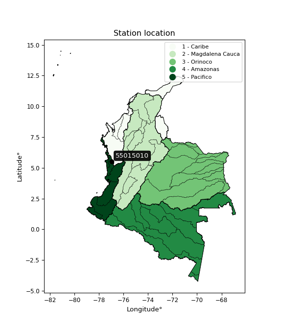

<div align="center">


</div>

# PMP Station (Rain, Pmax24h): 55015010

Probable Maximum Precipitation (PMP) is the greatest amount of rainfall for a specific duration that is meteorologically possible for a given location, acting as a "worst-case" scenario for extreme storms, crucial for designing safety-critical infrastructure like bridges, river deviations, dams, spillways, and nuclear plants to prevent catastrophic failure. PMP is calculated by hydrologists using meteorological data to determine the upper limit of extreme rainfall, often leading to the Probable Maximum Flood (PMF) for flood control design, and is increasingly being studied for climate change impacts. Probable Maximum Precipitation (PMP) is the theoretical upper limit of rainfall, a deterministic estimate for extreme events, while probability distributions (like GEV, Gumbel) describe the likelihood and frequency of various precipitation amounts, including rare ones, showing how often events occur, with PMP representing the extreme end of these distributions, used for critical infrastructure design to ensure safety against the worst conceivable weather, unlike standard statistical forecasts which cover typical probabilities.

The most common probability distributions in hydrology, used for analyzing floods, rainfall, and streamflow, include the Normal, Log-Normal, Gumbel, Gamma (including Log-Pearson Type III), and Generalized Extreme Value (GEV) distributions, often chosen based on the data´s skewness and whether modeling extremes or general conditions, with Gumbel and GEV popular for extreme events like floods, while the Normal distribution serves as a baseline, though often requiring transformations for skewed hydrological data. These distributions help in designing water infrastructure, managing water resources, and forecasting hydrologic events.

> Hydrological data often isn´t perfectly normal (it´s skewed), so different distributions are needed for different applications, such as: **Flood Frequency Analysis**: Using Gumbel, GEV, or Log-Pearson Type III for predicting extreme flood magnitudes and their return periods, **Rainfall Analysis**: Normal for annual totals, but Log-Normal, Weibull, or GEV for intensity or extreme daily rainfall, **Streamflow Modeling**: Gamma and Log-Normal for maximum flows, GEV for minimum flows, and Kappa for daily flows.

<div align="center">

</img>

</div>


## A. General information


### 1. General running parameters

• app_version: _v20260108_. • runtime: _2026-01-08 13:24:42.400241_. • Python version: _3.14.0_. • SciPy version: _1.16.3_. • Pandas version: _2.3.3_. • NumPy version: _2.3.5_. • Stations dataset (station_dataset_file): _dataset/pmax24h_in/automatic_colombia_2003_2024.csv_. • Stations catalog (station_catalog_file): _dataset/CNE.xls_. • Minimum year to eval til year_max (date_min): _1900_. • Maximum year to eval since year_min (date_max): _2024_. • Creates, save and include plots into reports (create_plot): _False_. • Plot only fit distributions with Δo > Δ (plot_only_fit): _True_. • Plot only simple graphs avoiding multiple CDFs and multiple Extreme values plots (plot_only_simple): _True_. • Eval low extreme values, if False, evaluates high extreme values (low_extreme): _False_. • Eval every SciPy distribution as logarithmic (pdist_logarithmic_on): _True_. • Standard deviation normalized (ddof): _1.0_. • Return periods to eval in years (Tr): _[2, 2.33, 5, 10, 15, 20, 25, 50, 75, 100, 200, 250, 500, 750, 1000]_. • Minimum data sample per station, 0 means any (minimum_sample): _5_. • Z-Score maximum threshold to adjust a value, 0 means disable (zscore_max): _3.5_. • Z-Score minimum threshold to adjust a value, 0 means disable (zscore_min): _-2.5_. • Avoid zeros, e.g. rain = 0 (avoid_zeros): _True_. • Avoid null values (avoid_nans): _True_. 

:file_folder:Table: [dataset.csv](../../dataset/pmax24h_in/automatic_colombia_2003_2024.csv)

> Delta Degrees of Freedom (DDOF): is a parameter used in the formulas for calculating variance and standard deviation. When ddof=0, the divisor is $N$ (the total number of observations) and this is used when your data set is the entire population. When ddof=1, the divisor is $N-1$ and this is used when your data set is a sample drawn from a larger population. Using $N-1$ provides an unbiased estimate of the population variance (known as Bessel´s correction).


### 2. Station info and location

|   id |   CODIGO | NOMBRE                       | CATEGORIA               | TECNOLOGIA                              | ESTADO           | FECHA_INSTALACION   |   FECHA_SUSPENSION |   ALTITUD |   LATITUD |   LONGITUD | DEPARTAMENTO   | MUNICIPIO                | AREA_OPERATIVA                         | ENTIDAD                                                     | AREA_HIDROGRAFICA   | ZONA_HIDROGRAFICA         | SUBZONA_HIDROGRAFICA   |   CORRIENTE | Catalogo   |   Version |
|-----:|---------:|:-----------------------------|:------------------------|:----------------------------------------|:-----------------|:--------------------|-------------------:|----------:|----------:|-----------:|:---------------|:-------------------------|:---------------------------------------|:------------------------------------------------------------|:--------------------|:--------------------------|:-----------------------|------------:|:-----------|----------:|
|    0 | 55015010 | PIE DE PATO - AUT [55015010] | Climatológica Principal | Automática con Telemetría, Convencional | En Mantenimiento | 12/03/2006          |                nan |        40 |   5.52108 |   -76.9732 | Choco          | Alto Baudó (Pie De Pato) | Area Operativa 09 - Cauca-Valle-Caldas | INSTITUTO DE HIDROLOGIA METEOROLOGIA Y ESTUDIOS AMBIENTALES | Pacifico            | Baudó - Directos Pacifico | Río Baudó              |         nan | CNE_IDEAM  |  20251226 |

<div align="center">

Dynamic map: [:earth_americas:Google](http://maps.google.com/maps?q=5.521083333,-76.97316667) [:earth_americas:OSM](https://www.openstreetmap.org/#map=18/5.521083333/-76.97316667&layers=P) [:earth_americas:Bing](https://www.bing.com/maps?cp=5.521083333~-76.97316667&lvl=18) [:earth_americas:Apple](https://maps.apple.com/frame?center=5.521083333%2C-76.97316667&span=0.003%2C0.006)

</div>


<div align="center">

```geojson
{
  "type": "Feature",
  "geometry": {
    "type": "Point", 
    "coordinates": [-76.97316667, 5.521083333]
  }, 
  "properties": {
    "Name": "55015010"
  }
}
```

</div>


### 3. Discrete values table and plot

<div align="center">

|               |          0 |          1 |           2 |           3 |          4 |
|:--------------|-----------:|-----------:|------------:|------------:|-----------:|
| Date          | 2016       | 2017       | 2018        | 2019        | 2024       |
| Value         |    1.7     |  104.6     |   92.3      |   52.3      |   50.4     |
| Value_initial |    1.7     |  104.6     |   92.3      |   52.3      |   50.4     |
| count         |    5       |    5       |    5        |    5        |    5       |
| mean          |   60.26    |   60.26    |   60.26     |   60.26     |   60.26    |
| std           |   40.5662  |   40.5662  |   40.5662   |   40.5662   |   40.5662  |
| zscore        |   -1.44357 |    1.09303 |    0.789821 |   -0.196223 |   -0.24306 |


</div>


> The initial value (value_initial) correspond to the initial obtained or null completed value, and value (value) is adjusted only when the initial value is outside the valid range (outlier) definite through the Z-Score value. If Z-Score is active, values out of range or outliers are replaced with the station mean value. A Z-Score (or standard score) measures how many standard deviations a data point is from the mean of a dataset, indicating its relative position; positive scores mean above the mean, negative mean below, and a score of zero is exactly at the mean, allowing for comparison of values from different distributions. It´s calculated using the formula $z=(x–μ)/σ$, where $x$ is the data point, $μ$ is the mean, and $σ$ is the standard deviation, helping identify outliers and understand probability.
>
> <sub>**Note**: In this study, "completing" (filling gaps in) and "extending" (forecasting or lengthening the historical record) rainfall data series are avoided for certain critical analyses because they introduce artificial bias and uncertainty, which can distort the statistics of rare events (extremes), alter day-to-day variability, and compromise the integrity and homogeneity of the original data. Some reasons against Completing/Extending rainfall data are: **Distortion of Extremes and Variability**: The primary issue is that most gap-filling or extension methods rely on averaging or regression with nearby stations, which inherently smooths the data. Rainfall is highly variable in space and time, with a large percentage of zero values and occasional large storms. Infilling methods often underestimate the highest values and overestimate the lowest (zero) values, which severely distorts analyses focused on flood frequency, drought severity, and intensity-duration-frequency (IDF) curves, **Loss of Data Homogeneity**: Infilled or extended data are synthetic estimates, not actual measurements. Combining these estimates with observed data can violate the assumption of data homogeneity, which requires that the data properties do not change over time. Inhomogeneity can lead to incorrect conclusions about long-term trends or changes in climate patterns, **Propagation of Errors**: Errors and biases from the original data (e.g., wind-induced undercatch, instrument errors, site changes) or the data used for imputation can propagate through the analysis, leading to unreliable hydrological models and inaccurate predictions, **Compromised Statistical Integrity**: For statistical analyses, especially those involving the frequency of events, using artificial data can introduce time bias or autocorrelation that doesn´t exist in reality, making it difficult to assess the true probability of events, **Difficulty in Validation**: It is difficult to accurately validate the quality of filled or extended data, especially for past periods where ground-truth measurements are unavailable. The reliability of imputation techniques heavily depends on the density of the surrounding station network and the complexity of the local topography.</sub>


### 4. Active continuous probability distributions from SciPy (43 of 104 available)

A Probability Density Function (PDF) describes the relative likelihood of a continuous random variable falling within a specific range, where the total area under its curve equals 1, and the area over any interval gives the actual probability for that range. Unlike discrete probabilities (like rolling a die), a PDF shows density, not direct probability for a single point (which is zero), with higher points indicating higher likelihood, often visualized as a bell curve for normal distributions.

A log of a probability density function (log-PDF) is simply the logarithm of the PDF´s value, denoted as $log(f(x))$, useful for converting multiplication of probabilities into addition, improving numerical stability with tiny numbers, and connecting to information theory concepts like entropy. Instead of dealing with very small probabilities (e.g., 0.000001), log-PDFs use negative numbers (e.g., $log(0.00001) ≈ -11.51$ that are easier for computers to handle, preventing underflow errors and simplifying complex calculations. In this study, each active probability distribution from SciPy is also evaluated in the $log$ form.

[scipy.stats](https://docs.scipy.org/doc/scipy/reference/stats.html) is a Python´s powerful submodule within the SciPy library for comprehensive statistical analysis, offering over 130 probability distributions (like Normal, Poisson), functions for descriptive stats (mean, variance), hypothesis testing (t-tests, chi-square), random variable generation, and statistical tests, making it essential for data science, modeling, and research. It provides tools to explore, model, and draw conclusions from data efficiently, working seamlessly with NumPy.

<div align="center">

|   id | p_dist             |   n_parameter | fit_method   | label                                                                       | active   | ref                                                                                                        |
|-----:|:-------------------|--------------:|:-------------|:----------------------------------------------------------------------------|:---------|:-----------------------------------------------------------------------------------------------------------|
|    0 | alpha              |             3 | MLE          | Alpha                                                                       | True     | [:mortar_board:](https://docs.scipy.org/doc/scipy/reference/generated/scipy.stats.alpha.html)              |
|    1 | betaprime          |             4 | MLE          | Beta prime                                                                  | True     | [:mortar_board:](https://docs.scipy.org/doc/scipy/reference/generated/scipy.stats.betaprime.html)          |
|    2 | chi2               |             3 | MLE          | Chi²                                                                        | True     | [:mortar_board:](https://docs.scipy.org/doc/scipy/reference/generated/scipy.stats.chi2.html)               |
|    3 | crystalball        |             4 | MLE          | Crystalball                                                                 | True     | [:mortar_board:](https://docs.scipy.org/doc/scipy/reference/generated/scipy.stats.crystalball.html)        |
|    4 | erlang             |             3 | MLE          | Erlang                                                                      | True     | [:mortar_board:](https://docs.scipy.org/doc/scipy/reference/generated/scipy.stats.erlang.html)             |
|    5 | expon              |             2 | MLE          | Exponential                                                                 | True     | [:mortar_board:](https://docs.scipy.org/doc/scipy/reference/generated/scipy.stats.expon.html)              |
|    6 | exponnorm          |             3 | MLE          | Exponentially modified Normal                                               | True     | [:mortar_board:](https://docs.scipy.org/doc/scipy/reference/generated/scipy.stats.exponnorm.html)          |
|    7 | f                  |             4 | MLE          | F                                                                           | True     | [:mortar_board:](https://docs.scipy.org/doc/scipy/reference/generated/scipy.stats.f.html)                  |
|    8 | fatiguelife        |             3 | MLE          | Fatigue-life (Birnbaum-Saunders)                                            | True     | [:mortar_board:](https://docs.scipy.org/doc/scipy/reference/generated/scipy.stats.fatiguelife.html)        |
|    9 | fisk               |             3 | MLE          | Fisk                                                                        | True     | [:mortar_board:](https://docs.scipy.org/doc/scipy/reference/generated/scipy.stats.fisk.html)               |
|   10 | gamma              |             3 | MLE          | Gamma                                                                       | True     | [:mortar_board:](https://docs.scipy.org/doc/scipy/reference/generated/scipy.stats.gamma.html)              |
|   11 | genexpon           |             5 | MLE          | Generalized exponential                                                     | True     | [:mortar_board:](https://docs.scipy.org/doc/scipy/reference/generated/scipy.stats.genexpon.html)           |
|   12 | genlogistic        |             3 | MLE          | Generalized logistic                                                        | True     | [:mortar_board:](https://docs.scipy.org/doc/scipy/reference/generated/scipy.stats.genlogistic.html)        |
|   13 | gibrat             |             2 | MM           | Gibrat                                                                      | True     | [:mortar_board:](https://docs.scipy.org/doc/scipy/reference/generated/scipy.stats.gibrat.html)             |
|   14 | gompertz           |             3 | MLE          | Gompertz (or truncated Gumbel)                                              | True     | [:mortar_board:](https://docs.scipy.org/doc/scipy/reference/generated/scipy.stats.gompertz.html)           |
|   15 | gumbel_l           |             2 | MM           | Gumbel Left Skew                                                            | True     | [:mortar_board:](https://docs.scipy.org/doc/scipy/reference/generated/scipy.stats.gumbel_l.html)           |
|   16 | gumbel_r           |             2 | MM           | Gumbel Right Skew                                                           | True     | [:mortar_board:](https://docs.scipy.org/doc/scipy/reference/generated/scipy.stats.gumbel_r.html)           |
|   17 | halflogistic       |             2 | MM           | Half-logistic                                                               | True     | [:mortar_board:](https://docs.scipy.org/doc/scipy/reference/generated/scipy.stats.halflogistic.html)       |
|   18 | halfnorm           |             2 | MM           | Half Normal                                                                 | True     | [:mortar_board:](https://docs.scipy.org/doc/scipy/reference/generated/scipy.stats.halfnorm.html)           |
|   19 | hypsecant          |             2 | MM           | hyperbolic secant                                                           | True     | [:mortar_board:](https://docs.scipy.org/doc/scipy/reference/generated/scipy.stats.hypsecant.html)          |
|   20 | invgamma           |             3 | MLE          | Inverted gamma                                                              | True     | [:mortar_board:](https://docs.scipy.org/doc/scipy/reference/generated/scipy.stats.invgamma.html)           |
|   21 | invgauss           |             3 | MLE          | Inverse Gaussian                                                            | True     | [:mortar_board:](https://docs.scipy.org/doc/scipy/reference/generated/scipy.stats.invgauss.html)           |
|   22 | invweibull         |             3 | MLE          | Inverted Weibull                                                            | True     | [:mortar_board:](https://docs.scipy.org/doc/scipy/reference/generated/scipy.stats.invweibull.html)         |
|   23 | kstwobign          |             2 | MLE          | Limiting distribution of scaled Kolmogorov-Smirnov two-sided test statistic | True     | [:mortar_board:](https://docs.scipy.org/doc/scipy/reference/generated/scipy.stats.kstwobign.html)          |
|   24 | laplace            |             2 | MM           | Laplace                                                                     | True     | [:mortar_board:](https://docs.scipy.org/doc/scipy/reference/generated/scipy.stats.laplace.html)            |
|   25 | laplace_asymmetric |             3 | MLE          | Asymmetric Laplace                                                          | True     | [:mortar_board:](https://docs.scipy.org/doc/scipy/reference/generated/scipy.stats.laplace_asymmetric.html) |
|   26 | loggamma           |             3 | MLE          | Log gamma                                                                   | True     | [:mortar_board:](https://docs.scipy.org/doc/scipy/reference/generated/scipy.stats.loggamma.html)           |
|   27 | logistic           |             2 | MM           | Logistic (or Sech-squared)                                                  | True     | [:mortar_board:](https://docs.scipy.org/doc/scipy/reference/generated/scipy.stats.logistic.html)           |
|   28 | lognorm            |             3 | MLE          | Log Normal                                                                  | True     | [:mortar_board:](https://docs.scipy.org/doc/scipy/reference/generated/scipy.stats.lognorm.html)            |
|   29 | maxwell            |             2 | MM           | Maxwell                                                                     | True     | [:mortar_board:](https://docs.scipy.org/doc/scipy/reference/generated/scipy.stats.maxwell.html)            |
|   30 | mielke             |             4 | MLE          | Mielke Beta-Kappa / Dagum                                                   | True     | [:mortar_board:](https://docs.scipy.org/doc/scipy/reference/generated/scipy.stats.mielke.html)             |
|   31 | moyal              |             2 | MM           | Moyal                                                                       | True     | [:mortar_board:](https://docs.scipy.org/doc/scipy/reference/generated/scipy.stats.moyal.html)              |
|   32 | nakagami           |             3 | MLE          | Nakagami                                                                    | True     | [:mortar_board:](https://docs.scipy.org/doc/scipy/reference/generated/scipy.stats.nakagami.html)           |
|   33 | ncf                |             5 | MLE          | Non-central F distribution                                                  | True     | [:mortar_board:](https://docs.scipy.org/doc/scipy/reference/generated/scipy.stats.ncf.html)                |
|   34 | nct                |             4 | MLE          | Non-central Student’s t                                                     | True     | [:mortar_board:](https://docs.scipy.org/doc/scipy/reference/generated/scipy.stats.nct.html)                |
|   35 | norm               |             2 | MM           | Normal                                                                      | True     | [:mortar_board:](https://docs.scipy.org/doc/scipy/reference/generated/scipy.stats.norm.html)               |
|   36 | pearson3           |             3 | MM           | Pearson type III                                                            | True     | [:mortar_board:](https://docs.scipy.org/doc/scipy/reference/generated/scipy.stats.pearson3.html)           |
|   37 | rayleigh           |             2 | MM           | Rayleigh                                                                    | True     | [:mortar_board:](https://docs.scipy.org/doc/scipy/reference/generated/scipy.stats.rayleigh.html)           |
|   38 | rice               |             3 | MLE          | Rice                                                                        | True     | [:mortar_board:](https://docs.scipy.org/doc/scipy/reference/generated/scipy.stats.rice.html)               |
|   39 | t                  |             3 | MLE          | Student’s t                                                                 | True     | [:mortar_board:](https://docs.scipy.org/doc/scipy/reference/generated/scipy.stats.t.html)                  |
|   40 | truncnorm          |             4 | MLE          | Truncated normal                                                            | True     | [:mortar_board:](https://docs.scipy.org/doc/scipy/reference/generated/scipy.stats.truncnorm.html)          |
|   41 | wald               |             2 | MM           | Wald                                                                        | True     | [:mortar_board:](https://docs.scipy.org/doc/scipy/reference/generated/scipy.stats.wald.html)               |
|   42 | weibull_min        |             3 | MLE          | Weibull minimum                                                             | True     | [:mortar_board:](https://docs.scipy.org/doc/scipy/reference/generated/scipy.stats.weibull_min.html)        |

</div>

> **n_parameter:** # arguments & localization & scale.
>
> **Fit methods:** (MLE) maximum likelihood, (MM) L-moments.
>
>**Inactive** (With the only purpose of prevent loops, zero divisions, infinite values, over high estimated values or horizontal trending for recurrence intervals estimations, the follow distributions were disabled.)**:** foldnorm, gennorm, norminvgauss, powernorm, powerlognorm, skewnorm, genextreme, anglit, arcsine, argus, beta, bradford, burr, burr12, cauchy, cosine, halfcauchy, foldcauchy, skewcauchy, wrapcauchy, dgamma, gengamma, exponweib, exponpow, truncexpon, gausshyper, genhalflogistic, genhyperbolic, geninvgauss, halfgennorm, johnsonsb, johnsonsu, kappa4, kappa3, ksone, kstwo, loglaplace, levy, levy_l, levy_stable, ncx2, pareto, genpareto, truncpareto, lomax, powerlaw, rdist, rel_breitwigner, recipinvgauss, semicircular, studentized_range, trapezoid, triang, truncweibull_min, tukeylambda, uniform, loguniform, vonmises, vonmises_line, weibull_max, dweibull, 


## B. Probability (PDF) vs. Empirical (EDF) distributions functions

A continuous probability distribution (CPD) describes probabilities for variables that can take any value within a range (like rain any time), unlike discrete variables with specific outcomes (like temperature). It uses a Probability Density Function (PDF), a curve where the total area under it equals 1, and the probability of the variable falling within an interval (a to b) is found by calculating the area under the curve between those points. A key feature is that the probability of hitting any single exact value is zero, so probabilities are always expressed for ranges, e.g., $P(a ≤ X ≤ b)$.

<div align="center">

Distributions parameters from station values
|    |   station | p_dist                |   n |               loc |            scale | shape                  | shape1             | shape2              | shape3   |
|---:|----------:|:----------------------|----:|------------------:|-----------------:|:-----------------------|:-------------------|:--------------------|:---------|
|  0 |  55015010 | alpha                 |   5 |      -0.00561481  |      3.81257     | 1.758253556781668e-10  |                    |                     |          |
|  1 |  55015010 | betaprime             |   5 |   -1995.63        | 183485           | 3229.0355059045532     | 288184.1822822251  |                     |          |
|  2 |  55015010 | chi2                  |   5 |       1.7         |      3.73275     | 0.41798835553511016    |                    |                     |          |
|  3 |  55015010 | crystalball           |   5 |      60.26        |     36.2835      | 4632.374946984719      | 654.7500864173603  |                     |          |
|  4 |  55015010 | erlang                |   5 |    -545.578       |      2.21895     | 273.0252325506224      |                    |                     |          |
|  5 |  55015010 | expon                 |   5 |       1.7         |     58.56        |                        |                    |                     |          |
|  6 |  55015010 | exponnorm             |   5 |      60.2236      |     36.2834      | 0.0010059245113771432  |                    |                     |          |
|  7 |  55015010 | f                     |   5 |       1.7         |     55.1563      | 0.89882214043902       | 779.5500112577138  |                     |          |
|  8 |  55015010 | fatiguelife           |   5 |       1.7         |      8.77131e-05 | 713.7154026035832      |                    |                     |          |
|  9 |  55015010 | fisk                  |   5 |      -1.32734e+07 |      1.32735e+07 | 610470.4290794744      |                    |                     |          |
| 10 |  55015010 | gamma                 |   5 |    -508.525       |      2.37515     | 239.38055114735778     |                    |                     |          |
| 11 |  55015010 | genexpon              |   5 |       0.240654    |      1.18527e+07 | 539.1002938658771      | 197823.45516742492 | 27229532.08691439   |          |
| 12 |  55015010 | genlogistic           |   5 |     104.6         |      1.90222e-05 | 4.296057544541993e-07  |                    |                     |          |
| 13 |  55015010 | gibrat                |   5 |      32.5803      |     16.7886      |                        |                    |                     |          |
| 14 |  55015010 | gompertz              |   5 |      50.4         |     28.3199      | 0.43292485189336993    |                    |                     |          |
| 15 |  55015010 | gumbel_l              |   5 |      76.5895      |     28.2901      |                        |                    |                     |          |
| 16 |  55015010 | gumbel_r              |   5 |      43.9305      |     28.2901      |                        |                    |                     |          |
| 17 |  55015010 | halflogistic          |   5 |      17.2556      |     31.0211      |                        |                    |                     |          |
| 18 |  55015010 | halfnorm              |   5 |      12.2349      |     60.1905      |                        |                    |                     |          |
| 19 |  55015010 | hypsecant             |   5 |      60.26        |     23.0988      |                        |                    |                     |          |
| 20 |  55015010 | invgamma              |   5 |    -342.829       |  44551.9         | 111.59851597457319     |                    |                     |          |
| 21 |  55015010 | invgauss              |   5 |    -165.279       |   7723.87        | 0.029172978286072924   |                    |                     |          |
| 22 |  55015010 | invweibull            |   5 |       1.7         |      2.90095     | 0.06381323287853108    |                    |                     |          |
| 23 |  55015010 | kstwobign             |   5 |     -82.3814      |    162.763       |                        |                    |                     |          |
| 24 |  55015010 | laplace               |   5 |      60.26        |     25.6563      |                        |                    |                     |          |
| 25 |  55015010 | laplace_asymmetric    |   5 |      52.3         |     28.122       | 0.8684388876022022     |                    |                     |          |
| 26 |  55015010 | loggamma              |   5 |     104.6         |      9.31596e-06 | 2.1010741708117987e-07 |                    |                     |          |
| 27 |  55015010 | logistic              |   5 |      60.26        |     20.0041      |                        |                    |                     |          |
| 28 |  55015010 | lognorm               |   5 |       1.7         |      0.021955    | 16.11524721161693      |                    |                     |          |
| 29 |  55015010 | maxwell               |   5 |     -25.7166      |     53.8778      |                        |                    |                     |          |
| 30 |  55015010 | mielke                |   5 |       1.7         |    170.18        | 0.44247281177142694    | 5.334013500688537  |                     |          |
| 31 |  55015010 | moyal                 |   5 |      39.5108      |     16.3333      |                        |                    |                     |          |
| 32 |  55015010 | nakagami              |   5 |       1.7         |     79.1747      | 0.2466633611090158     |                    |                     |          |
| 33 |  55015010 | ncf                   |   5 |       1.7         |      3.19553     | 0.5408109758866881     | 182.34559918717332 | 8.1676550524706     |          |
| 34 |  55015010 | nct                   |   5 |      -0.188661    |      0.0770449   | 0.35657999227380766    | 54.7361698722671   |                     |          |
| 35 |  55015010 | norm                  |   5 |      60.26        |     36.2835      |                        |                    |                     |          |
| 36 |  55015010 | pearson3              |   5 |      60.26        |     36.2835      | -0.34424014855368623   |                    |                     |          |
| 37 |  55015010 | rayleigh              |   5 |      -9.1524      |     55.3831      |                        |                    |                     |          |
| 38 |  55015010 | rice                  |   5 |     -20.4551      |     40.8473      | 1.6412480842134722     |                    |                     |          |
| 39 |  55015010 | t                     |   5 |      60.261       |     36.2847      | 6959305.8284734255     |                    |                     |          |
| 40 |  55015010 | truncnorm             |   5 |       7.30424     |     12.5441      | -3.470123037119477     | 7.756301572230386  |                     |          |
| 41 |  55015010 | wald                  |   5 |      23.9765      |     36.2835      |                        |                    |                     |          |
| 42 |  55015010 | weibull_min           |   5 |    -323.827       |    400.24        | 12.921097997966942     |                    |                     |          |
| 43 |  55015010 | logalpha              |   5 |       0.00366214  |      1.16434     | 4.392899273137271e-09  |                    |                     |          |
| 44 |  55015010 | logbetaprime          |   5 |     -34.3921      |    597.526       | 614.4603556942943      | 9683.902552286258  |                     |          |
| 45 |  55015010 | logchi2               |   5 |     -20.4086      |      0.053929    | 443.422133957907       |                    |                     |          |
| 46 |  55015010 | logcrystalball        |   5 |       4.65015     |      1.80752e-05 | 1.780150697743657e-05  | 25.849276167081527 |                     |          |
| 47 |  55015010 | logerlang             |   5 |     -18.4735      |      0.118673    | 184.88415356666474     |                    |                     |          |
| 48 |  55015010 | logexpon              |   5 |       0.530628    |      2.98593     |                        |                    |                     |          |
| 49 |  55015010 | logexponnorm          |   5 |       3.51609     |      1.52147     | 0.0003198909806619492  |                    |                     |          |
| 50 |  55015010 | logf                  |   5 |   -2206.75        |   2210.27        | 8421900.033863613      | 8400543.085082099  |                     |          |
| 51 |  55015010 | logfatiguelife        |   5 |    -773.937       |    777.457       | 0.0019526696133956838  |                    |                     |          |
| 52 |  55015010 | logfisk               |   5 |      -1.96572e+08 |      1.96572e+08 | 252787845.24597603     |                    |                     |          |
| 53 |  55015010 | loggamma              |   5 |     -18.2837      |      0.12        | 181.6924372085537      |                    |                     |          |
| 54 |  55015010 | loggenexpon           |   5 |       0.530628    |      0.723836    | 0.101500432691909      | 3.415977280006331  | 0.01613567379171643 |          |
| 55 |  55015010 | loggenlogistic        |   5 |       4.6502      |      3.56658e-06 | 3.1652604844190478e-06 |                    |                     |          |
| 56 |  55015010 | loggibrat             |   5 |       2.3559      |      0.703989    |                        |                    |                     |          |
| 57 |  55015010 | loggompertz           |   5 |       0.530628    |      0.922688    | 0.02093123484515496    |                    |                     |          |
| 58 |  55015010 | loggumbel_l           |   5 |       4.20131     |      1.1863      |                        |                    |                     |          |
| 59 |  55015010 | loggumbel_r           |   5 |       2.83181     |      1.1863      |                        |                    |                     |          |
| 60 |  55015010 | loghalflogistic       |   5 |       1.7133      |      1.30079     |                        |                    |                     |          |
| 61 |  55015010 | loghalfnorm           |   5 |       1.50268     |      2.52402     |                        |                    |                     |          |
| 62 |  55015010 | loghypsecant          |   5 |       3.51656     |      0.968607    |                        |                    |                     |          |
| 63 |  55015010 | loginvgamma           |   5 |     -25.1763      |   8957.18        | 313.2172505216856      |                    |                     |          |
| 64 |  55015010 | loginvgauss           |   5 |     -13.8446      |   1939.27        | 0.008942551005798684   |                    |                     |          |
| 65 |  55015010 | loginvweibull         |   5 | -846472           | 846475           | 470781.1993049467      |                    |                     |          |
| 66 |  55015010 | logkstwobign          |   5 |      -3.5386      |      8.04033     |                        |                    |                     |          |
| 67 |  55015010 | loglaplace            |   5 |       3.51656     |      1.07585     |                        |                    |                     |          |
| 68 |  55015010 | loglaplace_asymmetric |   5 |       4.65018     |      0.0144565   | 78.40699845576793      |                    |                     |          |
| 69 |  55015010 | logloggamma           |   5 |       4.65019     |      1.21967e-06 | 1.080707508761814e-06  |                    |                     |          |
| 70 |  55015010 | loglogistic           |   5 |       3.51656     |      0.838839    |                        |                    |                     |          |
| 71 |  55015010 | loglognorm            |   5 |       0.530628    |      0.00184218  | 15.220200789982085     |                    |                     |          |
| 72 |  55015010 | logmaxwell            |   5 |      -0.0887196   |      2.25927     |                        |                    |                     |          |
| 73 |  55015010 | logmielke             |   5 |      -5.09912e+07 |      5.09912e+07 | 51096899.15771426      | 24493308414.191956 |                     |          |
| 74 |  55015010 | logmoyal              |   5 |       2.64648     |      0.684909    |                        |                    |                     |          |
| 75 |  55015010 | lognakagami           |   5 |       3.91999     |      0.357286    | 0.207359843993289      |                    |                     |          |
| 76 |  55015010 | logncf                |   5 |     -86.6207      |     89.8758      | 16379.680129026674     | 11264.963797826582 | 44.84721631497473   |          |
| 77 |  55015010 | lognct                |   5 |     -89.5425      |      1.48275     | 32778.21754113864      | 62.75944205223645  |                     |          |
| 78 |  55015010 | lognorm               |   5 |       3.51656     |      1.52148     |                        |                    |                     |          |
| 79 |  55015010 | logpearson3           |   5 |       3.51656     |      1.52149     | -1.3622005192263957    |                    |                     |          |
| 80 |  55015010 | lograyleigh           |   5 |       0.60592     |      2.32236     |                        |                    |                     |          |
| 81 |  55015010 | logrice               |   5 |    -673.456       |      1.52139     | 444.9684987396348      |                    |                     |          |
| 82 |  55015010 | logt                  |   5 |       4.19379     |      0.420289    | 1.143090627909745      |                    |                     |          |
| 83 |  55015010 | logtruncnorm          |   5 |      -0.122627    |      3.33037     | 0.1961497453472869     | 1.43310600823505   |                     |          |
| 84 |  55015010 | logwald               |   5 |       1.99509     |      1.52147     |                        |                    |                     |          |
| 85 |  55015010 | logweibull_min        |   5 |      -1.50546e+08 |      1.50546e+08 | 175882799.6326921      |                    |                     |          |

</div>

> **loc** (Location parameter): This shifts the distribution along the x-axis. For many common distributions, like the normal (Gaussian) distribution, loc represents the mean $μ$. For others, like the uniform distribution, it might represent the minimum value, or for the beta distribution, the left end of the support interval.
>
> **scale** (Scale parameter): This determines the width or spread of the distribution. For the normal distribution, scale represents the standard deviation $σ$. For a uniform distribution, it defines the length of the interval (from $loc$ to $loc + scale$).
>
> **shape** (Shape parameters): Refers to parameters that define the specific form of a probability distribution, distinct from its location (loc) and scale (scale). These parameters are required arguments for most distribution functions. For example, a normal (Gaussian) distribution is fully defined by its location (mean) and scale (standard deviation), so it has no specific shape parameters beyond loc and scale. However, other distributions have intrinsic properties that need specification, as Gamma distribution that takes a shape parameter, often named $a$ or $alpha$.


### 0. Cumulative distribution values - CDF (86 evaluated)

Cumulative Distribution Function (CDF), denoted as $F$<sub>$X$</sub>$(x)$, is a function that gives the probability that a random variable $X$ will take a value less than or equal to a specific value, $x$ (i.e., $(P(X≥x)$. It essentially "accumulates" probabilities from a given point up to the far right (positive infinity), providing a complete picture of the distribution´s probabilities for both discrete (like rain) and continuous (like temperature) variables, helping to find probabilities over ranges or above certain values. Each station is evaluated separately ordering the $x$ values ascending, calculating the CDF and PDF values for the activated distributions and their logarithmic forms.

<div align="center">

CDF ordered by x ascending and calculating $log(f(x))$ separately
|   id |   Station |   date |     x |   count |   mean |     std |    zscore |   Value_initial |   station |   m |     alpha |   alpha_pdf |   betaprime |   betaprime_pdf |        chi2 |    chi2_pdf |   crystalball |   crystalball_pdf |    erlang |   erlang_pdf |    expon |   expon_pdf |   exponnorm |   exponnorm_pdf |           f |       f_pdf |   fatiguelife |   fatiguelife_pdf |      fisk |   fisk_pdf |     gamma |   gamma_pdf |   genexpon |   genexpon_pdf |   genlogistic |   genlogistic_pdf |   gibrat |   gibrat_pdf |    gompertz |   gompertz_pdf |   gumbel_l |   gumbel_l_pdf |   gumbel_r |   gumbel_r_pdf |   halflogistic |   halflogistic_pdf |   halfnorm |   halfnorm_pdf |   hypsecant |   hypsecant_pdf |   invgamma |   invgamma_pdf |   invgauss |   invgauss_pdf |   invweibull |   invweibull_pdf |   kstwobign |   kstwobign_pdf |   laplace |   laplace_pdf |   laplace_asymmetric |   laplace_asymmetric_pdf |   loggamma |   loggamma_pdf |   logistic |   logistic_pdf |   lognorm |   lognorm_pdf |   maxwell |   maxwell_pdf |     mielke |   mielke_pdf |      moyal |   moyal_pdf |    nakagami |   nakagami_pdf |         ncf |      ncf_pdf |       nct |     nct_pdf |      norm |   norm_pdf |   pearson3 |   pearson3_pdf |   rayleigh |   rayleigh_pdf |      rice |   rice_pdf |         t |      t_pdf |   truncnorm |   truncnorm_pdf |     wald |   wald_pdf |   weibull_min |   weibull_min_pdf |   logalpha |   logalpha_pdf |   logbetaprime |   logbetaprime_pdf |   logchi2 |   logchi2_pdf |   logcrystalball |   logcrystalball_pdf |   logerlang |   logerlang_pdf |   logexpon |   logexpon_pdf |   logexponnorm |   logexponnorm_pdf |      logf |   logf_pdf |   logfatiguelife |   logfatiguelife_pdf |   logfisk |   logfisk_pdf |   loggenexpon |   loggenexpon_pdf |   loggenlogistic |   loggenlogistic_pdf |   loggibrat |   loggibrat_pdf |   loggompertz |   loggompertz_pdf |   loggumbel_l |   loggumbel_l_pdf |   loggumbel_r |   loggumbel_r_pdf |   loghalflogistic |   loghalflogistic_pdf |   loghalfnorm |   loghalfnorm_pdf |   loghypsecant |   loghypsecant_pdf |   loginvgamma |   loginvgamma_pdf |   loginvgauss |   loginvgauss_pdf |   loginvweibull |   loginvweibull_pdf |   logkstwobign |   logkstwobign_pdf |   loglaplace |   loglaplace_pdf |   loglaplace_asymmetric |   loglaplace_asymmetric_pdf |   logloggamma |   logloggamma_pdf |   loglogistic |   loglogistic_pdf |   loglognorm |   loglognorm_pdf |   logmaxwell |   logmaxwell_pdf |   logmielke |   logmielke_pdf |    logmoyal |   logmoyal_pdf |   lognakagami |   lognakagami_pdf |    logncf |   logncf_pdf |    lognct |   lognct_pdf |   logpearson3 |   logpearson3_pdf |   lograyleigh |   lograyleigh_pdf |   logrice |   logrice_pdf |      logt |   logt_pdf |   logtruncnorm |   logtruncnorm_pdf |   logwald |   logwald_pdf |   logweibull_min |   logweibull_min_pdf |
|-----:|----------:|-------:|------:|--------:|-------:|--------:|----------:|----------------:|----------:|----:|----------:|------------:|------------:|----------------:|------------:|------------:|--------------:|------------------:|----------:|-------------:|---------:|------------:|------------:|----------------:|------------:|------------:|--------------:|------------------:|----------:|-----------:|----------:|------------:|-----------:|---------------:|--------------:|------------------:|---------:|-------------:|------------:|---------------:|-----------:|---------------:|-----------:|---------------:|---------------:|-------------------:|-----------:|---------------:|------------:|----------------:|-----------:|---------------:|-----------:|---------------:|-------------:|-----------------:|------------:|----------------:|----------:|--------------:|---------------------:|-------------------------:|-----------:|---------------:|-----------:|---------------:|----------:|--------------:|----------:|--------------:|-----------:|-------------:|-----------:|------------:|------------:|---------------:|------------:|-------------:|----------:|------------:|----------:|-----------:|-----------:|---------------:|-----------:|---------------:|----------:|-----------:|----------:|-----------:|------------:|----------------:|---------:|-----------:|--------------:|------------------:|-----------:|---------------:|---------------:|-------------------:|----------:|--------------:|-----------------:|---------------------:|------------:|----------------:|-----------:|---------------:|---------------:|-------------------:|----------:|-----------:|-----------------:|---------------------:|----------:|--------------:|--------------:|------------------:|-----------------:|---------------------:|------------:|----------------:|--------------:|------------------:|--------------:|------------------:|--------------:|------------------:|------------------:|----------------------:|--------------:|------------------:|---------------:|-------------------:|--------------:|------------------:|--------------:|------------------:|----------------:|--------------------:|---------------:|-------------------:|-------------:|-----------------:|------------------------:|----------------------------:|--------------:|------------------:|--------------:|------------------:|-------------:|-----------------:|-------------:|-----------------:|------------:|----------------:|------------:|---------------:|--------------:|------------------:|----------:|-------------:|----------:|-------------:|--------------:|------------------:|--------------:|------------------:|----------:|--------------:|----------:|-----------:|---------------:|-------------------:|----------:|--------------:|-----------------:|---------------------:|
|    0 |  55015010 |   2016 |   1.7 |       5 |  60.26 | 40.5662 | -1.44357  |             1.7 |  55015010 |   1 | 0.0253974 | 0.0859808   |   0.0525951 |      0.00300934 | 0.000383899 | 3.61336e+11 |     0.0532683 |        0.00298926 | 0.0514277 |   0.00307898 | 0        |  0.0170765  |   0.0532678 |      0.00298924 | 1.19925e-08 | 2.42725e+07 |      0.10102  |       1.066e+09   | 0.0592404 | 0.00256318 | 0.0522315 |  0.00312393 |  0.0172616 |     0.0158728  |      0        |        0.00221072 | 0        |   0          | 0           |     0          |  0.0683979 |     0.0023331  |  0.0116858 |     0.0018379  |       0        |         0          |   0        |     0          |   0.0503443 |      0.00217045 |  0.0519035 |     0.00342302 |   0.046199 |     0.00344587 |  2.30858e-05 |      7.08332e+10 |   0.0476677 |      0.00467479 | 0.0510154 |    0.00198842 |            0.0541496 |               0.00221723 |  0.0277739 |      0.0435489 |  0.0508158 |     0.00241118 | 0.0248514 |     0.0382217 | 0.0324446 |    0.00336905 | 1.2207e-08 |  2.43251e+07 | 0.00146318 | 0.000492075 | 1.71182e-09 |    3.80323e+06 | 0.000130205 | 279.881      | 0.0547346 | 0.0822339   | 0.0532683 | 0.00298926 |  0.0616527 |     0.00285038 |  0.0190154 |     0.00347083 | 0.0391238 | 0.00360128 | 0.0532712 | 0.00298928 |    0.327348 |     0.02879     | 0        | 0          |     0.0669262 |        0.00256554 |  0.0271394 |      0.291311  |      0.0262169 |          0.0408629 | 0.0279345 |     0.0436409 |        0.0267075 |            0.0218553 |    0.029833 |       0.0462118 |   0        |      0.334904  |      0.0248496 |          0.0382197 | 0.0249368 |  0.0383148 |        0.0242601 |             0.037685 | 0.0136347 |      0.017295 |   8.34984e-08 |          0.140226 |         0        |             0.022928 |    0        |       0         |   1.02811e-08 |         0.0226851 |     0.0442985 |         0.0365022 |   0.000951581 |        0.00558082 |          0        |              0        |      0        |          0        |      0.0291591 |           0.030062 |     0.0262809 |          0.043482 |     0.0260636 |         0.0447683 |       0.0364653 |           0.0671578 |      0.0400925 |           0.085058 |    0.0311619 |        0.0289649 |               0.0263953 |                   0.0232868 |     0.0259859 |         0.0230252 |     0.0276631 |         0.0320656 |    0.0227516 |      3.19531e+13 |    0.0053573 |        0.0255613 |   0.0159618 |       0.0159949 | 2.78328e-06 |    4.64995e-05 |   0           |       0           | 0.0262377 |    0.0404205 | 0.0251065 |    0.0385554 |     0.0482988 |         0.0377198 |      0        |          0        | 0.0248445 |     0.0382151 | 0.0275638 |  0.0085142 |    1.02439e-06 |           0.339288 |  0        |     0         |        0.0147005 |            0.0170477 |
|    1 |  55015010 |   2024 |  50.4 |       5 |  60.26 | 40.5662 | -0.24306  |            50.4 |  55015010 |   2 | 0.939707  | 0.00119387  |   0.394984  |      0.0106176  | 0.999931    | 1.0185e-05  |     0.392907  |        0.0105966  | 0.401306  |   0.010661   | 0.564659 |  0.0074341  |   0.392906  |      0.0105966  | 0.663147    | 0.00462233  |      0.851761 |       0.00247957  | 0.371619  | 0.0107399  | 0.404309  |  0.010662   |  0.564902  |     0.00728165 |      0        |        0.00664044 | 0.523765 |   0.022348   | 4.06445e-10 |     0.015287   |  0.327152  |     0.00942401 |  0.451319  |     0.0126921  |       0.488603 |         0.0122702  |   0.473966 |     0.010842   |   0.368073  |      0.0126136  |  0.424048  |     0.0105733  |   0.431603 |     0.0107116  |  0.433755    |      0.00047474  |   0.481334  |      0.00981455 | 0.34046   |    0.01327    |            0.397755  |               0.0162866  |  0.60677   |      0.23485   |  0.379211  |     0.0117681  | 0.604555  |     0.253148  | 0.426741  |    0.0108959  | 0.574809   |  0.00521594  | 0.473668   | 0.0135389   | 0.603106    |    0.00566704  | 0.535893    |   0.0113879  | 0.672022  | 0.00230936  | 0.392907  | 0.0105966  |  0.37266   |     0.0101094  |  0.439045  |     0.0108911  | 0.410772  | 0.0105871  | 0.3929    | 0.0105962  |    0.999704 |     8.70173e-05 | 0.533377 | 0.0168175  |     0.342731  |        0.00952371 |  0.766235  |      0.0579517 |      0.603964  |          0.24248   | 0.610067  |     0.236138  |        0.505675  |            0.465794  |    0.619122 |       0.232904  |   0.678613 |      0.107634  |      0.604552  |          0.253152  | 0.604084  |  0.252731  |        0.603938  |             0.253687 | 0.519304  |      0.321016 |   0.655137    |          0.166795 |         0        |             0.46421  |    0.787651 |       0.185466  |   0.552207    |         0.400071  |     0.545647  |         0.302142  |   0.670588    |        0.225885   |          0.690135 |              0.201306 |      0.661798 |          0.199836 |      0.628903  |           0.302046 |     0.612714  |          0.23155  |     0.618702  |         0.227155  |       0.604871  |           0.169126  |      0.644294  |           0.161324 |    0.656351  |        0.31942   |               0.524998  |                   0.46317   |     0.523613  |         0.463955  |     0.61797   |         0.281441  |    0.689316  |      0.0068454   |    0.630675  |        0.230359  |   0.476557  |       0.477545  | 0.693084    |    0.212663    |   5.18417e-07 |       4.84132e+08 | 0.605174  |    0.245572  | 0.604644  |    0.252152  |     0.520207  |         0.295849  |      0.638757 |          0.221974 | 0.604563  |     0.253163  | 0.310504  |  0.553467  |    0.89465     |           0.165564 |  0.755838 |     0.179209  |        0.54008   |            0.41734   |
|    2 |  55015010 |   2019 |  52.3 |       5 |  60.26 | 40.5662 | -0.196223 |            52.3 |  55015010 |   3 | 0.941893  | 0.00110894  |   0.415283  |      0.0107452  | 0.999948    | 7.66096e-06 |     0.413176  |        0.0107337  | 0.421664  |   0.0107637  | 0.578557 |  0.00719677 |   0.413175  |      0.0107337  | 0.671771    | 0.00445641  |      0.856378 |       0.00238139  | 0.392243  | 0.0109639  | 0.424663  |  0.0107586  |  0.57852   |     0.00705375 |      0        |        0.00693159 | 0.563921 |   0.0199704  | 0.029595    |     0.015864   |  0.34542   |     0.00980504 |  0.475256  |     0.0124971  |       0.511565 |         0.0119     |   0.494357 |     0.0106218  |   0.392417  |      0.0130008  |  0.444162  |     0.010595   |   0.451946 |     0.0106976  |  0.43464     |      0.000456729 |   0.49984   |      0.00966264 | 0.36663   |    0.0142901  |            0.429935  |               0.0176043  |  0.615428  |      0.233099  |  0.401813  |     0.0120155  | 0.613892  |     0.251447  | 0.447436  |    0.0108836  | 0.584612   |  0.00510424  | 0.499017   | 0.0131391   | 0.61373     |    0.0055171   | 0.557256    |   0.0110966  | 0.676301  | 0.00219689  | 0.413176  | 0.0107337  |  0.392074  |     0.0103237  |  0.459679  |     0.0108252  | 0.43095   | 0.0106493  | 0.413168  | 0.0107333  |    0.999833 |     5.11248e-05 | 0.564019 | 0.0154581  |     0.361121  |        0.00983333 |  0.768361  |      0.0569187 |      0.612906  |          0.240767  | 0.618772  |     0.234342  |        0.523221  |            0.482619  |    0.627706 |       0.231     |   0.682572 |      0.106308  |      0.613889  |          0.25145   | 0.613405  |  0.251039  |        0.613295  |             0.251977 | 0.53117   |      0.320246 |   0.661277    |          0.165047 |         0        |             0.479709 |    0.794371 |       0.17778   |   0.56706     |         0.402628  |     0.556863  |         0.304021  |   0.678869    |        0.221651   |          0.697511 |              0.197372 |      0.669141 |          0.197028 |      0.639994  |           0.297352 |     0.621248  |          0.229625 |     0.627071  |         0.225127  |       0.611098  |           0.167386  |      0.650231  |           0.159559 |    0.66797   |        0.30862   |               0.54242   |                   0.478541  |     0.541066  |         0.47942   |     0.628329  |         0.278399  |    0.689568  |      0.00676908  |    0.639153  |        0.22788   |   0.49456   |       0.495585  | 0.700864    |    0.207844    |   0.307426    |       3.439       | 0.61423   |    0.243857  | 0.613944  |    0.250451  |     0.531222  |         0.299453  |      0.646923 |          0.219379 | 0.6139    |     0.251461  | 0.331791  |  0.597013  |    0.900735    |           0.163335 |  0.76236  |     0.173345  |        0.555594  |            0.421078  |
|    3 |  55015010 |   2018 |  92.3 |       5 |  60.26 | 40.5662 |  0.789821 |            92.3 |  55015010 |   4 | 0.967054  | 0.000356723 |   0.810886  |      0.00736025 | 1           | 2.27634e-08 |     0.811394  |        0.00744519 | 0.810359  |   0.00714272 | 0.787142 |  0.00363487 |   0.811394  |      0.00744521 | 0.801021    | 0.00233453  |      0.922775 |       0.00113747  | 0.802466  | 0.00729035 | 0.811456  |  0.00708385 |  0.784201  |     0.00361153 |      0        |        0.0171066  | 0.897773 |   0.00298626 | 0.769612    |     0.0154643  |  0.824922  |     0.0107839  |  0.834512  |     0.00533649 |       0.836551 |         0.00483837 |   0.816546 |     0.00547253 |   0.84416   |      0.00648035 |  0.80657   |     0.00647197 |   0.80824  |     0.0062383  |  0.448058    |      0.000253362 |   0.80041   |      0.0052485  | 0.856578  |    0.00559013 |            0.834246  |               0.00511867 |  0.737972  |      0.195354  |  0.832252  |     0.006979   | 0.74628   |     0.210494  | 0.812804  |    0.00645223 | 0.754453   |  0.00356122  | 0.842504   | 0.00475821  | 0.785352    |    0.00328863  | 0.864258    |   0.00451251 | 0.735476  | 0.00101952  | 0.811394  | 0.00744519 |  0.808955  |     0.00837562 |  0.813216  |     0.00617801 | 0.809951  | 0.00699028 | 0.811379  | 0.00744532 |    1        |     3.41313e-12 | 0.871737 | 0.00345931 |     0.808649  |        0.00982532 |  0.796779  |      0.0439618 |      0.739653  |          0.202015  | 0.741784  |     0.195709  |        0.888535  |            0.837237  |    0.74849  |       0.191441  |   0.737563 |      0.0878911 |      0.746279  |          0.210497  | 0.745618  |  0.210309  |        0.745934  |             0.21084  | 0.701686  |      0.269185 |   0.747165    |          0.137107 |         0        |             0.794178 |    0.869775 |       0.0976416 |   0.791384    |         0.359084  |     0.731193  |         0.29769   |   0.786667    |        0.159117   |          0.79349  |              0.142365 |      0.768866 |          0.154343 |      0.783943  |           0.206322 |     0.741279  |          0.190357 |     0.744317  |         0.185389  |       0.698314  |           0.139461  |      0.733096  |           0.132209 |    0.804174  |        0.18202   |               0.89533   |                   0.789889  |     0.89504   |         0.793064  |     0.768923  |         0.211817  |    0.693117  |      0.00577728  |    0.756353  |        0.183047  |   0.873837  |       0.875649  | 0.799687    |    0.143121    |   0.894104    |       0.370577    | 0.742585  |    0.204379  | 0.745813  |    0.209726  |     0.713378  |         0.333604  |      0.759234 |          0.174954 | 0.746294  |     0.210501  | 0.719386  |  0.487584  |    0.984082    |           0.130624 |  0.840185 |     0.107151  |        0.792969  |            0.380924  |
|    4 |  55015010 |   2017 | 104.6 |       5 |  60.26 | 40.5662 |  1.09303  |           104.6 |  55015010 |   5 | 0.970926  | 0.000277817 |   0.887832  |      0.0051663  | 1           | 3.96251e-09 |     0.889154  |        0.00521093 | 0.885182  |   0.00504492 | 0.827468 |  0.00294624 |   0.889154  |      0.00521094 | 0.827405    | 0.00196912  |      0.935439 |       0.000930076 | 0.87734   | 0.00494938 | 0.885651  |  0.0050028  |  0.824349  |     0.00293963 |      0.999994 |        0.0225842  | 0.927337 |   0.00191853 | 0.918074    |     0.00849024 |  0.932224  |     0.00644827 |  0.889478  |     0.00368243 |       0.887031 |         0.00343599 |   0.875104 |     0.00408383 |   0.907289  |      0.00395716 |  0.874959  |     0.00468067 |   0.874168 |     0.0045199  |  0.450977    |      0.000222714 |   0.857255  |      0.00402565 | 0.911201  |    0.00346111 |            0.886629  |               0.00350103 |  0.761772  |      0.185055  |  0.901725  |     0.00442993 | 0.771879  |     0.198657  | 0.880876  |    0.00464868 | 0.796052   |  0.00320414  | 0.891545   | 0.00329954  | 0.822777    |    0.00280757  | 0.910782    |   0.00311809 | 0.746992  | 0.000860738 | 0.889155  | 0.00521093 |  0.89645   |     0.00581152 |  0.878676  |     0.00449937 | 0.883619  | 0.00500422 | 0.889141  | 0.0052112  |    1        |     2.74764e-15 | 0.907099 | 0.00237209 |     0.910129  |        0.0065305  |  0.802136  |      0.0416998 |      0.764252  |          0.191158  | 0.765614  |     0.185189  |        0.999976  |            0.946736  |    0.771784 |       0.180899  |   0.748331 |      0.0842848 |      0.771879  |          0.19866   | 0.771198  |  0.198532  |        0.771574  |             0.198958 | 0.734235  |      0.250939 |   0.763926    |          0.130856 |         0.999948 |             0.887431 |    0.881277 |       0.0865363 |   0.834349    |         0.326532  |     0.767734  |         0.28583   |   0.805788    |        0.146673   |          0.810632 |              0.131795 |      0.787605 |          0.145271 |      0.808473  |           0.186017 |     0.76445   |          0.180026 |     0.766876  |         0.175209  |       0.715373  |           0.133266  |      0.749264  |           0.126285 |    0.82567   |        0.162039  |               0.999803  |                   0.88206   |     0.99996   |         0.88603   |     0.794354  |         0.19474   |    0.693828  |      0.0055961   |    0.778575  |        0.172197  |   0.990521  |       0.982246  | 0.816845    |    0.131334    |   0.932745    |       0.253088    | 0.767461  |    0.193217  | 0.771323  |    0.197982  |     0.755081  |         0.332363  |      0.780474 |          0.164612 | 0.771894  |     0.198662  | 0.772282  |  0.363251  |    0.999999    |           0.123865 |  0.852943 |     0.0970187 |        0.838416  |            0.344091  |


</div>

An Empirical Distribution Function (EDF) is a step-function estimate of a true cumulative distribution function (CDF) based on observed sample data, representing the proportion of data points less than or equal to a given value. It is calculated by ordering your data and jumping up by $1/n$ (where $n$ is sample size) at each unique data point, allowing analysis without assuming an underlying population distribution, and it gets closer to the true CDF as the sample size grows. For the empirical probability calculations, the parameter $m$ correspond to the order number which means the position of the $x$ values in an ascending order list.

The Kolmogorov-Smirnov (K-S) test is a non-parametric statistical test used to determine if a sample data set comes from a specific theoretical distribution (one-sample) or if two different samples come from the same underlying distribution (two-sample), by comparing their cumulative distribution functions (CDFs). It calculates the maximum vertical difference (D statistic) between these functions, with a small p-value indicating a significant difference and rejection of the null hypothesis (that the data/samples match).


### 1. EDF California (1923)

California´s estimates the true probability distribution of water-related data (like rainfall, streamflow) using observed samples, crucial for risk assessment.

<div align="center">


$P=m/n$


</div>


**1.1. Empirical values**

<div align="center">

|                | 0              | 1                  | 2              | 3                 | 4              |
|:---------------|:---------------|:-------------------|:---------------|:------------------|:---------------|
| date           | 2016           | 2024               | 2019           | 2018              | 2017           |
| x              | 1.7            | 50.4               | 52.3           | 92.3              | 104.6          |
| m              | 1              | 2                  | 3              | 4                 | 5              |
| empirical_dist | edf_california | edf_california     | edf_california | edf_california    | edf_california |
| empirical      | 0.2            | 0.4                | 0.6            | 0.8               | 1.0            |
| empirical_tr   | 1.25           | 1.6666666666666667 | 2.5            | 5.000000000000001 | inf            |

</div>


**1.2. Kolmogorov-Smirnov fit test (sorted by Δ)**


<div align="center">

|                | 0                  | 1                   | 2                  | 3                   | 4                  | 5                   | 6                  | 7                     | 8                   | 9                   | 10                  | 11                  | 12                  | 13                  | 14                 | 15                  | 16                  | 17                  | 18                  | 19                  | 20                  | 21                  | 22                  | 23                  | 24                  | 25                 | 26                 | 27                 | 28                 | 29                 | 30                 | 31                 | 32                  | 33                  | 34                  | 35                  | 36                  | 37                  | 38                  | 39                 | 40                  | 41                 | 42                 | 43                 | 44                 | 45                  | 46                  | 47                  | 48                  | 49                  | 50                  | 51                  | 52                 | 53                  | 54                  | 55                 | 56                  | 57                  | 58                  | 59                  | 60                 | 61                 | 62                  | 63                  | 64                 | 65                 | 66                  | 67                 | 68                  | 69                 | 70                  | 71                  | 72                 | 73                 | 74                 | 75                 | 76                  | 77                 | 78                 | 79                 | 80                 | 81                 | 82                 | 83                 | 84                 | 85                 |
|:---------------|:-------------------|:--------------------|:-------------------|:--------------------|:-------------------|:--------------------|:-------------------|:----------------------|:--------------------|:--------------------|:--------------------|:--------------------|:--------------------|:--------------------|:-------------------|:--------------------|:--------------------|:--------------------|:--------------------|:--------------------|:--------------------|:--------------------|:--------------------|:--------------------|:--------------------|:-------------------|:-------------------|:-------------------|:-------------------|:-------------------|:-------------------|:-------------------|:--------------------|:--------------------|:--------------------|:--------------------|:--------------------|:--------------------|:--------------------|:-------------------|:--------------------|:-------------------|:-------------------|:-------------------|:-------------------|:--------------------|:--------------------|:--------------------|:--------------------|:--------------------|:--------------------|:--------------------|:-------------------|:--------------------|:--------------------|:-------------------|:--------------------|:--------------------|:--------------------|:--------------------|:-------------------|:-------------------|:--------------------|:--------------------|:-------------------|:-------------------|:--------------------|:-------------------|:--------------------|:-------------------|:--------------------|:--------------------|:-------------------|:-------------------|:-------------------|:-------------------|:--------------------|:-------------------|:-------------------|:-------------------|:-------------------|:-------------------|:-------------------|:-------------------|:-------------------|:-------------------|
| station        | 55015010           | 55015010            | 55015010           | 55015010            | 55015010           | 55015010            | 55015010           | 55015010              | 55015010            | 55015010            | 55015010            | 55015010            | 55015010            | 55015010            | 55015010           | 55015010            | 55015010            | 55015010            | 55015010            | 55015010            | 55015010            | 55015010            | 55015010            | 55015010            | 55015010            | 55015010           | 55015010           | 55015010           | 55015010           | 55015010           | 55015010           | 55015010           | 55015010            | 55015010            | 55015010            | 55015010            | 55015010            | 55015010            | 55015010            | 55015010           | 55015010            | 55015010           | 55015010           | 55015010           | 55015010           | 55015010            | 55015010            | 55015010            | 55015010            | 55015010            | 55015010            | 55015010            | 55015010           | 55015010            | 55015010            | 55015010           | 55015010            | 55015010            | 55015010            | 55015010            | 55015010           | 55015010           | 55015010            | 55015010            | 55015010           | 55015010           | 55015010            | 55015010           | 55015010            | 55015010           | 55015010            | 55015010            | 55015010           | 55015010           | 55015010           | 55015010           | 55015010            | 55015010           | 55015010           | 55015010           | 55015010           | 55015010           | 55015010           | 55015010           | 55015010           | 55015010           |
| empirical_dist | edf_california     | edf_california      | edf_california     | edf_california      | edf_california     | edf_california      | edf_california     | edf_california        | edf_california      | edf_california      | edf_california      | edf_california      | edf_california      | edf_california      | edf_california     | edf_california      | edf_california      | edf_california      | edf_california      | edf_california      | edf_california      | edf_california      | edf_california      | edf_california      | edf_california      | edf_california     | edf_california     | edf_california     | edf_california     | edf_california     | edf_california     | edf_california     | edf_california      | edf_california      | edf_california      | edf_california      | edf_california      | edf_california      | edf_california      | edf_california     | edf_california      | edf_california     | edf_california     | edf_california     | edf_california     | edf_california      | edf_california      | edf_california      | edf_california      | edf_california      | edf_california      | edf_california      | edf_california     | edf_california      | edf_california      | edf_california     | edf_california      | edf_california      | edf_california      | edf_california      | edf_california     | edf_california     | edf_california      | edf_california      | edf_california     | edf_california     | edf_california      | edf_california     | edf_california      | edf_california     | edf_california      | edf_california      | edf_california     | edf_california     | edf_california     | edf_california     | edf_california      | edf_california     | edf_california     | edf_california     | edf_california     | edf_california     | edf_california     | edf_california     | edf_california     | edf_california     |
| p_dist         | kstwobign          | invgauss            | invgamma           | maxwell             | rice               | laplace_asymmetric  | logcrystalball     | loglaplace_asymmetric | logloggamma         | gamma               | erlang              | rayleigh            | genexpon            | logmielke           | betaprime          | logweibull_min      | norm                | crystalball         | exponnorm           | t                   | gumbel_r            | logistic            | moyal               | ncf                 | loggompertz         | halflogistic       | expon              | gibrat             | wald               | halfnorm           | nakagami           | mielke             | hypsecant           | fisk                | pearson3            | loglogistic         | logrice             | lognorm             | lognorm             | logexponnorm       | logerlang           | logfatiguelife     | lognct             | logf               | loghypsecant       | logmaxwell          | loggumbel_l         | logncf              | loginvgauss         | laplace             | logchi2             | loginvgamma         | logbetaprime       | loggamma            | loggamma            | lograyleigh        | weibull_min         | logpearson3         | logkstwobign        | gumbel_l            | loggenexpon        | loglaplace         | loghalfnorm         | f                   | logfisk            | logt               | loggumbel_r         | nct                | logexpon            | loginvweibull      | loghalflogistic     | logmoyal            | loglognorm         | logwald            | logalpha           | loggibrat          | lognakagami         | fatiguelife        | logtruncnorm       | alpha              | invweibull         | gompertz           | truncnorm          | chi2               | loggenlogistic     | genlogistic        |
| delta          | 0.1523322958778413 | 0.15380096891628478 | 0.1558380363197029 | 0.16755543687006572 | 0.1690498768024521 | 0.17006494288462248 | 0.1732924611738034 | 0.17360471880503575   | 0.17401409459877804 | 0.17533729617104787 | 0.17833626686017318 | 0.18098461031406865 | 0.18273839982374931 | 0.18403822250394675 | 0.1847172038044168 | 0.18529951197043154 | 0.18682438984547506 | 0.18682439216538188 | 0.18682540873940068 | 0.18683228744925096 | 0.18831424673870814 | 0.19818730812887897 | 0.19853682291644423 | 0.19986979452950374 | 0.19999998971889482 | 0.2                | 0.2                | 0.2                | 0.2                | 0.2                | 0.2031059329617092 | 0.2039476257865327 | 0.20758307073782784 | 0.20775687964521838 | 0.20792556913826943 | 0.21796966278369845 | 0.22810571847182481 | 0.22812063945598915 | 0.22812063945598915 | 0.2281212958468386 | 0.22821582368322157 | 0.2284261339300866 | 0.2286773439769103 | 0.2288015236996096 | 0.228902976261937  | 0.23067452949916145 | 0.23226607691807344 | 0.23253931484343782 | 0.23312444503424423 | 0.23337013657539812 | 0.23438567806955268 | 0.23554958112644409 | 0.235747869928417  | 0.23822814030272732 | 0.23822814030272732 | 0.2387565332813818 | 0.23887871648076608 | 0.24491946614376559 | 0.25073630020753734 | 0.25458043029196825 | 0.2551366565009817 | 0.2563508480451112 | 0.26179840735200066 | 0.26314741619990323 | 0.2657648746939443 | 0.2682091464998828 | 0.27058820213335866 | 0.2720220933041404 | 0.27861335629719164 | 0.2846274209465187 | 0.29013471814821223 | 0.29308356592382934 | 0.3061719512896781 | 0.3558377852497665 | 0.3662354345929678 | 0.3876513925734356 | 0.39999948158275805 | 0.4517606235805053 | 0.4946495793478687 | 0.5397073042224009 | 0.5490225540510392 | 0.5704050476253412 | 0.59970423849291   | 0.5999313599560682 | 0.8                | 0.8                |
| deltao         | 0.5865427407550001 | 0.5865427407550001  | 0.5865427407550001 | 0.5865427407550001  | 0.5865427407550001 | 0.5865427407550001  | 0.5865427407550001 | 0.5865427407550001    | 0.5865427407550001  | 0.5865427407550001  | 0.5865427407550001  | 0.5865427407550001  | 0.5865427407550001  | 0.5865427407550001  | 0.5865427407550001 | 0.5865427407550001  | 0.5865427407550001  | 0.5865427407550001  | 0.5865427407550001  | 0.5865427407550001  | 0.5865427407550001  | 0.5865427407550001  | 0.5865427407550001  | 0.5865427407550001  | 0.5865427407550001  | 0.5865427407550001 | 0.5865427407550001 | 0.5865427407550001 | 0.5865427407550001 | 0.5865427407550001 | 0.5865427407550001 | 0.5865427407550001 | 0.5865427407550001  | 0.5865427407550001  | 0.5865427407550001  | 0.5865427407550001  | 0.5865427407550001  | 0.5865427407550001  | 0.5865427407550001  | 0.5865427407550001 | 0.5865427407550001  | 0.5865427407550001 | 0.5865427407550001 | 0.5865427407550001 | 0.5865427407550001 | 0.5865427407550001  | 0.5865427407550001  | 0.5865427407550001  | 0.5865427407550001  | 0.5865427407550001  | 0.5865427407550001  | 0.5865427407550001  | 0.5865427407550001 | 0.5865427407550001  | 0.5865427407550001  | 0.5865427407550001 | 0.5865427407550001  | 0.5865427407550001  | 0.5865427407550001  | 0.5865427407550001  | 0.5865427407550001 | 0.5865427407550001 | 0.5865427407550001  | 0.5865427407550001  | 0.5865427407550001 | 0.5865427407550001 | 0.5865427407550001  | 0.5865427407550001 | 0.5865427407550001  | 0.5865427407550001 | 0.5865427407550001  | 0.5865427407550001  | 0.5865427407550001 | 0.5865427407550001 | 0.5865427407550001 | 0.5865427407550001 | 0.5865427407550001  | 0.5865427407550001 | 0.5865427407550001 | 0.5865427407550001 | 0.5865427407550001 | 0.5865427407550001 | 0.5865427407550001 | 0.5865427407550001 | 0.5865427407550001 | 0.5865427407550001 |
| eval           | Δo > Δ             | Δo > Δ              | Δo > Δ             | Δo > Δ              | Δo > Δ             | Δo > Δ              | Δo > Δ             | Δo > Δ                | Δo > Δ              | Δo > Δ              | Δo > Δ              | Δo > Δ              | Δo > Δ              | Δo > Δ              | Δo > Δ             | Δo > Δ              | Δo > Δ              | Δo > Δ              | Δo > Δ              | Δo > Δ              | Δo > Δ              | Δo > Δ              | Δo > Δ              | Δo > Δ              | Δo > Δ              | Δo > Δ             | Δo > Δ             | Δo > Δ             | Δo > Δ             | Δo > Δ             | Δo > Δ             | Δo > Δ             | Δo > Δ              | Δo > Δ              | Δo > Δ              | Δo > Δ              | Δo > Δ              | Δo > Δ              | Δo > Δ              | Δo > Δ             | Δo > Δ              | Δo > Δ             | Δo > Δ             | Δo > Δ             | Δo > Δ             | Δo > Δ              | Δo > Δ              | Δo > Δ              | Δo > Δ              | Δo > Δ              | Δo > Δ              | Δo > Δ              | Δo > Δ             | Δo > Δ              | Δo > Δ              | Δo > Δ             | Δo > Δ              | Δo > Δ              | Δo > Δ              | Δo > Δ              | Δo > Δ             | Δo > Δ             | Δo > Δ              | Δo > Δ              | Δo > Δ             | Δo > Δ             | Δo > Δ              | Δo > Δ             | Δo > Δ              | Δo > Δ             | Δo > Δ              | Δo > Δ              | Δo > Δ             | Δo > Δ             | Δo > Δ             | Δo > Δ             | Δo > Δ              | Δo > Δ             | Δo > Δ             | Δo > Δ             | Δo > Δ             | Δo > Δ             | Δo <= Δ            | Δo <= Δ            | Δo <= Δ            | Δo <= Δ            |
| fit            | 1                  | 1                   | 1                  | 1                   | 1                  | 1                   | 1                  | 1                     | 1                   | 1                   | 1                   | 1                   | 1                   | 1                   | 1                  | 1                   | 1                   | 1                   | 1                   | 1                   | 1                   | 1                   | 1                   | 1                   | 1                   | 1                  | 1                  | 1                  | 1                  | 1                  | 1                  | 1                  | 1                   | 1                   | 1                   | 1                   | 1                   | 1                   | 1                   | 1                  | 1                   | 1                  | 1                  | 1                  | 1                  | 1                   | 1                   | 1                   | 1                   | 1                   | 1                   | 1                   | 1                  | 1                   | 1                   | 1                  | 1                   | 1                   | 1                   | 1                   | 1                  | 1                  | 1                   | 1                   | 1                  | 1                  | 1                   | 1                  | 1                   | 1                  | 1                   | 1                   | 1                  | 1                  | 1                  | 1                  | 1                   | 1                  | 1                  | 1                  | 1                  | 1                  | 0                  | 0                  | 0                  | 0                  |
| n              | 5                  | 5                   | 5                  | 5                   | 5                  | 5                   | 5                  | 5                     | 5                   | 5                   | 5                   | 5                   | 5                   | 5                   | 5                  | 5                   | 5                   | 5                   | 5                   | 5                   | 5                   | 5                   | 5                   | 5                   | 5                   | 5                  | 5                  | 5                  | 5                  | 5                  | 5                  | 5                  | 5                   | 5                   | 5                   | 5                   | 5                   | 5                   | 5                   | 5                  | 5                   | 5                  | 5                  | 5                  | 5                  | 5                   | 5                   | 5                   | 5                   | 5                   | 5                   | 5                   | 5                  | 5                   | 5                   | 5                  | 5                   | 5                   | 5                   | 5                   | 5                  | 5                  | 5                   | 5                   | 5                  | 5                  | 5                   | 5                  | 5                   | 5                  | 5                   | 5                   | 5                  | 5                  | 5                  | 5                  | 5                   | 5                  | 5                  | 5                  | 5                  | 5                  | 5                  | 5                  | 5                  | 5                  |
| best_fit       | 1                  | 0                   | 0                  | 0                   | 0                  | 0                   | 0                  | 0                     | 0                   | 0                   | 0                   | 0                   | 0                   | 0                   | 0                  | 0                   | 0                   | 0                   | 0                   | 0                   | 0                   | 0                   | 0                   | 0                   | 0                   | 0                  | 0                  | 0                  | 0                  | 0                  | 0                  | 0                  | 0                   | 0                   | 0                   | 0                   | 0                   | 0                   | 0                   | 0                  | 0                   | 0                  | 0                  | 0                  | 0                  | 0                   | 0                   | 0                   | 0                   | 0                   | 0                   | 0                   | 0                  | 0                   | 0                   | 0                  | 0                   | 0                   | 0                   | 0                   | 0                  | 0                  | 0                   | 0                   | 0                  | 0                  | 0                   | 0                  | 0                   | 0                  | 0                   | 0                   | 0                  | 0                  | 0                  | 0                  | 0                   | 0                  | 0                  | 0                  | 0                  | 0                  | 0                  | 0                  | 0                  | 0                  |
| best_fit_sort  | 1                  | 2                   | 3                  | 4                   | 5                  | 6                   | 7                  | 8                     | 9                   | 10                  | 11                  | 12                  | 13                  | 14                  | 15                 | 16                  | 17                  | 18                  | 19                  | 20                  | 21                  | 22                  | 23                  | 24                  | 25                  | 26                 | 27                 | 28                 | 29                 | 30                 | 31                 | 32                 | 33                  | 34                  | 35                  | 36                  | 37                  | 38                  | 39                  | 40                 | 41                  | 42                 | 43                 | 44                 | 45                 | 46                  | 47                  | 48                  | 49                  | 50                  | 51                  | 52                  | 53                 | 54                  | 55                  | 56                 | 57                  | 58                  | 59                  | 60                  | 61                 | 62                 | 63                  | 64                  | 65                 | 66                 | 67                  | 68                 | 69                  | 70                 | 71                  | 72                  | 73                 | 74                 | 75                 | 76                 | 77                  | 78                 | 79                 | 80                 | 81                 | 82                 | 83                 | 84                 | 85                 | 86                 |

</div>


<div align="center">

</img>

</div>


**1.3. Best fit**

<div align="center">

|   id |   station | empirical_dist   | p_dist    |    delta |   deltao | eval   |   fit |   n |   best_fit |   best_fit_sort |
|-----:|----------:|:-----------------|:----------|---------:|---------:|:-------|------:|----:|-----------:|----------------:|
|    0 |  55015010 | edf_california   | kstwobign | 0.152332 | 0.586543 | Δo > Δ |     1 |   5 |          1 |               1 |

</div>


### 2. EDF Hazen (1930)

Hazen method for plotting positions is a formula used to estimate the empirical cumulative probability distribution of flood events or other hydrological data. This formula often results in biased estimations, particularly when extrapolating to extreme events (high return periods).

<div align="center">


$P=(m-0.5)/n$


</div>


**2.1. Empirical values**

<div align="center">

|                | 0                  | 1                  | 2         | 3                 | 4                  |
|:---------------|:-------------------|:-------------------|:----------|:------------------|:-------------------|
| date           | 2016               | 2024               | 2019      | 2018              | 2017               |
| x              | 1.7                | 50.4               | 52.3      | 92.3              | 104.6              |
| m              | 1                  | 2                  | 3         | 4                 | 5                  |
| empirical_dist | edf_hazen          | edf_hazen          | edf_hazen | edf_hazen         | edf_hazen          |
| empirical      | 0.1                | 0.3                | 0.5       | 0.7               | 0.9                |
| empirical_tr   | 1.1111111111111112 | 1.4285714285714286 | 2.0       | 3.333333333333333 | 10.000000000000002 |

</div>


**2.2. Kolmogorov-Smirnov fit test (sorted by Δ)**


<div align="center">

|                | 0                  | 1                   | 2                   | 3                   | 4                   | 5                   | 6                   | 7                   | 8                   | 9                   | 10                  | 11                  | 12                  | 13                 | 14                  | 15                 | 16                  | 17                  | 18                  | 19                  | 20                  | 21                  | 22                 | 23                 | 24                 | 25                  | 26                 | 27                  | 28                  | 29                  | 30                  | 31                  | 32                    | 33                  | 34                 | 35                  | 36                  | 37                  | 38                 | 39                  | 40                  | 41                 | 42                  | 43                 | 44                  | 45                 | 46                 | 47                 | 48                 | 49                  | 50                  | 51                  | 52                  | 53                 | 54                 | 55                 | 56                 | 57                 | 58                 | 59                  | 60                  | 61                 | 62                  | 63                  | 64                  | 65                  | 66                 | 67                  | 68                 | 69                  | 70                  | 71                 | 72                  | 73                  | 74                 | 75                  | 76                  | 77                 | 78                  | 79                 | 80                 | 81                 | 82                 | 83                 | 84                 | 85                 |
|:---------------|:-------------------|:--------------------|:--------------------|:--------------------|:--------------------|:--------------------|:--------------------|:--------------------|:--------------------|:--------------------|:--------------------|:--------------------|:--------------------|:-------------------|:--------------------|:-------------------|:--------------------|:--------------------|:--------------------|:--------------------|:--------------------|:--------------------|:-------------------|:-------------------|:-------------------|:--------------------|:-------------------|:--------------------|:--------------------|:--------------------|:--------------------|:--------------------|:----------------------|:--------------------|:-------------------|:--------------------|:--------------------|:--------------------|:-------------------|:--------------------|:--------------------|:-------------------|:--------------------|:-------------------|:--------------------|:-------------------|:-------------------|:-------------------|:-------------------|:--------------------|:--------------------|:--------------------|:--------------------|:-------------------|:-------------------|:-------------------|:-------------------|:-------------------|:-------------------|:--------------------|:--------------------|:-------------------|:--------------------|:--------------------|:--------------------|:--------------------|:-------------------|:--------------------|:-------------------|:--------------------|:--------------------|:-------------------|:--------------------|:--------------------|:-------------------|:--------------------|:--------------------|:-------------------|:--------------------|:-------------------|:-------------------|:-------------------|:-------------------|:-------------------|:-------------------|:-------------------|
| station        | 55015010           | 55015010            | 55015010            | 55015010            | 55015010            | 55015010            | 55015010            | 55015010            | 55015010            | 55015010            | 55015010            | 55015010            | 55015010            | 55015010           | 55015010            | 55015010           | 55015010            | 55015010            | 55015010            | 55015010            | 55015010            | 55015010            | 55015010           | 55015010           | 55015010           | 55015010            | 55015010           | 55015010            | 55015010            | 55015010            | 55015010            | 55015010            | 55015010              | 55015010            | 55015010           | 55015010            | 55015010            | 55015010            | 55015010           | 55015010            | 55015010            | 55015010           | 55015010            | 55015010           | 55015010            | 55015010           | 55015010           | 55015010           | 55015010           | 55015010            | 55015010            | 55015010            | 55015010            | 55015010           | 55015010           | 55015010           | 55015010           | 55015010           | 55015010           | 55015010            | 55015010            | 55015010           | 55015010            | 55015010            | 55015010            | 55015010            | 55015010           | 55015010            | 55015010           | 55015010            | 55015010            | 55015010           | 55015010            | 55015010            | 55015010           | 55015010            | 55015010            | 55015010           | 55015010            | 55015010           | 55015010           | 55015010           | 55015010           | 55015010           | 55015010           | 55015010           |
| empirical_dist | edf_hazen          | edf_hazen           | edf_hazen           | edf_hazen           | edf_hazen           | edf_hazen           | edf_hazen           | edf_hazen           | edf_hazen           | edf_hazen           | edf_hazen           | edf_hazen           | edf_hazen           | edf_hazen          | edf_hazen           | edf_hazen          | edf_hazen           | edf_hazen           | edf_hazen           | edf_hazen           | edf_hazen           | edf_hazen           | edf_hazen          | edf_hazen          | edf_hazen          | edf_hazen           | edf_hazen          | edf_hazen           | edf_hazen           | edf_hazen           | edf_hazen           | edf_hazen           | edf_hazen             | edf_hazen           | edf_hazen          | edf_hazen           | edf_hazen           | edf_hazen           | edf_hazen          | edf_hazen           | edf_hazen           | edf_hazen          | edf_hazen           | edf_hazen          | edf_hazen           | edf_hazen          | edf_hazen          | edf_hazen          | edf_hazen          | edf_hazen           | edf_hazen           | edf_hazen           | edf_hazen           | edf_hazen          | edf_hazen          | edf_hazen          | edf_hazen          | edf_hazen          | edf_hazen          | edf_hazen           | edf_hazen           | edf_hazen          | edf_hazen           | edf_hazen           | edf_hazen           | edf_hazen           | edf_hazen          | edf_hazen           | edf_hazen          | edf_hazen           | edf_hazen           | edf_hazen          | edf_hazen           | edf_hazen           | edf_hazen          | edf_hazen           | edf_hazen           | edf_hazen          | edf_hazen           | edf_hazen          | edf_hazen          | edf_hazen          | edf_hazen          | edf_hazen          | edf_hazen          | edf_hazen          |
| p_dist         | fisk               | pearson3            | erlang              | rice                | betaprime           | t                   | exponnorm           | crystalball         | norm                | gamma               | invgamma            | maxwell             | invgauss            | logistic           | laplace_asymmetric  | weibull_min        | rayleigh            | hypsecant           | gumbel_r            | gumbel_l            | laplace             | logt                | moyal              | halfnorm           | logmielke          | kstwobign           | halflogistic       | logcrystalball      | logfisk             | logpearson3         | logloggamma         | gibrat              | loglaplace_asymmetric | wald                | ncf                | logweibull_min      | loggumbel_l         | loggompertz         | expon              | genexpon            | mielke              | lognakagami        | nakagami            | logfatiguelife     | logbetaprime        | logf               | logexponnorm       | lognorm            | lognorm            | logrice             | lognct              | loginvweibull       | logncf              | loggamma           | loggamma           | logchi2            | loginvgamma        | loglogistic        | loginvgauss        | logerlang           | loghypsecant        | logmaxwell         | lograyleigh         | logkstwobign        | loggenexpon         | loglaplace          | loghalfnorm        | f                   | loggumbel_r        | nct                 | logexpon            | loglognorm         | loghalflogistic     | logmoyal            | invweibull         | logwald             | logalpha            | gompertz           | loggibrat           | fatiguelife        | logtruncnorm       | alpha              | truncnorm          | chi2               | loggenlogistic     | genlogistic        |
| delta          | 0.1077568796452184 | 0.10895473549411505 | 0.11035850918584045 | 0.11077160774450057 | 0.11088628247872112 | 0.11137882679901734 | 0.11139406421933884 | 0.11139446351511217 | 0.11139447292823723 | 0.11145622407216815 | 0.12404769121370562 | 0.12674146859789032 | 0.13160319304761625 | 0.1322515909148635 | 0.13424608839782037 | 0.1388787164807661 | 0.13904527634171343 | 0.14416035037373764 | 0.15131941909518665 | 0.15458043029196827 | 0.15657797385611816 | 0.16820914649988283 | 0.1736681011783579 | 0.1739656457039387 | 0.1765567781936182 | 0.18133421143724948 | 0.1886026615213947 | 0.20567514817532767 | 0.21930402220038964 | 0.22020679571019602 | 0.22361252906957968 | 0.22376504391929003 | 0.2249977414439122    | 0.23337710518483762 | 0.2358929153350781 | 0.24007953751314876 | 0.24564692490753443 | 0.25220677971545574 | 0.2646590157232978 | 0.26490238618153833 | 0.27480909782392676 | 0.299999481582758  | 0.30310593296170923 | 0.30393807052841   | 0.30396446510105174 | 0.3040835914181393 | 0.3045524142239306 | 0.3045552621967372 | 0.3045552621967372 | 0.30456269087320004 | 0.30464447048273896 | 0.30487126260841296 | 0.30517440806223356 | 0.3067697011593817 | 0.3067697011593817 | 0.3100670435666579 | 0.312714367222291  | 0.3179696627836985 | 0.3187019528633351 | 0.31912207013430366 | 0.32890297626193704 | 0.3306745294991615 | 0.33875653328138183 | 0.34429424133838366 | 0.35513665650098175 | 0.35635084804511125 | 0.3617984073520007 | 0.36314741619990326 | 0.3705882021333587 | 0.37202209330414043 | 0.37861335629719167 | 0.3893160009539179 | 0.39013471814821227 | 0.39308356592382937 | 0.4490225540510392 | 0.45583778524976654 | 0.46623543459296785 | 0.4704050476253412 | 0.48765139257343565 | 0.5517606235805053 | 0.5946495793478688 | 0.6397073042224009 | 0.69970423849291   | 0.6999313599560681 | 0.7                | 0.7                |
| deltao         | 0.5865427407550001 | 0.5865427407550001  | 0.5865427407550001  | 0.5865427407550001  | 0.5865427407550001  | 0.5865427407550001  | 0.5865427407550001  | 0.5865427407550001  | 0.5865427407550001  | 0.5865427407550001  | 0.5865427407550001  | 0.5865427407550001  | 0.5865427407550001  | 0.5865427407550001 | 0.5865427407550001  | 0.5865427407550001 | 0.5865427407550001  | 0.5865427407550001  | 0.5865427407550001  | 0.5865427407550001  | 0.5865427407550001  | 0.5865427407550001  | 0.5865427407550001 | 0.5865427407550001 | 0.5865427407550001 | 0.5865427407550001  | 0.5865427407550001 | 0.5865427407550001  | 0.5865427407550001  | 0.5865427407550001  | 0.5865427407550001  | 0.5865427407550001  | 0.5865427407550001    | 0.5865427407550001  | 0.5865427407550001 | 0.5865427407550001  | 0.5865427407550001  | 0.5865427407550001  | 0.5865427407550001 | 0.5865427407550001  | 0.5865427407550001  | 0.5865427407550001 | 0.5865427407550001  | 0.5865427407550001 | 0.5865427407550001  | 0.5865427407550001 | 0.5865427407550001 | 0.5865427407550001 | 0.5865427407550001 | 0.5865427407550001  | 0.5865427407550001  | 0.5865427407550001  | 0.5865427407550001  | 0.5865427407550001 | 0.5865427407550001 | 0.5865427407550001 | 0.5865427407550001 | 0.5865427407550001 | 0.5865427407550001 | 0.5865427407550001  | 0.5865427407550001  | 0.5865427407550001 | 0.5865427407550001  | 0.5865427407550001  | 0.5865427407550001  | 0.5865427407550001  | 0.5865427407550001 | 0.5865427407550001  | 0.5865427407550001 | 0.5865427407550001  | 0.5865427407550001  | 0.5865427407550001 | 0.5865427407550001  | 0.5865427407550001  | 0.5865427407550001 | 0.5865427407550001  | 0.5865427407550001  | 0.5865427407550001 | 0.5865427407550001  | 0.5865427407550001 | 0.5865427407550001 | 0.5865427407550001 | 0.5865427407550001 | 0.5865427407550001 | 0.5865427407550001 | 0.5865427407550001 |
| eval           | Δo > Δ             | Δo > Δ              | Δo > Δ              | Δo > Δ              | Δo > Δ              | Δo > Δ              | Δo > Δ              | Δo > Δ              | Δo > Δ              | Δo > Δ              | Δo > Δ              | Δo > Δ              | Δo > Δ              | Δo > Δ             | Δo > Δ              | Δo > Δ             | Δo > Δ              | Δo > Δ              | Δo > Δ              | Δo > Δ              | Δo > Δ              | Δo > Δ              | Δo > Δ             | Δo > Δ             | Δo > Δ             | Δo > Δ              | Δo > Δ             | Δo > Δ              | Δo > Δ              | Δo > Δ              | Δo > Δ              | Δo > Δ              | Δo > Δ                | Δo > Δ              | Δo > Δ             | Δo > Δ              | Δo > Δ              | Δo > Δ              | Δo > Δ             | Δo > Δ              | Δo > Δ              | Δo > Δ             | Δo > Δ              | Δo > Δ             | Δo > Δ              | Δo > Δ             | Δo > Δ             | Δo > Δ             | Δo > Δ             | Δo > Δ              | Δo > Δ              | Δo > Δ              | Δo > Δ              | Δo > Δ             | Δo > Δ             | Δo > Δ             | Δo > Δ             | Δo > Δ             | Δo > Δ             | Δo > Δ              | Δo > Δ              | Δo > Δ             | Δo > Δ              | Δo > Δ              | Δo > Δ              | Δo > Δ              | Δo > Δ             | Δo > Δ              | Δo > Δ             | Δo > Δ              | Δo > Δ              | Δo > Δ             | Δo > Δ              | Δo > Δ              | Δo > Δ             | Δo > Δ              | Δo > Δ              | Δo > Δ             | Δo > Δ              | Δo > Δ             | Δo <= Δ            | Δo <= Δ            | Δo <= Δ            | Δo <= Δ            | Δo <= Δ            | Δo <= Δ            |
| fit            | 1                  | 1                   | 1                   | 1                   | 1                   | 1                   | 1                   | 1                   | 1                   | 1                   | 1                   | 1                   | 1                   | 1                  | 1                   | 1                  | 1                   | 1                   | 1                   | 1                   | 1                   | 1                   | 1                  | 1                  | 1                  | 1                   | 1                  | 1                   | 1                   | 1                   | 1                   | 1                   | 1                     | 1                   | 1                  | 1                   | 1                   | 1                   | 1                  | 1                   | 1                   | 1                  | 1                   | 1                  | 1                   | 1                  | 1                  | 1                  | 1                  | 1                   | 1                   | 1                   | 1                   | 1                  | 1                  | 1                  | 1                  | 1                  | 1                  | 1                   | 1                   | 1                  | 1                   | 1                   | 1                   | 1                   | 1                  | 1                   | 1                  | 1                   | 1                   | 1                  | 1                   | 1                   | 1                  | 1                   | 1                   | 1                  | 1                   | 1                  | 0                  | 0                  | 0                  | 0                  | 0                  | 0                  |
| n              | 5                  | 5                   | 5                   | 5                   | 5                   | 5                   | 5                   | 5                   | 5                   | 5                   | 5                   | 5                   | 5                   | 5                  | 5                   | 5                  | 5                   | 5                   | 5                   | 5                   | 5                   | 5                   | 5                  | 5                  | 5                  | 5                   | 5                  | 5                   | 5                   | 5                   | 5                   | 5                   | 5                     | 5                   | 5                  | 5                   | 5                   | 5                   | 5                  | 5                   | 5                   | 5                  | 5                   | 5                  | 5                   | 5                  | 5                  | 5                  | 5                  | 5                   | 5                   | 5                   | 5                   | 5                  | 5                  | 5                  | 5                  | 5                  | 5                  | 5                   | 5                   | 5                  | 5                   | 5                   | 5                   | 5                   | 5                  | 5                   | 5                  | 5                   | 5                   | 5                  | 5                   | 5                   | 5                  | 5                   | 5                   | 5                  | 5                   | 5                  | 5                  | 5                  | 5                  | 5                  | 5                  | 5                  |
| best_fit       | 1                  | 0                   | 0                   | 0                   | 0                   | 0                   | 0                   | 0                   | 0                   | 0                   | 0                   | 0                   | 0                   | 0                  | 0                   | 0                  | 0                   | 0                   | 0                   | 0                   | 0                   | 0                   | 0                  | 0                  | 0                  | 0                   | 0                  | 0                   | 0                   | 0                   | 0                   | 0                   | 0                     | 0                   | 0                  | 0                   | 0                   | 0                   | 0                  | 0                   | 0                   | 0                  | 0                   | 0                  | 0                   | 0                  | 0                  | 0                  | 0                  | 0                   | 0                   | 0                   | 0                   | 0                  | 0                  | 0                  | 0                  | 0                  | 0                  | 0                   | 0                   | 0                  | 0                   | 0                   | 0                   | 0                   | 0                  | 0                   | 0                  | 0                   | 0                   | 0                  | 0                   | 0                   | 0                  | 0                   | 0                   | 0                  | 0                   | 0                  | 0                  | 0                  | 0                  | 0                  | 0                  | 0                  |
| best_fit_sort  | 1                  | 2                   | 3                   | 4                   | 5                   | 6                   | 7                   | 8                   | 9                   | 10                  | 11                  | 12                  | 13                  | 14                 | 15                  | 16                 | 17                  | 18                  | 19                  | 20                  | 21                  | 22                  | 23                 | 24                 | 25                 | 26                  | 27                 | 28                  | 29                  | 30                  | 31                  | 32                  | 33                    | 34                  | 35                 | 36                  | 37                  | 38                  | 39                 | 40                  | 41                  | 42                 | 43                  | 44                 | 45                  | 46                 | 47                 | 48                 | 49                 | 50                  | 51                  | 52                  | 53                  | 54                 | 55                 | 56                 | 57                 | 58                 | 59                 | 60                  | 61                  | 62                 | 63                  | 64                  | 65                  | 66                  | 67                 | 68                  | 69                 | 70                  | 71                  | 72                 | 73                  | 74                  | 75                 | 76                  | 77                  | 78                 | 79                  | 80                 | 81                 | 82                 | 83                 | 84                 | 85                 | 86                 |

</div>


<div align="center">

</img>

</div>


**2.3. Best fit**

<div align="center">

|   id |   station | empirical_dist   | p_dist   |    delta |   deltao | eval   |   fit |   n |   best_fit |   best_fit_sort |
|-----:|----------:|:-----------------|:---------|---------:|---------:|:-------|------:|----:|-----------:|----------------:|
|    0 |  55015010 | edf_hazen        | fisk     | 0.107757 | 0.586543 | Δo > Δ |     1 |   5 |          1 |               1 |

</div>


### 3. EDF Weibull (1939)

Weibull plotting position formula is an empirical method used to estimate the non-exceedance probability or plotting position for a set of observed data, is often recommended or widely used in practice, particularly in flood frequency analysis.

<div align="center">


$P=m/(n+1)$


</div>


**3.1. Empirical values**

<div align="center">

|                | 0                   | 1                  | 2           | 3                  | 4                  |
|:---------------|:--------------------|:-------------------|:------------|:-------------------|:-------------------|
| date           | 2016                | 2024               | 2019        | 2018               | 2017               |
| x              | 1.7                 | 50.4               | 52.3        | 92.3               | 104.6              |
| m              | 1                   | 2                  | 3           | 4                  | 5                  |
| empirical_dist | edf_weibull         | edf_weibull        | edf_weibull | edf_weibull        | edf_weibull        |
| empirical      | 0.16666666666666666 | 0.3333333333333333 | 0.5         | 0.6666666666666666 | 0.8333333333333334 |
| empirical_tr   | 1.2                 | 1.4999999999999998 | 2.0         | 2.9999999999999996 | 6.000000000000002  |

</div>


**3.2. Kolmogorov-Smirnov fit test (sorted by Δ)**


<div align="center">

|                | 0                   | 1                   | 2                   | 3                  | 4                   | 5                   | 6                   | 7                   | 8                   | 9                   | 10                 | 11                  | 12                  | 13                 | 14                 | 15                  | 16                  | 17                  | 18                  | 19                 | 20                  | 21                  | 22                 | 23                  | 24                  | 25                 | 26                 | 27                  | 28                 | 29                  | 30                  | 31                  | 32                 | 33                  | 34                  | 35                  | 36                    | 37                  | 38                  | 39                 | 40                  | 41                 | 42                  | 43                 | 44                  | 45                  | 46                  | 47                  | 48                 | 49                  | 50                  | 51                  | 52                  | 53                  | 54                  | 55                 | 56                  | 57                  | 58                  | 59                 | 60                  | 61                 | 62                  | 63                 | 64                 | 65                  | 66                  | 67                  | 68                  | 69                 | 70                  | 71                  | 72                  | 73                  | 74                  | 75                 | 76                 | 77                 | 78                 | 79                 | 80                 | 81                 | 82                 | 83                 | 84                 | 85                 |
|:---------------|:--------------------|:--------------------|:--------------------|:-------------------|:--------------------|:--------------------|:--------------------|:--------------------|:--------------------|:--------------------|:-------------------|:--------------------|:--------------------|:-------------------|:-------------------|:--------------------|:--------------------|:--------------------|:--------------------|:-------------------|:--------------------|:--------------------|:-------------------|:--------------------|:--------------------|:-------------------|:-------------------|:--------------------|:-------------------|:--------------------|:--------------------|:--------------------|:-------------------|:--------------------|:--------------------|:--------------------|:----------------------|:--------------------|:--------------------|:-------------------|:--------------------|:-------------------|:--------------------|:-------------------|:--------------------|:--------------------|:--------------------|:--------------------|:-------------------|:--------------------|:--------------------|:--------------------|:--------------------|:--------------------|:--------------------|:-------------------|:--------------------|:--------------------|:--------------------|:-------------------|:--------------------|:-------------------|:--------------------|:-------------------|:-------------------|:--------------------|:--------------------|:--------------------|:--------------------|:-------------------|:--------------------|:--------------------|:--------------------|:--------------------|:--------------------|:-------------------|:-------------------|:-------------------|:-------------------|:-------------------|:-------------------|:-------------------|:-------------------|:-------------------|:-------------------|:-------------------|
| station        | 55015010            | 55015010            | 55015010            | 55015010           | 55015010            | 55015010            | 55015010            | 55015010            | 55015010            | 55015010            | 55015010           | 55015010            | 55015010            | 55015010           | 55015010           | 55015010            | 55015010            | 55015010            | 55015010            | 55015010           | 55015010            | 55015010            | 55015010           | 55015010            | 55015010            | 55015010           | 55015010           | 55015010            | 55015010           | 55015010            | 55015010            | 55015010            | 55015010           | 55015010            | 55015010            | 55015010            | 55015010              | 55015010            | 55015010            | 55015010           | 55015010            | 55015010           | 55015010            | 55015010           | 55015010            | 55015010            | 55015010            | 55015010            | 55015010           | 55015010            | 55015010            | 55015010            | 55015010            | 55015010            | 55015010            | 55015010           | 55015010            | 55015010            | 55015010            | 55015010           | 55015010            | 55015010           | 55015010            | 55015010           | 55015010           | 55015010            | 55015010            | 55015010            | 55015010            | 55015010           | 55015010            | 55015010            | 55015010            | 55015010            | 55015010            | 55015010           | 55015010           | 55015010           | 55015010           | 55015010           | 55015010           | 55015010           | 55015010           | 55015010           | 55015010           | 55015010           |
| empirical_dist | edf_weibull         | edf_weibull         | edf_weibull         | edf_weibull        | edf_weibull         | edf_weibull         | edf_weibull         | edf_weibull         | edf_weibull         | edf_weibull         | edf_weibull        | edf_weibull         | edf_weibull         | edf_weibull        | edf_weibull        | edf_weibull         | edf_weibull         | edf_weibull         | edf_weibull         | edf_weibull        | edf_weibull         | edf_weibull         | edf_weibull        | edf_weibull         | edf_weibull         | edf_weibull        | edf_weibull        | edf_weibull         | edf_weibull        | edf_weibull         | edf_weibull         | edf_weibull         | edf_weibull        | edf_weibull         | edf_weibull         | edf_weibull         | edf_weibull           | edf_weibull         | edf_weibull         | edf_weibull        | edf_weibull         | edf_weibull        | edf_weibull         | edf_weibull        | edf_weibull         | edf_weibull         | edf_weibull         | edf_weibull         | edf_weibull        | edf_weibull         | edf_weibull         | edf_weibull         | edf_weibull         | edf_weibull         | edf_weibull         | edf_weibull        | edf_weibull         | edf_weibull         | edf_weibull         | edf_weibull        | edf_weibull         | edf_weibull        | edf_weibull         | edf_weibull        | edf_weibull        | edf_weibull         | edf_weibull         | edf_weibull         | edf_weibull         | edf_weibull        | edf_weibull         | edf_weibull         | edf_weibull         | edf_weibull         | edf_weibull         | edf_weibull        | edf_weibull        | edf_weibull        | edf_weibull        | edf_weibull        | edf_weibull        | edf_weibull        | edf_weibull        | edf_weibull        | edf_weibull        | edf_weibull        |
| p_dist         | fisk                | invgamma            | invgauss            | weibull_min        | pearson3            | rice                | erlang              | betaprime           | t                   | exponnorm           | crystalball        | norm                | gamma               | maxwell            | rayleigh           | kstwobign           | gumbel_l            | logistic            | halfnorm            | laplace_asymmetric | gumbel_r            | logt                | halflogistic       | moyal               | hypsecant           | logfisk            | logpearson3        | laplace             | ncf                | wald                | logweibull_min      | logmielke           | loggumbel_l        | loggompertz         | logcrystalball      | logloggamma         | loglaplace_asymmetric | gibrat              | expon               | genexpon           | mielke              | nakagami           | logfatiguelife      | logbetaprime       | logf                | logexponnorm        | lognorm             | lognorm             | logrice            | lognct              | loginvweibull       | logncf              | loggamma            | loggamma            | logchi2             | loginvgamma        | loglogistic         | loginvgauss         | logerlang           | loghypsecant       | logmaxwell          | lograyleigh        | logkstwobign        | loggenexpon        | loglaplace         | loghalfnorm         | f                   | lognakagami         | loggumbel_r         | nct                | logexpon            | loglognorm          | loghalflogistic     | logmoyal            | invweibull          | logwald            | logalpha           | loggibrat          | gompertz           | fatiguelife        | logtruncnorm       | alpha              | truncnorm          | chi2               | loggenlogistic     | genlogistic        |
| delta          | 0.13579899017129704 | 0.13990301598720245 | 0.14157344147141615 | 0.1419819486831586 | 0.14228806882744838 | 0.14328399071664033 | 0.14369184251917377 | 0.14421961581205445 | 0.14471216013235066 | 0.14472739755267217 | 0.1447277968484455 | 0.14472780626157056 | 0.14478955740550148 | 0.1461378009194194 | 0.1476512769807353 | 0.14800087810391616 | 0.15825571101315294 | 0.16558492424819682 | 0.16666666666666666 | 0.1675794217311537 | 0.16784551834979577 | 0.16820914649988283 | 0.1698838679641116 | 0.17583705938808747 | 0.17749368370707097 | 0.1859706888670563 | 0.1868734623768627 | 0.18991130718945148 | 0.2025595820017448 | 0.20506990720106422 | 0.20674620417981543 | 0.20717067092047992 | 0.2123135915742011 | 0.21887344638212242 | 0.22186837032322593 | 0.22837345204253534 | 0.22866283867216208   | 0.23110613287577364 | 0.23132568238996448 | 0.231569052848205  | 0.24147576449059344 | 0.2697725996283759 | 0.27060473719507666 | 0.2706311317677184 | 0.27075025808480596 | 0.27121908089059726 | 0.27122192886340385 | 0.27122192886340385 | 0.2712293575398667 | 0.27131113714940563 | 0.27153792927507964 | 0.27184107472890023 | 0.27343636782604835 | 0.27343636782604835 | 0.27673371023332455 | 0.2793810338889577 | 0.28463632945036516 | 0.28536861953000175 | 0.28578873680097033 | 0.2955696429286037 | 0.29734119616582816 | 0.3054231999480485 | 0.31096090800505033 | 0.3218033231676484 | 0.3230175147117779 | 0.32846507401866737 | 0.32981408286656994 | 0.33333281491609135 | 0.33725486880002536 | 0.3386887599708071 | 0.34528002296385835 | 0.35598266762058456 | 0.35680138481487894 | 0.35975023259049604 | 0.38235588738437254 | 0.4225044519164332 | 0.4329021012596345 | 0.4543180592401023 | 0.4704050476253412 | 0.518427290247172  | 0.5613162460145353 | 0.6063739708890676 | 0.6663709051595768 | 0.6665980266227349 | 0.6666666666666666 | 0.6666666666666666 |
| deltao         | 0.5865427407550001  | 0.5865427407550001  | 0.5865427407550001  | 0.5865427407550001 | 0.5865427407550001  | 0.5865427407550001  | 0.5865427407550001  | 0.5865427407550001  | 0.5865427407550001  | 0.5865427407550001  | 0.5865427407550001 | 0.5865427407550001  | 0.5865427407550001  | 0.5865427407550001 | 0.5865427407550001 | 0.5865427407550001  | 0.5865427407550001  | 0.5865427407550001  | 0.5865427407550001  | 0.5865427407550001 | 0.5865427407550001  | 0.5865427407550001  | 0.5865427407550001 | 0.5865427407550001  | 0.5865427407550001  | 0.5865427407550001 | 0.5865427407550001 | 0.5865427407550001  | 0.5865427407550001 | 0.5865427407550001  | 0.5865427407550001  | 0.5865427407550001  | 0.5865427407550001 | 0.5865427407550001  | 0.5865427407550001  | 0.5865427407550001  | 0.5865427407550001    | 0.5865427407550001  | 0.5865427407550001  | 0.5865427407550001 | 0.5865427407550001  | 0.5865427407550001 | 0.5865427407550001  | 0.5865427407550001 | 0.5865427407550001  | 0.5865427407550001  | 0.5865427407550001  | 0.5865427407550001  | 0.5865427407550001 | 0.5865427407550001  | 0.5865427407550001  | 0.5865427407550001  | 0.5865427407550001  | 0.5865427407550001  | 0.5865427407550001  | 0.5865427407550001 | 0.5865427407550001  | 0.5865427407550001  | 0.5865427407550001  | 0.5865427407550001 | 0.5865427407550001  | 0.5865427407550001 | 0.5865427407550001  | 0.5865427407550001 | 0.5865427407550001 | 0.5865427407550001  | 0.5865427407550001  | 0.5865427407550001  | 0.5865427407550001  | 0.5865427407550001 | 0.5865427407550001  | 0.5865427407550001  | 0.5865427407550001  | 0.5865427407550001  | 0.5865427407550001  | 0.5865427407550001 | 0.5865427407550001 | 0.5865427407550001 | 0.5865427407550001 | 0.5865427407550001 | 0.5865427407550001 | 0.5865427407550001 | 0.5865427407550001 | 0.5865427407550001 | 0.5865427407550001 | 0.5865427407550001 |
| eval           | Δo > Δ              | Δo > Δ              | Δo > Δ              | Δo > Δ             | Δo > Δ              | Δo > Δ              | Δo > Δ              | Δo > Δ              | Δo > Δ              | Δo > Δ              | Δo > Δ             | Δo > Δ              | Δo > Δ              | Δo > Δ             | Δo > Δ             | Δo > Δ              | Δo > Δ              | Δo > Δ              | Δo > Δ              | Δo > Δ             | Δo > Δ              | Δo > Δ              | Δo > Δ             | Δo > Δ              | Δo > Δ              | Δo > Δ             | Δo > Δ             | Δo > Δ              | Δo > Δ             | Δo > Δ              | Δo > Δ              | Δo > Δ              | Δo > Δ             | Δo > Δ              | Δo > Δ              | Δo > Δ              | Δo > Δ                | Δo > Δ              | Δo > Δ              | Δo > Δ             | Δo > Δ              | Δo > Δ             | Δo > Δ              | Δo > Δ             | Δo > Δ              | Δo > Δ              | Δo > Δ              | Δo > Δ              | Δo > Δ             | Δo > Δ              | Δo > Δ              | Δo > Δ              | Δo > Δ              | Δo > Δ              | Δo > Δ              | Δo > Δ             | Δo > Δ              | Δo > Δ              | Δo > Δ              | Δo > Δ             | Δo > Δ              | Δo > Δ             | Δo > Δ              | Δo > Δ             | Δo > Δ             | Δo > Δ              | Δo > Δ              | Δo > Δ              | Δo > Δ              | Δo > Δ             | Δo > Δ              | Δo > Δ              | Δo > Δ              | Δo > Δ              | Δo > Δ              | Δo > Δ             | Δo > Δ             | Δo > Δ             | Δo > Δ             | Δo > Δ             | Δo > Δ             | Δo <= Δ            | Δo <= Δ            | Δo <= Δ            | Δo <= Δ            | Δo <= Δ            |
| fit            | 1                   | 1                   | 1                   | 1                  | 1                   | 1                   | 1                   | 1                   | 1                   | 1                   | 1                  | 1                   | 1                   | 1                  | 1                  | 1                   | 1                   | 1                   | 1                   | 1                  | 1                   | 1                   | 1                  | 1                   | 1                   | 1                  | 1                  | 1                   | 1                  | 1                   | 1                   | 1                   | 1                  | 1                   | 1                   | 1                   | 1                     | 1                   | 1                   | 1                  | 1                   | 1                  | 1                   | 1                  | 1                   | 1                   | 1                   | 1                   | 1                  | 1                   | 1                   | 1                   | 1                   | 1                   | 1                   | 1                  | 1                   | 1                   | 1                   | 1                  | 1                   | 1                  | 1                   | 1                  | 1                  | 1                   | 1                   | 1                   | 1                   | 1                  | 1                   | 1                   | 1                   | 1                   | 1                   | 1                  | 1                  | 1                  | 1                  | 1                  | 1                  | 0                  | 0                  | 0                  | 0                  | 0                  |
| n              | 5                   | 5                   | 5                   | 5                  | 5                   | 5                   | 5                   | 5                   | 5                   | 5                   | 5                  | 5                   | 5                   | 5                  | 5                  | 5                   | 5                   | 5                   | 5                   | 5                  | 5                   | 5                   | 5                  | 5                   | 5                   | 5                  | 5                  | 5                   | 5                  | 5                   | 5                   | 5                   | 5                  | 5                   | 5                   | 5                   | 5                     | 5                   | 5                   | 5                  | 5                   | 5                  | 5                   | 5                  | 5                   | 5                   | 5                   | 5                   | 5                  | 5                   | 5                   | 5                   | 5                   | 5                   | 5                   | 5                  | 5                   | 5                   | 5                   | 5                  | 5                   | 5                  | 5                   | 5                  | 5                  | 5                   | 5                   | 5                   | 5                   | 5                  | 5                   | 5                   | 5                   | 5                   | 5                   | 5                  | 5                  | 5                  | 5                  | 5                  | 5                  | 5                  | 5                  | 5                  | 5                  | 5                  |
| best_fit       | 1                   | 0                   | 0                   | 0                  | 0                   | 0                   | 0                   | 0                   | 0                   | 0                   | 0                  | 0                   | 0                   | 0                  | 0                  | 0                   | 0                   | 0                   | 0                   | 0                  | 0                   | 0                   | 0                  | 0                   | 0                   | 0                  | 0                  | 0                   | 0                  | 0                   | 0                   | 0                   | 0                  | 0                   | 0                   | 0                   | 0                     | 0                   | 0                   | 0                  | 0                   | 0                  | 0                   | 0                  | 0                   | 0                   | 0                   | 0                   | 0                  | 0                   | 0                   | 0                   | 0                   | 0                   | 0                   | 0                  | 0                   | 0                   | 0                   | 0                  | 0                   | 0                  | 0                   | 0                  | 0                  | 0                   | 0                   | 0                   | 0                   | 0                  | 0                   | 0                   | 0                   | 0                   | 0                   | 0                  | 0                  | 0                  | 0                  | 0                  | 0                  | 0                  | 0                  | 0                  | 0                  | 0                  |
| best_fit_sort  | 1                   | 2                   | 3                   | 4                  | 5                   | 6                   | 7                   | 8                   | 9                   | 10                  | 11                 | 12                  | 13                  | 14                 | 15                 | 16                  | 17                  | 18                  | 19                  | 20                 | 21                  | 22                  | 23                 | 24                  | 25                  | 26                 | 27                 | 28                  | 29                 | 30                  | 31                  | 32                  | 33                 | 34                  | 35                  | 36                  | 37                    | 38                  | 39                  | 40                 | 41                  | 42                 | 43                  | 44                 | 45                  | 46                  | 47                  | 48                  | 49                 | 50                  | 51                  | 52                  | 53                  | 54                  | 55                  | 56                 | 57                  | 58                  | 59                  | 60                 | 61                  | 62                 | 63                  | 64                 | 65                 | 66                  | 67                  | 68                  | 69                  | 70                 | 71                  | 72                  | 73                  | 74                  | 75                  | 76                 | 77                 | 78                 | 79                 | 80                 | 81                 | 82                 | 83                 | 84                 | 85                 | 86                 |

</div>


<div align="center">

</img>

</div>


**3.3. Best fit**

<div align="center">

|   id |   station | empirical_dist   | p_dist   |    delta |   deltao | eval   |   fit |   n |   best_fit |   best_fit_sort |
|-----:|----------:|:-----------------|:---------|---------:|---------:|:-------|------:|----:|-----------:|----------------:|
|    0 |  55015010 | edf_weibull      | fisk     | 0.135799 | 0.586543 | Δo > Δ |     1 |   5 |          1 |               1 |

</div>


### 4. EDF Beard (1943)

The Beard formula (or Beard´s plotting position formula) in hydrology is used to estimate the empirical non-exceedance probability _(P)_ of a flood event (or other extreme hydrological data point) within a given dataset.

<div align="center">


$P=(m-0.31)/(n+0.38)$


</div>


**4.1. Empirical values**

<div align="center">

|                | 0                   | 1                  | 2         | 3                  | 4                  |
|:---------------|:--------------------|:-------------------|:----------|:-------------------|:-------------------|
| date           | 2016                | 2024               | 2019      | 2018               | 2017               |
| x              | 1.7                 | 50.4               | 52.3      | 92.3               | 104.6              |
| m              | 1                   | 2                  | 3         | 4                  | 5                  |
| empirical_dist | edf_beard           | edf_beard          | edf_beard | edf_beard          | edf_beard          |
| empirical      | 0.12825278810408922 | 0.3141263940520446 | 0.5       | 0.6858736059479554 | 0.8717472118959109 |
| empirical_tr   | 1.1471215351812367  | 1.4579945799457996 | 2.0       | 3.183431952662722  | 7.797101449275368  |

</div>


**4.2. Kolmogorov-Smirnov fit test (sorted by Δ)**


<div align="center">

|                | 0                   | 1                   | 2                   | 3                   | 4                   | 5                   | 6                   | 7                   | 8                   | 9                  | 10                  | 11                  | 12                 | 13                  | 14                 | 15                  | 16                 | 17                  | 18                  | 19                  | 20                  | 21                  | 22                  | 23                  | 24                  | 25                  | 26                 | 27                  | 28                 | 29                 | 30                  | 31                    | 32                  | 33                  | 34                  | 35                  | 36                 | 37                 | 38                 | 39                 | 40                  | 41                 | 42                  | 43                 | 44                  | 45                  | 46                  | 47                  | 48                 | 49                 | 50                  | 51                 | 52                  | 53                  | 54                  | 55                 | 56                  | 57                  | 58                 | 59                  | 60                 | 61                  | 62                 | 63                 | 64                 | 65                 | 66                  | 67                  | 68                  | 69                 | 70                  | 71                  | 72                  | 73                  | 74                  | 75                 | 76                 | 77                 | 78                 | 79                 | 80                 | 81                 | 82                 | 83                 | 84                 | 85                 |
|:---------------|:--------------------|:--------------------|:--------------------|:--------------------|:--------------------|:--------------------|:--------------------|:--------------------|:--------------------|:-------------------|:--------------------|:--------------------|:-------------------|:--------------------|:-------------------|:--------------------|:-------------------|:--------------------|:--------------------|:--------------------|:--------------------|:--------------------|:--------------------|:--------------------|:--------------------|:--------------------|:-------------------|:--------------------|:-------------------|:-------------------|:--------------------|:----------------------|:--------------------|:--------------------|:--------------------|:--------------------|:-------------------|:-------------------|:-------------------|:-------------------|:--------------------|:-------------------|:--------------------|:-------------------|:--------------------|:--------------------|:--------------------|:--------------------|:-------------------|:-------------------|:--------------------|:-------------------|:--------------------|:--------------------|:--------------------|:-------------------|:--------------------|:--------------------|:-------------------|:--------------------|:-------------------|:--------------------|:-------------------|:-------------------|:-------------------|:-------------------|:--------------------|:--------------------|:--------------------|:-------------------|:--------------------|:--------------------|:--------------------|:--------------------|:--------------------|:-------------------|:-------------------|:-------------------|:-------------------|:-------------------|:-------------------|:-------------------|:-------------------|:-------------------|:-------------------|:-------------------|
| station        | 55015010            | 55015010            | 55015010            | 55015010            | 55015010            | 55015010            | 55015010            | 55015010            | 55015010            | 55015010           | 55015010            | 55015010            | 55015010           | 55015010            | 55015010           | 55015010            | 55015010           | 55015010            | 55015010            | 55015010            | 55015010            | 55015010            | 55015010            | 55015010            | 55015010            | 55015010            | 55015010           | 55015010            | 55015010           | 55015010           | 55015010            | 55015010              | 55015010            | 55015010            | 55015010            | 55015010            | 55015010           | 55015010           | 55015010           | 55015010           | 55015010            | 55015010           | 55015010            | 55015010           | 55015010            | 55015010            | 55015010            | 55015010            | 55015010           | 55015010           | 55015010            | 55015010           | 55015010            | 55015010            | 55015010            | 55015010           | 55015010            | 55015010            | 55015010           | 55015010            | 55015010           | 55015010            | 55015010           | 55015010           | 55015010           | 55015010           | 55015010            | 55015010            | 55015010            | 55015010           | 55015010            | 55015010            | 55015010            | 55015010            | 55015010            | 55015010           | 55015010           | 55015010           | 55015010           | 55015010           | 55015010           | 55015010           | 55015010           | 55015010           | 55015010           | 55015010           |
| empirical_dist | edf_beard           | edf_beard           | edf_beard           | edf_beard           | edf_beard           | edf_beard           | edf_beard           | edf_beard           | edf_beard           | edf_beard          | edf_beard           | edf_beard           | edf_beard          | edf_beard           | edf_beard          | edf_beard           | edf_beard          | edf_beard           | edf_beard           | edf_beard           | edf_beard           | edf_beard           | edf_beard           | edf_beard           | edf_beard           | edf_beard           | edf_beard          | edf_beard           | edf_beard          | edf_beard          | edf_beard           | edf_beard             | edf_beard           | edf_beard           | edf_beard           | edf_beard           | edf_beard          | edf_beard          | edf_beard          | edf_beard          | edf_beard           | edf_beard          | edf_beard           | edf_beard          | edf_beard           | edf_beard           | edf_beard           | edf_beard           | edf_beard          | edf_beard          | edf_beard           | edf_beard          | edf_beard           | edf_beard           | edf_beard           | edf_beard          | edf_beard           | edf_beard           | edf_beard          | edf_beard           | edf_beard          | edf_beard           | edf_beard          | edf_beard          | edf_beard          | edf_beard          | edf_beard           | edf_beard           | edf_beard           | edf_beard          | edf_beard           | edf_beard           | edf_beard           | edf_beard           | edf_beard           | edf_beard          | edf_beard          | edf_beard          | edf_beard          | edf_beard          | edf_beard          | edf_beard          | edf_beard          | edf_beard          | edf_beard          | edf_beard          |
| p_dist         | fisk                | invgamma            | invgauss            | pearson3            | rice                | erlang              | betaprime           | t                   | exponnorm           | crystalball        | norm                | gamma               | maxwell            | rayleigh            | weibull_min        | logistic            | laplace_asymmetric | gumbel_r            | gumbel_l            | hypsecant           | moyal               | halfnorm            | kstwobign           | logt                | laplace             | halflogistic        | logmielke          | logcrystalball      | logfisk            | logpearson3        | logloggamma         | loglaplace_asymmetric | gibrat              | wald                | ncf                 | logweibull_min      | loggumbel_l        | loggompertz        | expon              | genexpon           | mielke              | nakagami           | logfatiguelife      | logbetaprime       | logf                | logexponnorm        | lognorm             | lognorm             | logrice            | lognct             | loginvweibull       | logncf             | loggamma            | loggamma            | logchi2             | loginvgamma        | loglogistic         | loginvgauss         | logerlang          | lognakagami         | loghypsecant       | logmaxwell          | lograyleigh        | logkstwobign       | loggenexpon        | loglaplace         | loghalfnorm         | f                   | loggumbel_r         | nct                | logexpon            | loglognorm          | loghalflogistic     | logmoyal            | invweibull          | logwald            | logalpha           | gompertz           | loggibrat          | fatiguelife        | logtruncnorm       | alpha              | truncnorm          | chi2               | loggenlogistic     | genlogistic        |
| delta          | 0.11659205089000824 | 0.12069607670591365 | 0.12236650219012735 | 0.12308112954615957 | 0.12407705143535153 | 0.12448490323788497 | 0.12501267653076564 | 0.12550522085106186 | 0.12552045827138336 | 0.1255208575671567 | 0.12552086698028175 | 0.12558261812421267 | 0.1269308616381306 | 0.12734209794780582 | 0.1388787164807661 | 0.14637798496690801 | 0.1483724824498649 | 0.14863857906850697 | 0.15458043029196827 | 0.15828674442578217 | 0.15954170712631327 | 0.15983925165189405 | 0.16720781738520485 | 0.16820914649988283 | 0.17070436790816268 | 0.17447626746935008 | 0.1879637316391911 | 0.20266143104193712 | 0.205177628148345  | 0.2060804016581514 | 0.20948613501753505 | 0.21087134739186758   | 0.21189919359448484 | 0.21925071113279299 | 0.22176652128303348 | 0.22595314346110412 | 0.2315205308554898 | 0.2380803856634111 | 0.2505326216712532 | 0.2507759921294937 | 0.26068270377188213 | 0.2889795389096646 | 0.28981167647636535 | 0.2898380710490071 | 0.28995719736609465 | 0.29042602017188596 | 0.29042886814469254 | 0.29042886814469254 | 0.2904362968211554 | 0.2905180764306943 | 0.29074486855636833 | 0.2910480140101889 | 0.29264330710733705 | 0.29264330710733705 | 0.29594064951461324 | 0.2985879731702464 | 0.30384326873165385 | 0.30457555881129045 | 0.304995676082259  | 0.31412587563480265 | 0.3147765822098924 | 0.31654813544711685 | 0.3246301392293372 | 0.330167847286339  | 0.3410102624489371 | 0.3422244539930666 | 0.34767201329995606 | 0.34902102214785863 | 0.35646180808131406 | 0.3578956992520958 | 0.36448696224514704 | 0.37518960690187325 | 0.37600832409616763 | 0.37895717187178474 | 0.42076976594695004 | 0.4417113911977219 | 0.4521090405409232 | 0.4704050476253412 | 0.473524998521391  | 0.5376342295284606 | 0.5805231852958241 | 0.6255809101703562 | 0.6855778444408653 | 0.6858049659040235 | 0.6858736059479554 | 0.6858736059479554 |
| deltao         | 0.5865427407550001  | 0.5865427407550001  | 0.5865427407550001  | 0.5865427407550001  | 0.5865427407550001  | 0.5865427407550001  | 0.5865427407550001  | 0.5865427407550001  | 0.5865427407550001  | 0.5865427407550001 | 0.5865427407550001  | 0.5865427407550001  | 0.5865427407550001 | 0.5865427407550001  | 0.5865427407550001 | 0.5865427407550001  | 0.5865427407550001 | 0.5865427407550001  | 0.5865427407550001  | 0.5865427407550001  | 0.5865427407550001  | 0.5865427407550001  | 0.5865427407550001  | 0.5865427407550001  | 0.5865427407550001  | 0.5865427407550001  | 0.5865427407550001 | 0.5865427407550001  | 0.5865427407550001 | 0.5865427407550001 | 0.5865427407550001  | 0.5865427407550001    | 0.5865427407550001  | 0.5865427407550001  | 0.5865427407550001  | 0.5865427407550001  | 0.5865427407550001 | 0.5865427407550001 | 0.5865427407550001 | 0.5865427407550001 | 0.5865427407550001  | 0.5865427407550001 | 0.5865427407550001  | 0.5865427407550001 | 0.5865427407550001  | 0.5865427407550001  | 0.5865427407550001  | 0.5865427407550001  | 0.5865427407550001 | 0.5865427407550001 | 0.5865427407550001  | 0.5865427407550001 | 0.5865427407550001  | 0.5865427407550001  | 0.5865427407550001  | 0.5865427407550001 | 0.5865427407550001  | 0.5865427407550001  | 0.5865427407550001 | 0.5865427407550001  | 0.5865427407550001 | 0.5865427407550001  | 0.5865427407550001 | 0.5865427407550001 | 0.5865427407550001 | 0.5865427407550001 | 0.5865427407550001  | 0.5865427407550001  | 0.5865427407550001  | 0.5865427407550001 | 0.5865427407550001  | 0.5865427407550001  | 0.5865427407550001  | 0.5865427407550001  | 0.5865427407550001  | 0.5865427407550001 | 0.5865427407550001 | 0.5865427407550001 | 0.5865427407550001 | 0.5865427407550001 | 0.5865427407550001 | 0.5865427407550001 | 0.5865427407550001 | 0.5865427407550001 | 0.5865427407550001 | 0.5865427407550001 |
| eval           | Δo > Δ              | Δo > Δ              | Δo > Δ              | Δo > Δ              | Δo > Δ              | Δo > Δ              | Δo > Δ              | Δo > Δ              | Δo > Δ              | Δo > Δ             | Δo > Δ              | Δo > Δ              | Δo > Δ             | Δo > Δ              | Δo > Δ             | Δo > Δ              | Δo > Δ             | Δo > Δ              | Δo > Δ              | Δo > Δ              | Δo > Δ              | Δo > Δ              | Δo > Δ              | Δo > Δ              | Δo > Δ              | Δo > Δ              | Δo > Δ             | Δo > Δ              | Δo > Δ             | Δo > Δ             | Δo > Δ              | Δo > Δ                | Δo > Δ              | Δo > Δ              | Δo > Δ              | Δo > Δ              | Δo > Δ             | Δo > Δ             | Δo > Δ             | Δo > Δ             | Δo > Δ              | Δo > Δ             | Δo > Δ              | Δo > Δ             | Δo > Δ              | Δo > Δ              | Δo > Δ              | Δo > Δ              | Δo > Δ             | Δo > Δ             | Δo > Δ              | Δo > Δ             | Δo > Δ              | Δo > Δ              | Δo > Δ              | Δo > Δ             | Δo > Δ              | Δo > Δ              | Δo > Δ             | Δo > Δ              | Δo > Δ             | Δo > Δ              | Δo > Δ             | Δo > Δ             | Δo > Δ             | Δo > Δ             | Δo > Δ              | Δo > Δ              | Δo > Δ              | Δo > Δ             | Δo > Δ              | Δo > Δ              | Δo > Δ              | Δo > Δ              | Δo > Δ              | Δo > Δ             | Δo > Δ             | Δo > Δ             | Δo > Δ             | Δo > Δ             | Δo > Δ             | Δo <= Δ            | Δo <= Δ            | Δo <= Δ            | Δo <= Δ            | Δo <= Δ            |
| fit            | 1                   | 1                   | 1                   | 1                   | 1                   | 1                   | 1                   | 1                   | 1                   | 1                  | 1                   | 1                   | 1                  | 1                   | 1                  | 1                   | 1                  | 1                   | 1                   | 1                   | 1                   | 1                   | 1                   | 1                   | 1                   | 1                   | 1                  | 1                   | 1                  | 1                  | 1                   | 1                     | 1                   | 1                   | 1                   | 1                   | 1                  | 1                  | 1                  | 1                  | 1                   | 1                  | 1                   | 1                  | 1                   | 1                   | 1                   | 1                   | 1                  | 1                  | 1                   | 1                  | 1                   | 1                   | 1                   | 1                  | 1                   | 1                   | 1                  | 1                   | 1                  | 1                   | 1                  | 1                  | 1                  | 1                  | 1                   | 1                   | 1                   | 1                  | 1                   | 1                   | 1                   | 1                   | 1                   | 1                  | 1                  | 1                  | 1                  | 1                  | 1                  | 0                  | 0                  | 0                  | 0                  | 0                  |
| n              | 5                   | 5                   | 5                   | 5                   | 5                   | 5                   | 5                   | 5                   | 5                   | 5                  | 5                   | 5                   | 5                  | 5                   | 5                  | 5                   | 5                  | 5                   | 5                   | 5                   | 5                   | 5                   | 5                   | 5                   | 5                   | 5                   | 5                  | 5                   | 5                  | 5                  | 5                   | 5                     | 5                   | 5                   | 5                   | 5                   | 5                  | 5                  | 5                  | 5                  | 5                   | 5                  | 5                   | 5                  | 5                   | 5                   | 5                   | 5                   | 5                  | 5                  | 5                   | 5                  | 5                   | 5                   | 5                   | 5                  | 5                   | 5                   | 5                  | 5                   | 5                  | 5                   | 5                  | 5                  | 5                  | 5                  | 5                   | 5                   | 5                   | 5                  | 5                   | 5                   | 5                   | 5                   | 5                   | 5                  | 5                  | 5                  | 5                  | 5                  | 5                  | 5                  | 5                  | 5                  | 5                  | 5                  |
| best_fit       | 1                   | 0                   | 0                   | 0                   | 0                   | 0                   | 0                   | 0                   | 0                   | 0                  | 0                   | 0                   | 0                  | 0                   | 0                  | 0                   | 0                  | 0                   | 0                   | 0                   | 0                   | 0                   | 0                   | 0                   | 0                   | 0                   | 0                  | 0                   | 0                  | 0                  | 0                   | 0                     | 0                   | 0                   | 0                   | 0                   | 0                  | 0                  | 0                  | 0                  | 0                   | 0                  | 0                   | 0                  | 0                   | 0                   | 0                   | 0                   | 0                  | 0                  | 0                   | 0                  | 0                   | 0                   | 0                   | 0                  | 0                   | 0                   | 0                  | 0                   | 0                  | 0                   | 0                  | 0                  | 0                  | 0                  | 0                   | 0                   | 0                   | 0                  | 0                   | 0                   | 0                   | 0                   | 0                   | 0                  | 0                  | 0                  | 0                  | 0                  | 0                  | 0                  | 0                  | 0                  | 0                  | 0                  |
| best_fit_sort  | 1                   | 2                   | 3                   | 4                   | 5                   | 6                   | 7                   | 8                   | 9                   | 10                 | 11                  | 12                  | 13                 | 14                  | 15                 | 16                  | 17                 | 18                  | 19                  | 20                  | 21                  | 22                  | 23                  | 24                  | 25                  | 26                  | 27                 | 28                  | 29                 | 30                 | 31                  | 32                    | 33                  | 34                  | 35                  | 36                  | 37                 | 38                 | 39                 | 40                 | 41                  | 42                 | 43                  | 44                 | 45                  | 46                  | 47                  | 48                  | 49                 | 50                 | 51                  | 52                 | 53                  | 54                  | 55                  | 56                 | 57                  | 58                  | 59                 | 60                  | 61                 | 62                  | 63                 | 64                 | 65                 | 66                 | 67                  | 68                  | 69                  | 70                 | 71                  | 72                  | 73                  | 74                  | 75                  | 76                 | 77                 | 78                 | 79                 | 80                 | 81                 | 82                 | 83                 | 84                 | 85                 | 86                 |

</div>


<div align="center">

</img>

</div>


**4.3. Best fit**

<div align="center">

|   id |   station | empirical_dist   | p_dist   |    delta |   deltao | eval   |   fit |   n |   best_fit |   best_fit_sort |
|-----:|----------:|:-----------------|:---------|---------:|---------:|:-------|------:|----:|-----------:|----------------:|
|    0 |  55015010 | edf_beard        | fisk     | 0.116592 | 0.586543 | Δo > Δ |     1 |   5 |          1 |               1 |

</div>


### 5. EDF Chegodayev (1955)

The Chegodayev formula is an empirical plotting position formula used in hydrological frequency analysis to estimate the exceedance probability or return period of a specific event from a set of observed data. It is primarily used for plotting observed data points on probability paper to fit a theoretical distribution, particularly for analyzing extreme events like maximum flood flows or rainfall intensities. The constant _b_ value in the generalized plotting position formula is 0.3.

<div align="center">


$P=(m-b)/(n+1-2b)$


</div>


**5.1. Empirical values**

<div align="center">

|                | 0                   | 1                   | 2              | 3                  | 4                  |
|:---------------|:--------------------|:--------------------|:---------------|:-------------------|:-------------------|
| date           | 2016                | 2024                | 2019           | 2018               | 2017               |
| x              | 1.7                 | 50.4                | 52.3           | 92.3               | 104.6              |
| m              | 1                   | 2                   | 3              | 4                  | 5                  |
| empirical_dist | edf_chegodayev      | edf_chegodayev      | edf_chegodayev | edf_chegodayev     | edf_chegodayev     |
| empirical      | 0.12962962962962962 | 0.31481481481481477 | 0.5            | 0.6851851851851851 | 0.8703703703703703 |
| empirical_tr   | 1.148936170212766   | 1.4594594594594594  | 2.0            | 3.1764705882352935 | 7.714285714285713  |

</div>


**5.2. Kolmogorov-Smirnov fit test (sorted by Δ)**


<div align="center">

|                | 0                   | 1                   | 2                   | 3                   | 4                   | 5                   | 6                   | 7                   | 8                   | 9                  | 10                  | 11                 | 12                  | 13                  | 14                 | 15                  | 16                 | 17                  | 18                  | 19                  | 20                  | 21                 | 22                 | 23                  | 24                 | 25                  | 26                  | 27                  | 28                  | 29                  | 30                  | 31                    | 32                  | 33                  | 34                  | 35                  | 36                  | 37                  | 38                  | 39                  | 40                 | 41                  | 42                 | 43                  | 44                 | 45                 | 46                 | 47                 | 48                  | 49                 | 50                 | 51                 | 52                 | 53                 | 54                 | 55                  | 56                 | 57                 | 58                 | 59                  | 60                 | 61                 | 62                  | 63                 | 64                  | 65                  | 66                 | 67                 | 68                 | 69                  | 70                 | 71                 | 72                 | 73                 | 74                 | 75                  | 76                  | 77                 | 78                  | 79                 | 80                 | 81                 | 82                 | 83                 | 84                 | 85                 |
|:---------------|:--------------------|:--------------------|:--------------------|:--------------------|:--------------------|:--------------------|:--------------------|:--------------------|:--------------------|:-------------------|:--------------------|:-------------------|:--------------------|:--------------------|:-------------------|:--------------------|:-------------------|:--------------------|:--------------------|:--------------------|:--------------------|:-------------------|:-------------------|:--------------------|:-------------------|:--------------------|:--------------------|:--------------------|:--------------------|:--------------------|:--------------------|:----------------------|:--------------------|:--------------------|:--------------------|:--------------------|:--------------------|:--------------------|:--------------------|:--------------------|:-------------------|:--------------------|:-------------------|:--------------------|:-------------------|:-------------------|:-------------------|:-------------------|:--------------------|:-------------------|:-------------------|:-------------------|:-------------------|:-------------------|:-------------------|:--------------------|:-------------------|:-------------------|:-------------------|:--------------------|:-------------------|:-------------------|:--------------------|:-------------------|:--------------------|:--------------------|:-------------------|:-------------------|:-------------------|:--------------------|:-------------------|:-------------------|:-------------------|:-------------------|:-------------------|:--------------------|:--------------------|:-------------------|:--------------------|:-------------------|:-------------------|:-------------------|:-------------------|:-------------------|:-------------------|:-------------------|
| station        | 55015010            | 55015010            | 55015010            | 55015010            | 55015010            | 55015010            | 55015010            | 55015010            | 55015010            | 55015010           | 55015010            | 55015010           | 55015010            | 55015010            | 55015010           | 55015010            | 55015010           | 55015010            | 55015010            | 55015010            | 55015010            | 55015010           | 55015010           | 55015010            | 55015010           | 55015010            | 55015010            | 55015010            | 55015010            | 55015010            | 55015010            | 55015010              | 55015010            | 55015010            | 55015010            | 55015010            | 55015010            | 55015010            | 55015010            | 55015010            | 55015010           | 55015010            | 55015010           | 55015010            | 55015010           | 55015010           | 55015010           | 55015010           | 55015010            | 55015010           | 55015010           | 55015010           | 55015010           | 55015010           | 55015010           | 55015010            | 55015010           | 55015010           | 55015010           | 55015010            | 55015010           | 55015010           | 55015010            | 55015010           | 55015010            | 55015010            | 55015010           | 55015010           | 55015010           | 55015010            | 55015010           | 55015010           | 55015010           | 55015010           | 55015010           | 55015010            | 55015010            | 55015010           | 55015010            | 55015010           | 55015010           | 55015010           | 55015010           | 55015010           | 55015010           | 55015010           |
| empirical_dist | edf_chegodayev      | edf_chegodayev      | edf_chegodayev      | edf_chegodayev      | edf_chegodayev      | edf_chegodayev      | edf_chegodayev      | edf_chegodayev      | edf_chegodayev      | edf_chegodayev     | edf_chegodayev      | edf_chegodayev     | edf_chegodayev      | edf_chegodayev      | edf_chegodayev     | edf_chegodayev      | edf_chegodayev     | edf_chegodayev      | edf_chegodayev      | edf_chegodayev      | edf_chegodayev      | edf_chegodayev     | edf_chegodayev     | edf_chegodayev      | edf_chegodayev     | edf_chegodayev      | edf_chegodayev      | edf_chegodayev      | edf_chegodayev      | edf_chegodayev      | edf_chegodayev      | edf_chegodayev        | edf_chegodayev      | edf_chegodayev      | edf_chegodayev      | edf_chegodayev      | edf_chegodayev      | edf_chegodayev      | edf_chegodayev      | edf_chegodayev      | edf_chegodayev     | edf_chegodayev      | edf_chegodayev     | edf_chegodayev      | edf_chegodayev     | edf_chegodayev     | edf_chegodayev     | edf_chegodayev     | edf_chegodayev      | edf_chegodayev     | edf_chegodayev     | edf_chegodayev     | edf_chegodayev     | edf_chegodayev     | edf_chegodayev     | edf_chegodayev      | edf_chegodayev     | edf_chegodayev     | edf_chegodayev     | edf_chegodayev      | edf_chegodayev     | edf_chegodayev     | edf_chegodayev      | edf_chegodayev     | edf_chegodayev      | edf_chegodayev      | edf_chegodayev     | edf_chegodayev     | edf_chegodayev     | edf_chegodayev      | edf_chegodayev     | edf_chegodayev     | edf_chegodayev     | edf_chegodayev     | edf_chegodayev     | edf_chegodayev      | edf_chegodayev      | edf_chegodayev     | edf_chegodayev      | edf_chegodayev     | edf_chegodayev     | edf_chegodayev     | edf_chegodayev     | edf_chegodayev     | edf_chegodayev     | edf_chegodayev     |
| p_dist         | fisk                | invgamma            | invgauss            | pearson3            | rice                | erlang              | betaprime           | t                   | exponnorm           | crystalball        | norm                | gamma              | maxwell             | rayleigh            | weibull_min        | logistic            | laplace_asymmetric | gumbel_r            | gumbel_l            | moyal               | hypsecant           | halfnorm           | kstwobign          | logt                | laplace            | halflogistic        | logmielke           | logcrystalball      | logfisk             | logpearson3         | logloggamma         | loglaplace_asymmetric | gibrat              | wald                | ncf                 | logweibull_min      | loggumbel_l         | loggompertz         | expon               | genexpon            | mielke             | nakagami            | logfatiguelife     | logbetaprime        | logf               | logexponnorm       | lognorm            | lognorm            | logrice             | lognct             | loginvweibull      | logncf             | loggamma           | loggamma           | logchi2            | loginvgamma         | loglogistic        | loginvgauss        | logerlang          | loghypsecant        | lognakagami        | logmaxwell         | lograyleigh         | logkstwobign       | loggenexpon         | loglaplace          | loghalfnorm        | f                  | loggumbel_r        | nct                 | logexpon           | loglognorm         | loghalflogistic    | logmoyal           | invweibull         | logwald             | logalpha            | gompertz           | loggibrat           | fatiguelife        | logtruncnorm       | alpha              | truncnorm          | chi2               | loggenlogistic     | genlogistic        |
| delta          | 0.11728047165277855 | 0.12138449746868396 | 0.12305492295289766 | 0.12376955030892989 | 0.12476547219812184 | 0.12517332400065528 | 0.12570109729353596 | 0.12619364161383217 | 0.12620887903415368 | 0.126209278329927  | 0.12620928774305207 | 0.126271038886983  | 0.12761928240090092 | 0.12803051871057614 | 0.1388787164807661 | 0.14706640572967833 | 0.1490609032126352 | 0.14932699983127729 | 0.15458043029196827 | 0.15885328636354312 | 0.15897516518855248 | 0.1591508308891239 | 0.1665193966224347 | 0.16820914649988283 | 0.171392788670933  | 0.17378784670657993 | 0.18865215240196143 | 0.20334985180470744 | 0.20448920738557486 | 0.20539198089538124 | 0.20985493352401685 | 0.21018292662909743   | 0.21258761435725515 | 0.21856229037002284 | 0.22107810052026333 | 0.22526472269833397 | 0.23083211009271964 | 0.23739196490064096 | 0.24984420090848303 | 0.25008757136672355 | 0.259994283009112  | 0.28829111814689445 | 0.2891232557135952 | 0.28914965028623696 | 0.2892687766033245 | 0.2897375994091158 | 0.2897404473819224 | 0.2897404473819224 | 0.28974787605838526 | 0.2898296556679242 | 0.2900564477935982 | 0.2903595932474188 | 0.2919548863445669 | 0.2919548863445669 | 0.2952522287518431 | 0.29789955240747623 | 0.3031548479688837 | 0.3038871380485203 | 0.3043072553194889 | 0.31408816144712226 | 0.3148142963975728 | 0.3158597146843467 | 0.32394171846656705 | 0.3294794265235689 | 0.34032184168616697 | 0.34153603323029647 | 0.3469835925371859 | 0.3483326013850885 | 0.3557733873185439 | 0.35720727848932565 | 0.3637985414823769 | 0.3745011861391031 | 0.3753199033333975 | 0.3782687511090146 | 0.4193929244214095 | 0.44102297043495176 | 0.45142061977815306 | 0.4704050476253412 | 0.47283657775862087 | 0.5369458087656905 | 0.5798347645330539 | 0.6248924894075861 | 0.6848894236780952 | 0.6851165451412534 | 0.6851851851851851 | 0.6851851851851851 |
| deltao         | 0.5865427407550001  | 0.5865427407550001  | 0.5865427407550001  | 0.5865427407550001  | 0.5865427407550001  | 0.5865427407550001  | 0.5865427407550001  | 0.5865427407550001  | 0.5865427407550001  | 0.5865427407550001 | 0.5865427407550001  | 0.5865427407550001 | 0.5865427407550001  | 0.5865427407550001  | 0.5865427407550001 | 0.5865427407550001  | 0.5865427407550001 | 0.5865427407550001  | 0.5865427407550001  | 0.5865427407550001  | 0.5865427407550001  | 0.5865427407550001 | 0.5865427407550001 | 0.5865427407550001  | 0.5865427407550001 | 0.5865427407550001  | 0.5865427407550001  | 0.5865427407550001  | 0.5865427407550001  | 0.5865427407550001  | 0.5865427407550001  | 0.5865427407550001    | 0.5865427407550001  | 0.5865427407550001  | 0.5865427407550001  | 0.5865427407550001  | 0.5865427407550001  | 0.5865427407550001  | 0.5865427407550001  | 0.5865427407550001  | 0.5865427407550001 | 0.5865427407550001  | 0.5865427407550001 | 0.5865427407550001  | 0.5865427407550001 | 0.5865427407550001 | 0.5865427407550001 | 0.5865427407550001 | 0.5865427407550001  | 0.5865427407550001 | 0.5865427407550001 | 0.5865427407550001 | 0.5865427407550001 | 0.5865427407550001 | 0.5865427407550001 | 0.5865427407550001  | 0.5865427407550001 | 0.5865427407550001 | 0.5865427407550001 | 0.5865427407550001  | 0.5865427407550001 | 0.5865427407550001 | 0.5865427407550001  | 0.5865427407550001 | 0.5865427407550001  | 0.5865427407550001  | 0.5865427407550001 | 0.5865427407550001 | 0.5865427407550001 | 0.5865427407550001  | 0.5865427407550001 | 0.5865427407550001 | 0.5865427407550001 | 0.5865427407550001 | 0.5865427407550001 | 0.5865427407550001  | 0.5865427407550001  | 0.5865427407550001 | 0.5865427407550001  | 0.5865427407550001 | 0.5865427407550001 | 0.5865427407550001 | 0.5865427407550001 | 0.5865427407550001 | 0.5865427407550001 | 0.5865427407550001 |
| eval           | Δo > Δ              | Δo > Δ              | Δo > Δ              | Δo > Δ              | Δo > Δ              | Δo > Δ              | Δo > Δ              | Δo > Δ              | Δo > Δ              | Δo > Δ             | Δo > Δ              | Δo > Δ             | Δo > Δ              | Δo > Δ              | Δo > Δ             | Δo > Δ              | Δo > Δ             | Δo > Δ              | Δo > Δ              | Δo > Δ              | Δo > Δ              | Δo > Δ             | Δo > Δ             | Δo > Δ              | Δo > Δ             | Δo > Δ              | Δo > Δ              | Δo > Δ              | Δo > Δ              | Δo > Δ              | Δo > Δ              | Δo > Δ                | Δo > Δ              | Δo > Δ              | Δo > Δ              | Δo > Δ              | Δo > Δ              | Δo > Δ              | Δo > Δ              | Δo > Δ              | Δo > Δ             | Δo > Δ              | Δo > Δ             | Δo > Δ              | Δo > Δ             | Δo > Δ             | Δo > Δ             | Δo > Δ             | Δo > Δ              | Δo > Δ             | Δo > Δ             | Δo > Δ             | Δo > Δ             | Δo > Δ             | Δo > Δ             | Δo > Δ              | Δo > Δ             | Δo > Δ             | Δo > Δ             | Δo > Δ              | Δo > Δ             | Δo > Δ             | Δo > Δ              | Δo > Δ             | Δo > Δ              | Δo > Δ              | Δo > Δ             | Δo > Δ             | Δo > Δ             | Δo > Δ              | Δo > Δ             | Δo > Δ             | Δo > Δ             | Δo > Δ             | Δo > Δ             | Δo > Δ              | Δo > Δ              | Δo > Δ             | Δo > Δ              | Δo > Δ             | Δo > Δ             | Δo <= Δ            | Δo <= Δ            | Δo <= Δ            | Δo <= Δ            | Δo <= Δ            |
| fit            | 1                   | 1                   | 1                   | 1                   | 1                   | 1                   | 1                   | 1                   | 1                   | 1                  | 1                   | 1                  | 1                   | 1                   | 1                  | 1                   | 1                  | 1                   | 1                   | 1                   | 1                   | 1                  | 1                  | 1                   | 1                  | 1                   | 1                   | 1                   | 1                   | 1                   | 1                   | 1                     | 1                   | 1                   | 1                   | 1                   | 1                   | 1                   | 1                   | 1                   | 1                  | 1                   | 1                  | 1                   | 1                  | 1                  | 1                  | 1                  | 1                   | 1                  | 1                  | 1                  | 1                  | 1                  | 1                  | 1                   | 1                  | 1                  | 1                  | 1                   | 1                  | 1                  | 1                   | 1                  | 1                   | 1                   | 1                  | 1                  | 1                  | 1                   | 1                  | 1                  | 1                  | 1                  | 1                  | 1                   | 1                   | 1                  | 1                   | 1                  | 1                  | 0                  | 0                  | 0                  | 0                  | 0                  |
| n              | 5                   | 5                   | 5                   | 5                   | 5                   | 5                   | 5                   | 5                   | 5                   | 5                  | 5                   | 5                  | 5                   | 5                   | 5                  | 5                   | 5                  | 5                   | 5                   | 5                   | 5                   | 5                  | 5                  | 5                   | 5                  | 5                   | 5                   | 5                   | 5                   | 5                   | 5                   | 5                     | 5                   | 5                   | 5                   | 5                   | 5                   | 5                   | 5                   | 5                   | 5                  | 5                   | 5                  | 5                   | 5                  | 5                  | 5                  | 5                  | 5                   | 5                  | 5                  | 5                  | 5                  | 5                  | 5                  | 5                   | 5                  | 5                  | 5                  | 5                   | 5                  | 5                  | 5                   | 5                  | 5                   | 5                   | 5                  | 5                  | 5                  | 5                   | 5                  | 5                  | 5                  | 5                  | 5                  | 5                   | 5                   | 5                  | 5                   | 5                  | 5                  | 5                  | 5                  | 5                  | 5                  | 5                  |
| best_fit       | 1                   | 0                   | 0                   | 0                   | 0                   | 0                   | 0                   | 0                   | 0                   | 0                  | 0                   | 0                  | 0                   | 0                   | 0                  | 0                   | 0                  | 0                   | 0                   | 0                   | 0                   | 0                  | 0                  | 0                   | 0                  | 0                   | 0                   | 0                   | 0                   | 0                   | 0                   | 0                     | 0                   | 0                   | 0                   | 0                   | 0                   | 0                   | 0                   | 0                   | 0                  | 0                   | 0                  | 0                   | 0                  | 0                  | 0                  | 0                  | 0                   | 0                  | 0                  | 0                  | 0                  | 0                  | 0                  | 0                   | 0                  | 0                  | 0                  | 0                   | 0                  | 0                  | 0                   | 0                  | 0                   | 0                   | 0                  | 0                  | 0                  | 0                   | 0                  | 0                  | 0                  | 0                  | 0                  | 0                   | 0                   | 0                  | 0                   | 0                  | 0                  | 0                  | 0                  | 0                  | 0                  | 0                  |
| best_fit_sort  | 1                   | 2                   | 3                   | 4                   | 5                   | 6                   | 7                   | 8                   | 9                   | 10                 | 11                  | 12                 | 13                  | 14                  | 15                 | 16                  | 17                 | 18                  | 19                  | 20                  | 21                  | 22                 | 23                 | 24                  | 25                 | 26                  | 27                  | 28                  | 29                  | 30                  | 31                  | 32                    | 33                  | 34                  | 35                  | 36                  | 37                  | 38                  | 39                  | 40                  | 41                 | 42                  | 43                 | 44                  | 45                 | 46                 | 47                 | 48                 | 49                  | 50                 | 51                 | 52                 | 53                 | 54                 | 55                 | 56                  | 57                 | 58                 | 59                 | 60                  | 61                 | 62                 | 63                  | 64                 | 65                  | 66                  | 67                 | 68                 | 69                 | 70                  | 71                 | 72                 | 73                 | 74                 | 75                 | 76                  | 77                  | 78                 | 79                  | 80                 | 81                 | 82                 | 83                 | 84                 | 85                 | 86                 |

</div>


<div align="center">

</img>

</div>


**5.3. Best fit**

<div align="center">

|   id |   station | empirical_dist   | p_dist   |   delta |   deltao | eval   |   fit |   n |   best_fit |   best_fit_sort |
|-----:|----------:|:-----------------|:---------|--------:|---------:|:-------|------:|----:|-----------:|----------------:|
|    0 |  55015010 | edf_chegodayev   | fisk     | 0.11728 | 0.586543 | Δo > Δ |     1 |   5 |          1 |               1 |

</div>


### 6. EDF Blom (1958)

The Blom formula is a specific "plotting position" formula used in hydrology and statistical analysis to estimate the empirical cumulative probability (or non-exceedance probability) of a data series. It is particularly recommended for data that are approximately normally distributed. The constant _a_ is set to 0.375 (or 3/8).

<div align="center">


$P=(m-a)/(n+1-2a)$


</div>


**6.1. Empirical values**

<div align="center">

|                | 0                   | 1                   | 2        | 3                  | 4                  |
|:---------------|:--------------------|:--------------------|:---------|:-------------------|:-------------------|
| date           | 2016                | 2024                | 2019     | 2018               | 2017               |
| x              | 1.7                 | 50.4                | 52.3     | 92.3               | 104.6              |
| m              | 1                   | 2                   | 3        | 4                  | 5                  |
| empirical_dist | edf_blom            | edf_blom            | edf_blom | edf_blom           | edf_blom           |
| empirical      | 0.11904761904761904 | 0.30952380952380953 | 0.5      | 0.6904761904761905 | 0.8809523809523809 |
| empirical_tr   | 1.135135135135135   | 1.4482758620689655  | 2.0      | 3.230769230769231  | 8.399999999999999  |

</div>


**6.2. Kolmogorov-Smirnov fit test (sorted by Δ)**


<div align="center">

|                | 0                  | 1                   | 2                   | 3                  | 4                   | 5                   | 6                   | 7                   | 8                   | 9                   | 10                  | 11                 | 12                  | 13                  | 14                 | 15                  | 16                  | 17                  | 18                  | 19                  | 20                  | 21                  | 22                  | 23                  | 24                  | 25                  | 26                  | 27                 | 28                 | 29                  | 30                  | 31                  | 32                    | 33                  | 34                  | 35                 | 36                  | 37                 | 38                  | 39                 | 40                 | 41                 | 42                  | 43                 | 44                  | 45                  | 46                  | 47                  | 48                 | 49                 | 50                 | 51                 | 52                  | 53                  | 54                  | 55                  | 56                  | 57                  | 58                  | 59                 | 60                 | 61                  | 62                 | 63                 | 64                 | 65                 | 66                  | 67                 | 68                  | 69                 | 70                 | 71                  | 72                 | 73                 | 74                 | 75                 | 76                 | 77                 | 78                 | 79                 | 80                 | 81                 | 82                 | 83                 | 84                 | 85                 |
|:---------------|:-------------------|:--------------------|:--------------------|:-------------------|:--------------------|:--------------------|:--------------------|:--------------------|:--------------------|:--------------------|:--------------------|:-------------------|:--------------------|:--------------------|:-------------------|:--------------------|:--------------------|:--------------------|:--------------------|:--------------------|:--------------------|:--------------------|:--------------------|:--------------------|:--------------------|:--------------------|:--------------------|:-------------------|:-------------------|:--------------------|:--------------------|:--------------------|:----------------------|:--------------------|:--------------------|:-------------------|:--------------------|:-------------------|:--------------------|:-------------------|:-------------------|:-------------------|:--------------------|:-------------------|:--------------------|:--------------------|:--------------------|:--------------------|:-------------------|:-------------------|:-------------------|:-------------------|:--------------------|:--------------------|:--------------------|:--------------------|:--------------------|:--------------------|:--------------------|:-------------------|:-------------------|:--------------------|:-------------------|:-------------------|:-------------------|:-------------------|:--------------------|:-------------------|:--------------------|:-------------------|:-------------------|:--------------------|:-------------------|:-------------------|:-------------------|:-------------------|:-------------------|:-------------------|:-------------------|:-------------------|:-------------------|:-------------------|:-------------------|:-------------------|:-------------------|:-------------------|
| station        | 55015010           | 55015010            | 55015010            | 55015010           | 55015010            | 55015010            | 55015010            | 55015010            | 55015010            | 55015010            | 55015010            | 55015010           | 55015010            | 55015010            | 55015010           | 55015010            | 55015010            | 55015010            | 55015010            | 55015010            | 55015010            | 55015010            | 55015010            | 55015010            | 55015010            | 55015010            | 55015010            | 55015010           | 55015010           | 55015010            | 55015010            | 55015010            | 55015010              | 55015010            | 55015010            | 55015010           | 55015010            | 55015010           | 55015010            | 55015010           | 55015010           | 55015010           | 55015010            | 55015010           | 55015010            | 55015010            | 55015010            | 55015010            | 55015010           | 55015010           | 55015010           | 55015010           | 55015010            | 55015010            | 55015010            | 55015010            | 55015010            | 55015010            | 55015010            | 55015010           | 55015010           | 55015010            | 55015010           | 55015010           | 55015010           | 55015010           | 55015010            | 55015010           | 55015010            | 55015010           | 55015010           | 55015010            | 55015010           | 55015010           | 55015010           | 55015010           | 55015010           | 55015010           | 55015010           | 55015010           | 55015010           | 55015010           | 55015010           | 55015010           | 55015010           | 55015010           |
| empirical_dist | edf_blom           | edf_blom            | edf_blom            | edf_blom           | edf_blom            | edf_blom            | edf_blom            | edf_blom            | edf_blom            | edf_blom            | edf_blom            | edf_blom           | edf_blom            | edf_blom            | edf_blom           | edf_blom            | edf_blom            | edf_blom            | edf_blom            | edf_blom            | edf_blom            | edf_blom            | edf_blom            | edf_blom            | edf_blom            | edf_blom            | edf_blom            | edf_blom           | edf_blom           | edf_blom            | edf_blom            | edf_blom            | edf_blom              | edf_blom            | edf_blom            | edf_blom           | edf_blom            | edf_blom           | edf_blom            | edf_blom           | edf_blom           | edf_blom           | edf_blom            | edf_blom           | edf_blom            | edf_blom            | edf_blom            | edf_blom            | edf_blom           | edf_blom           | edf_blom           | edf_blom           | edf_blom            | edf_blom            | edf_blom            | edf_blom            | edf_blom            | edf_blom            | edf_blom            | edf_blom           | edf_blom           | edf_blom            | edf_blom           | edf_blom           | edf_blom           | edf_blom           | edf_blom            | edf_blom           | edf_blom            | edf_blom           | edf_blom           | edf_blom            | edf_blom           | edf_blom           | edf_blom           | edf_blom           | edf_blom           | edf_blom           | edf_blom           | edf_blom           | edf_blom           | edf_blom           | edf_blom           | edf_blom           | edf_blom           | edf_blom           |
| p_dist         | fisk               | invgamma            | pearson3            | rice               | erlang              | betaprime           | t                   | exponnorm           | crystalball         | norm                | gamma               | invgauss           | maxwell             | rayleigh            | weibull_min        | logistic            | laplace_asymmetric  | gumbel_r            | hypsecant           | gumbel_l            | moyal               | halfnorm            | laplace             | logt                | kstwobign           | halflogistic        | logmielke           | logcrystalball     | logfisk            | logpearson3         | logloggamma         | gibrat              | loglaplace_asymmetric | wald                | ncf                 | logweibull_min     | loggumbel_l         | loggompertz        | expon               | genexpon           | mielke             | nakagami           | logfatiguelife      | logbetaprime       | logf                | logexponnorm        | lognorm             | lognorm             | logrice            | lognct             | loginvweibull      | logncf             | loggamma            | loggamma            | logchi2             | loginvgamma         | loglogistic         | loginvgauss         | lognakagami         | logerlang          | loghypsecant       | logmaxwell          | lograyleigh        | logkstwobign       | loggenexpon        | loglaplace         | loghalfnorm         | f                  | loggumbel_r         | nct                | logexpon           | loglognorm          | loghalflogistic    | logmoyal           | invweibull         | logwald            | logalpha           | gompertz           | loggibrat          | fatiguelife        | logtruncnorm       | alpha              | truncnorm          | chi2               | loggenlogistic     | genlogistic        |
| delta          | 0.1119894663617732 | 0.11609349217767861 | 0.11847854501792454 | 0.1194744669071165 | 0.11988231870964994 | 0.12041009200253061 | 0.12090263632282683 | 0.12091787374314833 | 0.12091827303892166 | 0.12091828245204672 | 0.12098003359597764 | 0.1220793835238067 | 0.12232827710989558 | 0.12952146681790389 | 0.1388787164807661 | 0.14177540043867298 | 0.14376989792162986 | 0.14403599454027194 | 0.15368415989754713 | 0.15458043029196827 | 0.16414429165454836 | 0.16444183618012914 | 0.16610178337992765 | 0.16820914649988283 | 0.17181040191343994 | 0.17907885199758516 | 0.18336114711095608 | 0.1980588465137021 | 0.2097802126765801 | 0.21068298618638648 | 0.21408871954577013 | 0.21424123439548048 | 0.21547393192010267   | 0.22385329566102807 | 0.22636910581126857 | 0.2305557279893392 | 0.23612311538372488 | 0.2426829701916462 | 0.25513520619948826 | 0.2553785766577288 | 0.2652852883001172 | 0.2935821234378997 | 0.29441426100460044 | 0.2944406555772422 | 0.29455978189432974 | 0.29502860470012104 | 0.29503145267292763 | 0.29503145267292763 | 0.2950388813493905 | 0.2951206609589294 | 0.2953474530846034 | 0.295650598538424  | 0.29724589163557213 | 0.29724589163557213 | 0.30054323404284833 | 0.30319055769848147 | 0.30844585325988894 | 0.30917814333952554 | 0.30952329110656757 | 0.3095982606104941 | 0.3193791667381275 | 0.32115071997535194 | 0.3292327237575723 | 0.3347704318145741 | 0.3456128469771722 | 0.3468270385213017 | 0.35227459782819115 | 0.3536236066760937 | 0.36106439260954915 | 0.3624982837803309 | 0.3690895467733821 | 0.37979219143010834 | 0.3806109086244027 | 0.3835597564000198 | 0.4299749350034201 | 0.446313975725957  | 0.4567116250691583 | 0.4704050476253412 | 0.4781275830496261 | 0.5422368140566958 | 0.5851257698240592 | 0.6301834946985914 | 0.6901804289691005 | 0.6904075504322587 | 0.6904761904761905 | 0.6904761904761905 |
| deltao         | 0.5865427407550001 | 0.5865427407550001  | 0.5865427407550001  | 0.5865427407550001 | 0.5865427407550001  | 0.5865427407550001  | 0.5865427407550001  | 0.5865427407550001  | 0.5865427407550001  | 0.5865427407550001  | 0.5865427407550001  | 0.5865427407550001 | 0.5865427407550001  | 0.5865427407550001  | 0.5865427407550001 | 0.5865427407550001  | 0.5865427407550001  | 0.5865427407550001  | 0.5865427407550001  | 0.5865427407550001  | 0.5865427407550001  | 0.5865427407550001  | 0.5865427407550001  | 0.5865427407550001  | 0.5865427407550001  | 0.5865427407550001  | 0.5865427407550001  | 0.5865427407550001 | 0.5865427407550001 | 0.5865427407550001  | 0.5865427407550001  | 0.5865427407550001  | 0.5865427407550001    | 0.5865427407550001  | 0.5865427407550001  | 0.5865427407550001 | 0.5865427407550001  | 0.5865427407550001 | 0.5865427407550001  | 0.5865427407550001 | 0.5865427407550001 | 0.5865427407550001 | 0.5865427407550001  | 0.5865427407550001 | 0.5865427407550001  | 0.5865427407550001  | 0.5865427407550001  | 0.5865427407550001  | 0.5865427407550001 | 0.5865427407550001 | 0.5865427407550001 | 0.5865427407550001 | 0.5865427407550001  | 0.5865427407550001  | 0.5865427407550001  | 0.5865427407550001  | 0.5865427407550001  | 0.5865427407550001  | 0.5865427407550001  | 0.5865427407550001 | 0.5865427407550001 | 0.5865427407550001  | 0.5865427407550001 | 0.5865427407550001 | 0.5865427407550001 | 0.5865427407550001 | 0.5865427407550001  | 0.5865427407550001 | 0.5865427407550001  | 0.5865427407550001 | 0.5865427407550001 | 0.5865427407550001  | 0.5865427407550001 | 0.5865427407550001 | 0.5865427407550001 | 0.5865427407550001 | 0.5865427407550001 | 0.5865427407550001 | 0.5865427407550001 | 0.5865427407550001 | 0.5865427407550001 | 0.5865427407550001 | 0.5865427407550001 | 0.5865427407550001 | 0.5865427407550001 | 0.5865427407550001 |
| eval           | Δo > Δ             | Δo > Δ              | Δo > Δ              | Δo > Δ             | Δo > Δ              | Δo > Δ              | Δo > Δ              | Δo > Δ              | Δo > Δ              | Δo > Δ              | Δo > Δ              | Δo > Δ             | Δo > Δ              | Δo > Δ              | Δo > Δ             | Δo > Δ              | Δo > Δ              | Δo > Δ              | Δo > Δ              | Δo > Δ              | Δo > Δ              | Δo > Δ              | Δo > Δ              | Δo > Δ              | Δo > Δ              | Δo > Δ              | Δo > Δ              | Δo > Δ             | Δo > Δ             | Δo > Δ              | Δo > Δ              | Δo > Δ              | Δo > Δ                | Δo > Δ              | Δo > Δ              | Δo > Δ             | Δo > Δ              | Δo > Δ             | Δo > Δ              | Δo > Δ             | Δo > Δ             | Δo > Δ             | Δo > Δ              | Δo > Δ             | Δo > Δ              | Δo > Δ              | Δo > Δ              | Δo > Δ              | Δo > Δ             | Δo > Δ             | Δo > Δ             | Δo > Δ             | Δo > Δ              | Δo > Δ              | Δo > Δ              | Δo > Δ              | Δo > Δ              | Δo > Δ              | Δo > Δ              | Δo > Δ             | Δo > Δ             | Δo > Δ              | Δo > Δ             | Δo > Δ             | Δo > Δ             | Δo > Δ             | Δo > Δ              | Δo > Δ             | Δo > Δ              | Δo > Δ             | Δo > Δ             | Δo > Δ              | Δo > Δ             | Δo > Δ             | Δo > Δ             | Δo > Δ             | Δo > Δ             | Δo > Δ             | Δo > Δ             | Δo > Δ             | Δo > Δ             | Δo <= Δ            | Δo <= Δ            | Δo <= Δ            | Δo <= Δ            | Δo <= Δ            |
| fit            | 1                  | 1                   | 1                   | 1                  | 1                   | 1                   | 1                   | 1                   | 1                   | 1                   | 1                   | 1                  | 1                   | 1                   | 1                  | 1                   | 1                   | 1                   | 1                   | 1                   | 1                   | 1                   | 1                   | 1                   | 1                   | 1                   | 1                   | 1                  | 1                  | 1                   | 1                   | 1                   | 1                     | 1                   | 1                   | 1                  | 1                   | 1                  | 1                   | 1                  | 1                  | 1                  | 1                   | 1                  | 1                   | 1                   | 1                   | 1                   | 1                  | 1                  | 1                  | 1                  | 1                   | 1                   | 1                   | 1                   | 1                   | 1                   | 1                   | 1                  | 1                  | 1                   | 1                  | 1                  | 1                  | 1                  | 1                   | 1                  | 1                   | 1                  | 1                  | 1                   | 1                  | 1                  | 1                  | 1                  | 1                  | 1                  | 1                  | 1                  | 1                  | 0                  | 0                  | 0                  | 0                  | 0                  |
| n              | 5                  | 5                   | 5                   | 5                  | 5                   | 5                   | 5                   | 5                   | 5                   | 5                   | 5                   | 5                  | 5                   | 5                   | 5                  | 5                   | 5                   | 5                   | 5                   | 5                   | 5                   | 5                   | 5                   | 5                   | 5                   | 5                   | 5                   | 5                  | 5                  | 5                   | 5                   | 5                   | 5                     | 5                   | 5                   | 5                  | 5                   | 5                  | 5                   | 5                  | 5                  | 5                  | 5                   | 5                  | 5                   | 5                   | 5                   | 5                   | 5                  | 5                  | 5                  | 5                  | 5                   | 5                   | 5                   | 5                   | 5                   | 5                   | 5                   | 5                  | 5                  | 5                   | 5                  | 5                  | 5                  | 5                  | 5                   | 5                  | 5                   | 5                  | 5                  | 5                   | 5                  | 5                  | 5                  | 5                  | 5                  | 5                  | 5                  | 5                  | 5                  | 5                  | 5                  | 5                  | 5                  | 5                  |
| best_fit       | 1                  | 0                   | 0                   | 0                  | 0                   | 0                   | 0                   | 0                   | 0                   | 0                   | 0                   | 0                  | 0                   | 0                   | 0                  | 0                   | 0                   | 0                   | 0                   | 0                   | 0                   | 0                   | 0                   | 0                   | 0                   | 0                   | 0                   | 0                  | 0                  | 0                   | 0                   | 0                   | 0                     | 0                   | 0                   | 0                  | 0                   | 0                  | 0                   | 0                  | 0                  | 0                  | 0                   | 0                  | 0                   | 0                   | 0                   | 0                   | 0                  | 0                  | 0                  | 0                  | 0                   | 0                   | 0                   | 0                   | 0                   | 0                   | 0                   | 0                  | 0                  | 0                   | 0                  | 0                  | 0                  | 0                  | 0                   | 0                  | 0                   | 0                  | 0                  | 0                   | 0                  | 0                  | 0                  | 0                  | 0                  | 0                  | 0                  | 0                  | 0                  | 0                  | 0                  | 0                  | 0                  | 0                  |
| best_fit_sort  | 1                  | 2                   | 3                   | 4                  | 5                   | 6                   | 7                   | 8                   | 9                   | 10                  | 11                  | 12                 | 13                  | 14                  | 15                 | 16                  | 17                  | 18                  | 19                  | 20                  | 21                  | 22                  | 23                  | 24                  | 25                  | 26                  | 27                  | 28                 | 29                 | 30                  | 31                  | 32                  | 33                    | 34                  | 35                  | 36                 | 37                  | 38                 | 39                  | 40                 | 41                 | 42                 | 43                  | 44                 | 45                  | 46                  | 47                  | 48                  | 49                 | 50                 | 51                 | 52                 | 53                  | 54                  | 55                  | 56                  | 57                  | 58                  | 59                  | 60                 | 61                 | 62                  | 63                 | 64                 | 65                 | 66                 | 67                  | 68                 | 69                  | 70                 | 71                 | 72                  | 73                 | 74                 | 75                 | 76                 | 77                 | 78                 | 79                 | 80                 | 81                 | 82                 | 83                 | 84                 | 85                 | 86                 |

</div>


<div align="center">

</img>

</div>


**6.3. Best fit**

<div align="center">

|   id |   station | empirical_dist   | p_dist   |    delta |   deltao | eval   |   fit |   n |   best_fit |   best_fit_sort |
|-----:|----------:|:-----------------|:---------|---------:|---------:|:-------|------:|----:|-----------:|----------------:|
|    0 |  55015010 | edf_blom         | fisk     | 0.111989 | 0.586543 | Δo > Δ |     1 |   5 |          1 |               1 |

</div>


### 7. EDF Tukey (1962)

In hydrology, the Tukey formula is used as a plotting position formula to estimate the empirical probability or frequency of a flood event (or other hydrological data). The formula parameter is given as _c=0.333_ (or 1/3).

<div align="center">


$P=(m-c)/(n+1-2c)$


</div>


**7.1. Empirical values**

<div align="center">

|                | 0                  | 1                  | 2         | 3         | 4         |
|:---------------|:-------------------|:-------------------|:----------|:----------|:----------|
| date           | 2016               | 2024               | 2019      | 2018      | 2017      |
| x              | 1.7                | 50.4               | 52.3      | 92.3      | 104.6     |
| m              | 1                  | 2                  | 3         | 4         | 5         |
| empirical_dist | edf_tukey          | edf_tukey          | edf_tukey | edf_tukey | edf_tukey |
| empirical      | 0.125              | 0.3125             | 0.5       | 0.6875    | 0.875     |
| empirical_tr   | 1.1428571428571428 | 1.4545454545454546 | 2.0       | 3.2       | 8.0       |

</div>


**7.2. Kolmogorov-Smirnov fit test (sorted by Δ)**


<div align="center">

|                | 0                   | 1                   | 2                   | 3                   | 4                   | 5                  | 6                   | 7                  | 8                  | 9                   | 10                  | 11                  | 12                  | 13                  | 14                 | 15                  | 16                  | 17                 | 18                  | 19                 | 20                 | 21                  | 22                  | 23                  | 24                 | 25                 | 26                  | 27                  | 28                  | 29                 | 30                  | 31                  | 32                    | 33                 | 34                 | 35                  | 36                  | 37                  | 38                 | 39                 | 40                  | 41                 | 42                 | 43                  | 44                 | 45                 | 46                  | 47                  | 48                 | 49                  | 50                  | 51                  | 52                  | 53                  | 54                  | 55                 | 56                  | 57                  | 58                  | 59                  | 60                  | 61                 | 62                 | 63                  | 64                  | 65                  | 66                 | 67                  | 68                 | 69                 | 70                  | 71                 | 72                  | 73                  | 74                  | 75                 | 76                  | 77                 | 78                  | 79                 | 80                 | 81                 | 82                 | 83                 | 84                 | 85                 |
|:---------------|:--------------------|:--------------------|:--------------------|:--------------------|:--------------------|:-------------------|:--------------------|:-------------------|:-------------------|:--------------------|:--------------------|:--------------------|:--------------------|:--------------------|:-------------------|:--------------------|:--------------------|:-------------------|:--------------------|:-------------------|:-------------------|:--------------------|:--------------------|:--------------------|:-------------------|:-------------------|:--------------------|:--------------------|:--------------------|:-------------------|:--------------------|:--------------------|:----------------------|:-------------------|:-------------------|:--------------------|:--------------------|:--------------------|:-------------------|:-------------------|:--------------------|:-------------------|:-------------------|:--------------------|:-------------------|:-------------------|:--------------------|:--------------------|:-------------------|:--------------------|:--------------------|:--------------------|:--------------------|:--------------------|:--------------------|:-------------------|:--------------------|:--------------------|:--------------------|:--------------------|:--------------------|:-------------------|:-------------------|:--------------------|:--------------------|:--------------------|:-------------------|:--------------------|:-------------------|:-------------------|:--------------------|:-------------------|:--------------------|:--------------------|:--------------------|:-------------------|:--------------------|:-------------------|:--------------------|:-------------------|:-------------------|:-------------------|:-------------------|:-------------------|:-------------------|:-------------------|
| station        | 55015010            | 55015010            | 55015010            | 55015010            | 55015010            | 55015010           | 55015010            | 55015010           | 55015010           | 55015010            | 55015010            | 55015010            | 55015010            | 55015010            | 55015010           | 55015010            | 55015010            | 55015010           | 55015010            | 55015010           | 55015010           | 55015010            | 55015010            | 55015010            | 55015010           | 55015010           | 55015010            | 55015010            | 55015010            | 55015010           | 55015010            | 55015010            | 55015010              | 55015010           | 55015010           | 55015010            | 55015010            | 55015010            | 55015010           | 55015010           | 55015010            | 55015010           | 55015010           | 55015010            | 55015010           | 55015010           | 55015010            | 55015010            | 55015010           | 55015010            | 55015010            | 55015010            | 55015010            | 55015010            | 55015010            | 55015010           | 55015010            | 55015010            | 55015010            | 55015010            | 55015010            | 55015010           | 55015010           | 55015010            | 55015010            | 55015010            | 55015010           | 55015010            | 55015010           | 55015010           | 55015010            | 55015010           | 55015010            | 55015010            | 55015010            | 55015010           | 55015010            | 55015010           | 55015010            | 55015010           | 55015010           | 55015010           | 55015010           | 55015010           | 55015010           | 55015010           |
| empirical_dist | edf_tukey           | edf_tukey           | edf_tukey           | edf_tukey           | edf_tukey           | edf_tukey          | edf_tukey           | edf_tukey          | edf_tukey          | edf_tukey           | edf_tukey           | edf_tukey           | edf_tukey           | edf_tukey           | edf_tukey          | edf_tukey           | edf_tukey           | edf_tukey          | edf_tukey           | edf_tukey          | edf_tukey          | edf_tukey           | edf_tukey           | edf_tukey           | edf_tukey          | edf_tukey          | edf_tukey           | edf_tukey           | edf_tukey           | edf_tukey          | edf_tukey           | edf_tukey           | edf_tukey             | edf_tukey          | edf_tukey          | edf_tukey           | edf_tukey           | edf_tukey           | edf_tukey          | edf_tukey          | edf_tukey           | edf_tukey          | edf_tukey          | edf_tukey           | edf_tukey          | edf_tukey          | edf_tukey           | edf_tukey           | edf_tukey          | edf_tukey           | edf_tukey           | edf_tukey           | edf_tukey           | edf_tukey           | edf_tukey           | edf_tukey          | edf_tukey           | edf_tukey           | edf_tukey           | edf_tukey           | edf_tukey           | edf_tukey          | edf_tukey          | edf_tukey           | edf_tukey           | edf_tukey           | edf_tukey          | edf_tukey           | edf_tukey          | edf_tukey          | edf_tukey           | edf_tukey          | edf_tukey           | edf_tukey           | edf_tukey           | edf_tukey          | edf_tukey           | edf_tukey          | edf_tukey           | edf_tukey          | edf_tukey          | edf_tukey          | edf_tukey          | edf_tukey          | edf_tukey          | edf_tukey          |
| p_dist         | fisk                | invgamma            | invgauss            | pearson3            | rice                | erlang             | betaprime           | t                  | exponnorm          | crystalball         | norm                | gamma               | maxwell             | rayleigh            | weibull_min        | logistic            | laplace_asymmetric  | gumbel_r           | gumbel_l            | hypsecant          | moyal              | halfnorm            | logt                | kstwobign           | laplace            | halflogistic       | logmielke           | logcrystalball      | logfisk             | logpearson3        | logloggamma         | gibrat              | loglaplace_asymmetric | wald               | ncf                | logweibull_min      | loggumbel_l         | loggompertz         | expon              | genexpon           | mielke              | nakagami           | logfatiguelife     | logbetaprime        | logf               | logexponnorm       | lognorm             | lognorm             | logrice            | lognct              | loginvweibull       | logncf              | loggamma            | loggamma            | logchi2             | loginvgamma        | loglogistic         | loginvgauss         | logerlang           | lognakagami         | loghypsecant        | logmaxwell         | lograyleigh        | logkstwobign        | loggenexpon         | loglaplace          | loghalfnorm        | f                   | loggumbel_r        | nct                | logexpon            | loglognorm         | loghalflogistic     | logmoyal            | invweibull          | logwald            | logalpha            | gompertz           | loggibrat           | fatiguelife        | logtruncnorm       | alpha              | truncnorm          | chi2               | loggenlogistic     | genlogistic        |
| delta          | 0.11496565683796367 | 0.11906968265386908 | 0.12074010813808278 | 0.12145473549411501 | 0.12245065738330696 | 0.1228585091858404 | 0.12338628247872108 | 0.1238788267990173 | 0.1238940642193388 | 0.12389446351511213 | 0.12389447292823719 | 0.12395622407216811 | 0.12530446758608604 | 0.12654527634171342 | 0.1388787164807661 | 0.14475159091486345 | 0.14674608839782033 | 0.1470121850164624 | 0.15458043029196827 | 0.1566603503737376 | 0.1611681011783579 | 0.16146564570393868 | 0.16820914649988283 | 0.16883421143724947 | 0.1690779738561181 | 0.1761026615213947 | 0.18633733758714655 | 0.20103503698989256 | 0.20680402220038963 | 0.207706795710196  | 0.21111252906957967 | 0.21126504391929002 | 0.2124977414439122    | 0.2208771051848376 | 0.2233929153350781 | 0.22757953751314874 | 0.23314692490753441 | 0.23970677971545573 | 0.2521590157232978 | 0.2524023861815383 | 0.26230909782392675 | 0.2906059329617092 | 0.29143807052841   | 0.29146446510105173 | 0.2915835914181393 | 0.2920524142239306 | 0.29205526219673716 | 0.29205526219673716 | 0.2920626908732    | 0.29214447048273895 | 0.29237126260841295 | 0.29267440806223355 | 0.29426970115938167 | 0.29426970115938167 | 0.29756704356665786 | 0.300214367222291  | 0.30546966278369847 | 0.30620195286333507 | 0.30662207013430365 | 0.31249948158275803 | 0.31640297626193703 | 0.3181745294991615 | 0.3262565332813818 | 0.33179424133838364 | 0.34263665650098174 | 0.34385084804511123 | 0.3492984073520007 | 0.35064741619990325 | 0.3580882021333587 | 0.3595220933041404 | 0.36611335629719166 | 0.3768160009539179 | 0.37763471814821226 | 0.38058356592382936 | 0.42402255405103917 | 0.4433377852497665 | 0.45373543459296783 | 0.4704050476253412 | 0.47515139257343564 | 0.5392606235805053 | 0.5821495793478687 | 0.6272073042224009 | 0.68720423849291   | 0.6874313599560682 | 0.6875             | 0.6875             |
| deltao         | 0.5865427407550001  | 0.5865427407550001  | 0.5865427407550001  | 0.5865427407550001  | 0.5865427407550001  | 0.5865427407550001 | 0.5865427407550001  | 0.5865427407550001 | 0.5865427407550001 | 0.5865427407550001  | 0.5865427407550001  | 0.5865427407550001  | 0.5865427407550001  | 0.5865427407550001  | 0.5865427407550001 | 0.5865427407550001  | 0.5865427407550001  | 0.5865427407550001 | 0.5865427407550001  | 0.5865427407550001 | 0.5865427407550001 | 0.5865427407550001  | 0.5865427407550001  | 0.5865427407550001  | 0.5865427407550001 | 0.5865427407550001 | 0.5865427407550001  | 0.5865427407550001  | 0.5865427407550001  | 0.5865427407550001 | 0.5865427407550001  | 0.5865427407550001  | 0.5865427407550001    | 0.5865427407550001 | 0.5865427407550001 | 0.5865427407550001  | 0.5865427407550001  | 0.5865427407550001  | 0.5865427407550001 | 0.5865427407550001 | 0.5865427407550001  | 0.5865427407550001 | 0.5865427407550001 | 0.5865427407550001  | 0.5865427407550001 | 0.5865427407550001 | 0.5865427407550001  | 0.5865427407550001  | 0.5865427407550001 | 0.5865427407550001  | 0.5865427407550001  | 0.5865427407550001  | 0.5865427407550001  | 0.5865427407550001  | 0.5865427407550001  | 0.5865427407550001 | 0.5865427407550001  | 0.5865427407550001  | 0.5865427407550001  | 0.5865427407550001  | 0.5865427407550001  | 0.5865427407550001 | 0.5865427407550001 | 0.5865427407550001  | 0.5865427407550001  | 0.5865427407550001  | 0.5865427407550001 | 0.5865427407550001  | 0.5865427407550001 | 0.5865427407550001 | 0.5865427407550001  | 0.5865427407550001 | 0.5865427407550001  | 0.5865427407550001  | 0.5865427407550001  | 0.5865427407550001 | 0.5865427407550001  | 0.5865427407550001 | 0.5865427407550001  | 0.5865427407550001 | 0.5865427407550001 | 0.5865427407550001 | 0.5865427407550001 | 0.5865427407550001 | 0.5865427407550001 | 0.5865427407550001 |
| eval           | Δo > Δ              | Δo > Δ              | Δo > Δ              | Δo > Δ              | Δo > Δ              | Δo > Δ             | Δo > Δ              | Δo > Δ             | Δo > Δ             | Δo > Δ              | Δo > Δ              | Δo > Δ              | Δo > Δ              | Δo > Δ              | Δo > Δ             | Δo > Δ              | Δo > Δ              | Δo > Δ             | Δo > Δ              | Δo > Δ             | Δo > Δ             | Δo > Δ              | Δo > Δ              | Δo > Δ              | Δo > Δ             | Δo > Δ             | Δo > Δ              | Δo > Δ              | Δo > Δ              | Δo > Δ             | Δo > Δ              | Δo > Δ              | Δo > Δ                | Δo > Δ             | Δo > Δ             | Δo > Δ              | Δo > Δ              | Δo > Δ              | Δo > Δ             | Δo > Δ             | Δo > Δ              | Δo > Δ             | Δo > Δ             | Δo > Δ              | Δo > Δ             | Δo > Δ             | Δo > Δ              | Δo > Δ              | Δo > Δ             | Δo > Δ              | Δo > Δ              | Δo > Δ              | Δo > Δ              | Δo > Δ              | Δo > Δ              | Δo > Δ             | Δo > Δ              | Δo > Δ              | Δo > Δ              | Δo > Δ              | Δo > Δ              | Δo > Δ             | Δo > Δ             | Δo > Δ              | Δo > Δ              | Δo > Δ              | Δo > Δ             | Δo > Δ              | Δo > Δ             | Δo > Δ             | Δo > Δ              | Δo > Δ             | Δo > Δ              | Δo > Δ              | Δo > Δ              | Δo > Δ             | Δo > Δ              | Δo > Δ             | Δo > Δ              | Δo > Δ             | Δo > Δ             | Δo <= Δ            | Δo <= Δ            | Δo <= Δ            | Δo <= Δ            | Δo <= Δ            |
| fit            | 1                   | 1                   | 1                   | 1                   | 1                   | 1                  | 1                   | 1                  | 1                  | 1                   | 1                   | 1                   | 1                   | 1                   | 1                  | 1                   | 1                   | 1                  | 1                   | 1                  | 1                  | 1                   | 1                   | 1                   | 1                  | 1                  | 1                   | 1                   | 1                   | 1                  | 1                   | 1                   | 1                     | 1                  | 1                  | 1                   | 1                   | 1                   | 1                  | 1                  | 1                   | 1                  | 1                  | 1                   | 1                  | 1                  | 1                   | 1                   | 1                  | 1                   | 1                   | 1                   | 1                   | 1                   | 1                   | 1                  | 1                   | 1                   | 1                   | 1                   | 1                   | 1                  | 1                  | 1                   | 1                   | 1                   | 1                  | 1                   | 1                  | 1                  | 1                   | 1                  | 1                   | 1                   | 1                   | 1                  | 1                   | 1                  | 1                   | 1                  | 1                  | 0                  | 0                  | 0                  | 0                  | 0                  |
| n              | 5                   | 5                   | 5                   | 5                   | 5                   | 5                  | 5                   | 5                  | 5                  | 5                   | 5                   | 5                   | 5                   | 5                   | 5                  | 5                   | 5                   | 5                  | 5                   | 5                  | 5                  | 5                   | 5                   | 5                   | 5                  | 5                  | 5                   | 5                   | 5                   | 5                  | 5                   | 5                   | 5                     | 5                  | 5                  | 5                   | 5                   | 5                   | 5                  | 5                  | 5                   | 5                  | 5                  | 5                   | 5                  | 5                  | 5                   | 5                   | 5                  | 5                   | 5                   | 5                   | 5                   | 5                   | 5                   | 5                  | 5                   | 5                   | 5                   | 5                   | 5                   | 5                  | 5                  | 5                   | 5                   | 5                   | 5                  | 5                   | 5                  | 5                  | 5                   | 5                  | 5                   | 5                   | 5                   | 5                  | 5                   | 5                  | 5                   | 5                  | 5                  | 5                  | 5                  | 5                  | 5                  | 5                  |
| best_fit       | 1                   | 0                   | 0                   | 0                   | 0                   | 0                  | 0                   | 0                  | 0                  | 0                   | 0                   | 0                   | 0                   | 0                   | 0                  | 0                   | 0                   | 0                  | 0                   | 0                  | 0                  | 0                   | 0                   | 0                   | 0                  | 0                  | 0                   | 0                   | 0                   | 0                  | 0                   | 0                   | 0                     | 0                  | 0                  | 0                   | 0                   | 0                   | 0                  | 0                  | 0                   | 0                  | 0                  | 0                   | 0                  | 0                  | 0                   | 0                   | 0                  | 0                   | 0                   | 0                   | 0                   | 0                   | 0                   | 0                  | 0                   | 0                   | 0                   | 0                   | 0                   | 0                  | 0                  | 0                   | 0                   | 0                   | 0                  | 0                   | 0                  | 0                  | 0                   | 0                  | 0                   | 0                   | 0                   | 0                  | 0                   | 0                  | 0                   | 0                  | 0                  | 0                  | 0                  | 0                  | 0                  | 0                  |
| best_fit_sort  | 1                   | 2                   | 3                   | 4                   | 5                   | 6                  | 7                   | 8                  | 9                  | 10                  | 11                  | 12                  | 13                  | 14                  | 15                 | 16                  | 17                  | 18                 | 19                  | 20                 | 21                 | 22                  | 23                  | 24                  | 25                 | 26                 | 27                  | 28                  | 29                  | 30                 | 31                  | 32                  | 33                    | 34                 | 35                 | 36                  | 37                  | 38                  | 39                 | 40                 | 41                  | 42                 | 43                 | 44                  | 45                 | 46                 | 47                  | 48                  | 49                 | 50                  | 51                  | 52                  | 53                  | 54                  | 55                  | 56                 | 57                  | 58                  | 59                  | 60                  | 61                  | 62                 | 63                 | 64                  | 65                  | 66                  | 67                 | 68                  | 69                 | 70                 | 71                  | 72                 | 73                  | 74                  | 75                  | 76                 | 77                  | 78                 | 79                  | 80                 | 81                 | 82                 | 83                 | 84                 | 85                 | 86                 |

</div>


<div align="center">

</img>

</div>


**7.3. Best fit**

<div align="center">

|   id |   station | empirical_dist   | p_dist   |    delta |   deltao | eval   |   fit |   n |   best_fit |   best_fit_sort |
|-----:|----------:|:-----------------|:---------|---------:|---------:|:-------|------:|----:|-----------:|----------------:|
|    0 |  55015010 | edf_tukey        | fisk     | 0.114966 | 0.586543 | Δo > Δ |     1 |   5 |          1 |               1 |

</div>


### 8. EDF Gringorten (1963)

Gringorten plotting position formula is essential for estimating the probability and return periods of extreme events like floods and heavy rainfall. The constant _a=0.44_.

<div align="center">


$P=(m-a)/(n+1-2a)$


</div>


**8.1. Empirical values**

<div align="center">

|                | 0                   | 1                  | 2              | 3                 | 4                  |
|:---------------|:--------------------|:-------------------|:---------------|:------------------|:-------------------|
| date           | 2016                | 2024               | 2019           | 2018              | 2017               |
| x              | 1.7                 | 50.4               | 52.3           | 92.3              | 104.6              |
| m              | 1                   | 2                  | 3              | 4                 | 5                  |
| empirical_dist | edf_gringorten      | edf_gringorten     | edf_gringorten | edf_gringorten    | edf_gringorten     |
| empirical      | 0.10937500000000001 | 0.3046875          | 0.5            | 0.6953125         | 0.8906249999999999 |
| empirical_tr   | 1.1228070175438596  | 1.4382022471910112 | 2.0            | 3.282051282051282 | 9.142857142857133  |

</div>


**8.2. Kolmogorov-Smirnov fit test (sorted by Δ)**


<div align="center">

|                | 0                  | 1                   | 2                   | 3                  | 4                   | 5                  | 6                  | 7                   | 8                   | 9                   | 10                  | 11                 | 12                  | 13                  | 14                  | 15                 | 16                  | 17                  | 18                 | 19                  | 20                 | 21                  | 22                 | 23                  | 24                  | 25                  | 26                 | 27                  | 28                  | 29                 | 30                  | 31                  | 32                    | 33                 | 34                 | 35                  | 36                  | 37                  | 38                 | 39                 | 40                  | 41                 | 42                 | 43                  | 44                 | 45                 | 46                  | 47                  | 48                 | 49                  | 50                  | 51                  | 52                  | 53                  | 54                  | 55                  | 56                 | 57                  | 58                  | 59                  | 60                  | 61                 | 62                 | 63                  | 64                  | 65                  | 66                 | 67                  | 68                 | 69                 | 70                  | 71                 | 72                  | 73                  | 74                  | 75                 | 76                  | 77                 | 78                  | 79                 | 80                 | 81                 | 82                 | 83                 | 84                 | 85                 |
|:---------------|:-------------------|:--------------------|:--------------------|:-------------------|:--------------------|:-------------------|:-------------------|:--------------------|:--------------------|:--------------------|:--------------------|:-------------------|:--------------------|:--------------------|:--------------------|:-------------------|:--------------------|:--------------------|:-------------------|:--------------------|:-------------------|:--------------------|:-------------------|:--------------------|:--------------------|:--------------------|:-------------------|:--------------------|:--------------------|:-------------------|:--------------------|:--------------------|:----------------------|:-------------------|:-------------------|:--------------------|:--------------------|:--------------------|:-------------------|:-------------------|:--------------------|:-------------------|:-------------------|:--------------------|:-------------------|:-------------------|:--------------------|:--------------------|:-------------------|:--------------------|:--------------------|:--------------------|:--------------------|:--------------------|:--------------------|:--------------------|:-------------------|:--------------------|:--------------------|:--------------------|:--------------------|:-------------------|:-------------------|:--------------------|:--------------------|:--------------------|:-------------------|:--------------------|:-------------------|:-------------------|:--------------------|:-------------------|:--------------------|:--------------------|:--------------------|:-------------------|:--------------------|:-------------------|:--------------------|:-------------------|:-------------------|:-------------------|:-------------------|:-------------------|:-------------------|:-------------------|
| station        | 55015010           | 55015010            | 55015010            | 55015010           | 55015010            | 55015010           | 55015010           | 55015010            | 55015010            | 55015010            | 55015010            | 55015010           | 55015010            | 55015010            | 55015010            | 55015010           | 55015010            | 55015010            | 55015010           | 55015010            | 55015010           | 55015010            | 55015010           | 55015010            | 55015010            | 55015010            | 55015010           | 55015010            | 55015010            | 55015010           | 55015010            | 55015010            | 55015010              | 55015010           | 55015010           | 55015010            | 55015010            | 55015010            | 55015010           | 55015010           | 55015010            | 55015010           | 55015010           | 55015010            | 55015010           | 55015010           | 55015010            | 55015010            | 55015010           | 55015010            | 55015010            | 55015010            | 55015010            | 55015010            | 55015010            | 55015010            | 55015010           | 55015010            | 55015010            | 55015010            | 55015010            | 55015010           | 55015010           | 55015010            | 55015010            | 55015010            | 55015010           | 55015010            | 55015010           | 55015010           | 55015010            | 55015010           | 55015010            | 55015010            | 55015010            | 55015010           | 55015010            | 55015010           | 55015010            | 55015010           | 55015010           | 55015010           | 55015010           | 55015010           | 55015010           | 55015010           |
| empirical_dist | edf_gringorten     | edf_gringorten      | edf_gringorten      | edf_gringorten     | edf_gringorten      | edf_gringorten     | edf_gringorten     | edf_gringorten      | edf_gringorten      | edf_gringorten      | edf_gringorten      | edf_gringorten     | edf_gringorten      | edf_gringorten      | edf_gringorten      | edf_gringorten     | edf_gringorten      | edf_gringorten      | edf_gringorten     | edf_gringorten      | edf_gringorten     | edf_gringorten      | edf_gringorten     | edf_gringorten      | edf_gringorten      | edf_gringorten      | edf_gringorten     | edf_gringorten      | edf_gringorten      | edf_gringorten     | edf_gringorten      | edf_gringorten      | edf_gringorten        | edf_gringorten     | edf_gringorten     | edf_gringorten      | edf_gringorten      | edf_gringorten      | edf_gringorten     | edf_gringorten     | edf_gringorten      | edf_gringorten     | edf_gringorten     | edf_gringorten      | edf_gringorten     | edf_gringorten     | edf_gringorten      | edf_gringorten      | edf_gringorten     | edf_gringorten      | edf_gringorten      | edf_gringorten      | edf_gringorten      | edf_gringorten      | edf_gringorten      | edf_gringorten      | edf_gringorten     | edf_gringorten      | edf_gringorten      | edf_gringorten      | edf_gringorten      | edf_gringorten     | edf_gringorten     | edf_gringorten      | edf_gringorten      | edf_gringorten      | edf_gringorten     | edf_gringorten      | edf_gringorten     | edf_gringorten     | edf_gringorten      | edf_gringorten     | edf_gringorten      | edf_gringorten      | edf_gringorten      | edf_gringorten     | edf_gringorten      | edf_gringorten     | edf_gringorten      | edf_gringorten     | edf_gringorten     | edf_gringorten     | edf_gringorten     | edf_gringorten     | edf_gringorten     | edf_gringorten     |
| p_dist         | fisk               | pearson3            | rice                | erlang             | betaprime           | t                  | exponnorm          | crystalball         | norm                | gamma               | invgamma            | maxwell            | invgauss            | rayleigh            | logistic            | weibull_min        | laplace_asymmetric  | gumbel_r            | hypsecant          | gumbel_l            | laplace            | logt                | moyal              | halfnorm            | kstwobign           | logmielke           | halflogistic       | logcrystalball      | logfisk             | logpearson3        | logloggamma         | gibrat              | loglaplace_asymmetric | wald               | ncf                | logweibull_min      | loggumbel_l         | loggompertz         | expon              | genexpon           | mielke              | nakagami           | logfatiguelife     | logbetaprime        | logf               | logexponnorm       | lognorm             | lognorm             | logrice            | lognct              | loginvweibull       | logncf              | loggamma            | loggamma            | lognakagami         | logchi2             | loginvgamma        | loglogistic         | loginvgauss         | logerlang           | loghypsecant        | logmaxwell         | lograyleigh        | logkstwobign        | loggenexpon         | loglaplace          | loghalfnorm        | f                   | loggumbel_r        | nct                | logexpon            | loglognorm         | loghalflogistic     | logmoyal            | invweibull          | logwald            | logalpha            | gompertz           | loggibrat           | fatiguelife        | logtruncnorm       | alpha              | truncnorm          | chi2               | loggenlogistic     | genlogistic        |
| delta          | 0.1077568796452184 | 0.11364223549411501 | 0.11463815738330696 | 0.1150460091858404 | 0.11557378247872108 | 0.1160663267990173 | 0.1160815642193388 | 0.11608196351511213 | 0.11608197292823719 | 0.11614372407216811 | 0.11936019121370561 | 0.1220539685978903 | 0.12691569304761624 | 0.13435777634171342 | 0.13693909091486345 | 0.1388787164807661 | 0.13893358839782033 | 0.14663191909518664 | 0.1488478503737376 | 0.15458043029196827 | 0.1612654738561181 | 0.16820914649988283 | 0.1689806011783579 | 0.16927814570393868 | 0.17664671143724947 | 0.17852483758714655 | 0.1839151615213947 | 0.20098764817532766 | 0.21461652220038963 | 0.215519295710196  | 0.21892502906957967 | 0.21907754391929002 | 0.2203102414439122    | 0.2286896051848376 | 0.2312054153350781 | 0.23539203751314874 | 0.24095942490753441 | 0.24751927971545573 | 0.2599715157232978 | 0.2602148861815383 | 0.27012159782392675 | 0.2984184329617092 | 0.29925057052841   | 0.29927696510105173 | 0.2993960914181393 | 0.2998649142239306 | 0.29986776219673716 | 0.29986776219673716 | 0.2998751908732    | 0.29995697048273895 | 0.30018376260841295 | 0.30048690806223355 | 0.30208220115938167 | 0.30208220115938167 | 0.30468698158275803 | 0.30537954356665786 | 0.308026867222291  | 0.31328216278369847 | 0.31401445286333507 | 0.31443457013430365 | 0.32421547626193703 | 0.3259870294991615 | 0.3340690332813818 | 0.33960674133838364 | 0.35044915650098174 | 0.35166334804511123 | 0.3571109073520007 | 0.35845991619990325 | 0.3659007021333587 | 0.3673345933041404 | 0.37392585629719166 | 0.3846285009539179 | 0.38544721814821226 | 0.38839606592382936 | 0.43964755405103906 | 0.4511502852497665 | 0.46154793459296783 | 0.4704050476253412 | 0.48296389257343564 | 0.5470731235805053 | 0.5899620793478687 | 0.6350198042224009 | 0.69501673849291   | 0.6952438599560682 | 0.6953125          | 0.6953125          |
| deltao         | 0.5865427407550001 | 0.5865427407550001  | 0.5865427407550001  | 0.5865427407550001 | 0.5865427407550001  | 0.5865427407550001 | 0.5865427407550001 | 0.5865427407550001  | 0.5865427407550001  | 0.5865427407550001  | 0.5865427407550001  | 0.5865427407550001 | 0.5865427407550001  | 0.5865427407550001  | 0.5865427407550001  | 0.5865427407550001 | 0.5865427407550001  | 0.5865427407550001  | 0.5865427407550001 | 0.5865427407550001  | 0.5865427407550001 | 0.5865427407550001  | 0.5865427407550001 | 0.5865427407550001  | 0.5865427407550001  | 0.5865427407550001  | 0.5865427407550001 | 0.5865427407550001  | 0.5865427407550001  | 0.5865427407550001 | 0.5865427407550001  | 0.5865427407550001  | 0.5865427407550001    | 0.5865427407550001 | 0.5865427407550001 | 0.5865427407550001  | 0.5865427407550001  | 0.5865427407550001  | 0.5865427407550001 | 0.5865427407550001 | 0.5865427407550001  | 0.5865427407550001 | 0.5865427407550001 | 0.5865427407550001  | 0.5865427407550001 | 0.5865427407550001 | 0.5865427407550001  | 0.5865427407550001  | 0.5865427407550001 | 0.5865427407550001  | 0.5865427407550001  | 0.5865427407550001  | 0.5865427407550001  | 0.5865427407550001  | 0.5865427407550001  | 0.5865427407550001  | 0.5865427407550001 | 0.5865427407550001  | 0.5865427407550001  | 0.5865427407550001  | 0.5865427407550001  | 0.5865427407550001 | 0.5865427407550001 | 0.5865427407550001  | 0.5865427407550001  | 0.5865427407550001  | 0.5865427407550001 | 0.5865427407550001  | 0.5865427407550001 | 0.5865427407550001 | 0.5865427407550001  | 0.5865427407550001 | 0.5865427407550001  | 0.5865427407550001  | 0.5865427407550001  | 0.5865427407550001 | 0.5865427407550001  | 0.5865427407550001 | 0.5865427407550001  | 0.5865427407550001 | 0.5865427407550001 | 0.5865427407550001 | 0.5865427407550001 | 0.5865427407550001 | 0.5865427407550001 | 0.5865427407550001 |
| eval           | Δo > Δ             | Δo > Δ              | Δo > Δ              | Δo > Δ             | Δo > Δ              | Δo > Δ             | Δo > Δ             | Δo > Δ              | Δo > Δ              | Δo > Δ              | Δo > Δ              | Δo > Δ             | Δo > Δ              | Δo > Δ              | Δo > Δ              | Δo > Δ             | Δo > Δ              | Δo > Δ              | Δo > Δ             | Δo > Δ              | Δo > Δ             | Δo > Δ              | Δo > Δ             | Δo > Δ              | Δo > Δ              | Δo > Δ              | Δo > Δ             | Δo > Δ              | Δo > Δ              | Δo > Δ             | Δo > Δ              | Δo > Δ              | Δo > Δ                | Δo > Δ             | Δo > Δ             | Δo > Δ              | Δo > Δ              | Δo > Δ              | Δo > Δ             | Δo > Δ             | Δo > Δ              | Δo > Δ             | Δo > Δ             | Δo > Δ              | Δo > Δ             | Δo > Δ             | Δo > Δ              | Δo > Δ              | Δo > Δ             | Δo > Δ              | Δo > Δ              | Δo > Δ              | Δo > Δ              | Δo > Δ              | Δo > Δ              | Δo > Δ              | Δo > Δ             | Δo > Δ              | Δo > Δ              | Δo > Δ              | Δo > Δ              | Δo > Δ             | Δo > Δ             | Δo > Δ              | Δo > Δ              | Δo > Δ              | Δo > Δ             | Δo > Δ              | Δo > Δ             | Δo > Δ             | Δo > Δ              | Δo > Δ             | Δo > Δ              | Δo > Δ              | Δo > Δ              | Δo > Δ             | Δo > Δ              | Δo > Δ             | Δo > Δ              | Δo > Δ             | Δo <= Δ            | Δo <= Δ            | Δo <= Δ            | Δo <= Δ            | Δo <= Δ            | Δo <= Δ            |
| fit            | 1                  | 1                   | 1                   | 1                  | 1                   | 1                  | 1                  | 1                   | 1                   | 1                   | 1                   | 1                  | 1                   | 1                   | 1                   | 1                  | 1                   | 1                   | 1                  | 1                   | 1                  | 1                   | 1                  | 1                   | 1                   | 1                   | 1                  | 1                   | 1                   | 1                  | 1                   | 1                   | 1                     | 1                  | 1                  | 1                   | 1                   | 1                   | 1                  | 1                  | 1                   | 1                  | 1                  | 1                   | 1                  | 1                  | 1                   | 1                   | 1                  | 1                   | 1                   | 1                   | 1                   | 1                   | 1                   | 1                   | 1                  | 1                   | 1                   | 1                   | 1                   | 1                  | 1                  | 1                   | 1                   | 1                   | 1                  | 1                   | 1                  | 1                  | 1                   | 1                  | 1                   | 1                   | 1                   | 1                  | 1                   | 1                  | 1                   | 1                  | 0                  | 0                  | 0                  | 0                  | 0                  | 0                  |
| n              | 5                  | 5                   | 5                   | 5                  | 5                   | 5                  | 5                  | 5                   | 5                   | 5                   | 5                   | 5                  | 5                   | 5                   | 5                   | 5                  | 5                   | 5                   | 5                  | 5                   | 5                  | 5                   | 5                  | 5                   | 5                   | 5                   | 5                  | 5                   | 5                   | 5                  | 5                   | 5                   | 5                     | 5                  | 5                  | 5                   | 5                   | 5                   | 5                  | 5                  | 5                   | 5                  | 5                  | 5                   | 5                  | 5                  | 5                   | 5                   | 5                  | 5                   | 5                   | 5                   | 5                   | 5                   | 5                   | 5                   | 5                  | 5                   | 5                   | 5                   | 5                   | 5                  | 5                  | 5                   | 5                   | 5                   | 5                  | 5                   | 5                  | 5                  | 5                   | 5                  | 5                   | 5                   | 5                   | 5                  | 5                   | 5                  | 5                   | 5                  | 5                  | 5                  | 5                  | 5                  | 5                  | 5                  |
| best_fit       | 1                  | 0                   | 0                   | 0                  | 0                   | 0                  | 0                  | 0                   | 0                   | 0                   | 0                   | 0                  | 0                   | 0                   | 0                   | 0                  | 0                   | 0                   | 0                  | 0                   | 0                  | 0                   | 0                  | 0                   | 0                   | 0                   | 0                  | 0                   | 0                   | 0                  | 0                   | 0                   | 0                     | 0                  | 0                  | 0                   | 0                   | 0                   | 0                  | 0                  | 0                   | 0                  | 0                  | 0                   | 0                  | 0                  | 0                   | 0                   | 0                  | 0                   | 0                   | 0                   | 0                   | 0                   | 0                   | 0                   | 0                  | 0                   | 0                   | 0                   | 0                   | 0                  | 0                  | 0                   | 0                   | 0                   | 0                  | 0                   | 0                  | 0                  | 0                   | 0                  | 0                   | 0                   | 0                   | 0                  | 0                   | 0                  | 0                   | 0                  | 0                  | 0                  | 0                  | 0                  | 0                  | 0                  |
| best_fit_sort  | 1                  | 2                   | 3                   | 4                  | 5                   | 6                  | 7                  | 8                   | 9                   | 10                  | 11                  | 12                 | 13                  | 14                  | 15                  | 16                 | 17                  | 18                  | 19                 | 20                  | 21                 | 22                  | 23                 | 24                  | 25                  | 26                  | 27                 | 28                  | 29                  | 30                 | 31                  | 32                  | 33                    | 34                 | 35                 | 36                  | 37                  | 38                  | 39                 | 40                 | 41                  | 42                 | 43                 | 44                  | 45                 | 46                 | 47                  | 48                  | 49                 | 50                  | 51                  | 52                  | 53                  | 54                  | 55                  | 56                  | 57                 | 58                  | 59                  | 60                  | 61                  | 62                 | 63                 | 64                  | 65                  | 66                  | 67                 | 68                  | 69                 | 70                 | 71                  | 72                 | 73                  | 74                  | 75                  | 76                 | 77                  | 78                 | 79                  | 80                 | 81                 | 82                 | 83                 | 84                 | 85                 | 86                 |

</div>


<div align="center">

</img>

</div>


**8.3. Best fit**

<div align="center">

|   id |   station | empirical_dist   | p_dist   |    delta |   deltao | eval   |   fit |   n |   best_fit |   best_fit_sort |
|-----:|----------:|:-----------------|:---------|---------:|---------:|:-------|------:|----:|-----------:|----------------:|
|    0 |  55015010 | edf_gringorten   | fisk     | 0.107757 | 0.586543 | Δo > Δ |     1 |   5 |          1 |               1 |

</div>


### 9. EDF Filliben (1975)

The specific values of the constants (0.3175) (often denoted as $alpha$) and (0.365) are derived from a method proposed by James J. Filliben in a 1975 paper. This particular formula is the mean value of the $i$-th order statistic of the normal distribution and is considered a robust and effective plotting position formula for the normal probability plot correlation coefficient test for normality.

<div align="center">


$P=(m-0.3175)/(n+0.365)$


</div>


**9.1. Empirical values**

<div align="center">

|                | 0                   | 1                  | 2            | 3                  | 4                  |
|:---------------|:--------------------|:-------------------|:-------------|:-------------------|:-------------------|
| date           | 2016                | 2024               | 2019         | 2018               | 2017               |
| x              | 1.7                 | 50.4               | 52.3         | 92.3               | 104.6              |
| m              | 1                   | 2                  | 3            | 4                  | 5                  |
| empirical_dist | edf_filliben        | edf_filliben       | edf_filliben | edf_filliben       | edf_filliben       |
| empirical      | 0.12721342031686858 | 0.3136067101584343 | 0.5          | 0.6863932898415657 | 0.8727865796831314 |
| empirical_tr   | 1.1457554725040042  | 1.456890699253225  | 2.0          | 3.188707280832095  | 7.860805860805863  |

</div>


**9.2. Kolmogorov-Smirnov fit test (sorted by Δ)**


<div align="center">

|                | 0                  | 1                   | 2                   | 3                   | 4                   | 5                   | 6                   | 7                   | 8                   | 9                   | 10                  | 11                  | 12                  | 13                 | 14                 | 15                  | 16                  | 17                  | 18                  | 19                  | 20                  | 21                 | 22                 | 23                  | 24                  | 25                  | 26                  | 27                 | 28                  | 29                  | 30                 | 31                 | 32                    | 33                  | 34                  | 35                  | 36                  | 37                  | 38                 | 39                  | 40                 | 41                  | 42                 | 43                  | 44                 | 45                 | 46                 | 47                 | 48                  | 49                 | 50                 | 51                  | 52                 | 53                 | 54                 | 55                 | 56                 | 57                 | 58                  | 59                 | 60                  | 61                 | 62                  | 63                  | 64                  | 65                  | 66                 | 67                 | 68                 | 69                  | 70                 | 71                 | 72                 | 73                 | 74                 | 75                  | 76                  | 77                 | 78                  | 79                 | 80                 | 81                 | 82                 | 83                 | 84                 | 85                 |
|:---------------|:-------------------|:--------------------|:--------------------|:--------------------|:--------------------|:--------------------|:--------------------|:--------------------|:--------------------|:--------------------|:--------------------|:--------------------|:--------------------|:-------------------|:-------------------|:--------------------|:--------------------|:--------------------|:--------------------|:--------------------|:--------------------|:-------------------|:-------------------|:--------------------|:--------------------|:--------------------|:--------------------|:-------------------|:--------------------|:--------------------|:-------------------|:-------------------|:----------------------|:--------------------|:--------------------|:--------------------|:--------------------|:--------------------|:-------------------|:--------------------|:-------------------|:--------------------|:-------------------|:--------------------|:-------------------|:-------------------|:-------------------|:-------------------|:--------------------|:-------------------|:-------------------|:--------------------|:-------------------|:-------------------|:-------------------|:-------------------|:-------------------|:-------------------|:--------------------|:-------------------|:--------------------|:-------------------|:--------------------|:--------------------|:--------------------|:--------------------|:-------------------|:-------------------|:-------------------|:--------------------|:-------------------|:-------------------|:-------------------|:-------------------|:-------------------|:--------------------|:--------------------|:-------------------|:--------------------|:-------------------|:-------------------|:-------------------|:-------------------|:-------------------|:-------------------|:-------------------|
| station        | 55015010           | 55015010            | 55015010            | 55015010            | 55015010            | 55015010            | 55015010            | 55015010            | 55015010            | 55015010            | 55015010            | 55015010            | 55015010            | 55015010           | 55015010           | 55015010            | 55015010            | 55015010            | 55015010            | 55015010            | 55015010            | 55015010           | 55015010           | 55015010            | 55015010            | 55015010            | 55015010            | 55015010           | 55015010            | 55015010            | 55015010           | 55015010           | 55015010              | 55015010            | 55015010            | 55015010            | 55015010            | 55015010            | 55015010           | 55015010            | 55015010           | 55015010            | 55015010           | 55015010            | 55015010           | 55015010           | 55015010           | 55015010           | 55015010            | 55015010           | 55015010           | 55015010            | 55015010           | 55015010           | 55015010           | 55015010           | 55015010           | 55015010           | 55015010            | 55015010           | 55015010            | 55015010           | 55015010            | 55015010            | 55015010            | 55015010            | 55015010           | 55015010           | 55015010           | 55015010            | 55015010           | 55015010           | 55015010           | 55015010           | 55015010           | 55015010            | 55015010            | 55015010           | 55015010            | 55015010           | 55015010           | 55015010           | 55015010           | 55015010           | 55015010           | 55015010           |
| empirical_dist | edf_filliben       | edf_filliben        | edf_filliben        | edf_filliben        | edf_filliben        | edf_filliben        | edf_filliben        | edf_filliben        | edf_filliben        | edf_filliben        | edf_filliben        | edf_filliben        | edf_filliben        | edf_filliben       | edf_filliben       | edf_filliben        | edf_filliben        | edf_filliben        | edf_filliben        | edf_filliben        | edf_filliben        | edf_filliben       | edf_filliben       | edf_filliben        | edf_filliben        | edf_filliben        | edf_filliben        | edf_filliben       | edf_filliben        | edf_filliben        | edf_filliben       | edf_filliben       | edf_filliben          | edf_filliben        | edf_filliben        | edf_filliben        | edf_filliben        | edf_filliben        | edf_filliben       | edf_filliben        | edf_filliben       | edf_filliben        | edf_filliben       | edf_filliben        | edf_filliben       | edf_filliben       | edf_filliben       | edf_filliben       | edf_filliben        | edf_filliben       | edf_filliben       | edf_filliben        | edf_filliben       | edf_filliben       | edf_filliben       | edf_filliben       | edf_filliben       | edf_filliben       | edf_filliben        | edf_filliben       | edf_filliben        | edf_filliben       | edf_filliben        | edf_filliben        | edf_filliben        | edf_filliben        | edf_filliben       | edf_filliben       | edf_filliben       | edf_filliben        | edf_filliben       | edf_filliben       | edf_filliben       | edf_filliben       | edf_filliben       | edf_filliben        | edf_filliben        | edf_filliben       | edf_filliben        | edf_filliben       | edf_filliben       | edf_filliben       | edf_filliben       | edf_filliben       | edf_filliben       | edf_filliben       |
| p_dist         | fisk               | invgamma            | invgauss            | pearson3            | rice                | erlang              | betaprime           | t                   | exponnorm           | crystalball         | norm                | gamma               | maxwell             | rayleigh           | weibull_min        | logistic            | laplace_asymmetric  | gumbel_r            | gumbel_l            | hypsecant           | moyal               | halfnorm           | kstwobign          | logt                | laplace             | halflogistic        | logmielke           | logcrystalball     | logfisk             | logpearson3         | logloggamma        | gibrat             | loglaplace_asymmetric | wald                | ncf                 | logweibull_min      | loggumbel_l         | loggompertz         | expon              | genexpon            | mielke             | nakagami            | logfatiguelife     | logbetaprime        | logf               | logexponnorm       | lognorm            | lognorm            | logrice             | lognct             | loginvweibull      | logncf              | loggamma           | loggamma           | logchi2            | loginvgamma        | loglogistic        | loginvgauss        | logerlang           | lognakagami        | loghypsecant        | logmaxwell         | lograyleigh         | logkstwobign        | loggenexpon         | loglaplace          | loghalfnorm        | f                  | loggumbel_r        | nct                 | logexpon           | loglognorm         | loghalflogistic    | logmoyal           | invweibull         | logwald             | logalpha            | gompertz           | loggibrat           | fatiguelife        | logtruncnorm       | alpha              | truncnorm          | chi2               | loggenlogistic     | genlogistic        |
| delta          | 0.116072366996398  | 0.12017639281230341 | 0.12184681829651711 | 0.12256144565254934 | 0.12355736754174129 | 0.12396521934427474 | 0.12449299263715541 | 0.12498553695745163 | 0.12500077437777313 | 0.12500117367354646 | 0.12500118308667152 | 0.12506293423060244 | 0.12641117774452038 | 0.1268224140541956 | 0.1388787164807661 | 0.14585830107329778 | 0.14785279855625466 | 0.14811889517489674 | 0.15458043029196827 | 0.15776706053217193 | 0.16006139101992362 | 0.1603589355455044 | 0.1677275012788152 | 0.16820914649988283 | 0.17018468401455245 | 0.17499595136296042 | 0.18744404774558088 | 0.2021417471483269 | 0.20569731204195535 | 0.20660008555176174 | 0.2100058189111454 | 0.2113795097008746 | 0.21139103128547793   | 0.21977039502640333 | 0.22228620517664383 | 0.22647282735471447 | 0.23204021474910014 | 0.23860006955702145 | 0.2510523055648635 | 0.25129567602310404 | 0.2612023876654925 | 0.28949922280327495 | 0.2903313603699757 | 0.29035775494261745 | 0.290476881259705  | 0.2909457040654963 | 0.2909485520383029 | 0.2909485520383029 | 0.29095598071476575 | 0.2910377603243047 | 0.2912645524499787 | 0.29156769790379927 | 0.2931629910009474 | 0.2931629910009474 | 0.2964603334082236 | 0.2991076570638567 | 0.3043629526252642 | 0.3050952427049008 | 0.30551535997586937 | 0.3136061917411923 | 0.31529626610350275 | 0.3170678193407272 | 0.32514982312294755 | 0.33068753117994937 | 0.34152994634254746 | 0.34274413788667696 | 0.3481916971935664 | 0.349540706041469  | 0.3569814919749244 | 0.35841538314570615 | 0.3650066461387574 | 0.3757092907954836 | 0.376528007989778  | 0.3794768557653951 | 0.4218091337341706 | 0.44223107509133225 | 0.45262872443453356 | 0.4704050476253412 | 0.47404468241500136 | 0.538153913422071  | 0.5810428691894345 | 0.6261005940639666 | 0.6860975283344757 | 0.6863246497976339 | 0.6863932898415657 | 0.6863932898415657 |
| deltao         | 0.5865427407550001 | 0.5865427407550001  | 0.5865427407550001  | 0.5865427407550001  | 0.5865427407550001  | 0.5865427407550001  | 0.5865427407550001  | 0.5865427407550001  | 0.5865427407550001  | 0.5865427407550001  | 0.5865427407550001  | 0.5865427407550001  | 0.5865427407550001  | 0.5865427407550001 | 0.5865427407550001 | 0.5865427407550001  | 0.5865427407550001  | 0.5865427407550001  | 0.5865427407550001  | 0.5865427407550001  | 0.5865427407550001  | 0.5865427407550001 | 0.5865427407550001 | 0.5865427407550001  | 0.5865427407550001  | 0.5865427407550001  | 0.5865427407550001  | 0.5865427407550001 | 0.5865427407550001  | 0.5865427407550001  | 0.5865427407550001 | 0.5865427407550001 | 0.5865427407550001    | 0.5865427407550001  | 0.5865427407550001  | 0.5865427407550001  | 0.5865427407550001  | 0.5865427407550001  | 0.5865427407550001 | 0.5865427407550001  | 0.5865427407550001 | 0.5865427407550001  | 0.5865427407550001 | 0.5865427407550001  | 0.5865427407550001 | 0.5865427407550001 | 0.5865427407550001 | 0.5865427407550001 | 0.5865427407550001  | 0.5865427407550001 | 0.5865427407550001 | 0.5865427407550001  | 0.5865427407550001 | 0.5865427407550001 | 0.5865427407550001 | 0.5865427407550001 | 0.5865427407550001 | 0.5865427407550001 | 0.5865427407550001  | 0.5865427407550001 | 0.5865427407550001  | 0.5865427407550001 | 0.5865427407550001  | 0.5865427407550001  | 0.5865427407550001  | 0.5865427407550001  | 0.5865427407550001 | 0.5865427407550001 | 0.5865427407550001 | 0.5865427407550001  | 0.5865427407550001 | 0.5865427407550001 | 0.5865427407550001 | 0.5865427407550001 | 0.5865427407550001 | 0.5865427407550001  | 0.5865427407550001  | 0.5865427407550001 | 0.5865427407550001  | 0.5865427407550001 | 0.5865427407550001 | 0.5865427407550001 | 0.5865427407550001 | 0.5865427407550001 | 0.5865427407550001 | 0.5865427407550001 |
| eval           | Δo > Δ             | Δo > Δ              | Δo > Δ              | Δo > Δ              | Δo > Δ              | Δo > Δ              | Δo > Δ              | Δo > Δ              | Δo > Δ              | Δo > Δ              | Δo > Δ              | Δo > Δ              | Δo > Δ              | Δo > Δ             | Δo > Δ             | Δo > Δ              | Δo > Δ              | Δo > Δ              | Δo > Δ              | Δo > Δ              | Δo > Δ              | Δo > Δ             | Δo > Δ             | Δo > Δ              | Δo > Δ              | Δo > Δ              | Δo > Δ              | Δo > Δ             | Δo > Δ              | Δo > Δ              | Δo > Δ             | Δo > Δ             | Δo > Δ                | Δo > Δ              | Δo > Δ              | Δo > Δ              | Δo > Δ              | Δo > Δ              | Δo > Δ             | Δo > Δ              | Δo > Δ             | Δo > Δ              | Δo > Δ             | Δo > Δ              | Δo > Δ             | Δo > Δ             | Δo > Δ             | Δo > Δ             | Δo > Δ              | Δo > Δ             | Δo > Δ             | Δo > Δ              | Δo > Δ             | Δo > Δ             | Δo > Δ             | Δo > Δ             | Δo > Δ             | Δo > Δ             | Δo > Δ              | Δo > Δ             | Δo > Δ              | Δo > Δ             | Δo > Δ              | Δo > Δ              | Δo > Δ              | Δo > Δ              | Δo > Δ             | Δo > Δ             | Δo > Δ             | Δo > Δ              | Δo > Δ             | Δo > Δ             | Δo > Δ             | Δo > Δ             | Δo > Δ             | Δo > Δ              | Δo > Δ              | Δo > Δ             | Δo > Δ              | Δo > Δ             | Δo > Δ             | Δo <= Δ            | Δo <= Δ            | Δo <= Δ            | Δo <= Δ            | Δo <= Δ            |
| fit            | 1                  | 1                   | 1                   | 1                   | 1                   | 1                   | 1                   | 1                   | 1                   | 1                   | 1                   | 1                   | 1                   | 1                  | 1                  | 1                   | 1                   | 1                   | 1                   | 1                   | 1                   | 1                  | 1                  | 1                   | 1                   | 1                   | 1                   | 1                  | 1                   | 1                   | 1                  | 1                  | 1                     | 1                   | 1                   | 1                   | 1                   | 1                   | 1                  | 1                   | 1                  | 1                   | 1                  | 1                   | 1                  | 1                  | 1                  | 1                  | 1                   | 1                  | 1                  | 1                   | 1                  | 1                  | 1                  | 1                  | 1                  | 1                  | 1                   | 1                  | 1                   | 1                  | 1                   | 1                   | 1                   | 1                   | 1                  | 1                  | 1                  | 1                   | 1                  | 1                  | 1                  | 1                  | 1                  | 1                   | 1                   | 1                  | 1                   | 1                  | 1                  | 0                  | 0                  | 0                  | 0                  | 0                  |
| n              | 5                  | 5                   | 5                   | 5                   | 5                   | 5                   | 5                   | 5                   | 5                   | 5                   | 5                   | 5                   | 5                   | 5                  | 5                  | 5                   | 5                   | 5                   | 5                   | 5                   | 5                   | 5                  | 5                  | 5                   | 5                   | 5                   | 5                   | 5                  | 5                   | 5                   | 5                  | 5                  | 5                     | 5                   | 5                   | 5                   | 5                   | 5                   | 5                  | 5                   | 5                  | 5                   | 5                  | 5                   | 5                  | 5                  | 5                  | 5                  | 5                   | 5                  | 5                  | 5                   | 5                  | 5                  | 5                  | 5                  | 5                  | 5                  | 5                   | 5                  | 5                   | 5                  | 5                   | 5                   | 5                   | 5                   | 5                  | 5                  | 5                  | 5                   | 5                  | 5                  | 5                  | 5                  | 5                  | 5                   | 5                   | 5                  | 5                   | 5                  | 5                  | 5                  | 5                  | 5                  | 5                  | 5                  |
| best_fit       | 1                  | 0                   | 0                   | 0                   | 0                   | 0                   | 0                   | 0                   | 0                   | 0                   | 0                   | 0                   | 0                   | 0                  | 0                  | 0                   | 0                   | 0                   | 0                   | 0                   | 0                   | 0                  | 0                  | 0                   | 0                   | 0                   | 0                   | 0                  | 0                   | 0                   | 0                  | 0                  | 0                     | 0                   | 0                   | 0                   | 0                   | 0                   | 0                  | 0                   | 0                  | 0                   | 0                  | 0                   | 0                  | 0                  | 0                  | 0                  | 0                   | 0                  | 0                  | 0                   | 0                  | 0                  | 0                  | 0                  | 0                  | 0                  | 0                   | 0                  | 0                   | 0                  | 0                   | 0                   | 0                   | 0                   | 0                  | 0                  | 0                  | 0                   | 0                  | 0                  | 0                  | 0                  | 0                  | 0                   | 0                   | 0                  | 0                   | 0                  | 0                  | 0                  | 0                  | 0                  | 0                  | 0                  |
| best_fit_sort  | 1                  | 2                   | 3                   | 4                   | 5                   | 6                   | 7                   | 8                   | 9                   | 10                  | 11                  | 12                  | 13                  | 14                 | 15                 | 16                  | 17                  | 18                  | 19                  | 20                  | 21                  | 22                 | 23                 | 24                  | 25                  | 26                  | 27                  | 28                 | 29                  | 30                  | 31                 | 32                 | 33                    | 34                  | 35                  | 36                  | 37                  | 38                  | 39                 | 40                  | 41                 | 42                  | 43                 | 44                  | 45                 | 46                 | 47                 | 48                 | 49                  | 50                 | 51                 | 52                  | 53                 | 54                 | 55                 | 56                 | 57                 | 58                 | 59                  | 60                 | 61                  | 62                 | 63                  | 64                  | 65                  | 66                  | 67                 | 68                 | 69                 | 70                  | 71                 | 72                 | 73                 | 74                 | 75                 | 76                  | 77                  | 78                 | 79                  | 80                 | 81                 | 82                 | 83                 | 84                 | 85                 | 86                 |

</div>


<div align="center">

</img>

</div>


**9.3. Best fit**

<div align="center">

|   id |   station | empirical_dist   | p_dist   |    delta |   deltao | eval   |   fit |   n |   best_fit |   best_fit_sort |
|-----:|----------:|:-----------------|:---------|---------:|---------:|:-------|------:|----:|-----------:|----------------:|
|    0 |  55015010 | edf_filliben     | fisk     | 0.116072 | 0.586543 | Δo > Δ |     1 |   5 |          1 |               1 |

</div>


### 10. EDF Jenkinson (1977)

The Jenkinson formula in hydrology is an empirical plotting position formula used to estimate the non-exceedance probability _(P)_ or return period _(T)_ of a given ordered observation within a sample. It is a widely used method in the frequency analysis of extreme events such as floods and rainfall, as it provides a distribution-free way to plot data. _a≈0.31_ and _b≈0.38_ are constants derived to approximate the median of the probability distribution for the given rank.

<div align="center">


$P=(m-a)/(n+b)$


</div>


**10.1. Empirical values**

<div align="center">

|                | 0                   | 1                  | 2             | 3                  | 4                  |
|:---------------|:--------------------|:-------------------|:--------------|:-------------------|:-------------------|
| date           | 2016                | 2024               | 2019          | 2018               | 2017               |
| x              | 1.7                 | 50.4               | 52.3          | 92.3               | 104.6              |
| m              | 1                   | 2                  | 3             | 4                  | 5                  |
| empirical_dist | edf_jenkinson       | edf_jenkinson      | edf_jenkinson | edf_jenkinson      | edf_jenkinson      |
| empirical      | 0.12825278810408922 | 0.3141263940520446 | 0.5           | 0.6858736059479554 | 0.8717472118959109 |
| empirical_tr   | 1.1471215351812367  | 1.4579945799457996 | 2.0           | 3.183431952662722  | 7.797101449275368  |

</div>


**10.2. Kolmogorov-Smirnov fit test (sorted by Δ)**


<div align="center">

|                | 0                   | 1                   | 2                   | 3                   | 4                   | 5                   | 6                   | 7                   | 8                   | 9                  | 10                  | 11                  | 12                 | 13                  | 14                 | 15                  | 16                 | 17                  | 18                  | 19                  | 20                  | 21                  | 22                  | 23                  | 24                  | 25                  | 26                 | 27                  | 28                 | 29                 | 30                  | 31                    | 32                  | 33                  | 34                  | 35                  | 36                 | 37                 | 38                 | 39                 | 40                  | 41                 | 42                  | 43                 | 44                  | 45                  | 46                  | 47                  | 48                 | 49                 | 50                  | 51                 | 52                  | 53                  | 54                  | 55                 | 56                  | 57                  | 58                 | 59                  | 60                 | 61                  | 62                 | 63                 | 64                 | 65                 | 66                  | 67                  | 68                  | 69                 | 70                  | 71                  | 72                  | 73                  | 74                  | 75                 | 76                 | 77                 | 78                 | 79                 | 80                 | 81                 | 82                 | 83                 | 84                 | 85                 |
|:---------------|:--------------------|:--------------------|:--------------------|:--------------------|:--------------------|:--------------------|:--------------------|:--------------------|:--------------------|:-------------------|:--------------------|:--------------------|:-------------------|:--------------------|:-------------------|:--------------------|:-------------------|:--------------------|:--------------------|:--------------------|:--------------------|:--------------------|:--------------------|:--------------------|:--------------------|:--------------------|:-------------------|:--------------------|:-------------------|:-------------------|:--------------------|:----------------------|:--------------------|:--------------------|:--------------------|:--------------------|:-------------------|:-------------------|:-------------------|:-------------------|:--------------------|:-------------------|:--------------------|:-------------------|:--------------------|:--------------------|:--------------------|:--------------------|:-------------------|:-------------------|:--------------------|:-------------------|:--------------------|:--------------------|:--------------------|:-------------------|:--------------------|:--------------------|:-------------------|:--------------------|:-------------------|:--------------------|:-------------------|:-------------------|:-------------------|:-------------------|:--------------------|:--------------------|:--------------------|:-------------------|:--------------------|:--------------------|:--------------------|:--------------------|:--------------------|:-------------------|:-------------------|:-------------------|:-------------------|:-------------------|:-------------------|:-------------------|:-------------------|:-------------------|:-------------------|:-------------------|
| station        | 55015010            | 55015010            | 55015010            | 55015010            | 55015010            | 55015010            | 55015010            | 55015010            | 55015010            | 55015010           | 55015010            | 55015010            | 55015010           | 55015010            | 55015010           | 55015010            | 55015010           | 55015010            | 55015010            | 55015010            | 55015010            | 55015010            | 55015010            | 55015010            | 55015010            | 55015010            | 55015010           | 55015010            | 55015010           | 55015010           | 55015010            | 55015010              | 55015010            | 55015010            | 55015010            | 55015010            | 55015010           | 55015010           | 55015010           | 55015010           | 55015010            | 55015010           | 55015010            | 55015010           | 55015010            | 55015010            | 55015010            | 55015010            | 55015010           | 55015010           | 55015010            | 55015010           | 55015010            | 55015010            | 55015010            | 55015010           | 55015010            | 55015010            | 55015010           | 55015010            | 55015010           | 55015010            | 55015010           | 55015010           | 55015010           | 55015010           | 55015010            | 55015010            | 55015010            | 55015010           | 55015010            | 55015010            | 55015010            | 55015010            | 55015010            | 55015010           | 55015010           | 55015010           | 55015010           | 55015010           | 55015010           | 55015010           | 55015010           | 55015010           | 55015010           | 55015010           |
| empirical_dist | edf_jenkinson       | edf_jenkinson       | edf_jenkinson       | edf_jenkinson       | edf_jenkinson       | edf_jenkinson       | edf_jenkinson       | edf_jenkinson       | edf_jenkinson       | edf_jenkinson      | edf_jenkinson       | edf_jenkinson       | edf_jenkinson      | edf_jenkinson       | edf_jenkinson      | edf_jenkinson       | edf_jenkinson      | edf_jenkinson       | edf_jenkinson       | edf_jenkinson       | edf_jenkinson       | edf_jenkinson       | edf_jenkinson       | edf_jenkinson       | edf_jenkinson       | edf_jenkinson       | edf_jenkinson      | edf_jenkinson       | edf_jenkinson      | edf_jenkinson      | edf_jenkinson       | edf_jenkinson         | edf_jenkinson       | edf_jenkinson       | edf_jenkinson       | edf_jenkinson       | edf_jenkinson      | edf_jenkinson      | edf_jenkinson      | edf_jenkinson      | edf_jenkinson       | edf_jenkinson      | edf_jenkinson       | edf_jenkinson      | edf_jenkinson       | edf_jenkinson       | edf_jenkinson       | edf_jenkinson       | edf_jenkinson      | edf_jenkinson      | edf_jenkinson       | edf_jenkinson      | edf_jenkinson       | edf_jenkinson       | edf_jenkinson       | edf_jenkinson      | edf_jenkinson       | edf_jenkinson       | edf_jenkinson      | edf_jenkinson       | edf_jenkinson      | edf_jenkinson       | edf_jenkinson      | edf_jenkinson      | edf_jenkinson      | edf_jenkinson      | edf_jenkinson       | edf_jenkinson       | edf_jenkinson       | edf_jenkinson      | edf_jenkinson       | edf_jenkinson       | edf_jenkinson       | edf_jenkinson       | edf_jenkinson       | edf_jenkinson      | edf_jenkinson      | edf_jenkinson      | edf_jenkinson      | edf_jenkinson      | edf_jenkinson      | edf_jenkinson      | edf_jenkinson      | edf_jenkinson      | edf_jenkinson      | edf_jenkinson      |
| p_dist         | fisk                | invgamma            | invgauss            | pearson3            | rice                | erlang              | betaprime           | t                   | exponnorm           | crystalball        | norm                | gamma               | maxwell            | rayleigh            | weibull_min        | logistic            | laplace_asymmetric | gumbel_r            | gumbel_l            | hypsecant           | moyal               | halfnorm            | kstwobign           | logt                | laplace             | halflogistic        | logmielke          | logcrystalball      | logfisk            | logpearson3        | logloggamma         | loglaplace_asymmetric | gibrat              | wald                | ncf                 | logweibull_min      | loggumbel_l        | loggompertz        | expon              | genexpon           | mielke              | nakagami           | logfatiguelife      | logbetaprime       | logf                | logexponnorm        | lognorm             | lognorm             | logrice            | lognct             | loginvweibull       | logncf             | loggamma            | loggamma            | logchi2             | loginvgamma        | loglogistic         | loginvgauss         | logerlang          | lognakagami         | loghypsecant       | logmaxwell          | lograyleigh        | logkstwobign       | loggenexpon        | loglaplace         | loghalfnorm         | f                   | loggumbel_r         | nct                | logexpon            | loglognorm          | loghalflogistic     | logmoyal            | invweibull          | logwald            | logalpha           | gompertz           | loggibrat          | fatiguelife        | logtruncnorm       | alpha              | truncnorm          | chi2               | loggenlogistic     | genlogistic        |
| delta          | 0.11659205089000824 | 0.12069607670591365 | 0.12236650219012735 | 0.12308112954615957 | 0.12407705143535153 | 0.12448490323788497 | 0.12501267653076564 | 0.12550522085106186 | 0.12552045827138336 | 0.1255208575671567 | 0.12552086698028175 | 0.12558261812421267 | 0.1269308616381306 | 0.12734209794780582 | 0.1388787164807661 | 0.14637798496690801 | 0.1483724824498649 | 0.14863857906850697 | 0.15458043029196827 | 0.15828674442578217 | 0.15954170712631327 | 0.15983925165189405 | 0.16720781738520485 | 0.16820914649988283 | 0.17070436790816268 | 0.17447626746935008 | 0.1879637316391911 | 0.20266143104193712 | 0.205177628148345  | 0.2060804016581514 | 0.20948613501753505 | 0.21087134739186758   | 0.21189919359448484 | 0.21925071113279299 | 0.22176652128303348 | 0.22595314346110412 | 0.2315205308554898 | 0.2380803856634111 | 0.2505326216712532 | 0.2507759921294937 | 0.26068270377188213 | 0.2889795389096646 | 0.28981167647636535 | 0.2898380710490071 | 0.28995719736609465 | 0.29042602017188596 | 0.29042886814469254 | 0.29042886814469254 | 0.2904362968211554 | 0.2905180764306943 | 0.29074486855636833 | 0.2910480140101889 | 0.29264330710733705 | 0.29264330710733705 | 0.29594064951461324 | 0.2985879731702464 | 0.30384326873165385 | 0.30457555881129045 | 0.304995676082259  | 0.31412587563480265 | 0.3147765822098924 | 0.31654813544711685 | 0.3246301392293372 | 0.330167847286339  | 0.3410102624489371 | 0.3422244539930666 | 0.34767201329995606 | 0.34902102214785863 | 0.35646180808131406 | 0.3578956992520958 | 0.36448696224514704 | 0.37518960690187325 | 0.37600832409616763 | 0.37895717187178474 | 0.42076976594695004 | 0.4417113911977219 | 0.4521090405409232 | 0.4704050476253412 | 0.473524998521391  | 0.5376342295284606 | 0.5805231852958241 | 0.6255809101703562 | 0.6855778444408653 | 0.6858049659040235 | 0.6858736059479554 | 0.6858736059479554 |
| deltao         | 0.5865427407550001  | 0.5865427407550001  | 0.5865427407550001  | 0.5865427407550001  | 0.5865427407550001  | 0.5865427407550001  | 0.5865427407550001  | 0.5865427407550001  | 0.5865427407550001  | 0.5865427407550001 | 0.5865427407550001  | 0.5865427407550001  | 0.5865427407550001 | 0.5865427407550001  | 0.5865427407550001 | 0.5865427407550001  | 0.5865427407550001 | 0.5865427407550001  | 0.5865427407550001  | 0.5865427407550001  | 0.5865427407550001  | 0.5865427407550001  | 0.5865427407550001  | 0.5865427407550001  | 0.5865427407550001  | 0.5865427407550001  | 0.5865427407550001 | 0.5865427407550001  | 0.5865427407550001 | 0.5865427407550001 | 0.5865427407550001  | 0.5865427407550001    | 0.5865427407550001  | 0.5865427407550001  | 0.5865427407550001  | 0.5865427407550001  | 0.5865427407550001 | 0.5865427407550001 | 0.5865427407550001 | 0.5865427407550001 | 0.5865427407550001  | 0.5865427407550001 | 0.5865427407550001  | 0.5865427407550001 | 0.5865427407550001  | 0.5865427407550001  | 0.5865427407550001  | 0.5865427407550001  | 0.5865427407550001 | 0.5865427407550001 | 0.5865427407550001  | 0.5865427407550001 | 0.5865427407550001  | 0.5865427407550001  | 0.5865427407550001  | 0.5865427407550001 | 0.5865427407550001  | 0.5865427407550001  | 0.5865427407550001 | 0.5865427407550001  | 0.5865427407550001 | 0.5865427407550001  | 0.5865427407550001 | 0.5865427407550001 | 0.5865427407550001 | 0.5865427407550001 | 0.5865427407550001  | 0.5865427407550001  | 0.5865427407550001  | 0.5865427407550001 | 0.5865427407550001  | 0.5865427407550001  | 0.5865427407550001  | 0.5865427407550001  | 0.5865427407550001  | 0.5865427407550001 | 0.5865427407550001 | 0.5865427407550001 | 0.5865427407550001 | 0.5865427407550001 | 0.5865427407550001 | 0.5865427407550001 | 0.5865427407550001 | 0.5865427407550001 | 0.5865427407550001 | 0.5865427407550001 |
| eval           | Δo > Δ              | Δo > Δ              | Δo > Δ              | Δo > Δ              | Δo > Δ              | Δo > Δ              | Δo > Δ              | Δo > Δ              | Δo > Δ              | Δo > Δ             | Δo > Δ              | Δo > Δ              | Δo > Δ             | Δo > Δ              | Δo > Δ             | Δo > Δ              | Δo > Δ             | Δo > Δ              | Δo > Δ              | Δo > Δ              | Δo > Δ              | Δo > Δ              | Δo > Δ              | Δo > Δ              | Δo > Δ              | Δo > Δ              | Δo > Δ             | Δo > Δ              | Δo > Δ             | Δo > Δ             | Δo > Δ              | Δo > Δ                | Δo > Δ              | Δo > Δ              | Δo > Δ              | Δo > Δ              | Δo > Δ             | Δo > Δ             | Δo > Δ             | Δo > Δ             | Δo > Δ              | Δo > Δ             | Δo > Δ              | Δo > Δ             | Δo > Δ              | Δo > Δ              | Δo > Δ              | Δo > Δ              | Δo > Δ             | Δo > Δ             | Δo > Δ              | Δo > Δ             | Δo > Δ              | Δo > Δ              | Δo > Δ              | Δo > Δ             | Δo > Δ              | Δo > Δ              | Δo > Δ             | Δo > Δ              | Δo > Δ             | Δo > Δ              | Δo > Δ             | Δo > Δ             | Δo > Δ             | Δo > Δ             | Δo > Δ              | Δo > Δ              | Δo > Δ              | Δo > Δ             | Δo > Δ              | Δo > Δ              | Δo > Δ              | Δo > Δ              | Δo > Δ              | Δo > Δ             | Δo > Δ             | Δo > Δ             | Δo > Δ             | Δo > Δ             | Δo > Δ             | Δo <= Δ            | Δo <= Δ            | Δo <= Δ            | Δo <= Δ            | Δo <= Δ            |
| fit            | 1                   | 1                   | 1                   | 1                   | 1                   | 1                   | 1                   | 1                   | 1                   | 1                  | 1                   | 1                   | 1                  | 1                   | 1                  | 1                   | 1                  | 1                   | 1                   | 1                   | 1                   | 1                   | 1                   | 1                   | 1                   | 1                   | 1                  | 1                   | 1                  | 1                  | 1                   | 1                     | 1                   | 1                   | 1                   | 1                   | 1                  | 1                  | 1                  | 1                  | 1                   | 1                  | 1                   | 1                  | 1                   | 1                   | 1                   | 1                   | 1                  | 1                  | 1                   | 1                  | 1                   | 1                   | 1                   | 1                  | 1                   | 1                   | 1                  | 1                   | 1                  | 1                   | 1                  | 1                  | 1                  | 1                  | 1                   | 1                   | 1                   | 1                  | 1                   | 1                   | 1                   | 1                   | 1                   | 1                  | 1                  | 1                  | 1                  | 1                  | 1                  | 0                  | 0                  | 0                  | 0                  | 0                  |
| n              | 5                   | 5                   | 5                   | 5                   | 5                   | 5                   | 5                   | 5                   | 5                   | 5                  | 5                   | 5                   | 5                  | 5                   | 5                  | 5                   | 5                  | 5                   | 5                   | 5                   | 5                   | 5                   | 5                   | 5                   | 5                   | 5                   | 5                  | 5                   | 5                  | 5                  | 5                   | 5                     | 5                   | 5                   | 5                   | 5                   | 5                  | 5                  | 5                  | 5                  | 5                   | 5                  | 5                   | 5                  | 5                   | 5                   | 5                   | 5                   | 5                  | 5                  | 5                   | 5                  | 5                   | 5                   | 5                   | 5                  | 5                   | 5                   | 5                  | 5                   | 5                  | 5                   | 5                  | 5                  | 5                  | 5                  | 5                   | 5                   | 5                   | 5                  | 5                   | 5                   | 5                   | 5                   | 5                   | 5                  | 5                  | 5                  | 5                  | 5                  | 5                  | 5                  | 5                  | 5                  | 5                  | 5                  |
| best_fit       | 1                   | 0                   | 0                   | 0                   | 0                   | 0                   | 0                   | 0                   | 0                   | 0                  | 0                   | 0                   | 0                  | 0                   | 0                  | 0                   | 0                  | 0                   | 0                   | 0                   | 0                   | 0                   | 0                   | 0                   | 0                   | 0                   | 0                  | 0                   | 0                  | 0                  | 0                   | 0                     | 0                   | 0                   | 0                   | 0                   | 0                  | 0                  | 0                  | 0                  | 0                   | 0                  | 0                   | 0                  | 0                   | 0                   | 0                   | 0                   | 0                  | 0                  | 0                   | 0                  | 0                   | 0                   | 0                   | 0                  | 0                   | 0                   | 0                  | 0                   | 0                  | 0                   | 0                  | 0                  | 0                  | 0                  | 0                   | 0                   | 0                   | 0                  | 0                   | 0                   | 0                   | 0                   | 0                   | 0                  | 0                  | 0                  | 0                  | 0                  | 0                  | 0                  | 0                  | 0                  | 0                  | 0                  |
| best_fit_sort  | 1                   | 2                   | 3                   | 4                   | 5                   | 6                   | 7                   | 8                   | 9                   | 10                 | 11                  | 12                  | 13                 | 14                  | 15                 | 16                  | 17                 | 18                  | 19                  | 20                  | 21                  | 22                  | 23                  | 24                  | 25                  | 26                  | 27                 | 28                  | 29                 | 30                 | 31                  | 32                    | 33                  | 34                  | 35                  | 36                  | 37                 | 38                 | 39                 | 40                 | 41                  | 42                 | 43                  | 44                 | 45                  | 46                  | 47                  | 48                  | 49                 | 50                 | 51                  | 52                 | 53                  | 54                  | 55                  | 56                 | 57                  | 58                  | 59                 | 60                  | 61                 | 62                  | 63                 | 64                 | 65                 | 66                 | 67                  | 68                  | 69                  | 70                 | 71                  | 72                  | 73                  | 74                  | 75                  | 76                 | 77                 | 78                 | 79                 | 80                 | 81                 | 82                 | 83                 | 84                 | 85                 | 86                 |

</div>


<div align="center">

</img>

</div>


**10.3. Best fit**

<div align="center">

|   id |   station | empirical_dist   | p_dist   |    delta |   deltao | eval   |   fit |   n |   best_fit |   best_fit_sort |
|-----:|----------:|:-----------------|:---------|---------:|---------:|:-------|------:|----:|-----------:|----------------:|
|    0 |  55015010 | edf_jenkinson    | fisk     | 0.116592 | 0.586543 | Δo > Δ |     1 |   5 |          1 |               1 |

</div>


### 11. EDF Cunnane (1978)

Cunnane´s work in statistical hydrology has focused on the performance and evaluation of different probability distributions (such as GEV, Gumbel, Lognormal) for flood frequency estimation. _b_ is a constant, typically set to 0.4.

<div align="center">


$P=(m-b)/(n+1-2b)$


</div>


**11.1. Empirical values**

<div align="center">

|                | 0                   | 1                  | 2           | 3                  | 4                  |
|:---------------|:--------------------|:-------------------|:------------|:-------------------|:-------------------|
| date           | 2016                | 2024               | 2019        | 2018               | 2017               |
| x              | 1.7                 | 50.4               | 52.3        | 92.3               | 104.6              |
| m              | 1                   | 2                  | 3           | 4                  | 5                  |
| empirical_dist | edf_cunnane         | edf_cunnane        | edf_cunnane | edf_cunnane        | edf_cunnane        |
| empirical      | 0.11538461538461538 | 0.3076923076923077 | 0.5         | 0.6923076923076923 | 0.8846153846153845 |
| empirical_tr   | 1.1304347826086958  | 1.4444444444444444 | 2.0         | 3.25               | 8.666666666666655  |

</div>


**11.2. Kolmogorov-Smirnov fit test (sorted by Δ)**


<div align="center">

|                | 0                   | 1                  | 2                   | 3                   | 4                   | 5                   | 6                  | 7                  | 8                   | 9                  | 10                  | 11                  | 12                  | 13                 | 14                 | 15                  | 16                  | 17                  | 18                 | 19                  | 20                  | 21                  | 22                  | 23                  | 24                  | 25                 | 26                  | 27                  | 28                  | 29                 | 30                  | 31                 | 32                    | 33                 | 34                 | 35                  | 36                 | 37                  | 38                 | 39                 | 40                  | 41                 | 42                  | 43                 | 44                  | 45                  | 46                  | 47                  | 48                 | 49                  | 50                  | 51                  | 52                  | 53                  | 54                  | 55                 | 56                  | 57                  | 58                  | 59                  | 60                 | 61                  | 62                 | 63                  | 64                  | 65                 | 66                 | 67                  | 68                  | 69                 | 70                  | 71                  | 72                  | 73                  | 74                  | 75                 | 76                 | 77                 | 78                  | 79                 | 80                 | 81                 | 82                 | 83                 | 84                 | 85                 |
|:---------------|:--------------------|:-------------------|:--------------------|:--------------------|:--------------------|:--------------------|:-------------------|:-------------------|:--------------------|:-------------------|:--------------------|:--------------------|:--------------------|:-------------------|:-------------------|:--------------------|:--------------------|:--------------------|:-------------------|:--------------------|:--------------------|:--------------------|:--------------------|:--------------------|:--------------------|:-------------------|:--------------------|:--------------------|:--------------------|:-------------------|:--------------------|:-------------------|:----------------------|:-------------------|:-------------------|:--------------------|:-------------------|:--------------------|:-------------------|:-------------------|:--------------------|:-------------------|:--------------------|:-------------------|:--------------------|:--------------------|:--------------------|:--------------------|:-------------------|:--------------------|:--------------------|:--------------------|:--------------------|:--------------------|:--------------------|:-------------------|:--------------------|:--------------------|:--------------------|:--------------------|:-------------------|:--------------------|:-------------------|:--------------------|:--------------------|:-------------------|:-------------------|:--------------------|:--------------------|:-------------------|:--------------------|:--------------------|:--------------------|:--------------------|:--------------------|:-------------------|:-------------------|:-------------------|:--------------------|:-------------------|:-------------------|:-------------------|:-------------------|:-------------------|:-------------------|:-------------------|
| station        | 55015010            | 55015010           | 55015010            | 55015010            | 55015010            | 55015010            | 55015010           | 55015010           | 55015010            | 55015010           | 55015010            | 55015010            | 55015010            | 55015010           | 55015010           | 55015010            | 55015010            | 55015010            | 55015010           | 55015010            | 55015010            | 55015010            | 55015010            | 55015010            | 55015010            | 55015010           | 55015010            | 55015010            | 55015010            | 55015010           | 55015010            | 55015010           | 55015010              | 55015010           | 55015010           | 55015010            | 55015010           | 55015010            | 55015010           | 55015010           | 55015010            | 55015010           | 55015010            | 55015010           | 55015010            | 55015010            | 55015010            | 55015010            | 55015010           | 55015010            | 55015010            | 55015010            | 55015010            | 55015010            | 55015010            | 55015010           | 55015010            | 55015010            | 55015010            | 55015010            | 55015010           | 55015010            | 55015010           | 55015010            | 55015010            | 55015010           | 55015010           | 55015010            | 55015010            | 55015010           | 55015010            | 55015010            | 55015010            | 55015010            | 55015010            | 55015010           | 55015010           | 55015010           | 55015010            | 55015010           | 55015010           | 55015010           | 55015010           | 55015010           | 55015010           | 55015010           |
| empirical_dist | edf_cunnane         | edf_cunnane        | edf_cunnane         | edf_cunnane         | edf_cunnane         | edf_cunnane         | edf_cunnane        | edf_cunnane        | edf_cunnane         | edf_cunnane        | edf_cunnane         | edf_cunnane         | edf_cunnane         | edf_cunnane        | edf_cunnane        | edf_cunnane         | edf_cunnane         | edf_cunnane         | edf_cunnane        | edf_cunnane         | edf_cunnane         | edf_cunnane         | edf_cunnane         | edf_cunnane         | edf_cunnane         | edf_cunnane        | edf_cunnane         | edf_cunnane         | edf_cunnane         | edf_cunnane        | edf_cunnane         | edf_cunnane        | edf_cunnane           | edf_cunnane        | edf_cunnane        | edf_cunnane         | edf_cunnane        | edf_cunnane         | edf_cunnane        | edf_cunnane        | edf_cunnane         | edf_cunnane        | edf_cunnane         | edf_cunnane        | edf_cunnane         | edf_cunnane         | edf_cunnane         | edf_cunnane         | edf_cunnane        | edf_cunnane         | edf_cunnane         | edf_cunnane         | edf_cunnane         | edf_cunnane         | edf_cunnane         | edf_cunnane        | edf_cunnane         | edf_cunnane         | edf_cunnane         | edf_cunnane         | edf_cunnane        | edf_cunnane         | edf_cunnane        | edf_cunnane         | edf_cunnane         | edf_cunnane        | edf_cunnane        | edf_cunnane         | edf_cunnane         | edf_cunnane        | edf_cunnane         | edf_cunnane         | edf_cunnane         | edf_cunnane         | edf_cunnane         | edf_cunnane        | edf_cunnane        | edf_cunnane        | edf_cunnane         | edf_cunnane        | edf_cunnane        | edf_cunnane        | edf_cunnane        | edf_cunnane        | edf_cunnane        | edf_cunnane        |
| p_dist         | fisk                | invgamma           | pearson3            | rice                | erlang              | betaprime           | t                  | exponnorm          | crystalball         | norm               | gamma               | maxwell             | invgauss            | rayleigh           | weibull_min        | logistic            | laplace_asymmetric  | gumbel_r            | hypsecant          | gumbel_l            | laplace             | moyal               | halfnorm            | logt                | kstwobign           | halflogistic       | logmielke           | logcrystalball      | logfisk             | logpearson3        | logloggamma         | gibrat             | loglaplace_asymmetric | wald               | ncf                | logweibull_min      | loggumbel_l        | loggompertz         | expon              | genexpon           | mielke              | nakagami           | logfatiguelife      | logbetaprime       | logf                | logexponnorm        | lognorm             | lognorm             | logrice            | lognct              | loginvweibull       | logncf              | loggamma            | loggamma            | logchi2             | loginvgamma        | lognakagami         | loglogistic         | loginvgauss         | logerlang           | loghypsecant       | logmaxwell          | lograyleigh        | logkstwobign        | loggenexpon         | loglaplace         | loghalfnorm        | f                   | loggumbel_r         | nct                | logexpon            | loglognorm          | loghalflogistic     | logmoyal            | invweibull          | logwald            | logalpha           | gompertz           | loggibrat           | fatiguelife        | logtruncnorm       | alpha              | truncnorm          | chi2               | loggenlogistic     | genlogistic        |
| delta          | 0.11015796453027138 | 0.1163553835213979 | 0.11664704318642272 | 0.11764296507561467 | 0.11805081687814811 | 0.11857859017102879 | 0.119071134491325  | 0.1190863719116465 | 0.11908677120741984 | 0.1190867806205449 | 0.11914853176447582 | 0.12049677527839375 | 0.12391088535530853 | 0.1313529686494057 | 0.1388787164807661 | 0.13994389860717116 | 0.14193839609012804 | 0.14362711140287893 | 0.1518526580660453 | 0.15458043029196827 | 0.16427028154842582 | 0.16597579348605018 | 0.16627333801163097 | 0.16820914649988283 | 0.17364190374494176 | 0.180910353829087  | 0.18152964527945425 | 0.19798284048301995 | 0.21161171450808192 | 0.2125144880178883 | 0.21592022137727196 | 0.2160727362269823 | 0.2173054337516045    | 0.2256847974925299 | 0.2282006076427704 | 0.23238722982084103 | 0.2379546172152267 | 0.24451447202314802 | 0.2569667080309901 | 0.2572100784892306 | 0.26711679013161904 | 0.2954136252694015 | 0.29624576283610227 | 0.296272157408744  | 0.29639128372583157 | 0.29686010653162287 | 0.29686295450442945 | 0.29686295450442945 | 0.2968703831808923 | 0.29695216279043124 | 0.29717895491610524 | 0.29748210036992584 | 0.29907739346707396 | 0.29907739346707396 | 0.30237473587435015 | 0.3050220595299833 | 0.30769178927506574 | 0.31027735509139076 | 0.31100964517102736 | 0.31142976244199594 | 0.3212106685696293 | 0.32298222180685376 | 0.3310642255890741 | 0.33660193364607593 | 0.34744434880867403 | 0.3486585403528035 | 0.354106099659693  | 0.35545510850759554 | 0.36289589444105097 | 0.3643297856118327 | 0.37092104860488395 | 0.38162369326161016 | 0.38244241045590455 | 0.38539125823152165 | 0.43363793866642364 | 0.4481454775574588 | 0.4585431269006601 | 0.4704050476253412 | 0.47995908488112793 | 0.5440683158881976 | 0.586957271655561  | 0.6320149965300932 | 0.6920119308006023 | 0.6922390522637605 | 0.6923076923076923 | 0.6923076923076923 |
| deltao         | 0.5865427407550001  | 0.5865427407550001 | 0.5865427407550001  | 0.5865427407550001  | 0.5865427407550001  | 0.5865427407550001  | 0.5865427407550001 | 0.5865427407550001 | 0.5865427407550001  | 0.5865427407550001 | 0.5865427407550001  | 0.5865427407550001  | 0.5865427407550001  | 0.5865427407550001 | 0.5865427407550001 | 0.5865427407550001  | 0.5865427407550001  | 0.5865427407550001  | 0.5865427407550001 | 0.5865427407550001  | 0.5865427407550001  | 0.5865427407550001  | 0.5865427407550001  | 0.5865427407550001  | 0.5865427407550001  | 0.5865427407550001 | 0.5865427407550001  | 0.5865427407550001  | 0.5865427407550001  | 0.5865427407550001 | 0.5865427407550001  | 0.5865427407550001 | 0.5865427407550001    | 0.5865427407550001 | 0.5865427407550001 | 0.5865427407550001  | 0.5865427407550001 | 0.5865427407550001  | 0.5865427407550001 | 0.5865427407550001 | 0.5865427407550001  | 0.5865427407550001 | 0.5865427407550001  | 0.5865427407550001 | 0.5865427407550001  | 0.5865427407550001  | 0.5865427407550001  | 0.5865427407550001  | 0.5865427407550001 | 0.5865427407550001  | 0.5865427407550001  | 0.5865427407550001  | 0.5865427407550001  | 0.5865427407550001  | 0.5865427407550001  | 0.5865427407550001 | 0.5865427407550001  | 0.5865427407550001  | 0.5865427407550001  | 0.5865427407550001  | 0.5865427407550001 | 0.5865427407550001  | 0.5865427407550001 | 0.5865427407550001  | 0.5865427407550001  | 0.5865427407550001 | 0.5865427407550001 | 0.5865427407550001  | 0.5865427407550001  | 0.5865427407550001 | 0.5865427407550001  | 0.5865427407550001  | 0.5865427407550001  | 0.5865427407550001  | 0.5865427407550001  | 0.5865427407550001 | 0.5865427407550001 | 0.5865427407550001 | 0.5865427407550001  | 0.5865427407550001 | 0.5865427407550001 | 0.5865427407550001 | 0.5865427407550001 | 0.5865427407550001 | 0.5865427407550001 | 0.5865427407550001 |
| eval           | Δo > Δ              | Δo > Δ             | Δo > Δ              | Δo > Δ              | Δo > Δ              | Δo > Δ              | Δo > Δ             | Δo > Δ             | Δo > Δ              | Δo > Δ             | Δo > Δ              | Δo > Δ              | Δo > Δ              | Δo > Δ             | Δo > Δ             | Δo > Δ              | Δo > Δ              | Δo > Δ              | Δo > Δ             | Δo > Δ              | Δo > Δ              | Δo > Δ              | Δo > Δ              | Δo > Δ              | Δo > Δ              | Δo > Δ             | Δo > Δ              | Δo > Δ              | Δo > Δ              | Δo > Δ             | Δo > Δ              | Δo > Δ             | Δo > Δ                | Δo > Δ             | Δo > Δ             | Δo > Δ              | Δo > Δ             | Δo > Δ              | Δo > Δ             | Δo > Δ             | Δo > Δ              | Δo > Δ             | Δo > Δ              | Δo > Δ             | Δo > Δ              | Δo > Δ              | Δo > Δ              | Δo > Δ              | Δo > Δ             | Δo > Δ              | Δo > Δ              | Δo > Δ              | Δo > Δ              | Δo > Δ              | Δo > Δ              | Δo > Δ             | Δo > Δ              | Δo > Δ              | Δo > Δ              | Δo > Δ              | Δo > Δ             | Δo > Δ              | Δo > Δ             | Δo > Δ              | Δo > Δ              | Δo > Δ             | Δo > Δ             | Δo > Δ              | Δo > Δ              | Δo > Δ             | Δo > Δ              | Δo > Δ              | Δo > Δ              | Δo > Δ              | Δo > Δ              | Δo > Δ             | Δo > Δ             | Δo > Δ             | Δo > Δ              | Δo > Δ             | Δo <= Δ            | Δo <= Δ            | Δo <= Δ            | Δo <= Δ            | Δo <= Δ            | Δo <= Δ            |
| fit            | 1                   | 1                  | 1                   | 1                   | 1                   | 1                   | 1                  | 1                  | 1                   | 1                  | 1                   | 1                   | 1                   | 1                  | 1                  | 1                   | 1                   | 1                   | 1                  | 1                   | 1                   | 1                   | 1                   | 1                   | 1                   | 1                  | 1                   | 1                   | 1                   | 1                  | 1                   | 1                  | 1                     | 1                  | 1                  | 1                   | 1                  | 1                   | 1                  | 1                  | 1                   | 1                  | 1                   | 1                  | 1                   | 1                   | 1                   | 1                   | 1                  | 1                   | 1                   | 1                   | 1                   | 1                   | 1                   | 1                  | 1                   | 1                   | 1                   | 1                   | 1                  | 1                   | 1                  | 1                   | 1                   | 1                  | 1                  | 1                   | 1                   | 1                  | 1                   | 1                   | 1                   | 1                   | 1                   | 1                  | 1                  | 1                  | 1                   | 1                  | 0                  | 0                  | 0                  | 0                  | 0                  | 0                  |
| n              | 5                   | 5                  | 5                   | 5                   | 5                   | 5                   | 5                  | 5                  | 5                   | 5                  | 5                   | 5                   | 5                   | 5                  | 5                  | 5                   | 5                   | 5                   | 5                  | 5                   | 5                   | 5                   | 5                   | 5                   | 5                   | 5                  | 5                   | 5                   | 5                   | 5                  | 5                   | 5                  | 5                     | 5                  | 5                  | 5                   | 5                  | 5                   | 5                  | 5                  | 5                   | 5                  | 5                   | 5                  | 5                   | 5                   | 5                   | 5                   | 5                  | 5                   | 5                   | 5                   | 5                   | 5                   | 5                   | 5                  | 5                   | 5                   | 5                   | 5                   | 5                  | 5                   | 5                  | 5                   | 5                   | 5                  | 5                  | 5                   | 5                   | 5                  | 5                   | 5                   | 5                   | 5                   | 5                   | 5                  | 5                  | 5                  | 5                   | 5                  | 5                  | 5                  | 5                  | 5                  | 5                  | 5                  |
| best_fit       | 1                   | 0                  | 0                   | 0                   | 0                   | 0                   | 0                  | 0                  | 0                   | 0                  | 0                   | 0                   | 0                   | 0                  | 0                  | 0                   | 0                   | 0                   | 0                  | 0                   | 0                   | 0                   | 0                   | 0                   | 0                   | 0                  | 0                   | 0                   | 0                   | 0                  | 0                   | 0                  | 0                     | 0                  | 0                  | 0                   | 0                  | 0                   | 0                  | 0                  | 0                   | 0                  | 0                   | 0                  | 0                   | 0                   | 0                   | 0                   | 0                  | 0                   | 0                   | 0                   | 0                   | 0                   | 0                   | 0                  | 0                   | 0                   | 0                   | 0                   | 0                  | 0                   | 0                  | 0                   | 0                   | 0                  | 0                  | 0                   | 0                   | 0                  | 0                   | 0                   | 0                   | 0                   | 0                   | 0                  | 0                  | 0                  | 0                   | 0                  | 0                  | 0                  | 0                  | 0                  | 0                  | 0                  |
| best_fit_sort  | 1                   | 2                  | 3                   | 4                   | 5                   | 6                   | 7                  | 8                  | 9                   | 10                 | 11                  | 12                  | 13                  | 14                 | 15                 | 16                  | 17                  | 18                  | 19                 | 20                  | 21                  | 22                  | 23                  | 24                  | 25                  | 26                 | 27                  | 28                  | 29                  | 30                 | 31                  | 32                 | 33                    | 34                 | 35                 | 36                  | 37                 | 38                  | 39                 | 40                 | 41                  | 42                 | 43                  | 44                 | 45                  | 46                  | 47                  | 48                  | 49                 | 50                  | 51                  | 52                  | 53                  | 54                  | 55                  | 56                 | 57                  | 58                  | 59                  | 60                  | 61                 | 62                  | 63                 | 64                  | 65                  | 66                 | 67                 | 68                  | 69                  | 70                 | 71                  | 72                  | 73                  | 74                  | 75                  | 76                 | 77                 | 78                 | 79                  | 80                 | 81                 | 82                 | 83                 | 84                 | 85                 | 86                 |

</div>


<div align="center">

</img>

</div>


**11.3. Best fit**

<div align="center">

|   id |   station | empirical_dist   | p_dist   |    delta |   deltao | eval   |   fit |   n |   best_fit |   best_fit_sort |
|-----:|----------:|:-----------------|:---------|---------:|---------:|:-------|------:|----:|-----------:|----------------:|
|    0 |  55015010 | edf_cunnane      | fisk     | 0.110158 | 0.586543 | Δo > Δ |     1 |   5 |          1 |               1 |

</div>


### 12. EDF Adamowski (1981)

The Adamowski formula in hydrology refers to a specific plotting position formula used for estimating the non-parametric empirical distribution of hydrological events (like flood peaks) to calculate their return periods. This formula provides an alternative to traditional parametric methods (like the Gumbel or Log Pearson Type III distributions). 

<div align="center">


$P=(m-0.25)/(n+0.5)$


</div>


**12.1. Empirical values**

<div align="center">

|                | 0                   | 1                  | 2             | 3                  | 4                  |
|:---------------|:--------------------|:-------------------|:--------------|:-------------------|:-------------------|
| date           | 2016                | 2024               | 2019          | 2018               | 2017               |
| x              | 1.7                 | 50.4               | 52.3          | 92.3               | 104.6              |
| m              | 1                   | 2                  | 3             | 4                  | 5                  |
| empirical_dist | edf_adamowski       | edf_adamowski      | edf_adamowski | edf_adamowski      | edf_adamowski      |
| empirical      | 0.13636363636363635 | 0.3181818181818182 | 0.5           | 0.6818181818181818 | 0.8636363636363636 |
| empirical_tr   | 1.1578947368421053  | 1.4666666666666666 | 2.0           | 3.1428571428571423 | 7.333333333333334  |

</div>


**12.2. Kolmogorov-Smirnov fit test (sorted by Δ)**


<div align="center">

|                | 0                  | 1                   | 2                  | 3                   | 4                  | 5                   | 6                  | 7                   | 8                   | 9                   | 10                  | 11                  | 12                  | 13                 | 14                 | 15                  | 16                  | 17                  | 18                  | 19                 | 20                  | 21                  | 22                 | 23                  | 24                  | 25                  | 26                  | 27                  | 28                  | 29                 | 30                 | 31                    | 32                  | 33                 | 34                  | 35                  | 36                  | 37                  | 38                  | 39                  | 40                 | 41                  | 42                 | 43                  | 44                 | 45                 | 46                 | 47                 | 48                  | 49                 | 50                 | 51                  | 52                 | 53                 | 54                 | 55                 | 56                 | 57                 | 58                  | 59                  | 60                 | 61                 | 62                  | 63                  | 64                  | 65                  | 66                 | 67                 | 68                 | 69                  | 70                 | 71                 | 72                 | 73                 | 74                 | 75                  | 76                  | 77                  | 78                 | 79                 | 80                 | 81                 | 82                 | 83                 | 84                 | 85                 |
|:---------------|:-------------------|:--------------------|:-------------------|:--------------------|:-------------------|:--------------------|:-------------------|:--------------------|:--------------------|:--------------------|:--------------------|:--------------------|:--------------------|:-------------------|:-------------------|:--------------------|:--------------------|:--------------------|:--------------------|:-------------------|:--------------------|:--------------------|:-------------------|:--------------------|:--------------------|:--------------------|:--------------------|:--------------------|:--------------------|:-------------------|:-------------------|:----------------------|:--------------------|:-------------------|:--------------------|:--------------------|:--------------------|:--------------------|:--------------------|:--------------------|:-------------------|:--------------------|:-------------------|:--------------------|:-------------------|:-------------------|:-------------------|:-------------------|:--------------------|:-------------------|:-------------------|:--------------------|:-------------------|:-------------------|:-------------------|:-------------------|:-------------------|:-------------------|:--------------------|:--------------------|:-------------------|:-------------------|:--------------------|:--------------------|:--------------------|:--------------------|:-------------------|:-------------------|:-------------------|:--------------------|:-------------------|:-------------------|:-------------------|:-------------------|:-------------------|:--------------------|:--------------------|:--------------------|:-------------------|:-------------------|:-------------------|:-------------------|:-------------------|:-------------------|:-------------------|:-------------------|
| station        | 55015010           | 55015010            | 55015010           | 55015010            | 55015010           | 55015010            | 55015010           | 55015010            | 55015010            | 55015010            | 55015010            | 55015010            | 55015010            | 55015010           | 55015010           | 55015010            | 55015010            | 55015010            | 55015010            | 55015010           | 55015010            | 55015010            | 55015010           | 55015010            | 55015010            | 55015010            | 55015010            | 55015010            | 55015010            | 55015010           | 55015010           | 55015010              | 55015010            | 55015010           | 55015010            | 55015010            | 55015010            | 55015010            | 55015010            | 55015010            | 55015010           | 55015010            | 55015010           | 55015010            | 55015010           | 55015010           | 55015010           | 55015010           | 55015010            | 55015010           | 55015010           | 55015010            | 55015010           | 55015010           | 55015010           | 55015010           | 55015010           | 55015010           | 55015010            | 55015010            | 55015010           | 55015010           | 55015010            | 55015010            | 55015010            | 55015010            | 55015010           | 55015010           | 55015010           | 55015010            | 55015010           | 55015010           | 55015010           | 55015010           | 55015010           | 55015010            | 55015010            | 55015010            | 55015010           | 55015010           | 55015010           | 55015010           | 55015010           | 55015010           | 55015010           | 55015010           |
| empirical_dist | edf_adamowski      | edf_adamowski       | edf_adamowski      | edf_adamowski       | edf_adamowski      | edf_adamowski       | edf_adamowski      | edf_adamowski       | edf_adamowski       | edf_adamowski       | edf_adamowski       | edf_adamowski       | edf_adamowski       | edf_adamowski      | edf_adamowski      | edf_adamowski       | edf_adamowski       | edf_adamowski       | edf_adamowski       | edf_adamowski      | edf_adamowski       | edf_adamowski       | edf_adamowski      | edf_adamowski       | edf_adamowski       | edf_adamowski       | edf_adamowski       | edf_adamowski       | edf_adamowski       | edf_adamowski      | edf_adamowski      | edf_adamowski         | edf_adamowski       | edf_adamowski      | edf_adamowski       | edf_adamowski       | edf_adamowski       | edf_adamowski       | edf_adamowski       | edf_adamowski       | edf_adamowski      | edf_adamowski       | edf_adamowski      | edf_adamowski       | edf_adamowski      | edf_adamowski      | edf_adamowski      | edf_adamowski      | edf_adamowski       | edf_adamowski      | edf_adamowski      | edf_adamowski       | edf_adamowski      | edf_adamowski      | edf_adamowski      | edf_adamowski      | edf_adamowski      | edf_adamowski      | edf_adamowski       | edf_adamowski       | edf_adamowski      | edf_adamowski      | edf_adamowski       | edf_adamowski       | edf_adamowski       | edf_adamowski       | edf_adamowski      | edf_adamowski      | edf_adamowski      | edf_adamowski       | edf_adamowski      | edf_adamowski      | edf_adamowski      | edf_adamowski      | edf_adamowski      | edf_adamowski       | edf_adamowski       | edf_adamowski       | edf_adamowski      | edf_adamowski      | edf_adamowski      | edf_adamowski      | edf_adamowski      | edf_adamowski      | edf_adamowski      | edf_adamowski      |
| p_dist         | fisk               | invgamma            | invgauss           | pearson3            | rice               | erlang              | betaprime          | t                   | exponnorm           | crystalball         | norm                | gamma               | maxwell             | rayleigh           | weibull_min        | logistic            | laplace_asymmetric  | gumbel_r            | gumbel_l            | halfnorm           | moyal               | hypsecant           | kstwobign          | logt                | halflogistic        | laplace             | logmielke           | logfisk             | logpearson3         | logcrystalball     | logloggamma        | loglaplace_asymmetric | wald                | gibrat             | ncf                 | logweibull_min      | loggumbel_l         | loggompertz         | expon               | genexpon            | mielke             | nakagami            | logfatiguelife     | logbetaprime        | logf               | logexponnorm       | lognorm            | lognorm            | logrice             | lognct             | loginvweibull      | logncf              | loggamma           | loggamma           | logchi2            | loginvgamma        | loglogistic        | loginvgauss        | logerlang           | loghypsecant        | logmaxwell         | lognakagami        | lograyleigh         | logkstwobign        | loggenexpon         | loglaplace          | loghalfnorm        | f                  | loggumbel_r        | nct                 | logexpon           | loglognorm         | loghalflogistic    | logmoyal           | invweibull         | logwald             | logalpha            | loggibrat           | gompertz           | fatiguelife        | logtruncnorm       | alpha              | truncnorm          | chi2               | loggenlogistic     | genlogistic        |
| delta          | 0.1206474750197819 | 0.12475150083568731 | 0.126421926319901  | 0.12713655367593324 | 0.1281324755651252 | 0.12854032736765864 | 0.1290681006605393 | 0.12956064498083553 | 0.12957588240115703 | 0.12957628169693036 | 0.12957629111005542 | 0.12963804225398634 | 0.13098628576790428 | 0.1313975220775795 | 0.1388787164807661 | 0.15043340909668168 | 0.15242790657963856 | 0.15269400319828064 | 0.15458043029196827 | 0.1557838275221205 | 0.16068554423657233 | 0.16234216855555583 | 0.1631523932554313 | 0.16820914649988283 | 0.17042084333957652 | 0.17475979203793635 | 0.19201915576896478 | 0.20112220401857145 | 0.20202497752837784 | 0.2067168551717108 | 0.2132219368910202 | 0.21351132352064695   | 0.21519528700301943 | 0.2159546177242585 | 0.21771109715325992 | 0.22189771933133057 | 0.22746510672571624 | 0.23402496153363755 | 0.24647719754147962 | 0.24672056799972014 | 0.2566272796421086 | 0.28492411477989105 | 0.2857562523465918 | 0.28578264691923355 | 0.2859017732363211 | 0.2863705960421124 | 0.286373444014919  | 0.286373444014919  | 0.28638087269138185 | 0.2864626523009208 | 0.2866894444265948 | 0.28699258988041537 | 0.2885878829775635 | 0.2885878829775635 | 0.2918852253848397 | 0.2945325490404728 | 0.2997878446018803 | 0.3005201346815169 | 0.30094025195248547 | 0.31072115808011885 | 0.3124927113173433 | 0.3181812997645762 | 0.32057471509956365 | 0.32611242315656547 | 0.33695483831916356 | 0.33816902986329306 | 0.3436165891701825 | 0.3449655980180851 | 0.3524063839515405 | 0.35384027512232225 | 0.3604315381153735 | 0.3711341827720997 | 0.3719528999663941 | 0.3749017477420112 | 0.4126589176874028 | 0.43765596706794835 | 0.44805361641114966 | 0.46946957439161746 | 0.4704050476253412 | 0.5335788053986872 | 0.5764677611660505 | 0.6215254860405828 | 0.6815224203110919 | 0.6817495417742501 | 0.6818181818181818 | 0.6818181818181818 |
| deltao         | 0.5865427407550001 | 0.5865427407550001  | 0.5865427407550001 | 0.5865427407550001  | 0.5865427407550001 | 0.5865427407550001  | 0.5865427407550001 | 0.5865427407550001  | 0.5865427407550001  | 0.5865427407550001  | 0.5865427407550001  | 0.5865427407550001  | 0.5865427407550001  | 0.5865427407550001 | 0.5865427407550001 | 0.5865427407550001  | 0.5865427407550001  | 0.5865427407550001  | 0.5865427407550001  | 0.5865427407550001 | 0.5865427407550001  | 0.5865427407550001  | 0.5865427407550001 | 0.5865427407550001  | 0.5865427407550001  | 0.5865427407550001  | 0.5865427407550001  | 0.5865427407550001  | 0.5865427407550001  | 0.5865427407550001 | 0.5865427407550001 | 0.5865427407550001    | 0.5865427407550001  | 0.5865427407550001 | 0.5865427407550001  | 0.5865427407550001  | 0.5865427407550001  | 0.5865427407550001  | 0.5865427407550001  | 0.5865427407550001  | 0.5865427407550001 | 0.5865427407550001  | 0.5865427407550001 | 0.5865427407550001  | 0.5865427407550001 | 0.5865427407550001 | 0.5865427407550001 | 0.5865427407550001 | 0.5865427407550001  | 0.5865427407550001 | 0.5865427407550001 | 0.5865427407550001  | 0.5865427407550001 | 0.5865427407550001 | 0.5865427407550001 | 0.5865427407550001 | 0.5865427407550001 | 0.5865427407550001 | 0.5865427407550001  | 0.5865427407550001  | 0.5865427407550001 | 0.5865427407550001 | 0.5865427407550001  | 0.5865427407550001  | 0.5865427407550001  | 0.5865427407550001  | 0.5865427407550001 | 0.5865427407550001 | 0.5865427407550001 | 0.5865427407550001  | 0.5865427407550001 | 0.5865427407550001 | 0.5865427407550001 | 0.5865427407550001 | 0.5865427407550001 | 0.5865427407550001  | 0.5865427407550001  | 0.5865427407550001  | 0.5865427407550001 | 0.5865427407550001 | 0.5865427407550001 | 0.5865427407550001 | 0.5865427407550001 | 0.5865427407550001 | 0.5865427407550001 | 0.5865427407550001 |
| eval           | Δo > Δ             | Δo > Δ              | Δo > Δ             | Δo > Δ              | Δo > Δ             | Δo > Δ              | Δo > Δ             | Δo > Δ              | Δo > Δ              | Δo > Δ              | Δo > Δ              | Δo > Δ              | Δo > Δ              | Δo > Δ             | Δo > Δ             | Δo > Δ              | Δo > Δ              | Δo > Δ              | Δo > Δ              | Δo > Δ             | Δo > Δ              | Δo > Δ              | Δo > Δ             | Δo > Δ              | Δo > Δ              | Δo > Δ              | Δo > Δ              | Δo > Δ              | Δo > Δ              | Δo > Δ             | Δo > Δ             | Δo > Δ                | Δo > Δ              | Δo > Δ             | Δo > Δ              | Δo > Δ              | Δo > Δ              | Δo > Δ              | Δo > Δ              | Δo > Δ              | Δo > Δ             | Δo > Δ              | Δo > Δ             | Δo > Δ              | Δo > Δ             | Δo > Δ             | Δo > Δ             | Δo > Δ             | Δo > Δ              | Δo > Δ             | Δo > Δ             | Δo > Δ              | Δo > Δ             | Δo > Δ             | Δo > Δ             | Δo > Δ             | Δo > Δ             | Δo > Δ             | Δo > Δ              | Δo > Δ              | Δo > Δ             | Δo > Δ             | Δo > Δ              | Δo > Δ              | Δo > Δ              | Δo > Δ              | Δo > Δ             | Δo > Δ             | Δo > Δ             | Δo > Δ              | Δo > Δ             | Δo > Δ             | Δo > Δ             | Δo > Δ             | Δo > Δ             | Δo > Δ              | Δo > Δ              | Δo > Δ              | Δo > Δ             | Δo > Δ             | Δo > Δ             | Δo <= Δ            | Δo <= Δ            | Δo <= Δ            | Δo <= Δ            | Δo <= Δ            |
| fit            | 1                  | 1                   | 1                  | 1                   | 1                  | 1                   | 1                  | 1                   | 1                   | 1                   | 1                   | 1                   | 1                   | 1                  | 1                  | 1                   | 1                   | 1                   | 1                   | 1                  | 1                   | 1                   | 1                  | 1                   | 1                   | 1                   | 1                   | 1                   | 1                   | 1                  | 1                  | 1                     | 1                   | 1                  | 1                   | 1                   | 1                   | 1                   | 1                   | 1                   | 1                  | 1                   | 1                  | 1                   | 1                  | 1                  | 1                  | 1                  | 1                   | 1                  | 1                  | 1                   | 1                  | 1                  | 1                  | 1                  | 1                  | 1                  | 1                   | 1                   | 1                  | 1                  | 1                   | 1                   | 1                   | 1                   | 1                  | 1                  | 1                  | 1                   | 1                  | 1                  | 1                  | 1                  | 1                  | 1                   | 1                   | 1                   | 1                  | 1                  | 1                  | 0                  | 0                  | 0                  | 0                  | 0                  |
| n              | 5                  | 5                   | 5                  | 5                   | 5                  | 5                   | 5                  | 5                   | 5                   | 5                   | 5                   | 5                   | 5                   | 5                  | 5                  | 5                   | 5                   | 5                   | 5                   | 5                  | 5                   | 5                   | 5                  | 5                   | 5                   | 5                   | 5                   | 5                   | 5                   | 5                  | 5                  | 5                     | 5                   | 5                  | 5                   | 5                   | 5                   | 5                   | 5                   | 5                   | 5                  | 5                   | 5                  | 5                   | 5                  | 5                  | 5                  | 5                  | 5                   | 5                  | 5                  | 5                   | 5                  | 5                  | 5                  | 5                  | 5                  | 5                  | 5                   | 5                   | 5                  | 5                  | 5                   | 5                   | 5                   | 5                   | 5                  | 5                  | 5                  | 5                   | 5                  | 5                  | 5                  | 5                  | 5                  | 5                   | 5                   | 5                   | 5                  | 5                  | 5                  | 5                  | 5                  | 5                  | 5                  | 5                  |
| best_fit       | 1                  | 0                   | 0                  | 0                   | 0                  | 0                   | 0                  | 0                   | 0                   | 0                   | 0                   | 0                   | 0                   | 0                  | 0                  | 0                   | 0                   | 0                   | 0                   | 0                  | 0                   | 0                   | 0                  | 0                   | 0                   | 0                   | 0                   | 0                   | 0                   | 0                  | 0                  | 0                     | 0                   | 0                  | 0                   | 0                   | 0                   | 0                   | 0                   | 0                   | 0                  | 0                   | 0                  | 0                   | 0                  | 0                  | 0                  | 0                  | 0                   | 0                  | 0                  | 0                   | 0                  | 0                  | 0                  | 0                  | 0                  | 0                  | 0                   | 0                   | 0                  | 0                  | 0                   | 0                   | 0                   | 0                   | 0                  | 0                  | 0                  | 0                   | 0                  | 0                  | 0                  | 0                  | 0                  | 0                   | 0                   | 0                   | 0                  | 0                  | 0                  | 0                  | 0                  | 0                  | 0                  | 0                  |
| best_fit_sort  | 1                  | 2                   | 3                  | 4                   | 5                  | 6                   | 7                  | 8                   | 9                   | 10                  | 11                  | 12                  | 13                  | 14                 | 15                 | 16                  | 17                  | 18                  | 19                  | 20                 | 21                  | 22                  | 23                 | 24                  | 25                  | 26                  | 27                  | 28                  | 29                  | 30                 | 31                 | 32                    | 33                  | 34                 | 35                  | 36                  | 37                  | 38                  | 39                  | 40                  | 41                 | 42                  | 43                 | 44                  | 45                 | 46                 | 47                 | 48                 | 49                  | 50                 | 51                 | 52                  | 53                 | 54                 | 55                 | 56                 | 57                 | 58                 | 59                  | 60                  | 61                 | 62                 | 63                  | 64                  | 65                  | 66                  | 67                 | 68                 | 69                 | 70                  | 71                 | 72                 | 73                 | 74                 | 75                 | 76                  | 77                  | 78                  | 79                 | 80                 | 81                 | 82                 | 83                 | 84                 | 85                 | 86                 |

</div>


<div align="center">

</img>

</div>


**12.3. Best fit**

<div align="center">

|   id |   station | empirical_dist   | p_dist   |    delta |   deltao | eval   |   fit |   n |   best_fit |   best_fit_sort |
|-----:|----------:|:-----------------|:---------|---------:|---------:|:-------|------:|----:|-----------:|----------------:|
|    0 |  55015010 | edf_adamowski    | fisk     | 0.120647 | 0.586543 | Δo > Δ |     1 |   5 |          1 |               1 |

</div>


## C. Best fit & Estimate extreme values for specific return periods - Tr

Best fit in probability distribution analysis means finding the theoretical distribution (like Normal, Poisson, Exponential) that most accurately mirrors your real-world data´s patterns (shape, center, spread) for better predictions, using methods like visual checks (Q-Q plots), goodness-of-fit tests (Kolmogorov-Smirnov, Chi-Squared), and information criteria (AIC) to score and select the simplest, most representative model.


### 1. Best fit (ordered by delta Δ)

:file_folder:Table: [bestfit_55015010.csv](table/bestfit_55015010.csv)

<div align="center">

|   id |   station | empirical_dist   | p_dist    |    delta |   deltao | eval   |   fit |   n |   best_fit |   best_fit_sort |
|-----:|----------:|:-----------------|:----------|---------:|---------:|:-------|------:|----:|-----------:|----------------:|
|    0 |  55015010 | edf_gringorten   | fisk      | 0.107757 | 0.586543 | Δo > Δ |     1 |   5 |          1 |               1 |
|    1 |  55015010 | edf_hazen        | fisk      | 0.107757 | 0.586543 | Δo > Δ |     1 |   5 |          1 |               2 |
|    2 |  55015010 | edf_cunnane      | fisk      | 0.110158 | 0.586543 | Δo > Δ |     1 |   5 |          1 |               3 |
|    3 |  55015010 | edf_blom         | fisk      | 0.111989 | 0.586543 | Δo > Δ |     1 |   5 |          1 |               4 |
|    4 |  55015010 | edf_tukey        | fisk      | 0.114966 | 0.586543 | Δo > Δ |     1 |   5 |          1 |               5 |
|    5 |  55015010 | edf_filliben     | fisk      | 0.116072 | 0.586543 | Δo > Δ |     1 |   5 |          1 |               6 |
|    6 |  55015010 | edf_beard        | fisk      | 0.116592 | 0.586543 | Δo > Δ |     1 |   5 |          1 |               7 |
|    7 |  55015010 | edf_jenkinson    | fisk      | 0.116592 | 0.586543 | Δo > Δ |     1 |   5 |          1 |               8 |
|    8 |  55015010 | edf_chegodayev   | fisk      | 0.11728  | 0.586543 | Δo > Δ |     1 |   5 |          1 |               9 |
|    9 |  55015010 | edf_adamowski    | fisk      | 0.120647 | 0.586543 | Δo > Δ |     1 |   5 |          1 |              10 |
|   10 |  55015010 | edf_weibull      | fisk      | 0.135799 | 0.586543 | Δo > Δ |     1 |   5 |          1 |              11 |
|   11 |  55015010 | edf_california   | kstwobign | 0.152332 | 0.586543 | Δo > Δ |     1 |   5 |          1 |              12 |

</div>


### 2. Extreme values and % difference analysis

In hydrology, a return period (or recurrence interval $Tr$) is the statistical average time between extreme events like floods or droughts of a specific magnitude, indicating how rare an event is, with a 100-year flood, for example, having a 1% chance of occurring in any given year, not that it happens exactly every century. It is a key tool for infrastructure design (like bridges or dams) and risk assessment, calculated from historical data to determine the probability of future events, although it is important to remember it is statistical average, and events can cluster or be missed.

> risk_rate: assuming the return period as the project useful life.

:file_folder:Table: [extreme_55015010.csv](table/extreme_55015010.csv), all PDFs.  
:file_folder:Table: [extremepdiff_55015010.csv](table/extremepdiff_55015010.csv), % difference between bestfit and most used PDFs in Hydrology.

<div align="center">

Extreme values table for only best fit PDFs
|   id |      tr |   prob_l |     prob_g |      alpha |   betaprime |     chi2 |   crystalball |   erlang |    expon |   exponnorm |        f |   fatiguelife |     fisk |    gamma |   genexpon |   genlogistic |   gibrat |   gompertz |   gumbel_l |   gumbel_r |   halflogistic |   halfnorm |   hypsecant |   invgamma |   invgauss |      invweibull |   kstwobign |   laplace |   laplace_asymmetric |   loggamma |   logistic |   lognorm |   maxwell |   mielke |    moyal |   nakagami |      ncf |              nct |     norm |   pearson3 |   rayleigh |     rice |       t |   truncnorm |     wald |   weibull_min |         logalpha |   logbetaprime |   logchi2 |   logcrystalball |   logerlang |         logexpon |   logexponnorm |      logf |   logfatiguelife |    logfisk |   loggenexpon |   loggenlogistic |        loggibrat |   loggompertz |   loggumbel_l |   loggumbel_r |   loghalflogistic |   loghalfnorm |   loghypsecant |   loginvgamma |   loginvgauss |    loginvweibull |   logkstwobign |   loglaplace |   loglaplace_asymmetric |   logloggamma |   loglogistic |     loglognorm |   logmaxwell |   logmielke |    logmoyal |   lognakagami |    logncf |    lognct |   logpearson3 |   lograyleigh |   logrice |             logt |   logtruncnorm |          logwald |   logweibull_min |   station |   n |   risk_rate |
|-----:|--------:|---------:|-----------:|-----------:|------------:|---------:|--------------:|---------:|---------:|------------:|---------:|--------------:|---------:|---------:|-----------:|--------------:|---------:|-----------:|-----------:|-----------:|---------------:|-----------:|------------:|-----------:|-----------:|----------------:|------------:|----------:|---------------------:|-----------:|-----------:|----------:|----------:|---------:|---------:|-----------:|---------:|-----------------:|---------:|-----------:|-----------:|---------:|--------:|------------:|---------:|--------------:|-----------------:|---------------:|----------:|-----------------:|------------:|-----------------:|---------------:|----------:|-----------------:|-----------:|--------------:|-----------------:|-----------------:|--------------:|--------------:|--------------:|------------------:|--------------:|---------------:|--------------:|--------------:|-----------------:|---------------:|-------------:|------------------------:|--------------:|--------------:|---------------:|-------------:|------------:|------------:|--------------:|----------:|----------:|--------------:|--------------:|----------:|-----------------:|---------------:|-----------------:|-----------------:|----------:|----:|------------:|
|    0 |    2    | 0.5      | 0.5        |    5.64691 |     60.0745 |  1.88141 |       60.26   |  59.5124 |  42.2907 |     60.2601 |  24.4071 |       1.70009 |  61.8211 |  59.2472 |    42.0921 |           inf |  49.3689 |    77.4717 |    66.2208 |    54.2992 |        51.3358 |    52.8328 |     60.26   |    57.5823 |    56.8168 |   907.268       |     52.3166 |   60.26   |              56.5467 |    32.4377 |    60.26   |   33.6684 |   57.1568 |  37.2298 |  52.3748 |    34.3391 |  47.3085 |     15.238       |  60.26   |    62.338  |    56.0562 |  58.7625 |  60.261 |     7.30833 |  48.4984 |       65.2191 |     5.64013      |        33.2047 |   32.0952 |          49.7861 |     30.8043 |     13.468       |        33.669  |   33.7057 |          33.7771 |    47.4614 |       21.768  |          inf     |     21.3252      |       44.1453 |       43.2292 |       26.2222 |           23.1585 |       24.658  |        33.6684 |       31.5465 |       30.5777 |     28.2903      |        22.5416 |      33.6684 |                 47.6886 |       47.8425 |       33.6684 |   1.70313      |      29.5603 |     52.8741 |     24.1893 |       56.8612 |   33.2081 |   33.6071 |       47.0345 |       28.2273 |   33.6683 |     66.2734      |        8.44291 |     20.5603      |          45.7217 |  55015010 |   5 |    0.75     |
|    1 |    2.33 | 0.570815 | 0.429185   |    6.72026 |     66.5734 |  2.04821 |       66.7348 |  66.0741 |  51.234  |     66.7349 |  33.7292 |       3.123   |  68.0218 |  65.8248 |    51.2176 |           inf |  52.6488 |    81.0735 |    71.854  |    60.2988 |        57.5044 |    59.8208 |     65.4418 |    64.4316 |    63.6653 | 25134.7         |     59.9208 |   64.1783 |              61.4921 |    43.3338 |    65.9648 |   44.1711 |   63.8837 |  49.6377 |  58.0543 |    44.9253 |  53.5328 |     23.5629      |  66.7348 |    68.7094 |    62.8826 |  65.4713 |  66.736 |     9.54631 |  52.744  |       71.261  |     7.82797      |        44.0276 |   42.7852 |          57.4674 |     41.1228 |     21.2495      |        44.1717 |   44.242  |          44.2891 |    59.2447 |       31.3397 |          inf     |     24.4694      |       52.7897 |       54.7476 |       33.7233 |           29.9948 |       33.0538 |        41.8399 |       42.1908 |       41.0078 |     41.423       |        32.819  |      39.6807 |                 55.414  |       55.5567 |       42.7676 |   1.74802      |      39.1936 |     60.3461 |     30.694  |       59.5906 |   43.8884 |   44.1333 |       59.5386 |       37.5825 |   44.1702 |     72.7028      |       11.0027  |     24.5667      |          54.2178 |  55015010 |   5 |    0.729209 |
|    2 |    5    | 0.8      | 0.2        |   15.0432  |     90.8465 |  3.80222 |       90.7969 |  90.8743 |  95.9487 |     90.797  |  91.8641 |      33.3483  |  91.9634 |  90.7133 |    96.8429 |           inf |  71.5319 |    94.3326 |    90.0523 |    86.364  |        85.4159 |    89.3722 |     86.2271 |    91.2967 |    90.9992 |     4.68489e+10 |     92.222  |   83.7686 |              86.2182 |   130.018  |    87.9916 |  121.155  |   90.3602 | 105.839  |  84.3619 |    96.8858 |  80.2957 |    202.438       |  90.7969 |    91.2436 |    90.2116 |  90.8993 |  90.799 |    17.8639  |  76.5109 |       91.4283 |    99.4318       |       127.265  |  127.071  |          82.5509 |    123.031  |    207.743       |       121.156  |  121.614  |         121.33   |   139.48   |      140.044  |          inf     |     54.0139      |       94.5594 |      117.431  |      100.603  |           96.6818 |      114.13   |       100.028  |      128.739  |      127.554  |    217.12        |       161.848  |      90.2293 |                 81.2423 |       81.3168 |      107.71   |   6.76898e+292 |     118.957  |     84.5163 |     92.502  |       76.2423 |  124.713  |  121.584  |      119.882  |      118.217  |  121.145  |    113.788       |       29.9246  |     66.5534      |          94.0306 |  55015010 |   5 |    0.67232  |
|    3 |   10    | 0.9      | 0.1        |   30.3344  |    107.054  |  6.41846 |      106.759  | 107.689  | 136.539  |    106.759  | 154.511  |      75.0817  | 109.595  | 107.613  |   138.26   |           inf |  93.0566 |   102.608  |   100.184  |   107.594  |       108.595  |   111.24   |    102.825  |   110.43   |   110.856  |     5.99641e+15 |    116.815  |  101.552  |             108.664  |   274.851  |   104.214  |  236.612  |  108.993  | 144.37   | 107.267  |   138.934  | 101.316  |   1415.36        | 106.759  |   105.218  |   109.698  | 108.056  | 106.762 |    23.382   | 101.733  |      103.099  | 10607.5          |       260.292  |  266.276  |          93.5641 |    259.531  |   1645.82        |       236.611  |  237.91   |         236.93   |   262.044  |      417.957  |          inf     |    133.196       |      131.12   |      179.598  |      245.038  |          255.544  |      285.521  |       200.626  |      278.556  |      281.689  |    836.93        |       545.411  |     190.2    |                 92.8459 |       92.8775 |      212.656  | inf            |     259.847  |     95.0577 |    241.702  |       93.8164 |  251.109  |  238.307  |      166.381  |      267.636  |  236.582  |    206.021       |       52.0654  |    191.645       |         127.763  |  55015010 |   5 |    0.651322 |
|    4 |   15    | 0.933333 | 0.0666667  |   45.5711  |    115.174  |  8.2487  |      114.725  | 116.189  | 160.283  |    114.725  | 193.733  |     102.376   | 119.202  | 116.162  |   162.488  |           inf | 107.903  |   106.522  |   104.773  |   119.571  |       121.713  |   122.619  |    112.297  |   120.398  |   121.306  |     4.56379e+18 |    129.871  |  111.955  |             121.794  |   401.694  |   113.052  |  330.445  |  118.553  | 163.777  | 120.56   |   161.268  | 112.818  |   4413.08        | 114.725  |   111.907  |   119.738  | 116.677  | 114.727 |    26.1357  | 117.93   |      108.492  |     1.11293e+06  |       373.265  |  387.226  |          97.2412 |    378.877  |   5523.04        |       330.442  |  332.563  |         330.944  |   369.477  |      738.9    |          inf     |    248.237       |      152.098  |      217.703  |      404.914  |          442.944  |      460.13   |       298.462  |      413.499  |      423.387  |   1791.84        |      1039.5    |     294.211  |                 96.7532 |       96.7688 |      308.063  | inf            |     387.992  |     98.5709 |    422.05   |      104.845  |  356.834  |  333.481  |      189.199  |      407.743  |  330.396  |    348.4         |       64.3551  |    377.971       |         146.791  |  55015010 |   5 |    0.644736 |
|    5 |   20    | 0.95     | 0.05       |   60.7943  |    120.503  |  9.64634 |      119.941  | 121.795  | 177.13   |    119.941  | 222.403  |     122.584   | 125.842  | 121.804  |   179.678  |           inf | 119.549  |   109.004  |   107.629  |   127.958  |       130.903  |   130.206  |    118.979  |   127.083  |   128.35   |     4.75152e+20 |    138.666  |  119.336  |             131.109  |   516.118  |   119.161  |  411.241  |  124.898  | 176.92   | 129.974  |   176.24   | 120.727  |   9888.55        | 119.941  |   116.186  |   126.411  | 122.339  | 119.944 |    27.939   | 130      |      111.883  |     1.16289e+08  |       473.24   |  495.797  |          99.0807 |    486.432  |  13038.8         |       411.237  |  414.139  |         411.94   |   468.511  |     1081.41   |          inf     |    404.535       |      166.834  |      245.403  |      575.561  |          651.204  |      632.486  |       394.985  |      537.542  |      555.343  |   3053.41        |      1605.13   |     400.936  |                 98.7139 |       98.7213 |      398.007  | inf            |     506.257  |    100.327  |    626.341  |      112.973  |  449.508  |  415.598  |      203.499  |      539.407  |  411.175  |    571.941       |       72.0387  |    626.993       |         160.04   |  55015010 |   5 |    0.641514 |
|    6 |   25    | 0.96     | 0.04       |   76.0122  |    124.431  | 10.7775  |      123.781  | 125.942  | 190.197  |    123.781  | 245.044  |     138.64    | 130.922  | 125.978  |   193.011  |           inf | 129.258  |   110.79   |   109.662  |   134.417  |       137.984  |   135.851  |    124.151  |   132.086  |   133.639  |     1.70154e+22 |    145.254  |  125.061  |             138.335  |   621.373  |   123.834  |  483.09   |  129.608  | 186.962  | 137.271  |   187.405  | 126.741  |  18489           | 123.781  |   119.285  |   131.37   | 126.515  | 123.784 |    29.2665  | 139.667  |      114.313  |     1.21313e+10  |       563.927  |  595.311  |         100.185  |    585.298  |  25386.5         |       483.084  |  486.726  |         483.996  |   561.843  |     1436.62   |          inf     |    607.805       |      178.189  |      267.235  |      754.626  |          876.327  |      801.41   |       490.637  |      653.281  |      679.648  |   4603.51        |      2222.5    |     509.725  |                 99.8926 |       99.8949 |      484.169  | inf            |     616.813  |    101.381  |    850.55   |      119.449  |  532.993  |  488.727  |      213.576  |      664.066  |  483.007  |    921.562       |       77.2751  |    940.416       |         170.19   |  55015010 |   5 |    0.639603 |
|    7 |   50    | 0.98     | 0.02       |  152.078   |    135.708  | 14.5019  |      134.777  | 137.91   | 230.788  |    134.777  | 317.197  |     190.156   | 146.441  | 138.033  |   234.428  |           inf | 163.482  |   115.711  |   115.179  |   154.317  |       159.801  |   152.259  |    140.184  |   146.809  |   149.277  |     1.04234e+27 |    164.599  |  142.844  |             160.781  |  1062.65   |   138.112  |  766.097  |  143.269  | 218.368  | 159.924  |   219.912  | 144.889  | 129161           | 134.777  |   127.925  |   145.762  | 138.507  | 134.781 |    33.068   | 171.232  |      120.976  |     1.48787e+20  |       934.434  | 1009.77   |         102.393  |    999.262  | 201122           |       766.083  |  772.971  |         768.063  |   978.732  |     3292.26   |          inf     |   2552.82        |      213.094  |      336.798  |     1738.31   |         2187.65   |     1594.66   |       961.073  |     1152.13   |     1225.1    |  16306.5         |      5779.14   |    1074.48   |                102.255  |      102.247  |      881.099  | inf            |    1093.8    |    103.489  |   2199.09   |      140.508  |  869.731  |  777.541  |      239.79   |     1214.28   |  765.944  |   8555           |       89.478   |   3533.05        |         201.109  |  55015010 |   5 |    0.63583  |
|    8 |   75    | 0.986667 | 0.0133333  |  228.133   |    141.775  | 16.7986  |      140.677  | 144.39   | 254.532  |    140.677  | 360.449  |     221.181   | 155.405  | 144.562  |   258.656  |           inf | 186.597  |   118.238  |   117.969  |   165.883  |       172.483  |   161.191  |    149.554  |   154.957  |   157.976  |     6.31676e+29 |    175.242  |  153.247  |             173.911  |  1421.66   |   146.359  |  981.148  |  150.697  | 237.489  | 173.171  |   237.611  | 155.204  | 402685           | 140.677  |   132.418  |   153.593  | 144.958  | 140.681 |    35.1078  | 190.655  |      124.384  |     1.81892e+30  |      1227.49   | 1344.53   |         103.13   |   1335.59   | 674924           |       981.127  |  990.754  |         984.142  |  1348.61   |     5184.18   |          inf     |   6729.27        |      233.286  |      378.598  |     2823.36   |         3723.36   |     2319.16   |      1423.63   |     1570.83   |     1691.88   |  34011           |      9777      |    1662.07   |                103.044  |      103.032  |     1245.11   | inf            |    1493.48   |    104.192  |   3832.58   |      153.498  | 1132.36   |  997.641  |      252.017  |     1686.23   |  980.937  |  68455.6         |       94.152   |   7977.64        |         218.822  |  55015010 |   5 |    0.634587 |
|    9 |  100    | 0.99     | 0.01       |  304.185   |    145.886  | 18.4704  |      144.668  | 148.795  | 271.379  |    144.668  | 391.521  |     243.504   | 161.733  | 149.003  |   275.846  |           inf | 204.503  |   119.903  |   119.794  |   174.069  |       181.46   |   167.275  |    156.201  |   160.571  |   163.983  |     5.88613e+31 |    182.535  |  160.628  |             183.227  |  1733.13   |   152.181  | 1159.87   |  155.756  | 251.606  | 182.569  |   249.661  | 162.413  | 902290           | 144.668  |   135.401  |   158.927  | 149.328  | 144.672 |    36.4874  | 204.817  |      126.627  |     2.22182e+40  |      1477.27   | 1633.66   |         103.498  |   1627.14   |      1.59336e+06 |      1159.84   | 1171.89   |        1163.84   |  1691.13   |     7071.36   |          inf     |  14258           |      247.524  |      408.707  |     3979.67   |         5425.02   |     2993.24   |      1881.22   |     1941.61   |     2110.35   |  57224           |     14017      |    2264.98   |                103.438  |      103.425  |     1589.42   | inf            |    1846.41   |    104.545  |   5683.9    |      163.022  | 1354.23   | 1180.89   |      259.511  |     2108.95   | 1159.61   | 501350           |       96.6198  |  14446.8         |         231.244  |  55015010 |   5 |    0.633968 |
|   10 |  200    | 0.995    | 0.005      |  608.388   |    155.229  | 22.6168  |      153.72   | 158.857  | 311.969  |    153.72   | 467.491  |     298.148   | 176.914  | 159.151  |   317.263  |           inf | 253.219  |   123.554  |   123.76   |   193.75   |       203.04   |   181.192  |    172.213  |   173.617  |   177.986  |     3.19383e+36 |    199.331  |  178.412  |             205.672  |  2726.52   |   166.148  | 1695.35   |  167.33   | 288.07   | 205.213  |   277.188  | 179.482  |      6.30319e+06 | 153.72   |   142.003  |   171.133  | 159.257  | 153.724 |    39.6168  | 240.092  |      131.542  |     4.93643e+80  |      2253.53   | 2549.72   |         104.05   |   2555.88   |      1.26232e+07 |      1695.31   | 1715.19   |        1702.82   |  2910.48   |    14435.5    |          inf     | 109959           |      281.556  |      482.668  |     9083.52   |        13409      |     5365.13   |      3681.68   |     3161.45   |     3512.26   | 199897           |     32136.5    |    4774.5    |                104.031  |      104.015  |     2854.89   | inf            |    2999.93   |    105.09   |  14689.7    |      187.041  | 2034.9    | 1731.37   |      274.18   |     3518.45   | 1694.93   |      8.68004e+08 |      100.497   |  63411.7         |         260.73   |  55015010 |   5 |    0.633042 |
|   11 |  250    | 0.996    | 0.004      |  760.488   |    158.089  | 23.9819  |      156.486  | 161.951  | 325.037  |    156.486  | 492.238  |     315.957   | 181.788  | 162.272  |   330.597  |           inf | 270.699  |   124.635  |   124.927  |   200.077  |       209.977  |   185.473  |    177.368  |   177.693  |   182.371  |     1.06262e+38 |    204.529  |  184.137  |             212.898  |  3134.68   |   170.632  | 1903.87   |  170.893  | 300.675  | 212.502  |   285.644  | 184.899  |      1.17852e+07 | 156.486  |   143.975  |   174.891  | 162.296  | 156.491 |    40.5732  | 251.762  |      132.998  |     7.3554e+100  |      2565.49   | 2923.99   |         104.161  |   2937.09   |      2.45774e+07 |      1903.82   | 1926.95   |        1912.9    |  3464.68   |    17998.2    |          inf     | 228851           |      292.436  |      506.876  |    11843.4    |        17936.5    |     6420.2    |      4570      |     3676.38   |     4113.15   | 298846           |     41544.7    |    6069.99   |                104.149  |      104.133  |     3445.46   | inf            |    3483.34   |    105.21   |  19941.8    |      195.105  | 2305.43   | 1946.21   |      278.033  |     4118.86   | 1903.38   |      2.97487e+10 |      101.3     | 103441           |         270.101  |  55015010 |   5 |    0.632858 |
|   12 |  500    | 0.998    | 0.002      | 1520.99    |    166.588  | 28.2994  |      164.69   | 171.178  | 365.627  |    164.69   | 569.872  |     371.822   | 196.903  | 171.585  |   372.014  |           inf | 331.108  |   127.754  |   128.273  |   219.714  |       231.511  |   198.238  |    193.379  |   190.032  |   195.671  |     5.63068e+42 |    220.106  |  201.92   |             235.344  |  4754.49   |   184.538  | 2685.55   |  181.524  | 343.005  | 235.145  |   310.82   | 201.532  |      8.23288e+07 | 164.69   |   149.7    |   186.101  | 171.317  | 164.694 |    43.4092  | 288.868  |      137.198  |     5.39829e+201 |      3774.6    | 4400.4    |         104.382  |   4448.33   |      1.94711e+08 |      2685.46   | 2721.57   |        2701.24   |  5948.76   |    34845.6    |          104.37  |      2.88176e+06 |      326.025  |      583.217  |    26983.9    |        44246.8    |    10965.1    |      8943.36   |     5782.24   |     6611.44   |      1.04111e+06 |     89683      |   12795.3    |                104.386  |      104.369  |     6172.96   | inf            |    5440.17   |    105.492  |  51537.4    |      221.213  | 3341.62   | 2753.49   |      287.842  |     6590.75   | 2684.8    |      4.89082e+17 |      102.931   | 490283           |         298.874  |  55015010 |   5 |    0.632489 |
|   13 |  750    | 0.998667 | 0.00133333 | 2281.48    |    171.318  | 30.8714  |      169.247  | 176.338  | 389.371  |    169.247  | 615.759  |     404.83    | 205.733  | 176.795  |   396.242  |           inf | 371.058  |   129.431  |   130.061  |   231.194  |       244.099  |   205.369  |    202.745  |   197.053  |   203.253  |     3.2532e+45  |    228.857  |  212.323  |             248.474  |  6003.53   |   192.662  | 3251.05   |  187.471  | 370.263  | 248.39   |   324.859  | 211.145  |      2.56676e+08 | 169.247  |   152.801  |   192.37   | 176.335  | 169.252 |    44.9847  | 311.116  |      139.459  |     3.96063e+302 |      4682.69   | 5531.27   |         104.455  |   5612.31   |      6.53413e+08 |      3250.94   | 3297.07   |        3272.25   |  8157.99   |    50499.9    |          104.449 |      1.53886e+07 |      345.538  |      628.626  |    43668.9    |        75011.5    |    14787      |     13245.4    |     7462.41   |     8641.21   |      2.15961e+06 |    138182      |   19792.5    |                104.465  |      104.447  |     8678.59   | inf            |    6980.78   |    105.621  |  89812.3    |      237.251  | 4109.62   | 3339.06   |      292.319  |     8572.33   | 3250.11   |      2.79289e+24 |      103.484   |      1.24627e+06 |         315.488  |  55015010 |   5 |    0.632366 |
|   14 | 1000    | 0.999    | 0.001      | 3041.98    |    174.579  | 32.7142  |      172.384  | 179.905  | 406.218  |    172.384  | 648.505  |     428.375   | 211.996  | 180.397  |   413.431  |           inf | 401.63   |   130.563  |   131.264  |   239.337  |       253.028  |   210.293  |    209.39   |   201.958  |   208.554  |     2.96025e+47 |    234.92   |  219.704  |             257.789  |  7054.88   |   198.424  | 3708.2    |  191.58   | 390.845  | 257.788  |   334.544  | 217.922  |      5.7513e+08  | 172.384  |   154.904  |   196.702  | 179.793  | 172.389 |    46.0694  | 327.12   |      140.986  |   inf            |      5434.38   | 6479.11   |         104.492  |   6591.33   |      1.54257e+09 |      3708.07   | 3762.63   |        3734.21   | 10205.9    |    65303.6    |          104.488 |      5.54563e+07 |      359.327  |      661.163  |    61443.1    |       109079      |    18179      |     17501.8    |     8908.35   |    10408.2    |      3.6237e+06  |    186431      |   26972.2    |                104.505  |      104.487  |    11050.3    | inf            |    8293.73   |    105.703  | 133192      |      248.983  | 4740.04   | 3813.22   |      295.035  |    10280      | 3707.09   |      8.33502e+30 |      103.761   |      2.43815e+06 |         327.186  |  55015010 |   5 |    0.632305 |


</div>


<div align="center">

</img>

</div>


<sub>**APP DISCLAIMER**: NO WARRANTY - This software is provided by [github.com/rcfdtools](https://github.com/rcfdtools) "as is", without any express or implied warranty, including warranties of merchantability, fitness for a particular purpose, or non-infringement. There is no guarantee that the software will be error-free or operate without interruption. LIMITATION OF LIABILITY - Neither the authors nor copyright holders will be liable for claims or damages arising from the software or its use. You are responsible for determining if the software is appropriate for your use and assume all associated risks, including errors, legal compliance, and data loss. NO PROFESSIONAL ADVICE - The software provides general information and does not offer professional advice. It should not replace consultation with professional advisors.</sub>