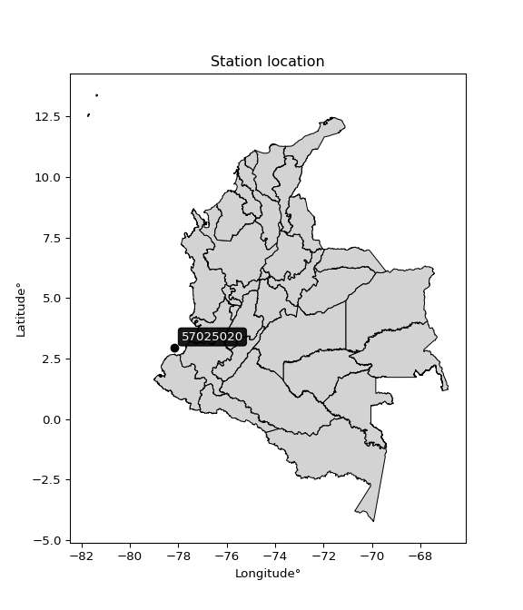

<div align="center">


</div>

# PMP Station (rain, Pmax24h): 57025020

Probable Maximum Precipitation (PMP) is the greatest amount of rainfall for a specific duration that is meteorologically possible for a given location, acting as a "worst-case" scenario for extreme storms, crucial for designing safety-critical infrastructure like bridges, river deviations, dams, spillways, and nuclear plants to prevent catastrophic failure. PMP is calculated by hydrologists using meteorological data to determine the upper limit of extreme rainfall, often leading to the Probable Maximum Flood (PMF) for flood control design, and is increasingly being studied for climate change impacts.

<div align="center">

</img>

</div>


## A. General information


### 1. General running parameters

• app_version: _v20251227_. • runtime: _2025-12-27 09:02:11.367833_. • Python version: _3.14.0_. • SciPy version: _1.16.3_. • Pandas version: _2.3.3_. • NumPy version: _2.3.5_. • Stations dataset (station_dataset_file): _dataset/pmax24h_in/automatic_colombia_2003_2024_filter.csv_. • Stations catalog (station_catalog_file): _dataset/CNE_IDEAM.xls_. • Minimum year to eval til year_max (date_min): _2003_. • Maximum year to eval since year_min (date_max): _2024_. • Creates, save and include plots into reports (create_plot): _False_. • Plot only fit distributions with Δo > Δ (plot_only_fit): _True_. • Eval low extreme values, if False, evaluates high extreme values (low_extreme): _False_. • Eval every SciPy distribution as logarithmic (pdist_logarithmic_on): _True_. • Standard deviation normalized (ddof): _1.0_. • Return periods to eval in years (Tr): _[2, 2.33, 5, 10, 15, 20, 25, 50, 75, 100, 200, 250, 500, 750, 1000]_. • Minimum data sample per station, 0 means any (minimum_sample): _5_. • Z-Score threshold to adjust a value, 0 means disable (zscore): _3.5_. • Avoid zeros, e.g. rain = 0 (avoid_zeros): _True_. • Avoid null values (avoid_nans): _True_. [:file_folder:Dataset file.](../../dataset/pmax24h_in/automatic_colombia_2003_2024_filter.csv)

> Delta Degrees of Freedom (DDOF): is a parameter used in the formulas for calculating variance and standard deviation. When ddof=0, the divisor is $N$ (the total number of observations) and this is used when your data set is the entire population. When ddof=1, the divisor is $N-1$ and this is used when your data set is a sample drawn from a larger population. Using $N-1$ provides an unbiased estimate of the population variance (known as Bessel´s correction).


### 2. Station info and location

|   id |   CODIGO | NOMBRE                       | CATEGORIA               | TECNOLOGIA                              | ESTADO           | FECHA_INSTALACION   |   FECHA_SUSPENSION |   ALTITUD |   LATITUD |   LONGITUD | DEPARTAMENTO   | MUNICIPIO   | AREA_OPERATIVA                      | ENTIDAD                                                     | AREA_HIDROGRAFICA   | ZONA_HIDROGRAFICA   | SUBZONA_HIDROGRAFICA   |   CORRIENTE | Catalogo   |
|-----:|---------:|:-----------------------------|:------------------------|:----------------------------------------|:-----------------|:--------------------|-------------------:|----------:|----------:|-----------:|:---------------|:------------|:------------------------------------|:------------------------------------------------------------|:--------------------|:--------------------|:-----------------------|------------:|:-----------|
|    0 | 57025020 | GORGONA GUAPI AUT [57025020] | Climatológica Principal | Automática con Telemetría, Convencional | En Mantenimiento | 18/09/2005          |                nan |        10 |   2.96294 |   -78.1744 | Cauca          | Guapi       | Area Operativa 07 - Nariño-Putumayo | INSTITUTO DE HIDROLOGIA METEOROLOGIA Y ESTUDIOS AMBIENTALES | Orinoco             | Guaviare            | Medio Guaviare         |         nan | CNE_IDEAM  |

<div align="center">

Map location in: [:earth_americas:Google](http://maps.google.com/maps?q=2.962944444,-78.17436111) [:earth_americas:OSM](https://www.openstreetmap.org/#map=18/2.962944444/-78.17436111&layers=P) [:earth_americas:Bing](https://www.bing.com/maps?cp=2.962944444~-78.17436111&lvl=18) [:earth_americas:Apple](https://maps.apple.com/frame?center=2.962944444%2C-78.17436111&span=0.003%2C0.006)

</div>


<div align="center">

```geojson
{
  "type": "Feature",
  "geometry": {
    "type": "Point", 
    "coordinates": [-78.17436111, 2.962944444]
  }, 
  "properties": {
    "Name": "57025020"
  }
}
```

</div>


### 3. Discrete values table and plot

|               |           0 |         1 |          2 |           3 |          4 |           5 |
|:--------------|------------:|----------:|-----------:|------------:|-----------:|------------:|
| Date          | 2017        | 2018      | 2020       | 2021        | 2022       | 2023        |
| Value         |  189.4      |  135.1    |  170.9     |  166.3      |  200.8     |  177.4      |
| Value_initial |  189.4      |  135.1    |  170.9     |  166.3      |  200.8     |  177.4      |
| count         |    6        |    6      |    6       |    6        |    6       |    6        |
| mean          |  173.317    |  173.317  |  173.317   |  173.317    |  173.317   |  173.317    |
| std           |   22.5666   |   22.5666 |   22.5666  |   22.5666   |   22.5666  |   22.5666   |
| zscore        |    0.712704 |   -1.6935 |   -0.10709 |   -0.310931 |    1.21787 |    0.180945 |

> The initial value (value_initial) correspond to the initial obtained or null completed value, and value (value) is adjusted only when the initial value is outside the valid range definite through the Z-Score value. If Z-Score is active, values out of range or outliers are replaced with the station mean value


### 4. Active continuous probability distributions from SciPy (45 of 104 available)

[scipy.stats](https://docs.scipy.org/doc/scipy/reference/stats.html) is a Python´s powerful submodule within the SciPy library for comprehensive statistical analysis, offering over 130 probability distributions (like Normal, Poisson), functions for descriptive stats (mean, variance), hypothesis testing (t-tests, chi-square), random variable generation, and statistical tests, making it essential for data science, modeling, and research. It provides tools to explore, model, and draw conclusions from data efficiently, working seamlessly with NumPy.

<div align="center">

|   id | p_dist             |   n_parameter | fit_method   | label                                                                       | active   | ref                                                                                                        |
|-----:|:-------------------|--------------:|:-------------|:----------------------------------------------------------------------------|:---------|:-----------------------------------------------------------------------------------------------------------|
|    0 | alpha              |             3 | MLE          | Alpha                                                                       | True     | [:mortar_board:](https://docs.scipy.org/doc/scipy/reference/generated/scipy.stats.alpha.html)              |
|    1 | betaprime          |             4 | MLE          | Beta prime                                                                  | True     | [:mortar_board:](https://docs.scipy.org/doc/scipy/reference/generated/scipy.stats.betaprime.html)          |
|    2 | chi2               |             3 | MLE          | Chi²                                                                        | True     | [:mortar_board:](https://docs.scipy.org/doc/scipy/reference/generated/scipy.stats.chi2.html)               |
|    3 | crystalball        |             4 | MLE          | Crystalball                                                                 | True     | [:mortar_board:](https://docs.scipy.org/doc/scipy/reference/generated/scipy.stats.crystalball.html)        |
|    4 | erlang             |             3 | MLE          | Erlang                                                                      | True     | [:mortar_board:](https://docs.scipy.org/doc/scipy/reference/generated/scipy.stats.erlang.html)             |
|    5 | expon              |             2 | MLE          | Exponential                                                                 | True     | [:mortar_board:](https://docs.scipy.org/doc/scipy/reference/generated/scipy.stats.expon.html)              |
|    6 | exponnorm          |             3 | MLE          | Exponentially modified Normal                                               | True     | [:mortar_board:](https://docs.scipy.org/doc/scipy/reference/generated/scipy.stats.exponnorm.html)          |
|    7 | f                  |             4 | MLE          | F                                                                           | True     | [:mortar_board:](https://docs.scipy.org/doc/scipy/reference/generated/scipy.stats.f.html)                  |
|    8 | fatiguelife        |             3 | MLE          | Fatigue-life (Birnbaum-Saunders)                                            | True     | [:mortar_board:](https://docs.scipy.org/doc/scipy/reference/generated/scipy.stats.fatiguelife.html)        |
|    9 | fisk               |             3 | MLE          | Fisk                                                                        | True     | [:mortar_board:](https://docs.scipy.org/doc/scipy/reference/generated/scipy.stats.fisk.html)               |
|   10 | gamma              |             3 | MLE          | Gamma                                                                       | True     | [:mortar_board:](https://docs.scipy.org/doc/scipy/reference/generated/scipy.stats.gamma.html)              |
|   11 | genexpon           |             5 | MLE          | Generalized exponential                                                     | True     | [:mortar_board:](https://docs.scipy.org/doc/scipy/reference/generated/scipy.stats.genexpon.html)           |
|   12 | genlogistic        |             3 | MLE          | Generalized logistic                                                        | True     | [:mortar_board:](https://docs.scipy.org/doc/scipy/reference/generated/scipy.stats.genlogistic.html)        |
|   13 | gibrat             |             2 | MM           | Gibrat                                                                      | True     | [:mortar_board:](https://docs.scipy.org/doc/scipy/reference/generated/scipy.stats.gibrat.html)             |
|   14 | gompertz           |             3 | MLE          | Gompertz (or truncated Gumbel)                                              | True     | [:mortar_board:](https://docs.scipy.org/doc/scipy/reference/generated/scipy.stats.gompertz.html)           |
|   15 | gumbel_l           |             2 | MM           | Gumbel Left Skew                                                            | True     | [:mortar_board:](https://docs.scipy.org/doc/scipy/reference/generated/scipy.stats.gumbel_l.html)           |
|   16 | gumbel_r           |             2 | MM           | Gumbel Right Skew                                                           | True     | [:mortar_board:](https://docs.scipy.org/doc/scipy/reference/generated/scipy.stats.gumbel_r.html)           |
|   17 | halflogistic       |             2 | MM           | Half-logistic                                                               | True     | [:mortar_board:](https://docs.scipy.org/doc/scipy/reference/generated/scipy.stats.halflogistic.html)       |
|   18 | halfnorm           |             2 | MM           | Half Normal                                                                 | True     | [:mortar_board:](https://docs.scipy.org/doc/scipy/reference/generated/scipy.stats.halfnorm.html)           |
|   19 | hypsecant          |             2 | MM           | hyperbolic secant                                                           | True     | [:mortar_board:](https://docs.scipy.org/doc/scipy/reference/generated/scipy.stats.hypsecant.html)          |
|   20 | invgamma           |             3 | MLE          | Inverted gamma                                                              | True     | [:mortar_board:](https://docs.scipy.org/doc/scipy/reference/generated/scipy.stats.invgamma.html)           |
|   21 | invgauss           |             3 | MLE          | Inverse Gaussian                                                            | True     | [:mortar_board:](https://docs.scipy.org/doc/scipy/reference/generated/scipy.stats.invgauss.html)           |
|   22 | invweibull         |             3 | MLE          | Inverted Weibull                                                            | True     | [:mortar_board:](https://docs.scipy.org/doc/scipy/reference/generated/scipy.stats.invweibull.html)         |
|   23 | johnsonsu          |             4 | MLE          | Johnson Su                                                                  | True     | [:mortar_board:](https://docs.scipy.org/doc/scipy/reference/generated/scipy.stats.johnsonsu.html)          |
|   24 | kstwobign          |             2 | MLE          | Limiting distribution of scaled Kolmogorov-Smirnov two-sided test statistic | True     | [:mortar_board:](https://docs.scipy.org/doc/scipy/reference/generated/scipy.stats.kstwobign.html)          |
|   25 | laplace            |             2 | MM           | Laplace                                                                     | True     | [:mortar_board:](https://docs.scipy.org/doc/scipy/reference/generated/scipy.stats.laplace.html)            |
|   26 | laplace_asymmetric |             3 | MLE          | Asymmetric Laplace                                                          | True     | [:mortar_board:](https://docs.scipy.org/doc/scipy/reference/generated/scipy.stats.laplace_asymmetric.html) |
|   27 | loggamma           |             3 | MLE          | Log gamma                                                                   | True     | [:mortar_board:](https://docs.scipy.org/doc/scipy/reference/generated/scipy.stats.loggamma.html)           |
|   28 | logistic           |             2 | MM           | Logistic (or Sech-squared)                                                  | True     | [:mortar_board:](https://docs.scipy.org/doc/scipy/reference/generated/scipy.stats.logistic.html)           |
|   29 | lognorm            |             3 | MLE          | Log Normal                                                                  | True     | [:mortar_board:](https://docs.scipy.org/doc/scipy/reference/generated/scipy.stats.lognorm.html)            |
|   30 | maxwell            |             2 | MM           | Maxwell                                                                     | True     | [:mortar_board:](https://docs.scipy.org/doc/scipy/reference/generated/scipy.stats.maxwell.html)            |
|   31 | mielke             |             4 | MLE          | Mielke Beta-Kappa / Dagum                                                   | True     | [:mortar_board:](https://docs.scipy.org/doc/scipy/reference/generated/scipy.stats.mielke.html)             |
|   32 | moyal              |             2 | MM           | Moyal                                                                       | True     | [:mortar_board:](https://docs.scipy.org/doc/scipy/reference/generated/scipy.stats.moyal.html)              |
|   33 | nakagami           |             3 | MLE          | Nakagami                                                                    | True     | [:mortar_board:](https://docs.scipy.org/doc/scipy/reference/generated/scipy.stats.nakagami.html)           |
|   34 | ncf                |             5 | MLE          | Non-central F distribution                                                  | True     | [:mortar_board:](https://docs.scipy.org/doc/scipy/reference/generated/scipy.stats.ncf.html)                |
|   35 | nct                |             4 | MLE          | Non-central Student’s t                                                     | True     | [:mortar_board:](https://docs.scipy.org/doc/scipy/reference/generated/scipy.stats.nct.html)                |
|   36 | norm               |             2 | MM           | Normal                                                                      | True     | [:mortar_board:](https://docs.scipy.org/doc/scipy/reference/generated/scipy.stats.norm.html)               |
|   37 | pareto             |             3 | MLE          | Pareto                                                                      | True     | [:mortar_board:](https://docs.scipy.org/doc/scipy/reference/generated/scipy.stats.pareto.html)             |
|   38 | pearson3           |             3 | MM           | Pearson type III                                                            | True     | [:mortar_board:](https://docs.scipy.org/doc/scipy/reference/generated/scipy.stats.pearson3.html)           |
|   39 | rayleigh           |             2 | MM           | Rayleigh                                                                    | True     | [:mortar_board:](https://docs.scipy.org/doc/scipy/reference/generated/scipy.stats.rayleigh.html)           |
|   40 | rice               |             3 | MLE          | Rice                                                                        | True     | [:mortar_board:](https://docs.scipy.org/doc/scipy/reference/generated/scipy.stats.rice.html)               |
|   41 | t                  |             3 | MLE          | Student’s t                                                                 | True     | [:mortar_board:](https://docs.scipy.org/doc/scipy/reference/generated/scipy.stats.t.html)                  |
|   42 | truncnorm          |             4 | MLE          | Truncated normal                                                            | True     | [:mortar_board:](https://docs.scipy.org/doc/scipy/reference/generated/scipy.stats.truncnorm.html)          |
|   43 | wald               |             2 | MM           | Wald                                                                        | True     | [:mortar_board:](https://docs.scipy.org/doc/scipy/reference/generated/scipy.stats.wald.html)               |
|   44 | weibull_min        |             3 | MLE          | Weibull minimum                                                             | True     | [:mortar_board:](https://docs.scipy.org/doc/scipy/reference/generated/scipy.stats.weibull_min.html)        |

</div>

> **n_parameter:** # arguments & localization & scale.
>
> **Fit methods:** (MLE) maximum likelihood, (MM) L-moments.
>
>**Inactive:** foldnorm, gennorm, norminvgauss, powernorm, powerlognorm, skewnorm, genextreme, anglit, arcsine, argus, beta, bradford, burr, burr12, cauchy, cosine, halfcauchy, foldcauchy, skewcauchy, wrapcauchy, dgamma, gengamma, exponweib, exponpow, truncexpon, gausshyper, genhalflogistic, genhyperbolic, geninvgauss, halfgennorm, johnsonsb, kappa4, kappa3, ksone, kstwo, loglaplace, levy, levy_l, levy_stable, ncx2, genpareto, truncpareto, lomax, powerlaw, rdist, rel_breitwigner, recipinvgauss, semicircular, studentized_range, trapezoid, triang, truncweibull_min, tukeylambda, uniform, loguniform, vonmises, vonmises_line, weibull_max, dweibull, 


## B. Probability distributions vs. Empirical distributions

A continuous probability distribution (CPD) describes probabilities for variables that can take any value within a range (like rain any time), unlike discrete variables with specific outcomes (like temperature). It uses a Probability Density Function (PDF), a curve where the total area under it equals 1, and the probability of the variable falling within an interval (a to b) is found by calculating the area under the curve between those points. A key feature is that the probability of hitting any single exact value is zero, so probabilities are always expressed for ranges, e.g., $P(a ≤ X ≤ b)$.

<div align="center">

Distributions parameters from station values
|    |   station | p_dist                |   n |             loc |            scale | shape                  | shape1                | shape2             | shape3   |
|---:|----------:|:----------------------|----:|----------------:|-----------------:|:-----------------------|:----------------------|:-------------------|:---------|
|  0 |  57025020 | alpha                 |   6 |  -307.845       |  10837.1         | 22.56673588884111      |                       |                    |          |
|  1 |  57025020 | betaprime             |   6 |    -1.82625     |    154.351       | 143.92530042127868     | 128.1721868164756     |                    |          |
|  2 |  57025020 | chi2                  |   6 |   -12.9853      |      1.26136     | 147.31091573595847     |                       |                    |          |
|  3 |  57025020 | crystalball           |   6 |    -0.118634    |    174.605       | 4.279402812012338      | 2.38493323847789      |                    |          |
|  4 |  57025020 | erlang                |   6 |  -191.477       |      1.21021     | 301.44889845688147     |                       |                    |          |
|  5 |  57025020 | expon                 |   6 |   135.1         |     38.2167      |                        |                       |                    |          |
|  6 |  57025020 | exponnorm             |   6 |   173.297       |     20.6004      | 0.0009455632815681808  |                       |                    |          |
|  7 |  57025020 | f                     |   6 | -3762.34        |   3935.51        | 80472.83808506333      | 720271.495440735      |                    |          |
|  8 |  57025020 | fatiguelife           |   6 |   135.1         |      0.000298113 | 332.41239920845567     |                       |                    |          |
|  9 |  57025020 | fisk                  |   6 |    -0.426284    |    174.817       | 14.462707934914858     |                       |                    |          |
| 10 |  57025020 | gamma                 |   6 |  -184.263       |      1.23454     | 289.54397184822426     |                       |                    |          |
| 11 |  57025020 | genexpon              |   6 |   135.1         |      2.60188     | 0.067652898140452      | 5.028232639590343e-07 | 0.6418643890971842 |          |
| 12 |  57025020 | genlogistic           |   6 |   187.708       |      7.64626     | 0.41733757181018194    |                       |                    |          |
| 13 |  57025020 | gibrat                |   6 |   157.601       |      9.53197     |                        |                       |                    |          |
| 14 |  57025020 | gompertz              |   6 |   189.4         |      2.85502     | 0.039056486729380634   |                       |                    |          |
| 15 |  57025020 | gumbel_l              |   6 |   182.588       |     16.0621      |                        |                       |                    |          |
| 16 |  57025020 | gumbel_r              |   6 |   164.045       |     16.0621      |                        |                       |                    |          |
| 17 |  57025020 | halflogistic          |   6 |   148.9         |     17.6126      |                        |                       |                    |          |
| 18 |  57025020 | halfnorm              |   6 |   146.05        |     34.174       |                        |                       |                    |          |
| 19 |  57025020 | hypsecant             |   6 |   173.317       |     13.1146      |                        |                       |                    |          |
| 20 |  57025020 | invgamma              |   6 |  -258.187       | 178890           | 415.835551362479       |                       |                    |          |
| 21 |  57025020 | invgauss              |   6 |    39.5396      |   4668.47        | 0.028636186655900328   |                       |                    |          |
| 22 |  57025020 | invweibull            |   6 |   135.1         |      1.82004     | 0.04910952525778599    |                       |                    |          |
| 23 |  57025020 | johnsonsu             |   6 |   229.752       |      3.54293     | 9.217248054528394      | 2.7139296955378294    |                    |          |
| 24 |  57025020 | kstwobign             |   6 |    85.4356      |    100.434       |                        |                       |                    |          |
| 25 |  57025020 | laplace               |   6 |   173.317       |     14.5667      |                        |                       |                    |          |
| 26 |  57025020 | laplace_asymmetric    |   6 |   177.4         |     15.4828      | 1.140476626900337      |                       |                    |          |
| 27 |  57025020 | loggamma              |   6 |   183.005       |     16.713       | 0.9985123576763495     |                       |                    |          |
| 28 |  57025020 | logistic              |   6 |   173.317       |     11.3576      |                        |                       |                    |          |
| 29 |  57025020 | lognorm               |   6 |   135.1         |      0.129837    | 13.038689477375831     |                       |                    |          |
| 30 |  57025020 | maxwell               |   6 |   124.502       |     30.5899      |                        |                       |                    |          |
| 31 |  57025020 | mielke                |   6 |    -0.953147    |    194.271       | 7.900941158509157      | 31.444632465940202    |                    |          |
| 32 |  57025020 | moyal                 |   6 |   161.536       |      9.27346     |                        |                       |                    |          |
| 33 |  57025020 | nakagami              |   6 |   166.3         |     20.6616      | 0.3753412097039348     |                       |                    |          |
| 34 |  57025020 | ncf                   |   6 |    -4.36411     |      9.90225e-05 | 0.00023262667475470913 | 463.66577346595994    | 415.69187046593765 |          |
| 35 |  57025020 | nct                   |   6 |  -957.061       |     20.5614      | 180950.46574080107     | 54.975071556926       |                    |          |
| 36 |  57025020 | norm                  |   6 |   173.317       |     20.6004      |                        |                       |                    |          |
| 37 |  57025020 | pareto                |   6 |   134.978       |      0.121511    | 0.2034189920966919     |                       |                    |          |
| 38 |  57025020 | pearson3              |   6 |   173.317       |     20.6004      | -0.5945375080406237    |                       |                    |          |
| 39 |  57025020 | rayleigh              |   6 |   133.907       |     31.4445      |                        |                       |                    |          |
| 40 |  57025020 | rice                  |   6 |   121.312       |     22.3712      | 2.06201250882319       |                       |                    |          |
| 41 |  57025020 | t                     |   6 |   173.314       |     20.6029      | 272606.79902290186     |                       |                    |          |
| 42 |  57025020 | truncnorm             |   6 |     9.48908     |      2.29006     | 68.47391340699077      | 83.5396704273095      |                    |          |
| 43 |  57025020 | wald                  |   6 |   152.716       |     20.6005      |                        |                       |                    |          |
| 44 |  57025020 | weibull_min           |   6 |  -233.173       |    415.775       | 24.480931609422914     |                       |                    |          |
| 45 |  57025020 | logalpha              |   6 |    -3.40509     |    575.66        | 67.32278602367623      |                       |                    |          |
| 46 |  57025020 | logbetaprime          |   6 |     0.194067    |      2.97997     | 3873.5847760912648     | 2331.7256673121965    |                    |          |
| 47 |  57025020 | logchi2               |   6 |     4.90602     |      1.00484     | 0.9307566836826972     |                       |                    |          |
| 48 |  57025020 | logcrystalball        |   6 |     5.14758     |      0.124967    | 5.278802584598807      | 152.6801797037475     |                    |          |
| 49 |  57025020 | logerlang             |   6 |     2.73952     |      0.00701516  | 343.2624863575743      |                       |                    |          |
| 50 |  57025020 | logexpon              |   6 |     4.90602     |      0.241562    |                        |                       |                    |          |
| 51 |  57025020 | logexponnorm          |   6 |     5.1475      |      0.124966    | 0.0006096492124141972  |                       |                    |          |
| 52 |  57025020 | logf                  |   6 |  -148.373       |    153.521       | 9577434.521341063      | 4396813.244318161     |                    |          |
| 53 |  57025020 | logfatiguelife        |   6 |   -41.2538      |     46.4009      | 0.0026858640164234204  |                       |                    |          |
| 54 |  57025020 | logfisk               |   6 |    -7.39055e+06 |      7.39056e+06 | 106575663.05355659     |                       |                    |          |
| 55 |  57025020 | loggamma              |   6 |     3.0119      |      0.007755    | 275.48956498848815     |                       |                    |          |
| 56 |  57025020 | loggenexpon           |   6 |     4.90602     |      1.08882e+07 | 29511033.208397344     | 65820127.119797945    | 24362875.866169017 |          |
| 57 |  57025020 | loggenlogistic        |   6 |     5.26457     |      0.0318794   | 0.2501626180328703     |                       |                    |          |
| 58 |  57025020 | loggibrat             |   6 |     5.05226     |      0.0578128   |                        |                       |                    |          |
| 59 |  57025020 | loggompertz           |   6 |     4.90602     |      0.113615    | 0.08288223585845023    |                       |                    |          |
| 60 |  57025020 | loggumbel_l           |   6 |     5.20382     |      0.0974355   |                        |                       |                    |          |
| 61 |  57025020 | loggumbel_r           |   6 |     5.09134     |      0.0974355   |                        |                       |                    |          |
| 62 |  57025020 | loghalflogistic       |   6 |     4.99942     |      0.106869    |                        |                       |                    |          |
| 63 |  57025020 | loghalfnorm           |   6 |     4.98218     |      0.207289    |                        |                       |                    |          |
| 64 |  57025020 | loghypsecant          |   6 |     5.14758     |      0.0795558   |                        |                       |                    |          |
| 65 |  57025020 | loginvgamma           |   6 |     2.36038     |   1331           | 479.0314363553571      |                       |                    |          |
| 66 |  57025020 | loginvgauss           |   6 |     4.06102     |     68.3818      | 0.015835721513992332   |                       |                    |          |
| 67 |  57025020 | loginvweibull         |   6 |    -6.64283e+07 |      6.64283e+07 | 503982254.75453234     |                       |                    |          |
| 68 |  57025020 | logjohnsonsu          |   6 |     5.3957      |      0.00883194  | 7.581372016111548      | 1.9437541690153113    |                    |          |
| 69 |  57025020 | logkstwobign          |   6 |     4.59546     |      0.630823    |                        |                       |                    |          |
| 70 |  57025020 | loglaplace            |   6 |     5.14758     |      0.0883643   |                        |                       |                    |          |
| 71 |  57025020 | loglaplace_asymmetric |   6 |     5.17841     |      0.090015    | 1.1857091235803385     |                       |                    |          |
| 72 |  57025020 | logloggamma           |   6 |     5.27287     |      0.0542338   | 0.43733977654901224    |                       |                    |          |
| 73 |  57025020 | loglogistic           |   6 |     5.14758     |      0.0688973   |                        |                       |                    |          |
| 74 |  57025020 | loglognorm            |   6 |     4.90602     |      0.00107945  | 12.44603878418006      |                       |                    |          |
| 75 |  57025020 | logmaxwell            |   6 |     4.85146     |      0.185564    |                        |                       |                    |          |
| 76 |  57025020 | logmielke             |   6 |     4.90602     |      0.414223    | 0.6256897875713332     | 124.53394239595414    |                    |          |
| 77 |  57025020 | logmoyal              |   6 |     5.07611     |      0.0562544   |                        |                       |                    |          |
| 78 |  57025020 | lognakagami           |   6 |   -49.1183      |     54.2661      | 46796.98047865974      |                       |                    |          |
| 79 |  57025020 | logncf                |   6 |     1.63777     |      0.00271758  | 0.3637088970969158     | 2074.371455737877     | 468.150084609616   |          |
| 80 |  57025020 | lognct                |   6 |     1.087       |      0.0269507   | 525.0097513912472      | 150.4422260612676     |                    |          |
| 81 |  57025020 | lognorm               |   6 |     5.14758     |      0.124966    |                        |                       |                    |          |
| 82 |  57025020 | logpareto             |   6 |     4.90524     |      0.000774433 | 0.20338622125499864    |                       |                    |          |
| 83 |  57025020 | logpearson3           |   6 |     5.14758     |      0.124966    | -0.8120111080450052    |                       |                    |          |
| 84 |  57025020 | lograyleigh           |   6 |     4.90854     |      0.190721    |                        |                       |                    |          |
| 85 |  57025020 | logrice               |   6 |     4.81613     |      0.134514    | 2.2213584752844975     |                       |                    |          |
| 86 |  57025020 | logt                  |   6 |     5.14757     |      0.124959    | 823545.8698981656      |                       |                    |          |
| 87 |  57025020 | logtruncnorm          |   6 |    -0.0388806   |      1.12946     | 4.378105861821155      | 5.92688768128993      |                    |          |
| 88 |  57025020 | logwald               |   6 |     5.02259     |      0.12499     |                        |                       |                    |          |
| 89 |  57025020 | logweibull_min        |   6 |    -2.69151e+06 |      2.69152e+06 | 28139749.251251224     |                       |                    |          |

</div>

> **loc** (Location parameter): This shifts the distribution along the x-axis. For many common distributions, like the normal (Gaussian) distribution, loc represents the mean $μ$. For others, like the uniform distribution, it might represent the minimum value, or for the beta distribution, the left end of the support interval.
>
> **scale** (Scale parameter): This determines the width or spread of the distribution. For the normal distribution, scale represents the standard deviation $σ$. For a uniform distribution, it defines the length of the interval (from $loc$ to $loc + scale$).
>
> **shape** (Shape parameters): Refers to parameters that define the specific form of a probability distribution, distinct from its location (loc) and scale (scale). These parameters are required arguments for most distribution functions. For example, a normal (Gaussian) distribution is fully defined by its location (mean) and scale (standard deviation), so it has no specific shape parameters beyond loc and scale. However, other distributions have intrinsic properties that need specification, as Gamma distribution that takes a shape parameter, often named $a$ or $alpha$.


### 0. Cumulative distribution values - CDF (90 evaluated)

Cumulative Distribution Function (CDF), denoted as $F$<sub>$X$</sub>$(x)$, is a function that gives the probability that a random variable $X$ will take a value less than or equal to a specific value, $x$ (i.e., $(P(X≥x)$. It essentially "accumulates" probabilities from a given point up to the far right (positive infinity), providing a complete picture of the distribution´s probabilities for both discrete (like rain) and continuous (like temperature) variables, helping to find probabilities over ranges or above certain values.

<div align="center">

CDF ordered by x ascending and calculating $log(f(x))$ separately
|   id |   Station |   date |     x |   count |    mean |     std |    zscore |   Value_initial |   station |   m |     alpha |   alpha_pdf |   betaprime |   betaprime_pdf |     chi2 |   chi2_pdf |   crystalball |   crystalball_pdf |    erlang |   erlang_pdf |    expon |   expon_pdf |   exponnorm |   exponnorm_pdf |         f |      f_pdf |   fatiguelife |   fatiguelife_pdf |      fisk |   fisk_pdf |     gamma |   gamma_pdf |    genexpon |   genexpon_pdf |   genlogistic |   genlogistic_pdf |   gibrat |   gibrat_pdf |    gompertz |   gompertz_pdf |   gumbel_l |   gumbel_l_pdf |   gumbel_r |   gumbel_r_pdf |   halflogistic |   halflogistic_pdf |   halfnorm |   halfnorm_pdf |   hypsecant |   hypsecant_pdf |   invgamma |   invgamma_pdf |   invgauss |   invgauss_pdf |   invweibull |   invweibull_pdf |   johnsonsu |   johnsonsu_pdf |   kstwobign |   kstwobign_pdf |   laplace |   laplace_pdf |   laplace_asymmetric |   laplace_asymmetric_pdf |   loggamma |   loggamma_pdf |   logistic |   logistic_pdf |   lognorm |   lognorm_pdf |   maxwell |   maxwell_pdf |    mielke |   mielke_pdf |       moyal |   moyal_pdf |    nakagami |   nakagami_pdf |       ncf |    ncf_pdf |       nct |    nct_pdf |      norm |   norm_pdf |   pareto |   pareto_pdf |   pearson3 |   pearson3_pdf |    rayleigh |   rayleigh_pdf |      rice |   rice_pdf |         t |      t_pdf |   truncnorm |   truncnorm_pdf |     wald |   wald_pdf |   weibull_min |   weibull_min_pdf |   logalpha |   logalpha_pdf |   logbetaprime |   logbetaprime_pdf |     logchi2 |   logchi2_pdf |   logcrystalball |   logcrystalball_pdf |   logerlang |   logerlang_pdf |   logexpon |   logexpon_pdf |   logexponnorm |   logexponnorm_pdf |      logf |   logf_pdf |   logfatiguelife |   logfatiguelife_pdf |   logfisk |   logfisk_pdf |   loggenexpon |   loggenexpon_pdf |   loggenlogistic |   loggenlogistic_pdf |   loggibrat |   loggibrat_pdf |   loggompertz |   loggompertz_pdf |   loggumbel_l |   loggumbel_l_pdf |   loggumbel_r |   loggumbel_r_pdf |   loghalflogistic |   loghalflogistic_pdf |   loghalfnorm |   loghalfnorm_pdf |   loghypsecant |   loghypsecant_pdf |   loginvgamma |   loginvgamma_pdf |   loginvgauss |   loginvgauss_pdf |   loginvweibull |   loginvweibull_pdf |   logjohnsonsu |   logjohnsonsu_pdf |   logkstwobign |   logkstwobign_pdf |   loglaplace |   loglaplace_pdf |   loglaplace_asymmetric |   loglaplace_asymmetric_pdf |   logloggamma |   logloggamma_pdf |   loglogistic |   loglogistic_pdf |   loglognorm |   loglognorm_pdf |   logmaxwell |   logmaxwell_pdf |   logmielke |   logmielke_pdf |    logmoyal |   logmoyal_pdf |   lognakagami |   lognakagami_pdf |   logncf |   logncf_pdf |    lognct |   lognct_pdf |   logpareto |   logpareto_pdf |   logpearson3 |   logpearson3_pdf |   lograyleigh |   lograyleigh_pdf |   logrice |   logrice_pdf |      logt |   logt_pdf |   logtruncnorm |   logtruncnorm_pdf |   logwald |   logwald_pdf |   logweibull_min |   logweibull_min_pdf |
|-----:|----------:|-------:|------:|--------:|--------:|--------:|----------:|----------------:|----------:|----:|----------:|------------:|------------:|----------------:|---------:|-----------:|--------------:|------------------:|----------:|-------------:|---------:|------------:|------------:|----------------:|----------:|-----------:|--------------:|------------------:|----------:|-----------:|----------:|------------:|------------:|---------------:|--------------:|------------------:|---------:|-------------:|------------:|---------------:|-----------:|---------------:|-----------:|---------------:|---------------:|-------------------:|-----------:|---------------:|------------:|----------------:|-----------:|---------------:|-----------:|---------------:|-------------:|-----------------:|------------:|----------------:|------------:|----------------:|----------:|--------------:|---------------------:|-------------------------:|-----------:|---------------:|-----------:|---------------:|----------:|--------------:|----------:|--------------:|----------:|-------------:|------------:|------------:|------------:|---------------:|----------:|-----------:|----------:|-----------:|----------:|-----------:|---------:|-------------:|-----------:|---------------:|------------:|---------------:|----------:|-----------:|----------:|-----------:|------------:|----------------:|---------:|-----------:|--------------:|------------------:|-----------:|---------------:|---------------:|-------------------:|------------:|--------------:|-----------------:|---------------------:|------------:|----------------:|-----------:|---------------:|---------------:|-------------------:|----------:|-----------:|-----------------:|---------------------:|----------:|--------------:|--------------:|------------------:|-----------------:|---------------------:|------------:|----------------:|--------------:|------------------:|--------------:|------------------:|--------------:|------------------:|------------------:|----------------------:|--------------:|------------------:|---------------:|-------------------:|--------------:|------------------:|--------------:|------------------:|----------------:|--------------------:|---------------:|-------------------:|---------------:|-------------------:|-------------:|-----------------:|------------------------:|----------------------------:|--------------:|------------------:|--------------:|------------------:|-------------:|-----------------:|-------------:|-----------------:|------------:|----------------:|------------:|---------------:|--------------:|------------------:|---------:|-------------:|----------:|-------------:|------------:|----------------:|--------------:|------------------:|--------------:|------------------:|----------:|--------------:|----------:|-----------:|---------------:|-------------------:|----------:|--------------:|-----------------:|---------------------:|
|    0 |  57025020 |   2018 | 135.1 |       6 | 173.317 | 22.5666 | -1.6935   |           135.1 |  57025020 |   1 | 0.0287643 |  0.00362929 |   0.0259788 |      0.00362996 | 0.033091 | 0.00396899 |      0.780662 |        0.00169285 | 0.0308601 |   0.00356983 | 0        |  0.0261666  |   0.0317877 |      0.00346504 | 0.0324746 | 0.00353716 |     0.0378772 |       8.55601e+07 | 0.0245584 | 0.00255639 | 0.0312903 |  0.00361656 | 1.50685e-06 |     0.0260015  |      0.056598 |        0.00308598 | 0        |   0          | 0           |      0         |  0.0506706 |     0.00307336 |   0.002329 |    0.000879034 |       0        |         0          |   0        |     0          |   0.0345065 |      0.00262599 |  0.0305303 |     0.00368882 |  0.0276435 |     0.0040016  |   0.00852622 |      7.01939e+10 |   0.0569607 |      0.00327665 |   0.0326435 |      0.00597504 |  0.036272 |    0.00249006 |            0.0515161 |               0.00291747 |   0.026283 |       0.513209 |  0.0334123 |     0.00284354 | 0.0266166 |      0.492867 | 0.0106694 |    0.00294828 | 0.0599407 |   0.00348085 | 3.19151e-05 | 3.13329e-05 | 0           |     0          | 0.0255202 | 0.00341363 | 0.0320948 | 0.00348666 | 0.0317882 | 0.00346508 | 0        |  1.67408     |   0.045569 |     0.00347807 | 0.000719668 |     0.00120587 | 0.0249526 | 0.00393235 | 0.0318138 | 0.00346694 |   0         |    0            | 0        | 0          |     0.0500069 |        0.00323967 |  0.0261142 |       0.505188 |       0.029387 |           0.543685 | 8.07323e-08 |   4.23013e+07 |        0.0266168 |             0.492866 |   0.0283047 |        0.535356 |   0        |       4.13972  |      0.0266163 |           0.492863 | 0.0265293 |   0.491978 |         0.026187 |             0.490082 | 0.0245746 |       0.34567 |   2.43376e-12 |          2.71036  |        0.0599845 |             0.470701 |    0        |        0        |    9.5908e-09 |          0.729501 |     0.0459661 |          0.460746 |    0.00123192 |         0.0847008 |          0        |              0        |      0        |           0       |      0.0305394 |           0.383285 |     0.0250345 |          0.518053 |     0.0275884 |           0.60267 |       0.0250854 |            0.701417 |      0.0580869 |           0.460899 |      0.0313438 |           0.926591 |    0.0324889 |         0.36767  |                0.045531 |                    0.426593 |     0.0585726 |          0.471949 |     0.0291386 |          0.410605 |    0.0126845 |      2.96459e+12 |   0.00658566 |         0.355922 | 3.30298e-09 |    178987       | 5.75487e-06 |     0.00109915 |     0.0269494 |          0.496919 | 0.249713 |     0.969075 | 0.0255788 |     0.512465 |    0        |      262.626    |     0.0438431 |          0.507156 |      0        |           0       | 0.0218962 |      0.549882 | 0.0266156 |   0.492877 |    1.05952e-07 |           4.06251  |  0        |      0        |        0.0431853 |             0.441609 |
|    1 |  57025020 |   2021 | 166.3 |       6 | 173.317 | 22.5666 | -0.310931 |           166.3 |  57025020 |   2 | 0.386158  |  0.0184425  |   0.40023   |      0.0189163  | 0.395089 | 0.0182083  |      0.829735 |        0.00145073 | 0.375251  |   0.0182849  | 0.557979 |  0.0115662  |   0.366699  |      0.0182744  | 0.370308  | 0.0182801  |     0.834775  |       0.003875    | 0.335071  | 0.0193267  | 0.378098  |  0.0183322  | 0.5557      |     0.0115526  |      0.303285 |        0.0156043  | 0.463566 |   0.0456699  | 0           |      0         |  0.304234  |     0.015713   |   0.419355 |    0.0226891   |       0.457348 |         0.0224507  |   0.446526 |     0.0195883  |   0.337284  |      0.0211686  |  0.386196  |     0.0184606  |  0.408482  |     0.0181782  |   0.419056   |      0.000573691 |   0.30973   |      0.0150602  |   0.464209  |      0.0161092  |  0.308869 |    0.0212037  |            0.301516  |               0.0170755  |   0.401454 |       3.03686  |  0.350283  |     0.0200381  | 0.393447  |      3.07785  | 0.39954   |    0.0191467  | 0.305624  |   0.0143085  | 0.439241    | 0.024672    | 5.43426e-12 |   143.531      | 0.384201  | 0.0187953  | 0.367207  | 0.0182433  | 0.366699  | 0.0182743  | 0.676771 |  0.00209923  |   0.33424  |     0.0165325  | 0.411763    |     0.0192715  | 0.378942  | 0.0182226  | 0.366764  | 0.0182732  |   0.0438111 |   28.5969       | 0.488925 | 0.0331217  |     0.313125  |        0.0158106  |  0.400569  |       3.06574  |       0.405189 |           3.00737  | 0.38024     |   0.793268    |        0.393443  |             3.07782  |   0.404006  |        3.00811  |   0.576899 |       1.75152  |      0.393446  |           3.07785  | 0.393015  |   3.07513  |         0.394392 |             3.0905   | 0.33517   |       3.21334 |   0.557221    |          2.19529  |        0.305624  |             2.37729  |    0.524865 |        6.47076  |    0.351551   |          2.94534  |     0.327631  |          2.7392   |    0.451965   |         3.68375   |          0.489261 |              3.55866  |      0.47451  |           3.14653 |      0.368715  |           3.66558  |     0.415214  |          3.1085   |     0.435741  |           2.97837 |       0.466795  |            2.69815  |      0.309222  |           2.42862  |      0.490692  |           2.51302  |    0.341136  |         3.86056  |                0.318979 |                    2.98861  |     0.307989  |          2.39303  |     0.37981   |          3.41892  |    0.663716  |      0.141089    |   0.427296   |         3.16361  | 0.649414    |         1.9556  | 0.474357    |     3.92798    |     0.393707  |          3.06775  | 0.478878 |     1.17181  | 0.40607   |     3.06332  |    0.679576 |        0.312486 |     0.346164  |          2.7424   |      0.439584 |           3.16224 | 0.404098  |      3.04684  | 0.393475  |   3.07808  |    0.577043    |           1.7851   |  0.534267 |      4.87043  |        0.321273  |             2.74999  |
|    2 |  57025020 |   2020 | 170.9 |       6 | 173.317 | 22.5666 | -0.10709  |           170.9 |  57025020 |   3 | 0.472203  |  0.0188173  |   0.487781  |      0.0189924  | 0.479901 | 0.0185243  |      0.836325 |        0.00141427 | 0.461301  |   0.01898    | 0.608106 |  0.0102545  |   0.453306  |      0.019233   | 0.456807  | 0.01918    |     0.851407  |       0.00337352  | 0.427584  | 0.0206614  | 0.464291  |  0.0189943  | 0.605787    |     0.0102502  |      0.382395 |        0.0187859  | 0.630444 |   0.0283799  | 0           |      0         |  0.38309   |     0.0185522  |   0.520679 |    0.0211558   |       0.554282 |         0.0196669  |   0.532877 |     0.0179235  |   0.441673  |      0.023865   |  0.47254   |     0.0189295  |  0.492016  |     0.0180079  |   0.421516   |      0.000499527 |   0.38487   |      0.0175935  |   0.53612   |      0.0151024  |  0.423564 |    0.0290775  |            0.391244  |               0.022157   |   0.485548 |       3.10406  |  0.447005  |     0.0217644  | 0.479262  |      3.18809  | 0.487591  |    0.0189948  | 0.377555  |   0.0169984  | 0.546125    | 0.0216418   | 0.250882    |     0.0403911  | 0.471895  | 0.0191732  | 0.453647  | 0.0191921  | 0.453307  | 0.0192329  | 0.685656 |  0.00178009  |   0.41489  |     0.0184514  | 0.49944     |     0.0187279  | 0.464539  | 0.0188545  | 0.453364  | 0.0192309  |   1         |    7.01104e-60  | 0.61687  | 0.0231706  |     0.391718  |        0.0183203  |  0.485589  |       3.14232  |       0.48848  |           3.07544  | 0.401032    |   0.732615    |        0.479258  |             3.18807  |   0.487277  |        3.07315  |   0.622089 |       1.56445  |      0.479261  |           3.1881   | 0.478663  |   3.18539  |         0.480515 |             3.1977   | 0.427655  |       3.52966 |   0.614442    |          1.9983   |        0.377481  |             2.90185  |    0.666178 |        4.09611  |    0.436311   |          3.25534  |     0.408582  |          3.18807  |    0.54871    |         3.37996   |          0.580187 |              3.10371  |      0.556641 |           2.86929 |      0.474026  |           3.98778  |     0.50078   |          3.13905  |     0.516737  |           2.93844 |       0.538265  |            2.52949  |      0.381975  |           2.90941  |      0.557077  |           2.34651  |    0.464546  |         5.25718  |                0.411895 |                    3.85917  |     0.379826  |          2.87999  |     0.476436  |          3.62053  |    0.667325  |      0.124185    |   0.513019   |         3.09854  | 0.701535    |         1.86734 | 0.574562    |     3.40063    |     0.479223  |          3.1765   | 0.51081  |     1.16754  | 0.490698  |     3.11621  |    0.68749  |        0.269508 |     0.425736  |          3.07967  |      0.524444 |           3.04013 | 0.488473  |      3.11525  | 0.479296  |   3.18828  |    0.623158    |           1.59835  |  0.646525 |      3.45299  |        0.402779  |             3.21855  |
|    3 |  57025020 |   2023 | 177.4 |       6 | 173.317 | 22.5666 |  0.180945 |           177.4 |  57025020 |   4 | 0.592309  |  0.0178675  |   0.607634  |      0.0176278  | 0.598052 | 0.0175733  |      0.84535  |        0.00136268 | 0.583833  |   0.0184275  | 0.6694   |  0.00865067 |   0.578562  |      0.0189891  | 0.581477  | 0.0188665  |     0.871431  |       0.00281194  | 0.561398  | 0.020026   | 0.586759  |  0.0183943  | 0.667088    |     0.00865631 |      0.517388 |        0.0224167  | 0.767603 |   0.0154256  | 0           |      0         |  0.51518   |     0.0218526  |   0.646991 |    0.0175391   |       0.669076 |         0.0156802  |   0.641052 |     0.0153285  |   0.597544  |      0.0231406  |  0.593742  |     0.0180821  |  0.605038  |     0.0165643  |   0.424498   |      0.000422284 |   0.509679  |      0.0206278  |   0.628535  |      0.0132796  |  0.622229 |    0.0259339  |            0.565347  |               0.0320169  |   0.599757 |       2.97383  |  0.588925  |     0.0213154  | 0.597431  |      3.09672  | 0.606881  |    0.017488   | 0.500581  |   0.0207635  | 0.670737    | 0.016709    | 0.474487    |     0.0296442  | 0.594118  | 0.0181504  | 0.578617  | 0.0189444  | 0.578562  | 0.018989   | 0.696114 |  0.00145719  |   0.540807 |     0.0200138  | 0.615797    |     0.0169002  | 0.586203  | 0.0183011  | 0.578604  | 0.0189863  |   1         |    1.63319e-148 | 0.736713 | 0.0145248  |     0.520363  |        0.0210124  |  0.601335  |       3.01598  |       0.601732 |           2.952    | 0.427065    |   0.664643    |        0.597426  |             3.09671  |   0.600377  |        2.94643  |   0.676199 |       1.34045  |      0.597431  |           3.09673  | 0.596833  |   3.09463  |         0.598931 |             3.10008  | 0.561406  |       3.55075 |   0.68398     |          1.72836  |        0.500377  |             3.67994  |    0.782374 |        2.3326   |    0.563279   |          3.50308  |     0.537186  |          3.65951  |    0.664202   |         2.78924   |          0.684424 |              2.48698  |      0.656164 |           2.45914 |      0.620376  |           3.71838  |     0.615266  |          2.95412  |     0.622674  |           2.70757 |       0.627107  |            2.22016  |      0.503042  |           3.56554  |      0.639681  |           2.07344  |    0.647265  |         3.99182  |                0.584356 |                    5.475    |     0.500289  |          3.56667  |     0.610038  |          3.45284  |    0.671617  |      0.106611    |   0.624182   |         2.82695  | 0.769306    |         1.76711 | 0.687061    |     2.63422    |     0.59696   |          3.08569  | 0.554105 |     1.14988  | 0.604957  |     2.96458  |    0.696691 |        0.225829 |     0.547159  |          3.38707  |      0.63251  |           2.72642 | 0.603187  |      2.98981  | 0.597471  |   3.09681  |    0.67851     |           1.3728   |  0.750729 |      2.23776  |        0.533054  |             3.71778  |
|    4 |  57025020 |   2017 | 189.4 |       6 | 173.317 | 22.5666 |  0.712704 |           189.4 |  57025020 |   5 | 0.780078  |  0.0129752  |   0.789722  |      0.0123767  | 0.783018 | 0.0128142  |      0.861132 |        0.00126772 | 0.780101  |   0.0136885  | 0.75849  |  0.00631948 |   0.782519  |      0.0142783  | 0.783671  | 0.0141324  |     0.900411  |       0.00206858  | 0.76697   | 0.013617   | 0.782251  |  0.0136031  | 0.756319    |     0.00633613 |      0.782203 |        0.0189938  | 0.885856 |   0.00607169 | 4.91673e-08 |      0.01368   |  0.78308   |     0.0206388  |   0.813608 |    0.0104487   |       0.817665 |         0.00940868 |   0.795386 |     0.010443   |   0.81834   |      0.0131119  |  0.784227  |     0.0131645  |  0.776876  |     0.0118294  |   0.428955   |      0.000328364 |   0.766911  |      0.0204956  |   0.765789  |      0.00960898 |  0.834248 |    0.0113788  |            0.820421  |               0.013228   |   0.773819 |       2.26965  |  0.804724  |     0.013836   | 0.779492  |      2.37253  | 0.787794  |    0.012368   | 0.765419  |   0.0208065  | 0.823842    | 0.00934211  | 0.751629    |     0.0172138  | 0.783914  | 0.0130273  | 0.782148  | 0.0142566  | 0.782519  | 0.0142782  | 0.711129 |  0.00107976  |   0.773243 |     0.0174301  | 0.789286    |     0.0118261  | 0.781636  | 0.0136791  | 0.78253   | 0.0142761  |   1         |    2.46045e-321 | 0.858097 | 0.00686766 |     0.774031  |        0.0194711  |  0.777671  |       2.29237  |       0.774876 |           2.2627   | 0.467425    |   0.573381    |        0.779487  |             2.37254  |   0.773142  |        2.25836  |   0.753054 |       1.02229  |      0.779492  |           2.37253  | 0.778833  |   2.37295  |         0.780848 |             2.36566  | 0.766876  |       2.57806 |   0.782366    |          1.28771  |        0.76518   |             3.94465  |    0.884581 |        1.01568  |    0.785293   |          3.06401  |     0.778707  |          3.42554  |    0.811391   |         1.74049   |          0.815631 |              1.56615  |      0.793187 |           1.73508 |      0.815553  |           2.19088  |     0.785625  |          2.18685  |     0.778154  |           2.00453 |       0.752769  |            1.62195  |      0.759115  |           3.98075  |      0.758681  |           1.56448  |    0.831828  |         1.90316  |                0.824499 |                    2.31176  |     0.758243  |          4.01064  |     0.801786  |          2.30669  |    0.677846  |      0.0852854   |   0.785172   |         2.05543  | 0.880271    |         1.63026 | 0.821859    |     1.55677    |     0.7785    |          2.3685   | 0.627562 |     1.08865  | 0.777493  |     2.23676  |    0.709657 |        0.17439  |     0.76731   |          3.13941  |      0.786806 |           1.96532 | 0.778387  |      2.28502  | 0.779531  |   2.37242  |    0.757303    |           1.04862  |  0.856617 |      1.14594  |        0.779024  |             3.48787  |
|    5 |  57025020 |   2022 | 200.8 |       6 | 173.317 | 22.5666 |  1.21787  |           200.8 |  57025020 |   6 | 0.896331  |  0.00754653 |   0.899755  |      0.00710548 | 0.898091 | 0.00748614 |      0.875074 |        0.00117848 | 0.902262  |   0.00782611 | 0.820781 |  0.00468956 |   0.908917  |      0.00795319 | 0.908814  | 0.00788606 |     0.921062  |       0.00158176  | 0.884398  | 0.00734812 | 0.903443  |  0.00774908 | 0.81883     |     0.00471075 |      0.933105 |        0.00778561 | 0.934627 |   0.0029482  | 0.874872    |      0.0928034 |  0.955292  |     0.00864984 |   0.903535 |    0.00570629  |       0.900217 |         0.00538276 |   0.890867 |     0.00646972 |   0.922091  |      0.00588147 |  0.901577  |     0.00754275 |  0.884473  |     0.00719096 |   0.432351   |      0.000270987 |   0.947902  |      0.00991522 |   0.857161  |      0.00652739 |  0.924216 |    0.00520254 |            0.922453  |               0.00571217 |   0.882724 |       1.45982  |  0.918326  |     0.0066038  | 0.892178  |      1.48322  | 0.898665  |    0.00723326 | 0.935345  |   0.00855555 | 0.904173    | 0.0051418   | 0.89642     |     0.00874407 | 0.899817  | 0.00745499 | 0.908475  | 0.00796047 | 0.908917  | 0.0079532  | 0.722091 |  0.000858868 |   0.928475 |     0.00932514 | 0.89594     |     0.00704004 | 0.903973  | 0.00784451 | 0.908912  | 0.00795253 |   1         |    0            | 0.91619  | 0.00370908 |     0.942381  |        0.00927624 |  0.887076  |       1.45474  |       0.883582 |           1.45842  | 0.499056    |   0.511404    |        0.892174  |             1.48325  |   0.881786  |        1.461    |   0.806126 |       0.802584 |      0.892178  |           1.48322  | 0.891613  |   1.48589  |         0.893025 |             1.4739   | 0.884281  |       1.47563 |   0.847587    |          0.954845 |        0.935369  |             1.72043  |    0.928464 |        0.545995 |    0.927862   |          1.72197  |     0.935936  |          1.80673  |    0.891616   |         1.04978   |          0.888988 |              0.981103 |      0.877495 |           1.16807 |      0.90958   |           1.12134  |     0.889467  |          1.37732  |     0.875049  |           1.32303 |       0.833371  |            1.15247  |      0.950062  |           2.13483  |      0.837734  |           1.15107  |    0.913206  |         0.982231 |                0.918733 |                    1.07048  |     0.947418  |          2.06521  |     0.904291  |          1.25621  |    0.68243   |      0.0722719   |   0.883576   |         1.32646  | 0.972674    |         1.52952 | 0.893461    |     0.94129    |     0.89117   |          1.48629  | 0.688908 |     1.0068   | 0.884453  |     1.42938  |    0.718909 |        0.14398  |     0.919111  |          1.92971  |      0.881319 |           1.28476 | 0.887741  |      1.45799  | 0.892207  |   1.48301  |    0.811716    |           0.822093 |  0.908456 |      0.676949 |        0.938054  |             1.80142  |


</div>

An Empirical Distribution Function (EDF) is a step-function estimate of a true cumulative distribution function (CDF) based on observed sample data, representing the proportion of data points less than or equal to a given value. It is calculated by ordering your data and jumping up by $1/n$ (where $n$ is sample size) at each unique data point, allowing analysis without assuming an underlying population distribution, and it gets closer to the true CDF as the sample size grows.


### 1. Empirical - EDF California (1923)

California´s estimates the true probability distribution of water-related data (like rainfall, streamflow) using observed samples, crucial for risk assessment.

<div align="center">


$P=m/n$


</div>


**1.1. Empirical values**

<div align="center">

|                | 0                   | 1                  | 2              | 3                  | 4                  | 5              |
|:---------------|:--------------------|:-------------------|:---------------|:-------------------|:-------------------|:---------------|
| date           | 2018                | 2021               | 2020           | 2023               | 2017               | 2022           |
| x              | 135.1               | 166.3              | 170.9          | 177.4              | 189.4              | 200.8          |
| m              | 1                   | 2                  | 3              | 4                  | 5                  | 6              |
| empirical_dist | edf_california      | edf_california     | edf_california | edf_california     | edf_california     | edf_california |
| empirical      | 0.16666666666666666 | 0.3333333333333333 | 0.5            | 0.6666666666666666 | 0.8333333333333334 | 1.0            |
| empirical_tr   | 1.2                 | 1.4999999999999998 | 2.0            | 2.9999999999999996 | 6.000000000000002  | inf            |

</div>


**1.2. Kolmogorov-Smirnov fit test (sorted by Δ)**


<div align="center">

|                | 0                   | 1                     | 2                   | 3                   | 4                   | 5                   | 6                  | 7                   | 8                   | 9                  | 10                  | 11                 | 12                  | 13                 | 14                  | 15                  | 16                  | 17                  | 18                 | 19                  | 20                  | 21                  | 22                  | 23                 | 24                 | 25                  | 26                  | 27                 | 28                 | 29                 | 30                 | 31                 | 32                  | 33                 | 34                 | 35                | 36                 | 37                 | 38                  | 39                  | 40                 | 41                 | 42                 | 43                  | 44                  | 45                  | 46                  | 47                  | 48                  | 49                  | 50                  | 51                  | 52                 | 53                  | 54                  | 55                 | 56                 | 57                  | 58                  | 59                  | 60                 | 61                  | 62                  | 63                  | 64                  | 65                  | 66                  | 67                  | 68                  | 69                  | 70                  | 71                  | 72                  | 73                  | 74                 | 75                | 76                  | 77                 | 78                 | 79                 | 80                 | 81                  | 82                 | 83                  | 84             | 85                 | 86                 | 87                 | 88                 | 89                 |
|:---------------|:--------------------|:----------------------|:--------------------|:--------------------|:--------------------|:--------------------|:-------------------|:--------------------|:--------------------|:-------------------|:--------------------|:-------------------|:--------------------|:-------------------|:--------------------|:--------------------|:--------------------|:--------------------|:-------------------|:--------------------|:--------------------|:--------------------|:--------------------|:-------------------|:-------------------|:--------------------|:--------------------|:-------------------|:-------------------|:-------------------|:-------------------|:-------------------|:--------------------|:-------------------|:-------------------|:------------------|:-------------------|:-------------------|:--------------------|:--------------------|:-------------------|:-------------------|:-------------------|:--------------------|:--------------------|:--------------------|:--------------------|:--------------------|:--------------------|:--------------------|:--------------------|:--------------------|:-------------------|:--------------------|:--------------------|:-------------------|:-------------------|:--------------------|:--------------------|:--------------------|:-------------------|:--------------------|:--------------------|:--------------------|:--------------------|:--------------------|:--------------------|:--------------------|:--------------------|:--------------------|:--------------------|:--------------------|:--------------------|:--------------------|:-------------------|:------------------|:--------------------|:-------------------|:-------------------|:-------------------|:-------------------|:--------------------|:-------------------|:--------------------|:---------------|:-------------------|:-------------------|:-------------------|:-------------------|:-------------------|
| station        | 57025020            | 57025020              | 57025020            | 57025020            | 57025020            | 57025020            | 57025020           | 57025020            | 57025020            | 57025020           | 57025020            | 57025020           | 57025020            | 57025020           | 57025020            | 57025020            | 57025020            | 57025020            | 57025020           | 57025020            | 57025020            | 57025020            | 57025020            | 57025020           | 57025020           | 57025020            | 57025020            | 57025020           | 57025020           | 57025020           | 57025020           | 57025020           | 57025020            | 57025020           | 57025020           | 57025020          | 57025020           | 57025020           | 57025020            | 57025020            | 57025020           | 57025020           | 57025020           | 57025020            | 57025020            | 57025020            | 57025020            | 57025020            | 57025020            | 57025020            | 57025020            | 57025020            | 57025020           | 57025020            | 57025020            | 57025020           | 57025020           | 57025020            | 57025020            | 57025020            | 57025020           | 57025020            | 57025020            | 57025020            | 57025020            | 57025020            | 57025020            | 57025020            | 57025020            | 57025020            | 57025020            | 57025020            | 57025020            | 57025020            | 57025020           | 57025020          | 57025020            | 57025020           | 57025020           | 57025020           | 57025020           | 57025020            | 57025020           | 57025020            | 57025020       | 57025020           | 57025020           | 57025020           | 57025020           | 57025020           |
| empirical_dist | edf_california      | edf_california        | edf_california      | edf_california      | edf_california      | edf_california      | edf_california     | edf_california      | edf_california      | edf_california     | edf_california      | edf_california     | edf_california      | edf_california     | edf_california      | edf_california      | edf_california      | edf_california      | edf_california     | edf_california      | edf_california      | edf_california      | edf_california      | edf_california     | edf_california     | edf_california      | edf_california      | edf_california     | edf_california     | edf_california     | edf_california     | edf_california     | edf_california      | edf_california     | edf_california     | edf_california    | edf_california     | edf_california     | edf_california      | edf_california      | edf_california     | edf_california     | edf_california     | edf_california      | edf_california      | edf_california      | edf_california      | edf_california      | edf_california      | edf_california      | edf_california      | edf_california      | edf_california     | edf_california      | edf_california      | edf_california     | edf_california     | edf_california      | edf_california      | edf_california      | edf_california     | edf_california      | edf_california      | edf_california      | edf_california      | edf_california      | edf_california      | edf_california      | edf_california      | edf_california      | edf_california      | edf_california      | edf_california      | edf_california      | edf_california     | edf_california    | edf_california      | edf_california     | edf_california     | edf_california     | edf_california     | edf_california      | edf_california     | edf_california      | edf_california | edf_california     | edf_california     | edf_california     | edf_california     | edf_california     |
| p_dist         | laplace_asymmetric  | loglaplace_asymmetric | logpearson3         | pearson3            | loggumbel_l         | laplace             | hypsecant          | logistic            | chi2                | logweibull_min     | loglaplace          | f                  | nct                 | t                  | norm                | exponnorm           | gamma               | erlang              | loghypsecant       | invgamma            | logbetaprime        | loglogistic         | alpha               | logerlang          | invgauss           | loginvgauss         | lognakagami         | logcrystalball     | lognorm            | lognorm            | logexponnorm       | logt               | logf                | loggamma           | loggamma           | logfatiguelife    | logalpha           | betaprime          | lognct              | ncf                 | loginvgamma        | rice               | logfisk            | fisk                | kstwobign           | logrice             | weibull_min         | genlogistic         | gumbel_l            | maxwell             | johnsonsu           | logmaxwell          | logkstwobign       | logjohnsonsu        | gumbel_r            | loggumbel_r        | rayleigh           | mielke              | loggenlogistic      | logloggamma         | loginvweibull      | moyal               | logmoyal            | loggompertz         | halfnorm            | halflogistic        | gibrat              | lograyleigh         | loghalflogistic     | wald                | loghalfnorm         | loggibrat           | logwald             | genexpon            | loggenexpon        | expon             | logexpon            | logtruncnorm       | logncf             | logmielke          | loglognorm         | nakagami            | pareto             | logpareto           | truncnorm      | logchi2            | fatiguelife        | invweibull         | crystalball        | gompertz           |
| delta          | 0.11515057111747412 | 0.12113571643426424   | 0.12282354237933465 | 0.12585976591413128 | 0.12948032986176938 | 0.13039466890434076 | 0.1321601634303455 | 0.13325440361199087 | 0.13357569579580086 | 0.1336129445440476 | 0.13417777687549795 | 0.1341920475189537 | 0.13457187602988752 | 0.1348528413142349 | 0.13487844306805877 | 0.13487892850200867 | 0.13537633319300837 | 0.13580657872490406 | 0.1361272928941576 | 0.13613638737108913 | 0.13727966289860072 | 0.13752804490571466 | 0.13790239728852624 | 0.1383619678834787 | 0.1390231872589181 | 0.13907829239877179 | 0.13971724341121958 | 0.1400498531531833 | 0.1400500966464744 | 0.1400500966464744 | 0.1400503441828911 | 0.1400510622358292 | 0.14013738322582112 | 0.1403836946917329 | 0.1403836946917329 | 0.140479716313697 | 0.1405525078155957 | 0.1406879074742865 | 0.14108789227686871 | 0.14114643029846713 | 0.1416321530597455 | 0.1417140528359494 | 0.1420920865665634 | 0.14210826003231805 | 0.14283928613927188 | 0.14477043088551253 | 0.14630380887255445 | 0.14927829445956953 | 0.15148635918337527 | 0.15599729201106116 | 0.15698796396601333 | 0.16008100638910874 | 0.1622661883674993 | 0.16362515352471818 | 0.16433766647291137 | 0.1654347438617424 | 0.1659469989769625 | 0.16608524819768833 | 0.16628969508260827 | 0.16637777532729914 | 0.1666288270675389 | 0.16663475155847396 | 0.16666091179189851 | 0.16666665707587078 | 0.16666666666666666 | 0.16666666666666666 | 0.16666666666666666 | 0.16666666666666666 | 0.16666666666666666 | 0.16666666666666666 | 0.16666666666666666 | 0.19153167884327776 | 0.20093356534090717 | 0.22236697507097086 | 0.2238879183120806 | 0.224645598377809 | 0.24356522988675217 | 0.2437098357335324 | 0.3110923740460826 | 0.3160807985774053 | 0.3303825767422383 | 0.33333333332789905 | 0.3434376502079514 | 0.34624314621919944 | 0.5            | 0.5009436590632561 | 0.5014414279375892 | 0.5676494515678359 | 0.6139952800316069 | 0.8333332841660127 |
| deltao         | 0.530385761606      | 0.530385761606        | 0.530385761606      | 0.530385761606      | 0.530385761606      | 0.530385761606      | 0.530385761606     | 0.530385761606      | 0.530385761606      | 0.530385761606     | 0.530385761606      | 0.530385761606     | 0.530385761606      | 0.530385761606     | 0.530385761606      | 0.530385761606      | 0.530385761606      | 0.530385761606      | 0.530385761606     | 0.530385761606      | 0.530385761606      | 0.530385761606      | 0.530385761606      | 0.530385761606     | 0.530385761606     | 0.530385761606      | 0.530385761606      | 0.530385761606     | 0.530385761606     | 0.530385761606     | 0.530385761606     | 0.530385761606     | 0.530385761606      | 0.530385761606     | 0.530385761606     | 0.530385761606    | 0.530385761606     | 0.530385761606     | 0.530385761606      | 0.530385761606      | 0.530385761606     | 0.530385761606     | 0.530385761606     | 0.530385761606      | 0.530385761606      | 0.530385761606      | 0.530385761606      | 0.530385761606      | 0.530385761606      | 0.530385761606      | 0.530385761606      | 0.530385761606      | 0.530385761606     | 0.530385761606      | 0.530385761606      | 0.530385761606     | 0.530385761606     | 0.530385761606      | 0.530385761606      | 0.530385761606      | 0.530385761606     | 0.530385761606      | 0.530385761606      | 0.530385761606      | 0.530385761606      | 0.530385761606      | 0.530385761606      | 0.530385761606      | 0.530385761606      | 0.530385761606      | 0.530385761606      | 0.530385761606      | 0.530385761606      | 0.530385761606      | 0.530385761606     | 0.530385761606    | 0.530385761606      | 0.530385761606     | 0.530385761606     | 0.530385761606     | 0.530385761606     | 0.530385761606      | 0.530385761606     | 0.530385761606      | 0.530385761606 | 0.530385761606     | 0.530385761606     | 0.530385761606     | 0.530385761606     | 0.530385761606     |
| eval           | Δo > Δ              | Δo > Δ                | Δo > Δ              | Δo > Δ              | Δo > Δ              | Δo > Δ              | Δo > Δ             | Δo > Δ              | Δo > Δ              | Δo > Δ             | Δo > Δ              | Δo > Δ             | Δo > Δ              | Δo > Δ             | Δo > Δ              | Δo > Δ              | Δo > Δ              | Δo > Δ              | Δo > Δ             | Δo > Δ              | Δo > Δ              | Δo > Δ              | Δo > Δ              | Δo > Δ             | Δo > Δ             | Δo > Δ              | Δo > Δ              | Δo > Δ             | Δo > Δ             | Δo > Δ             | Δo > Δ             | Δo > Δ             | Δo > Δ              | Δo > Δ             | Δo > Δ             | Δo > Δ            | Δo > Δ             | Δo > Δ             | Δo > Δ              | Δo > Δ              | Δo > Δ             | Δo > Δ             | Δo > Δ             | Δo > Δ              | Δo > Δ              | Δo > Δ              | Δo > Δ              | Δo > Δ              | Δo > Δ              | Δo > Δ              | Δo > Δ              | Δo > Δ              | Δo > Δ             | Δo > Δ              | Δo > Δ              | Δo > Δ             | Δo > Δ             | Δo > Δ              | Δo > Δ              | Δo > Δ              | Δo > Δ             | Δo > Δ              | Δo > Δ              | Δo > Δ              | Δo > Δ              | Δo > Δ              | Δo > Δ              | Δo > Δ              | Δo > Δ              | Δo > Δ              | Δo > Δ              | Δo > Δ              | Δo > Δ              | Δo > Δ              | Δo > Δ             | Δo > Δ            | Δo > Δ              | Δo > Δ             | Δo > Δ             | Δo > Δ             | Δo > Δ             | Δo > Δ              | Δo > Δ             | Δo > Δ              | Δo > Δ         | Δo > Δ             | Δo > Δ             | Δo <= Δ            | Δo <= Δ            | Δo <= Δ            |
| fit            | 1                   | 1                     | 1                   | 1                   | 1                   | 1                   | 1                  | 1                   | 1                   | 1                  | 1                   | 1                  | 1                   | 1                  | 1                   | 1                   | 1                   | 1                   | 1                  | 1                   | 1                   | 1                   | 1                   | 1                  | 1                  | 1                   | 1                   | 1                  | 1                  | 1                  | 1                  | 1                  | 1                   | 1                  | 1                  | 1                 | 1                  | 1                  | 1                   | 1                   | 1                  | 1                  | 1                  | 1                   | 1                   | 1                   | 1                   | 1                   | 1                   | 1                   | 1                   | 1                   | 1                  | 1                   | 1                   | 1                  | 1                  | 1                   | 1                   | 1                   | 1                  | 1                   | 1                   | 1                   | 1                   | 1                   | 1                   | 1                   | 1                   | 1                   | 1                   | 1                   | 1                   | 1                   | 1                  | 1                 | 1                   | 1                  | 1                  | 1                  | 1                  | 1                   | 1                  | 1                   | 1              | 1                  | 1                  | 0                  | 0                  | 0                  |
| n              | 6                   | 6                     | 6                   | 6                   | 6                   | 6                   | 6                  | 6                   | 6                   | 6                  | 6                   | 6                  | 6                   | 6                  | 6                   | 6                   | 6                   | 6                   | 6                  | 6                   | 6                   | 6                   | 6                   | 6                  | 6                  | 6                   | 6                   | 6                  | 6                  | 6                  | 6                  | 6                  | 6                   | 6                  | 6                  | 6                 | 6                  | 6                  | 6                   | 6                   | 6                  | 6                  | 6                  | 6                   | 6                   | 6                   | 6                   | 6                   | 6                   | 6                   | 6                   | 6                   | 6                  | 6                   | 6                   | 6                  | 6                  | 6                   | 6                   | 6                   | 6                  | 6                   | 6                   | 6                   | 6                   | 6                   | 6                   | 6                   | 6                   | 6                   | 6                   | 6                   | 6                   | 6                   | 6                  | 6                 | 6                   | 6                  | 6                  | 6                  | 6                  | 6                   | 6                  | 6                   | 6              | 6                  | 6                  | 6                  | 6                  | 6                  |
| best_fit       | 1                   | 0                     | 0                   | 0                   | 0                   | 0                   | 0                  | 0                   | 0                   | 0                  | 0                   | 0                  | 0                   | 0                  | 0                   | 0                   | 0                   | 0                   | 0                  | 0                   | 0                   | 0                   | 0                   | 0                  | 0                  | 0                   | 0                   | 0                  | 0                  | 0                  | 0                  | 0                  | 0                   | 0                  | 0                  | 0                 | 0                  | 0                  | 0                   | 0                   | 0                  | 0                  | 0                  | 0                   | 0                   | 0                   | 0                   | 0                   | 0                   | 0                   | 0                   | 0                   | 0                  | 0                   | 0                   | 0                  | 0                  | 0                   | 0                   | 0                   | 0                  | 0                   | 0                   | 0                   | 0                   | 0                   | 0                   | 0                   | 0                   | 0                   | 0                   | 0                   | 0                   | 0                   | 0                  | 0                 | 0                   | 0                  | 0                  | 0                  | 0                  | 0                   | 0                  | 0                   | 0              | 0                  | 0                  | 0                  | 0                  | 0                  |
| best_fit_sort  | 1                   | 2                     | 3                   | 4                   | 5                   | 6                   | 7                  | 8                   | 9                   | 10                 | 11                  | 12                 | 13                  | 14                 | 15                  | 16                  | 17                  | 18                  | 19                 | 20                  | 21                  | 22                  | 23                  | 24                 | 25                 | 26                  | 27                  | 28                 | 29                 | 30                 | 31                 | 32                 | 33                  | 34                 | 35                 | 36                | 37                 | 38                 | 39                  | 40                  | 41                 | 42                 | 43                 | 44                  | 45                  | 46                  | 47                  | 48                  | 49                  | 50                  | 51                  | 52                  | 53                 | 54                  | 55                  | 56                 | 57                 | 58                  | 59                  | 60                  | 61                 | 62                  | 63                  | 64                  | 65                  | 66                  | 67                  | 68                  | 69                  | 70                  | 71                  | 72                  | 73                  | 74                  | 75                 | 76                | 77                  | 78                 | 79                 | 80                 | 81                 | 82                  | 83                 | 84                  | 85             | 86                 | 87                 | 88                 | 89                 | 90                 |

</div>


**1.3. Best fit**

<div align="center">

|   id |   station | empirical_dist   | p_dist             |    delta |   deltao | eval   |   fit |   n |   best_fit |   best_fit_sort |
|-----:|----------:|:-----------------|:-------------------|---------:|---------:|:-------|------:|----:|-----------:|----------------:|
|    0 |  57025020 | edf_california   | laplace_asymmetric | 0.115151 | 0.530386 | Δo > Δ |     1 |   6 |          1 |               1 |

</div>


### 2. Empirical - EDF Hazen (1930)

Hazen method for plotting positions is a formula used to estimate the empirical cumulative probability distribution of flood events or other hydrological data. This formula often results in biased estimations, particularly when extrapolating to extreme events (high return periods).

<div align="center">


$P=(m-0.5)/n$


</div>


**2.1. Empirical values**

<div align="center">

|                | 0                   | 1                  | 2                  | 3                  | 4         | 5                  |
|:---------------|:--------------------|:-------------------|:-------------------|:-------------------|:----------|:-------------------|
| date           | 2018                | 2021               | 2020               | 2023               | 2017      | 2022               |
| x              | 135.1               | 166.3              | 170.9              | 177.4              | 189.4     | 200.8              |
| m              | 1                   | 2                  | 3                  | 4                  | 5         | 6                  |
| empirical_dist | edf_hazen           | edf_hazen          | edf_hazen          | edf_hazen          | edf_hazen | edf_hazen          |
| empirical      | 0.08333333333333333 | 0.25               | 0.4166666666666667 | 0.5833333333333334 | 0.75      | 0.9166666666666666 |
| empirical_tr   | 1.090909090909091   | 1.3333333333333333 | 1.7142857142857144 | 2.4000000000000004 | 4.0       | 11.999999999999995 |

</div>


**2.2. Kolmogorov-Smirnov fit test (sorted by Δ)**


<div align="center">

|                | 0                  | 1                   | 2                   | 3                   | 4                   | 5                   | 6                     | 7                   | 8                   | 9                   | 10                  | 11                  | 12                  | 13                  | 14                  | 15                  | 16                  | 17                  | 18                  | 19                  | 20                  | 21                  | 22                  | 23                  | 24                  | 25                  | 26                 | 27                  | 28                  | 29                  | 30                  | 31                  | 32                  | 33                  | 34                 | 35                 | 36                | 37                  | 38                  | 39                  | 40                  | 41                  | 42                  | 43                  | 44                  | 45                 | 46                  | 47                  | 48                  | 49                  | 50                | 51                 | 52                  | 53                 | 54                  | 55                  | 56                  | 57                  | 58                 | 59                  | 60                 | 61                  | 62                 | 63                  | 64                 | 65                  | 66                | 67                  | 68                 | 69                  | 70                  | 71                  | 72                  | 73                 | 74                 | 75                 | 76                 | 77                 | 78                 | 79                 | 80                 | 81                 | 82                 | 83                  | 84                  | 85                 | 86                 | 87                 | 88                 | 89                 |
|:---------------|:-------------------|:--------------------|:--------------------|:--------------------|:--------------------|:--------------------|:----------------------|:--------------------|:--------------------|:--------------------|:--------------------|:--------------------|:--------------------|:--------------------|:--------------------|:--------------------|:--------------------|:--------------------|:--------------------|:--------------------|:--------------------|:--------------------|:--------------------|:--------------------|:--------------------|:--------------------|:-------------------|:--------------------|:--------------------|:--------------------|:--------------------|:--------------------|:--------------------|:--------------------|:-------------------|:-------------------|:------------------|:--------------------|:--------------------|:--------------------|:--------------------|:--------------------|:--------------------|:--------------------|:--------------------|:-------------------|:--------------------|:--------------------|:--------------------|:--------------------|:------------------|:-------------------|:--------------------|:-------------------|:--------------------|:--------------------|:--------------------|:--------------------|:-------------------|:--------------------|:-------------------|:--------------------|:-------------------|:--------------------|:-------------------|:--------------------|:------------------|:--------------------|:-------------------|:--------------------|:--------------------|:--------------------|:--------------------|:-------------------|:-------------------|:-------------------|:-------------------|:-------------------|:-------------------|:-------------------|:-------------------|:-------------------|:-------------------|:--------------------|:--------------------|:-------------------|:-------------------|:-------------------|:-------------------|:-------------------|
| station        | 57025020           | 57025020            | 57025020            | 57025020            | 57025020            | 57025020            | 57025020              | 57025020            | 57025020            | 57025020            | 57025020            | 57025020            | 57025020            | 57025020            | 57025020            | 57025020            | 57025020            | 57025020            | 57025020            | 57025020            | 57025020            | 57025020            | 57025020            | 57025020            | 57025020            | 57025020            | 57025020           | 57025020            | 57025020            | 57025020            | 57025020            | 57025020            | 57025020            | 57025020            | 57025020           | 57025020           | 57025020          | 57025020            | 57025020            | 57025020            | 57025020            | 57025020            | 57025020            | 57025020            | 57025020            | 57025020           | 57025020            | 57025020            | 57025020            | 57025020            | 57025020          | 57025020           | 57025020            | 57025020           | 57025020            | 57025020            | 57025020            | 57025020            | 57025020           | 57025020            | 57025020           | 57025020            | 57025020           | 57025020            | 57025020           | 57025020            | 57025020          | 57025020            | 57025020           | 57025020            | 57025020            | 57025020            | 57025020            | 57025020           | 57025020           | 57025020           | 57025020           | 57025020           | 57025020           | 57025020           | 57025020           | 57025020           | 57025020           | 57025020            | 57025020            | 57025020           | 57025020           | 57025020           | 57025020           | 57025020           |
| empirical_dist | edf_hazen          | edf_hazen           | edf_hazen           | edf_hazen           | edf_hazen           | edf_hazen           | edf_hazen             | edf_hazen           | edf_hazen           | edf_hazen           | edf_hazen           | edf_hazen           | edf_hazen           | edf_hazen           | edf_hazen           | edf_hazen           | edf_hazen           | edf_hazen           | edf_hazen           | edf_hazen           | edf_hazen           | edf_hazen           | edf_hazen           | edf_hazen           | edf_hazen           | edf_hazen           | edf_hazen          | edf_hazen           | edf_hazen           | edf_hazen           | edf_hazen           | edf_hazen           | edf_hazen           | edf_hazen           | edf_hazen          | edf_hazen          | edf_hazen         | edf_hazen           | edf_hazen           | edf_hazen           | edf_hazen           | edf_hazen           | edf_hazen           | edf_hazen           | edf_hazen           | edf_hazen          | edf_hazen           | edf_hazen           | edf_hazen           | edf_hazen           | edf_hazen         | edf_hazen          | edf_hazen           | edf_hazen          | edf_hazen           | edf_hazen           | edf_hazen           | edf_hazen           | edf_hazen          | edf_hazen           | edf_hazen          | edf_hazen           | edf_hazen          | edf_hazen           | edf_hazen          | edf_hazen           | edf_hazen         | edf_hazen           | edf_hazen          | edf_hazen           | edf_hazen           | edf_hazen           | edf_hazen           | edf_hazen          | edf_hazen          | edf_hazen          | edf_hazen          | edf_hazen          | edf_hazen          | edf_hazen          | edf_hazen          | edf_hazen          | edf_hazen          | edf_hazen           | edf_hazen           | edf_hazen          | edf_hazen          | edf_hazen          | edf_hazen          | edf_hazen          |
| p_dist         | weibull_min        | genlogistic         | gumbel_l            | laplace_asymmetric  | logweibull_min      | johnsonsu           | loglaplace_asymmetric | loggumbel_l         | logjohnsonsu        | mielke              | loggenlogistic      | logloggamma         | pearson3            | laplace             | fisk                | logfisk             | hypsecant           | loglaplace          | logpearson3         | logistic            | loggompertz         | exponnorm           | norm                | t                   | nct                 | loghypsecant        | f                  | erlang              | gamma               | rice                | loglogistic         | ncf                 | alpha               | invgamma            | logf               | logcrystalball     | logexponnorm      | lognorm             | lognorm             | logt                | lognakagami         | logfatiguelife      | chi2                | maxwell             | betaprime           | logalpha           | loggamma            | loggamma            | logerlang           | logrice             | logbetaprime      | lognct             | invgauss            | rayleigh           | loginvgamma         | gumbel_r            | logmaxwell          | loginvgauss         | moyal              | lograyleigh         | halfnorm           | loggumbel_r         | halflogistic       | gibrat              | kstwobign          | loginvweibull       | logmoyal          | loghalfnorm         | logncf             | wald                | loghalflogistic     | logkstwobign        | nakagami            | loggibrat          | logwald            | genexpon           | loggenexpon        | expon              | logexpon           | logtruncnorm       | logmielke          | loglognorm         | logchi2            | pareto              | logpareto           | invweibull         | truncnorm          | fatiguelife        | crystalball        | gompertz           |
| delta          | 0.0631252601320762 | 0.06594496112623627 | 0.06815302585004201 | 0.07042067359608173 | 0.07127291366230948 | 0.07365463063268007 | 0.0744990897365655    | 0.07763142971753756 | 0.08029182019138492 | 0.08275191486435507 | 0.08295636174927501 | 0.08304444199396588 | 0.08424006329668049 | 0.08424805600729168 | 0.08507080677478851 | 0.08517037039787678 | 0.08728406073961048 | 0.09113575949291347 | 0.09616403435548404 | 0.10028335548662948 | 0.10155100840755515 | 0.11669867736315326 | 0.11669948828126991 | 0.11676417557822028 | 0.11720685925801322 | 0.11871545628122648 | 0.1203082716730135 | 0.12525121471497785 | 0.12809754661615158 | 0.12894174644533923 | 0.12981013754352755 | 0.13420141262824364 | 0.13615847550858323 | 0.13619584363363646 | 0.1430154088472646 | 0.1434434071650627 | 0.143446028695068 | 0.14344687684141982 | 0.14344687684141982 | 0.14347515540462108 | 0.14370726321675598 | 0.14439180993781686 | 0.14508856881808896 | 0.14954027524768843 | 0.15023007364124413 | 0.1505686782279827 | 0.15145367029439077 | 0.15145367029439077 | 0.15400634852518946 | 0.15409817207591053 | 0.155188552951453 | 0.1560697683936692 | 0.15848223772628178 | 0.1617626677307461 | 0.16521418835626855 | 0.16935512690681281 | 0.17729599476748076 | 0.18574076106170612 | 0.1892411006666338 | 0.18958432581570694 | 0.1965263544450933 | 0.20196523735114147 | 0.2073480992712894 | 0.21377743714938696 | 0.2142087429916948 | 0.21679541187771034 | 0.224356871147396 | 0.22450974045923683 | 0.2288781844721649 | 0.23892536873118003 | 0.23926066771979593 | 0.24069186163020595 | 0.24999999999456574 | 0.2748650121766111 | 0.2842668986742405 | 0.3057003084043042 | 0.3072212516454139 | 0.3079789317111423 | 0.3268985632200855 | 0.3270431690668657 | 0.3994141319107386 | 0.4137159100755716 | 0.4176103257299227 | 0.42677098354128473 | 0.42957647955253275 | 0.4843161182345025 | 0.5833333333333333 | 0.5847747612709224 | 0.6973286133649401 | 0.7499999508326793 |
| deltao         | 0.530385761606     | 0.530385761606      | 0.530385761606      | 0.530385761606      | 0.530385761606      | 0.530385761606      | 0.530385761606        | 0.530385761606      | 0.530385761606      | 0.530385761606      | 0.530385761606      | 0.530385761606      | 0.530385761606      | 0.530385761606      | 0.530385761606      | 0.530385761606      | 0.530385761606      | 0.530385761606      | 0.530385761606      | 0.530385761606      | 0.530385761606      | 0.530385761606      | 0.530385761606      | 0.530385761606      | 0.530385761606      | 0.530385761606      | 0.530385761606     | 0.530385761606      | 0.530385761606      | 0.530385761606      | 0.530385761606      | 0.530385761606      | 0.530385761606      | 0.530385761606      | 0.530385761606     | 0.530385761606     | 0.530385761606    | 0.530385761606      | 0.530385761606      | 0.530385761606      | 0.530385761606      | 0.530385761606      | 0.530385761606      | 0.530385761606      | 0.530385761606      | 0.530385761606     | 0.530385761606      | 0.530385761606      | 0.530385761606      | 0.530385761606      | 0.530385761606    | 0.530385761606     | 0.530385761606      | 0.530385761606     | 0.530385761606      | 0.530385761606      | 0.530385761606      | 0.530385761606      | 0.530385761606     | 0.530385761606      | 0.530385761606     | 0.530385761606      | 0.530385761606     | 0.530385761606      | 0.530385761606     | 0.530385761606      | 0.530385761606    | 0.530385761606      | 0.530385761606     | 0.530385761606      | 0.530385761606      | 0.530385761606      | 0.530385761606      | 0.530385761606     | 0.530385761606     | 0.530385761606     | 0.530385761606     | 0.530385761606     | 0.530385761606     | 0.530385761606     | 0.530385761606     | 0.530385761606     | 0.530385761606     | 0.530385761606      | 0.530385761606      | 0.530385761606     | 0.530385761606     | 0.530385761606     | 0.530385761606     | 0.530385761606     |
| eval           | Δo > Δ             | Δo > Δ              | Δo > Δ              | Δo > Δ              | Δo > Δ              | Δo > Δ              | Δo > Δ                | Δo > Δ              | Δo > Δ              | Δo > Δ              | Δo > Δ              | Δo > Δ              | Δo > Δ              | Δo > Δ              | Δo > Δ              | Δo > Δ              | Δo > Δ              | Δo > Δ              | Δo > Δ              | Δo > Δ              | Δo > Δ              | Δo > Δ              | Δo > Δ              | Δo > Δ              | Δo > Δ              | Δo > Δ              | Δo > Δ             | Δo > Δ              | Δo > Δ              | Δo > Δ              | Δo > Δ              | Δo > Δ              | Δo > Δ              | Δo > Δ              | Δo > Δ             | Δo > Δ             | Δo > Δ            | Δo > Δ              | Δo > Δ              | Δo > Δ              | Δo > Δ              | Δo > Δ              | Δo > Δ              | Δo > Δ              | Δo > Δ              | Δo > Δ             | Δo > Δ              | Δo > Δ              | Δo > Δ              | Δo > Δ              | Δo > Δ            | Δo > Δ             | Δo > Δ              | Δo > Δ             | Δo > Δ              | Δo > Δ              | Δo > Δ              | Δo > Δ              | Δo > Δ             | Δo > Δ              | Δo > Δ             | Δo > Δ              | Δo > Δ             | Δo > Δ              | Δo > Δ             | Δo > Δ              | Δo > Δ            | Δo > Δ              | Δo > Δ             | Δo > Δ              | Δo > Δ              | Δo > Δ              | Δo > Δ              | Δo > Δ             | Δo > Δ             | Δo > Δ             | Δo > Δ             | Δo > Δ             | Δo > Δ             | Δo > Δ             | Δo > Δ             | Δo > Δ             | Δo > Δ             | Δo > Δ              | Δo > Δ              | Δo > Δ             | Δo <= Δ            | Δo <= Δ            | Δo <= Δ            | Δo <= Δ            |
| fit            | 1                  | 1                   | 1                   | 1                   | 1                   | 1                   | 1                     | 1                   | 1                   | 1                   | 1                   | 1                   | 1                   | 1                   | 1                   | 1                   | 1                   | 1                   | 1                   | 1                   | 1                   | 1                   | 1                   | 1                   | 1                   | 1                   | 1                  | 1                   | 1                   | 1                   | 1                   | 1                   | 1                   | 1                   | 1                  | 1                  | 1                 | 1                   | 1                   | 1                   | 1                   | 1                   | 1                   | 1                   | 1                   | 1                  | 1                   | 1                   | 1                   | 1                   | 1                 | 1                  | 1                   | 1                  | 1                   | 1                   | 1                   | 1                   | 1                  | 1                   | 1                  | 1                   | 1                  | 1                   | 1                  | 1                   | 1                 | 1                   | 1                  | 1                   | 1                   | 1                   | 1                   | 1                  | 1                  | 1                  | 1                  | 1                  | 1                  | 1                  | 1                  | 1                  | 1                  | 1                   | 1                   | 1                  | 0                  | 0                  | 0                  | 0                  |
| n              | 6                  | 6                   | 6                   | 6                   | 6                   | 6                   | 6                     | 6                   | 6                   | 6                   | 6                   | 6                   | 6                   | 6                   | 6                   | 6                   | 6                   | 6                   | 6                   | 6                   | 6                   | 6                   | 6                   | 6                   | 6                   | 6                   | 6                  | 6                   | 6                   | 6                   | 6                   | 6                   | 6                   | 6                   | 6                  | 6                  | 6                 | 6                   | 6                   | 6                   | 6                   | 6                   | 6                   | 6                   | 6                   | 6                  | 6                   | 6                   | 6                   | 6                   | 6                 | 6                  | 6                   | 6                  | 6                   | 6                   | 6                   | 6                   | 6                  | 6                   | 6                  | 6                   | 6                  | 6                   | 6                  | 6                   | 6                 | 6                   | 6                  | 6                   | 6                   | 6                   | 6                   | 6                  | 6                  | 6                  | 6                  | 6                  | 6                  | 6                  | 6                  | 6                  | 6                  | 6                   | 6                   | 6                  | 6                  | 6                  | 6                  | 6                  |
| best_fit       | 1                  | 0                   | 0                   | 0                   | 0                   | 0                   | 0                     | 0                   | 0                   | 0                   | 0                   | 0                   | 0                   | 0                   | 0                   | 0                   | 0                   | 0                   | 0                   | 0                   | 0                   | 0                   | 0                   | 0                   | 0                   | 0                   | 0                  | 0                   | 0                   | 0                   | 0                   | 0                   | 0                   | 0                   | 0                  | 0                  | 0                 | 0                   | 0                   | 0                   | 0                   | 0                   | 0                   | 0                   | 0                   | 0                  | 0                   | 0                   | 0                   | 0                   | 0                 | 0                  | 0                   | 0                  | 0                   | 0                   | 0                   | 0                   | 0                  | 0                   | 0                  | 0                   | 0                  | 0                   | 0                  | 0                   | 0                 | 0                   | 0                  | 0                   | 0                   | 0                   | 0                   | 0                  | 0                  | 0                  | 0                  | 0                  | 0                  | 0                  | 0                  | 0                  | 0                  | 0                   | 0                   | 0                  | 0                  | 0                  | 0                  | 0                  |
| best_fit_sort  | 1                  | 2                   | 3                   | 4                   | 5                   | 6                   | 7                     | 8                   | 9                   | 10                  | 11                  | 12                  | 13                  | 14                  | 15                  | 16                  | 17                  | 18                  | 19                  | 20                  | 21                  | 22                  | 23                  | 24                  | 25                  | 26                  | 27                 | 28                  | 29                  | 30                  | 31                  | 32                  | 33                  | 34                  | 35                 | 36                 | 37                | 38                  | 39                  | 40                  | 41                  | 42                  | 43                  | 44                  | 45                  | 46                 | 47                  | 48                  | 49                  | 50                  | 51                | 52                 | 53                  | 54                 | 55                  | 56                  | 57                  | 58                  | 59                 | 60                  | 61                 | 62                  | 63                 | 64                  | 65                 | 66                  | 67                | 68                  | 69                 | 70                  | 71                  | 72                  | 73                  | 74                 | 75                 | 76                 | 77                 | 78                 | 79                 | 80                 | 81                 | 82                 | 83                 | 84                  | 85                  | 86                 | 87                 | 88                 | 89                 | 90                 |

</div>


**2.3. Best fit**

<div align="center">

|   id |   station | empirical_dist   | p_dist      |     delta |   deltao | eval   |   fit |   n |   best_fit |   best_fit_sort |
|-----:|----------:|:-----------------|:------------|----------:|---------:|:-------|------:|----:|-----------:|----------------:|
|    0 |  57025020 | edf_hazen        | weibull_min | 0.0631253 | 0.530386 | Δo > Δ |     1 |   6 |          1 |               1 |

</div>


### 3. Empirical - EDF Weibull (1939)

Weibull plotting position formula is an empirical method used to estimate the non-exceedance probability or plotting position for a set of observed data, is often recommended or widely used in practice, particularly in flood frequency analysis.

<div align="center">


$P=m/(n+1)$


</div>


**3.1. Empirical values**

<div align="center">

|                | 0                   | 1                  | 2                   | 3                  | 4                  | 5                  |
|:---------------|:--------------------|:-------------------|:--------------------|:-------------------|:-------------------|:-------------------|
| date           | 2018                | 2021               | 2020                | 2023               | 2017               | 2022               |
| x              | 135.1               | 166.3              | 170.9               | 177.4              | 189.4              | 200.8              |
| m              | 1                   | 2                  | 3                   | 4                  | 5                  | 6                  |
| empirical_dist | edf_weibull         | edf_weibull        | edf_weibull         | edf_weibull        | edf_weibull        | edf_weibull        |
| empirical      | 0.14285714285714285 | 0.2857142857142857 | 0.42857142857142855 | 0.5714285714285714 | 0.7142857142857143 | 0.8571428571428571 |
| empirical_tr   | 1.1666666666666665  | 1.4                | 1.75                | 2.333333333333333  | 3.5                | 6.999999999999997  |

</div>


**3.2. Kolmogorov-Smirnov fit test (sorted by Δ)**


<div align="center">

|                | 0                   | 1                   | 2                  | 3                   | 4                   | 5                   | 6                   | 7                   | 8                 | 9                   | 10                  | 11                 | 12                  | 13                 | 14                  | 15                  | 16                    | 17                  | 18                  | 19                  | 20                  | 21                  | 22                  | 23                  | 24                  | 25                  | 26                  | 27                  | 28                  | 29                 | 30                  | 31                  | 32                 | 33                  | 34                  | 35                  | 36                  | 37                  | 38                 | 39                 | 40                  | 41                  | 42                  | 43                 | 44                  | 45                  | 46                  | 47                  | 48                  | 49                  | 50                  | 51                  | 52                  | 53                  | 54                  | 55                 | 56                  | 57                  | 58                 | 59                  | 60                 | 61                  | 62                 | 63                 | 64                  | 65                 | 66                  | 67                 | 68                 | 69                  | 70                  | 71                  | 72                  | 73                 | 74                 | 75                 | 76                 | 77                  | 78                 | 79               | 80                  | 81                 | 82                 | 83                  | 84                  | 85                  | 86                 | 87                 | 88                 | 89                 |
|:---------------|:--------------------|:--------------------|:-------------------|:--------------------|:--------------------|:--------------------|:--------------------|:--------------------|:------------------|:--------------------|:--------------------|:-------------------|:--------------------|:-------------------|:--------------------|:--------------------|:----------------------|:--------------------|:--------------------|:--------------------|:--------------------|:--------------------|:--------------------|:--------------------|:--------------------|:--------------------|:--------------------|:--------------------|:--------------------|:-------------------|:--------------------|:--------------------|:-------------------|:--------------------|:--------------------|:--------------------|:--------------------|:--------------------|:-------------------|:-------------------|:--------------------|:--------------------|:--------------------|:-------------------|:--------------------|:--------------------|:--------------------|:--------------------|:--------------------|:--------------------|:--------------------|:--------------------|:--------------------|:--------------------|:--------------------|:-------------------|:--------------------|:--------------------|:-------------------|:--------------------|:-------------------|:--------------------|:-------------------|:-------------------|:--------------------|:-------------------|:--------------------|:-------------------|:-------------------|:--------------------|:--------------------|:--------------------|:--------------------|:-------------------|:-------------------|:-------------------|:-------------------|:--------------------|:-------------------|:-----------------|:--------------------|:-------------------|:-------------------|:--------------------|:--------------------|:--------------------|:-------------------|:-------------------|:-------------------|:-------------------|
| station        | 57025020            | 57025020            | 57025020           | 57025020            | 57025020            | 57025020            | 57025020            | 57025020            | 57025020          | 57025020            | 57025020            | 57025020           | 57025020            | 57025020           | 57025020            | 57025020            | 57025020              | 57025020            | 57025020            | 57025020            | 57025020            | 57025020            | 57025020            | 57025020            | 57025020            | 57025020            | 57025020            | 57025020            | 57025020            | 57025020           | 57025020            | 57025020            | 57025020           | 57025020            | 57025020            | 57025020            | 57025020            | 57025020            | 57025020           | 57025020           | 57025020            | 57025020            | 57025020            | 57025020           | 57025020            | 57025020            | 57025020            | 57025020            | 57025020            | 57025020            | 57025020            | 57025020            | 57025020            | 57025020            | 57025020            | 57025020           | 57025020            | 57025020            | 57025020           | 57025020            | 57025020           | 57025020            | 57025020           | 57025020           | 57025020            | 57025020           | 57025020            | 57025020           | 57025020           | 57025020            | 57025020            | 57025020            | 57025020            | 57025020           | 57025020           | 57025020           | 57025020           | 57025020            | 57025020           | 57025020         | 57025020            | 57025020           | 57025020           | 57025020            | 57025020            | 57025020            | 57025020           | 57025020           | 57025020           | 57025020           |
| empirical_dist | edf_weibull         | edf_weibull         | edf_weibull        | edf_weibull         | edf_weibull         | edf_weibull         | edf_weibull         | edf_weibull         | edf_weibull       | edf_weibull         | edf_weibull         | edf_weibull        | edf_weibull         | edf_weibull        | edf_weibull         | edf_weibull         | edf_weibull           | edf_weibull         | edf_weibull         | edf_weibull         | edf_weibull         | edf_weibull         | edf_weibull         | edf_weibull         | edf_weibull         | edf_weibull         | edf_weibull         | edf_weibull         | edf_weibull         | edf_weibull        | edf_weibull         | edf_weibull         | edf_weibull        | edf_weibull         | edf_weibull         | edf_weibull         | edf_weibull         | edf_weibull         | edf_weibull        | edf_weibull        | edf_weibull         | edf_weibull         | edf_weibull         | edf_weibull        | edf_weibull         | edf_weibull         | edf_weibull         | edf_weibull         | edf_weibull         | edf_weibull         | edf_weibull         | edf_weibull         | edf_weibull         | edf_weibull         | edf_weibull         | edf_weibull        | edf_weibull         | edf_weibull         | edf_weibull        | edf_weibull         | edf_weibull        | edf_weibull         | edf_weibull        | edf_weibull        | edf_weibull         | edf_weibull        | edf_weibull         | edf_weibull        | edf_weibull        | edf_weibull         | edf_weibull         | edf_weibull         | edf_weibull         | edf_weibull        | edf_weibull        | edf_weibull        | edf_weibull        | edf_weibull         | edf_weibull        | edf_weibull      | edf_weibull         | edf_weibull        | edf_weibull        | edf_weibull         | edf_weibull         | edf_weibull         | edf_weibull        | edf_weibull        | edf_weibull        | edf_weibull        |
| p_dist         | loggenlogistic      | mielke              | genlogistic        | logloggamma         | johnsonsu           | weibull_min         | logjohnsonsu        | loggumbel_l         | pearson3          | gumbel_l            | logpearson3         | logweibull_min     | laplace_asymmetric  | hypsecant          | logistic            | chi2                | loglaplace_asymmetric | f                   | nct                 | t                   | norm                | exponnorm           | gamma               | erlang              | loghypsecant        | invgamma            | loglogistic         | alpha               | lognakagami         | logcrystalball     | lognorm             | lognorm             | logexponnorm       | logt                | logf                | loggamma            | loggamma            | logfatiguelife      | logalpha           | betaprime          | ncf                 | loglaplace          | rice                | logfisk            | logerlang           | fisk                | logbetaprime        | laplace             | lognct              | logrice             | invgauss            | loginvgamma         | maxwell             | gumbel_r            | logmaxwell          | rayleigh           | loggompertz         | loginvgauss         | moyal              | lograyleigh         | halfnorm           | loggumbel_r         | halflogistic       | kstwobign          | loginvweibull       | logmoyal           | loghalfnorm         | logncf             | gibrat             | wald                | loghalflogistic     | logkstwobign        | loggibrat           | logwald            | genexpon           | loggenexpon        | expon              | nakagami            | logexpon           | logtruncnorm     | logchi2             | logmielke          | loglognorm         | pareto              | logpareto           | invweibull          | fatiguelife        | truncnorm          | crystalball        | gompertz           |
| delta          | 0.08287263081900587 | 0.08291648275565486 | 0.0862591707207774 | 0.09027489576475045 | 0.09075916210175461 | 0.09285022472357553 | 0.09291871333140489 | 0.09689108724830245 | 0.097288157651233 | 0.09814919898864916 | 0.09901401856981085 | 0.0996718193330324 | 0.10613495931036743 | 0.1083506396208217 | 0.10944487980246706 | 0.10976617198627704 | 0.11021337545085119   | 0.11038252370942989 | 0.11076235222036371 | 0.11104331750471108 | 0.11106891925853496 | 0.11106940469248486 | 0.11156680938348457 | 0.11199705491538026 | 0.11231776908463378 | 0.11232686356156532 | 0.11371852109619085 | 0.11409287347900243 | 0.11590771960169578 | 0.1162403293436595 | 0.11624057283695059 | 0.11624057283695059 | 0.1162408203733673 | 0.11624153842630539 | 0.11632785941629732 | 0.11657417088220909 | 0.11657417088220909 | 0.11667019250417318 | 0.1167429840060719 | 0.1168783836647627 | 0.11733690648894332 | 0.11754261778827091 | 0.11790452902642559 | 0.1182825627570396 | 0.11829206281090376 | 0.11829873622279424 | 0.11947426723716731 | 0.11996234172157738 | 0.12035548267938351 | 0.12096090707598871 | 0.12276795201199608 | 0.12949990264198286 | 0.13218776820153733 | 0.14052814266338756 | 0.14158170905319506 | 0.1421374751674387 | 0.14285713326634697 | 0.15002647534742042 | 0.1535268149523481 | 0.15387004010142125 | 0.1608120687308076 | 0.16625095163685577 | 0.1716338135570037 | 0.1784944572774091 | 0.18108112616342464 | 0.1886425854331103 | 0.18879545474495113 | 0.1931638987578792 | 0.2018726752446251 | 0.20321108301689433 | 0.20354638200551023 | 0.20497757591592025 | 0.23915072646232538 | 0.2485526129599548 | 0.2699860226900185 | 0.2715069659311282 | 0.2722646459968566 | 0.28571428570885143 | 0.2911842775057998 | 0.29132888335258 | 0.35808651620611315 | 0.3636998461964529 | 0.3780016243612859 | 0.39105669782699903 | 0.39386219383824705 | 0.42479230871069296 | 0.5490604755566367 | 0.5714285714285714 | 0.6378048038411306 | 0.7142856651183936 |
| deltao         | 0.530385761606      | 0.530385761606      | 0.530385761606     | 0.530385761606      | 0.530385761606      | 0.530385761606      | 0.530385761606      | 0.530385761606      | 0.530385761606    | 0.530385761606      | 0.530385761606      | 0.530385761606     | 0.530385761606      | 0.530385761606     | 0.530385761606      | 0.530385761606      | 0.530385761606        | 0.530385761606      | 0.530385761606      | 0.530385761606      | 0.530385761606      | 0.530385761606      | 0.530385761606      | 0.530385761606      | 0.530385761606      | 0.530385761606      | 0.530385761606      | 0.530385761606      | 0.530385761606      | 0.530385761606     | 0.530385761606      | 0.530385761606      | 0.530385761606     | 0.530385761606      | 0.530385761606      | 0.530385761606      | 0.530385761606      | 0.530385761606      | 0.530385761606     | 0.530385761606     | 0.530385761606      | 0.530385761606      | 0.530385761606      | 0.530385761606     | 0.530385761606      | 0.530385761606      | 0.530385761606      | 0.530385761606      | 0.530385761606      | 0.530385761606      | 0.530385761606      | 0.530385761606      | 0.530385761606      | 0.530385761606      | 0.530385761606      | 0.530385761606     | 0.530385761606      | 0.530385761606      | 0.530385761606     | 0.530385761606      | 0.530385761606     | 0.530385761606      | 0.530385761606     | 0.530385761606     | 0.530385761606      | 0.530385761606     | 0.530385761606      | 0.530385761606     | 0.530385761606     | 0.530385761606      | 0.530385761606      | 0.530385761606      | 0.530385761606      | 0.530385761606     | 0.530385761606     | 0.530385761606     | 0.530385761606     | 0.530385761606      | 0.530385761606     | 0.530385761606   | 0.530385761606      | 0.530385761606     | 0.530385761606     | 0.530385761606      | 0.530385761606      | 0.530385761606      | 0.530385761606     | 0.530385761606     | 0.530385761606     | 0.530385761606     |
| eval           | Δo > Δ              | Δo > Δ              | Δo > Δ             | Δo > Δ              | Δo > Δ              | Δo > Δ              | Δo > Δ              | Δo > Δ              | Δo > Δ            | Δo > Δ              | Δo > Δ              | Δo > Δ             | Δo > Δ              | Δo > Δ             | Δo > Δ              | Δo > Δ              | Δo > Δ                | Δo > Δ              | Δo > Δ              | Δo > Δ              | Δo > Δ              | Δo > Δ              | Δo > Δ              | Δo > Δ              | Δo > Δ              | Δo > Δ              | Δo > Δ              | Δo > Δ              | Δo > Δ              | Δo > Δ             | Δo > Δ              | Δo > Δ              | Δo > Δ             | Δo > Δ              | Δo > Δ              | Δo > Δ              | Δo > Δ              | Δo > Δ              | Δo > Δ             | Δo > Δ             | Δo > Δ              | Δo > Δ              | Δo > Δ              | Δo > Δ             | Δo > Δ              | Δo > Δ              | Δo > Δ              | Δo > Δ              | Δo > Δ              | Δo > Δ              | Δo > Δ              | Δo > Δ              | Δo > Δ              | Δo > Δ              | Δo > Δ              | Δo > Δ             | Δo > Δ              | Δo > Δ              | Δo > Δ             | Δo > Δ              | Δo > Δ             | Δo > Δ              | Δo > Δ             | Δo > Δ             | Δo > Δ              | Δo > Δ             | Δo > Δ              | Δo > Δ             | Δo > Δ             | Δo > Δ              | Δo > Δ              | Δo > Δ              | Δo > Δ              | Δo > Δ             | Δo > Δ             | Δo > Δ             | Δo > Δ             | Δo > Δ              | Δo > Δ             | Δo > Δ           | Δo > Δ              | Δo > Δ             | Δo > Δ             | Δo > Δ              | Δo > Δ              | Δo > Δ              | Δo <= Δ            | Δo <= Δ            | Δo <= Δ            | Δo <= Δ            |
| fit            | 1                   | 1                   | 1                  | 1                   | 1                   | 1                   | 1                   | 1                   | 1                 | 1                   | 1                   | 1                  | 1                   | 1                  | 1                   | 1                   | 1                     | 1                   | 1                   | 1                   | 1                   | 1                   | 1                   | 1                   | 1                   | 1                   | 1                   | 1                   | 1                   | 1                  | 1                   | 1                   | 1                  | 1                   | 1                   | 1                   | 1                   | 1                   | 1                  | 1                  | 1                   | 1                   | 1                   | 1                  | 1                   | 1                   | 1                   | 1                   | 1                   | 1                   | 1                   | 1                   | 1                   | 1                   | 1                   | 1                  | 1                   | 1                   | 1                  | 1                   | 1                  | 1                   | 1                  | 1                  | 1                   | 1                  | 1                   | 1                  | 1                  | 1                   | 1                   | 1                   | 1                   | 1                  | 1                  | 1                  | 1                  | 1                   | 1                  | 1                | 1                   | 1                  | 1                  | 1                   | 1                   | 1                   | 0                  | 0                  | 0                  | 0                  |
| n              | 6                   | 6                   | 6                  | 6                   | 6                   | 6                   | 6                   | 6                   | 6                 | 6                   | 6                   | 6                  | 6                   | 6                  | 6                   | 6                   | 6                     | 6                   | 6                   | 6                   | 6                   | 6                   | 6                   | 6                   | 6                   | 6                   | 6                   | 6                   | 6                   | 6                  | 6                   | 6                   | 6                  | 6                   | 6                   | 6                   | 6                   | 6                   | 6                  | 6                  | 6                   | 6                   | 6                   | 6                  | 6                   | 6                   | 6                   | 6                   | 6                   | 6                   | 6                   | 6                   | 6                   | 6                   | 6                   | 6                  | 6                   | 6                   | 6                  | 6                   | 6                  | 6                   | 6                  | 6                  | 6                   | 6                  | 6                   | 6                  | 6                  | 6                   | 6                   | 6                   | 6                   | 6                  | 6                  | 6                  | 6                  | 6                   | 6                  | 6                | 6                   | 6                  | 6                  | 6                   | 6                   | 6                   | 6                  | 6                  | 6                  | 6                  |
| best_fit       | 1                   | 0                   | 0                  | 0                   | 0                   | 0                   | 0                   | 0                   | 0                 | 0                   | 0                   | 0                  | 0                   | 0                  | 0                   | 0                   | 0                     | 0                   | 0                   | 0                   | 0                   | 0                   | 0                   | 0                   | 0                   | 0                   | 0                   | 0                   | 0                   | 0                  | 0                   | 0                   | 0                  | 0                   | 0                   | 0                   | 0                   | 0                   | 0                  | 0                  | 0                   | 0                   | 0                   | 0                  | 0                   | 0                   | 0                   | 0                   | 0                   | 0                   | 0                   | 0                   | 0                   | 0                   | 0                   | 0                  | 0                   | 0                   | 0                  | 0                   | 0                  | 0                   | 0                  | 0                  | 0                   | 0                  | 0                   | 0                  | 0                  | 0                   | 0                   | 0                   | 0                   | 0                  | 0                  | 0                  | 0                  | 0                   | 0                  | 0                | 0                   | 0                  | 0                  | 0                   | 0                   | 0                   | 0                  | 0                  | 0                  | 0                  |
| best_fit_sort  | 1                   | 2                   | 3                  | 4                   | 5                   | 6                   | 7                   | 8                   | 9                 | 10                  | 11                  | 12                 | 13                  | 14                 | 15                  | 16                  | 17                    | 18                  | 19                  | 20                  | 21                  | 22                  | 23                  | 24                  | 25                  | 26                  | 27                  | 28                  | 29                  | 30                 | 31                  | 32                  | 33                 | 34                  | 35                  | 36                  | 37                  | 38                  | 39                 | 40                 | 41                  | 42                  | 43                  | 44                 | 45                  | 46                  | 47                  | 48                  | 49                  | 50                  | 51                  | 52                  | 53                  | 54                  | 55                  | 56                 | 57                  | 58                  | 59                 | 60                  | 61                 | 62                  | 63                 | 64                 | 65                  | 66                 | 67                  | 68                 | 69                 | 70                  | 71                  | 72                  | 73                  | 74                 | 75                 | 76                 | 77                 | 78                  | 79                 | 80               | 81                  | 82                 | 83                 | 84                  | 85                  | 86                  | 87                 | 88                 | 89                 | 90                 |

</div>


**3.3. Best fit**

<div align="center">

|   id |   station | empirical_dist   | p_dist         |     delta |   deltao | eval   |   fit |   n |   best_fit |   best_fit_sort |
|-----:|----------:|:-----------------|:---------------|----------:|---------:|:-------|------:|----:|-----------:|----------------:|
|    0 |  57025020 | edf_weibull      | loggenlogistic | 0.0828726 | 0.530386 | Δo > Δ |     1 |   6 |          1 |               1 |

</div>


### 4. Empirical - EDF Beard (1943)

The Beard formula (or Beard´s plotting position formula) in hydrology is used to estimate the empirical non-exceedance probability _(P)_ of a flood event (or other extreme hydrological data point) within a given dataset.

<div align="center">


$P=(m-0.31)/(n+0.38)$


</div>


**4.1. Empirical values**

<div align="center">

|                | 0                   | 1                   | 2                  | 3                  | 4                  | 5                  |
|:---------------|:--------------------|:--------------------|:-------------------|:-------------------|:-------------------|:-------------------|
| date           | 2018                | 2021                | 2020               | 2023               | 2017               | 2022               |
| x              | 135.1               | 166.3               | 170.9              | 177.4              | 189.4              | 200.8              |
| m              | 1                   | 2                   | 3                  | 4                  | 5                  | 6                  |
| empirical_dist | edf_beard           | edf_beard           | edf_beard          | edf_beard          | edf_beard          | edf_beard          |
| empirical      | 0.10815047021943573 | 0.26489028213166144 | 0.4216300940438871 | 0.5783699059561128 | 0.7351097178683387 | 0.8918495297805643 |
| empirical_tr   | 1.1212653778558874  | 1.3603411513859276  | 1.7289972899728996 | 2.3717472118959106 | 3.7751479289940844 | 9.246376811594207  |

</div>


**4.2. Kolmogorov-Smirnov fit test (sorted by Δ)**


<div align="center">

|                | 0                   | 1                    | 2                   | 3                   | 4                   | 5                   | 6                   | 7                   | 8                   | 9                   | 10                  | 11                 | 12                  | 13                  | 14                  | 15                  | 16                  | 17                    | 18                  | 19                  | 20                  | 21                  | 22                  | 23                  | 24                  | 25                  | 26                  | 27                  | 28                  | 29                 | 30                  | 31                  | 32                 | 33                  | 34                  | 35                  | 36                  | 37                 | 38                 | 39                  | 40                  | 41                  | 42                  | 43                | 44                 | 45                  | 46                  | 47                  | 48                  | 49                 | 50                  | 51                  | 52                  | 53                  | 54                  | 55                  | 56                  | 57                  | 58                  | 59                 | 60                  | 61                  | 62                  | 63                  | 64                 | 65                  | 66                  | 67                 | 68                  | 69                 | 70                 | 71                 | 72                  | 73                 | 74                  | 75                  | 76                 | 77                 | 78                  | 79                  | 80                  | 81                  | 82                 | 83                 | 84                 | 85                  | 86                | 87                 | 88                 | 89                |
|:---------------|:--------------------|:---------------------|:--------------------|:--------------------|:--------------------|:--------------------|:--------------------|:--------------------|:--------------------|:--------------------|:--------------------|:-------------------|:--------------------|:--------------------|:--------------------|:--------------------|:--------------------|:----------------------|:--------------------|:--------------------|:--------------------|:--------------------|:--------------------|:--------------------|:--------------------|:--------------------|:--------------------|:--------------------|:--------------------|:-------------------|:--------------------|:--------------------|:-------------------|:--------------------|:--------------------|:--------------------|:--------------------|:-------------------|:-------------------|:--------------------|:--------------------|:--------------------|:--------------------|:------------------|:-------------------|:--------------------|:--------------------|:--------------------|:--------------------|:-------------------|:--------------------|:--------------------|:--------------------|:--------------------|:--------------------|:--------------------|:--------------------|:--------------------|:--------------------|:-------------------|:--------------------|:--------------------|:--------------------|:--------------------|:-------------------|:--------------------|:--------------------|:-------------------|:--------------------|:-------------------|:-------------------|:-------------------|:--------------------|:-------------------|:--------------------|:--------------------|:-------------------|:-------------------|:--------------------|:--------------------|:--------------------|:--------------------|:-------------------|:-------------------|:-------------------|:--------------------|:------------------|:-------------------|:-------------------|:------------------|
| station        | 57025020            | 57025020             | 57025020            | 57025020            | 57025020            | 57025020            | 57025020            | 57025020            | 57025020            | 57025020            | 57025020            | 57025020           | 57025020            | 57025020            | 57025020            | 57025020            | 57025020            | 57025020              | 57025020            | 57025020            | 57025020            | 57025020            | 57025020            | 57025020            | 57025020            | 57025020            | 57025020            | 57025020            | 57025020            | 57025020           | 57025020            | 57025020            | 57025020           | 57025020            | 57025020            | 57025020            | 57025020            | 57025020           | 57025020           | 57025020            | 57025020            | 57025020            | 57025020            | 57025020          | 57025020           | 57025020            | 57025020            | 57025020            | 57025020            | 57025020           | 57025020            | 57025020            | 57025020            | 57025020            | 57025020            | 57025020            | 57025020            | 57025020            | 57025020            | 57025020           | 57025020            | 57025020            | 57025020            | 57025020            | 57025020           | 57025020            | 57025020            | 57025020           | 57025020            | 57025020           | 57025020           | 57025020           | 57025020            | 57025020           | 57025020            | 57025020            | 57025020           | 57025020           | 57025020            | 57025020            | 57025020            | 57025020            | 57025020           | 57025020           | 57025020           | 57025020            | 57025020          | 57025020           | 57025020           | 57025020          |
| empirical_dist | edf_beard           | edf_beard            | edf_beard           | edf_beard           | edf_beard           | edf_beard           | edf_beard           | edf_beard           | edf_beard           | edf_beard           | edf_beard           | edf_beard          | edf_beard           | edf_beard           | edf_beard           | edf_beard           | edf_beard           | edf_beard             | edf_beard           | edf_beard           | edf_beard           | edf_beard           | edf_beard           | edf_beard           | edf_beard           | edf_beard           | edf_beard           | edf_beard           | edf_beard           | edf_beard          | edf_beard           | edf_beard           | edf_beard          | edf_beard           | edf_beard           | edf_beard           | edf_beard           | edf_beard          | edf_beard          | edf_beard           | edf_beard           | edf_beard           | edf_beard           | edf_beard         | edf_beard          | edf_beard           | edf_beard           | edf_beard           | edf_beard           | edf_beard          | edf_beard           | edf_beard           | edf_beard           | edf_beard           | edf_beard           | edf_beard           | edf_beard           | edf_beard           | edf_beard           | edf_beard          | edf_beard           | edf_beard           | edf_beard           | edf_beard           | edf_beard          | edf_beard           | edf_beard           | edf_beard          | edf_beard           | edf_beard          | edf_beard          | edf_beard          | edf_beard           | edf_beard          | edf_beard           | edf_beard           | edf_beard          | edf_beard          | edf_beard           | edf_beard           | edf_beard           | edf_beard           | edf_beard          | edf_beard          | edf_beard          | edf_beard           | edf_beard         | edf_beard          | edf_beard          | edf_beard         |
| p_dist         | weibull_min         | genlogistic          | loggumbel_l         | gumbel_l            | logweibull_min      | johnsonsu           | pearson3            | logjohnsonsu        | mielke              | loggenlogistic      | logloggamma         | logpearson3        | hypsecant           | logfisk             | fisk                | laplace_asymmetric  | logistic            | loglaplace_asymmetric | loglaplace          | laplace             | exponnorm           | norm                | t                   | nct                 | loghypsecant        | f                   | loggompertz         | erlang              | gamma               | rice               | loglogistic         | ncf                 | alpha              | invgamma            | logf                | logcrystalball      | logexponnorm        | lognorm            | lognorm            | logt                | lognakagami         | logfatiguelife      | chi2                | maxwell           | betaprime          | logalpha            | loggamma            | loggamma            | logerlang           | logrice            | logbetaprime        | lognct              | invgauss            | rayleigh            | loginvgamma         | gumbel_r            | logmaxwell          | loginvgauss         | moyal               | lograyleigh        | halfnorm            | loggumbel_r         | halflogistic        | kstwobign           | loginvweibull      | gibrat              | logmoyal            | loghalfnorm        | logncf              | wald               | loghalflogistic    | logkstwobign       | loggibrat           | nakagami           | logwald             | genexpon            | loggenexpon        | expon              | logexpon            | logtruncnorm        | logmielke           | logchi2             | loglognorm         | pareto             | logpareto          | invweibull          | fatiguelife       | truncnorm          | crystalball        | gompertz          |
| delta          | 0.05814355208586841 | 0.060981533749015715 | 0.06274114758587612 | 0.06344252635094194 | 0.06496514669532527 | 0.06869120325545952 | 0.06934978116501905 | 0.07532839281416437 | 0.07778848748713452 | 0.07799293437205446 | 0.07808101461674533 | 0.0812737522238226 | 0.08322993236431953 | 0.08357589011933249 | 0.08359206358508713 | 0.08531095572774305 | 0.08539307335496804 | 0.08938937186822682   | 0.09671861420564654 | 0.09913833813895301 | 0.10180839523149182 | 0.10180920614960848 | 0.10187389344655884 | 0.10231657712635178 | 0.10382517414956505 | 0.10541798954135206 | 0.10815046062863985 | 0.11036093258331642 | 0.11320726448449014 | 0.1140514643136778 | 0.11491985541186611 | 0.11931113049658221 | 0.1212681933769218 | 0.12130556150197502 | 0.12812512671560317 | 0.12855312503340127 | 0.12855574656340657 | 0.1285565947097584 | 0.1285565947097584 | 0.12858487327295964 | 0.12881698108509454 | 0.12950152780615543 | 0.13019828668642752 | 0.134649993116027 | 0.1353397915095827 | 0.13567839609632126 | 0.13656338816272934 | 0.13656338816272934 | 0.13911606639352803 | 0.1392078899442491 | 0.14029827081979157 | 0.14117948626200777 | 0.14359195559462035 | 0.14687238559908466 | 0.15032390622460712 | 0.15446484477515138 | 0.16240571263581932 | 0.17085047893004468 | 0.17435081853497236 | 0.1746940436840455 | 0.18163607231343187 | 0.18707495521948003 | 0.19245781713962795 | 0.19931846086003335 | 0.2019051297460489 | 0.20881400977216652 | 0.20946658901573456 | 0.2096194583275754 | 0.21398790234050347 | 0.2240350865995186 | 0.2243703855881345 | 0.2258015794985445 | 0.25997473004494964 | 0.2648902821262272 | 0.26937661654257905 | 0.29081002627264274 | 0.2923309695137525 | 0.2930886495794809 | 0.31200828108842404 | 0.31215288693520427 | 0.38452384977907716 | 0.39279318884382036 | 0.3988256279439102 | 0.4118807014096233 | 0.4146861974208713 | 0.45949898134840017 | 0.569884479139261 | 0.5783699059561129 | 0.6725114764788378 | 0.735109668701018 |
| deltao         | 0.530385761606      | 0.530385761606       | 0.530385761606      | 0.530385761606      | 0.530385761606      | 0.530385761606      | 0.530385761606      | 0.530385761606      | 0.530385761606      | 0.530385761606      | 0.530385761606      | 0.530385761606     | 0.530385761606      | 0.530385761606      | 0.530385761606      | 0.530385761606      | 0.530385761606      | 0.530385761606        | 0.530385761606      | 0.530385761606      | 0.530385761606      | 0.530385761606      | 0.530385761606      | 0.530385761606      | 0.530385761606      | 0.530385761606      | 0.530385761606      | 0.530385761606      | 0.530385761606      | 0.530385761606     | 0.530385761606      | 0.530385761606      | 0.530385761606     | 0.530385761606      | 0.530385761606      | 0.530385761606      | 0.530385761606      | 0.530385761606     | 0.530385761606     | 0.530385761606      | 0.530385761606      | 0.530385761606      | 0.530385761606      | 0.530385761606    | 0.530385761606     | 0.530385761606      | 0.530385761606      | 0.530385761606      | 0.530385761606      | 0.530385761606     | 0.530385761606      | 0.530385761606      | 0.530385761606      | 0.530385761606      | 0.530385761606      | 0.530385761606      | 0.530385761606      | 0.530385761606      | 0.530385761606      | 0.530385761606     | 0.530385761606      | 0.530385761606      | 0.530385761606      | 0.530385761606      | 0.530385761606     | 0.530385761606      | 0.530385761606      | 0.530385761606     | 0.530385761606      | 0.530385761606     | 0.530385761606     | 0.530385761606     | 0.530385761606      | 0.530385761606     | 0.530385761606      | 0.530385761606      | 0.530385761606     | 0.530385761606     | 0.530385761606      | 0.530385761606      | 0.530385761606      | 0.530385761606      | 0.530385761606     | 0.530385761606     | 0.530385761606     | 0.530385761606      | 0.530385761606    | 0.530385761606     | 0.530385761606     | 0.530385761606    |
| eval           | Δo > Δ              | Δo > Δ               | Δo > Δ              | Δo > Δ              | Δo > Δ              | Δo > Δ              | Δo > Δ              | Δo > Δ              | Δo > Δ              | Δo > Δ              | Δo > Δ              | Δo > Δ             | Δo > Δ              | Δo > Δ              | Δo > Δ              | Δo > Δ              | Δo > Δ              | Δo > Δ                | Δo > Δ              | Δo > Δ              | Δo > Δ              | Δo > Δ              | Δo > Δ              | Δo > Δ              | Δo > Δ              | Δo > Δ              | Δo > Δ              | Δo > Δ              | Δo > Δ              | Δo > Δ             | Δo > Δ              | Δo > Δ              | Δo > Δ             | Δo > Δ              | Δo > Δ              | Δo > Δ              | Δo > Δ              | Δo > Δ             | Δo > Δ             | Δo > Δ              | Δo > Δ              | Δo > Δ              | Δo > Δ              | Δo > Δ            | Δo > Δ             | Δo > Δ              | Δo > Δ              | Δo > Δ              | Δo > Δ              | Δo > Δ             | Δo > Δ              | Δo > Δ              | Δo > Δ              | Δo > Δ              | Δo > Δ              | Δo > Δ              | Δo > Δ              | Δo > Δ              | Δo > Δ              | Δo > Δ             | Δo > Δ              | Δo > Δ              | Δo > Δ              | Δo > Δ              | Δo > Δ             | Δo > Δ              | Δo > Δ              | Δo > Δ             | Δo > Δ              | Δo > Δ             | Δo > Δ             | Δo > Δ             | Δo > Δ              | Δo > Δ             | Δo > Δ              | Δo > Δ              | Δo > Δ             | Δo > Δ             | Δo > Δ              | Δo > Δ              | Δo > Δ              | Δo > Δ              | Δo > Δ             | Δo > Δ             | Δo > Δ             | Δo > Δ              | Δo <= Δ           | Δo <= Δ            | Δo <= Δ            | Δo <= Δ           |
| fit            | 1                   | 1                    | 1                   | 1                   | 1                   | 1                   | 1                   | 1                   | 1                   | 1                   | 1                   | 1                  | 1                   | 1                   | 1                   | 1                   | 1                   | 1                     | 1                   | 1                   | 1                   | 1                   | 1                   | 1                   | 1                   | 1                   | 1                   | 1                   | 1                   | 1                  | 1                   | 1                   | 1                  | 1                   | 1                   | 1                   | 1                   | 1                  | 1                  | 1                   | 1                   | 1                   | 1                   | 1                 | 1                  | 1                   | 1                   | 1                   | 1                   | 1                  | 1                   | 1                   | 1                   | 1                   | 1                   | 1                   | 1                   | 1                   | 1                   | 1                  | 1                   | 1                   | 1                   | 1                   | 1                  | 1                   | 1                   | 1                  | 1                   | 1                  | 1                  | 1                  | 1                   | 1                  | 1                   | 1                   | 1                  | 1                  | 1                   | 1                   | 1                   | 1                   | 1                  | 1                  | 1                  | 1                   | 0                 | 0                  | 0                  | 0                 |
| n              | 6                   | 6                    | 6                   | 6                   | 6                   | 6                   | 6                   | 6                   | 6                   | 6                   | 6                   | 6                  | 6                   | 6                   | 6                   | 6                   | 6                   | 6                     | 6                   | 6                   | 6                   | 6                   | 6                   | 6                   | 6                   | 6                   | 6                   | 6                   | 6                   | 6                  | 6                   | 6                   | 6                  | 6                   | 6                   | 6                   | 6                   | 6                  | 6                  | 6                   | 6                   | 6                   | 6                   | 6                 | 6                  | 6                   | 6                   | 6                   | 6                   | 6                  | 6                   | 6                   | 6                   | 6                   | 6                   | 6                   | 6                   | 6                   | 6                   | 6                  | 6                   | 6                   | 6                   | 6                   | 6                  | 6                   | 6                   | 6                  | 6                   | 6                  | 6                  | 6                  | 6                   | 6                  | 6                   | 6                   | 6                  | 6                  | 6                   | 6                   | 6                   | 6                   | 6                  | 6                  | 6                  | 6                   | 6                 | 6                  | 6                  | 6                 |
| best_fit       | 1                   | 0                    | 0                   | 0                   | 0                   | 0                   | 0                   | 0                   | 0                   | 0                   | 0                   | 0                  | 0                   | 0                   | 0                   | 0                   | 0                   | 0                     | 0                   | 0                   | 0                   | 0                   | 0                   | 0                   | 0                   | 0                   | 0                   | 0                   | 0                   | 0                  | 0                   | 0                   | 0                  | 0                   | 0                   | 0                   | 0                   | 0                  | 0                  | 0                   | 0                   | 0                   | 0                   | 0                 | 0                  | 0                   | 0                   | 0                   | 0                   | 0                  | 0                   | 0                   | 0                   | 0                   | 0                   | 0                   | 0                   | 0                   | 0                   | 0                  | 0                   | 0                   | 0                   | 0                   | 0                  | 0                   | 0                   | 0                  | 0                   | 0                  | 0                  | 0                  | 0                   | 0                  | 0                   | 0                   | 0                  | 0                  | 0                   | 0                   | 0                   | 0                   | 0                  | 0                  | 0                  | 0                   | 0                 | 0                  | 0                  | 0                 |
| best_fit_sort  | 1                   | 2                    | 3                   | 4                   | 5                   | 6                   | 7                   | 8                   | 9                   | 10                  | 11                  | 12                 | 13                  | 14                  | 15                  | 16                  | 17                  | 18                    | 19                  | 20                  | 21                  | 22                  | 23                  | 24                  | 25                  | 26                  | 27                  | 28                  | 29                  | 30                 | 31                  | 32                  | 33                 | 34                  | 35                  | 36                  | 37                  | 38                 | 39                 | 40                  | 41                  | 42                  | 43                  | 44                | 45                 | 46                  | 47                  | 48                  | 49                  | 50                 | 51                  | 52                  | 53                  | 54                  | 55                  | 56                  | 57                  | 58                  | 59                  | 60                 | 61                  | 62                  | 63                  | 64                  | 65                 | 66                  | 67                  | 68                 | 69                  | 70                 | 71                 | 72                 | 73                  | 74                 | 75                  | 76                  | 77                 | 78                 | 79                  | 80                  | 81                  | 82                  | 83                 | 84                 | 85                 | 86                  | 87                | 88                 | 89                 | 90                |

</div>


**4.3. Best fit**

<div align="center">

|   id |   station | empirical_dist   | p_dist      |     delta |   deltao | eval   |   fit |   n |   best_fit |   best_fit_sort |
|-----:|----------:|:-----------------|:------------|----------:|---------:|:-------|------:|----:|-----------:|----------------:|
|    0 |  57025020 | edf_beard        | weibull_min | 0.0581436 | 0.530386 | Δo > Δ |     1 |   6 |          1 |               1 |

</div>


### 5. Empirical - EDF Chegodayev (1955)

The Chegodayev formula is an empirical plotting position formula used in hydrological frequency analysis to estimate the exceedance probability or return period of a specific event from a set of observed data. It is primarily used for plotting observed data points on probability paper to fit a theoretical distribution, particularly for analyzing extreme events like maximum flood flows or rainfall intensities. The constant _b_ value in the generalized plotting position formula is 0.3.

<div align="center">


$P=(m-b)/(n+1-2b)$


</div>


**5.1. Empirical values**

<div align="center">

|                | 0                   | 1                  | 2                  | 3                  | 4                 | 5                 |
|:---------------|:--------------------|:-------------------|:-------------------|:-------------------|:------------------|:------------------|
| date           | 2018                | 2021               | 2020               | 2023               | 2017              | 2022              |
| x              | 135.1               | 166.3              | 170.9              | 177.4              | 189.4             | 200.8             |
| m              | 1                   | 2                  | 3                  | 4                  | 5                 | 6                 |
| empirical_dist | edf_chegodayev      | edf_chegodayev     | edf_chegodayev     | edf_chegodayev     | edf_chegodayev    | edf_chegodayev    |
| empirical      | 0.10937499999999999 | 0.265625           | 0.421875           | 0.578125           | 0.734375          | 0.890625          |
| empirical_tr   | 1.1228070175438596  | 1.3617021276595744 | 1.7297297297297298 | 2.3703703703703702 | 3.764705882352941 | 9.142857142857142 |

</div>


**5.2. Kolmogorov-Smirnov fit test (sorted by Δ)**


<div align="center">

|                | 0                    | 1                  | 2                   | 3                   | 4                   | 5                  | 6                   | 7                   | 8                  | 9                   | 10                  | 11                  | 12                 | 13                  | 14                  | 15                  | 16                  | 17                    | 18                  | 19                  | 20                  | 21                  | 22                  | 23                  | 24                  | 25                 | 26                 | 27                  | 28                  | 29                  | 30                  | 31                  | 32                  | 33                  | 34                 | 35                 | 36                | 37                  | 38                  | 39                  | 40                  | 41                  | 42                  | 43                  | 44                  | 45                 | 46                  | 47                  | 48                  | 49                  | 50                | 51                 | 52                  | 53                 | 54                  | 55                  | 56                  | 57                  | 58                 | 59                  | 60                 | 61                  | 62                 | 63                 | 64                  | 65                  | 66                | 67                  | 68                 | 69                  | 70                  | 71                  | 72                 | 73                  | 74                 | 75                 | 76                 | 77                 | 78                 | 79                 | 80                 | 81                  | 82                 | 83                  | 84                  | 85                  | 86                 | 87             | 88                 | 89                 |
|:---------------|:---------------------|:-------------------|:--------------------|:--------------------|:--------------------|:-------------------|:--------------------|:--------------------|:-------------------|:--------------------|:--------------------|:--------------------|:-------------------|:--------------------|:--------------------|:--------------------|:--------------------|:----------------------|:--------------------|:--------------------|:--------------------|:--------------------|:--------------------|:--------------------|:--------------------|:-------------------|:-------------------|:--------------------|:--------------------|:--------------------|:--------------------|:--------------------|:--------------------|:--------------------|:-------------------|:-------------------|:------------------|:--------------------|:--------------------|:--------------------|:--------------------|:--------------------|:--------------------|:--------------------|:--------------------|:-------------------|:--------------------|:--------------------|:--------------------|:--------------------|:------------------|:-------------------|:--------------------|:-------------------|:--------------------|:--------------------|:--------------------|:--------------------|:-------------------|:--------------------|:-------------------|:--------------------|:-------------------|:-------------------|:--------------------|:--------------------|:------------------|:--------------------|:-------------------|:--------------------|:--------------------|:--------------------|:-------------------|:--------------------|:-------------------|:-------------------|:-------------------|:-------------------|:-------------------|:-------------------|:-------------------|:--------------------|:-------------------|:--------------------|:--------------------|:--------------------|:-------------------|:---------------|:-------------------|:-------------------|
| station        | 57025020             | 57025020           | 57025020            | 57025020            | 57025020            | 57025020           | 57025020            | 57025020            | 57025020           | 57025020            | 57025020            | 57025020            | 57025020           | 57025020            | 57025020            | 57025020            | 57025020            | 57025020              | 57025020            | 57025020            | 57025020            | 57025020            | 57025020            | 57025020            | 57025020            | 57025020           | 57025020           | 57025020            | 57025020            | 57025020            | 57025020            | 57025020            | 57025020            | 57025020            | 57025020           | 57025020           | 57025020          | 57025020            | 57025020            | 57025020            | 57025020            | 57025020            | 57025020            | 57025020            | 57025020            | 57025020           | 57025020            | 57025020            | 57025020            | 57025020            | 57025020          | 57025020           | 57025020            | 57025020           | 57025020            | 57025020            | 57025020            | 57025020            | 57025020           | 57025020            | 57025020           | 57025020            | 57025020           | 57025020           | 57025020            | 57025020            | 57025020          | 57025020            | 57025020           | 57025020            | 57025020            | 57025020            | 57025020           | 57025020            | 57025020           | 57025020           | 57025020           | 57025020           | 57025020           | 57025020           | 57025020           | 57025020            | 57025020           | 57025020            | 57025020            | 57025020            | 57025020           | 57025020       | 57025020           | 57025020           |
| empirical_dist | edf_chegodayev       | edf_chegodayev     | edf_chegodayev      | edf_chegodayev      | edf_chegodayev      | edf_chegodayev     | edf_chegodayev      | edf_chegodayev      | edf_chegodayev     | edf_chegodayev      | edf_chegodayev      | edf_chegodayev      | edf_chegodayev     | edf_chegodayev      | edf_chegodayev      | edf_chegodayev      | edf_chegodayev      | edf_chegodayev        | edf_chegodayev      | edf_chegodayev      | edf_chegodayev      | edf_chegodayev      | edf_chegodayev      | edf_chegodayev      | edf_chegodayev      | edf_chegodayev     | edf_chegodayev     | edf_chegodayev      | edf_chegodayev      | edf_chegodayev      | edf_chegodayev      | edf_chegodayev      | edf_chegodayev      | edf_chegodayev      | edf_chegodayev     | edf_chegodayev     | edf_chegodayev    | edf_chegodayev      | edf_chegodayev      | edf_chegodayev      | edf_chegodayev      | edf_chegodayev      | edf_chegodayev      | edf_chegodayev      | edf_chegodayev      | edf_chegodayev     | edf_chegodayev      | edf_chegodayev      | edf_chegodayev      | edf_chegodayev      | edf_chegodayev    | edf_chegodayev     | edf_chegodayev      | edf_chegodayev     | edf_chegodayev      | edf_chegodayev      | edf_chegodayev      | edf_chegodayev      | edf_chegodayev     | edf_chegodayev      | edf_chegodayev     | edf_chegodayev      | edf_chegodayev     | edf_chegodayev     | edf_chegodayev      | edf_chegodayev      | edf_chegodayev    | edf_chegodayev      | edf_chegodayev     | edf_chegodayev      | edf_chegodayev      | edf_chegodayev      | edf_chegodayev     | edf_chegodayev      | edf_chegodayev     | edf_chegodayev     | edf_chegodayev     | edf_chegodayev     | edf_chegodayev     | edf_chegodayev     | edf_chegodayev     | edf_chegodayev      | edf_chegodayev     | edf_chegodayev      | edf_chegodayev      | edf_chegodayev      | edf_chegodayev     | edf_chegodayev | edf_chegodayev     | edf_chegodayev     |
| p_dist         | weibull_min          | genlogistic        | loggumbel_l         | gumbel_l            | logweibull_min      | johnsonsu          | pearson3            | logjohnsonsu        | mielke             | loggenlogistic      | logloggamma         | logpearson3         | hypsecant          | logistic            | logfisk             | fisk                | laplace_asymmetric  | loglaplace_asymmetric | loglaplace          | laplace             | exponnorm           | norm                | t                   | nct                 | loghypsecant        | f                  | loggompertz        | erlang              | gamma               | rice                | loglogistic         | ncf                 | alpha               | invgamma            | logf               | logcrystalball     | logexponnorm      | lognorm             | lognorm             | logt                | lognakagami         | logfatiguelife      | chi2                | maxwell             | betaprime           | logalpha           | loggamma            | loggamma            | logerlang           | logrice             | logbetaprime      | lognct             | invgauss            | rayleigh           | loginvgamma         | gumbel_r            | logmaxwell          | loginvgauss         | moyal              | lograyleigh         | halfnorm           | loggumbel_r         | halflogistic       | kstwobign          | loginvweibull       | gibrat              | logmoyal          | loghalfnorm         | logncf             | wald                | loghalflogistic     | logkstwobign        | loggibrat          | nakagami            | logwald            | genexpon           | loggenexpon        | expon              | logexpon           | logtruncnorm       | logmielke          | logchi2             | loglognorm         | pareto              | logpareto           | invweibull          | fatiguelife        | truncnorm      | crystalball        | gompertz           |
| delta          | 0.059368081866432665 | 0.0607366277929029 | 0.06340894439115959 | 0.06466705613150625 | 0.06618967647588953 | 0.0684462972993467 | 0.06861506329668049 | 0.07508348685805155 | 0.0775435815310217 | 0.07774802841594164 | 0.07783610866063251 | 0.08053903435548404 | 0.0839646502326582 | 0.08465835548662948 | 0.08480041989989674 | 0.08481659336565138 | 0.08604567359608173 | 0.0901240897365655    | 0.09745333207398521 | 0.09987305600729168 | 0.10107367736315326 | 0.10107448828126991 | 0.10113917557822028 | 0.10158185925801322 | 0.10309045628122648 | 0.1046832716730135 | 0.1093749904092041 | 0.10962621471497785 | 0.11247254661615158 | 0.11331674644533923 | 0.11418513754352755 | 0.11857641262824364 | 0.12053347550858323 | 0.12057084363363646 | 0.1273904088472646 | 0.1278184071650627 | 0.127821028695068 | 0.12782187684141982 | 0.12782187684141982 | 0.12785015540462108 | 0.12808226321675598 | 0.12876680993781686 | 0.12946356881808896 | 0.13391527524768843 | 0.13460507364124413 | 0.1349436782279827 | 0.13582867029439077 | 0.13582867029439077 | 0.13838134852518946 | 0.13847317207591053 | 0.139563552951453 | 0.1404447683936692 | 0.14285723772628178 | 0.1461376677307461 | 0.14958918835626855 | 0.15373012690681281 | 0.16167099476748076 | 0.17011576106170612 | 0.1736161006666338 | 0.17395932581570694 | 0.1809013544450933 | 0.18634023735114147 | 0.1917230992712894 | 0.1985837429916948 | 0.20117041187771034 | 0.20856910381605365 | 0.208731871147396 | 0.20888474045923683 | 0.2132531844721649 | 0.22330036873118003 | 0.22363566771979593 | 0.22506686163020595 | 0.2592400121766111 | 0.26562499999456574 | 0.2686418986742405 | 0.2900753084043042 | 0.2915962516454139 | 0.2923539317111423 | 0.3112735632200855 | 0.3114181690668657 | 0.3837891319107386 | 0.39156865906325605 | 0.3980909100755716 | 0.41114598354128473 | 0.41395147955253275 | 0.45827445156783586 | 0.5691497612709224 | 0.578125       | 0.6712869466982735 | 0.7343749508326793 |
| deltao         | 0.530385761606       | 0.530385761606     | 0.530385761606      | 0.530385761606      | 0.530385761606      | 0.530385761606     | 0.530385761606      | 0.530385761606      | 0.530385761606     | 0.530385761606      | 0.530385761606      | 0.530385761606      | 0.530385761606     | 0.530385761606      | 0.530385761606      | 0.530385761606      | 0.530385761606      | 0.530385761606        | 0.530385761606      | 0.530385761606      | 0.530385761606      | 0.530385761606      | 0.530385761606      | 0.530385761606      | 0.530385761606      | 0.530385761606     | 0.530385761606     | 0.530385761606      | 0.530385761606      | 0.530385761606      | 0.530385761606      | 0.530385761606      | 0.530385761606      | 0.530385761606      | 0.530385761606     | 0.530385761606     | 0.530385761606    | 0.530385761606      | 0.530385761606      | 0.530385761606      | 0.530385761606      | 0.530385761606      | 0.530385761606      | 0.530385761606      | 0.530385761606      | 0.530385761606     | 0.530385761606      | 0.530385761606      | 0.530385761606      | 0.530385761606      | 0.530385761606    | 0.530385761606     | 0.530385761606      | 0.530385761606     | 0.530385761606      | 0.530385761606      | 0.530385761606      | 0.530385761606      | 0.530385761606     | 0.530385761606      | 0.530385761606     | 0.530385761606      | 0.530385761606     | 0.530385761606     | 0.530385761606      | 0.530385761606      | 0.530385761606    | 0.530385761606      | 0.530385761606     | 0.530385761606      | 0.530385761606      | 0.530385761606      | 0.530385761606     | 0.530385761606      | 0.530385761606     | 0.530385761606     | 0.530385761606     | 0.530385761606     | 0.530385761606     | 0.530385761606     | 0.530385761606     | 0.530385761606      | 0.530385761606     | 0.530385761606      | 0.530385761606      | 0.530385761606      | 0.530385761606     | 0.530385761606 | 0.530385761606     | 0.530385761606     |
| eval           | Δo > Δ               | Δo > Δ             | Δo > Δ              | Δo > Δ              | Δo > Δ              | Δo > Δ             | Δo > Δ              | Δo > Δ              | Δo > Δ             | Δo > Δ              | Δo > Δ              | Δo > Δ              | Δo > Δ             | Δo > Δ              | Δo > Δ              | Δo > Δ              | Δo > Δ              | Δo > Δ                | Δo > Δ              | Δo > Δ              | Δo > Δ              | Δo > Δ              | Δo > Δ              | Δo > Δ              | Δo > Δ              | Δo > Δ             | Δo > Δ             | Δo > Δ              | Δo > Δ              | Δo > Δ              | Δo > Δ              | Δo > Δ              | Δo > Δ              | Δo > Δ              | Δo > Δ             | Δo > Δ             | Δo > Δ            | Δo > Δ              | Δo > Δ              | Δo > Δ              | Δo > Δ              | Δo > Δ              | Δo > Δ              | Δo > Δ              | Δo > Δ              | Δo > Δ             | Δo > Δ              | Δo > Δ              | Δo > Δ              | Δo > Δ              | Δo > Δ            | Δo > Δ             | Δo > Δ              | Δo > Δ             | Δo > Δ              | Δo > Δ              | Δo > Δ              | Δo > Δ              | Δo > Δ             | Δo > Δ              | Δo > Δ             | Δo > Δ              | Δo > Δ             | Δo > Δ             | Δo > Δ              | Δo > Δ              | Δo > Δ            | Δo > Δ              | Δo > Δ             | Δo > Δ              | Δo > Δ              | Δo > Δ              | Δo > Δ             | Δo > Δ              | Δo > Δ             | Δo > Δ             | Δo > Δ             | Δo > Δ             | Δo > Δ             | Δo > Δ             | Δo > Δ             | Δo > Δ              | Δo > Δ             | Δo > Δ              | Δo > Δ              | Δo > Δ              | Δo <= Δ            | Δo <= Δ        | Δo <= Δ            | Δo <= Δ            |
| fit            | 1                    | 1                  | 1                   | 1                   | 1                   | 1                  | 1                   | 1                   | 1                  | 1                   | 1                   | 1                   | 1                  | 1                   | 1                   | 1                   | 1                   | 1                     | 1                   | 1                   | 1                   | 1                   | 1                   | 1                   | 1                   | 1                  | 1                  | 1                   | 1                   | 1                   | 1                   | 1                   | 1                   | 1                   | 1                  | 1                  | 1                 | 1                   | 1                   | 1                   | 1                   | 1                   | 1                   | 1                   | 1                   | 1                  | 1                   | 1                   | 1                   | 1                   | 1                 | 1                  | 1                   | 1                  | 1                   | 1                   | 1                   | 1                   | 1                  | 1                   | 1                  | 1                   | 1                  | 1                  | 1                   | 1                   | 1                 | 1                   | 1                  | 1                   | 1                   | 1                   | 1                  | 1                   | 1                  | 1                  | 1                  | 1                  | 1                  | 1                  | 1                  | 1                   | 1                  | 1                   | 1                   | 1                   | 0                  | 0              | 0                  | 0                  |
| n              | 6                    | 6                  | 6                   | 6                   | 6                   | 6                  | 6                   | 6                   | 6                  | 6                   | 6                   | 6                   | 6                  | 6                   | 6                   | 6                   | 6                   | 6                     | 6                   | 6                   | 6                   | 6                   | 6                   | 6                   | 6                   | 6                  | 6                  | 6                   | 6                   | 6                   | 6                   | 6                   | 6                   | 6                   | 6                  | 6                  | 6                 | 6                   | 6                   | 6                   | 6                   | 6                   | 6                   | 6                   | 6                   | 6                  | 6                   | 6                   | 6                   | 6                   | 6                 | 6                  | 6                   | 6                  | 6                   | 6                   | 6                   | 6                   | 6                  | 6                   | 6                  | 6                   | 6                  | 6                  | 6                   | 6                   | 6                 | 6                   | 6                  | 6                   | 6                   | 6                   | 6                  | 6                   | 6                  | 6                  | 6                  | 6                  | 6                  | 6                  | 6                  | 6                   | 6                  | 6                   | 6                   | 6                   | 6                  | 6              | 6                  | 6                  |
| best_fit       | 1                    | 0                  | 0                   | 0                   | 0                   | 0                  | 0                   | 0                   | 0                  | 0                   | 0                   | 0                   | 0                  | 0                   | 0                   | 0                   | 0                   | 0                     | 0                   | 0                   | 0                   | 0                   | 0                   | 0                   | 0                   | 0                  | 0                  | 0                   | 0                   | 0                   | 0                   | 0                   | 0                   | 0                   | 0                  | 0                  | 0                 | 0                   | 0                   | 0                   | 0                   | 0                   | 0                   | 0                   | 0                   | 0                  | 0                   | 0                   | 0                   | 0                   | 0                 | 0                  | 0                   | 0                  | 0                   | 0                   | 0                   | 0                   | 0                  | 0                   | 0                  | 0                   | 0                  | 0                  | 0                   | 0                   | 0                 | 0                   | 0                  | 0                   | 0                   | 0                   | 0                  | 0                   | 0                  | 0                  | 0                  | 0                  | 0                  | 0                  | 0                  | 0                   | 0                  | 0                   | 0                   | 0                   | 0                  | 0              | 0                  | 0                  |
| best_fit_sort  | 1                    | 2                  | 3                   | 4                   | 5                   | 6                  | 7                   | 8                   | 9                  | 10                  | 11                  | 12                  | 13                 | 14                  | 15                  | 16                  | 17                  | 18                    | 19                  | 20                  | 21                  | 22                  | 23                  | 24                  | 25                  | 26                 | 27                 | 28                  | 29                  | 30                  | 31                  | 32                  | 33                  | 34                  | 35                 | 36                 | 37                | 38                  | 39                  | 40                  | 41                  | 42                  | 43                  | 44                  | 45                  | 46                 | 47                  | 48                  | 49                  | 50                  | 51                | 52                 | 53                  | 54                 | 55                  | 56                  | 57                  | 58                  | 59                 | 60                  | 61                 | 62                  | 63                 | 64                 | 65                  | 66                  | 67                | 68                  | 69                 | 70                  | 71                  | 72                  | 73                 | 74                  | 75                 | 76                 | 77                 | 78                 | 79                 | 80                 | 81                 | 82                  | 83                 | 84                  | 85                  | 86                  | 87                 | 88             | 89                 | 90                 |

</div>


**5.3. Best fit**

<div align="center">

|   id |   station | empirical_dist   | p_dist      |     delta |   deltao | eval   |   fit |   n |   best_fit |   best_fit_sort |
|-----:|----------:|:-----------------|:------------|----------:|---------:|:-------|------:|----:|-----------:|----------------:|
|    0 |  57025020 | edf_chegodayev   | weibull_min | 0.0593681 | 0.530386 | Δo > Δ |     1 |   6 |          1 |               1 |

</div>


### 6. Empirical - EDF Blom (1958)

The Blom formula is a specific "plotting position" formula used in hydrology and statistical analysis to estimate the empirical cumulative probability (or non-exceedance probability) of a data series. It is particularly recommended for data that are approximately normally distributed. The constant _a_ is set to 0.375 (or 3/8).

<div align="center">


$P=(m-a)/(n+1-2a)$


</div>


**6.1. Empirical values**

<div align="center">

|                | 0                  | 1                  | 2                  | 3                 | 4                 | 5                  |
|:---------------|:-------------------|:-------------------|:-------------------|:------------------|:------------------|:-------------------|
| date           | 2018               | 2021               | 2020               | 2023              | 2017              | 2022               |
| x              | 135.1              | 166.3              | 170.9              | 177.4             | 189.4             | 200.8              |
| m              | 1                  | 2                  | 3                  | 4                 | 5                 | 6                  |
| empirical_dist | edf_blom           | edf_blom           | edf_blom           | edf_blom          | edf_blom          | edf_blom           |
| empirical      | 0.1                | 0.26               | 0.42               | 0.58              | 0.74              | 0.9                |
| empirical_tr   | 1.1111111111111112 | 1.3513513513513513 | 1.7241379310344827 | 2.380952380952381 | 3.846153846153846 | 10.000000000000002 |

</div>


**6.2. Kolmogorov-Smirnov fit test (sorted by Δ)**


<div align="center">

|                | 0                   | 1                   | 2                   | 3                  | 4                   | 5                   | 6                   | 7                   | 8                  | 9                   | 10                  | 11                  | 12                 | 13                  | 14                  | 15                    | 16                  | 17                  | 18                  | 19                  | 20                  | 21                  | 22                 | 23                  | 24                  | 25                  | 26                  | 27                  | 28                  | 29                  | 30                  | 31                  | 32                  | 33                  | 34                 | 35                 | 36                | 37                  | 38                  | 39                  | 40                  | 41                  | 42                  | 43                  | 44                  | 45                 | 46                  | 47                  | 48                  | 49                  | 50                | 51                 | 52                  | 53                 | 54                  | 55                 | 56                  | 57                 | 58                 | 59                  | 60                 | 61                  | 62                  | 63                  | 64                  | 65                  | 66                | 67                  | 68                 | 69                  | 70                  | 71                  | 72                  | 73                  | 74                 | 75                  | 76                 | 77                 | 78                  | 79                 | 80                 | 81                 | 82                 | 83                 | 84                  | 85                 | 86                 | 87                 | 88                 | 89                 |
|:---------------|:--------------------|:--------------------|:--------------------|:-------------------|:--------------------|:--------------------|:--------------------|:--------------------|:-------------------|:--------------------|:--------------------|:--------------------|:-------------------|:--------------------|:--------------------|:----------------------|:--------------------|:--------------------|:--------------------|:--------------------|:--------------------|:--------------------|:-------------------|:--------------------|:--------------------|:--------------------|:--------------------|:--------------------|:--------------------|:--------------------|:--------------------|:--------------------|:--------------------|:--------------------|:-------------------|:-------------------|:------------------|:--------------------|:--------------------|:--------------------|:--------------------|:--------------------|:--------------------|:--------------------|:--------------------|:-------------------|:--------------------|:--------------------|:--------------------|:--------------------|:------------------|:-------------------|:--------------------|:-------------------|:--------------------|:-------------------|:--------------------|:-------------------|:-------------------|:--------------------|:-------------------|:--------------------|:--------------------|:--------------------|:--------------------|:--------------------|:------------------|:--------------------|:-------------------|:--------------------|:--------------------|:--------------------|:--------------------|:--------------------|:-------------------|:--------------------|:-------------------|:-------------------|:--------------------|:-------------------|:-------------------|:-------------------|:-------------------|:-------------------|:--------------------|:-------------------|:-------------------|:-------------------|:-------------------|:-------------------|
| station        | 57025020            | 57025020            | 57025020            | 57025020           | 57025020            | 57025020            | 57025020            | 57025020            | 57025020           | 57025020            | 57025020            | 57025020            | 57025020           | 57025020            | 57025020            | 57025020              | 57025020            | 57025020            | 57025020            | 57025020            | 57025020            | 57025020            | 57025020           | 57025020            | 57025020            | 57025020            | 57025020            | 57025020            | 57025020            | 57025020            | 57025020            | 57025020            | 57025020            | 57025020            | 57025020           | 57025020           | 57025020          | 57025020            | 57025020            | 57025020            | 57025020            | 57025020            | 57025020            | 57025020            | 57025020            | 57025020           | 57025020            | 57025020            | 57025020            | 57025020            | 57025020          | 57025020           | 57025020            | 57025020           | 57025020            | 57025020           | 57025020            | 57025020           | 57025020           | 57025020            | 57025020           | 57025020            | 57025020            | 57025020            | 57025020            | 57025020            | 57025020          | 57025020            | 57025020           | 57025020            | 57025020            | 57025020            | 57025020            | 57025020            | 57025020           | 57025020            | 57025020           | 57025020           | 57025020            | 57025020           | 57025020           | 57025020           | 57025020           | 57025020           | 57025020            | 57025020           | 57025020           | 57025020           | 57025020           | 57025020           |
| empirical_dist | edf_blom            | edf_blom            | edf_blom            | edf_blom           | edf_blom            | edf_blom            | edf_blom            | edf_blom            | edf_blom           | edf_blom            | edf_blom            | edf_blom            | edf_blom           | edf_blom            | edf_blom            | edf_blom              | edf_blom            | edf_blom            | edf_blom            | edf_blom            | edf_blom            | edf_blom            | edf_blom           | edf_blom            | edf_blom            | edf_blom            | edf_blom            | edf_blom            | edf_blom            | edf_blom            | edf_blom            | edf_blom            | edf_blom            | edf_blom            | edf_blom           | edf_blom           | edf_blom          | edf_blom            | edf_blom            | edf_blom            | edf_blom            | edf_blom            | edf_blom            | edf_blom            | edf_blom            | edf_blom           | edf_blom            | edf_blom            | edf_blom            | edf_blom            | edf_blom          | edf_blom           | edf_blom            | edf_blom           | edf_blom            | edf_blom           | edf_blom            | edf_blom           | edf_blom           | edf_blom            | edf_blom           | edf_blom            | edf_blom            | edf_blom            | edf_blom            | edf_blom            | edf_blom          | edf_blom            | edf_blom           | edf_blom            | edf_blom            | edf_blom            | edf_blom            | edf_blom            | edf_blom           | edf_blom            | edf_blom           | edf_blom           | edf_blom            | edf_blom           | edf_blom           | edf_blom           | edf_blom           | edf_blom           | edf_blom            | edf_blom           | edf_blom           | edf_blom           | edf_blom           | edf_blom           |
| p_dist         | weibull_min         | logweibull_min      | genlogistic         | gumbel_l           | loggumbel_l         | johnsonsu           | pearson3            | logfisk             | fisk               | logjohnsonsu        | hypsecant           | mielke              | loggenlogistic     | logloggamma         | laplace_asymmetric  | loglaplace_asymmetric | logpearson3         | logistic            | loglaplace          | laplace             | loggompertz         | exponnorm           | norm               | t                   | nct                 | loghypsecant        | f                   | erlang              | gamma               | rice                | loglogistic         | ncf                 | alpha               | invgamma            | logf               | logcrystalball     | logexponnorm      | lognorm             | lognorm             | logt                | lognakagami         | logfatiguelife      | chi2                | maxwell             | betaprime           | logalpha           | loggamma            | loggamma            | logerlang           | logrice             | logbetaprime      | lognct             | invgauss            | rayleigh           | loginvgamma         | gumbel_r           | logmaxwell          | loginvgauss        | moyal              | lograyleigh         | halfnorm           | loggumbel_r         | halflogistic        | kstwobign           | loginvweibull       | gibrat              | logmoyal          | loghalfnorm         | logncf             | wald                | loghalflogistic     | logkstwobign        | nakagami            | loggibrat           | logwald            | genexpon            | loggenexpon        | expon              | logexpon            | logtruncnorm       | logmielke          | logchi2            | loglognorm         | pareto             | logpareto           | invweibull         | fatiguelife        | truncnorm          | crystalball        | gompertz           |
| delta          | 0.05963714220588778 | 0.06127291366230947 | 0.06261162779290286 | 0.0648196925167086 | 0.06763142971753755 | 0.07032129729934666 | 0.07424006329668048 | 0.07542541989989676 | 0.0754415933656514 | 0.07695848685805151 | 0.07833965023265821 | 0.07941858153102166 | 0.0796230284159416 | 0.07971110866063247 | 0.08042067359608174 | 0.0844990897365655    | 0.08616403435548403 | 0.09028335548662947 | 0.09182833207398522 | 0.09424805600729169 | 0.09999999040920413 | 0.10669867736315325 | 0.1066994882812699 | 0.10676417557822027 | 0.10720685925801321 | 0.10871545628122647 | 0.11030827167301349 | 0.11525121471497785 | 0.11809754661615157 | 0.11894174644533922 | 0.11981013754352754 | 0.12420141262824363 | 0.12615847550858322 | 0.12619584363363645 | 0.1330154088472646 | 0.1334434071650627 | 0.133446028695068 | 0.13344687684141981 | 0.13344687684141981 | 0.13347515540462107 | 0.13370726321675597 | 0.13439180993781685 | 0.13508856881808895 | 0.13954027524768842 | 0.14023007364124412 | 0.1405686782279827 | 0.14145367029439077 | 0.14145367029439077 | 0.14400634852518945 | 0.14409817207591052 | 0.145188552951453 | 0.1460697683936692 | 0.14848223772628177 | 0.1517626677307461 | 0.15521418835626855 | 0.1593551269068128 | 0.16729599476748075 | 0.1757407610617061 | 0.1792411006666338 | 0.17958432581570694 | 0.1865263544450933 | 0.19196523735114146 | 0.19734809927128938 | 0.20420874299169478 | 0.20679541187771033 | 0.21044410381605366 | 0.214356871147396 | 0.21450974045923682 | 0.2188781844721649 | 0.22892536873118002 | 0.22926066771979592 | 0.23069186163020594 | 0.25999999999456574 | 0.26486501217661107 | 0.2742668986742405 | 0.29570030840430417 | 0.2972212516454139 | 0.2979789317111423 | 0.31689856322008547 | 0.3170431690668657 | 0.3894141319107386 | 0.4009436590632561 | 0.4037159100755716 | 0.4167709835412847 | 0.41957647955253274 | 0.4676494515678359 | 0.5747747612709224 | 0.5800000000000001 | 0.6806619466982735 | 0.7399999508326793 |
| deltao         | 0.530385761606      | 0.530385761606      | 0.530385761606      | 0.530385761606     | 0.530385761606      | 0.530385761606      | 0.530385761606      | 0.530385761606      | 0.530385761606     | 0.530385761606      | 0.530385761606      | 0.530385761606      | 0.530385761606     | 0.530385761606      | 0.530385761606      | 0.530385761606        | 0.530385761606      | 0.530385761606      | 0.530385761606      | 0.530385761606      | 0.530385761606      | 0.530385761606      | 0.530385761606     | 0.530385761606      | 0.530385761606      | 0.530385761606      | 0.530385761606      | 0.530385761606      | 0.530385761606      | 0.530385761606      | 0.530385761606      | 0.530385761606      | 0.530385761606      | 0.530385761606      | 0.530385761606     | 0.530385761606     | 0.530385761606    | 0.530385761606      | 0.530385761606      | 0.530385761606      | 0.530385761606      | 0.530385761606      | 0.530385761606      | 0.530385761606      | 0.530385761606      | 0.530385761606     | 0.530385761606      | 0.530385761606      | 0.530385761606      | 0.530385761606      | 0.530385761606    | 0.530385761606     | 0.530385761606      | 0.530385761606     | 0.530385761606      | 0.530385761606     | 0.530385761606      | 0.530385761606     | 0.530385761606     | 0.530385761606      | 0.530385761606     | 0.530385761606      | 0.530385761606      | 0.530385761606      | 0.530385761606      | 0.530385761606      | 0.530385761606    | 0.530385761606      | 0.530385761606     | 0.530385761606      | 0.530385761606      | 0.530385761606      | 0.530385761606      | 0.530385761606      | 0.530385761606     | 0.530385761606      | 0.530385761606     | 0.530385761606     | 0.530385761606      | 0.530385761606     | 0.530385761606     | 0.530385761606     | 0.530385761606     | 0.530385761606     | 0.530385761606      | 0.530385761606     | 0.530385761606     | 0.530385761606     | 0.530385761606     | 0.530385761606     |
| eval           | Δo > Δ              | Δo > Δ              | Δo > Δ              | Δo > Δ             | Δo > Δ              | Δo > Δ              | Δo > Δ              | Δo > Δ              | Δo > Δ             | Δo > Δ              | Δo > Δ              | Δo > Δ              | Δo > Δ             | Δo > Δ              | Δo > Δ              | Δo > Δ                | Δo > Δ              | Δo > Δ              | Δo > Δ              | Δo > Δ              | Δo > Δ              | Δo > Δ              | Δo > Δ             | Δo > Δ              | Δo > Δ              | Δo > Δ              | Δo > Δ              | Δo > Δ              | Δo > Δ              | Δo > Δ              | Δo > Δ              | Δo > Δ              | Δo > Δ              | Δo > Δ              | Δo > Δ             | Δo > Δ             | Δo > Δ            | Δo > Δ              | Δo > Δ              | Δo > Δ              | Δo > Δ              | Δo > Δ              | Δo > Δ              | Δo > Δ              | Δo > Δ              | Δo > Δ             | Δo > Δ              | Δo > Δ              | Δo > Δ              | Δo > Δ              | Δo > Δ            | Δo > Δ             | Δo > Δ              | Δo > Δ             | Δo > Δ              | Δo > Δ             | Δo > Δ              | Δo > Δ             | Δo > Δ             | Δo > Δ              | Δo > Δ             | Δo > Δ              | Δo > Δ              | Δo > Δ              | Δo > Δ              | Δo > Δ              | Δo > Δ            | Δo > Δ              | Δo > Δ             | Δo > Δ              | Δo > Δ              | Δo > Δ              | Δo > Δ              | Δo > Δ              | Δo > Δ             | Δo > Δ              | Δo > Δ             | Δo > Δ             | Δo > Δ              | Δo > Δ             | Δo > Δ             | Δo > Δ             | Δo > Δ             | Δo > Δ             | Δo > Δ              | Δo > Δ             | Δo <= Δ            | Δo <= Δ            | Δo <= Δ            | Δo <= Δ            |
| fit            | 1                   | 1                   | 1                   | 1                  | 1                   | 1                   | 1                   | 1                   | 1                  | 1                   | 1                   | 1                   | 1                  | 1                   | 1                   | 1                     | 1                   | 1                   | 1                   | 1                   | 1                   | 1                   | 1                  | 1                   | 1                   | 1                   | 1                   | 1                   | 1                   | 1                   | 1                   | 1                   | 1                   | 1                   | 1                  | 1                  | 1                 | 1                   | 1                   | 1                   | 1                   | 1                   | 1                   | 1                   | 1                   | 1                  | 1                   | 1                   | 1                   | 1                   | 1                 | 1                  | 1                   | 1                  | 1                   | 1                  | 1                   | 1                  | 1                  | 1                   | 1                  | 1                   | 1                   | 1                   | 1                   | 1                   | 1                 | 1                   | 1                  | 1                   | 1                   | 1                   | 1                   | 1                   | 1                  | 1                   | 1                  | 1                  | 1                   | 1                  | 1                  | 1                  | 1                  | 1                  | 1                   | 1                  | 0                  | 0                  | 0                  | 0                  |
| n              | 6                   | 6                   | 6                   | 6                  | 6                   | 6                   | 6                   | 6                   | 6                  | 6                   | 6                   | 6                   | 6                  | 6                   | 6                   | 6                     | 6                   | 6                   | 6                   | 6                   | 6                   | 6                   | 6                  | 6                   | 6                   | 6                   | 6                   | 6                   | 6                   | 6                   | 6                   | 6                   | 6                   | 6                   | 6                  | 6                  | 6                 | 6                   | 6                   | 6                   | 6                   | 6                   | 6                   | 6                   | 6                   | 6                  | 6                   | 6                   | 6                   | 6                   | 6                 | 6                  | 6                   | 6                  | 6                   | 6                  | 6                   | 6                  | 6                  | 6                   | 6                  | 6                   | 6                   | 6                   | 6                   | 6                   | 6                 | 6                   | 6                  | 6                   | 6                   | 6                   | 6                   | 6                   | 6                  | 6                   | 6                  | 6                  | 6                   | 6                  | 6                  | 6                  | 6                  | 6                  | 6                   | 6                  | 6                  | 6                  | 6                  | 6                  |
| best_fit       | 1                   | 0                   | 0                   | 0                  | 0                   | 0                   | 0                   | 0                   | 0                  | 0                   | 0                   | 0                   | 0                  | 0                   | 0                   | 0                     | 0                   | 0                   | 0                   | 0                   | 0                   | 0                   | 0                  | 0                   | 0                   | 0                   | 0                   | 0                   | 0                   | 0                   | 0                   | 0                   | 0                   | 0                   | 0                  | 0                  | 0                 | 0                   | 0                   | 0                   | 0                   | 0                   | 0                   | 0                   | 0                   | 0                  | 0                   | 0                   | 0                   | 0                   | 0                 | 0                  | 0                   | 0                  | 0                   | 0                  | 0                   | 0                  | 0                  | 0                   | 0                  | 0                   | 0                   | 0                   | 0                   | 0                   | 0                 | 0                   | 0                  | 0                   | 0                   | 0                   | 0                   | 0                   | 0                  | 0                   | 0                  | 0                  | 0                   | 0                  | 0                  | 0                  | 0                  | 0                  | 0                   | 0                  | 0                  | 0                  | 0                  | 0                  |
| best_fit_sort  | 1                   | 2                   | 3                   | 4                  | 5                   | 6                   | 7                   | 8                   | 9                  | 10                  | 11                  | 12                  | 13                 | 14                  | 15                  | 16                    | 17                  | 18                  | 19                  | 20                  | 21                  | 22                  | 23                 | 24                  | 25                  | 26                  | 27                  | 28                  | 29                  | 30                  | 31                  | 32                  | 33                  | 34                  | 35                 | 36                 | 37                | 38                  | 39                  | 40                  | 41                  | 42                  | 43                  | 44                  | 45                  | 46                 | 47                  | 48                  | 49                  | 50                  | 51                | 52                 | 53                  | 54                 | 55                  | 56                 | 57                  | 58                 | 59                 | 60                  | 61                 | 62                  | 63                  | 64                  | 65                  | 66                  | 67                | 68                  | 69                 | 70                  | 71                  | 72                  | 73                  | 74                  | 75                 | 76                  | 77                 | 78                 | 79                  | 80                 | 81                 | 82                 | 83                 | 84                 | 85                  | 86                 | 87                 | 88                 | 89                 | 90                 |

</div>


**6.3. Best fit**

<div align="center">

|   id |   station | empirical_dist   | p_dist      |     delta |   deltao | eval   |   fit |   n |   best_fit |   best_fit_sort |
|-----:|----------:|:-----------------|:------------|----------:|---------:|:-------|------:|----:|-----------:|----------------:|
|    0 |  57025020 | edf_blom         | weibull_min | 0.0596371 | 0.530386 | Δo > Δ |     1 |   6 |          1 |               1 |

</div>


### 7. Empirical - EDF Tukey (1962)

In hydrology, the Tukey formula is used as a plotting position formula to estimate the empirical probability or frequency of a flood event (or other hydrological data). The formula parameter is given as _c=0.333_ (or 1/3).

<div align="center">


$P=(m-c)/(n+1-2c)$


</div>


**7.1. Empirical values**

<div align="center">

|                | 0                   | 1                  | 2                   | 3                  | 4                  | 5                  |
|:---------------|:--------------------|:-------------------|:--------------------|:-------------------|:-------------------|:-------------------|
| date           | 2018                | 2021               | 2020                | 2023               | 2017               | 2022               |
| x              | 135.1               | 166.3              | 170.9               | 177.4              | 189.4              | 200.8              |
| m              | 1                   | 2                  | 3                   | 4                  | 5                  | 6                  |
| empirical_dist | edf_tukey           | edf_tukey          | edf_tukey           | edf_tukey          | edf_tukey          | edf_tukey          |
| empirical      | 0.10526315789473684 | 0.2631578947368421 | 0.42105263157894735 | 0.5789473684210527 | 0.7368421052631579 | 0.8947368421052632 |
| empirical_tr   | 1.1176470588235294  | 1.357142857142857  | 1.7272727272727273  | 2.375              | 3.7999999999999994 | 9.5                |

</div>


**7.2. Kolmogorov-Smirnov fit test (sorted by Δ)**


<div align="center">

|                | 0                   | 1                   | 2                   | 3                  | 4                   | 5                   | 6                  | 7                  | 8                   | 9                  | 10                  | 11                  | 12                  | 13                  | 14                  | 15                  | 16                  | 17                    | 18                  | 19                  | 20                  | 21                  | 22                  | 23                  | 24                  | 25                  | 26                  | 27                  | 28                  | 29                  | 30                  | 31                  | 32                  | 33                  | 34                 | 35                  | 36                  | 37                  | 38                  | 39                | 40                  | 41                  | 42                  | 43                  | 44                  | 45                 | 46                  | 47                  | 48                  | 49                  | 50                  | 51                  | 52                 | 53                | 54                  | 55                  | 56                  | 57                  | 58                 | 59                  | 60                  | 61                  | 62                 | 63                 | 64                  | 65                 | 66                 | 67                  | 68                 | 69                  | 70                  | 71                  | 72                | 73                 | 74                 | 75                 | 76                 | 77                  | 78                 | 79                 | 80                 | 81                 | 82                  | 83                  | 84                  | 85                | 86                 | 87                 | 88                 | 89                 |
|:---------------|:--------------------|:--------------------|:--------------------|:-------------------|:--------------------|:--------------------|:-------------------|:-------------------|:--------------------|:-------------------|:--------------------|:--------------------|:--------------------|:--------------------|:--------------------|:--------------------|:--------------------|:----------------------|:--------------------|:--------------------|:--------------------|:--------------------|:--------------------|:--------------------|:--------------------|:--------------------|:--------------------|:--------------------|:--------------------|:--------------------|:--------------------|:--------------------|:--------------------|:--------------------|:-------------------|:--------------------|:--------------------|:--------------------|:--------------------|:------------------|:--------------------|:--------------------|:--------------------|:--------------------|:--------------------|:-------------------|:--------------------|:--------------------|:--------------------|:--------------------|:--------------------|:--------------------|:-------------------|:------------------|:--------------------|:--------------------|:--------------------|:--------------------|:-------------------|:--------------------|:--------------------|:--------------------|:-------------------|:-------------------|:--------------------|:-------------------|:-------------------|:--------------------|:-------------------|:--------------------|:--------------------|:--------------------|:------------------|:-------------------|:-------------------|:-------------------|:-------------------|:--------------------|:-------------------|:-------------------|:-------------------|:-------------------|:--------------------|:--------------------|:--------------------|:------------------|:-------------------|:-------------------|:-------------------|:-------------------|
| station        | 57025020            | 57025020            | 57025020            | 57025020           | 57025020            | 57025020            | 57025020           | 57025020           | 57025020            | 57025020           | 57025020            | 57025020            | 57025020            | 57025020            | 57025020            | 57025020            | 57025020            | 57025020              | 57025020            | 57025020            | 57025020            | 57025020            | 57025020            | 57025020            | 57025020            | 57025020            | 57025020            | 57025020            | 57025020            | 57025020            | 57025020            | 57025020            | 57025020            | 57025020            | 57025020           | 57025020            | 57025020            | 57025020            | 57025020            | 57025020          | 57025020            | 57025020            | 57025020            | 57025020            | 57025020            | 57025020           | 57025020            | 57025020            | 57025020            | 57025020            | 57025020            | 57025020            | 57025020           | 57025020          | 57025020            | 57025020            | 57025020            | 57025020            | 57025020           | 57025020            | 57025020            | 57025020            | 57025020           | 57025020           | 57025020            | 57025020           | 57025020           | 57025020            | 57025020           | 57025020            | 57025020            | 57025020            | 57025020          | 57025020           | 57025020           | 57025020           | 57025020           | 57025020            | 57025020           | 57025020           | 57025020           | 57025020           | 57025020            | 57025020            | 57025020            | 57025020          | 57025020           | 57025020           | 57025020           | 57025020           |
| empirical_dist | edf_tukey           | edf_tukey           | edf_tukey           | edf_tukey          | edf_tukey           | edf_tukey           | edf_tukey          | edf_tukey          | edf_tukey           | edf_tukey          | edf_tukey           | edf_tukey           | edf_tukey           | edf_tukey           | edf_tukey           | edf_tukey           | edf_tukey           | edf_tukey             | edf_tukey           | edf_tukey           | edf_tukey           | edf_tukey           | edf_tukey           | edf_tukey           | edf_tukey           | edf_tukey           | edf_tukey           | edf_tukey           | edf_tukey           | edf_tukey           | edf_tukey           | edf_tukey           | edf_tukey           | edf_tukey           | edf_tukey          | edf_tukey           | edf_tukey           | edf_tukey           | edf_tukey           | edf_tukey         | edf_tukey           | edf_tukey           | edf_tukey           | edf_tukey           | edf_tukey           | edf_tukey          | edf_tukey           | edf_tukey           | edf_tukey           | edf_tukey           | edf_tukey           | edf_tukey           | edf_tukey          | edf_tukey         | edf_tukey           | edf_tukey           | edf_tukey           | edf_tukey           | edf_tukey          | edf_tukey           | edf_tukey           | edf_tukey           | edf_tukey          | edf_tukey          | edf_tukey           | edf_tukey          | edf_tukey          | edf_tukey           | edf_tukey          | edf_tukey           | edf_tukey           | edf_tukey           | edf_tukey         | edf_tukey          | edf_tukey          | edf_tukey          | edf_tukey          | edf_tukey           | edf_tukey          | edf_tukey          | edf_tukey          | edf_tukey          | edf_tukey           | edf_tukey           | edf_tukey           | edf_tukey         | edf_tukey          | edf_tukey          | edf_tukey          | edf_tukey          |
| p_dist         | weibull_min         | genlogistic         | logweibull_min      | gumbel_l           | loggumbel_l         | johnsonsu           | pearson3           | logjohnsonsu       | mielke              | loggenlogistic     | logloggamma         | logfisk             | fisk                | hypsecant           | logpearson3         | laplace_asymmetric  | logistic            | loglaplace_asymmetric | loglaplace          | laplace             | exponnorm           | norm                | t                   | nct                 | loggompertz         | loghypsecant        | f                   | erlang              | gamma               | rice                | loglogistic         | ncf                 | alpha               | invgamma            | logf               | logcrystalball      | logexponnorm        | lognorm             | lognorm             | logt              | lognakagami         | logfatiguelife      | chi2                | maxwell             | betaprime           | logalpha           | loggamma            | loggamma            | logerlang           | logrice             | logbetaprime        | lognct              | invgauss           | rayleigh          | loginvgamma         | gumbel_r            | logmaxwell          | loginvgauss         | moyal              | lograyleigh         | halfnorm            | loggumbel_r         | halflogistic       | kstwobign          | loginvweibull       | gibrat             | logmoyal           | loghalfnorm         | logncf             | wald                | loghalflogistic     | logkstwobign        | loggibrat         | nakagami           | logwald            | genexpon           | loggenexpon        | expon               | logexpon           | logtruncnorm       | logmielke          | logchi2            | loglognorm          | pareto              | logpareto           | invweibull        | fatiguelife        | truncnorm          | crystalball        | gompertz           |
| delta          | 0.05858451062694048 | 0.06155899621395555 | 0.06207783437062638 | 0.0637670609377613 | 0.06447353498069547 | 0.06926866572039936 | 0.0710821685598384 | 0.0759058552791042 | 0.07836594995207435 | 0.0785703968369943 | 0.07865847708168516 | 0.08068857779463359 | 0.08070475126038823 | 0.08149754496950035 | 0.08300613961864195 | 0.08357856833292387 | 0.08712546074978739 | 0.08765698447340764   | 0.09498622681082736 | 0.09740595074413383 | 0.10354078262631117 | 0.10354159354442782 | 0.10360628084137818 | 0.10404896452117113 | 0.10526314830394096 | 0.10555756154438439 | 0.10715037693617141 | 0.11209331997813576 | 0.11493965187930949 | 0.11578385170849714 | 0.11665224280668546 | 0.12104351789140155 | 0.12300058077174114 | 0.12303794889679437 | 0.1298575141104225 | 0.13028551242822062 | 0.13028813395822592 | 0.13028898210457773 | 0.13028898210457773 | 0.130317260667779 | 0.13054936847991389 | 0.13123391520097477 | 0.13193067408124687 | 0.13638238051084633 | 0.13707217890440204 | 0.1374107834911406 | 0.13829577555754868 | 0.13829577555754868 | 0.14084845378834737 | 0.14094027733906844 | 0.14203065821461092 | 0.14291187365682712 | 0.1453243429894397 | 0.148604772993904 | 0.15205629361942646 | 0.15619723216997072 | 0.16413810003063867 | 0.17258286632486403 | 0.1760832059297917 | 0.17642643107886485 | 0.18336845970825122 | 0.18880734261429938 | 0.1941902045344473 | 0.2010508482548527 | 0.20363751714086825 | 0.2093914722371063 | 0.2111989764105539 | 0.21135184572239474 | 0.2157202897353228 | 0.22576747399433794 | 0.22610277298295384 | 0.22753396689336386 | 0.261707117439769 | 0.2631578947314078 | 0.2711090039373984 | 0.2925424136674621 | 0.2940633569085718 | 0.29482103697430023 | 0.3137406684832434 | 0.3138852743300236 | 0.3862562371738965 | 0.3956805011685192 | 0.40055801533872953 | 0.41361308880444264 | 0.41641858481569066 | 0.462386293673099 | 0.5716168665340804 | 0.5789473684210527 | 0.6753987888035367 | 0.7368420560958372 |
| deltao         | 0.530385761606      | 0.530385761606      | 0.530385761606      | 0.530385761606     | 0.530385761606      | 0.530385761606      | 0.530385761606     | 0.530385761606     | 0.530385761606      | 0.530385761606     | 0.530385761606      | 0.530385761606      | 0.530385761606      | 0.530385761606      | 0.530385761606      | 0.530385761606      | 0.530385761606      | 0.530385761606        | 0.530385761606      | 0.530385761606      | 0.530385761606      | 0.530385761606      | 0.530385761606      | 0.530385761606      | 0.530385761606      | 0.530385761606      | 0.530385761606      | 0.530385761606      | 0.530385761606      | 0.530385761606      | 0.530385761606      | 0.530385761606      | 0.530385761606      | 0.530385761606      | 0.530385761606     | 0.530385761606      | 0.530385761606      | 0.530385761606      | 0.530385761606      | 0.530385761606    | 0.530385761606      | 0.530385761606      | 0.530385761606      | 0.530385761606      | 0.530385761606      | 0.530385761606     | 0.530385761606      | 0.530385761606      | 0.530385761606      | 0.530385761606      | 0.530385761606      | 0.530385761606      | 0.530385761606     | 0.530385761606    | 0.530385761606      | 0.530385761606      | 0.530385761606      | 0.530385761606      | 0.530385761606     | 0.530385761606      | 0.530385761606      | 0.530385761606      | 0.530385761606     | 0.530385761606     | 0.530385761606      | 0.530385761606     | 0.530385761606     | 0.530385761606      | 0.530385761606     | 0.530385761606      | 0.530385761606      | 0.530385761606      | 0.530385761606    | 0.530385761606     | 0.530385761606     | 0.530385761606     | 0.530385761606     | 0.530385761606      | 0.530385761606     | 0.530385761606     | 0.530385761606     | 0.530385761606     | 0.530385761606      | 0.530385761606      | 0.530385761606      | 0.530385761606    | 0.530385761606     | 0.530385761606     | 0.530385761606     | 0.530385761606     |
| eval           | Δo > Δ              | Δo > Δ              | Δo > Δ              | Δo > Δ             | Δo > Δ              | Δo > Δ              | Δo > Δ             | Δo > Δ             | Δo > Δ              | Δo > Δ             | Δo > Δ              | Δo > Δ              | Δo > Δ              | Δo > Δ              | Δo > Δ              | Δo > Δ              | Δo > Δ              | Δo > Δ                | Δo > Δ              | Δo > Δ              | Δo > Δ              | Δo > Δ              | Δo > Δ              | Δo > Δ              | Δo > Δ              | Δo > Δ              | Δo > Δ              | Δo > Δ              | Δo > Δ              | Δo > Δ              | Δo > Δ              | Δo > Δ              | Δo > Δ              | Δo > Δ              | Δo > Δ             | Δo > Δ              | Δo > Δ              | Δo > Δ              | Δo > Δ              | Δo > Δ            | Δo > Δ              | Δo > Δ              | Δo > Δ              | Δo > Δ              | Δo > Δ              | Δo > Δ             | Δo > Δ              | Δo > Δ              | Δo > Δ              | Δo > Δ              | Δo > Δ              | Δo > Δ              | Δo > Δ             | Δo > Δ            | Δo > Δ              | Δo > Δ              | Δo > Δ              | Δo > Δ              | Δo > Δ             | Δo > Δ              | Δo > Δ              | Δo > Δ              | Δo > Δ             | Δo > Δ             | Δo > Δ              | Δo > Δ             | Δo > Δ             | Δo > Δ              | Δo > Δ             | Δo > Δ              | Δo > Δ              | Δo > Δ              | Δo > Δ            | Δo > Δ             | Δo > Δ             | Δo > Δ             | Δo > Δ             | Δo > Δ              | Δo > Δ             | Δo > Δ             | Δo > Δ             | Δo > Δ             | Δo > Δ              | Δo > Δ              | Δo > Δ              | Δo > Δ            | Δo <= Δ            | Δo <= Δ            | Δo <= Δ            | Δo <= Δ            |
| fit            | 1                   | 1                   | 1                   | 1                  | 1                   | 1                   | 1                  | 1                  | 1                   | 1                  | 1                   | 1                   | 1                   | 1                   | 1                   | 1                   | 1                   | 1                     | 1                   | 1                   | 1                   | 1                   | 1                   | 1                   | 1                   | 1                   | 1                   | 1                   | 1                   | 1                   | 1                   | 1                   | 1                   | 1                   | 1                  | 1                   | 1                   | 1                   | 1                   | 1                 | 1                   | 1                   | 1                   | 1                   | 1                   | 1                  | 1                   | 1                   | 1                   | 1                   | 1                   | 1                   | 1                  | 1                 | 1                   | 1                   | 1                   | 1                   | 1                  | 1                   | 1                   | 1                   | 1                  | 1                  | 1                   | 1                  | 1                  | 1                   | 1                  | 1                   | 1                   | 1                   | 1                 | 1                  | 1                  | 1                  | 1                  | 1                   | 1                  | 1                  | 1                  | 1                  | 1                   | 1                   | 1                   | 1                 | 0                  | 0                  | 0                  | 0                  |
| n              | 6                   | 6                   | 6                   | 6                  | 6                   | 6                   | 6                  | 6                  | 6                   | 6                  | 6                   | 6                   | 6                   | 6                   | 6                   | 6                   | 6                   | 6                     | 6                   | 6                   | 6                   | 6                   | 6                   | 6                   | 6                   | 6                   | 6                   | 6                   | 6                   | 6                   | 6                   | 6                   | 6                   | 6                   | 6                  | 6                   | 6                   | 6                   | 6                   | 6                 | 6                   | 6                   | 6                   | 6                   | 6                   | 6                  | 6                   | 6                   | 6                   | 6                   | 6                   | 6                   | 6                  | 6                 | 6                   | 6                   | 6                   | 6                   | 6                  | 6                   | 6                   | 6                   | 6                  | 6                  | 6                   | 6                  | 6                  | 6                   | 6                  | 6                   | 6                   | 6                   | 6                 | 6                  | 6                  | 6                  | 6                  | 6                   | 6                  | 6                  | 6                  | 6                  | 6                   | 6                   | 6                   | 6                 | 6                  | 6                  | 6                  | 6                  |
| best_fit       | 1                   | 0                   | 0                   | 0                  | 0                   | 0                   | 0                  | 0                  | 0                   | 0                  | 0                   | 0                   | 0                   | 0                   | 0                   | 0                   | 0                   | 0                     | 0                   | 0                   | 0                   | 0                   | 0                   | 0                   | 0                   | 0                   | 0                   | 0                   | 0                   | 0                   | 0                   | 0                   | 0                   | 0                   | 0                  | 0                   | 0                   | 0                   | 0                   | 0                 | 0                   | 0                   | 0                   | 0                   | 0                   | 0                  | 0                   | 0                   | 0                   | 0                   | 0                   | 0                   | 0                  | 0                 | 0                   | 0                   | 0                   | 0                   | 0                  | 0                   | 0                   | 0                   | 0                  | 0                  | 0                   | 0                  | 0                  | 0                   | 0                  | 0                   | 0                   | 0                   | 0                 | 0                  | 0                  | 0                  | 0                  | 0                   | 0                  | 0                  | 0                  | 0                  | 0                   | 0                   | 0                   | 0                 | 0                  | 0                  | 0                  | 0                  |
| best_fit_sort  | 1                   | 2                   | 3                   | 4                  | 5                   | 6                   | 7                  | 8                  | 9                   | 10                 | 11                  | 12                  | 13                  | 14                  | 15                  | 16                  | 17                  | 18                    | 19                  | 20                  | 21                  | 22                  | 23                  | 24                  | 25                  | 26                  | 27                  | 28                  | 29                  | 30                  | 31                  | 32                  | 33                  | 34                  | 35                 | 36                  | 37                  | 38                  | 39                  | 40                | 41                  | 42                  | 43                  | 44                  | 45                  | 46                 | 47                  | 48                  | 49                  | 50                  | 51                  | 52                  | 53                 | 54                | 55                  | 56                  | 57                  | 58                  | 59                 | 60                  | 61                  | 62                  | 63                 | 64                 | 65                  | 66                 | 67                 | 68                  | 69                 | 70                  | 71                  | 72                  | 73                | 74                 | 75                 | 76                 | 77                 | 78                  | 79                 | 80                 | 81                 | 82                 | 83                  | 84                  | 85                  | 86                | 87                 | 88                 | 89                 | 90                 |

</div>


**7.3. Best fit**

<div align="center">

|   id |   station | empirical_dist   | p_dist      |     delta |   deltao | eval   |   fit |   n |   best_fit |   best_fit_sort |
|-----:|----------:|:-----------------|:------------|----------:|---------:|:-------|------:|----:|-----------:|----------------:|
|    0 |  57025020 | edf_tukey        | weibull_min | 0.0585845 | 0.530386 | Δo > Δ |     1 |   6 |          1 |               1 |

</div>


### 8. Empirical - EDF Gringorten (1963)

Gringorten plotting position formula is essential for estimating the probability and return periods of extreme events like floods and heavy rainfall. The constant _a=0.44_.

<div align="center">


$P=(m-a)/(n+1-2a)$


</div>


**8.1. Empirical values**

<div align="center">

|                | 0                   | 1                  | 2                   | 3                  | 4                  | 5                  |
|:---------------|:--------------------|:-------------------|:--------------------|:-------------------|:-------------------|:-------------------|
| date           | 2018                | 2021               | 2020                | 2023               | 2017               | 2022               |
| x              | 135.1               | 166.3              | 170.9               | 177.4              | 189.4              | 200.8              |
| m              | 1                   | 2                  | 3                   | 4                  | 5                  | 6                  |
| empirical_dist | edf_gringorten      | edf_gringorten     | edf_gringorten      | edf_gringorten     | edf_gringorten     | edf_gringorten     |
| empirical      | 0.09150326797385622 | 0.2549019607843137 | 0.41830065359477125 | 0.5816993464052288 | 0.7450980392156862 | 0.9084967320261437 |
| empirical_tr   | 1.1007194244604317  | 1.3421052631578947 | 1.7191011235955058  | 2.3906250000000004 | 3.9230769230769216 | 10.928571428571415 |

</div>


**8.2. Kolmogorov-Smirnov fit test (sorted by Δ)**


<div align="center">

|                | 0                    | 1                  | 2                   | 3                   | 4                  | 5                   | 6                   | 7                   | 8                   | 9                     | 10                 | 11                  | 12                 | 13                  | 14                  | 15                  | 16                  | 17                 | 18                  | 19                  | 20                  | 21                  | 22                 | 23                  | 24                  | 25                  | 26                  | 27                  | 28                  | 29                  | 30                  | 31                  | 32                  | 33                  | 34                 | 35                | 36                 | 37                  | 38                  | 39                  | 40                  | 41                  | 42                  | 43                  | 44                  | 45                | 46                  | 47                  | 48                  | 49                  | 50                 | 51                 | 52                  | 53                 | 54                  | 55                 | 56                  | 57                 | 58                 | 59                  | 60                 | 61                  | 62                  | 63                  | 64                  | 65                 | 66                 | 67                  | 68                 | 69                  | 70                  | 71                  | 72                  | 73                  | 74                 | 75                  | 76                 | 77                 | 78                 | 79                | 80                 | 81                 | 82                 | 83                | 84                  | 85                  | 86                 | 87                 | 88                 | 89                 |
|:---------------|:---------------------|:-------------------|:--------------------|:--------------------|:-------------------|:--------------------|:--------------------|:--------------------|:--------------------|:----------------------|:-------------------|:--------------------|:-------------------|:--------------------|:--------------------|:--------------------|:--------------------|:-------------------|:--------------------|:--------------------|:--------------------|:--------------------|:-------------------|:--------------------|:--------------------|:--------------------|:--------------------|:--------------------|:--------------------|:--------------------|:--------------------|:--------------------|:--------------------|:--------------------|:-------------------|:------------------|:-------------------|:--------------------|:--------------------|:--------------------|:--------------------|:--------------------|:--------------------|:--------------------|:--------------------|:------------------|:--------------------|:--------------------|:--------------------|:--------------------|:-------------------|:-------------------|:--------------------|:-------------------|:--------------------|:-------------------|:--------------------|:-------------------|:-------------------|:--------------------|:-------------------|:--------------------|:--------------------|:--------------------|:--------------------|:-------------------|:-------------------|:--------------------|:-------------------|:--------------------|:--------------------|:--------------------|:--------------------|:--------------------|:-------------------|:--------------------|:-------------------|:-------------------|:-------------------|:------------------|:-------------------|:-------------------|:-------------------|:------------------|:--------------------|:--------------------|:-------------------|:-------------------|:-------------------|:-------------------|
| station        | 57025020             | 57025020           | 57025020            | 57025020            | 57025020           | 57025020            | 57025020            | 57025020            | 57025020            | 57025020              | 57025020           | 57025020            | 57025020           | 57025020            | 57025020            | 57025020            | 57025020            | 57025020           | 57025020            | 57025020            | 57025020            | 57025020            | 57025020           | 57025020            | 57025020            | 57025020            | 57025020            | 57025020            | 57025020            | 57025020            | 57025020            | 57025020            | 57025020            | 57025020            | 57025020           | 57025020          | 57025020           | 57025020            | 57025020            | 57025020            | 57025020            | 57025020            | 57025020            | 57025020            | 57025020            | 57025020          | 57025020            | 57025020            | 57025020            | 57025020            | 57025020           | 57025020           | 57025020            | 57025020           | 57025020            | 57025020           | 57025020            | 57025020           | 57025020           | 57025020            | 57025020           | 57025020            | 57025020            | 57025020            | 57025020            | 57025020           | 57025020           | 57025020            | 57025020           | 57025020            | 57025020            | 57025020            | 57025020            | 57025020            | 57025020           | 57025020            | 57025020           | 57025020           | 57025020           | 57025020          | 57025020           | 57025020           | 57025020           | 57025020          | 57025020            | 57025020            | 57025020           | 57025020           | 57025020           | 57025020           |
| empirical_dist | edf_gringorten       | edf_gringorten     | edf_gringorten      | edf_gringorten      | edf_gringorten     | edf_gringorten      | edf_gringorten      | edf_gringorten      | edf_gringorten      | edf_gringorten        | edf_gringorten     | edf_gringorten      | edf_gringorten     | edf_gringorten      | edf_gringorten      | edf_gringorten      | edf_gringorten      | edf_gringorten     | edf_gringorten      | edf_gringorten      | edf_gringorten      | edf_gringorten      | edf_gringorten     | edf_gringorten      | edf_gringorten      | edf_gringorten      | edf_gringorten      | edf_gringorten      | edf_gringorten      | edf_gringorten      | edf_gringorten      | edf_gringorten      | edf_gringorten      | edf_gringorten      | edf_gringorten     | edf_gringorten    | edf_gringorten     | edf_gringorten      | edf_gringorten      | edf_gringorten      | edf_gringorten      | edf_gringorten      | edf_gringorten      | edf_gringorten      | edf_gringorten      | edf_gringorten    | edf_gringorten      | edf_gringorten      | edf_gringorten      | edf_gringorten      | edf_gringorten     | edf_gringorten     | edf_gringorten      | edf_gringorten     | edf_gringorten      | edf_gringorten     | edf_gringorten      | edf_gringorten     | edf_gringorten     | edf_gringorten      | edf_gringorten     | edf_gringorten      | edf_gringorten      | edf_gringorten      | edf_gringorten      | edf_gringorten     | edf_gringorten     | edf_gringorten      | edf_gringorten     | edf_gringorten      | edf_gringorten      | edf_gringorten      | edf_gringorten      | edf_gringorten      | edf_gringorten     | edf_gringorten      | edf_gringorten     | edf_gringorten     | edf_gringorten     | edf_gringorten    | edf_gringorten     | edf_gringorten     | edf_gringorten     | edf_gringorten    | edf_gringorten      | edf_gringorten      | edf_gringorten     | edf_gringorten     | edf_gringorten     | edf_gringorten     |
| p_dist         | weibull_min          | genlogistic        | logweibull_min      | gumbel_l            | johnsonsu          | loggumbel_l         | laplace_asymmetric  | logjohnsonsu        | pearson3            | loglaplace_asymmetric | fisk               | logfisk             | mielke             | loggenlogistic      | logloggamma         | hypsecant           | loglaplace          | laplace            | logpearson3         | logistic            | loggompertz         | exponnorm           | norm               | t                   | nct                 | loghypsecant        | f                   | erlang              | gamma               | rice                | loglogistic         | ncf                 | alpha               | invgamma            | logf               | logcrystalball    | logexponnorm       | lognorm             | lognorm             | logt                | lognakagami         | logfatiguelife      | chi2                | maxwell             | betaprime           | logalpha          | loggamma            | loggamma            | logerlang           | logrice             | logbetaprime       | lognct             | invgauss            | rayleigh           | loginvgamma         | gumbel_r           | logmaxwell          | loginvgauss        | moyal              | lograyleigh         | halfnorm           | loggumbel_r         | halflogistic        | kstwobign           | loginvweibull       | gibrat             | logmoyal           | loghalfnorm         | logncf             | wald                | loghalflogistic     | logkstwobign        | nakagami            | loggibrat           | logwald            | genexpon            | loggenexpon        | expon              | logexpon           | logtruncnorm      | logmielke          | loglognorm         | logchi2            | pareto            | logpareto           | invweibull          | fatiguelife        | truncnorm          | crystalball        | gompertz           |
| delta          | 0.061336488611116624 | 0.0643109741981317 | 0.06637095287799577 | 0.06651903892193745 | 0.0720206437045755 | 0.07272946893322385 | 0.07532263438039555 | 0.07865783326328035 | 0.07933810251236678 | 0.07940105052087931   | 0.0801688459904748 | 0.08026840961356307 | 0.0811179279362505 | 0.08132237482117044 | 0.08141045506586131 | 0.08238209995529677 | 0.08673029285829903 | 0.0891500167916055 | 0.09126207357117033 | 0.09538139470231577 | 0.09664904762324145 | 0.11179671657883955 | 0.1117975274969562 | 0.11186221479390657 | 0.11230489847369951 | 0.11381349549691278 | 0.11540631088869979 | 0.12034925393066415 | 0.12319558583183787 | 0.12403978566102553 | 0.12490817675921384 | 0.12929945184392994 | 0.13125651472426952 | 0.13129388284932275 | 0.1381134480629509 | 0.138541446380749 | 0.1385440679107543 | 0.13854491605710612 | 0.13854491605710612 | 0.13857319462030737 | 0.13880530243244227 | 0.13948984915350315 | 0.14018660803377525 | 0.14463831446337472 | 0.14532811285693042 | 0.145666717443669 | 0.14655170951007707 | 0.14655170951007707 | 0.14910438774087575 | 0.14919621129159683 | 0.1502865921671393 | 0.1511678076093555 | 0.15358027694196807 | 0.1568607069464324 | 0.16031222757195485 | 0.1644531661224991 | 0.17239403398316705 | 0.1808388002773924 | 0.1843391398823201 | 0.18468236503139324 | 0.1916243936607796 | 0.19706327656682776 | 0.20244613848697568 | 0.20930678220738108 | 0.21189345109339663 | 0.2121434502212824 | 0.2194549103630823 | 0.21960777967492312 | 0.2239762236878512 | 0.23402340794686632 | 0.23435870693548222 | 0.23578990084589224 | 0.25490196077887944 | 0.26996305139229737 | 0.2793649378899268 | 0.30079834761999047 | 0.3023192908611002 | 0.3030769709268286 | 0.3219966024357718 | 0.322141208282552 | 0.3945121711264249 | 0.4088139492912579 | 0.4094403910893997 | 0.421869022756971 | 0.42467451876821904 | 0.47614618359397953 | 0.5798728004866087 | 0.5816993464052287 | 0.6891586787244173 | 0.7450979900483655 |
| deltao         | 0.530385761606       | 0.530385761606     | 0.530385761606      | 0.530385761606      | 0.530385761606     | 0.530385761606      | 0.530385761606      | 0.530385761606      | 0.530385761606      | 0.530385761606        | 0.530385761606     | 0.530385761606      | 0.530385761606     | 0.530385761606      | 0.530385761606      | 0.530385761606      | 0.530385761606      | 0.530385761606     | 0.530385761606      | 0.530385761606      | 0.530385761606      | 0.530385761606      | 0.530385761606     | 0.530385761606      | 0.530385761606      | 0.530385761606      | 0.530385761606      | 0.530385761606      | 0.530385761606      | 0.530385761606      | 0.530385761606      | 0.530385761606      | 0.530385761606      | 0.530385761606      | 0.530385761606     | 0.530385761606    | 0.530385761606     | 0.530385761606      | 0.530385761606      | 0.530385761606      | 0.530385761606      | 0.530385761606      | 0.530385761606      | 0.530385761606      | 0.530385761606      | 0.530385761606    | 0.530385761606      | 0.530385761606      | 0.530385761606      | 0.530385761606      | 0.530385761606     | 0.530385761606     | 0.530385761606      | 0.530385761606     | 0.530385761606      | 0.530385761606     | 0.530385761606      | 0.530385761606     | 0.530385761606     | 0.530385761606      | 0.530385761606     | 0.530385761606      | 0.530385761606      | 0.530385761606      | 0.530385761606      | 0.530385761606     | 0.530385761606     | 0.530385761606      | 0.530385761606     | 0.530385761606      | 0.530385761606      | 0.530385761606      | 0.530385761606      | 0.530385761606      | 0.530385761606     | 0.530385761606      | 0.530385761606     | 0.530385761606     | 0.530385761606     | 0.530385761606    | 0.530385761606     | 0.530385761606     | 0.530385761606     | 0.530385761606    | 0.530385761606      | 0.530385761606      | 0.530385761606     | 0.530385761606     | 0.530385761606     | 0.530385761606     |
| eval           | Δo > Δ               | Δo > Δ             | Δo > Δ              | Δo > Δ              | Δo > Δ             | Δo > Δ              | Δo > Δ              | Δo > Δ              | Δo > Δ              | Δo > Δ                | Δo > Δ             | Δo > Δ              | Δo > Δ             | Δo > Δ              | Δo > Δ              | Δo > Δ              | Δo > Δ              | Δo > Δ             | Δo > Δ              | Δo > Δ              | Δo > Δ              | Δo > Δ              | Δo > Δ             | Δo > Δ              | Δo > Δ              | Δo > Δ              | Δo > Δ              | Δo > Δ              | Δo > Δ              | Δo > Δ              | Δo > Δ              | Δo > Δ              | Δo > Δ              | Δo > Δ              | Δo > Δ             | Δo > Δ            | Δo > Δ             | Δo > Δ              | Δo > Δ              | Δo > Δ              | Δo > Δ              | Δo > Δ              | Δo > Δ              | Δo > Δ              | Δo > Δ              | Δo > Δ            | Δo > Δ              | Δo > Δ              | Δo > Δ              | Δo > Δ              | Δo > Δ             | Δo > Δ             | Δo > Δ              | Δo > Δ             | Δo > Δ              | Δo > Δ             | Δo > Δ              | Δo > Δ             | Δo > Δ             | Δo > Δ              | Δo > Δ             | Δo > Δ              | Δo > Δ              | Δo > Δ              | Δo > Δ              | Δo > Δ             | Δo > Δ             | Δo > Δ              | Δo > Δ             | Δo > Δ              | Δo > Δ              | Δo > Δ              | Δo > Δ              | Δo > Δ              | Δo > Δ             | Δo > Δ              | Δo > Δ             | Δo > Δ             | Δo > Δ             | Δo > Δ            | Δo > Δ             | Δo > Δ             | Δo > Δ             | Δo > Δ            | Δo > Δ              | Δo > Δ              | Δo <= Δ            | Δo <= Δ            | Δo <= Δ            | Δo <= Δ            |
| fit            | 1                    | 1                  | 1                   | 1                   | 1                  | 1                   | 1                   | 1                   | 1                   | 1                     | 1                  | 1                   | 1                  | 1                   | 1                   | 1                   | 1                   | 1                  | 1                   | 1                   | 1                   | 1                   | 1                  | 1                   | 1                   | 1                   | 1                   | 1                   | 1                   | 1                   | 1                   | 1                   | 1                   | 1                   | 1                  | 1                 | 1                  | 1                   | 1                   | 1                   | 1                   | 1                   | 1                   | 1                   | 1                   | 1                 | 1                   | 1                   | 1                   | 1                   | 1                  | 1                  | 1                   | 1                  | 1                   | 1                  | 1                   | 1                  | 1                  | 1                   | 1                  | 1                   | 1                   | 1                   | 1                   | 1                  | 1                  | 1                   | 1                  | 1                   | 1                   | 1                   | 1                   | 1                   | 1                  | 1                   | 1                  | 1                  | 1                  | 1                 | 1                  | 1                  | 1                  | 1                 | 1                   | 1                   | 0                  | 0                  | 0                  | 0                  |
| n              | 6                    | 6                  | 6                   | 6                   | 6                  | 6                   | 6                   | 6                   | 6                   | 6                     | 6                  | 6                   | 6                  | 6                   | 6                   | 6                   | 6                   | 6                  | 6                   | 6                   | 6                   | 6                   | 6                  | 6                   | 6                   | 6                   | 6                   | 6                   | 6                   | 6                   | 6                   | 6                   | 6                   | 6                   | 6                  | 6                 | 6                  | 6                   | 6                   | 6                   | 6                   | 6                   | 6                   | 6                   | 6                   | 6                 | 6                   | 6                   | 6                   | 6                   | 6                  | 6                  | 6                   | 6                  | 6                   | 6                  | 6                   | 6                  | 6                  | 6                   | 6                  | 6                   | 6                   | 6                   | 6                   | 6                  | 6                  | 6                   | 6                  | 6                   | 6                   | 6                   | 6                   | 6                   | 6                  | 6                   | 6                  | 6                  | 6                  | 6                 | 6                  | 6                  | 6                  | 6                 | 6                   | 6                   | 6                  | 6                  | 6                  | 6                  |
| best_fit       | 1                    | 0                  | 0                   | 0                   | 0                  | 0                   | 0                   | 0                   | 0                   | 0                     | 0                  | 0                   | 0                  | 0                   | 0                   | 0                   | 0                   | 0                  | 0                   | 0                   | 0                   | 0                   | 0                  | 0                   | 0                   | 0                   | 0                   | 0                   | 0                   | 0                   | 0                   | 0                   | 0                   | 0                   | 0                  | 0                 | 0                  | 0                   | 0                   | 0                   | 0                   | 0                   | 0                   | 0                   | 0                   | 0                 | 0                   | 0                   | 0                   | 0                   | 0                  | 0                  | 0                   | 0                  | 0                   | 0                  | 0                   | 0                  | 0                  | 0                   | 0                  | 0                   | 0                   | 0                   | 0                   | 0                  | 0                  | 0                   | 0                  | 0                   | 0                   | 0                   | 0                   | 0                   | 0                  | 0                   | 0                  | 0                  | 0                  | 0                 | 0                  | 0                  | 0                  | 0                 | 0                   | 0                   | 0                  | 0                  | 0                  | 0                  |
| best_fit_sort  | 1                    | 2                  | 3                   | 4                   | 5                  | 6                   | 7                   | 8                   | 9                   | 10                    | 11                 | 12                  | 13                 | 14                  | 15                  | 16                  | 17                  | 18                 | 19                  | 20                  | 21                  | 22                  | 23                 | 24                  | 25                  | 26                  | 27                  | 28                  | 29                  | 30                  | 31                  | 32                  | 33                  | 34                  | 35                 | 36                | 37                 | 38                  | 39                  | 40                  | 41                  | 42                  | 43                  | 44                  | 45                  | 46                | 47                  | 48                  | 49                  | 50                  | 51                 | 52                 | 53                  | 54                 | 55                  | 56                 | 57                  | 58                 | 59                 | 60                  | 61                 | 62                  | 63                  | 64                  | 65                  | 66                 | 67                 | 68                  | 69                 | 70                  | 71                  | 72                  | 73                  | 74                  | 75                 | 76                  | 77                 | 78                 | 79                 | 80                | 81                 | 82                 | 83                 | 84                | 85                  | 86                  | 87                 | 88                 | 89                 | 90                 |

</div>


**8.3. Best fit**

<div align="center">

|   id |   station | empirical_dist   | p_dist      |     delta |   deltao | eval   |   fit |   n |   best_fit |   best_fit_sort |
|-----:|----------:|:-----------------|:------------|----------:|---------:|:-------|------:|----:|-----------:|----------------:|
|    0 |  57025020 | edf_gringorten   | weibull_min | 0.0613365 | 0.530386 | Δo > Δ |     1 |   6 |          1 |               1 |

</div>


### 9. Empirical - EDF Filliben (1975)

The specific values of the constants (0.3175) (often denoted as $alpha$) and (0.365) are derived from a method proposed by James J. Filliben in a 1975 paper. This particular formula is the mean value of the $i$-th order statistic of the normal distribution and is considered a robust and effective plotting position formula for the normal probability plot correlation coefficient test for normality.

<div align="center">


$P=(m-0.3175)/(n+0.365)$


</div>


**9.1. Empirical values**

<div align="center">

|                | 0                   | 1                   | 2                  | 3                  | 4                  | 5                  |
|:---------------|:--------------------|:--------------------|:-------------------|:-------------------|:-------------------|:-------------------|
| date           | 2018                | 2021                | 2020               | 2023               | 2017               | 2022               |
| x              | 135.1               | 166.3               | 170.9              | 177.4              | 189.4              | 200.8              |
| m              | 1                   | 2                   | 3                  | 4                  | 5                  | 6                  |
| empirical_dist | edf_filliben        | edf_filliben        | edf_filliben       | edf_filliben       | edf_filliben       | edf_filliben       |
| empirical      | 0.10722702278083267 | 0.26433621366849963 | 0.4214454045561665 | 0.5785545954438335 | 0.7356637863315004 | 0.8927729772191673 |
| empirical_tr   | 1.1201055873295205  | 1.3593166043780034  | 1.7284453496266123 | 2.3727865796831313 | 3.783060921248143  | 9.326007326007321  |

</div>


**9.2. Kolmogorov-Smirnov fit test (sorted by Δ)**


<div align="center">

|                | 0                  | 1                   | 2                   | 3                   | 4                  | 5                   | 6                   | 7                   | 8                   | 9                   | 10                  | 11                  | 12                  | 13                  | 14                  | 15                 | 16                  | 17                    | 18                  | 19                  | 20                  | 21                  | 22                  | 23                  | 24                  | 25                  | 26                  | 27                  | 28                  | 29                 | 30                  | 31                  | 32                 | 33                  | 34                  | 35                  | 36                  | 37                 | 38                 | 39                  | 40                  | 41                  | 42                  | 43                 | 44                 | 45                  | 46                  | 47                  | 48                  | 49                 | 50                  | 51                  | 52                  | 53                  | 54                  | 55                  | 56                  | 57                  | 58                  | 59                 | 60                  | 61                  | 62                  | 63                  | 64                 | 65                  | 66                  | 67                 | 68                  | 69                 | 70                 | 71                  | 72                  | 73                  | 74                  | 75                  | 76                 | 77                 | 78                  | 79                  | 80                  | 81                 | 82                | 83                 | 84                 | 85                 | 86                 | 87                 | 88                 | 89                 |
|:---------------|:-------------------|:--------------------|:--------------------|:--------------------|:-------------------|:--------------------|:--------------------|:--------------------|:--------------------|:--------------------|:--------------------|:--------------------|:--------------------|:--------------------|:--------------------|:-------------------|:--------------------|:----------------------|:--------------------|:--------------------|:--------------------|:--------------------|:--------------------|:--------------------|:--------------------|:--------------------|:--------------------|:--------------------|:--------------------|:-------------------|:--------------------|:--------------------|:-------------------|:--------------------|:--------------------|:--------------------|:--------------------|:-------------------|:-------------------|:--------------------|:--------------------|:--------------------|:--------------------|:-------------------|:-------------------|:--------------------|:--------------------|:--------------------|:--------------------|:-------------------|:--------------------|:--------------------|:--------------------|:--------------------|:--------------------|:--------------------|:--------------------|:--------------------|:--------------------|:-------------------|:--------------------|:--------------------|:--------------------|:--------------------|:-------------------|:--------------------|:--------------------|:-------------------|:--------------------|:-------------------|:-------------------|:--------------------|:--------------------|:--------------------|:--------------------|:--------------------|:-------------------|:-------------------|:--------------------|:--------------------|:--------------------|:-------------------|:------------------|:-------------------|:-------------------|:-------------------|:-------------------|:-------------------|:-------------------|:-------------------|
| station        | 57025020           | 57025020            | 57025020            | 57025020            | 57025020           | 57025020            | 57025020            | 57025020            | 57025020            | 57025020            | 57025020            | 57025020            | 57025020            | 57025020            | 57025020            | 57025020           | 57025020            | 57025020              | 57025020            | 57025020            | 57025020            | 57025020            | 57025020            | 57025020            | 57025020            | 57025020            | 57025020            | 57025020            | 57025020            | 57025020           | 57025020            | 57025020            | 57025020           | 57025020            | 57025020            | 57025020            | 57025020            | 57025020           | 57025020           | 57025020            | 57025020            | 57025020            | 57025020            | 57025020           | 57025020           | 57025020            | 57025020            | 57025020            | 57025020            | 57025020           | 57025020            | 57025020            | 57025020            | 57025020            | 57025020            | 57025020            | 57025020            | 57025020            | 57025020            | 57025020           | 57025020            | 57025020            | 57025020            | 57025020            | 57025020           | 57025020            | 57025020            | 57025020           | 57025020            | 57025020           | 57025020           | 57025020            | 57025020            | 57025020            | 57025020            | 57025020            | 57025020           | 57025020           | 57025020            | 57025020            | 57025020            | 57025020           | 57025020          | 57025020           | 57025020           | 57025020           | 57025020           | 57025020           | 57025020           | 57025020           |
| empirical_dist | edf_filliben       | edf_filliben        | edf_filliben        | edf_filliben        | edf_filliben       | edf_filliben        | edf_filliben        | edf_filliben        | edf_filliben        | edf_filliben        | edf_filliben        | edf_filliben        | edf_filliben        | edf_filliben        | edf_filliben        | edf_filliben       | edf_filliben        | edf_filliben          | edf_filliben        | edf_filliben        | edf_filliben        | edf_filliben        | edf_filliben        | edf_filliben        | edf_filliben        | edf_filliben        | edf_filliben        | edf_filliben        | edf_filliben        | edf_filliben       | edf_filliben        | edf_filliben        | edf_filliben       | edf_filliben        | edf_filliben        | edf_filliben        | edf_filliben        | edf_filliben       | edf_filliben       | edf_filliben        | edf_filliben        | edf_filliben        | edf_filliben        | edf_filliben       | edf_filliben       | edf_filliben        | edf_filliben        | edf_filliben        | edf_filliben        | edf_filliben       | edf_filliben        | edf_filliben        | edf_filliben        | edf_filliben        | edf_filliben        | edf_filliben        | edf_filliben        | edf_filliben        | edf_filliben        | edf_filliben       | edf_filliben        | edf_filliben        | edf_filliben        | edf_filliben        | edf_filliben       | edf_filliben        | edf_filliben        | edf_filliben       | edf_filliben        | edf_filliben       | edf_filliben       | edf_filliben        | edf_filliben        | edf_filliben        | edf_filliben        | edf_filliben        | edf_filliben       | edf_filliben       | edf_filliben        | edf_filliben        | edf_filliben        | edf_filliben       | edf_filliben      | edf_filliben       | edf_filliben       | edf_filliben       | edf_filliben       | edf_filliben       | edf_filliben       | edf_filliben       |
| p_dist         | weibull_min        | genlogistic         | loggumbel_l         | gumbel_l            | logweibull_min     | johnsonsu           | pearson3            | logjohnsonsu        | mielke              | loggenlogistic      | logloggamma         | logpearson3         | logfisk             | fisk                | hypsecant           | laplace_asymmetric | logistic            | loglaplace_asymmetric | loglaplace          | laplace             | exponnorm           | norm                | t                   | nct                 | loghypsecant        | f                   | loggompertz         | erlang              | gamma               | rice               | loglogistic         | ncf                 | alpha              | invgamma            | logf                | logcrystalball      | logexponnorm        | lognorm            | lognorm            | logt                | lognakagami         | logfatiguelife      | chi2                | maxwell            | betaprime          | logalpha            | loggamma            | loggamma            | logerlang           | logrice            | logbetaprime        | lognct              | invgauss            | rayleigh            | loginvgamma         | gumbel_r            | logmaxwell          | loginvgauss         | moyal               | lograyleigh        | halfnorm            | loggumbel_r         | halflogistic        | kstwobign           | loginvweibull      | gibrat              | logmoyal            | loghalfnorm        | logncf              | wald               | loghalflogistic    | logkstwobign        | loggibrat           | nakagami            | logwald             | genexpon            | loggenexpon        | expon              | logexpon            | logtruncnorm        | logmielke           | logchi2            | loglognorm        | pareto             | logpareto          | invweibull         | fatiguelife        | truncnorm          | crystalball        | gompertz           |
| delta          | 0.0581917376497213 | 0.06116622323673637 | 0.06329521604903793 | 0.06337428796054212 | 0.0640416992567222 | 0.06887589274318018 | 0.06990384962818086 | 0.07551308230188503 | 0.07797317697485517 | 0.07817762385977511 | 0.07826570410446598 | 0.08182782068698441 | 0.08265244268072942 | 0.08266861614648406 | 0.08267586390115778 | 0.0847568872645813 | 0.08594714181812985 | 0.08883530340506507   | 0.09616454574248479 | 0.09858426967579126 | 0.10236246369465363 | 0.10236327461277028 | 0.10242796190972064 | 0.10287064558951359 | 0.10437924261272685 | 0.10597205800451387 | 0.10722701319003679 | 0.11091500104647822 | 0.11376133294765195 | 0.1146055327768396 | 0.11547392387502792 | 0.11986519895974401 | 0.1218222618400836 | 0.12185962996513683 | 0.12867919517876497 | 0.12910719349656308 | 0.12910981502656838 | 0.1291106631729202 | 0.1291106631729202 | 0.12913894173612145 | 0.12937104954825634 | 0.13005559626931723 | 0.13075235514958933 | 0.1352040615791888 | 0.1358938599727445 | 0.13623246455948307 | 0.13711745662589114 | 0.13711745662589114 | 0.13967013485668983 | 0.1397619584074109 | 0.14085233928295338 | 0.14173355472516957 | 0.14414602405778215 | 0.14742645406224647 | 0.15087797468776892 | 0.15501891323831318 | 0.16295978109898113 | 0.17140454739320649 | 0.17490488699813417 | 0.1752481121472073 | 0.18219014077659368 | 0.18762902368264184 | 0.19301188560278976 | 0.19987252932319516 | 0.2024591982092107 | 0.20899869925988712 | 0.21002065747889637 | 0.2101735267907372 | 0.21454197080366527 | 0.2245891550626804 | 0.2249244540512963 | 0.22635564796170632 | 0.26052879850811145 | 0.26433621366306537 | 0.26993068500574086 | 0.29136409473580455 | 0.2928850379769143 | 0.2936427180426427 | 0.31256234955158585 | 0.31270695539836607 | 0.38507791824223897 | 0.3937166362824233 | 0.399379696407072 | 0.4124347698727851 | 0.4152402658840331 | 0.4604224287870031 | 0.5704385476024227 | 0.5785545954438335 | 0.6734349239174409 | 0.7356637371641798 |
| deltao         | 0.530385761606     | 0.530385761606      | 0.530385761606      | 0.530385761606      | 0.530385761606     | 0.530385761606      | 0.530385761606      | 0.530385761606      | 0.530385761606      | 0.530385761606      | 0.530385761606      | 0.530385761606      | 0.530385761606      | 0.530385761606      | 0.530385761606      | 0.530385761606     | 0.530385761606      | 0.530385761606        | 0.530385761606      | 0.530385761606      | 0.530385761606      | 0.530385761606      | 0.530385761606      | 0.530385761606      | 0.530385761606      | 0.530385761606      | 0.530385761606      | 0.530385761606      | 0.530385761606      | 0.530385761606     | 0.530385761606      | 0.530385761606      | 0.530385761606     | 0.530385761606      | 0.530385761606      | 0.530385761606      | 0.530385761606      | 0.530385761606     | 0.530385761606     | 0.530385761606      | 0.530385761606      | 0.530385761606      | 0.530385761606      | 0.530385761606     | 0.530385761606     | 0.530385761606      | 0.530385761606      | 0.530385761606      | 0.530385761606      | 0.530385761606     | 0.530385761606      | 0.530385761606      | 0.530385761606      | 0.530385761606      | 0.530385761606      | 0.530385761606      | 0.530385761606      | 0.530385761606      | 0.530385761606      | 0.530385761606     | 0.530385761606      | 0.530385761606      | 0.530385761606      | 0.530385761606      | 0.530385761606     | 0.530385761606      | 0.530385761606      | 0.530385761606     | 0.530385761606      | 0.530385761606     | 0.530385761606     | 0.530385761606      | 0.530385761606      | 0.530385761606      | 0.530385761606      | 0.530385761606      | 0.530385761606     | 0.530385761606     | 0.530385761606      | 0.530385761606      | 0.530385761606      | 0.530385761606     | 0.530385761606    | 0.530385761606     | 0.530385761606     | 0.530385761606     | 0.530385761606     | 0.530385761606     | 0.530385761606     | 0.530385761606     |
| eval           | Δo > Δ             | Δo > Δ              | Δo > Δ              | Δo > Δ              | Δo > Δ             | Δo > Δ              | Δo > Δ              | Δo > Δ              | Δo > Δ              | Δo > Δ              | Δo > Δ              | Δo > Δ              | Δo > Δ              | Δo > Δ              | Δo > Δ              | Δo > Δ             | Δo > Δ              | Δo > Δ                | Δo > Δ              | Δo > Δ              | Δo > Δ              | Δo > Δ              | Δo > Δ              | Δo > Δ              | Δo > Δ              | Δo > Δ              | Δo > Δ              | Δo > Δ              | Δo > Δ              | Δo > Δ             | Δo > Δ              | Δo > Δ              | Δo > Δ             | Δo > Δ              | Δo > Δ              | Δo > Δ              | Δo > Δ              | Δo > Δ             | Δo > Δ             | Δo > Δ              | Δo > Δ              | Δo > Δ              | Δo > Δ              | Δo > Δ             | Δo > Δ             | Δo > Δ              | Δo > Δ              | Δo > Δ              | Δo > Δ              | Δo > Δ             | Δo > Δ              | Δo > Δ              | Δo > Δ              | Δo > Δ              | Δo > Δ              | Δo > Δ              | Δo > Δ              | Δo > Δ              | Δo > Δ              | Δo > Δ             | Δo > Δ              | Δo > Δ              | Δo > Δ              | Δo > Δ              | Δo > Δ             | Δo > Δ              | Δo > Δ              | Δo > Δ             | Δo > Δ              | Δo > Δ             | Δo > Δ             | Δo > Δ              | Δo > Δ              | Δo > Δ              | Δo > Δ              | Δo > Δ              | Δo > Δ             | Δo > Δ             | Δo > Δ              | Δo > Δ              | Δo > Δ              | Δo > Δ             | Δo > Δ            | Δo > Δ             | Δo > Δ             | Δo > Δ             | Δo <= Δ            | Δo <= Δ            | Δo <= Δ            | Δo <= Δ            |
| fit            | 1                  | 1                   | 1                   | 1                   | 1                  | 1                   | 1                   | 1                   | 1                   | 1                   | 1                   | 1                   | 1                   | 1                   | 1                   | 1                  | 1                   | 1                     | 1                   | 1                   | 1                   | 1                   | 1                   | 1                   | 1                   | 1                   | 1                   | 1                   | 1                   | 1                  | 1                   | 1                   | 1                  | 1                   | 1                   | 1                   | 1                   | 1                  | 1                  | 1                   | 1                   | 1                   | 1                   | 1                  | 1                  | 1                   | 1                   | 1                   | 1                   | 1                  | 1                   | 1                   | 1                   | 1                   | 1                   | 1                   | 1                   | 1                   | 1                   | 1                  | 1                   | 1                   | 1                   | 1                   | 1                  | 1                   | 1                   | 1                  | 1                   | 1                  | 1                  | 1                   | 1                   | 1                   | 1                   | 1                   | 1                  | 1                  | 1                   | 1                   | 1                   | 1                  | 1                 | 1                  | 1                  | 1                  | 0                  | 0                  | 0                  | 0                  |
| n              | 6                  | 6                   | 6                   | 6                   | 6                  | 6                   | 6                   | 6                   | 6                   | 6                   | 6                   | 6                   | 6                   | 6                   | 6                   | 6                  | 6                   | 6                     | 6                   | 6                   | 6                   | 6                   | 6                   | 6                   | 6                   | 6                   | 6                   | 6                   | 6                   | 6                  | 6                   | 6                   | 6                  | 6                   | 6                   | 6                   | 6                   | 6                  | 6                  | 6                   | 6                   | 6                   | 6                   | 6                  | 6                  | 6                   | 6                   | 6                   | 6                   | 6                  | 6                   | 6                   | 6                   | 6                   | 6                   | 6                   | 6                   | 6                   | 6                   | 6                  | 6                   | 6                   | 6                   | 6                   | 6                  | 6                   | 6                   | 6                  | 6                   | 6                  | 6                  | 6                   | 6                   | 6                   | 6                   | 6                   | 6                  | 6                  | 6                   | 6                   | 6                   | 6                  | 6                 | 6                  | 6                  | 6                  | 6                  | 6                  | 6                  | 6                  |
| best_fit       | 1                  | 0                   | 0                   | 0                   | 0                  | 0                   | 0                   | 0                   | 0                   | 0                   | 0                   | 0                   | 0                   | 0                   | 0                   | 0                  | 0                   | 0                     | 0                   | 0                   | 0                   | 0                   | 0                   | 0                   | 0                   | 0                   | 0                   | 0                   | 0                   | 0                  | 0                   | 0                   | 0                  | 0                   | 0                   | 0                   | 0                   | 0                  | 0                  | 0                   | 0                   | 0                   | 0                   | 0                  | 0                  | 0                   | 0                   | 0                   | 0                   | 0                  | 0                   | 0                   | 0                   | 0                   | 0                   | 0                   | 0                   | 0                   | 0                   | 0                  | 0                   | 0                   | 0                   | 0                   | 0                  | 0                   | 0                   | 0                  | 0                   | 0                  | 0                  | 0                   | 0                   | 0                   | 0                   | 0                   | 0                  | 0                  | 0                   | 0                   | 0                   | 0                  | 0                 | 0                  | 0                  | 0                  | 0                  | 0                  | 0                  | 0                  |
| best_fit_sort  | 1                  | 2                   | 3                   | 4                   | 5                  | 6                   | 7                   | 8                   | 9                   | 10                  | 11                  | 12                  | 13                  | 14                  | 15                  | 16                 | 17                  | 18                    | 19                  | 20                  | 21                  | 22                  | 23                  | 24                  | 25                  | 26                  | 27                  | 28                  | 29                  | 30                 | 31                  | 32                  | 33                 | 34                  | 35                  | 36                  | 37                  | 38                 | 39                 | 40                  | 41                  | 42                  | 43                  | 44                 | 45                 | 46                  | 47                  | 48                  | 49                  | 50                 | 51                  | 52                  | 53                  | 54                  | 55                  | 56                  | 57                  | 58                  | 59                  | 60                 | 61                  | 62                  | 63                  | 64                  | 65                 | 66                  | 67                  | 68                 | 69                  | 70                 | 71                 | 72                  | 73                  | 74                  | 75                  | 76                  | 77                 | 78                 | 79                  | 80                  | 81                  | 82                 | 83                | 84                 | 85                 | 86                 | 87                 | 88                 | 89                 | 90                 |

</div>


**9.3. Best fit**

<div align="center">

|   id |   station | empirical_dist   | p_dist      |     delta |   deltao | eval   |   fit |   n |   best_fit |   best_fit_sort |
|-----:|----------:|:-----------------|:------------|----------:|---------:|:-------|------:|----:|-----------:|----------------:|
|    0 |  57025020 | edf_filliben     | weibull_min | 0.0581917 | 0.530386 | Δo > Δ |     1 |   6 |          1 |               1 |

</div>


### 10. Empirical - EDF Jenkinson (1977)

The Jenkinson formula in hydrology is an empirical plotting position formula used to estimate the non-exceedance probability _(P)_ or return period _(T)_ of a given ordered observation within a sample. It is a widely used method in the frequency analysis of extreme events such as floods and rainfall, as it provides a distribution-free way to plot data. _a≈0.31_ and _b≈0.38_ are constants derived to approximate the median of the probability distribution for the given rank.

<div align="center">


$P=(m-a)/(n+b)$


</div>


**10.1. Empirical values**

<div align="center">

|                | 0                   | 1                   | 2                  | 3                  | 4                  | 5                  |
|:---------------|:--------------------|:--------------------|:-------------------|:-------------------|:-------------------|:-------------------|
| date           | 2018                | 2021                | 2020               | 2023               | 2017               | 2022               |
| x              | 135.1               | 166.3               | 170.9              | 177.4              | 189.4              | 200.8              |
| m              | 1                   | 2                   | 3                  | 4                  | 5                  | 6                  |
| empirical_dist | edf_jenkinson       | edf_jenkinson       | edf_jenkinson      | edf_jenkinson      | edf_jenkinson      | edf_jenkinson      |
| empirical      | 0.10815047021943573 | 0.26489028213166144 | 0.4216300940438871 | 0.5783699059561128 | 0.7351097178683387 | 0.8918495297805643 |
| empirical_tr   | 1.1212653778558874  | 1.3603411513859276  | 1.7289972899728996 | 2.3717472118959106 | 3.7751479289940844 | 9.246376811594207  |

</div>


**10.2. Kolmogorov-Smirnov fit test (sorted by Δ)**


<div align="center">

|                | 0                   | 1                    | 2                   | 3                   | 4                   | 5                   | 6                   | 7                   | 8                   | 9                   | 10                  | 11                 | 12                  | 13                  | 14                  | 15                  | 16                  | 17                    | 18                  | 19                  | 20                  | 21                  | 22                  | 23                  | 24                  | 25                  | 26                  | 27                  | 28                  | 29                 | 30                  | 31                  | 32                 | 33                  | 34                  | 35                  | 36                  | 37                 | 38                 | 39                  | 40                  | 41                  | 42                  | 43                | 44                 | 45                  | 46                  | 47                  | 48                  | 49                 | 50                  | 51                  | 52                  | 53                  | 54                  | 55                  | 56                  | 57                  | 58                  | 59                 | 60                  | 61                  | 62                  | 63                  | 64                 | 65                  | 66                  | 67                 | 68                  | 69                 | 70                 | 71                 | 72                  | 73                 | 74                  | 75                  | 76                 | 77                 | 78                  | 79                  | 80                  | 81                  | 82                 | 83                 | 84                 | 85                  | 86                | 87                 | 88                 | 89                |
|:---------------|:--------------------|:---------------------|:--------------------|:--------------------|:--------------------|:--------------------|:--------------------|:--------------------|:--------------------|:--------------------|:--------------------|:-------------------|:--------------------|:--------------------|:--------------------|:--------------------|:--------------------|:----------------------|:--------------------|:--------------------|:--------------------|:--------------------|:--------------------|:--------------------|:--------------------|:--------------------|:--------------------|:--------------------|:--------------------|:-------------------|:--------------------|:--------------------|:-------------------|:--------------------|:--------------------|:--------------------|:--------------------|:-------------------|:-------------------|:--------------------|:--------------------|:--------------------|:--------------------|:------------------|:-------------------|:--------------------|:--------------------|:--------------------|:--------------------|:-------------------|:--------------------|:--------------------|:--------------------|:--------------------|:--------------------|:--------------------|:--------------------|:--------------------|:--------------------|:-------------------|:--------------------|:--------------------|:--------------------|:--------------------|:-------------------|:--------------------|:--------------------|:-------------------|:--------------------|:-------------------|:-------------------|:-------------------|:--------------------|:-------------------|:--------------------|:--------------------|:-------------------|:-------------------|:--------------------|:--------------------|:--------------------|:--------------------|:-------------------|:-------------------|:-------------------|:--------------------|:------------------|:-------------------|:-------------------|:------------------|
| station        | 57025020            | 57025020             | 57025020            | 57025020            | 57025020            | 57025020            | 57025020            | 57025020            | 57025020            | 57025020            | 57025020            | 57025020           | 57025020            | 57025020            | 57025020            | 57025020            | 57025020            | 57025020              | 57025020            | 57025020            | 57025020            | 57025020            | 57025020            | 57025020            | 57025020            | 57025020            | 57025020            | 57025020            | 57025020            | 57025020           | 57025020            | 57025020            | 57025020           | 57025020            | 57025020            | 57025020            | 57025020            | 57025020           | 57025020           | 57025020            | 57025020            | 57025020            | 57025020            | 57025020          | 57025020           | 57025020            | 57025020            | 57025020            | 57025020            | 57025020           | 57025020            | 57025020            | 57025020            | 57025020            | 57025020            | 57025020            | 57025020            | 57025020            | 57025020            | 57025020           | 57025020            | 57025020            | 57025020            | 57025020            | 57025020           | 57025020            | 57025020            | 57025020           | 57025020            | 57025020           | 57025020           | 57025020           | 57025020            | 57025020           | 57025020            | 57025020            | 57025020           | 57025020           | 57025020            | 57025020            | 57025020            | 57025020            | 57025020           | 57025020           | 57025020           | 57025020            | 57025020          | 57025020           | 57025020           | 57025020          |
| empirical_dist | edf_jenkinson       | edf_jenkinson        | edf_jenkinson       | edf_jenkinson       | edf_jenkinson       | edf_jenkinson       | edf_jenkinson       | edf_jenkinson       | edf_jenkinson       | edf_jenkinson       | edf_jenkinson       | edf_jenkinson      | edf_jenkinson       | edf_jenkinson       | edf_jenkinson       | edf_jenkinson       | edf_jenkinson       | edf_jenkinson         | edf_jenkinson       | edf_jenkinson       | edf_jenkinson       | edf_jenkinson       | edf_jenkinson       | edf_jenkinson       | edf_jenkinson       | edf_jenkinson       | edf_jenkinson       | edf_jenkinson       | edf_jenkinson       | edf_jenkinson      | edf_jenkinson       | edf_jenkinson       | edf_jenkinson      | edf_jenkinson       | edf_jenkinson       | edf_jenkinson       | edf_jenkinson       | edf_jenkinson      | edf_jenkinson      | edf_jenkinson       | edf_jenkinson       | edf_jenkinson       | edf_jenkinson       | edf_jenkinson     | edf_jenkinson      | edf_jenkinson       | edf_jenkinson       | edf_jenkinson       | edf_jenkinson       | edf_jenkinson      | edf_jenkinson       | edf_jenkinson       | edf_jenkinson       | edf_jenkinson       | edf_jenkinson       | edf_jenkinson       | edf_jenkinson       | edf_jenkinson       | edf_jenkinson       | edf_jenkinson      | edf_jenkinson       | edf_jenkinson       | edf_jenkinson       | edf_jenkinson       | edf_jenkinson      | edf_jenkinson       | edf_jenkinson       | edf_jenkinson      | edf_jenkinson       | edf_jenkinson      | edf_jenkinson      | edf_jenkinson      | edf_jenkinson       | edf_jenkinson      | edf_jenkinson       | edf_jenkinson       | edf_jenkinson      | edf_jenkinson      | edf_jenkinson       | edf_jenkinson       | edf_jenkinson       | edf_jenkinson       | edf_jenkinson      | edf_jenkinson      | edf_jenkinson      | edf_jenkinson       | edf_jenkinson     | edf_jenkinson      | edf_jenkinson      | edf_jenkinson     |
| p_dist         | weibull_min         | genlogistic          | loggumbel_l         | gumbel_l            | logweibull_min      | johnsonsu           | pearson3            | logjohnsonsu        | mielke              | loggenlogistic      | logloggamma         | logpearson3        | hypsecant           | logfisk             | fisk                | laplace_asymmetric  | logistic            | loglaplace_asymmetric | loglaplace          | laplace             | exponnorm           | norm                | t                   | nct                 | loghypsecant        | f                   | loggompertz         | erlang              | gamma               | rice               | loglogistic         | ncf                 | alpha              | invgamma            | logf                | logcrystalball      | logexponnorm        | lognorm            | lognorm            | logt                | lognakagami         | logfatiguelife      | chi2                | maxwell           | betaprime          | logalpha            | loggamma            | loggamma            | logerlang           | logrice            | logbetaprime        | lognct              | invgauss            | rayleigh            | loginvgamma         | gumbel_r            | logmaxwell          | loginvgauss         | moyal               | lograyleigh        | halfnorm            | loggumbel_r         | halflogistic        | kstwobign           | loginvweibull      | gibrat              | logmoyal            | loghalfnorm        | logncf              | wald               | loghalflogistic    | logkstwobign       | loggibrat           | nakagami           | logwald             | genexpon            | loggenexpon        | expon              | logexpon            | logtruncnorm        | logmielke           | logchi2             | loglognorm         | pareto             | logpareto          | invweibull          | fatiguelife       | truncnorm          | crystalball        | gompertz          |
| delta          | 0.05814355208586841 | 0.060981533749015715 | 0.06274114758587612 | 0.06344252635094194 | 0.06496514669532527 | 0.06869120325545952 | 0.06934978116501905 | 0.07532839281416437 | 0.07778848748713452 | 0.07799293437205446 | 0.07808101461674533 | 0.0812737522238226 | 0.08322993236431953 | 0.08357589011933249 | 0.08359206358508713 | 0.08531095572774305 | 0.08539307335496804 | 0.08938937186822682   | 0.09671861420564654 | 0.09913833813895301 | 0.10180839523149182 | 0.10180920614960848 | 0.10187389344655884 | 0.10231657712635178 | 0.10382517414956505 | 0.10541798954135206 | 0.10815046062863985 | 0.11036093258331642 | 0.11320726448449014 | 0.1140514643136778 | 0.11491985541186611 | 0.11931113049658221 | 0.1212681933769218 | 0.12130556150197502 | 0.12812512671560317 | 0.12855312503340127 | 0.12855574656340657 | 0.1285565947097584 | 0.1285565947097584 | 0.12858487327295964 | 0.12881698108509454 | 0.12950152780615543 | 0.13019828668642752 | 0.134649993116027 | 0.1353397915095827 | 0.13567839609632126 | 0.13656338816272934 | 0.13656338816272934 | 0.13911606639352803 | 0.1392078899442491 | 0.14029827081979157 | 0.14117948626200777 | 0.14359195559462035 | 0.14687238559908466 | 0.15032390622460712 | 0.15446484477515138 | 0.16240571263581932 | 0.17085047893004468 | 0.17435081853497236 | 0.1746940436840455 | 0.18163607231343187 | 0.18707495521948003 | 0.19245781713962795 | 0.19931846086003335 | 0.2019051297460489 | 0.20881400977216652 | 0.20946658901573456 | 0.2096194583275754 | 0.21398790234050347 | 0.2240350865995186 | 0.2243703855881345 | 0.2258015794985445 | 0.25997473004494964 | 0.2648902821262272 | 0.26937661654257905 | 0.29081002627264274 | 0.2923309695137525 | 0.2930886495794809 | 0.31200828108842404 | 0.31215288693520427 | 0.38452384977907716 | 0.39279318884382036 | 0.3988256279439102 | 0.4118807014096233 | 0.4146861974208713 | 0.45949898134840017 | 0.569884479139261 | 0.5783699059561129 | 0.6725114764788378 | 0.735109668701018 |
| deltao         | 0.530385761606      | 0.530385761606       | 0.530385761606      | 0.530385761606      | 0.530385761606      | 0.530385761606      | 0.530385761606      | 0.530385761606      | 0.530385761606      | 0.530385761606      | 0.530385761606      | 0.530385761606     | 0.530385761606      | 0.530385761606      | 0.530385761606      | 0.530385761606      | 0.530385761606      | 0.530385761606        | 0.530385761606      | 0.530385761606      | 0.530385761606      | 0.530385761606      | 0.530385761606      | 0.530385761606      | 0.530385761606      | 0.530385761606      | 0.530385761606      | 0.530385761606      | 0.530385761606      | 0.530385761606     | 0.530385761606      | 0.530385761606      | 0.530385761606     | 0.530385761606      | 0.530385761606      | 0.530385761606      | 0.530385761606      | 0.530385761606     | 0.530385761606     | 0.530385761606      | 0.530385761606      | 0.530385761606      | 0.530385761606      | 0.530385761606    | 0.530385761606     | 0.530385761606      | 0.530385761606      | 0.530385761606      | 0.530385761606      | 0.530385761606     | 0.530385761606      | 0.530385761606      | 0.530385761606      | 0.530385761606      | 0.530385761606      | 0.530385761606      | 0.530385761606      | 0.530385761606      | 0.530385761606      | 0.530385761606     | 0.530385761606      | 0.530385761606      | 0.530385761606      | 0.530385761606      | 0.530385761606     | 0.530385761606      | 0.530385761606      | 0.530385761606     | 0.530385761606      | 0.530385761606     | 0.530385761606     | 0.530385761606     | 0.530385761606      | 0.530385761606     | 0.530385761606      | 0.530385761606      | 0.530385761606     | 0.530385761606     | 0.530385761606      | 0.530385761606      | 0.530385761606      | 0.530385761606      | 0.530385761606     | 0.530385761606     | 0.530385761606     | 0.530385761606      | 0.530385761606    | 0.530385761606     | 0.530385761606     | 0.530385761606    |
| eval           | Δo > Δ              | Δo > Δ               | Δo > Δ              | Δo > Δ              | Δo > Δ              | Δo > Δ              | Δo > Δ              | Δo > Δ              | Δo > Δ              | Δo > Δ              | Δo > Δ              | Δo > Δ             | Δo > Δ              | Δo > Δ              | Δo > Δ              | Δo > Δ              | Δo > Δ              | Δo > Δ                | Δo > Δ              | Δo > Δ              | Δo > Δ              | Δo > Δ              | Δo > Δ              | Δo > Δ              | Δo > Δ              | Δo > Δ              | Δo > Δ              | Δo > Δ              | Δo > Δ              | Δo > Δ             | Δo > Δ              | Δo > Δ              | Δo > Δ             | Δo > Δ              | Δo > Δ              | Δo > Δ              | Δo > Δ              | Δo > Δ             | Δo > Δ             | Δo > Δ              | Δo > Δ              | Δo > Δ              | Δo > Δ              | Δo > Δ            | Δo > Δ             | Δo > Δ              | Δo > Δ              | Δo > Δ              | Δo > Δ              | Δo > Δ             | Δo > Δ              | Δo > Δ              | Δo > Δ              | Δo > Δ              | Δo > Δ              | Δo > Δ              | Δo > Δ              | Δo > Δ              | Δo > Δ              | Δo > Δ             | Δo > Δ              | Δo > Δ              | Δo > Δ              | Δo > Δ              | Δo > Δ             | Δo > Δ              | Δo > Δ              | Δo > Δ             | Δo > Δ              | Δo > Δ             | Δo > Δ             | Δo > Δ             | Δo > Δ              | Δo > Δ             | Δo > Δ              | Δo > Δ              | Δo > Δ             | Δo > Δ             | Δo > Δ              | Δo > Δ              | Δo > Δ              | Δo > Δ              | Δo > Δ             | Δo > Δ             | Δo > Δ             | Δo > Δ              | Δo <= Δ           | Δo <= Δ            | Δo <= Δ            | Δo <= Δ           |
| fit            | 1                   | 1                    | 1                   | 1                   | 1                   | 1                   | 1                   | 1                   | 1                   | 1                   | 1                   | 1                  | 1                   | 1                   | 1                   | 1                   | 1                   | 1                     | 1                   | 1                   | 1                   | 1                   | 1                   | 1                   | 1                   | 1                   | 1                   | 1                   | 1                   | 1                  | 1                   | 1                   | 1                  | 1                   | 1                   | 1                   | 1                   | 1                  | 1                  | 1                   | 1                   | 1                   | 1                   | 1                 | 1                  | 1                   | 1                   | 1                   | 1                   | 1                  | 1                   | 1                   | 1                   | 1                   | 1                   | 1                   | 1                   | 1                   | 1                   | 1                  | 1                   | 1                   | 1                   | 1                   | 1                  | 1                   | 1                   | 1                  | 1                   | 1                  | 1                  | 1                  | 1                   | 1                  | 1                   | 1                   | 1                  | 1                  | 1                   | 1                   | 1                   | 1                   | 1                  | 1                  | 1                  | 1                   | 0                 | 0                  | 0                  | 0                 |
| n              | 6                   | 6                    | 6                   | 6                   | 6                   | 6                   | 6                   | 6                   | 6                   | 6                   | 6                   | 6                  | 6                   | 6                   | 6                   | 6                   | 6                   | 6                     | 6                   | 6                   | 6                   | 6                   | 6                   | 6                   | 6                   | 6                   | 6                   | 6                   | 6                   | 6                  | 6                   | 6                   | 6                  | 6                   | 6                   | 6                   | 6                   | 6                  | 6                  | 6                   | 6                   | 6                   | 6                   | 6                 | 6                  | 6                   | 6                   | 6                   | 6                   | 6                  | 6                   | 6                   | 6                   | 6                   | 6                   | 6                   | 6                   | 6                   | 6                   | 6                  | 6                   | 6                   | 6                   | 6                   | 6                  | 6                   | 6                   | 6                  | 6                   | 6                  | 6                  | 6                  | 6                   | 6                  | 6                   | 6                   | 6                  | 6                  | 6                   | 6                   | 6                   | 6                   | 6                  | 6                  | 6                  | 6                   | 6                 | 6                  | 6                  | 6                 |
| best_fit       | 1                   | 0                    | 0                   | 0                   | 0                   | 0                   | 0                   | 0                   | 0                   | 0                   | 0                   | 0                  | 0                   | 0                   | 0                   | 0                   | 0                   | 0                     | 0                   | 0                   | 0                   | 0                   | 0                   | 0                   | 0                   | 0                   | 0                   | 0                   | 0                   | 0                  | 0                   | 0                   | 0                  | 0                   | 0                   | 0                   | 0                   | 0                  | 0                  | 0                   | 0                   | 0                   | 0                   | 0                 | 0                  | 0                   | 0                   | 0                   | 0                   | 0                  | 0                   | 0                   | 0                   | 0                   | 0                   | 0                   | 0                   | 0                   | 0                   | 0                  | 0                   | 0                   | 0                   | 0                   | 0                  | 0                   | 0                   | 0                  | 0                   | 0                  | 0                  | 0                  | 0                   | 0                  | 0                   | 0                   | 0                  | 0                  | 0                   | 0                   | 0                   | 0                   | 0                  | 0                  | 0                  | 0                   | 0                 | 0                  | 0                  | 0                 |
| best_fit_sort  | 1                   | 2                    | 3                   | 4                   | 5                   | 6                   | 7                   | 8                   | 9                   | 10                  | 11                  | 12                 | 13                  | 14                  | 15                  | 16                  | 17                  | 18                    | 19                  | 20                  | 21                  | 22                  | 23                  | 24                  | 25                  | 26                  | 27                  | 28                  | 29                  | 30                 | 31                  | 32                  | 33                 | 34                  | 35                  | 36                  | 37                  | 38                 | 39                 | 40                  | 41                  | 42                  | 43                  | 44                | 45                 | 46                  | 47                  | 48                  | 49                  | 50                 | 51                  | 52                  | 53                  | 54                  | 55                  | 56                  | 57                  | 58                  | 59                  | 60                 | 61                  | 62                  | 63                  | 64                  | 65                 | 66                  | 67                  | 68                 | 69                  | 70                 | 71                 | 72                 | 73                  | 74                 | 75                  | 76                  | 77                 | 78                 | 79                  | 80                  | 81                  | 82                  | 83                 | 84                 | 85                 | 86                  | 87                | 88                 | 89                 | 90                |

</div>


**10.3. Best fit**

<div align="center">

|   id |   station | empirical_dist   | p_dist      |     delta |   deltao | eval   |   fit |   n |   best_fit |   best_fit_sort |
|-----:|----------:|:-----------------|:------------|----------:|---------:|:-------|------:|----:|-----------:|----------------:|
|    0 |  57025020 | edf_jenkinson    | weibull_min | 0.0581436 | 0.530386 | Δo > Δ |     1 |   6 |          1 |               1 |

</div>


### 11. Empirical - EDF Cunnane (1978)

Cunnane´s work in statistical hydrology has focused on the performance and evaluation of different probability distributions (such as GEV, Gumbel, Lognormal) for flood frequency estimation. _b_ is a constant, typically set to 0.4.

<div align="center">


$P=(m-b)/(n+1-2b)$


</div>


**11.1. Empirical values**

<div align="center">

|                | 0                  | 1                   | 2                   | 3                  | 4                  | 5                  |
|:---------------|:-------------------|:--------------------|:--------------------|:-------------------|:-------------------|:-------------------|
| date           | 2018               | 2021                | 2020                | 2023               | 2017               | 2022               |
| x              | 135.1              | 166.3               | 170.9               | 177.4              | 189.4              | 200.8              |
| m              | 1                  | 2                   | 3                   | 4                  | 5                  | 6                  |
| empirical_dist | edf_cunnane        | edf_cunnane         | edf_cunnane         | edf_cunnane        | edf_cunnane        | edf_cunnane        |
| empirical      | 0.0967741935483871 | 0.25806451612903225 | 0.41935483870967744 | 0.5806451612903226 | 0.7419354838709676 | 0.9032258064516128 |
| empirical_tr   | 1.1071428571428572 | 1.3478260869565217  | 1.7222222222222225  | 2.384615384615385  | 3.8749999999999982 | 10.333333333333318 |

</div>


**11.2. Kolmogorov-Smirnov fit test (sorted by Δ)**


<div align="center">

|                | 0                   | 1                   | 2                   | 3                   | 4                   | 5                   | 6                   | 7                   | 8                   | 9                   | 10                  | 11                  | 12                  | 13                  | 14                  | 15                    | 16                  | 17                  | 18                  | 19                  | 20                  | 21                  | 22                  | 23                  | 24                  | 25                  | 26                  | 27                 | 28                  | 29                  | 30                 | 31                 | 32                  | 33                 | 34                  | 35                  | 36                  | 37                  | 38                  | 39                  | 40                  | 41                 | 42                 | 43                  | 44                  | 45                  | 46                  | 47                  | 48                 | 49                  | 50                  | 51                  | 52                  | 53                  | 54                 | 55                  | 56                 | 57                  | 58                  | 59                 | 60                  | 61                  | 62                  | 63                  | 64                 | 65                 | 66                  | 67                  | 68                  | 69                  | 70                  | 71                 | 72                | 73                  | 74                  | 75                 | 76                  | 77                  | 78                  | 79                  | 80                  | 81                 | 82                 | 83                 | 84                 | 85                  | 86                 | 87                 | 88                 | 89                |
|:---------------|:--------------------|:--------------------|:--------------------|:--------------------|:--------------------|:--------------------|:--------------------|:--------------------|:--------------------|:--------------------|:--------------------|:--------------------|:--------------------|:--------------------|:--------------------|:----------------------|:--------------------|:--------------------|:--------------------|:--------------------|:--------------------|:--------------------|:--------------------|:--------------------|:--------------------|:--------------------|:--------------------|:-------------------|:--------------------|:--------------------|:-------------------|:-------------------|:--------------------|:-------------------|:--------------------|:--------------------|:--------------------|:--------------------|:--------------------|:--------------------|:--------------------|:-------------------|:-------------------|:--------------------|:--------------------|:--------------------|:--------------------|:--------------------|:-------------------|:--------------------|:--------------------|:--------------------|:--------------------|:--------------------|:-------------------|:--------------------|:-------------------|:--------------------|:--------------------|:-------------------|:--------------------|:--------------------|:--------------------|:--------------------|:-------------------|:-------------------|:--------------------|:--------------------|:--------------------|:--------------------|:--------------------|:-------------------|:------------------|:--------------------|:--------------------|:-------------------|:--------------------|:--------------------|:--------------------|:--------------------|:--------------------|:-------------------|:-------------------|:-------------------|:-------------------|:--------------------|:-------------------|:-------------------|:-------------------|:------------------|
| station        | 57025020            | 57025020            | 57025020            | 57025020            | 57025020            | 57025020            | 57025020            | 57025020            | 57025020            | 57025020            | 57025020            | 57025020            | 57025020            | 57025020            | 57025020            | 57025020              | 57025020            | 57025020            | 57025020            | 57025020            | 57025020            | 57025020            | 57025020            | 57025020            | 57025020            | 57025020            | 57025020            | 57025020           | 57025020            | 57025020            | 57025020           | 57025020           | 57025020            | 57025020           | 57025020            | 57025020            | 57025020            | 57025020            | 57025020            | 57025020            | 57025020            | 57025020           | 57025020           | 57025020            | 57025020            | 57025020            | 57025020            | 57025020            | 57025020           | 57025020            | 57025020            | 57025020            | 57025020            | 57025020            | 57025020           | 57025020            | 57025020           | 57025020            | 57025020            | 57025020           | 57025020            | 57025020            | 57025020            | 57025020            | 57025020           | 57025020           | 57025020            | 57025020            | 57025020            | 57025020            | 57025020            | 57025020           | 57025020          | 57025020            | 57025020            | 57025020           | 57025020            | 57025020            | 57025020            | 57025020            | 57025020            | 57025020           | 57025020           | 57025020           | 57025020           | 57025020            | 57025020           | 57025020           | 57025020           | 57025020          |
| empirical_dist | edf_cunnane         | edf_cunnane         | edf_cunnane         | edf_cunnane         | edf_cunnane         | edf_cunnane         | edf_cunnane         | edf_cunnane         | edf_cunnane         | edf_cunnane         | edf_cunnane         | edf_cunnane         | edf_cunnane         | edf_cunnane         | edf_cunnane         | edf_cunnane           | edf_cunnane         | edf_cunnane         | edf_cunnane         | edf_cunnane         | edf_cunnane         | edf_cunnane         | edf_cunnane         | edf_cunnane         | edf_cunnane         | edf_cunnane         | edf_cunnane         | edf_cunnane        | edf_cunnane         | edf_cunnane         | edf_cunnane        | edf_cunnane        | edf_cunnane         | edf_cunnane        | edf_cunnane         | edf_cunnane         | edf_cunnane         | edf_cunnane         | edf_cunnane         | edf_cunnane         | edf_cunnane         | edf_cunnane        | edf_cunnane        | edf_cunnane         | edf_cunnane         | edf_cunnane         | edf_cunnane         | edf_cunnane         | edf_cunnane        | edf_cunnane         | edf_cunnane         | edf_cunnane         | edf_cunnane         | edf_cunnane         | edf_cunnane        | edf_cunnane         | edf_cunnane        | edf_cunnane         | edf_cunnane         | edf_cunnane        | edf_cunnane         | edf_cunnane         | edf_cunnane         | edf_cunnane         | edf_cunnane        | edf_cunnane        | edf_cunnane         | edf_cunnane         | edf_cunnane         | edf_cunnane         | edf_cunnane         | edf_cunnane        | edf_cunnane       | edf_cunnane         | edf_cunnane         | edf_cunnane        | edf_cunnane         | edf_cunnane         | edf_cunnane         | edf_cunnane         | edf_cunnane         | edf_cunnane        | edf_cunnane        | edf_cunnane        | edf_cunnane        | edf_cunnane         | edf_cunnane        | edf_cunnane        | edf_cunnane        | edf_cunnane       |
| p_dist         | weibull_min         | logweibull_min      | genlogistic         | gumbel_l            | loggumbel_l         | johnsonsu           | pearson3            | fisk                | logfisk             | logjohnsonsu        | laplace_asymmetric  | hypsecant           | mielke              | loggenlogistic      | logloggamma         | loglaplace_asymmetric | logpearson3         | loglaplace          | logistic            | laplace             | loggompertz         | exponnorm           | norm                | t                   | nct                 | loghypsecant        | f                   | erlang             | gamma               | rice                | loglogistic        | ncf                | alpha               | invgamma           | logf                | logcrystalball      | logexponnorm        | lognorm             | lognorm             | logt                | lognakagami         | logfatiguelife     | chi2               | maxwell             | betaprime           | logalpha            | loggamma            | loggamma            | logerlang          | logrice             | logbetaprime        | lognct              | invgauss            | rayleigh            | loginvgamma        | gumbel_r            | logmaxwell         | loginvgauss         | moyal               | lograyleigh        | halfnorm            | loggumbel_r         | halflogistic        | kstwobign           | loginvweibull      | gibrat             | logmoyal            | loghalfnorm         | logncf              | wald                | loghalflogistic     | logkstwobign       | nakagami          | loggibrat           | logwald             | genexpon           | loggenexpon         | expon               | logexpon            | logtruncnorm        | logmielke           | logchi2            | loglognorm         | pareto             | logpareto          | invweibull          | fatiguelife        | truncnorm          | crystalball        | gompertz          |
| delta          | 0.06028230349621044 | 0.06320839753327723 | 0.06325678908322552 | 0.06546485380703126 | 0.06956691358850531 | 0.07096645858966932 | 0.07617554716764824 | 0.07700629064575626 | 0.07710585426884453 | 0.07760364814837417 | 0.07848518972511409 | 0.07921954461057823 | 0.08006374282134432 | 0.08026818970626426 | 0.08035626995095513 | 0.08256360586559786   | 0.08809951822645179 | 0.08989284820301757 | 0.09221883935759723 | 0.09231257213632404 | 0.09677418395759121 | 0.10863416123412101 | 0.10863497215223766 | 0.10869965944918802 | 0.10914234312898097 | 0.11065094015219423 | 0.11224375554398125 | 0.1171866985859456 | 0.12003303048711933 | 0.12087723031630698 | 0.1217456214144953 | 0.1261368964992114 | 0.12809395937955098 | 0.1281313275046042 | 0.13495089271823235 | 0.13537889103603046 | 0.13538151256603576 | 0.13538236071238757 | 0.13538236071238757 | 0.13541063927558883 | 0.13564274708772373 | 0.1363272938087846 | 0.1370240526890567 | 0.14147575911865617 | 0.14216555751221188 | 0.14250416209895045 | 0.14338915416535852 | 0.14338915416535852 | 0.1459418323961572 | 0.14603365594687828 | 0.14712403682242076 | 0.14800525226463696 | 0.15041772159724953 | 0.15369815160171385 | 0.1571496722272363 | 0.16129061077778056 | 0.1692314786384485 | 0.17767624493267387 | 0.18117658453760155 | 0.1815198096866747 | 0.18846183831606106 | 0.19390072122210922 | 0.19928358314225714 | 0.20614422686266254 | 0.2087308957486781 | 0.2110892651063762 | 0.21629235501836375 | 0.21644522433020458 | 0.22081366834313265 | 0.23086085260214778 | 0.23119615159076368 | 0.2326273455011737 | 0.258064516123598 | 0.26680049604757883 | 0.27620238254520824 | 0.2976357922752719 | 0.29915673551638167 | 0.29991441558211007 | 0.31883404709105323 | 0.31897865293783345 | 0.39134961578170635 | 0.4041694655148688 | 0.4056513939465394 | 0.4187064674122525 | 0.4215119634235005 | 0.47087525801944863 | 0.5767102451418902 | 0.5806451612903225 | 0.6838877531498864 | 0.741935434703647 |
| deltao         | 0.530385761606      | 0.530385761606      | 0.530385761606      | 0.530385761606      | 0.530385761606      | 0.530385761606      | 0.530385761606      | 0.530385761606      | 0.530385761606      | 0.530385761606      | 0.530385761606      | 0.530385761606      | 0.530385761606      | 0.530385761606      | 0.530385761606      | 0.530385761606        | 0.530385761606      | 0.530385761606      | 0.530385761606      | 0.530385761606      | 0.530385761606      | 0.530385761606      | 0.530385761606      | 0.530385761606      | 0.530385761606      | 0.530385761606      | 0.530385761606      | 0.530385761606     | 0.530385761606      | 0.530385761606      | 0.530385761606     | 0.530385761606     | 0.530385761606      | 0.530385761606     | 0.530385761606      | 0.530385761606      | 0.530385761606      | 0.530385761606      | 0.530385761606      | 0.530385761606      | 0.530385761606      | 0.530385761606     | 0.530385761606     | 0.530385761606      | 0.530385761606      | 0.530385761606      | 0.530385761606      | 0.530385761606      | 0.530385761606     | 0.530385761606      | 0.530385761606      | 0.530385761606      | 0.530385761606      | 0.530385761606      | 0.530385761606     | 0.530385761606      | 0.530385761606     | 0.530385761606      | 0.530385761606      | 0.530385761606     | 0.530385761606      | 0.530385761606      | 0.530385761606      | 0.530385761606      | 0.530385761606     | 0.530385761606     | 0.530385761606      | 0.530385761606      | 0.530385761606      | 0.530385761606      | 0.530385761606      | 0.530385761606     | 0.530385761606    | 0.530385761606      | 0.530385761606      | 0.530385761606     | 0.530385761606      | 0.530385761606      | 0.530385761606      | 0.530385761606      | 0.530385761606      | 0.530385761606     | 0.530385761606     | 0.530385761606     | 0.530385761606     | 0.530385761606      | 0.530385761606     | 0.530385761606     | 0.530385761606     | 0.530385761606    |
| eval           | Δo > Δ              | Δo > Δ              | Δo > Δ              | Δo > Δ              | Δo > Δ              | Δo > Δ              | Δo > Δ              | Δo > Δ              | Δo > Δ              | Δo > Δ              | Δo > Δ              | Δo > Δ              | Δo > Δ              | Δo > Δ              | Δo > Δ              | Δo > Δ                | Δo > Δ              | Δo > Δ              | Δo > Δ              | Δo > Δ              | Δo > Δ              | Δo > Δ              | Δo > Δ              | Δo > Δ              | Δo > Δ              | Δo > Δ              | Δo > Δ              | Δo > Δ             | Δo > Δ              | Δo > Δ              | Δo > Δ             | Δo > Δ             | Δo > Δ              | Δo > Δ             | Δo > Δ              | Δo > Δ              | Δo > Δ              | Δo > Δ              | Δo > Δ              | Δo > Δ              | Δo > Δ              | Δo > Δ             | Δo > Δ             | Δo > Δ              | Δo > Δ              | Δo > Δ              | Δo > Δ              | Δo > Δ              | Δo > Δ             | Δo > Δ              | Δo > Δ              | Δo > Δ              | Δo > Δ              | Δo > Δ              | Δo > Δ             | Δo > Δ              | Δo > Δ             | Δo > Δ              | Δo > Δ              | Δo > Δ             | Δo > Δ              | Δo > Δ              | Δo > Δ              | Δo > Δ              | Δo > Δ             | Δo > Δ             | Δo > Δ              | Δo > Δ              | Δo > Δ              | Δo > Δ              | Δo > Δ              | Δo > Δ             | Δo > Δ            | Δo > Δ              | Δo > Δ              | Δo > Δ             | Δo > Δ              | Δo > Δ              | Δo > Δ              | Δo > Δ              | Δo > Δ              | Δo > Δ             | Δo > Δ             | Δo > Δ             | Δo > Δ             | Δo > Δ              | Δo <= Δ            | Δo <= Δ            | Δo <= Δ            | Δo <= Δ           |
| fit            | 1                   | 1                   | 1                   | 1                   | 1                   | 1                   | 1                   | 1                   | 1                   | 1                   | 1                   | 1                   | 1                   | 1                   | 1                   | 1                     | 1                   | 1                   | 1                   | 1                   | 1                   | 1                   | 1                   | 1                   | 1                   | 1                   | 1                   | 1                  | 1                   | 1                   | 1                  | 1                  | 1                   | 1                  | 1                   | 1                   | 1                   | 1                   | 1                   | 1                   | 1                   | 1                  | 1                  | 1                   | 1                   | 1                   | 1                   | 1                   | 1                  | 1                   | 1                   | 1                   | 1                   | 1                   | 1                  | 1                   | 1                  | 1                   | 1                   | 1                  | 1                   | 1                   | 1                   | 1                   | 1                  | 1                  | 1                   | 1                   | 1                   | 1                   | 1                   | 1                  | 1                 | 1                   | 1                   | 1                  | 1                   | 1                   | 1                   | 1                   | 1                   | 1                  | 1                  | 1                  | 1                  | 1                   | 0                  | 0                  | 0                  | 0                 |
| n              | 6                   | 6                   | 6                   | 6                   | 6                   | 6                   | 6                   | 6                   | 6                   | 6                   | 6                   | 6                   | 6                   | 6                   | 6                   | 6                     | 6                   | 6                   | 6                   | 6                   | 6                   | 6                   | 6                   | 6                   | 6                   | 6                   | 6                   | 6                  | 6                   | 6                   | 6                  | 6                  | 6                   | 6                  | 6                   | 6                   | 6                   | 6                   | 6                   | 6                   | 6                   | 6                  | 6                  | 6                   | 6                   | 6                   | 6                   | 6                   | 6                  | 6                   | 6                   | 6                   | 6                   | 6                   | 6                  | 6                   | 6                  | 6                   | 6                   | 6                  | 6                   | 6                   | 6                   | 6                   | 6                  | 6                  | 6                   | 6                   | 6                   | 6                   | 6                   | 6                  | 6                 | 6                   | 6                   | 6                  | 6                   | 6                   | 6                   | 6                   | 6                   | 6                  | 6                  | 6                  | 6                  | 6                   | 6                  | 6                  | 6                  | 6                 |
| best_fit       | 1                   | 0                   | 0                   | 0                   | 0                   | 0                   | 0                   | 0                   | 0                   | 0                   | 0                   | 0                   | 0                   | 0                   | 0                   | 0                     | 0                   | 0                   | 0                   | 0                   | 0                   | 0                   | 0                   | 0                   | 0                   | 0                   | 0                   | 0                  | 0                   | 0                   | 0                  | 0                  | 0                   | 0                  | 0                   | 0                   | 0                   | 0                   | 0                   | 0                   | 0                   | 0                  | 0                  | 0                   | 0                   | 0                   | 0                   | 0                   | 0                  | 0                   | 0                   | 0                   | 0                   | 0                   | 0                  | 0                   | 0                  | 0                   | 0                   | 0                  | 0                   | 0                   | 0                   | 0                   | 0                  | 0                  | 0                   | 0                   | 0                   | 0                   | 0                   | 0                  | 0                 | 0                   | 0                   | 0                  | 0                   | 0                   | 0                   | 0                   | 0                   | 0                  | 0                  | 0                  | 0                  | 0                   | 0                  | 0                  | 0                  | 0                 |
| best_fit_sort  | 1                   | 2                   | 3                   | 4                   | 5                   | 6                   | 7                   | 8                   | 9                   | 10                  | 11                  | 12                  | 13                  | 14                  | 15                  | 16                    | 17                  | 18                  | 19                  | 20                  | 21                  | 22                  | 23                  | 24                  | 25                  | 26                  | 27                  | 28                 | 29                  | 30                  | 31                 | 32                 | 33                  | 34                 | 35                  | 36                  | 37                  | 38                  | 39                  | 40                  | 41                  | 42                 | 43                 | 44                  | 45                  | 46                  | 47                  | 48                  | 49                 | 50                  | 51                  | 52                  | 53                  | 54                  | 55                 | 56                  | 57                 | 58                  | 59                  | 60                 | 61                  | 62                  | 63                  | 64                  | 65                 | 66                 | 67                  | 68                  | 69                  | 70                  | 71                  | 72                 | 73                | 74                  | 75                  | 76                 | 77                  | 78                  | 79                  | 80                  | 81                  | 82                 | 83                 | 84                 | 85                 | 86                  | 87                 | 88                 | 89                 | 90                |

</div>


**11.3. Best fit**

<div align="center">

|   id |   station | empirical_dist   | p_dist      |     delta |   deltao | eval   |   fit |   n |   best_fit |   best_fit_sort |
|-----:|----------:|:-----------------|:------------|----------:|---------:|:-------|------:|----:|-----------:|----------------:|
|    0 |  57025020 | edf_cunnane      | weibull_min | 0.0602823 | 0.530386 | Δo > Δ |     1 |   6 |          1 |               1 |

</div>


### 12. Empirical - EDF Adamowski (1981)

The Adamowski formula in hydrology refers to a specific plotting position formula used for estimating the non-parametric empirical distribution of hydrological events (like flood peaks) to calculate their return periods. This formula provides an alternative to traditional parametric methods (like the Gumbel or Log Pearson Type III distributions). 

<div align="center">


$P=(m-0.25)/(n+0.5)$


</div>


**12.1. Empirical values**

<div align="center">

|                | 0                   | 1                  | 2                  | 3                  | 4                  | 5                  |
|:---------------|:--------------------|:-------------------|:-------------------|:-------------------|:-------------------|:-------------------|
| date           | 2018                | 2021               | 2020               | 2023               | 2017               | 2022               |
| x              | 135.1               | 166.3              | 170.9              | 177.4              | 189.4              | 200.8              |
| m              | 1                   | 2                  | 3                  | 4                  | 5                  | 6                  |
| empirical_dist | edf_adamowski       | edf_adamowski      | edf_adamowski      | edf_adamowski      | edf_adamowski      | edf_adamowski      |
| empirical      | 0.11538461538461539 | 0.2692307692307692 | 0.4230769230769231 | 0.5769230769230769 | 0.7307692307692307 | 0.8846153846153846 |
| empirical_tr   | 1.1304347826086958  | 1.3684210526315788 | 1.7333333333333334 | 2.3636363636363633 | 3.7142857142857135 | 8.666666666666664  |

</div>


**12.2. Kolmogorov-Smirnov fit test (sorted by Δ)**


<div align="center">

|                | 0                   | 1                   | 2                   | 3                   | 4                   | 5                   | 6                   | 7                   | 8                   | 9                   | 10                  | 11                  | 12                 | 13                  | 14                 | 15                  | 16                  | 17                    | 18                  | 19                 | 20                  | 21                | 22                  | 23                  | 24                  | 25                  | 26                  | 27                  | 28                  | 29                  | 30                  | 31                  | 32                  | 33                  | 34                  | 35                  | 36                  | 37                 | 38                 | 39                  | 40                  | 41                  | 42                  | 43                 | 44                  | 45                  | 46                  | 47                  | 48                  | 49                  | 50                 | 51              | 52                  | 53                  | 54                  | 55                 | 56                  | 57                 | 58                  | 59                  | 60                 | 61                  | 62                  | 63                  | 64                  | 65                  | 66                 | 67                  | 68                  | 69                  | 70                 | 71                  | 72                  | 73                  | 74                  | 75                  | 76                 | 77                 | 78                  | 79                 | 80                 | 81                  | 82                 | 83                 | 84                  | 85                  | 86                 | 87                 | 88                 | 89                 |
|:---------------|:--------------------|:--------------------|:--------------------|:--------------------|:--------------------|:--------------------|:--------------------|:--------------------|:--------------------|:--------------------|:--------------------|:--------------------|:-------------------|:--------------------|:-------------------|:--------------------|:--------------------|:----------------------|:--------------------|:-------------------|:--------------------|:------------------|:--------------------|:--------------------|:--------------------|:--------------------|:--------------------|:--------------------|:--------------------|:--------------------|:--------------------|:--------------------|:--------------------|:--------------------|:--------------------|:--------------------|:--------------------|:-------------------|:-------------------|:--------------------|:--------------------|:--------------------|:--------------------|:-------------------|:--------------------|:--------------------|:--------------------|:--------------------|:--------------------|:--------------------|:-------------------|:----------------|:--------------------|:--------------------|:--------------------|:-------------------|:--------------------|:-------------------|:--------------------|:--------------------|:-------------------|:--------------------|:--------------------|:--------------------|:--------------------|:--------------------|:-------------------|:--------------------|:--------------------|:--------------------|:-------------------|:--------------------|:--------------------|:--------------------|:--------------------|:--------------------|:-------------------|:-------------------|:--------------------|:-------------------|:-------------------|:--------------------|:-------------------|:-------------------|:--------------------|:--------------------|:-------------------|:-------------------|:-------------------|:-------------------|
| station        | 57025020            | 57025020            | 57025020            | 57025020            | 57025020            | 57025020            | 57025020            | 57025020            | 57025020            | 57025020            | 57025020            | 57025020            | 57025020           | 57025020            | 57025020           | 57025020            | 57025020            | 57025020              | 57025020            | 57025020           | 57025020            | 57025020          | 57025020            | 57025020            | 57025020            | 57025020            | 57025020            | 57025020            | 57025020            | 57025020            | 57025020            | 57025020            | 57025020            | 57025020            | 57025020            | 57025020            | 57025020            | 57025020           | 57025020           | 57025020            | 57025020            | 57025020            | 57025020            | 57025020           | 57025020            | 57025020            | 57025020            | 57025020            | 57025020            | 57025020            | 57025020           | 57025020        | 57025020            | 57025020            | 57025020            | 57025020           | 57025020            | 57025020           | 57025020            | 57025020            | 57025020           | 57025020            | 57025020            | 57025020            | 57025020            | 57025020            | 57025020           | 57025020            | 57025020            | 57025020            | 57025020           | 57025020            | 57025020            | 57025020            | 57025020            | 57025020            | 57025020           | 57025020           | 57025020            | 57025020           | 57025020           | 57025020            | 57025020           | 57025020           | 57025020            | 57025020            | 57025020           | 57025020           | 57025020           | 57025020           |
| empirical_dist | edf_adamowski       | edf_adamowski       | edf_adamowski       | edf_adamowski       | edf_adamowski       | edf_adamowski       | edf_adamowski       | edf_adamowski       | edf_adamowski       | edf_adamowski       | edf_adamowski       | edf_adamowski       | edf_adamowski      | edf_adamowski       | edf_adamowski      | edf_adamowski       | edf_adamowski       | edf_adamowski         | edf_adamowski       | edf_adamowski      | edf_adamowski       | edf_adamowski     | edf_adamowski       | edf_adamowski       | edf_adamowski       | edf_adamowski       | edf_adamowski       | edf_adamowski       | edf_adamowski       | edf_adamowski       | edf_adamowski       | edf_adamowski       | edf_adamowski       | edf_adamowski       | edf_adamowski       | edf_adamowski       | edf_adamowski       | edf_adamowski      | edf_adamowski      | edf_adamowski       | edf_adamowski       | edf_adamowski       | edf_adamowski       | edf_adamowski      | edf_adamowski       | edf_adamowski       | edf_adamowski       | edf_adamowski       | edf_adamowski       | edf_adamowski       | edf_adamowski      | edf_adamowski   | edf_adamowski       | edf_adamowski       | edf_adamowski       | edf_adamowski      | edf_adamowski       | edf_adamowski      | edf_adamowski       | edf_adamowski       | edf_adamowski      | edf_adamowski       | edf_adamowski       | edf_adamowski       | edf_adamowski       | edf_adamowski       | edf_adamowski      | edf_adamowski       | edf_adamowski       | edf_adamowski       | edf_adamowski      | edf_adamowski       | edf_adamowski       | edf_adamowski       | edf_adamowski       | edf_adamowski       | edf_adamowski      | edf_adamowski      | edf_adamowski       | edf_adamowski      | edf_adamowski      | edf_adamowski       | edf_adamowski      | edf_adamowski      | edf_adamowski       | edf_adamowski       | edf_adamowski      | edf_adamowski      | edf_adamowski      | edf_adamowski      |
| p_dist         | genlogistic         | weibull_min         | johnsonsu           | loggumbel_l         | pearson3            | gumbel_l            | logweibull_min      | logjohnsonsu        | mielke              | loggenlogistic      | logloggamma         | logpearson3         | logistic           | hypsecant           | laplace_asymmetric | logfisk             | fisk                | loglaplace_asymmetric | exponnorm           | norm               | t                   | nct               | loghypsecant        | loglaplace          | f                   | laplace             | erlang              | gamma               | rice                | loglogistic         | ncf                 | loggompertz         | alpha               | invgamma            | logf                | logcrystalball      | logexponnorm        | lognorm            | lognorm            | logt                | lognakagami         | logfatiguelife      | chi2                | maxwell            | betaprime           | logalpha            | loggamma            | loggamma            | logerlang           | logrice             | logbetaprime       | lognct          | invgauss            | rayleigh            | loginvgamma         | gumbel_r           | logmaxwell          | loginvgauss        | moyal               | lograyleigh         | halfnorm           | loggumbel_r         | halflogistic        | kstwobign           | loginvweibull       | logmoyal            | loghalfnorm        | gibrat              | logncf              | wald                | loghalflogistic    | logkstwobign        | loggibrat           | logwald             | nakagami            | genexpon            | loggenexpon        | expon              | logexpon            | logtruncnorm       | logmielke          | logchi2             | loglognorm         | pareto             | logpareto           | invweibull          | fatiguelife        | truncnorm          | crystalball        | gompertz           |
| delta          | 0.05953470471597977 | 0.06537769725104807 | 0.06724437422242358 | 0.06941855977577499 | 0.06981563017870554 | 0.07067667151612167 | 0.07219929186050494 | 0.07388156378112842 | 0.07634165845409857 | 0.07654610533901851 | 0.07663418558370938 | 0.07693326512471482 | 0.0819723523299396 | 0.08757041946342747 | 0.089651442826851  | 0.09081003528451215 | 0.09082620875026678 | 0.09372985896733477   | 0.09746790813238404 | 0.0974687190505007 | 0.09753340634745106 | 0.097976090027244 | 0.09948468705045727 | 0.10105910130475448 | 0.10107750244224428 | 0.10347882523806096 | 0.10602044548420864 | 0.10886677738538236 | 0.10971097721457002 | 0.11057936831275833 | 0.11497064339747443 | 0.11538460579381951 | 0.11692770627781401 | 0.11696507440286724 | 0.12378463961649538 | 0.12421263793429349 | 0.12421525946429879 | 0.1242161076106506 | 0.1242161076106506 | 0.12424438617385186 | 0.12447649398598676 | 0.12516104070704764 | 0.12585779958731974 | 0.1303095060169192 | 0.13099930441047491 | 0.13133790899721348 | 0.13222290106362156 | 0.13222290106362156 | 0.13477557929442024 | 0.13486740284514132 | 0.1359577837206838 | 0.1368389991629 | 0.13925146849551256 | 0.14253189849997688 | 0.14598341912549934 | 0.1501243576760436 | 0.15806522553671154 | 0.1665099918309369 | 0.17001033143586458 | 0.17035355658493773 | 0.1772955852143241 | 0.18273446812037225 | 0.18811733004052017 | 0.19497797376092557 | 0.19756464264694112 | 0.20512610191662678 | 0.2052789712284676 | 0.20736718073913057 | 0.20964741524139568 | 0.21969459950041081 | 0.2200298984890267 | 0.22146109239943673 | 0.25563424294584186 | 0.26503612944347127 | 0.26923076922533495 | 0.28646953917353496 | 0.2879904824146447 | 0.2887481624803731 | 0.30766779398931626 | 0.3078123998360965 | 0.3801833626799694 | 0.38555904367864063 | 0.3944851408448024 | 0.4075402143105155 | 0.41034571032176353 | 0.45226483618322044 | 0.5655439920401533 | 0.5769230769230769 | 0.6652773313136581 | 0.7307691816019101 |
| deltao         | 0.530385761606      | 0.530385761606      | 0.530385761606      | 0.530385761606      | 0.530385761606      | 0.530385761606      | 0.530385761606      | 0.530385761606      | 0.530385761606      | 0.530385761606      | 0.530385761606      | 0.530385761606      | 0.530385761606     | 0.530385761606      | 0.530385761606     | 0.530385761606      | 0.530385761606      | 0.530385761606        | 0.530385761606      | 0.530385761606     | 0.530385761606      | 0.530385761606    | 0.530385761606      | 0.530385761606      | 0.530385761606      | 0.530385761606      | 0.530385761606      | 0.530385761606      | 0.530385761606      | 0.530385761606      | 0.530385761606      | 0.530385761606      | 0.530385761606      | 0.530385761606      | 0.530385761606      | 0.530385761606      | 0.530385761606      | 0.530385761606     | 0.530385761606     | 0.530385761606      | 0.530385761606      | 0.530385761606      | 0.530385761606      | 0.530385761606     | 0.530385761606      | 0.530385761606      | 0.530385761606      | 0.530385761606      | 0.530385761606      | 0.530385761606      | 0.530385761606     | 0.530385761606  | 0.530385761606      | 0.530385761606      | 0.530385761606      | 0.530385761606     | 0.530385761606      | 0.530385761606     | 0.530385761606      | 0.530385761606      | 0.530385761606     | 0.530385761606      | 0.530385761606      | 0.530385761606      | 0.530385761606      | 0.530385761606      | 0.530385761606     | 0.530385761606      | 0.530385761606      | 0.530385761606      | 0.530385761606     | 0.530385761606      | 0.530385761606      | 0.530385761606      | 0.530385761606      | 0.530385761606      | 0.530385761606     | 0.530385761606     | 0.530385761606      | 0.530385761606     | 0.530385761606     | 0.530385761606      | 0.530385761606     | 0.530385761606     | 0.530385761606      | 0.530385761606      | 0.530385761606     | 0.530385761606     | 0.530385761606     | 0.530385761606     |
| eval           | Δo > Δ              | Δo > Δ              | Δo > Δ              | Δo > Δ              | Δo > Δ              | Δo > Δ              | Δo > Δ              | Δo > Δ              | Δo > Δ              | Δo > Δ              | Δo > Δ              | Δo > Δ              | Δo > Δ             | Δo > Δ              | Δo > Δ             | Δo > Δ              | Δo > Δ              | Δo > Δ                | Δo > Δ              | Δo > Δ             | Δo > Δ              | Δo > Δ            | Δo > Δ              | Δo > Δ              | Δo > Δ              | Δo > Δ              | Δo > Δ              | Δo > Δ              | Δo > Δ              | Δo > Δ              | Δo > Δ              | Δo > Δ              | Δo > Δ              | Δo > Δ              | Δo > Δ              | Δo > Δ              | Δo > Δ              | Δo > Δ             | Δo > Δ             | Δo > Δ              | Δo > Δ              | Δo > Δ              | Δo > Δ              | Δo > Δ             | Δo > Δ              | Δo > Δ              | Δo > Δ              | Δo > Δ              | Δo > Δ              | Δo > Δ              | Δo > Δ             | Δo > Δ          | Δo > Δ              | Δo > Δ              | Δo > Δ              | Δo > Δ             | Δo > Δ              | Δo > Δ             | Δo > Δ              | Δo > Δ              | Δo > Δ             | Δo > Δ              | Δo > Δ              | Δo > Δ              | Δo > Δ              | Δo > Δ              | Δo > Δ             | Δo > Δ              | Δo > Δ              | Δo > Δ              | Δo > Δ             | Δo > Δ              | Δo > Δ              | Δo > Δ              | Δo > Δ              | Δo > Δ              | Δo > Δ             | Δo > Δ             | Δo > Δ              | Δo > Δ             | Δo > Δ             | Δo > Δ              | Δo > Δ             | Δo > Δ             | Δo > Δ              | Δo > Δ              | Δo <= Δ            | Δo <= Δ            | Δo <= Δ            | Δo <= Δ            |
| fit            | 1                   | 1                   | 1                   | 1                   | 1                   | 1                   | 1                   | 1                   | 1                   | 1                   | 1                   | 1                   | 1                  | 1                   | 1                  | 1                   | 1                   | 1                     | 1                   | 1                  | 1                   | 1                 | 1                   | 1                   | 1                   | 1                   | 1                   | 1                   | 1                   | 1                   | 1                   | 1                   | 1                   | 1                   | 1                   | 1                   | 1                   | 1                  | 1                  | 1                   | 1                   | 1                   | 1                   | 1                  | 1                   | 1                   | 1                   | 1                   | 1                   | 1                   | 1                  | 1               | 1                   | 1                   | 1                   | 1                  | 1                   | 1                  | 1                   | 1                   | 1                  | 1                   | 1                   | 1                   | 1                   | 1                   | 1                  | 1                   | 1                   | 1                   | 1                  | 1                   | 1                   | 1                   | 1                   | 1                   | 1                  | 1                  | 1                   | 1                  | 1                  | 1                   | 1                  | 1                  | 1                   | 1                   | 0                  | 0                  | 0                  | 0                  |
| n              | 6                   | 6                   | 6                   | 6                   | 6                   | 6                   | 6                   | 6                   | 6                   | 6                   | 6                   | 6                   | 6                  | 6                   | 6                  | 6                   | 6                   | 6                     | 6                   | 6                  | 6                   | 6                 | 6                   | 6                   | 6                   | 6                   | 6                   | 6                   | 6                   | 6                   | 6                   | 6                   | 6                   | 6                   | 6                   | 6                   | 6                   | 6                  | 6                  | 6                   | 6                   | 6                   | 6                   | 6                  | 6                   | 6                   | 6                   | 6                   | 6                   | 6                   | 6                  | 6               | 6                   | 6                   | 6                   | 6                  | 6                   | 6                  | 6                   | 6                   | 6                  | 6                   | 6                   | 6                   | 6                   | 6                   | 6                  | 6                   | 6                   | 6                   | 6                  | 6                   | 6                   | 6                   | 6                   | 6                   | 6                  | 6                  | 6                   | 6                  | 6                  | 6                   | 6                  | 6                  | 6                   | 6                   | 6                  | 6                  | 6                  | 6                  |
| best_fit       | 1                   | 0                   | 0                   | 0                   | 0                   | 0                   | 0                   | 0                   | 0                   | 0                   | 0                   | 0                   | 0                  | 0                   | 0                  | 0                   | 0                   | 0                     | 0                   | 0                  | 0                   | 0                 | 0                   | 0                   | 0                   | 0                   | 0                   | 0                   | 0                   | 0                   | 0                   | 0                   | 0                   | 0                   | 0                   | 0                   | 0                   | 0                  | 0                  | 0                   | 0                   | 0                   | 0                   | 0                  | 0                   | 0                   | 0                   | 0                   | 0                   | 0                   | 0                  | 0               | 0                   | 0                   | 0                   | 0                  | 0                   | 0                  | 0                   | 0                   | 0                  | 0                   | 0                   | 0                   | 0                   | 0                   | 0                  | 0                   | 0                   | 0                   | 0                  | 0                   | 0                   | 0                   | 0                   | 0                   | 0                  | 0                  | 0                   | 0                  | 0                  | 0                   | 0                  | 0                  | 0                   | 0                   | 0                  | 0                  | 0                  | 0                  |
| best_fit_sort  | 1                   | 2                   | 3                   | 4                   | 5                   | 6                   | 7                   | 8                   | 9                   | 10                  | 11                  | 12                  | 13                 | 14                  | 15                 | 16                  | 17                  | 18                    | 19                  | 20                 | 21                  | 22                | 23                  | 24                  | 25                  | 26                  | 27                  | 28                  | 29                  | 30                  | 31                  | 32                  | 33                  | 34                  | 35                  | 36                  | 37                  | 38                 | 39                 | 40                  | 41                  | 42                  | 43                  | 44                 | 45                  | 46                  | 47                  | 48                  | 49                  | 50                  | 51                 | 52              | 53                  | 54                  | 55                  | 56                 | 57                  | 58                 | 59                  | 60                  | 61                 | 62                  | 63                  | 64                  | 65                  | 66                  | 67                 | 68                  | 69                  | 70                  | 71                 | 72                  | 73                  | 74                  | 75                  | 76                  | 77                 | 78                 | 79                  | 80                 | 81                 | 82                  | 83                 | 84                 | 85                  | 86                  | 87                 | 88                 | 89                 | 90                 |

</div>


**12.3. Best fit**

<div align="center">

|   id |   station | empirical_dist   | p_dist      |     delta |   deltao | eval   |   fit |   n |   best_fit |   best_fit_sort |
|-----:|----------:|:-----------------|:------------|----------:|---------:|:-------|------:|----:|-----------:|----------------:|
|    0 |  57025020 | edf_adamowski    | genlogistic | 0.0595347 | 0.530386 | Δo > Δ |     1 |   6 |          1 |               1 |

</div>


## C. Best fit & Estimate extreme values for specific return periods - Tr


### 1. Best fit (ordered by delta Δ)

<div align="center">

|   id |   station | empirical_dist   | p_dist             |     delta |   deltao | eval   |   fit |   n |   best_fit |   best_fit_sort |
|-----:|----------:|:-----------------|:-------------------|----------:|---------:|:-------|------:|----:|-----------:|----------------:|
|    0 |  57025020 | edf_jenkinson    | weibull_min        | 0.0581436 | 0.530386 | Δo > Δ |     1 |   6 |          1 |               1 |
|    1 |  57025020 | edf_beard        | weibull_min        | 0.0581436 | 0.530386 | Δo > Δ |     1 |   6 |          1 |               2 |
|    2 |  57025020 | edf_filliben     | weibull_min        | 0.0581917 | 0.530386 | Δo > Δ |     1 |   6 |          1 |               3 |
|    3 |  57025020 | edf_tukey        | weibull_min        | 0.0585845 | 0.530386 | Δo > Δ |     1 |   6 |          1 |               4 |
|    4 |  57025020 | edf_chegodayev   | weibull_min        | 0.0593681 | 0.530386 | Δo > Δ |     1 |   6 |          1 |               5 |
|    5 |  57025020 | edf_adamowski    | genlogistic        | 0.0595347 | 0.530386 | Δo > Δ |     1 |   6 |          1 |               6 |
|    6 |  57025020 | edf_blom         | weibull_min        | 0.0596371 | 0.530386 | Δo > Δ |     1 |   6 |          1 |               7 |
|    7 |  57025020 | edf_cunnane      | weibull_min        | 0.0602823 | 0.530386 | Δo > Δ |     1 |   6 |          1 |               8 |
|    8 |  57025020 | edf_gringorten   | weibull_min        | 0.0613365 | 0.530386 | Δo > Δ |     1 |   6 |          1 |               9 |
|    9 |  57025020 | edf_hazen        | weibull_min        | 0.0631253 | 0.530386 | Δo > Δ |     1 |   6 |          1 |              10 |
|   10 |  57025020 | edf_weibull      | loggenlogistic     | 0.0828726 | 0.530386 | Δo > Δ |     1 |   6 |          1 |              11 |
|   11 |  57025020 | edf_california   | laplace_asymmetric | 0.115151  | 0.530386 | Δo > Δ |     1 |   6 |          1 |              12 |

</div>

:file_folder:Tables: [bestfit_57025020.csv](table/bestfit_57025020.csv) | [extreme_57025020.csv](table/extreme_57025020.csv)


### 2. Extreme values

In hydrology, a return period (or recurrence interval $Tr$) is the statistical average time between extreme events like floods or droughts of a specific magnitude, indicating how rare an event is, with a 100-year flood, for example, having a 1% chance of occurring in any given year, not that it happens exactly every century. It is a key tool for infrastructure design (like bridges or dams) and risk assessment, calculated from historical data to determine the probability of future events, although it is important to remember it is statistical average, and events can cluster or be missed.

> risk_rate: assuming the return period as the project useful life.

|   id |      tr |   prob_l |     prob_g |   alpha |   betaprime |    chi2 |   crystalball |   erlang |   expon |   exponnorm |       f |   fatiguelife |    fisk |   gamma |   genexpon |   genlogistic |   gibrat |   gompertz |   gumbel_l |   gumbel_r |   halflogistic |   halfnorm |   hypsecant |   invgamma |   invgauss |       invweibull |   johnsonsu |   kstwobign |   laplace |   laplace_asymmetric |   loggamma |   logistic |   lognorm |   maxwell |   mielke |   moyal |   nakagami |     ncf |     nct |    norm |           pareto |   pearson3 |   rayleigh |    rice |       t |   truncnorm |    wald |   weibull_min |   logalpha |   logbetaprime |          logchi2 |   logcrystalball |   logerlang |   logexpon |   logexponnorm |    logf |   logfatiguelife |   logfisk |   loggenexpon |   loggenlogistic |   loggibrat |   loggompertz |   loggumbel_l |   loggumbel_r |   loghalflogistic |   loghalfnorm |   loghypsecant |   loginvgamma |   loginvgauss |   loginvweibull |   logjohnsonsu |   logkstwobign |   loglaplace |   loglaplace_asymmetric |   logloggamma |   loglogistic |    loglognorm |   logmaxwell |   logmielke |   logmoyal |   lognakagami |   logncf |   lognct |       logpareto |   logpearson3 |   lograyleigh |   logrice |    logt |   logtruncnorm |   logwald |   logweibull_min |   station |   n |   risk_rate |
|-----:|--------:|---------:|-----------:|--------:|------------:|--------:|--------------:|---------:|--------:|------------:|--------:|--------------:|--------:|--------:|-----------:|--------------:|---------:|-----------:|-----------:|-----------:|---------------:|-----------:|------------:|-----------:|-----------:|-----------------:|------------:|------------:|----------:|---------------------:|-----------:|-----------:|----------:|----------:|---------:|--------:|-----------:|--------:|--------:|--------:|-----------------:|-----------:|-----------:|--------:|--------:|------------:|--------:|--------------:|-----------:|---------------:|-----------------:|-----------------:|------------:|-----------:|---------------:|--------:|-----------------:|----------:|--------------:|-----------------:|------------:|--------------:|--------------:|--------------:|------------------:|--------------:|---------------:|--------------:|--------------:|----------------:|---------------:|---------------:|-------------:|------------------------:|--------------:|--------------:|--------------:|-------------:|------------:|-----------:|--------------:|---------:|---------:|----------------:|--------------:|--------------:|----------:|--------:|---------------:|----------:|-----------------:|----------:|----:|------------:|
|    0 |    2    | 0.5      | 0.5        | 172.379 |     171.544 | 171.986 |      -0.12029 |  172.936 | 161.59  |     173.317 | 173.144 |       135.1   | 174.391 | 172.778 |    161.758 |       176.619 |  167.133 |    197.768 |    176.701 |    169.932 |        168.25  |    169.1   |     173.317 |    172.352 |    171.344 |   3306.83        |     176.929 |     168.552 |   173.317 |              175.231 |    171.698 |    173.317 |   172.014 |   171.555 |  177.372 | 168.84  |    178.277 | 172.368 | 173.304 | 173.317 |    138.647       |    175.347 |    170.93  | 172.779 | 173.314 |     166.322 | 166.639 |       176.424 |    171.686 |        171.541 |    201.171       |          172.015 |     171.609 |    159.725 |        172.014 | 172.04  |          171.944 |   174.389 |       162.184 |          177.382 |     165.682 |       174.19  |       175.582 |       168.519 |           166.806 |       167.67  |        172.014 |       170.858 |       169.932 |         168.385 |        177.248 |        166.92  |      172.014 |                 174.473 |       177.386 |       172.014 | 135.246       |      170.186 |     154.907 |    167.406 |       172.02  |  169.327 |  171.411 |  138.191        |       174.918 |       169.542 |   171.534 | 172.012 |        159.813 |   165.184 |          175.81  |  57025020 |   6 |    0.75     |
|    1 |    2.33 | 0.570815 | 0.429185   | 176.207 |     175.347 | 175.866 |      31.0383  |  176.696 | 167.426 |     176.993 | 176.836 |       136.15  | 177.872 | 176.538 |    167.631 |       179.747 |  168.995 |    198.309 |    179.899 |    173.339 |        171.752 |    173.067 |     176.259 |    176.143 |    175.37  | 238236           |     180.298 |     173.245 |   175.541 |              177.572 |    175.699 |    176.556 |   175.893 |   175.374 |  180.664 | 172.064 |    180.894 | 176.128 | 176.989 | 176.993 |    142.75        |    178.895 |    174.806 | 176.563 | 176.991 |     166.327 | 169.049 |       179.769 |    175.632 |        175.571 |    235.705       |          175.894 |     175.647 |    165.728 |        175.893 | 175.926 |          175.812 |   177.872 |       167.344 |          180.676 |     167.564 |       177.782 |       179.022 |       172.037 |           170.389 |       171.754 |        175.112 |       174.798 |       174.121 |         173.158 |        180.676 |        171.912 |      174.351 |                 176.957 |       180.795 |       175.427 | 136.451       |      174.175 |     159.985 |    170.712 |       175.914 |  180.009 |  175.394 |  141.855        |       178.638 |       173.575 |   175.51  | 175.891 |        165.725 |   167.618 |          179.191 |  57025020 |   6 |    0.729209 |
|    2 |    5    | 0.8      | 0.2        | 190.983 |     190.245 | 190.76  |     146.832   |  190.896 | 196.607 |     190.654 | 190.582 |       158.434 | 191.977 | 190.739 |    196.997 |       190.36  |  179.716 |    200.085 |    190.232 |    188.138 |        187.599 |    189.846 |     188.06  |    190.627 |    191.43  |      3.34679e+13 |     191.051 |     193.176 |   186.664 |              187.938 |    191.68  |    189.062 |   191.091 |   190.406 |  191.119 | 187.001 |    192.441 | 190.666 | 190.684 | 190.654 |    466.662       |    190.975 |    190.322 | 190.778 | 190.654 |     166.352 | 182.543 |       190.764 |    191.314 |        191.59  |    623.983       |          191.092 |     191.753 |    199.297 |        191.091 | 191.147 |          190.981 |   191.986 |       192.104 |          191.129 |     178.822 |       190.324 |       190.602 |       188.196 |           187.587 |       190.154 |        188.107 |       190.677 |       191.549 |         195.517 |        191.387 |        194.839 |      186.521 |                 187.53  |       191.419 |       189.254 |   5.40147e+18 |      190.804 |     180.545 |    186.903 |       191.179 |  227.235 |  191.379 | 1120.9          |       191.432 |       190.704 |   191.255 | 191.088 |        198.039 |   181.918 |          190.563 |  57025020 |   6 |    0.67232  |
|    3 |   10    | 0.9      | 0.1        | 201.293 |     200.835 | 201.057 |     223.646   |  200.513 | 223.097 |     199.717 | 199.72  |       189.202 | 203.073 | 200.362 |    223.655 |       197.247 |  191.937 |    201.087 |    195.984 |    200.191 |        200.76  |    202.261 |     197.483 |    200.592 |    203.088 |      1.4486e+20  |     196.869 |     208.352 |   196.761 |              197.348 |    203.334 |    198.272 |   201.891 |   200.985 |  197.389 | 200.005 |    201.215 | 200.825 | 199.77  | 199.717 |  10148.3         |    198.061 |    201.386 | 200.301 | 199.718 |     166.375 | 196.864 |       197.011 |    202.673 |        203.202 |   1760.84        |          201.891 |     203.477 |    235.623 |        201.891 | 201.97  |          201.776 |   203.091 |       214.382 |          197.392 |     192.581 |       197.894 |       197.371 |       202.472 |           203.18  |       205.028 |        199.174 |       202.401 |       204.966 |         215.844 |        196.96  |        214.324 |      198.303 |                 197.663 |       197.048 |       200.129 | inf           |      203.45  |     191.721 |    202.244 |       202.033 |  266.539 |  203.117 |    7.88658e+29  |       198.936 |       203.94  |   202.568 | 201.887 |        231.686 |   198.432 |          197.204 |  57025020 |   6 |    0.651322 |
|    4 |   15    | 0.933333 | 0.0666667  | 206.599 |     206.344 | 206.321 |     261.978   |  205.372 | 238.593 |     204.24  | 204.286 |       209.325 | 209.386 | 205.224 |    239.249 |       200.829 |  200.367 |    201.543 |    198.589 |    206.991 |        208.207 |    208.722 |     202.861 |    205.675 |    209.219 |      8.03716e+23 |     199.439 |     216.408 |   202.667 |              202.852 |    209.491 |    203.29  |   207.506 |   206.413 |  200.568 | 207.553 |    205.81  | 206.054 | 204.305 | 204.24  |  73626           |    201.333 |    207.086 | 205.074 | 204.241 |     166.389 | 206.06  |       199.871 |    208.652 |        209.315 |   3361.01        |          207.507 |     209.665 |    259.869 |        207.506 | 207.6   |          207.394 |   209.41  |       227.67  |          200.566 |     202.682 |       201.455 |       200.515 |       210.999 |           212.573 |       213.222 |        205.779 |       208.646 |       212.3   |         228.232 |        199.353 |        225.449 |      205.536 |                 203.842 |       199.53  |       206.314 | inf           |      210.261 |     195.78  |    211.719 |       207.68  |  289.062 |  209.347 |    9.64934e+205 |       202.368 |       211.114 |   208.482 | 207.502 |        253.446 |   209.818 |          200.287 |  57025020 |   6 |    0.644736 |
|    5 |   20    | 0.95     | 0.05       | 210.134 |     210.036 | 209.814 |     287.081   |  208.576 | 249.587 |     207.201 | 207.278 |       224.224 | 213.863 | 208.43  |    250.313 |       203.262 |  206.979 |    201.828 |    200.211 |    211.753 |        213.425 |    213.03  |     206.655 |    209.045 |    213.352 |      3.36251e+26 |     201.014 |     221.835 |   206.858 |              206.758 |    213.654 |    206.758 |   211.268 |   210.016 |  202.714 | 212.898 |    208.879 | 209.539 | 207.274 | 207.201 | 302428           |    203.382 |    210.875 | 208.205 | 207.203 |     166.399 | 212.912 |       201.661 |    212.685 |        213.44  |   5385.53        |          211.269 |     213.846 |    278.57  |        211.268 | 211.372 |          211.159 |   213.892 |       237.278 |          202.708 |     210.976 |       203.713 |       202.497 |       217.183 |           219.411 |       218.867 |        210.569 |       212.888 |       217.354 |         237.326 |        200.794 |        233.266 |      210.828 |                 208.343 |       201.055 |       210.701 | inf           |      214.906 |     197.875 |    218.696 |       211.463 |  305.002 |  213.571 |  inf            |       204.5   |       216.022 |   212.455 | 211.263 |        269.873 |   218.726 |          202.23  |  57025020 |   6 |    0.641514 |
|    6 |   25    | 0.96     | 0.04       | 212.768 |     212.798 | 212.409 |     305.56    |  210.945 | 258.115 |     209.381 | 209.482 |       236.061 | 217.353 | 210.802 |    258.894 |       205.106 |  212.491 |    202.03  |    201.365 |    215.421 |        217.446 |    216.235 |     209.591 |    211.546 |    216.454 |      3.51523e+28 |     202.122 |     225.9   |   210.108 |              209.787 |    216.786 |    209.412 |   214.081 |   212.69  |  204.338 | 217.041 |    211.164 | 212.134 | 209.461 | 209.382 | 905521           |    204.845 |    213.69  | 210.513 | 209.383 |     166.406 | 218.401 |       202.939 |    215.715 |        216.539 |   7810.76        |          214.081 |     216.99  |    293.998 |        214.081 | 214.192 |          213.976 |   217.385 |       244.854 |          204.329 |     218.149 |       205.339 |       203.919 |       222.069 |           224.829 |       223.163 |        214.354 |       216.091 |       221.208 |         244.577 |        201.795 |        239.299 |      215.027 |                 211.902 |       202.132 |       214.12  | inf           |      218.421 |     199.154 |    224.262 |       214.293 |  317.383 |  216.756 |  inf            |       206.012 |       219.742 |   215.432 | 214.076 |        283.201 |   226.132 |          203.625 |  57025020 |   6 |    0.639603 |
|    7 |   50    | 0.98     | 0.02       | 220.459 |     220.917 | 219.948 |     358.476   |  217.78  | 284.604 |     215.625 | 215.797 |       274.042 | 228.37  | 217.645 |    285.552 |       210.675 |  231.923 |    202.581 |    204.498 |    226.719 |        229.832 |    225.55  |     218.695 |    218.807 |    225.624 |      5.84023e+34 |     205.067 |     237.837 |   220.205 |              219.197 |    226.086 |    217.518 |   222.344 |   220.446 |  209.262 | 229.902 |    217.808 | 219.714 | 215.722 | 215.625 |      2.7333e+07  |    208.82  |    221.862 | 217.134 | 215.627 |     166.429 | 236.322 |       206.427 |    224.69  |        225.719 |  25475.9         |          222.345 |     226.32  |    347.586 |        222.344 | 222.482 |          222.255 |   228.416 |       269.189 |          209.243 |     245.435 |       209.833 |       207.831 |       237.822 |           242.379 |       236.137 |        226.524 |       225.655 |       232.916 |         268.337 |        204.403 |        257.93  |      228.609 |                 223.351 |       205.018 |       224.913 | inf           |      228.943 |     201.771 |    242.46  |       222.608 |  356.162 |  226.243 |  inf            |       210.065 |       230.908 |   224.201 | 222.339 |        328.001 |   252.108 |          207.459 |  57025020 |   6 |    0.63583  |
|    8 |   75    | 0.986667 | 0.0133333  | 224.681 |     225.405 | 224.061 |     386.869   |  221.479 | 300.1   |     218.975 | 219.189 |       296.915 | 234.986 | 221.349 |    301.146 |       213.864 |  245.046 |    202.86  |    206.082 |    233.286 |        237.033 |    230.622 |     224.015 |    222.765 |    230.724 |      2.40995e+38 |     206.517 |     244.405 |   226.111 |              224.702 |    231.286 |    222.201 |   226.909 |   224.663 |  212.106 | 237.423 |    221.426 | 223.872 | 219.081 | 218.975 |      2.00606e+08 |    210.827 |    226.308 | 220.693 | 218.978 |     166.443 | 247.35  |       208.201 |    229.695 |        230.839 |  51664           |          226.909 |     231.533 |    383.353 |        226.909 | 227.062 |          226.832 |   235.04  |       284.066 |          212.081 |     265.769 |       212.151 |       209.838 |       247.487 |           253.203 |       243.513 |        233.953 |       231.039 |       239.634 |         283.195 |        205.656 |        268.792 |      236.948 |                 230.333 |       206.459 |       231.393 | inf           |      234.875 |     202.69  |    253.778 |       227.202 |  379.197 |  231.569 |  inf            |       212.073 |       237.219 |   229.06  | 226.903 |        356.664 |   269.553 |          209.425 |  57025020 |   6 |    0.634587 |
|    9 |  100    | 0.99     | 0.01       | 227.574 |     228.495 | 226.869 |     406.073   |  223.993 | 311.094 |     221.24  | 221.484 |       313.373 | 239.771 | 223.867 |    312.21  |       216.108 |  255.213 |    203.042 |    207.118 |    237.933 |        242.129 |    234.076 |     227.788 |    225.466 |    234.244 |      8.72923e+40 |     207.451 |     248.905 |   230.302 |              228.607 |    234.889 |    225.506 |   230.049 |   227.536 |  214.121 | 242.759 |    223.89  | 226.721 | 221.354 | 221.24  |      8.2516e+08  |    212.135 |    229.336 | 223.102 | 221.244 |     166.452 | 255.391 |       209.366 |    233.157 |        234.381 |  85799.4         |          230.05  |     235.143 |    410.941 |        230.049 | 230.214 |          229.982 |   239.832 |       294.942 |          214.093 |     282.673 |       213.683 |       211.161 |       254.564 |           261.156 |       248.67  |        239.371 |       234.786 |       244.363 |         294.204 |        206.45  |        276.498 |      243.048 |                 235.419 |       207.396 |       236.08  | inf           |      239.004 |     203.184 |    262.127 |       230.364 |  395.744 |  235.269 |  inf            |       213.366 |       241.617 |   232.409 | 230.043 |        378.114 |   283.029 |          210.721 |  57025020 |   6 |    0.633968 |
|   10 |  200    | 0.995    | 0.005      | 234.256 |     235.668 | 233.319 |     449.634   |  229.734 | 337.584 |     226.38  | 226.694 |       353.66  | 251.651 | 229.616 |    338.868 |       221.473 |  282.872 |    203.439 |    209.37  |    249.107 |        254.382 |    241.977 |     236.88  |    231.669 |    242.45  |      1.23877e+47 |     209.436 |     259.269 |   240.399 |              238.017 |    243.331 |    233.436 |   237.334 |   234.107 |  219.003 | 255.616 |    229.523 | 233.297 | 226.509 | 226.38  |      2.49109e+10 |    214.959 |    236.266 | 228.574 | 226.384 |     166.476 | 275.419 |       211.908 |    241.251 |        242.662 | 295915           |          237.335 |     243.595 |    485.844 |        237.334 | 237.527 |          237.293 |   251.73  |       322.353 |          218.964 |     334.303 |       217.057 |       214.065 |       272.418 |           281.311 |       260.878 |        252.942 |       243.612 |       255.676 |         322.456 |        208.105 |        295.096 |      258.4   |                 248.139 |       209.415 |       247.713 | inf           |      248.724 |     204.068 |    283.388 |       237.7   |  436.432 |  243.966 |  inf            |       216.105 |       251.99  |   240.197 | 237.327 |        433.462 |   319.599 |          213.566 |  57025020 |   6 |    0.633042 |
|   11 |  250    | 0.996    | 0.004      | 236.332 |     237.908 | 235.313 |     462.946   |  231.498 | 346.112 |     227.95  | 228.287 |       366.79  | 255.589 | 231.384 |    347.449 |       223.192 |  292.796 |    203.556 |    210.032 |    252.699 |        258.321 |    244.408 |     239.806 |    233.586 |    245.019 |      1.17699e+49 |     210.007 |     262.477 |   243.649 |              241.046 |    245.987 |    235.982 |   239.606 |   236.13  |  220.587 | 259.754 |    231.255 | 235.338 | 228.084 | 227.95  |      7.46098e+10 |    215.783 |    238.4   | 230.247 | 227.955 |     166.483 | 282.044 |       212.658 |    243.793 |        245.263 | 442635           |          239.607 |     246.253 |    512.752 |        239.606 | 239.808 |          239.575 |   255.673 |       331.566 |          220.545 |     355.043 |       218.061 |       214.928 |       278.419 |           288.116 |       264.752 |        257.473 |       246.403 |       259.304 |         332.103 |        208.573 |        301.101 |      263.546 |                 252.378 |       210.005 |       251.568 | inf           |      251.794 |     204.297 |    290.593 |       239.989 |  449.804 |  246.712 |  inf            |       216.89  |       255.271 |   242.63  | 239.599 |        452.294 |   332.709 |          214.41  |  57025020 |   6 |    0.632858 |
|   12 |  500    | 0.998    | 0.002      | 242.581 |     244.68  | 241.286 |     502.423   |  236.76  | 372.602 |     232.608 | 233.014 |       407.977 | 268.194 | 236.654 |    374.107 |       228.518 |  327.094 |    203.892 |    211.932 |    263.849 |        270.546 |    251.655 |     248.897 |    239.329 |    252.81  |      1.6196e+55  |     211.612 |     272.089 |   253.746 |              250.456 |    254.082 |    243.877 |   246.472 |   242.166 |  225.561 | 272.61  |    236.417 | 241.48  | 232.757 | 232.608 |      2.25241e+12 |    218.123 |    244.765 | 235.215 | 232.613 |     166.506 | 303.112 |       214.817 |    251.527 |        253.176 |      1.56267e+06 |          246.473 |     254.348 |    606.212 |        246.472 | 246.704 |          246.473 |   268.3   |       361.504 |          225.509 |     437.144 |       220.969 |       217.418 |       297.901 |           310.302 |       276.65  |        272.07  |       254.953 |       270.566 |         363.922 |        209.863 |        319.84  |      280.193 |                 266.014 |       211.687 |       263.91  | inf           |      261.185 |     204.92  |    314.162 |       246.907 |  492.29  |  255.104 |  inf            |       219.074 |       265.319 |   249.998 | 246.465 |        513.154 |   378.075 |          216.849 |  57025020 |   6 |    0.632489 |
|   13 |  750    | 0.998667 | 0.00133333 | 246.115 |     248.53  | 244.644 |     524.353   |  239.701 | 388.097 |     235.195 | 235.642 |       432.312 | 275.845 | 239.601 |    389.701 |       231.627 |  349.777 |    204.071 |    212.947 |    270.367 |        277.694 |    255.704 |     254.214 |    242.557 |    257.25  |      6.28122e+58 |     212.448 |     277.489 |   259.652 |              255.961 |    258.724 |    248.49  |   250.371 |   245.542 |  228.513 | 280.13  |    239.299 | 244.95  | 235.352 | 235.195 |      1.65312e+13 |    219.357 |    248.324 | 237.977 | 235.201 |     166.52  | 315.744 |       215.975 |    255.953 |        257.705 |      3.28947e+06 |          250.372 |     258.987 |    668.593 |        250.371 | 250.62  |          250.392 |   275.963 |       380.006 |          228.455 |     501.616 |       222.541 |       218.762 |       309.916 |           324.055 |       283.529 |        280.989 |       259.885 |       277.163 |         383.917 |        210.521 |        330.873 |      290.414 |                 274.33  |       212.581 |       271.399 | inf           |      266.59  |     205.247 |    328.826 |       250.836 |  517.857 |  259.934 |  inf            |       220.198 |       271.109 |   254.191 | 250.364 |        549.606 |   408.19  |          218.164 |  57025020 |   6 |    0.632366 |
|   14 | 1000    | 0.999    | 0.001      | 248.574 |     251.217 | 246.973 |     539.452   |  241.734 | 399.091 |     236.977 | 237.452 |       449.671 | 281.401 | 241.638 |    400.765 |       233.831 |  367.135 |    204.192 |    213.63  |    274.99  |        282.763 |    258.5   |     257.987 |    244.796 |    260.355 |      2.20599e+61 |     213.002 |     281.23  |   263.843 |              259.866 |    261.982 |    251.761 |   253.092 |   247.876 |  230.628 | 285.466 |    241.288 | 247.364 | 237.139 | 236.977 |      6.79986e+13 |    220.18  |    250.784 | 239.88  | 236.982 |     166.529 | 324.83  |       216.756 |    259.055 |        260.879 |      5.59206e+06 |          253.093 |     262.242 |    716.708 |        253.091 | 253.353 |          253.128 |   281.531 |       393.607 |          230.566 |     557.305 |       223.606 |       219.67  |       318.731 |           334.178 |       288.378 |        287.494 |       263.36  |       281.855 |         398.763 |        210.952 |        338.74  |      297.891 |                 280.387 |       213.181 |       276.839 | inf           |      270.39  |     205.47  |    339.643 |       253.578 |  536.337 |  263.332 |  inf            |       220.936 |       275.184 |   257.119 | 253.084 |        575.311 |   431.326 |          219.054 |  57025020 |   6 |    0.632305 |

<sub>**APP DISCLAIMER**: NO WARRANTY - This software is provided by [github.com/rcfdtools](https://github.com/rcfdtools) "as is", without any express or implied warranty, including warranties of merchantability, fitness for a particular purpose, or non-infringement. There is no guarantee that the software will be error-free or operate without interruption. LIMITATION OF LIABILITY - Neither the authors nor copyright holders will be liable for claims or damages arising from the software or its use. You are responsible for determining if the software is appropriate for your use and assume all associated risks, including errors, legal compliance, and data loss. NO PROFESSIONAL ADVICE - The software provides general information and does not offer professional advice. It should not replace consultation with professional advisors.</sub>