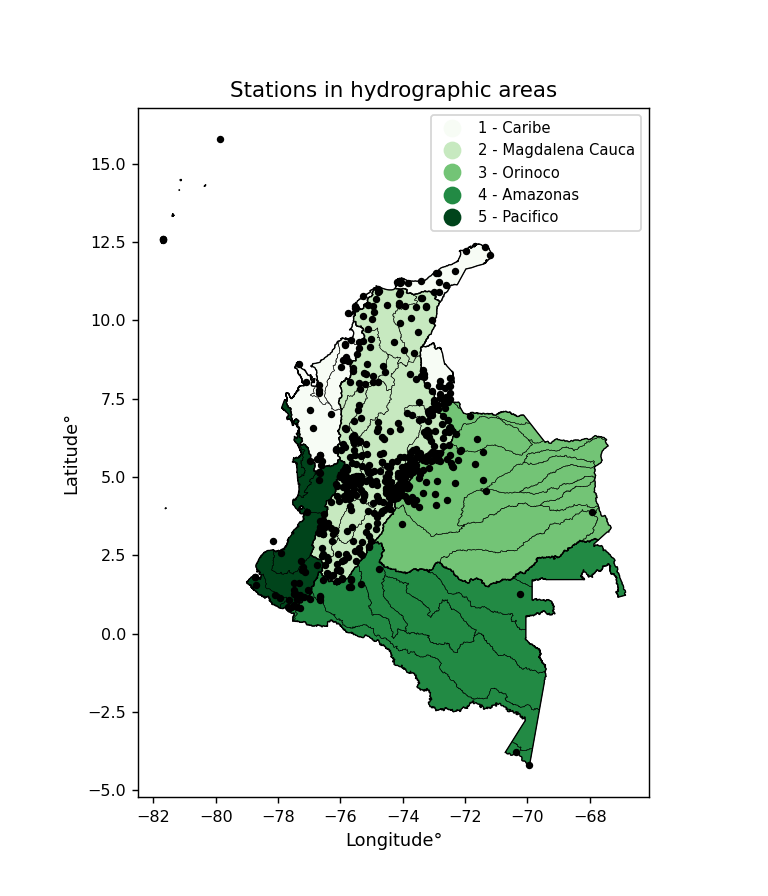
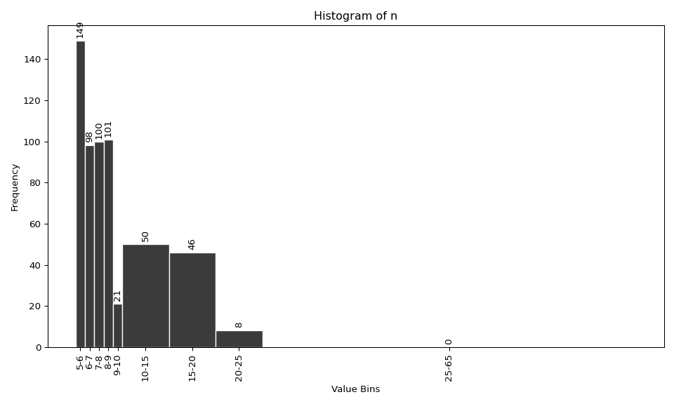
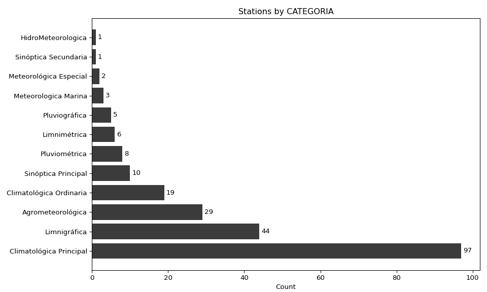
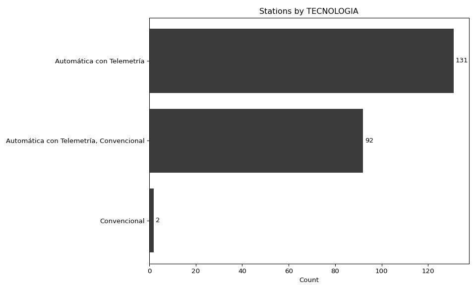
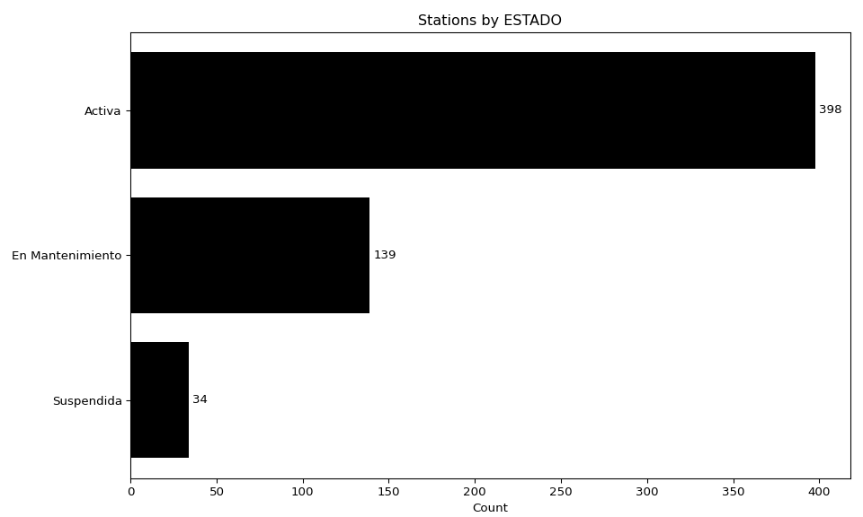
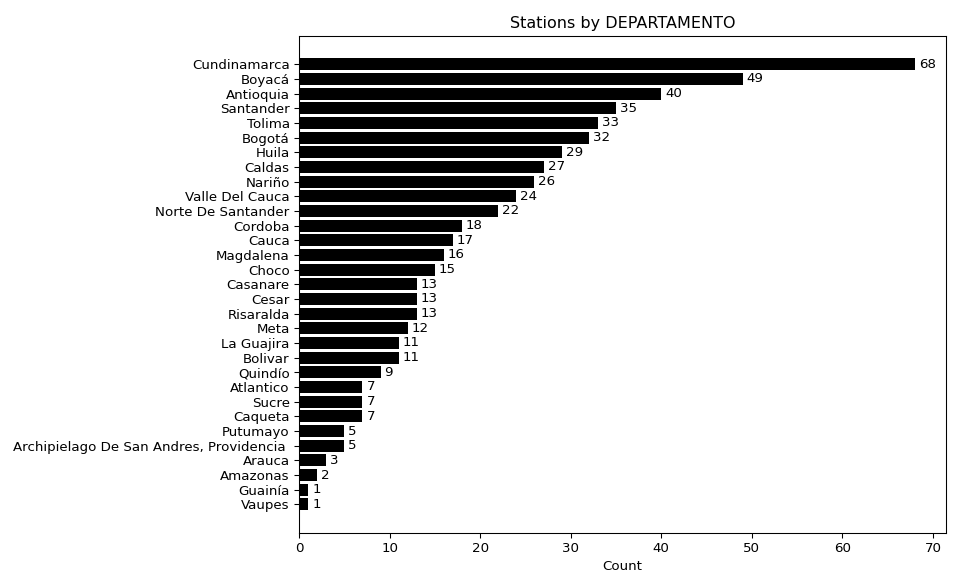
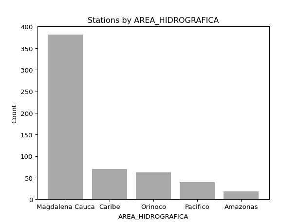
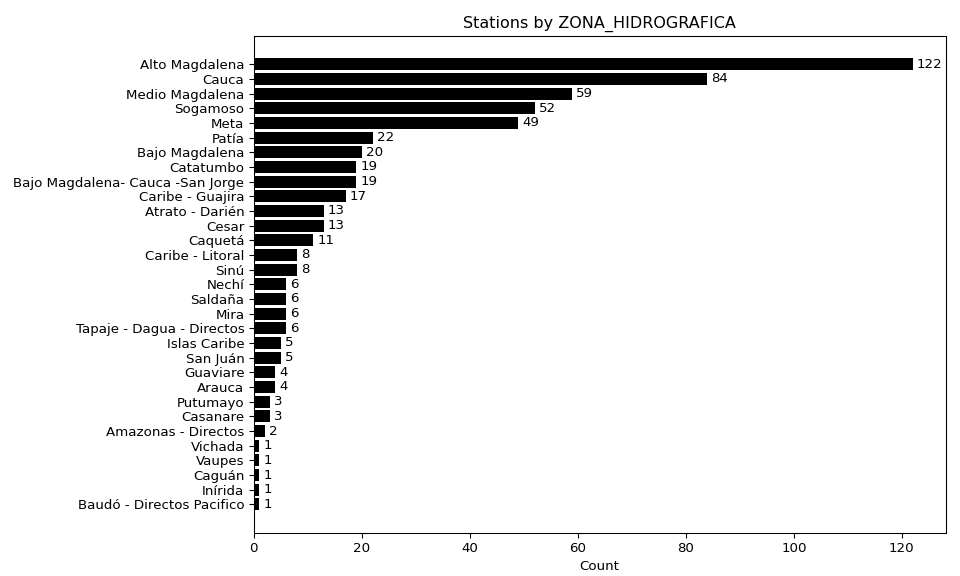

<div align="center">


</div>

# Study and analysis of the Probable Maximum Precipitation (PMP) in the network of automatic stations in Colombia - South America and estimation of extreme values for different return periods from multiple probability distributions.


Probable Maximum Precipitation (PMP) is the greatest amount of rainfall for a specific duration that is meteorologically possible for a given location, acting as a "worst-case" scenario for extreme storms, crucial for designing safety-critical infrastructure like bridges, river deviations, dams, spillways, and nuclear plants to prevent catastrophic failure. PMP is calculated by hydrologists using meteorological data to determine the upper limit of extreme rainfall, often leading to the Probable Maximum Flood (PMF) for flood control design, and is increasingly being studied for climate change impacts.

<div align="center">

Dynamic map

</div>

```topojson
{"type": "Topology", "objects": {"example": {"type": "GeometryCollection","geometries": [
{"type": "Point","properties": {"Code": "11025501", "Name": "CARMEN DE ATRATO  - AUT  [11025501]", "Category": "Climatológica Principal", "Technology": "Automática con Telemetría", "Status": "Activa", "Installation date": "16/12/2013", "Latitude": "5.888719444", "Longitude": "-76.14516667", "State": "Choco", "County": "El Carmen", "AH": "Caribe", "ZH": "Atrato - Darién", "SZH": "Alto Atrato"},"coordinates": [-76.14516667,5.888719444]},
{"type": "Point","properties": {"Code": "11027030", "Name": "EL SIETE [11027030]", "Category": "Limnigráfica", "Technology": "Automática con Telemetría", "Status": "Activa", "Installation date": "15/12/1979", "Latitude": "5.862", "Longitude": "-76.15205556", "State": "Choco", "County": "El Carmen", "AH": "Caribe", "ZH": "Atrato - Darién", "SZH": "Alto Atrato"},"coordinates": [-76.15205556,5.862]},
{"type": "Point","properties": {"Code": "11027070", "Name": "BORAUDO [11027070]", "Category": "Limnigráfica", "Technology": "Automática con Telemetría, Convencional", "Status": "En Mantenimiento", "Installation date": "15/04/2005", "Latitude": "5.514611111", "Longitude": "-76.57569444", "State": "Choco", "County": "Lloró", "AH": "Caribe", "ZH": "Atrato - Darién", "SZH": "Río Cabi y otros Directos Atrato (md)"},"coordinates": [-76.57569444,5.514611111]},
{"type": "Point","properties": {"Code": "11030010", "Name": "CERTEGUI [11030010]", "Category": "Pluviométrica", "Technology": "Automática con Telemetría, Convencional", "Status": "Activa", "Installation date": "15/01/1967", "Latitude": "5.38", "Longitude": "-76.61", "State": "Choco", "County": "Cértegui", "AH": "Caribe", "ZH": "Atrato - Darién", "SZH": "Río Quito"},"coordinates": [-76.61,5.38]},
{"type": "Point","properties": {"Code": "11037030", "Name": "LA LOMA PUEBLO [11037030]", "Category": "Limnigráfica", "Technology": "Automática con Telemetría", "Status": "Suspendida", "Installation date": "15/04/2005", "Latitude": "5.584666667", "Longitude": "-76.75327778", "State": "Choco", "County": "Rio Quito (Paimadó)", "AH": "Caribe", "ZH": "Atrato - Darién", "SZH": "Río Quito"},"coordinates": [-76.75327778,5.584666667]},
{"type": "Point","properties": {"Code": "11045010", "Name": "AEROPUERTO EL CARAÑO [11045010]", "Category": "Sinóptica Principal", "Technology": "Automática con Telemetría", "Status": "Activa", "Installation date": "15/02/1947", "Latitude": "5.690555556", "Longitude": "-76.64377778", "State": "Choco", "County": "Quibdó", "AH": "Caribe", "ZH": "Atrato - Darién", "SZH": "Río Cabi y otros Directos Atrato (md)"},"coordinates": [-76.64377778,5.690555556]},
{"type": "Point","properties": {"Code": "11047040", "Name": "QUIBDO [11047040]", "Category": "Limnigráfica", "Technology": "Automática con Telemetría", "Status": "En Mantenimiento", "Installation date": "30/11/2008", "Latitude": "5.697778056", "Longitude": "-76.66222222", "State": "Choco", "County": "Quibdó", "AH": "Caribe", "ZH": "Atrato - Darién", "SZH": "Río Cabi y otros Directos Atrato (md)"},"coordinates": [-76.66222222,5.697778056]},
{"type": "Point","properties": {"Code": "11080010", "Name": "BELLAVISTA [11080010]", "Category": "Climatológica Ordinaria", "Technology": "Automática con Telemetría", "Status": "En Mantenimiento", "Installation date": "15/07/1966", "Latitude": "6.559166667", "Longitude": "-76.88541667", "State": "Choco", "County": "Bojayá (Bellavista)", "AH": "Caribe", "ZH": "Atrato - Darién", "SZH": "Directos Atrato entre ríos Quito y Bojayá (mi)"},"coordinates": [-76.88541667,6.559166667]},
{"type": "Point","properties": {"Code": "11105020", "Name": "CARMEN DEL DARIEN [11105020]", "Category": "Climatológica Ordinaria", "Technology": "Automática con Telemetría", "Status": "En Mantenimiento", "Installation date": "28/09/2005", "Latitude": "7.154333333", "Longitude": "-76.97719444", "State": "Choco", "County": "Carmen Del Darién  (Curbaradó)", "AH": "Caribe", "ZH": "Atrato - Darién", "SZH": "Río Sucio"},"coordinates": [-76.97719444,7.154333333]},
{"type": "Point","properties": {"Code": "1111500036", "Name": "ABRIAQUI [1111500036]", "Category": "Climatológica Principal", "Technology": "Automática con Telemetría", "Status": "Activa", "Installation date": "22/12/2016", "Latitude": "6.6363", "Longitude": "-76.070733333", "State": "Antioquia", "County": "Abriaquí", "AH": "Caribe", "ZH": "Atrato - Darién", "SZH": "Río Sucio"},"coordinates": [-76.070733333,6.6363]},
{"type": "Point","properties": {"Code": "11117050", "Name": "DABEIBA 2 [11117050]", "Category": "Limnigráfica", "Technology": "Automática con Telemetría", "Status": "Activa", "Installation date": "15/09/1976", "Latitude": "7.010278056", "Longitude": "-76.288333333", "State": "Antioquia", "County": "Dabeiba", "AH": "Caribe", "ZH": "Atrato - Darién", "SZH": "Río Sucio"},"coordinates": [-76.288333333,7.010278056]},
{"type": "Point","properties": {"Code": "11135030", "Name": "UNGUIA [11135030]", "Category": "Climatológica Principal", "Technology": "Automática con Telemetría", "Status": "Activa", "Installation date": "24/09/2005", "Latitude": "8.036722222", "Longitude": "-77.08786111", "State": "Choco", "County": "Unguía", "AH": "Caribe", "ZH": "Atrato - Darién", "SZH": "Río Tanela y otros Directos al Caribe"},"coordinates": [-77.08786111,8.036722222]},
{"type": "Point","properties": {"Code": "11159010", "Name": "CAPURGANA - AUT [11159010]", "Category": "Meteorologica Marina", "Technology": "Automática con Telemetría", "Status": "Suspendida", "Installation date": "15/08/1995", "Latitude": "8.62", "Longitude": "-77.33", "State": "Choco", "County": "Acandí", "AH": "Caribe", "ZH": "Atrato - Darién", "SZH": "Río Tolo y otros Directos al Caribe"},"coordinates": [-77.33,8.62]},
{"type": "Point","properties": {"Code": "12015060", "Name": "TULENAPA [12015060]", "Category": "Climatológica Ordinaria", "Technology": "Automática con Telemetría", "Status": "Activa", "Installation date": "15/08/1982", "Latitude": "7.77", "Longitude": "-76.67", "State": "Antioquia", "County": "Carepa", "AH": "Caribe", "ZH": "Caribe - Litoral", "SZH": "Río León"},"coordinates": [-76.67,7.77]},
{"type": "Point","properties": {"Code": "12015100", "Name": "PISTA INDIRA [12015100]", "Category": "Agrometeorológica", "Technology": "Automática con Telemetría", "Status": "Activa", "Installation date": "20/09/2005", "Latitude": "7.94075", "Longitude": "-76.69616667", "State": "Antioquia", "County": "Turbo", "AH": "Caribe", "ZH": "Caribe - Litoral", "SZH": "Río León"},"coordinates": [-76.69616667,7.94075]},
{"type": "Point","properties": {"Code": "12015110", "Name": "CHIGORODO [12015110]", "Category": "Agrometeorológica", "Technology": "Automática con Telemetría", "Status": "Suspendida", "Installation date": "18/09/2005", "Latitude": "7.671138889", "Longitude": "-76.69405556", "State": "Antioquia", "County": "Chigorodó", "AH": "Caribe", "ZH": "Caribe - Litoral", "SZH": "Río León"},"coordinates": [-76.69405556,7.671138889]},
{"type": "Point","properties": {"Code": "1206500136", "Name": "UNIVERSIDAD UNAD CARTAGENA - AUT   [1206500136]", "Category": "Climatológica Principal", "Technology": "Automática con Telemetría", "Status": "Activa", "Installation date": "19/09/2018", "Latitude": "10.400311111", "Longitude": "-75.513280556", "State": "Bolivar", "County": "Cartagena De Indias", "AH": "Caribe", "ZH": "Caribe - Litoral", "SZH": "Arroyos Directos al Caribe"},"coordinates": [-75.513280556,10.400311111]},
{"type": "Point","properties": {"Code": "13027040", "Name": "CANO BARRO - AUT [13027040]", "Category": "Limnigráfica", "Technology": "Automática con Telemetría, Convencional", "Status": "Activa", "Installation date": "02/01/2017", "Latitude": "8.236777", "Longitude": "-74.962588", "State": "Cordoba", "County": "Ayapel", "AH": "Magdalena Cauca", "ZH": "Bajo Magdalena- Cauca -San Jorge", "SZH": "Bajo San Jorge - La Mojana"},"coordinates": [-74.962588,8.236777]},
{"type": "Point","properties": {"Code": "1303500129", "Name": "SAHAGUN - AUT   [1303500129]", "Category": "Climatológica Principal", "Technology": "Automática con Telemetría", "Status": "Suspendida", "Installation date": "29/12/2016", "Latitude": "8.94", "Longitude": "-75.45", "State": "Cordoba", "County": "Sahagún", "AH": "Caribe", "ZH": "Sinú", "SZH": "Bajo Sinú"},"coordinates": [-75.45,8.94]},
{"type": "Point","properties": {"Code": "13035501", "Name": "AEROPUERTO LOS GARZONES [13035501]", "Category": "Sinóptica Secundaria", "Technology": "Automática con Telemetría", "Status": "Activa", "Installation date": "06/02/2015", "Latitude": "8.825833333", "Longitude": "-75.82513889", "State": "Cordoba", "County": "Montería", "AH": "Caribe", "ZH": "Sinú", "SZH": "Bajo Sinú"},"coordinates": [-75.82513889,8.825833333]},
{"type": "Point","properties": {"Code": "13055040", "Name": "INCODER - AUT [13055040]", "Category": "Agrometeorológica", "Technology": "Automática con Telemetría", "Status": "Suspendida", "Installation date": "17/11/2004", "Latitude": "8.746944444", "Longitude": "-75.91388889", "State": "Cordoba", "County": "Montería", "AH": "Caribe", "ZH": "Sinú", "SZH": "Bajo Sinú"},"coordinates": [-75.91388889,8.746944444]},
{"type": "Point","properties": {"Code": "13057010", "Name": "NUEVA COLOMBIA AUT [13057010]", "Category": "Limnigráfica", "Technology": "Automática con Telemetría, Convencional", "Status": "Activa", "Installation date": "15/06/1990", "Latitude": "8.499444444", "Longitude": "-75.97861111", "State": "Cordoba", "County": "Montería", "AH": "Caribe", "ZH": "Sinú", "SZH": "Medio Sinú"},"coordinates": [-75.97861111,8.499444444]},
{"type": "Point","properties": {"Code": "13067020", "Name": "MONTERIA  - AUT [13067020]", "Category": "Limnigráfica", "Technology": "Automática con Telemetría, Convencional", "Status": "Activa", "Installation date": "15/02/1963", "Latitude": "8.751611111", "Longitude": "-75.89241667", "State": "Cordoba", "County": "Montería", "AH": "Caribe", "ZH": "Sinú", "SZH": "Bajo Sinú"},"coordinates": [-75.89241667,8.751611111]},
{"type": "Point","properties": {"Code": "13077060", "Name": "COTOCA ABAJO  - AUT [13077060]", "Category": "Limnigráfica", "Technology": "Automática con Telemetría, Convencional", "Status": "Activa", "Installation date": "15/02/1970", "Latitude": "9.223685", "Longitude": "-75.836095", "State": "Cordoba", "County": "Lorica", "AH": "Caribe", "ZH": "Sinú", "SZH": "Bajo Sinú"},"coordinates": [-75.836095,9.223685]},
{"type": "Point","properties": {"Code": "13085050", "Name": "LORICA  ITA - AUT [13085050]", "Category": "Climatológica Principal", "Technology": "Automática con Telemetría", "Status": "Suspendida", "Installation date": "13/05/2005", "Latitude": "9.252722222", "Longitude": "-75.84441667", "State": "Cordoba", "County": "Lorica", "AH": "Caribe", "ZH": "Sinú", "SZH": "Bajo Sinú"},"coordinates": [-75.84441667,9.252722222]},
{"type": "Point","properties": {"Code": "13095010", "Name": "COVENAS - AUT [13095010]", "Category": "Meteorológica Especial", "Technology": "Automática con Telemetría", "Status": "Suspendida", "Installation date": "15/02/1980", "Latitude": "9.383333333", "Longitude": "-75.66666667", "State": "Sucre", "County": "Tolú", "AH": "Caribe", "ZH": "Caribe - Litoral", "SZH": "Directos Caribe Golfo de Morrosquillo"},"coordinates": [-75.66666667,9.383333333]},
{"type": "Point","properties": {"Code": "14015010", "Name": "GALERAZAMBA  - AUT [14015010]", "Category": "Climatológica Principal", "Technology": "Automática con Telemetría", "Status": "Activa", "Installation date": "15/12/1945", "Latitude": "10.794988", "Longitude": "-75.261671", "State": "Bolivar", "County": "Santa Catalina", "AH": "Caribe", "ZH": "Caribe - Litoral", "SZH": "Arroyos Directos al Caribe"},"coordinates": [-75.261671,10.794988]},
{"type": "Point","properties": {"Code": "14015080", "Name": "AEROPUERTO RAFAEL NUNEZ [14015080]", "Category": "Sinóptica Principal", "Technology": "Automática con Telemetría", "Status": "Activa", "Installation date": "06/05/2005", "Latitude": "10.44725", "Longitude": "-75.51602778", "State": "Bolivar", "County": "Cartagena De Indias", "AH": "Caribe", "ZH": "Caribe - Litoral", "SZH": "Arroyos Directos al Caribe"},"coordinates": [-75.51602778,10.44725]},
{"type": "Point","properties": {"Code": "14017001", "Name": "TESORO INVEMAR  - AUT  [14017001]", "Category": "Limnigráfica", "Technology": "Automática con Telemetría", "Status": "Activa", "Installation date": "06/08/2012", "Latitude": "10.23491667", "Longitude": "-75.74055", "State": "Bolivar", "County": "Cartagena De Indias", "AH": "Magdalena Cauca", "ZH": "Bajo Magdalena", "SZH": "Canal del Dique margen izquierda"},"coordinates": [-75.74055,10.23491667]},
{"type": "Point","properties": {"Code": "14019030", "Name": "ESCUELA NAVAL CIOH - AUT [14019030]", "Category": "Meteorologica Marina", "Technology": "Automática con Telemetría", "Status": "En Mantenimiento", "Installation date": "15/07/1991", "Latitude": "10.39056389", "Longitude": "-75.53383056", "State": "Bolivar", "County": "Cartagena De Indias", "AH": "Caribe", "ZH": "Caribe - Litoral", "SZH": "Arroyos Directos al Caribe"},"coordinates": [-75.53383056,10.39056389]},
{"type": "Point","properties": {"Code": "1501500054", "Name": "SAN ISIDRO BONDA - AUT   [1501500054]", "Category": "Climatológica Principal", "Technology": "Automática con Telemetría", "Status": "En Mantenimiento", "Installation date": "13/12/2016", "Latitude": "11.230522222", "Longitude": "-74.059786111", "State": "Magdalena", "County": "Santa Marta", "AH": "Caribe", "ZH": "Caribe - Guajira", "SZH": "Río  Piedras - Río Manzanares"},"coordinates": [-74.059786111,11.230522222]},
{"type": "Point","properties": {"Code": "15015100", "Name": "PARQUE TAYRONA [15015100]", "Category": "Climatológica Ordinaria", "Technology": "Automática con Telemetría, Convencional", "Status": "Activa", "Installation date": "15/11/1977", "Latitude": "11.301674", "Longitude": "-73.928809", "State": "Magdalena", "County": "Santa Marta", "AH": "Caribe", "ZH": "Caribe - Guajira", "SZH": "Río  Piedras - Río Manzanares"},"coordinates": [-73.928809,11.301674]},
{"type": "Point","properties": {"Code": "15015120", "Name": "UNIVERSIDAD TECNOLOGICA  - AUT [15015120]", "Category": "Climatológica Principal", "Technology": "Automática con Telemetría, Convencional", "Status": "Activa", "Installation date": "13/09/2007", "Latitude": "11.22305556", "Longitude": "-74.18591667", "State": "Magdalena", "County": "Santa Marta", "AH": "Caribe", "ZH": "Caribe - Guajira", "SZH": "Río  Piedras - Río Manzanares"},"coordinates": [-74.18591667,11.22305556]},
{"type": "Point","properties": {"Code": "15017030", "Name": "MINCA  - AUT [15017030]", "Category": "Limnigráfica", "Technology": "Automática con Telemetría, Convencional", "Status": "Activa", "Installation date": "15/05/1965", "Latitude": "11.142548", "Longitude": "-74.111813", "State": "Magdalena", "County": "Santa Marta", "AH": "Caribe", "ZH": "Caribe - Guajira", "SZH": "Río  Piedras - Río Manzanares"},"coordinates": [-74.111813,11.142548]},
{"type": "Point","properties": {"Code": "15017060", "Name": "BOCATOMA SANTA MARTA [15017060]", "Category": "Limnimétrica", "Technology": "Convencional", "Status": "Activa", "Installation date": "15/10/1973", "Latitude": "11.205144", "Longitude": "-74.098192", "State": "Magdalena", "County": "Santa Marta", "AH": "Caribe", "ZH": "Caribe - Guajira", "SZH": "Río  Piedras - Río Manzanares"},"coordinates": [-74.098192,11.205144]},
{"type": "Point","properties": {"Code": "15035020", "Name": "TERMOGUAJIRA  - AUT [15035020]", "Category": "Climatológica Ordinaria", "Technology": "Automática con Telemetría, Convencional", "Status": "Activa", "Installation date": "15/10/1991", "Latitude": "11.2525", "Longitude": "-73.41138889", "State": "La Guajira", "County": "Dibulla", "AH": "Caribe", "ZH": "Caribe - Guajira", "SZH": "Río Ancho y Otros Directos al caribe"},"coordinates": [-73.41138889,11.2525]},
{"type": "Point","properties": {"Code": "15065040", "Name": "LA PAULINA - AUT [15065040]", "Category": "Climatológica Principal", "Technology": "Automática con Telemetría, Convencional", "Status": "Activa", "Installation date": "15/09/1966", "Latitude": "10.89813889", "Longitude": "-72.82847222", "State": "La Guajira", "County": "Fonseca", "AH": "Caribe", "ZH": "Caribe - Guajira", "SZH": "Río Ranchería"},"coordinates": [-72.82847222,10.89813889]},
{"type": "Point","properties": {"Code": "15065180", "Name": "AEROPUERTO ALM. PADILLA - [15065180]", "Category": "Sinóptica Principal", "Technology": "Automática con Telemetría, Convencional", "Status": "Activa", "Installation date": "21/06/2004", "Latitude": "11.5284444", "Longitude": "-72.917722222", "State": "La Guajira", "County": "Riohacha", "AH": "Caribe", "ZH": "Caribe - Guajira", "SZH": "Río Ranchería"},"coordinates": [-72.917722222,11.5284444]},
{"type": "Point","properties": {"Code": "15065190", "Name": "MONGUI - AUT [15065190]", "Category": "Climatológica Principal", "Technology": "Automática con Telemetría", "Status": "Activa", "Installation date": "22/11/2011", "Latitude": "11.22677778", "Longitude": "-72.82063889", "State": "La Guajira", "County": "Riohacha", "AH": "Caribe", "ZH": "Caribe - Guajira", "SZH": "Río Ranchería"},"coordinates": [-72.82063889,11.22677778]},
{"type": "Point","properties": {"Code": "15065501", "Name": "LA MINA CERREJON  - AUT [15065501]", "Category": "Climatológica Principal", "Technology": "Automática con Telemetría, Convencional", "Status": "Activa", "Installation date": "27/08/2014", "Latitude": "11.13758333", "Longitude": "-72.61594444", "State": "La Guajira", "County": "Albania", "AH": "Caribe", "ZH": "Caribe - Guajira", "SZH": "Río Ranchería"},"coordinates": [-72.61594444,11.13758333]},
{"type": "Point","properties": {"Code": "15067020", "Name": "EL CERCADO - AUTOMAT [15067020]", "Category": "Limnigráfica", "Technology": "Automática con Telemetría, Convencional", "Status": "Activa", "Installation date": "04/09/2004", "Latitude": "10.9075", "Longitude": "-73.00833333", "State": "La Guajira", "County": "Fonseca", "AH": "Caribe", "ZH": "Caribe - Guajira", "SZH": "Río Ranchería"},"coordinates": [-73.00833333,10.9075]},
{"type": "Point","properties": {"Code": "15067220", "Name": "PUENTE CARRETERA - RANCHERIA [15067220]", "Category": "Limnimétrica", "Technology": "Automática con Telemetría, Convencional", "Status": "Activa", "Installation date": "01/12/2011", "Latitude": "11.51097222", "Longitude": "-72.85594444", "State": "La Guajira", "County": "Riohacha", "AH": "Caribe", "ZH": "Caribe - Guajira", "SZH": "Río Ranchería"},"coordinates": [-72.85594444,11.51097222]},
{"type": "Point","properties": {"Code": "15075150", "Name": "PAICI - AUT [15075150]", "Category": "Agrometeorológica", "Technology": "Automática con Telemetría", "Status": "Suspendida", "Installation date": "14/10/2004", "Latitude": "11.59494444", "Longitude": "-72.32575", "State": "La Guajira", "County": "Uribia", "AH": "Caribe", "ZH": "Caribe - Guajira", "SZH": "Directos Caribe - Ay.Sharimahana Alta Guajira"},"coordinates": [-72.32575,11.59494444]},
{"type": "Point","properties": {"Code": "15075501", "Name": "AEROPUERTO PUERTO BOLIVAR  - AUT [15075501]", "Category": "Climatológica Principal", "Technology": "Automática con Telemetría, Convencional", "Status": "Activa", "Installation date": "21/08/2014", "Latitude": "12.22430556", "Longitude": "-71.98288889", "State": "La Guajira", "County": "Uribia", "AH": "Caribe", "ZH": "Caribe - Guajira", "SZH": "Directos Caribe - Ay.Sharimahana Alta Guajira"},"coordinates": [-71.98288889,12.22430556]},
{"type": "Point","properties": {"Code": "1508500053", "Name": "PUERTO ESTRELLA - AUT   [1508500053]", "Category": "Climatológica Principal", "Technology": "Automática con Telemetría", "Status": "Activa", "Installation date": "01/05/2017", "Latitude": "12.339194444", "Longitude": "-71.345080556", "State": "La Guajira", "County": "Uribia", "AH": "Caribe", "ZH": "Caribe - Guajira", "SZH": "Río Carraipia - Paraguachon, Directos al Golfo Maracaibo"},"coordinates": [-71.345080556,12.339194444]},
{"type": "Point","properties": {"Code": "15085050", "Name": "TOROMANA - AUT [15085050]", "Category": "Climatológica Principal", "Technology": "Automática con Telemetría", "Status": "Activa", "Installation date": "18/04/2005", "Latitude": "12.08352778", "Longitude": "-71.21094444", "State": "La Guajira", "County": "Uribia", "AH": "Caribe", "ZH": "Caribe - Guajira", "SZH": "Río Carraipia - Paraguachon, Directos al Golfo Maracaibo"},"coordinates": [-71.21094444,12.08352778]},
{"type": "Point","properties": {"Code": "1509500118", "Name": "GUACHACA - AUT   [1509500118]", "Category": "Climatológica Principal", "Technology": "Automática con Telemetría", "Status": "Activa", "Installation date": "15/09/2018", "Latitude": "11.21015", "Longitude": "-73.84445", "State": "Magdalena", "County": "Santa Marta", "AH": "Caribe", "ZH": "Caribe - Guajira", "SZH": "Rio Guachaca - Mendiguaca y Buritaca"},"coordinates": [-73.84445,11.21015]},
{"type": "Point","properties": {"Code": "16015110", "Name": "UNIVERSIDAD FRANCISO DE PAULA SANTANDER - AUT [16015110]", "Category": "Climatológica Principal", "Technology": "Automática con Telemetría, Convencional", "Status": "Activa", "Installation date": "11/10/2005", "Latitude": "7.898777778", "Longitude": "-72.48716667", "State": "Norte De Santander", "County": "Cúcuta", "AH": "Caribe", "ZH": "Catatumbo", "SZH": "Río Pamplonita"},"coordinates": [-72.48716667,7.898777778]},
{"type": "Point","properties": {"Code": "16015120", "Name": "UNIVERSIDAD DE PAMPLONA  - AUT [16015120]", "Category": "Agrometeorológica", "Technology": "Automática con Telemetría", "Status": "En Mantenimiento", "Installation date": "13/10/2004", "Latitude": "7.360944444", "Longitude": "-72.66605556", "State": "Norte De Santander", "County": "Pamplona", "AH": "Caribe", "ZH": "Catatumbo", "SZH": "Río Pamplonita"},"coordinates": [-72.66605556,7.360944444]},
{"type": "Point","properties": {"Code": "16015130", "Name": "ALCALDIA DE HERRAN  - AUT [16015130]", "Category": "Climatológica Principal", "Technology": "Automática con Telemetría", "Status": "En Mantenimiento", "Installation date": "19/08/2005", "Latitude": "7.506722222", "Longitude": "-72.48536111", "State": "Norte De Santander", "County": "Herrán", "AH": "Caribe", "ZH": "Catatumbo", "SZH": "Río Pamplonita"},"coordinates": [-72.48536111,7.506722222]},
{"type": "Point","properties": {"Code": "16015501", "Name": "AEROPUERTO CAMILO DAZA - AUT [16015501]", "Category": "Sinóptica Principal", "Technology": "Automática con Telemetría, Convencional", "Status": "Activa", "Installation date": "10/06/2015", "Latitude": "7.93028", "Longitude": "-72.50917", "State": "Norte De Santander", "County": "Cúcuta", "AH": "Caribe", "ZH": "Catatumbo", "SZH": "Río Pamplonita"},"coordinates": [-72.50917,7.93028]},
{"type": "Point","properties": {"Code": "16015502", "Name": "BLONAY  - AUT  [16015502]", "Category": "Climatológica Principal", "Technology": "Automática con Telemetría", "Status": "Activa", "Installation date": "13/05/2013", "Latitude": "7.564997222", "Longitude": "-72.62110833", "State": "Norte De Santander", "County": "Chinácota", "AH": "Caribe", "ZH": "Catatumbo", "SZH": "Río Pamplonita"},"coordinates": [-72.62110833,7.564997222]},
{"type": "Point","properties": {"Code": "16017030", "Name": "LA UCHEMA - AUT [16017030]", "Category": "Limnigráfica", "Technology": "Automática con Telemetría", "Status": "Suspendida", "Installation date": "15/10/1981", "Latitude": "7.694222222", "Longitude": "-72.474", "State": "Norte De Santander", "County": "Villa Del Rosario", "AH": "Caribe", "ZH": "Catatumbo", "SZH": "Río Pamplonita"},"coordinates": [-72.474,7.694222222]},
{"type": "Point","properties": {"Code": "1602500044", "Name": "GRAMALOTE - AUT   [1602500044]", "Category": "Climatológica Principal", "Technology": "Automática con Telemetría", "Status": "Activa", "Installation date": "29/06/2017", "Latitude": "7.913166667", "Longitude": "-72.803027778", "State": "Norte De Santander", "County": "Gramalote", "AH": "Caribe", "ZH": "Catatumbo", "SZH": "Río Zulia"},"coordinates": [-72.803027778,7.913166667]},
{"type": "Point","properties": {"Code": "1602500110", "Name": "ARBOLEDAS - AUT   [1602500110]", "Category": "Climatológica Principal", "Technology": "Automática con Telemetría", "Status": "Activa", "Installation date": "28/12/2017", "Latitude": "7.646281", "Longitude": "-72.799007", "State": "Norte De Santander", "County": "Arboledas", "AH": "Caribe", "ZH": "Catatumbo", "SZH": "Río Zulia"},"coordinates": [-72.799007,7.646281]},
{"type": "Point","properties": {"Code": "16025040", "Name": "CINERA-VILLA OLGA AUT [16025040]", "Category": "Climatológica Principal", "Technology": "Automática con Telemetría, Convencional", "Status": "Activa", "Installation date": "15/09/1965", "Latitude": "8.16728", "Longitude": "-72.47878", "State": "Norte De Santander", "County": "Cúcuta", "AH": "Caribe", "ZH": "Catatumbo", "SZH": "Río Zulia"},"coordinates": [-72.47878,8.16728]},
{"type": "Point","properties": {"Code": "16025501", "Name": "CUCUTILLA  - AUT  [16025501]", "Category": "Climatológica Principal", "Technology": "Automática con Telemetría", "Status": "Activa", "Installation date": "16/05/2013", "Latitude": "7.519455556", "Longitude": "-72.79790278", "State": "Norte De Santander", "County": "Cucutilla", "AH": "Caribe", "ZH": "Catatumbo", "SZH": "Río Zulia"},"coordinates": [-72.79790278,7.519455556]},
{"type": "Point","properties": {"Code": "16025503", "Name": "GRAMALOTE  - AUT  [16025503]", "Category": "Climatológica Principal", "Technology": "Automática con Telemetría", "Status": "Activa", "Installation date": "14/05/2013", "Latitude": "7.923163889", "Longitude": "-72.83375556", "State": "Norte De Santander", "County": "Gramalote", "AH": "Caribe", "ZH": "Catatumbo", "SZH": "Río Zulia"},"coordinates": [-72.83375556,7.923163889]},
{"type": "Point","properties": {"Code": "16027120", "Name": "SAN JAVIER/PUENTE ZULIA - AUT [16027120]", "Category": "Limnigráfica", "Technology": "Automática con Telemetría, Convencional", "Status": "En Mantenimiento", "Installation date": "15/07/1958", "Latitude": "7.833888889", "Longitude": "-72.65027778", "State": "Norte De Santander", "County": "Durania", "AH": "Caribe", "ZH": "Catatumbo", "SZH": "Río Zulia"},"coordinates": [-72.65027778,7.833888889]},
{"type": "Point","properties": {"Code": "16027300", "Name": "PUENTE CAPIRA - AUT [16027300]", "Category": "Limnigráfica", "Technology": "Automática con Telemetría, Convencional", "Status": "En Mantenimiento", "Installation date": "15/11/2004", "Latitude": "7.537194444", "Longitude": "-72.77113889", "State": "Norte De Santander", "County": "Cucutilla", "AH": "Caribe", "ZH": "Catatumbo", "SZH": "Río Zulia"},"coordinates": [-72.77113889,7.537194444]},
{"type": "Point","properties": {"Code": "16035030", "Name": "SARDINATA [16035030]", "Category": "Pluviométrica", "Technology": "Automática con Telemetría, Convencional", "Status": "En Mantenimiento", "Installation date": "15/03/1973", "Latitude": "8.076666667", "Longitude": "-72.80305556", "State": "Norte De Santander", "County": "Sardinata", "AH": "Caribe", "ZH": "Catatumbo", "SZH": "Río Nuevo Presidente - Tres Bocas (Sardinata, Tibu)"},"coordinates": [-72.80305556,8.076666667]},
{"type": "Point","properties": {"Code": "16040050", "Name": "LA MARIA - AUT [16040050]", "Category": "Climatológica Principal", "Technology": "Automática con Telemetría, Convencional", "Status": "Activa", "Installation date": "15/02/1985", "Latitude": "7.93485", "Longitude": "-73.21358", "State": "Norte De Santander", "County": "Ábrego", "AH": "Caribe", "ZH": "Catatumbo", "SZH": "Río Algodonal (Alto Catatumbo)"},"coordinates": [-73.21358,7.93485]},
{"type": "Point","properties": {"Code": "16055120", "Name": "AGUAS DE LA VIRGEN  - AUT [16055120]", "Category": "Climatológica Principal", "Technology": "Automática con Telemetría", "Status": "En Mantenimiento", "Installation date": "09/08/2006", "Latitude": "8.22769", "Longitude": "-73.3975", "State": "Norte De Santander", "County": "Ocaña", "AH": "Caribe", "ZH": "Catatumbo", "SZH": "Río Algodonal (Alto Catatumbo)"},"coordinates": [-73.3975,8.22769]},
{"type": "Point","properties": {"Code": "16055501", "Name": "GABRIEL MARIA  - AUT  [16055501]", "Category": "Climatológica Principal", "Technology": "Automática con Telemetría", "Status": "Activa", "Installation date": "20/05/2013", "Latitude": "8.412497222", "Longitude": "-73.33944167", "State": "Norte De Santander", "County": "Convención", "AH": "Caribe", "ZH": "Catatumbo", "SZH": "Río Algodonal (Alto Catatumbo)"},"coordinates": [-73.33944167,8.412497222]},
{"type": "Point","properties": {"Code": "1605700152", "Name": "PALO GRANDE - AUT   [1605700152]", "Category": "Limnigráfica", "Technology": "Automática con Telemetría, Convencional", "Status": "En Mantenimiento", "Installation date": "15/12/2017", "Latitude": "8.290761111", "Longitude": "-73.3045", "State": "Norte De Santander", "County": "Ocaña", "AH": "Caribe", "ZH": "Catatumbo", "SZH": "Río Algodonal (Alto Catatumbo)"},"coordinates": [-73.3045,8.290761111]},
{"type": "Point","properties": {"Code": "16057030", "Name": "LA CABANA - AUT [16057030]", "Category": "Limnigráfica", "Technology": "Automática con Telemetría, Convencional", "Status": "En Mantenimiento", "Installation date": "15/10/1971", "Latitude": "8.197805556", "Longitude": "-73.31825", "State": "Norte De Santander", "County": "Ocaña", "AH": "Caribe", "ZH": "Catatumbo", "SZH": "Río Algodonal (Alto Catatumbo)"},"coordinates": [-73.31825,8.197805556]},
{"type": "Point","properties": {"Code": "17015010", "Name": "AEROPUERTO SESQUICENTENARIO [17015010]", "Category": "Sinóptica Principal", "Technology": "Automática con Telemetría, Convencional", "Status": "Activa", "Installation date": "15/01/1958", "Latitude": "12.587849", "Longitude": "-81.701117", "State": "Archipielago De San Andres, Providencia Y Santa Catalina", "County": "San Andrés", "AH": "Caribe", "ZH": "Islas Caribe", "SZH": "San Andres"},"coordinates": [-81.701117,12.587849]},
{"type": "Point","properties": {"Code": "17017001", "Name": "JHONNY CAY  - AUT  [17017001]", "Category": "Limnigráfica", "Technology": "Automática con Telemetría", "Status": "Activa", "Installation date": "06/08/2012", "Latitude": "12.599305556", "Longitude": "-81.689360833", "State": "Archipielago De San Andres, Providencia Y Santa Catalina", "County": "San Andrés", "AH": "Caribe", "ZH": "Islas Caribe", "SZH": "OTRAS ISLAS DEL CARIBE Y ZONA MARITIMA"},"coordinates": [-81.689360833,12.599305556]},
{"type": "Point","properties": {"Code": "17019010", "Name": "SAN ANDRES - AUT [17019010]", "Category": "Meteorologica Marina", "Technology": "Automática con Telemetría, Convencional", "Status": "Activa", "Installation date": "15/12/1996", "Latitude": "12.556111111", "Longitude": "-81.703388889", "State": "Archipielago De San Andres, Providencia Y Santa Catalina", "County": "San Andrés", "AH": "Caribe", "ZH": "Islas Caribe", "SZH": "OTRAS ISLAS DEL CARIBE Y ZONA MARITIMA"},"coordinates": [-81.703388889,12.556111111]},
{"type": "Point","properties": {"Code": "17025020", "Name": "AEROPUERTO EL EMBRUJO AUT [17025020]", "Category": "Sinóptica Principal", "Technology": "Automática con Telemetría, Convencional", "Status": "Activa", "Installation date": "15/01/1973", "Latitude": "13.3595", "Longitude": "-81.357721944", "State": "Archipielago De San Andres, Providencia Y Santa Catalina", "County": "San Andres Y  Providencia (Santa Isabel)", "AH": "Caribe", "ZH": "Islas Caribe", "SZH": "Providencia"},"coordinates": [-81.357721944,13.3595]},
{"type": "Point","properties": {"Code": "17035010", "Name": "SERRANILLA - AUT [17035010]", "Category": "Climatológica Ordinaria", "Technology": "Automática con Telemetría", "Status": "Suspendida", "Installation date": "15/12/1998", "Latitude": "15.7975", "Longitude": "-79.852221944", "State": "Archipielago De San Andres, Providencia Y Santa Catalina", "County": "San Andrés", "AH": "Caribe", "ZH": "Islas Caribe", "SZH": "OTRAS ISLAS DEL CARIBE Y ZONA MARITIMA"},"coordinates": [-79.852221944,15.7975]},
{"type": "Point","properties": {"Code": "21015030", "Name": "PARQUE ARQUEOLOGICO - AUT [21015030]", "Category": "Climatológica Principal", "Technology": "Automática con Telemetría, Convencional", "Status": "Activa", "Installation date": "15/06/1971", "Latitude": "1.888472222", "Longitude": "-76.29497222", "State": "Huila", "County": "San Agustín", "AH": "Magdalena Cauca", "ZH": "Alto Magdalena", "SZH": "Alto Magdalena"},"coordinates": [-76.29497222,1.888472222]},
{"type": "Point","properties": {"Code": "21015040", "Name": "LA PRIMAVERA - AUT [21015040]", "Category": "Climatológica Principal", "Technology": "Automática con Telemetría", "Status": "Activa", "Installation date": "28/07/2005", "Latitude": "2.021583333", "Longitude": "-76.11433333", "State": "Huila", "County": "Saladoblanco", "AH": "Magdalena Cauca", "ZH": "Alto Magdalena", "SZH": "Ríos Directos al Magdalena (mi)"},"coordinates": [-76.11433333,2.021583333]},
{"type": "Point","properties": {"Code": "21015050", "Name": "PURACE  - AUT [21015050]", "Category": "Climatológica Principal", "Technology": "Automática con Telemetría", "Status": "En Mantenimiento", "Installation date": "17/07/2005", "Latitude": "1.925916667", "Longitude": "-76.42755556", "State": "Huila", "County": "San Agustín", "AH": "Magdalena Cauca", "ZH": "Alto Magdalena", "SZH": "Alto Magdalena"},"coordinates": [-76.42755556,1.925916667]},
{"type": "Point","properties": {"Code": "21015060", "Name": "MARENGO  - AUT [21015060]", "Category": "Agrometeorológica", "Technology": "Automática con Telemetría", "Status": "Suspendida", "Installation date": "23/07/2005", "Latitude": "2.221111111", "Longitude": "-76.11888889", "State": "Huila", "County": "Pitalito", "AH": "Magdalena Cauca", "ZH": "Alto Magdalena", "SZH": "Río Páez"},"coordinates": [-76.11888889,2.221111111]},
{"type": "Point","properties": {"Code": "21015070", "Name": "LOS GUACHAROS  - AUT [21015070]", "Category": "Climatológica Principal", "Technology": "Automática con Telemetría", "Status": "En Mantenimiento", "Installation date": "25/07/2005", "Latitude": "1.675833", "Longitude": "-76.106841", "State": "Huila", "County": "Palestina", "AH": "Magdalena Cauca", "ZH": "Alto Magdalena", "SZH": "Alto Magdalena"},"coordinates": [-76.106841,1.675833]},
{"type": "Point","properties": {"Code": "21015502", "Name": "SAN AGUSTIN  - AUT  [21015502]", "Category": "Climatológica Principal", "Technology": "Automática con Telemetría", "Status": "Activa", "Installation date": "17/07/2013", "Latitude": "1.851416667", "Longitude": "-76.30433056", "State": "Huila", "County": "San Agustín", "AH": "Magdalena Cauca", "ZH": "Alto Magdalena", "SZH": "Alto Magdalena"},"coordinates": [-76.30433056,1.851416667]},
{"type": "Point","properties": {"Code": "21017030", "Name": "CASCADA SIMON BOLIVAR  - AUT [21017030]", "Category": "Limnigráfica", "Technology": "Automática con Telemetría, Convencional", "Status": "En Mantenimiento", "Installation date": "15/04/1971", "Latitude": "1.8735", "Longitude": "-76.23172222", "State": "Huila", "County": "Isnos", "AH": "Magdalena Cauca", "ZH": "Alto Magdalena", "SZH": "Alto Magdalena"},"coordinates": [-76.23172222,1.8735]},
{"type": "Point","properties": {"Code": "21017040", "Name": "SALADO BLANCO [21017040]", "Category": "Limnigráfica", "Technology": "Automática con Telemetría, Convencional", "Status": "Activa", "Installation date": "15/04/1971", "Latitude": "1.9880833", "Longitude": "-76.012083333", "State": "Huila", "County": "Elías", "AH": "Magdalena Cauca", "ZH": "Alto Magdalena", "SZH": "Río Timaná y otros directos al Magdalena"},"coordinates": [-76.012083333,1.9880833]},
{"type": "Point","properties": {"Code": "21017080", "Name": "LA MAGDALENA  - AUT  [21017080]", "Category": "Limnigráfica", "Technology": "Automática con Telemetría", "Status": "Activa", "Installation date": "29/07/2009", "Latitude": "1.905", "Longitude": "-76.40111111", "State": "Huila", "County": "San Agustín", "AH": "Magdalena Cauca", "ZH": "Alto Magdalena", "SZH": "Alto Magdalena"},"coordinates": [-76.40111111,1.905]},
{"type": "Point","properties": {"Code": "21035501", "Name": "ACEVEDO  - AUT  [21035501]", "Category": "Climatológica Principal", "Technology": "Automática con Telemetría", "Status": "Activa", "Installation date": "19/07/2013", "Latitude": "1.763191667", "Longitude": "-75.93224722", "State": "Huila", "County": "Acevedo", "AH": "Magdalena Cauca", "ZH": "Alto Magdalena", "SZH": "Río Suaza"},"coordinates": [-75.93224722,1.763191667]},
{"type": "Point","properties": {"Code": "21037020", "Name": "SAN MARCOS  - AUT [21037020]", "Category": "Limnigráfica", "Technology": "Automática con Telemetría, Convencional", "Status": "En Mantenimiento", "Installation date": "15/04/1971", "Latitude": "1.752277778", "Longitude": "-75.94541667", "State": "Huila", "County": "Acevedo", "AH": "Magdalena Cauca", "ZH": "Alto Magdalena", "SZH": "Río Suaza"},"coordinates": [-75.94541667,1.752277778]},
{"type": "Point","properties": {"Code": "21045501", "Name": "OPORAPA  - AUT  [21045501]", "Category": "Climatológica Principal", "Technology": "Automática con Telemetría", "Status": "Activa", "Installation date": "20/07/2013", "Latitude": "2.041941667", "Longitude": "-76.01191667", "State": "Huila", "County": "Oporapa", "AH": "Magdalena Cauca", "ZH": "Alto Magdalena", "SZH": "Ríos Directos al Magdalena (mi)"},"coordinates": [-76.01191667,2.041941667]},
{"type": "Point","properties": {"Code": "21050090", "Name": "NATAGA  - AUT [21050090]", "Category": "Pluviométrica", "Technology": "Convencional", "Status": "Activa", "Installation date": "15/04/1971", "Latitude": "2.551444444", "Longitude": "-75.8065", "State": "Huila", "County": "Nátaga", "AH": "Magdalena Cauca", "ZH": "Alto Magdalena", "SZH": "Río Páez"},"coordinates": [-75.8065,2.551444444]},
{"type": "Point","properties": {"Code": "21055070", "Name": "INZA - AUT [21055070]", "Category": "Climatológica Principal", "Technology": "Automática con Telemetría", "Status": "En Mantenimiento", "Installation date": "11/11/2005", "Latitude": "2.548194444", "Longitude": "-76.06394444", "State": "Cauca", "County": "Inzá", "AH": "Magdalena Cauca", "ZH": "Alto Magdalena", "SZH": "Río Páez"},"coordinates": [-76.06394444,2.548194444]},
{"type": "Point","properties": {"Code": "21055501", "Name": "SIMON CAMPOS  - AUT  [21055501]", "Category": "Climatológica Principal", "Technology": "Automática con Telemetría", "Status": "Activa", "Installation date": "22/07/2013", "Latitude": "2.345830556", "Longitude": "-75.87805556", "State": "Huila", "County": "La Plata", "AH": "Magdalena Cauca", "ZH": "Alto Magdalena", "SZH": "Río Páez"},"coordinates": [-75.87805556,2.345830556]},
{"type": "Point","properties": {"Code": "21057050", "Name": "VEGA EL SALADO  - AUT [21057050]", "Category": "Limnigráfica", "Technology": "Automática con Telemetría, Convencional", "Status": "En Mantenimiento", "Installation date": "15/06/1971", "Latitude": "2.331444444", "Longitude": "-75.94216667", "State": "Huila", "County": "La Plata", "AH": "Magdalena Cauca", "ZH": "Alto Magdalena", "SZH": "Río Páez"},"coordinates": [-75.94216667,2.331444444]},
{"type": "Point","properties": {"Code": "21057060", "Name": "PAICOL - AUT [21057060]", "Category": "Limnigráfica", "Technology": "Automática con Telemetría, Convencional", "Status": "Activa", "Installation date": "15/07/1971", "Latitude": "2.46", "Longitude": "-75.76", "State": "Huila", "County": "Tesalia", "AH": "Magdalena Cauca", "ZH": "Alto Magdalena", "SZH": "Río Páez"},"coordinates": [-75.76,2.46]},
{"type": "Point","properties": {"Code": "21065501", "Name": "JORGE VILLAMIL  - AUT  [21065501]", "Category": "Climatológica Principal", "Technology": "Automática con Telemetría", "Status": "Activa", "Installation date": "21/07/2013", "Latitude": "2.325552778", "Longitude": "-75.50972222", "State": "Huila", "County": "Gigante", "AH": "Magdalena Cauca", "ZH": "Alto Magdalena", "SZH": "Ríos directos Magdalena (md)"},"coordinates": [-75.50972222,2.325552778]},
{"type": "Point","properties": {"Code": "21087080", "Name": "HACIENDA VENECIA [21087080]", "Category": "Limnimétrica", "Technology": "Convencional", "Status": "Activa", "Installation date": "15/06/1983", "Latitude": "2.64", "Longitude": "-75.54", "State": "Huila", "County": "Yaguará", "AH": "Magdalena Cauca", "ZH": "Alto Magdalena", "SZH": "Río Yaguará y Río Iquira"},"coordinates": [-75.54,2.64]},
{"type": "Point","properties": {"Code": "21097070", "Name": "PUENTE SANTANDER AUT [21097070]", "Category": "Limnigráfica", "Technology": "Automática con Telemetría, Convencional", "Status": "Activa", "Installation date": "15/09/1960", "Latitude": "2.942611111", "Longitude": "-75.30852778", "State": "Huila", "County": "Neiva", "AH": "Magdalena Cauca", "ZH": "Alto Magdalena", "SZH": "Rio Fortalecillas y otros"},"coordinates": [-75.30852778,2.942611111]},
{"type": "Point","properties": {"Code": "21097120", "Name": "LA ESPERANZA - AUT [21097120]", "Category": "Limnigráfica", "Technology": "Automática con Telemetría, Convencional", "Status": "En Mantenimiento", "Installation date": "15/11/1993", "Latitude": "2.728416667", "Longitude": "-75.39638889", "State": "Huila", "County": "Palermo", "AH": "Magdalena Cauca", "ZH": "Alto Magdalena", "SZH": "Juncal y otros Rios directos al Magdalena"},"coordinates": [-75.39638889,2.728416667]},
{"type": "Point","properties": {"Code": "21105030", "Name": "ALGECIRAS - AUT [21105030]", "Category": "Climatológica Ordinaria", "Technology": "Automática con Telemetría, Convencional", "Status": "En Mantenimiento", "Installation date": "15/04/1971", "Latitude": "2.52", "Longitude": "-75.319997222", "State": "Huila", "County": "Algeciras", "AH": "Magdalena Cauca", "ZH": "Alto Magdalena", "SZH": "Rio Neiva"},"coordinates": [-75.319997222,2.52]},
{"type": "Point","properties": {"Code": "21107020", "Name": "PUENTE MULAS [21107020]", "Category": "Limnimétrica", "Technology": "Convencional", "Status": "Activa", "Installation date": "15/04/1967", "Latitude": "2.566388889", "Longitude": "-75.37427778", "State": "Huila", "County": "Campoalegre", "AH": "Magdalena Cauca", "ZH": "Alto Magdalena", "SZH": "Rio Neiva"},"coordinates": [-75.37427778,2.566388889]},
{"type": "Point","properties": {"Code": "21115010", "Name": "DESIERTO LA TATACOA [21115010]", "Category": "Climatológica Principal", "Technology": "Automática con Telemetría", "Status": "Suspendida", "Installation date": "14/07/2005", "Latitude": "3.234472222", "Longitude": "-75.16819444", "State": "Huila", "County": "Villavieja", "AH": "Magdalena Cauca", "ZH": "Alto Magdalena", "SZH": "Rio Fortalecillas y otros"},"coordinates": [-75.16819444,3.234472222]},
{"type": "Point","properties": {"Code": "21115170", "Name": "LA PLATA - AUT [21115170]", "Category": "Climatológica Principal", "Technology": "Automática con Telemetría, Convencional", "Status": "En Mantenimiento", "Installation date": "20/07/2005", "Latitude": "2.759138889", "Longitude": "-75.07455556", "State": "Huila", "County": "Neiva", "AH": "Magdalena Cauca", "ZH": "Alto Magdalena", "SZH": "Rio Fortalecillas y otros"},"coordinates": [-75.07455556,2.759138889]},
{"type": "Point","properties": {"Code": "21115180", "Name": "HACIENDA MANILA - AUT [21115180]", "Category": "Agrometeorológica", "Technology": "Automática con Telemetría, Convencional", "Status": "Suspendida", "Installation date": "15/06/2005", "Latitude": "3.133055556", "Longitude": "-75.08152778", "State": "Huila", "County": "Baraya", "AH": "Magdalena Cauca", "ZH": "Alto Magdalena", "SZH": "Rio Fortalecillas y otros"},"coordinates": [-75.08152778,3.133055556]},
{"type": "Point","properties": {"Code": "21115501", "Name": "TELLO  - AUT  [21115501]", "Category": "Climatológica Principal", "Technology": "Automática con Telemetría", "Status": "Activa", "Installation date": "25/07/2013", "Latitude": "2.960666667", "Longitude": "-75.02849722", "State": "Huila", "County": "Tello", "AH": "Magdalena Cauca", "ZH": "Alto Magdalena", "SZH": "Rio Fortalecillas y otros"},"coordinates": [-75.02849722,2.960666667]},
{"type": "Point","properties": {"Code": "21117110", "Name": "MOTILON  - AUT [21117110]", "Category": "Limnimétrica", "Technology": "Automática con Telemetría", "Status": "Suspendida", "Installation date": "15/06/1983", "Latitude": "2.805583333", "Longitude": "-75.08555556", "State": "Huila", "County": "Rivera", "AH": "Magdalena Cauca", "ZH": "Alto Magdalena", "SZH": "Rio Fortalecillas y otros"},"coordinates": [-75.08555556,2.805583333]},
{"type": "Point","properties": {"Code": "21127030", "Name": "SANTA MARIA  - AUT [21127030]", "Category": "Limnigráfica", "Technology": "Automática con Telemetría, Convencional", "Status": "En Mantenimiento", "Installation date": "15/09/1971", "Latitude": "2.971777778", "Longitude": "-75.59244444", "State": "Huila", "County": "Santa María", "AH": "Magdalena Cauca", "ZH": "Alto Magdalena", "SZH": "Río Baché"},"coordinates": [-75.59244444,2.971777778]},
{"type": "Point","properties": {"Code": "21137010", "Name": "PURIFICACION - AUT [21137010]", "Category": "Limnigráfica", "Technology": "Automática con Telemetría", "Status": "En Mantenimiento", "Installation date": "15/11/1959", "Latitude": "3.849527778", "Longitude": "-74.93577778", "State": "Tolima", "County": "Purificación", "AH": "Magdalena Cauca", "ZH": "Alto Magdalena", "SZH": "Río Aipe, Río Chenche y otros directos al Magdalena"},"coordinates": [-74.93577778,3.849527778]},
{"type": "Point","properties": {"Code": "21137050", "Name": "ANGOSTURA  - AUT [21137050]", "Category": "Limnigráfica", "Technology": "Automática con Telemetría, Convencional", "Status": "En Mantenimiento", "Installation date": "15/01/1975", "Latitude": "3.44", "Longitude": "-75.12", "State": "Tolima", "County": "Natagaima", "AH": "Magdalena Cauca", "ZH": "Alto Magdalena", "SZH": "Directos Magdalena entre ríos Cabrera y Sumapaz "},"coordinates": [-75.12,3.44]},
{"type": "Point","properties": {"Code": "21147030", "Name": "CARRASPOSO  - AUT [21147030]", "Category": "Limnigráfica", "Technology": "Automática con Telemetría, Convencional", "Status": "Activa", "Installation date": "15/02/1972", "Latitude": "3.327527778", "Longitude": "-74.86691667", "State": "Huila", "County": "Colombia", "AH": "Magdalena Cauca", "ZH": "Alto Magdalena", "SZH": "Río Cabrera"},"coordinates": [-74.86691667,3.327527778]},
{"type": "Point","properties": {"Code": "21160260", "Name": "PUERTO LLERAS TOLIMA  - AUT [21160260]", "Category": "Pluviográfica", "Technology": "Automática con Telemetría", "Status": "En Mantenimiento", "Installation date": "16/05/1996", "Latitude": "3.839777778", "Longitude": "-74.68830556", "State": "Tolima", "County": "Villarrica", "AH": "Magdalena Cauca", "ZH": "Alto Magdalena", "SZH": "Río Prado"},"coordinates": [-74.68830556,3.839777778]},
{"type": "Point","properties": {"Code": "21165501", "Name": "DOLORES  - AUT  [21165501]", "Category": "Climatológica Principal", "Technology": "Automática con Telemetría", "Status": "Activa", "Installation date": "27/10/2013", "Latitude": "3.537155556", "Longitude": "-74.82982778", "State": "Tolima", "County": "Dolores", "AH": "Magdalena Cauca", "ZH": "Alto Magdalena", "SZH": "Río Prado"},"coordinates": [-74.82982778,3.537155556]},
{"type": "Point","properties": {"Code": "21165502", "Name": "VILLARICA  - AUT  [21165502]", "Category": "Climatológica Principal", "Technology": "Automática con Telemetría", "Status": "Activa", "Installation date": "30/10/2013", "Latitude": "3.955641667", "Longitude": "-74.59178611", "State": "Tolima", "County": "Villarrica", "AH": "Magdalena Cauca", "ZH": "Alto Magdalena", "SZH": "Río Prado"},"coordinates": [-74.59178611,3.955641667]},
{"type": "Point","properties": {"Code": "21167060", "Name": "SAN PABLO TOLIMA  - AUT [21167060]", "Category": "Limnigráfica", "Technology": "Automática con Telemetría, Convencional", "Status": "Activa", "Installation date": "15/04/1971", "Latitude": "3.92648", "Longitude": "-74.657784", "State": "Tolima", "County": "Cunday", "AH": "Magdalena Cauca", "ZH": "Alto Magdalena", "SZH": "Río Prado"},"coordinates": [-74.657784,3.92648]},
{"type": "Point","properties": {"Code": "21167080", "Name": "LA MORA - AUT [21167080]", "Category": "Limnigráfica", "Technology": "Automática con Telemetría, Convencional", "Status": "En Mantenimiento", "Installation date": "15/10/1990", "Latitude": "3.725194444", "Longitude": "-74.82644444", "State": "Tolima", "County": "Prado", "AH": "Magdalena Cauca", "ZH": "Alto Magdalena", "SZH": "Río Prado"},"coordinates": [-74.82644444,3.725194444]},
{"type": "Point","properties": {"Code": "21185090", "Name": "NATAIMA - AUT [21185090]", "Category": "Climatológica Principal", "Technology": "Automática con Telemetría, Convencional", "Status": "Activa", "Installation date": "16/10/2005", "Latitude": "4.188138889", "Longitude": "-74.96047222", "State": "Tolima", "County": "Espinal", "AH": "Magdalena Cauca", "ZH": "Alto Magdalena", "SZH": "Río Luisa y otros directos al Magdalena"},"coordinates": [-74.96047222,4.188138889]},
{"type": "Point","properties": {"Code": "21185501", "Name": "ROVIRA  - AUT  [21185501]", "Category": "Climatológica Principal", "Technology": "Automática con Telemetría", "Status": "Activa", "Installation date": "24/10/2013", "Latitude": "4.266666667", "Longitude": "-75.28305556", "State": "Tolima", "County": "Rovira", "AH": "Magdalena Cauca", "ZH": "Alto Magdalena", "SZH": "Río Luisa y otros directos al Magdalena"},"coordinates": [-75.28305556,4.266666667]},
{"type": "Point","properties": {"Code": "2119500111", "Name": "BASE AEREA MELGAR [2119500111]", "Category": "Climatológica Principal", "Technology": "Automática con Telemetría", "Status": "Activa", "Installation date": "24/09/2018", "Latitude": "4.219663", "Longitude": "-74.629444", "State": "Tolima", "County": "Melgar", "AH": "Magdalena Cauca", "ZH": "Alto Magdalena", "SZH": "Río Sumapaz"},"coordinates": [-74.629444,4.219663]},
{"type": "Point","properties": {"Code": "21195120", "Name": "ITA VALSALICE [21195120]", "Category": "Climatológica Principal", "Technology": "Automática con Telemetría, Convencional", "Status": "Activa", "Installation date": "15/02/1989", "Latitude": "4.39292", "Longitude": "-74.39272", "State": "Cundinamarca", "County": "Silvania", "AH": "Magdalena Cauca", "ZH": "Alto Magdalena", "SZH": "Río Sumapaz"},"coordinates": [-74.39272,4.39292]},
{"type": "Point","properties": {"Code": "21195160", "Name": "SUBIA - AUT [21195160]", "Category": "Climatológica Principal", "Technology": "Automática con Telemetría", "Status": "Suspendida", "Installation date": "28/09/2004", "Latitude": "4.476611111", "Longitude": "-74.38388889", "State": "Cundinamarca", "County": "Silvania", "AH": "Magdalena Cauca", "ZH": "Alto Magdalena", "SZH": "Río Sumapaz"},"coordinates": [-74.38388889,4.476611111]},
{"type": "Point","properties": {"Code": "21195170", "Name": "PAQUILO [21195170]", "Category": "Climatológica Principal", "Technology": "Automática con Telemetría", "Status": "Activa", "Installation date": "23/07/2005", "Latitude": "3.993611", "Longitude": "-74.398056", "State": "Cundinamarca", "County": "Cabrera", "AH": "Magdalena Cauca", "ZH": "Alto Magdalena", "SZH": "Río Sumapaz"},"coordinates": [-74.398056,3.993611]},
{"type": "Point","properties": {"Code": "21195190", "Name": "PASCA [21195190]", "Category": "Agrometeorológica", "Technology": "Automática con Telemetría, Convencional", "Status": "En Mantenimiento", "Installation date": "26/08/2005", "Latitude": "4.307189", "Longitude": "-74.308399", "State": "Cundinamarca", "County": "Pasca", "AH": "Magdalena Cauca", "ZH": "Alto Magdalena", "SZH": "Río Sumapaz"},"coordinates": [-74.308399,4.307189]},
{"type": "Point","properties": {"Code": "21195501", "Name": "GRANJA TIBACUY - AUT [21195501]", "Category": "Climatológica Principal", "Technology": "Automática con Telemetría", "Status": "Activa", "Installation date": "15/06/2013", "Latitude": "4.363052778", "Longitude": "-74.43527778", "State": "Cundinamarca", "County": "Tibacuy", "AH": "Magdalena Cauca", "ZH": "Alto Magdalena", "SZH": "Río Sumapaz"},"coordinates": [-74.43527778,4.363052778]},
{"type": "Point","properties": {"Code": "21195502", "Name": "AGUAS CLARAS  - AUT  [21195502]", "Category": "Climatológica Principal", "Technology": "Automática con Telemetría", "Status": "Activa", "Installation date": "nan", "Latitude": "4.144691667", "Longitude": "-74.42774722", "State": "Cundinamarca", "County": "San Bernardo", "AH": "Magdalena Cauca", "ZH": "Alto Magdalena", "SZH": "Río Sumapaz"},"coordinates": [-74.42774722,4.144691667]},
{"type": "Point","properties": {"Code": "2119700147", "Name": "SAN MIGUEL [2119700147]", "Category": "Limnimétrica", "Technology": "Convencional", "Status": "Activa", "Installation date": "22/09/2018", "Latitude": "4.248085", "Longitude": "-74.744647", "State": "Cundinamarca", "County": "Ricaurte", "AH": "Magdalena Cauca", "ZH": "Alto Magdalena", "SZH": "Río Sumapaz"},"coordinates": [-74.744647,4.248085]},
{"type": "Point","properties": {"Code": "21197010", "Name": "EL PROFUNDO [21197010]", "Category": "Limnigráfica", "Technology": "Automática con Telemetría, Convencional", "Status": "Activa", "Installation date": "15/04/1954", "Latitude": "4.011694", "Longitude": "-74.504444", "State": "Cundinamarca", "County": "Cabrera", "AH": "Magdalena Cauca", "ZH": "Alto Magdalena", "SZH": "Río Sumapaz"},"coordinates": [-74.504444,4.011694]},
{"type": "Point","properties": {"Code": "21197430", "Name": "PROVIDENCIA - AUT [21197430]", "Category": "Limnigráfica", "Technology": "Automática con Telemetría", "Status": "Activa", "Installation date": "01/06/2006", "Latitude": "4.366666667", "Longitude": "-74.3", "State": "Cundinamarca", "County": "Fusagasugá", "AH": "Magdalena Cauca", "ZH": "Alto Magdalena", "SZH": "Río Sumapaz"},"coordinates": [-74.3,4.366666667]},
{"type": "Point","properties": {"Code": "2120000099", "Name": "COLEGIO VEINTIUN ANGELES [2120000099]", "Category": "Pluviométrica", "Technology": "Automática con Telemetría", "Status": "Activa", "Installation date": "01/02/2015", "Latitude": "4.749234", "Longitude": "-74.08073", "State": "Bogotá", "County": "Bogotá, D.C", "AH": "Magdalena Cauca", "ZH": "Alto Magdalena", "SZH": "Río Bogotá"},"coordinates": [-74.08073,4.749234]},
{"type": "Point","properties": {"Code": "2120000100", "Name": "COLEGIO ALEMANIA SOLIDARIA [2120000100]", "Category": "Pluviométrica", "Technology": "Automática con Telemetría", "Status": "Activa", "Installation date": "01/10/2015", "Latitude": "4.652389", "Longitude": "-74.075434", "State": "Bogotá", "County": "Bogotá, D.C", "AH": "Magdalena Cauca", "ZH": "Alto Magdalena", "SZH": "Río Bogotá"},"coordinates": [-74.075434,4.652389]},
{"type": "Point","properties": {"Code": "2120000101", "Name": "ALTOS DE LA ESTANCIA [2120000101]", "Category": "Pluviométrica", "Technology": "Automática con Telemetría", "Status": "Activa", "Installation date": "19/06/2018", "Latitude": "4.58074", "Longitude": "-74.17828", "State": "Bogotá", "County": "Bogotá, D.C", "AH": "Magdalena Cauca", "ZH": "Alto Magdalena", "SZH": "Río Bogotá"},"coordinates": [-74.17828,4.58074]},
{"type": "Point","properties": {"Code": "2120000103", "Name": "CERRO NORTE - AUT  [2120000103]", "Category": "Pluviométrica", "Technology": "Automática con Telemetría", "Status": "Activa", "Installation date": "01/11/2011", "Latitude": "4.73254", "Longitude": "-74.01871", "State": "Bogotá", "County": "Bogotá, D.C", "AH": "Magdalena Cauca", "ZH": "Alto Magdalena", "SZH": "Río Bogotá"},"coordinates": [-74.01871,4.73254]},
{"type": "Point","properties": {"Code": "2120000105", "Name": "EL CODITO [2120000105]", "Category": "Climatológica Ordinaria", "Technology": "Automática con Telemetría", "Status": "Activa", "Installation date": "01/11/2011", "Latitude": "4.763457", "Longitude": "-74.021772", "State": "Bogotá", "County": "Bogotá, D.C", "AH": "Magdalena Cauca", "ZH": "Alto Magdalena", "SZH": "Río Bogotá"},"coordinates": [-74.021772,4.763457]},
{"type": "Point","properties": {"Code": "2120000106", "Name": "GRAN BRETAÑA [2120000106]", "Category": "Climatológica Ordinaria", "Technology": "Automática con Telemetría", "Status": "Activa", "Installation date": "01/11/2012", "Latitude": "4.5117", "Longitude": "-74.163522222", "State": "Bogotá", "County": "Bogotá, D.C", "AH": "Magdalena Cauca", "ZH": "Alto Magdalena", "SZH": "Río Bogotá"},"coordinates": [-74.163522222,4.5117]},
{"type": "Point","properties": {"Code": "2120000107", "Name": "LA FISCALA - AUT [2120000107]", "Category": "Climatológica Ordinaria", "Technology": "Automática con Telemetría", "Status": "Activa", "Installation date": "01/12/2011", "Latitude": "4.53602", "Longitude": "-74.10654", "State": "Bogotá", "County": "Bogotá, D.C", "AH": "Magdalena Cauca", "ZH": "Alto Magdalena", "SZH": "Río Bogotá"},"coordinates": [-74.10654,4.53602]},
{"type": "Point","properties": {"Code": "2120000108", "Name": "IDIGER - AUT [2120000108]", "Category": "Pluviométrica", "Technology": "Automática con Telemetría", "Status": "Activa", "Installation date": "01/11/2009", "Latitude": "4.674932", "Longitude": "-74.113609", "State": "Bogotá", "County": "Bogotá, D.C", "AH": "Magdalena Cauca", "ZH": "Alto Magdalena", "SZH": "Río Bogotá"},"coordinates": [-74.113609,4.674932]},
{"type": "Point","properties": {"Code": "2120000109", "Name": "COLEGIO RODOLFO LLINAS [2120000109]", "Category": "Pluviométrica", "Technology": "Automática con Telemetría", "Status": "Activa", "Installation date": "01/02/2015", "Latitude": "4.720124", "Longitude": "-74.108288", "State": "Bogotá", "County": "Bogotá, D.C", "AH": "Magdalena Cauca", "ZH": "Alto Magdalena", "SZH": "Río Bogotá"},"coordinates": [-74.108288,4.720124]},
{"type": "Point","properties": {"Code": "21201200", "Name": "ESCUELA LA UNION [21201200]", "Category": "Climatológica Ordinaria", "Technology": "Convencional", "Status": "Activa", "Installation date": "01/08/2007", "Latitude": "4.34264", "Longitude": "-74.18381", "State": "Bogotá", "County": "Bogotá, D.C", "AH": "Magdalena Cauca", "ZH": "Alto Magdalena", "SZH": "Río Bogotá"},"coordinates": [-74.18381,4.34264]},
{"type": "Point","properties": {"Code": "21201980", "Name": "GUADALUPE - AUT [21201980]", "Category": "Climatológica Ordinaria", "Technology": "Automática con Telemetría", "Status": "Activa", "Installation date": "01/09/2007", "Latitude": "4.59157", "Longitude": "-74.05471", "State": "Bogotá", "County": "Bogotá, D.C", "AH": "Magdalena Cauca", "ZH": "Alto Magdalena", "SZH": "Río Bogotá"},"coordinates": [-74.05471,4.59157]},
{"type": "Point","properties": {"Code": "21202170", "Name": "SIERRA MORENA  - AUT  [21202170]", "Category": "Pluviométrica", "Technology": "Automática con Telemetría", "Status": "Activa", "Installation date": "01/09/1999", "Latitude": "4.566666667", "Longitude": "-74.16666667", "State": "Bogotá", "County": "Bogotá, D.C", "AH": "Magdalena Cauca", "ZH": "Alto Magdalena", "SZH": "Río Bogotá"},"coordinates": [-74.16666667,4.566666667]},
{"type": "Point","properties": {"Code": "21202180", "Name": "QUIBA  - AUT  [21202180]", "Category": "Climatológica Ordinaria", "Technology": "Automática con Telemetría", "Status": "Activa", "Installation date": "01/10/2000", "Latitude": "4.54311", "Longitude": "-74.15601", "State": "Bogotá", "County": "Bogotá, D.C", "AH": "Magdalena Cauca", "ZH": "Alto Magdalena", "SZH": "Río Bogotá"},"coordinates": [-74.15601,4.54311]},
{"type": "Point","properties": {"Code": "21202210", "Name": "MICAELA - AUT [21202210]", "Category": "Climatológica Ordinaria", "Technology": "Automática con Telemetría", "Status": "Activa", "Installation date": "01/10/2000", "Latitude": "4.50069", "Longitude": "-74.0865", "State": "Bogotá", "County": "Bogotá, D.C", "AH": "Magdalena Cauca", "ZH": "Alto Magdalena", "SZH": "Río Bogotá"},"coordinates": [-74.0865,4.50069]},
{"type": "Point","properties": {"Code": "21202220", "Name": "PARAISO - AUT [21202220]", "Category": "Climatológica Ordinaria", "Technology": "Automática con Telemetría", "Status": "Activa", "Installation date": "01/10/2000", "Latitude": "4.62789", "Longitude": "-74.0587", "State": "Bogotá", "County": "Bogotá, D.C", "AH": "Magdalena Cauca", "ZH": "Alto Magdalena", "SZH": "Río Bogotá"},"coordinates": [-74.0587,4.62789]},
{"type": "Point","properties": {"Code": "21202230", "Name": "UAN SEDE USME  - AUT  [21202230]", "Category": "Climatológica Ordinaria", "Technology": "Automática con Telemetría", "Status": "Activa", "Installation date": "01/10/2000", "Latitude": "4.48152", "Longitude": "-74.12708", "State": "Bogotá", "County": "Bogotá, D.C", "AH": "Magdalena Cauca", "ZH": "Alto Magdalena", "SZH": "Río Bogotá"},"coordinates": [-74.12708,4.48152]},
{"type": "Point","properties": {"Code": "21202240", "Name": "UAN SEDE CIRCUNVALAR  - AUT  [21202240]", "Category": "Climatológica Ordinaria", "Technology": "Automática con Telemetría", "Status": "Activa", "Installation date": "01/09/2007", "Latitude": "4.63546", "Longitude": "-74.05746", "State": "Bogotá", "County": "Bogotá, D.C", "AH": "Magdalena Cauca", "ZH": "Alto Magdalena", "SZH": "Río Bogotá"},"coordinates": [-74.05746,4.63546]},
{"type": "Point","properties": {"Code": "21202250", "Name": "DOÑA JUANA - AUT [21202250]", "Category": "Climatológica Ordinaria", "Technology": "Automática con Telemetría", "Status": "Activa", "Installation date": "01/10/2000", "Latitude": "4.50082", "Longitude": "-74.13739", "State": "Bogotá", "County": "Bogotá, D.C", "AH": "Magdalena Cauca", "ZH": "Alto Magdalena", "SZH": "Río Bogotá"},"coordinates": [-74.13739,4.50082]},
{"type": "Point","properties": {"Code": "2120500050", "Name": "PARAMO ALTO [2120500050]", "Category": "Climatológica Principal", "Technology": "Automática con Telemetría", "Status": "Activa", "Installation date": "17/03/2018", "Latitude": "5.15886", "Longitude": "-74.02322", "State": "Cundinamarca", "County": "Cogua", "AH": "Magdalena Cauca", "ZH": "Alto Magdalena", "SZH": "Río Bogotá"},"coordinates": [-74.02322,5.15886]},
{"type": "Point","properties": {"Code": "2120500135", "Name": "UNIVERSIDAD DE LA SABANA [2120500135]", "Category": "Climatológica Principal", "Technology": "Automática con Telemetría", "Status": "Activa", "Installation date": "17/10/2018", "Latitude": "4.85414", "Longitude": "-74.03269", "State": "Cundinamarca", "County": "Chía", "AH": "Magdalena Cauca", "ZH": "Alto Magdalena", "SZH": "Río Bogotá"},"coordinates": [-74.03269,4.85414]},
{"type": "Point","properties": {"Code": "21205012", "Name": "UNIVERSIDAD NACIONAL [21205012]", "Category": "Climatológica Principal", "Technology": "Automática con Telemetría, Convencional", "Status": "Activa", "Installation date": "19/08/2004", "Latitude": "4.63723", "Longitude": "-74.08892", "State": "Bogotá", "County": "Bogotá, D.C", "AH": "Magdalena Cauca", "ZH": "Alto Magdalena", "SZH": "Río Bogotá"},"coordinates": [-74.08892,4.63723]},
{"type": "Point","properties": {"Code": "21205502", "Name": "MISIONES - AUT [21205502]", "Category": "Climatológica Principal", "Technology": "Automática con Telemetría", "Status": "Activa", "Installation date": "01/09/2013", "Latitude": "4.544997222", "Longitude": "-74.44055556", "State": "Cundinamarca", "County": "El Colegio", "AH": "Magdalena Cauca", "ZH": "Alto Magdalena", "SZH": "Río Bogotá"},"coordinates": [-74.44055556,4.544997222]},
{"type": "Point","properties": {"Code": "21205503", "Name": "DELIRIO EL  - AUT  [21205503]", "Category": "Climatológica Principal", "Technology": "Automática con Telemetría", "Status": "Activa", "Installation date": "nan", "Latitude": "4.522694444", "Longitude": "-74.40608333", "State": "Cundinamarca", "County": "El Colegio", "AH": "Magdalena Cauca", "ZH": "Alto Magdalena", "SZH": "Río Bogotá"},"coordinates": [-74.40608333,4.522694444]},
{"type": "Point","properties": {"Code": "21205505", "Name": "PTAR TOCANCIPA  - AUT  [21205505]", "Category": "Climatológica Principal", "Technology": "Automática con Telemetría", "Status": "Activa", "Installation date": "nan", "Latitude": "4.970111111", "Longitude": "-73.91827778", "State": "Cundinamarca", "County": "Tocancipá", "AH": "Magdalena Cauca", "ZH": "Alto Magdalena", "SZH": "Río Bogotá"},"coordinates": [-73.91827778,4.970111111]},
{"type": "Point","properties": {"Code": "21205506", "Name": "GUAMAL  - AUT  [21205506]", "Category": "Climatológica Principal", "Technology": "Automática con Telemetría", "Status": "Activa", "Installation date": "nan", "Latitude": "5.025055556", "Longitude": "-74.15277778", "State": "Cundinamarca", "County": "Subachoque", "AH": "Magdalena Cauca", "ZH": "Alto Magdalena", "SZH": "Río Bogotá"},"coordinates": [-74.15277778,5.025055556]},
{"type": "Point","properties": {"Code": "21205507", "Name": "CACHIPAY  - AUT  [21205507]", "Category": "Climatológica Principal", "Technology": "Automática con Telemetría", "Status": "Activa", "Installation date": "nan", "Latitude": "4.729888889", "Longitude": "-74.43080556", "State": "Cundinamarca", "County": "Cachipay", "AH": "Magdalena Cauca", "ZH": "Alto Magdalena", "SZH": "Río Bogotá"},"coordinates": [-74.43080556,4.729888889]},
{"type": "Point","properties": {"Code": "21205660", "Name": "MERCEDES [21205660]", "Category": "Climatológica Principal", "Technology": "Automática con Telemetría, Convencional", "Status": "Activa", "Installation date": "15/09/1970", "Latitude": "4.5791", "Longitude": "-74.52318", "State": "Cundinamarca", "County": "Anapoima", "AH": "Magdalena Cauca", "ZH": "Alto Magdalena", "SZH": "Río Bogotá"},"coordinates": [-74.52318,4.5791]},
{"type": "Point","properties": {"Code": "21205710", "Name": "JARDIN BOTANICO [21205710]", "Category": "Climatológica Principal", "Technology": "Automática con Telemetría, Convencional", "Status": "Activa", "Installation date": "15/09/1974", "Latitude": "4.667867", "Longitude": "-74.101034", "State": "Bogotá", "County": "Bogotá, D.C", "AH": "Magdalena Cauca", "ZH": "Alto Magdalena", "SZH": "Río Bogotá"},"coordinates": [-74.101034,4.667867]},
{"type": "Point","properties": {"Code": "21205791", "Name": "EL DORADO CATAM [21205791]", "Category": "Climatológica Principal", "Technology": "Automática con Telemetría", "Status": "Activa", "Installation date": "31/10/2002", "Latitude": "4.705583", "Longitude": "-74.150667", "State": "Bogotá", "County": "Bogotá, D.C", "AH": "Magdalena Cauca", "ZH": "Alto Magdalena", "SZH": "Río Bogotá"},"coordinates": [-74.150667,4.705583]},
{"type": "Point","properties": {"Code": "21205910", "Name": "LA COSECHA [21205910]", "Category": "Climatológica Principal", "Technology": "Automática con Telemetría, Convencional", "Status": "Activa", "Installation date": "15/09/1976", "Latitude": "4.98922", "Longitude": "-74.00119", "State": "Cundinamarca", "County": "Zipaquirá", "AH": "Magdalena Cauca", "ZH": "Alto Magdalena", "SZH": "Río Bogotá"},"coordinates": [-74.00119,4.98922]},
{"type": "Point","properties": {"Code": "21205940", "Name": "VILLA INES [21205940]", "Category": "Climatológica Principal", "Technology": "Automática con Telemetría, Convencional", "Status": "Activa", "Installation date": "15/02/1977", "Latitude": "4.83211", "Longitude": "-74.38056", "State": "Cundinamarca", "County": "Facatativá", "AH": "Magdalena Cauca", "ZH": "Alto Magdalena", "SZH": "Río Bogotá"},"coordinates": [-74.38056,4.83211]},
{"type": "Point","properties": {"Code": "21206280", "Name": "ACAPULCO [21206280]", "Category": "Climatológica Principal", "Technology": "Automática con Telemetría, Convencional", "Status": "Activa", "Installation date": "15/02/1990", "Latitude": "4.64823", "Longitude": "-74.32035", "State": "Cundinamarca", "County": "Bojacá", "AH": "Magdalena Cauca", "ZH": "Alto Magdalena", "SZH": "Río Bogotá"},"coordinates": [-74.32035,4.64823]},
{"type": "Point","properties": {"Code": "21206600", "Name": "NUEVA GENERACION [21206600]", "Category": "Climatológica Principal", "Technology": "Automática con Telemetría, Convencional", "Status": "Activa", "Installation date": "15/11/2001", "Latitude": "4.786594", "Longitude": "-74.102247", "State": "Bogotá", "County": "Bogotá, D.C", "AH": "Magdalena Cauca", "ZH": "Alto Magdalena", "SZH": "Río Bogotá"},"coordinates": [-74.102247,4.786594]},
{"type": "Point","properties": {"Code": "21206780", "Name": "LA INDEPENDENCI - AUT [21206780]", "Category": "HidroMeteorologica", "Technology": "Automática con Telemetría", "Status": "Activa", "Installation date": "01/03/2003", "Latitude": "4.619272", "Longitude": "-74.194594", "State": "Bogotá", "County": "Bogotá, D.C", "AH": "Magdalena Cauca", "ZH": "Alto Magdalena", "SZH": "Río Bogotá"},"coordinates": [-74.194594,4.619272]},
{"type": "Point","properties": {"Code": "21206790", "Name": "HACIENDA SANTA ANA - AUT [21206790]", "Category": "Climatológica Principal", "Technology": "Automática con Telemetría", "Status": "Suspendida", "Installation date": "10/06/2004", "Latitude": "5.0905", "Longitude": "-73.88125", "State": "Cundinamarca", "County": "Nemocón", "AH": "Magdalena Cauca", "ZH": "Alto Magdalena", "SZH": "Río Bogotá"},"coordinates": [-73.88125,5.0905]},
{"type": "Point","properties": {"Code": "21206810", "Name": "SAN BENITO  - AUT  [21206810]", "Category": "HidroMeteorologica", "Technology": "Automática con Telemetría", "Status": "Activa", "Installation date": "01/12/2003", "Latitude": "4.56365303", "Longitude": "-74.13845", "State": "Bogotá", "County": "Bogotá, D.C", "AH": "Magdalena Cauca", "ZH": "Alto Magdalena", "SZH": "Río Bogotá"},"coordinates": [-74.13845,4.56365303]},
{"type": "Point","properties": {"Code": "21206890", "Name": "CERRO CAZADORES [21206890]", "Category": "Climatológica Ordinaria", "Technology": "Automática con Telemetría", "Status": "Activa", "Installation date": "01/09/2007", "Latitude": "4.66577", "Longitude": "-74.02861", "State": "Bogotá", "County": "Bogotá, D.C", "AH": "Magdalena Cauca", "ZH": "Alto Magdalena", "SZH": "Río Bogotá"},"coordinates": [-74.02861,4.66577]},
{"type": "Point","properties": {"Code": "21206900", "Name": "LA ESPERANZA USME - AUT [21206900]", "Category": "Climatológica Ordinaria", "Technology": "Automática con Telemetría", "Status": "Activa", "Installation date": "01/09/2007", "Latitude": "4.44914", "Longitude": "-74.10792", "State": "Bogotá", "County": "Bogotá, D.C", "AH": "Orinoco", "ZH": "Meta", "SZH": "Río Guayuriba"},"coordinates": [-74.10792,4.44914]},
{"type": "Point","properties": {"Code": "21206920", "Name": "VILLA TERESA [21206920]", "Category": "Climatológica Principal", "Technology": "Automática con Telemetría", "Status": "En Mantenimiento", "Installation date": "19/07/2005", "Latitude": "4.356239", "Longitude": "-74.159168", "State": "Bogotá", "County": "Bogotá, D.C", "AH": "Magdalena Cauca", "ZH": "Alto Magdalena", "SZH": "Río Bogotá"},"coordinates": [-74.159168,4.356239]},
{"type": "Point","properties": {"Code": "21206930", "Name": "PARAMO GUERRERO [21206930]", "Category": "Climatológica Principal", "Technology": "Automática con Telemetría", "Status": "En Mantenimiento", "Installation date": "01/12/2004", "Latitude": "5.08644", "Longitude": "-74.02217", "State": "Cundinamarca", "County": "Zipaquirá", "AH": "Magdalena Cauca", "ZH": "Alto Magdalena", "SZH": "Río Bogotá"},"coordinates": [-74.02217,5.08644]},
{"type": "Point","properties": {"Code": "21206940", "Name": "CIUDAD BOLIVAR [21206940]", "Category": "Climatológica Principal", "Technology": "Automática con Telemetría", "Status": "Suspendida", "Installation date": "19/05/2005", "Latitude": "4.576861111", "Longitude": "-74.17677778", "State": "Bogotá", "County": "Bogotá, D.C", "AH": "Magdalena Cauca", "ZH": "Alto Magdalena", "SZH": "Río Bogotá"},"coordinates": [-74.17677778,4.576861111]},
{"type": "Point","properties": {"Code": "21206950", "Name": "PARAMO GUACHENEQUE [21206950]", "Category": "Climatológica Principal", "Technology": "Automática con Telemetría", "Status": "En Mantenimiento", "Installation date": "19/07/2005", "Latitude": "5.234558", "Longitude": "-73.527321", "State": "Cundinamarca", "County": "Villapinzón", "AH": "Magdalena Cauca", "ZH": "Alto Magdalena", "SZH": "Río Bogotá"},"coordinates": [-73.527321,5.234558]},
{"type": "Point","properties": {"Code": "21206960", "Name": "IDEAM BOGOTA CENTRO- AUT [21206960]", "Category": "Climatológica Principal", "Technology": "Automática con Telemetría", "Status": "Suspendida", "Installation date": "11/04/2005", "Latitude": "4.6", "Longitude": "-74.06666667", "State": "Bogotá", "County": "Bogotá, D.C", "AH": "Magdalena Cauca", "ZH": "Alto Magdalena", "SZH": "Río Bogotá"},"coordinates": [-74.06666667,4.6]},
{"type": "Point","properties": {"Code": "21206980", "Name": "SANTA CRUZ DE SIECHA [21206980]", "Category": "Agrometeorológica", "Technology": "Automática con Telemetría, Convencional", "Status": "Activa", "Installation date": "08/11/2005", "Latitude": "4.785022", "Longitude": "-73.870106", "State": "Cundinamarca", "County": "Guasca", "AH": "Magdalena Cauca", "ZH": "Alto Magdalena", "SZH": "Río Bogotá"},"coordinates": [-73.870106,4.785022]},
{"type": "Point","properties": {"Code": "21206990", "Name": "TIBAITATA - AUT [21206990]", "Category": "Agrometeorológica", "Technology": "Automática con Telemetría", "Status": "Suspendida", "Installation date": "27/10/2004", "Latitude": "4.68863", "Longitude": "-74.20559", "State": "Cundinamarca", "County": "Mosquera", "AH": "Magdalena Cauca", "ZH": "Alto Magdalena", "SZH": "Río Bogotá"},"coordinates": [-74.20559,4.68863]},
{"type": "Point","properties": {"Code": "2120700037", "Name": "CASAS FISCALES ESCUELA DE ARTILLERÍA [2120700037]", "Category": "Limnigráfica", "Technology": "Automática con Telemetría", "Status": "Activa", "Installation date": "01/09/2014", "Latitude": "4.556439", "Longitude": "-74.125173", "State": "Bogotá", "County": "Bogotá, D.C", "AH": "Magdalena Cauca", "ZH": "Alto Magdalena", "SZH": "Río Bogotá"},"coordinates": [-74.125173,4.556439]},
{"type": "Point","properties": {"Code": "2120700038", "Name": "SAN FRANCISCO - AUT  [2120700038]", "Category": "HidroMeteorologica", "Technology": "Automática con Telemetría", "Status": "Activa", "Installation date": "01/11/2012", "Latitude": "4.56235", "Longitude": "-74.148869", "State": "Bogotá", "County": "Bogotá, D.C", "AH": "Magdalena Cauca", "ZH": "Alto Magdalena", "SZH": "Río Bogotá"},"coordinates": [-74.148869,4.56235]},
{"type": "Point","properties": {"Code": "2120700146", "Name": "UNIVERSIDAD DE LA SABANA [2120700146]", "Category": "Limnigráfica", "Technology": "Automática con Telemetría, Convencional", "Status": "Activa", "Installation date": "17/10/2018", "Latitude": "4.854528", "Longitude": "-74.040049", "State": "Cundinamarca", "County": "Chía", "AH": "Magdalena Cauca", "ZH": "Alto Magdalena", "SZH": "Río Bogotá"},"coordinates": [-74.040049,4.854528]},
{"type": "Point","properties": {"Code": "2120700162", "Name": "SAN JOAQUIN [2120700162]", "Category": "Limnigráfica", "Technology": "Automática con Telemetría, Convencional", "Status": "En Mantenimiento", "Installation date": "06/03/2018", "Latitude": "4.63814", "Longitude": "-74.52008", "State": "Cundinamarca", "County": "La Mesa", "AH": "Magdalena Cauca", "ZH": "Alto Magdalena", "SZH": "Río Bogotá"},"coordinates": [-74.52008,4.63814]},
{"type": "Point","properties": {"Code": "21207702", "Name": "GRANJA BOSCONIA  - AUT  [21207702]", "Category": "Limnigráfica", "Technology": "Automática con Telemetría", "Status": "Activa", "Installation date": "nan", "Latitude": "4.493377778", "Longitude": "-74.54329444", "State": "Cundinamarca", "County": "Apulo", "AH": "Magdalena Cauca", "ZH": "Alto Magdalena", "SZH": "Río Bogotá"},"coordinates": [-74.54329444,4.493377778]},
{"type": "Point","properties": {"Code": "21207714", "Name": "PRADERA LA  - AUT  [21207714]", "Category": "Limnigráfica", "Technology": "Automática con Telemetría", "Status": "Activa", "Installation date": "nan", "Latitude": "5.000138889", "Longitude": "-74.13208333", "State": "Cundinamarca", "County": "Subachoque", "AH": "Magdalena Cauca", "ZH": "Alto Magdalena", "SZH": "Río Bogotá"},"coordinates": [-74.13208333,5.000138889]},
{"type": "Point","properties": {"Code": "21208480", "Name": "KENNEDY - AUT [21208480]", "Category": "HidroMeteorologica", "Technology": "Automática con Telemetría", "Status": "Activa", "Installation date": "01/03/2003", "Latitude": "4.61104201", "Longitude": "-74.178333", "State": "Bogotá", "County": "Bogotá, D.C", "AH": "Magdalena Cauca", "ZH": "Alto Magdalena", "SZH": "Río Bogotá"},"coordinates": [-74.178333,4.61104201]},
{"type": "Point","properties": {"Code": "21209170", "Name": "PTE CHOCONTA  [21209170]", "Category": "Limnimétrica", "Technology": "Convencional", "Status": "Activa", "Installation date": "15/01/1982", "Latitude": "5.15", "Longitude": "-73.66666667", "State": "Cundinamarca", "County": "Chocontá", "AH": "Magdalena Cauca", "ZH": "Alto Magdalena", "SZH": "Río Bogotá"},"coordinates": [-73.66666667,5.15]},
{"type": "Point","properties": {"Code": "21209200", "Name": "LA CAMPIÑA [21209200]", "Category": "Limnigráfica", "Technology": "Automática con Telemetría, Convencional", "Status": "Activa", "Installation date": "15/11/1992", "Latitude": "4.304889", "Longitude": "-74.793778", "State": "Cundinamarca", "County": "Girardot", "AH": "Magdalena Cauca", "ZH": "Alto Magdalena", "SZH": "Río Bogotá"},"coordinates": [-74.793778,4.304889]},
{"type": "Point","properties": {"Code": "21209920", "Name": "SANTA ROSITA [21209920]", "Category": "Limnigráfica", "Technology": "Automática con Telemetría, Convencional", "Status": "Activa", "Installation date": "19/05/2005", "Latitude": "5.105878", "Longitude": "-73.753646", "State": "Cundinamarca", "County": "Suesca", "AH": "Magdalena Cauca", "ZH": "Alto Magdalena", "SZH": "Río Bogotá"},"coordinates": [-73.753646,5.105878]},
{"type": "Point","properties": {"Code": "2121500042", "Name": "EL SILENCIO - AUT   [2121500042]", "Category": "Climatológica Principal", "Technology": "Automática con Telemetría", "Status": "Activa", "Installation date": "17/12/2017", "Latitude": "4.601127", "Longitude": "-75.331133", "State": "Tolima", "County": "Ibagué", "AH": "Magdalena Cauca", "ZH": "Alto Magdalena", "SZH": "Río Coello"},"coordinates": [-75.331133,4.601127]},
{"type": "Point","properties": {"Code": "21215160", "Name": "CERROS NOROCCIDENTALES  - AUT [21215160]", "Category": "Climatológica Principal", "Technology": "Automática con Telemetría", "Status": "En Mantenimiento", "Installation date": "18/10/2005", "Latitude": "4.470361111", "Longitude": "-75.24386111", "State": "Tolima", "County": "Ibagué", "AH": "Magdalena Cauca", "ZH": "Alto Magdalena", "SZH": "Río Coello"},"coordinates": [-75.24386111,4.470361111]},
{"type": "Point","properties": {"Code": "21215170", "Name": "LA MARTINICA - AUT [21215170]", "Category": "Climatológica Principal", "Technology": "Automática con Telemetría", "Status": "Suspendida", "Installation date": "10/12/2005", "Latitude": "4.402", "Longitude": "-75.22905556", "State": "Tolima", "County": "Ibagué", "AH": "Magdalena Cauca", "ZH": "Alto Magdalena", "SZH": "Río Coello"},"coordinates": [-75.22905556,4.402]},
{"type": "Point","properties": {"Code": "21215180", "Name": "BATALLON ROOKE  - AUT [21215180]", "Category": "Climatológica Principal", "Technology": "Automática con Telemetría", "Status": "En Mantenimiento", "Installation date": "10/12/2005", "Latitude": "4.4180556", "Longitude": "-75.248055556", "State": "Tolima", "County": "Ibagué", "AH": "Magdalena Cauca", "ZH": "Alto Magdalena", "SZH": "Río Coello"},"coordinates": [-75.248055556,4.4180556]},
{"type": "Point","properties": {"Code": "21215190", "Name": "CAJAMARCA - AUT [21215190]", "Category": "Climatológica Principal", "Technology": "Automática con Telemetría", "Status": "Activa", "Installation date": "10/12/2005", "Latitude": "4.435666667", "Longitude": "-75.50036111", "State": "Tolima", "County": "Cajamarca", "AH": "Magdalena Cauca", "ZH": "Alto Magdalena", "SZH": "Río Coello"},"coordinates": [-75.50036111,4.435666667]},
{"type": "Point","properties": {"Code": "21215501", "Name": "ESPERANZA LA  - AUT  [21215501]", "Category": "Climatológica Principal", "Technology": "Automática con Telemetría", "Status": "Activa", "Installation date": "17/10/2013", "Latitude": "4.45", "Longitude": "-75.25", "State": "Tolima", "County": "Ibagué", "AH": "Magdalena Cauca", "ZH": "Alto Magdalena", "SZH": "Río Coello"},"coordinates": [-75.25,4.45]},
{"type": "Point","properties": {"Code": "21217180", "Name": "MONTEZUMA AUT [21217180]", "Category": "Limnigráfica", "Technology": "Automática con Telemetría, Convencional", "Status": "Activa", "Installation date": "15/12/1973", "Latitude": "4.4819444", "Longitude": "-75.28611111", "State": "Tolima", "County": "Ibagué", "AH": "Magdalena Cauca", "ZH": "Alto Magdalena", "SZH": "Río Coello"},"coordinates": [-75.28611111,4.4819444]},
{"type": "Point","properties": {"Code": "21227010", "Name": "PIEDRAS  - AUT [21227010]", "Category": "Limnigráfica", "Technology": "Automática con Telemetría, Convencional", "Status": "Activa", "Installation date": "15/03/1972", "Latitude": "4.535225", "Longitude": "-74.880530556", "State": "Tolima", "County": "Piedras", "AH": "Magdalena Cauca", "ZH": "Alto Magdalena", "SZH": "Río Opía"},"coordinates": [-74.880530556,4.535225]},
{"type": "Point","properties": {"Code": "21235030", "Name": "UNIVERSIDAD DE CUNDINAMARCA [21235030]", "Category": "Climatológica Principal", "Technology": "Automática con Telemetría", "Status": "Activa", "Installation date": "30/09/2004", "Latitude": "4.306785", "Longitude": "-74.806777", "State": "Cundinamarca", "County": "Girardot", "AH": "Magdalena Cauca", "ZH": "Alto Magdalena", "SZH": "Río Seco y otros Directos al Magdalena"},"coordinates": [-74.806777,4.306785]},
{"type": "Point","properties": {"Code": "21237010", "Name": "NARINO - AUT [21237010]", "Category": "Limnigráfica", "Technology": "Automática con Telemetría, Convencional", "Status": "Activa", "Installation date": "15/08/1977", "Latitude": "4.387777778", "Longitude": "-74.838375", "State": "Cundinamarca", "County": "Nariño", "AH": "Magdalena Cauca", "ZH": "Alto Magdalena", "SZH": "Río Opía"},"coordinates": [-74.838375,4.387777778]},
{"type": "Point","properties": {"Code": "21237020", "Name": "ARRANCAPLUMAS  - AUT [21237020]", "Category": "Limnimétrica", "Technology": "Automática con Telemetría, Convencional", "Status": "En Mantenimiento", "Installation date": "15/01/1934", "Latitude": "5.202416667", "Longitude": "-74.72761111", "State": "Cundinamarca", "County": "Guaduas", "AH": "Magdalena Cauca", "ZH": "Alto Magdalena", "SZH": "Río Seco y otros Directos al Magdalena"},"coordinates": [-74.72761111,5.202416667]},
{"type": "Point","properties": {"Code": "21255160", "Name": "HACIENDA PAJONALES [21255160]", "Category": "Agrometeorológica", "Technology": "Automática con Telemetría", "Status": "En Mantenimiento", "Installation date": "18/10/2005", "Latitude": "4.75786", "Longitude": "-74.83091", "State": "Tolima", "County": "Ambalema", "AH": "Magdalena Cauca", "ZH": "Alto Magdalena", "SZH": "Río Lagunilla y Otros Directos al Magdalena"},"coordinates": [-74.83091,4.75786]},
{"type": "Point","properties": {"Code": "21255170", "Name": "MURILLO - AUT [21255170]", "Category": "Climatológica Principal", "Technology": "Automática con Telemetría", "Status": "Activa", "Installation date": "21/10/2005", "Latitude": "4.870555556", "Longitude": "-75.173277778", "State": "Tolima", "County": "Murillo", "AH": "Magdalena Cauca", "ZH": "Alto Magdalena", "SZH": "Río Lagunilla y Otros Directos al Magdalena"},"coordinates": [-75.173277778,4.870555556]},
{"type": "Point","properties": {"Code": "21255501", "Name": "LA TRINIDAD  - AUT  [21255501]", "Category": "Climatológica Principal", "Technology": "Automática con Telemetría", "Status": "Activa", "Installation date": "24/10/2013", "Latitude": "4.895", "Longitude": "-75.04", "State": "Tolima", "County": "Líbano", "AH": "Magdalena Cauca", "ZH": "Alto Magdalena", "SZH": "Río Lagunilla y Otros Directos al Magdalena"},"coordinates": [-75.04,4.895]},
{"type": "Point","properties": {"Code": "21257090", "Name": "LA ESMERALDA - AUT [21257090]", "Category": "Limnigráfica", "Technology": "Automática con Telemetría, Convencional", "Status": "En Mantenimiento", "Installation date": "15/10/1986", "Latitude": "4.890777778", "Longitude": "-74.85313889", "State": "Tolima", "County": "Lérida", "AH": "Magdalena Cauca", "ZH": "Alto Magdalena", "SZH": "Río Lagunilla y Otros Directos al Magdalena"},"coordinates": [-74.85313889,4.890777778]},
{"type": "Point","properties": {"Code": "21257100", "Name": "LA NUEVA - AUT [21257100]", "Category": "Limnigráfica", "Technology": "Automática con Telemetría, Convencional", "Status": "Activa", "Installation date": "15/01/1977", "Latitude": "4.795083333", "Longitude": "-74.97194444", "State": "Tolima", "County": "Venadillo", "AH": "Magdalena Cauca", "ZH": "Alto Magdalena", "SZH": "Río Lagunilla y Otros Directos al Magdalena"},"coordinates": [-74.97194444,4.795083333]},
{"type": "Point","properties": {"Code": "21257120", "Name": "PUENTE GATO NEGRO  - AUT [21257120]", "Category": "Limnigráfica", "Technology": "Automática con Telemetría, Convencional", "Status": "En Mantenimiento", "Installation date": "15/12/1986", "Latitude": "4.940194444", "Longitude": "-75.08980556", "State": "Tolima", "County": "Villahermosa", "AH": "Magdalena Cauca", "ZH": "Alto Magdalena", "SZH": "Río Lagunilla y Otros Directos al Magdalena"},"coordinates": [-75.08980556,4.940194444]},
{"type": "Point","properties": {"Code": "2201500047", "Name": "HERRERA - AUT   [2201500047]", "Category": "Climatológica Principal", "Technology": "Automática con Telemetría", "Status": "En Mantenimiento", "Installation date": "15/04/2018", "Latitude": "3.284138889", "Longitude": "-75.80245", "State": "Tolima", "County": "Planadas", "AH": "Magdalena Cauca", "ZH": "Saldaña", "SZH": "Alto Saldaña"},"coordinates": [-75.80245,3.284138889]},
{"type": "Point","properties": {"Code": "22025501", "Name": "ATACO  - AUT  [22025501]", "Category": "Climatológica Principal", "Technology": "Automática con Telemetría", "Status": "Activa", "Installation date": "24/10/2013", "Latitude": "3.416666667", "Longitude": "-75.63305556", "State": "Tolima", "County": "Ataco", "AH": "Magdalena Cauca", "ZH": "Saldaña", "SZH": "Río Atá"},"coordinates": [-75.63305556,3.416666667]},
{"type": "Point","properties": {"Code": "22045010", "Name": "DEMOSTRACION GRANJA  - AUT [22045010]", "Category": "Climatológica Ordinaria", "Technology": "Automática con Telemetría, Convencional", "Status": "Activa", "Installation date": "15/09/1964", "Latitude": "3.722444444", "Longitude": "-75.50344444", "State": "Tolima", "County": "Chaparral", "AH": "Magdalena Cauca", "ZH": "Saldaña", "SZH": "Río Tetuán, Río Ortega"},"coordinates": [-75.50344444,3.722444444]},
{"type": "Point","properties": {"Code": "22045502", "Name": "EL RUBY  - AUT  [22045502]", "Category": "Climatológica Principal", "Technology": "Automática con Telemetría", "Status": "Activa", "Installation date": "06/10/2014", "Latitude": "3.95", "Longitude": "-75.66666667", "State": "Tolima", "County": "Chaparral", "AH": "Magdalena Cauca", "ZH": "Saldaña", "SZH": "Río Amoyá"},"coordinates": [-75.66666667,3.95]},
{"type": "Point","properties": {"Code": "22057010", "Name": "PIEDRAS DE COBRE  - AUT [22057010]", "Category": "Limnigráfica", "Technology": "Automática con Telemetría, Convencional", "Status": "En Mantenimiento", "Installation date": "15/09/1959", "Latitude": "3.90865", "Longitude": "-75.104", "State": "Tolima", "County": "Coyaima", "AH": "Magdalena Cauca", "ZH": "Saldaña", "SZH": "Bajo Saldaña"},"coordinates": [-75.104,3.90865]},
{"type": "Point","properties": {"Code": "22075050", "Name": "PARAMO DE YERBABUENA  - AUT [22075050]", "Category": "Climatológica Principal", "Technology": "Automática con Telemetría, Convencional", "Status": "En Mantenimiento", "Installation date": "30/09/2007", "Latitude": "4.075805556", "Longitude": "-75.70083333", "State": "Tolima", "County": "Roncesvalles", "AH": "Magdalena Cauca", "ZH": "Saldaña", "SZH": "Rïo Cucuana"},"coordinates": [-75.70083333,4.075805556]},
{"type": "Point","properties": {"Code": "23015501", "Name": "FRESNO  - AUT  [23015501]", "Category": "Climatológica Principal", "Technology": "Automática con Telemetría", "Status": "Activa", "Installation date": "23/10/2013", "Latitude": "5.155638889", "Longitude": "-75.00313611", "State": "Tolima", "County": "Fresno", "AH": "Magdalena Cauca", "ZH": "Medio Magdalena", "SZH": "Río Gualí"},"coordinates": [-75.00313611,5.155638889]},
{"type": "Point","properties": {"Code": "2301700089", "Name": "GUALÍ ALERTAS - AUT   [2301700089]", "Category": "Limnigráfica", "Technology": "Automática con Telemetría, Convencional", "Status": "Activa", "Installation date": "25/03/2018", "Latitude": "5.134277778", "Longitude": "-75.062055556", "State": "Tolima", "County": "Fresno", "AH": "Magdalena Cauca", "ZH": "Medio Magdalena", "SZH": "Río Gualí"},"coordinates": [-75.062055556,5.134277778]},
{"type": "Point","properties": {"Code": "23017040", "Name": "ESPERANZA LA AUT [23017040]", "Category": "Limnigráfica", "Technology": "Automática con Telemetría, Convencional", "Status": "En Mantenimiento", "Installation date": "15/09/1988", "Latitude": "5.203718", "Longitude": "-74.908378", "State": "Tolima", "County": "Mariquita", "AH": "Magdalena Cauca", "ZH": "Medio Magdalena", "SZH": "Río Gualí"},"coordinates": [-74.908378,5.203718]},
{"type": "Point","properties": {"Code": "2302500064", "Name": "MANZANARES - AUT [2302500064]", "Category": "Climatológica Principal", "Technology": "Automática con Telemetría", "Status": "Activa", "Installation date": "23/04/2017", "Latitude": "5.265055556", "Longitude": "-75.143055556", "State": "Caldas", "County": "Manzanares", "AH": "Magdalena Cauca", "ZH": "Medio Magdalena", "SZH": "Río Guarinó"},"coordinates": [-75.143055556,5.265055556]},
{"type": "Point","properties": {"Code": "23025501", "Name": "MANZANARES  - AUT  [23025501]", "Category": "Climatológica Principal", "Technology": "Automática con Telemetría", "Status": "Activa", "Installation date": "01/03/2014", "Latitude": "5.163913889", "Longitude": "-75.11740833", "State": "Caldas", "County": "Manzanares", "AH": "Magdalena Cauca", "ZH": "Medio Magdalena", "SZH": "Río Guarinó"},"coordinates": [-75.11740833,5.163913889]},
{"type": "Point","properties": {"Code": "23025502", "Name": "ALMACAFE LETRAS  - AUT  [23025502]", "Category": "Climatológica Principal", "Technology": "Automática con Telemetría", "Status": "Activa", "Installation date": "08/12/2013", "Latitude": "5.044997222", "Longitude": "-75.33221944", "State": "Caldas", "County": "Manizales", "AH": "Magdalena Cauca", "ZH": "Medio Magdalena", "SZH": "Río Guarinó"},"coordinates": [-75.33221944,5.044997222]},
{"type": "Point","properties": {"Code": "23035030", "Name": "BASE PALANQUERO  - AUT [23035030]", "Category": "Climatológica Principal", "Technology": "Automática con Telemetría, Convencional", "Status": "Activa", "Installation date": "03/11/2005", "Latitude": "5.49423", "Longitude": "-74.65807", "State": "Cundinamarca", "County": "Puerto Salgar", "AH": "Magdalena Cauca", "ZH": "Medio Magdalena", "SZH": "Directos al Magdalena entre Ríos Seco y Negro (md)"},"coordinates": [-74.65807,5.49423]},
{"type": "Point","properties": {"Code": "23037010", "Name": "PUERTO SALGAR - AUT [23037010]", "Category": "Limnigráfica", "Technology": "Automática con Telemetría, Convencional", "Status": "Activa", "Installation date": "15/01/1936", "Latitude": "5.469666667", "Longitude": "-74.66216667", "State": "Cundinamarca", "County": "Puerto Salgar", "AH": "Magdalena Cauca", "ZH": "Medio Magdalena", "SZH": "Directos al Magdalena entre Ríos Seco y Negro (md)"},"coordinates": [-74.66216667,5.469666667]},
{"type": "Point","properties": {"Code": "23050420", "Name": "ARGELIA ANTIOQUIA [23050420]", "Category": "Pluviográfica", "Technology": "Automática con Telemetría", "Status": "En Mantenimiento", "Installation date": "23/10/2007", "Latitude": "5.73", "Longitude": "-75.14", "State": "Antioquia", "County": "Argelia", "AH": "Magdalena Cauca", "ZH": "Medio Magdalena", "SZH": "Río La Miel (Samaná)"},"coordinates": [-75.14,5.73]},
{"type": "Point","properties": {"Code": "2305500055", "Name": "SAN JOSE DE PENSILVANIA - AUT   [2305500055]", "Category": "Climatológica Principal", "Technology": "Automática con Telemetría", "Status": "Activa", "Installation date": "24/04/2017", "Latitude": "5.372638889", "Longitude": "-75.150138889", "State": "Caldas", "County": "Pensilvania", "AH": "Magdalena Cauca", "ZH": "Medio Magdalena", "SZH": "Río La Miel (Samaná)"},"coordinates": [-75.150138889,5.372638889]},
{"type": "Point","properties": {"Code": "23055502", "Name": "VILLARAZ  - AUT  [23055502]", "Category": "Climatológica Principal", "Technology": "Automática con Telemetría", "Status": "Activa", "Installation date": "09/12/2013", "Latitude": "5.383333333", "Longitude": "-75.06638889", "State": "Caldas", "County": "Pensilvania", "AH": "Magdalena Cauca", "ZH": "Medio Magdalena", "SZH": "Río La Miel (Samaná)"},"coordinates": [-75.06638889,5.383333333]},
{"type": "Point","properties": {"Code": "23057140", "Name": "SAN MIGUEL - AUT [23057140]", "Category": "Limnigráfica", "Technology": "Automática con Telemetría, Convencional", "Status": "Activa", "Installation date": "15/08/1974", "Latitude": "5.731027778", "Longitude": "-74.72583333", "State": "Antioquia", "County": "Sonsón", "AH": "Magdalena Cauca", "ZH": "Medio Magdalena", "SZH": "Río La Miel (Samaná)"},"coordinates": [-74.72583333,5.731027778]},
{"type": "Point","properties": {"Code": "2306500106", "Name": "ALTO DEL TRIGO -   [2306500106]", "Category": "Climatológica Principal", "Technology": "Automática con Telemetría", "Status": "En Mantenimiento", "Installation date": "26/03/2018", "Latitude": "5.00217", "Longitude": "-74.53667", "State": "Cundinamarca", "County": "Guaduas", "AH": "Magdalena Cauca", "ZH": "Medio Magdalena", "SZH": "Río Negro"},"coordinates": [-74.53667,5.00217]},
{"type": "Point","properties": {"Code": "23065110", "Name": "YACOPI [23065110]", "Category": "Climatológica Principal", "Technology": "Automática con Telemetría, Convencional", "Status": "En Mantenimiento", "Installation date": "15/09/1974", "Latitude": "5.48121", "Longitude": "-74.35125", "State": "Cundinamarca", "County": "Yacopí", "AH": "Magdalena Cauca", "ZH": "Medio Magdalena", "SZH": "Río Negro"},"coordinates": [-74.35125,5.48121]},
{"type": "Point","properties": {"Code": "23065180", "Name": "VILLETA [23065180]", "Category": "Climatológica Principal", "Technology": "Automática con Telemetría", "Status": "Activa", "Installation date": "10/12/2004", "Latitude": "5.016861", "Longitude": "-74.470972", "State": "Cundinamarca", "County": "Villeta", "AH": "Magdalena Cauca", "ZH": "Medio Magdalena", "SZH": "Río Negro"},"coordinates": [-74.470972,5.016861]},
{"type": "Point","properties": {"Code": "23065190", "Name": "QUEBRADA NEGRA [23065190]", "Category": "Climatológica Principal", "Technology": "Automática con Telemetría", "Status": "Activa", "Installation date": "06/10/2005", "Latitude": "5.137207", "Longitude": "-74.480954", "State": "Cundinamarca", "County": "Quebradanegra", "AH": "Magdalena Cauca", "ZH": "Medio Magdalena", "SZH": "Río Negro"},"coordinates": [-74.480954,5.137207]},
{"type": "Point","properties": {"Code": "23065501", "Name": "PACHO - AUT [23065501]", "Category": "Climatológica Principal", "Technology": "Automática con Telemetría", "Status": "Activa", "Installation date": "01/10/2013", "Latitude": "5.129127778", "Longitude": "-74.15769722", "State": "Cundinamarca", "County": "Pacho", "AH": "Magdalena Cauca", "ZH": "Medio Magdalena", "SZH": "Río Negro"},"coordinates": [-74.15769722,5.129127778]},
{"type": "Point","properties": {"Code": "23065502", "Name": "LA PALMA - AUT [23065502]", "Category": "Climatológica Principal", "Technology": "Automática con Telemetría", "Status": "Activa", "Installation date": "08/10/2013", "Latitude": "5.330266667", "Longitude": "-74.40156111", "State": "Cundinamarca", "County": "La Palma", "AH": "Magdalena Cauca", "ZH": "Medio Magdalena", "SZH": "Río Negro"},"coordinates": [-74.40156111,5.330266667]},
{"type": "Point","properties": {"Code": "23065504", "Name": "VIANI  - AUT  [23065504]", "Category": "Climatológica Principal", "Technology": "Automática con Telemetría", "Status": "Activa", "Installation date": "nan", "Latitude": "4.871888889", "Longitude": "-74.5725", "State": "Cundinamarca", "County": "Vianí", "AH": "Magdalena Cauca", "ZH": "Medio Magdalena", "SZH": "Río Negro"},"coordinates": [-74.5725,4.871888889]},
{"type": "Point","properties": {"Code": "23065505", "Name": "CAPARRAPI  - AUT  [23065505]", "Category": "Climatológica Principal", "Technology": "Automática con Telemetría", "Status": "Activa", "Installation date": "nan", "Latitude": "5.340388889", "Longitude": "-74.49516667", "State": "Cundinamarca", "County": "Caparrapí", "AH": "Magdalena Cauca", "ZH": "Medio Magdalena", "SZH": "Río Negro"},"coordinates": [-74.49516667,5.340388889]},
{"type": "Point","properties": {"Code": "23067040", "Name": "PUERTO LIBRE  - AUT [23067040]", "Category": "Limnigráfica", "Technology": "Automática con Telemetría, Convencional", "Status": "En Mantenimiento", "Installation date": "15/09/1974", "Latitude": "5.759222222", "Longitude": "-74.63175", "State": "Cundinamarca", "County": "Puerto Salgar", "AH": "Magdalena Cauca", "ZH": "Medio Magdalena", "SZH": "Río Negro"},"coordinates": [-74.63175,5.759222222]},
{"type": "Point","properties": {"Code": "23067060", "Name": "TOBIA [23067060]", "Category": "Limnigráfica", "Technology": "Automática con Telemetría, Convencional", "Status": "Activa", "Installation date": "15/12/1986", "Latitude": "5.125561", "Longitude": "-74.447149", "State": "Cundinamarca", "County": "La Peña", "AH": "Magdalena Cauca", "ZH": "Medio Magdalena", "SZH": "Río Negro"},"coordinates": [-74.447149,5.125561]},
{"type": "Point","properties": {"Code": "23067070", "Name": "VILLETA [23067070]", "Category": "Limnigráfica", "Technology": "Automática con Telemetría, Convencional", "Status": "Activa", "Installation date": "15/08/1974", "Latitude": "5.005664", "Longitude": "-74.471465", "State": "Cundinamarca", "County": "Villeta", "AH": "Magdalena Cauca", "ZH": "Medio Magdalena", "SZH": "Río Negro"},"coordinates": [-74.471465,5.005664]},
{"type": "Point","properties": {"Code": "2308500071", "Name": "RETIRO [2308500071]", "Category": "Climatológica Principal", "Technology": "Automática con Telemetría", "Status": "Activa", "Installation date": "29/04/2017", "Latitude": "6.08211", "Longitude": "-75.56640167", "State": "Antioquia", "County": "Retiro", "AH": "Magdalena Cauca", "ZH": "Medio Magdalena", "SZH": "Río Nare"},"coordinates": [-75.56640167,6.08211]},
{"type": "Point","properties": {"Code": "23085080", "Name": "GRANJA EXPERIMENTAL EL NUS [23085080]", "Category": "Climatológica Principal", "Technology": "Automática con Telemetría", "Status": "Activa", "Installation date": "15/05/1972", "Latitude": "6.483583333", "Longitude": "-74.83669444", "State": "Antioquia", "County": "San Roque", "AH": "Magdalena Cauca", "ZH": "Medio Magdalena", "SZH": "Río Nare"},"coordinates": [-74.83669444,6.483583333]},
{"type": "Point","properties": {"Code": "23085260", "Name": "LA SELVA [23085260]", "Category": "Agrometeorológica", "Technology": "Automática con Telemetría", "Status": "Activa", "Installation date": "11/10/2004", "Latitude": "6.131916667", "Longitude": "-75.41455556", "State": "Antioquia", "County": "Rionegro", "AH": "Magdalena Cauca", "ZH": "Medio Magdalena", "SZH": "Río Nare"},"coordinates": [-75.41455556,6.131916667]},
{"type": "Point","properties": {"Code": "23085270", "Name": "AEROPUERTO J.M. CORDOVA [23085270]", "Category": "Sinóptica Principal", "Technology": "Automática con Telemetría", "Status": "Activa", "Installation date": "27/11/2006", "Latitude": "6.1686111", "Longitude": "-75.426111111", "State": "Antioquia", "County": "Rionegro", "AH": "Magdalena Cauca", "ZH": "Medio Magdalena", "SZH": "Río Nare"},"coordinates": [-75.426111111,6.1686111]},
{"type": "Point","properties": {"Code": "23085501", "Name": "COCORNA  - AUT  [23085501]", "Category": "Climatológica Principal", "Technology": "Automática con Telemetría", "Status": "Activa", "Installation date": "20/09/2013", "Latitude": "6.061941667", "Longitude": "-75.18666667", "State": "Antioquia", "County": "Cocorná", "AH": "Magdalena Cauca", "ZH": "Medio Magdalena", "SZH": "Río Nare"},"coordinates": [-75.18666667,6.061941667]},
{"type": "Point","properties": {"Code": "23087150", "Name": "PUENTE REAL [23087150]", "Category": "Limnigráfica", "Technology": "Automática con Telemetría", "Status": "Activa", "Installation date": "15/05/1973", "Latitude": "6.143472222", "Longitude": "-75.37994444", "State": "Antioquia", "County": "Rionegro", "AH": "Magdalena Cauca", "ZH": "Medio Magdalena", "SZH": "Río Nare"},"coordinates": [-75.37994444,6.143472222]},
{"type": "Point","properties": {"Code": "23087210", "Name": "CANTERAS - AUT [23087210]", "Category": "Limnigráfica", "Technology": "Automática con Telemetría, Convencional", "Status": "En Mantenimiento", "Installation date": "15/07/1973", "Latitude": "6.276083333", "Longitude": "-74.67330556", "State": "Antioquia", "County": "Puerto Nare", "AH": "Magdalena Cauca", "ZH": "Medio Magdalena", "SZH": "Río Nare"},"coordinates": [-74.67330556,6.276083333]},
{"type": "Point","properties": {"Code": "23087230", "Name": "PUERTO BELLO  - AUT [23087230]", "Category": "Limnimétrica", "Technology": "Automática con Telemetría, Convencional", "Status": "En Mantenimiento", "Installation date": "15/06/1979", "Latitude": "6.211972222", "Longitude": "-74.60711111", "State": "Antioquia", "County": "Puerto Nare", "AH": "Magdalena Cauca", "ZH": "Medio Magdalena", "SZH": "Río Nare"},"coordinates": [-74.60711111,6.211972222]},
{"type": "Point","properties": {"Code": "23097030", "Name": "PUERTO BERRIO - AUT [23097030]", "Category": "Limnigráfica", "Technology": "Automática con Telemetría, Convencional", "Status": "Activa", "Installation date": "15/01/1936", "Latitude": "6.485138889", "Longitude": "-74.40116667", "State": "Antioquia", "County": "Puerto Berrío", "AH": "Magdalena Cauca", "ZH": "Medio Magdalena", "SZH": "Rió San Bartolo y otros directos al Magdalena Medio"},"coordinates": [-74.40116667,6.485138889]},
{"type": "Point","properties": {"Code": "23105060", "Name": "VEGACHI - AUT [23105060]", "Category": "Agrometeorológica", "Technology": "Automática con Telemetría", "Status": "Suspendida", "Installation date": "20/11/2004", "Latitude": "6.774111111", "Longitude": "-74.79652778", "State": "Antioquia", "County": "Vegachí", "AH": "Magdalena Cauca", "ZH": "Medio Magdalena", "SZH": "Rió San Bartolo y otros directos al Magdalena Medio"},"coordinates": [-74.79652778,6.774111111]},
{"type": "Point","properties": {"Code": "23105070", "Name": "MACEO [23105070]", "Category": "Climatológica Principal", "Technology": "Automática con Telemetría", "Status": "Activa", "Installation date": "18/06/2005", "Latitude": "6.571638889", "Longitude": "-74.79472222", "State": "Antioquia", "County": "Yolombó", "AH": "Magdalena Cauca", "ZH": "Medio Magdalena", "SZH": "Rió San Bartolo y otros directos al Magdalena Medio"},"coordinates": [-74.79472222,6.571638889]},
{"type": "Point","properties": {"Code": "23117030", "Name": "EL TAGUAL - AUT [23117030]", "Category": "Limnigráfica", "Technology": "Automática con Telemetría", "Status": "Suspendida", "Installation date": "19/08/2005", "Latitude": "6.733055556", "Longitude": "-74.15975", "State": "Santander", "County": "Cimitarra", "AH": "Magdalena Cauca", "ZH": "Medio Magdalena", "SZH": "Directos al Magdalena Medio entre ríos Negro "},"coordinates": [-74.15975,6.733055556]},
{"type": "Point","properties": {"Code": "23125140", "Name": "AEROPUERTO FURATENA  - AUT [23125140]", "Category": "Climatológica Ordinaria", "Technology": "Automática con Telemetría, Convencional", "Status": "Activa", "Installation date": "15/05/1991", "Latitude": "5.520833333", "Longitude": "-74.18241667", "State": "Boyacá", "County": "Quípama", "AH": "Magdalena Cauca", "ZH": "Medio Magdalena", "SZH": "Río Carare (Minero)"},"coordinates": [-74.18241667,5.520833333]},
{"type": "Point","properties": {"Code": "23125160", "Name": "SAN PABLO DE BORBUR  - AUT [23125160]", "Category": "Climatológica Principal", "Technology": "Automática con Telemetría", "Status": "En Mantenimiento", "Installation date": "14/12/2004", "Latitude": "5.647027778", "Longitude": "-74.07130556", "State": "Boyacá", "County": "San Pablo De Borbur", "AH": "Magdalena Cauca", "ZH": "Medio Magdalena", "SZH": "Río Carare (Minero)"},"coordinates": [-74.07130556,5.647027778]},
{"type": "Point","properties": {"Code": "23125170", "Name": "SAN CAYETANO [23125170]", "Category": "Climatológica Principal", "Technology": "Automática con Telemetría, Convencional", "Status": "En Mantenimiento", "Installation date": "01/12/2004", "Latitude": "5.332411", "Longitude": "-74.024004", "State": "Cundinamarca", "County": "San Cayetano", "AH": "Magdalena Cauca", "ZH": "Medio Magdalena", "SZH": "Río Carare (Minero)"},"coordinates": [-74.024004,5.332411]},
{"type": "Point","properties": {"Code": "23125501", "Name": "PAUNA  - AUT  [23125501]", "Category": "Climatológica Principal", "Technology": "Automática con Telemetría", "Status": "Activa", "Installation date": "10/10/2014", "Latitude": "5.657130556", "Longitude": "-73.96032778", "State": "Boyacá", "County": "Pauna", "AH": "Magdalena Cauca", "ZH": "Medio Magdalena", "SZH": "Río Carare (Minero)"},"coordinates": [-73.96032778,5.657130556]},
{"type": "Point","properties": {"Code": "23127020", "Name": "PUERTO ARAUJO - AUT [23127020]", "Category": "Limnigráfica", "Technology": "Automática con Telemetría, Convencional", "Status": "En Mantenimiento", "Installation date": "15/10/1965", "Latitude": "6.525555556", "Longitude": "-74.08583333", "State": "Santander", "County": "Cimitarra", "AH": "Magdalena Cauca", "ZH": "Medio Magdalena", "SZH": "Río Carare (Minero)"},"coordinates": [-74.08583333,6.525555556]},
{"type": "Point","properties": {"Code": "23157030", "Name": "BARRANCABERMEJA  - AUT [23157030]", "Category": "Limnimétrica", "Technology": "Automática con Telemetría, Convencional", "Status": "En Mantenimiento", "Installation date": "15/06/1936", "Latitude": "7.060194444", "Longitude": "-73.876", "State": "Santander", "County": "Barrancabermeja", "AH": "Magdalena Cauca", "ZH": "Medio Magdalena", "SZH": "Río Opón"},"coordinates": [-73.876,7.060194444]},
{"type": "Point","properties": {"Code": "23180070", "Name": "SABANA DE TORRES [23180070]", "Category": "Pluviométrica", "Technology": "Automática con Telemetría, Convencional", "Status": "Activa", "Installation date": "15/05/1968", "Latitude": "7.39", "Longitude": "-73.48944444", "State": "Santander", "County": "Sabana De Torres", "AH": "Magdalena Cauca", "ZH": "Medio Magdalena", "SZH": "Río Lebrija y otros directos al Magdalena"},"coordinates": [-73.48944444,7.39]},
{"type": "Point","properties": {"Code": "23190130", "Name": "TONA  - AUT [23190130]", "Category": "Climatológica Principal", "Technology": "Automática con Telemetría, Convencional", "Status": "Activa", "Installation date": "15/05/1958", "Latitude": "7.199737", "Longitude": "-72.9692", "State": "Santander", "County": "Tona", "AH": "Magdalena Cauca", "ZH": "Medio Magdalena", "SZH": "Río Lebrija y otros directos al Magdalena"},"coordinates": [-72.9692,7.199737]},
{"type": "Point","properties": {"Code": "23190700", "Name": "PIEDECUESTA GRANJA [23190700]", "Category": "Pluviográfica", "Technology": "Automática con Telemetría, Convencional", "Status": "Activa", "Installation date": "15/07/1970", "Latitude": "6.99333", "Longitude": "-73.06778", "State": "Santander", "County": "Piedecuesta", "AH": "Magdalena Cauca", "ZH": "Medio Magdalena", "SZH": "Río Lebrija y otros directos al Magdalena"},"coordinates": [-73.06778,6.99333]},
{"type": "Point","properties": {"Code": "2319500043", "Name": "FLORIDABLANCA - AUT   [2319500043]", "Category": "Climatológica Principal", "Technology": "Automática con Telemetría", "Status": "Activa", "Installation date": "11/04/2018", "Latitude": "7.056797", "Longitude": "-73.090627", "State": "Santander", "County": "Floridablanca", "AH": "Magdalena Cauca", "ZH": "Medio Magdalena", "SZH": "Río Lebrija y otros directos al Magdalena"},"coordinates": [-73.090627,7.056797]},
{"type": "Point","properties": {"Code": "2319500125", "Name": "POLIDEPORTIVO CACHIRA - AUT   [2319500125]", "Category": "Climatológica Principal", "Technology": "Automática con Telemetría", "Status": "Activa", "Installation date": "13/12/2017", "Latitude": "7.73719", "Longitude": "-73.04892", "State": "Norte De Santander", "County": "Cáchira", "AH": "Magdalena Cauca", "ZH": "Medio Magdalena", "SZH": "Río Lebrija y otros directos al Magdalena"},"coordinates": [-73.04892,7.73719]},
{"type": "Point","properties": {"Code": "2319500137", "Name": "VETAS - AUT   [2319500137]", "Category": "Climatológica Principal", "Technology": "Automática con Telemetría", "Status": "Activa", "Installation date": "25/08/2018", "Latitude": "7.31022", "Longitude": "-72.87683", "State": "Santander", "County": "Vetas", "AH": "Magdalena Cauca", "ZH": "Medio Magdalena", "SZH": "Río Lebrija y otros directos al Magdalena"},"coordinates": [-72.87683,7.31022]},
{"type": "Point","properties": {"Code": "23195090", "Name": "VIVERO SURATA  - AUT [23195090]", "Category": "Climatológica Principal", "Technology": "Automática con Telemetría, Convencional", "Status": "Activa", "Installation date": "15/09/1968", "Latitude": "7.36583", "Longitude": "-72.9875", "State": "Santander", "County": "Suratá", "AH": "Magdalena Cauca", "ZH": "Medio Magdalena", "SZH": "Río Lebrija y otros directos al Magdalena"},"coordinates": [-72.9875,7.36583]},
{"type": "Point","properties": {"Code": "23195110", "Name": "LLANO GRANDE  - AUT [23195110]", "Category": "Climatológica Principal", "Technology": "Automática con Telemetría, Convencional", "Status": "Activa", "Installation date": "15/07/1971", "Latitude": "7.025555556", "Longitude": "-73.16722222", "State": "Santander", "County": "Girón", "AH": "Magdalena Cauca", "ZH": "Medio Magdalena", "SZH": "Río Lebrija y otros directos al Magdalena"},"coordinates": [-73.16722222,7.025555556]},
{"type": "Point","properties": {"Code": "23195190", "Name": "SAN ANTONIO SANTANDER [23195190]", "Category": "Climatológica Principal", "Technology": "Automática con Telemetría", "Status": "Suspendida", "Installation date": "15/01/1991", "Latitude": "7.099527778", "Longitude": "-73.06619444", "State": "Santander", "County": "Floridablanca", "AH": "Magdalena Cauca", "ZH": "Medio Magdalena", "SZH": "Río Lebrija y otros directos al Magdalena"},"coordinates": [-73.06619444,7.099527778]},
{"type": "Point","properties": {"Code": "23195200", "Name": "CACHIRI  - AUT [23195200]", "Category": "Climatológica Principal", "Technology": "Automática con Telemetría, Convencional", "Status": "Activa", "Installation date": "15/06/1971", "Latitude": "7.47389", "Longitude": "-72.99111", "State": "Santander", "County": "Suratá", "AH": "Magdalena Cauca", "ZH": "Medio Magdalena", "SZH": "Río Lebrija y otros directos al Magdalena"},"coordinates": [-72.99111,7.47389]},
{"type": "Point","properties": {"Code": "23195230", "Name": "NEOMUNDO AUT [23195230]", "Category": "Climatológica Principal", "Technology": "Automática con Telemetría, Convencional", "Status": "Suspendida", "Installation date": "17/08/2005", "Latitude": "7.099997222", "Longitude": "-73.11", "State": "Santander", "County": "Bucaramanga", "AH": "Magdalena Cauca", "ZH": "Medio Magdalena", "SZH": "Río Lebrija y otros directos al Magdalena"},"coordinates": [-73.11,7.099997222]},
{"type": "Point","properties": {"Code": "23195240", "Name": "AGUACHICA - AUT [23195240]", "Category": "Agrometeorológica", "Technology": "Automática con Telemetría", "Status": "Activa", "Installation date": "19/08/2005", "Latitude": "8.123416667", "Longitude": "-73.57986111", "State": "Cesar", "County": "Aguachica", "AH": "Magdalena Cauca", "ZH": "Medio Magdalena", "SZH": "Quebrada El Carmen y Otros Directos al Magdalena "},"coordinates": [-73.57986111,8.123416667]},
{"type": "Point","properties": {"Code": "23195502", "Name": "AEROPUERTO PALONEGRO AUT [23195502]", "Category": "Sinóptica Principal", "Technology": "Automática con Telemetría, Convencional", "Status": "Activa", "Installation date": "05/05/2005", "Latitude": "7.121472222", "Longitude": "-73.18452778", "State": "Santander", "County": "Lebrija", "AH": "Magdalena Cauca", "ZH": "Medio Magdalena", "SZH": "Río Lebrija y otros directos al Magdalena"},"coordinates": [-73.18452778,7.121472222]},
{"type": "Point","properties": {"Code": "23197690", "Name": "PALOGORDO - AUT [23197690]", "Category": "Limnigráfica", "Technology": "Automática con Telemetría, Convencional", "Status": "Activa", "Installation date": "15/10/1997", "Latitude": "6.969166667", "Longitude": "-73.13055556", "State": "Santander", "County": "Girón", "AH": "Magdalena Cauca", "ZH": "Medio Magdalena", "SZH": "Río Lebrija y otros directos al Magdalena"},"coordinates": [-73.13055556,6.969166667]},
{"type": "Point","properties": {"Code": "23197700", "Name": "MAJADAS - AUT [23197700]", "Category": "Limnimétrica", "Technology": "Automática con Telemetría", "Status": "En Mantenimiento", "Installation date": "15/10/2001", "Latitude": "7.160277778", "Longitude": "-73.09305556", "State": "Santander", "County": "Bucaramanga", "AH": "Magdalena Cauca", "ZH": "Medio Magdalena", "SZH": "Río Lebrija y otros directos al Magdalena"},"coordinates": [-73.09305556,7.160277778]},
{"type": "Point","properties": {"Code": "23217080", "Name": "GAMARRA - AUT [23217080]", "Category": "Limnigráfica", "Technology": "Automática con Telemetría, Convencional", "Status": "Activa", "Installation date": "12/12/2011", "Latitude": "8.284286111", "Longitude": "-73.75338889", "State": "Cesar", "County": "Gamarra", "AH": "Magdalena Cauca", "ZH": "Medio Magdalena", "SZH": "Quebrada El Carmen y Otros Directos al Magdalena "},"coordinates": [-73.75338889,8.284286111]},
{"type": "Point","properties": {"Code": "24010390", "Name": "EL TRIANGULO - AUT [24010390]", "Category": "Pluviográfica", "Technology": "Automática con Telemetría", "Status": "Activa", "Installation date": "15/01/1963", "Latitude": "5.305305556", "Longitude": "-73.61930556", "State": "Cundinamarca", "County": "Lenguazaque", "AH": "Magdalena Cauca", "ZH": "Sogamoso", "SZH": "Río Suárez"},"coordinates": [-73.61930556,5.305305556]},
{"type": "Point","properties": {"Code": "2401500040", "Name": "CUCUNUBA [2401500040]", "Category": "Climatológica Principal", "Technology": "Automática con Telemetría, Convencional", "Status": "En Mantenimiento", "Installation date": "13/03/2018", "Latitude": "5.21957", "Longitude": "-73.78229", "State": "Cundinamarca", "County": "Cucunubá", "AH": "Magdalena Cauca", "ZH": "Sogamoso", "SZH": "Río Suárez"},"coordinates": [-73.78229,5.21957]},
{"type": "Point","properties": {"Code": "2401500052", "Name": "PUENTE GUILLERMO - AUT  [2401500052]", "Category": "Climatológica Principal", "Technology": "Automática con Telemetría", "Status": "Activa", "Installation date": "31/10/2017", "Latitude": "5.796416667", "Longitude": "-73.726666667", "State": "Santander", "County": "Puente Nacional", "AH": "Magdalena Cauca", "ZH": "Sogamoso", "SZH": "Río Suárez"},"coordinates": [-73.726666667,5.796416667]},
{"type": "Point","properties": {"Code": "2401500080", "Name": "PANELAS - AUT [2401500080]", "Category": "Climatológica Principal", "Technology": "Automática con Telemetría", "Status": "En Mantenimiento", "Installation date": "12/10/2017", "Latitude": "5.634380556", "Longitude": "-73.386469444", "State": "Boyacá", "County": "Motavita", "AH": "Magdalena Cauca", "ZH": "Sogamoso", "SZH": "Río Suárez"},"coordinates": [-73.386469444,5.634380556]},
{"type": "Point","properties": {"Code": "2401500086", "Name": "UNIVERSIDAD PEDAGÓGICA Y TECNOLÓGICA DE COLOMBIA TUNJA - AUT [2401500086]", "Category": "Climatológica Principal", "Technology": "Automática con Telemetría", "Status": "En Mantenimiento", "Installation date": "06/04/2018", "Latitude": "5.553611111", "Longitude": "-73.355277778", "State": "Boyacá", "County": "Tunja", "AH": "Magdalena Cauca", "ZH": "Sogamoso", "SZH": "Río Chicamocha"},"coordinates": [-73.355277778,5.553611111]},
{"type": "Point","properties": {"Code": "24015110", "Name": "LA BOYERA [24015110]", "Category": "Climatológica Principal", "Technology": "Automática con Telemetría", "Status": "En Mantenimiento", "Installation date": "15/03/1960", "Latitude": "5.303806", "Longitude": "-73.85175", "State": "Cundinamarca", "County": "Ubaté", "AH": "Magdalena Cauca", "ZH": "Sogamoso", "SZH": "Río Suárez"},"coordinates": [-73.85175,5.303806]},
{"type": "Point","properties": {"Code": "24015300", "Name": "VILLA DE LEIVA  - AUT [24015300]", "Category": "Climatológica Principal", "Technology": "Automática con Telemetría, Convencional", "Status": "En Mantenimiento", "Installation date": "15/12/1979", "Latitude": "5.64326", "Longitude": "-73.51774", "State": "Boyacá", "County": "Villa De Leiva", "AH": "Magdalena Cauca", "ZH": "Sogamoso", "SZH": "Río Suárez"},"coordinates": [-73.51774,5.64326]},
{"type": "Point","properties": {"Code": "24015340", "Name": "HATO EL  [24015340]", "Category": "Climatológica Principal", "Technology": "Convencional", "Status": "Activa", "Installation date": "15/10/1962", "Latitude": "5.283333333", "Longitude": "-73.9", "State": "Cundinamarca", "County": "Carmen De Carupa", "AH": "Magdalena Cauca", "ZH": "Sogamoso", "SZH": "Río Suárez"},"coordinates": [-73.9,5.283333333]},
{"type": "Point","properties": {"Code": "24015380", "Name": "CARMEN DE CARUPA [24015380]", "Category": "Climatológica Principal", "Technology": "Automática con Telemetría, Convencional", "Status": "Activa", "Installation date": "31/03/2010", "Latitude": "5.34819", "Longitude": "-73.89817", "State": "Cundinamarca", "County": "Carmen De Carupa", "AH": "Magdalena Cauca", "ZH": "Sogamoso", "SZH": "Río Suárez"},"coordinates": [-73.89817,5.34819]},
{"type": "Point","properties": {"Code": "24015501", "Name": "BERTHA  - AUT  [24015501]", "Category": "Climatológica Principal", "Technology": "Automática con Telemetría", "Status": "Activa", "Installation date": "21/06/2013", "Latitude": "5.882777778", "Longitude": "-73.57333056", "State": "Boyacá", "County": "Moniquirá", "AH": "Magdalena Cauca", "ZH": "Sogamoso", "SZH": "Río Suárez"},"coordinates": [-73.57333056,5.882777778]},
{"type": "Point","properties": {"Code": "24015503", "Name": "CONFINES  - AUT  [24015503]", "Category": "Climatológica Principal", "Technology": "Automática con Telemetría", "Status": "Activa", "Installation date": "10/05/2013", "Latitude": "6.373027778", "Longitude": "-73.20760833", "State": "Santander", "County": "Confines", "AH": "Magdalena Cauca", "ZH": "Sogamoso", "SZH": "Río Suárez"},"coordinates": [-73.20760833,6.373027778]},
{"type": "Point","properties": {"Code": "24015504", "Name": "RAQUIRA  - AUT  [24015504]", "Category": "Climatológica Principal", "Technology": "Automática con Telemetría", "Status": "Activa", "Installation date": "nan", "Latitude": "5.535677778", "Longitude": "-73.64111111", "State": "Boyacá", "County": "Ráquira", "AH": "Magdalena Cauca", "ZH": "Sogamoso", "SZH": "Río Suárez"},"coordinates": [-73.64111111,5.535677778]},
{"type": "Point","properties": {"Code": "24015506", "Name": "CAPELLANIA -AUT [24015506]", "Category": "Climatológica Principal", "Technology": "Automática con Telemetría", "Status": "Activa", "Installation date": "nan", "Latitude": "5.448972222", "Longitude": "-73.76905556", "State": "Cundinamarca", "County": "Fúquene", "AH": "Magdalena Cauca", "ZH": "Sogamoso", "SZH": "Río Suárez"},"coordinates": [-73.76905556,5.448972222]},
{"type": "Point","properties": {"Code": "24015509", "Name": "ARCABUCO-24015509  - AUT  [24015509]", "Category": "Pluviométrica", "Technology": "Automática con Telemetría", "Status": "Activa", "Installation date": "nan", "Latitude": "5.761611111", "Longitude": "-73.44497222", "State": "Boyacá", "County": "Arcabuco", "AH": "Magdalena Cauca", "ZH": "Sogamoso", "SZH": "Río Suárez"},"coordinates": [-73.44497222,5.761611111]},
{"type": "Point","properties": {"Code": "24015510", "Name": "CONFINES-  - AUT  [24015510]", "Category": "Pluviométrica", "Technology": "Automática con Telemetría", "Status": "Activa", "Installation date": "nan", "Latitude": "6.354991667", "Longitude": "-73.23896667", "State": "Santander", "County": "Confines", "AH": "Magdalena Cauca", "ZH": "Sogamoso", "SZH": "Río Suárez"},"coordinates": [-73.23896667,6.354991667]},
{"type": "Point","properties": {"Code": "24017330", "Name": "PTE LA BALSA  - AUT  [24017330]", "Category": "Limnimétrica", "Technology": "Automática con Telemetría", "Status": "Activa", "Installation date": "15/04/1964", "Latitude": "5.326194444", "Longitude": "-73.76422222", "State": "Cundinamarca", "County": "Lenguazaque", "AH": "Magdalena Cauca", "ZH": "Sogamoso", "SZH": "Río Suárez"},"coordinates": [-73.76422222,5.326194444]},
{"type": "Point","properties": {"Code": "24017590", "Name": "PUENTE NACIONAL - AUT [24017590]", "Category": "Limnigráfica", "Technology": "Automática con Telemetría, Convencional", "Status": "Activa", "Installation date": "15/02/1974", "Latitude": "5.872777778", "Longitude": "-73.67777778", "State": "Santander", "County": "Puente Nacional", "AH": "Magdalena Cauca", "ZH": "Sogamoso", "SZH": "Río Suárez"},"coordinates": [-73.67777778,5.872777778]},
{"type": "Point","properties": {"Code": "24017600", "Name": "MONIQUIRA  - AUT [24017600]", "Category": "Limnigráfica", "Technology": "Automática con Telemetría, Convencional", "Status": "En Mantenimiento", "Installation date": "15/04/1974", "Latitude": "5.878138889", "Longitude": "-73.57025", "State": "Boyacá", "County": "Moniquirá", "AH": "Magdalena Cauca", "ZH": "Sogamoso", "SZH": "Río Suárez"},"coordinates": [-73.57025,5.878138889]},
{"type": "Point","properties": {"Code": "24017640", "Name": "LA CEIBA - AUT [24017640]", "Category": "Limnigráfica", "Technology": "Automática con Telemetría, Convencional", "Status": "Activa", "Installation date": "15/10/1979", "Latitude": "6.448888889", "Longitude": "-73.30694444", "State": "Santander", "County": "Socorro", "AH": "Magdalena Cauca", "ZH": "Sogamoso", "SZH": "Río Suárez"},"coordinates": [-73.30694444,6.448888889]},
{"type": "Point","properties": {"Code": "24017703", "Name": "FUQUENE  TICHA MARIA  - AUT  [24017703]", "Category": "Limnigráfica", "Technology": "Automática con Telemetría", "Status": "Activa", "Installation date": "nan", "Latitude": "5.197944444", "Longitude": "-73.80466667", "State": "Cundinamarca", "County": "Guachetá", "AH": "Magdalena Cauca", "ZH": "Alto Magdalena", "SZH": "Río Bogotá"},"coordinates": [-73.80466667,5.197944444]},
{"type": "Point","properties": {"Code": "24017704", "Name": "HACIENDA EL HATO  - AUT  [24017704]", "Category": "Limnigráfica", "Technology": "Automática con Telemetría", "Status": "Activa", "Installation date": "nan", "Latitude": "4.308111111", "Longitude": "-74.28175", "State": "Cundinamarca", "County": "Carmen De Carupa", "AH": "Magdalena Cauca", "ZH": "Alto Magdalena", "SZH": "Río Sumapaz"},"coordinates": [-74.28175,4.308111111]},
{"type": "Point","properties": {"Code": "24017705", "Name": "LA BALSA  CHIQUINQUIRA  - AUT  [24017705]", "Category": "Limnigráfica", "Technology": "Automática con Telemetría", "Status": "Activa", "Installation date": "nan", "Latitude": "5.624444444", "Longitude": "-73.79194444", "State": "Boyacá", "County": "Chiquinquirá", "AH": "Magdalena Cauca", "ZH": "Sogamoso", "SZH": "Río Suárez"},"coordinates": [-73.79194444,5.624444444]},
{"type": "Point","properties": {"Code": "24017706", "Name": "PUENTE MERCHAN  - AUT  [24017706]", "Category": "Limnigráfica", "Technology": "Automática con Telemetría", "Status": "Activa", "Installation date": "nan", "Latitude": "5.695861111", "Longitude": "-73.75425", "State": "Boyacá", "County": "Saboyá", "AH": "Magdalena Cauca", "ZH": "Sogamoso", "SZH": "Río Suárez"},"coordinates": [-73.75425,5.695861111]},
{"type": "Point","properties": {"Code": "24017740", "Name": "PUENTE CHACON  - AUT [24017740]", "Category": "Limnigráfica", "Technology": "Automática con Telemetría, Convencional", "Status": "Activa", "Installation date": "15/04/1986", "Latitude": "5.677888889", "Longitude": "-73.54213889", "State": "Boyacá", "County": "Villa De Leiva", "AH": "Magdalena Cauca", "ZH": "Sogamoso", "SZH": "Río Suárez"},"coordinates": [-73.54213889,5.677888889]},
{"type": "Point","properties": {"Code": "24025050", "Name": "CHARALA [24025050]", "Category": "Climatológica Ordinaria", "Technology": "Convencional", "Status": "Activa", "Installation date": "15/11/1973", "Latitude": "6.274166667", "Longitude": "-73.15055556", "State": "Santander", "County": "Charalá", "AH": "Magdalena Cauca", "ZH": "Sogamoso", "SZH": "Río Fonce"},"coordinates": [-73.15055556,6.274166667]},
{"type": "Point","properties": {"Code": "24025090", "Name": "MOGOTES - AUT [24025090]", "Category": "Agrometeorológica", "Technology": "Automática con Telemetría, Convencional", "Status": "Activa", "Installation date": "25/10/2004", "Latitude": "6.47", "Longitude": "-72.96888889", "State": "Santander", "County": "Mogotes", "AH": "Magdalena Cauca", "ZH": "Sogamoso", "SZH": "Río Fonce"},"coordinates": [-72.96888889,6.47]},
{"type": "Point","properties": {"Code": "24025501", "Name": "ALBERTO SANTOS  - AUT  [24025501]", "Category": "Climatológica Principal", "Technology": "Automática con Telemetría", "Status": "Activa", "Installation date": "10/12/2013", "Latitude": "6.493052778", "Longitude": "-73.22111111", "State": "Santander", "County": "Socorro", "AH": "Magdalena Cauca", "ZH": "Sogamoso", "SZH": "Río Fonce"},"coordinates": [-73.22111111,6.493052778]},
{"type": "Point","properties": {"Code": "24025504", "Name": "ENCINO-24025504  - AUT  [24025504]", "Category": "Pluviométrica", "Technology": "Automática con Telemetría", "Status": "Activa", "Installation date": "nan", "Latitude": "6.139936111", "Longitude": "-73.09926389", "State": "Santander", "County": "Encino", "AH": "Magdalena Cauca", "ZH": "Sogamoso", "SZH": "Río Fonce"},"coordinates": [-73.09926389,6.139936111]},
{"type": "Point","properties": {"Code": "24027070", "Name": "MERIDA - AUT [24027070]", "Category": "Limnigráfica", "Technology": "Automática con Telemetría, Convencional", "Status": "Activa", "Installation date": "15/11/1979", "Latitude": "6.444722222", "Longitude": "-73.15833333", "State": "Santander", "County": "Páramo", "AH": "Magdalena Cauca", "ZH": "Sogamoso", "SZH": "Río Fonce"},"coordinates": [-73.15833333,6.444722222]},
{"type": "Point","properties": {"Code": "2403000113", "Name": "LAS CAÑAS - AUT [2403000113]", "Category": "Pluviométrica", "Technology": "Automática con Telemetría", "Status": "Activa", "Installation date": "22/07/2019", "Latitude": "6.6058", "Longitude": "-72.4836", "State": "Boyacá", "County": "Chiscas", "AH": "Magdalena Cauca", "ZH": "Sogamoso", "SZH": "Río Chicamocha"},"coordinates": [-72.4836,6.6058]},
{"type": "Point","properties": {"Code": "2403000114", "Name": "LAS MERCEDES - AUT [2403000114]", "Category": "Pluviométrica", "Technology": "Automática con Telemetría", "Status": "Activa", "Installation date": "22/07/2019", "Latitude": "6.5774", "Longitude": "-72.479", "State": "Boyacá", "County": "Chiscas", "AH": "Magdalena Cauca", "ZH": "Sogamoso", "SZH": "Río Chicamocha"},"coordinates": [-72.479,6.5774]},
{"type": "Point","properties": {"Code": "2403000117", "Name": "PM LA LAGUNA [2403000117]", "Category": "Pluviométrica", "Technology": "Automática con Telemetría", "Status": "En Mantenimiento", "Installation date": "01/09/2018", "Latitude": "6.447166667", "Longitude": "-72.497694444", "State": "Boyacá", "County": "Guacamayas", "AH": "Magdalena Cauca", "ZH": "Sogamoso", "SZH": "Río Chicamocha"},"coordinates": [-72.497694444,6.447166667]},
{"type": "Point","properties": {"Code": "24030680", "Name": "EL PARAMO - AUT [24030680]", "Category": "Pluviométrica", "Technology": "Automática con Telemetría, Convencional", "Status": "Activa", "Installation date": "15/06/1974", "Latitude": "6.81078", "Longitude": "-72.55605", "State": "Santander", "County": "Carcasí", "AH": "Magdalena Cauca", "ZH": "Sogamoso", "SZH": "Río Chicamocha"},"coordinates": [-72.55605,6.81078]},
{"type": "Point","properties": {"Code": "24030950", "Name": "MALAGA 2 AUT [24030950]", "Category": "Pluviográfica", "Technology": "Automática con Telemetría, Convencional", "Status": "En Mantenimiento", "Installation date": "15/12/1973", "Latitude": "6.706388889", "Longitude": "-72.72972222", "State": "Santander", "County": "Málaga", "AH": "Magdalena Cauca", "ZH": "Sogamoso", "SZH": "Río Chicamocha"},"coordinates": [-72.72972222,6.706388889]},
{"type": "Point","properties": {"Code": "2403500041", "Name": "DUITAMA - AUT  [2403500041]", "Category": "Climatológica Principal", "Technology": "Automática con Telemetría, Convencional", "Status": "Activa", "Installation date": "16/10/2017", "Latitude": "5.78755", "Longitude": "-73.05155", "State": "Boyacá", "County": "Paipa", "AH": "Magdalena Cauca", "ZH": "Sogamoso", "SZH": "Río Chicamocha"},"coordinates": [-73.05155,5.78755]},
{"type": "Point","properties": {"Code": "2403500082", "Name": "SIACHOQUE - AUT [2403500082]", "Category": "Climatológica Principal", "Technology": "Automática con Telemetría", "Status": "Suspendida", "Installation date": "10/10/2017", "Latitude": "5.5135", "Longitude": "-73.243883333", "State": "Boyacá", "County": "Siachoque", "AH": "Magdalena Cauca", "ZH": "Sogamoso", "SZH": "Río Chicamocha"},"coordinates": [-73.243883333,5.5135]},
{"type": "Point","properties": {"Code": "2403500083", "Name": "PESCA - AUT [2403500083]", "Category": "Climatológica Principal", "Technology": "Automática con Telemetría", "Status": "En Mantenimiento", "Installation date": "13/10/2017", "Latitude": "5.524", "Longitude": "-73.07655", "State": "Boyacá", "County": "Pesca", "AH": "Magdalena Cauca", "ZH": "Sogamoso", "SZH": "Río Chicamocha"},"coordinates": [-73.07655,5.524]},
{"type": "Point","properties": {"Code": "2403500084", "Name": "MONGUA - AUT [2403500084]", "Category": "Climatológica Principal", "Technology": "Automática con Telemetría", "Status": "En Mantenimiento", "Installation date": "15/12/2017", "Latitude": "5.75802", "Longitude": "-72.79485", "State": "Boyacá", "County": "Mongua", "AH": "Magdalena Cauca", "ZH": "Sogamoso", "SZH": "Río Chicamocha"},"coordinates": [-72.79485,5.75802]},
{"type": "Point","properties": {"Code": "2403500085", "Name": "SUSA - AUT [2403500085]", "Category": "Climatológica Principal", "Technology": "Automática con Telemetría", "Status": "En Mantenimiento", "Installation date": "27/10/2017", "Latitude": "6.23262", "Longitude": "-72.69197", "State": "Santander", "County": "Onzaga", "AH": "Magdalena Cauca", "ZH": "Sogamoso", "SZH": "Río Chicamocha"},"coordinates": [-72.69197,6.23262]},
{"type": "Point","properties": {"Code": "24035340", "Name": "AEROPUERTO A LLERAS C AUT [24035340]", "Category": "Climatológica Principal", "Technology": "Automática con Telemetría, Convencional", "Status": "Activa", "Installation date": "15/01/1974", "Latitude": "5.676944444", "Longitude": "-72.96791667", "State": "Boyacá", "County": "Sogamoso", "AH": "Magdalena Cauca", "ZH": "Sogamoso", "SZH": "Río Chicamocha"},"coordinates": [-72.96791667,5.676944444]},
{"type": "Point","properties": {"Code": "24035360", "Name": "SOCHA - AUT [24035360]", "Category": "Climatológica Principal", "Technology": "Automática con Telemetría", "Status": "Activa", "Installation date": "10/12/2004", "Latitude": "5.985416667", "Longitude": "-72.99702778", "State": "Boyacá", "County": "Socha", "AH": "Magdalena Cauca", "ZH": "Sogamoso", "SZH": "Río Fonce"},"coordinates": [-72.99702778,5.985416667]},
{"type": "Point","properties": {"Code": "24035370", "Name": "EL ESPINO - AUT [24035370]", "Category": "Climatológica Principal", "Technology": "Automática con Telemetría", "Status": "Activa", "Installation date": "19/11/2005", "Latitude": "6.50675", "Longitude": "-72.45275", "State": "Boyacá", "County": "El Espino", "AH": "Magdalena Cauca", "ZH": "Sogamoso", "SZH": "Río Chicamocha"},"coordinates": [-72.45275,6.50675]},
{"type": "Point","properties": {"Code": "24035390", "Name": "PARAMO ALMORZADERO  - AUT [24035390]", "Category": "Climatológica Principal", "Technology": "Automática con Telemetría", "Status": "Activa", "Installation date": "25/10/2004", "Latitude": "6.94539", "Longitude": "-72.69633", "State": "Santander", "County": "Cerrito", "AH": "Magdalena Cauca", "ZH": "Sogamoso", "SZH": "Río Chicamocha"},"coordinates": [-72.69633,6.94539]},
{"type": "Point","properties": {"Code": "24035410", "Name": "SOGAMOSO - AUT [24035410]", "Category": "Meteorológica Especial", "Technology": "Automática con Telemetría", "Status": "Activa", "Installation date": "06/12/2007", "Latitude": "5.72647", "Longitude": "-72.92067", "State": "Boyacá", "County": "Sogamoso", "AH": "Magdalena Cauca", "ZH": "Sogamoso", "SZH": "Río Chicamocha"},"coordinates": [-72.92067,5.72647]},
{"type": "Point","properties": {"Code": "24035430", "Name": "TUNGUAVITA - AUT [24035430]", "Category": "Agrometeorológica", "Technology": "Automática con Telemetría, Convencional", "Status": "Activa", "Installation date": "15/12/2004", "Latitude": "5.74583", "Longitude": "-73.11636", "State": "Boyacá", "County": "Paipa", "AH": "Magdalena Cauca", "ZH": "Sogamoso", "SZH": "Río Chicamocha"},"coordinates": [-73.11636,5.74583]},
{"type": "Point","properties": {"Code": "24035507", "Name": "SOCHA  - AUT  [24035507]", "Category": "Pluviométrica", "Technology": "Automática con Telemetría", "Status": "Activa", "Installation date": "nan", "Latitude": "5.982444444", "Longitude": "-72.71044444", "State": "Boyacá", "County": "Socha", "AH": "Magdalena Cauca", "ZH": "Sogamoso", "SZH": "Río Chicamocha"},"coordinates": [-72.71044444,5.982444444]},
{"type": "Point","properties": {"Code": "2403700149", "Name": "PUENTE LA RAMADA - AUT [2403700149]", "Category": "Limnigráfica", "Technology": "Automática con Telemetría, Convencional", "Status": "Activa", "Installation date": "22/07/2019", "Latitude": "6.5607", "Longitude": "-72.5012", "State": "Boyacá", "County": "Chiscas", "AH": "Magdalena Cauca", "ZH": "Sogamoso", "SZH": "Río Chicamocha"},"coordinates": [-72.5012,6.5607]},
{"type": "Point","properties": {"Code": "24037030", "Name": "EL PALO - AUT [24037030]", "Category": "Limnigráfica", "Technology": "Automática con Telemetría, Convencional", "Status": "En Mantenimiento", "Installation date": "15/05/1955", "Latitude": "5.681722222", "Longitude": "-73.23113889", "State": "Boyacá", "County": "Tuta", "AH": "Magdalena Cauca", "ZH": "Sogamoso", "SZH": "Río Chicamocha"},"coordinates": [-73.23113889,5.681722222]},
{"type": "Point","properties": {"Code": "24037190", "Name": "SAN RAFAEL  - AUT [24037190]", "Category": "Limnigráfica", "Technology": "Automática con Telemetría, Convencional", "Status": "Activa", "Installation date": "15/02/1972", "Latitude": "5.807611111", "Longitude": "-73.01380556", "State": "Boyacá", "County": "Tibasosa", "AH": "Magdalena Cauca", "ZH": "Sogamoso", "SZH": "Río Chicamocha"},"coordinates": [-73.01380556,5.807611111]},
{"type": "Point","properties": {"Code": "24037290", "Name": "PUENTE CHAMEZA  - AUT [24037290]", "Category": "Limnigráfica", "Technology": "Automática con Telemetría, Convencional", "Status": "Activa", "Installation date": "15/02/1971", "Latitude": "5.759888889", "Longitude": "-72.90652778", "State": "Boyacá", "County": "Sogamoso", "AH": "Magdalena Cauca", "ZH": "Sogamoso", "SZH": "Río Chicamocha"},"coordinates": [-72.90652778,5.759888889]},
{"type": "Point","properties": {"Code": "24037490", "Name": "PUENTE TOTUMO  - AUT [24037490]", "Category": "Limnimétrica", "Technology": "Automática con Telemetría, Convencional", "Status": "En Mantenimiento", "Installation date": "15/09/1995", "Latitude": "6.437972222", "Longitude": "-72.63830556", "State": "Boyacá", "County": "Boavita", "AH": "Magdalena Cauca", "ZH": "Sogamoso", "SZH": "Río Chicamocha"},"coordinates": [-72.63830556,6.437972222]},
{"type": "Point","properties": {"Code": "24055070", "Name": "SAN  VICENTE DE CHUCURI  - AUT [24055070]", "Category": "Agrometeorológica", "Technology": "Automática con Telemetría", "Status": "Activa", "Installation date": "25/10/2004", "Latitude": "6.82339", "Longitude": "-73.47206", "State": "Santander", "County": "San Vicente De Chucurí", "AH": "Magdalena Cauca", "ZH": "Medio Magdalena", "SZH": "Río Opón"},"coordinates": [-73.47206,6.82339]},
{"type": "Point","properties": {"Code": "24055080", "Name": "VIZCAINA LA LIZAMA  - AUT [24055080]", "Category": "Agrometeorológica", "Technology": "Automática con Telemetría", "Status": "Activa", "Installation date": "25/10/2004", "Latitude": "6.98297", "Longitude": "-73.70489", "State": "Santander", "County": "Barrancabermeja", "AH": "Magdalena Cauca", "ZH": "Sogamoso", "SZH": "Río Sogamoso"},"coordinates": [-73.70489,6.98297]},
{"type": "Point","properties": {"Code": "24055501", "Name": "CHUCURI  - AUT  [24055501]", "Category": "Climatológica Principal", "Technology": "Automática con Telemetría", "Status": "Activa", "Installation date": "08/05/2013", "Latitude": "6.863566667", "Longitude": "-73.38411667", "State": "Santander", "County": "San Vicente De Chucurí", "AH": "Magdalena Cauca", "ZH": "Sogamoso", "SZH": "Río Sogamoso"},"coordinates": [-73.38411667,6.863566667]},
{"type": "Point","properties": {"Code": "2405700149", "Name": "EL JUNCAL - AUT   [2405700149]", "Category": "Limnigráfica", "Technology": "Automática con Telemetría, Convencional", "Status": "En Mantenimiento", "Installation date": "12/04/2018", "Latitude": "6.793777778", "Longitude": "-73.198638889", "State": "Santander", "County": "Los Santos", "AH": "Magdalena Cauca", "ZH": "Sogamoso", "SZH": "Río Sogamoso"},"coordinates": [-73.198638889,6.793777778]},
{"type": "Point","properties": {"Code": "25010010", "Name": "PUERTO LIBERTADOR - AUT [25010010]", "Category": "Climatológica Principal", "Technology": "Automática con Telemetría, Convencional", "Status": "Activa", "Installation date": "15/05/1989", "Latitude": "7.890277778", "Longitude": "-75.68", "State": "Cordoba", "County": "Puerto Libertador", "AH": "Magdalena Cauca", "ZH": "Bajo Magdalena- Cauca -San Jorge", "SZH": "Alto San Jorge"},"coordinates": [-75.68,7.890277778]},
{"type": "Point","properties": {"Code": "25017010", "Name": "MONTELIBANO - AUT [25017010]", "Category": "Limnigráfica", "Technology": "Automática con Telemetría, Convencional", "Status": "Activa", "Installation date": "15/04/1973", "Latitude": "7.98817", "Longitude": "-75.417483", "State": "Cordoba", "County": "Montelíbano", "AH": "Magdalena Cauca", "ZH": "Bajo Magdalena- Cauca -San Jorge", "SZH": "Alto San Jorge"},"coordinates": [-75.417483,7.98817]},
{"type": "Point","properties": {"Code": "25017020", "Name": "SAN PEDRO - AUT [25017020]", "Category": "Limnigráfica", "Technology": "Automática con Telemetría, Convencional", "Status": "Activa", "Installation date": "15/05/1989", "Latitude": "7.851131", "Longitude": "-75.706359", "State": "Cordoba", "County": "Puerto Libertador", "AH": "Magdalena Cauca", "ZH": "Bajo Magdalena- Cauca -San Jorge", "SZH": "Alto San Jorge"},"coordinates": [-75.706359,7.851131]},
{"type": "Point","properties": {"Code": "25017030", "Name": "PICA PICA  - AUT [25017030]", "Category": "Limnigráfica", "Technology": "Automática con Telemetría, Convencional", "Status": "Activa", "Installation date": "15/08/1995", "Latitude": "8.03", "Longitude": "-75.68", "State": "Cordoba", "County": "Montelíbano", "AH": "Magdalena Cauca", "ZH": "Bajo Magdalena- Cauca -San Jorge", "SZH": "Alto San Jorge"},"coordinates": [-75.68,8.03]},
{"type": "Point","properties": {"Code": "25020430", "Name": "TREMENTINO - AUT [25020430]", "Category": "Pluviométrica", "Technology": "Automática con Telemetría, Convencional", "Status": "Activa", "Installation date": "10/03/2014", "Latitude": "8.716666667", "Longitude": "-75.76666667", "State": "Cordoba", "County": "Montería", "AH": "Caribe", "ZH": "Sinú", "SZH": "Bajo Sinú"},"coordinates": [-75.76666667,8.716666667]},
{"type": "Point","properties": {"Code": "25020440", "Name": "SAN PEDRO - AUT [25020440]", "Category": "Pluviográfica", "Technology": "Automática con Telemetría", "Status": "Activa", "Installation date": "10/03/2014", "Latitude": "9.401597", "Longitude": "-75.016434", "State": "Sucre", "County": "San Pedro", "AH": "Magdalena Cauca", "ZH": "Bajo Magdalena- Cauca -San Jorge", "SZH": "Bajo San Jorge - La Mojana"},"coordinates": [-75.016434,9.401597]},
{"type": "Point","properties": {"Code": "25020470", "Name": "CHINU - AUT [25020470]", "Category": "Pluviométrica", "Technology": "Automática con Telemetría, Convencional", "Status": "Activa", "Installation date": "11/12/2014", "Latitude": "9.117777778", "Longitude": "-75.39333333", "State": "Cordoba", "County": "Chinú", "AH": "Magdalena Cauca", "ZH": "Bajo Magdalena- Cauca -San Jorge", "SZH": "Bajo San Jorge - La Mojana"},"coordinates": [-75.39333333,9.117777778]},
{"type": "Point","properties": {"Code": "25020600", "Name": "SAJONIA HACIENDA - AUT [25020600]", "Category": "Pluviométrica", "Technology": "Automática con Telemetría, Convencional", "Status": "Activa", "Installation date": "10/03/2014", "Latitude": "8.489722222", "Longitude": "-75.60138889", "State": "Cordoba", "County": "Pueblo Nuevo", "AH": "Magdalena Cauca", "ZH": "Bajo Magdalena- Cauca -San Jorge", "SZH": "Bajo San Jorge - La Mojana"},"coordinates": [-75.60138889,8.489722222]},
{"type": "Point","properties": {"Code": "25025000", "Name": "EL DIFICIL - PUEBLO NUEVO [25025000]", "Category": "Pluviométrica", "Technology": "Convencional", "Status": "Activa", "Installation date": "05/05/2013", "Latitude": "9.911972222", "Longitude": "-74.08580556", "State": "Magdalena", "County": "Ariguaní (El Dificil)", "AH": "Magdalena Cauca", "ZH": "Cesar", "SZH": "Río Ariguaní"},"coordinates": [-74.08580556,9.911972222]},
{"type": "Point","properties": {"Code": "25025002", "Name": "LOS ALAMOS - AUT [25025002]", "Category": "Climatológica Principal", "Technology": "Automática con Telemetría, Convencional", "Status": "Activa", "Installation date": "05/05/2013", "Latitude": "9.304055556", "Longitude": "-74.27363889", "State": "Magdalena", "County": "San Sebastián De Buenavista", "AH": "Magdalena Cauca", "ZH": "Bajo Magdalena", "SZH": "Directos Bajo Magdalena entre El Banco y El Plato"},"coordinates": [-74.27363889,9.304055556]},
{"type": "Point","properties": {"Code": "25025030", "Name": "AYAPEL - AUT [25025030]", "Category": "Climatológica Ordinaria", "Technology": "Automática con Telemetría, Convencional", "Status": "Activa", "Installation date": "11/12/2014", "Latitude": "8.295063889", "Longitude": "-75.16455556", "State": "Cordoba", "County": "Ayapel", "AH": "Magdalena Cauca", "ZH": "Bajo Magdalena- Cauca -San Jorge", "SZH": "Bajo San Jorge - La Mojana"},"coordinates": [-75.16455556,8.295063889]},
{"type": "Point","properties": {"Code": "25025190", "Name": "PLANETA RICA  - AUT [25025190]", "Category": "Climatológica Ordinaria", "Technology": "Automática con Telemetría, Convencional", "Status": "Activa", "Installation date": "15/11/1973", "Latitude": "8.399333333", "Longitude": "-75.58372222", "State": "Cordoba", "County": "Planeta Rica", "AH": "Magdalena Cauca", "ZH": "Bajo Magdalena- Cauca -San Jorge", "SZH": "Bajo San Jorge - La Mojana"},"coordinates": [-75.58372222,8.399333333]},
{"type": "Point","properties": {"Code": "25025240", "Name": "MAJAGUAL - AUT [25025240]", "Category": "Climatológica Principal", "Technology": "Automática con Telemetría, Convencional", "Status": "Activa", "Installation date": "15/11/1974", "Latitude": "8.542385", "Longitude": "-74.626401", "State": "Sucre", "County": "Majagual", "AH": "Magdalena Cauca", "ZH": "Bajo Magdalena- Cauca -San Jorge", "SZH": "Bajo San Jorge - La Mojana"},"coordinates": [-74.626401,8.542385]},
{"type": "Point","properties": {"Code": "25025280", "Name": "EL TESORO IDEAM  - AUT [25025280]", "Category": "Agrometeorológica", "Technology": "Automática con Telemetría", "Status": "En Mantenimiento", "Installation date": "02/12/2004", "Latitude": "9.357083333", "Longitude": "-75.28925", "State": "Sucre", "County": "Morroa", "AH": "Magdalena Cauca", "ZH": "Bajo Magdalena- Cauca -San Jorge", "SZH": "Bajo San Jorge - La Mojana"},"coordinates": [-75.28925,9.357083333]},
{"type": "Point","properties": {"Code": "25025330", "Name": "COLEGIO AGROPECUARIO PAILITAS  - AUT [25025330]", "Category": "Climatológica Principal", "Technology": "Automática con Telemetría, Convencional", "Status": "Activa", "Installation date": "15/09/1987", "Latitude": "8.954222222", "Longitude": "-73.63008333", "State": "Cesar", "County": "Pailitas", "AH": "Magdalena Cauca", "ZH": "Cesar", "SZH": "Bajo Cesar"},"coordinates": [-73.63008333,8.954222222]},
{"type": "Point","properties": {"Code": "25025340", "Name": "SAN MARCOS - AUT [25025340]", "Category": "Climatológica Principal", "Technology": "Automática con Telemetría", "Status": "En Mantenimiento", "Installation date": "07/10/2005", "Latitude": "8.596833333", "Longitude": "-75.14269444", "State": "Sucre", "County": "San Marcos", "AH": "Magdalena Cauca", "ZH": "Bajo Magdalena- Cauca -San Jorge", "SZH": "Bajo San Jorge - La Mojana"},"coordinates": [-75.14269444,8.596833333]},
{"type": "Point","properties": {"Code": "25025350", "Name": "PUERTA ROJA - AUT [25025350]", "Category": "Pluviométrica", "Technology": "Convencional", "Status": "Activa", "Installation date": "23/08/2004", "Latitude": "9.316388889", "Longitude": "-75.3875", "State": "Sucre", "County": "Sincelejo", "AH": "Magdalena Cauca", "ZH": "Bajo Magdalena- Cauca -San Jorge", "SZH": "Bajo San Jorge - La Mojana"},"coordinates": [-75.3875,9.316388889]},
{"type": "Point","properties": {"Code": "25025360", "Name": "AEROPUERTO LAS FLORES  - AUT [25025360]", "Category": "Climatológica Principal", "Technology": "Automática con Telemetría, Convencional", "Status": "Activa", "Installation date": "05/05/2013", "Latitude": "9.046333333", "Longitude": "-73.97083333", "State": "Magdalena", "County": "El Banco", "AH": "Magdalena Cauca", "ZH": "Bajo Magdalena", "SZH": "Directos Bajo Magdalena entre El Banco y El Plato"},"coordinates": [-73.97083333,9.046333333]},
{"type": "Point","properties": {"Code": "25025380", "Name": "SAN BENITO - AUT [25025380]", "Category": "Climatológica Ordinaria", "Technology": "Automática con Telemetría, Convencional", "Status": "Activa", "Installation date": "14/11/2014", "Latitude": "9.163888889", "Longitude": "-75.04472222", "State": "Sucre", "County": "San Benito Abad", "AH": "Magdalena Cauca", "ZH": "Bajo Magdalena- Cauca -San Jorge", "SZH": "Bajo San Jorge - La Mojana"},"coordinates": [-75.04472222,9.163888889]},
{"type": "Point","properties": {"Code": "25027020", "Name": "EL BANCO - AUT [25027020]", "Category": "Limnigráfica", "Technology": "Automática con Telemetría, Convencional", "Status": "Activa", "Installation date": "15/01/1934", "Latitude": "8.992527778", "Longitude": "-73.96944444", "State": "Magdalena", "County": "El Banco", "AH": "Magdalena Cauca", "ZH": "Cesar", "SZH": "Bajo Cesar"},"coordinates": [-73.96944444,8.992527778]},
{"type": "Point","properties": {"Code": "25027050", "Name": "MARGENTO [25027050]", "Category": "Limnigráfica", "Technology": "Automática con Telemetría", "Status": "Activa", "Installation date": "15/07/1966", "Latitude": "8.036666944", "Longitude": "-74.952719444", "State": "Antioquia", "County": "Caucasia", "AH": "Magdalena Cauca", "ZH": "Bajo Magdalena- Cauca -San Jorge", "SZH": "Bajo San Jorge - La Mojana"},"coordinates": [-74.952719444,8.036666944]},
{"type": "Point","properties": {"Code": "25027180", "Name": "SAN ANTONIO [25027180]", "Category": "Limnigráfica", "Technology": "Automática con Telemetría, Convencional", "Status": "Activa", "Installation date": "15/04/1967", "Latitude": "9.039073", "Longitude": "-74.767704", "State": "Bolivar", "County": "Magangué", "AH": "Magdalena Cauca", "ZH": "Bajo Magdalena- Cauca -San Jorge", "SZH": "Bajo San Jorge - La Mojana"},"coordinates": [-74.767704,9.039073]},
{"type": "Point","properties": {"Code": "25027270", "Name": "LAS FLORES [25027270]", "Category": "Limnigráfica", "Technology": "Automática con Telemetría", "Status": "Activa", "Installation date": "15/06/1968", "Latitude": "8.101236111", "Longitude": "-74.777633333", "State": "Antioquia", "County": "Nechí", "AH": "Magdalena Cauca", "ZH": "Bajo Magdalena- Cauca -San Jorge", "SZH": "Bajo San Jorge - La Mojana"},"coordinates": [-74.777633333,8.101236111]},
{"type": "Point","properties": {"Code": "25027770", "Name": "MARRALU - AUT [25027770]", "Category": "Limnigráfica", "Technology": "Automática con Telemetría", "Status": "Activa", "Installation date": "01/01/2017", "Latitude": "8.314665", "Longitude": "-75.239474", "State": "Cordoba", "County": "Ayapel", "AH": "Magdalena Cauca", "ZH": "Bajo Magdalena- Cauca -San Jorge", "SZH": "Bajo San Jorge - La Mojana"},"coordinates": [-75.239474,8.314665]},
{"type": "Point","properties": {"Code": "25027910", "Name": "LA RAYA [25027910]", "Category": "Limnigráfica", "Technology": "Automática con Telemetría", "Status": "Activa", "Installation date": "15/03/1975", "Latitude": "8.340939", "Longitude": "-74.557072", "State": "Bolivar", "County": "San Jacinto Del Cauca", "AH": "Magdalena Cauca", "ZH": "Cauca", "SZH": "Directos Bajo Cauca - Cga La Raya entre río Nechí"},"coordinates": [-74.557072,8.340939]},
{"type": "Point","properties": {"Code": "26015010", "Name": "EL TABLAZO - AUT [26015010]", "Category": "Climatológica Principal", "Technology": "Automática con Telemetría", "Status": "Activa", "Installation date": "28/06/2005", "Latitude": "2.474833056", "Longitude": "-76.58129361", "State": "Cauca", "County": "Popayán", "AH": "Magdalena Cauca", "ZH": "Cauca", "SZH": "Alto Río Cauca"},"coordinates": [-76.58129361,2.474833056]},
{"type": "Point","properties": {"Code": "26015030", "Name": "PNN PURACE - AUT [26015030]", "Category": "Climatológica Principal", "Technology": "Automática con Telemetría, Convencional", "Status": "En Mantenimiento", "Installation date": "26/09/2007", "Latitude": "2.356848889", "Longitude": "-76.403544444", "State": "Cauca", "County": "Puracé (Coconuco)", "AH": "Magdalena Cauca", "ZH": "Cauca", "SZH": "Alto Río Cauca"},"coordinates": [-76.403544444,2.356848889]},
{"type": "Point","properties": {"Code": "26015040", "Name": "ARRAYANALES - AUT [26015040]", "Category": "Climatológica Principal", "Technology": "Automática con Telemetría, Convencional", "Status": "En Mantenimiento", "Installation date": "24/05/2010", "Latitude": "2.448041111", "Longitude": "-76.43574694", "State": "Cauca", "County": "Popayán", "AH": "Magdalena Cauca", "ZH": "Cauca", "SZH": "Alto Río Cauca"},"coordinates": [-76.43574694,2.448041111]},
{"type": "Point","properties": {"Code": "26015050", "Name": "PALETARA  - AUT [26015050]", "Category": "Climatológica Principal", "Technology": "Automática con Telemetría", "Status": "En Mantenimiento", "Installation date": "20/12/2011", "Latitude": "2.191722222", "Longitude": "-76.482027778", "State": "Cauca", "County": "Puracé (Coconuco)", "AH": "Magdalena Cauca", "ZH": "Cauca", "SZH": "Alto Río Cauca"},"coordinates": [-76.482027778,2.191722222]},
{"type": "Point","properties": {"Code": "26027200", "Name": "PUENTE CARRETERA  - AUT [26027200] ", "Category": "Limnimétrica", "Technology": "Automática con Telemetría, Convencional", "Status": "En Mantenimiento", "Installation date": "14/10/1969", "Latitude": "2.53675", "Longitude": "-76.558444444", "State": "Cauca", "County": "Popayán", "AH": "Magdalena Cauca", "ZH": "Cauca", "SZH": "Río Palacé"},"coordinates": [-76.558444444,2.53675]},
{"type": "Point","properties": {"Code": "2604500039", "Name": "CORINTO - AUT  [2604500039]", "Category": "Climatológica Principal", "Technology": "Automática con Telemetría, Convencional", "Status": "En Mantenimiento", "Installation date": "20/12/2017", "Latitude": "3.18", "Longitude": "-76.25", "State": "Cauca", "County": "Corinto", "AH": "Magdalena Cauca", "ZH": "Cauca", "SZH": "Río Palo"},"coordinates": [-76.25,3.18]},
{"type": "Point","properties": {"Code": "2604500134", "Name": "TORIBIO ALERTAS   TORIBIO - AUT   [2604500134]", "Category": "Climatológica Principal", "Technology": "Automática con Telemetría", "Status": "En Mantenimiento", "Installation date": "27/04/2017", "Latitude": "2.952388889", "Longitude": "-76.262083333", "State": "Cauca", "County": "Toribío", "AH": "Magdalena Cauca", "ZH": "Cauca", "SZH": "Río Palo"},"coordinates": [-76.262083333,2.952388889]},
{"type": "Point","properties": {"Code": "26055100", "Name": "FARALLONES - AUT [26055100]", "Category": "Climatológica Principal", "Technology": "Automática con Telemetría", "Status": "En Mantenimiento", "Installation date": "28/06/2005", "Latitude": "3.416055556", "Longitude": "-76.6515", "State": "Valle Del Cauca", "County": "Cali", "AH": "Magdalena Cauca", "ZH": "Cauca", "SZH": "Ríos Cali"},"coordinates": [-76.6515,3.416055556]},
{"type": "Point","properties": {"Code": "26055110", "Name": "LA INDEPENDENCIA - AUT [26055110]", "Category": "Agrometeorológica", "Technology": "Automática con Telemetría, Convencional", "Status": "En Mantenimiento", "Installation date": "28/06/2005", "Latitude": "3.185361111", "Longitude": "-76.569305556", "State": "Valle Del Cauca", "County": "Jamundí", "AH": "Magdalena Cauca", "ZH": "Cauca", "SZH": "Ríos Claro y Jamundí"},"coordinates": [-76.569305556,3.185361111]},
{"type": "Point","properties": {"Code": "26055120", "Name": "UNIVERSIDAD DEL VALLE  - AUT [26055120]", "Category": "Climatológica Principal", "Technology": "Automática con Telemetría, Convencional", "Status": "Activa", "Installation date": "26/11/2006", "Latitude": "3.378", "Longitude": "-76.53388889", "State": "Valle Del Cauca", "County": "Cali", "AH": "Magdalena Cauca", "ZH": "Cauca", "SZH": "Ríos Lilí, Melendez y Canaveralejo"},"coordinates": [-76.53388889,3.378]},
{"type": "Point","properties": {"Code": "26057030", "Name": "POTRERITO AUT [26057030]", "Category": "Limnigráfica", "Technology": "Automática con Telemetría, Convencional", "Status": "Suspendida", "Installation date": "15/01/1946", "Latitude": "3.185361111", "Longitude": "-76.569305556", "State": "Valle Del Cauca", "County": "Jamundí", "AH": "Magdalena Cauca", "ZH": "Cauca", "SZH": "Ríos Claro y Jamundí"},"coordinates": [-76.569305556,3.185361111]},
{"type": "Point","properties": {"Code": "26065501", "Name": "JAMUNDI  - AUT  [26065501]", "Category": "Climatológica Principal", "Technology": "Automática con Telemetría", "Status": "Activa", "Installation date": "01/09/2013", "Latitude": "3.215580556", "Longitude": "-76.68021944", "State": "Valle Del Cauca", "County": "Jamundí", "AH": "Magdalena Cauca", "ZH": "Cauca", "SZH": "Ríos Claro y Jamundí"},"coordinates": [-76.68021944,3.215580556]},
{"type": "Point","properties": {"Code": "26065502", "Name": "TRINIDAD LA  - AUT  [26065502]", "Category": "Climatológica Principal", "Technology": "Automática con Telemetría", "Status": "Activa", "Installation date": "01/09/2013", "Latitude": "2.750555556", "Longitude": "-76.57916667", "State": "Cauca", "County": "Piendamó", "AH": "Magdalena Cauca", "ZH": "Cauca", "SZH": "Río Ovejas"},"coordinates": [-76.57916667,2.750555556]},
{"type": "Point","properties": {"Code": "26075120", "Name": "LA DIANA - AUT [26075120]", "Category": "Climatológica Principal", "Technology": "Automática con Telemetría", "Status": "Activa", "Installation date": "26/06/2005", "Latitude": "3.314055556", "Longitude": "-76.18569444", "State": "Valle Del Cauca", "County": "Florida", "AH": "Magdalena Cauca", "ZH": "Cauca", "SZH": "Río Guachal (Bolo - Fraile y Párraga)"},"coordinates": [-76.18569444,3.314055556]},
{"type": "Point","properties": {"Code": "26075150", "Name": "AEROPUERTO A. BONILLA - AUT [26075150]", "Category": "Sinóptica Principal", "Technology": "Automática con Telemetría", "Status": "En Mantenimiento", "Installation date": "26/09/2005", "Latitude": "3.532991667", "Longitude": "-76.3825", "State": "Valle Del Cauca", "County": "Palmira", "AH": "Magdalena Cauca", "ZH": "Cauca", "SZH": "Ríos Amaime y Cerrito"},"coordinates": [-76.3825,3.532991667]},
{"type": "Point","properties": {"Code": "26075501", "Name": "FLORIDA  - AUT  [26075501]", "Category": "Climatológica Principal", "Technology": "Automática con Telemetría", "Status": "Activa", "Installation date": "07/10/2013", "Latitude": "3.291469444", "Longitude": "-76.17735833", "State": "Valle Del Cauca", "County": "Florida", "AH": "Magdalena Cauca", "ZH": "Cauca", "SZH": "Río Guachal (Bolo - Fraile y Párraga)"},"coordinates": [-76.17735833,3.291469444]},
{"type": "Point","properties": {"Code": "26085160", "Name": "SILOE - AUT [26085160]", "Category": "Climatológica Principal", "Technology": "Automática con Telemetría", "Status": "Activa", "Installation date": "28/06/2005", "Latitude": "3.4255", "Longitude": "-76.56061111", "State": "Valle Del Cauca", "County": "Cali", "AH": "Magdalena Cauca", "ZH": "Cauca", "SZH": "Ríos Lilí, Melendez y Canaveralejo"},"coordinates": [-76.56061111,3.4255]},
{"type": "Point","properties": {"Code": "26085170", "Name": "BASE AEREA MARCO FIDEL SUAREZ  - AUT [26085170]", "Category": "Climatológica Principal", "Technology": "Automática con Telemetría, Convencional", "Status": "Activa", "Installation date": "23/11/2006", "Latitude": "3.454414", "Longitude": "-76.499948", "State": "Valle Del Cauca", "County": "Cali", "AH": "Magdalena Cauca", "ZH": "Cauca", "SZH": "Ríos Lilí, Melendez y Canaveralejo"},"coordinates": [-76.499948,3.454414]},
{"type": "Point","properties": {"Code": "26085501", "Name": "LA CELIA  - AUT  [26085501]", "Category": "Climatológica Principal", "Technology": "Automática con Telemetría", "Status": "Activa", "Installation date": "01/09/2013", "Latitude": "5.001330556", "Longitude": "-75.998", "State": "Risaralda", "County": "La Celia", "AH": "Magdalena Cauca", "ZH": "Cauca", "SZH": "Rios Pescador - RUT - Chanco - Catarina y Cañaveral"},"coordinates": [-75.998,5.001330556]},
{"type": "Point","properties": {"Code": "26095320", "Name": "EL VINCULO - AUT [26095320]", "Category": "Pluviométrica", "Technology": "Convencional", "Status": "Activa", "Installation date": "24/06/2005", "Latitude": "3.360416667", "Longitude": "-76.300005556", "State": "Valle Del Cauca", "County": "Florida", "AH": "Magdalena Cauca", "ZH": "Cauca", "SZH": "Río Guachal (Bolo - Fraile y Párraga)"},"coordinates": [-76.300005556,3.360416667]},
{"type": "Point","properties": {"Code": "26105250", "Name": "ZARAGOZA - AUT [26105250]", "Category": "Agrometeorológica", "Technology": "Automática con Telemetría", "Status": "Activa", "Installation date": "30/06/2005", "Latitude": "4.689777778", "Longitude": "-75.92519444", "State": "Valle Del Cauca", "County": "Cartago", "AH": "Magdalena Cauca", "ZH": "Cauca", "SZH": "Rios Las Cañas - Los Micos y Obando"},"coordinates": [-75.92519444,4.689777778]},
{"type": "Point","properties": {"Code": "26115090", "Name": "LAS BRISAS - AUT [26115090]", "Category": "Climatológica Principal", "Technology": "Automática con Telemetría, Convencional", "Status": "Activa", "Installation date": "30/06/2005", "Latitude": "4.775583333", "Longitude": "-76.144277778", "State": "Valle Del Cauca", "County": "Argelia", "AH": "Pacifico", "ZH": "San Juán", "SZH": "Río Sipí"},"coordinates": [-76.144277778,4.775583333]},
{"type": "Point","properties": {"Code": "26115501", "Name": "MANUEL MARIA MALLARINO  - AUT  [26115501]", "Category": "Climatológica Principal", "Technology": "Automática con Telemetría", "Status": "Activa", "Installation date": "24/08/2013", "Latitude": "4.213611111", "Longitude": "-76.31497222", "State": "Valle Del Cauca", "County": "Trujillo", "AH": "Magdalena Cauca", "ZH": "Cauca", "SZH": "Río Frío"},"coordinates": [-76.31497222,4.213611111]},
{"type": "Point","properties": {"Code": "2612500124", "Name": "PIJAO - AUT   [2612500124]", "Category": "Climatológica Principal", "Technology": "Automática con Telemetría", "Status": "En Mantenimiento", "Installation date": "06/07/2017", "Latitude": "4.3314", "Longitude": "-75.68414", "State": "Quindío", "County": "Pijao", "AH": "Magdalena Cauca", "ZH": "Cauca", "SZH": "Río La Vieja"},"coordinates": [-75.68414,4.3314]},
{"type": "Point","properties": {"Code": "2612500130", "Name": "SALENTO - AUT   [2612500130]", "Category": "Climatológica Principal", "Technology": "Automática con Telemetría", "Status": "En Mantenimiento", "Installation date": "04/07/2017", "Latitude": "4.633475", "Longitude": "-75.568858333", "State": "Quindío", "County": "Salento", "AH": "Magdalena Cauca", "ZH": "Cauca", "SZH": "Río La Vieja"},"coordinates": [-75.568858333,4.633475]},
{"type": "Point","properties": {"Code": "26125061", "Name": "AEROPUERTO EL EDEN - - AUT [26125061]", "Category": "Sinóptica Principal", "Technology": "Automática con Telemetría, Convencional", "Status": "Activa", "Installation date": "15/07/2016", "Latitude": "4.454722222", "Longitude": "-75.76638889", "State": "Quindío", "County": "Armenia", "AH": "Magdalena Cauca", "ZH": "Cauca", "SZH": "Río La Vieja"},"coordinates": [-75.76638889,4.454722222]},
{"type": "Point","properties": {"Code": "26125300", "Name": "CALARCA - AUT [26125300]", "Category": "Climatológica Principal", "Technology": "Automática con Telemetría", "Status": "Activa", "Installation date": "04/10/2004", "Latitude": "4.528305556", "Longitude": "-75.59638889", "State": "Quindío", "County": "Calarcá", "AH": "Magdalena Cauca", "ZH": "Cauca", "SZH": "Río La Vieja"},"coordinates": [-75.59638889,4.528305556]},
{"type": "Point","properties": {"Code": "26125502", "Name": "CAICEDONIA  - AUT  [26125502]", "Category": "Climatológica Principal", "Technology": "Automática con Telemetría", "Status": "Activa", "Installation date": "10/09/2013", "Latitude": "4.297558333", "Longitude": "-75.86396111", "State": "Valle Del Cauca", "County": "Caicedonia", "AH": "Magdalena Cauca", "ZH": "Cauca", "SZH": "Río La Vieja"},"coordinates": [-75.86396111,4.297558333]},
{"type": "Point","properties": {"Code": "26125504", "Name": "PARAGUAICITO  - AUT  [26125504]", "Category": "Climatológica Principal", "Technology": "Automática con Telemetría", "Status": "Activa", "Installation date": "10/04/2013", "Latitude": "4.395555556", "Longitude": "-75.73416667", "State": "Quindío", "County": "Buenavista", "AH": "Magdalena Cauca", "ZH": "Cauca", "SZH": "Río La Vieja"},"coordinates": [-75.73416667,4.395555556]},
{"type": "Point","properties": {"Code": "26125505", "Name": "LA BELLA  - AUT  [26125505]", "Category": "Climatológica Principal", "Technology": "Automática con Telemetría", "Status": "Activa", "Installation date": "11/07/2013", "Latitude": "4.501111111", "Longitude": "-75.67138889", "State": "Quindío", "County": "Calarcá", "AH": "Magdalena Cauca", "ZH": "Cauca", "SZH": "Río La Vieja"},"coordinates": [-75.67138889,4.501111111]},
{"type": "Point","properties": {"Code": "26125506", "Name": "EL AGRADO  - AUT  [26125506]", "Category": "Climatológica Principal", "Technology": "Automática con Telemetría", "Status": "Activa", "Installation date": "25/04/2013", "Latitude": "4.518333333", "Longitude": "-75.7925", "State": "Quindío", "County": "Montenegro", "AH": "Magdalena Cauca", "ZH": "Cauca", "SZH": "Río La Vieja"},"coordinates": [-75.7925,4.518333333]},
{"type": "Point","properties": {"Code": "26125507", "Name": "ARTURO GOMEZ  - AUT  [26125507]", "Category": "Climatológica Principal", "Technology": "Automática con Telemetría", "Status": "Activa", "Installation date": "11/09/2013", "Latitude": "4.671388889", "Longitude": "-75.77721944", "State": "Valle Del Cauca", "County": "Alcalá", "AH": "Magdalena Cauca", "ZH": "Cauca", "SZH": "Río La Vieja"},"coordinates": [-75.77721944,4.671388889]},
{"type": "Point","properties": {"Code": "26125508", "Name": "LACATALINA  - AUT  [26125508]", "Category": "Climatológica Principal", "Technology": "Automática con Telemetría", "Status": "Activa", "Installation date": "06/03/2013", "Latitude": "4.7475", "Longitude": "-75.73805556", "State": "Risaralda", "County": "Pereira", "AH": "Magdalena Cauca", "ZH": "Cauca", "SZH": "Río La Vieja"},"coordinates": [-75.73805556,4.7475]},
{"type": "Point","properties": {"Code": "26125509", "Name": "ESPERANZA LA  - AUT  [26125509]", "Category": "Climatológica Principal", "Technology": "Automática con Telemetría", "Status": "Activa", "Installation date": "11/10/2013", "Latitude": "4.299444444", "Longitude": "-75.72508056", "State": "Quindío", "County": "Pijao", "AH": "Magdalena Cauca", "ZH": "Cauca", "SZH": "Río La Vieja"},"coordinates": [-75.72508056,4.299444444]},
{"type": "Point","properties": {"Code": "26125710", "Name": "AEROPUERTO MATECANA [26125710]", "Category": "Sinóptica Principal", "Technology": "Automática con Telemetría, Convencional", "Status": "En Mantenimiento", "Installation date": "12/09/2014", "Latitude": "4.812675", "Longitude": "-75.739519444", "State": "Risaralda", "County": "Pereira", "AH": "Magdalena Cauca", "ZH": "Cauca", "SZH": "Río La Vieja"},"coordinates": [-75.739519444,4.812675]},
{"type": "Point","properties": {"Code": "26127010", "Name": "EL ALAMBRADO AUT [26127010]", "Category": "Limnigráfica", "Technology": "Automática con Telemetría, Convencional", "Status": "En Mantenimiento", "Installation date": "15/01/1953", "Latitude": "4.41025", "Longitude": "-75.875388889", "State": "Quindío", "County": "La Tebaida", "AH": "Magdalena Cauca", "ZH": "Cauca", "SZH": "Río La Vieja"},"coordinates": [-75.875388889,4.41025]},
{"type": "Point","properties": {"Code": "2613500126", "Name": "POTREROS - AUT   [2613500126]", "Category": "Climatológica Principal", "Technology": "Automática con Telemetría", "Status": "En Mantenimiento", "Installation date": "03/12/2017", "Latitude": "4.885680556", "Longitude": "-75.558080556", "State": "Risaralda", "County": "Santa Rosa De Cabal", "AH": "Magdalena Cauca", "ZH": "Cauca", "SZH": "Río Otún y otros directos al Cauca"},"coordinates": [-75.558080556,4.885680556]},
{"type": "Point","properties": {"Code": "26135300", "Name": "PNN QUIMBAYA - AUT [26135300]", "Category": "Agrometeorológica", "Technology": "Automática con Telemetría", "Status": "En Mantenimiento", "Installation date": "14/07/2004", "Latitude": "4.728583056", "Longitude": "-75.578222222", "State": "Risaralda", "County": "Pereira", "AH": "Magdalena Cauca", "ZH": "Cauca", "SZH": "Río Otún y otros directos al Cauca"},"coordinates": [-75.578222222,4.728583056]},
{"type": "Point","properties": {"Code": "26135320", "Name": "NEVADO SANTA ISABEL  - AUT [26135320]", "Category": "Climatológica Principal", "Technology": "Automática con Telemetría", "Status": "En Mantenimiento", "Installation date": "17/10/2005", "Latitude": "4.802611111", "Longitude": "-75.380472222", "State": "Caldas", "County": "Villamaria", "AH": "Magdalena Cauca", "ZH": "Cauca", "SZH": "Río Otún y otros directos al Cauca"},"coordinates": [-75.380472222,4.802611111]},
{"type": "Point","properties": {"Code": "26135330", "Name": "LA LAGUNA DEL OTUN  - AUT [26135330]", "Category": "Climatológica Principal", "Technology": "Automática con Telemetría, Convencional", "Status": "En Mantenimiento", "Installation date": "11/10/2005", "Latitude": "4.776361111", "Longitude": "-75.4125", "State": "Risaralda", "County": "Pereira", "AH": "Magdalena Cauca", "ZH": "Cauca", "SZH": "Río Otún y otros directos al Cauca"},"coordinates": [-75.4125,4.776361111]},
{"type": "Point","properties": {"Code": "26135501", "Name": "EL PILAMO  - AUT  [26135501]", "Category": "Climatológica Principal", "Technology": "Automática con Telemetría", "Status": "Activa", "Installation date": "19/09/2013", "Latitude": "4.868333333", "Longitude": "-75.79333333", "State": "Risaralda", "County": "Pereira", "AH": "Magdalena Cauca", "ZH": "Cauca", "SZH": "Río Otún y otros directos al Cauca"},"coordinates": [-75.79333333,4.868333333]},
{"type": "Point","properties": {"Code": "26135502", "Name": "EL JAZMIN  - AUT  [26135502]", "Category": "Climatológica Principal", "Technology": "Automática con Telemetría", "Status": "Activa", "Installation date": "30/09/2013", "Latitude": "4.911944444", "Longitude": "-75.62416389", "State": "Risaralda", "County": "Santa Rosa De Cabal", "AH": "Magdalena Cauca", "ZH": "Cauca", "SZH": "Río Otún y otros directos al Cauca"},"coordinates": [-75.62416389,4.911944444]},
{"type": "Point","properties": {"Code": "26135503", "Name": "NARANJAL  - AUT  [26135503]", "Category": "Climatológica Principal", "Technology": "Automática con Telemetría", "Status": "Activa", "Installation date": "04/03/2013", "Latitude": "4.971944444", "Longitude": "-75.65221944", "State": "Caldas", "County": "Chinchina", "AH": "Magdalena Cauca", "ZH": "Cauca", "SZH": "Río Otún y otros directos al Cauca"},"coordinates": [-75.65221944,4.971944444]},
{"type": "Point","properties": {"Code": "26137220", "Name": "EL RETEN - AUT [26137220]", "Category": "Limnigráfica", "Technology": "Automática con Telemetría, Convencional", "Status": "En Mantenimiento", "Installation date": "15/11/1993", "Latitude": "4.728194444", "Longitude": "-75.603444444", "State": "Risaralda", "County": "Pereira", "AH": "Magdalena Cauca", "ZH": "Cauca", "SZH": "Río La Vieja"},"coordinates": [-75.603444444,4.728194444]},
{"type": "Point","properties": {"Code": "2614500112", "Name": "BELLAVISTA - JESUS MARIA - AUT   [2614500112]", "Category": "Climatológica Principal", "Technology": "Automática con Telemetría", "Status": "En Mantenimiento", "Installation date": "03/06/2017", "Latitude": "5.275944444", "Longitude": "-75.800166667", "State": "Caldas", "County": "Anserma", "AH": "Magdalena Cauca", "ZH": "Cauca", "SZH": "Río Risaralda"},"coordinates": [-75.800166667,5.275944444]},
{"type": "Point","properties": {"Code": "26145090", "Name": "SANTA EMILIA - AUT [26145090]", "Category": "Climatológica Principal", "Technology": "Automática con Telemetría", "Status": "En Mantenimiento", "Installation date": "21/10/2005", "Latitude": "5.207472222", "Longitude": "-75.90294444", "State": "Risaralda", "County": "Belén De Umbría", "AH": "Magdalena Cauca", "ZH": "Cauca", "SZH": "Río Risaralda"},"coordinates": [-75.90294444,5.207472222]},
{"type": "Point","properties": {"Code": "26145501", "Name": "APIA  - AUT  [26145501]", "Category": "Climatológica Principal", "Technology": "Automática con Telemetría", "Status": "Activa", "Installation date": "10/09/2013", "Latitude": "5.105055556", "Longitude": "-75.93305556", "State": "Risaralda", "County": "Apía", "AH": "Magdalena Cauca", "ZH": "Cauca", "SZH": "Río Risaralda"},"coordinates": [-75.93305556,5.105055556]},
{"type": "Point","properties": {"Code": "26145503", "Name": "ANSERMA  - AUT  [26145503]", "Category": "Climatológica Ordinaria", "Technology": "Automática con Telemetría", "Status": "Activa", "Installation date": "11/09/2013", "Latitude": "5.231330556", "Longitude": "-75.77961667", "State": "Caldas", "County": "Anserma", "AH": "Magdalena Cauca", "ZH": "Cauca", "SZH": "Río Risaralda"},"coordinates": [-75.77961667,5.231330556]},
{"type": "Point","properties": {"Code": "26145504", "Name": "OSPIRMA  - AUT  [26145504]", "Category": "Climatológica Principal", "Technology": "Automática con Telemetría", "Status": "Activa", "Installation date": "11/09/2013", "Latitude": "5.325552778", "Longitude": "-75.812775", "State": "Risaralda", "County": "Guática", "AH": "Magdalena Cauca", "ZH": "Cauca", "SZH": "Río Risaralda"},"coordinates": [-75.812775,5.325552778]},
{"type": "Point","properties": {"Code": "26145505", "Name": "LA FLORESTA  - AUT  [26145505]", "Category": "Climatológica Principal", "Technology": "Automática con Telemetría", "Status": "Activa", "Installation date": "01/09/2013", "Latitude": "4.979219444", "Longitude": "-75.83555556", "State": "Caldas", "County": "Belalcazar", "AH": "Magdalena Cauca", "ZH": "Cauca", "SZH": "Río Risaralda"},"coordinates": [-75.83555556,4.979219444]},
{"type": "Point","properties": {"Code": "26145506", "Name": "FILO BONITO  - AUT  [26145506]", "Category": "Climatológica Principal", "Technology": "Automática con Telemetría", "Status": "Activa", "Installation date": "01/09/2013", "Latitude": "4.986358333", "Longitude": "-75.84574722", "State": "Caldas", "County": "Belalcazar", "AH": "Magdalena Cauca", "ZH": "Cauca", "SZH": "Río Risaralda"},"coordinates": [-75.84574722,4.986358333]},
{"type": "Point","properties": {"Code": "26145507", "Name": "LAS TANGAS  - AUT  [26145507]", "Category": "Climatológica Principal", "Technology": "Automática con Telemetría", "Status": "Activa", "Installation date": "17/09/2013", "Latitude": "5.038", "Longitude": "-75.80599722", "State": "Caldas", "County": "Belalcazar", "AH": "Magdalena Cauca", "ZH": "Cauca", "SZH": "Río Risaralda"},"coordinates": [-75.80599722,5.038]},
{"type": "Point","properties": {"Code": "26147140", "Name": "PUENTE NEGRO  - AUT [26147140]", "Category": "Limnigráfica", "Technology": "Automática con Telemetría, Convencional", "Status": "En Mantenimiento", "Installation date": "15/05/1975", "Latitude": "4.987944444", "Longitude": "-75.85891667", "State": "Caldas", "County": "Belalcazar", "AH": "Magdalena Cauca", "ZH": "Cauca", "SZH": "Río Risaralda"},"coordinates": [-75.85891667,4.987944444]},
{"type": "Point","properties": {"Code": "2615500122", "Name": "LA ESPERANZA ANDALUCIA - AUT   [2615500122]", "Category": "Climatológica Principal", "Technology": "Automática con Telemetría", "Status": "En Mantenimiento", "Installation date": "20/04/2017", "Latitude": "5.017777778", "Longitude": "-75.356583333", "State": "Caldas", "County": "Manizales", "AH": "Magdalena Cauca", "ZH": "Cauca", "SZH": "Río Chinchiná"},"coordinates": [-75.356583333,5.017777778]},
{"type": "Point","properties": {"Code": "26155150", "Name": "LAS BRISAS - AUT [26155150]", "Category": "Climatológica Principal", "Technology": "Automática con Telemetría, Convencional", "Status": "En Mantenimiento", "Installation date": "15/10/1981", "Latitude": "4.934527778", "Longitude": "-75.35038889", "State": "Caldas", "County": "Villamaria", "AH": "Magdalena Cauca", "ZH": "Medio Magdalena", "SZH": "Río Gualí"},"coordinates": [-75.35038889,4.934527778]},
{"type": "Point","properties": {"Code": "26155170", "Name": "TESORITO FINCA  - AUT [26155170]", "Category": "Climatológica Ordinaria", "Technology": "Automática con Telemetría, Convencional", "Status": "Activa", "Installation date": "15/10/1992", "Latitude": "5.032222222", "Longitude": "-75.43833333", "State": "Caldas", "County": "Manizales", "AH": "Magdalena Cauca", "ZH": "Cauca", "SZH": "Río Chinchiná"},"coordinates": [-75.43833333,5.032222222]},
{"type": "Point","properties": {"Code": "26155220", "Name": "VILLAMARIA - AUT [26155220]", "Category": "Climatológica Principal", "Technology": "Automática con Telemetría", "Status": "Suspendida", "Installation date": "14/06/2004", "Latitude": "5.048666667", "Longitude": "-75.51388889", "State": "Caldas", "County": "Villamaria", "AH": "Magdalena Cauca", "ZH": "Cauca", "SZH": "Río Chinchiná"},"coordinates": [-75.51388889,5.048666667]},
{"type": "Point","properties": {"Code": "26155240", "Name": "PNN NEVADOS - AUT [26155240]", "Category": "Climatológica Principal", "Technology": "Automática con Telemetría", "Status": "En Mantenimiento", "Installation date": "24/08/2007", "Latitude": "4.859444444", "Longitude": "-75.38241667", "State": "Caldas", "County": "Villamaria", "AH": "Magdalena Cauca", "ZH": "Cauca", "SZH": "Río Chinchiná"},"coordinates": [-75.38241667,4.859444444]},
{"type": "Point","properties": {"Code": "26155250", "Name": "PARAMO CONEJERAS  - AUT [26155250]", "Category": "Climatológica Ordinaria", "Technology": "Automática con Telemetría", "Status": "En Mantenimiento", "Installation date": "06/12/2007", "Latitude": "4.829805556", "Longitude": "-75.37583333", "State": "Caldas", "County": "Villamaria", "AH": "Magdalena Cauca", "ZH": "Cauca", "SZH": "Río Chinchiná"},"coordinates": [-75.37583333,4.829805556]},
{"type": "Point","properties": {"Code": "26155260", "Name": "SENDERO LAGUNA VERDE  - AUT [26155260]", "Category": "Climatológica Ordinaria", "Technology": "Automática con Telemetría", "Status": "En Mantenimiento", "Installation date": "06/12/2007", "Latitude": "4.840666667", "Longitude": "-75.36161111", "State": "Caldas", "County": "Villamaria", "AH": "Magdalena Cauca", "ZH": "Cauca", "SZH": "Río Chinchiná"},"coordinates": [-75.36161111,4.840666667]},
{"type": "Point","properties": {"Code": "26155270", "Name": "SAN ANTONIO CALDAS - AUT [26155270]", "Category": "Climatológica Ordinaria", "Technology": "Automática con Telemetría", "Status": "En Mantenimiento", "Installation date": "10/07/2008", "Latitude": "4.886611111", "Longitude": "-75.428972222", "State": "Caldas", "County": "Villamaria", "AH": "Magdalena Cauca", "ZH": "Cauca", "SZH": "Río Chinchiná"},"coordinates": [-75.428972222,4.886611111]},
{"type": "Point","properties": {"Code": "26155502", "Name": "CENICAFE  - AUT  [26155502]", "Category": "Climatológica Principal", "Technology": "Automática con Telemetría", "Status": "Activa", "Installation date": "30/01/2013", "Latitude": "4.991111111", "Longitude": "-75.59749722", "State": "Caldas", "County": "Manizales", "AH": "Magdalena Cauca", "ZH": "Cauca", "SZH": "Río Chinchiná"},"coordinates": [-75.59749722,4.991111111]},
{"type": "Point","properties": {"Code": "26155503", "Name": "PLANALTO  - AUT  [26155503]", "Category": "Climatológica Principal", "Technology": "Automática con Telemetría", "Status": "Activa", "Installation date": "29/01/2013", "Latitude": "4.989722222", "Longitude": "-75.58971944", "State": "Caldas", "County": "Manizales", "AH": "Magdalena Cauca", "ZH": "Cauca", "SZH": "Río Chinchiná"},"coordinates": [-75.58971944,4.989722222]},
{"type": "Point","properties": {"Code": "26157190", "Name": "RIO CLARO - AUT [26157190]", "Category": "Limnigráfica", "Technology": "Automática con Telemetría, Convencional", "Status": "En Mantenimiento", "Installation date": "10/12/2008", "Latitude": "4.900916667", "Longitude": "-75.45111111", "State": "Caldas", "County": "Villamaria", "AH": "Magdalena Cauca", "ZH": "Cauca", "SZH": "Río Chinchiná"},"coordinates": [-75.45111111,4.900916667]},
{"type": "Point","properties": {"Code": "26165501", "Name": "EL CIPRES  - AUT  [26165501]", "Category": "Climatológica Principal", "Technology": "Automática con Telemetría", "Status": "Activa", "Installation date": "21/05/2014", "Latitude": "5.433333333", "Longitude": "-75.5", "State": "Caldas", "County": "Salamina", "AH": "Magdalena Cauca", "ZH": "Cauca", "SZH": "Rio Tapias y otros directos al Cauca"},"coordinates": [-75.5,5.433333333]},
{"type": "Point","properties": {"Code": "26175501", "Name": "RAFAEL ESCOBAR  - AUT  [26175501]", "Category": "Climatológica Principal", "Technology": "Automática con Telemetría", "Status": "Activa", "Installation date": "05/03/2014", "Latitude": "5.45", "Longitude": "-75.63305556", "State": "Caldas", "County": "Supia", "AH": "Magdalena Cauca", "ZH": "Cauca", "SZH": "Río Frío y Otros Directos al Cauca"},"coordinates": [-75.63305556,5.45]},
{"type": "Point","properties": {"Code": "26177030", "Name": "LA VIRGINIA - AUT [26177030]", "Category": "Limnigráfica", "Technology": "Automática con Telemetría, Convencional", "Status": "Activa", "Installation date": "15/10/1946", "Latitude": "4.8925", "Longitude": "-75.882694444", "State": "Risaralda", "County": "La Virginia", "AH": "Magdalena Cauca", "ZH": "Cauca", "SZH": "Río Otún y otros directos al Cauca"},"coordinates": [-75.882694444,4.8925]},
{"type": "Point","properties": {"Code": "26180180", "Name": "SONSON [26180180]", "Category": "Climatológica Ordinaria", "Technology": "Automática con Telemetría, Convencional", "Status": "En Mantenimiento", "Installation date": "15/06/1970", "Latitude": "5.71525", "Longitude": "-75.2945", "State": "Antioquia", "County": "Sonsón", "AH": "Magdalena Cauca", "ZH": "Cauca", "SZH": "Río Arma"},"coordinates": [-75.2945,5.71525]},
{"type": "Point","properties": {"Code": "26180250", "Name": "VALLE ALTO [26180250]", "Category": "Climatológica Ordinaria", "Technology": "Automática con Telemetría, Convencional", "Status": "Activa", "Installation date": "15/04/1994", "Latitude": "5.35", "Longitude": "-75.31777778", "State": "Caldas", "County": "Salamina", "AH": "Magdalena Cauca", "ZH": "Cauca", "SZH": "Río Arma"},"coordinates": [-75.31777778,5.35]},
{"type": "Point","properties": {"Code": "26185050", "Name": "SANTA BARBARA [26185050]", "Category": "Climatológica Principal", "Technology": "Automática con Telemetría", "Status": "Activa", "Installation date": "30/11/2004", "Latitude": "5.859583333", "Longitude": "-75.55627778", "State": "Antioquia", "County": "Santa Bárbara", "AH": "Magdalena Cauca", "ZH": "Cauca", "SZH": "Río Arma"},"coordinates": [-75.55627778,5.859583333]},
{"type": "Point","properties": {"Code": "26185501", "Name": "SONSON  - AUT  [26185501]", "Category": "Climatológica Principal", "Technology": "Automática con Telemetría", "Status": "Activa", "Installation date": "21/09/2013", "Latitude": "5.677719444", "Longitude": "-75.34780556", "State": "Antioquia", "County": "Sonsón", "AH": "Magdalena Cauca", "ZH": "Cauca", "SZH": "Río Arma"},"coordinates": [-75.34780556,5.677719444]},
{"type": "Point","properties": {"Code": "26187040", "Name": "QUITASUEÑO [26187040]", "Category": "Limnigráfica", "Technology": "Automática con Telemetría", "Status": "Activa", "Installation date": "10/03/2014", "Latitude": "5.713611111", "Longitude": "-75.540277778", "State": "Antioquia", "County": "Abejorral", "AH": "Magdalena Cauca", "ZH": "Cauca", "SZH": "Río Arma"},"coordinates": [-75.540277778,5.713611111]},
{"type": "Point","properties": {"Code": "26195502", "Name": "CIUDAD BOLIVAR  - AUT  [26195502]", "Category": "Climatológica Principal", "Technology": "Automática con Telemetría", "Status": "Activa", "Installation date": "30/09/2013", "Latitude": "5.868666667", "Longitude": "-75.99044167", "State": "Antioquia", "County": "Ciudad Bolívar", "AH": "Magdalena Cauca", "ZH": "Cauca", "SZH": "Río San Juan"},"coordinates": [-75.99044167,5.868666667]},
{"type": "Point","properties": {"Code": "26205501", "Name": "EL ROSARIO  - AUT  [26205501]", "Category": "Climatológica Principal", "Technology": "Automática con Telemetría", "Status": "Activa", "Installation date": "14/09/2013", "Latitude": "5.625830556", "Longitude": "-75.70527778", "State": "Antioquia", "County": "Támesis", "AH": "Magdalena Cauca", "ZH": "Cauca", "SZH": "Río Frío y Otros Directos al Cauca"},"coordinates": [-75.70527778,5.625830556]},
{"type": "Point","properties": {"Code": "26207080", "Name": "BOLOMBOLO [26207080]", "Category": "Limnigráfica", "Technology": "Automática con Telemetría", "Status": "Activa", "Installation date": "15/10/1971", "Latitude": "5.97", "Longitude": "-75.84", "State": "Antioquia", "County": "Venecia", "AH": "Magdalena Cauca", "ZH": "Cauca", "SZH": "Directos Río Cauca  entre Río San Juan y  Pto Valdivia"},"coordinates": [-75.84,5.97]},
{"type": "Point","properties": {"Code": "26215501", "Name": "CONCORDIA  - AUT  [26215501]", "Category": "Climatológica Principal", "Technology": "Automática con Telemetría", "Status": "Activa", "Installation date": "14/09/2013", "Latitude": "6.042441667", "Longitude": "-75.92149722", "State": "Antioquia", "County": "Concordia", "AH": "Magdalena Cauca", "ZH": "Cauca", "SZH": "Directos Río Cauca entre Río San Juan y Pto Valdia"},"coordinates": [-75.92149722,6.042441667]},
{"type": "Point","properties": {"Code": "26217010", "Name": "LA GALERA [26217010]", "Category": "Limnigráfica", "Technology": "Automática con Telemetría", "Status": "Activa", "Installation date": "15/11/1970", "Latitude": "6.554972222", "Longitude": "-75.86419444", "State": "Antioquia", "County": "Santa Fe De Antioquia", "AH": "Magdalena Cauca", "ZH": "Cauca", "SZH": "Directos Río Cauca entre Río San Juan y Pto Valdia"},"coordinates": [-75.86419444,6.554972222]},
{"type": "Point","properties": {"Code": "26225060", "Name": "HACIENDA COTOVE [26225060]", "Category": "Agrometeorológica", "Technology": "Automática con Telemetría", "Status": "Activa", "Installation date": "25/11/2004", "Latitude": "6.533916667", "Longitude": "-75.82733333", "State": "Antioquia", "County": "Santa Fe De Antioquia", "AH": "Magdalena Cauca", "ZH": "Cauca", "SZH": "Directos Río Cauca entre Río San Juan y Pto Valdia"},"coordinates": [-75.82733333,6.533916667]},
{"type": "Point","properties": {"Code": "26237040", "Name": "PUERTO VALDIVIA [26237040]", "Category": "Limnigráfica", "Technology": "Automática con Telemetría", "Status": "Activa", "Installation date": "15/10/1959", "Latitude": "7.287116944", "Longitude": "-75.396725", "State": "Antioquia", "County": "Valdivia", "AH": "Magdalena Cauca", "ZH": "Cauca", "SZH": "Directos Río Cauca  entre Río San Juan y  Pto Valdivia"},"coordinates": [-75.396725,7.287116944]},
{"type": "Point","properties": {"Code": "26247010", "Name": "HACIENDA PALMIRA [26247010]", "Category": "Limnigráfica", "Technology": "Automática con Telemetría", "Status": "Activa", "Installation date": "15/09/1971", "Latitude": "7.796777778", "Longitude": "-75.37252778", "State": "Antioquia", "County": "Cáceres", "AH": "Magdalena Cauca", "ZH": "Cauca", "SZH": "Río Taraza - Río Man"},"coordinates": [-75.37252778,7.796777778]},
{"type": "Point","properties": {"Code": "26247020", "Name": "LA COQUERA [26247020]", "Category": "Limnigráfica", "Technology": "Automática con Telemetría", "Status": "Activa", "Installation date": "15/08/1966", "Latitude": "7.96", "Longitude": "-75.2", "State": "Antioquia", "County": "Caucasia", "AH": "Magdalena Cauca", "ZH": "Cauca", "SZH": "Directos al Cauca entre Pto Valdivia y Río Nechí "},"coordinates": [-75.2,7.96]},
{"type": "Point","properties": {"Code": "26255030", "Name": "SANTA ISABEL VALDIVIA [26255030]", "Category": "Agrometeorológica", "Technology": "Automática con Telemetría", "Status": "Activa", "Installation date": "22/11/2004", "Latitude": "7.157222222", "Longitude": "-75.442275", "State": "Antioquia", "County": "Valdivia", "AH": "Magdalena Cauca", "ZH": "Cauca", "SZH": "Directos al Cauca entre Pto Valdivia y Río Nechí "},"coordinates": [-75.442275,7.157222222]},
{"type": "Point","properties": {"Code": "2633500119", "Name": "GUACHAL PALMASECA - AUT   [2633500119]", "Category": "Limnigráfica", "Technology": "Automática con Telemetría", "Status": "Activa", "Installation date": "10/10/2017", "Latitude": "3.559541667", "Longitude": "-76.456897222", "State": "Valle Del Cauca", "County": "Palmira", "AH": "Magdalena Cauca", "ZH": "Cauca", "SZH": "Río Guachal (Bolo - Fraile y Párraga)"},"coordinates": [-76.456897222,3.559541667]},
{"type": "Point","properties": {"Code": "2633700150", "Name": "GUAYABAL - AUT   [2633700150]", "Category": "Limnigráfica", "Technology": "Automática con Telemetría", "Status": "En Mantenimiento", "Installation date": "07/07/2017", "Latitude": "4.405278889", "Longitude": "-76.100752778", "State": "Valle Del Cauca", "County": "Zarzal", "AH": "Magdalena Cauca", "ZH": "Cauca", "SZH": "Rios Las Cañas - Los Micos y Obando"},"coordinates": [-76.100752778,4.405278889]},
{"type": "Point","properties": {"Code": "2636700098", "Name": "HACIENDA LA GRACIOSA - AUT   [2636700098]", "Category": "Limnigráfica", "Technology": "Automática con Telemetría", "Status": "En Mantenimiento", "Installation date": "28/11/2017", "Latitude": "4.2398", "Longitude": "-76.049247222", "State": "Valle Del Cauca", "County": "Bugalagrande", "AH": "Magdalena Cauca", "ZH": "Cauca", "SZH": "Río Paila"},"coordinates": [-76.049247222,4.2398]},
{"type": "Point","properties": {"Code": "27015290", "Name": "PAJARITO [27015290]", "Category": "Climatológica Principal", "Technology": "Automática con Telemetría", "Status": "Suspendida", "Installation date": "17/11/2005", "Latitude": "6.286333333", "Longitude": "-75.61279167", "State": "Antioquia", "County": "Medellín", "AH": "Magdalena Cauca", "ZH": "Nechí", "SZH": "Río Porce"},"coordinates": [-75.61279167,6.286333333]},
{"type": "Point","properties": {"Code": "27015310", "Name": "METROMEDELLIN [27015310]", "Category": "Climatológica Principal", "Technology": "Automática con Telemetría", "Status": "Activa", "Installation date": "01/07/2005", "Latitude": "6.32975", "Longitude": "-75.55211111", "State": "Antioquia", "County": "Bello", "AH": "Magdalena Cauca", "ZH": "Nechí", "SZH": "Río Porce"},"coordinates": [-75.55211111,6.32975]},
{"type": "Point","properties": {"Code": "27015320", "Name": "ARAGON [27015320]", "Category": "Agrometeorológica", "Technology": "Automática con Telemetría", "Status": "Activa", "Installation date": "28/08/2004", "Latitude": "6.78", "Longitude": "-75.56", "State": "Antioquia", "County": "Santa Rosa De Osos", "AH": "Magdalena Cauca", "ZH": "Nechí", "SZH": "Río Porce"},"coordinates": [-75.56,6.78]},
{"type": "Point","properties": {"Code": "27015330", "Name": "AEROPUERTO OLAYA HERRERA [27015330]", "Category": "Sinóptica Principal", "Technology": "Automática con Telemetría", "Status": "Activa", "Installation date": "12/05/2014", "Latitude": "6.2246389", "Longitude": "-75.5882", "State": "Antioquia", "County": "Medellín", "AH": "Magdalena Cauca", "ZH": "Nechí", "SZH": "Río Porce"},"coordinates": [-75.5882,6.2246389]},
{"type": "Point","properties": {"Code": "2702500107", "Name": "ANGOSTURA [2702500107]", "Category": "Climatológica Principal", "Technology": "Automática con Telemetría", "Status": "Suspendida", "Installation date": "26/12/2017", "Latitude": "6.900555556", "Longitude": "-75.326019444", "State": "Antioquia", "County": "Angostura", "AH": "Magdalena Cauca", "ZH": "Nechí", "SZH": "Alto Nechí"},"coordinates": [-75.326019444,6.900555556]},
{"type": "Point","properties": {"Code": "27037010", "Name": "LA ESPERANZA NECHI [27037010]", "Category": "Limnigráfica", "Technology": "Automática con Telemetría", "Status": "Activa", "Installation date": "09/03/1975", "Latitude": "8.031943889", "Longitude": "-74.788805556", "State": "Antioquia", "County": "Nechí", "AH": "Magdalena Cauca", "ZH": "Nechí", "SZH": "Directos al Bajo Nechí (mi)"},"coordinates": [-74.788805556,8.031943889]},
{"type": "Point","properties": {"Code": "2801700088", "Name": "CHEMESQUEMENA - AUT   [2801700088]", "Category": "Limnigráfica", "Technology": "Automática con Telemetría, Convencional", "Status": "En Mantenimiento", "Installation date": "13/02/2017", "Latitude": "10.71216", "Longitude": "-73.402146", "State": "Cesar", "County": "Valledupar", "AH": "Magdalena Cauca", "ZH": "Cesar", "SZH": "Alto Cesar"},"coordinates": [-73.402146,10.71216]},
{"type": "Point","properties": {"Code": "2802500079", "Name": "CARACOLI [2802500079]", "Category": "Climatológica Principal", "Technology": "Automática con Telemetría", "Status": "Activa", "Installation date": "23/12/2016", "Latitude": "10.088694444", "Longitude": "-73.731666667", "State": "Cesar", "County": "Valledupar", "AH": "Magdalena Cauca", "ZH": "Cesar", "SZH": "Medio Cesar"},"coordinates": [-73.731666667,10.088694444]},
{"type": "Point","properties": {"Code": "28025120", "Name": "SERRANIA DEL PERIJA  - AUT [28025120]", "Category": "Climatológica Principal", "Technology": "Automática con Telemetría", "Status": "En Mantenimiento", "Installation date": "20/12/2006", "Latitude": "10.02908333", "Longitude": "-73.04619444", "State": "Cesar", "County": "Agustín Codazzi", "AH": "Magdalena Cauca", "ZH": "Cesar", "SZH": "Medio Cesar"},"coordinates": [-73.04619444,10.02908333]},
{"type": "Point","properties": {"Code": "28025130", "Name": "LA LOMA CARBONES - AUT [28025130]", "Category": "Climatológica Principal", "Technology": "Automática con Telemetría", "Status": "En Mantenimiento", "Installation date": "02/03/2010", "Latitude": "9.640611111", "Longitude": "-73.52394444", "State": "Cesar", "County": "El Paso", "AH": "Magdalena Cauca", "ZH": "Cesar", "SZH": "Bajo Cesar"},"coordinates": [-73.52394444,9.640611111]},
{"type": "Point","properties": {"Code": "28025502", "Name": "AEROPUERTO ALFONSO LOPEZ - [28025502]", "Category": "Sinóptica Principal", "Technology": "Automática con Telemetría, Convencional", "Status": "Activa", "Installation date": "01/07/2016", "Latitude": "10.43616667", "Longitude": "-73.24766667", "State": "Cesar", "County": "Valledupar", "AH": "Magdalena Cauca", "ZH": "Cesar", "SZH": "Medio Cesar"},"coordinates": [-73.24766667,10.43616667]},
{"type": "Point","properties": {"Code": "28035060", "Name": "FEDEARROZ - AUT [28035060]", "Category": "Climatológica Principal", "Technology": "Automática con Telemetría", "Status": "Activa", "Installation date": "16/08/2005", "Latitude": "10.46361111", "Longitude": "-73.24805556", "State": "Cesar", "County": "Valledupar", "AH": "Magdalena Cauca", "ZH": "Cesar", "SZH": "Medio Cesar"},"coordinates": [-73.24805556,10.46361111]},
{"type": "Point","properties": {"Code": "28035070", "Name": "GUATAPURI - AUT [28035070]", "Category": "Climatológica Principal", "Technology": "Automática con Telemetría, Convencional", "Status": "En Mantenimiento", "Installation date": "26/02/2006", "Latitude": "10.73213889", "Longitude": "-73.39241667", "State": "Cesar", "County": "Valledupar", "AH": "Magdalena Cauca", "ZH": "Cesar", "SZH": "Alto Cesar"},"coordinates": [-73.39241667,10.73213889]},
{"type": "Point","properties": {"Code": "28045040", "Name": "GUAIRA LA HACIENDA [28045040]", "Category": "Climatológica Principal", "Technology": "Convencional", "Status": "Suspendida", "Installation date": "15/09/1987", "Latitude": "9.616666667", "Longitude": "-73.8", "State": "Cesar", "County": "El Paso", "AH": "Magdalena Cauca", "ZH": "Cesar", "SZH": "Río Ariguaní"},"coordinates": [-73.8,9.616666667]},
{"type": "Point","properties": {"Code": "28045501", "Name": "PUEBLO BELLO  - AUT  [28045501]", "Category": "Climatológica Principal", "Technology": "Automática con Telemetría", "Status": "Suspendida", "Installation date": "24/05/2013", "Latitude": "10.42", "Longitude": "-73.57", "State": "Cesar", "County": "Pueblo Bello", "AH": "Magdalena Cauca", "ZH": "Cesar", "SZH": "Río Ariguaní"},"coordinates": [-73.57,10.42]},
{"type": "Point","properties": {"Code": "2805500075", "Name": "CURUMANÍ - AUT [2805500075]", "Category": "Climatológica Principal", "Technology": "Automática con Telemetría", "Status": "Activa", "Installation date": "23/12/2016", "Latitude": "9.238138889", "Longitude": "-73.512916667", "State": "Cesar", "County": "Curumaní", "AH": "Magdalena Cauca", "ZH": "Cesar", "SZH": "Bajo Cesar"},"coordinates": [-73.512916667,9.238138889]},
{"type": "Point","properties": {"Code": "29004520", "Name": "ESCUELA NAVAL BARRANQUILLA  - AUT [29004520]", "Category": "Climatológica Principal", "Technology": "Automática con Telemetría", "Status": "Activa", "Installation date": "10/06/2016", "Latitude": "11.00638889", "Longitude": "-74.785", "State": "Atlantico", "County": "Barranquilla", "AH": "Magdalena Cauca", "ZH": "Bajo Magdalena", "SZH": "Directos al Bajo Magdalena entre Calamar y desembocadura"},"coordinates": [-74.785,11.00638889]},
{"type": "Point","properties": {"Code": "29015000", "Name": "EL GUAMO - AUT [29015000]", "Category": "Climatológica Ordinaria", "Technology": "Automática con Telemetría, Convencional", "Status": "Activa", "Installation date": "23/03/2004", "Latitude": "10.034607", "Longitude": "-74.976638", "State": "Bolivar", "County": "El Guamo", "AH": "Magdalena Cauca", "ZH": "Bajo Magdalena", "SZH": "Directos al Bajo Magdalena entre El Plato y Calamar"},"coordinates": [-74.976638,10.034607]},
{"type": "Point","properties": {"Code": "2901500072", "Name": "HOBO - AUT [2901500072]", "Category": "Climatológica Principal", "Technology": "Automática con Telemetría", "Status": "Activa", "Installation date": "27/12/2016", "Latitude": "9.672506", "Longitude": "-75.236517", "State": "Bolivar", "County": "El Carmén De Bolívar", "AH": "Magdalena Cauca", "ZH": "Bajo Magdalena", "SZH": "Directos al Bajo Magdalena entre El Plato y Calamar"},"coordinates": [-75.236517,9.672506]},
{"type": "Point","properties": {"Code": "29015040", "Name": "CARMEN DE BOLIVAR  - AUT [29015040]", "Category": "Climatológica Principal", "Technology": "Automática con Telemetría", "Status": "Activa", "Installation date": "01/03/2004", "Latitude": "9.71569", "Longitude": "-75.106448", "State": "Bolivar", "County": "El Carmén De Bolívar", "AH": "Magdalena Cauca", "ZH": "Bajo Magdalena", "SZH": "Directos al Bajo Magdalena entre El Plato y Calamar"},"coordinates": [-75.106448,9.71569]},
{"type": "Point","properties": {"Code": "29035000", "Name": "SINCERIN  - AUT [29035000]", "Category": "Climatológica Principal", "Technology": "Automática con Telemetría, Convencional", "Status": "Activa", "Installation date": "05/05/2013", "Latitude": "10.14258333", "Longitude": "-75.27827778", "State": "Bolivar", "County": "Arjona", "AH": "Magdalena Cauca", "ZH": "Bajo Magdalena", "SZH": "Canal del Dique margen izquierda"},"coordinates": [-75.27827778,10.14258333]},
{"type": "Point","properties": {"Code": "29035080", "Name": "NORMAL MANATI  - AUT [29035080]", "Category": "Climatológica Principal", "Technology": "Automática con Telemetría, Convencional", "Status": "Activa", "Installation date": "15/10/1963", "Latitude": "10.453966", "Longitude": "-74.954726", "State": "Atlantico", "County": "Manatí", "AH": "Magdalena Cauca", "ZH": "Bajo Magdalena", "SZH": "Canal del Dique margen derecho"},"coordinates": [-74.954726,10.453966]},
{"type": "Point","properties": {"Code": "29035200", "Name": "REPELON - AUT [29035200]", "Category": "Climatológica Principal", "Technology": "Automática con Telemetría, Convencional", "Status": "Activa", "Installation date": "12/09/2007", "Latitude": "10.49", "Longitude": "-75.12694444", "State": "Atlantico", "County": "Repelón", "AH": "Magdalena Cauca", "ZH": "Bajo Magdalena", "SZH": "Canal del Dique margen derecho"},"coordinates": [-75.12694444,10.49]},
{"type": "Point","properties": {"Code": "29045000", "Name": "SABANALARGA - AUT [29045000]", "Category": "Climatológica Principal", "Technology": "Automática con Telemetría", "Status": "Activa", "Installation date": "05/05/2013", "Latitude": "10.677485", "Longitude": "-74.850417", "State": "Atlantico", "County": "Ponedera", "AH": "Magdalena Cauca", "ZH": "Bajo Magdalena", "SZH": "Directos al Bajo Magdalena entre Calamar y desembocadura"},"coordinates": [-74.850417,10.677485]},
{"type": "Point","properties": {"Code": "29045190", "Name": "AEROPUERTO E. CORTISSOZ - AUT [29045190]", "Category": "Sinóptica Principal", "Technology": "Automática con Telemetría", "Status": "Activa", "Installation date": "04/05/2005", "Latitude": "10.91777778", "Longitude": "-74.77972222", "State": "Atlantico", "County": "Soledad", "AH": "Magdalena Cauca", "ZH": "Bajo Magdalena", "SZH": "Directos al Bajo Magdalena entre Calamar y desembocadura"},"coordinates": [-74.77972222,10.91777778]},
{"type": "Point","properties": {"Code": "29047000", "Name": "TEBSA BQUILLA AUT [29047000]", "Category": "Limnigráfica", "Technology": "Automática con Telemetría, Convencional", "Status": "Activa", "Installation date": "05/05/2013", "Latitude": "10.935994", "Longitude": "-74.761809", "State": "Atlantico", "County": "Soledad", "AH": "Magdalena Cauca", "ZH": "Bajo Magdalena", "SZH": "Directos al Bajo Magdalena entre Calamar y desembocadura"},"coordinates": [-74.761809,10.935994]},
{"type": "Point","properties": {"Code": "29047070", "Name": "SAN PEDRITO - AUT [29047070]", "Category": "Limnigráfica", "Technology": "Automática con Telemetría, Convencional", "Status": "Activa", "Installation date": "15/05/1978", "Latitude": "10.26822222", "Longitude": "-74.90786111", "State": "Atlantico", "County": "Suan", "AH": "Magdalena Cauca", "ZH": "Bajo Magdalena", "SZH": "Canal del Dique margen derecho"},"coordinates": [-74.90786111,10.26822222]},
{"type": "Point","properties": {"Code": "29065000", "Name": "MEDIA LUNA - AUT [29065000]", "Category": "Climatológica Principal", "Technology": "Automática con Telemetría, Convencional", "Status": "Activa", "Installation date": "05/05/2013", "Latitude": "10.51002778", "Longitude": "-74.50666667", "State": "Magdalena", "County": "Pivijai", "AH": "Magdalena Cauca", "ZH": "Bajo Magdalena", "SZH": "Cga Grande de Santa Marta"},"coordinates": [-74.50666667,10.51002778]},
{"type": "Point","properties": {"Code": "29065120", "Name": "BATALLON NO. 6 - AUT [29065120]", "Category": "Climatológica Principal", "Technology": "Automática con Telemetría", "Status": "En Mantenimiento", "Installation date": "24/02/2006", "Latitude": "10.46536111", "Longitude": "-73.92777778", "State": "Magdalena", "County": "Fundación", "AH": "Magdalena Cauca", "ZH": "Bajo Magdalena", "SZH": "Cga Grande de Santa Marta"},"coordinates": [-73.92777778,10.46536111]},
{"type": "Point","properties": {"Code": "29065130", "Name": "LA GRAN VIA - AUT [29065130]", "Category": "Agrometeorológica", "Technology": "Automática con Telemetría", "Status": "Activa", "Installation date": "01/10/2008", "Latitude": "10.85", "Longitude": "-74.13333333", "State": "Magdalena", "County": "Zona Bananera", "AH": "Magdalena Cauca", "ZH": "Bajo Magdalena", "SZH": "Cga Grande de Santa Marta"},"coordinates": [-74.13333333,10.85]},
{"type": "Point","properties": {"Code": "29065501", "Name": "CIENAGA,LA  - AUT  [29065501]", "Category": "Climatológica Principal", "Technology": "Automática con Telemetría", "Status": "Suspendida", "Installation date": "12/09/2013", "Latitude": "10.9", "Longitude": "-74.08", "State": "Magdalena", "County": "Ciénaga", "AH": "Magdalena Cauca", "ZH": "Bajo Magdalena", "SZH": "Cga Grande de Santa Marta"},"coordinates": [-74.08,10.9]},
{"type": "Point","properties": {"Code": "29067060", "Name": "PUERTO RICO HACIENDA  - AUT [29067060]", "Category": "Limnigráfica", "Technology": "Automática con Telemetría, Convencional", "Status": "Activa", "Installation date": "15/06/1967", "Latitude": "10.496596", "Longitude": "-74.128263", "State": "Magdalena", "County": "Aracataca", "AH": "Magdalena Cauca", "ZH": "Bajo Magdalena", "SZH": "Cga Grande de Santa Marta"},"coordinates": [-74.128263,10.496596]},
{"type": "Point","properties": {"Code": "29067150", "Name": "GANADERIA CARIBE  - AUT [29067150]", "Category": "Limnigráfica", "Technology": "Automática con Telemetría, Convencional", "Status": "Activa", "Installation date": "15/05/1965", "Latitude": "10.572415", "Longitude": "-74.122212", "State": "Magdalena", "County": "Aracataca", "AH": "Magdalena Cauca", "ZH": "Bajo Magdalena", "SZH": "Cga Grande de Santa Marta"},"coordinates": [-74.122212,10.572415]},
{"type": "Point","properties": {"Code": "31095030", "Name": "PUERTO INIRIDA - AUT [31095030]", "Category": "Agrometeorológica", "Technology": "Automática con Telemetría, Convencional", "Status": "Activa", "Installation date": "27/03/2003", "Latitude": "3.874444", "Longitude": "-67.91911111", "State": "Guainía", "County": "Inírida", "AH": "Orinoco", "ZH": "Inírida", "SZH": "R._Inírida_(mi),_hasta_bocas_Caño_Bocón,_y_R._Las Viñas"},"coordinates": [-67.91911111,3.874444]},
{"type": "Point","properties": {"Code": "3206500045", "Name": "GRANADA SENA - AUT   [3206500045]", "Category": "Climatológica Principal", "Technology": "Automática con Telemetría", "Status": "En Mantenimiento", "Installation date": "28/12/2017", "Latitude": "3.446044", "Longitude": "-73.739505", "State": "Meta", "County": "Granada", "AH": "Orinoco", "ZH": "Guaviare", "SZH": "Río Ariari"},"coordinates": [-73.739505,3.446044]},
{"type": "Point","properties": {"Code": "3206500058", "Name": "LEJANÍAS - AUT [3206500058]", "Category": "Climatológica Principal", "Technology": "Automática con Telemetría", "Status": "En Mantenimiento", "Installation date": "27/12/2017", "Latitude": "3.51827", "Longitude": "-74.00627", "State": "Meta", "County": "Lejanías", "AH": "Orinoco", "ZH": "Guaviare", "SZH": "Río Ariari"},"coordinates": [-74.00627,3.51827]},
{"type": "Point","properties": {"Code": "3206500059", "Name": "VISTA HERMOSA - AUT [3206500059]", "Category": "Climatológica Principal", "Technology": "Automática con Telemetría", "Status": "En Mantenimiento", "Installation date": "24/03/2018", "Latitude": "3.09993", "Longitude": "-73.73376", "State": "Meta", "County": "Vistahermosa", "AH": "Orinoco", "ZH": "Guaviare", "SZH": "Río Ariari"},"coordinates": [-73.73376,3.09993]},
{"type": "Point","properties": {"Code": "33035010", "Name": "CARIMAGUA - AUT [33035010]", "Category": "Climatológica Principal", "Technology": "Automática con Telemetría, Convencional", "Status": "En Mantenimiento", "Installation date": "15/05/1972", "Latitude": "4.571298", "Longitude": "-71.33571", "State": "Meta", "County": "Puerto Gaitán", "AH": "Orinoco", "ZH": "Vichada", "SZH": "Río Muco"},"coordinates": [-71.33571,4.571298]},
{"type": "Point","properties": {"Code": "35017020", "Name": "PUENTE LLERAS - AUT  [35017020]", "Category": "Limnigráfica", "Technology": "Automática con Telemetría, Convencional", "Status": "En Mantenimiento", "Installation date": "15/03/1972", "Latitude": "4.103019444", "Longitude": "-72.936383333", "State": "Meta", "County": "Puerto López", "AH": "Orinoco", "ZH": "Meta", "SZH": "Directos Rio Metica entre ríos Guayuriba y Yucao"},"coordinates": [-72.936383333,4.103019444]},
{"type": "Point","properties": {"Code": "35020300", "Name": "GUTIERREZ [35020300]", "Category": "Climatológica Principal", "Technology": "Automática con Telemetría", "Status": "Activa", "Installation date": "15/07/1984", "Latitude": "4.253917", "Longitude": "-74.002694", "State": "Cundinamarca", "County": "Gutiérrez", "AH": "Orinoco", "ZH": "Meta", "SZH": "Río Guayuriba"},"coordinates": [-74.002694,4.253917]},
{"type": "Point","properties": {"Code": "3502500135", "Name": "GUAYABETAL POLLO OLIMPICO - AUT [3502500135]", "Category": "Meteorológica Especial", "Technology": "Automática con Telemetría", "Status": "Activa", "Installation date": "25/07/2019", "Latitude": "4.22553", "Longitude": "-73.81481", "State": "Cundinamarca", "County": "Guayabetal", "AH": "Orinoco", "ZH": "Meta", "SZH": "Río Guayuriba"},"coordinates": [-73.81481,4.22553]},
{"type": "Point","properties": {"Code": "35025080", "Name": "PNN CHINGAZA [35025080]", "Category": "Climatológica Principal", "Technology": "Automática con Telemetría", "Status": "Activa", "Installation date": "06/12/2007", "Latitude": "4.661", "Longitude": "-73.82733", "State": "Cundinamarca", "County": "La Calera", "AH": "Orinoco", "ZH": "Meta", "SZH": "Río Guayuriba"},"coordinates": [-73.82733,4.661]},
{"type": "Point","properties": {"Code": "35025090", "Name": "BOSQUE INTERVENIDO [35025090]", "Category": "Climatológica Principal", "Technology": "Automática con Telemetría", "Status": "Suspendida", "Installation date": "09/07/2008", "Latitude": "4.664889", "Longitude": "-73.846639", "State": "Cundinamarca", "County": "La Calera", "AH": "Orinoco", "ZH": "Meta", "SZH": "Río Guayuriba"},"coordinates": [-73.846639,4.664889]},
{"type": "Point","properties": {"Code": "35025110", "Name": "LA LIBERTAD - AUT [35025110]", "Category": "Agrometeorológica", "Technology": "Automática con Telemetría, Convencional", "Status": "Activa", "Installation date": "25/03/2007", "Latitude": "4.057415", "Longitude": "-73.467865", "State": "Meta", "County": "Villavicencio", "AH": "Orinoco", "ZH": "Meta", "SZH": "Río Negro"},"coordinates": [-73.467865,4.057415]},
{"type": "Point","properties": {"Code": "35025501", "Name": "QUETAME  - AUT  [35025501]", "Category": "Climatológica Principal", "Technology": "Automática con Telemetría", "Status": "Activa", "Installation date": "17/06/2013", "Latitude": "4.297941667", "Longitude": "-73.87238889", "State": "Cundinamarca", "County": "Quetame", "AH": "Orinoco", "ZH": "Meta", "SZH": "Río Guayuriba"},"coordinates": [-73.87238889,4.297941667]},
{"type": "Point","properties": {"Code": "35027001", "Name": "PLAZA DE FERIAS [35027001]", "Category": "Climatológica Ordinaria", "Technology": "Automática con Telemetría", "Status": "Activa", "Installation date": "21/07/2012", "Latitude": "4.403389", "Longitude": "-73.940556", "State": "Cundinamarca", "County": "Cáqueza", "AH": "Orinoco", "ZH": "Meta", "SZH": "Río Guayuriba"},"coordinates": [-73.940556,4.403389]},
{"type": "Point","properties": {"Code": "35027100", "Name": "CARAZA [35027100]", "Category": "Limnigráfica", "Technology": "Automática con Telemetría, Convencional", "Status": "En Mantenimiento", "Installation date": "15/01/1970", "Latitude": "4.429173", "Longitude": "-74.010245", "State": "Cundinamarca", "County": "Chipaque", "AH": "Orinoco", "ZH": "Meta", "SZH": "Río Guayuriba"},"coordinates": [-74.010245,4.429173]},
{"type": "Point","properties": {"Code": "35027510", "Name": "CALOSTROS BAJO [35027510]", "Category": "Limnigráfica", "Technology": "Automática con Telemetría, Convencional", "Status": "En Mantenimiento", "Installation date": "24/05/2008", "Latitude": "4.6645", "Longitude": "-73.863083", "State": "Cundinamarca", "County": "La Calera", "AH": "Orinoco", "ZH": "Meta", "SZH": "Río Guayuriba"},"coordinates": [-73.863083,4.6645]},
{"type": "Point","properties": {"Code": "3503500062", "Name": "EL CALVARIO - AUT [3503500062]", "Category": "Climatológica Principal", "Technology": "Automática con Telemetría", "Status": "En Mantenimiento", "Installation date": "13/04/2018", "Latitude": "4.35045", "Longitude": "-73.711673", "State": "Meta", "County": "El Calvario", "AH": "Orinoco", "ZH": "Meta", "SZH": "Río Guatiquía"},"coordinates": [-73.711673,4.35045]},
{"type": "Point","properties": {"Code": "35035100", "Name": "ICA VILLAVICENCIO  - AUT [35035100]", "Category": "Climatológica Principal", "Technology": "Automática con Telemetría, Convencional", "Status": "En Mantenimiento", "Installation date": "22/03/2007", "Latitude": "4.137225", "Longitude": "-73.624998", "State": "Meta", "County": "Villavicencio", "AH": "Orinoco", "ZH": "Meta", "SZH": "Río Guatiquía"},"coordinates": [-73.624998,4.137225]},
{"type": "Point","properties": {"Code": "35035110", "Name": "SALINAS DE UPIN  - AUT [35035110]", "Category": "Agrometeorológica", "Technology": "Automática con Telemetría", "Status": "En Mantenimiento", "Installation date": "23/03/2007", "Latitude": "4.27327", "Longitude": "-73.58792", "State": "Meta", "County": "Restrepo", "AH": "Orinoco", "ZH": "Meta", "SZH": "Río Guatiquía"},"coordinates": [-73.58792,4.27327]},
{"type": "Point","properties": {"Code": "35035130", "Name": "PARAMO CHINGAZA [35035130]", "Category": "Climatológica Principal", "Technology": "Automática con Telemetría", "Status": "Activa", "Installation date": "24/11/2004", "Latitude": "4.713667", "Longitude": "-73.80325", "State": "Cundinamarca", "County": "Guasca", "AH": "Orinoco", "ZH": "Meta", "SZH": "Río Guavio"},"coordinates": [-73.80325,4.713667]},
{"type": "Point","properties": {"Code": "35037100", "Name": "PUENTE ABADIA - AUT [35037100]", "Category": "Limnigráfica", "Technology": "Automática con Telemetría, Convencional", "Status": "En Mantenimiento", "Installation date": "15/04/1968", "Latitude": "4.235333333", "Longitude": "-73.63536111", "State": "Meta", "County": "Villavicencio", "AH": "Orinoco", "ZH": "Meta", "SZH": "Río Guatiquía"},"coordinates": [-73.63536111,4.235333333]},
{"type": "Point","properties": {"Code": "3505500061", "Name": "MEDINA - AUT [3505500061]", "Category": "Climatológica Principal", "Technology": "Automática con Telemetría", "Status": "Activa", "Installation date": "30/12/2017", "Latitude": "4.506483", "Longitude": "-73.34708", "State": "Cundinamarca", "County": "Medina", "AH": "Orinoco", "ZH": "Meta", "SZH": "Río Humea"},"coordinates": [-73.34708,4.506483]},
{"type": "Point","properties": {"Code": "3507500046", "Name": "GRANJA GUAYATA - AUT   [3507500046]", "Category": "Climatológica Principal", "Technology": "Automática con Telemetría", "Status": "En Mantenimiento", "Installation date": "18/12/2017", "Latitude": "4.97608", "Longitude": "-73.48264", "State": "Boyacá", "County": "Guayatá", "AH": "Orinoco", "ZH": "Meta", "SZH": "Río Garagoa"},"coordinates": [-73.48264,4.97608]},
{"type": "Point","properties": {"Code": "35075070", "Name": "CHINAVITA - AUT [35075070]", "Category": "Agrometeorológica", "Technology": "Automática con Telemetría", "Status": "Activa", "Installation date": "06/03/2005", "Latitude": "5.21639", "Longitude": "-73.34697", "State": "Boyacá", "County": "Chinavita", "AH": "Orinoco", "ZH": "Meta", "SZH": "Río Garagoa"},"coordinates": [-73.34697,5.21639]},
{"type": "Point","properties": {"Code": "35075080", "Name": "PARAMO RABANAL - AUT [35075080]", "Category": "Climatológica Principal", "Technology": "Automática con Telemetría", "Status": "En Mantenimiento", "Installation date": "13/03/2005", "Latitude": "5.39239", "Longitude": "-73.56278", "State": "Boyacá", "County": "Ventaquemada", "AH": "Orinoco", "ZH": "Meta", "SZH": "Río Garagoa"},"coordinates": [-73.56278,5.39239]},
{"type": "Point","properties": {"Code": "35085060", "Name": "ZETAQUIRA - AUT [35085060]", "Category": "Climatológica Principal", "Technology": "Automática con Telemetría", "Status": "Activa", "Installation date": "12/12/2004", "Latitude": "5.294944444", "Longitude": "-73.16994444", "State": "Boyacá", "County": "Zetaquirá", "AH": "Orinoco", "ZH": "Meta", "SZH": "Río Lengupá"},"coordinates": [-73.16994444,5.294944444]},
{"type": "Point","properties": {"Code": "35085070", "Name": "SANTA MARIA - AUT [35085070]", "Category": "Climatológica Principal", "Technology": "Automática con Telemetría", "Status": "Activa", "Installation date": "10/03/2005", "Latitude": "4.84125", "Longitude": "-73.25669444", "State": "Boyacá", "County": "Santa María", "AH": "Orinoco", "ZH": "Meta", "SZH": "Río Garagoa"},"coordinates": [-73.25669444,4.84125]},
{"type": "Point","properties": {"Code": "35085080", "Name": "LA CAPILLA - AUT [35085080]", "Category": "Climatológica Principal", "Technology": "Automática con Telemetría", "Status": "Activa", "Installation date": "08/03/2005", "Latitude": "5.099194444", "Longitude": "-73.436", "State": "Boyacá", "County": "La Capilla", "AH": "Orinoco", "ZH": "Meta", "SZH": "Río Garagoa"},"coordinates": [-73.436,5.099194444]},
{"type": "Point","properties": {"Code": "35095120", "Name": "AQUITANIA - AUT [35095120]", "Category": "Climatológica Principal", "Technology": "Automática con Telemetría", "Status": "Activa", "Installation date": "06/12/2004", "Latitude": "5.55663", "Longitude": "-72.88175", "State": "Boyacá", "County": "Aquitania", "AH": "Orinoco", "ZH": "Meta", "SZH": "Lago de Tota"},"coordinates": [-72.88175,5.55663]},
{"type": "Point","properties": {"Code": "35095130", "Name": "LAGUNA LA PLAZA [35095130]", "Category": "Climatológica Principal", "Technology": "Automática con Telemetría", "Status": "Activa", "Installation date": "17/09/2010", "Latitude": "6.362", "Longitude": "-72.28201667", "State": "Arauca", "County": "Saravena", "AH": "Orinoco", "ZH": "Casanare", "SZH": "Río Casanare"},"coordinates": [-72.28201667,6.362]},
{"type": "Point","properties": {"Code": "35105050", "Name": "GUAICARAMO [35105050]", "Category": "Climatológica Ordinaria", "Technology": "Convencional", "Status": "Activa", "Installation date": "15/10/1993", "Latitude": "4.46865", "Longitude": "-72.95364", "State": "Meta", "County": "Barranca De Upía", "AH": "Orinoco", "ZH": "Meta", "SZH": "Directos al Río Meta entre ríos Humea y Upia (mi)"},"coordinates": [-72.95364,4.46865]},
{"type": "Point","properties": {"Code": "35160000", "Name": "LAS CINTAS [35160000]", "Category": "Pluviométrica", "Technology": "Automática con Telemetría", "Status": "Activa", "Installation date": "31/12/2016", "Latitude": "5.614277778", "Longitude": "-72.86747222", "State": "Boyacá", "County": "Sogamoso", "AH": "Orinoco", "ZH": "Meta", "SZH": "Lago de Tota"},"coordinates": [-72.86747222,5.614277778]},
{"type": "Point","properties": {"Code": "35160020", "Name": "LLANO ALARCON [35160020]", "Category": "Pluviométrica", "Technology": "Automática con Telemetría", "Status": "Activa", "Installation date": "31/12/2016", "Latitude": "5.599722222", "Longitude": "-72.91347222", "State": "Boyacá", "County": "Cuítiva", "AH": "Orinoco", "ZH": "Meta", "SZH": "Lago de Tota"},"coordinates": [-72.91347222,5.599722222]},
{"type": "Point","properties": {"Code": "35165000", "Name": "EL TUNEL [35165000]", "Category": "Climatológica Ordinaria", "Technology": "Automática con Telemetría", "Status": "Activa", "Installation date": "31/12/2016", "Latitude": "5.574972222", "Longitude": "-72.941", "State": "Boyacá", "County": "Cuítiva", "AH": "Orinoco", "ZH": "Meta", "SZH": "Lago de Tota"},"coordinates": [-72.941,5.574972222]},
{"type": "Point","properties": {"Code": "35167000", "Name": "CORPOBOYACA - SANTA INES -AUT [35167000]", "Category": "Limnigráfica", "Technology": "Automática con Telemetría, Convencional", "Status": "Activa", "Installation date": "31/12/2016", "Latitude": "5.545", "Longitude": "-72.88411111", "State": "Boyacá", "County": "Aquitania", "AH": "Orinoco", "ZH": "Meta", "SZH": "Lago de Tota"},"coordinates": [-72.88411111,5.545]},
{"type": "Point","properties": {"Code": "35167010", "Name": "HATO LAGUNA - AUT [35167010]", "Category": "Limnigráfica", "Technology": "Automática con Telemetría", "Status": "Activa", "Installation date": "31/12/2016", "Latitude": "5.584444444", "Longitude": "-72.90008333", "State": "Boyacá", "County": "Aquitania", "AH": "Orinoco", "ZH": "Meta", "SZH": "Lago de Tota"},"coordinates": [-72.90008333,5.584444444]},
{"type": "Point","properties": {"Code": "35167020", "Name": "CRIADERO -AUT [35167020]", "Category": "Limnigráfica", "Technology": "Automática con Telemetría", "Status": "Activa", "Installation date": "31/12/2016", "Latitude": "5.557", "Longitude": "-72.88047222", "State": "Boyacá", "County": "Aquitania", "AH": "Orinoco", "ZH": "Meta", "SZH": "Lago de Tota"},"coordinates": [-72.88047222,5.557]},
{"type": "Point","properties": {"Code": "35185010", "Name": "LA PALOMERA - AUT [35185010]", "Category": "Agrometeorológica", "Technology": "Automática con Telemetría", "Status": "En Mantenimiento", "Installation date": "18/05/2005", "Latitude": "4.260321", "Longitude": "-72.564525", "State": "Meta", "County": "Puerto López", "AH": "Orinoco", "ZH": "Meta", "SZH": "Directos Rio Metica entre ríos Guayuriba y Yucao"},"coordinates": [-72.564525,4.260321]},
{"type": "Point","properties": {"Code": "3518700145", "Name": "TUA BALNEARIO - AUT [3518700145]", "Category": "Limnigráfica", "Technology": "Automática con Telemetría, Convencional", "Status": "En Mantenimiento", "Installation date": "18/09/2018", "Latitude": "4.88565", "Longitude": "-72.900888889", "State": "Casanare", "County": "Monterrey", "AH": "Orinoco", "ZH": "Meta", "SZH": "Río Túa y otros directos al Meta"},"coordinates": [-72.900888889,4.88565]},
{"type": "Point","properties": {"Code": "35195020", "Name": "TAURAMENA [35195020]", "Category": "Meteorológica Especial", "Technology": "Automática con Telemetría", "Status": "Activa", "Installation date": "15/11/1974", "Latitude": "5.027257778", "Longitude": "-72.869841667", "State": "Casanare", "County": "Tauramena", "AH": "Orinoco", "ZH": "Meta", "SZH": "Río Túa y otros directos al Meta"},"coordinates": [-72.869841667,5.027257778]},
{"type": "Point","properties": {"Code": "35195060", "Name": "TOQUILLA - AUT [35195060]", "Category": "Climatológica Ordinaria", "Technology": "Automática con Telemetría, Convencional", "Status": "Activa", "Installation date": "15/12/2016", "Latitude": "5.523611111", "Longitude": "-72.79097222", "State": "Boyacá", "County": "Aquitania", "AH": "Orinoco", "ZH": "Meta", "SZH": "Río Cusiana"},"coordinates": [-72.79097222,5.523611111]},
{"type": "Point","properties": {"Code": "3519700092", "Name": "MANI - AUT   [3519700092]", "Category": "Limnigráfica", "Technology": "Automática con Telemetría", "Status": "En Mantenimiento", "Installation date": "12/03/2018", "Latitude": "4.816419444", "Longitude": "-72.30865", "State": "Casanare", "County": "Mani", "AH": "Orinoco", "ZH": "Meta", "SZH": "Río Cusiana"},"coordinates": [-72.30865,4.816419444]},
{"type": "Point","properties": {"Code": "35197020", "Name": "VADO HONDO  - AUT [35197020]", "Category": "Limnigráfica", "Technology": "Automática con Telemetría, Convencional", "Status": "En Mantenimiento", "Installation date": "15/03/1973", "Latitude": "5.506805556", "Longitude": "-72.75480556", "State": "Boyacá", "County": "Aquitania", "AH": "Orinoco", "ZH": "Meta", "SZH": "Río Cusiana"},"coordinates": [-72.75480556,5.506805556]},
{"type": "Point","properties": {"Code": "35215020", "Name": "AEROPUERTO YOPAL - AUT [35215020]", "Category": "Climatológica Principal", "Technology": "Automática con Telemetría, Convencional", "Status": "Activa", "Installation date": "17/11/2005", "Latitude": "5.320444444", "Longitude": "-72.3875", "State": "Casanare", "County": "Yopal", "AH": "Orinoco", "ZH": "Meta", "SZH": "Río Cravo Sur"},"coordinates": [-72.3875,5.320444444]},
{"type": "Point","properties": {"Code": "35215030", "Name": "Pisba - Aut [35215030]", "Category": "Climatológica Ordinaria", "Technology": "Automática con Telemetría", "Status": "Activa", "Installation date": "15/12/2016", "Latitude": "5.720555556", "Longitude": "-72.48847222", "State": "Boyacá", "County": "Pisva", "AH": "Orinoco", "ZH": "Meta", "SZH": "Río Cravo Sur"},"coordinates": [-72.48847222,5.720555556]},
{"type": "Point","properties": {"Code": "35217010", "Name": "PUENTE YOPAL  - AUT [35217010]", "Category": "Limnigráfica", "Technology": "Automática con Telemetría, Convencional", "Status": "Activa", "Installation date": "15/11/1974", "Latitude": "5.369", "Longitude": "-72.41372222", "State": "Casanare", "County": "Yopal", "AH": "Orinoco", "ZH": "Meta", "SZH": "Río Cravo Sur"},"coordinates": [-72.41372222,5.369]},
{"type": "Point","properties": {"Code": "35217030", "Name": "PUENTE LA CABANA [35217030]", "Category": "Limnigráfica", "Technology": "Automática con Telemetría, Convencional", "Status": "Activa", "Installation date": "15/12/1979", "Latitude": "5.437944444", "Longitude": "-72.45522222", "State": "Casanare", "County": "Yopal", "AH": "Orinoco", "ZH": "Meta", "SZH": "Río Cravo Sur"},"coordinates": [-72.45522222,5.437944444]},
{"type": "Point","properties": {"Code": "35217060", "Name": "PLAYON EL AUT [35217060]", "Category": "Limnigráfica", "Technology": "Automática con Telemetría, Convencional", "Status": "Activa", "Installation date": "15/12/2016", "Latitude": "5.5405", "Longitude": "-72.23172222", "State": "Casanare", "County": "Nunchía", "AH": "Orinoco", "ZH": "Meta", "SZH": "Río Cravo Sur"},"coordinates": [-72.23172222,5.5405]},
{"type": "Point","properties": {"Code": "35217090", "Name": "LABRANZA GRANDE AUT [35217090]", "Category": "Limnigráfica", "Technology": "Automática con Telemetría, Convencional", "Status": "Activa", "Installation date": "15/12/2016", "Latitude": "5.566916667", "Longitude": "-72.58355556", "State": "Boyacá", "County": "Labranzagrande", "AH": "Orinoco", "ZH": "Meta", "SZH": "Río Cravo Sur"},"coordinates": [-72.58355556,5.566916667]},
{"type": "Point","properties": {"Code": "35225030", "Name": "MODULOS - AUT [35225030]", "Category": "Climatológica Principal", "Technology": "Automática con Telemetría, Convencional", "Status": "Activa", "Installation date": "15/12/2016", "Latitude": "4.910528", "Longitude": "-71.433083", "State": "Casanare", "County": "Orocué", "AH": "Orinoco", "ZH": "Meta", "SZH": "Caño Guanápalo y otros directos al Meta"},"coordinates": [-71.433083,4.910528]},
{"type": "Point","properties": {"Code": "35235010", "Name": "CARDON EL AUT [35235010]", "Category": "Climatológica Ordinaria", "Technology": "Automática con Telemetría, Convencional", "Status": "Activa", "Installation date": "15/05/1974", "Latitude": "6.011666667", "Longitude": "-72.52927778", "State": "Boyacá", "County": "Socotá", "AH": "Orinoco", "ZH": "Meta", "SZH": "Río Pauto"},"coordinates": [-72.52927778,6.011666667]},
{"type": "Point","properties": {"Code": "35235040", "Name": "TRINIDAD - AUT [35235040]", "Category": "Climatológica Ordinaria", "Technology": "Automática con Telemetría, Convencional", "Status": "En Mantenimiento", "Installation date": "15/12/2016", "Latitude": "5.419027778", "Longitude": "-71.66616667", "State": "Casanare", "County": "Trinidad", "AH": "Orinoco", "ZH": "Meta", "SZH": "Río Pauto"},"coordinates": [-71.66616667,5.419027778]},
{"type": "Point","properties": {"Code": "35235050", "Name": "TAMARA - AUT [35235050]", "Category": "Climatológica Ordinaria", "Technology": "Automática con Telemetría, Convencional", "Status": "Activa", "Installation date": "23/08/2017", "Latitude": "5.818583333", "Longitude": "-72.16677778", "State": "Casanare", "County": "Támara", "AH": "Orinoco", "ZH": "Meta", "SZH": "Río Pauto"},"coordinates": [-72.16677778,5.818583333]},
{"type": "Point","properties": {"Code": "35237030", "Name": "TRINIDAD PAUTO - AUT [35237030]", "Category": "Limnigráfica", "Technology": "Automática con Telemetría, Convencional", "Status": "Activa", "Installation date": "15/12/2016", "Latitude": "5.414388889", "Longitude": "-71.66836111", "State": "Casanare", "County": "Trinidad", "AH": "Orinoco", "ZH": "Meta", "SZH": "Río Pauto"},"coordinates": [-71.66836111,5.414388889]},
{"type": "Point","properties": {"Code": "36015020", "Name": "EL DIAMANTE - AUT [36015020]", "Category": "Climatológica Principal", "Technology": "Automática con Telemetría", "Status": "En Mantenimiento", "Installation date": "19/11/2005", "Latitude": "5.816194444", "Longitude": "-71.41983333", "State": "Casanare", "County": "Paz De Ariporo", "AH": "Orinoco", "ZH": "Meta", "SZH": "Directos al Río Meta entre ríos Pauto y Carare "},"coordinates": [-71.41983333,5.816194444]},
{"type": "Point","properties": {"Code": "36015501", "Name": "TAMARA  - AUT  [36015501]", "Category": "Climatológica Principal", "Technology": "Automática con Telemetría", "Status": "Activa", "Installation date": "19/06/2013", "Latitude": "5.872219444", "Longitude": "-72.11944167", "State": "Casanare", "County": "Támara", "AH": "Orinoco", "ZH": "Casanare", "SZH": "Río Ariporo"},"coordinates": [-72.11944167,5.872219444]},
{"type": "Point","properties": {"Code": "3602700101", "Name": "SAN SALVADOR - AUT   [3602700101]", "Category": "Limnigráfica", "Technology": "Automática con Telemetría, Convencional", "Status": "En Mantenimiento", "Installation date": "17/03/2018", "Latitude": "6.227680556", "Longitude": "-71.618483333", "State": "Arauca", "County": "Tame", "AH": "Orinoco", "ZH": "Casanare", "SZH": "Río Casanare"},"coordinates": [-71.618483333,6.227680556]},
{"type": "Point","properties": {"Code": "3701500114", "Name": "CHINACOTA - AUT   [3701500114]", "Category": "Climatológica Principal", "Technology": "Automática con Telemetría", "Status": "Activa", "Installation date": "02/07/2017", "Latitude": "7.401216667", "Longitude": "-72.550275", "State": "Norte De Santander", "County": "Toledo", "AH": "Orinoco", "ZH": "Arauca", "SZH": "Río Chítaga"},"coordinates": [-72.550275,7.401216667]},
{"type": "Point","properties": {"Code": "37015030", "Name": "BERLIN - AUT [37015030]", "Category": "Agrometeorológica", "Technology": "Automática con Telemetría", "Status": "En Mantenimiento", "Installation date": "21/08/2008", "Latitude": "7.187", "Longitude": "-72.8685", "State": "Santander", "County": "Tona", "AH": "Orinoco", "ZH": "Arauca", "SZH": "Río Chítaga"},"coordinates": [-72.8685,7.187]},
{"type": "Point","properties": {"Code": "37017040", "Name": "PUENTE LOPEZ - AUT [37017040]", "Category": "Limnigráfica", "Technology": "Automática con Telemetría, Convencional", "Status": "Activa", "Installation date": "15/11/1972", "Latitude": "7.203333333", "Longitude": "-72.63388889", "State": "Norte De Santander", "County": "Chitagá", "AH": "Orinoco", "ZH": "Arauca", "SZH": "Río Chítaga"},"coordinates": [-72.63388889,7.203333333]},
{"type": "Point","properties": {"Code": "37045010", "Name": "SARAVENA  - AUT [37045010]", "Category": "Climatológica Principal", "Technology": "Automática con Telemetría, Convencional", "Status": "Activa", "Installation date": "15/08/1971", "Latitude": "6.96208", "Longitude": "-71.851252", "State": "Arauca", "County": "Saravena", "AH": "Orinoco", "ZH": "Arauca", "SZH": "Rio Banadia y otros Directos al Río Arauca"},"coordinates": [-71.851252,6.96208]},
{"type": "Point","properties": {"Code": "42077020", "Name": "MITU [42077020]", "Category": "Limnigráfica", "Technology": "Automática con Telemetría, Convencional", "Status": "En Mantenimiento", "Installation date": "15/04/1984", "Latitude": "1.259806", "Longitude": "-70.239167", "State": "Vaupes", "County": "Mitú", "AH": "Amazonas", "ZH": "Vaupes", "SZH": "Bajo Vaupés"},"coordinates": [-70.239167,1.259806]},
{"type": "Point","properties": {"Code": "44015060", "Name": "ACUEDUCTO MOCOA - AUT [44015060]", "Category": "Climatológica Principal", "Technology": "Automática con Telemetría, Convencional", "Status": "Activa", "Installation date": "29/03/2006", "Latitude": "1.157333333", "Longitude": "-76.65183333", "State": "Putumayo", "County": "Mocoa", "AH": "Amazonas", "ZH": "Caquetá", "SZH": "Alto Caqueta"},"coordinates": [-76.65183333,1.157333333]},
{"type": "Point","properties": {"Code": "44015070", "Name": "EL PEPINO - AUT [44015070]", "Category": "Climatológica Principal", "Technology": "Automática con Telemetría, Convencional", "Status": "Activa", "Installation date": "11/11/2005", "Latitude": "1.082888889", "Longitude": "-76.66711111", "State": "Putumayo", "County": "Mocoa", "AH": "Amazonas", "ZH": "Caquetá", "SZH": "Alto Caqueta"},"coordinates": [-76.66711111,1.082888889]},
{"type": "Point","properties": {"Code": "44017070", "Name": "SANTA ROSA  - AUT [44017070]", "Category": "Limnigráfica", "Technology": "Automática con Telemetría, Convencional", "Status": "Activa", "Installation date": "15/12/1980", "Latitude": "1.705", "Longitude": "-76.56222222", "State": "Cauca", "County": "Santa Rosa", "AH": "Amazonas", "ZH": "Caquetá", "SZH": "Alto Caqueta"},"coordinates": [-76.56222222,1.705]},
{"type": "Point","properties": {"Code": "44017110", "Name": "ANDAQUI  - AUT [44017110]", "Category": "Limnigráfica", "Technology": "Automática con Telemetría, Convencional", "Status": "Activa", "Installation date": "15/04/1983", "Latitude": "1.050916667", "Longitude": "-76.54888889", "State": "Putumayo", "County": "Mocoa", "AH": "Amazonas", "ZH": "Caquetá", "SZH": "Alto Caqueta"},"coordinates": [-76.54888889,1.050916667]},
{"type": "Point","properties": {"Code": "44017120", "Name": "PIEDRA LISA II  - AUT [44017120]", "Category": "Limnigráfica", "Technology": "Automática con Telemetría, Convencional", "Status": "Activa", "Installation date": "15/07/1997", "Latitude": "1.213611111", "Longitude": "-76.66102778", "State": "Putumayo", "County": "Mocoa", "AH": "Amazonas", "ZH": "Caquetá", "SZH": "Alto Caqueta"},"coordinates": [-76.66102778,1.213611111]},
{"type": "Point","properties": {"Code": "44035040", "Name": "FLORENCIA - AUT [44035040]", "Category": "Climatológica Principal", "Technology": "Automática con Telemetría", "Status": "En Mantenimiento", "Installation date": "04/02/2006", "Latitude": "1.733", "Longitude": "-75.64502778", "State": "Caqueta", "County": "Florencia", "AH": "Amazonas", "ZH": "Caquetá", "SZH": "Río Orteguaza"},"coordinates": [-75.64502778,1.733]},
{"type": "Point","properties": {"Code": "44035050", "Name": "MACAGUAL - AUT [44035050]", "Category": "Agrometeorológica", "Technology": "Automática con Telemetría, Convencional", "Status": "En Mantenimiento", "Installation date": "10/07/2005", "Latitude": "1.5", "Longitude": "-75.66", "State": "Caqueta", "County": "Florencia", "AH": "Amazonas", "ZH": "Caquetá", "SZH": "Río Orteguaza"},"coordinates": [-75.66,1.5]},
{"type": "Point","properties": {"Code": "44035501", "Name": "PAUJIL  - AUT  [44035501]", "Category": "Climatológica Principal", "Technology": "Automática con Telemetría", "Status": "Activa", "Installation date": "15/10/2013", "Latitude": "1.573819444", "Longitude": "-75.3402", "State": "Caqueta", "County": "El Paujil", "AH": "Amazonas", "ZH": "Caquetá", "SZH": "Río Orteguaza"},"coordinates": [-75.3402,1.573819444]},
{"type": "Point","properties": {"Code": "44037040", "Name": "EL ROSARIO - AUT [44037040]", "Category": "Limnigráfica", "Technology": "Automática con Telemetría, Convencional", "Status": "En Mantenimiento", "Installation date": "15/08/1964", "Latitude": "1.72525", "Longitude": "-75.66638889", "State": "Caqueta", "County": "Florencia", "AH": "Amazonas", "ZH": "Caquetá", "SZH": "Río Orteguaza"},"coordinates": [-75.66638889,1.72525]},
{"type": "Point","properties": {"Code": "44037080", "Name": "MORELIA  - AUT [44037080]", "Category": "Limnigráfica", "Technology": "Automática con Telemetría, Convencional", "Status": "Activa", "Installation date": "15/03/1971", "Latitude": "1.497333333", "Longitude": "-75.72497222", "State": "Caqueta", "County": "Morelia", "AH": "Amazonas", "ZH": "Caquetá", "SZH": "Río Orteguaza"},"coordinates": [-75.72497222,1.497333333]},
{"type": "Point","properties": {"Code": "44055010", "Name": "TRES ESQUINAS [44055010]", "Category": "Climatológica Principal", "Technology": "Automática con Telemetría", "Status": "Activa", "Installation date": "14/04/1971", "Latitude": "0.7375", "Longitude": "-75.23611111", "State": "Caqueta", "County": "Solano", "AH": "Amazonas", "ZH": "Caquetá", "SZH": "Río Orteguaza"},"coordinates": [-75.23611111,0.7375]},
{"type": "Point","properties": {"Code": "46015030", "Name": "SAN VICENTE DEL CAGUAN  - AUT [46015030]", "Category": "Climatológica Principal", "Technology": "Automática con Telemetría, Convencional", "Status": "En Mantenimiento", "Installation date": "30/09/2008", "Latitude": "2.063", "Longitude": "-74.76269444", "State": "Caqueta", "County": "San Vicente Del Caguán", "AH": "Amazonas", "ZH": "Caguán", "SZH": "Río Caguan Alto"},"coordinates": [-74.76269444,2.063]},
{"type": "Point","properties": {"Code": "47015100", "Name": "EL ENCANO - AUT [47015100]", "Category": "Climatológica Principal", "Technology": "Automática con Telemetría", "Status": "Activa", "Installation date": "15/09/1984", "Latitude": "1.159944444", "Longitude": "-77.16147222", "State": "Nariño", "County": "Pasto", "AH": "Amazonas", "ZH": "Putumayo", "SZH": "Alto Río Putumayo"},"coordinates": [-77.16147222,1.159944444]},
{"type": "Point","properties": {"Code": "47017070", "Name": "EL EDEN - AUT [47017070]", "Category": "Limnigráfica", "Technology": "Automática con Telemetría, Convencional", "Status": "Activa", "Installation date": "15/02/1970", "Latitude": "1.106305556", "Longitude": "-76.985", "State": "Putumayo", "County": "Santiago", "AH": "Amazonas", "ZH": "Putumayo", "SZH": "Alto Río Putumayo"},"coordinates": [-76.985,1.106305556]},
{"type": "Point","properties": {"Code": "47017110", "Name": "MONOPAMBA  - AUT [47017110]", "Category": "Limnigráfica", "Technology": "Automática con Telemetría, Convencional", "Status": "Activa", "Installation date": "15/05/1980", "Latitude": "0.807777778", "Longitude": "-77.30694444", "State": "Nariño", "County": "Puerres", "AH": "Amazonas", "ZH": "Putumayo", "SZH": "Alto Río Putumayo"},"coordinates": [-77.30694444,0.807777778]},
{"type": "Point","properties": {"Code": "48015040", "Name": "PUERTO NARIÑO [48015040]", "Category": "Climatológica Principal", "Technology": "Automática con Telemetría, Convencional", "Status": "Activa", "Installation date": "19/07/2005", "Latitude": "-3.780152", "Longitude": "-70.362447", "State": "Amazonas", "County": "Puerto Nariño", "AH": "Amazonas", "ZH": "Amazonas - Directos", "SZH": "Directos Río Amazonas (mi)"},"coordinates": [-70.362447,-3.780152]},
{"type": "Point","properties": {"Code": "48015050", "Name": "AEROPUERTO VASQUEZ COBO [48015050]", "Category": "Sinóptica Principal", "Technology": "Automática con Telemetría, Convencional", "Status": "Activa", "Installation date": "22/07/2009", "Latitude": "-4.199509", "Longitude": "-69.943095", "State": "Amazonas", "County": "Leticia", "AH": "Amazonas", "ZH": "Amazonas - Directos", "SZH": "Directos Río Amazonas (mi)"},"coordinates": [-69.943095,-4.199509]},
{"type": "Point","properties": {"Code": "51020011", "Name": "Piedrancha - - AUT [51020011]", "Category": "Pluviográfica", "Technology": "Automática con Telemetría", "Status": "Activa", "Installation date": "01/07/2016", "Latitude": "1.141527778", "Longitude": "-77.92897222", "State": "Nariño", "County": "Mallama (Piedrancha)", "AH": "Pacifico", "ZH": "Mira", "SZH": "Río Mira"},"coordinates": [-77.92897222,1.141527778]},
{"type": "Point","properties": {"Code": "51025080", "Name": "ALTAQUER - AUT [51025080]", "Category": "Climatológica Principal", "Technology": "Automática con Telemetría", "Status": "Activa", "Installation date": "27/02/2007", "Latitude": "1.248333333", "Longitude": "-78.0925", "State": "Nariño", "County": "Barbacoas", "AH": "Pacifico", "ZH": "Mira", "SZH": "Río Mira"},"coordinates": [-78.0925,1.248333333]},
{"type": "Point","properties": {"Code": "51025090", "Name": "GRANJA EL MIRA - - AUT [51025090]", "Category": "Climatológica Principal", "Technology": "Automática con Telemetría, Convencional", "Status": "En Mantenimiento", "Installation date": "01/08/2016", "Latitude": "1.550194444", "Longitude": "-78.69558333", "State": "Nariño", "County": "Tumaco", "AH": "Pacifico", "ZH": "Mira", "SZH": "Río Mira"},"coordinates": [-78.69558333,1.550194444]},
{"type": "Point","properties": {"Code": "51027060", "Name": "SAN JUAN MIRA - AUT [51027060]", "Category": "Limnigráfica", "Technology": "Automática con Telemetría, Convencional", "Status": "Activa", "Installation date": "15/12/1980", "Latitude": "1.423888889", "Longitude": "-78.67027778", "State": "Nariño", "County": "Tumaco", "AH": "Pacifico", "ZH": "Mira", "SZH": "Río Mira"},"coordinates": [-78.67027778,1.423888889]},
{"type": "Point","properties": {"Code": "51035020", "Name": "CCCP DL PACIFICO [51035020]", "Category": "Climatológica Principal", "Technology": "Automática con Telemetría", "Status": "Activa", "Installation date": "15/09/1991", "Latitude": "1.819166667", "Longitude": "-78.73", "State": "Nariño", "County": "Tumaco", "AH": "Pacifico", "ZH": "Mira", "SZH": "Río Rosario"},"coordinates": [-78.73,1.819166667]},
{"type": "Point","properties": {"Code": "51039010", "Name": "TUMACO - AUT [51039010]", "Category": "Meteorologica Marina", "Technology": "Automática con Telemetría", "Status": "Activa", "Installation date": "15/09/1951", "Latitude": "1.819305556", "Longitude": "-78.73027778", "State": "Nariño", "County": "Tumaco", "AH": "Pacifico", "ZH": "Mira", "SZH": "Río Rosario"},"coordinates": [-78.73027778,1.819305556]},
{"type": "Point","properties": {"Code": "52015050", "Name": "BALBOA - AUT [52015050]", "Category": "Climatológica Principal", "Technology": "Automática con Telemetría, Convencional", "Status": "Suspendida", "Installation date": "27/09/2005", "Latitude": "2.032777778", "Longitude": "-77.22166667", "State": "Cauca", "County": "Balboa", "AH": "Pacifico", "ZH": "Patía", "SZH": "Río Patia Alto"},"coordinates": [-77.22166667,2.032777778]},
{"type": "Point","properties": {"Code": "52015501", "Name": "BALBOA  - AUT  [52015501]", "Category": "Climatológica Principal", "Technology": "Automática con Telemetría", "Status": "Activa", "Installation date": "01/09/2013", "Latitude": "2.125191667", "Longitude": "-77.19266667", "State": "Cauca", "County": "Balboa", "AH": "Pacifico", "ZH": "Patía", "SZH": "Río Patia Alto"},"coordinates": [-77.19266667,2.125191667]},
{"type": "Point","properties": {"Code": "52025080", "Name": "ESTRECHO PATIA  - AUT [52025080]", "Category": "Climatológica Ordinaria", "Technology": "Automática con Telemetría, Convencional", "Status": "Activa", "Installation date": "01/03/2004", "Latitude": "1.96", "Longitude": "-77.12", "State": "Cauca", "County": "Patía (El Bordo)", "AH": "Pacifico", "ZH": "Patía", "SZH": "Río Guachicono"},"coordinates": [-77.12,1.96]},
{"type": "Point","properties": {"Code": "52025090", "Name": "LA SIERRA - AUT [52025090]", "Category": "Climatológica Principal", "Technology": "Automática con Telemetría, Convencional", "Status": "Activa", "Installation date": "23/09/2005", "Latitude": "2.193833333", "Longitude": "-76.75033333", "State": "Cauca", "County": "La Sierra", "AH": "Pacifico", "ZH": "Patía", "SZH": "Río Guachicono"},"coordinates": [-76.75033333,2.193833333]},
{"type": "Point","properties": {"Code": "52035040", "Name": "VIENTO LIBRE - AUT [52035040]", "Category": "Climatológica Ordinaria", "Technology": "Automática con Telemetría, Convencional", "Status": "Activa", "Installation date": "01/03/2004", "Latitude": "1.62", "Longitude": "-77.34", "State": "Nariño", "County": "Taminango", "AH": "Pacifico", "ZH": "Patía", "SZH": "Río Patia Alto"},"coordinates": [-77.34,1.62]},
{"type": "Point","properties": {"Code": "52040050", "Name": "APONTE [52040050]", "Category": "Climatológica Principal", "Technology": "Automática con Telemetría, Convencional", "Status": "Activa", "Installation date": "15/08/1972", "Latitude": "1.397333333", "Longitude": "-77.03052778", "State": "Nariño", "County": "El Tablón", "AH": "Pacifico", "ZH": "Patía", "SZH": "Río Juananbú"},"coordinates": [-77.03052778,1.397333333]},
{"type": "Point","properties": {"Code": "52045080", "Name": "UNIVERSIDAD DE NARINO  - AUT [52045080]", "Category": "Climatológica Ordinaria", "Technology": "Automática con Telemetría, Convencional", "Status": "Activa", "Installation date": "13/04/2004", "Latitude": "1.23", "Longitude": "-77.28", "State": "Nariño", "County": "Pasto", "AH": "Pacifico", "ZH": "Patía", "SZH": "Río Juananbú"},"coordinates": [-77.28,1.23]},
{"type": "Point","properties": {"Code": "5204700100", "Name": "PUENTE LOS DOLORES - AUT  [5204700100]", "Category": "Limnigráfica", "Technology": "Automática con Telemetría, Convencional", "Status": "Activa", "Installation date": "26/06/2017", "Latitude": "1.199805556", "Longitude": "-77.265694444", "State": "Nariño", "County": "Pasto", "AH": "Pacifico", "ZH": "Patía", "SZH": "Río Juananbú"},"coordinates": [-77.265694444,1.199805556]},
{"type": "Point","properties": {"Code": "52050060", "Name": "RIO BOBO [52050060]", "Category": "Climatológica Principal", "Technology": "Automática con Telemetría", "Status": "Activa", "Installation date": "15/01/1965", "Latitude": "1.0995", "Longitude": "-77.29972222", "State": "Nariño", "County": "Pasto", "AH": "Pacifico", "ZH": "Patía", "SZH": "Río Guáitara"},"coordinates": [-77.29972222,1.0995]},
{"type": "Point","properties": {"Code": "52050080", "Name": "TANGUA [52050080]", "Category": "Climatológica Principal", "Technology": "Automática con Telemetría", "Status": "Activa", "Installation date": "15/01/1957", "Latitude": "1.094166667", "Longitude": "-77.39197222", "State": "Nariño", "County": "Tangua", "AH": "Pacifico", "ZH": "Patía", "SZH": "Río Guáitara"},"coordinates": [-77.39197222,1.094166667]},
{"type": "Point","properties": {"Code": "52050090", "Name": "IMUES [52050090]", "Category": "Climatológica Principal", "Technology": "Automática con Telemetría", "Status": "Activa", "Installation date": "15/01/1957", "Latitude": "1.05525", "Longitude": "-77.49955556", "State": "Nariño", "County": "Imués", "AH": "Pacifico", "ZH": "Patía", "SZH": "Río Guáitara"},"coordinates": [-77.49955556,1.05525]},
{"type": "Point","properties": {"Code": "52055090", "Name": "SINDAGUA [52055090]", "Category": "Climatológica Principal", "Technology": "Automática con Telemetría", "Status": "Activa", "Installation date": "15/07/1987", "Latitude": "1.107583333", "Longitude": "-77.38936111", "State": "Nariño", "County": "Tangua", "AH": "Pacifico", "ZH": "Patía", "SZH": "Río Guáitara"},"coordinates": [-77.38936111,1.107583333]},
{"type": "Point","properties": {"Code": "52055150", "Name": "CERRO PARAMO  - AUT [52055150]", "Category": "Climatológica Principal", "Technology": "Automática con Telemetría", "Status": "En Mantenimiento", "Installation date": "09/12/2005", "Latitude": "0.843111111", "Longitude": "-77.38880556", "State": "Nariño", "County": "Puerres", "AH": "Pacifico", "ZH": "Patía", "SZH": "Río Guáitara"},"coordinates": [-77.38880556,0.843111111]},
{"type": "Point","properties": {"Code": "52055170", "Name": "LA JOSEFINA - AUT [52055170]", "Category": "Climatológica Principal", "Technology": "Automática con Telemetría", "Status": "Activa", "Installation date": "10/12/2005", "Latitude": "0.930305556", "Longitude": "-77.49119444", "State": "Nariño", "County": "Contadero", "AH": "Pacifico", "ZH": "Patía", "SZH": "Río Guáitara"},"coordinates": [-77.49119444,0.930305556]},
{"type": "Point","properties": {"Code": "52055210", "Name": "BOTANA - AUT [52055210]", "Category": "Climatológica Principal", "Technology": "Automática con Telemetría, Convencional", "Status": "Activa", "Installation date": "01/03/2004", "Latitude": "1.16", "Longitude": "-77.27880556", "State": "Nariño", "County": "Pasto", "AH": "Pacifico", "ZH": "Patía", "SZH": "Río Juananbú"},"coordinates": [-77.27880556,1.16]},
{"type": "Point","properties": {"Code": "52055220", "Name": "EL PARAISO - AUT [52055220]", "Category": "Climatológica Principal", "Technology": "Automática con Telemetría, Convencional", "Status": "Activa", "Installation date": "01/03/2004", "Latitude": "1.070707855", "Longitude": "-77.636935689", "State": "Nariño", "County": "Túquerres", "AH": "Pacifico", "ZH": "Patía", "SZH": "Río Guáitara"},"coordinates": [-77.636935689,1.070707855]},
{"type": "Point","properties": {"Code": "52055230", "Name": "AEROPUERTO SAN LUIS - AUT [52055230]", "Category": "Sinóptica Principal", "Technology": "Automática con Telemetría, Convencional", "Status": "Activa", "Installation date": "06/11/1997", "Latitude": "0.857083333", "Longitude": "-77.67775", "State": "Nariño", "County": "Aldana", "AH": "Pacifico", "ZH": "Patía", "SZH": "Río Guáitara"},"coordinates": [-77.67775,0.857083333]},
{"type": "Point","properties": {"Code": "52055501", "Name": "OSPINA PEREZ  - AUT  [52055501]", "Category": "Climatológica Principal", "Technology": "Automática con Telemetría", "Status": "Activa", "Installation date": "01/09/2013", "Latitude": "1.254722222", "Longitude": "-77.48777778", "State": "Nariño", "County": "Consacá", "AH": "Pacifico", "ZH": "Patía", "SZH": "Río Guáitara"},"coordinates": [-77.48777778,1.254722222]},
{"type": "Point","properties": {"Code": "52055502", "Name": "SANDONA  - AUT  [52055502]", "Category": "Climatológica Principal", "Technology": "Automática con Telemetría", "Status": "Activa", "Installation date": "01/09/2013", "Latitude": "1.300888889", "Longitude": "-77.46035833", "State": "Nariño", "County": "Sandoná", "AH": "Pacifico", "ZH": "Patía", "SZH": "Río Guáitara"},"coordinates": [-77.46035833,1.300888889]},
{"type": "Point","properties": {"Code": "52057050", "Name": "SAN PEDRO  - AUT [52057050]", "Category": "Limnigráfica", "Technology": "Automática con Telemetría, Convencional", "Status": "Activa", "Installation date": "15/02/1980", "Latitude": "1.383", "Longitude": "-77.48227778", "State": "Nariño", "County": "Linares", "AH": "Pacifico", "ZH": "Patía", "SZH": "Río Guáitara"},"coordinates": [-77.48227778,1.383]},
{"type": "Point","properties": {"Code": "52057100", "Name": "RUMICHACA - AUT [52057100] ", "Category": "Limnigráfica", "Technology": "Automática con Telemetría, Convencional", "Status": "Activa", "Installation date": "15/11/2016", "Latitude": "0.813786111", "Longitude": "-77.66197778", "State": "Nariño", "County": "Ipiales", "AH": "Pacifico", "ZH": "Patía", "SZH": "Río Guáitara"},"coordinates": [-77.66197778,0.813786111]},
{"type": "Point","properties": {"Code": "52077010", "Name": "PUENTE PUSMEO - AUT [52077010]", "Category": "Limnigráfica", "Technology": "Automática con Telemetría, Convencional", "Status": "Activa", "Installation date": "15/09/1965", "Latitude": "1.624055556", "Longitude": "-77.47891667", "State": "Nariño", "County": "Cumbitara", "AH": "Pacifico", "ZH": "Patía", "SZH": "Río Patia Medio"},"coordinates": [-77.47891667,1.624055556]},
{"type": "Point","properties": {"Code": "53045040", "Name": "AEROPUERTO GUAPI - AUT [53045040]", "Category": "Climatológica Principal", "Technology": "Automática con Telemetría, Convencional", "Status": "En Mantenimiento", "Installation date": "01/03/2004", "Latitude": "2.574416667", "Longitude": "-77.89475", "State": "Cauca", "County": "Guapi", "AH": "Pacifico", "ZH": "Tapaje - Dagua - Directos", "SZH": "Río Guapi"},"coordinates": [-77.89475,2.574416667]},
{"type": "Point","properties": {"Code": "53075020", "Name": "EL DIVISO - AUT [53075020]", "Category": "Climatológica Principal", "Technology": "Automática con Telemetría", "Status": "En Mantenimiento", "Installation date": "29/09/2005", "Latitude": "2.311416667", "Longitude": "-77.25877778", "State": "Cauca", "County": "Argelia", "AH": "Pacifico", "ZH": "Tapaje - Dagua - Directos", "SZH": "Río San Juan del Micay"},"coordinates": [-77.25877778,2.311416667]},
{"type": "Point","properties": {"Code": "5311500121", "Name": "LA CUMBRE - AUT   [5311500121]", "Category": "Climatológica Principal", "Technology": "Automática con Telemetría", "Status": "Activa", "Installation date": "25/04/2017", "Latitude": "3.645194444", "Longitude": "-76.56475", "State": "Valle Del Cauca", "County": "La Cumbre", "AH": "Pacifico", "ZH": "Tapaje - Dagua - Directos", "SZH": "Dagua - Buenaventura - Bahia Málaga"},"coordinates": [-76.56475,3.645194444]},
{"type": "Point","properties": {"Code": "53115501", "Name": "DAGUA  - AUT  [53115501]", "Category": "Climatológica Principal", "Technology": "Automática con Telemetría", "Status": "Activa", "Installation date": "01/09/2013", "Latitude": "3.610441667", "Longitude": "-76.63785833", "State": "Valle Del Cauca", "County": "Dagua", "AH": "Pacifico", "ZH": "Tapaje - Dagua - Directos", "SZH": "Dagua - Buenaventura - Bahia Málaga"},"coordinates": [-76.63785833,3.610441667]},
{"type": "Point","properties": {"Code": "53115502", "Name": "JULIO FERNANDEZ  - AUT  [53115502]", "Category": "Climatológica Principal", "Technology": "Automática con Telemetría", "Status": "Activa", "Installation date": "23/08/2013", "Latitude": "3.809163889", "Longitude": "-76.53305556", "State": "Valle Del Cauca", "County": "Restrepo", "AH": "Pacifico", "ZH": "Tapaje - Dagua - Directos", "SZH": "Dagua - Buenaventura - Bahia Málaga"},"coordinates": [-76.53305556,3.809163889]},
{"type": "Point","properties": {"Code": "53119010", "Name": "BUENAVENTURA IDEAM  - AUT [53119010]", "Category": "Meteorologica Marina", "Technology": "Automática con Telemetría, Convencional", "Status": "En Mantenimiento", "Installation date": "15/05/1941", "Latitude": "3.890175", "Longitude": "-77.06190833", "State": "Valle Del Cauca", "County": "Buenaventura", "AH": "Pacifico", "ZH": "Tapaje - Dagua - Directos", "SZH": "Dagua - Buenaventura - Bahia Málaga"},"coordinates": [-77.06190833,3.890175]},
{"type": "Point","properties": {"Code": "54010010", "Name": "ISTMINA [54010010]", "Category": "Climatológica Ordinaria", "Technology": "Automática con Telemetría", "Status": "Activa", "Installation date": "15/01/1967", "Latitude": "5.15875", "Longitude": "-76.689222222", "State": "Choco", "County": "Istmina", "AH": "Pacifico", "ZH": "San Juán", "SZH": "Río San Juan Alto"},"coordinates": [-76.689222222,5.15875]},
{"type": "Point","properties": {"Code": "54025010", "Name": "SAN JOSE PALMAR [54025010]", "Category": "Climatológica Ordinaria", "Technology": "Automática con Telemetría, Convencional", "Status": "Activa", "Installation date": "15/09/1973", "Latitude": "4.898083333", "Longitude": "-76.676666667", "State": "Choco", "County": "Nóvita", "AH": "Pacifico", "ZH": "San Juán", "SZH": "Río Cajón"},"coordinates": [-76.676666667,4.898083333]},
{"type": "Point","properties": {"Code": "54027050", "Name": "RIO IRO - AUT  [54027050]", "Category": "Limnigráfica", "Technology": "Automática con Telemetría", "Status": "Activa", "Installation date": "29/12/2017", "Latitude": "5.116622222", "Longitude": "-76.665580556", "State": "Choco", "County": "Rio Iró (Santa Rita)", "AH": "Pacifico", "ZH": "San Juán", "SZH": "Río Tamaná y otros Directos San Juan"},"coordinates": [-76.665580556,5.116622222]},
{"type": "Point","properties": {"Code": "54035501", "Name": "SANTIAGO GUTIERREZ  - AUT  [54035501]", "Category": "Climatológica Principal", "Technology": "Automática con Telemetría", "Status": "Activa", "Installation date": "25/08/2013", "Latitude": "4.726388889", "Longitude": "-76.11446944", "State": "Valle Del Cauca", "County": "Argelia", "AH": "Pacifico", "ZH": "San Juán", "SZH": "Río Sipí"},"coordinates": [-76.11446944,4.726388889]},
{"type": "Point","properties": {"Code": "55015010", "Name": "PIE DE PATO - AUT [55015010]", "Category": "Climatológica Principal", "Technology": "Automática con Telemetría, Convencional", "Status": "En Mantenimiento", "Installation date": "12/03/2006", "Latitude": "5.521083333", "Longitude": "-76.97316667", "State": "Choco", "County": "Alto Baudó (Pie De Pato)", "AH": "Pacifico", "ZH": "Baudó - Directos Pacifico", "SZH": "Río Baudó"},"coordinates": [-76.97316667,5.521083333]},
{"type": "Point","properties": {"Code": "57025020", "Name": "GORGONA GUAPI AUT [57025020]", "Category": "Climatológica Principal", "Technology": "Automática con Telemetría, Convencional", "Status": "En Mantenimiento", "Installation date": "18/09/2005", "Latitude": "2.962944444", "Longitude": "-78.17436111", "State": "Cauca", "County": "Guapi", "AH": "Orinoco", "ZH": "Guaviare", "SZH": "Medio Guaviare"},"coordinates": [-78.17436111,2.962944444]}
]}}}

```

## A. Stations evaluated

A hydrometeorological station is a facility with instruments to measure both weather (meteorological) (temperature, wind, humidity, pressure) and water (hydrological) (river levels, flow, rainfall, soil moisture, water quality) data, providing a comprehensive view of the water cycle for forecasting floods, droughts, managing resources, and supporting agriculture and ecosystems. These stations are crucial for understanding the interaction between water and atmosphere, enabling better decision-making for disaster preparedness and sustainable water management.

:file_folder:Filtered tables: [Stations dataset](stations.csv) | [Bestfit probability distributions](bestfit.csv).


<div align="center">

</img>

</div>


### 0. Stations list (571 used)

The following list contains the stations used in the current study, each one contains an specific detailed report with the probability distributions analysis and the extreme values for different recurrence intervals. Note: some conventional stations may be include in the current analysis.

<sub>•[11025501](../11025501.md)</sub> <sub>•[11027030](../11027030.md)</sub> <sub>•[11027070](../11027070.md)</sub> <sub>•[11030010](../11030010.md)</sub> <sub>•[11037030](../11037030.md)</sub> <sub>•[11045010](../11045010.md)</sub> <sub>•[11047040](../11047040.md)</sub> <sub>•[11080010](../11080010.md)</sub> <sub>•[11105020](../11105020.md)</sub> <sub>•[1111500036](../1111500036.md)</sub> <sub>•[11117050](../11117050.md)</sub> <sub>•[11135030](../11135030.md)</sub> <sub>•[11159010](../11159010.md)</sub> <sub>•[12015060](../12015060.md)</sub> <sub>•[12015100](../12015100.md)</sub> <sub>•[12015110](../12015110.md)</sub> <sub>•[1206500136](../1206500136.md)</sub> <sub>•[13027040](../13027040.md)</sub> <sub>•[1303500129](../1303500129.md)</sub> <sub>•[13035501](../13035501.md)</sub> <sub>•[13055040](../13055040.md)</sub> <sub>•[13057010](../13057010.md)</sub> <sub>•[13067020](../13067020.md)</sub> <sub>•[13077060](../13077060.md)</sub> <sub>•[13085050](../13085050.md)</sub> <sub>•[13095010](../13095010.md)</sub> <sub>•[14015010](../14015010.md)</sub> <sub>•[14015080](../14015080.md)</sub> <sub>•[14017001](../14017001.md)</sub> <sub>•[14019030](../14019030.md)</sub> <sub>•[1501500054](../1501500054.md)</sub> <sub>•[15015100](../15015100.md)</sub> <sub>•[15015120](../15015120.md)</sub> <sub>•[15017030](../15017030.md)</sub> <sub>•[15017060](../15017060.md)</sub> <sub>•[15035020](../15035020.md)</sub> <sub>•[15065040](../15065040.md)</sub> <sub>•[15065180](../15065180.md)</sub> <sub>•[15065190](../15065190.md)</sub> <sub>•[15065501](../15065501.md)</sub> <sub>•[15067020](../15067020.md)</sub> <sub>•[15067220](../15067220.md)</sub> <sub>•[15075150](../15075150.md)</sub> <sub>•[15075501](../15075501.md)</sub> <sub>•[1508500053](../1508500053.md)</sub> <sub>•[15085050](../15085050.md)</sub> <sub>•[1509500118](../1509500118.md)</sub> <sub>•[16015110](../16015110.md)</sub> <sub>•[16015120](../16015120.md)</sub> <sub>•[16015130](../16015130.md)</sub> <sub>•[16015501](../16015501.md)</sub> <sub>•[16015502](../16015502.md)</sub> <sub>•[16017030](../16017030.md)</sub> <sub>•[1602500044](../1602500044.md)</sub> <sub>•[1602500110](../1602500110.md)</sub> <sub>•[16025040](../16025040.md)</sub> <sub>•[16025501](../16025501.md)</sub> <sub>•[16025503](../16025503.md)</sub> <sub>•[16027120](../16027120.md)</sub> <sub>•[16027300](../16027300.md)</sub> <sub>•[16035030](../16035030.md)</sub> <sub>•[16040050](../16040050.md)</sub> <sub>•[16055120](../16055120.md)</sub> <sub>•[16055501](../16055501.md)</sub> <sub>•[1605700152](../1605700152.md)</sub> <sub>•[16057030](../16057030.md)</sub> <sub>•[17015010](../17015010.md)</sub> <sub>•[17017001](../17017001.md)</sub> <sub>•[17019010](../17019010.md)</sub> <sub>•[17025020](../17025020.md)</sub> <sub>•[17035010](../17035010.md)</sub> <sub>•[21015030](../21015030.md)</sub> <sub>•[21015040](../21015040.md)</sub> <sub>•[21015050](../21015050.md)</sub> <sub>•[21015060](../21015060.md)</sub> <sub>•[21015070](../21015070.md)</sub> <sub>•[21015502](../21015502.md)</sub> <sub>•[21017030](../21017030.md)</sub> <sub>•[21017040](../21017040.md)</sub> <sub>•[21017080](../21017080.md)</sub> <sub>•[21035501](../21035501.md)</sub> <sub>•[21037020](../21037020.md)</sub> <sub>•[21045501](../21045501.md)</sub> <sub>•[21050090](../21050090.md)</sub> <sub>•[21055070](../21055070.md)</sub> <sub>•[21055501](../21055501.md)</sub> <sub>•[21057050](../21057050.md)</sub> <sub>•[21057060](../21057060.md)</sub> <sub>•[21065501](../21065501.md)</sub> <sub>•[21087080](../21087080.md)</sub> <sub>•[21097070](../21097070.md)</sub> <sub>•[21097120](../21097120.md)</sub> <sub>•[21105030](../21105030.md)</sub> <sub>•[21107020](../21107020.md)</sub> <sub>•[21115010](../21115010.md)</sub> <sub>•[21115170](../21115170.md)</sub> <sub>•[21115180](../21115180.md)</sub> <sub>•[21115501](../21115501.md)</sub> <sub>•[21117110](../21117110.md)</sub> <sub>•[21127030](../21127030.md)</sub> <sub>•[21137010](../21137010.md)</sub> <sub>•[21137050](../21137050.md)</sub> <sub>•[21147030](../21147030.md)</sub> <sub>•[21160260](../21160260.md)</sub> <sub>•[21165501](../21165501.md)</sub> <sub>•[21165502](../21165502.md)</sub> <sub>•[21167060](../21167060.md)</sub> <sub>•[21167080](../21167080.md)</sub> <sub>•[21185090](../21185090.md)</sub> <sub>•[21185501](../21185501.md)</sub> <sub>•[2119500111](../2119500111.md)</sub> <sub>•[21195120](../21195120.md)</sub> <sub>•[21195160](../21195160.md)</sub> <sub>•[21195170](../21195170.md)</sub> <sub>•[21195190](../21195190.md)</sub> <sub>•[21195501](../21195501.md)</sub> <sub>•[21195502](../21195502.md)</sub> <sub>•[2119700147](../2119700147.md)</sub> <sub>•[21197010](../21197010.md)</sub> <sub>•[21197430](../21197430.md)</sub> <sub>•[2120000099](../2120000099.md)</sub> <sub>•[2120000100](../2120000100.md)</sub> <sub>•[2120000101](../2120000101.md)</sub> <sub>•[2120000103](../2120000103.md)</sub> <sub>•[2120000105](../2120000105.md)</sub> <sub>•[2120000106](../2120000106.md)</sub> <sub>•[2120000107](../2120000107.md)</sub> <sub>•[2120000108](../2120000108.md)</sub> <sub>•[2120000109](../2120000109.md)</sub> <sub>•[21201200](../21201200.md)</sub> <sub>•[21201980](../21201980.md)</sub> <sub>•[21202170](../21202170.md)</sub> <sub>•[21202180](../21202180.md)</sub> <sub>•[21202210](../21202210.md)</sub> <sub>•[21202220](../21202220.md)</sub> <sub>•[21202230](../21202230.md)</sub> <sub>•[21202240](../21202240.md)</sub> <sub>•[21202250](../21202250.md)</sub> <sub>•[2120500050](../2120500050.md)</sub> <sub>•[2120500135](../2120500135.md)</sub> <sub>•[21205012](../21205012.md)</sub> <sub>•[21205502](../21205502.md)</sub> <sub>•[21205503](../21205503.md)</sub> <sub>•[21205505](../21205505.md)</sub> <sub>•[21205506](../21205506.md)</sub> <sub>•[21205507](../21205507.md)</sub> <sub>•[21205660](../21205660.md)</sub> <sub>•[21205710](../21205710.md)</sub> <sub>•[21205791](../21205791.md)</sub> <sub>•[21205910](../21205910.md)</sub> <sub>•[21205940](../21205940.md)</sub> <sub>•[21206280](../21206280.md)</sub> <sub>•[21206600](../21206600.md)</sub> <sub>•[21206780](../21206780.md)</sub> <sub>•[21206790](../21206790.md)</sub> <sub>•[21206810](../21206810.md)</sub> <sub>•[21206890](../21206890.md)</sub> <sub>•[21206900](../21206900.md)</sub> <sub>•[21206920](../21206920.md)</sub> <sub>•[21206930](../21206930.md)</sub> <sub>•[21206940](../21206940.md)</sub> <sub>•[21206950](../21206950.md)</sub> <sub>•[21206960](../21206960.md)</sub> <sub>•[21206980](../21206980.md)</sub> <sub>•[21206990](../21206990.md)</sub> <sub>•[2120700037](../2120700037.md)</sub> <sub>•[2120700038](../2120700038.md)</sub> <sub>•[2120700146](../2120700146.md)</sub> <sub>•[2120700162](../2120700162.md)</sub> <sub>•[21207702](../21207702.md)</sub> <sub>•[21207714](../21207714.md)</sub> <sub>•[21208480](../21208480.md)</sub> <sub>•[21209170](../21209170.md)</sub> <sub>•[21209200](../21209200.md)</sub> <sub>•[21209920](../21209920.md)</sub> <sub>•[2121500042](../2121500042.md)</sub> <sub>•[21215160](../21215160.md)</sub> <sub>•[21215170](../21215170.md)</sub> <sub>•[21215180](../21215180.md)</sub> <sub>•[21215190](../21215190.md)</sub> <sub>•[21215501](../21215501.md)</sub> <sub>•[21217180](../21217180.md)</sub> <sub>•[21227010](../21227010.md)</sub> <sub>•[21235030](../21235030.md)</sub> <sub>•[21237010](../21237010.md)</sub> <sub>•[21237020](../21237020.md)</sub> <sub>•[21255160](../21255160.md)</sub> <sub>•[21255170](../21255170.md)</sub> <sub>•[21255501](../21255501.md)</sub> <sub>•[21257090](../21257090.md)</sub> <sub>•[21257100](../21257100.md)</sub> <sub>•[21257120](../21257120.md)</sub> <sub>•[2201500047](../2201500047.md)</sub> <sub>•[22025501](../22025501.md)</sub> <sub>•[22045010](../22045010.md)</sub> <sub>•[22045502](../22045502.md)</sub> <sub>•[22057010](../22057010.md)</sub> <sub>•[22075050](../22075050.md)</sub> <sub>•[23015501](../23015501.md)</sub> <sub>•[2301700089](../2301700089.md)</sub> <sub>•[23017040](../23017040.md)</sub> <sub>•[2302500064](../2302500064.md)</sub> <sub>•[23025501](../23025501.md)</sub> <sub>•[23025502](../23025502.md)</sub> <sub>•[23035030](../23035030.md)</sub> <sub>•[23037010](../23037010.md)</sub> <sub>•[23050420](../23050420.md)</sub> <sub>•[2305500055](../2305500055.md)</sub> <sub>•[23055502](../23055502.md)</sub> <sub>•[23057140](../23057140.md)</sub> <sub>•[2306500106](../2306500106.md)</sub> <sub>•[23065110](../23065110.md)</sub> <sub>•[23065180](../23065180.md)</sub> <sub>•[23065190](../23065190.md)</sub> <sub>•[23065501](../23065501.md)</sub> <sub>•[23065502](../23065502.md)</sub> <sub>•[23065504](../23065504.md)</sub> <sub>•[23065505](../23065505.md)</sub> <sub>•[23067040](../23067040.md)</sub> <sub>•[23067060](../23067060.md)</sub> <sub>•[23067070](../23067070.md)</sub> <sub>•[2308500071](../2308500071.md)</sub> <sub>•[23085080](../23085080.md)</sub> <sub>•[23085260](../23085260.md)</sub> <sub>•[23085270](../23085270.md)</sub> <sub>•[23085501](../23085501.md)</sub> <sub>•[23087150](../23087150.md)</sub> <sub>•[23087210](../23087210.md)</sub> <sub>•[23087230](../23087230.md)</sub> <sub>•[23097030](../23097030.md)</sub> <sub>•[23105060](../23105060.md)</sub> <sub>•[23105070](../23105070.md)</sub> <sub>•[23117030](../23117030.md)</sub> <sub>•[23125140](../23125140.md)</sub> <sub>•[23125160](../23125160.md)</sub> <sub>•[23125170](../23125170.md)</sub> <sub>•[23125501](../23125501.md)</sub> <sub>•[23127020](../23127020.md)</sub> <sub>•[23157030](../23157030.md)</sub> <sub>•[23180070](../23180070.md)</sub> <sub>•[23190130](../23190130.md)</sub> <sub>•[23190700](../23190700.md)</sub> <sub>•[2319500043](../2319500043.md)</sub> <sub>•[2319500125](../2319500125.md)</sub> <sub>•[2319500137](../2319500137.md)</sub> <sub>•[23195090](../23195090.md)</sub> <sub>•[23195110](../23195110.md)</sub> <sub>•[23195190](../23195190.md)</sub> <sub>•[23195200](../23195200.md)</sub> <sub>•[23195230](../23195230.md)</sub> <sub>•[23195240](../23195240.md)</sub> <sub>•[23195502](../23195502.md)</sub> <sub>•[23197690](../23197690.md)</sub> <sub>•[23197700](../23197700.md)</sub> <sub>•[23217080](../23217080.md)</sub> <sub>•[24010390](../24010390.md)</sub> <sub>•[2401500040](../2401500040.md)</sub> <sub>•[2401500052](../2401500052.md)</sub> <sub>•[2401500080](../2401500080.md)</sub> <sub>•[2401500086](../2401500086.md)</sub> <sub>•[24015110](../24015110.md)</sub> <sub>•[24015300](../24015300.md)</sub> <sub>•[24015340](../24015340.md)</sub> <sub>•[24015380](../24015380.md)</sub> <sub>•[24015501](../24015501.md)</sub> <sub>•[24015503](../24015503.md)</sub> <sub>•[24015504](../24015504.md)</sub> <sub>•[24015506](../24015506.md)</sub> <sub>•[24015509](../24015509.md)</sub> <sub>•[24015510](../24015510.md)</sub> <sub>•[24017330](../24017330.md)</sub> <sub>•[24017590](../24017590.md)</sub> <sub>•[24017600](../24017600.md)</sub> <sub>•[24017640](../24017640.md)</sub> <sub>•[24017703](../24017703.md)</sub> <sub>•[24017704](../24017704.md)</sub> <sub>•[24017705](../24017705.md)</sub> <sub>•[24017706](../24017706.md)</sub> <sub>•[24017740](../24017740.md)</sub> <sub>•[24025050](../24025050.md)</sub> <sub>•[24025090](../24025090.md)</sub> <sub>•[24025501](../24025501.md)</sub> <sub>•[24025504](../24025504.md)</sub> <sub>•[24027070](../24027070.md)</sub> <sub>•[2403000113](../2403000113.md)</sub> <sub>•[2403000114](../2403000114.md)</sub> <sub>•[2403000117](../2403000117.md)</sub> <sub>•[24030680](../24030680.md)</sub> <sub>•[24030950](../24030950.md)</sub> <sub>•[2403500041](../2403500041.md)</sub> <sub>•[2403500082](../2403500082.md)</sub> <sub>•[2403500083](../2403500083.md)</sub> <sub>•[2403500084](../2403500084.md)</sub> <sub>•[2403500085](../2403500085.md)</sub> <sub>•[24035340](../24035340.md)</sub> <sub>•[24035360](../24035360.md)</sub> <sub>•[24035370](../24035370.md)</sub> <sub>•[24035390](../24035390.md)</sub> <sub>•[24035410](../24035410.md)</sub> <sub>•[24035430](../24035430.md)</sub> <sub>•[24035507](../24035507.md)</sub> <sub>•[2403700149](../2403700149.md)</sub> <sub>•[24037030](../24037030.md)</sub> <sub>•[24037190](../24037190.md)</sub> <sub>•[24037290](../24037290.md)</sub> <sub>•[24037490](../24037490.md)</sub> <sub>•[24055070](../24055070.md)</sub> <sub>•[24055080](../24055080.md)</sub> <sub>•[24055501](../24055501.md)</sub> <sub>•[2405700149](../2405700149.md)</sub> <sub>•[25010010](../25010010.md)</sub> <sub>•[25017010](../25017010.md)</sub> <sub>•[25017020](../25017020.md)</sub> <sub>•[25017030](../25017030.md)</sub> <sub>•[25020430](../25020430.md)</sub> <sub>•[25020440](../25020440.md)</sub> <sub>•[25020470](../25020470.md)</sub> <sub>•[25020600](../25020600.md)</sub> <sub>•[25025000](../25025000.md)</sub> <sub>•[25025002](../25025002.md)</sub> <sub>•[25025030](../25025030.md)</sub> <sub>•[25025190](../25025190.md)</sub> <sub>•[25025240](../25025240.md)</sub> <sub>•[25025280](../25025280.md)</sub> <sub>•[25025330](../25025330.md)</sub> <sub>•[25025340](../25025340.md)</sub> <sub>•[25025350](../25025350.md)</sub> <sub>•[25025360](../25025360.md)</sub> <sub>•[25025380](../25025380.md)</sub> <sub>•[25027020](../25027020.md)</sub> <sub>•[25027050](../25027050.md)</sub> <sub>•[25027180](../25027180.md)</sub> <sub>•[25027270](../25027270.md)</sub> <sub>•[25027770](../25027770.md)</sub> <sub>•[25027910](../25027910.md)</sub> <sub>•[26015010](../26015010.md)</sub> <sub>•[26015030](../26015030.md)</sub> <sub>•[26015040](../26015040.md)</sub> <sub>•[26015050](../26015050.md)</sub> <sub>•[26027200](../26027200.md)</sub> <sub>•[2604500039](../2604500039.md)</sub> <sub>•[2604500134](../2604500134.md)</sub> <sub>•[26055100](../26055100.md)</sub> <sub>•[26055110](../26055110.md)</sub> <sub>•[26055120](../26055120.md)</sub> <sub>•[26057030](../26057030.md)</sub> <sub>•[26065501](../26065501.md)</sub> <sub>•[26065502](../26065502.md)</sub> <sub>•[26075120](../26075120.md)</sub> <sub>•[26075150](../26075150.md)</sub> <sub>•[26075501](../26075501.md)</sub> <sub>•[26085160](../26085160.md)</sub> <sub>•[26085170](../26085170.md)</sub> <sub>•[26085501](../26085501.md)</sub> <sub>•[26095320](../26095320.md)</sub> <sub>•[26105250](../26105250.md)</sub> <sub>•[26115090](../26115090.md)</sub> <sub>•[26115501](../26115501.md)</sub> <sub>•[2612500124](../2612500124.md)</sub> <sub>•[2612500130](../2612500130.md)</sub> <sub>•[26125061](../26125061.md)</sub> <sub>•[26125300](../26125300.md)</sub> <sub>•[26125502](../26125502.md)</sub> <sub>•[26125504](../26125504.md)</sub> <sub>•[26125505](../26125505.md)</sub> <sub>•[26125506](../26125506.md)</sub> <sub>•[26125507](../26125507.md)</sub> <sub>•[26125508](../26125508.md)</sub> <sub>•[26125509](../26125509.md)</sub> <sub>•[26125710](../26125710.md)</sub> <sub>•[26127010](../26127010.md)</sub> <sub>•[2613500126](../2613500126.md)</sub> <sub>•[26135300](../26135300.md)</sub> <sub>•[26135320](../26135320.md)</sub> <sub>•[26135330](../26135330.md)</sub> <sub>•[26135501](../26135501.md)</sub> <sub>•[26135502](../26135502.md)</sub> <sub>•[26135503](../26135503.md)</sub> <sub>•[26137220](../26137220.md)</sub> <sub>•[2614500112](../2614500112.md)</sub> <sub>•[26145090](../26145090.md)</sub> <sub>•[26145501](../26145501.md)</sub> <sub>•[26145503](../26145503.md)</sub> <sub>•[26145504](../26145504.md)</sub> <sub>•[26145505](../26145505.md)</sub> <sub>•[26145506](../26145506.md)</sub> <sub>•[26145507](../26145507.md)</sub> <sub>•[26147140](../26147140.md)</sub> <sub>•[2615500122](../2615500122.md)</sub> <sub>•[26155150](../26155150.md)</sub> <sub>•[26155170](../26155170.md)</sub> <sub>•[26155220](../26155220.md)</sub> <sub>•[26155240](../26155240.md)</sub> <sub>•[26155250](../26155250.md)</sub> <sub>•[26155260](../26155260.md)</sub> <sub>•[26155270](../26155270.md)</sub> <sub>•[26155502](../26155502.md)</sub> <sub>•[26155503](../26155503.md)</sub> <sub>•[26157190](../26157190.md)</sub> <sub>•[26165501](../26165501.md)</sub> <sub>•[26175501](../26175501.md)</sub> <sub>•[26177030](../26177030.md)</sub> <sub>•[26180180](../26180180.md)</sub> <sub>•[26180250](../26180250.md)</sub> <sub>•[26185050](../26185050.md)</sub> <sub>•[26185501](../26185501.md)</sub> <sub>•[26187040](../26187040.md)</sub> <sub>•[26195502](../26195502.md)</sub> <sub>•[26205501](../26205501.md)</sub> <sub>•[26207080](../26207080.md)</sub> <sub>•[26215501](../26215501.md)</sub> <sub>•[26217010](../26217010.md)</sub> <sub>•[26225060](../26225060.md)</sub> <sub>•[26237040](../26237040.md)</sub> <sub>•[26247010](../26247010.md)</sub> <sub>•[26247020](../26247020.md)</sub> <sub>•[26255030](../26255030.md)</sub> <sub>•[2633500119](../2633500119.md)</sub> <sub>•[2633700150](../2633700150.md)</sub> <sub>•[2636700098](../2636700098.md)</sub> <sub>•[27015290](../27015290.md)</sub> <sub>•[27015310](../27015310.md)</sub> <sub>•[27015320](../27015320.md)</sub> <sub>•[27015330](../27015330.md)</sub> <sub>•[2702500107](../2702500107.md)</sub> <sub>•[27037010](../27037010.md)</sub> <sub>•[2801700088](../2801700088.md)</sub> <sub>•[2802500079](../2802500079.md)</sub> <sub>•[28025120](../28025120.md)</sub> <sub>•[28025130](../28025130.md)</sub> <sub>•[28025502](../28025502.md)</sub> <sub>•[28035060](../28035060.md)</sub> <sub>•[28035070](../28035070.md)</sub> <sub>•[28045040](../28045040.md)</sub> <sub>•[28045501](../28045501.md)</sub> <sub>•[2805500075](../2805500075.md)</sub> <sub>•[29004520](../29004520.md)</sub> <sub>•[29015000](../29015000.md)</sub> <sub>•[2901500072](../2901500072.md)</sub> <sub>•[29015040](../29015040.md)</sub> <sub>•[29035000](../29035000.md)</sub> <sub>•[29035080](../29035080.md)</sub> <sub>•[29035200](../29035200.md)</sub> <sub>•[29045000](../29045000.md)</sub> <sub>•[29045190](../29045190.md)</sub> <sub>•[29047000](../29047000.md)</sub> <sub>•[29047070](../29047070.md)</sub> <sub>•[29065000](../29065000.md)</sub> <sub>•[29065120](../29065120.md)</sub> <sub>•[29065130](../29065130.md)</sub> <sub>•[29065501](../29065501.md)</sub> <sub>•[29067060](../29067060.md)</sub> <sub>•[29067150](../29067150.md)</sub> <sub>•[31095030](../31095030.md)</sub> <sub>•[3206500045](../3206500045.md)</sub> <sub>•[3206500058](../3206500058.md)</sub> <sub>•[3206500059](../3206500059.md)</sub> <sub>•[33035010](../33035010.md)</sub> <sub>•[35017020](../35017020.md)</sub> <sub>•[35020300](../35020300.md)</sub> <sub>•[3502500135](../3502500135.md)</sub> <sub>•[35025080](../35025080.md)</sub> <sub>•[35025090](../35025090.md)</sub> <sub>•[35025110](../35025110.md)</sub> <sub>•[35025501](../35025501.md)</sub> <sub>•[35027001](../35027001.md)</sub> <sub>•[35027100](../35027100.md)</sub> <sub>•[35027510](../35027510.md)</sub> <sub>•[3503500062](../3503500062.md)</sub> <sub>•[35035100](../35035100.md)</sub> <sub>•[35035110](../35035110.md)</sub> <sub>•[35035130](../35035130.md)</sub> <sub>•[35037100](../35037100.md)</sub> <sub>•[3505500061](../3505500061.md)</sub> <sub>•[3507500046](../3507500046.md)</sub> <sub>•[35075070](../35075070.md)</sub> <sub>•[35075080](../35075080.md)</sub> <sub>•[35085060](../35085060.md)</sub> <sub>•[35085070](../35085070.md)</sub> <sub>•[35085080](../35085080.md)</sub> <sub>•[35095120](../35095120.md)</sub> <sub>•[35095130](../35095130.md)</sub> <sub>•[35105050](../35105050.md)</sub> <sub>•[35160000](../35160000.md)</sub> <sub>•[35160020](../35160020.md)</sub> <sub>•[35165000](../35165000.md)</sub> <sub>•[35167000](../35167000.md)</sub> <sub>•[35167010](../35167010.md)</sub> <sub>•[35167020](../35167020.md)</sub> <sub>•[35185010](../35185010.md)</sub> <sub>•[3518700145](../3518700145.md)</sub> <sub>•[35195020](../35195020.md)</sub> <sub>•[35195060](../35195060.md)</sub> <sub>•[3519700092](../3519700092.md)</sub> <sub>•[35197020](../35197020.md)</sub> <sub>•[35215020](../35215020.md)</sub> <sub>•[35215030](../35215030.md)</sub> <sub>•[35217010](../35217010.md)</sub> <sub>•[35217030](../35217030.md)</sub> <sub>•[35217060](../35217060.md)</sub> <sub>•[35217090](../35217090.md)</sub> <sub>•[35225030](../35225030.md)</sub> <sub>•[35235010](../35235010.md)</sub> <sub>•[35235040](../35235040.md)</sub> <sub>•[35235050](../35235050.md)</sub> <sub>•[35237030](../35237030.md)</sub> <sub>•[36015020](../36015020.md)</sub> <sub>•[36015501](../36015501.md)</sub> <sub>•[3602700101](../3602700101.md)</sub> <sub>•[3701500114](../3701500114.md)</sub> <sub>•[37015030](../37015030.md)</sub> <sub>•[37017040](../37017040.md)</sub> <sub>•[37045010](../37045010.md)</sub> <sub>•[42077020](../42077020.md)</sub> <sub>•[44015060](../44015060.md)</sub> <sub>•[44015070](../44015070.md)</sub> <sub>•[44017070](../44017070.md)</sub> <sub>•[44017110](../44017110.md)</sub> <sub>•[44017120](../44017120.md)</sub> <sub>•[44035040](../44035040.md)</sub> <sub>•[44035050](../44035050.md)</sub> <sub>•[44035501](../44035501.md)</sub> <sub>•[44037040](../44037040.md)</sub> <sub>•[44037080](../44037080.md)</sub> <sub>•[44055010](../44055010.md)</sub> <sub>•[46015030](../46015030.md)</sub> <sub>•[47015100](../47015100.md)</sub> <sub>•[47017070](../47017070.md)</sub> <sub>•[47017110](../47017110.md)</sub> <sub>•[48015040](../48015040.md)</sub> <sub>•[48015050](../48015050.md)</sub> <sub>•[51020011](../51020011.md)</sub> <sub>•[51025080](../51025080.md)</sub> <sub>•[51025090](../51025090.md)</sub> <sub>•[51027060](../51027060.md)</sub> <sub>•[51035020](../51035020.md)</sub> <sub>•[51039010](../51039010.md)</sub> <sub>•[52015050](../52015050.md)</sub> <sub>•[52015501](../52015501.md)</sub> <sub>•[52025080](../52025080.md)</sub> <sub>•[52025090](../52025090.md)</sub> <sub>•[52035040](../52035040.md)</sub> <sub>•[52040050](../52040050.md)</sub> <sub>•[52045080](../52045080.md)</sub> <sub>•[5204700100](../5204700100.md)</sub> <sub>•[52050060](../52050060.md)</sub> <sub>•[52050080](../52050080.md)</sub> <sub>•[52050090](../52050090.md)</sub> <sub>•[52055090](../52055090.md)</sub> <sub>•[52055150](../52055150.md)</sub> <sub>•[52055170](../52055170.md)</sub> <sub>•[52055210](../52055210.md)</sub> <sub>•[52055220](../52055220.md)</sub> <sub>•[52055230](../52055230.md)</sub> <sub>•[52055501](../52055501.md)</sub> <sub>•[52055502](../52055502.md)</sub> <sub>•[52057050](../52057050.md)</sub> <sub>•[52057100](../52057100.md)</sub> <sub>•[52077010](../52077010.md)</sub> <sub>•[53045040](../53045040.md)</sub> <sub>•[53075020](../53075020.md)</sub> <sub>•[5311500121](../5311500121.md)</sub> <sub>•[53115501](../53115501.md)</sub> <sub>•[53115502](../53115502.md)</sub> <sub>•[53119010](../53119010.md)</sub> <sub>•[54010010](../54010010.md)</sub> <sub>•[54025010](../54025010.md)</sub> <sub>•[54027050](../54027050.md)</sub> <sub>•[54035501](../54035501.md)</sub> <sub>•[55015010](../55015010.md)</sub> <sub>•[57025020](../57025020.md)</sub> 


### 1. Records per Station (histogram)

Number of records (yearly values) founded per station for the probability distributions analysis. The current study, consider as valid any station with at least 8 years of records to include a wide geographic range (keep in mind for specific hydrologic studies, the minimal recommended length has to be at least 10 years, which are necessary to obtain stable storm or flow properties).

<div align="center">

</img>

</div>


With a minimum length of records established in 8 years, we are processing and analysing the best fit results for 226 stations (minus those stations without no data information or not available in the CNE catalog).


### 2. Stations by CATEGORIA

Hydrometeorological stations are categorized by their function and automation, including Automatic Weather Stations, Synoptic Stations, and specialized types like River Gauging Stations and Agrometeorological Stations, all combining weather (meteorological) and water (hydrological) monitoring for tasks like flood forecasting, water management, and climate studies. They range from basic manual setups to sophisticated automated networks, measuring precipitation, streamflow, water levels, temperature, humidity, and more.

> Limnimetric stations and rain gauges are distinct instruments, but they often work in tandem at the same monitoring locations. A limnimetric station (or gauging station) is used to measure and record water levels (stage) in open-air waterways such as rivers, lakes, and reservoirs. A rain gauge (also known as a pluviometer or udometer) is a specific instrument used to gather and measure the amount of liquid precipitation over a predefined area. While a limnimetric station itself measures water levels in a body of water, it does not typically contain the internal mechanism to directly record rainfall. Instead, hydrologists commonly install separate rain gauges (pluviometric stations) nearby to collect precipitation data. This allows them to correlate rainfall events with subsequent changes in river or lake levels, which is crucial for flood forecasting and water resource management.

<div align="center">

|   id | CATEGORIA               |   Count | plot_label              |
|-----:|:------------------------|--------:|:------------------------|
|    0 | Climatológica Principal |      97 | Climatológica Principal |
|    1 | Limnigráfica            |      44 | Limnigráfica            |
|    2 | Agrometeorológica       |      29 | Agrometeorológica       |
|    3 | Climatológica Ordinaria |      19 | Climatológica Ordinaria |
|    4 | Sinóptica Principal     |      10 | Sinóptica Principal     |
|    5 | Pluviométrica           |       8 | Pluviométrica           |
|    6 | Limnimétrica            |       6 | Limnimétrica            |
|    7 | Pluviográfica           |       5 | Pluviográfica           |
|    8 | Meteorologica Marina    |       3 | Meteorologica Marina    |
|    9 | Meteorológica Especial  |       2 | Meteorológica Especial  |
|   10 | Sinóptica Secundaria    |       1 | Sinóptica Secundaria    |
|   11 | HidroMeteorologica      |       1 | HidroMeteorologica      |

</div>


<div align="center">

</img>

</div>


### 3. Stations by TECNOLOGIA

Hydrometeorological stations use both conventional (manual) and modern (automated/technological) methods to monitor a wide range of weather and water-related parameters, providing data for forecasting, resource management, and disaster preparedness. Conventional methods typically involve manual observations and basic, robust instruments that require human interaction at regular intervals. Modern technology has largely automated data collection, enabling real-time monitoring and data transmission, especially in remote or hazardous environments.

> In the Colombia National Stations Catalog (CNE), multiple stations are currently tagged as Conventional technology despite multiple has been upgraded to Automatic ones.

<div align="center">

|   id | TECNOLOGIA                              |   Count | plot_label                              |
|-----:|:----------------------------------------|--------:|:----------------------------------------|
|    0 | Automática con Telemetría               |     131 | Automática con Telemetría               |
|    1 | Automática con Telemetría, Convencional |      92 | Automática con Telemetría, Convencional |
|    2 | Convencional                            |       2 | Convencional                            |

</div>


<div align="center">

</img>

</div>


### 4. Stations by ESTADO

The status of hydrometeorological stations (active or inactive) is generally maintained at the level of the individual network or data provider and can often be viewed through specific online portals or databases. During inactive periods, stations may not record or report data.

<div align="center">

|   id | ESTADO           |   Count | plot_label       |
|-----:|:-----------------|--------:|:-----------------|
|    0 | Activa           |     154 | Activa           |
|    1 | En Mantenimiento |      54 | En Mantenimiento |
|    2 | Suspendida       |      17 | Suspendida       |

</div>


<div align="center">

</img>

</div>


### 5. Stations by DEPARTAMENTO

A geographic state refers to a defined territory with a sovereign government, characterized by its physical location, boundaries, shape, size, and relative position, distinguishing it from other political entities like regions or nations. It´s a fundamental unit in political geography, possessing recognized borders, a populace, and governing authority that controls its territory and resources.

<div align="center">

|   id | DEPARTAMENTO                                             |   Count | plot_label                              |
|-----:|:---------------------------------------------------------|--------:|:----------------------------------------|
|    0 | Cundinamarca                                             |      26 | Cundinamarca                            |
|    1 | Tolima                                                   |      21 | Tolima                                  |
|    2 | Boyacá                                                   |      17 | Boyacá                                  |
|    3 | Bogotá                                                   |      16 | Bogotá                                  |
|    4 | Antioquia                                                |      16 | Antioquia                               |
|    5 | Santander                                                |      16 | Santander                               |
|    6 | Huila                                                    |      15 | Huila                                   |
|    7 | Norte De Santander                                       |      12 | Norte De Santander                      |
|    8 | Cordoba                                                  |       9 | Cordoba                                 |
|    9 | Nariño                                                   |       8 | Nariño                                  |
|   10 | La Guajira                                               |       8 | La Guajira                              |
|   11 | Choco                                                    |       7 | Choco                                   |
|   12 | Valle Del Cauca                                          |       7 | Valle Del Cauca                         |
|   13 | Cauca                                                    |       6 | Cauca                                   |
|   14 | Atlantico                                                |       5 | Atlantico                               |
|   15 | Caldas                                                   |       4 | Caldas                                  |
|   16 | Bolivar                                                  |       4 | Bolivar                                 |
|   17 | Casanare                                                 |       4 | Casanare                                |
|   18 | Meta                                                     |       4 | Meta                                    |
|   19 | Cesar                                                    |       4 | Cesar                                   |
|   20 | Sucre                                                    |       3 | Sucre                                   |
|   21 | Magdalena                                                |       3 | Magdalena                               |
|   22 | Archipielago De San Andres, Providencia Y Santa Catalina |       2 | Archipielago De San Andres, Providencia |
|   23 | Risaralda                                                |       2 | Risaralda                               |
|   24 | Quindío                                                  |       2 | Quindío                                 |
|   25 | Arauca                                                   |       1 | Arauca                                  |
|   26 | Guainía                                                  |       1 | Guainía                                 |
|   27 | Putumayo                                                 |       1 | Putumayo                                |
|   28 | Caqueta                                                  |       1 | Caqueta                                 |

</div>


<div align="center">

</img>

</div>


### 6. Stations by AREA_HIDROGRAFICA

A hydrographic area, often called a river basin, watershed, or drainage basin, is a geographic region where all water (from rain, streams, rivers) drains into a common outlet, like a single river, lake, or ocean, defined by its natural boundaries. It encompasses land and water, studying water flow, quality, and distribution for management, navigation, and environmental analysis, covering features from rivers and lakes to surrounding land and seafloor.

<div align="center">

|   id | AREA_HIDROGRAFICA   |   Count | plot_label      |
|-----:|:--------------------|--------:|:----------------|
|    0 | Magdalena Cauca     |     148 | Magdalena Cauca |
|    1 | Caribe              |      39 | Caribe          |
|    2 | Orinoco             |      26 | Orinoco         |
|    3 | Pacifico            |      10 | Pacifico        |
|    4 | Amazonas            |       2 | Amazonas        |

</div>


<div align="center">

</img>

</div>


### 7. Stations by ZONA_HIDROGRAFICA

A hydrographic zone is essentially a river basin or watershed: a geographic area where all water (rain, runoff) drains to a common point, like a river, lake, or ocean, defined by its topography and water flow. It´s used in water management and science to study water quantity, quality, and movement, encompassing features like rivers, streams, coastlines, and even the seafloor, crucial for safe navigation and resource planning. Dividing a hydrographic area (drainage basin or watershed) into smaller hydrographic zones is essential for effective water resource management, planning, and analysis. This subdivision allows managers to analyze the behavior of different parts of the water cycle and address specific local issues within a larger system.

<div align="center">

|   id | ZONA_HIDROGRAFICA                |   Count | plot_label                       |
|-----:|:---------------------------------|--------:|:---------------------------------|
|    0 | Alto Magdalena                   |      62 | Alto Magdalena                   |
|    1 | Medio Magdalena                  |      32 | Medio Magdalena                  |
|    2 | Meta                             |      22 | Meta                             |
|    3 | Cauca                            |      17 | Cauca                            |
|    4 | Sogamoso                         |      12 | Sogamoso                         |
|    5 | Catatumbo                        |      12 | Catatumbo                        |
|    6 | Bajo Magdalena                   |      10 | Bajo Magdalena                   |
|    7 | Caribe - Guajira                 |       9 | Caribe - Guajira                 |
|    8 | Patía                            |       7 | Patía                            |
|    9 | Atrato - Darién                  |       7 | Atrato - Darién                  |
|   10 | Bajo Magdalena- Cauca -San Jorge |       6 | Bajo Magdalena- Cauca -San Jorge |
|   11 | Sinú                             |       5 | Sinú                             |
|   12 | Saldaña                          |       4 | Saldaña                          |
|   13 | Caribe - Litoral                 |       4 | Caribe - Litoral                 |
|   14 | Nechí                            |       3 | Nechí                            |
|   15 | Islas Caribe                     |       2 | Islas Caribe                     |
|   16 | Caquetá                          |       2 | Caquetá                          |
|   17 | Cesar                            |       2 | Cesar                            |
|   18 | Mira                             |       2 | Mira                             |
|   19 | San Juán                         |       1 | San Juán                         |
|   20 | Arauca                           |       1 | Arauca                           |
|   21 | Casanare                         |       1 | Casanare                         |
|   22 | Inírida                          |       1 | Inírida                          |
|   23 | Guaviare                         |       1 | Guaviare                         |

</div>


<div align="center">

</img>

</div>


## B. Probability and Empirical distributions

A Probability Density Function (PDF) describes the relative likelihood of a continuous random variable falling within a specific range, where the total area under its curve equals 1, and the area over any interval gives the actual probability for that range. Unlike discrete probabilities (like rolling a die), a PDF shows density, not direct probability for a single point (which is zero), with higher points indicating higher likelihood, often visualized as a bell curve for normal distributions.

A log of a probability density function (log-PDF) is simply the logarithm of the PDF´s value, denoted as $log(f(x))$, useful for converting multiplication of probabilities into addition, improving numerical stability with tiny numbers, and connecting to information theory concepts like entropy. Instead of dealing with very small probabilities (e.g., 0.000001), log-PDFs use negative numbers (e.g., $log(0.00001) ≈ -11.51$ that are easier for computers to handle, preventing underflow errors and simplifying complex calculations. In this study, each active probability distribution from SciPy is also evaluated in the $log$ form.


### 0. Active continuous probability distributions from SciPy (44 of 104 available)

[scipy.stats](https://docs.scipy.org/doc/scipy/reference/stats.html) is a Python´s powerful submodule within the SciPy library for comprehensive statistical analysis, offering over 130 probability distributions (like Normal, Poisson), functions for descriptive stats (mean, variance), hypothesis testing (t-tests, chi-square), random variable generation, and statistical tests, making it essential for data science, modeling, and research. It provides tools to explore, model, and draw conclusions from data efficiently, working seamlessly with NumPy.

<div align="center">

|   id | p_dist             |   n_parameter | fit_method   | label                                                                       | active   | ref                                                                                                        |
|-----:|:-------------------|--------------:|:-------------|:----------------------------------------------------------------------------|:---------|:-----------------------------------------------------------------------------------------------------------|
|    0 | alpha              |             3 | MLE          | Alpha                                                                       | True     | [:mortar_board:](https://docs.scipy.org/doc/scipy/reference/generated/scipy.stats.alpha.html)              |
|    1 | betaprime          |             4 | MLE          | Beta prime                                                                  | True     | [:mortar_board:](https://docs.scipy.org/doc/scipy/reference/generated/scipy.stats.betaprime.html)          |
|    2 | chi2               |             3 | MLE          | Chi²                                                                        | True     | [:mortar_board:](https://docs.scipy.org/doc/scipy/reference/generated/scipy.stats.chi2.html)               |
|    3 | crystalball        |             4 | MLE          | Crystalball                                                                 | True     | [:mortar_board:](https://docs.scipy.org/doc/scipy/reference/generated/scipy.stats.crystalball.html)        |
|    4 | erlang             |             3 | MLE          | Erlang                                                                      | True     | [:mortar_board:](https://docs.scipy.org/doc/scipy/reference/generated/scipy.stats.erlang.html)             |
|    5 | expon              |             2 | MLE          | Exponential                                                                 | True     | [:mortar_board:](https://docs.scipy.org/doc/scipy/reference/generated/scipy.stats.expon.html)              |
|    6 | exponnorm          |             3 | MLE          | Exponentially modified Normal                                               | True     | [:mortar_board:](https://docs.scipy.org/doc/scipy/reference/generated/scipy.stats.exponnorm.html)          |
|    7 | f                  |             4 | MLE          | F                                                                           | True     | [:mortar_board:](https://docs.scipy.org/doc/scipy/reference/generated/scipy.stats.f.html)                  |
|    8 | fatiguelife        |             3 | MLE          | Fatigue-life (Birnbaum-Saunders)                                            | True     | [:mortar_board:](https://docs.scipy.org/doc/scipy/reference/generated/scipy.stats.fatiguelife.html)        |
|    9 | fisk               |             3 | MLE          | Fisk                                                                        | True     | [:mortar_board:](https://docs.scipy.org/doc/scipy/reference/generated/scipy.stats.fisk.html)               |
|   10 | gamma              |             3 | MLE          | Gamma                                                                       | True     | [:mortar_board:](https://docs.scipy.org/doc/scipy/reference/generated/scipy.stats.gamma.html)              |
|   11 | genexpon           |             5 | MLE          | Generalized exponential                                                     | True     | [:mortar_board:](https://docs.scipy.org/doc/scipy/reference/generated/scipy.stats.genexpon.html)           |
|   12 | genlogistic        |             3 | MLE          | Generalized logistic                                                        | True     | [:mortar_board:](https://docs.scipy.org/doc/scipy/reference/generated/scipy.stats.genlogistic.html)        |
|   13 | gibrat             |             2 | MM           | Gibrat                                                                      | True     | [:mortar_board:](https://docs.scipy.org/doc/scipy/reference/generated/scipy.stats.gibrat.html)             |
|   14 | gompertz           |             3 | MLE          | Gompertz (or truncated Gumbel)                                              | True     | [:mortar_board:](https://docs.scipy.org/doc/scipy/reference/generated/scipy.stats.gompertz.html)           |
|   15 | gumbel_l           |             2 | MM           | Gumbel Left Skew                                                            | True     | [:mortar_board:](https://docs.scipy.org/doc/scipy/reference/generated/scipy.stats.gumbel_l.html)           |
|   16 | gumbel_r           |             2 | MM           | Gumbel Right Skew                                                           | True     | [:mortar_board:](https://docs.scipy.org/doc/scipy/reference/generated/scipy.stats.gumbel_r.html)           |
|   17 | halflogistic       |             2 | MM           | Half-logistic                                                               | True     | [:mortar_board:](https://docs.scipy.org/doc/scipy/reference/generated/scipy.stats.halflogistic.html)       |
|   18 | halfnorm           |             2 | MM           | Half Normal                                                                 | True     | [:mortar_board:](https://docs.scipy.org/doc/scipy/reference/generated/scipy.stats.halfnorm.html)           |
|   19 | hypsecant          |             2 | MM           | hyperbolic secant                                                           | True     | [:mortar_board:](https://docs.scipy.org/doc/scipy/reference/generated/scipy.stats.hypsecant.html)          |
|   20 | invgamma           |             3 | MLE          | Inverted gamma                                                              | True     | [:mortar_board:](https://docs.scipy.org/doc/scipy/reference/generated/scipy.stats.invgamma.html)           |
|   21 | invgauss           |             3 | MLE          | Inverse Gaussian                                                            | True     | [:mortar_board:](https://docs.scipy.org/doc/scipy/reference/generated/scipy.stats.invgauss.html)           |
|   22 | invweibull         |             3 | MLE          | Inverted Weibull                                                            | True     | [:mortar_board:](https://docs.scipy.org/doc/scipy/reference/generated/scipy.stats.invweibull.html)         |
|   23 | johnsonsu          |             4 | MLE          | Johnson Su                                                                  | True     | [:mortar_board:](https://docs.scipy.org/doc/scipy/reference/generated/scipy.stats.johnsonsu.html)          |
|   24 | kstwobign          |             2 | MLE          | Limiting distribution of scaled Kolmogorov-Smirnov two-sided test statistic | True     | [:mortar_board:](https://docs.scipy.org/doc/scipy/reference/generated/scipy.stats.kstwobign.html)          |
|   25 | laplace            |             2 | MM           | Laplace                                                                     | True     | [:mortar_board:](https://docs.scipy.org/doc/scipy/reference/generated/scipy.stats.laplace.html)            |
|   26 | laplace_asymmetric |             3 | MLE          | Asymmetric Laplace                                                          | True     | [:mortar_board:](https://docs.scipy.org/doc/scipy/reference/generated/scipy.stats.laplace_asymmetric.html) |
|   27 | loggamma           |             3 | MLE          | Log gamma                                                                   | True     | [:mortar_board:](https://docs.scipy.org/doc/scipy/reference/generated/scipy.stats.loggamma.html)           |
|   28 | logistic           |             2 | MM           | Logistic (or Sech-squared)                                                  | True     | [:mortar_board:](https://docs.scipy.org/doc/scipy/reference/generated/scipy.stats.logistic.html)           |
|   29 | lognorm            |             3 | MLE          | Log Normal                                                                  | True     | [:mortar_board:](https://docs.scipy.org/doc/scipy/reference/generated/scipy.stats.lognorm.html)            |
|   30 | maxwell            |             2 | MM           | Maxwell                                                                     | True     | [:mortar_board:](https://docs.scipy.org/doc/scipy/reference/generated/scipy.stats.maxwell.html)            |
|   31 | mielke             |             4 | MLE          | Mielke Beta-Kappa / Dagum                                                   | True     | [:mortar_board:](https://docs.scipy.org/doc/scipy/reference/generated/scipy.stats.mielke.html)             |
|   32 | moyal              |             2 | MM           | Moyal                                                                       | True     | [:mortar_board:](https://docs.scipy.org/doc/scipy/reference/generated/scipy.stats.moyal.html)              |
|   33 | nakagami           |             3 | MLE          | Nakagami                                                                    | True     | [:mortar_board:](https://docs.scipy.org/doc/scipy/reference/generated/scipy.stats.nakagami.html)           |
|   34 | ncf                |             5 | MLE          | Non-central F distribution                                                  | True     | [:mortar_board:](https://docs.scipy.org/doc/scipy/reference/generated/scipy.stats.ncf.html)                |
|   35 | nct                |             4 | MLE          | Non-central Student’s t                                                     | True     | [:mortar_board:](https://docs.scipy.org/doc/scipy/reference/generated/scipy.stats.nct.html)                |
|   36 | norm               |             2 | MM           | Normal                                                                      | True     | [:mortar_board:](https://docs.scipy.org/doc/scipy/reference/generated/scipy.stats.norm.html)               |
|   37 | pearson3           |             3 | MM           | Pearson type III                                                            | True     | [:mortar_board:](https://docs.scipy.org/doc/scipy/reference/generated/scipy.stats.pearson3.html)           |
|   38 | rayleigh           |             2 | MM           | Rayleigh                                                                    | True     | [:mortar_board:](https://docs.scipy.org/doc/scipy/reference/generated/scipy.stats.rayleigh.html)           |
|   39 | rice               |             3 | MLE          | Rice                                                                        | True     | [:mortar_board:](https://docs.scipy.org/doc/scipy/reference/generated/scipy.stats.rice.html)               |
|   40 | t                  |             3 | MLE          | Student’s t                                                                 | True     | [:mortar_board:](https://docs.scipy.org/doc/scipy/reference/generated/scipy.stats.t.html)                  |
|   41 | truncnorm          |             4 | MLE          | Truncated normal                                                            | True     | [:mortar_board:](https://docs.scipy.org/doc/scipy/reference/generated/scipy.stats.truncnorm.html)          |
|   42 | wald               |             2 | MM           | Wald                                                                        | True     | [:mortar_board:](https://docs.scipy.org/doc/scipy/reference/generated/scipy.stats.wald.html)               |
|   43 | weibull_min        |             3 | MLE          | Weibull minimum                                                             | True     | [:mortar_board:](https://docs.scipy.org/doc/scipy/reference/generated/scipy.stats.weibull_min.html)        |

</div>

> **n_parameter:** # arguments & localization & scale.
>
> **Fit methods:** (MLE) maximum likelihood, (MM) L-moments.
>
>**Inactive** (With the only purpose of prevent loops, zero divisions, infinite values, over high estimated values or horizontal trending for recurrence intervals estimations, the follow distributions were disabled.)**:** foldnorm, gennorm, norminvgauss, powernorm, powerlognorm, skewnorm, genextreme, anglit, arcsine, argus, beta, bradford, burr, burr12, cauchy, cosine, halfcauchy, foldcauchy, skewcauchy, wrapcauchy, dgamma, gengamma, exponweib, exponpow, truncexpon, gausshyper, genhalflogistic, genhyperbolic, geninvgauss, halfgennorm, johnsonsb, kappa4, kappa3, ksone, kstwo, loglaplace, levy, levy_l, levy_stable, ncx2, pareto, genpareto, truncpareto, lomax, powerlaw, rdist, rel_breitwigner, recipinvgauss, semicircular, studentized_range, trapezoid, triang, truncweibull_min, tukeylambda, uniform, loguniform, vonmises, vonmises_line, weibull_max, dweibull, 


### 1. Cumulative distribution values - CDF

Cumulative Distribution Function (CDF), denoted as $F$<sub>$X$</sub>$(x)$, is a function that gives the probability that a random variable $X$ will take a value less than or equal to a specific value, $x$ (i.e., $(P(X≥x)$. It essentially "accumulates" probabilities from a given point up to the far right (positive infinity), providing a complete picture of the distribution´s probabilities for both discrete (like rain) and continuous (like temperature) variables, helping to find probabilities over ranges or above certain values. Each station is evaluated separately ordering the $x$ values ascending, calculating the CDF and PDF values for the activated distributions and their logarithmic forms.


### 2. Probability distributions vs. Empirical distributions

A continuous probability distribution (CPD) describes probabilities for variables that can take any value within a range (like rain any time), unlike discrete variables with specific outcomes (like temperature). It uses a Probability Density Function (PDF), a curve where the total area under it equals 1, and the probability of the variable falling within an interval (a to b) is found by calculating the area under the curve between those points. A key feature is that the probability of hitting any single exact value is zero, so probabilities are always expressed for ranges, e.g., $P(a ≤ X ≤ b)$.

An Empirical Distribution Function (EDF) is a step-function estimate of a true cumulative distribution function (CDF) based on observed sample data, representing the proportion of data points less than or equal to a given value. It is calculated by ordering your data and jumping up by $1/n$ (where $n$ is sample size) at each unique data point, allowing analysis without assuming an underlying population distribution, and it gets closer to the true CDF as the sample size grows. For the empirical probability calculations, the parameter $m$ correspond to the order number which means the position of the $x$ values in an ascending order list.


#### 2.1. Empirical - EDF California (1923)

California´s estimates the true probability distribution of water-related data (like rainfall, streamflow) using observed samples, crucial for risk assessment.

<div align="center">


$P=m/n$


</div>


#### 2.2. Empirical - EDF Hazen (1930)

Hazen method for plotting positions is a formula used to estimate the empirical cumulative probability distribution of flood events or other hydrological data. This formula often results in biased estimations, particularly when extrapolating to extreme events (high return periods).

<div align="center">


$P=(m-0.5)/n$


</div>


#### 2.3. Empirical - EDF Weibull (1939)

Weibull plotting position formula is an empirical method used to estimate the non-exceedance probability or plotting position for a set of observed data, is often recommended or widely used in practice, particularly in flood frequency analysis.

<div align="center">


$P=m/(n+1)$


</div>


#### 2.4. Empirical - EDF Beard (1943)

The Beard formula (or Beard´s plotting position formula) in hydrology is used to estimate the empirical non-exceedance probability _(P)_ of a flood event (or other extreme hydrological data point) within a given dataset.

<div align="center">


$P=(m-0.31)/(n+0.38)$


</div>


#### 2.5. Empirical - EDF Chegodayev (1955)

The Chegodayev formula is an empirical plotting position formula used in hydrological frequency analysis to estimate the exceedance probability or return period of a specific event from a set of observed data. It is primarily used for plotting observed data points on probability paper to fit a theoretical distribution, particularly for analyzing extreme events like maximum flood flows or rainfall intensities. The constant _b_ value in the generalized plotting position formula is 0.3.

<div align="center">


$P=(m-b)/(n+1-2b)$


</div>


#### 2.6. Empirical - EDF Blom (1958)

The Blom formula is a specific "plotting position" formula used in hydrology and statistical analysis to estimate the empirical cumulative probability (or non-exceedance probability) of a data series. It is particularly recommended for data that are approximately normally distributed. The constant _a_ is set to 0.375 (or 3/8).

<div align="center">


$P=(m-a)/(n+1-2a)$


</div>


#### 2.7. Empirical - EDF Tukey (1962)

In hydrology, the Tukey formula is used as a plotting position formula to estimate the empirical probability or frequency of a flood event (or other hydrological data). The formula parameter is given as _c=0.333_ (or 1/3).

<div align="center">


$P=(m-c)/(n+1-2c)$


</div>


#### 2.8. Empirical - EDF Gringorten (1963)

Gringorten plotting position formula is essential for estimating the probability and return periods of extreme events like floods and heavy rainfall. The constant _a=0.44_.

<div align="center">


$P=(m-a)/(n+1-2a)$


</div>


#### 2.9. Empirical - EDF Filliben (1975)

The specific values of the constants (0.3175) (often denoted as $alpha$) and (0.365) are derived from a method proposed by James J. Filliben in a 1975 paper. This particular formula is the mean value of the $i$-th order statistic of the normal distribution and is considered a robust and effective plotting position formula for the normal probability plot correlation coefficient test for normality.

<div align="center">


$P=(m-0.3175)/(n+0.365)$


</div>


#### 2.10. Empirical - EDF Jenkinson (1977)

The Jenkinson formula in hydrology is an empirical plotting position formula used to estimate the non-exceedance probability _(P)_ or return period _(T)_ of a given ordered observation within a sample. It is a widely used method in the frequency analysis of extreme events such as floods and rainfall, as it provides a distribution-free way to plot data. _a≈0.31_ and _b≈0.38_ are constants derived to approximate the median of the probability distribution for the given rank.

<div align="center">


$P=(m-a)/(n+b)$


</div>


#### 2.11. Empirical - EDF Cunnane (1978)

Cunnane´s work in statistical hydrology has focused on the performance and evaluation of different probability distributions (such as GEV, Gumbel, Lognormal) for flood frequency estimation. _b_ is a constant, typically set to 0.4.

<div align="center">


$P=(m-b)/(n+1-2b)$


</div>


#### 2.12. Empirical - EDF Adamowski (1981)

The Adamowski formula in hydrology refers to a specific plotting position formula used for estimating the non-parametric empirical distribution of hydrological events (like flood peaks) to calculate their return periods. This formula provides an alternative to traditional parametric methods (like the Gumbel or Log Pearson Type III distributions). 

<div align="center">


$P=(m-0.25)/(n+0.5)$


</div>


## C. Best Fit analysis

Best fit in probability distribution analysis means finding the theoretical distribution (like Normal, Poisson, Exponential) that most accurately mirrors your real-world data´s patterns (shape, center, spread) for better predictions, using methods like visual checks (Q-Q plots), goodness-of-fit tests (Kolmogorov-Smirnov, Chi-Squared), and information criteria (AIC) to score and select the simplest, most representative model.

The follow tables and graph shows the evaluation of the 3 best fit order ranking positions for each station. Results tables are ordered by station code.


### Best fit in sort position # 1

<div align="center">

|   id |   station | empirical_dist   | p_dist                |      delta |   deltao |   n |
|-----:|----------:|:-----------------|:----------------------|-----------:|---------:|----:|
|    0 |  11025501 | edf_adamowski    | fisk                  | 0.0736994  | 0.447261 |   8 |
|    1 |  11027070 | edf_california   | logmielke             | 0.0951895  | 0.35149  |  13 |
|    2 |  11037030 | edf_hazen        | laplace_asymmetric    | 0.0812449  | 0.417613 |   9 |
|    3 |  11047040 | edf_california   | expon                 | 0.0777687  | 0.326054 |  17 |
|    4 |  11105020 | edf_blom         | laplace_asymmetric    | 0.0466567  | 0.447261 |   8 |
|    5 |  11135030 | edf_hazen        | johnsonsu             | 0.0740195  | 0.417613 |   9 |
|    6 |  11159010 | edf_hazen        | lognct                | 0.0762075  | 0.35149  |  13 |
|    7 |  12015100 | edf_california   | wald                  | 0.0909091  | 0.376137 |  11 |
|    8 |  12015110 | edf_california   | laplace_asymmetric    | 0.0880155  | 0.343224 |  14 |
|    9 |  13035501 | edf_california   | t                     | 0.0737777  | 0.447261 |   8 |
|   10 |  13055040 | edf_gringorten   | logfisk               | 0.0871207  | 0.35149  |  13 |
|   11 |  13057010 | edf_hazen        | logjohnsonsu          | 0.0537654  | 0.326054 |  17 |
|   12 |  13067020 | edf_hazen        | loghalfnorm           | 0.0572919  | 0.394275 |  10 |
|   13 |  13095010 | edf_cunnane      | mielke                | 0.111948   | 0.35149  |  13 |
|   14 |  14017001 | edf_weibull      | logjohnsonsu          | 0.125092   | 0.394275 |  10 |
|   15 |  14019030 | edf_gringorten   | loggenlogistic        | 0.0557137  | 0.336646 |  15 |
|   16 |  15015120 | edf_adamowski    | logjohnsonsu          | 0.0399948  | 0.321023 |  18 |
|   17 |  15065040 | edf_hazen        | logcrystalball        | 0.0881059  | 0.376137 |  11 |
|   18 |  15065180 | edf_hazen        | logjohnsonsu          | 0.0658783  | 0.376137 |  11 |
|   19 |  15065190 | edf_chegodayev   | logjohnsonsu          | 0.077843   | 0.35149  |  13 |
|   20 |  15067020 | edf_chegodayev   | logncf                | 0.0478088  | 0.343224 |  14 |
|   21 |  15067220 | edf_hazen        | logt                  | 0.0831312  | 0.417613 |   9 |
|   22 |  15075150 | edf_hazen        | logjohnsonsu          | 0.0765836  | 0.447261 |   8 |
|   23 |  15075501 | edf_california   | mielke                | 0.0909086  | 0.376137 |  11 |
|   24 |  15085050 | edf_weibull      | logjohnsonsu          | 0.0598274  | 0.321023 |  18 |
|   25 |  16015110 | edf_cunnane      | logjohnsonsu          | 0.0745984  | 0.315645 |  19 |
|   26 |  16015120 | edf_adamowski    | loghalflogistic       | 0.0752165  | 0.343224 |  14 |
|   27 |  16015130 | edf_hazen        | logcrystalball        | 0.0213663  | 0.321023 |  18 |
|   28 |  16015501 | edf_weibull      | ncf                   | 0.0913424  | 0.394275 |  10 |
|   29 |  16015502 | edf_hazen        | logpearson3           | 0.101574   | 0.447261 |   8 |
|   30 |  16025503 | edf_hazen        | johnsonsu             | 0.0995362  | 0.447261 |   8 |
|   31 |  16027120 | edf_adamowski    | t                     | 0.0711801  | 0.447261 |   8 |
|   32 |  16027300 | edf_adamowski    | weibull_min           | 0.107281   | 0.362184 |  12 |
|   33 |  16035030 | edf_hazen        | logjohnsonsu          | 0.131004   | 0.447261 |   8 |
|   34 |  16055120 | edf_weibull      | logjohnsonsu          | 0.132199   | 0.343224 |  14 |
|   35 |  16055501 | edf_hazen        | mielke                | 0.0778102  | 0.447261 |   8 |
|   36 |  16057030 | edf_weibull      | hypsecant             | 0.0794088  | 0.331107 |  16 |
|   37 |  17015010 | edf_california   | logjohnsonsu          | 0.0823702  | 0.376137 |  11 |
|   38 |  17017001 | edf_california   | nakagami              | 0.115565   | 0.417613 |   9 |
|   39 |  21015040 | edf_hazen        | logjohnsonsu          | 0.0704418  | 0.326054 |  17 |
|   40 |  21015050 | edf_weibull      | maxwell               | 0.0580318  | 0.336646 |  15 |
|   41 |  21015060 | edf_hazen        | loglaplace_asymmetric | 0.0625948  | 0.321023 |  18 |
|   42 |  21015070 | edf_blom         | loghypsecant          | 0.0608012  | 0.315645 |  19 |
|   43 |  21015502 | edf_adamowski    | exponnorm             | 0.0593684  | 0.447261 |   8 |
|   44 |  21017040 | edf_tukey        | logjohnsonsu          | 0.0404492  | 0.447261 |   8 |
|   45 |  21045501 | edf_hazen        | logjohnsonsu          | 0.0918447  | 0.447261 |   8 |
|   46 |  21055070 | edf_hazen        | johnsonsu             | 0.0675753  | 0.315645 |  19 |
|   47 |  21055501 | edf_filliben     | logloggamma           | 0.0815436  | 0.447261 |   8 |
|   48 |  21057050 | edf_chegodayev   | invweibull            | 0.105298   | 0.447261 |   8 |
|   49 |  21087080 | edf_hazen        | maxwell               | 0.113328   | 0.394275 |  10 |
|   50 |  21097070 | edf_hazen        | loghalfnorm           | 0.0666041  | 0.321023 |  18 |
|   51 |  21115170 | edf_adamowski    | logjohnsonsu          | 0.0841138  | 0.315645 |  19 |
|   52 |  21115180 | edf_hazen        | johnsonsu             | 0.0720823  | 0.326054 |  17 |
|   53 |  21115501 | edf_hazen        | laplace_asymmetric    | 0.0619047  | 0.447261 |   8 |
|   54 |  21117110 | edf_adamowski    | fisk                  | 0.0661583  | 0.362184 |  12 |
|   55 |  21137010 | edf_hazen        | johnsonsu             | 0.0551915  | 0.394275 |  10 |
|   56 |  21137050 | edf_california   | logerlang             | 0.090642   | 0.35149  |  13 |
|   57 |  21160260 | edf_hazen        | laplace_asymmetric    | 0.133626   | 0.376137 |  11 |
|   58 |  21165501 | edf_hazen        | halfnorm              | 0.0974495  | 0.447261 |   8 |
|   59 |  21167060 | edf_chegodayev   | nakagami              | 0.0833326  | 0.447261 |   8 |
|   60 |  21167080 | edf_weibull      | logjohnsonsu          | 0.0571667  | 0.336646 |  15 |
|   61 |  21185090 | edf_weibull      | logjohnsonsu          | 0.125508   | 0.309641 |  20 |
|   62 |  21185501 | edf_california   | invgauss              | 0.0866378  | 0.447261 |   8 |
|   63 |  21195170 | edf_hazen        | loginvweibull         | 0.0647995  | 0.309641 |  20 |
|   64 |  21195190 | edf_adamowski    | weibull_min           | 0.0737177  | 0.315645 |  19 |
|   65 |  21197010 | edf_weibull      | f                     | 0.0554337  | 0.331107 |  16 |
|   66 |  21197430 | edf_chegodayev   | logfisk               | 0.0564169  | 0.362184 |  12 |
|   67 |  21201200 | edf_blom         | halflogistic          | 0.0556096  | 0.394275 |  10 |
|   68 |  21201980 | edf_cunnane      | logt                  | 0.0540382  | 0.376137 |  11 |
|   69 |  21202170 | edf_adamowski    | logt                  | 0.109644   | 0.417613 |   9 |
|   70 |  21202180 | edf_hazen        | logmielke             | 0.0908111  | 0.394275 |  10 |
|   71 |  21202200 | edf_adamowski    | loglaplace_asymmetric | 0.13234    | 0.417613 |   9 |
|   72 |  21202220 | edf_adamowski    | logjohnsonsu          | 0.0844962  | 0.376137 |  11 |
|   73 |  21202230 | edf_hazen        | johnsonsu             | 0.0398684  | 0.376137 |  11 |
|   74 |  21202240 | edf_weibull      | johnsonsu             | 0.116099   | 0.376137 |  11 |
|   75 |  21202250 | edf_weibull      | logpearson3           | 0.0815242  | 0.376137 |  11 |
|   76 |  21205012 | edf_hazen        | fatiguelife           | 0.0952225  | 0.336646 |  15 |
|   77 |  21205502 | edf_weibull      | lognct                | 0.0822421  | 0.447261 |   8 |
|   78 |  21205710 | edf_jenkinson    | johnsonsu             | 0.0557769  | 0.447261 |   8 |
|   79 |  21205791 | edf_chegodayev   | gompertz              | 0.0701731  | 0.376137 |  11 |
|   80 |  21206600 | edf_california   | fatiguelife           | 0.0528678  | 0.331107 |  16 |
|   81 |  21206790 | edf_california   | f                     | 0.109767   | 0.315645 |  19 |
|   82 |  21206810 | edf_hazen        | nct                   | 0.0343653  | 0.376137 |  11 |
|   83 |  21206920 | edf_chegodayev   | loglaplace_asymmetric | 0.061273   | 0.326054 |  17 |
|   84 |  21206930 | edf_cunnane      | loggumbel_l           | 0.0867443  | 0.315645 |  19 |
|   85 |  21206940 | edf_cunnane      | johnsonsu             | 0.0557836  | 0.376137 |  11 |
|   86 |  21206950 | edf_california   | loggenexpon           | 0.0895627  | 0.326054 |  17 |
|   87 |  21206960 | edf_adamowski    | t                     | 0.0537001  | 0.331107 |  16 |
|   88 |  21206980 | edf_adamowski    | invgamma              | 0.0553859  | 0.321023 |  18 |
|   89 |  21206990 | edf_weibull      | t                     | 0.0551526  | 0.309641 |  20 |
|   90 |  21209920 | edf_gringorten   | fatiguelife           | 0.0788669  | 0.309641 |  20 |
|   91 |  21215160 | edf_weibull      | johnsonsu             | 0.0454461  | 0.315645 |  19 |
|   92 |  21215180 | edf_tukey        | logjohnsonsu          | 0.0421733  | 0.321023 |  18 |
|   93 |  21215190 | edf_weibull      | gumbel_l              | 0.0844749  | 0.315645 |  19 |
|   94 |  21215501 | edf_california   | genexpon              | 0.146909   | 0.447261 |   8 |
|   95 |  21217180 | edf_filliben     | kstwobign             | 0.0959767  | 0.417613 |   9 |
|   96 |  21235030 | edf_adamowski    | loglaplace_asymmetric | 0.0623514  | 0.309641 |  20 |
|   97 |  21237010 | edf_weibull      | loglaplace_asymmetric | 0.0680258  | 0.331107 |  16 |
|   98 |  21237020 | edf_adamowski    | loglaplace_asymmetric | 0.105355   | 0.362184 |  12 |
|   99 |  21255160 | edf_adamowski    | johnsonsu             | 0.0449195  | 0.326054 |  17 |
|  100 |  21255170 | edf_california   | loginvgauss           | 0.0794617  | 0.326054 |  17 |
|  101 |  21257120 | edf_weibull      | loggamma              | 0.0845377  | 0.336646 |  15 |
|  102 |  22025501 | edf_chegodayev   | johnsonsu             | 0.0826898  | 0.447261 |   8 |
|  103 |  22045502 | edf_weibull      | lognct                | 0.0650762  | 0.447261 |   8 |
|  104 |  22057010 | edf_adamowski    | loglaplace            | 0.0690366  | 0.315645 |  19 |
|  105 |  22075050 | edf_adamowski    | logpearson3           | 0.0506267  | 0.376137 |  11 |
|  106 |  23017040 | edf_adamowski    | gumbel_r              | 0.0722182  | 0.447261 |   8 |
|  107 |  23025501 | edf_gringorten   | logkstwobign          | 0.080691   | 0.447261 |   8 |
|  108 |  23025502 | edf_tukey        | fisk                  | 0.0603657  | 0.447261 |   8 |
|  109 |  23035030 | edf_blom         | maxwell               | 0.0622631  | 0.326054 |  17 |
|  110 |  23037010 | edf_hazen        | mielke                | 0.10741    | 0.326054 |  17 |
|  111 |  23050420 | edf_hazen        | lognct                | 0.0347827  | 0.343224 |  14 |
|  112 |  23055502 | edf_jenkinson    | weibull_min           | 0.0823389  | 0.447261 |   8 |
|  113 |  23057140 | edf_hazen        | nct                   | 0.0517616  | 0.447261 |   8 |
|  114 |  23065180 | edf_cunnane      | logjohnsonsu          | 0.0660082  | 0.309641 |  20 |
|  115 |  23065190 | edf_adamowski    | t                     | 0.081749   | 0.321023 |  18 |
|  116 |  23067060 | edf_adamowski    | logjohnsonsu          | 0.0752466  | 0.376137 |  11 |
|  117 |  23085260 | edf_chegodayev   | logjohnsonsu          | 0.037891   | 0.35149  |  13 |
|  118 |  23085270 | edf_gringorten   | loggenexpon           | 0.0625719  | 0.376137 |  11 |
|  119 |  23085501 | edf_hazen        | johnsonsu             | 0.0928     | 0.447261 |   8 |
|  120 |  23087210 | edf_hazen        | fisk                  | 0.071855   | 0.35149  |  13 |
|  121 |  23105060 | edf_cunnane      | weibull_min           | 0.0687662  | 0.35149  |  13 |
|  122 |  23105070 | edf_chegodayev   | t                     | 0.0695172  | 0.321023 |  18 |
|  123 |  23125160 | edf_adamowski    | loggenlogistic        | 0.0409786  | 0.321023 |  18 |
|  124 |  23125170 | edf_weibull      | laplace_asymmetric    | 0.0720203  | 0.331107 |  16 |
|  125 |  23125501 | edf_tukey        | nakagami              | 0.11168    | 0.447261 |   8 |
|  126 |  23127020 | edf_hazen        | lognct                | 0.0486662  | 0.35149  |  13 |
|  127 |  23157030 | edf_hazen        | loglaplace_asymmetric | 0.0553963  | 0.362184 |  12 |
|  128 |  23180070 | edf_tukey        | loglaplace_asymmetric | 0.0847365  | 0.447261 |   8 |
|  129 |  23190700 | edf_cunnane      | logt                  | 0.0544775  | 0.447261 |   8 |
|  130 |  23195090 | edf_hazen        | logjohnsonsu          | 0.107307   | 0.447261 |   8 |
|  131 |  23195190 | edf_gringorten   | logfisk               | 0.0791938  | 0.394275 |  10 |
|  132 |  23195230 | edf_california   | mielke                | 0.0765028  | 0.321023 |  18 |
|  133 |  23195240 | edf_hazen        | johnsonsu             | 0.0616518  | 0.35149  |  13 |
|  134 |  23195502 | edf_chegodayev   | logjohnsonsu          | 0.0670263  | 0.394275 |  10 |
|  135 |  23197690 | edf_cunnane      | logjohnsonsu          | 0.0522729  | 0.417613 |   9 |
|  136 |  23217080 | edf_hazen        | nct                   | 0.0606014  | 0.35149  |  13 |
|  137 |  24010390 | edf_cunnane      | logjohnsonsu          | 0.071962   | 0.394275 |  10 |
|  138 |  24015110 | edf_weibull      | logrice               | 0.0452301  | 0.315645 |  19 |
|  139 |  24015501 | edf_hazen        | gompertz              | 0.0670615  | 0.447261 |   8 |
|  140 |  24015503 | edf_california   | logt                  | 0.0648071  | 0.447261 |   8 |
|  141 |  24017330 | edf_hazen        | logjohnsonsu          | 0.0748382  | 0.394275 |  10 |
|  142 |  24025090 | edf_california   | loglaplace_asymmetric | 0.0664749  | 0.309641 |  20 |
|  143 |  24025501 | edf_hazen        | logjohnsonsu          | 0.0311515  | 0.447261 |   8 |
|  144 |  24035360 | edf_hazen        | laplace_asymmetric    | 0.0634398  | 0.309641 |  20 |
|  145 |  24035370 | edf_weibull      | weibull_min           | 0.0710531  | 0.315645 |  19 |
|  146 |  24035390 | edf_weibull      | loggumbel_r           | 0.0817498  | 0.315645 |  19 |
|  147 |  24035410 | edf_weibull      | logpearson3           | 0.0740332  | 0.326054 |  17 |
|  148 |  24055070 | edf_hazen        | johnsonsu             | 0.0860187  | 0.447261 |   8 |
|  149 |  24055080 | edf_gringorten   | johnsonsu             | 0.0611332  | 0.447261 |   8 |
|  150 |  25020430 | edf_chegodayev   | logpearson3           | 0.072338   | 0.447261 |   8 |
|  151 |  25020470 | edf_weibull      | logweibull_min        | 0.0977073  | 0.447261 |   8 |
|  152 |  25020600 | edf_california   | t                     | 0.118616   | 0.447261 |   8 |
|  153 |  25025030 | edf_filliben     | loginvweibull         | 0.0494719  | 0.447261 |   8 |
|  154 |  25025280 | edf_weibull      | laplace_asymmetric    | 0.119645   | 0.447261 |   8 |
|  155 |  25025360 | edf_adamowski    | exponnorm             | 0.0585884  | 0.447261 |   8 |
|  156 |  25025380 | edf_jenkinson    | logfisk               | 0.153679   | 0.447261 |   8 |
|  157 |  25027770 | edf_adamowski    | mielke                | 0.00160109 | 0.447261 |   8 |
|  158 |  26015010 | edf_adamowski    | logjohnsonsu          | 0.147157   | 0.417613 |   9 |
|  159 |  26015030 | edf_chegodayev   | maxwell               | 0.0595693  | 0.447261 |   8 |
|  160 |  26015040 | edf_hazen        | logjohnsonsu          | 0.103054   | 0.417613 |   9 |
|  161 |  26055100 | edf_hazen        | logt                  | 0.152999   | 0.417613 |   9 |
|  162 |  26055110 | edf_hazen        | laplace_asymmetric    | 0.0703929  | 0.447261 |   8 |
|  163 |  26055120 | edf_hazen        | johnsonsu             | 0.135654   | 0.417613 |   9 |
|  164 |  26075120 | edf_chegodayev   | johnsonsu             | 0.0728403  | 0.447261 |   8 |
|  165 |  26075150 | edf_hazen        | t                     | 0.0763817  | 0.447261 |   8 |
|  166 |  26105250 | edf_hazen        | laplace_asymmetric    | 0.0818282  | 0.417613 |   9 |
|  167 |  26115090 | edf_hazen        | weibull_min           | 0.0812075  | 0.447261 |   8 |
|  168 |  26125061 | edf_california   | t                     | 0.0501127  | 0.447261 |   8 |
|  169 |  26125300 | edf_hazen        | logjohnsonsu          | 0.137357   | 0.417613 |   9 |
|  170 |  26145090 | edf_hazen        | genlogistic           | 0.103771   | 0.447261 |   8 |
|  171 |  26155260 | edf_hazen        | fisk                  | 0.0583824  | 0.447261 |   8 |
|  172 |  26177030 | edf_weibull      | invgauss              | 0.0727362  | 0.417613 |   9 |
|  173 |  26207080 | edf_tukey        | nakagami              | 0.108081   | 0.447261 |   8 |
|  174 |  26225060 | edf_cunnane      | ncf                   | 0.0810149  | 0.447261 |   8 |
|  175 |  26255030 | edf_hazen        | ncf                   | 0.0762359  | 0.447261 |   8 |
|  176 |  27015320 | edf_adamowski    | johnsonsu             | 0.0681861  | 0.447261 |   8 |
|  177 |  27015330 | edf_california   | logt                  | 0.0623084  | 0.447261 |   8 |
|  178 |  27037010 | edf_hazen        | logncf                | 0.0765192  | 0.447261 |   8 |
|  179 |  28025502 | edf_hazen        | logjohnsonsu          | 0.0284377  | 0.447261 |   8 |
|  180 |  28035060 | edf_hazen        | laplace_asymmetric    | 0.0903375  | 0.447261 |   8 |
|  181 |  29004520 | edf_gringorten   | johnsonsu             | 0.0325958  | 0.447261 |   8 |
|  182 |  29015000 | edf_adamowski    | logfatiguelife        | 0.0893084  | 0.447261 |   8 |
|  183 |  29015040 | edf_tukey        | halfnorm              | 0.071367   | 0.447261 |   8 |
|  184 |  29035200 | edf_hazen        | logexponnorm          | 0.0760625  | 0.447261 |   8 |
|  185 |  29045190 | edf_hazen        | mielke                | 0.0679844  | 0.447261 |   8 |
|  186 |  29047000 | edf_california   | fatiguelife           | 0.0915543  | 0.447261 |   8 |
|  187 |  29047070 | edf_blom         | johnsonsu             | 0.0515727  | 0.447261 |   8 |
|  188 |  29065130 | edf_hazen        | logt                  | 0.0552493  | 0.447261 |   8 |
|  189 |  31095030 | edf_hazen        | pearson3              | 0.0700906  | 0.447261 |   8 |
|  190 |  35017020 | edf_gringorten   | rayleigh              | 0.0963209  | 0.447261 |   8 |
|  191 |  35025080 | edf_hazen        | pearson3              | 0.0700111  | 0.417613 |   9 |
|  192 |  35025090 | edf_hazen        | logt                  | 0.0724176  | 0.447261 |   8 |
|  193 |  35025110 | edf_hazen        | fisk                  | 0.0419256  | 0.447261 |   8 |
|  194 |  35027001 | edf_hazen        | logfisk               | 0.0481335  | 0.447261 |   8 |
|  195 |  35035100 | edf_california   | t                     | 0.0677172  | 0.447261 |   8 |
|  196 |  35035110 | edf_weibull      | t                     | 0.0914588  | 0.447261 |   8 |
|  197 |  35085060 | edf_adamowski    | fisk                  | 0.11001    | 0.447261 |   8 |
|  198 |  35085070 | edf_hazen        | mielke                | 0.0999601  | 0.447261 |   8 |
|  199 |  35085080 | edf_california   | invgamma              | 0.149817   | 0.447261 |   8 |
|  200 |  35095120 | edf_tukey        | loglaplace_asymmetric | 0.0862411  | 0.447261 |   8 |
|  201 |  35095130 | edf_hazen        | logloggamma           | 0.0411131  | 0.447261 |   8 |
|  202 |  35160000 | edf_adamowski    | loghalfnorm           | 0.0609677  | 0.447261 |   8 |
|  203 |  35160020 | edf_hazen        | logloggamma           | 0.155762   | 0.447261 |   8 |
|  204 |  35165000 | edf_gringorten   | johnsonsu             | 0.0361385  | 0.447261 |   8 |
|  205 |  35167000 | edf_hazen        | logjohnsonsu          | 0.0644924  | 0.447261 |   8 |
|  206 |  35167010 | edf_hazen        | logjohnsonsu          | 0.124203   | 0.447261 |   8 |
|  207 |  35195060 | edf_hazen        | logt                  | 0.0744434  | 0.447261 |   8 |
|  208 |  35215020 | edf_hazen        | johnsonsu             | 0.0664164  | 0.447261 |   8 |
|  209 |  35217060 | edf_cunnane      | logt                  | 0.124897   | 0.447261 |   8 |
|  210 |  35217090 | edf_hazen        | logjohnsonsu          | 0.0508458  | 0.447261 |   8 |
|  211 |  35225030 | edf_weibull      | logjohnsonsu          | 0.0858661  | 0.447261 |   8 |
|  212 |  35235050 | edf_hazen        | loghalflogistic       | 0.0541968  | 0.447261 |   8 |
|  213 |  37015030 | edf_hazen        | gompertz              | 0.075082   | 0.447261 |   8 |
|  214 |  44015060 | edf_weibull      | laplace_asymmetric    | 0.0900727  | 0.417613 |   9 |
|  215 |  44035050 | edf_gringorten   | laplace_asymmetric    | 0.119247   | 0.447261 |   8 |
|  216 |  51020011 | edf_hazen        | logjohnsonsu          | 0.0728018  | 0.447261 |   8 |
|  217 |  51039010 | edf_tukey        | fisk                  | 0.0727826  | 0.447261 |   8 |
|  218 |  52025080 | edf_weibull      | fisk                  | 0.0819153  | 0.417613 |   9 |
|  219 |  52035040 | edf_filliben     | logcrystalball        | 0.0405174  | 0.417613 |   9 |
|  220 |  52045080 | edf_cunnane      | laplace_asymmetric    | 0.07377    | 0.447261 |   8 |
|  221 |  52055150 | edf_adamowski    | logpearson3           | 0.0913999  | 0.447261 |   8 |
|  222 |  52055170 | edf_cunnane      | johnsonsu             | 0.0628733  | 0.417613 |   9 |
|  223 |  52055210 | edf_adamowski    | logjohnsonsu          | 0.0487531  | 0.417613 |   9 |
|  224 |  52055220 | edf_hazen        | logmielke             | 0.116386   | 0.447261 |   8 |
|  225 |  57025020 | edf_weibull      | johnsonsu             | 0.103322   | 0.447261 |   8 |

</div>


### Best fit in sort position # 2

<div align="center">

|   id |   station | empirical_dist   | p_dist                |      delta |   deltao |   n |
|-----:|----------:|:-----------------|:----------------------|-----------:|---------:|----:|
|    0 |  11025501 | edf_weibull      | gumbel_l              | 0.0756306  | 0.447261 |   8 |
|    1 |  11027070 | edf_weibull      | logncf                | 0.102344   | 0.35149  |  13 |
|    2 |  11037030 | edf_gringorten   | laplace_asymmetric    | 0.0856308  | 0.417613 |   9 |
|    3 |  11047040 | edf_adamowski    | logbetaprime          | 0.0834735  | 0.326054 |  17 |
|    4 |  11105020 | edf_cunnane      | laplace_asymmetric    | 0.0476924  | 0.447261 |   8 |
|    5 |  11135030 | edf_gringorten   | johnsonsu             | 0.0784055  | 0.417613 |   9 |
|    6 |  11159010 | edf_gringorten   | lognct                | 0.077273   | 0.35149  |  13 |
|    7 |  12015100 | edf_hazen        | laplace_asymmetric    | 0.101987   | 0.376137 |  11 |
|    8 |  12015110 | edf_weibull      | gumbel_l              | 0.0933993  | 0.343224 |  14 |
|    9 |  13035501 | edf_hazen        | logt                  | 0.0972022  | 0.447261 |   8 |
|   10 |  13055040 | edf_hazen        | logfisk               | 0.0885278  | 0.35149  |  13 |
|   11 |  13057010 | edf_gringorten   | logjohnsonsu          | 0.0558269  | 0.326054 |  17 |
|   12 |  13067020 | edf_gringorten   | loghalfnorm           | 0.0614421  | 0.394275 |  10 |
|   13 |  13095010 | edf_blom         | mielke                | 0.112289   | 0.35149  |  13 |
|   14 |  14017001 | edf_adamowski    | logjohnsonsu          | 0.126936   | 0.394275 |  10 |
|   15 |  14019030 | edf_cunnane      | loggenlogistic        | 0.0572297  | 0.336646 |  15 |
|   16 |  15015120 | edf_chegodayev   | logjohnsonsu          | 0.0413168  | 0.321023 |  18 |
|   17 |  15065040 | edf_gringorten   | logcrystalball        | 0.0890869  | 0.376137 |  11 |
|   18 |  15065180 | edf_gringorten   | logjohnsonsu          | 0.0688214  | 0.376137 |  11 |
|   19 |  15065190 | edf_jenkinson    | logjohnsonsu          | 0.0779546  | 0.35149  |  13 |
|   20 |  15067020 | edf_jenkinson    | logncf                | 0.0478571  | 0.343224 |  14 |
|   21 |  15067220 | edf_gringorten   | logt                  | 0.0845932  | 0.417613 |   9 |
|   22 |  15075150 | edf_gringorten   | logjohnsonsu          | 0.0793545  | 0.447261 |   8 |
|   23 |  15075501 | edf_hazen        | ncf                   | 0.0910058  | 0.376137 |  11 |
|   24 |  15085050 | edf_adamowski    | logjohnsonsu          | 0.0624881  | 0.321023 |  18 |
|   25 |  16015110 | edf_blom         | logjohnsonsu          | 0.0749526  | 0.315645 |  19 |
|   26 |  16015120 | edf_chegodayev   | loghalflogistic       | 0.0759349  | 0.343224 |  14 |
|   27 |  16015130 | edf_gringorten   | logcrystalball        | 0.0237578  | 0.321023 |  18 |
|   28 |  16015501 | edf_adamowski    | ncf                   | 0.0935069  | 0.394275 |  10 |
|   29 |  16015502 | edf_gringorten   | logpearson3           | 0.102498   | 0.447261 |   8 |
|   30 |  16025503 | edf_gringorten   | johnsonsu             | 0.104154   | 0.447261 |   8 |
|   31 |  16027120 | edf_chegodayev   | t                     | 0.0732809  | 0.447261 |   8 |
|   32 |  16027300 | edf_chegodayev   | weibull_min           | 0.107359   | 0.362184 |  12 |
|   33 |  16035030 | edf_gringorten   | logjohnsonsu          | 0.133775   | 0.447261 |   8 |
|   34 |  16055120 | edf_adamowski    | logjohnsonsu          | 0.133348   | 0.343224 |  14 |
|   35 |  16055501 | edf_gringorten   | loggenlogistic        | 0.0815011  | 0.447261 |   8 |
|   36 |  16057030 | edf_adamowski    | genlogistic           | 0.0836867  | 0.331107 |  16 |
|   37 |  17015010 | edf_hazen        | logjohnsonsu          | 0.101588   | 0.376137 |  11 |
|   38 |  17017001 | edf_weibull      | weibull_min           | 0.120386   | 0.417613 |   9 |
|   39 |  21015040 | edf_gringorten   | logjohnsonsu          | 0.0712665  | 0.326054 |  17 |
|   40 |  21015050 | edf_adamowski    | loggenlogistic        | 0.0614712  | 0.336646 |  15 |
|   41 |  21015060 | edf_gringorten   | loglaplace_asymmetric | 0.0627788  | 0.321023 |  18 |
|   42 |  21015070 | edf_cunnane      | loghypsecant          | 0.0616329  | 0.315645 |  19 |
|   43 |  21015502 | edf_chegodayev   | exponnorm             | 0.0614693  | 0.447261 |   8 |
|   44 |  21017040 | edf_blom         | logjohnsonsu          | 0.040642   | 0.447261 |   8 |
|   45 |  21045501 | edf_gringorten   | logjohnsonsu          | 0.0921675  | 0.447261 |   8 |
|   46 |  21055070 | edf_gringorten   | johnsonsu             | 0.0698876  | 0.315645 |  19 |
|   47 |  21055501 | edf_jenkinson    | logloggamma           | 0.0822925  | 0.447261 |   8 |
|   48 |  21057050 | edf_jenkinson    | invweibull            | 0.10544    | 0.447261 |   8 |
|   49 |  21087080 | edf_gringorten   | johnsonsu             | 0.115179   | 0.394275 |  10 |
|   50 |  21097070 | edf_gringorten   | loghalfnorm           | 0.0675239  | 0.321023 |  18 |
|   51 |  21115170 | edf_chegodayev   | logjohnsonsu          | 0.0856998  | 0.315645 |  19 |
|   52 |  21115180 | edf_gringorten   | johnsonsu             | 0.0745562  | 0.326054 |  17 |
|   53 |  21115501 | edf_gringorten   | laplace_asymmetric    | 0.0665229  | 0.447261 |   8 |
|   54 |  21117110 | edf_chegodayev   | fisk                  | 0.0664809  | 0.362184 |  12 |
|   55 |  21137010 | edf_gringorten   | johnsonsu             | 0.0581559  | 0.394275 |  10 |
|   56 |  21137050 | edf_weibull      | nakagami              | 0.0923694  | 0.35149  |  13 |
|   57 |  21160260 | edf_gringorten   | laplace_asymmetric    | 0.136569   | 0.376137 |  11 |
|   58 |  21165501 | edf_gringorten   | halfnorm              | 0.10022    | 0.447261 |   8 |
|   59 |  21167060 | edf_jenkinson    | nakagami              | 0.0834782  | 0.447261 |   8 |
|   60 |  21167080 | edf_adamowski    | johnsonsu             | 0.0581353  | 0.336646 |  15 |
|   61 |  21185090 | edf_adamowski    | logjohnsonsu          | 0.12725    | 0.309641 |  20 |
|   62 |  21185501 | edf_hazen        | halfnorm              | 0.0893166  | 0.447261 |   8 |
|   63 |  21195170 | edf_gringorten   | loginvweibull         | 0.0664397  | 0.309641 |  20 |
|   64 |  21195190 | edf_chegodayev   | weibull_min           | 0.0742464  | 0.315645 |  19 |
|   65 |  21197010 | edf_adamowski    | pearson3              | 0.0577051  | 0.331107 |  16 |
|   66 |  21197430 | edf_jenkinson    | logfisk               | 0.056482   | 0.362184 |  12 |
|   67 |  21201200 | edf_tukey        | halflogistic          | 0.0556419  | 0.394275 |  10 |
|   68 |  21201980 | edf_blom         | logt                  | 0.0548319  | 0.376137 |  11 |
|   69 |  21202170 | edf_cunnane      | logt                  | 0.109644   | 0.417613 |   9 |
|   70 |  21202180 | edf_gringorten   | logmielke             | 0.0914039  | 0.394275 |  10 |
|   71 |  21202200 | edf_weibull      | loglaplace_asymmetric | 0.13234    | 0.417613 |   9 |
|   72 |  21202220 | edf_cunnane      | logjohnsonsu          | 0.0844962  | 0.376137 |  11 |
|   73 |  21202230 | edf_gringorten   | johnsonsu             | 0.039966   | 0.376137 |  11 |
|   74 |  21202240 | edf_adamowski    | johnsonsu             | 0.119722   | 0.376137 |  11 |
|   75 |  21202250 | edf_adamowski    | logpearson3           | 0.0960169  | 0.376137 |  11 |
|   76 |  21205012 | edf_gringorten   | fatiguelife           | 0.0957516  | 0.336646 |  15 |
|   77 |  21205502 | edf_adamowski    | lognct                | 0.105118   | 0.447261 |   8 |
|   78 |  21205710 | edf_beard        | johnsonsu             | 0.0557769  | 0.447261 |   8 |
|   79 |  21205791 | edf_jenkinson    | gompertz              | 0.0703272  | 0.376137 |  11 |
|   80 |  21206600 | edf_adamowski    | logweibull_min        | 0.0771729  | 0.331107 |  16 |
|   81 |  21206790 | edf_hazen        | lognakagami           | 0.123923   | 0.315645 |  19 |
|   82 |  21206810 | edf_gringorten   | nct                   | 0.0382894  | 0.376137 |  11 |
|   83 |  21206920 | edf_jenkinson    | loglaplace_asymmetric | 0.0614714  | 0.326054 |  17 |
|   84 |  21206930 | edf_blom         | loggumbel_l           | 0.0869282  | 0.315645 |  19 |
|   85 |  21206940 | edf_gringorten   | johnsonsu             | 0.0558662  | 0.376137 |  11 |
|   86 |  21206950 | edf_adamowski    | halfnorm              | 0.0918312  | 0.326054 |  17 |
|   87 |  21206960 | edf_chegodayev   | t                     | 0.0550527  | 0.331107 |  16 |
|   88 |  21206980 | edf_chegodayev   | invgamma              | 0.0567078  | 0.321023 |  18 |
|   89 |  21206990 | edf_adamowski    | t                     | 0.0577266  | 0.309641 |  20 |
|   90 |  21209920 | edf_hazen        | fatiguelife           | 0.0790721  | 0.309641 |  20 |
|   91 |  21215160 | edf_adamowski    | t                     | 0.0468927  | 0.315645 |  19 |
|   92 |  21215180 | edf_filliben     | logjohnsonsu          | 0.0425965  | 0.321023 |  18 |
|   93 |  21215190 | edf_adamowski    | gumbel_l              | 0.0896031  | 0.315645 |  19 |
|   94 |  21215501 | edf_hazen        | nakagami              | 0.154482   | 0.447261 |   8 |
|   95 |  21217180 | edf_cunnane      | gumbel_r              | 0.0960063  | 0.417613 |   9 |
|   96 |  21235030 | edf_hazen        | loglaplace            | 0.0633574  | 0.309641 |  20 |
|   97 |  21237010 | edf_hazen        | logjohnsonsu          | 0.0680939  | 0.331107 |  16 |
|   98 |  21237020 | edf_chegodayev   | loglaplace_asymmetric | 0.105678   | 0.362184 |  12 |
|   99 |  21255160 | edf_cunnane      | johnsonsu             | 0.0449195  | 0.326054 |  17 |
|  100 |  21255170 | edf_weibull      | loggompertz           | 0.0817878  | 0.326054 |  17 |
|  101 |  21257120 | edf_weibull      | loggamma              | 0.0845377  | 0.336646 |  15 |
|  102 |  22025501 | edf_jenkinson    | johnsonsu             | 0.0828318  | 0.447261 |   8 |
|  103 |  22045502 | edf_adamowski    | lognct                | 0.087952   | 0.447261 |   8 |
|  104 |  22057010 | edf_jenkinson    | loglaplace            | 0.0690366  | 0.315645 |  19 |
|  105 |  22075050 | edf_chegodayev   | logpearson3           | 0.0513895  | 0.376137 |  11 |
|  106 |  23017040 | edf_chegodayev   | gumbel_r              | 0.0723605  | 0.447261 |   8 |
|  107 |  23025501 | edf_cunnane      | loginvweibull         | 0.0815192  | 0.447261 |   8 |
|  108 |  23025502 | edf_filliben     | fisk                  | 0.0604839  | 0.447261 |   8 |
|  109 |  23035030 | edf_cunnane      | maxwell               | 0.0628403  | 0.326054 |  17 |
|  110 |  23037010 | edf_gringorten   | mielke                | 0.109884   | 0.326054 |  17 |
|  111 |  23050420 | edf_gringorten   | lognct                | 0.0369073  | 0.343224 |  14 |
|  112 |  23055502 | edf_beard        | weibull_min           | 0.0823389  | 0.447261 |   8 |
|  113 |  23057140 | edf_cunnane      | chi2                  | 0.0519385  | 0.447261 |   8 |
|  114 |  23065180 | edf_blom         | logjohnsonsu          | 0.0665516  | 0.309641 |  20 |
|  115 |  23065190 | edf_chegodayev   | t                     | 0.0842461  | 0.321023 |  18 |
|  116 |  23067060 | edf_cunnane      | logjohnsonsu          | 0.0752466  | 0.376137 |  11 |
|  117 |  23085260 | edf_jenkinson    | logjohnsonsu          | 0.0382256  | 0.35149  |  13 |
|  118 |  23085270 | edf_hazen        | loggenexpon           | 0.0635185  | 0.376137 |  11 |
|  119 |  23085501 | edf_gringorten   | johnsonsu             | 0.0974183  | 0.447261 |   8 |
|  120 |  23087210 | edf_gringorten   | fisk                  | 0.0746693  | 0.35149  |  13 |
|  121 |  23105060 | edf_jenkinson    | weibull_min           | 0.0687662  | 0.35149  |  13 |
|  122 |  23105070 | edf_jenkinson    | t                     | 0.0696059  | 0.321023 |  18 |
|  123 |  23125160 | edf_chegodayev   | fisk                  | 0.0412222  | 0.321023 |  18 |
|  124 |  23125170 | edf_adamowski    | laplace_asymmetric    | 0.0746941  | 0.331107 |  16 |
|  125 |  23125501 | edf_filliben     | nakagami              | 0.111907   | 0.447261 |   8 |
|  126 |  23127020 | edf_gringorten   | lognct                | 0.0500734  | 0.35149  |  13 |
|  127 |  23157030 | edf_gringorten   | loglaplace_asymmetric | 0.0591091  | 0.362184 |  12 |
|  128 |  23180070 | edf_filliben     | loglaplace_asymmetric | 0.0854179  | 0.447261 |   8 |
|  129 |  23190700 | edf_gringorten   | logt                  | 0.0550782  | 0.447261 |   8 |
|  130 |  23195090 | edf_gringorten   | logjohnsonsu          | 0.110078   | 0.447261 |   8 |
|  131 |  23195190 | edf_hazen        | logfisk               | 0.0794925  | 0.394275 |  10 |
|  132 |  23195230 | edf_weibull      | nakagami              | 0.0905657  | 0.321023 |  18 |
|  133 |  23195240 | edf_gringorten   | johnsonsu             | 0.0630589  | 0.35149  |  13 |
|  134 |  23195502 | edf_adamowski    | logjohnsonsu          | 0.0670435  | 0.394275 |  10 |
|  135 |  23197690 | edf_jenkinson    | logjohnsonsu          | 0.0522729  | 0.417613 |   9 |
|  136 |  23217080 | edf_gringorten   | nct                   | 0.061305   | 0.35149  |  13 |
|  137 |  24010390 | edf_blom         | logjohnsonsu          | 0.0722367  | 0.394275 |  10 |
|  138 |  24015110 | edf_adamowski    | logncf                | 0.0492688  | 0.315645 |  19 |
|  139 |  24015501 | edf_gringorten   | gompertz              | 0.071016   | 0.447261 |   8 |
|  140 |  24015503 | edf_adamowski    | johnsonsu             | 0.0650655  | 0.447261 |   8 |
|  141 |  24017330 | edf_gringorten   | logjohnsonsu          | 0.0778026  | 0.394275 |  10 |
|  142 |  24025090 | edf_hazen        | loglaplace_asymmetric | 0.0677121  | 0.309641 |  20 |
|  143 |  24025501 | edf_gringorten   | logjohnsonsu          | 0.0316482  | 0.447261 |   8 |
|  144 |  24035360 | edf_blom         | loglogistic           | 0.0650073  | 0.309641 |  20 |
|  145 |  24035370 | edf_california   | fisk                  | 0.0732654  | 0.315645 |  19 |
|  146 |  24035390 | edf_jenkinson    | logalpha              | 0.0834384  | 0.315645 |  19 |
|  147 |  24035410 | edf_filliben     | loggumbel_r           | 0.0743417  | 0.326054 |  17 |
|  148 |  24055070 | edf_gringorten   | johnsonsu             | 0.0887897  | 0.447261 |   8 |
|  149 |  24055080 | edf_cunnane      | johnsonsu             | 0.0629355  | 0.447261 |   8 |
|  150 |  25020430 | edf_hazen        | loggumbel_l           | 0.0724035  | 0.447261 |   8 |
|  151 |  25020470 | edf_adamowski    | logweibull_min        | 0.100975   | 0.447261 |   8 |
|  152 |  25020600 | edf_adamowski    | erlang                | 0.127973   | 0.447261 |   8 |
|  153 |  25025030 | edf_jenkinson    | loginvweibull         | 0.0499999  | 0.447261 |   8 |
|  154 |  25025280 | edf_california   | johnsonsu             | 0.123018   | 0.447261 |   8 |
|  155 |  25025360 | edf_filliben     | logmielke             | 0.0594331  | 0.447261 |   8 |
|  156 |  25025380 | edf_beard        | logfisk               | 0.153679   | 0.447261 |   8 |
|  157 |  25027770 | edf_chegodayev   | mielke                | 0.00650305 | 0.447261 |   8 |
|  158 |  26015010 | edf_cunnane      | logjohnsonsu          | 0.147157   | 0.417613 |   9 |
|  159 |  26015030 | edf_jenkinson    | maxwell               | 0.0602796  | 0.447261 |   8 |
|  160 |  26015040 | edf_gringorten   | logjohnsonsu          | 0.105978   | 0.417613 |   9 |
|  161 |  26055100 | edf_gringorten   | logt                  | 0.155923   | 0.417613 |   9 |
|  162 |  26055110 | edf_gringorten   | laplace_asymmetric    | 0.0750111  | 0.447261 |   8 |
|  163 |  26055120 | edf_gringorten   | johnsonsu             | 0.137116   | 0.417613 |   9 |
|  164 |  26075120 | edf_adamowski    | johnsonsu             | 0.0728927  | 0.447261 |   8 |
|  165 |  26075150 | edf_gringorten   | t                     | 0.0791526  | 0.447261 |   8 |
|  166 |  26105250 | edf_gringorten   | laplace_asymmetric    | 0.0847667  | 0.417613 |   9 |
|  167 |  26115090 | edf_gringorten   | weibull_min           | 0.0839785  | 0.447261 |   8 |
|  168 |  26125061 | edf_hazen        | logt                  | 0.0549218  | 0.447261 |   8 |
|  169 |  26125300 | edf_gringorten   | logjohnsonsu          | 0.140281   | 0.417613 |   9 |
|  170 |  26145090 | edf_gringorten   | genlogistic           | 0.106542   | 0.447261 |   8 |
|  171 |  26155260 | edf_gringorten   | fisk                  | 0.0584074  | 0.447261 |   8 |
|  172 |  26177030 | edf_adamowski    | logfatiguelife        | 0.0763912  | 0.417613 |   9 |
|  173 |  26207080 | edf_filliben     | nakagami              | 0.108308   | 0.447261 |   8 |
|  174 |  26225060 | edf_blom         | ncf                   | 0.0813845  | 0.447261 |   8 |
|  175 |  26255030 | edf_gringorten   | ncf                   | 0.0808541  | 0.447261 |   8 |
|  176 |  27015320 | edf_chegodayev   | johnsonsu             | 0.0682543  | 0.447261 |   8 |
|  177 |  27015330 | edf_weibull      | logmielke             | 0.0821483  | 0.447261 |   8 |
|  178 |  27037010 | edf_gringorten   | lograyleigh           | 0.0800095  | 0.447261 |   8 |
|  179 |  28025502 | edf_gringorten   | logjohnsonsu          | 0.0335609  | 0.447261 |   8 |
|  180 |  28035060 | edf_adamowski    | logjohnsonsu          | 0.0934708  | 0.447261 |   8 |
|  181 |  29004520 | edf_hazen        | invgamma              | 0.0346468  | 0.447261 |   8 |
|  182 |  29015000 | edf_chegodayev   | logbetaprime          | 0.0907185  | 0.447261 |   8 |
|  183 |  29015040 | edf_blom         | halfnorm              | 0.0714023  | 0.447261 |   8 |
|  184 |  29035200 | edf_gringorten   | logexponnorm          | 0.0791071  | 0.447261 |   8 |
|  185 |  29045190 | edf_gringorten   | mielke                | 0.0726026  | 0.447261 |   8 |
|  186 |  29047000 | edf_hazen        | logncf                | 0.0929006  | 0.447261 |   8 |
|  187 |  29047070 | edf_tukey        | johnsonsu             | 0.0529998  | 0.447261 |   8 |
|  188 |  29065130 | edf_gringorten   | logt                  | 0.0598675  | 0.447261 |   8 |
|  189 |  31095030 | edf_gringorten   | pearson3              | 0.0710143  | 0.447261 |   8 |
|  190 |  35017020 | edf_cunnane      | rayleigh              | 0.0970714  | 0.447261 |   8 |
|  191 |  35025080 | edf_gringorten   | pearson3              | 0.0714731  | 0.417613 |   9 |
|  192 |  35025090 | edf_gringorten   | logt                  | 0.0751886  | 0.447261 |   8 |
|  193 |  35025110 | edf_gringorten   | loghalfnorm           | 0.0447796  | 0.447261 |   8 |
|  194 |  35027001 | edf_gringorten   | logweibull_min        | 0.0487096  | 0.447261 |   8 |
|  195 |  35035100 | edf_hazen        | johnsonsu             | 0.0910169  | 0.447261 |   8 |
|  196 |  35035110 | edf_adamowski    | t                     | 0.0943877  | 0.447261 |   8 |
|  197 |  35085060 | edf_weibull      | fisk                  | 0.111111   | 0.447261 |   8 |
|  198 |  35085070 | edf_gringorten   | mielke                | 0.102731   | 0.447261 |   8 |
|  199 |  35085080 | edf_hazen        | logf                  | 0.169106   | 0.447261 |   8 |
|  200 |  35095120 | edf_filliben     | loglaplace_asymmetric | 0.086662   | 0.447261 |   8 |
|  201 |  35095130 | edf_gringorten   | logloggamma           | 0.0457314  | 0.447261 |   8 |
|  202 |  35160000 | edf_chegodayev   | loghalfnorm           | 0.0644691  | 0.447261 |   8 |
|  203 |  35160020 | edf_gringorten   | logloggamma           | 0.158533   | 0.447261 |   8 |
|  204 |  35165000 | edf_cunnane      | johnsonsu             | 0.0379408  | 0.447261 |   8 |
|  205 |  35167000 | edf_gringorten   | johnsonsu             | 0.0655702  | 0.447261 |   8 |
|  206 |  35167010 | edf_gringorten   | logjohnsonsu          | 0.126974   | 0.447261 |   8 |
|  207 |  35195060 | edf_gringorten   | logt                  | 0.0772144  | 0.447261 |   8 |
|  208 |  35215020 | edf_gringorten   | johnsonsu             | 0.0710346  | 0.447261 |   8 |
|  209 |  35217060 | edf_blom         | logt                  | 0.126601   | 0.447261 |   8 |
|  210 |  35217090 | edf_gringorten   | logjohnsonsu          | 0.0517694  | 0.447261 |   8 |
|  211 |  35225030 | edf_adamowski    | johnsonsu             | 0.0894853  | 0.447261 |   8 |
|  212 |  35235050 | edf_gringorten   | loghalflogistic       | 0.0569678  | 0.447261 |   8 |
|  213 |  37015030 | edf_gringorten   | gompertz              | 0.0760057  | 0.447261 |   8 |
|  214 |  44015060 | edf_adamowski    | logistic              | 0.0939364  | 0.417613 |   9 |
|  215 |  44035050 | edf_cunnane      | laplace_asymmetric    | 0.121049   | 0.447261 |   8 |
|  216 |  51020011 | edf_gringorten   | logjohnsonsu          | 0.0755728  | 0.447261 |   8 |
|  217 |  51039010 | edf_filliben     | fisk                  | 0.0739183  | 0.447261 |   8 |
|  218 |  52025080 | edf_adamowski    | logjohnsonsu          | 0.0846288  | 0.417613 |   9 |
|  219 |  52035040 | edf_jenkinson    | logcrystalball        | 0.0405252  | 0.417613 |   9 |
|  220 |  52045080 | edf_gringorten   | laplace_asymmetric    | 0.0748384  | 0.447261 |   8 |
|  221 |  52055150 | edf_chegodayev   | logpearson3           | 0.0950833  | 0.447261 |   8 |
|  222 |  52055170 | edf_blom         | johnsonsu             | 0.0636316  | 0.417613 |   9 |
|  223 |  52055210 | edf_chegodayev   | logjohnsonsu          | 0.0509927  | 0.417613 |   9 |
|  224 |  52055220 | edf_gringorten   | logmielke             | 0.11795    | 0.447261 |   8 |
|  225 |  57025020 | edf_adamowski    | johnsonsu             | 0.113126   | 0.447261 |   8 |

</div>


### Best fit in sort position # 3

<div align="center">

|   id |   station | empirical_dist   | p_dist                |      delta |   deltao |   n |
|-----:|----------:|:-----------------|:----------------------|-----------:|---------:|----:|
|    0 |  11025501 | edf_chegodayev   | fisk                  | 0.0758002  | 0.447261 |   8 |
|    1 |  11027070 | edf_cunnane      | loglaplace_asymmetric | 0.108339   | 0.35149  |  13 |
|    2 |  11037030 | edf_cunnane      | laplace_asymmetric    | 0.0884913  | 0.417613 |   9 |
|    3 |  11047040 | edf_weibull      | logbetaprime          | 0.0834735  | 0.326054 |  17 |
|    4 |  11105020 | edf_hazen        | johnsonsu             | 0.0488313  | 0.447261 |   8 |
|    5 |  11135030 | edf_cunnane      | johnsonsu             | 0.0812659  | 0.417613 |   9 |
|    6 |  11159010 | edf_cunnane      | lognct                | 0.0781969  | 0.35149  |  13 |
|    7 |  12015100 | edf_gringorten   | loglaplace            | 0.103404   | 0.376137 |  11 |
|    8 |  12015110 | edf_adamowski    | gumbel_l              | 0.0968476  | 0.343224 |  14 |
|    9 |  13035501 | edf_gringorten   | logt                  | 0.10182    | 0.447261 |   8 |
|   10 |  13055040 | edf_cunnane      | logfisk               | 0.0888332  | 0.35149  |  13 |
|   11 |  13057010 | edf_cunnane      | logjohnsonsu          | 0.0571853  | 0.326054 |  17 |
|   12 |  13067020 | edf_cunnane      | loghalfnorm           | 0.0641546  | 0.394275 |  10 |
|   13 |  13095010 | edf_gringorten   | mielke                | 0.112872   | 0.35149  |  13 |
|   14 |  14017001 | edf_california   | logmielke             | 0.127971   | 0.394275 |  10 |
|   15 |  14019030 | edf_hazen        | loggenlogistic        | 0.057301   | 0.336646 |  15 |
|   16 |  15015120 | edf_jenkinson    | logjohnsonsu          | 0.0415829  | 0.321023 |  18 |
|   17 |  15065040 | edf_cunnane      | logcrystalball        | 0.0897293  | 0.376137 |  11 |
|   18 |  15065180 | edf_cunnane      | logjohnsonsu          | 0.0707485  | 0.376137 |  11 |
|   19 |  15065190 | edf_beard        | logjohnsonsu          | 0.0779546  | 0.35149  |  13 |
|   20 |  15067020 | edf_beard        | logncf                | 0.0478571  | 0.343224 |  14 |
|   21 |  15067220 | edf_cunnane      | logt                  | 0.0855467  | 0.417613 |   9 |
|   22 |  15075150 | edf_cunnane      | logjohnsonsu          | 0.0811568  | 0.447261 |   8 |
|   23 |  15075501 | edf_gringorten   | ncf                   | 0.0939489  | 0.376137 |  11 |
|   24 |  15085050 | edf_chegodayev   | logjohnsonsu          | 0.0632225  | 0.321023 |  18 |
|   25 |  16015110 | edf_gringorten   | logjohnsonsu          | 0.0754701  | 0.315645 |  19 |
|   26 |  16015120 | edf_jenkinson    | loghalflogistic       | 0.0760798  | 0.343224 |  14 |
|   27 |  16015130 | edf_cunnane      | logcrystalball        | 0.0253346  | 0.321023 |  18 |
|   28 |  16015501 | edf_chegodayev   | ncf                   | 0.0939648  | 0.394275 |  10 |
|   29 |  16015502 | edf_cunnane      | logpearson3           | 0.103099   | 0.447261 |   8 |
|   30 |  16025503 | edf_cunnane      | johnsonsu             | 0.107158   | 0.447261 |   8 |
|   31 |  16027120 | edf_jenkinson    | t                     | 0.0737071  | 0.447261 |   8 |
|   32 |  16027300 | edf_jenkinson    | weibull_min           | 0.107424   | 0.362184 |  12 |
|   33 |  16035030 | edf_cunnane      | logjohnsonsu          | 0.135577   | 0.447261 |   8 |
|   34 |  16055120 | edf_chegodayev   | logjohnsonsu          | 0.133588   | 0.343224 |  14 |
|   35 |  16055501 | edf_cunnane      | loggenlogistic        | 0.0845048  | 0.447261 |   8 |
|   36 |  16057030 | edf_chegodayev   | genlogistic           | 0.0838715  | 0.331107 |  16 |
|   37 |  17015010 | edf_gringorten   | logjohnsonsu          | 0.102569   | 0.376137 |  11 |
|   38 |  17017001 | edf_adamowski    | weibull_min           | 0.125649   | 0.417613 |   9 |
|   39 |  21015040 | edf_cunnane      | logjohnsonsu          | 0.0718098  | 0.326054 |  17 |
|   40 |  21015050 | edf_jenkinson    | loggenlogistic        | 0.0614712  | 0.336646 |  15 |
|   41 |  21015060 | edf_cunnane      | loglaplace_asymmetric | 0.0629     | 0.321023 |  18 |
|   42 |  21015070 | edf_tukey        | loghypsecant          | 0.0616969  | 0.315645 |  19 |
|   43 |  21015502 | edf_jenkinson    | exponnorm             | 0.0618955  | 0.447261 |   8 |
|   44 |  21017040 | edf_cunnane      | logjohnsonsu          | 0.0417506  | 0.447261 |   8 |
|   45 |  21045501 | edf_cunnane      | logjohnsonsu          | 0.0939698  | 0.447261 |   8 |
|   46 |  21055070 | edf_cunnane      | johnsonsu             | 0.071413   | 0.315645 |  19 |
|   47 |  21055501 | edf_beard        | logloggamma           | 0.0822925  | 0.447261 |   8 |
|   48 |  21057050 | edf_beard        | invweibull            | 0.10544    | 0.447261 |   8 |
|   49 |  21087080 | edf_cunnane      | johnsonsu             | 0.115566   | 0.394275 |  10 |
|   50 |  21097070 | edf_cunnane      | loghalfnorm           | 0.0681304  | 0.321023 |  18 |
|   51 |  21115170 | edf_jenkinson    | logjohnsonsu          | 0.086019   | 0.315645 |  19 |
|   52 |  21115180 | edf_cunnane      | johnsonsu             | 0.0761863  | 0.326054 |  17 |
|   53 |  21115501 | edf_adamowski    | logt                  | 0.0673061  | 0.447261 |   8 |
|   54 |  21117110 | edf_jenkinson    | fisk                  | 0.066546   | 0.362184 |  12 |
|   55 |  21137010 | edf_cunnane      | johnsonsu             | 0.0600934  | 0.394275 |  10 |
|   56 |  21137050 | edf_hazen        | genexpon              | 0.101837   | 0.35149  |  13 |
|   57 |  21160260 | edf_cunnane      | laplace_asymmetric    | 0.138496   | 0.376137 |  11 |
|   58 |  21165501 | edf_cunnane      | halfnorm              | 0.102023   | 0.447261 |   8 |
|   59 |  21167060 | edf_beard        | nakagami              | 0.0834782  | 0.447261 |   8 |
|   60 |  21167080 | edf_chegodayev   | johnsonsu             | 0.0589732  | 0.336646 |  15 |
|   61 |  21185090 | edf_chegodayev   | logjohnsonsu          | 0.127609   | 0.309641 |  20 |
|   62 |  21185501 | edf_gringorten   | halfnorm              | 0.0902402  | 0.447261 |   8 |
|   63 |  21195170 | edf_cunnane      | loginvweibull         | 0.0675223  | 0.309641 |  20 |
|   64 |  21195190 | edf_jenkinson    | weibull_min           | 0.0743528  | 0.315645 |  19 |
|   65 |  21197010 | edf_chegodayev   | pearson3              | 0.0581483  | 0.331107 |  16 |
|   66 |  21197430 | edf_beard        | logfisk               | 0.056482   | 0.362184 |  12 |
|   67 |  21201200 | edf_filliben     | halflogistic          | 0.0566767  | 0.394275 |  10 |
|   68 |  21201980 | edf_gringorten   | logt                  | 0.0554127  | 0.376137 |  11 |
|   69 |  21202170 | edf_jenkinson    | logt                  | 0.109644   | 0.417613 |   9 |
|   70 |  21202180 | edf_cunnane      | logmielke             | 0.0917914  | 0.394275 |  10 |
|   71 |  21202200 | edf_chegodayev   | loglaplace_asymmetric | 0.135478   | 0.417613 |   9 |
|   72 |  21202220 | edf_jenkinson    | logjohnsonsu          | 0.0844962  | 0.376137 |  11 |
|   73 |  21202230 | edf_cunnane      | johnsonsu             | 0.0418931  | 0.376137 |  11 |
|   74 |  21202240 | edf_chegodayev   | johnsonsu             | 0.120485   | 0.376137 |  11 |
|   75 |  21202250 | edf_chegodayev   | logpearson3           | 0.0994739  | 0.376137 |  11 |
|   76 |  21205012 | edf_cunnane      | fatiguelife           | 0.0960997  | 0.336646 |  15 |
|   77 |  21205502 | edf_california   | invgauss              | 0.107658   | 0.447261 |   8 |
|   78 |  21205710 | edf_tukey        | logt                  | 0.0559831  | 0.447261 |   8 |
|   79 |  21205791 | edf_beard        | gompertz              | 0.0703272  | 0.376137 |  11 |
|   80 |  21206600 | edf_weibull      | logweibull_min        | 0.0778447  | 0.331107 |  16 |
|   81 |  21206790 | edf_gringorten   | lognakagami           | 0.124583   | 0.315645 |  19 |
|   82 |  21206810 | edf_cunnane      | nct                   | 0.0408588  | 0.376137 |  11 |
|   83 |  21206920 | edf_beard        | loglaplace_asymmetric | 0.0614714  | 0.326054 |  17 |
|   84 |  21206930 | edf_gringorten   | loggumbel_l           | 0.0878339  | 0.315645 |  19 |
|   85 |  21206940 | edf_blom         | johnsonsu             | 0.0573709  | 0.376137 |  11 |
|   86 |  21206950 | edf_jenkinson    | halfnorm              | 0.0918312  | 0.326054 |  17 |
|   87 |  21206960 | edf_jenkinson    | t                     | 0.055611   | 0.331107 |  16 |
|   88 |  21206980 | edf_hazen        | exponnorm             | 0.0569037  | 0.321023 |  18 |
|   89 |  21206990 | edf_chegodayev   | t                     | 0.0590418  | 0.309641 |  20 |
|   90 |  21209920 | edf_cunnane      | fatiguelife           | 0.0795559  | 0.309641 |  20 |
|   91 |  21215160 | edf_chegodayev   | t                     | 0.0474214  | 0.315645 |  19 |
|   92 |  21215180 | edf_jenkinson    | logjohnsonsu          | 0.0427965  | 0.321023 |  18 |
|   93 |  21215190 | edf_hazen        | logt                  | 0.0897361  | 0.315645 |  19 |
|   94 |  21215501 | edf_gringorten   | nakagami              | 0.155406   | 0.447261 |   8 |
|   95 |  21217180 | edf_blom         | gumbel_r              | 0.0960063  | 0.417613 |   9 |
|   96 |  21235030 | edf_chegodayev   | loglaplace_asymmetric | 0.0636666  | 0.309641 |  20 |
|   97 |  21237010 | edf_gringorten   | logjohnsonsu          | 0.0701876  | 0.331107 |  16 |
|   98 |  21237020 | edf_jenkinson    | loglaplace_asymmetric | 0.105743   | 0.362184 |  12 |
|   99 |  21255160 | edf_jenkinson    | johnsonsu             | 0.0449195  | 0.326054 |  17 |
|  100 |  21255170 | edf_hazen        | fatiguelife           | 0.0833139  | 0.326054 |  17 |
|  101 |  21257120 | edf_filliben     | logloggamma           | 0.0886598  | 0.336646 |  15 |
|  102 |  22025501 | edf_beard        | johnsonsu             | 0.0828318  | 0.447261 |   8 |
|  103 |  22045502 | edf_chegodayev   | lognct                | 0.092854   | 0.447261 |   8 |
|  104 |  22057010 | edf_filliben     | loglaplace            | 0.0690366  | 0.315645 |  19 |
|  105 |  22075050 | edf_jenkinson    | logpearson3           | 0.0515437  | 0.376137 |  11 |
|  106 |  23017040 | edf_jenkinson    | gumbel_r              | 0.0730708  | 0.447261 |   8 |
|  107 |  23025501 | edf_blom         | loginvweibull         | 0.0826279  | 0.447261 |   8 |
|  108 |  23025502 | edf_blom         | fisk                  | 0.0609718  | 0.447261 |   8 |
|  109 |  23035030 | edf_tukey        | maxwell               | 0.0636566  | 0.326054 |  17 |
|  110 |  23037010 | edf_cunnane      | mielke                | 0.111514   | 0.326054 |  17 |
|  111 |  23050420 | edf_cunnane      | lognct                | 0.0383038  | 0.343224 |  14 |
|  112 |  23055502 | edf_hazen        | nakagami              | 0.0825843  | 0.447261 |   8 |
|  113 |  23057140 | edf_gringorten   | chi2                  | 0.0535119  | 0.447261 |   8 |
|  114 |  23065180 | edf_gringorten   | logjohnsonsu          | 0.0666971  | 0.309641 |  20 |
|  115 |  23065190 | edf_jenkinson    | t                     | 0.0847488  | 0.321023 |  18 |
|  116 |  23067060 | edf_jenkinson    | logjohnsonsu          | 0.0752466  | 0.376137 |  11 |
|  117 |  23085260 | edf_beard        | logjohnsonsu          | 0.0382256  | 0.35149  |  13 |
|  118 |  23085270 | edf_cunnane      | loggenexpon           | 0.0651413  | 0.376137 |  11 |
|  119 |  23085501 | edf_cunnane      | johnsonsu             | 0.100422   | 0.447261 |   8 |
|  120 |  23087210 | edf_cunnane      | fisk                  | 0.076517   | 0.35149  |  13 |
|  121 |  23105060 | edf_filliben     | weibull_min           | 0.0687662  | 0.35149  |  13 |
|  122 |  23105070 | edf_beard        | t                     | 0.0696059  | 0.321023 |  18 |
|  123 |  23125160 | edf_jenkinson    | fisk                  | 0.0414292  | 0.321023 |  18 |
|  124 |  23125170 | edf_chegodayev   | laplace_asymmetric    | 0.0752484  | 0.331107 |  16 |
|  125 |  23125501 | edf_jenkinson    | nakagami              | 0.112014   | 0.447261 |   8 |
|  126 |  23127020 | edf_cunnane      | lognct                | 0.0509972  | 0.35149  |  13 |
|  127 |  23157030 | edf_cunnane      | loglaplace_asymmetric | 0.0615438  | 0.362184 |  12 |
|  128 |  23180070 | edf_blom         | loglaplace_asymmetric | 0.0856467  | 0.447261 |   8 |
|  129 |  23190700 | edf_blom         | logt                  | 0.0556064  | 0.447261 |   8 |
|  130 |  23195090 | edf_cunnane      | logjohnsonsu          | 0.11188    | 0.447261 |   8 |
|  131 |  23195190 | edf_cunnane      | logfisk               | 0.0803563  | 0.394275 |  10 |
|  132 |  23195230 | edf_hazen        | mielke                | 0.0915782  | 0.321023 |  18 |
|  133 |  23195240 | edf_cunnane      | johnsonsu             | 0.0639828  | 0.35149  |  13 |
|  134 |  23195502 | edf_jenkinson    | logjohnsonsu          | 0.0674895  | 0.394275 |  10 |
|  135 |  23197690 | edf_filliben     | logjohnsonsu          | 0.0522729  | 0.417613 |   9 |
|  136 |  23217080 | edf_cunnane      | nct                   | 0.0617669  | 0.35149  |  13 |
|  137 |  24010390 | edf_weibull      | logmielke             | 0.0733925  | 0.394275 |  10 |
|  138 |  24015110 | edf_jenkinson    | logncf                | 0.0492688  | 0.315645 |  19 |
|  139 |  24015501 | edf_cunnane      | gompertz              | 0.0740197  | 0.447261 |   8 |
|  140 |  24015503 | edf_chegodayev   | johnsonsu             | 0.0657658  | 0.447261 |   8 |
|  141 |  24017330 | edf_cunnane      | logjohnsonsu          | 0.0797402  | 0.394275 |  10 |
|  142 |  24025090 | edf_gringorten   | loglaplace_asymmetric | 0.0695114  | 0.309641 |  20 |
|  143 |  24025501 | edf_cunnane      | johnsonsu             | 0.0349545  | 0.447261 |   8 |
|  144 |  24035360 | edf_cunnane      | loglogistic           | 0.0653285  | 0.309641 |  20 |
|  145 |  24035370 | edf_adamowski    | genlogistic           | 0.0733873  | 0.315645 |  19 |
|  146 |  24035390 | edf_beard        | logalpha              | 0.0834384  | 0.315645 |  19 |
|  147 |  24035410 | edf_tukey        | loggumbel_r           | 0.0743584  | 0.326054 |  17 |
|  148 |  24055070 | edf_cunnane      | johnsonsu             | 0.0905919  | 0.447261 |   8 |
|  149 |  24055080 | edf_hazen        | johnsonsu             | 0.0638156  | 0.447261 |   8 |
|  150 |  25020430 | edf_beard        | logpearson3           | 0.0724801  | 0.447261 |   8 |
|  151 |  25020470 | edf_chegodayev   | logweibull_min        | 0.10234    | 0.447261 |   8 |
|  152 |  25020600 | edf_chegodayev   | erlang                | 0.128228   | 0.447261 |   8 |
|  153 |  25025030 | edf_beard        | loginvweibull         | 0.0499999  | 0.447261 |   8 |
|  154 |  25025280 | edf_hazen        | johnsonsu             | 0.124395   | 0.447261 |   8 |
|  155 |  25025360 | edf_jenkinson    | logmielke             | 0.0595401  | 0.447261 |   8 |
|  156 |  25025380 | edf_chegodayev   | logfisk               | 0.153821   | 0.447261 |   8 |
|  157 |  25027770 | edf_jenkinson    | mielke                | 0.00749748 | 0.447261 |   8 |
|  158 |  26015010 | edf_jenkinson    | logjohnsonsu          | 0.147157   | 0.417613 |   9 |
|  159 |  26015030 | edf_beard        | maxwell               | 0.0602796  | 0.447261 |   8 |
|  160 |  26015040 | edf_cunnane      | logjohnsonsu          | 0.107885   | 0.417613 |   9 |
|  161 |  26055100 | edf_cunnane      | logt                  | 0.15783    | 0.417613 |   9 |
|  162 |  26055110 | edf_adamowski    | logjohnsonsu          | 0.0754617  | 0.447261 |   8 |
|  163 |  26055120 | edf_cunnane      | johnsonsu             | 0.13807    | 0.417613 |   9 |
|  164 |  26075120 | edf_jenkinson    | johnsonsu             | 0.0729823  | 0.447261 |   8 |
|  165 |  26075150 | edf_cunnane      | t                     | 0.0809549  | 0.447261 |   8 |
|  166 |  26105250 | edf_cunnane      | laplace_asymmetric    | 0.0876272  | 0.417613 |   9 |
|  167 |  26115090 | edf_adamowski    | gumbel_l              | 0.084769   | 0.447261 |   8 |
|  168 |  26125061 | edf_gringorten   | logt                  | 0.0558454  | 0.447261 |   8 |
|  169 |  26125300 | edf_cunnane      | logjohnsonsu          | 0.142188   | 0.417613 |   9 |
|  170 |  26145090 | edf_cunnane      | genlogistic           | 0.108344   | 0.447261 |   8 |
|  171 |  26155260 | edf_adamowski    | gumbel_l              | 0.0608552  | 0.447261 |   8 |
|  172 |  26177030 | edf_tukey        | invweibull            | 0.0774298  | 0.417613 |   9 |
|  173 |  26207080 | edf_jenkinson    | nakagami              | 0.108415   | 0.447261 |   8 |
|  174 |  26225060 | edf_tukey        | ncf                   | 0.0819905  | 0.447261 |   8 |
|  175 |  26255030 | edf_cunnane      | ncf                   | 0.0838578  | 0.447261 |   8 |
|  176 |  27015320 | edf_jenkinson    | johnsonsu             | 0.0683964  | 0.447261 |   8 |
|  177 |  27015330 | edf_adamowski    | logmielke             | 0.0823054  | 0.447261 |   8 |
|  178 |  27037010 | edf_cunnane      | lograyleigh           | 0.0830132  | 0.447261 |   8 |
|  179 |  28025502 | edf_cunnane      | logjohnsonsu          | 0.0377661  | 0.447261 |   8 |
|  180 |  28035060 | edf_gringorten   | laplace_asymmetric    | 0.0949558  | 0.447261 |   8 |
|  181 |  29004520 | edf_cunnane      | invgamma              | 0.0361712  | 0.447261 |   8 |
|  182 |  29015000 | edf_beard        | logbetaprime          | 0.0909927  | 0.447261 |   8 |
|  183 |  29015040 | edf_cunnane      | halfnorm              | 0.0717718  | 0.447261 |   8 |
|  184 |  29035200 | edf_cunnane      | logt                  | 0.0811745  | 0.447261 |   8 |
|  185 |  29045190 | edf_cunnane      | mielke                | 0.0756063  | 0.447261 |   8 |
|  186 |  29047000 | edf_gringorten   | logncf                | 0.0938242  | 0.447261 |   8 |
|  187 |  29047070 | edf_cunnane      | johnsonsu             | 0.0534204  | 0.447261 |   8 |
|  188 |  29065130 | edf_cunnane      | logt                  | 0.0628713  | 0.447261 |   8 |
|  189 |  31095030 | edf_cunnane      | pearson3              | 0.071615   | 0.447261 |   8 |
|  190 |  35017020 | edf_hazen        | rayleigh              | 0.0972445  | 0.447261 |   8 |
|  191 |  35025080 | edf_cunnane      | pearson3              | 0.0724266  | 0.417613 |   9 |
|  192 |  35025090 | edf_cunnane      | logt                  | 0.0769908  | 0.447261 |   8 |
|  193 |  35025110 | edf_cunnane      | loghalfnorm           | 0.0453803  | 0.447261 |   8 |
|  194 |  35027001 | edf_cunnane      | logweibull_min        | 0.0517134  | 0.447261 |   8 |
|  195 |  35035100 | edf_weibull      | logfisk               | 0.0923215  | 0.447261 |   8 |
|  196 |  35035110 | edf_chegodayev   | t                     | 0.095088   | 0.447261 |   8 |
|  197 |  35085060 | edf_chegodayev   | fisk                  | 0.114912   | 0.447261 |   8 |
|  198 |  35085070 | edf_cunnane      | mielke                | 0.104533   | 0.447261 |   8 |
|  199 |  35085080 | edf_gringorten   | logf                  | 0.17003    | 0.447261 |   8 |
|  200 |  35095120 | edf_jenkinson    | loglaplace_asymmetric | 0.0871969  | 0.447261 |   8 |
|  201 |  35095130 | edf_cunnane      | logloggamma           | 0.0487351  | 0.447261 |   8 |
|  202 |  35160000 | edf_jenkinson    | loghalfnorm           | 0.0651794  | 0.447261 |   8 |
|  203 |  35160020 | edf_cunnane      | logloggamma           | 0.160335   | 0.447261 |   8 |
|  204 |  35165000 | edf_blom         | johnsonsu             | 0.0390494  | 0.447261 |   8 |
|  205 |  35167000 | edf_cunnane      | johnsonsu             | 0.0675052  | 0.447261 |   8 |
|  206 |  35167010 | edf_cunnane      | logjohnsonsu          | 0.128777   | 0.447261 |   8 |
|  207 |  35195060 | edf_cunnane      | logt                  | 0.0790166  | 0.447261 |   8 |
|  208 |  35215020 | edf_cunnane      | johnsonsu             | 0.0740383  | 0.447261 |   8 |
|  209 |  35217060 | edf_gringorten   | logt                  | 0.126699   | 0.447261 |   8 |
|  210 |  35217090 | edf_cunnane      | logjohnsonsu          | 0.0523702  | 0.447261 |   8 |
|  211 |  35225030 | edf_chegodayev   | johnsonsu             | 0.0901856  | 0.447261 |   8 |
|  212 |  35235050 | edf_cunnane      | loghalflogistic       | 0.05877    | 0.447261 |   8 |
|  213 |  37015030 | edf_cunnane      | gompertz              | 0.0766064  | 0.447261 |   8 |
|  214 |  44015060 | edf_filliben     | logistic              | 0.0939364  | 0.417613 |   9 |
|  215 |  44035050 | edf_blom         | laplace_asymmetric    | 0.122158   | 0.447261 |   8 |
|  216 |  51020011 | edf_cunnane      | logjohnsonsu          | 0.0785014  | 0.447261 |   8 |
|  217 |  51039010 | edf_jenkinson    | fisk                  | 0.0744532  | 0.447261 |   8 |
|  218 |  52025080 | edf_filliben     | logfisk               | 0.0860316  | 0.417613 |   9 |
|  219 |  52035040 | edf_beard        | logcrystalball        | 0.0405252  | 0.417613 |   9 |
|  220 |  52045080 | edf_blom         | laplace_asymmetric    | 0.0756178  | 0.447261 |   8 |
|  221 |  52055150 | edf_jenkinson    | logpearson3           | 0.0960777  | 0.447261 |   8 |
|  222 |  52055170 | edf_gringorten   | johnsonsu             | 0.0638267  | 0.417613 |   9 |
|  223 |  52055210 | edf_jenkinson    | logjohnsonsu          | 0.0514464  | 0.417613 |   9 |
|  224 |  52055220 | edf_cunnane      | logmielke             | 0.119752   | 0.447261 |   8 |
|  225 |  57025020 | edf_chegodayev   | johnsonsu             | 0.115227   | 0.447261 |   8 |

</div>


<sub>**APP DISCLAIMER**: NO WARRANTY - This software is provided by [github.com/rcfdtools](https://github.com/rcfdtools) "as is", without any express or implied warranty, including warranties of merchantability, fitness for a particular purpose, or non-infringement. There is no guarantee that the software will be error-free or operate without interruption. LIMITATION OF LIABILITY - Neither the authors nor copyright holders will be liable for claims or damages arising from the software or its use. You are responsible for determining if the software is appropriate for your use and assume all associated risks, including errors, legal compliance, and data loss. NO PROFESSIONAL ADVICE - The software provides general information and does not offer professional advice. It should not replace consultation with professional advisors.</sub>