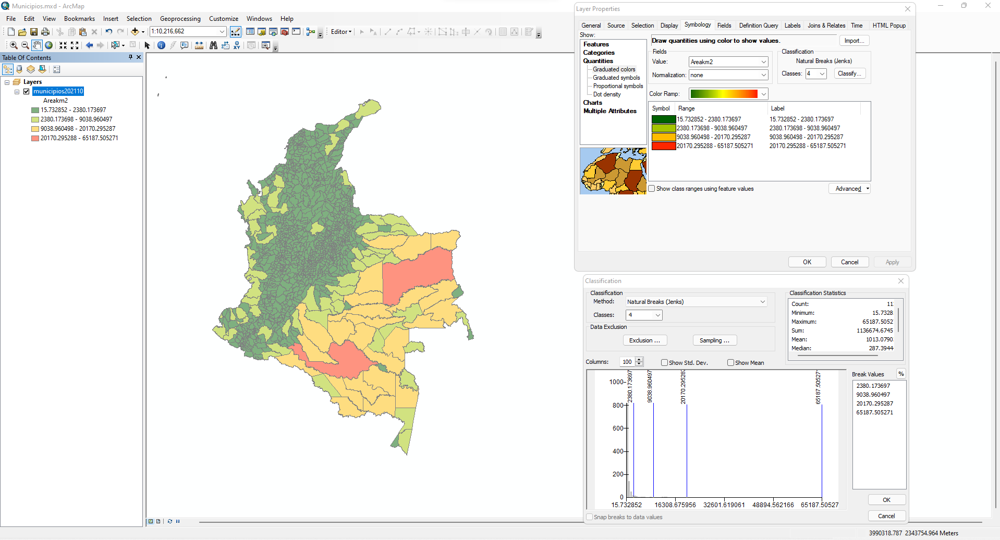
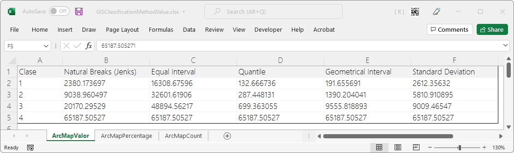
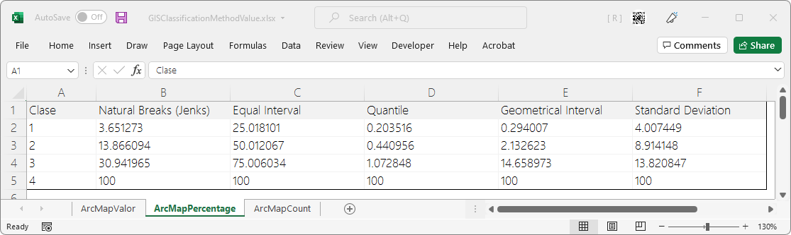
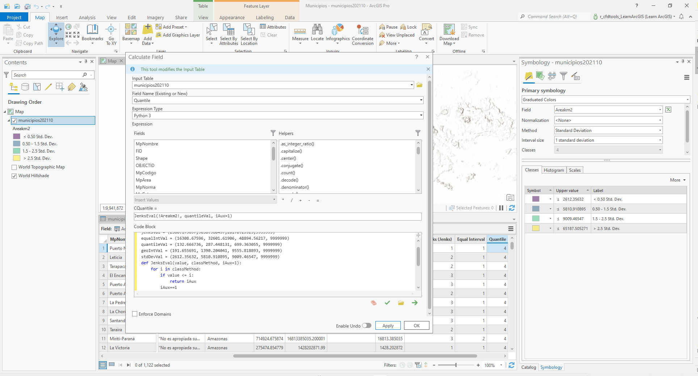
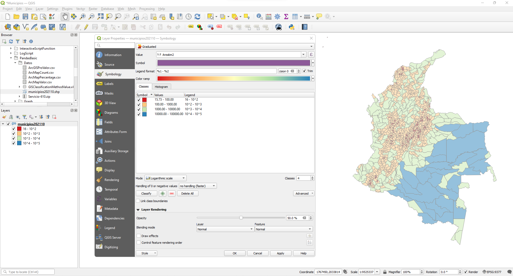

<div align="center"></div>

## Introducción a pandas - Representación estadística de Municipios de Colombia 
Keywords: `igac` `county` `plot` `matplotlib` `pandas` `system` `graph` `arcgis` `qgis` 

[Pandas](https://pandas.pydata.org/), es una librería complementaria al lenguaje de programación Python que permite leer, representar y manipular datos almacenados en diferentes formatos, p.ej, en archivos de texto separados por comas _.csv_ [(CSV - Comma separated values)](https://en.wikipedia.org/wiki/Comma-separated_values) y archivos en formatos de libro de cálculo electrónico como [Microsoft Excel](https://es.wikipedia.org/wiki/Microsoft_Excel) en formato _.xls_ y _.xlsx_.


> En la versión 1.3.4 de pandas, no existe una función o un módulo que directamente permita la conversión de bases de datos de DBase (.dbf) a dataframes para su representación y análisis. Este proceso puede ser realizado mediante la lectura de datos a través de la librería `dbf` y su posterior llamado usando la instrucción de pandas `pd.DataFrame(table)`. [Más información.](https://stackoverflow.com/questions/41898561/pandas-transform-a-dbf-table-into-a-dataframe)

### Caso de estudio

Clasificar, representar y analizar la división geopolítica de los Municipios de Colombia a través de diferentes métodos de representación estadística disponibles en ArcGIS y QGIS, en función de su área espacial y utilizando los datos abiertos del [Instituto Geográfico Agustín Codazzi - IGAC](https://www.igac.gov.co/).  


### Objetivos

* Utilizando ArcGIS for Desktop y ArcGIS Pro, simbolizar y representar en 4 clases, la capa geográfica de Municipios de Colombia utilizando los métodos de Cortes Naturales, Intervalo de Igualdad, Cuantil, Intervalo Geométrico y Desviación Típica.
* Utilizando QGIS, representar varios de los métodos que utiliza ArcGIS y los métodos adicionales Pretty Breaks y Escala logarítmica. 
* A partir de los valores de corte obtenidos, porcentaje de corte y número de entidades (municipios) obtenidas en cada clase y método, crear archivos CSV y un libro de cálculo electrónico en formato .xlsx con diferentes hojas.
* Leer y visualizar los archivos CSV y hojas del libro de Microsoft Excel en Python, usando pandas a través de dataframes.
* Representar gráficamente los valores obtenidos utilizando la librería matplotlib y a través de las funciones de graficación embebidas en pandas. 


### Requerimientos

* ArcGIS for Desktop 10.2.2+.
* ArcGIS Pro 2.9.0+.
* QGIS 3.22.1+.
* Python 2.7.5 de ArcGIS for Desktop 10.2.2. 
* Python 3.10.0+ como instalación independiente o standalone.
* PyCharm 2021.3+ for Anaconda.
* Sistema operativo Microsoft Windows.
* Capa geográfica de Municipios de Colombia.
* Archivos CSV y libro de Microsoft Excel con el resultado de los valores de corte y conteo de elementos obtenidos en la representación espacial GIS.


### Instalación de pandas

Para la instalación en Python 3.10 de la librería oficial de `pandas`, desde el `CMD` de Microsoft Windows ejecutar las siguientes instrucciones del administrador de paquetes `pip` o desde las opciones de configuración de PyCharm, realice la instalación desde el intérprete de comandos asociado al proyecto. Para más información acerca de como instalar y actualizar librerías, consulte la actividad [Instalación, actualización de paquetes y creación de gráficas básicas usando matplotlib](https://github.com/rcfdtools/R.GISPython/tree/main/InstallPackageGraph).

Actualizar la versión existente de pip `py -3.10 -m pip install -U pip`

Instalación de pandas `py -3.10 -m pip install -U pandas`


### Ruta de ejecución
 
Para el desarrollo de este ejercicio se recomienda que los scripts y demás archivos requeridos se encuentren en D:\R.GISPython\PandasBasic\ 


### A. Descarga de capa geográfica de municipios

> Tenga en cuenta que el procedimiento de descarga puede no estar actualizado debido a las actualizaciones permanentes que se realizan en el portal del IGAC, sin embargo, podrá utilizar los archivos descargados y utilizados para ejemplificar el caso de estudio que se encuentran en este repositorio. Descarga realizada en 2021.12.16.

1. En el portal del [Instituto Geográfico Agustín Codazzi - IGAC](https://www.igac.gov.co/) de clic en la opción de [Datos Abiertos]().


2. En Datos Abiertos, seleccione la opción [Cartografía y Geografía](https://geoportal.igac.gov.co/contenido/datos-abiertos-cartografia-y-geografia) y luego seleccione la opción [Cartografía Base Escala 1:25000](https://www.colombiaenmapas.gov.co/?e=-82.43784778320864,-0.17644239911865092,-71.23179309571162,9.90326984502256,4686&b=igac&u=0&t=23&servicio=206) contenida en la sección Descarga de Información Integrada. Automáticamente será redirigido al portal [colombiaenmapas.gov.co](https://www.colombiaenmapas.gov.co/).


3. En el portal de Colombia en Mapas, filtre por Municipios, de clic en la opción _Municipios, Distritos y Áreas no municipalizadas de Colombia_, seleccione formato [shapefile](https://desktop.arcgis.com/en/arcmap/10.3/manage-data/shapefiles/what-is-a-shapefile.htm) y luego en el botón Descargar. Automáticamente se creará una orden de servicio y se iniciará la descarga (p.ej, Servicio-610.zip).


4. En la carpeta `/Datos`, descomprima el archivo de Municipios, observará que el [shapefile](https://desktop.arcgis.com/en/arcmap/10.3/manage-data/shapefiles/what-is-a-shapefile.htm) se compone de diferentes archivos (p.ej, .shp, .shx, .dbf y .prj). 


### B. Procedimiento para representación y creación tablas requeridas 


#### Simbología por colores graduados en ArcGIS for Desktop 10.2.2

1. En ArcMap, cree un mapa en blanco y agregue la capa descargada [municipios202110](Datos/Servicio-610.zip).


2. Abra la tabla de atributos de la capa (clic derecho en la capa, _Open Attribute Table_), acóplela a la derecha de la ventana y desde las propiedades de la tabla, cree un nuevo campo de atributos tipo numérico doble usando la opción `Add Field...`, nómbrelo como `Areakm2`.


3. Utilizando el calculador de geometría, calcule el valor del área espacial en km² de todos los polígonos de la capa. Clic derecho en la cabecera del campo `Areakm2` y `Calculate Geometry...`.

> Podrá observar que la capa contiene un campo denominado `MpArea` que ya contiene el cálculo en km², sin embargo, se recomienda que sea creado el campo `Areakm2` para actualizar los valores a partir del sistema de proyección _MARNA-SIRGAS / Origen Nacional_ embebido en la capa.


4. Desde las propiedades de la capa, realice la simbolización por Cantidades y por colores graduados en 4 clases a partir del campo `Areakm2` para los métodos de clasificación Cortes Naturales - Jenks, Intervalo de Igualdad, Cuantil, Intervalo Geométrico y Desviación Típica. Para las representaciones, utilice paleta de verdes a naranjas y transparencia al 50%.





5. En la carpeta `/Datos`, cree en Microsoft Excel, un libro en formato .xlsx y guárdelo como [GISClassificationMethodValue.xlsx](Datos/GISClassificationMethodValue.xlsx). Dentro del libro cree las siguientes hojas y registre los valores, porcentajes y conteos de elementos obtenidos en las diferentes clasificaciones:

| Hoja                                                                                                          | Descripción                                       |
|---------------------------------------------------------------------------------------------------------------|---------------------------------------------------|
| [ArcMapValor](Datos/ArcMapValor.csv)           | Registro de valores de corte para cada clase.     |
| [ArcMapPercentage](Datos/ArcMapPercentage.csv) | Registro de porcentajes de corte para cada clase. |
| [ArcMapCount](Datos/ArcMapCount.csv)           | Registro de conteo de elementos para cada clase.  |





> Para la creación del libro podrá utilizar formato .xlsx o .xls. 

6. Convierta cada hoja del libro a formato CSV y guarde en la carpeta `/Datos`, nombre cada archivo con el mismo nombre de las hojas. Verifique los archivos convertidos usando el editor de texto.

> Se recomienda que el separador de listas en la configuración regional del sistema operativo Microsoft Windows, sea establecido utilizando comas, punto para decimales y coma para miles.


#### Simbología por colores graduados en ArcGIS Pro 2.9.0.

1. En ArcGIS pro, cree un proyecto nuevo en blanco y agregue la capa de Municipios.


> No es necesaria la creación del campo `Areakm2` debido a que previamente en ArcGIS for Desktop, se realizó la creación y cálculo del área de cada entidad.

2. En el menú _Apperence_, seleccione la opción _Symbology_ y la opción de representación _Graduated Colors_, realice la simbolización por Cantidades y por Colores Graduados en 4 clases a partir del campo `Areakm2` para los métodos de clasificación Cortes Naturales - Jenks, Intervalo de Igualdad, Cuantil, Intervalo Geométrico y Desviación Típica. Para las representaciones, utilice la paleta _Viridis_ y establezca transparencia al 50%.  


3. En Microsoft Excel y en el libro de cálculo creado anteriormente y nombrado como [GISClassificationMethodValue.xlsx](Datos/GISClassificationMethodValue.xlsx), agregue una nueva hoja y nombre como [ArcGISProValor](Datos/ArcGISProValor.csv). Registre los valores de corte por clase obtenidos con ArcGIS Pro y exporte en `/Datos` a formato CSV usando el mismo nombre de la hoja.


> Como se observa, los valores de corte obtenidos con ArcGIS for Desktop y ArcGIS Pro son idénticos.

4. En la tabla de atributos de la capa de Municipios, cree los siguientes 5 campos tipo numérico entero.

| Campo     | Alias                  | Tipo         |
|-----------|------------------------|--------------|
| CNBJenks  | Natural Breaks (Jenks) | Entero corto |
| CEqualInt | Equal Interval         | Entero corto |
| CQuantile | Quantile               | Entero corto |
| CGeomInt  | Geometrical Interval   | Entero corto |
| CStdDev   | Standard Deviation     | Entero corto |
   


> Debido a que los campos se crean en la tabla .dbf de la capa shapefile, el nombre del campo no podrá contener más de 10 caracteres.

5. Utilizando Python y la herramienta `Calculate Field`, realice la marcación del número de clase a la cual pertenece cada polígono en función de su área en km² a partir de los valores de corte obtenidos previamente.

Code Block para marcación en campos
```
jenksVal = (2380.173697,9038.960497,20170.29529,9999999)
equalIntVal = (16308.67596, 32601.61906, 48894.56217, 9999999)
quantileVal = (132.66673572, 287.44813064, 699.36305533, 9999999)
geoIntVal = (191.655691, 1390.204041, 9555.818893, 9999999)
stdDevVal = (2612.35632, 5810.910895, 9009.46547, 9999999)
def JenksEval(value, classMethod, iAux=1):
    for i in classMethod:
        if value <= i:
            return iAux
        iAux+=1
```

> Observe que en la definición de los valores de corte en el bloque de código Python, se ha incluido el valor 9999999 para el último valor de corte, esto permitirá que se obtengan marcaciones correctas en la clase 4 y sin valores nulos o clases no definidas. 

Expresiones en Calculate Field
* CNBJenks = `JenksEval(!Areakm2!, jenksVal, iAux=1)`
* CEqualInt = `JenksEval(!Areakm2!, equalIntVal, iAux=1)`
* CQuantile = `JenksEval(!Areakm2!, quantileVal, iAux=1)`
* CGeomInt = `JenksEval(!Areakm2!, geoIntVal, iAux=1)`
* CStdDev = `JenksEval(!Areakm2!, stdDevVal, iAux=1)`





6. Utilizando la herramienta `Summarize` o la herramienta `Statistics` disponible en la cabecera de cada campo, visualice o cree un resumen estadístico por conteo para cada uno de los campos de atributos en los que se realizó la marcación de la clase a la cual pertenece cada entidad y verifique sí el número de elementos obtenidos en cada clase, corresponde al número de elementos obtenidos en ArcGIS for Desktop.


> De acuerdo a los resultados obtenidos, se puede evidenciar que el número de elementos obtenidos en cada clase en ArcGIS Pro, es idéntico al obtenido en ArcGIS for Desktop.


#### Simbología por colores graduados en QGIS 3.22

1. En QGIS 3.22.1, cree un proyecto nuevo en blanco, agregue la capa de Municipios y desde las propiedades de la capa, simbolice por colores graduados en 4 clases utilizando los métodos Equal Count (Quantile), Equal Interval, Logarithmic Scale, Natural Breaks (Jenks), Pretty Breaks y  Standard Deviation. Para las representaciones, utilice la paleta _Spectral_, visualice la legenda con 6 decimales y establezca transparencia u opacidad al 50%.  




> Así como en ArcGIS Pro, no es necesaria la creación del campo `Areakm2` debido a que previamente en ArcGIS for Desktop, se realizó la creación y cálculo del área de cada entidad.

> Como se puede observar en las ilustraciones, los valores de corte obtenidos por el método de Cortes Naturales o Jenks e Intervalo de Igualdad son idénticos a los obtenidos en ArcGIS. El método de Quantiles presenta diferencias solo en los valores decimales y el método de Intervalo Geométrico no se encuentra por defecto en QGIS. Para los datos de área, no es posible realizar la representación en 4 clases por el método de la Desviación Estándar y por otra parte, QGIS dispone de dos métodos adicionales denominados Pretty Breaks y Logarithmic Scale.

2. En Microsoft Excel y en el libro de cálculo creado anteriormente y nombrado como [GISClassificationMethodValue.xlsx](Datos/GISClassificationMethodValue.xlsx), agregue una nueva hoja y nombre como [QGIS322Valor](Datos/QGIS322Valor.csv). Registre los valores de corte por clase obtenidos en QGIS y exporte a formato CSV usando el mismo nombre de la hoja.


### C. PyCharm 2021.3 - Análisis de tablas CSV y Libro de Excel en Python usando pandas y matplotlib

#### Estructura de directorios

Para la ejecución correcta del script, es necesario clonar, descargar o crear la estructura de directorios definida en la siguiente tabla.

| Directorio                                                                               | Descripción                                                                                                                    |
|------------------------------------------------------------------------------------------|--------------------------------------------------------------------------------------------------------------------------------|
| [/Datos](https://github.com/rcfdtools/R.GISPython/tree/main/PandasBasic/Datos)           | Datos base con capa geográfica de municipios, tablas CSV y libro de Microsoft Excel.                                           |
| [/Graph](https://github.com/rcfdtools/R.GISPython/tree/main/PandasBasic/Graph)           | Volcado de gráficas en formato [PNG](https://en.wikipedia.org/wiki/Portable_Network_Graphics) (Portable Network Graphic) .png. |
| [/Mapas](https://github.com/rcfdtools/R.GISPython/tree/main/PandasBasic/Mapas)           | Mapas de proyecto de ArcGIS for Desktop, ArcGIS Pro y QGIS.                                                                    |
| [/Screenshot](https://github.com/rcfdtools/R.GISPython/tree/main/PandasBasic/Screenshot) | Capturas de pantalla de ejecución y configuración.                                                                             |


#### Script [PandasBasic.py](PandasBasic.py)

```
# -*- coding: UTF-8 -*-
# Name: PandasBasic.py
# Description: Introducción a pandas - Representación estadística de Municipios de Colombia
# Requirements: PyCharm 2021.3+, Python 3.10.0 (instalación independiente)

# Librerías
import sys
import pandas as pd # Tested with 1.3.4 version
import matplotlib.pyplot as plt # Tested with 3.5.0 version
import openpyxl # Tested with 3.0.9 version, required from pandas for read xlsx files

# Variables
csvFilesExcelSheets = ('ArcMapValor','ArcMapCount','ArcMapPercentage','ArcGISProValor','QGIS322Valor') # Nombre de archivos CSV y hojas en libro de Microsoft Excel.
absolutePath = r'D:/R.GISPython/PandasBasic' # Usar '.' para utilizar rutas absolutas.
excelFilePath = absolutePath+'/Datos/GISClassificationMethodValue.xlsx' 

# Configuración general de pandas y matplotlib
pd.set_option('display.max_rows', None)
pd.set_option('display.max_columns', None)
pd.set_option('display.width', None)
pd.set_option('display.max_colwidth', 0)
plt.rc('figure', max_open_warning = 0) # Don't show the python figure.max_open_warning

# Función para creación de líneas de separación
def Separador(n=24): # Usando un valor por defecto de 24 guiones
	nc = "-"
	print(nc*n)

# Cabecera
Separador(76)
print ('Introducción a pandas - Representación estadística de Municipios de Colombia')
Separador(76)
print ( 'Python versión: ' + str(sys.version) + '\n'
        'Encuentra este script en https://github.com/rcfdtools/R.GISPython/tree/main/PandasBasic\n'
        'Cláusulas y condiciones de uso en https://github.com/rcfdtools/R.GISPython/wiki/License\n'
        'Créditos: r.cfdtools@gmail.com\n')

# Visualización y graficación de archivos CSV
Separador(43)
print ('Visualización y graficación de archivos CSV')
Separador(43)
for i in csvFilesExcelSheets:
    #filePath = r'./Datos/'+i+'.csv' # r para prevenir saltos de línea \n
    filePath = absolutePath+'/Datos/'+i+'.csv' # r para prevenir saltos de línea \n
    dataFrame = pd.read_csv(filePath,index_col=0)
    dataFrame.head() # Primera línea corresponde a cabecera de columnas
    print('\nArchivo: '+filePath)
    print(dataFrame)
    dataFrame.plot(kind='line', xlabel='Clase', ylabel='Valor', title='Graficación de '+i+' con pandas', figsize=(8, 8), alpha=0.85, rot=0, grid=True)  # alpha for transparency
    plt.savefig(absolutePath+'/Graph/' + i + 'Pandas.png')
    plt.show()
print('\n')

# Visualización de libros de Microsoft Excel
Separador(42)
print ('Visualización de libros de Microsoft Excel')
Separador(42)
print('\nLibro de Excel: '+excelFilePath)
for i in csvFilesExcelSheets:
    print('Hoja: '+i)
    dataFrame = pd.read_excel(excelFilePath, index_col=0, sheet_name=i)
    print(dataFrame)

# Graficación manual de QGIS322Valor.csv con matplotlib
csvFileLoad = absolutePath+'/Datos/QGIS322Valor.csv'
dataFrame = pd.read_csv(csvFileLoad)
plt.figure(figsize=(8, 8), dpi=100)
plt.title('Graficación manual de '+i+' con matplotlib')
plt.plot(dataFrame['Clase'],dataFrame['Natural Breaks (Jenks)'], 'r.-', label='Natural Breaks (Jenks)')
plt.plot(dataFrame['Clase'],dataFrame['Equal Interval'], 'b.-', label='Equal Interval')
plt.plot(dataFrame['Clase'],dataFrame['Quantile'], 'g.-', label='Quantile')
plt.plot(dataFrame['Clase'],dataFrame['Pretty Breaks'], 'y.-', label='Pretty Breaks')
plt.plot(dataFrame['Clase'],dataFrame['Logarithmic Scale'], 'k.-', label='Logarithmic Scale')
plt.xlabel('Clase')
plt.ylabel('Valor')
plt.legend(loc='best', shadow=False, fontsize=11)
plt.grid()
plt.xticks(dataFrame['Clase'])
plt.savefig(absolutePath+'/Graph/QGIS322ValorMatplotlib.csv.png')
plt.show()
```


#### Descripción de instrucciones y comandos empleados

| Instrucción                                                                                            | Explicación                                                                                                       |
|--------------------------------------------------------------------------------------------------------|-------------------------------------------------------------------------------------------------------------------|
| csvFilesExcelSheets = ('ArcMapValor','ArcMapCount','ArcMapPercentage','ArcGISProValor','QGIS322Valor') | Lista con nombres de archivos CSV y/o hojas en libro de Microsoft Excel.                                          |
| pd.set_option()                                                                                        | Configuración general de pandas para la visualización de datos en consola.                                        |
| dataFrame = pd.read_csv(filePath,index_col=0)                                                          | Lectura de archivo .csv como dataframe con indexación a partir de valores leídos en la columna 0.                 |
| dataFrame.head()                                                                                       | Indicación acerca de sí la primer línea del archivo corresponde a cabecera de columnas.                           |
| dataFrame.plot()                                                                                       | Graficación de dataset usando pandas.                                                                             |
| plt.savefig()                                                                                          | Almacenamiento de gráfica como archivo .png.                                                                      |
| plt.show()                                                                                             | Mostrar gráfica en pantalla.                                                                                      |
| dataFrame = pd.read_excel(excelFilePath, index_col=0, sheet_name=i)                                    | Lectura de libro de Microsoft Excel con indicación de primera columna como índice y definición de nombre de hoja. |
| plt.figure(figsize=(8, 8), dpi=100)                                                                    | matplotlib. Configuración del tamaño de la gráfica y resolución.                                                  |
| plt.title(                                                                                             | matplotlib. Definición de título de gráfica.                                                                      |
| plt.plot(dataFrame['Clase'],dataFrame['Quantile'], 'g.-', label='Quantile')                            | matplotlib. Definición de serie de datos a graficar.                                                              |
| plt.xlabel('Clase')                                                                                    | matplotlib. Definición de etiqueta para abscisas.                                                                 |
| plt.ylabel('Valor')                                                                                    | matplotlib. Definición de etiqueta para ordenadas.                                                                |
| plt.legend(loc='best', shadow=False, fontsize=11)                                                      | matplotlib. Definición de localización de legenda, sombreado y tamaño de fuente tipográfica.                      |
| plt.grid()                                                                                             | matplotlib. Definición de grillas visibles.                                                                       |
| plt.xticks(dataFrame['Clase'])                                                                         | matplotlib. Definición de rotulación de abscisas a partir de la columna de atributos Clase.                       |


#### Ejecución y gráficas de resultados


Para ejecución desde Jupyter o desde ArcGIS Pro Notebook utilizar `%run -i D:\R.GISPython\PandasBasic\PandasBasic.py`


### Referencias

* [Pandas - Oficial](https://pandas.pydata.org/)
* [Pandas - Read Excel files](https://pandas.pydata.org/pandas-docs/stable/reference/api/pandas.read_excel.html)
* [Pandas - Read CSV files](https://pandas.pydata.org/pandas-docs/stable/reference/api/pandas.read_csv.html)
* [Pandas - Plotting](https://pandas.pydata.org/pandas-docs/stable/reference/plotting.html)
* [Pandas - Dataframe Plot](https://pandas.pydata.org/pandas-docs/stable/reference/api/pandas.DataFrame.plot.html)
* [Wikipedia - Pandas (software)](https://es.wikipedia.org/wiki/Pandas_(software))
* [pandas DataFrame set_index](https://pandas.pydata.org/docs/reference/api/pandas.DataFrame.set_index.html)
* [Set X Axis Values in Matplotlib](https://www.delftstack.com/howto/matplotlib/set-x-axis-values-matplotlib/)


### Compatibilidad

* Compatible con Python 3, librerías requeridas indicadas en la cabecera del archivo .py. 


### Control de versiones

| Versión    | Descripción                                                                                                                                                                                                                                          | Autor                                     | Horas |
|------------|:-----------------------------------------------------------------------------------------------------------------------------------------------------------------------------------------------------------------------------------------------------|-------------------------------------------|:-----:|
| 2021.12.18 | Inclusión de rutas absolutas `absolutePath = r'D:/R.GISPython/PandasBasic'` y llamado `absolutePath+'/Graph` para ejecución desde Jupyter o desde ArcGIS Pro Notebook. Rutas relativas previas pueden ser activadas ingresando '.' en absolutePath.  | [rcfdtools](https://github.com/rcfdtools) |  1.5  |
| 2021.12.17 | Inclusión de gráficas de visualización de dataframes usando pandas y gráfica ejemplo usando matplotlib.                                                                                                                                              | [rcfdtools](https://github.com/rcfdtools) |  2.5  |
| 2021.12.16 | Versión inicial con visualización de dataframes.                                                                                                                                                                                                     | [rcfdtools](https://github.com/rcfdtools) |   9   |


### Licencia, cláusulas y condiciones de uso

_R.HydroTools es de uso libre para fines académicos, conoce nuestra [licencia, cláusulas, condiciones de uso](../../LICENSE.md) y como referenciar los contenidos publicados en este repositorio._

_¡Encontraste útil este repositorio!, apoya su difusión marcando este repositorio con una ⭐ o síguenos dando clic en el botón Follow de [r.cfdtools](https://github.com/rcfdtools) en GitHub._

| [:house: Inicio](../../README.md) | [:beginner: Ayuda / Colabora](https://github.com/rcfdtools/R.HydroTools/discussions/xxx) |
|-----------------------------------|------------------------------------------------------------------------------------------|
