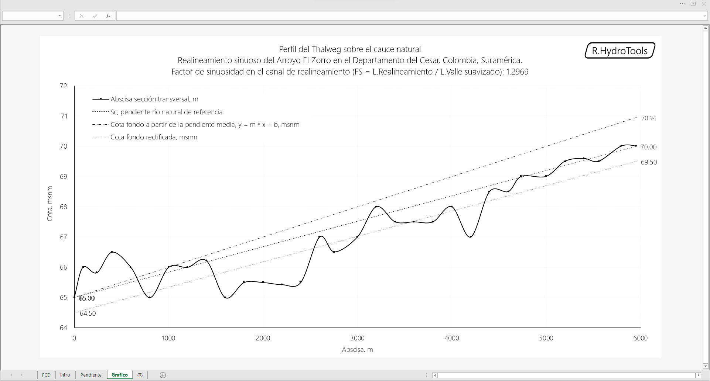

## Análisis de la pendiente de diseño en cauce y valle
Keywords: `hydraulics` `stream-gradient` `river-slope`

Utilizando el modelo de muestreo en HEC-RAS y a partir de la longitud del tramo natural a reemplazar y de las secciones existentes, determinar la pendiente de referencia para el diseño geométrico e hidráulico. Dentro de las consideraciones para el diseño de la sección del canal artificial, es importante evaluar la condición de equilibrio del cauce natural existente, expresada por la pendiente del cauce dominante y el equilibrio entre la erosión y agradación del lecho determinado por la edad del cauce.

En caso de que existan restricciones de trazado y sea necesario utilizar una pendiente mayor a la pendiente del cauce natural existente a reemplazar, será necesario considerar el diseño del fondo del canal de realineamiento en la sección dominante utilizando estructuras de caída con o sin contra escalón, permitiendo así replicar la pendiente natural.

> Para el diseño geométrico del canal artificial, se recomienda utilizar la pendiente obtenida del eje del diseño sinuoso del río entre las secciones de referencia de inicio y entrega, para replicar así la longitud del cauce natural sin alterar la longitud del tránsito y el tiempo de concentración de la cuenca.

### Requerimientos

* [Microsoft Excel](https://www.microsoft.com/en-us/microsoft-365/excel) 2013 o superior

### Ilustraciones

### Control de versiones

| Versión     | Descripción                                            | Autor                                      | Horas |
|-------------|:-------------------------------------------------------|--------------------------------------------|:-----:|
| 2022.07.25  | Actualización general de documentación.                | [rcfdtools](https://github.com/rcfdtools)  |  0.5  |
| 2021.10.16  | Actualización general de análisis, gráficas y formato. | [rcfdtools](https://github.com/rcfdtools)  |   2   |
| 2014.09.07  | Versión inicial.                                       | [rcfdtools](https://github.com/rcfdtools)  |  16   |

### Licencia, cláusulas y condiciones de uso

_R.HydroTools es de uso libre para fines académicos, conoce nuestra [licencia, cláusulas, condiciones de uso](../../LICENSE.md) y como referenciar los contenidos publicados en este repositorio._

_¡Encontraste útil este repositorio!, apoya su difusión marcando este repositorio con una ⭐ o síguenos dando clic en el botón Follow de [r.cfdtools](https://github.com/rcfdtools) en GitHub._

| [:house: Inicio](../../README.mdi) | [:beginner: Ayuda / Colabora](https://github.com/rcfdtools/R.HydroTools/discussions/20) |
|------------------------------------|-----------------------------------------------------------------------------------------|
