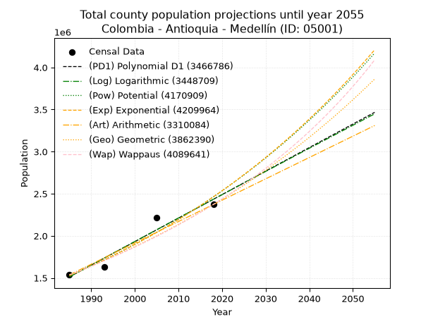
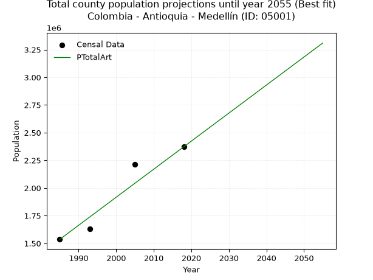
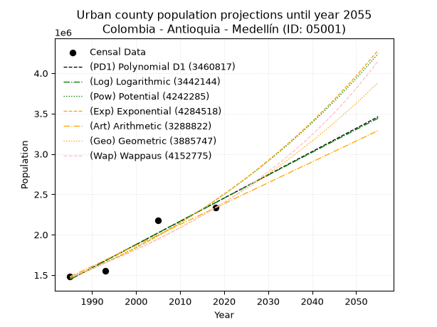
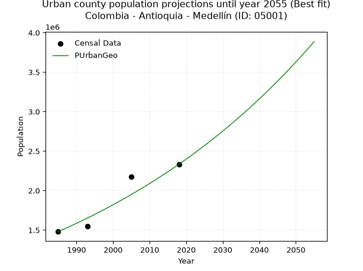
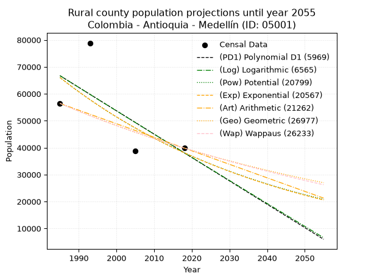
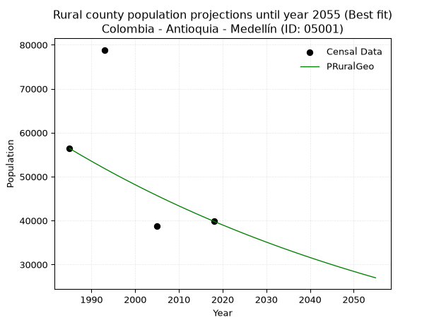

<div align="center">


</div>

# 📜 _“Population and Public Services Demand Projections (PPSD) until Year 2050 for Colombia - Antioquia - Medellín (ID: 05001)”_
Keywords: `population` `public-service` `projection` `lineal` `polynomial` `logarithmic` `potential` `exponential` `arithmetic` `geometric` `wappaus` `dane` `colombia` `south-america`

PPSD are analytical estimates used by governments and planners to anticipate future changes in population size, age distribution, and the resulting community needs for utilities, healthcare, education, and infrastructure as sizing future water treatment facilities, electrical grids, and road networks based on spatial growth.

<div align="center">

</img>

</div>


> **General running parameters**: • app_version: _v20260806_. • Python version: _3.14.7_. • Pandas version: _3.0.5_. • NumPy version: _2.5.1_. • Creates, save and include plots into reports (create_plot): _False_. • Projection until year: _2050_. • Process polynomial degree 2 and up: _False_. • Process Wappaus: _True_. • Process Wappaus: _True_. • Set negative values to zero: _True_. • Set infinite values to zero: _True_. • Drop dataset notes: _True_. 
<div align="center">

Maps & GIS Layers: [:earth_americas:Google](http://maps.google.com/maps?q=6.246630847,-75.581775) [:earth_americas:OSM](https://www.openstreetmap.org/#map=18/6.246630847/-75.581775&layers=P) [:earth_americas:Bing](https://www.bing.com/maps?cp=6.246630847~-75.581775&lvl=18) [:earth_americas:Apple](https://maps.apple.com/frame?center=6.246630847%2C-75.581775&span=0.003%2C0.006) [:earth_americas:GISMobile](https://github.com/rcfdtools/R.GISMobile/blob/main/file/gis/CountyLayer_CO/Readme.md)

</div>


<div align="center">

```geojson
{
  "type": "Feature",
  "geometry": {
    "type": "Point", 
    "coordinates": [-75.581775, 6.246630847]
  }, 
  "properties": {
    "Name": "Colombia - Antioquia - Medellín (ID: 05001)"
  }
}
```

</div>


## 0. Census Data (4 records)

Census data are official statistics collected by a government about the people and housing in a country. They usually include counts of total population, age, sex, race, income, education, and jobs.

📅Global census file: [Population.xlsx](../data/Population.xlsx)

| Source   |   Year |   CountryID | CountryName   |   StateID | StateName   |   CountyID | CountyName   |   PTotal |   PUrban |   PRural |
|:---------|-------:|------------:|:--------------|----------:|:------------|-----------:|:-------------|---------:|---------:|---------:|
| DANE     |   1985 |          57 | Colombia      |        05 | Antioquia   |      05001 | Medellín     |  1535955 |  1479540 |    56415 |
| DANE     |   1993 |          57 | Colombia      |        05 | Antioquia   |      05001 | Medellín     |  1630009 |  1551160 |    78849 |
| DANE     |   2005 |          57 | Colombia      |        05 | Antioquia   |      05001 | Medellín     |  2214494 |  2175681 |    38813 |
| DANE     |   2018 |          57 | Colombia      |        05 | Antioquia   |      05001 | Medellín     |  2372330 |  2332487 |    39843 |

> 🔥Some records could had specific notes about the registered values or the corresponding urban or rural distribution.

📅[SUI-RUPS](https://www.datos.gov.co/Hacienda-y-Cr-dito-P-blico/Registro-nico-de-Prestadores-de-Servicios-P-blicos/4qkq-csdn/about_data) - Local public utility companies: [RUPS.csv](../data/RUPS.csv)

 | SERVICIO       | ESTADO    | NOMBRE                                                                    | NIT         | DEPARTAMENTO_DOMICILIO   | MUNICIPIO_DOMICILIO   | DIRECCION                                                             |   TELEFONO | EMAIL                                     | TIPO_PRESTADOR                             | CLASIFICACION                  |
|:---------------|:----------|:--------------------------------------------------------------------------|:------------|:-------------------------|:----------------------|:----------------------------------------------------------------------|-----------:|:------------------------------------------|:-------------------------------------------|:-------------------------------|
| ACUEDUCTO      | OPERATIVA | CORPORACION DE ACUEDUCTO DE ALTAVISTA                                     | 800218478-6 | ANTIOQUIA                | MEDELLIN              | CALLE 18 Nº 105 - 21                                                  |    4083052 | administrativo@acueductoaltavista.com     | ORGANIZACION AUTORIZADA                    | DESDE 2501 HASTA 5000 USUARIOS |
| ACUEDUCTO      | OPERATIVA | EMPRESAS PÚBLICAS DE MEDELLIN E.S.P.                                      | 890904996-1 | ANTIOQUIA                | MEDELLIN              | CRA 58 No 42-125 Edificio Inteligente                                 |    3808080 | DONEY.MARTINEZ@EPM.COM.CO                 | EMPRESA INDUSTRIAL Y COMERCIAL DEL ESTADO  | MAYOR O IGUAL A 5001 USUARIOS  |
| ALCANTARILLADO | OPERATIVA | EMPRESAS PÚBLICAS DE MEDELLIN E.S.P.                                      | 890904996-1 | ANTIOQUIA                | MEDELLIN              | CRA 58 No 42-125 Edificio Inteligente                                 |    3808080 | DONEY.MARTINEZ@EPM.COM.CO                 | EMPRESA INDUSTRIAL Y COMERCIAL DEL ESTADO  | MAYOR O IGUAL A 5001 USUARIOS  |
| ACUEDUCTO      | OPERATIVA | CORPORACION DE ACUEDUCTO  SAN PEDRO                                       | 800198711-0 | ANTIOQUIA                | MEDELLIN              | Corregimiento Santa Elena                                             |    5400550 | llanoplan@gmail.com                       | ORGANIZACION AUTORIZADA                    | MENOR O IGUAL A 2500 USUARIOS  |
| ACUEDUCTO      | OPERATIVA | CORPORACION DE ACUEDUCTO MULTIVEREDAL SANTA ELENA                         | 811013432-7 | ANTIOQUIA                | MEDELLIN              | Corregimiento Santa Elena                                             |    4790455 | acuesanta@hotmail.com                     | ORGANIZACION AUTORIZADA                    | MENOR O IGUAL A 2500 USUARIOS  |
| ALCANTARILLADO | OPERATIVA | CORPORACION DE ACUEDUCTO MULTIVEREDAL SANTA ELENA                         | 811013432-7 | ANTIOQUIA                | MEDELLIN              | Corregimiento Santa Elena                                             |    4790455 | acuesanta@hotmail.com                     | ORGANIZACION AUTORIZADA                    | MENOR O IGUAL A 2500 USUARIOS  |
| ACUEDUCTO      | OPERATIVA | CORPORACIÓN DE ACUEDUCTO SAN JOSÉ                                         | 800245167-5 | ANTIOQUIA                | MEDELLIN              | VEREDA SAN JOSE                                                       |    3222260 | c.acueductosanjose@gmail.com              | ORGANIZACION AUTORIZADA                    | MENOR O IGUAL A 2500 USUARIOS  |
| ACUEDUCTO      | OPERATIVA | CORPORACION  DE ACUEDUCTO MULTIVEREDAL LA ACUARELA                        | 811003174-9 | ANTIOQUIA                | MEDELLIN              | Carrera 131 No 60D - 27                                               |    4276009 | aux_admin@acueductolaacuarela.com         | ORGANIZACION AUTORIZADA                    | DESDE 2501 HASTA 5000 USUARIOS |
| ACUEDUCTO      | OPERATIVA | CORPORACIÓN DE ACUEDUCTO MULTIVEREDAL "ARCOIRIS"                          | 811020165-4 | ANTIOQUIA                | MEDELLIN              | carrera 150C No 80-14 vereda El Llano                                 |    4796109 | gerencia@acueductoarcoiris.com            | ORGANIZACION AUTORIZADA                    | MENOR O IGUAL A 2500 USUARIOS  |
| ALCANTARILLADO | OPERATIVA | CORPORACIÓN DE ACUEDUCTO MULTIVEREDAL "ARCOIRIS"                          | 811020165-4 | ANTIOQUIA                | MEDELLIN              | carrera 150C No 80-14 vereda El Llano                                 |    4796109 | gerencia@acueductoarcoiris.com            | ORGANIZACION AUTORIZADA                    | MENOR O IGUAL A 2500 USUARIOS  |
| ACUEDUCTO      | OPERATIVA | CORPORACION DE ASOCIADOS DEL ACUEDUCTO LAS FLORES                         | 811003843-8 | ANTIOQUIA                | MEDELLIN              | CORREGIMIENTO SANTA ELENA                                             |    4087235 | corpolasflores@outlook.com                | ORGANIZACION AUTORIZADA                    | MENOR O IGUAL A 2500 USUARIOS  |
| ACUEDUCTO      | OPERATIVA | CORPORACION DE ASOCIADOS DEL ACUEDUCTO MONTAÑITA                          | 811009284-8 | ANTIOQUIA                | MEDELLIN              | Vereda Montañita                                                      |    2863280 | acueducto646@gmail.com                    | ORGANIZACION AUTORIZADA                    | MENOR O IGUAL A 2500 USUARIOS  |
| ACUEDUCTO      | OPERATIVA | CORPORACION DE ASOCIADOS DEL ACUEDUCTO ISAAC GAVIRIA                      | 811004943-0 | ANTIOQUIA                | MEDELLIN              | CALLE 56H 18-27                                                       |    2849356 | acueductoisaacgaviria@yayoo.com           | ORGANIZACION AUTORIZADA                    | MENOR O IGUAL A 2500 USUARIOS  |
| ACUEDUCTO      | OPERATIVA | JUNTA ADMINISTRADORA DEL ACUEDUCTO DE SAN JOSE DE MANZANILLO - AGUA PURA- | 811021447-0 | ANTIOQUIA                | MEDELLIN              | VEREDA EL MANZANILLO                                                  |    3436335 | aguapura-manzanillo@hotmail.com           | ORGANIZACION AUTORIZADA                    | DESDE 2501 HASTA 5000 USUARIOS |
| ACUEDUCTO      | OPERATIVA | CORPORACION DE ACUEDUCTO EL MANANTIAL                                     | 811024558-3 | ANTIOQUIA                | MEDELLIN              | CRA 78 N° 43 SUR 02                                                   |    3028009 | acueducto.elmanantial@gmail.com           | ORGANIZACION AUTORIZADA                    | MENOR O IGUAL A 2500 USUARIOS  |
| ACUEDUCTO      | OPERATIVA | JUNTA ADMINISTRADORA DE SERVICIOS DE EL VERGEL                            | 811023140-4 | ANTIOQUIA                | MEDELLIN              | CL 48 SUR 72 225 IN 201                                               |    2862523 | juntavergel@hotmail.com                   | ORGANIZACION AUTORIZADA                    | MENOR O IGUAL A 2500 USUARIOS  |
| ACUEDUCTO      | OPERATIVA | JUNTA ADMINISTRADORA ACUEDUCTO MULTIVEREDAL LA IGUANA                     | 811024000-6 | ANTIOQUIA                | MEDELLIN              | Calle 64  128-109                                                     |    4271429 | acueductoiguana@hotmail.com               | ORGANIZACION AUTORIZADA                    | MENOR O IGUAL A 2500 USUARIOS  |
| ACUEDUCTO      | OPERATIVA | JUNTA ADMINISTRADORA ACUEDUCTO LA SORBETANA                               | 811024136-9 | ANTIOQUIA                | MEDELLIN              | CERRERA78 43SUR 02 SAN ANTONIO DE PRADO                               |    2792095 | j.acueductolasorbetana@gmail.com          | ORGANIZACION AUTORIZADA                    | MENOR O IGUAL A 2500 USUARIOS  |
| ACUEDUCTO      | OPERATIVA | JUNTA ADMINISTRADORA ACUEDUCTO MULTIVEREDAL EL HATO                       | 811025152-1 | ANTIOQUIA                | MEDELLIN              | CL 64 128 44 Apto 301                                                 |    4275336 | acueductoelhato@une.net.co                | ORGANIZACION AUTORIZADA                    | MENOR O IGUAL A 2500 USUARIOS  |
| ACUEDUCTO      | OPERATIVA | CORPORACIÓN DE   ACUEDUCTO MAZO                                           | 811015503-0 | ANTIOQUIA                | MEDELLIN              | SANTA ELENA VEREDA MAZO                                               |    4084292 | acuemazo@gmail.com                        | ORGANIZACION AUTORIZADA                    | MENOR O IGUAL A 2500 USUARIOS  |
| ACUEDUCTO      | OPERATIVA | JUNTA ADMINISTRADORA ACUEDUCTO MANZANILLO                                 | 811027456-4 | ANTIOQUIA                | MEDELLIN              | VEREDA MANZANILLO CORR. ALTAVISTA                                     |    3884438 | acueductom@hotmail.com                    | ORGANIZACION AUTORIZADA                    | MENOR O IGUAL A 2500 USUARIOS  |
| ACUEDUCTO      | OPERATIVA | CORPORACIÓN JUNTA ADMINISTRADORA ACUEDUCTO AGUAS FRIAS                    | 811027302-9 | ANTIOQUIA                | MEDELLIN              | CORREGIMIENTO ALTAVISTA VEREDA AGUAS FRIAS                            |    3685207 | acueductoaguasfrias@gmail.com             | ORGANIZACION AUTORIZADA                    | MENOR O IGUAL A 2500 USUARIOS  |
| ALCANTARILLADO | OPERATIVA | AGUAS NACIONALES EPM S.A E.S.P.                                           | 830112464-6 | ANTIOQUIA                | MEDELLIN              | Carrera 58 No. 42 – 125 sótano Edificio inteligente EPM - oficina 287 |    3804444 | JHON.OROZCO.ZAPATA@aguasnacionalesepm.com | SOCIEDADES (EMPRESA DE SERVICIOS PUBLICOS) | MAYOR O IGUAL A 5001 USUARIOS  |
| ACUEDUCTO      | OPERATIVA | ASOCIACIÓN DE USUARIOS DEL ACUEDUCTO Y ALCANTARILLADO SAN IGNACIO         | 811021792-7 | ANTIOQUIA                | GUARNE                | VEREDA SAN IGNACIO                                                    |    5380007 | asuasi538@gmail.com                       | ORGANIZACION AUTORIZADA                    | MENOR O IGUAL A 2500 USUARIOS  |
| ACUEDUCTO      | OPERATIVA | CORPORACION DE ACUEDUCTO MEDIA LUNA                                       | 900271964-1 | ANTIOQUIA                | MEDELLIN              | CARRERA 20 ESTE No 52-551 VDA. MEDIA LUNA KM3. VIA SANTA ELENA        |    3379881 | acueductomedialuna@hotmail.com            | ORGANIZACION AUTORIZADA                    | MENOR O IGUAL A 2500 USUARIOS  |
| ACUEDUCTO      | OPERATIVA | CORPORACION DE ACUEDUCTO PIEDRAS BLANCAS                                  | 900333270-6 | ANTIOQUIA                | MEDELLIN              | CR 46 ESTE 69-10 VIA EL ROSARIO KM 3 792                              |    4084330 | acueductopiedrasblancas@gmail.com         | ORGANIZACION AUTORIZADA                    | MENOR O IGUAL A 2500 USUARIOS  |
| ACUEDUCTO      | OPERATIVA | CORPORACION DE ACUEDUCTO EL MANANTIAL DE ANA DIAZ                         | 900745782-3 | ANTIOQUIA                | MEDELLIN              | CARRERA  125 NUMERO 34 AA 167 INT. 201                                |    4934719 | acueductomanantialdeanadiaz@gmail.com     | ORGANIZACION AUTORIZADA                    | MENOR O IGUAL A 2500 USUARIOS  |
| ACUEDUCTO      | OPERATIVA | Corporación de Acueducto Multiveredal Palmitas La China                   | 900737854-1 | ANTIOQUIA                | MEDELLIN              | KILOMETRO 2 # 255 CALLE 116 # 215-51                                  |    1111111 | acueductolachina@yahoo.es                 | ORGANIZACION AUTORIZADA                    | MENOR O IGUAL A 2500 USUARIOS  |

## 1. Total

### 1.1. Coefficients and Parameters

* (PD1) Polynomial Deg 1: 27919.429947811976, -53907642.7531109 (lineal)
* (Log) Logarithmic: 55897039.11924349, -422935645.2761295
* (Pow) Potential: 29.011288210137657, -89.4887079896912
* (Exp) Exponential: 0.01448941623583233, 4.929857012105248e-07
* (Art) Arithmetic: Year diff. 2018 - 1985 = 33, Population diff. 2372330 - 1535955 = 836375, Annual growth = 25344.696969696968
* (Geo) Geometric: Year diff. 2018 - 1985 = 33, Population diff. 2372330 - 1535955 = 836375, Annual growth % = 0.013260491851941447
* (Wap) Wappaus: i = 1.29697281389136, Condition values only valid for < 200)

<sub>
Wappaus condition values: ['0.00', '1.30', '2.59', '3.89', '5.19', '6.48', '7.78', '9.08', '10.38', '11.67', '12.97', '14.27', '15.56', '16.86', '18.16', '19.45', '20.75', '22.05', '23.35', '24.64', '25.94', '27.24', '28.53', '29.83', '31.13', '32.42', '33.72', '35.02', '36.32', '37.61', '38.91', '40.21', '41.50', '42.80', '44.10', '45.39', '46.69', '47.99', '49.28', '50.58', '51.88', '53.18', '54.47', '55.77', '57.07', '58.36', '59.66', '60.96', '62.25', '63.55', '64.85', '66.15', '67.44', '68.74', '70.04', '71.33', '72.63', '73.93', '75.22', '76.52', '77.82', '79.12', '80.41', '81.71', '83.01', '84.30']
</sub>


### 1.2. Projected Dataset

|   Year |   CountyID |   PTotalPD1 |   PTotalLog |   PTotalPow |   PTotalExp |   PTotalArt |   PTotalGeo |   PTotalWap |
|-------:|-----------:|------------:|------------:|------------:|------------:|------------:|------------:|------------:|
|   1985 |      05001 | 1.51243e+06 | 1.51149e+06 | 1.52606e+06 | 1.52683e+06 | 1.53596e+06 | 1.53596e+06 | 1.53596e+06 |
|   1986 |      05001 | 1.54034e+06 | 1.53964e+06 | 1.54853e+06 | 1.54912e+06 | 1.5613e+06  | 1.55632e+06 | 1.55601e+06 |
|   1987 |      05001 | 1.56826e+06 | 1.56778e+06 | 1.57131e+06 | 1.57172e+06 | 1.58664e+06 | 1.57696e+06 | 1.57632e+06 |
|   1988 |      05001 | 1.59618e+06 | 1.5959e+06  | 1.59441e+06 | 1.59466e+06 | 1.61199e+06 | 1.59787e+06 | 1.5969e+06  |
|   1989 |      05001 | 1.6241e+06  | 1.62402e+06 | 1.61784e+06 | 1.61794e+06 | 1.63733e+06 | 1.61906e+06 | 1.61776e+06 |
|   1990 |      05001 | 1.65202e+06 | 1.65211e+06 | 1.64161e+06 | 1.64155e+06 | 1.66268e+06 | 1.64053e+06 | 1.6389e+06  |
|   1991 |      05001 | 1.67994e+06 | 1.68019e+06 | 1.66571e+06 | 1.66551e+06 | 1.68802e+06 | 1.66228e+06 | 1.66032e+06 |
|   1992 |      05001 | 1.70786e+06 | 1.70826e+06 | 1.69015e+06 | 1.68982e+06 | 1.71337e+06 | 1.68433e+06 | 1.68203e+06 |
|   1993 |      05001 | 1.73578e+06 | 1.73631e+06 | 1.71494e+06 | 1.71448e+06 | 1.73871e+06 | 1.70666e+06 | 1.70404e+06 |
|   1994 |      05001 | 1.7637e+06  | 1.76435e+06 | 1.74008e+06 | 1.7395e+06  | 1.76406e+06 | 1.72929e+06 | 1.72636e+06 |
|   1995 |      05001 | 1.79162e+06 | 1.79238e+06 | 1.76558e+06 | 1.76489e+06 | 1.7894e+06  | 1.75222e+06 | 1.74898e+06 |
|   1996 |      05001 | 1.81954e+06 | 1.82039e+06 | 1.79143e+06 | 1.79065e+06 | 1.81475e+06 | 1.77546e+06 | 1.77192e+06 |
|   1997 |      05001 | 1.84746e+06 | 1.84839e+06 | 1.81765e+06 | 1.81678e+06 | 1.84009e+06 | 1.799e+06   | 1.79518e+06 |
|   1998 |      05001 | 1.87538e+06 | 1.87637e+06 | 1.84425e+06 | 1.8433e+06  | 1.86544e+06 | 1.82286e+06 | 1.81877e+06 |
|   1999 |      05001 | 1.9033e+06  | 1.90434e+06 | 1.87121e+06 | 1.8702e+06  | 1.89078e+06 | 1.84703e+06 | 1.8427e+06  |
|   2000 |      05001 | 1.93122e+06 | 1.9323e+06  | 1.89856e+06 | 1.8975e+06  | 1.91612e+06 | 1.87152e+06 | 1.86697e+06 |
|   2001 |      05001 | 1.95914e+06 | 1.96024e+06 | 1.9263e+06  | 1.92519e+06 | 1.94147e+06 | 1.89634e+06 | 1.89159e+06 |
|   2002 |      05001 | 1.98706e+06 | 1.98817e+06 | 1.95442e+06 | 1.95329e+06 | 1.96682e+06 | 1.92149e+06 | 1.91657e+06 |
|   2003 |      05001 | 2.01498e+06 | 2.01608e+06 | 1.98294e+06 | 1.9818e+06  | 1.99216e+06 | 1.94697e+06 | 1.94192e+06 |
|   2004 |      05001 | 2.0429e+06  | 2.04398e+06 | 2.01186e+06 | 2.01072e+06 | 2.0175e+06  | 1.97278e+06 | 1.96764e+06 |
|   2005 |      05001 | 2.07081e+06 | 2.07186e+06 | 2.04119e+06 | 2.04007e+06 | 2.04285e+06 | 1.99894e+06 | 1.99375e+06 |
|   2006 |      05001 | 2.09873e+06 | 2.09974e+06 | 2.07093e+06 | 2.06984e+06 | 2.06819e+06 | 2.02545e+06 | 2.02025e+06 |
|   2007 |      05001 | 2.12665e+06 | 2.1276e+06  | 2.1011e+06  | 2.10005e+06 | 2.09354e+06 | 2.05231e+06 | 2.04714e+06 |
|   2008 |      05001 | 2.15457e+06 | 2.15544e+06 | 2.13168e+06 | 2.1307e+06  | 2.11888e+06 | 2.07952e+06 | 2.07445e+06 |
|   2009 |      05001 | 2.18249e+06 | 2.18327e+06 | 2.16269e+06 | 2.1618e+06  | 2.14423e+06 | 2.1071e+06  | 2.10218e+06 |
|   2010 |      05001 | 2.21041e+06 | 2.21109e+06 | 2.19414e+06 | 2.19335e+06 | 2.16957e+06 | 2.13504e+06 | 2.13034e+06 |
|   2011 |      05001 | 2.23833e+06 | 2.23889e+06 | 2.22603e+06 | 2.22536e+06 | 2.19492e+06 | 2.16335e+06 | 2.15894e+06 |
|   2012 |      05001 | 2.26625e+06 | 2.26668e+06 | 2.25837e+06 | 2.25784e+06 | 2.22026e+06 | 2.19204e+06 | 2.18798e+06 |
|   2013 |      05001 | 2.29417e+06 | 2.29445e+06 | 2.29116e+06 | 2.29079e+06 | 2.24561e+06 | 2.22111e+06 | 2.21749e+06 |
|   2014 |      05001 | 2.32209e+06 | 2.32221e+06 | 2.32441e+06 | 2.32423e+06 | 2.27095e+06 | 2.25056e+06 | 2.24747e+06 |
|   2015 |      05001 | 2.35001e+06 | 2.34996e+06 | 2.35813e+06 | 2.35815e+06 | 2.2963e+06  | 2.2804e+06  | 2.27793e+06 |
|   2016 |      05001 | 2.37793e+06 | 2.37769e+06 | 2.39232e+06 | 2.39257e+06 | 2.32164e+06 | 2.31064e+06 | 2.30889e+06 |
|   2017 |      05001 | 2.40585e+06 | 2.40541e+06 | 2.42699e+06 | 2.42749e+06 | 2.34698e+06 | 2.34128e+06 | 2.34035e+06 |
|   2018 |      05001 | 2.43377e+06 | 2.43312e+06 | 2.46214e+06 | 2.46292e+06 | 2.37233e+06 | 2.37233e+06 | 2.37233e+06 |
|   2019 |      05001 | 2.46169e+06 | 2.46081e+06 | 2.49778e+06 | 2.49886e+06 | 2.39768e+06 | 2.40379e+06 | 2.40484e+06 |
|   2020 |      05001 | 2.48961e+06 | 2.48849e+06 | 2.53392e+06 | 2.53533e+06 | 2.42302e+06 | 2.43566e+06 | 2.4379e+06  |
|   2021 |      05001 | 2.51752e+06 | 2.51616e+06 | 2.57057e+06 | 2.57234e+06 | 2.44836e+06 | 2.46796e+06 | 2.47152e+06 |
|   2022 |      05001 | 2.54544e+06 | 2.54381e+06 | 2.60772e+06 | 2.60988e+06 | 2.47371e+06 | 2.50069e+06 | 2.50571e+06 |
|   2023 |      05001 | 2.57336e+06 | 2.57144e+06 | 2.6454e+06  | 2.64797e+06 | 2.49905e+06 | 2.53385e+06 | 2.54049e+06 |
|   2024 |      05001 | 2.60128e+06 | 2.59907e+06 | 2.6836e+06  | 2.68662e+06 | 2.5244e+06  | 2.56745e+06 | 2.57588e+06 |
|   2025 |      05001 | 2.6292e+06  | 2.62668e+06 | 2.72233e+06 | 2.72583e+06 | 2.54974e+06 | 2.60149e+06 | 2.61188e+06 |
|   2026 |      05001 | 2.65712e+06 | 2.65428e+06 | 2.76161e+06 | 2.76561e+06 | 2.57509e+06 | 2.63599e+06 | 2.64852e+06 |
|   2027 |      05001 | 2.68504e+06 | 2.68186e+06 | 2.80143e+06 | 2.80597e+06 | 2.60043e+06 | 2.67095e+06 | 2.68581e+06 |
|   2028 |      05001 | 2.71296e+06 | 2.70943e+06 | 2.8418e+06  | 2.84693e+06 | 2.62578e+06 | 2.70636e+06 | 2.72378e+06 |
|   2029 |      05001 | 2.74088e+06 | 2.73698e+06 | 2.88274e+06 | 2.88848e+06 | 2.65112e+06 | 2.74225e+06 | 2.76243e+06 |
|   2030 |      05001 | 2.7688e+06  | 2.76453e+06 | 2.92424e+06 | 2.93063e+06 | 2.67647e+06 | 2.77862e+06 | 2.80179e+06 |
|   2031 |      05001 | 2.79672e+06 | 2.79206e+06 | 2.96632e+06 | 2.97341e+06 | 2.70181e+06 | 2.81546e+06 | 2.84188e+06 |
|   2032 |      05001 | 2.82464e+06 | 2.81957e+06 | 3.00898e+06 | 3.0168e+06  | 2.72716e+06 | 2.8528e+06  | 2.88272e+06 |
|   2033 |      05001 | 2.85256e+06 | 2.84707e+06 | 3.05224e+06 | 3.06083e+06 | 2.7525e+06  | 2.89062e+06 | 2.92432e+06 |
|   2034 |      05001 | 2.88048e+06 | 2.87456e+06 | 3.0961e+06  | 3.1055e+06  | 2.77784e+06 | 2.92896e+06 | 2.96672e+06 |
|   2035 |      05001 | 2.9084e+06  | 2.90203e+06 | 3.14056e+06 | 3.15083e+06 | 2.80319e+06 | 2.9678e+06  | 3.00993e+06 |
|   2036 |      05001 | 2.93632e+06 | 2.9295e+06  | 3.18565e+06 | 3.19682e+06 | 2.82854e+06 | 3.00715e+06 | 3.05397e+06 |
|   2037 |      05001 | 2.96424e+06 | 2.95694e+06 | 3.23135e+06 | 3.24347e+06 | 2.85388e+06 | 3.04703e+06 | 3.09888e+06 |
|   2038 |      05001 | 2.99216e+06 | 2.98438e+06 | 3.27769e+06 | 3.29081e+06 | 2.87922e+06 | 3.08743e+06 | 3.14468e+06 |
|   2039 |      05001 | 3.02008e+06 | 3.0118e+06  | 3.32467e+06 | 3.33884e+06 | 2.90457e+06 | 3.12837e+06 | 3.19139e+06 |
|   2040 |      05001 | 3.04799e+06 | 3.0392e+06  | 3.3723e+06  | 3.38757e+06 | 2.92991e+06 | 3.16986e+06 | 3.23904e+06 |
|   2041 |      05001 | 3.07591e+06 | 3.0666e+06  | 3.42059e+06 | 3.43701e+06 | 2.95526e+06 | 3.21189e+06 | 3.28766e+06 |
|   2042 |      05001 | 3.10383e+06 | 3.09398e+06 | 3.46955e+06 | 3.48717e+06 | 2.9806e+06  | 3.25448e+06 | 3.33729e+06 |
|   2043 |      05001 | 3.13175e+06 | 3.12135e+06 | 3.51918e+06 | 3.53807e+06 | 3.00595e+06 | 3.29764e+06 | 3.38794e+06 |
|   2044 |      05001 | 3.15967e+06 | 3.1487e+06  | 3.5695e+06  | 3.58971e+06 | 3.03129e+06 | 3.34136e+06 | 3.43966e+06 |
|   2045 |      05001 | 3.18759e+06 | 3.17604e+06 | 3.62051e+06 | 3.6421e+06  | 3.05664e+06 | 3.38567e+06 | 3.49248e+06 |
|   2046 |      05001 | 3.21551e+06 | 3.20337e+06 | 3.67223e+06 | 3.69525e+06 | 3.08198e+06 | 3.43057e+06 | 3.54643e+06 |
|   2047 |      05001 | 3.24343e+06 | 3.23068e+06 | 3.72466e+06 | 3.74919e+06 | 3.10733e+06 | 3.47606e+06 | 3.60155e+06 |
|   2048 |      05001 | 3.27135e+06 | 3.25798e+06 | 3.77781e+06 | 3.8039e+06  | 3.13267e+06 | 3.52215e+06 | 3.65788e+06 |
|   2049 |      05001 | 3.29927e+06 | 3.28527e+06 | 3.83169e+06 | 3.85942e+06 | 3.15802e+06 | 3.56886e+06 | 3.71545e+06 |
|   2050 |      05001 | 3.32719e+06 | 3.31254e+06 | 3.88631e+06 | 3.91575e+06 | 3.18336e+06 | 3.61618e+06 | 3.77432e+06 |
<div align="center">

</img>

</div>


### 1.3. Best fit with absolute and relative error (%)

Relative error puts that difference into context by dividing the absolute error by the true value, creating a unitless ratio or percentage that shows the scale of the mistake.

Absolute and relative error

|   Year | Source   |   CountryID | CountryName   |   StateID | StateName   |   CountyID_x | CountyName   |   PTotal |   PUrban |   PRural |   CountyID_y |   PTotalPD1 |   PTotalLog |   PTotalPow |   PTotalExp |   PTotalArt |   PTotalGeo |   PTotalWap |   PTotalPD1AbsError |   PTotalLogAbsError |   PTotalPowAbsError |   PTotalExpAbsError |   PTotalArtAbsError |   PTotalGeoAbsError |   PTotalWapAbsError |   PTotalPD1RelError |   PTotalLogRelError |   PTotalPowRelError |   PTotalExpRelError |   PTotalArtRelError |   PTotalGeoRelError |   PTotalWapRelError |
|-------:|:---------|------------:|:--------------|----------:|:------------|-------------:|:-------------|---------:|---------:|---------:|-------------:|------------:|------------:|------------:|------------:|------------:|------------:|------------:|--------------------:|--------------------:|--------------------:|--------------------:|--------------------:|--------------------:|--------------------:|--------------------:|--------------------:|--------------------:|--------------------:|--------------------:|--------------------:|--------------------:|
|   1985 | DANE     |          57 | Colombia      |        05 | Antioquia   |        05001 | Medellín     |  1535955 |  1479540 |    56415 |        05001 | 1.51243e+06 | 1.51149e+06 | 1.52606e+06 | 1.52683e+06 | 1.53596e+06 | 1.53596e+06 | 1.53596e+06 |               23529 |               24466 |                9891 |                9123 |                   0 |                   0 |                   0 |             1.53188 |             1.59289 |            0.643964 |            0.593963 |             0       |             0       |             0       |
|   1993 | DANE     |          57 | Colombia      |        05 | Antioquia   |        05001 | Medellín     |  1630009 |  1551160 |    78849 |        05001 | 1.73578e+06 | 1.73631e+06 | 1.71494e+06 | 1.71448e+06 | 1.73871e+06 | 1.70666e+06 | 1.70404e+06 |              105772 |              106305 |               84932 |               84472 |              108704 |               76652 |               74034 |             6.48904 |             6.52174 |            5.21052  |            5.1823   |             6.66892 |             4.70255 |             4.54194 |
|   2005 | DANE     |          57 | Colombia      |        05 | Antioquia   |        05001 | Medellín     |  2214494 |  2175681 |    38813 |        05001 | 2.07081e+06 | 2.07186e+06 | 2.04119e+06 | 2.04007e+06 | 2.04285e+06 | 1.99894e+06 | 1.99375e+06 |              143680 |              142629 |              173302 |              174426 |              171645 |              215550 |              220746 |             6.48816 |             6.4407  |            7.82581  |            7.87656  |             7.75098 |             9.7336  |             9.96824 |
|   2018 | DANE     |          57 | Colombia      |        05 | Antioquia   |        05001 | Medellín     |  2372330 |  2332487 |    39843 |        05001 | 2.43377e+06 | 2.43312e+06 | 2.46214e+06 | 2.46292e+06 | 2.37233e+06 | 2.37233e+06 | 2.37233e+06 |               61437 |               60790 |               89808 |               90585 |                   0 |                   0 |                   0 |             2.58973 |             2.56246 |            3.78565  |            3.8184   |             0       |             0       |             0       |

Relative error mean

| Method    |   RelError | Best   |
|:----------|-----------:|:-------|
| PTotalPD1 |    4.27471 |        |
| PTotalLog |    4.27945 |        |
| PTotalPow |    4.36648 |        |
| PTotalExp |    4.36781 |        |
| PTotalArt |    3.60498 | True   |
| PTotalGeo |    3.60904 |        |
| PTotalWap |    3.62754 |        |

💙Best method: _**PTotalArt**_
<div align="center">

</img>

</div>


### 1.4. Fresh water supply demand in liters per capita per day (lpcd)

The fresh water supply demand typically ranges from 100 to 300 liters per capita per day (lpcd) for standard domestic and municipal planning, though absolute survival minimums set by the World Health Organization are as low as 7.5 to 20 liters per day, and total consumption in high-income nations can exceed 400 liters.

> `CZ`: Level in meters above the sea level (masl)<br> `WS`: Fresh water supply demand in liters per capita per day (lpcd or l/h/d)<br> `WSAll`: Zonal fresh water supply demand in liters per second (l/s)<br> `A`: Zonal area in square meters<br> `DP`: Population density (people/hectare or p/ha)

Reference values (RAS Colombia)

|    CZ |   WS |
|------:|-----:|
|  1000 |  120 |
|  2000 |  130 |
| 99999 |  140 |

County shapefile geometry properties and water supply values

|   CountyID |     ATotal |   CZTotal |   WSTotal |
|-----------:|-----------:|----------:|----------:|
|      05001 | 3.7344e+08 |   2060.15 |       140 |

Projected values for best method: PTotalArt

|   CountyID |   Year |   PTotalArt |   DPTotal |   WSTotal |   WSTotalAll |
|-----------:|-------:|------------:|----------:|----------:|-------------:|
|      05001 |   1985 | 1.53596e+06 |     41.13 |       140 |      2488.82 |
|      05001 |   1986 | 1.5613e+06  |     41.81 |       140 |      2529.88 |
|      05001 |   1987 | 1.58664e+06 |     42.49 |       140 |      2570.95 |
|      05001 |   1988 | 1.61199e+06 |     43.17 |       140 |      2612.02 |
|      05001 |   1989 | 1.63733e+06 |     43.84 |       140 |      2653.09 |
|      05001 |   1990 | 1.66268e+06 |     44.52 |       140 |      2694.15 |
|      05001 |   1991 | 1.68802e+06 |     45.2  |       140 |      2735.22 |
|      05001 |   1992 | 1.71337e+06 |     45.88 |       140 |      2776.29 |
|      05001 |   1993 | 1.73871e+06 |     46.56 |       140 |      2817.36 |
|      05001 |   1994 | 1.76406e+06 |     47.24 |       140 |      2858.43 |
|      05001 |   1995 | 1.7894e+06  |     47.92 |       140 |      2899.49 |
|      05001 |   1996 | 1.81475e+06 |     48.6  |       140 |      2940.56 |
|      05001 |   1997 | 1.84009e+06 |     49.27 |       140 |      2981.63 |
|      05001 |   1998 | 1.86544e+06 |     49.95 |       140 |      3022.7  |
|      05001 |   1999 | 1.89078e+06 |     50.63 |       140 |      3063.77 |
|      05001 |   2000 | 1.91612e+06 |     51.31 |       140 |      3104.83 |
|      05001 |   2001 | 1.94147e+06 |     51.99 |       140 |      3145.9  |
|      05001 |   2002 | 1.96682e+06 |     52.67 |       140 |      3186.97 |
|      05001 |   2003 | 1.99216e+06 |     53.35 |       140 |      3228.04 |
|      05001 |   2004 | 2.0175e+06  |     54.02 |       140 |      3269.1  |
|      05001 |   2005 | 2.04285e+06 |     54.7  |       140 |      3310.17 |
|      05001 |   2006 | 2.06819e+06 |     55.38 |       140 |      3351.24 |
|      05001 |   2007 | 2.09354e+06 |     56.06 |       140 |      3392.31 |
|      05001 |   2008 | 2.11888e+06 |     56.74 |       140 |      3433.38 |
|      05001 |   2009 | 2.14423e+06 |     57.42 |       140 |      3474.44 |
|      05001 |   2010 | 2.16957e+06 |     58.1  |       140 |      3515.51 |
|      05001 |   2011 | 2.19492e+06 |     58.78 |       140 |      3556.58 |
|      05001 |   2012 | 2.22026e+06 |     59.45 |       140 |      3597.65 |
|      05001 |   2013 | 2.24561e+06 |     60.13 |       140 |      3638.72 |
|      05001 |   2014 | 2.27095e+06 |     60.81 |       140 |      3679.78 |
|      05001 |   2015 | 2.2963e+06  |     61.49 |       140 |      3720.85 |
|      05001 |   2016 | 2.32164e+06 |     62.17 |       140 |      3761.92 |
|      05001 |   2017 | 2.34698e+06 |     62.85 |       140 |      3802.98 |
|      05001 |   2018 | 2.37233e+06 |     63.53 |       140 |      3844.05 |
|      05001 |   2019 | 2.39768e+06 |     64.21 |       140 |      3885.12 |
|      05001 |   2020 | 2.42302e+06 |     64.88 |       140 |      3926.19 |
|      05001 |   2021 | 2.44836e+06 |     65.56 |       140 |      3967.26 |
|      05001 |   2022 | 2.47371e+06 |     66.24 |       140 |      4008.32 |
|      05001 |   2023 | 2.49905e+06 |     66.92 |       140 |      4049.39 |
|      05001 |   2024 | 2.5244e+06  |     67.6  |       140 |      4090.46 |
|      05001 |   2025 | 2.54974e+06 |     68.28 |       140 |      4131.53 |
|      05001 |   2026 | 2.57509e+06 |     68.96 |       140 |      4172.6  |
|      05001 |   2027 | 2.60043e+06 |     69.63 |       140 |      4213.66 |
|      05001 |   2028 | 2.62578e+06 |     70.31 |       140 |      4254.73 |
|      05001 |   2029 | 2.65112e+06 |     70.99 |       140 |      4295.8  |
|      05001 |   2030 | 2.67647e+06 |     71.67 |       140 |      4336.87 |
|      05001 |   2031 | 2.70181e+06 |     72.35 |       140 |      4377.93 |
|      05001 |   2032 | 2.72716e+06 |     73.03 |       140 |      4419    |
|      05001 |   2033 | 2.7525e+06  |     73.71 |       140 |      4460.07 |
|      05001 |   2034 | 2.77784e+06 |     74.39 |       140 |      4501.14 |
|      05001 |   2035 | 2.80319e+06 |     75.06 |       140 |      4542.21 |
|      05001 |   2036 | 2.82854e+06 |     75.74 |       140 |      4583.27 |
|      05001 |   2037 | 2.85388e+06 |     76.42 |       140 |      4624.34 |
|      05001 |   2038 | 2.87922e+06 |     77.1  |       140 |      4665.41 |
|      05001 |   2039 | 2.90457e+06 |     77.78 |       140 |      4706.48 |
|      05001 |   2040 | 2.92991e+06 |     78.46 |       140 |      4747.54 |
|      05001 |   2041 | 2.95526e+06 |     79.14 |       140 |      4788.61 |
|      05001 |   2042 | 2.9806e+06  |     79.81 |       140 |      4829.68 |
|      05001 |   2043 | 3.00595e+06 |     80.49 |       140 |      4870.75 |
|      05001 |   2044 | 3.03129e+06 |     81.17 |       140 |      4911.82 |
|      05001 |   2045 | 3.05664e+06 |     81.85 |       140 |      4952.88 |
|      05001 |   2046 | 3.08198e+06 |     82.53 |       140 |      4993.95 |
|      05001 |   2047 | 3.10733e+06 |     83.21 |       140 |      5035.02 |
|      05001 |   2048 | 3.13267e+06 |     83.89 |       140 |      5076.09 |
|      05001 |   2049 | 3.15802e+06 |     84.57 |       140 |      5117.16 |
|      05001 |   2050 | 3.18336e+06 |     85.24 |       140 |      5158.22 |

## 2. Urban

### 2.1. Coefficients and Parameters

* (PD1) Polynomial Deg 1: 28787.208350060086, -55696896.50220768 (lineal)
* (Log) Logarithmic: 57633128.8601144, -436185157.3086394
* (Pow) Potential: 30.76437853913293, -95.28899720115292
* (Exp) Exponential: 0.015365391533032112, 8.292235992950525e-08
* (Art) Arithmetic: Year diff. 2018 - 1985 = 33, Population diff. 2332487 - 1479540 = 852947, Annual growth = 25846.878787878788
* (Geo) Geometric: Year diff. 2018 - 1985 = 33, Population diff. 2332487 - 1479540 = 852947, Annual growth % = 0.013889633061612727
* (Wap) Wappaus: i = 1.3560700796651644, Condition values only valid for < 200)

<sub>
Wappaus condition values: ['0.00', '1.36', '2.71', '4.07', '5.42', '6.78', '8.14', '9.49', '10.85', '12.20', '13.56', '14.92', '16.27', '17.63', '18.98', '20.34', '21.70', '23.05', '24.41', '25.77', '27.12', '28.48', '29.83', '31.19', '32.55', '33.90', '35.26', '36.61', '37.97', '39.33', '40.68', '42.04', '43.39', '44.75', '46.11', '47.46', '48.82', '50.17', '51.53', '52.89', '54.24', '55.60', '56.95', '58.31', '59.67', '61.02', '62.38', '63.74', '65.09', '66.45', '67.80', '69.16', '70.52', '71.87', '73.23', '74.58', '75.94', '77.30', '78.65', '80.01', '81.36', '82.72', '84.08', '85.43', '86.79', '88.14']
</sub>


### 2.2. Projected Dataset

|   Year |   CountyID |   PUrbanPD1 |   PUrbanLog |   PUrbanPow |   PUrbanExp |   PUrbanArt |   PUrbanGeo |   PUrbanWap |
|-------:|-----------:|------------:|------------:|------------:|------------:|------------:|------------:|------------:|
|   1985 |      05001 | 1.44571e+06 | 1.44476e+06 | 1.46068e+06 | 1.46145e+06 | 1.47954e+06 | 1.47954e+06 | 1.47954e+06 |
|   1986 |      05001 | 1.4745e+06  | 1.47378e+06 | 1.48349e+06 | 1.48408e+06 | 1.50539e+06 | 1.50009e+06 | 1.49974e+06 |
|   1987 |      05001 | 1.50329e+06 | 1.5028e+06  | 1.50664e+06 | 1.50706e+06 | 1.53123e+06 | 1.52093e+06 | 1.52022e+06 |
|   1988 |      05001 | 1.53207e+06 | 1.53179e+06 | 1.53015e+06 | 1.5304e+06  | 1.55708e+06 | 1.54205e+06 | 1.54098e+06 |
|   1989 |      05001 | 1.56086e+06 | 1.56078e+06 | 1.554e+06   | 1.55409e+06 | 1.58293e+06 | 1.56347e+06 | 1.56203e+06 |
|   1990 |      05001 | 1.58965e+06 | 1.58974e+06 | 1.57822e+06 | 1.57816e+06 | 1.60877e+06 | 1.58519e+06 | 1.58338e+06 |
|   1991 |      05001 | 1.61844e+06 | 1.6187e+06  | 1.6028e+06  | 1.60259e+06 | 1.63462e+06 | 1.6072e+06  | 1.60503e+06 |
|   1992 |      05001 | 1.64722e+06 | 1.64764e+06 | 1.62775e+06 | 1.62741e+06 | 1.66047e+06 | 1.62953e+06 | 1.62698e+06 |
|   1993 |      05001 | 1.67601e+06 | 1.67656e+06 | 1.65308e+06 | 1.65261e+06 | 1.68632e+06 | 1.65216e+06 | 1.64926e+06 |
|   1994 |      05001 | 1.7048e+06  | 1.70547e+06 | 1.67879e+06 | 1.6782e+06  | 1.71216e+06 | 1.67511e+06 | 1.67185e+06 |
|   1995 |      05001 | 1.73358e+06 | 1.73437e+06 | 1.70489e+06 | 1.70418e+06 | 1.73801e+06 | 1.69838e+06 | 1.69477e+06 |
|   1996 |      05001 | 1.76237e+06 | 1.76325e+06 | 1.73137e+06 | 1.73057e+06 | 1.76386e+06 | 1.72196e+06 | 1.71803e+06 |
|   1997 |      05001 | 1.79116e+06 | 1.79212e+06 | 1.75826e+06 | 1.75736e+06 | 1.7897e+06  | 1.74588e+06 | 1.74163e+06 |
|   1998 |      05001 | 1.81995e+06 | 1.82097e+06 | 1.78555e+06 | 1.78458e+06 | 1.81555e+06 | 1.77013e+06 | 1.76558e+06 |
|   1999 |      05001 | 1.84873e+06 | 1.84981e+06 | 1.81325e+06 | 1.81221e+06 | 1.8414e+06  | 1.79472e+06 | 1.78989e+06 |
|   2000 |      05001 | 1.87752e+06 | 1.87863e+06 | 1.84136e+06 | 1.84027e+06 | 1.86724e+06 | 1.81965e+06 | 1.81457e+06 |
|   2001 |      05001 | 1.90631e+06 | 1.90744e+06 | 1.8699e+06  | 1.86876e+06 | 1.89309e+06 | 1.84492e+06 | 1.83962e+06 |
|   2002 |      05001 | 1.9351e+06  | 1.93624e+06 | 1.89886e+06 | 1.8977e+06  | 1.91894e+06 | 1.87055e+06 | 1.86506e+06 |
|   2003 |      05001 | 1.96388e+06 | 1.96502e+06 | 1.92826e+06 | 1.92708e+06 | 1.94478e+06 | 1.89653e+06 | 1.89089e+06 |
|   2004 |      05001 | 1.99267e+06 | 1.99378e+06 | 1.9581e+06  | 1.95692e+06 | 1.97063e+06 | 1.92287e+06 | 1.91712e+06 |
|   2005 |      05001 | 2.02146e+06 | 2.02254e+06 | 1.98838e+06 | 1.98722e+06 | 1.99648e+06 | 1.94958e+06 | 1.94376e+06 |
|   2006 |      05001 | 2.05024e+06 | 2.05127e+06 | 2.01912e+06 | 2.01799e+06 | 2.02232e+06 | 1.97666e+06 | 1.97083e+06 |
|   2007 |      05001 | 2.07903e+06 | 2.08e+06    | 2.05031e+06 | 2.04924e+06 | 2.04817e+06 | 2.00411e+06 | 1.99832e+06 |
|   2008 |      05001 | 2.10782e+06 | 2.10871e+06 | 2.08198e+06 | 2.08097e+06 | 2.07402e+06 | 2.03195e+06 | 2.02626e+06 |
|   2009 |      05001 | 2.1366e+06  | 2.1374e+06  | 2.11411e+06 | 2.11319e+06 | 2.09986e+06 | 2.06017e+06 | 2.05465e+06 |
|   2010 |      05001 | 2.16539e+06 | 2.16608e+06 | 2.14673e+06 | 2.14591e+06 | 2.12571e+06 | 2.08878e+06 | 2.08351e+06 |
|   2011 |      05001 | 2.19418e+06 | 2.19475e+06 | 2.17983e+06 | 2.17914e+06 | 2.15156e+06 | 2.1178e+06  | 2.11284e+06 |
|   2012 |      05001 | 2.22297e+06 | 2.2234e+06  | 2.21342e+06 | 2.21288e+06 | 2.17741e+06 | 2.14721e+06 | 2.14265e+06 |
|   2013 |      05001 | 2.25175e+06 | 2.25204e+06 | 2.24752e+06 | 2.24715e+06 | 2.20325e+06 | 2.17704e+06 | 2.17297e+06 |
|   2014 |      05001 | 2.28054e+06 | 2.28066e+06 | 2.28212e+06 | 2.28194e+06 | 2.2291e+06  | 2.20728e+06 | 2.2038e+06  |
|   2015 |      05001 | 2.30933e+06 | 2.30927e+06 | 2.31724e+06 | 2.31728e+06 | 2.25495e+06 | 2.23793e+06 | 2.23515e+06 |
|   2016 |      05001 | 2.33812e+06 | 2.33786e+06 | 2.35288e+06 | 2.35316e+06 | 2.28079e+06 | 2.26902e+06 | 2.26704e+06 |
|   2017 |      05001 | 2.3669e+06  | 2.36644e+06 | 2.38905e+06 | 2.38959e+06 | 2.30664e+06 | 2.30053e+06 | 2.29948e+06 |
|   2018 |      05001 | 2.39569e+06 | 2.39501e+06 | 2.42576e+06 | 2.42659e+06 | 2.33249e+06 | 2.33249e+06 | 2.33249e+06 |
|   2019 |      05001 | 2.42448e+06 | 2.42356e+06 | 2.46302e+06 | 2.46417e+06 | 2.35833e+06 | 2.36488e+06 | 2.36608e+06 |
|   2020 |      05001 | 2.45326e+06 | 2.4521e+06  | 2.50083e+06 | 2.50232e+06 | 2.38418e+06 | 2.39773e+06 | 2.40026e+06 |
|   2021 |      05001 | 2.48205e+06 | 2.48063e+06 | 2.5392e+06  | 2.54107e+06 | 2.41003e+06 | 2.43104e+06 | 2.43507e+06 |
|   2022 |      05001 | 2.51084e+06 | 2.50914e+06 | 2.57813e+06 | 2.58041e+06 | 2.43588e+06 | 2.4648e+06  | 2.4705e+06  |
|   2023 |      05001 | 2.53963e+06 | 2.53763e+06 | 2.61765e+06 | 2.62037e+06 | 2.46172e+06 | 2.49904e+06 | 2.50658e+06 |
|   2024 |      05001 | 2.56841e+06 | 2.56611e+06 | 2.65775e+06 | 2.66094e+06 | 2.48757e+06 | 2.53375e+06 | 2.54332e+06 |
|   2025 |      05001 | 2.5972e+06  | 2.59458e+06 | 2.69845e+06 | 2.70215e+06 | 2.51342e+06 | 2.56894e+06 | 2.58075e+06 |
|   2026 |      05001 | 2.62599e+06 | 2.62304e+06 | 2.73975e+06 | 2.74399e+06 | 2.53926e+06 | 2.60462e+06 | 2.61888e+06 |
|   2027 |      05001 | 2.65478e+06 | 2.65148e+06 | 2.78166e+06 | 2.78647e+06 | 2.56511e+06 | 2.6408e+06  | 2.65773e+06 |
|   2028 |      05001 | 2.68356e+06 | 2.6799e+06  | 2.82418e+06 | 2.82962e+06 | 2.59096e+06 | 2.67748e+06 | 2.69733e+06 |
|   2029 |      05001 | 2.71235e+06 | 2.70831e+06 | 2.86734e+06 | 2.87343e+06 | 2.6168e+06  | 2.71467e+06 | 2.73769e+06 |
|   2030 |      05001 | 2.74114e+06 | 2.73671e+06 | 2.91114e+06 | 2.91793e+06 | 2.64265e+06 | 2.75237e+06 | 2.77884e+06 |
|   2031 |      05001 | 2.76992e+06 | 2.7651e+06  | 2.95558e+06 | 2.96311e+06 | 2.6685e+06  | 2.7906e+06  | 2.8208e+06  |
|   2032 |      05001 | 2.79871e+06 | 2.79346e+06 | 3.00068e+06 | 3.00899e+06 | 2.69434e+06 | 2.82936e+06 | 2.8636e+06  |
|   2033 |      05001 | 2.8275e+06  | 2.82182e+06 | 3.04644e+06 | 3.05558e+06 | 2.72019e+06 | 2.86866e+06 | 2.90725e+06 |
|   2034 |      05001 | 2.85628e+06 | 2.85016e+06 | 3.09288e+06 | 3.10289e+06 | 2.74604e+06 | 2.90851e+06 | 2.95179e+06 |
|   2035 |      05001 | 2.88507e+06 | 2.87849e+06 | 3.14001e+06 | 3.15094e+06 | 2.77188e+06 | 2.9489e+06  | 2.99725e+06 |
|   2036 |      05001 | 2.91386e+06 | 2.9068e+06  | 3.18783e+06 | 3.19973e+06 | 2.79773e+06 | 2.98986e+06 | 3.04365e+06 |
|   2037 |      05001 | 2.94265e+06 | 2.9351e+06  | 3.23635e+06 | 3.24927e+06 | 2.82358e+06 | 3.03139e+06 | 3.09102e+06 |
|   2038 |      05001 | 2.97143e+06 | 2.96339e+06 | 3.28559e+06 | 3.29958e+06 | 2.84942e+06 | 3.0735e+06  | 3.13939e+06 |
|   2039 |      05001 | 3.00022e+06 | 2.99166e+06 | 3.33555e+06 | 3.35068e+06 | 2.87527e+06 | 3.11619e+06 | 3.1888e+06  |
|   2040 |      05001 | 3.02901e+06 | 3.01992e+06 | 3.38624e+06 | 3.40256e+06 | 2.90112e+06 | 3.15947e+06 | 3.23928e+06 |
|   2041 |      05001 | 3.0578e+06  | 3.04817e+06 | 3.43768e+06 | 3.45524e+06 | 2.92696e+06 | 3.20335e+06 | 3.29086e+06 |
|   2042 |      05001 | 3.08658e+06 | 3.0764e+06  | 3.48988e+06 | 3.50874e+06 | 2.95281e+06 | 3.24785e+06 | 3.34358e+06 |
|   2043 |      05001 | 3.11537e+06 | 3.10461e+06 | 3.54284e+06 | 3.56307e+06 | 2.97866e+06 | 3.29296e+06 | 3.39748e+06 |
|   2044 |      05001 | 3.14416e+06 | 3.13282e+06 | 3.59658e+06 | 3.61824e+06 | 3.00451e+06 | 3.3387e+06  | 3.45259e+06 |
|   2045 |      05001 | 3.17294e+06 | 3.16101e+06 | 3.65111e+06 | 3.67427e+06 | 3.03035e+06 | 3.38507e+06 | 3.50897e+06 |
|   2046 |      05001 | 3.20173e+06 | 3.18918e+06 | 3.70644e+06 | 3.73116e+06 | 3.0562e+06  | 3.43209e+06 | 3.56665e+06 |
|   2047 |      05001 | 3.23052e+06 | 3.21734e+06 | 3.76258e+06 | 3.78893e+06 | 3.08205e+06 | 3.47976e+06 | 3.62568e+06 |
|   2048 |      05001 | 3.25931e+06 | 3.24549e+06 | 3.81954e+06 | 3.8476e+06  | 3.10789e+06 | 3.52809e+06 | 3.68611e+06 |
|   2049 |      05001 | 3.28809e+06 | 3.27363e+06 | 3.87733e+06 | 3.90718e+06 | 3.13374e+06 | 3.57709e+06 | 3.74798e+06 |
|   2050 |      05001 | 3.31688e+06 | 3.30175e+06 | 3.93597e+06 | 3.96768e+06 | 3.15959e+06 | 3.62678e+06 | 3.81136e+06 |
<div align="center">

</img>

</div>


### 2.3. Best fit with absolute and relative error (%)

Relative error puts that difference into context by dividing the absolute error by the true value, creating a unitless ratio or percentage that shows the scale of the mistake.

Absolute and relative error

|   Year | Source   |   CountryID | CountryName   |   StateID | StateName   |   CountyID_x | CountyName   |   PTotal |   PUrban |   PRural |   CountyID_y |   PUrbanPD1 |   PUrbanLog |   PUrbanPow |   PUrbanExp |   PUrbanArt |   PUrbanGeo |   PUrbanWap |   PUrbanPD1AbsError |   PUrbanLogAbsError |   PUrbanPowAbsError |   PUrbanExpAbsError |   PUrbanArtAbsError |   PUrbanGeoAbsError |   PUrbanWapAbsError |   PUrbanPD1RelError |   PUrbanLogRelError |   PUrbanPowRelError |   PUrbanExpRelError |   PUrbanArtRelError |   PUrbanGeoRelError |   PUrbanWapRelError |
|-------:|:---------|------------:|:--------------|----------:|:------------|-------------:|:-------------|---------:|---------:|---------:|-------------:|------------:|------------:|------------:|------------:|------------:|------------:|------------:|--------------------:|--------------------:|--------------------:|--------------------:|--------------------:|--------------------:|--------------------:|--------------------:|--------------------:|--------------------:|--------------------:|--------------------:|--------------------:|--------------------:|
|   1985 | DANE     |          57 | Colombia      |        05 | Antioquia   |        05001 | Medellín     |  1535955 |  1479540 |    56415 |        05001 | 1.44571e+06 | 1.44476e+06 | 1.46068e+06 | 1.46145e+06 | 1.47954e+06 | 1.47954e+06 | 1.47954e+06 |               33828 |               34784 |               18859 |               18088 |                   0 |                   0 |                   0 |             2.28639 |             2.351   |             1.27465 |             1.22254 |             0       |             0       |             0       |
|   1993 | DANE     |          57 | Colombia      |        05 | Antioquia   |        05001 | Medellín     |  1630009 |  1551160 |    78849 |        05001 | 1.67601e+06 | 1.67656e+06 | 1.65308e+06 | 1.65261e+06 | 1.68632e+06 | 1.65216e+06 | 1.64926e+06 |              124850 |              125404 |              101922 |              101446 |              135155 |              101000 |               98095 |             8.04882 |             8.08453 |             6.5707  |             6.54001 |             8.71316 |             6.51126 |             6.32398 |
|   2005 | DANE     |          57 | Colombia      |        05 | Antioquia   |        05001 | Medellín     |  2214494 |  2175681 |    38813 |        05001 | 2.02146e+06 | 2.02254e+06 | 1.98838e+06 | 1.98722e+06 | 1.99648e+06 | 1.94958e+06 | 1.94376e+06 |              154225 |              153144 |              187301 |              188458 |              179203 |              226104 |              231917 |             7.08859 |             7.0389  |             8.60884 |             8.66202 |             8.23664 |            10.3923  |            10.6595  |
|   2018 | DANE     |          57 | Colombia      |        05 | Antioquia   |        05001 | Medellín     |  2372330 |  2332487 |    39843 |        05001 | 2.39569e+06 | 2.39501e+06 | 2.42576e+06 | 2.42659e+06 | 2.33249e+06 | 2.33249e+06 | 2.33249e+06 |               63203 |               62525 |               93277 |               94107 |                   0 |                   0 |                   0 |             2.70968 |             2.68062 |             3.99904 |             4.03462 |             0       |             0       |             0       |

Relative error mean

| Method    |   RelError | Best   |
|:----------|-----------:|:-------|
| PUrbanPD1 |    5.03337 |        |
| PUrbanLog |    5.03876 |        |
| PUrbanPow |    5.11331 |        |
| PUrbanExp |    5.1148  |        |
| PUrbanArt |    4.23745 |        |
| PUrbanGeo |    4.2259  | True   |
| PUrbanWap |    4.24587 |        |

💙Best method: _**PUrbanGeo**_
<div align="center">

</img>

</div>


### 2.4. Fresh water supply demand in liters per capita per day (lpcd)

The fresh water supply demand typically ranges from 100 to 300 liters per capita per day (lpcd) for standard domestic and municipal planning, though absolute survival minimums set by the World Health Organization are as low as 7.5 to 20 liters per day, and total consumption in high-income nations can exceed 400 liters.

> `CZ`: Level in meters above the sea level (masl)<br> `WS`: Fresh water supply demand in liters per capita per day (lpcd or l/h/d)<br> `WSAll`: Zonal fresh water supply demand in liters per second (l/s)<br> `A`: Zonal area in square meters<br> `DP`: Population density (people/hectare or p/ha)

Reference values (RAS Colombia)

|    CZ |   WS |
|------:|-----:|
|  1000 |  120 |
|  2000 |  130 |
| 99999 |  140 |

County shapefile geometry properties and water supply values

|   CountyID |     AUrban |   CZUrban |   WSUrban |
|-----------:|-----------:|----------:|----------:|
|      05001 | 1.2132e+08 |   1636.31 |       130 |

Projected values for best method: PUrbanGeo

|   CountyID |   Year |   PUrbanGeo |   DPUrban |   WSUrban |   WSUrbanAll |
|-----------:|-------:|------------:|----------:|----------:|-------------:|
|      05001 |   1985 | 1.47954e+06 |    121.95 |       130 |      2226.16 |
|      05001 |   1986 | 1.50009e+06 |    123.65 |       130 |      2257.08 |
|      05001 |   1987 | 1.52093e+06 |    125.36 |       130 |      2288.43 |
|      05001 |   1988 | 1.54205e+06 |    127.11 |       130 |      2320.22 |
|      05001 |   1989 | 1.56347e+06 |    128.87 |       130 |      2352.44 |
|      05001 |   1990 | 1.58519e+06 |    130.66 |       130 |      2385.12 |
|      05001 |   1991 | 1.6072e+06  |    132.48 |       130 |      2418.25 |
|      05001 |   1992 | 1.62953e+06 |    134.32 |       130 |      2451.83 |
|      05001 |   1993 | 1.65216e+06 |    136.18 |       130 |      2485.89 |
|      05001 |   1994 | 1.67511e+06 |    138.07 |       130 |      2520.42 |
|      05001 |   1995 | 1.69838e+06 |    139.99 |       130 |      2555.43 |
|      05001 |   1996 | 1.72196e+06 |    141.94 |       130 |      2590.92 |
|      05001 |   1997 | 1.74588e+06 |    143.91 |       130 |      2626.91 |
|      05001 |   1998 | 1.77013e+06 |    145.91 |       130 |      2663.39 |
|      05001 |   1999 | 1.79472e+06 |    147.93 |       130 |      2700.39 |
|      05001 |   2000 | 1.81965e+06 |    149.99 |       130 |      2737.89 |
|      05001 |   2001 | 1.84492e+06 |    152.07 |       130 |      2775.92 |
|      05001 |   2002 | 1.87055e+06 |    154.18 |       130 |      2814.48 |
|      05001 |   2003 | 1.89653e+06 |    156.32 |       130 |      2853.57 |
|      05001 |   2004 | 1.92287e+06 |    158.5  |       130 |      2893.21 |
|      05001 |   2005 | 1.94958e+06 |    160.7  |       130 |      2933.39 |
|      05001 |   2006 | 1.97666e+06 |    162.93 |       130 |      2974.14 |
|      05001 |   2007 | 2.00411e+06 |    165.19 |       130 |      3015.44 |
|      05001 |   2008 | 2.03195e+06 |    167.49 |       130 |      3057.33 |
|      05001 |   2009 | 2.06017e+06 |    169.81 |       130 |      3099.79 |
|      05001 |   2010 | 2.08878e+06 |    172.17 |       130 |      3142.85 |
|      05001 |   2011 | 2.1178e+06  |    174.56 |       130 |      3186.5  |
|      05001 |   2012 | 2.14721e+06 |    176.99 |       130 |      3230.76 |
|      05001 |   2013 | 2.17704e+06 |    179.45 |       130 |      3275.63 |
|      05001 |   2014 | 2.20728e+06 |    181.94 |       130 |      3321.13 |
|      05001 |   2015 | 2.23793e+06 |    184.47 |       130 |      3367.26 |
|      05001 |   2016 | 2.26902e+06 |    187.03 |       130 |      3414.03 |
|      05001 |   2017 | 2.30053e+06 |    189.63 |       130 |      3461.45 |
|      05001 |   2018 | 2.33249e+06 |    192.26 |       130 |      3509.53 |
|      05001 |   2019 | 2.36488e+06 |    194.93 |       130 |      3558.27 |
|      05001 |   2020 | 2.39773e+06 |    197.64 |       130 |      3607.7  |
|      05001 |   2021 | 2.43104e+06 |    200.38 |       130 |      3657.81 |
|      05001 |   2022 | 2.4648e+06  |    203.17 |       130 |      3708.61 |
|      05001 |   2023 | 2.49904e+06 |    205.99 |       130 |      3760.13 |
|      05001 |   2024 | 2.53375e+06 |    208.85 |       130 |      3812.35 |
|      05001 |   2025 | 2.56894e+06 |    211.75 |       130 |      3865.3  |
|      05001 |   2026 | 2.60462e+06 |    214.69 |       130 |      3918.99 |
|      05001 |   2027 | 2.6408e+06  |    217.67 |       130 |      3973.42 |
|      05001 |   2028 | 2.67748e+06 |    220.7  |       130 |      4028.61 |
|      05001 |   2029 | 2.71467e+06 |    223.76 |       130 |      4084.57 |
|      05001 |   2030 | 2.75237e+06 |    226.87 |       130 |      4141.3  |
|      05001 |   2031 | 2.7906e+06  |    230.02 |       130 |      4198.82 |
|      05001 |   2032 | 2.82936e+06 |    233.22 |       130 |      4257.14 |
|      05001 |   2033 | 2.86866e+06 |    236.45 |       130 |      4316.28 |
|      05001 |   2034 | 2.90851e+06 |    239.74 |       130 |      4376.23 |
|      05001 |   2035 | 2.9489e+06  |    243.07 |       130 |      4437.01 |
|      05001 |   2036 | 2.98986e+06 |    246.44 |       130 |      4498.64 |
|      05001 |   2037 | 3.03139e+06 |    249.87 |       130 |      4561.12 |
|      05001 |   2038 | 3.0735e+06  |    253.34 |       130 |      4624.48 |
|      05001 |   2039 | 3.11619e+06 |    256.86 |       130 |      4688.71 |
|      05001 |   2040 | 3.15947e+06 |    260.42 |       130 |      4753.83 |
|      05001 |   2041 | 3.20335e+06 |    264.04 |       130 |      4819.86 |
|      05001 |   2042 | 3.24785e+06 |    267.71 |       130 |      4886.81 |
|      05001 |   2043 | 3.29296e+06 |    271.43 |       130 |      4954.68 |
|      05001 |   2044 | 3.3387e+06  |    275.2  |       130 |      5023.5  |
|      05001 |   2045 | 3.38507e+06 |    279.02 |       130 |      5093.28 |
|      05001 |   2046 | 3.43209e+06 |    282.9  |       130 |      5164.02 |
|      05001 |   2047 | 3.47976e+06 |    286.82 |       130 |      5235.75 |
|      05001 |   2048 | 3.52809e+06 |    290.81 |       130 |      5308.47 |
|      05001 |   2049 | 3.57709e+06 |    294.85 |       130 |      5382.2  |
|      05001 |   2050 | 3.62678e+06 |    298.94 |       130 |      5456.96 |

## 3. Rural

### 3.1. Coefficients and Parameters

* (PD1) Polynomial Deg 1: -867.7784022480914, 1789253.749096745 (lineal)
* (Log) Logarithmic: -1736089.7408709424, 13249512.0325101
* (Pow) Potential: -33.3444659078893, 114.78199071816066
* (Exp) Exponential: -0.0166630978359602, 1.529579528503694e+19
* (Art) Arithmetic: Year diff. 2018 - 1985 = 33, Population diff. 39843 - 56415 = -16572, Annual growth = -502.1818181818182
* (Geo) Geometric: Year diff. 2018 - 1985 = 33, Population diff. 39843 - 56415 = -16572, Annual growth % = -0.010483699787270151
* (Wap) Wappaus: i = -1.043407962313404, Condition values only valid for < 200)

<sub>
Wappaus condition values: ['-0.00', '-1.04', '-2.09', '-3.13', '-4.17', '-5.22', '-6.26', '-7.30', '-8.35', '-9.39', '-10.43', '-11.48', '-12.52', '-13.56', '-14.61', '-15.65', '-16.69', '-17.74', '-18.78', '-19.82', '-20.87', '-21.91', '-22.95', '-24.00', '-25.04', '-26.09', '-27.13', '-28.17', '-29.22', '-30.26', '-31.30', '-32.35', '-33.39', '-34.43', '-35.48', '-36.52', '-37.56', '-38.61', '-39.65', '-40.69', '-41.74', '-42.78', '-43.82', '-44.87', '-45.91', '-46.95', '-48.00', '-49.04', '-50.08', '-51.13', '-52.17', '-53.21', '-54.26', '-55.30', '-56.34', '-57.39', '-58.43', '-59.47', '-60.52', '-61.56', '-62.60', '-63.65', '-64.69', '-65.73', '-66.78', '-67.82']
</sub>


### 3.2. Projected Dataset

|   Year |   CountyID |   PRuralPD1 |   PRuralLog |   PRuralPow |   PRuralExp |   PRuralArt |   PRuralGeo |   PRuralWap |
|-------:|-----------:|------------:|------------:|------------:|------------:|------------:|------------:|------------:|
|   1985 |      05001 |       66714 |       66733 |       66058 |       66030 |       56415 |       56415 |       56415 |
|   1986 |      05001 |       65846 |       65859 |       64958 |       64939 |       55913 |       55824 |       55829 |
|   1987 |      05001 |       64978 |       64985 |       63877 |       63865 |       55411 |       55238 |       55250 |
|   1988 |      05001 |       64110 |       64111 |       62814 |       62810 |       54908 |       54659 |       54676 |
|   1989 |      05001 |       63243 |       63238 |       61770 |       61772 |       54406 |       54086 |       54109 |
|   1990 |      05001 |       62375 |       62365 |       60743 |       60751 |       53904 |       53519 |       53547 |
|   1991 |      05001 |       61507 |       61493 |       59734 |       59747 |       53402 |       52958 |       52990 |
|   1992 |      05001 |       60639 |       60622 |       58742 |       58760 |       52900 |       52403 |       52440 |
|   1993 |      05001 |       59771 |       59750 |       57767 |       57789 |       52398 |       51854 |       51895 |
|   1994 |      05001 |       58904 |       58879 |       56809 |       56834 |       51895 |       51310 |       51355 |
|   1995 |      05001 |       58036 |       58009 |       55867 |       55895 |       51393 |       50772 |       50820 |
|   1996 |      05001 |       57168 |       57139 |       54941 |       54971 |       50891 |       50240 |       50291 |
|   1997 |      05001 |       56300 |       56269 |       54031 |       54063 |       50389 |       49713 |       49768 |
|   1998 |      05001 |       55433 |       55400 |       53137 |       53169 |       49887 |       49192 |       49249 |
|   1999 |      05001 |       54565 |       54532 |       52258 |       52291 |       49384 |       48676 |       48735 |
|   2000 |      05001 |       53697 |       53663 |       51394 |       51427 |       48882 |       48166 |       48226 |
|   2001 |      05001 |       52829 |       52795 |       50544 |       50577 |       48380 |       47661 |       47722 |
|   2002 |      05001 |       51961 |       51928 |       49709 |       49741 |       47878 |       47161 |       47223 |
|   2003 |      05001 |       51094 |       51061 |       48888 |       48919 |       47376 |       46667 |       46729 |
|   2004 |      05001 |       50226 |       50195 |       48081 |       48111 |       46874 |       46178 |       46240 |
|   2005 |      05001 |       49358 |       49328 |       47288 |       47316 |       46371 |       45693 |       45755 |
|   2006 |      05001 |       48490 |       48463 |       46508 |       46534 |       45869 |       45214 |       45274 |
|   2007 |      05001 |       47622 |       47598 |       45742 |       45765 |       45367 |       44740 |       44798 |
|   2008 |      05001 |       46755 |       46733 |       44988 |       45009 |       44865 |       44271 |       44327 |
|   2009 |      05001 |       45887 |       45868 |       44248 |       44265 |       44363 |       43807 |       43860 |
|   2010 |      05001 |       45019 |       45004 |       43519 |       43533 |       43860 |       43348 |       43397 |
|   2011 |      05001 |       44151 |       44141 |       42804 |       42814 |       43358 |       42893 |       42938 |
|   2012 |      05001 |       43284 |       43278 |       42100 |       42106 |       42856 |       42444 |       42484 |
|   2013 |      05001 |       42416 |       42415 |       41408 |       41411 |       42354 |       41999 |       42034 |
|   2014 |      05001 |       41548 |       41553 |       40728 |       40726 |       41852 |       41559 |       41588 |
|   2015 |      05001 |       40680 |       40691 |       40059 |       40053 |       41350 |       41123 |       41146 |
|   2016 |      05001 |       39812 |       39830 |       39402 |       39391 |       40847 |       40692 |       40708 |
|   2017 |      05001 |       38945 |       38969 |       38756 |       38741 |       40345 |       40265 |       40273 |
|   2018 |      05001 |       38077 |       38108 |       38121 |       38100 |       39843 |       39843 |       39843 |
|   2019 |      05001 |       37209 |       37248 |       37496 |       37471 |       39341 |       39425 |       39416 |
|   2020 |      05001 |       36341 |       36389 |       36882 |       36852 |       38839 |       39012 |       38994 |
|   2021 |      05001 |       35474 |       35529 |       36278 |       36243 |       38336 |       38603 |       38575 |
|   2022 |      05001 |       34606 |       34671 |       35685 |       35644 |       37834 |       38198 |       38159 |
|   2023 |      05001 |       33738 |       33812 |       35101 |       35055 |       37332 |       37798 |       37748 |
|   2024 |      05001 |       32870 |       32954 |       34528 |       34475 |       36830 |       37402 |       37339 |
|   2025 |      05001 |       32002 |       32097 |       33964 |       33906 |       36328 |       37009 |       36935 |
|   2026 |      05001 |       31135 |       31240 |       33409 |       33345 |       35826 |       36621 |       36533 |
|   2027 |      05001 |       30267 |       30383 |       32864 |       32794 |       35323 |       36238 |       36136 |
|   2028 |      05001 |       29399 |       29527 |       32328 |       32252 |       34821 |       35858 |       35741 |
|   2029 |      05001 |       28531 |       28671 |       31801 |       31719 |       34319 |       35482 |       35350 |
|   2030 |      05001 |       27664 |       27815 |       31283 |       31195 |       33817 |       35110 |       34963 |
|   2031 |      05001 |       26796 |       26960 |       30773 |       30680 |       33315 |       34742 |       34578 |
|   2032 |      05001 |       25928 |       26106 |       30272 |       30173 |       32812 |       34377 |       34197 |
|   2033 |      05001 |       25060 |       25252 |       29779 |       29674 |       32310 |       34017 |       33819 |
|   2034 |      05001 |       24192 |       24398 |       29295 |       29184 |       31808 |       33660 |       33444 |
|   2035 |      05001 |       23325 |       23544 |       28819 |       28702 |       31306 |       33308 |       33072 |
|   2036 |      05001 |       22457 |       22692 |       28351 |       28227 |       30804 |       32958 |       32703 |
|   2037 |      05001 |       21589 |       21839 |       27890 |       27761 |       30302 |       32613 |       32338 |
|   2038 |      05001 |       20721 |       20987 |       27438 |       27302 |       29799 |       32271 |       31975 |
|   2039 |      05001 |       19854 |       20135 |       26992 |       26851 |       29297 |       31933 |       31615 |
|   2040 |      05001 |       18986 |       19284 |       26555 |       26407 |       28795 |       31598 |       31258 |
|   2041 |      05001 |       18118 |       18433 |       26124 |       25971 |       28293 |       31267 |       30904 |
|   2042 |      05001 |       17250 |       17583 |       25701 |       25542 |       27791 |       30939 |       30553 |
|   2043 |      05001 |       16382 |       16733 |       25285 |       25120 |       27288 |       30614 |       30205 |
|   2044 |      05001 |       15515 |       15883 |       24876 |       24704 |       26786 |       30293 |       29859 |
|   2045 |      05001 |       14647 |       15034 |       24473 |       24296 |       26284 |       29976 |       29517 |
|   2046 |      05001 |       13779 |       14185 |       24077 |       23895 |       25782 |       29662 |       29176 |
|   2047 |      05001 |       12911 |       13337 |       23688 |       23500 |       25280 |       29351 |       28839 |
|   2048 |      05001 |       12044 |       12489 |       23306 |       23111 |       24778 |       29043 |       28504 |
|   2049 |      05001 |       11176 |       11642 |       22929 |       22730 |       24275 |       28738 |       28172 |
|   2050 |      05001 |       10308 |       10795 |       22559 |       22354 |       23773 |       28437 |       27843 |
<div align="center">

</img>

</div>


### 3.3. Best fit with absolute and relative error (%)

Relative error puts that difference into context by dividing the absolute error by the true value, creating a unitless ratio or percentage that shows the scale of the mistake.

Absolute and relative error

|   Year | Source   |   CountryID | CountryName   |   StateID | StateName   |   CountyID_x | CountyName   |   PTotal |   PUrban |   PRural |   CountyID_y |   PRuralPD1 |   PRuralLog |   PRuralPow |   PRuralExp |   PRuralArt |   PRuralGeo |   PRuralWap |   PRuralPD1AbsError |   PRuralLogAbsError |   PRuralPowAbsError |   PRuralExpAbsError |   PRuralArtAbsError |   PRuralGeoAbsError |   PRuralWapAbsError |   PRuralPD1RelError |   PRuralLogRelError |   PRuralPowRelError |   PRuralExpRelError |   PRuralArtRelError |   PRuralGeoRelError |   PRuralWapRelError |
|-------:|:---------|------------:|:--------------|----------:|:------------|-------------:|:-------------|---------:|---------:|---------:|-------------:|------------:|------------:|------------:|------------:|------------:|------------:|------------:|--------------------:|--------------------:|--------------------:|--------------------:|--------------------:|--------------------:|--------------------:|--------------------:|--------------------:|--------------------:|--------------------:|--------------------:|--------------------:|--------------------:|
|   1985 | DANE     |          57 | Colombia      |        05 | Antioquia   |        05001 | Medellín     |  1535955 |  1479540 |    56415 |        05001 |       66714 |       66733 |       66058 |       66030 |       56415 |       56415 |       56415 |               10299 |               10318 |                9643 |                9615 |                   0 |                   0 |                   0 |             18.2558 |            18.2895  |            17.093   |            17.0433  |              0      |              0      |              0      |
|   1993 | DANE     |          57 | Colombia      |        05 | Antioquia   |        05001 | Medellín     |  1630009 |  1551160 |    78849 |        05001 |       59771 |       59750 |       57767 |       57789 |       52398 |       51854 |       51895 |               19078 |               19099 |               21082 |               21060 |               26451 |               26995 |               26954 |             24.1956 |            24.2222  |            26.7372  |            26.7093  |             33.5464 |             34.2363 |             34.1843 |
|   2005 | DANE     |          57 | Colombia      |        05 | Antioquia   |        05001 | Medellín     |  2214494 |  2175681 |    38813 |        05001 |       49358 |       49328 |       47288 |       47316 |       46371 |       45693 |       45755 |               10545 |               10515 |                8475 |                8503 |                7558 |                6880 |                6942 |             27.1687 |            27.0914  |            21.8355  |            21.9076  |             19.4729 |             17.726  |             17.8858 |
|   2018 | DANE     |          57 | Colombia      |        05 | Antioquia   |        05001 | Medellín     |  2372330 |  2332487 |    39843 |        05001 |       38077 |       38108 |       38121 |       38100 |       39843 |       39843 |       39843 |                1766 |                1735 |                1722 |                1743 |                   0 |                   0 |                   0 |              4.4324 |             4.35459 |             4.32196 |             4.37467 |              0      |              0      |              0      |

Relative error mean

| Method    |   RelError | Best   |
|:----------|-----------:|:-------|
| PRuralPD1 |    18.5131 |        |
| PRuralLog |    18.4894 |        |
| PRuralPow |    17.4969 |        |
| PRuralExp |    17.5087 |        |
| PRuralArt |    13.2548 |        |
| PRuralGeo |    12.9906 | True   |
| PRuralWap |    13.0175 |        |

💙Best method: _**PRuralGeo**_
<div align="center">

</img>

</div>


### 3.4. Fresh water supply demand in liters per capita per day (lpcd)

The fresh water supply demand typically ranges from 100 to 300 liters per capita per day (lpcd) for standard domestic and municipal planning, though absolute survival minimums set by the World Health Organization are as low as 7.5 to 20 liters per day, and total consumption in high-income nations can exceed 400 liters.

> `CZ`: Level in meters above the sea level (masl)<br> `WS`: Fresh water supply demand in liters per capita per day (lpcd or l/h/d)<br> `WSAll`: Zonal fresh water supply demand in liters per second (l/s)<br> `A`: Zonal area in square meters<br> `DP`: Population density (people/hectare or p/ha)

Reference values (RAS Colombia)

|    CZ |   WS |
|------:|-----:|
|  1000 |  120 |
|  2000 |  130 |
| 99999 |  140 |

County shapefile geometry properties and water supply values

|   CountyID |     ARural |   CZRural |   WSRural |
|-----------:|-----------:|----------:|----------:|
|      05001 | 2.5212e+08 |   2261.88 |       140 |

Projected values for best method: PRuralGeo

|   CountyID |   Year |   PRuralGeo |   DPRural |   WSRural |   WSRuralAll |
|-----------:|-------:|------------:|----------:|----------:|-------------:|
|      05001 |   1985 |       56415 |      2.24 |       140 |      91.4132 |
|      05001 |   1986 |       55824 |      2.21 |       140 |      90.4556 |
|      05001 |   1987 |       55238 |      2.19 |       140 |      89.506  |
|      05001 |   1988 |       54659 |      2.17 |       140 |      88.5678 |
|      05001 |   1989 |       54086 |      2.15 |       140 |      87.6394 |
|      05001 |   1990 |       53519 |      2.12 |       140 |      86.7206 |
|      05001 |   1991 |       52958 |      2.1  |       140 |      85.8116 |
|      05001 |   1992 |       52403 |      2.08 |       140 |      84.9123 |
|      05001 |   1993 |       51854 |      2.06 |       140 |      84.0227 |
|      05001 |   1994 |       51310 |      2.04 |       140 |      83.1412 |
|      05001 |   1995 |       50772 |      2.01 |       140 |      82.2694 |
|      05001 |   1996 |       50240 |      1.99 |       140 |      81.4074 |
|      05001 |   1997 |       49713 |      1.97 |       140 |      80.5535 |
|      05001 |   1998 |       49192 |      1.95 |       140 |      79.7093 |
|      05001 |   1999 |       48676 |      1.93 |       140 |      78.8731 |
|      05001 |   2000 |       48166 |      1.91 |       140 |      78.0468 |
|      05001 |   2001 |       47661 |      1.89 |       140 |      77.2285 |
|      05001 |   2002 |       47161 |      1.87 |       140 |      76.4183 |
|      05001 |   2003 |       46667 |      1.85 |       140 |      75.6178 |
|      05001 |   2004 |       46178 |      1.83 |       140 |      74.8255 |
|      05001 |   2005 |       45693 |      1.81 |       140 |      74.0396 |
|      05001 |   2006 |       45214 |      1.79 |       140 |      73.2634 |
|      05001 |   2007 |       44740 |      1.77 |       140 |      72.4954 |
|      05001 |   2008 |       44271 |      1.76 |       140 |      71.7354 |
|      05001 |   2009 |       43807 |      1.74 |       140 |      70.9836 |
|      05001 |   2010 |       43348 |      1.72 |       140 |      70.2398 |
|      05001 |   2011 |       42893 |      1.7  |       140 |      69.5025 |
|      05001 |   2012 |       42444 |      1.68 |       140 |      68.775  |
|      05001 |   2013 |       41999 |      1.67 |       140 |      68.0539 |
|      05001 |   2014 |       41559 |      1.65 |       140 |      67.341  |
|      05001 |   2015 |       41123 |      1.63 |       140 |      66.6345 |
|      05001 |   2016 |       40692 |      1.61 |       140 |      65.9361 |
|      05001 |   2017 |       40265 |      1.6  |       140 |      65.2442 |
|      05001 |   2018 |       39843 |      1.58 |       140 |      64.5604 |
|      05001 |   2019 |       39425 |      1.56 |       140 |      63.8831 |
|      05001 |   2020 |       39012 |      1.55 |       140 |      63.2139 |
|      05001 |   2021 |       38603 |      1.53 |       140 |      62.5512 |
|      05001 |   2022 |       38198 |      1.52 |       140 |      61.8949 |
|      05001 |   2023 |       37798 |      1.5  |       140 |      61.2468 |
|      05001 |   2024 |       37402 |      1.48 |       140 |      60.6051 |
|      05001 |   2025 |       37009 |      1.47 |       140 |      59.9683 |
|      05001 |   2026 |       36621 |      1.45 |       140 |      59.3396 |
|      05001 |   2027 |       36238 |      1.44 |       140 |      58.719  |
|      05001 |   2028 |       35858 |      1.42 |       140 |      58.1032 |
|      05001 |   2029 |       35482 |      1.41 |       140 |      57.494  |
|      05001 |   2030 |       35110 |      1.39 |       140 |      56.8912 |
|      05001 |   2031 |       34742 |      1.38 |       140 |      56.2949 |
|      05001 |   2032 |       34377 |      1.36 |       140 |      55.7035 |
|      05001 |   2033 |       34017 |      1.35 |       140 |      55.1201 |
|      05001 |   2034 |       33660 |      1.34 |       140 |      54.5417 |
|      05001 |   2035 |       33308 |      1.32 |       140 |      53.9713 |
|      05001 |   2036 |       32958 |      1.31 |       140 |      53.4042 |
|      05001 |   2037 |       32613 |      1.29 |       140 |      52.8451 |
|      05001 |   2038 |       32271 |      1.28 |       140 |      52.291  |
|      05001 |   2039 |       31933 |      1.27 |       140 |      51.7433 |
|      05001 |   2040 |       31598 |      1.25 |       140 |      51.2005 |
|      05001 |   2041 |       31267 |      1.24 |       140 |      50.6641 |
|      05001 |   2042 |       30939 |      1.23 |       140 |      50.1326 |
|      05001 |   2043 |       30614 |      1.21 |       140 |      49.606  |
|      05001 |   2044 |       30293 |      1.2  |       140 |      49.0859 |
|      05001 |   2045 |       29976 |      1.19 |       140 |      48.5722 |
|      05001 |   2046 |       29662 |      1.18 |       140 |      48.0634 |
|      05001 |   2047 |       29351 |      1.16 |       140 |      47.5595 |
|      05001 |   2048 |       29043 |      1.15 |       140 |      47.0604 |
|      05001 |   2049 |       28738 |      1.14 |       140 |      46.5662 |
|      05001 |   2050 |       28437 |      1.13 |       140 |      46.0785 |

#

<div align="center"><br><sub>Share this research</sub></div><br>

<sub>**APPS & TOOLS & CONTENT DISCLAIMER**: • NO WARRANTY - This content and software is provided by <a href="https://github.com/rcfdtools" target="_blank">github.com/rcfdtools</a> "as is", without any express or implied warranty, including warranties of merchantability, fitness for a particular purpose, or non-infringement. There is no guarantee that the software will be error-free or operate without interruption. • LIMITATION OF LIABILITY - Neither the authors nor copyright holders will be liable for claims or damages arising from the software or its use. You are responsible for determining if the software is appropriate for your use and assume all associated risks, including errors, legal compliance, and data loss. • NO PROFESSIONAL ADVICE - The software provides general information and does not offer professional advice. It should not replace consultation with professional advisors. [Clauses and global license for rcfdtools use.](https://github.com/rcfdtools/rcfdtools/blob/main/LICENSE.md)</sub>

| [:house: Home](Readme.md)  | [:beginner: Help / Collab](https://github.com/rcfdtools/R.HydroTools/discussions/31) |
|----------------------------|-------------------------------------------------------------------------------------------|