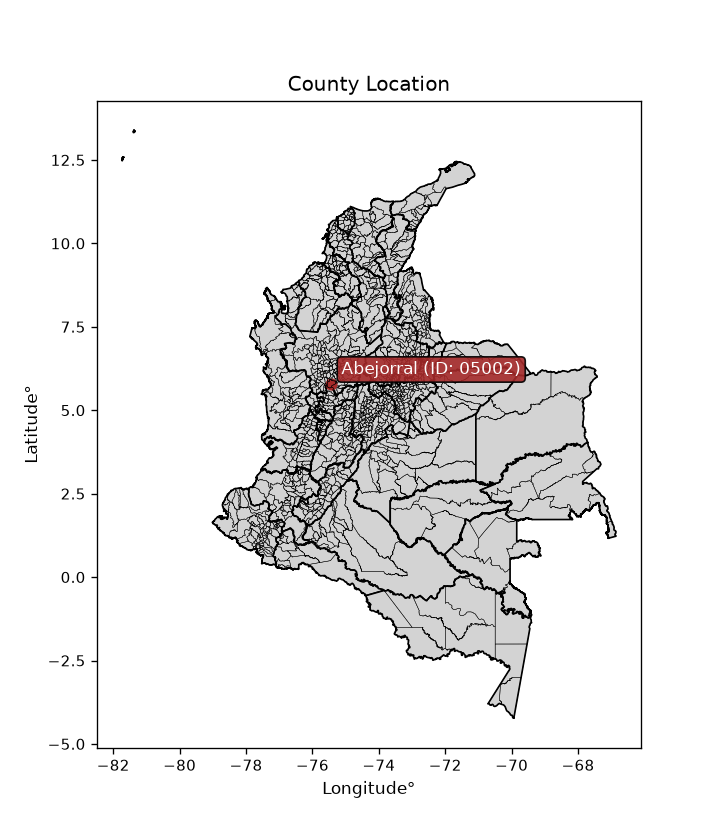
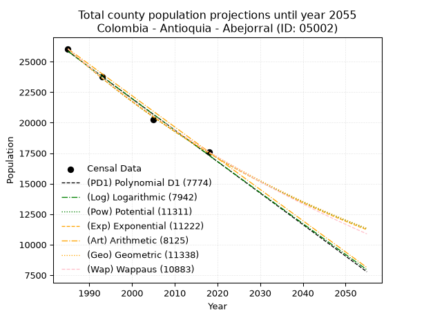
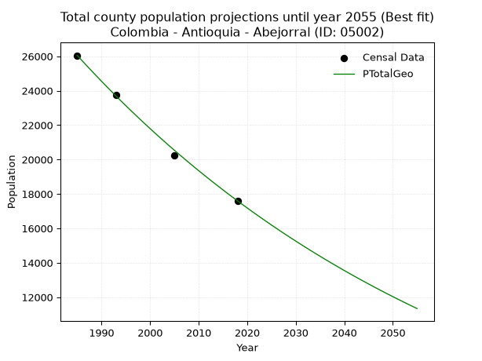
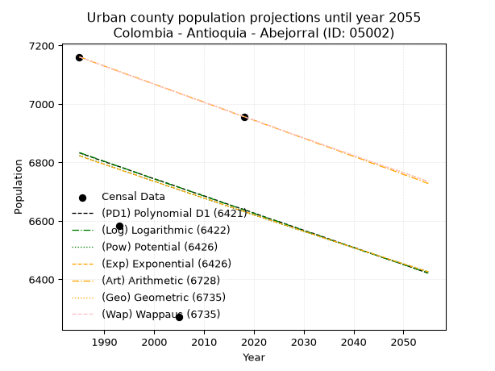
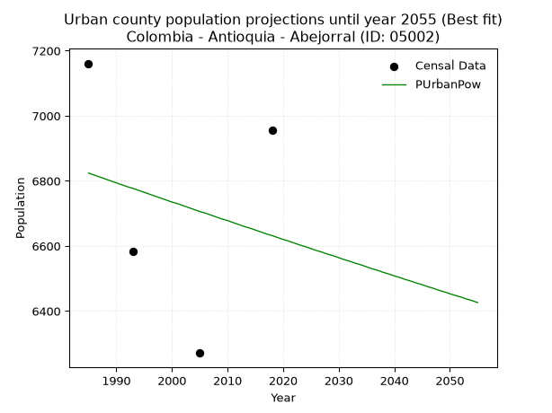
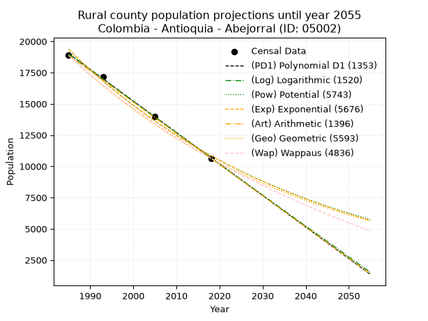
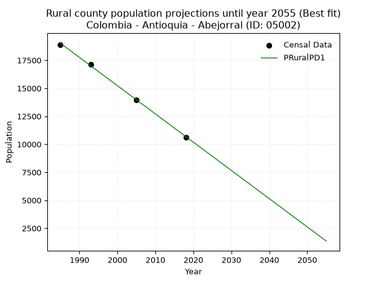

<div align="center">


</div>

# _“Population and Public Services Demand Projections (PPSD) until Year 2050 for Colombia - Antioquia - Abejorral (ID: 05002)”_
Keywords: `population` `public-service` `projection` `lineal` `polynomial` `logarithmic` `potential` `exponential` `arithmetic` `geometric` `wappaus` `dane` `colombia` `south-america`

PPSD are analytical estimates used by governments and planners to anticipate future changes in population size, age distribution, and the resulting community needs for utilities, healthcare, education, and infrastructure as sizing future water treatment facilities, electrical grids, and road networks based on spatial growth.

> **General running parameters**: • app_version: _v20260806_. • Python version: _3.14.7_. • Pandas version: _3.0.5_. • NumPy version: _2.5.1_. • Creates, save and include plots into reports (create_plot): _False_. • Projection until year: _2050_. • Process polynomial degree 2 and up: _False_. • Process Wappaus: _True_. • Process Wappaus: _True_. • Set negative values to zero: _True_. • Set infinite values to zero: _True_. • Drop dataset notes: _True_. 
<div align="center">

Dynamic map: [:earth_americas:Google](http://maps.google.com/maps?q=5.789315001,-75.4287385) [:earth_americas:OSM](https://www.openstreetmap.org/#map=18/5.789315001/-75.4287385&layers=P) [:earth_americas:Bing](https://www.bing.com/maps?cp=5.789315001~-75.4287385&lvl=18) [:earth_americas:Apple](https://maps.apple.com/frame?center=5.789315001%2C-75.4287385&span=0.003%2C0.006)

</div>


<div align="center">

```geojson
{
  "type": "Feature",
  "geometry": {
    "type": "Point", 
    "coordinates": [-75.4287385, 5.789315001]
  }, 
  "properties": {
    "Name": "Colombia - Antioquia - Abejorral (ID: 05002)"
  }
}
```

</div>


<div align="center">

</img>

</div>


## 0. Census Data (4 records)

Census data are official statistics collected by a government about the people and housing in a country. They usually include counts of total population, age, sex, race, income, education, and jobs.

📅Global census file: [Population.xlsx](../data/Population.xlsx)

| Source   |   Year |   CountryID | CountryName   |   StateID | StateName   |   CountyID | CountyName   |   PTotal |   PUrban |   PRural |
|:---------|-------:|------------:|:--------------|----------:|:------------|-----------:|:-------------|---------:|---------:|---------:|
| DANE     |   1985 |          57 | Colombia      |        05 | Antioquia   |      05002 | Abejorral    |    26049 |     7161 |    18888 |
| DANE     |   1993 |          57 | Colombia      |        05 | Antioquia   |      05002 | Abejorral    |    23735 |     6583 |    17152 |
| DANE     |   2005 |          57 | Colombia      |        05 | Antioquia   |      05002 | Abejorral    |    20249 |     6271 |    13978 |
| DANE     |   2018 |          57 | Colombia      |        05 | Antioquia   |      05002 | Abejorral    |    17599 |     6957 |    10642 |

> 🔥Some records could had specific notes about the registered values or the corresponding urban or rural distribution.

📅   [RUPS](https://www.datos.gov.co/Hacienda-y-Cr-dito-P-blico/Registro-nico-de-Prestadores-de-Servicios-P-blicos/4qkq-csdn/about_data) - Local public utility companies: [RUPS.csv](../data/RUPS.xlsx)

 | SERVICIO       | ESTADO    | NOMBRE                                                          | NIT         | DEPARTAMENTO_DOMICILIO   | MUNICIPIO_DOMICILIO   | DIRECCION                                                       |   TELEFONO | EMAIL                        | TIPO_PRESTADOR                            | CLASIFICACION                  |
|:---------------|:----------|:----------------------------------------------------------------|:------------|:-------------------------|:----------------------|:----------------------------------------------------------------|-----------:|:-----------------------------|:------------------------------------------|:-------------------------------|
| ACUEDUCTO      | OPERATIVA | EMPRESAS PUBLICAS DE ABEJORRAL E.S.P.                           | 800123369-2 | ANTIOQUIA                | ABEJORRAL             | CL 50 52 26                                                     |    8647272 | gerenciaepaesp@edatel.net.co | EMPRESA INDUSTRIAL Y COMERCIAL DEL ESTADO | DESDE 2501 HASTA 5000 USUARIOS |
| ALCANTARILLADO | OPERATIVA | EMPRESAS PUBLICAS DE ABEJORRAL E.S.P.                           | 800123369-2 | ANTIOQUIA                | ABEJORRAL             | CL 50 52 26                                                     |    8647272 | gerenciaepaesp@edatel.net.co | EMPRESA INDUSTRIAL Y COMERCIAL DEL ESTADO | DESDE 2501 HASTA 5000 USUARIOS |
| ACUEDUCTO      | OPERATIVA | ASOCIACION DE USUARIOS DEL ACUEDUCTO DE LA LOMA ALTA ABEJORRAL  | 900383744-9 | ANTIOQUIA                | ABEJORRAL             | PALACIO MUNICIPAL                                               |    3104435 | asoabejorral@gmail.com       | ORGANIZACION AUTORIZADA                   | HASTA 2500 SUSCRIPTORES        |
| ACUEDUCTO      | OPERATIVA | ASOCIACIÓN DE USUARIOS DEL ACUEDUCTO MULTIVEREDAL DE PANTANILLO | 811016375-9 | ANTIOQUIA                | ABEJORRAL             | CARRERA 50 N° 50 -06 EDIFICIO ESTEBAN JARAMILLO PLAZA PRINCIPAL |    3128881 | gloriae1969@hotmail.com      | ORGANIZACION AUTORIZADA                   | HASTA 2500 SUSCRIPTORES        |

## 1. Total

### 1.1. Coefficients and Parameters

* (PD1) Polynomial Deg 1: -258.1469289441973, 538266.3946206307 (lineal)
* (Log) Logarithmic: -516809.69592085085, 3950182.640147377
* (Pow) Potential: -24.051135711449717, 83.73039091928992
* (Exp) Exponential: -0.01201506356896818, 593231358877008.5
* (Art) Arithmetic: Year diff. 2018 - 1985 = 33, Population diff. 17599 - 26049 = -8450, Annual growth = -256.06060606060606
* (Geo) Geometric: Year diff. 2018 - 1985 = 33, Population diff. 17599 - 26049 = -8450, Annual growth % = -0.011812625003016719
* (Wap) Wappaus: i = -1.173298231582689, Condition values only valid for < 200)

<sub>
Wappaus condition values: ['-0.00', '-1.17', '-2.35', '-3.52', '-4.69', '-5.87', '-7.04', '-8.21', '-9.39', '-10.56', '-11.73', '-12.91', '-14.08', '-15.25', '-16.43', '-17.60', '-18.77', '-19.95', '-21.12', '-22.29', '-23.47', '-24.64', '-25.81', '-26.99', '-28.16', '-29.33', '-30.51', '-31.68', '-32.85', '-34.03', '-35.20', '-36.37', '-37.55', '-38.72', '-39.89', '-41.07', '-42.24', '-43.41', '-44.59', '-45.76', '-46.93', '-48.11', '-49.28', '-50.45', '-51.63', '-52.80', '-53.97', '-55.15', '-56.32', '-57.49', '-58.66', '-59.84', '-61.01', '-62.18', '-63.36', '-64.53', '-65.70', '-66.88', '-68.05', '-69.22', '-70.40', '-71.57', '-72.74', '-73.92', '-75.09', '-76.26']
</sub>


### 1.2. Projected Dataset

|   Year |   CountyID |   PTotalPD1 |   PTotalLog |   PTotalPow |   PTotalExp |   PTotalArt |   PTotalGeo |   PTotalWap |
|-------:|-----------:|------------:|------------:|------------:|------------:|------------:|------------:|------------:|
|   1985 |      05002 |       25845 |       25853 |       26032 |       26022 |       26049 |       26049 |       26049 |
|   1986 |      05002 |       25587 |       25593 |       25718 |       25711 |       25793 |       25741 |       25745 |
|   1987 |      05002 |       25328 |       25333 |       25409 |       25404 |       25537 |       25437 |       25445 |
|   1988 |      05002 |       25070 |       25073 |       25103 |       25101 |       25281 |       25137 |       25148 |
|   1989 |      05002 |       24812 |       24813 |       24802 |       24801 |       25025 |       24840 |       24855 |
|   1990 |      05002 |       24554 |       24553 |       24503 |       24505 |       24769 |       24546 |       24564 |
|   1991 |      05002 |       24296 |       24293 |       24209 |       24212 |       24513 |       24256 |       24278 |
|   1992 |      05002 |       24038 |       24034 |       23919 |       23923 |       24257 |       23970 |       23994 |
|   1993 |      05002 |       23780 |       23775 |       23632 |       23637 |       24001 |       23687 |       23714 |
|   1994 |      05002 |       23521 |       23515 |       23348 |       23355 |       23744 |       23407 |       23436 |
|   1995 |      05002 |       23263 |       23256 |       23068 |       23076 |       23488 |       23130 |       23162 |
|   1996 |      05002 |       23005 |       22997 |       22792 |       22801 |       23232 |       22857 |       22891 |
|   1997 |      05002 |       22747 |       22738 |       22519 |       22528 |       22976 |       22587 |       22623 |
|   1998 |      05002 |       22489 |       22480 |       22250 |       22259 |       22720 |       22320 |       22357 |
|   1999 |      05002 |       22231 |       22221 |       21983 |       21993 |       22464 |       22057 |       22095 |
|   2000 |      05002 |       21973 |       21963 |       21721 |       21731 |       22208 |       21796 |       21835 |
|   2001 |      05002 |       21714 |       21704 |       21461 |       21471 |       21952 |       21539 |       21578 |
|   2002 |      05002 |       21456 |       21446 |       21205 |       21215 |       21696 |       21284 |       21324 |
|   2003 |      05002 |       21198 |       21188 |       20951 |       20961 |       21440 |       21033 |       21073 |
|   2004 |      05002 |       20940 |       20930 |       20701 |       20711 |       21184 |       20784 |       20824 |
|   2005 |      05002 |       20682 |       20672 |       20455 |       20464 |       20928 |       20539 |       20578 |
|   2006 |      05002 |       20424 |       20414 |       20211 |       20219 |       20672 |       20296 |       20335 |
|   2007 |      05002 |       20166 |       20157 |       19970 |       19978 |       20416 |       20057 |       20094 |
|   2008 |      05002 |       19907 |       19899 |       19732 |       19739 |       20160 |       19820 |       19855 |
|   2009 |      05002 |       19649 |       19642 |       19497 |       19503 |       19904 |       19585 |       19619 |
|   2010 |      05002 |       19391 |       19385 |       19265 |       19270 |       19647 |       19354 |       19385 |
|   2011 |      05002 |       19133 |       19128 |       19036 |       19040 |       19391 |       19126 |       19154 |
|   2012 |      05002 |       18875 |       18871 |       18810 |       18813 |       19135 |       18900 |       18925 |
|   2013 |      05002 |       18617 |       18614 |       18586 |       18588 |       18879 |       18676 |       18699 |
|   2014 |      05002 |       18358 |       18357 |       18366 |       18366 |       18623 |       18456 |       18474 |
|   2015 |      05002 |       18100 |       18101 |       18148 |       18147 |       18367 |       18238 |       18252 |
|   2016 |      05002 |       17842 |       17845 |       17932 |       17930 |       18111 |       18022 |       18032 |
|   2017 |      05002 |       17584 |       17588 |       17720 |       17716 |       17855 |       17809 |       17815 |
|   2018 |      05002 |       17326 |       17332 |       17510 |       17504 |       17599 |       17599 |       17599 |
|   2019 |      05002 |       17068 |       17076 |       17302 |       17295 |       17343 |       17391 |       17386 |
|   2020 |      05002 |       16810 |       16820 |       17098 |       17089 |       17087 |       17186 |       17174 |
|   2021 |      05002 |       16551 |       16564 |       16895 |       16885 |       16831 |       16983 |       16965 |
|   2022 |      05002 |       16293 |       16309 |       16696 |       16683 |       16575 |       16782 |       16757 |
|   2023 |      05002 |       16035 |       16053 |       16498 |       16484 |       16319 |       16584 |       16552 |
|   2024 |      05002 |       15777 |       15798 |       16303 |       16287 |       16063 |       16388 |       16349 |
|   2025 |      05002 |       15519 |       15542 |       16111 |       16092 |       15807 |       16194 |       16147 |
|   2026 |      05002 |       15261 |       15287 |       15921 |       15900 |       15551 |       16003 |       15948 |
|   2027 |      05002 |       15003 |       15032 |       15733 |       15710 |       15294 |       15814 |       15750 |
|   2028 |      05002 |       14744 |       14777 |       15547 |       15523 |       15038 |       15627 |       15554 |
|   2029 |      05002 |       14486 |       14523 |       15364 |       15337 |       14782 |       15443 |       15360 |
|   2030 |      05002 |       14228 |       14268 |       15183 |       15154 |       14526 |       15260 |       15168 |
|   2031 |      05002 |       13970 |       14013 |       15004 |       14973 |       14270 |       15080 |       14978 |
|   2032 |      05002 |       13712 |       13759 |       14828 |       14794 |       14014 |       14902 |       14789 |
|   2033 |      05002 |       13454 |       13505 |       14653 |       14618 |       13758 |       14726 |       14602 |
|   2034 |      05002 |       13196 |       13251 |       14481 |       14443 |       13502 |       14552 |       14417 |
|   2035 |      05002 |       12937 |       12997 |       14311 |       14271 |       13246 |       14380 |       14233 |
|   2036 |      05002 |       12679 |       12743 |       14143 |       14100 |       12990 |       14210 |       14051 |
|   2037 |      05002 |       12421 |       12489 |       13977 |       13932 |       12734 |       14042 |       13871 |
|   2038 |      05002 |       12163 |       12235 |       13812 |       13765 |       12478 |       13876 |       13692 |
|   2039 |      05002 |       11905 |       11982 |       13650 |       13601 |       12222 |       13712 |       13515 |
|   2040 |      05002 |       11647 |       11728 |       13490 |       13438 |       11966 |       13550 |       13340 |
|   2041 |      05002 |       11389 |       11475 |       13332 |       13278 |       11710 |       13390 |       13166 |
|   2042 |      05002 |       11130 |       11222 |       13176 |       13119 |       11454 |       13232 |       12994 |
|   2043 |      05002 |       10872 |       10969 |       13022 |       12963 |       11197 |       13076 |       12823 |
|   2044 |      05002 |       10614 |       10716 |       12870 |       12808 |       10941 |       12921 |       12653 |
|   2045 |      05002 |       10356 |       10463 |       12719 |       12655 |       10685 |       12769 |       12485 |
|   2046 |      05002 |       10098 |       10211 |       12570 |       12504 |       10429 |       12618 |       12319 |
|   2047 |      05002 |        9840 |        9958 |       12424 |       12354 |       10173 |       12469 |       12154 |
|   2048 |      05002 |        9581 |        9706 |       12278 |       12207 |        9917 |       12322 |       11990 |
|   2049 |      05002 |        9323 |        9453 |       12135 |       12061 |        9661 |       12176 |       11828 |
|   2050 |      05002 |        9065 |        9201 |       11994 |       11917 |        9405 |       12032 |       11667 |
<div align="center">

</img>

</div>


### 1.3. Best fit with absolute and relative error (%)

Relative error puts that difference into context by dividing the absolute error by the true value, creating a unitless ratio or percentage that shows the scale of the mistake.

Absolute and relative error

|   Year | Source   |   CountryID | CountryName   |   StateID | StateName   |   CountyID_x | CountyName   |   PTotal |   PUrban |   PRural |   CountyID_y |   PTotalPD1 |   PTotalLog |   PTotalPow |   PTotalExp |   PTotalArt |   PTotalGeo |   PTotalWap |   PTotalPD1AbsError |   PTotalLogAbsError |   PTotalPowAbsError |   PTotalExpAbsError |   PTotalArtAbsError |   PTotalGeoAbsError |   PTotalWapAbsError |   PTotalPD1RelError |   PTotalLogRelError |   PTotalPowRelError |   PTotalExpRelError |   PTotalArtRelError |   PTotalGeoRelError |   PTotalWapRelError |
|-------:|:---------|------------:|:--------------|----------:|:------------|-------------:|:-------------|---------:|---------:|---------:|-------------:|------------:|------------:|------------:|------------:|------------:|------------:|------------:|--------------------:|--------------------:|--------------------:|--------------------:|--------------------:|--------------------:|--------------------:|--------------------:|--------------------:|--------------------:|--------------------:|--------------------:|--------------------:|--------------------:|
|   1985 | DANE     |          57 | Colombia      |        05 | Antioquia   |        05002 | Abejorral    |    26049 |     7161 |    18888 |        05002 |       25845 |       25853 |       26032 |       26022 |       26049 |       26049 |       26049 |                 204 |                 196 |                  17 |                  27 |                   0 |                   0 |                   0 |            0.783139 |            0.752428 |           0.0652616 |            0.103651 |             0       |            0        |           0         |
|   1993 | DANE     |          57 | Colombia      |        05 | Antioquia   |        05002 | Abejorral    |    23735 |     6583 |    17152 |        05002 |       23780 |       23775 |       23632 |       23637 |       24001 |       23687 |       23714 |                  45 |                  40 |                 103 |                  98 |                 266 |                  48 |                  21 |            0.189593 |            0.168527 |           0.433958  |            0.412892 |             1.12071 |            0.202233 |           0.0884769 |
|   2005 | DANE     |          57 | Colombia      |        05 | Antioquia   |        05002 | Abejorral    |    20249 |     6271 |    13978 |        05002 |       20682 |       20672 |       20455 |       20464 |       20928 |       20539 |       20578 |                 433 |                 423 |                 206 |                 215 |                 679 |                 290 |                 329 |            2.13838  |            2.08899  |           1.01733   |            1.06178  |             3.35325 |            1.43217  |           1.62477   |
|   2018 | DANE     |          57 | Colombia      |        05 | Antioquia   |        05002 | Abejorral    |    17599 |     6957 |    10642 |        05002 |       17326 |       17332 |       17510 |       17504 |       17599 |       17599 |       17599 |                 273 |                 267 |                  89 |                  95 |                   0 |                   0 |                   0 |            1.55122  |            1.51713  |           0.505711  |            0.539803 |             0       |            0        |           0         |

Relative error mean

| Method    |   RelError | Best   |
|:----------|-----------:|:-------|
| PTotalPD1 |   1.16558  |        |
| PTotalLog |   1.13177  |        |
| PTotalPow |   0.505566 |        |
| PTotalExp |   0.529532 |        |
| PTotalArt |   1.11849  |        |
| PTotalGeo |   0.408601 | True   |
| PTotalWap |   0.428312 |        |

💙Best method: _**PTotalGeo**_
<div align="center">

</img>

</div>


### 1.4. Fresh water supply demand in liters per capita per day (lpcd)

The fresh water supply demand typically ranges from 100 to 300 liters per capita per day (lpcd) for standard domestic and municipal planning, though absolute survival minimums set by the World Health Organization are as low as 7.5 to 20 liters per day, and total consumption in high-income nations can exceed 400 liters.

> `CZ`: Level in meters above the sea level (masl)<br> `WS`: Fresh water supply demand in liters per capita per day (lpcd or l/h/d)<br> `WSAll`: Zonal fresh water supply demand in liters per second (l/s)<br> `A`: Zonal area in square meters<br> `DP`: Population density (people/hectare or p/ha)

Reference values (RAS Colombia)

|    CZ |   WS |
|------:|-----:|
|  1000 |  120 |
|  2000 |  130 |
| 99999 |  140 |

County shapefile geometry properties and water supply values

|   CountyID |      ATotal |   CZTotal |   WSTotal |
|-----------:|------------:|----------:|----------:|
|      05002 | 5.06953e+08 |   1948.62 |       130 |

Projected values for best method: PTotalGeo

|   CountyID |   Year |   PTotalGeo |   DPTotal |   WSTotal |   WSTotalAll |
|-----------:|-------:|------------:|----------:|----------:|-------------:|
|      05002 |   1985 |       26049 |      0.51 |       130 |      39.1941 |
|      05002 |   1986 |       25741 |      0.51 |       130 |      38.7307 |
|      05002 |   1987 |       25437 |      0.5  |       130 |      38.2733 |
|      05002 |   1988 |       25137 |      0.5  |       130 |      37.8219 |
|      05002 |   1989 |       24840 |      0.49 |       130 |      37.375  |
|      05002 |   1990 |       24546 |      0.48 |       130 |      36.9326 |
|      05002 |   1991 |       24256 |      0.48 |       130 |      36.4963 |
|      05002 |   1992 |       23970 |      0.47 |       130 |      36.066  |
|      05002 |   1993 |       23687 |      0.47 |       130 |      35.6402 |
|      05002 |   1994 |       23407 |      0.46 |       130 |      35.2189 |
|      05002 |   1995 |       23130 |      0.46 |       130 |      34.8021 |
|      05002 |   1996 |       22857 |      0.45 |       130 |      34.3913 |
|      05002 |   1997 |       22587 |      0.45 |       130 |      33.9851 |
|      05002 |   1998 |       22320 |      0.44 |       130 |      33.5833 |
|      05002 |   1999 |       22057 |      0.44 |       130 |      33.1876 |
|      05002 |   2000 |       21796 |      0.43 |       130 |      32.7949 |
|      05002 |   2001 |       21539 |      0.42 |       130 |      32.4082 |
|      05002 |   2002 |       21284 |      0.42 |       130 |      32.0245 |
|      05002 |   2003 |       21033 |      0.41 |       130 |      31.6469 |
|      05002 |   2004 |       20784 |      0.41 |       130 |      31.2722 |
|      05002 |   2005 |       20539 |      0.41 |       130 |      30.9036 |
|      05002 |   2006 |       20296 |      0.4  |       130 |      30.538  |
|      05002 |   2007 |       20057 |      0.4  |       130 |      30.1784 |
|      05002 |   2008 |       19820 |      0.39 |       130 |      29.8218 |
|      05002 |   2009 |       19585 |      0.39 |       130 |      29.4682 |
|      05002 |   2010 |       19354 |      0.38 |       130 |      29.1206 |
|      05002 |   2011 |       19126 |      0.38 |       130 |      28.7775 |
|      05002 |   2012 |       18900 |      0.37 |       130 |      28.4375 |
|      05002 |   2013 |       18676 |      0.37 |       130 |      28.1005 |
|      05002 |   2014 |       18456 |      0.36 |       130 |      27.7694 |
|      05002 |   2015 |       18238 |      0.36 |       130 |      27.4414 |
|      05002 |   2016 |       18022 |      0.36 |       130 |      27.1164 |
|      05002 |   2017 |       17809 |      0.35 |       130 |      26.7959 |
|      05002 |   2018 |       17599 |      0.35 |       130 |      26.48   |
|      05002 |   2019 |       17391 |      0.34 |       130 |      26.167  |
|      05002 |   2020 |       17186 |      0.34 |       130 |      25.8586 |
|      05002 |   2021 |       16983 |      0.34 |       130 |      25.5531 |
|      05002 |   2022 |       16782 |      0.33 |       130 |      25.2507 |
|      05002 |   2023 |       16584 |      0.33 |       130 |      24.9528 |
|      05002 |   2024 |       16388 |      0.32 |       130 |      24.6579 |
|      05002 |   2025 |       16194 |      0.32 |       130 |      24.366  |
|      05002 |   2026 |       16003 |      0.32 |       130 |      24.0786 |
|      05002 |   2027 |       15814 |      0.31 |       130 |      23.7942 |
|      05002 |   2028 |       15627 |      0.31 |       130 |      23.5128 |
|      05002 |   2029 |       15443 |      0.3  |       130 |      23.236  |
|      05002 |   2030 |       15260 |      0.3  |       130 |      22.9606 |
|      05002 |   2031 |       15080 |      0.3  |       130 |      22.6898 |
|      05002 |   2032 |       14902 |      0.29 |       130 |      22.422  |
|      05002 |   2033 |       14726 |      0.29 |       130 |      22.1572 |
|      05002 |   2034 |       14552 |      0.29 |       130 |      21.8954 |
|      05002 |   2035 |       14380 |      0.28 |       130 |      21.6366 |
|      05002 |   2036 |       14210 |      0.28 |       130 |      21.3808 |
|      05002 |   2037 |       14042 |      0.28 |       130 |      21.128  |
|      05002 |   2038 |       13876 |      0.27 |       130 |      20.8782 |
|      05002 |   2039 |       13712 |      0.27 |       130 |      20.6315 |
|      05002 |   2040 |       13550 |      0.27 |       130 |      20.3877 |
|      05002 |   2041 |       13390 |      0.26 |       130 |      20.147  |
|      05002 |   2042 |       13232 |      0.26 |       130 |      19.9093 |
|      05002 |   2043 |       13076 |      0.26 |       130 |      19.6745 |
|      05002 |   2044 |       12921 |      0.25 |       130 |      19.4413 |
|      05002 |   2045 |       12769 |      0.25 |       130 |      19.2126 |
|      05002 |   2046 |       12618 |      0.25 |       130 |      18.9854 |
|      05002 |   2047 |       12469 |      0.25 |       130 |      18.7612 |
|      05002 |   2048 |       12322 |      0.24 |       130 |      18.54   |
|      05002 |   2049 |       12176 |      0.24 |       130 |      18.3204 |
|      05002 |   2050 |       12032 |      0.24 |       130 |      18.1037 |

## 2. Urban

### 2.1. Coefficients and Parameters

* (PD1) Polynomial Deg 1: -5.873946206343251, 18492.360899238087 (lineal)
* (Log) Logarithmic: -11882.654560298351, 97063.15253444538
* (Pow) Potential: -1.7325786120637177, 9.54766247550886
* (Exp) Exponential: -0.0008562588723789956, 37335.249426322895
* (Art) Arithmetic: Year diff. 2018 - 1985 = 33, Population diff. 6957 - 7161 = -204, Annual growth = -6.181818181818182
* (Geo) Geometric: Year diff. 2018 - 1985 = 33, Population diff. 6957 - 7161 = -204, Annual growth % = -0.0008754132409458659
* (Wap) Wappaus: i = -0.08757356823655166, Condition values only valid for < 200)

<sub>
Wappaus condition values: ['-0.00', '-0.09', '-0.18', '-0.26', '-0.35', '-0.44', '-0.53', '-0.61', '-0.70', '-0.79', '-0.88', '-0.96', '-1.05', '-1.14', '-1.23', '-1.31', '-1.40', '-1.49', '-1.58', '-1.66', '-1.75', '-1.84', '-1.93', '-2.01', '-2.10', '-2.19', '-2.28', '-2.36', '-2.45', '-2.54', '-2.63', '-2.71', '-2.80', '-2.89', '-2.98', '-3.07', '-3.15', '-3.24', '-3.33', '-3.42', '-3.50', '-3.59', '-3.68', '-3.77', '-3.85', '-3.94', '-4.03', '-4.12', '-4.20', '-4.29', '-4.38', '-4.47', '-4.55', '-4.64', '-4.73', '-4.82', '-4.90', '-4.99', '-5.08', '-5.17', '-5.25', '-5.34', '-5.43', '-5.52', '-5.60', '-5.69']
</sub>


### 2.2. Projected Dataset

|   Year |   CountyID |   PUrbanPD1 |   PUrbanLog |   PUrbanPow |   PUrbanExp |   PUrbanArt |   PUrbanGeo |   PUrbanWap |
|-------:|-----------:|------------:|------------:|------------:|------------:|------------:|------------:|------------:|
|   1985 |      05002 |        6833 |        6834 |        6824 |        6823 |        7161 |        7161 |        7161 |
|   1986 |      05002 |        6827 |        6828 |        6818 |        6817 |        7155 |        7155 |        7155 |
|   1987 |      05002 |        6821 |        6822 |        6812 |        6811 |        7149 |        7148 |        7148 |
|   1988 |      05002 |        6815 |        6816 |        6806 |        6805 |        7142 |        7142 |        7142 |
|   1989 |      05002 |        6809 |        6810 |        6800 |        6799 |        7136 |        7136 |        7136 |
|   1990 |      05002 |        6803 |        6804 |        6794 |        6794 |        7130 |        7130 |        7130 |
|   1991 |      05002 |        6797 |        6798 |        6788 |        6788 |        7124 |        7123 |        7123 |
|   1992 |      05002 |        6791 |        6792 |        6782 |        6782 |        7118 |        7117 |        7117 |
|   1993 |      05002 |        6786 |        6786 |        6777 |        6776 |        7112 |        7111 |        7111 |
|   1994 |      05002 |        6780 |        6780 |        6771 |        6770 |        7105 |        7105 |        7105 |
|   1995 |      05002 |        6774 |        6774 |        6765 |        6765 |        7099 |        7099 |        7099 |
|   1996 |      05002 |        6768 |        6768 |        6759 |        6759 |        7093 |        7092 |        7092 |
|   1997 |      05002 |        6762 |        6762 |        6753 |        6753 |        7087 |        7086 |        7086 |
|   1998 |      05002 |        6756 |        6756 |        6747 |        6747 |        7081 |        7080 |        7080 |
|   1999 |      05002 |        6750 |        6750 |        6741 |        6741 |        7074 |        7074 |        7074 |
|   2000 |      05002 |        6744 |        6744 |        6735 |        6736 |        7068 |        7068 |        7068 |
|   2001 |      05002 |        6739 |        6738 |        6730 |        6730 |        7062 |        7061 |        7061 |
|   2002 |      05002 |        6733 |        6732 |        6724 |        6724 |        7056 |        7055 |        7055 |
|   2003 |      05002 |        6727 |        6726 |        6718 |        6718 |        7050 |        7049 |        7049 |
|   2004 |      05002 |        6721 |        6721 |        6712 |        6713 |        7044 |        7043 |        7043 |
|   2005 |      05002 |        6715 |        6715 |        6706 |        6707 |        7037 |        7037 |        7037 |
|   2006 |      05002 |        6709 |        6709 |        6701 |        6701 |        7031 |        7031 |        7031 |
|   2007 |      05002 |        6703 |        6703 |        6695 |        6695 |        7025 |        7024 |        7024 |
|   2008 |      05002 |        6697 |        6697 |        6689 |        6690 |        7019 |        7018 |        7018 |
|   2009 |      05002 |        6692 |        6691 |        6683 |        6684 |        7013 |        7012 |        7012 |
|   2010 |      05002 |        6686 |        6685 |        6678 |        6678 |        7006 |        7006 |        7006 |
|   2011 |      05002 |        6680 |        6679 |        6672 |        6673 |        7000 |        7000 |        7000 |
|   2012 |      05002 |        6674 |        6673 |        6666 |        6667 |        6994 |        6994 |        6994 |
|   2013 |      05002 |        6668 |        6667 |        6660 |        6661 |        6988 |        6988 |        6988 |
|   2014 |      05002 |        6662 |        6661 |        6655 |        6655 |        6982 |        6981 |        6981 |
|   2015 |      05002 |        6656 |        6655 |        6649 |        6650 |        6976 |        6975 |        6975 |
|   2016 |      05002 |        6650 |        6650 |        6643 |        6644 |        6969 |        6969 |        6969 |
|   2017 |      05002 |        6645 |        6644 |        6637 |        6638 |        6963 |        6963 |        6963 |
|   2018 |      05002 |        6639 |        6638 |        6632 |        6633 |        6957 |        6957 |        6957 |
|   2019 |      05002 |        6633 |        6632 |        6626 |        6627 |        6951 |        6951 |        6951 |
|   2020 |      05002 |        6627 |        6626 |        6620 |        6621 |        6945 |        6945 |        6945 |
|   2021 |      05002 |        6621 |        6620 |        6615 |        6616 |        6938 |        6939 |        6939 |
|   2022 |      05002 |        6615 |        6614 |        6609 |        6610 |        6932 |        6933 |        6933 |
|   2023 |      05002 |        6609 |        6608 |        6603 |        6604 |        6926 |        6927 |        6927 |
|   2024 |      05002 |        6603 |        6603 |        6598 |        6599 |        6920 |        6921 |        6921 |
|   2025 |      05002 |        6598 |        6597 |        6592 |        6593 |        6914 |        6914 |        6914 |
|   2026 |      05002 |        6592 |        6591 |        6586 |        6587 |        6908 |        6908 |        6908 |
|   2027 |      05002 |        6586 |        6585 |        6581 |        6582 |        6901 |        6902 |        6902 |
|   2028 |      05002 |        6580 |        6579 |        6575 |        6576 |        6895 |        6896 |        6896 |
|   2029 |      05002 |        6574 |        6573 |        6570 |        6570 |        6889 |        6890 |        6890 |
|   2030 |      05002 |        6568 |        6567 |        6564 |        6565 |        6883 |        6884 |        6884 |
|   2031 |      05002 |        6562 |        6561 |        6558 |        6559 |        6877 |        6878 |        6878 |
|   2032 |      05002 |        6557 |        6556 |        6553 |        6554 |        6870 |        6872 |        6872 |
|   2033 |      05002 |        6551 |        6550 |        6547 |        6548 |        6864 |        6866 |        6866 |
|   2034 |      05002 |        6545 |        6544 |        6542 |        6542 |        6858 |        6860 |        6860 |
|   2035 |      05002 |        6539 |        6538 |        6536 |        6537 |        6852 |        6854 |        6854 |
|   2036 |      05002 |        6533 |        6532 |        6530 |        6531 |        6846 |        6848 |        6848 |
|   2037 |      05002 |        6527 |        6526 |        6525 |        6526 |        6840 |        6842 |        6842 |
|   2038 |      05002 |        6521 |        6521 |        6519 |        6520 |        6833 |        6836 |        6836 |
|   2039 |      05002 |        6515 |        6515 |        6514 |        6514 |        6827 |        6830 |        6830 |
|   2040 |      05002 |        6510 |        6509 |        6508 |        6509 |        6821 |        6824 |        6824 |
|   2041 |      05002 |        6504 |        6503 |        6503 |        6503 |        6815 |        6818 |        6818 |
|   2042 |      05002 |        6498 |        6497 |        6497 |        6498 |        6809 |        6812 |        6812 |
|   2043 |      05002 |        6492 |        6491 |        6492 |        6492 |        6802 |        6806 |        6806 |
|   2044 |      05002 |        6486 |        6486 |        6486 |        6487 |        6796 |        6800 |        6800 |
|   2045 |      05002 |        6480 |        6480 |        6481 |        6481 |        6790 |        6794 |        6794 |
|   2046 |      05002 |        6474 |        6474 |        6475 |        6476 |        6784 |        6788 |        6788 |
|   2047 |      05002 |        6468 |        6468 |        6470 |        6470 |        6778 |        6783 |        6782 |
|   2048 |      05002 |        6463 |        6462 |        6464 |        6464 |        6772 |        6777 |        6777 |
|   2049 |      05002 |        6457 |        6457 |        6459 |        6459 |        6765 |        6771 |        6771 |
|   2050 |      05002 |        6451 |        6451 |        6453 |        6453 |        6759 |        6765 |        6765 |
<div align="center">

</img>

</div>


### 2.3. Best fit with absolute and relative error (%)

Relative error puts that difference into context by dividing the absolute error by the true value, creating a unitless ratio or percentage that shows the scale of the mistake.

Absolute and relative error

|   Year | Source   |   CountryID | CountryName   |   StateID | StateName   |   CountyID_x | CountyName   |   PTotal |   PUrban |   PRural |   CountyID_y |   PUrbanPD1 |   PUrbanLog |   PUrbanPow |   PUrbanExp |   PUrbanArt |   PUrbanGeo |   PUrbanWap |   PUrbanPD1AbsError |   PUrbanLogAbsError |   PUrbanPowAbsError |   PUrbanExpAbsError |   PUrbanArtAbsError |   PUrbanGeoAbsError |   PUrbanWapAbsError |   PUrbanPD1RelError |   PUrbanLogRelError |   PUrbanPowRelError |   PUrbanExpRelError |   PUrbanArtRelError |   PUrbanGeoRelError |   PUrbanWapRelError |
|-------:|:---------|------------:|:--------------|----------:|:------------|-------------:|:-------------|---------:|---------:|---------:|-------------:|------------:|------------:|------------:|------------:|------------:|------------:|------------:|--------------------:|--------------------:|--------------------:|--------------------:|--------------------:|--------------------:|--------------------:|--------------------:|--------------------:|--------------------:|--------------------:|--------------------:|--------------------:|--------------------:|
|   1985 | DANE     |          57 | Colombia      |        05 | Antioquia   |        05002 | Abejorral    |    26049 |     7161 |    18888 |        05002 |        6833 |        6834 |        6824 |        6823 |        7161 |        7161 |        7161 |                 328 |                 327 |                 337 |                 338 |                   0 |                   0 |                   0 |             4.58037 |             4.5664  |             4.70605 |             4.72001 |             0       |             0       |             0       |
|   1993 | DANE     |          57 | Colombia      |        05 | Antioquia   |        05002 | Abejorral    |    23735 |     6583 |    17152 |        05002 |        6786 |        6786 |        6777 |        6776 |        7112 |        7111 |        7111 |                 203 |                 203 |                 194 |                 193 |                 529 |                 528 |                 528 |             3.0837  |             3.0837  |             2.94698 |             2.93179 |             8.03585 |             8.02066 |             8.02066 |
|   2005 | DANE     |          57 | Colombia      |        05 | Antioquia   |        05002 | Abejorral    |    20249 |     6271 |    13978 |        05002 |        6715 |        6715 |        6706 |        6707 |        7037 |        7037 |        7037 |                 444 |                 444 |                 435 |                 436 |                 766 |                 766 |                 766 |             7.08021 |             7.08021 |             6.93669 |             6.95264 |            12.215   |            12.215   |            12.215   |
|   2018 | DANE     |          57 | Colombia      |        05 | Antioquia   |        05002 | Abejorral    |    17599 |     6957 |    10642 |        05002 |        6639 |        6638 |        6632 |        6633 |        6957 |        6957 |        6957 |                 318 |                 319 |                 325 |                 324 |                   0 |                   0 |                   0 |             4.57094 |             4.58531 |             4.67155 |             4.65718 |             0       |             0       |             0       |

Relative error mean

| Method    |   RelError | Best   |
|:----------|-----------:|:-------|
| PUrbanPD1 |    4.8288  |        |
| PUrbanLog |    4.82891 |        |
| PUrbanPow |    4.81532 | True   |
| PUrbanExp |    4.81541 |        |
| PUrbanArt |    5.0627  |        |
| PUrbanGeo |    5.0589  |        |
| PUrbanWap |    5.0589  |        |

💙Best method: _**PUrbanPow**_
<div align="center">

</img>

</div>


### 2.4. Fresh water supply demand in liters per capita per day (lpcd)

The fresh water supply demand typically ranges from 100 to 300 liters per capita per day (lpcd) for standard domestic and municipal planning, though absolute survival minimums set by the World Health Organization are as low as 7.5 to 20 liters per day, and total consumption in high-income nations can exceed 400 liters.

> `CZ`: Level in meters above the sea level (masl)<br> `WS`: Fresh water supply demand in liters per capita per day (lpcd or l/h/d)<br> `WSAll`: Zonal fresh water supply demand in liters per second (l/s)<br> `A`: Zonal area in square meters<br> `DP`: Population density (people/hectare or p/ha)

Reference values (RAS Colombia)

|    CZ |   WS |
|------:|-----:|
|  1000 |  120 |
|  2000 |  130 |
| 99999 |  140 |

County shapefile geometry properties and water supply values

|   CountyID |      AUrban |   CZUrban |   WSUrban |
|-----------:|------------:|----------:|----------:|
|      05002 | 1.23825e+06 |   2165.64 |       140 |

Projected values for best method: PUrbanPow

|   CountyID |   Year |   PUrbanPow |   DPUrban |   WSUrban |   WSUrbanAll |
|-----------:|-------:|------------:|----------:|----------:|-------------:|
|      05002 |   1985 |        6824 |     55.11 |       140 |      11.0574 |
|      05002 |   1986 |        6818 |     55.06 |       140 |      11.0477 |
|      05002 |   1987 |        6812 |     55.01 |       140 |      11.038  |
|      05002 |   1988 |        6806 |     54.96 |       140 |      11.0282 |
|      05002 |   1989 |        6800 |     54.92 |       140 |      11.0185 |
|      05002 |   1990 |        6794 |     54.87 |       140 |      11.0088 |
|      05002 |   1991 |        6788 |     54.82 |       140 |      10.9991 |
|      05002 |   1992 |        6782 |     54.77 |       140 |      10.9894 |
|      05002 |   1993 |        6777 |     54.73 |       140 |      10.9812 |
|      05002 |   1994 |        6771 |     54.68 |       140 |      10.9715 |
|      05002 |   1995 |        6765 |     54.63 |       140 |      10.9618 |
|      05002 |   1996 |        6759 |     54.59 |       140 |      10.9521 |
|      05002 |   1997 |        6753 |     54.54 |       140 |      10.9424 |
|      05002 |   1998 |        6747 |     54.49 |       140 |      10.9326 |
|      05002 |   1999 |        6741 |     54.44 |       140 |      10.9229 |
|      05002 |   2000 |        6735 |     54.39 |       140 |      10.9132 |
|      05002 |   2001 |        6730 |     54.35 |       140 |      10.9051 |
|      05002 |   2002 |        6724 |     54.3  |       140 |      10.8954 |
|      05002 |   2003 |        6718 |     54.25 |       140 |      10.8856 |
|      05002 |   2004 |        6712 |     54.21 |       140 |      10.8759 |
|      05002 |   2005 |        6706 |     54.16 |       140 |      10.8662 |
|      05002 |   2006 |        6701 |     54.12 |       140 |      10.8581 |
|      05002 |   2007 |        6695 |     54.07 |       140 |      10.8484 |
|      05002 |   2008 |        6689 |     54.02 |       140 |      10.8387 |
|      05002 |   2009 |        6683 |     53.97 |       140 |      10.8289 |
|      05002 |   2010 |        6678 |     53.93 |       140 |      10.8208 |
|      05002 |   2011 |        6672 |     53.88 |       140 |      10.8111 |
|      05002 |   2012 |        6666 |     53.83 |       140 |      10.8014 |
|      05002 |   2013 |        6660 |     53.79 |       140 |      10.7917 |
|      05002 |   2014 |        6655 |     53.75 |       140 |      10.7836 |
|      05002 |   2015 |        6649 |     53.7  |       140 |      10.7738 |
|      05002 |   2016 |        6643 |     53.65 |       140 |      10.7641 |
|      05002 |   2017 |        6637 |     53.6  |       140 |      10.7544 |
|      05002 |   2018 |        6632 |     53.56 |       140 |      10.7463 |
|      05002 |   2019 |        6626 |     53.51 |       140 |      10.7366 |
|      05002 |   2020 |        6620 |     53.46 |       140 |      10.7269 |
|      05002 |   2021 |        6615 |     53.42 |       140 |      10.7188 |
|      05002 |   2022 |        6609 |     53.37 |       140 |      10.709  |
|      05002 |   2023 |        6603 |     53.33 |       140 |      10.6993 |
|      05002 |   2024 |        6598 |     53.28 |       140 |      10.6912 |
|      05002 |   2025 |        6592 |     53.24 |       140 |      10.6815 |
|      05002 |   2026 |        6586 |     53.19 |       140 |      10.6718 |
|      05002 |   2027 |        6581 |     53.15 |       140 |      10.6637 |
|      05002 |   2028 |        6575 |     53.1  |       140 |      10.6539 |
|      05002 |   2029 |        6570 |     53.06 |       140 |      10.6458 |
|      05002 |   2030 |        6564 |     53.01 |       140 |      10.6361 |
|      05002 |   2031 |        6558 |     52.96 |       140 |      10.6264 |
|      05002 |   2032 |        6553 |     52.92 |       140 |      10.6183 |
|      05002 |   2033 |        6547 |     52.87 |       140 |      10.6086 |
|      05002 |   2034 |        6542 |     52.83 |       140 |      10.6005 |
|      05002 |   2035 |        6536 |     52.78 |       140 |      10.5907 |
|      05002 |   2036 |        6530 |     52.74 |       140 |      10.581  |
|      05002 |   2037 |        6525 |     52.7  |       140 |      10.5729 |
|      05002 |   2038 |        6519 |     52.65 |       140 |      10.5632 |
|      05002 |   2039 |        6514 |     52.61 |       140 |      10.5551 |
|      05002 |   2040 |        6508 |     52.56 |       140 |      10.5454 |
|      05002 |   2041 |        6503 |     52.52 |       140 |      10.5373 |
|      05002 |   2042 |        6497 |     52.47 |       140 |      10.5275 |
|      05002 |   2043 |        6492 |     52.43 |       140 |      10.5194 |
|      05002 |   2044 |        6486 |     52.38 |       140 |      10.5097 |
|      05002 |   2045 |        6481 |     52.34 |       140 |      10.5016 |
|      05002 |   2046 |        6475 |     52.29 |       140 |      10.4919 |
|      05002 |   2047 |        6470 |     52.25 |       140 |      10.4838 |
|      05002 |   2048 |        6464 |     52.2  |       140 |      10.4741 |
|      05002 |   2049 |        6459 |     52.16 |       140 |      10.466  |
|      05002 |   2050 |        6453 |     52.11 |       140 |      10.4563 |

## 3. Rural

### 3.1. Coefficients and Parameters

* (PD1) Polynomial Deg 1: -252.2729827378539, 519774.03372139233 (lineal)
* (Log) Logarithmic: -504927.0413605527, 3853119.4876129334
* (Pow) Potential: -35.0725553878632, 119.94790739667998
* (Exp) Exponential: -0.0175262368302403, 2.4873736710628647e+19
* (Art) Arithmetic: Year diff. 2018 - 1985 = 33, Population diff. 10642 - 18888 = -8246, Annual growth = -249.87878787878788
* (Geo) Geometric: Year diff. 2018 - 1985 = 33, Population diff. 10642 - 18888 = -8246, Annual growth % = -0.01723515080820881
* (Wap) Wappaus: i = -1.6923724204455664, Condition values only valid for < 200)

<sub>
Wappaus condition values: ['-0.00', '-1.69', '-3.38', '-5.08', '-6.77', '-8.46', '-10.15', '-11.85', '-13.54', '-15.23', '-16.92', '-18.62', '-20.31', '-22.00', '-23.69', '-25.39', '-27.08', '-28.77', '-30.46', '-32.16', '-33.85', '-35.54', '-37.23', '-38.92', '-40.62', '-42.31', '-44.00', '-45.69', '-47.39', '-49.08', '-50.77', '-52.46', '-54.16', '-55.85', '-57.54', '-59.23', '-60.93', '-62.62', '-64.31', '-66.00', '-67.69', '-69.39', '-71.08', '-72.77', '-74.46', '-76.16', '-77.85', '-79.54', '-81.23', '-82.93', '-84.62', '-86.31', '-88.00', '-89.70', '-91.39', '-93.08', '-94.77', '-96.47', '-98.16', '-99.85', '-101.54', '-103.23', '-104.93', '-106.62', '-108.31', '-110.00']
</sub>


### 3.2. Projected Dataset

|   Year |   CountyID |   PRuralPD1 |   PRuralLog |   PRuralPow |   PRuralExp |   PRuralArt |   PRuralGeo |   PRuralWap |
|-------:|-----------:|------------:|------------:|------------:|------------:|------------:|------------:|------------:|
|   1985 |      05002 |       19012 |       19020 |       19365 |       19356 |       18888 |       18888 |       18888 |
|   1986 |      05002 |       18760 |       18765 |       19026 |       19020 |       18638 |       18562 |       18571 |
|   1987 |      05002 |       18508 |       18511 |       18693 |       18689 |       18388 |       18243 |       18259 |
|   1988 |      05002 |       18255 |       18257 |       18366 |       18365 |       18138 |       17928 |       17953 |
|   1989 |      05002 |       18003 |       18003 |       18045 |       18046 |       17888 |       17619 |       17651 |
|   1990 |      05002 |       17751 |       17749 |       17730 |       17732 |       17639 |       17315 |       17355 |
|   1991 |      05002 |       17499 |       17496 |       17420 |       17424 |       17389 |       17017 |       17063 |
|   1992 |      05002 |       17246 |       17242 |       17116 |       17121 |       17139 |       16724 |       16776 |
|   1993 |      05002 |       16994 |       16989 |       16817 |       16824 |       16889 |       16435 |       16493 |
|   1994 |      05002 |       16742 |       16735 |       16524 |       16532 |       16639 |       16152 |       16215 |
|   1995 |      05002 |       16489 |       16482 |       16236 |       16244 |       16389 |       15874 |       15941 |
|   1996 |      05002 |       16237 |       16229 |       15953 |       15962 |       16139 |       15600 |       15671 |
|   1997 |      05002 |       15985 |       15976 |       15675 |       15685 |       15889 |       15331 |       15406 |
|   1998 |      05002 |       15733 |       15723 |       15402 |       15412 |       15640 |       15067 |       15144 |
|   1999 |      05002 |       15480 |       15471 |       15134 |       15145 |       15390 |       14807 |       14887 |
|   2000 |      05002 |       15228 |       15218 |       14871 |       14881 |       15140 |       14552 |       14633 |
|   2001 |      05002 |       14976 |       14966 |       14613 |       14623 |       14890 |       14301 |       14383 |
|   2002 |      05002 |       14724 |       14714 |       14359 |       14369 |       14640 |       14055 |       14137 |
|   2003 |      05002 |       14471 |       14461 |       14110 |       14119 |       14390 |       13813 |       13895 |
|   2004 |      05002 |       14219 |       14209 |       13865 |       13874 |       14140 |       13575 |       13656 |
|   2005 |      05002 |       13967 |       13958 |       13624 |       13633 |       13890 |       13341 |       13420 |
|   2006 |      05002 |       13714 |       13706 |       13388 |       13396 |       13641 |       13111 |       13188 |
|   2007 |      05002 |       13462 |       13454 |       13156 |       13163 |       13391 |       12885 |       12959 |
|   2008 |      05002 |       13210 |       13203 |       12928 |       12935 |       13141 |       12663 |       12734 |
|   2009 |      05002 |       12958 |       12951 |       12705 |       12710 |       12891 |       12444 |       12511 |
|   2010 |      05002 |       12705 |       12700 |       12485 |       12489 |       12641 |       12230 |       12292 |
|   2011 |      05002 |       12453 |       12449 |       12269 |       12272 |       12391 |       12019 |       12076 |
|   2012 |      05002 |       12201 |       12198 |       12057 |       12059 |       12141 |       11812 |       11862 |
|   2013 |      05002 |       11949 |       11947 |       11849 |       11849 |       11891 |       11608 |       11652 |
|   2014 |      05002 |       11696 |       11696 |       11644 |       11643 |       11642 |       11408 |       11445 |
|   2015 |      05002 |       11444 |       11445 |       11443 |       11441 |       11392 |       11212 |       11240 |
|   2016 |      05002 |       11192 |       11195 |       11246 |       11242 |       11142 |       11019 |       11038 |
|   2017 |      05002 |       10939 |       10945 |       11052 |       11047 |       10892 |       10829 |       10839 |
|   2018 |      05002 |       10687 |       10694 |       10861 |       10855 |       10642 |       10642 |       10642 |
|   2019 |      05002 |       10435 |       10444 |       10674 |       10667 |       10392 |       10459 |       10448 |
|   2020 |      05002 |       10183 |       10194 |       10490 |       10481 |       10142 |       10278 |       10256 |
|   2021 |      05002 |        9930 |        9944 |       10310 |       10299 |        9892 |       10101 |       10067 |
|   2022 |      05002 |        9678 |        9694 |       10132 |       10120 |        9642 |        9927 |        9881 |
|   2023 |      05002 |        9426 |        9445 |        9958 |        9944 |        9393 |        9756 |        9697 |
|   2024 |      05002 |        9174 |        9195 |        9787 |        9772 |        9143 |        9588 |        9515 |
|   2025 |      05002 |        8921 |        8946 |        9619 |        9602 |        8893 |        9423 |        9335 |
|   2026 |      05002 |        8669 |        8697 |        9454 |        9435 |        8643 |        9260 |        9158 |
|   2027 |      05002 |        8417 |        8447 |        9292 |        9271 |        8393 |        9101 |        8983 |
|   2028 |      05002 |        8164 |        8198 |        9132 |        9110 |        8143 |        8944 |        8810 |
|   2029 |      05002 |        7912 |        7949 |        8976 |        8952 |        7893 |        8790 |        8639 |
|   2030 |      05002 |        7660 |        7701 |        8822 |        8796 |        7643 |        8638 |        8470 |
|   2031 |      05002 |        7408 |        7452 |        8671 |        8643 |        7394 |        8489 |        8304 |
|   2032 |      05002 |        7155 |        7203 |        8523 |        8493 |        7144 |        8343 |        8139 |
|   2033 |      05002 |        6903 |        6955 |        8377 |        8346 |        6894 |        8199 |        7976 |
|   2034 |      05002 |        6651 |        6707 |        8234 |        8201 |        6644 |        8058 |        7816 |
|   2035 |      05002 |        6399 |        6459 |        8093 |        8058 |        6394 |        7919 |        7657 |
|   2036 |      05002 |        6146 |        6210 |        7955 |        7918 |        6144 |        7782 |        7500 |
|   2037 |      05002 |        5894 |        5963 |        7819 |        7781 |        5894 |        7648 |        7345 |
|   2038 |      05002 |        5642 |        5715 |        7685 |        7646 |        5644 |        7516 |        7192 |
|   2039 |      05002 |        5389 |        5467 |        7554 |        7513 |        5395 |        7387 |        7040 |
|   2040 |      05002 |        5137 |        5219 |        7425 |        7382 |        5145 |        7260 |        6891 |
|   2041 |      05002 |        4885 |        4972 |        7299 |        7254 |        4895 |        7135 |        6743 |
|   2042 |      05002 |        4633 |        4725 |        7175 |        7128 |        4645 |        7012 |        6596 |
|   2043 |      05002 |        4380 |        4477 |        7052 |        7004 |        4395 |        6891 |        6452 |
|   2044 |      05002 |        4128 |        4230 |        6932 |        6882 |        4145 |        6772 |        6309 |
|   2045 |      05002 |        3876 |        3983 |        6814 |        6763 |        3895 |        6655 |        6167 |
|   2046 |      05002 |        3624 |        3737 |        6699 |        6645 |        3645 |        6541 |        6027 |
|   2047 |      05002 |        3371 |        3490 |        6585 |        6530 |        3396 |        6428 |        5889 |
|   2048 |      05002 |        3119 |        3243 |        6473 |        6416 |        3146 |        6317 |        5752 |
|   2049 |      05002 |        2867 |        2997 |        6363 |        6305 |        2896 |        6208 |        5617 |
|   2050 |      05002 |        2614 |        2750 |        6255 |        6195 |        2646 |        6101 |        5483 |
<div align="center">

</img>

</div>


### 3.3. Best fit with absolute and relative error (%)

Relative error puts that difference into context by dividing the absolute error by the true value, creating a unitless ratio or percentage that shows the scale of the mistake.

Absolute and relative error

|   Year | Source   |   CountryID | CountryName   |   StateID | StateName   |   CountyID_x | CountyName   |   PTotal |   PUrban |   PRural |   CountyID_y |   PRuralPD1 |   PRuralLog |   PRuralPow |   PRuralExp |   PRuralArt |   PRuralGeo |   PRuralWap |   PRuralPD1AbsError |   PRuralLogAbsError |   PRuralPowAbsError |   PRuralExpAbsError |   PRuralArtAbsError |   PRuralGeoAbsError |   PRuralWapAbsError |   PRuralPD1RelError |   PRuralLogRelError |   PRuralPowRelError |   PRuralExpRelError |   PRuralArtRelError |   PRuralGeoRelError |   PRuralWapRelError |
|-------:|:---------|------------:|:--------------|----------:|:------------|-------------:|:-------------|---------:|---------:|---------:|-------------:|------------:|------------:|------------:|------------:|------------:|------------:|------------:|--------------------:|--------------------:|--------------------:|--------------------:|--------------------:|--------------------:|--------------------:|--------------------:|--------------------:|--------------------:|--------------------:|--------------------:|--------------------:|--------------------:|
|   1985 | DANE     |          57 | Colombia      |        05 | Antioquia   |        05002 | Abejorral    |    26049 |     7161 |    18888 |        05002 |       19012 |       19020 |       19365 |       19356 |       18888 |       18888 |       18888 |                 124 |                 132 |                 477 |                 468 |                   0 |                   0 |                   0 |           0.656501  |            0.698856 |             2.52541 |             2.47776 |            0        |             0       |             0       |
|   1993 | DANE     |          57 | Colombia      |        05 | Antioquia   |        05002 | Abejorral    |    23735 |     6583 |    17152 |        05002 |       16994 |       16989 |       16817 |       16824 |       16889 |       16435 |       16493 |                 158 |                 163 |                 335 |                 328 |                 263 |                 717 |                 659 |           0.921175  |            0.950326 |             1.95312 |             1.91231 |            1.53335  |             4.18027 |             3.84212 |
|   2005 | DANE     |          57 | Colombia      |        05 | Antioquia   |        05002 | Abejorral    |    20249 |     6271 |    13978 |        05002 |       13967 |       13958 |       13624 |       13633 |       13890 |       13341 |       13420 |                  11 |                  20 |                 354 |                 345 |                  88 |                 637 |                 558 |           0.0786951 |            0.143082 |             2.53255 |             2.46816 |            0.629561 |             4.55716 |             3.99199 |
|   2018 | DANE     |          57 | Colombia      |        05 | Antioquia   |        05002 | Abejorral    |    17599 |     6957 |    10642 |        05002 |       10687 |       10694 |       10861 |       10855 |       10642 |       10642 |       10642 |                  45 |                  52 |                 219 |                 213 |                   0 |                   0 |                   0 |           0.422853  |            0.48863  |             2.05788 |             2.0015  |            0        |             0       |             0       |

Relative error mean

| Method    |   RelError | Best   |
|:----------|-----------:|:-------|
| PRuralPD1 |   0.519806 | True   |
| PRuralLog |   0.570224 |        |
| PRuralPow |   2.26724  |        |
| PRuralExp |   2.21494  |        |
| PRuralArt |   0.540727 |        |
| PRuralGeo |   2.18436  |        |
| PRuralWap |   1.95853  |        |

💙Best method: _**PRuralPD1**_
<div align="center">

</img>

</div>


### 3.4. Fresh water supply demand in liters per capita per day (lpcd)

The fresh water supply demand typically ranges from 100 to 300 liters per capita per day (lpcd) for standard domestic and municipal planning, though absolute survival minimums set by the World Health Organization are as low as 7.5 to 20 liters per day, and total consumption in high-income nations can exceed 400 liters.

> `CZ`: Level in meters above the sea level (masl)<br> `WS`: Fresh water supply demand in liters per capita per day (lpcd or l/h/d)<br> `WSAll`: Zonal fresh water supply demand in liters per second (l/s)<br> `A`: Zonal area in square meters<br> `DP`: Population density (people/hectare or p/ha)

Reference values (RAS Colombia)

|    CZ |   WS |
|------:|-----:|
|  1000 |  120 |
|  2000 |  130 |
| 99999 |  140 |

County shapefile geometry properties and water supply values

|   CountyID |      ARural |   CZRural |   WSRural |
|-----------:|------------:|----------:|----------:|
|      05002 | 5.05715e+08 |    1948.1 |       130 |

Projected values for best method: PRuralPD1

|   CountyID |   Year |   PRuralPD1 |   DPRural |   WSRural |   WSRuralAll |
|-----------:|-------:|------------:|----------:|----------:|-------------:|
|      05002 |   1985 |       19012 |      0.38 |       130 |     28.606   |
|      05002 |   1986 |       18760 |      0.37 |       130 |     28.2269  |
|      05002 |   1987 |       18508 |      0.37 |       130 |     27.8477  |
|      05002 |   1988 |       18255 |      0.36 |       130 |     27.467   |
|      05002 |   1989 |       18003 |      0.36 |       130 |     27.0878  |
|      05002 |   1990 |       17751 |      0.35 |       130 |     26.7087  |
|      05002 |   1991 |       17499 |      0.35 |       130 |     26.3295  |
|      05002 |   1992 |       17246 |      0.34 |       130 |     25.9488  |
|      05002 |   1993 |       16994 |      0.34 |       130 |     25.5697  |
|      05002 |   1994 |       16742 |      0.33 |       130 |     25.1905  |
|      05002 |   1995 |       16489 |      0.33 |       130 |     24.8098  |
|      05002 |   1996 |       16237 |      0.32 |       130 |     24.4307  |
|      05002 |   1997 |       15985 |      0.32 |       130 |     24.0515  |
|      05002 |   1998 |       15733 |      0.31 |       130 |     23.6723  |
|      05002 |   1999 |       15480 |      0.31 |       130 |     23.2917  |
|      05002 |   2000 |       15228 |      0.3  |       130 |     22.9125  |
|      05002 |   2001 |       14976 |      0.3  |       130 |     22.5333  |
|      05002 |   2002 |       14724 |      0.29 |       130 |     22.1542  |
|      05002 |   2003 |       14471 |      0.29 |       130 |     21.7735  |
|      05002 |   2004 |       14219 |      0.28 |       130 |     21.3943  |
|      05002 |   2005 |       13967 |      0.28 |       130 |     21.0152  |
|      05002 |   2006 |       13714 |      0.27 |       130 |     20.6345  |
|      05002 |   2007 |       13462 |      0.27 |       130 |     20.2553  |
|      05002 |   2008 |       13210 |      0.26 |       130 |     19.8762  |
|      05002 |   2009 |       12958 |      0.26 |       130 |     19.497   |
|      05002 |   2010 |       12705 |      0.25 |       130 |     19.1163  |
|      05002 |   2011 |       12453 |      0.25 |       130 |     18.7372  |
|      05002 |   2012 |       12201 |      0.24 |       130 |     18.358   |
|      05002 |   2013 |       11949 |      0.24 |       130 |     17.9788  |
|      05002 |   2014 |       11696 |      0.23 |       130 |     17.5981  |
|      05002 |   2015 |       11444 |      0.23 |       130 |     17.219   |
|      05002 |   2016 |       11192 |      0.22 |       130 |     16.8398  |
|      05002 |   2017 |       10939 |      0.22 |       130 |     16.4591  |
|      05002 |   2018 |       10687 |      0.21 |       130 |     16.08    |
|      05002 |   2019 |       10435 |      0.21 |       130 |     15.7008  |
|      05002 |   2020 |       10183 |      0.2  |       130 |     15.3216  |
|      05002 |   2021 |        9930 |      0.2  |       130 |     14.941   |
|      05002 |   2022 |        9678 |      0.19 |       130 |     14.5618  |
|      05002 |   2023 |        9426 |      0.19 |       130 |     14.1826  |
|      05002 |   2024 |        9174 |      0.18 |       130 |     13.8035  |
|      05002 |   2025 |        8921 |      0.18 |       130 |     13.4228  |
|      05002 |   2026 |        8669 |      0.17 |       130 |     13.0436  |
|      05002 |   2027 |        8417 |      0.17 |       130 |     12.6645  |
|      05002 |   2028 |        8164 |      0.16 |       130 |     12.2838  |
|      05002 |   2029 |        7912 |      0.16 |       130 |     11.9046  |
|      05002 |   2030 |        7660 |      0.15 |       130 |     11.5255  |
|      05002 |   2031 |        7408 |      0.15 |       130 |     11.1463  |
|      05002 |   2032 |        7155 |      0.14 |       130 |     10.7656  |
|      05002 |   2033 |        6903 |      0.14 |       130 |     10.3865  |
|      05002 |   2034 |        6651 |      0.13 |       130 |     10.0073  |
|      05002 |   2035 |        6399 |      0.13 |       130 |      9.62813 |
|      05002 |   2036 |        6146 |      0.12 |       130 |      9.24745 |
|      05002 |   2037 |        5894 |      0.12 |       130 |      8.86829 |
|      05002 |   2038 |        5642 |      0.11 |       130 |      8.48912 |
|      05002 |   2039 |        5389 |      0.11 |       130 |      8.10845 |
|      05002 |   2040 |        5137 |      0.1  |       130 |      7.72928 |
|      05002 |   2041 |        4885 |      0.1  |       130 |      7.35012 |
|      05002 |   2042 |        4633 |      0.09 |       130 |      6.97095 |
|      05002 |   2043 |        4380 |      0.09 |       130 |      6.59028 |
|      05002 |   2044 |        4128 |      0.08 |       130 |      6.21111 |
|      05002 |   2045 |        3876 |      0.08 |       130 |      5.83194 |
|      05002 |   2046 |        3624 |      0.07 |       130 |      5.45278 |
|      05002 |   2047 |        3371 |      0.07 |       130 |      5.07211 |
|      05002 |   2048 |        3119 |      0.06 |       130 |      4.69294 |
|      05002 |   2049 |        2867 |      0.06 |       130 |      4.31377 |
|      05002 |   2050 |        2614 |      0.05 |       130 |      3.9331  |

<div align="center"><br><sub>Share this research</sub></div><br>

<sub>**APPS & TOOLS & CONTENT DISCLAIMER**: • NO WARRANTY - This content and software is provided by <a href="https://github.com/rcfdtools" target="_blank">github.com/rcfdtools</a> "as is", without any express or implied warranty, including warranties of merchantability, fitness for a particular purpose, or non-infringement. There is no guarantee that the software will be error-free or operate without interruption. • LIMITATION OF LIABILITY - Neither the authors nor copyright holders will be liable for claims or damages arising from the software or its use. You are responsible for determining if the software is appropriate for your use and assume all associated risks, including errors, legal compliance, and data loss. • NO PROFESSIONAL ADVICE - The software provides general information and does not offer professional advice. It should not replace consultation with professional advisors. [Clauses and global license for rcfdtools use.](https://github.com/rcfdtools/rcfdtools/blob/main/LICENSE.md)</sub>

| [:house: Home](Readme.md)  | [:beginner: Help / Collab](https://github.com/rcfdtools/R.HydroTools/discussions/31) |
|----------------------------|-------------------------------------------------------------------------------------------|