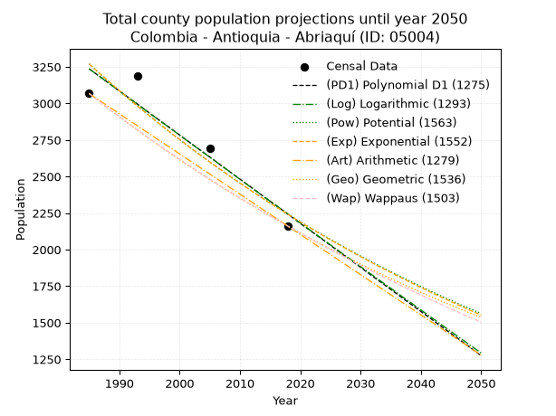
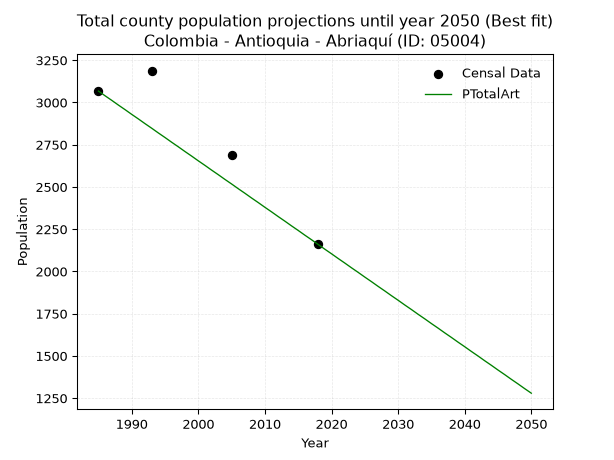
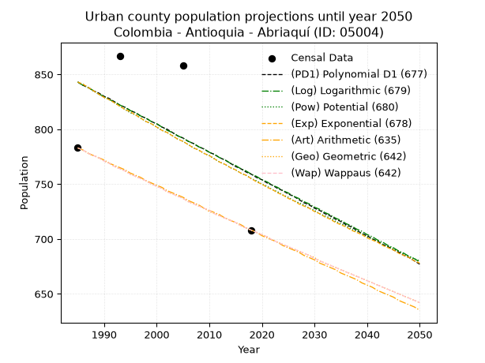
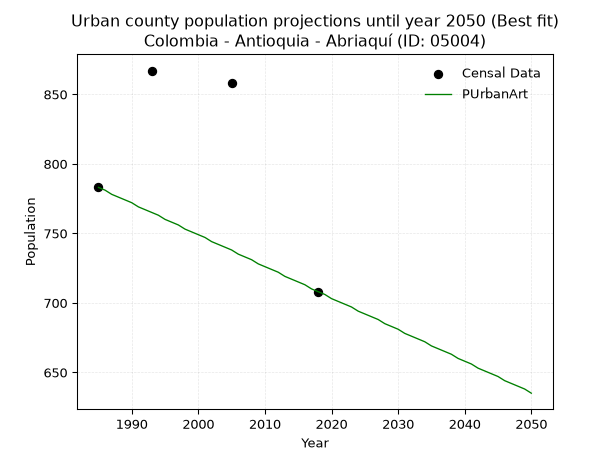
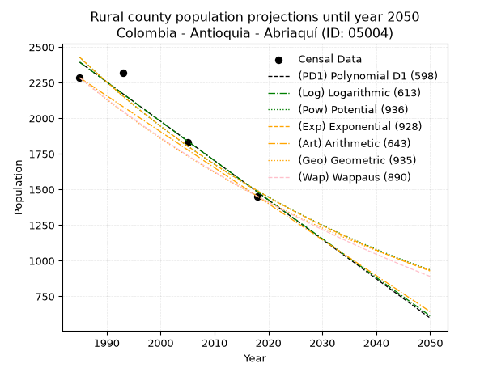
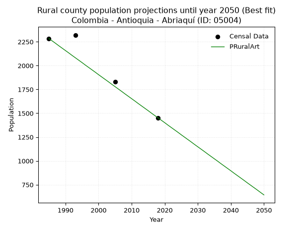

<div align="center">


</div>

# _“Population and Public Services Demand Projections (PPSD) until Year 2050 for Colombia - Antioquia - Abriaquí (ID: 05004)”_
Keywords: `population` `public-service` `projection` `lineal` `polynomial` `logarithmic` `potential` `exponential` `arithmetic` `geometric` `wappaus` `dane` `colombia` `south-america`

PPSD are analytical estimates used by governments and planners to anticipate future changes in population size, age distribution, and the resulting community needs for utilities, healthcare, education, and infrastructure as sizing future water treatment facilities, electrical grids, and road networks based on spatial growth.

> **General running parameters**: • app_version: _v20260806_. • Python version: _3.14.7_. • Pandas version: _3.0.5_. • NumPy version: _2.5.1_. • Creates, save and include plots into reports (create_plot): _True_. • Projection until year: _2050_. • Process polynomial degree 2 and up: _False_. • Process Wappaus: _True_. • Process Wappaus: _True_. • Set negative values to zero: _True_. • Set infinite values to zero: _True_. • Drop dataset notes: _True_. 
<div align="center">

Dynamic map: [:earth_americas:Google](http://maps.google.com/maps?q=6.632282061,-76.0643038) [:earth_americas:OSM](https://www.openstreetmap.org/#map=18/6.632282061/-76.0643038&layers=P) [:earth_americas:Bing](https://www.bing.com/maps?cp=6.632282061~-76.0643038&lvl=18) [:earth_americas:Apple](https://maps.apple.com/frame?center=6.632282061%2C-76.0643038&span=0.003%2C0.006)

</div>


<div align="center">

```geojson
{
  "type": "Feature",
  "geometry": {
    "type": "Point", 
    "coordinates": [-76.0643038, 6.632282061]
  }, 
  "properties": {
    "Name": "Colombia - Antioquia - Abriaquí (ID: 05004)"
  }
}
```

</div>


## 0. Census Data (4 records)

Census data are official statistics collected by a government about the people and housing in a country. They usually include counts of total population, age, sex, race, income, education, and jobs.

📅Global census file: [Population.xlsx](../data/Population.xlsx)

| Source   |   Year |   CountryID | CountryName   |   StateID | StateName   |   CountyID | CountyName   |   PTotal |   PUrban |   PRural |
|:---------|-------:|------------:|:--------------|----------:|:------------|-----------:|:-------------|---------:|---------:|---------:|
| DANE     |   1985 |          57 | Colombia      |        05 | Antioquia   |      05004 | Abriaquí     |     3067 |      783 |     2284 |
| DANE     |   1993 |          57 | Colombia      |        05 | Antioquia   |      05004 | Abriaquí     |     3188 |      867 |     2321 |
| DANE     |   2005 |          57 | Colombia      |        05 | Antioquia   |      05004 | Abriaquí     |     2690 |      858 |     1832 |
| DANE     |   2018 |          57 | Colombia      |        05 | Antioquia   |      05004 | Abriaquí     |     2159 |      708 |     1451 |

> 🔥Some records has specific notes about the registered values or the corresponding urban or rural distribution.

## 1. Total

### 1.1. Coefficients and Parameters

* (PD1) Polynomial Deg 1: -30.164592533118878, 63112.72621437103 (lineal)
* (Log) Logarithmic: -60334.996032143594, 461382.78833463794
* (Pow) Potential: -22.91444521739124, 79.0808806819133
* (Exp) Exponential: -0.011456854123841393, 24609354184633.95
* (Art) Arithmetic: Year diff. 2018 - 1985 = 33, Population diff. 2159 - 3067 = -908, Annual growth = -27.515151515151516
* (Geo) Geometric: Year diff. 2018 - 1985 = 33, Population diff. 2159 - 3067 = -908, Annual growth % = -0.010581638585740127
* (Wap) Wappaus: i = -1.053010008233889, Condition values only valid for < 200)

<sub>
Wappaus condition values: ['-0.00', '-1.05', '-2.11', '-3.16', '-4.21', '-5.27', '-6.32', '-7.37', '-8.42', '-9.48', '-10.53', '-11.58', '-12.64', '-13.69', '-14.74', '-15.80', '-16.85', '-17.90', '-18.95', '-20.01', '-21.06', '-22.11', '-23.17', '-24.22', '-25.27', '-26.33', '-27.38', '-28.43', '-29.48', '-30.54', '-31.59', '-32.64', '-33.70', '-34.75', '-35.80', '-36.86', '-37.91', '-38.96', '-40.01', '-41.07', '-42.12', '-43.17', '-44.23', '-45.28', '-46.33', '-47.39', '-48.44', '-49.49', '-50.54', '-51.60', '-52.65', '-53.70', '-54.76', '-55.81', '-56.86', '-57.92', '-58.97', '-60.02', '-61.07', '-62.13', '-63.18', '-64.23', '-65.29', '-66.34', '-67.39', '-68.45']
</sub>


### 1.2. Projected Dataset

|   Year |   CountyID |   PTotalPD1 |   PTotalLog |   PTotalPow |   PTotalExp |   PTotalArt |   PTotalGeo |   PTotalWap |
|-------:|-----------:|------------:|------------:|------------:|------------:|------------:|------------:|------------:|
|   1985 |      05004 |        3236 |        3237 |        3270 |        3269 |        3067 |        3067 |        3067 |
|   1986 |      05004 |        3206 |        3206 |        3232 |        3232 |        3039 |        3035 |        3035 |
|   1987 |      05004 |        3176 |        3176 |        3195 |        3195 |        3012 |        3002 |        3003 |
|   1988 |      05004 |        3146 |        3145 |        3159 |        3159 |        2984 |        2971 |        2972 |
|   1989 |      05004 |        3115 |        3115 |        3122 |        3123 |        2957 |        2939 |        2940 |
|   1990 |      05004 |        3085 |        3085 |        3087 |        3087 |        2929 |        2908 |        2910 |
|   1991 |      05004 |        3055 |        3054 |        3051 |        3052 |        2902 |        2877 |        2879 |
|   1992 |      05004 |        3025 |        3024 |        3016 |        3017 |        2874 |        2847 |        2849 |
|   1993 |      05004 |        2995 |        2994 |        2982 |        2983 |        2847 |        2817 |        2819 |
|   1994 |      05004 |        2965 |        2964 |        2948 |        2949 |        2819 |        2787 |        2789 |
|   1995 |      05004 |        2934 |        2933 |        2914 |        2915 |        2792 |        2757 |        2760 |
|   1996 |      05004 |        2904 |        2903 |        2881 |        2882 |        2764 |        2728 |        2731 |
|   1997 |      05004 |        2874 |        2873 |        2848 |        2849 |        2737 |        2699 |        2702 |
|   1998 |      05004 |        2844 |        2843 |        2816 |        2817 |        2709 |        2671 |        2674 |
|   1999 |      05004 |        2814 |        2813 |        2783 |        2785 |        2682 |        2643 |        2646 |
|   2000 |      05004 |        2784 |        2782 |        2752 |        2753 |        2654 |        2615 |        2618 |
|   2001 |      05004 |        2753 |        2752 |        2720 |        2722 |        2627 |        2587 |        2590 |
|   2002 |      05004 |        2723 |        2722 |        2689 |        2691 |        2599 |        2560 |        2563 |
|   2003 |      05004 |        2693 |        2692 |        2659 |        2660 |        2572 |        2533 |        2536 |
|   2004 |      05004 |        2663 |        2662 |        2629 |        2630 |        2544 |        2506 |        2509 |
|   2005 |      05004 |        2633 |        2632 |        2599 |        2600 |        2517 |        2479 |        2483 |
|   2006 |      05004 |        2603 |        2602 |        2569 |        2570 |        2489 |        2453 |        2456 |
|   2007 |      05004 |        2572 |        2572 |        2540 |        2541 |        2462 |        2427 |        2430 |
|   2008 |      05004 |        2542 |        2542 |        2511 |        2512 |        2434 |        2401 |        2404 |
|   2009 |      05004 |        2512 |        2511 |        2483 |        2483 |        2407 |        2376 |        2379 |
|   2010 |      05004 |        2482 |        2481 |        2455 |        2455 |        2379 |        2351 |        2354 |
|   2011 |      05004 |        2452 |        2451 |        2427 |        2427 |        2352 |        2326 |        2328 |
|   2012 |      05004 |        2422 |        2421 |        2399 |        2399 |        2324 |        2301 |        2304 |
|   2013 |      05004 |        2391 |        2391 |        2372 |        2372 |        2297 |        2277 |        2279 |
|   2014 |      05004 |        2361 |        2361 |        2345 |        2345 |        2269 |        2253 |        2254 |
|   2015 |      05004 |        2331 |        2332 |        2319 |        2318 |        2242 |        2229 |        2230 |
|   2016 |      05004 |        2301 |        2302 |        2293 |        2292 |        2214 |        2205 |        2206 |
|   2017 |      05004 |        2271 |        2272 |        2267 |        2266 |        2187 |        2182 |        2183 |
|   2018 |      05004 |        2241 |        2242 |        2241 |        2240 |        2159 |        2159 |        2159 |
|   2019 |      05004 |        2210 |        2212 |        2216 |        2214 |        2131 |        2136 |        2136 |
|   2020 |      05004 |        2180 |        2182 |        2191 |        2189 |        2104 |        2114 |        2113 |
|   2021 |      05004 |        2150 |        2152 |        2166 |        2164 |        2076 |        2091 |        2090 |
|   2022 |      05004 |        2120 |        2122 |        2142 |        2140 |        2049 |        2069 |        2067 |
|   2023 |      05004 |        2090 |        2092 |        2117 |        2115 |        2021 |        2047 |        2044 |
|   2024 |      05004 |        2060 |        2063 |        2094 |        2091 |        1994 |        2026 |        2022 |
|   2025 |      05004 |        2029 |        2033 |        2070 |        2067 |        1966 |        2004 |        2000 |
|   2026 |      05004 |        1999 |        2003 |        2047 |        2044 |        1939 |        1983 |        1978 |
|   2027 |      05004 |        1969 |        1973 |        2024 |        2021 |        1911 |        1962 |        1956 |
|   2028 |      05004 |        1939 |        1944 |        2001 |        1997 |        1884 |        1941 |        1935 |
|   2029 |      05004 |        1909 |        1914 |        1979 |        1975 |        1856 |        1921 |        1913 |
|   2030 |      05004 |        1879 |        1884 |        1956 |        1952 |        1829 |        1900 |        1892 |
|   2031 |      05004 |        1848 |        1854 |        1934 |        1930 |        1801 |        1880 |        1871 |
|   2032 |      05004 |        1818 |        1825 |        1913 |        1908 |        1774 |        1860 |        1850 |
|   2033 |      05004 |        1788 |        1795 |        1891 |        1886 |        1746 |        1841 |        1830 |
|   2034 |      05004 |        1758 |        1765 |        1870 |        1865 |        1719 |        1821 |        1809 |
|   2035 |      05004 |        1728 |        1736 |        1849 |        1844 |        1691 |        1802 |        1789 |
|   2036 |      05004 |        1698 |        1706 |        1828 |        1823 |        1664 |        1783 |        1769 |
|   2037 |      05004 |        1667 |        1676 |        1808 |        1802 |        1636 |        1764 |        1749 |
|   2038 |      05004 |        1637 |        1647 |        1788 |        1781 |        1609 |        1745 |        1729 |
|   2039 |      05004 |        1607 |        1617 |        1768 |        1761 |        1581 |        1727 |        1709 |
|   2040 |      05004 |        1577 |        1588 |        1748 |        1741 |        1554 |        1708 |        1690 |
|   2041 |      05004 |        1547 |        1558 |        1728 |        1721 |        1526 |        1690 |        1670 |
|   2042 |      05004 |        1517 |        1528 |        1709 |        1701 |        1499 |        1673 |        1651 |
|   2043 |      05004 |        1486 |        1499 |        1690 |        1682 |        1471 |        1655 |        1632 |
|   2044 |      05004 |        1456 |        1469 |        1671 |        1663 |        1444 |        1637 |        1613 |
|   2045 |      05004 |        1426 |        1440 |        1653 |        1644 |        1416 |        1620 |        1594 |
|   2046 |      05004 |        1396 |        1410 |        1634 |        1625 |        1389 |        1603 |        1576 |
|   2047 |      05004 |        1366 |        1381 |        1616 |        1607 |        1361 |        1586 |        1557 |
|   2048 |      05004 |        1336 |        1351 |        1598 |        1588 |        1334 |        1569 |        1539 |
|   2049 |      05004 |        1305 |        1322 |        1580 |        1570 |        1306 |        1552 |        1521 |
|   2050 |      05004 |        1275 |        1293 |        1563 |        1552 |        1279 |        1536 |        1503 |
<div align="center">

</img>

</div>


### 1.3. Filtered dataset with projected values, absolute error, relative error as percentage

Relative error puts that difference into context by dividing the absolute error by the true value, creating a unitless ratio or percentage that shows the scale of the mistake.

Absolute and relative error

|   Year | Source   |   CountryID | CountryName   |   StateID | StateName   |   CountyID_x | CountyName   |   PTotal |   PUrban |   PRural |   CountyID_y |   PTotalPD1 |   PTotalLog |   PTotalPow |   PTotalExp |   PTotalArt |   PTotalGeo |   PTotalWap |   PTotalPD1AbsError |   PTotalLogAbsError |   PTotalPowAbsError |   PTotalExpAbsError |   PTotalArtAbsError |   PTotalGeoAbsError |   PTotalWapAbsError |   PTotalPD1RelError |   PTotalLogRelError |   PTotalPowRelError |   PTotalExpRelError |   PTotalArtRelError |   PTotalGeoRelError |   PTotalWapRelError |
|-------:|:---------|------------:|:--------------|----------:|:------------|-------------:|:-------------|---------:|---------:|---------:|-------------:|------------:|------------:|------------:|------------:|------------:|------------:|------------:|--------------------:|--------------------:|--------------------:|--------------------:|--------------------:|--------------------:|--------------------:|--------------------:|--------------------:|--------------------:|--------------------:|--------------------:|--------------------:|--------------------:|
|   1985 | DANE     |          57 | Colombia      |        05 | Antioquia   |        05004 | Abriaquí     |     3067 |      783 |     2284 |        05004 |        3236 |        3237 |        3270 |        3269 |        3067 |        3067 |        3067 |                 169 |                 170 |                 203 |                 202 |                   0 |                   0 |                   0 |             5.51027 |             5.54288 |             6.61885 |             6.58624 |             0       |             0       |             0       |
|   1993 | DANE     |          57 | Colombia      |        05 | Antioquia   |        05004 | Abriaquí     |     3188 |      867 |     2321 |        05004 |        2995 |        2994 |        2982 |        2983 |        2847 |        2817 |        2819 |                 193 |                 194 |                 206 |                 205 |                 341 |                 371 |                 369 |             6.05395 |             6.08532 |             6.46173 |             6.43036 |            10.6964  |            11.6374  |            11.5747  |
|   2005 | DANE     |          57 | Colombia      |        05 | Antioquia   |        05004 | Abriaquí     |     2690 |      858 |     1832 |        05004 |        2633 |        2632 |        2599 |        2600 |        2517 |        2479 |        2483 |                  57 |                  58 |                  91 |                  90 |                 173 |                 211 |                 207 |             2.11896 |             2.15613 |             3.3829  |             3.34572 |             6.43123 |             7.84387 |             7.69517 |
|   2018 | DANE     |          57 | Colombia      |        05 | Antioquia   |        05004 | Abriaquí     |     2159 |      708 |     1451 |        05004 |        2241 |        2242 |        2241 |        2240 |        2159 |        2159 |        2159 |                  82 |                  83 |                  82 |                  81 |                   0 |                   0 |                   0 |             3.79805 |             3.84437 |             3.79805 |             3.75174 |             0       |             0       |             0       |

Relative error mean

| Method    |   RelError | Best   |
|:----------|-----------:|:-------|
| PTotalPD1 |    4.37031 |        |
| PTotalLog |    4.40718 |        |
| PTotalPow |    5.06538 |        |
| PTotalExp |    5.02852 |        |
| PTotalArt |    4.2819  | True   |
| PTotalGeo |    4.87031 |        |
| PTotalWap |    4.81746 |        |

💙Best method: _**PTotalArt**_
<div align="center">

</img>

</div>


### 1.4. Fresh water supply demand in liters per capita per day (lpcd)

The fresh water supply demand typically ranges from 100 to 300 liters per capita per day (lpcd) for standard domestic and municipal planning, though absolute survival minimums set by the World Health Organization are as low as 7.5 to 20 liters per day, and total consumption in high-income nations can exceed 400 liters.

> `CZ`: Level in meters above the sea level (masl).<br> `WS`: Fresh water supply demand in liters per capita per day (lpcd or l/h/d).<br> `WSAll`: Zonal fresh water supply demand in liters per second (l/s).<br> `A`: Zonal area in square meters.

Reference values (RAS Colombia)

|    CZ |   WS |
|------:|-----:|
|  1000 |  120 |
|  2000 |  130 |
| 99999 |  140 |

County shapefile geometry properties and water supply values

|   CountyID |      ATotal |   CZTotal |   WSTotal |
|-----------:|------------:|----------:|----------:|
|      05004 | 2.96974e+08 |   2373.39 |       140 |

Projected values for best method: PTotalArt

|   CountyID |   Year |   PTotalArt |   WSTotal |   WSTotalAll |
|-----------:|-------:|------------:|----------:|-------------:|
|      05004 |   1985 |        3067 |       140 |      4.96968 |
|      05004 |   1986 |        3039 |       140 |      4.92431 |
|      05004 |   1987 |        3012 |       140 |      4.88056 |
|      05004 |   1988 |        2984 |       140 |      4.83519 |
|      05004 |   1989 |        2957 |       140 |      4.79144 |
|      05004 |   1990 |        2929 |       140 |      4.74606 |
|      05004 |   1991 |        2902 |       140 |      4.70231 |
|      05004 |   1992 |        2874 |       140 |      4.65694 |
|      05004 |   1993 |        2847 |       140 |      4.61319 |
|      05004 |   1994 |        2819 |       140 |      4.56782 |
|      05004 |   1995 |        2792 |       140 |      4.52407 |
|      05004 |   1996 |        2764 |       140 |      4.4787  |
|      05004 |   1997 |        2737 |       140 |      4.43495 |
|      05004 |   1998 |        2709 |       140 |      4.38958 |
|      05004 |   1999 |        2682 |       140 |      4.34583 |
|      05004 |   2000 |        2654 |       140 |      4.30046 |
|      05004 |   2001 |        2627 |       140 |      4.25671 |
|      05004 |   2002 |        2599 |       140 |      4.21134 |
|      05004 |   2003 |        2572 |       140 |      4.16759 |
|      05004 |   2004 |        2544 |       140 |      4.12222 |
|      05004 |   2005 |        2517 |       140 |      4.07847 |
|      05004 |   2006 |        2489 |       140 |      4.0331  |
|      05004 |   2007 |        2462 |       140 |      3.98935 |
|      05004 |   2008 |        2434 |       140 |      3.94398 |
|      05004 |   2009 |        2407 |       140 |      3.90023 |
|      05004 |   2010 |        2379 |       140 |      3.85486 |
|      05004 |   2011 |        2352 |       140 |      3.81111 |
|      05004 |   2012 |        2324 |       140 |      3.76574 |
|      05004 |   2013 |        2297 |       140 |      3.72199 |
|      05004 |   2014 |        2269 |       140 |      3.67662 |
|      05004 |   2015 |        2242 |       140 |      3.63287 |
|      05004 |   2016 |        2214 |       140 |      3.5875  |
|      05004 |   2017 |        2187 |       140 |      3.54375 |
|      05004 |   2018 |        2159 |       140 |      3.49838 |
|      05004 |   2019 |        2131 |       140 |      3.45301 |
|      05004 |   2020 |        2104 |       140 |      3.40926 |
|      05004 |   2021 |        2076 |       140 |      3.36389 |
|      05004 |   2022 |        2049 |       140 |      3.32014 |
|      05004 |   2023 |        2021 |       140 |      3.27477 |
|      05004 |   2024 |        1994 |       140 |      3.23102 |
|      05004 |   2025 |        1966 |       140 |      3.18565 |
|      05004 |   2026 |        1939 |       140 |      3.1419  |
|      05004 |   2027 |        1911 |       140 |      3.09653 |
|      05004 |   2028 |        1884 |       140 |      3.05278 |
|      05004 |   2029 |        1856 |       140 |      3.00741 |
|      05004 |   2030 |        1829 |       140 |      2.96366 |
|      05004 |   2031 |        1801 |       140 |      2.91829 |
|      05004 |   2032 |        1774 |       140 |      2.87454 |
|      05004 |   2033 |        1746 |       140 |      2.82917 |
|      05004 |   2034 |        1719 |       140 |      2.78542 |
|      05004 |   2035 |        1691 |       140 |      2.74005 |
|      05004 |   2036 |        1664 |       140 |      2.6963  |
|      05004 |   2037 |        1636 |       140 |      2.65093 |
|      05004 |   2038 |        1609 |       140 |      2.60718 |
|      05004 |   2039 |        1581 |       140 |      2.56181 |
|      05004 |   2040 |        1554 |       140 |      2.51806 |
|      05004 |   2041 |        1526 |       140 |      2.47269 |
|      05004 |   2042 |        1499 |       140 |      2.42894 |
|      05004 |   2043 |        1471 |       140 |      2.38356 |
|      05004 |   2044 |        1444 |       140 |      2.33981 |
|      05004 |   2045 |        1416 |       140 |      2.29444 |
|      05004 |   2046 |        1389 |       140 |      2.25069 |
|      05004 |   2047 |        1361 |       140 |      2.20532 |
|      05004 |   2048 |        1334 |       140 |      2.16157 |
|      05004 |   2049 |        1306 |       140 |      2.1162  |
|      05004 |   2050 |        1279 |       140 |      2.07245 |

## 2. Urban

### 2.1. Coefficients and Parameters

* (PD1) Polynomial Deg 1: -2.5435568044960934, 5891.749498193311 (lineal)
* (Log) Logarithmic: -5070.278644474877, 39343.228607316654
* (Pow) Potential: -6.696269026878421, 25.008717235047403
* (Exp) Exponential: -0.003358577374367268, 662846.9246080966
* (Art) Arithmetic: Year diff. 2018 - 1985 = 33, Population diff. 708 - 783 = -75, Annual growth = -2.272727272727273
* (Geo) Geometric: Year diff. 2018 - 1985 = 33, Population diff. 708 - 783 = -75, Annual growth % = -0.003046519678710835
* (Wap) Wappaus: i = -0.3048594597890373, Condition values only valid for < 200)

<sub>
Wappaus condition values: ['-0.00', '-0.30', '-0.61', '-0.91', '-1.22', '-1.52', '-1.83', '-2.13', '-2.44', '-2.74', '-3.05', '-3.35', '-3.66', '-3.96', '-4.27', '-4.57', '-4.88', '-5.18', '-5.49', '-5.79', '-6.10', '-6.40', '-6.71', '-7.01', '-7.32', '-7.62', '-7.93', '-8.23', '-8.54', '-8.84', '-9.15', '-9.45', '-9.76', '-10.06', '-10.37', '-10.67', '-10.97', '-11.28', '-11.58', '-11.89', '-12.19', '-12.50', '-12.80', '-13.11', '-13.41', '-13.72', '-14.02', '-14.33', '-14.63', '-14.94', '-15.24', '-15.55', '-15.85', '-16.16', '-16.46', '-16.77', '-17.07', '-17.38', '-17.68', '-17.99', '-18.29', '-18.60', '-18.90', '-19.21', '-19.51', '-19.82']
</sub>


### 2.2. Projected Dataset

|   Year |   CountyID |   PUrbanPD1 |   PUrbanLog |   PUrbanPow |   PUrbanExp |   PUrbanArt |   PUrbanGeo |   PUrbanWap |
|-------:|-----------:|------------:|------------:|------------:|------------:|------------:|------------:|------------:|
|   1985 |      05004 |         843 |         843 |         843 |         843 |         783 |         783 |         783 |
|   1986 |      05004 |         840 |         840 |         841 |         841 |         781 |         781 |         781 |
|   1987 |      05004 |         838 |         838 |         838 |         838 |         778 |         778 |         778 |
|   1988 |      05004 |         835 |         835 |         835 |         835 |         776 |         776 |         776 |
|   1989 |      05004 |         833 |         832 |         832 |         832 |         774 |         774 |         774 |
|   1990 |      05004 |         830 |         830 |         829 |         829 |         772 |         771 |         771 |
|   1991 |      05004 |         828 |         827 |         827 |         827 |         769 |         769 |         769 |
|   1992 |      05004 |         825 |         825 |         824 |         824 |         767 |         766 |         766 |
|   1993 |      05004 |         822 |         822 |         821 |         821 |         765 |         764 |         764 |
|   1994 |      05004 |         820 |         820 |         818 |         818 |         763 |         762 |         762 |
|   1995 |      05004 |         817 |         817 |         815 |         816 |         760 |         759 |         759 |
|   1996 |      05004 |         815 |         815 |         813 |         813 |         758 |         757 |         757 |
|   1997 |      05004 |         812 |         812 |         810 |         810 |         756 |         755 |         755 |
|   1998 |      05004 |         810 |         810 |         807 |         807 |         753 |         753 |         753 |
|   1999 |      05004 |         807 |         807 |         805 |         805 |         751 |         750 |         750 |
|   2000 |      05004 |         805 |         805 |         802 |         802 |         749 |         748 |         748 |
|   2001 |      05004 |         802 |         802 |         799 |         799 |         747 |         746 |         746 |
|   2002 |      05004 |         800 |         799 |         797 |         797 |         744 |         743 |         743 |
|   2003 |      05004 |         797 |         797 |         794 |         794 |         742 |         741 |         741 |
|   2004 |      05004 |         794 |         794 |         791 |         791 |         740 |         739 |         739 |
|   2005 |      05004 |         792 |         792 |         789 |         789 |         738 |         737 |         737 |
|   2006 |      05004 |         789 |         789 |         786 |         786 |         735 |         734 |         734 |
|   2007 |      05004 |         787 |         787 |         783 |         783 |         733 |         732 |         732 |
|   2008 |      05004 |         784 |         784 |         781 |         781 |         731 |         730 |         730 |
|   2009 |      05004 |         782 |         782 |         778 |         778 |         728 |         728 |         728 |
|   2010 |      05004 |         779 |         779 |         776 |         776 |         726 |         725 |         726 |
|   2011 |      05004 |         777 |         777 |         773 |         773 |         724 |         723 |         723 |
|   2012 |      05004 |         774 |         774 |         770 |         770 |         722 |         721 |         721 |
|   2013 |      05004 |         772 |         772 |         768 |         768 |         719 |         719 |         719 |
|   2014 |      05004 |         769 |         769 |         765 |         765 |         717 |         717 |         717 |
|   2015 |      05004 |         766 |         767 |         763 |         763 |         715 |         715 |         715 |
|   2016 |      05004 |         764 |         764 |         760 |         760 |         713 |         712 |         712 |
|   2017 |      05004 |         761 |         762 |         758 |         758 |         710 |         710 |         710 |
|   2018 |      05004 |         759 |         759 |         755 |         755 |         708 |         708 |         708 |
|   2019 |      05004 |         756 |         757 |         753 |         752 |         706 |         706 |         706 |
|   2020 |      05004 |         754 |         754 |         750 |         750 |         703 |         704 |         704 |
|   2021 |      05004 |         751 |         752 |         748 |         747 |         701 |         702 |         702 |
|   2022 |      05004 |         749 |         749 |         745 |         745 |         699 |         699 |         699 |
|   2023 |      05004 |         746 |         747 |         743 |         742 |         697 |         697 |         697 |
|   2024 |      05004 |         744 |         744 |         740 |         740 |         694 |         695 |         695 |
|   2025 |      05004 |         741 |         742 |         738 |         737 |         692 |         693 |         693 |
|   2026 |      05004 |         739 |         739 |         735 |         735 |         690 |         691 |         691 |
|   2027 |      05004 |         736 |         737 |         733 |         732 |         688 |         689 |         689 |
|   2028 |      05004 |         733 |         734 |         731 |         730 |         685 |         687 |         687 |
|   2029 |      05004 |         731 |         732 |         728 |         728 |         683 |         685 |         685 |
|   2030 |      05004 |         728 |         729 |         726 |         725 |         681 |         683 |         682 |
|   2031 |      05004 |         726 |         727 |         723 |         723 |         678 |         680 |         680 |
|   2032 |      05004 |         723 |         724 |         721 |         720 |         676 |         678 |         678 |
|   2033 |      05004 |         721 |         722 |         719 |         718 |         674 |         676 |         676 |
|   2034 |      05004 |         718 |         719 |         716 |         715 |         672 |         674 |         674 |
|   2035 |      05004 |         716 |         717 |         714 |         713 |         669 |         672 |         672 |
|   2036 |      05004 |         713 |         714 |         712 |         711 |         667 |         670 |         670 |
|   2037 |      05004 |         711 |         712 |         709 |         708 |         665 |         668 |         668 |
|   2038 |      05004 |         708 |         709 |         707 |         706 |         663 |         666 |         666 |
|   2039 |      05004 |         705 |         707 |         705 |         704 |         660 |         664 |         664 |
|   2040 |      05004 |         703 |         704 |         702 |         701 |         658 |         662 |         662 |
|   2041 |      05004 |         700 |         702 |         700 |         699 |         656 |         660 |         660 |
|   2042 |      05004 |         698 |         699 |         698 |         697 |         653 |         658 |         658 |
|   2043 |      05004 |         695 |         697 |         695 |         694 |         651 |         656 |         656 |
|   2044 |      05004 |         693 |         694 |         693 |         692 |         649 |         654 |         654 |
|   2045 |      05004 |         690 |         692 |         691 |         690 |         647 |         652 |         652 |
|   2046 |      05004 |         688 |         689 |         689 |         687 |         644 |         650 |         650 |
|   2047 |      05004 |         685 |         687 |         686 |         685 |         642 |         648 |         648 |
|   2048 |      05004 |         683 |         684 |         684 |         683 |         640 |         646 |         646 |
|   2049 |      05004 |         680 |         682 |         682 |         680 |         638 |         644 |         644 |
|   2050 |      05004 |         677 |         679 |         680 |         678 |         635 |         642 |         642 |
<div align="center">

</img>

</div>


### 2.3. Filtered dataset with projected values, absolute error, relative error as percentage

Relative error puts that difference into context by dividing the absolute error by the true value, creating a unitless ratio or percentage that shows the scale of the mistake.

Absolute and relative error

|   Year | Source   |   CountryID | CountryName   |   StateID | StateName   |   CountyID_x | CountyName   |   PTotal |   PUrban |   PRural |   CountyID_y |   PUrbanPD1 |   PUrbanLog |   PUrbanPow |   PUrbanExp |   PUrbanArt |   PUrbanGeo |   PUrbanWap |   PUrbanPD1AbsError |   PUrbanLogAbsError |   PUrbanPowAbsError |   PUrbanExpAbsError |   PUrbanArtAbsError |   PUrbanGeoAbsError |   PUrbanWapAbsError |   PUrbanPD1RelError |   PUrbanLogRelError |   PUrbanPowRelError |   PUrbanExpRelError |   PUrbanArtRelError |   PUrbanGeoRelError |   PUrbanWapRelError |
|-------:|:---------|------------:|:--------------|----------:|:------------|-------------:|:-------------|---------:|---------:|---------:|-------------:|------------:|------------:|------------:|------------:|------------:|------------:|------------:|--------------------:|--------------------:|--------------------:|--------------------:|--------------------:|--------------------:|--------------------:|--------------------:|--------------------:|--------------------:|--------------------:|--------------------:|--------------------:|--------------------:|
|   1985 | DANE     |          57 | Colombia      |        05 | Antioquia   |        05004 | Abriaquí     |     3067 |      783 |     2284 |        05004 |         843 |         843 |         843 |         843 |         783 |         783 |         783 |                  60 |                  60 |                  60 |                  60 |                   0 |                   0 |                   0 |             7.66284 |             7.66284 |             7.66284 |             7.66284 |              0      |              0      |              0      |
|   1993 | DANE     |          57 | Colombia      |        05 | Antioquia   |        05004 | Abriaquí     |     3188 |      867 |     2321 |        05004 |         822 |         822 |         821 |         821 |         765 |         764 |         764 |                  45 |                  45 |                  46 |                  46 |                 102 |                 103 |                 103 |             5.19031 |             5.19031 |             5.30565 |             5.30565 |             11.7647 |             11.88   |             11.88   |
|   2005 | DANE     |          57 | Colombia      |        05 | Antioquia   |        05004 | Abriaquí     |     2690 |      858 |     1832 |        05004 |         792 |         792 |         789 |         789 |         738 |         737 |         737 |                  66 |                  66 |                  69 |                  69 |                 120 |                 121 |                 121 |             7.69231 |             7.69231 |             8.04196 |             8.04196 |             13.986  |             14.1026 |             14.1026 |
|   2018 | DANE     |          57 | Colombia      |        05 | Antioquia   |        05004 | Abriaquí     |     2159 |      708 |     1451 |        05004 |         759 |         759 |         755 |         755 |         708 |         708 |         708 |                  51 |                  51 |                  47 |                  47 |                   0 |                   0 |                   0 |             7.20339 |             7.20339 |             6.63842 |             6.63842 |              0      |              0      |              0      |

Relative error mean

| Method    |   RelError | Best   |
|:----------|-----------:|:-------|
| PUrbanPD1 |    6.93721 |        |
| PUrbanLog |    6.93721 |        |
| PUrbanPow |    6.91222 |        |
| PUrbanExp |    6.91222 |        |
| PUrbanArt |    6.43768 | True   |
| PUrbanGeo |    6.49565 |        |
| PUrbanWap |    6.49565 |        |

💙Best method: _**PUrbanArt**_
<div align="center">

</img>

</div>


### 2.4. Fresh water supply demand in liters per capita per day (lpcd)

The fresh water supply demand typically ranges from 100 to 300 liters per capita per day (lpcd) for standard domestic and municipal planning, though absolute survival minimums set by the World Health Organization are as low as 7.5 to 20 liters per day, and total consumption in high-income nations can exceed 400 liters.

> `CZ`: Level in meters above the sea level (masl).<br> `WS`: Fresh water supply demand in liters per capita per day (lpcd or l/h/d).<br> `WSAll`: Zonal fresh water supply demand in liters per second (l/s).<br> `A`: Zonal area in square meters.

Reference values (RAS Colombia)

|    CZ |   WS |
|------:|-----:|
|  1000 |  120 |
|  2000 |  130 |
| 99999 |  140 |

County shapefile geometry properties and water supply values

|   CountyID |   AUrban |   CZUrban |   WSUrban |
|-----------:|---------:|----------:|----------:|
|      05004 |   156834 |   1917.45 |       130 |

Projected values for best method: PUrbanArt

|   CountyID |   Year |   PUrbanArt |   WSUrban |   WSUrbanAll |
|-----------:|-------:|------------:|----------:|-------------:|
|      05004 |   1985 |         783 |       130 |     1.17813  |
|      05004 |   1986 |         781 |       130 |     1.17512  |
|      05004 |   1987 |         778 |       130 |     1.1706   |
|      05004 |   1988 |         776 |       130 |     1.16759  |
|      05004 |   1989 |         774 |       130 |     1.16458  |
|      05004 |   1990 |         772 |       130 |     1.16157  |
|      05004 |   1991 |         769 |       130 |     1.15706  |
|      05004 |   1992 |         767 |       130 |     1.15405  |
|      05004 |   1993 |         765 |       130 |     1.15104  |
|      05004 |   1994 |         763 |       130 |     1.14803  |
|      05004 |   1995 |         760 |       130 |     1.14352  |
|      05004 |   1996 |         758 |       130 |     1.14051  |
|      05004 |   1997 |         756 |       130 |     1.1375   |
|      05004 |   1998 |         753 |       130 |     1.13299  |
|      05004 |   1999 |         751 |       130 |     1.12998  |
|      05004 |   2000 |         749 |       130 |     1.12697  |
|      05004 |   2001 |         747 |       130 |     1.12396  |
|      05004 |   2002 |         744 |       130 |     1.11944  |
|      05004 |   2003 |         742 |       130 |     1.11644  |
|      05004 |   2004 |         740 |       130 |     1.11343  |
|      05004 |   2005 |         738 |       130 |     1.11042  |
|      05004 |   2006 |         735 |       130 |     1.1059   |
|      05004 |   2007 |         733 |       130 |     1.10289  |
|      05004 |   2008 |         731 |       130 |     1.09988  |
|      05004 |   2009 |         728 |       130 |     1.09537  |
|      05004 |   2010 |         726 |       130 |     1.09236  |
|      05004 |   2011 |         724 |       130 |     1.08935  |
|      05004 |   2012 |         722 |       130 |     1.08634  |
|      05004 |   2013 |         719 |       130 |     1.08183  |
|      05004 |   2014 |         717 |       130 |     1.07882  |
|      05004 |   2015 |         715 |       130 |     1.07581  |
|      05004 |   2016 |         713 |       130 |     1.0728   |
|      05004 |   2017 |         710 |       130 |     1.06829  |
|      05004 |   2018 |         708 |       130 |     1.06528  |
|      05004 |   2019 |         706 |       130 |     1.06227  |
|      05004 |   2020 |         703 |       130 |     1.05775  |
|      05004 |   2021 |         701 |       130 |     1.05475  |
|      05004 |   2022 |         699 |       130 |     1.05174  |
|      05004 |   2023 |         697 |       130 |     1.04873  |
|      05004 |   2024 |         694 |       130 |     1.04421  |
|      05004 |   2025 |         692 |       130 |     1.0412   |
|      05004 |   2026 |         690 |       130 |     1.03819  |
|      05004 |   2027 |         688 |       130 |     1.03519  |
|      05004 |   2028 |         685 |       130 |     1.03067  |
|      05004 |   2029 |         683 |       130 |     1.02766  |
|      05004 |   2030 |         681 |       130 |     1.02465  |
|      05004 |   2031 |         678 |       130 |     1.02014  |
|      05004 |   2032 |         676 |       130 |     1.01713  |
|      05004 |   2033 |         674 |       130 |     1.01412  |
|      05004 |   2034 |         672 |       130 |     1.01111  |
|      05004 |   2035 |         669 |       130 |     1.0066   |
|      05004 |   2036 |         667 |       130 |     1.00359  |
|      05004 |   2037 |         665 |       130 |     1.00058  |
|      05004 |   2038 |         663 |       130 |     0.997569 |
|      05004 |   2039 |         660 |       130 |     0.993056 |
|      05004 |   2040 |         658 |       130 |     0.990046 |
|      05004 |   2041 |         656 |       130 |     0.987037 |
|      05004 |   2042 |         653 |       130 |     0.982523 |
|      05004 |   2043 |         651 |       130 |     0.979514 |
|      05004 |   2044 |         649 |       130 |     0.976505 |
|      05004 |   2045 |         647 |       130 |     0.973495 |
|      05004 |   2046 |         644 |       130 |     0.968981 |
|      05004 |   2047 |         642 |       130 |     0.965972 |
|      05004 |   2048 |         640 |       130 |     0.962963 |
|      05004 |   2049 |         638 |       130 |     0.959954 |
|      05004 |   2050 |         635 |       130 |     0.95544  |

## 3. Rural

### 3.1. Coefficients and Parameters

* (PD1) Polynomial Deg 1: -27.62103572862278, 57220.97671617771 (lineal)
* (Log) Logarithmic: -55264.71738766879, 422039.55972732184
* (Pow) Potential: -29.609240166240166, 101.02958830001631
* (Exp) Exponential: -0.014800021391033084, 1.3931028051090084e+16
* (Art) Arithmetic: Year diff. 2018 - 1985 = 33, Population diff. 1451 - 2284 = -833, Annual growth = -25.242424242424242
* (Geo) Geometric: Year diff. 2018 - 1985 = 33, Population diff. 1451 - 2284 = -833, Annual growth % = -0.013653668340828817
* (Wap) Wappaus: i = -1.3516693034765324, Condition values only valid for < 200)

<sub>
Wappaus condition values: ['-0.00', '-1.35', '-2.70', '-4.06', '-5.41', '-6.76', '-8.11', '-9.46', '-10.81', '-12.17', '-13.52', '-14.87', '-16.22', '-17.57', '-18.92', '-20.28', '-21.63', '-22.98', '-24.33', '-25.68', '-27.03', '-28.39', '-29.74', '-31.09', '-32.44', '-33.79', '-35.14', '-36.50', '-37.85', '-39.20', '-40.55', '-41.90', '-43.25', '-44.61', '-45.96', '-47.31', '-48.66', '-50.01', '-51.36', '-52.72', '-54.07', '-55.42', '-56.77', '-58.12', '-59.47', '-60.83', '-62.18', '-63.53', '-64.88', '-66.23', '-67.58', '-68.94', '-70.29', '-71.64', '-72.99', '-74.34', '-75.69', '-77.05', '-78.40', '-79.75', '-81.10', '-82.45', '-83.80', '-85.16', '-86.51', '-87.86']
</sub>


### 3.2. Projected Dataset

|   Year |   CountyID |   PRuralPD1 |   PRuralLog |   PRuralPow |   PRuralExp |   PRuralArt |   PRuralGeo |   PRuralWap |
|-------:|-----------:|------------:|------------:|------------:|------------:|------------:|------------:|------------:|
|   1985 |      05004 |        2393 |        2394 |        2429 |        2428 |        2284 |        2284 |        2284 |
|   1986 |      05004 |        2366 |        2366 |        2393 |        2392 |        2259 |        2253 |        2253 |
|   1987 |      05004 |        2338 |        2338 |        2358 |        2357 |        2234 |        2222 |        2223 |
|   1988 |      05004 |        2310 |        2310 |        2323 |        2323 |        2208 |        2192 |        2193 |
|   1989 |      05004 |        2283 |        2283 |        2288 |        2289 |        2183 |        2162 |        2164 |
|   1990 |      05004 |        2255 |        2255 |        2255 |        2255 |        2158 |        2132 |        2135 |
|   1991 |      05004 |        2227 |        2227 |        2221 |        2222 |        2133 |        2103 |        2106 |
|   1992 |      05004 |        2200 |        2199 |        2188 |        2189 |        2107 |        2074 |        2078 |
|   1993 |      05004 |        2172 |        2172 |        2156 |        2157 |        2082 |        2046 |        2050 |
|   1994 |      05004 |        2145 |        2144 |        2124 |        2125 |        2057 |        2018 |        2022 |
|   1995 |      05004 |        2117 |        2116 |        2093 |        2094 |        2032 |        1991 |        1995 |
|   1996 |      05004 |        2089 |        2088 |        2062 |        2063 |        2006 |        1963 |        1968 |
|   1997 |      05004 |        2062 |        2061 |        2032 |        2033 |        1981 |        1937 |        1941 |
|   1998 |      05004 |        2034 |        2033 |        2002 |        2003 |        1956 |        1910 |        1915 |
|   1999 |      05004 |        2007 |        2005 |        1973 |        1974 |        1931 |        1884 |        1889 |
|   2000 |      05004 |        1979 |        1978 |        1944 |        1945 |        1905 |        1858 |        1864 |
|   2001 |      05004 |        1951 |        1950 |        1915 |        1916 |        1880 |        1833 |        1838 |
|   2002 |      05004 |        1924 |        1923 |        1887 |        1888 |        1855 |        1808 |        1813 |
|   2003 |      05004 |        1896 |        1895 |        1859 |        1860 |        1830 |        1783 |        1789 |
|   2004 |      05004 |        1868 |        1867 |        1832 |        1833 |        1804 |        1759 |        1764 |
|   2005 |      05004 |        1841 |        1840 |        1805 |        1806 |        1779 |        1735 |        1740 |
|   2006 |      05004 |        1813 |        1812 |        1779 |        1779 |        1754 |        1711 |        1716 |
|   2007 |      05004 |        1786 |        1785 |        1753 |        1753 |        1729 |        1688 |        1693 |
|   2008 |      05004 |        1758 |        1757 |        1727 |        1728 |        1703 |        1665 |        1669 |
|   2009 |      05004 |        1730 |        1730 |        1702 |        1702 |        1678 |        1642 |        1646 |
|   2010 |      05004 |        1703 |        1702 |        1677 |        1677 |        1653 |        1620 |        1624 |
|   2011 |      05004 |        1675 |        1675 |        1652 |        1653 |        1628 |        1598 |        1601 |
|   2012 |      05004 |        1647 |        1647 |        1628 |        1628 |        1602 |        1576 |        1579 |
|   2013 |      05004 |        1620 |        1620 |        1604 |        1604 |        1577 |        1554 |        1557 |
|   2014 |      05004 |        1592 |        1592 |        1581 |        1581 |        1552 |        1533 |        1535 |
|   2015 |      05004 |        1565 |        1565 |        1558 |        1558 |        1527 |        1512 |        1514 |
|   2016 |      05004 |        1537 |        1537 |        1535 |        1535 |        1501 |        1491 |        1493 |
|   2017 |      05004 |        1509 |        1510 |        1513 |        1512 |        1476 |        1471 |        1472 |
|   2018 |      05004 |        1482 |        1483 |        1491 |        1490 |        1451 |        1451 |        1451 |
|   2019 |      05004 |        1454 |        1455 |        1469 |        1468 |        1426 |        1431 |        1430 |
|   2020 |      05004 |        1426 |        1428 |        1448 |        1446 |        1401 |        1412 |        1410 |
|   2021 |      05004 |        1399 |        1401 |        1427 |        1425 |        1375 |        1392 |        1390 |
|   2022 |      05004 |        1371 |        1373 |        1406 |        1404 |        1350 |        1373 |        1370 |
|   2023 |      05004 |        1344 |        1346 |        1385 |        1384 |        1325 |        1355 |        1351 |
|   2024 |      05004 |        1316 |        1319 |        1365 |        1363 |        1300 |        1336 |        1331 |
|   2025 |      05004 |        1288 |        1291 |        1345 |        1343 |        1274 |        1318 |        1312 |
|   2026 |      05004 |        1261 |        1264 |        1326 |        1324 |        1249 |        1300 |        1293 |
|   2027 |      05004 |        1233 |        1237 |        1307 |        1304 |        1224 |        1282 |        1274 |
|   2028 |      05004 |        1206 |        1209 |        1288 |        1285 |        1199 |        1265 |        1255 |
|   2029 |      05004 |        1178 |        1182 |        1269 |        1266 |        1173 |        1247 |        1237 |
|   2030 |      05004 |        1150 |        1155 |        1251 |        1247 |        1148 |        1230 |        1219 |
|   2031 |      05004 |        1123 |        1128 |        1233 |        1229 |        1123 |        1214 |        1201 |
|   2032 |      05004 |        1095 |        1101 |        1215 |        1211 |        1098 |        1197 |        1183 |
|   2033 |      05004 |        1067 |        1073 |        1197 |        1193 |        1072 |        1181 |        1165 |
|   2034 |      05004 |        1040 |        1046 |        1180 |        1176 |        1047 |        1164 |        1148 |
|   2035 |      05004 |        1012 |        1019 |        1163 |        1158 |        1022 |        1149 |        1130 |
|   2036 |      05004 |         985 |         992 |        1146 |        1141 |         997 |        1133 |        1113 |
|   2037 |      05004 |         957 |         965 |        1129 |        1125 |         971 |        1117 |        1096 |
|   2038 |      05004 |         929 |         938 |        1113 |        1108 |         946 |        1102 |        1079 |
|   2039 |      05004 |         902 |         911 |        1097 |        1092 |         921 |        1087 |        1063 |
|   2040 |      05004 |         874 |         883 |        1081 |        1076 |         896 |        1072 |        1046 |
|   2041 |      05004 |         846 |         856 |        1066 |        1060 |         870 |        1058 |        1030 |
|   2042 |      05004 |         819 |         829 |        1050 |        1044 |         845 |        1043 |        1014 |
|   2043 |      05004 |         791 |         802 |        1035 |        1029 |         820 |        1029 |         998 |
|   2044 |      05004 |         764 |         775 |        1020 |        1014 |         795 |        1015 |         982 |
|   2045 |      05004 |         736 |         748 |        1006 |         999 |         769 |        1001 |         966 |
|   2046 |      05004 |         708 |         721 |         991 |         984 |         744 |         987 |         951 |
|   2047 |      05004 |         681 |         694 |         977 |         970 |         719 |         974 |         935 |
|   2048 |      05004 |         653 |         667 |         963 |         956 |         694 |         961 |         920 |
|   2049 |      05004 |         625 |         640 |         949 |         942 |         668 |         948 |         905 |
|   2050 |      05004 |         598 |         613 |         936 |         928 |         643 |         935 |         890 |
<div align="center">

</img>

</div>


### 3.3. Filtered dataset with projected values, absolute error, relative error as percentage

Relative error puts that difference into context by dividing the absolute error by the true value, creating a unitless ratio or percentage that shows the scale of the mistake.

Absolute and relative error

|   Year | Source   |   CountryID | CountryName   |   StateID | StateName   |   CountyID_x | CountyName   |   PTotal |   PUrban |   PRural |   CountyID_y |   PRuralPD1 |   PRuralLog |   PRuralPow |   PRuralExp |   PRuralArt |   PRuralGeo |   PRuralWap |   PRuralPD1AbsError |   PRuralLogAbsError |   PRuralPowAbsError |   PRuralExpAbsError |   PRuralArtAbsError |   PRuralGeoAbsError |   PRuralWapAbsError |   PRuralPD1RelError |   PRuralLogRelError |   PRuralPowRelError |   PRuralExpRelError |   PRuralArtRelError |   PRuralGeoRelError |   PRuralWapRelError |
|-------:|:---------|------------:|:--------------|----------:|:------------|-------------:|:-------------|---------:|---------:|---------:|-------------:|------------:|------------:|------------:|------------:|------------:|------------:|------------:|--------------------:|--------------------:|--------------------:|--------------------:|--------------------:|--------------------:|--------------------:|--------------------:|--------------------:|--------------------:|--------------------:|--------------------:|--------------------:|--------------------:|
|   1985 | DANE     |          57 | Colombia      |        05 | Antioquia   |        05004 | Abriaquí     |     3067 |      783 |     2284 |        05004 |        2393 |        2394 |        2429 |        2428 |        2284 |        2284 |        2284 |                 109 |                 110 |                 145 |                 144 |                   0 |                   0 |                   0 |            4.77233  |            4.81611  |             6.34851 |             6.30473 |             0       |             0       |             0       |
|   1993 | DANE     |          57 | Colombia      |        05 | Antioquia   |        05004 | Abriaquí     |     3188 |      867 |     2321 |        05004 |        2172 |        2172 |        2156 |        2157 |        2082 |        2046 |        2050 |                 149 |                 149 |                 165 |                 164 |                 239 |                 275 |                 271 |            6.41965  |            6.41965  |             7.109   |             7.06592 |            10.2973  |            11.8483  |            11.676   |
|   2005 | DANE     |          57 | Colombia      |        05 | Antioquia   |        05004 | Abriaquí     |     2690 |      858 |     1832 |        05004 |        1841 |        1840 |        1805 |        1806 |        1779 |        1735 |        1740 |                   9 |                   8 |                  27 |                  26 |                  53 |                  97 |                  92 |            0.491266 |            0.436681 |             1.4738  |             1.41921 |             2.89301 |             5.29476 |             5.02183 |
|   2018 | DANE     |          57 | Colombia      |        05 | Antioquia   |        05004 | Abriaquí     |     2159 |      708 |     1451 |        05004 |        1482 |        1483 |        1491 |        1490 |        1451 |        1451 |        1451 |                  31 |                  32 |                  40 |                  39 |                   0 |                   0 |                   0 |            2.13646  |            2.20538  |             2.75672 |             2.6878  |             0       |             0       |             0       |

Relative error mean

| Method    |   RelError | Best   |
|:----------|-----------:|:-------|
| PRuralPD1 |    3.45492 |        |
| PRuralLog |    3.46945 |        |
| PRuralPow |    4.42201 |        |
| PRuralExp |    4.36942 |        |
| PRuralArt |    3.29757 | True   |
| PRuralGeo |    4.28578 |        |
| PRuralWap |    4.17446 |        |

💙Best method: _**PRuralArt**_
<div align="center">

</img>

</div>


### 3.4. Fresh water supply demand in liters per capita per day (lpcd)

The fresh water supply demand typically ranges from 100 to 300 liters per capita per day (lpcd) for standard domestic and municipal planning, though absolute survival minimums set by the World Health Organization are as low as 7.5 to 20 liters per day, and total consumption in high-income nations can exceed 400 liters.

> `CZ`: Level in meters above the sea level (masl).<br> `WS`: Fresh water supply demand in liters per capita per day (lpcd or l/h/d).<br> `WSAll`: Zonal fresh water supply demand in liters per second (l/s).<br> `A`: Zonal area in square meters.

Reference values (RAS Colombia)

|    CZ |   WS |
|------:|-----:|
|  1000 |  120 |
|  2000 |  130 |
| 99999 |  140 |

County shapefile geometry properties and water supply values

|   CountyID |      ARural |   CZRural |   WSRural |
|-----------:|------------:|----------:|----------:|
|      05004 | 2.96817e+08 |   2373.65 |       140 |

Projected values for best method: PRuralArt

|   CountyID |   Year |   PRuralArt |   WSRural |   WSRuralAll |
|-----------:|-------:|------------:|----------:|-------------:|
|      05004 |   1985 |        2284 |       140 |      3.70093 |
|      05004 |   1986 |        2259 |       140 |      3.66042 |
|      05004 |   1987 |        2234 |       140 |      3.61991 |
|      05004 |   1988 |        2208 |       140 |      3.57778 |
|      05004 |   1989 |        2183 |       140 |      3.53727 |
|      05004 |   1990 |        2158 |       140 |      3.49676 |
|      05004 |   1991 |        2133 |       140 |      3.45625 |
|      05004 |   1992 |        2107 |       140 |      3.41412 |
|      05004 |   1993 |        2082 |       140 |      3.37361 |
|      05004 |   1994 |        2057 |       140 |      3.3331  |
|      05004 |   1995 |        2032 |       140 |      3.29259 |
|      05004 |   1996 |        2006 |       140 |      3.25046 |
|      05004 |   1997 |        1981 |       140 |      3.20995 |
|      05004 |   1998 |        1956 |       140 |      3.16944 |
|      05004 |   1999 |        1931 |       140 |      3.12894 |
|      05004 |   2000 |        1905 |       140 |      3.08681 |
|      05004 |   2001 |        1880 |       140 |      3.0463  |
|      05004 |   2002 |        1855 |       140 |      3.00579 |
|      05004 |   2003 |        1830 |       140 |      2.96528 |
|      05004 |   2004 |        1804 |       140 |      2.92315 |
|      05004 |   2005 |        1779 |       140 |      2.88264 |
|      05004 |   2006 |        1754 |       140 |      2.84213 |
|      05004 |   2007 |        1729 |       140 |      2.80162 |
|      05004 |   2008 |        1703 |       140 |      2.75949 |
|      05004 |   2009 |        1678 |       140 |      2.71898 |
|      05004 |   2010 |        1653 |       140 |      2.67847 |
|      05004 |   2011 |        1628 |       140 |      2.63796 |
|      05004 |   2012 |        1602 |       140 |      2.59583 |
|      05004 |   2013 |        1577 |       140 |      2.55532 |
|      05004 |   2014 |        1552 |       140 |      2.51481 |
|      05004 |   2015 |        1527 |       140 |      2.47431 |
|      05004 |   2016 |        1501 |       140 |      2.43218 |
|      05004 |   2017 |        1476 |       140 |      2.39167 |
|      05004 |   2018 |        1451 |       140 |      2.35116 |
|      05004 |   2019 |        1426 |       140 |      2.31065 |
|      05004 |   2020 |        1401 |       140 |      2.27014 |
|      05004 |   2021 |        1375 |       140 |      2.22801 |
|      05004 |   2022 |        1350 |       140 |      2.1875  |
|      05004 |   2023 |        1325 |       140 |      2.14699 |
|      05004 |   2024 |        1300 |       140 |      2.10648 |
|      05004 |   2025 |        1274 |       140 |      2.06435 |
|      05004 |   2026 |        1249 |       140 |      2.02384 |
|      05004 |   2027 |        1224 |       140 |      1.98333 |
|      05004 |   2028 |        1199 |       140 |      1.94282 |
|      05004 |   2029 |        1173 |       140 |      1.90069 |
|      05004 |   2030 |        1148 |       140 |      1.86019 |
|      05004 |   2031 |        1123 |       140 |      1.81968 |
|      05004 |   2032 |        1098 |       140 |      1.77917 |
|      05004 |   2033 |        1072 |       140 |      1.73704 |
|      05004 |   2034 |        1047 |       140 |      1.69653 |
|      05004 |   2035 |        1022 |       140 |      1.65602 |
|      05004 |   2036 |         997 |       140 |      1.61551 |
|      05004 |   2037 |         971 |       140 |      1.57338 |
|      05004 |   2038 |         946 |       140 |      1.53287 |
|      05004 |   2039 |         921 |       140 |      1.49236 |
|      05004 |   2040 |         896 |       140 |      1.45185 |
|      05004 |   2041 |         870 |       140 |      1.40972 |
|      05004 |   2042 |         845 |       140 |      1.36921 |
|      05004 |   2043 |         820 |       140 |      1.3287  |
|      05004 |   2044 |         795 |       140 |      1.28819 |
|      05004 |   2045 |         769 |       140 |      1.24606 |
|      05004 |   2046 |         744 |       140 |      1.20556 |
|      05004 |   2047 |         719 |       140 |      1.16505 |
|      05004 |   2048 |         694 |       140 |      1.12454 |
|      05004 |   2049 |         668 |       140 |      1.08241 |
|      05004 |   2050 |         643 |       140 |      1.0419  |

<div align="center"><br><sub>Share this research</sub></div><br>

<sub>**APPS & TOOLS & CONTENT DISCLAIMER**: • NO WARRANTY - This content and software is provided by <a href="https://github.com/rcfdtools" target="_blank">github.com/rcfdtools</a> "as is", without any express or implied warranty, including warranties of merchantability, fitness for a particular purpose, or non-infringement. There is no guarantee that the software will be error-free or operate without interruption. • LIMITATION OF LIABILITY - Neither the authors nor copyright holders will be liable for claims or damages arising from the software or its use. You are responsible for determining if the software is appropriate for your use and assume all associated risks, including errors, legal compliance, and data loss. • NO PROFESSIONAL ADVICE - The software provides general information and does not offer professional advice. It should not replace consultation with professional advisors. [Clauses and global license for rcfdtools use.](https://github.com/rcfdtools/rcfdtools/blob/main/LICENSE.md)</sub>