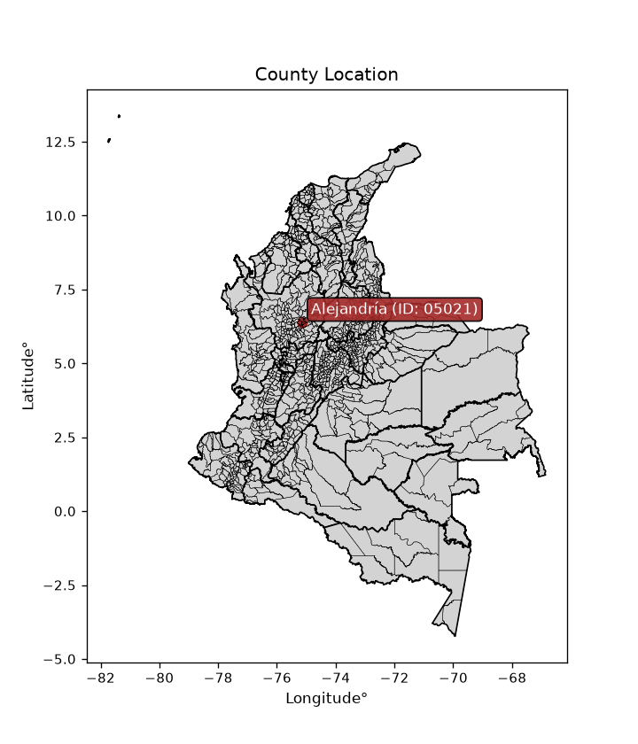
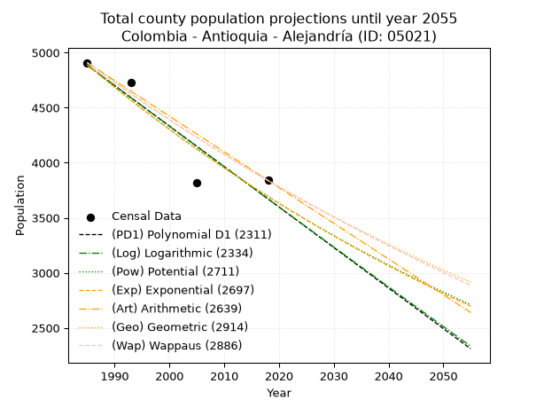
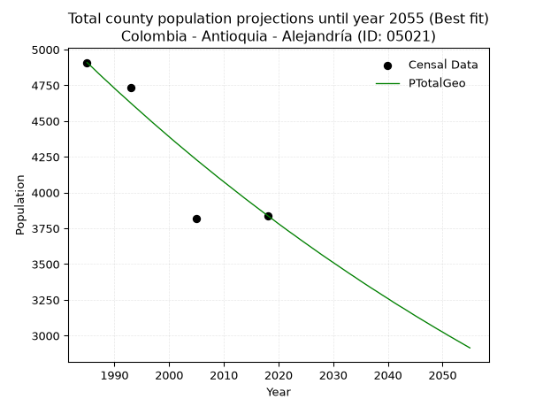
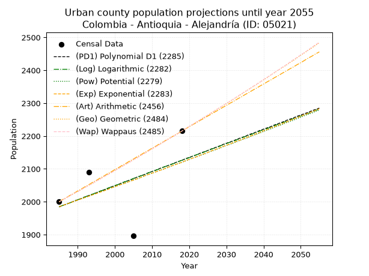
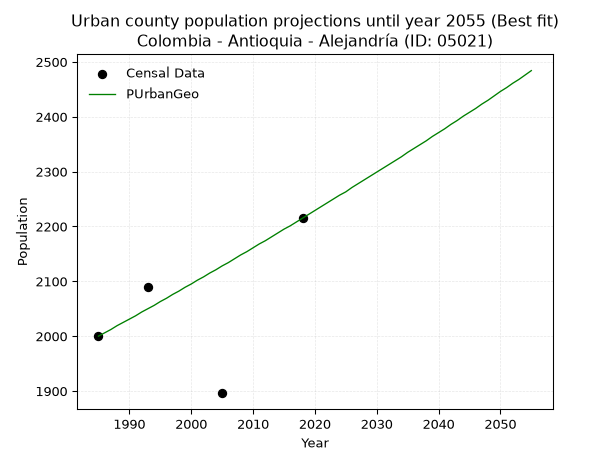
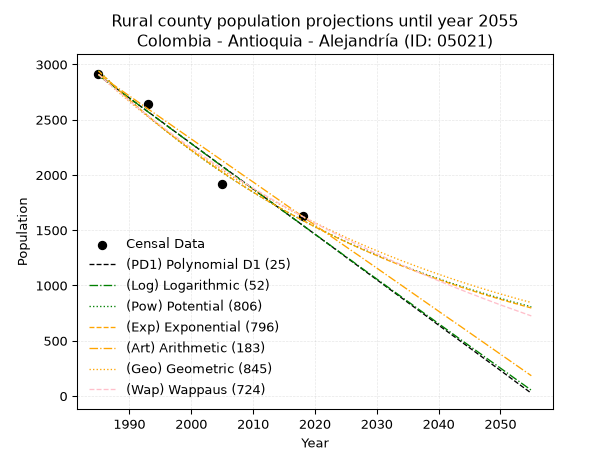
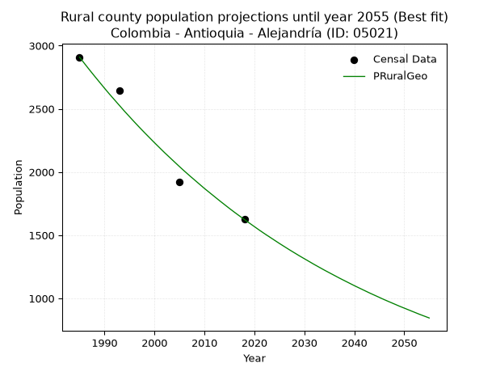

<div align="center">


</div>

# _“Population and Public Services Demand Projections (PPSD) until Year 2050 for Colombia - Antioquia - Alejandría (ID: 05021)”_
Keywords: `population` `public-service` `projection` `lineal` `polynomial` `logarithmic` `potential` `exponential` `arithmetic` `geometric` `wappaus` `dane` `colombia` `south-america`

PPSD are analytical estimates used by governments and planners to anticipate future changes in population size, age distribution, and the resulting community needs for utilities, healthcare, education, and infrastructure as sizing future water treatment facilities, electrical grids, and road networks based on spatial growth.

<div align="center">

</img>

</div>


> **General running parameters**: • app_version: _v20260806_. • Python version: _3.14.7_. • Pandas version: _3.0.5_. • NumPy version: _2.5.1_. • Creates, save and include plots into reports (create_plot): _False_. • Projection until year: _2050_. • Process polynomial degree 2 and up: _False_. • Process Wappaus: _True_. • Process Wappaus: _True_. • Set negative values to zero: _True_. • Set infinite values to zero: _True_. • Drop dataset notes: _True_. 
<div align="center">

Dynamic map: [:earth_americas:Google](http://maps.google.com/maps?q=6.376061444,-75.1413461) [:earth_americas:OSM](https://www.openstreetmap.org/#map=18/6.376061444/-75.1413461&layers=P) [:earth_americas:Bing](https://www.bing.com/maps?cp=6.376061444~-75.1413461&lvl=18) [:earth_americas:Apple](https://maps.apple.com/frame?center=6.376061444%2C-75.1413461&span=0.003%2C0.006)

</div>


<div align="center">

```geojson
{
  "type": "Feature",
  "geometry": {
    "type": "Point", 
    "coordinates": [-75.1413461, 6.376061444]
  }, 
  "properties": {
    "Name": "Colombia - Antioquia - Alejandría (ID: 05021)"
  }
}
```

</div>


## 0. Census Data (4 records)

Census data are official statistics collected by a government about the people and housing in a country. They usually include counts of total population, age, sex, race, income, education, and jobs.

📅Global census file: [Population.xlsx](../data/Population.xlsx)

| Source   |   Year |   CountryID | CountryName   |   StateID | StateName   |   CountyID | CountyName   |   PTotal |   PUrban |   PRural |
|:---------|-------:|------------:|:--------------|----------:|:------------|-----------:|:-------------|---------:|---------:|---------:|
| DANE     |   1985 |          57 | Colombia      |        05 | Antioquia   |      05021 | Alejandría   |     4909 |     2000 |     2909 |
| DANE     |   1993 |          57 | Colombia      |        05 | Antioquia   |      05021 | Alejandría   |     4732 |     2089 |     2643 |
| DANE     |   2005 |          57 | Colombia      |        05 | Antioquia   |      05021 | Alejandría   |     3816 |     1896 |     1920 |
| DANE     |   2018 |          57 | Colombia      |        05 | Antioquia   |      05021 | Alejandría   |     3839 |     2215 |     1624 |

> 🔥Some records could had specific notes about the registered values or the corresponding urban or rural distribution.

📅[SUI-RUPS](https://www.datos.gov.co/Hacienda-y-Cr-dito-P-blico/Registro-nico-de-Prestadores-de-Servicios-P-blicos/4qkq-csdn/about_data) - Local public utility companies: [RUPS.csv](../data/RUPS.xlsx)

 | SERVICIO       | ESTADO    | NOMBRE                                                                                                  | NIT         | DEPARTAMENTO_DOMICILIO   | MUNICIPIO_DOMICILIO   | DIRECCION                     |   TELEFONO | EMAIL                                     | TIPO_PRESTADOR                 | CLASIFICACION                 |
|:---------------|:----------|:--------------------------------------------------------------------------------------------------------|:------------|:-------------------------|:----------------------|:------------------------------|-----------:|:------------------------------------------|:-------------------------------|:------------------------------|
| ACUEDUCTO      | OPERATIVA | UNIDAD DE SERVICIOS PUBLICOS DOMICILIARIOS MUNICIPIO DE ALEJANDRIA                                      | 890983701-1 | ANTIOQUIA                | ALEJANDRIA            | Calle 20 No 19 - 36           |    8660016 | servipublicos@alejandria-antioquia.gov.co | MUNICIPIO (PRESTACIÓN DIRECTA) | MENOR O IGUAL A 2500 USUARIOS |
| ALCANTARILLADO | OPERATIVA | UNIDAD DE SERVICIOS PUBLICOS DOMICILIARIOS MUNICIPIO DE ALEJANDRIA                                      | 890983701-1 | ANTIOQUIA                | ALEJANDRIA            | Calle 20 No 19 - 36           |    8660016 | servipublicos@alejandria-antioquia.gov.co | MUNICIPIO (PRESTACIÓN DIRECTA) | MENOR O IGUAL A 2500 USUARIOS |
| ACUEDUCTO      | OPERATIVA | ASOCIACION DE USUARIOS DEL ACUEDUCTO RURAL SAN MIGUEL RESPALDO                                          | 900804816-9 | ANTIOQUIA                | ALEJANDRIA            | Vereda San Miguel El Respaldo |    8660016 | asociacionsanmiguelrespaldo@gmail.com     | ORGANIZACION AUTORIZADA        | MENOR O IGUAL A 2500 USUARIOS |
| ACUEDUCTO      | OPERATIVA | ASOCIACION DE USUARIOS DEL ACUEDUCTO VEREDAL EL POPO                                                    | 900663577-7 | ANTIOQUIA                | ALEJANDRIA            | VEREDA EL POPO                |    8660016 | acueductoruralelpopo@gmail.com            | ORGANIZACION AUTORIZADA        | MENOR O IGUAL A 2500 USUARIOS |
| ACUEDUCTO      | OPERATIVA | ASOCIACION DE USUARIOS SUSCRIPTORES DEL ACUEDUCTO MULTIVEREDAL CRUCES EL CERRO LA INMACULADA Y SAN JOSE | 900804370-6 | ANTIOQUIA                | ALEJANDRIA            | VEREDA CRUCES                 |    8660102 | natyarenasa@gmail.com                     | ORGANIZACION AUTORIZADA        | MENOR O IGUAL A 2500 USUARIOS |

## 1. Total

### 1.1. Coefficients and Parameters

* (PD1) Polynomial Deg 1: -36.77398635086305, 77881.1661983138 (lineal)
* (Log) Logarithmic: -73654.3156334232, 564171.043358293
* (Pow) Potential: -17.026731219328752, 59.83949707556643
* (Exp) Exponential: -0.008501195359911404, 104215792610.6204
* (Art) Arithmetic: Year diff. 2018 - 1985 = 33, Population diff. 3839 - 4909 = -1070, Annual growth = -32.42424242424242
* (Geo) Geometric: Year diff. 2018 - 1985 = 33, Population diff. 3839 - 4909 = -1070, Annual growth % = -0.0074225683605028125
* (Wap) Wappaus: i = -0.7412949799781076, Condition values only valid for < 200)

<sub>
Wappaus condition values: ['-0.00', '-0.74', '-1.48', '-2.22', '-2.97', '-3.71', '-4.45', '-5.19', '-5.93', '-6.67', '-7.41', '-8.15', '-8.90', '-9.64', '-10.38', '-11.12', '-11.86', '-12.60', '-13.34', '-14.08', '-14.83', '-15.57', '-16.31', '-17.05', '-17.79', '-18.53', '-19.27', '-20.01', '-20.76', '-21.50', '-22.24', '-22.98', '-23.72', '-24.46', '-25.20', '-25.95', '-26.69', '-27.43', '-28.17', '-28.91', '-29.65', '-30.39', '-31.13', '-31.88', '-32.62', '-33.36', '-34.10', '-34.84', '-35.58', '-36.32', '-37.06', '-37.81', '-38.55', '-39.29', '-40.03', '-40.77', '-41.51', '-42.25', '-43.00', '-43.74', '-44.48', '-45.22', '-45.96', '-46.70', '-47.44', '-48.18']
</sub>


### 1.2. Projected Dataset

|   Year |   CountyID |   PTotalPD1 |   PTotalLog |   PTotalPow |   PTotalExp |   PTotalArt |   PTotalGeo |   PTotalWap |
|-------:|-----------:|------------:|------------:|------------:|------------:|------------:|------------:|------------:|
|   1985 |      05021 |        4885 |        4886 |        4891 |        4890 |        4909 |        4909 |        4909 |
|   1986 |      05021 |        4848 |        4849 |        4849 |        4848 |        4877 |        4873 |        4873 |
|   1987 |      05021 |        4811 |        4812 |        4808 |        4807 |        4844 |        4836 |        4837 |
|   1988 |      05021 |        4774 |        4775 |        4767 |        4766 |        4812 |        4800 |        4801 |
|   1989 |      05021 |        4738 |        4738 |        4726 |        4726 |        4779 |        4765 |        4766 |
|   1990 |      05021 |        4701 |        4701 |        4686 |        4686 |        4747 |        4729 |        4730 |
|   1991 |      05021 |        4664 |        4664 |        4646 |        4646 |        4714 |        4694 |        4695 |
|   1992 |      05021 |        4627 |        4627 |        4607 |        4607 |        4682 |        4660 |        4661 |
|   1993 |      05021 |        4591 |        4590 |        4567 |        4568 |        4650 |        4625 |        4626 |
|   1994 |      05021 |        4554 |        4553 |        4529 |        4529 |        4617 |        4591 |        4592 |
|   1995 |      05021 |        4517 |        4516 |        4490 |        4491 |        4585 |        4557 |        4558 |
|   1996 |      05021 |        4480 |        4479 |        4452 |        4453 |        4552 |        4523 |        4524 |
|   1997 |      05021 |        4444 |        4442 |        4414 |        4415 |        4520 |        4489 |        4491 |
|   1998 |      05021 |        4407 |        4405 |        4377 |        4378 |        4487 |        4456 |        4458 |
|   1999 |      05021 |        4370 |        4369 |        4340 |        4341 |        4455 |        4423 |        4425 |
|   2000 |      05021 |        4333 |        4332 |        4303 |        4304 |        4423 |        4390 |        4392 |
|   2001 |      05021 |        4296 |        4295 |        4266 |        4268 |        4390 |        4357 |        4359 |
|   2002 |      05021 |        4260 |        4258 |        4230 |        4232 |        4358 |        4325 |        4327 |
|   2003 |      05021 |        4223 |        4221 |        4194 |        4196 |        4325 |        4293 |        4295 |
|   2004 |      05021 |        4186 |        4185 |        4159 |        4160 |        4293 |        4261 |        4263 |
|   2005 |      05021 |        4149 |        4148 |        4124 |        4125 |        4261 |        4229 |        4231 |
|   2006 |      05021 |        4113 |        4111 |        4089 |        4090 |        4228 |        4198 |        4200 |
|   2007 |      05021 |        4076 |        4074 |        4054 |        4056 |        4196 |        4167 |        4169 |
|   2008 |      05021 |        4039 |        4038 |        4020 |        4021 |        4163 |        4136 |        4138 |
|   2009 |      05021 |        4002 |        4001 |        3986 |        3987 |        4131 |        4105 |        4107 |
|   2010 |      05021 |        3965 |        3964 |        3952 |        3953 |        4098 |        4075 |        4076 |
|   2011 |      05021 |        3929 |        3928 |        3919 |        3920 |        4066 |        4045 |        4046 |
|   2012 |      05021 |        3892 |        3891 |        3886 |        3887 |        4034 |        4015 |        4016 |
|   2013 |      05021 |        3855 |        3855 |        3853 |        3854 |        4001 |        3985 |        3986 |
|   2014 |      05021 |        3818 |        3818 |        3821 |        3821 |        3969 |        3955 |        3956 |
|   2015 |      05021 |        3782 |        3781 |        3789 |        3789 |        3936 |        3926 |        3927 |
|   2016 |      05021 |        3745 |        3745 |        3757 |        3757 |        3904 |        3897 |        3897 |
|   2017 |      05021 |        3708 |        3708 |        3725 |        3725 |        3871 |        3868 |        3868 |
|   2018 |      05021 |        3671 |        3672 |        3694 |        3693 |        3839 |        3839 |        3839 |
|   2019 |      05021 |        3634 |        3635 |        3663 |        3662 |        3807 |        3811 |        3810 |
|   2020 |      05021 |        3598 |        3599 |        3632 |        3631 |        3774 |        3782 |        3782 |
|   2021 |      05021 |        3561 |        3562 |        3602 |        3600 |        3742 |        3754 |        3753 |
|   2022 |      05021 |        3524 |        3526 |        3571 |        3570 |        3709 |        3726 |        3725 |
|   2023 |      05021 |        3487 |        3490 |        3542 |        3540 |        3677 |        3699 |        3697 |
|   2024 |      05021 |        3451 |        3453 |        3512 |        3510 |        3644 |        3671 |        3669 |
|   2025 |      05021 |        3414 |        3417 |        3482 |        3480 |        3612 |        3644 |        3641 |
|   2026 |      05021 |        3377 |        3380 |        3453 |        3451 |        3580 |        3617 |        3614 |
|   2027 |      05021 |        3340 |        3344 |        3424 |        3421 |        3547 |        3590 |        3586 |
|   2028 |      05021 |        3304 |        3308 |        3396 |        3392 |        3515 |        3563 |        3559 |
|   2029 |      05021 |        3267 |        3271 |        3367 |        3364 |        3482 |        3537 |        3532 |
|   2030 |      05021 |        3230 |        3235 |        3339 |        3335 |        3450 |        3511 |        3506 |
|   2031 |      05021 |        3193 |        3199 |        3311 |        3307 |        3417 |        3485 |        3479 |
|   2032 |      05021 |        3156 |        3163 |        3284 |        3279 |        3385 |        3459 |        3452 |
|   2033 |      05021 |        3120 |        3126 |        3256 |        3251 |        3353 |        3433 |        3426 |
|   2034 |      05021 |        3083 |        3090 |        3229 |        3224 |        3320 |        3408 |        3400 |
|   2035 |      05021 |        3046 |        3054 |        3202 |        3196 |        3288 |        3382 |        3374 |
|   2036 |      05021 |        3009 |        3018 |        3176 |        3169 |        3255 |        3357 |        3348 |
|   2037 |      05021 |        2973 |        2982 |        3149 |        3143 |        3223 |        3332 |        3322 |
|   2038 |      05021 |        2936 |        2945 |        3123 |        3116 |        3191 |        3308 |        3297 |
|   2039 |      05021 |        2899 |        2909 |        3097 |        3090 |        3158 |        3283 |        3272 |
|   2040 |      05021 |        2862 |        2873 |        3071 |        3063 |        3126 |        3259 |        3246 |
|   2041 |      05021 |        2825 |        2837 |        3046 |        3037 |        3093 |        3234 |        3221 |
|   2042 |      05021 |        2789 |        2801 |        3020 |        3012 |        3061 |        3210 |        3197 |
|   2043 |      05021 |        2752 |        2765 |        2995 |        2986 |        3028 |        3187 |        3172 |
|   2044 |      05021 |        2715 |        2729 |        2970 |        2961 |        2996 |        3163 |        3147 |
|   2045 |      05021 |        2678 |        2693 |        2946 |        2936 |        2964 |        3139 |        3123 |
|   2046 |      05021 |        2642 |        2657 |        2921 |        2911 |        2931 |        3116 |        3099 |
|   2047 |      05021 |        2605 |        2621 |        2897 |        2886 |        2899 |        3093 |        3074 |
|   2048 |      05021 |        2568 |        2585 |        2873 |        2862 |        2866 |        3070 |        3050 |
|   2049 |      05021 |        2531 |        2549 |        2849 |        2838 |        2834 |        3047 |        3027 |
|   2050 |      05021 |        2494 |        2513 |        2826 |        2814 |        2801 |        3025 |        3003 |
<div align="center">

</img>

</div>


### 1.3. Best fit with absolute and relative error (%)

Relative error puts that difference into context by dividing the absolute error by the true value, creating a unitless ratio or percentage that shows the scale of the mistake.

Absolute and relative error

|   Year | Source   |   CountryID | CountryName   |   StateID | StateName   |   CountyID_x | CountyName   |   PTotal |   PUrban |   PRural |   CountyID_y |   PTotalPD1 |   PTotalLog |   PTotalPow |   PTotalExp |   PTotalArt |   PTotalGeo |   PTotalWap |   PTotalPD1AbsError |   PTotalLogAbsError |   PTotalPowAbsError |   PTotalExpAbsError |   PTotalArtAbsError |   PTotalGeoAbsError |   PTotalWapAbsError |   PTotalPD1RelError |   PTotalLogRelError |   PTotalPowRelError |   PTotalExpRelError |   PTotalArtRelError |   PTotalGeoRelError |   PTotalWapRelError |
|-------:|:---------|------------:|:--------------|----------:|:------------|-------------:|:-------------|---------:|---------:|---------:|-------------:|------------:|------------:|------------:|------------:|------------:|------------:|------------:|--------------------:|--------------------:|--------------------:|--------------------:|--------------------:|--------------------:|--------------------:|--------------------:|--------------------:|--------------------:|--------------------:|--------------------:|--------------------:|--------------------:|
|   1985 | DANE     |          57 | Colombia      |        05 | Antioquia   |        05021 | Alejandría   |     4909 |     2000 |     2909 |        05021 |        4885 |        4886 |        4891 |        4890 |        4909 |        4909 |        4909 |                  24 |                  23 |                  18 |                  19 |                   0 |                   0 |                   0 |            0.488898 |            0.468527 |            0.366673 |            0.387044 |             0       |              0      |             0       |
|   1993 | DANE     |          57 | Colombia      |        05 | Antioquia   |        05021 | Alejandría   |     4732 |     2089 |     2643 |        05021 |        4591 |        4590 |        4567 |        4568 |        4650 |        4625 |        4626 |                 141 |                 142 |                 165 |                 164 |                  82 |                 107 |                 106 |            2.97971  |            3.00085  |            3.4869   |            3.46577  |             1.73288 |              2.2612 |             2.24007 |
|   2005 | DANE     |          57 | Colombia      |        05 | Antioquia   |        05021 | Alejandría   |     3816 |     1896 |     1920 |        05021 |        4149 |        4148 |        4124 |        4125 |        4261 |        4229 |        4231 |                 333 |                 332 |                 308 |                 309 |                 445 |                 413 |                 415 |            8.72642  |            8.70021  |            8.07128  |            8.09748  |            11.6614  |             10.8229 |            10.8753  |
|   2018 | DANE     |          57 | Colombia      |        05 | Antioquia   |        05021 | Alejandría   |     3839 |     2215 |     1624 |        05021 |        3671 |        3672 |        3694 |        3693 |        3839 |        3839 |        3839 |                 168 |                 167 |                 145 |                 146 |                   0 |                   0 |                   0 |            4.37614  |            4.35009  |            3.77703  |            3.80307  |             0       |              0      |             0       |

Relative error mean

| Method    |   RelError | Best   |
|:----------|-----------:|:-------|
| PTotalPD1 |    4.14279 |        |
| PTotalLog |    4.12992 |        |
| PTotalPow |    3.92547 |        |
| PTotalExp |    3.93834 |        |
| PTotalArt |    3.34858 |        |
| PTotalGeo |    3.27101 | True   |
| PTotalWap |    3.27883 |        |

💙Best method: _**PTotalGeo**_
<div align="center">

</img>

</div>


### 1.4. Fresh water supply demand in liters per capita per day (lpcd)

The fresh water supply demand typically ranges from 100 to 300 liters per capita per day (lpcd) for standard domestic and municipal planning, though absolute survival minimums set by the World Health Organization are as low as 7.5 to 20 liters per day, and total consumption in high-income nations can exceed 400 liters.

> `CZ`: Level in meters above the sea level (masl)<br> `WS`: Fresh water supply demand in liters per capita per day (lpcd or l/h/d)<br> `WSAll`: Zonal fresh water supply demand in liters per second (l/s)<br> `A`: Zonal area in square meters<br> `DP`: Population density (people/hectare or p/ha)

Reference values (RAS Colombia)

|    CZ |   WS |
|------:|-----:|
|  1000 |  120 |
|  2000 |  130 |
| 99999 |  140 |

County shapefile geometry properties and water supply values

|   CountyID |      ATotal |   CZTotal |   WSTotal |
|-----------:|------------:|----------:|----------:|
|      05021 | 1.28856e+08 |   1547.77 |       130 |

Projected values for best method: PTotalGeo

|   CountyID |   Year |   PTotalGeo |   DPTotal |   WSTotal |   WSTotalAll |
|-----------:|-------:|------------:|----------:|----------:|-------------:|
|      05021 |   1985 |        4909 |      0.38 |       130 |      7.38623 |
|      05021 |   1986 |        4873 |      0.38 |       130 |      7.33206 |
|      05021 |   1987 |        4836 |      0.38 |       130 |      7.27639 |
|      05021 |   1988 |        4800 |      0.37 |       130 |      7.22222 |
|      05021 |   1989 |        4765 |      0.37 |       130 |      7.16956 |
|      05021 |   1990 |        4729 |      0.37 |       130 |      7.11539 |
|      05021 |   1991 |        4694 |      0.36 |       130 |      7.06273 |
|      05021 |   1992 |        4660 |      0.36 |       130 |      7.01157 |
|      05021 |   1993 |        4625 |      0.36 |       130 |      6.95891 |
|      05021 |   1994 |        4591 |      0.36 |       130 |      6.90775 |
|      05021 |   1995 |        4557 |      0.35 |       130 |      6.8566  |
|      05021 |   1996 |        4523 |      0.35 |       130 |      6.80544 |
|      05021 |   1997 |        4489 |      0.35 |       130 |      6.75428 |
|      05021 |   1998 |        4456 |      0.35 |       130 |      6.70463 |
|      05021 |   1999 |        4423 |      0.34 |       130 |      6.65498 |
|      05021 |   2000 |        4390 |      0.34 |       130 |      6.60532 |
|      05021 |   2001 |        4357 |      0.34 |       130 |      6.55567 |
|      05021 |   2002 |        4325 |      0.34 |       130 |      6.50752 |
|      05021 |   2003 |        4293 |      0.33 |       130 |      6.45937 |
|      05021 |   2004 |        4261 |      0.33 |       130 |      6.41123 |
|      05021 |   2005 |        4229 |      0.33 |       130 |      6.36308 |
|      05021 |   2006 |        4198 |      0.33 |       130 |      6.31644 |
|      05021 |   2007 |        4167 |      0.32 |       130 |      6.26979 |
|      05021 |   2008 |        4136 |      0.32 |       130 |      6.22315 |
|      05021 |   2009 |        4105 |      0.32 |       130 |      6.1765  |
|      05021 |   2010 |        4075 |      0.32 |       130 |      6.13137 |
|      05021 |   2011 |        4045 |      0.31 |       130 |      6.08623 |
|      05021 |   2012 |        4015 |      0.31 |       130 |      6.04109 |
|      05021 |   2013 |        3985 |      0.31 |       130 |      5.99595 |
|      05021 |   2014 |        3955 |      0.31 |       130 |      5.95081 |
|      05021 |   2015 |        3926 |      0.3  |       130 |      5.90718 |
|      05021 |   2016 |        3897 |      0.3  |       130 |      5.86354 |
|      05021 |   2017 |        3868 |      0.3  |       130 |      5.81991 |
|      05021 |   2018 |        3839 |      0.3  |       130 |      5.77627 |
|      05021 |   2019 |        3811 |      0.3  |       130 |      5.73414 |
|      05021 |   2020 |        3782 |      0.29 |       130 |      5.69051 |
|      05021 |   2021 |        3754 |      0.29 |       130 |      5.64838 |
|      05021 |   2022 |        3726 |      0.29 |       130 |      5.60625 |
|      05021 |   2023 |        3699 |      0.29 |       130 |      5.56562 |
|      05021 |   2024 |        3671 |      0.28 |       130 |      5.5235  |
|      05021 |   2025 |        3644 |      0.28 |       130 |      5.48287 |
|      05021 |   2026 |        3617 |      0.28 |       130 |      5.44225 |
|      05021 |   2027 |        3590 |      0.28 |       130 |      5.40162 |
|      05021 |   2028 |        3563 |      0.28 |       130 |      5.361   |
|      05021 |   2029 |        3537 |      0.27 |       130 |      5.32188 |
|      05021 |   2030 |        3511 |      0.27 |       130 |      5.28275 |
|      05021 |   2031 |        3485 |      0.27 |       130 |      5.24363 |
|      05021 |   2032 |        3459 |      0.27 |       130 |      5.20451 |
|      05021 |   2033 |        3433 |      0.27 |       130 |      5.16539 |
|      05021 |   2034 |        3408 |      0.26 |       130 |      5.12778 |
|      05021 |   2035 |        3382 |      0.26 |       130 |      5.08866 |
|      05021 |   2036 |        3357 |      0.26 |       130 |      5.05104 |
|      05021 |   2037 |        3332 |      0.26 |       130 |      5.01343 |
|      05021 |   2038 |        3308 |      0.26 |       130 |      4.97731 |
|      05021 |   2039 |        3283 |      0.25 |       130 |      4.9397  |
|      05021 |   2040 |        3259 |      0.25 |       130 |      4.90359 |
|      05021 |   2041 |        3234 |      0.25 |       130 |      4.86597 |
|      05021 |   2042 |        3210 |      0.25 |       130 |      4.82986 |
|      05021 |   2043 |        3187 |      0.25 |       130 |      4.79525 |
|      05021 |   2044 |        3163 |      0.25 |       130 |      4.75914 |
|      05021 |   2045 |        3139 |      0.24 |       130 |      4.72303 |
|      05021 |   2046 |        3116 |      0.24 |       130 |      4.68843 |
|      05021 |   2047 |        3093 |      0.24 |       130 |      4.65382 |
|      05021 |   2048 |        3070 |      0.24 |       130 |      4.61921 |
|      05021 |   2049 |        3047 |      0.24 |       130 |      4.58461 |
|      05021 |   2050 |        3025 |      0.23 |       130 |      4.5515  |

## 2. Urban

### 2.1. Coefficients and Parameters

* (PD1) Polynomial Deg 1: 4.29867523083081, -6548.425130469327 (lineal)
* (Log) Logarithmic: 8579.244963331195, -63160.90971603487
* (Pow) Potential: 3.9831095322610692, -9.837501508923973
* (Exp) Exponential: 0.001996084027419749, 37.761726784441464
* (Art) Arithmetic: Year diff. 2018 - 1985 = 33, Population diff. 2215 - 2000 = 215, Annual growth = 6.515151515151516
* (Geo) Geometric: Year diff. 2018 - 1985 = 33, Population diff. 2215 - 2000 = 215, Annual growth % = 0.0030988893256227446
* (Wap) Wappaus: i = 0.30914123440813834, Condition values only valid for < 200)

<sub>
Wappaus condition values: ['0.00', '0.31', '0.62', '0.93', '1.24', '1.55', '1.85', '2.16', '2.47', '2.78', '3.09', '3.40', '3.71', '4.02', '4.33', '4.64', '4.95', '5.26', '5.56', '5.87', '6.18', '6.49', '6.80', '7.11', '7.42', '7.73', '8.04', '8.35', '8.66', '8.97', '9.27', '9.58', '9.89', '10.20', '10.51', '10.82', '11.13', '11.44', '11.75', '12.06', '12.37', '12.67', '12.98', '13.29', '13.60', '13.91', '14.22', '14.53', '14.84', '15.15', '15.46', '15.77', '16.08', '16.38', '16.69', '17.00', '17.31', '17.62', '17.93', '18.24', '18.55', '18.86', '19.17', '19.48', '19.79', '20.09']
</sub>


### 2.2. Projected Dataset

|   Year |   CountyID |   PUrbanPD1 |   PUrbanLog |   PUrbanPow |   PUrbanExp |   PUrbanArt |   PUrbanGeo |   PUrbanWap |
|-------:|-----------:|------------:|------------:|------------:|------------:|------------:|------------:|------------:|
|   1985 |      05021 |        1984 |        1985 |        1985 |        1985 |        2000 |        2000 |        2000 |
|   1986 |      05021 |        1989 |        1989 |        1989 |        1989 |        2007 |        2006 |        2006 |
|   1987 |      05021 |        1993 |        1993 |        1993 |        1993 |        2013 |        2012 |        2012 |
|   1988 |      05021 |        1997 |        1997 |        1997 |        1997 |        2020 |        2019 |        2019 |
|   1989 |      05021 |        2002 |        2002 |        2001 |        2001 |        2026 |        2025 |        2025 |
|   1990 |      05021 |        2006 |        2006 |        2005 |        2005 |        2033 |        2031 |        2031 |
|   1991 |      05021 |        2010 |        2010 |        2009 |        2009 |        2039 |        2037 |        2037 |
|   1992 |      05021 |        2015 |        2015 |        2013 |        2013 |        2046 |        2044 |        2044 |
|   1993 |      05021 |        2019 |        2019 |        2017 |        2017 |        2052 |        2050 |        2050 |
|   1994 |      05021 |        2023 |        2023 |        2021 |        2021 |        2059 |        2056 |        2056 |
|   1995 |      05021 |        2027 |        2028 |        2026 |        2025 |        2065 |        2063 |        2063 |
|   1996 |      05021 |        2032 |        2032 |        2030 |        2029 |        2072 |        2069 |        2069 |
|   1997 |      05021 |        2036 |        2036 |        2034 |        2033 |        2078 |        2076 |        2076 |
|   1998 |      05021 |        2040 |        2041 |        2038 |        2037 |        2085 |        2082 |        2082 |
|   1999 |      05021 |        2045 |        2045 |        2042 |        2042 |        2091 |        2089 |        2088 |
|   2000 |      05021 |        2049 |        2049 |        2046 |        2046 |        2098 |        2095 |        2095 |
|   2001 |      05021 |        2053 |        2053 |        2050 |        2050 |        2104 |        2102 |        2101 |
|   2002 |      05021 |        2058 |        2058 |        2054 |        2054 |        2111 |        2108 |        2108 |
|   2003 |      05021 |        2062 |        2062 |        2058 |        2058 |        2117 |        2115 |        2114 |
|   2004 |      05021 |        2066 |        2066 |        2062 |        2062 |        2124 |        2121 |        2121 |
|   2005 |      05021 |        2070 |        2071 |        2066 |        2066 |        2130 |        2128 |        2128 |
|   2006 |      05021 |        2075 |        2075 |        2070 |        2070 |        2137 |        2134 |        2134 |
|   2007 |      05021 |        2079 |        2079 |        2074 |        2074 |        2143 |        2141 |        2141 |
|   2008 |      05021 |        2083 |        2083 |        2079 |        2079 |        2150 |        2148 |        2147 |
|   2009 |      05021 |        2088 |        2088 |        2083 |        2083 |        2156 |        2154 |        2154 |
|   2010 |      05021 |        2092 |        2092 |        2087 |        2087 |        2163 |        2161 |        2161 |
|   2011 |      05021 |        2096 |        2096 |        2091 |        2091 |        2169 |        2168 |        2167 |
|   2012 |      05021 |        2101 |        2100 |        2095 |        2095 |        2176 |        2174 |        2174 |
|   2013 |      05021 |        2105 |        2105 |        2099 |        2099 |        2182 |        2181 |        2181 |
|   2014 |      05021 |        2109 |        2109 |        2103 |        2104 |        2189 |        2188 |        2188 |
|   2015 |      05021 |        2113 |        2113 |        2108 |        2108 |        2195 |        2195 |        2195 |
|   2016 |      05021 |        2118 |        2117 |        2112 |        2112 |        2202 |        2201 |        2201 |
|   2017 |      05021 |        2122 |        2122 |        2116 |        2116 |        2208 |        2208 |        2208 |
|   2018 |      05021 |        2126 |        2126 |        2120 |        2120 |        2215 |        2215 |        2215 |
|   2019 |      05021 |        2131 |        2130 |        2124 |        2125 |        2222 |        2222 |        2222 |
|   2020 |      05021 |        2135 |        2134 |        2129 |        2129 |        2228 |        2229 |        2229 |
|   2021 |      05021 |        2139 |        2139 |        2133 |        2133 |        2235 |        2236 |        2236 |
|   2022 |      05021 |        2143 |        2143 |        2137 |        2137 |        2241 |        2243 |        2243 |
|   2023 |      05021 |        2148 |        2147 |        2141 |        2142 |        2248 |        2250 |        2250 |
|   2024 |      05021 |        2152 |        2151 |        2145 |        2146 |        2254 |        2257 |        2257 |
|   2025 |      05021 |        2156 |        2156 |        2150 |        2150 |        2261 |        2263 |        2264 |
|   2026 |      05021 |        2161 |        2160 |        2154 |        2155 |        2267 |        2271 |        2271 |
|   2027 |      05021 |        2165 |        2164 |        2158 |        2159 |        2274 |        2278 |        2278 |
|   2028 |      05021 |        2169 |        2168 |        2162 |        2163 |        2280 |        2285 |        2285 |
|   2029 |      05021 |        2174 |        2173 |        2167 |        2168 |        2287 |        2292 |        2292 |
|   2030 |      05021 |        2178 |        2177 |        2171 |        2172 |        2293 |        2299 |        2299 |
|   2031 |      05021 |        2182 |        2181 |        2175 |        2176 |        2300 |        2306 |        2306 |
|   2032 |      05021 |        2186 |        2185 |        2179 |        2181 |        2306 |        2313 |        2313 |
|   2033 |      05021 |        2191 |        2189 |        2184 |        2185 |        2313 |        2320 |        2321 |
|   2034 |      05021 |        2195 |        2194 |        2188 |        2189 |        2319 |        2327 |        2328 |
|   2035 |      05021 |        2199 |        2198 |        2192 |        2194 |        2326 |        2335 |        2335 |
|   2036 |      05021 |        2204 |        2202 |        2196 |        2198 |        2332 |        2342 |        2342 |
|   2037 |      05021 |        2208 |        2206 |        2201 |        2202 |        2339 |        2349 |        2350 |
|   2038 |      05021 |        2212 |        2211 |        2205 |        2207 |        2345 |        2356 |        2357 |
|   2039 |      05021 |        2217 |        2215 |        2209 |        2211 |        2352 |        2364 |        2364 |
|   2040 |      05021 |        2221 |        2219 |        2214 |        2216 |        2358 |        2371 |        2372 |
|   2041 |      05021 |        2225 |        2223 |        2218 |        2220 |        2365 |        2378 |        2379 |
|   2042 |      05021 |        2229 |        2227 |        2222 |        2225 |        2371 |        2386 |        2386 |
|   2043 |      05021 |        2234 |        2232 |        2227 |        2229 |        2378 |        2393 |        2394 |
|   2044 |      05021 |        2238 |        2236 |        2231 |        2233 |        2384 |        2401 |        2401 |
|   2045 |      05021 |        2242 |        2240 |        2235 |        2238 |        2391 |        2408 |        2409 |
|   2046 |      05021 |        2247 |        2244 |        2240 |        2242 |        2397 |        2415 |        2416 |
|   2047 |      05021 |        2251 |        2248 |        2244 |        2247 |        2404 |        2423 |        2424 |
|   2048 |      05021 |        2255 |        2253 |        2248 |        2251 |        2410 |        2430 |        2432 |
|   2049 |      05021 |        2260 |        2257 |        2253 |        2256 |        2417 |        2438 |        2439 |
|   2050 |      05021 |        2264 |        2261 |        2257 |        2260 |        2423 |        2446 |        2447 |
<div align="center">

</img>

</div>


### 2.3. Best fit with absolute and relative error (%)

Relative error puts that difference into context by dividing the absolute error by the true value, creating a unitless ratio or percentage that shows the scale of the mistake.

Absolute and relative error

|   Year | Source   |   CountryID | CountryName   |   StateID | StateName   |   CountyID_x | CountyName   |   PTotal |   PUrban |   PRural |   CountyID_y |   PUrbanPD1 |   PUrbanLog |   PUrbanPow |   PUrbanExp |   PUrbanArt |   PUrbanGeo |   PUrbanWap |   PUrbanPD1AbsError |   PUrbanLogAbsError |   PUrbanPowAbsError |   PUrbanExpAbsError |   PUrbanArtAbsError |   PUrbanGeoAbsError |   PUrbanWapAbsError |   PUrbanPD1RelError |   PUrbanLogRelError |   PUrbanPowRelError |   PUrbanExpRelError |   PUrbanArtRelError |   PUrbanGeoRelError |   PUrbanWapRelError |
|-------:|:---------|------------:|:--------------|----------:|:------------|-------------:|:-------------|---------:|---------:|---------:|-------------:|------------:|------------:|------------:|------------:|------------:|------------:|------------:|--------------------:|--------------------:|--------------------:|--------------------:|--------------------:|--------------------:|--------------------:|--------------------:|--------------------:|--------------------:|--------------------:|--------------------:|--------------------:|--------------------:|
|   1985 | DANE     |          57 | Colombia      |        05 | Antioquia   |        05021 | Alejandría   |     4909 |     2000 |     2909 |        05021 |        1984 |        1985 |        1985 |        1985 |        2000 |        2000 |        2000 |                  16 |                  15 |                  15 |                  15 |                   0 |                   0 |                   0 |             0.8     |             0.75    |             0.75    |             0.75    |             0       |             0       |             0       |
|   1993 | DANE     |          57 | Colombia      |        05 | Antioquia   |        05021 | Alejandría   |     4732 |     2089 |     2643 |        05021 |        2019 |        2019 |        2017 |        2017 |        2052 |        2050 |        2050 |                  70 |                  70 |                  72 |                  72 |                  37 |                  39 |                  39 |             3.35089 |             3.35089 |             3.44663 |             3.44663 |             1.77118 |             1.86692 |             1.86692 |
|   2005 | DANE     |          57 | Colombia      |        05 | Antioquia   |        05021 | Alejandría   |     3816 |     1896 |     1920 |        05021 |        2070 |        2071 |        2066 |        2066 |        2130 |        2128 |        2128 |                 174 |                 175 |                 170 |                 170 |                 234 |                 232 |                 232 |             9.17722 |             9.22996 |             8.96624 |             8.96624 |            12.3418  |            12.2363  |            12.2363  |
|   2018 | DANE     |          57 | Colombia      |        05 | Antioquia   |        05021 | Alejandría   |     3839 |     2215 |     1624 |        05021 |        2126 |        2126 |        2120 |        2120 |        2215 |        2215 |        2215 |                  89 |                  89 |                  95 |                  95 |                   0 |                   0 |                   0 |             4.01806 |             4.01806 |             4.28894 |             4.28894 |             0       |             0       |             0       |

Relative error mean

| Method    |   RelError | Best   |
|:----------|-----------:|:-------|
| PUrbanPD1 |    4.33654 |        |
| PUrbanLog |    4.33723 |        |
| PUrbanPow |    4.36295 |        |
| PUrbanExp |    4.36295 |        |
| PUrbanArt |    3.52824 |        |
| PUrbanGeo |    3.5258  | True   |
| PUrbanWap |    3.5258  | True   |

💙Best method: _**PUrbanGeo**_
<div align="center">

</img>

</div>


### 2.4. Fresh water supply demand in liters per capita per day (lpcd)

The fresh water supply demand typically ranges from 100 to 300 liters per capita per day (lpcd) for standard domestic and municipal planning, though absolute survival minimums set by the World Health Organization are as low as 7.5 to 20 liters per day, and total consumption in high-income nations can exceed 400 liters.

> `CZ`: Level in meters above the sea level (masl)<br> `WS`: Fresh water supply demand in liters per capita per day (lpcd or l/h/d)<br> `WSAll`: Zonal fresh water supply demand in liters per second (l/s)<br> `A`: Zonal area in square meters<br> `DP`: Population density (people/hectare or p/ha)

Reference values (RAS Colombia)

|    CZ |   WS |
|------:|-----:|
|  1000 |  120 |
|  2000 |  130 |
| 99999 |  140 |

County shapefile geometry properties and water supply values

|   CountyID |   AUrban |   CZUrban |   WSUrban |
|-----------:|---------:|----------:|----------:|
|      05021 |   401902 |   1639.37 |       130 |

Projected values for best method: PUrbanGeo

|   CountyID |   Year |   PUrbanGeo |   DPUrban |   WSUrban |   WSUrbanAll |
|-----------:|-------:|------------:|----------:|----------:|-------------:|
|      05021 |   1985 |        2000 |     49.76 |       130 |      3.00926 |
|      05021 |   1986 |        2006 |     49.91 |       130 |      3.01829 |
|      05021 |   1987 |        2012 |     50.06 |       130 |      3.02731 |
|      05021 |   1988 |        2019 |     50.24 |       130 |      3.03785 |
|      05021 |   1989 |        2025 |     50.39 |       130 |      3.04688 |
|      05021 |   1990 |        2031 |     50.53 |       130 |      3.0559  |
|      05021 |   1991 |        2037 |     50.68 |       130 |      3.06493 |
|      05021 |   1992 |        2044 |     50.86 |       130 |      3.07546 |
|      05021 |   1993 |        2050 |     51.01 |       130 |      3.08449 |
|      05021 |   1994 |        2056 |     51.16 |       130 |      3.09352 |
|      05021 |   1995 |        2063 |     51.33 |       130 |      3.10405 |
|      05021 |   1996 |        2069 |     51.48 |       130 |      3.11308 |
|      05021 |   1997 |        2076 |     51.65 |       130 |      3.12361 |
|      05021 |   1998 |        2082 |     51.8  |       130 |      3.13264 |
|      05021 |   1999 |        2089 |     51.98 |       130 |      3.14317 |
|      05021 |   2000 |        2095 |     52.13 |       130 |      3.1522  |
|      05021 |   2001 |        2102 |     52.3  |       130 |      3.16273 |
|      05021 |   2002 |        2108 |     52.45 |       130 |      3.17176 |
|      05021 |   2003 |        2115 |     52.62 |       130 |      3.18229 |
|      05021 |   2004 |        2121 |     52.77 |       130 |      3.19132 |
|      05021 |   2005 |        2128 |     52.95 |       130 |      3.20185 |
|      05021 |   2006 |        2134 |     53.1  |       130 |      3.21088 |
|      05021 |   2007 |        2141 |     53.27 |       130 |      3.22141 |
|      05021 |   2008 |        2148 |     53.45 |       130 |      3.23194 |
|      05021 |   2009 |        2154 |     53.6  |       130 |      3.24097 |
|      05021 |   2010 |        2161 |     53.77 |       130 |      3.2515  |
|      05021 |   2011 |        2168 |     53.94 |       130 |      3.26204 |
|      05021 |   2012 |        2174 |     54.09 |       130 |      3.27106 |
|      05021 |   2013 |        2181 |     54.27 |       130 |      3.2816  |
|      05021 |   2014 |        2188 |     54.44 |       130 |      3.29213 |
|      05021 |   2015 |        2195 |     54.62 |       130 |      3.30266 |
|      05021 |   2016 |        2201 |     54.76 |       130 |      3.31169 |
|      05021 |   2017 |        2208 |     54.94 |       130 |      3.32222 |
|      05021 |   2018 |        2215 |     55.11 |       130 |      3.33275 |
|      05021 |   2019 |        2222 |     55.29 |       130 |      3.34329 |
|      05021 |   2020 |        2229 |     55.46 |       130 |      3.35382 |
|      05021 |   2021 |        2236 |     55.64 |       130 |      3.36435 |
|      05021 |   2022 |        2243 |     55.81 |       130 |      3.37488 |
|      05021 |   2023 |        2250 |     55.98 |       130 |      3.38542 |
|      05021 |   2024 |        2257 |     56.16 |       130 |      3.39595 |
|      05021 |   2025 |        2263 |     56.31 |       130 |      3.40498 |
|      05021 |   2026 |        2271 |     56.51 |       130 |      3.41701 |
|      05021 |   2027 |        2278 |     56.68 |       130 |      3.42755 |
|      05021 |   2028 |        2285 |     56.85 |       130 |      3.43808 |
|      05021 |   2029 |        2292 |     57.03 |       130 |      3.44861 |
|      05021 |   2030 |        2299 |     57.2  |       130 |      3.45914 |
|      05021 |   2031 |        2306 |     57.38 |       130 |      3.46968 |
|      05021 |   2032 |        2313 |     57.55 |       130 |      3.48021 |
|      05021 |   2033 |        2320 |     57.73 |       130 |      3.49074 |
|      05021 |   2034 |        2327 |     57.9  |       130 |      3.50127 |
|      05021 |   2035 |        2335 |     58.1  |       130 |      3.51331 |
|      05021 |   2036 |        2342 |     58.27 |       130 |      3.52384 |
|      05021 |   2037 |        2349 |     58.45 |       130 |      3.53437 |
|      05021 |   2038 |        2356 |     58.62 |       130 |      3.54491 |
|      05021 |   2039 |        2364 |     58.82 |       130 |      3.55694 |
|      05021 |   2040 |        2371 |     58.99 |       130 |      3.56748 |
|      05021 |   2041 |        2378 |     59.17 |       130 |      3.57801 |
|      05021 |   2042 |        2386 |     59.37 |       130 |      3.59005 |
|      05021 |   2043 |        2393 |     59.54 |       130 |      3.60058 |
|      05021 |   2044 |        2401 |     59.74 |       130 |      3.61262 |
|      05021 |   2045 |        2408 |     59.92 |       130 |      3.62315 |
|      05021 |   2046 |        2415 |     60.09 |       130 |      3.63368 |
|      05021 |   2047 |        2423 |     60.29 |       130 |      3.64572 |
|      05021 |   2048 |        2430 |     60.46 |       130 |      3.65625 |
|      05021 |   2049 |        2438 |     60.66 |       130 |      3.66829 |
|      05021 |   2050 |        2446 |     60.86 |       130 |      3.68032 |

## 3. Rural

### 3.1. Coefficients and Parameters

* (PD1) Polynomial Deg 1: -41.07266158169387, 84429.59132878316 (lineal)
* (Log) Logarithmic: -82233.56059675444, 627331.9530743283
* (Pow) Potential: -37.369239343427544, 126.70362508429051
* (Exp) Exponential: -0.01866735001408324, 3.6409358071892713e+19
* (Art) Arithmetic: Year diff. 2018 - 1985 = 33, Population diff. 1624 - 2909 = -1285, Annual growth = -38.93939393939394
* (Geo) Geometric: Year diff. 2018 - 1985 = 33, Population diff. 1624 - 2909 = -1285, Annual growth % = -0.017509059051724063
* (Wap) Wappaus: i = -1.7180407650295142, Condition values only valid for < 200)

<sub>
Wappaus condition values: ['-0.00', '-1.72', '-3.44', '-5.15', '-6.87', '-8.59', '-10.31', '-12.03', '-13.74', '-15.46', '-17.18', '-18.90', '-20.62', '-22.33', '-24.05', '-25.77', '-27.49', '-29.21', '-30.92', '-32.64', '-34.36', '-36.08', '-37.80', '-39.51', '-41.23', '-42.95', '-44.67', '-46.39', '-48.11', '-49.82', '-51.54', '-53.26', '-54.98', '-56.70', '-58.41', '-60.13', '-61.85', '-63.57', '-65.29', '-67.00', '-68.72', '-70.44', '-72.16', '-73.88', '-75.59', '-77.31', '-79.03', '-80.75', '-82.47', '-84.18', '-85.90', '-87.62', '-89.34', '-91.06', '-92.77', '-94.49', '-96.21', '-97.93', '-99.65', '-101.36', '-103.08', '-104.80', '-106.52', '-108.24', '-109.95', '-111.67']
</sub>


### 3.2. Projected Dataset

|   Year |   CountyID |   PRuralPD1 |   PRuralLog |   PRuralPow |   PRuralExp |   PRuralArt |   PRuralGeo |   PRuralWap |
|-------:|-----------:|------------:|------------:|------------:|------------:|------------:|------------:|------------:|
|   1985 |      05021 |        2900 |        2902 |        2943 |        2941 |        2909 |        2909 |        2909 |
|   1986 |      05021 |        2859 |        2860 |        2888 |        2887 |        2870 |        2858 |        2859 |
|   1987 |      05021 |        2818 |        2819 |        2835 |        2834 |        2831 |        2808 |        2811 |
|   1988 |      05021 |        2777 |        2778 |        2782 |        2781 |        2792 |        2759 |        2763 |
|   1989 |      05021 |        2736 |        2736 |        2730 |        2730 |        2753 |        2711 |        2716 |
|   1990 |      05021 |        2695 |        2695 |        2679 |        2679 |        2714 |        2663 |        2669 |
|   1991 |      05021 |        2654 |        2654 |        2629 |        2630 |        2675 |        2616 |        2624 |
|   1992 |      05021 |        2613 |        2612 |        2580 |        2581 |        2636 |        2571 |        2579 |
|   1993 |      05021 |        2572 |        2571 |        2532 |        2533 |        2597 |        2526 |        2535 |
|   1994 |      05021 |        2531 |        2530 |        2485 |        2487 |        2559 |        2481 |        2491 |
|   1995 |      05021 |        2490 |        2489 |        2439 |        2441 |        2520 |        2438 |        2449 |
|   1996 |      05021 |        2449 |        2447 |        2394 |        2395 |        2481 |        2395 |        2407 |
|   1997 |      05021 |        2407 |        2406 |        2350 |        2351 |        2442 |        2353 |        2365 |
|   1998 |      05021 |        2366 |        2365 |        2306 |        2308 |        2403 |        2312 |        2325 |
|   1999 |      05021 |        2325 |        2324 |        2263 |        2265 |        2364 |        2272 |        2284 |
|   2000 |      05021 |        2284 |        2283 |        2221 |        2223 |        2325 |        2232 |        2245 |
|   2001 |      05021 |        2243 |        2242 |        2180 |        2182 |        2286 |        2193 |        2206 |
|   2002 |      05021 |        2202 |        2200 |        2140 |        2142 |        2247 |        2154 |        2168 |
|   2003 |      05021 |        2161 |        2159 |        2100 |        2102 |        2208 |        2117 |        2130 |
|   2004 |      05021 |        2120 |        2118 |        2062 |        2063 |        2169 |        2080 |        2093 |
|   2005 |      05021 |        2079 |        2077 |        2024 |        2025 |        2130 |        2043 |        2056 |
|   2006 |      05021 |        2038 |        2036 |        1986 |        1988 |        2091 |        2007 |        2020 |
|   2007 |      05021 |        1997 |        1995 |        1950 |        1951 |        2052 |        1972 |        1984 |
|   2008 |      05021 |        1956 |        1954 |        1914 |        1915 |        2013 |        1938 |        1949 |
|   2009 |      05021 |        1915 |        1913 |        1878 |        1879 |        1974 |        1904 |        1915 |
|   2010 |      05021 |        1874 |        1873 |        1844 |        1845 |        1936 |        1870 |        1880 |
|   2011 |      05021 |        1832 |        1832 |        1810 |        1810 |        1897 |        1838 |        1847 |
|   2012 |      05021 |        1791 |        1791 |        1776 |        1777 |        1858 |        1806 |        1814 |
|   2013 |      05021 |        1750 |        1750 |        1744 |        1744 |        1819 |        1774 |        1781 |
|   2014 |      05021 |        1709 |        1709 |        1712 |        1712 |        1780 |        1743 |        1749 |
|   2015 |      05021 |        1668 |        1668 |        1680 |        1680 |        1741 |        1712 |        1717 |
|   2016 |      05021 |        1627 |        1627 |        1649 |        1649 |        1702 |        1682 |        1686 |
|   2017 |      05021 |        1586 |        1587 |        1619 |        1619 |        1663 |        1653 |        1655 |
|   2018 |      05021 |        1545 |        1546 |        1589 |        1589 |        1624 |        1624 |        1624 |
|   2019 |      05021 |        1504 |        1505 |        1560 |        1559 |        1585 |        1596 |        1594 |
|   2020 |      05021 |        1463 |        1464 |        1532 |        1530 |        1546 |        1568 |        1564 |
|   2021 |      05021 |        1422 |        1424 |        1504 |        1502 |        1507 |        1540 |        1535 |
|   2022 |      05021 |        1381 |        1383 |        1476 |        1474 |        1468 |        1513 |        1506 |
|   2023 |      05021 |        1340 |        1342 |        1449 |        1447 |        1429 |        1487 |        1477 |
|   2024 |      05021 |        1299 |        1302 |        1423 |        1420 |        1390 |        1461 |        1449 |
|   2025 |      05021 |        1257 |        1261 |        1396 |        1394 |        1351 |        1435 |        1421 |
|   2026 |      05021 |        1216 |        1221 |        1371 |        1368 |        1312 |        1410 |        1394 |
|   2027 |      05021 |        1175 |        1180 |        1346 |        1343 |        1274 |        1385 |        1366 |
|   2028 |      05021 |        1134 |        1139 |        1321 |        1318 |        1235 |        1361 |        1340 |
|   2029 |      05021 |        1093 |        1099 |        1297 |        1294 |        1196 |        1337 |        1313 |
|   2030 |      05021 |        1052 |        1058 |        1274 |        1270 |        1157 |        1314 |        1287 |
|   2031 |      05021 |        1011 |        1018 |        1250 |        1246 |        1118 |        1291 |        1261 |
|   2032 |      05021 |         970 |         977 |        1228 |        1223 |        1079 |        1268 |        1236 |
|   2033 |      05021 |         929 |         937 |        1205 |        1201 |        1040 |        1246 |        1210 |
|   2034 |      05021 |         888 |         896 |        1183 |        1178 |        1001 |        1224 |        1186 |
|   2035 |      05021 |         847 |         856 |        1162 |        1157 |         962 |        1203 |        1161 |
|   2036 |      05021 |         806 |         816 |        1141 |        1135 |         923 |        1182 |        1137 |
|   2037 |      05021 |         765 |         775 |        1120 |        1114 |         884 |        1161 |        1113 |
|   2038 |      05021 |         724 |         735 |        1099 |        1094 |         845 |        1141 |        1089 |
|   2039 |      05021 |         682 |         695 |        1079 |        1073 |         806 |        1121 |        1065 |
|   2040 |      05021 |         641 |         654 |        1060 |        1054 |         767 |        1101 |        1042 |
|   2041 |      05021 |         600 |         614 |        1041 |        1034 |         728 |        1082 |        1019 |
|   2042 |      05021 |         559 |         574 |        1022 |        1015 |         689 |        1063 |         997 |
|   2043 |      05021 |         518 |         533 |        1003 |         996 |         651 |        1044 |         974 |
|   2044 |      05021 |         477 |         493 |         985 |         978 |         612 |        1026 |         952 |
|   2045 |      05021 |         436 |         453 |         967 |         960 |         573 |        1008 |         930 |
|   2046 |      05021 |         395 |         413 |         950 |         942 |         534 |         990 |         909 |
|   2047 |      05021 |         354 |         373 |         933 |         925 |         495 |         973 |         887 |
|   2048 |      05021 |         313 |         332 |         916 |         907 |         456 |         956 |         866 |
|   2049 |      05021 |         272 |         292 |         899 |         891 |         417 |         939 |         845 |
|   2050 |      05021 |         231 |         252 |         883 |         874 |         378 |         923 |         824 |
<div align="center">

</img>

</div>


### 3.3. Best fit with absolute and relative error (%)

Relative error puts that difference into context by dividing the absolute error by the true value, creating a unitless ratio or percentage that shows the scale of the mistake.

Absolute and relative error

|   Year | Source   |   CountryID | CountryName   |   StateID | StateName   |   CountyID_x | CountyName   |   PTotal |   PUrban |   PRural |   CountyID_y |   PRuralPD1 |   PRuralLog |   PRuralPow |   PRuralExp |   PRuralArt |   PRuralGeo |   PRuralWap |   PRuralPD1AbsError |   PRuralLogAbsError |   PRuralPowAbsError |   PRuralExpAbsError |   PRuralArtAbsError |   PRuralGeoAbsError |   PRuralWapAbsError |   PRuralPD1RelError |   PRuralLogRelError |   PRuralPowRelError |   PRuralExpRelError |   PRuralArtRelError |   PRuralGeoRelError |   PRuralWapRelError |
|-------:|:---------|------------:|:--------------|----------:|:------------|-------------:|:-------------|---------:|---------:|---------:|-------------:|------------:|------------:|------------:|------------:|------------:|------------:|------------:|--------------------:|--------------------:|--------------------:|--------------------:|--------------------:|--------------------:|--------------------:|--------------------:|--------------------:|--------------------:|--------------------:|--------------------:|--------------------:|--------------------:|
|   1985 | DANE     |          57 | Colombia      |        05 | Antioquia   |        05021 | Alejandría   |     4909 |     2000 |     2909 |        05021 |        2900 |        2902 |        2943 |        2941 |        2909 |        2909 |        2909 |                   9 |                   7 |                  34 |                  32 |                   0 |                   0 |                   0 |            0.309385 |            0.240633 |             1.16879 |             1.10003 |             0       |             0       |             0       |
|   1993 | DANE     |          57 | Colombia      |        05 | Antioquia   |        05021 | Alejandría   |     4732 |     2089 |     2643 |        05021 |        2572 |        2571 |        2532 |        2533 |        2597 |        2526 |        2535 |                  71 |                  72 |                 111 |                 110 |                  46 |                 117 |                 108 |            2.68634  |            2.72418  |             4.19977 |             4.16194 |             1.74045 |             4.42679 |             4.08627 |
|   2005 | DANE     |          57 | Colombia      |        05 | Antioquia   |        05021 | Alejandría   |     3816 |     1896 |     1920 |        05021 |        2079 |        2077 |        2024 |        2025 |        2130 |        2043 |        2056 |                 159 |                 157 |                 104 |                 105 |                 210 |                 123 |                 136 |            8.28125  |            8.17708  |             5.41667 |             5.46875 |            10.9375  |             6.40625 |             7.08333 |
|   2018 | DANE     |          57 | Colombia      |        05 | Antioquia   |        05021 | Alejandría   |     3839 |     2215 |     1624 |        05021 |        1545 |        1546 |        1589 |        1589 |        1624 |        1624 |        1624 |                  79 |                  78 |                  35 |                  35 |                   0 |                   0 |                   0 |            4.86453  |            4.80296  |             2.15517 |             2.15517 |             0       |             0       |             0       |

Relative error mean

| Method    |   RelError | Best   |
|:----------|-----------:|:-------|
| PRuralPD1 |    4.03538 |        |
| PRuralLog |    3.98621 |        |
| PRuralPow |    3.2351  |        |
| PRuralExp |    3.22147 |        |
| PRuralArt |    3.16949 |        |
| PRuralGeo |    2.70826 | True   |
| PRuralWap |    2.7924  |        |

💙Best method: _**PRuralGeo**_
<div align="center">

</img>

</div>


### 3.4. Fresh water supply demand in liters per capita per day (lpcd)

The fresh water supply demand typically ranges from 100 to 300 liters per capita per day (lpcd) for standard domestic and municipal planning, though absolute survival minimums set by the World Health Organization are as low as 7.5 to 20 liters per day, and total consumption in high-income nations can exceed 400 liters.

> `CZ`: Level in meters above the sea level (masl)<br> `WS`: Fresh water supply demand in liters per capita per day (lpcd or l/h/d)<br> `WSAll`: Zonal fresh water supply demand in liters per second (l/s)<br> `A`: Zonal area in square meters<br> `DP`: Population density (people/hectare or p/ha)

Reference values (RAS Colombia)

|    CZ |   WS |
|------:|-----:|
|  1000 |  120 |
|  2000 |  130 |
| 99999 |  140 |

County shapefile geometry properties and water supply values

|   CountyID |      ARural |   CZRural |   WSRural |
|-----------:|------------:|----------:|----------:|
|      05021 | 1.28455e+08 |   1547.47 |       130 |

Projected values for best method: PRuralGeo

|   CountyID |   Year |   PRuralGeo |   DPRural |   WSRural |   WSRuralAll |
|-----------:|-------:|------------:|----------:|----------:|-------------:|
|      05021 |   1985 |        2909 |      0.23 |       130 |      4.37697 |
|      05021 |   1986 |        2858 |      0.22 |       130 |      4.30023 |
|      05021 |   1987 |        2808 |      0.22 |       130 |      4.225   |
|      05021 |   1988 |        2759 |      0.21 |       130 |      4.15127 |
|      05021 |   1989 |        2711 |      0.21 |       130 |      4.07905 |
|      05021 |   1990 |        2663 |      0.21 |       130 |      4.00683 |
|      05021 |   1991 |        2616 |      0.2  |       130 |      3.93611 |
|      05021 |   1992 |        2571 |      0.2  |       130 |      3.8684  |
|      05021 |   1993 |        2526 |      0.2  |       130 |      3.80069 |
|      05021 |   1994 |        2481 |      0.19 |       130 |      3.73299 |
|      05021 |   1995 |        2438 |      0.19 |       130 |      3.66829 |
|      05021 |   1996 |        2395 |      0.19 |       130 |      3.60359 |
|      05021 |   1997 |        2353 |      0.18 |       130 |      3.54039 |
|      05021 |   1998 |        2312 |      0.18 |       130 |      3.4787  |
|      05021 |   1999 |        2272 |      0.18 |       130 |      3.41852 |
|      05021 |   2000 |        2232 |      0.17 |       130 |      3.35833 |
|      05021 |   2001 |        2193 |      0.17 |       130 |      3.29965 |
|      05021 |   2002 |        2154 |      0.17 |       130 |      3.24097 |
|      05021 |   2003 |        2117 |      0.16 |       130 |      3.1853  |
|      05021 |   2004 |        2080 |      0.16 |       130 |      3.12963 |
|      05021 |   2005 |        2043 |      0.16 |       130 |      3.07396 |
|      05021 |   2006 |        2007 |      0.16 |       130 |      3.01979 |
|      05021 |   2007 |        1972 |      0.15 |       130 |      2.96713 |
|      05021 |   2008 |        1938 |      0.15 |       130 |      2.91597 |
|      05021 |   2009 |        1904 |      0.15 |       130 |      2.86481 |
|      05021 |   2010 |        1870 |      0.15 |       130 |      2.81366 |
|      05021 |   2011 |        1838 |      0.14 |       130 |      2.76551 |
|      05021 |   2012 |        1806 |      0.14 |       130 |      2.71736 |
|      05021 |   2013 |        1774 |      0.14 |       130 |      2.66921 |
|      05021 |   2014 |        1743 |      0.14 |       130 |      2.62257 |
|      05021 |   2015 |        1712 |      0.13 |       130 |      2.57593 |
|      05021 |   2016 |        1682 |      0.13 |       130 |      2.53079 |
|      05021 |   2017 |        1653 |      0.13 |       130 |      2.48715 |
|      05021 |   2018 |        1624 |      0.13 |       130 |      2.44352 |
|      05021 |   2019 |        1596 |      0.12 |       130 |      2.40139 |
|      05021 |   2020 |        1568 |      0.12 |       130 |      2.35926 |
|      05021 |   2021 |        1540 |      0.12 |       130 |      2.31713 |
|      05021 |   2022 |        1513 |      0.12 |       130 |      2.2765  |
|      05021 |   2023 |        1487 |      0.12 |       130 |      2.23738 |
|      05021 |   2024 |        1461 |      0.11 |       130 |      2.19826 |
|      05021 |   2025 |        1435 |      0.11 |       130 |      2.15914 |
|      05021 |   2026 |        1410 |      0.11 |       130 |      2.12153 |
|      05021 |   2027 |        1385 |      0.11 |       130 |      2.08391 |
|      05021 |   2028 |        1361 |      0.11 |       130 |      2.0478  |
|      05021 |   2029 |        1337 |      0.1  |       130 |      2.01169 |
|      05021 |   2030 |        1314 |      0.1  |       130 |      1.97708 |
|      05021 |   2031 |        1291 |      0.1  |       130 |      1.94248 |
|      05021 |   2032 |        1268 |      0.1  |       130 |      1.90787 |
|      05021 |   2033 |        1246 |      0.1  |       130 |      1.87477 |
|      05021 |   2034 |        1224 |      0.1  |       130 |      1.84167 |
|      05021 |   2035 |        1203 |      0.09 |       130 |      1.81007 |
|      05021 |   2036 |        1182 |      0.09 |       130 |      1.77847 |
|      05021 |   2037 |        1161 |      0.09 |       130 |      1.74687 |
|      05021 |   2038 |        1141 |      0.09 |       130 |      1.71678 |
|      05021 |   2039 |        1121 |      0.09 |       130 |      1.68669 |
|      05021 |   2040 |        1101 |      0.09 |       130 |      1.6566  |
|      05021 |   2041 |        1082 |      0.08 |       130 |      1.62801 |
|      05021 |   2042 |        1063 |      0.08 |       130 |      1.59942 |
|      05021 |   2043 |        1044 |      0.08 |       130 |      1.57083 |
|      05021 |   2044 |        1026 |      0.08 |       130 |      1.54375 |
|      05021 |   2045 |        1008 |      0.08 |       130 |      1.51667 |
|      05021 |   2046 |         990 |      0.08 |       130 |      1.48958 |
|      05021 |   2047 |         973 |      0.08 |       130 |      1.464   |
|      05021 |   2048 |         956 |      0.07 |       130 |      1.43843 |
|      05021 |   2049 |         939 |      0.07 |       130 |      1.41285 |
|      05021 |   2050 |         923 |      0.07 |       130 |      1.38877 |

<div align="center"><br><sub>Share this research</sub></div><br>

<sub>**APPS & TOOLS & CONTENT DISCLAIMER**: • NO WARRANTY - This content and software is provided by <a href="https://github.com/rcfdtools" target="_blank">github.com/rcfdtools</a> "as is", without any express or implied warranty, including warranties of merchantability, fitness for a particular purpose, or non-infringement. There is no guarantee that the software will be error-free or operate without interruption. • LIMITATION OF LIABILITY - Neither the authors nor copyright holders will be liable for claims or damages arising from the software or its use. You are responsible for determining if the software is appropriate for your use and assume all associated risks, including errors, legal compliance, and data loss. • NO PROFESSIONAL ADVICE - The software provides general information and does not offer professional advice. It should not replace consultation with professional advisors. [Clauses and global license for rcfdtools use.](https://github.com/rcfdtools/rcfdtools/blob/main/LICENSE.md)</sub>

| [:house: Home](Readme.md)  | [:beginner: Help / Collab](https://github.com/rcfdtools/R.HydroTools/discussions/31) |
|----------------------------|-------------------------------------------------------------------------------------------|