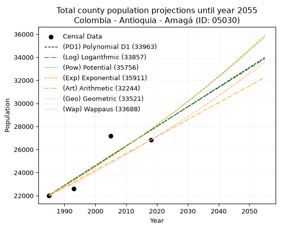
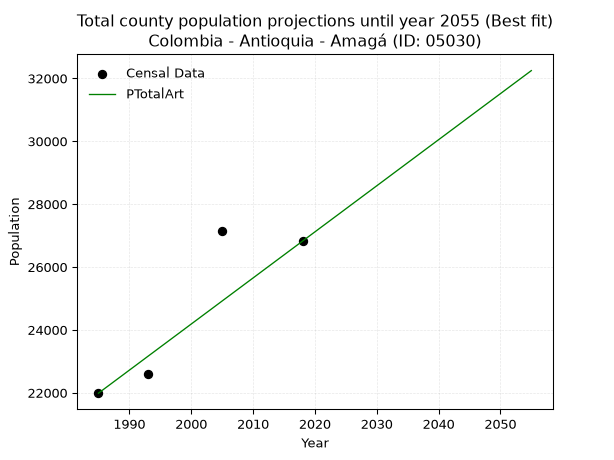
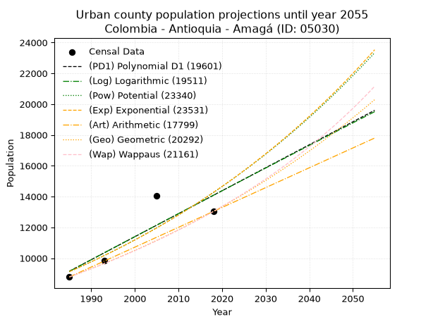
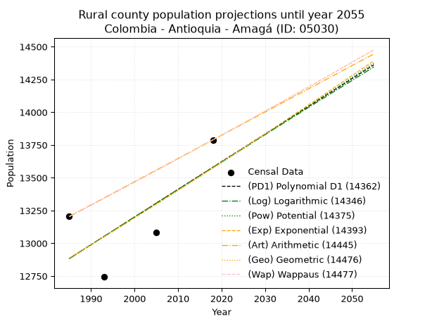
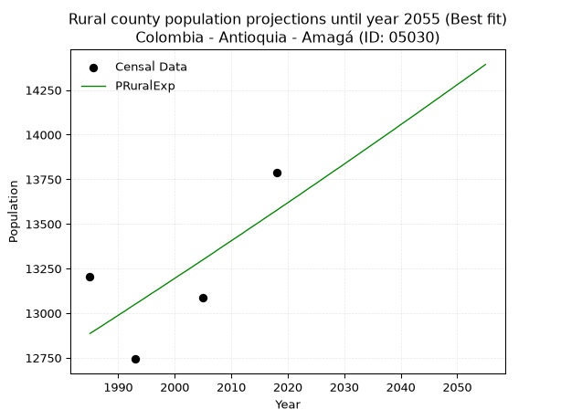

<div align="center">


</div>

# _“Population and Public Services Demand Projections (PPSD) until Year 2050 for Colombia - Antioquia - Amagá (ID: 05030)”_
Keywords: `population` `public-service` `projection` `lineal` `polynomial` `logarithmic` `potential` `exponential` `arithmetic` `geometric` `wappaus` `dane` `colombia` `south-america`

PPSD are analytical estimates used by governments and planners to anticipate future changes in population size, age distribution, and the resulting community needs for utilities, healthcare, education, and infrastructure as sizing future water treatment facilities, electrical grids, and road networks based on spatial growth.

> **General running parameters**: • app_version: _v20260806_. • Python version: _3.14.7_. • Pandas version: _3.0.5_. • NumPy version: _2.5.1_. • Creates, save and include plots into reports (create_plot): _False_. • Projection until year: _2050_. • Process polynomial degree 2 and up: _False_. • Process Wappaus: _True_. • Process Wappaus: _True_. • Set negative values to zero: _True_. • Set infinite values to zero: _True_. • Drop dataset notes: _True_. 
<div align="center">

Dynamic map: [:earth_americas:Google](http://maps.google.com/maps?q=6.038707642,-75.7021883) [:earth_americas:OSM](https://www.openstreetmap.org/#map=18/6.038707642/-75.7021883&layers=P) [:earth_americas:Bing](https://www.bing.com/maps?cp=6.038707642~-75.7021883&lvl=18) [:earth_americas:Apple](https://maps.apple.com/frame?center=6.038707642%2C-75.7021883&span=0.003%2C0.006)

</div>


<div align="center">

```geojson
{
  "type": "Feature",
  "geometry": {
    "type": "Point", 
    "coordinates": [-75.7021883, 6.038707642]
  }, 
  "properties": {
    "Name": "Colombia - Antioquia - Amagá (ID: 05030)"
  }
}
```

</div>


## 0. Census Data (4 records)

Census data are official statistics collected by a government about the people and housing in a country. They usually include counts of total population, age, sex, race, income, education, and jobs.

📅Global census file: [Population.xlsx](../data/Population.xlsx)

| Source   |   Year |   CountryID | CountryName   |   StateID | StateName   |   CountyID | CountyName   |   PTotal |   PUrban |   PRural |
|:---------|-------:|------------:|:--------------|----------:|:------------|-----------:|:-------------|---------:|---------:|---------:|
| DANE     |   1985 |          57 | Colombia      |        05 | Antioquia   |      05030 | Amagá        |    21984 |     8780 |    13204 |
| DANE     |   1993 |          57 | Colombia      |        05 | Antioquia   |      05030 | Amagá        |    22579 |     9836 |    12743 |
| DANE     |   2005 |          57 | Colombia      |        05 | Antioquia   |      05030 | Amagá        |    27155 |    14070 |    13085 |
| DANE     |   2018 |          57 | Colombia      |        05 | Antioquia   |      05030 | Amagá        |    26821 |    13032 |    13789 |

> 🔥Some records could had specific notes about the registered values or the corresponding urban or rural distribution.

## 1. Total

### 1.1. Coefficients and Parameters

* (PD1) Polynomial Deg 1: 170.38177438779587, -316171.39421918866 (lineal)
* (Log) Logarithmic: 341264.3576133441, -2569318.366939962
* (Pow) Potential: 13.957905112511158, -41.686569256284024
* (Exp) Exponential: 0.006968691876410453, 0.02166948430108251
* (Art) Arithmetic: Year diff. 2018 - 1985 = 33, Population diff. 26821 - 21984 = 4837, Annual growth = 146.57575757575756
* (Geo) Geometric: Year diff. 2018 - 1985 = 33, Population diff. 26821 - 21984 = 4837, Annual growth % = 0.006044566219103542
* (Wap) Wappaus: i = 0.6006587750261554, Condition values only valid for < 200)

<sub>
Wappaus condition values: ['0.00', '0.60', '1.20', '1.80', '2.40', '3.00', '3.60', '4.20', '4.81', '5.41', '6.01', '6.61', '7.21', '7.81', '8.41', '9.01', '9.61', '10.21', '10.81', '11.41', '12.01', '12.61', '13.21', '13.82', '14.42', '15.02', '15.62', '16.22', '16.82', '17.42', '18.02', '18.62', '19.22', '19.82', '20.42', '21.02', '21.62', '22.22', '22.83', '23.43', '24.03', '24.63', '25.23', '25.83', '26.43', '27.03', '27.63', '28.23', '28.83', '29.43', '30.03', '30.63', '31.23', '31.83', '32.44', '33.04', '33.64', '34.24', '34.84', '35.44', '36.04', '36.64', '37.24', '37.84', '38.44', '39.04']
</sub>


### 1.2. Projected Dataset

|   Year |   CountyID |   PTotalPD1 |   PTotalLog |   PTotalPow |   PTotalExp |   PTotalArt |   PTotalGeo |   PTotalWap |
|-------:|-----------:|------------:|------------:|------------:|------------:|------------:|------------:|------------:|
|   1985 |      05030 |       22036 |       22030 |       22042 |       22049 |       21984 |       21984 |       21984 |
|   1986 |      05030 |       22207 |       22201 |       22198 |       22203 |       22131 |       22117 |       22116 |
|   1987 |      05030 |       22377 |       22373 |       22354 |       22358 |       22277 |       22251 |       22250 |
|   1988 |      05030 |       22548 |       22545 |       22512 |       22514 |       22424 |       22385 |       22384 |
|   1989 |      05030 |       22718 |       22717 |       22671 |       22672 |       22570 |       22520 |       22519 |
|   1990 |      05030 |       22888 |       22888 |       22830 |       22830 |       22717 |       22656 |       22654 |
|   1991 |      05030 |       23059 |       23060 |       22991 |       22990 |       22863 |       22793 |       22791 |
|   1992 |      05030 |       23229 |       23231 |       23153 |       23151 |       23010 |       22931 |       22928 |
|   1993 |      05030 |       23399 |       23402 |       23315 |       23313 |       23157 |       23070 |       23066 |
|   1994 |      05030 |       23570 |       23573 |       23479 |       23476 |       23303 |       23209 |       23205 |
|   1995 |      05030 |       23740 |       23744 |       23644 |       23640 |       23450 |       23350 |       23345 |
|   1996 |      05030 |       23911 |       23916 |       23810 |       23805 |       23596 |       23491 |       23486 |
|   1997 |      05030 |       24081 |       24086 |       23977 |       23972 |       23743 |       23633 |       23628 |
|   1998 |      05030 |       24251 |       24257 |       24145 |       24139 |       23889 |       23776 |       23770 |
|   1999 |      05030 |       24422 |       24428 |       24314 |       24308 |       24036 |       23919 |       23914 |
|   2000 |      05030 |       24592 |       24599 |       24485 |       24478 |       24183 |       24064 |       24058 |
|   2001 |      05030 |       24763 |       24769 |       24656 |       24649 |       24329 |       24209 |       24203 |
|   2002 |      05030 |       24933 |       24940 |       24829 |       24822 |       24476 |       24356 |       24350 |
|   2003 |      05030 |       25103 |       25110 |       25002 |       24995 |       24622 |       24503 |       24497 |
|   2004 |      05030 |       25274 |       25281 |       25177 |       25170 |       24769 |       24651 |       24645 |
|   2005 |      05030 |       25444 |       25451 |       25353 |       25346 |       24916 |       24800 |       24794 |
|   2006 |      05030 |       25614 |       25621 |       25530 |       25523 |       25062 |       24950 |       24944 |
|   2007 |      05030 |       25785 |       25791 |       25708 |       25702 |       25209 |       25101 |       25095 |
|   2008 |      05030 |       25955 |       25961 |       25888 |       25881 |       25355 |       25252 |       25246 |
|   2009 |      05030 |       26126 |       26131 |       26068 |       26062 |       25502 |       25405 |       25399 |
|   2010 |      05030 |       26296 |       26301 |       26250 |       26245 |       25648 |       25559 |       25553 |
|   2011 |      05030 |       26466 |       26471 |       26433 |       26428 |       25795 |       25713 |       25708 |
|   2012 |      05030 |       26637 |       26640 |       26617 |       26613 |       25942 |       25869 |       25864 |
|   2013 |      05030 |       26807 |       26810 |       26802 |       26799 |       26088 |       26025 |       26021 |
|   2014 |      05030 |       26977 |       26979 |       26989 |       26987 |       26235 |       26182 |       26179 |
|   2015 |      05030 |       27148 |       27149 |       27176 |       27175 |       26381 |       26340 |       26338 |
|   2016 |      05030 |       27318 |       27318 |       27365 |       27365 |       26528 |       26500 |       26498 |
|   2017 |      05030 |       27489 |       27487 |       27555 |       27557 |       26674 |       26660 |       26659 |
|   2018 |      05030 |       27659 |       27656 |       27746 |       27749 |       26821 |       26821 |       26821 |
|   2019 |      05030 |       27829 |       27825 |       27939 |       27943 |       26968 |       26983 |       26984 |
|   2020 |      05030 |       28000 |       27994 |       28133 |       28139 |       27114 |       27146 |       27149 |
|   2021 |      05030 |       28170 |       28163 |       28328 |       28336 |       27261 |       27310 |       27314 |
|   2022 |      05030 |       28341 |       28332 |       28524 |       28534 |       27407 |       27475 |       27481 |
|   2023 |      05030 |       28511 |       28501 |       28722 |       28733 |       27554 |       27641 |       27648 |
|   2024 |      05030 |       28681 |       28670 |       28920 |       28934 |       27700 |       27809 |       27817 |
|   2025 |      05030 |       28852 |       28838 |       29120 |       29137 |       27847 |       27977 |       27987 |
|   2026 |      05030 |       29022 |       29007 |       29322 |       29340 |       27994 |       28146 |       28158 |
|   2027 |      05030 |       29192 |       29175 |       29524 |       29546 |       28140 |       28316 |       28331 |
|   2028 |      05030 |       29363 |       29343 |       29728 |       29752 |       28287 |       28487 |       28504 |
|   2029 |      05030 |       29533 |       29512 |       29934 |       29960 |       28433 |       28659 |       28679 |
|   2030 |      05030 |       29704 |       29680 |       30140 |       30170 |       28580 |       28832 |       28855 |
|   2031 |      05030 |       29874 |       29848 |       30348 |       30381 |       28726 |       29007 |       29032 |
|   2032 |      05030 |       30044 |       30016 |       30557 |       30593 |       28873 |       29182 |       29210 |
|   2033 |      05030 |       30215 |       30184 |       30768 |       30807 |       29020 |       29358 |       29390 |
|   2034 |      05030 |       30385 |       30351 |       30980 |       31023 |       29166 |       29536 |       29571 |
|   2035 |      05030 |       30556 |       30519 |       31193 |       31239 |       29313 |       29714 |       29753 |
|   2036 |      05030 |       30726 |       30687 |       31408 |       31458 |       29459 |       29894 |       29937 |
|   2037 |      05030 |       30896 |       30854 |       31624 |       31678 |       29606 |       30075 |       30121 |
|   2038 |      05030 |       31067 |       31022 |       31841 |       31899 |       29753 |       30257 |       30307 |
|   2039 |      05030 |       31237 |       31189 |       32060 |       32123 |       29899 |       30439 |       30495 |
|   2040 |      05030 |       31407 |       31357 |       32280 |       32347 |       30046 |       30623 |       30684 |
|   2041 |      05030 |       31578 |       31524 |       32502 |       32573 |       30192 |       30809 |       30874 |
|   2042 |      05030 |       31748 |       31691 |       32725 |       32801 |       30339 |       30995 |       31065 |
|   2043 |      05030 |       31919 |       31858 |       32949 |       33031 |       30485 |       31182 |       31258 |
|   2044 |      05030 |       32089 |       32025 |       33175 |       33262 |       30632 |       31371 |       31453 |
|   2045 |      05030 |       32259 |       32192 |       33402 |       33494 |       30779 |       31560 |       31648 |
|   2046 |      05030 |       32430 |       32359 |       33631 |       33728 |       30925 |       31751 |       31846 |
|   2047 |      05030 |       32600 |       32526 |       33861 |       33964 |       31072 |       31943 |       32044 |
|   2048 |      05030 |       32770 |       32692 |       34093 |       34202 |       31218 |       32136 |       32244 |
|   2049 |      05030 |       32941 |       32859 |       34326 |       34441 |       31365 |       32330 |       32446 |
|   2050 |      05030 |       33111 |       33025 |       34560 |       34682 |       31511 |       32526 |       32649 |
<div align="center">

</img>

</div>


### 1.3. Best fit with absolute and relative error (%)

Relative error puts that difference into context by dividing the absolute error by the true value, creating a unitless ratio or percentage that shows the scale of the mistake.

Absolute and relative error

|   Year | Source   |   CountryID | CountryName   |   StateID | StateName   |   CountyID_x | CountyName   |   PTotal |   PUrban |   PRural |   CountyID_y |   PTotalPD1 |   PTotalLog |   PTotalPow |   PTotalExp |   PTotalArt |   PTotalGeo |   PTotalWap |   PTotalPD1AbsError |   PTotalLogAbsError |   PTotalPowAbsError |   PTotalExpAbsError |   PTotalArtAbsError |   PTotalGeoAbsError |   PTotalWapAbsError |   PTotalPD1RelError |   PTotalLogRelError |   PTotalPowRelError |   PTotalExpRelError |   PTotalArtRelError |   PTotalGeoRelError |   PTotalWapRelError |
|-------:|:---------|------------:|:--------------|----------:|:------------|-------------:|:-------------|---------:|---------:|---------:|-------------:|------------:|------------:|------------:|------------:|------------:|------------:|------------:|--------------------:|--------------------:|--------------------:|--------------------:|--------------------:|--------------------:|--------------------:|--------------------:|--------------------:|--------------------:|--------------------:|--------------------:|--------------------:|--------------------:|
|   1985 | DANE     |          57 | Colombia      |        05 | Antioquia   |        05030 | Amagá        |    21984 |     8780 |    13204 |        05030 |       22036 |       22030 |       22042 |       22049 |       21984 |       21984 |       21984 |                  52 |                  46 |                  58 |                  65 |                   0 |                   0 |                   0 |            0.236536 |            0.209243 |            0.263828 |             0.29567 |             0       |             0       |             0       |
|   1993 | DANE     |          57 | Colombia      |        05 | Antioquia   |        05030 | Amagá        |    22579 |     9836 |    12743 |        05030 |       23399 |       23402 |       23315 |       23313 |       23157 |       23070 |       23066 |                 820 |                 823 |                 736 |                 734 |                 578 |                 491 |                 487 |            3.63169  |            3.64498  |            3.25967  |             3.25081 |             2.5599  |             2.17459 |             2.15687 |
|   2005 | DANE     |          57 | Colombia      |        05 | Antioquia   |        05030 | Amagá        |    27155 |    14070 |    13085 |        05030 |       25444 |       25451 |       25353 |       25346 |       24916 |       24800 |       24794 |                1711 |                1704 |                1802 |                1809 |                2239 |                2355 |                2361 |            6.30087  |            6.27509  |            6.63598  |             6.66176 |             8.24526 |             8.67244 |             8.69453 |
|   2018 | DANE     |          57 | Colombia      |        05 | Antioquia   |        05030 | Amagá        |    26821 |    13032 |    13789 |        05030 |       27659 |       27656 |       27746 |       27749 |       26821 |       26821 |       26821 |                 838 |                 835 |                 925 |                 928 |                   0 |                   0 |                   0 |            3.12442  |            3.11323  |            3.44879  |             3.45998 |             0       |             0       |             0       |

Relative error mean

| Method    |   RelError | Best   |
|:----------|-----------:|:-------|
| PTotalPD1 |    3.32338 |        |
| PTotalLog |    3.31064 |        |
| PTotalPow |    3.40207 |        |
| PTotalExp |    3.41705 |        |
| PTotalArt |    2.70129 | True   |
| PTotalGeo |    2.71176 |        |
| PTotalWap |    2.71285 |        |

💙Best method: _**PTotalArt**_
<div align="center">

</img>

</div>


### 1.4. Fresh water supply demand in liters per capita per day (lpcd)

The fresh water supply demand typically ranges from 100 to 300 liters per capita per day (lpcd) for standard domestic and municipal planning, though absolute survival minimums set by the World Health Organization are as low as 7.5 to 20 liters per day, and total consumption in high-income nations can exceed 400 liters.

> `CZ`: Level in meters above the sea level (masl).<br> `WS`: Fresh water supply demand in liters per capita per day (lpcd or l/h/d).<br> `WSAll`: Zonal fresh water supply demand in liters per second (l/s).<br> `A`: Zonal area in square meters.

Reference values (RAS Colombia)

|    CZ |   WS |
|------:|-----:|
|  1000 |  120 |
|  2000 |  130 |
| 99999 |  140 |

County shapefile geometry properties and water supply values

|   CountyID |     ATotal |   CZTotal |   WSTotal |
|-----------:|-----------:|----------:|----------:|
|      05030 | 8.4119e+07 |   1515.24 |       130 |

Projected values for best method: PTotalArt

|   CountyID |   Year |   PTotalArt |   WSTotal |   WSTotalAll |
|-----------:|-------:|------------:|----------:|-------------:|
|      05030 |   1985 |       21984 |       130 |      33.0778 |
|      05030 |   1986 |       22131 |       130 |      33.299  |
|      05030 |   1987 |       22277 |       130 |      33.5186 |
|      05030 |   1988 |       22424 |       130 |      33.7398 |
|      05030 |   1989 |       22570 |       130 |      33.9595 |
|      05030 |   1990 |       22717 |       130 |      34.1807 |
|      05030 |   1991 |       22863 |       130 |      34.4003 |
|      05030 |   1992 |       23010 |       130 |      34.6215 |
|      05030 |   1993 |       23157 |       130 |      34.8427 |
|      05030 |   1994 |       23303 |       130 |      35.0624 |
|      05030 |   1995 |       23450 |       130 |      35.2836 |
|      05030 |   1996 |       23596 |       130 |      35.5032 |
|      05030 |   1997 |       23743 |       130 |      35.7244 |
|      05030 |   1998 |       23889 |       130 |      35.9441 |
|      05030 |   1999 |       24036 |       130 |      36.1653 |
|      05030 |   2000 |       24183 |       130 |      36.3865 |
|      05030 |   2001 |       24329 |       130 |      36.6061 |
|      05030 |   2002 |       24476 |       130 |      36.8273 |
|      05030 |   2003 |       24622 |       130 |      37.047  |
|      05030 |   2004 |       24769 |       130 |      37.2682 |
|      05030 |   2005 |       24916 |       130 |      37.4894 |
|      05030 |   2006 |       25062 |       130 |      37.709  |
|      05030 |   2007 |       25209 |       130 |      37.9302 |
|      05030 |   2008 |       25355 |       130 |      38.1499 |
|      05030 |   2009 |       25502 |       130 |      38.3711 |
|      05030 |   2010 |       25648 |       130 |      38.5907 |
|      05030 |   2011 |       25795 |       130 |      38.8119 |
|      05030 |   2012 |       25942 |       130 |      39.0331 |
|      05030 |   2013 |       26088 |       130 |      39.2528 |
|      05030 |   2014 |       26235 |       130 |      39.474  |
|      05030 |   2015 |       26381 |       130 |      39.6936 |
|      05030 |   2016 |       26528 |       130 |      39.9148 |
|      05030 |   2017 |       26674 |       130 |      40.1345 |
|      05030 |   2018 |       26821 |       130 |      40.3557 |
|      05030 |   2019 |       26968 |       130 |      40.5769 |
|      05030 |   2020 |       27114 |       130 |      40.7965 |
|      05030 |   2021 |       27261 |       130 |      41.0177 |
|      05030 |   2022 |       27407 |       130 |      41.2374 |
|      05030 |   2023 |       27554 |       130 |      41.4586 |
|      05030 |   2024 |       27700 |       130 |      41.6782 |
|      05030 |   2025 |       27847 |       130 |      41.8994 |
|      05030 |   2026 |       27994 |       130 |      42.1206 |
|      05030 |   2027 |       28140 |       130 |      42.3403 |
|      05030 |   2028 |       28287 |       130 |      42.5615 |
|      05030 |   2029 |       28433 |       130 |      42.7811 |
|      05030 |   2030 |       28580 |       130 |      43.0023 |
|      05030 |   2031 |       28726 |       130 |      43.222  |
|      05030 |   2032 |       28873 |       130 |      43.4432 |
|      05030 |   2033 |       29020 |       130 |      43.6644 |
|      05030 |   2034 |       29166 |       130 |      43.884  |
|      05030 |   2035 |       29313 |       130 |      44.1052 |
|      05030 |   2036 |       29459 |       130 |      44.3249 |
|      05030 |   2037 |       29606 |       130 |      44.5461 |
|      05030 |   2038 |       29753 |       130 |      44.7672 |
|      05030 |   2039 |       29899 |       130 |      44.9869 |
|      05030 |   2040 |       30046 |       130 |      45.2081 |
|      05030 |   2041 |       30192 |       130 |      45.4278 |
|      05030 |   2042 |       30339 |       130 |      45.649  |
|      05030 |   2043 |       30485 |       130 |      45.8686 |
|      05030 |   2044 |       30632 |       130 |      46.0898 |
|      05030 |   2045 |       30779 |       130 |      46.311  |
|      05030 |   2046 |       30925 |       130 |      46.5307 |
|      05030 |   2047 |       31072 |       130 |      46.7519 |
|      05030 |   2048 |       31218 |       130 |      46.9715 |
|      05030 |   2049 |       31365 |       130 |      47.1927 |
|      05030 |   2050 |       31511 |       130 |      47.4124 |

## 2. Urban

### 2.1. Coefficients and Parameters

* (PD1) Polynomial Deg 1: 149.24849458049005, -287104.80128462525 (lineal)
* (Log) Logarithmic: 299059.32949579915, -2261722.8600086328
* (Pow) Potential: 27.11288821261222, -85.45179560321068
* (Exp) Exponential: 0.013531242850641749, 1.9740002734657547e-08
* (Art) Arithmetic: Year diff. 2018 - 1985 = 33, Population diff. 13032 - 8780 = 4252, Annual growth = 128.84848484848484
* (Geo) Geometric: Year diff. 2018 - 1985 = 33, Population diff. 13032 - 8780 = 4252, Annual growth % = 0.012039518607940503
* (Wap) Wappaus: i = 1.181445854103107, Condition values only valid for < 200)

<sub>
Wappaus condition values: ['0.00', '1.18', '2.36', '3.54', '4.73', '5.91', '7.09', '8.27', '9.45', '10.63', '11.81', '13.00', '14.18', '15.36', '16.54', '17.72', '18.90', '20.08', '21.27', '22.45', '23.63', '24.81', '25.99', '27.17', '28.35', '29.54', '30.72', '31.90', '33.08', '34.26', '35.44', '36.62', '37.81', '38.99', '40.17', '41.35', '42.53', '43.71', '44.89', '46.08', '47.26', '48.44', '49.62', '50.80', '51.98', '53.17', '54.35', '55.53', '56.71', '57.89', '59.07', '60.25', '61.44', '62.62', '63.80', '64.98', '66.16', '67.34', '68.52', '69.71', '70.89', '72.07', '73.25', '74.43', '75.61', '76.79']
</sub>


### 2.2. Projected Dataset

|   Year |   CountyID |   PUrbanPD1 |   PUrbanLog |   PUrbanPow |   PUrbanExp |   PUrbanArt |   PUrbanGeo |   PUrbanWap |
|-------:|-----------:|------------:|------------:|------------:|------------:|------------:|------------:|------------:|
|   1985 |      05030 |        9153 |        9147 |        9120 |        9126 |        8780 |        8780 |        8780 |
|   1986 |      05030 |        9303 |        9297 |        9246 |        9250 |        8909 |        8886 |        8884 |
|   1987 |      05030 |        9452 |        9448 |        9373 |        9376 |        9038 |        8993 |        8990 |
|   1988 |      05030 |        9601 |        9598 |        9502 |        9504 |        9167 |        9101 |        9097 |
|   1989 |      05030 |        9750 |        9749 |        9632 |        9634 |        9295 |        9211 |        9205 |
|   1990 |      05030 |        9900 |        9899 |        9764 |        9765 |        9424 |        9321 |        9314 |
|   1991 |      05030 |       10049 |       10049 |        9898 |        9898 |        9553 |        9434 |        9425 |
|   1992 |      05030 |       10198 |       10199 |       10034 |       10033 |        9682 |        9547 |        9537 |
|   1993 |      05030 |       10347 |       10349 |       10171 |       10170 |        9811 |        9662 |        9651 |
|   1994 |      05030 |       10497 |       10499 |       10311 |       10308 |        9940 |        9778 |        9766 |
|   1995 |      05030 |       10646 |       10649 |       10452 |       10448 |       10068 |        9896 |        9882 |
|   1996 |      05030 |       10795 |       10799 |       10595 |       10591 |       10197 |       10015 |       10000 |
|   1997 |      05030 |       10944 |       10949 |       10740 |       10735 |       10326 |       10136 |       10120 |
|   1998 |      05030 |       11094 |       11099 |       10886 |       10881 |       10455 |       10258 |       10241 |
|   1999 |      05030 |       11243 |       11248 |       11035 |       11030 |       10584 |       10381 |       10363 |
|   2000 |      05030 |       11392 |       11398 |       11186 |       11180 |       10713 |       10506 |       10487 |
|   2001 |      05030 |       11541 |       11547 |       11338 |       11332 |       10842 |       10633 |       10613 |
|   2002 |      05030 |       11691 |       11697 |       11493 |       11487 |       10970 |       10761 |       10740 |
|   2003 |      05030 |       11840 |       11846 |       11650 |       11643 |       11099 |       10891 |       10869 |
|   2004 |      05030 |       11989 |       11995 |       11808 |       11802 |       11228 |       11022 |       11000 |
|   2005 |      05030 |       12138 |       12145 |       11969 |       11962 |       11357 |       11154 |       11133 |
|   2006 |      05030 |       12288 |       12294 |       12132 |       12125 |       11486 |       11289 |       11267 |
|   2007 |      05030 |       12437 |       12443 |       12297 |       12291 |       11615 |       11425 |       11403 |
|   2008 |      05030 |       12586 |       12592 |       12464 |       12458 |       11744 |       11562 |       11541 |
|   2009 |      05030 |       12735 |       12741 |       12634 |       12628 |       11872 |       11701 |       11681 |
|   2010 |      05030 |       12885 |       12890 |       12805 |       12800 |       12001 |       11842 |       11823 |
|   2011 |      05030 |       13034 |       13038 |       12979 |       12974 |       12130 |       11985 |       11966 |
|   2012 |      05030 |       13183 |       13187 |       13155 |       13151 |       12259 |       12129 |       12112 |
|   2013 |      05030 |       13332 |       13336 |       13334 |       13330 |       12388 |       12275 |       12260 |
|   2014 |      05030 |       13482 |       13484 |       13514 |       13512 |       12517 |       12423 |       12410 |
|   2015 |      05030 |       13631 |       13633 |       13698 |       13696 |       12645 |       12572 |       12562 |
|   2016 |      05030 |       13780 |       13781 |       13883 |       13882 |       12774 |       12724 |       12717 |
|   2017 |      05030 |       13929 |       13929 |       14071 |       14071 |       12903 |       12877 |       12873 |
|   2018 |      05030 |       14079 |       14077 |       14261 |       14263 |       13032 |       13032 |       13032 |
|   2019 |      05030 |       14228 |       14226 |       14454 |       14457 |       13161 |       13189 |       13193 |
|   2020 |      05030 |       14377 |       14374 |       14650 |       14654 |       13290 |       13348 |       13357 |
|   2021 |      05030 |       14526 |       14522 |       14848 |       14854 |       13419 |       13508 |       13523 |
|   2022 |      05030 |       14676 |       14670 |       15048 |       15056 |       13547 |       13671 |       13692 |
|   2023 |      05030 |       14825 |       14817 |       15251 |       15261 |       13676 |       13836 |       13863 |
|   2024 |      05030 |       14974 |       14965 |       15457 |       15469 |       13805 |       14002 |       14037 |
|   2025 |      05030 |       15123 |       15113 |       15665 |       15680 |       13934 |       14171 |       14213 |
|   2026 |      05030 |       15273 |       15261 |       15876 |       15894 |       14063 |       14341 |       14392 |
|   2027 |      05030 |       15422 |       15408 |       16090 |       16110 |       14192 |       14514 |       14574 |
|   2028 |      05030 |       15571 |       15556 |       16307 |       16330 |       14320 |       14689 |       14759 |
|   2029 |      05030 |       15720 |       15703 |       16526 |       16552 |       14449 |       14866 |       14947 |
|   2030 |      05030 |       15870 |       15851 |       16748 |       16778 |       14578 |       15045 |       15138 |
|   2031 |      05030 |       16019 |       15998 |       16974 |       17006 |       14707 |       15226 |       15332 |
|   2032 |      05030 |       16168 |       16145 |       17202 |       17238 |       14836 |       15409 |       15529 |
|   2033 |      05030 |       16317 |       16292 |       17433 |       17473 |       14965 |       15595 |       15730 |
|   2034 |      05030 |       16467 |       16439 |       17667 |       17711 |       15094 |       15782 |       15933 |
|   2035 |      05030 |       16616 |       16586 |       17904 |       17952 |       15222 |       15972 |       16141 |
|   2036 |      05030 |       16765 |       16733 |       18144 |       18197 |       15351 |       16165 |       16351 |
|   2037 |      05030 |       16914 |       16880 |       18387 |       18445 |       15480 |       16359 |       16566 |
|   2038 |      05030 |       17064 |       17027 |       18633 |       18696 |       15609 |       16556 |       16784 |
|   2039 |      05030 |       17213 |       17173 |       18883 |       18950 |       15738 |       16756 |       17005 |
|   2040 |      05030 |       17362 |       17320 |       19135 |       19209 |       15867 |       16957 |       17231 |
|   2041 |      05030 |       17511 |       17467 |       19391 |       19470 |       15996 |       17161 |       17460 |
|   2042 |      05030 |       17661 |       17613 |       19651 |       19736 |       16124 |       17368 |       17694 |
|   2043 |      05030 |       17810 |       17760 |       19913 |       20004 |       16253 |       17577 |       17932 |
|   2044 |      05030 |       17959 |       17906 |       20179 |       20277 |       16382 |       17789 |       18174 |
|   2045 |      05030 |       18108 |       18052 |       20449 |       20553 |       16511 |       18003 |       18421 |
|   2046 |      05030 |       18258 |       18198 |       20721 |       20833 |       16640 |       18220 |       18672 |
|   2047 |      05030 |       18407 |       18345 |       20998 |       21117 |       16769 |       18439 |       18928 |
|   2048 |      05030 |       18556 |       18491 |       21278 |       21405 |       16897 |       18661 |       19189 |
|   2049 |      05030 |       18705 |       18637 |       21561 |       21696 |       17026 |       18886 |       19454 |
|   2050 |      05030 |       18855 |       18782 |       21848 |       21992 |       17155 |       19113 |       19725 |
<div align="center">

</img>

</div>


### 2.3. Best fit with absolute and relative error (%)

Relative error puts that difference into context by dividing the absolute error by the true value, creating a unitless ratio or percentage that shows the scale of the mistake.

Absolute and relative error

|   Year | Source   |   CountryID | CountryName   |   StateID | StateName   |   CountyID_x | CountyName   |   PTotal |   PUrban |   PRural |   CountyID_y |   PUrbanPD1 |   PUrbanLog |   PUrbanPow |   PUrbanExp |   PUrbanArt |   PUrbanGeo |   PUrbanWap |   PUrbanPD1AbsError |   PUrbanLogAbsError |   PUrbanPowAbsError |   PUrbanExpAbsError |   PUrbanArtAbsError |   PUrbanGeoAbsError |   PUrbanWapAbsError |   PUrbanPD1RelError |   PUrbanLogRelError |   PUrbanPowRelError |   PUrbanExpRelError |   PUrbanArtRelError |   PUrbanGeoRelError |   PUrbanWapRelError |
|-------:|:---------|------------:|:--------------|----------:|:------------|-------------:|:-------------|---------:|---------:|---------:|-------------:|------------:|------------:|------------:|------------:|------------:|------------:|------------:|--------------------:|--------------------:|--------------------:|--------------------:|--------------------:|--------------------:|--------------------:|--------------------:|--------------------:|--------------------:|--------------------:|--------------------:|--------------------:|--------------------:|
|   1985 | DANE     |          57 | Colombia      |        05 | Antioquia   |        05030 | Amagá        |    21984 |     8780 |    13204 |        05030 |        9153 |        9147 |        9120 |        9126 |        8780 |        8780 |        8780 |                 373 |                 367 |                 340 |                 346 |                   0 |                   0 |                   0 |             4.24829 |             4.17995 |             3.87244 |             3.94077 |            0        |             0       |             0       |
|   1993 | DANE     |          57 | Colombia      |        05 | Antioquia   |        05030 | Amagá        |    22579 |     9836 |    12743 |        05030 |       10347 |       10349 |       10171 |       10170 |        9811 |        9662 |        9651 |                 511 |                 513 |                 335 |                 334 |                  25 |                 174 |                 185 |             5.1952  |             5.21553 |             3.40586 |             3.39569 |            0.254168 |             1.76901 |             1.88085 |
|   2005 | DANE     |          57 | Colombia      |        05 | Antioquia   |        05030 | Amagá        |    27155 |    14070 |    13085 |        05030 |       12138 |       12145 |       11969 |       11962 |       11357 |       11154 |       11133 |                1932 |                1925 |                2101 |                2108 |                2713 |                2916 |                2937 |            13.7313  |            13.6816  |            14.9325  |            14.9822  |           19.2822   |            20.7249  |            20.8742  |
|   2018 | DANE     |          57 | Colombia      |        05 | Antioquia   |        05030 | Amagá        |    26821 |    13032 |    13789 |        05030 |       14079 |       14077 |       14261 |       14263 |       13032 |       13032 |       13032 |                1047 |                1045 |                1229 |                1231 |                   0 |                   0 |                   0 |             8.03407 |             8.01872 |             9.43063 |             9.44598 |            0        |             0       |             0       |

Relative error mean

| Method    |   RelError | Best   |
|:----------|-----------:|:-------|
| PUrbanPD1 |    7.80223 |        |
| PUrbanLog |    7.77395 |        |
| PUrbanPow |    7.91035 |        |
| PUrbanExp |    7.94117 |        |
| PUrbanArt |    4.88408 | True   |
| PUrbanGeo |    5.62349 |        |
| PUrbanWap |    5.68876 |        |

💙Best method: _**PUrbanArt**_
<div align="center">

</img>

</div>


### 2.4. Fresh water supply demand in liters per capita per day (lpcd)

The fresh water supply demand typically ranges from 100 to 300 liters per capita per day (lpcd) for standard domestic and municipal planning, though absolute survival minimums set by the World Health Organization are as low as 7.5 to 20 liters per day, and total consumption in high-income nations can exceed 400 liters.

> `CZ`: Level in meters above the sea level (masl).<br> `WS`: Fresh water supply demand in liters per capita per day (lpcd or l/h/d).<br> `WSAll`: Zonal fresh water supply demand in liters per second (l/s).<br> `A`: Zonal area in square meters.

Reference values (RAS Colombia)

|    CZ |   WS |
|------:|-----:|
|  1000 |  120 |
|  2000 |  130 |
| 99999 |  140 |

County shapefile geometry properties and water supply values

|   CountyID |      AUrban |   CZUrban |   WSUrban |
|-----------:|------------:|----------:|----------:|
|      05030 | 1.61721e+06 |   1392.45 |       130 |

Projected values for best method: PUrbanArt

|   CountyID |   Year |   PUrbanArt |   WSUrban |   WSUrbanAll |
|-----------:|-------:|------------:|----------:|-------------:|
|      05030 |   1985 |        8780 |       130 |      13.2106 |
|      05030 |   1986 |        8909 |       130 |      13.4047 |
|      05030 |   1987 |        9038 |       130 |      13.5988 |
|      05030 |   1988 |        9167 |       130 |      13.7929 |
|      05030 |   1989 |        9295 |       130 |      13.9855 |
|      05030 |   1990 |        9424 |       130 |      14.1796 |
|      05030 |   1991 |        9553 |       130 |      14.3737 |
|      05030 |   1992 |        9682 |       130 |      14.5678 |
|      05030 |   1993 |        9811 |       130 |      14.7619 |
|      05030 |   1994 |        9940 |       130 |      14.956  |
|      05030 |   1995 |       10068 |       130 |      15.1486 |
|      05030 |   1996 |       10197 |       130 |      15.3427 |
|      05030 |   1997 |       10326 |       130 |      15.5368 |
|      05030 |   1998 |       10455 |       130 |      15.7309 |
|      05030 |   1999 |       10584 |       130 |      15.925  |
|      05030 |   2000 |       10713 |       130 |      16.1191 |
|      05030 |   2001 |       10842 |       130 |      16.3132 |
|      05030 |   2002 |       10970 |       130 |      16.5058 |
|      05030 |   2003 |       11099 |       130 |      16.6999 |
|      05030 |   2004 |       11228 |       130 |      16.894  |
|      05030 |   2005 |       11357 |       130 |      17.0881 |
|      05030 |   2006 |       11486 |       130 |      17.2822 |
|      05030 |   2007 |       11615 |       130 |      17.4763 |
|      05030 |   2008 |       11744 |       130 |      17.6704 |
|      05030 |   2009 |       11872 |       130 |      17.863  |
|      05030 |   2010 |       12001 |       130 |      18.0571 |
|      05030 |   2011 |       12130 |       130 |      18.2512 |
|      05030 |   2012 |       12259 |       130 |      18.4453 |
|      05030 |   2013 |       12388 |       130 |      18.6394 |
|      05030 |   2014 |       12517 |       130 |      18.8334 |
|      05030 |   2015 |       12645 |       130 |      19.026  |
|      05030 |   2016 |       12774 |       130 |      19.2201 |
|      05030 |   2017 |       12903 |       130 |      19.4142 |
|      05030 |   2018 |       13032 |       130 |      19.6083 |
|      05030 |   2019 |       13161 |       130 |      19.8024 |
|      05030 |   2020 |       13290 |       130 |      19.9965 |
|      05030 |   2021 |       13419 |       130 |      20.1906 |
|      05030 |   2022 |       13547 |       130 |      20.3832 |
|      05030 |   2023 |       13676 |       130 |      20.5773 |
|      05030 |   2024 |       13805 |       130 |      20.7714 |
|      05030 |   2025 |       13934 |       130 |      20.9655 |
|      05030 |   2026 |       14063 |       130 |      21.1596 |
|      05030 |   2027 |       14192 |       130 |      21.3537 |
|      05030 |   2028 |       14320 |       130 |      21.5463 |
|      05030 |   2029 |       14449 |       130 |      21.7404 |
|      05030 |   2030 |       14578 |       130 |      21.9345 |
|      05030 |   2031 |       14707 |       130 |      22.1286 |
|      05030 |   2032 |       14836 |       130 |      22.3227 |
|      05030 |   2033 |       14965 |       130 |      22.5168 |
|      05030 |   2034 |       15094 |       130 |      22.7109 |
|      05030 |   2035 |       15222 |       130 |      22.9035 |
|      05030 |   2036 |       15351 |       130 |      23.0976 |
|      05030 |   2037 |       15480 |       130 |      23.2917 |
|      05030 |   2038 |       15609 |       130 |      23.4858 |
|      05030 |   2039 |       15738 |       130 |      23.6799 |
|      05030 |   2040 |       15867 |       130 |      23.874  |
|      05030 |   2041 |       15996 |       130 |      24.0681 |
|      05030 |   2042 |       16124 |       130 |      24.2606 |
|      05030 |   2043 |       16253 |       130 |      24.4547 |
|      05030 |   2044 |       16382 |       130 |      24.6488 |
|      05030 |   2045 |       16511 |       130 |      24.8429 |
|      05030 |   2046 |       16640 |       130 |      25.037  |
|      05030 |   2047 |       16769 |       130 |      25.2311 |
|      05030 |   2048 |       16897 |       130 |      25.4237 |
|      05030 |   2049 |       17026 |       130 |      25.6178 |
|      05030 |   2050 |       17155 |       130 |      25.8119 |

## 3. Rural

### 3.1. Coefficients and Parameters

* (PD1) Polynomial Deg 1: 21.13327980730583, -29066.59293456349 (lineal)
* (Log) Logarithmic: 42205.02811754529, -307595.5069313314
* (Pow) Potential: 3.1559445377983533, -6.29744133282169
* (Exp) Exponential: 0.0015803002278483524, 559.4586692990206
* (Art) Arithmetic: Year diff. 2018 - 1985 = 33, Population diff. 13789 - 13204 = 585, Annual growth = 17.727272727272727
* (Geo) Geometric: Year diff. 2018 - 1985 = 33, Population diff. 13789 - 13204 = 585, Annual growth % = 0.0013145407937862341
* (Wap) Wappaus: i = 0.1313471842868353, Condition values only valid for < 200)

<sub>
Wappaus condition values: ['0.00', '0.13', '0.26', '0.39', '0.53', '0.66', '0.79', '0.92', '1.05', '1.18', '1.31', '1.44', '1.58', '1.71', '1.84', '1.97', '2.10', '2.23', '2.36', '2.50', '2.63', '2.76', '2.89', '3.02', '3.15', '3.28', '3.42', '3.55', '3.68', '3.81', '3.94', '4.07', '4.20', '4.33', '4.47', '4.60', '4.73', '4.86', '4.99', '5.12', '5.25', '5.39', '5.52', '5.65', '5.78', '5.91', '6.04', '6.17', '6.30', '6.44', '6.57', '6.70', '6.83', '6.96', '7.09', '7.22', '7.36', '7.49', '7.62', '7.75', '7.88', '8.01', '8.14', '8.27', '8.41', '8.54']
</sub>


### 3.2. Projected Dataset

|   Year |   CountyID |   PRuralPD1 |   PRuralLog |   PRuralPow |   PRuralExp |   PRuralArt |   PRuralGeo |   PRuralWap |
|-------:|-----------:|------------:|------------:|------------:|------------:|------------:|------------:|------------:|
|   1985 |      05030 |       12883 |       12883 |       12886 |       12886 |       13204 |       13204 |       13204 |
|   1986 |      05030 |       12904 |       12904 |       12906 |       12906 |       13222 |       13221 |       13221 |
|   1987 |      05030 |       12925 |       12926 |       12927 |       12926 |       13239 |       13239 |       13239 |
|   1988 |      05030 |       12946 |       12947 |       12947 |       12947 |       13257 |       13256 |       13256 |
|   1989 |      05030 |       12968 |       12968 |       12968 |       12967 |       13275 |       13274 |       13274 |
|   1990 |      05030 |       12989 |       12989 |       12988 |       12988 |       13293 |       13291 |       13291 |
|   1991 |      05030 |       13010 |       13010 |       13009 |       13008 |       13310 |       13308 |       13308 |
|   1992 |      05030 |       13031 |       13032 |       13030 |       13029 |       13328 |       13326 |       13326 |
|   1993 |      05030 |       13052 |       13053 |       13050 |       13050 |       13346 |       13343 |       13343 |
|   1994 |      05030 |       13073 |       13074 |       13071 |       13070 |       13364 |       13361 |       13361 |
|   1995 |      05030 |       13094 |       13095 |       13092 |       13091 |       13381 |       13379 |       13379 |
|   1996 |      05030 |       13115 |       13116 |       13112 |       13112 |       13399 |       13396 |       13396 |
|   1997 |      05030 |       13137 |       13137 |       13133 |       13132 |       13417 |       13414 |       13414 |
|   1998 |      05030 |       13158 |       13159 |       13154 |       13153 |       13434 |       13431 |       13431 |
|   1999 |      05030 |       13179 |       13180 |       13175 |       13174 |       13452 |       13449 |       13449 |
|   2000 |      05030 |       13200 |       13201 |       13196 |       13195 |       13470 |       13467 |       13467 |
|   2001 |      05030 |       13221 |       13222 |       13216 |       13216 |       13488 |       13484 |       13484 |
|   2002 |      05030 |       13242 |       13243 |       13237 |       13236 |       13505 |       13502 |       13502 |
|   2003 |      05030 |       13263 |       13264 |       13258 |       13257 |       13523 |       13520 |       13520 |
|   2004 |      05030 |       13284 |       13285 |       13279 |       13278 |       13541 |       13538 |       13538 |
|   2005 |      05030 |       13306 |       13306 |       13300 |       13299 |       13559 |       13556 |       13555 |
|   2006 |      05030 |       13327 |       13327 |       13321 |       13320 |       13576 |       13573 |       13573 |
|   2007 |      05030 |       13348 |       13348 |       13342 |       13341 |       13594 |       13591 |       13591 |
|   2008 |      05030 |       13369 |       13369 |       13363 |       13363 |       13612 |       13609 |       13609 |
|   2009 |      05030 |       13390 |       13390 |       13384 |       13384 |       13629 |       13627 |       13627 |
|   2010 |      05030 |       13411 |       13411 |       13405 |       13405 |       13647 |       13645 |       13645 |
|   2011 |      05030 |       13432 |       13432 |       13426 |       13426 |       13665 |       13663 |       13663 |
|   2012 |      05030 |       13454 |       13453 |       13447 |       13447 |       13683 |       13681 |       13681 |
|   2013 |      05030 |       13475 |       13474 |       13468 |       13469 |       13700 |       13699 |       13699 |
|   2014 |      05030 |       13496 |       13495 |       13489 |       13490 |       13718 |       13717 |       13717 |
|   2015 |      05030 |       13517 |       13516 |       13510 |       13511 |       13736 |       13735 |       13735 |
|   2016 |      05030 |       13538 |       13537 |       13532 |       13533 |       13754 |       13753 |       13753 |
|   2017 |      05030 |       13559 |       13558 |       13553 |       13554 |       13771 |       13771 |       13771 |
|   2018 |      05030 |       13580 |       13579 |       13574 |       13575 |       13789 |       13789 |       13789 |
|   2019 |      05030 |       13601 |       13600 |       13595 |       13597 |       13807 |       13807 |       13807 |
|   2020 |      05030 |       13623 |       13621 |       13616 |       13618 |       13824 |       13825 |       13825 |
|   2021 |      05030 |       13644 |       13642 |       13638 |       13640 |       13842 |       13843 |       13843 |
|   2022 |      05030 |       13665 |       13663 |       13659 |       13661 |       13860 |       13862 |       13862 |
|   2023 |      05030 |       13686 |       13683 |       13680 |       13683 |       13878 |       13880 |       13880 |
|   2024 |      05030 |       13707 |       13704 |       13702 |       13705 |       13895 |       13898 |       13898 |
|   2025 |      05030 |       13728 |       13725 |       13723 |       13726 |       13913 |       13916 |       13916 |
|   2026 |      05030 |       13749 |       13746 |       13745 |       13748 |       13931 |       13935 |       13935 |
|   2027 |      05030 |       13771 |       13767 |       13766 |       13770 |       13949 |       13953 |       13953 |
|   2028 |      05030 |       13792 |       13788 |       13787 |       13792 |       13966 |       13971 |       13971 |
|   2029 |      05030 |       13813 |       13808 |       13809 |       13813 |       13984 |       13990 |       13990 |
|   2030 |      05030 |       13834 |       13829 |       13830 |       13835 |       14002 |       14008 |       14008 |
|   2031 |      05030 |       13855 |       13850 |       13852 |       13857 |       14019 |       14027 |       14027 |
|   2032 |      05030 |       13876 |       13871 |       13873 |       13879 |       14037 |       14045 |       14045 |
|   2033 |      05030 |       13897 |       13891 |       13895 |       13901 |       14055 |       14063 |       14064 |
|   2034 |      05030 |       13918 |       13912 |       13917 |       13923 |       14073 |       14082 |       14082 |
|   2035 |      05030 |       13940 |       13933 |       13938 |       13945 |       14090 |       14100 |       14101 |
|   2036 |      05030 |       13961 |       13954 |       13960 |       13967 |       14108 |       14119 |       14119 |
|   2037 |      05030 |       13982 |       13974 |       13981 |       13989 |       14126 |       14138 |       14138 |
|   2038 |      05030 |       14003 |       13995 |       14003 |       14011 |       14144 |       14156 |       14156 |
|   2039 |      05030 |       14024 |       14016 |       14025 |       14033 |       14161 |       14175 |       14175 |
|   2040 |      05030 |       14045 |       14037 |       14046 |       14056 |       14179 |       14193 |       14194 |
|   2041 |      05030 |       14066 |       14057 |       14068 |       14078 |       14197 |       14212 |       14212 |
|   2042 |      05030 |       14088 |       14078 |       14090 |       14100 |       14214 |       14231 |       14231 |
|   2043 |      05030 |       14109 |       14099 |       14112 |       14122 |       14232 |       14249 |       14250 |
|   2044 |      05030 |       14130 |       14119 |       14134 |       14145 |       14250 |       14268 |       14268 |
|   2045 |      05030 |       14151 |       14140 |       14155 |       14167 |       14268 |       14287 |       14287 |
|   2046 |      05030 |       14172 |       14161 |       14177 |       14190 |       14285 |       14306 |       14306 |
|   2047 |      05030 |       14193 |       14181 |       14199 |       14212 |       14303 |       14324 |       14325 |
|   2048 |      05030 |       14214 |       14202 |       14221 |       14235 |       14321 |       14343 |       14344 |
|   2049 |      05030 |       14235 |       14222 |       14243 |       14257 |       14339 |       14362 |       14363 |
|   2050 |      05030 |       14257 |       14243 |       14265 |       14280 |       14356 |       14381 |       14382 |
<div align="center">

</img>

</div>


### 3.3. Best fit with absolute and relative error (%)

Relative error puts that difference into context by dividing the absolute error by the true value, creating a unitless ratio or percentage that shows the scale of the mistake.

Absolute and relative error

|   Year | Source   |   CountryID | CountryName   |   StateID | StateName   |   CountyID_x | CountyName   |   PTotal |   PUrban |   PRural |   CountyID_y |   PRuralPD1 |   PRuralLog |   PRuralPow |   PRuralExp |   PRuralArt |   PRuralGeo |   PRuralWap |   PRuralPD1AbsError |   PRuralLogAbsError |   PRuralPowAbsError |   PRuralExpAbsError |   PRuralArtAbsError |   PRuralGeoAbsError |   PRuralWapAbsError |   PRuralPD1RelError |   PRuralLogRelError |   PRuralPowRelError |   PRuralExpRelError |   PRuralArtRelError |   PRuralGeoRelError |   PRuralWapRelError |
|-------:|:---------|------------:|:--------------|----------:|:------------|-------------:|:-------------|---------:|---------:|---------:|-------------:|------------:|------------:|------------:|------------:|------------:|------------:|------------:|--------------------:|--------------------:|--------------------:|--------------------:|--------------------:|--------------------:|--------------------:|--------------------:|--------------------:|--------------------:|--------------------:|--------------------:|--------------------:|--------------------:|
|   1985 | DANE     |          57 | Colombia      |        05 | Antioquia   |        05030 | Amagá        |    21984 |     8780 |    13204 |        05030 |       12883 |       12883 |       12886 |       12886 |       13204 |       13204 |       13204 |                 321 |                 321 |                 318 |                 318 |                   0 |                   0 |                   0 |             2.43108 |             2.43108 |             2.40836 |             2.40836 |             0       |             0       |             0       |
|   1993 | DANE     |          57 | Colombia      |        05 | Antioquia   |        05030 | Amagá        |    22579 |     9836 |    12743 |        05030 |       13052 |       13053 |       13050 |       13050 |       13346 |       13343 |       13343 |                 309 |                 310 |                 307 |                 307 |                 603 |                 600 |                 600 |             2.42486 |             2.43271 |             2.40917 |             2.40917 |             4.73201 |             4.70847 |             4.70847 |
|   2005 | DANE     |          57 | Colombia      |        05 | Antioquia   |        05030 | Amagá        |    27155 |    14070 |    13085 |        05030 |       13306 |       13306 |       13300 |       13299 |       13559 |       13556 |       13555 |                 221 |                 221 |                 215 |                 214 |                 474 |                 471 |                 470 |             1.68896 |             1.68896 |             1.6431  |             1.63546 |             3.62247 |             3.59954 |             3.5919  |
|   2018 | DANE     |          57 | Colombia      |        05 | Antioquia   |        05030 | Amagá        |    26821 |    13032 |    13789 |        05030 |       13580 |       13579 |       13574 |       13575 |       13789 |       13789 |       13789 |                 209 |                 210 |                 215 |                 214 |                   0 |                   0 |                   0 |             1.5157  |             1.52295 |             1.55921 |             1.55196 |             0       |             0       |             0       |

Relative error mean

| Method    |   RelError | Best   |
|:----------|-----------:|:-------|
| PRuralPD1 |    2.01515 |        |
| PRuralLog |    2.01892 |        |
| PRuralPow |    2.00496 |        |
| PRuralExp |    2.00124 | True   |
| PRuralArt |    2.08862 |        |
| PRuralGeo |    2.077   |        |
| PRuralWap |    2.07509 |        |

💙Best method: _**PRuralExp**_
<div align="center">

</img>

</div>


### 3.4. Fresh water supply demand in liters per capita per day (lpcd)

The fresh water supply demand typically ranges from 100 to 300 liters per capita per day (lpcd) for standard domestic and municipal planning, though absolute survival minimums set by the World Health Organization are as low as 7.5 to 20 liters per day, and total consumption in high-income nations can exceed 400 liters.

> `CZ`: Level in meters above the sea level (masl).<br> `WS`: Fresh water supply demand in liters per capita per day (lpcd or l/h/d).<br> `WSAll`: Zonal fresh water supply demand in liters per second (l/s).<br> `A`: Zonal area in square meters.

Reference values (RAS Colombia)

|    CZ |   WS |
|------:|-----:|
|  1000 |  120 |
|  2000 |  130 |
| 99999 |  140 |

County shapefile geometry properties and water supply values

|   CountyID |      ARural |   CZRural |   WSRural |
|-----------:|------------:|----------:|----------:|
|      05030 | 8.25018e+07 |   1517.64 |       130 |

Projected values for best method: PRuralExp

|   CountyID |   Year |   PRuralExp |   WSRural |   WSRuralAll |
|-----------:|-------:|------------:|----------:|-------------:|
|      05030 |   1985 |       12886 |       130 |      19.3887 |
|      05030 |   1986 |       12906 |       130 |      19.4187 |
|      05030 |   1987 |       12926 |       130 |      19.4488 |
|      05030 |   1988 |       12947 |       130 |      19.4804 |
|      05030 |   1989 |       12967 |       130 |      19.5105 |
|      05030 |   1990 |       12988 |       130 |      19.5421 |
|      05030 |   1991 |       13008 |       130 |      19.5722 |
|      05030 |   1992 |       13029 |       130 |      19.6038 |
|      05030 |   1993 |       13050 |       130 |      19.6354 |
|      05030 |   1994 |       13070 |       130 |      19.6655 |
|      05030 |   1995 |       13091 |       130 |      19.6971 |
|      05030 |   1996 |       13112 |       130 |      19.7287 |
|      05030 |   1997 |       13132 |       130 |      19.7588 |
|      05030 |   1998 |       13153 |       130 |      19.7904 |
|      05030 |   1999 |       13174 |       130 |      19.822  |
|      05030 |   2000 |       13195 |       130 |      19.8536 |
|      05030 |   2001 |       13216 |       130 |      19.8852 |
|      05030 |   2002 |       13236 |       130 |      19.9153 |
|      05030 |   2003 |       13257 |       130 |      19.9469 |
|      05030 |   2004 |       13278 |       130 |      19.9785 |
|      05030 |   2005 |       13299 |       130 |      20.0101 |
|      05030 |   2006 |       13320 |       130 |      20.0417 |
|      05030 |   2007 |       13341 |       130 |      20.0733 |
|      05030 |   2008 |       13363 |       130 |      20.1064 |
|      05030 |   2009 |       13384 |       130 |      20.138  |
|      05030 |   2010 |       13405 |       130 |      20.1696 |
|      05030 |   2011 |       13426 |       130 |      20.2012 |
|      05030 |   2012 |       13447 |       130 |      20.2328 |
|      05030 |   2013 |       13469 |       130 |      20.2659 |
|      05030 |   2014 |       13490 |       130 |      20.2975 |
|      05030 |   2015 |       13511 |       130 |      20.3291 |
|      05030 |   2016 |       13533 |       130 |      20.3622 |
|      05030 |   2017 |       13554 |       130 |      20.3938 |
|      05030 |   2018 |       13575 |       130 |      20.4253 |
|      05030 |   2019 |       13597 |       130 |      20.4584 |
|      05030 |   2020 |       13618 |       130 |      20.49   |
|      05030 |   2021 |       13640 |       130 |      20.5231 |
|      05030 |   2022 |       13661 |       130 |      20.5547 |
|      05030 |   2023 |       13683 |       130 |      20.5878 |
|      05030 |   2024 |       13705 |       130 |      20.6209 |
|      05030 |   2025 |       13726 |       130 |      20.6525 |
|      05030 |   2026 |       13748 |       130 |      20.6856 |
|      05030 |   2027 |       13770 |       130 |      20.7188 |
|      05030 |   2028 |       13792 |       130 |      20.7519 |
|      05030 |   2029 |       13813 |       130 |      20.7834 |
|      05030 |   2030 |       13835 |       130 |      20.8166 |
|      05030 |   2031 |       13857 |       130 |      20.8497 |
|      05030 |   2032 |       13879 |       130 |      20.8828 |
|      05030 |   2033 |       13901 |       130 |      20.9159 |
|      05030 |   2034 |       13923 |       130 |      20.949  |
|      05030 |   2035 |       13945 |       130 |      20.9821 |
|      05030 |   2036 |       13967 |       130 |      21.0152 |
|      05030 |   2037 |       13989 |       130 |      21.0483 |
|      05030 |   2038 |       14011 |       130 |      21.0814 |
|      05030 |   2039 |       14033 |       130 |      21.1145 |
|      05030 |   2040 |       14056 |       130 |      21.1491 |
|      05030 |   2041 |       14078 |       130 |      21.1822 |
|      05030 |   2042 |       14100 |       130 |      21.2153 |
|      05030 |   2043 |       14122 |       130 |      21.2484 |
|      05030 |   2044 |       14145 |       130 |      21.283  |
|      05030 |   2045 |       14167 |       130 |      21.3161 |
|      05030 |   2046 |       14190 |       130 |      21.3507 |
|      05030 |   2047 |       14212 |       130 |      21.3838 |
|      05030 |   2048 |       14235 |       130 |      21.4184 |
|      05030 |   2049 |       14257 |       130 |      21.4515 |
|      05030 |   2050 |       14280 |       130 |      21.4861 |

<div align="center"><br><sub>Share this research</sub></div><br>

<sub>**APPS & TOOLS & CONTENT DISCLAIMER**: • NO WARRANTY - This content and software is provided by <a href="https://github.com/rcfdtools" target="_blank">github.com/rcfdtools</a> "as is", without any express or implied warranty, including warranties of merchantability, fitness for a particular purpose, or non-infringement. There is no guarantee that the software will be error-free or operate without interruption. • LIMITATION OF LIABILITY - Neither the authors nor copyright holders will be liable for claims or damages arising from the software or its use. You are responsible for determining if the software is appropriate for your use and assume all associated risks, including errors, legal compliance, and data loss. • NO PROFESSIONAL ADVICE - The software provides general information and does not offer professional advice. It should not replace consultation with professional advisors. [Clauses and global license for rcfdtools use.](https://github.com/rcfdtools/rcfdtools/blob/main/LICENSE.md)</sub>

| [:house: Home](Readme.md)  | [:beginner: Help / Collaborate](https://github.com/rcfdtools/R.HydroTools/discussions/31) |
|----------------------------|-------------------------------------------------------------------------------------------|