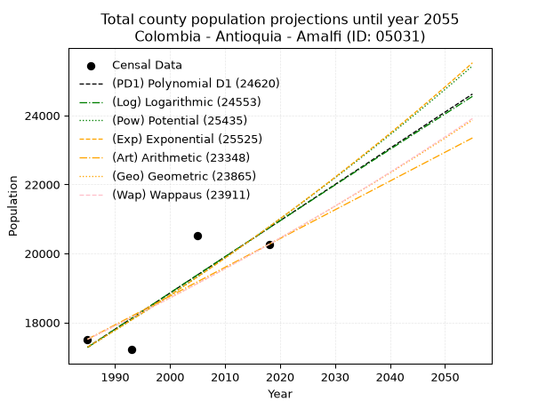
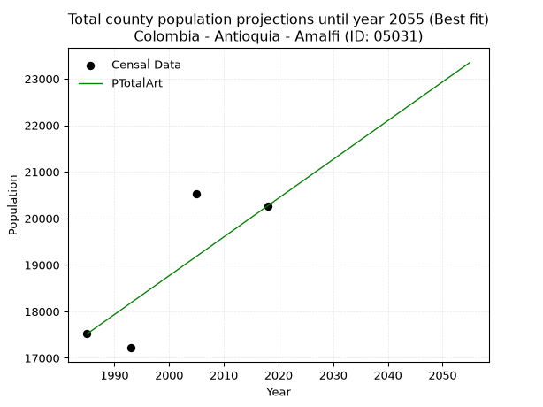
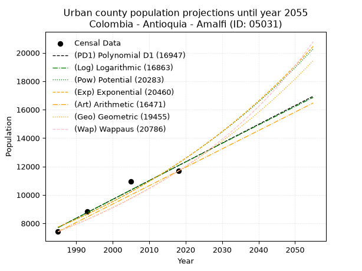
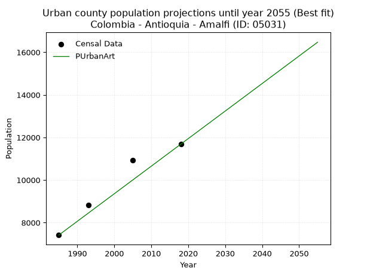
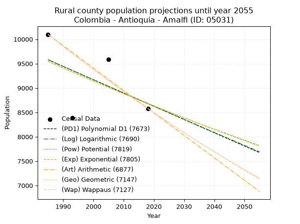
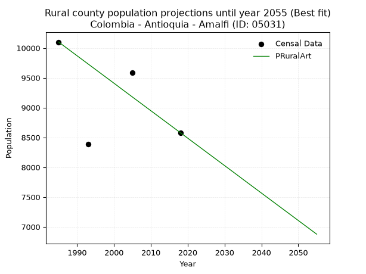

<div align="center">


</div>

# 📜 _“Population and Public Services Demand Projections (PPSD) until Year 2050 for Colombia - Antioquia - Amalfi (ID: 05031)”_
Keywords: `population` `public-service` `projection` `lineal` `polynomial` `logarithmic` `potential` `exponential` `arithmetic` `geometric` `wappaus` `dane` `colombia` `south-america`

PPSD are analytical estimates used by governments and planners to anticipate future changes in population size, age distribution, and the resulting community needs for utilities, healthcare, education, and infrastructure as sizing future water treatment facilities, electrical grids, and road networks based on spatial growth.

<div align="center">

</img>

</div>


> **General running parameters**: • app_version: _v20260806_. • Python version: _3.14.7_. • Pandas version: _3.0.5_. • NumPy version: _2.5.1_. • Creates, save and include plots into reports (create_plot): _False_. • Projection until year: _2050_. • Process polynomial degree 2 and up: _False_. • Process Wappaus: _True_. • Process Wappaus: _True_. • Set negative values to zero: _True_. • Set infinite values to zero: _True_. • Drop dataset notes: _True_. 
<div align="center">

Maps & GIS Layers: [:earth_americas:Google](http://maps.google.com/maps?q=6.909655186,-75.0775005) [:earth_americas:OSM](https://www.openstreetmap.org/#map=18/6.909655186/-75.0775005&layers=P) [:earth_americas:Bing](https://www.bing.com/maps?cp=6.909655186~-75.0775005&lvl=18) [:earth_americas:Apple](https://maps.apple.com/frame?center=6.909655186%2C-75.0775005&span=0.003%2C0.006) [:earth_americas:GISMobile](https://github.com/rcfdtools/R.GISMobile/blob/main/file/gis/CountyLayer_CO/Readme.md)

</div>


<div align="center">

```geojson
{
  "type": "Feature",
  "geometry": {
    "type": "Point", 
    "coordinates": [-75.0775005, 6.909655186]
  }, 
  "properties": {
    "Name": "Colombia - Antioquia - Amalfi (ID: 05031)"
  }
}
```

</div>


## 0. Census Data (4 records)

Census data are official statistics collected by a government about the people and housing in a country. They usually include counts of total population, age, sex, race, income, education, and jobs.

📅Global census file: [Population.xlsx](../data/Population.xlsx)

| Source   |   Year |   CountryID | CountryName   |   StateID | StateName   |   CountyID | CountyName   |   PTotal |   PUrban |   PRural |
|:---------|-------:|------------:|:--------------|----------:|:------------|-----------:|:-------------|---------:|---------:|---------:|
| DANE     |   1985 |          57 | Colombia      |        05 | Antioquia   |      05031 | Amalfi       |    17515 |     7416 |    10099 |
| DANE     |   1993 |          57 | Colombia      |        05 | Antioquia   |      05031 | Amalfi       |    17215 |     8831 |     8384 |
| DANE     |   2005 |          57 | Colombia      |        05 | Antioquia   |      05031 | Amalfi       |    20525 |    10936 |     9589 |
| DANE     |   2018 |          57 | Colombia      |        05 | Antioquia   |      05031 | Amalfi       |    20265 |    11685 |     8580 |

> 🔥Some records could had specific notes about the registered values or the corresponding urban or rural distribution.

📅[SUI-RUPS](https://www.datos.gov.co/Hacienda-y-Cr-dito-P-blico/Registro-nico-de-Prestadores-de-Servicios-P-blicos/4qkq-csdn/about_data) - Local public utility companies: [RUPS.csv](../data/RUPS.csv)

 | SERVICIO       | ESTADO    | NOMBRE                                                       | NIT         | DEPARTAMENTO_DOMICILIO   | MUNICIPIO_DOMICILIO   | DIRECCION                |   TELEFONO | EMAIL                    | TIPO_PRESTADOR                             | CLASIFICACION                  |
|:---------------|:----------|:-------------------------------------------------------------|:------------|:-------------------------|:----------------------|:-------------------------|-----------:|:-------------------------|:-------------------------------------------|:-------------------------------|
| ACUEDUCTO      | OPERATIVA | ACUEDUCTOS Y ALCANTARILLADOS SOSTENIBLES A.A.S. S.A.  E.S.P. | 811008426-2 | ANTIOQUIA                | MEDELLIN              | Calle 33A No  78A  -  56 |    4161177 | estadistica@aassa.com.co | SOCIEDADES (EMPRESA DE SERVICIOS PUBLICOS) | DESDE 2501 HASTA 5000 USUARIOS |
| ALCANTARILLADO | OPERATIVA | ACUEDUCTOS Y ALCANTARILLADOS SOSTENIBLES A.A.S. S.A.  E.S.P. | 811008426-2 | ANTIOQUIA                | MEDELLIN              | Calle 33A No  78A  -  56 |    4161177 | estadistica@aassa.com.co | SOCIEDADES (EMPRESA DE SERVICIOS PUBLICOS) | DESDE 2501 HASTA 5000 USUARIOS |

## 1. Total

### 1.1. Coefficients and Parameters

* (PD1) Polynomial Deg 1: 104.83340024086719, -190813.0088317946 (lineal)
* (Log) Logarithmic: 209930.1674922671, -1576800.8853835063
* (Pow) Potential: 11.148751752328932, -32.528288288513934
* (Exp) Exponential: 0.005567492595178665, 0.27423294561321043
* (Art) Arithmetic: Year diff. 2018 - 1985 = 33, Population diff. 20265 - 17515 = 2750, Annual growth = 83.33333333333333
* (Geo) Geometric: Year diff. 2018 - 1985 = 33, Population diff. 20265 - 17515 = 2750, Annual growth % = 0.004429100917626272
* (Wap) Wappaus: i = 0.4411505205576143, Condition values only valid for < 200)

<sub>
Wappaus condition values: ['0.00', '0.44', '0.88', '1.32', '1.76', '2.21', '2.65', '3.09', '3.53', '3.97', '4.41', '4.85', '5.29', '5.73', '6.18', '6.62', '7.06', '7.50', '7.94', '8.38', '8.82', '9.26', '9.71', '10.15', '10.59', '11.03', '11.47', '11.91', '12.35', '12.79', '13.23', '13.68', '14.12', '14.56', '15.00', '15.44', '15.88', '16.32', '16.76', '17.20', '17.65', '18.09', '18.53', '18.97', '19.41', '19.85', '20.29', '20.73', '21.18', '21.62', '22.06', '22.50', '22.94', '23.38', '23.82', '24.26', '24.70', '25.15', '25.59', '26.03', '26.47', '26.91', '27.35', '27.79', '28.23', '28.67']
</sub>


### 1.2. Projected Dataset

|   Year |   CountyID |   PTotalPD1 |   PTotalLog |   PTotalPow |   PTotalExp |   PTotalArt |   PTotalGeo |   PTotalWap |
|-------:|-----------:|------------:|------------:|------------:|------------:|------------:|------------:|------------:|
|   1985 |      05031 |       17281 |       17277 |       17283 |       17287 |       17515 |       17515 |       17515 |
|   1986 |      05031 |       17386 |       17383 |       17381 |       17383 |       17598 |       17593 |       17592 |
|   1987 |      05031 |       17491 |       17489 |       17478 |       17480 |       17682 |       17670 |       17670 |
|   1988 |      05031 |       17596 |       17594 |       17577 |       17578 |       17765 |       17749 |       17748 |
|   1989 |      05031 |       17701 |       17700 |       17676 |       17676 |       17848 |       17827 |       17827 |
|   1990 |      05031 |       17805 |       17806 |       17775 |       17775 |       17932 |       17906 |       17906 |
|   1991 |      05031 |       17910 |       17911 |       17875 |       17874 |       18015 |       17986 |       17985 |
|   1992 |      05031 |       18015 |       18016 |       17975 |       17974 |       18098 |       18065 |       18064 |
|   1993 |      05031 |       18120 |       18122 |       18076 |       18074 |       18182 |       18145 |       18144 |
|   1994 |      05031 |       18225 |       18227 |       18177 |       18175 |       18265 |       18226 |       18224 |
|   1995 |      05031 |       18330 |       18332 |       18279 |       18276 |       18348 |       18306 |       18305 |
|   1996 |      05031 |       18434 |       18438 |       18382 |       18379 |       18432 |       18387 |       18386 |
|   1997 |      05031 |       18539 |       18543 |       18484 |       18481 |       18515 |       18469 |       18467 |
|   1998 |      05031 |       18644 |       18648 |       18588 |       18584 |       18598 |       18551 |       18549 |
|   1999 |      05031 |       18749 |       18753 |       18692 |       18688 |       18682 |       18633 |       18631 |
|   2000 |      05031 |       18854 |       18858 |       18796 |       18792 |       18765 |       18715 |       18714 |
|   2001 |      05031 |       18959 |       18963 |       18901 |       18897 |       18848 |       18798 |       18797 |
|   2002 |      05031 |       19063 |       19068 |       19007 |       19003 |       18932 |       18882 |       18880 |
|   2003 |      05031 |       19168 |       19173 |       19113 |       19109 |       19015 |       18965 |       18963 |
|   2004 |      05031 |       19273 |       19277 |       19220 |       19216 |       19098 |       19049 |       19047 |
|   2005 |      05031 |       19378 |       19382 |       19327 |       19323 |       19182 |       19134 |       19132 |
|   2006 |      05031 |       19483 |       19487 |       19435 |       19431 |       19265 |       19218 |       19216 |
|   2007 |      05031 |       19588 |       19591 |       19543 |       19539 |       19348 |       19303 |       19302 |
|   2008 |      05031 |       19692 |       19696 |       19652 |       19648 |       19432 |       19389 |       19387 |
|   2009 |      05031 |       19797 |       19800 |       19761 |       19758 |       19515 |       19475 |       19473 |
|   2010 |      05031 |       19902 |       19905 |       19871 |       19868 |       19598 |       19561 |       19559 |
|   2011 |      05031 |       20007 |       20009 |       19982 |       19979 |       19682 |       19648 |       19646 |
|   2012 |      05031 |       20112 |       20114 |       20093 |       20091 |       19765 |       19735 |       19733 |
|   2013 |      05031 |       20217 |       20218 |       20204 |       20203 |       19848 |       19822 |       19821 |
|   2014 |      05031 |       20321 |       20322 |       20317 |       20316 |       19932 |       19910 |       19909 |
|   2015 |      05031 |       20426 |       20426 |       20429 |       20429 |       20015 |       19998 |       19997 |
|   2016 |      05031 |       20531 |       20531 |       20543 |       20543 |       20098 |       20087 |       20086 |
|   2017 |      05031 |       20636 |       20635 |       20657 |       20658 |       20182 |       20176 |       20175 |
|   2018 |      05031 |       20741 |       20739 |       20771 |       20773 |       20265 |       20265 |       20265 |
|   2019 |      05031 |       20846 |       20843 |       20886 |       20889 |       20348 |       20355 |       20355 |
|   2020 |      05031 |       20950 |       20947 |       21002 |       21006 |       20432 |       20445 |       20446 |
|   2021 |      05031 |       21055 |       21051 |       21118 |       21123 |       20515 |       20535 |       20537 |
|   2022 |      05031 |       21160 |       21154 |       21235 |       21241 |       20598 |       20626 |       20628 |
|   2023 |      05031 |       21265 |       21258 |       21352 |       21360 |       20682 |       20718 |       20720 |
|   2024 |      05031 |       21370 |       21362 |       21470 |       21479 |       20765 |       20810 |       20812 |
|   2025 |      05031 |       21475 |       21466 |       21589 |       21599 |       20848 |       20902 |       20905 |
|   2026 |      05031 |       21579 |       21569 |       21708 |       21719 |       20932 |       20994 |       20998 |
|   2027 |      05031 |       21684 |       21673 |       21827 |       21841 |       21015 |       21087 |       21092 |
|   2028 |      05031 |       21789 |       21776 |       21948 |       21963 |       21098 |       21181 |       21186 |
|   2029 |      05031 |       21894 |       21880 |       22069 |       22085 |       21182 |       21274 |       21280 |
|   2030 |      05031 |       21999 |       21983 |       22190 |       22209 |       21265 |       21369 |       21375 |
|   2031 |      05031 |       22104 |       22087 |       22313 |       22333 |       21348 |       21463 |       21471 |
|   2032 |      05031 |       22208 |       22190 |       22435 |       22457 |       21432 |       21558 |       21567 |
|   2033 |      05031 |       22313 |       22293 |       22559 |       22583 |       21515 |       21654 |       21663 |
|   2034 |      05031 |       22418 |       22397 |       22683 |       22709 |       21598 |       21750 |       21760 |
|   2035 |      05031 |       22523 |       22500 |       22807 |       22835 |       21682 |       21846 |       21857 |
|   2036 |      05031 |       22628 |       22603 |       22933 |       22963 |       21765 |       21943 |       21955 |
|   2037 |      05031 |       22733 |       22706 |       23059 |       23091 |       21848 |       22040 |       22053 |
|   2038 |      05031 |       22837 |       22809 |       23185 |       23220 |       21932 |       22138 |       22152 |
|   2039 |      05031 |       22942 |       22912 |       23312 |       23350 |       22015 |       22236 |       22252 |
|   2040 |      05031 |       23047 |       23015 |       23440 |       23480 |       22098 |       22334 |       22351 |
|   2041 |      05031 |       23152 |       23118 |       23568 |       23611 |       22182 |       22433 |       22452 |
|   2042 |      05031 |       23257 |       23221 |       23697 |       23743 |       22265 |       22533 |       22553 |
|   2043 |      05031 |       23362 |       23324 |       23827 |       23876 |       22348 |       22632 |       22654 |
|   2044 |      05031 |       23466 |       23426 |       23957 |       24009 |       22432 |       22733 |       22756 |
|   2045 |      05031 |       23571 |       23529 |       24088 |       24143 |       22515 |       22833 |       22858 |
|   2046 |      05031 |       23676 |       23632 |       24220 |       24278 |       22598 |       22934 |       22961 |
|   2047 |      05031 |       23781 |       23734 |       24352 |       24413 |       22682 |       23036 |       23065 |
|   2048 |      05031 |       23886 |       23837 |       24485 |       24550 |       22765 |       23138 |       23168 |
|   2049 |      05031 |       23991 |       23939 |       24619 |       24687 |       22848 |       23240 |       23273 |
|   2050 |      05031 |       24095 |       24042 |       24753 |       24824 |       22932 |       23343 |       23378 |
<div align="center">

</img>

</div>


### 1.3. Best fit with absolute and relative error (%)

Relative error puts that difference into context by dividing the absolute error by the true value, creating a unitless ratio or percentage that shows the scale of the mistake.

Absolute and relative error

|   Year | Source   |   CountryID | CountryName   |   StateID | StateName   |   CountyID_x | CountyName   |   PTotal |   PUrban |   PRural |   CountyID_y |   PTotalPD1 |   PTotalLog |   PTotalPow |   PTotalExp |   PTotalArt |   PTotalGeo |   PTotalWap |   PTotalPD1AbsError |   PTotalLogAbsError |   PTotalPowAbsError |   PTotalExpAbsError |   PTotalArtAbsError |   PTotalGeoAbsError |   PTotalWapAbsError |   PTotalPD1RelError |   PTotalLogRelError |   PTotalPowRelError |   PTotalExpRelError |   PTotalArtRelError |   PTotalGeoRelError |   PTotalWapRelError |
|-------:|:---------|------------:|:--------------|----------:|:------------|-------------:|:-------------|---------:|---------:|---------:|-------------:|------------:|------------:|------------:|------------:|------------:|------------:|------------:|--------------------:|--------------------:|--------------------:|--------------------:|--------------------:|--------------------:|--------------------:|--------------------:|--------------------:|--------------------:|--------------------:|--------------------:|--------------------:|--------------------:|
|   1985 | DANE     |          57 | Colombia      |        05 | Antioquia   |        05031 | Amalfi       |    17515 |     7416 |    10099 |        05031 |       17281 |       17277 |       17283 |       17287 |       17515 |       17515 |       17515 |                 234 |                 238 |                 232 |                 228 |                   0 |                   0 |                   0 |             1.336   |             1.35884 |             1.32458 |             1.30174 |             0       |             0       |             0       |
|   1993 | DANE     |          57 | Colombia      |        05 | Antioquia   |        05031 | Amalfi       |    17215 |     8831 |     8384 |        05031 |       18120 |       18122 |       18076 |       18074 |       18182 |       18145 |       18144 |                 905 |                 907 |                 861 |                 859 |                 967 |                 930 |                 929 |             5.25704 |             5.26866 |             5.00145 |             4.98983 |             5.61719 |             5.40227 |             5.39646 |
|   2005 | DANE     |          57 | Colombia      |        05 | Antioquia   |        05031 | Amalfi       |    20525 |    10936 |     9589 |        05031 |       19378 |       19382 |       19327 |       19323 |       19182 |       19134 |       19132 |                1147 |                1143 |                1198 |                1202 |                1343 |                1391 |                1393 |             5.58831 |             5.56882 |             5.83678 |             5.85627 |             6.54324 |             6.7771  |             6.78685 |
|   2018 | DANE     |          57 | Colombia      |        05 | Antioquia   |        05031 | Amalfi       |    20265 |    11685 |     8580 |        05031 |       20741 |       20739 |       20771 |       20773 |       20265 |       20265 |       20265 |                 476 |                 474 |                 506 |                 508 |                   0 |                   0 |                   0 |             2.34888 |             2.33901 |             2.49692 |             2.50679 |             0       |             0       |             0       |

Relative error mean

| Method    |   RelError | Best   |
|:----------|-----------:|:-------|
| PTotalPD1 |    3.63256 |        |
| PTotalLog |    3.63383 |        |
| PTotalPow |    3.66493 |        |
| PTotalExp |    3.66366 |        |
| PTotalArt |    3.04011 | True   |
| PTotalGeo |    3.04484 |        |
| PTotalWap |    3.04583 |        |

💙Best method: _**PTotalArt**_
<div align="center">

</img>

</div>


### 1.4. Fresh water supply demand in liters per capita per day (lpcd)

The fresh water supply demand typically ranges from 100 to 300 liters per capita per day (lpcd) for standard domestic and municipal planning, though absolute survival minimums set by the World Health Organization are as low as 7.5 to 20 liters per day, and total consumption in high-income nations can exceed 400 liters.

> `CZ`: Level in meters above the sea level (masl)<br> `WS`: Fresh water supply demand in liters per capita per day (lpcd or l/h/d)<br> `WSAll`: Zonal fresh water supply demand in liters per second (l/s)<br> `A`: Zonal area in square meters<br> `DP`: Population density (people/hectare or p/ha)

Reference values (RAS Colombia)

|    CZ |   WS |
|------:|-----:|
|  1000 |  120 |
|  2000 |  130 |
| 99999 |  140 |

County shapefile geometry properties and water supply values

|   CountyID |      ATotal |   CZTotal |   WSTotal |
|-----------:|------------:|----------:|----------:|
|      05031 | 1.20835e+09 |   1094.71 |       130 |

Projected values for best method: PTotalArt

|   CountyID |   Year |   PTotalArt |   DPTotal |   WSTotal |   WSTotalAll |
|-----------:|-------:|------------:|----------:|----------:|-------------:|
|      05031 |   1985 |       17515 |      0.14 |       130 |      26.3536 |
|      05031 |   1986 |       17598 |      0.15 |       130 |      26.4785 |
|      05031 |   1987 |       17682 |      0.15 |       130 |      26.6049 |
|      05031 |   1988 |       17765 |      0.15 |       130 |      26.7297 |
|      05031 |   1989 |       17848 |      0.15 |       130 |      26.8546 |
|      05031 |   1990 |       17932 |      0.15 |       130 |      26.981  |
|      05031 |   1991 |       18015 |      0.15 |       130 |      27.1059 |
|      05031 |   1992 |       18098 |      0.15 |       130 |      27.2308 |
|      05031 |   1993 |       18182 |      0.15 |       130 |      27.3572 |
|      05031 |   1994 |       18265 |      0.15 |       130 |      27.4821 |
|      05031 |   1995 |       18348 |      0.15 |       130 |      27.6069 |
|      05031 |   1996 |       18432 |      0.15 |       130 |      27.7333 |
|      05031 |   1997 |       18515 |      0.15 |       130 |      27.8582 |
|      05031 |   1998 |       18598 |      0.15 |       130 |      27.9831 |
|      05031 |   1999 |       18682 |      0.15 |       130 |      28.1095 |
|      05031 |   2000 |       18765 |      0.16 |       130 |      28.2344 |
|      05031 |   2001 |       18848 |      0.16 |       130 |      28.3593 |
|      05031 |   2002 |       18932 |      0.16 |       130 |      28.4856 |
|      05031 |   2003 |       19015 |      0.16 |       130 |      28.6105 |
|      05031 |   2004 |       19098 |      0.16 |       130 |      28.7354 |
|      05031 |   2005 |       19182 |      0.16 |       130 |      28.8618 |
|      05031 |   2006 |       19265 |      0.16 |       130 |      28.9867 |
|      05031 |   2007 |       19348 |      0.16 |       130 |      29.1116 |
|      05031 |   2008 |       19432 |      0.16 |       130 |      29.238  |
|      05031 |   2009 |       19515 |      0.16 |       130 |      29.3628 |
|      05031 |   2010 |       19598 |      0.16 |       130 |      29.4877 |
|      05031 |   2011 |       19682 |      0.16 |       130 |      29.6141 |
|      05031 |   2012 |       19765 |      0.16 |       130 |      29.739  |
|      05031 |   2013 |       19848 |      0.16 |       130 |      29.8639 |
|      05031 |   2014 |       19932 |      0.16 |       130 |      29.9903 |
|      05031 |   2015 |       20015 |      0.17 |       130 |      30.1152 |
|      05031 |   2016 |       20098 |      0.17 |       130 |      30.24   |
|      05031 |   2017 |       20182 |      0.17 |       130 |      30.3664 |
|      05031 |   2018 |       20265 |      0.17 |       130 |      30.4913 |
|      05031 |   2019 |       20348 |      0.17 |       130 |      30.6162 |
|      05031 |   2020 |       20432 |      0.17 |       130 |      30.7426 |
|      05031 |   2021 |       20515 |      0.17 |       130 |      30.8675 |
|      05031 |   2022 |       20598 |      0.17 |       130 |      30.9924 |
|      05031 |   2023 |       20682 |      0.17 |       130 |      31.1187 |
|      05031 |   2024 |       20765 |      0.17 |       130 |      31.2436 |
|      05031 |   2025 |       20848 |      0.17 |       130 |      31.3685 |
|      05031 |   2026 |       20932 |      0.17 |       130 |      31.4949 |
|      05031 |   2027 |       21015 |      0.17 |       130 |      31.6198 |
|      05031 |   2028 |       21098 |      0.17 |       130 |      31.7447 |
|      05031 |   2029 |       21182 |      0.18 |       130 |      31.8711 |
|      05031 |   2030 |       21265 |      0.18 |       130 |      31.9959 |
|      05031 |   2031 |       21348 |      0.18 |       130 |      32.1208 |
|      05031 |   2032 |       21432 |      0.18 |       130 |      32.2472 |
|      05031 |   2033 |       21515 |      0.18 |       130 |      32.3721 |
|      05031 |   2034 |       21598 |      0.18 |       130 |      32.497  |
|      05031 |   2035 |       21682 |      0.18 |       130 |      32.6234 |
|      05031 |   2036 |       21765 |      0.18 |       130 |      32.7483 |
|      05031 |   2037 |       21848 |      0.18 |       130 |      32.8731 |
|      05031 |   2038 |       21932 |      0.18 |       130 |      32.9995 |
|      05031 |   2039 |       22015 |      0.18 |       130 |      33.1244 |
|      05031 |   2040 |       22098 |      0.18 |       130 |      33.2493 |
|      05031 |   2041 |       22182 |      0.18 |       130 |      33.3757 |
|      05031 |   2042 |       22265 |      0.18 |       130 |      33.5006 |
|      05031 |   2043 |       22348 |      0.18 |       130 |      33.6255 |
|      05031 |   2044 |       22432 |      0.19 |       130 |      33.7519 |
|      05031 |   2045 |       22515 |      0.19 |       130 |      33.8767 |
|      05031 |   2046 |       22598 |      0.19 |       130 |      34.0016 |
|      05031 |   2047 |       22682 |      0.19 |       130 |      34.128  |
|      05031 |   2048 |       22765 |      0.19 |       130 |      34.2529 |
|      05031 |   2049 |       22848 |      0.19 |       130 |      34.3778 |
|      05031 |   2050 |       22932 |      0.19 |       130 |      34.5042 |

## 2. Urban

### 2.1. Coefficients and Parameters

* (PD1) Polynomial Deg 1: 132.05299076675976, -254421.99478121122 (lineal)
* (Log) Logarithmic: 264454.9136574853, -2000406.917919224
* (Pow) Potential: 27.817705799678347, -87.84768975461247
* (Exp) Exponential: 0.01388882239910458, 8.231536157390527e-09
* (Art) Arithmetic: Year diff. 2018 - 1985 = 33, Population diff. 11685 - 7416 = 4269, Annual growth = 129.36363636363637
* (Geo) Geometric: Year diff. 2018 - 1985 = 33, Population diff. 11685 - 7416 = 4269, Annual growth % = 0.01387311257362378
* (Wap) Wappaus: i = 1.354522133538939, Condition values only valid for < 200)

<sub>
Wappaus condition values: ['0.00', '1.35', '2.71', '4.06', '5.42', '6.77', '8.13', '9.48', '10.84', '12.19', '13.55', '14.90', '16.25', '17.61', '18.96', '20.32', '21.67', '23.03', '24.38', '25.74', '27.09', '28.44', '29.80', '31.15', '32.51', '33.86', '35.22', '36.57', '37.93', '39.28', '40.64', '41.99', '43.34', '44.70', '46.05', '47.41', '48.76', '50.12', '51.47', '52.83', '54.18', '55.54', '56.89', '58.24', '59.60', '60.95', '62.31', '63.66', '65.02', '66.37', '67.73', '69.08', '70.44', '71.79', '73.14', '74.50', '75.85', '77.21', '78.56', '79.92', '81.27', '82.63', '83.98', '85.33', '86.69', '88.04']
</sub>


### 2.2. Projected Dataset

|   Year |   CountyID |   PUrbanPD1 |   PUrbanLog |   PUrbanPow |   PUrbanExp |   PUrbanArt |   PUrbanGeo |   PUrbanWap |
|-------:|-----------:|------------:|------------:|------------:|------------:|------------:|------------:|------------:|
|   1985 |      05031 |        7703 |        7698 |        7735 |        7739 |        7416 |        7416 |        7416 |
|   1986 |      05031 |        7835 |        7831 |        7844 |        7847 |        7545 |        7519 |        7517 |
|   1987 |      05031 |        7967 |        7965 |        7954 |        7957 |        7675 |        7623 |        7620 |
|   1988 |      05031 |        8099 |        8098 |        8067 |        8068 |        7804 |        7729 |        7724 |
|   1989 |      05031 |        8231 |        8231 |        8180 |        8181 |        7933 |        7836 |        7829 |
|   1990 |      05031 |        8363 |        8363 |        8295 |        8295 |        8063 |        7945 |        7936 |
|   1991 |      05031 |        8496 |        8496 |        8412 |        8411 |        8192 |        8055 |        8044 |
|   1992 |      05031 |        8628 |        8629 |        8530 |        8529 |        8322 |        8167 |        8154 |
|   1993 |      05031 |        8760 |        8762 |        8650 |        8648 |        8451 |        8280 |        8266 |
|   1994 |      05031 |        8892 |        8895 |        8772 |        8769 |        8580 |        8395 |        8379 |
|   1995 |      05031 |        9024 |        9027 |        8895 |        8892 |        8710 |        8511 |        8493 |
|   1996 |      05031 |        9156 |        9160 |        9020 |        9016 |        8839 |        8630 |        8610 |
|   1997 |      05031 |        9288 |        9292 |        9147 |        9142 |        8968 |        8749 |        8728 |
|   1998 |      05031 |        9420 |        9424 |        9275 |        9270 |        9098 |        8871 |        8848 |
|   1999 |      05031 |        9552 |        9557 |        9405 |        9400 |        9227 |        8994 |        8970 |
|   2000 |      05031 |        9684 |        9689 |        9537 |        9531 |        9356 |        9119 |        9093 |
|   2001 |      05031 |        9816 |        9821 |        9670 |        9665 |        9486 |        9245 |        9219 |
|   2002 |      05031 |        9948 |        9953 |        9805 |        9800 |        9615 |        9373 |        9346 |
|   2003 |      05031 |       10080 |       10085 |        9943 |        9937 |        9745 |        9503 |        9475 |
|   2004 |      05031 |       10212 |       10217 |       10082 |       10076 |        9874 |        9635 |        9606 |
|   2005 |      05031 |       10344 |       10349 |       10222 |       10217 |       10003 |        9769 |        9740 |
|   2006 |      05031 |       10476 |       10481 |       10365 |       10360 |       10133 |        9904 |        9875 |
|   2007 |      05031 |       10608 |       10613 |       10510 |       10505 |       10262 |       10042 |       10013 |
|   2008 |      05031 |       10740 |       10745 |       10657 |       10652 |       10391 |       10181 |       10153 |
|   2009 |      05031 |       10872 |       10876 |       10805 |       10801 |       10521 |       10322 |       10295 |
|   2010 |      05031 |       11005 |       11008 |       10956 |       10952 |       10650 |       10465 |       10439 |
|   2011 |      05031 |       11137 |       11140 |       11108 |       11105 |       10779 |       10611 |       10586 |
|   2012 |      05031 |       11269 |       11271 |       11263 |       11260 |       10909 |       10758 |       10735 |
|   2013 |      05031 |       11401 |       11402 |       11420 |       11418 |       11038 |       10907 |       10887 |
|   2014 |      05031 |       11533 |       11534 |       11579 |       11577 |       11168 |       11058 |       11041 |
|   2015 |      05031 |       11665 |       11665 |       11740 |       11739 |       11297 |       11212 |       11198 |
|   2016 |      05031 |       11797 |       11796 |       11903 |       11903 |       11426 |       11367 |       11358 |
|   2017 |      05031 |       11929 |       11927 |       12068 |       12070 |       11556 |       11525 |       11520 |
|   2018 |      05031 |       12061 |       12059 |       12236 |       12239 |       11685 |       11685 |       11685 |
|   2019 |      05031 |       12193 |       12190 |       12406 |       12410 |       11814 |       11847 |       11853 |
|   2020 |      05031 |       12325 |       12320 |       12578 |       12583 |       11944 |       12011 |       12024 |
|   2021 |      05031 |       12457 |       12451 |       12752 |       12759 |       12073 |       12178 |       12198 |
|   2022 |      05031 |       12589 |       12582 |       12929 |       12938 |       12202 |       12347 |       12375 |
|   2023 |      05031 |       12721 |       12713 |       13108 |       13119 |       12332 |       12518 |       12556 |
|   2024 |      05031 |       12853 |       12844 |       13289 |       13302 |       12461 |       12692 |       12740 |
|   2025 |      05031 |       12985 |       12974 |       13473 |       13488 |       12591 |       12868 |       12927 |
|   2026 |      05031 |       13117 |       13105 |       13659 |       13677 |       12720 |       13047 |       13118 |
|   2027 |      05031 |       13249 |       13235 |       13848 |       13868 |       12849 |       13228 |       13312 |
|   2028 |      05031 |       13381 |       13366 |       14040 |       14062 |       12979 |       13411 |       13510 |
|   2029 |      05031 |       13514 |       13496 |       14233 |       14259 |       13108 |       13597 |       13712 |
|   2030 |      05031 |       13646 |       13626 |       14430 |       14458 |       13237 |       13786 |       13918 |
|   2031 |      05031 |       13778 |       13757 |       14629 |       14660 |       13367 |       13977 |       14128 |
|   2032 |      05031 |       13910 |       13887 |       14831 |       14865 |       13496 |       14171 |       14342 |
|   2033 |      05031 |       14042 |       14017 |       15035 |       15073 |       13625 |       14368 |       14560 |
|   2034 |      05031 |       14174 |       14147 |       15242 |       15284 |       13755 |       14567 |       14783 |
|   2035 |      05031 |       14306 |       14277 |       15452 |       15498 |       13884 |       14769 |       15010 |
|   2036 |      05031 |       14438 |       14407 |       15665 |       15715 |       14014 |       14974 |       15242 |
|   2037 |      05031 |       14570 |       14537 |       15880 |       15934 |       14143 |       15182 |       15479 |
|   2038 |      05031 |       14702 |       14667 |       16098 |       16157 |       14272 |       15392 |       15721 |
|   2039 |      05031 |       14834 |       14796 |       16319 |       16383 |       14402 |       15606 |       15968 |
|   2040 |      05031 |       14966 |       14926 |       16544 |       16612 |       14531 |       15822 |       16220 |
|   2041 |      05031 |       15098 |       15056 |       16771 |       16845 |       14660 |       16042 |       16478 |
|   2042 |      05031 |       15230 |       15185 |       17001 |       17080 |       14790 |       16264 |       16742 |
|   2043 |      05031 |       15362 |       15315 |       17234 |       17319 |       14919 |       16490 |       17011 |
|   2044 |      05031 |       15494 |       15444 |       17470 |       17561 |       15048 |       16719 |       17287 |
|   2045 |      05031 |       15626 |       15573 |       17709 |       17807 |       15178 |       16951 |       17569 |
|   2046 |      05031 |       15758 |       15703 |       17952 |       18056 |       15307 |       17186 |       17857 |
|   2047 |      05031 |       15890 |       15832 |       18198 |       18309 |       15437 |       17424 |       18152 |
|   2048 |      05031 |       16023 |       15961 |       18446 |       18565 |       15566 |       17666 |       18454 |
|   2049 |      05031 |       16155 |       16090 |       18699 |       18824 |       15695 |       17911 |       18763 |
|   2050 |      05031 |       16287 |       16219 |       18954 |       19088 |       15825 |       18160 |       19080 |
<div align="center">

</img>

</div>


### 2.3. Best fit with absolute and relative error (%)

Relative error puts that difference into context by dividing the absolute error by the true value, creating a unitless ratio or percentage that shows the scale of the mistake.

Absolute and relative error

|   Year | Source   |   CountryID | CountryName   |   StateID | StateName   |   CountyID_x | CountyName   |   PTotal |   PUrban |   PRural |   CountyID_y |   PUrbanPD1 |   PUrbanLog |   PUrbanPow |   PUrbanExp |   PUrbanArt |   PUrbanGeo |   PUrbanWap |   PUrbanPD1AbsError |   PUrbanLogAbsError |   PUrbanPowAbsError |   PUrbanExpAbsError |   PUrbanArtAbsError |   PUrbanGeoAbsError |   PUrbanWapAbsError |   PUrbanPD1RelError |   PUrbanLogRelError |   PUrbanPowRelError |   PUrbanExpRelError |   PUrbanArtRelError |   PUrbanGeoRelError |   PUrbanWapRelError |
|-------:|:---------|------------:|:--------------|----------:|:------------|-------------:|:-------------|---------:|---------:|---------:|-------------:|------------:|------------:|------------:|------------:|------------:|------------:|------------:|--------------------:|--------------------:|--------------------:|--------------------:|--------------------:|--------------------:|--------------------:|--------------------:|--------------------:|--------------------:|--------------------:|--------------------:|--------------------:|--------------------:|
|   1985 | DANE     |          57 | Colombia      |        05 | Antioquia   |        05031 | Amalfi       |    17515 |     7416 |    10099 |        05031 |        7703 |        7698 |        7735 |        7739 |        7416 |        7416 |        7416 |                 287 |                 282 |                 319 |                 323 |                   0 |                   0 |                   0 |            3.87001  |            3.80259  |             4.30151 |             4.35545 |             0       |             0       |             0       |
|   1993 | DANE     |          57 | Colombia      |        05 | Antioquia   |        05031 | Amalfi       |    17215 |     8831 |     8384 |        05031 |        8760 |        8762 |        8650 |        8648 |        8451 |        8280 |        8266 |                  71 |                  69 |                 181 |                 183 |                 380 |                 551 |                 565 |            0.803986 |            0.781338 |             2.0496  |             2.07225 |             4.30302 |             6.23938 |             6.39792 |
|   2005 | DANE     |          57 | Colombia      |        05 | Antioquia   |        05031 | Amalfi       |    20525 |    10936 |     9589 |        05031 |       10344 |       10349 |       10222 |       10217 |       10003 |        9769 |        9740 |                 592 |                 587 |                 714 |                 719 |                 933 |                1167 |                1196 |            5.41331  |            5.36759  |             6.5289  |             6.57462 |             8.53146 |            10.6712  |            10.9364  |
|   2018 | DANE     |          57 | Colombia      |        05 | Antioquia   |        05031 | Amalfi       |    20265 |    11685 |     8580 |        05031 |       12061 |       12059 |       12236 |       12239 |       11685 |       11685 |       11685 |                 376 |                 374 |                 551 |                 554 |                   0 |                   0 |                   0 |            3.2178   |            3.20068  |             4.71545 |             4.74112 |             0       |             0       |             0       |

Relative error mean

| Method    |   RelError | Best   |
|:----------|-----------:|:-------|
| PUrbanPD1 |    3.32628 |        |
| PUrbanLog |    3.28805 |        |
| PUrbanPow |    4.39886 |        |
| PUrbanExp |    4.43586 |        |
| PUrbanArt |    3.20862 | True   |
| PUrbanGeo |    4.22764 |        |
| PUrbanWap |    4.33357 |        |

💙Best method: _**PUrbanArt**_
<div align="center">

</img>

</div>


### 2.4. Fresh water supply demand in liters per capita per day (lpcd)

The fresh water supply demand typically ranges from 100 to 300 liters per capita per day (lpcd) for standard domestic and municipal planning, though absolute survival minimums set by the World Health Organization are as low as 7.5 to 20 liters per day, and total consumption in high-income nations can exceed 400 liters.

> `CZ`: Level in meters above the sea level (masl)<br> `WS`: Fresh water supply demand in liters per capita per day (lpcd or l/h/d)<br> `WSAll`: Zonal fresh water supply demand in liters per second (l/s)<br> `A`: Zonal area in square meters<br> `DP`: Population density (people/hectare or p/ha)

Reference values (RAS Colombia)

|    CZ |   WS |
|------:|-----:|
|  1000 |  120 |
|  2000 |  130 |
| 99999 |  140 |

County shapefile geometry properties and water supply values

|   CountyID |      AUrban |   CZUrban |   WSUrban |
|-----------:|------------:|----------:|----------:|
|      05031 | 1.66172e+06 |   1555.58 |       130 |

Projected values for best method: PUrbanArt

|   CountyID |   Year |   PUrbanArt |   DPUrban |   WSUrban |   WSUrbanAll |
|-----------:|-------:|------------:|----------:|----------:|-------------:|
|      05031 |   1985 |        7416 |     44.63 |       130 |      11.1583 |
|      05031 |   1986 |        7545 |     45.4  |       130 |      11.3524 |
|      05031 |   1987 |        7675 |     46.19 |       130 |      11.548  |
|      05031 |   1988 |        7804 |     46.96 |       130 |      11.7421 |
|      05031 |   1989 |        7933 |     47.74 |       130 |      11.9362 |
|      05031 |   1990 |        8063 |     48.52 |       130 |      12.1318 |
|      05031 |   1991 |        8192 |     49.3  |       130 |      12.3259 |
|      05031 |   1992 |        8322 |     50.08 |       130 |      12.5215 |
|      05031 |   1993 |        8451 |     50.86 |       130 |      12.7156 |
|      05031 |   1994 |        8580 |     51.63 |       130 |      12.9097 |
|      05031 |   1995 |        8710 |     52.42 |       130 |      13.1053 |
|      05031 |   1996 |        8839 |     53.19 |       130 |      13.2994 |
|      05031 |   1997 |        8968 |     53.97 |       130 |      13.4935 |
|      05031 |   1998 |        9098 |     54.75 |       130 |      13.6891 |
|      05031 |   1999 |        9227 |     55.53 |       130 |      13.8832 |
|      05031 |   2000 |        9356 |     56.3  |       130 |      14.0773 |
|      05031 |   2001 |        9486 |     57.09 |       130 |      14.2729 |
|      05031 |   2002 |        9615 |     57.86 |       130 |      14.467  |
|      05031 |   2003 |        9745 |     58.64 |       130 |      14.6626 |
|      05031 |   2004 |        9874 |     59.42 |       130 |      14.8567 |
|      05031 |   2005 |       10003 |     60.2  |       130 |      15.0508 |
|      05031 |   2006 |       10133 |     60.98 |       130 |      15.2464 |
|      05031 |   2007 |       10262 |     61.76 |       130 |      15.4405 |
|      05031 |   2008 |       10391 |     62.53 |       130 |      15.6346 |
|      05031 |   2009 |       10521 |     63.31 |       130 |      15.8302 |
|      05031 |   2010 |       10650 |     64.09 |       130 |      16.0243 |
|      05031 |   2011 |       10779 |     64.87 |       130 |      16.2184 |
|      05031 |   2012 |       10909 |     65.65 |       130 |      16.414  |
|      05031 |   2013 |       11038 |     66.43 |       130 |      16.6081 |
|      05031 |   2014 |       11168 |     67.21 |       130 |      16.8037 |
|      05031 |   2015 |       11297 |     67.98 |       130 |      16.9978 |
|      05031 |   2016 |       11426 |     68.76 |       130 |      17.1919 |
|      05031 |   2017 |       11556 |     69.54 |       130 |      17.3875 |
|      05031 |   2018 |       11685 |     70.32 |       130 |      17.5816 |
|      05031 |   2019 |       11814 |     71.09 |       130 |      17.7757 |
|      05031 |   2020 |       11944 |     71.88 |       130 |      17.9713 |
|      05031 |   2021 |       12073 |     72.65 |       130 |      18.1654 |
|      05031 |   2022 |       12202 |     73.43 |       130 |      18.3595 |
|      05031 |   2023 |       12332 |     74.21 |       130 |      18.5551 |
|      05031 |   2024 |       12461 |     74.99 |       130 |      18.7492 |
|      05031 |   2025 |       12591 |     75.77 |       130 |      18.9448 |
|      05031 |   2026 |       12720 |     76.55 |       130 |      19.1389 |
|      05031 |   2027 |       12849 |     77.32 |       130 |      19.333  |
|      05031 |   2028 |       12979 |     78.11 |       130 |      19.5286 |
|      05031 |   2029 |       13108 |     78.88 |       130 |      19.7227 |
|      05031 |   2030 |       13237 |     79.66 |       130 |      19.9168 |
|      05031 |   2031 |       13367 |     80.44 |       130 |      20.1124 |
|      05031 |   2032 |       13496 |     81.22 |       130 |      20.3065 |
|      05031 |   2033 |       13625 |     81.99 |       130 |      20.5006 |
|      05031 |   2034 |       13755 |     82.78 |       130 |      20.6962 |
|      05031 |   2035 |       13884 |     83.55 |       130 |      20.8903 |
|      05031 |   2036 |       14014 |     84.33 |       130 |      21.0859 |
|      05031 |   2037 |       14143 |     85.11 |       130 |      21.28   |
|      05031 |   2038 |       14272 |     85.89 |       130 |      21.4741 |
|      05031 |   2039 |       14402 |     86.67 |       130 |      21.6697 |
|      05031 |   2040 |       14531 |     87.45 |       130 |      21.8638 |
|      05031 |   2041 |       14660 |     88.22 |       130 |      22.0579 |
|      05031 |   2042 |       14790 |     89    |       130 |      22.2535 |
|      05031 |   2043 |       14919 |     89.78 |       130 |      22.4476 |
|      05031 |   2044 |       15048 |     90.56 |       130 |      22.6417 |
|      05031 |   2045 |       15178 |     91.34 |       130 |      22.8373 |
|      05031 |   2046 |       15307 |     92.12 |       130 |      23.0314 |
|      05031 |   2047 |       15437 |     92.9  |       130 |      23.227  |
|      05031 |   2048 |       15566 |     93.67 |       130 |      23.4211 |
|      05031 |   2049 |       15695 |     94.45 |       130 |      23.6152 |
|      05031 |   2050 |       15825 |     95.23 |       130 |      23.8108 |

## 3. Rural

### 3.1. Coefficients and Parameters

* (PD1) Polynomial Deg 1: -27.219590525892635, 63608.985949416754 (lineal)
* (Log) Logarithmic: -54524.74616521858, 423606.0325357206
* (Pow) Potential: -5.758021226248785, 22.968412301927387
* (Exp) Exponential: -0.0028745589071622023, 2869920.0999424425
* (Art) Arithmetic: Year diff. 2018 - 1985 = 33, Population diff. 8580 - 10099 = -1519, Annual growth = -46.03030303030303
* (Geo) Geometric: Year diff. 2018 - 1985 = 33, Population diff. 8580 - 10099 = -1519, Annual growth % = -0.004927290443226151
* (Wap) Wappaus: i = -0.4928561810621878, Condition values only valid for < 200)

<sub>
Wappaus condition values: ['-0.00', '-0.49', '-0.99', '-1.48', '-1.97', '-2.46', '-2.96', '-3.45', '-3.94', '-4.44', '-4.93', '-5.42', '-5.91', '-6.41', '-6.90', '-7.39', '-7.89', '-8.38', '-8.87', '-9.36', '-9.86', '-10.35', '-10.84', '-11.34', '-11.83', '-12.32', '-12.81', '-13.31', '-13.80', '-14.29', '-14.79', '-15.28', '-15.77', '-16.26', '-16.76', '-17.25', '-17.74', '-18.24', '-18.73', '-19.22', '-19.71', '-20.21', '-20.70', '-21.19', '-21.69', '-22.18', '-22.67', '-23.16', '-23.66', '-24.15', '-24.64', '-25.14', '-25.63', '-26.12', '-26.61', '-27.11', '-27.60', '-28.09', '-28.59', '-29.08', '-29.57', '-30.06', '-30.56', '-31.05', '-31.54', '-32.04']
</sub>


### 3.2. Projected Dataset

|   Year |   CountyID |   PRuralPD1 |   PRuralLog |   PRuralPow |   PRuralExp |   PRuralArt |   PRuralGeo |   PRuralWap |
|-------:|-----------:|------------:|------------:|------------:|------------:|------------:|------------:|------------:|
|   1985 |      05031 |        9578 |        9579 |        9546 |        9545 |       10099 |       10099 |       10099 |
|   1986 |      05031 |        9551 |        9552 |        9519 |        9518 |       10053 |       10049 |       10049 |
|   1987 |      05031 |        9524 |        9524 |        9491 |        9490 |       10007 |       10000 |       10000 |
|   1988 |      05031 |        9496 |        9497 |        9464 |        9463 |        9961 |        9950 |        9951 |
|   1989 |      05031 |        9469 |        9469 |        9436 |        9436 |        9915 |        9901 |        9902 |
|   1990 |      05031 |        9442 |        9442 |        9409 |        9409 |        9869 |        9853 |        9853 |
|   1991 |      05031 |        9415 |        9415 |        9382 |        9382 |        9823 |        9804 |        9805 |
|   1992 |      05031 |        9388 |        9387 |        9355 |        9355 |        9777 |        9756 |        9756 |
|   1993 |      05031 |        9360 |        9360 |        9328 |        9328 |        9731 |        9708 |        9709 |
|   1994 |      05031 |        9333 |        9333 |        9301 |        9301 |        9685 |        9660 |        9661 |
|   1995 |      05031 |        9306 |        9305 |        9274 |        9275 |        9639 |        9612 |        9613 |
|   1996 |      05031 |        9279 |        9278 |        9247 |        9248 |        9593 |        9565 |        9566 |
|   1997 |      05031 |        9251 |        9251 |        9221 |        9222 |        9547 |        9518 |        9519 |
|   1998 |      05031 |        9224 |        9223 |        9194 |        9195 |        9501 |        9471 |        9472 |
|   1999 |      05031 |        9197 |        9196 |        9168 |        9169 |        9455 |        9424 |        9425 |
|   2000 |      05031 |        9170 |        9169 |        9141 |        9142 |        9409 |        9378 |        9379 |
|   2001 |      05031 |        9143 |        9141 |        9115 |        9116 |        9363 |        9332 |        9333 |
|   2002 |      05031 |        9115 |        9114 |        9089 |        9090 |        9316 |        9286 |        9287 |
|   2003 |      05031 |        9088 |        9087 |        9063 |        9064 |        9270 |        9240 |        9241 |
|   2004 |      05031 |        9061 |        9060 |        9037 |        9038 |        9224 |        9194 |        9196 |
|   2005 |      05031 |        9034 |        9033 |        9011 |        9012 |        9178 |        9149 |        9150 |
|   2006 |      05031 |        9006 |        9005 |        8985 |        8986 |        9132 |        9104 |        9105 |
|   2007 |      05031 |        8979 |        8978 |        8959 |        8960 |        9086 |        9059 |        9060 |
|   2008 |      05031 |        8952 |        8951 |        8934 |        8935 |        9040 |        9014 |        9016 |
|   2009 |      05031 |        8925 |        8924 |        8908 |        8909 |        8994 |        8970 |        8971 |
|   2010 |      05031 |        8898 |        8897 |        8883 |        8883 |        8948 |        8926 |        8927 |
|   2011 |      05031 |        8870 |        8870 |        8857 |        8858 |        8902 |        8882 |        8883 |
|   2012 |      05031 |        8843 |        8843 |        8832 |        8832 |        8856 |        8838 |        8839 |
|   2013 |      05031 |        8816 |        8815 |        8807 |        8807 |        8810 |        8795 |        8795 |
|   2014 |      05031 |        8789 |        8788 |        8781 |        8782 |        8764 |        8751 |        8752 |
|   2015 |      05031 |        8762 |        8761 |        8756 |        8757 |        8718 |        8708 |        8709 |
|   2016 |      05031 |        8734 |        8734 |        8731 |        8731 |        8672 |        8665 |        8666 |
|   2017 |      05031 |        8707 |        8707 |        8707 |        8706 |        8626 |        8622 |        8623 |
|   2018 |      05031 |        8680 |        8680 |        8682 |        8681 |        8580 |        8580 |        8580 |
|   2019 |      05031 |        8653 |        8653 |        8657 |        8656 |        8534 |        8538 |        8538 |
|   2020 |      05031 |        8625 |        8626 |        8632 |        8632 |        8488 |        8496 |        8495 |
|   2021 |      05031 |        8598 |        8599 |        8608 |        8607 |        8442 |        8454 |        8453 |
|   2022 |      05031 |        8571 |        8572 |        8583 |        8582 |        8396 |        8412 |        8411 |
|   2023 |      05031 |        8544 |        8545 |        8559 |        8557 |        8350 |        8371 |        8370 |
|   2024 |      05031 |        8517 |        8518 |        8535 |        8533 |        8304 |        8329 |        8328 |
|   2025 |      05031 |        8489 |        8491 |        8510 |        8508 |        8258 |        8288 |        8287 |
|   2026 |      05031 |        8462 |        8465 |        8486 |        8484 |        8212 |        8248 |        8246 |
|   2027 |      05031 |        8435 |        8438 |        8462 |        8460 |        8166 |        8207 |        8205 |
|   2028 |      05031 |        8408 |        8411 |        8438 |        8435 |        8120 |        8166 |        8164 |
|   2029 |      05031 |        8380 |        8384 |        8414 |        8411 |        8074 |        8126 |        8123 |
|   2030 |      05031 |        8353 |        8357 |        8390 |        8387 |        8028 |        8086 |        8083 |
|   2031 |      05031 |        8326 |        8330 |        8367 |        8363 |        7982 |        8046 |        8043 |
|   2032 |      05031 |        8299 |        8303 |        8343 |        8339 |        7936 |        8007 |        8002 |
|   2033 |      05031 |        8272 |        8276 |        8319 |        8315 |        7890 |        7967 |        7963 |
|   2034 |      05031 |        8244 |        8250 |        8296 |        8291 |        7844 |        7928 |        7923 |
|   2035 |      05031 |        8217 |        8223 |        8272 |        8267 |        7797 |        7889 |        7883 |
|   2036 |      05031 |        8190 |        8196 |        8249 |        8244 |        7751 |        7850 |        7844 |
|   2037 |      05031 |        8163 |        8169 |        8226 |        8220 |        7705 |        7811 |        7805 |
|   2038 |      05031 |        8135 |        8143 |        8202 |        8196 |        7659 |        7773 |        7766 |
|   2039 |      05031 |        8108 |        8116 |        8179 |        8173 |        7613 |        7735 |        7727 |
|   2040 |      05031 |        8081 |        8089 |        8156 |        8149 |        7567 |        7696 |        7688 |
|   2041 |      05031 |        8054 |        8062 |        8133 |        8126 |        7521 |        7659 |        7650 |
|   2042 |      05031 |        8027 |        8036 |        8110 |        8103 |        7475 |        7621 |        7611 |
|   2043 |      05031 |        7999 |        8009 |        8088 |        8079 |        7429 |        7583 |        7573 |
|   2044 |      05031 |        7972 |        7982 |        8065 |        8056 |        7383 |        7546 |        7535 |
|   2045 |      05031 |        7945 |        7956 |        8042 |        8033 |        7337 |        7509 |        7497 |
|   2046 |      05031 |        7918 |        7929 |        8020 |        8010 |        7291 |        7472 |        7460 |
|   2047 |      05031 |        7890 |        7902 |        7997 |        7987 |        7245 |        7435 |        7422 |
|   2048 |      05031 |        7863 |        7876 |        7975 |        7964 |        7199 |        7398 |        7385 |
|   2049 |      05031 |        7836 |        7849 |        7952 |        7941 |        7153 |        7362 |        7347 |
|   2050 |      05031 |        7809 |        7822 |        7930 |        7918 |        7107 |        7326 |        7310 |
<div align="center">

</img>

</div>


### 3.3. Best fit with absolute and relative error (%)

Relative error puts that difference into context by dividing the absolute error by the true value, creating a unitless ratio or percentage that shows the scale of the mistake.

Absolute and relative error

|   Year | Source   |   CountryID | CountryName   |   StateID | StateName   |   CountyID_x | CountyName   |   PTotal |   PUrban |   PRural |   CountyID_y |   PRuralPD1 |   PRuralLog |   PRuralPow |   PRuralExp |   PRuralArt |   PRuralGeo |   PRuralWap |   PRuralPD1AbsError |   PRuralLogAbsError |   PRuralPowAbsError |   PRuralExpAbsError |   PRuralArtAbsError |   PRuralGeoAbsError |   PRuralWapAbsError |   PRuralPD1RelError |   PRuralLogRelError |   PRuralPowRelError |   PRuralExpRelError |   PRuralArtRelError |   PRuralGeoRelError |   PRuralWapRelError |
|-------:|:---------|------------:|:--------------|----------:|:------------|-------------:|:-------------|---------:|---------:|---------:|-------------:|------------:|------------:|------------:|------------:|------------:|------------:|------------:|--------------------:|--------------------:|--------------------:|--------------------:|--------------------:|--------------------:|--------------------:|--------------------:|--------------------:|--------------------:|--------------------:|--------------------:|--------------------:|--------------------:|
|   1985 | DANE     |          57 | Colombia      |        05 | Antioquia   |        05031 | Amalfi       |    17515 |     7416 |    10099 |        05031 |        9578 |        9579 |        9546 |        9545 |       10099 |       10099 |       10099 |                 521 |                 520 |                 553 |                 554 |                   0 |                   0 |                   0 |             5.15893 |             5.14902 |             5.47579 |             5.48569 |             0       |             0       |             0       |
|   1993 | DANE     |          57 | Colombia      |        05 | Antioquia   |        05031 | Amalfi       |    17215 |     8831 |     8384 |        05031 |        9360 |        9360 |        9328 |        9328 |        9731 |        9708 |        9709 |                 976 |                 976 |                 944 |                 944 |                1347 |                1324 |                1325 |            11.6412  |            11.6412  |            11.2595  |            11.2595  |            16.0663  |            15.792   |            15.8039  |
|   2005 | DANE     |          57 | Colombia      |        05 | Antioquia   |        05031 | Amalfi       |    20525 |    10936 |     9589 |        05031 |        9034 |        9033 |        9011 |        9012 |        9178 |        9149 |        9150 |                 555 |                 556 |                 578 |                 577 |                 411 |                 440 |                 439 |             5.78788 |             5.79831 |             6.02774 |             6.01731 |             4.28616 |             4.58859 |             4.57816 |
|   2018 | DANE     |          57 | Colombia      |        05 | Antioquia   |        05031 | Amalfi       |    20265 |    11685 |     8580 |        05031 |        8680 |        8680 |        8682 |        8681 |        8580 |        8580 |        8580 |                 100 |                 100 |                 102 |                 101 |                   0 |                   0 |                   0 |             1.1655  |             1.1655  |             1.18881 |             1.17716 |             0       |             0       |             0       |

Relative error mean

| Method    |   RelError | Best   |
|:----------|-----------:|:-------|
| PRuralPD1 |    5.93838 |        |
| PRuralLog |    5.93851 |        |
| PRuralPow |    5.98797 |        |
| PRuralExp |    5.98493 |        |
| PRuralArt |    5.08812 | True   |
| PRuralGeo |    5.09514 |        |
| PRuralWap |    5.09552 |        |

💙Best method: _**PRuralArt**_
<div align="center">

</img>

</div>


### 3.4. Fresh water supply demand in liters per capita per day (lpcd)

The fresh water supply demand typically ranges from 100 to 300 liters per capita per day (lpcd) for standard domestic and municipal planning, though absolute survival minimums set by the World Health Organization are as low as 7.5 to 20 liters per day, and total consumption in high-income nations can exceed 400 liters.

> `CZ`: Level in meters above the sea level (masl)<br> `WS`: Fresh water supply demand in liters per capita per day (lpcd or l/h/d)<br> `WSAll`: Zonal fresh water supply demand in liters per second (l/s)<br> `A`: Zonal area in square meters<br> `DP`: Population density (people/hectare or p/ha)

Reference values (RAS Colombia)

|    CZ |   WS |
|------:|-----:|
|  1000 |  120 |
|  2000 |  130 |
| 99999 |  140 |

County shapefile geometry properties and water supply values

|   CountyID |      ARural |   CZRural |   WSRural |
|-----------:|------------:|----------:|----------:|
|      05031 | 1.20668e+09 |   1094.08 |       130 |

Projected values for best method: PRuralArt

|   CountyID |   Year |   PRuralArt |   DPRural |   WSRural |   WSRuralAll |
|-----------:|-------:|------------:|----------:|----------:|-------------:|
|      05031 |   1985 |       10099 |      0.08 |       130 |      15.1953 |
|      05031 |   1986 |       10053 |      0.08 |       130 |      15.126  |
|      05031 |   1987 |       10007 |      0.08 |       130 |      15.0568 |
|      05031 |   1988 |        9961 |      0.08 |       130 |      14.9876 |
|      05031 |   1989 |        9915 |      0.08 |       130 |      14.9184 |
|      05031 |   1990 |        9869 |      0.08 |       130 |      14.8492 |
|      05031 |   1991 |        9823 |      0.08 |       130 |      14.78   |
|      05031 |   1992 |        9777 |      0.08 |       130 |      14.7108 |
|      05031 |   1993 |        9731 |      0.08 |       130 |      14.6416 |
|      05031 |   1994 |        9685 |      0.08 |       130 |      14.5723 |
|      05031 |   1995 |        9639 |      0.08 |       130 |      14.5031 |
|      05031 |   1996 |        9593 |      0.08 |       130 |      14.4339 |
|      05031 |   1997 |        9547 |      0.08 |       130 |      14.3647 |
|      05031 |   1998 |        9501 |      0.08 |       130 |      14.2955 |
|      05031 |   1999 |        9455 |      0.08 |       130 |      14.2263 |
|      05031 |   2000 |        9409 |      0.08 |       130 |      14.1571 |
|      05031 |   2001 |        9363 |      0.08 |       130 |      14.0878 |
|      05031 |   2002 |        9316 |      0.08 |       130 |      14.0171 |
|      05031 |   2003 |        9270 |      0.08 |       130 |      13.9479 |
|      05031 |   2004 |        9224 |      0.08 |       130 |      13.8787 |
|      05031 |   2005 |        9178 |      0.08 |       130 |      13.8095 |
|      05031 |   2006 |        9132 |      0.08 |       130 |      13.7403 |
|      05031 |   2007 |        9086 |      0.08 |       130 |      13.6711 |
|      05031 |   2008 |        9040 |      0.07 |       130 |      13.6019 |
|      05031 |   2009 |        8994 |      0.07 |       130 |      13.5326 |
|      05031 |   2010 |        8948 |      0.07 |       130 |      13.4634 |
|      05031 |   2011 |        8902 |      0.07 |       130 |      13.3942 |
|      05031 |   2012 |        8856 |      0.07 |       130 |      13.325  |
|      05031 |   2013 |        8810 |      0.07 |       130 |      13.2558 |
|      05031 |   2014 |        8764 |      0.07 |       130 |      13.1866 |
|      05031 |   2015 |        8718 |      0.07 |       130 |      13.1174 |
|      05031 |   2016 |        8672 |      0.07 |       130 |      13.0481 |
|      05031 |   2017 |        8626 |      0.07 |       130 |      12.9789 |
|      05031 |   2018 |        8580 |      0.07 |       130 |      12.9097 |
|      05031 |   2019 |        8534 |      0.07 |       130 |      12.8405 |
|      05031 |   2020 |        8488 |      0.07 |       130 |      12.7713 |
|      05031 |   2021 |        8442 |      0.07 |       130 |      12.7021 |
|      05031 |   2022 |        8396 |      0.07 |       130 |      12.6329 |
|      05031 |   2023 |        8350 |      0.07 |       130 |      12.5637 |
|      05031 |   2024 |        8304 |      0.07 |       130 |      12.4944 |
|      05031 |   2025 |        8258 |      0.07 |       130 |      12.4252 |
|      05031 |   2026 |        8212 |      0.07 |       130 |      12.356  |
|      05031 |   2027 |        8166 |      0.07 |       130 |      12.2868 |
|      05031 |   2028 |        8120 |      0.07 |       130 |      12.2176 |
|      05031 |   2029 |        8074 |      0.07 |       130 |      12.1484 |
|      05031 |   2030 |        8028 |      0.07 |       130 |      12.0792 |
|      05031 |   2031 |        7982 |      0.07 |       130 |      12.01   |
|      05031 |   2032 |        7936 |      0.07 |       130 |      11.9407 |
|      05031 |   2033 |        7890 |      0.07 |       130 |      11.8715 |
|      05031 |   2034 |        7844 |      0.07 |       130 |      11.8023 |
|      05031 |   2035 |        7797 |      0.06 |       130 |      11.7316 |
|      05031 |   2036 |        7751 |      0.06 |       130 |      11.6624 |
|      05031 |   2037 |        7705 |      0.06 |       130 |      11.5932 |
|      05031 |   2038 |        7659 |      0.06 |       130 |      11.524  |
|      05031 |   2039 |        7613 |      0.06 |       130 |      11.4547 |
|      05031 |   2040 |        7567 |      0.06 |       130 |      11.3855 |
|      05031 |   2041 |        7521 |      0.06 |       130 |      11.3163 |
|      05031 |   2042 |        7475 |      0.06 |       130 |      11.2471 |
|      05031 |   2043 |        7429 |      0.06 |       130 |      11.1779 |
|      05031 |   2044 |        7383 |      0.06 |       130 |      11.1087 |
|      05031 |   2045 |        7337 |      0.06 |       130 |      11.0395 |
|      05031 |   2046 |        7291 |      0.06 |       130 |      10.9703 |
|      05031 |   2047 |        7245 |      0.06 |       130 |      10.901  |
|      05031 |   2048 |        7199 |      0.06 |       130 |      10.8318 |
|      05031 |   2049 |        7153 |      0.06 |       130 |      10.7626 |
|      05031 |   2050 |        7107 |      0.06 |       130 |      10.6934 |

#

<div align="center"><br><sub>Share this research</sub></div><br>

<sub>**APPS & TOOLS & CONTENT DISCLAIMER**: • NO WARRANTY - This content and software is provided by <a href="https://github.com/rcfdtools" target="_blank">github.com/rcfdtools</a> "as is", without any express or implied warranty, including warranties of merchantability, fitness for a particular purpose, or non-infringement. There is no guarantee that the software will be error-free or operate without interruption. • LIMITATION OF LIABILITY - Neither the authors nor copyright holders will be liable for claims or damages arising from the software or its use. You are responsible for determining if the software is appropriate for your use and assume all associated risks, including errors, legal compliance, and data loss. • NO PROFESSIONAL ADVICE - The software provides general information and does not offer professional advice. It should not replace consultation with professional advisors. [Clauses and global license for rcfdtools use.](https://github.com/rcfdtools/rcfdtools/blob/main/LICENSE.md)</sub>

| [:house: Home](Readme.md)  | [:beginner: Help / Collab](https://github.com/rcfdtools/R.HydroTools/discussions/31) |
|----------------------------|-------------------------------------------------------------------------------------------|