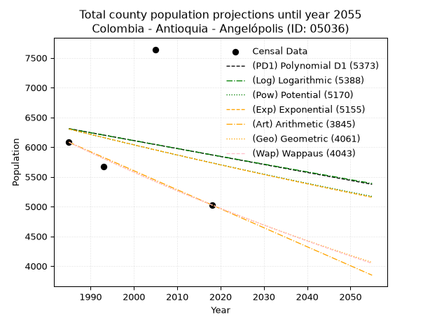
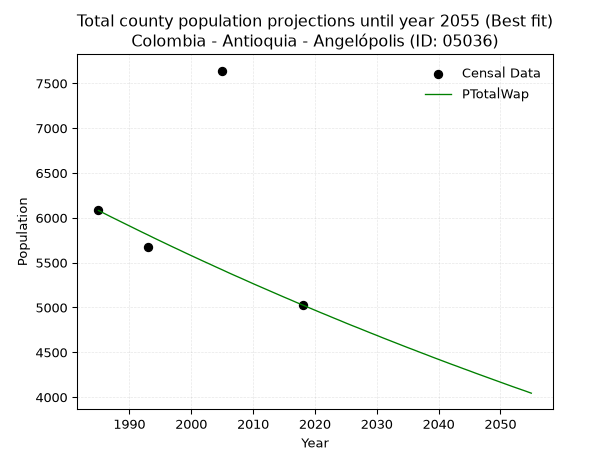
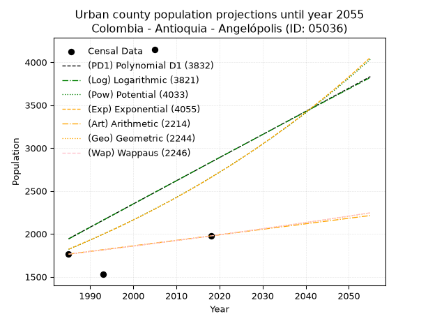
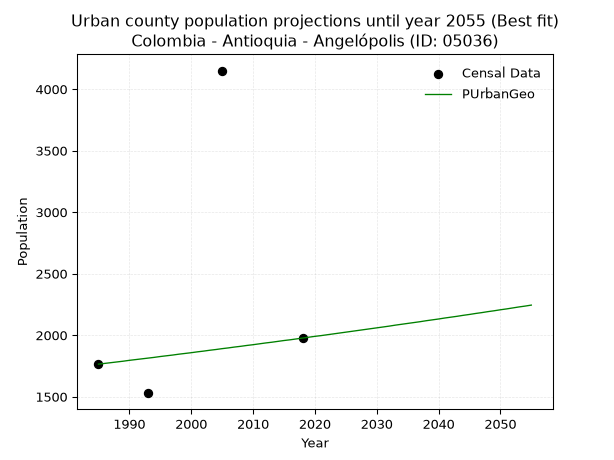
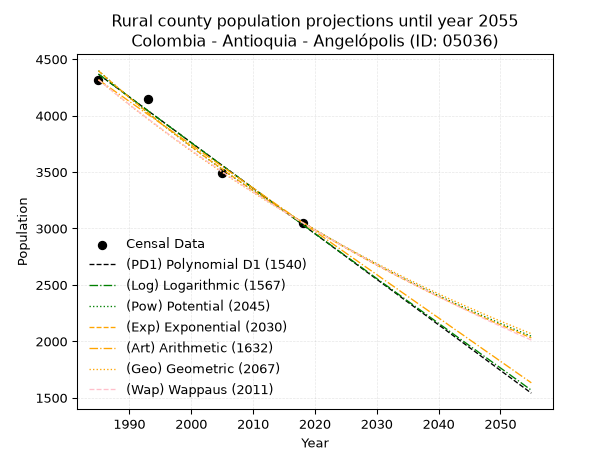
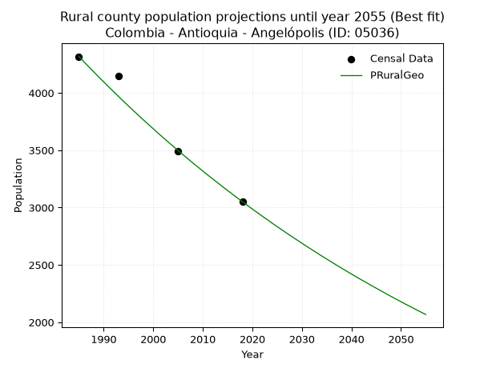

<div align="center">


</div>

# 📜 _“Population and Public Services Demand Projections (PPSD) until Year 2050 for Colombia - Antioquia - Angelópolis (ID: 05036)”_
Keywords: `population` `public-service` `projection` `lineal` `polynomial` `logarithmic` `potential` `exponential` `arithmetic` `geometric` `wappaus` `dane` `colombia` `south-america`

PPSD are analytical estimates used by governments and planners to anticipate future changes in population size, age distribution, and the resulting community needs for utilities, healthcare, education, and infrastructure as sizing future water treatment facilities, electrical grids, and road networks based on spatial growth.

<div align="center">

</img>

</div>


> **General running parameters**: • app_version: _v20260806_. • Python version: _3.14.7_. • Pandas version: _3.0.5_. • NumPy version: _2.5.1_. • Creates, save and include plots into reports (create_plot): _False_. • Projection until year: _2050_. • Process polynomial degree 2 and up: _False_. • Process Wappaus: _True_. • Process Wappaus: _True_. • Set negative values to zero: _True_. • Set infinite values to zero: _True_. • Drop dataset notes: _True_. 
<div align="center">

Dynamic map: [:earth_americas:Google](http://maps.google.com/maps?q=6.109719064,-75.7113892) [:earth_americas:OSM](https://www.openstreetmap.org/#map=18/6.109719064/-75.7113892&layers=P) [:earth_americas:Bing](https://www.bing.com/maps?cp=6.109719064~-75.7113892&lvl=18) [:earth_americas:Apple](https://maps.apple.com/frame?center=6.109719064%2C-75.7113892&span=0.003%2C0.006)

</div>


<div align="center">

```geojson
{
  "type": "Feature",
  "geometry": {
    "type": "Point", 
    "coordinates": [-75.7113892, 6.109719064]
  }, 
  "properties": {
    "Name": "Colombia - Antioquia - Angelópolis (ID: 05036)"
  }
}
```

</div>


## 0. Census Data (4 records)

Census data are official statistics collected by a government about the people and housing in a country. They usually include counts of total population, age, sex, race, income, education, and jobs.

📅Global census file: [Population.xlsx](../data/Population.xlsx)

| Source   |   Year |   CountryID | CountryName   |   StateID | StateName   |   CountyID | CountyName   |   PTotal |   PUrban |   PRural |
|:---------|-------:|------------:|:--------------|----------:|:------------|-----------:|:-------------|---------:|---------:|---------:|
| DANE     |   1985 |          57 | Colombia      |        05 | Antioquia   |      05036 | Angelópolis  |     6081 |     1764 |     4317 |
| DANE     |   1993 |          57 | Colombia      |        05 | Antioquia   |      05036 | Angelópolis  |     5672 |     1528 |     4144 |
| DANE     |   2005 |          57 | Colombia      |        05 | Antioquia   |      05036 | Angelópolis  |     7641 |     4150 |     3491 |
| DANE     |   2018 |          57 | Colombia      |        05 | Antioquia   |      05036 | Angelópolis  |     5027 |     1976 |     3051 |

> 🔥Some records could had specific notes about the registered values or the corresponding urban or rural distribution.

📅[SUI-RUPS](https://www.datos.gov.co/Hacienda-y-Cr-dito-P-blico/Registro-nico-de-Prestadores-de-Servicios-P-blicos/4qkq-csdn/about_data) - Local public utility companies: [RUPS.csv](../data/RUPS.xlsx)

 | SERVICIO       | ESTADO    | NOMBRE                                                                              | NIT         | DEPARTAMENTO_DOMICILIO   | MUNICIPIO_DOMICILIO   | DIRECCION                  |   TELEFONO | EMAIL                                          | TIPO_PRESTADOR                 | CLASIFICACION                 |
|:---------------|:----------|:------------------------------------------------------------------------------------|:------------|:-------------------------|:----------------------|:---------------------------|-----------:|:-----------------------------------------------|:-------------------------------|:------------------------------|
| ACUEDUCTO      | OPERATIVA | ASOCIACION DE USUARIOS DEL ACUEDUEDUCTO MULTIVEREDAL  ANGELOPOLIS, AMAGA Y TITIRIBI | 811014814-1 | ANTIOQUIA                | ANGELOPOLIS           | CALLE 11 LOS ALPES         |    8421943 | acueductomultiveredalangelopolis@hotmail.com   | ORGANIZACION AUTORIZADA        | MENOR O IGUAL A 2500 USUARIOS |
| ACUEDUCTO      | OPERATIVA | JUNTA DE SERVICIOS PÚBLICOS DEL MUNICIPIO DE ANGELOPOLIS                            | 890981493-5 | ANTIOQUIA                | ANGELOPOLIS           | Calle 10 Palacio Municipal |    8421793 | serviciospublicos@angelopolis-antioquia.gov.co | MUNICIPIO (PRESTACIÓN DIRECTA) | MENOR O IGUAL A 2500 USUARIOS |
| ALCANTARILLADO | OPERATIVA | JUNTA DE SERVICIOS PÚBLICOS DEL MUNICIPIO DE ANGELOPOLIS                            | 890981493-5 | ANTIOQUIA                | ANGELOPOLIS           | Calle 10 Palacio Municipal |    8421793 | serviciospublicos@angelopolis-antioquia.gov.co | MUNICIPIO (PRESTACIÓN DIRECTA) | MENOR O IGUAL A 2500 USUARIOS |

## 1. Total

### 1.1. Coefficients and Parameters

* (PD1) Polynomial Deg 1: -13.381372942591797, 32871.341228419245 (lineal)
* (Log) Logarithmic: -26536.315390468873, 207807.9959316398
* (Pow) Potential: -5.71174425169007, 22.635443514940242
* (Exp) Exponential: -0.0028729541906849557, 1889168.9901351447
* (Art) Arithmetic: Year diff. 2018 - 1985 = 33, Population diff. 5027 - 6081 = -1054, Annual growth = -31.939393939393938
* (Geo) Geometric: Year diff. 2018 - 1985 = 33, Population diff. 5027 - 6081 = -1054, Annual growth % = -0.005751450396211943
* (Wap) Wappaus: i = -0.5750701105400421, Condition values only valid for < 200)

<sub>
Wappaus condition values: ['-0.00', '-0.58', '-1.15', '-1.73', '-2.30', '-2.88', '-3.45', '-4.03', '-4.60', '-5.18', '-5.75', '-6.33', '-6.90', '-7.48', '-8.05', '-8.63', '-9.20', '-9.78', '-10.35', '-10.93', '-11.50', '-12.08', '-12.65', '-13.23', '-13.80', '-14.38', '-14.95', '-15.53', '-16.10', '-16.68', '-17.25', '-17.83', '-18.40', '-18.98', '-19.55', '-20.13', '-20.70', '-21.28', '-21.85', '-22.43', '-23.00', '-23.58', '-24.15', '-24.73', '-25.30', '-25.88', '-26.45', '-27.03', '-27.60', '-28.18', '-28.75', '-29.33', '-29.90', '-30.48', '-31.05', '-31.63', '-32.20', '-32.78', '-33.35', '-33.93', '-34.50', '-35.08', '-35.65', '-36.23', '-36.80', '-37.38']
</sub>


### 1.2. Projected Dataset

|   Year |   CountyID |   PTotalPD1 |   PTotalLog |   PTotalPow |   PTotalExp |   PTotalArt |   PTotalGeo |   PTotalWap |
|-------:|-----------:|------------:|------------:|------------:|------------:|------------:|------------:|------------:|
|   1985 |      05036 |        6309 |        6308 |        6302 |        6303 |        6081 |        6081 |        6081 |
|   1986 |      05036 |        6296 |        6294 |        6284 |        6285 |        6049 |        6046 |        6046 |
|   1987 |      05036 |        6283 |        6281 |        6266 |        6267 |        6017 |        6011 |        6011 |
|   1988 |      05036 |        6269 |        6268 |        6248 |        6249 |        5985 |        5977 |        5977 |
|   1989 |      05036 |        6256 |        6254 |        6230 |        6231 |        5953 |        5942 |        5943 |
|   1990 |      05036 |        6242 |        6241 |        6212 |        6213 |        5921 |        5908 |        5909 |
|   1991 |      05036 |        6229 |        6228 |        6194 |        6196 |        5889 |        5874 |        5875 |
|   1992 |      05036 |        6216 |        6214 |        6177 |        6178 |        5857 |        5840 |        5841 |
|   1993 |      05036 |        6202 |        6201 |        6159 |        6160 |        5825 |        5807 |        5808 |
|   1994 |      05036 |        6189 |        6188 |        6141 |        6142 |        5794 |        5773 |        5774 |
|   1995 |      05036 |        6176 |        6174 |        6124 |        6125 |        5762 |        5740 |        5741 |
|   1996 |      05036 |        6162 |        6161 |        6106 |        6107 |        5730 |        5707 |        5708 |
|   1997 |      05036 |        6149 |        6148 |        6089 |        6090 |        5698 |        5674 |        5675 |
|   1998 |      05036 |        6135 |        6135 |        6071 |        6072 |        5666 |        5642 |        5643 |
|   1999 |      05036 |        6122 |        6121 |        6054 |        6055 |        5634 |        5609 |        5610 |
|   2000 |      05036 |        6109 |        6108 |        6037 |        6037 |        5602 |        5577 |        5578 |
|   2001 |      05036 |        6095 |        6095 |        6020 |        6020 |        5570 |        5545 |        5546 |
|   2002 |      05036 |        6082 |        6082 |        6002 |        6003 |        5538 |        5513 |        5514 |
|   2003 |      05036 |        6068 |        6068 |        5985 |        5986 |        5506 |        5481 |        5483 |
|   2004 |      05036 |        6055 |        6055 |        5968 |        5968 |        5474 |        5450 |        5451 |
|   2005 |      05036 |        6042 |        6042 |        5951 |        5951 |        5442 |        5418 |        5420 |
|   2006 |      05036 |        6028 |        6029 |        5934 |        5934 |        5410 |        5387 |        5388 |
|   2007 |      05036 |        6015 |        6015 |        5917 |        5917 |        5378 |        5356 |        5357 |
|   2008 |      05036 |        6002 |        6002 |        5901 |        5900 |        5346 |        5325 |        5327 |
|   2009 |      05036 |        5988 |        5989 |        5884 |        5883 |        5314 |        5295 |        5296 |
|   2010 |      05036 |        5975 |        5976 |        5867 |        5866 |        5283 |        5264 |        5265 |
|   2011 |      05036 |        5961 |        5963 |        5851 |        5850 |        5251 |        5234 |        5235 |
|   2012 |      05036 |        5948 |        5949 |        5834 |        5833 |        5219 |        5204 |        5205 |
|   2013 |      05036 |        5935 |        5936 |        5817 |        5816 |        5187 |        5174 |        5175 |
|   2014 |      05036 |        5921 |        5923 |        5801 |        5799 |        5155 |        5144 |        5145 |
|   2015 |      05036 |        5908 |        5910 |        5785 |        5783 |        5123 |        5115 |        5115 |
|   2016 |      05036 |        5894 |        5897 |        5768 |        5766 |        5091 |        5085 |        5086 |
|   2017 |      05036 |        5881 |        5883 |        5752 |        5750 |        5059 |        5056 |        5056 |
|   2018 |      05036 |        5868 |        5870 |        5736 |        5733 |        5027 |        5027 |        5027 |
|   2019 |      05036 |        5854 |        5857 |        5719 |        5717 |        4995 |        4998 |        4998 |
|   2020 |      05036 |        5841 |        5844 |        5703 |        5700 |        4963 |        4969 |        4969 |
|   2021 |      05036 |        5828 |        5831 |        5687 |        5684 |        4931 |        4941 |        4940 |
|   2022 |      05036 |        5814 |        5818 |        5671 |        5668 |        4899 |        4912 |        4912 |
|   2023 |      05036 |        5801 |        5805 |        5655 |        5651 |        4867 |        4884 |        4883 |
|   2024 |      05036 |        5787 |        5792 |        5639 |        5635 |        4835 |        4856 |        4855 |
|   2025 |      05036 |        5774 |        5778 |        5623 |        5619 |        4803 |        4828 |        4826 |
|   2026 |      05036 |        5761 |        5765 |        5607 |        5603 |        4771 |        4800 |        4798 |
|   2027 |      05036 |        5747 |        5752 |        5592 |        5587 |        4740 |        4773 |        4771 |
|   2028 |      05036 |        5734 |        5739 |        5576 |        5571 |        4708 |        4745 |        4743 |
|   2029 |      05036 |        5721 |        5726 |        5560 |        5555 |        4676 |        4718 |        4715 |
|   2030 |      05036 |        5707 |        5713 |        5545 |        5539 |        4644 |        4691 |        4688 |
|   2031 |      05036 |        5694 |        5700 |        5529 |        5523 |        4612 |        4664 |        4660 |
|   2032 |      05036 |        5680 |        5687 |        5514 |        5507 |        4580 |        4637 |        4633 |
|   2033 |      05036 |        5667 |        5674 |        5498 |        5491 |        4548 |        4610 |        4606 |
|   2034 |      05036 |        5654 |        5661 |        5483 |        5476 |        4516 |        4584 |        4579 |
|   2035 |      05036 |        5640 |        5648 |        5467 |        5460 |        4484 |        4557 |        4552 |
|   2036 |      05036 |        5627 |        5635 |        5452 |        5444 |        4452 |        4531 |        4526 |
|   2037 |      05036 |        5613 |        5622 |        5437 |        5429 |        4420 |        4505 |        4499 |
|   2038 |      05036 |        5600 |        5609 |        5421 |        5413 |        4388 |        4479 |        4473 |
|   2039 |      05036 |        5587 |        5596 |        5406 |        5398 |        4356 |        4454 |        4446 |
|   2040 |      05036 |        5573 |        5583 |        5391 |        5382 |        4324 |        4428 |        4420 |
|   2041 |      05036 |        5560 |        5570 |        5376 |        5367 |        4292 |        4402 |        4394 |
|   2042 |      05036 |        5547 |        5557 |        5361 |        5351 |        4260 |        4377 |        4368 |
|   2043 |      05036 |        5533 |        5544 |        5346 |        5336 |        4229 |        4352 |        4343 |
|   2044 |      05036 |        5520 |        5531 |        5331 |        5321 |        4197 |        4327 |        4317 |
|   2045 |      05036 |        5506 |        5518 |        5316 |        5305 |        4165 |        4302 |        4292 |
|   2046 |      05036 |        5493 |        5505 |        5301 |        5290 |        4133 |        4277 |        4266 |
|   2047 |      05036 |        5480 |        5492 |        5287 |        5275 |        4101 |        4253 |        4241 |
|   2048 |      05036 |        5466 |        5479 |        5272 |        5260 |        4069 |        4228 |        4216 |
|   2049 |      05036 |        5453 |        5466 |        5257 |        5245 |        4037 |        4204 |        4191 |
|   2050 |      05036 |        5440 |        5453 |        5243 |        5230 |        4005 |        4180 |        4166 |
<div align="center">

</img>

</div>


### 1.3. Best fit with absolute and relative error (%)

Relative error puts that difference into context by dividing the absolute error by the true value, creating a unitless ratio or percentage that shows the scale of the mistake.

Absolute and relative error

|   Year | Source   |   CountryID | CountryName   |   StateID | StateName   |   CountyID_x | CountyName   |   PTotal |   PUrban |   PRural |   CountyID_y |   PTotalPD1 |   PTotalLog |   PTotalPow |   PTotalExp |   PTotalArt |   PTotalGeo |   PTotalWap |   PTotalPD1AbsError |   PTotalLogAbsError |   PTotalPowAbsError |   PTotalExpAbsError |   PTotalArtAbsError |   PTotalGeoAbsError |   PTotalWapAbsError |   PTotalPD1RelError |   PTotalLogRelError |   PTotalPowRelError |   PTotalExpRelError |   PTotalArtRelError |   PTotalGeoRelError |   PTotalWapRelError |
|-------:|:---------|------------:|:--------------|----------:|:------------|-------------:|:-------------|---------:|---------:|---------:|-------------:|------------:|------------:|------------:|------------:|------------:|------------:|------------:|--------------------:|--------------------:|--------------------:|--------------------:|--------------------:|--------------------:|--------------------:|--------------------:|--------------------:|--------------------:|--------------------:|--------------------:|--------------------:|--------------------:|
|   1985 | DANE     |          57 | Colombia      |        05 | Antioquia   |        05036 | Angelópolis  |     6081 |     1764 |     4317 |        05036 |        6309 |        6308 |        6302 |        6303 |        6081 |        6081 |        6081 |                 228 |                 227 |                 221 |                 222 |                   0 |                   0 |                   0 |             3.74938 |             3.73294 |             3.63427 |             3.65072 |             0       |             0       |             0       |
|   1993 | DANE     |          57 | Colombia      |        05 | Antioquia   |        05036 | Angelópolis  |     5672 |     1528 |     4144 |        05036 |        6202 |        6201 |        6159 |        6160 |        5825 |        5807 |        5808 |                 530 |                 529 |                 487 |                 488 |                 153 |                 135 |                 136 |             9.34415 |             9.32652 |             8.58604 |             8.60367 |             2.69746 |             2.38011 |             2.39774 |
|   2005 | DANE     |          57 | Colombia      |        05 | Antioquia   |        05036 | Angelópolis  |     7641 |     4150 |     3491 |        05036 |        6042 |        6042 |        5951 |        5951 |        5442 |        5418 |        5420 |                1599 |                1599 |                1690 |                1690 |                2199 |                2223 |                2221 |            20.9266  |            20.9266  |            22.1175  |            22.1175  |            28.779   |            29.0931  |            29.0669  |
|   2018 | DANE     |          57 | Colombia      |        05 | Antioquia   |        05036 | Angelópolis  |     5027 |     1976 |     3051 |        05036 |        5868 |        5870 |        5736 |        5733 |        5027 |        5027 |        5027 |                 841 |                 843 |                 709 |                 706 |                   0 |                   0 |                   0 |            16.7297  |            16.7694  |            14.1038  |            14.0442  |             0       |             0       |             0       |

Relative error mean

| Method    |   RelError | Best   |
|:----------|-----------:|:-------|
| PTotalPD1 |   12.6874  |        |
| PTotalLog |   12.6889  |        |
| PTotalPow |   12.1104  |        |
| PTotalExp |   12.104   |        |
| PTotalArt |    7.8691  |        |
| PTotalGeo |    7.86829 |        |
| PTotalWap |    7.86615 | True   |

💙Best method: _**PTotalWap**_
<div align="center">

</img>

</div>


### 1.4. Fresh water supply demand in liters per capita per day (lpcd)

The fresh water supply demand typically ranges from 100 to 300 liters per capita per day (lpcd) for standard domestic and municipal planning, though absolute survival minimums set by the World Health Organization are as low as 7.5 to 20 liters per day, and total consumption in high-income nations can exceed 400 liters.

> `CZ`: Level in meters above the sea level (masl)<br> `WS`: Fresh water supply demand in liters per capita per day (lpcd or l/h/d)<br> `WSAll`: Zonal fresh water supply demand in liters per second (l/s)<br> `A`: Zonal area in square meters<br> `DP`: Population density (people/hectare or p/ha)

Reference values (RAS Colombia)

|    CZ |   WS |
|------:|-----:|
|  1000 |  120 |
|  2000 |  130 |
| 99999 |  140 |

County shapefile geometry properties and water supply values

|   CountyID |      ATotal |   CZTotal |   WSTotal |
|-----------:|------------:|----------:|----------:|
|      05036 | 8.18599e+07 |   1806.87 |       130 |

Projected values for best method: PTotalWap

|   CountyID |   Year |   PTotalWap |   DPTotal |   WSTotal |   WSTotalAll |
|-----------:|-------:|------------:|----------:|----------:|-------------:|
|      05036 |   1985 |        6081 |      0.74 |       130 |      9.14965 |
|      05036 |   1986 |        6046 |      0.74 |       130 |      9.09699 |
|      05036 |   1987 |        6011 |      0.73 |       130 |      9.04433 |
|      05036 |   1988 |        5977 |      0.73 |       130 |      8.99317 |
|      05036 |   1989 |        5943 |      0.73 |       130 |      8.94201 |
|      05036 |   1990 |        5909 |      0.72 |       130 |      8.89086 |
|      05036 |   1991 |        5875 |      0.72 |       130 |      8.8397  |
|      05036 |   1992 |        5841 |      0.71 |       130 |      8.78854 |
|      05036 |   1993 |        5808 |      0.71 |       130 |      8.73889 |
|      05036 |   1994 |        5774 |      0.71 |       130 |      8.68773 |
|      05036 |   1995 |        5741 |      0.7  |       130 |      8.63808 |
|      05036 |   1996 |        5708 |      0.7  |       130 |      8.58843 |
|      05036 |   1997 |        5675 |      0.69 |       130 |      8.53877 |
|      05036 |   1998 |        5643 |      0.69 |       130 |      8.49062 |
|      05036 |   1999 |        5610 |      0.69 |       130 |      8.44097 |
|      05036 |   2000 |        5578 |      0.68 |       130 |      8.39282 |
|      05036 |   2001 |        5546 |      0.68 |       130 |      8.34468 |
|      05036 |   2002 |        5514 |      0.67 |       130 |      8.29653 |
|      05036 |   2003 |        5483 |      0.67 |       130 |      8.24988 |
|      05036 |   2004 |        5451 |      0.67 |       130 |      8.20174 |
|      05036 |   2005 |        5420 |      0.66 |       130 |      8.15509 |
|      05036 |   2006 |        5388 |      0.66 |       130 |      8.10694 |
|      05036 |   2007 |        5357 |      0.65 |       130 |      8.0603  |
|      05036 |   2008 |        5327 |      0.65 |       130 |      8.01516 |
|      05036 |   2009 |        5296 |      0.65 |       130 |      7.96852 |
|      05036 |   2010 |        5265 |      0.64 |       130 |      7.92188 |
|      05036 |   2011 |        5235 |      0.64 |       130 |      7.87674 |
|      05036 |   2012 |        5205 |      0.64 |       130 |      7.8316  |
|      05036 |   2013 |        5175 |      0.63 |       130 |      7.78646 |
|      05036 |   2014 |        5145 |      0.63 |       130 |      7.74132 |
|      05036 |   2015 |        5115 |      0.62 |       130 |      7.69618 |
|      05036 |   2016 |        5086 |      0.62 |       130 |      7.65255 |
|      05036 |   2017 |        5056 |      0.62 |       130 |      7.60741 |
|      05036 |   2018 |        5027 |      0.61 |       130 |      7.56377 |
|      05036 |   2019 |        4998 |      0.61 |       130 |      7.52014 |
|      05036 |   2020 |        4969 |      0.61 |       130 |      7.4765  |
|      05036 |   2021 |        4940 |      0.6  |       130 |      7.43287 |
|      05036 |   2022 |        4912 |      0.6  |       130 |      7.39074 |
|      05036 |   2023 |        4883 |      0.6  |       130 |      7.34711 |
|      05036 |   2024 |        4855 |      0.59 |       130 |      7.30498 |
|      05036 |   2025 |        4826 |      0.59 |       130 |      7.26134 |
|      05036 |   2026 |        4798 |      0.59 |       130 |      7.21921 |
|      05036 |   2027 |        4771 |      0.58 |       130 |      7.17859 |
|      05036 |   2028 |        4743 |      0.58 |       130 |      7.13646 |
|      05036 |   2029 |        4715 |      0.58 |       130 |      7.09433 |
|      05036 |   2030 |        4688 |      0.57 |       130 |      7.0537  |
|      05036 |   2031 |        4660 |      0.57 |       130 |      7.01157 |
|      05036 |   2032 |        4633 |      0.57 |       130 |      6.97095 |
|      05036 |   2033 |        4606 |      0.56 |       130 |      6.93032 |
|      05036 |   2034 |        4579 |      0.56 |       130 |      6.8897  |
|      05036 |   2035 |        4552 |      0.56 |       130 |      6.84907 |
|      05036 |   2036 |        4526 |      0.55 |       130 |      6.80995 |
|      05036 |   2037 |        4499 |      0.55 |       130 |      6.76933 |
|      05036 |   2038 |        4473 |      0.55 |       130 |      6.73021 |
|      05036 |   2039 |        4446 |      0.54 |       130 |      6.68958 |
|      05036 |   2040 |        4420 |      0.54 |       130 |      6.65046 |
|      05036 |   2041 |        4394 |      0.54 |       130 |      6.61134 |
|      05036 |   2042 |        4368 |      0.53 |       130 |      6.57222 |
|      05036 |   2043 |        4343 |      0.53 |       130 |      6.53461 |
|      05036 |   2044 |        4317 |      0.53 |       130 |      6.49549 |
|      05036 |   2045 |        4292 |      0.52 |       130 |      6.45787 |
|      05036 |   2046 |        4266 |      0.52 |       130 |      6.41875 |
|      05036 |   2047 |        4241 |      0.52 |       130 |      6.38113 |
|      05036 |   2048 |        4216 |      0.52 |       130 |      6.34352 |
|      05036 |   2049 |        4191 |      0.51 |       130 |      6.3059  |
|      05036 |   2050 |        4166 |      0.51 |       130 |      6.26829 |

## 2. Urban

### 2.1. Coefficients and Parameters

* (PD1) Polynomial Deg 1: 26.989160979527483, -51630.56924929984 (lineal)
* (Log) Logarithmic: 54268.16675417371, -410138.2703762703
* (Pow) Potential: 22.964202915188242, -72.47046112006329
* (Exp) Exponential: 0.011432317325767657, 2.5403194594223513e-07
* (Art) Arithmetic: Year diff. 2018 - 1985 = 33, Population diff. 1976 - 1764 = 212, Annual growth = 6.424242424242424
* (Geo) Geometric: Year diff. 2018 - 1985 = 33, Population diff. 1976 - 1764 = 212, Annual growth % = 0.0034450308809774732
* (Wap) Wappaus: i = 0.3435423756279371, Condition values only valid for < 200)

<sub>
Wappaus condition values: ['0.00', '0.34', '0.69', '1.03', '1.37', '1.72', '2.06', '2.40', '2.75', '3.09', '3.44', '3.78', '4.12', '4.47', '4.81', '5.15', '5.50', '5.84', '6.18', '6.53', '6.87', '7.21', '7.56', '7.90', '8.25', '8.59', '8.93', '9.28', '9.62', '9.96', '10.31', '10.65', '10.99', '11.34', '11.68', '12.02', '12.37', '12.71', '13.05', '13.40', '13.74', '14.09', '14.43', '14.77', '15.12', '15.46', '15.80', '16.15', '16.49', '16.83', '17.18', '17.52', '17.86', '18.21', '18.55', '18.89', '19.24', '19.58', '19.93', '20.27', '20.61', '20.96', '21.30', '21.64', '21.99', '22.33']
</sub>


### 2.2. Projected Dataset

|   Year |   CountyID |   PUrbanPD1 |   PUrbanLog |   PUrbanPow |   PUrbanExp |   PUrbanArt |   PUrbanGeo |   PUrbanWap |
|-------:|-----------:|------------:|------------:|------------:|------------:|------------:|------------:|------------:|
|   1985 |      05036 |        1943 |        1940 |        1820 |        1821 |        1764 |        1764 |        1764 |
|   1986 |      05036 |        1970 |        1968 |        1841 |        1842 |        1770 |        1770 |        1770 |
|   1987 |      05036 |        1997 |        1995 |        1862 |        1863 |        1777 |        1776 |        1776 |
|   1988 |      05036 |        2024 |        2022 |        1884 |        1885 |        1783 |        1782 |        1782 |
|   1989 |      05036 |        2051 |        2049 |        1906 |        1907 |        1790 |        1788 |        1788 |
|   1990 |      05036 |        2078 |        2077 |        1928 |        1929 |        1796 |        1795 |        1795 |
|   1991 |      05036 |        2105 |        2104 |        1950 |        1951 |        1803 |        1801 |        1801 |
|   1992 |      05036 |        2132 |        2131 |        1973 |        1973 |        1809 |        1807 |        1807 |
|   1993 |      05036 |        2159 |        2159 |        1996 |        1996 |        1815 |        1813 |        1813 |
|   1994 |      05036 |        2186 |        2186 |        2019 |        2019 |        1822 |        1819 |        1819 |
|   1995 |      05036 |        2213 |        2213 |        2042 |        2042 |        1828 |        1826 |        1826 |
|   1996 |      05036 |        2240 |        2240 |        2066 |        2065 |        1835 |        1832 |        1832 |
|   1997 |      05036 |        2267 |        2267 |        2090 |        2089 |        1841 |        1838 |        1838 |
|   1998 |      05036 |        2294 |        2294 |        2114 |        2113 |        1848 |        1845 |        1845 |
|   1999 |      05036 |        2321 |        2322 |        2138 |        2138 |        1854 |        1851 |        1851 |
|   2000 |      05036 |        2348 |        2349 |        2163 |        2162 |        1860 |        1857 |        1857 |
|   2001 |      05036 |        2375 |        2376 |        2188 |        2187 |        1867 |        1864 |        1864 |
|   2002 |      05036 |        2402 |        2403 |        2213 |        2212 |        1873 |        1870 |        1870 |
|   2003 |      05036 |        2429 |        2430 |        2239 |        2238 |        1880 |        1877 |        1877 |
|   2004 |      05036 |        2456 |        2457 |        2265 |        2263 |        1886 |        1883 |        1883 |
|   2005 |      05036 |        2483 |        2484 |        2291 |        2289 |        1892 |        1890 |        1890 |
|   2006 |      05036 |        2510 |        2511 |        2317 |        2316 |        1899 |        1896 |        1896 |
|   2007 |      05036 |        2537 |        2538 |        2344 |        2342 |        1905 |        1903 |        1903 |
|   2008 |      05036 |        2564 |        2565 |        2371 |        2369 |        1912 |        1909 |        1909 |
|   2009 |      05036 |        2591 |        2592 |        2398 |        2396 |        1918 |        1916 |        1916 |
|   2010 |      05036 |        2618 |        2619 |        2426 |        2424 |        1925 |        1922 |        1922 |
|   2011 |      05036 |        2645 |        2646 |        2453 |        2452 |        1931 |        1929 |        1929 |
|   2012 |      05036 |        2672 |        2673 |        2482 |        2480 |        1937 |        1936 |        1936 |
|   2013 |      05036 |        2699 |        2700 |        2510 |        2509 |        1944 |        1942 |        1942 |
|   2014 |      05036 |        2726 |        2727 |        2539 |        2537 |        1950 |        1949 |        1949 |
|   2015 |      05036 |        2753 |        2754 |        2568 |        2567 |        1957 |        1956 |        1956 |
|   2016 |      05036 |        2780 |        2781 |        2597 |        2596 |        1963 |        1962 |        1962 |
|   2017 |      05036 |        2807 |        2808 |        2627 |        2626 |        1970 |        1969 |        1969 |
|   2018 |      05036 |        2834 |        2835 |        2657 |        2656 |        1976 |        1976 |        1976 |
|   2019 |      05036 |        2861 |        2862 |        2688 |        2687 |        1982 |        1983 |        1983 |
|   2020 |      05036 |        2888 |        2889 |        2718 |        2718 |        1989 |        1990 |        1990 |
|   2021 |      05036 |        2915 |        2916 |        2749 |        2749 |        1995 |        1996 |        1997 |
|   2022 |      05036 |        2942 |        2942 |        2781 |        2780 |        2002 |        2003 |        2003 |
|   2023 |      05036 |        2969 |        2969 |        2813 |        2812 |        2008 |        2010 |        2010 |
|   2024 |      05036 |        2995 |        2996 |        2845 |        2845 |        2015 |        2017 |        2017 |
|   2025 |      05036 |        3022 |        3023 |        2877 |        2877 |        2021 |        2024 |        2024 |
|   2026 |      05036 |        3049 |        3050 |        2910 |        2910 |        2027 |        2031 |        2031 |
|   2027 |      05036 |        3076 |        3076 |        2943 |        2944 |        2034 |        2038 |        2038 |
|   2028 |      05036 |        3103 |        3103 |        2977 |        2978 |        2040 |        2045 |        2045 |
|   2029 |      05036 |        3130 |        3130 |        3010 |        3012 |        2047 |        2052 |        2052 |
|   2030 |      05036 |        3157 |        3157 |        3045 |        3047 |        2053 |        2059 |        2060 |
|   2031 |      05036 |        3184 |        3183 |        3079 |        3082 |        2060 |        2066 |        2067 |
|   2032 |      05036 |        3211 |        3210 |        3114 |        3117 |        2066 |        2073 |        2074 |
|   2033 |      05036 |        3238 |        3237 |        3150 |        3153 |        2072 |        2081 |        2081 |
|   2034 |      05036 |        3265 |        3264 |        3186 |        3189 |        2079 |        2088 |        2088 |
|   2035 |      05036 |        3292 |        3290 |        3222 |        3226 |        2085 |        2095 |        2095 |
|   2036 |      05036 |        3319 |        3317 |        3258 |        3263 |        2092 |        2102 |        2103 |
|   2037 |      05036 |        3346 |        3344 |        3295 |        3300 |        2098 |        2109 |        2110 |
|   2038 |      05036 |        3373 |        3370 |        3333 |        3338 |        2104 |        2117 |        2117 |
|   2039 |      05036 |        3400 |        3397 |        3370 |        3377 |        2111 |        2124 |        2125 |
|   2040 |      05036 |        3427 |        3423 |        3408 |        3416 |        2117 |        2131 |        2132 |
|   2041 |      05036 |        3454 |        3450 |        3447 |        3455 |        2124 |        2139 |        2139 |
|   2042 |      05036 |        3481 |        3477 |        3486 |        3495 |        2130 |        2146 |        2147 |
|   2043 |      05036 |        3508 |        3503 |        3525 |        3535 |        2137 |        2153 |        2154 |
|   2044 |      05036 |        3535 |        3530 |        3565 |        3575 |        2143 |        2161 |        2162 |
|   2045 |      05036 |        3562 |        3556 |        3606 |        3617 |        2149 |        2168 |        2169 |
|   2046 |      05036 |        3589 |        3583 |        3646 |        3658 |        2156 |        2176 |        2177 |
|   2047 |      05036 |        3616 |        3609 |        3687 |        3700 |        2162 |        2183 |        2185 |
|   2048 |      05036 |        3643 |        3636 |        3729 |        3743 |        2169 |        2191 |        2192 |
|   2049 |      05036 |        3670 |        3662 |        3771 |        3786 |        2175 |        2198 |        2200 |
|   2050 |      05036 |        3697 |        3689 |        3814 |        3829 |        2182 |        2206 |        2207 |
<div align="center">

</img>

</div>


### 2.3. Best fit with absolute and relative error (%)

Relative error puts that difference into context by dividing the absolute error by the true value, creating a unitless ratio or percentage that shows the scale of the mistake.

Absolute and relative error

|   Year | Source   |   CountryID | CountryName   |   StateID | StateName   |   CountyID_x | CountyName   |   PTotal |   PUrban |   PRural |   CountyID_y |   PUrbanPD1 |   PUrbanLog |   PUrbanPow |   PUrbanExp |   PUrbanArt |   PUrbanGeo |   PUrbanWap |   PUrbanPD1AbsError |   PUrbanLogAbsError |   PUrbanPowAbsError |   PUrbanExpAbsError |   PUrbanArtAbsError |   PUrbanGeoAbsError |   PUrbanWapAbsError |   PUrbanPD1RelError |   PUrbanLogRelError |   PUrbanPowRelError |   PUrbanExpRelError |   PUrbanArtRelError |   PUrbanGeoRelError |   PUrbanWapRelError |
|-------:|:---------|------------:|:--------------|----------:|:------------|-------------:|:-------------|---------:|---------:|---------:|-------------:|------------:|------------:|------------:|------------:|------------:|------------:|------------:|--------------------:|--------------------:|--------------------:|--------------------:|--------------------:|--------------------:|--------------------:|--------------------:|--------------------:|--------------------:|--------------------:|--------------------:|--------------------:|--------------------:|
|   1985 | DANE     |          57 | Colombia      |        05 | Antioquia   |        05036 | Angelópolis  |     6081 |     1764 |     4317 |        05036 |        1943 |        1940 |        1820 |        1821 |        1764 |        1764 |        1764 |                 179 |                 176 |                  56 |                  57 |                   0 |                   0 |                   0 |             10.1474 |             9.97732 |              3.1746 |             3.23129 |              0      |              0      |              0      |
|   1993 | DANE     |          57 | Colombia      |        05 | Antioquia   |        05036 | Angelópolis  |     5672 |     1528 |     4144 |        05036 |        2159 |        2159 |        1996 |        1996 |        1815 |        1813 |        1813 |                 631 |                 631 |                 468 |                 468 |                 287 |                 285 |                 285 |             41.2958 |            41.2958  |             30.6283 |            30.6283  |             18.7827 |             18.6518 |             18.6518 |
|   2005 | DANE     |          57 | Colombia      |        05 | Antioquia   |        05036 | Angelópolis  |     7641 |     4150 |     3491 |        05036 |        2483 |        2484 |        2291 |        2289 |        1892 |        1890 |        1890 |                1667 |                1666 |                1859 |                1861 |                2258 |                2260 |                2260 |             40.1687 |            40.1446  |             44.7952 |            44.8434  |             54.4096 |             54.4578 |             54.4578 |
|   2018 | DANE     |          57 | Colombia      |        05 | Antioquia   |        05036 | Angelópolis  |     5027 |     1976 |     3051 |        05036 |        2834 |        2835 |        2657 |        2656 |        1976 |        1976 |        1976 |                 858 |                 859 |                 681 |                 680 |                   0 |                   0 |                   0 |             43.4211 |            43.4717  |             34.4636 |            34.413   |              0      |              0      |              0      |

Relative error mean

| Method    |   RelError | Best   |
|:----------|-----------:|:-------|
| PUrbanPD1 |    33.7582 |        |
| PUrbanLog |    33.7223 |        |
| PUrbanPow |    28.2654 |        |
| PUrbanExp |    28.279  |        |
| PUrbanArt |    18.2981 |        |
| PUrbanGeo |    18.2774 | True   |
| PUrbanWap |    18.2774 | True   |

💙Best method: _**PUrbanGeo**_
<div align="center">

</img>

</div>


### 2.4. Fresh water supply demand in liters per capita per day (lpcd)

The fresh water supply demand typically ranges from 100 to 300 liters per capita per day (lpcd) for standard domestic and municipal planning, though absolute survival minimums set by the World Health Organization are as low as 7.5 to 20 liters per day, and total consumption in high-income nations can exceed 400 liters.

> `CZ`: Level in meters above the sea level (masl)<br> `WS`: Fresh water supply demand in liters per capita per day (lpcd or l/h/d)<br> `WSAll`: Zonal fresh water supply demand in liters per second (l/s)<br> `A`: Zonal area in square meters<br> `DP`: Population density (people/hectare or p/ha)

Reference values (RAS Colombia)

|    CZ |   WS |
|------:|-----:|
|  1000 |  120 |
|  2000 |  130 |
| 99999 |  140 |

County shapefile geometry properties and water supply values

|   CountyID |   AUrban |   CZUrban |   WSUrban |
|-----------:|---------:|----------:|----------:|
|      05036 |   771603 |   1863.51 |       130 |

Projected values for best method: PUrbanGeo

|   CountyID |   Year |   PUrbanGeo |   DPUrban |   WSUrban |   WSUrbanAll |
|-----------:|-------:|------------:|----------:|----------:|-------------:|
|      05036 |   1985 |        1764 |     22.86 |       130 |      2.65417 |
|      05036 |   1986 |        1770 |     22.94 |       130 |      2.66319 |
|      05036 |   1987 |        1776 |     23.02 |       130 |      2.67222 |
|      05036 |   1988 |        1782 |     23.09 |       130 |      2.68125 |
|      05036 |   1989 |        1788 |     23.17 |       130 |      2.69028 |
|      05036 |   1990 |        1795 |     23.26 |       130 |      2.70081 |
|      05036 |   1991 |        1801 |     23.34 |       130 |      2.70984 |
|      05036 |   1992 |        1807 |     23.42 |       130 |      2.71887 |
|      05036 |   1993 |        1813 |     23.5  |       130 |      2.72789 |
|      05036 |   1994 |        1819 |     23.57 |       130 |      2.73692 |
|      05036 |   1995 |        1826 |     23.67 |       130 |      2.74745 |
|      05036 |   1996 |        1832 |     23.74 |       130 |      2.75648 |
|      05036 |   1997 |        1838 |     23.82 |       130 |      2.76551 |
|      05036 |   1998 |        1845 |     23.91 |       130 |      2.77604 |
|      05036 |   1999 |        1851 |     23.99 |       130 |      2.78507 |
|      05036 |   2000 |        1857 |     24.07 |       130 |      2.7941  |
|      05036 |   2001 |        1864 |     24.16 |       130 |      2.80463 |
|      05036 |   2002 |        1870 |     24.24 |       130 |      2.81366 |
|      05036 |   2003 |        1877 |     24.33 |       130 |      2.82419 |
|      05036 |   2004 |        1883 |     24.4  |       130 |      2.83322 |
|      05036 |   2005 |        1890 |     24.49 |       130 |      2.84375 |
|      05036 |   2006 |        1896 |     24.57 |       130 |      2.85278 |
|      05036 |   2007 |        1903 |     24.66 |       130 |      2.86331 |
|      05036 |   2008 |        1909 |     24.74 |       130 |      2.87234 |
|      05036 |   2009 |        1916 |     24.83 |       130 |      2.88287 |
|      05036 |   2010 |        1922 |     24.91 |       130 |      2.8919  |
|      05036 |   2011 |        1929 |     25    |       130 |      2.90243 |
|      05036 |   2012 |        1936 |     25.09 |       130 |      2.91296 |
|      05036 |   2013 |        1942 |     25.17 |       130 |      2.92199 |
|      05036 |   2014 |        1949 |     25.26 |       130 |      2.93252 |
|      05036 |   2015 |        1956 |     25.35 |       130 |      2.94306 |
|      05036 |   2016 |        1962 |     25.43 |       130 |      2.95208 |
|      05036 |   2017 |        1969 |     25.52 |       130 |      2.96262 |
|      05036 |   2018 |        1976 |     25.61 |       130 |      2.97315 |
|      05036 |   2019 |        1983 |     25.7  |       130 |      2.98368 |
|      05036 |   2020 |        1990 |     25.79 |       130 |      2.99421 |
|      05036 |   2021 |        1996 |     25.87 |       130 |      3.00324 |
|      05036 |   2022 |        2003 |     25.96 |       130 |      3.01377 |
|      05036 |   2023 |        2010 |     26.05 |       130 |      3.02431 |
|      05036 |   2024 |        2017 |     26.14 |       130 |      3.03484 |
|      05036 |   2025 |        2024 |     26.23 |       130 |      3.04537 |
|      05036 |   2026 |        2031 |     26.32 |       130 |      3.0559  |
|      05036 |   2027 |        2038 |     26.41 |       130 |      3.06644 |
|      05036 |   2028 |        2045 |     26.5  |       130 |      3.07697 |
|      05036 |   2029 |        2052 |     26.59 |       130 |      3.0875  |
|      05036 |   2030 |        2059 |     26.68 |       130 |      3.09803 |
|      05036 |   2031 |        2066 |     26.78 |       130 |      3.10856 |
|      05036 |   2032 |        2073 |     26.87 |       130 |      3.1191  |
|      05036 |   2033 |        2081 |     26.97 |       130 |      3.13113 |
|      05036 |   2034 |        2088 |     27.06 |       130 |      3.14167 |
|      05036 |   2035 |        2095 |     27.15 |       130 |      3.1522  |
|      05036 |   2036 |        2102 |     27.24 |       130 |      3.16273 |
|      05036 |   2037 |        2109 |     27.33 |       130 |      3.17326 |
|      05036 |   2038 |        2117 |     27.44 |       130 |      3.1853  |
|      05036 |   2039 |        2124 |     27.53 |       130 |      3.19583 |
|      05036 |   2040 |        2131 |     27.62 |       130 |      3.20637 |
|      05036 |   2041 |        2139 |     27.72 |       130 |      3.2184  |
|      05036 |   2042 |        2146 |     27.81 |       130 |      3.22894 |
|      05036 |   2043 |        2153 |     27.9  |       130 |      3.23947 |
|      05036 |   2044 |        2161 |     28.01 |       130 |      3.2515  |
|      05036 |   2045 |        2168 |     28.1  |       130 |      3.26204 |
|      05036 |   2046 |        2176 |     28.2  |       130 |      3.27407 |
|      05036 |   2047 |        2183 |     28.29 |       130 |      3.28461 |
|      05036 |   2048 |        2191 |     28.4  |       130 |      3.29664 |
|      05036 |   2049 |        2198 |     28.49 |       130 |      3.30718 |
|      05036 |   2050 |        2206 |     28.59 |       130 |      3.31921 |

## 3. Rural

### 3.1. Coefficients and Parameters

* (PD1) Polynomial Deg 1: -40.370533922119314, 84501.91047771915 (lineal)
* (Log) Logarithmic: -80804.4821446425, 617946.2663079092
* (Pow) Potential: -22.088695941022277, 76.4864589083376
* (Exp) Exponential: -0.011036725497087452, 14373903455966.117
* (Art) Arithmetic: Year diff. 2018 - 1985 = 33, Population diff. 3051 - 4317 = -1266, Annual growth = -38.36363636363637
* (Geo) Geometric: Year diff. 2018 - 1985 = 33, Population diff. 3051 - 4317 = -1266, Annual growth % = -0.01046279862346089
* (Wap) Wappaus: i = -1.041358207481986, Condition values only valid for < 200)

<sub>
Wappaus condition values: ['-0.00', '-1.04', '-2.08', '-3.12', '-4.17', '-5.21', '-6.25', '-7.29', '-8.33', '-9.37', '-10.41', '-11.45', '-12.50', '-13.54', '-14.58', '-15.62', '-16.66', '-17.70', '-18.74', '-19.79', '-20.83', '-21.87', '-22.91', '-23.95', '-24.99', '-26.03', '-27.08', '-28.12', '-29.16', '-30.20', '-31.24', '-32.28', '-33.32', '-34.36', '-35.41', '-36.45', '-37.49', '-38.53', '-39.57', '-40.61', '-41.65', '-42.70', '-43.74', '-44.78', '-45.82', '-46.86', '-47.90', '-48.94', '-49.99', '-51.03', '-52.07', '-53.11', '-54.15', '-55.19', '-56.23', '-57.27', '-58.32', '-59.36', '-60.40', '-61.44', '-62.48', '-63.52', '-64.56', '-65.61', '-66.65', '-67.69']
</sub>


### 3.2. Projected Dataset

|   Year |   CountyID |   PRuralPD1 |   PRuralLog |   PRuralPow |   PRuralExp |   PRuralArt |   PRuralGeo |   PRuralWap |
|-------:|-----------:|------------:|------------:|------------:|------------:|------------:|------------:|------------:|
|   1985 |      05036 |        4366 |        4368 |        4398 |        4396 |        4317 |        4317 |        4317 |
|   1986 |      05036 |        4326 |        4327 |        4349 |        4348 |        4279 |        4272 |        4272 |
|   1987 |      05036 |        4286 |        4286 |        4301 |        4300 |        4240 |        4227 |        4228 |
|   1988 |      05036 |        4245 |        4246 |        4253 |        4253 |        4202 |        4183 |        4184 |
|   1989 |      05036 |        4205 |        4205 |        4206 |        4207 |        4164 |        4139 |        4141 |
|   1990 |      05036 |        4165 |        4164 |        4160 |        4160 |        4125 |        4096 |        4098 |
|   1991 |      05036 |        4124 |        4124 |        4114 |        4115 |        4087 |        4053 |        4055 |
|   1992 |      05036 |        4084 |        4083 |        4069 |        4070 |        4048 |        4011 |        4013 |
|   1993 |      05036 |        4043 |        4043 |        4024 |        4025 |        4010 |        3969 |        3972 |
|   1994 |      05036 |        4003 |        4002 |        3980 |        3981 |        3972 |        3927 |        3931 |
|   1995 |      05036 |        3963 |        3962 |        3936 |        3937 |        3933 |        3886 |        3890 |
|   1996 |      05036 |        3922 |        3921 |        3892 |        3894 |        3895 |        3845 |        3849 |
|   1997 |      05036 |        3882 |        3881 |        3850 |        3851 |        3857 |        3805 |        3809 |
|   1998 |      05036 |        3842 |        3840 |        3807 |        3809 |        3818 |        3765 |        3770 |
|   1999 |      05036 |        3801 |        3800 |        3765 |        3767 |        3780 |        3726 |        3730 |
|   2000 |      05036 |        3761 |        3759 |        3724 |        3726 |        3742 |        3687 |        3692 |
|   2001 |      05036 |        3720 |        3719 |        3683 |        3685 |        3703 |        3648 |        3653 |
|   2002 |      05036 |        3680 |        3679 |        3643 |        3644 |        3665 |        3610 |        3615 |
|   2003 |      05036 |        3640 |        3638 |        3603 |        3604 |        3626 |        3572 |        3577 |
|   2004 |      05036 |        3599 |        3598 |        3563 |        3565 |        3588 |        3535 |        3540 |
|   2005 |      05036 |        3559 |        3558 |        3524 |        3526 |        3550 |        3498 |        3503 |
|   2006 |      05036 |        3519 |        3517 |        3486 |        3487 |        3511 |        3461 |        3466 |
|   2007 |      05036 |        3478 |        3477 |        3447 |        3449 |        3473 |        3425 |        3430 |
|   2008 |      05036 |        3438 |        3437 |        3410 |        3411 |        3435 |        3389 |        3394 |
|   2009 |      05036 |        3398 |        3396 |        3372 |        3373 |        3396 |        3354 |        3358 |
|   2010 |      05036 |        3357 |        3356 |        3336 |        3336 |        3358 |        3319 |        3323 |
|   2011 |      05036 |        3317 |        3316 |        3299 |        3300 |        3320 |        3284 |        3288 |
|   2012 |      05036 |        3276 |        3276 |        3263 |        3263 |        3281 |        3250 |        3253 |
|   2013 |      05036 |        3236 |        3236 |        3227 |        3228 |        3243 |        3216 |        3218 |
|   2014 |      05036 |        3196 |        3196 |        3192 |        3192 |        3204 |        3182 |        3184 |
|   2015 |      05036 |        3155 |        3156 |        3157 |        3157 |        3166 |        3149 |        3151 |
|   2016 |      05036 |        3115 |        3115 |        3123 |        3123 |        3128 |        3116 |        3117 |
|   2017 |      05036 |        3075 |        3075 |        3089 |        3088 |        3089 |        3083 |        3084 |
|   2018 |      05036 |        3034 |        3035 |        3055 |        3054 |        3051 |        3051 |        3051 |
|   2019 |      05036 |        2994 |        2995 |        3022 |        3021 |        3013 |        3019 |        3018 |
|   2020 |      05036 |        2953 |        2955 |        2989 |        2988 |        2974 |        2987 |        2986 |
|   2021 |      05036 |        2913 |        2915 |        2957 |        2955 |        2936 |        2956 |        2954 |
|   2022 |      05036 |        2873 |        2875 |        2925 |        2922 |        2898 |        2925 |        2922 |
|   2023 |      05036 |        2832 |        2835 |        2893 |        2890 |        2859 |        2895 |        2891 |
|   2024 |      05036 |        2792 |        2795 |        2861 |        2859 |        2821 |        2864 |        2860 |
|   2025 |      05036 |        2752 |        2755 |        2830 |        2827 |        2782 |        2834 |        2829 |
|   2026 |      05036 |        2711 |        2716 |        2800 |        2796 |        2744 |        2805 |        2798 |
|   2027 |      05036 |        2671 |        2676 |        2769 |        2766 |        2706 |        2775 |        2768 |
|   2028 |      05036 |        2630 |        2636 |        2739 |        2735 |        2667 |        2746 |        2738 |
|   2029 |      05036 |        2590 |        2596 |        2710 |        2705 |        2629 |        2718 |        2708 |
|   2030 |      05036 |        2550 |        2556 |        2680 |        2675 |        2591 |        2689 |        2678 |
|   2031 |      05036 |        2509 |        2516 |        2651 |        2646 |        2552 |        2661 |        2649 |
|   2032 |      05036 |        2469 |        2477 |        2623 |        2617 |        2514 |        2633 |        2620 |
|   2033 |      05036 |        2429 |        2437 |        2594 |        2588 |        2476 |        2606 |        2591 |
|   2034 |      05036 |        2388 |        2397 |        2566 |        2560 |        2437 |        2578 |        2562 |
|   2035 |      05036 |        2348 |        2357 |        2539 |        2532 |        2399 |        2551 |        2534 |
|   2036 |      05036 |        2308 |        2318 |        2511 |        2504 |        2360 |        2525 |        2505 |
|   2037 |      05036 |        2267 |        2278 |        2484 |        2477 |        2322 |        2498 |        2477 |
|   2038 |      05036 |        2227 |        2238 |        2457 |        2449 |        2284 |        2472 |        2450 |
|   2039 |      05036 |        2186 |        2199 |        2431 |        2422 |        2245 |        2446 |        2422 |
|   2040 |      05036 |        2146 |        2159 |        2405 |        2396 |        2207 |        2421 |        2395 |
|   2041 |      05036 |        2106 |        2120 |        2379 |        2370 |        2169 |        2395 |        2368 |
|   2042 |      05036 |        2065 |        2080 |        2353 |        2344 |        2130 |        2370 |        2341 |
|   2043 |      05036 |        2025 |        2040 |        2328 |        2318 |        2092 |        2346 |        2314 |
|   2044 |      05036 |        1985 |        2001 |        2303 |        2292 |        2054 |        2321 |        2288 |
|   2045 |      05036 |        1944 |        1961 |        2278 |        2267 |        2015 |        2297 |        2262 |
|   2046 |      05036 |        1904 |        1922 |        2254 |        2242 |        1977 |        2273 |        2236 |
|   2047 |      05036 |        1863 |        1882 |        2229 |        2218 |        1938 |        2249 |        2210 |
|   2048 |      05036 |        1823 |        1843 |        2205 |        2193 |        1900 |        2225 |        2184 |
|   2049 |      05036 |        1783 |        1803 |        2182 |        2169 |        1862 |        2202 |        2159 |
|   2050 |      05036 |        1742 |        1764 |        2158 |        2146 |        1823 |        2179 |        2134 |
<div align="center">

</img>

</div>


### 3.3. Best fit with absolute and relative error (%)

Relative error puts that difference into context by dividing the absolute error by the true value, creating a unitless ratio or percentage that shows the scale of the mistake.

Absolute and relative error

|   Year | Source   |   CountryID | CountryName   |   StateID | StateName   |   CountyID_x | CountyName   |   PTotal |   PUrban |   PRural |   CountyID_y |   PRuralPD1 |   PRuralLog |   PRuralPow |   PRuralExp |   PRuralArt |   PRuralGeo |   PRuralWap |   PRuralPD1AbsError |   PRuralLogAbsError |   PRuralPowAbsError |   PRuralExpAbsError |   PRuralArtAbsError |   PRuralGeoAbsError |   PRuralWapAbsError |   PRuralPD1RelError |   PRuralLogRelError |   PRuralPowRelError |   PRuralExpRelError |   PRuralArtRelError |   PRuralGeoRelError |   PRuralWapRelError |
|-------:|:---------|------------:|:--------------|----------:|:------------|-------------:|:-------------|---------:|---------:|---------:|-------------:|------------:|------------:|------------:|------------:|------------:|------------:|------------:|--------------------:|--------------------:|--------------------:|--------------------:|--------------------:|--------------------:|--------------------:|--------------------:|--------------------:|--------------------:|--------------------:|--------------------:|--------------------:|--------------------:|
|   1985 | DANE     |          57 | Colombia      |        05 | Antioquia   |        05036 | Angelópolis  |     6081 |     1764 |     4317 |        05036 |        4366 |        4368 |        4398 |        4396 |        4317 |        4317 |        4317 |                  49 |                  51 |                  81 |                  79 |                   0 |                   0 |                   0 |            1.13505  |            1.18138  |            1.8763   |           1.82997   |             0       |            0        |            0        |
|   1993 | DANE     |          57 | Colombia      |        05 | Antioquia   |        05036 | Angelópolis  |     5672 |     1528 |     4144 |        05036 |        4043 |        4043 |        4024 |        4025 |        4010 |        3969 |        3972 |                 101 |                 101 |                 120 |                 119 |                 134 |                 175 |                 172 |            2.43726  |            2.43726  |            2.89575  |           2.87162   |             3.23359 |            4.22297  |            4.15058  |
|   2005 | DANE     |          57 | Colombia      |        05 | Antioquia   |        05036 | Angelópolis  |     7641 |     4150 |     3491 |        05036 |        3559 |        3558 |        3524 |        3526 |        3550 |        3498 |        3503 |                  68 |                  67 |                  33 |                  35 |                  59 |                   7 |                  12 |            1.94787  |            1.91922  |            0.945288 |           1.00258   |             1.69006 |            0.200516 |            0.343741 |
|   2018 | DANE     |          57 | Colombia      |        05 | Antioquia   |        05036 | Angelópolis  |     5027 |     1976 |     3051 |        05036 |        3034 |        3035 |        3055 |        3054 |        3051 |        3051 |        3051 |                  17 |                  16 |                   4 |                   3 |                   0 |                   0 |                   0 |            0.557194 |            0.524418 |            0.131105 |           0.0983284 |             0       |            0        |            0        |

Relative error mean

| Method    |   RelError | Best   |
|:----------|-----------:|:-------|
| PRuralPD1 |    1.51934 |        |
| PRuralLog |    1.51557 |        |
| PRuralPow |    1.46211 |        |
| PRuralExp |    1.45063 |        |
| PRuralArt |    1.23091 |        |
| PRuralGeo |    1.10587 | True   |
| PRuralWap |    1.12358 |        |

💙Best method: _**PRuralGeo**_
<div align="center">

</img>

</div>


### 3.4. Fresh water supply demand in liters per capita per day (lpcd)

The fresh water supply demand typically ranges from 100 to 300 liters per capita per day (lpcd) for standard domestic and municipal planning, though absolute survival minimums set by the World Health Organization are as low as 7.5 to 20 liters per day, and total consumption in high-income nations can exceed 400 liters.

> `CZ`: Level in meters above the sea level (masl)<br> `WS`: Fresh water supply demand in liters per capita per day (lpcd or l/h/d)<br> `WSAll`: Zonal fresh water supply demand in liters per second (l/s)<br> `A`: Zonal area in square meters<br> `DP`: Population density (people/hectare or p/ha)

Reference values (RAS Colombia)

|    CZ |   WS |
|------:|-----:|
|  1000 |  120 |
|  2000 |  130 |
| 99999 |  140 |

County shapefile geometry properties and water supply values

|   CountyID |      ARural |   CZRural |   WSRural |
|-----------:|------------:|----------:|----------:|
|      05036 | 8.10883e+07 |   1806.34 |       130 |

Projected values for best method: PRuralGeo

|   CountyID |   Year |   PRuralGeo |   DPRural |   WSRural |   WSRuralAll |
|-----------:|-------:|------------:|----------:|----------:|-------------:|
|      05036 |   1985 |        4317 |      0.53 |       130 |      6.49549 |
|      05036 |   1986 |        4272 |      0.53 |       130 |      6.42778 |
|      05036 |   1987 |        4227 |      0.52 |       130 |      6.36007 |
|      05036 |   1988 |        4183 |      0.52 |       130 |      6.29387 |
|      05036 |   1989 |        4139 |      0.51 |       130 |      6.22766 |
|      05036 |   1990 |        4096 |      0.51 |       130 |      6.16296 |
|      05036 |   1991 |        4053 |      0.5  |       130 |      6.09826 |
|      05036 |   1992 |        4011 |      0.49 |       130 |      6.03507 |
|      05036 |   1993 |        3969 |      0.49 |       130 |      5.97187 |
|      05036 |   1994 |        3927 |      0.48 |       130 |      5.90868 |
|      05036 |   1995 |        3886 |      0.48 |       130 |      5.84699 |
|      05036 |   1996 |        3845 |      0.47 |       130 |      5.7853  |
|      05036 |   1997 |        3805 |      0.47 |       130 |      5.72512 |
|      05036 |   1998 |        3765 |      0.46 |       130 |      5.66493 |
|      05036 |   1999 |        3726 |      0.46 |       130 |      5.60625 |
|      05036 |   2000 |        3687 |      0.45 |       130 |      5.54757 |
|      05036 |   2001 |        3648 |      0.45 |       130 |      5.48889 |
|      05036 |   2002 |        3610 |      0.45 |       130 |      5.43171 |
|      05036 |   2003 |        3572 |      0.44 |       130 |      5.37454 |
|      05036 |   2004 |        3535 |      0.44 |       130 |      5.31887 |
|      05036 |   2005 |        3498 |      0.43 |       130 |      5.26319 |
|      05036 |   2006 |        3461 |      0.43 |       130 |      5.20752 |
|      05036 |   2007 |        3425 |      0.42 |       130 |      5.15336 |
|      05036 |   2008 |        3389 |      0.42 |       130 |      5.09919 |
|      05036 |   2009 |        3354 |      0.41 |       130 |      5.04653 |
|      05036 |   2010 |        3319 |      0.41 |       130 |      4.99387 |
|      05036 |   2011 |        3284 |      0.4  |       130 |      4.9412  |
|      05036 |   2012 |        3250 |      0.4  |       130 |      4.89005 |
|      05036 |   2013 |        3216 |      0.4  |       130 |      4.83889 |
|      05036 |   2014 |        3182 |      0.39 |       130 |      4.78773 |
|      05036 |   2015 |        3149 |      0.39 |       130 |      4.73808 |
|      05036 |   2016 |        3116 |      0.38 |       130 |      4.68843 |
|      05036 |   2017 |        3083 |      0.38 |       130 |      4.63877 |
|      05036 |   2018 |        3051 |      0.38 |       130 |      4.59063 |
|      05036 |   2019 |        3019 |      0.37 |       130 |      4.54248 |
|      05036 |   2020 |        2987 |      0.37 |       130 |      4.49433 |
|      05036 |   2021 |        2956 |      0.36 |       130 |      4.44769 |
|      05036 |   2022 |        2925 |      0.36 |       130 |      4.40104 |
|      05036 |   2023 |        2895 |      0.36 |       130 |      4.3559  |
|      05036 |   2024 |        2864 |      0.35 |       130 |      4.30926 |
|      05036 |   2025 |        2834 |      0.35 |       130 |      4.26412 |
|      05036 |   2026 |        2805 |      0.35 |       130 |      4.22049 |
|      05036 |   2027 |        2775 |      0.34 |       130 |      4.17535 |
|      05036 |   2028 |        2746 |      0.34 |       130 |      4.13171 |
|      05036 |   2029 |        2718 |      0.34 |       130 |      4.08958 |
|      05036 |   2030 |        2689 |      0.33 |       130 |      4.04595 |
|      05036 |   2031 |        2661 |      0.33 |       130 |      4.00382 |
|      05036 |   2032 |        2633 |      0.32 |       130 |      3.96169 |
|      05036 |   2033 |        2606 |      0.32 |       130 |      3.92106 |
|      05036 |   2034 |        2578 |      0.32 |       130 |      3.87894 |
|      05036 |   2035 |        2551 |      0.31 |       130 |      3.83831 |
|      05036 |   2036 |        2525 |      0.31 |       130 |      3.79919 |
|      05036 |   2037 |        2498 |      0.31 |       130 |      3.75856 |
|      05036 |   2038 |        2472 |      0.3  |       130 |      3.71944 |
|      05036 |   2039 |        2446 |      0.3  |       130 |      3.68032 |
|      05036 |   2040 |        2421 |      0.3  |       130 |      3.64271 |
|      05036 |   2041 |        2395 |      0.3  |       130 |      3.60359 |
|      05036 |   2042 |        2370 |      0.29 |       130 |      3.56597 |
|      05036 |   2043 |        2346 |      0.29 |       130 |      3.52986 |
|      05036 |   2044 |        2321 |      0.29 |       130 |      3.49225 |
|      05036 |   2045 |        2297 |      0.28 |       130 |      3.45613 |
|      05036 |   2046 |        2273 |      0.28 |       130 |      3.42002 |
|      05036 |   2047 |        2249 |      0.28 |       130 |      3.38391 |
|      05036 |   2048 |        2225 |      0.27 |       130 |      3.3478  |
|      05036 |   2049 |        2202 |      0.27 |       130 |      3.31319 |
|      05036 |   2050 |        2179 |      0.27 |       130 |      3.27859 |

#

<div align="center"><br><sub>Share this research</sub></div><br>

<sub>**APPS & TOOLS & CONTENT DISCLAIMER**: • NO WARRANTY - This content and software is provided by <a href="https://github.com/rcfdtools" target="_blank">github.com/rcfdtools</a> "as is", without any express or implied warranty, including warranties of merchantability, fitness for a particular purpose, or non-infringement. There is no guarantee that the software will be error-free or operate without interruption. • LIMITATION OF LIABILITY - Neither the authors nor copyright holders will be liable for claims or damages arising from the software or its use. You are responsible for determining if the software is appropriate for your use and assume all associated risks, including errors, legal compliance, and data loss. • NO PROFESSIONAL ADVICE - The software provides general information and does not offer professional advice. It should not replace consultation with professional advisors. [Clauses and global license for rcfdtools use.](https://github.com/rcfdtools/rcfdtools/blob/main/LICENSE.md)</sub>

| [:house: Home](Readme.md)  | [:beginner: Help / Collab](https://github.com/rcfdtools/R.HydroTools/discussions/31) |
|----------------------------|-------------------------------------------------------------------------------------------|