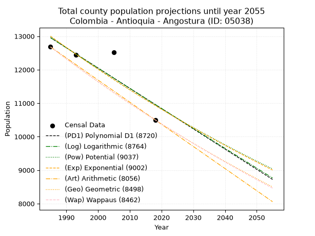
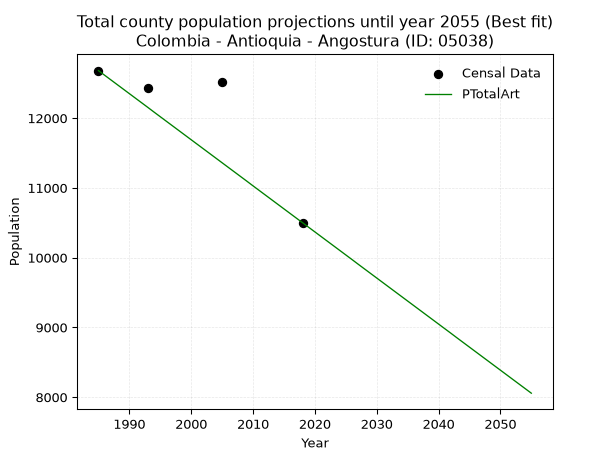
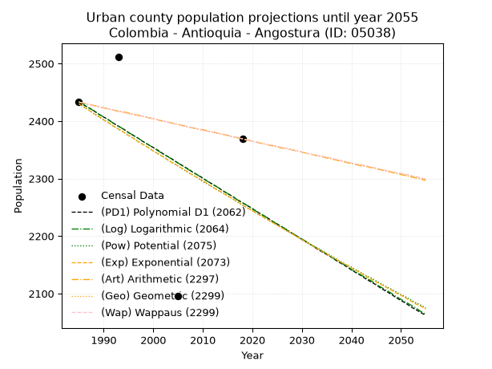
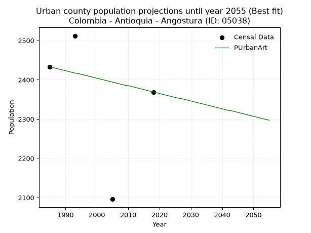
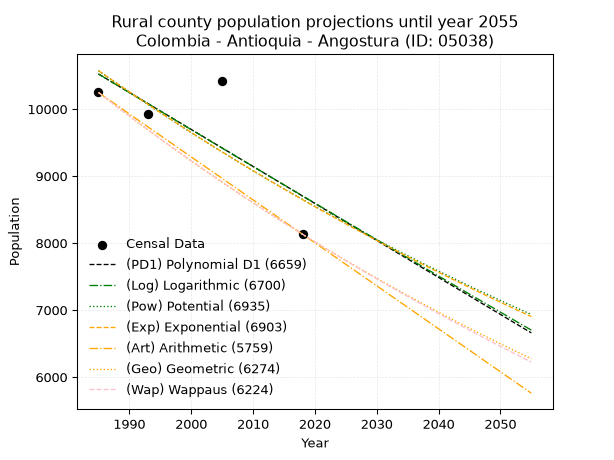
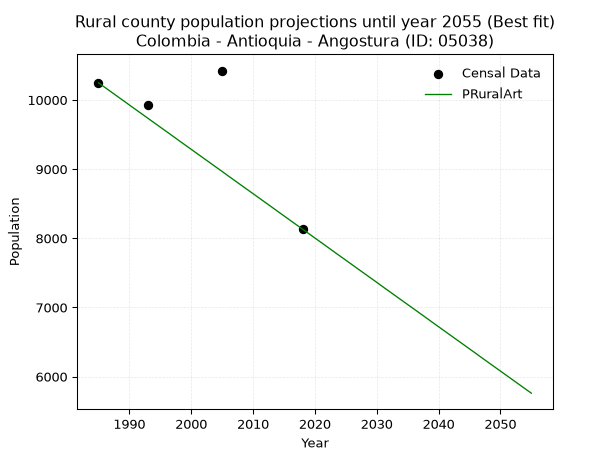

<div align="center">


</div>

# 📜 _“Population and Public Services Demand Projections (PPSD) until Year 2050 for Colombia - Antioquia - Angostura (ID: 05038)”_
Keywords: `population` `public-service` `projection` `lineal` `polynomial` `logarithmic` `potential` `exponential` `arithmetic` `geometric` `wappaus` `dane` `colombia` `south-america`

PPSD are analytical estimates used by governments and planners to anticipate future changes in population size, age distribution, and the resulting community needs for utilities, healthcare, education, and infrastructure as sizing future water treatment facilities, electrical grids, and road networks based on spatial growth.

<div align="center">

</img>

</div>


> **General running parameters**: • app_version: _v20260806_. • Python version: _3.14.7_. • Pandas version: _3.0.5_. • NumPy version: _2.5.1_. • Creates, save and include plots into reports (create_plot): _False_. • Projection until year: _2050_. • Process polynomial degree 2 and up: _False_. • Process Wappaus: _True_. • Process Wappaus: _True_. • Set negative values to zero: _True_. • Set infinite values to zero: _True_. • Drop dataset notes: _True_. 
<div align="center">

Maps & GIS Layers: [:earth_americas:Google](http://maps.google.com/maps?q=6.885174591,-75.3351159) [:earth_americas:OSM](https://www.openstreetmap.org/#map=18/6.885174591/-75.3351159&layers=P) [:earth_americas:Bing](https://www.bing.com/maps?cp=6.885174591~-75.3351159&lvl=18) [:earth_americas:Apple](https://maps.apple.com/frame?center=6.885174591%2C-75.3351159&span=0.003%2C0.006) [:earth_americas:GISMobile](https://github.com/rcfdtools/R.GISMobile/blob/main/file/gis/CountyLayer_CO/Readme.md)

</div>


<div align="center">

```geojson
{
  "type": "Feature",
  "geometry": {
    "type": "Point", 
    "coordinates": [-75.3351159, 6.885174591]
  }, 
  "properties": {
    "Name": "Colombia - Antioquia - Angostura (ID: 05038)"
  }
}
```

</div>


## 0. Census Data (4 records)

Census data are official statistics collected by a government about the people and housing in a country. They usually include counts of total population, age, sex, race, income, education, and jobs.

📅Global census file: [Population.xlsx](../data/Population.xlsx)

| Source   |   Year |   CountryID | CountryName   |   StateID | StateName   |   CountyID | CountyName   |   PTotal |   PUrban |   PRural |
|:---------|-------:|------------:|:--------------|----------:|:------------|-----------:|:-------------|---------:|---------:|---------:|
| DANE     |   1985 |          57 | Colombia      |        05 | Antioquia   |      05038 | Angostura    |    12680 |     2433 |    10247 |
| DANE     |   1993 |          57 | Colombia      |        05 | Antioquia   |      05038 | Angostura    |    12436 |     2512 |     9924 |
| DANE     |   2005 |          57 | Colombia      |        05 | Antioquia   |      05038 | Angostura    |    12519 |     2096 |    10423 |
| DANE     |   2018 |          57 | Colombia      |        05 | Antioquia   |      05038 | Angostura    |    10500 |     2369 |     8131 |

> 🔥Some records could had specific notes about the registered values or the corresponding urban or rural distribution.

📅[SUI-RUPS](https://www.datos.gov.co/Hacienda-y-Cr-dito-P-blico/Registro-nico-de-Prestadores-de-Servicios-P-blicos/4qkq-csdn/about_data) - Local public utility companies: [RUPS.csv](../data/RUPS.csv)

 | SERVICIO       | ESTADO    | NOMBRE                                                                                         | NIT         | DEPARTAMENTO_DOMICILIO   | MUNICIPIO_DOMICILIO   | DIRECCION                          |   TELEFONO | EMAIL                | TIPO_PRESTADOR                             | CLASIFICACION                 |
|:---------------|:----------|:-----------------------------------------------------------------------------------------------|:------------|:-------------------------|:----------------------|:-----------------------------------|-----------:|:---------------------|:-------------------------------------------|:------------------------------|
| ACUEDUCTO      | OPERATIVA | ASOCIACION DE USUARIOS DEL ACUEDUCTO MULTIVEREDAL SANTA ANA LOS CHOCHOS MUNICIPIO DE ANGOSTURA | 811030770-3 | ANTIOQUIA                | ANGOSTURA             | parque principal palacio municipal |    8645161 | asousu09@hotmail.com | ORGANIZACION AUTORIZADA                    | HASTA 2500 SUSCRIPTORES       |
| ACUEDUCTO      | OPERATIVA | LA EMPRESA DE SERVICIOS PUBLICOS DOMICILIARIOS DE ANGOSTURA S.A. E.S.P.                        | 900310485-3 | ANTIOQUIA                | ANGOSTURA             | Calle 11 No 9-34                   |    8645055 | OLGAML@HOTMAIL.COM   | SOCIEDADES (EMPRESA DE SERVICIOS PUBLICOS) | MENOR O IGUAL A 2500 USUARIOS |
| ALCANTARILLADO | OPERATIVA | LA EMPRESA DE SERVICIOS PUBLICOS DOMICILIARIOS DE ANGOSTURA S.A. E.S.P.                        | 900310485-3 | ANTIOQUIA                | ANGOSTURA             | Calle 11 No 9-34                   |    8645055 | OLGAML@HOTMAIL.COM   | SOCIEDADES (EMPRESA DE SERVICIOS PUBLICOS) | MENOR O IGUAL A 2500 USUARIOS |

## 1. Total

### 1.1. Coefficients and Parameters

* (PD1) Polynomial Deg 1: -60.5230830991557, 133095.0469690862 (lineal)
* (Log) Logarithmic: -120988.99964220155, 931672.1058253692
* (Pow) Potential: -10.491415728488462, 38.71209868531202
* (Exp) Exponential: -0.0052482965031602985, 434832477.8940467
* (Art) Arithmetic: Year diff. 2018 - 1985 = 33, Population diff. 10500 - 12680 = -2180, Annual growth = -66.06060606060606
* (Geo) Geometric: Year diff. 2018 - 1985 = 33, Population diff. 10500 - 12680 = -2180, Annual growth % = -0.005700378465881006
* (Wap) Wappaus: i = -0.569979344785212, Condition values only valid for < 200)

<sub>
Wappaus condition values: ['-0.00', '-0.57', '-1.14', '-1.71', '-2.28', '-2.85', '-3.42', '-3.99', '-4.56', '-5.13', '-5.70', '-6.27', '-6.84', '-7.41', '-7.98', '-8.55', '-9.12', '-9.69', '-10.26', '-10.83', '-11.40', '-11.97', '-12.54', '-13.11', '-13.68', '-14.25', '-14.82', '-15.39', '-15.96', '-16.53', '-17.10', '-17.67', '-18.24', '-18.81', '-19.38', '-19.95', '-20.52', '-21.09', '-21.66', '-22.23', '-22.80', '-23.37', '-23.94', '-24.51', '-25.08', '-25.65', '-26.22', '-26.79', '-27.36', '-27.93', '-28.50', '-29.07', '-29.64', '-30.21', '-30.78', '-31.35', '-31.92', '-32.49', '-33.06', '-33.63', '-34.20', '-34.77', '-35.34', '-35.91', '-36.48', '-37.05']
</sub>


### 1.2. Projected Dataset

|   Year |   CountyID |   PTotalPD1 |   PTotalLog |   PTotalPow |   PTotalExp |   PTotalArt |   PTotalGeo |   PTotalWap |
|-------:|-----------:|------------:|------------:|------------:|------------:|------------:|------------:|------------:|
|   1985 |      05038 |       12957 |       12957 |       12999 |       12999 |       12680 |       12680 |       12680 |
|   1986 |      05038 |       12896 |       12896 |       12931 |       12931 |       12614 |       12608 |       12608 |
|   1987 |      05038 |       12836 |       12836 |       12863 |       12863 |       12548 |       12536 |       12536 |
|   1988 |      05038 |       12775 |       12775 |       12795 |       12796 |       12482 |       12464 |       12465 |
|   1989 |      05038 |       12715 |       12714 |       12728 |       12729 |       12416 |       12393 |       12394 |
|   1990 |      05038 |       12654 |       12653 |       12661 |       12662 |       12350 |       12323 |       12324 |
|   1991 |      05038 |       12594 |       12592 |       12594 |       12596 |       12284 |       12252 |       12254 |
|   1992 |      05038 |       12533 |       12531 |       12528 |       12530 |       12218 |       12183 |       12184 |
|   1993 |      05038 |       12473 |       12471 |       12462 |       12464 |       12152 |       12113 |       12115 |
|   1994 |      05038 |       12412 |       12410 |       12397 |       12399 |       12085 |       12044 |       12046 |
|   1995 |      05038 |       12351 |       12349 |       12332 |       12334 |       12019 |       11975 |       11977 |
|   1996 |      05038 |       12291 |       12289 |       12267 |       12269 |       11953 |       11907 |       11909 |
|   1997 |      05038 |       12230 |       12228 |       12203 |       12205 |       11887 |       11839 |       11841 |
|   1998 |      05038 |       12170 |       12168 |       12139 |       12141 |       11821 |       11772 |       11774 |
|   1999 |      05038 |       12109 |       12107 |       12075 |       12078 |       11755 |       11705 |       11707 |
|   2000 |      05038 |       12049 |       12047 |       12012 |       12015 |       11689 |       11638 |       11640 |
|   2001 |      05038 |       11988 |       11986 |       11949 |       11952 |       11623 |       11572 |       11574 |
|   2002 |      05038 |       11928 |       11926 |       11887 |       11889 |       11557 |       11506 |       11508 |
|   2003 |      05038 |       11867 |       11865 |       11825 |       11827 |       11491 |       11440 |       11443 |
|   2004 |      05038 |       11807 |       11805 |       11763 |       11765 |       11425 |       11375 |       11377 |
|   2005 |      05038 |       11746 |       11744 |       11702 |       11703 |       11359 |       11310 |       11312 |
|   2006 |      05038 |       11686 |       11684 |       11641 |       11642 |       11293 |       11246 |       11248 |
|   2007 |      05038 |       11625 |       11624 |       11580 |       11581 |       11227 |       11181 |       11184 |
|   2008 |      05038 |       11565 |       11564 |       11519 |       11521 |       11161 |       11118 |       11120 |
|   2009 |      05038 |       11504 |       11503 |       11459 |       11460 |       11095 |       11054 |       11056 |
|   2010 |      05038 |       11444 |       11443 |       11400 |       11400 |       11028 |       10991 |       10993 |
|   2011 |      05038 |       11383 |       11383 |       11340 |       11341 |       10962 |       10929 |       10931 |
|   2012 |      05038 |       11323 |       11323 |       11281 |       11281 |       10896 |       10866 |       10868 |
|   2013 |      05038 |       11262 |       11263 |       11223 |       11222 |       10830 |       10804 |       10806 |
|   2014 |      05038 |       11202 |       11203 |       11164 |       11163 |       10764 |       10743 |       10744 |
|   2015 |      05038 |       11141 |       11142 |       11106 |       11105 |       10698 |       10682 |       10683 |
|   2016 |      05038 |       11081 |       11082 |       11049 |       11047 |       10632 |       10621 |       10621 |
|   2017 |      05038 |       11020 |       11022 |       10991 |       10989 |       10566 |       10560 |       10561 |
|   2018 |      05038 |       10959 |       10962 |       10934 |       10932 |       10500 |       10500 |       10500 |
|   2019 |      05038 |       10899 |       10903 |       10878 |       10874 |       10434 |       10440 |       10440 |
|   2020 |      05038 |       10838 |       10843 |       10821 |       10817 |       10368 |       10381 |       10380 |
|   2021 |      05038 |       10778 |       10783 |       10765 |       10761 |       10302 |       10321 |       10320 |
|   2022 |      05038 |       10717 |       10723 |       10710 |       10704 |       10236 |       10263 |       10261 |
|   2023 |      05038 |       10657 |       10663 |       10654 |       10648 |       10170 |       10204 |       10202 |
|   2024 |      05038 |       10596 |       10603 |       10599 |       10593 |       10104 |       10146 |       10143 |
|   2025 |      05038 |       10536 |       10544 |       10544 |       10537 |       10038 |       10088 |       10085 |
|   2026 |      05038 |       10475 |       10484 |       10490 |       10482 |        9972 |       10031 |       10027 |
|   2027 |      05038 |       10415 |       10424 |       10436 |       10427 |        9905 |        9973 |        9969 |
|   2028 |      05038 |       10354 |       10364 |       10382 |       10373 |        9839 |        9917 |        9912 |
|   2029 |      05038 |       10294 |       10305 |       10328 |       10318 |        9773 |        9860 |        9854 |
|   2030 |      05038 |       10233 |       10245 |       10275 |       10264 |        9707 |        9804 |        9797 |
|   2031 |      05038 |       10173 |       10186 |       10222 |       10211 |        9641 |        9748 |        9741 |
|   2032 |      05038 |       10112 |       10126 |       10169 |       10157 |        9575 |        9692 |        9684 |
|   2033 |      05038 |       10052 |       10066 |       10117 |       10104 |        9509 |        9637 |        9628 |
|   2034 |      05038 |        9991 |       10007 |       10065 |       10051 |        9443 |        9582 |        9573 |
|   2035 |      05038 |        9931 |        9948 |       10013 |        9998 |        9377 |        9528 |        9517 |
|   2036 |      05038 |        9870 |        9888 |        9962 |        9946 |        9311 |        9473 |        9462 |
|   2037 |      05038 |        9810 |        9829 |        9911 |        9894 |        9245 |        9419 |        9407 |
|   2038 |      05038 |        9749 |        9769 |        9860 |        9842 |        9179 |        9366 |        9352 |
|   2039 |      05038 |        9688 |        9710 |        9809 |        9791 |        9113 |        9312 |        9298 |
|   2040 |      05038 |        9628 |        9651 |        9759 |        9740 |        9047 |        9259 |        9244 |
|   2041 |      05038 |        9567 |        9591 |        9709 |        9689 |        8981 |        9206 |        9190 |
|   2042 |      05038 |        9507 |        9532 |        9659 |        9638 |        8915 |        9154 |        9136 |
|   2043 |      05038 |        9446 |        9473 |        9609 |        9587 |        8848 |        9102 |        9083 |
|   2044 |      05038 |        9386 |        9414 |        9560 |        9537 |        8782 |        9050 |        9030 |
|   2045 |      05038 |        9325 |        9354 |        9511 |        9487 |        8716 |        8998 |        8977 |
|   2046 |      05038 |        9265 |        9295 |        9463 |        9438 |        8650 |        8947 |        8924 |
|   2047 |      05038 |        9204 |        9236 |        9414 |        9388 |        8584 |        8896 |        8872 |
|   2048 |      05038 |        9144 |        9177 |        9366 |        9339 |        8518 |        8845 |        8820 |
|   2049 |      05038 |        9083 |        9118 |        9318 |        9290 |        8452 |        8795 |        8768 |
|   2050 |      05038 |        9023 |        9059 |        9271 |        9242 |        8386 |        8745 |        8716 |
<div align="center">

</img>

</div>


### 1.3. Best fit with absolute and relative error (%)

Relative error puts that difference into context by dividing the absolute error by the true value, creating a unitless ratio or percentage that shows the scale of the mistake.

Absolute and relative error

|   Year | Source   |   CountryID | CountryName   |   StateID | StateName   |   CountyID_x | CountyName   |   PTotal |   PUrban |   PRural |   CountyID_y |   PTotalPD1 |   PTotalLog |   PTotalPow |   PTotalExp |   PTotalArt |   PTotalGeo |   PTotalWap |   PTotalPD1AbsError |   PTotalLogAbsError |   PTotalPowAbsError |   PTotalExpAbsError |   PTotalArtAbsError |   PTotalGeoAbsError |   PTotalWapAbsError |   PTotalPD1RelError |   PTotalLogRelError |   PTotalPowRelError |   PTotalExpRelError |   PTotalArtRelError |   PTotalGeoRelError |   PTotalWapRelError |
|-------:|:---------|------------:|:--------------|----------:|:------------|-------------:|:-------------|---------:|---------:|---------:|-------------:|------------:|------------:|------------:|------------:|------------:|------------:|------------:|--------------------:|--------------------:|--------------------:|--------------------:|--------------------:|--------------------:|--------------------:|--------------------:|--------------------:|--------------------:|--------------------:|--------------------:|--------------------:|--------------------:|
|   1985 | DANE     |          57 | Colombia      |        05 | Antioquia   |        05038 | Angostura    |    12680 |     2433 |    10247 |        05038 |       12957 |       12957 |       12999 |       12999 |       12680 |       12680 |       12680 |                 277 |                 277 |                 319 |                 319 |                   0 |                   0 |                   0 |            2.18454  |            2.18454  |             2.51577 |            2.51577  |             0       |             0       |             0       |
|   1993 | DANE     |          57 | Colombia      |        05 | Antioquia   |        05038 | Angostura    |    12436 |     2512 |     9924 |        05038 |       12473 |       12471 |       12462 |       12464 |       12152 |       12113 |       12115 |                  37 |                  35 |                  26 |                  28 |                 284 |                 323 |                 321 |            0.297523 |            0.281441 |             0.20907 |            0.225153 |             2.28369 |             2.5973  |             2.58122 |
|   2005 | DANE     |          57 | Colombia      |        05 | Antioquia   |        05038 | Angostura    |    12519 |     2096 |    10423 |        05038 |       11746 |       11744 |       11702 |       11703 |       11359 |       11310 |       11312 |                 773 |                 775 |                 817 |                 816 |                1160 |                1209 |                1207 |            6.17461  |            6.19059  |             6.52608 |            6.51809  |             9.26592 |             9.65732 |             9.64135 |
|   2018 | DANE     |          57 | Colombia      |        05 | Antioquia   |        05038 | Angostura    |    10500 |     2369 |     8131 |        05038 |       10959 |       10962 |       10934 |       10932 |       10500 |       10500 |       10500 |                 459 |                 462 |                 434 |                 432 |                   0 |                   0 |                   0 |            4.37143  |            4.4      |             4.13333 |            4.11429  |             0       |             0       |             0       |

Relative error mean

| Method    |   RelError | Best   |
|:----------|-----------:|:-------|
| PTotalPD1 |    3.25703 |        |
| PTotalLog |    3.26414 |        |
| PTotalPow |    3.34606 |        |
| PTotalExp |    3.34333 |        |
| PTotalArt |    2.8874  | True   |
| PTotalGeo |    3.06365 |        |
| PTotalWap |    3.05564 |        |

💙Best method: _**PTotalArt**_
<div align="center">

</img>

</div>


### 1.4. Fresh water supply demand in liters per capita per day (lpcd)

The fresh water supply demand typically ranges from 100 to 300 liters per capita per day (lpcd) for standard domestic and municipal planning, though absolute survival minimums set by the World Health Organization are as low as 7.5 to 20 liters per day, and total consumption in high-income nations can exceed 400 liters.

> `CZ`: Level in meters above the sea level (masl)<br> `WS`: Fresh water supply demand in liters per capita per day (lpcd or l/h/d)<br> `WSAll`: Zonal fresh water supply demand in liters per second (l/s)<br> `A`: Zonal area in square meters<br> `DP`: Population density (people/hectare or p/ha)

Reference values (RAS Colombia)

|    CZ |   WS |
|------:|-----:|
|  1000 |  120 |
|  2000 |  130 |
| 99999 |  140 |

County shapefile geometry properties and water supply values

|   CountyID |      ATotal |   CZTotal |   WSTotal |
|-----------:|------------:|----------:|----------:|
|      05038 | 3.38354e+08 |   2068.13 |       140 |

Projected values for best method: PTotalArt

|   CountyID |   Year |   PTotalArt |   DPTotal |   WSTotal |   WSTotalAll |
|-----------:|-------:|------------:|----------:|----------:|-------------:|
|      05038 |   1985 |       12680 |      0.37 |       140 |      20.5463 |
|      05038 |   1986 |       12614 |      0.37 |       140 |      20.4394 |
|      05038 |   1987 |       12548 |      0.37 |       140 |      20.3324 |
|      05038 |   1988 |       12482 |      0.37 |       140 |      20.2255 |
|      05038 |   1989 |       12416 |      0.37 |       140 |      20.1185 |
|      05038 |   1990 |       12350 |      0.37 |       140 |      20.0116 |
|      05038 |   1991 |       12284 |      0.36 |       140 |      19.9046 |
|      05038 |   1992 |       12218 |      0.36 |       140 |      19.7977 |
|      05038 |   1993 |       12152 |      0.36 |       140 |      19.6907 |
|      05038 |   1994 |       12085 |      0.36 |       140 |      19.5822 |
|      05038 |   1995 |       12019 |      0.36 |       140 |      19.4752 |
|      05038 |   1996 |       11953 |      0.35 |       140 |      19.3683 |
|      05038 |   1997 |       11887 |      0.35 |       140 |      19.2613 |
|      05038 |   1998 |       11821 |      0.35 |       140 |      19.1544 |
|      05038 |   1999 |       11755 |      0.35 |       140 |      19.0475 |
|      05038 |   2000 |       11689 |      0.35 |       140 |      18.9405 |
|      05038 |   2001 |       11623 |      0.34 |       140 |      18.8336 |
|      05038 |   2002 |       11557 |      0.34 |       140 |      18.7266 |
|      05038 |   2003 |       11491 |      0.34 |       140 |      18.6197 |
|      05038 |   2004 |       11425 |      0.34 |       140 |      18.5127 |
|      05038 |   2005 |       11359 |      0.34 |       140 |      18.4058 |
|      05038 |   2006 |       11293 |      0.33 |       140 |      18.2988 |
|      05038 |   2007 |       11227 |      0.33 |       140 |      18.1919 |
|      05038 |   2008 |       11161 |      0.33 |       140 |      18.085  |
|      05038 |   2009 |       11095 |      0.33 |       140 |      17.978  |
|      05038 |   2010 |       11028 |      0.33 |       140 |      17.8694 |
|      05038 |   2011 |       10962 |      0.32 |       140 |      17.7625 |
|      05038 |   2012 |       10896 |      0.32 |       140 |      17.6556 |
|      05038 |   2013 |       10830 |      0.32 |       140 |      17.5486 |
|      05038 |   2014 |       10764 |      0.32 |       140 |      17.4417 |
|      05038 |   2015 |       10698 |      0.32 |       140 |      17.3347 |
|      05038 |   2016 |       10632 |      0.31 |       140 |      17.2278 |
|      05038 |   2017 |       10566 |      0.31 |       140 |      17.1208 |
|      05038 |   2018 |       10500 |      0.31 |       140 |      17.0139 |
|      05038 |   2019 |       10434 |      0.31 |       140 |      16.9069 |
|      05038 |   2020 |       10368 |      0.31 |       140 |      16.8    |
|      05038 |   2021 |       10302 |      0.3  |       140 |      16.6931 |
|      05038 |   2022 |       10236 |      0.3  |       140 |      16.5861 |
|      05038 |   2023 |       10170 |      0.3  |       140 |      16.4792 |
|      05038 |   2024 |       10104 |      0.3  |       140 |      16.3722 |
|      05038 |   2025 |       10038 |      0.3  |       140 |      16.2653 |
|      05038 |   2026 |        9972 |      0.29 |       140 |      16.1583 |
|      05038 |   2027 |        9905 |      0.29 |       140 |      16.0498 |
|      05038 |   2028 |        9839 |      0.29 |       140 |      15.9428 |
|      05038 |   2029 |        9773 |      0.29 |       140 |      15.8359 |
|      05038 |   2030 |        9707 |      0.29 |       140 |      15.7289 |
|      05038 |   2031 |        9641 |      0.28 |       140 |      15.622  |
|      05038 |   2032 |        9575 |      0.28 |       140 |      15.515  |
|      05038 |   2033 |        9509 |      0.28 |       140 |      15.4081 |
|      05038 |   2034 |        9443 |      0.28 |       140 |      15.3012 |
|      05038 |   2035 |        9377 |      0.28 |       140 |      15.1942 |
|      05038 |   2036 |        9311 |      0.28 |       140 |      15.0873 |
|      05038 |   2037 |        9245 |      0.27 |       140 |      14.9803 |
|      05038 |   2038 |        9179 |      0.27 |       140 |      14.8734 |
|      05038 |   2039 |        9113 |      0.27 |       140 |      14.7664 |
|      05038 |   2040 |        9047 |      0.27 |       140 |      14.6595 |
|      05038 |   2041 |        8981 |      0.27 |       140 |      14.5525 |
|      05038 |   2042 |        8915 |      0.26 |       140 |      14.4456 |
|      05038 |   2043 |        8848 |      0.26 |       140 |      14.337  |
|      05038 |   2044 |        8782 |      0.26 |       140 |      14.2301 |
|      05038 |   2045 |        8716 |      0.26 |       140 |      14.1231 |
|      05038 |   2046 |        8650 |      0.26 |       140 |      14.0162 |
|      05038 |   2047 |        8584 |      0.25 |       140 |      13.9093 |
|      05038 |   2048 |        8518 |      0.25 |       140 |      13.8023 |
|      05038 |   2049 |        8452 |      0.25 |       140 |      13.6954 |
|      05038 |   2050 |        8386 |      0.25 |       140 |      13.5884 |

## 2. Urban

### 2.1. Coefficients and Parameters

* (PD1) Polynomial Deg 1: -5.3143315937375935, 12982.491770373621 (lineal)
* (Log) Logarithmic: -10666.019773461501, 83425.00177019917
* (Pow) Potential: -4.554771205527614, 18.40617469113597
* (Exp) Exponential: -0.002269016399517524, 219592.99366622133
* (Art) Arithmetic: Year diff. 2018 - 1985 = 33, Population diff. 2369 - 2433 = -64, Annual growth = -1.9393939393939394
* (Geo) Geometric: Year diff. 2018 - 1985 = 33, Population diff. 2369 - 2433 = -64, Annual growth % = -0.0008074659033490139
* (Wap) Wappaus: i = -0.0807744247977484, Condition values only valid for < 200)

<sub>
Wappaus condition values: ['-0.00', '-0.08', '-0.16', '-0.24', '-0.32', '-0.40', '-0.48', '-0.57', '-0.65', '-0.73', '-0.81', '-0.89', '-0.97', '-1.05', '-1.13', '-1.21', '-1.29', '-1.37', '-1.45', '-1.53', '-1.62', '-1.70', '-1.78', '-1.86', '-1.94', '-2.02', '-2.10', '-2.18', '-2.26', '-2.34', '-2.42', '-2.50', '-2.58', '-2.67', '-2.75', '-2.83', '-2.91', '-2.99', '-3.07', '-3.15', '-3.23', '-3.31', '-3.39', '-3.47', '-3.55', '-3.63', '-3.72', '-3.80', '-3.88', '-3.96', '-4.04', '-4.12', '-4.20', '-4.28', '-4.36', '-4.44', '-4.52', '-4.60', '-4.68', '-4.77', '-4.85', '-4.93', '-5.01', '-5.09', '-5.17', '-5.25']
</sub>


### 2.2. Projected Dataset

|   Year |   CountyID |   PUrbanPD1 |   PUrbanLog |   PUrbanPow |   PUrbanExp |   PUrbanArt |   PUrbanGeo |   PUrbanWap |
|-------:|-----------:|------------:|------------:|------------:|------------:|------------:|------------:|------------:|
|   1985 |      05038 |        2434 |        2434 |        2430 |        2430 |        2433 |        2433 |        2433 |
|   1986 |      05038 |        2428 |        2429 |        2425 |        2424 |        2431 |        2431 |        2431 |
|   1987 |      05038 |        2423 |        2423 |        2419 |        2419 |        2429 |        2429 |        2429 |
|   1988 |      05038 |        2418 |        2418 |        2413 |        2413 |        2427 |        2427 |        2427 |
|   1989 |      05038 |        2412 |        2412 |        2408 |        2408 |        2425 |        2425 |        2425 |
|   1990 |      05038 |        2407 |        2407 |        2402 |        2402 |        2423 |        2423 |        2423 |
|   1991 |      05038 |        2402 |        2402 |        2397 |        2397 |        2421 |        2421 |        2421 |
|   1992 |      05038 |        2396 |        2396 |        2391 |        2391 |        2419 |        2419 |        2419 |
|   1993 |      05038 |        2391 |        2391 |        2386 |        2386 |        2417 |        2417 |        2417 |
|   1994 |      05038 |        2386 |        2386 |        2381 |        2381 |        2416 |        2415 |        2415 |
|   1995 |      05038 |        2380 |        2380 |        2375 |        2375 |        2414 |        2413 |        2413 |
|   1996 |      05038 |        2375 |        2375 |        2370 |        2370 |        2412 |        2411 |        2411 |
|   1997 |      05038 |        2370 |        2370 |        2364 |        2364 |        2410 |        2410 |        2410 |
|   1998 |      05038 |        2364 |        2364 |        2359 |        2359 |        2408 |        2408 |        2408 |
|   1999 |      05038 |        2359 |        2359 |        2354 |        2354 |        2406 |        2406 |        2406 |
|   2000 |      05038 |        2354 |        2354 |        2348 |        2348 |        2404 |        2404 |        2404 |
|   2001 |      05038 |        2349 |        2348 |        2343 |        2343 |        2402 |        2402 |        2402 |
|   2002 |      05038 |        2343 |        2343 |        2338 |        2338 |        2400 |        2400 |        2400 |
|   2003 |      05038 |        2338 |        2338 |        2332 |        2332 |        2398 |        2398 |        2398 |
|   2004 |      05038 |        2333 |        2332 |        2327 |        2327 |        2396 |        2396 |        2396 |
|   2005 |      05038 |        2327 |        2327 |        2322 |        2322 |        2394 |        2394 |        2394 |
|   2006 |      05038 |        2322 |        2322 |        2316 |        2317 |        2392 |        2392 |        2392 |
|   2007 |      05038 |        2317 |        2316 |        2311 |        2311 |        2390 |        2390 |        2390 |
|   2008 |      05038 |        2311 |        2311 |        2306 |        2306 |        2388 |        2388 |        2388 |
|   2009 |      05038 |        2306 |        2306 |        2301 |        2301 |        2386 |        2386 |        2386 |
|   2010 |      05038 |        2301 |        2300 |        2295 |        2296 |        2385 |        2384 |        2384 |
|   2011 |      05038 |        2295 |        2295 |        2290 |        2291 |        2383 |        2382 |        2382 |
|   2012 |      05038 |        2290 |        2290 |        2285 |        2285 |        2381 |        2381 |        2381 |
|   2013 |      05038 |        2285 |        2285 |        2280 |        2280 |        2379 |        2379 |        2379 |
|   2014 |      05038 |        2279 |        2279 |        2275 |        2275 |        2377 |        2377 |        2377 |
|   2015 |      05038 |        2274 |        2274 |        2270 |        2270 |        2375 |        2375 |        2375 |
|   2016 |      05038 |        2269 |        2269 |        2265 |        2265 |        2373 |        2373 |        2373 |
|   2017 |      05038 |        2263 |        2263 |        2259 |        2260 |        2371 |        2371 |        2371 |
|   2018 |      05038 |        2258 |        2258 |        2254 |        2254 |        2369 |        2369 |        2369 |
|   2019 |      05038 |        2253 |        2253 |        2249 |        2249 |        2367 |        2367 |        2367 |
|   2020 |      05038 |        2248 |        2247 |        2244 |        2244 |        2365 |        2365 |        2365 |
|   2021 |      05038 |        2242 |        2242 |        2239 |        2239 |        2363 |        2363 |        2363 |
|   2022 |      05038 |        2237 |        2237 |        2234 |        2234 |        2361 |        2361 |        2361 |
|   2023 |      05038 |        2232 |        2232 |        2229 |        2229 |        2359 |        2359 |        2359 |
|   2024 |      05038 |        2226 |        2226 |        2224 |        2224 |        2357 |        2358 |        2358 |
|   2025 |      05038 |        2221 |        2221 |        2219 |        2219 |        2355 |        2356 |        2356 |
|   2026 |      05038 |        2216 |        2216 |        2214 |        2214 |        2353 |        2354 |        2354 |
|   2027 |      05038 |        2210 |        2211 |        2209 |        2209 |        2352 |        2352 |        2352 |
|   2028 |      05038 |        2205 |        2205 |        2204 |        2204 |        2350 |        2350 |        2350 |
|   2029 |      05038 |        2200 |        2200 |        2199 |        2199 |        2348 |        2348 |        2348 |
|   2030 |      05038 |        2194 |        2195 |        2194 |        2194 |        2346 |        2346 |        2346 |
|   2031 |      05038 |        2189 |        2190 |        2189 |        2189 |        2344 |        2344 |        2344 |
|   2032 |      05038 |        2184 |        2184 |        2184 |        2184 |        2342 |        2342 |        2342 |
|   2033 |      05038 |        2178 |        2179 |        2180 |        2179 |        2340 |        2340 |        2340 |
|   2034 |      05038 |        2173 |        2174 |        2175 |        2174 |        2338 |        2339 |        2339 |
|   2035 |      05038 |        2168 |        2169 |        2170 |        2169 |        2336 |        2337 |        2337 |
|   2036 |      05038 |        2163 |        2163 |        2165 |        2164 |        2334 |        2335 |        2335 |
|   2037 |      05038 |        2157 |        2158 |        2160 |        2159 |        2332 |        2333 |        2333 |
|   2038 |      05038 |        2152 |        2153 |        2155 |        2154 |        2330 |        2331 |        2331 |
|   2039 |      05038 |        2147 |        2148 |        2150 |        2150 |        2328 |        2329 |        2329 |
|   2040 |      05038 |        2141 |        2142 |        2146 |        2145 |        2326 |        2327 |        2327 |
|   2041 |      05038 |        2136 |        2137 |        2141 |        2140 |        2324 |        2325 |        2325 |
|   2042 |      05038 |        2131 |        2132 |        2136 |        2135 |        2322 |        2324 |        2324 |
|   2043 |      05038 |        2125 |        2127 |        2131 |        2130 |        2321 |        2322 |        2322 |
|   2044 |      05038 |        2120 |        2122 |        2127 |        2125 |        2319 |        2320 |        2320 |
|   2045 |      05038 |        2115 |        2116 |        2122 |        2120 |        2317 |        2318 |        2318 |
|   2046 |      05038 |        2109 |        2111 |        2117 |        2116 |        2315 |        2316 |        2316 |
|   2047 |      05038 |        2104 |        2106 |        2112 |        2111 |        2313 |        2314 |        2314 |
|   2048 |      05038 |        2099 |        2101 |        2108 |        2106 |        2311 |        2312 |        2312 |
|   2049 |      05038 |        2093 |        2095 |        2103 |        2101 |        2309 |        2310 |        2310 |
|   2050 |      05038 |        2088 |        2090 |        2098 |        2097 |        2307 |        2309 |        2309 |
<div align="center">

</img>

</div>


### 2.3. Best fit with absolute and relative error (%)

Relative error puts that difference into context by dividing the absolute error by the true value, creating a unitless ratio or percentage that shows the scale of the mistake.

Absolute and relative error

|   Year | Source   |   CountryID | CountryName   |   StateID | StateName   |   CountyID_x | CountyName   |   PTotal |   PUrban |   PRural |   CountyID_y |   PUrbanPD1 |   PUrbanLog |   PUrbanPow |   PUrbanExp |   PUrbanArt |   PUrbanGeo |   PUrbanWap |   PUrbanPD1AbsError |   PUrbanLogAbsError |   PUrbanPowAbsError |   PUrbanExpAbsError |   PUrbanArtAbsError |   PUrbanGeoAbsError |   PUrbanWapAbsError |   PUrbanPD1RelError |   PUrbanLogRelError |   PUrbanPowRelError |   PUrbanExpRelError |   PUrbanArtRelError |   PUrbanGeoRelError |   PUrbanWapRelError |
|-------:|:---------|------------:|:--------------|----------:|:------------|-------------:|:-------------|---------:|---------:|---------:|-------------:|------------:|------------:|------------:|------------:|------------:|------------:|------------:|--------------------:|--------------------:|--------------------:|--------------------:|--------------------:|--------------------:|--------------------:|--------------------:|--------------------:|--------------------:|--------------------:|--------------------:|--------------------:|--------------------:|
|   1985 | DANE     |          57 | Colombia      |        05 | Antioquia   |        05038 | Angostura    |    12680 |     2433 |    10247 |        05038 |        2434 |        2434 |        2430 |        2430 |        2433 |        2433 |        2433 |                   1 |                   1 |                   3 |                   3 |                   0 |                   0 |                   0 |           0.0411015 |           0.0411015 |            0.123305 |            0.123305 |             0       |             0       |             0       |
|   1993 | DANE     |          57 | Colombia      |        05 | Antioquia   |        05038 | Angostura    |    12436 |     2512 |     9924 |        05038 |        2391 |        2391 |        2386 |        2386 |        2417 |        2417 |        2417 |                 121 |                 121 |                 126 |                 126 |                  95 |                  95 |                  95 |           4.81688   |           4.81688   |            5.01592  |            5.01592  |             3.78185 |             3.78185 |             3.78185 |
|   2005 | DANE     |          57 | Colombia      |        05 | Antioquia   |        05038 | Angostura    |    12519 |     2096 |    10423 |        05038 |        2327 |        2327 |        2322 |        2322 |        2394 |        2394 |        2394 |                 231 |                 231 |                 226 |                 226 |                 298 |                 298 |                 298 |          11.021     |          11.021     |           10.7824   |           10.7824   |            14.2176  |            14.2176  |            14.2176  |
|   2018 | DANE     |          57 | Colombia      |        05 | Antioquia   |        05038 | Angostura    |    10500 |     2369 |     8131 |        05038 |        2258 |        2258 |        2254 |        2254 |        2369 |        2369 |        2369 |                 111 |                 111 |                 115 |                 115 |                   0 |                   0 |                   0 |           4.68552   |           4.68552   |            4.85437  |            4.85437  |             0       |             0       |             0       |

Relative error mean

| Method    |   RelError | Best   |
|:----------|-----------:|:-------|
| PUrbanPD1 |    5.14112 |        |
| PUrbanLog |    5.14112 |        |
| PUrbanPow |    5.19401 |        |
| PUrbanExp |    5.19401 |        |
| PUrbanArt |    4.49985 | True   |
| PUrbanGeo |    4.49985 | True   |
| PUrbanWap |    4.49985 | True   |

💙Best method: _**PUrbanArt**_
<div align="center">

</img>

</div>


### 2.4. Fresh water supply demand in liters per capita per day (lpcd)

The fresh water supply demand typically ranges from 100 to 300 liters per capita per day (lpcd) for standard domestic and municipal planning, though absolute survival minimums set by the World Health Organization are as low as 7.5 to 20 liters per day, and total consumption in high-income nations can exceed 400 liters.

> `CZ`: Level in meters above the sea level (masl)<br> `WS`: Fresh water supply demand in liters per capita per day (lpcd or l/h/d)<br> `WSAll`: Zonal fresh water supply demand in liters per second (l/s)<br> `A`: Zonal area in square meters<br> `DP`: Population density (people/hectare or p/ha)

Reference values (RAS Colombia)

|    CZ |   WS |
|------:|-----:|
|  1000 |  120 |
|  2000 |  130 |
| 99999 |  140 |

County shapefile geometry properties and water supply values

|   CountyID |   AUrban |   CZUrban |   WSUrban |
|-----------:|---------:|----------:|----------:|
|      05038 |   481921 |   1695.92 |       130 |

Projected values for best method: PUrbanArt

|   CountyID |   Year |   PUrbanArt |   DPUrban |   WSUrban |   WSUrbanAll |
|-----------:|-------:|------------:|----------:|----------:|-------------:|
|      05038 |   1985 |        2433 |     50.49 |       130 |      3.66076 |
|      05038 |   1986 |        2431 |     50.44 |       130 |      3.65775 |
|      05038 |   1987 |        2429 |     50.4  |       130 |      3.65475 |
|      05038 |   1988 |        2427 |     50.36 |       130 |      3.65174 |
|      05038 |   1989 |        2425 |     50.32 |       130 |      3.64873 |
|      05038 |   1990 |        2423 |     50.28 |       130 |      3.64572 |
|      05038 |   1991 |        2421 |     50.24 |       130 |      3.64271 |
|      05038 |   1992 |        2419 |     50.19 |       130 |      3.6397  |
|      05038 |   1993 |        2417 |     50.15 |       130 |      3.63669 |
|      05038 |   1994 |        2416 |     50.13 |       130 |      3.63519 |
|      05038 |   1995 |        2414 |     50.09 |       130 |      3.63218 |
|      05038 |   1996 |        2412 |     50.05 |       130 |      3.62917 |
|      05038 |   1997 |        2410 |     50.01 |       130 |      3.62616 |
|      05038 |   1998 |        2408 |     49.97 |       130 |      3.62315 |
|      05038 |   1999 |        2406 |     49.93 |       130 |      3.62014 |
|      05038 |   2000 |        2404 |     49.88 |       130 |      3.61713 |
|      05038 |   2001 |        2402 |     49.84 |       130 |      3.61412 |
|      05038 |   2002 |        2400 |     49.8  |       130 |      3.61111 |
|      05038 |   2003 |        2398 |     49.76 |       130 |      3.6081  |
|      05038 |   2004 |        2396 |     49.72 |       130 |      3.60509 |
|      05038 |   2005 |        2394 |     49.68 |       130 |      3.60208 |
|      05038 |   2006 |        2392 |     49.63 |       130 |      3.59907 |
|      05038 |   2007 |        2390 |     49.59 |       130 |      3.59606 |
|      05038 |   2008 |        2388 |     49.55 |       130 |      3.59306 |
|      05038 |   2009 |        2386 |     49.51 |       130 |      3.59005 |
|      05038 |   2010 |        2385 |     49.49 |       130 |      3.58854 |
|      05038 |   2011 |        2383 |     49.45 |       130 |      3.58553 |
|      05038 |   2012 |        2381 |     49.41 |       130 |      3.58252 |
|      05038 |   2013 |        2379 |     49.36 |       130 |      3.57951 |
|      05038 |   2014 |        2377 |     49.32 |       130 |      3.5765  |
|      05038 |   2015 |        2375 |     49.28 |       130 |      3.5735  |
|      05038 |   2016 |        2373 |     49.24 |       130 |      3.57049 |
|      05038 |   2017 |        2371 |     49.2  |       130 |      3.56748 |
|      05038 |   2018 |        2369 |     49.16 |       130 |      3.56447 |
|      05038 |   2019 |        2367 |     49.12 |       130 |      3.56146 |
|      05038 |   2020 |        2365 |     49.07 |       130 |      3.55845 |
|      05038 |   2021 |        2363 |     49.03 |       130 |      3.55544 |
|      05038 |   2022 |        2361 |     48.99 |       130 |      3.55243 |
|      05038 |   2023 |        2359 |     48.95 |       130 |      3.54942 |
|      05038 |   2024 |        2357 |     48.91 |       130 |      3.54641 |
|      05038 |   2025 |        2355 |     48.87 |       130 |      3.5434  |
|      05038 |   2026 |        2353 |     48.83 |       130 |      3.54039 |
|      05038 |   2027 |        2352 |     48.8  |       130 |      3.53889 |
|      05038 |   2028 |        2350 |     48.76 |       130 |      3.53588 |
|      05038 |   2029 |        2348 |     48.72 |       130 |      3.53287 |
|      05038 |   2030 |        2346 |     48.68 |       130 |      3.52986 |
|      05038 |   2031 |        2344 |     48.64 |       130 |      3.52685 |
|      05038 |   2032 |        2342 |     48.6  |       130 |      3.52384 |
|      05038 |   2033 |        2340 |     48.56 |       130 |      3.52083 |
|      05038 |   2034 |        2338 |     48.51 |       130 |      3.51782 |
|      05038 |   2035 |        2336 |     48.47 |       130 |      3.51481 |
|      05038 |   2036 |        2334 |     48.43 |       130 |      3.51181 |
|      05038 |   2037 |        2332 |     48.39 |       130 |      3.5088  |
|      05038 |   2038 |        2330 |     48.35 |       130 |      3.50579 |
|      05038 |   2039 |        2328 |     48.31 |       130 |      3.50278 |
|      05038 |   2040 |        2326 |     48.27 |       130 |      3.49977 |
|      05038 |   2041 |        2324 |     48.22 |       130 |      3.49676 |
|      05038 |   2042 |        2322 |     48.18 |       130 |      3.49375 |
|      05038 |   2043 |        2321 |     48.16 |       130 |      3.49225 |
|      05038 |   2044 |        2319 |     48.12 |       130 |      3.48924 |
|      05038 |   2045 |        2317 |     48.08 |       130 |      3.48623 |
|      05038 |   2046 |        2315 |     48.04 |       130 |      3.48322 |
|      05038 |   2047 |        2313 |     48    |       130 |      3.48021 |
|      05038 |   2048 |        2311 |     47.95 |       130 |      3.4772  |
|      05038 |   2049 |        2309 |     47.91 |       130 |      3.47419 |
|      05038 |   2050 |        2307 |     47.87 |       130 |      3.47118 |

## 3. Rural

### 3.1. Coefficients and Parameters

* (PD1) Polynomial Deg 1: -55.20875150541809, 120112.55519871254 (lineal)
* (Log) Logarithmic: -110322.97986874005, 848247.1040551701
* (Pow) Potential: -12.169620049508447, 44.156693740560485
* (Exp) Exponential: -0.00608991104075379, 1879947719.5609274
* (Art) Arithmetic: Year diff. 2018 - 1985 = 33, Population diff. 8131 - 10247 = -2116, Annual growth = -64.12121212121212
* (Geo) Geometric: Year diff. 2018 - 1985 = 33, Population diff. 8131 - 10247 = -2116, Annual growth % = -0.006984616495518292
* (Wap) Wappaus: i = -0.6978040278725881, Condition values only valid for < 200)

<sub>
Wappaus condition values: ['-0.00', '-0.70', '-1.40', '-2.09', '-2.79', '-3.49', '-4.19', '-4.88', '-5.58', '-6.28', '-6.98', '-7.68', '-8.37', '-9.07', '-9.77', '-10.47', '-11.16', '-11.86', '-12.56', '-13.26', '-13.96', '-14.65', '-15.35', '-16.05', '-16.75', '-17.45', '-18.14', '-18.84', '-19.54', '-20.24', '-20.93', '-21.63', '-22.33', '-23.03', '-23.73', '-24.42', '-25.12', '-25.82', '-26.52', '-27.21', '-27.91', '-28.61', '-29.31', '-30.01', '-30.70', '-31.40', '-32.10', '-32.80', '-33.49', '-34.19', '-34.89', '-35.59', '-36.29', '-36.98', '-37.68', '-38.38', '-39.08', '-39.77', '-40.47', '-41.17', '-41.87', '-42.57', '-43.26', '-43.96', '-44.66', '-45.36']
</sub>


### 3.2. Projected Dataset

|   Year |   CountyID |   PRuralPD1 |   PRuralLog |   PRuralPow |   PRuralExp |   PRuralArt |   PRuralGeo |   PRuralWap |
|-------:|-----------:|------------:|------------:|------------:|------------:|------------:|------------:|------------:|
|   1985 |      05038 |       10523 |       10523 |       10573 |       10573 |       10247 |       10247 |       10247 |
|   1986 |      05038 |       10468 |       10468 |       10508 |       10509 |       10183 |       10175 |       10176 |
|   1987 |      05038 |       10413 |       10412 |       10444 |       10445 |       10119 |       10104 |       10105 |
|   1988 |      05038 |       10358 |       10357 |       10381 |       10381 |       10055 |       10034 |       10035 |
|   1989 |      05038 |       10302 |       10301 |       10317 |       10318 |        9991 |        9964 |        9965 |
|   1990 |      05038 |       10247 |       10246 |       10254 |       10256 |        9926 |        9894 |        9896 |
|   1991 |      05038 |       10192 |       10190 |       10192 |       10193 |        9862 |        9825 |        9827 |
|   1992 |      05038 |       10137 |       10135 |       10130 |       10132 |        9798 |        9756 |        9758 |
|   1993 |      05038 |       10082 |       10080 |       10068 |       10070 |        9734 |        9688 |        9691 |
|   1994 |      05038 |       10026 |       10024 |       10007 |       10009 |        9670 |        9621 |        9623 |
|   1995 |      05038 |        9971 |        9969 |        9946 |        9948 |        9606 |        9553 |        9556 |
|   1996 |      05038 |        9916 |        9914 |        9885 |        9888 |        9542 |        9487 |        9490 |
|   1997 |      05038 |        9861 |        9859 |        9825 |        9828 |        9478 |        9420 |        9423 |
|   1998 |      05038 |        9805 |        9803 |        9766 |        9768 |        9413 |        9355 |        9358 |
|   1999 |      05038 |        9750 |        9748 |        9706 |        9709 |        9349 |        9289 |        9293 |
|   2000 |      05038 |        9695 |        9693 |        9647 |        9650 |        9285 |        9224 |        9228 |
|   2001 |      05038 |        9640 |        9638 |        9589 |        9591 |        9221 |        9160 |        9163 |
|   2002 |      05038 |        9585 |        9583 |        9531 |        9533 |        9157 |        9096 |        9099 |
|   2003 |      05038 |        9529 |        9528 |        9473 |        9475 |        9093 |        9032 |        9036 |
|   2004 |      05038 |        9474 |        9472 |        9416 |        9418 |        9029 |        8969 |        8973 |
|   2005 |      05038 |        9419 |        9417 |        9359 |        9360 |        8965 |        8907 |        8910 |
|   2006 |      05038 |        9364 |        9362 |        9302 |        9304 |        8900 |        8844 |        8848 |
|   2007 |      05038 |        9309 |        9307 |        9246 |        9247 |        8836 |        8783 |        8786 |
|   2008 |      05038 |        9253 |        9252 |        9190 |        9191 |        8772 |        8721 |        8725 |
|   2009 |      05038 |        9198 |        9198 |        9134 |        9135 |        8708 |        8660 |        8664 |
|   2010 |      05038 |        9143 |        9143 |        9079 |        9080 |        8644 |        8600 |        8603 |
|   2011 |      05038 |        9088 |        9088 |        9025 |        9025 |        8580 |        8540 |        8543 |
|   2012 |      05038 |        9033 |        9033 |        8970 |        8970 |        8516 |        8480 |        8483 |
|   2013 |      05038 |        8977 |        8978 |        8916 |        8915 |        8452 |        8421 |        8423 |
|   2014 |      05038 |        8922 |        8923 |        8862 |        8861 |        8387 |        8362 |        8364 |
|   2015 |      05038 |        8867 |        8869 |        8809 |        8807 |        8323 |        8304 |        8305 |
|   2016 |      05038 |        8812 |        8814 |        8756 |        8754 |        8259 |        8246 |        8247 |
|   2017 |      05038 |        8757 |        8759 |        8703 |        8701 |        8195 |        8188 |        8189 |
|   2018 |      05038 |        8701 |        8704 |        8651 |        8648 |        8131 |        8131 |        8131 |
|   2019 |      05038 |        8646 |        8650 |        8599 |        8595 |        8067 |        8074 |        8074 |
|   2020 |      05038 |        8591 |        8595 |        8547 |        8543 |        8003 |        8018 |        8017 |
|   2021 |      05038 |        8536 |        8541 |        8496 |        8491 |        7939 |        7962 |        7960 |
|   2022 |      05038 |        8480 |        8486 |        8445 |        8440 |        7875 |        7906 |        7904 |
|   2023 |      05038 |        8425 |        8431 |        8394 |        8389 |        7810 |        7851 |        7848 |
|   2024 |      05038 |        8370 |        8377 |        8344 |        8338 |        7746 |        7796 |        7792 |
|   2025 |      05038 |        8315 |        8322 |        8294 |        8287 |        7682 |        7742 |        7737 |
|   2026 |      05038 |        8260 |        8268 |        8244 |        8237 |        7618 |        7688 |        7682 |
|   2027 |      05038 |        8204 |        8213 |        8195 |        8187 |        7554 |        7634 |        7628 |
|   2028 |      05038 |        8149 |        8159 |        8146 |        8137 |        7490 |        7581 |        7573 |
|   2029 |      05038 |        8094 |        8105 |        8097 |        8088 |        7426 |        7528 |        7520 |
|   2030 |      05038 |        8039 |        8050 |        8049 |        8038 |        7362 |        7475 |        7466 |
|   2031 |      05038 |        7984 |        7996 |        8001 |        7990 |        7297 |        7423 |        7413 |
|   2032 |      05038 |        7928 |        7942 |        7953 |        7941 |        7233 |        7371 |        7360 |
|   2033 |      05038 |        7873 |        7887 |        7905 |        7893 |        7169 |        7320 |        7307 |
|   2034 |      05038 |        7818 |        7833 |        7858 |        7845 |        7105 |        7268 |        7255 |
|   2035 |      05038 |        7763 |        7779 |        7811 |        7797 |        7041 |        7218 |        7203 |
|   2036 |      05038 |        7708 |        7725 |        7765 |        7750 |        6977 |        7167 |        7151 |
|   2037 |      05038 |        7652 |        7671 |        7718 |        7703 |        6913 |        7117 |        7100 |
|   2038 |      05038 |        7597 |        7616 |        7672 |        7656 |        6849 |        7067 |        7049 |
|   2039 |      05038 |        7542 |        7562 |        7627 |        7610 |        6784 |        7018 |        6998 |
|   2040 |      05038 |        7487 |        7508 |        7581 |        7564 |        6720 |        6969 |        6947 |
|   2041 |      05038 |        7431 |        7454 |        7536 |        7518 |        6656 |        6920 |        6897 |
|   2042 |      05038 |        7376 |        7400 |        7492 |        7472 |        6592 |        6872 |        6847 |
|   2043 |      05038 |        7321 |        7346 |        7447 |        7427 |        6528 |        6824 |        6798 |
|   2044 |      05038 |        7266 |        7292 |        7403 |        7381 |        6464 |        6776 |        6748 |
|   2045 |      05038 |        7211 |        7238 |        7359 |        7337 |        6400 |        6729 |        6699 |
|   2046 |      05038 |        7155 |        7184 |        7315 |        7292 |        6336 |        6682 |        6651 |
|   2047 |      05038 |        7100 |        7130 |        7272 |        7248 |        6271 |        6635 |        6602 |
|   2048 |      05038 |        7045 |        7076 |        7229 |        7204 |        6207 |        6589 |        6554 |
|   2049 |      05038 |        6990 |        7023 |        7186 |        7160 |        6143 |        6543 |        6506 |
|   2050 |      05038 |        6935 |        6969 |        7143 |        7117 |        6079 |        6497 |        6458 |
<div align="center">

</img>

</div>


### 3.3. Best fit with absolute and relative error (%)

Relative error puts that difference into context by dividing the absolute error by the true value, creating a unitless ratio or percentage that shows the scale of the mistake.

Absolute and relative error

|   Year | Source   |   CountryID | CountryName   |   StateID | StateName   |   CountyID_x | CountyName   |   PTotal |   PUrban |   PRural |   CountyID_y |   PRuralPD1 |   PRuralLog |   PRuralPow |   PRuralExp |   PRuralArt |   PRuralGeo |   PRuralWap |   PRuralPD1AbsError |   PRuralLogAbsError |   PRuralPowAbsError |   PRuralExpAbsError |   PRuralArtAbsError |   PRuralGeoAbsError |   PRuralWapAbsError |   PRuralPD1RelError |   PRuralLogRelError |   PRuralPowRelError |   PRuralExpRelError |   PRuralArtRelError |   PRuralGeoRelError |   PRuralWapRelError |
|-------:|:---------|------------:|:--------------|----------:|:------------|-------------:|:-------------|---------:|---------:|---------:|-------------:|------------:|------------:|------------:|------------:|------------:|------------:|------------:|--------------------:|--------------------:|--------------------:|--------------------:|--------------------:|--------------------:|--------------------:|--------------------:|--------------------:|--------------------:|--------------------:|--------------------:|--------------------:|--------------------:|
|   1985 | DANE     |          57 | Colombia      |        05 | Antioquia   |        05038 | Angostura    |    12680 |     2433 |    10247 |        05038 |       10523 |       10523 |       10573 |       10573 |       10247 |       10247 |       10247 |                 276 |                 276 |                 326 |                 326 |                   0 |                   0 |                   0 |             2.69347 |             2.69347 |             3.18142 |             3.18142 |             0       |             0       |             0       |
|   1993 | DANE     |          57 | Colombia      |        05 | Antioquia   |        05038 | Angostura    |    12436 |     2512 |     9924 |        05038 |       10082 |       10080 |       10068 |       10070 |        9734 |        9688 |        9691 |                 158 |                 156 |                 144 |                 146 |                 190 |                 236 |                 233 |             1.5921  |             1.57195 |             1.45103 |             1.47118 |             1.91455 |             2.37807 |             2.34784 |
|   2005 | DANE     |          57 | Colombia      |        05 | Antioquia   |        05038 | Angostura    |    12519 |     2096 |    10423 |        05038 |        9419 |        9417 |        9359 |        9360 |        8965 |        8907 |        8910 |                1004 |                1006 |                1064 |                1063 |                1458 |                1516 |                1513 |             9.63254 |             9.65173 |            10.2082  |            10.1986  |            13.9883  |            14.5448  |            14.516   |
|   2018 | DANE     |          57 | Colombia      |        05 | Antioquia   |        05038 | Angostura    |    10500 |     2369 |     8131 |        05038 |        8701 |        8704 |        8651 |        8648 |        8131 |        8131 |        8131 |                 570 |                 573 |                 520 |                 517 |                   0 |                   0 |                   0 |             7.01021 |             7.0471  |             6.39528 |             6.35838 |             0       |             0       |             0       |

Relative error mean

| Method    |   RelError | Best   |
|:----------|-----------:|:-------|
| PRuralPD1 |    5.23208 |        |
| PRuralLog |    5.24106 |        |
| PRuralPow |    5.30898 |        |
| PRuralExp |    5.3024  |        |
| PRuralArt |    3.97571 | True   |
| PRuralGeo |    4.23071 |        |
| PRuralWap |    4.21595 |        |

💙Best method: _**PRuralArt**_
<div align="center">

</img>

</div>


### 3.4. Fresh water supply demand in liters per capita per day (lpcd)

The fresh water supply demand typically ranges from 100 to 300 liters per capita per day (lpcd) for standard domestic and municipal planning, though absolute survival minimums set by the World Health Organization are as low as 7.5 to 20 liters per day, and total consumption in high-income nations can exceed 400 liters.

> `CZ`: Level in meters above the sea level (masl)<br> `WS`: Fresh water supply demand in liters per capita per day (lpcd or l/h/d)<br> `WSAll`: Zonal fresh water supply demand in liters per second (l/s)<br> `A`: Zonal area in square meters<br> `DP`: Population density (people/hectare or p/ha)

Reference values (RAS Colombia)

|    CZ |   WS |
|------:|-----:|
|  1000 |  120 |
|  2000 |  130 |
| 99999 |  140 |

County shapefile geometry properties and water supply values

|   CountyID |      ARural |   CZRural |   WSRural |
|-----------:|------------:|----------:|----------:|
|      05038 | 3.37873e+08 |   2068.66 |       140 |

Projected values for best method: PRuralArt

|   CountyID |   Year |   PRuralArt |   DPRural |   WSRural |   WSRuralAll |
|-----------:|-------:|------------:|----------:|----------:|-------------:|
|      05038 |   1985 |       10247 |      0.3  |       140 |     16.6039  |
|      05038 |   1986 |       10183 |      0.3  |       140 |     16.5002  |
|      05038 |   1987 |       10119 |      0.3  |       140 |     16.3965  |
|      05038 |   1988 |       10055 |      0.3  |       140 |     16.2928  |
|      05038 |   1989 |        9991 |      0.3  |       140 |     16.1891  |
|      05038 |   1990 |        9926 |      0.29 |       140 |     16.0838  |
|      05038 |   1991 |        9862 |      0.29 |       140 |     15.9801  |
|      05038 |   1992 |        9798 |      0.29 |       140 |     15.8764  |
|      05038 |   1993 |        9734 |      0.29 |       140 |     15.7727  |
|      05038 |   1994 |        9670 |      0.29 |       140 |     15.669   |
|      05038 |   1995 |        9606 |      0.28 |       140 |     15.5653  |
|      05038 |   1996 |        9542 |      0.28 |       140 |     15.4616  |
|      05038 |   1997 |        9478 |      0.28 |       140 |     15.3579  |
|      05038 |   1998 |        9413 |      0.28 |       140 |     15.2525  |
|      05038 |   1999 |        9349 |      0.28 |       140 |     15.1488  |
|      05038 |   2000 |        9285 |      0.27 |       140 |     15.0451  |
|      05038 |   2001 |        9221 |      0.27 |       140 |     14.9414  |
|      05038 |   2002 |        9157 |      0.27 |       140 |     14.8377  |
|      05038 |   2003 |        9093 |      0.27 |       140 |     14.734   |
|      05038 |   2004 |        9029 |      0.27 |       140 |     14.6303  |
|      05038 |   2005 |        8965 |      0.27 |       140 |     14.5266  |
|      05038 |   2006 |        8900 |      0.26 |       140 |     14.4213  |
|      05038 |   2007 |        8836 |      0.26 |       140 |     14.3176  |
|      05038 |   2008 |        8772 |      0.26 |       140 |     14.2139  |
|      05038 |   2009 |        8708 |      0.26 |       140 |     14.1102  |
|      05038 |   2010 |        8644 |      0.26 |       140 |     14.0065  |
|      05038 |   2011 |        8580 |      0.25 |       140 |     13.9028  |
|      05038 |   2012 |        8516 |      0.25 |       140 |     13.7991  |
|      05038 |   2013 |        8452 |      0.25 |       140 |     13.6954  |
|      05038 |   2014 |        8387 |      0.25 |       140 |     13.59    |
|      05038 |   2015 |        8323 |      0.25 |       140 |     13.4863  |
|      05038 |   2016 |        8259 |      0.24 |       140 |     13.3826  |
|      05038 |   2017 |        8195 |      0.24 |       140 |     13.2789  |
|      05038 |   2018 |        8131 |      0.24 |       140 |     13.1752  |
|      05038 |   2019 |        8067 |      0.24 |       140 |     13.0715  |
|      05038 |   2020 |        8003 |      0.24 |       140 |     12.9678  |
|      05038 |   2021 |        7939 |      0.23 |       140 |     12.8641  |
|      05038 |   2022 |        7875 |      0.23 |       140 |     12.7604  |
|      05038 |   2023 |        7810 |      0.23 |       140 |     12.6551  |
|      05038 |   2024 |        7746 |      0.23 |       140 |     12.5514  |
|      05038 |   2025 |        7682 |      0.23 |       140 |     12.4477  |
|      05038 |   2026 |        7618 |      0.23 |       140 |     12.344   |
|      05038 |   2027 |        7554 |      0.22 |       140 |     12.2403  |
|      05038 |   2028 |        7490 |      0.22 |       140 |     12.1366  |
|      05038 |   2029 |        7426 |      0.22 |       140 |     12.0329  |
|      05038 |   2030 |        7362 |      0.22 |       140 |     11.9292  |
|      05038 |   2031 |        7297 |      0.22 |       140 |     11.8238  |
|      05038 |   2032 |        7233 |      0.21 |       140 |     11.7201  |
|      05038 |   2033 |        7169 |      0.21 |       140 |     11.6164  |
|      05038 |   2034 |        7105 |      0.21 |       140 |     11.5127  |
|      05038 |   2035 |        7041 |      0.21 |       140 |     11.409   |
|      05038 |   2036 |        6977 |      0.21 |       140 |     11.3053  |
|      05038 |   2037 |        6913 |      0.2  |       140 |     11.2016  |
|      05038 |   2038 |        6849 |      0.2  |       140 |     11.0979  |
|      05038 |   2039 |        6784 |      0.2  |       140 |     10.9926  |
|      05038 |   2040 |        6720 |      0.2  |       140 |     10.8889  |
|      05038 |   2041 |        6656 |      0.2  |       140 |     10.7852  |
|      05038 |   2042 |        6592 |      0.2  |       140 |     10.6815  |
|      05038 |   2043 |        6528 |      0.19 |       140 |     10.5778  |
|      05038 |   2044 |        6464 |      0.19 |       140 |     10.4741  |
|      05038 |   2045 |        6400 |      0.19 |       140 |     10.3704  |
|      05038 |   2046 |        6336 |      0.19 |       140 |     10.2667  |
|      05038 |   2047 |        6271 |      0.19 |       140 |     10.1613  |
|      05038 |   2048 |        6207 |      0.18 |       140 |     10.0576  |
|      05038 |   2049 |        6143 |      0.18 |       140 |      9.95394 |
|      05038 |   2050 |        6079 |      0.18 |       140 |      9.85023 |

#

<div align="center"><br><sub>Share this research</sub></div><br>

<sub>**APPS & TOOLS & CONTENT DISCLAIMER**: • NO WARRANTY - This content and software is provided by <a href="https://github.com/rcfdtools" target="_blank">github.com/rcfdtools</a> "as is", without any express or implied warranty, including warranties of merchantability, fitness for a particular purpose, or non-infringement. There is no guarantee that the software will be error-free or operate without interruption. • LIMITATION OF LIABILITY - Neither the authors nor copyright holders will be liable for claims or damages arising from the software or its use. You are responsible for determining if the software is appropriate for your use and assume all associated risks, including errors, legal compliance, and data loss. • NO PROFESSIONAL ADVICE - The software provides general information and does not offer professional advice. It should not replace consultation with professional advisors. [Clauses and global license for rcfdtools use.](https://github.com/rcfdtools/rcfdtools/blob/main/LICENSE.md)</sub>

| [:house: Home](Readme.md)  | [:beginner: Help / Collab](https://github.com/rcfdtools/R.HydroTools/discussions/31) |
|----------------------------|-------------------------------------------------------------------------------------------|