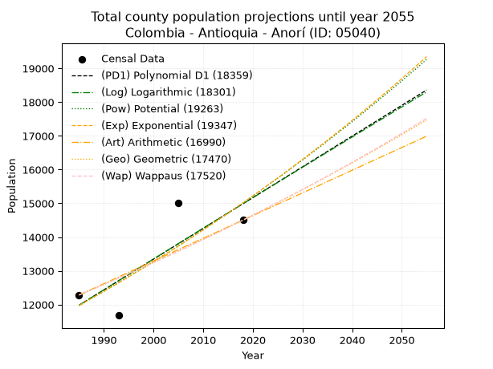
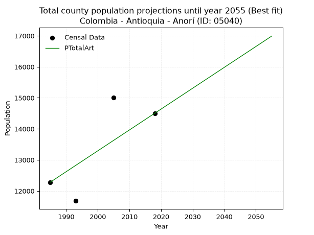
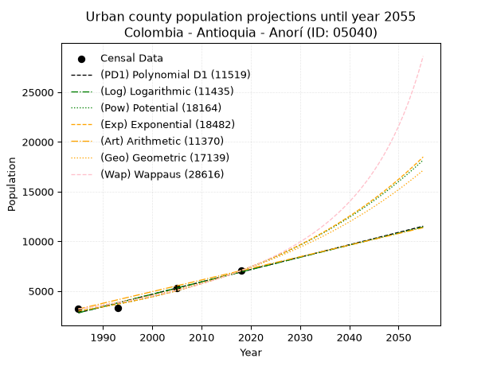
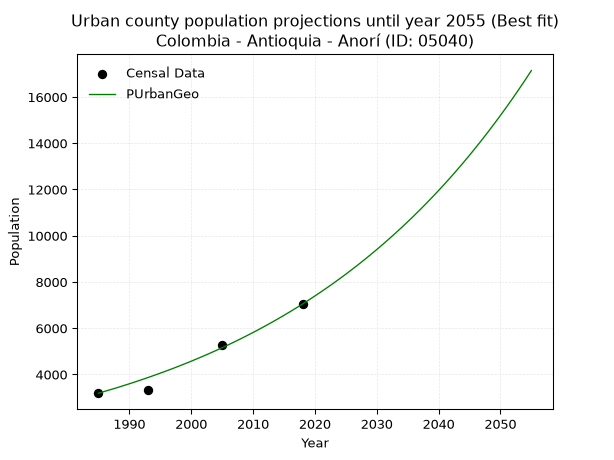
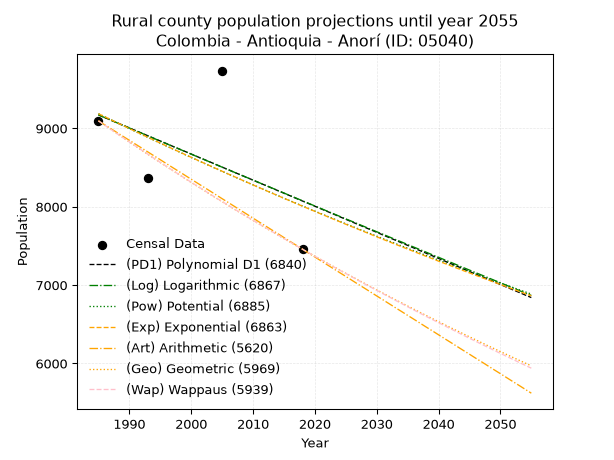
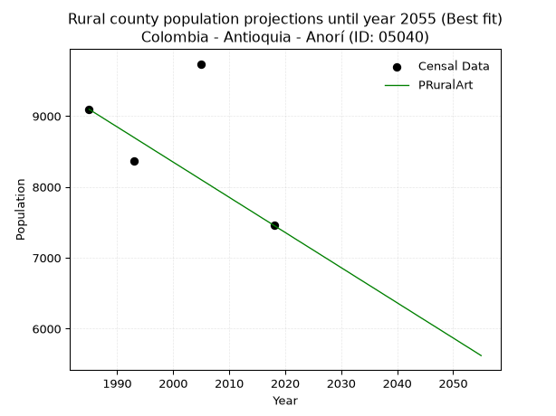

<div align="center">


</div>

# _“Population and Public Services Demand Projections (PPSD) until Year 2050 for Colombia - Antioquia - Anorí (ID: 05040)”_
Keywords: `population` `public-service` `projection` `lineal` `polynomial` `logarithmic` `potential` `exponential` `arithmetic` `geometric` `wappaus` `dane` `colombia` `south-america`

PPSD are analytical estimates used by governments and planners to anticipate future changes in population size, age distribution, and the resulting community needs for utilities, healthcare, education, and infrastructure as sizing future water treatment facilities, electrical grids, and road networks based on spatial growth.

> **General running parameters**: • app_version: _v20260806_. • Python version: _3.14.7_. • Pandas version: _3.0.5_. • NumPy version: _2.5.1_. • Creates, save and include plots into reports (create_plot): _False_. • Projection until year: _2050_. • Process polynomial degree 2 and up: _False_. • Process Wappaus: _True_. • Process Wappaus: _True_. • Set negative values to zero: _True_. • Set infinite values to zero: _True_. • Drop dataset notes: _True_. 
<div align="center">

Dynamic map: [:earth_americas:Google](http://maps.google.com/maps?q=7.074702852,-75.1483551) [:earth_americas:OSM](https://www.openstreetmap.org/#map=18/7.074702852/-75.1483551&layers=P) [:earth_americas:Bing](https://www.bing.com/maps?cp=7.074702852~-75.1483551&lvl=18) [:earth_americas:Apple](https://maps.apple.com/frame?center=7.074702852%2C-75.1483551&span=0.003%2C0.006)

</div>


<div align="center">

```geojson
{
  "type": "Feature",
  "geometry": {
    "type": "Point", 
    "coordinates": [-75.1483551, 7.074702852]
  }, 
  "properties": {
    "Name": "Colombia - Antioquia - Anorí (ID: 05040)"
  }
}
```

</div>


## 0. Census Data (4 records)

Census data are official statistics collected by a government about the people and housing in a country. They usually include counts of total population, age, sex, race, income, education, and jobs.

📅Global census file: [Population.xlsx](../data/Population.xlsx)

| Source   |   Year |   CountryID | CountryName   |   StateID | StateName   |   CountyID | CountyName   |   PTotal |   PUrban |   PRural |
|:---------|-------:|------------:|:--------------|----------:|:------------|-----------:|:-------------|---------:|---------:|---------:|
| DANE     |   1985 |          57 | Colombia      |        05 | Antioquia   |      05040 | Anorí        |    12283 |     3188 |     9095 |
| DANE     |   1993 |          57 | Colombia      |        05 | Antioquia   |      05040 | Anorí        |    11679 |     3314 |     8365 |
| DANE     |   2005 |          57 | Colombia      |        05 | Antioquia   |      05040 | Anorí        |    15016 |     5280 |     9736 |
| DANE     |   2018 |          57 | Colombia      |        05 | Antioquia   |      05040 | Anorí        |    14502 |     7045 |     7457 |

> 🔥Some records could had specific notes about the registered values or the corresponding urban or rural distribution.

📅   [RUPS](https://www.datos.gov.co/Hacienda-y-Cr-dito-P-blico/Registro-nico-de-Prestadores-de-Servicios-P-blicos/4qkq-csdn/about_data) - Local public utility companies: [RUPS.csv](../data/RUPS.xlsx)

 | SERVICIO       | ESTADO    | NOMBRE                                          | NIT         | DEPARTAMENTO_DOMICILIO   | MUNICIPIO_DOMICILIO   | DIRECCION                    |   TELEFONO | EMAIL                       | TIPO_INSCRIPCION    | REPRESENTANTE_LEGAL          | TIPO_PRESTADOR                             | CLASIFICACION                  |
|:---------------|:----------|:------------------------------------------------|:------------|:-------------------------|:----------------------|:-----------------------------|-----------:|:----------------------------|:--------------------|:-----------------------------|:-------------------------------------------|:-------------------------------|
| ACUEDUCTO      | OPERATIVA | EMPRESA DE SERVICIOS PUBLICOS ANORI S.A. E.S.P. | 901140446-1 | ANTIOQUIA                | ANORI                 | AVENIDA 31-55 CALLE LA RONDA |    8300747 | AUXILIARSUI@AMALFISA.COM.CO | Registro por la ESP | JORGE EDUARDO VASQUEZ IBARBO | SOCIEDADES (EMPRESA DE SERVICIOS PUBLICOS) | DESDE 2501 HASTA 5000 USUARIOS |
| ALCANTARILLADO | OPERATIVA | EMPRESA DE SERVICIOS PUBLICOS ANORI S.A. E.S.P. | 901140446-1 | ANTIOQUIA                | ANORI                 | AVENIDA 31-55 CALLE LA RONDA |    8300747 | AUXILIARSUI@AMALFISA.COM.CO | Registro por la ESP | JORGE EDUARDO VASQUEZ IBARBO | SOCIEDADES (EMPRESA DE SERVICIOS PUBLICOS) | DESDE 2501 HASTA 5000 USUARIOS |

## 1. Total

### 1.1. Coefficients and Parameters

* (PD1) Polynomial Deg 1: 91.12484945804913, -168902.48012846275 (lineal)
* (Log) Logarithmic: 182484.44023845487, -1373695.6925910246
* (Pow) Potential: 13.722498938174125, -41.17533660264513
* (Exp) Exponential: 0.006852826220889955, 0.014812890251644626
* (Art) Arithmetic: Year diff. 2018 - 1985 = 33, Population diff. 14502 - 12283 = 2219, Annual growth = 67.24242424242425
* (Geo) Geometric: Year diff. 2018 - 1985 = 33, Population diff. 14502 - 12283 = 2219, Annual growth % = 0.005045119681610366
* (Wap) Wappaus: i = 0.5020901567476143, Condition values only valid for < 200)

<sub>
Wappaus condition values: ['0.00', '0.50', '1.00', '1.51', '2.01', '2.51', '3.01', '3.51', '4.02', '4.52', '5.02', '5.52', '6.03', '6.53', '7.03', '7.53', '8.03', '8.54', '9.04', '9.54', '10.04', '10.54', '11.05', '11.55', '12.05', '12.55', '13.05', '13.56', '14.06', '14.56', '15.06', '15.56', '16.07', '16.57', '17.07', '17.57', '18.08', '18.58', '19.08', '19.58', '20.08', '20.59', '21.09', '21.59', '22.09', '22.59', '23.10', '23.60', '24.10', '24.60', '25.10', '25.61', '26.11', '26.61', '27.11', '27.61', '28.12', '28.62', '29.12', '29.62', '30.13', '30.63', '31.13', '31.63', '32.13', '32.64']
</sub>


### 1.2. Projected Dataset

|   Year |   CountyID |   PTotalPD1 |   PTotalLog |   PTotalPow |   PTotalExp |   PTotalArt |   PTotalGeo |   PTotalWap |
|-------:|-----------:|------------:|------------:|------------:|------------:|------------:|------------:|------------:|
|   1985 |      05040 |       11980 |       11977 |       11972 |       11975 |       12283 |       12283 |       12283 |
|   1986 |      05040 |       12071 |       12069 |       12055 |       12058 |       12350 |       12345 |       12345 |
|   1987 |      05040 |       12163 |       12161 |       12139 |       12141 |       12417 |       12407 |       12407 |
|   1988 |      05040 |       12254 |       12253 |       12223 |       12224 |       12485 |       12470 |       12469 |
|   1989 |      05040 |       12345 |       12344 |       12308 |       12308 |       12552 |       12533 |       12532 |
|   1990 |      05040 |       12436 |       12436 |       12393 |       12393 |       12619 |       12596 |       12595 |
|   1991 |      05040 |       12527 |       12528 |       12479 |       12478 |       12686 |       12660 |       12659 |
|   1992 |      05040 |       12618 |       12619 |       12565 |       12564 |       12754 |       12723 |       12722 |
|   1993 |      05040 |       12709 |       12711 |       12652 |       12650 |       12821 |       12788 |       12786 |
|   1994 |      05040 |       12800 |       12802 |       12739 |       12737 |       12888 |       12852 |       12851 |
|   1995 |      05040 |       12892 |       12894 |       12827 |       12825 |       12955 |       12917 |       12916 |
|   1996 |      05040 |       12983 |       12985 |       12916 |       12913 |       13023 |       12982 |       12981 |
|   1997 |      05040 |       13074 |       13077 |       13005 |       13002 |       13090 |       13048 |       13046 |
|   1998 |      05040 |       13165 |       13168 |       13094 |       13091 |       13157 |       13113 |       13112 |
|   1999 |      05040 |       13256 |       13259 |       13184 |       13181 |       13224 |       13180 |       13178 |
|   2000 |      05040 |       13347 |       13351 |       13275 |       13272 |       13292 |       13246 |       13244 |
|   2001 |      05040 |       13438 |       13442 |       13367 |       13363 |       13359 |       13313 |       13311 |
|   2002 |      05040 |       13529 |       13533 |       13459 |       13455 |       13426 |       13380 |       13378 |
|   2003 |      05040 |       13621 |       13624 |       13551 |       13547 |       13493 |       13448 |       13446 |
|   2004 |      05040 |       13712 |       13715 |       13644 |       13641 |       13561 |       13515 |       13513 |
|   2005 |      05040 |       13803 |       13806 |       13738 |       13734 |       13628 |       13584 |       13582 |
|   2006 |      05040 |       13894 |       13897 |       13832 |       13829 |       13695 |       13652 |       13650 |
|   2007 |      05040 |       13985 |       13988 |       13927 |       13924 |       13762 |       13721 |       13719 |
|   2008 |      05040 |       14076 |       14079 |       14023 |       14020 |       13830 |       13790 |       13788 |
|   2009 |      05040 |       14167 |       14170 |       14119 |       14116 |       13897 |       13860 |       13858 |
|   2010 |      05040 |       14258 |       14261 |       14216 |       14213 |       13964 |       13930 |       13928 |
|   2011 |      05040 |       14350 |       14352 |       14313 |       14311 |       14031 |       14000 |       13998 |
|   2012 |      05040 |       14441 |       14442 |       14411 |       14409 |       14099 |       14071 |       14069 |
|   2013 |      05040 |       14532 |       14533 |       14510 |       14508 |       14166 |       14142 |       14140 |
|   2014 |      05040 |       14623 |       14624 |       14609 |       14608 |       14233 |       14213 |       14212 |
|   2015 |      05040 |       14714 |       14714 |       14709 |       14709 |       14300 |       14285 |       14284 |
|   2016 |      05040 |       14805 |       14805 |       14809 |       14810 |       14368 |       14357 |       14356 |
|   2017 |      05040 |       14896 |       14895 |       14910 |       14912 |       14435 |       14429 |       14429 |
|   2018 |      05040 |       14987 |       14986 |       15012 |       15014 |       14502 |       14502 |       14502 |
|   2019 |      05040 |       15079 |       15076 |       15114 |       15117 |       14569 |       14575 |       14576 |
|   2020 |      05040 |       15170 |       15167 |       15218 |       15221 |       14636 |       14649 |       14649 |
|   2021 |      05040 |       15261 |       15257 |       15321 |       15326 |       14704 |       14723 |       14724 |
|   2022 |      05040 |       15352 |       15347 |       15426 |       15431 |       14771 |       14797 |       14799 |
|   2023 |      05040 |       15443 |       15437 |       15531 |       15537 |       14838 |       14872 |       14874 |
|   2024 |      05040 |       15534 |       15528 |       15636 |       15644 |       14905 |       14947 |       14949 |
|   2025 |      05040 |       15625 |       15618 |       15743 |       15752 |       14973 |       15022 |       15025 |
|   2026 |      05040 |       15716 |       15708 |       15850 |       15860 |       15040 |       15098 |       15102 |
|   2027 |      05040 |       15808 |       15798 |       15957 |       15969 |       15107 |       15174 |       15179 |
|   2028 |      05040 |       15899 |       15888 |       16066 |       16079 |       15174 |       15250 |       15256 |
|   2029 |      05040 |       15990 |       15978 |       16175 |       16190 |       15242 |       15327 |       15334 |
|   2030 |      05040 |       16081 |       16068 |       16284 |       16301 |       15309 |       15405 |       15412 |
|   2031 |      05040 |       16172 |       16158 |       16395 |       16413 |       15376 |       15482 |       15490 |
|   2032 |      05040 |       16263 |       16247 |       16506 |       16526 |       15443 |       15561 |       15569 |
|   2033 |      05040 |       16354 |       16337 |       16618 |       16640 |       15511 |       15639 |       15649 |
|   2034 |      05040 |       16445 |       16427 |       16730 |       16754 |       15578 |       15718 |       15729 |
|   2035 |      05040 |       16537 |       16517 |       16844 |       16869 |       15645 |       15797 |       15809 |
|   2036 |      05040 |       16628 |       16606 |       16958 |       16985 |       15712 |       15877 |       15890 |
|   2037 |      05040 |       16719 |       16696 |       17072 |       17102 |       15780 |       15957 |       15971 |
|   2038 |      05040 |       16810 |       16785 |       17188 |       17220 |       15847 |       16038 |       16053 |
|   2039 |      05040 |       16901 |       16875 |       17304 |       17338 |       15914 |       16119 |       16136 |
|   2040 |      05040 |       16992 |       16964 |       17420 |       17457 |       15981 |       16200 |       16218 |
|   2041 |      05040 |       17083 |       17054 |       17538 |       17577 |       16049 |       16282 |       16302 |
|   2042 |      05040 |       17174 |       17143 |       17656 |       17698 |       16116 |       16364 |       16385 |
|   2043 |      05040 |       17266 |       17233 |       17775 |       17820 |       16183 |       16446 |       16470 |
|   2044 |      05040 |       17357 |       17322 |       17895 |       17942 |       16250 |       16529 |       16554 |
|   2045 |      05040 |       17448 |       17411 |       18016 |       18066 |       16318 |       16613 |       16640 |
|   2046 |      05040 |       17539 |       17500 |       18137 |       18190 |       16385 |       16696 |       16725 |
|   2047 |      05040 |       17630 |       17590 |       18259 |       18315 |       16452 |       16781 |       16811 |
|   2048 |      05040 |       17721 |       17679 |       18382 |       18441 |       16519 |       16865 |       16898 |
|   2049 |      05040 |       17812 |       17768 |       18505 |       18568 |       16587 |       16950 |       16986 |
|   2050 |      05040 |       17903 |       17857 |       18630 |       18695 |       16654 |       17036 |       17073 |
<div align="center">

</img>

</div>


### 1.3. Best fit with absolute and relative error (%)

Relative error puts that difference into context by dividing the absolute error by the true value, creating a unitless ratio or percentage that shows the scale of the mistake.

Absolute and relative error

|   Year | Source   |   CountryID | CountryName   |   StateID | StateName   |   CountyID_x | CountyName   |   PTotal |   PUrban |   PRural |   CountyID_y |   PTotalPD1 |   PTotalLog |   PTotalPow |   PTotalExp |   PTotalArt |   PTotalGeo |   PTotalWap |   PTotalPD1AbsError |   PTotalLogAbsError |   PTotalPowAbsError |   PTotalExpAbsError |   PTotalArtAbsError |   PTotalGeoAbsError |   PTotalWapAbsError |   PTotalPD1RelError |   PTotalLogRelError |   PTotalPowRelError |   PTotalExpRelError |   PTotalArtRelError |   PTotalGeoRelError |   PTotalWapRelError |
|-------:|:---------|------------:|:--------------|----------:|:------------|-------------:|:-------------|---------:|---------:|---------:|-------------:|------------:|------------:|------------:|------------:|------------:|------------:|------------:|--------------------:|--------------------:|--------------------:|--------------------:|--------------------:|--------------------:|--------------------:|--------------------:|--------------------:|--------------------:|--------------------:|--------------------:|--------------------:|--------------------:|
|   1985 | DANE     |          57 | Colombia      |        05 | Antioquia   |        05040 | Anorí        |    12283 |     3188 |     9095 |        05040 |       11980 |       11977 |       11972 |       11975 |       12283 |       12283 |       12283 |                 303 |                 306 |                 311 |                 308 |                   0 |                   0 |                   0 |             2.46682 |             2.49125 |             2.53195 |             2.50753 |             0       |             0       |             0       |
|   1993 | DANE     |          57 | Colombia      |        05 | Antioquia   |        05040 | Anorí        |    11679 |     3314 |     8365 |        05040 |       12709 |       12711 |       12652 |       12650 |       12821 |       12788 |       12786 |                1030 |                1032 |                 973 |                 971 |                1142 |                1109 |                1107 |             8.81925 |             8.83637 |             8.33119 |             8.31407 |             9.77823 |             9.49568 |             9.47855 |
|   2005 | DANE     |          57 | Colombia      |        05 | Antioquia   |        05040 | Anorí        |    15016 |     5280 |     9736 |        05040 |       13803 |       13806 |       13738 |       13734 |       13628 |       13584 |       13582 |                1213 |                1210 |                1278 |                1282 |                1388 |                1432 |                1434 |             8.07805 |             8.05807 |             8.51092 |             8.53756 |             9.24347 |             9.53649 |             9.54981 |
|   2018 | DANE     |          57 | Colombia      |        05 | Antioquia   |        05040 | Anorí        |    14502 |     7045 |     7457 |        05040 |       14987 |       14986 |       15012 |       15014 |       14502 |       14502 |       14502 |                 485 |                 484 |                 510 |                 512 |                   0 |                   0 |                   0 |             3.34437 |             3.33747 |             3.51676 |             3.53055 |             0       |             0       |             0       |

Relative error mean

| Method    |   RelError | Best   |
|:----------|-----------:|:-------|
| PTotalPD1 |    5.67712 |        |
| PTotalLog |    5.68079 |        |
| PTotalPow |    5.72271 |        |
| PTotalExp |    5.72243 |        |
| PTotalArt |    4.75543 | True   |
| PTotalGeo |    4.75804 |        |
| PTotalWap |    4.75709 |        |

💙Best method: _**PTotalArt**_
<div align="center">

</img>

</div>


### 1.4. Fresh water supply demand in liters per capita per day (lpcd)

The fresh water supply demand typically ranges from 100 to 300 liters per capita per day (lpcd) for standard domestic and municipal planning, though absolute survival minimums set by the World Health Organization are as low as 7.5 to 20 liters per day, and total consumption in high-income nations can exceed 400 liters.

> `CZ`: Level in meters above the sea level (masl)<br> `WS`: Fresh water supply demand in liters per capita per day (lpcd or l/h/d)<br> `WSAll`: Zonal fresh water supply demand in liters per second (l/s)<br> `A`: Zonal area in square meters<br> `DP`: Population density (people/hectare or p/ha)

Reference values (RAS Colombia)

|    CZ |   WS |
|------:|-----:|
|  1000 |  120 |
|  2000 |  130 |
| 99999 |  140 |

County shapefile geometry properties and water supply values

|   CountyID |      ATotal |   CZTotal |   WSTotal |
|-----------:|------------:|----------:|----------:|
|      05040 | 1.41296e+09 |   926.209 |       120 |

Projected values for best method: PTotalArt

|   CountyID |   Year |   PTotalArt |   DPTotal |   WSTotal |   WSTotalAll |
|-----------:|-------:|------------:|----------:|----------:|-------------:|
|      05040 |   1985 |       12283 |      0.09 |       120 |      17.0597 |
|      05040 |   1986 |       12350 |      0.09 |       120 |      17.1528 |
|      05040 |   1987 |       12417 |      0.09 |       120 |      17.2458 |
|      05040 |   1988 |       12485 |      0.09 |       120 |      17.3403 |
|      05040 |   1989 |       12552 |      0.09 |       120 |      17.4333 |
|      05040 |   1990 |       12619 |      0.09 |       120 |      17.5264 |
|      05040 |   1991 |       12686 |      0.09 |       120 |      17.6194 |
|      05040 |   1992 |       12754 |      0.09 |       120 |      17.7139 |
|      05040 |   1993 |       12821 |      0.09 |       120 |      17.8069 |
|      05040 |   1994 |       12888 |      0.09 |       120 |      17.9    |
|      05040 |   1995 |       12955 |      0.09 |       120 |      17.9931 |
|      05040 |   1996 |       13023 |      0.09 |       120 |      18.0875 |
|      05040 |   1997 |       13090 |      0.09 |       120 |      18.1806 |
|      05040 |   1998 |       13157 |      0.09 |       120 |      18.2736 |
|      05040 |   1999 |       13224 |      0.09 |       120 |      18.3667 |
|      05040 |   2000 |       13292 |      0.09 |       120 |      18.4611 |
|      05040 |   2001 |       13359 |      0.09 |       120 |      18.5542 |
|      05040 |   2002 |       13426 |      0.1  |       120 |      18.6472 |
|      05040 |   2003 |       13493 |      0.1  |       120 |      18.7403 |
|      05040 |   2004 |       13561 |      0.1  |       120 |      18.8347 |
|      05040 |   2005 |       13628 |      0.1  |       120 |      18.9278 |
|      05040 |   2006 |       13695 |      0.1  |       120 |      19.0208 |
|      05040 |   2007 |       13762 |      0.1  |       120 |      19.1139 |
|      05040 |   2008 |       13830 |      0.1  |       120 |      19.2083 |
|      05040 |   2009 |       13897 |      0.1  |       120 |      19.3014 |
|      05040 |   2010 |       13964 |      0.1  |       120 |      19.3944 |
|      05040 |   2011 |       14031 |      0.1  |       120 |      19.4875 |
|      05040 |   2012 |       14099 |      0.1  |       120 |      19.5819 |
|      05040 |   2013 |       14166 |      0.1  |       120 |      19.675  |
|      05040 |   2014 |       14233 |      0.1  |       120 |      19.7681 |
|      05040 |   2015 |       14300 |      0.1  |       120 |      19.8611 |
|      05040 |   2016 |       14368 |      0.1  |       120 |      19.9556 |
|      05040 |   2017 |       14435 |      0.1  |       120 |      20.0486 |
|      05040 |   2018 |       14502 |      0.1  |       120 |      20.1417 |
|      05040 |   2019 |       14569 |      0.1  |       120 |      20.2347 |
|      05040 |   2020 |       14636 |      0.1  |       120 |      20.3278 |
|      05040 |   2021 |       14704 |      0.1  |       120 |      20.4222 |
|      05040 |   2022 |       14771 |      0.1  |       120 |      20.5153 |
|      05040 |   2023 |       14838 |      0.11 |       120 |      20.6083 |
|      05040 |   2024 |       14905 |      0.11 |       120 |      20.7014 |
|      05040 |   2025 |       14973 |      0.11 |       120 |      20.7958 |
|      05040 |   2026 |       15040 |      0.11 |       120 |      20.8889 |
|      05040 |   2027 |       15107 |      0.11 |       120 |      20.9819 |
|      05040 |   2028 |       15174 |      0.11 |       120 |      21.075  |
|      05040 |   2029 |       15242 |      0.11 |       120 |      21.1694 |
|      05040 |   2030 |       15309 |      0.11 |       120 |      21.2625 |
|      05040 |   2031 |       15376 |      0.11 |       120 |      21.3556 |
|      05040 |   2032 |       15443 |      0.11 |       120 |      21.4486 |
|      05040 |   2033 |       15511 |      0.11 |       120 |      21.5431 |
|      05040 |   2034 |       15578 |      0.11 |       120 |      21.6361 |
|      05040 |   2035 |       15645 |      0.11 |       120 |      21.7292 |
|      05040 |   2036 |       15712 |      0.11 |       120 |      21.8222 |
|      05040 |   2037 |       15780 |      0.11 |       120 |      21.9167 |
|      05040 |   2038 |       15847 |      0.11 |       120 |      22.0097 |
|      05040 |   2039 |       15914 |      0.11 |       120 |      22.1028 |
|      05040 |   2040 |       15981 |      0.11 |       120 |      22.1958 |
|      05040 |   2041 |       16049 |      0.11 |       120 |      22.2903 |
|      05040 |   2042 |       16116 |      0.11 |       120 |      22.3833 |
|      05040 |   2043 |       16183 |      0.11 |       120 |      22.4764 |
|      05040 |   2044 |       16250 |      0.12 |       120 |      22.5694 |
|      05040 |   2045 |       16318 |      0.12 |       120 |      22.6639 |
|      05040 |   2046 |       16385 |      0.12 |       120 |      22.7569 |
|      05040 |   2047 |       16452 |      0.12 |       120 |      22.85   |
|      05040 |   2048 |       16519 |      0.12 |       120 |      22.9431 |
|      05040 |   2049 |       16587 |      0.12 |       120 |      23.0375 |
|      05040 |   2050 |       16654 |      0.12 |       120 |      23.1306 |

## 2. Urban

### 2.1. Coefficients and Parameters

* (PD1) Polynomial Deg 1: 124.4243275792842, -244173.01124046324 (lineal)
* (Log) Logarithmic: 248967.58863152226, -1887697.8862892454
* (Pow) Potential: 52.02962896393703, -168.10515455527337
* (Exp) Exponential: 0.025997448056526515, 1.1605860018298852e-19
* (Art) Arithmetic: Year diff. 2018 - 1985 = 33, Population diff. 7045 - 3188 = 3857, Annual growth = 116.87878787878788
* (Geo) Geometric: Year diff. 2018 - 1985 = 33, Population diff. 7045 - 3188 = 3857, Annual growth % = 0.024319010353516246
* (Wap) Wappaus: i = 2.2843503934093206, Condition values only valid for < 200)

<sub>
Wappaus condition values: ['0.00', '2.28', '4.57', '6.85', '9.14', '11.42', '13.71', '15.99', '18.27', '20.56', '22.84', '25.13', '27.41', '29.70', '31.98', '34.27', '36.55', '38.83', '41.12', '43.40', '45.69', '47.97', '50.26', '52.54', '54.82', '57.11', '59.39', '61.68', '63.96', '66.25', '68.53', '70.81', '73.10', '75.38', '77.67', '79.95', '82.24', '84.52', '86.81', '89.09', '91.37', '93.66', '95.94', '98.23', '100.51', '102.80', '105.08', '107.36', '109.65', '111.93', '114.22', '116.50', '118.79', '121.07', '123.35', '125.64', '127.92', '130.21', '132.49', '134.78', '137.06', '139.35', '141.63', '143.91', '146.20', '148.48']
</sub>


### 2.2. Projected Dataset

|   Year |   CountyID |   PUrbanPD1 |   PUrbanLog |   PUrbanPow |   PUrbanExp |   PUrbanArt |   PUrbanGeo |   PUrbanWap |
|-------:|-----------:|------------:|------------:|------------:|------------:|------------:|------------:|------------:|
|   1985 |      05040 |        2809 |        2806 |        2993 |        2995 |        3188 |        3188 |        3188 |
|   1986 |      05040 |        2934 |        2932 |        3072 |        3074 |        3305 |        3266 |        3262 |
|   1987 |      05040 |        3058 |        3057 |        3154 |        3155 |        3422 |        3345 |        3337 |
|   1988 |      05040 |        3183 |        3182 |        3238 |        3238 |        3539 |        3426 |        3414 |
|   1989 |      05040 |        3307 |        3307 |        3323 |        3323 |        3656 |        3510 |        3493 |
|   1990 |      05040 |        3431 |        3433 |        3412 |        3411 |        3772 |        3595 |        3574 |
|   1991 |      05040 |        3556 |        3558 |        3502 |        3501 |        3889 |        3682 |        3657 |
|   1992 |      05040 |        3680 |        3683 |        3595 |        3593 |        4006 |        3772 |        3742 |
|   1993 |      05040 |        3805 |        3808 |        3690 |        3688 |        4123 |        3864 |        3829 |
|   1994 |      05040 |        3929 |        3932 |        3787 |        3785 |        4240 |        3958 |        3919 |
|   1995 |      05040 |        4054 |        4057 |        3887 |        3884 |        4357 |        4054 |        4010 |
|   1996 |      05040 |        4178 |        4182 |        3990 |        3987 |        4474 |        4152 |        4104 |
|   1997 |      05040 |        4302 |        4307 |        4095 |        4092 |        4591 |        4253 |        4201 |
|   1998 |      05040 |        4427 |        4431 |        4203 |        4199 |        4707 |        4357 |        4300 |
|   1999 |      05040 |        4551 |        4556 |        4314 |        4310 |        4824 |        4463 |        4402 |
|   2000 |      05040 |        4676 |        4680 |        4428 |        4424 |        4941 |        4571 |        4506 |
|   2001 |      05040 |        4800 |        4805 |        4545 |        4540 |        5058 |        4683 |        4614 |
|   2002 |      05040 |        4924 |        4929 |        4664 |        4660 |        5175 |        4796 |        4724 |
|   2003 |      05040 |        5049 |        5054 |        4787 |        4782 |        5292 |        4913 |        4838 |
|   2004 |      05040 |        5173 |        5178 |        4913 |        4908 |        5409 |        5033 |        4955 |
|   2005 |      05040 |        5298 |        5302 |        5042 |        5038 |        5526 |        5155 |        5076 |
|   2006 |      05040 |        5422 |        5426 |        5175 |        5170 |        5642 |        5280 |        5200 |
|   2007 |      05040 |        5547 |        5550 |        5311 |        5306 |        5759 |        5409 |        5328 |
|   2008 |      05040 |        5671 |        5674 |        5450 |        5446 |        5876 |        5540 |        5460 |
|   2009 |      05040 |        5795 |        5798 |        5593 |        5590 |        5993 |        5675 |        5596 |
|   2010 |      05040 |        5920 |        5922 |        5740 |        5737 |        6110 |        5813 |        5736 |
|   2011 |      05040 |        6044 |        6046 |        5890 |        5888 |        6227 |        5954 |        5881 |
|   2012 |      05040 |        6169 |        6170 |        6045 |        6043 |        6344 |        6099 |        6031 |
|   2013 |      05040 |        6293 |        6294 |        6203 |        6202 |        6461 |        6247 |        6186 |
|   2014 |      05040 |        6418 |        6417 |        6366 |        6366 |        6577 |        6399 |        6346 |
|   2015 |      05040 |        6542 |        6541 |        6532 |        6533 |        6694 |        6555 |        6512 |
|   2016 |      05040 |        6666 |        6664 |        6703 |        6705 |        6811 |        6714 |        6683 |
|   2017 |      05040 |        6791 |        6788 |        6878 |        6882 |        6928 |        6878 |        6861 |
|   2018 |      05040 |        6915 |        6911 |        7058 |        7063 |        7045 |        7045 |        7045 |
|   2019 |      05040 |        7040 |        7034 |        7242 |        7249 |        7162 |        7216 |        7236 |
|   2020 |      05040 |        7164 |        7158 |        7431 |        7440 |        7279 |        7392 |        7434 |
|   2021 |      05040 |        7289 |        7281 |        7625 |        7636 |        7396 |        7572 |        7640 |
|   2022 |      05040 |        7413 |        7404 |        7824 |        7837 |        7513 |        7756 |        7855 |
|   2023 |      05040 |        7537 |        7527 |        8028 |        8044 |        7629 |        7944 |        8078 |
|   2024 |      05040 |        7662 |        7650 |        8237 |        8256 |        7746 |        8138 |        8310 |
|   2025 |      05040 |        7786 |        7773 |        8451 |        8473 |        7863 |        8335 |        8551 |
|   2026 |      05040 |        7911 |        7896 |        8671 |        8696 |        7980 |        8538 |        8804 |
|   2027 |      05040 |        8035 |        8019 |        8896 |        8925 |        8097 |        8746 |        9067 |
|   2028 |      05040 |        8160 |        8142 |        9128 |        9160 |        8214 |        8958 |        9342 |
|   2029 |      05040 |        8284 |        8265 |        9365 |        9402 |        8331 |        9176 |        9630 |
|   2030 |      05040 |        8408 |        8387 |        9608 |        9649 |        8448 |        9399 |        9931 |
|   2031 |      05040 |        8533 |        8510 |        9857 |        9903 |        8564 |        9628 |       10246 |
|   2032 |      05040 |        8657 |        8632 |       10113 |       10164 |        8681 |        9862 |       10578 |
|   2033 |      05040 |        8782 |        8755 |       10375 |       10432 |        8798 |       10102 |       10926 |
|   2034 |      05040 |        8906 |        8877 |       10644 |       10707 |        8915 |       10348 |       11292 |
|   2035 |      05040 |        9030 |        9000 |       10920 |       10989 |        9032 |       10599 |       11678 |
|   2036 |      05040 |        9155 |        9122 |       11203 |       11278 |        9149 |       10857 |       12084 |
|   2037 |      05040 |        9279 |        9244 |       11493 |       11575 |        9266 |       11121 |       12514 |
|   2038 |      05040 |        9404 |        9366 |       11790 |       11880 |        9383 |       11392 |       12968 |
|   2039 |      05040 |        9528 |        9489 |       12095 |       12193 |        9499 |       11669 |       13450 |
|   2040 |      05040 |        9653 |        9611 |       12407 |       12514 |        9616 |       11952 |       13961 |
|   2041 |      05040 |        9777 |        9733 |       12728 |       12844 |        9733 |       12243 |       14504 |
|   2042 |      05040 |        9901 |        9855 |       13056 |       13182 |        9850 |       12541 |       15083 |
|   2043 |      05040 |       10026 |        9977 |       13393 |       13529 |        9967 |       12846 |       15702 |
|   2044 |      05040 |       10150 |       10098 |       13738 |       13885 |       10084 |       13158 |       16363 |
|   2045 |      05040 |       10275 |       10220 |       14093 |       14251 |       10201 |       13478 |       17073 |
|   2046 |      05040 |       10399 |       10342 |       14456 |       14626 |       10318 |       13806 |       17836 |
|   2047 |      05040 |       10524 |       10464 |       14828 |       15012 |       10434 |       14142 |       18659 |
|   2048 |      05040 |       10648 |       10585 |       15209 |       15407 |       10551 |       14486 |       19549 |
|   2049 |      05040 |       10772 |       10707 |       15601 |       15813 |       10668 |       14838 |       20514 |
|   2050 |      05040 |       10897 |       10828 |       16002 |       16229 |       10785 |       15199 |       21565 |
<div align="center">

</img>

</div>


### 2.3. Best fit with absolute and relative error (%)

Relative error puts that difference into context by dividing the absolute error by the true value, creating a unitless ratio or percentage that shows the scale of the mistake.

Absolute and relative error

|   Year | Source   |   CountryID | CountryName   |   StateID | StateName   |   CountyID_x | CountyName   |   PTotal |   PUrban |   PRural |   CountyID_y |   PUrbanPD1 |   PUrbanLog |   PUrbanPow |   PUrbanExp |   PUrbanArt |   PUrbanGeo |   PUrbanWap |   PUrbanPD1AbsError |   PUrbanLogAbsError |   PUrbanPowAbsError |   PUrbanExpAbsError |   PUrbanArtAbsError |   PUrbanGeoAbsError |   PUrbanWapAbsError |   PUrbanPD1RelError |   PUrbanLogRelError |   PUrbanPowRelError |   PUrbanExpRelError |   PUrbanArtRelError |   PUrbanGeoRelError |   PUrbanWapRelError |
|-------:|:---------|------------:|:--------------|----------:|:------------|-------------:|:-------------|---------:|---------:|---------:|-------------:|------------:|------------:|------------:|------------:|------------:|------------:|------------:|--------------------:|--------------------:|--------------------:|--------------------:|--------------------:|--------------------:|--------------------:|--------------------:|--------------------:|--------------------:|--------------------:|--------------------:|--------------------:|--------------------:|
|   1985 | DANE     |          57 | Colombia      |        05 | Antioquia   |        05040 | Anorí        |    12283 |     3188 |     9095 |        05040 |        2809 |        2806 |        2993 |        2995 |        3188 |        3188 |        3188 |                 379 |                 382 |                 195 |                 193 |                   0 |                   0 |                   0 |           11.8883   |           11.9824   |            6.11669  |             6.05395 |             0       |             0       |             0       |
|   1993 | DANE     |          57 | Colombia      |        05 | Antioquia   |        05040 | Anorí        |    11679 |     3314 |     8365 |        05040 |        3805 |        3808 |        3690 |        3688 |        4123 |        3864 |        3829 |                 491 |                 494 |                 376 |                 374 |                 809 |                 550 |                 515 |           14.8159   |           14.9065   |           11.3458   |            11.2855  |            24.4116  |            16.5963  |            15.5401  |
|   2005 | DANE     |          57 | Colombia      |        05 | Antioquia   |        05040 | Anorí        |    15016 |     5280 |     9736 |        05040 |        5298 |        5302 |        5042 |        5038 |        5526 |        5155 |        5076 |                  18 |                  22 |                 238 |                 242 |                 246 |                 125 |                 204 |            0.340909 |            0.416667 |            4.50758  |             4.58333 |             4.65909 |             2.36742 |             3.86364 |
|   2018 | DANE     |          57 | Colombia      |        05 | Antioquia   |        05040 | Anorí        |    14502 |     7045 |     7457 |        05040 |        6915 |        6911 |        7058 |        7063 |        7045 |        7045 |        7045 |                 130 |                 134 |                  13 |                  18 |                   0 |                   0 |                   0 |            1.84528  |            1.90206  |            0.184528 |             0.2555  |             0       |             0       |             0       |

Relative error mean

| Method    |   RelError | Best   |
|:----------|-----------:|:-------|
| PUrbanPD1 |    7.22261 |        |
| PUrbanLog |    7.3019  |        |
| PUrbanPow |    5.53865 |        |
| PUrbanExp |    5.54456 |        |
| PUrbanArt |    7.26767 |        |
| PUrbanGeo |    4.74092 | True   |
| PUrbanWap |    4.85094 |        |

💙Best method: _**PUrbanGeo**_
<div align="center">

</img>

</div>


### 2.4. Fresh water supply demand in liters per capita per day (lpcd)

The fresh water supply demand typically ranges from 100 to 300 liters per capita per day (lpcd) for standard domestic and municipal planning, though absolute survival minimums set by the World Health Organization are as low as 7.5 to 20 liters per day, and total consumption in high-income nations can exceed 400 liters.

> `CZ`: Level in meters above the sea level (masl)<br> `WS`: Fresh water supply demand in liters per capita per day (lpcd or l/h/d)<br> `WSAll`: Zonal fresh water supply demand in liters per second (l/s)<br> `A`: Zonal area in square meters<br> `DP`: Population density (people/hectare or p/ha)

Reference values (RAS Colombia)

|    CZ |   WS |
|------:|-----:|
|  1000 |  120 |
|  2000 |  130 |
| 99999 |  140 |

County shapefile geometry properties and water supply values

|   CountyID |      AUrban |   CZUrban |   WSUrban |
|-----------:|------------:|----------:|----------:|
|      05040 | 1.29771e+06 |   1570.95 |       130 |

Projected values for best method: PUrbanGeo

|   CountyID |   Year |   PUrbanGeo |   DPUrban |   WSUrban |   WSUrbanAll |
|-----------:|-------:|------------:|----------:|----------:|-------------:|
|      05040 |   1985 |        3188 |     24.57 |       130 |      4.79676 |
|      05040 |   1986 |        3266 |     25.17 |       130 |      4.91412 |
|      05040 |   1987 |        3345 |     25.78 |       130 |      5.03299 |
|      05040 |   1988 |        3426 |     26.4  |       130 |      5.15486 |
|      05040 |   1989 |        3510 |     27.05 |       130 |      5.28125 |
|      05040 |   1990 |        3595 |     27.7  |       130 |      5.40914 |
|      05040 |   1991 |        3682 |     28.37 |       130 |      5.54005 |
|      05040 |   1992 |        3772 |     29.07 |       130 |      5.67546 |
|      05040 |   1993 |        3864 |     29.78 |       130 |      5.81389 |
|      05040 |   1994 |        3958 |     30.5  |       130 |      5.95532 |
|      05040 |   1995 |        4054 |     31.24 |       130 |      6.09977 |
|      05040 |   1996 |        4152 |     31.99 |       130 |      6.24722 |
|      05040 |   1997 |        4253 |     32.77 |       130 |      6.39919 |
|      05040 |   1998 |        4357 |     33.57 |       130 |      6.55567 |
|      05040 |   1999 |        4463 |     34.39 |       130 |      6.71516 |
|      05040 |   2000 |        4571 |     35.22 |       130 |      6.87766 |
|      05040 |   2001 |        4683 |     36.09 |       130 |      7.04618 |
|      05040 |   2002 |        4796 |     36.96 |       130 |      7.2162  |
|      05040 |   2003 |        4913 |     37.86 |       130 |      7.39225 |
|      05040 |   2004 |        5033 |     38.78 |       130 |      7.5728  |
|      05040 |   2005 |        5155 |     39.72 |       130 |      7.75637 |
|      05040 |   2006 |        5280 |     40.69 |       130 |      7.94444 |
|      05040 |   2007 |        5409 |     41.68 |       130 |      8.13854 |
|      05040 |   2008 |        5540 |     42.69 |       130 |      8.33565 |
|      05040 |   2009 |        5675 |     43.73 |       130 |      8.53877 |
|      05040 |   2010 |        5813 |     44.79 |       130 |      8.74641 |
|      05040 |   2011 |        5954 |     45.88 |       130 |      8.95856 |
|      05040 |   2012 |        6099 |     47    |       130 |      9.17674 |
|      05040 |   2013 |        6247 |     48.14 |       130 |      9.39942 |
|      05040 |   2014 |        6399 |     49.31 |       130 |      9.62813 |
|      05040 |   2015 |        6555 |     50.51 |       130 |      9.86285 |
|      05040 |   2016 |        6714 |     51.74 |       130 |     10.1021  |
|      05040 |   2017 |        6878 |     53    |       130 |     10.3488  |
|      05040 |   2018 |        7045 |     54.29 |       130 |     10.6001  |
|      05040 |   2019 |        7216 |     55.61 |       130 |     10.8574  |
|      05040 |   2020 |        7392 |     56.96 |       130 |     11.1222  |
|      05040 |   2021 |        7572 |     58.35 |       130 |     11.3931  |
|      05040 |   2022 |        7756 |     59.77 |       130 |     11.6699  |
|      05040 |   2023 |        7944 |     61.22 |       130 |     11.9528  |
|      05040 |   2024 |        8138 |     62.71 |       130 |     12.2447  |
|      05040 |   2025 |        8335 |     64.23 |       130 |     12.5411  |
|      05040 |   2026 |        8538 |     65.79 |       130 |     12.8465  |
|      05040 |   2027 |        8746 |     67.4  |       130 |     13.1595  |
|      05040 |   2028 |        8958 |     69.03 |       130 |     13.4785  |
|      05040 |   2029 |        9176 |     70.71 |       130 |     13.8065  |
|      05040 |   2030 |        9399 |     72.43 |       130 |     14.142   |
|      05040 |   2031 |        9628 |     74.19 |       130 |     14.4866  |
|      05040 |   2032 |        9862 |     76    |       130 |     14.8387  |
|      05040 |   2033 |       10102 |     77.84 |       130 |     15.1998  |
|      05040 |   2034 |       10348 |     79.74 |       130 |     15.5699  |
|      05040 |   2035 |       10599 |     81.67 |       130 |     15.9476  |
|      05040 |   2036 |       10857 |     83.66 |       130 |     16.3358  |
|      05040 |   2037 |       11121 |     85.7  |       130 |     16.733   |
|      05040 |   2038 |       11392 |     87.79 |       130 |     17.1407  |
|      05040 |   2039 |       11669 |     89.92 |       130 |     17.5575  |
|      05040 |   2040 |       11952 |     92.1  |       130 |     17.9833  |
|      05040 |   2041 |       12243 |     94.34 |       130 |     18.4212  |
|      05040 |   2042 |       12541 |     96.64 |       130 |     18.8696  |
|      05040 |   2043 |       12846 |     98.99 |       130 |     19.3285  |
|      05040 |   2044 |       13158 |    101.39 |       130 |     19.7979  |
|      05040 |   2045 |       13478 |    103.86 |       130 |     20.2794  |
|      05040 |   2046 |       13806 |    106.39 |       130 |     20.7729  |
|      05040 |   2047 |       14142 |    108.98 |       130 |     21.2785  |
|      05040 |   2048 |       14486 |    111.63 |       130 |     21.7961  |
|      05040 |   2049 |       14838 |    114.34 |       130 |     22.3257  |
|      05040 |   2050 |       15199 |    117.12 |       130 |     22.8689  |

## 3. Rural

### 3.1. Coefficients and Parameters

* (PD1) Polynomial Deg 1: -33.29947812123514, 75270.5311120006 (lineal)
* (Log) Logarithmic: -66483.14839306714, 514002.1936982188
* (Pow) Potential: -8.319529678394447, 31.398951737170826
* (Exp) Exponential: -0.004166276227620495, 35874614.12698471
* (Art) Arithmetic: Year diff. 2018 - 1985 = 33, Population diff. 7457 - 9095 = -1638, Annual growth = -49.63636363636363
* (Geo) Geometric: Year diff. 2018 - 1985 = 33, Population diff. 7457 - 9095 = -1638, Annual growth % = -0.005999254098049245
* (Wap) Wappaus: i = -0.5997627312272068, Condition values only valid for < 200)

<sub>
Wappaus condition values: ['-0.00', '-0.60', '-1.20', '-1.80', '-2.40', '-3.00', '-3.60', '-4.20', '-4.80', '-5.40', '-6.00', '-6.60', '-7.20', '-7.80', '-8.40', '-9.00', '-9.60', '-10.20', '-10.80', '-11.40', '-12.00', '-12.60', '-13.19', '-13.79', '-14.39', '-14.99', '-15.59', '-16.19', '-16.79', '-17.39', '-17.99', '-18.59', '-19.19', '-19.79', '-20.39', '-20.99', '-21.59', '-22.19', '-22.79', '-23.39', '-23.99', '-24.59', '-25.19', '-25.79', '-26.39', '-26.99', '-27.59', '-28.19', '-28.79', '-29.39', '-29.99', '-30.59', '-31.19', '-31.79', '-32.39', '-32.99', '-33.59', '-34.19', '-34.79', '-35.39', '-35.99', '-36.59', '-37.19', '-37.79', '-38.38', '-38.98']
</sub>


### 3.2. Projected Dataset

|   Year |   CountyID |   PRuralPD1 |   PRuralLog |   PRuralPow |   PRuralExp |   PRuralArt |   PRuralGeo |   PRuralWap |
|-------:|-----------:|------------:|------------:|------------:|------------:|------------:|------------:|------------:|
|   1985 |      05040 |        9171 |        9171 |        9186 |        9186 |        9095 |        9095 |        9095 |
|   1986 |      05040 |        9138 |        9137 |        9148 |        9148 |        9045 |        9040 |        9041 |
|   1987 |      05040 |        9104 |        9104 |        9110 |        9110 |        8996 |        8986 |        8987 |
|   1988 |      05040 |        9071 |        9070 |        9071 |        9072 |        8946 |        8932 |        8933 |
|   1989 |      05040 |        9038 |        9037 |        9034 |        9035 |        8896 |        8879 |        8879 |
|   1990 |      05040 |        9005 |        9004 |        8996 |        8997 |        8847 |        8825 |        8826 |
|   1991 |      05040 |        8971 |        8970 |        8958 |        8960 |        8797 |        8772 |        8773 |
|   1992 |      05040 |        8938 |        8937 |        8921 |        8922 |        8748 |        8720 |        8721 |
|   1993 |      05040 |        8905 |        8903 |        8884 |        8885 |        8698 |        8668 |        8669 |
|   1994 |      05040 |        8871 |        8870 |        8847 |        8848 |        8648 |        8616 |        8617 |
|   1995 |      05040 |        8838 |        8837 |        8810 |        8812 |        8599 |        8564 |        8565 |
|   1996 |      05040 |        8805 |        8803 |        8773 |        8775 |        8549 |        8512 |        8514 |
|   1997 |      05040 |        8771 |        8770 |        8737 |        8738 |        8499 |        8461 |        8463 |
|   1998 |      05040 |        8738 |        8737 |        8701 |        8702 |        8450 |        8411 |        8412 |
|   1999 |      05040 |        8705 |        8704 |        8664 |        8666 |        8400 |        8360 |        8362 |
|   2000 |      05040 |        8672 |        8670 |        8628 |        8630 |        8350 |        8310 |        8312 |
|   2001 |      05040 |        8638 |        8637 |        8593 |        8594 |        8301 |        8260 |        8262 |
|   2002 |      05040 |        8605 |        8604 |        8557 |        8558 |        8251 |        8211 |        8213 |
|   2003 |      05040 |        8572 |        8571 |        8522 |        8523 |        8202 |        8161 |        8163 |
|   2004 |      05040 |        8538 |        8537 |        8486 |        8487 |        8152 |        8112 |        8114 |
|   2005 |      05040 |        8505 |        8504 |        8451 |        8452 |        8102 |        8064 |        8066 |
|   2006 |      05040 |        8472 |        8471 |        8416 |        8417 |        8053 |        8015 |        8017 |
|   2007 |      05040 |        8438 |        8438 |        8381 |        8382 |        8003 |        7967 |        7969 |
|   2008 |      05040 |        8405 |        8405 |        8347 |        8347 |        7953 |        7919 |        7921 |
|   2009 |      05040 |        8372 |        8372 |        8312 |        8312 |        7904 |        7872 |        7874 |
|   2010 |      05040 |        8339 |        8339 |        8278 |        8278 |        7854 |        7825 |        7826 |
|   2011 |      05040 |        8305 |        8306 |        8244 |        8243 |        7804 |        7778 |        7779 |
|   2012 |      05040 |        8272 |        8273 |        8210 |        8209 |        7755 |        7731 |        7733 |
|   2013 |      05040 |        8239 |        8240 |        8176 |        8175 |        7705 |        7685 |        7686 |
|   2014 |      05040 |        8205 |        8207 |        8142 |        8141 |        7656 |        7639 |        7640 |
|   2015 |      05040 |        8172 |        8174 |        8108 |        8107 |        7606 |        7593 |        7594 |
|   2016 |      05040 |        8139 |        8141 |        8075 |        8073 |        7556 |        7547 |        7548 |
|   2017 |      05040 |        8105 |        8108 |        8042 |        8040 |        7507 |        7502 |        7502 |
|   2018 |      05040 |        8072 |        8075 |        8009 |        8006 |        7457 |        7457 |        7457 |
|   2019 |      05040 |        8039 |        8042 |        7976 |        7973 |        7407 |        7412 |        7412 |
|   2020 |      05040 |        8006 |        8009 |        7943 |        7940 |        7358 |        7368 |        7367 |
|   2021 |      05040 |        7972 |        7976 |        7910 |        7907 |        7308 |        7324 |        7323 |
|   2022 |      05040 |        7939 |        7943 |        7878 |        7874 |        7258 |        7280 |        7278 |
|   2023 |      05040 |        7906 |        7910 |        7846 |        7841 |        7209 |        7236 |        7234 |
|   2024 |      05040 |        7872 |        7877 |        7813 |        7809 |        7159 |        7193 |        7190 |
|   2025 |      05040 |        7839 |        7844 |        7781 |        7776 |        7110 |        7149 |        7147 |
|   2026 |      05040 |        7806 |        7812 |        7749 |        7744 |        7060 |        7107 |        7103 |
|   2027 |      05040 |        7772 |        7779 |        7718 |        7712 |        7010 |        7064 |        7060 |
|   2028 |      05040 |        7739 |        7746 |        7686 |        7680 |        6961 |        7022 |        7017 |
|   2029 |      05040 |        7706 |        7713 |        7655 |        7648 |        6911 |        6979 |        6975 |
|   2030 |      05040 |        7673 |        7680 |        7623 |        7616 |        6861 |        6938 |        6932 |
|   2031 |      05040 |        7639 |        7648 |        7592 |        7584 |        6812 |        6896 |        6890 |
|   2032 |      05040 |        7606 |        7615 |        7561 |        7553 |        6762 |        6855 |        6848 |
|   2033 |      05040 |        7573 |        7582 |        7530 |        7521 |        6712 |        6813 |        6806 |
|   2034 |      05040 |        7539 |        7550 |        7499 |        7490 |        6663 |        6773 |        6765 |
|   2035 |      05040 |        7506 |        7517 |        7469 |        7459 |        6613 |        6732 |        6723 |
|   2036 |      05040 |        7473 |        7484 |        7438 |        7428 |        6564 |        6692 |        6682 |
|   2037 |      05040 |        7439 |        7452 |        7408 |        7397 |        6514 |        6651 |        6641 |
|   2038 |      05040 |        7406 |        7419 |        7378 |        7366 |        6464 |        6611 |        6600 |
|   2039 |      05040 |        7373 |        7386 |        7348 |        7336 |        6415 |        6572 |        6560 |
|   2040 |      05040 |        7340 |        7354 |        7318 |        7305 |        6365 |        6532 |        6520 |
|   2041 |      05040 |        7306 |        7321 |        7288 |        7275 |        6315 |        6493 |        6480 |
|   2042 |      05040 |        7273 |        7289 |        7258 |        7245 |        6266 |        6454 |        6440 |
|   2043 |      05040 |        7240 |        7256 |        7229 |        7214 |        6216 |        6416 |        6400 |
|   2044 |      05040 |        7206 |        7223 |        7200 |        7184 |        6166 |        6377 |        6360 |
|   2045 |      05040 |        7173 |        7191 |        7170 |        7155 |        6117 |        6339 |        6321 |
|   2046 |      05040 |        7140 |        7158 |        7141 |        7125 |        6067 |        6301 |        6282 |
|   2047 |      05040 |        7106 |        7126 |        7112 |        7095 |        6018 |        6263 |        6243 |
|   2048 |      05040 |        7073 |        7094 |        7083 |        7066 |        5968 |        6225 |        6205 |
|   2049 |      05040 |        7040 |        7061 |        7055 |        7036 |        5918 |        6188 |        6166 |
|   2050 |      05040 |        7007 |        7029 |        7026 |        7007 |        5869 |        6151 |        6128 |
<div align="center">

</img>

</div>


### 3.3. Best fit with absolute and relative error (%)

Relative error puts that difference into context by dividing the absolute error by the true value, creating a unitless ratio or percentage that shows the scale of the mistake.

Absolute and relative error

|   Year | Source   |   CountryID | CountryName   |   StateID | StateName   |   CountyID_x | CountyName   |   PTotal |   PUrban |   PRural |   CountyID_y |   PRuralPD1 |   PRuralLog |   PRuralPow |   PRuralExp |   PRuralArt |   PRuralGeo |   PRuralWap |   PRuralPD1AbsError |   PRuralLogAbsError |   PRuralPowAbsError |   PRuralExpAbsError |   PRuralArtAbsError |   PRuralGeoAbsError |   PRuralWapAbsError |   PRuralPD1RelError |   PRuralLogRelError |   PRuralPowRelError |   PRuralExpRelError |   PRuralArtRelError |   PRuralGeoRelError |   PRuralWapRelError |
|-------:|:---------|------------:|:--------------|----------:|:------------|-------------:|:-------------|---------:|---------:|---------:|-------------:|------------:|------------:|------------:|------------:|------------:|------------:|------------:|--------------------:|--------------------:|--------------------:|--------------------:|--------------------:|--------------------:|--------------------:|--------------------:|--------------------:|--------------------:|--------------------:|--------------------:|--------------------:|--------------------:|
|   1985 | DANE     |          57 | Colombia      |        05 | Antioquia   |        05040 | Anorí        |    12283 |     3188 |     9095 |        05040 |        9171 |        9171 |        9186 |        9186 |        9095 |        9095 |        9095 |                  76 |                  76 |                  91 |                  91 |                   0 |                   0 |                   0 |            0.835624 |            0.835624 |             1.00055 |             1.00055 |             0       |             0       |             0       |
|   1993 | DANE     |          57 | Colombia      |        05 | Antioquia   |        05040 | Anorí        |    11679 |     3314 |     8365 |        05040 |        8905 |        8903 |        8884 |        8885 |        8698 |        8668 |        8669 |                 540 |                 538 |                 519 |                 520 |                 333 |                 303 |                 304 |            6.45547  |            6.43156  |             6.20442 |             6.21638 |             3.98087 |             3.62224 |             3.63419 |
|   2005 | DANE     |          57 | Colombia      |        05 | Antioquia   |        05040 | Anorí        |    15016 |     5280 |     9736 |        05040 |        8505 |        8504 |        8451 |        8452 |        8102 |        8064 |        8066 |                1231 |                1232 |                1285 |                1284 |                1634 |                1672 |                1670 |           12.6438   |           12.6541   |            13.1984  |            13.1882  |            16.7831  |            17.1734  |            17.1528  |
|   2018 | DANE     |          57 | Colombia      |        05 | Antioquia   |        05040 | Anorí        |    14502 |     7045 |     7457 |        05040 |        8072 |        8075 |        8009 |        8006 |        7457 |        7457 |        7457 |                 615 |                 618 |                 552 |                 549 |                   0 |                   0 |                   0 |            8.24728  |            8.28752  |             7.40244 |             7.36221 |             0       |             0       |             0       |

Relative error mean

| Method    |   RelError | Best   |
|:----------|-----------:|:-------|
| PRuralPD1 |    7.04554 |        |
| PRuralLog |    7.05219 |        |
| PRuralPow |    6.95146 |        |
| PRuralExp |    6.94183 |        |
| PRuralArt |    5.19099 | True   |
| PRuralGeo |    5.1989  |        |
| PRuralWap |    5.19676 |        |

💙Best method: _**PRuralArt**_
<div align="center">

</img>

</div>


### 3.4. Fresh water supply demand in liters per capita per day (lpcd)

The fresh water supply demand typically ranges from 100 to 300 liters per capita per day (lpcd) for standard domestic and municipal planning, though absolute survival minimums set by the World Health Organization are as low as 7.5 to 20 liters per day, and total consumption in high-income nations can exceed 400 liters.

> `CZ`: Level in meters above the sea level (masl)<br> `WS`: Fresh water supply demand in liters per capita per day (lpcd or l/h/d)<br> `WSAll`: Zonal fresh water supply demand in liters per second (l/s)<br> `A`: Zonal area in square meters<br> `DP`: Population density (people/hectare or p/ha)

Reference values (RAS Colombia)

|    CZ |   WS |
|------:|-----:|
|  1000 |  120 |
|  2000 |  130 |
| 99999 |  140 |

County shapefile geometry properties and water supply values

|   CountyID |      ARural |   CZRural |   WSRural |
|-----------:|------------:|----------:|----------:|
|      05040 | 1.41166e+09 |   925.616 |       120 |

Projected values for best method: PRuralArt

|   CountyID |   Year |   PRuralArt |   DPRural |   WSRural |   WSRuralAll |
|-----------:|-------:|------------:|----------:|----------:|-------------:|
|      05040 |   1985 |        9095 |      0.06 |       120 |     12.6319  |
|      05040 |   1986 |        9045 |      0.06 |       120 |     12.5625  |
|      05040 |   1987 |        8996 |      0.06 |       120 |     12.4944  |
|      05040 |   1988 |        8946 |      0.06 |       120 |     12.425   |
|      05040 |   1989 |        8896 |      0.06 |       120 |     12.3556  |
|      05040 |   1990 |        8847 |      0.06 |       120 |     12.2875  |
|      05040 |   1991 |        8797 |      0.06 |       120 |     12.2181  |
|      05040 |   1992 |        8748 |      0.06 |       120 |     12.15    |
|      05040 |   1993 |        8698 |      0.06 |       120 |     12.0806  |
|      05040 |   1994 |        8648 |      0.06 |       120 |     12.0111  |
|      05040 |   1995 |        8599 |      0.06 |       120 |     11.9431  |
|      05040 |   1996 |        8549 |      0.06 |       120 |     11.8736  |
|      05040 |   1997 |        8499 |      0.06 |       120 |     11.8042  |
|      05040 |   1998 |        8450 |      0.06 |       120 |     11.7361  |
|      05040 |   1999 |        8400 |      0.06 |       120 |     11.6667  |
|      05040 |   2000 |        8350 |      0.06 |       120 |     11.5972  |
|      05040 |   2001 |        8301 |      0.06 |       120 |     11.5292  |
|      05040 |   2002 |        8251 |      0.06 |       120 |     11.4597  |
|      05040 |   2003 |        8202 |      0.06 |       120 |     11.3917  |
|      05040 |   2004 |        8152 |      0.06 |       120 |     11.3222  |
|      05040 |   2005 |        8102 |      0.06 |       120 |     11.2528  |
|      05040 |   2006 |        8053 |      0.06 |       120 |     11.1847  |
|      05040 |   2007 |        8003 |      0.06 |       120 |     11.1153  |
|      05040 |   2008 |        7953 |      0.06 |       120 |     11.0458  |
|      05040 |   2009 |        7904 |      0.06 |       120 |     10.9778  |
|      05040 |   2010 |        7854 |      0.06 |       120 |     10.9083  |
|      05040 |   2011 |        7804 |      0.06 |       120 |     10.8389  |
|      05040 |   2012 |        7755 |      0.05 |       120 |     10.7708  |
|      05040 |   2013 |        7705 |      0.05 |       120 |     10.7014  |
|      05040 |   2014 |        7656 |      0.05 |       120 |     10.6333  |
|      05040 |   2015 |        7606 |      0.05 |       120 |     10.5639  |
|      05040 |   2016 |        7556 |      0.05 |       120 |     10.4944  |
|      05040 |   2017 |        7507 |      0.05 |       120 |     10.4264  |
|      05040 |   2018 |        7457 |      0.05 |       120 |     10.3569  |
|      05040 |   2019 |        7407 |      0.05 |       120 |     10.2875  |
|      05040 |   2020 |        7358 |      0.05 |       120 |     10.2194  |
|      05040 |   2021 |        7308 |      0.05 |       120 |     10.15    |
|      05040 |   2022 |        7258 |      0.05 |       120 |     10.0806  |
|      05040 |   2023 |        7209 |      0.05 |       120 |     10.0125  |
|      05040 |   2024 |        7159 |      0.05 |       120 |      9.94306 |
|      05040 |   2025 |        7110 |      0.05 |       120 |      9.875   |
|      05040 |   2026 |        7060 |      0.05 |       120 |      9.80556 |
|      05040 |   2027 |        7010 |      0.05 |       120 |      9.73611 |
|      05040 |   2028 |        6961 |      0.05 |       120 |      9.66806 |
|      05040 |   2029 |        6911 |      0.05 |       120 |      9.59861 |
|      05040 |   2030 |        6861 |      0.05 |       120 |      9.52917 |
|      05040 |   2031 |        6812 |      0.05 |       120 |      9.46111 |
|      05040 |   2032 |        6762 |      0.05 |       120 |      9.39167 |
|      05040 |   2033 |        6712 |      0.05 |       120 |      9.32222 |
|      05040 |   2034 |        6663 |      0.05 |       120 |      9.25417 |
|      05040 |   2035 |        6613 |      0.05 |       120 |      9.18472 |
|      05040 |   2036 |        6564 |      0.05 |       120 |      9.11667 |
|      05040 |   2037 |        6514 |      0.05 |       120 |      9.04722 |
|      05040 |   2038 |        6464 |      0.05 |       120 |      8.97778 |
|      05040 |   2039 |        6415 |      0.05 |       120 |      8.90972 |
|      05040 |   2040 |        6365 |      0.05 |       120 |      8.84028 |
|      05040 |   2041 |        6315 |      0.04 |       120 |      8.77083 |
|      05040 |   2042 |        6266 |      0.04 |       120 |      8.70278 |
|      05040 |   2043 |        6216 |      0.04 |       120 |      8.63333 |
|      05040 |   2044 |        6166 |      0.04 |       120 |      8.56389 |
|      05040 |   2045 |        6117 |      0.04 |       120 |      8.49583 |
|      05040 |   2046 |        6067 |      0.04 |       120 |      8.42639 |
|      05040 |   2047 |        6018 |      0.04 |       120 |      8.35833 |
|      05040 |   2048 |        5968 |      0.04 |       120 |      8.28889 |
|      05040 |   2049 |        5918 |      0.04 |       120 |      8.21944 |
|      05040 |   2050 |        5869 |      0.04 |       120 |      8.15139 |

<div align="center"><br><sub>Share this research</sub></div><br>

<sub>**APPS & TOOLS & CONTENT DISCLAIMER**: • NO WARRANTY - This content and software is provided by <a href="https://github.com/rcfdtools" target="_blank">github.com/rcfdtools</a> "as is", without any express or implied warranty, including warranties of merchantability, fitness for a particular purpose, or non-infringement. There is no guarantee that the software will be error-free or operate without interruption. • LIMITATION OF LIABILITY - Neither the authors nor copyright holders will be liable for claims or damages arising from the software or its use. You are responsible for determining if the software is appropriate for your use and assume all associated risks, including errors, legal compliance, and data loss. • NO PROFESSIONAL ADVICE - The software provides general information and does not offer professional advice. It should not replace consultation with professional advisors. [Clauses and global license for rcfdtools use.](https://github.com/rcfdtools/rcfdtools/blob/main/LICENSE.md)</sub>

| [:house: Home](Readme.md)  | [:beginner: Help / Collaborate](https://github.com/rcfdtools/R.HydroTools/discussions/31) |
|----------------------------|-------------------------------------------------------------------------------------------|