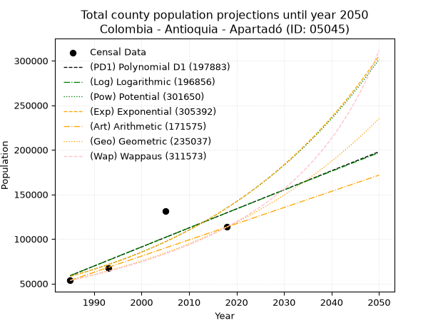
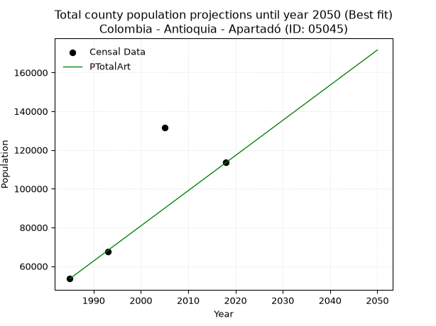
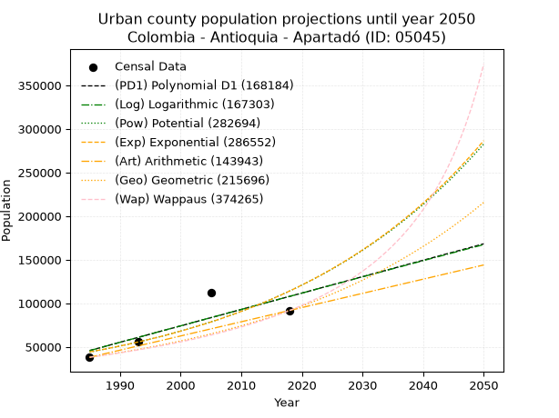
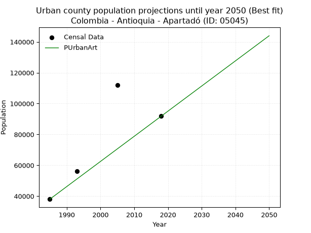
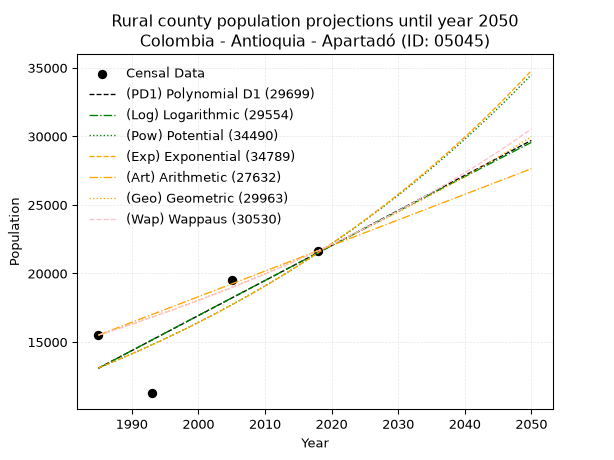
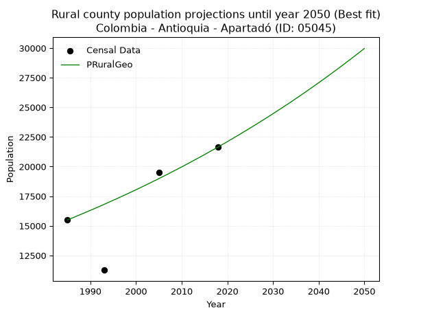

<div align="center">


</div>

# _“Population and Public Services Demand Projections (PPSD) until Year 2050 for Colombia - Antioquia - Apartadó (ID: 05045)”_
Keywords: `population` `public-service` `projection` `lineal` `polynomial` `logarithmic` `potential` `exponential` `arithmetic` `geometric` `wappaus` `dane` `colombia` `south-america`

PPSD are analytical estimates used by governments and planners to anticipate future changes in population size, age distribution, and the resulting community needs for utilities, healthcare, education, and infrastructure as sizing future water treatment facilities, electrical grids, and road networks based on spatial growth.

> **General running parameters**: • app_version: _v20260806_. • Python version: _3.14.7_. • Pandas version: _3.0.5_. • NumPy version: _2.5.1_. • Creates, save and include plots into reports (create_plot): _True_. • Projection until year: _2050_. • Process polynomial degree 2 and up: _False_. • Process Wappaus: _True_. • Process Wappaus: _True_. • Set negative values to zero: _True_. • Set infinite values to zero: _True_. • Drop dataset notes: _True_. 
<div align="center">

Dynamic map: [:earth_americas:Google](http://maps.google.com/maps?q=7.882967749,-76.6252788) [:earth_americas:OSM](https://www.openstreetmap.org/#map=18/7.882967749/-76.6252788&layers=P) [:earth_americas:Bing](https://www.bing.com/maps?cp=7.882967749~-76.6252788&lvl=18) [:earth_americas:Apple](https://maps.apple.com/frame?center=7.882967749%2C-76.6252788&span=0.003%2C0.006)

</div>


<div align="center">

```geojson
{
  "type": "Feature",
  "geometry": {
    "type": "Point", 
    "coordinates": [-76.6252788, 7.882967749]
  }, 
  "properties": {
    "Name": "Colombia - Antioquia - Apartadó (ID: 05045)"
  }
}
```

</div>


## 0. Census Data (4 records)

Census data are official statistics collected by a government about the people and housing in a country. They usually include counts of total population, age, sex, race, income, education, and jobs.

📅Global census file: [Population.xlsx](../data/Population.xlsx)

| Source   |   Year |   CountryID | CountryName   |   StateID | StateName   |   CountyID | CountyName   |   PTotal |   PUrban |   PRural |
|:---------|-------:|------------:|:--------------|----------:|:------------|-----------:|:-------------|---------:|---------:|---------:|
| DANE     |   1985 |          57 | Colombia      |        05 | Antioquia   |      05045 | Apartadó     |    53547 |    38050 |    15497 |
| DANE     |   1993 |          57 | Colombia      |        05 | Antioquia   |      05045 | Apartadó     |    67591 |    56330 |    11261 |
| DANE     |   2005 |          57 | Colombia      |        05 | Antioquia   |      05045 | Apartadó     |   131405 |   111887 |    19518 |
| DANE     |   2018 |          57 | Colombia      |        05 | Antioquia   |      05045 | Apartadó     |   113469 |    91811 |    21658 |

> 🔥Some records has specific notes about the registered values or the corresponding urban or rural distribution.

## 1. Total

### 1.1. Coefficients and Parameters

* (PD1) Polynomial Deg 1: 2138.2930549980006, -4185617.6832597503 (lineal)
* (Log) Logarithmic: 4284900.5290880315, -32478060.258636005
* (Pow) Potential: 51.17754615134561, -164.00793272203407
* (Exp) Exponential: 0.02554038106550914, 5.5739381708418976e-18
* (Art) Arithmetic: Year diff. 2018 - 1985 = 33, Population diff. 113469 - 53547 = 59922, Annual growth = 1815.8181818181818
* (Geo) Geometric: Year diff. 2018 - 1985 = 33, Population diff. 113469 - 53547 = 59922, Annual growth % = 0.023017571848465757
* (Wap) Wappaus: i = 2.1744242250062054, Condition values only valid for < 200)

<sub>
Wappaus condition values: ['0.00', '2.17', '4.35', '6.52', '8.70', '10.87', '13.05', '15.22', '17.40', '19.57', '21.74', '23.92', '26.09', '28.27', '30.44', '32.62', '34.79', '36.97', '39.14', '41.31', '43.49', '45.66', '47.84', '50.01', '52.19', '54.36', '56.54', '58.71', '60.88', '63.06', '65.23', '67.41', '69.58', '71.76', '73.93', '76.10', '78.28', '80.45', '82.63', '84.80', '86.98', '89.15', '91.33', '93.50', '95.67', '97.85', '100.02', '102.20', '104.37', '106.55', '108.72', '110.90', '113.07', '115.24', '117.42', '119.59', '121.77', '123.94', '126.12', '128.29', '130.47', '132.64', '134.81', '136.99', '139.16', '141.34']
</sub>


### 1.2. Projected Dataset

|   Year |   CountyID |   PTotalPD1 |   PTotalLog |   PTotalPow |   PTotalExp |   PTotalArt |   PTotalGeo |   PTotalWap |
|-------:|-----------:|------------:|------------:|------------:|------------:|------------:|------------:|------------:|
|   1985 |      05045 |       58894 |       58793 |       57991 |       58060 |       53547 |       53547 |       53547 |
|   1986 |      05045 |       61032 |       60951 |       59505 |       59562 |       55363 |       54780 |       54724 |
|   1987 |      05045 |       63171 |       63108 |       61058 |       61102 |       57179 |       56040 |       55927 |
|   1988 |      05045 |       65309 |       65264 |       62650 |       62683 |       58994 |       57330 |       57158 |
|   1989 |      05045 |       67447 |       67419 |       64284 |       64305 |       60810 |       58650 |       58416 |
|   1990 |      05045 |       69585 |       69572 |       65959 |       65968 |       62626 |       60000 |       59703 |
|   1991 |      05045 |       71724 |       71725 |       67677 |       67675 |       64442 |       61381 |       61021 |
|   1992 |      05045 |       73862 |       73877 |       69438 |       69425 |       66258 |       62794 |       62369 |
|   1993 |      05045 |       76000 |       76027 |       71245 |       71221 |       68074 |       64239 |       63749 |
|   1994 |      05045 |       78139 |       78177 |       73098 |       73064 |       69889 |       65718 |       65163 |
|   1995 |      05045 |       80277 |       80325 |       74998 |       74954 |       71705 |       67230 |       66611 |
|   1996 |      05045 |       82415 |       82472 |       76946 |       76893 |       73521 |       68778 |       68095 |
|   1997 |      05045 |       84554 |       84619 |       78944 |       78882 |       75337 |       70361 |       69615 |
|   1998 |      05045 |       86692 |       86764 |       80993 |       80923 |       77153 |       71981 |       71175 |
|   1999 |      05045 |       88830 |       88908 |       83093 |       83016 |       78968 |       73637 |       72774 |
|   2000 |      05045 |       90968 |       91051 |       85248 |       85164 |       80784 |       75332 |       74415 |
|   2001 |      05045 |       93107 |       93193 |       87457 |       87367 |       82600 |       77066 |       76100 |
|   2002 |      05045 |       95245 |       95333 |       89722 |       89627 |       84416 |       78840 |       77829 |
|   2003 |      05045 |       97383 |       97473 |       92044 |       91946 |       86232 |       80655 |       79605 |
|   2004 |      05045 |       99522 |       99612 |       94426 |       94324 |       88048 |       82511 |       81429 |
|   2005 |      05045 |      101660 |      101750 |       96868 |       96764 |       89863 |       84411 |       83304 |
|   2006 |      05045 |      103798 |      103886 |       99371 |       99268 |       91679 |       86354 |       85232 |
|   2007 |      05045 |      105936 |      106022 |      101938 |      101836 |       93495 |       88341 |       87216 |
|   2008 |      05045 |      108075 |      108156 |      104571 |      104470 |       95311 |       90375 |       89256 |
|   2009 |      05045 |      110213 |      110290 |      107269 |      107173 |       97127 |       92455 |       91357 |
|   2010 |      05045 |      112351 |      112422 |      110036 |      109945 |       98942 |       94583 |       93520 |
|   2011 |      05045 |      114490 |      114553 |      112873 |      112789 |      100758 |       96760 |       95749 |
|   2012 |      05045 |      116628 |      116683 |      115782 |      115707 |      102574 |       98987 |       98047 |
|   2013 |      05045 |      118766 |      118812 |      118764 |      118700 |      104390 |      101266 |      100416 |
|   2014 |      05045 |      120905 |      120941 |      121821 |      121771 |      106206 |      103596 |      102861 |
|   2015 |      05045 |      123043 |      123068 |      124956 |      124921 |      108022 |      105981 |      105385 |
|   2016 |      05045 |      125181 |      125194 |      128169 |      128153 |      109837 |      108420 |      107991 |
|   2017 |      05045 |      127319 |      127318 |      131464 |      131468 |      111653 |      110916 |      110684 |
|   2018 |      05045 |      129458 |      129442 |      134841 |      134869 |      113469 |      113469 |      113469 |
|   2019 |      05045 |      131596 |      131565 |      138304 |      138358 |      115285 |      116081 |      116350 |
|   2020 |      05045 |      133734 |      133687 |      141853 |      141937 |      117101 |      118753 |      119331 |
|   2021 |      05045 |      135873 |      135808 |      145492 |      145609 |      118916 |      121486 |      122420 |
|   2022 |      05045 |      138011 |      137927 |      149223 |      149376 |      120732 |      124282 |      125620 |
|   2023 |      05045 |      140149 |      140046 |      153047 |      153240 |      122548 |      127143 |      128940 |
|   2024 |      05045 |      142287 |      142163 |      156967 |      157204 |      124364 |      130070 |      132384 |
|   2025 |      05045 |      144426 |      144280 |      160985 |      161271 |      126180 |      133063 |      135961 |
|   2026 |      05045 |      146564 |      146395 |      165105 |      165443 |      127996 |      136126 |      139679 |
|   2027 |      05045 |      148702 |      148510 |      169328 |      169723 |      129811 |      139260 |      143545 |
|   2028 |      05045 |      150841 |      150623 |      173656 |      174114 |      131627 |      142465 |      147569 |
|   2029 |      05045 |      152979 |      152736 |      178093 |      178618 |      133443 |      145744 |      151761 |
|   2030 |      05045 |      155117 |      154847 |      182641 |      183238 |      135259 |      149099 |      156131 |
|   2031 |      05045 |      157256 |      156957 |      187303 |      187979 |      137075 |      152531 |      160691 |
|   2032 |      05045 |      159394 |      159066 |      192081 |      192842 |      138890 |      156042 |      165455 |
|   2033 |      05045 |      161532 |      161175 |      196979 |      197830 |      140706 |      159633 |      170434 |
|   2034 |      05045 |      163670 |      163282 |      202000 |      202948 |      142522 |      163308 |      175646 |
|   2035 |      05045 |      165809 |      165388 |      207145 |      208198 |      144338 |      167067 |      181106 |
|   2036 |      05045 |      167947 |      167493 |      212420 |      213584 |      146154 |      170912 |      186832 |
|   2037 |      05045 |      170085 |      169597 |      217825 |      219109 |      147970 |      174846 |      192845 |
|   2038 |      05045 |      172224 |      171700 |      223366 |      224778 |      149785 |      178871 |      199166 |
|   2039 |      05045 |      174362 |      173802 |      229045 |      230592 |      151601 |      182988 |      205820 |
|   2040 |      05045 |      176500 |      175903 |      234865 |      236558 |      153417 |      187200 |      212834 |
|   2041 |      05045 |      178638 |      178003 |      240830 |      242677 |      155233 |      191509 |      220238 |
|   2042 |      05045 |      180777 |      180102 |      246943 |      248955 |      157049 |      195917 |      228065 |
|   2043 |      05045 |      182915 |      182200 |      253209 |      255396 |      158864 |      200426 |      236353 |
|   2044 |      05045 |      185053 |      184297 |      259631 |      262002 |      160680 |      205040 |      245144 |
|   2045 |      05045 |      187192 |      186392 |      266212 |      268780 |      162496 |      209759 |      254484 |
|   2046 |      05045 |      189330 |      188487 |      272956 |      275733 |      164312 |      214587 |      264427 |
|   2047 |      05045 |      191468 |      190581 |      279868 |      282866 |      166128 |      219526 |      275034 |
|   2048 |      05045 |      193606 |      192674 |      286952 |      290184 |      167944 |      224579 |      286373 |
|   2049 |      05045 |      195745 |      194765 |      294211 |      297691 |      169759 |      229749 |      298523 |
|   2050 |      05045 |      197883 |      196856 |      301650 |      305392 |      171575 |      235037 |      311573 |
<div align="center">

</img>

</div>


### 1.3. Filtered dataset with projected values, absolute error, relative error as percentage

Relative error puts that difference into context by dividing the absolute error by the true value, creating a unitless ratio or percentage that shows the scale of the mistake.

Absolute and relative error

|   Year | Source   |   CountryID | CountryName   |   StateID | StateName   |   CountyID_x | CountyName   |   PTotal |   PUrban |   PRural |   CountyID_y |   PTotalPD1 |   PTotalLog |   PTotalPow |   PTotalExp |   PTotalArt |   PTotalGeo |   PTotalWap |   PTotalPD1AbsError |   PTotalLogAbsError |   PTotalPowAbsError |   PTotalExpAbsError |   PTotalArtAbsError |   PTotalGeoAbsError |   PTotalWapAbsError |   PTotalPD1RelError |   PTotalLogRelError |   PTotalPowRelError |   PTotalExpRelError |   PTotalArtRelError |   PTotalGeoRelError |   PTotalWapRelError |
|-------:|:---------|------------:|:--------------|----------:|:------------|-------------:|:-------------|---------:|---------:|---------:|-------------:|------------:|------------:|------------:|------------:|------------:|------------:|------------:|--------------------:|--------------------:|--------------------:|--------------------:|--------------------:|--------------------:|--------------------:|--------------------:|--------------------:|--------------------:|--------------------:|--------------------:|--------------------:|--------------------:|
|   1985 | DANE     |          57 | Colombia      |        05 | Antioquia   |        05045 | Apartadó     |    53547 |    38050 |    15497 |        05045 |       58894 |       58793 |       57991 |       58060 |       53547 |       53547 |       53547 |                5347 |                5246 |                4444 |                4513 |                   0 |                   0 |                   0 |             9.98562 |              9.797  |             8.29925 |             8.42811 |            0        |             0       |             0       |
|   1993 | DANE     |          57 | Colombia      |        05 | Antioquia   |        05045 | Apartadó     |    67591 |    56330 |    11261 |        05045 |       76000 |       76027 |       71245 |       71221 |       68074 |       64239 |       63749 |                8409 |                8436 |                3654 |                3630 |                 483 |                3352 |                3842 |            12.441   |             12.481  |             5.40605 |             5.37054 |            0.714592 |             4.95924 |             5.68419 |
|   2005 | DANE     |          57 | Colombia      |        05 | Antioquia   |        05045 | Apartadó     |   131405 |   111887 |    19518 |        05045 |      101660 |      101750 |       96868 |       96764 |       89863 |       84411 |       83304 |               29745 |               29655 |               34537 |               34641 |               41542 |               46994 |               48101 |            22.6361  |             22.5676 |            26.2829  |            26.362   |           31.6137   |            35.7627  |            36.6052  |
|   2018 | DANE     |          57 | Colombia      |        05 | Antioquia   |        05045 | Apartadó     |   113469 |    91811 |    21658 |        05045 |      129458 |      129442 |      134841 |      134869 |      113469 |      113469 |      113469 |               15989 |               15973 |               21372 |               21400 |                   0 |                   0 |                   0 |            14.0911  |             14.077  |            18.8351  |            18.8598  |            0        |             0       |             0       |

Relative error mean

| Method    |   RelError | Best   |
|:----------|-----------:|:-------|
| PTotalPD1 |   14.7885  |        |
| PTotalLog |   14.7306  |        |
| PTotalPow |   14.7058  |        |
| PTotalExp |   14.7551  |        |
| PTotalArt |    8.08208 | True   |
| PTotalGeo |   10.1805  |        |
| PTotalWap |   10.5723  |        |

💙Best method: _**PTotalArt**_
<div align="center">

</img>

</div>


### 1.4. Fresh water supply demand in liters per capita per day (lpcd)

The fresh water supply demand typically ranges from 100 to 300 liters per capita per day (lpcd) for standard domestic and municipal planning, though absolute survival minimums set by the World Health Organization are as low as 7.5 to 20 liters per day, and total consumption in high-income nations can exceed 400 liters.

> `CZ`: Level in meters above the sea level (masl).<br> `WS`: Fresh water supply demand in liters per capita per day (lpcd or l/h/d).<br> `WSAll`: Zonal fresh water supply demand in liters per second (l/s).<br> `A`: Zonal area in square meters.

Reference values (RAS Colombia)

|    CZ |   WS |
|------:|-----:|
|  1000 |  120 |
|  2000 |  130 |
| 99999 |  140 |

County shapefile geometry properties and water supply values

|   CountyID |      ATotal |   CZTotal |   WSTotal |
|-----------:|------------:|----------:|----------:|
|      05045 | 5.35365e+08 |   286.934 |       120 |

Projected values for best method: PTotalArt

|   CountyID |   Year |   PTotalArt |   WSTotal |   WSTotalAll |
|-----------:|-------:|------------:|----------:|-------------:|
|      05045 |   1985 |       53547 |       120 |      74.3708 |
|      05045 |   1986 |       55363 |       120 |      76.8931 |
|      05045 |   1987 |       57179 |       120 |      79.4153 |
|      05045 |   1988 |       58994 |       120 |      81.9361 |
|      05045 |   1989 |       60810 |       120 |      84.4583 |
|      05045 |   1990 |       62626 |       120 |      86.9806 |
|      05045 |   1991 |       64442 |       120 |      89.5028 |
|      05045 |   1992 |       66258 |       120 |      92.025  |
|      05045 |   1993 |       68074 |       120 |      94.5472 |
|      05045 |   1994 |       69889 |       120 |      97.0681 |
|      05045 |   1995 |       71705 |       120 |      99.5903 |
|      05045 |   1996 |       73521 |       120 |     102.112  |
|      05045 |   1997 |       75337 |       120 |     104.635  |
|      05045 |   1998 |       77153 |       120 |     107.157  |
|      05045 |   1999 |       78968 |       120 |     109.678  |
|      05045 |   2000 |       80784 |       120 |     112.2    |
|      05045 |   2001 |       82600 |       120 |     114.722  |
|      05045 |   2002 |       84416 |       120 |     117.244  |
|      05045 |   2003 |       86232 |       120 |     119.767  |
|      05045 |   2004 |       88048 |       120 |     122.289  |
|      05045 |   2005 |       89863 |       120 |     124.81   |
|      05045 |   2006 |       91679 |       120 |     127.332  |
|      05045 |   2007 |       93495 |       120 |     129.854  |
|      05045 |   2008 |       95311 |       120 |     132.376  |
|      05045 |   2009 |       97127 |       120 |     134.899  |
|      05045 |   2010 |       98942 |       120 |     137.419  |
|      05045 |   2011 |      100758 |       120 |     139.942  |
|      05045 |   2012 |      102574 |       120 |     142.464  |
|      05045 |   2013 |      104390 |       120 |     144.986  |
|      05045 |   2014 |      106206 |       120 |     147.508  |
|      05045 |   2015 |      108022 |       120 |     150.031  |
|      05045 |   2016 |      109837 |       120 |     152.551  |
|      05045 |   2017 |      111653 |       120 |     155.074  |
|      05045 |   2018 |      113469 |       120 |     157.596  |
|      05045 |   2019 |      115285 |       120 |     160.118  |
|      05045 |   2020 |      117101 |       120 |     162.64   |
|      05045 |   2021 |      118916 |       120 |     165.161  |
|      05045 |   2022 |      120732 |       120 |     167.683  |
|      05045 |   2023 |      122548 |       120 |     170.206  |
|      05045 |   2024 |      124364 |       120 |     172.728  |
|      05045 |   2025 |      126180 |       120 |     175.25   |
|      05045 |   2026 |      127996 |       120 |     177.772  |
|      05045 |   2027 |      129811 |       120 |     180.293  |
|      05045 |   2028 |      131627 |       120 |     182.815  |
|      05045 |   2029 |      133443 |       120 |     185.338  |
|      05045 |   2030 |      135259 |       120 |     187.86   |
|      05045 |   2031 |      137075 |       120 |     190.382  |
|      05045 |   2032 |      138890 |       120 |     192.903  |
|      05045 |   2033 |      140706 |       120 |     195.425  |
|      05045 |   2034 |      142522 |       120 |     197.947  |
|      05045 |   2035 |      144338 |       120 |     200.469  |
|      05045 |   2036 |      146154 |       120 |     202.992  |
|      05045 |   2037 |      147970 |       120 |     205.514  |
|      05045 |   2038 |      149785 |       120 |     208.035  |
|      05045 |   2039 |      151601 |       120 |     210.557  |
|      05045 |   2040 |      153417 |       120 |     213.079  |
|      05045 |   2041 |      155233 |       120 |     215.601  |
|      05045 |   2042 |      157049 |       120 |     218.124  |
|      05045 |   2043 |      158864 |       120 |     220.644  |
|      05045 |   2044 |      160680 |       120 |     223.167  |
|      05045 |   2045 |      162496 |       120 |     225.689  |
|      05045 |   2046 |      164312 |       120 |     228.211  |
|      05045 |   2047 |      166128 |       120 |     230.733  |
|      05045 |   2048 |      167944 |       120 |     233.256  |
|      05045 |   2049 |      169759 |       120 |     235.776  |
|      05045 |   2050 |      171575 |       120 |     238.299  |

## 2. Urban

### 2.1. Coefficients and Parameters

* (PD1) Polynomial Deg 1: 1882.7033319951915, -3691357.839823382 (lineal)
* (Log) Logarithmic: 3773654.6733412, -28609059.912237167
* (Pow) Potential: 57.65342363938516, -185.48263151590507
* (Exp) Exponential: 0.02876544480323295, 7.034303888266882e-21
* (Art) Arithmetic: Year diff. 2018 - 1985 = 33, Population diff. 91811 - 38050 = 53761, Annual growth = 1629.121212121212
* (Geo) Geometric: Year diff. 2018 - 1985 = 33, Population diff. 91811 - 38050 = 53761, Annual growth % = 0.027051267582711924
* (Wap) Wappaus: i = 2.509023050987151, Condition values only valid for < 200)

<sub>
Wappaus condition values: ['0.00', '2.51', '5.02', '7.53', '10.04', '12.55', '15.05', '17.56', '20.07', '22.58', '25.09', '27.60', '30.11', '32.62', '35.13', '37.64', '40.14', '42.65', '45.16', '47.67', '50.18', '52.69', '55.20', '57.71', '60.22', '62.73', '65.23', '67.74', '70.25', '72.76', '75.27', '77.78', '80.29', '82.80', '85.31', '87.82', '90.32', '92.83', '95.34', '97.85', '100.36', '102.87', '105.38', '107.89', '110.40', '112.91', '115.42', '117.92', '120.43', '122.94', '125.45', '127.96', '130.47', '132.98', '135.49', '138.00', '140.51', '143.01', '145.52', '148.03', '150.54', '153.05', '155.56', '158.07', '160.58', '163.09']
</sub>


### 2.2. Projected Dataset

|   Year |   CountyID |   PUrbanPD1 |   PUrbanLog |   PUrbanPow |   PUrbanExp |   PUrbanArt |   PUrbanGeo |   PUrbanWap |
|-------:|-----------:|------------:|------------:|------------:|------------:|------------:|------------:|------------:|
|   1985 |      05045 |       45808 |       45712 |       44112 |       44175 |       38050 |       38050 |       38050 |
|   1986 |      05045 |       47691 |       47613 |       45411 |       45464 |       39679 |       39079 |       39017 |
|   1987 |      05045 |       49574 |       49512 |       46748 |       46791 |       41308 |       40136 |       40009 |
|   1988 |      05045 |       51456 |       51411 |       48124 |       48157 |       42937 |       41222 |       41026 |
|   1989 |      05045 |       53339 |       53309 |       49540 |       49562 |       44566 |       42337 |       42070 |
|   1990 |      05045 |       55222 |       55206 |       50997 |       51008 |       46196 |       43483 |       43143 |
|   1991 |      05045 |       57104 |       57101 |       52495 |       52497 |       47825 |       44659 |       44244 |
|   1992 |      05045 |       58987 |       58996 |       54037 |       54029 |       49454 |       45867 |       45376 |
|   1993 |      05045 |       60870 |       60890 |       55624 |       55606 |       51083 |       47108 |       46539 |
|   1994 |      05045 |       62753 |       62783 |       57256 |       57229 |       52712 |       48382 |       47736 |
|   1995 |      05045 |       64635 |       64675 |       58935 |       58899 |       54341 |       49691 |       48966 |
|   1996 |      05045 |       66518 |       66566 |       60663 |       60618 |       55970 |       51035 |       50233 |
|   1997 |      05045 |       68401 |       68456 |       62440 |       62387 |       57599 |       52416 |       51536 |
|   1998 |      05045 |       70283 |       70346 |       64269 |       64207 |       59229 |       53833 |       52879 |
|   1999 |      05045 |       72166 |       72234 |       66150 |       66081 |       60858 |       55290 |       54263 |
|   2000 |      05045 |       74049 |       74121 |       68085 |       68009 |       62487 |       56785 |       55690 |
|   2001 |      05045 |       75932 |       76008 |       70075 |       69994 |       64116 |       58321 |       57161 |
|   2002 |      05045 |       77814 |       77893 |       72123 |       72037 |       65745 |       59899 |       58679 |
|   2003 |      05045 |       79697 |       79777 |       74230 |       74139 |       67374 |       61520 |       60247 |
|   2004 |      05045 |       81580 |       81661 |       76397 |       76303 |       69003 |       63184 |       61866 |
|   2005 |      05045 |       83462 |       83544 |       78626 |       78529 |       70632 |       64893 |       63539 |
|   2006 |      05045 |       85345 |       85425 |       80919 |       80821 |       72262 |       66648 |       65269 |
|   2007 |      05045 |       87228 |       87306 |       83278 |       83180 |       73891 |       68451 |       67059 |
|   2008 |      05045 |       89110 |       89186 |       85705 |       85607 |       75520 |       70303 |       68913 |
|   2009 |      05045 |       90993 |       91065 |       88200 |       88106 |       77149 |       72205 |       70833 |
|   2010 |      05045 |       92876 |       92942 |       90767 |       90677 |       78778 |       74158 |       72823 |
|   2011 |      05045 |       94759 |       94819 |       93408 |       93323 |       80407 |       76164 |       74887 |
|   2012 |      05045 |       96641 |       96695 |       96124 |       96046 |       82036 |       78224 |       77030 |
|   2013 |      05045 |       98524 |       98571 |       98918 |       98849 |       83665 |       80340 |       79255 |
|   2014 |      05045 |      100407 |      100445 |      101791 |      101734 |       85295 |       82514 |       81568 |
|   2015 |      05045 |      102289 |      102318 |      104746 |      104703 |       86924 |       84746 |       83974 |
|   2016 |      05045 |      104172 |      104190 |      107786 |      107759 |       88553 |       87038 |       86479 |
|   2017 |      05045 |      106055 |      106062 |      110912 |      110903 |       90182 |       89393 |       89089 |
|   2018 |      05045 |      107937 |      107932 |      114127 |      114140 |       91811 |       91811 |       91811 |
|   2019 |      05045 |      109820 |      109802 |      117434 |      117471 |       93440 |       94295 |       94652 |
|   2020 |      05045 |      111703 |      111670 |      120835 |      120899 |       95069 |       96845 |       97620 |
|   2021 |      05045 |      113586 |      113538 |      124332 |      124427 |       96698 |       99465 |      100723 |
|   2022 |      05045 |      115468 |      115405 |      127929 |      128058 |       98327 |      102156 |      103972 |
|   2023 |      05045 |      117351 |      117271 |      131628 |      131795 |       99957 |      104919 |      107377 |
|   2024 |      05045 |      119234 |      119135 |      135433 |      135642 |      101586 |      107757 |      110949 |
|   2025 |      05045 |      121116 |      120999 |      139345 |      139600 |      103215 |      110672 |      114701 |
|   2026 |      05045 |      122999 |      122863 |      143368 |      143674 |      104844 |      113666 |      118647 |
|   2027 |      05045 |      124882 |      124725 |      147506 |      147867 |      106473 |      116741 |      122802 |
|   2028 |      05045 |      126765 |      126586 |      151760 |      152182 |      108102 |      119899 |      127184 |
|   2029 |      05045 |      128647 |      128446 |      156135 |      156623 |      109731 |      123143 |      131810 |
|   2030 |      05045 |      130530 |      130306 |      160634 |      161194 |      111360 |      126474 |      136704 |
|   2031 |      05045 |      132413 |      132164 |      165261 |      165898 |      112990 |      129895 |      141887 |
|   2032 |      05045 |      134295 |      134022 |      170018 |      170740 |      114619 |      133409 |      147388 |
|   2033 |      05045 |      136178 |      135878 |      174910 |      175722 |      116248 |      137018 |      153236 |
|   2034 |      05045 |      138061 |      137734 |      179940 |      180851 |      117877 |      140724 |      159464 |
|   2035 |      05045 |      139943 |      139589 |      185112 |      186128 |      119506 |      144531 |      166111 |
|   2036 |      05045 |      141826 |      141443 |      190430 |      191560 |      121135 |      148441 |      173222 |
|   2037 |      05045 |      143709 |      143296 |      195898 |      197151 |      122764 |      152456 |      180846 |
|   2038 |      05045 |      145592 |      145148 |      201520 |      202904 |      124393 |      156580 |      189040 |
|   2039 |      05045 |      147474 |      146999 |      207301 |      208825 |      126023 |      160816 |      197872 |
|   2040 |      05045 |      149357 |      148849 |      213245 |      214920 |      127652 |      165166 |      207419 |
|   2041 |      05045 |      151240 |      150699 |      219356 |      221192 |      129281 |      169634 |      217771 |
|   2042 |      05045 |      153122 |      152547 |      225639 |      227647 |      130910 |      174223 |      229035 |
|   2043 |      05045 |      155005 |      154395 |      232099 |      234290 |      132539 |      178936 |      241336 |
|   2044 |      05045 |      156888 |      156242 |      238740 |      241127 |      134168 |      183776 |      254825 |
|   2045 |      05045 |      158770 |      158087 |      245568 |      248164 |      135797 |      188748 |      269682 |
|   2046 |      05045 |      160653 |      159932 |      252588 |      255407 |      137426 |      193854 |      286127 |
|   2047 |      05045 |      162536 |      161776 |      259805 |      262860 |      139056 |      199098 |      304430 |
|   2048 |      05045 |      164419 |      163619 |      267225 |      270531 |      140685 |      204484 |      324923 |
|   2049 |      05045 |      166301 |      165461 |      274853 |      278426 |      142314 |      210015 |      348024 |
|   2050 |      05045 |      168184 |      167303 |      282694 |      286552 |      143943 |      215696 |      374265 |
<div align="center">

</img>

</div>


### 2.3. Filtered dataset with projected values, absolute error, relative error as percentage

Relative error puts that difference into context by dividing the absolute error by the true value, creating a unitless ratio or percentage that shows the scale of the mistake.

Absolute and relative error

|   Year | Source   |   CountryID | CountryName   |   StateID | StateName   |   CountyID_x | CountyName   |   PTotal |   PUrban |   PRural |   CountyID_y |   PUrbanPD1 |   PUrbanLog |   PUrbanPow |   PUrbanExp |   PUrbanArt |   PUrbanGeo |   PUrbanWap |   PUrbanPD1AbsError |   PUrbanLogAbsError |   PUrbanPowAbsError |   PUrbanExpAbsError |   PUrbanArtAbsError |   PUrbanGeoAbsError |   PUrbanWapAbsError |   PUrbanPD1RelError |   PUrbanLogRelError |   PUrbanPowRelError |   PUrbanExpRelError |   PUrbanArtRelError |   PUrbanGeoRelError |   PUrbanWapRelError |
|-------:|:---------|------------:|:--------------|----------:|:------------|-------------:|:-------------|---------:|---------:|---------:|-------------:|------------:|------------:|------------:|------------:|------------:|------------:|------------:|--------------------:|--------------------:|--------------------:|--------------------:|--------------------:|--------------------:|--------------------:|--------------------:|--------------------:|--------------------:|--------------------:|--------------------:|--------------------:|--------------------:|
|   1985 | DANE     |          57 | Colombia      |        05 | Antioquia   |        05045 | Apartadó     |    53547 |    38050 |    15497 |        05045 |       45808 |       45712 |       44112 |       44175 |       38050 |       38050 |       38050 |                7758 |                7662 |                6062 |                6125 |                   0 |                   0 |                   0 |            20.389   |            20.1367  |            15.9317  |            16.0972  |             0       |              0      |              0      |
|   1993 | DANE     |          57 | Colombia      |        05 | Antioquia   |        05045 | Apartadó     |    67591 |    56330 |    11261 |        05045 |       60870 |       60890 |       55624 |       55606 |       51083 |       47108 |       46539 |                4540 |                4560 |                 706 |                 724 |                5247 |                9222 |                9791 |             8.05965 |             8.09515 |             1.25333 |             1.28528 |             9.31475 |             16.3714 |             17.3815 |
|   2005 | DANE     |          57 | Colombia      |        05 | Antioquia   |        05045 | Apartadó     |   131405 |   111887 |    19518 |        05045 |       83462 |       83544 |       78626 |       78529 |       70632 |       64893 |       63539 |               28425 |               28343 |               33261 |               33358 |               41255 |               46994 |               48348 |            25.4051  |            25.3318  |            29.7273  |            29.814   |            36.872   |             42.0013 |             43.2115 |
|   2018 | DANE     |          57 | Colombia      |        05 | Antioquia   |        05045 | Apartadó     |   113469 |    91811 |    21658 |        05045 |      107937 |      107932 |      114127 |      114140 |       91811 |       91811 |       91811 |               16126 |               16121 |               22316 |               22329 |                   0 |                   0 |                   0 |            17.5643  |            17.5589  |            24.3065  |            24.3206  |             0       |              0      |              0      |

Relative error mean

| Method    |   RelError | Best   |
|:----------|-----------:|:-------|
| PUrbanPD1 |    17.8545 |        |
| PUrbanLog |    17.7806 |        |
| PUrbanPow |    17.8047 |        |
| PUrbanExp |    17.8793 |        |
| PUrbanArt |    11.5467 | True   |
| PUrbanGeo |    14.5932 |        |
| PUrbanWap |    15.1482 |        |

💙Best method: _**PUrbanArt**_
<div align="center">

</img>

</div>


### 2.4. Fresh water supply demand in liters per capita per day (lpcd)

The fresh water supply demand typically ranges from 100 to 300 liters per capita per day (lpcd) for standard domestic and municipal planning, though absolute survival minimums set by the World Health Organization are as low as 7.5 to 20 liters per day, and total consumption in high-income nations can exceed 400 liters.

> `CZ`: Level in meters above the sea level (masl).<br> `WS`: Fresh water supply demand in liters per capita per day (lpcd or l/h/d).<br> `WSAll`: Zonal fresh water supply demand in liters per second (l/s).<br> `A`: Zonal area in square meters.

Reference values (RAS Colombia)

|    CZ |   WS |
|------:|-----:|
|  1000 |  120 |
|  2000 |  130 |
| 99999 |  140 |

County shapefile geometry properties and water supply values

|   CountyID |      AUrban |   CZUrban |   WSUrban |
|-----------:|------------:|----------:|----------:|
|      05045 | 6.75045e+06 |   32.3094 |       120 |

Projected values for best method: PUrbanArt

|   CountyID |   Year |   PUrbanArt |   WSUrban |   WSUrbanAll |
|-----------:|-------:|------------:|----------:|-------------:|
|      05045 |   1985 |       38050 |       120 |      52.8472 |
|      05045 |   1986 |       39679 |       120 |      55.1097 |
|      05045 |   1987 |       41308 |       120 |      57.3722 |
|      05045 |   1988 |       42937 |       120 |      59.6347 |
|      05045 |   1989 |       44566 |       120 |      61.8972 |
|      05045 |   1990 |       46196 |       120 |      64.1611 |
|      05045 |   1991 |       47825 |       120 |      66.4236 |
|      05045 |   1992 |       49454 |       120 |      68.6861 |
|      05045 |   1993 |       51083 |       120 |      70.9486 |
|      05045 |   1994 |       52712 |       120 |      73.2111 |
|      05045 |   1995 |       54341 |       120 |      75.4736 |
|      05045 |   1996 |       55970 |       120 |      77.7361 |
|      05045 |   1997 |       57599 |       120 |      79.9986 |
|      05045 |   1998 |       59229 |       120 |      82.2625 |
|      05045 |   1999 |       60858 |       120 |      84.525  |
|      05045 |   2000 |       62487 |       120 |      86.7875 |
|      05045 |   2001 |       64116 |       120 |      89.05   |
|      05045 |   2002 |       65745 |       120 |      91.3125 |
|      05045 |   2003 |       67374 |       120 |      93.575  |
|      05045 |   2004 |       69003 |       120 |      95.8375 |
|      05045 |   2005 |       70632 |       120 |      98.1    |
|      05045 |   2006 |       72262 |       120 |     100.364  |
|      05045 |   2007 |       73891 |       120 |     102.626  |
|      05045 |   2008 |       75520 |       120 |     104.889  |
|      05045 |   2009 |       77149 |       120 |     107.151  |
|      05045 |   2010 |       78778 |       120 |     109.414  |
|      05045 |   2011 |       80407 |       120 |     111.676  |
|      05045 |   2012 |       82036 |       120 |     113.939  |
|      05045 |   2013 |       83665 |       120 |     116.201  |
|      05045 |   2014 |       85295 |       120 |     118.465  |
|      05045 |   2015 |       86924 |       120 |     120.728  |
|      05045 |   2016 |       88553 |       120 |     122.99   |
|      05045 |   2017 |       90182 |       120 |     125.253  |
|      05045 |   2018 |       91811 |       120 |     127.515  |
|      05045 |   2019 |       93440 |       120 |     129.778  |
|      05045 |   2020 |       95069 |       120 |     132.04   |
|      05045 |   2021 |       96698 |       120 |     134.303  |
|      05045 |   2022 |       98327 |       120 |     136.565  |
|      05045 |   2023 |       99957 |       120 |     138.829  |
|      05045 |   2024 |      101586 |       120 |     141.092  |
|      05045 |   2025 |      103215 |       120 |     143.354  |
|      05045 |   2026 |      104844 |       120 |     145.617  |
|      05045 |   2027 |      106473 |       120 |     147.879  |
|      05045 |   2028 |      108102 |       120 |     150.142  |
|      05045 |   2029 |      109731 |       120 |     152.404  |
|      05045 |   2030 |      111360 |       120 |     154.667  |
|      05045 |   2031 |      112990 |       120 |     156.931  |
|      05045 |   2032 |      114619 |       120 |     159.193  |
|      05045 |   2033 |      116248 |       120 |     161.456  |
|      05045 |   2034 |      117877 |       120 |     163.718  |
|      05045 |   2035 |      119506 |       120 |     165.981  |
|      05045 |   2036 |      121135 |       120 |     168.243  |
|      05045 |   2037 |      122764 |       120 |     170.506  |
|      05045 |   2038 |      124393 |       120 |     172.768  |
|      05045 |   2039 |      126023 |       120 |     175.032  |
|      05045 |   2040 |      127652 |       120 |     177.294  |
|      05045 |   2041 |      129281 |       120 |     179.557  |
|      05045 |   2042 |      130910 |       120 |     181.819  |
|      05045 |   2043 |      132539 |       120 |     184.082  |
|      05045 |   2044 |      134168 |       120 |     186.344  |
|      05045 |   2045 |      135797 |       120 |     188.607  |
|      05045 |   2046 |      137426 |       120 |     190.869  |
|      05045 |   2047 |      139056 |       120 |     193.133  |
|      05045 |   2048 |      140685 |       120 |     195.396  |
|      05045 |   2049 |      142314 |       120 |     197.658  |
|      05045 |   2050 |      143943 |       120 |     199.921  |

## 3. Rural

### 3.1. Coefficients and Parameters

* (PD1) Polynomial Deg 1: 255.5897230028083, -494259.84343636734 (lineal)
* (Log) Logarithmic: 511245.85574683215, -3869000.346398844
* (Pow) Potential: 30.03592411318995, -94.9338937733098
* (Exp) Exponential: 0.015017491732419232, 1.483581733116942e-09
* (Art) Arithmetic: Year diff. 2018 - 1985 = 33, Population diff. 21658 - 15497 = 6161, Annual growth = 186.6969696969697
* (Geo) Geometric: Year diff. 2018 - 1985 = 33, Population diff. 21658 - 15497 = 6161, Annual growth % = 0.010194903697459345
* (Wap) Wappaus: i = 1.00496282975088, Condition values only valid for < 200)

<sub>
Wappaus condition values: ['0.00', '1.00', '2.01', '3.01', '4.02', '5.02', '6.03', '7.03', '8.04', '9.04', '10.05', '11.05', '12.06', '13.06', '14.07', '15.07', '16.08', '17.08', '18.09', '19.09', '20.10', '21.10', '22.11', '23.11', '24.12', '25.12', '26.13', '27.13', '28.14', '29.14', '30.15', '31.15', '32.16', '33.16', '34.17', '35.17', '36.18', '37.18', '38.19', '39.19', '40.20', '41.20', '42.21', '43.21', '44.22', '45.22', '46.23', '47.23', '48.24', '49.24', '50.25', '51.25', '52.26', '53.26', '54.27', '55.27', '56.28', '57.28', '58.29', '59.29', '60.30', '61.30', '62.31', '63.31', '64.32', '65.32']
</sub>


### 3.2. Projected Dataset

|   Year |   CountyID |   PRuralPD1 |   PRuralLog |   PRuralPow |   PRuralExp |   PRuralArt |   PRuralGeo |   PRuralWap |
|-------:|-----------:|------------:|------------:|------------:|------------:|------------:|------------:|------------:|
|   1985 |      05045 |       13086 |       13081 |       13104 |       13107 |       15497 |       15497 |       15497 |
|   1986 |      05045 |       13341 |       13338 |       13303 |       13305 |       15684 |       15655 |       15654 |
|   1987 |      05045 |       13597 |       13596 |       13506 |       13507 |       15870 |       15815 |       15812 |
|   1988 |      05045 |       13853 |       13853 |       13712 |       13711 |       16057 |       15976 |       15971 |
|   1989 |      05045 |       14108 |       14110 |       13920 |       13919 |       16244 |       16139 |       16133 |
|   1990 |      05045 |       14364 |       14367 |       14132 |       14129 |       16430 |       16303 |       16296 |
|   1991 |      05045 |       14619 |       14624 |       14347 |       14343 |       16617 |       16469 |       16460 |
|   1992 |      05045 |       14875 |       14880 |       14565 |       14560 |       16804 |       16637 |       16627 |
|   1993 |      05045 |       15130 |       15137 |       14786 |       14780 |       16991 |       16807 |       16795 |
|   1994 |      05045 |       15386 |       15393 |       15011 |       15004 |       17177 |       16978 |       16965 |
|   1995 |      05045 |       15642 |       15650 |       15238 |       15231 |       17364 |       17151 |       17137 |
|   1996 |      05045 |       15897 |       15906 |       15470 |       15461 |       17551 |       17326 |       17310 |
|   1997 |      05045 |       16153 |       16162 |       15704 |       15695 |       17737 |       17503 |       17486 |
|   1998 |      05045 |       16408 |       16418 |       15942 |       15933 |       17924 |       17681 |       17663 |
|   1999 |      05045 |       16664 |       16674 |       16183 |       16174 |       18111 |       17862 |       17842 |
|   2000 |      05045 |       16920 |       16930 |       16428 |       16419 |       18297 |       18044 |       18024 |
|   2001 |      05045 |       17175 |       17185 |       16677 |       16667 |       18484 |       18228 |       18207 |
|   2002 |      05045 |       17431 |       17441 |       16929 |       16919 |       18671 |       18413 |       18392 |
|   2003 |      05045 |       17686 |       17696 |       17185 |       17175 |       18858 |       18601 |       18579 |
|   2004 |      05045 |       17942 |       17951 |       17444 |       17435 |       19044 |       18791 |       18768 |
|   2005 |      05045 |       18198 |       18206 |       17708 |       17699 |       19231 |       18982 |       18960 |
|   2006 |      05045 |       18453 |       18461 |       17975 |       17967 |       19418 |       19176 |       19153 |
|   2007 |      05045 |       18709 |       18716 |       18246 |       18239 |       19604 |       19371 |       19349 |
|   2008 |      05045 |       18964 |       18970 |       18521 |       18515 |       19791 |       19569 |       19547 |
|   2009 |      05045 |       19220 |       19225 |       18800 |       18795 |       19978 |       19768 |       19747 |
|   2010 |      05045 |       19475 |       19479 |       19083 |       19079 |       20164 |       19970 |       19950 |
|   2011 |      05045 |       19731 |       19734 |       19370 |       19368 |       20351 |       20174 |       20155 |
|   2012 |      05045 |       19987 |       19988 |       19662 |       19661 |       20538 |       20379 |       20362 |
|   2013 |      05045 |       20242 |       20242 |       19958 |       19958 |       20725 |       20587 |       20572 |
|   2014 |      05045 |       20498 |       20496 |       20257 |       20260 |       20911 |       20797 |       20784 |
|   2015 |      05045 |       20753 |       20750 |       20562 |       20567 |       21098 |       21009 |       20998 |
|   2016 |      05045 |       21009 |       21003 |       20871 |       20878 |       21285 |       21223 |       21216 |
|   2017 |      05045 |       21265 |       21257 |       21184 |       21194 |       21471 |       21439 |       21436 |
|   2018 |      05045 |       21520 |       21510 |       21501 |       21515 |       21658 |       21658 |       21658 |
|   2019 |      05045 |       21776 |       21763 |       21824 |       21840 |       21845 |       21879 |       21883 |
|   2020 |      05045 |       22031 |       22017 |       22151 |       22171 |       22031 |       22102 |       22111 |
|   2021 |      05045 |       22287 |       22270 |       22483 |       22506 |       22218 |       22327 |       22342 |
|   2022 |      05045 |       22543 |       22523 |       22819 |       22847 |       22405 |       22555 |       22575 |
|   2023 |      05045 |       22798 |       22775 |       23160 |       23192 |       22591 |       22785 |       22812 |
|   2024 |      05045 |       23054 |       23028 |       23507 |       23543 |       22778 |       23017 |       23051 |
|   2025 |      05045 |       23309 |       23280 |       23858 |       23900 |       22965 |       23252 |       23294 |
|   2026 |      05045 |       23565 |       23533 |       24215 |       24261 |       23152 |       23489 |       23539 |
|   2027 |      05045 |       23821 |       23785 |       24576 |       24628 |       23338 |       23728 |       23788 |
|   2028 |      05045 |       24076 |       24037 |       24943 |       25001 |       23525 |       23970 |       24040 |
|   2029 |      05045 |       24332 |       24289 |       25315 |       25379 |       23712 |       24214 |       24295 |
|   2030 |      05045 |       24587 |       24541 |       25692 |       25763 |       23898 |       24461 |       24553 |
|   2031 |      05045 |       24843 |       24793 |       26075 |       26153 |       24085 |       24711 |       24815 |
|   2032 |      05045 |       25098 |       25045 |       26464 |       26549 |       24272 |       24963 |       25080 |
|   2033 |      05045 |       25354 |       25296 |       26858 |       26950 |       24458 |       25217 |       25349 |
|   2034 |      05045 |       25610 |       25548 |       27257 |       27358 |       24645 |       25474 |       25621 |
|   2035 |      05045 |       25865 |       25799 |       27663 |       27772 |       24832 |       25734 |       25897 |
|   2036 |      05045 |       26121 |       26050 |       28074 |       28192 |       25019 |       25996 |       26176 |
|   2037 |      05045 |       26376 |       26301 |       28491 |       28619 |       25205 |       26261 |       26460 |
|   2038 |      05045 |       26632 |       26552 |       28914 |       29052 |       25392 |       26529 |       26747 |
|   2039 |      05045 |       26888 |       26803 |       29343 |       29492 |       25579 |       26800 |       27039 |
|   2040 |      05045 |       27143 |       27054 |       29779 |       29938 |       25765 |       27073 |       27334 |
|   2041 |      05045 |       27399 |       27304 |       30220 |       30391 |       25952 |       27349 |       27633 |
|   2042 |      05045 |       27654 |       27555 |       30668 |       30851 |       26139 |       27628 |       27937 |
|   2043 |      05045 |       27910 |       27805 |       31123 |       31317 |       26325 |       27909 |       28245 |
|   2044 |      05045 |       28166 |       28055 |       31583 |       31791 |       26512 |       28194 |       28558 |
|   2045 |      05045 |       28421 |       28305 |       32051 |       32272 |       26699 |       28481 |       28875 |
|   2046 |      05045 |       28677 |       28555 |       32525 |       32761 |       26886 |       28772 |       29196 |
|   2047 |      05045 |       28932 |       28805 |       33006 |       33256 |       27072 |       29065 |       29522 |
|   2048 |      05045 |       29188 |       29055 |       33494 |       33759 |       27259 |       29361 |       29853 |
|   2049 |      05045 |       29443 |       29304 |       33988 |       34270 |       27446 |       29661 |       30189 |
|   2050 |      05045 |       29699 |       29554 |       34490 |       34789 |       27632 |       29963 |       30530 |
<div align="center">

</img>

</div>


### 3.3. Filtered dataset with projected values, absolute error, relative error as percentage

Relative error puts that difference into context by dividing the absolute error by the true value, creating a unitless ratio or percentage that shows the scale of the mistake.

Absolute and relative error

|   Year | Source   |   CountryID | CountryName   |   StateID | StateName   |   CountyID_x | CountyName   |   PTotal |   PUrban |   PRural |   CountyID_y |   PRuralPD1 |   PRuralLog |   PRuralPow |   PRuralExp |   PRuralArt |   PRuralGeo |   PRuralWap |   PRuralPD1AbsError |   PRuralLogAbsError |   PRuralPowAbsError |   PRuralExpAbsError |   PRuralArtAbsError |   PRuralGeoAbsError |   PRuralWapAbsError |   PRuralPD1RelError |   PRuralLogRelError |   PRuralPowRelError |   PRuralExpRelError |   PRuralArtRelError |   PRuralGeoRelError |   PRuralWapRelError |
|-------:|:---------|------------:|:--------------|----------:|:------------|-------------:|:-------------|---------:|---------:|---------:|-------------:|------------:|------------:|------------:|------------:|------------:|------------:|------------:|--------------------:|--------------------:|--------------------:|--------------------:|--------------------:|--------------------:|--------------------:|--------------------:|--------------------:|--------------------:|--------------------:|--------------------:|--------------------:|--------------------:|
|   1985 | DANE     |          57 | Colombia      |        05 | Antioquia   |        05045 | Apartadó     |    53547 |    38050 |    15497 |        05045 |       13086 |       13081 |       13104 |       13107 |       15497 |       15497 |       15497 |                2411 |                2416 |                2393 |                2390 |                   0 |                   0 |                   0 |           15.5578   |            15.5901  |           15.4417   |           15.4223   |             0       |             0       |              0      |
|   1993 | DANE     |          57 | Colombia      |        05 | Antioquia   |        05045 | Apartadó     |    67591 |    56330 |    11261 |        05045 |       15130 |       15137 |       14786 |       14780 |       16991 |       16807 |       16795 |                3869 |                3876 |                3525 |                3519 |                5730 |                5546 |                5534 |           34.3575   |            34.4197  |           31.3027   |           31.2494   |            50.8836  |            49.2496  |             49.1431 |
|   2005 | DANE     |          57 | Colombia      |        05 | Antioquia   |        05045 | Apartadó     |   131405 |   111887 |    19518 |        05045 |       18198 |       18206 |       17708 |       17699 |       19231 |       18982 |       18960 |                1320 |                1312 |                1810 |                1819 |                 287 |                 536 |                 558 |            6.76299  |             6.722   |            9.27349  |            9.3196   |             1.47044 |             2.74618 |              2.8589 |
|   2018 | DANE     |          57 | Colombia      |        05 | Antioquia   |        05045 | Apartadó     |   113469 |    91811 |    21658 |        05045 |       21520 |       21510 |       21501 |       21515 |       21658 |       21658 |       21658 |                 138 |                 148 |                 157 |                 143 |                   0 |                   0 |                   0 |            0.637178 |             0.68335 |            0.724905 |            0.660264 |             0       |             0       |              0      |

Relative error mean

| Method    |   RelError | Best   |
|:----------|-----------:|:-------|
| PRuralPD1 |    14.3289 |        |
| PRuralLog |    14.3538 |        |
| PRuralPow |    14.1857 |        |
| PRuralExp |    14.1629 |        |
| PRuralArt |    13.0885 |        |
| PRuralGeo |    12.999  | True   |
| PRuralWap |    13.0005 |        |

💙Best method: _**PRuralGeo**_
<div align="center">

</img>

</div>


### 3.4. Fresh water supply demand in liters per capita per day (lpcd)

The fresh water supply demand typically ranges from 100 to 300 liters per capita per day (lpcd) for standard domestic and municipal planning, though absolute survival minimums set by the World Health Organization are as low as 7.5 to 20 liters per day, and total consumption in high-income nations can exceed 400 liters.

> `CZ`: Level in meters above the sea level (masl).<br> `WS`: Fresh water supply demand in liters per capita per day (lpcd or l/h/d).<br> `WSAll`: Zonal fresh water supply demand in liters per second (l/s).<br> `A`: Zonal area in square meters.

Reference values (RAS Colombia)

|    CZ |   WS |
|------:|-----:|
|  1000 |  120 |
|  2000 |  130 |
| 99999 |  140 |

County shapefile geometry properties and water supply values

|   CountyID |      ARural |   CZRural |   WSRural |
|-----------:|------------:|----------:|----------:|
|      05045 | 5.28614e+08 |   290.178 |       120 |

Projected values for best method: PRuralGeo

|   CountyID |   Year |   PRuralGeo |   WSRural |   WSRuralAll |
|-----------:|-------:|------------:|----------:|-------------:|
|      05045 |   1985 |       15497 |       120 |      21.5236 |
|      05045 |   1986 |       15655 |       120 |      21.7431 |
|      05045 |   1987 |       15815 |       120 |      21.9653 |
|      05045 |   1988 |       15976 |       120 |      22.1889 |
|      05045 |   1989 |       16139 |       120 |      22.4153 |
|      05045 |   1990 |       16303 |       120 |      22.6431 |
|      05045 |   1991 |       16469 |       120 |      22.8736 |
|      05045 |   1992 |       16637 |       120 |      23.1069 |
|      05045 |   1993 |       16807 |       120 |      23.3431 |
|      05045 |   1994 |       16978 |       120 |      23.5806 |
|      05045 |   1995 |       17151 |       120 |      23.8208 |
|      05045 |   1996 |       17326 |       120 |      24.0639 |
|      05045 |   1997 |       17503 |       120 |      24.3097 |
|      05045 |   1998 |       17681 |       120 |      24.5569 |
|      05045 |   1999 |       17862 |       120 |      24.8083 |
|      05045 |   2000 |       18044 |       120 |      25.0611 |
|      05045 |   2001 |       18228 |       120 |      25.3167 |
|      05045 |   2002 |       18413 |       120 |      25.5736 |
|      05045 |   2003 |       18601 |       120 |      25.8347 |
|      05045 |   2004 |       18791 |       120 |      26.0986 |
|      05045 |   2005 |       18982 |       120 |      26.3639 |
|      05045 |   2006 |       19176 |       120 |      26.6333 |
|      05045 |   2007 |       19371 |       120 |      26.9042 |
|      05045 |   2008 |       19569 |       120 |      27.1792 |
|      05045 |   2009 |       19768 |       120 |      27.4556 |
|      05045 |   2010 |       19970 |       120 |      27.7361 |
|      05045 |   2011 |       20174 |       120 |      28.0194 |
|      05045 |   2012 |       20379 |       120 |      28.3042 |
|      05045 |   2013 |       20587 |       120 |      28.5931 |
|      05045 |   2014 |       20797 |       120 |      28.8847 |
|      05045 |   2015 |       21009 |       120 |      29.1792 |
|      05045 |   2016 |       21223 |       120 |      29.4764 |
|      05045 |   2017 |       21439 |       120 |      29.7764 |
|      05045 |   2018 |       21658 |       120 |      30.0806 |
|      05045 |   2019 |       21879 |       120 |      30.3875 |
|      05045 |   2020 |       22102 |       120 |      30.6972 |
|      05045 |   2021 |       22327 |       120 |      31.0097 |
|      05045 |   2022 |       22555 |       120 |      31.3264 |
|      05045 |   2023 |       22785 |       120 |      31.6458 |
|      05045 |   2024 |       23017 |       120 |      31.9681 |
|      05045 |   2025 |       23252 |       120 |      32.2944 |
|      05045 |   2026 |       23489 |       120 |      32.6236 |
|      05045 |   2027 |       23728 |       120 |      32.9556 |
|      05045 |   2028 |       23970 |       120 |      33.2917 |
|      05045 |   2029 |       24214 |       120 |      33.6306 |
|      05045 |   2030 |       24461 |       120 |      33.9736 |
|      05045 |   2031 |       24711 |       120 |      34.3208 |
|      05045 |   2032 |       24963 |       120 |      34.6708 |
|      05045 |   2033 |       25217 |       120 |      35.0236 |
|      05045 |   2034 |       25474 |       120 |      35.3806 |
|      05045 |   2035 |       25734 |       120 |      35.7417 |
|      05045 |   2036 |       25996 |       120 |      36.1056 |
|      05045 |   2037 |       26261 |       120 |      36.4736 |
|      05045 |   2038 |       26529 |       120 |      36.8458 |
|      05045 |   2039 |       26800 |       120 |      37.2222 |
|      05045 |   2040 |       27073 |       120 |      37.6014 |
|      05045 |   2041 |       27349 |       120 |      37.9847 |
|      05045 |   2042 |       27628 |       120 |      38.3722 |
|      05045 |   2043 |       27909 |       120 |      38.7625 |
|      05045 |   2044 |       28194 |       120 |      39.1583 |
|      05045 |   2045 |       28481 |       120 |      39.5569 |
|      05045 |   2046 |       28772 |       120 |      39.9611 |
|      05045 |   2047 |       29065 |       120 |      40.3681 |
|      05045 |   2048 |       29361 |       120 |      40.7792 |
|      05045 |   2049 |       29661 |       120 |      41.1958 |
|      05045 |   2050 |       29963 |       120 |      41.6153 |

<div align="center"><br><sub>Share this research</sub></div><br>

<sub>**APPS & TOOLS & CONTENT DISCLAIMER**: • NO WARRANTY - This content and software is provided by <a href="https://github.com/rcfdtools" target="_blank">github.com/rcfdtools</a> "as is", without any express or implied warranty, including warranties of merchantability, fitness for a particular purpose, or non-infringement. There is no guarantee that the software will be error-free or operate without interruption. • LIMITATION OF LIABILITY - Neither the authors nor copyright holders will be liable for claims or damages arising from the software or its use. You are responsible for determining if the software is appropriate for your use and assume all associated risks, including errors, legal compliance, and data loss. • NO PROFESSIONAL ADVICE - The software provides general information and does not offer professional advice. It should not replace consultation with professional advisors. [Clauses and global license for rcfdtools use.](https://github.com/rcfdtools/rcfdtools/blob/main/LICENSE.md)</sub>