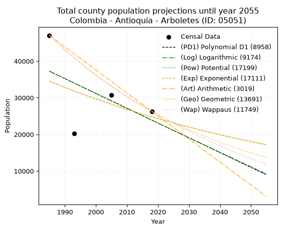
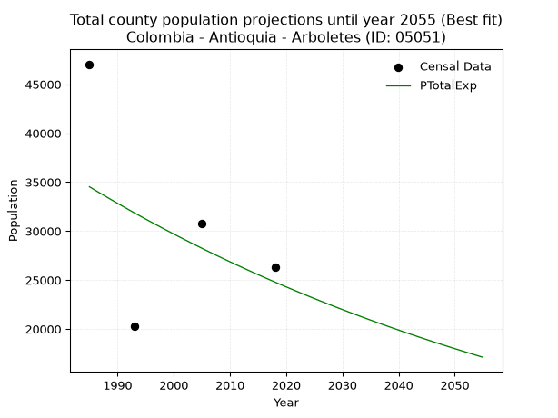
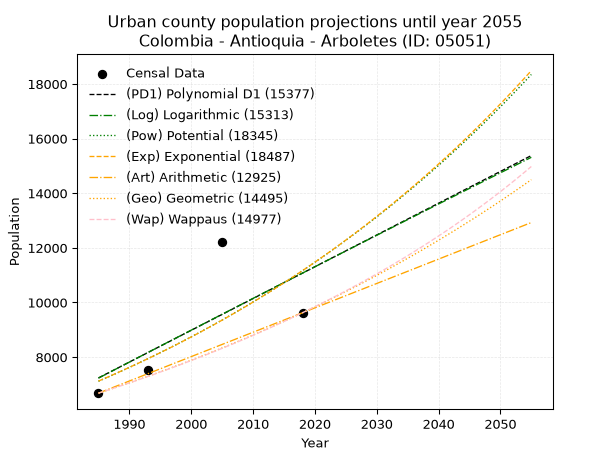
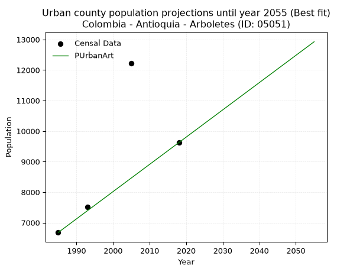
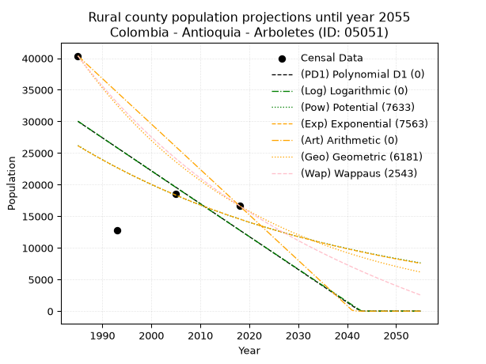
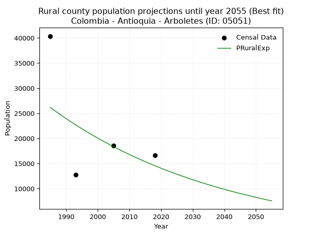

<div align="center">


</div>

# 📜 _“Population and Public Services Demand Projections (PPSD) until Year 2050 for Colombia - Antioquia - Arboletes (ID: 05051)”_
Keywords: `population` `public-service` `projection` `lineal` `polynomial` `logarithmic` `potential` `exponential` `arithmetic` `geometric` `wappaus` `dane` `colombia` `south-america`

PPSD are analytical estimates used by governments and planners to anticipate future changes in population size, age distribution, and the resulting community needs for utilities, healthcare, education, and infrastructure as sizing future water treatment facilities, electrical grids, and road networks based on spatial growth.

<div align="center">

</img>

</div>


> **General running parameters**: • app_version: _v20260806_. • Python version: _3.14.7_. • Pandas version: _3.0.5_. • NumPy version: _2.5.1_. • Creates, save and include plots into reports (create_plot): _False_. • Projection until year: _2050_. • Process polynomial degree 2 and up: _False_. • Process Wappaus: _True_. • Process Wappaus: _True_. • Set negative values to zero: _True_. • Set infinite values to zero: _True_. • Drop dataset notes: _True_. 
<div align="center">

Dynamic map: [:earth_americas:Google](http://maps.google.com/maps?q=8.849316518,-76.4267075) [:earth_americas:OSM](https://www.openstreetmap.org/#map=18/8.849316518/-76.4267075&layers=P) [:earth_americas:Bing](https://www.bing.com/maps?cp=8.849316518~-76.4267075&lvl=18) [:earth_americas:Apple](https://maps.apple.com/frame?center=8.849316518%2C-76.4267075&span=0.003%2C0.006)

</div>


<div align="center">

```geojson
{
  "type": "Feature",
  "geometry": {
    "type": "Point", 
    "coordinates": [-76.4267075, 8.849316518]
  }, 
  "properties": {
    "Name": "Colombia - Antioquia - Arboletes (ID: 05051)"
  }
}
```

</div>


## 0. Census Data (4 records)

Census data are official statistics collected by a government about the people and housing in a country. They usually include counts of total population, age, sex, race, income, education, and jobs.

📅Global census file: [Population.xlsx](../data/Population.xlsx)

| Source   |   Year |   CountryID | CountryName   |   StateID | StateName   |   CountyID | CountyName   |   PTotal |   PUrban |   PRural |
|:---------|-------:|------------:|:--------------|----------:|:------------|-----------:|:-------------|---------:|---------:|---------:|
| DANE     |   1985 |          57 | Colombia      |        05 | Antioquia   |      05051 | Arboletes    |    47043 |     6678 |    40365 |
| DANE     |   1993 |          57 | Colombia      |        05 | Antioquia   |      05051 | Arboletes    |    20260 |     7524 |    12736 |
| DANE     |   2005 |          57 | Colombia      |        05 | Antioquia   |      05051 | Arboletes    |    30738 |    12213 |    18525 |
| DANE     |   2018 |          57 | Colombia      |        05 | Antioquia   |      05051 | Arboletes    |    26289 |     9623 |    16666 |

> 🔥Some records could had specific notes about the registered values or the corresponding urban or rural distribution.

📅[SUI-RUPS](https://www.datos.gov.co/Hacienda-y-Cr-dito-P-blico/Registro-nico-de-Prestadores-de-Servicios-P-blicos/4qkq-csdn/about_data) - Local public utility companies: [RUPS.csv](../data/RUPS.csv)

 | SERVICIO       | ESTADO    | NOMBRE                                                       | NIT         | DEPARTAMENTO_DOMICILIO   | MUNICIPIO_DOMICILIO   | DIRECCION                |   TELEFONO | EMAIL                    | TIPO_PRESTADOR                             | CLASIFICACION                  |
|:---------------|:----------|:-------------------------------------------------------------|:------------|:-------------------------|:----------------------|:-------------------------|-----------:|:-------------------------|:-------------------------------------------|:-------------------------------|
| ACUEDUCTO      | OPERATIVA | ACUEDUCTOS Y ALCANTARILLADOS SOSTENIBLES A.A.S. S.A.  E.S.P. | 811008426-2 | ANTIOQUIA                | MEDELLIN              | Calle 33A No  78A  -  56 |    4161177 | estadistica@aassa.com.co | SOCIEDADES (EMPRESA DE SERVICIOS PUBLICOS) | DESDE 2501 HASTA 5000 USUARIOS |
| ALCANTARILLADO | OPERATIVA | ACUEDUCTOS Y ALCANTARILLADOS SOSTENIBLES A.A.S. S.A.  E.S.P. | 811008426-2 | ANTIOQUIA                | MEDELLIN              | Calle 33A No  78A  -  56 |    4161177 | estadistica@aassa.com.co | SOCIEDADES (EMPRESA DE SERVICIOS PUBLICOS) | DESDE 2501 HASTA 5000 USUARIOS |

## 1. Total

### 1.1. Coefficients and Parameters

* (PD1) Polynomial Deg 1: -404.10357286230163, 839390.6716178188 (lineal)
* (Log) Logarithmic: -810748.5996210605, 6193589.102651216
* (Pow) Potential: -20.12082245391513, 70.89200685729824
* (Exp) Exponential: -0.010024651427015575, 15136868533677.574
* (Art) Arithmetic: Year diff. 2018 - 1985 = 33, Population diff. 26289 - 47043 = -20754, Annual growth = -628.9090909090909
* (Geo) Geometric: Year diff. 2018 - 1985 = 33, Population diff. 26289 - 47043 = -20754, Annual growth % = -0.017479117587538506
* (Wap) Wappaus: i = -1.7152377977120246, Condition values only valid for < 200)

<sub>
Wappaus condition values: ['-0.00', '-1.72', '-3.43', '-5.15', '-6.86', '-8.58', '-10.29', '-12.01', '-13.72', '-15.44', '-17.15', '-18.87', '-20.58', '-22.30', '-24.01', '-25.73', '-27.44', '-29.16', '-30.87', '-32.59', '-34.30', '-36.02', '-37.74', '-39.45', '-41.17', '-42.88', '-44.60', '-46.31', '-48.03', '-49.74', '-51.46', '-53.17', '-54.89', '-56.60', '-58.32', '-60.03', '-61.75', '-63.46', '-65.18', '-66.89', '-68.61', '-70.32', '-72.04', '-73.76', '-75.47', '-77.19', '-78.90', '-80.62', '-82.33', '-84.05', '-85.76', '-87.48', '-89.19', '-90.91', '-92.62', '-94.34', '-96.05', '-97.77', '-99.48', '-101.20', '-102.91', '-104.63', '-106.34', '-108.06', '-109.78', '-111.49']
</sub>


### 1.2. Projected Dataset

|   Year |   CountyID |   PTotalPD1 |   PTotalLog |   PTotalPow |   PTotalExp |   PTotalArt |   PTotalGeo |   PTotalWap |
|-------:|-----------:|------------:|------------:|------------:|------------:|------------:|------------:|------------:|
|   1985 |      05051 |       37245 |       37272 |       34542 |       34517 |       47043 |       47043 |       47043 |
|   1986 |      05051 |       36841 |       36863 |       34194 |       34173 |       46414 |       46221 |       46243 |
|   1987 |      05051 |       36437 |       36455 |       33850 |       33832 |       45785 |       45413 |       45456 |
|   1988 |      05051 |       36033 |       36047 |       33509 |       33495 |       45156 |       44619 |       44683 |
|   1989 |      05051 |       35629 |       35640 |       33171 |       33161 |       44527 |       43839 |       43922 |
|   1990 |      05051 |       35225 |       35232 |       32837 |       32830 |       43898 |       43073 |       43174 |
|   1991 |      05051 |       34820 |       34825 |       32507 |       32503 |       43270 |       42320 |       42439 |
|   1992 |      05051 |       34416 |       34418 |       32180 |       32178 |       42641 |       41580 |       41715 |
|   1993 |      05051 |       34012 |       34011 |       31857 |       31857 |       42012 |       40854 |       41002 |
|   1994 |      05051 |       33608 |       33604 |       31537 |       31540 |       41383 |       40139 |       40301 |
|   1995 |      05051 |       33204 |       33197 |       31221 |       31225 |       40754 |       39438 |       39611 |
|   1996 |      05051 |       32800 |       32791 |       30907 |       30914 |       40125 |       38748 |       38932 |
|   1997 |      05051 |       32396 |       32385 |       30597 |       30605 |       39496 |       38071 |       38264 |
|   1998 |      05051 |       31992 |       31979 |       30291 |       30300 |       38867 |       37406 |       37606 |
|   1999 |      05051 |       31588 |       31574 |       29987 |       29998 |       38238 |       36752 |       36957 |
|   2000 |      05051 |       31184 |       31168 |       29687 |       29698 |       37609 |       36110 |       36319 |
|   2001 |      05051 |       30779 |       30763 |       29390 |       29402 |       36980 |       35478 |       35690 |
|   2002 |      05051 |       30375 |       30358 |       29096 |       29109 |       36352 |       34858 |       35071 |
|   2003 |      05051 |       29971 |       29953 |       28805 |       28819 |       35723 |       34249 |       34461 |
|   2004 |      05051 |       29567 |       29548 |       28517 |       28531 |       35094 |       33650 |       33860 |
|   2005 |      05051 |       29163 |       29144 |       28233 |       28247 |       34465 |       33062 |       33268 |
|   2006 |      05051 |       28759 |       28739 |       27951 |       27965 |       33836 |       32484 |       32684 |
|   2007 |      05051 |       28355 |       28335 |       27672 |       27686 |       33207 |       31916 |       32109 |
|   2008 |      05051 |       27951 |       27932 |       27396 |       27410 |       32578 |       31359 |       31542 |
|   2009 |      05051 |       27547 |       27528 |       27123 |       27136 |       31949 |       30810 |       30983 |
|   2010 |      05051 |       27142 |       27124 |       26853 |       26866 |       31320 |       30272 |       30432 |
|   2011 |      05051 |       26738 |       26721 |       26585 |       26598 |       30691 |       29743 |       29889 |
|   2012 |      05051 |       26334 |       26318 |       26321 |       26332 |       30062 |       29223 |       29353 |
|   2013 |      05051 |       25930 |       25915 |       26059 |       26070 |       29434 |       28712 |       28825 |
|   2014 |      05051 |       25526 |       25513 |       25800 |       25810 |       28805 |       28210 |       28304 |
|   2015 |      05051 |       25122 |       25110 |       25543 |       25552 |       28176 |       27717 |       27790 |
|   2016 |      05051 |       24718 |       24708 |       25289 |       25297 |       27547 |       27233 |       27283 |
|   2017 |      05051 |       24314 |       24306 |       25038 |       25045 |       26918 |       26757 |       26782 |
|   2018 |      05051 |       23910 |       23904 |       24790 |       24795 |       26289 |       26289 |       26289 |
|   2019 |      05051 |       23506 |       23502 |       24544 |       24548 |       25660 |       25829 |       25802 |
|   2020 |      05051 |       23101 |       23101 |       24301 |       24303 |       25031 |       25378 |       25322 |
|   2021 |      05051 |       22697 |       22700 |       24060 |       24061 |       24402 |       24934 |       24847 |
|   2022 |      05051 |       22293 |       22299 |       23822 |       23821 |       23773 |       24499 |       24379 |
|   2023 |      05051 |       21889 |       21898 |       23586 |       23583 |       23144 |       24070 |       23917 |
|   2024 |      05051 |       21485 |       21497 |       23352 |       23348 |       22516 |       23650 |       23461 |
|   2025 |      05051 |       21081 |       21097 |       23121 |       23115 |       21887 |       23236 |       23011 |
|   2026 |      05051 |       20677 |       20696 |       22893 |       22884 |       21258 |       22830 |       22567 |
|   2027 |      05051 |       20273 |       20296 |       22667 |       22656 |       20629 |       22431 |       22128 |
|   2028 |      05051 |       19869 |       19896 |       22443 |       22430 |       20000 |       22039 |       21694 |
|   2029 |      05051 |       19465 |       19497 |       22221 |       22206 |       19371 |       21654 |       21266 |
|   2030 |      05051 |       19060 |       19097 |       22002 |       21985 |       18742 |       21275 |       20844 |
|   2031 |      05051 |       18656 |       18698 |       21785 |       21766 |       18113 |       20903 |       20426 |
|   2032 |      05051 |       18252 |       18299 |       21571 |       21549 |       17484 |       20538 |       20014 |
|   2033 |      05051 |       17848 |       17900 |       21358 |       21334 |       16855 |       20179 |       19606 |
|   2034 |      05051 |       17444 |       17501 |       21148 |       21121 |       16226 |       19826 |       19204 |
|   2035 |      05051 |       17040 |       17103 |       20940 |       20910 |       15598 |       19480 |       18806 |
|   2036 |      05051 |       16636 |       16704 |       20734 |       20702 |       14969 |       19139 |       18413 |
|   2037 |      05051 |       16232 |       16306 |       20530 |       20495 |       14340 |       18805 |       18025 |
|   2038 |      05051 |       15828 |       15908 |       20328 |       20291 |       13711 |       18476 |       17641 |
|   2039 |      05051 |       15423 |       15511 |       20128 |       20088 |       13082 |       18153 |       17262 |
|   2040 |      05051 |       15019 |       15113 |       19931 |       19888 |       12453 |       17836 |       16888 |
|   2041 |      05051 |       14615 |       14716 |       19735 |       19690 |       11824 |       17524 |       16517 |
|   2042 |      05051 |       14211 |       14319 |       19542 |       19493 |       11195 |       17218 |       16151 |
|   2043 |      05051 |       13807 |       13922 |       19350 |       19299 |       10566 |       16917 |       15789 |
|   2044 |      05051 |       13403 |       13525 |       19161 |       19106 |        9937 |       16621 |       15431 |
|   2045 |      05051 |       12999 |       13128 |       18973 |       18916 |        9308 |       16331 |       15078 |
|   2046 |      05051 |       12595 |       12732 |       18787 |       18727 |        8680 |       16045 |       14728 |
|   2047 |      05051 |       12191 |       12336 |       18603 |       18540 |        8051 |       15765 |       14382 |
|   2048 |      05051 |       11787 |       11940 |       18421 |       18355 |        7422 |       15489 |       14040 |
|   2049 |      05051 |       11382 |       11544 |       18241 |       18172 |        6793 |       15218 |       13702 |
|   2050 |      05051 |       10978 |       11149 |       18063 |       17991 |        6164 |       14952 |       13367 |
<div align="center">

</img>

</div>


### 1.3. Best fit with absolute and relative error (%)

Relative error puts that difference into context by dividing the absolute error by the true value, creating a unitless ratio or percentage that shows the scale of the mistake.

Absolute and relative error

|   Year | Source   |   CountryID | CountryName   |   StateID | StateName   |   CountyID_x | CountyName   |   PTotal |   PUrban |   PRural |   CountyID_y |   PTotalPD1 |   PTotalLog |   PTotalPow |   PTotalExp |   PTotalArt |   PTotalGeo |   PTotalWap |   PTotalPD1AbsError |   PTotalLogAbsError |   PTotalPowAbsError |   PTotalExpAbsError |   PTotalArtAbsError |   PTotalGeoAbsError |   PTotalWapAbsError |   PTotalPD1RelError |   PTotalLogRelError |   PTotalPowRelError |   PTotalExpRelError |   PTotalArtRelError |   PTotalGeoRelError |   PTotalWapRelError |
|-------:|:---------|------------:|:--------------|----------:|:------------|-------------:|:-------------|---------:|---------:|---------:|-------------:|------------:|------------:|------------:|------------:|------------:|------------:|------------:|--------------------:|--------------------:|--------------------:|--------------------:|--------------------:|--------------------:|--------------------:|--------------------:|--------------------:|--------------------:|--------------------:|--------------------:|--------------------:|--------------------:|
|   1985 | DANE     |          57 | Colombia      |        05 | Antioquia   |        05051 | Arboletes    |    47043 |     6678 |    40365 |        05051 |       37245 |       37272 |       34542 |       34517 |       47043 |       47043 |       47043 |                9798 |                9771 |               12501 |               12526 |                   0 |                   0 |                   0 |            20.8278  |            20.7704  |            26.5736  |            26.6267  |              0      |             0       |             0       |
|   1993 | DANE     |          57 | Colombia      |        05 | Antioquia   |        05051 | Arboletes    |    20260 |     7524 |    12736 |        05051 |       34012 |       34011 |       31857 |       31857 |       42012 |       40854 |       41002 |               13752 |               13751 |               11597 |               11597 |               21752 |               20594 |               20742 |            67.8776  |            67.8727  |            57.2409  |            57.2409  |            107.364  |           101.649   |           102.379   |
|   2005 | DANE     |          57 | Colombia      |        05 | Antioquia   |        05051 | Arboletes    |    30738 |    12213 |    18525 |        05051 |       29163 |       29144 |       28233 |       28247 |       34465 |       33062 |       33268 |                1575 |                1594 |                2505 |                2491 |                3727 |                2324 |                2530 |             5.12395 |             5.18576 |             8.14952 |             8.10398 |             12.1251 |             7.56067 |             8.23085 |
|   2018 | DANE     |          57 | Colombia      |        05 | Antioquia   |        05051 | Arboletes    |    26289 |     9623 |    16666 |        05051 |       23910 |       23904 |       24790 |       24795 |       26289 |       26289 |       26289 |                2379 |                2385 |                1499 |                1494 |                   0 |                   0 |                   0 |             9.04941 |             9.07224 |             5.702   |             5.68299 |              0      |             0       |             0       |

Relative error mean

| Method    |   RelError | Best   |
|:----------|-----------:|:-------|
| PTotalPD1 |    25.7197 |        |
| PTotalLog |    25.7253 |        |
| PTotalPow |    24.4165 |        |
| PTotalExp |    24.4136 | True   |
| PTotalArt |    29.8723 |        |
| PTotalGeo |    27.3023 |        |
| PTotalWap |    27.6525 |        |

💙Best method: _**PTotalExp**_
<div align="center">

</img>

</div>


### 1.4. Fresh water supply demand in liters per capita per day (lpcd)

The fresh water supply demand typically ranges from 100 to 300 liters per capita per day (lpcd) for standard domestic and municipal planning, though absolute survival minimums set by the World Health Organization are as low as 7.5 to 20 liters per day, and total consumption in high-income nations can exceed 400 liters.

> `CZ`: Level in meters above the sea level (masl)<br> `WS`: Fresh water supply demand in liters per capita per day (lpcd or l/h/d)<br> `WSAll`: Zonal fresh water supply demand in liters per second (l/s)<br> `A`: Zonal area in square meters<br> `DP`: Population density (people/hectare or p/ha)

Reference values (RAS Colombia)

|    CZ |   WS |
|------:|-----:|
|  1000 |  120 |
|  2000 |  130 |
| 99999 |  140 |

County shapefile geometry properties and water supply values

|   CountyID |      ATotal |   CZTotal |   WSTotal |
|-----------:|------------:|----------:|----------:|
|      05051 | 7.54395e+08 |   93.8316 |       120 |

Projected values for best method: PTotalExp

|   CountyID |   Year |   PTotalExp |   DPTotal |   WSTotal |   WSTotalAll |
|-----------:|-------:|------------:|----------:|----------:|-------------:|
|      05051 |   1985 |       34517 |      0.46 |       120 |      47.9403 |
|      05051 |   1986 |       34173 |      0.45 |       120 |      47.4625 |
|      05051 |   1987 |       33832 |      0.45 |       120 |      46.9889 |
|      05051 |   1988 |       33495 |      0.44 |       120 |      46.5208 |
|      05051 |   1989 |       33161 |      0.44 |       120 |      46.0569 |
|      05051 |   1990 |       32830 |      0.44 |       120 |      45.5972 |
|      05051 |   1991 |       32503 |      0.43 |       120 |      45.1431 |
|      05051 |   1992 |       32178 |      0.43 |       120 |      44.6917 |
|      05051 |   1993 |       31857 |      0.42 |       120 |      44.2458 |
|      05051 |   1994 |       31540 |      0.42 |       120 |      43.8056 |
|      05051 |   1995 |       31225 |      0.41 |       120 |      43.3681 |
|      05051 |   1996 |       30914 |      0.41 |       120 |      42.9361 |
|      05051 |   1997 |       30605 |      0.41 |       120 |      42.5069 |
|      05051 |   1998 |       30300 |      0.4  |       120 |      42.0833 |
|      05051 |   1999 |       29998 |      0.4  |       120 |      41.6639 |
|      05051 |   2000 |       29698 |      0.39 |       120 |      41.2472 |
|      05051 |   2001 |       29402 |      0.39 |       120 |      40.8361 |
|      05051 |   2002 |       29109 |      0.39 |       120 |      40.4292 |
|      05051 |   2003 |       28819 |      0.38 |       120 |      40.0264 |
|      05051 |   2004 |       28531 |      0.38 |       120 |      39.6264 |
|      05051 |   2005 |       28247 |      0.37 |       120 |      39.2319 |
|      05051 |   2006 |       27965 |      0.37 |       120 |      38.8403 |
|      05051 |   2007 |       27686 |      0.37 |       120 |      38.4528 |
|      05051 |   2008 |       27410 |      0.36 |       120 |      38.0694 |
|      05051 |   2009 |       27136 |      0.36 |       120 |      37.6889 |
|      05051 |   2010 |       26866 |      0.36 |       120 |      37.3139 |
|      05051 |   2011 |       26598 |      0.35 |       120 |      36.9417 |
|      05051 |   2012 |       26332 |      0.35 |       120 |      36.5722 |
|      05051 |   2013 |       26070 |      0.35 |       120 |      36.2083 |
|      05051 |   2014 |       25810 |      0.34 |       120 |      35.8472 |
|      05051 |   2015 |       25552 |      0.34 |       120 |      35.4889 |
|      05051 |   2016 |       25297 |      0.34 |       120 |      35.1347 |
|      05051 |   2017 |       25045 |      0.33 |       120 |      34.7847 |
|      05051 |   2018 |       24795 |      0.33 |       120 |      34.4375 |
|      05051 |   2019 |       24548 |      0.33 |       120 |      34.0944 |
|      05051 |   2020 |       24303 |      0.32 |       120 |      33.7542 |
|      05051 |   2021 |       24061 |      0.32 |       120 |      33.4181 |
|      05051 |   2022 |       23821 |      0.32 |       120 |      33.0847 |
|      05051 |   2023 |       23583 |      0.31 |       120 |      32.7542 |
|      05051 |   2024 |       23348 |      0.31 |       120 |      32.4278 |
|      05051 |   2025 |       23115 |      0.31 |       120 |      32.1042 |
|      05051 |   2026 |       22884 |      0.3  |       120 |      31.7833 |
|      05051 |   2027 |       22656 |      0.3  |       120 |      31.4667 |
|      05051 |   2028 |       22430 |      0.3  |       120 |      31.1528 |
|      05051 |   2029 |       22206 |      0.29 |       120 |      30.8417 |
|      05051 |   2030 |       21985 |      0.29 |       120 |      30.5347 |
|      05051 |   2031 |       21766 |      0.29 |       120 |      30.2306 |
|      05051 |   2032 |       21549 |      0.29 |       120 |      29.9292 |
|      05051 |   2033 |       21334 |      0.28 |       120 |      29.6306 |
|      05051 |   2034 |       21121 |      0.28 |       120 |      29.3347 |
|      05051 |   2035 |       20910 |      0.28 |       120 |      29.0417 |
|      05051 |   2036 |       20702 |      0.27 |       120 |      28.7528 |
|      05051 |   2037 |       20495 |      0.27 |       120 |      28.4653 |
|      05051 |   2038 |       20291 |      0.27 |       120 |      28.1819 |
|      05051 |   2039 |       20088 |      0.27 |       120 |      27.9    |
|      05051 |   2040 |       19888 |      0.26 |       120 |      27.6222 |
|      05051 |   2041 |       19690 |      0.26 |       120 |      27.3472 |
|      05051 |   2042 |       19493 |      0.26 |       120 |      27.0736 |
|      05051 |   2043 |       19299 |      0.26 |       120 |      26.8042 |
|      05051 |   2044 |       19106 |      0.25 |       120 |      26.5361 |
|      05051 |   2045 |       18916 |      0.25 |       120 |      26.2722 |
|      05051 |   2046 |       18727 |      0.25 |       120 |      26.0097 |
|      05051 |   2047 |       18540 |      0.25 |       120 |      25.75   |
|      05051 |   2048 |       18355 |      0.24 |       120 |      25.4931 |
|      05051 |   2049 |       18172 |      0.24 |       120 |      25.2389 |
|      05051 |   2050 |       17991 |      0.24 |       120 |      24.9875 |

## 2. Urban

### 2.1. Coefficients and Parameters

* (PD1) Polynomial Deg 1: 116.30911280610329, -223637.80289040811 (lineal)
* (Log) Logarithmic: 233256.14761199176, -1763972.3471962074
* (Pow) Potential: 27.327040003554934, -86.26582444583164
* (Exp) Exponential: 0.013628995766209967, 1.2686211613584665e-08
* (Art) Arithmetic: Year diff. 2018 - 1985 = 33, Population diff. 9623 - 6678 = 2945, Annual growth = 89.24242424242425
* (Geo) Geometric: Year diff. 2018 - 1985 = 33, Population diff. 9623 - 6678 = 2945, Annual growth % = 0.01113234254388007
* (Wap) Wappaus: i = 1.0949318967231978, Condition values only valid for < 200)

<sub>
Wappaus condition values: ['0.00', '1.09', '2.19', '3.28', '4.38', '5.47', '6.57', '7.66', '8.76', '9.85', '10.95', '12.04', '13.14', '14.23', '15.33', '16.42', '17.52', '18.61', '19.71', '20.80', '21.90', '22.99', '24.09', '25.18', '26.28', '27.37', '28.47', '29.56', '30.66', '31.75', '32.85', '33.94', '35.04', '36.13', '37.23', '38.32', '39.42', '40.51', '41.61', '42.70', '43.80', '44.89', '45.99', '47.08', '48.18', '49.27', '50.37', '51.46', '52.56', '53.65', '54.75', '55.84', '56.94', '58.03', '59.13', '60.22', '61.32', '62.41', '63.51', '64.60', '65.70', '66.79', '67.89', '68.98', '70.08', '71.17']
</sub>


### 2.2. Projected Dataset

|   Year |   CountyID |   PUrbanPD1 |   PUrbanLog |   PUrbanPow |   PUrbanExp |   PUrbanArt |   PUrbanGeo |   PUrbanWap |
|-------:|-----------:|------------:|------------:|------------:|------------:|------------:|------------:|------------:|
|   1985 |      05051 |        7236 |        7229 |        7116 |        7121 |        6678 |        6678 |        6678 |
|   1986 |      05051 |        7352 |        7346 |        7214 |        7219 |        6767 |        6752 |        6752 |
|   1987 |      05051 |        7468 |        7464 |        7314 |        7318 |        6856 |        6828 |        6826 |
|   1988 |      05051 |        7585 |        7581 |        7415 |        7418 |        6946 |        6904 |        6901 |
|   1989 |      05051 |        7701 |        7698 |        7518 |        7520 |        7035 |        6980 |        6977 |
|   1990 |      05051 |        7817 |        7816 |        7622 |        7623 |        7124 |        7058 |        7054 |
|   1991 |      05051 |        7934 |        7933 |        7727 |        7728 |        7213 |        7137 |        7132 |
|   1992 |      05051 |        8050 |        8050 |        7834 |        7834 |        7303 |        7216 |        7210 |
|   1993 |      05051 |        8166 |        8167 |        7942 |        7941 |        7392 |        7296 |        7290 |
|   1994 |      05051 |        8283 |        8284 |        8052 |        8050 |        7481 |        7378 |        7370 |
|   1995 |      05051 |        8399 |        8401 |        8163 |        8161 |        7570 |        7460 |        7452 |
|   1996 |      05051 |        8515 |        8518 |        8276 |        8273 |        7660 |        7543 |        7534 |
|   1997 |      05051 |        8631 |        8635 |        8390 |        8386 |        7749 |        7627 |        7617 |
|   1998 |      05051 |        8748 |        8752 |        8505 |        8501 |        7838 |        7712 |        7701 |
|   1999 |      05051 |        8864 |        8868 |        8622 |        8618 |        7927 |        7798 |        7787 |
|   2000 |      05051 |        8980 |        8985 |        8741 |        8736 |        8017 |        7884 |        7873 |
|   2001 |      05051 |        9097 |        9101 |        8861 |        8856 |        8106 |        7972 |        7960 |
|   2002 |      05051 |        9213 |        9218 |        8983 |        8978 |        8195 |        8061 |        8049 |
|   2003 |      05051 |        9329 |        9335 |        9106 |        9101 |        8284 |        8151 |        8138 |
|   2004 |      05051 |        9446 |        9451 |        9231 |        9226 |        8374 |        8241 |        8229 |
|   2005 |      05051 |        9562 |        9567 |        9358 |        9352 |        8463 |        8333 |        8320 |
|   2006 |      05051 |        9678 |        9684 |        9486 |        9481 |        8552 |        8426 |        8413 |
|   2007 |      05051 |        9795 |        9800 |        9617 |        9611 |        8641 |        8520 |        8507 |
|   2008 |      05051 |        9911 |        9916 |        9748 |        9743 |        8731 |        8615 |        8602 |
|   2009 |      05051 |       10027 |       10032 |        9882 |        9876 |        8820 |        8710 |        8698 |
|   2010 |      05051 |       10144 |       10148 |       10017 |       10012 |        8909 |        8807 |        8796 |
|   2011 |      05051 |       10260 |       10264 |       10154 |       10149 |        8998 |        8905 |        8895 |
|   2012 |      05051 |       10376 |       10380 |       10293 |       10289 |        9088 |        9005 |        8995 |
|   2013 |      05051 |       10492 |       10496 |       10434 |       10430 |        9177 |        9105 |        9096 |
|   2014 |      05051 |       10609 |       10612 |       10576 |       10573 |        9266 |        9206 |        9199 |
|   2015 |      05051 |       10725 |       10728 |       10721 |       10718 |        9355 |        9309 |        9303 |
|   2016 |      05051 |       10841 |       10844 |       10867 |       10865 |        9445 |        9412 |        9408 |
|   2017 |      05051 |       10958 |       10959 |       11016 |       11014 |        9534 |        9517 |        9515 |
|   2018 |      05051 |       11074 |       11075 |       11166 |       11165 |        9623 |        9623 |        9623 |
|   2019 |      05051 |       11190 |       11190 |       11318 |       11318 |        9712 |        9730 |        9733 |
|   2020 |      05051 |       11307 |       11306 |       11472 |       11474 |        9801 |        9838 |        9844 |
|   2021 |      05051 |       11423 |       11421 |       11628 |       11631 |        9891 |        9948 |        9956 |
|   2022 |      05051 |       11539 |       11537 |       11787 |       11791 |        9980 |       10059 |       10071 |
|   2023 |      05051 |       11656 |       11652 |       11947 |       11953 |       10069 |       10171 |       10186 |
|   2024 |      05051 |       11772 |       11767 |       12109 |       12117 |       10158 |       10284 |       10304 |
|   2025 |      05051 |       11888 |       11883 |       12274 |       12283 |       10248 |       10398 |       10423 |
|   2026 |      05051 |       12004 |       11998 |       12441 |       12451 |       10337 |       10514 |       10544 |
|   2027 |      05051 |       12121 |       12113 |       12610 |       12622 |       10426 |       10631 |       10666 |
|   2028 |      05051 |       12237 |       12228 |       12781 |       12796 |       10515 |       10750 |       10790 |
|   2029 |      05051 |       12353 |       12343 |       12954 |       12971 |       10605 |       10869 |       10916 |
|   2030 |      05051 |       12470 |       12458 |       13130 |       13149 |       10694 |       10990 |       11044 |
|   2031 |      05051 |       12586 |       12573 |       13308 |       13330 |       10783 |       11113 |       11174 |
|   2032 |      05051 |       12702 |       12687 |       13488 |       13512 |       10872 |       11236 |       11305 |
|   2033 |      05051 |       12819 |       12802 |       13670 |       13698 |       10962 |       11361 |       11439 |
|   2034 |      05051 |       12935 |       12917 |       13855 |       13886 |       11051 |       11488 |       11574 |
|   2035 |      05051 |       13051 |       13032 |       14043 |       14076 |       11140 |       11616 |       11712 |
|   2036 |      05051 |       13168 |       13146 |       14232 |       14270 |       11229 |       11745 |       11852 |
|   2037 |      05051 |       13284 |       13261 |       14425 |       14465 |       11319 |       11876 |       11993 |
|   2038 |      05051 |       13400 |       13375 |       14619 |       14664 |       11408 |       12008 |       12137 |
|   2039 |      05051 |       13516 |       13490 |       14817 |       14865 |       11497 |       12142 |       12284 |
|   2040 |      05051 |       13633 |       13604 |       15017 |       15069 |       11586 |       12277 |       12432 |
|   2041 |      05051 |       13749 |       13718 |       15219 |       15276 |       11676 |       12414 |       12583 |
|   2042 |      05051 |       13865 |       13833 |       15424 |       15485 |       11765 |       12552 |       12736 |
|   2043 |      05051 |       13982 |       13947 |       15632 |       15698 |       11854 |       12691 |       12892 |
|   2044 |      05051 |       14098 |       14061 |       15842 |       15913 |       11943 |       12833 |       13050 |
|   2045 |      05051 |       14214 |       14175 |       16056 |       16132 |       12033 |       12976 |       13211 |
|   2046 |      05051 |       14331 |       14289 |       16271 |       16353 |       12122 |       13120 |       13375 |
|   2047 |      05051 |       14447 |       14403 |       16490 |       16578 |       12211 |       13266 |       13541 |
|   2048 |      05051 |       14563 |       14517 |       16712 |       16805 |       12300 |       13414 |       13710 |
|   2049 |      05051 |       14680 |       14631 |       16936 |       17036 |       12390 |       13563 |       13882 |
|   2050 |      05051 |       14796 |       14745 |       17163 |       17269 |       12479 |       13714 |       14056 |
<div align="center">

</img>

</div>


### 2.3. Best fit with absolute and relative error (%)

Relative error puts that difference into context by dividing the absolute error by the true value, creating a unitless ratio or percentage that shows the scale of the mistake.

Absolute and relative error

|   Year | Source   |   CountryID | CountryName   |   StateID | StateName   |   CountyID_x | CountyName   |   PTotal |   PUrban |   PRural |   CountyID_y |   PUrbanPD1 |   PUrbanLog |   PUrbanPow |   PUrbanExp |   PUrbanArt |   PUrbanGeo |   PUrbanWap |   PUrbanPD1AbsError |   PUrbanLogAbsError |   PUrbanPowAbsError |   PUrbanExpAbsError |   PUrbanArtAbsError |   PUrbanGeoAbsError |   PUrbanWapAbsError |   PUrbanPD1RelError |   PUrbanLogRelError |   PUrbanPowRelError |   PUrbanExpRelError |   PUrbanArtRelError |   PUrbanGeoRelError |   PUrbanWapRelError |
|-------:|:---------|------------:|:--------------|----------:|:------------|-------------:|:-------------|---------:|---------:|---------:|-------------:|------------:|------------:|------------:|------------:|------------:|------------:|------------:|--------------------:|--------------------:|--------------------:|--------------------:|--------------------:|--------------------:|--------------------:|--------------------:|--------------------:|--------------------:|--------------------:|--------------------:|--------------------:|--------------------:|
|   1985 | DANE     |          57 | Colombia      |        05 | Antioquia   |        05051 | Arboletes    |    47043 |     6678 |    40365 |        05051 |        7236 |        7229 |        7116 |        7121 |        6678 |        6678 |        6678 |                 558 |                 551 |                 438 |                 443 |                   0 |                   0 |                   0 |              8.3558 |             8.25097 |             6.55885 |             6.63372 |             0       |              0      |             0       |
|   1993 | DANE     |          57 | Colombia      |        05 | Antioquia   |        05051 | Arboletes    |    20260 |     7524 |    12736 |        05051 |        8166 |        8167 |        7942 |        7941 |        7392 |        7296 |        7290 |                 642 |                 643 |                 418 |                 417 |                 132 |                 228 |                 234 |              8.5327 |             8.54599 |             5.55556 |             5.54226 |             1.75439 |              3.0303 |             3.11005 |
|   2005 | DANE     |          57 | Colombia      |        05 | Antioquia   |        05051 | Arboletes    |    30738 |    12213 |    18525 |        05051 |        9562 |        9567 |        9358 |        9352 |        8463 |        8333 |        8320 |                2651 |                2646 |                2855 |                2861 |                3750 |                3880 |                3893 |             21.7064 |            21.6654  |            23.3767  |            23.4259  |            30.705   |             31.7694 |            31.8759  |
|   2018 | DANE     |          57 | Colombia      |        05 | Antioquia   |        05051 | Arboletes    |    26289 |     9623 |    16666 |        05051 |       11074 |       11075 |       11166 |       11165 |        9623 |        9623 |        9623 |                1451 |                1452 |                1543 |                1542 |                   0 |                   0 |                   0 |             15.0785 |            15.0888  |            16.0345  |            16.0241  |             0       |              0      |             0       |

Relative error mean

| Method    |   RelError | Best   |
|:----------|-----------:|:-------|
| PUrbanPD1 |   13.4183  |        |
| PUrbanLog |   13.3878  |        |
| PUrbanPow |   12.8814  |        |
| PUrbanExp |   12.9065  |        |
| PUrbanArt |    8.11484 | True   |
| PUrbanGeo |    8.69993 |        |
| PUrbanWap |    8.74648 |        |

💙Best method: _**PUrbanArt**_
<div align="center">

</img>

</div>


### 2.4. Fresh water supply demand in liters per capita per day (lpcd)

The fresh water supply demand typically ranges from 100 to 300 liters per capita per day (lpcd) for standard domestic and municipal planning, though absolute survival minimums set by the World Health Organization are as low as 7.5 to 20 liters per day, and total consumption in high-income nations can exceed 400 liters.

> `CZ`: Level in meters above the sea level (masl)<br> `WS`: Fresh water supply demand in liters per capita per day (lpcd or l/h/d)<br> `WSAll`: Zonal fresh water supply demand in liters per second (l/s)<br> `A`: Zonal area in square meters<br> `DP`: Population density (people/hectare or p/ha)

Reference values (RAS Colombia)

|    CZ |   WS |
|------:|-----:|
|  1000 |  120 |
|  2000 |  130 |
| 99999 |  140 |

County shapefile geometry properties and water supply values

|   CountyID |      AUrban |   CZUrban |   WSUrban |
|-----------:|------------:|----------:|----------:|
|      05051 | 1.54396e+06 |   11.3254 |       120 |

Projected values for best method: PUrbanArt

|   CountyID |   Year |   PUrbanArt |   DPUrban |   WSUrban |   WSUrbanAll |
|-----------:|-------:|------------:|----------:|----------:|-------------:|
|      05051 |   1985 |        6678 |     43.25 |       120 |      9.275   |
|      05051 |   1986 |        6767 |     43.83 |       120 |      9.39861 |
|      05051 |   1987 |        6856 |     44.41 |       120 |      9.52222 |
|      05051 |   1988 |        6946 |     44.99 |       120 |      9.64722 |
|      05051 |   1989 |        7035 |     45.56 |       120 |      9.77083 |
|      05051 |   1990 |        7124 |     46.14 |       120 |      9.89444 |
|      05051 |   1991 |        7213 |     46.72 |       120 |     10.0181  |
|      05051 |   1992 |        7303 |     47.3  |       120 |     10.1431  |
|      05051 |   1993 |        7392 |     47.88 |       120 |     10.2667  |
|      05051 |   1994 |        7481 |     48.45 |       120 |     10.3903  |
|      05051 |   1995 |        7570 |     49.03 |       120 |     10.5139  |
|      05051 |   1996 |        7660 |     49.61 |       120 |     10.6389  |
|      05051 |   1997 |        7749 |     50.19 |       120 |     10.7625  |
|      05051 |   1998 |        7838 |     50.77 |       120 |     10.8861  |
|      05051 |   1999 |        7927 |     51.34 |       120 |     11.0097  |
|      05051 |   2000 |        8017 |     51.93 |       120 |     11.1347  |
|      05051 |   2001 |        8106 |     52.5  |       120 |     11.2583  |
|      05051 |   2002 |        8195 |     53.08 |       120 |     11.3819  |
|      05051 |   2003 |        8284 |     53.65 |       120 |     11.5056  |
|      05051 |   2004 |        8374 |     54.24 |       120 |     11.6306  |
|      05051 |   2005 |        8463 |     54.81 |       120 |     11.7542  |
|      05051 |   2006 |        8552 |     55.39 |       120 |     11.8778  |
|      05051 |   2007 |        8641 |     55.97 |       120 |     12.0014  |
|      05051 |   2008 |        8731 |     56.55 |       120 |     12.1264  |
|      05051 |   2009 |        8820 |     57.13 |       120 |     12.25    |
|      05051 |   2010 |        8909 |     57.7  |       120 |     12.3736  |
|      05051 |   2011 |        8998 |     58.28 |       120 |     12.4972  |
|      05051 |   2012 |        9088 |     58.86 |       120 |     12.6222  |
|      05051 |   2013 |        9177 |     59.44 |       120 |     12.7458  |
|      05051 |   2014 |        9266 |     60.01 |       120 |     12.8694  |
|      05051 |   2015 |        9355 |     60.59 |       120 |     12.9931  |
|      05051 |   2016 |        9445 |     61.17 |       120 |     13.1181  |
|      05051 |   2017 |        9534 |     61.75 |       120 |     13.2417  |
|      05051 |   2018 |        9623 |     62.33 |       120 |     13.3653  |
|      05051 |   2019 |        9712 |     62.9  |       120 |     13.4889  |
|      05051 |   2020 |        9801 |     63.48 |       120 |     13.6125  |
|      05051 |   2021 |        9891 |     64.06 |       120 |     13.7375  |
|      05051 |   2022 |        9980 |     64.64 |       120 |     13.8611  |
|      05051 |   2023 |       10069 |     65.22 |       120 |     13.9847  |
|      05051 |   2024 |       10158 |     65.79 |       120 |     14.1083  |
|      05051 |   2025 |       10248 |     66.37 |       120 |     14.2333  |
|      05051 |   2026 |       10337 |     66.95 |       120 |     14.3569  |
|      05051 |   2027 |       10426 |     67.53 |       120 |     14.4806  |
|      05051 |   2028 |       10515 |     68.1  |       120 |     14.6042  |
|      05051 |   2029 |       10605 |     68.69 |       120 |     14.7292  |
|      05051 |   2030 |       10694 |     69.26 |       120 |     14.8528  |
|      05051 |   2031 |       10783 |     69.84 |       120 |     14.9764  |
|      05051 |   2032 |       10872 |     70.42 |       120 |     15.1     |
|      05051 |   2033 |       10962 |     71    |       120 |     15.225   |
|      05051 |   2034 |       11051 |     71.58 |       120 |     15.3486  |
|      05051 |   2035 |       11140 |     72.15 |       120 |     15.4722  |
|      05051 |   2036 |       11229 |     72.73 |       120 |     15.5958  |
|      05051 |   2037 |       11319 |     73.31 |       120 |     15.7208  |
|      05051 |   2038 |       11408 |     73.89 |       120 |     15.8444  |
|      05051 |   2039 |       11497 |     74.46 |       120 |     15.9681  |
|      05051 |   2040 |       11586 |     75.04 |       120 |     16.0917  |
|      05051 |   2041 |       11676 |     75.62 |       120 |     16.2167  |
|      05051 |   2042 |       11765 |     76.2  |       120 |     16.3403  |
|      05051 |   2043 |       11854 |     76.78 |       120 |     16.4639  |
|      05051 |   2044 |       11943 |     77.35 |       120 |     16.5875  |
|      05051 |   2045 |       12033 |     77.94 |       120 |     16.7125  |
|      05051 |   2046 |       12122 |     78.51 |       120 |     16.8361  |
|      05051 |   2047 |       12211 |     79.09 |       120 |     16.9597  |
|      05051 |   2048 |       12300 |     79.67 |       120 |     17.0833  |
|      05051 |   2049 |       12390 |     80.25 |       120 |     17.2083  |
|      05051 |   2050 |       12479 |     80.82 |       120 |     17.3319  |

## 3. Rural

### 3.1. Coefficients and Parameters

* (PD1) Polynomial Deg 1: -520.4126856684052, 1063028.4745082275 (lineal)
* (Log) Logarithmic: -1044004.7472330519, 7957561.449847422
* (Pow) Potential: -35.56873952053691, 121.71526348996949
* (Exp) Exponential: -0.01772447635568146, 4.981565703016596e+19
* (Art) Arithmetic: Year diff. 2018 - 1985 = 33, Population diff. 16666 - 40365 = -23699, Annual growth = -718.1515151515151
* (Geo) Geometric: Year diff. 2018 - 1985 = 33, Population diff. 16666 - 40365 = -23699, Annual growth % = -0.02644974159649638
* (Wap) Wappaus: i = -2.5184601888499767, Condition values only valid for < 200)

<sub>
Wappaus condition values: ['-0.00', '-2.52', '-5.04', '-7.56', '-10.07', '-12.59', '-15.11', '-17.63', '-20.15', '-22.67', '-25.18', '-27.70', '-30.22', '-32.74', '-35.26', '-37.78', '-40.30', '-42.81', '-45.33', '-47.85', '-50.37', '-52.89', '-55.41', '-57.92', '-60.44', '-62.96', '-65.48', '-68.00', '-70.52', '-73.04', '-75.55', '-78.07', '-80.59', '-83.11', '-85.63', '-88.15', '-90.66', '-93.18', '-95.70', '-98.22', '-100.74', '-103.26', '-105.78', '-108.29', '-110.81', '-113.33', '-115.85', '-118.37', '-120.89', '-123.40', '-125.92', '-128.44', '-130.96', '-133.48', '-136.00', '-138.52', '-141.03', '-143.55', '-146.07', '-148.59', '-151.11', '-153.63', '-156.14', '-158.66', '-161.18', '-163.70']
</sub>


### 3.2. Projected Dataset

|   Year |   CountyID |   PRuralPD1 |   PRuralLog |   PRuralPow |   PRuralExp |   PRuralArt |   PRuralGeo |   PRuralWap |
|-------:|-----------:|------------:|------------:|------------:|------------:|------------:|------------:|------------:|
|   1985 |      05051 |       30009 |       30043 |       26187 |       26154 |       40365 |       40365 |       40365 |
|   1986 |      05051 |       29489 |       29517 |       25722 |       25695 |       39647 |       39297 |       39361 |
|   1987 |      05051 |       28968 |       28991 |       25265 |       25244 |       38929 |       38258 |       38382 |
|   1988 |      05051 |       28448 |       28466 |       24817 |       24800 |       38211 |       37246 |       37426 |
|   1989 |      05051 |       27928 |       27941 |       24377 |       24364 |       37492 |       36261 |       36494 |
|   1990 |      05051 |       27407 |       27416 |       23945 |       23936 |       36774 |       35302 |       35583 |
|   1991 |      05051 |       26887 |       26892 |       23521 |       23516 |       36056 |       34368 |       34694 |
|   1992 |      05051 |       26366 |       26368 |       23105 |       23103 |       35338 |       33459 |       33825 |
|   1993 |      05051 |       25846 |       25844 |       22696 |       22697 |       34620 |       32574 |       32977 |
|   1994 |      05051 |       25326 |       25320 |       22295 |       22298 |       33902 |       31712 |       32147 |
|   1995 |      05051 |       24805 |       24796 |       21901 |       21906 |       33183 |       30874 |       31336 |
|   1996 |      05051 |       24285 |       24273 |       21514 |       21521 |       32465 |       30057 |       30543 |
|   1997 |      05051 |       23764 |       23750 |       21134 |       21143 |       31747 |       29262 |       29767 |
|   1998 |      05051 |       23244 |       23228 |       20761 |       20772 |       31029 |       28488 |       29009 |
|   1999 |      05051 |       22724 |       22705 |       20394 |       20407 |       30311 |       27735 |       28266 |
|   2000 |      05051 |       22203 |       22183 |       20035 |       20048 |       29593 |       27001 |       27539 |
|   2001 |      05051 |       21683 |       21661 |       19682 |       19696 |       28875 |       26287 |       26827 |
|   2002 |      05051 |       21162 |       21140 |       19335 |       19350 |       28156 |       25592 |       26130 |
|   2003 |      05051 |       20642 |       20618 |       18995 |       19010 |       27438 |       24915 |       25448 |
|   2004 |      05051 |       20121 |       20097 |       18661 |       18676 |       26720 |       24256 |       24779 |
|   2005 |      05051 |       19601 |       19576 |       18332 |       18348 |       26002 |       23614 |       24124 |
|   2006 |      05051 |       19081 |       19056 |       18010 |       18026 |       25284 |       22990 |       23482 |
|   2007 |      05051 |       18560 |       18536 |       17694 |       17709 |       24566 |       22382 |       22852 |
|   2008 |      05051 |       18040 |       18016 |       17383 |       17398 |       23848 |       21790 |       22235 |
|   2009 |      05051 |       17519 |       17496 |       17078 |       17092 |       23129 |       21213 |       21629 |
|   2010 |      05051 |       16999 |       16976 |       16778 |       16792 |       22411 |       20652 |       21036 |
|   2011 |      05051 |       16479 |       16457 |       16484 |       16497 |       21693 |       20106 |       20453 |
|   2012 |      05051 |       15958 |       15938 |       16195 |       16207 |       20975 |       19574 |       19882 |
|   2013 |      05051 |       15438 |       15419 |       15911 |       15923 |       20257 |       19056 |       19321 |
|   2014 |      05051 |       14917 |       14901 |       15633 |       15643 |       19539 |       18552 |       18770 |
|   2015 |      05051 |       14397 |       14382 |       15359 |       15368 |       18820 |       18062 |       18230 |
|   2016 |      05051 |       13877 |       13864 |       15090 |       15098 |       18102 |       17584 |       17699 |
|   2017 |      05051 |       13356 |       13347 |       14827 |       14833 |       17384 |       17119 |       17178 |
|   2018 |      05051 |       12836 |       12829 |       14567 |       14572 |       16666 |       16666 |       16666 |
|   2019 |      05051 |       12315 |       12312 |       14313 |       14316 |       15948 |       16225 |       16163 |
|   2020 |      05051 |       11795 |       11795 |       14063 |       14065 |       15230 |       15796 |       15669 |
|   2021 |      05051 |       11274 |       11278 |       13818 |       13818 |       14512 |       15378 |       15184 |
|   2022 |      05051 |       10754 |       10762 |       13577 |       13575 |       13793 |       14971 |       14706 |
|   2023 |      05051 |       10234 |       10246 |       13340 |       13336 |       13075 |       14575 |       14237 |
|   2024 |      05051 |        9713 |        9730 |       13108 |       13102 |       12357 |       14190 |       13776 |
|   2025 |      05051 |        9193 |        9214 |       12879 |       12872 |       11639 |       13815 |       13323 |
|   2026 |      05051 |        8672 |        8699 |       12655 |       12646 |       10921 |       13449 |       12877 |
|   2027 |      05051 |        8152 |        8183 |       12435 |       12424 |       10203 |       13094 |       12438 |
|   2028 |      05051 |        7632 |        7668 |       12219 |       12205 |        9484 |       12747 |       12007 |
|   2029 |      05051 |        7111 |        7154 |       12006 |       11991 |        8766 |       12410 |       11583 |
|   2030 |      05051 |        6591 |        6639 |       11798 |       11780 |        8048 |       12082 |       11165 |
|   2031 |      05051 |        6070 |        6125 |       11593 |       11573 |        7330 |       11762 |       10754 |
|   2032 |      05051 |        5550 |        5611 |       11392 |       11370 |        6612 |       11451 |       10350 |
|   2033 |      05051 |        5029 |        5098 |       11194 |       11170 |        5894 |       11148 |        9952 |
|   2034 |      05051 |        4509 |        4584 |       11000 |       10974 |        5176 |       10853 |        9560 |
|   2035 |      05051 |        3989 |        4071 |       10809 |       10781 |        4457 |       10566 |        9174 |
|   2036 |      05051 |        3468 |        3558 |       10622 |       10592 |        3739 |       10287 |        8794 |
|   2037 |      05051 |        2948 |        3046 |       10438 |       10406 |        3021 |       10015 |        8420 |
|   2038 |      05051 |        2427 |        2533 |       10258 |       10223 |        2303 |        9750 |        8052 |
|   2039 |      05051 |        1907 |        2021 |       10080 |       10043 |        1585 |        9492 |        7689 |
|   2040 |      05051 |        1387 |        1509 |        9906 |        9867 |         867 |        9241 |        7332 |
|   2041 |      05051 |         866 |         998 |        9735 |        9693 |         149 |        8997 |        6979 |
|   2042 |      05051 |         346 |         486 |        9567 |        9523 |           0 |        8759 |        6632 |
|   2043 |      05051 |           0 |           0 |        9401 |        9356 |           0 |        8527 |        6290 |
|   2044 |      05051 |           0 |           0 |        9239 |        9191 |           0 |        8301 |        5953 |
|   2045 |      05051 |           0 |           0 |        9080 |        9030 |           0 |        8082 |        5621 |
|   2046 |      05051 |           0 |           0 |        8923 |        8871 |           0 |        7868 |        5293 |
|   2047 |      05051 |           0 |           0 |        8770 |        8715 |           0 |        7660 |        4971 |
|   2048 |      05051 |           0 |           0 |        8618 |        8562 |           0 |        7457 |        4652 |
|   2049 |      05051 |           0 |           0 |        8470 |        8412 |           0 |        7260 |        4338 |
|   2050 |      05051 |           0 |           0 |        8324 |        8264 |           0 |        7068 |        4029 |
<div align="center">

</img>

</div>


### 3.3. Best fit with absolute and relative error (%)

Relative error puts that difference into context by dividing the absolute error by the true value, creating a unitless ratio or percentage that shows the scale of the mistake.

Absolute and relative error

|   Year | Source   |   CountryID | CountryName   |   StateID | StateName   |   CountyID_x | CountyName   |   PTotal |   PUrban |   PRural |   CountyID_y |   PRuralPD1 |   PRuralLog |   PRuralPow |   PRuralExp |   PRuralArt |   PRuralGeo |   PRuralWap |   PRuralPD1AbsError |   PRuralLogAbsError |   PRuralPowAbsError |   PRuralExpAbsError |   PRuralArtAbsError |   PRuralGeoAbsError |   PRuralWapAbsError |   PRuralPD1RelError |   PRuralLogRelError |   PRuralPowRelError |   PRuralExpRelError |   PRuralArtRelError |   PRuralGeoRelError |   PRuralWapRelError |
|-------:|:---------|------------:|:--------------|----------:|:------------|-------------:|:-------------|---------:|---------:|---------:|-------------:|------------:|------------:|------------:|------------:|------------:|------------:|------------:|--------------------:|--------------------:|--------------------:|--------------------:|--------------------:|--------------------:|--------------------:|--------------------:|--------------------:|--------------------:|--------------------:|--------------------:|--------------------:|--------------------:|
|   1985 | DANE     |          57 | Colombia      |        05 | Antioquia   |        05051 | Arboletes    |    47043 |     6678 |    40365 |        05051 |       30009 |       30043 |       26187 |       26154 |       40365 |       40365 |       40365 |               10356 |               10322 |               14178 |               14211 |                   0 |                   0 |                   0 |            25.6559  |            25.5717  |            35.1245  |           35.2062   |              0      |               0     |               0     |
|   1993 | DANE     |          57 | Colombia      |        05 | Antioquia   |        05051 | Arboletes    |    20260 |     7524 |    12736 |        05051 |       25846 |       25844 |       22696 |       22697 |       34620 |       32574 |       32977 |               13110 |               13108 |                9960 |                9961 |               21884 |               19838 |               20241 |           102.937   |           102.921   |            78.2035  |           78.2114   |            171.828  |             155.763 |             158.927 |
|   2005 | DANE     |          57 | Colombia      |        05 | Antioquia   |        05051 | Arboletes    |    30738 |    12213 |    18525 |        05051 |       19601 |       19576 |       18332 |       18348 |       26002 |       23614 |       24124 |                1076 |                1051 |                 193 |                 177 |                7477 |                5089 |                5599 |             5.80837 |             5.67341 |             1.04184 |            0.955466 |             40.3617 |              27.471 |              30.224 |
|   2018 | DANE     |          57 | Colombia      |        05 | Antioquia   |        05051 | Arboletes    |    26289 |     9623 |    16666 |        05051 |       12836 |       12829 |       14567 |       14572 |       16666 |       16666 |       16666 |                3830 |                3837 |                2099 |                2094 |                   0 |                   0 |                   0 |            22.9809  |            23.0229  |            12.5945  |           12.5645   |              0      |               0     |               0     |

Relative error mean

| Method    |   RelError | Best   |
|:----------|-----------:|:-------|
| PRuralPD1 |    39.3454 |        |
| PRuralLog |    39.2972 |        |
| PRuralPow |    31.7411 |        |
| PRuralExp |    31.7344 | True   |
| PRuralArt |    53.0474 |        |
| PRuralGeo |    45.8085 |        |
| PRuralWap |    47.2879 |        |

💙Best method: _**PRuralExp**_
<div align="center">

</img>

</div>


### 3.4. Fresh water supply demand in liters per capita per day (lpcd)

The fresh water supply demand typically ranges from 100 to 300 liters per capita per day (lpcd) for standard domestic and municipal planning, though absolute survival minimums set by the World Health Organization are as low as 7.5 to 20 liters per day, and total consumption in high-income nations can exceed 400 liters.

> `CZ`: Level in meters above the sea level (masl)<br> `WS`: Fresh water supply demand in liters per capita per day (lpcd or l/h/d)<br> `WSAll`: Zonal fresh water supply demand in liters per second (l/s)<br> `A`: Zonal area in square meters<br> `DP`: Population density (people/hectare or p/ha)

Reference values (RAS Colombia)

|    CZ |   WS |
|------:|-----:|
|  1000 |  120 |
|  2000 |  130 |
| 99999 |  140 |

County shapefile geometry properties and water supply values

|   CountyID |      ARural |   CZRural |   WSRural |
|-----------:|------------:|----------:|----------:|
|      05051 | 7.52851e+08 |   93.9969 |       120 |

Projected values for best method: PRuralExp

|   CountyID |   Year |   PRuralExp |   DPRural |   WSRural |   WSRuralAll |
|-----------:|-------:|------------:|----------:|----------:|-------------:|
|      05051 |   1985 |       26154 |      0.35 |       120 |      36.325  |
|      05051 |   1986 |       25695 |      0.34 |       120 |      35.6875 |
|      05051 |   1987 |       25244 |      0.34 |       120 |      35.0611 |
|      05051 |   1988 |       24800 |      0.33 |       120 |      34.4444 |
|      05051 |   1989 |       24364 |      0.32 |       120 |      33.8389 |
|      05051 |   1990 |       23936 |      0.32 |       120 |      33.2444 |
|      05051 |   1991 |       23516 |      0.31 |       120 |      32.6611 |
|      05051 |   1992 |       23103 |      0.31 |       120 |      32.0875 |
|      05051 |   1993 |       22697 |      0.3  |       120 |      31.5236 |
|      05051 |   1994 |       22298 |      0.3  |       120 |      30.9694 |
|      05051 |   1995 |       21906 |      0.29 |       120 |      30.425  |
|      05051 |   1996 |       21521 |      0.29 |       120 |      29.8903 |
|      05051 |   1997 |       21143 |      0.28 |       120 |      29.3653 |
|      05051 |   1998 |       20772 |      0.28 |       120 |      28.85   |
|      05051 |   1999 |       20407 |      0.27 |       120 |      28.3431 |
|      05051 |   2000 |       20048 |      0.27 |       120 |      27.8444 |
|      05051 |   2001 |       19696 |      0.26 |       120 |      27.3556 |
|      05051 |   2002 |       19350 |      0.26 |       120 |      26.875  |
|      05051 |   2003 |       19010 |      0.25 |       120 |      26.4028 |
|      05051 |   2004 |       18676 |      0.25 |       120 |      25.9389 |
|      05051 |   2005 |       18348 |      0.24 |       120 |      25.4833 |
|      05051 |   2006 |       18026 |      0.24 |       120 |      25.0361 |
|      05051 |   2007 |       17709 |      0.24 |       120 |      24.5958 |
|      05051 |   2008 |       17398 |      0.23 |       120 |      24.1639 |
|      05051 |   2009 |       17092 |      0.23 |       120 |      23.7389 |
|      05051 |   2010 |       16792 |      0.22 |       120 |      23.3222 |
|      05051 |   2011 |       16497 |      0.22 |       120 |      22.9125 |
|      05051 |   2012 |       16207 |      0.22 |       120 |      22.5097 |
|      05051 |   2013 |       15923 |      0.21 |       120 |      22.1153 |
|      05051 |   2014 |       15643 |      0.21 |       120 |      21.7264 |
|      05051 |   2015 |       15368 |      0.2  |       120 |      21.3444 |
|      05051 |   2016 |       15098 |      0.2  |       120 |      20.9694 |
|      05051 |   2017 |       14833 |      0.2  |       120 |      20.6014 |
|      05051 |   2018 |       14572 |      0.19 |       120 |      20.2389 |
|      05051 |   2019 |       14316 |      0.19 |       120 |      19.8833 |
|      05051 |   2020 |       14065 |      0.19 |       120 |      19.5347 |
|      05051 |   2021 |       13818 |      0.18 |       120 |      19.1917 |
|      05051 |   2022 |       13575 |      0.18 |       120 |      18.8542 |
|      05051 |   2023 |       13336 |      0.18 |       120 |      18.5222 |
|      05051 |   2024 |       13102 |      0.17 |       120 |      18.1972 |
|      05051 |   2025 |       12872 |      0.17 |       120 |      17.8778 |
|      05051 |   2026 |       12646 |      0.17 |       120 |      17.5639 |
|      05051 |   2027 |       12424 |      0.17 |       120 |      17.2556 |
|      05051 |   2028 |       12205 |      0.16 |       120 |      16.9514 |
|      05051 |   2029 |       11991 |      0.16 |       120 |      16.6542 |
|      05051 |   2030 |       11780 |      0.16 |       120 |      16.3611 |
|      05051 |   2031 |       11573 |      0.15 |       120 |      16.0736 |
|      05051 |   2032 |       11370 |      0.15 |       120 |      15.7917 |
|      05051 |   2033 |       11170 |      0.15 |       120 |      15.5139 |
|      05051 |   2034 |       10974 |      0.15 |       120 |      15.2417 |
|      05051 |   2035 |       10781 |      0.14 |       120 |      14.9736 |
|      05051 |   2036 |       10592 |      0.14 |       120 |      14.7111 |
|      05051 |   2037 |       10406 |      0.14 |       120 |      14.4528 |
|      05051 |   2038 |       10223 |      0.14 |       120 |      14.1986 |
|      05051 |   2039 |       10043 |      0.13 |       120 |      13.9486 |
|      05051 |   2040 |        9867 |      0.13 |       120 |      13.7042 |
|      05051 |   2041 |        9693 |      0.13 |       120 |      13.4625 |
|      05051 |   2042 |        9523 |      0.13 |       120 |      13.2264 |
|      05051 |   2043 |        9356 |      0.12 |       120 |      12.9944 |
|      05051 |   2044 |        9191 |      0.12 |       120 |      12.7653 |
|      05051 |   2045 |        9030 |      0.12 |       120 |      12.5417 |
|      05051 |   2046 |        8871 |      0.12 |       120 |      12.3208 |
|      05051 |   2047 |        8715 |      0.12 |       120 |      12.1042 |
|      05051 |   2048 |        8562 |      0.11 |       120 |      11.8917 |
|      05051 |   2049 |        8412 |      0.11 |       120 |      11.6833 |
|      05051 |   2050 |        8264 |      0.11 |       120 |      11.4778 |

#

<div align="center"><br><sub>Share this research</sub></div><br>

<sub>**APPS & TOOLS & CONTENT DISCLAIMER**: • NO WARRANTY - This content and software is provided by <a href="https://github.com/rcfdtools" target="_blank">github.com/rcfdtools</a> "as is", without any express or implied warranty, including warranties of merchantability, fitness for a particular purpose, or non-infringement. There is no guarantee that the software will be error-free or operate without interruption. • LIMITATION OF LIABILITY - Neither the authors nor copyright holders will be liable for claims or damages arising from the software or its use. You are responsible for determining if the software is appropriate for your use and assume all associated risks, including errors, legal compliance, and data loss. • NO PROFESSIONAL ADVICE - The software provides general information and does not offer professional advice. It should not replace consultation with professional advisors. [Clauses and global license for rcfdtools use.](https://github.com/rcfdtools/rcfdtools/blob/main/LICENSE.md)</sub>

| [:house: Home](Readme.md)  | [:beginner: Help / Collab](https://github.com/rcfdtools/R.HydroTools/discussions/31) |
|----------------------------|-------------------------------------------------------------------------------------------|