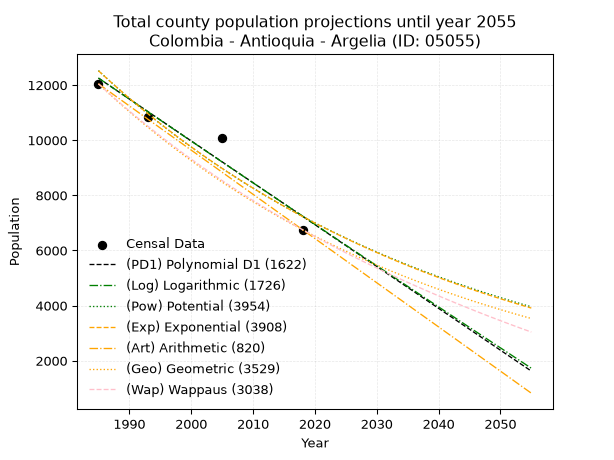
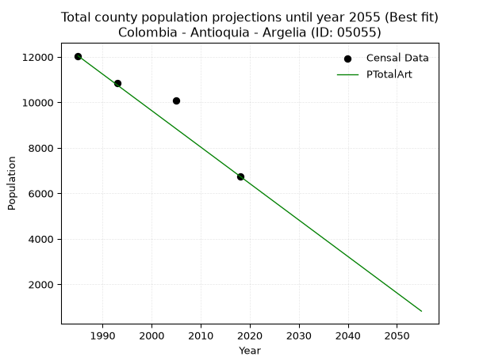
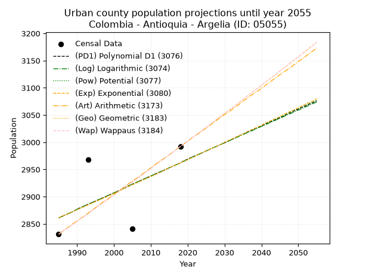
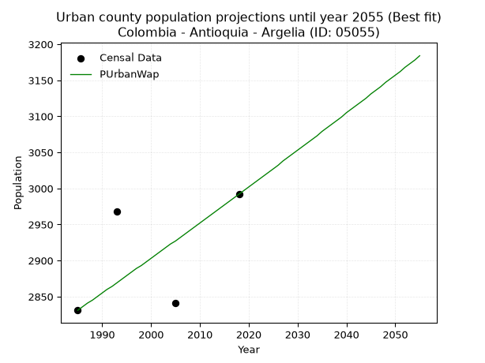
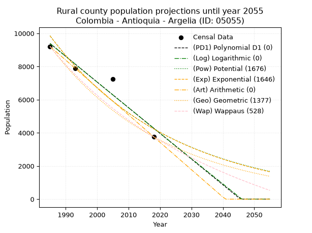
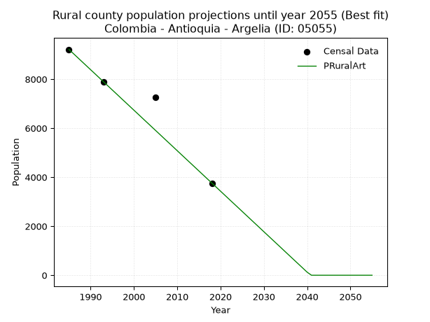

<div align="center">


</div>

# _“Population and Public Services Demand Projections (PPSD) until Year 2050 for Colombia - Antioquia - Argelia (ID: 05055)”_
Keywords: `population` `public-service` `projection` `lineal` `polynomial` `logarithmic` `potential` `exponential` `arithmetic` `geometric` `wappaus` `dane` `colombia` `south-america`

PPSD are analytical estimates used by governments and planners to anticipate future changes in population size, age distribution, and the resulting community needs for utilities, healthcare, education, and infrastructure as sizing future water treatment facilities, electrical grids, and road networks based on spatial growth.

> **General running parameters**: • app_version: _v20260806_. • Python version: _3.14.7_. • Pandas version: _3.0.5_. • NumPy version: _2.5.1_. • Creates, save and include plots into reports (create_plot): _True_. • Projection until year: _2050_. • Process polynomial degree 2 and up: _False_. • Process Wappaus: _True_. • Process Wappaus: _True_. • Set negative values to zero: _True_. • Set infinite values to zero: _True_. • Drop dataset notes: _True_. 
<div align="center">

Dynamic map: [:earth_americas:Google](http://maps.google.com/maps?q=5.731473696,-75.1410704) [:earth_americas:OSM](https://www.openstreetmap.org/#map=18/5.731473696/-75.1410704&layers=P) [:earth_americas:Bing](https://www.bing.com/maps?cp=5.731473696~-75.1410704&lvl=18) [:earth_americas:Apple](https://maps.apple.com/frame?center=5.731473696%2C-75.1410704&span=0.003%2C0.006)

</div>


<div align="center">

```geojson
{
  "type": "Feature",
  "geometry": {
    "type": "Point", 
    "coordinates": [-75.1410704, 5.731473696]
  }, 
  "properties": {
    "Name": "Colombia - Antioquia - Argelia (ID: 05055)"
  }
}
```

</div>


## 0. Census Data (4 records)

Census data are official statistics collected by a government about the people and housing in a country. They usually include counts of total population, age, sex, race, income, education, and jobs.

📅Global census file: [Population.xlsx](../data/Population.xlsx)

| Source   |   Year |   CountryID | CountryName   |   StateID | StateName   |   CountyID | CountyName   |   PTotal |   PUrban |   PRural |
|:---------|-------:|------------:|:--------------|----------:|:------------|-----------:|:-------------|---------:|---------:|---------:|
| DANE     |   1985 |          57 | Colombia      |        05 | Antioquia   |      05055 | Argelia      |    12043 |     2831 |     9212 |
| DANE     |   1993 |          57 | Colombia      |        05 | Antioquia   |      05055 | Argelia      |    10852 |     2968 |     7884 |
| DANE     |   2005 |          57 | Colombia      |        05 | Antioquia   |      05055 | Argelia      |    10091 |     2841 |     7250 |
| DANE     |   2018 |          57 | Colombia      |        05 | Antioquia   |      05055 | Argelia      |     6752 |     2992 |     3760 |

> 🔥Some records has specific notes about the registered values or the corresponding urban or rural distribution.

## 1. Total

### 1.1. Coefficients and Parameters

* (PD1) Polynomial Deg 1: -151.83059012444588, 313633.6378964229 (lineal)
* (Log) Logarithmic: -303753.7479014473, 2318769.171928673
* (Pow) Potential: -33.26292626825051, 113.79084495530391
* (Exp) Exponential: -0.01662940351026379, 2.712218388196629e+18
* (Art) Arithmetic: Year diff. 2018 - 1985 = 33, Population diff. 6752 - 12043 = -5291, Annual growth = -160.33333333333334
* (Geo) Geometric: Year diff. 2018 - 1985 = 33, Population diff. 6752 - 12043 = -5291, Annual growth % = -0.017381853467864694
* (Wap) Wappaus: i = -1.7061275161833822, Condition values only valid for < 200)

<sub>
Wappaus condition values: ['-0.00', '-1.71', '-3.41', '-5.12', '-6.82', '-8.53', '-10.24', '-11.94', '-13.65', '-15.36', '-17.06', '-18.77', '-20.47', '-22.18', '-23.89', '-25.59', '-27.30', '-29.00', '-30.71', '-32.42', '-34.12', '-35.83', '-37.53', '-39.24', '-40.95', '-42.65', '-44.36', '-46.07', '-47.77', '-49.48', '-51.18', '-52.89', '-54.60', '-56.30', '-58.01', '-59.71', '-61.42', '-63.13', '-64.83', '-66.54', '-68.25', '-69.95', '-71.66', '-73.36', '-75.07', '-76.78', '-78.48', '-80.19', '-81.89', '-83.60', '-85.31', '-87.01', '-88.72', '-90.42', '-92.13', '-93.84', '-95.54', '-97.25', '-98.96', '-100.66', '-102.37', '-104.07', '-105.78', '-107.49', '-109.19', '-110.90']
</sub>


### 1.2. Projected Dataset

|   Year |   CountyID |   PTotalPD1 |   PTotalLog |   PTotalPow |   PTotalExp |   PTotalArt |   PTotalGeo |   PTotalWap |
|-------:|-----------:|------------:|------------:|------------:|------------:|------------:|------------:|------------:|
|   1985 |      05055 |       12250 |       12253 |       12522 |       12518 |       12043 |       12043 |       12043 |
|   1986 |      05055 |       12098 |       12100 |       12314 |       12312 |       11883 |       11834 |       11839 |
|   1987 |      05055 |       11946 |       11947 |       12110 |       12109 |       11722 |       11628 |       11639 |
|   1988 |      05055 |       11794 |       11795 |       11909 |       11909 |       11562 |       11426 |       11442 |
|   1989 |      05055 |       11643 |       11642 |       11711 |       11713 |       11402 |       11227 |       11248 |
|   1990 |      05055 |       11491 |       11489 |       11517 |       11519 |       11241 |       11032 |       11058 |
|   1991 |      05055 |       11339 |       11337 |       11326 |       11329 |       11081 |       10840 |       10870 |
|   1992 |      05055 |       11187 |       11184 |       11139 |       11143 |       10921 |       10652 |       10686 |
|   1993 |      05055 |       11035 |       11032 |       10954 |       10959 |       10760 |       10467 |       10504 |
|   1994 |      05055 |       10883 |       10879 |       10773 |       10778 |       10600 |       10285 |       10326 |
|   1995 |      05055 |       10732 |       10727 |       10595 |       10600 |       10440 |       10106 |       10150 |
|   1996 |      05055 |       10580 |       10575 |       10420 |       10425 |       10279 |        9930 |        9977 |
|   1997 |      05055 |       10428 |       10423 |       10247 |       10254 |       10119 |        9758 |        9806 |
|   1998 |      05055 |       10276 |       10270 |       10078 |       10084 |        9959 |        9588 |        9639 |
|   1999 |      05055 |       10124 |       10118 |        9912 |        9918 |        9798 |        9422 |        9473 |
|   2000 |      05055 |        9972 |        9967 |        9748 |        9755 |        9638 |        9258 |        9311 |
|   2001 |      05055 |        9821 |        9815 |        9588 |        9594 |        9478 |        9097 |        9150 |
|   2002 |      05055 |        9669 |        9663 |        9430 |        9435 |        9317 |        8939 |        8992 |
|   2003 |      05055 |        9517 |        9511 |        9274 |        9280 |        9157 |        8783 |        8837 |
|   2004 |      05055 |        9365 |        9360 |        9121 |        9127 |        8997 |        8631 |        8684 |
|   2005 |      05055 |        9213 |        9208 |        8971 |        8976 |        8836 |        8481 |        8533 |
|   2006 |      05055 |        9061 |        9057 |        8824 |        8828 |        8676 |        8333 |        8384 |
|   2007 |      05055 |        8910 |        8905 |        8679 |        8683 |        8516 |        8188 |        8237 |
|   2008 |      05055 |        8758 |        8754 |        8536 |        8539 |        8355 |        8046 |        8092 |
|   2009 |      05055 |        8606 |        8603 |        8396 |        8399 |        8195 |        7906 |        7950 |
|   2010 |      05055 |        8454 |        8452 |        8258 |        8260 |        8035 |        7769 |        7809 |
|   2011 |      05055 |        8302 |        8300 |        8123 |        8124 |        7874 |        7634 |        7671 |
|   2012 |      05055 |        8150 |        8149 |        7989 |        7990 |        7714 |        7501 |        7534 |
|   2013 |      05055 |        7999 |        7999 |        7858 |        7858 |        7554 |        7371 |        7399 |
|   2014 |      05055 |        7847 |        7848 |        7730 |        7729 |        7393 |        7243 |        7266 |
|   2015 |      05055 |        7695 |        7697 |        7603 |        7601 |        7233 |        7117 |        7135 |
|   2016 |      05055 |        7543 |        7546 |        7479 |        7476 |        7073 |        6993 |        7006 |
|   2017 |      05055 |        7391 |        7396 |        7356 |        7352 |        6912 |        6871 |        6878 |
|   2018 |      05055 |        7240 |        7245 |        7236 |        7231 |        6752 |        6752 |        6752 |
|   2019 |      05055 |        7088 |        7095 |        7118 |        7112 |        6592 |        6635 |        6628 |
|   2020 |      05055 |        6936 |        6944 |        7001 |        6995 |        6431 |        6519 |        6505 |
|   2021 |      05055 |        6784 |        6794 |        6887 |        6879 |        6271 |        6406 |        6384 |
|   2022 |      05055 |        6632 |        6644 |        6775 |        6766 |        6111 |        6295 |        6265 |
|   2023 |      05055 |        6480 |        6493 |        6664 |        6654 |        5950 |        6185 |        6147 |
|   2024 |      05055 |        6329 |        6343 |        6556 |        6545 |        5790 |        6078 |        6030 |
|   2025 |      05055 |        6177 |        6193 |        6449 |        6437 |        5630 |        5972 |        5915 |
|   2026 |      05055 |        6025 |        6043 |        6344 |        6330 |        5469 |        5868 |        5802 |
|   2027 |      05055 |        5873 |        5893 |        6240 |        6226 |        5309 |        5766 |        5690 |
|   2028 |      05055 |        5721 |        5744 |        6139 |        6123 |        5149 |        5666 |        5579 |
|   2029 |      05055 |        5569 |        5594 |        6039 |        6022 |        4988 |        5568 |        5470 |
|   2030 |      05055 |        5418 |        5444 |        5941 |        5923 |        4828 |        5471 |        5362 |
|   2031 |      05055 |        5266 |        5294 |        5844 |        5825 |        4668 |        5376 |        5255 |
|   2032 |      05055 |        5114 |        5145 |        5749 |        5729 |        4507 |        5282 |        5150 |
|   2033 |      05055 |        4962 |        4996 |        5656 |        5635 |        4347 |        5190 |        5046 |
|   2034 |      05055 |        4810 |        4846 |        5564 |        5542 |        4187 |        5100 |        4943 |
|   2035 |      05055 |        4658 |        4697 |        5474 |        5450 |        4026 |        5012 |        4841 |
|   2036 |      05055 |        4507 |        4548 |        5385 |        5361 |        3866 |        4924 |        4741 |
|   2037 |      05055 |        4355 |        4398 |        5298 |        5272 |        3706 |        4839 |        4642 |
|   2038 |      05055 |        4203 |        4249 |        5212 |        5185 |        3545 |        4755 |        4544 |
|   2039 |      05055 |        4051 |        4100 |        5128 |        5100 |        3385 |        4672 |        4447 |
|   2040 |      05055 |        3899 |        3951 |        5045 |        5016 |        3225 |        4591 |        4351 |
|   2041 |      05055 |        3747 |        3803 |        4963 |        4933 |        3064 |        4511 |        4256 |
|   2042 |      05055 |        3596 |        3654 |        4883 |        4852 |        2904 |        4433 |        4163 |
|   2043 |      05055 |        3444 |        3505 |        4804 |        4772 |        2744 |        4356 |        4070 |
|   2044 |      05055 |        3292 |        3356 |        4727 |        4693 |        2583 |        4280 |        3979 |
|   2045 |      05055 |        3140 |        3208 |        4650 |        4615 |        2423 |        4206 |        3889 |
|   2046 |      05055 |        2988 |        3059 |        4575 |        4539 |        2263 |        4132 |        3799 |
|   2047 |      05055 |        2836 |        2911 |        4502 |        4464 |        2102 |        4061 |        3711 |
|   2048 |      05055 |        2685 |        2763 |        4429 |        4391 |        1942 |        3990 |        3623 |
|   2049 |      05055 |        2533 |        2614 |        4358 |        4318 |        1782 |        3921 |        3537 |
|   2050 |      05055 |        2381 |        2466 |        4288 |        4247 |        1621 |        3853 |        3451 |
<div align="center">

</img>

</div>


### 1.3. Best fit with absolute error and relative error (%)

Relative error puts that difference into context by dividing the absolute error by the true value, creating a unitless ratio or percentage that shows the scale of the mistake.

Absolute and relative error

|   Year | Source   |   CountryID | CountryName   |   StateID | StateName   |   CountyID_x | CountyName   |   PTotal |   PUrban |   PRural |   CountyID_y |   PTotalPD1 |   PTotalLog |   PTotalPow |   PTotalExp |   PTotalArt |   PTotalGeo |   PTotalWap |   PTotalPD1AbsError |   PTotalLogAbsError |   PTotalPowAbsError |   PTotalExpAbsError |   PTotalArtAbsError |   PTotalGeoAbsError |   PTotalWapAbsError |   PTotalPD1RelError |   PTotalLogRelError |   PTotalPowRelError |   PTotalExpRelError |   PTotalArtRelError |   PTotalGeoRelError |   PTotalWapRelError |
|-------:|:---------|------------:|:--------------|----------:|:------------|-------------:|:-------------|---------:|---------:|---------:|-------------:|------------:|------------:|------------:|------------:|------------:|------------:|------------:|--------------------:|--------------------:|--------------------:|--------------------:|--------------------:|--------------------:|--------------------:|--------------------:|--------------------:|--------------------:|--------------------:|--------------------:|--------------------:|--------------------:|
|   1985 | DANE     |          57 | Colombia      |        05 | Antioquia   |        05055 | Argelia      |    12043 |     2831 |     9212 |        05055 |       12250 |       12253 |       12522 |       12518 |       12043 |       12043 |       12043 |                 207 |                 210 |                 479 |                 475 |                   0 |                   0 |                   0 |             1.71884 |             1.74375 |            3.97741  |            3.9442   |             0       |             0       |             0       |
|   1993 | DANE     |          57 | Colombia      |        05 | Antioquia   |        05055 | Argelia      |    10852 |     2968 |     7884 |        05055 |       11035 |       11032 |       10954 |       10959 |       10760 |       10467 |       10504 |                 183 |                 180 |                 102 |                 107 |                  92 |                 385 |                 348 |             1.68633 |             1.65868 |            0.939919 |            0.985993 |             0.84777 |             3.54773 |             3.20678 |
|   2005 | DANE     |          57 | Colombia      |        05 | Antioquia   |        05055 | Argelia      |    10091 |     2841 |     7250 |        05055 |        9213 |        9208 |        8971 |        8976 |        8836 |        8481 |        8533 |                 878 |                 883 |                1120 |                1115 |                1255 |                1610 |                1558 |             8.70082 |             8.75037 |           11.099    |           11.0495   |            12.4368  |            15.9548  |            15.4395  |
|   2018 | DANE     |          57 | Colombia      |        05 | Antioquia   |        05055 | Argelia      |     6752 |     2992 |     3760 |        05055 |        7240 |        7245 |        7236 |        7231 |        6752 |        6752 |        6752 |                 488 |                 493 |                 484 |                 479 |                   0 |                   0 |                   0 |             7.22749 |             7.30154 |            7.16825  |            7.09419  |             0       |             0       |             0       |

Relative error mean

| Method    |   RelError | Best   |
|:----------|-----------:|:-------|
| PTotalPD1 |    4.83337 |        |
| PTotalLog |    4.86359 |        |
| PTotalPow |    5.79614 |        |
| PTotalExp |    5.76846 |        |
| PTotalArt |    3.32115 | True   |
| PTotalGeo |    4.87564 |        |
| PTotalWap |    4.66157 |        |

💙Best method: _**PTotalArt**_
<div align="center">

</img>

</div>


### 1.4. Fresh water supply demand in liters per capita per day (lpcd)

The fresh water supply demand typically ranges from 100 to 300 liters per capita per day (lpcd) for standard domestic and municipal planning, though absolute survival minimums set by the World Health Organization are as low as 7.5 to 20 liters per day, and total consumption in high-income nations can exceed 400 liters.

> `CZ`: Level in meters above the sea level (masl).<br> `WS`: Fresh water supply demand in liters per capita per day (lpcd or l/h/d).<br> `WSAll`: Zonal fresh water supply demand in liters per second (l/s).<br> `A`: Zonal area in square meters.

Reference values (RAS Colombia)

|    CZ |   WS |
|------:|-----:|
|  1000 |  120 |
|  2000 |  130 |
| 99999 |  140 |

County shapefile geometry properties and water supply values

|   CountyID |      ATotal |   CZTotal |   WSTotal |
|-----------:|------------:|----------:|----------:|
|      05055 | 2.45199e+08 |   1384.64 |       130 |

Projected values for best method: PTotalArt

|   CountyID |   Year |   PTotalArt |   WSTotal |   WSTotalAll |
|-----------:|-------:|------------:|----------:|-------------:|
|      05055 |   1985 |       12043 |       130 |     18.1203  |
|      05055 |   1986 |       11883 |       130 |     17.8795  |
|      05055 |   1987 |       11722 |       130 |     17.6373  |
|      05055 |   1988 |       11562 |       130 |     17.3965  |
|      05055 |   1989 |       11402 |       130 |     17.1558  |
|      05055 |   1990 |       11241 |       130 |     16.9135  |
|      05055 |   1991 |       11081 |       130 |     16.6728  |
|      05055 |   1992 |       10921 |       130 |     16.4321  |
|      05055 |   1993 |       10760 |       130 |     16.1898  |
|      05055 |   1994 |       10600 |       130 |     15.9491  |
|      05055 |   1995 |       10440 |       130 |     15.7083  |
|      05055 |   1996 |       10279 |       130 |     15.4661  |
|      05055 |   1997 |       10119 |       130 |     15.2253  |
|      05055 |   1998 |        9959 |       130 |     14.9846  |
|      05055 |   1999 |        9798 |       130 |     14.7424  |
|      05055 |   2000 |        9638 |       130 |     14.5016  |
|      05055 |   2001 |        9478 |       130 |     14.2609  |
|      05055 |   2002 |        9317 |       130 |     14.0186  |
|      05055 |   2003 |        9157 |       130 |     13.7779  |
|      05055 |   2004 |        8997 |       130 |     13.5372  |
|      05055 |   2005 |        8836 |       130 |     13.2949  |
|      05055 |   2006 |        8676 |       130 |     13.0542  |
|      05055 |   2007 |        8516 |       130 |     12.8134  |
|      05055 |   2008 |        8355 |       130 |     12.5712  |
|      05055 |   2009 |        8195 |       130 |     12.3304  |
|      05055 |   2010 |        8035 |       130 |     12.0897  |
|      05055 |   2011 |        7874 |       130 |     11.8475  |
|      05055 |   2012 |        7714 |       130 |     11.6067  |
|      05055 |   2013 |        7554 |       130 |     11.366   |
|      05055 |   2014 |        7393 |       130 |     11.1237  |
|      05055 |   2015 |        7233 |       130 |     10.883   |
|      05055 |   2016 |        7073 |       130 |     10.6422  |
|      05055 |   2017 |        6912 |       130 |     10.4     |
|      05055 |   2018 |        6752 |       130 |     10.1593  |
|      05055 |   2019 |        6592 |       130 |      9.91852 |
|      05055 |   2020 |        6431 |       130 |      9.67627 |
|      05055 |   2021 |        6271 |       130 |      9.43553 |
|      05055 |   2022 |        6111 |       130 |      9.19479 |
|      05055 |   2023 |        5950 |       130 |      8.95255 |
|      05055 |   2024 |        5790 |       130 |      8.71181 |
|      05055 |   2025 |        5630 |       130 |      8.47106 |
|      05055 |   2026 |        5469 |       130 |      8.22882 |
|      05055 |   2027 |        5309 |       130 |      7.98808 |
|      05055 |   2028 |        5149 |       130 |      7.74734 |
|      05055 |   2029 |        4988 |       130 |      7.50509 |
|      05055 |   2030 |        4828 |       130 |      7.26435 |
|      05055 |   2031 |        4668 |       130 |      7.02361 |
|      05055 |   2032 |        4507 |       130 |      6.78137 |
|      05055 |   2033 |        4347 |       130 |      6.54063 |
|      05055 |   2034 |        4187 |       130 |      6.29988 |
|      05055 |   2035 |        4026 |       130 |      6.05764 |
|      05055 |   2036 |        3866 |       130 |      5.8169  |
|      05055 |   2037 |        3706 |       130 |      5.57616 |
|      05055 |   2038 |        3545 |       130 |      5.33391 |
|      05055 |   2039 |        3385 |       130 |      5.09317 |
|      05055 |   2040 |        3225 |       130 |      4.85243 |
|      05055 |   2041 |        3064 |       130 |      4.61019 |
|      05055 |   2042 |        2904 |       130 |      4.36944 |
|      05055 |   2043 |        2744 |       130 |      4.1287  |
|      05055 |   2044 |        2583 |       130 |      3.88646 |
|      05055 |   2045 |        2423 |       130 |      3.64572 |
|      05055 |   2046 |        2263 |       130 |      3.40498 |
|      05055 |   2047 |        2102 |       130 |      3.16273 |
|      05055 |   2048 |        1942 |       130 |      2.92199 |
|      05055 |   2049 |        1782 |       130 |      2.68125 |
|      05055 |   2050 |        1621 |       130 |      2.439   |

## 2. Urban

### 2.1. Coefficients and Parameters

* (PD1) Polynomial Deg 1: 3.0702529104776484, -3233.2733841829163 (lineal)
* (Log) Logarithmic: 6141.71713691305, -43775.24117430843
* (Pow) Potential: 2.106948827879703, -3.491738718633214
* (Exp) Exponential: 0.0010532558871026586, 353.58867919857596
* (Art) Arithmetic: Year diff. 2018 - 1985 = 33, Population diff. 2992 - 2831 = 161, Annual growth = 4.878787878787879
* (Geo) Geometric: Year diff. 2018 - 1985 = 33, Population diff. 2992 - 2831 = 161, Annual growth % = 0.0016775283269965247
* (Wap) Wappaus: i = 0.16756956478749369, Condition values only valid for < 200)

<sub>
Wappaus condition values: ['0.00', '0.17', '0.34', '0.50', '0.67', '0.84', '1.01', '1.17', '1.34', '1.51', '1.68', '1.84', '2.01', '2.18', '2.35', '2.51', '2.68', '2.85', '3.02', '3.18', '3.35', '3.52', '3.69', '3.85', '4.02', '4.19', '4.36', '4.52', '4.69', '4.86', '5.03', '5.19', '5.36', '5.53', '5.70', '5.86', '6.03', '6.20', '6.37', '6.54', '6.70', '6.87', '7.04', '7.21', '7.37', '7.54', '7.71', '7.88', '8.04', '8.21', '8.38', '8.55', '8.71', '8.88', '9.05', '9.22', '9.38', '9.55', '9.72', '9.89', '10.05', '10.22', '10.39', '10.56', '10.72', '10.89']
</sub>


### 2.2. Projected Dataset

|   Year |   CountyID |   PUrbanPD1 |   PUrbanLog |   PUrbanPow |   PUrbanExp |   PUrbanArt |   PUrbanGeo |   PUrbanWap |
|-------:|-----------:|------------:|------------:|------------:|------------:|------------:|------------:|------------:|
|   1985 |      05055 |        2861 |        2861 |        2861 |        2861 |        2831 |        2831 |        2831 |
|   1986 |      05055 |        2864 |        2864 |        2864 |        2864 |        2836 |        2836 |        2836 |
|   1987 |      05055 |        2867 |        2867 |        2867 |        2867 |        2841 |        2841 |        2841 |
|   1988 |      05055 |        2870 |        2870 |        2870 |        2870 |        2846 |        2845 |        2845 |
|   1989 |      05055 |        2873 |        2873 |        2873 |        2873 |        2851 |        2850 |        2850 |
|   1990 |      05055 |        2877 |        2877 |        2876 |        2876 |        2855 |        2855 |        2855 |
|   1991 |      05055 |        2880 |        2880 |        2879 |        2879 |        2860 |        2860 |        2860 |
|   1992 |      05055 |        2883 |        2883 |        2882 |        2882 |        2865 |        2864 |        2864 |
|   1993 |      05055 |        2886 |        2886 |        2885 |        2885 |        2870 |        2869 |        2869 |
|   1994 |      05055 |        2889 |        2889 |        2888 |        2888 |        2875 |        2874 |        2874 |
|   1995 |      05055 |        2892 |        2892 |        2891 |        2891 |        2880 |        2879 |        2879 |
|   1996 |      05055 |        2895 |        2895 |        2894 |        2894 |        2885 |        2884 |        2884 |
|   1997 |      05055 |        2898 |        2898 |        2897 |        2897 |        2890 |        2889 |        2889 |
|   1998 |      05055 |        2901 |        2901 |        2900 |        2900 |        2894 |        2893 |        2893 |
|   1999 |      05055 |        2904 |        2904 |        2903 |        2903 |        2899 |        2898 |        2898 |
|   2000 |      05055 |        2907 |        2907 |        2906 |        2906 |        2904 |        2903 |        2903 |
|   2001 |      05055 |        2910 |        2910 |        2910 |        2909 |        2909 |        2908 |        2908 |
|   2002 |      05055 |        2913 |        2913 |        2913 |        2912 |        2914 |        2913 |        2913 |
|   2003 |      05055 |        2916 |        2917 |        2916 |        2916 |        2919 |        2918 |        2918 |
|   2004 |      05055 |        2920 |        2920 |        2919 |        2919 |        2924 |        2923 |        2923 |
|   2005 |      05055 |        2923 |        2923 |        2922 |        2922 |        2929 |        2928 |        2927 |
|   2006 |      05055 |        2926 |        2926 |        2925 |        2925 |        2933 |        2932 |        2932 |
|   2007 |      05055 |        2929 |        2929 |        2928 |        2928 |        2938 |        2937 |        2937 |
|   2008 |      05055 |        2932 |        2932 |        2931 |        2931 |        2943 |        2942 |        2942 |
|   2009 |      05055 |        2935 |        2935 |        2934 |        2934 |        2948 |        2947 |        2947 |
|   2010 |      05055 |        2938 |        2938 |        2937 |        2937 |        2953 |        2952 |        2952 |
|   2011 |      05055 |        2941 |        2941 |        2940 |        2940 |        2958 |        2957 |        2957 |
|   2012 |      05055 |        2944 |        2944 |        2943 |        2943 |        2963 |        2962 |        2962 |
|   2013 |      05055 |        2947 |        2947 |        2946 |        2946 |        2968 |        2967 |        2967 |
|   2014 |      05055 |        2950 |        2950 |        2949 |        2950 |        2972 |        2972 |        2972 |
|   2015 |      05055 |        2953 |        2953 |        2953 |        2953 |        2977 |        2977 |        2977 |
|   2016 |      05055 |        2956 |        2956 |        2956 |        2956 |        2982 |        2982 |        2982 |
|   2017 |      05055 |        2959 |        2959 |        2959 |        2959 |        2987 |        2987 |        2987 |
|   2018 |      05055 |        2962 |        2962 |        2962 |        2962 |        2992 |        2992 |        2992 |
|   2019 |      05055 |        2966 |        2965 |        2965 |        2965 |        2997 |        2997 |        2997 |
|   2020 |      05055 |        2969 |        2968 |        2968 |        2968 |        3002 |        3002 |        3002 |
|   2021 |      05055 |        2972 |        2972 |        2971 |        2971 |        3007 |        3007 |        3007 |
|   2022 |      05055 |        2975 |        2975 |        2974 |        2974 |        3012 |        3012 |        3012 |
|   2023 |      05055 |        2978 |        2978 |        2977 |        2978 |        3016 |        3017 |        3017 |
|   2024 |      05055 |        2981 |        2981 |        2980 |        2981 |        3021 |        3022 |        3022 |
|   2025 |      05055 |        2984 |        2984 |        2984 |        2984 |        3026 |        3027 |        3027 |
|   2026 |      05055 |        2987 |        2987 |        2987 |        2987 |        3031 |        3032 |        3032 |
|   2027 |      05055 |        2990 |        2990 |        2990 |        2990 |        3036 |        3037 |        3038 |
|   2028 |      05055 |        2993 |        2993 |        2993 |        2993 |        3041 |        3043 |        3043 |
|   2029 |      05055 |        2996 |        2996 |        2996 |        2996 |        3046 |        3048 |        3048 |
|   2030 |      05055 |        2999 |        2999 |        2999 |        3000 |        3051 |        3053 |        3053 |
|   2031 |      05055 |        3002 |        3002 |        3002 |        3003 |        3055 |        3058 |        3058 |
|   2032 |      05055 |        3005 |        3005 |        3005 |        3006 |        3060 |        3063 |        3063 |
|   2033 |      05055 |        3009 |        3008 |        3008 |        3009 |        3065 |        3068 |        3068 |
|   2034 |      05055 |        3012 |        3011 |        3012 |        3012 |        3070 |        3073 |        3073 |
|   2035 |      05055 |        3015 |        3014 |        3015 |        3015 |        3075 |        3078 |        3079 |
|   2036 |      05055 |        3018 |        3017 |        3018 |        3019 |        3080 |        3084 |        3084 |
|   2037 |      05055 |        3021 |        3020 |        3021 |        3022 |        3085 |        3089 |        3089 |
|   2038 |      05055 |        3024 |        3023 |        3024 |        3025 |        3090 |        3094 |        3094 |
|   2039 |      05055 |        3027 |        3026 |        3027 |        3028 |        3094 |        3099 |        3099 |
|   2040 |      05055 |        3030 |        3029 |        3030 |        3031 |        3099 |        3104 |        3105 |
|   2041 |      05055 |        3033 |        3032 |        3033 |        3035 |        3104 |        3110 |        3110 |
|   2042 |      05055 |        3036 |        3035 |        3037 |        3038 |        3109 |        3115 |        3115 |
|   2043 |      05055 |        3039 |        3038 |        3040 |        3041 |        3114 |        3120 |        3120 |
|   2044 |      05055 |        3042 |        3041 |        3043 |        3044 |        3119 |        3125 |        3125 |
|   2045 |      05055 |        3045 |        3044 |        3046 |        3047 |        3124 |        3131 |        3131 |
|   2046 |      05055 |        3048 |        3047 |        3049 |        3051 |        3129 |        3136 |        3136 |
|   2047 |      05055 |        3052 |        3050 |        3052 |        3054 |        3133 |        3141 |        3141 |
|   2048 |      05055 |        3055 |        3053 |        3055 |        3057 |        3138 |        3146 |        3147 |
|   2049 |      05055 |        3058 |        3056 |        3059 |        3060 |        3143 |        3152 |        3152 |
|   2050 |      05055 |        3061 |        3059 |        3062 |        3063 |        3148 |        3157 |        3157 |
<div align="center">

</img>

</div>


### 2.3. Best fit with absolute error and relative error (%)

Relative error puts that difference into context by dividing the absolute error by the true value, creating a unitless ratio or percentage that shows the scale of the mistake.

Absolute and relative error

|   Year | Source   |   CountryID | CountryName   |   StateID | StateName   |   CountyID_x | CountyName   |   PTotal |   PUrban |   PRural |   CountyID_y |   PUrbanPD1 |   PUrbanLog |   PUrbanPow |   PUrbanExp |   PUrbanArt |   PUrbanGeo |   PUrbanWap |   PUrbanPD1AbsError |   PUrbanLogAbsError |   PUrbanPowAbsError |   PUrbanExpAbsError |   PUrbanArtAbsError |   PUrbanGeoAbsError |   PUrbanWapAbsError |   PUrbanPD1RelError |   PUrbanLogRelError |   PUrbanPowRelError |   PUrbanExpRelError |   PUrbanArtRelError |   PUrbanGeoRelError |   PUrbanWapRelError |
|-------:|:---------|------------:|:--------------|----------:|:------------|-------------:|:-------------|---------:|---------:|---------:|-------------:|------------:|------------:|------------:|------------:|------------:|------------:|------------:|--------------------:|--------------------:|--------------------:|--------------------:|--------------------:|--------------------:|--------------------:|--------------------:|--------------------:|--------------------:|--------------------:|--------------------:|--------------------:|--------------------:|
|   1985 | DANE     |          57 | Colombia      |        05 | Antioquia   |        05055 | Argelia      |    12043 |     2831 |     9212 |        05055 |        2861 |        2861 |        2861 |        2861 |        2831 |        2831 |        2831 |                  30 |                  30 |                  30 |                  30 |                   0 |                   0 |                   0 |             1.0597  |             1.0597  |             1.0597  |             1.0597  |             0       |             0       |             0       |
|   1993 | DANE     |          57 | Colombia      |        05 | Antioquia   |        05055 | Argelia      |    10852 |     2968 |     7884 |        05055 |        2886 |        2886 |        2885 |        2885 |        2870 |        2869 |        2869 |                  82 |                  82 |                  83 |                  83 |                  98 |                  99 |                  99 |             2.7628  |             2.7628  |             2.7965  |             2.7965  |             3.30189 |             3.33558 |             3.33558 |
|   2005 | DANE     |          57 | Colombia      |        05 | Antioquia   |        05055 | Argelia      |    10091 |     2841 |     7250 |        05055 |        2923 |        2923 |        2922 |        2922 |        2929 |        2928 |        2927 |                  82 |                  82 |                  81 |                  81 |                  88 |                  87 |                  86 |             2.88631 |             2.88631 |             2.85111 |             2.85111 |             3.0975  |             3.0623  |             3.0271  |
|   2018 | DANE     |          57 | Colombia      |        05 | Antioquia   |        05055 | Argelia      |     6752 |     2992 |     3760 |        05055 |        2962 |        2962 |        2962 |        2962 |        2992 |        2992 |        2992 |                  30 |                  30 |                  30 |                  30 |                   0 |                   0 |                   0 |             1.00267 |             1.00267 |             1.00267 |             1.00267 |             0       |             0       |             0       |

Relative error mean

| Method    |   RelError | Best   |
|:----------|-----------:|:-------|
| PUrbanPD1 |    1.92787 |        |
| PUrbanLog |    1.92787 |        |
| PUrbanPow |    1.92749 |        |
| PUrbanExp |    1.92749 |        |
| PUrbanArt |    1.59985 |        |
| PUrbanGeo |    1.59947 |        |
| PUrbanWap |    1.59067 | True   |

💙Best method: _**PUrbanWap**_
<div align="center">

</img>

</div>


### 2.4. Fresh water supply demand in liters per capita per day (lpcd)

The fresh water supply demand typically ranges from 100 to 300 liters per capita per day (lpcd) for standard domestic and municipal planning, though absolute survival minimums set by the World Health Organization are as low as 7.5 to 20 liters per day, and total consumption in high-income nations can exceed 400 liters.

> `CZ`: Level in meters above the sea level (masl).<br> `WS`: Fresh water supply demand in liters per capita per day (lpcd or l/h/d).<br> `WSAll`: Zonal fresh water supply demand in liters per second (l/s).<br> `A`: Zonal area in square meters.

Reference values (RAS Colombia)

|    CZ |   WS |
|------:|-----:|
|  1000 |  120 |
|  2000 |  130 |
| 99999 |  140 |

County shapefile geometry properties and water supply values

|   CountyID |   AUrban |   CZUrban |   WSUrban |
|-----------:|---------:|----------:|----------:|
|      05055 |   562871 |   1743.58 |       130 |

Projected values for best method: PUrbanWap

|   CountyID |   Year |   PUrbanWap |   WSUrban |   WSUrbanAll |
|-----------:|-------:|------------:|----------:|-------------:|
|      05055 |   1985 |        2831 |       130 |      4.25961 |
|      05055 |   1986 |        2836 |       130 |      4.26713 |
|      05055 |   1987 |        2841 |       130 |      4.27465 |
|      05055 |   1988 |        2845 |       130 |      4.28067 |
|      05055 |   1989 |        2850 |       130 |      4.28819 |
|      05055 |   1990 |        2855 |       130 |      4.29572 |
|      05055 |   1991 |        2860 |       130 |      4.30324 |
|      05055 |   1992 |        2864 |       130 |      4.30926 |
|      05055 |   1993 |        2869 |       130 |      4.31678 |
|      05055 |   1994 |        2874 |       130 |      4.32431 |
|      05055 |   1995 |        2879 |       130 |      4.33183 |
|      05055 |   1996 |        2884 |       130 |      4.33935 |
|      05055 |   1997 |        2889 |       130 |      4.34687 |
|      05055 |   1998 |        2893 |       130 |      4.35289 |
|      05055 |   1999 |        2898 |       130 |      4.36042 |
|      05055 |   2000 |        2903 |       130 |      4.36794 |
|      05055 |   2001 |        2908 |       130 |      4.37546 |
|      05055 |   2002 |        2913 |       130 |      4.38299 |
|      05055 |   2003 |        2918 |       130 |      4.39051 |
|      05055 |   2004 |        2923 |       130 |      4.39803 |
|      05055 |   2005 |        2927 |       130 |      4.40405 |
|      05055 |   2006 |        2932 |       130 |      4.41157 |
|      05055 |   2007 |        2937 |       130 |      4.4191  |
|      05055 |   2008 |        2942 |       130 |      4.42662 |
|      05055 |   2009 |        2947 |       130 |      4.43414 |
|      05055 |   2010 |        2952 |       130 |      4.44167 |
|      05055 |   2011 |        2957 |       130 |      4.44919 |
|      05055 |   2012 |        2962 |       130 |      4.45671 |
|      05055 |   2013 |        2967 |       130 |      4.46424 |
|      05055 |   2014 |        2972 |       130 |      4.47176 |
|      05055 |   2015 |        2977 |       130 |      4.47928 |
|      05055 |   2016 |        2982 |       130 |      4.48681 |
|      05055 |   2017 |        2987 |       130 |      4.49433 |
|      05055 |   2018 |        2992 |       130 |      4.50185 |
|      05055 |   2019 |        2997 |       130 |      4.50938 |
|      05055 |   2020 |        3002 |       130 |      4.5169  |
|      05055 |   2021 |        3007 |       130 |      4.52442 |
|      05055 |   2022 |        3012 |       130 |      4.53194 |
|      05055 |   2023 |        3017 |       130 |      4.53947 |
|      05055 |   2024 |        3022 |       130 |      4.54699 |
|      05055 |   2025 |        3027 |       130 |      4.55451 |
|      05055 |   2026 |        3032 |       130 |      4.56204 |
|      05055 |   2027 |        3038 |       130 |      4.57106 |
|      05055 |   2028 |        3043 |       130 |      4.57859 |
|      05055 |   2029 |        3048 |       130 |      4.58611 |
|      05055 |   2030 |        3053 |       130 |      4.59363 |
|      05055 |   2031 |        3058 |       130 |      4.60116 |
|      05055 |   2032 |        3063 |       130 |      4.60868 |
|      05055 |   2033 |        3068 |       130 |      4.6162  |
|      05055 |   2034 |        3073 |       130 |      4.62373 |
|      05055 |   2035 |        3079 |       130 |      4.63275 |
|      05055 |   2036 |        3084 |       130 |      4.64028 |
|      05055 |   2037 |        3089 |       130 |      4.6478  |
|      05055 |   2038 |        3094 |       130 |      4.65532 |
|      05055 |   2039 |        3099 |       130 |      4.66285 |
|      05055 |   2040 |        3105 |       130 |      4.67188 |
|      05055 |   2041 |        3110 |       130 |      4.6794  |
|      05055 |   2042 |        3115 |       130 |      4.68692 |
|      05055 |   2043 |        3120 |       130 |      4.69444 |
|      05055 |   2044 |        3125 |       130 |      4.70197 |
|      05055 |   2045 |        3131 |       130 |      4.711   |
|      05055 |   2046 |        3136 |       130 |      4.71852 |
|      05055 |   2047 |        3141 |       130 |      4.72604 |
|      05055 |   2048 |        3147 |       130 |      4.73507 |
|      05055 |   2049 |        3152 |       130 |      4.74259 |
|      05055 |   2050 |        3157 |       130 |      4.75012 |

## 3. Rural

### 3.1. Coefficients and Parameters

* (PD1) Polynomial Deg 1: -154.90084303492353, 316866.9112806058 (lineal)
* (Log) Logarithmic: -309895.4650383605, 2362544.413102982
* (Pow) Potential: -51.11235315918782, 172.54991059349663
* (Exp) Exponential: -0.025555350584060294, 1.0568825309081958e+26
* (Art) Arithmetic: Year diff. 2018 - 1985 = 33, Population diff. 3760 - 9212 = -5452, Annual growth = -165.21212121212122
* (Geo) Geometric: Year diff. 2018 - 1985 = 33, Population diff. 3760 - 9212 = -5452, Annual growth % = -0.02678882223704171
* (Wap) Wappaus: i = -2.547211242863417, Condition values only valid for < 200)

<sub>
Wappaus condition values: ['-0.00', '-2.55', '-5.09', '-7.64', '-10.19', '-12.74', '-15.28', '-17.83', '-20.38', '-22.92', '-25.47', '-28.02', '-30.57', '-33.11', '-35.66', '-38.21', '-40.76', '-43.30', '-45.85', '-48.40', '-50.94', '-53.49', '-56.04', '-58.59', '-61.13', '-63.68', '-66.23', '-68.77', '-71.32', '-73.87', '-76.42', '-78.96', '-81.51', '-84.06', '-86.61', '-89.15', '-91.70', '-94.25', '-96.79', '-99.34', '-101.89', '-104.44', '-106.98', '-109.53', '-112.08', '-114.62', '-117.17', '-119.72', '-122.27', '-124.81', '-127.36', '-129.91', '-132.45', '-135.00', '-137.55', '-140.10', '-142.64', '-145.19', '-147.74', '-150.29', '-152.83', '-155.38', '-157.93', '-160.47', '-163.02', '-165.57']
</sub>


### 3.2. Projected Dataset

|   Year |   CountyID |   PRuralPD1 |   PRuralLog |   PRuralPow |   PRuralExp |   PRuralArt |   PRuralGeo |   PRuralWap |
|-------:|-----------:|------------:|------------:|------------:|------------:|------------:|------------:|------------:|
|   1985 |      05055 |        9389 |        9392 |        9854 |        9849 |        9212 |        9212 |        9212 |
|   1986 |      05055 |        9234 |        9236 |        9604 |        9601 |        9047 |        8965 |        8980 |
|   1987 |      05055 |        9079 |        9080 |        9360 |        9359 |        8882 |        8725 |        8754 |
|   1988 |      05055 |        8924 |        8924 |        9122 |        9122 |        8716 |        8491 |        8534 |
|   1989 |      05055 |        8769 |        8768 |        8890 |        8892 |        8551 |        8264 |        8319 |
|   1990 |      05055 |        8614 |        8613 |        8665 |        8668 |        8386 |        8042 |        8109 |
|   1991 |      05055 |        8459 |        8457 |        8445 |        8449 |        8221 |        7827 |        7904 |
|   1992 |      05055 |        8304 |        8301 |        8231 |        8236 |        8056 |        7617 |        7704 |
|   1993 |      05055 |        8150 |        8146 |        8023 |        8028 |        7890 |        7413 |        7508 |
|   1994 |      05055 |        7995 |        7990 |        7820 |        7826 |        7725 |        7215 |        7317 |
|   1995 |      05055 |        7840 |        7835 |        7622 |        7628 |        7560 |        7021 |        7131 |
|   1996 |      05055 |        7685 |        7680 |        7429 |        7436 |        7395 |        6833 |        6948 |
|   1997 |      05055 |        7530 |        7524 |        7241 |        7248 |        7229 |        6650 |        6770 |
|   1998 |      05055 |        7375 |        7369 |        7058 |        7065 |        7064 |        6472 |        6595 |
|   1999 |      05055 |        7220 |        7214 |        6880 |        6887 |        6899 |        6299 |        6424 |
|   2000 |      05055 |        7065 |        7059 |        6707 |        6713 |        6734 |        6130 |        6257 |
|   2001 |      05055 |        6910 |        6904 |        6537 |        6544 |        6569 |        5966 |        6093 |
|   2002 |      05055 |        6755 |        6749 |        6373 |        6379 |        6403 |        5806 |        5933 |
|   2003 |      05055 |        6601 |        6595 |        6212 |        6218 |        6238 |        5650 |        5776 |
|   2004 |      05055 |        6446 |        6440 |        6055 |        6061 |        6073 |        5499 |        5622 |
|   2005 |      05055 |        6291 |        6285 |        5903 |        5908 |        5908 |        5352 |        5472 |
|   2006 |      05055 |        6136 |        6131 |        5754 |        5759 |        5743 |        5208 |        5324 |
|   2007 |      05055 |        5981 |        5976 |        5610 |        5614 |        5577 |        5069 |        5180 |
|   2008 |      05055 |        5826 |        5822 |        5469 |        5472 |        5412 |        4933 |        5038 |
|   2009 |      05055 |        5671 |        5668 |        5331 |        5334 |        5247 |        4801 |        4899 |
|   2010 |      05055 |        5516 |        5514 |        5197 |        5199 |        5082 |        4672 |        4762 |
|   2011 |      05055 |        5361 |        5359 |        5067 |        5068 |        4916 |        4547 |        4629 |
|   2012 |      05055 |        5206 |        5205 |        4940 |        4940 |        4751 |        4425 |        4498 |
|   2013 |      05055 |        5052 |        5051 |        4816 |        4816 |        4586 |        4307 |        4369 |
|   2014 |      05055 |        4897 |        4897 |        4695 |        4694 |        4421 |        4191 |        4243 |
|   2015 |      05055 |        4742 |        4744 |        4578 |        4576 |        4256 |        4079 |        4119 |
|   2016 |      05055 |        4587 |        4590 |        4463 |        4460 |        4090 |        3970 |        3997 |
|   2017 |      05055 |        4432 |        4436 |        4351 |        4348 |        3925 |        3863 |        3877 |
|   2018 |      05055 |        4277 |        4283 |        4242 |        4238 |        3760 |        3760 |        3760 |
|   2019 |      05055 |        4122 |        4129 |        4136 |        4131 |        3595 |        3659 |        3645 |
|   2020 |      05055 |        3967 |        3976 |        4033 |        4027 |        3430 |        3561 |        3531 |
|   2021 |      05055 |        3812 |        3822 |        3932 |        3925 |        3264 |        3466 |        3420 |
|   2022 |      05055 |        3657 |        3669 |        3834 |        3826 |        3099 |        3373 |        3311 |
|   2023 |      05055 |        3503 |        3516 |        3738 |        3730 |        2934 |        3283 |        3203 |
|   2024 |      05055 |        3348 |        3363 |        3645 |        3636 |        2769 |        3195 |        3098 |
|   2025 |      05055 |        3193 |        3210 |        3554 |        3544 |        2604 |        3109 |        2994 |
|   2026 |      05055 |        3038 |        3057 |        3466 |        3454 |        2438 |        3026 |        2892 |
|   2027 |      05055 |        2883 |        2904 |        3379 |        3367 |        2273 |        2945 |        2791 |
|   2028 |      05055 |        2728 |        2751 |        3295 |        3282 |        2108 |        2866 |        2692 |
|   2029 |      05055 |        2573 |        2598 |        3213 |        3199 |        1943 |        2789 |        2595 |
|   2030 |      05055 |        2418 |        2445 |        3133 |        3119 |        1777 |        2714 |        2500 |
|   2031 |      05055 |        2263 |        2293 |        3055 |        3040 |        1612 |        2642 |        2406 |
|   2032 |      05055 |        2108 |        2140 |        2980 |        2963 |        1447 |        2571 |        2313 |
|   2033 |      05055 |        1953 |        1988 |        2906 |        2889 |        1282 |        2502 |        2222 |
|   2034 |      05055 |        1799 |        1835 |        2833 |        2816 |        1117 |        2435 |        2132 |
|   2035 |      05055 |        1644 |        1683 |        2763 |        2745 |         951 |        2370 |        2044 |
|   2036 |      05055 |        1489 |        1531 |        2695 |        2675 |         786 |        2306 |        1957 |
|   2037 |      05055 |        1334 |        1379 |        2628 |        2608 |         621 |        2245 |        1872 |
|   2038 |      05055 |        1179 |        1226 |        2563 |        2542 |         456 |        2184 |        1787 |
|   2039 |      05055 |        1024 |        1074 |        2499 |        2478 |         291 |        2126 |        1704 |
|   2040 |      05055 |         869 |         922 |        2437 |        2415 |         125 |        2069 |        1623 |
|   2041 |      05055 |         714 |         771 |        2377 |        2354 |         -40 |        2013 |        1542 |
|   2042 |      05055 |         559 |         619 |        2318 |        2295 |        -205 |        1960 |        1463 |
|   2043 |      05055 |         404 |         467 |        2261 |        2237 |        -370 |        1907 |        1384 |
|   2044 |      05055 |         250 |         315 |        2205 |        2181 |        -536 |        1856 |        1307 |
|   2045 |      05055 |          95 |         164 |        2151 |        2126 |        -701 |        1806 |        1231 |
|   2046 |      05055 |           0 |          12 |        2098 |        2072 |        -866 |        1758 |        1157 |
|   2047 |      05055 |           0 |           0 |        2046 |        2020 |       -1031 |        1711 |        1083 |
|   2048 |      05055 |           0 |           0 |        1995 |        1969 |       -1196 |        1665 |        1010 |
|   2049 |      05055 |           0 |           0 |        1946 |        1919 |       -1362 |        1620 |         938 |
|   2050 |      05055 |           0 |           0 |        1898 |        1871 |       -1527 |        1577 |         868 |
<div align="center">

</img>

</div>


### 3.3. Best fit with absolute error and relative error (%)

Relative error puts that difference into context by dividing the absolute error by the true value, creating a unitless ratio or percentage that shows the scale of the mistake.

Absolute and relative error

|   Year | Source   |   CountryID | CountryName   |   StateID | StateName   |   CountyID_x | CountyName   |   PTotal |   PUrban |   PRural |   CountyID_y |   PRuralPD1 |   PRuralLog |   PRuralPow |   PRuralExp |   PRuralArt |   PRuralGeo |   PRuralWap |   PRuralPD1AbsError |   PRuralLogAbsError |   PRuralPowAbsError |   PRuralExpAbsError |   PRuralArtAbsError |   PRuralGeoAbsError |   PRuralWapAbsError |   PRuralPD1RelError |   PRuralLogRelError |   PRuralPowRelError |   PRuralExpRelError |   PRuralArtRelError |   PRuralGeoRelError |   PRuralWapRelError |
|-------:|:---------|------------:|:--------------|----------:|:------------|-------------:|:-------------|---------:|---------:|---------:|-------------:|------------:|------------:|------------:|------------:|------------:|------------:|------------:|--------------------:|--------------------:|--------------------:|--------------------:|--------------------:|--------------------:|--------------------:|--------------------:|--------------------:|--------------------:|--------------------:|--------------------:|--------------------:|--------------------:|
|   1985 | DANE     |          57 | Colombia      |        05 | Antioquia   |        05055 | Argelia      |    12043 |     2831 |     9212 |        05055 |        9389 |        9392 |        9854 |        9849 |        9212 |        9212 |        9212 |                 177 |                 180 |                 642 |                 637 |                   0 |                   0 |                   0 |             1.92141 |             1.95397 |             6.96917 |             6.91489 |           0         |             0       |             0       |
|   1993 | DANE     |          57 | Colombia      |        05 | Antioquia   |        05055 | Argelia      |    10852 |     2968 |     7884 |        05055 |        8150 |        8146 |        8023 |        8028 |        7890 |        7413 |        7508 |                 266 |                 262 |                 139 |                 144 |                   6 |                 471 |                 376 |             3.37392 |             3.32319 |             1.76306 |             1.82648 |           0.0761035 |             5.97412 |             4.76915 |
|   2005 | DANE     |          57 | Colombia      |        05 | Antioquia   |        05055 | Argelia      |    10091 |     2841 |     7250 |        05055 |        6291 |        6285 |        5903 |        5908 |        5908 |        5352 |        5472 |                 959 |                 965 |                1347 |                1342 |                1342 |                1898 |                1778 |            13.2276  |            13.3103  |            18.5793  |            18.5103  |          18.5103    |            26.1793  |            24.5241  |
|   2018 | DANE     |          57 | Colombia      |        05 | Antioquia   |        05055 | Argelia      |     6752 |     2992 |     3760 |        05055 |        4277 |        4283 |        4242 |        4238 |        3760 |        3760 |        3760 |                 517 |                 523 |                 482 |                 478 |                   0 |                   0 |                   0 |            13.75    |            13.9096  |            12.8191  |            12.7128  |           0         |             0       |             0       |

Relative error mean

| Method    |   RelError | Best   |
|:----------|-----------:|:-------|
| PRuralPD1 |    8.06823 |        |
| PRuralLog |    8.12427 |        |
| PRuralPow |   10.0327  |        |
| PRuralExp |    9.99112 |        |
| PRuralArt |    4.64661 | True   |
| PRuralGeo |    8.03836 |        |
| PRuralWap |    7.32332 |        |

💙Best method: _**PRuralArt**_
<div align="center">

</img>

</div>


### 3.4. Fresh water supply demand in liters per capita per day (lpcd)

The fresh water supply demand typically ranges from 100 to 300 liters per capita per day (lpcd) for standard domestic and municipal planning, though absolute survival minimums set by the World Health Organization are as low as 7.5 to 20 liters per day, and total consumption in high-income nations can exceed 400 liters.

> `CZ`: Level in meters above the sea level (masl).<br> `WS`: Fresh water supply demand in liters per capita per day (lpcd or l/h/d).<br> `WSAll`: Zonal fresh water supply demand in liters per second (l/s).<br> `A`: Zonal area in square meters.

Reference values (RAS Colombia)

|    CZ |   WS |
|------:|-----:|
|  1000 |  120 |
|  2000 |  130 |
| 99999 |  140 |

County shapefile geometry properties and water supply values

|   CountyID |      ARural |   CZRural |   WSRural |
|-----------:|------------:|----------:|----------:|
|      05055 | 2.44636e+08 |   1383.81 |       130 |

Projected values for best method: PRuralArt

|   CountyID |   Year |   PRuralArt |   WSRural |   WSRuralAll |
|-----------:|-------:|------------:|----------:|-------------:|
|      05055 |   1985 |        9212 |       130 |   13.8606    |
|      05055 |   1986 |        9047 |       130 |   13.6124    |
|      05055 |   1987 |        8882 |       130 |   13.3641    |
|      05055 |   1988 |        8716 |       130 |   13.1144    |
|      05055 |   1989 |        8551 |       130 |   12.8661    |
|      05055 |   1990 |        8386 |       130 |   12.6178    |
|      05055 |   1991 |        8221 |       130 |   12.3696    |
|      05055 |   1992 |        8056 |       130 |   12.1213    |
|      05055 |   1993 |        7890 |       130 |   11.8715    |
|      05055 |   1994 |        7725 |       130 |   11.6233    |
|      05055 |   1995 |        7560 |       130 |   11.375     |
|      05055 |   1996 |        7395 |       130 |   11.1267    |
|      05055 |   1997 |        7229 |       130 |   10.877     |
|      05055 |   1998 |        7064 |       130 |   10.6287    |
|      05055 |   1999 |        6899 |       130 |   10.3804    |
|      05055 |   2000 |        6734 |       130 |   10.1322    |
|      05055 |   2001 |        6569 |       130 |    9.88391   |
|      05055 |   2002 |        6403 |       130 |    9.63414   |
|      05055 |   2003 |        6238 |       130 |    9.38588   |
|      05055 |   2004 |        6073 |       130 |    9.13762   |
|      05055 |   2005 |        5908 |       130 |    8.88935   |
|      05055 |   2006 |        5743 |       130 |    8.64109   |
|      05055 |   2007 |        5577 |       130 |    8.39132   |
|      05055 |   2008 |        5412 |       130 |    8.14306   |
|      05055 |   2009 |        5247 |       130 |    7.89479   |
|      05055 |   2010 |        5082 |       130 |    7.64653   |
|      05055 |   2011 |        4916 |       130 |    7.39676   |
|      05055 |   2012 |        4751 |       130 |    7.1485    |
|      05055 |   2013 |        4586 |       130 |    6.90023   |
|      05055 |   2014 |        4421 |       130 |    6.65197   |
|      05055 |   2015 |        4256 |       130 |    6.4037    |
|      05055 |   2016 |        4090 |       130 |    6.15394   |
|      05055 |   2017 |        3925 |       130 |    5.90567   |
|      05055 |   2018 |        3760 |       130 |    5.65741   |
|      05055 |   2019 |        3595 |       130 |    5.40914   |
|      05055 |   2020 |        3430 |       130 |    5.16088   |
|      05055 |   2021 |        3264 |       130 |    4.91111   |
|      05055 |   2022 |        3099 |       130 |    4.66285   |
|      05055 |   2023 |        2934 |       130 |    4.41458   |
|      05055 |   2024 |        2769 |       130 |    4.16632   |
|      05055 |   2025 |        2604 |       130 |    3.91806   |
|      05055 |   2026 |        2438 |       130 |    3.66829   |
|      05055 |   2027 |        2273 |       130 |    3.42002   |
|      05055 |   2028 |        2108 |       130 |    3.17176   |
|      05055 |   2029 |        1943 |       130 |    2.9235    |
|      05055 |   2030 |        1777 |       130 |    2.67373   |
|      05055 |   2031 |        1612 |       130 |    2.42546   |
|      05055 |   2032 |        1447 |       130 |    2.1772    |
|      05055 |   2033 |        1282 |       130 |    1.92894   |
|      05055 |   2034 |        1117 |       130 |    1.68067   |
|      05055 |   2035 |         951 |       130 |    1.4309    |
|      05055 |   2036 |         786 |       130 |    1.18264   |
|      05055 |   2037 |         621 |       130 |    0.934375  |
|      05055 |   2038 |         456 |       130 |    0.686111  |
|      05055 |   2039 |         291 |       130 |    0.437847  |
|      05055 |   2040 |         125 |       130 |    0.188079  |
|      05055 |   2041 |         -40 |       130 |   -0.0601852 |
|      05055 |   2042 |        -205 |       130 |   -0.308449  |
|      05055 |   2043 |        -370 |       130 |   -0.556713  |
|      05055 |   2044 |        -536 |       130 |   -0.806481  |
|      05055 |   2045 |        -701 |       130 |   -1.05475   |
|      05055 |   2046 |        -866 |       130 |   -1.30301   |
|      05055 |   2047 |       -1031 |       130 |   -1.55127   |
|      05055 |   2048 |       -1196 |       130 |   -1.79954   |
|      05055 |   2049 |       -1362 |       130 |   -2.04931   |
|      05055 |   2050 |       -1527 |       130 |   -2.29757   |

<div align="center"><br><sub>Share this research</sub></div><br>

<sub>**APPS & TOOLS & CONTENT DISCLAIMER**: • NO WARRANTY - This content and software is provided by <a href="https://github.com/rcfdtools" target="_blank">github.com/rcfdtools</a> "as is", without any express or implied warranty, including warranties of merchantability, fitness for a particular purpose, or non-infringement. There is no guarantee that the software will be error-free or operate without interruption. • LIMITATION OF LIABILITY - Neither the authors nor copyright holders will be liable for claims or damages arising from the software or its use. You are responsible for determining if the software is appropriate for your use and assume all associated risks, including errors, legal compliance, and data loss. • NO PROFESSIONAL ADVICE - The software provides general information and does not offer professional advice. It should not replace consultation with professional advisors. [Clauses and global license for rcfdtools use.](https://github.com/rcfdtools/rcfdtools/blob/main/LICENSE.md)</sub>