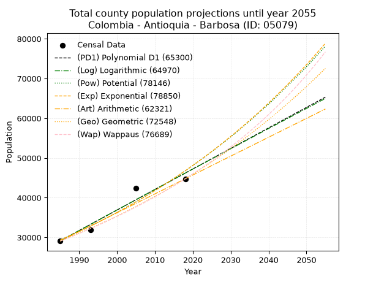
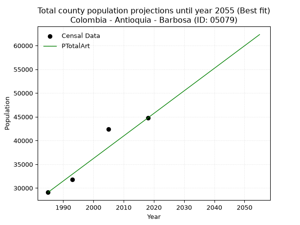
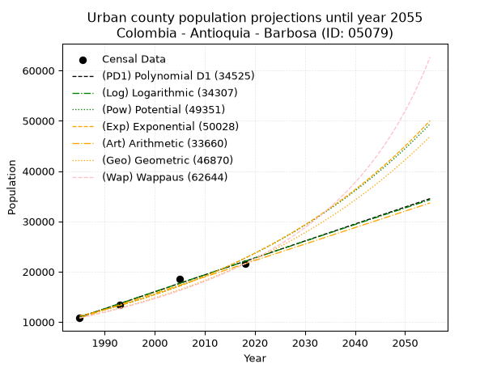
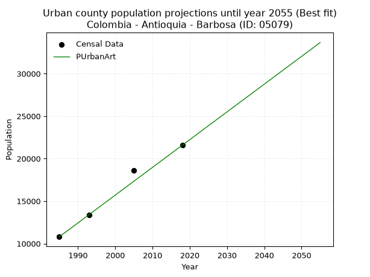
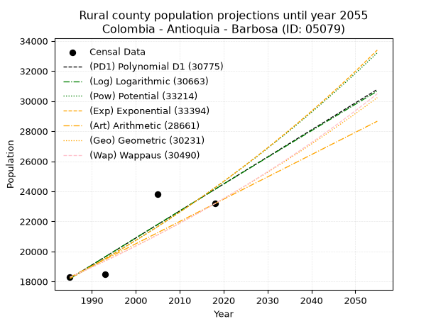
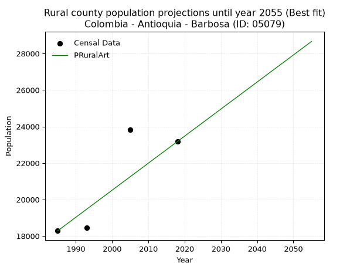

<div align="center">


</div>

# _“Population and Public Services Demand Projections (PPSD) until Year 2050 for Colombia - Antioquia - Barbosa (ID: 05079)”_
Keywords: `population` `public-service` `projection` `lineal` `polynomial` `logarithmic` `potential` `exponential` `arithmetic` `geometric` `wappaus` `dane` `colombia` `south-america`

PPSD are analytical estimates used by governments and planners to anticipate future changes in population size, age distribution, and the resulting community needs for utilities, healthcare, education, and infrastructure as sizing future water treatment facilities, electrical grids, and road networks based on spatial growth.

> **General running parameters**: • app_version: _v20260806_. • Python version: _3.14.7_. • Pandas version: _3.0.5_. • NumPy version: _2.5.1_. • Creates, save and include plots into reports (create_plot): _False_. • Projection until year: _2050_. • Process polynomial degree 2 and up: _False_. • Process Wappaus: _True_. • Process Wappaus: _True_. • Set negative values to zero: _True_. • Set infinite values to zero: _True_. • Drop dataset notes: _True_. 
<div align="center">

Dynamic map: [:earth_americas:Google](http://maps.google.com/maps?q=6.439195242,-75.3316269) [:earth_americas:OSM](https://www.openstreetmap.org/#map=18/6.439195242/-75.3316269&layers=P) [:earth_americas:Bing](https://www.bing.com/maps?cp=6.439195242~-75.3316269&lvl=18) [:earth_americas:Apple](https://maps.apple.com/frame?center=6.439195242%2C-75.3316269&span=0.003%2C0.006)

</div>


<div align="center">

```geojson
{
  "type": "Feature",
  "geometry": {
    "type": "Point", 
    "coordinates": [-75.3316269, 6.439195242]
  }, 
  "properties": {
    "Name": "Colombia - Antioquia - Barbosa (ID: 05079)"
  }
}
```

</div>


## 0. Census Data (4 records)

Census data are official statistics collected by a government about the people and housing in a country. They usually include counts of total population, age, sex, race, income, education, and jobs.

📅Global census file: [Population.xlsx](../data/Population.xlsx)

| Source   |   Year |   CountryID | CountryName   |   StateID | StateName   |   CountyID | CountyName   |   PTotal |   PUrban |   PRural |
|:---------|-------:|------------:|:--------------|----------:|:------------|-----------:|:-------------|---------:|---------:|---------:|
| DANE     |   1985 |          57 | Colombia      |        05 | Antioquia   |      05079 | Barbosa      |    29092 |    10804 |    18288 |
| DANE     |   1993 |          57 | Colombia      |        05 | Antioquia   |      05079 | Barbosa      |    31839 |    13379 |    18460 |
| DANE     |   2005 |          57 | Colombia      |        05 | Antioquia   |      05079 | Barbosa      |    42439 |    18608 |    23831 |
| DANE     |   2018 |          57 | Colombia      |        05 | Antioquia   |      05079 | Barbosa      |    44757 |    21579 |    23178 |

> 🔥Some records could had specific notes about the registered values or the corresponding urban or rural distribution.

📅   [RUPS](https://www.datos.gov.co/Hacienda-y-Cr-dito-P-blico/Registro-nico-de-Prestadores-de-Servicios-P-blicos/4qkq-csdn/about_data) - Local public utility companies: [RUPS.csv](../data/RUPS.xlsx)

 | SERVICIO       | ESTADO    | NOMBRE                                                                                                                                             | NIT         | DEPARTAMENTO_DOMICILIO   | MUNICIPIO_DOMICILIO   | DIRECCION                                                           |   TELEFONO | EMAIL                                | TIPO_PRESTADOR                            | CLASIFICACION                 |
|:---------------|:----------|:---------------------------------------------------------------------------------------------------------------------------------------------------|:------------|:-------------------------|:----------------------|:--------------------------------------------------------------------|-----------:|:-------------------------------------|:------------------------------------------|:------------------------------|
| ACUEDUCTO      | OPERATIVA | EMPRESAS PÚBLICAS DE MEDELLIN E.S.P.                                                                                                               | 890904996-1 | ANTIOQUIA                | MEDELLIN              | CRA 58 No 42-125 Edificio Inteligente                               |    3808080 | DONEY.MARTINEZ@EPM.COM.CO            | EMPRESA INDUSTRIAL Y COMERCIAL DEL ESTADO | MAYOR O IGUAL A 5001 USUARIOS |
| ALCANTARILLADO | OPERATIVA | EMPRESAS PÚBLICAS DE MEDELLIN E.S.P.                                                                                                               | 890904996-1 | ANTIOQUIA                | MEDELLIN              | CRA 58 No 42-125 Edificio Inteligente                               |    3808080 | DONEY.MARTINEZ@EPM.COM.CO            | EMPRESA INDUSTRIAL Y COMERCIAL DEL ESTADO | MAYOR O IGUAL A 5001 USUARIOS |
| ACUEDUCTO      | OPERATIVA | ASOCIACION DE USUARIOS DEL ACUEDUCTO MULTIVEREDAL AGUAS CRISTALIN                                                                                  | 811035434-6 | ANTIOQUIA                | BARBOSA               | Carrera 15 # 10-40 Local 106                                        |    4795545 | acueductoauamac@gmail.com            | ORGANIZACION AUTORIZADA                   | MENOR O IGUAL A 2500 USUARIOS |
| ACUEDUCTO      | OPERATIVA | ASOCIACION DE ACUEDCUTOS  LOMITAS- PRIMAVERA DE BARBOSA                                                                                            | 811039376-5 | ANTIOQUIA                | BARBOSA               | Vereda La Lomita Corregimiento Hatillo Barbosa, Antioquia, Colombia |    4070524 | ASOCIACIONLOMITASPRIMAVERA@GMAIL.COM | ORGANIZACION AUTORIZADA                   | MENOR O IGUAL A 2500 USUARIOS |
| ACUEDUCTO      | OPERATIVA | ASOCIACION DE USUARIOS DEL ACUEDUCTO DE LA VEREDA PLATANITO                                                                                        | 811027691-9 | ANTIOQUIA                | BARBOSA               | VEREDA PLATANITO                                                    |    4071972 | mauriciocas83@hotmail.es             | ORGANIZACION AUTORIZADA                   | HASTA 2500 SUSCRIPTORES       |
| ACUEDUCTO      | OPERATIVA | ASOCIACION DE USUARIOS DEL ACUEDUCTO Y/O ALCANTARILLADO DE LA VEREDA CESTILLAS                                                                     | 811042452-8 | ANTIOQUIA                | BARBOSA               | PALACIO MUNICIPIO DE BARBOSA                                        |    4711985 | acueductocestillal@hotmail.com       | ORGANIZACION AUTORIZADA                   | HASTA 2500 SUSCRIPTORES       |
| ACUEDUCTO      | OPERATIVA | ASOCIACIÓN DE SUSCRIPTORES DEL ACUEDUCTO MULTIVEREDAL EL ROBLE                                                                                     | 811012178-6 | ANTIOQUIA                | GUARNE                | VEREDA LA ENEA GUARNE                                               |    8544062 | lgcarvajal2009@hotmail.com           | ORGANIZACION AUTORIZADA                   | MENOR O IGUAL A 2500 USUARIOS |
| ACUEDUCTO      | OPERATIVA | ASOCIACION DE USUARIOS DEL ACUEDUCTO Y/O ALCANTARILLADO DE LA VEREDA POPALITO -ASUAP-                                                              | 900107541-9 | ANTIOQUIA                | BARBOSA               | CR. 19 # 13- 15                                                     |    4061012 | claudiapatriciasosa45@gmail.com      | ORGANIZACION AUTORIZADA                   | MENOR O IGUAL A 2500 USUARIOS |
| ACUEDUCTO      | OPERATIVA | ASOCIACION DE USUARIOS DEL ACUEDUCTO Y/O ALCANTARILLADO DE EL PARAISO CORREGIMIENTO DE EL HATILLO, MUNICIPIO DE BARBOSA, DEPARTAMENTO DE ANTIOQUIA | 900078276-6 | ANTIOQUIA                | BARBOSA               | vereda Paraiso                                                      |    4070836 | asoacueductoparaiso@gmail.com        | ORGANIZACION AUTORIZADA                   | MENOR O IGUAL A 2500 USUARIOS |
| ACUEDUCTO      | OPERATIVA | ASOCIACION DE USUARIOS ACUEDUCTO MULTIVEREDAL LA GOTA DE AGUA                                                                                      | 811039886-1 | ANTIOQUIA                | BARBOSA               | CARRERA 18 N° 9 - 96  BARRIO 30 DE MAYO                             |    4661643 | ormamaicaroldan@yahoo.es             | ORGANIZACION AUTORIZADA                   | MENOR O IGUAL A 2500 USUARIOS |
| ACUEDUCTO      | OPERATIVA | ASOCIACION DE USUARIOS DEL ACUEDUCTO Y ALCANTARILLADO DE EL HATILLO                                                                                | 900074224-5 | ANTIOQUIA                | BARBOSA               | CORREGIDURIA EL HATILLO                                             |    4070576 | asoacueductohatill@hotmail.com       | ORGANIZACION AUTORIZADA                   | MENOR O IGUAL A 2500 USUARIOS |
| ACUEDUCTO      | OPERATIVA | Asociacion de Usuarios del Acueducto Yarumito Tamborcito                                                                                           | 811041814-6 | ANTIOQUIA                | BARBOSA               | cra 15 B 29A                                                        |    1111111 | aguacomunal@gmail.com                | ORGANIZACION AUTORIZADA                   | MENOR O IGUAL A 2500 USUARIOS |
| ACUEDUCTO      | OPERATIVA | ASOCIACIÓN DE USUARIOS DEL ACUEDUCTO LA DELGADITA BARBOSA                                                                                          | 900163424-3 | ANTIOQUIA                | BARBOSA               | Vereda Isaza                                                        |    4664812 | consueloacueducto@gmail.com          | ORGANIZACION AUTORIZADA                   | MENOR O IGUAL A 2500 USUARIOS |

## 1. Total

### 1.1. Coefficients and Parameters

* (PD1) Polynomial Deg 1: 516.3167402649519, -995730.8097149702 (lineal)
* (Log) Logarithmic: 1033853.0627988407, -7821293.665112489
* (Pow) Potential: 28.25203978097715, -88.70078609446267
* (Exp) Exponential: 0.014108214334447129, 2.021011232618345e-08
* (Art) Arithmetic: Year diff. 2018 - 1985 = 33, Population diff. 44757 - 29092 = 15665, Annual growth = 474.6969696969697
* (Geo) Geometric: Year diff. 2018 - 1985 = 33, Population diff. 44757 - 29092 = 15665, Annual growth % = 0.01313965631055325
* (Wap) Wappaus: i = 1.2855880775554704, Condition values only valid for < 200)

<sub>
Wappaus condition values: ['0.00', '1.29', '2.57', '3.86', '5.14', '6.43', '7.71', '9.00', '10.28', '11.57', '12.86', '14.14', '15.43', '16.71', '18.00', '19.28', '20.57', '21.85', '23.14', '24.43', '25.71', '27.00', '28.28', '29.57', '30.85', '32.14', '33.43', '34.71', '36.00', '37.28', '38.57', '39.85', '41.14', '42.42', '43.71', '45.00', '46.28', '47.57', '48.85', '50.14', '51.42', '52.71', '53.99', '55.28', '56.57', '57.85', '59.14', '60.42', '61.71', '62.99', '64.28', '65.56', '66.85', '68.14', '69.42', '70.71', '71.99', '73.28', '74.56', '75.85', '77.14', '78.42', '79.71', '80.99', '82.28', '83.56']
</sub>


### 1.2. Projected Dataset

|   Year |   CountyID |   PTotalPD1 |   PTotalLog |   PTotalPow |   PTotalExp |   PTotalArt |   PTotalGeo |   PTotalWap |
|-------:|-----------:|------------:|------------:|------------:|------------:|------------:|------------:|------------:|
|   1985 |      05079 |       29158 |       29140 |       29355 |       29370 |       29092 |       29092 |       29092 |
|   1986 |      05079 |       29674 |       29660 |       29775 |       29787 |       29567 |       29474 |       29468 |
|   1987 |      05079 |       30191 |       30181 |       30202 |       30210 |       30041 |       29862 |       29850 |
|   1988 |      05079 |       30707 |       30701 |       30634 |       30640 |       30516 |       30254 |       30236 |
|   1989 |      05079 |       31223 |       31221 |       31072 |       31075 |       30991 |       30651 |       30627 |
|   1990 |      05079 |       31740 |       31740 |       31517 |       31516 |       31465 |       31054 |       31024 |
|   1991 |      05079 |       32256 |       32260 |       31967 |       31964 |       31940 |       31462 |       31426 |
|   1992 |      05079 |       32772 |       32779 |       32424 |       32418 |       32415 |       31876 |       31833 |
|   1993 |      05079 |       33288 |       33298 |       32887 |       32879 |       32890 |       32294 |       32246 |
|   1994 |      05079 |       33805 |       33816 |       33356 |       33346 |       33364 |       32719 |       32665 |
|   1995 |      05079 |       34321 |       34335 |       33832 |       33820 |       33839 |       33149 |       33089 |
|   1996 |      05079 |       34837 |       34853 |       34315 |       34300 |       34314 |       33584 |       33519 |
|   1997 |      05079 |       35354 |       35371 |       34804 |       34788 |       34788 |       34026 |       33955 |
|   1998 |      05079 |       35870 |       35888 |       35300 |       35282 |       35263 |       34473 |       34397 |
|   1999 |      05079 |       36386 |       36406 |       35802 |       35783 |       35738 |       34926 |       34846 |
|   2000 |      05079 |       36903 |       36923 |       36312 |       36292 |       36212 |       35385 |       35301 |
|   2001 |      05079 |       37419 |       37439 |       36828 |       36807 |       36687 |       35849 |       35762 |
|   2002 |      05079 |       37935 |       37956 |       37352 |       37330 |       37162 |       36321 |       36230 |
|   2003 |      05079 |       38452 |       38472 |       37882 |       37861 |       37637 |       36798 |       36705 |
|   2004 |      05079 |       38968 |       38988 |       38420 |       38399 |       38111 |       37281 |       37187 |
|   2005 |      05079 |       39484 |       39504 |       38966 |       38944 |       38586 |       37771 |       37676 |
|   2006 |      05079 |       40001 |       40020 |       39518 |       39498 |       39061 |       38267 |       38172 |
|   2007 |      05079 |       40517 |       40535 |       40079 |       40059 |       39535 |       38770 |       38675 |
|   2008 |      05079 |       41033 |       41050 |       40647 |       40628 |       40010 |       39280 |       39186 |
|   2009 |      05079 |       41550 |       41565 |       41223 |       41205 |       40485 |       39796 |       39705 |
|   2010 |      05079 |       42066 |       42079 |       41806 |       41791 |       40959 |       40319 |       40232 |
|   2011 |      05079 |       42582 |       42593 |       42398 |       42384 |       41434 |       40848 |       40767 |
|   2012 |      05079 |       43098 |       43107 |       42997 |       42987 |       41909 |       41385 |       41311 |
|   2013 |      05079 |       43615 |       43621 |       43605 |       43597 |       42384 |       41929 |       41863 |
|   2014 |      05079 |       44131 |       44134 |       44221 |       44217 |       42858 |       42480 |       42423 |
|   2015 |      05079 |       44647 |       44648 |       44846 |       44845 |       43333 |       43038 |       42993 |
|   2016 |      05079 |       45164 |       45161 |       45479 |       45482 |       43808 |       43604 |       43571 |
|   2017 |      05079 |       45680 |       45673 |       46121 |       46128 |       44282 |       44177 |       44159 |
|   2018 |      05079 |       46196 |       46186 |       46771 |       46784 |       44757 |       44757 |       44757 |
|   2019 |      05079 |       46713 |       46698 |       47430 |       47449 |       45232 |       45345 |       45364 |
|   2020 |      05079 |       47229 |       47210 |       48099 |       48123 |       45706 |       45941 |       45982 |
|   2021 |      05079 |       47745 |       47721 |       48776 |       48806 |       46181 |       46545 |       46610 |
|   2022 |      05079 |       48262 |       48233 |       49462 |       49500 |       46656 |       47156 |       47248 |
|   2023 |      05079 |       48778 |       48744 |       50158 |       50203 |       47130 |       47776 |       47898 |
|   2024 |      05079 |       49294 |       49255 |       50863 |       50917 |       47605 |       48404 |       48558 |
|   2025 |      05079 |       49811 |       49766 |       51578 |       51640 |       48080 |       49040 |       49230 |
|   2026 |      05079 |       50327 |       50276 |       52303 |       52374 |       48555 |       49684 |       49914 |
|   2027 |      05079 |       50843 |       50786 |       53037 |       53118 |       49029 |       50337 |       50609 |
|   2028 |      05079 |       51360 |       51296 |       53781 |       53873 |       49504 |       50998 |       51317 |
|   2029 |      05079 |       51876 |       51806 |       54535 |       54638 |       49979 |       51668 |       52038 |
|   2030 |      05079 |       52392 |       52315 |       55300 |       55414 |       50453 |       52347 |       52772 |
|   2031 |      05079 |       52908 |       52824 |       56075 |       56202 |       50928 |       53035 |       53519 |
|   2032 |      05079 |       53425 |       53333 |       56860 |       57000 |       51403 |       53732 |       54280 |
|   2033 |      05079 |       53941 |       53842 |       57656 |       57810 |       51877 |       54438 |       55055 |
|   2034 |      05079 |       54457 |       54350 |       58462 |       58631 |       52352 |       55153 |       55844 |
|   2035 |      05079 |       54974 |       54859 |       59280 |       59464 |       52827 |       55878 |       56649 |
|   2036 |      05079 |       55490 |       55366 |       60108 |       60309 |       53302 |       56612 |       57469 |
|   2037 |      05079 |       56006 |       55874 |       60948 |       61166 |       53776 |       57356 |       58305 |
|   2038 |      05079 |       56523 |       56382 |       61799 |       62035 |       54251 |       58110 |       59157 |
|   2039 |      05079 |       57039 |       56889 |       62662 |       62917 |       54726 |       58873 |       60025 |
|   2040 |      05079 |       57555 |       57396 |       63536 |       63811 |       55200 |       59647 |       60912 |
|   2041 |      05079 |       58072 |       57902 |       64421 |       64717 |       55675 |       60430 |       61815 |
|   2042 |      05079 |       58588 |       58409 |       65319 |       65637 |       56150 |       61224 |       62738 |
|   2043 |      05079 |       59104 |       58915 |       66229 |       66569 |       56624 |       62029 |       63679 |
|   2044 |      05079 |       59621 |       59421 |       67151 |       67515 |       57099 |       62844 |       64640 |
|   2045 |      05079 |       60137 |       59926 |       68085 |       68474 |       57574 |       63670 |       65620 |
|   2046 |      05079 |       60653 |       60432 |       69032 |       69447 |       58049 |       64506 |       66622 |
|   2047 |      05079 |       61170 |       60937 |       69992 |       70434 |       58523 |       65354 |       67645 |
|   2048 |      05079 |       61686 |       61442 |       70964 |       71435 |       58998 |       66213 |       68690 |
|   2049 |      05079 |       62202 |       61947 |       71950 |       72450 |       59473 |       67083 |       69758 |
|   2050 |      05079 |       62719 |       62451 |       72948 |       73479 |       59947 |       67964 |       70849 |
<div align="center">

</img>

</div>


### 1.3. Best fit with absolute and relative error (%)

Relative error puts that difference into context by dividing the absolute error by the true value, creating a unitless ratio or percentage that shows the scale of the mistake.

Absolute and relative error

|   Year | Source   |   CountryID | CountryName   |   StateID | StateName   |   CountyID_x | CountyName   |   PTotal |   PUrban |   PRural |   CountyID_y |   PTotalPD1 |   PTotalLog |   PTotalPow |   PTotalExp |   PTotalArt |   PTotalGeo |   PTotalWap |   PTotalPD1AbsError |   PTotalLogAbsError |   PTotalPowAbsError |   PTotalExpAbsError |   PTotalArtAbsError |   PTotalGeoAbsError |   PTotalWapAbsError |   PTotalPD1RelError |   PTotalLogRelError |   PTotalPowRelError |   PTotalExpRelError |   PTotalArtRelError |   PTotalGeoRelError |   PTotalWapRelError |
|-------:|:---------|------------:|:--------------|----------:|:------------|-------------:|:-------------|---------:|---------:|---------:|-------------:|------------:|------------:|------------:|------------:|------------:|------------:|------------:|--------------------:|--------------------:|--------------------:|--------------------:|--------------------:|--------------------:|--------------------:|--------------------:|--------------------:|--------------------:|--------------------:|--------------------:|--------------------:|--------------------:|
|   1985 | DANE     |          57 | Colombia      |        05 | Antioquia   |        05079 | Barbosa      |    29092 |    10804 |    18288 |        05079 |       29158 |       29140 |       29355 |       29370 |       29092 |       29092 |       29092 |                  66 |                  48 |                 263 |                 278 |                   0 |                   0 |                   0 |            0.226866 |            0.164994 |            0.904029 |            0.955589 |             0       |             0       |             0       |
|   1993 | DANE     |          57 | Colombia      |        05 | Antioquia   |        05079 | Barbosa      |    31839 |    13379 |    18460 |        05079 |       33288 |       33298 |       32887 |       32879 |       32890 |       32294 |       32246 |                1449 |                1459 |                1048 |                1040 |                1051 |                 455 |                 407 |            4.55102  |            4.58243  |            3.29156  |            3.26643  |             3.30098 |             1.42906 |             1.27831 |
|   2005 | DANE     |          57 | Colombia      |        05 | Antioquia   |        05079 | Barbosa      |    42439 |    18608 |    23831 |        05079 |       39484 |       39504 |       38966 |       38944 |       38586 |       37771 |       37676 |                2955 |                2935 |                3473 |                3495 |                3853 |                4668 |                4763 |            6.96294  |            6.91581  |            8.18351  |            8.23535  |             9.07891 |            10.9993  |            11.2232  |
|   2018 | DANE     |          57 | Colombia      |        05 | Antioquia   |        05079 | Barbosa      |    44757 |    21579 |    23178 |        05079 |       46196 |       46186 |       46771 |       46784 |       44757 |       44757 |       44757 |                1439 |                1429 |                2014 |                2027 |                   0 |                   0 |                   0 |            3.21514  |            3.1928   |            4.49985  |            4.5289   |             0       |             0       |             0       |

Relative error mean

| Method    |   RelError | Best   |
|:----------|-----------:|:-------|
| PTotalPD1 |    3.73899 |        |
| PTotalLog |    3.71401 |        |
| PTotalPow |    4.21974 |        |
| PTotalExp |    4.24657 |        |
| PTotalArt |    3.09497 | True   |
| PTotalGeo |    3.1071  |        |
| PTotalWap |    3.12537 |        |

💙Best method: _**PTotalArt**_
<div align="center">

</img>

</div>


### 1.4. Fresh water supply demand in liters per capita per day (lpcd)

The fresh water supply demand typically ranges from 100 to 300 liters per capita per day (lpcd) for standard domestic and municipal planning, though absolute survival minimums set by the World Health Organization are as low as 7.5 to 20 liters per day, and total consumption in high-income nations can exceed 400 liters.

> `CZ`: Level in meters above the sea level (masl)<br> `WS`: Fresh water supply demand in liters per capita per day (lpcd or l/h/d)<br> `WSAll`: Zonal fresh water supply demand in liters per second (l/s)<br> `A`: Zonal area in square meters<br> `DP`: Population density (people/hectare or p/ha)

Reference values (RAS Colombia)

|    CZ |   WS |
|------:|-----:|
|  1000 |  120 |
|  2000 |  130 |
| 99999 |  140 |

County shapefile geometry properties and water supply values

|   CountyID |      ATotal |   CZTotal |   WSTotal |
|-----------:|------------:|----------:|----------:|
|      05079 | 2.05603e+08 |   1782.06 |       130 |

Projected values for best method: PTotalArt

|   CountyID |   Year |   PTotalArt |   DPTotal |   WSTotal |   WSTotalAll |
|-----------:|-------:|------------:|----------:|----------:|-------------:|
|      05079 |   1985 |       29092 |      1.41 |       130 |      43.7727 |
|      05079 |   1986 |       29567 |      1.44 |       130 |      44.4874 |
|      05079 |   1987 |       30041 |      1.46 |       130 |      45.2006 |
|      05079 |   1988 |       30516 |      1.48 |       130 |      45.9153 |
|      05079 |   1989 |       30991 |      1.51 |       130 |      46.63   |
|      05079 |   1990 |       31465 |      1.53 |       130 |      47.3432 |
|      05079 |   1991 |       31940 |      1.55 |       130 |      48.0579 |
|      05079 |   1992 |       32415 |      1.58 |       130 |      48.7726 |
|      05079 |   1993 |       32890 |      1.6  |       130 |      49.4873 |
|      05079 |   1994 |       33364 |      1.62 |       130 |      50.2005 |
|      05079 |   1995 |       33839 |      1.65 |       130 |      50.9152 |
|      05079 |   1996 |       34314 |      1.67 |       130 |      51.6299 |
|      05079 |   1997 |       34788 |      1.69 |       130 |      52.3431 |
|      05079 |   1998 |       35263 |      1.72 |       130 |      53.0578 |
|      05079 |   1999 |       35738 |      1.74 |       130 |      53.7725 |
|      05079 |   2000 |       36212 |      1.76 |       130 |      54.4856 |
|      05079 |   2001 |       36687 |      1.78 |       130 |      55.2003 |
|      05079 |   2002 |       37162 |      1.81 |       130 |      55.915  |
|      05079 |   2003 |       37637 |      1.83 |       130 |      56.6297 |
|      05079 |   2004 |       38111 |      1.85 |       130 |      57.3429 |
|      05079 |   2005 |       38586 |      1.88 |       130 |      58.0576 |
|      05079 |   2006 |       39061 |      1.9  |       130 |      58.7723 |
|      05079 |   2007 |       39535 |      1.92 |       130 |      59.4855 |
|      05079 |   2008 |       40010 |      1.95 |       130 |      60.2002 |
|      05079 |   2009 |       40485 |      1.97 |       130 |      60.9149 |
|      05079 |   2010 |       40959 |      1.99 |       130 |      61.6281 |
|      05079 |   2011 |       41434 |      2.02 |       130 |      62.3428 |
|      05079 |   2012 |       41909 |      2.04 |       130 |      63.0575 |
|      05079 |   2013 |       42384 |      2.06 |       130 |      63.7722 |
|      05079 |   2014 |       42858 |      2.08 |       130 |      64.4854 |
|      05079 |   2015 |       43333 |      2.11 |       130 |      65.2001 |
|      05079 |   2016 |       43808 |      2.13 |       130 |      65.9148 |
|      05079 |   2017 |       44282 |      2.15 |       130 |      66.628  |
|      05079 |   2018 |       44757 |      2.18 |       130 |      67.3427 |
|      05079 |   2019 |       45232 |      2.2  |       130 |      68.0574 |
|      05079 |   2020 |       45706 |      2.22 |       130 |      68.7706 |
|      05079 |   2021 |       46181 |      2.25 |       130 |      69.4853 |
|      05079 |   2022 |       46656 |      2.27 |       130 |      70.2    |
|      05079 |   2023 |       47130 |      2.29 |       130 |      70.9132 |
|      05079 |   2024 |       47605 |      2.32 |       130 |      71.6279 |
|      05079 |   2025 |       48080 |      2.34 |       130 |      72.3426 |
|      05079 |   2026 |       48555 |      2.36 |       130 |      73.0573 |
|      05079 |   2027 |       49029 |      2.38 |       130 |      73.7705 |
|      05079 |   2028 |       49504 |      2.41 |       130 |      74.4852 |
|      05079 |   2029 |       49979 |      2.43 |       130 |      75.1999 |
|      05079 |   2030 |       50453 |      2.45 |       130 |      75.9131 |
|      05079 |   2031 |       50928 |      2.48 |       130 |      76.6278 |
|      05079 |   2032 |       51403 |      2.5  |       130 |      77.3425 |
|      05079 |   2033 |       51877 |      2.52 |       130 |      78.0557 |
|      05079 |   2034 |       52352 |      2.55 |       130 |      78.7704 |
|      05079 |   2035 |       52827 |      2.57 |       130 |      79.4851 |
|      05079 |   2036 |       53302 |      2.59 |       130 |      80.1998 |
|      05079 |   2037 |       53776 |      2.62 |       130 |      80.913  |
|      05079 |   2038 |       54251 |      2.64 |       130 |      81.6277 |
|      05079 |   2039 |       54726 |      2.66 |       130 |      82.3424 |
|      05079 |   2040 |       55200 |      2.68 |       130 |      83.0556 |
|      05079 |   2041 |       55675 |      2.71 |       130 |      83.7703 |
|      05079 |   2042 |       56150 |      2.73 |       130 |      84.485  |
|      05079 |   2043 |       56624 |      2.75 |       130 |      85.1981 |
|      05079 |   2044 |       57099 |      2.78 |       130 |      85.9128 |
|      05079 |   2045 |       57574 |      2.8  |       130 |      86.6275 |
|      05079 |   2046 |       58049 |      2.82 |       130 |      87.3422 |
|      05079 |   2047 |       58523 |      2.85 |       130 |      88.0554 |
|      05079 |   2048 |       58998 |      2.87 |       130 |      88.7701 |
|      05079 |   2049 |       59473 |      2.89 |       130 |      89.4848 |
|      05079 |   2050 |       59947 |      2.92 |       130 |      90.198  |

## 2. Urban

### 2.1. Coefficients and Parameters

* (PD1) Polynomial Deg 1: 336.66238458450204, -657316.4347651502 (lineal)
* (Log) Logarithmic: 674017.606973337, -5107120.73184246
* (Pow) Potential: 42.80511917449182, -137.11200980343364
* (Exp) Exponential: 0.021376394470104563, 4.181321631111019e-15
* (Art) Arithmetic: Year diff. 2018 - 1985 = 33, Population diff. 21579 - 10804 = 10775, Annual growth = 326.5151515151515
* (Geo) Geometric: Year diff. 2018 - 1985 = 33, Population diff. 21579 - 10804 = 10775, Annual growth % = 0.02118504642758645
* (Wap) Wappaus: i = 2.016583710682466, Condition values only valid for < 200)

<sub>
Wappaus condition values: ['0.00', '2.02', '4.03', '6.05', '8.07', '10.08', '12.10', '14.12', '16.13', '18.15', '20.17', '22.18', '24.20', '26.22', '28.23', '30.25', '32.27', '34.28', '36.30', '38.32', '40.33', '42.35', '44.36', '46.38', '48.40', '50.41', '52.43', '54.45', '56.46', '58.48', '60.50', '62.51', '64.53', '66.55', '68.56', '70.58', '72.60', '74.61', '76.63', '78.65', '80.66', '82.68', '84.70', '86.71', '88.73', '90.75', '92.76', '94.78', '96.80', '98.81', '100.83', '102.85', '104.86', '106.88', '108.90', '110.91', '112.93', '114.95', '116.96', '118.98', '121.00', '123.01', '125.03', '127.04', '129.06', '131.08']
</sub>


### 2.2. Projected Dataset

|   Year |   CountyID |   PUrbanPD1 |   PUrbanLog |   PUrbanPow |   PUrbanExp |   PUrbanArt |   PUrbanGeo |   PUrbanWap |
|-------:|-----------:|------------:|------------:|------------:|------------:|------------:|------------:|------------:|
|   1985 |      05079 |       10958 |       10947 |       11195 |       11204 |       10804 |       10804 |       10804 |
|   1986 |      05079 |       11295 |       11287 |       11439 |       11446 |       11131 |       11033 |       11024 |
|   1987 |      05079 |       11632 |       11626 |       11688 |       11693 |       11457 |       11267 |       11249 |
|   1988 |      05079 |       11968 |       11965 |       11943 |       11946 |       11784 |       11505 |       11478 |
|   1989 |      05079 |       12305 |       12304 |       12202 |       12204 |       12110 |       11749 |       11712 |
|   1990 |      05079 |       12642 |       12643 |       12468 |       12467 |       12437 |       11998 |       11951 |
|   1991 |      05079 |       12978 |       12981 |       12739 |       12737 |       12763 |       12252 |       12195 |
|   1992 |      05079 |       13315 |       13320 |       13016 |       13012 |       13090 |       12512 |       12445 |
|   1993 |      05079 |       13652 |       13658 |       13298 |       13293 |       13416 |       12777 |       12700 |
|   1994 |      05079 |       13988 |       13996 |       13587 |       13580 |       13743 |       13047 |       12961 |
|   1995 |      05079 |       14325 |       14334 |       13882 |       13874 |       14069 |       13324 |       13227 |
|   1996 |      05079 |       14662 |       14672 |       14183 |       14174 |       14396 |       13606 |       13500 |
|   1997 |      05079 |       14998 |       15010 |       14490 |       14480 |       14722 |       13894 |       13778 |
|   1998 |      05079 |       15335 |       15347 |       14804 |       14793 |       15049 |       14189 |       14064 |
|   1999 |      05079 |       15672 |       15684 |       15124 |       15112 |       15375 |       14489 |       14356 |
|   2000 |      05079 |       16008 |       16021 |       15452 |       15439 |       15702 |       14796 |       14654 |
|   2001 |      05079 |       16345 |       16358 |       15786 |       15772 |       16028 |       15110 |       14961 |
|   2002 |      05079 |       16682 |       16695 |       16127 |       16113 |       16355 |       15430 |       15274 |
|   2003 |      05079 |       17018 |       17032 |       16475 |       16461 |       16681 |       15757 |       15595 |
|   2004 |      05079 |       17355 |       17368 |       16831 |       16817 |       17008 |       16090 |       15925 |
|   2005 |      05079 |       17692 |       17704 |       17195 |       17180 |       17334 |       16431 |       16262 |
|   2006 |      05079 |       18028 |       18040 |       17565 |       17552 |       17661 |       16779 |       16608 |
|   2007 |      05079 |       18365 |       18376 |       17944 |       17931 |       17987 |       17135 |       16964 |
|   2008 |      05079 |       18702 |       18712 |       18331 |       18318 |       18314 |       17498 |       17328 |
|   2009 |      05079 |       19038 |       19048 |       18726 |       18714 |       18640 |       17869 |       17702 |
|   2010 |      05079 |       19375 |       19383 |       19129 |       19118 |       18967 |       18247 |       18087 |
|   2011 |      05079 |       19712 |       19718 |       19541 |       19531 |       19293 |       18634 |       18481 |
|   2012 |      05079 |       20048 |       20053 |       19961 |       19953 |       19620 |       19029 |       18887 |
|   2013 |      05079 |       20385 |       20388 |       20390 |       20385 |       19946 |       19432 |       19304 |
|   2014 |      05079 |       20722 |       20723 |       20828 |       20825 |       20273 |       19843 |       19733 |
|   2015 |      05079 |       21058 |       21058 |       21275 |       21275 |       20599 |       20264 |       20175 |
|   2016 |      05079 |       21395 |       21392 |       21732 |       21735 |       20926 |       20693 |       20629 |
|   2017 |      05079 |       21732 |       21726 |       22198 |       22204 |       21252 |       21131 |       21097 |
|   2018 |      05079 |       22068 |       22060 |       22674 |       22684 |       21579 |       21579 |       21579 |
|   2019 |      05079 |       22405 |       22394 |       23160 |       23174 |       21906 |       22036 |       22076 |
|   2020 |      05079 |       22742 |       22728 |       23656 |       23675 |       22232 |       22503 |       22588 |
|   2021 |      05079 |       23078 |       23062 |       24163 |       24186 |       22559 |       22980 |       23117 |
|   2022 |      05079 |       23415 |       23395 |       24680 |       24709 |       22885 |       23467 |       23662 |
|   2023 |      05079 |       23752 |       23728 |       25208 |       25243 |       23212 |       23964 |       24226 |
|   2024 |      05079 |       24088 |       24061 |       25747 |       25788 |       23538 |       24471 |       24808 |
|   2025 |      05079 |       24425 |       24394 |       26297 |       26345 |       23865 |       24990 |       25410 |
|   2026 |      05079 |       24762 |       24727 |       26859 |       26915 |       24191 |       25519 |       26032 |
|   2027 |      05079 |       25098 |       25060 |       27432 |       27496 |       24518 |       26060 |       26676 |
|   2028 |      05079 |       25435 |       25392 |       28017 |       28090 |       24844 |       26612 |       27343 |
|   2029 |      05079 |       25772 |       25724 |       28615 |       28697 |       25171 |       27176 |       28035 |
|   2030 |      05079 |       26108 |       26057 |       29225 |       29317 |       25497 |       27751 |       28752 |
|   2031 |      05079 |       26445 |       26388 |       29847 |       29951 |       25824 |       28339 |       29495 |
|   2032 |      05079 |       26782 |       26720 |       30483 |       30598 |       26150 |       28940 |       30268 |
|   2033 |      05079 |       27118 |       27052 |       31132 |       31259 |       26477 |       29553 |       31070 |
|   2034 |      05079 |       27455 |       27383 |       31794 |       31934 |       26803 |       30179 |       31905 |
|   2035 |      05079 |       27792 |       27715 |       32470 |       32624 |       27130 |       30818 |       32773 |
|   2036 |      05079 |       28128 |       28046 |       33160 |       33329 |       27456 |       31471 |       33678 |
|   2037 |      05079 |       28465 |       28377 |       33865 |       34049 |       27783 |       32138 |       34621 |
|   2038 |      05079 |       28802 |       28708 |       34584 |       34785 |       28109 |       32819 |       35604 |
|   2039 |      05079 |       29138 |       29038 |       35317 |       35537 |       28436 |       33514 |       36632 |
|   2040 |      05079 |       29475 |       29369 |       36066 |       36304 |       28762 |       34224 |       37705 |
|   2041 |      05079 |       29811 |       29699 |       36831 |       37089 |       29089 |       34949 |       38829 |
|   2042 |      05079 |       30148 |       30029 |       37611 |       37890 |       29415 |       35689 |       40006 |
|   2043 |      05079 |       30485 |       30359 |       38408 |       38709 |       29742 |       36445 |       41240 |
|   2044 |      05079 |       30821 |       30689 |       39221 |       39545 |       30068 |       37217 |       42535 |
|   2045 |      05079 |       31158 |       31019 |       40051 |       40400 |       30395 |       38006 |       43896 |
|   2046 |      05079 |       31495 |       31348 |       40898 |       41273 |       30721 |       38811 |       45329 |
|   2047 |      05079 |       31831 |       31678 |       41762 |       42164 |       31048 |       39633 |       46839 |
|   2048 |      05079 |       32168 |       32007 |       42645 |       43075 |       31374 |       40473 |       48432 |
|   2049 |      05079 |       32505 |       32336 |       43545 |       44006 |       31701 |       41330 |       50116 |
|   2050 |      05079 |       32841 |       32665 |       44464 |       44957 |       32027 |       42206 |       51899 |
<div align="center">

</img>

</div>


### 2.3. Best fit with absolute and relative error (%)

Relative error puts that difference into context by dividing the absolute error by the true value, creating a unitless ratio or percentage that shows the scale of the mistake.

Absolute and relative error

|   Year | Source   |   CountryID | CountryName   |   StateID | StateName   |   CountyID_x | CountyName   |   PTotal |   PUrban |   PRural |   CountyID_y |   PUrbanPD1 |   PUrbanLog |   PUrbanPow |   PUrbanExp |   PUrbanArt |   PUrbanGeo |   PUrbanWap |   PUrbanPD1AbsError |   PUrbanLogAbsError |   PUrbanPowAbsError |   PUrbanExpAbsError |   PUrbanArtAbsError |   PUrbanGeoAbsError |   PUrbanWapAbsError |   PUrbanPD1RelError |   PUrbanLogRelError |   PUrbanPowRelError |   PUrbanExpRelError |   PUrbanArtRelError |   PUrbanGeoRelError |   PUrbanWapRelError |
|-------:|:---------|------------:|:--------------|----------:|:------------|-------------:|:-------------|---------:|---------:|---------:|-------------:|------------:|------------:|------------:|------------:|------------:|------------:|------------:|--------------------:|--------------------:|--------------------:|--------------------:|--------------------:|--------------------:|--------------------:|--------------------:|--------------------:|--------------------:|--------------------:|--------------------:|--------------------:|--------------------:|
|   1985 | DANE     |          57 | Colombia      |        05 | Antioquia   |        05079 | Barbosa      |    29092 |    10804 |    18288 |        05079 |       10958 |       10947 |       11195 |       11204 |       10804 |       10804 |       10804 |                 154 |                 143 |                 391 |                 400 |                   0 |                   0 |                   0 |             1.4254  |             1.32358 |            3.61903  |            3.70233  |            0        |             0       |             0       |
|   1993 | DANE     |          57 | Colombia      |        05 | Antioquia   |        05079 | Barbosa      |    31839 |    13379 |    18460 |        05079 |       13652 |       13658 |       13298 |       13293 |       13416 |       12777 |       12700 |                 273 |                 279 |                  81 |                  86 |                  37 |                 602 |                 679 |             2.04051 |             2.08536 |            0.605426 |            0.642798 |            0.276553 |             4.49959 |             5.07512 |
|   2005 | DANE     |          57 | Colombia      |        05 | Antioquia   |        05079 | Barbosa      |    42439 |    18608 |    23831 |        05079 |       17692 |       17704 |       17195 |       17180 |       17334 |       16431 |       16262 |                 916 |                 904 |                1413 |                1428 |                1274 |                2177 |                2346 |             4.92261 |             4.85813 |            7.59351  |            7.67412  |            6.84652  |            11.6993  |            12.6075  |
|   2018 | DANE     |          57 | Colombia      |        05 | Antioquia   |        05079 | Barbosa      |    44757 |    21579 |    23178 |        05079 |       22068 |       22060 |       22674 |       22684 |       21579 |       21579 |       21579 |                 489 |                 481 |                1095 |                1105 |                   0 |                   0 |                   0 |             2.26609 |             2.22902 |            5.07438  |            5.12072  |            0        |             0       |             0       |

Relative error mean

| Method    |   RelError | Best   |
|:----------|-----------:|:-------|
| PUrbanPD1 |    2.66365 |        |
| PUrbanLog |    2.62402 |        |
| PUrbanPow |    4.22309 |        |
| PUrbanExp |    4.28499 |        |
| PUrbanArt |    1.78077 | True   |
| PUrbanGeo |    4.04971 |        |
| PUrbanWap |    4.42065 |        |

💙Best method: _**PUrbanArt**_
<div align="center">

</img>

</div>


### 2.4. Fresh water supply demand in liters per capita per day (lpcd)

The fresh water supply demand typically ranges from 100 to 300 liters per capita per day (lpcd) for standard domestic and municipal planning, though absolute survival minimums set by the World Health Organization are as low as 7.5 to 20 liters per day, and total consumption in high-income nations can exceed 400 liters.

> `CZ`: Level in meters above the sea level (masl)<br> `WS`: Fresh water supply demand in liters per capita per day (lpcd or l/h/d)<br> `WSAll`: Zonal fresh water supply demand in liters per second (l/s)<br> `A`: Zonal area in square meters<br> `DP`: Population density (people/hectare or p/ha)

Reference values (RAS Colombia)

|    CZ |   WS |
|------:|-----:|
|  1000 |  120 |
|  2000 |  130 |
| 99999 |  140 |

County shapefile geometry properties and water supply values

|   CountyID |      AUrban |   CZUrban |   WSUrban |
|-----------:|------------:|----------:|----------:|
|      05079 | 2.78662e+06 |   1303.76 |       130 |

Projected values for best method: PUrbanArt

|   CountyID |   Year |   PUrbanArt |   DPUrban |   WSUrban |   WSUrbanAll |
|-----------:|-------:|------------:|----------:|----------:|-------------:|
|      05079 |   1985 |       10804 |     38.77 |       130 |      16.256  |
|      05079 |   1986 |       11131 |     39.94 |       130 |      16.748  |
|      05079 |   1987 |       11457 |     41.11 |       130 |      17.2385 |
|      05079 |   1988 |       11784 |     42.29 |       130 |      17.7306 |
|      05079 |   1989 |       12110 |     43.46 |       130 |      18.2211 |
|      05079 |   1990 |       12437 |     44.63 |       130 |      18.7131 |
|      05079 |   1991 |       12763 |     45.8  |       130 |      19.2036 |
|      05079 |   1992 |       13090 |     46.97 |       130 |      19.6956 |
|      05079 |   1993 |       13416 |     48.14 |       130 |      20.1861 |
|      05079 |   1994 |       13743 |     49.32 |       130 |      20.6781 |
|      05079 |   1995 |       14069 |     50.49 |       130 |      21.1686 |
|      05079 |   1996 |       14396 |     51.66 |       130 |      21.6606 |
|      05079 |   1997 |       14722 |     52.83 |       130 |      22.1512 |
|      05079 |   1998 |       15049 |     54    |       130 |      22.6432 |
|      05079 |   1999 |       15375 |     55.17 |       130 |      23.1337 |
|      05079 |   2000 |       15702 |     56.35 |       130 |      23.6257 |
|      05079 |   2001 |       16028 |     57.52 |       130 |      24.1162 |
|      05079 |   2002 |       16355 |     58.69 |       130 |      24.6082 |
|      05079 |   2003 |       16681 |     59.86 |       130 |      25.0987 |
|      05079 |   2004 |       17008 |     61.03 |       130 |      25.5907 |
|      05079 |   2005 |       17334 |     62.2  |       130 |      26.0813 |
|      05079 |   2006 |       17661 |     63.38 |       130 |      26.5733 |
|      05079 |   2007 |       17987 |     64.55 |       130 |      27.0638 |
|      05079 |   2008 |       18314 |     65.72 |       130 |      27.5558 |
|      05079 |   2009 |       18640 |     66.89 |       130 |      28.0463 |
|      05079 |   2010 |       18967 |     68.06 |       130 |      28.5383 |
|      05079 |   2011 |       19293 |     69.23 |       130 |      29.0288 |
|      05079 |   2012 |       19620 |     70.41 |       130 |      29.5208 |
|      05079 |   2013 |       19946 |     71.58 |       130 |      30.0113 |
|      05079 |   2014 |       20273 |     72.75 |       130 |      30.5034 |
|      05079 |   2015 |       20599 |     73.92 |       130 |      30.9939 |
|      05079 |   2016 |       20926 |     75.09 |       130 |      31.4859 |
|      05079 |   2017 |       21252 |     76.26 |       130 |      31.9764 |
|      05079 |   2018 |       21579 |     77.44 |       130 |      32.4684 |
|      05079 |   2019 |       21906 |     78.61 |       130 |      32.9604 |
|      05079 |   2020 |       22232 |     79.78 |       130 |      33.4509 |
|      05079 |   2021 |       22559 |     80.95 |       130 |      33.9429 |
|      05079 |   2022 |       22885 |     82.12 |       130 |      34.4334 |
|      05079 |   2023 |       23212 |     83.3  |       130 |      34.9255 |
|      05079 |   2024 |       23538 |     84.47 |       130 |      35.416  |
|      05079 |   2025 |       23865 |     85.64 |       130 |      35.908  |
|      05079 |   2026 |       24191 |     86.81 |       130 |      36.3985 |
|      05079 |   2027 |       24518 |     87.98 |       130 |      36.8905 |
|      05079 |   2028 |       24844 |     89.15 |       130 |      37.381  |
|      05079 |   2029 |       25171 |     90.33 |       130 |      37.873  |
|      05079 |   2030 |       25497 |     91.5  |       130 |      38.3635 |
|      05079 |   2031 |       25824 |     92.67 |       130 |      38.8556 |
|      05079 |   2032 |       26150 |     93.84 |       130 |      39.3461 |
|      05079 |   2033 |       26477 |     95.01 |       130 |      39.8381 |
|      05079 |   2034 |       26803 |     96.18 |       130 |      40.3286 |
|      05079 |   2035 |       27130 |     97.36 |       130 |      40.8206 |
|      05079 |   2036 |       27456 |     98.53 |       130 |      41.3111 |
|      05079 |   2037 |       27783 |     99.7  |       130 |      41.8031 |
|      05079 |   2038 |       28109 |    100.87 |       130 |      42.2936 |
|      05079 |   2039 |       28436 |    102.04 |       130 |      42.7856 |
|      05079 |   2040 |       28762 |    103.21 |       130 |      43.2762 |
|      05079 |   2041 |       29089 |    104.39 |       130 |      43.7682 |
|      05079 |   2042 |       29415 |    105.56 |       130 |      44.2587 |
|      05079 |   2043 |       29742 |    106.73 |       130 |      44.7507 |
|      05079 |   2044 |       30068 |    107.9  |       130 |      45.2412 |
|      05079 |   2045 |       30395 |    109.07 |       130 |      45.7332 |
|      05079 |   2046 |       30721 |    110.24 |       130 |      46.2237 |
|      05079 |   2047 |       31048 |    111.42 |       130 |      46.7157 |
|      05079 |   2048 |       31374 |    112.59 |       130 |      47.2062 |
|      05079 |   2049 |       31701 |    113.76 |       130 |      47.6983 |
|      05079 |   2050 |       32027 |    114.93 |       130 |      48.1888 |

## 3. Rural

### 3.1. Coefficients and Parameters

* (PD1) Polynomial Deg 1: 179.65435568044956, -338414.3749498193 (lineal)
* (Log) Logarithmic: 359835.45582550415, -2714172.933270031
* (Pow) Potential: 17.35359772649875, -52.96788810908009
* (Exp) Exponential: 0.008664262509868827, 0.000618059843787073
* (Art) Arithmetic: Year diff. 2018 - 1985 = 33, Population diff. 23178 - 18288 = 4890, Annual growth = 148.1818181818182
* (Geo) Geometric: Year diff. 2018 - 1985 = 33, Population diff. 23178 - 18288 = 4890, Annual growth % = 0.007206400995351858
* (Wap) Wappaus: i = 0.7147147937192794, Condition values only valid for < 200)

<sub>
Wappaus condition values: ['0.00', '0.71', '1.43', '2.14', '2.86', '3.57', '4.29', '5.00', '5.72', '6.43', '7.15', '7.86', '8.58', '9.29', '10.01', '10.72', '11.44', '12.15', '12.86', '13.58', '14.29', '15.01', '15.72', '16.44', '17.15', '17.87', '18.58', '19.30', '20.01', '20.73', '21.44', '22.16', '22.87', '23.59', '24.30', '25.02', '25.73', '26.44', '27.16', '27.87', '28.59', '29.30', '30.02', '30.73', '31.45', '32.16', '32.88', '33.59', '34.31', '35.02', '35.74', '36.45', '37.17', '37.88', '38.59', '39.31', '40.02', '40.74', '41.45', '42.17', '42.88', '43.60', '44.31', '45.03', '45.74', '46.46']
</sub>


### 3.2. Projected Dataset

|   Year |   CountyID |   PRuralPD1 |   PRuralLog |   PRuralPow |   PRuralExp |   PRuralArt |   PRuralGeo |   PRuralWap |
|-------:|-----------:|------------:|------------:|------------:|------------:|------------:|------------:|------------:|
|   1985 |      05079 |       18200 |       18192 |       18202 |       18208 |       18288 |       18288 |       18288 |
|   1986 |      05079 |       18379 |       18374 |       18362 |       18367 |       18436 |       18420 |       18419 |
|   1987 |      05079 |       18559 |       18555 |       18523 |       18527 |       18584 |       18553 |       18551 |
|   1988 |      05079 |       18738 |       18736 |       18685 |       18688 |       18733 |       18686 |       18684 |
|   1989 |      05079 |       18918 |       18917 |       18849 |       18850 |       18881 |       18821 |       18818 |
|   1990 |      05079 |       19098 |       19098 |       19014 |       19014 |       19029 |       18957 |       18953 |
|   1991 |      05079 |       19277 |       19278 |       19181 |       19180 |       19177 |       19093 |       19089 |
|   1992 |      05079 |       19457 |       19459 |       19349 |       19347 |       19325 |       19231 |       19226 |
|   1993 |      05079 |       19637 |       19640 |       19518 |       19515 |       19473 |       19369 |       19364 |
|   1994 |      05079 |       19816 |       19820 |       19689 |       19685 |       19622 |       19509 |       19503 |
|   1995 |      05079 |       19996 |       20001 |       19861 |       19856 |       19770 |       19649 |       19644 |
|   1996 |      05079 |       20176 |       20181 |       20034 |       20029 |       19918 |       19791 |       19785 |
|   1997 |      05079 |       20355 |       20361 |       20209 |       20203 |       20066 |       19934 |       19927 |
|   1998 |      05079 |       20535 |       20541 |       20385 |       20379 |       20214 |       20077 |       20070 |
|   1999 |      05079 |       20715 |       20721 |       20563 |       20557 |       20363 |       20222 |       20214 |
|   2000 |      05079 |       20894 |       20901 |       20742 |       20735 |       20511 |       20368 |       20360 |
|   2001 |      05079 |       21074 |       21081 |       20923 |       20916 |       20659 |       20515 |       20506 |
|   2002 |      05079 |       21254 |       21261 |       21105 |       21098 |       20807 |       20662 |       20654 |
|   2003 |      05079 |       21433 |       21441 |       21289 |       21281 |       20955 |       20811 |       20802 |
|   2004 |      05079 |       21613 |       21620 |       21474 |       21467 |       21103 |       20961 |       20952 |
|   2005 |      05079 |       21793 |       21800 |       21661 |       21653 |       21252 |       21112 |       21103 |
|   2006 |      05079 |       21972 |       21979 |       21849 |       21842 |       21400 |       21264 |       21256 |
|   2007 |      05079 |       22152 |       22158 |       22039 |       22032 |       21548 |       21418 |       21409 |
|   2008 |      05079 |       22332 |       22338 |       22230 |       22224 |       21696 |       21572 |       21563 |
|   2009 |      05079 |       22511 |       22517 |       22423 |       22417 |       21844 |       21727 |       21719 |
|   2010 |      05079 |       22691 |       22696 |       22618 |       22612 |       21993 |       21884 |       21876 |
|   2011 |      05079 |       22871 |       22875 |       22814 |       22809 |       22141 |       22042 |       22034 |
|   2012 |      05079 |       23050 |       23054 |       23011 |       23007 |       22289 |       22201 |       22194 |
|   2013 |      05079 |       23230 |       23233 |       23211 |       23208 |       22437 |       22361 |       22355 |
|   2014 |      05079 |       23409 |       23411 |       23412 |       23410 |       22585 |       22522 |       22517 |
|   2015 |      05079 |       23589 |       23590 |       23614 |       23613 |       22733 |       22684 |       22680 |
|   2016 |      05079 |       23769 |       23768 |       23818 |       23819 |       22882 |       22848 |       22845 |
|   2017 |      05079 |       23948 |       23947 |       24024 |       24026 |       23030 |       23012 |       23011 |
|   2018 |      05079 |       24128 |       24125 |       24232 |       24235 |       23178 |       23178 |       23178 |
|   2019 |      05079 |       24308 |       24304 |       24441 |       24446 |       23326 |       23345 |       23347 |
|   2020 |      05079 |       24487 |       24482 |       24652 |       24659 |       23474 |       23513 |       23517 |
|   2021 |      05079 |       24667 |       24660 |       24865 |       24873 |       23623 |       23683 |       23688 |
|   2022 |      05079 |       24847 |       24838 |       25079 |       25090 |       23771 |       23853 |       23861 |
|   2023 |      05079 |       25026 |       25016 |       25295 |       25308 |       23919 |       24025 |       24035 |
|   2024 |      05079 |       25206 |       25194 |       25513 |       25528 |       24067 |       24198 |       24211 |
|   2025 |      05079 |       25386 |       25371 |       25732 |       25750 |       24215 |       24373 |       24388 |
|   2026 |      05079 |       25565 |       25549 |       25954 |       25975 |       24363 |       24548 |       24567 |
|   2027 |      05079 |       25745 |       25727 |       26177 |       26201 |       24512 |       24725 |       24747 |
|   2028 |      05079 |       25925 |       25904 |       26402 |       26429 |       24660 |       24904 |       24929 |
|   2029 |      05079 |       26104 |       26081 |       26629 |       26659 |       24808 |       25083 |       25112 |
|   2030 |      05079 |       26284 |       26259 |       26858 |       26890 |       24956 |       25264 |       25297 |
|   2031 |      05079 |       26464 |       26436 |       27088 |       27124 |       25104 |       25446 |       25483 |
|   2032 |      05079 |       26643 |       26613 |       27321 |       27361 |       25253 |       25629 |       25671 |
|   2033 |      05079 |       26823 |       26790 |       27555 |       27599 |       25401 |       25814 |       25861 |
|   2034 |      05079 |       27003 |       26967 |       27791 |       27839 |       25549 |       26000 |       26052 |
|   2035 |      05079 |       27182 |       27144 |       28029 |       28081 |       25697 |       26187 |       26245 |
|   2036 |      05079 |       27362 |       27321 |       28269 |       28325 |       25845 |       26376 |       26440 |
|   2037 |      05079 |       27542 |       27497 |       28511 |       28572 |       25993 |       26566 |       26636 |
|   2038 |      05079 |       27721 |       27674 |       28755 |       28820 |       26142 |       26757 |       26834 |
|   2039 |      05079 |       27901 |       27851 |       29001 |       29071 |       26290 |       26950 |       27034 |
|   2040 |      05079 |       28081 |       28027 |       29248 |       29324 |       26438 |       27145 |       27235 |
|   2041 |      05079 |       28260 |       28203 |       29498 |       29579 |       26586 |       27340 |       27439 |
|   2042 |      05079 |       28440 |       28380 |       29750 |       29837 |       26734 |       27537 |       27644 |
|   2043 |      05079 |       28619 |       28556 |       30004 |       30096 |       26883 |       27736 |       27851 |
|   2044 |      05079 |       28799 |       28732 |       30260 |       30358 |       27031 |       27935 |       28060 |
|   2045 |      05079 |       28979 |       28908 |       30518 |       30623 |       27179 |       28137 |       28271 |
|   2046 |      05079 |       29158 |       29084 |       30778 |       30889 |       27327 |       28340 |       28484 |
|   2047 |      05079 |       29338 |       29260 |       31040 |       31158 |       27475 |       28544 |       28698 |
|   2048 |      05079 |       29518 |       29435 |       31304 |       31429 |       27623 |       28749 |       28915 |
|   2049 |      05079 |       29697 |       29611 |       31570 |       31702 |       27772 |       28957 |       29134 |
|   2050 |      05079 |       29877 |       29787 |       31839 |       31978 |       27920 |       29165 |       29355 |
<div align="center">

</img>

</div>


### 3.3. Best fit with absolute and relative error (%)

Relative error puts that difference into context by dividing the absolute error by the true value, creating a unitless ratio or percentage that shows the scale of the mistake.

Absolute and relative error

|   Year | Source   |   CountryID | CountryName   |   StateID | StateName   |   CountyID_x | CountyName   |   PTotal |   PUrban |   PRural |   CountyID_y |   PRuralPD1 |   PRuralLog |   PRuralPow |   PRuralExp |   PRuralArt |   PRuralGeo |   PRuralWap |   PRuralPD1AbsError |   PRuralLogAbsError |   PRuralPowAbsError |   PRuralExpAbsError |   PRuralArtAbsError |   PRuralGeoAbsError |   PRuralWapAbsError |   PRuralPD1RelError |   PRuralLogRelError |   PRuralPowRelError |   PRuralExpRelError |   PRuralArtRelError |   PRuralGeoRelError |   PRuralWapRelError |
|-------:|:---------|------------:|:--------------|----------:|:------------|-------------:|:-------------|---------:|---------:|---------:|-------------:|------------:|------------:|------------:|------------:|------------:|------------:|------------:|--------------------:|--------------------:|--------------------:|--------------------:|--------------------:|--------------------:|--------------------:|--------------------:|--------------------:|--------------------:|--------------------:|--------------------:|--------------------:|--------------------:|
|   1985 | DANE     |          57 | Colombia      |        05 | Antioquia   |        05079 | Barbosa      |    29092 |    10804 |    18288 |        05079 |       18200 |       18192 |       18202 |       18208 |       18288 |       18288 |       18288 |                  88 |                  96 |                  86 |                  80 |                   0 |                   0 |                   0 |             0.48119 |            0.524934 |            0.470254 |            0.437445 |             0       |             0       |             0       |
|   1993 | DANE     |          57 | Colombia      |        05 | Antioquia   |        05079 | Barbosa      |    31839 |    13379 |    18460 |        05079 |       19637 |       19640 |       19518 |       19515 |       19473 |       19369 |       19364 |                1177 |                1180 |                1058 |                1055 |                1013 |                 909 |                 904 |             6.37595 |            6.3922   |            5.73131  |            5.71506  |             5.48754 |             4.92416 |             4.89707 |
|   2005 | DANE     |          57 | Colombia      |        05 | Antioquia   |        05079 | Barbosa      |    42439 |    18608 |    23831 |        05079 |       21793 |       21800 |       21661 |       21653 |       21252 |       21112 |       21103 |                2038 |                2031 |                2170 |                2178 |                2579 |                2719 |                2728 |             8.55189 |            8.52251  |            9.10579  |            9.13936  |            10.822   |            11.4095  |            11.4473  |
|   2018 | DANE     |          57 | Colombia      |        05 | Antioquia   |        05079 | Barbosa      |    44757 |    21579 |    23178 |        05079 |       24128 |       24125 |       24232 |       24235 |       23178 |       23178 |       23178 |                 950 |                 947 |                1054 |                1057 |                   0 |                   0 |                   0 |             4.09871 |            4.08577  |            4.54742  |            4.56036  |             0       |             0       |             0       |

Relative error mean

| Method    |   RelError | Best   |
|:----------|-----------:|:-------|
| PRuralPD1 |    4.87693 |        |
| PRuralLog |    4.88135 |        |
| PRuralPow |    4.96369 |        |
| PRuralExp |    4.96306 |        |
| PRuralArt |    4.07739 | True   |
| PRuralGeo |    4.08342 |        |
| PRuralWap |    4.08609 |        |

💙Best method: _**PRuralArt**_
<div align="center">

</img>

</div>


### 3.4. Fresh water supply demand in liters per capita per day (lpcd)

The fresh water supply demand typically ranges from 100 to 300 liters per capita per day (lpcd) for standard domestic and municipal planning, though absolute survival minimums set by the World Health Organization are as low as 7.5 to 20 liters per day, and total consumption in high-income nations can exceed 400 liters.

> `CZ`: Level in meters above the sea level (masl)<br> `WS`: Fresh water supply demand in liters per capita per day (lpcd or l/h/d)<br> `WSAll`: Zonal fresh water supply demand in liters per second (l/s)<br> `A`: Zonal area in square meters<br> `DP`: Population density (people/hectare or p/ha)

Reference values (RAS Colombia)

|    CZ |   WS |
|------:|-----:|
|  1000 |  120 |
|  2000 |  130 |
| 99999 |  140 |

County shapefile geometry properties and water supply values

|   CountyID |      ARural |   CZRural |   WSRural |
|-----------:|------------:|----------:|----------:|
|      05079 | 2.02817e+08 |   1788.46 |       130 |

Projected values for best method: PRuralArt

|   CountyID |   Year |   PRuralArt |   DPRural |   WSRural |   WSRuralAll |
|-----------:|-------:|------------:|----------:|----------:|-------------:|
|      05079 |   1985 |       18288 |      0.9  |       130 |      27.5167 |
|      05079 |   1986 |       18436 |      0.91 |       130 |      27.7394 |
|      05079 |   1987 |       18584 |      0.92 |       130 |      27.962  |
|      05079 |   1988 |       18733 |      0.92 |       130 |      28.1862 |
|      05079 |   1989 |       18881 |      0.93 |       130 |      28.4089 |
|      05079 |   1990 |       19029 |      0.94 |       130 |      28.6316 |
|      05079 |   1991 |       19177 |      0.95 |       130 |      28.8543 |
|      05079 |   1992 |       19325 |      0.95 |       130 |      29.077  |
|      05079 |   1993 |       19473 |      0.96 |       130 |      29.2997 |
|      05079 |   1994 |       19622 |      0.97 |       130 |      29.5238 |
|      05079 |   1995 |       19770 |      0.97 |       130 |      29.7465 |
|      05079 |   1996 |       19918 |      0.98 |       130 |      29.9692 |
|      05079 |   1997 |       20066 |      0.99 |       130 |      30.1919 |
|      05079 |   1998 |       20214 |      1    |       130 |      30.4146 |
|      05079 |   1999 |       20363 |      1    |       130 |      30.6388 |
|      05079 |   2000 |       20511 |      1.01 |       130 |      30.8615 |
|      05079 |   2001 |       20659 |      1.02 |       130 |      31.0841 |
|      05079 |   2002 |       20807 |      1.03 |       130 |      31.3068 |
|      05079 |   2003 |       20955 |      1.03 |       130 |      31.5295 |
|      05079 |   2004 |       21103 |      1.04 |       130 |      31.7522 |
|      05079 |   2005 |       21252 |      1.05 |       130 |      31.9764 |
|      05079 |   2006 |       21400 |      1.06 |       130 |      32.1991 |
|      05079 |   2007 |       21548 |      1.06 |       130 |      32.4218 |
|      05079 |   2008 |       21696 |      1.07 |       130 |      32.6444 |
|      05079 |   2009 |       21844 |      1.08 |       130 |      32.8671 |
|      05079 |   2010 |       21993 |      1.08 |       130 |      33.0913 |
|      05079 |   2011 |       22141 |      1.09 |       130 |      33.314  |
|      05079 |   2012 |       22289 |      1.1  |       130 |      33.5367 |
|      05079 |   2013 |       22437 |      1.11 |       130 |      33.7594 |
|      05079 |   2014 |       22585 |      1.11 |       130 |      33.9821 |
|      05079 |   2015 |       22733 |      1.12 |       130 |      34.2047 |
|      05079 |   2016 |       22882 |      1.13 |       130 |      34.4289 |
|      05079 |   2017 |       23030 |      1.14 |       130 |      34.6516 |
|      05079 |   2018 |       23178 |      1.14 |       130 |      34.8743 |
|      05079 |   2019 |       23326 |      1.15 |       130 |      35.097  |
|      05079 |   2020 |       23474 |      1.16 |       130 |      35.3197 |
|      05079 |   2021 |       23623 |      1.16 |       130 |      35.5439 |
|      05079 |   2022 |       23771 |      1.17 |       130 |      35.7666 |
|      05079 |   2023 |       23919 |      1.18 |       130 |      35.9892 |
|      05079 |   2024 |       24067 |      1.19 |       130 |      36.2119 |
|      05079 |   2025 |       24215 |      1.19 |       130 |      36.4346 |
|      05079 |   2026 |       24363 |      1.2  |       130 |      36.6573 |
|      05079 |   2027 |       24512 |      1.21 |       130 |      36.8815 |
|      05079 |   2028 |       24660 |      1.22 |       130 |      37.1042 |
|      05079 |   2029 |       24808 |      1.22 |       130 |      37.3269 |
|      05079 |   2030 |       24956 |      1.23 |       130 |      37.5495 |
|      05079 |   2031 |       25104 |      1.24 |       130 |      37.7722 |
|      05079 |   2032 |       25253 |      1.25 |       130 |      37.9964 |
|      05079 |   2033 |       25401 |      1.25 |       130 |      38.2191 |
|      05079 |   2034 |       25549 |      1.26 |       130 |      38.4418 |
|      05079 |   2035 |       25697 |      1.27 |       130 |      38.6645 |
|      05079 |   2036 |       25845 |      1.27 |       130 |      38.8872 |
|      05079 |   2037 |       25993 |      1.28 |       130 |      39.1098 |
|      05079 |   2038 |       26142 |      1.29 |       130 |      39.334  |
|      05079 |   2039 |       26290 |      1.3  |       130 |      39.5567 |
|      05079 |   2040 |       26438 |      1.3  |       130 |      39.7794 |
|      05079 |   2041 |       26586 |      1.31 |       130 |      40.0021 |
|      05079 |   2042 |       26734 |      1.32 |       130 |      40.2248 |
|      05079 |   2043 |       26883 |      1.33 |       130 |      40.449  |
|      05079 |   2044 |       27031 |      1.33 |       130 |      40.6716 |
|      05079 |   2045 |       27179 |      1.34 |       130 |      40.8943 |
|      05079 |   2046 |       27327 |      1.35 |       130 |      41.117  |
|      05079 |   2047 |       27475 |      1.35 |       130 |      41.3397 |
|      05079 |   2048 |       27623 |      1.36 |       130 |      41.5624 |
|      05079 |   2049 |       27772 |      1.37 |       130 |      41.7866 |
|      05079 |   2050 |       27920 |      1.38 |       130 |      42.0093 |

<div align="center"><br><sub>Share this research</sub></div><br>

<sub>**APPS & TOOLS & CONTENT DISCLAIMER**: • NO WARRANTY - This content and software is provided by <a href="https://github.com/rcfdtools" target="_blank">github.com/rcfdtools</a> "as is", without any express or implied warranty, including warranties of merchantability, fitness for a particular purpose, or non-infringement. There is no guarantee that the software will be error-free or operate without interruption. • LIMITATION OF LIABILITY - Neither the authors nor copyright holders will be liable for claims or damages arising from the software or its use. You are responsible for determining if the software is appropriate for your use and assume all associated risks, including errors, legal compliance, and data loss. • NO PROFESSIONAL ADVICE - The software provides general information and does not offer professional advice. It should not replace consultation with professional advisors. [Clauses and global license for rcfdtools use.](https://github.com/rcfdtools/rcfdtools/blob/main/LICENSE.md)</sub>

| [:house: Home](Readme.md)  | [:beginner: Help / Collab](https://github.com/rcfdtools/R.HydroTools/discussions/31) |
|----------------------------|-------------------------------------------------------------------------------------------|