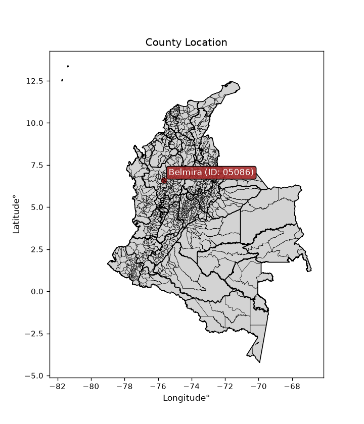
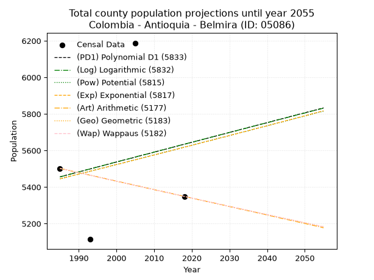
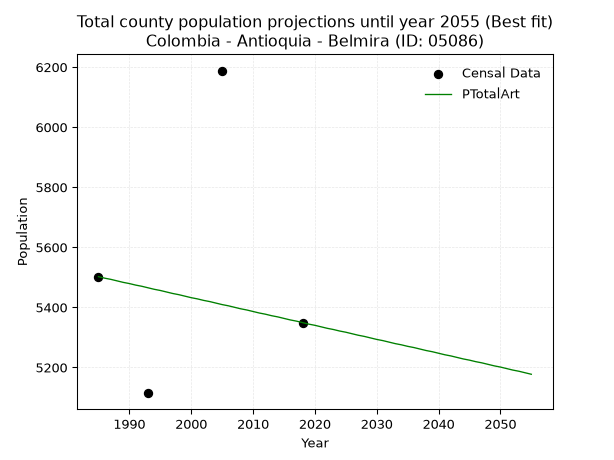
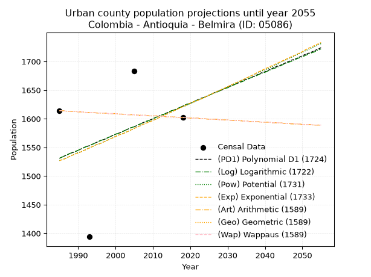
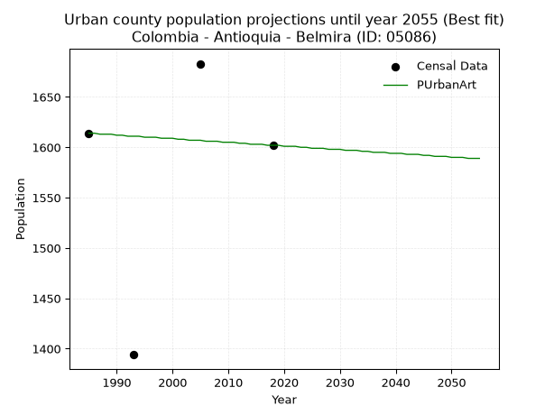
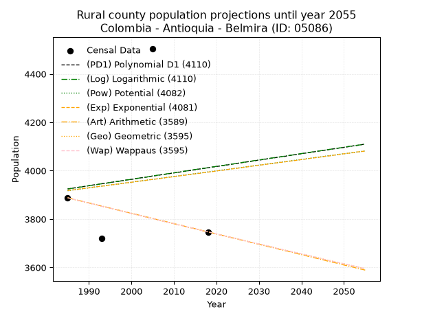
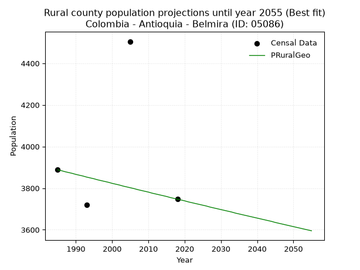

<div align="center">


</div>

# _“Population and Public Services Demand Projections (PPSD) until Year 2050 for Colombia - Antioquia - Belmira (ID: 05086)”_
Keywords: `population` `public-service` `projection` `lineal` `polynomial` `logarithmic` `potential` `exponential` `arithmetic` `geometric` `wappaus` `dane` `colombia` `south-america`

PPSD are analytical estimates used by governments and planners to anticipate future changes in population size, age distribution, and the resulting community needs for utilities, healthcare, education, and infrastructure as sizing future water treatment facilities, electrical grids, and road networks based on spatial growth.

> **General running parameters**: • app_version: _v20260806_. • Python version: _3.14.7_. • Pandas version: _3.0.5_. • NumPy version: _2.5.1_. • Creates, save and include plots into reports (create_plot): _False_. • Projection until year: _2050_. • Process polynomial degree 2 and up: _False_. • Process Wappaus: _True_. • Process Wappaus: _True_. • Set negative values to zero: _True_. • Set infinite values to zero: _True_. • Drop dataset notes: _True_. 
<div align="center">

Dynamic map: [:earth_americas:Google](http://maps.google.com/maps?q=6.606319385,-75.6677792) [:earth_americas:OSM](https://www.openstreetmap.org/#map=18/6.606319385/-75.6677792&layers=P) [:earth_americas:Bing](https://www.bing.com/maps?cp=6.606319385~-75.6677792&lvl=18) [:earth_americas:Apple](https://maps.apple.com/frame?center=6.606319385%2C-75.6677792&span=0.003%2C0.006)

</div>


<div align="center">

```geojson
{
  "type": "Feature",
  "geometry": {
    "type": "Point", 
    "coordinates": [-75.6677792, 6.606319385]
  }, 
  "properties": {
    "Name": "Colombia - Antioquia - Belmira (ID: 05086)"
  }
}
```

</div>


<div align="center">

</img>

</div>


## 0. Census Data (4 records)

Census data are official statistics collected by a government about the people and housing in a country. They usually include counts of total population, age, sex, race, income, education, and jobs.

📅Global census file: [Population.xlsx](../data/Population.xlsx)

| Source   |   Year |   CountryID | CountryName   |   StateID | StateName   |   CountyID | CountyName   |   PTotal |   PUrban |   PRural |
|:---------|-------:|------------:|:--------------|----------:|:------------|-----------:|:-------------|---------:|---------:|---------:|
| DANE     |   1985 |          57 | Colombia      |        05 | Antioquia   |      05086 | Belmira      |     5502 |     1614 |     3888 |
| DANE     |   1993 |          57 | Colombia      |        05 | Antioquia   |      05086 | Belmira      |     5114 |     1394 |     3720 |
| DANE     |   2005 |          57 | Colombia      |        05 | Antioquia   |      05086 | Belmira      |     6188 |     1683 |     4505 |
| DANE     |   2018 |          57 | Colombia      |        05 | Antioquia   |      05086 | Belmira      |     5349 |     1602 |     3747 |

> 🔥Some records could had specific notes about the registered values or the corresponding urban or rural distribution.

📅   [RUPS](https://www.datos.gov.co/Hacienda-y-Cr-dito-P-blico/Registro-nico-de-Prestadores-de-Servicios-P-blicos/4qkq-csdn/about_data) - Local public utility companies: [RUPS.csv](../data/RUPS.xlsx)

 | SERVICIO       | ESTADO    | NOMBRE                                               | NIT         | DEPARTAMENTO_DOMICILIO   | MUNICIPIO_DOMICILIO   | DIRECCION                    |   TELEFONO | EMAIL                                | TIPO_PRESTADOR                             | CLASIFICACION                 |
|:---------------|:----------|:-----------------------------------------------------|:------------|:-------------------------|:----------------------|:-----------------------------|-----------:|:-------------------------------------|:-------------------------------------------|:------------------------------|
| ACUEDUCTO      | OPERATIVA | EMPRESAS PÚBLICAS DE BELMIRA  SA ESP                 | 811024778-7 | ANTIOQUIA                | BELMIRA               | carrera 20 N° 20-24          |    8674493 | EMPUBEL@BELMIRA-ANTIOQUIA.GOV.CO     | SOCIEDADES (EMPRESA DE SERVICIOS PUBLICOS) | MENOR O IGUAL A 2500 USUARIOS |
| ALCANTARILLADO | OPERATIVA | EMPRESAS PÚBLICAS DE BELMIRA  SA ESP                 | 811024778-7 | ANTIOQUIA                | BELMIRA               | carrera 20 N° 20-24          |    8674493 | EMPUBEL@BELMIRA-ANTIOQUIA.GOV.CO     | SOCIEDADES (EMPRESA DE SERVICIOS PUBLICOS) | MENOR O IGUAL A 2500 USUARIOS |
| ACUEDUCTO      | OPERATIVA | ASOCIACION DE USUARIOS DEL ACUEDUCTO EL YUYAL        | 811044803-9 | ANTIOQUIA                | BELMIRA               | PALACIO MUNICIPAL DE BELMIRA |    3454178 | alzatic@yohoo.com.mx                 | ORGANIZACION AUTORIZADA                    | HASTA 2500 SUSCRIPTORES       |
| ACUEDUCTO      | OPERATIVA | COMITE EMPRESARIAL JUNTA DE ACUEDUCTO VEREDA LA MIEL | 811027764-8 | ANTIOQUIA                | BELMIRA               | CALLE 20 N° 19 - 49          |    3136808 | alcaldiamunicipiobelmira@hotmail.com | ORGANIZACION AUTORIZADA                    | HASTA 2500 SUSCRIPTORES       |

## 1. Total

### 1.1. Coefficients and Parameters

* (PD1) Polynomial Deg 1: 5.388598956242929, -5240.295062224919 (lineal)
* (Log) Logarithmic: 10854.056485441739, -76963.52032479263
* (Pow) Potential: 1.900462949532078, -2.5312962689595278
* (Exp) Exponential: 0.0009437673366706624, 836.4263228924228
* (Art) Arithmetic: Year diff. 2018 - 1985 = 33, Population diff. 5349 - 5502 = -153, Annual growth = -4.636363636363637
* (Geo) Geometric: Year diff. 2018 - 1985 = 33, Population diff. 5349 - 5502 = -153, Annual growth % = -0.0008542420471367995
* (Wap) Wappaus: i = -0.08545504813129917, Condition values only valid for < 200)

<sub>
Wappaus condition values: ['-0.00', '-0.09', '-0.17', '-0.26', '-0.34', '-0.43', '-0.51', '-0.60', '-0.68', '-0.77', '-0.85', '-0.94', '-1.03', '-1.11', '-1.20', '-1.28', '-1.37', '-1.45', '-1.54', '-1.62', '-1.71', '-1.79', '-1.88', '-1.97', '-2.05', '-2.14', '-2.22', '-2.31', '-2.39', '-2.48', '-2.56', '-2.65', '-2.73', '-2.82', '-2.91', '-2.99', '-3.08', '-3.16', '-3.25', '-3.33', '-3.42', '-3.50', '-3.59', '-3.67', '-3.76', '-3.85', '-3.93', '-4.02', '-4.10', '-4.19', '-4.27', '-4.36', '-4.44', '-4.53', '-4.61', '-4.70', '-4.79', '-4.87', '-4.96', '-5.04', '-5.13', '-5.21', '-5.30', '-5.38', '-5.47', '-5.55']
</sub>


### 1.2. Projected Dataset

|   Year |   CountyID |   PTotalPD1 |   PTotalLog |   PTotalPow |   PTotalExp |   PTotalArt |   PTotalGeo |   PTotalWap |
|-------:|-----------:|------------:|------------:|------------:|------------:|------------:|------------:|------------:|
|   1985 |      05086 |        5456 |        5455 |        5445 |        5445 |        5502 |        5502 |        5502 |
|   1986 |      05086 |        5461 |        5461 |        5450 |        5450 |        5497 |        5497 |        5497 |
|   1987 |      05086 |        5467 |        5466 |        5455 |        5456 |        5493 |        5493 |        5493 |
|   1988 |      05086 |        5472 |        5472 |        5460 |        5461 |        5488 |        5488 |        5488 |
|   1989 |      05086 |        5478 |        5477 |        5466 |        5466 |        5483 |        5483 |        5483 |
|   1990 |      05086 |        5483 |        5483 |        5471 |        5471 |        5479 |        5479 |        5479 |
|   1991 |      05086 |        5488 |        5488 |        5476 |        5476 |        5474 |        5474 |        5474 |
|   1992 |      05086 |        5494 |        5494 |        5481 |        5481 |        5470 |        5469 |        5469 |
|   1993 |      05086 |        5499 |        5499 |        5486 |        5487 |        5465 |        5465 |        5465 |
|   1994 |      05086 |        5505 |        5504 |        5492 |        5492 |        5460 |        5460 |        5460 |
|   1995 |      05086 |        5510 |        5510 |        5497 |        5497 |        5456 |        5455 |        5455 |
|   1996 |      05086 |        5515 |        5515 |        5502 |        5502 |        5451 |        5451 |        5451 |
|   1997 |      05086 |        5521 |        5521 |        5507 |        5507 |        5446 |        5446 |        5446 |
|   1998 |      05086 |        5526 |        5526 |        5513 |        5513 |        5442 |        5441 |        5441 |
|   1999 |      05086 |        5532 |        5532 |        5518 |        5518 |        5437 |        5437 |        5437 |
|   2000 |      05086 |        5537 |        5537 |        5523 |        5523 |        5432 |        5432 |        5432 |
|   2001 |      05086 |        5542 |        5543 |        5528 |        5528 |        5428 |        5427 |        5427 |
|   2002 |      05086 |        5548 |        5548 |        5534 |        5533 |        5423 |        5423 |        5423 |
|   2003 |      05086 |        5553 |        5553 |        5539 |        5539 |        5419 |        5418 |        5418 |
|   2004 |      05086 |        5558 |        5559 |        5544 |        5544 |        5414 |        5413 |        5413 |
|   2005 |      05086 |        5564 |        5564 |        5549 |        5549 |        5409 |        5409 |        5409 |
|   2006 |      05086 |        5569 |        5570 |        5555 |        5554 |        5405 |        5404 |        5404 |
|   2007 |      05086 |        5575 |        5575 |        5560 |        5560 |        5400 |        5400 |        5400 |
|   2008 |      05086 |        5580 |        5580 |        5565 |        5565 |        5395 |        5395 |        5395 |
|   2009 |      05086 |        5585 |        5586 |        5571 |        5570 |        5391 |        5390 |        5390 |
|   2010 |      05086 |        5591 |        5591 |        5576 |        5575 |        5386 |        5386 |        5386 |
|   2011 |      05086 |        5596 |        5597 |        5581 |        5581 |        5381 |        5381 |        5381 |
|   2012 |      05086 |        5602 |        5602 |        5586 |        5586 |        5377 |        5376 |        5377 |
|   2013 |      05086 |        5607 |        5607 |        5592 |        5591 |        5372 |        5372 |        5372 |
|   2014 |      05086 |        5612 |        5613 |        5597 |        5596 |        5368 |        5367 |        5367 |
|   2015 |      05086 |        5618 |        5618 |        5602 |        5602 |        5363 |        5363 |        5363 |
|   2016 |      05086 |        5623 |        5624 |        5607 |        5607 |        5358 |        5358 |        5358 |
|   2017 |      05086 |        5629 |        5629 |        5613 |        5612 |        5354 |        5354 |        5354 |
|   2018 |      05086 |        5634 |        5634 |        5618 |        5618 |        5349 |        5349 |        5349 |
|   2019 |      05086 |        5639 |        5640 |        5623 |        5623 |        5344 |        5344 |        5344 |
|   2020 |      05086 |        5645 |        5645 |        5629 |        5628 |        5340 |        5340 |        5340 |
|   2021 |      05086 |        5650 |        5650 |        5634 |        5634 |        5335 |        5335 |        5335 |
|   2022 |      05086 |        5655 |        5656 |        5639 |        5639 |        5330 |        5331 |        5331 |
|   2023 |      05086 |        5661 |        5661 |        5645 |        5644 |        5326 |        5326 |        5326 |
|   2024 |      05086 |        5666 |        5667 |        5650 |        5650 |        5321 |        5322 |        5322 |
|   2025 |      05086 |        5672 |        5672 |        5655 |        5655 |        5317 |        5317 |        5317 |
|   2026 |      05086 |        5677 |        5677 |        5660 |        5660 |        5312 |        5313 |        5313 |
|   2027 |      05086 |        5682 |        5683 |        5666 |        5666 |        5307 |        5308 |        5308 |
|   2028 |      05086 |        5688 |        5688 |        5671 |        5671 |        5303 |        5303 |        5303 |
|   2029 |      05086 |        5693 |        5693 |        5676 |        5676 |        5298 |        5299 |        5299 |
|   2030 |      05086 |        5699 |        5699 |        5682 |        5682 |        5293 |        5294 |        5294 |
|   2031 |      05086 |        5704 |        5704 |        5687 |        5687 |        5289 |        5290 |        5290 |
|   2032 |      05086 |        5709 |        5709 |        5692 |        5692 |        5284 |        5285 |        5285 |
|   2033 |      05086 |        5715 |        5715 |        5698 |        5698 |        5279 |        5281 |        5281 |
|   2034 |      05086 |        5720 |        5720 |        5703 |        5703 |        5275 |        5276 |        5276 |
|   2035 |      05086 |        5726 |        5725 |        5708 |        5708 |        5270 |        5272 |        5272 |
|   2036 |      05086 |        5731 |        5731 |        5714 |        5714 |        5266 |        5267 |        5267 |
|   2037 |      05086 |        5736 |        5736 |        5719 |        5719 |        5261 |        5263 |        5263 |
|   2038 |      05086 |        5742 |        5741 |        5724 |        5725 |        5256 |        5258 |        5258 |
|   2039 |      05086 |        5747 |        5747 |        5730 |        5730 |        5252 |        5254 |        5254 |
|   2040 |      05086 |        5752 |        5752 |        5735 |        5735 |        5247 |        5249 |        5249 |
|   2041 |      05086 |        5758 |        5757 |        5740 |        5741 |        5242 |        5245 |        5245 |
|   2042 |      05086 |        5763 |        5763 |        5746 |        5746 |        5238 |        5240 |        5240 |
|   2043 |      05086 |        5769 |        5768 |        5751 |        5752 |        5233 |        5236 |        5236 |
|   2044 |      05086 |        5774 |        5773 |        5756 |        5757 |        5228 |        5231 |        5231 |
|   2045 |      05086 |        5779 |        5779 |        5762 |        5763 |        5224 |        5227 |        5227 |
|   2046 |      05086 |        5785 |        5784 |        5767 |        5768 |        5219 |        5223 |        5222 |
|   2047 |      05086 |        5790 |        5789 |        5772 |        5773 |        5215 |        5218 |        5218 |
|   2048 |      05086 |        5796 |        5795 |        5778 |        5779 |        5210 |        5214 |        5214 |
|   2049 |      05086 |        5801 |        5800 |        5783 |        5784 |        5205 |        5209 |        5209 |
|   2050 |      05086 |        5806 |        5805 |        5789 |        5790 |        5201 |        5205 |        5205 |
<div align="center">

</img>

</div>


### 1.3. Best fit with absolute and relative error (%)

Relative error puts that difference into context by dividing the absolute error by the true value, creating a unitless ratio or percentage that shows the scale of the mistake.

Absolute and relative error

|   Year | Source   |   CountryID | CountryName   |   StateID | StateName   |   CountyID_x | CountyName   |   PTotal |   PUrban |   PRural |   CountyID_y |   PTotalPD1 |   PTotalLog |   PTotalPow |   PTotalExp |   PTotalArt |   PTotalGeo |   PTotalWap |   PTotalPD1AbsError |   PTotalLogAbsError |   PTotalPowAbsError |   PTotalExpAbsError |   PTotalArtAbsError |   PTotalGeoAbsError |   PTotalWapAbsError |   PTotalPD1RelError |   PTotalLogRelError |   PTotalPowRelError |   PTotalExpRelError |   PTotalArtRelError |   PTotalGeoRelError |   PTotalWapRelError |
|-------:|:---------|------------:|:--------------|----------:|:------------|-------------:|:-------------|---------:|---------:|---------:|-------------:|------------:|------------:|------------:|------------:|------------:|------------:|------------:|--------------------:|--------------------:|--------------------:|--------------------:|--------------------:|--------------------:|--------------------:|--------------------:|--------------------:|--------------------:|--------------------:|--------------------:|--------------------:|--------------------:|
|   1985 | DANE     |          57 | Colombia      |        05 | Antioquia   |        05086 | Belmira      |     5502 |     1614 |     3888 |        05086 |        5456 |        5455 |        5445 |        5445 |        5502 |        5502 |        5502 |                  46 |                  47 |                  57 |                  57 |                   0 |                   0 |                   0 |             0.83606 |            0.854235 |             1.03599 |             1.03599 |             0       |             0       |             0       |
|   1993 | DANE     |          57 | Colombia      |        05 | Antioquia   |        05086 | Belmira      |     5114 |     1394 |     3720 |        05086 |        5499 |        5499 |        5486 |        5487 |        5465 |        5465 |        5465 |                 385 |                 385 |                 372 |                 373 |                 351 |                 351 |                 351 |             7.52835 |            7.52835  |             7.27415 |             7.2937  |             6.86351 |             6.86351 |             6.86351 |
|   2005 | DANE     |          57 | Colombia      |        05 | Antioquia   |        05086 | Belmira      |     6188 |     1683 |     4505 |        05086 |        5564 |        5564 |        5549 |        5549 |        5409 |        5409 |        5409 |                 624 |                 624 |                 639 |                 639 |                 779 |                 779 |                 779 |            10.084   |           10.084    |            10.3264  |            10.3264  |            12.5889  |            12.5889  |            12.5889  |
|   2018 | DANE     |          57 | Colombia      |        05 | Antioquia   |        05086 | Belmira      |     5349 |     1602 |     3747 |        05086 |        5634 |        5634 |        5618 |        5618 |        5349 |        5349 |        5349 |                 285 |                 285 |                 269 |                 269 |                   0 |                   0 |                   0 |             5.3281  |            5.3281   |             5.02898 |             5.02898 |             0       |             0       |             0       |

Relative error mean

| Method    |   RelError | Best   |
|:----------|-----------:|:-------|
| PTotalPD1 |    5.94414 |        |
| PTotalLog |    5.94868 |        |
| PTotalPow |    5.91639 |        |
| PTotalExp |    5.92128 |        |
| PTotalArt |    4.8631  | True   |
| PTotalGeo |    4.8631  | True   |
| PTotalWap |    4.8631  | True   |

💙Best method: _**PTotalArt**_
<div align="center">

</img>

</div>


### 1.4. Fresh water supply demand in liters per capita per day (lpcd)

The fresh water supply demand typically ranges from 100 to 300 liters per capita per day (lpcd) for standard domestic and municipal planning, though absolute survival minimums set by the World Health Organization are as low as 7.5 to 20 liters per day, and total consumption in high-income nations can exceed 400 liters.

> `CZ`: Level in meters above the sea level (masl)<br> `WS`: Fresh water supply demand in liters per capita per day (lpcd or l/h/d)<br> `WSAll`: Zonal fresh water supply demand in liters per second (l/s)<br> `A`: Zonal area in square meters<br> `DP`: Population density (people/hectare or p/ha)

Reference values (RAS Colombia)

|    CZ |   WS |
|------:|-----:|
|  1000 |  120 |
|  2000 |  130 |
| 99999 |  140 |

County shapefile geometry properties and water supply values

|   CountyID |      ATotal |   CZTotal |   WSTotal |
|-----------:|------------:|----------:|----------:|
|      05086 | 2.95859e+08 |   2798.37 |       140 |

Projected values for best method: PTotalArt

|   CountyID |   Year |   PTotalArt |   DPTotal |   WSTotal |   WSTotalAll |
|-----------:|-------:|------------:|----------:|----------:|-------------:|
|      05086 |   1985 |        5502 |      0.19 |       140 |      8.91528 |
|      05086 |   1986 |        5497 |      0.19 |       140 |      8.90718 |
|      05086 |   1987 |        5493 |      0.19 |       140 |      8.90069 |
|      05086 |   1988 |        5488 |      0.19 |       140 |      8.89259 |
|      05086 |   1989 |        5483 |      0.19 |       140 |      8.88449 |
|      05086 |   1990 |        5479 |      0.19 |       140 |      8.87801 |
|      05086 |   1991 |        5474 |      0.19 |       140 |      8.86991 |
|      05086 |   1992 |        5470 |      0.18 |       140 |      8.86343 |
|      05086 |   1993 |        5465 |      0.18 |       140 |      8.85532 |
|      05086 |   1994 |        5460 |      0.18 |       140 |      8.84722 |
|      05086 |   1995 |        5456 |      0.18 |       140 |      8.84074 |
|      05086 |   1996 |        5451 |      0.18 |       140 |      8.83264 |
|      05086 |   1997 |        5446 |      0.18 |       140 |      8.82454 |
|      05086 |   1998 |        5442 |      0.18 |       140 |      8.81806 |
|      05086 |   1999 |        5437 |      0.18 |       140 |      8.80995 |
|      05086 |   2000 |        5432 |      0.18 |       140 |      8.80185 |
|      05086 |   2001 |        5428 |      0.18 |       140 |      8.79537 |
|      05086 |   2002 |        5423 |      0.18 |       140 |      8.78727 |
|      05086 |   2003 |        5419 |      0.18 |       140 |      8.78079 |
|      05086 |   2004 |        5414 |      0.18 |       140 |      8.77269 |
|      05086 |   2005 |        5409 |      0.18 |       140 |      8.76458 |
|      05086 |   2006 |        5405 |      0.18 |       140 |      8.7581  |
|      05086 |   2007 |        5400 |      0.18 |       140 |      8.75    |
|      05086 |   2008 |        5395 |      0.18 |       140 |      8.7419  |
|      05086 |   2009 |        5391 |      0.18 |       140 |      8.73542 |
|      05086 |   2010 |        5386 |      0.18 |       140 |      8.72731 |
|      05086 |   2011 |        5381 |      0.18 |       140 |      8.71921 |
|      05086 |   2012 |        5377 |      0.18 |       140 |      8.71273 |
|      05086 |   2013 |        5372 |      0.18 |       140 |      8.70463 |
|      05086 |   2014 |        5368 |      0.18 |       140 |      8.69815 |
|      05086 |   2015 |        5363 |      0.18 |       140 |      8.69005 |
|      05086 |   2016 |        5358 |      0.18 |       140 |      8.68194 |
|      05086 |   2017 |        5354 |      0.18 |       140 |      8.67546 |
|      05086 |   2018 |        5349 |      0.18 |       140 |      8.66736 |
|      05086 |   2019 |        5344 |      0.18 |       140 |      8.65926 |
|      05086 |   2020 |        5340 |      0.18 |       140 |      8.65278 |
|      05086 |   2021 |        5335 |      0.18 |       140 |      8.64468 |
|      05086 |   2022 |        5330 |      0.18 |       140 |      8.63657 |
|      05086 |   2023 |        5326 |      0.18 |       140 |      8.63009 |
|      05086 |   2024 |        5321 |      0.18 |       140 |      8.62199 |
|      05086 |   2025 |        5317 |      0.18 |       140 |      8.61551 |
|      05086 |   2026 |        5312 |      0.18 |       140 |      8.60741 |
|      05086 |   2027 |        5307 |      0.18 |       140 |      8.59931 |
|      05086 |   2028 |        5303 |      0.18 |       140 |      8.59282 |
|      05086 |   2029 |        5298 |      0.18 |       140 |      8.58472 |
|      05086 |   2030 |        5293 |      0.18 |       140 |      8.57662 |
|      05086 |   2031 |        5289 |      0.18 |       140 |      8.57014 |
|      05086 |   2032 |        5284 |      0.18 |       140 |      8.56204 |
|      05086 |   2033 |        5279 |      0.18 |       140 |      8.55394 |
|      05086 |   2034 |        5275 |      0.18 |       140 |      8.54745 |
|      05086 |   2035 |        5270 |      0.18 |       140 |      8.53935 |
|      05086 |   2036 |        5266 |      0.18 |       140 |      8.53287 |
|      05086 |   2037 |        5261 |      0.18 |       140 |      8.52477 |
|      05086 |   2038 |        5256 |      0.18 |       140 |      8.51667 |
|      05086 |   2039 |        5252 |      0.18 |       140 |      8.51019 |
|      05086 |   2040 |        5247 |      0.18 |       140 |      8.50208 |
|      05086 |   2041 |        5242 |      0.18 |       140 |      8.49398 |
|      05086 |   2042 |        5238 |      0.18 |       140 |      8.4875  |
|      05086 |   2043 |        5233 |      0.18 |       140 |      8.4794  |
|      05086 |   2044 |        5228 |      0.18 |       140 |      8.4713  |
|      05086 |   2045 |        5224 |      0.18 |       140 |      8.46481 |
|      05086 |   2046 |        5219 |      0.18 |       140 |      8.45671 |
|      05086 |   2047 |        5215 |      0.18 |       140 |      8.45023 |
|      05086 |   2048 |        5210 |      0.18 |       140 |      8.44213 |
|      05086 |   2049 |        5205 |      0.18 |       140 |      8.43403 |
|      05086 |   2050 |        5201 |      0.18 |       140 |      8.42755 |

## 2. Urban

### 2.1. Coefficients and Parameters

* (PD1) Polynomial Deg 1: 2.74548374146933, -3918.403853874028 (lineal)
* (Log) Logarithmic: 5489.921072780091, -40155.68406766795
* (Pow) Potential: 3.623912362658361, -8.767081303404044
* (Exp) Exponential: 0.0018125816235719594, 41.796800684057104
* (Art) Arithmetic: Year diff. 2018 - 1985 = 33, Population diff. 1602 - 1614 = -12, Annual growth = -0.36363636363636365
* (Geo) Geometric: Year diff. 2018 - 1985 = 33, Population diff. 1602 - 1614 = -12, Annual growth % = -0.0002261174982989278
* (Wap) Wappaus: i = -0.022614201718679332, Condition values only valid for < 200)

<sub>
Wappaus condition values: ['-0.00', '-0.02', '-0.05', '-0.07', '-0.09', '-0.11', '-0.14', '-0.16', '-0.18', '-0.20', '-0.23', '-0.25', '-0.27', '-0.29', '-0.32', '-0.34', '-0.36', '-0.38', '-0.41', '-0.43', '-0.45', '-0.47', '-0.50', '-0.52', '-0.54', '-0.57', '-0.59', '-0.61', '-0.63', '-0.66', '-0.68', '-0.70', '-0.72', '-0.75', '-0.77', '-0.79', '-0.81', '-0.84', '-0.86', '-0.88', '-0.90', '-0.93', '-0.95', '-0.97', '-1.00', '-1.02', '-1.04', '-1.06', '-1.09', '-1.11', '-1.13', '-1.15', '-1.18', '-1.20', '-1.22', '-1.24', '-1.27', '-1.29', '-1.31', '-1.33', '-1.36', '-1.38', '-1.40', '-1.42', '-1.45', '-1.47']
</sub>


### 2.2. Projected Dataset

|   Year |   CountyID |   PUrbanPD1 |   PUrbanLog |   PUrbanPow |   PUrbanExp |   PUrbanArt |   PUrbanGeo |   PUrbanWap |
|-------:|-----------:|------------:|------------:|------------:|------------:|------------:|------------:|------------:|
|   1985 |      05086 |        1531 |        1531 |        1527 |        1527 |        1614 |        1614 |        1614 |
|   1986 |      05086 |        1534 |        1534 |        1529 |        1529 |        1614 |        1614 |        1614 |
|   1987 |      05086 |        1537 |        1537 |        1532 |        1532 |        1613 |        1613 |        1613 |
|   1988 |      05086 |        1540 |        1540 |        1535 |        1535 |        1613 |        1613 |        1613 |
|   1989 |      05086 |        1542 |        1542 |        1538 |        1538 |        1613 |        1613 |        1613 |
|   1990 |      05086 |        1545 |        1545 |        1541 |        1540 |        1612 |        1612 |        1612 |
|   1991 |      05086 |        1548 |        1548 |        1543 |        1543 |        1612 |        1612 |        1612 |
|   1992 |      05086 |        1551 |        1551 |        1546 |        1546 |        1611 |        1611 |        1611 |
|   1993 |      05086 |        1553 |        1553 |        1549 |        1549 |        1611 |        1611 |        1611 |
|   1994 |      05086 |        1556 |        1556 |        1552 |        1552 |        1611 |        1611 |        1611 |
|   1995 |      05086 |        1559 |        1559 |        1555 |        1555 |        1610 |        1610 |        1610 |
|   1996 |      05086 |        1562 |        1562 |        1557 |        1557 |        1610 |        1610 |        1610 |
|   1997 |      05086 |        1564 |        1564 |        1560 |        1560 |        1610 |        1610 |        1610 |
|   1998 |      05086 |        1567 |        1567 |        1563 |        1563 |        1609 |        1609 |        1609 |
|   1999 |      05086 |        1570 |        1570 |        1566 |        1566 |        1609 |        1609 |        1609 |
|   2000 |      05086 |        1573 |        1573 |        1569 |        1569 |        1609 |        1609 |        1609 |
|   2001 |      05086 |        1575 |        1575 |        1572 |        1572 |        1608 |        1608 |        1608 |
|   2002 |      05086 |        1578 |        1578 |        1574 |        1574 |        1608 |        1608 |        1608 |
|   2003 |      05086 |        1581 |        1581 |        1577 |        1577 |        1607 |        1607 |        1607 |
|   2004 |      05086 |        1584 |        1584 |        1580 |        1580 |        1607 |        1607 |        1607 |
|   2005 |      05086 |        1586 |        1586 |        1583 |        1583 |        1607 |        1607 |        1607 |
|   2006 |      05086 |        1589 |        1589 |        1586 |        1586 |        1606 |        1606 |        1606 |
|   2007 |      05086 |        1592 |        1592 |        1589 |        1589 |        1606 |        1606 |        1606 |
|   2008 |      05086 |        1595 |        1595 |        1592 |        1592 |        1606 |        1606 |        1606 |
|   2009 |      05086 |        1597 |        1597 |        1595 |        1594 |        1605 |        1605 |        1605 |
|   2010 |      05086 |        1600 |        1600 |        1597 |        1597 |        1605 |        1605 |        1605 |
|   2011 |      05086 |        1603 |        1603 |        1600 |        1600 |        1605 |        1605 |        1605 |
|   2012 |      05086 |        1606 |        1606 |        1603 |        1603 |        1604 |        1604 |        1604 |
|   2013 |      05086 |        1608 |        1608 |        1606 |        1606 |        1604 |        1604 |        1604 |
|   2014 |      05086 |        1611 |        1611 |        1609 |        1609 |        1603 |        1603 |        1603 |
|   2015 |      05086 |        1614 |        1614 |        1612 |        1612 |        1603 |        1603 |        1603 |
|   2016 |      05086 |        1616 |        1616 |        1615 |        1615 |        1603 |        1603 |        1603 |
|   2017 |      05086 |        1619 |        1619 |        1618 |        1618 |        1602 |        1602 |        1602 |
|   2018 |      05086 |        1622 |        1622 |        1621 |        1621 |        1602 |        1602 |        1602 |
|   2019 |      05086 |        1625 |        1625 |        1623 |        1624 |        1602 |        1602 |        1602 |
|   2020 |      05086 |        1627 |        1627 |        1626 |        1627 |        1601 |        1601 |        1601 |
|   2021 |      05086 |        1630 |        1630 |        1629 |        1630 |        1601 |        1601 |        1601 |
|   2022 |      05086 |        1633 |        1633 |        1632 |        1632 |        1601 |        1601 |        1601 |
|   2023 |      05086 |        1636 |        1635 |        1635 |        1635 |        1600 |        1600 |        1600 |
|   2024 |      05086 |        1638 |        1638 |        1638 |        1638 |        1600 |        1600 |        1600 |
|   2025 |      05086 |        1641 |        1641 |        1641 |        1641 |        1599 |        1599 |        1599 |
|   2026 |      05086 |        1644 |        1644 |        1644 |        1644 |        1599 |        1599 |        1599 |
|   2027 |      05086 |        1647 |        1646 |        1647 |        1647 |        1599 |        1599 |        1599 |
|   2028 |      05086 |        1649 |        1649 |        1650 |        1650 |        1598 |        1598 |        1598 |
|   2029 |      05086 |        1652 |        1652 |        1653 |        1653 |        1598 |        1598 |        1598 |
|   2030 |      05086 |        1655 |        1654 |        1656 |        1656 |        1598 |        1598 |        1598 |
|   2031 |      05086 |        1658 |        1657 |        1659 |        1659 |        1597 |        1597 |        1597 |
|   2032 |      05086 |        1660 |        1660 |        1662 |        1662 |        1597 |        1597 |        1597 |
|   2033 |      05086 |        1663 |        1663 |        1665 |        1665 |        1597 |        1597 |        1597 |
|   2034 |      05086 |        1666 |        1665 |        1668 |        1668 |        1596 |        1596 |        1596 |
|   2035 |      05086 |        1669 |        1668 |        1671 |        1671 |        1596 |        1596 |        1596 |
|   2036 |      05086 |        1671 |        1671 |        1674 |        1674 |        1595 |        1595 |        1595 |
|   2037 |      05086 |        1674 |        1673 |        1677 |        1677 |        1595 |        1595 |        1595 |
|   2038 |      05086 |        1677 |        1676 |        1680 |        1681 |        1595 |        1595 |        1595 |
|   2039 |      05086 |        1680 |        1679 |        1683 |        1684 |        1594 |        1594 |        1594 |
|   2040 |      05086 |        1682 |        1681 |        1685 |        1687 |        1594 |        1594 |        1594 |
|   2041 |      05086 |        1685 |        1684 |        1688 |        1690 |        1594 |        1594 |        1594 |
|   2042 |      05086 |        1688 |        1687 |        1691 |        1693 |        1593 |        1593 |        1593 |
|   2043 |      05086 |        1691 |        1689 |        1694 |        1696 |        1593 |        1593 |        1593 |
|   2044 |      05086 |        1693 |        1692 |        1698 |        1699 |        1593 |        1593 |        1593 |
|   2045 |      05086 |        1696 |        1695 |        1701 |        1702 |        1592 |        1592 |        1592 |
|   2046 |      05086 |        1699 |        1698 |        1704 |        1705 |        1592 |        1592 |        1592 |
|   2047 |      05086 |        1702 |        1700 |        1707 |        1708 |        1591 |        1592 |        1592 |
|   2048 |      05086 |        1704 |        1703 |        1710 |        1711 |        1591 |        1591 |        1591 |
|   2049 |      05086 |        1707 |        1706 |        1713 |        1714 |        1591 |        1591 |        1591 |
|   2050 |      05086 |        1710 |        1708 |        1716 |        1717 |        1590 |        1590 |        1590 |
<div align="center">

</img>

</div>


### 2.3. Best fit with absolute and relative error (%)

Relative error puts that difference into context by dividing the absolute error by the true value, creating a unitless ratio or percentage that shows the scale of the mistake.

Absolute and relative error

|   Year | Source   |   CountryID | CountryName   |   StateID | StateName   |   CountyID_x | CountyName   |   PTotal |   PUrban |   PRural |   CountyID_y |   PUrbanPD1 |   PUrbanLog |   PUrbanPow |   PUrbanExp |   PUrbanArt |   PUrbanGeo |   PUrbanWap |   PUrbanPD1AbsError |   PUrbanLogAbsError |   PUrbanPowAbsError |   PUrbanExpAbsError |   PUrbanArtAbsError |   PUrbanGeoAbsError |   PUrbanWapAbsError |   PUrbanPD1RelError |   PUrbanLogRelError |   PUrbanPowRelError |   PUrbanExpRelError |   PUrbanArtRelError |   PUrbanGeoRelError |   PUrbanWapRelError |
|-------:|:---------|------------:|:--------------|----------:|:------------|-------------:|:-------------|---------:|---------:|---------:|-------------:|------------:|------------:|------------:|------------:|------------:|------------:|------------:|--------------------:|--------------------:|--------------------:|--------------------:|--------------------:|--------------------:|--------------------:|--------------------:|--------------------:|--------------------:|--------------------:|--------------------:|--------------------:|--------------------:|
|   1985 | DANE     |          57 | Colombia      |        05 | Antioquia   |        05086 | Belmira      |     5502 |     1614 |     3888 |        05086 |        1531 |        1531 |        1527 |        1527 |        1614 |        1614 |        1614 |                  83 |                  83 |                  87 |                  87 |                   0 |                   0 |                   0 |             5.1425  |             5.1425  |             5.39033 |             5.39033 |             0       |             0       |             0       |
|   1993 | DANE     |          57 | Colombia      |        05 | Antioquia   |        05086 | Belmira      |     5114 |     1394 |     3720 |        05086 |        1553 |        1553 |        1549 |        1549 |        1611 |        1611 |        1611 |                 159 |                 159 |                 155 |                 155 |                 217 |                 217 |                 217 |            11.406   |            11.406   |            11.1191  |            11.1191  |            15.5667  |            15.5667  |            15.5667  |
|   2005 | DANE     |          57 | Colombia      |        05 | Antioquia   |        05086 | Belmira      |     6188 |     1683 |     4505 |        05086 |        1586 |        1586 |        1583 |        1583 |        1607 |        1607 |        1607 |                  97 |                  97 |                 100 |                 100 |                  76 |                  76 |                  76 |             5.76352 |             5.76352 |             5.94177 |             5.94177 |             4.51575 |             4.51575 |             4.51575 |
|   2018 | DANE     |          57 | Colombia      |        05 | Antioquia   |        05086 | Belmira      |     5349 |     1602 |     3747 |        05086 |        1622 |        1622 |        1621 |        1621 |        1602 |        1602 |        1602 |                  20 |                  20 |                  19 |                  19 |                   0 |                   0 |                   0 |             1.24844 |             1.24844 |             1.18602 |             1.18602 |             0       |             0       |             0       |

Relative error mean

| Method    |   RelError | Best   |
|:----------|-----------:|:-------|
| PUrbanPD1 |    5.89012 |        |
| PUrbanLog |    5.89012 |        |
| PUrbanPow |    5.9093  |        |
| PUrbanExp |    5.9093  |        |
| PUrbanArt |    5.02062 | True   |
| PUrbanGeo |    5.02062 | True   |
| PUrbanWap |    5.02062 | True   |

💙Best method: _**PUrbanArt**_
<div align="center">

</img>

</div>


### 2.4. Fresh water supply demand in liters per capita per day (lpcd)

The fresh water supply demand typically ranges from 100 to 300 liters per capita per day (lpcd) for standard domestic and municipal planning, though absolute survival minimums set by the World Health Organization are as low as 7.5 to 20 liters per day, and total consumption in high-income nations can exceed 400 liters.

> `CZ`: Level in meters above the sea level (masl)<br> `WS`: Fresh water supply demand in liters per capita per day (lpcd or l/h/d)<br> `WSAll`: Zonal fresh water supply demand in liters per second (l/s)<br> `A`: Zonal area in square meters<br> `DP`: Population density (people/hectare or p/ha)

Reference values (RAS Colombia)

|    CZ |   WS |
|------:|-----:|
|  1000 |  120 |
|  2000 |  130 |
| 99999 |  140 |

County shapefile geometry properties and water supply values

|   CountyID |   AUrban |   CZUrban |   WSUrban |
|-----------:|---------:|----------:|----------:|
|      05086 |   506008 |   2515.66 |       140 |

Projected values for best method: PUrbanArt

|   CountyID |   Year |   PUrbanArt |   DPUrban |   WSUrban |   WSUrbanAll |
|-----------:|-------:|------------:|----------:|----------:|-------------:|
|      05086 |   1985 |        1614 |     31.9  |       140 |      2.61528 |
|      05086 |   1986 |        1614 |     31.9  |       140 |      2.61528 |
|      05086 |   1987 |        1613 |     31.88 |       140 |      2.61366 |
|      05086 |   1988 |        1613 |     31.88 |       140 |      2.61366 |
|      05086 |   1989 |        1613 |     31.88 |       140 |      2.61366 |
|      05086 |   1990 |        1612 |     31.86 |       140 |      2.61204 |
|      05086 |   1991 |        1612 |     31.86 |       140 |      2.61204 |
|      05086 |   1992 |        1611 |     31.84 |       140 |      2.61042 |
|      05086 |   1993 |        1611 |     31.84 |       140 |      2.61042 |
|      05086 |   1994 |        1611 |     31.84 |       140 |      2.61042 |
|      05086 |   1995 |        1610 |     31.82 |       140 |      2.6088  |
|      05086 |   1996 |        1610 |     31.82 |       140 |      2.6088  |
|      05086 |   1997 |        1610 |     31.82 |       140 |      2.6088  |
|      05086 |   1998 |        1609 |     31.8  |       140 |      2.60718 |
|      05086 |   1999 |        1609 |     31.8  |       140 |      2.60718 |
|      05086 |   2000 |        1609 |     31.8  |       140 |      2.60718 |
|      05086 |   2001 |        1608 |     31.78 |       140 |      2.60556 |
|      05086 |   2002 |        1608 |     31.78 |       140 |      2.60556 |
|      05086 |   2003 |        1607 |     31.76 |       140 |      2.60394 |
|      05086 |   2004 |        1607 |     31.76 |       140 |      2.60394 |
|      05086 |   2005 |        1607 |     31.76 |       140 |      2.60394 |
|      05086 |   2006 |        1606 |     31.74 |       140 |      2.60231 |
|      05086 |   2007 |        1606 |     31.74 |       140 |      2.60231 |
|      05086 |   2008 |        1606 |     31.74 |       140 |      2.60231 |
|      05086 |   2009 |        1605 |     31.72 |       140 |      2.60069 |
|      05086 |   2010 |        1605 |     31.72 |       140 |      2.60069 |
|      05086 |   2011 |        1605 |     31.72 |       140 |      2.60069 |
|      05086 |   2012 |        1604 |     31.7  |       140 |      2.59907 |
|      05086 |   2013 |        1604 |     31.7  |       140 |      2.59907 |
|      05086 |   2014 |        1603 |     31.68 |       140 |      2.59745 |
|      05086 |   2015 |        1603 |     31.68 |       140 |      2.59745 |
|      05086 |   2016 |        1603 |     31.68 |       140 |      2.59745 |
|      05086 |   2017 |        1602 |     31.66 |       140 |      2.59583 |
|      05086 |   2018 |        1602 |     31.66 |       140 |      2.59583 |
|      05086 |   2019 |        1602 |     31.66 |       140 |      2.59583 |
|      05086 |   2020 |        1601 |     31.64 |       140 |      2.59421 |
|      05086 |   2021 |        1601 |     31.64 |       140 |      2.59421 |
|      05086 |   2022 |        1601 |     31.64 |       140 |      2.59421 |
|      05086 |   2023 |        1600 |     31.62 |       140 |      2.59259 |
|      05086 |   2024 |        1600 |     31.62 |       140 |      2.59259 |
|      05086 |   2025 |        1599 |     31.6  |       140 |      2.59097 |
|      05086 |   2026 |        1599 |     31.6  |       140 |      2.59097 |
|      05086 |   2027 |        1599 |     31.6  |       140 |      2.59097 |
|      05086 |   2028 |        1598 |     31.58 |       140 |      2.58935 |
|      05086 |   2029 |        1598 |     31.58 |       140 |      2.58935 |
|      05086 |   2030 |        1598 |     31.58 |       140 |      2.58935 |
|      05086 |   2031 |        1597 |     31.56 |       140 |      2.58773 |
|      05086 |   2032 |        1597 |     31.56 |       140 |      2.58773 |
|      05086 |   2033 |        1597 |     31.56 |       140 |      2.58773 |
|      05086 |   2034 |        1596 |     31.54 |       140 |      2.58611 |
|      05086 |   2035 |        1596 |     31.54 |       140 |      2.58611 |
|      05086 |   2036 |        1595 |     31.52 |       140 |      2.58449 |
|      05086 |   2037 |        1595 |     31.52 |       140 |      2.58449 |
|      05086 |   2038 |        1595 |     31.52 |       140 |      2.58449 |
|      05086 |   2039 |        1594 |     31.5  |       140 |      2.58287 |
|      05086 |   2040 |        1594 |     31.5  |       140 |      2.58287 |
|      05086 |   2041 |        1594 |     31.5  |       140 |      2.58287 |
|      05086 |   2042 |        1593 |     31.48 |       140 |      2.58125 |
|      05086 |   2043 |        1593 |     31.48 |       140 |      2.58125 |
|      05086 |   2044 |        1593 |     31.48 |       140 |      2.58125 |
|      05086 |   2045 |        1592 |     31.46 |       140 |      2.57963 |
|      05086 |   2046 |        1592 |     31.46 |       140 |      2.57963 |
|      05086 |   2047 |        1591 |     31.44 |       140 |      2.57801 |
|      05086 |   2048 |        1591 |     31.44 |       140 |      2.57801 |
|      05086 |   2049 |        1591 |     31.44 |       140 |      2.57801 |
|      05086 |   2050 |        1590 |     31.42 |       140 |      2.57639 |

## 3. Rural

### 3.1. Coefficients and Parameters

* (PD1) Polynomial Deg 1: 2.643115214773617, -1321.8912083509279 (lineal)
* (Log) Logarithmic: 5364.135412661648, -36807.836257124654
* (Pow) Potential: 1.1882194938674226, -0.3254907393169459
* (Exp) Exponential: 0.0005848403749536377, 1227.0507567747168
* (Art) Arithmetic: Year diff. 2018 - 1985 = 33, Population diff. 3747 - 3888 = -141, Annual growth = -4.2727272727272725
* (Geo) Geometric: Year diff. 2018 - 1985 = 33, Population diff. 3747 - 3888 = -141, Annual growth % = -0.001118748484891019
* (Wap) Wappaus: i = -0.11192474846698815, Condition values only valid for < 200)

<sub>
Wappaus condition values: ['-0.00', '-0.11', '-0.22', '-0.34', '-0.45', '-0.56', '-0.67', '-0.78', '-0.90', '-1.01', '-1.12', '-1.23', '-1.34', '-1.46', '-1.57', '-1.68', '-1.79', '-1.90', '-2.01', '-2.13', '-2.24', '-2.35', '-2.46', '-2.57', '-2.69', '-2.80', '-2.91', '-3.02', '-3.13', '-3.25', '-3.36', '-3.47', '-3.58', '-3.69', '-3.81', '-3.92', '-4.03', '-4.14', '-4.25', '-4.37', '-4.48', '-4.59', '-4.70', '-4.81', '-4.92', '-5.04', '-5.15', '-5.26', '-5.37', '-5.48', '-5.60', '-5.71', '-5.82', '-5.93', '-6.04', '-6.16', '-6.27', '-6.38', '-6.49', '-6.60', '-6.72', '-6.83', '-6.94', '-7.05', '-7.16', '-7.28']
</sub>


### 3.2. Projected Dataset

|   Year |   CountyID |   PRuralPD1 |   PRuralLog |   PRuralPow |   PRuralExp |   PRuralArt |   PRuralGeo |   PRuralWap |
|-------:|-----------:|------------:|------------:|------------:|------------:|------------:|------------:|------------:|
|   1985 |      05086 |        3925 |        3924 |        3917 |        3918 |        3888 |        3888 |        3888 |
|   1986 |      05086 |        3927 |        3927 |        3920 |        3920 |        3884 |        3884 |        3884 |
|   1987 |      05086 |        3930 |        3929 |        3922 |        3922 |        3879 |        3879 |        3879 |
|   1988 |      05086 |        3933 |        3932 |        3924 |        3925 |        3875 |        3875 |        3875 |
|   1989 |      05086 |        3935 |        3935 |        3927 |        3927 |        3871 |        3871 |        3871 |
|   1990 |      05086 |        3938 |        3938 |        3929 |        3929 |        3867 |        3866 |        3866 |
|   1991 |      05086 |        3941 |        3940 |        3931 |        3932 |        3862 |        3862 |        3862 |
|   1992 |      05086 |        3943 |        3943 |        3934 |        3934 |        3858 |        3858 |        3858 |
|   1993 |      05086 |        3946 |        3946 |        3936 |        3936 |        3854 |        3853 |        3853 |
|   1994 |      05086 |        3948 |        3948 |        3938 |        3938 |        3850 |        3849 |        3849 |
|   1995 |      05086 |        3951 |        3951 |        3941 |        3941 |        3845 |        3845 |        3845 |
|   1996 |      05086 |        3954 |        3954 |        3943 |        3943 |        3841 |        3840 |        3840 |
|   1997 |      05086 |        3956 |        3956 |        3945 |        3945 |        3837 |        3836 |        3836 |
|   1998 |      05086 |        3959 |        3959 |        3948 |        3948 |        3832 |        3832 |        3832 |
|   1999 |      05086 |        3962 |        3962 |        3950 |        3950 |        3828 |        3828 |        3828 |
|   2000 |      05086 |        3964 |        3964 |        3952 |        3952 |        3824 |        3823 |        3823 |
|   2001 |      05086 |        3967 |        3967 |        3955 |        3955 |        3820 |        3819 |        3819 |
|   2002 |      05086 |        3970 |        3970 |        3957 |        3957 |        3815 |        3815 |        3815 |
|   2003 |      05086 |        3972 |        3972 |        3959 |        3959 |        3811 |        3810 |        3810 |
|   2004 |      05086 |        3975 |        3975 |        3962 |        3962 |        3807 |        3806 |        3806 |
|   2005 |      05086 |        3978 |        3978 |        3964 |        3964 |        3803 |        3802 |        3802 |
|   2006 |      05086 |        3980 |        3981 |        3966 |        3966 |        3798 |        3798 |        3798 |
|   2007 |      05086 |        3983 |        3983 |        3969 |        3968 |        3794 |        3793 |        3793 |
|   2008 |      05086 |        3985 |        3986 |        3971 |        3971 |        3790 |        3789 |        3789 |
|   2009 |      05086 |        3988 |        3989 |        3974 |        3973 |        3785 |        3785 |        3785 |
|   2010 |      05086 |        3991 |        3991 |        3976 |        3975 |        3781 |        3781 |        3781 |
|   2011 |      05086 |        3993 |        3994 |        3978 |        3978 |        3777 |        3776 |        3776 |
|   2012 |      05086 |        3996 |        3997 |        3981 |        3980 |        3773 |        3772 |        3772 |
|   2013 |      05086 |        3999 |        3999 |        3983 |        3982 |        3768 |        3768 |        3768 |
|   2014 |      05086 |        4001 |        4002 |        3985 |        3985 |        3764 |        3764 |        3764 |
|   2015 |      05086 |        4004 |        4005 |        3988 |        3987 |        3760 |        3760 |        3760 |
|   2016 |      05086 |        4007 |        4007 |        3990 |        3989 |        3756 |        3755 |        3755 |
|   2017 |      05086 |        4009 |        4010 |        3992 |        3992 |        3751 |        3751 |        3751 |
|   2018 |      05086 |        4012 |        4012 |        3995 |        3994 |        3747 |        3747 |        3747 |
|   2019 |      05086 |        4015 |        4015 |        3997 |        3996 |        3743 |        3743 |        3743 |
|   2020 |      05086 |        4017 |        4018 |        3999 |        3999 |        3738 |        3739 |        3739 |
|   2021 |      05086 |        4020 |        4020 |        4002 |        4001 |        3734 |        3734 |        3734 |
|   2022 |      05086 |        4022 |        4023 |        4004 |        4003 |        3730 |        3730 |        3730 |
|   2023 |      05086 |        4025 |        4026 |        4006 |        4006 |        3726 |        3726 |        3726 |
|   2024 |      05086 |        4028 |        4028 |        4009 |        4008 |        3721 |        3722 |        3722 |
|   2025 |      05086 |        4030 |        4031 |        4011 |        4010 |        3717 |        3718 |        3718 |
|   2026 |      05086 |        4033 |        4034 |        4013 |        4013 |        3713 |        3714 |        3714 |
|   2027 |      05086 |        4036 |        4036 |        4016 |        4015 |        3709 |        3709 |        3709 |
|   2028 |      05086 |        4038 |        4039 |        4018 |        4018 |        3704 |        3705 |        3705 |
|   2029 |      05086 |        4041 |        4042 |        4021 |        4020 |        3700 |        3701 |        3701 |
|   2030 |      05086 |        4044 |        4044 |        4023 |        4022 |        3696 |        3697 |        3697 |
|   2031 |      05086 |        4046 |        4047 |        4025 |        4025 |        3691 |        3693 |        3693 |
|   2032 |      05086 |        4049 |        4050 |        4028 |        4027 |        3687 |        3689 |        3689 |
|   2033 |      05086 |        4052 |        4052 |        4030 |        4029 |        3683 |        3685 |        3685 |
|   2034 |      05086 |        4054 |        4055 |        4032 |        4032 |        3679 |        3680 |        3680 |
|   2035 |      05086 |        4057 |        4057 |        4035 |        4034 |        3674 |        3676 |        3676 |
|   2036 |      05086 |        4059 |        4060 |        4037 |        4036 |        3670 |        3672 |        3672 |
|   2037 |      05086 |        4062 |        4063 |        4039 |        4039 |        3666 |        3668 |        3668 |
|   2038 |      05086 |        4065 |        4065 |        4042 |        4041 |        3662 |        3664 |        3664 |
|   2039 |      05086 |        4067 |        4068 |        4044 |        4043 |        3657 |        3660 |        3660 |
|   2040 |      05086 |        4070 |        4071 |        4046 |        4046 |        3653 |        3656 |        3656 |
|   2041 |      05086 |        4073 |        4073 |        4049 |        4048 |        3649 |        3652 |        3652 |
|   2042 |      05086 |        4075 |        4076 |        4051 |        4051 |        3644 |        3648 |        3648 |
|   2043 |      05086 |        4078 |        4079 |        4054 |        4053 |        3640 |        3644 |        3644 |
|   2044 |      05086 |        4081 |        4081 |        4056 |        4055 |        3636 |        3640 |        3639 |
|   2045 |      05086 |        4083 |        4084 |        4058 |        4058 |        3632 |        3635 |        3635 |
|   2046 |      05086 |        4086 |        4086 |        4061 |        4060 |        3627 |        3631 |        3631 |
|   2047 |      05086 |        4089 |        4089 |        4063 |        4062 |        3623 |        3627 |        3627 |
|   2048 |      05086 |        4091 |        4092 |        4065 |        4065 |        3619 |        3623 |        3623 |
|   2049 |      05086 |        4094 |        4094 |        4068 |        4067 |        3615 |        3619 |        3619 |
|   2050 |      05086 |        4096 |        4097 |        4070 |        4070 |        3610 |        3615 |        3615 |
<div align="center">

</img>

</div>


### 3.3. Best fit with absolute and relative error (%)

Relative error puts that difference into context by dividing the absolute error by the true value, creating a unitless ratio or percentage that shows the scale of the mistake.

Absolute and relative error

|   Year | Source   |   CountryID | CountryName   |   StateID | StateName   |   CountyID_x | CountyName   |   PTotal |   PUrban |   PRural |   CountyID_y |   PRuralPD1 |   PRuralLog |   PRuralPow |   PRuralExp |   PRuralArt |   PRuralGeo |   PRuralWap |   PRuralPD1AbsError |   PRuralLogAbsError |   PRuralPowAbsError |   PRuralExpAbsError |   PRuralArtAbsError |   PRuralGeoAbsError |   PRuralWapAbsError |   PRuralPD1RelError |   PRuralLogRelError |   PRuralPowRelError |   PRuralExpRelError |   PRuralArtRelError |   PRuralGeoRelError |   PRuralWapRelError |
|-------:|:---------|------------:|:--------------|----------:|:------------|-------------:|:-------------|---------:|---------:|---------:|-------------:|------------:|------------:|------------:|------------:|------------:|------------:|------------:|--------------------:|--------------------:|--------------------:|--------------------:|--------------------:|--------------------:|--------------------:|--------------------:|--------------------:|--------------------:|--------------------:|--------------------:|--------------------:|--------------------:|
|   1985 | DANE     |          57 | Colombia      |        05 | Antioquia   |        05086 | Belmira      |     5502 |     1614 |     3888 |        05086 |        3925 |        3924 |        3917 |        3918 |        3888 |        3888 |        3888 |                  37 |                  36 |                  29 |                  30 |                   0 |                   0 |                   0 |            0.951646 |            0.925926 |            0.745885 |            0.771605 |             0       |             0       |             0       |
|   1993 | DANE     |          57 | Colombia      |        05 | Antioquia   |        05086 | Belmira      |     5114 |     1394 |     3720 |        05086 |        3946 |        3946 |        3936 |        3936 |        3854 |        3853 |        3853 |                 226 |                 226 |                 216 |                 216 |                 134 |                 133 |                 133 |            6.07527  |            6.07527  |            5.80645  |            5.80645  |             3.60215 |             3.57527 |             3.57527 |
|   2005 | DANE     |          57 | Colombia      |        05 | Antioquia   |        05086 | Belmira      |     6188 |     1683 |     4505 |        05086 |        3978 |        3978 |        3964 |        3964 |        3803 |        3802 |        3802 |                 527 |                 527 |                 541 |                 541 |                 702 |                 703 |                 703 |           11.6981   |           11.6981   |           12.0089   |           12.0089   |            15.5827  |            15.6049  |            15.6049  |
|   2018 | DANE     |          57 | Colombia      |        05 | Antioquia   |        05086 | Belmira      |     5349 |     1602 |     3747 |        05086 |        4012 |        4012 |        3995 |        3994 |        3747 |        3747 |        3747 |                 265 |                 265 |                 248 |                 247 |                   0 |                   0 |                   0 |            7.07232  |            7.07232  |            6.61863  |            6.59194  |             0       |             0       |             0       |

Relative error mean

| Method    |   RelError | Best   |
|:----------|-----------:|:-------|
| PRuralPD1 |    6.44934 |        |
| PRuralLog |    6.44291 |        |
| PRuralPow |    6.29496 |        |
| PRuralExp |    6.29472 |        |
| PRuralArt |    4.79621 |        |
| PRuralGeo |    4.79504 | True   |
| PRuralWap |    4.79504 | True   |

💙Best method: _**PRuralGeo**_
<div align="center">

</img>

</div>


### 3.4. Fresh water supply demand in liters per capita per day (lpcd)

The fresh water supply demand typically ranges from 100 to 300 liters per capita per day (lpcd) for standard domestic and municipal planning, though absolute survival minimums set by the World Health Organization are as low as 7.5 to 20 liters per day, and total consumption in high-income nations can exceed 400 liters.

> `CZ`: Level in meters above the sea level (masl)<br> `WS`: Fresh water supply demand in liters per capita per day (lpcd or l/h/d)<br> `WSAll`: Zonal fresh water supply demand in liters per second (l/s)<br> `A`: Zonal area in square meters<br> `DP`: Population density (people/hectare or p/ha)

Reference values (RAS Colombia)

|    CZ |   WS |
|------:|-----:|
|  1000 |  120 |
|  2000 |  130 |
| 99999 |  140 |

County shapefile geometry properties and water supply values

|   CountyID |      ARural |   CZRural |   WSRural |
|-----------:|------------:|----------:|----------:|
|      05086 | 2.95353e+08 |   2798.85 |       140 |

Projected values for best method: PRuralGeo

|   CountyID |   Year |   PRuralGeo |   DPRural |   WSRural |   WSRuralAll |
|-----------:|-------:|------------:|----------:|----------:|-------------:|
|      05086 |   1985 |        3888 |      0.13 |       140 |      6.3     |
|      05086 |   1986 |        3884 |      0.13 |       140 |      6.29352 |
|      05086 |   1987 |        3879 |      0.13 |       140 |      6.28542 |
|      05086 |   1988 |        3875 |      0.13 |       140 |      6.27894 |
|      05086 |   1989 |        3871 |      0.13 |       140 |      6.27245 |
|      05086 |   1990 |        3866 |      0.13 |       140 |      6.26435 |
|      05086 |   1991 |        3862 |      0.13 |       140 |      6.25787 |
|      05086 |   1992 |        3858 |      0.13 |       140 |      6.25139 |
|      05086 |   1993 |        3853 |      0.13 |       140 |      6.24329 |
|      05086 |   1994 |        3849 |      0.13 |       140 |      6.23681 |
|      05086 |   1995 |        3845 |      0.13 |       140 |      6.23032 |
|      05086 |   1996 |        3840 |      0.13 |       140 |      6.22222 |
|      05086 |   1997 |        3836 |      0.13 |       140 |      6.21574 |
|      05086 |   1998 |        3832 |      0.13 |       140 |      6.20926 |
|      05086 |   1999 |        3828 |      0.13 |       140 |      6.20278 |
|      05086 |   2000 |        3823 |      0.13 |       140 |      6.19468 |
|      05086 |   2001 |        3819 |      0.13 |       140 |      6.18819 |
|      05086 |   2002 |        3815 |      0.13 |       140 |      6.18171 |
|      05086 |   2003 |        3810 |      0.13 |       140 |      6.17361 |
|      05086 |   2004 |        3806 |      0.13 |       140 |      6.16713 |
|      05086 |   2005 |        3802 |      0.13 |       140 |      6.16065 |
|      05086 |   2006 |        3798 |      0.13 |       140 |      6.15417 |
|      05086 |   2007 |        3793 |      0.13 |       140 |      6.14606 |
|      05086 |   2008 |        3789 |      0.13 |       140 |      6.13958 |
|      05086 |   2009 |        3785 |      0.13 |       140 |      6.1331  |
|      05086 |   2010 |        3781 |      0.13 |       140 |      6.12662 |
|      05086 |   2011 |        3776 |      0.13 |       140 |      6.11852 |
|      05086 |   2012 |        3772 |      0.13 |       140 |      6.11204 |
|      05086 |   2013 |        3768 |      0.13 |       140 |      6.10556 |
|      05086 |   2014 |        3764 |      0.13 |       140 |      6.09907 |
|      05086 |   2015 |        3760 |      0.13 |       140 |      6.09259 |
|      05086 |   2016 |        3755 |      0.13 |       140 |      6.08449 |
|      05086 |   2017 |        3751 |      0.13 |       140 |      6.07801 |
|      05086 |   2018 |        3747 |      0.13 |       140 |      6.07153 |
|      05086 |   2019 |        3743 |      0.13 |       140 |      6.06505 |
|      05086 |   2020 |        3739 |      0.13 |       140 |      6.05856 |
|      05086 |   2021 |        3734 |      0.13 |       140 |      6.05046 |
|      05086 |   2022 |        3730 |      0.13 |       140 |      6.04398 |
|      05086 |   2023 |        3726 |      0.13 |       140 |      6.0375  |
|      05086 |   2024 |        3722 |      0.13 |       140 |      6.03102 |
|      05086 |   2025 |        3718 |      0.13 |       140 |      6.02454 |
|      05086 |   2026 |        3714 |      0.13 |       140 |      6.01806 |
|      05086 |   2027 |        3709 |      0.13 |       140 |      6.00995 |
|      05086 |   2028 |        3705 |      0.13 |       140 |      6.00347 |
|      05086 |   2029 |        3701 |      0.13 |       140 |      5.99699 |
|      05086 |   2030 |        3697 |      0.13 |       140 |      5.99051 |
|      05086 |   2031 |        3693 |      0.13 |       140 |      5.98403 |
|      05086 |   2032 |        3689 |      0.12 |       140 |      5.97755 |
|      05086 |   2033 |        3685 |      0.12 |       140 |      5.97106 |
|      05086 |   2034 |        3680 |      0.12 |       140 |      5.96296 |
|      05086 |   2035 |        3676 |      0.12 |       140 |      5.95648 |
|      05086 |   2036 |        3672 |      0.12 |       140 |      5.95    |
|      05086 |   2037 |        3668 |      0.12 |       140 |      5.94352 |
|      05086 |   2038 |        3664 |      0.12 |       140 |      5.93704 |
|      05086 |   2039 |        3660 |      0.12 |       140 |      5.93056 |
|      05086 |   2040 |        3656 |      0.12 |       140 |      5.92407 |
|      05086 |   2041 |        3652 |      0.12 |       140 |      5.91759 |
|      05086 |   2042 |        3648 |      0.12 |       140 |      5.91111 |
|      05086 |   2043 |        3644 |      0.12 |       140 |      5.90463 |
|      05086 |   2044 |        3640 |      0.12 |       140 |      5.89815 |
|      05086 |   2045 |        3635 |      0.12 |       140 |      5.89005 |
|      05086 |   2046 |        3631 |      0.12 |       140 |      5.88356 |
|      05086 |   2047 |        3627 |      0.12 |       140 |      5.87708 |
|      05086 |   2048 |        3623 |      0.12 |       140 |      5.8706  |
|      05086 |   2049 |        3619 |      0.12 |       140 |      5.86412 |
|      05086 |   2050 |        3615 |      0.12 |       140 |      5.85764 |

<div align="center"><br><sub>Share this research</sub></div><br>

<sub>**APPS & TOOLS & CONTENT DISCLAIMER**: • NO WARRANTY - This content and software is provided by <a href="https://github.com/rcfdtools" target="_blank">github.com/rcfdtools</a> "as is", without any express or implied warranty, including warranties of merchantability, fitness for a particular purpose, or non-infringement. There is no guarantee that the software will be error-free or operate without interruption. • LIMITATION OF LIABILITY - Neither the authors nor copyright holders will be liable for claims or damages arising from the software or its use. You are responsible for determining if the software is appropriate for your use and assume all associated risks, including errors, legal compliance, and data loss. • NO PROFESSIONAL ADVICE - The software provides general information and does not offer professional advice. It should not replace consultation with professional advisors. [Clauses and global license for rcfdtools use.](https://github.com/rcfdtools/rcfdtools/blob/main/LICENSE.md)</sub>

| [:house: Home](Readme.md)  | [:beginner: Help / Collab](https://github.com/rcfdtools/R.HydroTools/discussions/31) |
|----------------------------|-------------------------------------------------------------------------------------------|