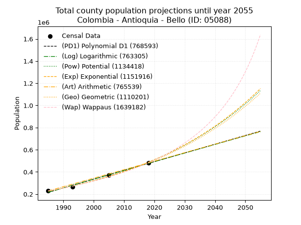
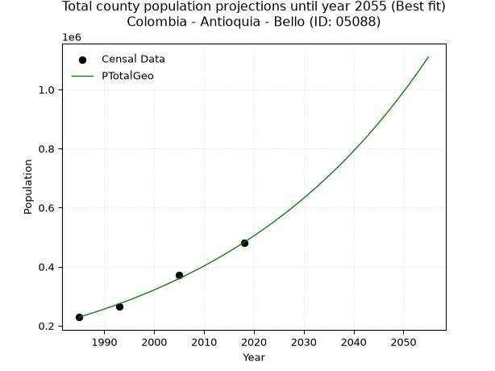
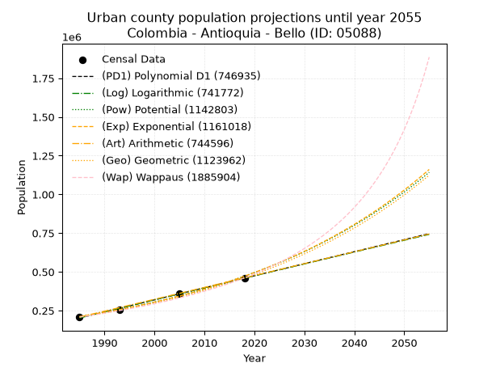
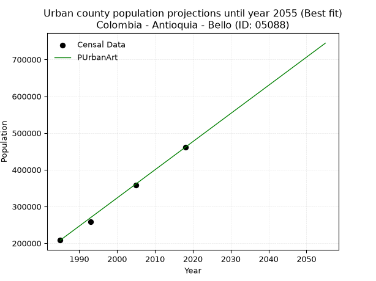
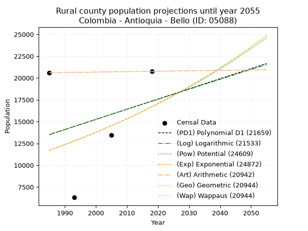
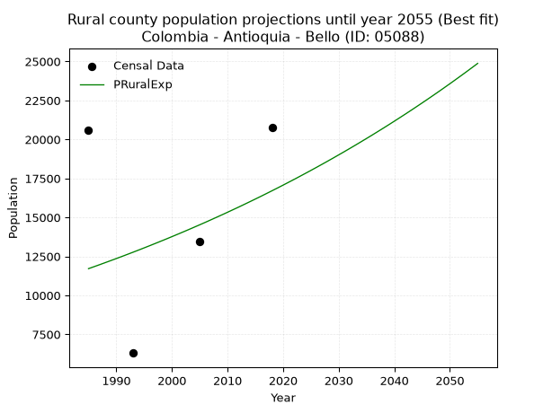

<div align="center">


</div>

# _“Population and Public Services Demand Projections (PPSD) until Year 2050 for Colombia - Antioquia - Bello (ID: 05088)”_
Keywords: `population` `public-service` `projection` `lineal` `polynomial` `logarithmic` `potential` `exponential` `arithmetic` `geometric` `wappaus` `dane` `colombia` `south-america`

PPSD are analytical estimates used by governments and planners to anticipate future changes in population size, age distribution, and the resulting community needs for utilities, healthcare, education, and infrastructure as sizing future water treatment facilities, electrical grids, and road networks based on spatial growth.

> **General running parameters**: • app_version: _v20260806_. • Python version: _3.14.7_. • Pandas version: _3.0.5_. • NumPy version: _2.5.1_. • Creates, save and include plots into reports (create_plot): _False_. • Projection until year: _2050_. • Process polynomial degree 2 and up: _False_. • Process Wappaus: _True_. • Process Wappaus: _True_. • Set negative values to zero: _True_. • Set infinite values to zero: _True_. • Drop dataset notes: _True_. 
<div align="center">

Dynamic map: [:earth_americas:Google](http://maps.google.com/maps?q=6.333587331,-75.5552451) [:earth_americas:OSM](https://www.openstreetmap.org/#map=18/6.333587331/-75.5552451&layers=P) [:earth_americas:Bing](https://www.bing.com/maps?cp=6.333587331~-75.5552451&lvl=18) [:earth_americas:Apple](https://maps.apple.com/frame?center=6.333587331%2C-75.5552451&span=0.003%2C0.006)

</div>


<div align="center">

```geojson
{
  "type": "Feature",
  "geometry": {
    "type": "Point", 
    "coordinates": [-75.5552451, 6.333587331]
  }, 
  "properties": {
    "Name": "Colombia - Antioquia - Bello (ID: 05088)"
  }
}
```

</div>


## 0. Census Data (4 records)

Census data are official statistics collected by a government about the people and housing in a country. They usually include counts of total population, age, sex, race, income, education, and jobs.

📅Global census file: [Population.xlsx](../data/Population.xlsx)

| Source   |   Year |   CountryID | CountryName   |   StateID | StateName   |   CountyID | CountyName   |   PTotal |   PUrban |   PRural |
|:---------|-------:|------------:|:--------------|----------:|:------------|-----------:|:-------------|---------:|---------:|---------:|
| DANE     |   1985 |          57 | Colombia      |        05 | Antioquia   |      05088 | Bello        |   228927 |   208324 |    20603 |
| DANE     |   1993 |          57 | Colombia      |        05 | Antioquia   |      05088 | Bello        |   264009 |   257707 |     6302 |
| DANE     |   2005 |          57 | Colombia      |        05 | Antioquia   |      05088 | Bello        |   371591 |   358139 |    13452 |
| DANE     |   2018 |          57 | Colombia      |        05 | Antioquia   |      05088 | Bello        |   481901 |   461138 |    20763 |

> 🔥Some records could had specific notes about the registered values or the corresponding urban or rural distribution.

📅   [RUPS](https://www.datos.gov.co/Hacienda-y-Cr-dito-P-blico/Registro-nico-de-Prestadores-de-Servicios-P-blicos/4qkq-csdn/about_data) - Local public utility companies: [RUPS.csv](../data/RUPS.xlsx)

 | SERVICIO       | ESTADO    | NOMBRE                                                                         | NIT         | DEPARTAMENTO_DOMICILIO   | MUNICIPIO_DOMICILIO   | DIRECCION                                                             |   TELEFONO | EMAIL                                     | TIPO_PRESTADOR                             | CLASIFICACION                 |
|:---------------|:----------|:-------------------------------------------------------------------------------|:------------|:-------------------------|:----------------------|:----------------------------------------------------------------------|-----------:|:------------------------------------------|:-------------------------------------------|:------------------------------|
| ACUEDUCTO      | OPERATIVA | EMPRESAS PÚBLICAS DE MEDELLIN E.S.P.                                           | 890904996-1 | ANTIOQUIA                | MEDELLIN              | CRA 58 No 42-125 Edificio Inteligente                                 |    3808080 | DONEY.MARTINEZ@EPM.COM.CO                 | EMPRESA INDUSTRIAL Y COMERCIAL DEL ESTADO  | MAYOR O IGUAL A 5001 USUARIOS |
| ALCANTARILLADO | OPERATIVA | EMPRESAS PÚBLICAS DE MEDELLIN E.S.P.                                           | 890904996-1 | ANTIOQUIA                | MEDELLIN              | CRA 58 No 42-125 Edificio Inteligente                                 |    3808080 | DONEY.MARTINEZ@EPM.COM.CO                 | EMPRESA INDUSTRIAL Y COMERCIAL DEL ESTADO  | MAYOR O IGUAL A 5001 USUARIOS |
| ACUEDUCTO      | OPERATIVA | ASOCIACIÓN DE USUARIOS "ACUEDUCTO CHARCO VERDE" BELLO ANTIOQUIA                | 811044884-5 | ANTIOQUIA                | BELLO                 | VEREDA CHARCO VERDE K 10 CORREGIMIENTO SAN FELIX                      |    3881522 | luzdabega4267@hotmail.com                 | ORGANIZACION AUTORIZADA                    | MENOR O IGUAL A 2500 USUARIOS |
| ACUEDUCTO      | OPERATIVA | ASOCIACION DE USUARIOS DEL ACUEDUCTO Y ALCANTARILLADO DE SAN FELIX- AGUALINDA. | 811006442-1 | ANTIOQUIA                | BELLO                 | SAN FELIX KM. 8 VIA PAJARITO SAN PEDRO                                |    3880200 | fcastro.hoyos@hotmail.com                 | ORGANIZACION AUTORIZADA                    | MENOR O IGUAL A 2500 USUARIOS |
| ACUEDUCTO      | OPERATIVA | ASOCIACION DE USUARIOS ACUEDUCTO VEREDAL LA UNION-BELLO                        | 811028886-2 | ANTIOQUIA                | BELLO                 | CRA  54B NRO 50 B 29                                                  |    8686856 | ACUEDUCTOLAUNION123@HOTMAIL.COM           | ORGANIZACION AUTORIZADA                    | MENOR O IGUAL A 2500 USUARIOS |
| ALCANTARILLADO | OPERATIVA | AGUAS NACIONALES EPM S.A E.S.P.                                                | 830112464-6 | ANTIOQUIA                | MEDELLIN              | Carrera 58 No. 42 – 125 sótano Edificio inteligente EPM - oficina 287 |    3804444 | JHON.OROZCO.ZAPATA@aguasnacionalesepm.com | SOCIEDADES (EMPRESA DE SERVICIOS PUBLICOS) | MAYOR O IGUAL A 5001 USUARIOS |
| ACUEDUCTO      | OPERATIVA | ASOCIACION DE USUARIOS DE ACUEDUCTO LA CHINA-CUARTAS                           | 900214020-1 | ANTIOQUIA                | BELLO                 | km 28 via Medellin - San Pedro                                        |    2684959 | acueductolachina@hotmail.com              | ORGANIZACION AUTORIZADA                    | HASTA 2500 SUSCRIPTORES       |

## 1. Total

### 1.1. Coefficients and Parameters

* (PD1) Polynomial Deg 1: 7890.161380971421, -15445688.302288083 (lineal)
* (Log) Logarithmic: 15790111.519386644, -119684157.19287044
* (Pow) Potential: 46.539612662794944, -148.122206141274
* (Exp) Exponential: 0.023250270274419154, 2.047067479424064e-15
* (Art) Arithmetic: Year diff. 2018 - 1985 = 33, Population diff. 481901 - 228927 = 252974, Annual growth = 7665.878787878788
* (Geo) Geometric: Year diff. 2018 - 1985 = 33, Population diff. 481901 - 228927 = 252974, Annual growth % = 0.022811923344088214
* (Wap) Wappaus: i = 2.1568871197754698, Condition values only valid for < 200)

<sub>
Wappaus condition values: ['0.00', '2.16', '4.31', '6.47', '8.63', '10.78', '12.94', '15.10', '17.26', '19.41', '21.57', '23.73', '25.88', '28.04', '30.20', '32.35', '34.51', '36.67', '38.82', '40.98', '43.14', '45.29', '47.45', '49.61', '51.77', '53.92', '56.08', '58.24', '60.39', '62.55', '64.71', '66.86', '69.02', '71.18', '73.33', '75.49', '77.65', '79.80', '81.96', '84.12', '86.28', '88.43', '90.59', '92.75', '94.90', '97.06', '99.22', '101.37', '103.53', '105.69', '107.84', '110.00', '112.16', '114.32', '116.47', '118.63', '120.79', '122.94', '125.10', '127.26', '129.41', '131.57', '133.73', '135.88', '138.04', '140.20']
</sub>


### 1.2. Projected Dataset

|   Year |   CountyID |   PTotalPD1 |   PTotalLog |        PTotalPow |        PTotalExp |   PTotalArt |   PTotalGeo |        PTotalWap |
|-------:|-----------:|------------:|------------:|-----------------:|-----------------:|------------:|------------:|-----------------:|
|   1985 |      05088 |      216282 |      216068 | 226095           | 226255           |      228927 |      228927 | 228927           |
|   1986 |      05088 |      224172 |      224021 | 231457           | 231577           |      236593 |      234149 | 233919           |
|   1987 |      05088 |      232062 |      231970 | 236944           | 237025           |      244259 |      239491 | 239020           |
|   1988 |      05088 |      239953 |      239914 | 242557           | 242600           |      251925 |      244954 | 244235           |
|   1989 |      05088 |      247843 |      247855 | 248301           | 248307           |      259591 |      250542 | 249568           |
|   1990 |      05088 |      255733 |      255792 | 254178           | 254147           |      267256 |      256257 | 255023           |
|   1991 |      05088 |      263623 |      263724 | 260191           | 260126           |      274922 |      262103 | 260603           |
|   1992 |      05088 |      271513 |      271653 | 266343           | 266244           |      282588 |      268082 | 266313           |
|   1993 |      05088 |      279403 |      279578 | 272637           | 272507           |      290254 |      274197 | 272158           |
|   1994 |      05088 |      287293 |      287499 | 279077           | 278917           |      297920 |      280452 | 278143           |
|   1995 |      05088 |      295184 |      295416 | 285666           | 285478           |      305586 |      286850 | 284273           |
|   1996 |      05088 |      303074 |      303328 | 292406           | 292193           |      313252 |      293394 | 290552           |
|   1997 |      05088 |      310964 |      311237 | 299303           | 299067           |      320918 |      300086 | 296987           |
|   1998 |      05088 |      318854 |      319142 | 306358           | 306101           |      328583 |      306932 | 303584           |
|   1999 |      05088 |      326744 |      327043 | 313576           | 313302           |      336249 |      313934 | 310348           |
|   2000 |      05088 |      334634 |      334940 | 320960           | 320671           |      343915 |      321095 | 317286           |
|   2001 |      05088 |      342525 |      342833 | 328515           | 328215           |      351581 |      328420 | 324405           |
|   2002 |      05088 |      350415 |      350723 | 336243           | 335935           |      359247 |      335912 | 331712           |
|   2003 |      05088 |      358305 |      358608 | 344149           | 343837           |      366913 |      343575 | 339215           |
|   2004 |      05088 |      366195 |      366489 | 352237           | 351925           |      374579 |      351412 | 346921           |
|   2005 |      05088 |      374085 |      374366 | 360511           | 360203           |      382245 |      359429 | 354839           |
|   2006 |      05088 |      381975 |      382240 | 368974           | 368676           |      389910 |      367628 | 362977           |
|   2007 |      05088 |      389866 |      390109 | 377633           | 377348           |      397576 |      376014 | 371346           |
|   2008 |      05088 |      397756 |      397975 | 386489           | 386225           |      405242 |      384592 | 379955           |
|   2009 |      05088 |      405646 |      405836 | 395549           | 395310           |      412908 |      393365 | 388815           |
|   2010 |      05088 |      413536 |      413694 | 404817           | 404608           |      420574 |      402338 | 397936           |
|   2011 |      05088 |      421426 |      421548 | 414297           | 414126           |      428240 |      411517 | 407331           |
|   2012 |      05088 |      429316 |      429398 | 423995           | 423867           |      435906 |      420904 | 417011           |
|   2013 |      05088 |      437207 |      437244 | 433914           | 433838           |      443572 |      430506 | 426991           |
|   2014 |      05088 |      445097 |      445086 | 444060           | 444043           |      451237 |      440326 | 437283           |
|   2015 |      05088 |      452987 |      452924 | 454438           | 454488           |      458903 |      450371 | 447904           |
|   2016 |      05088 |      460877 |      460759 | 465054           | 465179           |      466569 |      460645 | 458869           |
|   2017 |      05088 |      468767 |      468589 | 475912           | 476121           |      474235 |      471153 | 470196           |
|   2018 |      05088 |      476657 |      476416 | 487018           | 487320           |      481901 |      481901 | 481901           |
|   2019 |      05088 |      484548 |      484238 | 498377           | 498784           |      489567 |      492894 | 494005           |
|   2020 |      05088 |      492438 |      492057 | 509995           | 510516           |      497233 |      504138 | 506529           |
|   2021 |      05088 |      500328 |      499872 | 521879           | 522525           |      504899 |      515638 | 519494           |
|   2022 |      05088 |      508218 |      507683 | 534033           | 534816           |      512565 |      527401 | 532924           |
|   2023 |      05088 |      516108 |      515490 | 546464           | 547396           |      520230 |      539432 | 546845           |
|   2024 |      05088 |      523998 |      523294 | 559178           | 560273           |      527896 |      551738 | 561284           |
|   2025 |      05088 |      531888 |      531093 | 572182           | 573452           |      535562 |      564324 | 576271           |
|   2026 |      05088 |      539779 |      538889 | 585481           | 586941           |      543228 |      577197 | 591838           |
|   2027 |      05088 |      547669 |      546681 | 599082           | 600747           |      550894 |      590364 | 608018           |
|   2028 |      05088 |      555559 |      554469 | 612993           | 614879           |      558560 |      603831 | 624849           |
|   2029 |      05088 |      563449 |      562253 | 627219           | 629342           |      566226 |      617606 | 642371           |
|   2030 |      05088 |      571339 |      570033 | 641768           | 644146           |      573892 |      631695 | 660627           |
|   2031 |      05088 |      579229 |      577810 | 656648           | 659298           |      581557 |      646105 | 679665           |
|   2032 |      05088 |      587120 |      585582 | 671865           | 674806           |      589223 |      660844 | 699535           |
|   2033 |      05088 |      595010 |      593351 | 687426           | 690680           |      596889 |      675919 | 720294           |
|   2034 |      05088 |      602900 |      601116 | 703340           | 706926           |      604555 |      691338 | 742002           |
|   2035 |      05088 |      610790 |      608877 | 719615           | 723555           |      612221 |      707109 | 764727           |
|   2036 |      05088 |      618680 |      616635 | 736258           | 740575           |      619887 |      723239 | 788540           |
|   2037 |      05088 |      626570 |      624388 | 753277           | 757995           |      627553 |      739738 | 813523           |
|   2038 |      05088 |      634461 |      632138 | 770681           | 775825           |      635219 |      756612 | 839764           |
|   2039 |      05088 |      642351 |      639884 | 788478           | 794075           |      642884 |      773872 | 867360           |
|   2040 |      05088 |      650241 |      647626 | 806677           | 812754           |      650550 |      791526 | 896419           |
|   2041 |      05088 |      658131 |      655364 | 825288           | 831872           |      658216 |      809582 | 927061           |
|   2042 |      05088 |      666021 |      663099 | 844317           | 851440           |      665882 |      828050 | 959418           |
|   2043 |      05088 |      673911 |      670830 | 863777           | 871468           |      673548 |      846939 | 993638           |
|   2044 |      05088 |      681802 |      678557 | 883674           | 891967           |      681214 |      866260 |      1.02989e+06 |
|   2045 |      05088 |      689692 |      686280 | 904020           | 912948           |      688880 |      886021 |      1.06835e+06 |
|   2046 |      05088 |      697582 |      693999 | 924825           | 934423           |      696546 |      906233 |      1.10924e+06 |
|   2047 |      05088 |      705472 |      701715 | 946097           | 956403           |      704211 |      926906 |      1.15279e+06 |
|   2048 |      05088 |      713362 |      709427 | 967848           | 978901           |      711877 |      948050 |      1.19928e+06 |
|   2049 |      05088 |      721252 |      717135 | 990088           |      1.00193e+06 |      719543 |      969677 |      1.24899e+06 |
|   2050 |      05088 |      729143 |      724839 |      1.01283e+06 |      1.0255e+06  |      727209 |      991797 |      1.3023e+06  |
<div align="center">

</img>

</div>


### 1.3. Best fit with absolute and relative error (%)

Relative error puts that difference into context by dividing the absolute error by the true value, creating a unitless ratio or percentage that shows the scale of the mistake.

Absolute and relative error

|   Year | Source   |   CountryID | CountryName   |   StateID | StateName   |   CountyID_x | CountyName   |   PTotal |   PUrban |   PRural |   CountyID_y |   PTotalPD1 |   PTotalLog |   PTotalPow |   PTotalExp |   PTotalArt |   PTotalGeo |   PTotalWap |   PTotalPD1AbsError |   PTotalLogAbsError |   PTotalPowAbsError |   PTotalExpAbsError |   PTotalArtAbsError |   PTotalGeoAbsError |   PTotalWapAbsError |   PTotalPD1RelError |   PTotalLogRelError |   PTotalPowRelError |   PTotalExpRelError |   PTotalArtRelError |   PTotalGeoRelError |   PTotalWapRelError |
|-------:|:---------|------------:|:--------------|----------:|:------------|-------------:|:-------------|---------:|---------:|---------:|-------------:|------------:|------------:|------------:|------------:|------------:|------------:|------------:|--------------------:|--------------------:|--------------------:|--------------------:|--------------------:|--------------------:|--------------------:|--------------------:|--------------------:|--------------------:|--------------------:|--------------------:|--------------------:|--------------------:|
|   1985 | DANE     |          57 | Colombia      |        05 | Antioquia   |        05088 | Bello        |   228927 |   208324 |    20603 |        05088 |      216282 |      216068 |      226095 |      226255 |      228927 |      228927 |      228927 |               12645 |               12859 |                2832 |                2672 |                   0 |                   0 |                   0 |            5.52359  |            5.61707  |             1.23708 |             1.16718 |             0       |             0       |             0       |
|   1993 | DANE     |          57 | Colombia      |        05 | Antioquia   |        05088 | Bello        |   264009 |   257707 |     6302 |        05088 |      279403 |      279578 |      272637 |      272507 |      290254 |      274197 |      272158 |               15394 |               15569 |                8628 |                8498 |               26245 |               10188 |                8149 |            5.83086  |            5.89715  |             3.26807 |             3.21883 |             9.94095 |             3.85896 |             3.08664 |
|   2005 | DANE     |          57 | Colombia      |        05 | Antioquia   |        05088 | Bello        |   371591 |   358139 |    13452 |        05088 |      374085 |      374366 |      360511 |      360203 |      382245 |      359429 |      354839 |                2494 |                2775 |               11080 |               11388 |               10654 |               12162 |               16752 |            0.671168 |            0.746789 |             2.98177 |             3.06466 |             2.86713 |             3.27295 |             4.50818 |
|   2018 | DANE     |          57 | Colombia      |        05 | Antioquia   |        05088 | Bello        |   481901 |   461138 |    20763 |        05088 |      476657 |      476416 |      487018 |      487320 |      481901 |      481901 |      481901 |                5244 |                5485 |                5117 |                5419 |                   0 |                   0 |                   0 |            1.08819  |            1.1382   |             1.06184 |             1.1245  |             0       |             0       |             0       |

Relative error mean

| Method    |   RelError | Best   |
|:----------|-----------:|:-------|
| PTotalPD1 |    3.27845 |        |
| PTotalLog |    3.3498  |        |
| PTotalPow |    2.13719 |        |
| PTotalExp |    2.14379 |        |
| PTotalArt |    3.20202 |        |
| PTotalGeo |    1.78298 | True   |
| PTotalWap |    1.8987  |        |

💙Best method: _**PTotalGeo**_
<div align="center">

</img>

</div>


### 1.4. Fresh water supply demand in liters per capita per day (lpcd)

The fresh water supply demand typically ranges from 100 to 300 liters per capita per day (lpcd) for standard domestic and municipal planning, though absolute survival minimums set by the World Health Organization are as low as 7.5 to 20 liters per day, and total consumption in high-income nations can exceed 400 liters.

> `CZ`: Level in meters above the sea level (masl)<br> `WS`: Fresh water supply demand in liters per capita per day (lpcd or l/h/d)<br> `WSAll`: Zonal fresh water supply demand in liters per second (l/s)<br> `A`: Zonal area in square meters<br> `DP`: Population density (people/hectare or p/ha)

Reference values (RAS Colombia)

|    CZ |   WS |
|------:|-----:|
|  1000 |  120 |
|  2000 |  130 |
| 99999 |  140 |

County shapefile geometry properties and water supply values

|   CountyID |      ATotal |   CZTotal |   WSTotal |
|-----------:|------------:|----------:|----------:|
|      05088 | 1.41375e+08 |   2223.45 |       140 |

Projected values for best method: PTotalGeo

|   CountyID |   Year |   PTotalGeo |   DPTotal |   WSTotal |   WSTotalAll |
|-----------:|-------:|------------:|----------:|----------:|-------------:|
|      05088 |   1985 |      228927 |     16.19 |       140 |      370.947 |
|      05088 |   1986 |      234149 |     16.56 |       140 |      379.408 |
|      05088 |   1987 |      239491 |     16.94 |       140 |      388.064 |
|      05088 |   1988 |      244954 |     17.33 |       140 |      396.916 |
|      05088 |   1989 |      250542 |     17.72 |       140 |      405.971 |
|      05088 |   1990 |      256257 |     18.13 |       140 |      415.231 |
|      05088 |   1991 |      262103 |     18.54 |       140 |      424.704 |
|      05088 |   1992 |      268082 |     18.96 |       140 |      434.392 |
|      05088 |   1993 |      274197 |     19.39 |       140 |      444.301 |
|      05088 |   1994 |      280452 |     19.84 |       140 |      454.436 |
|      05088 |   1995 |      286850 |     20.29 |       140 |      464.803 |
|      05088 |   1996 |      293394 |     20.75 |       140 |      475.407 |
|      05088 |   1997 |      300086 |     21.23 |       140 |      486.25  |
|      05088 |   1998 |      306932 |     21.71 |       140 |      497.344 |
|      05088 |   1999 |      313934 |     22.21 |       140 |      508.689 |
|      05088 |   2000 |      321095 |     22.71 |       140 |      520.293 |
|      05088 |   2001 |      328420 |     23.23 |       140 |      532.162 |
|      05088 |   2002 |      335912 |     23.76 |       140 |      544.302 |
|      05088 |   2003 |      343575 |     24.3  |       140 |      556.719 |
|      05088 |   2004 |      351412 |     24.86 |       140 |      569.418 |
|      05088 |   2005 |      359429 |     25.42 |       140 |      582.408 |
|      05088 |   2006 |      367628 |     26    |       140 |      595.694 |
|      05088 |   2007 |      376014 |     26.6  |       140 |      609.282 |
|      05088 |   2008 |      384592 |     27.2  |       140 |      623.181 |
|      05088 |   2009 |      393365 |     27.82 |       140 |      637.397 |
|      05088 |   2010 |      402338 |     28.46 |       140 |      651.937 |
|      05088 |   2011 |      411517 |     29.11 |       140 |      666.81  |
|      05088 |   2012 |      420904 |     29.77 |       140 |      682.02  |
|      05088 |   2013 |      430506 |     30.45 |       140 |      697.579 |
|      05088 |   2014 |      440326 |     31.15 |       140 |      713.491 |
|      05088 |   2015 |      450371 |     31.86 |       140 |      729.768 |
|      05088 |   2016 |      460645 |     32.58 |       140 |      746.416 |
|      05088 |   2017 |      471153 |     33.33 |       140 |      763.442 |
|      05088 |   2018 |      481901 |     34.09 |       140 |      780.858 |
|      05088 |   2019 |      492894 |     34.86 |       140 |      798.671 |
|      05088 |   2020 |      504138 |     35.66 |       140 |      816.89  |
|      05088 |   2021 |      515638 |     36.47 |       140 |      835.525 |
|      05088 |   2022 |      527401 |     37.3  |       140 |      854.585 |
|      05088 |   2023 |      539432 |     38.16 |       140 |      874.08  |
|      05088 |   2024 |      551738 |     39.03 |       140 |      894.02  |
|      05088 |   2025 |      564324 |     39.92 |       140 |      914.414 |
|      05088 |   2026 |      577197 |     40.83 |       140 |      935.273 |
|      05088 |   2027 |      590364 |     41.76 |       140 |      956.608 |
|      05088 |   2028 |      603831 |     42.71 |       140 |      978.43  |
|      05088 |   2029 |      617606 |     43.69 |       140 |     1000.75  |
|      05088 |   2030 |      631695 |     44.68 |       140 |     1023.58  |
|      05088 |   2031 |      646105 |     45.7  |       140 |     1046.93  |
|      05088 |   2032 |      660844 |     46.74 |       140 |     1070.81  |
|      05088 |   2033 |      675919 |     47.81 |       140 |     1095.24  |
|      05088 |   2034 |      691338 |     48.9  |       140 |     1120.22  |
|      05088 |   2035 |      707109 |     50.02 |       140 |     1145.78  |
|      05088 |   2036 |      723239 |     51.16 |       140 |     1171.92  |
|      05088 |   2037 |      739738 |     52.32 |       140 |     1198.65  |
|      05088 |   2038 |      756612 |     53.52 |       140 |     1225.99  |
|      05088 |   2039 |      773872 |     54.74 |       140 |     1253.96  |
|      05088 |   2040 |      791526 |     55.99 |       140 |     1282.57  |
|      05088 |   2041 |      809582 |     57.26 |       140 |     1311.82  |
|      05088 |   2042 |      828050 |     58.57 |       140 |     1341.75  |
|      05088 |   2043 |      846939 |     59.91 |       140 |     1372.35  |
|      05088 |   2044 |      866260 |     61.27 |       140 |     1403.66  |
|      05088 |   2045 |      886021 |     62.67 |       140 |     1435.68  |
|      05088 |   2046 |      906233 |     64.1  |       140 |     1468.43  |
|      05088 |   2047 |      926906 |     65.56 |       140 |     1501.93  |
|      05088 |   2048 |      948050 |     67.06 |       140 |     1536.19  |
|      05088 |   2049 |      969677 |     68.59 |       140 |     1571.24  |
|      05088 |   2050 |      991797 |     70.15 |       140 |     1607.08  |

## 2. Urban

### 2.1. Coefficients and Parameters

* (PD1) Polynomial Deg 1: 7773.6539542351775, -15227924.321958913 (lineal)
* (Log) Logarithmic: 15558714.407476742, -117940585.89094318
* (Pow) Potential: 48.65669838948527, -155.1325143573699
* (Exp) Exponential: 0.02430444430755797, 2.3644280007313336e-16
* (Art) Arithmetic: Year diff. 2018 - 1985 = 33, Population diff. 461138 - 208324 = 252814, Annual growth = 7661.030303030303
* (Geo) Geometric: Year diff. 2018 - 1985 = 33, Population diff. 461138 - 208324 = 252814, Annual growth % = 0.024371109255755252
* (Wap) Wappaus: i = 2.2887125193156006, Condition values only valid for < 200)

<sub>
Wappaus condition values: ['0.00', '2.29', '4.58', '6.87', '9.15', '11.44', '13.73', '16.02', '18.31', '20.60', '22.89', '25.18', '27.46', '29.75', '32.04', '34.33', '36.62', '38.91', '41.20', '43.49', '45.77', '48.06', '50.35', '52.64', '54.93', '57.22', '59.51', '61.80', '64.08', '66.37', '68.66', '70.95', '73.24', '75.53', '77.82', '80.10', '82.39', '84.68', '86.97', '89.26', '91.55', '93.84', '96.13', '98.41', '100.70', '102.99', '105.28', '107.57', '109.86', '112.15', '114.44', '116.72', '119.01', '121.30', '123.59', '125.88', '128.17', '130.46', '132.75', '135.03', '137.32', '139.61', '141.90', '144.19', '146.48', '148.77']
</sub>


### 2.2. Projected Dataset

|   Year |   CountyID |   PUrbanPD1 |   PUrbanLog |        PUrbanPow |        PUrbanExp |   PUrbanArt |   PUrbanGeo |        PUrbanWap |
|-------:|-----------:|------------:|------------:|-----------------:|-----------------:|------------:|------------:|-----------------:|
|   1985 |      05088 |      202779 |      202555 | 211653           | 211821           |      208324 |      208324 | 208324           |
|   1986 |      05088 |      210552 |      210391 | 216904           | 217032           |      215985 |      213401 | 213147           |
|   1987 |      05088 |      218326 |      218223 | 222282           | 222372           |      223646 |      218602 | 218083           |
|   1988 |      05088 |      226100 |      226051 | 227791           | 227843           |      231307 |      223929 | 223136           |
|   1989 |      05088 |      233873 |      233876 | 233434           | 233448           |      238968 |      229387 | 228311           |
|   1990 |      05088 |      241647 |      241696 | 239213           | 239191           |      246629 |      234977 | 233611           |
|   1991 |      05088 |      249421 |      249512 | 245133           | 245076           |      254290 |      240704 | 239041           |
|   1992 |      05088 |      257194 |      257325 | 251195           | 251105           |      261951 |      246570 | 244606           |
|   1993 |      05088 |      264968 |      265134 | 257405           | 257283           |      269612 |      252579 | 250311           |
|   1994 |      05088 |      272742 |      272938 | 263765           | 263613           |      277273 |      258735 | 256162           |
|   1995 |      05088 |      280515 |      280739 | 270279           | 270098           |      284934 |      265041 | 262165           |
|   1996 |      05088 |      288289 |      288536 | 276950           | 276743           |      292595 |      271500 | 268324           |
|   1997 |      05088 |      296063 |      296329 | 283783           | 283552           |      300256 |      278117 | 274647           |
|   1998 |      05088 |      303836 |      304118 | 290780           | 290528           |      307917 |      284895 | 281140           |
|   1999 |      05088 |      311610 |      311903 | 297946           | 297675           |      315578 |      291838 | 287809           |
|   2000 |      05088 |      319384 |      319685 | 305286           | 304999           |      323239 |      298950 | 294664           |
|   2001 |      05088 |      327157 |      327462 | 312802           | 312502           |      330900 |      306236 | 301710           |
|   2002 |      05088 |      334931 |      335236 | 320499           | 320191           |      338562 |      313699 | 308956           |
|   2003 |      05088 |      342705 |      343005 | 328382           | 328068           |      346223 |      321345 | 316411           |
|   2004 |      05088 |      350478 |      350771 | 336455           | 336139           |      353884 |      329176 | 324084           |
|   2005 |      05088 |      358252 |      358533 | 344722           | 344409           |      361545 |      337199 | 331985           |
|   2006 |      05088 |      366026 |      366291 | 353188           | 352882           |      369206 |      345416 | 340124           |
|   2007 |      05088 |      373799 |      374045 | 361857           | 361564           |      376867 |      353835 | 348512           |
|   2008 |      05088 |      381573 |      381795 | 370735           | 370459           |      384528 |      362458 | 357161           |
|   2009 |      05088 |      389346 |      389542 | 379826           | 379573           |      392189 |      371292 | 366082           |
|   2010 |      05088 |      397120 |      397284 | 389135           | 388912           |      399850 |      380340 | 375289           |
|   2011 |      05088 |      404894 |      405023 | 398667           | 398480           |      407511 |      389610 | 384797           |
|   2012 |      05088 |      412667 |      412758 | 408428           | 408283           |      415172 |      399105 | 394619           |
|   2013 |      05088 |      420441 |      420489 | 418423           | 418328           |      422833 |      408831 | 404772           |
|   2014 |      05088 |      428215 |      428216 | 428658           | 428620           |      430494 |      418795 | 415273           |
|   2015 |      05088 |      435988 |      435940 | 439137           | 439165           |      438155 |      429002 | 426140           |
|   2016 |      05088 |      443762 |      443659 | 449867           | 449969           |      445816 |      439457 | 437392           |
|   2017 |      05088 |      451536 |      451375 | 460854           | 461039           |      453477 |      450167 | 449051           |
|   2018 |      05088 |      459309 |      459087 | 472104           | 472382           |      461138 |      461138 | 461138           |
|   2019 |      05088 |      467083 |      466795 | 483623           | 484004           |      468799 |      472376 | 473678           |
|   2020 |      05088 |      474857 |      474499 | 495416           | 495911           |      476460 |      483889 | 486697           |
|   2021 |      05088 |      482630 |      482200 | 507491           | 508112           |      484121 |      495682 | 500223           |
|   2022 |      05088 |      490404 |      489896 | 519855           | 520612           |      491782 |      507762 | 514285           |
|   2023 |      05088 |      498178 |      497589 | 532513           | 533421           |      499443 |      520137 | 528917           |
|   2024 |      05088 |      505951 |      505278 | 545473           | 546544           |      507104 |      532813 | 544154           |
|   2025 |      05088 |      513725 |      512963 | 558742           | 559990           |      514765 |      545798 | 560034           |
|   2026 |      05088 |      521499 |      520645 | 572326           | 573767           |      522426 |      559100 | 576599           |
|   2027 |      05088 |      529272 |      528322 | 586234           | 587883           |      530087 |      572726 | 593893           |
|   2028 |      05088 |      537046 |      535996 | 600473           | 602346           |      537748 |      586684 | 611967           |
|   2029 |      05088 |      544820 |      543666 | 615050           | 617165           |      545409 |      600982 | 630875           |
|   2030 |      05088 |      552593 |      551332 | 629974           | 632349           |      553070 |      615629 | 650674           |
|   2031 |      05088 |      560367 |      558995 | 645253           | 647906           |      560731 |      630632 | 671430           |
|   2032 |      05088 |      568141 |      566654 | 660894           | 663846           |      568392 |      646001 | 693214           |
|   2033 |      05088 |      575914 |      574309 | 676906           | 680178           |      576053 |      661745 | 716104           |
|   2034 |      05088 |      583688 |      581960 | 693298           | 696912           |      583714 |      677873 | 740187           |
|   2035 |      05088 |      591461 |      589607 | 710079           | 714058           |      591376 |      694393 | 765558           |
|   2036 |      05088 |      599235 |      597251 | 727257           | 731625           |      599037 |      711316 | 792324           |
|   2037 |      05088 |      607009 |      604891 | 744842           | 749625           |      606698 |      728652 | 820602           |
|   2038 |      05088 |      614782 |      612527 | 762843           | 768067           |      614359 |      746410 | 850526           |
|   2039 |      05088 |      622556 |      620159 | 781271           | 786963           |      622020 |      764601 | 882242           |
|   2040 |      05088 |      630330 |      627788 | 800134           | 806324           |      629681 |      783235 | 915916           |
|   2041 |      05088 |      638103 |      635413 | 819442           | 826161           |      637342 |      802323 | 951737           |
|   2042 |      05088 |      645877 |      643034 | 839207           | 846487           |      645003 |      821877 | 989915           |
|   2043 |      05088 |      653651 |      650652 | 859439           | 867312           |      652664 |      841907 |      1.03069e+06 |
|   2044 |      05088 |      661424 |      658266 | 880148           | 888650           |      660325 |      862425 |      1.07434e+06 |
|   2045 |      05088 |      669198 |      665876 | 901346           | 910513           |      667986 |      883443 |      1.12118e+06 |
|   2046 |      05088 |      676972 |      673482 | 923044           | 932913           |      675647 |      904974 |      1.17157e+06 |
|   2047 |      05088 |      684745 |      681084 | 945253           | 955865           |      683308 |      927029 |      1.22592e+06 |
|   2048 |      05088 |      692519 |      688683 | 967984           | 979382           |      690969 |      949622 |      1.28474e+06 |
|   2049 |      05088 |      700293 |      696279 | 991252           |      1.00348e+06 |      698630 |      972765 |      1.34859e+06 |
|   2050 |      05088 |      708066 |      703870 |      1.01507e+06 |      1.02816e+06 |      706291 |      996472 |      1.41814e+06 |
<div align="center">

</img>

</div>


### 2.3. Best fit with absolute and relative error (%)

Relative error puts that difference into context by dividing the absolute error by the true value, creating a unitless ratio or percentage that shows the scale of the mistake.

Absolute and relative error

|   Year | Source   |   CountryID | CountryName   |   StateID | StateName   |   CountyID_x | CountyName   |   PTotal |   PUrban |   PRural |   CountyID_y |   PUrbanPD1 |   PUrbanLog |   PUrbanPow |   PUrbanExp |   PUrbanArt |   PUrbanGeo |   PUrbanWap |   PUrbanPD1AbsError |   PUrbanLogAbsError |   PUrbanPowAbsError |   PUrbanExpAbsError |   PUrbanArtAbsError |   PUrbanGeoAbsError |   PUrbanWapAbsError |   PUrbanPD1RelError |   PUrbanLogRelError |   PUrbanPowRelError |   PUrbanExpRelError |   PUrbanArtRelError |   PUrbanGeoRelError |   PUrbanWapRelError |
|-------:|:---------|------------:|:--------------|----------:|:------------|-------------:|:-------------|---------:|---------:|---------:|-------------:|------------:|------------:|------------:|------------:|------------:|------------:|------------:|--------------------:|--------------------:|--------------------:|--------------------:|--------------------:|--------------------:|--------------------:|--------------------:|--------------------:|--------------------:|--------------------:|--------------------:|--------------------:|--------------------:|
|   1985 | DANE     |          57 | Colombia      |        05 | Antioquia   |        05088 | Bello        |   228927 |   208324 |    20603 |        05088 |      202779 |      202555 |      211653 |      211821 |      208324 |      208324 |      208324 |                5545 |                5769 |                3329 |                3497 |                   0 |                   0 |                   0 |            2.66172  |            2.76924  |            1.59799  |            1.67864  |            0        |             0       |             0       |
|   1993 | DANE     |          57 | Colombia      |        05 | Antioquia   |        05088 | Bello        |   264009 |   257707 |     6302 |        05088 |      264968 |      265134 |      257405 |      257283 |      269612 |      252579 |      250311 |                7261 |                7427 |                 302 |                 424 |               11905 |                5128 |                7396 |            2.81754  |            2.88196  |            0.117187 |            0.164528 |            4.61959  |             1.98986 |             2.86993 |
|   2005 | DANE     |          57 | Colombia      |        05 | Antioquia   |        05088 | Bello        |   371591 |   358139 |    13452 |        05088 |      358252 |      358533 |      344722 |      344409 |      361545 |      337199 |      331985 |                 113 |                 394 |               13417 |               13730 |                3406 |               20940 |               26154 |            0.031552 |            0.110013 |            3.74631  |            3.83371  |            0.951027 |             5.84689 |             7.30275 |
|   2018 | DANE     |          57 | Colombia      |        05 | Antioquia   |        05088 | Bello        |   481901 |   461138 |    20763 |        05088 |      459309 |      459087 |      472104 |      472382 |      461138 |      461138 |      461138 |                1829 |                2051 |               10966 |               11244 |                   0 |                   0 |                   0 |            0.396627 |            0.444769 |            2.37803  |            2.43832  |            0        |             0       |             0       |

Relative error mean

| Method    |   RelError | Best   |
|:----------|-----------:|:-------|
| PUrbanPD1 |    1.47686 |        |
| PUrbanLog |    1.5515  |        |
| PUrbanPow |    1.95988 |        |
| PUrbanExp |    2.0288  |        |
| PUrbanArt |    1.39265 | True   |
| PUrbanGeo |    1.95919 |        |
| PUrbanWap |    2.54317 |        |

💙Best method: _**PUrbanArt**_
<div align="center">

</img>

</div>


### 2.4. Fresh water supply demand in liters per capita per day (lpcd)

The fresh water supply demand typically ranges from 100 to 300 liters per capita per day (lpcd) for standard domestic and municipal planning, though absolute survival minimums set by the World Health Organization are as low as 7.5 to 20 liters per day, and total consumption in high-income nations can exceed 400 liters.

> `CZ`: Level in meters above the sea level (masl)<br> `WS`: Fresh water supply demand in liters per capita per day (lpcd or l/h/d)<br> `WSAll`: Zonal fresh water supply demand in liters per second (l/s)<br> `A`: Zonal area in square meters<br> `DP`: Population density (people/hectare or p/ha)

Reference values (RAS Colombia)

|    CZ |   WS |
|------:|-----:|
|  1000 |  120 |
|  2000 |  130 |
| 99999 |  140 |

County shapefile geometry properties and water supply values

|   CountyID |      AUrban |   CZUrban |   WSUrban |
|-----------:|------------:|----------:|----------:|
|      05088 | 2.28909e+07 |   1507.37 |       130 |

Projected values for best method: PUrbanArt

|   CountyID |   Year |   PUrbanArt |   DPUrban |   WSUrban |   WSUrbanAll |
|-----------:|-------:|------------:|----------:|----------:|-------------:|
|      05088 |   1985 |      208324 |     91.01 |       130 |      313.45  |
|      05088 |   1986 |      215985 |     94.35 |       130 |      324.977 |
|      05088 |   1987 |      223646 |     97.7  |       130 |      336.504 |
|      05088 |   1988 |      231307 |    101.05 |       130 |      348.031 |
|      05088 |   1989 |      238968 |    104.39 |       130 |      359.558 |
|      05088 |   1990 |      246629 |    107.74 |       130 |      371.085 |
|      05088 |   1991 |      254290 |    111.09 |       130 |      382.612 |
|      05088 |   1992 |      261951 |    114.43 |       130 |      394.139 |
|      05088 |   1993 |      269612 |    117.78 |       130 |      405.666 |
|      05088 |   1994 |      277273 |    121.13 |       130 |      417.193 |
|      05088 |   1995 |      284934 |    124.47 |       130 |      428.72  |
|      05088 |   1996 |      292595 |    127.82 |       130 |      440.247 |
|      05088 |   1997 |      300256 |    131.17 |       130 |      451.774 |
|      05088 |   1998 |      307917 |    134.51 |       130 |      463.301 |
|      05088 |   1999 |      315578 |    137.86 |       130 |      474.828 |
|      05088 |   2000 |      323239 |    141.21 |       130 |      486.355 |
|      05088 |   2001 |      330900 |    144.56 |       130 |      497.882 |
|      05088 |   2002 |      338562 |    147.9  |       130 |      509.41  |
|      05088 |   2003 |      346223 |    151.25 |       130 |      520.937 |
|      05088 |   2004 |      353884 |    154.6  |       130 |      532.464 |
|      05088 |   2005 |      361545 |    157.94 |       130 |      543.991 |
|      05088 |   2006 |      369206 |    161.29 |       130 |      555.518 |
|      05088 |   2007 |      376867 |    164.64 |       130 |      567.045 |
|      05088 |   2008 |      384528 |    167.98 |       130 |      578.572 |
|      05088 |   2009 |      392189 |    171.33 |       130 |      590.099 |
|      05088 |   2010 |      399850 |    174.68 |       130 |      601.626 |
|      05088 |   2011 |      407511 |    178.02 |       130 |      613.153 |
|      05088 |   2012 |      415172 |    181.37 |       130 |      624.68  |
|      05088 |   2013 |      422833 |    184.72 |       130 |      636.207 |
|      05088 |   2014 |      430494 |    188.06 |       130 |      647.734 |
|      05088 |   2015 |      438155 |    191.41 |       130 |      659.261 |
|      05088 |   2016 |      445816 |    194.76 |       130 |      670.788 |
|      05088 |   2017 |      453477 |    198.1  |       130 |      682.315 |
|      05088 |   2018 |      461138 |    201.45 |       130 |      693.842 |
|      05088 |   2019 |      468799 |    204.8  |       130 |      705.369 |
|      05088 |   2020 |      476460 |    208.14 |       130 |      716.896 |
|      05088 |   2021 |      484121 |    211.49 |       130 |      728.423 |
|      05088 |   2022 |      491782 |    214.84 |       130 |      739.95  |
|      05088 |   2023 |      499443 |    218.18 |       130 |      751.477 |
|      05088 |   2024 |      507104 |    221.53 |       130 |      763.004 |
|      05088 |   2025 |      514765 |    224.88 |       130 |      774.531 |
|      05088 |   2026 |      522426 |    228.22 |       130 |      786.058 |
|      05088 |   2027 |      530087 |    231.57 |       130 |      797.585 |
|      05088 |   2028 |      537748 |    234.92 |       130 |      809.112 |
|      05088 |   2029 |      545409 |    238.26 |       130 |      820.639 |
|      05088 |   2030 |      553070 |    241.61 |       130 |      832.166 |
|      05088 |   2031 |      560731 |    244.96 |       130 |      843.692 |
|      05088 |   2032 |      568392 |    248.3  |       130 |      855.219 |
|      05088 |   2033 |      576053 |    251.65 |       130 |      866.746 |
|      05088 |   2034 |      583714 |    255    |       130 |      878.273 |
|      05088 |   2035 |      591376 |    258.35 |       130 |      889.802 |
|      05088 |   2036 |      599037 |    261.69 |       130 |      901.329 |
|      05088 |   2037 |      606698 |    265.04 |       130 |      912.856 |
|      05088 |   2038 |      614359 |    268.39 |       130 |      924.383 |
|      05088 |   2039 |      622020 |    271.73 |       130 |      935.91  |
|      05088 |   2040 |      629681 |    275.08 |       130 |      947.437 |
|      05088 |   2041 |      637342 |    278.43 |       130 |      958.964 |
|      05088 |   2042 |      645003 |    281.77 |       130 |      970.491 |
|      05088 |   2043 |      652664 |    285.12 |       130 |      982.018 |
|      05088 |   2044 |      660325 |    288.47 |       130 |      993.545 |
|      05088 |   2045 |      667986 |    291.81 |       130 |     1005.07  |
|      05088 |   2046 |      675647 |    295.16 |       130 |     1016.6   |
|      05088 |   2047 |      683308 |    298.51 |       130 |     1028.13  |
|      05088 |   2048 |      690969 |    301.85 |       130 |     1039.65  |
|      05088 |   2049 |      698630 |    305.2  |       130 |     1051.18  |
|      05088 |   2050 |      706291 |    308.55 |       130 |     1062.71  |

## 3. Rural

### 3.1. Coefficients and Parameters

* (PD1) Polynomial Deg 1: 116.50742673624573, -217763.9803291755 (lineal)
* (Log) Logarithmic: 231397.11190990114, -1743571.301927239
* (Pow) Potential: 21.406771511245278, -66.5255047314727
* (Exp) Exponential: 0.010759492921943366, 6.210498350040528e-06
* (Art) Arithmetic: Year diff. 2018 - 1985 = 33, Population diff. 20763 - 20603 = 160, Annual growth = 4.848484848484849
* (Geo) Geometric: Year diff. 2018 - 1985 = 33, Population diff. 20763 - 20603 = 160, Annual growth % = 0.0002344474866238233
* (Wap) Wappaus: i = 0.023441883907000187, Condition values only valid for < 200)

<sub>
Wappaus condition values: ['0.00', '0.02', '0.05', '0.07', '0.09', '0.12', '0.14', '0.16', '0.19', '0.21', '0.23', '0.26', '0.28', '0.30', '0.33', '0.35', '0.38', '0.40', '0.42', '0.45', '0.47', '0.49', '0.52', '0.54', '0.56', '0.59', '0.61', '0.63', '0.66', '0.68', '0.70', '0.73', '0.75', '0.77', '0.80', '0.82', '0.84', '0.87', '0.89', '0.91', '0.94', '0.96', '0.98', '1.01', '1.03', '1.05', '1.08', '1.10', '1.13', '1.15', '1.17', '1.20', '1.22', '1.24', '1.27', '1.29', '1.31', '1.34', '1.36', '1.38', '1.41', '1.43', '1.45', '1.48', '1.50', '1.52']
</sub>


### 3.2. Projected Dataset

|   Year |   CountyID |   PRuralPD1 |   PRuralLog |   PRuralPow |   PRuralExp |   PRuralArt |   PRuralGeo |   PRuralWap |
|-------:|-----------:|------------:|------------:|------------:|------------:|------------:|------------:|------------:|
|   1985 |      05088 |       13503 |       13514 |       11719 |       11711 |       20603 |       20603 |       20603 |
|   1986 |      05088 |       13620 |       13630 |       11846 |       11838 |       20608 |       20608 |       20608 |
|   1987 |      05088 |       13736 |       13747 |       11975 |       11966 |       20613 |       20613 |       20613 |
|   1988 |      05088 |       13853 |       13863 |       12104 |       12096 |       20618 |       20617 |       20617 |
|   1989 |      05088 |       13969 |       13979 |       12235 |       12227 |       20622 |       20622 |       20622 |
|   1990 |      05088 |       14086 |       14096 |       12368 |       12359 |       20627 |       20627 |       20627 |
|   1991 |      05088 |       14202 |       14212 |       12501 |       12492 |       20632 |       20632 |       20632 |
|   1992 |      05088 |       14319 |       14328 |       12637 |       12628 |       20637 |       20637 |       20637 |
|   1993 |      05088 |       14435 |       14444 |       12773 |       12764 |       20642 |       20642 |       20642 |
|   1994 |      05088 |       14552 |       14560 |       12911 |       12902 |       20647 |       20647 |       20647 |
|   1995 |      05088 |       14668 |       14676 |       13050 |       13042 |       20651 |       20651 |       20651 |
|   1996 |      05088 |       14785 |       14792 |       13191 |       13183 |       20656 |       20656 |       20656 |
|   1997 |      05088 |       14901 |       14908 |       13333 |       13326 |       20661 |       20661 |       20661 |
|   1998 |      05088 |       15018 |       15024 |       13477 |       13470 |       20666 |       20666 |       20666 |
|   1999 |      05088 |       15134 |       15140 |       13622 |       13615 |       20671 |       20671 |       20671 |
|   2000 |      05088 |       15251 |       15256 |       13769 |       13763 |       20676 |       20676 |       20676 |
|   2001 |      05088 |       15367 |       15371 |       13917 |       13912 |       20681 |       20680 |       20680 |
|   2002 |      05088 |       15484 |       15487 |       14066 |       14062 |       20685 |       20685 |       20685 |
|   2003 |      05088 |       15600 |       15602 |       14218 |       14214 |       20690 |       20690 |       20690 |
|   2004 |      05088 |       15717 |       15718 |       14370 |       14368 |       20695 |       20695 |       20695 |
|   2005 |      05088 |       15833 |       15833 |       14525 |       14523 |       20700 |       20700 |       20700 |
|   2006 |      05088 |       15950 |       15949 |       14680 |       14680 |       20705 |       20705 |       20705 |
|   2007 |      05088 |       16066 |       16064 |       14838 |       14839 |       20710 |       20710 |       20710 |
|   2008 |      05088 |       16183 |       16179 |       14997 |       15000 |       20715 |       20714 |       20714 |
|   2009 |      05088 |       16299 |       16295 |       15158 |       15162 |       20719 |       20719 |       20719 |
|   2010 |      05088 |       16416 |       16410 |       15320 |       15326 |       20724 |       20724 |       20724 |
|   2011 |      05088 |       16532 |       16525 |       15484 |       15492 |       20729 |       20729 |       20729 |
|   2012 |      05088 |       16649 |       16640 |       15650 |       15659 |       20734 |       20734 |       20734 |
|   2013 |      05088 |       16765 |       16755 |       15817 |       15829 |       20739 |       20739 |       20739 |
|   2014 |      05088 |       16882 |       16870 |       15986 |       16000 |       20744 |       20744 |       20744 |
|   2015 |      05088 |       16998 |       16985 |       16157 |       16173 |       20748 |       20748 |       20748 |
|   2016 |      05088 |       17115 |       17099 |       16329 |       16348 |       20753 |       20753 |       20753 |
|   2017 |      05088 |       17231 |       17214 |       16504 |       16525 |       20758 |       20758 |       20758 |
|   2018 |      05088 |       17348 |       17329 |       16680 |       16704 |       20763 |       20763 |       20763 |
|   2019 |      05088 |       17465 |       17443 |       16858 |       16884 |       20768 |       20768 |       20768 |
|   2020 |      05088 |       17581 |       17558 |       17037 |       17067 |       20773 |       20773 |       20773 |
|   2021 |      05088 |       17698 |       17673 |       17219 |       17252 |       20778 |       20778 |       20778 |
|   2022 |      05088 |       17814 |       17787 |       17402 |       17438 |       20782 |       20782 |       20782 |
|   2023 |      05088 |       17931 |       17901 |       17587 |       17627 |       20787 |       20787 |       20787 |
|   2024 |      05088 |       18047 |       18016 |       17774 |       17818 |       20792 |       20792 |       20792 |
|   2025 |      05088 |       18164 |       18130 |       17963 |       18010 |       20797 |       20797 |       20797 |
|   2026 |      05088 |       18280 |       18244 |       18154 |       18205 |       20802 |       20802 |       20802 |
|   2027 |      05088 |       18397 |       18359 |       18347 |       18402 |       20807 |       20807 |       20807 |
|   2028 |      05088 |       18513 |       18473 |       18541 |       18601 |       20811 |       20812 |       20812 |
|   2029 |      05088 |       18630 |       18587 |       18738 |       18802 |       20816 |       20817 |       20817 |
|   2030 |      05088 |       18746 |       18701 |       18937 |       19006 |       20821 |       20821 |       20821 |
|   2031 |      05088 |       18863 |       18815 |       19138 |       19211 |       20826 |       20826 |       20826 |
|   2032 |      05088 |       18979 |       18929 |       19340 |       19419 |       20831 |       20831 |       20831 |
|   2033 |      05088 |       19096 |       19042 |       19545 |       19629 |       20836 |       20836 |       20836 |
|   2034 |      05088 |       19212 |       19156 |       19752 |       19842 |       20841 |       20841 |       20841 |
|   2035 |      05088 |       19329 |       19270 |       19961 |       20056 |       20845 |       20846 |       20846 |
|   2036 |      05088 |       19445 |       19384 |       20172 |       20273 |       20850 |       20851 |       20851 |
|   2037 |      05088 |       19562 |       19497 |       20385 |       20493 |       20855 |       20856 |       20856 |
|   2038 |      05088 |       19678 |       19611 |       20600 |       20714 |       20860 |       20861 |       20861 |
|   2039 |      05088 |       19795 |       19724 |       20818 |       20938 |       20865 |       20865 |       20865 |
|   2040 |      05088 |       19911 |       19838 |       21037 |       21165 |       20870 |       20870 |       20870 |
|   2041 |      05088 |       20028 |       19951 |       21259 |       21394 |       20875 |       20875 |       20875 |
|   2042 |      05088 |       20144 |       20065 |       21483 |       21625 |       20879 |       20880 |       20880 |
|   2043 |      05088 |       20261 |       20178 |       21710 |       21859 |       20884 |       20885 |       20885 |
|   2044 |      05088 |       20377 |       20291 |       21938 |       22096 |       20889 |       20890 |       20890 |
|   2045 |      05088 |       20494 |       20404 |       22169 |       22335 |       20894 |       20895 |       20895 |
|   2046 |      05088 |       20610 |       20517 |       22402 |       22576 |       20899 |       20900 |       20900 |
|   2047 |      05088 |       20727 |       20630 |       22638 |       22820 |       20904 |       20905 |       20905 |
|   2048 |      05088 |       20843 |       20744 |       22876 |       23067 |       20908 |       20910 |       20910 |
|   2049 |      05088 |       20960 |       20856 |       23116 |       23317 |       20913 |       20914 |       20914 |
|   2050 |      05088 |       21076 |       20969 |       23359 |       23569 |       20918 |       20919 |       20919 |
<div align="center">

</img>

</div>


### 3.3. Best fit with absolute and relative error (%)

Relative error puts that difference into context by dividing the absolute error by the true value, creating a unitless ratio or percentage that shows the scale of the mistake.

Absolute and relative error

|   Year | Source   |   CountryID | CountryName   |   StateID | StateName   |   CountyID_x | CountyName   |   PTotal |   PUrban |   PRural |   CountyID_y |   PRuralPD1 |   PRuralLog |   PRuralPow |   PRuralExp |   PRuralArt |   PRuralGeo |   PRuralWap |   PRuralPD1AbsError |   PRuralLogAbsError |   PRuralPowAbsError |   PRuralExpAbsError |   PRuralArtAbsError |   PRuralGeoAbsError |   PRuralWapAbsError |   PRuralPD1RelError |   PRuralLogRelError |   PRuralPowRelError |   PRuralExpRelError |   PRuralArtRelError |   PRuralGeoRelError |   PRuralWapRelError |
|-------:|:---------|------------:|:--------------|----------:|:------------|-------------:|:-------------|---------:|---------:|---------:|-------------:|------------:|------------:|------------:|------------:|------------:|------------:|------------:|--------------------:|--------------------:|--------------------:|--------------------:|--------------------:|--------------------:|--------------------:|--------------------:|--------------------:|--------------------:|--------------------:|--------------------:|--------------------:|--------------------:|
|   1985 | DANE     |          57 | Colombia      |        05 | Antioquia   |        05088 | Bello        |   228927 |   208324 |    20603 |        05088 |       13503 |       13514 |       11719 |       11711 |       20603 |       20603 |       20603 |                7100 |                7089 |                8884 |                8892 |                   0 |                   0 |                   0 |             34.461  |             34.4076 |            43.1199  |            43.1588  |              0      |              0      |              0      |
|   1993 | DANE     |          57 | Colombia      |        05 | Antioquia   |        05088 | Bello        |   264009 |   257707 |     6302 |        05088 |       14435 |       14444 |       12773 |       12764 |       20642 |       20642 |       20642 |                8133 |                8142 |                6471 |                6462 |               14340 |               14340 |               14340 |            129.054  |            129.197  |           102.682   |           102.539   |            227.547  |            227.547  |            227.547  |
|   2005 | DANE     |          57 | Colombia      |        05 | Antioquia   |        05088 | Bello        |   371591 |   358139 |    13452 |        05088 |       15833 |       15833 |       14525 |       14523 |       20700 |       20700 |       20700 |                2381 |                2381 |                1073 |                1071 |                7248 |                7248 |                7248 |             17.7    |             17.7    |             7.97651 |             7.96164 |             53.8805 |             53.8805 |             53.8805 |
|   2018 | DANE     |          57 | Colombia      |        05 | Antioquia   |        05088 | Bello        |   481901 |   461138 |    20763 |        05088 |       17348 |       17329 |       16680 |       16704 |       20763 |       20763 |       20763 |                3415 |                3434 |                4083 |                4059 |                   0 |                   0 |                   0 |             16.4475 |             16.539  |            19.6648  |            19.5492  |              0      |              0      |              0      |

Relative error mean

| Method    |   RelError | Best   |
|:----------|-----------:|:-------|
| PRuralPD1 |    49.4157 |        |
| PRuralLog |    49.4609 |        |
| PRuralPow |    43.3607 |        |
| PRuralExp |    43.3021 | True   |
| PRuralArt |    70.3568 |        |
| PRuralGeo |    70.3568 |        |
| PRuralWap |    70.3568 |        |

💙Best method: _**PRuralExp**_
<div align="center">

</img>

</div>


### 3.4. Fresh water supply demand in liters per capita per day (lpcd)

The fresh water supply demand typically ranges from 100 to 300 liters per capita per day (lpcd) for standard domestic and municipal planning, though absolute survival minimums set by the World Health Organization are as low as 7.5 to 20 liters per day, and total consumption in high-income nations can exceed 400 liters.

> `CZ`: Level in meters above the sea level (masl)<br> `WS`: Fresh water supply demand in liters per capita per day (lpcd or l/h/d)<br> `WSAll`: Zonal fresh water supply demand in liters per second (l/s)<br> `A`: Zonal area in square meters<br> `DP`: Population density (people/hectare or p/ha)

Reference values (RAS Colombia)

|    CZ |   WS |
|------:|-----:|
|  1000 |  120 |
|  2000 |  130 |
| 99999 |  140 |

County shapefile geometry properties and water supply values

|   CountyID |      ARural |   CZRural |   WSRural |
|-----------:|------------:|----------:|----------:|
|      05088 | 1.18485e+08 |    2364.3 |       140 |

Projected values for best method: PRuralExp

|   CountyID |   Year |   PRuralExp |   DPRural |   WSRural |   WSRuralAll |
|-----------:|-------:|------------:|----------:|----------:|-------------:|
|      05088 |   1985 |       11711 |      0.99 |       140 |      18.9762 |
|      05088 |   1986 |       11838 |      1    |       140 |      19.1819 |
|      05088 |   1987 |       11966 |      1.01 |       140 |      19.3894 |
|      05088 |   1988 |       12096 |      1.02 |       140 |      19.6    |
|      05088 |   1989 |       12227 |      1.03 |       140 |      19.8123 |
|      05088 |   1990 |       12359 |      1.04 |       140 |      20.0262 |
|      05088 |   1991 |       12492 |      1.05 |       140 |      20.2417 |
|      05088 |   1992 |       12628 |      1.07 |       140 |      20.462  |
|      05088 |   1993 |       12764 |      1.08 |       140 |      20.6824 |
|      05088 |   1994 |       12902 |      1.09 |       140 |      20.906  |
|      05088 |   1995 |       13042 |      1.1  |       140 |      21.1329 |
|      05088 |   1996 |       13183 |      1.11 |       140 |      21.3613 |
|      05088 |   1997 |       13326 |      1.12 |       140 |      21.5931 |
|      05088 |   1998 |       13470 |      1.14 |       140 |      21.8264 |
|      05088 |   1999 |       13615 |      1.15 |       140 |      22.0613 |
|      05088 |   2000 |       13763 |      1.16 |       140 |      22.3012 |
|      05088 |   2001 |       13912 |      1.17 |       140 |      22.5426 |
|      05088 |   2002 |       14062 |      1.19 |       140 |      22.7856 |
|      05088 |   2003 |       14214 |      1.2  |       140 |      23.0319 |
|      05088 |   2004 |       14368 |      1.21 |       140 |      23.2815 |
|      05088 |   2005 |       14523 |      1.23 |       140 |      23.5326 |
|      05088 |   2006 |       14680 |      1.24 |       140 |      23.787  |
|      05088 |   2007 |       14839 |      1.25 |       140 |      24.0447 |
|      05088 |   2008 |       15000 |      1.27 |       140 |      24.3056 |
|      05088 |   2009 |       15162 |      1.28 |       140 |      24.5681 |
|      05088 |   2010 |       15326 |      1.29 |       140 |      24.8338 |
|      05088 |   2011 |       15492 |      1.31 |       140 |      25.1028 |
|      05088 |   2012 |       15659 |      1.32 |       140 |      25.3734 |
|      05088 |   2013 |       15829 |      1.34 |       140 |      25.6488 |
|      05088 |   2014 |       16000 |      1.35 |       140 |      25.9259 |
|      05088 |   2015 |       16173 |      1.36 |       140 |      26.2063 |
|      05088 |   2016 |       16348 |      1.38 |       140 |      26.4898 |
|      05088 |   2017 |       16525 |      1.39 |       140 |      26.7766 |
|      05088 |   2018 |       16704 |      1.41 |       140 |      27.0667 |
|      05088 |   2019 |       16884 |      1.42 |       140 |      27.3583 |
|      05088 |   2020 |       17067 |      1.44 |       140 |      27.6549 |
|      05088 |   2021 |       17252 |      1.46 |       140 |      27.9546 |
|      05088 |   2022 |       17438 |      1.47 |       140 |      28.256  |
|      05088 |   2023 |       17627 |      1.49 |       140 |      28.5623 |
|      05088 |   2024 |       17818 |      1.5  |       140 |      28.8718 |
|      05088 |   2025 |       18010 |      1.52 |       140 |      29.1829 |
|      05088 |   2026 |       18205 |      1.54 |       140 |      29.4988 |
|      05088 |   2027 |       18402 |      1.55 |       140 |      29.8181 |
|      05088 |   2028 |       18601 |      1.57 |       140 |      30.1405 |
|      05088 |   2029 |       18802 |      1.59 |       140 |      30.4662 |
|      05088 |   2030 |       19006 |      1.6  |       140 |      30.7968 |
|      05088 |   2031 |       19211 |      1.62 |       140 |      31.1289 |
|      05088 |   2032 |       19419 |      1.64 |       140 |      31.466  |
|      05088 |   2033 |       19629 |      1.66 |       140 |      31.8062 |
|      05088 |   2034 |       19842 |      1.67 |       140 |      32.1514 |
|      05088 |   2035 |       20056 |      1.69 |       140 |      32.4981 |
|      05088 |   2036 |       20273 |      1.71 |       140 |      32.8498 |
|      05088 |   2037 |       20493 |      1.73 |       140 |      33.2062 |
|      05088 |   2038 |       20714 |      1.75 |       140 |      33.5644 |
|      05088 |   2039 |       20938 |      1.77 |       140 |      33.9273 |
|      05088 |   2040 |       21165 |      1.79 |       140 |      34.2951 |
|      05088 |   2041 |       21394 |      1.81 |       140 |      34.6662 |
|      05088 |   2042 |       21625 |      1.83 |       140 |      35.0405 |
|      05088 |   2043 |       21859 |      1.84 |       140 |      35.4197 |
|      05088 |   2044 |       22096 |      1.86 |       140 |      35.8037 |
|      05088 |   2045 |       22335 |      1.89 |       140 |      36.191  |
|      05088 |   2046 |       22576 |      1.91 |       140 |      36.5815 |
|      05088 |   2047 |       22820 |      1.93 |       140 |      36.9769 |
|      05088 |   2048 |       23067 |      1.95 |       140 |      37.3771 |
|      05088 |   2049 |       23317 |      1.97 |       140 |      37.7822 |
|      05088 |   2050 |       23569 |      1.99 |       140 |      38.1905 |

<div align="center"><br><sub>Share this research</sub></div><br>

<sub>**APPS & TOOLS & CONTENT DISCLAIMER**: • NO WARRANTY - This content and software is provided by <a href="https://github.com/rcfdtools" target="_blank">github.com/rcfdtools</a> "as is", without any express or implied warranty, including warranties of merchantability, fitness for a particular purpose, or non-infringement. There is no guarantee that the software will be error-free or operate without interruption. • LIMITATION OF LIABILITY - Neither the authors nor copyright holders will be liable for claims or damages arising from the software or its use. You are responsible for determining if the software is appropriate for your use and assume all associated risks, including errors, legal compliance, and data loss. • NO PROFESSIONAL ADVICE - The software provides general information and does not offer professional advice. It should not replace consultation with professional advisors. [Clauses and global license for rcfdtools use.](https://github.com/rcfdtools/rcfdtools/blob/main/LICENSE.md)</sub>

| [:house: Home](Readme.md)  | [:beginner: Help / Collab](https://github.com/rcfdtools/R.HydroTools/discussions/31) |
|----------------------------|-------------------------------------------------------------------------------------------|