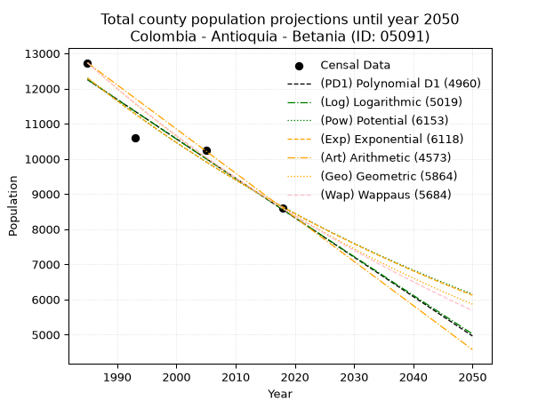
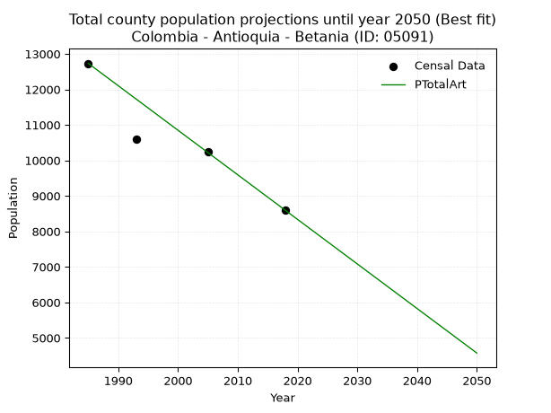
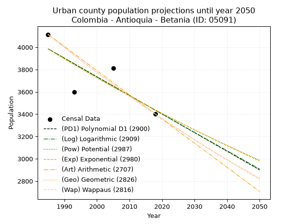
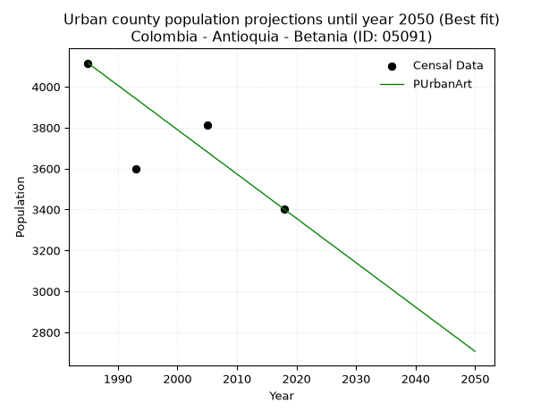
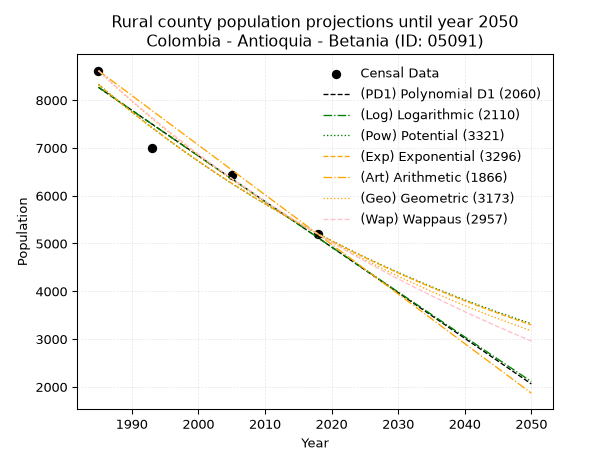
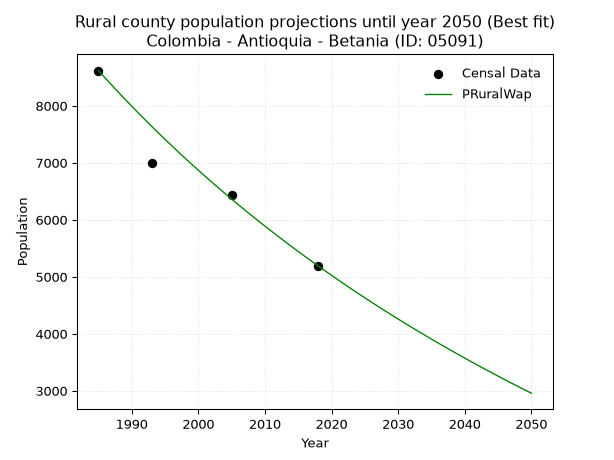

<div align="center">


</div>

# _“Population and Public Services Demand Projections (PPSD) until Year 2050 for Colombia - Antioquia - Betania (ID: 05091)”_
Keywords: `population` `public-service` `projection` `lineal` `polynomial` `logarithmic` `potential` `exponential` `arithmetic` `geometric` `wappaus` `dane` `colombia` `south-america`

PPSD are analytical estimates used by governments and planners to anticipate future changes in population size, age distribution, and the resulting community needs for utilities, healthcare, education, and infrastructure as sizing future water treatment facilities, electrical grids, and road networks based on spatial growth.

> **General running parameters**: • app_version: _v20260806_. • Python version: _3.14.7_. • Pandas version: _3.0.5_. • NumPy version: _2.5.1_. • Creates, save and include plots into reports (create_plot): _True_. • Projection until year: _2050_. • Process polynomial degree 2 and up: _False_. • Process Wappaus: _True_. • Process Wappaus: _True_. • Set negative values to zero: _True_. • Set infinite values to zero: _True_. • Drop dataset notes: _True_. 
<div align="center">

Dynamic map: [:earth_americas:Google](http://maps.google.com/maps?q=5.746150402,-75.97679) [:earth_americas:OSM](https://www.openstreetmap.org/#map=18/5.746150402/-75.97679&layers=P) [:earth_americas:Bing](https://www.bing.com/maps?cp=5.746150402~-75.97679&lvl=18) [:earth_americas:Apple](https://maps.apple.com/frame?center=5.746150402%2C-75.97679&span=0.003%2C0.006)

</div>


<div align="center">

```geojson
{
  "type": "Feature",
  "geometry": {
    "type": "Point", 
    "coordinates": [-75.97679, 5.746150402]
  }, 
  "properties": {
    "Name": "Colombia - Antioquia - Betania (ID: 05091)"
  }
}
```

</div>


## 0. Census Data (4 records)

Census data are official statistics collected by a government about the people and housing in a country. They usually include counts of total population, age, sex, race, income, education, and jobs.

📅Global census file: [Population.xlsx](../data/Population.xlsx)

| Source   |   Year |   CountryID | CountryName   |   StateID | StateName   |   CountyID | CountyName   |   PTotal |   PUrban |   PRural |
|:---------|-------:|------------:|:--------------|----------:|:------------|-----------:|:-------------|---------:|---------:|---------:|
| DANE     |   1985 |          57 | Colombia      |        05 | Antioquia   |      05091 | Betania      |    12731 |     4115 |     8616 |
| DANE     |   1993 |          57 | Colombia      |        05 | Antioquia   |      05091 | Betania      |    10597 |     3599 |     6998 |
| DANE     |   2005 |          57 | Colombia      |        05 | Antioquia   |      05091 | Betania      |    10246 |     3810 |     6436 |
| DANE     |   2018 |          57 | Colombia      |        05 | Antioquia   |      05091 | Betania      |     8589 |     3400 |     5189 |

> 🔥Some records has specific notes about the registered values or the corresponding urban or rural distribution.

## 1. Total

### 1.1. Coefficients and Parameters

* (PD1) Polynomial Deg 1: -112.16820553994276, 234905.20313127054 (lineal)
* (Log) Logarithmic: -224590.48693985984, 1717654.840985086
* (Pow) Potential: -21.49638257258062, 74.97982469847257
* (Exp) Exponential: -0.010737812307484785, 22209905493031.41
* (Art) Arithmetic: Year diff. 2018 - 1985 = 33, Population diff. 8589 - 12731 = -4142, Annual growth = -125.51515151515152
* (Geo) Geometric: Year diff. 2018 - 1985 = 33, Population diff. 8589 - 12731 = -4142, Annual growth % = -0.011855156624488772
* (Wap) Wappaus: i = -1.1774404457331287, Condition values only valid for < 200)

<sub>
Wappaus condition values: ['-0.00', '-1.18', '-2.35', '-3.53', '-4.71', '-5.89', '-7.06', '-8.24', '-9.42', '-10.60', '-11.77', '-12.95', '-14.13', '-15.31', '-16.48', '-17.66', '-18.84', '-20.02', '-21.19', '-22.37', '-23.55', '-24.73', '-25.90', '-27.08', '-28.26', '-29.44', '-30.61', '-31.79', '-32.97', '-34.15', '-35.32', '-36.50', '-37.68', '-38.86', '-40.03', '-41.21', '-42.39', '-43.57', '-44.74', '-45.92', '-47.10', '-48.28', '-49.45', '-50.63', '-51.81', '-52.98', '-54.16', '-55.34', '-56.52', '-57.69', '-58.87', '-60.05', '-61.23', '-62.40', '-63.58', '-64.76', '-65.94', '-67.11', '-68.29', '-69.47', '-70.65', '-71.82', '-73.00', '-74.18', '-75.36', '-76.53']
</sub>


### 1.2. Projected Dataset

|   Year |   CountyID |   PTotalPD1 |   PTotalLog |   PTotalPow |   PTotalExp |   PTotalArt |   PTotalGeo |   PTotalWap |
|-------:|-----------:|------------:|------------:|------------:|------------:|------------:|------------:|------------:|
|   1985 |      05091 |       12251 |       12255 |       12300 |       12296 |       12731 |       12731 |       12731 |
|   1986 |      05091 |       12139 |       12142 |       12167 |       12164 |       12605 |       12580 |       12582 |
|   1987 |      05091 |       12027 |       12029 |       12037 |       12034 |       12480 |       12431 |       12435 |
|   1988 |      05091 |       11915 |       11916 |       11907 |       11906 |       12354 |       12284 |       12289 |
|   1989 |      05091 |       11803 |       11803 |       11779 |       11779 |       12229 |       12138 |       12145 |
|   1990 |      05091 |       11690 |       11690 |       11652 |       11653 |       12103 |       11994 |       12003 |
|   1991 |      05091 |       11578 |       11577 |       11527 |       11528 |       11978 |       11852 |       11862 |
|   1992 |      05091 |       11466 |       11465 |       11404 |       11405 |       11852 |       11711 |       11723 |
|   1993 |      05091 |       11354 |       11352 |       11281 |       11284 |       11727 |       11573 |       11586 |
|   1994 |      05091 |       11242 |       11239 |       11160 |       11163 |       11601 |       11435 |       11450 |
|   1995 |      05091 |       11130 |       11127 |       11041 |       11044 |       11476 |       11300 |       11315 |
|   1996 |      05091 |       11017 |       11014 |       10922 |       10926 |       11350 |       11166 |       11182 |
|   1997 |      05091 |       10905 |       10902 |       10805 |       10809 |       11225 |       11033 |       11051 |
|   1998 |      05091 |       10793 |       10789 |       10690 |       10694 |       11099 |       10903 |       10921 |
|   1999 |      05091 |       10681 |       10677 |       10575 |       10579 |       10974 |       10773 |       10792 |
|   2000 |      05091 |       10569 |       10564 |       10462 |       10466 |       10848 |       10646 |       10665 |
|   2001 |      05091 |       10457 |       10452 |       10350 |       10355 |       10723 |       10519 |       10539 |
|   2002 |      05091 |       10344 |       10340 |       10240 |       10244 |       10597 |       10395 |       10415 |
|   2003 |      05091 |       10232 |       10228 |       10130 |       10135 |       10472 |       10271 |       10291 |
|   2004 |      05091 |       10120 |       10116 |       10022 |       10026 |       10346 |       10150 |       10169 |
|   2005 |      05091 |       10008 |       10004 |        9915 |        9919 |       10221 |       10029 |       10049 |
|   2006 |      05091 |        9896 |        9892 |        9810 |        9813 |       10095 |        9910 |        9929 |
|   2007 |      05091 |        9784 |        9780 |        9705 |        9709 |        9970 |        9793 |        9811 |
|   2008 |      05091 |        9671 |        9668 |        9602 |        9605 |        9844 |        9677 |        9694 |
|   2009 |      05091 |        9559 |        9556 |        9500 |        9502 |        9719 |        9562 |        9579 |
|   2010 |      05091 |        9447 |        9444 |        9398 |        9401 |        9593 |        9449 |        9464 |
|   2011 |      05091 |        9335 |        9333 |        9299 |        9300 |        9468 |        9337 |        9351 |
|   2012 |      05091 |        9223 |        9221 |        9200 |        9201 |        9342 |        9226 |        9239 |
|   2013 |      05091 |        9111 |        9109 |        9102 |        9103 |        9217 |        9117 |        9128 |
|   2014 |      05091 |        8998 |        8998 |        9005 |        9006 |        9091 |        9009 |        9018 |
|   2015 |      05091 |        8886 |        8886 |        8910 |        8909 |        8966 |        8902 |        8909 |
|   2016 |      05091 |        8774 |        8775 |        8815 |        8814 |        8840 |        8796 |        8801 |
|   2017 |      05091 |        8662 |        8664 |        8722 |        8720 |        8715 |        8692 |        8695 |
|   2018 |      05091 |        8550 |        8552 |        8629 |        8627 |        8589 |        8589 |        8589 |
|   2019 |      05091 |        8438 |        8441 |        8538 |        8535 |        8463 |        8487 |        8484 |
|   2020 |      05091 |        8325 |        8330 |        8447 |        8444 |        8338 |        8387 |        8381 |
|   2021 |      05091 |        8213 |        8219 |        8358 |        8354 |        8212 |        8287 |        8278 |
|   2022 |      05091 |        8101 |        8107 |        8270 |        8264 |        8087 |        8189 |        8177 |
|   2023 |      05091 |        7989 |        7996 |        8182 |        8176 |        7961 |        8092 |        8076 |
|   2024 |      05091 |        7877 |        7885 |        8096 |        8089 |        7836 |        7996 |        7977 |
|   2025 |      05091 |        7765 |        7774 |        8010 |        8002 |        7710 |        7901 |        7878 |
|   2026 |      05091 |        7652 |        7664 |        7926 |        7917 |        7585 |        7807 |        7780 |
|   2027 |      05091 |        7540 |        7553 |        7842 |        7832 |        7459 |        7715 |        7683 |
|   2028 |      05091 |        7428 |        7442 |        7759 |        7749 |        7334 |        7623 |        7587 |
|   2029 |      05091 |        7316 |        7331 |        7678 |        7666 |        7208 |        7533 |        7492 |
|   2030 |      05091 |        7204 |        7221 |        7597 |        7584 |        7083 |        7444 |        7398 |
|   2031 |      05091 |        7092 |        7110 |        7517 |        7503 |        6957 |        7355 |        7305 |
|   2032 |      05091 |        6979 |        6999 |        7438 |        7423 |        6832 |        7268 |        7213 |
|   2033 |      05091 |        6867 |        6889 |        7359 |        7344 |        6706 |        7182 |        7121 |
|   2034 |      05091 |        6755 |        6779 |        7282 |        7265 |        6581 |        7097 |        7030 |
|   2035 |      05091 |        6643 |        6668 |        7205 |        7188 |        6455 |        7013 |        6940 |
|   2036 |      05091 |        6531 |        6558 |        7130 |        7111 |        6330 |        6930 |        6851 |
|   2037 |      05091 |        6419 |        6447 |        7055 |        7035 |        6204 |        6848 |        6763 |
|   2038 |      05091 |        6306 |        6337 |        6981 |        6960 |        6079 |        6766 |        6676 |
|   2039 |      05091 |        6194 |        6227 |        6908 |        6885 |        5953 |        6686 |        6589 |
|   2040 |      05091 |        6082 |        6117 |        6835 |        6812 |        5828 |        6607 |        6503 |
|   2041 |      05091 |        5970 |        6007 |        6764 |        6739 |        5702 |        6529 |        6418 |
|   2042 |      05091 |        5858 |        5897 |        6693 |        6667 |        5577 |        6451 |        6334 |
|   2043 |      05091 |        5746 |        5787 |        6623 |        6596 |        5451 |        6375 |        6250 |
|   2044 |      05091 |        5633 |        5677 |        6553 |        6525 |        5326 |        6299 |        6167 |
|   2045 |      05091 |        5521 |        5567 |        6485 |        6456 |        5200 |        6224 |        6085 |
|   2046 |      05091 |        5409 |        5457 |        6417 |        6387 |        5075 |        6151 |        6003 |
|   2047 |      05091 |        5297 |        5348 |        6350 |        6319 |        4949 |        6078 |        5922 |
|   2048 |      05091 |        5185 |        5238 |        6284 |        6251 |        4824 |        6006 |        5842 |
|   2049 |      05091 |        5073 |        5128 |        6218 |        6184 |        4698 |        5934 |        5763 |
|   2050 |      05091 |        4960 |        5019 |        6153 |        6118 |        4573 |        5864 |        5684 |
<div align="center">

</img>

</div>


### 1.3. Filtered dataset with projected values, absolute error, relative error as percentage

Relative error puts that difference into context by dividing the absolute error by the true value, creating a unitless ratio or percentage that shows the scale of the mistake.

Absolute and relative error

|   Year | Source   |   CountryID | CountryName   |   StateID | StateName   |   CountyID_x | CountyName   |   PTotal |   PUrban |   PRural |   CountyID_y |   PTotalPD1 |   PTotalLog |   PTotalPow |   PTotalExp |   PTotalArt |   PTotalGeo |   PTotalWap |   PTotalPD1AbsError |   PTotalLogAbsError |   PTotalPowAbsError |   PTotalExpAbsError |   PTotalArtAbsError |   PTotalGeoAbsError |   PTotalWapAbsError |   PTotalPD1RelError |   PTotalLogRelError |   PTotalPowRelError |   PTotalExpRelError |   PTotalArtRelError |   PTotalGeoRelError |   PTotalWapRelError |
|-------:|:---------|------------:|:--------------|----------:|:------------|-------------:|:-------------|---------:|---------:|---------:|-------------:|------------:|------------:|------------:|------------:|------------:|------------:|------------:|--------------------:|--------------------:|--------------------:|--------------------:|--------------------:|--------------------:|--------------------:|--------------------:|--------------------:|--------------------:|--------------------:|--------------------:|--------------------:|--------------------:|
|   1985 | DANE     |          57 | Colombia      |        05 | Antioquia   |        05091 | Betania      |    12731 |     4115 |     8616 |        05091 |       12251 |       12255 |       12300 |       12296 |       12731 |       12731 |       12731 |                 480 |                 476 |                 431 |                 435 |                   0 |                   0 |                   0 |            3.77032  |            3.73891  |            3.38544  |            3.41686  |            0        |             0       |             0       |
|   1993 | DANE     |          57 | Colombia      |        05 | Antioquia   |        05091 | Betania      |    10597 |     3599 |     6998 |        05091 |       11354 |       11352 |       11281 |       11284 |       11727 |       11573 |       11586 |                 757 |                 755 |                 684 |                 687 |                1130 |                 976 |                 989 |            7.14353  |            7.12466  |            6.45466  |            6.48297  |           10.6634   |             9.21015 |             9.33283 |
|   2005 | DANE     |          57 | Colombia      |        05 | Antioquia   |        05091 | Betania      |    10246 |     3810 |     6436 |        05091 |       10008 |       10004 |        9915 |        9919 |       10221 |       10029 |       10049 |                 238 |                 242 |                 331 |                 327 |                  25 |                 217 |                 197 |            2.32286  |            2.3619   |            3.23053  |            3.19149  |            0.243998 |             2.1179  |             1.9227  |
|   2018 | DANE     |          57 | Colombia      |        05 | Antioquia   |        05091 | Betania      |     8589 |     3400 |     5189 |        05091 |        8550 |        8552 |        8629 |        8627 |        8589 |        8589 |        8589 |                  39 |                  37 |                  40 |                  38 |                   0 |                   0 |                   0 |            0.454069 |            0.430784 |            0.465712 |            0.442426 |            0        |             0       |             0       |

Relative error mean

| Method    |   RelError | Best   |
|:----------|-----------:|:-------|
| PTotalPD1 |    3.4227  |        |
| PTotalLog |    3.41406 |        |
| PTotalPow |    3.38408 |        |
| PTotalExp |    3.38343 |        |
| PTotalArt |    2.72685 | True   |
| PTotalGeo |    2.83201 |        |
| PTotalWap |    2.81388 |        |

💙Best method: _**PTotalArt**_
<div align="center">

</img>

</div>


### 1.4. Fresh water supply demand in liters per capita per day (lpcd)

The fresh water supply demand typically ranges from 100 to 300 liters per capita per day (lpcd) for standard domestic and municipal planning, though absolute survival minimums set by the World Health Organization are as low as 7.5 to 20 liters per day, and total consumption in high-income nations can exceed 400 liters.

> `CZ`: Level in meters above the sea level (masl).<br> `WS`: Fresh water supply demand in liters per capita per day (lpcd or l/h/d).<br> `WSAll`: Zonal fresh water supply demand in liters per second (l/s).<br> `A`: Zonal area in square meters.

Reference values (RAS Colombia)

|    CZ |   WS |
|------:|-----:|
|  1000 |  120 |
|  2000 |  130 |
| 99999 |  140 |

County shapefile geometry properties and water supply values

|   CountyID |      ATotal |   CZTotal |   WSTotal |
|-----------:|------------:|----------:|----------:|
|      05091 | 1.80526e+08 |   1954.45 |       130 |

Projected values for best method: PTotalArt

|   CountyID |   Year |   PTotalArt |   WSTotal |   WSTotalAll |
|-----------:|-------:|------------:|----------:|-------------:|
|      05091 |   1985 |       12731 |       130 |     19.1554  |
|      05091 |   1986 |       12605 |       130 |     18.9659  |
|      05091 |   1987 |       12480 |       130 |     18.7778  |
|      05091 |   1988 |       12354 |       130 |     18.5882  |
|      05091 |   1989 |       12229 |       130 |     18.4001  |
|      05091 |   1990 |       12103 |       130 |     18.2105  |
|      05091 |   1991 |       11978 |       130 |     18.0225  |
|      05091 |   1992 |       11852 |       130 |     17.8329  |
|      05091 |   1993 |       11727 |       130 |     17.6448  |
|      05091 |   1994 |       11601 |       130 |     17.4552  |
|      05091 |   1995 |       11476 |       130 |     17.2671  |
|      05091 |   1996 |       11350 |       130 |     17.0775  |
|      05091 |   1997 |       11225 |       130 |     16.8895  |
|      05091 |   1998 |       11099 |       130 |     16.6999  |
|      05091 |   1999 |       10974 |       130 |     16.5118  |
|      05091 |   2000 |       10848 |       130 |     16.3222  |
|      05091 |   2001 |       10723 |       130 |     16.1341  |
|      05091 |   2002 |       10597 |       130 |     15.9446  |
|      05091 |   2003 |       10472 |       130 |     15.7565  |
|      05091 |   2004 |       10346 |       130 |     15.5669  |
|      05091 |   2005 |       10221 |       130 |     15.3788  |
|      05091 |   2006 |       10095 |       130 |     15.1892  |
|      05091 |   2007 |        9970 |       130 |     15.0012  |
|      05091 |   2008 |        9844 |       130 |     14.8116  |
|      05091 |   2009 |        9719 |       130 |     14.6235  |
|      05091 |   2010 |        9593 |       130 |     14.4339  |
|      05091 |   2011 |        9468 |       130 |     14.2458  |
|      05091 |   2012 |        9342 |       130 |     14.0563  |
|      05091 |   2013 |        9217 |       130 |     13.8682  |
|      05091 |   2014 |        9091 |       130 |     13.6786  |
|      05091 |   2015 |        8966 |       130 |     13.4905  |
|      05091 |   2016 |        8840 |       130 |     13.3009  |
|      05091 |   2017 |        8715 |       130 |     13.1128  |
|      05091 |   2018 |        8589 |       130 |     12.9233  |
|      05091 |   2019 |        8463 |       130 |     12.7337  |
|      05091 |   2020 |        8338 |       130 |     12.5456  |
|      05091 |   2021 |        8212 |       130 |     12.356   |
|      05091 |   2022 |        8087 |       130 |     12.1679  |
|      05091 |   2023 |        7961 |       130 |     11.9784  |
|      05091 |   2024 |        7836 |       130 |     11.7903  |
|      05091 |   2025 |        7710 |       130 |     11.6007  |
|      05091 |   2026 |        7585 |       130 |     11.4126  |
|      05091 |   2027 |        7459 |       130 |     11.223   |
|      05091 |   2028 |        7334 |       130 |     11.035   |
|      05091 |   2029 |        7208 |       130 |     10.8454  |
|      05091 |   2030 |        7083 |       130 |     10.6573  |
|      05091 |   2031 |        6957 |       130 |     10.4677  |
|      05091 |   2032 |        6832 |       130 |     10.2796  |
|      05091 |   2033 |        6706 |       130 |     10.09    |
|      05091 |   2034 |        6581 |       130 |      9.90197 |
|      05091 |   2035 |        6455 |       130 |      9.71238 |
|      05091 |   2036 |        6330 |       130 |      9.52431 |
|      05091 |   2037 |        6204 |       130 |      9.33472 |
|      05091 |   2038 |        6079 |       130 |      9.14664 |
|      05091 |   2039 |        5953 |       130 |      8.95706 |
|      05091 |   2040 |        5828 |       130 |      8.76898 |
|      05091 |   2041 |        5702 |       130 |      8.5794  |
|      05091 |   2042 |        5577 |       130 |      8.39132 |
|      05091 |   2043 |        5451 |       130 |      8.20174 |
|      05091 |   2044 |        5326 |       130 |      8.01366 |
|      05091 |   2045 |        5200 |       130 |      7.82407 |
|      05091 |   2046 |        5075 |       130 |      7.636   |
|      05091 |   2047 |        4949 |       130 |      7.44641 |
|      05091 |   2048 |        4824 |       130 |      7.25833 |
|      05091 |   2049 |        4698 |       130 |      7.06875 |
|      05091 |   2050 |        4573 |       130 |      6.88067 |

## 2. Urban

### 2.1. Coefficients and Parameters

* (PD1) Polynomial Deg 1: -16.69851465274965, 37132.20393416249 (lineal)
* (Log) Logarithmic: -33431.8367552996, 257846.6590829585
* (Pow) Potential: -8.943893858956796, 33.09521080269313
* (Exp) Exponential: -0.004467677032066229, 28300814.22410224
* (Art) Arithmetic: Year diff. 2018 - 1985 = 33, Population diff. 3400 - 4115 = -715, Annual growth = -21.666666666666668
* (Geo) Geometric: Year diff. 2018 - 1985 = 33, Population diff. 3400 - 4115 = -715, Annual growth % = -0.005767045848137697
* (Wap) Wappaus: i = -0.5766245287203371, Condition values only valid for < 200)

<sub>
Wappaus condition values: ['-0.00', '-0.58', '-1.15', '-1.73', '-2.31', '-2.88', '-3.46', '-4.04', '-4.61', '-5.19', '-5.77', '-6.34', '-6.92', '-7.50', '-8.07', '-8.65', '-9.23', '-9.80', '-10.38', '-10.96', '-11.53', '-12.11', '-12.69', '-13.26', '-13.84', '-14.42', '-14.99', '-15.57', '-16.15', '-16.72', '-17.30', '-17.88', '-18.45', '-19.03', '-19.61', '-20.18', '-20.76', '-21.34', '-21.91', '-22.49', '-23.06', '-23.64', '-24.22', '-24.79', '-25.37', '-25.95', '-26.52', '-27.10', '-27.68', '-28.25', '-28.83', '-29.41', '-29.98', '-30.56', '-31.14', '-31.71', '-32.29', '-32.87', '-33.44', '-34.02', '-34.60', '-35.17', '-35.75', '-36.33', '-36.90', '-37.48']
</sub>


### 2.2. Projected Dataset

|   Year |   CountyID |   PUrbanPD1 |   PUrbanLog |   PUrbanPow |   PUrbanExp |   PUrbanArt |   PUrbanGeo |   PUrbanWap |
|-------:|-----------:|------------:|------------:|------------:|------------:|------------:|------------:|------------:|
|   1985 |      05091 |        3986 |        3986 |        3985 |        3984 |        4115 |        4115 |        4115 |
|   1986 |      05091 |        3969 |        3969 |        3967 |        3966 |        4093 |        4091 |        4091 |
|   1987 |      05091 |        3952 |        3953 |        3949 |        3949 |        4072 |        4068 |        4068 |
|   1988 |      05091 |        3936 |        3936 |        3931 |        3931 |        4050 |        4044 |        4044 |
|   1989 |      05091 |        3919 |        3919 |        3914 |        3914 |        4028 |        4021 |        4021 |
|   1990 |      05091 |        3902 |        3902 |        3896 |        3896 |        4007 |        3998 |        3998 |
|   1991 |      05091 |        3885 |        3885 |        3879 |        3879 |        3985 |        3975 |        3975 |
|   1992 |      05091 |        3869 |        3869 |        3861 |        3861 |        3963 |        3952 |        3952 |
|   1993 |      05091 |        3852 |        3852 |        3844 |        3844 |        3942 |        3929 |        3929 |
|   1994 |      05091 |        3835 |        3835 |        3827 |        3827 |        3920 |        3906 |        3907 |
|   1995 |      05091 |        3819 |        3818 |        3810 |        3810 |        3898 |        3884 |        3884 |
|   1996 |      05091 |        3802 |        3801 |        3792 |        3793 |        3877 |        3861 |        3862 |
|   1997 |      05091 |        3785 |        3785 |        3776 |        3776 |        3855 |        3839 |        3840 |
|   1998 |      05091 |        3769 |        3768 |        3759 |        3759 |        3833 |        3817 |        3818 |
|   1999 |      05091 |        3752 |        3751 |        3742 |        3743 |        3812 |        3795 |        3796 |
|   2000 |      05091 |        3735 |        3735 |        3725 |        3726 |        3790 |        3773 |        3774 |
|   2001 |      05091 |        3718 |        3718 |        3709 |        3709 |        3768 |        3751 |        3752 |
|   2002 |      05091 |        3702 |        3701 |        3692 |        3693 |        3747 |        3730 |        3730 |
|   2003 |      05091 |        3685 |        3684 |        3676 |        3676 |        3725 |        3708 |        3709 |
|   2004 |      05091 |        3668 |        3668 |        3659 |        3660 |        3703 |        3687 |        3688 |
|   2005 |      05091 |        3652 |        3651 |        3643 |        3644 |        3682 |        3665 |        3666 |
|   2006 |      05091 |        3635 |        3634 |        3627 |        3627 |        3660 |        3644 |        3645 |
|   2007 |      05091 |        3618 |        3618 |        3611 |        3611 |        3638 |        3623 |        3624 |
|   2008 |      05091 |        3602 |        3601 |        3595 |        3595 |        3617 |        3602 |        3603 |
|   2009 |      05091 |        3585 |        3584 |        3579 |        3579 |        3595 |        3582 |        3582 |
|   2010 |      05091 |        3568 |        3568 |        3563 |        3563 |        3573 |        3561 |        3562 |
|   2011 |      05091 |        3551 |        3551 |        3547 |        3547 |        3552 |        3540 |        3541 |
|   2012 |      05091 |        3535 |        3535 |        3531 |        3531 |        3530 |        3520 |        3521 |
|   2013 |      05091 |        3518 |        3518 |        3515 |        3516 |        3508 |        3500 |        3500 |
|   2014 |      05091 |        3501 |        3501 |        3500 |        3500 |        3487 |        3480 |        3480 |
|   2015 |      05091 |        3485 |        3485 |        3484 |        3484 |        3465 |        3460 |        3460 |
|   2016 |      05091 |        3468 |        3468 |        3469 |        3469 |        3443 |        3440 |        3440 |
|   2017 |      05091 |        3451 |        3452 |        3454 |        3453 |        3422 |        3420 |        3420 |
|   2018 |      05091 |        3435 |        3435 |        3438 |        3438 |        3400 |        3400 |        3400 |
|   2019 |      05091 |        3418 |        3418 |        3423 |        3423 |        3378 |        3380 |        3380 |
|   2020 |      05091 |        3401 |        3402 |        3408 |        3407 |        3357 |        3361 |        3361 |
|   2021 |      05091 |        3385 |        3385 |        3393 |        3392 |        3335 |        3342 |        3341 |
|   2022 |      05091 |        3368 |        3369 |        3378 |        3377 |        3313 |        3322 |        3322 |
|   2023 |      05091 |        3351 |        3352 |        3363 |        3362 |        3292 |        3303 |        3302 |
|   2024 |      05091 |        3334 |        3336 |        3348 |        3347 |        3270 |        3284 |        3283 |
|   2025 |      05091 |        3318 |        3319 |        3333 |        3332 |        3248 |        3265 |        3264 |
|   2026 |      05091 |        3301 |        3303 |        3319 |        3317 |        3227 |        3246 |        3245 |
|   2027 |      05091 |        3284 |        3286 |        3304 |        3302 |        3205 |        3228 |        3226 |
|   2028 |      05091 |        3268 |        3270 |        3290 |        3288 |        3183 |        3209 |        3207 |
|   2029 |      05091 |        3251 |        3253 |        3275 |        3273 |        3162 |        3190 |        3188 |
|   2030 |      05091 |        3234 |        3237 |        3261 |        3258 |        3140 |        3172 |        3170 |
|   2031 |      05091 |        3218 |        3220 |        3246 |        3244 |        3118 |        3154 |        3151 |
|   2032 |      05091 |        3201 |        3204 |        3232 |        3229 |        3097 |        3136 |        3133 |
|   2033 |      05091 |        3184 |        3187 |        3218 |        3215 |        3075 |        3117 |        3115 |
|   2034 |      05091 |        3167 |        3171 |        3204 |        3201 |        3053 |        3099 |        3096 |
|   2035 |      05091 |        3151 |        3155 |        3190 |        3186 |        3032 |        3082 |        3078 |
|   2036 |      05091 |        3134 |        3138 |        3176 |        3172 |        3010 |        3064 |        3060 |
|   2037 |      05091 |        3117 |        3122 |        3162 |        3158 |        2988 |        3046 |        3042 |
|   2038 |      05091 |        3101 |        3105 |        3148 |        3144 |        2967 |        3029 |        3024 |
|   2039 |      05091 |        3084 |        3089 |        3134 |        3130 |        2945 |        3011 |        3006 |
|   2040 |      05091 |        3067 |        3072 |        3121 |        3116 |        2923 |        2994 |        2989 |
|   2041 |      05091 |        3051 |        3056 |        3107 |        3102 |        2902 |        2977 |        2971 |
|   2042 |      05091 |        3034 |        3040 |        3093 |        3088 |        2880 |        2959 |        2953 |
|   2043 |      05091 |        3017 |        3023 |        3080 |        3075 |        2858 |        2942 |        2936 |
|   2044 |      05091 |        3000 |        3007 |        3066 |        3061 |        2837 |        2925 |        2919 |
|   2045 |      05091 |        2984 |        2991 |        3053 |        3047 |        2815 |        2908 |        2901 |
|   2046 |      05091 |        2967 |        2974 |        3040 |        3034 |        2793 |        2892 |        2884 |
|   2047 |      05091 |        2950 |        2958 |        3026 |        3020 |        2772 |        2875 |        2867 |
|   2048 |      05091 |        2934 |        2942 |        3013 |        3007 |        2750 |        2858 |        2850 |
|   2049 |      05091 |        2917 |        2925 |        3000 |        2993 |        2728 |        2842 |        2833 |
|   2050 |      05091 |        2900 |        2909 |        2987 |        2980 |        2707 |        2826 |        2816 |
<div align="center">

</img>

</div>


### 2.3. Filtered dataset with projected values, absolute error, relative error as percentage

Relative error puts that difference into context by dividing the absolute error by the true value, creating a unitless ratio or percentage that shows the scale of the mistake.

Absolute and relative error

|   Year | Source   |   CountryID | CountryName   |   StateID | StateName   |   CountyID_x | CountyName   |   PTotal |   PUrban |   PRural |   CountyID_y |   PUrbanPD1 |   PUrbanLog |   PUrbanPow |   PUrbanExp |   PUrbanArt |   PUrbanGeo |   PUrbanWap |   PUrbanPD1AbsError |   PUrbanLogAbsError |   PUrbanPowAbsError |   PUrbanExpAbsError |   PUrbanArtAbsError |   PUrbanGeoAbsError |   PUrbanWapAbsError |   PUrbanPD1RelError |   PUrbanLogRelError |   PUrbanPowRelError |   PUrbanExpRelError |   PUrbanArtRelError |   PUrbanGeoRelError |   PUrbanWapRelError |
|-------:|:---------|------------:|:--------------|----------:|:------------|-------------:|:-------------|---------:|---------:|---------:|-------------:|------------:|------------:|------------:|------------:|------------:|------------:|------------:|--------------------:|--------------------:|--------------------:|--------------------:|--------------------:|--------------------:|--------------------:|--------------------:|--------------------:|--------------------:|--------------------:|--------------------:|--------------------:|--------------------:|
|   1985 | DANE     |          57 | Colombia      |        05 | Antioquia   |        05091 | Betania      |    12731 |     4115 |     8616 |        05091 |        3986 |        3986 |        3985 |        3984 |        4115 |        4115 |        4115 |                 129 |                 129 |                 130 |                 131 |                   0 |                   0 |                   0 |             3.13487 |             3.13487 |             3.15917 |             3.18348 |             0       |             0       |             0       |
|   1993 | DANE     |          57 | Colombia      |        05 | Antioquia   |        05091 | Betania      |    10597 |     3599 |     6998 |        05091 |        3852 |        3852 |        3844 |        3844 |        3942 |        3929 |        3929 |                 253 |                 253 |                 245 |                 245 |                 343 |                 330 |                 330 |             7.02973 |             7.02973 |             6.80745 |             6.80745 |             9.53043 |             9.16921 |             9.16921 |
|   2005 | DANE     |          57 | Colombia      |        05 | Antioquia   |        05091 | Betania      |    10246 |     3810 |     6436 |        05091 |        3652 |        3651 |        3643 |        3644 |        3682 |        3665 |        3666 |                 158 |                 159 |                 167 |                 166 |                 128 |                 145 |                 144 |             4.14698 |             4.17323 |             4.3832  |             4.35696 |             3.35958 |             3.80577 |             3.77953 |
|   2018 | DANE     |          57 | Colombia      |        05 | Antioquia   |        05091 | Betania      |     8589 |     3400 |     5189 |        05091 |        3435 |        3435 |        3438 |        3438 |        3400 |        3400 |        3400 |                  35 |                  35 |                  38 |                  38 |                   0 |                   0 |                   0 |             1.02941 |             1.02941 |             1.11765 |             1.11765 |             0       |             0       |             0       |

Relative error mean

| Method    |   RelError | Best   |
|:----------|-----------:|:-------|
| PUrbanPD1 |    3.83525 |        |
| PUrbanLog |    3.84181 |        |
| PUrbanPow |    3.86687 |        |
| PUrbanExp |    3.86638 |        |
| PUrbanArt |    3.2225  | True   |
| PUrbanGeo |    3.24375 |        |
| PUrbanWap |    3.23719 |        |

💙Best method: _**PUrbanArt**_
<div align="center">

</img>

</div>


### 2.4. Fresh water supply demand in liters per capita per day (lpcd)

The fresh water supply demand typically ranges from 100 to 300 liters per capita per day (lpcd) for standard domestic and municipal planning, though absolute survival minimums set by the World Health Organization are as low as 7.5 to 20 liters per day, and total consumption in high-income nations can exceed 400 liters.

> `CZ`: Level in meters above the sea level (masl).<br> `WS`: Fresh water supply demand in liters per capita per day (lpcd or l/h/d).<br> `WSAll`: Zonal fresh water supply demand in liters per second (l/s).<br> `A`: Zonal area in square meters.

Reference values (RAS Colombia)

|    CZ |   WS |
|------:|-----:|
|  1000 |  120 |
|  2000 |  130 |
| 99999 |  140 |

County shapefile geometry properties and water supply values

|   CountyID |   AUrban |   CZUrban |   WSUrban |
|-----------:|---------:|----------:|----------:|
|      05091 |   375118 |   1560.62 |       130 |

Projected values for best method: PUrbanArt

|   CountyID |   Year |   PUrbanArt |   WSUrban |   WSUrbanAll |
|-----------:|-------:|------------:|----------:|-------------:|
|      05091 |   1985 |        4115 |       130 |      6.19155 |
|      05091 |   1986 |        4093 |       130 |      6.15845 |
|      05091 |   1987 |        4072 |       130 |      6.12685 |
|      05091 |   1988 |        4050 |       130 |      6.09375 |
|      05091 |   1989 |        4028 |       130 |      6.06065 |
|      05091 |   1990 |        4007 |       130 |      6.02905 |
|      05091 |   1991 |        3985 |       130 |      5.99595 |
|      05091 |   1992 |        3963 |       130 |      5.96285 |
|      05091 |   1993 |        3942 |       130 |      5.93125 |
|      05091 |   1994 |        3920 |       130 |      5.89815 |
|      05091 |   1995 |        3898 |       130 |      5.86505 |
|      05091 |   1996 |        3877 |       130 |      5.83345 |
|      05091 |   1997 |        3855 |       130 |      5.80035 |
|      05091 |   1998 |        3833 |       130 |      5.76725 |
|      05091 |   1999 |        3812 |       130 |      5.73565 |
|      05091 |   2000 |        3790 |       130 |      5.70255 |
|      05091 |   2001 |        3768 |       130 |      5.66944 |
|      05091 |   2002 |        3747 |       130 |      5.63785 |
|      05091 |   2003 |        3725 |       130 |      5.60475 |
|      05091 |   2004 |        3703 |       130 |      5.57164 |
|      05091 |   2005 |        3682 |       130 |      5.54005 |
|      05091 |   2006 |        3660 |       130 |      5.50694 |
|      05091 |   2007 |        3638 |       130 |      5.47384 |
|      05091 |   2008 |        3617 |       130 |      5.44225 |
|      05091 |   2009 |        3595 |       130 |      5.40914 |
|      05091 |   2010 |        3573 |       130 |      5.37604 |
|      05091 |   2011 |        3552 |       130 |      5.34444 |
|      05091 |   2012 |        3530 |       130 |      5.31134 |
|      05091 |   2013 |        3508 |       130 |      5.27824 |
|      05091 |   2014 |        3487 |       130 |      5.24664 |
|      05091 |   2015 |        3465 |       130 |      5.21354 |
|      05091 |   2016 |        3443 |       130 |      5.18044 |
|      05091 |   2017 |        3422 |       130 |      5.14884 |
|      05091 |   2018 |        3400 |       130 |      5.11574 |
|      05091 |   2019 |        3378 |       130 |      5.08264 |
|      05091 |   2020 |        3357 |       130 |      5.05104 |
|      05091 |   2021 |        3335 |       130 |      5.01794 |
|      05091 |   2022 |        3313 |       130 |      4.98484 |
|      05091 |   2023 |        3292 |       130 |      4.95324 |
|      05091 |   2024 |        3270 |       130 |      4.92014 |
|      05091 |   2025 |        3248 |       130 |      4.88704 |
|      05091 |   2026 |        3227 |       130 |      4.85544 |
|      05091 |   2027 |        3205 |       130 |      4.82234 |
|      05091 |   2028 |        3183 |       130 |      4.78924 |
|      05091 |   2029 |        3162 |       130 |      4.75764 |
|      05091 |   2030 |        3140 |       130 |      4.72454 |
|      05091 |   2031 |        3118 |       130 |      4.69144 |
|      05091 |   2032 |        3097 |       130 |      4.65984 |
|      05091 |   2033 |        3075 |       130 |      4.62674 |
|      05091 |   2034 |        3053 |       130 |      4.59363 |
|      05091 |   2035 |        3032 |       130 |      4.56204 |
|      05091 |   2036 |        3010 |       130 |      4.52894 |
|      05091 |   2037 |        2988 |       130 |      4.49583 |
|      05091 |   2038 |        2967 |       130 |      4.46424 |
|      05091 |   2039 |        2945 |       130 |      4.43113 |
|      05091 |   2040 |        2923 |       130 |      4.39803 |
|      05091 |   2041 |        2902 |       130 |      4.36644 |
|      05091 |   2042 |        2880 |       130 |      4.33333 |
|      05091 |   2043 |        2858 |       130 |      4.30023 |
|      05091 |   2044 |        2837 |       130 |      4.26863 |
|      05091 |   2045 |        2815 |       130 |      4.23553 |
|      05091 |   2046 |        2793 |       130 |      4.20243 |
|      05091 |   2047 |        2772 |       130 |      4.17083 |
|      05091 |   2048 |        2750 |       130 |      4.13773 |
|      05091 |   2049 |        2728 |       130 |      4.10463 |
|      05091 |   2050 |        2707 |       130 |      4.07303 |

## 3. Rural

### 3.1. Coefficients and Parameters

* (PD1) Polynomial Deg 1: -95.46969088719307, 197772.99919710794 (lineal)
* (Log) Logarithmic: -191158.65018456028, 1459808.1819021276
* (Pow) Potential: -28.540255720654883, 98.03954337958024
* (Exp) Exponential: -0.014256658520541086, 1.6244972570202968e+16
* (Art) Arithmetic: Year diff. 2018 - 1985 = 33, Population diff. 5189 - 8616 = -3427, Annual growth = -103.84848484848484
* (Geo) Geometric: Year diff. 2018 - 1985 = 33, Population diff. 5189 - 8616 = -3427, Annual growth % = -0.01524860326964006
* (Wap) Wappaus: i = -1.50450539440036, Condition values only valid for < 200)

<sub>
Wappaus condition values: ['-0.00', '-1.50', '-3.01', '-4.51', '-6.02', '-7.52', '-9.03', '-10.53', '-12.04', '-13.54', '-15.05', '-16.55', '-18.05', '-19.56', '-21.06', '-22.57', '-24.07', '-25.58', '-27.08', '-28.59', '-30.09', '-31.59', '-33.10', '-34.60', '-36.11', '-37.61', '-39.12', '-40.62', '-42.13', '-43.63', '-45.14', '-46.64', '-48.14', '-49.65', '-51.15', '-52.66', '-54.16', '-55.67', '-57.17', '-58.68', '-60.18', '-61.68', '-63.19', '-64.69', '-66.20', '-67.70', '-69.21', '-70.71', '-72.22', '-73.72', '-75.23', '-76.73', '-78.23', '-79.74', '-81.24', '-82.75', '-84.25', '-85.76', '-87.26', '-88.77', '-90.27', '-91.77', '-93.28', '-94.78', '-96.29', '-97.79']
</sub>


### 3.2. Projected Dataset

|   Year |   CountyID |   PRuralPD1 |   PRuralLog |   PRuralPow |   PRuralExp |   PRuralArt |   PRuralGeo |   PRuralWap |
|-------:|-----------:|------------:|------------:|------------:|------------:|------------:|------------:|------------:|
|   1985 |      05091 |        8266 |        8269 |        8329 |        8326 |        8616 |        8616 |        8616 |
|   1986 |      05091 |        8170 |        8173 |        8211 |        8208 |        8512 |        8485 |        8487 |
|   1987 |      05091 |        8075 |        8077 |        8093 |        8092 |        8408 |        8355 |        8361 |
|   1988 |      05091 |        7979 |        7980 |        7978 |        7977 |        8304 |        8228 |        8236 |
|   1989 |      05091 |        7884 |        7884 |        7864 |        7864 |        8201 |        8102 |        8113 |
|   1990 |      05091 |        7788 |        7788 |        7752 |        7753 |        8097 |        7979 |        7991 |
|   1991 |      05091 |        7693 |        7692 |        7642 |        7643 |        7993 |        7857 |        7872 |
|   1992 |      05091 |        7597 |        7596 |        7533 |        7535 |        7889 |        7737 |        7754 |
|   1993 |      05091 |        7502 |        7500 |        7426 |        7428 |        7785 |        7619 |        7638 |
|   1994 |      05091 |        7406 |        7404 |        7321 |        7323 |        7681 |        7503 |        7523 |
|   1995 |      05091 |        7311 |        7308 |        7217 |        7219 |        7578 |        7389 |        7410 |
|   1996 |      05091 |        7215 |        7213 |        7114 |        7117 |        7474 |        7276 |        7299 |
|   1997 |      05091 |        7120 |        7117 |        7013 |        7016 |        7370 |        7165 |        7189 |
|   1998 |      05091 |        7025 |        7021 |        6914 |        6917 |        7266 |        7056 |        7081 |
|   1999 |      05091 |        6929 |        6926 |        6816 |        6819 |        7162 |        6948 |        6974 |
|   2000 |      05091 |        6834 |        6830 |        6719 |        6723 |        7058 |        6842 |        6869 |
|   2001 |      05091 |        6738 |        6734 |        6624 |        6628 |        6954 |        6738 |        6765 |
|   2002 |      05091 |        6643 |        6639 |        6530 |        6534 |        6851 |        6635 |        6662 |
|   2003 |      05091 |        6547 |        6543 |        6438 |        6441 |        6747 |        6534 |        6561 |
|   2004 |      05091 |        6452 |        6448 |        6347 |        6350 |        6643 |        6434 |        6461 |
|   2005 |      05091 |        6356 |        6353 |        6257 |        6260 |        6539 |        6336 |        6362 |
|   2006 |      05091 |        6261 |        6257 |        6168 |        6172 |        6435 |        6240 |        6265 |
|   2007 |      05091 |        6165 |        6162 |        6081 |        6084 |        6331 |        6145 |        6169 |
|   2008 |      05091 |        6070 |        6067 |        5995 |        5998 |        6227 |        6051 |        6074 |
|   2009 |      05091 |        5974 |        5972 |        5911 |        5913 |        6124 |        5959 |        5981 |
|   2010 |      05091 |        5879 |        5877 |        5828 |        5829 |        6020 |        5868 |        5888 |
|   2011 |      05091 |        5783 |        5781 |        5745 |        5747 |        5916 |        5778 |        5797 |
|   2012 |      05091 |        5688 |        5686 |        5664 |        5666 |        5812 |        5690 |        5707 |
|   2013 |      05091 |        5593 |        5591 |        5585 |        5585 |        5708 |        5603 |        5618 |
|   2014 |      05091 |        5497 |        5496 |        5506 |        5506 |        5604 |        5518 |        5530 |
|   2015 |      05091 |        5402 |        5402 |        5429 |        5428 |        5501 |        5434 |        5443 |
|   2016 |      05091 |        5306 |        5307 |        5352 |        5352 |        5397 |        5351 |        5357 |
|   2017 |      05091 |        5211 |        5212 |        5277 |        5276 |        5293 |        5269 |        5273 |
|   2018 |      05091 |        5115 |        5117 |        5203 |        5201 |        5189 |        5189 |        5189 |
|   2019 |      05091 |        5020 |        5022 |        5130 |        5127 |        5085 |        5110 |        5106 |
|   2020 |      05091 |        4924 |        4928 |        5058 |        5055 |        4981 |        5032 |        5025 |
|   2021 |      05091 |        4829 |        4833 |        4987 |        4983 |        4877 |        4955 |        4944 |
|   2022 |      05091 |        4733 |        4739 |        4917 |        4913 |        4774 |        4880 |        4864 |
|   2023 |      05091 |        4638 |        4644 |        4848 |        4843 |        4670 |        4805 |        4785 |
|   2024 |      05091 |        4542 |        4550 |        4780 |        4775 |        4566 |        4732 |        4707 |
|   2025 |      05091 |        4447 |        4455 |        4713 |        4707 |        4462 |        4660 |        4630 |
|   2026 |      05091 |        4351 |        4361 |        4647 |        4640 |        4358 |        4589 |        4554 |
|   2027 |      05091 |        4256 |        4267 |        4582 |        4575 |        4254 |        4519 |        4479 |
|   2028 |      05091 |        4160 |        4172 |        4518 |        4510 |        4151 |        4450 |        4404 |
|   2029 |      05091 |        4065 |        4078 |        4455 |        4446 |        4047 |        4382 |        4331 |
|   2030 |      05091 |        3970 |        3984 |        4393 |        4383 |        3943 |        4315 |        4258 |
|   2031 |      05091 |        3874 |        3890 |        4332 |        4321 |        3839 |        4249 |        4186 |
|   2032 |      05091 |        3779 |        3796 |        4271 |        4260 |        3735 |        4185 |        4115 |
|   2033 |      05091 |        3683 |        3702 |        4212 |        4200 |        3631 |        4121 |        4045 |
|   2034 |      05091 |        3588 |        3608 |        4153 |        4140 |        3527 |        4058 |        3975 |
|   2035 |      05091 |        3492 |        3514 |        4095 |        4082 |        3424 |        3996 |        3906 |
|   2036 |      05091 |        3397 |        3420 |        4038 |        4024 |        3320 |        3935 |        3838 |
|   2037 |      05091 |        3301 |        3326 |        3982 |        3967 |        3216 |        3875 |        3771 |
|   2038 |      05091 |        3206 |        3232 |        3927 |        3911 |        3112 |        3816 |        3704 |
|   2039 |      05091 |        3110 |        3138 |        3872 |        3855 |        3008 |        3758 |        3638 |
|   2040 |      05091 |        3015 |        3044 |        3818 |        3801 |        2904 |        3701 |        3573 |
|   2041 |      05091 |        2919 |        2951 |        3765 |        3747 |        2800 |        3644 |        3508 |
|   2042 |      05091 |        2824 |        2857 |        3713 |        3694 |        2697 |        3589 |        3445 |
|   2043 |      05091 |        2728 |        2764 |        3661 |        3642 |        2593 |        3534 |        3381 |
|   2044 |      05091 |        2633 |        2670 |        3611 |        3590 |        2489 |        3480 |        3319 |
|   2045 |      05091 |        2537 |        2577 |        3560 |        3539 |        2385 |        3427 |        3257 |
|   2046 |      05091 |        2442 |        2483 |        3511 |        3489 |        2281 |        3375 |        3196 |
|   2047 |      05091 |        2347 |        2390 |        3463 |        3440 |        2177 |        3323 |        3135 |
|   2048 |      05091 |        2251 |        2296 |        3415 |        3391 |        2074 |        3273 |        3075 |
|   2049 |      05091 |        2156 |        2203 |        3367 |        3343 |        1970 |        3223 |        3016 |
|   2050 |      05091 |        2060 |        2110 |        3321 |        3296 |        1866 |        3173 |        2957 |
<div align="center">

</img>

</div>


### 3.3. Filtered dataset with projected values, absolute error, relative error as percentage

Relative error puts that difference into context by dividing the absolute error by the true value, creating a unitless ratio or percentage that shows the scale of the mistake.

Absolute and relative error

|   Year | Source   |   CountryID | CountryName   |   StateID | StateName   |   CountyID_x | CountyName   |   PTotal |   PUrban |   PRural |   CountyID_y |   PRuralPD1 |   PRuralLog |   PRuralPow |   PRuralExp |   PRuralArt |   PRuralGeo |   PRuralWap |   PRuralPD1AbsError |   PRuralLogAbsError |   PRuralPowAbsError |   PRuralExpAbsError |   PRuralArtAbsError |   PRuralGeoAbsError |   PRuralWapAbsError |   PRuralPD1RelError |   PRuralLogRelError |   PRuralPowRelError |   PRuralExpRelError |   PRuralArtRelError |   PRuralGeoRelError |   PRuralWapRelError |
|-------:|:---------|------------:|:--------------|----------:|:------------|-------------:|:-------------|---------:|---------:|---------:|-------------:|------------:|------------:|------------:|------------:|------------:|------------:|------------:|--------------------:|--------------------:|--------------------:|--------------------:|--------------------:|--------------------:|--------------------:|--------------------:|--------------------:|--------------------:|--------------------:|--------------------:|--------------------:|--------------------:|
|   1985 | DANE     |          57 | Colombia      |        05 | Antioquia   |        05091 | Betania      |    12731 |     4115 |     8616 |        05091 |        8266 |        8269 |        8329 |        8326 |        8616 |        8616 |        8616 |                 350 |                 347 |                 287 |                 290 |                   0 |                   0 |                   0 |             4.06221 |             4.02739 |            3.33101  |            3.36583  |             0       |             0       |             0       |
|   1993 | DANE     |          57 | Colombia      |        05 | Antioquia   |        05091 | Betania      |    10597 |     3599 |     6998 |        05091 |        7502 |        7500 |        7426 |        7428 |        7785 |        7619 |        7638 |                 504 |                 502 |                 428 |                 430 |                 787 |                 621 |                 640 |             7.20206 |             7.17348 |            6.11603  |            6.14461  |            11.2461  |             8.87396 |             9.14547 |
|   2005 | DANE     |          57 | Colombia      |        05 | Antioquia   |        05091 | Betania      |    10246 |     3810 |     6436 |        05091 |        6356 |        6353 |        6257 |        6260 |        6539 |        6336 |        6362 |                  80 |                  83 |                 179 |                 176 |                 103 |                 100 |                  74 |             1.24301 |             1.28962 |            2.78123  |            2.73462  |             1.60037 |             1.55376 |             1.14978 |
|   2018 | DANE     |          57 | Colombia      |        05 | Antioquia   |        05091 | Betania      |     8589 |     3400 |     5189 |        05091 |        5115 |        5117 |        5203 |        5201 |        5189 |        5189 |        5189 |                  74 |                  72 |                  14 |                  12 |                   0 |                   0 |                   0 |             1.42609 |             1.38755 |            0.269802 |            0.231258 |             0       |             0       |             0       |

Relative error mean

| Method    |   RelError | Best   |
|:----------|-----------:|:-------|
| PRuralPD1 |    3.48334 |        |
| PRuralLog |    3.46951 |        |
| PRuralPow |    3.12452 |        |
| PRuralExp |    3.11908 |        |
| PRuralArt |    3.21161 |        |
| PRuralGeo |    2.60693 |        |
| PRuralWap |    2.57381 | True   |

💙Best method: _**PRuralWap**_
<div align="center">

</img>

</div>


### 3.4. Fresh water supply demand in liters per capita per day (lpcd)

The fresh water supply demand typically ranges from 100 to 300 liters per capita per day (lpcd) for standard domestic and municipal planning, though absolute survival minimums set by the World Health Organization are as low as 7.5 to 20 liters per day, and total consumption in high-income nations can exceed 400 liters.

> `CZ`: Level in meters above the sea level (masl).<br> `WS`: Fresh water supply demand in liters per capita per day (lpcd or l/h/d).<br> `WSAll`: Zonal fresh water supply demand in liters per second (l/s).<br> `A`: Zonal area in square meters.

Reference values (RAS Colombia)

|    CZ |   WS |
|------:|-----:|
|  1000 |  120 |
|  2000 |  130 |
| 99999 |  140 |

County shapefile geometry properties and water supply values

|   CountyID |      ARural |   CZRural |   WSRural |
|-----------:|------------:|----------:|----------:|
|      05091 | 1.80151e+08 |   1955.23 |       130 |

Projected values for best method: PRuralWap

|   CountyID |   Year |   PRuralWap |   WSRural |   WSRuralAll |
|-----------:|-------:|------------:|----------:|-------------:|
|      05091 |   1985 |        8616 |       130 |     12.9639  |
|      05091 |   1986 |        8487 |       130 |     12.7698  |
|      05091 |   1987 |        8361 |       130 |     12.5802  |
|      05091 |   1988 |        8236 |       130 |     12.3921  |
|      05091 |   1989 |        8113 |       130 |     12.2071  |
|      05091 |   1990 |        7991 |       130 |     12.0235  |
|      05091 |   1991 |        7872 |       130 |     11.8444  |
|      05091 |   1992 |        7754 |       130 |     11.6669  |
|      05091 |   1993 |        7638 |       130 |     11.4924  |
|      05091 |   1994 |        7523 |       130 |     11.3193  |
|      05091 |   1995 |        7410 |       130 |     11.1493  |
|      05091 |   1996 |        7299 |       130 |     10.9823  |
|      05091 |   1997 |        7189 |       130 |     10.8168  |
|      05091 |   1998 |        7081 |       130 |     10.6543  |
|      05091 |   1999 |        6974 |       130 |     10.4933  |
|      05091 |   2000 |        6869 |       130 |     10.3353  |
|      05091 |   2001 |        6765 |       130 |     10.1788  |
|      05091 |   2002 |        6662 |       130 |     10.0238  |
|      05091 |   2003 |        6561 |       130 |      9.87187 |
|      05091 |   2004 |        6461 |       130 |      9.72141 |
|      05091 |   2005 |        6362 |       130 |      9.57245 |
|      05091 |   2006 |        6265 |       130 |      9.4265  |
|      05091 |   2007 |        6169 |       130 |      9.28206 |
|      05091 |   2008 |        6074 |       130 |      9.13912 |
|      05091 |   2009 |        5981 |       130 |      8.99919 |
|      05091 |   2010 |        5888 |       130 |      8.85926 |
|      05091 |   2011 |        5797 |       130 |      8.72234 |
|      05091 |   2012 |        5707 |       130 |      8.58692 |
|      05091 |   2013 |        5618 |       130 |      8.45301 |
|      05091 |   2014 |        5530 |       130 |      8.3206  |
|      05091 |   2015 |        5443 |       130 |      8.1897  |
|      05091 |   2016 |        5357 |       130 |      8.0603  |
|      05091 |   2017 |        5273 |       130 |      7.93391 |
|      05091 |   2018 |        5189 |       130 |      7.80752 |
|      05091 |   2019 |        5106 |       130 |      7.68264 |
|      05091 |   2020 |        5025 |       130 |      7.56076 |
|      05091 |   2021 |        4944 |       130 |      7.43889 |
|      05091 |   2022 |        4864 |       130 |      7.31852 |
|      05091 |   2023 |        4785 |       130 |      7.19965 |
|      05091 |   2024 |        4707 |       130 |      7.08229 |
|      05091 |   2025 |        4630 |       130 |      6.96644 |
|      05091 |   2026 |        4554 |       130 |      6.85208 |
|      05091 |   2027 |        4479 |       130 |      6.73924 |
|      05091 |   2028 |        4404 |       130 |      6.62639 |
|      05091 |   2029 |        4331 |       130 |      6.51655 |
|      05091 |   2030 |        4258 |       130 |      6.40671 |
|      05091 |   2031 |        4186 |       130 |      6.29838 |
|      05091 |   2032 |        4115 |       130 |      6.19155 |
|      05091 |   2033 |        4045 |       130 |      6.08623 |
|      05091 |   2034 |        3975 |       130 |      5.9809  |
|      05091 |   2035 |        3906 |       130 |      5.87708 |
|      05091 |   2036 |        3838 |       130 |      5.77477 |
|      05091 |   2037 |        3771 |       130 |      5.67396 |
|      05091 |   2038 |        3704 |       130 |      5.57315 |
|      05091 |   2039 |        3638 |       130 |      5.47384 |
|      05091 |   2040 |        3573 |       130 |      5.37604 |
|      05091 |   2041 |        3508 |       130 |      5.27824 |
|      05091 |   2042 |        3445 |       130 |      5.18345 |
|      05091 |   2043 |        3381 |       130 |      5.08715 |
|      05091 |   2044 |        3319 |       130 |      4.99387 |
|      05091 |   2045 |        3257 |       130 |      4.90058 |
|      05091 |   2046 |        3196 |       130 |      4.8088  |
|      05091 |   2047 |        3135 |       130 |      4.71701 |
|      05091 |   2048 |        3075 |       130 |      4.62674 |
|      05091 |   2049 |        3016 |       130 |      4.53796 |
|      05091 |   2050 |        2957 |       130 |      4.44919 |

<div align="center"><br><sub>Share this research</sub></div><br>

<sub>**APPS & TOOLS & CONTENT DISCLAIMER**: • NO WARRANTY - This content and software is provided by <a href="https://github.com/rcfdtools" target="_blank">github.com/rcfdtools</a> "as is", without any express or implied warranty, including warranties of merchantability, fitness for a particular purpose, or non-infringement. There is no guarantee that the software will be error-free or operate without interruption. • LIMITATION OF LIABILITY - Neither the authors nor copyright holders will be liable for claims or damages arising from the software or its use. You are responsible for determining if the software is appropriate for your use and assume all associated risks, including errors, legal compliance, and data loss. • NO PROFESSIONAL ADVICE - The software provides general information and does not offer professional advice. It should not replace consultation with professional advisors. [Clauses and global license for rcfdtools use.](https://github.com/rcfdtools/rcfdtools/blob/main/LICENSE.md)</sub>