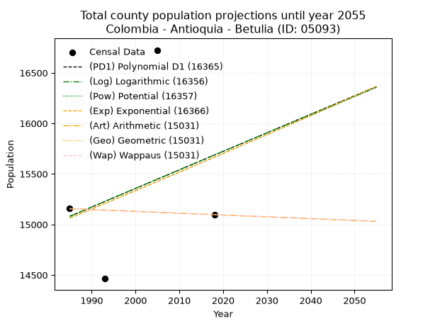
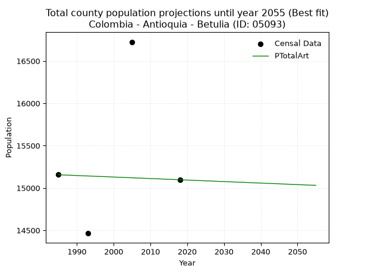
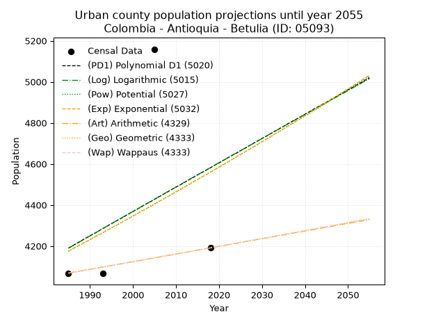
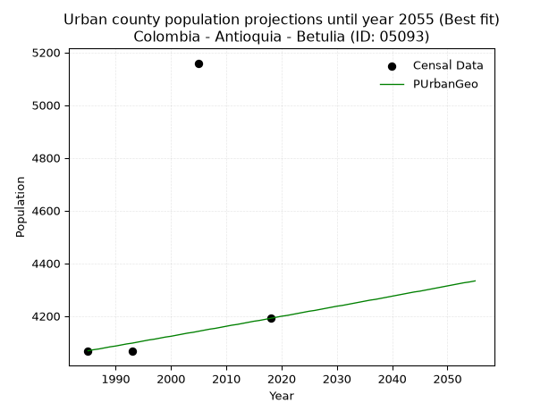
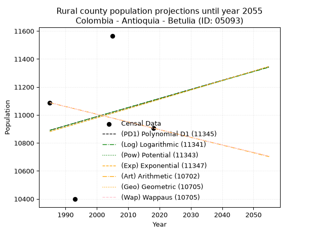
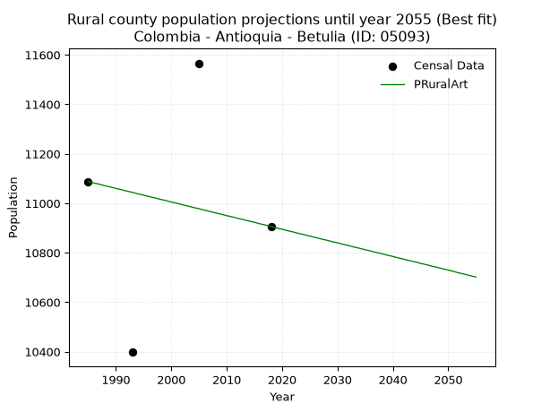

<div align="center">


</div>

# _“Population and Public Services Demand Projections (PPSD) until Year 2050 for Colombia - Antioquia - Betulia (ID: 05093)”_
Keywords: `population` `public-service` `projection` `lineal` `polynomial` `logarithmic` `potential` `exponential` `arithmetic` `geometric` `wappaus` `dane` `colombia` `south-america`

PPSD are analytical estimates used by governments and planners to anticipate future changes in population size, age distribution, and the resulting community needs for utilities, healthcare, education, and infrastructure as sizing future water treatment facilities, electrical grids, and road networks based on spatial growth.

> **General running parameters**: • app_version: _v20260806_. • Python version: _3.14.7_. • Pandas version: _3.0.5_. • NumPy version: _2.5.1_. • Creates, save and include plots into reports (create_plot): _False_. • Projection until year: _2050_. • Process polynomial degree 2 and up: _False_. • Process Wappaus: _True_. • Process Wappaus: _True_. • Set negative values to zero: _True_. • Set infinite values to zero: _True_. • Drop dataset notes: _True_. 
<div align="center">

Dynamic map: [:earth_americas:Google](http://maps.google.com/maps?q=6.115207664,-75.9844521) [:earth_americas:OSM](https://www.openstreetmap.org/#map=18/6.115207664/-75.9844521&layers=P) [:earth_americas:Bing](https://www.bing.com/maps?cp=6.115207664~-75.9844521&lvl=18) [:earth_americas:Apple](https://maps.apple.com/frame?center=6.115207664%2C-75.9844521&span=0.003%2C0.006)

</div>


<div align="center">

```geojson
{
  "type": "Feature",
  "geometry": {
    "type": "Point", 
    "coordinates": [-75.9844521, 6.115207664]
  }, 
  "properties": {
    "Name": "Colombia - Antioquia - Betulia (ID: 05093)"
  }
}
```

</div>


## 0. Census Data (4 records)

Census data are official statistics collected by a government about the people and housing in a country. They usually include counts of total population, age, sex, race, income, education, and jobs.

📅Global census file: [Population.xlsx](../data/Population.xlsx)

| Source   |   Year |   CountryID | CountryName   |   StateID | StateName   |   CountyID | CountyName   |   PTotal |   PUrban |   PRural |
|:---------|-------:|------------:|:--------------|----------:|:------------|-----------:|:-------------|---------:|---------:|---------:|
| DANE     |   1985 |          57 | Colombia      |        05 | Antioquia   |      05093 | Betulia      |    15156 |     4068 |    11088 |
| DANE     |   1993 |          57 | Colombia      |        05 | Antioquia   |      05093 | Betulia      |    14464 |     4066 |    10398 |
| DANE     |   2005 |          57 | Colombia      |        05 | Antioquia   |      05093 | Betulia      |    16725 |     5159 |    11566 |
| DANE     |   2018 |          57 | Colombia      |        05 | Antioquia   |      05093 | Betulia      |    15097 |     4191 |    10906 |

> 🔥Some records could had specific notes about the registered values or the corresponding urban or rural distribution.

**Local public utility companies (RUPS)**

 | SERVICIO       | ESTADO      | NOMBRE                                                                             | NIT         | DEPARTAMENTO_DOMICILIO   | MUNICIPIO_DOMICILIO   | DIRECCION              |   TELEFONO | EMAIL                          | TIPO_INSCRIPCION    | REPRESENTANTE_LEGAL                 | TIPO_PRESTADOR                             | CLASIFICACION                 |
|:---------------|:------------|:-----------------------------------------------------------------------------------|:------------|:-------------------------|:----------------------|:-----------------------|-----------:|:-------------------------------|:--------------------|:------------------------------------|:-------------------------------------------|:------------------------------|
| ASEO           | OPERATIVA   | EMPRESAS VARIAS DE MEDELLIN  S.A. E.S. P.                                          | 890905055-9 | ANTIOQUIA                | MEDELLIN              | CALLE 30 No 55-198     |    3807946 | nora.alvarez@emvarias.com.co   | Registro por la ESP | GUSTAVO ALEJANDRO GALLEGO HERNANDEZ | SOCIEDADES (EMPRESA DE SERVICIOS PUBLICOS) | MAYOR O IGUAL A 5001 USUARIOS |
| ASEO           | CANCELACION | EVAS ENVIAMBIENTALES S.A E.S.P                                                     | 811046698-0 | ANTIOQUIA                | ENVIGADO              | Cr 43 A Cl 46 A SUR 39 |    4600850 | pablo.restrepo@enviaseo.gov.co | Registro por la ESP | PABLO ANDRES RESTREPO GARCES        | nan                                        | nan                           |
| ASEO           | OPERATIVA   | EMPRESAS PUBLICAS DE BETULIA S.A E.S.P                                             | 900262923-1 | ANTIOQUIA                | BETULIA               | CALLE 19 No. 20 - 30   |    8436678 | spdbetulia@gmail.com           | Registro por la ESP | PAULA ANDREA MAYA ORTIZ             | SOCIEDADES (EMPRESA DE SERVICIOS PUBLICOS) | MENOR O IGUAL A 2500 USUARIOS |
| ACUEDUCTO      | OPERATIVA   | EMPRESAS PUBLICAS DE BETULIA S.A E.S.P                                             | 900262923-1 | ANTIOQUIA                | BETULIA               | CALLE 19 No. 20 - 30   |    8436678 | spdbetulia@gmail.com           | Registro por la ESP | PAULA ANDREA MAYA ORTIZ             | SOCIEDADES (EMPRESA DE SERVICIOS PUBLICOS) | MENOR O IGUAL A 2500 USUARIOS |
| ALCANTARILLADO | OPERATIVA   | EMPRESAS PUBLICAS DE BETULIA S.A E.S.P                                             | 900262923-1 | ANTIOQUIA                | BETULIA               | CALLE 19 No. 20 - 30   |    8436678 | spdbetulia@gmail.com           | Registro por la ESP | PAULA ANDREA MAYA ORTIZ             | SOCIEDADES (EMPRESA DE SERVICIOS PUBLICOS) | MENOR O IGUAL A 2500 USUARIOS |
| ACUEDUCTO      | OPERATIVA   | ASOCIACIÓN DE USUARIOS DEL ACUEDUCTO DE ALTAMIRA, MUNICIPIO DE BETULIA - ANTIOQUIA | 811021557-2 | ANTIOQUIA                | BETULIA               | Calle 10 No.7 - 128    |    8630018 | asuamaltamira@hotmail.com      | Registro por la ESP | JAVIER DE JESUS ROJAS SOLORZANO     | ORGANIZACION AUTORIZADA                    | MENOR O IGUAL A 2500 USUARIOS |
| ALCANTARILLADO | OPERATIVA   | ASOCIACIÓN DE USUARIOS DEL ACUEDUCTO DE ALTAMIRA, MUNICIPIO DE BETULIA - ANTIOQUIA | 811021557-2 | ANTIOQUIA                | BETULIA               | Calle 10 No.7 - 128    |    8630018 | asuamaltamira@hotmail.com      | Registro por la ESP | JAVIER DE JESUS ROJAS SOLORZANO     | ORGANIZACION AUTORIZADA                    | MENOR O IGUAL A 2500 USUARIOS |
| ASEO           | OPERATIVA   | ASOCIACIÓN DE USUARIOS DEL ACUEDUCTO DE ALTAMIRA, MUNICIPIO DE BETULIA - ANTIOQUIA | 811021557-2 | ANTIOQUIA                | BETULIA               | Calle 10 No.7 - 128    |    8630018 | asuamaltamira@hotmail.com      | Registro por la ESP | JAVIER DE JESUS ROJAS SOLORZANO     | ORGANIZACION AUTORIZADA                    | MENOR O IGUAL A 2500 USUARIOS |

> [📅RUPS Database: Registro Único de Prestadores de Servicios Públicos de Colombia Suramérica - RUPS](https://www.datos.gov.co/Hacienda-y-Cr-dito-P-blico/Registro-nico-de-Prestadores-de-Servicios-P-blicos/4qkq-csdn/about_data)

## 1. Total

### 1.1. Coefficients and Parameters

* (PD1) Polynomial Deg 1: 18.342031312726657, -21328.148133281502 (lineal)
* (Log) Logarithmic: 36857.20496534802, -264791.41029671475
* (Pow) Potential: 2.379248109197764, -3.668295996085546
* (Exp) Exponential: 0.0011842631776261714, 1435.5421271252485
* (Art) Arithmetic: Year diff. 2018 - 1985 = 33, Population diff. 15097 - 15156 = -59, Annual growth = -1.7878787878787878
* (Geo) Geometric: Year diff. 2018 - 1985 = 33, Population diff. 15097 - 15156 = -59, Annual growth % = -0.00011818830523480095
* (Wap) Wappaus: i = -0.011819514017643128, Condition values only valid for < 200)

<sub>
Wappaus condition values: ['-0.00', '-0.01', '-0.02', '-0.04', '-0.05', '-0.06', '-0.07', '-0.08', '-0.09', '-0.11', '-0.12', '-0.13', '-0.14', '-0.15', '-0.17', '-0.18', '-0.19', '-0.20', '-0.21', '-0.22', '-0.24', '-0.25', '-0.26', '-0.27', '-0.28', '-0.30', '-0.31', '-0.32', '-0.33', '-0.34', '-0.35', '-0.37', '-0.38', '-0.39', '-0.40', '-0.41', '-0.43', '-0.44', '-0.45', '-0.46', '-0.47', '-0.48', '-0.50', '-0.51', '-0.52', '-0.53', '-0.54', '-0.56', '-0.57', '-0.58', '-0.59', '-0.60', '-0.61', '-0.63', '-0.64', '-0.65', '-0.66', '-0.67', '-0.69', '-0.70', '-0.71', '-0.72', '-0.73', '-0.74', '-0.76', '-0.77']
</sub>


### 1.2. Projected Dataset

|   Year |   CountyID |   PTotalPD1 |   PTotalLog |   PTotalPow |   PTotalExp |   PTotalArt |   PTotalGeo |   PTotalWap |
|-------:|-----------:|------------:|------------:|------------:|------------:|------------:|------------:|------------:|
|   1985 |      05093 |       15081 |       15079 |       15062 |       15064 |       15156 |       15156 |       15156 |
|   1986 |      05093 |       15099 |       15098 |       15080 |       15082 |       15154 |       15154 |       15154 |
|   1987 |      05093 |       15117 |       15116 |       15099 |       15100 |       15152 |       15152 |       15152 |
|   1988 |      05093 |       15136 |       15135 |       15117 |       15118 |       15151 |       15151 |       15151 |
|   1989 |      05093 |       15154 |       15153 |       15135 |       15135 |       15149 |       15149 |       15149 |
|   1990 |      05093 |       15172 |       15172 |       15153 |       15153 |       15147 |       15147 |       15147 |
|   1991 |      05093 |       15191 |       15190 |       15171 |       15171 |       15145 |       15145 |       15145 |
|   1992 |      05093 |       15209 |       15209 |       15189 |       15189 |       15143 |       15143 |       15143 |
|   1993 |      05093 |       15228 |       15227 |       15207 |       15207 |       15142 |       15142 |       15142 |
|   1994 |      05093 |       15246 |       15246 |       15225 |       15225 |       15140 |       15140 |       15140 |
|   1995 |      05093 |       15264 |       15264 |       15244 |       15243 |       15138 |       15138 |       15138 |
|   1996 |      05093 |       15283 |       15283 |       15262 |       15261 |       15136 |       15136 |       15136 |
|   1997 |      05093 |       15301 |       15301 |       15280 |       15280 |       15135 |       15135 |       15135 |
|   1998 |      05093 |       15319 |       15320 |       15298 |       15298 |       15133 |       15133 |       15133 |
|   1999 |      05093 |       15338 |       15338 |       15316 |       15316 |       15131 |       15131 |       15131 |
|   2000 |      05093 |       15356 |       15357 |       15335 |       15334 |       15129 |       15129 |       15129 |
|   2001 |      05093 |       15374 |       15375 |       15353 |       15352 |       15127 |       15127 |       15127 |
|   2002 |      05093 |       15393 |       15393 |       15371 |       15370 |       15126 |       15126 |       15126 |
|   2003 |      05093 |       15411 |       15412 |       15389 |       15389 |       15124 |       15124 |       15124 |
|   2004 |      05093 |       15429 |       15430 |       15408 |       15407 |       15122 |       15122 |       15122 |
|   2005 |      05093 |       15448 |       15449 |       15426 |       15425 |       15120 |       15120 |       15120 |
|   2006 |      05093 |       15466 |       15467 |       15444 |       15443 |       15118 |       15118 |       15118 |
|   2007 |      05093 |       15484 |       15485 |       15463 |       15462 |       15117 |       15117 |       15117 |
|   2008 |      05093 |       15503 |       15504 |       15481 |       15480 |       15115 |       15115 |       15115 |
|   2009 |      05093 |       15521 |       15522 |       15499 |       15498 |       15113 |       15113 |       15113 |
|   2010 |      05093 |       15539 |       15540 |       15518 |       15517 |       15111 |       15111 |       15111 |
|   2011 |      05093 |       15558 |       15559 |       15536 |       15535 |       15110 |       15109 |       15109 |
|   2012 |      05093 |       15576 |       15577 |       15554 |       15553 |       15108 |       15108 |       15108 |
|   2013 |      05093 |       15594 |       15595 |       15573 |       15572 |       15106 |       15106 |       15106 |
|   2014 |      05093 |       15613 |       15614 |       15591 |       15590 |       15104 |       15104 |       15104 |
|   2015 |      05093 |       15631 |       15632 |       15610 |       15609 |       15102 |       15102 |       15102 |
|   2016 |      05093 |       15649 |       15650 |       15628 |       15627 |       15101 |       15101 |       15101 |
|   2017 |      05093 |       15668 |       15669 |       15647 |       15646 |       15099 |       15099 |       15099 |
|   2018 |      05093 |       15686 |       15687 |       15665 |       15664 |       15097 |       15097 |       15097 |
|   2019 |      05093 |       15704 |       15705 |       15684 |       15683 |       15095 |       15095 |       15095 |
|   2020 |      05093 |       15723 |       15723 |       15702 |       15701 |       15093 |       15093 |       15093 |
|   2021 |      05093 |       15741 |       15742 |       15721 |       15720 |       15092 |       15092 |       15092 |
|   2022 |      05093 |       15759 |       15760 |       15739 |       15739 |       15090 |       15090 |       15090 |
|   2023 |      05093 |       15778 |       15778 |       15758 |       15757 |       15088 |       15088 |       15088 |
|   2024 |      05093 |       15796 |       15796 |       15776 |       15776 |       15086 |       15086 |       15086 |
|   2025 |      05093 |       15814 |       15814 |       15795 |       15795 |       15084 |       15085 |       15085 |
|   2026 |      05093 |       15833 |       15833 |       15813 |       15813 |       15083 |       15083 |       15083 |
|   2027 |      05093 |       15851 |       15851 |       15832 |       15832 |       15081 |       15081 |       15081 |
|   2028 |      05093 |       15869 |       15869 |       15850 |       15851 |       15079 |       15079 |       15079 |
|   2029 |      05093 |       15888 |       15887 |       15869 |       15870 |       15077 |       15077 |       15077 |
|   2030 |      05093 |       15906 |       15905 |       15888 |       15889 |       15076 |       15076 |       15076 |
|   2031 |      05093 |       15925 |       15924 |       15906 |       15907 |       15074 |       15074 |       15074 |
|   2032 |      05093 |       15943 |       15942 |       15925 |       15926 |       15072 |       15072 |       15072 |
|   2033 |      05093 |       15961 |       15960 |       15943 |       15945 |       15070 |       15070 |       15070 |
|   2034 |      05093 |       15980 |       15978 |       15962 |       15964 |       15068 |       15068 |       15068 |
|   2035 |      05093 |       15998 |       15996 |       15981 |       15983 |       15067 |       15067 |       15067 |
|   2036 |      05093 |       16016 |       16014 |       16000 |       16002 |       15065 |       15065 |       15065 |
|   2037 |      05093 |       16035 |       16032 |       16018 |       16021 |       15063 |       15063 |       15063 |
|   2038 |      05093 |       16053 |       16050 |       16037 |       16040 |       15061 |       15061 |       15061 |
|   2039 |      05093 |       16071 |       16068 |       16056 |       16059 |       15059 |       15060 |       15060 |
|   2040 |      05093 |       16090 |       16086 |       16074 |       16078 |       15058 |       15058 |       15058 |
|   2041 |      05093 |       16108 |       16105 |       16093 |       16097 |       15056 |       15056 |       15056 |
|   2042 |      05093 |       16126 |       16123 |       16112 |       16116 |       15054 |       15054 |       15054 |
|   2043 |      05093 |       16145 |       16141 |       16131 |       16135 |       15052 |       15052 |       15052 |
|   2044 |      05093 |       16163 |       16159 |       16150 |       16154 |       15051 |       15051 |       15051 |
|   2045 |      05093 |       16181 |       16177 |       16168 |       16173 |       15049 |       15049 |       15049 |
|   2046 |      05093 |       16200 |       16195 |       16187 |       16192 |       15047 |       15047 |       15047 |
|   2047 |      05093 |       16218 |       16213 |       16206 |       16212 |       15045 |       15045 |       15045 |
|   2048 |      05093 |       16236 |       16231 |       16225 |       16231 |       15043 |       15044 |       15044 |
|   2049 |      05093 |       16255 |       16249 |       16244 |       16250 |       15042 |       15042 |       15042 |
|   2050 |      05093 |       16273 |       16267 |       16263 |       16269 |       15040 |       15040 |       15040 |
<div align="center">

</img>

</div>


### 1.3. Best fit with absolute and relative error (%)

Relative error puts that difference into context by dividing the absolute error by the true value, creating a unitless ratio or percentage that shows the scale of the mistake.

Absolute and relative error

|   Year | Source   |   CountryID | CountryName   |   StateID | StateName   |   CountyID_x | CountyName   |   PTotal |   PUrban |   PRural |   CountyID_y |   PTotalPD1 |   PTotalLog |   PTotalPow |   PTotalExp |   PTotalArt |   PTotalGeo |   PTotalWap |   PTotalPD1AbsError |   PTotalLogAbsError |   PTotalPowAbsError |   PTotalExpAbsError |   PTotalArtAbsError |   PTotalGeoAbsError |   PTotalWapAbsError |   PTotalPD1RelError |   PTotalLogRelError |   PTotalPowRelError |   PTotalExpRelError |   PTotalArtRelError |   PTotalGeoRelError |   PTotalWapRelError |
|-------:|:---------|------------:|:--------------|----------:|:------------|-------------:|:-------------|---------:|---------:|---------:|-------------:|------------:|------------:|------------:|------------:|------------:|------------:|------------:|--------------------:|--------------------:|--------------------:|--------------------:|--------------------:|--------------------:|--------------------:|--------------------:|--------------------:|--------------------:|--------------------:|--------------------:|--------------------:|--------------------:|
|   1985 | DANE     |          57 | Colombia      |        05 | Antioquia   |        05093 | Betulia      |    15156 |     4068 |    11088 |        05093 |       15081 |       15079 |       15062 |       15064 |       15156 |       15156 |       15156 |                  75 |                  77 |                  94 |                  92 |                   0 |                   0 |                   0 |            0.494854 |             0.50805 |            0.620216 |             0.60702 |             0       |             0       |             0       |
|   1993 | DANE     |          57 | Colombia      |        05 | Antioquia   |        05093 | Betulia      |    14464 |     4066 |    10398 |        05093 |       15228 |       15227 |       15207 |       15207 |       15142 |       15142 |       15142 |                 764 |                 763 |                 743 |                 743 |                 678 |                 678 |                 678 |            5.28208  |             5.27517 |            5.13689  |             5.13689 |             4.6875  |             4.6875  |             4.6875  |
|   2005 | DANE     |          57 | Colombia      |        05 | Antioquia   |        05093 | Betulia      |    16725 |     5159 |    11566 |        05093 |       15448 |       15449 |       15426 |       15425 |       15120 |       15120 |       15120 |                1277 |                1276 |                1299 |                1300 |                1605 |                1605 |                1605 |            7.63528  |             7.6293  |            7.76682  |             7.7728  |             9.59641 |             9.59641 |             9.59641 |
|   2018 | DANE     |          57 | Colombia      |        05 | Antioquia   |        05093 | Betulia      |    15097 |     4191 |    10906 |        05093 |       15686 |       15687 |       15665 |       15664 |       15097 |       15097 |       15097 |                 589 |                 590 |                 568 |                 567 |                   0 |                   0 |                   0 |            3.90144  |             3.90806 |            3.76234  |             3.75571 |             0       |             0       |             0       |

Relative error mean

| Method    |   RelError | Best   |
|:----------|-----------:|:-------|
| PTotalPD1 |    4.32841 |        |
| PTotalLog |    4.33014 |        |
| PTotalPow |    4.32157 |        |
| PTotalExp |    4.31811 |        |
| PTotalArt |    3.57098 | True   |
| PTotalGeo |    3.57098 | True   |
| PTotalWap |    3.57098 | True   |

💙Best method: _**PTotalArt**_
<div align="center">

</img>

</div>


### 1.4. Fresh water supply demand in liters per capita per day (lpcd)

The fresh water supply demand typically ranges from 100 to 300 liters per capita per day (lpcd) for standard domestic and municipal planning, though absolute survival minimums set by the World Health Organization are as low as 7.5 to 20 liters per day, and total consumption in high-income nations can exceed 400 liters.

> `CZ`: Level in meters above the sea level (masl)<br> `WS`: Fresh water supply demand in liters per capita per day (lpcd or l/h/d)<br> `WSAll`: Zonal fresh water supply demand in liters per second (l/s)<br> `A`: Zonal area in square meters<br> `DP`: Population density (people/hectare or p/ha)

Reference values (RAS Colombia)

|    CZ |   WS |
|------:|-----:|
|  1000 |  120 |
|  2000 |  130 |
| 99999 |  140 |

County shapefile geometry properties and water supply values

|   CountyID |      ATotal |   CZTotal |   WSTotal |
|-----------:|------------:|----------:|----------:|
|      05093 | 2.62362e+08 |      1630 |       130 |

Projected values for best method: PTotalArt

|   CountyID |   Year |   PTotalArt |   DPTotal |   WSTotal |   WSTotalAll |
|-----------:|-------:|------------:|----------:|----------:|-------------:|
|      05093 |   1985 |       15156 |      0.58 |       130 |      22.8042 |
|      05093 |   1986 |       15154 |      0.58 |       130 |      22.8012 |
|      05093 |   1987 |       15152 |      0.58 |       130 |      22.7981 |
|      05093 |   1988 |       15151 |      0.58 |       130 |      22.7966 |
|      05093 |   1989 |       15149 |      0.58 |       130 |      22.7936 |
|      05093 |   1990 |       15147 |      0.58 |       130 |      22.7906 |
|      05093 |   1991 |       15145 |      0.58 |       130 |      22.7876 |
|      05093 |   1992 |       15143 |      0.58 |       130 |      22.7846 |
|      05093 |   1993 |       15142 |      0.58 |       130 |      22.7831 |
|      05093 |   1994 |       15140 |      0.58 |       130 |      22.7801 |
|      05093 |   1995 |       15138 |      0.58 |       130 |      22.7771 |
|      05093 |   1996 |       15136 |      0.58 |       130 |      22.7741 |
|      05093 |   1997 |       15135 |      0.58 |       130 |      22.7726 |
|      05093 |   1998 |       15133 |      0.58 |       130 |      22.7696 |
|      05093 |   1999 |       15131 |      0.58 |       130 |      22.7666 |
|      05093 |   2000 |       15129 |      0.58 |       130 |      22.7635 |
|      05093 |   2001 |       15127 |      0.58 |       130 |      22.7605 |
|      05093 |   2002 |       15126 |      0.58 |       130 |      22.759  |
|      05093 |   2003 |       15124 |      0.58 |       130 |      22.756  |
|      05093 |   2004 |       15122 |      0.58 |       130 |      22.753  |
|      05093 |   2005 |       15120 |      0.58 |       130 |      22.75   |
|      05093 |   2006 |       15118 |      0.58 |       130 |      22.747  |
|      05093 |   2007 |       15117 |      0.58 |       130 |      22.7455 |
|      05093 |   2008 |       15115 |      0.58 |       130 |      22.7425 |
|      05093 |   2009 |       15113 |      0.58 |       130 |      22.7395 |
|      05093 |   2010 |       15111 |      0.58 |       130 |      22.7365 |
|      05093 |   2011 |       15110 |      0.58 |       130 |      22.735  |
|      05093 |   2012 |       15108 |      0.58 |       130 |      22.7319 |
|      05093 |   2013 |       15106 |      0.58 |       130 |      22.7289 |
|      05093 |   2014 |       15104 |      0.58 |       130 |      22.7259 |
|      05093 |   2015 |       15102 |      0.58 |       130 |      22.7229 |
|      05093 |   2016 |       15101 |      0.58 |       130 |      22.7214 |
|      05093 |   2017 |       15099 |      0.58 |       130 |      22.7184 |
|      05093 |   2018 |       15097 |      0.58 |       130 |      22.7154 |
|      05093 |   2019 |       15095 |      0.58 |       130 |      22.7124 |
|      05093 |   2020 |       15093 |      0.58 |       130 |      22.7094 |
|      05093 |   2021 |       15092 |      0.58 |       130 |      22.7079 |
|      05093 |   2022 |       15090 |      0.58 |       130 |      22.7049 |
|      05093 |   2023 |       15088 |      0.58 |       130 |      22.7019 |
|      05093 |   2024 |       15086 |      0.58 |       130 |      22.6988 |
|      05093 |   2025 |       15084 |      0.57 |       130 |      22.6958 |
|      05093 |   2026 |       15083 |      0.57 |       130 |      22.6943 |
|      05093 |   2027 |       15081 |      0.57 |       130 |      22.6913 |
|      05093 |   2028 |       15079 |      0.57 |       130 |      22.6883 |
|      05093 |   2029 |       15077 |      0.57 |       130 |      22.6853 |
|      05093 |   2030 |       15076 |      0.57 |       130 |      22.6838 |
|      05093 |   2031 |       15074 |      0.57 |       130 |      22.6808 |
|      05093 |   2032 |       15072 |      0.57 |       130 |      22.6778 |
|      05093 |   2033 |       15070 |      0.57 |       130 |      22.6748 |
|      05093 |   2034 |       15068 |      0.57 |       130 |      22.6718 |
|      05093 |   2035 |       15067 |      0.57 |       130 |      22.6703 |
|      05093 |   2036 |       15065 |      0.57 |       130 |      22.6672 |
|      05093 |   2037 |       15063 |      0.57 |       130 |      22.6642 |
|      05093 |   2038 |       15061 |      0.57 |       130 |      22.6612 |
|      05093 |   2039 |       15059 |      0.57 |       130 |      22.6582 |
|      05093 |   2040 |       15058 |      0.57 |       130 |      22.6567 |
|      05093 |   2041 |       15056 |      0.57 |       130 |      22.6537 |
|      05093 |   2042 |       15054 |      0.57 |       130 |      22.6507 |
|      05093 |   2043 |       15052 |      0.57 |       130 |      22.6477 |
|      05093 |   2044 |       15051 |      0.57 |       130 |      22.6462 |
|      05093 |   2045 |       15049 |      0.57 |       130 |      22.6432 |
|      05093 |   2046 |       15047 |      0.57 |       130 |      22.6402 |
|      05093 |   2047 |       15045 |      0.57 |       130 |      22.6372 |
|      05093 |   2048 |       15043 |      0.57 |       130 |      22.6341 |
|      05093 |   2049 |       15042 |      0.57 |       130 |      22.6326 |
|      05093 |   2050 |       15040 |      0.57 |       130 |      22.6296 |

## 2. Urban

### 2.1. Coefficients and Parameters

* (PD1) Polynomial Deg 1: 11.850662384585059, -19333.287434766266 (lineal)
* (Log) Logarithmic: 23837.838830003722, -176820.60397131016
* (Pow) Potential: 5.363553811730988, -14.06714001242002
* (Exp) Exponential: 0.0026669754185439007, 20.968284394436793
* (Art) Arithmetic: Year diff. 2018 - 1985 = 33, Population diff. 4191 - 4068 = 123, Annual growth = 3.727272727272727
* (Geo) Geometric: Year diff. 2018 - 1985 = 33, Population diff. 4191 - 4068 = 123, Annual growth % = 0.0009030708794381948
* (Wap) Wappaus: i = 0.09025966163634162, Condition values only valid for < 200)

<sub>
Wappaus condition values: ['0.00', '0.09', '0.18', '0.27', '0.36', '0.45', '0.54', '0.63', '0.72', '0.81', '0.90', '0.99', '1.08', '1.17', '1.26', '1.35', '1.44', '1.53', '1.62', '1.71', '1.81', '1.90', '1.99', '2.08', '2.17', '2.26', '2.35', '2.44', '2.53', '2.62', '2.71', '2.80', '2.89', '2.98', '3.07', '3.16', '3.25', '3.34', '3.43', '3.52', '3.61', '3.70', '3.79', '3.88', '3.97', '4.06', '4.15', '4.24', '4.33', '4.42', '4.51', '4.60', '4.69', '4.78', '4.87', '4.96', '5.05', '5.14', '5.24', '5.33', '5.42', '5.51', '5.60', '5.69', '5.78', '5.87']
</sub>


### 2.2. Projected Dataset

|   Year |   CountyID |   PUrbanPD1 |   PUrbanLog |   PUrbanPow |   PUrbanExp |   PUrbanArt |   PUrbanGeo |   PUrbanWap |
|-------:|-----------:|------------:|------------:|------------:|------------:|------------:|------------:|------------:|
|   1985 |      05093 |        4190 |        4189 |        4174 |        4175 |        4068 |        4068 |        4068 |
|   1986 |      05093 |        4202 |        4201 |        4186 |        4187 |        4072 |        4072 |        4072 |
|   1987 |      05093 |        4214 |        4213 |        4197 |        4198 |        4075 |        4075 |        4075 |
|   1988 |      05093 |        4226 |        4225 |        4208 |        4209 |        4079 |        4079 |        4079 |
|   1989 |      05093 |        4238 |        4237 |        4220 |        4220 |        4083 |        4083 |        4083 |
|   1990 |      05093 |        4250 |        4249 |        4231 |        4231 |        4087 |        4086 |        4086 |
|   1991 |      05093 |        4261 |        4261 |        4242 |        4243 |        4090 |        4090 |        4090 |
|   1992 |      05093 |        4273 |        4273 |        4254 |        4254 |        4094 |        4094 |        4094 |
|   1993 |      05093 |        4285 |        4285 |        4265 |        4265 |        4098 |        4097 |        4097 |
|   1994 |      05093 |        4297 |        4297 |        4277 |        4277 |        4102 |        4101 |        4101 |
|   1995 |      05093 |        4309 |        4309 |        4288 |        4288 |        4105 |        4105 |        4105 |
|   1996 |      05093 |        4321 |        4321 |        4300 |        4300 |        4109 |        4109 |        4109 |
|   1997 |      05093 |        4332 |        4333 |        4311 |        4311 |        4113 |        4112 |        4112 |
|   1998 |      05093 |        4344 |        4345 |        4323 |        4323 |        4116 |        4116 |        4116 |
|   1999 |      05093 |        4356 |        4357 |        4335 |        4334 |        4120 |        4120 |        4120 |
|   2000 |      05093 |        4368 |        4368 |        4346 |        4346 |        4124 |        4123 |        4123 |
|   2001 |      05093 |        4380 |        4380 |        4358 |        4357 |        4128 |        4127 |        4127 |
|   2002 |      05093 |        4392 |        4392 |        4370 |        4369 |        4131 |        4131 |        4131 |
|   2003 |      05093 |        4404 |        4404 |        4381 |        4381 |        4135 |        4135 |        4135 |
|   2004 |      05093 |        4415 |        4416 |        4393 |        4392 |        4139 |        4138 |        4138 |
|   2005 |      05093 |        4427 |        4428 |        4405 |        4404 |        4143 |        4142 |        4142 |
|   2006 |      05093 |        4439 |        4440 |        4417 |        4416 |        4146 |        4146 |        4146 |
|   2007 |      05093 |        4451 |        4452 |        4428 |        4428 |        4150 |        4150 |        4150 |
|   2008 |      05093 |        4463 |        4464 |        4440 |        4440 |        4154 |        4153 |        4153 |
|   2009 |      05093 |        4475 |        4476 |        4452 |        4451 |        4157 |        4157 |        4157 |
|   2010 |      05093 |        4487 |        4487 |        4464 |        4463 |        4161 |        4161 |        4161 |
|   2011 |      05093 |        4498 |        4499 |        4476 |        4475 |        4165 |        4165 |        4165 |
|   2012 |      05093 |        4510 |        4511 |        4488 |        4487 |        4169 |        4168 |        4168 |
|   2013 |      05093 |        4522 |        4523 |        4500 |        4499 |        4172 |        4172 |        4172 |
|   2014 |      05093 |        4534 |        4535 |        4512 |        4511 |        4176 |        4176 |        4176 |
|   2015 |      05093 |        4546 |        4547 |        4524 |        4523 |        4180 |        4180 |        4180 |
|   2016 |      05093 |        4558 |        4558 |        4536 |        4535 |        4184 |        4183 |        4183 |
|   2017 |      05093 |        4569 |        4570 |        4548 |        4547 |        4187 |        4187 |        4187 |
|   2018 |      05093 |        4581 |        4582 |        4560 |        4559 |        4191 |        4191 |        4191 |
|   2019 |      05093 |        4593 |        4594 |        4572 |        4572 |        4195 |        4195 |        4195 |
|   2020 |      05093 |        4605 |        4606 |        4584 |        4584 |        4198 |        4199 |        4199 |
|   2021 |      05093 |        4617 |        4617 |        4597 |        4596 |        4202 |        4202 |        4202 |
|   2022 |      05093 |        4629 |        4629 |        4609 |        4608 |        4206 |        4206 |        4206 |
|   2023 |      05093 |        4641 |        4641 |        4621 |        4621 |        4210 |        4210 |        4210 |
|   2024 |      05093 |        4652 |        4653 |        4633 |        4633 |        4213 |        4214 |        4214 |
|   2025 |      05093 |        4664 |        4665 |        4646 |        4645 |        4217 |        4218 |        4218 |
|   2026 |      05093 |        4676 |        4676 |        4658 |        4658 |        4221 |        4221 |        4221 |
|   2027 |      05093 |        4688 |        4688 |        4670 |        4670 |        4225 |        4225 |        4225 |
|   2028 |      05093 |        4700 |        4700 |        4683 |        4683 |        4228 |        4229 |        4229 |
|   2029 |      05093 |        4712 |        4712 |        4695 |        4695 |        4232 |        4233 |        4233 |
|   2030 |      05093 |        4724 |        4723 |        4708 |        4708 |        4236 |        4237 |        4237 |
|   2031 |      05093 |        4735 |        4735 |        4720 |        4720 |        4239 |        4240 |        4240 |
|   2032 |      05093 |        4747 |        4747 |        4732 |        4733 |        4243 |        4244 |        4244 |
|   2033 |      05093 |        4759 |        4759 |        4745 |        4746 |        4247 |        4248 |        4248 |
|   2034 |      05093 |        4771 |        4770 |        4757 |        4758 |        4251 |        4252 |        4252 |
|   2035 |      05093 |        4783 |        4782 |        4770 |        4771 |        4254 |        4256 |        4256 |
|   2036 |      05093 |        4795 |        4794 |        4783 |        4784 |        4258 |        4260 |        4260 |
|   2037 |      05093 |        4807 |        4805 |        4795 |        4796 |        4262 |        4263 |        4264 |
|   2038 |      05093 |        4818 |        4817 |        4808 |        4809 |        4266 |        4267 |        4267 |
|   2039 |      05093 |        4830 |        4829 |        4821 |        4822 |        4269 |        4271 |        4271 |
|   2040 |      05093 |        4842 |        4841 |        4833 |        4835 |        4273 |        4275 |        4275 |
|   2041 |      05093 |        4854 |        4852 |        4846 |        4848 |        4277 |        4279 |        4279 |
|   2042 |      05093 |        4866 |        4864 |        4859 |        4861 |        4280 |        4283 |        4283 |
|   2043 |      05093 |        4878 |        4876 |        4871 |        4874 |        4284 |        4287 |        4287 |
|   2044 |      05093 |        4889 |        4887 |        4884 |        4887 |        4288 |        4291 |        4291 |
|   2045 |      05093 |        4901 |        4899 |        4897 |        4900 |        4292 |        4294 |        4294 |
|   2046 |      05093 |        4913 |        4911 |        4910 |        4913 |        4295 |        4298 |        4298 |
|   2047 |      05093 |        4925 |        4922 |        4923 |        4926 |        4299 |        4302 |        4302 |
|   2048 |      05093 |        4937 |        4934 |        4936 |        4939 |        4303 |        4306 |        4306 |
|   2049 |      05093 |        4949 |        4945 |        4949 |        4952 |        4307 |        4310 |        4310 |
|   2050 |      05093 |        4961 |        4957 |        4962 |        4966 |        4310 |        4314 |        4314 |
<div align="center">

</img>

</div>


### 2.3. Best fit with absolute and relative error (%)

Relative error puts that difference into context by dividing the absolute error by the true value, creating a unitless ratio or percentage that shows the scale of the mistake.

Absolute and relative error

|   Year | Source   |   CountryID | CountryName   |   StateID | StateName   |   CountyID_x | CountyName   |   PTotal |   PUrban |   PRural |   CountyID_y |   PUrbanPD1 |   PUrbanLog |   PUrbanPow |   PUrbanExp |   PUrbanArt |   PUrbanGeo |   PUrbanWap |   PUrbanPD1AbsError |   PUrbanLogAbsError |   PUrbanPowAbsError |   PUrbanExpAbsError |   PUrbanArtAbsError |   PUrbanGeoAbsError |   PUrbanWapAbsError |   PUrbanPD1RelError |   PUrbanLogRelError |   PUrbanPowRelError |   PUrbanExpRelError |   PUrbanArtRelError |   PUrbanGeoRelError |   PUrbanWapRelError |
|-------:|:---------|------------:|:--------------|----------:|:------------|-------------:|:-------------|---------:|---------:|---------:|-------------:|------------:|------------:|------------:|------------:|------------:|------------:|------------:|--------------------:|--------------------:|--------------------:|--------------------:|--------------------:|--------------------:|--------------------:|--------------------:|--------------------:|--------------------:|--------------------:|--------------------:|--------------------:|--------------------:|
|   1985 | DANE     |          57 | Colombia      |        05 | Antioquia   |        05093 | Betulia      |    15156 |     4068 |    11088 |        05093 |        4190 |        4189 |        4174 |        4175 |        4068 |        4068 |        4068 |                 122 |                 121 |                 106 |                 107 |                   0 |                   0 |                   0 |             2.99902 |             2.97443 |             2.6057  |             2.63029 |            0        |             0       |             0       |
|   1993 | DANE     |          57 | Colombia      |        05 | Antioquia   |        05093 | Betulia      |    14464 |     4066 |    10398 |        05093 |        4285 |        4285 |        4265 |        4265 |        4098 |        4097 |        4097 |                 219 |                 219 |                 199 |                 199 |                  32 |                  31 |                  31 |             5.38613 |             5.38613 |             4.89424 |             4.89424 |            0.787014 |             0.76242 |             0.76242 |
|   2005 | DANE     |          57 | Colombia      |        05 | Antioquia   |        05093 | Betulia      |    16725 |     5159 |    11566 |        05093 |        4427 |        4428 |        4405 |        4404 |        4143 |        4142 |        4142 |                 732 |                 731 |                 754 |                 755 |                1016 |                1017 |                1017 |            14.1888  |            14.1694  |            14.6152  |            14.6346  |           19.6937   |            19.7131  |            19.7131  |
|   2018 | DANE     |          57 | Colombia      |        05 | Antioquia   |        05093 | Betulia      |    15097 |     4191 |    10906 |        05093 |        4581 |        4582 |        4560 |        4559 |        4191 |        4191 |        4191 |                 390 |                 391 |                 369 |                 368 |                   0 |                   0 |                   0 |             9.30565 |             9.32952 |             8.80458 |             8.78072 |            0        |             0       |             0       |

Relative error mean

| Method    |   RelError | Best   |
|:----------|-----------:|:-------|
| PUrbanPD1 |    7.9699  |        |
| PUrbanLog |    7.96487 |        |
| PUrbanPow |    7.72994 |        |
| PUrbanExp |    7.73497 |        |
| PUrbanArt |    5.12019 |        |
| PUrbanGeo |    5.11889 | True   |
| PUrbanWap |    5.11889 | True   |

💙Best method: _**PUrbanGeo**_
<div align="center">

</img>

</div>


### 2.4. Fresh water supply demand in liters per capita per day (lpcd)

The fresh water supply demand typically ranges from 100 to 300 liters per capita per day (lpcd) for standard domestic and municipal planning, though absolute survival minimums set by the World Health Organization are as low as 7.5 to 20 liters per day, and total consumption in high-income nations can exceed 400 liters.

> `CZ`: Level in meters above the sea level (masl)<br> `WS`: Fresh water supply demand in liters per capita per day (lpcd or l/h/d)<br> `WSAll`: Zonal fresh water supply demand in liters per second (l/s)<br> `A`: Zonal area in square meters<br> `DP`: Population density (people/hectare or p/ha)

Reference values (RAS Colombia)

|    CZ |   WS |
|------:|-----:|
|  1000 |  120 |
|  2000 |  130 |
| 99999 |  140 |

County shapefile geometry properties and water supply values

|   CountyID |   AUrban |   CZUrban |   WSUrban |
|-----------:|---------:|----------:|----------:|
|      05093 |   598375 |   1621.08 |       130 |

Projected values for best method: PUrbanGeo

|   CountyID |   Year |   PUrbanGeo |   DPUrban |   WSUrban |   WSUrbanAll |
|-----------:|-------:|------------:|----------:|----------:|-------------:|
|      05093 |   1985 |        4068 |     67.98 |       130 |      6.12083 |
|      05093 |   1986 |        4072 |     68.05 |       130 |      6.12685 |
|      05093 |   1987 |        4075 |     68.1  |       130 |      6.13137 |
|      05093 |   1988 |        4079 |     68.17 |       130 |      6.13738 |
|      05093 |   1989 |        4083 |     68.23 |       130 |      6.1434  |
|      05093 |   1990 |        4086 |     68.28 |       130 |      6.14792 |
|      05093 |   1991 |        4090 |     68.35 |       130 |      6.15394 |
|      05093 |   1992 |        4094 |     68.42 |       130 |      6.15995 |
|      05093 |   1993 |        4097 |     68.47 |       130 |      6.16447 |
|      05093 |   1994 |        4101 |     68.54 |       130 |      6.17049 |
|      05093 |   1995 |        4105 |     68.6  |       130 |      6.1765  |
|      05093 |   1996 |        4109 |     68.67 |       130 |      6.18252 |
|      05093 |   1997 |        4112 |     68.72 |       130 |      6.18704 |
|      05093 |   1998 |        4116 |     68.79 |       130 |      6.19306 |
|      05093 |   1999 |        4120 |     68.85 |       130 |      6.19907 |
|      05093 |   2000 |        4123 |     68.9  |       130 |      6.20359 |
|      05093 |   2001 |        4127 |     68.97 |       130 |      6.20961 |
|      05093 |   2002 |        4131 |     69.04 |       130 |      6.21563 |
|      05093 |   2003 |        4135 |     69.1  |       130 |      6.22164 |
|      05093 |   2004 |        4138 |     69.15 |       130 |      6.22616 |
|      05093 |   2005 |        4142 |     69.22 |       130 |      6.23218 |
|      05093 |   2006 |        4146 |     69.29 |       130 |      6.23819 |
|      05093 |   2007 |        4150 |     69.35 |       130 |      6.24421 |
|      05093 |   2008 |        4153 |     69.4  |       130 |      6.24873 |
|      05093 |   2009 |        4157 |     69.47 |       130 |      6.25475 |
|      05093 |   2010 |        4161 |     69.54 |       130 |      6.26076 |
|      05093 |   2011 |        4165 |     69.61 |       130 |      6.26678 |
|      05093 |   2012 |        4168 |     69.66 |       130 |      6.2713  |
|      05093 |   2013 |        4172 |     69.72 |       130 |      6.27731 |
|      05093 |   2014 |        4176 |     69.79 |       130 |      6.28333 |
|      05093 |   2015 |        4180 |     69.86 |       130 |      6.28935 |
|      05093 |   2016 |        4183 |     69.91 |       130 |      6.29387 |
|      05093 |   2017 |        4187 |     69.97 |       130 |      6.29988 |
|      05093 |   2018 |        4191 |     70.04 |       130 |      6.3059  |
|      05093 |   2019 |        4195 |     70.11 |       130 |      6.31192 |
|      05093 |   2020 |        4199 |     70.17 |       130 |      6.31794 |
|      05093 |   2021 |        4202 |     70.22 |       130 |      6.32245 |
|      05093 |   2022 |        4206 |     70.29 |       130 |      6.32847 |
|      05093 |   2023 |        4210 |     70.36 |       130 |      6.33449 |
|      05093 |   2024 |        4214 |     70.42 |       130 |      6.34051 |
|      05093 |   2025 |        4218 |     70.49 |       130 |      6.34653 |
|      05093 |   2026 |        4221 |     70.54 |       130 |      6.35104 |
|      05093 |   2027 |        4225 |     70.61 |       130 |      6.35706 |
|      05093 |   2028 |        4229 |     70.67 |       130 |      6.36308 |
|      05093 |   2029 |        4233 |     70.74 |       130 |      6.3691  |
|      05093 |   2030 |        4237 |     70.81 |       130 |      6.37512 |
|      05093 |   2031 |        4240 |     70.86 |       130 |      6.37963 |
|      05093 |   2032 |        4244 |     70.93 |       130 |      6.38565 |
|      05093 |   2033 |        4248 |     70.99 |       130 |      6.39167 |
|      05093 |   2034 |        4252 |     71.06 |       130 |      6.39769 |
|      05093 |   2035 |        4256 |     71.13 |       130 |      6.4037  |
|      05093 |   2036 |        4260 |     71.19 |       130 |      6.40972 |
|      05093 |   2037 |        4263 |     71.24 |       130 |      6.41424 |
|      05093 |   2038 |        4267 |     71.31 |       130 |      6.42025 |
|      05093 |   2039 |        4271 |     71.38 |       130 |      6.42627 |
|      05093 |   2040 |        4275 |     71.44 |       130 |      6.43229 |
|      05093 |   2041 |        4279 |     71.51 |       130 |      6.43831 |
|      05093 |   2042 |        4283 |     71.58 |       130 |      6.44433 |
|      05093 |   2043 |        4287 |     71.64 |       130 |      6.45035 |
|      05093 |   2044 |        4291 |     71.71 |       130 |      6.45637 |
|      05093 |   2045 |        4294 |     71.76 |       130 |      6.46088 |
|      05093 |   2046 |        4298 |     71.83 |       130 |      6.4669  |
|      05093 |   2047 |        4302 |     71.89 |       130 |      6.47292 |
|      05093 |   2048 |        4306 |     71.96 |       130 |      6.47894 |
|      05093 |   2049 |        4310 |     72.03 |       130 |      6.48495 |
|      05093 |   2050 |        4314 |     72.1  |       130 |      6.49097 |

## 3. Rural

### 3.1. Coefficients and Parameters

* (PD1) Polynomial Deg 1: 6.491368928141697, -1994.8606985154322 (lineal)
* (Log) Logarithmic: 13019.366135344455, -87970.80632540572
* (Pow) Potential: 1.1994777605331088, 0.08109587540927017
* (Exp) Exponential: 0.0005981912398935118, 3319.0643372062327
* (Art) Arithmetic: Year diff. 2018 - 1985 = 33, Population diff. 10906 - 11088 = -182, Annual growth = -5.515151515151516
* (Geo) Geometric: Year diff. 2018 - 1985 = 33, Population diff. 10906 - 11088 = -182, Annual growth % = -0.0005013998916977291
* (Wap) Wappaus: i = -0.05015141870647918, Condition values only valid for < 200)

<sub>
Wappaus condition values: ['-0.00', '-0.05', '-0.10', '-0.15', '-0.20', '-0.25', '-0.30', '-0.35', '-0.40', '-0.45', '-0.50', '-0.55', '-0.60', '-0.65', '-0.70', '-0.75', '-0.80', '-0.85', '-0.90', '-0.95', '-1.00', '-1.05', '-1.10', '-1.15', '-1.20', '-1.25', '-1.30', '-1.35', '-1.40', '-1.45', '-1.50', '-1.55', '-1.60', '-1.65', '-1.71', '-1.76', '-1.81', '-1.86', '-1.91', '-1.96', '-2.01', '-2.06', '-2.11', '-2.16', '-2.21', '-2.26', '-2.31', '-2.36', '-2.41', '-2.46', '-2.51', '-2.56', '-2.61', '-2.66', '-2.71', '-2.76', '-2.81', '-2.86', '-2.91', '-2.96', '-3.01', '-3.06', '-3.11', '-3.16', '-3.21', '-3.26']
</sub>


### 3.2. Projected Dataset

|   Year |   CountyID |   PRuralPD1 |   PRuralLog |   PRuralPow |   PRuralExp |   PRuralArt |   PRuralGeo |   PRuralWap |
|-------:|-----------:|------------:|------------:|------------:|------------:|------------:|------------:|------------:|
|   1985 |      05093 |       10891 |       10890 |       10881 |       10882 |       11088 |       11088 |       11088 |
|   1986 |      05093 |       10897 |       10897 |       10888 |       10888 |       11082 |       11082 |       11082 |
|   1987 |      05093 |       10903 |       10903 |       10895 |       10895 |       11077 |       11077 |       11077 |
|   1988 |      05093 |       10910 |       10910 |       10901 |       10901 |       11071 |       11071 |       11071 |
|   1989 |      05093 |       10916 |       10916 |       10908 |       10908 |       11066 |       11066 |       11066 |
|   1990 |      05093 |       10923 |       10923 |       10914 |       10914 |       11060 |       11060 |       11060 |
|   1991 |      05093 |       10929 |       10929 |       10921 |       10921 |       11055 |       11055 |       11055 |
|   1992 |      05093 |       10936 |       10936 |       10927 |       10927 |       11049 |       11049 |       11049 |
|   1993 |      05093 |       10942 |       10942 |       10934 |       10934 |       11044 |       11044 |       11044 |
|   1994 |      05093 |       10949 |       10949 |       10941 |       10941 |       11038 |       11038 |       11038 |
|   1995 |      05093 |       10955 |       10956 |       10947 |       10947 |       11033 |       11033 |       11033 |
|   1996 |      05093 |       10962 |       10962 |       10954 |       10954 |       11027 |       11027 |       11027 |
|   1997 |      05093 |       10968 |       10969 |       10960 |       10960 |       11022 |       11021 |       11021 |
|   1998 |      05093 |       10975 |       10975 |       10967 |       10967 |       11016 |       11016 |       11016 |
|   1999 |      05093 |       10981 |       10982 |       10974 |       10973 |       11011 |       11010 |       11010 |
|   2000 |      05093 |       10988 |       10988 |       10980 |       10980 |       11005 |       11005 |       11005 |
|   2001 |      05093 |       10994 |       10995 |       10987 |       10986 |       11000 |       10999 |       10999 |
|   2002 |      05093 |       11001 |       11001 |       10993 |       10993 |       10994 |       10994 |       10994 |
|   2003 |      05093 |       11007 |       11008 |       11000 |       11000 |       10989 |       10988 |       10988 |
|   2004 |      05093 |       11014 |       11014 |       11006 |       11006 |       10983 |       10983 |       10983 |
|   2005 |      05093 |       11020 |       11021 |       11013 |       11013 |       10978 |       10977 |       10977 |
|   2006 |      05093 |       11027 |       11027 |       11020 |       11019 |       10972 |       10972 |       10972 |
|   2007 |      05093 |       11033 |       11034 |       11026 |       11026 |       10967 |       10966 |       10966 |
|   2008 |      05093 |       11040 |       11040 |       11033 |       11033 |       10961 |       10961 |       10961 |
|   2009 |      05093 |       11046 |       11047 |       11039 |       11039 |       10956 |       10955 |       10955 |
|   2010 |      05093 |       11053 |       11053 |       11046 |       11046 |       10950 |       10950 |       10950 |
|   2011 |      05093 |       11059 |       11060 |       11053 |       11052 |       10945 |       10944 |       10944 |
|   2012 |      05093 |       11066 |       11066 |       11059 |       11059 |       10939 |       10939 |       10939 |
|   2013 |      05093 |       11072 |       11072 |       11066 |       11066 |       10934 |       10933 |       10933 |
|   2014 |      05093 |       11079 |       11079 |       11072 |       11072 |       10928 |       10928 |       10928 |
|   2015 |      05093 |       11085 |       11085 |       11079 |       11079 |       10923 |       10922 |       10922 |
|   2016 |      05093 |       11092 |       11092 |       11086 |       11085 |       10917 |       10917 |       10917 |
|   2017 |      05093 |       11098 |       11098 |       11092 |       11092 |       10912 |       10911 |       10911 |
|   2018 |      05093 |       11105 |       11105 |       11099 |       11099 |       10906 |       10906 |       10906 |
|   2019 |      05093 |       11111 |       11111 |       11105 |       11105 |       10900 |       10901 |       10901 |
|   2020 |      05093 |       11118 |       11118 |       11112 |       11112 |       10895 |       10895 |       10895 |
|   2021 |      05093 |       11124 |       11124 |       11119 |       11119 |       10889 |       10890 |       10890 |
|   2022 |      05093 |       11131 |       11131 |       11125 |       11125 |       10884 |       10884 |       10884 |
|   2023 |      05093 |       11137 |       11137 |       11132 |       11132 |       10878 |       10879 |       10879 |
|   2024 |      05093 |       11144 |       11143 |       11138 |       11139 |       10873 |       10873 |       10873 |
|   2025 |      05093 |       11150 |       11150 |       11145 |       11145 |       10867 |       10868 |       10868 |
|   2026 |      05093 |       11157 |       11156 |       11152 |       11152 |       10862 |       10862 |       10862 |
|   2027 |      05093 |       11163 |       11163 |       11158 |       11159 |       10856 |       10857 |       10857 |
|   2028 |      05093 |       11170 |       11169 |       11165 |       11165 |       10851 |       10851 |       10851 |
|   2029 |      05093 |       11176 |       11176 |       11171 |       11172 |       10845 |       10846 |       10846 |
|   2030 |      05093 |       11183 |       11182 |       11178 |       11179 |       10840 |       10841 |       10841 |
|   2031 |      05093 |       11189 |       11188 |       11185 |       11185 |       10834 |       10835 |       10835 |
|   2032 |      05093 |       11196 |       11195 |       11191 |       11192 |       10829 |       10830 |       10830 |
|   2033 |      05093 |       11202 |       11201 |       11198 |       11199 |       10823 |       10824 |       10824 |
|   2034 |      05093 |       11209 |       11208 |       11204 |       11205 |       10818 |       10819 |       10819 |
|   2035 |      05093 |       11215 |       11214 |       11211 |       11212 |       10812 |       10813 |       10813 |
|   2036 |      05093 |       11222 |       11220 |       11218 |       11219 |       10807 |       10808 |       10808 |
|   2037 |      05093 |       11228 |       11227 |       11224 |       11226 |       10801 |       10803 |       10803 |
|   2038 |      05093 |       11235 |       11233 |       11231 |       11232 |       10796 |       10797 |       10797 |
|   2039 |      05093 |       11241 |       11240 |       11237 |       11239 |       10790 |       10792 |       10792 |
|   2040 |      05093 |       11248 |       11246 |       11244 |       11246 |       10785 |       10786 |       10786 |
|   2041 |      05093 |       11254 |       11252 |       11251 |       11253 |       10779 |       10781 |       10781 |
|   2042 |      05093 |       11261 |       11259 |       11257 |       11259 |       10774 |       10776 |       10776 |
|   2043 |      05093 |       11267 |       11265 |       11264 |       11266 |       10768 |       10770 |       10770 |
|   2044 |      05093 |       11273 |       11271 |       11271 |       11273 |       10763 |       10765 |       10765 |
|   2045 |      05093 |       11280 |       11278 |       11277 |       11279 |       10757 |       10759 |       10759 |
|   2046 |      05093 |       11286 |       11284 |       11284 |       11286 |       10752 |       10754 |       10754 |
|   2047 |      05093 |       11293 |       11291 |       11290 |       11293 |       10746 |       10749 |       10749 |
|   2048 |      05093 |       11299 |       11297 |       11297 |       11300 |       10741 |       10743 |       10743 |
|   2049 |      05093 |       11306 |       11303 |       11304 |       11306 |       10735 |       10738 |       10738 |
|   2050 |      05093 |       11312 |       11310 |       11310 |       11313 |       10730 |       10732 |       10732 |
<div align="center">

</img>

</div>


### 3.3. Best fit with absolute and relative error (%)

Relative error puts that difference into context by dividing the absolute error by the true value, creating a unitless ratio or percentage that shows the scale of the mistake.

Absolute and relative error

|   Year | Source   |   CountryID | CountryName   |   StateID | StateName   |   CountyID_x | CountyName   |   PTotal |   PUrban |   PRural |   CountyID_y |   PRuralPD1 |   PRuralLog |   PRuralPow |   PRuralExp |   PRuralArt |   PRuralGeo |   PRuralWap |   PRuralPD1AbsError |   PRuralLogAbsError |   PRuralPowAbsError |   PRuralExpAbsError |   PRuralArtAbsError |   PRuralGeoAbsError |   PRuralWapAbsError |   PRuralPD1RelError |   PRuralLogRelError |   PRuralPowRelError |   PRuralExpRelError |   PRuralArtRelError |   PRuralGeoRelError |   PRuralWapRelError |
|-------:|:---------|------------:|:--------------|----------:|:------------|-------------:|:-------------|---------:|---------:|---------:|-------------:|------------:|------------:|------------:|------------:|------------:|------------:|------------:|--------------------:|--------------------:|--------------------:|--------------------:|--------------------:|--------------------:|--------------------:|--------------------:|--------------------:|--------------------:|--------------------:|--------------------:|--------------------:|--------------------:|
|   1985 | DANE     |          57 | Colombia      |        05 | Antioquia   |        05093 | Betulia      |    15156 |     4068 |    11088 |        05093 |       10891 |       10890 |       10881 |       10882 |       11088 |       11088 |       11088 |                 197 |                 198 |                 207 |                 206 |                   0 |                   0 |                   0 |             1.7767  |             1.78571 |             1.86688 |             1.85786 |             0       |             0       |             0       |
|   1993 | DANE     |          57 | Colombia      |        05 | Antioquia   |        05093 | Betulia      |    14464 |     4066 |    10398 |        05093 |       10942 |       10942 |       10934 |       10934 |       11044 |       11044 |       11044 |                 544 |                 544 |                 536 |                 536 |                 646 |                 646 |                 646 |             5.23178 |             5.23178 |             5.15484 |             5.15484 |             6.21273 |             6.21273 |             6.21273 |
|   2005 | DANE     |          57 | Colombia      |        05 | Antioquia   |        05093 | Betulia      |    16725 |     5159 |    11566 |        05093 |       11020 |       11021 |       11013 |       11013 |       10978 |       10977 |       10977 |                 546 |                 545 |                 553 |                 553 |                 588 |                 589 |                 589 |             4.72073 |             4.71209 |             4.78126 |             4.78126 |             5.08387 |             5.09251 |             5.09251 |
|   2018 | DANE     |          57 | Colombia      |        05 | Antioquia   |        05093 | Betulia      |    15097 |     4191 |    10906 |        05093 |       11105 |       11105 |       11099 |       11099 |       10906 |       10906 |       10906 |                 199 |                 199 |                 193 |                 193 |                   0 |                   0 |                   0 |             1.82468 |             1.82468 |             1.76967 |             1.76967 |             0       |             0       |             0       |

Relative error mean

| Method    |   RelError | Best   |
|:----------|-----------:|:-------|
| PRuralPD1 |    3.38847 |        |
| PRuralLog |    3.38857 |        |
| PRuralPow |    3.39316 |        |
| PRuralExp |    3.39091 |        |
| PRuralArt |    2.82415 | True   |
| PRuralGeo |    2.82631 |        |
| PRuralWap |    2.82631 |        |

💙Best method: _**PRuralArt**_
<div align="center">

</img>

</div>


### 3.4. Fresh water supply demand in liters per capita per day (lpcd)

The fresh water supply demand typically ranges from 100 to 300 liters per capita per day (lpcd) for standard domestic and municipal planning, though absolute survival minimums set by the World Health Organization are as low as 7.5 to 20 liters per day, and total consumption in high-income nations can exceed 400 liters.

> `CZ`: Level in meters above the sea level (masl)<br> `WS`: Fresh water supply demand in liters per capita per day (lpcd or l/h/d)<br> `WSAll`: Zonal fresh water supply demand in liters per second (l/s)<br> `A`: Zonal area in square meters<br> `DP`: Population density (people/hectare or p/ha)

Reference values (RAS Colombia)

|    CZ |   WS |
|------:|-----:|
|  1000 |  120 |
|  2000 |  130 |
| 99999 |  140 |

County shapefile geometry properties and water supply values

|   CountyID |      ARural |   CZRural |   WSRural |
|-----------:|------------:|----------:|----------:|
|      05093 | 2.61764e+08 |   1630.02 |       130 |

Projected values for best method: PRuralArt

|   CountyID |   Year |   PRuralArt |   DPRural |   WSRural |   WSRuralAll |
|-----------:|-------:|------------:|----------:|----------:|-------------:|
|      05093 |   1985 |       11088 |      0.42 |       130 |      16.6833 |
|      05093 |   1986 |       11082 |      0.42 |       130 |      16.6743 |
|      05093 |   1987 |       11077 |      0.42 |       130 |      16.6668 |
|      05093 |   1988 |       11071 |      0.42 |       130 |      16.6578 |
|      05093 |   1989 |       11066 |      0.42 |       130 |      16.6502 |
|      05093 |   1990 |       11060 |      0.42 |       130 |      16.6412 |
|      05093 |   1991 |       11055 |      0.42 |       130 |      16.6337 |
|      05093 |   1992 |       11049 |      0.42 |       130 |      16.6247 |
|      05093 |   1993 |       11044 |      0.42 |       130 |      16.6171 |
|      05093 |   1994 |       11038 |      0.42 |       130 |      16.6081 |
|      05093 |   1995 |       11033 |      0.42 |       130 |      16.6006 |
|      05093 |   1996 |       11027 |      0.42 |       130 |      16.5916 |
|      05093 |   1997 |       11022 |      0.42 |       130 |      16.584  |
|      05093 |   1998 |       11016 |      0.42 |       130 |      16.575  |
|      05093 |   1999 |       11011 |      0.42 |       130 |      16.5675 |
|      05093 |   2000 |       11005 |      0.42 |       130 |      16.5584 |
|      05093 |   2001 |       11000 |      0.42 |       130 |      16.5509 |
|      05093 |   2002 |       10994 |      0.42 |       130 |      16.5419 |
|      05093 |   2003 |       10989 |      0.42 |       130 |      16.5344 |
|      05093 |   2004 |       10983 |      0.42 |       130 |      16.5253 |
|      05093 |   2005 |       10978 |      0.42 |       130 |      16.5178 |
|      05093 |   2006 |       10972 |      0.42 |       130 |      16.5088 |
|      05093 |   2007 |       10967 |      0.42 |       130 |      16.5013 |
|      05093 |   2008 |       10961 |      0.42 |       130 |      16.4922 |
|      05093 |   2009 |       10956 |      0.42 |       130 |      16.4847 |
|      05093 |   2010 |       10950 |      0.42 |       130 |      16.4757 |
|      05093 |   2011 |       10945 |      0.42 |       130 |      16.4682 |
|      05093 |   2012 |       10939 |      0.42 |       130 |      16.4591 |
|      05093 |   2013 |       10934 |      0.42 |       130 |      16.4516 |
|      05093 |   2014 |       10928 |      0.42 |       130 |      16.4426 |
|      05093 |   2015 |       10923 |      0.42 |       130 |      16.4351 |
|      05093 |   2016 |       10917 |      0.42 |       130 |      16.426  |
|      05093 |   2017 |       10912 |      0.42 |       130 |      16.4185 |
|      05093 |   2018 |       10906 |      0.42 |       130 |      16.4095 |
|      05093 |   2019 |       10900 |      0.42 |       130 |      16.4005 |
|      05093 |   2020 |       10895 |      0.42 |       130 |      16.3929 |
|      05093 |   2021 |       10889 |      0.42 |       130 |      16.3839 |
|      05093 |   2022 |       10884 |      0.42 |       130 |      16.3764 |
|      05093 |   2023 |       10878 |      0.42 |       130 |      16.3674 |
|      05093 |   2024 |       10873 |      0.42 |       130 |      16.3598 |
|      05093 |   2025 |       10867 |      0.42 |       130 |      16.3508 |
|      05093 |   2026 |       10862 |      0.41 |       130 |      16.3433 |
|      05093 |   2027 |       10856 |      0.41 |       130 |      16.3343 |
|      05093 |   2028 |       10851 |      0.41 |       130 |      16.3267 |
|      05093 |   2029 |       10845 |      0.41 |       130 |      16.3177 |
|      05093 |   2030 |       10840 |      0.41 |       130 |      16.3102 |
|      05093 |   2031 |       10834 |      0.41 |       130 |      16.3012 |
|      05093 |   2032 |       10829 |      0.41 |       130 |      16.2936 |
|      05093 |   2033 |       10823 |      0.41 |       130 |      16.2846 |
|      05093 |   2034 |       10818 |      0.41 |       130 |      16.2771 |
|      05093 |   2035 |       10812 |      0.41 |       130 |      16.2681 |
|      05093 |   2036 |       10807 |      0.41 |       130 |      16.2605 |
|      05093 |   2037 |       10801 |      0.41 |       130 |      16.2515 |
|      05093 |   2038 |       10796 |      0.41 |       130 |      16.244  |
|      05093 |   2039 |       10790 |      0.41 |       130 |      16.235  |
|      05093 |   2040 |       10785 |      0.41 |       130 |      16.2274 |
|      05093 |   2041 |       10779 |      0.41 |       130 |      16.2184 |
|      05093 |   2042 |       10774 |      0.41 |       130 |      16.2109 |
|      05093 |   2043 |       10768 |      0.41 |       130 |      16.2019 |
|      05093 |   2044 |       10763 |      0.41 |       130 |      16.1943 |
|      05093 |   2045 |       10757 |      0.41 |       130 |      16.1853 |
|      05093 |   2046 |       10752 |      0.41 |       130 |      16.1778 |
|      05093 |   2047 |       10746 |      0.41 |       130 |      16.1687 |
|      05093 |   2048 |       10741 |      0.41 |       130 |      16.1612 |
|      05093 |   2049 |       10735 |      0.41 |       130 |      16.1522 |
|      05093 |   2050 |       10730 |      0.41 |       130 |      16.1447 |

<div align="center"><br><sub>Share this research</sub></div><br>

<sub>**APPS & TOOLS & CONTENT DISCLAIMER**: • NO WARRANTY - This content and software is provided by <a href="https://github.com/rcfdtools" target="_blank">github.com/rcfdtools</a> "as is", without any express or implied warranty, including warranties of merchantability, fitness for a particular purpose, or non-infringement. There is no guarantee that the software will be error-free or operate without interruption. • LIMITATION OF LIABILITY - Neither the authors nor copyright holders will be liable for claims or damages arising from the software or its use. You are responsible for determining if the software is appropriate for your use and assume all associated risks, including errors, legal compliance, and data loss. • NO PROFESSIONAL ADVICE - The software provides general information and does not offer professional advice. It should not replace consultation with professional advisors. [Clauses and global license for rcfdtools use.](https://github.com/rcfdtools/rcfdtools/blob/main/LICENSE.md)</sub>

| [:house: Home](Readme.md)  | [:beginner: Help / Collaborate](https://github.com/rcfdtools/R.HydroTools/discussions/31) |
|----------------------------|-------------------------------------------------------------------------------------------|