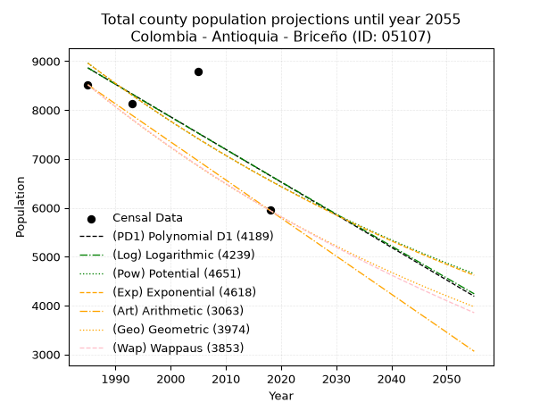
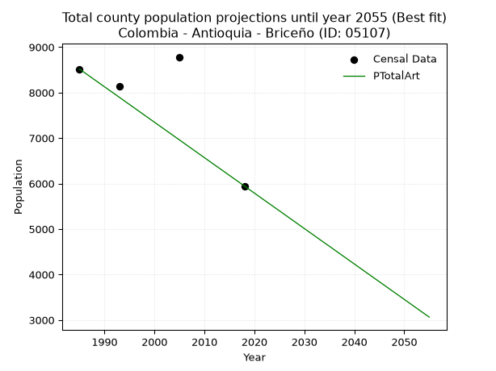
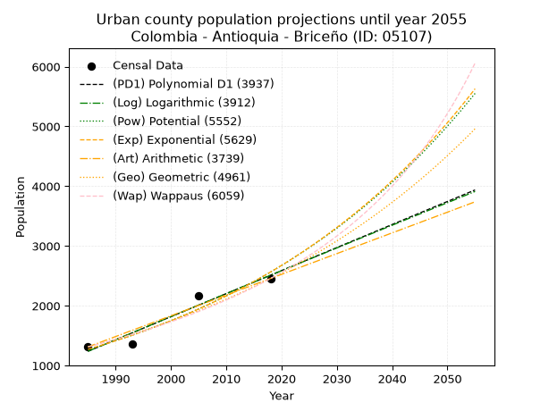
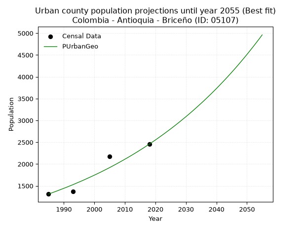
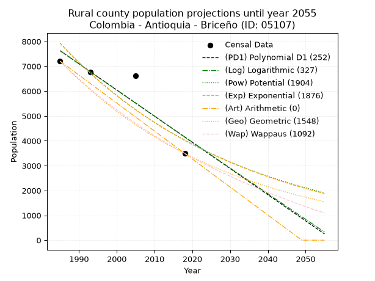
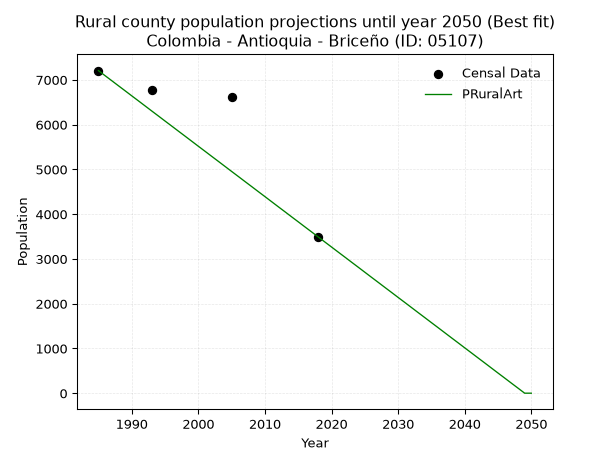

<div align="center">


</div>

# _“Population and Public Services Demand Projections (PPSD) until Year 2050 for Colombia - Antioquia - Briceño (ID: 05107)”_
Keywords: `population` `public-service` `projection` `lineal` `polynomial` `logarithmic` `potential` `exponential` `arithmetic` `geometric` `wappaus` `dane` `colombia` `south-america`

PPSD are analytical estimates used by governments and planners to anticipate future changes in population size, age distribution, and the resulting community needs for utilities, healthcare, education, and infrastructure as sizing future water treatment facilities, electrical grids, and road networks based on spatial growth.

> **General running parameters**: • app_version: _v20260806_. • Python version: _3.14.7_. • Pandas version: _3.0.5_. • NumPy version: _2.5.1_. • Creates, save and include plots into reports (create_plot): _True_. • Projection until year: _2050_. • Process polynomial degree 2 and up: _False_. • Process Wappaus: _True_. • Process Wappaus: _True_. • Set negative values to zero: _True_. • Set infinite values to zero: _True_. • Drop dataset notes: _True_. 
<div align="center">

Dynamic map: [:earth_americas:Google](http://maps.google.com/maps?q=7.112803077,-75.5503601) [:earth_americas:OSM](https://www.openstreetmap.org/#map=18/7.112803077/-75.5503601&layers=P) [:earth_americas:Bing](https://www.bing.com/maps?cp=7.112803077~-75.5503601&lvl=18) [:earth_americas:Apple](https://maps.apple.com/frame?center=7.112803077%2C-75.5503601&span=0.003%2C0.006)

</div>


<div align="center">

```geojson
{
  "type": "Feature",
  "geometry": {
    "type": "Point", 
    "coordinates": [-75.5503601, 7.112803077]
  }, 
  "properties": {
    "Name": "Colombia - Antioquia - Briceño (ID: 05107)"
  }
}
```

</div>


## 0. Census Data (4 records)

Census data are official statistics collected by a government about the people and housing in a country. They usually include counts of total population, age, sex, race, income, education, and jobs.

📅Global census file: [Population.xlsx](../data/Population.xlsx)

| Source   |   Year |   CountryID | CountryName   |   StateID | StateName   |   CountyID | CountyName   |   PTotal |   PUrban |   PRural |
|:---------|-------:|------------:|:--------------|----------:|:------------|-----------:|:-------------|---------:|---------:|---------:|
| DANE     |   1985 |          57 | Colombia      |        05 | Antioquia   |      05107 | Briceño      |     8517 |     1312 |     7205 |
| DANE     |   1993 |          57 | Colombia      |        05 | Antioquia   |      05107 | Briceño      |     8132 |     1366 |     6766 |
| DANE     |   2005 |          57 | Colombia      |        05 | Antioquia   |      05107 | Briceño      |     8783 |     2173 |     6610 |
| DANE     |   2018 |          57 | Colombia      |        05 | Antioquia   |      05107 | Briceño      |     5946 |     2456 |     3490 |

> 🔥Some records has specific notes about the registered values or the corresponding urban or rural distribution.

## 1. Total

### 1.1. Coefficients and Parameters

* (PD1) Polynomial Deg 1: -66.76916900842863, 141399.53030910937 (lineal)
* (Log) Logarithmic: -133416.36136256924, 1021943.3318485109
* (Pow) Potential: -18.92179695931196, 66.35187468931947
* (Exp) Exponential: -0.009469185870838214, 1304506954258.5503
* (Art) Arithmetic: Year diff. 2018 - 1985 = 33, Population diff. 5946 - 8517 = -2571, Annual growth = -77.9090909090909
* (Geo) Geometric: Year diff. 2018 - 1985 = 33, Population diff. 5946 - 8517 = -2571, Annual growth % = -0.01083018247551415
* (Wap) Wappaus: i = -1.07735726901875, Condition values only valid for < 200)

<sub>
Wappaus condition values: ['-0.00', '-1.08', '-2.15', '-3.23', '-4.31', '-5.39', '-6.46', '-7.54', '-8.62', '-9.70', '-10.77', '-11.85', '-12.93', '-14.01', '-15.08', '-16.16', '-17.24', '-18.32', '-19.39', '-20.47', '-21.55', '-22.62', '-23.70', '-24.78', '-25.86', '-26.93', '-28.01', '-29.09', '-30.17', '-31.24', '-32.32', '-33.40', '-34.48', '-35.55', '-36.63', '-37.71', '-38.78', '-39.86', '-40.94', '-42.02', '-43.09', '-44.17', '-45.25', '-46.33', '-47.40', '-48.48', '-49.56', '-50.64', '-51.71', '-52.79', '-53.87', '-54.95', '-56.02', '-57.10', '-58.18', '-59.25', '-60.33', '-61.41', '-62.49', '-63.56', '-64.64', '-65.72', '-66.80', '-67.87', '-68.95', '-70.03']
</sub>


### 1.2. Projected Dataset

|   Year |   CountyID |   PTotalPD1 |   PTotalLog |   PTotalPow |   PTotalExp |   PTotalArt |   PTotalGeo |   PTotalWap |
|-------:|-----------:|------------:|------------:|------------:|------------:|------------:|------------:|------------:|
|   1985 |      05107 |        8863 |        8863 |        8960 |        8960 |        8517 |        8517 |        8517 |
|   1986 |      05107 |        8796 |        8796 |        8875 |        8875 |        8439 |        8425 |        8426 |
|   1987 |      05107 |        8729 |        8729 |        8791 |        8792 |        8361 |        8334 |        8335 |
|   1988 |      05107 |        8662 |        8661 |        8708 |        8709 |        8283 |        8243 |        8246 |
|   1989 |      05107 |        8596 |        8594 |        8625 |        8627 |        8205 |        8154 |        8158 |
|   1990 |      05107 |        8529 |        8527 |        8544 |        8546 |        8127 |        8066 |        8070 |
|   1991 |      05107 |        8462 |        8460 |        8463 |        8465 |        8050 |        7978 |        7984 |
|   1992 |      05107 |        8395 |        8393 |        8383 |        8385 |        7972 |        7892 |        7898 |
|   1993 |      05107 |        8329 |        8326 |        8304 |        8306 |        7894 |        7806 |        7813 |
|   1994 |      05107 |        8262 |        8259 |        8225 |        8228 |        7816 |        7722 |        7729 |
|   1995 |      05107 |        8195 |        8193 |        8148 |        8150 |        7738 |        7638 |        7646 |
|   1996 |      05107 |        8128 |        8126 |        8071 |        8074 |        7660 |        7556 |        7564 |
|   1997 |      05107 |        8061 |        8059 |        7994 |        7997 |        7582 |        7474 |        7483 |
|   1998 |      05107 |        7995 |        7992 |        7919 |        7922 |        7504 |        7393 |        7402 |
|   1999 |      05107 |        7928 |        7925 |        7844 |        7847 |        7426 |        7313 |        7322 |
|   2000 |      05107 |        7861 |        7859 |        7771 |        7773 |        7348 |        7234 |        7244 |
|   2001 |      05107 |        7794 |        7792 |        7697 |        7700 |        7270 |        7155 |        7165 |
|   2002 |      05107 |        7728 |        7725 |        7625 |        7628 |        7193 |        7078 |        7088 |
|   2003 |      05107 |        7661 |        7659 |        7553 |        7556 |        7115 |        7001 |        7011 |
|   2004 |      05107 |        7594 |        7592 |        7482 |        7485 |        7037 |        6925 |        6935 |
|   2005 |      05107 |        7527 |        7525 |        7412 |        7414 |        6959 |        6850 |        6860 |
|   2006 |      05107 |        7461 |        7459 |        7342 |        7344 |        6881 |        6776 |        6786 |
|   2007 |      05107 |        7394 |        7392 |        7274 |        7275 |        6803 |        6703 |        6712 |
|   2008 |      05107 |        7327 |        7326 |        7205 |        7206 |        6725 |        6630 |        6639 |
|   2009 |      05107 |        7260 |        7260 |        7138 |        7138 |        6647 |        6558 |        6567 |
|   2010 |      05107 |        7194 |        7193 |        7071 |        7071 |        6569 |        6487 |        6495 |
|   2011 |      05107 |        7127 |        7127 |        7005 |        7005 |        6491 |        6417 |        6424 |
|   2012 |      05107 |        7060 |        7060 |        6939 |        6939 |        6413 |        6347 |        6354 |
|   2013 |      05107 |        6993 |        6994 |        6874 |        6873 |        6336 |        6279 |        6284 |
|   2014 |      05107 |        6926 |        6928 |        6810 |        6808 |        6258 |        6211 |        6216 |
|   2015 |      05107 |        6860 |        6862 |        6746 |        6744 |        6180 |        6143 |        6147 |
|   2016 |      05107 |        6793 |        6795 |        6683 |        6681 |        6102 |        6077 |        6080 |
|   2017 |      05107 |        6726 |        6729 |        6621 |        6618 |        6024 |        6011 |        6012 |
|   2018 |      05107 |        6659 |        6663 |        6559 |        6555 |        5946 |        5946 |        5946 |
|   2019 |      05107 |        6593 |        6597 |        6498 |        6494 |        5868 |        5882 |        5880 |
|   2020 |      05107 |        6526 |        6531 |        6437 |        6432 |        5790 |        5818 |        5815 |
|   2021 |      05107 |        6459 |        6465 |        6377 |        6372 |        5712 |        5755 |        5750 |
|   2022 |      05107 |        6392 |        6399 |        6318 |        6312 |        5634 |        5693 |        5686 |
|   2023 |      05107 |        6326 |        6333 |        6259 |        6252 |        5556 |        5631 |        5623 |
|   2024 |      05107 |        6259 |        6267 |        6201 |        6193 |        5479 |        5570 |        5560 |
|   2025 |      05107 |        6192 |        6201 |        6143 |        6135 |        5401 |        5510 |        5497 |
|   2026 |      05107 |        6125 |        6135 |        6086 |        6077 |        5323 |        5450 |        5435 |
|   2027 |      05107 |        6058 |        6070 |        6029 |        6020 |        5245 |        5391 |        5374 |
|   2028 |      05107 |        5992 |        6004 |        5973 |        5963 |        5167 |        5333 |        5313 |
|   2029 |      05107 |        5925 |        5938 |        5918 |        5907 |        5089 |        5275 |        5253 |
|   2030 |      05107 |        5858 |        5872 |        5863 |        5851 |        5011 |        5218 |        5194 |
|   2031 |      05107 |        5791 |        5806 |        5808 |        5796 |        4933 |        5161 |        5134 |
|   2032 |      05107 |        5725 |        5741 |        5755 |        5741 |        4855 |        5105 |        5076 |
|   2033 |      05107 |        5658 |        5675 |        5701 |        5687 |        4777 |        5050 |        5017 |
|   2034 |      05107 |        5591 |        5610 |        5648 |        5634 |        4699 |        4995 |        4960 |
|   2035 |      05107 |        5524 |        5544 |        5596 |        5581 |        4622 |        4941 |        4903 |
|   2036 |      05107 |        5458 |        5478 |        5544 |        5528 |        4544 |        4888 |        4846 |
|   2037 |      05107 |        5391 |        5413 |        5493 |        5476 |        4466 |        4835 |        4790 |
|   2038 |      05107 |        5324 |        5347 |        5442 |        5424 |        4388 |        4782 |        4734 |
|   2039 |      05107 |        5257 |        5282 |        5392 |        5373 |        4310 |        4731 |        4679 |
|   2040 |      05107 |        5190 |        5217 |        5342 |        5323 |        4232 |        4679 |        4624 |
|   2041 |      05107 |        5124 |        5151 |        5293 |        5272 |        4154 |        4629 |        4569 |
|   2042 |      05107 |        5057 |        5086 |        5244 |        5223 |        4076 |        4579 |        4515 |
|   2043 |      05107 |        4990 |        5021 |        5196 |        5173 |        3998 |        4529 |        4462 |
|   2044 |      05107 |        4923 |        4955 |        5148 |        5125 |        3920 |        4480 |        4409 |
|   2045 |      05107 |        4857 |        4890 |        5100 |        5076 |        3842 |        4431 |        4356 |
|   2046 |      05107 |        4790 |        4825 |        5053 |        5029 |        3765 |        4383 |        4304 |
|   2047 |      05107 |        4723 |        4760 |        5007 |        4981 |        3687 |        4336 |        4252 |
|   2048 |      05107 |        4656 |        4694 |        4961 |        4934 |        3609 |        4289 |        4201 |
|   2049 |      05107 |        4590 |        4629 |        4915 |        4888 |        3531 |        4242 |        4150 |
|   2050 |      05107 |        4523 |        4564 |        4870 |        4842 |        3453 |        4197 |        4099 |
<div align="center">

</img>

</div>


### 1.3. Best fit with absolute error and relative error (%)

Relative error puts that difference into context by dividing the absolute error by the true value, creating a unitless ratio or percentage that shows the scale of the mistake.

Absolute and relative error

|   Year | Source   |   CountryID | CountryName   |   StateID | StateName   |   CountyID_x | CountyName   |   PTotal |   PUrban |   PRural |   CountyID_y |   PTotalPD1 |   PTotalLog |   PTotalPow |   PTotalExp |   PTotalArt |   PTotalGeo |   PTotalWap |   PTotalPD1AbsError |   PTotalLogAbsError |   PTotalPowAbsError |   PTotalExpAbsError |   PTotalArtAbsError |   PTotalGeoAbsError |   PTotalWapAbsError |   PTotalPD1RelError |   PTotalLogRelError |   PTotalPowRelError |   PTotalExpRelError |   PTotalArtRelError |   PTotalGeoRelError |   PTotalWapRelError |
|-------:|:---------|------------:|:--------------|----------:|:------------|-------------:|:-------------|---------:|---------:|---------:|-------------:|------------:|------------:|------------:|------------:|------------:|------------:|------------:|--------------------:|--------------------:|--------------------:|--------------------:|--------------------:|--------------------:|--------------------:|--------------------:|--------------------:|--------------------:|--------------------:|--------------------:|--------------------:|--------------------:|
|   1985 | DANE     |          57 | Colombia      |        05 | Antioquia   |        05107 | Briceño      |     8517 |     1312 |     7205 |        05107 |        8863 |        8863 |        8960 |        8960 |        8517 |        8517 |        8517 |                 346 |                 346 |                 443 |                 443 |                   0 |                   0 |                   0 |             4.06246 |             4.06246 |             5.20136 |             5.20136 |             0       |             0       |             0       |
|   1993 | DANE     |          57 | Colombia      |        05 | Antioquia   |        05107 | Briceño      |     8132 |     1366 |     6766 |        05107 |        8329 |        8326 |        8304 |        8306 |        7894 |        7806 |        7813 |                 197 |                 194 |                 172 |                 174 |                 238 |                 326 |                 319 |             2.42253 |             2.38564 |             2.1151  |             2.1397  |             2.92671 |             4.00885 |             3.92277 |
|   2005 | DANE     |          57 | Colombia      |        05 | Antioquia   |        05107 | Briceño      |     8783 |     2173 |     6610 |        05107 |        7527 |        7525 |        7412 |        7414 |        6959 |        6850 |        6860 |                1256 |                1258 |                1371 |                1369 |                1824 |                1933 |                1923 |            14.3004  |            14.3231  |            15.6097  |            15.5869  |            20.7674  |            22.0084  |            21.8946  |
|   2018 | DANE     |          57 | Colombia      |        05 | Antioquia   |        05107 | Briceño      |     5946 |     2456 |     3490 |        05107 |        6659 |        6663 |        6559 |        6555 |        5946 |        5946 |        5946 |                 713 |                 717 |                 613 |                 609 |                   0 |                   0 |                   0 |            11.9913  |            12.0585  |            10.3095  |            10.2422  |             0       |             0       |             0       |

Relative error mean

| Method    |   RelError | Best   |
|:----------|-----------:|:-------|
| PTotalPD1 |    8.19415 |        |
| PTotalLog |    8.20744 |        |
| PTotalPow |    8.3089  |        |
| PTotalExp |    8.29254 |        |
| PTotalArt |    5.92353 | True   |
| PTotalGeo |    6.50432 |        |
| PTotalWap |    6.45434 |        |

💙Best method: _**PTotalArt**_
<div align="center">

</img>

</div>


### 1.4. Fresh water supply demand in liters per capita per day (lpcd)

The fresh water supply demand typically ranges from 100 to 300 liters per capita per day (lpcd) for standard domestic and municipal planning, though absolute survival minimums set by the World Health Organization are as low as 7.5 to 20 liters per day, and total consumption in high-income nations can exceed 400 liters.

> `CZ`: Level in meters above the sea level (masl).<br> `WS`: Fresh water supply demand in liters per capita per day (lpcd or l/h/d).<br> `WSAll`: Zonal fresh water supply demand in liters per second (l/s).<br> `A`: Zonal area in square meters.

Reference values (RAS Colombia)

|    CZ |   WS |
|------:|-----:|
|  1000 |  120 |
|  2000 |  130 |
| 99999 |  140 |

County shapefile geometry properties and water supply values

|   CountyID |     ATotal |   CZTotal |   WSTotal |
|-----------:|-----------:|----------:|----------:|
|      05107 | 3.7624e+08 |   1289.22 |       130 |

Projected values for best method: PTotalArt

|   CountyID |   Year |   PTotalArt |   WSTotal |   WSTotalAll |
|-----------:|-------:|------------:|----------:|-------------:|
|      05107 |   1985 |        8517 |       130 |     12.8149  |
|      05107 |   1986 |        8439 |       130 |     12.6976  |
|      05107 |   1987 |        8361 |       130 |     12.5802  |
|      05107 |   1988 |        8283 |       130 |     12.4628  |
|      05107 |   1989 |        8205 |       130 |     12.3455  |
|      05107 |   1990 |        8127 |       130 |     12.2281  |
|      05107 |   1991 |        8050 |       130 |     12.1123  |
|      05107 |   1992 |        7972 |       130 |     11.9949  |
|      05107 |   1993 |        7894 |       130 |     11.8775  |
|      05107 |   1994 |        7816 |       130 |     11.7602  |
|      05107 |   1995 |        7738 |       130 |     11.6428  |
|      05107 |   1996 |        7660 |       130 |     11.5255  |
|      05107 |   1997 |        7582 |       130 |     11.4081  |
|      05107 |   1998 |        7504 |       130 |     11.2907  |
|      05107 |   1999 |        7426 |       130 |     11.1734  |
|      05107 |   2000 |        7348 |       130 |     11.056   |
|      05107 |   2001 |        7270 |       130 |     10.9387  |
|      05107 |   2002 |        7193 |       130 |     10.8228  |
|      05107 |   2003 |        7115 |       130 |     10.7054  |
|      05107 |   2004 |        7037 |       130 |     10.5881  |
|      05107 |   2005 |        6959 |       130 |     10.4707  |
|      05107 |   2006 |        6881 |       130 |     10.3534  |
|      05107 |   2007 |        6803 |       130 |     10.236   |
|      05107 |   2008 |        6725 |       130 |     10.1186  |
|      05107 |   2009 |        6647 |       130 |     10.0013  |
|      05107 |   2010 |        6569 |       130 |      9.88391 |
|      05107 |   2011 |        6491 |       130 |      9.76655 |
|      05107 |   2012 |        6413 |       130 |      9.64919 |
|      05107 |   2013 |        6336 |       130 |      9.53333 |
|      05107 |   2014 |        6258 |       130 |      9.41597 |
|      05107 |   2015 |        6180 |       130 |      9.29861 |
|      05107 |   2016 |        6102 |       130 |      9.18125 |
|      05107 |   2017 |        6024 |       130 |      9.06389 |
|      05107 |   2018 |        5946 |       130 |      8.94653 |
|      05107 |   2019 |        5868 |       130 |      8.82917 |
|      05107 |   2020 |        5790 |       130 |      8.71181 |
|      05107 |   2021 |        5712 |       130 |      8.59444 |
|      05107 |   2022 |        5634 |       130 |      8.47708 |
|      05107 |   2023 |        5556 |       130 |      8.35972 |
|      05107 |   2024 |        5479 |       130 |      8.24387 |
|      05107 |   2025 |        5401 |       130 |      8.1265  |
|      05107 |   2026 |        5323 |       130 |      8.00914 |
|      05107 |   2027 |        5245 |       130 |      7.89178 |
|      05107 |   2028 |        5167 |       130 |      7.77442 |
|      05107 |   2029 |        5089 |       130 |      7.65706 |
|      05107 |   2030 |        5011 |       130 |      7.5397  |
|      05107 |   2031 |        4933 |       130 |      7.42234 |
|      05107 |   2032 |        4855 |       130 |      7.30498 |
|      05107 |   2033 |        4777 |       130 |      7.18762 |
|      05107 |   2034 |        4699 |       130 |      7.07025 |
|      05107 |   2035 |        4622 |       130 |      6.9544  |
|      05107 |   2036 |        4544 |       130 |      6.83704 |
|      05107 |   2037 |        4466 |       130 |      6.71968 |
|      05107 |   2038 |        4388 |       130 |      6.60231 |
|      05107 |   2039 |        4310 |       130 |      6.48495 |
|      05107 |   2040 |        4232 |       130 |      6.36759 |
|      05107 |   2041 |        4154 |       130 |      6.25023 |
|      05107 |   2042 |        4076 |       130 |      6.13287 |
|      05107 |   2043 |        3998 |       130 |      6.01551 |
|      05107 |   2044 |        3920 |       130 |      5.89815 |
|      05107 |   2045 |        3842 |       130 |      5.78079 |
|      05107 |   2046 |        3765 |       130 |      5.66493 |
|      05107 |   2047 |        3687 |       130 |      5.54757 |
|      05107 |   2048 |        3609 |       130 |      5.43021 |
|      05107 |   2049 |        3531 |       130 |      5.31285 |
|      05107 |   2050 |        3453 |       130 |      5.19549 |

## 2. Urban

### 2.1. Coefficients and Parameters

* (PD1) Polynomial Deg 1: 38.5455640305096, -75274.01445202682 (lineal)
* (Log) Logarithmic: 77158.42856248246, -584655.0838122711
* (Pow) Potential: 42.540676833818985, -137.1848322369361
* (Exp) Exponential: 0.021249518209270887, 6.106101453788426e-16
* (Art) Arithmetic: Year diff. 2018 - 1985 = 33, Population diff. 2456 - 1312 = 1144, Annual growth = 34.666666666666664
* (Geo) Geometric: Year diff. 2018 - 1985 = 33, Population diff. 2456 - 1312 = 1144, Annual growth % = 0.01918107169167005
* (Wap) Wappaus: i = 1.8400566171266808, Condition values only valid for < 200)

<sub>
Wappaus condition values: ['0.00', '1.84', '3.68', '5.52', '7.36', '9.20', '11.04', '12.88', '14.72', '16.56', '18.40', '20.24', '22.08', '23.92', '25.76', '27.60', '29.44', '31.28', '33.12', '34.96', '36.80', '38.64', '40.48', '42.32', '44.16', '46.00', '47.84', '49.68', '51.52', '53.36', '55.20', '57.04', '58.88', '60.72', '62.56', '64.40', '66.24', '68.08', '69.92', '71.76', '73.60', '75.44', '77.28', '79.12', '80.96', '82.80', '84.64', '86.48', '88.32', '90.16', '92.00', '93.84', '95.68', '97.52', '99.36', '101.20', '103.04', '104.88', '106.72', '108.56', '110.40', '112.24', '114.08', '115.92', '117.76', '119.60']
</sub>


### 2.2. Projected Dataset

|   Year |   CountyID |   PUrbanPD1 |   PUrbanLog |   PUrbanPow |   PUrbanExp |   PUrbanArt |   PUrbanGeo |   PUrbanWap |
|-------:|-----------:|------------:|------------:|------------:|------------:|------------:|------------:|------------:|
|   1985 |      05107 |        1239 |        1238 |        1271 |        1272 |        1312 |        1312 |        1312 |
|   1986 |      05107 |        1277 |        1277 |        1298 |        1299 |        1347 |        1337 |        1336 |
|   1987 |      05107 |        1316 |        1315 |        1327 |        1327 |        1381 |        1363 |        1361 |
|   1988 |      05107 |        1355 |        1354 |        1355 |        1356 |        1416 |        1389 |        1386 |
|   1989 |      05107 |        1393 |        1393 |        1385 |        1385 |        1451 |        1416 |        1412 |
|   1990 |      05107 |        1432 |        1432 |        1415 |        1414 |        1485 |        1443 |        1439 |
|   1991 |      05107 |        1470 |        1471 |        1445 |        1445 |        1520 |        1470 |        1465 |
|   1992 |      05107 |        1509 |        1509 |        1476 |        1476 |        1555 |        1499 |        1493 |
|   1993 |      05107 |        1547 |        1548 |        1508 |        1508 |        1589 |        1527 |        1520 |
|   1994 |      05107 |        1586 |        1587 |        1541 |        1540 |        1624 |        1557 |        1549 |
|   1995 |      05107 |        1624 |        1625 |        1574 |        1573 |        1659 |        1587 |        1578 |
|   1996 |      05107 |        1663 |        1664 |        1608 |        1607 |        1693 |        1617 |        1607 |
|   1997 |      05107 |        1701 |        1703 |        1642 |        1641 |        1728 |        1648 |        1638 |
|   1998 |      05107 |        1740 |        1741 |        1678 |        1677 |        1763 |        1680 |        1668 |
|   1999 |      05107 |        1779 |        1780 |        1714 |        1713 |        1797 |        1712 |        1700 |
|   2000 |      05107 |        1817 |        1819 |        1751 |        1749 |        1832 |        1745 |        1732 |
|   2001 |      05107 |        1856 |        1857 |        1788 |        1787 |        1867 |        1778 |        1765 |
|   2002 |      05107 |        1894 |        1896 |        1827 |        1825 |        1901 |        1812 |        1798 |
|   2003 |      05107 |        1933 |        1934 |        1866 |        1864 |        1936 |        1847 |        1833 |
|   2004 |      05107 |        1971 |        1973 |        1906 |        1904 |        1971 |        1882 |        1868 |
|   2005 |      05107 |        2010 |        2011 |        1947 |        1945 |        2005 |        1918 |        1904 |
|   2006 |      05107 |        2048 |        2050 |        1989 |        1987 |        2040 |        1955 |        1940 |
|   2007 |      05107 |        2087 |        2088 |        2031 |        2030 |        2075 |        1993 |        1978 |
|   2008 |      05107 |        2125 |        2127 |        2075 |        2073 |        2109 |        2031 |        2016 |
|   2009 |      05107 |        2164 |        2165 |        2119 |        2118 |        2144 |        2070 |        2056 |
|   2010 |      05107 |        2203 |        2203 |        2165 |        2163 |        2179 |        2110 |        2096 |
|   2011 |      05107 |        2241 |        2242 |        2211 |        2210 |        2213 |        2150 |        2137 |
|   2012 |      05107 |        2280 |        2280 |        2258 |        2257 |        2248 |        2191 |        2179 |
|   2013 |      05107 |        2318 |        2319 |        2306 |        2306 |        2283 |        2233 |        2223 |
|   2014 |      05107 |        2357 |        2357 |        2356 |        2355 |        2317 |        2276 |        2267 |
|   2015 |      05107 |        2395 |        2395 |        2406 |        2406 |        2352 |        2320 |        2312 |
|   2016 |      05107 |        2434 |        2433 |        2457 |        2458 |        2387 |        2364 |        2359 |
|   2017 |      05107 |        2472 |        2472 |        2510 |        2510 |        2421 |        2410 |        2407 |
|   2018 |      05107 |        2511 |        2510 |        2563 |        2564 |        2456 |        2456 |        2456 |
|   2019 |      05107 |        2549 |        2548 |        2618 |        2619 |        2491 |        2503 |        2506 |
|   2020 |      05107 |        2588 |        2586 |        2673 |        2676 |        2525 |        2551 |        2558 |
|   2021 |      05107 |        2627 |        2625 |        2730 |        2733 |        2560 |        2600 |        2612 |
|   2022 |      05107 |        2665 |        2663 |        2788 |        2792 |        2595 |        2650 |        2666 |
|   2023 |      05107 |        2704 |        2701 |        2848 |        2852 |        2629 |        2701 |        2723 |
|   2024 |      05107 |        2742 |        2739 |        2908 |        2913 |        2664 |        2753 |        2780 |
|   2025 |      05107 |        2781 |        2777 |        2970 |        2976 |        2699 |        2805 |        2840 |
|   2026 |      05107 |        2819 |        2815 |        3033 |        3040 |        2733 |        2859 |        2901 |
|   2027 |      05107 |        2858 |        2853 |        3097 |        3105 |        2768 |        2914 |        2964 |
|   2028 |      05107 |        2896 |        2891 |        3163 |        3171 |        2803 |        2970 |        3030 |
|   2029 |      05107 |        2935 |        2929 |        3230 |        3240 |        2837 |        3027 |        3097 |
|   2030 |      05107 |        2973 |        2967 |        3298 |        3309 |        2872 |        3085 |        3166 |
|   2031 |      05107 |        3012 |        3005 |        3368 |        3380 |        2907 |        3144 |        3237 |
|   2032 |      05107 |        3051 |        3043 |        3439 |        3453 |        2941 |        3204 |        3311 |
|   2033 |      05107 |        3089 |        3081 |        3512 |        3527 |        2976 |        3266 |        3387 |
|   2034 |      05107 |        3128 |        3119 |        3586 |        3603 |        3011 |        3329 |        3466 |
|   2035 |      05107 |        3166 |        3157 |        3662 |        3680 |        3045 |        3392 |        3547 |
|   2036 |      05107 |        3205 |        3195 |        3740 |        3759 |        3080 |        3457 |        3632 |
|   2037 |      05107 |        3243 |        3233 |        3818 |        3840 |        3115 |        3524 |        3719 |
|   2038 |      05107 |        3282 |        3271 |        3899 |        3922 |        3149 |        3591 |        3809 |
|   2039 |      05107 |        3320 |        3309 |        3981 |        4007 |        3184 |        3660 |        3903 |
|   2040 |      05107 |        3359 |        3347 |        4065 |        4093 |        3219 |        3730 |        4000 |
|   2041 |      05107 |        3397 |        3384 |        4151 |        4181 |        3253 |        3802 |        4101 |
|   2042 |      05107 |        3436 |        3422 |        4238 |        4270 |        3288 |        3875 |        4205 |
|   2043 |      05107 |        3475 |        3460 |        4327 |        4362 |        3323 |        3949 |        4314 |
|   2044 |      05107 |        3513 |        3498 |        4418 |        4456 |        3357 |        4025 |        4427 |
|   2045 |      05107 |        3552 |        3535 |        4511 |        4551 |        3392 |        4102 |        4545 |
|   2046 |      05107 |        3590 |        3573 |        4606 |        4649 |        3427 |        4181 |        4668 |
|   2047 |      05107 |        3629 |        3611 |        4703 |        4749 |        3461 |        4261 |        4796 |
|   2048 |      05107 |        3667 |        3649 |        4802 |        4851 |        3496 |        4343 |        4930 |
|   2049 |      05107 |        3706 |        3686 |        4902 |        4955 |        3531 |        4426 |        5070 |
|   2050 |      05107 |        3744 |        3724 |        5005 |        5062 |        3565 |        4511 |        5216 |
<div align="center">

</img>

</div>


### 2.3. Best fit with absolute error and relative error (%)

Relative error puts that difference into context by dividing the absolute error by the true value, creating a unitless ratio or percentage that shows the scale of the mistake.

Absolute and relative error

|   Year | Source   |   CountryID | CountryName   |   StateID | StateName   |   CountyID_x | CountyName   |   PTotal |   PUrban |   PRural |   CountyID_y |   PUrbanPD1 |   PUrbanLog |   PUrbanPow |   PUrbanExp |   PUrbanArt |   PUrbanGeo |   PUrbanWap |   PUrbanPD1AbsError |   PUrbanLogAbsError |   PUrbanPowAbsError |   PUrbanExpAbsError |   PUrbanArtAbsError |   PUrbanGeoAbsError |   PUrbanWapAbsError |   PUrbanPD1RelError |   PUrbanLogRelError |   PUrbanPowRelError |   PUrbanExpRelError |   PUrbanArtRelError |   PUrbanGeoRelError |   PUrbanWapRelError |
|-------:|:---------|------------:|:--------------|----------:|:------------|-------------:|:-------------|---------:|---------:|---------:|-------------:|------------:|------------:|------------:|------------:|------------:|------------:|------------:|--------------------:|--------------------:|--------------------:|--------------------:|--------------------:|--------------------:|--------------------:|--------------------:|--------------------:|--------------------:|--------------------:|--------------------:|--------------------:|--------------------:|
|   1985 | DANE     |          57 | Colombia      |        05 | Antioquia   |        05107 | Briceño      |     8517 |     1312 |     7205 |        05107 |        1239 |        1238 |        1271 |        1272 |        1312 |        1312 |        1312 |                  73 |                  74 |                  41 |                  40 |                   0 |                   0 |                   0 |             5.56402 |             5.64024 |             3.125   |             3.04878 |             0       |              0      |              0      |
|   1993 | DANE     |          57 | Colombia      |        05 | Antioquia   |        05107 | Briceño      |     8132 |     1366 |     6766 |        05107 |        1547 |        1548 |        1508 |        1508 |        1589 |        1527 |        1520 |                 181 |                 182 |                 142 |                 142 |                 223 |                 161 |                 154 |            13.2504  |            13.3236  |            10.3953  |            10.3953  |            16.325   |             11.7862 |             11.2738 |
|   2005 | DANE     |          57 | Colombia      |        05 | Antioquia   |        05107 | Briceño      |     8783 |     2173 |     6610 |        05107 |        2010 |        2011 |        1947 |        1945 |        2005 |        1918 |        1904 |                 163 |                 162 |                 226 |                 228 |                 168 |                 255 |                 269 |             7.50115 |             7.45513 |            10.4004  |            10.4924  |             7.73125 |             11.7349 |             12.3792 |
|   2018 | DANE     |          57 | Colombia      |        05 | Antioquia   |        05107 | Briceño      |     5946 |     2456 |     3490 |        05107 |        2511 |        2510 |        2563 |        2564 |        2456 |        2456 |        2456 |                  55 |                  54 |                 107 |                 108 |                   0 |                   0 |                   0 |             2.23941 |             2.1987  |             4.35668 |             4.39739 |             0       |              0      |              0      |

Relative error mean

| Method    |   RelError | Best   |
|:----------|-----------:|:-------|
| PUrbanPD1 |    7.13874 |        |
| PUrbanLog |    7.15441 |        |
| PUrbanPow |    7.06934 |        |
| PUrbanExp |    7.08347 |        |
| PUrbanArt |    6.01407 |        |
| PUrbanGeo |    5.88029 | True   |
| PUrbanWap |    5.91325 |        |

💙Best method: _**PUrbanGeo**_
<div align="center">

</img>

</div>


### 2.4. Fresh water supply demand in liters per capita per day (lpcd)

The fresh water supply demand typically ranges from 100 to 300 liters per capita per day (lpcd) for standard domestic and municipal planning, though absolute survival minimums set by the World Health Organization are as low as 7.5 to 20 liters per day, and total consumption in high-income nations can exceed 400 liters.

> `CZ`: Level in meters above the sea level (masl).<br> `WS`: Fresh water supply demand in liters per capita per day (lpcd or l/h/d).<br> `WSAll`: Zonal fresh water supply demand in liters per second (l/s).<br> `A`: Zonal area in square meters.

Reference values (RAS Colombia)

|    CZ |   WS |
|------:|-----:|
|  1000 |  120 |
|  2000 |  130 |
| 99999 |  140 |

County shapefile geometry properties and water supply values

|   CountyID |   AUrban |   CZUrban |   WSUrban |
|-----------:|---------:|----------:|----------:|
|      05107 |   499081 |   1226.55 |       130 |

Projected values for best method: PUrbanGeo

|   CountyID |   Year |   PUrbanGeo |   WSUrban |   WSUrbanAll |
|-----------:|-------:|------------:|----------:|-------------:|
|      05107 |   1985 |        1312 |       130 |      1.97407 |
|      05107 |   1986 |        1337 |       130 |      2.01169 |
|      05107 |   1987 |        1363 |       130 |      2.05081 |
|      05107 |   1988 |        1389 |       130 |      2.08993 |
|      05107 |   1989 |        1416 |       130 |      2.13056 |
|      05107 |   1990 |        1443 |       130 |      2.17118 |
|      05107 |   1991 |        1470 |       130 |      2.21181 |
|      05107 |   1992 |        1499 |       130 |      2.25544 |
|      05107 |   1993 |        1527 |       130 |      2.29757 |
|      05107 |   1994 |        1557 |       130 |      2.34271 |
|      05107 |   1995 |        1587 |       130 |      2.38785 |
|      05107 |   1996 |        1617 |       130 |      2.43299 |
|      05107 |   1997 |        1648 |       130 |      2.47963 |
|      05107 |   1998 |        1680 |       130 |      2.52778 |
|      05107 |   1999 |        1712 |       130 |      2.57593 |
|      05107 |   2000 |        1745 |       130 |      2.62558 |
|      05107 |   2001 |        1778 |       130 |      2.67523 |
|      05107 |   2002 |        1812 |       130 |      2.72639 |
|      05107 |   2003 |        1847 |       130 |      2.77905 |
|      05107 |   2004 |        1882 |       130 |      2.83171 |
|      05107 |   2005 |        1918 |       130 |      2.88588 |
|      05107 |   2006 |        1955 |       130 |      2.94155 |
|      05107 |   2007 |        1993 |       130 |      2.99873 |
|      05107 |   2008 |        2031 |       130 |      3.0559  |
|      05107 |   2009 |        2070 |       130 |      3.11458 |
|      05107 |   2010 |        2110 |       130 |      3.17477 |
|      05107 |   2011 |        2150 |       130 |      3.23495 |
|      05107 |   2012 |        2191 |       130 |      3.29664 |
|      05107 |   2013 |        2233 |       130 |      3.35984 |
|      05107 |   2014 |        2276 |       130 |      3.42454 |
|      05107 |   2015 |        2320 |       130 |      3.49074 |
|      05107 |   2016 |        2364 |       130 |      3.55694 |
|      05107 |   2017 |        2410 |       130 |      3.62616 |
|      05107 |   2018 |        2456 |       130 |      3.69537 |
|      05107 |   2019 |        2503 |       130 |      3.76609 |
|      05107 |   2020 |        2551 |       130 |      3.83831 |
|      05107 |   2021 |        2600 |       130 |      3.91204 |
|      05107 |   2022 |        2650 |       130 |      3.98727 |
|      05107 |   2023 |        2701 |       130 |      4.064   |
|      05107 |   2024 |        2753 |       130 |      4.14225 |
|      05107 |   2025 |        2805 |       130 |      4.22049 |
|      05107 |   2026 |        2859 |       130 |      4.30174 |
|      05107 |   2027 |        2914 |       130 |      4.38449 |
|      05107 |   2028 |        2970 |       130 |      4.46875 |
|      05107 |   2029 |        3027 |       130 |      4.55451 |
|      05107 |   2030 |        3085 |       130 |      4.64178 |
|      05107 |   2031 |        3144 |       130 |      4.73056 |
|      05107 |   2032 |        3204 |       130 |      4.82083 |
|      05107 |   2033 |        3266 |       130 |      4.91412 |
|      05107 |   2034 |        3329 |       130 |      5.00891 |
|      05107 |   2035 |        3392 |       130 |      5.1037  |
|      05107 |   2036 |        3457 |       130 |      5.2015  |
|      05107 |   2037 |        3524 |       130 |      5.30231 |
|      05107 |   2038 |        3591 |       130 |      5.40313 |
|      05107 |   2039 |        3660 |       130 |      5.50694 |
|      05107 |   2040 |        3730 |       130 |      5.61227 |
|      05107 |   2041 |        3802 |       130 |      5.7206  |
|      05107 |   2042 |        3875 |       130 |      5.83044 |
|      05107 |   2043 |        3949 |       130 |      5.94178 |
|      05107 |   2044 |        4025 |       130 |      6.05613 |
|      05107 |   2045 |        4102 |       130 |      6.17199 |
|      05107 |   2046 |        4181 |       130 |      6.29086 |
|      05107 |   2047 |        4261 |       130 |      6.41123 |
|      05107 |   2048 |        4343 |       130 |      6.53461 |
|      05107 |   2049 |        4426 |       130 |      6.65949 |
|      05107 |   2050 |        4511 |       130 |      6.78738 |

## 3. Rural

### 3.1. Coefficients and Parameters

* (PD1) Polynomial Deg 1: -105.31473303893823, 216673.54476113617 (lineal)
* (Log) Logarithmic: -210574.78992505168, 1606598.4156607823
* (Pow) Potential: -41.15703664845353, 139.62524742575224
* (Exp) Exponential: -0.02058633815427969, 4.4263879561155324e+21
* (Art) Arithmetic: Year diff. 2018 - 1985 = 33, Population diff. 3490 - 7205 = -3715, Annual growth = -112.57575757575758
* (Geo) Geometric: Year diff. 2018 - 1985 = 33, Population diff. 3490 - 7205 = -3715, Annual growth % = -0.021726370613946222
* (Wap) Wappaus: i = -2.105203507728052, Condition values only valid for < 200)

<sub>
Wappaus condition values: ['-0.00', '-2.11', '-4.21', '-6.32', '-8.42', '-10.53', '-12.63', '-14.74', '-16.84', '-18.95', '-21.05', '-23.16', '-25.26', '-27.37', '-29.47', '-31.58', '-33.68', '-35.79', '-37.89', '-40.00', '-42.10', '-44.21', '-46.31', '-48.42', '-50.52', '-52.63', '-54.74', '-56.84', '-58.95', '-61.05', '-63.16', '-65.26', '-67.37', '-69.47', '-71.58', '-73.68', '-75.79', '-77.89', '-80.00', '-82.10', '-84.21', '-86.31', '-88.42', '-90.52', '-92.63', '-94.73', '-96.84', '-98.94', '-101.05', '-103.15', '-105.26', '-107.37', '-109.47', '-111.58', '-113.68', '-115.79', '-117.89', '-120.00', '-122.10', '-124.21', '-126.31', '-128.42', '-130.52', '-132.63', '-134.73', '-136.84']
</sub>


### 3.2. Projected Dataset

|   Year |   CountyID |   PRuralPD1 |   PRuralLog |   PRuralPow |   PRuralExp |   PRuralArt |   PRuralGeo |   PRuralWap |
|-------:|-----------:|------------:|------------:|------------:|------------:|------------:|------------:|------------:|
|   1985 |      05107 |        7624 |        7625 |        7929 |        7927 |        7205 |        7205 |        7205 |
|   1986 |      05107 |        7518 |        7519 |        7766 |        7765 |        7092 |        7048 |        7055 |
|   1987 |      05107 |        7413 |        7413 |        7607 |        7607 |        6980 |        6895 |        6908 |
|   1988 |      05107 |        7308 |        7307 |        7451 |        7452 |        6867 |        6746 |        6764 |
|   1989 |      05107 |        7203 |        7201 |        7298 |        7300 |        6755 |        6599 |        6623 |
|   1990 |      05107 |        7097 |        7095 |        7149 |        7151 |        6642 |        6456 |        6485 |
|   1991 |      05107 |        6992 |        6990 |        7002 |        7006 |        6530 |        6315 |        6349 |
|   1992 |      05107 |        6887 |        6884 |        6859 |        6863 |        6417 |        6178 |        6216 |
|   1993 |      05107 |        6781 |        6778 |        6719 |        6723 |        6304 |        6044 |        6086 |
|   1994 |      05107 |        6676 |        6673 |        6582 |        6586 |        6192 |        5913 |        5958 |
|   1995 |      05107 |        6571 |        6567 |        6447 |        6452 |        6079 |        5784 |        5833 |
|   1996 |      05107 |        6465 |        6462 |        6316 |        6320 |        5967 |        5658 |        5710 |
|   1997 |      05107 |        6360 |        6356 |        6187 |        6192 |        5854 |        5536 |        5589 |
|   1998 |      05107 |        6255 |        6251 |        6061 |        6065 |        5742 |        5415 |        5471 |
|   1999 |      05107 |        6149 |        6145 |        5937 |        5942 |        5629 |        5298 |        5354 |
|   2000 |      05107 |        6044 |        6040 |        5816 |        5821 |        5516 |        5182 |        5240 |
|   2001 |      05107 |        5939 |        5935 |        5698 |        5702 |        5404 |        5070 |        5128 |
|   2002 |      05107 |        5833 |        5830 |        5582 |        5586 |        5291 |        4960 |        5018 |
|   2003 |      05107 |        5728 |        5724 |        5468 |        5472 |        5179 |        4852 |        4910 |
|   2004 |      05107 |        5623 |        5619 |        5357 |        5361 |        5066 |        4747 |        4803 |
|   2005 |      05107 |        5518 |        5514 |        5248 |        5251 |        4953 |        4643 |        4699 |
|   2006 |      05107 |        5412 |        5409 |        5142 |        5144 |        4841 |        4543 |        4596 |
|   2007 |      05107 |        5307 |        5304 |        5037 |        5040 |        4728 |        4444 |        4495 |
|   2008 |      05107 |        5202 |        5199 |        4935 |        4937 |        4616 |        4347 |        4396 |
|   2009 |      05107 |        5096 |        5095 |        4835 |        4836 |        4503 |        4253 |        4299 |
|   2010 |      05107 |        4991 |        4990 |        4737 |        4738 |        4391 |        4160 |        4203 |
|   2011 |      05107 |        4886 |        4885 |        4641 |        4641 |        4278 |        4070 |        4109 |
|   2012 |      05107 |        4780 |        4780 |        4547 |        4547 |        4165 |        3982 |        4016 |
|   2013 |      05107 |        4675 |        4676 |        4455 |        4454 |        4053 |        3895 |        3925 |
|   2014 |      05107 |        4570 |        4571 |        4365 |        4363 |        3940 |        3811 |        3835 |
|   2015 |      05107 |        4464 |        4467 |        4276 |        4274 |        3828 |        3728 |        3747 |
|   2016 |      05107 |        4359 |        4362 |        4190 |        4187 |        3715 |        3647 |        3660 |
|   2017 |      05107 |        4254 |        4258 |        4105 |        4102 |        3603 |        3568 |        3574 |
|   2018 |      05107 |        4148 |        4153 |        4022 |        4018 |        3490 |        3490 |        3490 |
|   2019 |      05107 |        4043 |        4049 |        3941 |        3937 |        3377 |        3414 |        3407 |
|   2020 |      05107 |        3938 |        3945 |        3862 |        3856 |        3265 |        3340 |        3325 |
|   2021 |      05107 |        3832 |        3840 |        3784 |        3778 |        3152 |        3267 |        3245 |
|   2022 |      05107 |        3727 |        3736 |        3708 |        3701 |        3040 |        3196 |        3166 |
|   2023 |      05107 |        3622 |        3632 |        3633 |        3625 |        2927 |        3127 |        3088 |
|   2024 |      05107 |        3517 |        3528 |        3560 |        3551 |        2815 |        3059 |        3011 |
|   2025 |      05107 |        3411 |        3424 |        3488 |        3479 |        2702 |        2993 |        2935 |
|   2026 |      05107 |        3306 |        3320 |        3418 |        3408 |        2589 |        2928 |        2861 |
|   2027 |      05107 |        3201 |        3216 |        3349 |        3339 |        2477 |        2864 |        2787 |
|   2028 |      05107 |        3095 |        3112 |        3282 |        3271 |        2364 |        2802 |        2715 |
|   2029 |      05107 |        2990 |        3009 |        3216 |        3204 |        2252 |        2741 |        2644 |
|   2030 |      05107 |        2885 |        2905 |        3151 |        3139 |        2139 |        2681 |        2573 |
|   2031 |      05107 |        2779 |        2801 |        3088 |        3075 |        2027 |        2623 |        2504 |
|   2032 |      05107 |        2674 |        2697 |        3026 |        3012 |        1914 |        2566 |        2436 |
|   2033 |      05107 |        2569 |        2594 |        2966 |        2951 |        1801 |        2510 |        2368 |
|   2034 |      05107 |        2463 |        2490 |        2906 |        2891 |        1689 |        2456 |        2302 |
|   2035 |      05107 |        2358 |        2387 |        2848 |        2832 |        1576 |        2402 |        2236 |
|   2036 |      05107 |        2253 |        2283 |        2791 |        2774 |        1464 |        2350 |        2171 |
|   2037 |      05107 |        2147 |        2180 |        2735 |        2718 |        1351 |        2299 |        2108 |
|   2038 |      05107 |        2042 |        2077 |        2680 |        2662 |        1238 |        2249 |        2045 |
|   2039 |      05107 |        1937 |        1973 |        2627 |        2608 |        1126 |        2200 |        1983 |
|   2040 |      05107 |        1831 |        1870 |        2574 |        2555 |        1013 |        2153 |        1921 |
|   2041 |      05107 |        1726 |        1767 |        2523 |        2503 |         901 |        2106 |        1861 |
|   2042 |      05107 |        1621 |        1664 |        2473 |        2452 |         788 |        2060 |        1801 |
|   2043 |      05107 |        1516 |        1561 |        2423 |        2402 |         676 |        2015 |        1742 |
|   2044 |      05107 |        1410 |        1458 |        2375 |        2353 |         563 |        1971 |        1684 |
|   2045 |      05107 |        1305 |        1355 |        2328 |        2305 |         450 |        1929 |        1627 |
|   2046 |      05107 |        1200 |        1252 |        2281 |        2258 |         338 |        1887 |        1570 |
|   2047 |      05107 |        1094 |        1149 |        2236 |        2212 |         225 |        1846 |        1515 |
|   2048 |      05107 |         989 |        1046 |        2191 |        2167 |         113 |        1806 |        1459 |
|   2049 |      05107 |         884 |         943 |        2148 |        2123 |           0 |        1766 |        1405 |
|   2050 |      05107 |         778 |         840 |        2105 |        2079 |           0 |        1728 |        1351 |
<div align="center">

</img>

</div>


### 3.3. Best fit with absolute error and relative error (%)

Relative error puts that difference into context by dividing the absolute error by the true value, creating a unitless ratio or percentage that shows the scale of the mistake.

Absolute and relative error

|   Year | Source   |   CountryID | CountryName   |   StateID | StateName   |   CountyID_x | CountyName   |   PTotal |   PUrban |   PRural |   CountyID_y |   PRuralPD1 |   PRuralLog |   PRuralPow |   PRuralExp |   PRuralArt |   PRuralGeo |   PRuralWap |   PRuralPD1AbsError |   PRuralLogAbsError |   PRuralPowAbsError |   PRuralExpAbsError |   PRuralArtAbsError |   PRuralGeoAbsError |   PRuralWapAbsError |   PRuralPD1RelError |   PRuralLogRelError |   PRuralPowRelError |   PRuralExpRelError |   PRuralArtRelError |   PRuralGeoRelError |   PRuralWapRelError |
|-------:|:---------|------------:|:--------------|----------:|:------------|-------------:|:-------------|---------:|---------:|---------:|-------------:|------------:|------------:|------------:|------------:|------------:|------------:|------------:|--------------------:|--------------------:|--------------------:|--------------------:|--------------------:|--------------------:|--------------------:|--------------------:|--------------------:|--------------------:|--------------------:|--------------------:|--------------------:|--------------------:|
|   1985 | DANE     |          57 | Colombia      |        05 | Antioquia   |        05107 | Briceño      |     8517 |     1312 |     7205 |        05107 |        7624 |        7625 |        7929 |        7927 |        7205 |        7205 |        7205 |                 419 |                 420 |                 724 |                 722 |                   0 |                   0 |                   0 |            5.81541  |            5.82929  |            10.0486  |           10.0208   |             0       |              0      |              0      |
|   1993 | DANE     |          57 | Colombia      |        05 | Antioquia   |        05107 | Briceño      |     8132 |     1366 |     6766 |        05107 |        6781 |        6778 |        6719 |        6723 |        6304 |        6044 |        6086 |                  15 |                  12 |                  47 |                  43 |                 462 |                 722 |                 680 |            0.221697 |            0.177357 |             0.69465 |            0.635531 |             6.82826 |             10.671  |             10.0503 |
|   2005 | DANE     |          57 | Colombia      |        05 | Antioquia   |        05107 | Briceño      |     8783 |     2173 |     6610 |        05107 |        5518 |        5514 |        5248 |        5251 |        4953 |        4643 |        4699 |                1092 |                1096 |                1362 |                1359 |                1657 |                1967 |                1911 |           16.5204   |           16.5809   |            20.6051  |           20.5598   |            25.0681  |             29.7579 |             28.9107 |
|   2018 | DANE     |          57 | Colombia      |        05 | Antioquia   |        05107 | Briceño      |     5946 |     2456 |     3490 |        05107 |        4148 |        4153 |        4022 |        4018 |        3490 |        3490 |        3490 |                 658 |                 663 |                 532 |                 528 |                   0 |                   0 |                   0 |           18.8539   |           18.9971   |            15.2436  |           15.1289   |             0       |              0      |              0      |

Relative error mean

| Method    |   RelError | Best   |
|:----------|-----------:|:-------|
| PRuralPD1 |   10.3528  |        |
| PRuralLog |   10.3962  |        |
| PRuralPow |   11.648   |        |
| PRuralExp |   11.5863  |        |
| PRuralArt |    7.97408 | True   |
| PRuralGeo |   10.1072  |        |
| PRuralWap |    9.74025 |        |

💙Best method: _**PRuralArt**_
<div align="center">

</img>

</div>


### 3.4. Fresh water supply demand in liters per capita per day (lpcd)

The fresh water supply demand typically ranges from 100 to 300 liters per capita per day (lpcd) for standard domestic and municipal planning, though absolute survival minimums set by the World Health Organization are as low as 7.5 to 20 liters per day, and total consumption in high-income nations can exceed 400 liters.

> `CZ`: Level in meters above the sea level (masl).<br> `WS`: Fresh water supply demand in liters per capita per day (lpcd or l/h/d).<br> `WSAll`: Zonal fresh water supply demand in liters per second (l/s).<br> `A`: Zonal area in square meters.

Reference values (RAS Colombia)

|    CZ |   WS |
|------:|-----:|
|  1000 |  120 |
|  2000 |  130 |
| 99999 |  140 |

County shapefile geometry properties and water supply values

|   CountyID |      ARural |   CZRural |   WSRural |
|-----------:|------------:|----------:|----------:|
|      05107 | 3.75741e+08 |    1289.3 |       130 |

Projected values for best method: PRuralArt

|   CountyID |   Year |   PRuralArt |   WSRural |   WSRuralAll |
|-----------:|-------:|------------:|----------:|-------------:|
|      05107 |   1985 |        7205 |       130 |    10.8409   |
|      05107 |   1986 |        7092 |       130 |    10.6708   |
|      05107 |   1987 |        6980 |       130 |    10.5023   |
|      05107 |   1988 |        6867 |       130 |    10.3323   |
|      05107 |   1989 |        6755 |       130 |    10.1638   |
|      05107 |   1990 |        6642 |       130 |     9.99375  |
|      05107 |   1991 |        6530 |       130 |     9.82523  |
|      05107 |   1992 |        6417 |       130 |     9.65521  |
|      05107 |   1993 |        6304 |       130 |     9.48519  |
|      05107 |   1994 |        6192 |       130 |     9.31667  |
|      05107 |   1995 |        6079 |       130 |     9.14664  |
|      05107 |   1996 |        5967 |       130 |     8.97813  |
|      05107 |   1997 |        5854 |       130 |     8.8081   |
|      05107 |   1998 |        5742 |       130 |     8.63958  |
|      05107 |   1999 |        5629 |       130 |     8.46956  |
|      05107 |   2000 |        5516 |       130 |     8.29954  |
|      05107 |   2001 |        5404 |       130 |     8.13102  |
|      05107 |   2002 |        5291 |       130 |     7.961    |
|      05107 |   2003 |        5179 |       130 |     7.79248  |
|      05107 |   2004 |        5066 |       130 |     7.62245  |
|      05107 |   2005 |        4953 |       130 |     7.45243  |
|      05107 |   2006 |        4841 |       130 |     7.28391  |
|      05107 |   2007 |        4728 |       130 |     7.11389  |
|      05107 |   2008 |        4616 |       130 |     6.94537  |
|      05107 |   2009 |        4503 |       130 |     6.77535  |
|      05107 |   2010 |        4391 |       130 |     6.60683  |
|      05107 |   2011 |        4278 |       130 |     6.43681  |
|      05107 |   2012 |        4165 |       130 |     6.26678  |
|      05107 |   2013 |        4053 |       130 |     6.09826  |
|      05107 |   2014 |        3940 |       130 |     5.92824  |
|      05107 |   2015 |        3828 |       130 |     5.75972  |
|      05107 |   2016 |        3715 |       130 |     5.5897   |
|      05107 |   2017 |        3603 |       130 |     5.42118  |
|      05107 |   2018 |        3490 |       130 |     5.25116  |
|      05107 |   2019 |        3377 |       130 |     5.08113  |
|      05107 |   2020 |        3265 |       130 |     4.91262  |
|      05107 |   2021 |        3152 |       130 |     4.74259  |
|      05107 |   2022 |        3040 |       130 |     4.57407  |
|      05107 |   2023 |        2927 |       130 |     4.40405  |
|      05107 |   2024 |        2815 |       130 |     4.23553  |
|      05107 |   2025 |        2702 |       130 |     4.06551  |
|      05107 |   2026 |        2589 |       130 |     3.89549  |
|      05107 |   2027 |        2477 |       130 |     3.72697  |
|      05107 |   2028 |        2364 |       130 |     3.55694  |
|      05107 |   2029 |        2252 |       130 |     3.38843  |
|      05107 |   2030 |        2139 |       130 |     3.2184   |
|      05107 |   2031 |        2027 |       130 |     3.04988  |
|      05107 |   2032 |        1914 |       130 |     2.87986  |
|      05107 |   2033 |        1801 |       130 |     2.70984  |
|      05107 |   2034 |        1689 |       130 |     2.54132  |
|      05107 |   2035 |        1576 |       130 |     2.3713   |
|      05107 |   2036 |        1464 |       130 |     2.20278  |
|      05107 |   2037 |        1351 |       130 |     2.03275  |
|      05107 |   2038 |        1238 |       130 |     1.86273  |
|      05107 |   2039 |        1126 |       130 |     1.69421  |
|      05107 |   2040 |        1013 |       130 |     1.52419  |
|      05107 |   2041 |         901 |       130 |     1.35567  |
|      05107 |   2042 |         788 |       130 |     1.18565  |
|      05107 |   2043 |         676 |       130 |     1.01713  |
|      05107 |   2044 |         563 |       130 |     0.847106 |
|      05107 |   2045 |         450 |       130 |     0.677083 |
|      05107 |   2046 |         338 |       130 |     0.508565 |
|      05107 |   2047 |         225 |       130 |     0.338542 |
|      05107 |   2048 |         113 |       130 |     0.170023 |
|      05107 |   2049 |           0 |       130 |     0        |
|      05107 |   2050 |           0 |       130 |     0        |

<div align="center"><br><sub>Share this research</sub></div><br>

<sub>**APPS & TOOLS & CONTENT DISCLAIMER**: • NO WARRANTY - This content and software is provided by <a href="https://github.com/rcfdtools" target="_blank">github.com/rcfdtools</a> "as is", without any express or implied warranty, including warranties of merchantability, fitness for a particular purpose, or non-infringement. There is no guarantee that the software will be error-free or operate without interruption. • LIMITATION OF LIABILITY - Neither the authors nor copyright holders will be liable for claims or damages arising from the software or its use. You are responsible for determining if the software is appropriate for your use and assume all associated risks, including errors, legal compliance, and data loss. • NO PROFESSIONAL ADVICE - The software provides general information and does not offer professional advice. It should not replace consultation with professional advisors. [Clauses and global license for rcfdtools use.](https://github.com/rcfdtools/rcfdtools/blob/main/LICENSE.md)</sub>