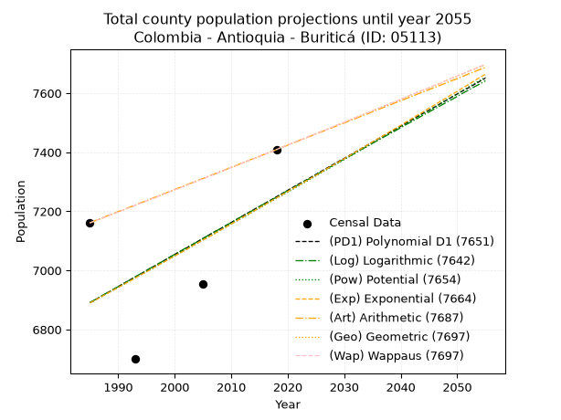
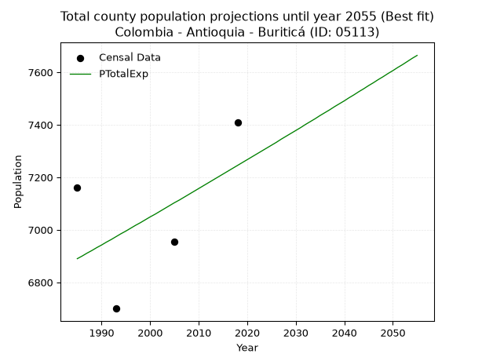
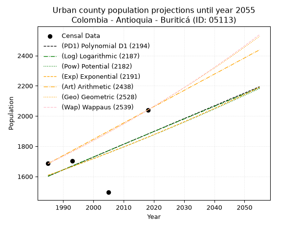
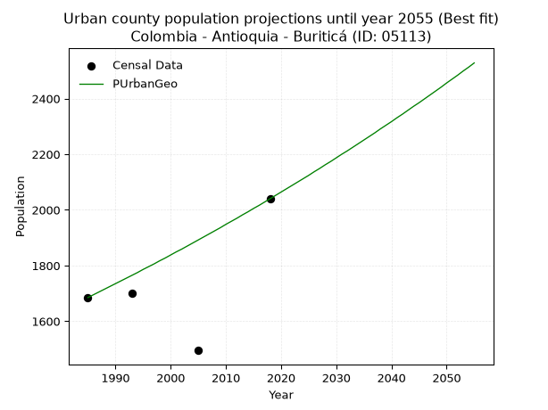
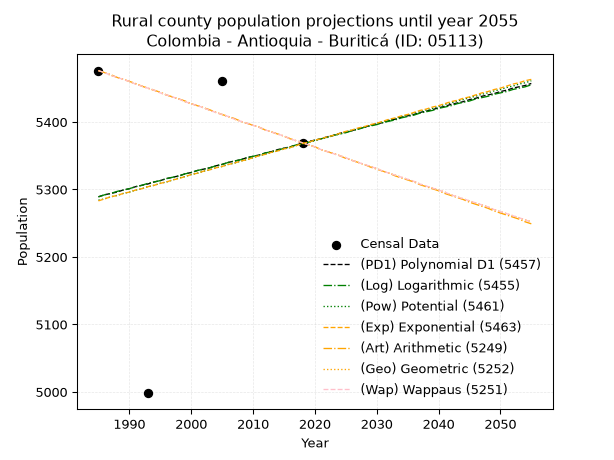
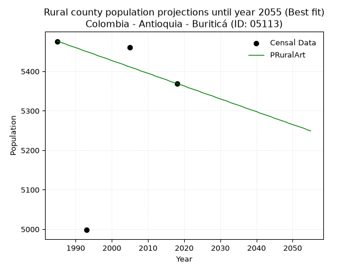

<div align="center">


</div>

# _“Population and Public Services Demand Projections (PPSD) until Year 2050 for Colombia - Antioquia - Buriticá (ID: 05113)”_
Keywords: `population` `public-service` `projection` `lineal` `polynomial` `logarithmic` `potential` `exponential` `arithmetic` `geometric` `wappaus` `dane` `colombia` `south-america`

PPSD are analytical estimates used by governments and planners to anticipate future changes in population size, age distribution, and the resulting community needs for utilities, healthcare, education, and infrastructure as sizing future water treatment facilities, electrical grids, and road networks based on spatial growth.

> **General running parameters**: • app_version: _v20260806_. • Python version: _3.14.7_. • Pandas version: _3.0.5_. • NumPy version: _2.5.1_. • Creates, save and include plots into reports (create_plot): _True_. • Projection until year: _2050_. • Process polynomial degree 2 and up: _False_. • Process Wappaus: _True_. • Process Wappaus: _True_. • Set negative values to zero: _True_. • Set infinite values to zero: _True_. • Drop dataset notes: _True_. 
<div align="center">

Dynamic map: [:earth_americas:Google](http://maps.google.com/maps?q=6.720758974,-75.9070003) [:earth_americas:OSM](https://www.openstreetmap.org/#map=18/6.720758974/-75.9070003&layers=P) [:earth_americas:Bing](https://www.bing.com/maps?cp=6.720758974~-75.9070003&lvl=18) [:earth_americas:Apple](https://maps.apple.com/frame?center=6.720758974%2C-75.9070003&span=0.003%2C0.006)

</div>


<div align="center">

```geojson
{
  "type": "Feature",
  "geometry": {
    "type": "Point", 
    "coordinates": [-75.9070003, 6.720758974]
  }, 
  "properties": {
    "Name": "Colombia - Antioquia - Buriticá (ID: 05113)"
  }
}
```

</div>


## 0. Census Data (4 records)

Census data are official statistics collected by a government about the people and housing in a country. They usually include counts of total population, age, sex, race, income, education, and jobs.

📅Global census file: [Population.xlsx](../data/Population.xlsx)

| Source   |   Year |   CountryID | CountryName   |   StateID | StateName   |   CountyID | CountyName   |   PTotal |   PUrban |   PRural |
|:---------|-------:|------------:|:--------------|----------:|:------------|-----------:|:-------------|---------:|---------:|---------:|
| DANE     |   1985 |          57 | Colombia      |        05 | Antioquia   |      05113 | Buriticá     |     7161 |     1685 |     5476 |
| DANE     |   1993 |          57 | Colombia      |        05 | Antioquia   |      05113 | Buriticá     |     6700 |     1702 |     4998 |
| DANE     |   2005 |          57 | Colombia      |        05 | Antioquia   |      05113 | Buriticá     |     6955 |     1495 |     5460 |
| DANE     |   2018 |          57 | Colombia      |        05 | Antioquia   |      05113 | Buriticá     |     7409 |     2040 |     5369 |

> 🔥Some records has specific notes about the registered values or the corresponding urban or rural distribution.

## 1. Total

### 1.1. Coefficients and Parameters

* (PD1) Polynomial Deg 1: 10.864311521477036, -14675.089120834444 (lineal)
* (Log) Logarithmic: 21669.66356824609, -157655.0364320243
* (Pow) Potential: 3.0365049205409442, -6.175456721243416
* (Exp) Exponential: 0.0015224361770212562, 335.5364794861574
* (Art) Arithmetic: Year diff. 2018 - 1985 = 33, Population diff. 7409 - 7161 = 248, Annual growth = 7.515151515151516
* (Geo) Geometric: Year diff. 2018 - 1985 = 33, Population diff. 7409 - 7161 = 248, Annual growth % = 0.0010322245413587616
* (Wap) Wappaus: i = 0.1031592520954223, Condition values only valid for < 200)

<sub>
Wappaus condition values: ['0.00', '0.10', '0.21', '0.31', '0.41', '0.52', '0.62', '0.72', '0.83', '0.93', '1.03', '1.13', '1.24', '1.34', '1.44', '1.55', '1.65', '1.75', '1.86', '1.96', '2.06', '2.17', '2.27', '2.37', '2.48', '2.58', '2.68', '2.79', '2.89', '2.99', '3.09', '3.20', '3.30', '3.40', '3.51', '3.61', '3.71', '3.82', '3.92', '4.02', '4.13', '4.23', '4.33', '4.44', '4.54', '4.64', '4.75', '4.85', '4.95', '5.05', '5.16', '5.26', '5.36', '5.47', '5.57', '5.67', '5.78', '5.88', '5.98', '6.09', '6.19', '6.29', '6.40', '6.50', '6.60', '6.71']
</sub>


### 1.2. Projected Dataset

|   Year |   CountyID |   PTotalPD1 |   PTotalLog |   PTotalPow |   PTotalExp |   PTotalArt |   PTotalGeo |   PTotalWap |
|-------:|-----------:|------------:|------------:|------------:|------------:|------------:|------------:|------------:|
|   1985 |      05113 |        6891 |        6891 |        6890 |        6890 |        7161 |        7161 |        7161 |
|   1986 |      05113 |        6901 |        6902 |        6900 |        6900 |        7169 |        7168 |        7168 |
|   1987 |      05113 |        6912 |        6913 |        6911 |        6911 |        7176 |        7176 |        7176 |
|   1988 |      05113 |        6923 |        6924 |        6922 |        6921 |        7184 |        7183 |        7183 |
|   1989 |      05113 |        6934 |        6934 |        6932 |        6932 |        7191 |        7191 |        7191 |
|   1990 |      05113 |        6945 |        6945 |        6943 |        6942 |        7199 |        7198 |        7198 |
|   1991 |      05113 |        6956 |        6956 |        6953 |        6953 |        7206 |        7205 |        7205 |
|   1992 |      05113 |        6967 |        6967 |        6964 |        6963 |        7214 |        7213 |        7213 |
|   1993 |      05113 |        6977 |        6978 |        6975 |        6974 |        7221 |        7220 |        7220 |
|   1994 |      05113 |        6988 |        6989 |        6985 |        6985 |        7229 |        7228 |        7228 |
|   1995 |      05113 |        6999 |        7000 |        6996 |        6995 |        7236 |        7235 |        7235 |
|   1996 |      05113 |        7010 |        7011 |        7006 |        7006 |        7244 |        7243 |        7243 |
|   1997 |      05113 |        7021 |        7021 |        7017 |        7017 |        7251 |        7250 |        7250 |
|   1998 |      05113 |        7032 |        7032 |        7028 |        7027 |        7259 |        7258 |        7258 |
|   1999 |      05113 |        7043 |        7043 |        7038 |        7038 |        7266 |        7265 |        7265 |
|   2000 |      05113 |        7054 |        7054 |        7049 |        7049 |        7274 |        7273 |        7273 |
|   2001 |      05113 |        7064 |        7065 |        7060 |        7059 |        7281 |        7280 |        7280 |
|   2002 |      05113 |        7075 |        7076 |        7071 |        7070 |        7289 |        7288 |        7288 |
|   2003 |      05113 |        7086 |        7086 |        7081 |        7081 |        7296 |        7295 |        7295 |
|   2004 |      05113 |        7097 |        7097 |        7092 |        7092 |        7304 |        7303 |        7303 |
|   2005 |      05113 |        7108 |        7108 |        7103 |        7103 |        7311 |        7310 |        7310 |
|   2006 |      05113 |        7119 |        7119 |        7114 |        7113 |        7319 |        7318 |        7318 |
|   2007 |      05113 |        7130 |        7130 |        7124 |        7124 |        7326 |        7325 |        7325 |
|   2008 |      05113 |        7140 |        7140 |        7135 |        7135 |        7334 |        7333 |        7333 |
|   2009 |      05113 |        7151 |        7151 |        7146 |        7146 |        7341 |        7341 |        7341 |
|   2010 |      05113 |        7162 |        7162 |        7157 |        7157 |        7349 |        7348 |        7348 |
|   2011 |      05113 |        7173 |        7173 |        7168 |        7168 |        7356 |        7356 |        7356 |
|   2012 |      05113 |        7184 |        7184 |        7178 |        7179 |        7364 |        7363 |        7363 |
|   2013 |      05113 |        7195 |        7194 |        7189 |        7190 |        7371 |        7371 |        7371 |
|   2014 |      05113 |        7206 |        7205 |        7200 |        7201 |        7379 |        7378 |        7378 |
|   2015 |      05113 |        7216 |        7216 |        7211 |        7212 |        7386 |        7386 |        7386 |
|   2016 |      05113 |        7227 |        7227 |        7222 |        7223 |        7394 |        7394 |        7394 |
|   2017 |      05113 |        7238 |        7237 |        7233 |        7234 |        7401 |        7401 |        7401 |
|   2018 |      05113 |        7249 |        7248 |        7244 |        7245 |        7409 |        7409 |        7409 |
|   2019 |      05113 |        7260 |        7259 |        7254 |        7256 |        7417 |        7417 |        7417 |
|   2020 |      05113 |        7271 |        7270 |        7265 |        7267 |        7424 |        7424 |        7424 |
|   2021 |      05113 |        7282 |        7280 |        7276 |        7278 |        7432 |        7432 |        7432 |
|   2022 |      05113 |        7293 |        7291 |        7287 |        7289 |        7439 |        7440 |        7440 |
|   2023 |      05113 |        7303 |        7302 |        7298 |        7300 |        7447 |        7447 |        7447 |
|   2024 |      05113 |        7314 |        7312 |        7309 |        7311 |        7454 |        7455 |        7455 |
|   2025 |      05113 |        7325 |        7323 |        7320 |        7322 |        7462 |        7463 |        7463 |
|   2026 |      05113 |        7336 |        7334 |        7331 |        7333 |        7469 |        7470 |        7470 |
|   2027 |      05113 |        7347 |        7345 |        7342 |        7345 |        7477 |        7478 |        7478 |
|   2028 |      05113 |        7358 |        7355 |        7353 |        7356 |        7484 |        7486 |        7486 |
|   2029 |      05113 |        7369 |        7366 |        7364 |        7367 |        7492 |        7494 |        7494 |
|   2030 |      05113 |        7379 |        7377 |        7375 |        7378 |        7499 |        7501 |        7501 |
|   2031 |      05113 |        7390 |        7387 |        7386 |        7389 |        7507 |        7509 |        7509 |
|   2032 |      05113 |        7401 |        7398 |        7397 |        7401 |        7514 |        7517 |        7517 |
|   2033 |      05113 |        7412 |        7409 |        7408 |        7412 |        7522 |        7525 |        7525 |
|   2034 |      05113 |        7423 |        7419 |        7419 |        7423 |        7529 |        7532 |        7532 |
|   2035 |      05113 |        7434 |        7430 |        7430 |        7435 |        7537 |        7540 |        7540 |
|   2036 |      05113 |        7445 |        7441 |        7442 |        7446 |        7544 |        7548 |        7548 |
|   2037 |      05113 |        7456 |        7451 |        7453 |        7457 |        7552 |        7556 |        7556 |
|   2038 |      05113 |        7466 |        7462 |        7464 |        7469 |        7559 |        7563 |        7564 |
|   2039 |      05113 |        7477 |        7472 |        7475 |        7480 |        7567 |        7571 |        7571 |
|   2040 |      05113 |        7488 |        7483 |        7486 |        7491 |        7574 |        7579 |        7579 |
|   2041 |      05113 |        7499 |        7494 |        7497 |        7503 |        7582 |        7587 |        7587 |
|   2042 |      05113 |        7510 |        7504 |        7508 |        7514 |        7589 |        7595 |        7595 |
|   2043 |      05113 |        7521 |        7515 |        7520 |        7526 |        7597 |        7603 |        7603 |
|   2044 |      05113 |        7532 |        7526 |        7531 |        7537 |        7604 |        7610 |        7611 |
|   2045 |      05113 |        7542 |        7536 |        7542 |        7549 |        7612 |        7618 |        7618 |
|   2046 |      05113 |        7553 |        7547 |        7553 |        7560 |        7619 |        7626 |        7626 |
|   2047 |      05113 |        7564 |        7557 |        7564 |        7572 |        7627 |        7634 |        7634 |
|   2048 |      05113 |        7575 |        7568 |        7576 |        7583 |        7634 |        7642 |        7642 |
|   2049 |      05113 |        7586 |        7578 |        7587 |        7595 |        7642 |        7650 |        7650 |
|   2050 |      05113 |        7597 |        7589 |        7598 |        7606 |        7649 |        7658 |        7658 |
<div align="center">

</img>

</div>


### 1.3. Best fit with absolute error and relative error (%)

Relative error puts that difference into context by dividing the absolute error by the true value, creating a unitless ratio or percentage that shows the scale of the mistake.

Absolute and relative error

|   Year | Source   |   CountryID | CountryName   |   StateID | StateName   |   CountyID_x | CountyName   |   PTotal |   PUrban |   PRural |   CountyID_y |   PTotalPD1 |   PTotalLog |   PTotalPow |   PTotalExp |   PTotalArt |   PTotalGeo |   PTotalWap |   PTotalPD1AbsError |   PTotalLogAbsError |   PTotalPowAbsError |   PTotalExpAbsError |   PTotalArtAbsError |   PTotalGeoAbsError |   PTotalWapAbsError |   PTotalPD1RelError |   PTotalLogRelError |   PTotalPowRelError |   PTotalExpRelError |   PTotalArtRelError |   PTotalGeoRelError |   PTotalWapRelError |
|-------:|:---------|------------:|:--------------|----------:|:------------|-------------:|:-------------|---------:|---------:|---------:|-------------:|------------:|------------:|------------:|------------:|------------:|------------:|------------:|--------------------:|--------------------:|--------------------:|--------------------:|--------------------:|--------------------:|--------------------:|--------------------:|--------------------:|--------------------:|--------------------:|--------------------:|--------------------:|--------------------:|
|   1985 | DANE     |          57 | Colombia      |        05 | Antioquia   |        05113 | Buriticá     |     7161 |     1685 |     5476 |        05113 |        6891 |        6891 |        6890 |        6890 |        7161 |        7161 |        7161 |                 270 |                 270 |                 271 |                 271 |                   0 |                   0 |                   0 |             3.77042 |             3.77042 |             3.78439 |             3.78439 |             0       |             0       |             0       |
|   1993 | DANE     |          57 | Colombia      |        05 | Antioquia   |        05113 | Buriticá     |     6700 |     1702 |     4998 |        05113 |        6977 |        6978 |        6975 |        6974 |        7221 |        7220 |        7220 |                 277 |                 278 |                 275 |                 274 |                 521 |                 520 |                 520 |             4.13433 |             4.14925 |             4.10448 |             4.08955 |             7.77612 |             7.76119 |             7.76119 |
|   2005 | DANE     |          57 | Colombia      |        05 | Antioquia   |        05113 | Buriticá     |     6955 |     1495 |     5460 |        05113 |        7108 |        7108 |        7103 |        7103 |        7311 |        7310 |        7310 |                 153 |                 153 |                 148 |                 148 |                 356 |                 355 |                 355 |             2.19986 |             2.19986 |             2.12797 |             2.12797 |             5.11862 |             5.10424 |             5.10424 |
|   2018 | DANE     |          57 | Colombia      |        05 | Antioquia   |        05113 | Buriticá     |     7409 |     2040 |     5369 |        05113 |        7249 |        7248 |        7244 |        7245 |        7409 |        7409 |        7409 |                 160 |                 161 |                 165 |                 164 |                   0 |                   0 |                   0 |             2.15954 |             2.17303 |             2.22702 |             2.21352 |             0       |             0       |             0       |

Relative error mean

| Method    |   RelError | Best   |
|:----------|-----------:|:-------|
| PTotalPD1 |    3.06604 |        |
| PTotalLog |    3.07314 |        |
| PTotalPow |    3.06096 |        |
| PTotalExp |    3.05386 | True   |
| PTotalArt |    3.22368 |        |
| PTotalGeo |    3.21636 |        |
| PTotalWap |    3.21636 |        |

💙Best method: _**PTotalExp**_
<div align="center">

</img>

</div>


### 1.4. Fresh water supply demand in liters per capita per day (lpcd)

The fresh water supply demand typically ranges from 100 to 300 liters per capita per day (lpcd) for standard domestic and municipal planning, though absolute survival minimums set by the World Health Organization are as low as 7.5 to 20 liters per day, and total consumption in high-income nations can exceed 400 liters.

> `CZ`: Level in meters above the sea level (masl).<br> `WS`: Fresh water supply demand in liters per capita per day (lpcd or l/h/d).<br> `WSAll`: Zonal fresh water supply demand in liters per second (l/s).<br> `A`: Zonal area in square meters.

Reference values (RAS Colombia)

|    CZ |   WS |
|------:|-----:|
|  1000 |  120 |
|  2000 |  130 |
| 99999 |  140 |

County shapefile geometry properties and water supply values

|   CountyID |      ATotal |   CZTotal |   WSTotal |
|-----------:|------------:|----------:|----------:|
|      05113 | 3.55191e+08 |   1658.26 |       130 |

Projected values for best method: PTotalExp

|   CountyID |   Year |   PTotalExp |   WSTotal |   WSTotalAll |
|-----------:|-------:|------------:|----------:|-------------:|
|      05113 |   1985 |        6890 |       130 |      10.3669 |
|      05113 |   1986 |        6900 |       130 |      10.3819 |
|      05113 |   1987 |        6911 |       130 |      10.3985 |
|      05113 |   1988 |        6921 |       130 |      10.4135 |
|      05113 |   1989 |        6932 |       130 |      10.4301 |
|      05113 |   1990 |        6942 |       130 |      10.4451 |
|      05113 |   1991 |        6953 |       130 |      10.4617 |
|      05113 |   1992 |        6963 |       130 |      10.4767 |
|      05113 |   1993 |        6974 |       130 |      10.4933 |
|      05113 |   1994 |        6985 |       130 |      10.5098 |
|      05113 |   1995 |        6995 |       130 |      10.5249 |
|      05113 |   1996 |        7006 |       130 |      10.5414 |
|      05113 |   1997 |        7017 |       130 |      10.558  |
|      05113 |   1998 |        7027 |       130 |      10.573  |
|      05113 |   1999 |        7038 |       130 |      10.5896 |
|      05113 |   2000 |        7049 |       130 |      10.6061 |
|      05113 |   2001 |        7059 |       130 |      10.6212 |
|      05113 |   2002 |        7070 |       130 |      10.6377 |
|      05113 |   2003 |        7081 |       130 |      10.6543 |
|      05113 |   2004 |        7092 |       130 |      10.6708 |
|      05113 |   2005 |        7103 |       130 |      10.6874 |
|      05113 |   2006 |        7113 |       130 |      10.7024 |
|      05113 |   2007 |        7124 |       130 |      10.719  |
|      05113 |   2008 |        7135 |       130 |      10.7355 |
|      05113 |   2009 |        7146 |       130 |      10.7521 |
|      05113 |   2010 |        7157 |       130 |      10.7686 |
|      05113 |   2011 |        7168 |       130 |      10.7852 |
|      05113 |   2012 |        7179 |       130 |      10.8017 |
|      05113 |   2013 |        7190 |       130 |      10.8183 |
|      05113 |   2014 |        7201 |       130 |      10.8348 |
|      05113 |   2015 |        7212 |       130 |      10.8514 |
|      05113 |   2016 |        7223 |       130 |      10.8679 |
|      05113 |   2017 |        7234 |       130 |      10.8845 |
|      05113 |   2018 |        7245 |       130 |      10.901  |
|      05113 |   2019 |        7256 |       130 |      10.9176 |
|      05113 |   2020 |        7267 |       130 |      10.9341 |
|      05113 |   2021 |        7278 |       130 |      10.9507 |
|      05113 |   2022 |        7289 |       130 |      10.9672 |
|      05113 |   2023 |        7300 |       130 |      10.9838 |
|      05113 |   2024 |        7311 |       130 |      11.0003 |
|      05113 |   2025 |        7322 |       130 |      11.0169 |
|      05113 |   2026 |        7333 |       130 |      11.0334 |
|      05113 |   2027 |        7345 |       130 |      11.0515 |
|      05113 |   2028 |        7356 |       130 |      11.0681 |
|      05113 |   2029 |        7367 |       130 |      11.0846 |
|      05113 |   2030 |        7378 |       130 |      11.1012 |
|      05113 |   2031 |        7389 |       130 |      11.1177 |
|      05113 |   2032 |        7401 |       130 |      11.1358 |
|      05113 |   2033 |        7412 |       130 |      11.1523 |
|      05113 |   2034 |        7423 |       130 |      11.1689 |
|      05113 |   2035 |        7435 |       130 |      11.1869 |
|      05113 |   2036 |        7446 |       130 |      11.2035 |
|      05113 |   2037 |        7457 |       130 |      11.22   |
|      05113 |   2038 |        7469 |       130 |      11.2381 |
|      05113 |   2039 |        7480 |       130 |      11.2546 |
|      05113 |   2040 |        7491 |       130 |      11.2712 |
|      05113 |   2041 |        7503 |       130 |      11.2892 |
|      05113 |   2042 |        7514 |       130 |      11.3058 |
|      05113 |   2043 |        7526 |       130 |      11.3238 |
|      05113 |   2044 |        7537 |       130 |      11.3404 |
|      05113 |   2045 |        7549 |       130 |      11.3584 |
|      05113 |   2046 |        7560 |       130 |      11.375  |
|      05113 |   2047 |        7572 |       130 |      11.3931 |
|      05113 |   2048 |        7583 |       130 |      11.4096 |
|      05113 |   2049 |        7595 |       130 |      11.4277 |
|      05113 |   2050 |        7606 |       130 |      11.4442 |

## 2. Urban

### 2.1. Coefficients and Parameters

* (PD1) Polynomial Deg 1: 8.471296668004488, -15214.211160175979 (lineal)
* (Log) Logarithmic: 16904.12210557522, -126757.8675856104
* (Pow) Potential: 8.81675234707799, -25.869310429939148
* (Exp) Exponential: 0.004419838627597955, 0.24885981483019926
* (Art) Arithmetic: Year diff. 2018 - 1985 = 33, Population diff. 2040 - 1685 = 355, Annual growth = 10.757575757575758
* (Geo) Geometric: Year diff. 2018 - 1985 = 33, Population diff. 2040 - 1685 = 355, Annual growth % = 0.0058102764974090615
* (Wap) Wappaus: i = 0.5775879601382957, Condition values only valid for < 200)

<sub>
Wappaus condition values: ['0.00', '0.58', '1.16', '1.73', '2.31', '2.89', '3.47', '4.04', '4.62', '5.20', '5.78', '6.35', '6.93', '7.51', '8.09', '8.66', '9.24', '9.82', '10.40', '10.97', '11.55', '12.13', '12.71', '13.28', '13.86', '14.44', '15.02', '15.59', '16.17', '16.75', '17.33', '17.91', '18.48', '19.06', '19.64', '20.22', '20.79', '21.37', '21.95', '22.53', '23.10', '23.68', '24.26', '24.84', '25.41', '25.99', '26.57', '27.15', '27.72', '28.30', '28.88', '29.46', '30.03', '30.61', '31.19', '31.77', '32.34', '32.92', '33.50', '34.08', '34.66', '35.23', '35.81', '36.39', '36.97', '37.54']
</sub>


### 2.2. Projected Dataset

|   Year |   CountyID |   PUrbanPD1 |   PUrbanLog |   PUrbanPow |   PUrbanExp |   PUrbanArt |   PUrbanGeo |   PUrbanWap |
|-------:|-----------:|------------:|------------:|------------:|------------:|------------:|------------:|------------:|
|   1985 |      05113 |        1601 |        1601 |        1608 |        1608 |        1685 |        1685 |        1685 |
|   1986 |      05113 |        1610 |        1610 |        1615 |        1615 |        1696 |        1695 |        1695 |
|   1987 |      05113 |        1618 |        1618 |        1622 |        1622 |        1707 |        1705 |        1705 |
|   1988 |      05113 |        1627 |        1627 |        1629 |        1629 |        1717 |        1715 |        1714 |
|   1989 |      05113 |        1635 |        1635 |        1637 |        1636 |        1728 |        1725 |        1724 |
|   1990 |      05113 |        1644 |        1644 |        1644 |        1644 |        1739 |        1735 |        1734 |
|   1991 |      05113 |        1652 |        1652 |        1651 |        1651 |        1750 |        1745 |        1744 |
|   1992 |      05113 |        1661 |        1661 |        1658 |        1658 |        1760 |        1755 |        1755 |
|   1993 |      05113 |        1669 |        1669 |        1666 |        1665 |        1771 |        1765 |        1765 |
|   1994 |      05113 |        1678 |        1678 |        1673 |        1673 |        1782 |        1775 |        1775 |
|   1995 |      05113 |        1686 |        1686 |        1681 |        1680 |        1793 |        1786 |        1785 |
|   1996 |      05113 |        1694 |        1695 |        1688 |        1688 |        1803 |        1796 |        1796 |
|   1997 |      05113 |        1703 |        1703 |        1696 |        1695 |        1814 |        1806 |        1806 |
|   1998 |      05113 |        1711 |        1712 |        1703 |        1703 |        1825 |        1817 |        1816 |
|   1999 |      05113 |        1720 |        1720 |        1711 |        1710 |        1836 |        1827 |        1827 |
|   2000 |      05113 |        1728 |        1729 |        1718 |        1718 |        1846 |        1838 |        1838 |
|   2001 |      05113 |        1737 |        1737 |        1726 |        1725 |        1857 |        1849 |        1848 |
|   2002 |      05113 |        1745 |        1746 |        1733 |        1733 |        1868 |        1859 |        1859 |
|   2003 |      05113 |        1754 |        1754 |        1741 |        1741 |        1879 |        1870 |        1870 |
|   2004 |      05113 |        1762 |        1762 |        1749 |        1748 |        1889 |        1881 |        1881 |
|   2005 |      05113 |        1771 |        1771 |        1756 |        1756 |        1900 |        1892 |        1892 |
|   2006 |      05113 |        1779 |        1779 |        1764 |        1764 |        1911 |        1903 |        1903 |
|   2007 |      05113 |        1788 |        1788 |        1772 |        1772 |        1922 |        1914 |        1914 |
|   2008 |      05113 |        1796 |        1796 |        1780 |        1780 |        1932 |        1925 |        1925 |
|   2009 |      05113 |        1805 |        1805 |        1787 |        1788 |        1943 |        1936 |        1936 |
|   2010 |      05113 |        1813 |        1813 |        1795 |        1795 |        1954 |        1948 |        1947 |
|   2011 |      05113 |        1822 |        1821 |        1803 |        1803 |        1965 |        1959 |        1959 |
|   2012 |      05113 |        1830 |        1830 |        1811 |        1811 |        1975 |        1970 |        1970 |
|   2013 |      05113 |        1839 |        1838 |        1819 |        1819 |        1986 |        1982 |        1981 |
|   2014 |      05113 |        1847 |        1847 |        1827 |        1827 |        1997 |        1993 |        1993 |
|   2015 |      05113 |        1855 |        1855 |        1835 |        1836 |        2008 |        2005 |        2005 |
|   2016 |      05113 |        1864 |        1863 |        1843 |        1844 |        2018 |        2016 |        2016 |
|   2017 |      05113 |        1872 |        1872 |        1851 |        1852 |        2029 |        2028 |        2028 |
|   2018 |      05113 |        1881 |        1880 |        1859 |        1860 |        2040 |        2040 |        2040 |
|   2019 |      05113 |        1889 |        1889 |        1867 |        1868 |        2051 |        2052 |        2052 |
|   2020 |      05113 |        1898 |        1897 |        1876 |        1877 |        2062 |        2064 |        2064 |
|   2021 |      05113 |        1906 |        1905 |        1884 |        1885 |        2072 |        2076 |        2076 |
|   2022 |      05113 |        1915 |        1914 |        1892 |        1893 |        2083 |        2088 |        2088 |
|   2023 |      05113 |        1923 |        1922 |        1900 |        1902 |        2094 |        2100 |        2100 |
|   2024 |      05113 |        1932 |        1930 |        1909 |        1910 |        2105 |        2112 |        2113 |
|   2025 |      05113 |        1940 |        1939 |        1917 |        1919 |        2115 |        2124 |        2125 |
|   2026 |      05113 |        1949 |        1947 |        1925 |        1927 |        2126 |        2137 |        2138 |
|   2027 |      05113 |        1957 |        1955 |        1934 |        1936 |        2137 |        2149 |        2150 |
|   2028 |      05113 |        1966 |        1964 |        1942 |        1944 |        2148 |        2162 |        2163 |
|   2029 |      05113 |        1974 |        1972 |        1951 |        1953 |        2158 |        2174 |        2176 |
|   2030 |      05113 |        1983 |        1980 |        1959 |        1961 |        2169 |        2187 |        2188 |
|   2031 |      05113 |        1991 |        1989 |        1968 |        1970 |        2180 |        2200 |        2201 |
|   2032 |      05113 |        1999 |        1997 |        1976 |        1979 |        2191 |        2212 |        2214 |
|   2033 |      05113 |        2008 |        2005 |        1985 |        1988 |        2201 |        2225 |        2227 |
|   2034 |      05113 |        2016 |        2014 |        1993 |        1996 |        2212 |        2238 |        2240 |
|   2035 |      05113 |        2025 |        2022 |        2002 |        2005 |        2223 |        2251 |        2254 |
|   2036 |      05113 |        2033 |        2030 |        2011 |        2014 |        2234 |        2264 |        2267 |
|   2037 |      05113 |        2042 |        2039 |        2020 |        2023 |        2244 |        2277 |        2281 |
|   2038 |      05113 |        2050 |        2047 |        2028 |        2032 |        2255 |        2291 |        2294 |
|   2039 |      05113 |        2059 |        2055 |        2037 |        2041 |        2266 |        2304 |        2308 |
|   2040 |      05113 |        2067 |        2063 |        2046 |        2050 |        2277 |        2317 |        2321 |
|   2041 |      05113 |        2076 |        2072 |        2055 |        2059 |        2287 |        2331 |        2335 |
|   2042 |      05113 |        2084 |        2080 |        2064 |        2068 |        2298 |        2344 |        2349 |
|   2043 |      05113 |        2093 |        2088 |        2073 |        2077 |        2309 |        2358 |        2363 |
|   2044 |      05113 |        2101 |        2097 |        2082 |        2087 |        2320 |        2372 |        2377 |
|   2045 |      05113 |        2110 |        2105 |        2091 |        2096 |        2330 |        2385 |        2391 |
|   2046 |      05113 |        2118 |        2113 |        2100 |        2105 |        2341 |        2399 |        2406 |
|   2047 |      05113 |        2127 |        2121 |        2109 |        2114 |        2352 |        2413 |        2420 |
|   2048 |      05113 |        2135 |        2130 |        2118 |        2124 |        2363 |        2427 |        2435 |
|   2049 |      05113 |        2143 |        2138 |        2127 |        2133 |        2373 |        2441 |        2449 |
|   2050 |      05113 |        2152 |        2146 |        2136 |        2143 |        2384 |        2456 |        2464 |
<div align="center">

</img>

</div>


### 2.3. Best fit with absolute error and relative error (%)

Relative error puts that difference into context by dividing the absolute error by the true value, creating a unitless ratio or percentage that shows the scale of the mistake.

Absolute and relative error

|   Year | Source   |   CountryID | CountryName   |   StateID | StateName   |   CountyID_x | CountyName   |   PTotal |   PUrban |   PRural |   CountyID_y |   PUrbanPD1 |   PUrbanLog |   PUrbanPow |   PUrbanExp |   PUrbanArt |   PUrbanGeo |   PUrbanWap |   PUrbanPD1AbsError |   PUrbanLogAbsError |   PUrbanPowAbsError |   PUrbanExpAbsError |   PUrbanArtAbsError |   PUrbanGeoAbsError |   PUrbanWapAbsError |   PUrbanPD1RelError |   PUrbanLogRelError |   PUrbanPowRelError |   PUrbanExpRelError |   PUrbanArtRelError |   PUrbanGeoRelError |   PUrbanWapRelError |
|-------:|:---------|------------:|:--------------|----------:|:------------|-------------:|:-------------|---------:|---------:|---------:|-------------:|------------:|------------:|------------:|------------:|------------:|------------:|------------:|--------------------:|--------------------:|--------------------:|--------------------:|--------------------:|--------------------:|--------------------:|--------------------:|--------------------:|--------------------:|--------------------:|--------------------:|--------------------:|--------------------:|
|   1985 | DANE     |          57 | Colombia      |        05 | Antioquia   |        05113 | Buriticá     |     7161 |     1685 |     5476 |        05113 |        1601 |        1601 |        1608 |        1608 |        1685 |        1685 |        1685 |                  84 |                  84 |                  77 |                  77 |                   0 |                   0 |                   0 |             4.98516 |             4.98516 |             4.56973 |             4.56973 |             0       |             0       |             0       |
|   1993 | DANE     |          57 | Colombia      |        05 | Antioquia   |        05113 | Buriticá     |     6700 |     1702 |     4998 |        05113 |        1669 |        1669 |        1666 |        1665 |        1771 |        1765 |        1765 |                  33 |                  33 |                  36 |                  37 |                  69 |                  63 |                  63 |             1.9389  |             1.9389  |             2.11516 |             2.17391 |             4.05405 |             3.70153 |             3.70153 |
|   2005 | DANE     |          57 | Colombia      |        05 | Antioquia   |        05113 | Buriticá     |     6955 |     1495 |     5460 |        05113 |        1771 |        1771 |        1756 |        1756 |        1900 |        1892 |        1892 |                 276 |                 276 |                 261 |                 261 |                 405 |                 397 |                 397 |            18.4615  |            18.4615  |            17.4582  |            17.4582  |            27.0903  |            26.5552  |            26.5552  |
|   2018 | DANE     |          57 | Colombia      |        05 | Antioquia   |        05113 | Buriticá     |     7409 |     2040 |     5369 |        05113 |        1881 |        1880 |        1859 |        1860 |        2040 |        2040 |        2040 |                 159 |                 160 |                 181 |                 180 |                   0 |                   0 |                   0 |             7.79412 |             7.84314 |             8.87255 |             8.82353 |             0       |             0       |             0       |

Relative error mean

| Method    |   RelError | Best   |
|:----------|-----------:|:-------|
| PUrbanPD1 |    8.29493 |        |
| PUrbanLog |    8.30718 |        |
| PUrbanPow |    8.25391 |        |
| PUrbanExp |    8.25634 |        |
| PUrbanArt |    7.78609 |        |
| PUrbanGeo |    7.56418 | True   |
| PUrbanWap |    7.56418 | True   |

💙Best method: _**PUrbanGeo**_
<div align="center">

</img>

</div>


### 2.4. Fresh water supply demand in liters per capita per day (lpcd)

The fresh water supply demand typically ranges from 100 to 300 liters per capita per day (lpcd) for standard domestic and municipal planning, though absolute survival minimums set by the World Health Organization are as low as 7.5 to 20 liters per day, and total consumption in high-income nations can exceed 400 liters.

> `CZ`: Level in meters above the sea level (masl).<br> `WS`: Fresh water supply demand in liters per capita per day (lpcd or l/h/d).<br> `WSAll`: Zonal fresh water supply demand in liters per second (l/s).<br> `A`: Zonal area in square meters.

Reference values (RAS Colombia)

|    CZ |   WS |
|------:|-----:|
|  1000 |  120 |
|  2000 |  130 |
| 99999 |  140 |

County shapefile geometry properties and water supply values

|   CountyID |   AUrban |   CZUrban |   WSUrban |
|-----------:|---------:|----------:|----------:|
|      05113 |   170153 |    1632.1 |       130 |

Projected values for best method: PUrbanGeo

|   CountyID |   Year |   PUrbanGeo |   WSUrban |   WSUrbanAll |
|-----------:|-------:|------------:|----------:|-------------:|
|      05113 |   1985 |        1685 |       130 |      2.5353  |
|      05113 |   1986 |        1695 |       130 |      2.55035 |
|      05113 |   1987 |        1705 |       130 |      2.56539 |
|      05113 |   1988 |        1715 |       130 |      2.58044 |
|      05113 |   1989 |        1725 |       130 |      2.59549 |
|      05113 |   1990 |        1735 |       130 |      2.61053 |
|      05113 |   1991 |        1745 |       130 |      2.62558 |
|      05113 |   1992 |        1755 |       130 |      2.64062 |
|      05113 |   1993 |        1765 |       130 |      2.65567 |
|      05113 |   1994 |        1775 |       130 |      2.67072 |
|      05113 |   1995 |        1786 |       130 |      2.68727 |
|      05113 |   1996 |        1796 |       130 |      2.70231 |
|      05113 |   1997 |        1806 |       130 |      2.71736 |
|      05113 |   1998 |        1817 |       130 |      2.73391 |
|      05113 |   1999 |        1827 |       130 |      2.74896 |
|      05113 |   2000 |        1838 |       130 |      2.76551 |
|      05113 |   2001 |        1849 |       130 |      2.78206 |
|      05113 |   2002 |        1859 |       130 |      2.79711 |
|      05113 |   2003 |        1870 |       130 |      2.81366 |
|      05113 |   2004 |        1881 |       130 |      2.83021 |
|      05113 |   2005 |        1892 |       130 |      2.84676 |
|      05113 |   2006 |        1903 |       130 |      2.86331 |
|      05113 |   2007 |        1914 |       130 |      2.87986 |
|      05113 |   2008 |        1925 |       130 |      2.89641 |
|      05113 |   2009 |        1936 |       130 |      2.91296 |
|      05113 |   2010 |        1948 |       130 |      2.93102 |
|      05113 |   2011 |        1959 |       130 |      2.94757 |
|      05113 |   2012 |        1970 |       130 |      2.96412 |
|      05113 |   2013 |        1982 |       130 |      2.98218 |
|      05113 |   2014 |        1993 |       130 |      2.99873 |
|      05113 |   2015 |        2005 |       130 |      3.01678 |
|      05113 |   2016 |        2016 |       130 |      3.03333 |
|      05113 |   2017 |        2028 |       130 |      3.05139 |
|      05113 |   2018 |        2040 |       130 |      3.06944 |
|      05113 |   2019 |        2052 |       130 |      3.0875  |
|      05113 |   2020 |        2064 |       130 |      3.10556 |
|      05113 |   2021 |        2076 |       130 |      3.12361 |
|      05113 |   2022 |        2088 |       130 |      3.14167 |
|      05113 |   2023 |        2100 |       130 |      3.15972 |
|      05113 |   2024 |        2112 |       130 |      3.17778 |
|      05113 |   2025 |        2124 |       130 |      3.19583 |
|      05113 |   2026 |        2137 |       130 |      3.21539 |
|      05113 |   2027 |        2149 |       130 |      3.23345 |
|      05113 |   2028 |        2162 |       130 |      3.25301 |
|      05113 |   2029 |        2174 |       130 |      3.27106 |
|      05113 |   2030 |        2187 |       130 |      3.29062 |
|      05113 |   2031 |        2200 |       130 |      3.31019 |
|      05113 |   2032 |        2212 |       130 |      3.32824 |
|      05113 |   2033 |        2225 |       130 |      3.3478  |
|      05113 |   2034 |        2238 |       130 |      3.36736 |
|      05113 |   2035 |        2251 |       130 |      3.38692 |
|      05113 |   2036 |        2264 |       130 |      3.40648 |
|      05113 |   2037 |        2277 |       130 |      3.42604 |
|      05113 |   2038 |        2291 |       130 |      3.44711 |
|      05113 |   2039 |        2304 |       130 |      3.46667 |
|      05113 |   2040 |        2317 |       130 |      3.48623 |
|      05113 |   2041 |        2331 |       130 |      3.50729 |
|      05113 |   2042 |        2344 |       130 |      3.52685 |
|      05113 |   2043 |        2358 |       130 |      3.54792 |
|      05113 |   2044 |        2372 |       130 |      3.56898 |
|      05113 |   2045 |        2385 |       130 |      3.58854 |
|      05113 |   2046 |        2399 |       130 |      3.60961 |
|      05113 |   2047 |        2413 |       130 |      3.63067 |
|      05113 |   2048 |        2427 |       130 |      3.65174 |
|      05113 |   2049 |        2441 |       130 |      3.6728  |
|      05113 |   2050 |        2456 |       130 |      3.69537 |

## 3. Rural

### 3.1. Coefficients and Parameters

* (PD1) Polynomial Deg 1: 2.393014853472521, 539.1220393415899 (lineal)
* (Log) Logarithmic: 4765.541462670999, -30897.168846414854
* (Pow) Potential: 0.9532138380085311, 0.5794552661795968
* (Exp) Exponential: 0.0004785705277727234, 2043.400030459897
* (Art) Arithmetic: Year diff. 2018 - 1985 = 33, Population diff. 5369 - 5476 = -107, Annual growth = -3.242424242424242
* (Geo) Geometric: Year diff. 2018 - 1985 = 33, Population diff. 5369 - 5476 = -107, Annual growth % = -0.0005977980955299556
* (Wap) Wappaus: i = -0.05979574444304735, Condition values only valid for < 200)

<sub>
Wappaus condition values: ['-0.00', '-0.06', '-0.12', '-0.18', '-0.24', '-0.30', '-0.36', '-0.42', '-0.48', '-0.54', '-0.60', '-0.66', '-0.72', '-0.78', '-0.84', '-0.90', '-0.96', '-1.02', '-1.08', '-1.14', '-1.20', '-1.26', '-1.32', '-1.38', '-1.44', '-1.49', '-1.55', '-1.61', '-1.67', '-1.73', '-1.79', '-1.85', '-1.91', '-1.97', '-2.03', '-2.09', '-2.15', '-2.21', '-2.27', '-2.33', '-2.39', '-2.45', '-2.51', '-2.57', '-2.63', '-2.69', '-2.75', '-2.81', '-2.87', '-2.93', '-2.99', '-3.05', '-3.11', '-3.17', '-3.23', '-3.29', '-3.35', '-3.41', '-3.47', '-3.53', '-3.59', '-3.65', '-3.71', '-3.77', '-3.83', '-3.89']
</sub>


### 3.2. Projected Dataset

|   Year |   CountyID |   PRuralPD1 |   PRuralLog |   PRuralPow |   PRuralExp |   PRuralArt |   PRuralGeo |   PRuralWap |
|-------:|-----------:|------------:|------------:|------------:|------------:|------------:|------------:|------------:|
|   1985 |      05113 |        5289 |        5289 |        5284 |        5283 |        5476 |        5476 |        5476 |
|   1986 |      05113 |        5292 |        5292 |        5286 |        5286 |        5473 |        5473 |        5473 |
|   1987 |      05113 |        5294 |        5294 |        5289 |        5289 |        5470 |        5469 |        5469 |
|   1988 |      05113 |        5296 |        5297 |        5291 |        5291 |        5466 |        5466 |        5466 |
|   1989 |      05113 |        5299 |        5299 |        5294 |        5294 |        5463 |        5463 |        5463 |
|   1990 |      05113 |        5301 |        5301 |        5296 |        5296 |        5460 |        5460 |        5460 |
|   1991 |      05113 |        5304 |        5304 |        5299 |        5299 |        5457 |        5456 |        5456 |
|   1992 |      05113 |        5306 |        5306 |        5301 |        5301 |        5453 |        5453 |        5453 |
|   1993 |      05113 |        5308 |        5309 |        5304 |        5304 |        5450 |        5450 |        5450 |
|   1994 |      05113 |        5311 |        5311 |        5306 |        5306 |        5447 |        5447 |        5447 |
|   1995 |      05113 |        5313 |        5313 |        5309 |        5309 |        5444 |        5443 |        5443 |
|   1996 |      05113 |        5316 |        5316 |        5311 |        5311 |        5440 |        5440 |        5440 |
|   1997 |      05113 |        5318 |        5318 |        5314 |        5314 |        5437 |        5437 |        5437 |
|   1998 |      05113 |        5320 |        5320 |        5317 |        5316 |        5434 |        5434 |        5434 |
|   1999 |      05113 |        5323 |        5323 |        5319 |        5319 |        5431 |        5430 |        5430 |
|   2000 |      05113 |        5325 |        5325 |        5322 |        5322 |        5427 |        5427 |        5427 |
|   2001 |      05113 |        5328 |        5328 |        5324 |        5324 |        5424 |        5424 |        5424 |
|   2002 |      05113 |        5330 |        5330 |        5327 |        5327 |        5421 |        5421 |        5421 |
|   2003 |      05113 |        5332 |        5332 |        5329 |        5329 |        5418 |        5417 |        5417 |
|   2004 |      05113 |        5335 |        5335 |        5332 |        5332 |        5414 |        5414 |        5414 |
|   2005 |      05113 |        5337 |        5337 |        5334 |        5334 |        5411 |        5411 |        5411 |
|   2006 |      05113 |        5340 |        5340 |        5337 |        5337 |        5408 |        5408 |        5408 |
|   2007 |      05113 |        5342 |        5342 |        5339 |        5339 |        5405 |        5404 |        5404 |
|   2008 |      05113 |        5344 |        5344 |        5342 |        5342 |        5401 |        5401 |        5401 |
|   2009 |      05113 |        5347 |        5347 |        5344 |        5344 |        5398 |        5398 |        5398 |
|   2010 |      05113 |        5349 |        5349 |        5347 |        5347 |        5395 |        5395 |        5395 |
|   2011 |      05113 |        5351 |        5351 |        5350 |        5350 |        5392 |        5392 |        5392 |
|   2012 |      05113 |        5354 |        5354 |        5352 |        5352 |        5388 |        5388 |        5388 |
|   2013 |      05113 |        5356 |        5356 |        5355 |        5355 |        5385 |        5385 |        5385 |
|   2014 |      05113 |        5359 |        5358 |        5357 |        5357 |        5382 |        5382 |        5382 |
|   2015 |      05113 |        5361 |        5361 |        5360 |        5360 |        5379 |        5379 |        5379 |
|   2016 |      05113 |        5363 |        5363 |        5362 |        5362 |        5375 |        5375 |        5375 |
|   2017 |      05113 |        5366 |        5366 |        5365 |        5365 |        5372 |        5372 |        5372 |
|   2018 |      05113 |        5368 |        5368 |        5367 |        5368 |        5369 |        5369 |        5369 |
|   2019 |      05113 |        5371 |        5370 |        5370 |        5370 |        5366 |        5366 |        5366 |
|   2020 |      05113 |        5373 |        5373 |        5372 |        5373 |        5363 |        5363 |        5363 |
|   2021 |      05113 |        5375 |        5375 |        5375 |        5375 |        5359 |        5359 |        5359 |
|   2022 |      05113 |        5378 |        5377 |        5377 |        5378 |        5356 |        5356 |        5356 |
|   2023 |      05113 |        5380 |        5380 |        5380 |        5380 |        5353 |        5353 |        5353 |
|   2024 |      05113 |        5383 |        5382 |        5382 |        5383 |        5350 |        5350 |        5350 |
|   2025 |      05113 |        5385 |        5384 |        5385 |        5386 |        5346 |        5347 |        5347 |
|   2026 |      05113 |        5387 |        5387 |        5388 |        5388 |        5343 |        5343 |        5343 |
|   2027 |      05113 |        5390 |        5389 |        5390 |        5391 |        5340 |        5340 |        5340 |
|   2028 |      05113 |        5392 |        5392 |        5393 |        5393 |        5337 |        5337 |        5337 |
|   2029 |      05113 |        5395 |        5394 |        5395 |        5396 |        5333 |        5334 |        5334 |
|   2030 |      05113 |        5397 |        5396 |        5398 |        5398 |        5330 |        5331 |        5331 |
|   2031 |      05113 |        5399 |        5399 |        5400 |        5401 |        5327 |        5327 |        5327 |
|   2032 |      05113 |        5402 |        5401 |        5403 |        5404 |        5324 |        5324 |        5324 |
|   2033 |      05113 |        5404 |        5403 |        5405 |        5406 |        5320 |        5321 |        5321 |
|   2034 |      05113 |        5407 |        5406 |        5408 |        5409 |        5317 |        5318 |        5318 |
|   2035 |      05113 |        5409 |        5408 |        5410 |        5411 |        5314 |        5315 |        5315 |
|   2036 |      05113 |        5411 |        5410 |        5413 |        5414 |        5311 |        5312 |        5312 |
|   2037 |      05113 |        5414 |        5413 |        5415 |        5417 |        5307 |        5308 |        5308 |
|   2038 |      05113 |        5416 |        5415 |        5418 |        5419 |        5304 |        5305 |        5305 |
|   2039 |      05113 |        5418 |        5417 |        5420 |        5422 |        5301 |        5302 |        5302 |
|   2040 |      05113 |        5421 |        5420 |        5423 |        5424 |        5298 |        5299 |        5299 |
|   2041 |      05113 |        5423 |        5422 |        5426 |        5427 |        5294 |        5296 |        5296 |
|   2042 |      05113 |        5426 |        5424 |        5428 |        5430 |        5291 |        5292 |        5292 |
|   2043 |      05113 |        5428 |        5427 |        5431 |        5432 |        5288 |        5289 |        5289 |
|   2044 |      05113 |        5430 |        5429 |        5433 |        5435 |        5285 |        5286 |        5286 |
|   2045 |      05113 |        5433 |        5431 |        5436 |        5437 |        5281 |        5283 |        5283 |
|   2046 |      05113 |        5435 |        5434 |        5438 |        5440 |        5278 |        5280 |        5280 |
|   2047 |      05113 |        5438 |        5436 |        5441 |        5443 |        5275 |        5277 |        5277 |
|   2048 |      05113 |        5440 |        5438 |        5443 |        5445 |        5272 |        5274 |        5274 |
|   2049 |      05113 |        5442 |        5441 |        5446 |        5448 |        5268 |        5270 |        5270 |
|   2050 |      05113 |        5445 |        5443 |        5448 |        5450 |        5265 |        5267 |        5267 |
<div align="center">

</img>

</div>


### 3.3. Best fit with absolute error and relative error (%)

Relative error puts that difference into context by dividing the absolute error by the true value, creating a unitless ratio or percentage that shows the scale of the mistake.

Absolute and relative error

|   Year | Source   |   CountryID | CountryName   |   StateID | StateName   |   CountyID_x | CountyName   |   PTotal |   PUrban |   PRural |   CountyID_y |   PRuralPD1 |   PRuralLog |   PRuralPow |   PRuralExp |   PRuralArt |   PRuralGeo |   PRuralWap |   PRuralPD1AbsError |   PRuralLogAbsError |   PRuralPowAbsError |   PRuralExpAbsError |   PRuralArtAbsError |   PRuralGeoAbsError |   PRuralWapAbsError |   PRuralPD1RelError |   PRuralLogRelError |   PRuralPowRelError |   PRuralExpRelError |   PRuralArtRelError |   PRuralGeoRelError |   PRuralWapRelError |
|-------:|:---------|------------:|:--------------|----------:|:------------|-------------:|:-------------|---------:|---------:|---------:|-------------:|------------:|------------:|------------:|------------:|------------:|------------:|------------:|--------------------:|--------------------:|--------------------:|--------------------:|--------------------:|--------------------:|--------------------:|--------------------:|--------------------:|--------------------:|--------------------:|--------------------:|--------------------:|--------------------:|
|   1985 | DANE     |          57 | Colombia      |        05 | Antioquia   |        05113 | Buriticá     |     7161 |     1685 |     5476 |        05113 |        5289 |        5289 |        5284 |        5283 |        5476 |        5476 |        5476 |                 187 |                 187 |                 192 |                 193 |                   0 |                   0 |                   0 |           3.4149    |           3.4149    |           3.50621   |           3.52447   |            0        |            0        |            0        |
|   1993 | DANE     |          57 | Colombia      |        05 | Antioquia   |        05113 | Buriticá     |     6700 |     1702 |     4998 |        05113 |        5308 |        5309 |        5304 |        5304 |        5450 |        5450 |        5450 |                 310 |                 311 |                 306 |                 306 |                 452 |                 452 |                 452 |           6.20248   |           6.22249   |           6.12245   |           6.12245   |            9.04362  |            9.04362  |            9.04362  |
|   2005 | DANE     |          57 | Colombia      |        05 | Antioquia   |        05113 | Buriticá     |     6955 |     1495 |     5460 |        05113 |        5337 |        5337 |        5334 |        5334 |        5411 |        5411 |        5411 |                 123 |                 123 |                 126 |                 126 |                  49 |                  49 |                  49 |           2.25275   |           2.25275   |           2.30769   |           2.30769   |            0.897436 |            0.897436 |            0.897436 |
|   2018 | DANE     |          57 | Colombia      |        05 | Antioquia   |        05113 | Buriticá     |     7409 |     2040 |     5369 |        05113 |        5368 |        5368 |        5367 |        5368 |        5369 |        5369 |        5369 |                   1 |                   1 |                   2 |                   1 |                   0 |                   0 |                   0 |           0.0186254 |           0.0186254 |           0.0372509 |           0.0186254 |            0        |            0        |            0        |

Relative error mean

| Method    |   RelError | Best   |
|:----------|-----------:|:-------|
| PRuralPD1 |    2.97219 |        |
| PRuralLog |    2.97719 |        |
| PRuralPow |    2.9934  |        |
| PRuralExp |    2.99331 |        |
| PRuralArt |    2.48526 | True   |
| PRuralGeo |    2.48526 | True   |
| PRuralWap |    2.48526 | True   |

💙Best method: _**PRuralArt**_
<div align="center">

</img>

</div>


### 3.4. Fresh water supply demand in liters per capita per day (lpcd)

The fresh water supply demand typically ranges from 100 to 300 liters per capita per day (lpcd) for standard domestic and municipal planning, though absolute survival minimums set by the World Health Organization are as low as 7.5 to 20 liters per day, and total consumption in high-income nations can exceed 400 liters.

> `CZ`: Level in meters above the sea level (masl).<br> `WS`: Fresh water supply demand in liters per capita per day (lpcd or l/h/d).<br> `WSAll`: Zonal fresh water supply demand in liters per second (l/s).<br> `A`: Zonal area in square meters.

Reference values (RAS Colombia)

|    CZ |   WS |
|------:|-----:|
|  1000 |  120 |
|  2000 |  130 |
| 99999 |  140 |

County shapefile geometry properties and water supply values

|   CountyID |      ARural |   CZRural |   WSRural |
|-----------:|------------:|----------:|----------:|
|      05113 | 3.55021e+08 |   1658.28 |       130 |

Projected values for best method: PRuralArt

|   CountyID |   Year |   PRuralArt |   WSRural |   WSRuralAll |
|-----------:|-------:|------------:|----------:|-------------:|
|      05113 |   1985 |        5476 |       130 |      8.23935 |
|      05113 |   1986 |        5473 |       130 |      8.23484 |
|      05113 |   1987 |        5470 |       130 |      8.23032 |
|      05113 |   1988 |        5466 |       130 |      8.22431 |
|      05113 |   1989 |        5463 |       130 |      8.21979 |
|      05113 |   1990 |        5460 |       130 |      8.21528 |
|      05113 |   1991 |        5457 |       130 |      8.21076 |
|      05113 |   1992 |        5453 |       130 |      8.20475 |
|      05113 |   1993 |        5450 |       130 |      8.20023 |
|      05113 |   1994 |        5447 |       130 |      8.19572 |
|      05113 |   1995 |        5444 |       130 |      8.1912  |
|      05113 |   1996 |        5440 |       130 |      8.18519 |
|      05113 |   1997 |        5437 |       130 |      8.18067 |
|      05113 |   1998 |        5434 |       130 |      8.17616 |
|      05113 |   1999 |        5431 |       130 |      8.17164 |
|      05113 |   2000 |        5427 |       130 |      8.16563 |
|      05113 |   2001 |        5424 |       130 |      8.16111 |
|      05113 |   2002 |        5421 |       130 |      8.1566  |
|      05113 |   2003 |        5418 |       130 |      8.15208 |
|      05113 |   2004 |        5414 |       130 |      8.14606 |
|      05113 |   2005 |        5411 |       130 |      8.14155 |
|      05113 |   2006 |        5408 |       130 |      8.13704 |
|      05113 |   2007 |        5405 |       130 |      8.13252 |
|      05113 |   2008 |        5401 |       130 |      8.1265  |
|      05113 |   2009 |        5398 |       130 |      8.12199 |
|      05113 |   2010 |        5395 |       130 |      8.11748 |
|      05113 |   2011 |        5392 |       130 |      8.11296 |
|      05113 |   2012 |        5388 |       130 |      8.10694 |
|      05113 |   2013 |        5385 |       130 |      8.10243 |
|      05113 |   2014 |        5382 |       130 |      8.09792 |
|      05113 |   2015 |        5379 |       130 |      8.0934  |
|      05113 |   2016 |        5375 |       130 |      8.08738 |
|      05113 |   2017 |        5372 |       130 |      8.08287 |
|      05113 |   2018 |        5369 |       130 |      8.07836 |
|      05113 |   2019 |        5366 |       130 |      8.07384 |
|      05113 |   2020 |        5363 |       130 |      8.06933 |
|      05113 |   2021 |        5359 |       130 |      8.06331 |
|      05113 |   2022 |        5356 |       130 |      8.0588  |
|      05113 |   2023 |        5353 |       130 |      8.05428 |
|      05113 |   2024 |        5350 |       130 |      8.04977 |
|      05113 |   2025 |        5346 |       130 |      8.04375 |
|      05113 |   2026 |        5343 |       130 |      8.03924 |
|      05113 |   2027 |        5340 |       130 |      8.03472 |
|      05113 |   2028 |        5337 |       130 |      8.03021 |
|      05113 |   2029 |        5333 |       130 |      8.02419 |
|      05113 |   2030 |        5330 |       130 |      8.01968 |
|      05113 |   2031 |        5327 |       130 |      8.01516 |
|      05113 |   2032 |        5324 |       130 |      8.01065 |
|      05113 |   2033 |        5320 |       130 |      8.00463 |
|      05113 |   2034 |        5317 |       130 |      8.00012 |
|      05113 |   2035 |        5314 |       130 |      7.9956  |
|      05113 |   2036 |        5311 |       130 |      7.99109 |
|      05113 |   2037 |        5307 |       130 |      7.98507 |
|      05113 |   2038 |        5304 |       130 |      7.98056 |
|      05113 |   2039 |        5301 |       130 |      7.97604 |
|      05113 |   2040 |        5298 |       130 |      7.97153 |
|      05113 |   2041 |        5294 |       130 |      7.96551 |
|      05113 |   2042 |        5291 |       130 |      7.961   |
|      05113 |   2043 |        5288 |       130 |      7.95648 |
|      05113 |   2044 |        5285 |       130 |      7.95197 |
|      05113 |   2045 |        5281 |       130 |      7.94595 |
|      05113 |   2046 |        5278 |       130 |      7.94144 |
|      05113 |   2047 |        5275 |       130 |      7.93692 |
|      05113 |   2048 |        5272 |       130 |      7.93241 |
|      05113 |   2049 |        5268 |       130 |      7.92639 |
|      05113 |   2050 |        5265 |       130 |      7.92188 |

<div align="center"><br><sub>Share this research</sub></div><br>

<sub>**APPS & TOOLS & CONTENT DISCLAIMER**: • NO WARRANTY - This content and software is provided by <a href="https://github.com/rcfdtools" target="_blank">github.com/rcfdtools</a> "as is", without any express or implied warranty, including warranties of merchantability, fitness for a particular purpose, or non-infringement. There is no guarantee that the software will be error-free or operate without interruption. • LIMITATION OF LIABILITY - Neither the authors nor copyright holders will be liable for claims or damages arising from the software or its use. You are responsible for determining if the software is appropriate for your use and assume all associated risks, including errors, legal compliance, and data loss. • NO PROFESSIONAL ADVICE - The software provides general information and does not offer professional advice. It should not replace consultation with professional advisors. [Clauses and global license for rcfdtools use.](https://github.com/rcfdtools/rcfdtools/blob/main/LICENSE.md)</sub>