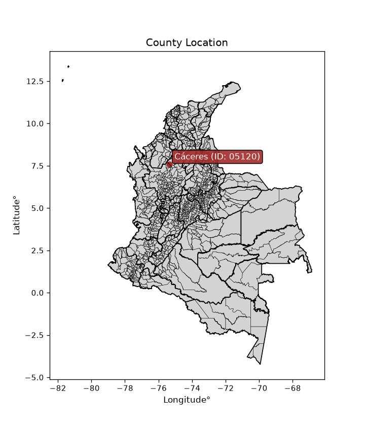
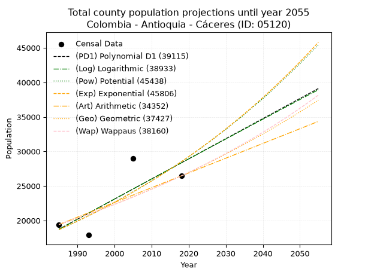
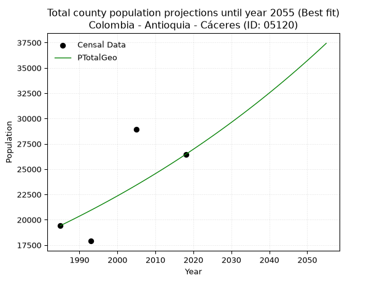
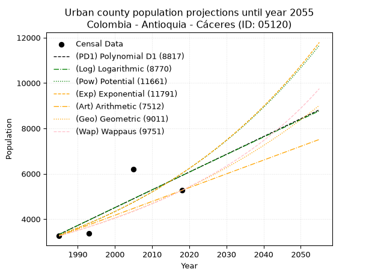
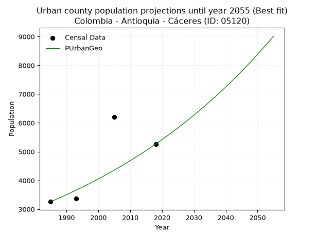
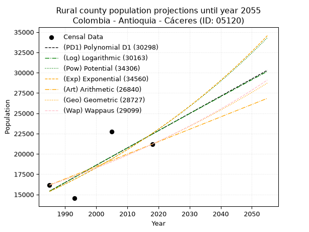
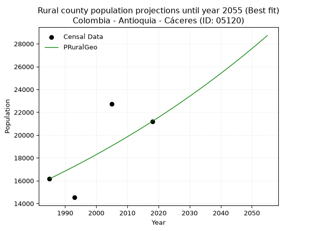

<div align="center">


</div>

# _“Population and Public Services Demand Projections (PPSD) until Year 2050 for Colombia - Antioquia - Cáceres (ID: 05120)”_
Keywords: `population` `public-service` `projection` `lineal` `polynomial` `logarithmic` `potential` `exponential` `arithmetic` `geometric` `wappaus` `dane` `colombia` `south-america`

PPSD are analytical estimates used by governments and planners to anticipate future changes in population size, age distribution, and the resulting community needs for utilities, healthcare, education, and infrastructure as sizing future water treatment facilities, electrical grids, and road networks based on spatial growth.

<div align="center">

</img>

</div>


> **General running parameters**: • app_version: _v20260806_. • Python version: _3.14.7_. • Pandas version: _3.0.5_. • NumPy version: _2.5.1_. • Creates, save and include plots into reports (create_plot): _False_. • Projection until year: _2050_. • Process polynomial degree 2 and up: _False_. • Process Wappaus: _True_. • Process Wappaus: _True_. • Set negative values to zero: _True_. • Set infinite values to zero: _True_. • Drop dataset notes: _True_. 
<div align="center">

Dynamic map: [:earth_americas:Google](http://maps.google.com/maps?q=7.578365947,-75.3520496) [:earth_americas:OSM](https://www.openstreetmap.org/#map=18/7.578365947/-75.3520496&layers=P) [:earth_americas:Bing](https://www.bing.com/maps?cp=7.578365947~-75.3520496&lvl=18) [:earth_americas:Apple](https://maps.apple.com/frame?center=7.578365947%2C-75.3520496&span=0.003%2C0.006)

</div>


<div align="center">

```geojson
{
  "type": "Feature",
  "geometry": {
    "type": "Point", 
    "coordinates": [-75.3520496, 7.578365947]
  }, 
  "properties": {
    "Name": "Colombia - Antioquia - Cáceres (ID: 05120)"
  }
}
```

</div>


## 0. Census Data (4 records)

Census data are official statistics collected by a government about the people and housing in a country. They usually include counts of total population, age, sex, race, income, education, and jobs.

📅Global census file: [Population.xlsx](../data/Population.xlsx)

| Source   |   Year |   CountryID | CountryName   |   StateID | StateName   |   CountyID | CountyName   |   PTotal |   PUrban |   PRural |
|:---------|-------:|------------:|:--------------|----------:|:------------|-----------:|:-------------|---------:|---------:|---------:|
| DANE     |   1985 |          57 | Colombia      |        05 | Antioquia   |      05120 | Cáceres      |    19421 |     3259 |    16162 |
| DANE     |   1993 |          57 | Colombia      |        05 | Antioquia   |      05120 | Cáceres      |    17895 |     3366 |    14529 |
| DANE     |   2005 |          57 | Colombia      |        05 | Antioquia   |      05120 | Cáceres      |    28945 |     6209 |    22736 |
| DANE     |   2018 |          57 | Colombia      |        05 | Antioquia   |      05120 | Cáceres      |    26460 |     5264 |    21196 |

> 🔥Some records could had specific notes about the registered values or the corresponding urban or rural distribution.

📅[SUI-RUPS](https://www.datos.gov.co/Hacienda-y-Cr-dito-P-blico/Registro-nico-de-Prestadores-de-Servicios-P-blicos/4qkq-csdn/about_data) - Local public utility companies: [RUPS.csv](../data/RUPS.xlsx)

 | SERVICIO       | ESTADO      | NOMBRE                                                         | NIT         | DEPARTAMENTO_DOMICILIO   | MUNICIPIO_DOMICILIO   | DIRECCION                           |   TELEFONO | EMAIL                               | TIPO_PRESTADOR                             | CLASIFICACION                 |
|:---------------|:------------|:---------------------------------------------------------------|:------------|:-------------------------|:----------------------|:------------------------------------|-----------:|:------------------------------------|:-------------------------------------------|:------------------------------|
| ACUEDUCTO      | OPERATIVA   | AGUASCOL ARBELAEZ S.A. E.S.P.                                  | 830505339-0 | ANTIOQUIA                | MEDELLIN              | CALLE 42 B No. 63 C 51              |    2350111 | diradministrativo@aguascol.com      | SOCIEDADES (EMPRESA DE SERVICIOS PUBLICOS) | MAYOR O IGUAL A 5001 USUARIOS |
| ALCANTARILLADO | OPERATIVA   | AGUASCOL ARBELAEZ S.A. E.S.P.                                  | 830505339-0 | ANTIOQUIA                | MEDELLIN              | CALLE 42 B No. 63 C 51              |    2350111 | diradministrativo@aguascol.com      | SOCIEDADES (EMPRESA DE SERVICIOS PUBLICOS) | MAYOR O IGUAL A 5001 USUARIOS |
| ACUEDUCTO      | CANCELACION | JUNTA MUNICIPAL DE SERVICIOS PUBLICOS DEL MUNICIPIO DE CACERES | 890981567-1 | ANTIOQUIA                | CACERES               | Alcaldía Cáceres - Parque Principal |    8362201 | planeacion@caceres-antioquia.gov.co | nan                                        | nan                           |
| ALCANTARILLADO | CANCELACION | JUNTA MUNICIPAL DE SERVICIOS PUBLICOS DEL MUNICIPIO DE CACERES | 890981567-1 | ANTIOQUIA                | CACERES               | Alcaldía Cáceres - Parque Principal |    8362201 | planeacion@caceres-antioquia.gov.co | nan                                        | nan                           |
| ACUEDUCTO      | OPERATIVA   | EMPRESA DE ASEO CACERES SAS ESP                                | 900390189-1 | ANTIOQUIA                | CACERES               | CALLE 31 19-04 LOCAL 10  JARDIN     |    8280999 | e.s.ptamanacaceres@gmail.com        | SOCIEDADES (EMPRESA DE SERVICIOS PUBLICOS) | MENOR O IGUAL A 2500 USUARIOS |
| ALCANTARILLADO | OPERATIVA   | EMPRESA DE ASEO CACERES SAS ESP                                | 900390189-1 | ANTIOQUIA                | CACERES               | CALLE 31 19-04 LOCAL 10  JARDIN     |    8280999 | e.s.ptamanacaceres@gmail.com        | SOCIEDADES (EMPRESA DE SERVICIOS PUBLICOS) | MENOR O IGUAL A 2500 USUARIOS |

## 1. Total

### 1.1. Coefficients and Parameters

* (PD1) Polynomial Deg 1: 291.03934162986843, -558971.1930951444 (lineal)
* (Log) Logarithmic: 582952.893850531, -4407849.3676491985
* (Pow) Potential: 25.65847201211326, -80.34427030655665
* (Exp) Exponential: 0.012811644364547643, 1.685961920424158e-07
* (Art) Arithmetic: Year diff. 2018 - 1985 = 33, Population diff. 26460 - 19421 = 7039, Annual growth = 213.3030303030303
* (Geo) Geometric: Year diff. 2018 - 1985 = 33, Population diff. 26460 - 19421 = 7039, Annual growth % = 0.009416152711704484
* (Wap) Wappaus: i = 0.9298098572525896, Condition values only valid for < 200)

<sub>
Wappaus condition values: ['0.00', '0.93', '1.86', '2.79', '3.72', '4.65', '5.58', '6.51', '7.44', '8.37', '9.30', '10.23', '11.16', '12.09', '13.02', '13.95', '14.88', '15.81', '16.74', '17.67', '18.60', '19.53', '20.46', '21.39', '22.32', '23.25', '24.18', '25.10', '26.03', '26.96', '27.89', '28.82', '29.75', '30.68', '31.61', '32.54', '33.47', '34.40', '35.33', '36.26', '37.19', '38.12', '39.05', '39.98', '40.91', '41.84', '42.77', '43.70', '44.63', '45.56', '46.49', '47.42', '48.35', '49.28', '50.21', '51.14', '52.07', '53.00', '53.93', '54.86', '55.79', '56.72', '57.65', '58.58', '59.51', '60.44']
</sub>


### 1.2. Projected Dataset

|   Year |   CountyID |   PTotalPD1 |   PTotalLog |   PTotalPow |   PTotalExp |   PTotalArt |   PTotalGeo |   PTotalWap |
|-------:|-----------:|------------:|------------:|------------:|------------:|------------:|------------:|------------:|
|   1985 |      05120 |       18742 |       18730 |       18673 |       18683 |       19421 |       19421 |       19421 |
|   1986 |      05120 |       19033 |       19024 |       18916 |       18924 |       19634 |       19604 |       19602 |
|   1987 |      05120 |       19324 |       19317 |       19162 |       19168 |       19848 |       19788 |       19786 |
|   1988 |      05120 |       19615 |       19610 |       19411 |       19415 |       20061 |       19975 |       19970 |
|   1989 |      05120 |       19906 |       19904 |       19663 |       19665 |       20274 |       20163 |       20157 |
|   1990 |      05120 |       20197 |       20197 |       19919 |       19919 |       20488 |       20353 |       20345 |
|   1991 |      05120 |       20488 |       20490 |       20177 |       20176 |       20701 |       20544 |       20536 |
|   1992 |      05120 |       20779 |       20782 |       20439 |       20436 |       20914 |       20738 |       20728 |
|   1993 |      05120 |       21070 |       21075 |       20704 |       20699 |       21127 |       20933 |       20921 |
|   1994 |      05120 |       21361 |       21367 |       20972 |       20966 |       21341 |       21130 |       21117 |
|   1995 |      05120 |       21652 |       21660 |       21243 |       21236 |       21554 |       21329 |       21315 |
|   1996 |      05120 |       21943 |       21952 |       21518 |       21510 |       21767 |       21530 |       21514 |
|   1997 |      05120 |       22234 |       22244 |       21797 |       21788 |       21981 |       21733 |       21716 |
|   1998 |      05120 |       22525 |       22535 |       22078 |       22068 |       22194 |       21937 |       21920 |
|   1999 |      05120 |       22816 |       22827 |       22364 |       22353 |       22407 |       22144 |       22125 |
|   2000 |      05120 |       23107 |       23119 |       22652 |       22641 |       22621 |       22352 |       22333 |
|   2001 |      05120 |       23399 |       23410 |       22945 |       22933 |       22834 |       22563 |       22542 |
|   2002 |      05120 |       23690 |       23701 |       23241 |       23229 |       23047 |       22775 |       22754 |
|   2003 |      05120 |       23981 |       23992 |       23541 |       23528 |       23260 |       22990 |       22968 |
|   2004 |      05120 |       24272 |       24283 |       23844 |       23832 |       23474 |       23206 |       23184 |
|   2005 |      05120 |       24563 |       24574 |       24151 |       24139 |       23687 |       23425 |       23403 |
|   2006 |      05120 |       24854 |       24865 |       24462 |       24450 |       23900 |       23645 |       23623 |
|   2007 |      05120 |       25145 |       25155 |       24777 |       24766 |       24114 |       23868 |       23846 |
|   2008 |      05120 |       25436 |       25446 |       25096 |       25085 |       24327 |       24093 |       24072 |
|   2009 |      05120 |       25727 |       25736 |       25418 |       25408 |       24540 |       24320 |       24299 |
|   2010 |      05120 |       26018 |       26026 |       25745 |       25736 |       24754 |       24549 |       24529 |
|   2011 |      05120 |       26309 |       26316 |       26076 |       26068 |       24967 |       24780 |       24762 |
|   2012 |      05120 |       26600 |       26606 |       26410 |       26404 |       25180 |       25013 |       24996 |
|   2013 |      05120 |       26891 |       26896 |       26749 |       26744 |       25393 |       25249 |       25234 |
|   2014 |      05120 |       27182 |       27185 |       27092 |       27089 |       25607 |       25486 |       25474 |
|   2015 |      05120 |       27473 |       27475 |       27440 |       27439 |       25820 |       25726 |       25716 |
|   2016 |      05120 |       27764 |       27764 |       27791 |       27792 |       26033 |       25969 |       25962 |
|   2017 |      05120 |       28055 |       28053 |       28147 |       28151 |       26247 |       26213 |       26209 |
|   2018 |      05120 |       28346 |       28342 |       28507 |       28514 |       26460 |       26460 |       26460 |
|   2019 |      05120 |       28637 |       28631 |       28872 |       28881 |       26673 |       26709 |       26713 |
|   2020 |      05120 |       28928 |       28919 |       29241 |       29254 |       26887 |       26961 |       26970 |
|   2021 |      05120 |       29219 |       29208 |       29615 |       29631 |       27100 |       27215 |       27229 |
|   2022 |      05120 |       29510 |       29496 |       29993 |       30013 |       27313 |       27471 |       27490 |
|   2023 |      05120 |       29801 |       29784 |       30376 |       30400 |       27527 |       27729 |       27755 |
|   2024 |      05120 |       30092 |       30073 |       30764 |       30792 |       27740 |       27991 |       28023 |
|   2025 |      05120 |       30383 |       30360 |       31156 |       31189 |       27953 |       28254 |       28294 |
|   2026 |      05120 |       30675 |       30648 |       31553 |       31591 |       28166 |       28520 |       28568 |
|   2027 |      05120 |       30966 |       30936 |       31955 |       31998 |       28380 |       28789 |       28846 |
|   2028 |      05120 |       31257 |       31223 |       32362 |       32411 |       28593 |       29060 |       29126 |
|   2029 |      05120 |       31548 |       31511 |       32774 |       32829 |       28806 |       29333 |       29410 |
|   2030 |      05120 |       31839 |       31798 |       33191 |       33252 |       29020 |       29610 |       29697 |
|   2031 |      05120 |       32130 |       32085 |       33613 |       33681 |       29233 |       29888 |       29987 |
|   2032 |      05120 |       32421 |       32372 |       34041 |       34115 |       29446 |       30170 |       30281 |
|   2033 |      05120 |       32712 |       32659 |       34473 |       34555 |       29660 |       30454 |       30579 |
|   2034 |      05120 |       33003 |       32946 |       34911 |       35001 |       29873 |       30741 |       30880 |
|   2035 |      05120 |       33294 |       33232 |       35354 |       35452 |       30086 |       31030 |       31184 |
|   2036 |      05120 |       33585 |       33519 |       35802 |       35909 |       30299 |       31322 |       31493 |
|   2037 |      05120 |       33876 |       33805 |       36256 |       36372 |       30513 |       31617 |       31805 |
|   2038 |      05120 |       34167 |       34091 |       36716 |       36841 |       30726 |       31915 |       32121 |
|   2039 |      05120 |       34458 |       34377 |       37181 |       37316 |       30939 |       32216 |       32441 |
|   2040 |      05120 |       34749 |       34663 |       37652 |       37797 |       31153 |       32519 |       32765 |
|   2041 |      05120 |       35040 |       34948 |       38128 |       38285 |       31366 |       32825 |       33093 |
|   2042 |      05120 |       35331 |       35234 |       38610 |       38778 |       31579 |       33134 |       33425 |
|   2043 |      05120 |       35622 |       35519 |       39098 |       39278 |       31793 |       33446 |       33761 |
|   2044 |      05120 |       35913 |       35805 |       39592 |       39785 |       32006 |       33761 |       34102 |
|   2045 |      05120 |       36204 |       36090 |       40092 |       40298 |       32219 |       34079 |       34447 |
|   2046 |      05120 |       36495 |       36375 |       40598 |       40817 |       32432 |       34400 |       34797 |
|   2047 |      05120 |       36786 |       36660 |       41111 |       41344 |       32646 |       34724 |       35151 |
|   2048 |      05120 |       37077 |       36944 |       41629 |       41877 |       32859 |       35051 |       35510 |
|   2049 |      05120 |       37368 |       37229 |       42154 |       42417 |       33072 |       35381 |       35873 |
|   2050 |      05120 |       37659 |       37513 |       42685 |       42964 |       33286 |       35714 |       36242 |
<div align="center">

</img>

</div>


### 1.3. Best fit with absolute and relative error (%)

Relative error puts that difference into context by dividing the absolute error by the true value, creating a unitless ratio or percentage that shows the scale of the mistake.

Absolute and relative error

|   Year | Source   |   CountryID | CountryName   |   StateID | StateName   |   CountyID_x | CountyName   |   PTotal |   PUrban |   PRural |   CountyID_y |   PTotalPD1 |   PTotalLog |   PTotalPow |   PTotalExp |   PTotalArt |   PTotalGeo |   PTotalWap |   PTotalPD1AbsError |   PTotalLogAbsError |   PTotalPowAbsError |   PTotalExpAbsError |   PTotalArtAbsError |   PTotalGeoAbsError |   PTotalWapAbsError |   PTotalPD1RelError |   PTotalLogRelError |   PTotalPowRelError |   PTotalExpRelError |   PTotalArtRelError |   PTotalGeoRelError |   PTotalWapRelError |
|-------:|:---------|------------:|:--------------|----------:|:------------|-------------:|:-------------|---------:|---------:|---------:|-------------:|------------:|------------:|------------:|------------:|------------:|------------:|------------:|--------------------:|--------------------:|--------------------:|--------------------:|--------------------:|--------------------:|--------------------:|--------------------:|--------------------:|--------------------:|--------------------:|--------------------:|--------------------:|--------------------:|
|   1985 | DANE     |          57 | Colombia      |        05 | Antioquia   |        05120 | Cáceres      |    19421 |     3259 |    16162 |        05120 |       18742 |       18730 |       18673 |       18683 |       19421 |       19421 |       19421 |                 679 |                 691 |                 748 |                 738 |                   0 |                   0 |                   0 |             3.49622 |             3.558   |             3.8515  |             3.80001 |              0      |              0      |              0      |
|   1993 | DANE     |          57 | Colombia      |        05 | Antioquia   |        05120 | Cáceres      |    17895 |     3366 |    14529 |        05120 |       21070 |       21075 |       20704 |       20699 |       21127 |       20933 |       20921 |                3175 |                3180 |                2809 |                2804 |                3232 |                3038 |                3026 |            17.7424  |            17.7703  |            15.6971  |            15.6692  |             18.0609 |             16.9768 |             16.9098 |
|   2005 | DANE     |          57 | Colombia      |        05 | Antioquia   |        05120 | Cáceres      |    28945 |     6209 |    22736 |        05120 |       24563 |       24574 |       24151 |       24139 |       23687 |       23425 |       23403 |                4382 |                4371 |                4794 |                4806 |                5258 |                5520 |                5542 |            15.1391  |            15.1011  |            16.5624  |            16.6039  |             18.1655 |             19.0707 |             19.1467 |
|   2018 | DANE     |          57 | Colombia      |        05 | Antioquia   |        05120 | Cáceres      |    26460 |     5264 |    21196 |        05120 |       28346 |       28342 |       28507 |       28514 |       26460 |       26460 |       26460 |                1886 |                1882 |                2047 |                2054 |                   0 |                   0 |                   0 |             7.12774 |             7.11262 |             7.73621 |             7.76266 |              0      |              0      |              0      |

Relative error mean

| Method    |   RelError | Best   |
|:----------|-----------:|:-------|
| PTotalPD1 |   10.8763  |        |
| PTotalLog |   10.8855  |        |
| PTotalPow |   10.9618  |        |
| PTotalExp |   10.9589  |        |
| PTotalArt |    9.0566  |        |
| PTotalGeo |    9.01187 | True   |
| PTotalWap |    9.0141  |        |

💙Best method: _**PTotalGeo**_
<div align="center">

</img>

</div>


### 1.4. Fresh water supply demand in liters per capita per day (lpcd)

The fresh water supply demand typically ranges from 100 to 300 liters per capita per day (lpcd) for standard domestic and municipal planning, though absolute survival minimums set by the World Health Organization are as low as 7.5 to 20 liters per day, and total consumption in high-income nations can exceed 400 liters.

> `CZ`: Level in meters above the sea level (masl)<br> `WS`: Fresh water supply demand in liters per capita per day (lpcd or l/h/d)<br> `WSAll`: Zonal fresh water supply demand in liters per second (l/s)<br> `A`: Zonal area in square meters<br> `DP`: Population density (people/hectare or p/ha)

Reference values (RAS Colombia)

|    CZ |   WS |
|------:|-----:|
|  1000 |  120 |
|  2000 |  130 |
| 99999 |  140 |

County shapefile geometry properties and water supply values

|   CountyID |     ATotal |   CZTotal |   WSTotal |
|-----------:|-----------:|----------:|----------:|
|      05120 | 1.8727e+09 |   198.401 |       120 |

Projected values for best method: PTotalGeo

|   CountyID |   Year |   PTotalGeo |   DPTotal |   WSTotal |   WSTotalAll |
|-----------:|-------:|------------:|----------:|----------:|-------------:|
|      05120 |   1985 |       19421 |      0.1  |       120 |      26.9736 |
|      05120 |   1986 |       19604 |      0.1  |       120 |      27.2278 |
|      05120 |   1987 |       19788 |      0.11 |       120 |      27.4833 |
|      05120 |   1988 |       19975 |      0.11 |       120 |      27.7431 |
|      05120 |   1989 |       20163 |      0.11 |       120 |      28.0042 |
|      05120 |   1990 |       20353 |      0.11 |       120 |      28.2681 |
|      05120 |   1991 |       20544 |      0.11 |       120 |      28.5333 |
|      05120 |   1992 |       20738 |      0.11 |       120 |      28.8028 |
|      05120 |   1993 |       20933 |      0.11 |       120 |      29.0736 |
|      05120 |   1994 |       21130 |      0.11 |       120 |      29.3472 |
|      05120 |   1995 |       21329 |      0.11 |       120 |      29.6236 |
|      05120 |   1996 |       21530 |      0.11 |       120 |      29.9028 |
|      05120 |   1997 |       21733 |      0.12 |       120 |      30.1847 |
|      05120 |   1998 |       21937 |      0.12 |       120 |      30.4681 |
|      05120 |   1999 |       22144 |      0.12 |       120 |      30.7556 |
|      05120 |   2000 |       22352 |      0.12 |       120 |      31.0444 |
|      05120 |   2001 |       22563 |      0.12 |       120 |      31.3375 |
|      05120 |   2002 |       22775 |      0.12 |       120 |      31.6319 |
|      05120 |   2003 |       22990 |      0.12 |       120 |      31.9306 |
|      05120 |   2004 |       23206 |      0.12 |       120 |      32.2306 |
|      05120 |   2005 |       23425 |      0.13 |       120 |      32.5347 |
|      05120 |   2006 |       23645 |      0.13 |       120 |      32.8403 |
|      05120 |   2007 |       23868 |      0.13 |       120 |      33.15   |
|      05120 |   2008 |       24093 |      0.13 |       120 |      33.4625 |
|      05120 |   2009 |       24320 |      0.13 |       120 |      33.7778 |
|      05120 |   2010 |       24549 |      0.13 |       120 |      34.0958 |
|      05120 |   2011 |       24780 |      0.13 |       120 |      34.4167 |
|      05120 |   2012 |       25013 |      0.13 |       120 |      34.7403 |
|      05120 |   2013 |       25249 |      0.13 |       120 |      35.0681 |
|      05120 |   2014 |       25486 |      0.14 |       120 |      35.3972 |
|      05120 |   2015 |       25726 |      0.14 |       120 |      35.7306 |
|      05120 |   2016 |       25969 |      0.14 |       120 |      36.0681 |
|      05120 |   2017 |       26213 |      0.14 |       120 |      36.4069 |
|      05120 |   2018 |       26460 |      0.14 |       120 |      36.75   |
|      05120 |   2019 |       26709 |      0.14 |       120 |      37.0958 |
|      05120 |   2020 |       26961 |      0.14 |       120 |      37.4458 |
|      05120 |   2021 |       27215 |      0.15 |       120 |      37.7986 |
|      05120 |   2022 |       27471 |      0.15 |       120 |      38.1542 |
|      05120 |   2023 |       27729 |      0.15 |       120 |      38.5125 |
|      05120 |   2024 |       27991 |      0.15 |       120 |      38.8764 |
|      05120 |   2025 |       28254 |      0.15 |       120 |      39.2417 |
|      05120 |   2026 |       28520 |      0.15 |       120 |      39.6111 |
|      05120 |   2027 |       28789 |      0.15 |       120 |      39.9847 |
|      05120 |   2028 |       29060 |      0.16 |       120 |      40.3611 |
|      05120 |   2029 |       29333 |      0.16 |       120 |      40.7403 |
|      05120 |   2030 |       29610 |      0.16 |       120 |      41.125  |
|      05120 |   2031 |       29888 |      0.16 |       120 |      41.5111 |
|      05120 |   2032 |       30170 |      0.16 |       120 |      41.9028 |
|      05120 |   2033 |       30454 |      0.16 |       120 |      42.2972 |
|      05120 |   2034 |       30741 |      0.16 |       120 |      42.6958 |
|      05120 |   2035 |       31030 |      0.17 |       120 |      43.0972 |
|      05120 |   2036 |       31322 |      0.17 |       120 |      43.5028 |
|      05120 |   2037 |       31617 |      0.17 |       120 |      43.9125 |
|      05120 |   2038 |       31915 |      0.17 |       120 |      44.3264 |
|      05120 |   2039 |       32216 |      0.17 |       120 |      44.7444 |
|      05120 |   2040 |       32519 |      0.17 |       120 |      45.1653 |
|      05120 |   2041 |       32825 |      0.18 |       120 |      45.5903 |
|      05120 |   2042 |       33134 |      0.18 |       120 |      46.0194 |
|      05120 |   2043 |       33446 |      0.18 |       120 |      46.4528 |
|      05120 |   2044 |       33761 |      0.18 |       120 |      46.8903 |
|      05120 |   2045 |       34079 |      0.18 |       120 |      47.3319 |
|      05120 |   2046 |       34400 |      0.18 |       120 |      47.7778 |
|      05120 |   2047 |       34724 |      0.19 |       120 |      48.2278 |
|      05120 |   2048 |       35051 |      0.19 |       120 |      48.6819 |
|      05120 |   2049 |       35381 |      0.19 |       120 |      49.1403 |
|      05120 |   2050 |       35714 |      0.19 |       120 |      49.6028 |

## 2. Urban

### 2.1. Coefficients and Parameters

* (PD1) Polynomial Deg 1: 78.40305098354118, -152301.20272982825 (lineal)
* (Log) Logarithmic: 157111.76399557112, -1189683.277144998
* (Pow) Potential: 36.47867801800812, -116.78024857379945
* (Exp) Exponential: 0.01820658362201363, 6.646907663308916e-13
* (Art) Arithmetic: Year diff. 2018 - 1985 = 33, Population diff. 5264 - 3259 = 2005, Annual growth = 60.75757575757576
* (Geo) Geometric: Year diff. 2018 - 1985 = 33, Population diff. 5264 - 3259 = 2005, Annual growth % = 0.014635483064154187
* (Wap) Wappaus: i = 1.4257321543488386, Condition values only valid for < 200)

<sub>
Wappaus condition values: ['0.00', '1.43', '2.85', '4.28', '5.70', '7.13', '8.55', '9.98', '11.41', '12.83', '14.26', '15.68', '17.11', '18.53', '19.96', '21.39', '22.81', '24.24', '25.66', '27.09', '28.51', '29.94', '31.37', '32.79', '34.22', '35.64', '37.07', '38.49', '39.92', '41.35', '42.77', '44.20', '45.62', '47.05', '48.47', '49.90', '51.33', '52.75', '54.18', '55.60', '57.03', '58.46', '59.88', '61.31', '62.73', '64.16', '65.58', '67.01', '68.44', '69.86', '71.29', '72.71', '74.14', '75.56', '76.99', '78.42', '79.84', '81.27', '82.69', '84.12', '85.54', '86.97', '88.40', '89.82', '91.25', '92.67']
</sub>


### 2.2. Projected Dataset

|   Year |   CountyID |   PUrbanPD1 |   PUrbanLog |   PUrbanPow |   PUrbanExp |   PUrbanArt |   PUrbanGeo |   PUrbanWap |
|-------:|-----------:|------------:|------------:|------------:|------------:|------------:|------------:|------------:|
|   1985 |      05120 |        3329 |        3325 |        3294 |        3296 |        3259 |        3259 |        3259 |
|   1986 |      05120 |        3407 |        3404 |        3355 |        3357 |        3320 |        3307 |        3306 |
|   1987 |      05120 |        3486 |        3483 |        3417 |        3419 |        3381 |        3355 |        3353 |
|   1988 |      05120 |        3564 |        3562 |        3480 |        3482 |        3441 |        3404 |        3401 |
|   1989 |      05120 |        3642 |        3641 |        3545 |        3546 |        3502 |        3454 |        3450 |
|   1990 |      05120 |        3721 |        3720 |        3610 |        3611 |        3563 |        3505 |        3500 |
|   1991 |      05120 |        3799 |        3799 |        3677 |        3677 |        3624 |        3556 |        3550 |
|   1992 |      05120 |        3878 |        3878 |        3745 |        3745 |        3684 |        3608 |        3601 |
|   1993 |      05120 |        3956 |        3957 |        3814 |        3813 |        3745 |        3661 |        3653 |
|   1994 |      05120 |        4034 |        4036 |        3885 |        3883 |        3806 |        3714 |        3706 |
|   1995 |      05120 |        4113 |        4115 |        3956 |        3955 |        3867 |        3769 |        3759 |
|   1996 |      05120 |        4191 |        4193 |        4029 |        4027 |        3927 |        3824 |        3814 |
|   1997 |      05120 |        4270 |        4272 |        4104 |        4101 |        3988 |        3880 |        3869 |
|   1998 |      05120 |        4348 |        4351 |        4179 |        4177 |        4049 |        3937 |        3925 |
|   1999 |      05120 |        4426 |        4429 |        4256 |        4254 |        4110 |        3994 |        3982 |
|   2000 |      05120 |        4505 |        4508 |        4335 |        4332 |        4170 |        4053 |        4039 |
|   2001 |      05120 |        4583 |        4586 |        4414 |        4411 |        4231 |        4112 |        4098 |
|   2002 |      05120 |        4662 |        4665 |        4496 |        4492 |        4292 |        4172 |        4158 |
|   2003 |      05120 |        4740 |        4743 |        4578 |        4575 |        4353 |        4233 |        4218 |
|   2004 |      05120 |        4819 |        4822 |        4662 |        4659 |        4413 |        4295 |        4280 |
|   2005 |      05120 |        4897 |        4900 |        4748 |        4745 |        4474 |        4358 |        4343 |
|   2006 |      05120 |        4975 |        4979 |        4835 |        4832 |        4535 |        4422 |        4407 |
|   2007 |      05120 |        5054 |        5057 |        4924 |        4920 |        4596 |        4486 |        4471 |
|   2008 |      05120 |        5132 |        5135 |        5014 |        5011 |        4656 |        4552 |        4537 |
|   2009 |      05120 |        5211 |        5213 |        5106 |        5103 |        4717 |        4619 |        4604 |
|   2010 |      05120 |        5289 |        5292 |        5200 |        5197 |        4778 |        4686 |        4673 |
|   2011 |      05120 |        5367 |        5370 |        5295 |        5292 |        4839 |        4755 |        4742 |
|   2012 |      05120 |        5446 |        5448 |        5392 |        5389 |        4899 |        4825 |        4813 |
|   2013 |      05120 |        5524 |        5526 |        5490 |        5488 |        4960 |        4895 |        4884 |
|   2014 |      05120 |        5603 |        5604 |        5591 |        5589 |        5021 |        4967 |        4958 |
|   2015 |      05120 |        5681 |        5682 |        5693 |        5692 |        5082 |        5039 |        5032 |
|   2016 |      05120 |        5759 |        5760 |        5797 |        5797 |        5142 |        5113 |        5108 |
|   2017 |      05120 |        5838 |        5838 |        5903 |        5903 |        5203 |        5188 |        5185 |
|   2018 |      05120 |        5916 |        5916 |        6010 |        6012 |        5264 |        5264 |        5264 |
|   2019 |      05120 |        5995 |        5993 |        6120 |        6122 |        5325 |        5341 |        5344 |
|   2020 |      05120 |        6073 |        6071 |        6232 |        6234 |        5386 |        5419 |        5426 |
|   2021 |      05120 |        6151 |        6149 |        6345 |        6349 |        5446 |        5499 |        5509 |
|   2022 |      05120 |        6230 |        6227 |        6461 |        6466 |        5507 |        5579 |        5594 |
|   2023 |      05120 |        6308 |        6304 |        6578 |        6584 |        5568 |        5661 |        5681 |
|   2024 |      05120 |        6387 |        6382 |        6698 |        6705 |        5629 |        5743 |        5769 |
|   2025 |      05120 |        6465 |        6460 |        6820 |        6829 |        5689 |        5828 |        5859 |
|   2026 |      05120 |        6543 |        6537 |        6944 |        6954 |        5750 |        5913 |        5951 |
|   2027 |      05120 |        6622 |        6615 |        7070 |        7082 |        5811 |        5999 |        6045 |
|   2028 |      05120 |        6700 |        6692 |        7198 |        7212 |        5872 |        6087 |        6140 |
|   2029 |      05120 |        6779 |        6770 |        7329 |        7344 |        5932 |        6176 |        6238 |
|   2030 |      05120 |        6857 |        6847 |        7462 |        7479 |        5993 |        6267 |        6337 |
|   2031 |      05120 |        6935 |        6924 |        7597 |        7617 |        6054 |        6358 |        6439 |
|   2032 |      05120 |        7014 |        7002 |        7735 |        7757 |        6115 |        6451 |        6543 |
|   2033 |      05120 |        7092 |        7079 |        7875 |        7899 |        6175 |        6546 |        6649 |
|   2034 |      05120 |        7171 |        7156 |        8017 |        8044 |        6236 |        6642 |        6758 |
|   2035 |      05120 |        7249 |        7234 |        8162 |        8192 |        6297 |        6739 |        6869 |
|   2036 |      05120 |        7327 |        7311 |        8310 |        8343 |        6358 |        6837 |        6982 |
|   2037 |      05120 |        7406 |        7388 |        8460 |        8496 |        6418 |        6938 |        7098 |
|   2038 |      05120 |        7484 |        7465 |        8613 |        8652 |        6479 |        7039 |        7217 |
|   2039 |      05120 |        7563 |        7542 |        8768 |        8811 |        6540 |        7142 |        7338 |
|   2040 |      05120 |        7641 |        7619 |        8927 |        8973 |        6601 |        7247 |        7463 |
|   2041 |      05120 |        7719 |        7696 |        9088 |        9138 |        6661 |        7353 |        7590 |
|   2042 |      05120 |        7798 |        7773 |        9251 |        9306 |        6722 |        7460 |        7720 |
|   2043 |      05120 |        7876 |        7850 |        9418 |        9477 |        6783 |        7569 |        7854 |
|   2044 |      05120 |        7955 |        7927 |        9588 |        9651 |        6844 |        7680 |        7990 |
|   2045 |      05120 |        8033 |        8004 |        9760 |        9828 |        6904 |        7793 |        8131 |
|   2046 |      05120 |        8111 |        8081 |        9936 |       10009 |        6965 |        7907 |        8274 |
|   2047 |      05120 |        8190 |        8157 |       10115 |       10193 |        7026 |        8022 |        8422 |
|   2048 |      05120 |        8268 |        8234 |       10297 |       10380 |        7087 |        8140 |        8573 |
|   2049 |      05120 |        8347 |        8311 |       10482 |       10571 |        7147 |        8259 |        8728 |
|   2050 |      05120 |        8425 |        8387 |       10670 |       10765 |        7208 |        8380 |        8887 |
<div align="center">

</img>

</div>


### 2.3. Best fit with absolute and relative error (%)

Relative error puts that difference into context by dividing the absolute error by the true value, creating a unitless ratio or percentage that shows the scale of the mistake.

Absolute and relative error

|   Year | Source   |   CountryID | CountryName   |   StateID | StateName   |   CountyID_x | CountyName   |   PTotal |   PUrban |   PRural |   CountyID_y |   PUrbanPD1 |   PUrbanLog |   PUrbanPow |   PUrbanExp |   PUrbanArt |   PUrbanGeo |   PUrbanWap |   PUrbanPD1AbsError |   PUrbanLogAbsError |   PUrbanPowAbsError |   PUrbanExpAbsError |   PUrbanArtAbsError |   PUrbanGeoAbsError |   PUrbanWapAbsError |   PUrbanPD1RelError |   PUrbanLogRelError |   PUrbanPowRelError |   PUrbanExpRelError |   PUrbanArtRelError |   PUrbanGeoRelError |   PUrbanWapRelError |
|-------:|:---------|------------:|:--------------|----------:|:------------|-------------:|:-------------|---------:|---------:|---------:|-------------:|------------:|------------:|------------:|------------:|------------:|------------:|------------:|--------------------:|--------------------:|--------------------:|--------------------:|--------------------:|--------------------:|--------------------:|--------------------:|--------------------:|--------------------:|--------------------:|--------------------:|--------------------:|--------------------:|
|   1985 | DANE     |          57 | Colombia      |        05 | Antioquia   |        05120 | Cáceres      |    19421 |     3259 |    16162 |        05120 |        3329 |        3325 |        3294 |        3296 |        3259 |        3259 |        3259 |                  70 |                  66 |                  35 |                  37 |                   0 |                   0 |                   0 |              2.1479 |             2.02516 |             1.07395 |             1.13532 |              0      |             0       |             0       |
|   1993 | DANE     |          57 | Colombia      |        05 | Antioquia   |        05120 | Cáceres      |    17895 |     3366 |    14529 |        05120 |        3956 |        3957 |        3814 |        3813 |        3745 |        3661 |        3653 |                 590 |                 591 |                 448 |                 447 |                 379 |                 295 |                 287 |             17.5282 |            17.5579  |            13.3096  |            13.2799  |             11.2597 |             8.76411 |             8.52644 |
|   2005 | DANE     |          57 | Colombia      |        05 | Antioquia   |        05120 | Cáceres      |    28945 |     6209 |    22736 |        05120 |        4897 |        4900 |        4748 |        4745 |        4474 |        4358 |        4343 |                1312 |                1309 |                1461 |                1464 |                1735 |                1851 |                1866 |             21.1306 |            21.0823  |            23.5304  |            23.5787  |             27.9433 |            29.8116  |            30.0531  |
|   2018 | DANE     |          57 | Colombia      |        05 | Antioquia   |        05120 | Cáceres      |    26460 |     5264 |    21196 |        05120 |        5916 |        5916 |        6010 |        6012 |        5264 |        5264 |        5264 |                 652 |                 652 |                 746 |                 748 |                   0 |                   0 |                   0 |             12.386  |            12.386   |            14.1717  |            14.2097  |              0      |             0       |             0       |

Relative error mean

| Method    |   RelError | Best   |
|:----------|-----------:|:-------|
| PUrbanPD1 |   13.2982  |        |
| PUrbanLog |   13.2629  |        |
| PUrbanPow |   13.0214  |        |
| PUrbanExp |   13.0509  |        |
| PUrbanArt |    9.80074 |        |
| PUrbanGeo |    9.64392 | True   |
| PUrbanWap |    9.6449  |        |

💙Best method: _**PUrbanGeo**_
<div align="center">

</img>

</div>


### 2.4. Fresh water supply demand in liters per capita per day (lpcd)

The fresh water supply demand typically ranges from 100 to 300 liters per capita per day (lpcd) for standard domestic and municipal planning, though absolute survival minimums set by the World Health Organization are as low as 7.5 to 20 liters per day, and total consumption in high-income nations can exceed 400 liters.

> `CZ`: Level in meters above the sea level (masl)<br> `WS`: Fresh water supply demand in liters per capita per day (lpcd or l/h/d)<br> `WSAll`: Zonal fresh water supply demand in liters per second (l/s)<br> `A`: Zonal area in square meters<br> `DP`: Population density (people/hectare or p/ha)

Reference values (RAS Colombia)

|    CZ |   WS |
|------:|-----:|
|  1000 |  120 |
|  2000 |  130 |
| 99999 |  140 |

County shapefile geometry properties and water supply values

|   CountyID |      AUrban |   CZUrban |   WSUrban |
|-----------:|------------:|----------:|----------:|
|      05120 | 1.65524e+06 |   94.8399 |       120 |

Projected values for best method: PUrbanGeo

|   CountyID |   Year |   PUrbanGeo |   DPUrban |   WSUrban |   WSUrbanAll |
|-----------:|-------:|------------:|----------:|----------:|-------------:|
|      05120 |   1985 |        3259 |     19.69 |       120 |      4.52639 |
|      05120 |   1986 |        3307 |     19.98 |       120 |      4.59306 |
|      05120 |   1987 |        3355 |     20.27 |       120 |      4.65972 |
|      05120 |   1988 |        3404 |     20.56 |       120 |      4.72778 |
|      05120 |   1989 |        3454 |     20.87 |       120 |      4.79722 |
|      05120 |   1990 |        3505 |     21.18 |       120 |      4.86806 |
|      05120 |   1991 |        3556 |     21.48 |       120 |      4.93889 |
|      05120 |   1992 |        3608 |     21.8  |       120 |      5.01111 |
|      05120 |   1993 |        3661 |     22.12 |       120 |      5.08472 |
|      05120 |   1994 |        3714 |     22.44 |       120 |      5.15833 |
|      05120 |   1995 |        3769 |     22.77 |       120 |      5.23472 |
|      05120 |   1996 |        3824 |     23.1  |       120 |      5.31111 |
|      05120 |   1997 |        3880 |     23.44 |       120 |      5.38889 |
|      05120 |   1998 |        3937 |     23.79 |       120 |      5.46806 |
|      05120 |   1999 |        3994 |     24.13 |       120 |      5.54722 |
|      05120 |   2000 |        4053 |     24.49 |       120 |      5.62917 |
|      05120 |   2001 |        4112 |     24.84 |       120 |      5.71111 |
|      05120 |   2002 |        4172 |     25.2  |       120 |      5.79444 |
|      05120 |   2003 |        4233 |     25.57 |       120 |      5.87917 |
|      05120 |   2004 |        4295 |     25.95 |       120 |      5.96528 |
|      05120 |   2005 |        4358 |     26.33 |       120 |      6.05278 |
|      05120 |   2006 |        4422 |     26.72 |       120 |      6.14167 |
|      05120 |   2007 |        4486 |     27.1  |       120 |      6.23056 |
|      05120 |   2008 |        4552 |     27.5  |       120 |      6.32222 |
|      05120 |   2009 |        4619 |     27.91 |       120 |      6.41528 |
|      05120 |   2010 |        4686 |     28.31 |       120 |      6.50833 |
|      05120 |   2011 |        4755 |     28.73 |       120 |      6.60417 |
|      05120 |   2012 |        4825 |     29.15 |       120 |      6.70139 |
|      05120 |   2013 |        4895 |     29.57 |       120 |      6.79861 |
|      05120 |   2014 |        4967 |     30.01 |       120 |      6.89861 |
|      05120 |   2015 |        5039 |     30.44 |       120 |      6.99861 |
|      05120 |   2016 |        5113 |     30.89 |       120 |      7.10139 |
|      05120 |   2017 |        5188 |     31.34 |       120 |      7.20556 |
|      05120 |   2018 |        5264 |     31.8  |       120 |      7.31111 |
|      05120 |   2019 |        5341 |     32.27 |       120 |      7.41806 |
|      05120 |   2020 |        5419 |     32.74 |       120 |      7.52639 |
|      05120 |   2021 |        5499 |     33.22 |       120 |      7.6375  |
|      05120 |   2022 |        5579 |     33.71 |       120 |      7.74861 |
|      05120 |   2023 |        5661 |     34.2  |       120 |      7.8625  |
|      05120 |   2024 |        5743 |     34.7  |       120 |      7.97639 |
|      05120 |   2025 |        5828 |     35.21 |       120 |      8.09444 |
|      05120 |   2026 |        5913 |     35.72 |       120 |      8.2125  |
|      05120 |   2027 |        5999 |     36.24 |       120 |      8.33194 |
|      05120 |   2028 |        6087 |     36.77 |       120 |      8.45417 |
|      05120 |   2029 |        6176 |     37.31 |       120 |      8.57778 |
|      05120 |   2030 |        6267 |     37.86 |       120 |      8.70417 |
|      05120 |   2031 |        6358 |     38.41 |       120 |      8.83056 |
|      05120 |   2032 |        6451 |     38.97 |       120 |      8.95972 |
|      05120 |   2033 |        6546 |     39.55 |       120 |      9.09167 |
|      05120 |   2034 |        6642 |     40.13 |       120 |      9.225   |
|      05120 |   2035 |        6739 |     40.71 |       120 |      9.35972 |
|      05120 |   2036 |        6837 |     41.31 |       120 |      9.49583 |
|      05120 |   2037 |        6938 |     41.92 |       120 |      9.63611 |
|      05120 |   2038 |        7039 |     42.53 |       120 |      9.77639 |
|      05120 |   2039 |        7142 |     43.15 |       120 |      9.91944 |
|      05120 |   2040 |        7247 |     43.78 |       120 |     10.0653  |
|      05120 |   2041 |        7353 |     44.42 |       120 |     10.2125  |
|      05120 |   2042 |        7460 |     45.07 |       120 |     10.3611  |
|      05120 |   2043 |        7569 |     45.73 |       120 |     10.5125  |
|      05120 |   2044 |        7680 |     46.4  |       120 |     10.6667  |
|      05120 |   2045 |        7793 |     47.08 |       120 |     10.8236  |
|      05120 |   2046 |        7907 |     47.77 |       120 |     10.9819  |
|      05120 |   2047 |        8022 |     48.46 |       120 |     11.1417  |
|      05120 |   2048 |        8140 |     49.18 |       120 |     11.3056  |
|      05120 |   2049 |        8259 |     49.9  |       120 |     11.4708  |
|      05120 |   2050 |        8380 |     50.63 |       120 |     11.6389  |

## 3. Rural

### 3.1. Coefficients and Parameters

* (PD1) Polynomial Deg 1: 212.63629064632732, -406669.9903653162 (lineal)
* (Log) Logarithmic: 425841.1298549594, -3218166.0905041965
* (Pow) Potential: 23.171425923248574, -72.22720952847011
* (Exp) Exponential: 0.011571675663361453, 1.6260674139810056e-06
* (Art) Arithmetic: Year diff. 2018 - 1985 = 33, Population diff. 21196 - 16162 = 5034, Annual growth = 152.54545454545453
* (Geo) Geometric: Year diff. 2018 - 1985 = 33, Population diff. 21196 - 16162 = 5034, Annual growth % = 0.008250506244438682
* (Wap) Wappaus: i = 0.816668207856173, Condition values only valid for < 200)

<sub>
Wappaus condition values: ['0.00', '0.82', '1.63', '2.45', '3.27', '4.08', '4.90', '5.72', '6.53', '7.35', '8.17', '8.98', '9.80', '10.62', '11.43', '12.25', '13.07', '13.88', '14.70', '15.52', '16.33', '17.15', '17.97', '18.78', '19.60', '20.42', '21.23', '22.05', '22.87', '23.68', '24.50', '25.32', '26.13', '26.95', '27.77', '28.58', '29.40', '30.22', '31.03', '31.85', '32.67', '33.48', '34.30', '35.12', '35.93', '36.75', '37.57', '38.38', '39.20', '40.02', '40.83', '41.65', '42.47', '43.28', '44.10', '44.92', '45.73', '46.55', '47.37', '48.18', '49.00', '49.82', '50.63', '51.45', '52.27', '53.08']
</sub>


### 3.2. Projected Dataset

|   Year |   CountyID |   PRuralPD1 |   PRuralLog |   PRuralPow |   PRuralExp |   PRuralArt |   PRuralGeo |   PRuralWap |
|-------:|-----------:|------------:|------------:|------------:|------------:|------------:|------------:|------------:|
|   1985 |      05120 |       15413 |       15405 |       15368 |       15374 |       16162 |       16162 |       16162 |
|   1986 |      05120 |       15626 |       15619 |       15548 |       15553 |       16315 |       16295 |       16295 |
|   1987 |      05120 |       15838 |       15834 |       15730 |       15734 |       16467 |       16430 |       16428 |
|   1988 |      05120 |       16051 |       16048 |       15915 |       15917 |       16620 |       16565 |       16563 |
|   1989 |      05120 |       16264 |       16262 |       16101 |       16102 |       16772 |       16702 |       16699 |
|   1990 |      05120 |       16476 |       16476 |       16290 |       16290 |       16925 |       16840 |       16836 |
|   1991 |      05120 |       16689 |       16690 |       16481 |       16479 |       17077 |       16979 |       16974 |
|   1992 |      05120 |       16902 |       16904 |       16674 |       16671 |       17230 |       17119 |       17113 |
|   1993 |      05120 |       17114 |       17118 |       16869 |       16865 |       17382 |       17260 |       17254 |
|   1994 |      05120 |       17327 |       17331 |       17066 |       17061 |       17535 |       17402 |       17395 |
|   1995 |      05120 |       17539 |       17545 |       17265 |       17260 |       17687 |       17546 |       17538 |
|   1996 |      05120 |       17752 |       17758 |       17467 |       17461 |       17840 |       17691 |       17682 |
|   1997 |      05120 |       17965 |       17972 |       17671 |       17664 |       17993 |       17837 |       17827 |
|   1998 |      05120 |       18177 |       18185 |       17877 |       17870 |       18145 |       17984 |       17974 |
|   1999 |      05120 |       18390 |       18398 |       18085 |       18078 |       18298 |       18132 |       18122 |
|   2000 |      05120 |       18603 |       18611 |       18296 |       18288 |       18450 |       18282 |       18271 |
|   2001 |      05120 |       18815 |       18824 |       18509 |       18501 |       18603 |       18433 |       18421 |
|   2002 |      05120 |       19028 |       19036 |       18725 |       18716 |       18755 |       18585 |       18573 |
|   2003 |      05120 |       19240 |       19249 |       18943 |       18934 |       18908 |       18738 |       18726 |
|   2004 |      05120 |       19453 |       19462 |       19163 |       19154 |       19060 |       18893 |       18881 |
|   2005 |      05120 |       19666 |       19674 |       19386 |       19377 |       19213 |       19049 |       19037 |
|   2006 |      05120 |       19878 |       19886 |       19611 |       19603 |       19365 |       19206 |       19194 |
|   2007 |      05120 |       20091 |       20099 |       19839 |       19831 |       19518 |       19364 |       19352 |
|   2008 |      05120 |       20304 |       20311 |       20069 |       20062 |       19671 |       19524 |       19512 |
|   2009 |      05120 |       20516 |       20523 |       20302 |       20295 |       19823 |       19685 |       19674 |
|   2010 |      05120 |       20729 |       20735 |       20538 |       20532 |       19976 |       19848 |       19837 |
|   2011 |      05120 |       20942 |       20947 |       20776 |       20771 |       20128 |       20011 |       20001 |
|   2012 |      05120 |       21154 |       21158 |       21017 |       21012 |       20281 |       20176 |       20167 |
|   2013 |      05120 |       21367 |       21370 |       21260 |       21257 |       20433 |       20343 |       20335 |
|   2014 |      05120 |       21579 |       21581 |       21506 |       21504 |       20586 |       20511 |       20504 |
|   2015 |      05120 |       21792 |       21793 |       21755 |       21755 |       20738 |       20680 |       20674 |
|   2016 |      05120 |       22005 |       22004 |       22006 |       22008 |       20891 |       20851 |       20847 |
|   2017 |      05120 |       22217 |       22215 |       22261 |       22264 |       21043 |       21023 |       21021 |
|   2018 |      05120 |       22430 |       22426 |       22518 |       22523 |       21196 |       21196 |       21196 |
|   2019 |      05120 |       22643 |       22637 |       22778 |       22785 |       21349 |       21371 |       21373 |
|   2020 |      05120 |       22855 |       22848 |       23041 |       23050 |       21501 |       21547 |       21552 |
|   2021 |      05120 |       23068 |       23059 |       23306 |       23319 |       21654 |       21725 |       21733 |
|   2022 |      05120 |       23281 |       23269 |       23575 |       23590 |       21806 |       21904 |       21915 |
|   2023 |      05120 |       23493 |       23480 |       23847 |       23865 |       21959 |       22085 |       22099 |
|   2024 |      05120 |       23706 |       23690 |       24121 |       24142 |       22111 |       22267 |       22285 |
|   2025 |      05120 |       23918 |       23901 |       24399 |       24423 |       22264 |       22451 |       22472 |
|   2026 |      05120 |       24131 |       24111 |       24680 |       24708 |       22416 |       22636 |       22662 |
|   2027 |      05120 |       24344 |       24321 |       24964 |       24995 |       22569 |       22823 |       22853 |
|   2028 |      05120 |       24556 |       24531 |       25251 |       25286 |       22721 |       23011 |       23046 |
|   2029 |      05120 |       24769 |       24741 |       25541 |       25580 |       22874 |       23201 |       23242 |
|   2030 |      05120 |       24982 |       24951 |       25834 |       25878 |       23027 |       23392 |       23439 |
|   2031 |      05120 |       25194 |       25161 |       26130 |       26179 |       23179 |       23585 |       23638 |
|   2032 |      05120 |       25407 |       25370 |       26430 |       26484 |       23332 |       23780 |       23839 |
|   2033 |      05120 |       25620 |       25580 |       26733 |       26792 |       23484 |       23976 |       24042 |
|   2034 |      05120 |       25832 |       25789 |       27040 |       27104 |       23637 |       24174 |       24247 |
|   2035 |      05120 |       26045 |       25999 |       27349 |       27420 |       23789 |       24373 |       24455 |
|   2036 |      05120 |       26257 |       26208 |       27662 |       27739 |       23942 |       24575 |       24664 |
|   2037 |      05120 |       26470 |       26417 |       27979 |       28062 |       24094 |       24777 |       24876 |
|   2038 |      05120 |       26683 |       26626 |       28299 |       28388 |       24247 |       24982 |       25090 |
|   2039 |      05120 |       26895 |       26835 |       28622 |       28719 |       24399 |       25188 |       25306 |
|   2040 |      05120 |       27108 |       27044 |       28949 |       29053 |       24552 |       25396 |       25524 |
|   2041 |      05120 |       27321 |       27252 |       29280 |       29391 |       24705 |       25605 |       25745 |
|   2042 |      05120 |       27533 |       27461 |       29614 |       29733 |       24857 |       25816 |       25968 |
|   2043 |      05120 |       27746 |       27669 |       29952 |       30079 |       25010 |       26029 |       26193 |
|   2044 |      05120 |       27959 |       27878 |       30294 |       30429 |       25162 |       26244 |       26421 |
|   2045 |      05120 |       28171 |       28086 |       30639 |       30783 |       25315 |       26461 |       26651 |
|   2046 |      05120 |       28384 |       28294 |       30988 |       31142 |       25467 |       26679 |       26884 |
|   2047 |      05120 |       28596 |       28502 |       31341 |       31504 |       25620 |       26899 |       27119 |
|   2048 |      05120 |       28809 |       28710 |       31698 |       31871 |       25772 |       27121 |       27357 |
|   2049 |      05120 |       29022 |       28918 |       32058 |       32242 |       25925 |       27345 |       27598 |
|   2050 |      05120 |       29234 |       29126 |       32423 |       32617 |       26077 |       27570 |       27841 |
<div align="center">

</img>

</div>


### 3.3. Best fit with absolute and relative error (%)

Relative error puts that difference into context by dividing the absolute error by the true value, creating a unitless ratio or percentage that shows the scale of the mistake.

Absolute and relative error

|   Year | Source   |   CountryID | CountryName   |   StateID | StateName   |   CountyID_x | CountyName   |   PTotal |   PUrban |   PRural |   CountyID_y |   PRuralPD1 |   PRuralLog |   PRuralPow |   PRuralExp |   PRuralArt |   PRuralGeo |   PRuralWap |   PRuralPD1AbsError |   PRuralLogAbsError |   PRuralPowAbsError |   PRuralExpAbsError |   PRuralArtAbsError |   PRuralGeoAbsError |   PRuralWapAbsError |   PRuralPD1RelError |   PRuralLogRelError |   PRuralPowRelError |   PRuralExpRelError |   PRuralArtRelError |   PRuralGeoRelError |   PRuralWapRelError |
|-------:|:---------|------------:|:--------------|----------:|:------------|-------------:|:-------------|---------:|---------:|---------:|-------------:|------------:|------------:|------------:|------------:|------------:|------------:|------------:|--------------------:|--------------------:|--------------------:|--------------------:|--------------------:|--------------------:|--------------------:|--------------------:|--------------------:|--------------------:|--------------------:|--------------------:|--------------------:|--------------------:|
|   1985 | DANE     |          57 | Colombia      |        05 | Antioquia   |        05120 | Cáceres      |    19421 |     3259 |    16162 |        05120 |       15413 |       15405 |       15368 |       15374 |       16162 |       16162 |       16162 |                 749 |                 757 |                 794 |                 788 |                   0 |                   0 |                   0 |             4.63433 |             4.68383 |             4.91276 |             4.87563 |              0      |              0      |              0      |
|   1993 | DANE     |          57 | Colombia      |        05 | Antioquia   |        05120 | Cáceres      |    17895 |     3366 |    14529 |        05120 |       17114 |       17118 |       16869 |       16865 |       17382 |       17260 |       17254 |                2585 |                2589 |                2340 |                2336 |                2853 |                2731 |                2725 |            17.792   |            17.8195  |            16.1057  |            16.0782  |             19.6366 |             18.7969 |             18.7556 |
|   2005 | DANE     |          57 | Colombia      |        05 | Antioquia   |        05120 | Cáceres      |    28945 |     6209 |    22736 |        05120 |       19666 |       19674 |       19386 |       19377 |       19213 |       19049 |       19037 |                3070 |                3062 |                3350 |                3359 |                3523 |                3687 |                3699 |            13.5028  |            13.4676  |            14.7343  |            14.7739  |             15.4952 |             16.2166 |             16.2694 |
|   2018 | DANE     |          57 | Colombia      |        05 | Antioquia   |        05120 | Cáceres      |    26460 |     5264 |    21196 |        05120 |       22430 |       22426 |       22518 |       22523 |       21196 |       21196 |       21196 |                1234 |                1230 |                1322 |                1327 |                   0 |                   0 |                   0 |             5.82185 |             5.80298 |             6.23703 |             6.26062 |              0      |              0      |              0      |

Relative error mean

| Method    |   RelError | Best   |
|:----------|-----------:|:-------|
| PRuralPD1 |   10.4377  |        |
| PRuralLog |   10.4435  |        |
| PRuralPow |   10.4975  |        |
| PRuralExp |   10.4971  |        |
| PRuralArt |    8.78296 |        |
| PRuralGeo |    8.75337 | True   |
| PRuralWap |    8.75624 |        |

💙Best method: _**PRuralGeo**_
<div align="center">

</img>

</div>


### 3.4. Fresh water supply demand in liters per capita per day (lpcd)

The fresh water supply demand typically ranges from 100 to 300 liters per capita per day (lpcd) for standard domestic and municipal planning, though absolute survival minimums set by the World Health Organization are as low as 7.5 to 20 liters per day, and total consumption in high-income nations can exceed 400 liters.

> `CZ`: Level in meters above the sea level (masl)<br> `WS`: Fresh water supply demand in liters per capita per day (lpcd or l/h/d)<br> `WSAll`: Zonal fresh water supply demand in liters per second (l/s)<br> `A`: Zonal area in square meters<br> `DP`: Population density (people/hectare or p/ha)

Reference values (RAS Colombia)

|    CZ |   WS |
|------:|-----:|
|  1000 |  120 |
|  2000 |  130 |
| 99999 |  140 |

County shapefile geometry properties and water supply values

|   CountyID |      ARural |   CZRural |   WSRural |
|-----------:|------------:|----------:|----------:|
|      05120 | 1.87104e+09 |   198.485 |       120 |

Projected values for best method: PRuralGeo

|   CountyID |   Year |   PRuralGeo |   DPRural |   WSRural |   WSRuralAll |
|-----------:|-------:|------------:|----------:|----------:|-------------:|
|      05120 |   1985 |       16162 |      0.09 |       120 |      22.4472 |
|      05120 |   1986 |       16295 |      0.09 |       120 |      22.6319 |
|      05120 |   1987 |       16430 |      0.09 |       120 |      22.8194 |
|      05120 |   1988 |       16565 |      0.09 |       120 |      23.0069 |
|      05120 |   1989 |       16702 |      0.09 |       120 |      23.1972 |
|      05120 |   1990 |       16840 |      0.09 |       120 |      23.3889 |
|      05120 |   1991 |       16979 |      0.09 |       120 |      23.5819 |
|      05120 |   1992 |       17119 |      0.09 |       120 |      23.7764 |
|      05120 |   1993 |       17260 |      0.09 |       120 |      23.9722 |
|      05120 |   1994 |       17402 |      0.09 |       120 |      24.1694 |
|      05120 |   1995 |       17546 |      0.09 |       120 |      24.3694 |
|      05120 |   1996 |       17691 |      0.09 |       120 |      24.5708 |
|      05120 |   1997 |       17837 |      0.1  |       120 |      24.7736 |
|      05120 |   1998 |       17984 |      0.1  |       120 |      24.9778 |
|      05120 |   1999 |       18132 |      0.1  |       120 |      25.1833 |
|      05120 |   2000 |       18282 |      0.1  |       120 |      25.3917 |
|      05120 |   2001 |       18433 |      0.1  |       120 |      25.6014 |
|      05120 |   2002 |       18585 |      0.1  |       120 |      25.8125 |
|      05120 |   2003 |       18738 |      0.1  |       120 |      26.025  |
|      05120 |   2004 |       18893 |      0.1  |       120 |      26.2403 |
|      05120 |   2005 |       19049 |      0.1  |       120 |      26.4569 |
|      05120 |   2006 |       19206 |      0.1  |       120 |      26.675  |
|      05120 |   2007 |       19364 |      0.1  |       120 |      26.8944 |
|      05120 |   2008 |       19524 |      0.1  |       120 |      27.1167 |
|      05120 |   2009 |       19685 |      0.11 |       120 |      27.3403 |
|      05120 |   2010 |       19848 |      0.11 |       120 |      27.5667 |
|      05120 |   2011 |       20011 |      0.11 |       120 |      27.7931 |
|      05120 |   2012 |       20176 |      0.11 |       120 |      28.0222 |
|      05120 |   2013 |       20343 |      0.11 |       120 |      28.2542 |
|      05120 |   2014 |       20511 |      0.11 |       120 |      28.4875 |
|      05120 |   2015 |       20680 |      0.11 |       120 |      28.7222 |
|      05120 |   2016 |       20851 |      0.11 |       120 |      28.9597 |
|      05120 |   2017 |       21023 |      0.11 |       120 |      29.1986 |
|      05120 |   2018 |       21196 |      0.11 |       120 |      29.4389 |
|      05120 |   2019 |       21371 |      0.11 |       120 |      29.6819 |
|      05120 |   2020 |       21547 |      0.12 |       120 |      29.9264 |
|      05120 |   2021 |       21725 |      0.12 |       120 |      30.1736 |
|      05120 |   2022 |       21904 |      0.12 |       120 |      30.4222 |
|      05120 |   2023 |       22085 |      0.12 |       120 |      30.6736 |
|      05120 |   2024 |       22267 |      0.12 |       120 |      30.9264 |
|      05120 |   2025 |       22451 |      0.12 |       120 |      31.1819 |
|      05120 |   2026 |       22636 |      0.12 |       120 |      31.4389 |
|      05120 |   2027 |       22823 |      0.12 |       120 |      31.6986 |
|      05120 |   2028 |       23011 |      0.12 |       120 |      31.9597 |
|      05120 |   2029 |       23201 |      0.12 |       120 |      32.2236 |
|      05120 |   2030 |       23392 |      0.13 |       120 |      32.4889 |
|      05120 |   2031 |       23585 |      0.13 |       120 |      32.7569 |
|      05120 |   2032 |       23780 |      0.13 |       120 |      33.0278 |
|      05120 |   2033 |       23976 |      0.13 |       120 |      33.3    |
|      05120 |   2034 |       24174 |      0.13 |       120 |      33.575  |
|      05120 |   2035 |       24373 |      0.13 |       120 |      33.8514 |
|      05120 |   2036 |       24575 |      0.13 |       120 |      34.1319 |
|      05120 |   2037 |       24777 |      0.13 |       120 |      34.4125 |
|      05120 |   2038 |       24982 |      0.13 |       120 |      34.6972 |
|      05120 |   2039 |       25188 |      0.13 |       120 |      34.9833 |
|      05120 |   2040 |       25396 |      0.14 |       120 |      35.2722 |
|      05120 |   2041 |       25605 |      0.14 |       120 |      35.5625 |
|      05120 |   2042 |       25816 |      0.14 |       120 |      35.8556 |
|      05120 |   2043 |       26029 |      0.14 |       120 |      36.1514 |
|      05120 |   2044 |       26244 |      0.14 |       120 |      36.45   |
|      05120 |   2045 |       26461 |      0.14 |       120 |      36.7514 |
|      05120 |   2046 |       26679 |      0.14 |       120 |      37.0542 |
|      05120 |   2047 |       26899 |      0.14 |       120 |      37.3597 |
|      05120 |   2048 |       27121 |      0.14 |       120 |      37.6681 |
|      05120 |   2049 |       27345 |      0.15 |       120 |      37.9792 |
|      05120 |   2050 |       27570 |      0.15 |       120 |      38.2917 |

#

<div align="center"><br><sub>Share this research</sub></div><br>

<sub>**APPS & TOOLS & CONTENT DISCLAIMER**: • NO WARRANTY - This content and software is provided by <a href="https://github.com/rcfdtools" target="_blank">github.com/rcfdtools</a> "as is", without any express or implied warranty, including warranties of merchantability, fitness for a particular purpose, or non-infringement. There is no guarantee that the software will be error-free or operate without interruption. • LIMITATION OF LIABILITY - Neither the authors nor copyright holders will be liable for claims or damages arising from the software or its use. You are responsible for determining if the software is appropriate for your use and assume all associated risks, including errors, legal compliance, and data loss. • NO PROFESSIONAL ADVICE - The software provides general information and does not offer professional advice. It should not replace consultation with professional advisors. [Clauses and global license for rcfdtools use.](https://github.com/rcfdtools/rcfdtools/blob/main/LICENSE.md)</sub>

| [:house: Home](Readme.md)  | [:beginner: Help / Collab](https://github.com/rcfdtools/R.HydroTools/discussions/31) |
|----------------------------|-------------------------------------------------------------------------------------------|