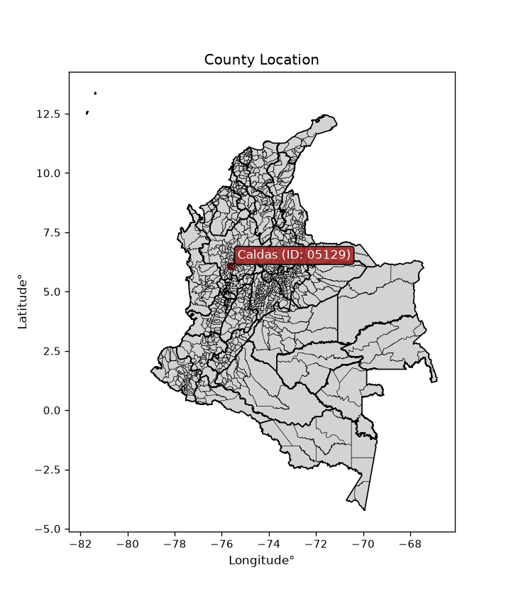
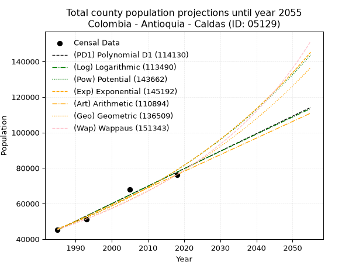
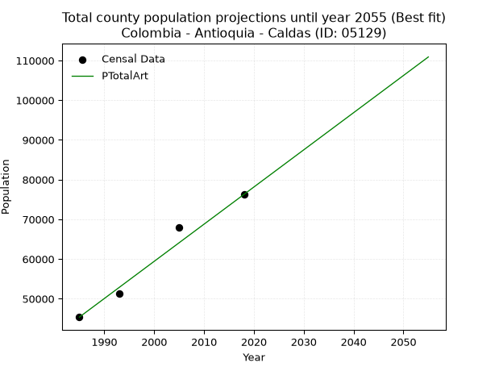
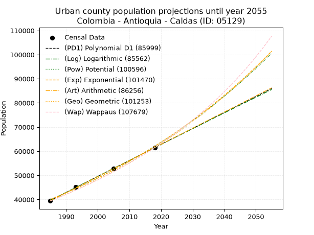
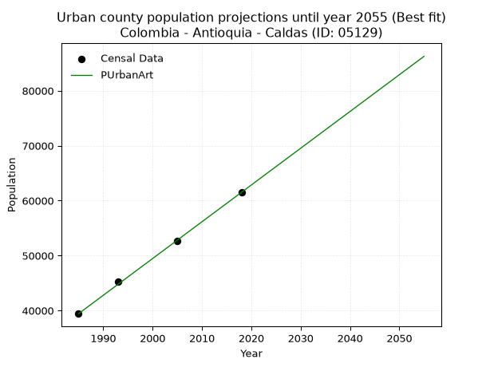
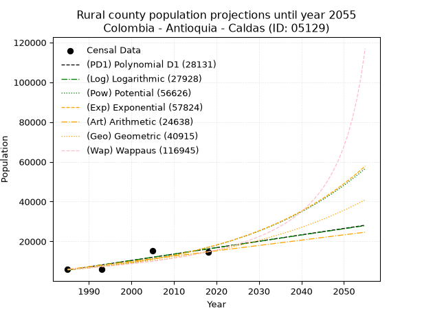
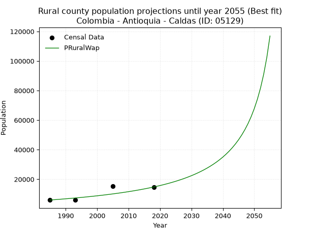

<div align="center">


</div>

# _“Population and Public Services Demand Projections (PPSD) until Year 2050 for Colombia - Antioquia - Caldas (ID: 05129)”_
Keywords: `population` `public-service` `projection` `lineal` `polynomial` `logarithmic` `potential` `exponential` `arithmetic` `geometric` `wappaus` `dane` `colombia` `south-america`

PPSD are analytical estimates used by governments and planners to anticipate future changes in population size, age distribution, and the resulting community needs for utilities, healthcare, education, and infrastructure as sizing future water treatment facilities, electrical grids, and road networks based on spatial growth.

<div align="center">

</img>

</div>


> **General running parameters**: • app_version: _v20260806_. • Python version: _3.14.7_. • Pandas version: _3.0.5_. • NumPy version: _2.5.1_. • Creates, save and include plots into reports (create_plot): _False_. • Projection until year: _2050_. • Process polynomial degree 2 and up: _False_. • Process Wappaus: _True_. • Process Wappaus: _True_. • Set negative values to zero: _True_. • Set infinite values to zero: _True_. • Drop dataset notes: _True_. 
<div align="center">

Dynamic map: [:earth_americas:Google](http://maps.google.com/maps?q=6.091077203,-75.6336729) [:earth_americas:OSM](https://www.openstreetmap.org/#map=18/6.091077203/-75.6336729&layers=P) [:earth_americas:Bing](https://www.bing.com/maps?cp=6.091077203~-75.6336729&lvl=18) [:earth_americas:Apple](https://maps.apple.com/frame?center=6.091077203%2C-75.6336729&span=0.003%2C0.006)

</div>


<div align="center">

```geojson
{
  "type": "Feature",
  "geometry": {
    "type": "Point", 
    "coordinates": [-75.6336729, 6.091077203]
  }, 
  "properties": {
    "Name": "Colombia - Antioquia - Caldas (ID: 05129)"
  }
}
```

</div>


## 0. Census Data (4 records)

Census data are official statistics collected by a government about the people and housing in a country. They usually include counts of total population, age, sex, race, income, education, and jobs.

📅Global census file: [Population.xlsx](../data/Population.xlsx)

| Source   |   Year |   CountryID | CountryName   |   StateID | StateName   |   CountyID | CountyName   |   PTotal |   PUrban |   PRural |
|:---------|-------:|------------:|:--------------|----------:|:------------|-----------:|:-------------|---------:|---------:|---------:|
| DANE     |   1985 |          57 | Colombia      |        05 | Antioquia   |      05129 | Caldas       |    45370 |    39428 |     5942 |
| DANE     |   1993 |          57 | Colombia      |        05 | Antioquia   |      05129 | Caldas       |    51240 |    45251 |     5989 |
| DANE     |   2005 |          57 | Colombia      |        05 | Antioquia   |      05129 | Caldas       |    67999 |    52696 |    15303 |
| DANE     |   2018 |          57 | Colombia      |        05 | Antioquia   |      05129 | Caldas       |    76260 |    61504 |    14756 |

> 🔥Some records could had specific notes about the registered values or the corresponding urban or rural distribution.

📅[SUI-RUPS](https://www.datos.gov.co/Hacienda-y-Cr-dito-P-blico/Registro-nico-de-Prestadores-de-Servicios-P-blicos/4qkq-csdn/about_data) - Local public utility companies: [RUPS.csv](../data/RUPS.xlsx)

 | SERVICIO       | ESTADO    | NOMBRE                                                                                   | NIT         | DEPARTAMENTO_DOMICILIO   | MUNICIPIO_DOMICILIO   | DIRECCION                             |   TELEFONO | EMAIL                              | TIPO_PRESTADOR                            | CLASIFICACION                 |
|:---------------|:----------|:-----------------------------------------------------------------------------------------|:------------|:-------------------------|:----------------------|:--------------------------------------|-----------:|:-----------------------------------|:------------------------------------------|:------------------------------|
| ACUEDUCTO      | OPERATIVA | EMPRESAS PÚBLICAS DE MEDELLIN E.S.P.                                                     | 890904996-1 | ANTIOQUIA                | MEDELLIN              | CRA 58 No 42-125 Edificio Inteligente |    3808080 | DONEY.MARTINEZ@EPM.COM.CO          | EMPRESA INDUSTRIAL Y COMERCIAL DEL ESTADO | MAYOR O IGUAL A 5001 USUARIOS |
| ALCANTARILLADO | OPERATIVA | EMPRESAS PÚBLICAS DE MEDELLIN E.S.P.                                                     | 890904996-1 | ANTIOQUIA                | MEDELLIN              | CRA 58 No 42-125 Edificio Inteligente |    3808080 | DONEY.MARTINEZ@EPM.COM.CO          | EMPRESA INDUSTRIAL Y COMERCIAL DEL ESTADO | MAYOR O IGUAL A 5001 USUARIOS |
| ACUEDUCTO      | OPERATIVA | JUNTA ADMINISTRADORA ACUEDUCTO VEREDA PRIMAVERA                                          | 811032173-5 | ANTIOQUIA                | CALDAS                | VEREDA PRIMAVERA                      |    3030440 | jadavepri@une.net.co               | ORGANIZACION AUTORIZADA                   | MENOR O IGUAL A 2500 USUARIOS |
| ACUEDUCTO      | OPERATIVA | ASOCIACION DE USUARIOS DEL ACUEDUCTO MULTIVEREDAL CORRALA CORRALITA Y CORRALA PARTE BAJA | 811020040-2 | ANTIOQUIA                | CALDAS                | CARRERA 50 129 SUR 37 LOCAL 202       |    3064652 | multiveredalcaldas2007@hotmail.com | ORGANIZACION AUTORIZADA                   | MENOR O IGUAL A 2500 USUARIOS |
| ACUEDUCTO      | OPERATIVA | ASOCIACION DE USUARIOS DE ACUEDUCTO VEREDA EL CANO                                       | 811038861-1 | ANTIOQUIA                | CALDAS                | CALLE 113 SU # 54-32                  |    3035431 | palaciooscar@hotmail.com           | ORGANIZACION AUTORIZADA                   | HASTA 2500 SUSCRIPTORES       |
| ALCANTARILLADO | OPERATIVA | ASOCIACION DE USUARIOS DE ACUEDUCTO VEREDA EL CANO                                       | 811038861-1 | ANTIOQUIA                | CALDAS                | CALLE 113 SU # 54-32                  |    3035431 | palaciooscar@hotmail.com           | ORGANIZACION AUTORIZADA                   | HASTA 2500 SUSCRIPTORES       |
| ACUEDUCTO      | OPERATIVA | ASOCIACION DE USUARIOS DEL ACUEDUCTO VEREDAL LA RAYA                                     | 811021916-3 | ANTIOQUIA                | CALDAS                | CRA 50 N 107Bsur -27                  |    4990590 | acueducto.laraya@gmail.com         | ORGANIZACION AUTORIZADA                   | MENOR O IGUAL A 2500 USUARIOS |
| ACUEDUCTO      | OPERATIVA | ASOCIACION DE SUSCRIPTORES DE ACUEDUCTO Y ALCANTARILLADO DEL BARRIO MANDALAY CENTRAL     | 811027857-4 | ANTIOQUIA                | CALDAS                | Carrera  53 No 140 Sur - 07           |    3038297 | mandalay3@une.net.co               | ORGANIZACION AUTORIZADA                   | MENOR O IGUAL A 2500 USUARIOS |
| ALCANTARILLADO | OPERATIVA | ASOCIACION DE SUSCRIPTORES DE ACUEDUCTO Y ALCANTARILLADO DEL BARRIO MANDALAY CENTRAL     | 811027857-4 | ANTIOQUIA                | CALDAS                | Carrera  53 No 140 Sur - 07           |    3038297 | mandalay3@une.net.co               | ORGANIZACION AUTORIZADA                   | MENOR O IGUAL A 2500 USUARIOS |
| ACUEDUCTO      | OPERATIVA | JUNTA DE ACCION COMUNAL VEREDA SALADA PARTE BAJA                                         | 800071572-7 | ANTIOQUIA                | CALDAS                | CALLE 127 SUR #42-53 CALDAS           |    4195069 | jacsaladapartebaja40@hotmail.com   | ORGANIZACION AUTORIZADA                   | MENOR O IGUAL A 2500 USUARIOS |
| ACUEDUCTO      | OPERATIVA | ASOCIACION DE SUSCRIPTORES DE ACUEDUCTO LA RAPIDA                                        | 900177181-1 | ANTIOQUIA                | CALDAS                | CARRERA 50 146S  384                  |    3387424 | asdarcaldas@yahoo.es               | ORGANIZACION AUTORIZADA                   | HASTA 2500 SUSCRIPTORES       |
| ACUEDUCTO      | OPERATIVA | JUNTA DE ACCION COMUNAL VEREDA LA VALERIA                                                | 800179413-1 | ANTIOQUIA                | CALDAS                | Calle 128 sur vereda la Valeria       |    4995608 | reygilsanchez@hotmail.com          | ORGANIZACION AUTORIZADA                   | MENOR O IGUAL A 2500 USUARIOS |

## 1. Total

### 1.1. Coefficients and Parameters

* (PD1) Polynomial Deg 1: 984.7093536732175, -1909447.634684853 (lineal)
* (Log) Logarithmic: 1971366.0662284456, -14924152.01693863
* (Pow) Potential: 32.979495971947884, -104.0975229680375
* (Exp) Exponential: 0.016471258049361556, 2.8956962320298284e-10
* (Art) Arithmetic: Year diff. 2018 - 1985 = 33, Population diff. 76260 - 45370 = 30890, Annual growth = 936.060606060606
* (Geo) Geometric: Year diff. 2018 - 1985 = 33, Population diff. 76260 - 45370 = 30890, Annual growth % = 0.015860754076655548
* (Wap) Wappaus: i = 1.5391936299607105, Condition values only valid for < 200)

<sub>
Wappaus condition values: ['0.00', '1.54', '3.08', '4.62', '6.16', '7.70', '9.24', '10.77', '12.31', '13.85', '15.39', '16.93', '18.47', '20.01', '21.55', '23.09', '24.63', '26.17', '27.71', '29.24', '30.78', '32.32', '33.86', '35.40', '36.94', '38.48', '40.02', '41.56', '43.10', '44.64', '46.18', '47.72', '49.25', '50.79', '52.33', '53.87', '55.41', '56.95', '58.49', '60.03', '61.57', '63.11', '64.65', '66.19', '67.72', '69.26', '70.80', '72.34', '73.88', '75.42', '76.96', '78.50', '80.04', '81.58', '83.12', '84.66', '86.19', '87.73', '89.27', '90.81', '92.35', '93.89', '95.43', '96.97', '98.51', '100.05']
</sub>


### 1.2. Projected Dataset

|   Year |   CountyID |   PTotalPD1 |   PTotalLog |   PTotalPow |   PTotalExp |   PTotalArt |   PTotalGeo |   PTotalWap |
|-------:|-----------:|------------:|------------:|------------:|------------:|------------:|------------:|------------:|
|   1985 |      05129 |       45200 |       45168 |       45810 |       45836 |       45370 |       45370 |       45370 |
|   1986 |      05129 |       46185 |       46161 |       46577 |       46597 |       46306 |       46090 |       46074 |
|   1987 |      05129 |       47170 |       47153 |       47357 |       47371 |       47242 |       46821 |       46788 |
|   1988 |      05129 |       48155 |       48145 |       48149 |       48158 |       48178 |       47563 |       47515 |
|   1989 |      05129 |       49139 |       49137 |       48954 |       48957 |       49114 |       48318 |       48252 |
|   1990 |      05129 |       50124 |       50128 |       49772 |       49771 |       50050 |       49084 |       49001 |
|   1991 |      05129 |       51109 |       51118 |       50604 |       50597 |       50986 |       49862 |       49763 |
|   1992 |      05129 |       52093 |       52108 |       51449 |       51437 |       51922 |       50653 |       50537 |
|   1993 |      05129 |       53078 |       53097 |       52308 |       52292 |       52858 |       51457 |       51323 |
|   1994 |      05129 |       54063 |       54086 |       53180 |       53160 |       53795 |       52273 |       52123 |
|   1995 |      05129 |       55048 |       55075 |       54067 |       54043 |       54731 |       53102 |       52936 |
|   1996 |      05129 |       56032 |       56062 |       54968 |       54940 |       55667 |       53944 |       53762 |
|   1997 |      05129 |       57017 |       57050 |       55883 |       55853 |       56603 |       54800 |       54603 |
|   1998 |      05129 |       58002 |       58037 |       56814 |       56780 |       57539 |       55669 |       55458 |
|   1999 |      05129 |       58986 |       59023 |       57759 |       57723 |       58475 |       56552 |       56327 |
|   2000 |      05129 |       59971 |       60009 |       58720 |       58682 |       59411 |       57449 |       57212 |
|   2001 |      05129 |       60956 |       60995 |       59696 |       59657 |       60347 |       58360 |       58112 |
|   2002 |      05129 |       61940 |       61980 |       60687 |       60647 |       61283 |       59286 |       59029 |
|   2003 |      05129 |       62925 |       62964 |       61695 |       61655 |       62219 |       60226 |       59961 |
|   2004 |      05129 |       63910 |       63948 |       62719 |       62679 |       63155 |       61181 |       60911 |
|   2005 |      05129 |       64895 |       64931 |       63759 |       63720 |       64091 |       62152 |       61877 |
|   2006 |      05129 |       65879 |       65914 |       64817 |       64778 |       65027 |       63137 |       62862 |
|   2007 |      05129 |       66864 |       66897 |       65891 |       65854 |       65963 |       64139 |       63865 |
|   2008 |      05129 |       67849 |       67879 |       66982 |       66947 |       66899 |       65156 |       64886 |
|   2009 |      05129 |       68833 |       68860 |       68091 |       68059 |       67835 |       66190 |       65927 |
|   2010 |      05129 |       69818 |       69841 |       69218 |       69189 |       68772 |       67239 |       66987 |
|   2011 |      05129 |       70803 |       70822 |       70363 |       70339 |       69708 |       68306 |       68068 |
|   2012 |      05129 |       71788 |       71802 |       71526 |       71507 |       70644 |       69389 |       69171 |
|   2013 |      05129 |       72772 |       72782 |       72708 |       72694 |       71580 |       70490 |       70294 |
|   2014 |      05129 |       73757 |       73761 |       73908 |       73901 |       72516 |       71608 |       71440 |
|   2015 |      05129 |       74742 |       74739 |       75128 |       75129 |       73452 |       72744 |       72609 |
|   2016 |      05129 |       75726 |       75717 |       76368 |       76377 |       74388 |       73897 |       73801 |
|   2017 |      05129 |       76711 |       76695 |       77627 |       77645 |       75324 |       75069 |       75018 |
|   2018 |      05129 |       77696 |       77672 |       78906 |       78934 |       76260 |       76260 |       76260 |
|   2019 |      05129 |       78681 |       78649 |       80206 |       80245 |       77196 |       77470 |       77528 |
|   2020 |      05129 |       79665 |       79625 |       81527 |       81578 |       78132 |       78698 |       78822 |
|   2021 |      05129 |       80650 |       80601 |       82868 |       82933 |       79068 |       79946 |       80144 |
|   2022 |      05129 |       81635 |       81576 |       84231 |       84310 |       80004 |       81214 |       81495 |
|   2023 |      05129 |       82619 |       82551 |       85616 |       85710 |       80940 |       82503 |       82875 |
|   2024 |      05129 |       83604 |       83525 |       87023 |       87134 |       81876 |       83811 |       84285 |
|   2025 |      05129 |       84589 |       84498 |       88452 |       88581 |       82812 |       85140 |       85727 |
|   2026 |      05129 |       85574 |       85472 |       89904 |       90052 |       83748 |       86491 |       87201 |
|   2027 |      05129 |       86558 |       86445 |       91379 |       91548 |       84685 |       87863 |       88708 |
|   2028 |      05129 |       87543 |       87417 |       92878 |       93068 |       85621 |       89256 |       90250 |
|   2029 |      05129 |       88528 |       88389 |       94400 |       94614 |       86557 |       90672 |       91829 |
|   2030 |      05129 |       89512 |       89360 |       95947 |       96185 |       87493 |       92110 |       93444 |
|   2031 |      05129 |       90497 |       90331 |       97518 |       97782 |       88429 |       93571 |       95098 |
|   2032 |      05129 |       91482 |       91301 |       99114 |       99406 |       89365 |       95055 |       96791 |
|   2033 |      05129 |       92466 |       92271 |      100735 |      101057 |       90301 |       96563 |       98526 |
|   2034 |      05129 |       93451 |       93241 |      102382 |      102736 |       91237 |       98094 |      100304 |
|   2035 |      05129 |       94436 |       94210 |      104055 |      104442 |       92173 |       99650 |      102126 |
|   2036 |      05129 |       95421 |       95178 |      105755 |      106176 |       93109 |      101231 |      103995 |
|   2037 |      05129 |       96405 |       96146 |      107481 |      107940 |       94045 |      102836 |      105911 |
|   2038 |      05129 |       97390 |       97114 |      109235 |      109732 |       94981 |      104467 |      107878 |
|   2039 |      05129 |       98375 |       98081 |      111017 |      111555 |       95917 |      106124 |      109896 |
|   2040 |      05129 |       99359 |       99047 |      112827 |      113407 |       96853 |      107807 |      111968 |
|   2041 |      05129 |      100344 |      100014 |      114665 |      115291 |       97789 |      109517 |      114096 |
|   2042 |      05129 |      101329 |      100979 |      116532 |      117205 |       98725 |      111254 |      116282 |
|   2043 |      05129 |      102314 |      101944 |      118429 |      119152 |       99662 |      113019 |      118529 |
|   2044 |      05129 |      103298 |      102909 |      120356 |      121131 |      100598 |      114812 |      120839 |
|   2045 |      05129 |      104283 |      103873 |      122313 |      123142 |      101534 |      116633 |      123216 |
|   2046 |      05129 |      105268 |      104837 |      124301 |      125188 |      102470 |      118482 |      125661 |
|   2047 |      05129 |      106252 |      105800 |      126321 |      127267 |      103406 |      120362 |      128179 |
|   2048 |      05129 |      107237 |      106763 |      128372 |      129380 |      104342 |      122271 |      130772 |
|   2049 |      05129 |      108222 |      107725 |      130455 |      131529 |      105278 |      124210 |      133443 |
|   2050 |      05129 |      109207 |      108687 |      132571 |      133713 |      106214 |      126180 |      136196 |
<div align="center">

</img>

</div>


### 1.3. Best fit with absolute and relative error (%)

Relative error puts that difference into context by dividing the absolute error by the true value, creating a unitless ratio or percentage that shows the scale of the mistake.

Absolute and relative error

|   Year | Source   |   CountryID | CountryName   |   StateID | StateName   |   CountyID_x | CountyName   |   PTotal |   PUrban |   PRural |   CountyID_y |   PTotalPD1 |   PTotalLog |   PTotalPow |   PTotalExp |   PTotalArt |   PTotalGeo |   PTotalWap |   PTotalPD1AbsError |   PTotalLogAbsError |   PTotalPowAbsError |   PTotalExpAbsError |   PTotalArtAbsError |   PTotalGeoAbsError |   PTotalWapAbsError |   PTotalPD1RelError |   PTotalLogRelError |   PTotalPowRelError |   PTotalExpRelError |   PTotalArtRelError |   PTotalGeoRelError |   PTotalWapRelError |
|-------:|:---------|------------:|:--------------|----------:|:------------|-------------:|:-------------|---------:|---------:|---------:|-------------:|------------:|------------:|------------:|------------:|------------:|------------:|------------:|--------------------:|--------------------:|--------------------:|--------------------:|--------------------:|--------------------:|--------------------:|--------------------:|--------------------:|--------------------:|--------------------:|--------------------:|--------------------:|--------------------:|
|   1985 | DANE     |          57 | Colombia      |        05 | Antioquia   |        05129 | Caldas       |    45370 |    39428 |     5942 |        05129 |       45200 |       45168 |       45810 |       45836 |       45370 |       45370 |       45370 |                 170 |                 202 |                 440 |                 466 |                   0 |                   0 |                   0 |            0.374697 |            0.445228 |            0.969804 |             1.02711 |             0       |            0        |            0        |
|   1993 | DANE     |          57 | Colombia      |        05 | Antioquia   |        05129 | Caldas       |    51240 |    45251 |     5989 |        05129 |       53078 |       53097 |       52308 |       52292 |       52858 |       51457 |       51323 |                1838 |                1857 |                1068 |                1052 |                1618 |                 217 |                  83 |            3.58704  |            3.62412  |            2.08431  |             2.05308 |             3.15769 |            0.423497 |            0.161983 |
|   2005 | DANE     |          57 | Colombia      |        05 | Antioquia   |        05129 | Caldas       |    67999 |    52696 |    15303 |        05129 |       64895 |       64931 |       63759 |       63720 |       64091 |       62152 |       61877 |                3104 |                3068 |                4240 |                4279 |                3908 |                5847 |                6122 |            4.56477  |            4.51183  |            6.23539  |             6.29274 |             5.74714 |            8.59866  |            9.00307  |
|   2018 | DANE     |          57 | Colombia      |        05 | Antioquia   |        05129 | Caldas       |    76260 |    61504 |    14756 |        05129 |       77696 |       77672 |       78906 |       78934 |       76260 |       76260 |       76260 |                1436 |                1412 |                2646 |                2674 |                   0 |                   0 |                   0 |            1.88303  |            1.85156  |            3.46971  |             3.50643 |             0       |            0        |            0        |

Relative error mean

| Method    |   RelError | Best   |
|:----------|-----------:|:-------|
| PTotalPD1 |    2.60239 |        |
| PTotalLog |    2.60819 |        |
| PTotalPow |    3.1898  |        |
| PTotalExp |    3.21984 |        |
| PTotalArt |    2.22621 | True   |
| PTotalGeo |    2.25554 |        |
| PTotalWap |    2.29126 |        |

💙Best method: _**PTotalArt**_
<div align="center">

</img>

</div>


### 1.4. Fresh water supply demand in liters per capita per day (lpcd)

The fresh water supply demand typically ranges from 100 to 300 liters per capita per day (lpcd) for standard domestic and municipal planning, though absolute survival minimums set by the World Health Organization are as low as 7.5 to 20 liters per day, and total consumption in high-income nations can exceed 400 liters.

> `CZ`: Level in meters above the sea level (masl)<br> `WS`: Fresh water supply demand in liters per capita per day (lpcd or l/h/d)<br> `WSAll`: Zonal fresh water supply demand in liters per second (l/s)<br> `A`: Zonal area in square meters<br> `DP`: Population density (people/hectare or p/ha)

Reference values (RAS Colombia)

|    CZ |   WS |
|------:|-----:|
|  1000 |  120 |
|  2000 |  130 |
| 99999 |  140 |

County shapefile geometry properties and water supply values

|   CountyID |     ATotal |   CZTotal |   WSTotal |
|-----------:|-----------:|----------:|----------:|
|      05129 | 1.3277e+08 |   2109.17 |       140 |

Projected values for best method: PTotalArt

|   CountyID |   Year |   PTotalArt |   DPTotal |   WSTotal |   WSTotalAll |
|-----------:|-------:|------------:|----------:|----------:|-------------:|
|      05129 |   1985 |       45370 |      3.42 |       140 |      73.5162 |
|      05129 |   1986 |       46306 |      3.49 |       140 |      75.0329 |
|      05129 |   1987 |       47242 |      3.56 |       140 |      76.5495 |
|      05129 |   1988 |       48178 |      3.63 |       140 |      78.0662 |
|      05129 |   1989 |       49114 |      3.7  |       140 |      79.5829 |
|      05129 |   1990 |       50050 |      3.77 |       140 |      81.0995 |
|      05129 |   1991 |       50986 |      3.84 |       140 |      82.6162 |
|      05129 |   1992 |       51922 |      3.91 |       140 |      84.1329 |
|      05129 |   1993 |       52858 |      3.98 |       140 |      85.6495 |
|      05129 |   1994 |       53795 |      4.05 |       140 |      87.1678 |
|      05129 |   1995 |       54731 |      4.12 |       140 |      88.6845 |
|      05129 |   1996 |       55667 |      4.19 |       140 |      90.2012 |
|      05129 |   1997 |       56603 |      4.26 |       140 |      91.7178 |
|      05129 |   1998 |       57539 |      4.33 |       140 |      93.2345 |
|      05129 |   1999 |       58475 |      4.4  |       140 |      94.7512 |
|      05129 |   2000 |       59411 |      4.47 |       140 |      96.2678 |
|      05129 |   2001 |       60347 |      4.55 |       140 |      97.7845 |
|      05129 |   2002 |       61283 |      4.62 |       140 |      99.3012 |
|      05129 |   2003 |       62219 |      4.69 |       140 |     100.818  |
|      05129 |   2004 |       63155 |      4.76 |       140 |     102.334  |
|      05129 |   2005 |       64091 |      4.83 |       140 |     103.851  |
|      05129 |   2006 |       65027 |      4.9  |       140 |     105.368  |
|      05129 |   2007 |       65963 |      4.97 |       140 |     106.884  |
|      05129 |   2008 |       66899 |      5.04 |       140 |     108.401  |
|      05129 |   2009 |       67835 |      5.11 |       140 |     109.918  |
|      05129 |   2010 |       68772 |      5.18 |       140 |     111.436  |
|      05129 |   2011 |       69708 |      5.25 |       140 |     112.953  |
|      05129 |   2012 |       70644 |      5.32 |       140 |     114.469  |
|      05129 |   2013 |       71580 |      5.39 |       140 |     115.986  |
|      05129 |   2014 |       72516 |      5.46 |       140 |     117.503  |
|      05129 |   2015 |       73452 |      5.53 |       140 |     119.019  |
|      05129 |   2016 |       74388 |      5.6  |       140 |     120.536  |
|      05129 |   2017 |       75324 |      5.67 |       140 |     122.053  |
|      05129 |   2018 |       76260 |      5.74 |       140 |     123.569  |
|      05129 |   2019 |       77196 |      5.81 |       140 |     125.086  |
|      05129 |   2020 |       78132 |      5.88 |       140 |     126.603  |
|      05129 |   2021 |       79068 |      5.96 |       140 |     128.119  |
|      05129 |   2022 |       80004 |      6.03 |       140 |     129.636  |
|      05129 |   2023 |       80940 |      6.1  |       140 |     131.153  |
|      05129 |   2024 |       81876 |      6.17 |       140 |     132.669  |
|      05129 |   2025 |       82812 |      6.24 |       140 |     134.186  |
|      05129 |   2026 |       83748 |      6.31 |       140 |     135.703  |
|      05129 |   2027 |       84685 |      6.38 |       140 |     137.221  |
|      05129 |   2028 |       85621 |      6.45 |       140 |     138.738  |
|      05129 |   2029 |       86557 |      6.52 |       140 |     140.254  |
|      05129 |   2030 |       87493 |      6.59 |       140 |     141.771  |
|      05129 |   2031 |       88429 |      6.66 |       140 |     143.288  |
|      05129 |   2032 |       89365 |      6.73 |       140 |     144.804  |
|      05129 |   2033 |       90301 |      6.8  |       140 |     146.321  |
|      05129 |   2034 |       91237 |      6.87 |       140 |     147.838  |
|      05129 |   2035 |       92173 |      6.94 |       140 |     149.354  |
|      05129 |   2036 |       93109 |      7.01 |       140 |     150.871  |
|      05129 |   2037 |       94045 |      7.08 |       140 |     152.388  |
|      05129 |   2038 |       94981 |      7.15 |       140 |     153.904  |
|      05129 |   2039 |       95917 |      7.22 |       140 |     155.421  |
|      05129 |   2040 |       96853 |      7.29 |       140 |     156.938  |
|      05129 |   2041 |       97789 |      7.37 |       140 |     158.454  |
|      05129 |   2042 |       98725 |      7.44 |       140 |     159.971  |
|      05129 |   2043 |       99662 |      7.51 |       140 |     161.489  |
|      05129 |   2044 |      100598 |      7.58 |       140 |     163.006  |
|      05129 |   2045 |      101534 |      7.65 |       140 |     164.523  |
|      05129 |   2046 |      102470 |      7.72 |       140 |     166.039  |
|      05129 |   2047 |      103406 |      7.79 |       140 |     167.556  |
|      05129 |   2048 |      104342 |      7.86 |       140 |     169.073  |
|      05129 |   2049 |      105278 |      7.93 |       140 |     170.589  |
|      05129 |   2050 |      106214 |      8    |       140 |     172.106  |

## 2. Urban

### 2.1. Coefficients and Parameters

* (PD1) Polynomial Deg 1: 662.6338819751044, -1275713.6724207029 (lineal)
* (Log) Logarithmic: 1326360.0526835767, -10031953.639230276
* (Pow) Potential: 26.589523283618984, -83.08350434800106
* (Exp) Exponential: 0.01328179071055872, 1.4212471355054018e-07
* (Art) Arithmetic: Year diff. 2018 - 1985 = 33, Population diff. 61504 - 39428 = 22076, Annual growth = 668.969696969697
* (Geo) Geometric: Year diff. 2018 - 1985 = 33, Population diff. 61504 - 39428 = 22076, Annual growth % = 0.013564691666298145
* (Wap) Wappaus: i = 1.325584942277369, Condition values only valid for < 200)

<sub>
Wappaus condition values: ['0.00', '1.33', '2.65', '3.98', '5.30', '6.63', '7.95', '9.28', '10.60', '11.93', '13.26', '14.58', '15.91', '17.23', '18.56', '19.88', '21.21', '22.53', '23.86', '25.19', '26.51', '27.84', '29.16', '30.49', '31.81', '33.14', '34.47', '35.79', '37.12', '38.44', '39.77', '41.09', '42.42', '43.74', '45.07', '46.40', '47.72', '49.05', '50.37', '51.70', '53.02', '54.35', '55.67', '57.00', '58.33', '59.65', '60.98', '62.30', '63.63', '64.95', '66.28', '67.60', '68.93', '70.26', '71.58', '72.91', '74.23', '75.56', '76.88', '78.21', '79.54', '80.86', '82.19', '83.51', '84.84', '86.16']
</sub>


### 2.2. Projected Dataset

|   Year |   CountyID |   PUrbanPD1 |   PUrbanLog |   PUrbanPow |   PUrbanExp |   PUrbanArt |   PUrbanGeo |   PUrbanWap |
|-------:|-----------:|------------:|------------:|------------:|------------:|------------:|------------:|------------:|
|   1985 |      05129 |       39615 |       39595 |       40029 |       40046 |       39428 |       39428 |       39428 |
|   1986 |      05129 |       40277 |       40263 |       40569 |       40582 |       40097 |       39963 |       39954 |
|   1987 |      05129 |       40940 |       40930 |       41115 |       41124 |       40766 |       40505 |       40487 |
|   1988 |      05129 |       41602 |       41598 |       41669 |       41674 |       41435 |       41054 |       41028 |
|   1989 |      05129 |       42265 |       42265 |       42230 |       42231 |       42104 |       41611 |       41576 |
|   1990 |      05129 |       42928 |       42931 |       42798 |       42796 |       42773 |       42176 |       42131 |
|   1991 |      05129 |       43590 |       43598 |       43374 |       43368 |       43442 |       42748 |       42694 |
|   1992 |      05129 |       44253 |       44264 |       43957 |       43948 |       44111 |       43328 |       43265 |
|   1993 |      05129 |       44916 |       44929 |       44547 |       44536 |       44780 |       43915 |       43843 |
|   1994 |      05129 |       45578 |       45595 |       45145 |       45131 |       45449 |       44511 |       44430 |
|   1995 |      05129 |       46241 |       46260 |       45751 |       45735 |       46118 |       45115 |       45026 |
|   1996 |      05129 |       46904 |       46924 |       46365 |       46346 |       46787 |       45727 |       45629 |
|   1997 |      05129 |       47566 |       47589 |       46987 |       46966 |       47456 |       46347 |       46242 |
|   1998 |      05129 |       48229 |       48253 |       47616 |       47594 |       48125 |       46976 |       46863 |
|   1999 |      05129 |       48891 |       48916 |       48254 |       48230 |       48794 |       47613 |       47494 |
|   2000 |      05129 |       49554 |       49580 |       48900 |       48875 |       49463 |       48259 |       48133 |
|   2001 |      05129 |       50217 |       50243 |       49554 |       49528 |       50132 |       48913 |       48782 |
|   2002 |      05129 |       50879 |       50905 |       50217 |       50191 |       50800 |       49577 |       49441 |
|   2003 |      05129 |       51542 |       51568 |       50888 |       50862 |       51469 |       50249 |       50110 |
|   2004 |      05129 |       52205 |       52230 |       51568 |       51542 |       52138 |       50931 |       50789 |
|   2005 |      05129 |       52867 |       52892 |       52257 |       52231 |       52807 |       51622 |       51478 |
|   2006 |      05129 |       53530 |       53553 |       52954 |       52929 |       53476 |       52322 |       52178 |
|   2007 |      05129 |       54193 |       54214 |       53661 |       53637 |       54145 |       53032 |       52889 |
|   2008 |      05129 |       54855 |       54875 |       54376 |       54354 |       54814 |       53751 |       53611 |
|   2009 |      05129 |       55518 |       55535 |       55101 |       55081 |       55483 |       54480 |       54344 |
|   2010 |      05129 |       56180 |       56195 |       55835 |       55817 |       56152 |       55219 |       55089 |
|   2011 |      05129 |       56843 |       56855 |       56578 |       56564 |       56821 |       55968 |       55846 |
|   2012 |      05129 |       57506 |       57514 |       57331 |       57320 |       57490 |       56728 |       56615 |
|   2013 |      05129 |       58168 |       58173 |       58093 |       58086 |       58159 |       57497 |       57397 |
|   2014 |      05129 |       58831 |       58832 |       58866 |       58863 |       58828 |       58277 |       58191 |
|   2015 |      05129 |       59494 |       59490 |       59648 |       59650 |       59497 |       59068 |       58999 |
|   2016 |      05129 |       60156 |       60148 |       60440 |       60447 |       60166 |       59869 |       59820 |
|   2017 |      05129 |       60819 |       60806 |       61242 |       61256 |       60835 |       60681 |       60655 |
|   2018 |      05129 |       61482 |       61464 |       62055 |       62075 |       61504 |       61504 |       61504 |
|   2019 |      05129 |       62144 |       62121 |       62877 |       62905 |       62173 |       62338 |       62368 |
|   2020 |      05129 |       62807 |       62777 |       63711 |       63746 |       62842 |       63184 |       63246 |
|   2021 |      05129 |       63469 |       63434 |       64555 |       64598 |       63511 |       64041 |       64140 |
|   2022 |      05129 |       64132 |       64090 |       65409 |       65462 |       64180 |       64910 |       65049 |
|   2023 |      05129 |       64795 |       64746 |       66275 |       66337 |       64849 |       65790 |       65975 |
|   2024 |      05129 |       65457 |       65401 |       67152 |       67224 |       65518 |       66683 |       66917 |
|   2025 |      05129 |       66120 |       66056 |       68039 |       68123 |       66187 |       67587 |       67876 |
|   2026 |      05129 |       66783 |       66711 |       68939 |       69033 |       66856 |       68504 |       68853 |
|   2027 |      05129 |       67445 |       67366 |       69849 |       69956 |       67525 |       69433 |       69847 |
|   2028 |      05129 |       68108 |       68020 |       70771 |       70892 |       68194 |       70375 |       70860 |
|   2029 |      05129 |       68770 |       68674 |       71705 |       71840 |       68863 |       71330 |       71892 |
|   2030 |      05129 |       69433 |       69327 |       72650 |       72800 |       69532 |       72297 |       72944 |
|   2031 |      05129 |       70096 |       69981 |       73608 |       73774 |       70201 |       73278 |       74015 |
|   2032 |      05129 |       70758 |       70634 |       74578 |       74760 |       70870 |       74272 |       75107 |
|   2033 |      05129 |       71421 |       71286 |       75560 |       75760 |       71539 |       75279 |       76220 |
|   2034 |      05129 |       72084 |       71938 |       76554 |       76772 |       72208 |       76300 |       77356 |
|   2035 |      05129 |       72746 |       72590 |       77561 |       77799 |       72876 |       77335 |       78513 |
|   2036 |      05129 |       73409 |       73242 |       78581 |       78839 |       73545 |       78384 |       79694 |
|   2037 |      05129 |       74072 |       73893 |       79614 |       79893 |       74214 |       79448 |       80899 |
|   2038 |      05129 |       74734 |       74544 |       80660 |       80961 |       74883 |       80525 |       82128 |
|   2039 |      05129 |       75397 |       75195 |       81719 |       82044 |       75552 |       81618 |       83383 |
|   2040 |      05129 |       76059 |       75845 |       82791 |       83141 |       76221 |       82725 |       84664 |
|   2041 |      05129 |       76722 |       76495 |       83877 |       84253 |       76890 |       83847 |       85972 |
|   2042 |      05129 |       77385 |       77145 |       84977 |       85379 |       77559 |       84984 |       87308 |
|   2043 |      05129 |       78047 |       77794 |       86090 |       86521 |       78228 |       86137 |       88672 |
|   2044 |      05129 |       78710 |       78443 |       87218 |       87677 |       78897 |       87306 |       90067 |
|   2045 |      05129 |       79373 |       79092 |       88359 |       88850 |       79566 |       88490 |       91491 |
|   2046 |      05129 |       80035 |       79740 |       89515 |       90038 |       80235 |       89690 |       92948 |
|   2047 |      05129 |       80698 |       80389 |       90686 |       91241 |       80904 |       90907 |       94438 |
|   2048 |      05129 |       81361 |       81036 |       91871 |       92461 |       81573 |       92140 |       95961 |
|   2049 |      05129 |       82023 |       81684 |       93072 |       93698 |       82242 |       93390 |       97519 |
|   2050 |      05129 |       82686 |       82331 |       94287 |       94950 |       82911 |       94657 |       99114 |
<div align="center">

</img>

</div>


### 2.3. Best fit with absolute and relative error (%)

Relative error puts that difference into context by dividing the absolute error by the true value, creating a unitless ratio or percentage that shows the scale of the mistake.

Absolute and relative error

|   Year | Source   |   CountryID | CountryName   |   StateID | StateName   |   CountyID_x | CountyName   |   PTotal |   PUrban |   PRural |   CountyID_y |   PUrbanPD1 |   PUrbanLog |   PUrbanPow |   PUrbanExp |   PUrbanArt |   PUrbanGeo |   PUrbanWap |   PUrbanPD1AbsError |   PUrbanLogAbsError |   PUrbanPowAbsError |   PUrbanExpAbsError |   PUrbanArtAbsError |   PUrbanGeoAbsError |   PUrbanWapAbsError |   PUrbanPD1RelError |   PUrbanLogRelError |   PUrbanPowRelError |   PUrbanExpRelError |   PUrbanArtRelError |   PUrbanGeoRelError |   PUrbanWapRelError |
|-------:|:---------|------------:|:--------------|----------:|:------------|-------------:|:-------------|---------:|---------:|---------:|-------------:|------------:|------------:|------------:|------------:|------------:|------------:|------------:|--------------------:|--------------------:|--------------------:|--------------------:|--------------------:|--------------------:|--------------------:|--------------------:|--------------------:|--------------------:|--------------------:|--------------------:|--------------------:|--------------------:|
|   1985 | DANE     |          57 | Colombia      |        05 | Antioquia   |        05129 | Caldas       |    45370 |    39428 |     5942 |        05129 |       39615 |       39595 |       40029 |       40046 |       39428 |       39428 |       39428 |                 187 |                 167 |                 601 |                 618 |                   0 |                   0 |                   0 |            0.474282 |           0.423557  |            1.5243   |            1.56741  |            0        |             0       |             0       |
|   1993 | DANE     |          57 | Colombia      |        05 | Antioquia   |        05129 | Caldas       |    51240 |    45251 |     5989 |        05129 |       44916 |       44929 |       44547 |       44536 |       44780 |       43915 |       43843 |                 335 |                 322 |                 704 |                 715 |                 471 |                1336 |                1408 |            0.740315 |           0.711586  |            1.55577  |            1.58008  |            1.04086  |             2.95242 |             3.11153 |
|   2005 | DANE     |          57 | Colombia      |        05 | Antioquia   |        05129 | Caldas       |    67999 |    52696 |    15303 |        05129 |       52867 |       52892 |       52257 |       52231 |       52807 |       51622 |       51478 |                 171 |                 196 |                 439 |                 465 |                 111 |                1074 |                1218 |            0.324503 |           0.371945  |            0.83308  |            0.88242  |            0.210642 |             2.03811 |             2.31137 |
|   2018 | DANE     |          57 | Colombia      |        05 | Antioquia   |        05129 | Caldas       |    76260 |    61504 |    14756 |        05129 |       61482 |       61464 |       62055 |       62075 |       61504 |       61504 |       61504 |                  22 |                  40 |                 551 |                 571 |                   0 |                   0 |                   0 |            0.03577  |           0.0650364 |            0.895877 |            0.928395 |            0        |             0       |             0       |

Relative error mean

| Method    |   RelError | Best   |
|:----------|-----------:|:-------|
| PUrbanPD1 |   0.393718 |        |
| PUrbanLog |   0.393031 |        |
| PUrbanPow |   1.20226  |        |
| PUrbanExp |   1.23958  |        |
| PUrbanArt |   0.312876 | True   |
| PUrbanGeo |   1.24763  |        |
| PUrbanWap |   1.35573  |        |

💙Best method: _**PUrbanArt**_
<div align="center">

</img>

</div>


### 2.4. Fresh water supply demand in liters per capita per day (lpcd)

The fresh water supply demand typically ranges from 100 to 300 liters per capita per day (lpcd) for standard domestic and municipal planning, though absolute survival minimums set by the World Health Organization are as low as 7.5 to 20 liters per day, and total consumption in high-income nations can exceed 400 liters.

> `CZ`: Level in meters above the sea level (masl)<br> `WS`: Fresh water supply demand in liters per capita per day (lpcd or l/h/d)<br> `WSAll`: Zonal fresh water supply demand in liters per second (l/s)<br> `A`: Zonal area in square meters<br> `DP`: Population density (people/hectare or p/ha)

Reference values (RAS Colombia)

|    CZ |   WS |
|------:|-----:|
|  1000 |  120 |
|  2000 |  130 |
| 99999 |  140 |

County shapefile geometry properties and water supply values

|   CountyID |     AUrban |   CZUrban |   WSUrban |
|-----------:|-----------:|----------:|----------:|
|      05129 | 4.0466e+06 |   1777.03 |       130 |

Projected values for best method: PUrbanArt

|   CountyID |   Year |   PUrbanArt |   DPUrban |   WSUrban |   WSUrbanAll |
|-----------:|-------:|------------:|----------:|----------:|-------------:|
|      05129 |   1985 |       39428 |     97.43 |       130 |      59.3245 |
|      05129 |   1986 |       40097 |     99.09 |       130 |      60.3311 |
|      05129 |   1987 |       40766 |    100.74 |       130 |      61.3377 |
|      05129 |   1988 |       41435 |    102.39 |       130 |      62.3443 |
|      05129 |   1989 |       42104 |    104.05 |       130 |      63.3509 |
|      05129 |   1990 |       42773 |    105.7  |       130 |      64.3575 |
|      05129 |   1991 |       43442 |    107.35 |       130 |      65.3641 |
|      05129 |   1992 |       44111 |    109.01 |       130 |      66.3707 |
|      05129 |   1993 |       44780 |    110.66 |       130 |      67.3773 |
|      05129 |   1994 |       45449 |    112.31 |       130 |      68.3839 |
|      05129 |   1995 |       46118 |    113.97 |       130 |      69.3905 |
|      05129 |   1996 |       46787 |    115.62 |       130 |      70.3971 |
|      05129 |   1997 |       47456 |    117.27 |       130 |      71.4037 |
|      05129 |   1998 |       48125 |    118.93 |       130 |      72.4103 |
|      05129 |   1999 |       48794 |    120.58 |       130 |      73.4169 |
|      05129 |   2000 |       49463 |    122.23 |       130 |      74.4235 |
|      05129 |   2001 |       50132 |    123.89 |       130 |      75.4301 |
|      05129 |   2002 |       50800 |    125.54 |       130 |      76.4352 |
|      05129 |   2003 |       51469 |    127.19 |       130 |      77.4418 |
|      05129 |   2004 |       52138 |    128.84 |       130 |      78.4484 |
|      05129 |   2005 |       52807 |    130.5  |       130 |      79.455  |
|      05129 |   2006 |       53476 |    132.15 |       130 |      80.4616 |
|      05129 |   2007 |       54145 |    133.8  |       130 |      81.4682 |
|      05129 |   2008 |       54814 |    135.46 |       130 |      82.4748 |
|      05129 |   2009 |       55483 |    137.11 |       130 |      83.4814 |
|      05129 |   2010 |       56152 |    138.76 |       130 |      84.488  |
|      05129 |   2011 |       56821 |    140.42 |       130 |      85.4946 |
|      05129 |   2012 |       57490 |    142.07 |       130 |      86.5012 |
|      05129 |   2013 |       58159 |    143.72 |       130 |      87.5078 |
|      05129 |   2014 |       58828 |    145.38 |       130 |      88.5144 |
|      05129 |   2015 |       59497 |    147.03 |       130 |      89.5209 |
|      05129 |   2016 |       60166 |    148.68 |       130 |      90.5275 |
|      05129 |   2017 |       60835 |    150.34 |       130 |      91.5341 |
|      05129 |   2018 |       61504 |    151.99 |       130 |      92.5407 |
|      05129 |   2019 |       62173 |    153.64 |       130 |      93.5473 |
|      05129 |   2020 |       62842 |    155.3  |       130 |      94.5539 |
|      05129 |   2021 |       63511 |    156.95 |       130 |      95.5605 |
|      05129 |   2022 |       64180 |    158.6  |       130 |      96.5671 |
|      05129 |   2023 |       64849 |    160.26 |       130 |      97.5737 |
|      05129 |   2024 |       65518 |    161.91 |       130 |      98.5803 |
|      05129 |   2025 |       66187 |    163.56 |       130 |      99.5869 |
|      05129 |   2026 |       66856 |    165.22 |       130 |     100.594  |
|      05129 |   2027 |       67525 |    166.87 |       130 |     101.6    |
|      05129 |   2028 |       68194 |    168.52 |       130 |     102.607  |
|      05129 |   2029 |       68863 |    170.18 |       130 |     103.613  |
|      05129 |   2030 |       69532 |    171.83 |       130 |     104.62   |
|      05129 |   2031 |       70201 |    173.48 |       130 |     105.627  |
|      05129 |   2032 |       70870 |    175.13 |       130 |     106.633  |
|      05129 |   2033 |       71539 |    176.79 |       130 |     107.64   |
|      05129 |   2034 |       72208 |    178.44 |       130 |     108.646  |
|      05129 |   2035 |       72876 |    180.09 |       130 |     109.651  |
|      05129 |   2036 |       73545 |    181.75 |       130 |     110.658  |
|      05129 |   2037 |       74214 |    183.4  |       130 |     111.665  |
|      05129 |   2038 |       74883 |    185.05 |       130 |     112.671  |
|      05129 |   2039 |       75552 |    186.7  |       130 |     113.678  |
|      05129 |   2040 |       76221 |    188.36 |       130 |     114.684  |
|      05129 |   2041 |       76890 |    190.01 |       130 |     115.691  |
|      05129 |   2042 |       77559 |    191.66 |       130 |     116.698  |
|      05129 |   2043 |       78228 |    193.32 |       130 |     117.704  |
|      05129 |   2044 |       78897 |    194.97 |       130 |     118.711  |
|      05129 |   2045 |       79566 |    196.62 |       130 |     119.717  |
|      05129 |   2046 |       80235 |    198.28 |       130 |     120.724  |
|      05129 |   2047 |       80904 |    199.93 |       130 |     121.731  |
|      05129 |   2048 |       81573 |    201.58 |       130 |     122.737  |
|      05129 |   2049 |       82242 |    203.24 |       130 |     123.744  |
|      05129 |   2050 |       82911 |    204.89 |       130 |     124.75   |

## 3. Rural

### 3.1. Coefficients and Parameters

* (PD1) Polynomial Deg 1: 322.07547169811284, -633733.9622641503 (lineal)
* (Log) Logarithmic: 645006.0135448686, -4892198.377708352
* (Pow) Potential: 66.18571303561784, -214.50780002102087
* (Exp) Exponential: 0.03304996454478559, 1.8443155767207266e-25
* (Art) Arithmetic: Year diff. 2018 - 1985 = 33, Population diff. 14756 - 5942 = 8814, Annual growth = 267.09090909090907
* (Geo) Geometric: Year diff. 2018 - 1985 = 33, Population diff. 14756 - 5942 = 8814, Annual growth % = 0.0279471525203443
* (Wap) Wappaus: i = 2.5808378499459765, Condition values only valid for < 200)

<sub>
Wappaus condition values: ['0.00', '2.58', '5.16', '7.74', '10.32', '12.90', '15.49', '18.07', '20.65', '23.23', '25.81', '28.39', '30.97', '33.55', '36.13', '38.71', '41.29', '43.87', '46.46', '49.04', '51.62', '54.20', '56.78', '59.36', '61.94', '64.52', '67.10', '69.68', '72.26', '74.84', '77.43', '80.01', '82.59', '85.17', '87.75', '90.33', '92.91', '95.49', '98.07', '100.65', '103.23', '105.81', '108.40', '110.98', '113.56', '116.14', '118.72', '121.30', '123.88', '126.46', '129.04', '131.62', '134.20', '136.78', '139.37', '141.95', '144.53', '147.11', '149.69', '152.27', '154.85', '157.43', '160.01', '162.59', '165.17', '167.75']
</sub>


### 3.2. Projected Dataset

|   Year |   CountyID |   PRuralPD1 |   PRuralLog |   PRuralPow |   PRuralExp |   PRuralArt |   PRuralGeo |   PRuralWap |
|-------:|-----------:|------------:|------------:|------------:|------------:|------------:|------------:|------------:|
|   1985 |      05129 |        5586 |        5574 |        5713 |        5720 |        5942 |        5942 |        5942 |
|   1986 |      05129 |        5908 |        5898 |        5906 |        5912 |        6209 |        6108 |        6097 |
|   1987 |      05129 |        6230 |        6223 |        6106 |        6110 |        6476 |        6279 |        6257 |
|   1988 |      05129 |        6552 |        6548 |        6313 |        6316 |        6743 |        6454 |        6421 |
|   1989 |      05129 |        6874 |        6872 |        6527 |        6528 |        7010 |        6635 |        6589 |
|   1990 |      05129 |        7196 |        7196 |        6748 |        6747 |        7277 |        6820 |        6762 |
|   1991 |      05129 |        7518 |        7520 |        6976 |        6974 |        7545 |        7011 |        6939 |
|   1992 |      05129 |        7840 |        7844 |        7211 |        7208 |        7812 |        7207 |        7122 |
|   1993 |      05129 |        8162 |        8168 |        7455 |        7451 |        8079 |        7408 |        7310 |
|   1994 |      05129 |        8485 |        8491 |        7707 |        7701 |        8346 |        7615 |        7504 |
|   1995 |      05129 |        8807 |        8815 |        7967 |        7960 |        8613 |        7828 |        7703 |
|   1996 |      05129 |        9129 |        9138 |        8235 |        8227 |        8880 |        8047 |        7908 |
|   1997 |      05129 |        9451 |        9461 |        8513 |        8504 |        9147 |        8271 |        8119 |
|   1998 |      05129 |        9773 |        9784 |        8800 |        8789 |        9414 |        8503 |        8337 |
|   1999 |      05129 |       10095 |       10107 |        9096 |        9085 |        9681 |        8740 |        8562 |
|   2000 |      05129 |       10417 |       10429 |        9402 |        9390 |        9948 |        8985 |        8794 |
|   2001 |      05129 |       10739 |       10752 |        9718 |        9706 |       10215 |        9236 |        9034 |
|   2002 |      05129 |       11061 |       11074 |       10045 |       10032 |       10483 |        9494 |        9282 |
|   2003 |      05129 |       11383 |       11396 |       10383 |       10369 |       10750 |        9759 |        9538 |
|   2004 |      05129 |       11705 |       11718 |       10731 |       10717 |       11017 |       10032 |        9802 |
|   2005 |      05129 |       12027 |       12040 |       11092 |       11077 |       11284 |       10312 |       10076 |
|   2006 |      05129 |       12349 |       12362 |       11464 |       11450 |       11551 |       10600 |       10360 |
|   2007 |      05129 |       12672 |       12683 |       11848 |       11834 |       11818 |       10897 |       10653 |
|   2008 |      05129 |       12994 |       13004 |       12245 |       12232 |       12085 |       11201 |       10958 |
|   2009 |      05129 |       13316 |       13325 |       12656 |       12643 |       12352 |       11514 |       11274 |
|   2010 |      05129 |       13638 |       13646 |       13079 |       13068 |       12619 |       11836 |       11602 |
|   2011 |      05129 |       13960 |       13967 |       13517 |       13507 |       12886 |       12167 |       11942 |
|   2012 |      05129 |       14282 |       14288 |       13969 |       13961 |       13153 |       12507 |       12297 |
|   2013 |      05129 |       14604 |       14608 |       14436 |       14430 |       13421 |       12856 |       12665 |
|   2014 |      05129 |       14926 |       14929 |       14919 |       14915 |       13688 |       13216 |       13049 |
|   2015 |      05129 |       15248 |       15249 |       15417 |       15416 |       13955 |       13585 |       13449 |
|   2016 |      05129 |       15570 |       15569 |       15932 |       15934 |       14222 |       13965 |       13866 |
|   2017 |      05129 |       15892 |       15889 |       16463 |       16469 |       14489 |       14355 |       14301 |
|   2018 |      05129 |       16214 |       16209 |       17012 |       17023 |       14756 |       14756 |       14756 |
|   2019 |      05129 |       16536 |       16528 |       17579 |       17595 |       15023 |       15168 |       15232 |
|   2020 |      05129 |       16858 |       16847 |       18165 |       18186 |       15290 |       15592 |       15730 |
|   2021 |      05129 |       17181 |       17167 |       18770 |       18797 |       15557 |       16028 |       16252 |
|   2022 |      05129 |       17503 |       17486 |       19395 |       19429 |       15824 |       16476 |       16801 |
|   2023 |      05129 |       17825 |       17805 |       20040 |       20082 |       16091 |       16936 |       17376 |
|   2024 |      05129 |       18147 |       18123 |       20706 |       20756 |       16359 |       17410 |       17982 |
|   2025 |      05129 |       18469 |       18442 |       21394 |       21454 |       16626 |       17896 |       18620 |
|   2026 |      05129 |       18791 |       18760 |       22105 |       22175 |       16893 |       18396 |       19293 |
|   2027 |      05129 |       19113 |       19079 |       22839 |       22920 |       17160 |       18911 |       20004 |
|   2028 |      05129 |       19435 |       19397 |       23597 |       23690 |       17427 |       19439 |       20756 |
|   2029 |      05129 |       19757 |       19715 |       24379 |       24486 |       17694 |       19982 |       21554 |
|   2030 |      05129 |       20079 |       20033 |       25187 |       25309 |       17961 |       20541 |       22400 |
|   2031 |      05129 |       20401 |       20350 |       26022 |       26159 |       18228 |       21115 |       23300 |
|   2032 |      05129 |       20723 |       20668 |       26884 |       27038 |       18495 |       21705 |       24259 |
|   2033 |      05129 |       21045 |       20985 |       27774 |       27947 |       18762 |       22312 |       25282 |
|   2034 |      05129 |       21368 |       21302 |       28692 |       28886 |       19029 |       22935 |       26378 |
|   2035 |      05129 |       21690 |       21619 |       29641 |       29857 |       19297 |       23576 |       27554 |
|   2036 |      05129 |       22012 |       21936 |       30621 |       30860 |       19564 |       24235 |       28818 |
|   2037 |      05129 |       22334 |       22253 |       31632 |       31897 |       19831 |       24912 |       30182 |
|   2038 |      05129 |       22656 |       22570 |       32677 |       32969 |       20098 |       25609 |       31656 |
|   2039 |      05129 |       22978 |       22886 |       33755 |       34076 |       20365 |       26324 |       33257 |
|   2040 |      05129 |       23300 |       23202 |       34868 |       35221 |       20632 |       27060 |       34999 |
|   2041 |      05129 |       23622 |       23518 |       36018 |       36405 |       20899 |       27816 |       36904 |
|   2042 |      05129 |       23944 |       23834 |       37205 |       37628 |       21166 |       28594 |       38995 |
|   2043 |      05129 |       24266 |       24150 |       38430 |       38893 |       21433 |       29393 |       41300 |
|   2044 |      05129 |       24588 |       24466 |       39695 |       40199 |       21700 |       30214 |       43854 |
|   2045 |      05129 |       24910 |       24781 |       41001 |       41550 |       21967 |       31058 |       46701 |
|   2046 |      05129 |       25232 |       25097 |       42350 |       42946 |       22235 |       31926 |       49892 |
|   2047 |      05129 |       25555 |       25412 |       43742 |       44390 |       22502 |       32819 |       53496 |
|   2048 |      05129 |       25877 |       25727 |       45179 |       45881 |       22769 |       33736 |       57597 |
|   2049 |      05129 |       26199 |       26042 |       46662 |       47423 |       23036 |       34679 |       62305 |
|   2050 |      05129 |       26521 |       26356 |       48194 |       49016 |       23303 |       35648 |       67767 |
<div align="center">

</img>

</div>


### 3.3. Best fit with absolute and relative error (%)

Relative error puts that difference into context by dividing the absolute error by the true value, creating a unitless ratio or percentage that shows the scale of the mistake.

Absolute and relative error

|   Year | Source   |   CountryID | CountryName   |   StateID | StateName   |   CountyID_x | CountyName   |   PTotal |   PUrban |   PRural |   CountyID_y |   PRuralPD1 |   PRuralLog |   PRuralPow |   PRuralExp |   PRuralArt |   PRuralGeo |   PRuralWap |   PRuralPD1AbsError |   PRuralLogAbsError |   PRuralPowAbsError |   PRuralExpAbsError |   PRuralArtAbsError |   PRuralGeoAbsError |   PRuralWapAbsError |   PRuralPD1RelError |   PRuralLogRelError |   PRuralPowRelError |   PRuralExpRelError |   PRuralArtRelError |   PRuralGeoRelError |   PRuralWapRelError |
|-------:|:---------|------------:|:--------------|----------:|:------------|-------------:|:-------------|---------:|---------:|---------:|-------------:|------------:|------------:|------------:|------------:|------------:|------------:|------------:|--------------------:|--------------------:|--------------------:|--------------------:|--------------------:|--------------------:|--------------------:|--------------------:|--------------------:|--------------------:|--------------------:|--------------------:|--------------------:|--------------------:|
|   1985 | DANE     |          57 | Colombia      |        05 | Antioquia   |        05129 | Caldas       |    45370 |    39428 |     5942 |        05129 |        5586 |        5574 |        5713 |        5720 |        5942 |        5942 |        5942 |                 356 |                 368 |                 229 |                 222 |                   0 |                   0 |                   0 |             5.99125 |             6.1932  |             3.85392 |             3.73612 |              0      |              0      |              0      |
|   1993 | DANE     |          57 | Colombia      |        05 | Antioquia   |        05129 | Caldas       |    51240 |    45251 |     5989 |        05129 |        8162 |        8168 |        7455 |        7451 |        8079 |        7408 |        7310 |                2173 |                2179 |                1466 |                1462 |                2090 |                1419 |                1321 |            36.2832  |            36.3834  |            24.4782  |            24.4114  |             34.8973 |             23.6934 |             22.0571 |
|   2005 | DANE     |          57 | Colombia      |        05 | Antioquia   |        05129 | Caldas       |    67999 |    52696 |    15303 |        05129 |       12027 |       12040 |       11092 |       11077 |       11284 |       10312 |       10076 |                3276 |                3263 |                4211 |                4226 |                4019 |                4991 |                5227 |            21.4076  |            21.3226  |            27.5175  |            27.6155  |             26.2628 |             32.6145 |             34.1567 |
|   2018 | DANE     |          57 | Colombia      |        05 | Antioquia   |        05129 | Caldas       |    76260 |    61504 |    14756 |        05129 |       16214 |       16209 |       17012 |       17023 |       14756 |       14756 |       14756 |                1458 |                1453 |                2256 |                2267 |                   0 |                   0 |                   0 |             9.88073 |             9.84684 |            15.2887  |            15.3632  |              0      |              0      |              0      |

Relative error mean

| Method    |   RelError | Best   |
|:----------|-----------:|:-------|
| PRuralPD1 |    18.3907 |        |
| PRuralLog |    18.4365 |        |
| PRuralPow |    17.7846 |        |
| PRuralExp |    17.7816 |        |
| PRuralArt |    15.29   |        |
| PRuralGeo |    14.077  |        |
| PRuralWap |    14.0535 | True   |

💙Best method: _**PRuralWap**_
<div align="center">

</img>

</div>


### 3.4. Fresh water supply demand in liters per capita per day (lpcd)

The fresh water supply demand typically ranges from 100 to 300 liters per capita per day (lpcd) for standard domestic and municipal planning, though absolute survival minimums set by the World Health Organization are as low as 7.5 to 20 liters per day, and total consumption in high-income nations can exceed 400 liters.

> `CZ`: Level in meters above the sea level (masl)<br> `WS`: Fresh water supply demand in liters per capita per day (lpcd or l/h/d)<br> `WSAll`: Zonal fresh water supply demand in liters per second (l/s)<br> `A`: Zonal area in square meters<br> `DP`: Population density (people/hectare or p/ha)

Reference values (RAS Colombia)

|    CZ |   WS |
|------:|-----:|
|  1000 |  120 |
|  2000 |  130 |
| 99999 |  140 |

County shapefile geometry properties and water supply values

|   CountyID |      ARural |   CZRural |   WSRural |
|-----------:|------------:|----------:|----------:|
|      05129 | 1.28723e+08 |   2119.75 |       140 |

Projected values for best method: PRuralWap

|   CountyID |   Year |   PRuralWap |   DPRural |   WSRural |   WSRuralAll |
|-----------:|-------:|------------:|----------:|----------:|-------------:|
|      05129 |   1985 |        5942 |      0.46 |       140 |      9.62824 |
|      05129 |   1986 |        6097 |      0.47 |       140 |      9.8794  |
|      05129 |   1987 |        6257 |      0.49 |       140 |     10.1387  |
|      05129 |   1988 |        6421 |      0.5  |       140 |     10.4044  |
|      05129 |   1989 |        6589 |      0.51 |       140 |     10.6766  |
|      05129 |   1990 |        6762 |      0.53 |       140 |     10.9569  |
|      05129 |   1991 |        6939 |      0.54 |       140 |     11.2438  |
|      05129 |   1992 |        7122 |      0.55 |       140 |     11.5403  |
|      05129 |   1993 |        7310 |      0.57 |       140 |     11.8449  |
|      05129 |   1994 |        7504 |      0.58 |       140 |     12.1593  |
|      05129 |   1995 |        7703 |      0.6  |       140 |     12.4817  |
|      05129 |   1996 |        7908 |      0.61 |       140 |     12.8139  |
|      05129 |   1997 |        8119 |      0.63 |       140 |     13.1558  |
|      05129 |   1998 |        8337 |      0.65 |       140 |     13.509   |
|      05129 |   1999 |        8562 |      0.67 |       140 |     13.8736  |
|      05129 |   2000 |        8794 |      0.68 |       140 |     14.2495  |
|      05129 |   2001 |        9034 |      0.7  |       140 |     14.6384  |
|      05129 |   2002 |        9282 |      0.72 |       140 |     15.0403  |
|      05129 |   2003 |        9538 |      0.74 |       140 |     15.4551  |
|      05129 |   2004 |        9802 |      0.76 |       140 |     15.8829  |
|      05129 |   2005 |       10076 |      0.78 |       140 |     16.3269  |
|      05129 |   2006 |       10360 |      0.8  |       140 |     16.787   |
|      05129 |   2007 |       10653 |      0.83 |       140 |     17.2618  |
|      05129 |   2008 |       10958 |      0.85 |       140 |     17.756   |
|      05129 |   2009 |       11274 |      0.88 |       140 |     18.2681  |
|      05129 |   2010 |       11602 |      0.9  |       140 |     18.7995  |
|      05129 |   2011 |       11942 |      0.93 |       140 |     19.3505  |
|      05129 |   2012 |       12297 |      0.96 |       140 |     19.9257  |
|      05129 |   2013 |       12665 |      0.98 |       140 |     20.522   |
|      05129 |   2014 |       13049 |      1.01 |       140 |     21.1442  |
|      05129 |   2015 |       13449 |      1.04 |       140 |     21.7924  |
|      05129 |   2016 |       13866 |      1.08 |       140 |     22.4681  |
|      05129 |   2017 |       14301 |      1.11 |       140 |     23.1729  |
|      05129 |   2018 |       14756 |      1.15 |       140 |     23.9102  |
|      05129 |   2019 |       15232 |      1.18 |       140 |     24.6815  |
|      05129 |   2020 |       15730 |      1.22 |       140 |     25.4884  |
|      05129 |   2021 |       16252 |      1.26 |       140 |     26.3343  |
|      05129 |   2022 |       16801 |      1.31 |       140 |     27.2238  |
|      05129 |   2023 |       17376 |      1.35 |       140 |     28.1556  |
|      05129 |   2024 |       17982 |      1.4  |       140 |     29.1375  |
|      05129 |   2025 |       18620 |      1.45 |       140 |     30.1713  |
|      05129 |   2026 |       19293 |      1.5  |       140 |     31.2618  |
|      05129 |   2027 |       20004 |      1.55 |       140 |     32.4139  |
|      05129 |   2028 |       20756 |      1.61 |       140 |     33.6324  |
|      05129 |   2029 |       21554 |      1.67 |       140 |     34.9255  |
|      05129 |   2030 |       22400 |      1.74 |       140 |     36.2963  |
|      05129 |   2031 |       23300 |      1.81 |       140 |     37.7546  |
|      05129 |   2032 |       24259 |      1.88 |       140 |     39.3086  |
|      05129 |   2033 |       25282 |      1.96 |       140 |     40.9662  |
|      05129 |   2034 |       26378 |      2.05 |       140 |     42.7421  |
|      05129 |   2035 |       27554 |      2.14 |       140 |     44.6477  |
|      05129 |   2036 |       28818 |      2.24 |       140 |     46.6958  |
|      05129 |   2037 |       30182 |      2.34 |       140 |     48.906   |
|      05129 |   2038 |       31656 |      2.46 |       140 |     51.2944  |
|      05129 |   2039 |       33257 |      2.58 |       140 |     53.8887  |
|      05129 |   2040 |       34999 |      2.72 |       140 |     56.7113  |
|      05129 |   2041 |       36904 |      2.87 |       140 |     59.7981  |
|      05129 |   2042 |       38995 |      3.03 |       140 |     63.1863  |
|      05129 |   2043 |       41300 |      3.21 |       140 |     66.9213  |
|      05129 |   2044 |       43854 |      3.41 |       140 |     71.0597  |
|      05129 |   2045 |       46701 |      3.63 |       140 |     75.6729  |
|      05129 |   2046 |       49892 |      3.88 |       140 |     80.8435  |
|      05129 |   2047 |       53496 |      4.16 |       140 |     86.6833  |
|      05129 |   2048 |       57597 |      4.47 |       140 |     93.3285  |
|      05129 |   2049 |       62305 |      4.84 |       140 |    100.957   |
|      05129 |   2050 |       67767 |      5.26 |       140 |    109.808   |

<div align="center"><br><sub>Share this research</sub></div><br>

<sub>**APPS & TOOLS & CONTENT DISCLAIMER**: • NO WARRANTY - This content and software is provided by <a href="https://github.com/rcfdtools" target="_blank">github.com/rcfdtools</a> "as is", without any express or implied warranty, including warranties of merchantability, fitness for a particular purpose, or non-infringement. There is no guarantee that the software will be error-free or operate without interruption. • LIMITATION OF LIABILITY - Neither the authors nor copyright holders will be liable for claims or damages arising from the software or its use. You are responsible for determining if the software is appropriate for your use and assume all associated risks, including errors, legal compliance, and data loss. • NO PROFESSIONAL ADVICE - The software provides general information and does not offer professional advice. It should not replace consultation with professional advisors. [Clauses and global license for rcfdtools use.](https://github.com/rcfdtools/rcfdtools/blob/main/LICENSE.md)</sub>

| [:house: Home](Readme.md)  | [:beginner: Help / Collab](https://github.com/rcfdtools/R.HydroTools/discussions/31) |
|----------------------------|-------------------------------------------------------------------------------------------|