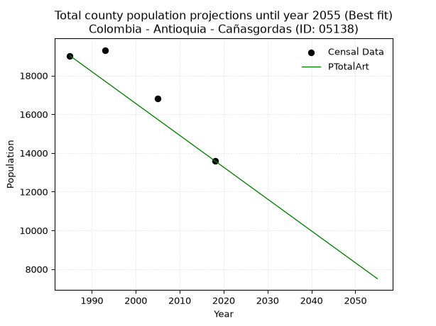
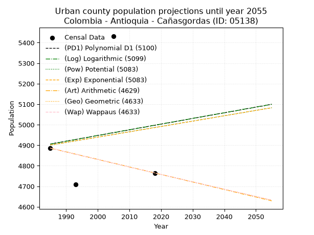
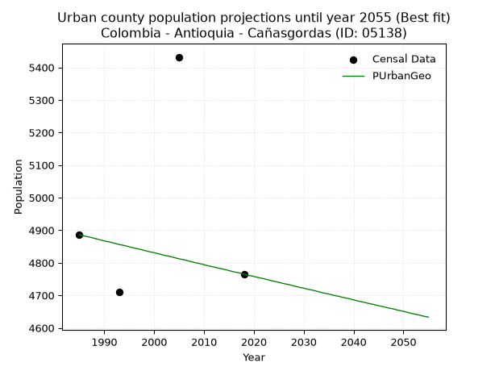
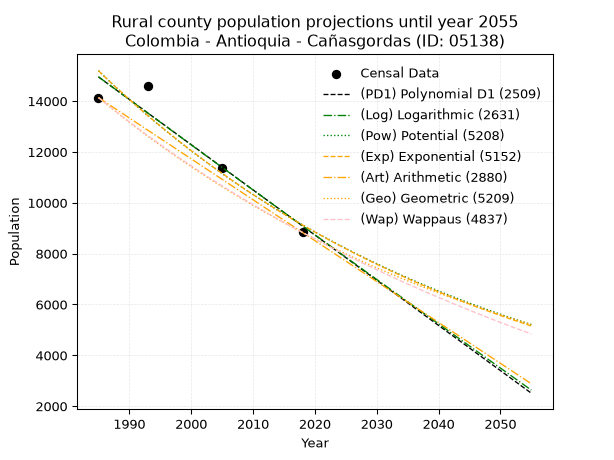
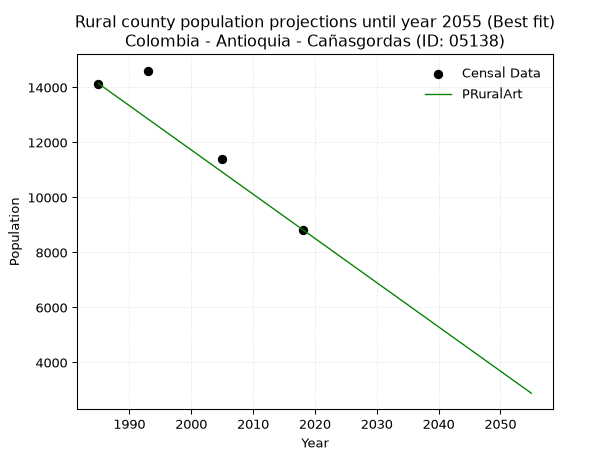

<div align="center">


</div>

# 📜 _“Population and Public Services Demand Projections (PPSD) until Year 2050 for Colombia - Antioquia - Cañasgordas (ID: 05138)”_
Keywords: `population` `public-service` `projection` `lineal` `polynomial` `logarithmic` `potential` `exponential` `arithmetic` `geometric` `wappaus` `dane` `colombia` `south-america`

PPSD are analytical estimates used by governments and planners to anticipate future changes in population size, age distribution, and the resulting community needs for utilities, healthcare, education, and infrastructure as sizing future water treatment facilities, electrical grids, and road networks based on spatial growth.

<div align="center">

</img>

</div>


> **General running parameters**: • app_version: _v20260806_. • Python version: _3.14.7_. • Pandas version: _3.0.5_. • NumPy version: _2.5.1_. • Creates, save and include plots into reports (create_plot): _False_. • Projection until year: _2050_. • Process polynomial degree 2 and up: _False_. • Process Wappaus: _True_. • Process Wappaus: _True_. • Set negative values to zero: _True_. • Set infinite values to zero: _True_. • Drop dataset notes: _True_. 
<div align="center">

Maps & GIS Layers: [:earth_americas:Google](http://maps.google.com/maps?q=6.753858539,-76.0282275) [:earth_americas:OSM](https://www.openstreetmap.org/#map=18/6.753858539/-76.0282275&layers=P) [:earth_americas:Bing](https://www.bing.com/maps?cp=6.753858539~-76.0282275&lvl=18) [:earth_americas:Apple](https://maps.apple.com/frame?center=6.753858539%2C-76.0282275&span=0.003%2C0.006) [:earth_americas:GISMobile](https://github.com/rcfdtools/R.GISMobile/blob/main/file/gis/CountyLayer_CO/Readme.md)

</div>


<div align="center">

```geojson
{
  "type": "Feature",
  "geometry": {
    "type": "Point", 
    "coordinates": [-76.0282275, 6.753858539]
  }, 
  "properties": {
    "Name": "Colombia - Antioquia - Cañasgordas (ID: 05138)"
  }
}
```

</div>


## 0. Census Data (4 records)

Census data are official statistics collected by a government about the people and housing in a country. They usually include counts of total population, age, sex, race, income, education, and jobs.

📅Global census file: [Population.xlsx](../data/Population.xlsx)

| Source   |   Year |   CountryID | CountryName   |   StateID | StateName   |   CountyID | CountyName   |   PTotal |   PUrban |   PRural |
|:---------|-------:|------------:|:--------------|----------:|:------------|-----------:|:-------------|---------:|---------:|---------:|
| DANE     |   1985 |          57 | Colombia      |        05 | Antioquia   |      05138 | Cañasgordas  |    19023 |     4886 |    14137 |
| DANE     |   1993 |          57 | Colombia      |        05 | Antioquia   |      05138 | Cañasgordas  |    19316 |     4710 |    14606 |
| DANE     |   2005 |          57 | Colombia      |        05 | Antioquia   |      05138 | Cañasgordas  |    16816 |     5432 |    11384 |
| DANE     |   2018 |          57 | Colombia      |        05 | Antioquia   |      05138 | Cañasgordas  |    13595 |     4765 |     8830 |

> 🔥Some records could had specific notes about the registered values or the corresponding urban or rural distribution.

📅[SUI-RUPS](https://www.datos.gov.co/Hacienda-y-Cr-dito-P-blico/Registro-nico-de-Prestadores-de-Servicios-P-blicos/4qkq-csdn/about_data) - Local public utility companies: [RUPS.csv](../data/RUPS.csv)

 | SERVICIO       | ESTADO    | NOMBRE                                       | NIT         | DEPARTAMENTO_DOMICILIO   | MUNICIPIO_DOMICILIO   | DIRECCION           |   TELEFONO | EMAIL                                          | TIPO_PRESTADOR                             | CLASIFICACION                 |
|:---------------|:----------|:---------------------------------------------|:------------|:-------------------------|:----------------------|:--------------------|-----------:|:-----------------------------------------------|:-------------------------------------------|:------------------------------|
| ACUEDUCTO      | OPERATIVA | EMPRESAS PUBLICAS DE CAÑASGORDAS S.A.  E.S.P | 900383243-0 | ANTIOQUIA                | CANASGORDAS           | calle 25 no 29 a 03 |    8564101 | serviciospublicos@canasgordas-antioquia.gov.co | SOCIEDADES (EMPRESA DE SERVICIOS PUBLICOS) | MENOR O IGUAL A 2500 USUARIOS |
| ALCANTARILLADO | OPERATIVA | EMPRESAS PUBLICAS DE CAÑASGORDAS S.A.  E.S.P | 900383243-0 | ANTIOQUIA                | CANASGORDAS           | calle 25 no 29 a 03 |    8564101 | serviciospublicos@canasgordas-antioquia.gov.co | SOCIEDADES (EMPRESA DE SERVICIOS PUBLICOS) | MENOR O IGUAL A 2500 USUARIOS |

## 1. Total

### 1.1. Coefficients and Parameters

* (PD1) Polynomial Deg 1: -174.95704536330578, 367145.3299879524 (lineal)
* (Log) Logarithmic: -349963.3040364772, 2677261.3784111775
* (Pow) Potential: -21.389271137678683, 74.83868065595493
* (Exp) Exponential: -0.010693906638426972, 33177594212354.87
* (Art) Arithmetic: Year diff. 2018 - 1985 = 33, Population diff. 13595 - 19023 = -5428, Annual growth = -164.4848484848485
* (Geo) Geometric: Year diff. 2018 - 1985 = 33, Population diff. 13595 - 19023 = -5428, Annual growth % = -0.010128560016046007
* (Wap) Wappaus: i = -1.0085526303565424, Condition values only valid for < 200)

<sub>
Wappaus condition values: ['-0.00', '-1.01', '-2.02', '-3.03', '-4.03', '-5.04', '-6.05', '-7.06', '-8.07', '-9.08', '-10.09', '-11.09', '-12.10', '-13.11', '-14.12', '-15.13', '-16.14', '-17.15', '-18.15', '-19.16', '-20.17', '-21.18', '-22.19', '-23.20', '-24.21', '-25.21', '-26.22', '-27.23', '-28.24', '-29.25', '-30.26', '-31.27', '-32.27', '-33.28', '-34.29', '-35.30', '-36.31', '-37.32', '-38.32', '-39.33', '-40.34', '-41.35', '-42.36', '-43.37', '-44.38', '-45.38', '-46.39', '-47.40', '-48.41', '-49.42', '-50.43', '-51.44', '-52.44', '-53.45', '-54.46', '-55.47', '-56.48', '-57.49', '-58.50', '-59.50', '-60.51', '-61.52', '-62.53', '-63.54', '-64.55', '-65.56']
</sub>


### 1.2. Projected Dataset

|   Year |   CountyID |   PTotalPD1 |   PTotalLog |   PTotalPow |   PTotalExp |   PTotalArt |   PTotalGeo |   PTotalWap |
|-------:|-----------:|------------:|------------:|------------:|------------:|------------:|------------:|------------:|
|   1985 |      05138 |       19856 |       19859 |       20044 |       20040 |       19023 |       19023 |       19023 |
|   1986 |      05138 |       19681 |       19683 |       19829 |       19827 |       18859 |       18830 |       18832 |
|   1987 |      05138 |       19506 |       19507 |       19617 |       19616 |       18694 |       18640 |       18643 |
|   1988 |      05138 |       19331 |       19331 |       19407 |       19407 |       18530 |       18451 |       18456 |
|   1989 |      05138 |       19156 |       19155 |       19199 |       19201 |       18365 |       18264 |       18271 |
|   1990 |      05138 |       18981 |       18979 |       18994 |       18997 |       18201 |       18079 |       18087 |
|   1991 |      05138 |       18806 |       18803 |       18791 |       18795 |       18036 |       17896 |       17906 |
|   1992 |      05138 |       18631 |       18627 |       18590 |       18595 |       17872 |       17715 |       17726 |
|   1993 |      05138 |       18456 |       18451 |       18392 |       18397 |       17707 |       17535 |       17548 |
|   1994 |      05138 |       18281 |       18276 |       18196 |       18201 |       17543 |       17358 |       17371 |
|   1995 |      05138 |       18106 |       18100 |       18001 |       18008 |       17378 |       17182 |       17197 |
|   1996 |      05138 |       17931 |       17925 |       17810 |       17816 |       17214 |       17008 |       17023 |
|   1997 |      05138 |       17756 |       17750 |       17620 |       17627 |       17049 |       16835 |       16852 |
|   1998 |      05138 |       17581 |       17575 |       17432 |       17439 |       16885 |       16665 |       16682 |
|   1999 |      05138 |       17406 |       17399 |       17246 |       17254 |       16720 |       16496 |       16514 |
|   2000 |      05138 |       17231 |       17224 |       17063 |       17070 |       16556 |       16329 |       16348 |
|   2001 |      05138 |       17056 |       17050 |       16882 |       16889 |       16391 |       16164 |       16182 |
|   2002 |      05138 |       16881 |       16875 |       16702 |       16709 |       16227 |       16000 |       16019 |
|   2003 |      05138 |       16706 |       16700 |       16525 |       16531 |       16062 |       15838 |       15857 |
|   2004 |      05138 |       16531 |       16525 |       16349 |       16355 |       15898 |       15677 |       15696 |
|   2005 |      05138 |       16356 |       16351 |       16176 |       16181 |       15733 |       15519 |       15537 |
|   2006 |      05138 |       16181 |       16176 |       16004 |       16009 |       15569 |       15362 |       15380 |
|   2007 |      05138 |       16007 |       16002 |       15834 |       15839 |       15404 |       15206 |       15224 |
|   2008 |      05138 |       15832 |       15827 |       15667 |       15670 |       15240 |       15052 |       15069 |
|   2009 |      05138 |       15657 |       15653 |       15501 |       15504 |       15075 |       14899 |       14916 |
|   2010 |      05138 |       15482 |       15479 |       15336 |       15339 |       14911 |       14749 |       14764 |
|   2011 |      05138 |       15307 |       15305 |       15174 |       15176 |       14746 |       14599 |       14613 |
|   2012 |      05138 |       15132 |       15131 |       15014 |       15014 |       14582 |       14451 |       14464 |
|   2013 |      05138 |       14957 |       14957 |       14855 |       14855 |       14417 |       14305 |       14316 |
|   2014 |      05138 |       14782 |       14783 |       14698 |       14697 |       14253 |       14160 |       14169 |
|   2015 |      05138 |       14607 |       14610 |       14543 |       14540 |       14088 |       14017 |       14024 |
|   2016 |      05138 |       14432 |       14436 |       14389 |       14386 |       13924 |       13875 |       13879 |
|   2017 |      05138 |       14257 |       14262 |       14237 |       14233 |       13759 |       13734 |       13737 |
|   2018 |      05138 |       14082 |       14089 |       14087 |       14081 |       13595 |       13595 |       13595 |
|   2019 |      05138 |       13907 |       13915 |       13939 |       13931 |       13431 |       13457 |       13455 |
|   2020 |      05138 |       13732 |       13742 |       13792 |       13783 |       13266 |       13321 |       13315 |
|   2021 |      05138 |       13557 |       13569 |       13647 |       13637 |       13102 |       13186 |       13177 |
|   2022 |      05138 |       13382 |       13396 |       13503 |       13492 |       12937 |       13053 |       13041 |
|   2023 |      05138 |       13207 |       13223 |       13361 |       13348 |       12773 |       12920 |       12905 |
|   2024 |      05138 |       13032 |       13050 |       13220 |       13206 |       12608 |       12789 |       12770 |
|   2025 |      05138 |       12857 |       12877 |       13082 |       13066 |       12444 |       12660 |       12637 |
|   2026 |      05138 |       12682 |       12704 |       12944 |       12927 |       12279 |       12532 |       12505 |
|   2027 |      05138 |       12507 |       12532 |       12808 |       12789 |       12115 |       12405 |       12373 |
|   2028 |      05138 |       12332 |       12359 |       12674 |       12653 |       11950 |       12279 |       12243 |
|   2029 |      05138 |       12157 |       12186 |       12541 |       12518 |       11786 |       12155 |       12114 |
|   2030 |      05138 |       11983 |       12014 |       12409 |       12385 |       11621 |       12032 |       11986 |
|   2031 |      05138 |       11808 |       11842 |       12279 |       12254 |       11457 |       11910 |       11859 |
|   2032 |      05138 |       11633 |       11669 |       12151 |       12123 |       11292 |       11789 |       11733 |
|   2033 |      05138 |       11458 |       11497 |       12024 |       11994 |       11128 |       11670 |       11609 |
|   2034 |      05138 |       11283 |       11325 |       11898 |       11867 |       10963 |       11552 |       11485 |
|   2035 |      05138 |       11108 |       11153 |       11773 |       11740 |       10799 |       11435 |       11362 |
|   2036 |      05138 |       10933 |       10981 |       11650 |       11616 |       10634 |       11319 |       11240 |
|   2037 |      05138 |       10758 |       10809 |       11529 |       11492 |       10470 |       11204 |       11119 |
|   2038 |      05138 |       10583 |       10638 |       11408 |       11370 |       10305 |       11091 |       10999 |
|   2039 |      05138 |       10408 |       10466 |       11289 |       11249 |       10141 |       10978 |       10880 |
|   2040 |      05138 |       10233 |       10294 |       11171 |       11129 |        9976 |       10867 |       10762 |
|   2041 |      05138 |       10058 |       10123 |       11055 |       11011 |        9812 |       10757 |       10645 |
|   2042 |      05138 |        9883 |        9951 |       10940 |       10894 |        9647 |       10648 |       10529 |
|   2043 |      05138 |        9708 |        9780 |       10826 |       10778 |        9483 |       10540 |       10413 |
|   2044 |      05138 |        9533 |        9609 |       10713 |       10663 |        9318 |       10433 |       10299 |
|   2045 |      05138 |        9358 |        9438 |       10601 |       10550 |        9154 |       10328 |       10186 |
|   2046 |      05138 |        9183 |        9266 |       10491 |       10438 |        8989 |       10223 |       10073 |
|   2047 |      05138 |        9008 |        9095 |       10382 |       10327 |        8825 |       10120 |        9961 |
|   2048 |      05138 |        8833 |        8925 |       10274 |       10217 |        8660 |       10017 |        9850 |
|   2049 |      05138 |        8658 |        8754 |       10167 |       10108 |        8496 |        9916 |        9740 |
|   2050 |      05138 |        8483 |        8583 |       10062 |       10000 |        8331 |        9815 |        9631 |
<div align="center">

</img>

</div>


### 1.3. Best fit with absolute and relative error (%)

Relative error puts that difference into context by dividing the absolute error by the true value, creating a unitless ratio or percentage that shows the scale of the mistake.

Absolute and relative error

|   Year | Source   |   CountryID | CountryName   |   StateID | StateName   |   CountyID_x | CountyName   |   PTotal |   PUrban |   PRural |   CountyID_y |   PTotalPD1 |   PTotalLog |   PTotalPow |   PTotalExp |   PTotalArt |   PTotalGeo |   PTotalWap |   PTotalPD1AbsError |   PTotalLogAbsError |   PTotalPowAbsError |   PTotalExpAbsError |   PTotalArtAbsError |   PTotalGeoAbsError |   PTotalWapAbsError |   PTotalPD1RelError |   PTotalLogRelError |   PTotalPowRelError |   PTotalExpRelError |   PTotalArtRelError |   PTotalGeoRelError |   PTotalWapRelError |
|-------:|:---------|------------:|:--------------|----------:|:------------|-------------:|:-------------|---------:|---------:|---------:|-------------:|------------:|------------:|------------:|------------:|------------:|------------:|------------:|--------------------:|--------------------:|--------------------:|--------------------:|--------------------:|--------------------:|--------------------:|--------------------:|--------------------:|--------------------:|--------------------:|--------------------:|--------------------:|--------------------:|
|   1985 | DANE     |          57 | Colombia      |        05 | Antioquia   |        05138 | Cañasgordas  |    19023 |     4886 |    14137 |        05138 |       19856 |       19859 |       20044 |       20040 |       19023 |       19023 |       19023 |                 833 |                 836 |                1021 |                1017 |                   0 |                   0 |                   0 |             4.37891 |             4.39468 |             5.36719 |             5.34616 |             0       |             0       |             0       |
|   1993 | DANE     |          57 | Colombia      |        05 | Antioquia   |        05138 | Cañasgordas  |    19316 |     4710 |    14606 |        05138 |       18456 |       18451 |       18392 |       18397 |       17707 |       17535 |       17548 |                 860 |                 865 |                 924 |                 919 |                1609 |                1781 |                1768 |             4.45227 |             4.47815 |             4.7836  |             4.75771 |             8.32988 |             9.22034 |             9.15303 |
|   2005 | DANE     |          57 | Colombia      |        05 | Antioquia   |        05138 | Cañasgordas  |    16816 |     5432 |    11384 |        05138 |       16356 |       16351 |       16176 |       16181 |       15733 |       15519 |       15537 |                 460 |                 465 |                 640 |                 635 |                1083 |                1297 |                1279 |             2.73549 |             2.76522 |             3.8059  |             3.77617 |             6.44029 |             7.71289 |             7.60585 |
|   2018 | DANE     |          57 | Colombia      |        05 | Antioquia   |        05138 | Cañasgordas  |    13595 |     4765 |     8830 |        05138 |       14082 |       14089 |       14087 |       14081 |       13595 |       13595 |       13595 |                 487 |                 494 |                 492 |                 486 |                   0 |                   0 |                   0 |             3.5822  |             3.63369 |             3.61898 |             3.57484 |             0       |             0       |             0       |

Relative error mean

| Method    |   RelError | Best   |
|:----------|-----------:|:-------|
| PTotalPD1 |    3.78722 |        |
| PTotalLog |    3.81794 |        |
| PTotalPow |    4.39392 |        |
| PTotalExp |    4.36372 |        |
| PTotalArt |    3.69254 | True   |
| PTotalGeo |    4.23331 |        |
| PTotalWap |    4.18972 |        |

💙Best method: _**PTotalArt**_
<div align="center">

</img>

</div>


### 1.4. Fresh water supply demand in liters per capita per day (lpcd)

The fresh water supply demand typically ranges from 100 to 300 liters per capita per day (lpcd) for standard domestic and municipal planning, though absolute survival minimums set by the World Health Organization are as low as 7.5 to 20 liters per day, and total consumption in high-income nations can exceed 400 liters.

> `CZ`: Level in meters above the sea level (masl)<br> `WS`: Fresh water supply demand in liters per capita per day (lpcd or l/h/d)<br> `WSAll`: Zonal fresh water supply demand in liters per second (l/s)<br> `A`: Zonal area in square meters<br> `DP`: Population density (people/hectare or p/ha)

Reference values (RAS Colombia)

|    CZ |   WS |
|------:|-----:|
|  1000 |  120 |
|  2000 |  130 |
| 99999 |  140 |

County shapefile geometry properties and water supply values

|   CountyID |      ATotal |   CZTotal |   WSTotal |
|-----------:|------------:|----------:|----------:|
|      05138 | 3.64839e+08 |   1773.97 |       130 |

Projected values for best method: PTotalArt

|   CountyID |   Year |   PTotalArt |   DPTotal |   WSTotal |   WSTotalAll |
|-----------:|-------:|------------:|----------:|----------:|-------------:|
|      05138 |   1985 |       19023 |      0.52 |       130 |      28.6226 |
|      05138 |   1986 |       18859 |      0.52 |       130 |      28.3758 |
|      05138 |   1987 |       18694 |      0.51 |       130 |      28.1275 |
|      05138 |   1988 |       18530 |      0.51 |       130 |      27.8808 |
|      05138 |   1989 |       18365 |      0.5  |       130 |      27.6325 |
|      05138 |   1990 |       18201 |      0.5  |       130 |      27.3858 |
|      05138 |   1991 |       18036 |      0.49 |       130 |      27.1375 |
|      05138 |   1992 |       17872 |      0.49 |       130 |      26.8907 |
|      05138 |   1993 |       17707 |      0.49 |       130 |      26.6425 |
|      05138 |   1994 |       17543 |      0.48 |       130 |      26.3957 |
|      05138 |   1995 |       17378 |      0.48 |       130 |      26.1475 |
|      05138 |   1996 |       17214 |      0.47 |       130 |      25.9007 |
|      05138 |   1997 |       17049 |      0.47 |       130 |      25.6524 |
|      05138 |   1998 |       16885 |      0.46 |       130 |      25.4057 |
|      05138 |   1999 |       16720 |      0.46 |       130 |      25.1574 |
|      05138 |   2000 |       16556 |      0.45 |       130 |      24.9106 |
|      05138 |   2001 |       16391 |      0.45 |       130 |      24.6624 |
|      05138 |   2002 |       16227 |      0.44 |       130 |      24.4156 |
|      05138 |   2003 |       16062 |      0.44 |       130 |      24.1674 |
|      05138 |   2004 |       15898 |      0.44 |       130 |      23.9206 |
|      05138 |   2005 |       15733 |      0.43 |       130 |      23.6723 |
|      05138 |   2006 |       15569 |      0.43 |       130 |      23.4256 |
|      05138 |   2007 |       15404 |      0.42 |       130 |      23.1773 |
|      05138 |   2008 |       15240 |      0.42 |       130 |      22.9306 |
|      05138 |   2009 |       15075 |      0.41 |       130 |      22.6823 |
|      05138 |   2010 |       14911 |      0.41 |       130 |      22.4355 |
|      05138 |   2011 |       14746 |      0.4  |       130 |      22.1873 |
|      05138 |   2012 |       14582 |      0.4  |       130 |      21.9405 |
|      05138 |   2013 |       14417 |      0.4  |       130 |      21.6922 |
|      05138 |   2014 |       14253 |      0.39 |       130 |      21.4455 |
|      05138 |   2015 |       14088 |      0.39 |       130 |      21.1972 |
|      05138 |   2016 |       13924 |      0.38 |       130 |      20.9505 |
|      05138 |   2017 |       13759 |      0.38 |       130 |      20.7022 |
|      05138 |   2018 |       13595 |      0.37 |       130 |      20.4554 |
|      05138 |   2019 |       13431 |      0.37 |       130 |      20.2087 |
|      05138 |   2020 |       13266 |      0.36 |       130 |      19.9604 |
|      05138 |   2021 |       13102 |      0.36 |       130 |      19.7137 |
|      05138 |   2022 |       12937 |      0.35 |       130 |      19.4654 |
|      05138 |   2023 |       12773 |      0.35 |       130 |      19.2186 |
|      05138 |   2024 |       12608 |      0.35 |       130 |      18.9704 |
|      05138 |   2025 |       12444 |      0.34 |       130 |      18.7236 |
|      05138 |   2026 |       12279 |      0.34 |       130 |      18.4753 |
|      05138 |   2027 |       12115 |      0.33 |       130 |      18.2286 |
|      05138 |   2028 |       11950 |      0.33 |       130 |      17.9803 |
|      05138 |   2029 |       11786 |      0.32 |       130 |      17.7336 |
|      05138 |   2030 |       11621 |      0.32 |       130 |      17.4853 |
|      05138 |   2031 |       11457 |      0.31 |       130 |      17.2385 |
|      05138 |   2032 |       11292 |      0.31 |       130 |      16.9903 |
|      05138 |   2033 |       11128 |      0.31 |       130 |      16.7435 |
|      05138 |   2034 |       10963 |      0.3  |       130 |      16.4953 |
|      05138 |   2035 |       10799 |      0.3  |       130 |      16.2485 |
|      05138 |   2036 |       10634 |      0.29 |       130 |      16.0002 |
|      05138 |   2037 |       10470 |      0.29 |       130 |      15.7535 |
|      05138 |   2038 |       10305 |      0.28 |       130 |      15.5052 |
|      05138 |   2039 |       10141 |      0.28 |       130 |      15.2584 |
|      05138 |   2040 |        9976 |      0.27 |       130 |      15.0102 |
|      05138 |   2041 |        9812 |      0.27 |       130 |      14.7634 |
|      05138 |   2042 |        9647 |      0.26 |       130 |      14.5152 |
|      05138 |   2043 |        9483 |      0.26 |       130 |      14.2684 |
|      05138 |   2044 |        9318 |      0.26 |       130 |      14.0201 |
|      05138 |   2045 |        9154 |      0.25 |       130 |      13.7734 |
|      05138 |   2046 |        8989 |      0.25 |       130 |      13.5251 |
|      05138 |   2047 |        8825 |      0.24 |       130 |      13.2784 |
|      05138 |   2048 |        8660 |      0.24 |       130 |      13.0301 |
|      05138 |   2049 |        8496 |      0.23 |       130 |      12.7833 |
|      05138 |   2050 |        8331 |      0.23 |       130 |      12.5351 |

## 2. Urban

### 2.1. Coefficients and Parameters

* (PD1) Polynomial Deg 1: 2.7647531112007453, -581.9474106792921 (lineal)
* (Log) Logarithmic: 5596.986574091469, -37594.48980110482
* (Pow) Potential: 1.0537466849450323, 0.2152515388393743
* (Exp) Exponential: 0.0005203548268243464, 1744.6901225790018
* (Art) Arithmetic: Year diff. 2018 - 1985 = 33, Population diff. 4765 - 4886 = -121, Annual growth = -3.6666666666666665
* (Geo) Geometric: Year diff. 2018 - 1985 = 33, Population diff. 4765 - 4886 = -121, Annual growth % = -0.0007596033469974284
* (Wap) Wappaus: i = -0.07598521742133803, Condition values only valid for < 200)

<sub>
Wappaus condition values: ['-0.00', '-0.08', '-0.15', '-0.23', '-0.30', '-0.38', '-0.46', '-0.53', '-0.61', '-0.68', '-0.76', '-0.84', '-0.91', '-0.99', '-1.06', '-1.14', '-1.22', '-1.29', '-1.37', '-1.44', '-1.52', '-1.60', '-1.67', '-1.75', '-1.82', '-1.90', '-1.98', '-2.05', '-2.13', '-2.20', '-2.28', '-2.36', '-2.43', '-2.51', '-2.58', '-2.66', '-2.74', '-2.81', '-2.89', '-2.96', '-3.04', '-3.12', '-3.19', '-3.27', '-3.34', '-3.42', '-3.50', '-3.57', '-3.65', '-3.72', '-3.80', '-3.88', '-3.95', '-4.03', '-4.10', '-4.18', '-4.26', '-4.33', '-4.41', '-4.48', '-4.56', '-4.64', '-4.71', '-4.79', '-4.86', '-4.94']
</sub>


### 2.2. Projected Dataset

|   Year |   CountyID |   PUrbanPD1 |   PUrbanLog |   PUrbanPow |   PUrbanExp |   PUrbanArt |   PUrbanGeo |   PUrbanWap |
|-------:|-----------:|------------:|------------:|------------:|------------:|------------:|------------:|------------:|
|   1985 |      05138 |        4906 |        4906 |        4901 |        4901 |        4886 |        4886 |        4886 |
|   1986 |      05138 |        4909 |        4908 |        4903 |        4904 |        4882 |        4882 |        4882 |
|   1987 |      05138 |        4912 |        4911 |        4906 |        4906 |        4879 |        4879 |        4879 |
|   1988 |      05138 |        4914 |        4914 |        4908 |        4909 |        4875 |        4875 |        4875 |
|   1989 |      05138 |        4917 |        4917 |        4911 |        4911 |        4871 |        4871 |        4871 |
|   1990 |      05138 |        4920 |        4920 |        4914 |        4914 |        4868 |        4867 |        4867 |
|   1991 |      05138 |        4923 |        4922 |        4916 |        4917 |        4864 |        4864 |        4864 |
|   1992 |      05138 |        4925 |        4925 |        4919 |        4919 |        4860 |        4860 |        4860 |
|   1993 |      05138 |        4928 |        4928 |        4921 |        4922 |        4857 |        4856 |        4856 |
|   1994 |      05138 |        4931 |        4931 |        4924 |        4924 |        4853 |        4853 |        4853 |
|   1995 |      05138 |        4934 |        4934 |        4927 |        4927 |        4849 |        4849 |        4849 |
|   1996 |      05138 |        4936 |        4936 |        4929 |        4929 |        4846 |        4845 |        4845 |
|   1997 |      05138 |        4939 |        4939 |        4932 |        4932 |        4842 |        4842 |        4842 |
|   1998 |      05138 |        4942 |        4942 |        4934 |        4934 |        4838 |        4838 |        4838 |
|   1999 |      05138 |        4945 |        4945 |        4937 |        4937 |        4835 |        4834 |        4834 |
|   2000 |      05138 |        4948 |        4948 |        4940 |        4940 |        4831 |        4831 |        4831 |
|   2001 |      05138 |        4950 |        4950 |        4942 |        4942 |        4827 |        4827 |        4827 |
|   2002 |      05138 |        4953 |        4953 |        4945 |        4945 |        4824 |        4823 |        4823 |
|   2003 |      05138 |        4956 |        4956 |        4948 |        4947 |        4820 |        4820 |        4820 |
|   2004 |      05138 |        4959 |        4959 |        4950 |        4950 |        4816 |        4816 |        4816 |
|   2005 |      05138 |        4961 |        4962 |        4953 |        4952 |        4813 |        4812 |        4812 |
|   2006 |      05138 |        4964 |        4964 |        4955 |        4955 |        4809 |        4809 |        4809 |
|   2007 |      05138 |        4967 |        4967 |        4958 |        4958 |        4805 |        4805 |        4805 |
|   2008 |      05138 |        4970 |        4970 |        4961 |        4960 |        4802 |        4801 |        4801 |
|   2009 |      05138 |        4972 |        4973 |        4963 |        4963 |        4798 |        4798 |        4798 |
|   2010 |      05138 |        4975 |        4976 |        4966 |        4965 |        4794 |        4794 |        4794 |
|   2011 |      05138 |        4978 |        4978 |        4968 |        4968 |        4791 |        4790 |        4790 |
|   2012 |      05138 |        4981 |        4981 |        4971 |        4971 |        4787 |        4787 |        4787 |
|   2013 |      05138 |        4984 |        4984 |        4974 |        4973 |        4783 |        4783 |        4783 |
|   2014 |      05138 |        4986 |        4987 |        4976 |        4976 |        4780 |        4780 |        4780 |
|   2015 |      05138 |        4989 |        4989 |        4979 |        4978 |        4776 |        4776 |        4776 |
|   2016 |      05138 |        4992 |        4992 |        4981 |        4981 |        4772 |        4772 |        4772 |
|   2017 |      05138 |        4995 |        4995 |        4984 |        4984 |        4769 |        4769 |        4769 |
|   2018 |      05138 |        4997 |        4998 |        4987 |        4986 |        4765 |        4765 |        4765 |
|   2019 |      05138 |        5000 |        5001 |        4989 |        4989 |        4761 |        4761 |        4761 |
|   2020 |      05138 |        5003 |        5003 |        4992 |        4991 |        4758 |        4758 |        4758 |
|   2021 |      05138 |        5006 |        5006 |        4994 |        4994 |        4754 |        4754 |        4754 |
|   2022 |      05138 |        5008 |        5009 |        4997 |        4996 |        4750 |        4751 |        4751 |
|   2023 |      05138 |        5011 |        5012 |        5000 |        4999 |        4747 |        4747 |        4747 |
|   2024 |      05138 |        5014 |        5014 |        5002 |        5002 |        4743 |        4743 |        4743 |
|   2025 |      05138 |        5017 |        5017 |        5005 |        5004 |        4739 |        4740 |        4740 |
|   2026 |      05138 |        5019 |        5020 |        5007 |        5007 |        4736 |        4736 |        4736 |
|   2027 |      05138 |        5022 |        5023 |        5010 |        5010 |        4732 |        4733 |        4733 |
|   2028 |      05138 |        5025 |        5025 |        5013 |        5012 |        4728 |        4729 |        4729 |
|   2029 |      05138 |        5028 |        5028 |        5015 |        5015 |        4725 |        4725 |        4725 |
|   2030 |      05138 |        5031 |        5031 |        5018 |        5017 |        4721 |        4722 |        4722 |
|   2031 |      05138 |        5033 |        5034 |        5020 |        5020 |        4717 |        4718 |        4718 |
|   2032 |      05138 |        5036 |        5037 |        5023 |        5023 |        4714 |        4715 |        4715 |
|   2033 |      05138 |        5039 |        5039 |        5026 |        5025 |        4710 |        4711 |        4711 |
|   2034 |      05138 |        5042 |        5042 |        5028 |        5028 |        4706 |        4707 |        4707 |
|   2035 |      05138 |        5044 |        5045 |        5031 |        5030 |        4703 |        4704 |        4704 |
|   2036 |      05138 |        5047 |        5048 |        5033 |        5033 |        4699 |        4700 |        4700 |
|   2037 |      05138 |        5050 |        5050 |        5036 |        5036 |        4695 |        4697 |        4697 |
|   2038 |      05138 |        5053 |        5053 |        5039 |        5038 |        4692 |        4693 |        4693 |
|   2039 |      05138 |        5055 |        5056 |        5041 |        5041 |        4688 |        4690 |        4690 |
|   2040 |      05138 |        5058 |        5058 |        5044 |        5044 |        4684 |        4686 |        4686 |
|   2041 |      05138 |        5061 |        5061 |        5046 |        5046 |        4681 |        4682 |        4682 |
|   2042 |      05138 |        5064 |        5064 |        5049 |        5049 |        4677 |        4679 |        4679 |
|   2043 |      05138 |        5066 |        5067 |        5052 |        5051 |        4673 |        4675 |        4675 |
|   2044 |      05138 |        5069 |        5069 |        5054 |        5054 |        4670 |        4672 |        4672 |
|   2045 |      05138 |        5072 |        5072 |        5057 |        5057 |        4666 |        4668 |        4668 |
|   2046 |      05138 |        5075 |        5075 |        5059 |        5059 |        4662 |        4665 |        4665 |
|   2047 |      05138 |        5078 |        5078 |        5062 |        5062 |        4659 |        4661 |        4661 |
|   2048 |      05138 |        5080 |        5080 |        5065 |        5065 |        4655 |        4658 |        4658 |
|   2049 |      05138 |        5083 |        5083 |        5067 |        5067 |        4651 |        4654 |        4654 |
|   2050 |      05138 |        5086 |        5086 |        5070 |        5070 |        4648 |        4651 |        4650 |
<div align="center">

</img>

</div>


### 2.3. Best fit with absolute and relative error (%)

Relative error puts that difference into context by dividing the absolute error by the true value, creating a unitless ratio or percentage that shows the scale of the mistake.

Absolute and relative error

|   Year | Source   |   CountryID | CountryName   |   StateID | StateName   |   CountyID_x | CountyName   |   PTotal |   PUrban |   PRural |   CountyID_y |   PUrbanPD1 |   PUrbanLog |   PUrbanPow |   PUrbanExp |   PUrbanArt |   PUrbanGeo |   PUrbanWap |   PUrbanPD1AbsError |   PUrbanLogAbsError |   PUrbanPowAbsError |   PUrbanExpAbsError |   PUrbanArtAbsError |   PUrbanGeoAbsError |   PUrbanWapAbsError |   PUrbanPD1RelError |   PUrbanLogRelError |   PUrbanPowRelError |   PUrbanExpRelError |   PUrbanArtRelError |   PUrbanGeoRelError |   PUrbanWapRelError |
|-------:|:---------|------------:|:--------------|----------:|:------------|-------------:|:-------------|---------:|---------:|---------:|-------------:|------------:|------------:|------------:|------------:|------------:|------------:|------------:|--------------------:|--------------------:|--------------------:|--------------------:|--------------------:|--------------------:|--------------------:|--------------------:|--------------------:|--------------------:|--------------------:|--------------------:|--------------------:|--------------------:|
|   1985 | DANE     |          57 | Colombia      |        05 | Antioquia   |        05138 | Cañasgordas  |    19023 |     4886 |    14137 |        05138 |        4906 |        4906 |        4901 |        4901 |        4886 |        4886 |        4886 |                  20 |                  20 |                  15 |                  15 |                   0 |                   0 |                   0 |            0.409333 |            0.409333 |             0.307   |             0.307   |             0       |             0       |             0       |
|   1993 | DANE     |          57 | Colombia      |        05 | Antioquia   |        05138 | Cañasgordas  |    19316 |     4710 |    14606 |        05138 |        4928 |        4928 |        4921 |        4922 |        4857 |        4856 |        4856 |                 218 |                 218 |                 211 |                 212 |                 147 |                 146 |                 146 |            4.62845  |            4.62845  |             4.47983 |             4.50106 |             3.12102 |             3.09979 |             3.09979 |
|   2005 | DANE     |          57 | Colombia      |        05 | Antioquia   |        05138 | Cañasgordas  |    16816 |     5432 |    11384 |        05138 |        4961 |        4962 |        4953 |        4952 |        4813 |        4812 |        4812 |                 471 |                 470 |                 479 |                 480 |                 619 |                 620 |                 620 |            8.67084  |            8.65243  |             8.81811 |             8.83652 |            11.3954  |            11.4138  |            11.4138  |
|   2018 | DANE     |          57 | Colombia      |        05 | Antioquia   |        05138 | Cañasgordas  |    13595 |     4765 |     8830 |        05138 |        4997 |        4998 |        4987 |        4986 |        4765 |        4765 |        4765 |                 232 |                 233 |                 222 |                 221 |                   0 |                   0 |                   0 |            4.86884  |            4.88982  |             4.65897 |             4.63799 |             0       |             0       |             0       |

Relative error mean

| Method    |   RelError | Best   |
|:----------|-----------:|:-------|
| PUrbanPD1 |    4.64436 |        |
| PUrbanLog |    4.64501 |        |
| PUrbanPow |    4.56598 |        |
| PUrbanExp |    4.57064 |        |
| PUrbanArt |    3.62911 |        |
| PUrbanGeo |    3.62841 | True   |
| PUrbanWap |    3.62841 | True   |

💙Best method: _**PUrbanGeo**_
<div align="center">

</img>

</div>


### 2.4. Fresh water supply demand in liters per capita per day (lpcd)

The fresh water supply demand typically ranges from 100 to 300 liters per capita per day (lpcd) for standard domestic and municipal planning, though absolute survival minimums set by the World Health Organization are as low as 7.5 to 20 liters per day, and total consumption in high-income nations can exceed 400 liters.

> `CZ`: Level in meters above the sea level (masl)<br> `WS`: Fresh water supply demand in liters per capita per day (lpcd or l/h/d)<br> `WSAll`: Zonal fresh water supply demand in liters per second (l/s)<br> `A`: Zonal area in square meters<br> `DP`: Population density (people/hectare or p/ha)

Reference values (RAS Colombia)

|    CZ |   WS |
|------:|-----:|
|  1000 |  120 |
|  2000 |  130 |
| 99999 |  140 |

County shapefile geometry properties and water supply values

|   CountyID |   AUrban |   CZUrban |   WSUrban |
|-----------:|---------:|----------:|----------:|
|      05138 |   907748 |   1270.78 |       130 |

Projected values for best method: PUrbanGeo

|   CountyID |   Year |   PUrbanGeo |   DPUrban |   WSUrban |   WSUrbanAll |
|-----------:|-------:|------------:|----------:|----------:|-------------:|
|      05138 |   1985 |        4886 |     53.83 |       130 |      7.35162 |
|      05138 |   1986 |        4882 |     53.78 |       130 |      7.3456  |
|      05138 |   1987 |        4879 |     53.75 |       130 |      7.34109 |
|      05138 |   1988 |        4875 |     53.7  |       130 |      7.33507 |
|      05138 |   1989 |        4871 |     53.66 |       130 |      7.32905 |
|      05138 |   1990 |        4867 |     53.62 |       130 |      7.32303 |
|      05138 |   1991 |        4864 |     53.58 |       130 |      7.31852 |
|      05138 |   1992 |        4860 |     53.54 |       130 |      7.3125  |
|      05138 |   1993 |        4856 |     53.5  |       130 |      7.30648 |
|      05138 |   1994 |        4853 |     53.46 |       130 |      7.30197 |
|      05138 |   1995 |        4849 |     53.42 |       130 |      7.29595 |
|      05138 |   1996 |        4845 |     53.37 |       130 |      7.28993 |
|      05138 |   1997 |        4842 |     53.34 |       130 |      7.28542 |
|      05138 |   1998 |        4838 |     53.3  |       130 |      7.2794  |
|      05138 |   1999 |        4834 |     53.25 |       130 |      7.27338 |
|      05138 |   2000 |        4831 |     53.22 |       130 |      7.26887 |
|      05138 |   2001 |        4827 |     53.18 |       130 |      7.26285 |
|      05138 |   2002 |        4823 |     53.13 |       130 |      7.25683 |
|      05138 |   2003 |        4820 |     53.1  |       130 |      7.25231 |
|      05138 |   2004 |        4816 |     53.05 |       130 |      7.2463  |
|      05138 |   2005 |        4812 |     53.01 |       130 |      7.24028 |
|      05138 |   2006 |        4809 |     52.98 |       130 |      7.23576 |
|      05138 |   2007 |        4805 |     52.93 |       130 |      7.22975 |
|      05138 |   2008 |        4801 |     52.89 |       130 |      7.22373 |
|      05138 |   2009 |        4798 |     52.86 |       130 |      7.21921 |
|      05138 |   2010 |        4794 |     52.81 |       130 |      7.21319 |
|      05138 |   2011 |        4790 |     52.77 |       130 |      7.20718 |
|      05138 |   2012 |        4787 |     52.73 |       130 |      7.20266 |
|      05138 |   2013 |        4783 |     52.69 |       130 |      7.19664 |
|      05138 |   2014 |        4780 |     52.66 |       130 |      7.19213 |
|      05138 |   2015 |        4776 |     52.61 |       130 |      7.18611 |
|      05138 |   2016 |        4772 |     52.57 |       130 |      7.18009 |
|      05138 |   2017 |        4769 |     52.54 |       130 |      7.17558 |
|      05138 |   2018 |        4765 |     52.49 |       130 |      7.16956 |
|      05138 |   2019 |        4761 |     52.45 |       130 |      7.16354 |
|      05138 |   2020 |        4758 |     52.42 |       130 |      7.15903 |
|      05138 |   2021 |        4754 |     52.37 |       130 |      7.15301 |
|      05138 |   2022 |        4751 |     52.34 |       130 |      7.1485  |
|      05138 |   2023 |        4747 |     52.29 |       130 |      7.14248 |
|      05138 |   2024 |        4743 |     52.25 |       130 |      7.13646 |
|      05138 |   2025 |        4740 |     52.22 |       130 |      7.13194 |
|      05138 |   2026 |        4736 |     52.17 |       130 |      7.12593 |
|      05138 |   2027 |        4733 |     52.14 |       130 |      7.12141 |
|      05138 |   2028 |        4729 |     52.1  |       130 |      7.11539 |
|      05138 |   2029 |        4725 |     52.05 |       130 |      7.10938 |
|      05138 |   2030 |        4722 |     52.02 |       130 |      7.10486 |
|      05138 |   2031 |        4718 |     51.97 |       130 |      7.09884 |
|      05138 |   2032 |        4715 |     51.94 |       130 |      7.09433 |
|      05138 |   2033 |        4711 |     51.9  |       130 |      7.08831 |
|      05138 |   2034 |        4707 |     51.85 |       130 |      7.08229 |
|      05138 |   2035 |        4704 |     51.82 |       130 |      7.07778 |
|      05138 |   2036 |        4700 |     51.78 |       130 |      7.07176 |
|      05138 |   2037 |        4697 |     51.74 |       130 |      7.06725 |
|      05138 |   2038 |        4693 |     51.7  |       130 |      7.06123 |
|      05138 |   2039 |        4690 |     51.67 |       130 |      7.05671 |
|      05138 |   2040 |        4686 |     51.62 |       130 |      7.05069 |
|      05138 |   2041 |        4682 |     51.58 |       130 |      7.04468 |
|      05138 |   2042 |        4679 |     51.55 |       130 |      7.04016 |
|      05138 |   2043 |        4675 |     51.5  |       130 |      7.03414 |
|      05138 |   2044 |        4672 |     51.47 |       130 |      7.02963 |
|      05138 |   2045 |        4668 |     51.42 |       130 |      7.02361 |
|      05138 |   2046 |        4665 |     51.39 |       130 |      7.0191  |
|      05138 |   2047 |        4661 |     51.35 |       130 |      7.01308 |
|      05138 |   2048 |        4658 |     51.31 |       130 |      7.00856 |
|      05138 |   2049 |        4654 |     51.27 |       130 |      7.00255 |
|      05138 |   2050 |        4651 |     51.24 |       130 |      6.99803 |

## 3. Rural

### 3.1. Coefficients and Parameters

* (PD1) Polynomial Deg 1: -177.72179847450641, 367727.27739863144 (lineal)
* (Log) Logarithmic: -355560.2906105688, 2714855.8682122836
* (Pow) Potential: -30.90008343560092, 106.08280483185871
* (Exp) Exponential: -0.01544644287716891, 3.1446544184279206e+17
* (Art) Arithmetic: Year diff. 2018 - 1985 = 33, Population diff. 8830 - 14137 = -5307, Annual growth = -160.8181818181818
* (Geo) Geometric: Year diff. 2018 - 1985 = 33, Population diff. 8830 - 14137 = -5307, Annual growth % = -0.014160613928506316
* (Wap) Wappaus: i = -1.4004282824764385, Condition values only valid for < 200)

<sub>
Wappaus condition values: ['-0.00', '-1.40', '-2.80', '-4.20', '-5.60', '-7.00', '-8.40', '-9.80', '-11.20', '-12.60', '-14.00', '-15.40', '-16.81', '-18.21', '-19.61', '-21.01', '-22.41', '-23.81', '-25.21', '-26.61', '-28.01', '-29.41', '-30.81', '-32.21', '-33.61', '-35.01', '-36.41', '-37.81', '-39.21', '-40.61', '-42.01', '-43.41', '-44.81', '-46.21', '-47.61', '-49.01', '-50.42', '-51.82', '-53.22', '-54.62', '-56.02', '-57.42', '-58.82', '-60.22', '-61.62', '-63.02', '-64.42', '-65.82', '-67.22', '-68.62', '-70.02', '-71.42', '-72.82', '-74.22', '-75.62', '-77.02', '-78.42', '-79.82', '-81.22', '-82.63', '-84.03', '-85.43', '-86.83', '-88.23', '-89.63', '-91.03']
</sub>


### 3.2. Projected Dataset

|   Year |   CountyID |   PRuralPD1 |   PRuralLog |   PRuralPow |   PRuralExp |   PRuralArt |   PRuralGeo |   PRuralWap |
|-------:|-----------:|------------:|------------:|------------:|------------:|------------:|------------:|------------:|
|   1985 |      05138 |       14950 |       14954 |       15196 |       15191 |       14137 |       14137 |       14137 |
|   1986 |      05138 |       14772 |       14774 |       14961 |       14958 |       13976 |       13937 |       13940 |
|   1987 |      05138 |       14594 |       14595 |       14730 |       14729 |       13815 |       13739 |       13747 |
|   1988 |      05138 |       14416 |       14417 |       14503 |       14503 |       13655 |       13545 |       13555 |
|   1989 |      05138 |       14239 |       14238 |       14280 |       14281 |       13494 |       13353 |       13367 |
|   1990 |      05138 |       14061 |       14059 |       14059 |       14062 |       13333 |       13164 |       13181 |
|   1991 |      05138 |       13883 |       13880 |       13843 |       13846 |       13172 |       12978 |       12997 |
|   1992 |      05138 |       13705 |       13702 |       13630 |       13634 |       13011 |       12794 |       12816 |
|   1993 |      05138 |       13528 |       13523 |       13420 |       13425 |       12850 |       12613 |       12637 |
|   1994 |      05138 |       13350 |       13345 |       13214 |       13219 |       12690 |       12434 |       12461 |
|   1995 |      05138 |       13172 |       13167 |       13010 |       13017 |       12529 |       12258 |       12287 |
|   1996 |      05138 |       12995 |       12989 |       12811 |       12817 |       12368 |       12084 |       12115 |
|   1997 |      05138 |       12817 |       12811 |       12614 |       12621 |       12207 |       11913 |       11945 |
|   1998 |      05138 |       12639 |       12633 |       12420 |       12427 |       12046 |       11745 |       11778 |
|   1999 |      05138 |       12461 |       12455 |       12230 |       12237 |       11886 |       11578 |       11613 |
|   2000 |      05138 |       12284 |       12277 |       12042 |       12049 |       11725 |       11414 |       11450 |
|   2001 |      05138 |       12106 |       12099 |       11858 |       11865 |       11564 |       11253 |       11288 |
|   2002 |      05138 |       11928 |       11921 |       11676 |       11683 |       11403 |       11093 |       11129 |
|   2003 |      05138 |       11751 |       11744 |       11497 |       11504 |       11242 |       10936 |       10972 |
|   2004 |      05138 |       11573 |       11566 |       11321 |       11327 |       11081 |       10781 |       10817 |
|   2005 |      05138 |       11395 |       11389 |       11148 |       11154 |       10921 |       10629 |       10664 |
|   2006 |      05138 |       11217 |       11212 |       10978 |       10983 |       10760 |       10478 |       10512 |
|   2007 |      05138 |       11040 |       11034 |       10810 |       10814 |       10599 |       10330 |       10363 |
|   2008 |      05138 |       10862 |       10857 |       10645 |       10649 |       10438 |       10184 |       10215 |
|   2009 |      05138 |       10684 |       10680 |       10482 |       10485 |       10277 |       10039 |       10069 |
|   2010 |      05138 |       10506 |       10503 |       10322 |       10325 |       10117 |        9897 |        9925 |
|   2011 |      05138 |       10329 |       10327 |       10165 |       10167 |        9956 |        9757 |        9782 |
|   2012 |      05138 |       10151 |       10150 |       10010 |       10011 |        9795 |        9619 |        9641 |
|   2013 |      05138 |        9973 |        9973 |        9857 |        9857 |        9634 |        9483 |        9502 |
|   2014 |      05138 |        9796 |        9797 |        9707 |        9706 |        9473 |        9348 |        9365 |
|   2015 |      05138 |        9618 |        9620 |        9559 |        9557 |        9312 |        9216 |        9229 |
|   2016 |      05138 |        9440 |        9444 |        9414 |        9411 |        9152 |        9085 |        9094 |
|   2017 |      05138 |        9262 |        9267 |        9271 |        9267 |        8991 |        8957 |        8961 |
|   2018 |      05138 |        9085 |        9091 |        9130 |        9125 |        8830 |        8830 |        8830 |
|   2019 |      05138 |        8907 |        8915 |        8991 |        8985 |        8669 |        8705 |        8700 |
|   2020 |      05138 |        8729 |        8739 |        8855 |        8847 |        8508 |        8582 |        8572 |
|   2021 |      05138 |        8552 |        8563 |        8720 |        8711 |        8348 |        8460 |        8445 |
|   2022 |      05138 |        8374 |        8387 |        8588 |        8578 |        8187 |        8340 |        8319 |
|   2023 |      05138 |        8196 |        8211 |        8458 |        8446 |        8026 |        8222 |        8195 |
|   2024 |      05138 |        8018 |        8035 |        8330 |        8317 |        7865 |        8106 |        8072 |
|   2025 |      05138 |        7841 |        7860 |        8203 |        8189 |        7704 |        7991 |        7951 |
|   2026 |      05138 |        7663 |        7684 |        8079 |        8064 |        7543 |        7878 |        7830 |
|   2027 |      05138 |        7485 |        7509 |        7957 |        7940 |        7383 |        7766 |        7712 |
|   2028 |      05138 |        7307 |        7333 |        7837 |        7819 |        7222 |        7656 |        7594 |
|   2029 |      05138 |        7130 |        7158 |        7718 |        7699 |        7061 |        7548 |        7478 |
|   2030 |      05138 |        6952 |        6983 |        7602 |        7581 |        6900 |        7441 |        7363 |
|   2031 |      05138 |        6774 |        6808 |        7487 |        7465 |        6739 |        7336 |        7249 |
|   2032 |      05138 |        6597 |        6633 |        7374 |        7350 |        6579 |        7232 |        7136 |
|   2033 |      05138 |        6419 |        6458 |        7262 |        7238 |        6418 |        7129 |        7025 |
|   2034 |      05138 |        6241 |        6283 |        7153 |        7127 |        6257 |        7028 |        6914 |
|   2035 |      05138 |        6063 |        6108 |        7045 |        7017 |        6096 |        6929 |        6805 |
|   2036 |      05138 |        5886 |        5934 |        6939 |        6910 |        5935 |        6831 |        6697 |
|   2037 |      05138 |        5708 |        5759 |        6834 |        6804 |        5774 |        6734 |        6590 |
|   2038 |      05138 |        5530 |        5585 |        6732 |        6700 |        5614 |        6639 |        6484 |
|   2039 |      05138 |        5353 |        5410 |        6630 |        6597 |        5453 |        6545 |        6379 |
|   2040 |      05138 |        5175 |        5236 |        6531 |        6496 |        5292 |        6452 |        6276 |
|   2041 |      05138 |        4997 |        5062 |        6433 |        6396 |        5131 |        6361 |        6173 |
|   2042 |      05138 |        4819 |        4887 |        6336 |        6298 |        4970 |        6271 |        6071 |
|   2043 |      05138 |        4642 |        4713 |        6241 |        6202 |        4810 |        6182 |        5971 |
|   2044 |      05138 |        4464 |        4539 |        6147 |        6107 |        4649 |        6094 |        5871 |
|   2045 |      05138 |        4286 |        4365 |        6055 |        6013 |        4488 |        6008 |        5772 |
|   2046 |      05138 |        4108 |        4192 |        5964 |        5921 |        4327 |        5923 |        5675 |
|   2047 |      05138 |        3931 |        4018 |        5875 |        5830 |        4166 |        5839 |        5578 |
|   2048 |      05138 |        3753 |        3844 |        5787 |        5741 |        4005 |        5756 |        5482 |
|   2049 |      05138 |        3575 |        3671 |        5700 |        5653 |        3845 |        5675 |        5387 |
|   2050 |      05138 |        3398 |        3497 |        5615 |        5566 |        3684 |        5594 |        5293 |
<div align="center">

</img>

</div>


### 3.3. Best fit with absolute and relative error (%)

Relative error puts that difference into context by dividing the absolute error by the true value, creating a unitless ratio or percentage that shows the scale of the mistake.

Absolute and relative error

|   Year | Source   |   CountryID | CountryName   |   StateID | StateName   |   CountyID_x | CountyName   |   PTotal |   PUrban |   PRural |   CountyID_y |   PRuralPD1 |   PRuralLog |   PRuralPow |   PRuralExp |   PRuralArt |   PRuralGeo |   PRuralWap |   PRuralPD1AbsError |   PRuralLogAbsError |   PRuralPowAbsError |   PRuralExpAbsError |   PRuralArtAbsError |   PRuralGeoAbsError |   PRuralWapAbsError |   PRuralPD1RelError |   PRuralLogRelError |   PRuralPowRelError |   PRuralExpRelError |   PRuralArtRelError |   PRuralGeoRelError |   PRuralWapRelError |
|-------:|:---------|------------:|:--------------|----------:|:------------|-------------:|:-------------|---------:|---------:|---------:|-------------:|------------:|------------:|------------:|------------:|------------:|------------:|------------:|--------------------:|--------------------:|--------------------:|--------------------:|--------------------:|--------------------:|--------------------:|--------------------:|--------------------:|--------------------:|--------------------:|--------------------:|--------------------:|--------------------:|
|   1985 | DANE     |          57 | Colombia      |        05 | Antioquia   |        05138 | Cañasgordas  |    19023 |     4886 |    14137 |        05138 |       14950 |       14954 |       15196 |       15191 |       14137 |       14137 |       14137 |                 813 |                 817 |                1059 |                1054 |                   0 |                   0 |                   0 |           5.75087   |           5.77916   |             7.49098 |             7.45561 |             0       |             0       |             0       |
|   1993 | DANE     |          57 | Colombia      |        05 | Antioquia   |        05138 | Cañasgordas  |    19316 |     4710 |    14606 |        05138 |       13528 |       13523 |       13420 |       13425 |       12850 |       12613 |       12637 |                1078 |                1083 |                1186 |                1181 |                1756 |                1993 |                1969 |           7.38053   |           7.41476   |             8.11995 |             8.08572 |            12.0225  |            13.6451  |            13.4808  |
|   2005 | DANE     |          57 | Colombia      |        05 | Antioquia   |        05138 | Cañasgordas  |    16816 |     5432 |    11384 |        05138 |       11395 |       11389 |       11148 |       11154 |       10921 |       10629 |       10664 |                  11 |                   5 |                 236 |                 230 |                 463 |                 755 |                 720 |           0.0966268 |           0.0439213 |             2.07309 |             2.02038 |             4.06711 |             6.63212 |             6.32467 |
|   2018 | DANE     |          57 | Colombia      |        05 | Antioquia   |        05138 | Cañasgordas  |    13595 |     4765 |     8830 |        05138 |        9085 |        9091 |        9130 |        9125 |        8830 |        8830 |        8830 |                 255 |                 261 |                 300 |                 295 |                   0 |                   0 |                   0 |           2.88788   |           2.95583   |             3.39751 |             3.34088 |             0       |             0       |             0       |

Relative error mean

| Method    |   RelError | Best   |
|:----------|-----------:|:-------|
| PRuralPD1 |    4.02898 |        |
| PRuralLog |    4.04842 |        |
| PRuralPow |    5.27038 |        |
| PRuralExp |    5.22565 |        |
| PRuralArt |    4.02239 | True   |
| PRuralGeo |    5.0693  |        |
| PRuralWap |    4.95136 |        |

💙Best method: _**PRuralArt**_
<div align="center">

</img>

</div>


### 3.4. Fresh water supply demand in liters per capita per day (lpcd)

The fresh water supply demand typically ranges from 100 to 300 liters per capita per day (lpcd) for standard domestic and municipal planning, though absolute survival minimums set by the World Health Organization are as low as 7.5 to 20 liters per day, and total consumption in high-income nations can exceed 400 liters.

> `CZ`: Level in meters above the sea level (masl)<br> `WS`: Fresh water supply demand in liters per capita per day (lpcd or l/h/d)<br> `WSAll`: Zonal fresh water supply demand in liters per second (l/s)<br> `A`: Zonal area in square meters<br> `DP`: Population density (people/hectare or p/ha)

Reference values (RAS Colombia)

|    CZ |   WS |
|------:|-----:|
|  1000 |  120 |
|  2000 |  130 |
| 99999 |  140 |

County shapefile geometry properties and water supply values

|   CountyID |      ARural |   CZRural |   WSRural |
|-----------:|------------:|----------:|----------:|
|      05138 | 3.63931e+08 |   1775.24 |       130 |

Projected values for best method: PRuralArt

|   CountyID |   Year |   PRuralArt |   DPRural |   WSRural |   WSRuralAll |
|-----------:|-------:|------------:|----------:|----------:|-------------:|
|      05138 |   1985 |       14137 |      0.39 |       130 |     21.2709  |
|      05138 |   1986 |       13976 |      0.38 |       130 |     21.0287  |
|      05138 |   1987 |       13815 |      0.38 |       130 |     20.7865  |
|      05138 |   1988 |       13655 |      0.38 |       130 |     20.5457  |
|      05138 |   1989 |       13494 |      0.37 |       130 |     20.3035  |
|      05138 |   1990 |       13333 |      0.37 |       130 |     20.0612  |
|      05138 |   1991 |       13172 |      0.36 |       130 |     19.819   |
|      05138 |   1992 |       13011 |      0.36 |       130 |     19.5767  |
|      05138 |   1993 |       12850 |      0.35 |       130 |     19.3345  |
|      05138 |   1994 |       12690 |      0.35 |       130 |     19.0938  |
|      05138 |   1995 |       12529 |      0.34 |       130 |     18.8515  |
|      05138 |   1996 |       12368 |      0.34 |       130 |     18.6093  |
|      05138 |   1997 |       12207 |      0.34 |       130 |     18.367   |
|      05138 |   1998 |       12046 |      0.33 |       130 |     18.1248  |
|      05138 |   1999 |       11886 |      0.33 |       130 |     17.884   |
|      05138 |   2000 |       11725 |      0.32 |       130 |     17.6418  |
|      05138 |   2001 |       11564 |      0.32 |       130 |     17.3995  |
|      05138 |   2002 |       11403 |      0.31 |       130 |     17.1573  |
|      05138 |   2003 |       11242 |      0.31 |       130 |     16.915   |
|      05138 |   2004 |       11081 |      0.3  |       130 |     16.6728  |
|      05138 |   2005 |       10921 |      0.3  |       130 |     16.4321  |
|      05138 |   2006 |       10760 |      0.3  |       130 |     16.1898  |
|      05138 |   2007 |       10599 |      0.29 |       130 |     15.9476  |
|      05138 |   2008 |       10438 |      0.29 |       130 |     15.7053  |
|      05138 |   2009 |       10277 |      0.28 |       130 |     15.4631  |
|      05138 |   2010 |       10117 |      0.28 |       130 |     15.2223  |
|      05138 |   2011 |        9956 |      0.27 |       130 |     14.9801  |
|      05138 |   2012 |        9795 |      0.27 |       130 |     14.7378  |
|      05138 |   2013 |        9634 |      0.26 |       130 |     14.4956  |
|      05138 |   2014 |        9473 |      0.26 |       130 |     14.2534  |
|      05138 |   2015 |        9312 |      0.26 |       130 |     14.0111  |
|      05138 |   2016 |        9152 |      0.25 |       130 |     13.7704  |
|      05138 |   2017 |        8991 |      0.25 |       130 |     13.5281  |
|      05138 |   2018 |        8830 |      0.24 |       130 |     13.2859  |
|      05138 |   2019 |        8669 |      0.24 |       130 |     13.0436  |
|      05138 |   2020 |        8508 |      0.23 |       130 |     12.8014  |
|      05138 |   2021 |        8348 |      0.23 |       130 |     12.5606  |
|      05138 |   2022 |        8187 |      0.22 |       130 |     12.3184  |
|      05138 |   2023 |        8026 |      0.22 |       130 |     12.0762  |
|      05138 |   2024 |        7865 |      0.22 |       130 |     11.8339  |
|      05138 |   2025 |        7704 |      0.21 |       130 |     11.5917  |
|      05138 |   2026 |        7543 |      0.21 |       130 |     11.3494  |
|      05138 |   2027 |        7383 |      0.2  |       130 |     11.1087  |
|      05138 |   2028 |        7222 |      0.2  |       130 |     10.8664  |
|      05138 |   2029 |        7061 |      0.19 |       130 |     10.6242  |
|      05138 |   2030 |        6900 |      0.19 |       130 |     10.3819  |
|      05138 |   2031 |        6739 |      0.19 |       130 |     10.1397  |
|      05138 |   2032 |        6579 |      0.18 |       130 |      9.89896 |
|      05138 |   2033 |        6418 |      0.18 |       130 |      9.65671 |
|      05138 |   2034 |        6257 |      0.17 |       130 |      9.41447 |
|      05138 |   2035 |        6096 |      0.17 |       130 |      9.17222 |
|      05138 |   2036 |        5935 |      0.16 |       130 |      8.92998 |
|      05138 |   2037 |        5774 |      0.16 |       130 |      8.68773 |
|      05138 |   2038 |        5614 |      0.15 |       130 |      8.44699 |
|      05138 |   2039 |        5453 |      0.15 |       130 |      8.20475 |
|      05138 |   2040 |        5292 |      0.15 |       130 |      7.9625  |
|      05138 |   2041 |        5131 |      0.14 |       130 |      7.72025 |
|      05138 |   2042 |        4970 |      0.14 |       130 |      7.47801 |
|      05138 |   2043 |        4810 |      0.13 |       130 |      7.23727 |
|      05138 |   2044 |        4649 |      0.13 |       130 |      6.99502 |
|      05138 |   2045 |        4488 |      0.12 |       130 |      6.75278 |
|      05138 |   2046 |        4327 |      0.12 |       130 |      6.51053 |
|      05138 |   2047 |        4166 |      0.11 |       130 |      6.26829 |
|      05138 |   2048 |        4005 |      0.11 |       130 |      6.02604 |
|      05138 |   2049 |        3845 |      0.11 |       130 |      5.7853  |
|      05138 |   2050 |        3684 |      0.1  |       130 |      5.54306 |

#

<div align="center"><br><sub>Share this research</sub></div><br>

<sub>**APPS & TOOLS & CONTENT DISCLAIMER**: • NO WARRANTY - This content and software is provided by <a href="https://github.com/rcfdtools" target="_blank">github.com/rcfdtools</a> "as is", without any express or implied warranty, including warranties of merchantability, fitness for a particular purpose, or non-infringement. There is no guarantee that the software will be error-free or operate without interruption. • LIMITATION OF LIABILITY - Neither the authors nor copyright holders will be liable for claims or damages arising from the software or its use. You are responsible for determining if the software is appropriate for your use and assume all associated risks, including errors, legal compliance, and data loss. • NO PROFESSIONAL ADVICE - The software provides general information and does not offer professional advice. It should not replace consultation with professional advisors. [Clauses and global license for rcfdtools use.](https://github.com/rcfdtools/rcfdtools/blob/main/LICENSE.md)</sub>

| [:house: Home](Readme.md)  | [:beginner: Help / Collab](https://github.com/rcfdtools/R.HydroTools/discussions/31) |
|----------------------------|-------------------------------------------------------------------------------------------|