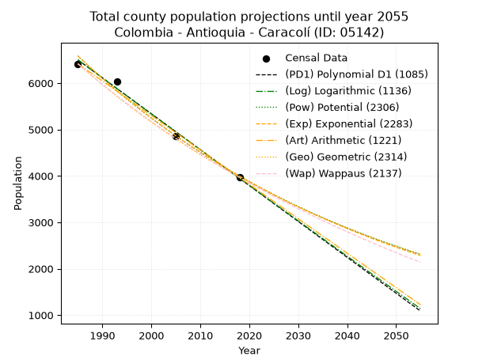
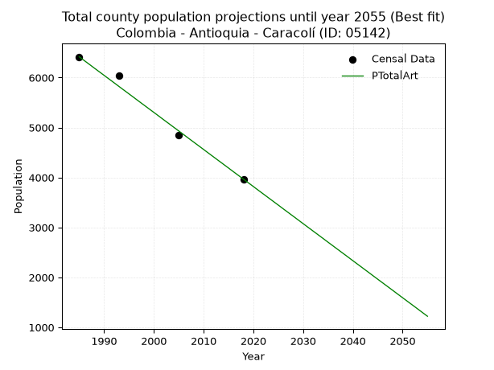
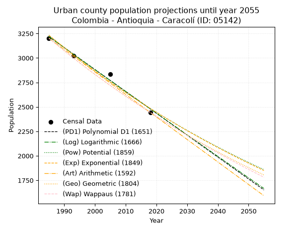
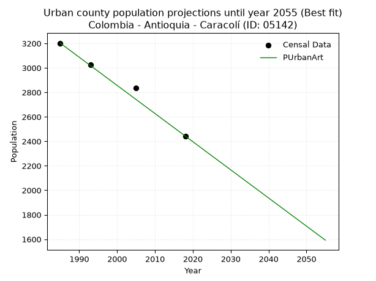
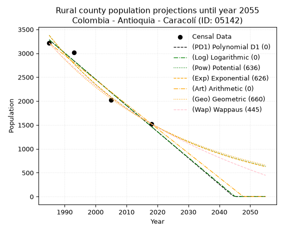
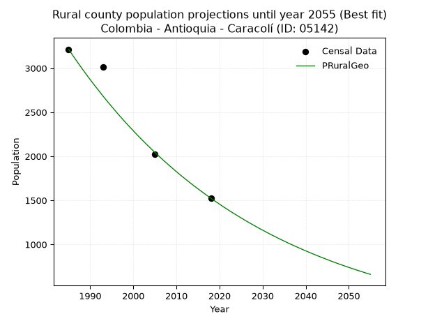

<div align="center">


</div>

# _“Population and Public Services Demand Projections (PPSD) until Year 2050 for Colombia - Antioquia - Caracolí (ID: 05142)”_
Keywords: `population` `public-service` `projection` `lineal` `polynomial` `logarithmic` `potential` `exponential` `arithmetic` `geometric` `wappaus` `dane` `colombia` `south-america`

PPSD are analytical estimates used by governments and planners to anticipate future changes in population size, age distribution, and the resulting community needs for utilities, healthcare, education, and infrastructure as sizing future water treatment facilities, electrical grids, and road networks based on spatial growth.

> **General running parameters**: • app_version: _v20260806_. • Python version: _3.14.7_. • Pandas version: _3.0.5_. • NumPy version: _2.5.1_. • Creates, save and include plots into reports (create_plot): _False_. • Projection until year: _2050_. • Process polynomial degree 2 and up: _False_. • Process Wappaus: _True_. • Process Wappaus: _True_. • Set negative values to zero: _True_. • Set infinite values to zero: _True_. • Drop dataset notes: _True_. 
<div align="center">

Dynamic map: [:earth_americas:Google](http://maps.google.com/maps?q=6.40982927,-74.7574207) [:earth_americas:OSM](https://www.openstreetmap.org/#map=18/6.40982927/-74.7574207&layers=P) [:earth_americas:Bing](https://www.bing.com/maps?cp=6.40982927~-74.7574207&lvl=18) [:earth_americas:Apple](https://maps.apple.com/frame?center=6.40982927%2C-74.7574207&span=0.003%2C0.006)

</div>


<div align="center">

```geojson
{
  "type": "Feature",
  "geometry": {
    "type": "Point", 
    "coordinates": [-74.7574207, 6.40982927]
  }, 
  "properties": {
    "Name": "Colombia - Antioquia - Caracolí (ID: 05142)"
  }
}
```

</div>


## 0. Census Data (4 records)

Census data are official statistics collected by a government about the people and housing in a country. They usually include counts of total population, age, sex, race, income, education, and jobs.

📅Global census file: [Population.xlsx](../data/Population.xlsx)

| Source   |   Year |   CountryID | CountryName   |   StateID | StateName   |   CountyID | CountyName   |   PTotal |   PUrban |   PRural |
|:---------|-------:|------------:|:--------------|----------:|:------------|-----------:|:-------------|---------:|---------:|---------:|
| DANE     |   1985 |          57 | Colombia      |        05 | Antioquia   |      05142 | Caracolí     |     6416 |     3202 |     3214 |
| DANE     |   1993 |          57 | Colombia      |        05 | Antioquia   |      05142 | Caracolí     |     6041 |     3025 |     3016 |
| DANE     |   2005 |          57 | Colombia      |        05 | Antioquia   |      05142 | Caracolí     |     4855 |     2835 |     2020 |
| DANE     |   2018 |          57 | Colombia      |        05 | Antioquia   |      05142 | Caracolí     |     3967 |     2443 |     1524 |

> 🔥Some records could had specific notes about the registered values or the corresponding urban or rural distribution.

**Local public utility companies (RUPS)**

 | SERVICIO       | ESTADO    | NOMBRE                                                              | NIT         | DEPARTAMENTO_DOMICILIO   | MUNICIPIO_DOMICILIO   | DIRECCION           |   TELEFONO | EMAIL                                 | TIPO_INSCRIPCION    | REPRESENTANTE_LEGAL        | TIPO_PRESTADOR                             | CLASIFICACION                 |
|:---------------|:----------|:--------------------------------------------------------------------|:------------|:-------------------------|:----------------------|:--------------------|-----------:|:--------------------------------------|:--------------------|:---------------------------|:-------------------------------------------|:------------------------------|
| ACUEDUCTO      | OPERATIVA | EMPRESA DE SERVICIOS PUBLICOS DOMICILIARIOS DE CARACOLI S.A  E.S.P. | 900148210-1 | ANTIOQUIA                | CARACOLI              | CRA 22 Nº 20 04     |    8336064 | serpublicos@caracoli-antioquia.gov.co | Registro por la ESP | PABLO ARTURO CORREA URAN   | SOCIEDADES (EMPRESA DE SERVICIOS PUBLICOS) | MENOR O IGUAL A 2500 USUARIOS |
| ALCANTARILLADO | OPERATIVA | EMPRESA DE SERVICIOS PUBLICOS DOMICILIARIOS DE CARACOLI S.A  E.S.P. | 900148210-1 | ANTIOQUIA                | CARACOLI              | CRA 22 Nº 20 04     |    8336064 | serpublicos@caracoli-antioquia.gov.co | Registro por la ESP | PABLO ARTURO CORREA URAN   | SOCIEDADES (EMPRESA DE SERVICIOS PUBLICOS) | MENOR O IGUAL A 2500 USUARIOS |
| ASEO           | OPERATIVA | EMPRESA DE SERVICIOS PUBLICOS DOMICILIARIOS DE CARACOLI S.A  E.S.P. | 900148210-1 | ANTIOQUIA                | CARACOLI              | CRA 22 Nº 20 04     |    8336064 | serpublicos@caracoli-antioquia.gov.co | Registro por la ESP | PABLO ARTURO CORREA URAN   | SOCIEDADES (EMPRESA DE SERVICIOS PUBLICOS) | MENOR O IGUAL A 2500 USUARIOS |
| ASEO           | OPERATIVA | ASOCIACION DE RECICLADORES HUELLA NATURAL E.S.P.                    | 901269006-8 | ANTIOQUIA                | MEDELLIN              | calle 108 a # 77a13 |    3296619 | paula23co@hotmail.com                 | Registro por la ESP | JHON JAIRO  ACEVEDO  VELEZ | ORGANIZACION AUTORIZADA                    | MAYOR O IGUAL A 5001 USUARIOS |

> [📅RUPS Database: Registro Único de Prestadores de Servicios Públicos de Colombia Suramérica - RUPS](https://www.datos.gov.co/Hacienda-y-Cr-dito-P-blico/Registro-nico-de-Prestadores-de-Servicios-P-blicos/4qkq-csdn/about_data)

## 1. Total

### 1.1. Coefficients and Parameters

* (PD1) Polynomial Deg 1: -77.34363709353606, 160026.3600963455 (lineal)
* (Log) Logarithmic: -154807.08602603743, 1182009.6514300422
* (Pow) Potential: -30.277106481359347, 103.66528078129322
* (Exp) Exponential: -0.015128908629486092, 7.256076066085782e+16
* (Art) Arithmetic: Year diff. 2018 - 1985 = 33, Population diff. 3967 - 6416 = -2449, Annual growth = -74.21212121212122
* (Geo) Geometric: Year diff. 2018 - 1985 = 33, Population diff. 3967 - 6416 = -2449, Annual growth % = -0.014463616465682505
* (Wap) Wappaus: i = -1.4294928481579738, Condition values only valid for < 200)

<sub>
Wappaus condition values: ['-0.00', '-1.43', '-2.86', '-4.29', '-5.72', '-7.15', '-8.58', '-10.01', '-11.44', '-12.87', '-14.29', '-15.72', '-17.15', '-18.58', '-20.01', '-21.44', '-22.87', '-24.30', '-25.73', '-27.16', '-28.59', '-30.02', '-31.45', '-32.88', '-34.31', '-35.74', '-37.17', '-38.60', '-40.03', '-41.46', '-42.88', '-44.31', '-45.74', '-47.17', '-48.60', '-50.03', '-51.46', '-52.89', '-54.32', '-55.75', '-57.18', '-58.61', '-60.04', '-61.47', '-62.90', '-64.33', '-65.76', '-67.19', '-68.62', '-70.05', '-71.47', '-72.90', '-74.33', '-75.76', '-77.19', '-78.62', '-80.05', '-81.48', '-82.91', '-84.34', '-85.77', '-87.20', '-88.63', '-90.06', '-91.49', '-92.92']
</sub>


### 1.2. Projected Dataset

|   Year |   CountyID |   PTotalPD1 |   PTotalLog |   PTotalPow |   PTotalExp |   PTotalArt |   PTotalGeo |   PTotalWap |
|-------:|-----------:|------------:|------------:|------------:|------------:|------------:|------------:|------------:|
|   1985 |      05142 |        6499 |        6502 |        6586 |        6583 |        6416 |        6416 |        6416 |
|   1986 |      05142 |        6422 |        6424 |        6487 |        6485 |        6342 |        6323 |        6325 |
|   1987 |      05142 |        6345 |        6346 |        6388 |        6387 |        6268 |        6232 |        6235 |
|   1988 |      05142 |        6267 |        6268 |        6292 |        6291 |        6193 |        6142 |        6147 |
|   1989 |      05142 |        6190 |        6190 |        6197 |        6197 |        6119 |        6053 |        6059 |
|   1990 |      05142 |        6113 |        6112 |        6103 |        6104 |        6045 |        5965 |        5973 |
|   1991 |      05142 |        6035 |        6034 |        6011 |        6012 |        5971 |        5879 |        5888 |
|   1992 |      05142 |        5958 |        5957 |        5920 |        5922 |        5897 |        5794 |        5805 |
|   1993 |      05142 |        5880 |        5879 |        5831 |        5833 |        5822 |        5710 |        5722 |
|   1994 |      05142 |        5803 |        5801 |        5743 |        5745 |        5748 |        5628 |        5640 |
|   1995 |      05142 |        5726 |        5724 |        5657 |        5659 |        5674 |        5546 |        5560 |
|   1996 |      05142 |        5648 |        5646 |        5571 |        5574 |        5600 |        5466 |        5481 |
|   1997 |      05142 |        5571 |        5568 |        5488 |        5490 |        5525 |        5387 |        5402 |
|   1998 |      05142 |        5494 |        5491 |        5405 |        5408 |        5451 |        5309 |        5325 |
|   1999 |      05142 |        5416 |        5414 |        5324 |        5327 |        5377 |        5232 |        5249 |
|   2000 |      05142 |        5339 |        5336 |        5244 |        5247 |        5303 |        5156 |        5173 |
|   2001 |      05142 |        5262 |        5259 |        5165 |        5168 |        5229 |        5082 |        5099 |
|   2002 |      05142 |        5184 |        5181 |        5087 |        5090 |        5154 |        5008 |        5026 |
|   2003 |      05142 |        5107 |        5104 |        5011 |        5014 |        5080 |        4936 |        4953 |
|   2004 |      05142 |        5030 |        5027 |        4936 |        4939 |        5006 |        4865 |        4882 |
|   2005 |      05142 |        4952 |        4950 |        4862 |        4865 |        4932 |        4794 |        4811 |
|   2006 |      05142 |        4875 |        4872 |        4789 |        4792 |        4858 |        4725 |        4741 |
|   2007 |      05142 |        4798 |        4795 |        4717 |        4720 |        4783 |        4657 |        4672 |
|   2008 |      05142 |        4720 |        4718 |        4647 |        4649 |        4709 |        4589 |        4604 |
|   2009 |      05142 |        4643 |        4641 |        4577 |        4579 |        4635 |        4523 |        4537 |
|   2010 |      05142 |        4566 |        4564 |        4509 |        4510 |        4561 |        4457 |        4471 |
|   2011 |      05142 |        4488 |        4487 |        4441 |        4442 |        4486 |        4393 |        4405 |
|   2012 |      05142 |        4411 |        4410 |        4375 |        4376 |        4412 |        4329 |        4340 |
|   2013 |      05142 |        4334 |        4333 |        4310 |        4310 |        4338 |        4267 |        4276 |
|   2014 |      05142 |        4256 |        4256 |        4245 |        4245 |        4264 |        4205 |        4213 |
|   2015 |      05142 |        4179 |        4179 |        4182 |        4182 |        4190 |        4144 |        4150 |
|   2016 |      05142 |        4102 |        4103 |        4120 |        4119 |        4115 |        4084 |        4089 |
|   2017 |      05142 |        4024 |        4026 |        4058 |        4057 |        4041 |        4025 |        4027 |
|   2018 |      05142 |        3947 |        3949 |        3998 |        3996 |        3967 |        3967 |        3967 |
|   2019 |      05142 |        3870 |        3872 |        3938 |        3936 |        3893 |        3910 |        3907 |
|   2020 |      05142 |        3792 |        3796 |        3880 |        3877 |        3819 |        3853 |        3848 |
|   2021 |      05142 |        3715 |        3719 |        3822 |        3819 |        3744 |        3797 |        3790 |
|   2022 |      05142 |        3638 |        3643 |        3765 |        3761 |        3670 |        3742 |        3732 |
|   2023 |      05142 |        3560 |        3566 |        3709 |        3705 |        3596 |        3688 |        3675 |
|   2024 |      05142 |        3483 |        3489 |        3654 |        3649 |        3522 |        3635 |        3619 |
|   2025 |      05142 |        3405 |        3413 |        3600 |        3595 |        3448 |        3582 |        3563 |
|   2026 |      05142 |        3328 |        3337 |        3547 |        3541 |        3373 |        3531 |        3508 |
|   2027 |      05142 |        3251 |        3260 |        3494 |        3487 |        3299 |        3479 |        3453 |
|   2028 |      05142 |        3173 |        3184 |        3442 |        3435 |        3225 |        3429 |        3399 |
|   2029 |      05142 |        3096 |        3108 |        3391 |        3383 |        3151 |        3380 |        3346 |
|   2030 |      05142 |        3019 |        3031 |        3341 |        3333 |        3076 |        3331 |        3293 |
|   2031 |      05142 |        2941 |        2955 |        3292 |        3283 |        3002 |        3283 |        3241 |
|   2032 |      05142 |        2864 |        2879 |        3243 |        3233 |        2928 |        3235 |        3189 |
|   2033 |      05142 |        2787 |        2803 |        3195 |        3185 |        2854 |        3188 |        3138 |
|   2034 |      05142 |        2709 |        2726 |        3148 |        3137 |        2780 |        3142 |        3088 |
|   2035 |      05142 |        2632 |        2650 |        3101 |        3090 |        2705 |        3097 |        3038 |
|   2036 |      05142 |        2555 |        2574 |        3055 |        3043 |        2631 |        3052 |        2988 |
|   2037 |      05142 |        2477 |        2498 |        3010 |        2998 |        2557 |        3008 |        2939 |
|   2038 |      05142 |        2400 |        2422 |        2966 |        2953 |        2483 |        2964 |        2891 |
|   2039 |      05142 |        2323 |        2346 |        2922 |        2908 |        2409 |        2921 |        2843 |
|   2040 |      05142 |        2245 |        2271 |        2879 |        2865 |        2334 |        2879 |        2795 |
|   2041 |      05142 |        2168 |        2195 |        2837 |        2822 |        2260 |        2837 |        2748 |
|   2042 |      05142 |        2091 |        2119 |        2795 |        2779 |        2186 |        2796 |        2701 |
|   2043 |      05142 |        2013 |        2043 |        2754 |        2738 |        2112 |        2756 |        2655 |
|   2044 |      05142 |        1936 |        1967 |        2713 |        2697 |        2037 |        2716 |        2610 |
|   2045 |      05142 |        1859 |        1892 |        2673 |        2656 |        1963 |        2677 |        2565 |
|   2046 |      05142 |        1781 |        1816 |        2634 |        2616 |        1889 |        2638 |        2520 |
|   2047 |      05142 |        1704 |        1740 |        2595 |        2577 |        1815 |        2600 |        2476 |
|   2048 |      05142 |        1627 |        1665 |        2557 |        2538 |        1741 |        2562 |        2432 |
|   2049 |      05142 |        1549 |        1589 |        2520 |        2500 |        1666 |        2525 |        2388 |
|   2050 |      05142 |        1472 |        1513 |        2483 |        2463 |        1592 |        2489 |        2346 |
<div align="center">

</img>

</div>


### 1.3. Best fit with absolute and relative error (%)

Relative error puts that difference into context by dividing the absolute error by the true value, creating a unitless ratio or percentage that shows the scale of the mistake.

Absolute and relative error

|   Year | Source   |   CountryID | CountryName   |   StateID | StateName   |   CountyID_x | CountyName   |   PTotal |   PUrban |   PRural |   CountyID_y |   PTotalPD1 |   PTotalLog |   PTotalPow |   PTotalExp |   PTotalArt |   PTotalGeo |   PTotalWap |   PTotalPD1AbsError |   PTotalLogAbsError |   PTotalPowAbsError |   PTotalExpAbsError |   PTotalArtAbsError |   PTotalGeoAbsError |   PTotalWapAbsError |   PTotalPD1RelError |   PTotalLogRelError |   PTotalPowRelError |   PTotalExpRelError |   PTotalArtRelError |   PTotalGeoRelError |   PTotalWapRelError |
|-------:|:---------|------------:|:--------------|----------:|:------------|-------------:|:-------------|---------:|---------:|---------:|-------------:|------------:|------------:|------------:|------------:|------------:|------------:|------------:|--------------------:|--------------------:|--------------------:|--------------------:|--------------------:|--------------------:|--------------------:|--------------------:|--------------------:|--------------------:|--------------------:|--------------------:|--------------------:|--------------------:|
|   1985 | DANE     |          57 | Colombia      |        05 | Antioquia   |        05142 | Caracolí     |     6416 |     3202 |     3214 |        05142 |        6499 |        6502 |        6586 |        6583 |        6416 |        6416 |        6416 |                  83 |                  86 |                 170 |                 167 |                   0 |                   0 |                   0 |            1.29364  |            1.3404   |            2.64963  |            2.60287  |             0       |             0       |            0        |
|   1993 | DANE     |          57 | Colombia      |        05 | Antioquia   |        05142 | Caracolí     |     6041 |     3025 |     3016 |        05142 |        5880 |        5879 |        5831 |        5833 |        5822 |        5710 |        5722 |                 161 |                 162 |                 210 |                 208 |                 219 |                 331 |                 319 |            2.66512  |            2.68168  |            3.47625  |            3.44314  |             3.62523 |             5.47923 |            5.28058  |
|   2005 | DANE     |          57 | Colombia      |        05 | Antioquia   |        05142 | Caracolí     |     4855 |     2835 |     2020 |        05142 |        4952 |        4950 |        4862 |        4865 |        4932 |        4794 |        4811 |                  97 |                  95 |                   7 |                  10 |                  77 |                  61 |                  44 |            1.99794  |            1.95675  |            0.144181 |            0.205973 |             1.58599 |             1.25644 |            0.906282 |
|   2018 | DANE     |          57 | Colombia      |        05 | Antioquia   |        05142 | Caracolí     |     3967 |     2443 |     1524 |        05142 |        3947 |        3949 |        3998 |        3996 |        3967 |        3967 |        3967 |                  20 |                  18 |                  31 |                  29 |                   0 |                   0 |                   0 |            0.504159 |            0.453743 |            0.781447 |            0.731031 |             0       |             0       |            0        |

Relative error mean

| Method    |   RelError | Best   |
|:----------|-----------:|:-------|
| PTotalPD1 |    1.61522 |        |
| PTotalLog |    1.60814 |        |
| PTotalPow |    1.76287 |        |
| PTotalExp |    1.74575 |        |
| PTotalArt |    1.30281 | True   |
| PTotalGeo |    1.68392 |        |
| PTotalWap |    1.54672 |        |

💙Best method: _**PTotalArt**_
<div align="center">

</img>

</div>


### 1.4. Fresh water supply demand in liters per capita per day (lpcd)

The fresh water supply demand typically ranges from 100 to 300 liters per capita per day (lpcd) for standard domestic and municipal planning, though absolute survival minimums set by the World Health Organization are as low as 7.5 to 20 liters per day, and total consumption in high-income nations can exceed 400 liters.

> `CZ`: Level in meters above the sea level (masl)<br> `WS`: Fresh water supply demand in liters per capita per day (lpcd or l/h/d)<br> `WSAll`: Zonal fresh water supply demand in liters per second (l/s)<br> `A`: Zonal area in square meters<br> `DP`: Population density (people/hectare or p/ha)

Reference values (RAS Colombia)

|    CZ |   WS |
|------:|-----:|
|  1000 |  120 |
|  2000 |  130 |
| 99999 |  140 |

County shapefile geometry properties and water supply values

|   CountyID |      ATotal |   CZTotal |   WSTotal |
|-----------:|------------:|----------:|----------:|
|      05142 | 2.62584e+08 |   629.318 |       120 |

Projected values for best method: PTotalArt

|   CountyID |   Year |   PTotalArt |   DPTotal |   WSTotal |   WSTotalAll |
|-----------:|-------:|------------:|----------:|----------:|-------------:|
|      05142 |   1985 |        6416 |      0.24 |       120 |      8.91111 |
|      05142 |   1986 |        6342 |      0.24 |       120 |      8.80833 |
|      05142 |   1987 |        6268 |      0.24 |       120 |      8.70556 |
|      05142 |   1988 |        6193 |      0.24 |       120 |      8.60139 |
|      05142 |   1989 |        6119 |      0.23 |       120 |      8.49861 |
|      05142 |   1990 |        6045 |      0.23 |       120 |      8.39583 |
|      05142 |   1991 |        5971 |      0.23 |       120 |      8.29306 |
|      05142 |   1992 |        5897 |      0.22 |       120 |      8.19028 |
|      05142 |   1993 |        5822 |      0.22 |       120 |      8.08611 |
|      05142 |   1994 |        5748 |      0.22 |       120 |      7.98333 |
|      05142 |   1995 |        5674 |      0.22 |       120 |      7.88056 |
|      05142 |   1996 |        5600 |      0.21 |       120 |      7.77778 |
|      05142 |   1997 |        5525 |      0.21 |       120 |      7.67361 |
|      05142 |   1998 |        5451 |      0.21 |       120 |      7.57083 |
|      05142 |   1999 |        5377 |      0.2  |       120 |      7.46806 |
|      05142 |   2000 |        5303 |      0.2  |       120 |      7.36528 |
|      05142 |   2001 |        5229 |      0.2  |       120 |      7.2625  |
|      05142 |   2002 |        5154 |      0.2  |       120 |      7.15833 |
|      05142 |   2003 |        5080 |      0.19 |       120 |      7.05556 |
|      05142 |   2004 |        5006 |      0.19 |       120 |      6.95278 |
|      05142 |   2005 |        4932 |      0.19 |       120 |      6.85    |
|      05142 |   2006 |        4858 |      0.19 |       120 |      6.74722 |
|      05142 |   2007 |        4783 |      0.18 |       120 |      6.64306 |
|      05142 |   2008 |        4709 |      0.18 |       120 |      6.54028 |
|      05142 |   2009 |        4635 |      0.18 |       120 |      6.4375  |
|      05142 |   2010 |        4561 |      0.17 |       120 |      6.33472 |
|      05142 |   2011 |        4486 |      0.17 |       120 |      6.23056 |
|      05142 |   2012 |        4412 |      0.17 |       120 |      6.12778 |
|      05142 |   2013 |        4338 |      0.17 |       120 |      6.025   |
|      05142 |   2014 |        4264 |      0.16 |       120 |      5.92222 |
|      05142 |   2015 |        4190 |      0.16 |       120 |      5.81944 |
|      05142 |   2016 |        4115 |      0.16 |       120 |      5.71528 |
|      05142 |   2017 |        4041 |      0.15 |       120 |      5.6125  |
|      05142 |   2018 |        3967 |      0.15 |       120 |      5.50972 |
|      05142 |   2019 |        3893 |      0.15 |       120 |      5.40694 |
|      05142 |   2020 |        3819 |      0.15 |       120 |      5.30417 |
|      05142 |   2021 |        3744 |      0.14 |       120 |      5.2     |
|      05142 |   2022 |        3670 |      0.14 |       120 |      5.09722 |
|      05142 |   2023 |        3596 |      0.14 |       120 |      4.99444 |
|      05142 |   2024 |        3522 |      0.13 |       120 |      4.89167 |
|      05142 |   2025 |        3448 |      0.13 |       120 |      4.78889 |
|      05142 |   2026 |        3373 |      0.13 |       120 |      4.68472 |
|      05142 |   2027 |        3299 |      0.13 |       120 |      4.58194 |
|      05142 |   2028 |        3225 |      0.12 |       120 |      4.47917 |
|      05142 |   2029 |        3151 |      0.12 |       120 |      4.37639 |
|      05142 |   2030 |        3076 |      0.12 |       120 |      4.27222 |
|      05142 |   2031 |        3002 |      0.11 |       120 |      4.16944 |
|      05142 |   2032 |        2928 |      0.11 |       120 |      4.06667 |
|      05142 |   2033 |        2854 |      0.11 |       120 |      3.96389 |
|      05142 |   2034 |        2780 |      0.11 |       120 |      3.86111 |
|      05142 |   2035 |        2705 |      0.1  |       120 |      3.75694 |
|      05142 |   2036 |        2631 |      0.1  |       120 |      3.65417 |
|      05142 |   2037 |        2557 |      0.1  |       120 |      3.55139 |
|      05142 |   2038 |        2483 |      0.09 |       120 |      3.44861 |
|      05142 |   2039 |        2409 |      0.09 |       120 |      3.34583 |
|      05142 |   2040 |        2334 |      0.09 |       120 |      3.24167 |
|      05142 |   2041 |        2260 |      0.09 |       120 |      3.13889 |
|      05142 |   2042 |        2186 |      0.08 |       120 |      3.03611 |
|      05142 |   2043 |        2112 |      0.08 |       120 |      2.93333 |
|      05142 |   2044 |        2037 |      0.08 |       120 |      2.82917 |
|      05142 |   2045 |        1963 |      0.07 |       120 |      2.72639 |
|      05142 |   2046 |        1889 |      0.07 |       120 |      2.62361 |
|      05142 |   2047 |        1815 |      0.07 |       120 |      2.52083 |
|      05142 |   2048 |        1741 |      0.07 |       120 |      2.41806 |
|      05142 |   2049 |        1666 |      0.06 |       120 |      2.31389 |
|      05142 |   2050 |        1592 |      0.06 |       120 |      2.21111 |

## 2. Urban

### 2.1. Coefficients and Parameters

* (PD1) Polynomial Deg 1: -22.372139702930276, 47626.12244078629 (lineal)
* (Log) Logarithmic: -44769.14706875453, 343166.8956270325
* (Pow) Potential: -15.963095817917095, 56.152045700056206
* (Exp) Exponential: -0.007977854309138731, 24378007228.931118
* (Art) Arithmetic: Year diff. 2018 - 1985 = 33, Population diff. 2443 - 3202 = -759, Annual growth = -23.0
* (Geo) Geometric: Year diff. 2018 - 1985 = 33, Population diff. 2443 - 3202 = -759, Annual growth % = -0.00816493353085801
* (Wap) Wappaus: i = -0.8148804251550045, Condition values only valid for < 200)

<sub>
Wappaus condition values: ['-0.00', '-0.81', '-1.63', '-2.44', '-3.26', '-4.07', '-4.89', '-5.70', '-6.52', '-7.33', '-8.15', '-8.96', '-9.78', '-10.59', '-11.41', '-12.22', '-13.04', '-13.85', '-14.67', '-15.48', '-16.30', '-17.11', '-17.93', '-18.74', '-19.56', '-20.37', '-21.19', '-22.00', '-22.82', '-23.63', '-24.45', '-25.26', '-26.08', '-26.89', '-27.71', '-28.52', '-29.34', '-30.15', '-30.97', '-31.78', '-32.60', '-33.41', '-34.22', '-35.04', '-35.85', '-36.67', '-37.48', '-38.30', '-39.11', '-39.93', '-40.74', '-41.56', '-42.37', '-43.19', '-44.00', '-44.82', '-45.63', '-46.45', '-47.26', '-48.08', '-48.89', '-49.71', '-50.52', '-51.34', '-52.15', '-52.97']
</sub>


### 2.2. Projected Dataset

|   Year |   CountyID |   PUrbanPD1 |   PUrbanLog |   PUrbanPow |   PUrbanExp |   PUrbanArt |   PUrbanGeo |   PUrbanWap |
|-------:|-----------:|------------:|------------:|------------:|------------:|------------:|------------:|------------:|
|   1985 |      05142 |        3217 |        3218 |        3233 |        3232 |        3202 |        3202 |        3202 |
|   1986 |      05142 |        3195 |        3195 |        3207 |        3206 |        3179 |        3176 |        3176 |
|   1987 |      05142 |        3173 |        3173 |        3181 |        3181 |        3156 |        3150 |        3150 |
|   1988 |      05142 |        3150 |        3150 |        3156 |        3156 |        3133 |        3124 |        3125 |
|   1989 |      05142 |        3128 |        3128 |        3131 |        3131 |        3110 |        3099 |        3099 |
|   1990 |      05142 |        3106 |        3105 |        3106 |        3106 |        3087 |        3073 |        3074 |
|   1991 |      05142 |        3083 |        3083 |        3081 |        3081 |        3064 |        3048 |        3049 |
|   1992 |      05142 |        3061 |        3060 |        3056 |        3057 |        3041 |        3023 |        3024 |
|   1993 |      05142 |        3038 |        3038 |        3032 |        3032 |        3018 |        2999 |        3000 |
|   1994 |      05142 |        3016 |        3015 |        3008 |        3008 |        2995 |        2974 |        2975 |
|   1995 |      05142 |        2994 |        2993 |        2984 |        2984 |        2972 |        2950 |        2951 |
|   1996 |      05142 |        2971 |        2971 |        2960 |        2961 |        2949 |        2926 |        2927 |
|   1997 |      05142 |        2949 |        2948 |        2936 |        2937 |        2926 |        2902 |        2903 |
|   1998 |      05142 |        2927 |        2926 |        2913 |        2914 |        2903 |        2878 |        2880 |
|   1999 |      05142 |        2904 |        2903 |        2890 |        2891 |        2880 |        2855 |        2856 |
|   2000 |      05142 |        2882 |        2881 |        2867 |        2868 |        2857 |        2831 |        2833 |
|   2001 |      05142 |        2859 |        2859 |        2844 |        2845 |        2834 |        2808 |        2810 |
|   2002 |      05142 |        2837 |        2836 |        2821 |        2822 |        2811 |        2785 |        2787 |
|   2003 |      05142 |        2815 |        2814 |        2799 |        2800 |        2788 |        2763 |        2764 |
|   2004 |      05142 |        2792 |        2792 |        2777 |        2778 |        2765 |        2740 |        2742 |
|   2005 |      05142 |        2770 |        2769 |        2755 |        2755 |        2742 |        2718 |        2719 |
|   2006 |      05142 |        2748 |        2747 |        2733 |        2734 |        2719 |        2696 |        2697 |
|   2007 |      05142 |        2725 |        2725 |        2711 |        2712 |        2696 |        2674 |        2675 |
|   2008 |      05142 |        2703 |        2702 |        2690 |        2690 |        2673 |        2652 |        2653 |
|   2009 |      05142 |        2680 |        2680 |        2668 |        2669 |        2650 |        2630 |        2632 |
|   2010 |      05142 |        2658 |        2658 |        2647 |        2648 |        2627 |        2609 |        2610 |
|   2011 |      05142 |        2636 |        2635 |        2626 |        2627 |        2604 |        2587 |        2589 |
|   2012 |      05142 |        2613 |        2613 |        2606 |        2606 |        2581 |        2566 |        2567 |
|   2013 |      05142 |        2591 |        2591 |        2585 |        2585 |        2558 |        2545 |        2546 |
|   2014 |      05142 |        2569 |        2569 |        2565 |        2565 |        2535 |        2524 |        2525 |
|   2015 |      05142 |        2546 |        2546 |        2544 |        2544 |        2512 |        2504 |        2504 |
|   2016 |      05142 |        2524 |        2524 |        2524 |        2524 |        2489 |        2483 |        2484 |
|   2017 |      05142 |        2502 |        2502 |        2504 |        2504 |        2466 |        2463 |        2463 |
|   2018 |      05142 |        2479 |        2480 |        2485 |        2484 |        2443 |        2443 |        2443 |
|   2019 |      05142 |        2457 |        2458 |        2465 |        2464 |        2420 |        2423 |        2423 |
|   2020 |      05142 |        2434 |        2436 |        2446 |        2445 |        2397 |        2403 |        2403 |
|   2021 |      05142 |        2412 |        2413 |        2426 |        2425 |        2374 |        2384 |        2383 |
|   2022 |      05142 |        2390 |        2391 |        2407 |        2406 |        2351 |        2364 |        2363 |
|   2023 |      05142 |        2367 |        2369 |        2388 |        2387 |        2328 |        2345 |        2343 |
|   2024 |      05142 |        2345 |        2347 |        2370 |        2368 |        2305 |        2326 |        2324 |
|   2025 |      05142 |        2323 |        2325 |        2351 |        2349 |        2282 |        2307 |        2305 |
|   2026 |      05142 |        2300 |        2303 |        2333 |        2330 |        2259 |        2288 |        2285 |
|   2027 |      05142 |        2278 |        2281 |        2314 |        2312 |        2236 |        2269 |        2266 |
|   2028 |      05142 |        2255 |        2259 |        2296 |        2294 |        2213 |        2251 |        2247 |
|   2029 |      05142 |        2233 |        2236 |        2278 |        2275 |        2190 |        2232 |        2228 |
|   2030 |      05142 |        2211 |        2214 |        2260 |        2257 |        2167 |        2214 |        2210 |
|   2031 |      05142 |        2188 |        2192 |        2243 |        2239 |        2144 |        2196 |        2191 |
|   2032 |      05142 |        2166 |        2170 |        2225 |        2222 |        2121 |        2178 |        2173 |
|   2033 |      05142 |        2144 |        2148 |        2208 |        2204 |        2098 |        2160 |        2154 |
|   2034 |      05142 |        2121 |        2126 |        2190 |        2186 |        2075 |        2143 |        2136 |
|   2035 |      05142 |        2099 |        2104 |        2173 |        2169 |        2052 |        2125 |        2118 |
|   2036 |      05142 |        2076 |        2082 |        2156 |        2152 |        2029 |        2108 |        2100 |
|   2037 |      05142 |        2054 |        2060 |        2139 |        2135 |        2006 |        2091 |        2082 |
|   2038 |      05142 |        2032 |        2038 |        2123 |        2118 |        1983 |        2074 |        2065 |
|   2039 |      05142 |        2009 |        2016 |        2106 |        2101 |        1960 |        2057 |        2047 |
|   2040 |      05142 |        1987 |        1994 |        2090 |        2084 |        1937 |        2040 |        2030 |
|   2041 |      05142 |        1965 |        1972 |        2074 |        2068 |        1914 |        2023 |        2012 |
|   2042 |      05142 |        1942 |        1951 |        2057 |        2051 |        1891 |        2007 |        1995 |
|   2043 |      05142 |        1920 |        1929 |        2041 |        2035 |        1868 |        1990 |        1978 |
|   2044 |      05142 |        1897 |        1907 |        2025 |        2019 |        1845 |        1974 |        1961 |
|   2045 |      05142 |        1875 |        1885 |        2010 |        2003 |        1822 |        1958 |        1944 |
|   2046 |      05142 |        1853 |        1863 |        1994 |        1987 |        1799 |        1942 |        1927 |
|   2047 |      05142 |        1830 |        1841 |        1979 |        1971 |        1776 |        1926 |        1911 |
|   2048 |      05142 |        1808 |        1819 |        1963 |        1955 |        1753 |        1910 |        1894 |
|   2049 |      05142 |        1786 |        1797 |        1948 |        1940 |        1730 |        1895 |        1877 |
|   2050 |      05142 |        1763 |        1776 |        1933 |        1924 |        1707 |        1879 |        1861 |
<div align="center">

</img>

</div>


### 2.3. Best fit with absolute and relative error (%)

Relative error puts that difference into context by dividing the absolute error by the true value, creating a unitless ratio or percentage that shows the scale of the mistake.

Absolute and relative error

|   Year | Source   |   CountryID | CountryName   |   StateID | StateName   |   CountyID_x | CountyName   |   PTotal |   PUrban |   PRural |   CountyID_y |   PUrbanPD1 |   PUrbanLog |   PUrbanPow |   PUrbanExp |   PUrbanArt |   PUrbanGeo |   PUrbanWap |   PUrbanPD1AbsError |   PUrbanLogAbsError |   PUrbanPowAbsError |   PUrbanExpAbsError |   PUrbanArtAbsError |   PUrbanGeoAbsError |   PUrbanWapAbsError |   PUrbanPD1RelError |   PUrbanLogRelError |   PUrbanPowRelError |   PUrbanExpRelError |   PUrbanArtRelError |   PUrbanGeoRelError |   PUrbanWapRelError |
|-------:|:---------|------------:|:--------------|----------:|:------------|-------------:|:-------------|---------:|---------:|---------:|-------------:|------------:|------------:|------------:|------------:|------------:|------------:|------------:|--------------------:|--------------------:|--------------------:|--------------------:|--------------------:|--------------------:|--------------------:|--------------------:|--------------------:|--------------------:|--------------------:|--------------------:|--------------------:|--------------------:|
|   1985 | DANE     |          57 | Colombia      |        05 | Antioquia   |        05142 | Caracolí     |     6416 |     3202 |     3214 |        05142 |        3217 |        3218 |        3233 |        3232 |        3202 |        3202 |        3202 |                  15 |                  16 |                  31 |                  30 |                   0 |                   0 |                   0 |            0.468457 |            0.499688 |            0.968145 |            0.936914 |            0        |            0        |            0        |
|   1993 | DANE     |          57 | Colombia      |        05 | Antioquia   |        05142 | Caracolí     |     6041 |     3025 |     3016 |        05142 |        3038 |        3038 |        3032 |        3032 |        3018 |        2999 |        3000 |                  13 |                  13 |                   7 |                   7 |                   7 |                  26 |                  25 |            0.429752 |            0.429752 |            0.231405 |            0.231405 |            0.231405 |            0.859504 |            0.826446 |
|   2005 | DANE     |          57 | Colombia      |        05 | Antioquia   |        05142 | Caracolí     |     4855 |     2835 |     2020 |        05142 |        2770 |        2769 |        2755 |        2755 |        2742 |        2718 |        2719 |                  65 |                  66 |                  80 |                  80 |                  93 |                 117 |                 116 |            2.29277  |            2.32804  |            2.82187  |            2.82187  |            3.28042  |            4.12698  |            4.09171  |
|   2018 | DANE     |          57 | Colombia      |        05 | Antioquia   |        05142 | Caracolí     |     3967 |     2443 |     1524 |        05142 |        2479 |        2480 |        2485 |        2484 |        2443 |        2443 |        2443 |                  36 |                  37 |                  42 |                  41 |                   0 |                   0 |                   0 |            1.4736   |            1.51453  |            1.7192   |            1.67826  |            0        |            0        |            0        |

Relative error mean

| Method    |   RelError | Best   |
|:----------|-----------:|:-------|
| PUrbanPD1 |   1.16614  |        |
| PUrbanLog |   1.193    |        |
| PUrbanPow |   1.43515  |        |
| PUrbanExp |   1.41711  |        |
| PUrbanArt |   0.877957 | True   |
| PUrbanGeo |   1.24662  |        |
| PUrbanWap |   1.22954  |        |

💙Best method: _**PUrbanArt**_
<div align="center">

</img>

</div>


### 2.4. Fresh water supply demand in liters per capita per day (lpcd)

The fresh water supply demand typically ranges from 100 to 300 liters per capita per day (lpcd) for standard domestic and municipal planning, though absolute survival minimums set by the World Health Organization are as low as 7.5 to 20 liters per day, and total consumption in high-income nations can exceed 400 liters.

> `CZ`: Level in meters above the sea level (masl)<br> `WS`: Fresh water supply demand in liters per capita per day (lpcd or l/h/d)<br> `WSAll`: Zonal fresh water supply demand in liters per second (l/s)<br> `A`: Zonal area in square meters<br> `DP`: Population density (people/hectare or p/ha)

Reference values (RAS Colombia)

|    CZ |   WS |
|------:|-----:|
|  1000 |  120 |
|  2000 |  130 |
| 99999 |  140 |

County shapefile geometry properties and water supply values

|   CountyID |   AUrban |   CZUrban |   WSUrban |
|-----------:|---------:|----------:|----------:|
|      05142 |   321550 |   624.863 |       120 |

Projected values for best method: PUrbanArt

|   CountyID |   Year |   PUrbanArt |   DPUrban |   WSUrban |   WSUrbanAll |
|-----------:|-------:|------------:|----------:|----------:|-------------:|
|      05142 |   1985 |        3202 |     99.58 |       120 |      4.44722 |
|      05142 |   1986 |        3179 |     98.86 |       120 |      4.41528 |
|      05142 |   1987 |        3156 |     98.15 |       120 |      4.38333 |
|      05142 |   1988 |        3133 |     97.43 |       120 |      4.35139 |
|      05142 |   1989 |        3110 |     96.72 |       120 |      4.31944 |
|      05142 |   1990 |        3087 |     96    |       120 |      4.2875  |
|      05142 |   1991 |        3064 |     95.29 |       120 |      4.25556 |
|      05142 |   1992 |        3041 |     94.57 |       120 |      4.22361 |
|      05142 |   1993 |        3018 |     93.86 |       120 |      4.19167 |
|      05142 |   1994 |        2995 |     93.14 |       120 |      4.15972 |
|      05142 |   1995 |        2972 |     92.43 |       120 |      4.12778 |
|      05142 |   1996 |        2949 |     91.71 |       120 |      4.09583 |
|      05142 |   1997 |        2926 |     91    |       120 |      4.06389 |
|      05142 |   1998 |        2903 |     90.28 |       120 |      4.03194 |
|      05142 |   1999 |        2880 |     89.57 |       120 |      4       |
|      05142 |   2000 |        2857 |     88.85 |       120 |      3.96806 |
|      05142 |   2001 |        2834 |     88.14 |       120 |      3.93611 |
|      05142 |   2002 |        2811 |     87.42 |       120 |      3.90417 |
|      05142 |   2003 |        2788 |     86.7  |       120 |      3.87222 |
|      05142 |   2004 |        2765 |     85.99 |       120 |      3.84028 |
|      05142 |   2005 |        2742 |     85.27 |       120 |      3.80833 |
|      05142 |   2006 |        2719 |     84.56 |       120 |      3.77639 |
|      05142 |   2007 |        2696 |     83.84 |       120 |      3.74444 |
|      05142 |   2008 |        2673 |     83.13 |       120 |      3.7125  |
|      05142 |   2009 |        2650 |     82.41 |       120 |      3.68056 |
|      05142 |   2010 |        2627 |     81.7  |       120 |      3.64861 |
|      05142 |   2011 |        2604 |     80.98 |       120 |      3.61667 |
|      05142 |   2012 |        2581 |     80.27 |       120 |      3.58472 |
|      05142 |   2013 |        2558 |     79.55 |       120 |      3.55278 |
|      05142 |   2014 |        2535 |     78.84 |       120 |      3.52083 |
|      05142 |   2015 |        2512 |     78.12 |       120 |      3.48889 |
|      05142 |   2016 |        2489 |     77.41 |       120 |      3.45694 |
|      05142 |   2017 |        2466 |     76.69 |       120 |      3.425   |
|      05142 |   2018 |        2443 |     75.98 |       120 |      3.39306 |
|      05142 |   2019 |        2420 |     75.26 |       120 |      3.36111 |
|      05142 |   2020 |        2397 |     74.55 |       120 |      3.32917 |
|      05142 |   2021 |        2374 |     73.83 |       120 |      3.29722 |
|      05142 |   2022 |        2351 |     73.11 |       120 |      3.26528 |
|      05142 |   2023 |        2328 |     72.4  |       120 |      3.23333 |
|      05142 |   2024 |        2305 |     71.68 |       120 |      3.20139 |
|      05142 |   2025 |        2282 |     70.97 |       120 |      3.16944 |
|      05142 |   2026 |        2259 |     70.25 |       120 |      3.1375  |
|      05142 |   2027 |        2236 |     69.54 |       120 |      3.10556 |
|      05142 |   2028 |        2213 |     68.82 |       120 |      3.07361 |
|      05142 |   2029 |        2190 |     68.11 |       120 |      3.04167 |
|      05142 |   2030 |        2167 |     67.39 |       120 |      3.00972 |
|      05142 |   2031 |        2144 |     66.68 |       120 |      2.97778 |
|      05142 |   2032 |        2121 |     65.96 |       120 |      2.94583 |
|      05142 |   2033 |        2098 |     65.25 |       120 |      2.91389 |
|      05142 |   2034 |        2075 |     64.53 |       120 |      2.88194 |
|      05142 |   2035 |        2052 |     63.82 |       120 |      2.85    |
|      05142 |   2036 |        2029 |     63.1  |       120 |      2.81806 |
|      05142 |   2037 |        2006 |     62.39 |       120 |      2.78611 |
|      05142 |   2038 |        1983 |     61.67 |       120 |      2.75417 |
|      05142 |   2039 |        1960 |     60.95 |       120 |      2.72222 |
|      05142 |   2040 |        1937 |     60.24 |       120 |      2.69028 |
|      05142 |   2041 |        1914 |     59.52 |       120 |      2.65833 |
|      05142 |   2042 |        1891 |     58.81 |       120 |      2.62639 |
|      05142 |   2043 |        1868 |     58.09 |       120 |      2.59444 |
|      05142 |   2044 |        1845 |     57.38 |       120 |      2.5625  |
|      05142 |   2045 |        1822 |     56.66 |       120 |      2.53056 |
|      05142 |   2046 |        1799 |     55.95 |       120 |      2.49861 |
|      05142 |   2047 |        1776 |     55.23 |       120 |      2.46667 |
|      05142 |   2048 |        1753 |     54.52 |       120 |      2.43472 |
|      05142 |   2049 |        1730 |     53.8  |       120 |      2.40278 |
|      05142 |   2050 |        1707 |     53.09 |       120 |      2.37083 |

## 3. Rural

### 3.1. Coefficients and Parameters

* (PD1) Polynomial Deg 1: -54.97149739060581, 112400.2376555593 (lineal)
* (Log) Logarithmic: -110037.9389572828, 838842.7558030091
* (Pow) Potential: -48.172834200714064, 162.39088237421214
* (Exp) Exponential: -0.024070100834136538, 1.8981944827512305e+24
* (Art) Arithmetic: Year diff. 2018 - 1985 = 33, Population diff. 1524 - 3214 = -1690, Annual growth = -51.21212121212121
* (Geo) Geometric: Year diff. 2018 - 1985 = 33, Population diff. 1524 - 3214 = -1690, Annual growth % = -0.022357725926386296
* (Wap) Wappaus: i = -2.16176113179068, Condition values only valid for < 200)

<sub>
Wappaus condition values: ['-0.00', '-2.16', '-4.32', '-6.49', '-8.65', '-10.81', '-12.97', '-15.13', '-17.29', '-19.46', '-21.62', '-23.78', '-25.94', '-28.10', '-30.26', '-32.43', '-34.59', '-36.75', '-38.91', '-41.07', '-43.24', '-45.40', '-47.56', '-49.72', '-51.88', '-54.04', '-56.21', '-58.37', '-60.53', '-62.69', '-64.85', '-67.01', '-69.18', '-71.34', '-73.50', '-75.66', '-77.82', '-79.99', '-82.15', '-84.31', '-86.47', '-88.63', '-90.79', '-92.96', '-95.12', '-97.28', '-99.44', '-101.60', '-103.76', '-105.93', '-108.09', '-110.25', '-112.41', '-114.57', '-116.74', '-118.90', '-121.06', '-123.22', '-125.38', '-127.54', '-129.71', '-131.87', '-134.03', '-136.19', '-138.35', '-140.51']
</sub>


### 3.2. Projected Dataset

|   Year |   CountyID |   PRuralPD1 |   PRuralLog |   PRuralPow |   PRuralExp |   PRuralArt |   PRuralGeo |   PRuralWap |
|-------:|-----------:|------------:|------------:|------------:|------------:|------------:|------------:|------------:|
|   1985 |      05142 |        3282 |        3284 |        3376 |        3374 |        3214 |        3214 |        3214 |
|   1986 |      05142 |        3227 |        3228 |        3295 |        3294 |        3163 |        3142 |        3145 |
|   1987 |      05142 |        3172 |        3173 |        3216 |        3215 |        3112 |        3072 |        3078 |
|   1988 |      05142 |        3117 |        3117 |        3139 |        3139 |        3060 |        3003 |        3012 |
|   1989 |      05142 |        3062 |        3062 |        3064 |        3064 |        3009 |        2936 |        2948 |
|   1990 |      05142 |        3007 |        3007 |        2991 |        2991 |        2958 |        2870 |        2884 |
|   1991 |      05142 |        2952 |        2951 |        2919 |        2920 |        2907 |        2806 |        2823 |
|   1992 |      05142 |        2897 |        2896 |        2849 |        2851 |        2856 |        2744 |        2762 |
|   1993 |      05142 |        2842 |        2841 |        2781 |        2783 |        2804 |        2682 |        2702 |
|   1994 |      05142 |        2787 |        2786 |        2715 |        2717 |        2753 |        2622 |        2644 |
|   1995 |      05142 |        2732 |        2731 |        2650 |        2652 |        2702 |        2564 |        2587 |
|   1996 |      05142 |        2677 |        2675 |        2587 |        2589 |        2651 |        2506 |        2531 |
|   1997 |      05142 |        2622 |        2620 |        2525 |        2527 |        2599 |        2450 |        2476 |
|   1998 |      05142 |        2567 |        2565 |        2465 |        2467 |        2548 |        2395 |        2422 |
|   1999 |      05142 |        2512 |        2510 |        2406 |        2409 |        2497 |        2342 |        2369 |
|   2000 |      05142 |        2457 |        2455 |        2349 |        2351 |        2446 |        2290 |        2317 |
|   2001 |      05142 |        2402 |        2400 |        2293 |        2295 |        2395 |        2238 |        2266 |
|   2002 |      05142 |        2347 |        2345 |        2239 |        2241 |        2343 |        2188 |        2216 |
|   2003 |      05142 |        2292 |        2290 |        2186 |        2188 |        2292 |        2139 |        2167 |
|   2004 |      05142 |        2237 |        2235 |        2134 |        2136 |        2241 |        2092 |        2119 |
|   2005 |      05142 |        2182 |        2180 |        2083 |        2085 |        2190 |        2045 |        2071 |
|   2006 |      05142 |        2127 |        2125 |        2033 |        2035 |        2139 |        1999 |        2025 |
|   2007 |      05142 |        2072 |        2071 |        1985 |        1987 |        2087 |        1954 |        1979 |
|   2008 |      05142 |        2017 |        2016 |        1938 |        1939 |        2036 |        1911 |        1934 |
|   2009 |      05142 |        1962 |        1961 |        1892 |        1893 |        1985 |        1868 |        1890 |
|   2010 |      05142 |        1908 |        1906 |        1847 |        1848 |        1934 |        1826 |        1847 |
|   2011 |      05142 |        1853 |        1852 |        1804 |        1804 |        1882 |        1785 |        1804 |
|   2012 |      05142 |        1798 |        1797 |        1761 |        1761 |        1831 |        1745 |        1762 |
|   2013 |      05142 |        1743 |        1742 |        1719 |        1720 |        1780 |        1706 |        1721 |
|   2014 |      05142 |        1688 |        1688 |        1679 |        1679 |        1729 |        1668 |        1680 |
|   2015 |      05142 |        1633 |        1633 |        1639 |        1639 |        1678 |        1631 |        1640 |
|   2016 |      05142 |        1578 |        1578 |        1600 |        1600 |        1626 |        1595 |        1601 |
|   2017 |      05142 |        1523 |        1524 |        1563 |        1562 |        1575 |        1559 |        1562 |
|   2018 |      05142 |        1468 |        1469 |        1526 |        1525 |        1524 |        1524 |        1524 |
|   2019 |      05142 |        1413 |        1415 |        1490 |        1488 |        1473 |        1490 |        1487 |
|   2020 |      05142 |        1358 |        1360 |        1455 |        1453 |        1422 |        1457 |        1450 |
|   2021 |      05142 |        1303 |        1306 |        1420 |        1418 |        1370 |        1424 |        1413 |
|   2022 |      05142 |        1248 |        1251 |        1387 |        1385 |        1319 |        1392 |        1378 |
|   2023 |      05142 |        1193 |        1197 |        1354 |        1352 |        1268 |        1361 |        1342 |
|   2024 |      05142 |        1138 |        1143 |        1322 |        1320 |        1217 |        1331 |        1308 |
|   2025 |      05142 |        1083 |        1088 |        1291 |        1288 |        1166 |        1301 |        1274 |
|   2026 |      05142 |        1028 |        1034 |        1261 |        1258 |        1114 |        1272 |        1240 |
|   2027 |      05142 |         973 |         980 |        1231 |        1228 |        1063 |        1243 |        1207 |
|   2028 |      05142 |         918 |         925 |        1202 |        1198 |        1012 |        1216 |        1174 |
|   2029 |      05142 |         863 |         871 |        1174 |        1170 |         961 |        1188 |        1142 |
|   2030 |      05142 |         808 |         817 |        1147 |        1142 |         909 |        1162 |        1111 |
|   2031 |      05142 |         753 |         763 |        1120 |        1115 |         858 |        1136 |        1079 |
|   2032 |      05142 |         698 |         708 |        1094 |        1088 |         807 |        1110 |        1049 |
|   2033 |      05142 |         643 |         654 |        1068 |        1063 |         756 |        1086 |        1018 |
|   2034 |      05142 |         588 |         600 |        1043 |        1037 |         705 |        1061 |         988 |
|   2035 |      05142 |         533 |         546 |        1018 |        1013 |         653 |        1038 |         959 |
|   2036 |      05142 |         478 |         492 |         995 |         989 |         602 |        1014 |         930 |
|   2037 |      05142 |         423 |         438 |         971 |         965 |         551 |         992 |         901 |
|   2038 |      05142 |         368 |         384 |         949 |         942 |         500 |         970 |         873 |
|   2039 |      05142 |         313 |         330 |         927 |         920 |         449 |         948 |         845 |
|   2040 |      05142 |         258 |         276 |         905 |         898 |         397 |         927 |         817 |
|   2041 |      05142 |         203 |         222 |         884 |         876 |         346 |         906 |         790 |
|   2042 |      05142 |         148 |         168 |         863 |         856 |         295 |         886 |         763 |
|   2043 |      05142 |          93 |         114 |         843 |         835 |         244 |         866 |         737 |
|   2044 |      05142 |          38 |          61 |         823 |         815 |         192 |         847 |         711 |
|   2045 |      05142 |           0 |           7 |         804 |         796 |         141 |         828 |         685 |
|   2046 |      05142 |           0 |           0 |         786 |         777 |          90 |         809 |         660 |
|   2047 |      05142 |           0 |           0 |         767 |         759 |          39 |         791 |         635 |
|   2048 |      05142 |           0 |           0 |         749 |         741 |           0 |         773 |         610 |
|   2049 |      05142 |           0 |           0 |         732 |         723 |           0 |         756 |         586 |
|   2050 |      05142 |           0 |           0 |         715 |         706 |           0 |         739 |         561 |
<div align="center">

</img>

</div>


### 3.3. Best fit with absolute and relative error (%)

Relative error puts that difference into context by dividing the absolute error by the true value, creating a unitless ratio or percentage that shows the scale of the mistake.

Absolute and relative error

|   Year | Source   |   CountryID | CountryName   |   StateID | StateName   |   CountyID_x | CountyName   |   PTotal |   PUrban |   PRural |   CountyID_y |   PRuralPD1 |   PRuralLog |   PRuralPow |   PRuralExp |   PRuralArt |   PRuralGeo |   PRuralWap |   PRuralPD1AbsError |   PRuralLogAbsError |   PRuralPowAbsError |   PRuralExpAbsError |   PRuralArtAbsError |   PRuralGeoAbsError |   PRuralWapAbsError |   PRuralPD1RelError |   PRuralLogRelError |   PRuralPowRelError |   PRuralExpRelError |   PRuralArtRelError |   PRuralGeoRelError |   PRuralWapRelError |
|-------:|:---------|------------:|:--------------|----------:|:------------|-------------:|:-------------|---------:|---------:|---------:|-------------:|------------:|------------:|------------:|------------:|------------:|------------:|------------:|--------------------:|--------------------:|--------------------:|--------------------:|--------------------:|--------------------:|--------------------:|--------------------:|--------------------:|--------------------:|--------------------:|--------------------:|--------------------:|--------------------:|
|   1985 | DANE     |          57 | Colombia      |        05 | Antioquia   |        05142 | Caracolí     |     6416 |     3202 |     3214 |        05142 |        3282 |        3284 |        3376 |        3374 |        3214 |        3214 |        3214 |                  68 |                  70 |                 162 |                 160 |                   0 |                   0 |                   0 |             2.11574 |             2.17797 |            5.04045  |           4.97822   |             0       |             0       |             0       |
|   1993 | DANE     |          57 | Colombia      |        05 | Antioquia   |        05142 | Caracolí     |     6041 |     3025 |     3016 |        05142 |        2842 |        2841 |        2781 |        2783 |        2804 |        2682 |        2702 |                 174 |                 175 |                 235 |                 233 |                 212 |                 334 |                 314 |             5.76923 |             5.80239 |            7.79178  |           7.72546   |             7.02918 |            11.0743  |            10.4111  |
|   2005 | DANE     |          57 | Colombia      |        05 | Antioquia   |        05142 | Caracolí     |     4855 |     2835 |     2020 |        05142 |        2182 |        2180 |        2083 |        2085 |        2190 |        2045 |        2071 |                 162 |                 160 |                  63 |                  65 |                 170 |                  25 |                  51 |             8.0198  |             7.92079 |            3.11881  |           3.21782   |             8.41584 |             1.23762 |             2.52475 |
|   2018 | DANE     |          57 | Colombia      |        05 | Antioquia   |        05142 | Caracolí     |     3967 |     2443 |     1524 |        05142 |        1468 |        1469 |        1526 |        1525 |        1524 |        1524 |        1524 |                  56 |                  55 |                   2 |                   1 |                   0 |                   0 |                   0 |             3.67454 |             3.60892 |            0.131234 |           0.0656168 |             0       |             0       |             0       |

Relative error mean

| Method    |   RelError | Best   |
|:----------|-----------:|:-------|
| PRuralPD1 |    4.89483 |        |
| PRuralLog |    4.87752 |        |
| PRuralPow |    4.02057 |        |
| PRuralExp |    3.99678 |        |
| PRuralArt |    3.86125 |        |
| PRuralGeo |    3.07797 | True   |
| PRuralWap |    3.23397 |        |

💙Best method: _**PRuralGeo**_
<div align="center">

</img>

</div>


### 3.4. Fresh water supply demand in liters per capita per day (lpcd)

The fresh water supply demand typically ranges from 100 to 300 liters per capita per day (lpcd) for standard domestic and municipal planning, though absolute survival minimums set by the World Health Organization are as low as 7.5 to 20 liters per day, and total consumption in high-income nations can exceed 400 liters.

> `CZ`: Level in meters above the sea level (masl)<br> `WS`: Fresh water supply demand in liters per capita per day (lpcd or l/h/d)<br> `WSAll`: Zonal fresh water supply demand in liters per second (l/s)<br> `A`: Zonal area in square meters<br> `DP`: Population density (people/hectare or p/ha)

Reference values (RAS Colombia)

|    CZ |   WS |
|------:|-----:|
|  1000 |  120 |
|  2000 |  130 |
| 99999 |  140 |

County shapefile geometry properties and water supply values

|   CountyID |      ARural |   CZRural |   WSRural |
|-----------:|------------:|----------:|----------:|
|      05142 | 2.62262e+08 |   629.325 |       120 |

Projected values for best method: PRuralGeo

|   CountyID |   Year |   PRuralGeo |   DPRural |   WSRural |   WSRuralAll |
|-----------:|-------:|------------:|----------:|----------:|-------------:|
|      05142 |   1985 |        3214 |      0.12 |       120 |      4.46389 |
|      05142 |   1986 |        3142 |      0.12 |       120 |      4.36389 |
|      05142 |   1987 |        3072 |      0.12 |       120 |      4.26667 |
|      05142 |   1988 |        3003 |      0.11 |       120 |      4.17083 |
|      05142 |   1989 |        2936 |      0.11 |       120 |      4.07778 |
|      05142 |   1990 |        2870 |      0.11 |       120 |      3.98611 |
|      05142 |   1991 |        2806 |      0.11 |       120 |      3.89722 |
|      05142 |   1992 |        2744 |      0.1  |       120 |      3.81111 |
|      05142 |   1993 |        2682 |      0.1  |       120 |      3.725   |
|      05142 |   1994 |        2622 |      0.1  |       120 |      3.64167 |
|      05142 |   1995 |        2564 |      0.1  |       120 |      3.56111 |
|      05142 |   1996 |        2506 |      0.1  |       120 |      3.48056 |
|      05142 |   1997 |        2450 |      0.09 |       120 |      3.40278 |
|      05142 |   1998 |        2395 |      0.09 |       120 |      3.32639 |
|      05142 |   1999 |        2342 |      0.09 |       120 |      3.25278 |
|      05142 |   2000 |        2290 |      0.09 |       120 |      3.18056 |
|      05142 |   2001 |        2238 |      0.09 |       120 |      3.10833 |
|      05142 |   2002 |        2188 |      0.08 |       120 |      3.03889 |
|      05142 |   2003 |        2139 |      0.08 |       120 |      2.97083 |
|      05142 |   2004 |        2092 |      0.08 |       120 |      2.90556 |
|      05142 |   2005 |        2045 |      0.08 |       120 |      2.84028 |
|      05142 |   2006 |        1999 |      0.08 |       120 |      2.77639 |
|      05142 |   2007 |        1954 |      0.07 |       120 |      2.71389 |
|      05142 |   2008 |        1911 |      0.07 |       120 |      2.65417 |
|      05142 |   2009 |        1868 |      0.07 |       120 |      2.59444 |
|      05142 |   2010 |        1826 |      0.07 |       120 |      2.53611 |
|      05142 |   2011 |        1785 |      0.07 |       120 |      2.47917 |
|      05142 |   2012 |        1745 |      0.07 |       120 |      2.42361 |
|      05142 |   2013 |        1706 |      0.07 |       120 |      2.36944 |
|      05142 |   2014 |        1668 |      0.06 |       120 |      2.31667 |
|      05142 |   2015 |        1631 |      0.06 |       120 |      2.26528 |
|      05142 |   2016 |        1595 |      0.06 |       120 |      2.21528 |
|      05142 |   2017 |        1559 |      0.06 |       120 |      2.16528 |
|      05142 |   2018 |        1524 |      0.06 |       120 |      2.11667 |
|      05142 |   2019 |        1490 |      0.06 |       120 |      2.06944 |
|      05142 |   2020 |        1457 |      0.06 |       120 |      2.02361 |
|      05142 |   2021 |        1424 |      0.05 |       120 |      1.97778 |
|      05142 |   2022 |        1392 |      0.05 |       120 |      1.93333 |
|      05142 |   2023 |        1361 |      0.05 |       120 |      1.89028 |
|      05142 |   2024 |        1331 |      0.05 |       120 |      1.84861 |
|      05142 |   2025 |        1301 |      0.05 |       120 |      1.80694 |
|      05142 |   2026 |        1272 |      0.05 |       120 |      1.76667 |
|      05142 |   2027 |        1243 |      0.05 |       120 |      1.72639 |
|      05142 |   2028 |        1216 |      0.05 |       120 |      1.68889 |
|      05142 |   2029 |        1188 |      0.05 |       120 |      1.65    |
|      05142 |   2030 |        1162 |      0.04 |       120 |      1.61389 |
|      05142 |   2031 |        1136 |      0.04 |       120 |      1.57778 |
|      05142 |   2032 |        1110 |      0.04 |       120 |      1.54167 |
|      05142 |   2033 |        1086 |      0.04 |       120 |      1.50833 |
|      05142 |   2034 |        1061 |      0.04 |       120 |      1.47361 |
|      05142 |   2035 |        1038 |      0.04 |       120 |      1.44167 |
|      05142 |   2036 |        1014 |      0.04 |       120 |      1.40833 |
|      05142 |   2037 |         992 |      0.04 |       120 |      1.37778 |
|      05142 |   2038 |         970 |      0.04 |       120 |      1.34722 |
|      05142 |   2039 |         948 |      0.04 |       120 |      1.31667 |
|      05142 |   2040 |         927 |      0.04 |       120 |      1.2875  |
|      05142 |   2041 |         906 |      0.03 |       120 |      1.25833 |
|      05142 |   2042 |         886 |      0.03 |       120 |      1.23056 |
|      05142 |   2043 |         866 |      0.03 |       120 |      1.20278 |
|      05142 |   2044 |         847 |      0.03 |       120 |      1.17639 |
|      05142 |   2045 |         828 |      0.03 |       120 |      1.15    |
|      05142 |   2046 |         809 |      0.03 |       120 |      1.12361 |
|      05142 |   2047 |         791 |      0.03 |       120 |      1.09861 |
|      05142 |   2048 |         773 |      0.03 |       120 |      1.07361 |
|      05142 |   2049 |         756 |      0.03 |       120 |      1.05    |
|      05142 |   2050 |         739 |      0.03 |       120 |      1.02639 |

<div align="center"><br><sub>Share this research</sub></div><br>

<sub>**APPS & TOOLS & CONTENT DISCLAIMER**: • NO WARRANTY - This content and software is provided by <a href="https://github.com/rcfdtools" target="_blank">github.com/rcfdtools</a> "as is", without any express or implied warranty, including warranties of merchantability, fitness for a particular purpose, or non-infringement. There is no guarantee that the software will be error-free or operate without interruption. • LIMITATION OF LIABILITY - Neither the authors nor copyright holders will be liable for claims or damages arising from the software or its use. You are responsible for determining if the software is appropriate for your use and assume all associated risks, including errors, legal compliance, and data loss. • NO PROFESSIONAL ADVICE - The software provides general information and does not offer professional advice. It should not replace consultation with professional advisors. [Clauses and global license for rcfdtools use.](https://github.com/rcfdtools/rcfdtools/blob/main/LICENSE.md)</sub>

| [:house: Home](Readme.md)  | [:beginner: Help / Collaborate](https://github.com/rcfdtools/R.HydroTools/discussions/31) |
|----------------------------|-------------------------------------------------------------------------------------------|