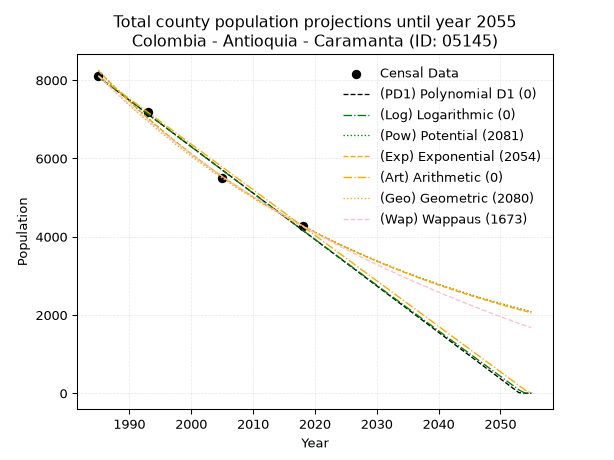
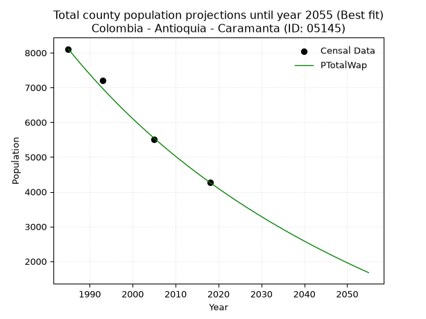
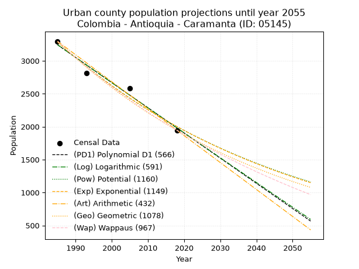
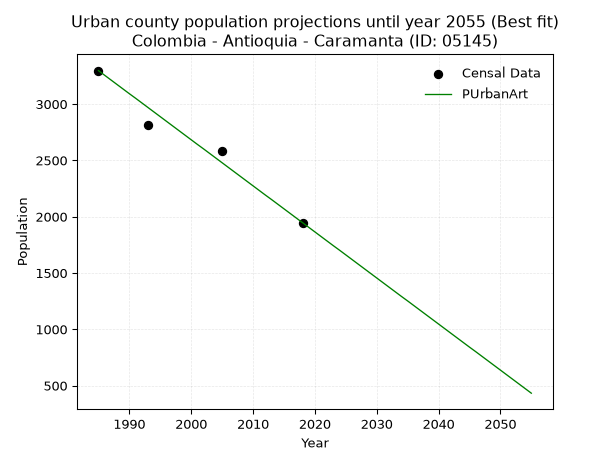
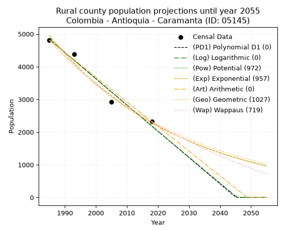
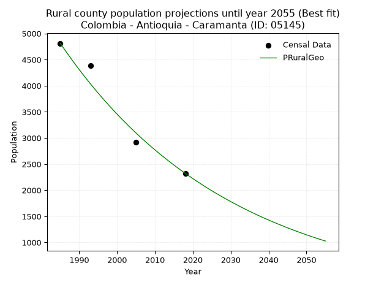

<div align="center">


</div>

# _“Population and Public Services Demand Projections (PPSD) until Year 2050 for Colombia - Antioquia - Caramanta (ID: 05145)”_
Keywords: `population` `public-service` `projection` `lineal` `polynomial` `logarithmic` `potential` `exponential` `arithmetic` `geometric` `wappaus` `dane` `colombia` `south-america`

PPSD are analytical estimates used by governments and planners to anticipate future changes in population size, age distribution, and the resulting community needs for utilities, healthcare, education, and infrastructure as sizing future water treatment facilities, electrical grids, and road networks based on spatial growth.

> **General running parameters**: • app_version: _v20260806_. • Python version: _3.14.7_. • Pandas version: _3.0.5_. • NumPy version: _2.5.1_. • Creates, save and include plots into reports (create_plot): _False_. • Projection until year: _2050_. • Process polynomial degree 2 and up: _False_. • Process Wappaus: _True_. • Process Wappaus: _True_. • Set negative values to zero: _True_. • Set infinite values to zero: _True_. • Drop dataset notes: _True_. 
<div align="center">

Dynamic map: [:earth_americas:Google](http://maps.google.com/maps?q=5.548530403,-75.6438684) [:earth_americas:OSM](https://www.openstreetmap.org/#map=18/5.548530403/-75.6438684&layers=P) [:earth_americas:Bing](https://www.bing.com/maps?cp=5.548530403~-75.6438684&lvl=18) [:earth_americas:Apple](https://maps.apple.com/frame?center=5.548530403%2C-75.6438684&span=0.003%2C0.006)

</div>


<div align="center">

```geojson
{
  "type": "Feature",
  "geometry": {
    "type": "Point", 
    "coordinates": [-75.6438684, 5.548530403]
  }, 
  "properties": {
    "Name": "Colombia - Antioquia - Caramanta (ID: 05145)"
  }
}
```

</div>


## 0. Census Data (4 records)

Census data are official statistics collected by a government about the people and housing in a country. They usually include counts of total population, age, sex, race, income, education, and jobs.

📅Global census file: [Population.xlsx](../data/Population.xlsx)

| Source   |   Year |   CountryID | CountryName   |   StateID | StateName   |   CountyID | CountyName   |   PTotal |   PUrban |   PRural |
|:---------|-------:|------------:|:--------------|----------:|:------------|-----------:|:-------------|---------:|---------:|---------:|
| DANE     |   1985 |          57 | Colombia      |        05 | Antioquia   |      05145 | Caramanta    |     8108 |     3296 |     4812 |
| DANE     |   1993 |          57 | Colombia      |        05 | Antioquia   |      05145 | Caramanta    |     7197 |     2810 |     4387 |
| DANE     |   2005 |          57 | Colombia      |        05 | Antioquia   |      05145 | Caramanta    |     5510 |     2586 |     2924 |
| DANE     |   2018 |          57 | Colombia      |        05 | Antioquia   |      05145 | Caramanta    |     4269 |     1946 |     2323 |

> 🔥Some records could had specific notes about the registered values or the corresponding urban or rural distribution.

## 1. Total

### 1.1. Coefficients and Parameters

* (PD1) Polynomial Deg 1: -118.63187474909583, 243564.4074668789 (lineal)
* (Log) Logarithmic: -237486.59716195802, 1811408.5281261958
* (Pow) Potential: -39.71432235622575, 134.88437566857704
* (Exp) Exponential: -0.01984243631272733, 1.0506578519533714e+21
* (Art) Arithmetic: Year diff. 2018 - 1985 = 33, Population diff. 4269 - 8108 = -3839, Annual growth = -116.33333333333333
* (Geo) Geometric: Year diff. 2018 - 1985 = 33, Population diff. 4269 - 8108 = -3839, Annual growth % = -0.019250823899859326
* (Wap) Wappaus: i = -1.879830869085131, Condition values only valid for < 200)

<sub>
Wappaus condition values: ['-0.00', '-1.88', '-3.76', '-5.64', '-7.52', '-9.40', '-11.28', '-13.16', '-15.04', '-16.92', '-18.80', '-20.68', '-22.56', '-24.44', '-26.32', '-28.20', '-30.08', '-31.96', '-33.84', '-35.72', '-37.60', '-39.48', '-41.36', '-43.24', '-45.12', '-47.00', '-48.88', '-50.76', '-52.64', '-54.52', '-56.39', '-58.27', '-60.15', '-62.03', '-63.91', '-65.79', '-67.67', '-69.55', '-71.43', '-73.31', '-75.19', '-77.07', '-78.95', '-80.83', '-82.71', '-84.59', '-86.47', '-88.35', '-90.23', '-92.11', '-93.99', '-95.87', '-97.75', '-99.63', '-101.51', '-103.39', '-105.27', '-107.15', '-109.03', '-110.91', '-112.79', '-114.67', '-116.55', '-118.43', '-120.31', '-122.19']
</sub>


### 1.2. Projected Dataset

|   Year |   CountyID |   PTotalPD1 |   PTotalLog |   PTotalPow |   PTotalExp |   PTotalArt |   PTotalGeo |   PTotalWap |
|-------:|-----------:|------------:|------------:|------------:|------------:|------------:|------------:|------------:|
|   1985 |      05145 |        8080 |        8084 |        8242 |        8238 |        8108 |        8108 |        8108 |
|   1986 |      05145 |        7962 |        7964 |        8079 |        8076 |        7992 |        7952 |        7957 |
|   1987 |      05145 |        7843 |        7845 |        7919 |        7917 |        7875 |        7799 |        7809 |
|   1988 |      05145 |        7724 |        7725 |        7763 |        7762 |        7759 |        7649 |        7663 |
|   1989 |      05145 |        7606 |        7606 |        7609 |        7609 |        7643 |        7501 |        7520 |
|   1990 |      05145 |        7487 |        7486 |        7459 |        7460 |        7526 |        7357 |        7380 |
|   1991 |      05145 |        7368 |        7367 |        7311 |        7313 |        7410 |        7215 |        7242 |
|   1992 |      05145 |        7250 |        7248 |        7167 |        7169 |        7294 |        7077 |        7107 |
|   1993 |      05145 |        7131 |        7129 |        7026 |        7028 |        7177 |        6940 |        6974 |
|   1994 |      05145 |        7012 |        7010 |        6887 |        6890 |        7061 |        6807 |        6843 |
|   1995 |      05145 |        6894 |        6891 |        6751 |        6755 |        6945 |        6676 |        6715 |
|   1996 |      05145 |        6775 |        6772 |        6618 |        6622 |        6828 |        6547 |        6589 |
|   1997 |      05145 |        6657 |        6653 |        6488 |        6492 |        6712 |        6421 |        6464 |
|   1998 |      05145 |        6538 |        6534 |        6360 |        6365 |        6596 |        6297 |        6342 |
|   1999 |      05145 |        6419 |        6415 |        6235 |        6240 |        6479 |        6176 |        6222 |
|   2000 |      05145 |        6301 |        6296 |        6112 |        6117 |        6363 |        6057 |        6104 |
|   2001 |      05145 |        6182 |        6177 |        5992 |        5997 |        6247 |        5941 |        5988 |
|   2002 |      05145 |        6063 |        6059 |        5874 |        5879 |        6130 |        5826 |        5874 |
|   2003 |      05145 |        5945 |        5940 |        5759 |        5764 |        6014 |        5714 |        5761 |
|   2004 |      05145 |        5826 |        5822 |        5646 |        5650 |        5898 |        5604 |        5651 |
|   2005 |      05145 |        5707 |        5703 |        5535 |        5539 |        5781 |        5496 |        5542 |
|   2006 |      05145 |        5589 |        5585 |        5427 |        5430 |        5665 |        5391 |        5435 |
|   2007 |      05145 |        5470 |        5466 |        5320 |        5324 |        5549 |        5287 |        5329 |
|   2008 |      05145 |        5352 |        5348 |        5216 |        5219 |        5432 |        5185 |        5226 |
|   2009 |      05145 |        5233 |        5230 |        5114 |        5117 |        5316 |        5085 |        5123 |
|   2010 |      05145 |        5114 |        5112 |        5014 |        5016 |        5200 |        4987 |        5023 |
|   2011 |      05145 |        4996 |        4993 |        4916 |        4918 |        5083 |        4891 |        4923 |
|   2012 |      05145 |        4877 |        4875 |        4820 |        4821 |        4967 |        4797 |        4826 |
|   2013 |      05145 |        4758 |        4757 |        4726 |        4726 |        4851 |        4705 |        4729 |
|   2014 |      05145 |        4640 |        4639 |        4633 |        4633 |        4734 |        4614 |        4635 |
|   2015 |      05145 |        4521 |        4522 |        4543 |        4542 |        4618 |        4525 |        4541 |
|   2016 |      05145 |        4403 |        4404 |        4454 |        4453 |        4502 |        4438 |        4449 |
|   2017 |      05145 |        4284 |        4286 |        4367 |        4366 |        4385 |        4353 |        4358 |
|   2018 |      05145 |        4165 |        4168 |        4282 |        4280 |        4269 |        4269 |        4269 |
|   2019 |      05145 |        4047 |        4051 |        4199 |        4196 |        4153 |        4187 |        4181 |
|   2020 |      05145 |        3928 |        3933 |        4117 |        4113 |        4036 |        4106 |        4094 |
|   2021 |      05145 |        3809 |        3815 |        4037 |        4032 |        3920 |        4027 |        4008 |
|   2022 |      05145 |        3691 |        3698 |        3958 |        3953 |        3804 |        3950 |        3924 |
|   2023 |      05145 |        3572 |        3581 |        3881 |        3876 |        3687 |        3874 |        3840 |
|   2024 |      05145 |        3453 |        3463 |        3806 |        3799 |        3571 |        3799 |        3758 |
|   2025 |      05145 |        3335 |        3346 |        3732 |        3725 |        3455 |        3726 |        3677 |
|   2026 |      05145 |        3216 |        3229 |        3660 |        3652 |        3338 |        3654 |        3597 |
|   2027 |      05145 |        3098 |        3111 |        3589 |        3580 |        3222 |        3584 |        3518 |
|   2028 |      05145 |        2979 |        2994 |        3519 |        3510 |        3106 |        3515 |        3441 |
|   2029 |      05145 |        2860 |        2877 |        3451 |        3441 |        2989 |        3447 |        3364 |
|   2030 |      05145 |        2742 |        2760 |        3384 |        3373 |        2873 |        3381 |        3288 |
|   2031 |      05145 |        2623 |        2643 |        3318 |        3307 |        2757 |        3316 |        3213 |
|   2032 |      05145 |        2504 |        2526 |        3254 |        3242 |        2640 |        3252 |        3139 |
|   2033 |      05145 |        2386 |        2410 |        3191 |        3178 |        2524 |        3189 |        3067 |
|   2034 |      05145 |        2267 |        2293 |        3129 |        3116 |        2408 |        3128 |        2995 |
|   2035 |      05145 |        2149 |        2176 |        3069 |        3054 |        2291 |        3068 |        2924 |
|   2036 |      05145 |        2030 |        2059 |        3010 |        2994 |        2175 |        3009 |        2854 |
|   2037 |      05145 |        1911 |        1943 |        2951 |        2936 |        2059 |        2951 |        2784 |
|   2038 |      05145 |        1793 |        1826 |        2895 |        2878 |        1942 |        2894 |        2716 |
|   2039 |      05145 |        1674 |        1710 |        2839 |        2821 |        1826 |        2838 |        2648 |
|   2040 |      05145 |        1555 |        1593 |        2784 |        2766 |        1710 |        2784 |        2582 |
|   2041 |      05145 |        1437 |        1477 |        2730 |        2712 |        1593 |        2730 |        2516 |
|   2042 |      05145 |        1318 |        1360 |        2678 |        2658 |        1477 |        2677 |        2451 |
|   2043 |      05145 |        1199 |        1244 |        2626 |        2606 |        1361 |        2626 |        2387 |
|   2044 |      05145 |        1081 |        1128 |        2576 |        2555 |        1244 |        2575 |        2323 |
|   2045 |      05145 |         962 |        1012 |        2526 |        2505 |        1128 |        2526 |        2261 |
|   2046 |      05145 |         844 |         896 |        2477 |        2455 |        1012 |        2477 |        2199 |
|   2047 |      05145 |         725 |         780 |        2430 |        2407 |         895 |        2429 |        2137 |
|   2048 |      05145 |         606 |         664 |        2383 |        2360 |         779 |        2383 |        2077 |
|   2049 |      05145 |         488 |         548 |        2337 |        2314 |         663 |        2337 |        2017 |
|   2050 |      05145 |         369 |         432 |        2293 |        2268 |         546 |        2292 |        1958 |
<div align="center">

</img>

</div>


### 1.3. Best fit with absolute and relative error (%)

Relative error puts that difference into context by dividing the absolute error by the true value, creating a unitless ratio or percentage that shows the scale of the mistake.

Absolute and relative error

|   Year | Source   |   CountryID | CountryName   |   StateID | StateName   |   CountyID_x | CountyName   |   PTotal |   PUrban |   PRural |   CountyID_y |   PTotalPD1 |   PTotalLog |   PTotalPow |   PTotalExp |   PTotalArt |   PTotalGeo |   PTotalWap |   PTotalPD1AbsError |   PTotalLogAbsError |   PTotalPowAbsError |   PTotalExpAbsError |   PTotalArtAbsError |   PTotalGeoAbsError |   PTotalWapAbsError |   PTotalPD1RelError |   PTotalLogRelError |   PTotalPowRelError |   PTotalExpRelError |   PTotalArtRelError |   PTotalGeoRelError |   PTotalWapRelError |
|-------:|:---------|------------:|:--------------|----------:|:------------|-------------:|:-------------|---------:|---------:|---------:|-------------:|------------:|------------:|------------:|------------:|------------:|------------:|------------:|--------------------:|--------------------:|--------------------:|--------------------:|--------------------:|--------------------:|--------------------:|--------------------:|--------------------:|--------------------:|--------------------:|--------------------:|--------------------:|--------------------:|
|   1985 | DANE     |          57 | Colombia      |        05 | Antioquia   |        05145 | Caramanta    |     8108 |     3296 |     4812 |        05145 |        8080 |        8084 |        8242 |        8238 |        8108 |        8108 |        8108 |                  28 |                  24 |                 134 |                 130 |                   0 |                   0 |                   0 |            0.345338 |            0.296004 |            1.65269  |            1.60335  |            0        |            0        |            0        |
|   1993 | DANE     |          57 | Colombia      |        05 | Antioquia   |        05145 | Caramanta    |     7197 |     2810 |     4387 |        05145 |        7131 |        7129 |        7026 |        7028 |        7177 |        6940 |        6974 |                  66 |                  68 |                 171 |                 169 |                  20 |                 257 |                 223 |            0.917049 |            0.944838 |            2.37599  |            2.3482   |            0.277894 |            3.57093  |            3.09851  |
|   2005 | DANE     |          57 | Colombia      |        05 | Antioquia   |        05145 | Caramanta    |     5510 |     2586 |     2924 |        05145 |        5707 |        5703 |        5535 |        5539 |        5781 |        5496 |        5542 |                 197 |                 193 |                  25 |                  29 |                 271 |                  14 |                  32 |            3.57532  |            3.50272  |            0.453721 |            0.526316 |            4.91833  |            0.254083 |            0.580762 |
|   2018 | DANE     |          57 | Colombia      |        05 | Antioquia   |        05145 | Caramanta    |     4269 |     1946 |     2323 |        05145 |        4165 |        4168 |        4282 |        4280 |        4269 |        4269 |        4269 |                 104 |                 101 |                  13 |                  11 |                   0 |                   0 |                   0 |            2.43617  |            2.36589  |            0.304521 |            0.257672 |            0        |            0        |            0        |

Relative error mean

| Method    |   RelError | Best   |
|:----------|-----------:|:-------|
| PTotalPD1 |   1.81847  |        |
| PTotalLog |   1.77736  |        |
| PTotalPow |   1.19673  |        |
| PTotalExp |   1.18389  |        |
| PTotalArt |   1.29906  |        |
| PTotalGeo |   0.956254 |        |
| PTotalWap |   0.919819 | True   |

💙Best method: _**PTotalWap**_
<div align="center">

</img>

</div>


### 1.4. Fresh water supply demand in liters per capita per day (lpcd)

The fresh water supply demand typically ranges from 100 to 300 liters per capita per day (lpcd) for standard domestic and municipal planning, though absolute survival minimums set by the World Health Organization are as low as 7.5 to 20 liters per day, and total consumption in high-income nations can exceed 400 liters.

> `CZ`: Level in meters above the sea level (masl)<br> `WS`: Fresh water supply demand in liters per capita per day (lpcd or l/h/d)<br> `WSAll`: Zonal fresh water supply demand in liters per second (l/s)<br> `A`: Zonal area in square meters<br> `DP`: Population density (people/hectare)

Reference values (RAS Colombia)

|    CZ |   WS |
|------:|-----:|
|  1000 |  120 |
|  2000 |  130 |
| 99999 |  140 |

County shapefile geometry properties and water supply values

|   CountyID |      ATotal |   CZTotal |   WSTotal |
|-----------:|------------:|----------:|----------:|
|      05145 | 9.20627e+07 |   1803.92 |       130 |

Projected values for best method: PTotalWap

|   CountyID |   Year |   PTotalWap |   DPTotal |   WSTotal |   WSTotalAll |
|-----------:|-------:|------------:|----------:|----------:|-------------:|
|      05145 |   1985 |        8108 |      0.88 |       130 |     12.1995  |
|      05145 |   1986 |        7957 |      0.86 |       130 |     11.9723  |
|      05145 |   1987 |        7809 |      0.85 |       130 |     11.7497  |
|      05145 |   1988 |        7663 |      0.83 |       130 |     11.53    |
|      05145 |   1989 |        7520 |      0.82 |       130 |     11.3148  |
|      05145 |   1990 |        7380 |      0.8  |       130 |     11.1042  |
|      05145 |   1991 |        7242 |      0.79 |       130 |     10.8965  |
|      05145 |   1992 |        7107 |      0.77 |       130 |     10.6934  |
|      05145 |   1993 |        6974 |      0.76 |       130 |     10.4933  |
|      05145 |   1994 |        6843 |      0.74 |       130 |     10.2962  |
|      05145 |   1995 |        6715 |      0.73 |       130 |     10.1036  |
|      05145 |   1996 |        6589 |      0.72 |       130 |      9.914   |
|      05145 |   1997 |        6464 |      0.7  |       130 |      9.72593 |
|      05145 |   1998 |        6342 |      0.69 |       130 |      9.54236 |
|      05145 |   1999 |        6222 |      0.68 |       130 |      9.36181 |
|      05145 |   2000 |        6104 |      0.66 |       130 |      9.18426 |
|      05145 |   2001 |        5988 |      0.65 |       130 |      9.00972 |
|      05145 |   2002 |        5874 |      0.64 |       130 |      8.83819 |
|      05145 |   2003 |        5761 |      0.63 |       130 |      8.66817 |
|      05145 |   2004 |        5651 |      0.61 |       130 |      8.50266 |
|      05145 |   2005 |        5542 |      0.6  |       130 |      8.33866 |
|      05145 |   2006 |        5435 |      0.59 |       130 |      8.17766 |
|      05145 |   2007 |        5329 |      0.58 |       130 |      8.01817 |
|      05145 |   2008 |        5226 |      0.57 |       130 |      7.86319 |
|      05145 |   2009 |        5123 |      0.56 |       130 |      7.70822 |
|      05145 |   2010 |        5023 |      0.55 |       130 |      7.55775 |
|      05145 |   2011 |        4923 |      0.53 |       130 |      7.40729 |
|      05145 |   2012 |        4826 |      0.52 |       130 |      7.26134 |
|      05145 |   2013 |        4729 |      0.51 |       130 |      7.11539 |
|      05145 |   2014 |        4635 |      0.5  |       130 |      6.97396 |
|      05145 |   2015 |        4541 |      0.49 |       130 |      6.83252 |
|      05145 |   2016 |        4449 |      0.48 |       130 |      6.6941  |
|      05145 |   2017 |        4358 |      0.47 |       130 |      6.55718 |
|      05145 |   2018 |        4269 |      0.46 |       130 |      6.42326 |
|      05145 |   2019 |        4181 |      0.45 |       130 |      6.29086 |
|      05145 |   2020 |        4094 |      0.44 |       130 |      6.15995 |
|      05145 |   2021 |        4008 |      0.44 |       130 |      6.03056 |
|      05145 |   2022 |        3924 |      0.43 |       130 |      5.90417 |
|      05145 |   2023 |        3840 |      0.42 |       130 |      5.77778 |
|      05145 |   2024 |        3758 |      0.41 |       130 |      5.6544  |
|      05145 |   2025 |        3677 |      0.4  |       130 |      5.53252 |
|      05145 |   2026 |        3597 |      0.39 |       130 |      5.41215 |
|      05145 |   2027 |        3518 |      0.38 |       130 |      5.29329 |
|      05145 |   2028 |        3441 |      0.37 |       130 |      5.17743 |
|      05145 |   2029 |        3364 |      0.37 |       130 |      5.06157 |
|      05145 |   2030 |        3288 |      0.36 |       130 |      4.94722 |
|      05145 |   2031 |        3213 |      0.35 |       130 |      4.83437 |
|      05145 |   2032 |        3139 |      0.34 |       130 |      4.72303 |
|      05145 |   2033 |        3067 |      0.33 |       130 |      4.6147  |
|      05145 |   2034 |        2995 |      0.33 |       130 |      4.50637 |
|      05145 |   2035 |        2924 |      0.32 |       130 |      4.39954 |
|      05145 |   2036 |        2854 |      0.31 |       130 |      4.29421 |
|      05145 |   2037 |        2784 |      0.3  |       130 |      4.18889 |
|      05145 |   2038 |        2716 |      0.3  |       130 |      4.08657 |
|      05145 |   2039 |        2648 |      0.29 |       130 |      3.98426 |
|      05145 |   2040 |        2582 |      0.28 |       130 |      3.88495 |
|      05145 |   2041 |        2516 |      0.27 |       130 |      3.78565 |
|      05145 |   2042 |        2451 |      0.27 |       130 |      3.68785 |
|      05145 |   2043 |        2387 |      0.26 |       130 |      3.59155 |
|      05145 |   2044 |        2323 |      0.25 |       130 |      3.49525 |
|      05145 |   2045 |        2261 |      0.25 |       130 |      3.40197 |
|      05145 |   2046 |        2199 |      0.24 |       130 |      3.30868 |
|      05145 |   2047 |        2137 |      0.23 |       130 |      3.21539 |
|      05145 |   2048 |        2077 |      0.23 |       130 |      3.12512 |
|      05145 |   2049 |        2017 |      0.22 |       130 |      3.03484 |
|      05145 |   2050 |        1958 |      0.21 |       130 |      2.94606 |

## 2. Urban

### 2.1. Coefficients and Parameters

* (PD1) Polynomial Deg 1: -38.23604977920471, 79141.15857085423 (lineal)
* (Log) Logarithmic: -76531.93264347695, 584379.3333114872
* (Pow) Potential: -30.041844560071223, 102.58752340094495
* (Exp) Exponential: -0.015012207217193894, 2.871994876242004e+16
* (Art) Arithmetic: Year diff. 2018 - 1985 = 33, Population diff. 1946 - 3296 = -1350, Annual growth = -40.90909090909091
* (Geo) Geometric: Year diff. 2018 - 1985 = 33, Population diff. 1946 - 3296 = -1350, Annual growth % = -0.015840878050901064
* (Wap) Wappaus: i = -1.5608199507474594, Condition values only valid for < 200)

<sub>
Wappaus condition values: ['-0.00', '-1.56', '-3.12', '-4.68', '-6.24', '-7.80', '-9.36', '-10.93', '-12.49', '-14.05', '-15.61', '-17.17', '-18.73', '-20.29', '-21.85', '-23.41', '-24.97', '-26.53', '-28.09', '-29.66', '-31.22', '-32.78', '-34.34', '-35.90', '-37.46', '-39.02', '-40.58', '-42.14', '-43.70', '-45.26', '-46.82', '-48.39', '-49.95', '-51.51', '-53.07', '-54.63', '-56.19', '-57.75', '-59.31', '-60.87', '-62.43', '-63.99', '-65.55', '-67.12', '-68.68', '-70.24', '-71.80', '-73.36', '-74.92', '-76.48', '-78.04', '-79.60', '-81.16', '-82.72', '-84.28', '-85.85', '-87.41', '-88.97', '-90.53', '-92.09', '-93.65', '-95.21', '-96.77', '-98.33', '-99.89', '-101.45']
</sub>


### 2.2. Projected Dataset

|   Year |   CountyID |   PUrbanPD1 |   PUrbanLog |   PUrbanPow |   PUrbanExp |   PUrbanArt |   PUrbanGeo |   PUrbanWap |
|-------:|-----------:|------------:|------------:|------------:|------------:|------------:|------------:|------------:|
|   1985 |      05145 |        3243 |        3244 |        3286 |        3285 |        3296 |        3296 |        3296 |
|   1986 |      05145 |        3204 |        3205 |        3237 |        3236 |        3255 |        3244 |        3245 |
|   1987 |      05145 |        3166 |        3167 |        3188 |        3188 |        3214 |        3192 |        3195 |
|   1988 |      05145 |        3128 |        3128 |        3141 |        3140 |        3173 |        3142 |        3145 |
|   1989 |      05145 |        3090 |        3090 |        3093 |        3094 |        3132 |        3092 |        3096 |
|   1990 |      05145 |        3051 |        3051 |        3047 |        3047 |        3091 |        3043 |        3048 |
|   1991 |      05145 |        3013 |        3013 |        3001 |        3002 |        3051 |        2995 |        3001 |
|   1992 |      05145 |        2975 |        2974 |        2957 |        2957 |        3010 |        2947 |        2955 |
|   1993 |      05145 |        2937 |        2936 |        2912 |        2913 |        2969 |        2901 |        2909 |
|   1994 |      05145 |        2898 |        2898 |        2869 |        2870 |        2928 |        2855 |        2863 |
|   1995 |      05145 |        2860 |        2859 |        2826 |        2827 |        2887 |        2810 |        2819 |
|   1996 |      05145 |        2822 |        2821 |        2784 |        2785 |        2846 |        2765 |        2775 |
|   1997 |      05145 |        2784 |        2782 |        2742 |        2744 |        2805 |        2721 |        2732 |
|   1998 |      05145 |        2746 |        2744 |        2701 |        2703 |        2764 |        2678 |        2689 |
|   1999 |      05145 |        2707 |        2706 |        2661 |        2662 |        2723 |        2636 |        2647 |
|   2000 |      05145 |        2669 |        2668 |        2621 |        2623 |        2682 |        2594 |        2605 |
|   2001 |      05145 |        2631 |        2629 |        2582 |        2584 |        2641 |        2553 |        2564 |
|   2002 |      05145 |        2593 |        2591 |        2544 |        2545 |        2601 |        2512 |        2524 |
|   2003 |      05145 |        2554 |        2553 |        2506 |        2507 |        2560 |        2473 |        2484 |
|   2004 |      05145 |        2516 |        2515 |        2468 |        2470 |        2519 |        2433 |        2445 |
|   2005 |      05145 |        2478 |        2476 |        2432 |        2433 |        2478 |        2395 |        2406 |
|   2006 |      05145 |        2440 |        2438 |        2396 |        2397 |        2437 |        2357 |        2368 |
|   2007 |      05145 |        2401 |        2400 |        2360 |        2361 |        2396 |        2320 |        2330 |
|   2008 |      05145 |        2363 |        2362 |        2325 |        2326 |        2355 |        2283 |        2293 |
|   2009 |      05145 |        2325 |        2324 |        2290 |        2291 |        2314 |        2247 |        2256 |
|   2010 |      05145 |        2287 |        2286 |        2256 |        2257 |        2273 |        2211 |        2220 |
|   2011 |      05145 |        2248 |        2248 |        2223 |        2223 |        2232 |        2176 |        2184 |
|   2012 |      05145 |        2210 |        2210 |        2190 |        2190 |        2191 |        2142 |        2149 |
|   2013 |      05145 |        2172 |        2172 |        2158 |        2158 |        2151 |        2108 |        2114 |
|   2014 |      05145 |        2134 |        2134 |        2126 |        2126 |        2110 |        2074 |        2079 |
|   2015 |      05145 |        2096 |        2096 |        2094 |        2094 |        2069 |        2041 |        2045 |
|   2016 |      05145 |        2057 |        2058 |        2063 |        2063 |        2028 |        2009 |        2012 |
|   2017 |      05145 |        2019 |        2020 |        2033 |        2032 |        1987 |        1977 |        1979 |
|   2018 |      05145 |        1981 |        1982 |        2003 |        2002 |        1946 |        1946 |        1946 |
|   2019 |      05145 |        1943 |        1944 |        1973 |        1972 |        1905 |        1915 |        1914 |
|   2020 |      05145 |        1904 |        1906 |        1944 |        1942 |        1864 |        1885 |        1882 |
|   2021 |      05145 |        1866 |        1868 |        1915 |        1914 |        1823 |        1855 |        1850 |
|   2022 |      05145 |        1828 |        1830 |        1887 |        1885 |        1782 |        1826 |        1819 |
|   2023 |      05145 |        1790 |        1792 |        1859 |        1857 |        1741 |        1797 |        1788 |
|   2024 |      05145 |        1751 |        1755 |        1832 |        1829 |        1701 |        1768 |        1758 |
|   2025 |      05145 |        1713 |        1717 |        1805 |        1802 |        1660 |        1740 |        1728 |
|   2026 |      05145 |        1675 |        1679 |        1778 |        1775 |        1619 |        1713 |        1698 |
|   2027 |      05145 |        1637 |        1641 |        1752 |        1749 |        1578 |        1686 |        1669 |
|   2028 |      05145 |        1598 |        1604 |        1726 |        1723 |        1537 |        1659 |        1640 |
|   2029 |      05145 |        1560 |        1566 |        1701 |        1697 |        1496 |        1633 |        1611 |
|   2030 |      05145 |        1522 |        1528 |        1676 |        1672 |        1455 |        1607 |        1583 |
|   2031 |      05145 |        1484 |        1490 |        1651 |        1647 |        1414 |        1581 |        1555 |
|   2032 |      05145 |        1446 |        1453 |        1627 |        1622 |        1373 |        1556 |        1527 |
|   2033 |      05145 |        1407 |        1415 |        1603 |        1598 |        1332 |        1532 |        1500 |
|   2034 |      05145 |        1369 |        1377 |        1580 |        1574 |        1291 |        1507 |        1473 |
|   2035 |      05145 |        1331 |        1340 |        1556 |        1551 |        1251 |        1483 |        1446 |
|   2036 |      05145 |        1293 |        1302 |        1534 |        1528 |        1210 |        1460 |        1419 |
|   2037 |      05145 |        1254 |        1265 |        1511 |        1505 |        1169 |        1437 |        1393 |
|   2038 |      05145 |        1216 |        1227 |        1489 |        1483 |        1128 |        1414 |        1367 |
|   2039 |      05145 |        1178 |        1190 |        1467 |        1460 |        1087 |        1392 |        1342 |
|   2040 |      05145 |        1140 |        1152 |        1446 |        1439 |        1046 |        1370 |        1316 |
|   2041 |      05145 |        1101 |        1115 |        1425 |        1417 |        1005 |        1348 |        1291 |
|   2042 |      05145 |        1063 |        1077 |        1404 |        1396 |         964 |        1327 |        1266 |
|   2043 |      05145 |        1025 |        1040 |        1383 |        1375 |         923 |        1305 |        1242 |
|   2044 |      05145 |         987 |        1002 |        1363 |        1355 |         882 |        1285 |        1218 |
|   2045 |      05145 |         948 |         965 |        1343 |        1335 |         841 |        1264 |        1194 |
|   2046 |      05145 |         910 |         927 |        1324 |        1315 |         801 |        1244 |        1170 |
|   2047 |      05145 |         872 |         890 |        1304 |        1295 |         760 |        1225 |        1146 |
|   2048 |      05145 |         834 |         853 |        1285 |        1276 |         719 |        1205 |        1123 |
|   2049 |      05145 |         795 |         815 |        1267 |        1257 |         678 |        1186 |        1100 |
|   2050 |      05145 |         757 |         778 |        1248 |        1238 |         637 |        1167 |        1077 |
<div align="center">

</img>

</div>


### 2.3. Best fit with absolute and relative error (%)

Relative error puts that difference into context by dividing the absolute error by the true value, creating a unitless ratio or percentage that shows the scale of the mistake.

Absolute and relative error

|   Year | Source   |   CountryID | CountryName   |   StateID | StateName   |   CountyID_x | CountyName   |   PTotal |   PUrban |   PRural |   CountyID_y |   PUrbanPD1 |   PUrbanLog |   PUrbanPow |   PUrbanExp |   PUrbanArt |   PUrbanGeo |   PUrbanWap |   PUrbanPD1AbsError |   PUrbanLogAbsError |   PUrbanPowAbsError |   PUrbanExpAbsError |   PUrbanArtAbsError |   PUrbanGeoAbsError |   PUrbanWapAbsError |   PUrbanPD1RelError |   PUrbanLogRelError |   PUrbanPowRelError |   PUrbanExpRelError |   PUrbanArtRelError |   PUrbanGeoRelError |   PUrbanWapRelError |
|-------:|:---------|------------:|:--------------|----------:|:------------|-------------:|:-------------|---------:|---------:|---------:|-------------:|------------:|------------:|------------:|------------:|------------:|------------:|------------:|--------------------:|--------------------:|--------------------:|--------------------:|--------------------:|--------------------:|--------------------:|--------------------:|--------------------:|--------------------:|--------------------:|--------------------:|--------------------:|--------------------:|
|   1985 | DANE     |          57 | Colombia      |        05 | Antioquia   |        05145 | Caramanta    |     8108 |     3296 |     4812 |        05145 |        3243 |        3244 |        3286 |        3285 |        3296 |        3296 |        3296 |                  53 |                  52 |                  10 |                  11 |                   0 |                   0 |                   0 |             1.60801 |             1.57767 |            0.303398 |            0.333738 |             0       |             0       |             0       |
|   1993 | DANE     |          57 | Colombia      |        05 | Antioquia   |        05145 | Caramanta    |     7197 |     2810 |     4387 |        05145 |        2937 |        2936 |        2912 |        2913 |        2969 |        2901 |        2909 |                 127 |                 126 |                 102 |                 103 |                 159 |                  91 |                  99 |             4.51957 |             4.48399 |            3.62989  |            3.66548  |             5.65836 |             3.23843 |             3.52313 |
|   2005 | DANE     |          57 | Colombia      |        05 | Antioquia   |        05145 | Caramanta    |     5510 |     2586 |     2924 |        05145 |        2478 |        2476 |        2432 |        2433 |        2478 |        2395 |        2406 |                 108 |                 110 |                 154 |                 153 |                 108 |                 191 |                 180 |             4.17633 |             4.25367 |            5.95514  |            5.91647  |             4.17633 |             7.38592 |             6.96056 |
|   2018 | DANE     |          57 | Colombia      |        05 | Antioquia   |        05145 | Caramanta    |     4269 |     1946 |     2323 |        05145 |        1981 |        1982 |        2003 |        2002 |        1946 |        1946 |        1946 |                  35 |                  36 |                  57 |                  56 |                   0 |                   0 |                   0 |             1.79856 |             1.84995 |            2.92909  |            2.8777   |             0       |             0       |             0       |

Relative error mean

| Method    |   RelError | Best   |
|:----------|-----------:|:-------|
| PUrbanPD1 |    3.02562 |        |
| PUrbanLog |    3.04132 |        |
| PUrbanPow |    3.20438 |        |
| PUrbanExp |    3.19835 |        |
| PUrbanArt |    2.45867 | True   |
| PUrbanGeo |    2.65609 |        |
| PUrbanWap |    2.62092 |        |

💙Best method: _**PUrbanArt**_
<div align="center">

</img>

</div>


### 2.4. Fresh water supply demand in liters per capita per day (lpcd)

The fresh water supply demand typically ranges from 100 to 300 liters per capita per day (lpcd) for standard domestic and municipal planning, though absolute survival minimums set by the World Health Organization are as low as 7.5 to 20 liters per day, and total consumption in high-income nations can exceed 400 liters.

> `CZ`: Level in meters above the sea level (masl)<br> `WS`: Fresh water supply demand in liters per capita per day (lpcd or l/h/d)<br> `WSAll`: Zonal fresh water supply demand in liters per second (l/s)<br> `A`: Zonal area in square meters<br> `DP`: Population density (people/hectare)

Reference values (RAS Colombia)

|    CZ |   WS |
|------:|-----:|
|  1000 |  120 |
|  2000 |  130 |
| 99999 |  140 |

County shapefile geometry properties and water supply values

|   CountyID |   AUrban |   CZUrban |   WSUrban |
|-----------:|---------:|----------:|----------:|
|      05145 |   356774 |   2104.29 |       140 |

Projected values for best method: PUrbanArt

|   CountyID |   Year |   PUrbanArt |   DPUrban |   WSUrban |   WSUrbanAll |
|-----------:|-------:|------------:|----------:|----------:|-------------:|
|      05145 |   1985 |        3296 |     92.38 |       140 |      5.34074 |
|      05145 |   1986 |        3255 |     91.23 |       140 |      5.27431 |
|      05145 |   1987 |        3214 |     90.08 |       140 |      5.20787 |
|      05145 |   1988 |        3173 |     88.94 |       140 |      5.14144 |
|      05145 |   1989 |        3132 |     87.79 |       140 |      5.075   |
|      05145 |   1990 |        3091 |     86.64 |       140 |      5.00856 |
|      05145 |   1991 |        3051 |     85.52 |       140 |      4.94375 |
|      05145 |   1992 |        3010 |     84.37 |       140 |      4.87731 |
|      05145 |   1993 |        2969 |     83.22 |       140 |      4.81088 |
|      05145 |   1994 |        2928 |     82.07 |       140 |      4.74444 |
|      05145 |   1995 |        2887 |     80.92 |       140 |      4.67801 |
|      05145 |   1996 |        2846 |     79.77 |       140 |      4.61157 |
|      05145 |   1997 |        2805 |     78.62 |       140 |      4.54514 |
|      05145 |   1998 |        2764 |     77.47 |       140 |      4.4787  |
|      05145 |   1999 |        2723 |     76.32 |       140 |      4.41227 |
|      05145 |   2000 |        2682 |     75.17 |       140 |      4.34583 |
|      05145 |   2001 |        2641 |     74.02 |       140 |      4.2794  |
|      05145 |   2002 |        2601 |     72.9  |       140 |      4.21458 |
|      05145 |   2003 |        2560 |     71.75 |       140 |      4.14815 |
|      05145 |   2004 |        2519 |     70.6  |       140 |      4.08171 |
|      05145 |   2005 |        2478 |     69.46 |       140 |      4.01528 |
|      05145 |   2006 |        2437 |     68.31 |       140 |      3.94884 |
|      05145 |   2007 |        2396 |     67.16 |       140 |      3.88241 |
|      05145 |   2008 |        2355 |     66.01 |       140 |      3.81597 |
|      05145 |   2009 |        2314 |     64.86 |       140 |      3.74954 |
|      05145 |   2010 |        2273 |     63.71 |       140 |      3.6831  |
|      05145 |   2011 |        2232 |     62.56 |       140 |      3.61667 |
|      05145 |   2012 |        2191 |     61.41 |       140 |      3.55023 |
|      05145 |   2013 |        2151 |     60.29 |       140 |      3.48542 |
|      05145 |   2014 |        2110 |     59.14 |       140 |      3.41898 |
|      05145 |   2015 |        2069 |     57.99 |       140 |      3.35255 |
|      05145 |   2016 |        2028 |     56.84 |       140 |      3.28611 |
|      05145 |   2017 |        1987 |     55.69 |       140 |      3.21968 |
|      05145 |   2018 |        1946 |     54.54 |       140 |      3.15324 |
|      05145 |   2019 |        1905 |     53.4  |       140 |      3.08681 |
|      05145 |   2020 |        1864 |     52.25 |       140 |      3.02037 |
|      05145 |   2021 |        1823 |     51.1  |       140 |      2.95394 |
|      05145 |   2022 |        1782 |     49.95 |       140 |      2.8875  |
|      05145 |   2023 |        1741 |     48.8  |       140 |      2.82106 |
|      05145 |   2024 |        1701 |     47.68 |       140 |      2.75625 |
|      05145 |   2025 |        1660 |     46.53 |       140 |      2.68981 |
|      05145 |   2026 |        1619 |     45.38 |       140 |      2.62338 |
|      05145 |   2027 |        1578 |     44.23 |       140 |      2.55694 |
|      05145 |   2028 |        1537 |     43.08 |       140 |      2.49051 |
|      05145 |   2029 |        1496 |     41.93 |       140 |      2.42407 |
|      05145 |   2030 |        1455 |     40.78 |       140 |      2.35764 |
|      05145 |   2031 |        1414 |     39.63 |       140 |      2.2912  |
|      05145 |   2032 |        1373 |     38.48 |       140 |      2.22477 |
|      05145 |   2033 |        1332 |     37.33 |       140 |      2.15833 |
|      05145 |   2034 |        1291 |     36.19 |       140 |      2.0919  |
|      05145 |   2035 |        1251 |     35.06 |       140 |      2.02708 |
|      05145 |   2036 |        1210 |     33.92 |       140 |      1.96065 |
|      05145 |   2037 |        1169 |     32.77 |       140 |      1.89421 |
|      05145 |   2038 |        1128 |     31.62 |       140 |      1.82778 |
|      05145 |   2039 |        1087 |     30.47 |       140 |      1.76134 |
|      05145 |   2040 |        1046 |     29.32 |       140 |      1.69491 |
|      05145 |   2041 |        1005 |     28.17 |       140 |      1.62847 |
|      05145 |   2042 |         964 |     27.02 |       140 |      1.56204 |
|      05145 |   2043 |         923 |     25.87 |       140 |      1.4956  |
|      05145 |   2044 |         882 |     24.72 |       140 |      1.42917 |
|      05145 |   2045 |         841 |     23.57 |       140 |      1.36273 |
|      05145 |   2046 |         801 |     22.45 |       140 |      1.29792 |
|      05145 |   2047 |         760 |     21.3  |       140 |      1.23148 |
|      05145 |   2048 |         719 |     20.15 |       140 |      1.16505 |
|      05145 |   2049 |         678 |     19    |       140 |      1.09861 |
|      05145 |   2050 |         637 |     17.85 |       140 |      1.03218 |

## 3. Rural

### 3.1. Coefficients and Parameters

* (PD1) Polynomial Deg 1: -80.39582496989111, 164423.2488960247 (lineal)
* (Log) Logarithmic: -160954.66451848112, 1227029.1948147088
* (Pow) Potential: -46.999775925350114, 158.68895461709366
* (Exp) Exponential: -0.023480322847597598, 8.638306183489113e+23
* (Art) Arithmetic: Year diff. 2018 - 1985 = 33, Population diff. 2323 - 4812 = -2489, Annual growth = -75.42424242424242
* (Geo) Geometric: Year diff. 2018 - 1985 = 33, Population diff. 2323 - 4812 = -2489, Annual growth % = -0.021826560004072793
* (Wap) Wappaus: i = -2.114204412732794, Condition values only valid for < 200)

<sub>
Wappaus condition values: ['-0.00', '-2.11', '-4.23', '-6.34', '-8.46', '-10.57', '-12.69', '-14.80', '-16.91', '-19.03', '-21.14', '-23.26', '-25.37', '-27.48', '-29.60', '-31.71', '-33.83', '-35.94', '-38.06', '-40.17', '-42.28', '-44.40', '-46.51', '-48.63', '-50.74', '-52.86', '-54.97', '-57.08', '-59.20', '-61.31', '-63.43', '-65.54', '-67.65', '-69.77', '-71.88', '-74.00', '-76.11', '-78.23', '-80.34', '-82.45', '-84.57', '-86.68', '-88.80', '-90.91', '-93.02', '-95.14', '-97.25', '-99.37', '-101.48', '-103.60', '-105.71', '-107.82', '-109.94', '-112.05', '-114.17', '-116.28', '-118.40', '-120.51', '-122.62', '-124.74', '-126.85', '-128.97', '-131.08', '-133.19', '-135.31', '-137.42']
</sub>


### 3.2. Projected Dataset

|   Year |   CountyID |   PRuralPD1 |   PRuralLog |   PRuralPow |   PRuralExp |   PRuralArt |   PRuralGeo |   PRuralWap |
|-------:|-----------:|------------:|------------:|------------:|------------:|------------:|------------:|------------:|
|   1985 |      05145 |        4838 |        4840 |        4954 |        4950 |        4812 |        4812 |        4812 |
|   1986 |      05145 |        4757 |        4759 |        4838 |        4836 |        4737 |        4707 |        4711 |
|   1987 |      05145 |        4677 |        4678 |        4725 |        4723 |        4661 |        4604 |        4613 |
|   1988 |      05145 |        4596 |        4597 |        4614 |        4614 |        4586 |        4504 |        4516 |
|   1989 |      05145 |        4516 |        4516 |        4507 |        4507 |        4510 |        4405 |        4422 |
|   1990 |      05145 |        4436 |        4435 |        4401 |        4402 |        4435 |        4309 |        4329 |
|   1991 |      05145 |        4355 |        4354 |        4299 |        4300 |        4359 |        4215 |        4238 |
|   1992 |      05145 |        4275 |        4274 |        4199 |        4200 |        4284 |        4123 |        4149 |
|   1993 |      05145 |        4194 |        4193 |        4101 |        4103 |        4209 |        4033 |        4062 |
|   1994 |      05145 |        4114 |        4112 |        4005 |        4007 |        4133 |        3945 |        3976 |
|   1995 |      05145 |        4034 |        4031 |        3912 |        3914 |        4058 |        3859 |        3892 |
|   1996 |      05145 |        3953 |        3951 |        3821 |        3824 |        3982 |        3775 |        3809 |
|   1997 |      05145 |        3873 |        3870 |        3732 |        3735 |        3907 |        3692 |        3729 |
|   1998 |      05145 |        3792 |        3790 |        3645 |        3648 |        3831 |        3612 |        3649 |
|   1999 |      05145 |        3712 |        3709 |        3560 |        3563 |        3756 |        3533 |        3571 |
|   2000 |      05145 |        3632 |        3628 |        3478 |        3481 |        3681 |        3456 |        3495 |
|   2001 |      05145 |        3551 |        3548 |        3397 |        3400 |        3605 |        3380 |        3420 |
|   2002 |      05145 |        3471 |        3468 |        3318 |        3321 |        3530 |        3307 |        3346 |
|   2003 |      05145 |        3390 |        3387 |        3241 |        3244 |        3454 |        3235 |        3274 |
|   2004 |      05145 |        3310 |        3307 |        3166 |        3169 |        3379 |        3164 |        3202 |
|   2005 |      05145 |        3230 |        3227 |        3093 |        3095 |        3304 |        3095 |        3132 |
|   2006 |      05145 |        3149 |        3146 |        3021 |        3023 |        3228 |        3027 |        3064 |
|   2007 |      05145 |        3069 |        3066 |        2951 |        2953 |        3153 |        2961 |        2996 |
|   2008 |      05145 |        2988 |        2986 |        2883 |        2885 |        3077 |        2897 |        2930 |
|   2009 |      05145 |        2908 |        2906 |        2816 |        2818 |        3002 |        2833 |        2864 |
|   2010 |      05145 |        2828 |        2826 |        2751 |        2752 |        2926 |        2772 |        2800 |
|   2011 |      05145 |        2747 |        2746 |        2687 |        2688 |        2851 |        2711 |        2737 |
|   2012 |      05145 |        2667 |        2666 |        2625 |        2626 |        2776 |        2652 |        2675 |
|   2013 |      05145 |        2586 |        2586 |        2565 |        2565 |        2700 |        2594 |        2614 |
|   2014 |      05145 |        2506 |        2506 |        2506 |        2506 |        2625 |        2537 |        2554 |
|   2015 |      05145 |        2426 |        2426 |        2448 |        2447 |        2549 |        2482 |        2495 |
|   2016 |      05145 |        2345 |        2346 |        2391 |        2391 |        2474 |        2428 |        2437 |
|   2017 |      05145 |        2265 |        2266 |        2336 |        2335 |        2398 |        2375 |        2379 |
|   2018 |      05145 |        2184 |        2186 |        2282 |        2281 |        2323 |        2323 |        2323 |
|   2019 |      05145 |        2104 |        2107 |        2230 |        2228 |        2248 |        2272 |        2268 |
|   2020 |      05145 |        2024 |        2027 |        2179 |        2176 |        2172 |        2223 |        2213 |
|   2021 |      05145 |        1943 |        1947 |        2129 |        2126 |        2097 |        2174 |        2159 |
|   2022 |      05145 |        1863 |        1868 |        2080 |        2077 |        2021 |        2127 |        2106 |
|   2023 |      05145 |        1782 |        1788 |        2032 |        2028 |        1946 |        2080 |        2054 |
|   2024 |      05145 |        1702 |        1709 |        1985 |        1981 |        1870 |        2035 |        2003 |
|   2025 |      05145 |        1622 |        1629 |        1940 |        1935 |        1795 |        1990 |        1952 |
|   2026 |      05145 |        1541 |        1550 |        1895 |        1890 |        1720 |        1947 |        1902 |
|   2027 |      05145 |        1461 |        1470 |        1852 |        1847 |        1644 |        1905 |        1853 |
|   2028 |      05145 |        1381 |        1391 |        1809 |        1804 |        1569 |        1863 |        1804 |
|   2029 |      05145 |        1300 |        1311 |        1768 |        1762 |        1493 |        1822 |        1757 |
|   2030 |      05145 |        1220 |        1232 |        1727 |        1721 |        1418 |        1783 |        1710 |
|   2031 |      05145 |        1139 |        1153 |        1688 |        1681 |        1342 |        1744 |        1663 |
|   2032 |      05145 |        1059 |        1074 |        1649 |        1642 |        1267 |        1706 |        1618 |
|   2033 |      05145 |         979 |         994 |        1612 |        1604 |        1192 |        1668 |        1572 |
|   2034 |      05145 |         898 |         915 |        1575 |        1567 |        1116 |        1632 |        1528 |
|   2035 |      05145 |         818 |         836 |        1539 |        1530 |        1041 |        1596 |        1484 |
|   2036 |      05145 |         737 |         757 |        1504 |        1495 |         965 |        1561 |        1441 |
|   2037 |      05145 |         657 |         678 |        1469 |        1460 |         890 |        1527 |        1398 |
|   2038 |      05145 |         577 |         599 |        1436 |        1426 |         815 |        1494 |        1356 |
|   2039 |      05145 |         496 |         520 |        1403 |        1393 |         739 |        1461 |        1315 |
|   2040 |      05145 |         416 |         441 |        1371 |        1361 |         664 |        1430 |        1274 |
|   2041 |      05145 |         335 |         362 |        1340 |        1329 |         588 |        1398 |        1233 |
|   2042 |      05145 |         255 |         283 |        1309 |        1298 |         513 |        1368 |        1193 |
|   2043 |      05145 |         175 |         205 |        1280 |        1268 |         437 |        1338 |        1154 |
|   2044 |      05145 |          94 |         126 |        1251 |        1239 |         362 |        1309 |        1115 |
|   2045 |      05145 |          14 |          47 |        1222 |        1210 |         287 |        1280 |        1077 |
|   2046 |      05145 |           0 |           0 |        1194 |        1182 |         211 |        1252 |        1039 |
|   2047 |      05145 |           0 |           0 |        1167 |        1155 |         136 |        1225 |        1002 |
|   2048 |      05145 |           0 |           0 |        1141 |        1128 |          60 |        1198 |         965 |
|   2049 |      05145 |           0 |           0 |        1115 |        1102 |           0 |        1172 |         928 |
|   2050 |      05145 |           0 |           0 |        1090 |        1076 |           0 |        1146 |         892 |
<div align="center">

</img>

</div>


### 3.3. Best fit with absolute and relative error (%)

Relative error puts that difference into context by dividing the absolute error by the true value, creating a unitless ratio or percentage that shows the scale of the mistake.

Absolute and relative error

|   Year | Source   |   CountryID | CountryName   |   StateID | StateName   |   CountyID_x | CountyName   |   PTotal |   PUrban |   PRural |   CountyID_y |   PRuralPD1 |   PRuralLog |   PRuralPow |   PRuralExp |   PRuralArt |   PRuralGeo |   PRuralWap |   PRuralPD1AbsError |   PRuralLogAbsError |   PRuralPowAbsError |   PRuralExpAbsError |   PRuralArtAbsError |   PRuralGeoAbsError |   PRuralWapAbsError |   PRuralPD1RelError |   PRuralLogRelError |   PRuralPowRelError |   PRuralExpRelError |   PRuralArtRelError |   PRuralGeoRelError |   PRuralWapRelError |
|-------:|:---------|------------:|:--------------|----------:|:------------|-------------:|:-------------|---------:|---------:|---------:|-------------:|------------:|------------:|------------:|------------:|------------:|------------:|------------:|--------------------:|--------------------:|--------------------:|--------------------:|--------------------:|--------------------:|--------------------:|--------------------:|--------------------:|--------------------:|--------------------:|--------------------:|--------------------:|--------------------:|
|   1985 | DANE     |          57 | Colombia      |        05 | Antioquia   |        05145 | Caramanta    |     8108 |     3296 |     4812 |        05145 |        4838 |        4840 |        4954 |        4950 |        4812 |        4812 |        4812 |                  26 |                  28 |                 142 |                 138 |                   0 |                   0 |                   0 |            0.540316 |            0.581879 |             2.95096 |             2.86783 |             0       |             0       |             0       |
|   1993 | DANE     |          57 | Colombia      |        05 | Antioquia   |        05145 | Caramanta    |     7197 |     2810 |     4387 |        05145 |        4194 |        4193 |        4101 |        4103 |        4209 |        4033 |        4062 |                 193 |                 194 |                 286 |                 284 |                 178 |                 354 |                 325 |            4.39936  |            4.42216  |             6.51926 |             6.47367 |             4.05744 |             8.0693  |             7.40825 |
|   2005 | DANE     |          57 | Colombia      |        05 | Antioquia   |        05145 | Caramanta    |     5510 |     2586 |     2924 |        05145 |        3230 |        3227 |        3093 |        3095 |        3304 |        3095 |        3132 |                 306 |                 303 |                 169 |                 171 |                 380 |                 171 |                 208 |           10.4651   |           10.3625   |             5.77975 |             5.84815 |            12.9959  |             5.84815 |             7.11354 |
|   2018 | DANE     |          57 | Colombia      |        05 | Antioquia   |        05145 | Caramanta    |     4269 |     1946 |     2323 |        05145 |        2184 |        2186 |        2282 |        2281 |        2323 |        2323 |        2323 |                 139 |                 137 |                  41 |                  42 |                   0 |                   0 |                   0 |            5.98364  |            5.89755  |             1.76496 |             1.80801 |             0       |             0       |             0       |

Relative error mean

| Method    |   RelError | Best   |
|:----------|-----------:|:-------|
| PRuralPD1 |    5.34711 |        |
| PRuralLog |    5.31602 |        |
| PRuralPow |    4.25373 |        |
| PRuralExp |    4.24942 |        |
| PRuralArt |    4.26333 |        |
| PRuralGeo |    3.47936 | True   |
| PRuralWap |    3.63045 |        |

💙Best method: _**PRuralGeo**_
<div align="center">

</img>

</div>


### 3.4. Fresh water supply demand in liters per capita per day (lpcd)

The fresh water supply demand typically ranges from 100 to 300 liters per capita per day (lpcd) for standard domestic and municipal planning, though absolute survival minimums set by the World Health Organization are as low as 7.5 to 20 liters per day, and total consumption in high-income nations can exceed 400 liters.

> `CZ`: Level in meters above the sea level (masl)<br> `WS`: Fresh water supply demand in liters per capita per day (lpcd or l/h/d)<br> `WSAll`: Zonal fresh water supply demand in liters per second (l/s)<br> `A`: Zonal area in square meters<br> `DP`: Population density (people/hectare)

Reference values (RAS Colombia)

|    CZ |   WS |
|------:|-----:|
|  1000 |  120 |
|  2000 |  130 |
| 99999 |  140 |

County shapefile geometry properties and water supply values

|   CountyID |      ARural |   CZRural |   WSRural |
|-----------:|------------:|----------:|----------:|
|      05145 | 9.17059e+07 |   1802.66 |       130 |

Projected values for best method: PRuralGeo

|   CountyID |   Year |   PRuralGeo |   DPRural |   WSRural |   WSRuralAll |
|-----------:|-------:|------------:|----------:|----------:|-------------:|
|      05145 |   1985 |        4812 |      0.52 |       130 |      7.24028 |
|      05145 |   1986 |        4707 |      0.51 |       130 |      7.08229 |
|      05145 |   1987 |        4604 |      0.5  |       130 |      6.92731 |
|      05145 |   1988 |        4504 |      0.49 |       130 |      6.77685 |
|      05145 |   1989 |        4405 |      0.48 |       130 |      6.62789 |
|      05145 |   1990 |        4309 |      0.47 |       130 |      6.48345 |
|      05145 |   1991 |        4215 |      0.46 |       130 |      6.34201 |
|      05145 |   1992 |        4123 |      0.45 |       130 |      6.20359 |
|      05145 |   1993 |        4033 |      0.44 |       130 |      6.06817 |
|      05145 |   1994 |        3945 |      0.43 |       130 |      5.93576 |
|      05145 |   1995 |        3859 |      0.42 |       130 |      5.80637 |
|      05145 |   1996 |        3775 |      0.41 |       130 |      5.67998 |
|      05145 |   1997 |        3692 |      0.4  |       130 |      5.55509 |
|      05145 |   1998 |        3612 |      0.39 |       130 |      5.43472 |
|      05145 |   1999 |        3533 |      0.39 |       130 |      5.31586 |
|      05145 |   2000 |        3456 |      0.38 |       130 |      5.2     |
|      05145 |   2001 |        3380 |      0.37 |       130 |      5.08565 |
|      05145 |   2002 |        3307 |      0.36 |       130 |      4.97581 |
|      05145 |   2003 |        3235 |      0.35 |       130 |      4.86748 |
|      05145 |   2004 |        3164 |      0.35 |       130 |      4.76065 |
|      05145 |   2005 |        3095 |      0.34 |       130 |      4.65683 |
|      05145 |   2006 |        3027 |      0.33 |       130 |      4.55451 |
|      05145 |   2007 |        2961 |      0.32 |       130 |      4.45521 |
|      05145 |   2008 |        2897 |      0.32 |       130 |      4.35891 |
|      05145 |   2009 |        2833 |      0.31 |       130 |      4.26262 |
|      05145 |   2010 |        2772 |      0.3  |       130 |      4.17083 |
|      05145 |   2011 |        2711 |      0.3  |       130 |      4.07905 |
|      05145 |   2012 |        2652 |      0.29 |       130 |      3.99028 |
|      05145 |   2013 |        2594 |      0.28 |       130 |      3.90301 |
|      05145 |   2014 |        2537 |      0.28 |       130 |      3.81725 |
|      05145 |   2015 |        2482 |      0.27 |       130 |      3.73449 |
|      05145 |   2016 |        2428 |      0.26 |       130 |      3.65324 |
|      05145 |   2017 |        2375 |      0.26 |       130 |      3.5735  |
|      05145 |   2018 |        2323 |      0.25 |       130 |      3.49525 |
|      05145 |   2019 |        2272 |      0.25 |       130 |      3.41852 |
|      05145 |   2020 |        2223 |      0.24 |       130 |      3.34479 |
|      05145 |   2021 |        2174 |      0.24 |       130 |      3.27106 |
|      05145 |   2022 |        2127 |      0.23 |       130 |      3.20035 |
|      05145 |   2023 |        2080 |      0.23 |       130 |      3.12963 |
|      05145 |   2024 |        2035 |      0.22 |       130 |      3.06192 |
|      05145 |   2025 |        1990 |      0.22 |       130 |      2.99421 |
|      05145 |   2026 |        1947 |      0.21 |       130 |      2.92951 |
|      05145 |   2027 |        1905 |      0.21 |       130 |      2.86632 |
|      05145 |   2028 |        1863 |      0.2  |       130 |      2.80313 |
|      05145 |   2029 |        1822 |      0.2  |       130 |      2.74144 |
|      05145 |   2030 |        1783 |      0.19 |       130 |      2.68275 |
|      05145 |   2031 |        1744 |      0.19 |       130 |      2.62407 |
|      05145 |   2032 |        1706 |      0.19 |       130 |      2.5669  |
|      05145 |   2033 |        1668 |      0.18 |       130 |      2.50972 |
|      05145 |   2034 |        1632 |      0.18 |       130 |      2.45556 |
|      05145 |   2035 |        1596 |      0.17 |       130 |      2.40139 |
|      05145 |   2036 |        1561 |      0.17 |       130 |      2.34873 |
|      05145 |   2037 |        1527 |      0.17 |       130 |      2.29757 |
|      05145 |   2038 |        1494 |      0.16 |       130 |      2.24792 |
|      05145 |   2039 |        1461 |      0.16 |       130 |      2.19826 |
|      05145 |   2040 |        1430 |      0.16 |       130 |      2.15162 |
|      05145 |   2041 |        1398 |      0.15 |       130 |      2.10347 |
|      05145 |   2042 |        1368 |      0.15 |       130 |      2.05833 |
|      05145 |   2043 |        1338 |      0.15 |       130 |      2.01319 |
|      05145 |   2044 |        1309 |      0.14 |       130 |      1.96956 |
|      05145 |   2045 |        1280 |      0.14 |       130 |      1.92593 |
|      05145 |   2046 |        1252 |      0.14 |       130 |      1.8838  |
|      05145 |   2047 |        1225 |      0.13 |       130 |      1.84317 |
|      05145 |   2048 |        1198 |      0.13 |       130 |      1.80255 |
|      05145 |   2049 |        1172 |      0.13 |       130 |      1.76343 |
|      05145 |   2050 |        1146 |      0.12 |       130 |      1.72431 |

<div align="center"><br><sub>Share this research</sub></div><br>

<sub>**APPS & TOOLS & CONTENT DISCLAIMER**: • NO WARRANTY - This content and software is provided by <a href="https://github.com/rcfdtools" target="_blank">github.com/rcfdtools</a> "as is", without any express or implied warranty, including warranties of merchantability, fitness for a particular purpose, or non-infringement. There is no guarantee that the software will be error-free or operate without interruption. • LIMITATION OF LIABILITY - Neither the authors nor copyright holders will be liable for claims or damages arising from the software or its use. You are responsible for determining if the software is appropriate for your use and assume all associated risks, including errors, legal compliance, and data loss. • NO PROFESSIONAL ADVICE - The software provides general information and does not offer professional advice. It should not replace consultation with professional advisors. [Clauses and global license for rcfdtools use.](https://github.com/rcfdtools/rcfdtools/blob/main/LICENSE.md)</sub>

| [:house: Home](Readme.md)  | [:beginner: Help / Collaborate](https://github.com/rcfdtools/R.HydroTools/discussions/31) |
|----------------------------|-------------------------------------------------------------------------------------------|