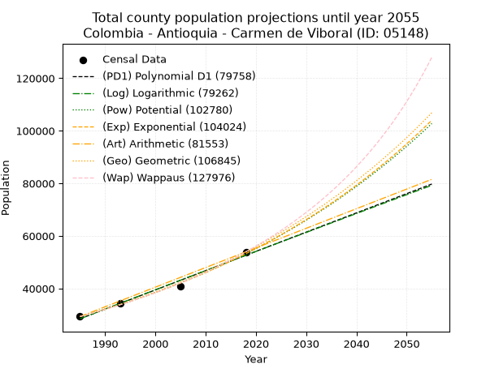
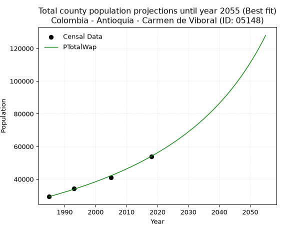
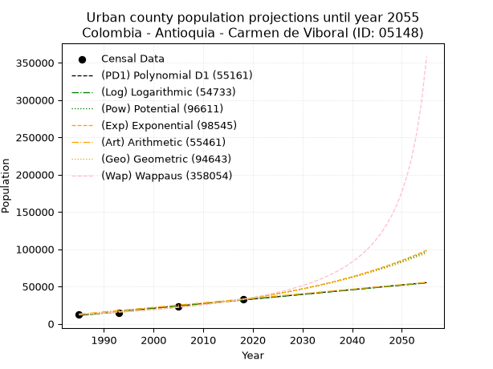
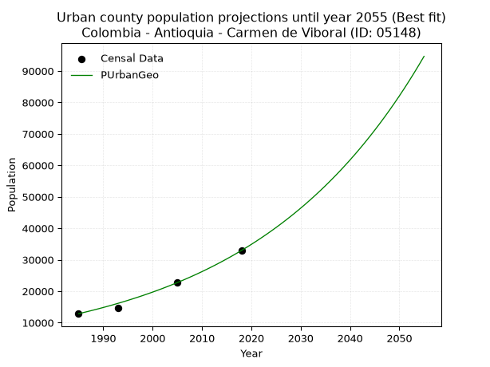
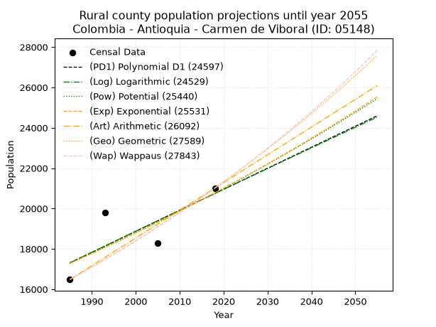
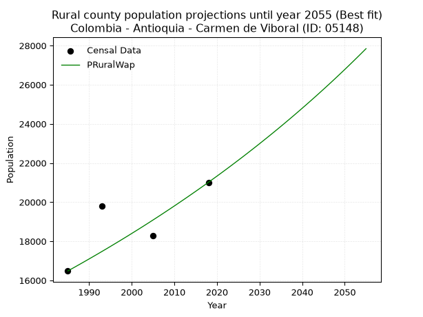

<div align="center">


</div>

# _“Population and Public Services Demand Projections (PPSD) until Year 2050 for Colombia - Antioquia - Carmen de Viboral (ID: 05148)”_
Keywords: `population` `public-service` `projection` `lineal` `polynomial` `logarithmic` `potential` `exponential` `arithmetic` `geometric` `wappaus` `dane` `colombia` `south-america`

PPSD are analytical estimates used by governments and planners to anticipate future changes in population size, age distribution, and the resulting community needs for utilities, healthcare, education, and infrastructure as sizing future water treatment facilities, electrical grids, and road networks based on spatial growth.

> **General running parameters**: • app_version: _v20260806_. • Python version: _3.14.7_. • Pandas version: _3.0.5_. • NumPy version: _2.5.1_. • Creates, save and include plots into reports (create_plot): _False_. • Projection until year: _2050_. • Process polynomial degree 2 and up: _False_. • Process Wappaus: _True_. • Process Wappaus: _True_. • Set negative values to zero: _True_. • Set infinite values to zero: _True_. • Drop dataset notes: _True_. 
<div align="center">

Dynamic map: [:earth_americas:Google](http://maps.google.com/maps?q=6.082884832,-75.333901) [:earth_americas:OSM](https://www.openstreetmap.org/#map=18/6.082884832/-75.333901&layers=P) [:earth_americas:Bing](https://www.bing.com/maps?cp=6.082884832~-75.333901&lvl=18) [:earth_americas:Apple](https://maps.apple.com/frame?center=6.082884832%2C-75.333901&span=0.003%2C0.006)

</div>


<div align="center">

```geojson
{
  "type": "Feature",
  "geometry": {
    "type": "Point", 
    "coordinates": [-75.333901, 6.082884832]
  }, 
  "properties": {
    "Name": "Colombia - Antioquia - Carmen de Viboral (ID: 05148)"
  }
}
```

</div>


## 0. Census Data (4 records)

Census data are official statistics collected by a government about the people and housing in a country. They usually include counts of total population, age, sex, race, income, education, and jobs.

📅Global census file: [Population.xlsx](../data/Population.xlsx)

| Source   |   Year |   CountryID | CountryName   |   StateID | StateName   |   CountyID | CountyName        |   PTotal |   PUrban |   PRural |
|:---------|-------:|------------:|:--------------|----------:|:------------|-----------:|:------------------|---------:|---------:|---------:|
| DANE     |   1985 |          57 | Colombia      |        05 | Antioquia   |      05148 | Carmen de Viboral |    29329 |    12848 |    16481 |
| DANE     |   1993 |          57 | Colombia      |        05 | Antioquia   |      05148 | Carmen de Viboral |    34352 |    14543 |    19809 |
| DANE     |   2005 |          57 | Colombia      |        05 | Antioquia   |      05148 | Carmen de Viboral |    41012 |    22731 |    18281 |
| DANE     |   2018 |          57 | Colombia      |        05 | Antioquia   |      05148 | Carmen de Viboral |    53949 |    32937 |    21012 |

> 🔥Some records could had specific notes about the registered values or the corresponding urban or rural distribution.

## 1. Total

### 1.1. Coefficients and Parameters

* (PD1) Polynomial Deg 1: 732.3685266960975, -1425259.645523869 (lineal)
* (Log) Logarithmic: 1465480.6399013952, -11099469.587515336
* (Pow) Potential: 36.20253943301979, -114.92029225873844
* (Exp) Exponential: 0.018088269151635236, 7.47826824554965e-12
* (Art) Arithmetic: Year diff. 2018 - 1985 = 33, Population diff. 53949 - 29329 = 24620, Annual growth = 746.060606060606
* (Geo) Geometric: Year diff. 2018 - 1985 = 33, Population diff. 53949 - 29329 = 24620, Annual growth % = 0.01864015516932338
* (Wap) Wappaus: i = 1.7917351666961407, Condition values only valid for < 200)

<sub>
Wappaus condition values: ['0.00', '1.79', '3.58', '5.38', '7.17', '8.96', '10.75', '12.54', '14.33', '16.13', '17.92', '19.71', '21.50', '23.29', '25.08', '26.88', '28.67', '30.46', '32.25', '34.04', '35.83', '37.63', '39.42', '41.21', '43.00', '44.79', '46.59', '48.38', '50.17', '51.96', '53.75', '55.54', '57.34', '59.13', '60.92', '62.71', '64.50', '66.29', '68.09', '69.88', '71.67', '73.46', '75.25', '77.04', '78.84', '80.63', '82.42', '84.21', '86.00', '87.80', '89.59', '91.38', '93.17', '94.96', '96.75', '98.55', '100.34', '102.13', '103.92', '105.71', '107.50', '109.30', '111.09', '112.88', '114.67', '116.46']
</sub>


### 1.2. Projected Dataset

|   Year |   CountyID |   PTotalPD1 |   PTotalLog |   PTotalPow |   PTotalExp |   PTotalArt |   PTotalGeo |   PTotalWap |
|-------:|-----------:|------------:|------------:|------------:|------------:|------------:|------------:|------------:|
|   1985 |      05148 |       28492 |       28473 |       29310 |       29325 |       29329 |       29329 |       29329 |
|   1986 |      05148 |       29224 |       29211 |       29849 |       29860 |       30075 |       29876 |       29859 |
|   1987 |      05148 |       29957 |       29949 |       30398 |       30405 |       30821 |       30433 |       30399 |
|   1988 |      05148 |       30689 |       30686 |       30957 |       30960 |       31567 |       31000 |       30949 |
|   1989 |      05148 |       31421 |       31423 |       31526 |       31525 |       32313 |       31578 |       31509 |
|   1990 |      05148 |       32154 |       32160 |       32105 |       32101 |       33059 |       32166 |       32080 |
|   1991 |      05148 |       32886 |       32896 |       32694 |       32687 |       33805 |       32766 |       32661 |
|   1992 |      05148 |       33618 |       33632 |       33294 |       33283 |       34551 |       33377 |       33254 |
|   1993 |      05148 |       34351 |       34368 |       33904 |       33891 |       35297 |       33999 |       33858 |
|   1994 |      05148 |       35083 |       35103 |       34525 |       34509 |       36044 |       34633 |       34473 |
|   1995 |      05148 |       35816 |       35838 |       35158 |       35139 |       36790 |       35278 |       35101 |
|   1996 |      05148 |       36548 |       36572 |       35801 |       35781 |       37536 |       35936 |       35741 |
|   1997 |      05148 |       37280 |       37306 |       36456 |       36434 |       38282 |       36606 |       36395 |
|   1998 |      05148 |       38013 |       38040 |       37123 |       37099 |       39028 |       37288 |       37061 |
|   1999 |      05148 |       38745 |       38773 |       37802 |       37776 |       39774 |       37983 |       37741 |
|   2000 |      05148 |       39477 |       39506 |       38493 |       38466 |       40520 |       38691 |       38435 |
|   2001 |      05148 |       40210 |       40238 |       39195 |       39168 |       41266 |       39412 |       39144 |
|   2002 |      05148 |       40942 |       40971 |       39911 |       39883 |       42012 |       40147 |       39867 |
|   2003 |      05148 |       41675 |       41702 |       40639 |       40611 |       42758 |       40895 |       40607 |
|   2004 |      05148 |       42407 |       42434 |       41380 |       41352 |       43504 |       41657 |       41362 |
|   2005 |      05148 |       43139 |       43165 |       42134 |       42107 |       44250 |       42434 |       42133 |
|   2006 |      05148 |       43872 |       43896 |       42902 |       42875 |       44996 |       43225 |       42922 |
|   2007 |      05148 |       44604 |       44626 |       43683 |       43658 |       45742 |       44031 |       43728 |
|   2008 |      05148 |       45336 |       45356 |       44478 |       44455 |       46488 |       44851 |       44552 |
|   2009 |      05148 |       46069 |       46086 |       45287 |       45266 |       47234 |       45687 |       45395 |
|   2010 |      05148 |       46801 |       46815 |       46110 |       46092 |       47981 |       46539 |       46258 |
|   2011 |      05148 |       47533 |       47544 |       46948 |       46934 |       48727 |       47406 |       47141 |
|   2012 |      05148 |       48266 |       48272 |       47800 |       47790 |       49473 |       48290 |       48044 |
|   2013 |      05148 |       48998 |       49001 |       48668 |       48663 |       50219 |       49190 |       48970 |
|   2014 |      05148 |       49731 |       49728 |       49551 |       49551 |       50965 |       50107 |       49917 |
|   2015 |      05148 |       50463 |       50456 |       50449 |       50455 |       51711 |       51041 |       50888 |
|   2016 |      05148 |       51195 |       51183 |       51364 |       51376 |       52457 |       51993 |       51883 |
|   2017 |      05148 |       51928 |       51910 |       52294 |       52314 |       53203 |       52962 |       52903 |
|   2018 |      05148 |       52660 |       52636 |       53241 |       53269 |       53949 |       53949 |       53949 |
|   2019 |      05148 |       53392 |       53362 |       54205 |       54241 |       54695 |       54955 |       55022 |
|   2020 |      05148 |       54125 |       54088 |       55185 |       55231 |       55441 |       55979 |       56123 |
|   2021 |      05148 |       54857 |       54813 |       56183 |       56239 |       56187 |       57022 |       57253 |
|   2022 |      05148 |       55590 |       55538 |       57198 |       57266 |       56933 |       58085 |       58413 |
|   2023 |      05148 |       56322 |       56263 |       58231 |       58311 |       57679 |       59168 |       59605 |
|   2024 |      05148 |       57054 |       56987 |       59282 |       59375 |       58425 |       60271 |       60829 |
|   2025 |      05148 |       57787 |       57711 |       60352 |       60459 |       59171 |       61394 |       62088 |
|   2026 |      05148 |       58519 |       58434 |       61440 |       61563 |       59917 |       62539 |       63382 |
|   2027 |      05148 |       59251 |       59157 |       62548 |       62687 |       60664 |       63705 |       64714 |
|   2028 |      05148 |       59984 |       59880 |       63675 |       63831 |       61410 |       64892 |       66084 |
|   2029 |      05148 |       60716 |       60603 |       64821 |       64996 |       62156 |       66102 |       67495 |
|   2030 |      05148 |       61448 |       61325 |       65988 |       66182 |       62902 |       67334 |       68949 |
|   2031 |      05148 |       62181 |       62047 |       67175 |       67390 |       63648 |       68589 |       70446 |
|   2032 |      05148 |       62913 |       62768 |       68383 |       68620 |       64394 |       69867 |       71990 |
|   2033 |      05148 |       63646 |       63489 |       69612 |       69873 |       65140 |       71170 |       73583 |
|   2034 |      05148 |       64378 |       64210 |       70862 |       71148 |       65886 |       72496 |       75226 |
|   2035 |      05148 |       65110 |       64930 |       72134 |       72447 |       66632 |       73848 |       76923 |
|   2036 |      05148 |       65843 |       65650 |       73429 |       73769 |       67378 |       75224 |       78675 |
|   2037 |      05148 |       66575 |       66369 |       74746 |       75116 |       68124 |       76626 |       80487 |
|   2038 |      05148 |       67307 |       67089 |       76086 |       76487 |       68870 |       78055 |       82360 |
|   2039 |      05148 |       68040 |       67808 |       77449 |       77883 |       69616 |       79510 |       84298 |
|   2040 |      05148 |       68772 |       68526 |       78836 |       79304 |       70362 |       80992 |       86305 |
|   2041 |      05148 |       69505 |       69244 |       80247 |       80752 |       71108 |       82501 |       88384 |
|   2042 |      05148 |       70237 |       69962 |       81683 |       82226 |       71854 |       84039 |       90539 |
|   2043 |      05148 |       70969 |       70680 |       83144 |       83727 |       72601 |       85606 |       92774 |
|   2044 |      05148 |       71702 |       71397 |       84630 |       85255 |       73347 |       87202 |       95095 |
|   2045 |      05148 |       72434 |       72114 |       86142 |       86811 |       74093 |       88827 |       97505 |
|   2046 |      05148 |       73166 |       72830 |       87680 |       88396 |       74839 |       90483 |      100010 |
|   2047 |      05148 |       73899 |       73546 |       89245 |       90009 |       75585 |       92169 |      102617 |
|   2048 |      05148 |       74631 |       74262 |       90837 |       91652 |       76331 |       93887 |      105330 |
|   2049 |      05148 |       75363 |       74977 |       92456 |       93325 |       77077 |       95637 |      108158 |
|   2050 |      05148 |       76096 |       75692 |       94104 |       95028 |       77823 |       97420 |      111107 |
<div align="center">

</img>

</div>


### 1.3. Best fit with absolute and relative error (%)

Relative error puts that difference into context by dividing the absolute error by the true value, creating a unitless ratio or percentage that shows the scale of the mistake.

Absolute and relative error

|   Year | Source   |   CountryID | CountryName   |   StateID | StateName   |   CountyID_x | CountyName        |   PTotal |   PUrban |   PRural |   CountyID_y |   PTotalPD1 |   PTotalLog |   PTotalPow |   PTotalExp |   PTotalArt |   PTotalGeo |   PTotalWap |   PTotalPD1AbsError |   PTotalLogAbsError |   PTotalPowAbsError |   PTotalExpAbsError |   PTotalArtAbsError |   PTotalGeoAbsError |   PTotalWapAbsError |   PTotalPD1RelError |   PTotalLogRelError |   PTotalPowRelError |   PTotalExpRelError |   PTotalArtRelError |   PTotalGeoRelError |   PTotalWapRelError |
|-------:|:---------|------------:|:--------------|----------:|:------------|-------------:|:------------------|---------:|---------:|---------:|-------------:|------------:|------------:|------------:|------------:|------------:|------------:|------------:|--------------------:|--------------------:|--------------------:|--------------------:|--------------------:|--------------------:|--------------------:|--------------------:|--------------------:|--------------------:|--------------------:|--------------------:|--------------------:|--------------------:|
|   1985 | DANE     |          57 | Colombia      |        05 | Antioquia   |        05148 | Carmen de Viboral |    29329 |    12848 |    16481 |        05148 |       28492 |       28473 |       29310 |       29325 |       29329 |       29329 |       29329 |                 837 |                 856 |                  19 |                   4 |                   0 |                   0 |                   0 |          2.85383    |           2.91861   |           0.0647823 |           0.0136384 |             0       |             0       |             0       |
|   1993 | DANE     |          57 | Colombia      |        05 | Antioquia   |        05148 | Carmen de Viboral |    34352 |    14543 |    19809 |        05148 |       34351 |       34368 |       33904 |       33891 |       35297 |       33999 |       33858 |                   1 |                  16 |                 448 |                 461 |                 945 |                 353 |                 494 |          0.00291104 |           0.0465766 |           1.30415   |           1.34199   |             2.75093 |             1.0276  |             1.43805 |
|   2005 | DANE     |          57 | Colombia      |        05 | Antioquia   |        05148 | Carmen de Viboral |    41012 |    22731 |    18281 |        05148 |       43139 |       43165 |       42134 |       42107 |       44250 |       42434 |       42133 |                2127 |                2153 |                1122 |                1095 |                3238 |                1422 |                1121 |          5.18629    |           5.24968   |           2.73578   |           2.66995   |             7.89525 |             3.46728 |             2.73335 |
|   2018 | DANE     |          57 | Colombia      |        05 | Antioquia   |        05148 | Carmen de Viboral |    53949 |    32937 |    21012 |        05148 |       52660 |       52636 |       53241 |       53269 |       53949 |       53949 |       53949 |                1289 |                1313 |                 708 |                 680 |                   0 |                   0 |                   0 |          2.38929    |           2.43378   |           1.31235   |           1.26045   |             0       |             0       |             0       |

Relative error mean

| Method    |   RelError | Best   |
|:----------|-----------:|:-------|
| PTotalPD1 |    2.60808 |        |
| PTotalLog |    2.66216 |        |
| PTotalPow |    1.35427 |        |
| PTotalExp |    1.32151 |        |
| PTotalArt |    2.66155 |        |
| PTotalGeo |    1.12372 |        |
| PTotalWap |    1.04285 | True   |

💙Best method: _**PTotalWap**_
<div align="center">

</img>

</div>


### 1.4. Fresh water supply demand in liters per capita per day (lpcd)

The fresh water supply demand typically ranges from 100 to 300 liters per capita per day (lpcd) for standard domestic and municipal planning, though absolute survival minimums set by the World Health Organization are as low as 7.5 to 20 liters per day, and total consumption in high-income nations can exceed 400 liters.

> `CZ`: Level in meters above the sea level (masl)<br> `WS`: Fresh water supply demand in liters per capita per day (lpcd or l/h/d)<br> `WSAll`: Zonal fresh water supply demand in liters per second (l/s)<br> `A`: Zonal area in square meters<br> `DP`: Population density (people/hectare)

Reference values (RAS Colombia)

|    CZ |   WS |
|------:|-----:|
|  1000 |  120 |
|  2000 |  130 |
| 99999 |  140 |

County shapefile geometry properties and water supply values

|   CountyID |      ATotal |   CZTotal |   WSTotal |
|-----------:|------------:|----------:|----------:|
|      05148 | 4.09128e+08 |   2122.08 |       140 |

Projected values for best method: PTotalWap

|   CountyID |   Year |   PTotalWap |   DPTotal |   WSTotal |   WSTotalAll |
|-----------:|-------:|------------:|----------:|----------:|-------------:|
|      05148 |   1985 |       29329 |      0.72 |       140 |      47.5238 |
|      05148 |   1986 |       29859 |      0.73 |       140 |      48.3826 |
|      05148 |   1987 |       30399 |      0.74 |       140 |      49.2576 |
|      05148 |   1988 |       30949 |      0.76 |       140 |      50.1488 |
|      05148 |   1989 |       31509 |      0.77 |       140 |      51.0562 |
|      05148 |   1990 |       32080 |      0.78 |       140 |      51.9815 |
|      05148 |   1991 |       32661 |      0.8  |       140 |      52.9229 |
|      05148 |   1992 |       33254 |      0.81 |       140 |      53.8838 |
|      05148 |   1993 |       33858 |      0.83 |       140 |      54.8625 |
|      05148 |   1994 |       34473 |      0.84 |       140 |      55.859  |
|      05148 |   1995 |       35101 |      0.86 |       140 |      56.8766 |
|      05148 |   1996 |       35741 |      0.87 |       140 |      57.9137 |
|      05148 |   1997 |       36395 |      0.89 |       140 |      58.9734 |
|      05148 |   1998 |       37061 |      0.91 |       140 |      60.0525 |
|      05148 |   1999 |       37741 |      0.92 |       140 |      61.1544 |
|      05148 |   2000 |       38435 |      0.94 |       140 |      62.2789 |
|      05148 |   2001 |       39144 |      0.96 |       140 |      63.4278 |
|      05148 |   2002 |       39867 |      0.97 |       140 |      64.5993 |
|      05148 |   2003 |       40607 |      0.99 |       140 |      65.7984 |
|      05148 |   2004 |       41362 |      1.01 |       140 |      67.0218 |
|      05148 |   2005 |       42133 |      1.03 |       140 |      68.2711 |
|      05148 |   2006 |       42922 |      1.05 |       140 |      69.5495 |
|      05148 |   2007 |       43728 |      1.07 |       140 |      70.8556 |
|      05148 |   2008 |       44552 |      1.09 |       140 |      72.1907 |
|      05148 |   2009 |       45395 |      1.11 |       140 |      73.5567 |
|      05148 |   2010 |       46258 |      1.13 |       140 |      74.9551 |
|      05148 |   2011 |       47141 |      1.15 |       140 |      76.3859 |
|      05148 |   2012 |       48044 |      1.17 |       140 |      77.8491 |
|      05148 |   2013 |       48970 |      1.2  |       140 |      79.3495 |
|      05148 |   2014 |       49917 |      1.22 |       140 |      80.884  |
|      05148 |   2015 |       50888 |      1.24 |       140 |      82.4574 |
|      05148 |   2016 |       51883 |      1.27 |       140 |      84.0697 |
|      05148 |   2017 |       52903 |      1.29 |       140 |      85.7225 |
|      05148 |   2018 |       53949 |      1.32 |       140 |      87.4174 |
|      05148 |   2019 |       55022 |      1.34 |       140 |      89.156  |
|      05148 |   2020 |       56123 |      1.37 |       140 |      90.94   |
|      05148 |   2021 |       57253 |      1.4  |       140 |      92.7711 |
|      05148 |   2022 |       58413 |      1.43 |       140 |      94.6507 |
|      05148 |   2023 |       59605 |      1.46 |       140 |      96.5822 |
|      05148 |   2024 |       60829 |      1.49 |       140 |      98.5655 |
|      05148 |   2025 |       62088 |      1.52 |       140 |     100.606  |
|      05148 |   2026 |       63382 |      1.55 |       140 |     102.702  |
|      05148 |   2027 |       64714 |      1.58 |       140 |     104.861  |
|      05148 |   2028 |       66084 |      1.62 |       140 |     107.081  |
|      05148 |   2029 |       67495 |      1.65 |       140 |     109.367  |
|      05148 |   2030 |       68949 |      1.69 |       140 |     111.723  |
|      05148 |   2031 |       70446 |      1.72 |       140 |     114.149  |
|      05148 |   2032 |       71990 |      1.76 |       140 |     116.65   |
|      05148 |   2033 |       73583 |      1.8  |       140 |     119.232  |
|      05148 |   2034 |       75226 |      1.84 |       140 |     121.894  |
|      05148 |   2035 |       76923 |      1.88 |       140 |     124.644  |
|      05148 |   2036 |       78675 |      1.92 |       140 |     127.483  |
|      05148 |   2037 |       80487 |      1.97 |       140 |     130.419  |
|      05148 |   2038 |       82360 |      2.01 |       140 |     133.454  |
|      05148 |   2039 |       84298 |      2.06 |       140 |     136.594  |
|      05148 |   2040 |       86305 |      2.11 |       140 |     139.846  |
|      05148 |   2041 |       88384 |      2.16 |       140 |     143.215  |
|      05148 |   2042 |       90539 |      2.21 |       140 |     146.707  |
|      05148 |   2043 |       92774 |      2.27 |       140 |     150.328  |
|      05148 |   2044 |       95095 |      2.32 |       140 |     154.089  |
|      05148 |   2045 |       97505 |      2.38 |       140 |     157.994  |
|      05148 |   2046 |      100010 |      2.44 |       140 |     162.053  |
|      05148 |   2047 |      102617 |      2.51 |       140 |     166.278  |
|      05148 |   2048 |      105330 |      2.57 |       140 |     170.674  |
|      05148 |   2049 |      108158 |      2.64 |       140 |     175.256  |
|      05148 |   2050 |      111107 |      2.72 |       140 |     180.034  |

## 2. Urban

### 2.1. Coefficients and Parameters

* (PD1) Polynomial Deg 1: 628.2380570052119, -1235868.4235246752 (lineal)
* (Log) Logarithmic: 1257013.596933281, -9533805.673364656
* (Pow) Potential: 59.52464922514467, -192.20893324434246
* (Exp) Exponential: 0.029741695585691875, 2.817800969797965e-22
* (Art) Arithmetic: Year diff. 2018 - 1985 = 33, Population diff. 32937 - 12848 = 20089, Annual growth = 608.7575757575758
* (Geo) Geometric: Year diff. 2018 - 1985 = 33, Population diff. 32937 - 12848 = 20089, Annual growth % = 0.028938337077005993
* (Wap) Wappaus: i = 2.659200942481493, Condition values only valid for < 200)

<sub>
Wappaus condition values: ['0.00', '2.66', '5.32', '7.98', '10.64', '13.30', '15.96', '18.61', '21.27', '23.93', '26.59', '29.25', '31.91', '34.57', '37.23', '39.89', '42.55', '45.21', '47.87', '50.52', '53.18', '55.84', '58.50', '61.16', '63.82', '66.48', '69.14', '71.80', '74.46', '77.12', '79.78', '82.44', '85.09', '87.75', '90.41', '93.07', '95.73', '98.39', '101.05', '103.71', '106.37', '109.03', '111.69', '114.35', '117.00', '119.66', '122.32', '124.98', '127.64', '130.30', '132.96', '135.62', '138.28', '140.94', '143.60', '146.26', '148.92', '151.57', '154.23', '156.89', '159.55', '162.21', '164.87', '167.53', '170.19', '172.85']
</sub>


### 2.2. Projected Dataset

|   Year |   CountyID |   PUrbanPD1 |   PUrbanLog |   PUrbanPow |   PUrbanExp |   PUrbanArt |   PUrbanGeo |   PUrbanWap |
|-------:|-----------:|------------:|------------:|------------:|------------:|------------:|------------:|------------:|
|   1985 |      05148 |       11184 |       11169 |       12277 |       12288 |       12848 |       12848 |       12848 |
|   1986 |      05148 |       11812 |       11802 |       12651 |       12659 |       13457 |       13220 |       13194 |
|   1987 |      05148 |       12441 |       12435 |       13036 |       13041 |       14066 |       13602 |       13550 |
|   1988 |      05148 |       13069 |       13067 |       13432 |       13434 |       14674 |       13996 |       13916 |
|   1989 |      05148 |       13697 |       13699 |       13840 |       13840 |       15283 |       14401 |       14291 |
|   1990 |      05148 |       14325 |       14331 |       14261 |       14258 |       15892 |       14818 |       14678 |
|   1991 |      05148 |       14954 |       14963 |       14694 |       14688 |       16501 |       15247 |       15076 |
|   1992 |      05148 |       15582 |       15594 |       15139 |       15132 |       17109 |       15688 |       15485 |
|   1993 |      05148 |       16210 |       16225 |       15598 |       15588 |       17718 |       16142 |       15907 |
|   1994 |      05148 |       16838 |       16855 |       16071 |       16059 |       18327 |       16609 |       16341 |
|   1995 |      05148 |       17467 |       17486 |       16558 |       16544 |       18936 |       17089 |       16788 |
|   1996 |      05148 |       18095 |       18116 |       17059 |       17043 |       19544 |       17584 |       17250 |
|   1997 |      05148 |       18723 |       18745 |       17576 |       17558 |       20153 |       18093 |       17726 |
|   1998 |      05148 |       19351 |       19374 |       18107 |       18088 |       20762 |       18616 |       18218 |
|   1999 |      05148 |       19979 |       20003 |       18655 |       18634 |       21371 |       19155 |       18725 |
|   2000 |      05148 |       20608 |       20632 |       19218 |       19196 |       21979 |       19710 |       19250 |
|   2001 |      05148 |       21236 |       21260 |       19799 |       19776 |       22588 |       20280 |       19792 |
|   2002 |      05148 |       21864 |       21888 |       20397 |       20373 |       23197 |       20867 |       20352 |
|   2003 |      05148 |       22492 |       22516 |       21012 |       20988 |       23806 |       21471 |       20933 |
|   2004 |      05148 |       23121 |       23144 |       21646 |       21621 |       24414 |       22092 |       21534 |
|   2005 |      05148 |       23749 |       23771 |       22298 |       22274 |       25023 |       22731 |       22156 |
|   2006 |      05148 |       24377 |       24397 |       22970 |       22947 |       25632 |       23389 |       22802 |
|   2007 |      05148 |       25005 |       25024 |       23661 |       23639 |       26241 |       24066 |       23472 |
|   2008 |      05148 |       25634 |       25650 |       24374 |       24353 |       26849 |       24762 |       24168 |
|   2009 |      05148 |       26262 |       26276 |       25107 |       25088 |       27458 |       25479 |       24891 |
|   2010 |      05148 |       26890 |       26901 |       25861 |       25846 |       28067 |       26216 |       25642 |
|   2011 |      05148 |       27518 |       27527 |       26639 |       26626 |       28676 |       26975 |       26424 |
|   2012 |      05148 |       28147 |       28152 |       27439 |       27430 |       29284 |       27755 |       27239 |
|   2013 |      05148 |       28775 |       28776 |       28262 |       28258 |       29893 |       28559 |       28088 |
|   2014 |      05148 |       29403 |       29401 |       29110 |       29111 |       30502 |       29385 |       28974 |
|   2015 |      05148 |       30031 |       30024 |       29983 |       29989 |       31111 |       30235 |       29899 |
|   2016 |      05148 |       30659 |       30648 |       30882 |       30895 |       31719 |       31110 |       30866 |
|   2017 |      05148 |       31288 |       31272 |       31807 |       31827 |       32328 |       32011 |       31877 |
|   2018 |      05148 |       31916 |       31895 |       32760 |       32788 |       32937 |       32937 |       32937 |
|   2019 |      05148 |       32544 |       32517 |       33740 |       33778 |       33546 |       33890 |       34048 |
|   2020 |      05148 |       33172 |       33140 |       34749 |       34798 |       34155 |       34871 |       35214 |
|   2021 |      05148 |       33801 |       33762 |       35788 |       35848 |       34763 |       35880 |       36440 |
|   2022 |      05148 |       34429 |       34384 |       36858 |       36931 |       35372 |       36918 |       37730 |
|   2023 |      05148 |       35057 |       35005 |       37959 |       38045 |       35981 |       37987 |       39089 |
|   2024 |      05148 |       35685 |       35626 |       39092 |       39194 |       36590 |       39086 |       40523 |
|   2025 |      05148 |       36314 |       36247 |       40258 |       40377 |       37198 |       40217 |       42039 |
|   2026 |      05148 |       36942 |       36868 |       41459 |       41596 |       37807 |       41381 |       43644 |
|   2027 |      05148 |       37570 |       37488 |       42695 |       42852 |       38416 |       42578 |       45345 |
|   2028 |      05148 |       38198 |       38108 |       43967 |       44145 |       39025 |       43810 |       47151 |
|   2029 |      05148 |       38827 |       38728 |       45276 |       45478 |       39633 |       45078 |       49074 |
|   2030 |      05148 |       39455 |       39347 |       46624 |       46851 |       40242 |       46383 |       51123 |
|   2031 |      05148 |       40083 |       39966 |       48011 |       48265 |       40851 |       47725 |       53313 |
|   2032 |      05148 |       40711 |       40585 |       49438 |       49722 |       41460 |       49106 |       55659 |
|   2033 |      05148 |       41340 |       41204 |       50908 |       51223 |       42068 |       50527 |       58176 |
|   2034 |      05148 |       41968 |       41822 |       52420 |       52770 |       42677 |       51989 |       60886 |
|   2035 |      05148 |       42596 |       42440 |       53976 |       54363 |       43286 |       53494 |       63811 |
|   2036 |      05148 |       43224 |       43057 |       55578 |       56004 |       43895 |       55042 |       66977 |
|   2037 |      05148 |       43852 |       43674 |       57226 |       57695 |       44503 |       56635 |       70416 |
|   2038 |      05148 |       44481 |       44291 |       58923 |       59436 |       45112 |       58273 |       74165 |
|   2039 |      05148 |       45109 |       44908 |       60669 |       61231 |       45721 |       59960 |       78267 |
|   2040 |      05148 |       45737 |       45524 |       62466 |       63079 |       46330 |       61695 |       82776 |
|   2041 |      05148 |       46365 |       46140 |       64315 |       64983 |       46938 |       63480 |       87753 |
|   2042 |      05148 |       46994 |       46756 |       66218 |       66945 |       47547 |       65317 |       93278 |
|   2043 |      05148 |       47622 |       47371 |       68176 |       68966 |       48156 |       67208 |       99444 |
|   2044 |      05148 |       48250 |       47987 |       70191 |       71048 |       48765 |       69152 |      106371 |
|   2045 |      05148 |       48878 |       48601 |       72264 |       73193 |       49373 |       71154 |      114209 |
|   2046 |      05148 |       49507 |       49216 |       74398 |       75402 |       49982 |       73213 |      123150 |
|   2047 |      05148 |       50135 |       49830 |       76594 |       77679 |       50591 |       75331 |      133445 |
|   2048 |      05148 |       50763 |       50444 |       78853 |       80024 |       51200 |       77511 |      145426 |
|   2049 |      05148 |       51391 |       51058 |       81178 |       82439 |       51808 |       79754 |      159544 |
|   2050 |      05148 |       52020 |       51671 |       83571 |       84928 |       52417 |       82062 |      176428 |
<div align="center">

</img>

</div>


### 2.3. Best fit with absolute and relative error (%)

Relative error puts that difference into context by dividing the absolute error by the true value, creating a unitless ratio or percentage that shows the scale of the mistake.

Absolute and relative error

|   Year | Source   |   CountryID | CountryName   |   StateID | StateName   |   CountyID_x | CountyName        |   PTotal |   PUrban |   PRural |   CountyID_y |   PUrbanPD1 |   PUrbanLog |   PUrbanPow |   PUrbanExp |   PUrbanArt |   PUrbanGeo |   PUrbanWap |   PUrbanPD1AbsError |   PUrbanLogAbsError |   PUrbanPowAbsError |   PUrbanExpAbsError |   PUrbanArtAbsError |   PUrbanGeoAbsError |   PUrbanWapAbsError |   PUrbanPD1RelError |   PUrbanLogRelError |   PUrbanPowRelError |   PUrbanExpRelError |   PUrbanArtRelError |   PUrbanGeoRelError |   PUrbanWapRelError |
|-------:|:---------|------------:|:--------------|----------:|:------------|-------------:|:------------------|---------:|---------:|---------:|-------------:|------------:|------------:|------------:|------------:|------------:|------------:|------------:|--------------------:|--------------------:|--------------------:|--------------------:|--------------------:|--------------------:|--------------------:|--------------------:|--------------------:|--------------------:|--------------------:|--------------------:|--------------------:|--------------------:|
|   1985 | DANE     |          57 | Colombia      |        05 | Antioquia   |        05148 | Carmen de Viboral |    29329 |    12848 |    16481 |        05148 |       11184 |       11169 |       12277 |       12288 |       12848 |       12848 |       12848 |                1664 |                1679 |                 571 |                 560 |                   0 |                   0 |                   0 |            12.9514  |            13.0682  |             4.44427 |            4.35866  |              0      |               0     |             0       |
|   1993 | DANE     |          57 | Colombia      |        05 | Antioquia   |        05148 | Carmen de Viboral |    34352 |    14543 |    19809 |        05148 |       16210 |       16225 |       15598 |       15588 |       17718 |       16142 |       15907 |                1667 |                1682 |                1055 |                1045 |                3175 |                1599 |                1364 |            11.4626  |            11.5657  |             7.25435 |            7.18559  |             21.8318 |              10.995 |             9.37908 |
|   2005 | DANE     |          57 | Colombia      |        05 | Antioquia   |        05148 | Carmen de Viboral |    41012 |    22731 |    18281 |        05148 |       23749 |       23771 |       22298 |       22274 |       25023 |       22731 |       22156 |                1018 |                1040 |                 433 |                 457 |                2292 |                   0 |                 575 |             4.47847 |             4.57525 |             1.90489 |            2.01047  |             10.0831 |               0     |             2.52959 |
|   2018 | DANE     |          57 | Colombia      |        05 | Antioquia   |        05148 | Carmen de Viboral |    53949 |    32937 |    21012 |        05148 |       31916 |       31895 |       32760 |       32788 |       32937 |       32937 |       32937 |                1021 |                1042 |                 177 |                 149 |                   0 |                   0 |                   0 |             3.09986 |             3.16362 |             0.53739 |            0.452379 |              0      |               0     |             0       |

Relative error mean

| Method    |   RelError | Best   |
|:----------|-----------:|:-------|
| PUrbanPD1 |    7.99808 |        |
| PUrbanLog |    8.09319 |        |
| PUrbanPow |    3.53522 |        |
| PUrbanExp |    3.50177 |        |
| PUrbanArt |    7.97874 |        |
| PUrbanGeo |    2.74875 | True   |
| PUrbanWap |    2.97717 |        |

💙Best method: _**PUrbanGeo**_
<div align="center">

</img>

</div>


### 2.4. Fresh water supply demand in liters per capita per day (lpcd)

The fresh water supply demand typically ranges from 100 to 300 liters per capita per day (lpcd) for standard domestic and municipal planning, though absolute survival minimums set by the World Health Organization are as low as 7.5 to 20 liters per day, and total consumption in high-income nations can exceed 400 liters.

> `CZ`: Level in meters above the sea level (masl)<br> `WS`: Fresh water supply demand in liters per capita per day (lpcd or l/h/d)<br> `WSAll`: Zonal fresh water supply demand in liters per second (l/s)<br> `A`: Zonal area in square meters<br> `DP`: Population density (people/hectare)

Reference values (RAS Colombia)

|    CZ |   WS |
|------:|-----:|
|  1000 |  120 |
|  2000 |  130 |
| 99999 |  140 |

County shapefile geometry properties and water supply values

|   CountyID |      AUrban |   CZUrban |   WSUrban |
|-----------:|------------:|----------:|----------:|
|      05148 | 3.25907e+06 |   2155.24 |       140 |

Projected values for best method: PUrbanGeo

|   CountyID |   Year |   PUrbanGeo |   DPUrban |   WSUrban |   WSUrbanAll |
|-----------:|-------:|------------:|----------:|----------:|-------------:|
|      05148 |   1985 |       12848 |     39.42 |       140 |      20.8185 |
|      05148 |   1986 |       13220 |     40.56 |       140 |      21.4213 |
|      05148 |   1987 |       13602 |     41.74 |       140 |      22.0403 |
|      05148 |   1988 |       13996 |     42.94 |       140 |      22.6787 |
|      05148 |   1989 |       14401 |     44.19 |       140 |      23.335  |
|      05148 |   1990 |       14818 |     45.47 |       140 |      24.0106 |
|      05148 |   1991 |       15247 |     46.78 |       140 |      24.7058 |
|      05148 |   1992 |       15688 |     48.14 |       140 |      25.4204 |
|      05148 |   1993 |       16142 |     49.53 |       140 |      26.156  |
|      05148 |   1994 |       16609 |     50.96 |       140 |      26.9127 |
|      05148 |   1995 |       17089 |     52.44 |       140 |      27.6905 |
|      05148 |   1996 |       17584 |     53.95 |       140 |      28.4926 |
|      05148 |   1997 |       18093 |     55.52 |       140 |      29.3174 |
|      05148 |   1998 |       18616 |     57.12 |       140 |      30.1648 |
|      05148 |   1999 |       19155 |     58.77 |       140 |      31.0382 |
|      05148 |   2000 |       19710 |     60.48 |       140 |      31.9375 |
|      05148 |   2001 |       20280 |     62.23 |       140 |      32.8611 |
|      05148 |   2002 |       20867 |     64.03 |       140 |      33.8123 |
|      05148 |   2003 |       21471 |     65.88 |       140 |      34.791  |
|      05148 |   2004 |       22092 |     67.79 |       140 |      35.7972 |
|      05148 |   2005 |       22731 |     69.75 |       140 |      36.8326 |
|      05148 |   2006 |       23389 |     71.77 |       140 |      37.8988 |
|      05148 |   2007 |       24066 |     73.84 |       140 |      38.9958 |
|      05148 |   2008 |       24762 |     75.98 |       140 |      40.1236 |
|      05148 |   2009 |       25479 |     78.18 |       140 |      41.2854 |
|      05148 |   2010 |       26216 |     80.44 |       140 |      42.4796 |
|      05148 |   2011 |       26975 |     82.77 |       140 |      43.7095 |
|      05148 |   2012 |       27755 |     85.16 |       140 |      44.9734 |
|      05148 |   2013 |       28559 |     87.63 |       140 |      46.2762 |
|      05148 |   2014 |       29385 |     90.16 |       140 |      47.6146 |
|      05148 |   2015 |       30235 |     92.77 |       140 |      48.9919 |
|      05148 |   2016 |       31110 |     95.46 |       140 |      50.4097 |
|      05148 |   2017 |       32011 |     98.22 |       140 |      51.8697 |
|      05148 |   2018 |       32937 |    101.06 |       140 |      53.3701 |
|      05148 |   2019 |       33890 |    103.99 |       140 |      54.9144 |
|      05148 |   2020 |       34871 |    107    |       140 |      56.5039 |
|      05148 |   2021 |       35880 |    110.09 |       140 |      58.1389 |
|      05148 |   2022 |       36918 |    113.28 |       140 |      59.8208 |
|      05148 |   2023 |       37987 |    116.56 |       140 |      61.553  |
|      05148 |   2024 |       39086 |    119.93 |       140 |      63.3338 |
|      05148 |   2025 |       40217 |    123.4  |       140 |      65.1664 |
|      05148 |   2026 |       41381 |    126.97 |       140 |      67.0525 |
|      05148 |   2027 |       42578 |    130.64 |       140 |      68.9921 |
|      05148 |   2028 |       43810 |    134.42 |       140 |      70.9884 |
|      05148 |   2029 |       45078 |    138.32 |       140 |      73.0431 |
|      05148 |   2030 |       46383 |    142.32 |       140 |      75.1576 |
|      05148 |   2031 |       47725 |    146.44 |       140 |      77.3322 |
|      05148 |   2032 |       49106 |    150.67 |       140 |      79.5699 |
|      05148 |   2033 |       50527 |    155.03 |       140 |      81.8725 |
|      05148 |   2034 |       51989 |    159.52 |       140 |      84.2414 |
|      05148 |   2035 |       53494 |    164.14 |       140 |      86.6801 |
|      05148 |   2036 |       55042 |    168.89 |       140 |      89.1884 |
|      05148 |   2037 |       56635 |    173.78 |       140 |      91.7697 |
|      05148 |   2038 |       58273 |    178.8  |       140 |      94.4238 |
|      05148 |   2039 |       59960 |    183.98 |       140 |      97.1574 |
|      05148 |   2040 |       61695 |    189.3  |       140 |      99.9688 |
|      05148 |   2041 |       63480 |    194.78 |       140 |     102.861  |
|      05148 |   2042 |       65317 |    200.42 |       140 |     105.838  |
|      05148 |   2043 |       67208 |    206.22 |       140 |     108.902  |
|      05148 |   2044 |       69152 |    212.18 |       140 |     112.052  |
|      05148 |   2045 |       71154 |    218.33 |       140 |     115.296  |
|      05148 |   2046 |       73213 |    224.64 |       140 |     118.632  |
|      05148 |   2047 |       75331 |    231.14 |       140 |     122.064  |
|      05148 |   2048 |       77511 |    237.83 |       140 |     125.597  |
|      05148 |   2049 |       79754 |    244.71 |       140 |     129.231  |
|      05148 |   2050 |       82062 |    251.8  |       140 |     132.971  |

## 3. Rural

### 3.1. Coefficients and Parameters

* (PD1) Polynomial Deg 1: 104.13046969088565, -189391.22199919404 (lineal)
* (Log) Logarithmic: 208467.04296811478, -1565663.9141506804
* (Pow) Potential: 11.15666699500079, -32.55442547744479
* (Exp) Exponential: 0.005572212235638399, 0.2716510048945224
* (Art) Arithmetic: Year diff. 2018 - 1985 = 33, Population diff. 21012 - 16481 = 4531, Annual growth = 137.3030303030303
* (Geo) Geometric: Year diff. 2018 - 1985 = 33, Population diff. 21012 - 16481 = 4531, Annual growth % = 0.007387319293992389
* (Wap) Wappaus: i = 0.7324195465981933, Condition values only valid for < 200)

<sub>
Wappaus condition values: ['0.00', '0.73', '1.46', '2.20', '2.93', '3.66', '4.39', '5.13', '5.86', '6.59', '7.32', '8.06', '8.79', '9.52', '10.25', '10.99', '11.72', '12.45', '13.18', '13.92', '14.65', '15.38', '16.11', '16.85', '17.58', '18.31', '19.04', '19.78', '20.51', '21.24', '21.97', '22.71', '23.44', '24.17', '24.90', '25.63', '26.37', '27.10', '27.83', '28.56', '29.30', '30.03', '30.76', '31.49', '32.23', '32.96', '33.69', '34.42', '35.16', '35.89', '36.62', '37.35', '38.09', '38.82', '39.55', '40.28', '41.02', '41.75', '42.48', '43.21', '43.95', '44.68', '45.41', '46.14', '46.87', '47.61']
</sub>


### 3.2. Projected Dataset

|   Year |   CountyID |   PRuralPD1 |   PRuralLog |   PRuralPow |   PRuralExp |   PRuralArt |   PRuralGeo |   PRuralWap |
|-------:|-----------:|------------:|------------:|------------:|------------:|------------:|------------:|------------:|
|   1985 |      05148 |       17308 |       17304 |       17282 |       17285 |       16481 |       16481 |       16481 |
|   1986 |      05148 |       17412 |       17409 |       17379 |       17382 |       16618 |       16603 |       16602 |
|   1987 |      05148 |       17516 |       17514 |       17477 |       17479 |       16756 |       16725 |       16724 |
|   1988 |      05148 |       17620 |       17619 |       17575 |       17577 |       16893 |       16849 |       16847 |
|   1989 |      05148 |       17724 |       17724 |       17674 |       17675 |       17030 |       16973 |       16971 |
|   1990 |      05148 |       17828 |       17829 |       17774 |       17774 |       17168 |       17099 |       17096 |
|   1991 |      05148 |       17933 |       17934 |       17874 |       17873 |       17305 |       17225 |       17222 |
|   1992 |      05148 |       18037 |       18038 |       17974 |       17973 |       17442 |       17352 |       17348 |
|   1993 |      05148 |       18141 |       18143 |       18075 |       18073 |       17579 |       17481 |       17476 |
|   1994 |      05148 |       18245 |       18247 |       18176 |       18174 |       17717 |       17610 |       17604 |
|   1995 |      05148 |       18349 |       18352 |       18278 |       18276 |       17854 |       17740 |       17734 |
|   1996 |      05148 |       18453 |       18456 |       18381 |       18378 |       17991 |       17871 |       17865 |
|   1997 |      05148 |       18557 |       18561 |       18484 |       18480 |       18129 |       18003 |       17996 |
|   1998 |      05148 |       18661 |       18665 |       18587 |       18584 |       18266 |       18136 |       18129 |
|   1999 |      05148 |       18766 |       18769 |       18691 |       18688 |       18403 |       18270 |       18262 |
|   2000 |      05148 |       18870 |       18874 |       18796 |       18792 |       18541 |       18405 |       18397 |
|   2001 |      05148 |       18974 |       18978 |       18901 |       18897 |       18678 |       18541 |       18533 |
|   2002 |      05148 |       19078 |       19082 |       19007 |       19003 |       18815 |       18678 |       18669 |
|   2003 |      05148 |       19182 |       19186 |       19113 |       19109 |       18952 |       18816 |       18807 |
|   2004 |      05148 |       19286 |       19290 |       19220 |       19216 |       19090 |       18955 |       18946 |
|   2005 |      05148 |       19390 |       19394 |       19327 |       19323 |       19227 |       19095 |       19086 |
|   2006 |      05148 |       19495 |       19498 |       19435 |       19431 |       19364 |       19236 |       19227 |
|   2007 |      05148 |       19599 |       19602 |       19543 |       19539 |       19502 |       19378 |       19369 |
|   2008 |      05148 |       19703 |       19706 |       19652 |       19649 |       19639 |       19521 |       19513 |
|   2009 |      05148 |       19807 |       19810 |       19762 |       19758 |       19776 |       19665 |       19657 |
|   2010 |      05148 |       19911 |       19913 |       19872 |       19869 |       19914 |       19811 |       19803 |
|   2011 |      05148 |       20015 |       20017 |       19982 |       19980 |       20051 |       19957 |       19950 |
|   2012 |      05148 |       20119 |       20121 |       20093 |       20092 |       20188 |       20104 |       20098 |
|   2013 |      05148 |       20223 |       20224 |       20205 |       20204 |       20325 |       20253 |       20247 |
|   2014 |      05148 |       20328 |       20328 |       20317 |       20317 |       20463 |       20402 |       20398 |
|   2015 |      05148 |       20432 |       20431 |       20430 |       20430 |       20600 |       20553 |       20549 |
|   2016 |      05148 |       20536 |       20535 |       20544 |       20544 |       20737 |       20705 |       20702 |
|   2017 |      05148 |       20640 |       20638 |       20657 |       20659 |       20875 |       20858 |       20856 |
|   2018 |      05148 |       20744 |       20742 |       20772 |       20775 |       21012 |       21012 |       21012 |
|   2019 |      05148 |       20848 |       20845 |       20887 |       20891 |       21149 |       21167 |       21169 |
|   2020 |      05148 |       20952 |       20948 |       21003 |       21007 |       21287 |       21324 |       21327 |
|   2021 |      05148 |       21056 |       21051 |       21119 |       21125 |       21424 |       21481 |       21486 |
|   2022 |      05148 |       21161 |       21154 |       21236 |       21243 |       21561 |       21640 |       21647 |
|   2023 |      05148 |       21265 |       21257 |       21354 |       21362 |       21699 |       21800 |       21809 |
|   2024 |      05148 |       21369 |       21360 |       21472 |       21481 |       21836 |       21961 |       21973 |
|   2025 |      05148 |       21473 |       21463 |       21590 |       21601 |       21973 |       22123 |       22138 |
|   2026 |      05148 |       21577 |       21566 |       21709 |       21722 |       22110 |       22286 |       22304 |
|   2027 |      05148 |       21681 |       21669 |       21829 |       21843 |       22248 |       22451 |       22472 |
|   2028 |      05148 |       21785 |       21772 |       21950 |       21965 |       22385 |       22617 |       22642 |
|   2029 |      05148 |       21890 |       21875 |       22071 |       22088 |       22522 |       22784 |       22812 |
|   2030 |      05148 |       21994 |       21978 |       22193 |       22211 |       22660 |       22952 |       22985 |
|   2031 |      05148 |       22098 |       22080 |       22315 |       22335 |       22797 |       23122 |       23159 |
|   2032 |      05148 |       22202 |       22183 |       22438 |       22460 |       22934 |       23293 |       23334 |
|   2033 |      05148 |       22306 |       22285 |       22561 |       22586 |       23072 |       23465 |       23511 |
|   2034 |      05148 |       22410 |       22388 |       22685 |       22712 |       23209 |       23638 |       23689 |
|   2035 |      05148 |       22514 |       22490 |       22810 |       22839 |       23346 |       23813 |       23869 |
|   2036 |      05148 |       22618 |       22593 |       22935 |       22966 |       23483 |       23989 |       24051 |
|   2037 |      05148 |       22723 |       22695 |       23061 |       23095 |       23621 |       24166 |       24234 |
|   2038 |      05148 |       22827 |       22797 |       23188 |       23224 |       23758 |       24344 |       24419 |
|   2039 |      05148 |       22931 |       22900 |       23315 |       23354 |       23895 |       24524 |       24606 |
|   2040 |      05148 |       23035 |       23002 |       23443 |       23484 |       24033 |       24705 |       24795 |
|   2041 |      05148 |       23139 |       23104 |       23572 |       23615 |       24170 |       24888 |       24985 |
|   2042 |      05148 |       23243 |       23206 |       23701 |       23747 |       24307 |       25072 |       25177 |
|   2043 |      05148 |       23347 |       23308 |       23831 |       23880 |       24445 |       25257 |       25370 |
|   2044 |      05148 |       23451 |       23410 |       23961 |       24013 |       24582 |       25443 |       25566 |
|   2045 |      05148 |       23556 |       23512 |       24092 |       24148 |       24719 |       25631 |       25763 |
|   2046 |      05148 |       23660 |       23614 |       24224 |       24282 |       24856 |       25821 |       25962 |
|   2047 |      05148 |       23764 |       23716 |       24356 |       24418 |       24994 |       26011 |       26163 |
|   2048 |      05148 |       23868 |       23818 |       24490 |       24555 |       25131 |       26204 |       26366 |
|   2049 |      05148 |       23972 |       23920 |       24623 |       24692 |       25268 |       26397 |       26571 |
|   2050 |      05148 |       24076 |       24021 |       24758 |       24830 |       25406 |       26592 |       26778 |
<div align="center">

</img>

</div>


### 3.3. Best fit with absolute and relative error (%)

Relative error puts that difference into context by dividing the absolute error by the true value, creating a unitless ratio or percentage that shows the scale of the mistake.

Absolute and relative error

|   Year | Source   |   CountryID | CountryName   |   StateID | StateName   |   CountyID_x | CountyName        |   PTotal |   PUrban |   PRural |   CountyID_y |   PRuralPD1 |   PRuralLog |   PRuralPow |   PRuralExp |   PRuralArt |   PRuralGeo |   PRuralWap |   PRuralPD1AbsError |   PRuralLogAbsError |   PRuralPowAbsError |   PRuralExpAbsError |   PRuralArtAbsError |   PRuralGeoAbsError |   PRuralWapAbsError |   PRuralPD1RelError |   PRuralLogRelError |   PRuralPowRelError |   PRuralExpRelError |   PRuralArtRelError |   PRuralGeoRelError |   PRuralWapRelError |
|-------:|:---------|------------:|:--------------|----------:|:------------|-------------:|:------------------|---------:|---------:|---------:|-------------:|------------:|------------:|------------:|------------:|------------:|------------:|------------:|--------------------:|--------------------:|--------------------:|--------------------:|--------------------:|--------------------:|--------------------:|--------------------:|--------------------:|--------------------:|--------------------:|--------------------:|--------------------:|--------------------:|
|   1985 | DANE     |          57 | Colombia      |        05 | Antioquia   |        05148 | Carmen de Viboral |    29329 |    12848 |    16481 |        05148 |       17308 |       17304 |       17282 |       17285 |       16481 |       16481 |       16481 |                 827 |                 823 |                 801 |                 804 |                   0 |                   0 |                   0 |             5.0179  |             4.99363 |             4.86014 |             4.87834 |             0       |             0       |             0       |
|   1993 | DANE     |          57 | Colombia      |        05 | Antioquia   |        05148 | Carmen de Viboral |    34352 |    14543 |    19809 |        05148 |       18141 |       18143 |       18075 |       18073 |       17579 |       17481 |       17476 |                1668 |                1666 |                1734 |                1736 |                2230 |                2328 |                2333 |             8.42041 |             8.41032 |             8.7536  |             8.76369 |            11.2575  |            11.7522  |            11.7775  |
|   2005 | DANE     |          57 | Colombia      |        05 | Antioquia   |        05148 | Carmen de Viboral |    41012 |    22731 |    18281 |        05148 |       19390 |       19394 |       19327 |       19323 |       19227 |       19095 |       19086 |                1109 |                1113 |                1046 |                1042 |                 946 |                 814 |                 805 |             6.06641 |             6.08829 |             5.72179 |             5.69991 |             5.17477 |             4.45271 |             4.40348 |
|   2018 | DANE     |          57 | Colombia      |        05 | Antioquia   |        05148 | Carmen de Viboral |    53949 |    32937 |    21012 |        05148 |       20744 |       20742 |       20772 |       20775 |       21012 |       21012 |       21012 |                 268 |                 270 |                 240 |                 237 |                   0 |                   0 |                   0 |             1.27546 |             1.28498 |             1.1422  |             1.12793 |             0       |             0       |             0       |

Relative error mean

| Method    |   RelError | Best   |
|:----------|-----------:|:-------|
| PRuralPD1 |    5.19505 |        |
| PRuralLog |    5.1943  |        |
| PRuralPow |    5.11943 |        |
| PRuralExp |    5.11747 |        |
| PRuralArt |    4.10807 |        |
| PRuralGeo |    4.05124 |        |
| PRuralWap |    4.04524 | True   |

💙Best method: _**PRuralWap**_
<div align="center">

</img>

</div>


### 3.4. Fresh water supply demand in liters per capita per day (lpcd)

The fresh water supply demand typically ranges from 100 to 300 liters per capita per day (lpcd) for standard domestic and municipal planning, though absolute survival minimums set by the World Health Organization are as low as 7.5 to 20 liters per day, and total consumption in high-income nations can exceed 400 liters.

> `CZ`: Level in meters above the sea level (masl)<br> `WS`: Fresh water supply demand in liters per capita per day (lpcd or l/h/d)<br> `WSAll`: Zonal fresh water supply demand in liters per second (l/s)<br> `A`: Zonal area in square meters<br> `DP`: Population density (people/hectare)

Reference values (RAS Colombia)

|    CZ |   WS |
|------:|-----:|
|  1000 |  120 |
|  2000 |  130 |
| 99999 |  140 |

County shapefile geometry properties and water supply values

|   CountyID |      ARural |   CZRural |   WSRural |
|-----------:|------------:|----------:|----------:|
|      05148 | 4.05869e+08 |   2121.81 |       140 |

Projected values for best method: PRuralWap

|   CountyID |   Year |   PRuralWap |   DPRural |   WSRural |   WSRuralAll |
|-----------:|-------:|------------:|----------:|----------:|-------------:|
|      05148 |   1985 |       16481 |      0.41 |       140 |      26.7053 |
|      05148 |   1986 |       16602 |      0.41 |       140 |      26.9014 |
|      05148 |   1987 |       16724 |      0.41 |       140 |      27.0991 |
|      05148 |   1988 |       16847 |      0.42 |       140 |      27.2984 |
|      05148 |   1989 |       16971 |      0.42 |       140 |      27.4993 |
|      05148 |   1990 |       17096 |      0.42 |       140 |      27.7019 |
|      05148 |   1991 |       17222 |      0.42 |       140 |      27.906  |
|      05148 |   1992 |       17348 |      0.43 |       140 |      28.1102 |
|      05148 |   1993 |       17476 |      0.43 |       140 |      28.3176 |
|      05148 |   1994 |       17604 |      0.43 |       140 |      28.525  |
|      05148 |   1995 |       17734 |      0.44 |       140 |      28.7356 |
|      05148 |   1996 |       17865 |      0.44 |       140 |      28.9479 |
|      05148 |   1997 |       17996 |      0.44 |       140 |      29.1602 |
|      05148 |   1998 |       18129 |      0.45 |       140 |      29.3757 |
|      05148 |   1999 |       18262 |      0.45 |       140 |      29.5912 |
|      05148 |   2000 |       18397 |      0.45 |       140 |      29.81   |
|      05148 |   2001 |       18533 |      0.46 |       140 |      30.0303 |
|      05148 |   2002 |       18669 |      0.46 |       140 |      30.2507 |
|      05148 |   2003 |       18807 |      0.46 |       140 |      30.4743 |
|      05148 |   2004 |       18946 |      0.47 |       140 |      30.6995 |
|      05148 |   2005 |       19086 |      0.47 |       140 |      30.9264 |
|      05148 |   2006 |       19227 |      0.47 |       140 |      31.1549 |
|      05148 |   2007 |       19369 |      0.48 |       140 |      31.385  |
|      05148 |   2008 |       19513 |      0.48 |       140 |      31.6183 |
|      05148 |   2009 |       19657 |      0.48 |       140 |      31.8516 |
|      05148 |   2010 |       19803 |      0.49 |       140 |      32.0882 |
|      05148 |   2011 |       19950 |      0.49 |       140 |      32.3264 |
|      05148 |   2012 |       20098 |      0.5  |       140 |      32.5662 |
|      05148 |   2013 |       20247 |      0.5  |       140 |      32.8076 |
|      05148 |   2014 |       20398 |      0.5  |       140 |      33.0523 |
|      05148 |   2015 |       20549 |      0.51 |       140 |      33.297  |
|      05148 |   2016 |       20702 |      0.51 |       140 |      33.5449 |
|      05148 |   2017 |       20856 |      0.51 |       140 |      33.7944 |
|      05148 |   2018 |       21012 |      0.52 |       140 |      34.0472 |
|      05148 |   2019 |       21169 |      0.52 |       140 |      34.3016 |
|      05148 |   2020 |       21327 |      0.53 |       140 |      34.5576 |
|      05148 |   2021 |       21486 |      0.53 |       140 |      34.8153 |
|      05148 |   2022 |       21647 |      0.53 |       140 |      35.0762 |
|      05148 |   2023 |       21809 |      0.54 |       140 |      35.3387 |
|      05148 |   2024 |       21973 |      0.54 |       140 |      35.6044 |
|      05148 |   2025 |       22138 |      0.55 |       140 |      35.8718 |
|      05148 |   2026 |       22304 |      0.55 |       140 |      36.1407 |
|      05148 |   2027 |       22472 |      0.55 |       140 |      36.413  |
|      05148 |   2028 |       22642 |      0.56 |       140 |      36.6884 |
|      05148 |   2029 |       22812 |      0.56 |       140 |      36.9639 |
|      05148 |   2030 |       22985 |      0.57 |       140 |      37.2442 |
|      05148 |   2031 |       23159 |      0.57 |       140 |      37.5262 |
|      05148 |   2032 |       23334 |      0.57 |       140 |      37.8097 |
|      05148 |   2033 |       23511 |      0.58 |       140 |      38.0965 |
|      05148 |   2034 |       23689 |      0.58 |       140 |      38.385  |
|      05148 |   2035 |       23869 |      0.59 |       140 |      38.6766 |
|      05148 |   2036 |       24051 |      0.59 |       140 |      38.9715 |
|      05148 |   2037 |       24234 |      0.6  |       140 |      39.2681 |
|      05148 |   2038 |       24419 |      0.6  |       140 |      39.5678 |
|      05148 |   2039 |       24606 |      0.61 |       140 |      39.8708 |
|      05148 |   2040 |       24795 |      0.61 |       140 |      40.1771 |
|      05148 |   2041 |       24985 |      0.62 |       140 |      40.485  |
|      05148 |   2042 |       25177 |      0.62 |       140 |      40.7961 |
|      05148 |   2043 |       25370 |      0.63 |       140 |      41.1088 |
|      05148 |   2044 |       25566 |      0.63 |       140 |      41.4264 |
|      05148 |   2045 |       25763 |      0.63 |       140 |      41.7456 |
|      05148 |   2046 |       25962 |      0.64 |       140 |      42.0681 |
|      05148 |   2047 |       26163 |      0.64 |       140 |      42.3937 |
|      05148 |   2048 |       26366 |      0.65 |       140 |      42.7227 |
|      05148 |   2049 |       26571 |      0.65 |       140 |      43.0549 |
|      05148 |   2050 |       26778 |      0.66 |       140 |      43.3903 |

<div align="center"><br><sub>Share this research</sub></div><br>

<sub>**APPS & TOOLS & CONTENT DISCLAIMER**: • NO WARRANTY - This content and software is provided by <a href="https://github.com/rcfdtools" target="_blank">github.com/rcfdtools</a> "as is", without any express or implied warranty, including warranties of merchantability, fitness for a particular purpose, or non-infringement. There is no guarantee that the software will be error-free or operate without interruption. • LIMITATION OF LIABILITY - Neither the authors nor copyright holders will be liable for claims or damages arising from the software or its use. You are responsible for determining if the software is appropriate for your use and assume all associated risks, including errors, legal compliance, and data loss. • NO PROFESSIONAL ADVICE - The software provides general information and does not offer professional advice. It should not replace consultation with professional advisors. [Clauses and global license for rcfdtools use.](https://github.com/rcfdtools/rcfdtools/blob/main/LICENSE.md)</sub>

| [:house: Home](Readme.md)  | [:beginner: Help / Collaborate](https://github.com/rcfdtools/R.HydroTools/discussions/31) |
|----------------------------|-------------------------------------------------------------------------------------------|