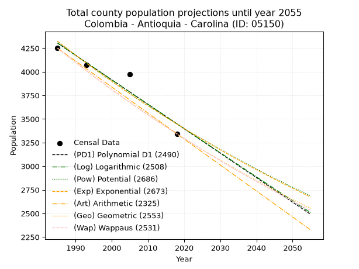
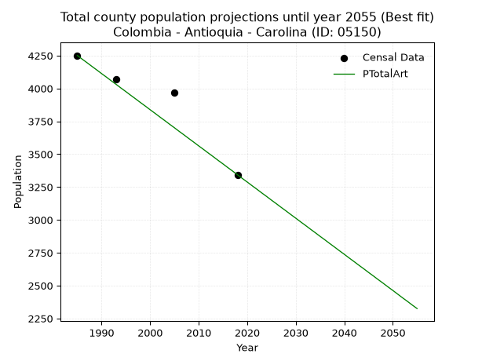
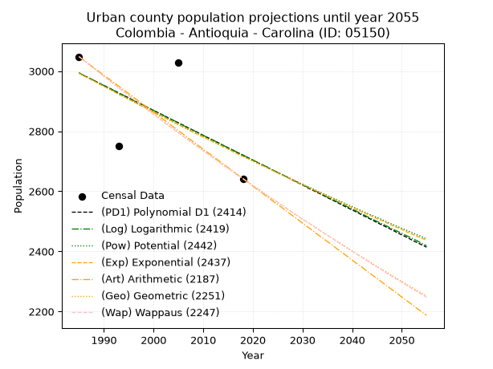
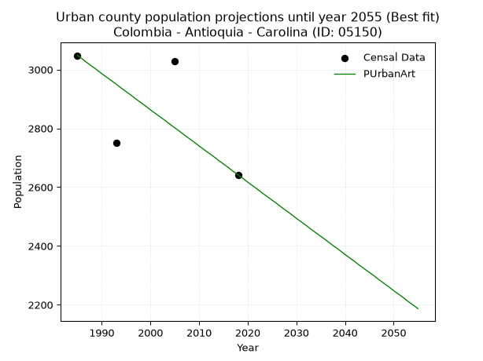
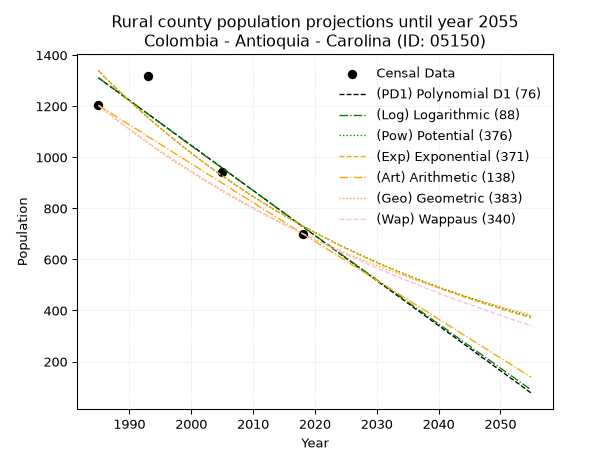
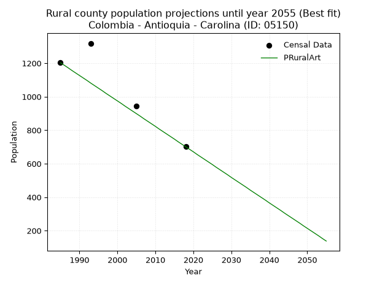

<div align="center">


</div>

# _“Population and Public Services Demand Projections (PPSD) until Year 2050 for Colombia - Antioquia - Carolina (ID: 05150)”_
Keywords: `population` `public-service` `projection` `lineal` `polynomial` `logarithmic` `potential` `exponential` `arithmetic` `geometric` `wappaus` `dane` `colombia` `south-america`

PPSD are analytical estimates used by governments and planners to anticipate future changes in population size, age distribution, and the resulting community needs for utilities, healthcare, education, and infrastructure as sizing future water treatment facilities, electrical grids, and road networks based on spatial growth.

> **General running parameters**: • app_version: _v20260806_. • Python version: _3.14.7_. • Pandas version: _3.0.5_. • NumPy version: _2.5.1_. • Creates, save and include plots into reports (create_plot): _False_. • Projection until year: _2050_. • Process polynomial degree 2 and up: _False_. • Process Wappaus: _True_. • Process Wappaus: _True_. • Set negative values to zero: _True_. • Set infinite values to zero: _True_. • Drop dataset notes: _True_. 
<div align="center">

Dynamic map: [:earth_americas:Google](http://maps.google.com/maps?q=6.725995072,-75.283192) [:earth_americas:OSM](https://www.openstreetmap.org/#map=18/6.725995072/-75.283192&layers=P) [:earth_americas:Bing](https://www.bing.com/maps?cp=6.725995072~-75.283192&lvl=18) [:earth_americas:Apple](https://maps.apple.com/frame?center=6.725995072%2C-75.283192&span=0.003%2C0.006)

</div>


<div align="center">

```geojson
{
  "type": "Feature",
  "geometry": {
    "type": "Point", 
    "coordinates": [-75.283192, 6.725995072]
  }, 
  "properties": {
    "Name": "Colombia - Antioquia - Carolina (ID: 05150)"
  }
}
```

</div>


## 0. Census Data (4 records)

Census data are official statistics collected by a government about the people and housing in a country. They usually include counts of total population, age, sex, race, income, education, and jobs.

📅Global census file: [Population.xlsx](../data/Population.xlsx)

| Source   |   Year |   CountryID | CountryName   |   StateID | StateName   |   CountyID | CountyName   |   PTotal |   PUrban |   PRural |
|:---------|-------:|------------:|:--------------|----------:|:------------|-----------:|:-------------|---------:|---------:|---------:|
| DANE     |   1985 |          57 | Colombia      |        05 | Antioquia   |      05150 | Carolina     |     4251 |     3048 |     1203 |
| DANE     |   1993 |          57 | Colombia      |        05 | Antioquia   |      05150 | Carolina     |     4071 |     2752 |     1319 |
| DANE     |   2005 |          57 | Colombia      |        05 | Antioquia   |      05150 | Carolina     |     3971 |     3027 |      944 |
| DANE     |   2018 |          57 | Colombia      |        05 | Antioquia   |      05150 | Carolina     |     3343 |     2642 |      701 |

> 🔥Some records could had specific notes about the registered values or the corresponding urban or rural distribution.

**Local public utility companies (RUPS)**

 | SERVICIO       | ESTADO    | NOMBRE                                                                                      | NIT         | DEPARTAMENTO_DOMICILIO   | MUNICIPIO_DOMICILIO   | DIRECCION           |   TELEFONO | EMAIL                                                  | TIPO_INSCRIPCION    | REPRESENTANTE_LEGAL         | TIPO_PRESTADOR                 | CLASIFICACION                 |
|:---------------|:----------|:--------------------------------------------------------------------------------------------|:------------|:-------------------------|:----------------------|:--------------------|-----------:|:-------------------------------------------------------|:--------------------|:----------------------------|:-------------------------------|:------------------------------|
| ACUEDUCTO      | OPERATIVA | UNIDAD ADMINISTRATIVA ESPECIAL DE SERVICIOS PUBLICOS DOMICILIARIOS DE CAROLINA DEL PRINCIPE | 890984068-1 | ANTIOQUIA                | CAROLINA              | Carrera 50 Nº 49-59 |    8634033 | serviciospublicos@carolinadelprincipe-antioquia.gov.co | Registro por la ESP | CARLOS ANDRES PEREZ VASQUEZ | MUNICIPIO (PRESTACIÓN DIRECTA) | MENOR O IGUAL A 2500 USUARIOS |
| ALCANTARILLADO | OPERATIVA | UNIDAD ADMINISTRATIVA ESPECIAL DE SERVICIOS PUBLICOS DOMICILIARIOS DE CAROLINA DEL PRINCIPE | 890984068-1 | ANTIOQUIA                | CAROLINA              | Carrera 50 Nº 49-59 |    8634033 | serviciospublicos@carolinadelprincipe-antioquia.gov.co | Registro por la ESP | CARLOS ANDRES PEREZ VASQUEZ | MUNICIPIO (PRESTACIÓN DIRECTA) | MENOR O IGUAL A 2500 USUARIOS |
| ASEO           | OPERATIVA | UNIDAD ADMINISTRATIVA ESPECIAL DE SERVICIOS PUBLICOS DOMICILIARIOS DE CAROLINA DEL PRINCIPE | 890984068-1 | ANTIOQUIA                | CAROLINA              | Carrera 50 Nº 49-59 |    8634033 | serviciospublicos@carolinadelprincipe-antioquia.gov.co | Registro por la ESP | CARLOS ANDRES PEREZ VASQUEZ | MUNICIPIO (PRESTACIÓN DIRECTA) | MENOR O IGUAL A 2500 USUARIOS |

> [📅RUPS Database: Registro Único de Prestadores de Servicios Públicos de Colombia Suramérica - RUPS](https://www.datos.gov.co/Hacienda-y-Cr-dito-P-blico/Registro-nico-de-Prestadores-de-Servicios-P-blicos/4qkq-csdn/about_data)

## 1. Total

### 1.1. Coefficients and Parameters

* (PD1) Polynomial Deg 1: -25.920513849859102, 55756.50782818066 (lineal)
* (Log) Logarithmic: -51848.609010650056, 398010.6925786279
* (Pow) Potential: -13.730584906271128, 48.916009181973536
* (Exp) Exponential: -0.006864780573725973, 3578698383.424176
* (Art) Arithmetic: Year diff. 2018 - 1985 = 33, Population diff. 3343 - 4251 = -908, Annual growth = -27.515151515151516
* (Geo) Geometric: Year diff. 2018 - 1985 = 33, Population diff. 3343 - 4251 = -908, Annual growth % = -0.007254938043636305
* (Wap) Wappaus: i = -0.7246550306861078, Condition values only valid for < 200)

<sub>
Wappaus condition values: ['-0.00', '-0.72', '-1.45', '-2.17', '-2.90', '-3.62', '-4.35', '-5.07', '-5.80', '-6.52', '-7.25', '-7.97', '-8.70', '-9.42', '-10.15', '-10.87', '-11.59', '-12.32', '-13.04', '-13.77', '-14.49', '-15.22', '-15.94', '-16.67', '-17.39', '-18.12', '-18.84', '-19.57', '-20.29', '-21.01', '-21.74', '-22.46', '-23.19', '-23.91', '-24.64', '-25.36', '-26.09', '-26.81', '-27.54', '-28.26', '-28.99', '-29.71', '-30.44', '-31.16', '-31.88', '-32.61', '-33.33', '-34.06', '-34.78', '-35.51', '-36.23', '-36.96', '-37.68', '-38.41', '-39.13', '-39.86', '-40.58', '-41.31', '-42.03', '-42.75', '-43.48', '-44.20', '-44.93', '-45.65', '-46.38', '-47.10']
</sub>


### 1.2. Projected Dataset

|   Year |   CountyID |   PTotalPD1 |   PTotalLog |   PTotalPow |   PTotalExp |   PTotalArt |   PTotalGeo |   PTotalWap |
|-------:|-----------:|------------:|------------:|------------:|------------:|------------:|------------:|------------:|
|   1985 |      05150 |        4304 |        4305 |        4323 |        4323 |        4251 |        4251 |        4251 |
|   1986 |      05150 |        4278 |        4279 |        4294 |        4293 |        4223 |        4220 |        4220 |
|   1987 |      05150 |        4252 |        4253 |        4264 |        4264 |        4196 |        4190 |        4190 |
|   1988 |      05150 |        4227 |        4227 |        4235 |        4235 |        4168 |        4159 |        4160 |
|   1989 |      05150 |        4201 |        4200 |        4206 |        4206 |        4141 |        4129 |        4130 |
|   1990 |      05150 |        4175 |        4174 |        4177 |        4177 |        4113 |        4099 |        4100 |
|   1991 |      05150 |        4149 |        4148 |        4148 |        4148 |        4086 |        4069 |        4070 |
|   1992 |      05150 |        4123 |        4122 |        4119 |        4120 |        4058 |        4040 |        4041 |
|   1993 |      05150 |        4097 |        4096 |        4091 |        4092 |        4031 |        4010 |        4012 |
|   1994 |      05150 |        4071 |        4070 |        4063 |        4064 |        4003 |        3981 |        3983 |
|   1995 |      05150 |        4045 |        4044 |        4035 |        4036 |        3976 |        3952 |        3954 |
|   1996 |      05150 |        4019 |        4018 |        4008 |        4008 |        3948 |        3924 |        3925 |
|   1997 |      05150 |        3993 |        3992 |        3980 |        3981 |        3921 |        3895 |        3897 |
|   1998 |      05150 |        3967 |        3966 |        3953 |        3954 |        3893 |        3867 |        3869 |
|   1999 |      05150 |        3941 |        3940 |        3926 |        3927 |        3866 |        3839 |        3841 |
|   2000 |      05150 |        3915 |        3914 |        3899 |        3900 |        3838 |        3811 |        3813 |
|   2001 |      05150 |        3890 |        3889 |        3872 |        3873 |        3811 |        3784 |        3785 |
|   2002 |      05150 |        3864 |        3863 |        3846 |        3847 |        3783 |        3756 |        3758 |
|   2003 |      05150 |        3838 |        3837 |        3819 |        3820 |        3756 |        3729 |        3730 |
|   2004 |      05150 |        3812 |        3811 |        3793 |        3794 |        3728 |        3702 |        3703 |
|   2005 |      05150 |        3786 |        3785 |        3767 |        3768 |        3701 |        3675 |        3677 |
|   2006 |      05150 |        3760 |        3759 |        3742 |        3743 |        3673 |        3648 |        3650 |
|   2007 |      05150 |        3734 |        3733 |        3716 |        3717 |        3646 |        3622 |        3623 |
|   2008 |      05150 |        3708 |        3707 |        3691 |        3691 |        3618 |        3595 |        3597 |
|   2009 |      05150 |        3682 |        3682 |        3666 |        3666 |        3591 |        3569 |        3571 |
|   2010 |      05150 |        3656 |        3656 |        3641 |        3641 |        3563 |        3544 |        3545 |
|   2011 |      05150 |        3630 |        3630 |        3616 |        3616 |        3536 |        3518 |        3519 |
|   2012 |      05150 |        3604 |        3604 |        3591 |        3592 |        3508 |        3492 |        3493 |
|   2013 |      05150 |        3579 |        3579 |        3567 |        3567 |        3481 |        3467 |        3468 |
|   2014 |      05150 |        3553 |        3553 |        3543 |        3543 |        3453 |        3442 |        3443 |
|   2015 |      05150 |        3527 |        3527 |        3519 |        3518 |        3426 |        3417 |        3417 |
|   2016 |      05150 |        3501 |        3501 |        3495 |        3494 |        3398 |        3392 |        3392 |
|   2017 |      05150 |        3475 |        3476 |        3471 |        3470 |        3371 |        3367 |        3368 |
|   2018 |      05150 |        3449 |        3450 |        3448 |        3447 |        3343 |        3343 |        3343 |
|   2019 |      05150 |        3423 |        3424 |        3424 |        3423 |        3315 |        3319 |        3319 |
|   2020 |      05150 |        3397 |        3399 |        3401 |        3400 |        3288 |        3295 |        3294 |
|   2021 |      05150 |        3371 |        3373 |        3378 |        3376 |        3260 |        3271 |        3270 |
|   2022 |      05150 |        3345 |        3347 |        3355 |        3353 |        3233 |        3247 |        3246 |
|   2023 |      05150 |        3319 |        3322 |        3332 |        3330 |        3205 |        3223 |        3222 |
|   2024 |      05150 |        3293 |        3296 |        3310 |        3308 |        3178 |        3200 |        3198 |
|   2025 |      05150 |        3267 |        3270 |        3287 |        3285 |        3150 |        3177 |        3175 |
|   2026 |      05150 |        3242 |        3245 |        3265 |        3262 |        3123 |        3154 |        3151 |
|   2027 |      05150 |        3216 |        3219 |        3243 |        3240 |        3095 |        3131 |        3128 |
|   2028 |      05150 |        3190 |        3194 |        3221 |        3218 |        3068 |        3108 |        3105 |
|   2029 |      05150 |        3164 |        3168 |        3200 |        3196 |        3040 |        3086 |        3082 |
|   2030 |      05150 |        3138 |        3143 |        3178 |        3174 |        3013 |        3063 |        3059 |
|   2031 |      05150 |        3112 |        3117 |        3157 |        3152 |        2985 |        3041 |        3036 |
|   2032 |      05150 |        3086 |        3091 |        3135 |        3131 |        2958 |        3019 |        3014 |
|   2033 |      05150 |        3060 |        3066 |        3114 |        3109 |        2930 |        2997 |        2991 |
|   2034 |      05150 |        3034 |        3040 |        3093 |        3088 |        2903 |        2975 |        2969 |
|   2035 |      05150 |        3008 |        3015 |        3072 |        3067 |        2875 |        2954 |        2947 |
|   2036 |      05150 |        2982 |        2989 |        3052 |        3046 |        2848 |        2932 |        2925 |
|   2037 |      05150 |        2956 |        2964 |        3031 |        3025 |        2820 |        2911 |        2903 |
|   2038 |      05150 |        2931 |        2939 |        3011 |        3004 |        2793 |        2890 |        2881 |
|   2039 |      05150 |        2905 |        2913 |        2991 |        2984 |        2765 |        2869 |        2860 |
|   2040 |      05150 |        2879 |        2888 |        2971 |        2963 |        2738 |        2848 |        2838 |
|   2041 |      05150 |        2853 |        2862 |        2951 |        2943 |        2710 |        2828 |        2817 |
|   2042 |      05150 |        2827 |        2837 |        2931 |        2923 |        2683 |        2807 |        2796 |
|   2043 |      05150 |        2801 |        2812 |        2911 |        2903 |        2655 |        2787 |        2775 |
|   2044 |      05150 |        2775 |        2786 |        2892 |        2883 |        2628 |        2766 |        2754 |
|   2045 |      05150 |        2749 |        2761 |        2872 |        2863 |        2600 |        2746 |        2733 |
|   2046 |      05150 |        2723 |        2735 |        2853 |        2844 |        2573 |        2726 |        2712 |
|   2047 |      05150 |        2697 |        2710 |        2834 |        2824 |        2545 |        2707 |        2691 |
|   2048 |      05150 |        2671 |        2685 |        2815 |        2805 |        2518 |        2687 |        2671 |
|   2049 |      05150 |        2645 |        2659 |        2796 |        2786 |        2490 |        2668 |        2651 |
|   2050 |      05150 |        2619 |        2634 |        2778 |        2767 |        2463 |        2648 |        2630 |
<div align="center">

</img>

</div>


### 1.3. Best fit with absolute and relative error (%)

Relative error puts that difference into context by dividing the absolute error by the true value, creating a unitless ratio or percentage that shows the scale of the mistake.

Absolute and relative error

|   Year | Source   |   CountryID | CountryName   |   StateID | StateName   |   CountyID_x | CountyName   |   PTotal |   PUrban |   PRural |   CountyID_y |   PTotalPD1 |   PTotalLog |   PTotalPow |   PTotalExp |   PTotalArt |   PTotalGeo |   PTotalWap |   PTotalPD1AbsError |   PTotalLogAbsError |   PTotalPowAbsError |   PTotalExpAbsError |   PTotalArtAbsError |   PTotalGeoAbsError |   PTotalWapAbsError |   PTotalPD1RelError |   PTotalLogRelError |   PTotalPowRelError |   PTotalExpRelError |   PTotalArtRelError |   PTotalGeoRelError |   PTotalWapRelError |
|-------:|:---------|------------:|:--------------|----------:|:------------|-------------:|:-------------|---------:|---------:|---------:|-------------:|------------:|------------:|------------:|------------:|------------:|------------:|------------:|--------------------:|--------------------:|--------------------:|--------------------:|--------------------:|--------------------:|--------------------:|--------------------:|--------------------:|--------------------:|--------------------:|--------------------:|--------------------:|--------------------:|
|   1985 | DANE     |          57 | Colombia      |        05 | Antioquia   |        05150 | Carolina     |     4251 |     3048 |     1203 |        05150 |        4304 |        4305 |        4323 |        4323 |        4251 |        4251 |        4251 |                  53 |                  54 |                  72 |                  72 |                   0 |                   0 |                   0 |            1.24677  |             1.27029 |             1.69372 |            1.69372  |             0       |             0       |             0       |
|   1993 | DANE     |          57 | Colombia      |        05 | Antioquia   |        05150 | Carolina     |     4071 |     2752 |     1319 |        05150 |        4097 |        4096 |        4091 |        4092 |        4031 |        4010 |        4012 |                  26 |                  25 |                  20 |                  21 |                  40 |                  61 |                  59 |            0.638664 |             0.6141  |             0.49128 |            0.515844 |             0.98256 |             1.4984  |             1.44928 |
|   2005 | DANE     |          57 | Colombia      |        05 | Antioquia   |        05150 | Carolina     |     3971 |     3027 |      944 |        05150 |        3786 |        3785 |        3767 |        3768 |        3701 |        3675 |        3677 |                 185 |                 186 |                 204 |                 203 |                 270 |                 296 |                 294 |            4.65878  |             4.68396 |             5.13725 |            5.11206  |             6.79929 |             7.45404 |             7.40368 |
|   2018 | DANE     |          57 | Colombia      |        05 | Antioquia   |        05150 | Carolina     |     3343 |     2642 |      701 |        05150 |        3449 |        3450 |        3448 |        3447 |        3343 |        3343 |        3343 |                 106 |                 107 |                 105 |                 104 |                   0 |                   0 |                   0 |            3.1708   |             3.20072 |             3.14089 |            3.11098  |             0       |             0       |             0       |

Relative error mean

| Method    |   RelError | Best   |
|:----------|-----------:|:-------|
| PTotalPD1 |    2.42875 |        |
| PTotalLog |    2.44227 |        |
| PTotalPow |    2.61578 |        |
| PTotalExp |    2.60815 |        |
| PTotalArt |    1.94546 | True   |
| PTotalGeo |    2.23811 |        |
| PTotalWap |    2.21324 |        |

💙Best method: _**PTotalArt**_
<div align="center">

</img>

</div>


### 1.4. Fresh water supply demand in liters per capita per day (lpcd)

The fresh water supply demand typically ranges from 100 to 300 liters per capita per day (lpcd) for standard domestic and municipal planning, though absolute survival minimums set by the World Health Organization are as low as 7.5 to 20 liters per day, and total consumption in high-income nations can exceed 400 liters.

> `CZ`: Level in meters above the sea level (masl)<br> `WS`: Fresh water supply demand in liters per capita per day (lpcd or l/h/d)<br> `WSAll`: Zonal fresh water supply demand in liters per second (l/s)<br> `A`: Zonal area in square meters<br> `DP`: Population density (people/hectare or p/ha)

Reference values (RAS Colombia)

|    CZ |   WS |
|------:|-----:|
|  1000 |  120 |
|  2000 |  130 |
| 99999 |  140 |

County shapefile geometry properties and water supply values

|   CountyID |      ATotal |   CZTotal |   WSTotal |
|-----------:|------------:|----------:|----------:|
|      05150 | 1.49514e+08 |   2017.16 |       140 |

Projected values for best method: PTotalArt

|   CountyID |   Year |   PTotalArt |   DPTotal |   WSTotal |   WSTotalAll |
|-----------:|-------:|------------:|----------:|----------:|-------------:|
|      05150 |   1985 |        4251 |      0.28 |       140 |      6.88819 |
|      05150 |   1986 |        4223 |      0.28 |       140 |      6.84282 |
|      05150 |   1987 |        4196 |      0.28 |       140 |      6.79907 |
|      05150 |   1988 |        4168 |      0.28 |       140 |      6.7537  |
|      05150 |   1989 |        4141 |      0.28 |       140 |      6.70995 |
|      05150 |   1990 |        4113 |      0.28 |       140 |      6.66458 |
|      05150 |   1991 |        4086 |      0.27 |       140 |      6.62083 |
|      05150 |   1992 |        4058 |      0.27 |       140 |      6.57546 |
|      05150 |   1993 |        4031 |      0.27 |       140 |      6.53171 |
|      05150 |   1994 |        4003 |      0.27 |       140 |      6.48634 |
|      05150 |   1995 |        3976 |      0.27 |       140 |      6.44259 |
|      05150 |   1996 |        3948 |      0.26 |       140 |      6.39722 |
|      05150 |   1997 |        3921 |      0.26 |       140 |      6.35347 |
|      05150 |   1998 |        3893 |      0.26 |       140 |      6.3081  |
|      05150 |   1999 |        3866 |      0.26 |       140 |      6.26435 |
|      05150 |   2000 |        3838 |      0.26 |       140 |      6.21898 |
|      05150 |   2001 |        3811 |      0.25 |       140 |      6.17523 |
|      05150 |   2002 |        3783 |      0.25 |       140 |      6.12986 |
|      05150 |   2003 |        3756 |      0.25 |       140 |      6.08611 |
|      05150 |   2004 |        3728 |      0.25 |       140 |      6.04074 |
|      05150 |   2005 |        3701 |      0.25 |       140 |      5.99699 |
|      05150 |   2006 |        3673 |      0.25 |       140 |      5.95162 |
|      05150 |   2007 |        3646 |      0.24 |       140 |      5.90787 |
|      05150 |   2008 |        3618 |      0.24 |       140 |      5.8625  |
|      05150 |   2009 |        3591 |      0.24 |       140 |      5.81875 |
|      05150 |   2010 |        3563 |      0.24 |       140 |      5.77338 |
|      05150 |   2011 |        3536 |      0.24 |       140 |      5.72963 |
|      05150 |   2012 |        3508 |      0.23 |       140 |      5.68426 |
|      05150 |   2013 |        3481 |      0.23 |       140 |      5.64051 |
|      05150 |   2014 |        3453 |      0.23 |       140 |      5.59514 |
|      05150 |   2015 |        3426 |      0.23 |       140 |      5.55139 |
|      05150 |   2016 |        3398 |      0.23 |       140 |      5.50602 |
|      05150 |   2017 |        3371 |      0.23 |       140 |      5.46227 |
|      05150 |   2018 |        3343 |      0.22 |       140 |      5.4169  |
|      05150 |   2019 |        3315 |      0.22 |       140 |      5.37153 |
|      05150 |   2020 |        3288 |      0.22 |       140 |      5.32778 |
|      05150 |   2021 |        3260 |      0.22 |       140 |      5.28241 |
|      05150 |   2022 |        3233 |      0.22 |       140 |      5.23866 |
|      05150 |   2023 |        3205 |      0.21 |       140 |      5.19329 |
|      05150 |   2024 |        3178 |      0.21 |       140 |      5.14954 |
|      05150 |   2025 |        3150 |      0.21 |       140 |      5.10417 |
|      05150 |   2026 |        3123 |      0.21 |       140 |      5.06042 |
|      05150 |   2027 |        3095 |      0.21 |       140 |      5.01505 |
|      05150 |   2028 |        3068 |      0.21 |       140 |      4.9713  |
|      05150 |   2029 |        3040 |      0.2  |       140 |      4.92593 |
|      05150 |   2030 |        3013 |      0.2  |       140 |      4.88218 |
|      05150 |   2031 |        2985 |      0.2  |       140 |      4.83681 |
|      05150 |   2032 |        2958 |      0.2  |       140 |      4.79306 |
|      05150 |   2033 |        2930 |      0.2  |       140 |      4.74769 |
|      05150 |   2034 |        2903 |      0.19 |       140 |      4.70394 |
|      05150 |   2035 |        2875 |      0.19 |       140 |      4.65856 |
|      05150 |   2036 |        2848 |      0.19 |       140 |      4.61481 |
|      05150 |   2037 |        2820 |      0.19 |       140 |      4.56944 |
|      05150 |   2038 |        2793 |      0.19 |       140 |      4.52569 |
|      05150 |   2039 |        2765 |      0.18 |       140 |      4.48032 |
|      05150 |   2040 |        2738 |      0.18 |       140 |      4.43657 |
|      05150 |   2041 |        2710 |      0.18 |       140 |      4.3912  |
|      05150 |   2042 |        2683 |      0.18 |       140 |      4.34745 |
|      05150 |   2043 |        2655 |      0.18 |       140 |      4.30208 |
|      05150 |   2044 |        2628 |      0.18 |       140 |      4.25833 |
|      05150 |   2045 |        2600 |      0.17 |       140 |      4.21296 |
|      05150 |   2046 |        2573 |      0.17 |       140 |      4.16921 |
|      05150 |   2047 |        2545 |      0.17 |       140 |      4.12384 |
|      05150 |   2048 |        2518 |      0.17 |       140 |      4.08009 |
|      05150 |   2049 |        2490 |      0.17 |       140 |      4.03472 |
|      05150 |   2050 |        2463 |      0.16 |       140 |      3.99097 |

## 2. Urban

### 2.1. Coefficients and Parameters

* (PD1) Polynomial Deg 1: -8.286230429546139, 19441.782416699665 (lineal)
* (Log) Logarithmic: -16572.60631220296, 128835.76338358698
* (Pow) Potential: -5.875598501670412, 22.852448399358778
* (Exp) Exponential: -0.002937854028698691, 1020372.4323742735
* (Art) Arithmetic: Year diff. 2018 - 1985 = 33, Population diff. 2642 - 3048 = -406, Annual growth = -12.303030303030303
* (Geo) Geometric: Year diff. 2018 - 1985 = 33, Population diff. 2642 - 3048 = -406, Annual growth % = -0.004322432244244889
* (Wap) Wappaus: i = -0.43244394738243597, Condition values only valid for < 200)

<sub>
Wappaus condition values: ['-0.00', '-0.43', '-0.86', '-1.30', '-1.73', '-2.16', '-2.59', '-3.03', '-3.46', '-3.89', '-4.32', '-4.76', '-5.19', '-5.62', '-6.05', '-6.49', '-6.92', '-7.35', '-7.78', '-8.22', '-8.65', '-9.08', '-9.51', '-9.95', '-10.38', '-10.81', '-11.24', '-11.68', '-12.11', '-12.54', '-12.97', '-13.41', '-13.84', '-14.27', '-14.70', '-15.14', '-15.57', '-16.00', '-16.43', '-16.87', '-17.30', '-17.73', '-18.16', '-18.60', '-19.03', '-19.46', '-19.89', '-20.32', '-20.76', '-21.19', '-21.62', '-22.05', '-22.49', '-22.92', '-23.35', '-23.78', '-24.22', '-24.65', '-25.08', '-25.51', '-25.95', '-26.38', '-26.81', '-27.24', '-27.68', '-28.11']
</sub>


### 2.2. Projected Dataset

|   Year |   CountyID |   PUrbanPD1 |   PUrbanLog |   PUrbanPow |   PUrbanExp |   PUrbanArt |   PUrbanGeo |   PUrbanWap |
|-------:|-----------:|------------:|------------:|------------:|------------:|------------:|------------:|------------:|
|   1985 |      05150 |        2994 |        2994 |        2993 |        2993 |        3048 |        3048 |        3048 |
|   1986 |      05150 |        2985 |        2985 |        2984 |        2984 |        3036 |        3035 |        3035 |
|   1987 |      05150 |        2977 |        2977 |        2976 |        2975 |        3023 |        3022 |        3022 |
|   1988 |      05150 |        2969 |        2969 |        2967 |        2967 |        3011 |        3009 |        3009 |
|   1989 |      05150 |        2960 |        2960 |        2958 |        2958 |        2999 |        2996 |        2996 |
|   1990 |      05150 |        2952 |        2952 |        2949 |        2949 |        2986 |        2983 |        2983 |
|   1991 |      05150 |        2944 |        2944 |        2941 |        2941 |        2974 |        2970 |        2970 |
|   1992 |      05150 |        2936 |        2935 |        2932 |        2932 |        2962 |        2957 |        2957 |
|   1993 |      05150 |        2927 |        2927 |        2923 |        2923 |        2950 |        2944 |        2944 |
|   1994 |      05150 |        2919 |        2919 |        2915 |        2915 |        2937 |        2931 |        2932 |
|   1995 |      05150 |        2911 |        2910 |        2906 |        2906 |        2925 |        2919 |        2919 |
|   1996 |      05150 |        2902 |        2902 |        2898 |        2898 |        2913 |        2906 |        2906 |
|   1997 |      05150 |        2894 |        2894 |        2889 |        2889 |        2900 |        2894 |        2894 |
|   1998 |      05150 |        2886 |        2886 |        2881 |        2881 |        2888 |        2881 |        2881 |
|   1999 |      05150 |        2878 |        2877 |        2872 |        2872 |        2876 |        2869 |        2869 |
|   2000 |      05150 |        2869 |        2869 |        2864 |        2864 |        2863 |        2856 |        2856 |
|   2001 |      05150 |        2861 |        2861 |        2855 |        2856 |        2851 |        2844 |        2844 |
|   2002 |      05150 |        2853 |        2852 |        2847 |        2847 |        2839 |        2832 |        2832 |
|   2003 |      05150 |        2844 |        2844 |        2839 |        2839 |        2827 |        2819 |        2820 |
|   2004 |      05150 |        2836 |        2836 |        2830 |        2831 |        2814 |        2807 |        2807 |
|   2005 |      05150 |        2828 |        2828 |        2822 |        2822 |        2802 |        2795 |        2795 |
|   2006 |      05150 |        2820 |        2819 |        2814 |        2814 |        2790 |        2783 |        2783 |
|   2007 |      05150 |        2811 |        2811 |        2805 |        2806 |        2777 |        2771 |        2771 |
|   2008 |      05150 |        2803 |        2803 |        2797 |        2797 |        2765 |        2759 |        2759 |
|   2009 |      05150 |        2795 |        2795 |        2789 |        2789 |        2753 |        2747 |        2747 |
|   2010 |      05150 |        2786 |        2786 |        2781 |        2781 |        2740 |        2735 |        2735 |
|   2011 |      05150 |        2778 |        2778 |        2773 |        2773 |        2728 |        2723 |        2724 |
|   2012 |      05150 |        2770 |        2770 |        2765 |        2765 |        2716 |        2712 |        2712 |
|   2013 |      05150 |        2762 |        2762 |        2757 |        2757 |        2704 |        2700 |        2700 |
|   2014 |      05150 |        2753 |        2753 |        2749 |        2749 |        2691 |        2688 |        2688 |
|   2015 |      05150 |        2745 |        2745 |        2741 |        2741 |        2679 |        2677 |        2677 |
|   2016 |      05150 |        2737 |        2737 |        2733 |        2732 |        2667 |        2665 |        2665 |
|   2017 |      05150 |        2728 |        2729 |        2725 |        2724 |        2654 |        2653 |        2654 |
|   2018 |      05150 |        2720 |        2721 |        2717 |        2716 |        2642 |        2642 |        2642 |
|   2019 |      05150 |        2712 |        2712 |        2709 |        2709 |        2630 |        2631 |        2631 |
|   2020 |      05150 |        2704 |        2704 |        2701 |        2701 |        2617 |        2619 |        2619 |
|   2021 |      05150 |        2695 |        2696 |        2693 |        2693 |        2605 |        2608 |        2608 |
|   2022 |      05150 |        2687 |        2688 |        2685 |        2685 |        2593 |        2597 |        2596 |
|   2023 |      05150 |        2679 |        2680 |        2678 |        2677 |        2580 |        2585 |        2585 |
|   2024 |      05150 |        2670 |        2671 |        2670 |        2669 |        2568 |        2574 |        2574 |
|   2025 |      05150 |        2662 |        2663 |        2662 |        2661 |        2556 |        2563 |        2563 |
|   2026 |      05150 |        2654 |        2655 |        2654 |        2653 |        2544 |        2552 |        2552 |
|   2027 |      05150 |        2646 |        2647 |        2647 |        2646 |        2531 |        2541 |        2540 |
|   2028 |      05150 |        2637 |        2639 |        2639 |        2638 |        2519 |        2530 |        2529 |
|   2029 |      05150 |        2629 |        2630 |        2631 |        2630 |        2507 |        2519 |        2518 |
|   2030 |      05150 |        2621 |        2622 |        2624 |        2622 |        2494 |        2508 |        2507 |
|   2031 |      05150 |        2612 |        2614 |        2616 |        2615 |        2482 |        2497 |        2497 |
|   2032 |      05150 |        2604 |        2606 |        2609 |        2607 |        2470 |        2487 |        2486 |
|   2033 |      05150 |        2596 |        2598 |        2601 |        2599 |        2457 |        2476 |        2475 |
|   2034 |      05150 |        2588 |        2590 |        2594 |        2592 |        2445 |        2465 |        2464 |
|   2035 |      05150 |        2579 |        2581 |        2586 |        2584 |        2433 |        2454 |        2453 |
|   2036 |      05150 |        2571 |        2573 |        2579 |        2577 |        2421 |        2444 |        2443 |
|   2037 |      05150 |        2563 |        2565 |        2571 |        2569 |        2408 |        2433 |        2432 |
|   2038 |      05150 |        2554 |        2557 |        2564 |        2561 |        2396 |        2423 |        2421 |
|   2039 |      05150 |        2546 |        2549 |        2556 |        2554 |        2384 |        2412 |        2411 |
|   2040 |      05150 |        2538 |        2541 |        2549 |        2546 |        2371 |        2402 |        2400 |
|   2041 |      05150 |        2530 |        2533 |        2542 |        2539 |        2359 |        2391 |        2390 |
|   2042 |      05150 |        2521 |        2525 |        2534 |        2532 |        2347 |        2381 |        2379 |
|   2043 |      05150 |        2513 |        2516 |        2527 |        2524 |        2334 |        2371 |        2369 |
|   2044 |      05150 |        2505 |        2508 |        2520 |        2517 |        2322 |        2361 |        2358 |
|   2045 |      05150 |        2496 |        2500 |        2513 |        2509 |        2310 |        2350 |        2348 |
|   2046 |      05150 |        2488 |        2492 |        2506 |        2502 |        2298 |        2340 |        2338 |
|   2047 |      05150 |        2480 |        2484 |        2498 |        2495 |        2285 |        2330 |        2327 |
|   2048 |      05150 |        2472 |        2476 |        2491 |        2487 |        2273 |        2320 |        2317 |
|   2049 |      05150 |        2463 |        2468 |        2484 |        2480 |        2261 |        2310 |        2307 |
|   2050 |      05150 |        2455 |        2460 |        2477 |        2473 |        2248 |        2300 |        2297 |
<div align="center">

</img>

</div>


### 2.3. Best fit with absolute and relative error (%)

Relative error puts that difference into context by dividing the absolute error by the true value, creating a unitless ratio or percentage that shows the scale of the mistake.

Absolute and relative error

|   Year | Source   |   CountryID | CountryName   |   StateID | StateName   |   CountyID_x | CountyName   |   PTotal |   PUrban |   PRural |   CountyID_y |   PUrbanPD1 |   PUrbanLog |   PUrbanPow |   PUrbanExp |   PUrbanArt |   PUrbanGeo |   PUrbanWap |   PUrbanPD1AbsError |   PUrbanLogAbsError |   PUrbanPowAbsError |   PUrbanExpAbsError |   PUrbanArtAbsError |   PUrbanGeoAbsError |   PUrbanWapAbsError |   PUrbanPD1RelError |   PUrbanLogRelError |   PUrbanPowRelError |   PUrbanExpRelError |   PUrbanArtRelError |   PUrbanGeoRelError |   PUrbanWapRelError |
|-------:|:---------|------------:|:--------------|----------:|:------------|-------------:|:-------------|---------:|---------:|---------:|-------------:|------------:|------------:|------------:|------------:|------------:|------------:|------------:|--------------------:|--------------------:|--------------------:|--------------------:|--------------------:|--------------------:|--------------------:|--------------------:|--------------------:|--------------------:|--------------------:|--------------------:|--------------------:|--------------------:|
|   1985 | DANE     |          57 | Colombia      |        05 | Antioquia   |        05150 | Carolina     |     4251 |     3048 |     1203 |        05150 |        2994 |        2994 |        2993 |        2993 |        3048 |        3048 |        3048 |                  54 |                  54 |                  55 |                  55 |                   0 |                   0 |                   0 |             1.77165 |             1.77165 |             1.80446 |             1.80446 |             0       |             0       |             0       |
|   1993 | DANE     |          57 | Colombia      |        05 | Antioquia   |        05150 | Carolina     |     4071 |     2752 |     1319 |        05150 |        2927 |        2927 |        2923 |        2923 |        2950 |        2944 |        2944 |                 175 |                 175 |                 171 |                 171 |                 198 |                 192 |                 192 |             6.35901 |             6.35901 |             6.21366 |             6.21366 |             7.19477 |             6.97674 |             6.97674 |
|   2005 | DANE     |          57 | Colombia      |        05 | Antioquia   |        05150 | Carolina     |     3971 |     3027 |      944 |        05150 |        2828 |        2828 |        2822 |        2822 |        2802 |        2795 |        2795 |                 199 |                 199 |                 205 |                 205 |                 225 |                 232 |                 232 |             6.57417 |             6.57417 |             6.77238 |             6.77238 |             7.4331  |             7.66435 |             7.66435 |
|   2018 | DANE     |          57 | Colombia      |        05 | Antioquia   |        05150 | Carolina     |     3343 |     2642 |      701 |        05150 |        2720 |        2721 |        2717 |        2716 |        2642 |        2642 |        2642 |                  78 |                  79 |                  75 |                  74 |                   0 |                   0 |                   0 |             2.95231 |             2.99016 |             2.83876 |             2.80091 |             0       |             0       |             0       |

Relative error mean

| Method    |   RelError | Best   |
|:----------|-----------:|:-------|
| PUrbanPD1 |    4.41428 |        |
| PUrbanLog |    4.42375 |        |
| PUrbanPow |    4.40732 |        |
| PUrbanExp |    4.39785 |        |
| PUrbanArt |    3.65697 | True   |
| PUrbanGeo |    3.66027 |        |
| PUrbanWap |    3.66027 |        |

💙Best method: _**PUrbanArt**_
<div align="center">

</img>

</div>


### 2.4. Fresh water supply demand in liters per capita per day (lpcd)

The fresh water supply demand typically ranges from 100 to 300 liters per capita per day (lpcd) for standard domestic and municipal planning, though absolute survival minimums set by the World Health Organization are as low as 7.5 to 20 liters per day, and total consumption in high-income nations can exceed 400 liters.

> `CZ`: Level in meters above the sea level (masl)<br> `WS`: Fresh water supply demand in liters per capita per day (lpcd or l/h/d)<br> `WSAll`: Zonal fresh water supply demand in liters per second (l/s)<br> `A`: Zonal area in square meters<br> `DP`: Population density (people/hectare or p/ha)

Reference values (RAS Colombia)

|    CZ |   WS |
|------:|-----:|
|  1000 |  120 |
|  2000 |  130 |
| 99999 |  140 |

County shapefile geometry properties and water supply values

|   CountyID |      AUrban |   CZUrban |   WSUrban |
|-----------:|------------:|----------:|----------:|
|      05150 | 1.54025e+06 |   1794.31 |       130 |

Projected values for best method: PUrbanArt

|   CountyID |   Year |   PUrbanArt |   DPUrban |   WSUrban |   WSUrbanAll |
|-----------:|-------:|------------:|----------:|----------:|-------------:|
|      05150 |   1985 |        3048 |     19.79 |       130 |      4.58611 |
|      05150 |   1986 |        3036 |     19.71 |       130 |      4.56806 |
|      05150 |   1987 |        3023 |     19.63 |       130 |      4.5485  |
|      05150 |   1988 |        3011 |     19.55 |       130 |      4.53044 |
|      05150 |   1989 |        2999 |     19.47 |       130 |      4.51238 |
|      05150 |   1990 |        2986 |     19.39 |       130 |      4.49282 |
|      05150 |   1991 |        2974 |     19.31 |       130 |      4.47477 |
|      05150 |   1992 |        2962 |     19.23 |       130 |      4.45671 |
|      05150 |   1993 |        2950 |     19.15 |       130 |      4.43866 |
|      05150 |   1994 |        2937 |     19.07 |       130 |      4.4191  |
|      05150 |   1995 |        2925 |     18.99 |       130 |      4.40104 |
|      05150 |   1996 |        2913 |     18.91 |       130 |      4.38299 |
|      05150 |   1997 |        2900 |     18.83 |       130 |      4.36343 |
|      05150 |   1998 |        2888 |     18.75 |       130 |      4.34537 |
|      05150 |   1999 |        2876 |     18.67 |       130 |      4.32731 |
|      05150 |   2000 |        2863 |     18.59 |       130 |      4.30775 |
|      05150 |   2001 |        2851 |     18.51 |       130 |      4.2897  |
|      05150 |   2002 |        2839 |     18.43 |       130 |      4.27164 |
|      05150 |   2003 |        2827 |     18.35 |       130 |      4.25359 |
|      05150 |   2004 |        2814 |     18.27 |       130 |      4.23403 |
|      05150 |   2005 |        2802 |     18.19 |       130 |      4.21597 |
|      05150 |   2006 |        2790 |     18.11 |       130 |      4.19792 |
|      05150 |   2007 |        2777 |     18.03 |       130 |      4.17836 |
|      05150 |   2008 |        2765 |     17.95 |       130 |      4.1603  |
|      05150 |   2009 |        2753 |     17.87 |       130 |      4.14225 |
|      05150 |   2010 |        2740 |     17.79 |       130 |      4.12269 |
|      05150 |   2011 |        2728 |     17.71 |       130 |      4.10463 |
|      05150 |   2012 |        2716 |     17.63 |       130 |      4.08657 |
|      05150 |   2013 |        2704 |     17.56 |       130 |      4.06852 |
|      05150 |   2014 |        2691 |     17.47 |       130 |      4.04896 |
|      05150 |   2015 |        2679 |     17.39 |       130 |      4.0309  |
|      05150 |   2016 |        2667 |     17.32 |       130 |      4.01285 |
|      05150 |   2017 |        2654 |     17.23 |       130 |      3.99329 |
|      05150 |   2018 |        2642 |     17.15 |       130 |      3.97523 |
|      05150 |   2019 |        2630 |     17.08 |       130 |      3.95718 |
|      05150 |   2020 |        2617 |     16.99 |       130 |      3.93762 |
|      05150 |   2021 |        2605 |     16.91 |       130 |      3.91956 |
|      05150 |   2022 |        2593 |     16.83 |       130 |      3.9015  |
|      05150 |   2023 |        2580 |     16.75 |       130 |      3.88194 |
|      05150 |   2024 |        2568 |     16.67 |       130 |      3.86389 |
|      05150 |   2025 |        2556 |     16.59 |       130 |      3.84583 |
|      05150 |   2026 |        2544 |     16.52 |       130 |      3.82778 |
|      05150 |   2027 |        2531 |     16.43 |       130 |      3.80822 |
|      05150 |   2028 |        2519 |     16.35 |       130 |      3.79016 |
|      05150 |   2029 |        2507 |     16.28 |       130 |      3.77211 |
|      05150 |   2030 |        2494 |     16.19 |       130 |      3.75255 |
|      05150 |   2031 |        2482 |     16.11 |       130 |      3.73449 |
|      05150 |   2032 |        2470 |     16.04 |       130 |      3.71644 |
|      05150 |   2033 |        2457 |     15.95 |       130 |      3.69687 |
|      05150 |   2034 |        2445 |     15.87 |       130 |      3.67882 |
|      05150 |   2035 |        2433 |     15.8  |       130 |      3.66076 |
|      05150 |   2036 |        2421 |     15.72 |       130 |      3.64271 |
|      05150 |   2037 |        2408 |     15.63 |       130 |      3.62315 |
|      05150 |   2038 |        2396 |     15.56 |       130 |      3.60509 |
|      05150 |   2039 |        2384 |     15.48 |       130 |      3.58704 |
|      05150 |   2040 |        2371 |     15.39 |       130 |      3.56748 |
|      05150 |   2041 |        2359 |     15.32 |       130 |      3.54942 |
|      05150 |   2042 |        2347 |     15.24 |       130 |      3.53137 |
|      05150 |   2043 |        2334 |     15.15 |       130 |      3.51181 |
|      05150 |   2044 |        2322 |     15.08 |       130 |      3.49375 |
|      05150 |   2045 |        2310 |     15    |       130 |      3.47569 |
|      05150 |   2046 |        2298 |     14.92 |       130 |      3.45764 |
|      05150 |   2047 |        2285 |     14.84 |       130 |      3.43808 |
|      05150 |   2048 |        2273 |     14.76 |       130 |      3.42002 |
|      05150 |   2049 |        2261 |     14.68 |       130 |      3.40197 |
|      05150 |   2050 |        2248 |     14.59 |       130 |      3.38241 |

## 3. Rural

### 3.1. Coefficients and Parameters

* (PD1) Polynomial Deg 1: -17.634283420312958, 36314.72541148099 (lineal)
* (Log) Logarithmic: -35276.002698447075, 269174.9291950409
* (Pow) Potential: -36.633353201330365, 123.93477719600041
* (Exp) Exponential: -0.01831424526978588, 8.219395428051656e+18
* (Art) Arithmetic: Year diff. 2018 - 1985 = 33, Population diff. 701 - 1203 = -502, Annual growth = -15.212121212121213
* (Geo) Geometric: Year diff. 2018 - 1985 = 33, Population diff. 701 - 1203 = -502, Annual growth % = -0.016232441803935127
* (Wap) Wappaus: i = -1.597911892029539, Condition values only valid for < 200)

<sub>
Wappaus condition values: ['-0.00', '-1.60', '-3.20', '-4.79', '-6.39', '-7.99', '-9.59', '-11.19', '-12.78', '-14.38', '-15.98', '-17.58', '-19.17', '-20.77', '-22.37', '-23.97', '-25.57', '-27.16', '-28.76', '-30.36', '-31.96', '-33.56', '-35.15', '-36.75', '-38.35', '-39.95', '-41.55', '-43.14', '-44.74', '-46.34', '-47.94', '-49.54', '-51.13', '-52.73', '-54.33', '-55.93', '-57.52', '-59.12', '-60.72', '-62.32', '-63.92', '-65.51', '-67.11', '-68.71', '-70.31', '-71.91', '-73.50', '-75.10', '-76.70', '-78.30', '-79.90', '-81.49', '-83.09', '-84.69', '-86.29', '-87.89', '-89.48', '-91.08', '-92.68', '-94.28', '-95.87', '-97.47', '-99.07', '-100.67', '-102.27', '-103.86']
</sub>


### 3.2. Projected Dataset

|   Year |   CountyID |   PRuralPD1 |   PRuralLog |   PRuralPow |   PRuralExp |   PRuralArt |   PRuralGeo |   PRuralWap |
|-------:|-----------:|------------:|------------:|------------:|------------:|------------:|------------:|------------:|
|   1985 |      05150 |        1311 |        1311 |        1339 |        1338 |        1203 |        1203 |        1203 |
|   1986 |      05150 |        1293 |        1293 |        1314 |        1314 |        1188 |        1183 |        1184 |
|   1987 |      05150 |        1275 |        1276 |        1290 |        1290 |        1173 |        1164 |        1165 |
|   1988 |      05150 |        1258 |        1258 |        1267 |        1267 |        1157 |        1145 |        1147 |
|   1989 |      05150 |        1240 |        1240 |        1244 |        1244 |        1142 |        1127 |        1128 |
|   1990 |      05150 |        1223 |        1222 |        1221 |        1221 |        1127 |        1108 |        1111 |
|   1991 |      05150 |        1205 |        1205 |        1199 |        1199 |        1112 |        1090 |        1093 |
|   1992 |      05150 |        1187 |        1187 |        1177 |        1177 |        1097 |        1073 |        1076 |
|   1993 |      05150 |        1170 |        1169 |        1155 |        1156 |        1081 |        1055 |        1058 |
|   1994 |      05150 |        1152 |        1151 |        1134 |        1135 |        1066 |        1038 |        1042 |
|   1995 |      05150 |        1134 |        1134 |        1114 |        1114 |        1051 |        1021 |        1025 |
|   1996 |      05150 |        1117 |        1116 |        1094 |        1094 |        1036 |        1005 |        1009 |
|   1997 |      05150 |        1099 |        1098 |        1074 |        1074 |        1020 |         988 |         993 |
|   1998 |      05150 |        1081 |        1081 |        1054 |        1055 |        1005 |         972 |         977 |
|   1999 |      05150 |        1064 |        1063 |        1035 |        1036 |         990 |         957 |         961 |
|   2000 |      05150 |        1046 |        1045 |        1016 |        1017 |         975 |         941 |         946 |
|   2001 |      05150 |        1029 |        1028 |         998 |         998 |         960 |         926 |         930 |
|   2002 |      05150 |        1011 |        1010 |         980 |         980 |         944 |         911 |         915 |
|   2003 |      05150 |         993 |         993 |         962 |         963 |         929 |         896 |         900 |
|   2004 |      05150 |         976 |         975 |         944 |         945 |         914 |         882 |         886 |
|   2005 |      05150 |         958 |         957 |         927 |         928 |         899 |         867 |         872 |
|   2006 |      05150 |         940 |         940 |         911 |         911 |         884 |         853 |         857 |
|   2007 |      05150 |         923 |         922 |         894 |         895 |         868 |         839 |         843 |
|   2008 |      05150 |         905 |         905 |         878 |         878 |         853 |         826 |         830 |
|   2009 |      05150 |         887 |         887 |         862 |         862 |         838 |         812 |         816 |
|   2010 |      05150 |         870 |         870 |         847 |         847 |         823 |         799 |         802 |
|   2011 |      05150 |         852 |         852 |         831 |         831 |         807 |         786 |         789 |
|   2012 |      05150 |         835 |         834 |         816 |         816 |         792 |         773 |         776 |
|   2013 |      05150 |         817 |         817 |         801 |         801 |         777 |         761 |         763 |
|   2014 |      05150 |         799 |         799 |         787 |         787 |         762 |         748 |         750 |
|   2015 |      05150 |         782 |         782 |         773 |         773 |         747 |         736 |         738 |
|   2016 |      05150 |         764 |         764 |         759 |         759 |         731 |         724 |         725 |
|   2017 |      05150 |         746 |         747 |         745 |         745 |         716 |         713 |         713 |
|   2018 |      05150 |         729 |         729 |         732 |         731 |         701 |         701 |         701 |
|   2019 |      05150 |         711 |         712 |         719 |         718 |         686 |         690 |         689 |
|   2020 |      05150 |         693 |         694 |         706 |         705 |         671 |         678 |         677 |
|   2021 |      05150 |         676 |         677 |         693 |         692 |         655 |         667 |         666 |
|   2022 |      05150 |         658 |         660 |         681 |         680 |         640 |         657 |         654 |
|   2023 |      05150 |         641 |         642 |         668 |         667 |         625 |         646 |         643 |
|   2024 |      05150 |         623 |         625 |         656 |         655 |         610 |         635 |         631 |
|   2025 |      05150 |         605 |         607 |         645 |         643 |         595 |         625 |         620 |
|   2026 |      05150 |         588 |         590 |         633 |         632 |         579 |         615 |         609 |
|   2027 |      05150 |         570 |         572 |         622 |         620 |         564 |         605 |         598 |
|   2028 |      05150 |         552 |         555 |         611 |         609 |         549 |         595 |         588 |
|   2029 |      05150 |         535 |         538 |         600 |         598 |         534 |         586 |         577 |
|   2030 |      05150 |         517 |         520 |         589 |         587 |         518 |         576 |         567 |
|   2031 |      05150 |         499 |         503 |         578 |         576 |         503 |         567 |         556 |
|   2032 |      05150 |         482 |         486 |         568 |         566 |         488 |         557 |         546 |
|   2033 |      05150 |         464 |         468 |         558 |         556 |         473 |         548 |         536 |
|   2034 |      05150 |         447 |         451 |         548 |         546 |         458 |         540 |         526 |
|   2035 |      05150 |         429 |         433 |         538 |         536 |         442 |         531 |         516 |
|   2036 |      05150 |         411 |         416 |         529 |         526 |         427 |         522 |         506 |
|   2037 |      05150 |         394 |         399 |         519 |         516 |         412 |         514 |         497 |
|   2038 |      05150 |         376 |         382 |         510 |         507 |         397 |         505 |         487 |
|   2039 |      05150 |         358 |         364 |         501 |         498 |         382 |         497 |         478 |
|   2040 |      05150 |         341 |         347 |         492 |         489 |         366 |         489 |         468 |
|   2041 |      05150 |         323 |         330 |         483 |         480 |         351 |         481 |         459 |
|   2042 |      05150 |         306 |         312 |         475 |         471 |         336 |         473 |         450 |
|   2043 |      05150 |         288 |         295 |         466 |         463 |         321 |         466 |         441 |
|   2044 |      05150 |         270 |         278 |         458 |         454 |         305 |         458 |         432 |
|   2045 |      05150 |         253 |         261 |         450 |         446 |         290 |         451 |         423 |
|   2046 |      05150 |         235 |         243 |         442 |         438 |         275 |         443 |         415 |
|   2047 |      05150 |         217 |         226 |         434 |         430 |         260 |         436 |         406 |
|   2048 |      05150 |         200 |         209 |         426 |         422 |         245 |         429 |         397 |
|   2049 |      05150 |         182 |         192 |         419 |         415 |         229 |         422 |         389 |
|   2050 |      05150 |         164 |         174 |         411 |         407 |         214 |         415 |         381 |
<div align="center">

</img>

</div>


### 3.3. Best fit with absolute and relative error (%)

Relative error puts that difference into context by dividing the absolute error by the true value, creating a unitless ratio or percentage that shows the scale of the mistake.

Absolute and relative error

|   Year | Source   |   CountryID | CountryName   |   StateID | StateName   |   CountyID_x | CountyName   |   PTotal |   PUrban |   PRural |   CountyID_y |   PRuralPD1 |   PRuralLog |   PRuralPow |   PRuralExp |   PRuralArt |   PRuralGeo |   PRuralWap |   PRuralPD1AbsError |   PRuralLogAbsError |   PRuralPowAbsError |   PRuralExpAbsError |   PRuralArtAbsError |   PRuralGeoAbsError |   PRuralWapAbsError |   PRuralPD1RelError |   PRuralLogRelError |   PRuralPowRelError |   PRuralExpRelError |   PRuralArtRelError |   PRuralGeoRelError |   PRuralWapRelError |
|-------:|:---------|------------:|:--------------|----------:|:------------|-------------:|:-------------|---------:|---------:|---------:|-------------:|------------:|------------:|------------:|------------:|------------:|------------:|------------:|--------------------:|--------------------:|--------------------:|--------------------:|--------------------:|--------------------:|--------------------:|--------------------:|--------------------:|--------------------:|--------------------:|--------------------:|--------------------:|--------------------:|
|   1985 | DANE     |          57 | Colombia      |        05 | Antioquia   |        05150 | Carolina     |     4251 |     3048 |     1203 |        05150 |        1311 |        1311 |        1339 |        1338 |        1203 |        1203 |        1203 |                 108 |                 108 |                 136 |                 135 |                   0 |                   0 |                   0 |             8.97756 |             8.97756 |            11.3051  |            11.2219  |             0       |             0       |             0       |
|   1993 | DANE     |          57 | Colombia      |        05 | Antioquia   |        05150 | Carolina     |     4071 |     2752 |     1319 |        05150 |        1170 |        1169 |        1155 |        1156 |        1081 |        1055 |        1058 |                 149 |                 150 |                 164 |                 163 |                 238 |                 264 |                 261 |            11.2964  |            11.3723  |            12.4337  |            12.3578  |            18.044   |            20.0152  |            19.7877  |
|   2005 | DANE     |          57 | Colombia      |        05 | Antioquia   |        05150 | Carolina     |     3971 |     3027 |      944 |        05150 |         958 |         957 |         927 |         928 |         899 |         867 |         872 |                  14 |                  13 |                  17 |                  16 |                  45 |                  77 |                  72 |             1.48305 |             1.37712 |             1.80085 |             1.69492 |             4.76695 |             8.15678 |             7.62712 |
|   2018 | DANE     |          57 | Colombia      |        05 | Antioquia   |        05150 | Carolina     |     3343 |     2642 |      701 |        05150 |         729 |         729 |         732 |         731 |         701 |         701 |         701 |                  28 |                  28 |                  31 |                  30 |                   0 |                   0 |                   0 |             3.99429 |             3.99429 |             4.42225 |             4.2796  |             0       |             0       |             0       |

Relative error mean

| Method    |   RelError | Best   |
|:----------|-----------:|:-------|
| PRuralPD1 |    6.43783 |        |
| PRuralLog |    6.43031 |        |
| PRuralPow |    7.49046 |        |
| PRuralExp |    7.38858 |        |
| PRuralArt |    5.70273 | True   |
| PRuralGeo |    7.04299 |        |
| PRuralWap |    6.85371 |        |

💙Best method: _**PRuralArt**_
<div align="center">

</img>

</div>


### 3.4. Fresh water supply demand in liters per capita per day (lpcd)

The fresh water supply demand typically ranges from 100 to 300 liters per capita per day (lpcd) for standard domestic and municipal planning, though absolute survival minimums set by the World Health Organization are as low as 7.5 to 20 liters per day, and total consumption in high-income nations can exceed 400 liters.

> `CZ`: Level in meters above the sea level (masl)<br> `WS`: Fresh water supply demand in liters per capita per day (lpcd or l/h/d)<br> `WSAll`: Zonal fresh water supply demand in liters per second (l/s)<br> `A`: Zonal area in square meters<br> `DP`: Population density (people/hectare or p/ha)

Reference values (RAS Colombia)

|    CZ |   WS |
|------:|-----:|
|  1000 |  120 |
|  2000 |  130 |
| 99999 |  140 |

County shapefile geometry properties and water supply values

|   CountyID |      ARural |   CZRural |   WSRural |
|-----------:|------------:|----------:|----------:|
|      05150 | 1.47974e+08 |   2019.46 |       140 |

Projected values for best method: PRuralArt

|   CountyID |   Year |   PRuralArt |   DPRural |   WSRural |   WSRuralAll |
|-----------:|-------:|------------:|----------:|----------:|-------------:|
|      05150 |   1985 |        1203 |      0.08 |       140 |     1.94931  |
|      05150 |   1986 |        1188 |      0.08 |       140 |     1.925    |
|      05150 |   1987 |        1173 |      0.08 |       140 |     1.90069  |
|      05150 |   1988 |        1157 |      0.08 |       140 |     1.87477  |
|      05150 |   1989 |        1142 |      0.08 |       140 |     1.85046  |
|      05150 |   1990 |        1127 |      0.08 |       140 |     1.82616  |
|      05150 |   1991 |        1112 |      0.08 |       140 |     1.80185  |
|      05150 |   1992 |        1097 |      0.07 |       140 |     1.77755  |
|      05150 |   1993 |        1081 |      0.07 |       140 |     1.75162  |
|      05150 |   1994 |        1066 |      0.07 |       140 |     1.72731  |
|      05150 |   1995 |        1051 |      0.07 |       140 |     1.70301  |
|      05150 |   1996 |        1036 |      0.07 |       140 |     1.6787   |
|      05150 |   1997 |        1020 |      0.07 |       140 |     1.65278  |
|      05150 |   1998 |        1005 |      0.07 |       140 |     1.62847  |
|      05150 |   1999 |         990 |      0.07 |       140 |     1.60417  |
|      05150 |   2000 |         975 |      0.07 |       140 |     1.57986  |
|      05150 |   2001 |         960 |      0.06 |       140 |     1.55556  |
|      05150 |   2002 |         944 |      0.06 |       140 |     1.52963  |
|      05150 |   2003 |         929 |      0.06 |       140 |     1.50532  |
|      05150 |   2004 |         914 |      0.06 |       140 |     1.48102  |
|      05150 |   2005 |         899 |      0.06 |       140 |     1.45671  |
|      05150 |   2006 |         884 |      0.06 |       140 |     1.43241  |
|      05150 |   2007 |         868 |      0.06 |       140 |     1.40648  |
|      05150 |   2008 |         853 |      0.06 |       140 |     1.38218  |
|      05150 |   2009 |         838 |      0.06 |       140 |     1.35787  |
|      05150 |   2010 |         823 |      0.06 |       140 |     1.33356  |
|      05150 |   2011 |         807 |      0.05 |       140 |     1.30764  |
|      05150 |   2012 |         792 |      0.05 |       140 |     1.28333  |
|      05150 |   2013 |         777 |      0.05 |       140 |     1.25903  |
|      05150 |   2014 |         762 |      0.05 |       140 |     1.23472  |
|      05150 |   2015 |         747 |      0.05 |       140 |     1.21042  |
|      05150 |   2016 |         731 |      0.05 |       140 |     1.18449  |
|      05150 |   2017 |         716 |      0.05 |       140 |     1.16019  |
|      05150 |   2018 |         701 |      0.05 |       140 |     1.13588  |
|      05150 |   2019 |         686 |      0.05 |       140 |     1.11157  |
|      05150 |   2020 |         671 |      0.05 |       140 |     1.08727  |
|      05150 |   2021 |         655 |      0.04 |       140 |     1.06134  |
|      05150 |   2022 |         640 |      0.04 |       140 |     1.03704  |
|      05150 |   2023 |         625 |      0.04 |       140 |     1.01273  |
|      05150 |   2024 |         610 |      0.04 |       140 |     0.988426 |
|      05150 |   2025 |         595 |      0.04 |       140 |     0.96412  |
|      05150 |   2026 |         579 |      0.04 |       140 |     0.938194 |
|      05150 |   2027 |         564 |      0.04 |       140 |     0.913889 |
|      05150 |   2028 |         549 |      0.04 |       140 |     0.889583 |
|      05150 |   2029 |         534 |      0.04 |       140 |     0.865278 |
|      05150 |   2030 |         518 |      0.04 |       140 |     0.839352 |
|      05150 |   2031 |         503 |      0.03 |       140 |     0.815046 |
|      05150 |   2032 |         488 |      0.03 |       140 |     0.790741 |
|      05150 |   2033 |         473 |      0.03 |       140 |     0.766435 |
|      05150 |   2034 |         458 |      0.03 |       140 |     0.74213  |
|      05150 |   2035 |         442 |      0.03 |       140 |     0.716204 |
|      05150 |   2036 |         427 |      0.03 |       140 |     0.691898 |
|      05150 |   2037 |         412 |      0.03 |       140 |     0.667593 |
|      05150 |   2038 |         397 |      0.03 |       140 |     0.643287 |
|      05150 |   2039 |         382 |      0.03 |       140 |     0.618981 |
|      05150 |   2040 |         366 |      0.02 |       140 |     0.593056 |
|      05150 |   2041 |         351 |      0.02 |       140 |     0.56875  |
|      05150 |   2042 |         336 |      0.02 |       140 |     0.544444 |
|      05150 |   2043 |         321 |      0.02 |       140 |     0.520139 |
|      05150 |   2044 |         305 |      0.02 |       140 |     0.494213 |
|      05150 |   2045 |         290 |      0.02 |       140 |     0.469907 |
|      05150 |   2046 |         275 |      0.02 |       140 |     0.445602 |
|      05150 |   2047 |         260 |      0.02 |       140 |     0.421296 |
|      05150 |   2048 |         245 |      0.02 |       140 |     0.396991 |
|      05150 |   2049 |         229 |      0.02 |       140 |     0.371065 |
|      05150 |   2050 |         214 |      0.01 |       140 |     0.346759 |

<div align="center"><br><sub>Share this research</sub></div><br>

<sub>**APPS & TOOLS & CONTENT DISCLAIMER**: • NO WARRANTY - This content and software is provided by <a href="https://github.com/rcfdtools" target="_blank">github.com/rcfdtools</a> "as is", without any express or implied warranty, including warranties of merchantability, fitness for a particular purpose, or non-infringement. There is no guarantee that the software will be error-free or operate without interruption. • LIMITATION OF LIABILITY - Neither the authors nor copyright holders will be liable for claims or damages arising from the software or its use. You are responsible for determining if the software is appropriate for your use and assume all associated risks, including errors, legal compliance, and data loss. • NO PROFESSIONAL ADVICE - The software provides general information and does not offer professional advice. It should not replace consultation with professional advisors. [Clauses and global license for rcfdtools use.](https://github.com/rcfdtools/rcfdtools/blob/main/LICENSE.md)</sub>

| [:house: Home](Readme.md)  | [:beginner: Help / Collaborate](https://github.com/rcfdtools/R.HydroTools/discussions/31) |
|----------------------------|-------------------------------------------------------------------------------------------|