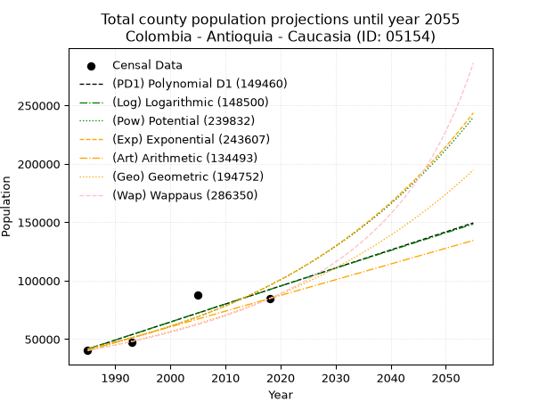
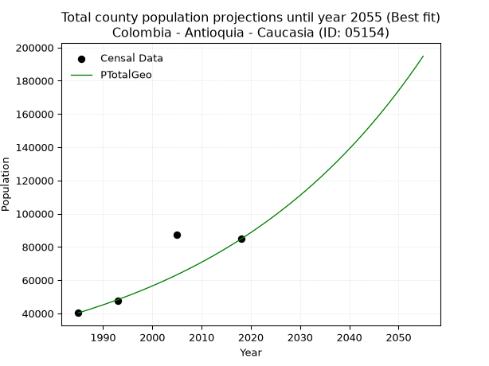
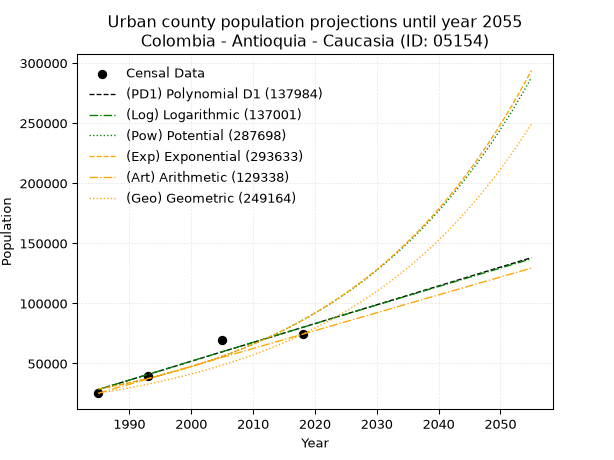
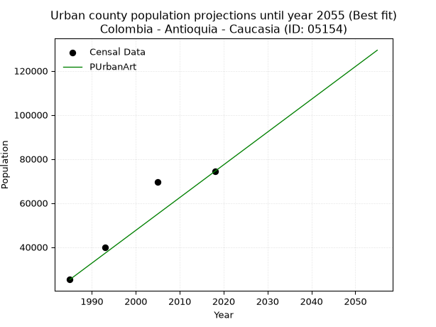
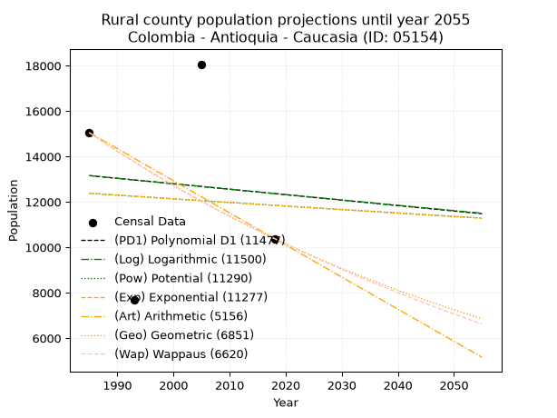
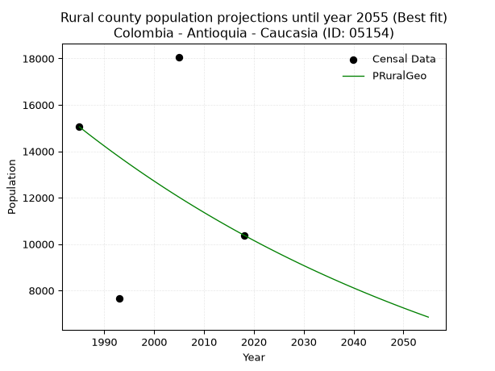

<div align="center">


</div>

# 📜 _“Population and Public Services Demand Projections (PPSD) until Year 2050 for Colombia - Antioquia - Caucasia (ID: 05154)”_
Keywords: `population` `public-service` `projection` `lineal` `polynomial` `logarithmic` `potential` `exponential` `arithmetic` `geometric` `wappaus` `dane` `colombia` `south-america`

PPSD are analytical estimates used by governments and planners to anticipate future changes in population size, age distribution, and the resulting community needs for utilities, healthcare, education, and infrastructure as sizing future water treatment facilities, electrical grids, and road networks based on spatial growth.

<div align="center">

</img>

</div>


> **General running parameters**: • app_version: _v20260806_. • Python version: _3.14.7_. • Pandas version: _3.0.5_. • NumPy version: _2.5.1_. • Creates, save and include plots into reports (create_plot): _False_. • Projection until year: _2050_. • Process polynomial degree 2 and up: _False_. • Process Wappaus: _True_. • Process Wappaus: _True_. • Set negative values to zero: _True_. • Set infinite values to zero: _True_. • Drop dataset notes: _True_. 
<div align="center">

Dynamic map: [:earth_americas:Google](http://maps.google.com/maps?q=7.977278037,-75.1979957) [:earth_americas:OSM](https://www.openstreetmap.org/#map=18/7.977278037/-75.1979957&layers=P) [:earth_americas:Bing](https://www.bing.com/maps?cp=7.977278037~-75.1979957&lvl=18) [:earth_americas:Apple](https://maps.apple.com/frame?center=7.977278037%2C-75.1979957&span=0.003%2C0.006)

</div>


<div align="center">

```geojson
{
  "type": "Feature",
  "geometry": {
    "type": "Point", 
    "coordinates": [-75.1979957, 7.977278037]
  }, 
  "properties": {
    "Name": "Colombia - Antioquia - Caucasia (ID: 05154)"
  }
}
```

</div>


## 0. Census Data (4 records)

Census data are official statistics collected by a government about the people and housing in a country. They usually include counts of total population, age, sex, race, income, education, and jobs.

📅Global census file: [Population.xlsx](../data/Population.xlsx)

| Source   |   Year |   CountryID | CountryName   |   StateID | StateName   |   CountyID | CountyName   |   PTotal |   PUrban |   PRural |
|:---------|-------:|------------:|:--------------|----------:|:------------|-----------:|:-------------|---------:|---------:|---------:|
| DANE     |   1985 |          57 | Colombia      |        05 | Antioquia   |      05154 | Caucasia     |    40322 |    25273 |    15049 |
| DANE     |   1993 |          57 | Colombia      |        05 | Antioquia   |      05154 | Caucasia     |    47439 |    39770 |     7669 |
| DANE     |   2005 |          57 | Colombia      |        05 | Antioquia   |      05154 | Caucasia     |    87532 |    69468 |    18064 |
| DANE     |   2018 |          57 | Colombia      |        05 | Antioquia   |      05154 | Caucasia     |    84717 |    74332 |    10385 |

> 🔥Some records could had specific notes about the registered values or the corresponding urban or rural distribution.

📅[SUI-RUPS](https://www.datos.gov.co/Hacienda-y-Cr-dito-P-blico/Registro-nico-de-Prestadores-de-Servicios-P-blicos/4qkq-csdn/about_data) - Local public utility companies: [RUPS.csv](../data/RUPS.csv)

 | SERVICIO       | ESTADO    | NOMBRE                        | NIT         | DEPARTAMENTO_DOMICILIO   | MUNICIPIO_DOMICILIO   | DIRECCION              |   TELEFONO | EMAIL                          | TIPO_PRESTADOR                             | CLASIFICACION                 |
|:---------------|:----------|:------------------------------|:------------|:-------------------------|:----------------------|:-----------------------|-----------:|:-------------------------------|:-------------------------------------------|:------------------------------|
| ACUEDUCTO      | OPERATIVA | AGUASCOL ARBELAEZ S.A. E.S.P. | 830505339-0 | ANTIOQUIA                | MEDELLIN              | CALLE 42 B No. 63 C 51 |    2350111 | diradministrativo@aguascol.com | SOCIEDADES (EMPRESA DE SERVICIOS PUBLICOS) | MAYOR O IGUAL A 5001 USUARIOS |
| ALCANTARILLADO | OPERATIVA | AGUASCOL ARBELAEZ S.A. E.S.P. | 830505339-0 | ANTIOQUIA                | MEDELLIN              | CALLE 42 B No. 63 C 51 |    2350111 | diradministrativo@aguascol.com | SOCIEDADES (EMPRESA DE SERVICIOS PUBLICOS) | MAYOR O IGUAL A 5001 USUARIOS |

## 1. Total

### 1.1. Coefficients and Parameters

* (PD1) Polynomial Deg 1: 1542.6101967081486, -3020603.545965474 (lineal)
* (Log) Logarithmic: 3089863.427083247, -23421074.16987131
* (Pow) Potential: 50.43908708492982, -161.71529787199344
* (Exp) Exponential: 0.025180616061346656, 8.196238537332483e-18
* (Art) Arithmetic: Year diff. 2018 - 1985 = 33, Population diff. 84717 - 40322 = 44395, Annual growth = 1345.3030303030303
* (Geo) Geometric: Year diff. 2018 - 1985 = 33, Population diff. 84717 - 40322 = 44395, Annual growth % = 0.02275252575833253
* (Wap) Wappaus: i = 2.1518134826782527, Condition values only valid for < 200)

<sub>
Wappaus condition values: ['0.00', '2.15', '4.30', '6.46', '8.61', '10.76', '12.91', '15.06', '17.21', '19.37', '21.52', '23.67', '25.82', '27.97', '30.13', '32.28', '34.43', '36.58', '38.73', '40.88', '43.04', '45.19', '47.34', '49.49', '51.64', '53.80', '55.95', '58.10', '60.25', '62.40', '64.55', '66.71', '68.86', '71.01', '73.16', '75.31', '77.47', '79.62', '81.77', '83.92', '86.07', '88.22', '90.38', '92.53', '94.68', '96.83', '98.98', '101.14', '103.29', '105.44', '107.59', '109.74', '111.89', '114.05', '116.20', '118.35', '120.50', '122.65', '124.81', '126.96', '129.11', '131.26', '133.41', '135.56', '137.72', '139.87']
</sub>


### 1.2. Projected Dataset

|   Year |   CountyID |   PTotalPD1 |   PTotalLog |   PTotalPow |   PTotalExp |   PTotalArt |   PTotalGeo |   PTotalWap |
|-------:|-----------:|------------:|------------:|------------:|------------:|------------:|------------:|------------:|
|   1985 |      05154 |       41478 |       41415 |       41757 |       41801 |       40322 |       40322 |       40322 |
|   1986 |      05154 |       43020 |       42971 |       42832 |       42867 |       41667 |       41239 |       41199 |
|   1987 |      05154 |       44563 |       44527 |       43933 |       43960 |       43013 |       42178 |       42095 |
|   1988 |      05154 |       46106 |       46081 |       45062 |       45081 |       44358 |       43137 |       43012 |
|   1989 |      05154 |       47648 |       47635 |       46220 |       46230 |       45703 |       44119 |       43949 |
|   1990 |      05154 |       49191 |       49188 |       47407 |       47409 |       47049 |       45123 |       44907 |
|   1991 |      05154 |       50733 |       50741 |       48623 |       48618 |       48394 |       46149 |       45887 |
|   1992 |      05154 |       52276 |       52292 |       49871 |       49858 |       49739 |       47199 |       46890 |
|   1993 |      05154 |       53819 |       53843 |       51149 |       51129 |       51084 |       48273 |       47917 |
|   1994 |      05154 |       55361 |       55393 |       52460 |       52433 |       52430 |       49372 |       48968 |
|   1995 |      05154 |       56904 |       56942 |       53803 |       53770 |       53775 |       50495 |       50045 |
|   1996 |      05154 |       58446 |       58490 |       55181 |       55141 |       55120 |       51644 |       51147 |
|   1997 |      05154 |       59989 |       60038 |       56592 |       56547 |       56466 |       52819 |       52277 |
|   1998 |      05154 |       61532 |       61585 |       58040 |       57989 |       57811 |       54021 |       53436 |
|   1999 |      05154 |       63074 |       63131 |       59523 |       59468 |       59156 |       55250 |       54623 |
|   2000 |      05154 |       64617 |       64676 |       61044 |       60985 |       60502 |       56507 |       55841 |
|   2001 |      05154 |       66159 |       66221 |       62602 |       62540 |       61847 |       57792 |       57091 |
|   2002 |      05154 |       67702 |       67765 |       64200 |       64134 |       63192 |       59107 |       58374 |
|   2003 |      05154 |       69245 |       69308 |       65838 |       65770 |       64537 |       60452 |       59691 |
|   2004 |      05154 |       70787 |       70850 |       67516 |       67447 |       65883 |       61828 |       61043 |
|   2005 |      05154 |       72330 |       72391 |       69237 |       69167 |       67228 |       63234 |       62433 |
|   2006 |      05154 |       73873 |       73932 |       71000 |       70931 |       68573 |       64673 |       63861 |
|   2007 |      05154 |       75415 |       75472 |       72808 |       72740 |       69919 |       66145 |       65330 |
|   2008 |      05154 |       76958 |       77011 |       74660 |       74594 |       71264 |       67650 |       66840 |
|   2009 |      05154 |       78500 |       78550 |       76559 |       76497 |       72609 |       69189 |       68395 |
|   2010 |      05154 |       80043 |       80087 |       78505 |       78447 |       73955 |       70763 |       69995 |
|   2011 |      05154 |       81586 |       81624 |       80499 |       80448 |       75300 |       72373 |       71642 |
|   2012 |      05154 |       83128 |       83160 |       82543 |       82499 |       76645 |       74020 |       73340 |
|   2013 |      05154 |       84671 |       84695 |       84638 |       84603 |       77990 |       75704 |       75090 |
|   2014 |      05154 |       86213 |       86230 |       86785 |       86760 |       79336 |       77426 |       76895 |
|   2015 |      05154 |       87756 |       87764 |       88985 |       88973 |       80681 |       79188 |       78758 |
|   2016 |      05154 |       89299 |       89297 |       91240 |       91242 |       82026 |       80990 |       80680 |
|   2017 |      05154 |       90841 |       90829 |       93551 |       93568 |       83372 |       82832 |       82665 |
|   2018 |      05154 |       92384 |       92361 |       95920 |       95954 |       84717 |       84717 |       84717 |
|   2019 |      05154 |       93926 |       93892 |       98347 |       98401 |       86062 |       86645 |       86838 |
|   2020 |      05154 |       95469 |       95422 |      100834 |      100910 |       87408 |       88616 |       89033 |
|   2021 |      05154 |       97012 |       96951 |      103383 |      103484 |       88753 |       90632 |       91304 |
|   2022 |      05154 |       98554 |       98479 |      105995 |      106122 |       90098 |       92694 |       93657 |
|   2023 |      05154 |      100097 |      100007 |      108672 |      108829 |       91444 |       94803 |       96096 |
|   2024 |      05154 |      101639 |      101534 |      111415 |      111604 |       92789 |       96960 |       98624 |
|   2025 |      05154 |      103182 |      103060 |      114225 |      114450 |       94134 |       99166 |      101249 |
|   2026 |      05154 |      104725 |      104586 |      117105 |      117368 |       95479 |      101423 |      103974 |
|   2027 |      05154 |      106267 |      106110 |      120057 |      120361 |       96825 |      103730 |      106807 |
|   2028 |      05154 |      107810 |      107634 |      123081 |      123430 |       98170 |      106090 |      109752 |
|   2029 |      05154 |      109353 |      109158 |      126180 |      126578 |       99515 |      108504 |      112819 |
|   2030 |      05154 |      110895 |      110680 |      129355 |      129806 |      100861 |      110973 |      116013 |
|   2031 |      05154 |      112438 |      112202 |      132608 |      133116 |      102206 |      113498 |      119343 |
|   2032 |      05154 |      113980 |      113723 |      135942 |      136510 |      103551 |      116080 |      122818 |
|   2033 |      05154 |      115523 |      115243 |      139358 |      139991 |      104897 |      118721 |      126448 |
|   2034 |      05154 |      117066 |      116763 |      142858 |      143561 |      106242 |      121423 |      130243 |
|   2035 |      05154 |      118608 |      118281 |      146444 |      147222 |      107587 |      124185 |      134214 |
|   2036 |      05154 |      120151 |      119799 |      150118 |      150976 |      108932 |      127011 |      138376 |
|   2037 |      05154 |      121693 |      121317 |      153882 |      154826 |      110278 |      129901 |      142740 |
|   2038 |      05154 |      123236 |      122833 |      157739 |      158774 |      111623 |      132856 |      147323 |
|   2039 |      05154 |      124779 |      124349 |      161691 |      162823 |      112968 |      135879 |      152141 |
|   2040 |      05154 |      126321 |      125864 |      165740 |      166975 |      114314 |      138971 |      157213 |
|   2041 |      05154 |      127864 |      127378 |      169888 |      171233 |      115659 |      142133 |      162560 |
|   2042 |      05154 |      129406 |      128892 |      174137 |      175600 |      117004 |      145366 |      168204 |
|   2043 |      05154 |      130949 |      130404 |      178491 |      180077 |      118350 |      148674 |      174172 |
|   2044 |      05154 |      132492 |      131916 |      182952 |      184669 |      119695 |      152057 |      180490 |
|   2045 |      05154 |      134034 |      133428 |      187521 |      189379 |      121040 |      155516 |      187193 |
|   2046 |      05154 |      135577 |      134938 |      192203 |      194208 |      122385 |      159055 |      194315 |
|   2047 |      05154 |      137120 |      136448 |      196999 |      199160 |      123731 |      162674 |      201897 |
|   2048 |      05154 |      138662 |      137957 |      201912 |      204239 |      125076 |      166375 |      209986 |
|   2049 |      05154 |      140205 |      139466 |      206945 |      209447 |      126421 |      170160 |      218634 |
|   2050 |      05154 |      141747 |      140973 |      212101 |      214788 |      127767 |      174032 |      227901 |
<div align="center">

</img>

</div>


### 1.3. Best fit with absolute and relative error (%)

Relative error puts that difference into context by dividing the absolute error by the true value, creating a unitless ratio or percentage that shows the scale of the mistake.

Absolute and relative error

|   Year | Source   |   CountryID | CountryName   |   StateID | StateName   |   CountyID_x | CountyName   |   PTotal |   PUrban |   PRural |   CountyID_y |   PTotalPD1 |   PTotalLog |   PTotalPow |   PTotalExp |   PTotalArt |   PTotalGeo |   PTotalWap |   PTotalPD1AbsError |   PTotalLogAbsError |   PTotalPowAbsError |   PTotalExpAbsError |   PTotalArtAbsError |   PTotalGeoAbsError |   PTotalWapAbsError |   PTotalPD1RelError |   PTotalLogRelError |   PTotalPowRelError |   PTotalExpRelError |   PTotalArtRelError |   PTotalGeoRelError |   PTotalWapRelError |
|-------:|:---------|------------:|:--------------|----------:|:------------|-------------:|:-------------|---------:|---------:|---------:|-------------:|------------:|------------:|------------:|------------:|------------:|------------:|------------:|--------------------:|--------------------:|--------------------:|--------------------:|--------------------:|--------------------:|--------------------:|--------------------:|--------------------:|--------------------:|--------------------:|--------------------:|--------------------:|--------------------:|
|   1985 | DANE     |          57 | Colombia      |        05 | Antioquia   |        05154 | Caucasia     |    40322 |    25273 |    15049 |        05154 |       41478 |       41415 |       41757 |       41801 |       40322 |       40322 |       40322 |                1156 |                1093 |                1435 |                1479 |                   0 |                   0 |                   0 |             2.86692 |             2.71068 |             3.55885 |             3.66797 |             0       |             0       |             0       |
|   1993 | DANE     |          57 | Colombia      |        05 | Antioquia   |        05154 | Caucasia     |    47439 |    39770 |     7669 |        05154 |       53819 |       53843 |       51149 |       51129 |       51084 |       48273 |       47917 |                6380 |                6404 |                3710 |                3690 |                3645 |                 834 |                 478 |            13.4489  |            13.4994  |             7.82057 |             7.77841 |             7.68355 |             1.75805 |             1.00761 |
|   2005 | DANE     |          57 | Colombia      |        05 | Antioquia   |        05154 | Caucasia     |    87532 |    69468 |    18064 |        05154 |       72330 |       72391 |       69237 |       69167 |       67228 |       63234 |       62433 |               15202 |               15141 |               18295 |               18365 |               20304 |               24298 |               25099 |            17.3674  |            17.2977  |            20.9009  |            20.9809  |            23.1961  |            27.759   |            28.6741  |
|   2018 | DANE     |          57 | Colombia      |        05 | Antioquia   |        05154 | Caucasia     |    84717 |    74332 |    10385 |        05154 |       92384 |       92361 |       95920 |       95954 |       84717 |       84717 |       84717 |                7667 |                7644 |               11203 |               11237 |                   0 |                   0 |                   0 |             9.05013 |             9.02298 |            13.224   |            13.2642  |             0       |             0       |             0       |

Relative error mean

| Method    |   RelError | Best   |
|:----------|-----------:|:-------|
| PTotalPD1 |   10.6833  |        |
| PTotalLog |   10.6327  |        |
| PTotalPow |   11.3761  |        |
| PTotalExp |   11.4229  |        |
| PTotalArt |    7.71991 |        |
| PTotalGeo |    7.37926 | True   |
| PTotalWap |    7.42042 |        |

💙Best method: _**PTotalGeo**_
<div align="center">

</img>

</div>


### 1.4. Fresh water supply demand in liters per capita per day (lpcd)

The fresh water supply demand typically ranges from 100 to 300 liters per capita per day (lpcd) for standard domestic and municipal planning, though absolute survival minimums set by the World Health Organization are as low as 7.5 to 20 liters per day, and total consumption in high-income nations can exceed 400 liters.

> `CZ`: Level in meters above the sea level (masl)<br> `WS`: Fresh water supply demand in liters per capita per day (lpcd or l/h/d)<br> `WSAll`: Zonal fresh water supply demand in liters per second (l/s)<br> `A`: Zonal area in square meters<br> `DP`: Population density (people/hectare or p/ha)

Reference values (RAS Colombia)

|    CZ |   WS |
|------:|-----:|
|  1000 |  120 |
|  2000 |  130 |
| 99999 |  140 |

County shapefile geometry properties and water supply values

|   CountyID |      ATotal |   CZTotal |   WSTotal |
|-----------:|------------:|----------:|----------:|
|      05154 | 1.42824e+09 |   70.6219 |       120 |

Projected values for best method: PTotalGeo

|   CountyID |   Year |   PTotalGeo |   DPTotal |   WSTotal |   WSTotalAll |
|-----------:|-------:|------------:|----------:|----------:|-------------:|
|      05154 |   1985 |       40322 |      0.28 |       120 |      56.0028 |
|      05154 |   1986 |       41239 |      0.29 |       120 |      57.2764 |
|      05154 |   1987 |       42178 |      0.3  |       120 |      58.5806 |
|      05154 |   1988 |       43137 |      0.3  |       120 |      59.9125 |
|      05154 |   1989 |       44119 |      0.31 |       120 |      61.2764 |
|      05154 |   1990 |       45123 |      0.32 |       120 |      62.6708 |
|      05154 |   1991 |       46149 |      0.32 |       120 |      64.0958 |
|      05154 |   1992 |       47199 |      0.33 |       120 |      65.5542 |
|      05154 |   1993 |       48273 |      0.34 |       120 |      67.0458 |
|      05154 |   1994 |       49372 |      0.35 |       120 |      68.5722 |
|      05154 |   1995 |       50495 |      0.35 |       120 |      70.1319 |
|      05154 |   1996 |       51644 |      0.36 |       120 |      71.7278 |
|      05154 |   1997 |       52819 |      0.37 |       120 |      73.3597 |
|      05154 |   1998 |       54021 |      0.38 |       120 |      75.0292 |
|      05154 |   1999 |       55250 |      0.39 |       120 |      76.7361 |
|      05154 |   2000 |       56507 |      0.4  |       120 |      78.4819 |
|      05154 |   2001 |       57792 |      0.4  |       120 |      80.2667 |
|      05154 |   2002 |       59107 |      0.41 |       120 |      82.0931 |
|      05154 |   2003 |       60452 |      0.42 |       120 |      83.9611 |
|      05154 |   2004 |       61828 |      0.43 |       120 |      85.8722 |
|      05154 |   2005 |       63234 |      0.44 |       120 |      87.825  |
|      05154 |   2006 |       64673 |      0.45 |       120 |      89.8236 |
|      05154 |   2007 |       66145 |      0.46 |       120 |      91.8681 |
|      05154 |   2008 |       67650 |      0.47 |       120 |      93.9583 |
|      05154 |   2009 |       69189 |      0.48 |       120 |      96.0958 |
|      05154 |   2010 |       70763 |      0.5  |       120 |      98.2819 |
|      05154 |   2011 |       72373 |      0.51 |       120 |     100.518  |
|      05154 |   2012 |       74020 |      0.52 |       120 |     102.806  |
|      05154 |   2013 |       75704 |      0.53 |       120 |     105.144  |
|      05154 |   2014 |       77426 |      0.54 |       120 |     107.536  |
|      05154 |   2015 |       79188 |      0.55 |       120 |     109.983  |
|      05154 |   2016 |       80990 |      0.57 |       120 |     112.486  |
|      05154 |   2017 |       82832 |      0.58 |       120 |     115.044  |
|      05154 |   2018 |       84717 |      0.59 |       120 |     117.662  |
|      05154 |   2019 |       86645 |      0.61 |       120 |     120.34   |
|      05154 |   2020 |       88616 |      0.62 |       120 |     123.078  |
|      05154 |   2021 |       90632 |      0.63 |       120 |     125.878  |
|      05154 |   2022 |       92694 |      0.65 |       120 |     128.742  |
|      05154 |   2023 |       94803 |      0.66 |       120 |     131.671  |
|      05154 |   2024 |       96960 |      0.68 |       120 |     134.667  |
|      05154 |   2025 |       99166 |      0.69 |       120 |     137.731  |
|      05154 |   2026 |      101423 |      0.71 |       120 |     140.865  |
|      05154 |   2027 |      103730 |      0.73 |       120 |     144.069  |
|      05154 |   2028 |      106090 |      0.74 |       120 |     147.347  |
|      05154 |   2029 |      108504 |      0.76 |       120 |     150.7    |
|      05154 |   2030 |      110973 |      0.78 |       120 |     154.129  |
|      05154 |   2031 |      113498 |      0.79 |       120 |     157.636  |
|      05154 |   2032 |      116080 |      0.81 |       120 |     161.222  |
|      05154 |   2033 |      118721 |      0.83 |       120 |     164.89   |
|      05154 |   2034 |      121423 |      0.85 |       120 |     168.643  |
|      05154 |   2035 |      124185 |      0.87 |       120 |     172.479  |
|      05154 |   2036 |      127011 |      0.89 |       120 |     176.404  |
|      05154 |   2037 |      129901 |      0.91 |       120 |     180.418  |
|      05154 |   2038 |      132856 |      0.93 |       120 |     184.522  |
|      05154 |   2039 |      135879 |      0.95 |       120 |     188.721  |
|      05154 |   2040 |      138971 |      0.97 |       120 |     193.015  |
|      05154 |   2041 |      142133 |      1    |       120 |     197.407  |
|      05154 |   2042 |      145366 |      1.02 |       120 |     201.897  |
|      05154 |   2043 |      148674 |      1.04 |       120 |     206.492  |
|      05154 |   2044 |      152057 |      1.06 |       120 |     211.19   |
|      05154 |   2045 |      155516 |      1.09 |       120 |     215.994  |
|      05154 |   2046 |      159055 |      1.11 |       120 |     220.91   |
|      05154 |   2047 |      162674 |      1.14 |       120 |     225.936  |
|      05154 |   2048 |      166375 |      1.16 |       120 |     231.076  |
|      05154 |   2049 |      170160 |      1.19 |       120 |     236.333  |
|      05154 |   2050 |      174032 |      1.22 |       120 |     241.711  |

## 2. Urban

### 2.1. Coefficients and Parameters

* (PD1) Polynomial Deg 1: 1566.6322761942945, -3081445.460457638 (lineal)
* (Log) Logarithmic: 3137676.360569467, -23797292.410448868
* (Pow) Potential: 66.47441772038755, -214.75830087578234
* (Exp) Exponential: 0.03318293870951264, 7.126168858814327e-25
* (Art) Arithmetic: Year diff. 2018 - 1985 = 33, Population diff. 74332 - 25273 = 49059, Annual growth = 1486.6363636363637
* (Geo) Geometric: Year diff. 2018 - 1985 = 33, Population diff. 74332 - 25273 = 49059, Annual growth % = 0.03323128136450948
* (Wap) Wappaus: i = 2.9850637290022863, Condition values only valid for < 200)

<sub>
Wappaus condition values: ['0.00', '2.99', '5.97', '8.96', '11.94', '14.93', '17.91', '20.90', '23.88', '26.87', '29.85', '32.84', '35.82', '38.81', '41.79', '44.78', '47.76', '50.75', '53.73', '56.72', '59.70', '62.69', '65.67', '68.66', '71.64', '74.63', '77.61', '80.60', '83.58', '86.57', '89.55', '92.54', '95.52', '98.51', '101.49', '104.48', '107.46', '110.45', '113.43', '116.42', '119.40', '122.39', '125.37', '128.36', '131.34', '134.33', '137.31', '140.30', '143.28', '146.27', '149.25', '152.24', '155.22', '158.21', '161.19', '164.18', '167.16', '170.15', '173.13', '176.12', '179.10', '182.09', '185.07', '188.06', '191.04', '194.03']
</sub>


### 2.2. Projected Dataset

|   Year |   CountyID |   PUrbanPD1 |   PUrbanLog |   PUrbanPow |   PUrbanExp |   PUrbanArt |   PUrbanGeo |        PUrbanWap |
|-------:|-----------:|------------:|------------:|------------:|------------:|------------:|------------:|-----------------:|
|   1985 |      05154 |       28320 |       28258 |       28735 |       28776 |       25273 |       25273 |  25273           |
|   1986 |      05154 |       29886 |       29839 |       29713 |       29746 |       26760 |       26113 |  26039           |
|   1987 |      05154 |       31453 |       31418 |       30724 |       30750 |       28246 |       26981 |  26828           |
|   1988 |      05154 |       33020 |       32997 |       31769 |       31788 |       29733 |       27877 |  27642           |
|   1989 |      05154 |       34586 |       34575 |       32849 |       32860 |       31220 |       28804 |  28482           |
|   1990 |      05154 |       36153 |       36152 |       33965 |       33969 |       32706 |       29761 |  29349           |
|   1991 |      05154 |       37719 |       37728 |       35119 |       35115 |       34193 |       30750 |  30245           |
|   1992 |      05154 |       39286 |       39304 |       36311 |       36300 |       35679 |       31772 |  31170           |
|   1993 |      05154 |       40853 |       40878 |       37543 |       37524 |       37166 |       32827 |  32127           |
|   1994 |      05154 |       42419 |       42452 |       38816 |       38790 |       38653 |       33918 |  33116           |
|   1995 |      05154 |       43986 |       44026 |       40131 |       40099 |       40139 |       35045 |  34141           |
|   1996 |      05154 |       45553 |       45598 |       41491 |       41452 |       41626 |       36210 |  35202           |
|   1997 |      05154 |       47119 |       47170 |       42895 |       42851 |       43113 |       37413 |  36301           |
|   1998 |      05154 |       48686 |       48740 |       44347 |       44296 |       44599 |       38657 |  37441           |
|   1999 |      05154 |       50252 |       50310 |       45847 |       45791 |       46086 |       39941 |  38625           |
|   2000 |      05154 |       51819 |       51880 |       47396 |       47336 |       47573 |       41269 |  39854           |
|   2001 |      05154 |       53386 |       53448 |       48998 |       48933 |       49059 |       42640 |  41130           |
|   2002 |      05154 |       54952 |       55016 |       50653 |       50584 |       50546 |       44057 |  42459           |
|   2003 |      05154 |       56519 |       56583 |       52362 |       52291 |       52032 |       45521 |  43841           |
|   2004 |      05154 |       58086 |       58149 |       54129 |       54055 |       53519 |       47034 |  45281           |
|   2005 |      05154 |       59652 |       59714 |       55954 |       55879 |       55006 |       48597 |  46782           |
|   2006 |      05154 |       61219 |       61278 |       57840 |       57764 |       56492 |       50212 |  48348           |
|   2007 |      05154 |       62786 |       62842 |       59788 |       59713 |       57979 |       51880 |  49984           |
|   2008 |      05154 |       64352 |       64405 |       61801 |       61728 |       59466 |       53604 |  51695           |
|   2009 |      05154 |       65919 |       65967 |       63880 |       63810 |       60952 |       55386 |  53485           |
|   2010 |      05154 |       67485 |       67529 |       66029 |       65963 |       62439 |       57226 |  55360           |
|   2011 |      05154 |       69052 |       69089 |       68248 |       68189 |       63926 |       59128 |  57326           |
|   2012 |      05154 |       70619 |       70649 |       70542 |       70490 |       65412 |       61093 |  59391           |
|   2013 |      05154 |       72185 |       72208 |       72911 |       72868 |       66899 |       63123 |  61562           |
|   2014 |      05154 |       73752 |       73767 |       75358 |       75326 |       68385 |       65221 |  63847           |
|   2015 |      05154 |       75319 |       75324 |       77886 |       77868 |       69872 |       67388 |  66256           |
|   2016 |      05154 |       76885 |       76881 |       80498 |       80495 |       71359 |       69627 |  68798           |
|   2017 |      05154 |       78452 |       78437 |       83195 |       83211 |       72845 |       71941 |  71486           |
|   2018 |      05154 |       80018 |       79992 |       85982 |       86018 |       74332 |       74332 |  74332           |
|   2019 |      05154 |       81585 |       81547 |       88861 |       88921 |       75819 |       76802 |  77350           |
|   2020 |      05154 |       83152 |       83100 |       91835 |       91921 |       77305 |       79354 |  80557           |
|   2021 |      05154 |       84718 |       84653 |       94906 |       95022 |       78792 |       81991 |  83971           |
|   2022 |      05154 |       86285 |       86206 |       98079 |       98228 |       80279 |       84716 |  87613           |
|   2023 |      05154 |       87852 |       87757 |      101356 |      101542 |       81765 |       87531 |  91505           |
|   2024 |      05154 |       89418 |       89308 |      104741 |      104968 |       83252 |       90440 |  95676           |
|   2025 |      05154 |       90985 |       90857 |      108237 |      108510 |       84738 |       93446 | 100155           |
|   2026 |      05154 |       92552 |       92406 |      111849 |      112171 |       86225 |       96551 | 104979           |
|   2027 |      05154 |       94118 |       93955 |      115578 |      115956 |       87712 |       99759 | 110189           |
|   2028 |      05154 |       95685 |       95502 |      119431 |      119868 |       89198 |      103075 | 115834           |
|   2029 |      05154 |       97251 |       97049 |      123409 |      123912 |       90685 |      106500 | 121969           |
|   2030 |      05154 |       98818 |       98595 |      127518 |      128093 |       92172 |      110039 | 128661           |
|   2031 |      05154 |      100385 |      100140 |      131762 |      132415 |       93658 |      113696 | 135992           |
|   2032 |      05154 |      101951 |      101685 |      136145 |      136882 |       95145 |      117474 | 144055           |
|   2033 |      05154 |      103518 |      103229 |      140671 |      141501 |       96632 |      121378 | 152967           |
|   2034 |      05154 |      105085 |      104772 |      145346 |      146275 |       98118 |      125411 | 162869           |
|   2035 |      05154 |      106651 |      106314 |      150173 |      151210 |       99605 |      129579 | 173936           |
|   2036 |      05154 |      108218 |      107855 |      155158 |      156312 |      101091 |      133885 | 186386           |
|   2037 |      05154 |      109784 |      109396 |      160306 |      161586 |      102578 |      138334 | 200496           |
|   2038 |      05154 |      111351 |      110936 |      165623 |      167038 |      104065 |      142931 | 216622           |
|   2039 |      05154 |      112918 |      112475 |      171113 |      172674 |      105551 |      147681 | 235229           |
|   2040 |      05154 |      114484 |      114014 |      176782 |      178500 |      107038 |      152589 | 256937           |
|   2041 |      05154 |      116051 |      115551 |      182636 |      184522 |      108525 |      157659 | 282592           |
|   2042 |      05154 |      117618 |      117088 |      188680 |      190748 |      110011 |      162898 | 313378           |
|   2043 |      05154 |      119184 |      118625 |      194922 |      197184 |      111498 |      168312 | 351005           |
|   2044 |      05154 |      120751 |      120160 |      201367 |      203836 |      112985 |      173905 | 398038           |
|   2045 |      05154 |      122318 |      121695 |      208022 |      210714 |      114471 |      179684 | 458509           |
|   2046 |      05154 |      123884 |      123229 |      214893 |      217823 |      115958 |      185655 | 539136           |
|   2047 |      05154 |      125451 |      124762 |      221988 |      225172 |      117444 |      191825 | 652013           |
|   2048 |      05154 |      127017 |      126294 |      229313 |      232770 |      118931 |      198199 | 821324           |
|   2049 |      05154 |      128584 |      127826 |      236877 |      240623 |      120418 |      204786 |      1.1035e+06  |
|   2050 |      05154 |      130151 |      129357 |      244686 |      248742 |      121904 |      211591 |      1.66782e+06 |
<div align="center">

</img>

</div>


### 2.3. Best fit with absolute and relative error (%)

Relative error puts that difference into context by dividing the absolute error by the true value, creating a unitless ratio or percentage that shows the scale of the mistake.

Absolute and relative error

|   Year | Source   |   CountryID | CountryName   |   StateID | StateName   |   CountyID_x | CountyName   |   PTotal |   PUrban |   PRural |   CountyID_y |   PUrbanPD1 |   PUrbanLog |   PUrbanPow |   PUrbanExp |   PUrbanArt |   PUrbanGeo |   PUrbanWap |   PUrbanPD1AbsError |   PUrbanLogAbsError |   PUrbanPowAbsError |   PUrbanExpAbsError |   PUrbanArtAbsError |   PUrbanGeoAbsError |   PUrbanWapAbsError |   PUrbanPD1RelError |   PUrbanLogRelError |   PUrbanPowRelError |   PUrbanExpRelError |   PUrbanArtRelError |   PUrbanGeoRelError |   PUrbanWapRelError |
|-------:|:---------|------------:|:--------------|----------:|:------------|-------------:|:-------------|---------:|---------:|---------:|-------------:|------------:|------------:|------------:|------------:|------------:|------------:|------------:|--------------------:|--------------------:|--------------------:|--------------------:|--------------------:|--------------------:|--------------------:|--------------------:|--------------------:|--------------------:|--------------------:|--------------------:|--------------------:|--------------------:|
|   1985 | DANE     |          57 | Colombia      |        05 | Antioquia   |        05154 | Caucasia     |    40322 |    25273 |    15049 |        05154 |       28320 |       28258 |       28735 |       28776 |       25273 |       25273 |       25273 |                3047 |                2985 |                3462 |                3503 |                   0 |                   0 |                   0 |            12.0563  |            11.811   |             13.6984 |            13.8606  |             0       |              0      |              0      |
|   1993 | DANE     |          57 | Colombia      |        05 | Antioquia   |        05154 | Caucasia     |    47439 |    39770 |     7669 |        05154 |       40853 |       40878 |       37543 |       37524 |       37166 |       32827 |       32127 |                1083 |                1108 |                2227 |                2246 |                2604 |                6943 |                7643 |             2.72316 |             2.78602 |              5.5997 |             5.64747 |             6.54765 |             17.4579 |             19.218  |
|   2005 | DANE     |          57 | Colombia      |        05 | Antioquia   |        05154 | Caucasia     |    87532 |    69468 |    18064 |        05154 |       59652 |       59714 |       55954 |       55879 |       55006 |       48597 |       46782 |                9816 |                9754 |               13514 |               13589 |               14462 |               20871 |               22686 |            14.1302  |            14.041   |             19.4536 |            19.5615  |            20.8182  |             30.044  |             32.6568 |
|   2018 | DANE     |          57 | Colombia      |        05 | Antioquia   |        05154 | Caucasia     |    84717 |    74332 |    10385 |        05154 |       80018 |       79992 |       85982 |       86018 |       74332 |       74332 |       74332 |                5686 |                5660 |               11650 |               11686 |                   0 |                   0 |                   0 |             7.64946 |             7.61449 |             15.6729 |            15.7214  |             0       |              0      |              0      |

Relative error mean

| Method    |   RelError | Best   |
|:----------|-----------:|:-------|
| PUrbanPD1 |    9.1398  |        |
| PUrbanLog |    9.06313 |        |
| PUrbanPow |   13.6061  |        |
| PUrbanExp |   13.6977  |        |
| PUrbanArt |    6.84147 | True   |
| PUrbanGeo |   11.8755  |        |
| PUrbanWap |   12.9687  |        |

💙Best method: _**PUrbanArt**_
<div align="center">

</img>

</div>


### 2.4. Fresh water supply demand in liters per capita per day (lpcd)

The fresh water supply demand typically ranges from 100 to 300 liters per capita per day (lpcd) for standard domestic and municipal planning, though absolute survival minimums set by the World Health Organization are as low as 7.5 to 20 liters per day, and total consumption in high-income nations can exceed 400 liters.

> `CZ`: Level in meters above the sea level (masl)<br> `WS`: Fresh water supply demand in liters per capita per day (lpcd or l/h/d)<br> `WSAll`: Zonal fresh water supply demand in liters per second (l/s)<br> `A`: Zonal area in square meters<br> `DP`: Population density (people/hectare or p/ha)

Reference values (RAS Colombia)

|    CZ |   WS |
|------:|-----:|
|  1000 |  120 |
|  2000 |  130 |
| 99999 |  140 |

County shapefile geometry properties and water supply values

|   CountyID |     AUrban |   CZUrban |   WSUrban |
|-----------:|-----------:|----------:|----------:|
|      05154 | 1.7149e+07 |   59.0008 |       120 |

Projected values for best method: PUrbanArt

|   CountyID |   Year |   PUrbanArt |   DPUrban |   WSUrban |   WSUrbanAll |
|-----------:|-------:|------------:|----------:|----------:|-------------:|
|      05154 |   1985 |       25273 |     14.74 |       120 |      35.1014 |
|      05154 |   1986 |       26760 |     15.6  |       120 |      37.1667 |
|      05154 |   1987 |       28246 |     16.47 |       120 |      39.2306 |
|      05154 |   1988 |       29733 |     17.34 |       120 |      41.2958 |
|      05154 |   1989 |       31220 |     18.21 |       120 |      43.3611 |
|      05154 |   1990 |       32706 |     19.07 |       120 |      45.425  |
|      05154 |   1991 |       34193 |     19.94 |       120 |      47.4903 |
|      05154 |   1992 |       35679 |     20.81 |       120 |      49.5542 |
|      05154 |   1993 |       37166 |     21.67 |       120 |      51.6194 |
|      05154 |   1994 |       38653 |     22.54 |       120 |      53.6847 |
|      05154 |   1995 |       40139 |     23.41 |       120 |      55.7486 |
|      05154 |   1996 |       41626 |     24.27 |       120 |      57.8139 |
|      05154 |   1997 |       43113 |     25.14 |       120 |      59.8792 |
|      05154 |   1998 |       44599 |     26.01 |       120 |      61.9431 |
|      05154 |   1999 |       46086 |     26.87 |       120 |      64.0083 |
|      05154 |   2000 |       47573 |     27.74 |       120 |      66.0736 |
|      05154 |   2001 |       49059 |     28.61 |       120 |      68.1375 |
|      05154 |   2002 |       50546 |     29.47 |       120 |      70.2028 |
|      05154 |   2003 |       52032 |     30.34 |       120 |      72.2667 |
|      05154 |   2004 |       53519 |     31.21 |       120 |      74.3319 |
|      05154 |   2005 |       55006 |     32.08 |       120 |      76.3972 |
|      05154 |   2006 |       56492 |     32.94 |       120 |      78.4611 |
|      05154 |   2007 |       57979 |     33.81 |       120 |      80.5264 |
|      05154 |   2008 |       59466 |     34.68 |       120 |      82.5917 |
|      05154 |   2009 |       60952 |     35.54 |       120 |      84.6556 |
|      05154 |   2010 |       62439 |     36.41 |       120 |      86.7208 |
|      05154 |   2011 |       63926 |     37.28 |       120 |      88.7861 |
|      05154 |   2012 |       65412 |     38.14 |       120 |      90.85   |
|      05154 |   2013 |       66899 |     39.01 |       120 |      92.9153 |
|      05154 |   2014 |       68385 |     39.88 |       120 |      94.9792 |
|      05154 |   2015 |       69872 |     40.74 |       120 |      97.0444 |
|      05154 |   2016 |       71359 |     41.61 |       120 |      99.1097 |
|      05154 |   2017 |       72845 |     42.48 |       120 |     101.174  |
|      05154 |   2018 |       74332 |     43.34 |       120 |     103.239  |
|      05154 |   2019 |       75819 |     44.21 |       120 |     105.304  |
|      05154 |   2020 |       77305 |     45.08 |       120 |     107.368  |
|      05154 |   2021 |       78792 |     45.95 |       120 |     109.433  |
|      05154 |   2022 |       80279 |     46.81 |       120 |     111.499  |
|      05154 |   2023 |       81765 |     47.68 |       120 |     113.562  |
|      05154 |   2024 |       83252 |     48.55 |       120 |     115.628  |
|      05154 |   2025 |       84738 |     49.41 |       120 |     117.692  |
|      05154 |   2026 |       86225 |     50.28 |       120 |     119.757  |
|      05154 |   2027 |       87712 |     51.15 |       120 |     121.822  |
|      05154 |   2028 |       89198 |     52.01 |       120 |     123.886  |
|      05154 |   2029 |       90685 |     52.88 |       120 |     125.951  |
|      05154 |   2030 |       92172 |     53.75 |       120 |     128.017  |
|      05154 |   2031 |       93658 |     54.61 |       120 |     130.081  |
|      05154 |   2032 |       95145 |     55.48 |       120 |     132.146  |
|      05154 |   2033 |       96632 |     56.35 |       120 |     134.211  |
|      05154 |   2034 |       98118 |     57.22 |       120 |     136.275  |
|      05154 |   2035 |       99605 |     58.08 |       120 |     138.34   |
|      05154 |   2036 |      101091 |     58.95 |       120 |     140.404  |
|      05154 |   2037 |      102578 |     59.82 |       120 |     142.469  |
|      05154 |   2038 |      104065 |     60.68 |       120 |     144.535  |
|      05154 |   2039 |      105551 |     61.55 |       120 |     146.599  |
|      05154 |   2040 |      107038 |     62.42 |       120 |     148.664  |
|      05154 |   2041 |      108525 |     63.28 |       120 |     150.729  |
|      05154 |   2042 |      110011 |     64.15 |       120 |     152.793  |
|      05154 |   2043 |      111498 |     65.02 |       120 |     154.858  |
|      05154 |   2044 |      112985 |     65.88 |       120 |     156.924  |
|      05154 |   2045 |      114471 |     66.75 |       120 |     158.988  |
|      05154 |   2046 |      115958 |     67.62 |       120 |     161.053  |
|      05154 |   2047 |      117444 |     68.48 |       120 |     163.117  |
|      05154 |   2048 |      118931 |     69.35 |       120 |     165.182  |
|      05154 |   2049 |      120418 |     70.22 |       120 |     167.247  |
|      05154 |   2050 |      121904 |     71.09 |       120 |     169.311  |

## 3. Rural

### 3.1. Coefficients and Parameters

* (PD1) Polynomial Deg 1: -24.022079486145923, 60841.91449216338 (lineal)
* (Log) Logarithmic: -47812.93348621779, 376218.24057754426
* (Pow) Potential: -2.6573234681754774, 12.85589299367752
* (Exp) Exponential: -0.0013320639083682724, 174191.65212245868
* (Art) Arithmetic: Year diff. 2018 - 1985 = 33, Population diff. 10385 - 15049 = -4664, Annual growth = -141.33333333333334
* (Geo) Geometric: Year diff. 2018 - 1985 = 33, Population diff. 10385 - 15049 = -4664, Annual growth % = -0.011177938765314144
* (Wap) Wappaus: i = -1.1113732274383372, Condition values only valid for < 200)

<sub>
Wappaus condition values: ['-0.00', '-1.11', '-2.22', '-3.33', '-4.45', '-5.56', '-6.67', '-7.78', '-8.89', '-10.00', '-11.11', '-12.23', '-13.34', '-14.45', '-15.56', '-16.67', '-17.78', '-18.89', '-20.00', '-21.12', '-22.23', '-23.34', '-24.45', '-25.56', '-26.67', '-27.78', '-28.90', '-30.01', '-31.12', '-32.23', '-33.34', '-34.45', '-35.56', '-36.68', '-37.79', '-38.90', '-40.01', '-41.12', '-42.23', '-43.34', '-44.45', '-45.57', '-46.68', '-47.79', '-48.90', '-50.01', '-51.12', '-52.23', '-53.35', '-54.46', '-55.57', '-56.68', '-57.79', '-58.90', '-60.01', '-61.13', '-62.24', '-63.35', '-64.46', '-65.57', '-66.68', '-67.79', '-68.91', '-70.02', '-71.13', '-72.24']
</sub>


### 3.2. Projected Dataset

|   Year |   CountyID |   PRuralPD1 |   PRuralLog |   PRuralPow |   PRuralExp |   PRuralArt |   PRuralGeo |   PRuralWap |
|-------:|-----------:|------------:|------------:|------------:|------------:|------------:|------------:|------------:|
|   1985 |      05154 |       13158 |       13157 |       12379 |       12379 |       15049 |       15049 |       15049 |
|   1986 |      05154 |       13134 |       13133 |       12362 |       12363 |       14908 |       14881 |       14883 |
|   1987 |      05154 |       13110 |       13109 |       12346 |       12346 |       14766 |       14714 |       14718 |
|   1988 |      05154 |       13086 |       13085 |       12329 |       12330 |       14625 |       14550 |       14555 |
|   1989 |      05154 |       13062 |       13060 |       12313 |       12313 |       14484 |       14387 |       14395 |
|   1990 |      05154 |       13038 |       13036 |       12296 |       12297 |       14342 |       14227 |       14235 |
|   1991 |      05154 |       13014 |       13012 |       12280 |       12281 |       14201 |       14067 |       14078 |
|   1992 |      05154 |       12990 |       12988 |       12263 |       12264 |       14060 |       13910 |       13922 |
|   1993 |      05154 |       12966 |       12964 |       12247 |       12248 |       13918 |       13755 |       13768 |
|   1994 |      05154 |       12942 |       12940 |       12231 |       12232 |       13777 |       13601 |       13615 |
|   1995 |      05154 |       12918 |       12916 |       12215 |       12215 |       13636 |       13449 |       13465 |
|   1996 |      05154 |       12894 |       12893 |       12198 |       12199 |       13494 |       13299 |       13315 |
|   1997 |      05154 |       12870 |       12869 |       12182 |       12183 |       13353 |       13150 |       13167 |
|   1998 |      05154 |       12846 |       12845 |       12166 |       12167 |       13212 |       13003 |       13021 |
|   1999 |      05154 |       12822 |       12821 |       12150 |       12150 |       13070 |       12858 |       12877 |
|   2000 |      05154 |       12798 |       12797 |       12134 |       12134 |       12929 |       12714 |       12733 |
|   2001 |      05154 |       12774 |       12773 |       12117 |       12118 |       12788 |       12572 |       12591 |
|   2002 |      05154 |       12750 |       12749 |       12101 |       12102 |       12646 |       12431 |       12451 |
|   2003 |      05154 |       12726 |       12725 |       12085 |       12086 |       12505 |       12292 |       12312 |
|   2004 |      05154 |       12702 |       12701 |       12069 |       12070 |       12364 |       12155 |       12175 |
|   2005 |      05154 |       12678 |       12677 |       12053 |       12054 |       12222 |       12019 |       12039 |
|   2006 |      05154 |       12654 |       12654 |       12037 |       12038 |       12081 |       11885 |       11904 |
|   2007 |      05154 |       12630 |       12630 |       12021 |       12022 |       11940 |       11752 |       11770 |
|   2008 |      05154 |       12606 |       12606 |       12006 |       12006 |       11798 |       11621 |       11638 |
|   2009 |      05154 |       12582 |       12582 |       11990 |       11990 |       11657 |       11491 |       11507 |
|   2010 |      05154 |       12558 |       12558 |       11974 |       11974 |       11516 |       11362 |       11378 |
|   2011 |      05154 |       12534 |       12535 |       11958 |       11958 |       11374 |       11235 |       11249 |
|   2012 |      05154 |       12509 |       12511 |       11942 |       11942 |       11233 |       11110 |       11122 |
|   2013 |      05154 |       12485 |       12487 |       11926 |       11926 |       11092 |       10985 |       10997 |
|   2014 |      05154 |       12461 |       12463 |       11911 |       11910 |       10950 |       10863 |       10872 |
|   2015 |      05154 |       12437 |       12440 |       11895 |       11894 |       10809 |       10741 |       10748 |
|   2016 |      05154 |       12413 |       12416 |       11879 |       11878 |       10668 |       10621 |       10626 |
|   2017 |      05154 |       12389 |       12392 |       11864 |       11863 |       10526 |       10502 |       10505 |
|   2018 |      05154 |       12365 |       12368 |       11848 |       11847 |       10385 |       10385 |       10385 |
|   2019 |      05154 |       12341 |       12345 |       11833 |       11831 |       10244 |       10269 |       10266 |
|   2020 |      05154 |       12317 |       12321 |       11817 |       11815 |       10102 |       10154 |       10148 |
|   2021 |      05154 |       12293 |       12297 |       11801 |       11799 |        9961 |       10041 |       10032 |
|   2022 |      05154 |       12269 |       12274 |       11786 |       11784 |        9820 |        9928 |        9916 |
|   2023 |      05154 |       12245 |       12250 |       11770 |       11768 |        9678 |        9817 |        9802 |
|   2024 |      05154 |       12221 |       12226 |       11755 |       11752 |        9537 |        9708 |        9688 |
|   2025 |      05154 |       12197 |       12203 |       11740 |       11737 |        9396 |        9599 |        9576 |
|   2026 |      05154 |       12173 |       12179 |       11724 |       11721 |        9254 |        9492 |        9464 |
|   2027 |      05154 |       12149 |       12156 |       11709 |       11706 |        9113 |        9386 |        9354 |
|   2028 |      05154 |       12125 |       12132 |       11693 |       11690 |        8972 |        9281 |        9244 |
|   2029 |      05154 |       12101 |       12108 |       11678 |       11674 |        8830 |        9177 |        9136 |
|   2030 |      05154 |       12077 |       12085 |       11663 |       11659 |        8689 |        9075 |        9028 |
|   2031 |      05154 |       12053 |       12061 |       11648 |       11643 |        8548 |        8973 |        8922 |
|   2032 |      05154 |       12029 |       12038 |       11632 |       11628 |        8406 |        8873 |        8816 |
|   2033 |      05154 |       12005 |       12014 |       11617 |       11612 |        8265 |        8774 |        8711 |
|   2034 |      05154 |       11981 |       11991 |       11602 |       11597 |        8124 |        8676 |        8608 |
|   2035 |      05154 |       11957 |       11967 |       11587 |       11581 |        7982 |        8579 |        8505 |
|   2036 |      05154 |       11933 |       11944 |       11572 |       11566 |        7841 |        8483 |        8403 |
|   2037 |      05154 |       11909 |       11920 |       11557 |       11551 |        7700 |        8388 |        8302 |
|   2038 |      05154 |       11885 |       11897 |       11542 |       11535 |        7558 |        8294 |        8201 |
|   2039 |      05154 |       11861 |       11873 |       11527 |       11520 |        7417 |        8201 |        8102 |
|   2040 |      05154 |       11837 |       11850 |       11512 |       11505 |        7276 |        8110 |        8004 |
|   2041 |      05154 |       11813 |       11827 |       11497 |       11489 |        7134 |        8019 |        7906 |
|   2042 |      05154 |       11789 |       11803 |       11482 |       11474 |        6993 |        7929 |        7809 |
|   2043 |      05154 |       11765 |       11780 |       11467 |       11459 |        6852 |        7841 |        7713 |
|   2044 |      05154 |       11741 |       11756 |       11452 |       11443 |        6710 |        7753 |        7618 |
|   2045 |      05154 |       11717 |       11733 |       11437 |       11428 |        6569 |        7666 |        7523 |
|   2046 |      05154 |       11693 |       11710 |       11422 |       11413 |        6428 |        7581 |        7429 |
|   2047 |      05154 |       11669 |       11686 |       11407 |       11398 |        6286 |        7496 |        7337 |
|   2048 |      05154 |       11645 |       11663 |       11392 |       11383 |        6145 |        7412 |        7244 |
|   2049 |      05154 |       11621 |       11639 |       11378 |       11367 |        6004 |        7329 |        7153 |
|   2050 |      05154 |       11597 |       11616 |       11363 |       11352 |        5862 |        7247 |        7062 |
<div align="center">

</img>

</div>


### 3.3. Best fit with absolute and relative error (%)

Relative error puts that difference into context by dividing the absolute error by the true value, creating a unitless ratio or percentage that shows the scale of the mistake.

Absolute and relative error

|   Year | Source   |   CountryID | CountryName   |   StateID | StateName   |   CountyID_x | CountyName   |   PTotal |   PUrban |   PRural |   CountyID_y |   PRuralPD1 |   PRuralLog |   PRuralPow |   PRuralExp |   PRuralArt |   PRuralGeo |   PRuralWap |   PRuralPD1AbsError |   PRuralLogAbsError |   PRuralPowAbsError |   PRuralExpAbsError |   PRuralArtAbsError |   PRuralGeoAbsError |   PRuralWapAbsError |   PRuralPD1RelError |   PRuralLogRelError |   PRuralPowRelError |   PRuralExpRelError |   PRuralArtRelError |   PRuralGeoRelError |   PRuralWapRelError |
|-------:|:---------|------------:|:--------------|----------:|:------------|-------------:|:-------------|---------:|---------:|---------:|-------------:|------------:|------------:|------------:|------------:|------------:|------------:|------------:|--------------------:|--------------------:|--------------------:|--------------------:|--------------------:|--------------------:|--------------------:|--------------------:|--------------------:|--------------------:|--------------------:|--------------------:|--------------------:|--------------------:|
|   1985 | DANE     |          57 | Colombia      |        05 | Antioquia   |        05154 | Caucasia     |    40322 |    25273 |    15049 |        05154 |       13158 |       13157 |       12379 |       12379 |       15049 |       15049 |       15049 |                1891 |                1892 |                2670 |                2670 |                   0 |                   0 |                   0 |             12.5656 |             12.5723 |             17.742  |             17.742  |              0      |              0      |              0      |
|   1993 | DANE     |          57 | Colombia      |        05 | Antioquia   |        05154 | Caucasia     |    47439 |    39770 |     7669 |        05154 |       12966 |       12964 |       12247 |       12248 |       13918 |       13755 |       13768 |                5297 |                5295 |                4578 |                4579 |                6249 |                6086 |                6099 |             69.0703 |             69.0442 |             59.6949 |             59.7079 |             81.4839 |             79.3585 |             79.528  |
|   2005 | DANE     |          57 | Colombia      |        05 | Antioquia   |        05154 | Caucasia     |    87532 |    69468 |    18064 |        05154 |       12678 |       12677 |       12053 |       12054 |       12222 |       12019 |       12039 |                5386 |                5387 |                6011 |                6010 |                5842 |                6045 |                6025 |             29.8162 |             29.8217 |             33.2761 |             33.2706 |             32.3406 |             33.4643 |             33.3536 |
|   2018 | DANE     |          57 | Colombia      |        05 | Antioquia   |        05154 | Caucasia     |    84717 |    74332 |    10385 |        05154 |       12365 |       12368 |       11848 |       11847 |       10385 |       10385 |       10385 |                1980 |                1983 |                1463 |                1462 |                   0 |                   0 |                   0 |             19.066  |             19.0948 |             14.0876 |             14.078  |              0      |              0      |              0      |

Relative error mean

| Method    |   RelError | Best   |
|:----------|-----------:|:-------|
| PRuralPD1 |    32.6295 |        |
| PRuralLog |    32.6333 |        |
| PRuralPow |    31.2002 |        |
| PRuralExp |    31.1996 |        |
| PRuralArt |    28.4561 |        |
| PRuralGeo |    28.2057 | True   |
| PRuralWap |    28.2204 |        |

💙Best method: _**PRuralGeo**_
<div align="center">

</img>

</div>


### 3.4. Fresh water supply demand in liters per capita per day (lpcd)

The fresh water supply demand typically ranges from 100 to 300 liters per capita per day (lpcd) for standard domestic and municipal planning, though absolute survival minimums set by the World Health Organization are as low as 7.5 to 20 liters per day, and total consumption in high-income nations can exceed 400 liters.

> `CZ`: Level in meters above the sea level (masl)<br> `WS`: Fresh water supply demand in liters per capita per day (lpcd or l/h/d)<br> `WSAll`: Zonal fresh water supply demand in liters per second (l/s)<br> `A`: Zonal area in square meters<br> `DP`: Population density (people/hectare or p/ha)

Reference values (RAS Colombia)

|    CZ |   WS |
|------:|-----:|
|  1000 |  120 |
|  2000 |  130 |
| 99999 |  140 |

County shapefile geometry properties and water supply values

|   CountyID |      ARural |   CZRural |   WSRural |
|-----------:|------------:|----------:|----------:|
|      05154 | 1.41109e+09 |   70.7636 |       120 |

Projected values for best method: PRuralGeo

|   CountyID |   Year |   PRuralGeo |   DPRural |   WSRural |   WSRuralAll |
|-----------:|-------:|------------:|----------:|----------:|-------------:|
|      05154 |   1985 |       15049 |      0.11 |       120 |      20.9014 |
|      05154 |   1986 |       14881 |      0.11 |       120 |      20.6681 |
|      05154 |   1987 |       14714 |      0.1  |       120 |      20.4361 |
|      05154 |   1988 |       14550 |      0.1  |       120 |      20.2083 |
|      05154 |   1989 |       14387 |      0.1  |       120 |      19.9819 |
|      05154 |   1990 |       14227 |      0.1  |       120 |      19.7597 |
|      05154 |   1991 |       14067 |      0.1  |       120 |      19.5375 |
|      05154 |   1992 |       13910 |      0.1  |       120 |      19.3194 |
|      05154 |   1993 |       13755 |      0.1  |       120 |      19.1042 |
|      05154 |   1994 |       13601 |      0.1  |       120 |      18.8903 |
|      05154 |   1995 |       13449 |      0.1  |       120 |      18.6792 |
|      05154 |   1996 |       13299 |      0.09 |       120 |      18.4708 |
|      05154 |   1997 |       13150 |      0.09 |       120 |      18.2639 |
|      05154 |   1998 |       13003 |      0.09 |       120 |      18.0597 |
|      05154 |   1999 |       12858 |      0.09 |       120 |      17.8583 |
|      05154 |   2000 |       12714 |      0.09 |       120 |      17.6583 |
|      05154 |   2001 |       12572 |      0.09 |       120 |      17.4611 |
|      05154 |   2002 |       12431 |      0.09 |       120 |      17.2653 |
|      05154 |   2003 |       12292 |      0.09 |       120 |      17.0722 |
|      05154 |   2004 |       12155 |      0.09 |       120 |      16.8819 |
|      05154 |   2005 |       12019 |      0.09 |       120 |      16.6931 |
|      05154 |   2006 |       11885 |      0.08 |       120 |      16.5069 |
|      05154 |   2007 |       11752 |      0.08 |       120 |      16.3222 |
|      05154 |   2008 |       11621 |      0.08 |       120 |      16.1403 |
|      05154 |   2009 |       11491 |      0.08 |       120 |      15.9597 |
|      05154 |   2010 |       11362 |      0.08 |       120 |      15.7806 |
|      05154 |   2011 |       11235 |      0.08 |       120 |      15.6042 |
|      05154 |   2012 |       11110 |      0.08 |       120 |      15.4306 |
|      05154 |   2013 |       10985 |      0.08 |       120 |      15.2569 |
|      05154 |   2014 |       10863 |      0.08 |       120 |      15.0875 |
|      05154 |   2015 |       10741 |      0.08 |       120 |      14.9181 |
|      05154 |   2016 |       10621 |      0.08 |       120 |      14.7514 |
|      05154 |   2017 |       10502 |      0.07 |       120 |      14.5861 |
|      05154 |   2018 |       10385 |      0.07 |       120 |      14.4236 |
|      05154 |   2019 |       10269 |      0.07 |       120 |      14.2625 |
|      05154 |   2020 |       10154 |      0.07 |       120 |      14.1028 |
|      05154 |   2021 |       10041 |      0.07 |       120 |      13.9458 |
|      05154 |   2022 |        9928 |      0.07 |       120 |      13.7889 |
|      05154 |   2023 |        9817 |      0.07 |       120 |      13.6347 |
|      05154 |   2024 |        9708 |      0.07 |       120 |      13.4833 |
|      05154 |   2025 |        9599 |      0.07 |       120 |      13.3319 |
|      05154 |   2026 |        9492 |      0.07 |       120 |      13.1833 |
|      05154 |   2027 |        9386 |      0.07 |       120 |      13.0361 |
|      05154 |   2028 |        9281 |      0.07 |       120 |      12.8903 |
|      05154 |   2029 |        9177 |      0.07 |       120 |      12.7458 |
|      05154 |   2030 |        9075 |      0.06 |       120 |      12.6042 |
|      05154 |   2031 |        8973 |      0.06 |       120 |      12.4625 |
|      05154 |   2032 |        8873 |      0.06 |       120 |      12.3236 |
|      05154 |   2033 |        8774 |      0.06 |       120 |      12.1861 |
|      05154 |   2034 |        8676 |      0.06 |       120 |      12.05   |
|      05154 |   2035 |        8579 |      0.06 |       120 |      11.9153 |
|      05154 |   2036 |        8483 |      0.06 |       120 |      11.7819 |
|      05154 |   2037 |        8388 |      0.06 |       120 |      11.65   |
|      05154 |   2038 |        8294 |      0.06 |       120 |      11.5194 |
|      05154 |   2039 |        8201 |      0.06 |       120 |      11.3903 |
|      05154 |   2040 |        8110 |      0.06 |       120 |      11.2639 |
|      05154 |   2041 |        8019 |      0.06 |       120 |      11.1375 |
|      05154 |   2042 |        7929 |      0.06 |       120 |      11.0125 |
|      05154 |   2043 |        7841 |      0.06 |       120 |      10.8903 |
|      05154 |   2044 |        7753 |      0.05 |       120 |      10.7681 |
|      05154 |   2045 |        7666 |      0.05 |       120 |      10.6472 |
|      05154 |   2046 |        7581 |      0.05 |       120 |      10.5292 |
|      05154 |   2047 |        7496 |      0.05 |       120 |      10.4111 |
|      05154 |   2048 |        7412 |      0.05 |       120 |      10.2944 |
|      05154 |   2049 |        7329 |      0.05 |       120 |      10.1792 |
|      05154 |   2050 |        7247 |      0.05 |       120 |      10.0653 |

#

<div align="center"><br><sub>Share this research</sub></div><br>

<sub>**APPS & TOOLS & CONTENT DISCLAIMER**: • NO WARRANTY - This content and software is provided by <a href="https://github.com/rcfdtools" target="_blank">github.com/rcfdtools</a> "as is", without any express or implied warranty, including warranties of merchantability, fitness for a particular purpose, or non-infringement. There is no guarantee that the software will be error-free or operate without interruption. • LIMITATION OF LIABILITY - Neither the authors nor copyright holders will be liable for claims or damages arising from the software or its use. You are responsible for determining if the software is appropriate for your use and assume all associated risks, including errors, legal compliance, and data loss. • NO PROFESSIONAL ADVICE - The software provides general information and does not offer professional advice. It should not replace consultation with professional advisors. [Clauses and global license for rcfdtools use.](https://github.com/rcfdtools/rcfdtools/blob/main/LICENSE.md)</sub>

| [:house: Home](Readme.md)  | [:beginner: Help / Collab](https://github.com/rcfdtools/R.HydroTools/discussions/31) |
|----------------------------|-------------------------------------------------------------------------------------------|