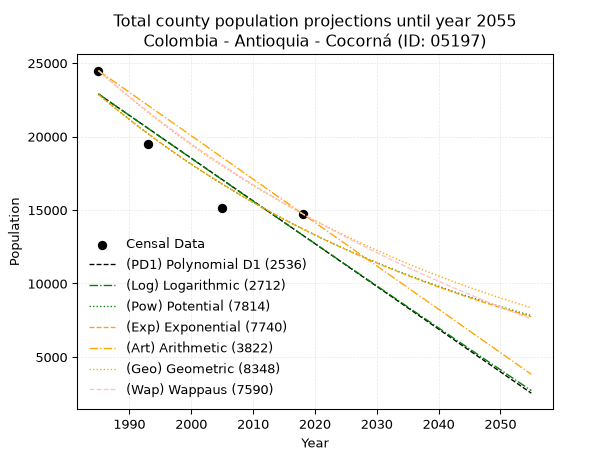
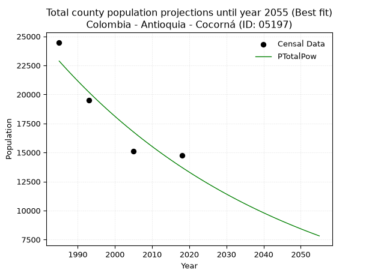
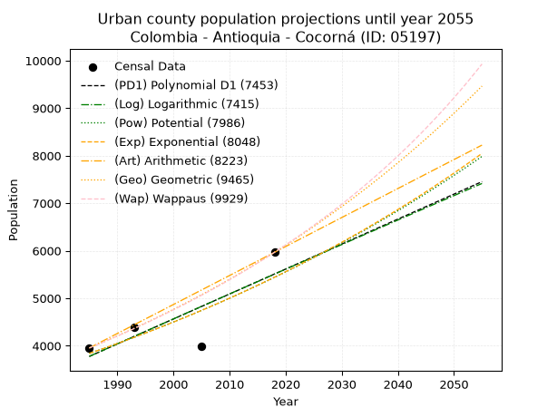
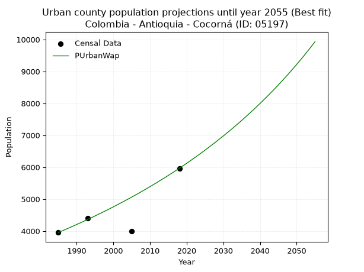
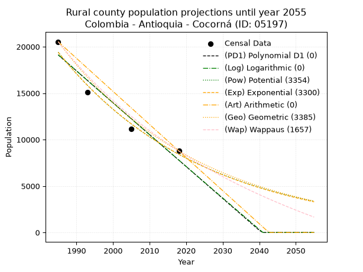
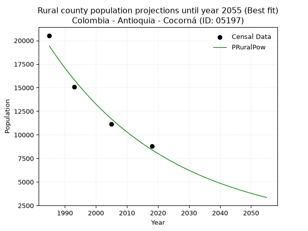

<div align="center">


</div>

# _“Population and Public Services Demand Projections (PPSD) until Year 2050 for Colombia - Antioquia - Cocorná (ID: 05197)”_
Keywords: `population` `public-service` `projection` `lineal` `polynomial` `logarithmic` `potential` `exponential` `arithmetic` `geometric` `wappaus` `dane` `colombia` `south-america`

PPSD are analytical estimates used by governments and planners to anticipate future changes in population size, age distribution, and the resulting community needs for utilities, healthcare, education, and infrastructure as sizing future water treatment facilities, electrical grids, and road networks based on spatial growth.

> **General running parameters**: • app_version: _v20260806_. • Python version: _3.14.7_. • Pandas version: _3.0.5_. • NumPy version: _2.5.1_. • Creates, save and include plots into reports (create_plot): _True_. • Projection until year: _2050_. • Process polynomial degree 2 and up: _False_. • Process Wappaus: _True_. • Process Wappaus: _True_. • Set negative values to zero: _True_. • Set infinite values to zero: _True_. • Drop dataset notes: _True_. 
<div align="center">

Dynamic map: [:earth_americas:Google](http://maps.google.com/maps?q=6.058294738,-75.1854833) [:earth_americas:OSM](https://www.openstreetmap.org/#map=18/6.058294738/-75.1854833&layers=P) [:earth_americas:Bing](https://www.bing.com/maps?cp=6.058294738~-75.1854833&lvl=18) [:earth_americas:Apple](https://maps.apple.com/frame?center=6.058294738%2C-75.1854833&span=0.003%2C0.006)

</div>


<div align="center">

```geojson
{
  "type": "Feature",
  "geometry": {
    "type": "Point", 
    "coordinates": [-75.1854833, 6.058294738]
  }, 
  "properties": {
    "Name": "Colombia - Antioquia - Cocorná (ID: 05197)"
  }
}
```

</div>


## 0. Census Data (4 records)

Census data are official statistics collected by a government about the people and housing in a country. They usually include counts of total population, age, sex, race, income, education, and jobs.

📅Global census file: [Population.xlsx](../data/Population.xlsx)

| Source   |   Year |   CountryID | CountryName   |   StateID | StateName   |   CountyID | CountyName   |   PTotal |   PUrban |   PRural |
|:---------|-------:|------------:|:--------------|----------:|:------------|-----------:|:-------------|---------:|---------:|---------:|
| DANE     |   1985 |          57 | Colombia      |        05 | Antioquia   |      05197 | Cocorná      |    24483 |     3953 |    20530 |
| DANE     |   1993 |          57 | Colombia      |        05 | Antioquia   |      05197 | Cocorná      |    19479 |     4394 |    15085 |
| DANE     |   2005 |          57 | Colombia      |        05 | Antioquia   |      05197 | Cocorná      |    15119 |     3993 |    11126 |
| DANE     |   2018 |          57 | Colombia      |        05 | Antioquia   |      05197 | Cocorná      |    14743 |     5966 |     8777 |

> 🔥Some records has specific notes about the registered values or the corresponding urban or rural distribution.

## 1. Total

### 1.1. Coefficients and Parameters

* (PD1) Polynomial Deg 1: -290.7828181453225, 600094.3319951813 (lineal)
* (Log) Logarithmic: -582619.5759955196, 4446952.065962215
* (Pow) Potential: -30.9959015228306, 106.57645662382139
* (Exp) Exponential: -0.015471634885001416, 4.975150012196562e+17
* (Art) Arithmetic: Year diff. 2018 - 1985 = 33, Population diff. 14743 - 24483 = -9740, Annual growth = -295.1515151515151
* (Geo) Geometric: Year diff. 2018 - 1985 = 33, Population diff. 14743 - 24483 = -9740, Annual growth % = -0.01525250245427845
* (Wap) Wappaus: i = -1.504876944636288, Condition values only valid for < 200)

<sub>
Wappaus condition values: ['-0.00', '-1.50', '-3.01', '-4.51', '-6.02', '-7.52', '-9.03', '-10.53', '-12.04', '-13.54', '-15.05', '-16.55', '-18.06', '-19.56', '-21.07', '-22.57', '-24.08', '-25.58', '-27.09', '-28.59', '-30.10', '-31.60', '-33.11', '-34.61', '-36.12', '-37.62', '-39.13', '-40.63', '-42.14', '-43.64', '-45.15', '-46.65', '-48.16', '-49.66', '-51.17', '-52.67', '-54.18', '-55.68', '-57.19', '-58.69', '-60.20', '-61.70', '-63.20', '-64.71', '-66.21', '-67.72', '-69.22', '-70.73', '-72.23', '-73.74', '-75.24', '-76.75', '-78.25', '-79.76', '-81.26', '-82.77', '-84.27', '-85.78', '-87.28', '-88.79', '-90.29', '-91.80', '-93.30', '-94.81', '-96.31', '-97.82']
</sub>


### 1.2. Projected Dataset

|   Year |   CountyID |   PTotalPD1 |   PTotalLog |   PTotalPow |   PTotalExp |   PTotalArt |   PTotalGeo |   PTotalWap |
|-------:|-----------:|------------:|------------:|------------:|------------:|------------:|------------:|------------:|
|   1985 |      05197 |       22890 |       22904 |       22877 |       22861 |       24483 |       24483 |       24483 |
|   1986 |      05197 |       22600 |       22610 |       22523 |       22510 |       24188 |       24110 |       24117 |
|   1987 |      05197 |       22309 |       22317 |       22174 |       22165 |       23893 |       23742 |       23757 |
|   1988 |      05197 |       22018 |       22024 |       21831 |       21825 |       23598 |       23380 |       23402 |
|   1989 |      05197 |       21727 |       21731 |       21493 |       21490 |       23302 |       23023 |       23052 |
|   1990 |      05197 |       21437 |       21438 |       21161 |       21160 |       23007 |       22672 |       22708 |
|   1991 |      05197 |       21146 |       21145 |       20834 |       20835 |       22712 |       22326 |       22368 |
|   1992 |      05197 |       20855 |       20853 |       20512 |       20515 |       22417 |       21986 |       22033 |
|   1993 |      05197 |       20564 |       20560 |       20195 |       20200 |       22122 |       21650 |       21703 |
|   1994 |      05197 |       20273 |       20268 |       19884 |       19890 |       21827 |       21320 |       21377 |
|   1995 |      05197 |       19983 |       19976 |       19577 |       19584 |       21531 |       20995 |       21056 |
|   1996 |      05197 |       19692 |       19684 |       19275 |       19284 |       21236 |       20675 |       20740 |
|   1997 |      05197 |       19401 |       19392 |       18979 |       18988 |       20941 |       20359 |       20428 |
|   1998 |      05197 |       19110 |       19100 |       18686 |       18696 |       20646 |       20049 |       20120 |
|   1999 |      05197 |       18819 |       18809 |       18399 |       18409 |       20351 |       19743 |       19816 |
|   2000 |      05197 |       18529 |       18517 |       18116 |       18127 |       20056 |       19442 |       19517 |
|   2001 |      05197 |       18238 |       18226 |       17837 |       17848 |       19761 |       19145 |       19221 |
|   2002 |      05197 |       17947 |       17935 |       17563 |       17574 |       19465 |       18853 |       18930 |
|   2003 |      05197 |       17656 |       17644 |       17293 |       17304 |       19170 |       18566 |       18642 |
|   2004 |      05197 |       17366 |       17353 |       17028 |       17039 |       18875 |       18283 |       18358 |
|   2005 |      05197 |       17075 |       17063 |       16767 |       16777 |       18580 |       18004 |       18078 |
|   2006 |      05197 |       16784 |       16772 |       16509 |       16520 |       18285 |       17729 |       17802 |
|   2007 |      05197 |       16493 |       16482 |       16256 |       16266 |       17990 |       17459 |       17529 |
|   2008 |      05197 |       16202 |       16192 |       16007 |       16016 |       17695 |       17192 |       17259 |
|   2009 |      05197 |       15912 |       15902 |       15762 |       15770 |       17399 |       16930 |       16993 |
|   2010 |      05197 |       15621 |       15612 |       15521 |       15528 |       17104 |       16672 |       16730 |
|   2011 |      05197 |       15330 |       15322 |       15283 |       15290 |       16809 |       16418 |       16471 |
|   2012 |      05197 |       15039 |       15032 |       15050 |       15055 |       16514 |       16167 |       16215 |
|   2013 |      05197 |       14749 |       14743 |       14820 |       14824 |       16219 |       15921 |       15962 |
|   2014 |      05197 |       14458 |       14453 |       14593 |       14596 |       15924 |       15678 |       15712 |
|   2015 |      05197 |       14167 |       14164 |       14371 |       14372 |       15628 |       15439 |       15465 |
|   2016 |      05197 |       13876 |       13875 |       14151 |       14152 |       15333 |       15203 |       15222 |
|   2017 |      05197 |       13585 |       13586 |       13935 |       13934 |       15038 |       14971 |       14981 |
|   2018 |      05197 |       13295 |       13297 |       13723 |       13720 |       14743 |       14743 |       14743 |
|   2019 |      05197 |       13004 |       13009 |       13514 |       13510 |       14448 |       14518 |       14508 |
|   2020 |      05197 |       12713 |       12720 |       13308 |       13302 |       14153 |       14297 |       14276 |
|   2021 |      05197 |       12422 |       12432 |       13105 |       13098 |       13858 |       14079 |       14046 |
|   2022 |      05197 |       12131 |       12144 |       12906 |       12897 |       13562 |       13864 |       13819 |
|   2023 |      05197 |       11841 |       11856 |       12710 |       12699 |       13267 |       13652 |       13595 |
|   2024 |      05197 |       11550 |       11568 |       12516 |       12504 |       12972 |       13444 |       13374 |
|   2025 |      05197 |       11259 |       11280 |       12326 |       12312 |       12677 |       13239 |       13155 |
|   2026 |      05197 |       10968 |       10992 |       12139 |       12123 |       12382 |       13037 |       12938 |
|   2027 |      05197 |       10678 |       10705 |       11955 |       11937 |       12087 |       12838 |       12725 |
|   2028 |      05197 |       10387 |       10417 |       11773 |       11754 |       11791 |       12643 |       12513 |
|   2029 |      05197 |       10096 |       10130 |       11595 |       11573 |       11496 |       12450 |       12304 |
|   2030 |      05197 |        9805 |        9843 |       11419 |       11396 |       11201 |       12260 |       12097 |
|   2031 |      05197 |        9514 |        9556 |       11246 |       11221 |       10906 |       12073 |       11893 |
|   2032 |      05197 |        9224 |        9269 |       11076 |       11048 |       10611 |       11889 |       11690 |
|   2033 |      05197 |        8933 |        8983 |       10908 |       10879 |       10316 |       11707 |       11490 |
|   2034 |      05197 |        8642 |        8696 |       10743 |       10712 |       10021 |       11529 |       11293 |
|   2035 |      05197 |        8351 |        8410 |       10581 |       10547 |        9725 |       11353 |       11097 |
|   2036 |      05197 |        8061 |        8124 |       10421 |       10385 |        9430 |       11180 |       10904 |
|   2037 |      05197 |        7770 |        7838 |       10264 |       10226 |        9135 |       11009 |       10712 |
|   2038 |      05197 |        7479 |        7552 |       10109 |       10069 |        8840 |       10841 |       10523 |
|   2039 |      05197 |        7188 |        7266 |        9956 |        9914 |        8545 |       10676 |       10336 |
|   2040 |      05197 |        6897 |        6980 |        9806 |        9762 |        8250 |       10513 |       10150 |
|   2041 |      05197 |        6607 |        6695 |        9658 |        9612 |        7955 |       10353 |        9967 |
|   2042 |      05197 |        6316 |        6409 |        9513 |        9465 |        7659 |       10195 |        9786 |
|   2043 |      05197 |        6025 |        6124 |        9369 |        9319 |        7364 |       10039 |        9606 |
|   2044 |      05197 |        5734 |        5839 |        9228 |        9176 |        7069 |        9886 |        9428 |
|   2045 |      05197 |        5443 |        5554 |        9089 |        9035 |        6774 |        9735 |        9253 |
|   2046 |      05197 |        5153 |        5269 |        8953 |        8897 |        6479 |        9587 |        9079 |
|   2047 |      05197 |        4862 |        4984 |        8818 |        8760 |        6184 |        9441 |        8906 |
|   2048 |      05197 |        4571 |        4700 |        8686 |        8626 |        5888 |        9297 |        8736 |
|   2049 |      05197 |        4280 |        4415 |        8555 |        8493 |        5593 |        9155 |        8567 |
|   2050 |      05197 |        3990 |        4131 |        8427 |        8363 |        5298 |        9015 |        8400 |
<div align="center">

</img>

</div>


### 1.3. Best fit with absolute error and relative error (%)

Relative error puts that difference into context by dividing the absolute error by the true value, creating a unitless ratio or percentage that shows the scale of the mistake.

Absolute and relative error

|   Year | Source   |   CountryID | CountryName   |   StateID | StateName   |   CountyID_x | CountyName   |   PTotal |   PUrban |   PRural |   CountyID_y |   PTotalPD1 |   PTotalLog |   PTotalPow |   PTotalExp |   PTotalArt |   PTotalGeo |   PTotalWap |   PTotalPD1AbsError |   PTotalLogAbsError |   PTotalPowAbsError |   PTotalExpAbsError |   PTotalArtAbsError |   PTotalGeoAbsError |   PTotalWapAbsError |   PTotalPD1RelError |   PTotalLogRelError |   PTotalPowRelError |   PTotalExpRelError |   PTotalArtRelError |   PTotalGeoRelError |   PTotalWapRelError |
|-------:|:---------|------------:|:--------------|----------:|:------------|-------------:|:-------------|---------:|---------:|---------:|-------------:|------------:|------------:|------------:|------------:|------------:|------------:|------------:|--------------------:|--------------------:|--------------------:|--------------------:|--------------------:|--------------------:|--------------------:|--------------------:|--------------------:|--------------------:|--------------------:|--------------------:|--------------------:|--------------------:|
|   1985 | DANE     |          57 | Colombia      |        05 | Antioquia   |        05197 | Cocorná      |    24483 |     3953 |    20530 |        05197 |       22890 |       22904 |       22877 |       22861 |       24483 |       24483 |       24483 |                1593 |                1579 |                1606 |                1622 |                   0 |                   0 |                   0 |             6.50656 |             6.44937 |             6.55965 |             6.62501 |              0      |              0      |              0      |
|   1993 | DANE     |          57 | Colombia      |        05 | Antioquia   |        05197 | Cocorná      |    19479 |     4394 |    15085 |        05197 |       20564 |       20560 |       20195 |       20200 |       22122 |       21650 |       21703 |                1085 |                1081 |                 716 |                 721 |                2643 |                2171 |                2224 |             5.5701  |             5.54957 |             3.67575 |             3.70142 |             13.5685 |             11.1453 |             11.4174 |
|   2005 | DANE     |          57 | Colombia      |        05 | Antioquia   |        05197 | Cocorná      |    15119 |     3993 |    11126 |        05197 |       17075 |       17063 |       16767 |       16777 |       18580 |       18004 |       18078 |                1956 |                1944 |                1648 |                1658 |                3461 |                2885 |                2959 |            12.9374  |            12.858   |            10.9002  |            10.9663  |             22.8917 |             19.0819 |             19.5714 |
|   2018 | DANE     |          57 | Colombia      |        05 | Antioquia   |        05197 | Cocorná      |    14743 |     5966 |     8777 |        05197 |       13295 |       13297 |       13723 |       13720 |       14743 |       14743 |       14743 |                1448 |                1446 |                1020 |                1023 |                   0 |                   0 |                   0 |             9.82161 |             9.80804 |             6.91854 |             6.93889 |              0      |              0      |              0      |

Relative error mean

| Method    |   RelError | Best   |
|:----------|-----------:|:-------|
| PTotalPD1 |    8.70891 |        |
| PTotalLog |    8.66624 |        |
| PTotalPow |    7.01353 | True   |
| PTotalExp |    7.05791 |        |
| PTotalArt |    9.11505 |        |
| PTotalGeo |    7.55682 |        |
| PTotalWap |    7.74721 |        |

💙Best method: _**PTotalPow**_
<div align="center">

</img>

</div>


### 1.4. Fresh water supply demand in liters per capita per day (lpcd)

The fresh water supply demand typically ranges from 100 to 300 liters per capita per day (lpcd) for standard domestic and municipal planning, though absolute survival minimums set by the World Health Organization are as low as 7.5 to 20 liters per day, and total consumption in high-income nations can exceed 400 liters.

> `CZ`: Level in meters above the sea level (masl).<br> `WS`: Fresh water supply demand in liters per capita per day (lpcd or l/h/d).<br> `WSAll`: Zonal fresh water supply demand in liters per second (l/s).<br> `A`: Zonal area in square meters.

Reference values (RAS Colombia)

|    CZ |   WS |
|------:|-----:|
|  1000 |  120 |
|  2000 |  130 |
| 99999 |  140 |

County shapefile geometry properties and water supply values

|   CountyID |      ATotal |   CZTotal |   WSTotal |
|-----------:|------------:|----------:|----------:|
|      05197 | 2.57809e+08 |   1377.76 |       130 |

Projected values for best method: PTotalPow

|   CountyID |   Year |   PTotalPow |   WSTotal |   WSTotalAll |
|-----------:|-------:|------------:|----------:|-------------:|
|      05197 |   1985 |       22877 |       130 |      34.4214 |
|      05197 |   1986 |       22523 |       130 |      33.8888 |
|      05197 |   1987 |       22174 |       130 |      33.3637 |
|      05197 |   1988 |       21831 |       130 |      32.8476 |
|      05197 |   1989 |       21493 |       130 |      32.339  |
|      05197 |   1990 |       21161 |       130 |      31.8395 |
|      05197 |   1991 |       20834 |       130 |      31.3475 |
|      05197 |   1992 |       20512 |       130 |      30.863  |
|      05197 |   1993 |       20195 |       130 |      30.386  |
|      05197 |   1994 |       19884 |       130 |      29.9181 |
|      05197 |   1995 |       19577 |       130 |      29.4561 |
|      05197 |   1996 |       19275 |       130 |      29.0017 |
|      05197 |   1997 |       18979 |       130 |      28.5564 |
|      05197 |   1998 |       18686 |       130 |      28.1155 |
|      05197 |   1999 |       18399 |       130 |      27.6837 |
|      05197 |   2000 |       18116 |       130 |      27.2579 |
|      05197 |   2001 |       17837 |       130 |      26.8381 |
|      05197 |   2002 |       17563 |       130 |      26.4258 |
|      05197 |   2003 |       17293 |       130 |      26.0196 |
|      05197 |   2004 |       17028 |       130 |      25.6208 |
|      05197 |   2005 |       16767 |       130 |      25.2281 |
|      05197 |   2006 |       16509 |       130 |      24.8399 |
|      05197 |   2007 |       16256 |       130 |      24.4593 |
|      05197 |   2008 |       16007 |       130 |      24.0846 |
|      05197 |   2009 |       15762 |       130 |      23.716  |
|      05197 |   2010 |       15521 |       130 |      23.3534 |
|      05197 |   2011 |       15283 |       130 |      22.9953 |
|      05197 |   2012 |       15050 |       130 |      22.6447 |
|      05197 |   2013 |       14820 |       130 |      22.2986 |
|      05197 |   2014 |       14593 |       130 |      21.9571 |
|      05197 |   2015 |       14371 |       130 |      21.623  |
|      05197 |   2016 |       14151 |       130 |      21.292  |
|      05197 |   2017 |       13935 |       130 |      20.967  |
|      05197 |   2018 |       13723 |       130 |      20.648  |
|      05197 |   2019 |       13514 |       130 |      20.3336 |
|      05197 |   2020 |       13308 |       130 |      20.0236 |
|      05197 |   2021 |       13105 |       130 |      19.7182 |
|      05197 |   2022 |       12906 |       130 |      19.4187 |
|      05197 |   2023 |       12710 |       130 |      19.1238 |
|      05197 |   2024 |       12516 |       130 |      18.8319 |
|      05197 |   2025 |       12326 |       130 |      18.5461 |
|      05197 |   2026 |       12139 |       130 |      18.2647 |
|      05197 |   2027 |       11955 |       130 |      17.9878 |
|      05197 |   2028 |       11773 |       130 |      17.714  |
|      05197 |   2029 |       11595 |       130 |      17.4462 |
|      05197 |   2030 |       11419 |       130 |      17.1814 |
|      05197 |   2031 |       11246 |       130 |      16.9211 |
|      05197 |   2032 |       11076 |       130 |      16.6653 |
|      05197 |   2033 |       10908 |       130 |      16.4125 |
|      05197 |   2034 |       10743 |       130 |      16.1642 |
|      05197 |   2035 |       10581 |       130 |      15.9205 |
|      05197 |   2036 |       10421 |       130 |      15.6797 |
|      05197 |   2037 |       10264 |       130 |      15.4435 |
|      05197 |   2038 |       10109 |       130 |      15.2103 |
|      05197 |   2039 |        9956 |       130 |      14.9801 |
|      05197 |   2040 |        9806 |       130 |      14.7544 |
|      05197 |   2041 |        9658 |       130 |      14.5317 |
|      05197 |   2042 |        9513 |       130 |      14.3135 |
|      05197 |   2043 |        9369 |       130 |      14.0969 |
|      05197 |   2044 |        9228 |       130 |      13.8847 |
|      05197 |   2045 |        9089 |       130 |      13.6756 |
|      05197 |   2046 |        8953 |       130 |      13.4709 |
|      05197 |   2047 |        8818 |       130 |      13.2678 |
|      05197 |   2048 |        8686 |       130 |      13.0692 |
|      05197 |   2049 |        8555 |       130 |      12.8721 |
|      05197 |   2050 |        8427 |       130 |      12.6795 |

## 2. Urban

### 2.1. Coefficients and Parameters

* (PD1) Polynomial Deg 1: 52.54676836611684, -100530.17342432521 (lineal)
* (Log) Logarithmic: 105036.93320920109, -793810.0710362952
* (Pow) Potential: 21.143841542133153, -66.14323206302697
* (Exp) Exponential: 0.010577212909680412, 2.9227626513437416e-06
* (Art) Arithmetic: Year diff. 2018 - 1985 = 33, Population diff. 5966 - 3953 = 2013, Annual growth = 61.0
* (Geo) Geometric: Year diff. 2018 - 1985 = 33, Population diff. 5966 - 3953 = 2013, Annual growth % = 0.012550894494196996
* (Wap) Wappaus: i = 1.2299626978526061, Condition values only valid for < 200)

<sub>
Wappaus condition values: ['0.00', '1.23', '2.46', '3.69', '4.92', '6.15', '7.38', '8.61', '9.84', '11.07', '12.30', '13.53', '14.76', '15.99', '17.22', '18.45', '19.68', '20.91', '22.14', '23.37', '24.60', '25.83', '27.06', '28.29', '29.52', '30.75', '31.98', '33.21', '34.44', '35.67', '36.90', '38.13', '39.36', '40.59', '41.82', '43.05', '44.28', '45.51', '46.74', '47.97', '49.20', '50.43', '51.66', '52.89', '54.12', '55.35', '56.58', '57.81', '59.04', '60.27', '61.50', '62.73', '63.96', '65.19', '66.42', '67.65', '68.88', '70.11', '71.34', '72.57', '73.80', '75.03', '76.26', '77.49', '78.72', '79.95']
</sub>


### 2.2. Projected Dataset

|   Year |   CountyID |   PUrbanPD1 |   PUrbanLog |   PUrbanPow |   PUrbanExp |   PUrbanArt |   PUrbanGeo |   PUrbanWap |
|-------:|-----------:|------------:|------------:|------------:|------------:|------------:|------------:|------------:|
|   1985 |      05197 |        3775 |        3775 |        3838 |        3838 |        3953 |        3953 |        3953 |
|   1986 |      05197 |        3828 |        3828 |        3879 |        3879 |        4014 |        4003 |        4002 |
|   1987 |      05197 |        3880 |        3880 |        3920 |        3920 |        4075 |        4053 |        4051 |
|   1988 |      05197 |        3933 |        3933 |        3962 |        3962 |        4136 |        4104 |        4102 |
|   1989 |      05197 |        3985 |        3986 |        4005 |        4004 |        4197 |        4155 |        4152 |
|   1990 |      05197 |        4038 |        4039 |        4048 |        4047 |        4258 |        4207 |        4204 |
|   1991 |      05197 |        4090 |        4092 |        4091 |        4090 |        4319 |        4260 |        4256 |
|   1992 |      05197 |        4143 |        4144 |        4134 |        4133 |        4380 |        4314 |        4309 |
|   1993 |      05197 |        4196 |        4197 |        4179 |        4177 |        4441 |        4368 |        4362 |
|   1994 |      05197 |        4248 |        4250 |        4223 |        4222 |        4502 |        4423 |        4416 |
|   1995 |      05197 |        4301 |        4302 |        4268 |        4267 |        4563 |        4478 |        4471 |
|   1996 |      05197 |        4353 |        4355 |        4314 |        4312 |        4624 |        4534 |        4527 |
|   1997 |      05197 |        4406 |        4408 |        4360 |        4358 |        4685 |        4591 |        4583 |
|   1998 |      05197 |        4458 |        4460 |        4406 |        4404 |        4746 |        4649 |        4640 |
|   1999 |      05197 |        4511 |        4513 |        4453 |        4451 |        4807 |        4707 |        4698 |
|   2000 |      05197 |        4563 |        4565 |        4500 |        4498 |        4868 |        4766 |        4756 |
|   2001 |      05197 |        4616 |        4618 |        4548 |        4546 |        4929 |        4826 |        4816 |
|   2002 |      05197 |        4668 |        4670 |        4596 |        4594 |        4990 |        4887 |        4876 |
|   2003 |      05197 |        4721 |        4723 |        4645 |        4643 |        5051 |        4948 |        4937 |
|   2004 |      05197 |        4774 |        4775 |        4694 |        4693 |        5112 |        5010 |        4999 |
|   2005 |      05197 |        4826 |        4828 |        4744 |        4743 |        5173 |        5073 |        5062 |
|   2006 |      05197 |        4879 |        4880 |        4794 |        4793 |        5234 |        5137 |        5125 |
|   2007 |      05197 |        4931 |        4932 |        4845 |        4844 |        5295 |        5201 |        5190 |
|   2008 |      05197 |        4984 |        4985 |        4896 |        4895 |        5356 |        5266 |        5256 |
|   2009 |      05197 |        5036 |        5037 |        4948 |        4948 |        5417 |        5333 |        5322 |
|   2010 |      05197 |        5089 |        5089 |        5001 |        5000 |        5478 |        5399 |        5389 |
|   2011 |      05197 |        5141 |        5142 |        5053 |        5053 |        5539 |        5467 |        5458 |
|   2012 |      05197 |        5194 |        5194 |        5107 |        5107 |        5600 |        5536 |        5527 |
|   2013 |      05197 |        5246 |        5246 |        5161 |        5161 |        5661 |        5605 |        5598 |
|   2014 |      05197 |        5299 |        5298 |        5215 |        5216 |        5722 |        5676 |        5669 |
|   2015 |      05197 |        5352 |        5350 |        5270 |        5272 |        5783 |        5747 |        5742 |
|   2016 |      05197 |        5404 |        5402 |        5326 |        5328 |        5844 |        5819 |        5815 |
|   2017 |      05197 |        5457 |        5454 |        5382 |        5384 |        5905 |        5892 |        5890 |
|   2018 |      05197 |        5509 |        5507 |        5439 |        5442 |        5966 |        5966 |        5966 |
|   2019 |      05197 |        5562 |        5559 |        5496 |        5499 |        6027 |        6041 |        6043 |
|   2020 |      05197 |        5614 |        5611 |        5554 |        5558 |        6088 |        6117 |        6121 |
|   2021 |      05197 |        5667 |        5663 |        5612 |        5617 |        6149 |        6193 |        6201 |
|   2022 |      05197 |        5719 |        5715 |        5671 |        5677 |        6210 |        6271 |        6282 |
|   2023 |      05197 |        5772 |        5766 |        5731 |        5737 |        6271 |        6350 |        6364 |
|   2024 |      05197 |        5824 |        5818 |        5791 |        5798 |        6332 |        6430 |        6447 |
|   2025 |      05197 |        5877 |        5870 |        5852 |        5860 |        6393 |        6510 |        6532 |
|   2026 |      05197 |        5930 |        5922 |        5913 |        5922 |        6454 |        6592 |        6619 |
|   2027 |      05197 |        5982 |        5974 |        5975 |        5985 |        6515 |        6675 |        6706 |
|   2028 |      05197 |        6035 |        6026 |        6038 |        6049 |        6576 |        6759 |        6795 |
|   2029 |      05197 |        6087 |        6078 |        6101 |        6113 |        6637 |        6843 |        6886 |
|   2030 |      05197 |        6140 |        6129 |        6165 |        6178 |        6698 |        6929 |        6978 |
|   2031 |      05197 |        6192 |        6181 |        6230 |        6244 |        6759 |        7016 |        7072 |
|   2032 |      05197 |        6245 |        6233 |        6295 |        6310 |        6820 |        7104 |        7167 |
|   2033 |      05197 |        6297 |        6284 |        6361 |        6377 |        6881 |        7193 |        7264 |
|   2034 |      05197 |        6350 |        6336 |        6427 |        6445 |        6942 |        7284 |        7363 |
|   2035 |      05197 |        6403 |        6388 |        6494 |        6514 |        7003 |        7375 |        7463 |
|   2036 |      05197 |        6455 |        6439 |        6562 |        6583 |        7064 |        7468 |        7566 |
|   2037 |      05197 |        6508 |        6491 |        6631 |        6653 |        7125 |        7561 |        7670 |
|   2038 |      05197 |        6560 |        6542 |        6700 |        6724 |        7186 |        7656 |        7776 |
|   2039 |      05197 |        6613 |        6594 |        6770 |        6795 |        7247 |        7752 |        7884 |
|   2040 |      05197 |        6665 |        6645 |        6840 |        6867 |        7308 |        7850 |        7994 |
|   2041 |      05197 |        6718 |        6697 |        6911 |        6940 |        7369 |        7948 |        8106 |
|   2042 |      05197 |        6770 |        6748 |        6983 |        7014 |        7430 |        8048 |        8220 |
|   2043 |      05197 |        6823 |        6800 |        7056 |        7089 |        7491 |        8149 |        8337 |
|   2044 |      05197 |        6875 |        6851 |        7129 |        7164 |        7552 |        8251 |        8455 |
|   2045 |      05197 |        6928 |        6903 |        7203 |        7240 |        7613 |        8355 |        8576 |
|   2046 |      05197 |        6981 |        6954 |        7278 |        7317 |        7674 |        8460 |        8699 |
|   2047 |      05197 |        7033 |        7005 |        7354 |        7395 |        7735 |        8566 |        8825 |
|   2048 |      05197 |        7086 |        7057 |        7430 |        7474 |        7796 |        8673 |        8953 |
|   2049 |      05197 |        7138 |        7108 |        7507 |        7553 |        7857 |        8782 |        9084 |
|   2050 |      05197 |        7191 |        7159 |        7585 |        7634 |        7918 |        8892 |        9218 |
<div align="center">

</img>

</div>


### 2.3. Best fit with absolute error and relative error (%)

Relative error puts that difference into context by dividing the absolute error by the true value, creating a unitless ratio or percentage that shows the scale of the mistake.

Absolute and relative error

|   Year | Source   |   CountryID | CountryName   |   StateID | StateName   |   CountyID_x | CountyName   |   PTotal |   PUrban |   PRural |   CountyID_y |   PUrbanPD1 |   PUrbanLog |   PUrbanPow |   PUrbanExp |   PUrbanArt |   PUrbanGeo |   PUrbanWap |   PUrbanPD1AbsError |   PUrbanLogAbsError |   PUrbanPowAbsError |   PUrbanExpAbsError |   PUrbanArtAbsError |   PUrbanGeoAbsError |   PUrbanWapAbsError |   PUrbanPD1RelError |   PUrbanLogRelError |   PUrbanPowRelError |   PUrbanExpRelError |   PUrbanArtRelError |   PUrbanGeoRelError |   PUrbanWapRelError |
|-------:|:---------|------------:|:--------------|----------:|:------------|-------------:|:-------------|---------:|---------:|---------:|-------------:|------------:|------------:|------------:|------------:|------------:|------------:|------------:|--------------------:|--------------------:|--------------------:|--------------------:|--------------------:|--------------------:|--------------------:|--------------------:|--------------------:|--------------------:|--------------------:|--------------------:|--------------------:|--------------------:|
|   1985 | DANE     |          57 | Colombia      |        05 | Antioquia   |        05197 | Cocorná      |    24483 |     3953 |    20530 |        05197 |        3775 |        3775 |        3838 |        3838 |        3953 |        3953 |        3953 |                 178 |                 178 |                 115 |                 115 |                   0 |                   0 |                   0 |             4.50291 |             4.50291 |             2.90918 |             2.90918 |             0       |            0        |            0        |
|   1993 | DANE     |          57 | Colombia      |        05 | Antioquia   |        05197 | Cocorná      |    19479 |     4394 |    15085 |        05197 |        4196 |        4197 |        4179 |        4177 |        4441 |        4368 |        4362 |                 198 |                 197 |                 215 |                 217 |                  47 |                  26 |                  32 |             4.50614 |             4.48339 |             4.89304 |             4.93855 |             1.06964 |            0.591716 |            0.728266 |
|   2005 | DANE     |          57 | Colombia      |        05 | Antioquia   |        05197 | Cocorná      |    15119 |     3993 |    11126 |        05197 |        4826 |        4828 |        4744 |        4743 |        5173 |        5073 |        5062 |                 833 |                 835 |                 751 |                 750 |                1180 |                1080 |                1069 |            20.8615  |            20.9116  |            18.8079  |            18.7829  |            29.5517  |           27.0473   |           26.7719   |
|   2018 | DANE     |          57 | Colombia      |        05 | Antioquia   |        05197 | Cocorná      |    14743 |     5966 |     8777 |        05197 |        5509 |        5507 |        5439 |        5442 |        5966 |        5966 |        5966 |                 457 |                 459 |                 527 |                 524 |                   0 |                   0 |                   0 |             7.66007 |             7.6936  |             8.83339 |             8.7831  |             0       |            0        |            0        |

Relative error mean

| Method    |   RelError | Best   |
|:----------|-----------:|:-------|
| PUrbanPD1 |    9.38266 |        |
| PUrbanLog |    9.39787 |        |
| PUrbanPow |    8.86088 |        |
| PUrbanExp |    8.85343 |        |
| PUrbanArt |    7.65534 |        |
| PUrbanGeo |    6.90976 |        |
| PUrbanWap |    6.87503 | True   |

💙Best method: _**PUrbanWap**_
<div align="center">

</img>

</div>


### 2.4. Fresh water supply demand in liters per capita per day (lpcd)

The fresh water supply demand typically ranges from 100 to 300 liters per capita per day (lpcd) for standard domestic and municipal planning, though absolute survival minimums set by the World Health Organization are as low as 7.5 to 20 liters per day, and total consumption in high-income nations can exceed 400 liters.

> `CZ`: Level in meters above the sea level (masl).<br> `WS`: Fresh water supply demand in liters per capita per day (lpcd or l/h/d).<br> `WSAll`: Zonal fresh water supply demand in liters per second (l/s).<br> `A`: Zonal area in square meters.

Reference values (RAS Colombia)

|    CZ |   WS |
|------:|-----:|
|  1000 |  120 |
|  2000 |  130 |
| 99999 |  140 |

County shapefile geometry properties and water supply values

|   CountyID |   AUrban |   CZUrban |   WSUrban |
|-----------:|---------:|----------:|----------:|
|      05197 |   811531 |   1295.03 |       130 |

Projected values for best method: PUrbanWap

|   CountyID |   Year |   PUrbanWap |   WSUrban |   WSUrbanAll |
|-----------:|-------:|------------:|----------:|-------------:|
|      05197 |   1985 |        3953 |       130 |      5.9478  |
|      05197 |   1986 |        4002 |       130 |      6.02153 |
|      05197 |   1987 |        4051 |       130 |      6.09525 |
|      05197 |   1988 |        4102 |       130 |      6.17199 |
|      05197 |   1989 |        4152 |       130 |      6.24722 |
|      05197 |   1990 |        4204 |       130 |      6.32546 |
|      05197 |   1991 |        4256 |       130 |      6.4037  |
|      05197 |   1992 |        4309 |       130 |      6.48345 |
|      05197 |   1993 |        4362 |       130 |      6.56319 |
|      05197 |   1994 |        4416 |       130 |      6.64444 |
|      05197 |   1995 |        4471 |       130 |      6.7272  |
|      05197 |   1996 |        4527 |       130 |      6.81146 |
|      05197 |   1997 |        4583 |       130 |      6.89572 |
|      05197 |   1998 |        4640 |       130 |      6.98148 |
|      05197 |   1999 |        4698 |       130 |      7.06875 |
|      05197 |   2000 |        4756 |       130 |      7.15602 |
|      05197 |   2001 |        4816 |       130 |      7.2463  |
|      05197 |   2002 |        4876 |       130 |      7.33657 |
|      05197 |   2003 |        4937 |       130 |      7.42836 |
|      05197 |   2004 |        4999 |       130 |      7.52164 |
|      05197 |   2005 |        5062 |       130 |      7.61644 |
|      05197 |   2006 |        5125 |       130 |      7.71123 |
|      05197 |   2007 |        5190 |       130 |      7.80903 |
|      05197 |   2008 |        5256 |       130 |      7.90833 |
|      05197 |   2009 |        5322 |       130 |      8.00764 |
|      05197 |   2010 |        5389 |       130 |      8.10845 |
|      05197 |   2011 |        5458 |       130 |      8.21227 |
|      05197 |   2012 |        5527 |       130 |      8.31609 |
|      05197 |   2013 |        5598 |       130 |      8.42292 |
|      05197 |   2014 |        5669 |       130 |      8.52975 |
|      05197 |   2015 |        5742 |       130 |      8.63958 |
|      05197 |   2016 |        5815 |       130 |      8.74942 |
|      05197 |   2017 |        5890 |       130 |      8.86227 |
|      05197 |   2018 |        5966 |       130 |      8.97662 |
|      05197 |   2019 |        6043 |       130 |      9.09248 |
|      05197 |   2020 |        6121 |       130 |      9.20984 |
|      05197 |   2021 |        6201 |       130 |      9.33021 |
|      05197 |   2022 |        6282 |       130 |      9.45208 |
|      05197 |   2023 |        6364 |       130 |      9.57546 |
|      05197 |   2024 |        6447 |       130 |      9.70035 |
|      05197 |   2025 |        6532 |       130 |      9.82824 |
|      05197 |   2026 |        6619 |       130 |      9.95914 |
|      05197 |   2027 |        6706 |       130 |     10.09    |
|      05197 |   2028 |        6795 |       130 |     10.224   |
|      05197 |   2029 |        6886 |       130 |     10.3609  |
|      05197 |   2030 |        6978 |       130 |     10.4993  |
|      05197 |   2031 |        7072 |       130 |     10.6407  |
|      05197 |   2032 |        7167 |       130 |     10.7837  |
|      05197 |   2033 |        7264 |       130 |     10.9296  |
|      05197 |   2034 |        7363 |       130 |     11.0786  |
|      05197 |   2035 |        7463 |       130 |     11.2291  |
|      05197 |   2036 |        7566 |       130 |     11.384   |
|      05197 |   2037 |        7670 |       130 |     11.5405  |
|      05197 |   2038 |        7776 |       130 |     11.7     |
|      05197 |   2039 |        7884 |       130 |     11.8625  |
|      05197 |   2040 |        7994 |       130 |     12.028   |
|      05197 |   2041 |        8106 |       130 |     12.1965  |
|      05197 |   2042 |        8220 |       130 |     12.3681  |
|      05197 |   2043 |        8337 |       130 |     12.5441  |
|      05197 |   2044 |        8455 |       130 |     12.7216  |
|      05197 |   2045 |        8576 |       130 |     12.9037  |
|      05197 |   2046 |        8699 |       130 |     13.0888  |
|      05197 |   2047 |        8825 |       130 |     13.2784  |
|      05197 |   2048 |        8953 |       130 |     13.4709  |
|      05197 |   2049 |        9084 |       130 |     13.6681  |
|      05197 |   2050 |        9218 |       130 |     13.8697  |

## 3. Rural

### 3.1. Coefficients and Parameters

* (PD1) Polynomial Deg 1: -343.3295865114394, 700624.5054195067 (lineal)
* (Log) Logarithmic: -687656.5092047207, 5240762.136998509
* (Pow) Potential: -50.66906250030233, 171.38257276597034
* (Exp) Exponential: -0.025304887900796085, 1.266043590027465e+26
* (Art) Arithmetic: Year diff. 2018 - 1985 = 33, Population diff. 8777 - 20530 = -11753, Annual growth = -356.1515151515151
* (Geo) Geometric: Year diff. 2018 - 1985 = 33, Population diff. 8777 - 20530 = -11753, Annual growth % = -0.02542137199117578
* (Wap) Wappaus: i = -2.4304877002184813, Condition values only valid for < 200)

<sub>
Wappaus condition values: ['-0.00', '-2.43', '-4.86', '-7.29', '-9.72', '-12.15', '-14.58', '-17.01', '-19.44', '-21.87', '-24.30', '-26.74', '-29.17', '-31.60', '-34.03', '-36.46', '-38.89', '-41.32', '-43.75', '-46.18', '-48.61', '-51.04', '-53.47', '-55.90', '-58.33', '-60.76', '-63.19', '-65.62', '-68.05', '-70.48', '-72.91', '-75.35', '-77.78', '-80.21', '-82.64', '-85.07', '-87.50', '-89.93', '-92.36', '-94.79', '-97.22', '-99.65', '-102.08', '-104.51', '-106.94', '-109.37', '-111.80', '-114.23', '-116.66', '-119.09', '-121.52', '-123.95', '-126.39', '-128.82', '-131.25', '-133.68', '-136.11', '-138.54', '-140.97', '-143.40', '-145.83', '-148.26', '-150.69', '-153.12', '-155.55', '-157.98']
</sub>


### 3.2. Projected Dataset

|   Year |   CountyID |   PRuralPD1 |   PRuralLog |   PRuralPow |   PRuralExp |   PRuralArt |   PRuralGeo |   PRuralWap |
|-------:|-----------:|------------:|------------:|------------:|------------:|------------:|------------:|------------:|
|   1985 |      05197 |       19115 |       19129 |       19415 |       19398 |       20530 |       20530 |       20530 |
|   1986 |      05197 |       18772 |       18783 |       18926 |       18913 |       20174 |       20008 |       20037 |
|   1987 |      05197 |       18429 |       18436 |       18449 |       18440 |       19818 |       19499 |       19556 |
|   1988 |      05197 |       18085 |       18090 |       17985 |       17980 |       19462 |       19004 |       19086 |
|   1989 |      05197 |       17742 |       17745 |       17532 |       17530 |       19105 |       18521 |       18627 |
|   1990 |      05197 |       17399 |       17399 |       17091 |       17092 |       18749 |       18050 |       18178 |
|   1991 |      05197 |       17055 |       17054 |       16662 |       16665 |       18393 |       17591 |       17740 |
|   1992 |      05197 |       16712 |       16708 |       16243 |       16249 |       18037 |       17144 |       17311 |
|   1993 |      05197 |       16369 |       16363 |       15835 |       15843 |       17681 |       16708 |       16892 |
|   1994 |      05197 |       16025 |       16018 |       15438 |       15447 |       17325 |       16283 |       16482 |
|   1995 |      05197 |       15682 |       15673 |       15051 |       15061 |       16968 |       15869 |       16081 |
|   1996 |      05197 |       15339 |       15329 |       14673 |       14685 |       16612 |       15466 |       15688 |
|   1997 |      05197 |       14995 |       14984 |       14306 |       14318 |       16256 |       15073 |       15304 |
|   1998 |      05197 |       14652 |       14640 |       13947 |       13960 |       15900 |       14690 |       14928 |
|   1999 |      05197 |       14309 |       14296 |       13598 |       13611 |       15544 |       14316 |       14560 |
|   2000 |      05197 |       13965 |       13952 |       13258 |       13271 |       15188 |       13952 |       14199 |
|   2001 |      05197 |       13622 |       13608 |       12926 |       12939 |       14832 |       13598 |       13846 |
|   2002 |      05197 |       13279 |       13265 |       12603 |       12616 |       14475 |       13252 |       13500 |
|   2003 |      05197 |       12935 |       12921 |       12288 |       12301 |       14119 |       12915 |       13160 |
|   2004 |      05197 |       12592 |       12578 |       11981 |       11993 |       13763 |       12587 |       12828 |
|   2005 |      05197 |       12249 |       12235 |       11682 |       11694 |       13407 |       12267 |       12502 |
|   2006 |      05197 |       11905 |       11892 |       11391 |       11402 |       13051 |       11955 |       12182 |
|   2007 |      05197 |       11562 |       11549 |       11107 |       11117 |       12695 |       11651 |       11868 |
|   2008 |      05197 |       11219 |       11207 |       10830 |       10839 |       12339 |       11355 |       11561 |
|   2009 |      05197 |       10875 |       10865 |       10560 |       10568 |       11982 |       11066 |       11259 |
|   2010 |      05197 |       10532 |       10522 |       10297 |       10304 |       11626 |       10785 |       10962 |
|   2011 |      05197 |       10189 |       10180 |       10041 |       10047 |       11270 |       10511 |       10671 |
|   2012 |      05197 |        9845 |        9838 |        9791 |        9795 |       10914 |       10243 |       10386 |
|   2013 |      05197 |        9502 |        9497 |        9548 |        9551 |       10558 |        9983 |       10106 |
|   2014 |      05197 |        9159 |        9155 |        9311 |        9312 |       10202 |        9729 |        9830 |
|   2015 |      05197 |        8815 |        8814 |        9079 |        9079 |        9845 |        9482 |        9560 |
|   2016 |      05197 |        8472 |        8473 |        8854 |        8852 |        9489 |        9241 |        9294 |
|   2017 |      05197 |        8129 |        8132 |        8634 |        8631 |        9133 |        9006 |        9033 |
|   2018 |      05197 |        7785 |        7791 |        8420 |        8416 |        8777 |        8777 |        8777 |
|   2019 |      05197 |        7442 |        7450 |        8211 |        8205 |        8421 |        8554 |        8525 |
|   2020 |      05197 |        7099 |        7110 |        8008 |        8000 |        8065 |        8336 |        8277 |
|   2021 |      05197 |        6755 |        6769 |        7810 |        7800 |        7709 |        8125 |        8034 |
|   2022 |      05197 |        6412 |        6429 |        7616 |        7605 |        7352 |        7918 |        7794 |
|   2023 |      05197 |        6069 |        6089 |        7428 |        7415 |        6996 |        7717 |        7559 |
|   2024 |      05197 |        5725 |        5749 |        7244 |        7230 |        6640 |        7521 |        7327 |
|   2025 |      05197 |        5382 |        5410 |        7065 |        7049 |        6284 |        7329 |        7099 |
|   2026 |      05197 |        5039 |        5070 |        6891 |        6873 |        5928 |        7143 |        6875 |
|   2027 |      05197 |        4695 |        4731 |        6720 |        6702 |        5572 |        6961 |        6655 |
|   2028 |      05197 |        4352 |        4392 |        6555 |        6534 |        5215 |        6784 |        6438 |
|   2029 |      05197 |        4009 |        4053 |        6393 |        6371 |        4859 |        6612 |        6224 |
|   2030 |      05197 |        3665 |        3714 |        6235 |        6212 |        4503 |        6444 |        6014 |
|   2031 |      05197 |        3322 |        3375 |        6082 |        6056 |        4147 |        6280 |        5807 |
|   2032 |      05197 |        2979 |        3037 |        5932 |        5905 |        3791 |        6120 |        5603 |
|   2033 |      05197 |        2635 |        2698 |        5786 |        5758 |        3435 |        5965 |        5403 |
|   2034 |      05197 |        2292 |        2360 |        5643 |        5614 |        3079 |        5813 |        5205 |
|   2035 |      05197 |        1949 |        2022 |        5504 |        5473 |        2722 |        5665 |        5011 |
|   2036 |      05197 |        1605 |        1684 |        5369 |        5337 |        2366 |        5521 |        4819 |
|   2037 |      05197 |        1262 |        1347 |        5237 |        5203 |        2010 |        5381 |        4630 |
|   2038 |      05197 |         919 |        1009 |        5109 |        5073 |        1654 |        5244 |        4444 |
|   2039 |      05197 |         575 |         672 |        4983 |        4947 |        1298 |        5111 |        4261 |
|   2040 |      05197 |         232 |         335 |        4861 |        4823 |         942 |        4981 |        4081 |
|   2041 |      05197 |           0 |           0 |        4742 |        4702 |         586 |        4854 |        3903 |
|   2042 |      05197 |           0 |           0 |        4625 |        4585 |         229 |        4731 |        3727 |
|   2043 |      05197 |           0 |           0 |        4512 |        4470 |        -127 |        4611 |        3554 |
|   2044 |      05197 |           0 |           0 |        4402 |        4359 |        -483 |        4494 |        3384 |
|   2045 |      05197 |           0 |           0 |        4294 |        4250 |        -839 |        4379 |        3216 |
|   2046 |      05197 |           0 |           0 |        4189 |        4144 |       -1195 |        4268 |        3050 |
|   2047 |      05197 |           0 |           0 |        4086 |        4040 |       -1551 |        4159 |        2887 |
|   2048 |      05197 |           0 |           0 |        3986 |        3939 |       -1908 |        4054 |        2726 |
|   2049 |      05197 |           0 |           0 |        3889 |        3841 |       -2264 |        3951 |        2567 |
|   2050 |      05197 |           0 |           0 |        3794 |        3745 |       -2620 |        3850 |        2410 |
<div align="center">

</img>

</div>


### 3.3. Best fit with absolute error and relative error (%)

Relative error puts that difference into context by dividing the absolute error by the true value, creating a unitless ratio or percentage that shows the scale of the mistake.

Absolute and relative error

|   Year | Source   |   CountryID | CountryName   |   StateID | StateName   |   CountyID_x | CountyName   |   PTotal |   PUrban |   PRural |   CountyID_y |   PRuralPD1 |   PRuralLog |   PRuralPow |   PRuralExp |   PRuralArt |   PRuralGeo |   PRuralWap |   PRuralPD1AbsError |   PRuralLogAbsError |   PRuralPowAbsError |   PRuralExpAbsError |   PRuralArtAbsError |   PRuralGeoAbsError |   PRuralWapAbsError |   PRuralPD1RelError |   PRuralLogRelError |   PRuralPowRelError |   PRuralExpRelError |   PRuralArtRelError |   PRuralGeoRelError |   PRuralWapRelError |
|-------:|:---------|------------:|:--------------|----------:|:------------|-------------:|:-------------|---------:|---------:|---------:|-------------:|------------:|------------:|------------:|------------:|------------:|------------:|------------:|--------------------:|--------------------:|--------------------:|--------------------:|--------------------:|--------------------:|--------------------:|--------------------:|--------------------:|--------------------:|--------------------:|--------------------:|--------------------:|--------------------:|
|   1985 | DANE     |          57 | Colombia      |        05 | Antioquia   |        05197 | Cocorná      |    24483 |     3953 |    20530 |        05197 |       19115 |       19129 |       19415 |       19398 |       20530 |       20530 |       20530 |                1415 |                1401 |                1115 |                1132 |                   0 |                   0 |                   0 |             6.89235 |             6.82416 |             5.43108 |             5.51388 |              0      |              0      |              0      |
|   1993 | DANE     |          57 | Colombia      |        05 | Antioquia   |        05197 | Cocorná      |    19479 |     4394 |    15085 |        05197 |       16369 |       16363 |       15835 |       15843 |       17681 |       16708 |       16892 |                1284 |                1278 |                 750 |                 758 |                2596 |                1623 |                1807 |             8.51177 |             8.47199 |             4.97183 |             5.02486 |             17.2091 |             10.759  |             11.9788 |
|   2005 | DANE     |          57 | Colombia      |        05 | Antioquia   |        05197 | Cocorná      |    15119 |     3993 |    11126 |        05197 |       12249 |       12235 |       11682 |       11694 |       13407 |       12267 |       12502 |                1123 |                1109 |                 556 |                 568 |                2281 |                1141 |                1376 |            10.0935  |             9.96764 |             4.9973  |             5.10516 |             20.5015 |             10.2553 |             12.3674 |
|   2018 | DANE     |          57 | Colombia      |        05 | Antioquia   |        05197 | Cocorná      |    14743 |     5966 |     8777 |        05197 |        7785 |        7791 |        8420 |        8416 |        8777 |        8777 |        8777 |                 992 |                 986 |                 357 |                 361 |                   0 |                   0 |                   0 |            11.3023  |            11.2339  |             4.06745 |             4.11302 |              0      |              0      |              0      |

Relative error mean

| Method    |   RelError | Best   |
|:----------|-----------:|:-------|
| PRuralPD1 |    9.19997 |        |
| PRuralLog |    9.12443 |        |
| PRuralPow |    4.86691 | True   |
| PRuralExp |    4.93923 |        |
| PRuralArt |    9.42767 |        |
| PRuralGeo |    5.25357 |        |
| PRuralWap |    6.08655 |        |

💙Best method: _**PRuralPow**_
<div align="center">

</img>

</div>


### 3.4. Fresh water supply demand in liters per capita per day (lpcd)

The fresh water supply demand typically ranges from 100 to 300 liters per capita per day (lpcd) for standard domestic and municipal planning, though absolute survival minimums set by the World Health Organization are as low as 7.5 to 20 liters per day, and total consumption in high-income nations can exceed 400 liters.

> `CZ`: Level in meters above the sea level (masl).<br> `WS`: Fresh water supply demand in liters per capita per day (lpcd or l/h/d).<br> `WSAll`: Zonal fresh water supply demand in liters per second (l/s).<br> `A`: Zonal area in square meters.

Reference values (RAS Colombia)

|    CZ |   WS |
|------:|-----:|
|  1000 |  120 |
|  2000 |  130 |
| 99999 |  140 |

County shapefile geometry properties and water supply values

|   CountyID |      ARural |   CZRural |   WSRural |
|-----------:|------------:|----------:|----------:|
|      05197 | 2.56998e+08 |   1378.03 |       130 |

Projected values for best method: PRuralPow

|   CountyID |   Year |   PRuralPow |   WSRural |   WSRuralAll |
|-----------:|-------:|------------:|----------:|-------------:|
|      05197 |   1985 |       19415 |       130 |     29.2124  |
|      05197 |   1986 |       18926 |       130 |     28.4766  |
|      05197 |   1987 |       18449 |       130 |     27.7589  |
|      05197 |   1988 |       17985 |       130 |     27.0608  |
|      05197 |   1989 |       17532 |       130 |     26.3792  |
|      05197 |   1990 |       17091 |       130 |     25.7156  |
|      05197 |   1991 |       16662 |       130 |     25.0701  |
|      05197 |   1992 |       16243 |       130 |     24.4397  |
|      05197 |   1993 |       15835 |       130 |     23.8258  |
|      05197 |   1994 |       15438 |       130 |     23.2285  |
|      05197 |   1995 |       15051 |       130 |     22.6462  |
|      05197 |   1996 |       14673 |       130 |     22.0774  |
|      05197 |   1997 |       14306 |       130 |     21.5252  |
|      05197 |   1998 |       13947 |       130 |     20.9851  |
|      05197 |   1999 |       13598 |       130 |     20.46    |
|      05197 |   2000 |       13258 |       130 |     19.9484  |
|      05197 |   2001 |       12926 |       130 |     19.4488  |
|      05197 |   2002 |       12603 |       130 |     18.9628  |
|      05197 |   2003 |       12288 |       130 |     18.4889  |
|      05197 |   2004 |       11981 |       130 |     18.027   |
|      05197 |   2005 |       11682 |       130 |     17.5771  |
|      05197 |   2006 |       11391 |       130 |     17.1392  |
|      05197 |   2007 |       11107 |       130 |     16.7119  |
|      05197 |   2008 |       10830 |       130 |     16.2951  |
|      05197 |   2009 |       10560 |       130 |     15.8889  |
|      05197 |   2010 |       10297 |       130 |     15.4932  |
|      05197 |   2011 |       10041 |       130 |     15.108   |
|      05197 |   2012 |        9791 |       130 |     14.7318  |
|      05197 |   2013 |        9548 |       130 |     14.3662  |
|      05197 |   2014 |        9311 |       130 |     14.0096  |
|      05197 |   2015 |        9079 |       130 |     13.6605  |
|      05197 |   2016 |        8854 |       130 |     13.322   |
|      05197 |   2017 |        8634 |       130 |     12.991   |
|      05197 |   2018 |        8420 |       130 |     12.669   |
|      05197 |   2019 |        8211 |       130 |     12.3545  |
|      05197 |   2020 |        8008 |       130 |     12.0491  |
|      05197 |   2021 |        7810 |       130 |     11.7512  |
|      05197 |   2022 |        7616 |       130 |     11.4593  |
|      05197 |   2023 |        7428 |       130 |     11.1764  |
|      05197 |   2024 |        7244 |       130 |     10.8995  |
|      05197 |   2025 |        7065 |       130 |     10.6302  |
|      05197 |   2026 |        6891 |       130 |     10.3684  |
|      05197 |   2027 |        6720 |       130 |     10.1111  |
|      05197 |   2028 |        6555 |       130 |      9.86285 |
|      05197 |   2029 |        6393 |       130 |      9.6191  |
|      05197 |   2030 |        6235 |       130 |      9.38137 |
|      05197 |   2031 |        6082 |       130 |      9.15116 |
|      05197 |   2032 |        5932 |       130 |      8.92546 |
|      05197 |   2033 |        5786 |       130 |      8.70579 |
|      05197 |   2034 |        5643 |       130 |      8.49062 |
|      05197 |   2035 |        5504 |       130 |      8.28148 |
|      05197 |   2036 |        5369 |       130 |      8.07836 |
|      05197 |   2037 |        5237 |       130 |      7.87975 |
|      05197 |   2038 |        5109 |       130 |      7.68715 |
|      05197 |   2039 |        4983 |       130 |      7.49757 |
|      05197 |   2040 |        4861 |       130 |      7.314   |
|      05197 |   2041 |        4742 |       130 |      7.13495 |
|      05197 |   2042 |        4625 |       130 |      6.95891 |
|      05197 |   2043 |        4512 |       130 |      6.78889 |
|      05197 |   2044 |        4402 |       130 |      6.62338 |
|      05197 |   2045 |        4294 |       130 |      6.46088 |
|      05197 |   2046 |        4189 |       130 |      6.30289 |
|      05197 |   2047 |        4086 |       130 |      6.14792 |
|      05197 |   2048 |        3986 |       130 |      5.99745 |
|      05197 |   2049 |        3889 |       130 |      5.8515  |
|      05197 |   2050 |        3794 |       130 |      5.70856 |

<div align="center"><br><sub>Share this research</sub></div><br>

<sub>**APPS & TOOLS & CONTENT DISCLAIMER**: • NO WARRANTY - This content and software is provided by <a href="https://github.com/rcfdtools" target="_blank">github.com/rcfdtools</a> "as is", without any express or implied warranty, including warranties of merchantability, fitness for a particular purpose, or non-infringement. There is no guarantee that the software will be error-free or operate without interruption. • LIMITATION OF LIABILITY - Neither the authors nor copyright holders will be liable for claims or damages arising from the software or its use. You are responsible for determining if the software is appropriate for your use and assume all associated risks, including errors, legal compliance, and data loss. • NO PROFESSIONAL ADVICE - The software provides general information and does not offer professional advice. It should not replace consultation with professional advisors. [Clauses and global license for rcfdtools use.](https://github.com/rcfdtools/rcfdtools/blob/main/LICENSE.md)</sub>