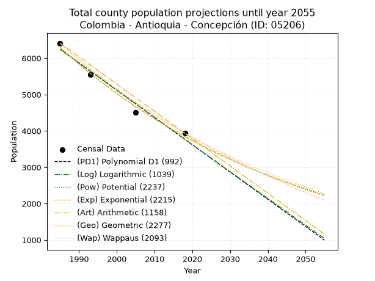
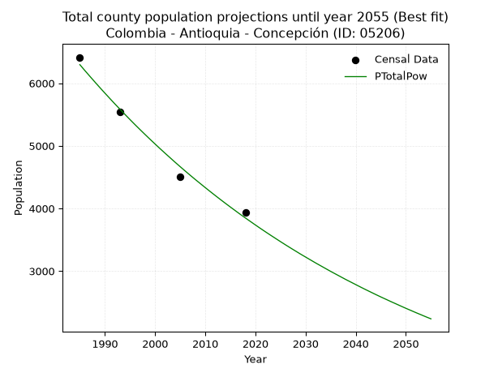
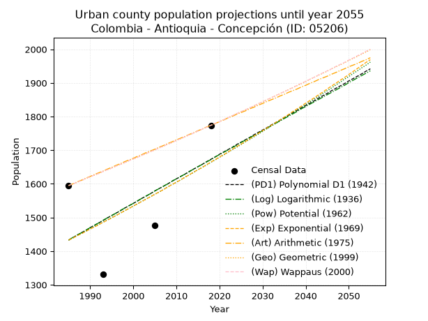
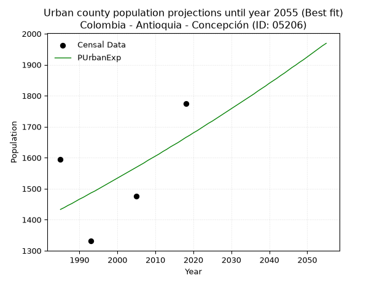
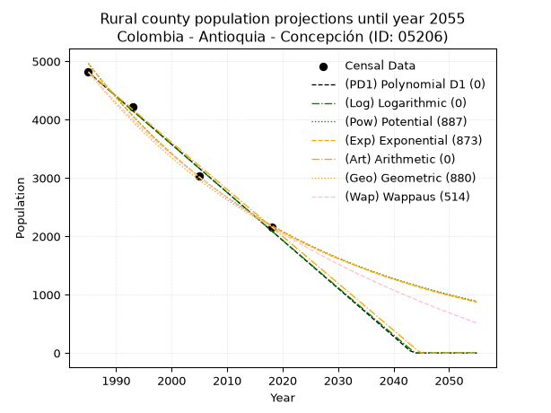
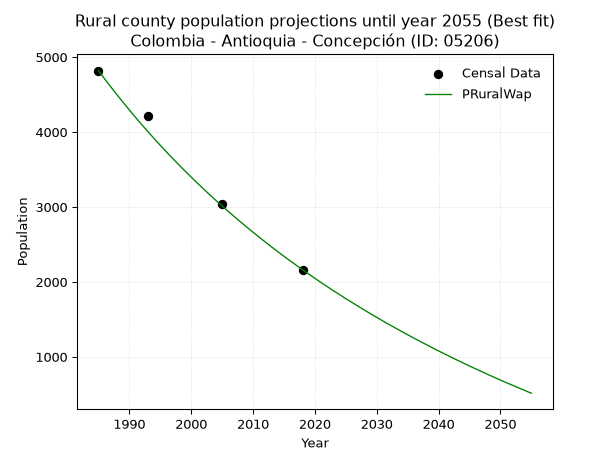

<div align="center">


</div>

# _“Population and Public Services Demand Projections (PPSD) until Year 2050 for Colombia - Antioquia - Concepción (ID: 05206)”_
Keywords: `population` `public-service` `projection` `lineal` `polynomial` `logarithmic` `potential` `exponential` `arithmetic` `geometric` `wappaus` `dane` `colombia` `south-america`

PPSD are analytical estimates used by governments and planners to anticipate future changes in population size, age distribution, and the resulting community needs for utilities, healthcare, education, and infrastructure as sizing future water treatment facilities, electrical grids, and road networks based on spatial growth.

> **General running parameters**: • app_version: _v20260806_. • Python version: _3.14.7_. • Pandas version: _3.0.5_. • NumPy version: _2.5.1_. • Creates, save and include plots into reports (create_plot): _False_. • Projection until year: _2050_. • Process polynomial degree 2 and up: _False_. • Process Wappaus: _True_. • Process Wappaus: _True_. • Set negative values to zero: _True_. • Set infinite values to zero: _True_. • Drop dataset notes: _True_. 
<div align="center">

Dynamic map: [:earth_americas:Google](http://maps.google.com/maps?q=6.394348112,-75.2575871) [:earth_americas:OSM](https://www.openstreetmap.org/#map=18/6.394348112/-75.2575871&layers=P) [:earth_americas:Bing](https://www.bing.com/maps?cp=6.394348112~-75.2575871&lvl=18) [:earth_americas:Apple](https://maps.apple.com/frame?center=6.394348112%2C-75.2575871&span=0.003%2C0.006)

</div>


<div align="center">

```geojson
{
  "type": "Feature",
  "geometry": {
    "type": "Point", 
    "coordinates": [-75.2575871, 6.394348112]
  }, 
  "properties": {
    "Name": "Colombia - Antioquia - Concepción (ID: 05206)"
  }
}
```

</div>


## 0. Census Data (4 records)

Census data are official statistics collected by a government about the people and housing in a country. They usually include counts of total population, age, sex, race, income, education, and jobs.

📅Global census file: [Population.xlsx](../data/Population.xlsx)

| Source   |   Year |   CountryID | CountryName   |   StateID | StateName   |   CountyID | CountyName   |   PTotal |   PUrban |   PRural |
|:---------|-------:|------------:|:--------------|----------:|:------------|-----------:|:-------------|---------:|---------:|---------:|
| DANE     |   1985 |          57 | Colombia      |        05 | Antioquia   |      05206 | Concepción   |     6414 |     1595 |     4819 |
| DANE     |   1993 |          57 | Colombia      |        05 | Antioquia   |      05206 | Concepción   |     5547 |     1331 |     4216 |
| DANE     |   2005 |          57 | Colombia      |        05 | Antioquia   |      05206 | Concepción   |     4509 |     1476 |     3033 |
| DANE     |   2018 |          57 | Colombia      |        05 | Antioquia   |      05206 | Concepción   |     3936 |     1774 |     2162 |

> 🔥Some records could had specific notes about the registered values or the corresponding urban or rural distribution.

## 1. Total

### 1.1. Coefficients and Parameters

* (PD1) Polynomial Deg 1: -75.06623845845002, 155252.74347651462 (lineal)
* (Log) Logarithmic: -150319.24771605353, 1147679.3064725755
* (Pow) Potential: -29.86381512542525, 102.28279912771369
* (Exp) Exponential: -0.014915609416627059, 4.5418603958068744e+16
* (Art) Arithmetic: Year diff. 2018 - 1985 = 33, Population diff. 3936 - 6414 = -2478, Annual growth = -75.0909090909091
* (Geo) Geometric: Year diff. 2018 - 1985 = 33, Population diff. 3936 - 6414 = -2478, Annual growth % = -0.014688573603975907
* (Wap) Wappaus: i = -1.451032059727712, Condition values only valid for < 200)

<sub>
Wappaus condition values: ['-0.00', '-1.45', '-2.90', '-4.35', '-5.80', '-7.26', '-8.71', '-10.16', '-11.61', '-13.06', '-14.51', '-15.96', '-17.41', '-18.86', '-20.31', '-21.77', '-23.22', '-24.67', '-26.12', '-27.57', '-29.02', '-30.47', '-31.92', '-33.37', '-34.82', '-36.28', '-37.73', '-39.18', '-40.63', '-42.08', '-43.53', '-44.98', '-46.43', '-47.88', '-49.34', '-50.79', '-52.24', '-53.69', '-55.14', '-56.59', '-58.04', '-59.49', '-60.94', '-62.39', '-63.85', '-65.30', '-66.75', '-68.20', '-69.65', '-71.10', '-72.55', '-74.00', '-75.45', '-76.90', '-78.36', '-79.81', '-81.26', '-82.71', '-84.16', '-85.61', '-87.06', '-88.51', '-89.96', '-91.42', '-92.87', '-94.32']
</sub>


### 1.2. Projected Dataset

|   Year |   CountyID |   PTotalPD1 |   PTotalLog |   PTotalPow |   PTotalExp |   PTotalArt |   PTotalGeo |   PTotalWap |
|-------:|-----------:|------------:|------------:|------------:|------------:|------------:|------------:|------------:|
|   1985 |      05206 |        6246 |        6249 |        6296 |        6293 |        6414 |        6414 |        6414 |
|   1986 |      05206 |        6171 |        6173 |        6202 |        6200 |        6339 |        6320 |        6322 |
|   1987 |      05206 |        6096 |        6098 |        6110 |        6108 |        6264 |        6227 |        6231 |
|   1988 |      05206 |        6021 |        6022 |        6019 |        6018 |        6189 |        6135 |        6141 |
|   1989 |      05206 |        5946 |        5946 |        5929 |        5929 |        6114 |        6045 |        6052 |
|   1990 |      05206 |        5871 |        5871 |        5841 |        5841 |        6039 |        5957 |        5965 |
|   1991 |      05206 |        5796 |        5795 |        5754 |        5754 |        5963 |        5869 |        5879 |
|   1992 |      05206 |        5721 |        5720 |        5668 |        5669 |        5888 |        5783 |        5794 |
|   1993 |      05206 |        5646 |        5644 |        5584 |        5585 |        5813 |        5698 |        5710 |
|   1994 |      05206 |        5571 |        5569 |        5501 |        5503 |        5738 |        5614 |        5628 |
|   1995 |      05206 |        5496 |        5494 |        5419 |        5421 |        5663 |        5532 |        5546 |
|   1996 |      05206 |        5421 |        5418 |        5338 |        5341 |        5588 |        5451 |        5466 |
|   1997 |      05206 |        5345 |        5343 |        5259 |        5262 |        5513 |        5370 |        5387 |
|   1998 |      05206 |        5270 |        5268 |        5181 |        5184 |        5438 |        5292 |        5308 |
|   1999 |      05206 |        5195 |        5193 |        5104 |        5107 |        5363 |        5214 |        5231 |
|   2000 |      05206 |        5120 |        5117 |        5029 |        5032 |        5288 |        5137 |        5155 |
|   2001 |      05206 |        5045 |        5042 |        4954 |        4957 |        5213 |        5062 |        5080 |
|   2002 |      05206 |        4970 |        4967 |        4881 |        4884 |        5137 |        4987 |        5006 |
|   2003 |      05206 |        4895 |        4892 |        4809 |        4811 |        5062 |        4914 |        4932 |
|   2004 |      05206 |        4820 |        4817 |        4737 |        4740 |        4987 |        4842 |        4860 |
|   2005 |      05206 |        4745 |        4742 |        4667 |        4670 |        4912 |        4771 |        4788 |
|   2006 |      05206 |        4670 |        4667 |        4598 |        4601 |        4837 |        4701 |        4718 |
|   2007 |      05206 |        4595 |        4592 |        4530 |        4533 |        4762 |        4632 |        4648 |
|   2008 |      05206 |        4520 |        4517 |        4463 |        4466 |        4687 |        4564 |        4580 |
|   2009 |      05206 |        4445 |        4442 |        4398 |        4399 |        4612 |        4497 |        4512 |
|   2010 |      05206 |        4370 |        4368 |        4333 |        4334 |        4537 |        4431 |        4444 |
|   2011 |      05206 |        4295 |        4293 |        4269 |        4270 |        4462 |        4366 |        4378 |
|   2012 |      05206 |        4219 |        4218 |        4206 |        4207 |        4387 |        4301 |        4313 |
|   2013 |      05206 |        4144 |        4143 |        4144 |        4145 |        4311 |        4238 |        4248 |
|   2014 |      05206 |        4069 |        4069 |        4083 |        4083 |        4236 |        4176 |        4184 |
|   2015 |      05206 |        3994 |        3994 |        4023 |        4023 |        4161 |        4115 |        4121 |
|   2016 |      05206 |        3919 |        3920 |        3964 |        3963 |        4086 |        4054 |        4059 |
|   2017 |      05206 |        3844 |        3845 |        3905 |        3905 |        4011 |        3995 |        3997 |
|   2018 |      05206 |        3769 |        3771 |        3848 |        3847 |        3936 |        3936 |        3936 |
|   2019 |      05206 |        3694 |        3696 |        3792 |        3790 |        3861 |        3878 |        3876 |
|   2020 |      05206 |        3619 |        3622 |        3736 |        3734 |        3786 |        3821 |        3816 |
|   2021 |      05206 |        3544 |        3547 |        3681 |        3678 |        3711 |        3765 |        3757 |
|   2022 |      05206 |        3469 |        3473 |        3627 |        3624 |        3636 |        3710 |        3699 |
|   2023 |      05206 |        3394 |        3399 |        3574 |        3570 |        3561 |        3655 |        3642 |
|   2024 |      05206 |        3319 |        3324 |        3522 |        3517 |        3485 |        3602 |        3585 |
|   2025 |      05206 |        3244 |        3250 |        3470 |        3465 |        3410 |        3549 |        3529 |
|   2026 |      05206 |        3169 |        3176 |        3419 |        3414 |        3335 |        3497 |        3473 |
|   2027 |      05206 |        3093 |        3102 |        3369 |        3364 |        3260 |        3445 |        3418 |
|   2028 |      05206 |        3018 |        3027 |        3320 |        3314 |        3185 |        3395 |        3364 |
|   2029 |      05206 |        2943 |        2953 |        3271 |        3265 |        3110 |        3345 |        3310 |
|   2030 |      05206 |        2868 |        2879 |        3224 |        3216 |        3035 |        3296 |        3257 |
|   2031 |      05206 |        2793 |        2805 |        3177 |        3169 |        2960 |        3247 |        3204 |
|   2032 |      05206 |        2718 |        2731 |        3130 |        3122 |        2885 |        3200 |        3152 |
|   2033 |      05206 |        2643 |        2657 |        3085 |        3076 |        2810 |        3153 |        3101 |
|   2034 |      05206 |        2568 |        2583 |        3040 |        3030 |        2735 |        3106 |        3050 |
|   2035 |      05206 |        2493 |        2510 |        2995 |        2985 |        2659 |        3061 |        2999 |
|   2036 |      05206 |        2418 |        2436 |        2952 |        2941 |        2584 |        3016 |        2949 |
|   2037 |      05206 |        2343 |        2362 |        2909 |        2897 |        2509 |        2971 |        2900 |
|   2038 |      05206 |        2268 |        2288 |        2866 |        2855 |        2434 |        2928 |        2851 |
|   2039 |      05206 |        2193 |        2214 |        2825 |        2812 |        2359 |        2885 |        2803 |
|   2040 |      05206 |        2118 |        2141 |        2784 |        2771 |        2284 |        2842 |        2755 |
|   2041 |      05206 |        2043 |        2067 |        2743 |        2730 |        2209 |        2801 |        2708 |
|   2042 |      05206 |        1967 |        1993 |        2703 |        2689 |        2134 |        2759 |        2661 |
|   2043 |      05206 |        1892 |        1920 |        2664 |        2649 |        2059 |        2719 |        2615 |
|   2044 |      05206 |        1817 |        1846 |        2625 |        2610 |        1984 |        2679 |        2569 |
|   2045 |      05206 |        1742 |        1773 |        2587 |        2572 |        1909 |        2640 |        2523 |
|   2046 |      05206 |        1667 |        1699 |        2550 |        2534 |        1833 |        2601 |        2478 |
|   2047 |      05206 |        1592 |        1626 |        2513 |        2496 |        1758 |        2563 |        2434 |
|   2048 |      05206 |        1517 |        1552 |        2477 |        2459 |        1683 |        2525 |        2390 |
|   2049 |      05206 |        1442 |        1479 |        2441 |        2423 |        1608 |        2488 |        2346 |
|   2050 |      05206 |        1367 |        1406 |        2405 |        2387 |        1533 |        2451 |        2303 |
<div align="center">

</img>

</div>


### 1.3. Best fit with absolute and relative error (%)

Relative error puts that difference into context by dividing the absolute error by the true value, creating a unitless ratio or percentage that shows the scale of the mistake.

Absolute and relative error

|   Year | Source   |   CountryID | CountryName   |   StateID | StateName   |   CountyID_x | CountyName   |   PTotal |   PUrban |   PRural |   CountyID_y |   PTotalPD1 |   PTotalLog |   PTotalPow |   PTotalExp |   PTotalArt |   PTotalGeo |   PTotalWap |   PTotalPD1AbsError |   PTotalLogAbsError |   PTotalPowAbsError |   PTotalExpAbsError |   PTotalArtAbsError |   PTotalGeoAbsError |   PTotalWapAbsError |   PTotalPD1RelError |   PTotalLogRelError |   PTotalPowRelError |   PTotalExpRelError |   PTotalArtRelError |   PTotalGeoRelError |   PTotalWapRelError |
|-------:|:---------|------------:|:--------------|----------:|:------------|-------------:|:-------------|---------:|---------:|---------:|-------------:|------------:|------------:|------------:|------------:|------------:|------------:|------------:|--------------------:|--------------------:|--------------------:|--------------------:|--------------------:|--------------------:|--------------------:|--------------------:|--------------------:|--------------------:|--------------------:|--------------------:|--------------------:|--------------------:|
|   1985 | DANE     |          57 | Colombia      |        05 | Antioquia   |        05206 | Concepción   |     6414 |     1595 |     4819 |        05206 |        6246 |        6249 |        6296 |        6293 |        6414 |        6414 |        6414 |                 168 |                 165 |                 118 |                 121 |                   0 |                   0 |                   0 |             2.61927 |             2.5725  |            1.83973  |            1.8865   |             0       |             0       |             0       |
|   1993 | DANE     |          57 | Colombia      |        05 | Antioquia   |        05206 | Concepción   |     5547 |     1331 |     4216 |        05206 |        5646 |        5644 |        5584 |        5585 |        5813 |        5698 |        5710 |                  99 |                  97 |                  37 |                  38 |                 266 |                 151 |                 163 |             1.78475 |             1.74869 |            0.667027 |            0.685055 |             4.79538 |             2.72219 |             2.93853 |
|   2005 | DANE     |          57 | Colombia      |        05 | Antioquia   |        05206 | Concepción   |     4509 |     1476 |     3033 |        05206 |        4745 |        4742 |        4667 |        4670 |        4912 |        4771 |        4788 |                 236 |                 233 |                 158 |                 161 |                 403 |                 262 |                 279 |             5.23398 |             5.16744 |            3.5041   |            3.57064  |             8.93768 |             5.8106  |             6.18762 |
|   2018 | DANE     |          57 | Colombia      |        05 | Antioquia   |        05206 | Concepción   |     3936 |     1774 |     2162 |        05206 |        3769 |        3771 |        3848 |        3847 |        3936 |        3936 |        3936 |                 167 |                 165 |                  88 |                  89 |                   0 |                   0 |                   0 |             4.24289 |             4.19207 |            2.23577  |            2.26118  |             0       |             0       |             0       |

Relative error mean

| Method    |   RelError | Best   |
|:----------|-----------:|:-------|
| PTotalPD1 |    3.47022 |        |
| PTotalLog |    3.42018 |        |
| PTotalPow |    2.06166 | True   |
| PTotalExp |    2.10084 |        |
| PTotalArt |    3.43327 |        |
| PTotalGeo |    2.1332  |        |
| PTotalWap |    2.28154 |        |

💙Best method: _**PTotalPow**_
<div align="center">

</img>

</div>


### 1.4. Fresh water supply demand in liters per capita per day (lpcd)

The fresh water supply demand typically ranges from 100 to 300 liters per capita per day (lpcd) for standard domestic and municipal planning, though absolute survival minimums set by the World Health Organization are as low as 7.5 to 20 liters per day, and total consumption in high-income nations can exceed 400 liters.

> `CZ`: Level in meters above the sea level (masl)<br> `WS`: Fresh water supply demand in liters per capita per day (lpcd or l/h/d)<br> `WSAll`: Zonal fresh water supply demand in liters per second (l/s)<br> `A`: Zonal area in square meters<br> `DP`: Population density (people/hectare)

Reference values (RAS Colombia)

|    CZ |   WS |
|------:|-----:|
|  1000 |  120 |
|  2000 |  130 |
| 99999 |  140 |

County shapefile geometry properties and water supply values

|   CountyID |      ATotal |   CZTotal |   WSTotal |
|-----------:|------------:|----------:|----------:|
|      05206 | 2.01953e+08 |   2010.14 |       140 |

Projected values for best method: PTotalPow

|   CountyID |   Year |   PTotalPow |   DPTotal |   WSTotal |   WSTotalAll |
|-----------:|-------:|------------:|----------:|----------:|-------------:|
|      05206 |   1985 |        6296 |      0.31 |       140 |     10.2019  |
|      05206 |   1986 |        6202 |      0.31 |       140 |     10.0495  |
|      05206 |   1987 |        6110 |      0.3  |       140 |      9.90046 |
|      05206 |   1988 |        6019 |      0.3  |       140 |      9.75301 |
|      05206 |   1989 |        5929 |      0.29 |       140 |      9.60718 |
|      05206 |   1990 |        5841 |      0.29 |       140 |      9.46458 |
|      05206 |   1991 |        5754 |      0.28 |       140 |      9.32361 |
|      05206 |   1992 |        5668 |      0.28 |       140 |      9.18426 |
|      05206 |   1993 |        5584 |      0.28 |       140 |      9.04815 |
|      05206 |   1994 |        5501 |      0.27 |       140 |      8.91366 |
|      05206 |   1995 |        5419 |      0.27 |       140 |      8.78079 |
|      05206 |   1996 |        5338 |      0.26 |       140 |      8.64954 |
|      05206 |   1997 |        5259 |      0.26 |       140 |      8.52153 |
|      05206 |   1998 |        5181 |      0.26 |       140 |      8.39514 |
|      05206 |   1999 |        5104 |      0.25 |       140 |      8.27037 |
|      05206 |   2000 |        5029 |      0.25 |       140 |      8.14884 |
|      05206 |   2001 |        4954 |      0.25 |       140 |      8.02731 |
|      05206 |   2002 |        4881 |      0.24 |       140 |      7.90903 |
|      05206 |   2003 |        4809 |      0.24 |       140 |      7.79236 |
|      05206 |   2004 |        4737 |      0.23 |       140 |      7.67569 |
|      05206 |   2005 |        4667 |      0.23 |       140 |      7.56227 |
|      05206 |   2006 |        4598 |      0.23 |       140 |      7.45046 |
|      05206 |   2007 |        4530 |      0.22 |       140 |      7.34028 |
|      05206 |   2008 |        4463 |      0.22 |       140 |      7.23171 |
|      05206 |   2009 |        4398 |      0.22 |       140 |      7.12639 |
|      05206 |   2010 |        4333 |      0.21 |       140 |      7.02106 |
|      05206 |   2011 |        4269 |      0.21 |       140 |      6.91736 |
|      05206 |   2012 |        4206 |      0.21 |       140 |      6.81528 |
|      05206 |   2013 |        4144 |      0.21 |       140 |      6.71481 |
|      05206 |   2014 |        4083 |      0.2  |       140 |      6.61597 |
|      05206 |   2015 |        4023 |      0.2  |       140 |      6.51875 |
|      05206 |   2016 |        3964 |      0.2  |       140 |      6.42315 |
|      05206 |   2017 |        3905 |      0.19 |       140 |      6.32755 |
|      05206 |   2018 |        3848 |      0.19 |       140 |      6.23519 |
|      05206 |   2019 |        3792 |      0.19 |       140 |      6.14444 |
|      05206 |   2020 |        3736 |      0.18 |       140 |      6.0537  |
|      05206 |   2021 |        3681 |      0.18 |       140 |      5.96458 |
|      05206 |   2022 |        3627 |      0.18 |       140 |      5.87708 |
|      05206 |   2023 |        3574 |      0.18 |       140 |      5.7912  |
|      05206 |   2024 |        3522 |      0.17 |       140 |      5.70694 |
|      05206 |   2025 |        3470 |      0.17 |       140 |      5.62269 |
|      05206 |   2026 |        3419 |      0.17 |       140 |      5.54005 |
|      05206 |   2027 |        3369 |      0.17 |       140 |      5.45903 |
|      05206 |   2028 |        3320 |      0.16 |       140 |      5.37963 |
|      05206 |   2029 |        3271 |      0.16 |       140 |      5.30023 |
|      05206 |   2030 |        3224 |      0.16 |       140 |      5.22407 |
|      05206 |   2031 |        3177 |      0.16 |       140 |      5.14792 |
|      05206 |   2032 |        3130 |      0.15 |       140 |      5.07176 |
|      05206 |   2033 |        3085 |      0.15 |       140 |      4.99884 |
|      05206 |   2034 |        3040 |      0.15 |       140 |      4.92593 |
|      05206 |   2035 |        2995 |      0.15 |       140 |      4.85301 |
|      05206 |   2036 |        2952 |      0.15 |       140 |      4.78333 |
|      05206 |   2037 |        2909 |      0.14 |       140 |      4.71366 |
|      05206 |   2038 |        2866 |      0.14 |       140 |      4.64398 |
|      05206 |   2039 |        2825 |      0.14 |       140 |      4.57755 |
|      05206 |   2040 |        2784 |      0.14 |       140 |      4.51111 |
|      05206 |   2041 |        2743 |      0.14 |       140 |      4.44468 |
|      05206 |   2042 |        2703 |      0.13 |       140 |      4.37986 |
|      05206 |   2043 |        2664 |      0.13 |       140 |      4.31667 |
|      05206 |   2044 |        2625 |      0.13 |       140 |      4.25347 |
|      05206 |   2045 |        2587 |      0.13 |       140 |      4.1919  |
|      05206 |   2046 |        2550 |      0.13 |       140 |      4.13194 |
|      05206 |   2047 |        2513 |      0.12 |       140 |      4.07199 |
|      05206 |   2048 |        2477 |      0.12 |       140 |      4.01366 |
|      05206 |   2049 |        2441 |      0.12 |       140 |      3.95532 |
|      05206 |   2050 |        2405 |      0.12 |       140 |      3.89699 |

## 2. Urban

### 2.1. Coefficients and Parameters

* (PD1) Polynomial Deg 1: 7.267763950220607, -12993.344841428769 (lineal)
* (Log) Logarithmic: 14500.10803120462, -108671.43734175968
* (Pow) Potential: 9.070385431877428, -26.7557855039739
* (Exp) Exponential: 0.0045467338418185375, 0.17238845890729984
* (Art) Arithmetic: Year diff. 2018 - 1985 = 33, Population diff. 1774 - 1595 = 179, Annual growth = 5.424242424242424
* (Geo) Geometric: Year diff. 2018 - 1985 = 33, Population diff. 1774 - 1595 = 179, Annual growth % = 0.0032283255410705536
* (Wap) Wappaus: i = 0.32200904863415997, Condition values only valid for < 200)

<sub>
Wappaus condition values: ['0.00', '0.32', '0.64', '0.97', '1.29', '1.61', '1.93', '2.25', '2.58', '2.90', '3.22', '3.54', '3.86', '4.19', '4.51', '4.83', '5.15', '5.47', '5.80', '6.12', '6.44', '6.76', '7.08', '7.41', '7.73', '8.05', '8.37', '8.69', '9.02', '9.34', '9.66', '9.98', '10.30', '10.63', '10.95', '11.27', '11.59', '11.91', '12.24', '12.56', '12.88', '13.20', '13.52', '13.85', '14.17', '14.49', '14.81', '15.13', '15.46', '15.78', '16.10', '16.42', '16.74', '17.07', '17.39', '17.71', '18.03', '18.35', '18.68', '19.00', '19.32', '19.64', '19.96', '20.29', '20.61', '20.93']
</sub>


### 2.2. Projected Dataset

|   Year |   CountyID |   PUrbanPD1 |   PUrbanLog |   PUrbanPow |   PUrbanExp |   PUrbanArt |   PUrbanGeo |   PUrbanWap |
|-------:|-----------:|------------:|------------:|------------:|------------:|------------:|------------:|------------:|
|   1985 |      05206 |        1433 |        1433 |        1433 |        1433 |        1595 |        1595 |        1595 |
|   1986 |      05206 |        1440 |        1441 |        1439 |        1439 |        1600 |        1600 |        1600 |
|   1987 |      05206 |        1448 |        1448 |        1446 |        1446 |        1606 |        1605 |        1605 |
|   1988 |      05206 |        1455 |        1455 |        1453 |        1452 |        1611 |        1610 |        1610 |
|   1989 |      05206 |        1462 |        1462 |        1459 |        1459 |        1617 |        1616 |        1616 |
|   1990 |      05206 |        1470 |        1470 |        1466 |        1466 |        1622 |        1621 |        1621 |
|   1991 |      05206 |        1477 |        1477 |        1473 |        1472 |        1628 |        1626 |        1626 |
|   1992 |      05206 |        1484 |        1484 |        1479 |        1479 |        1633 |        1631 |        1631 |
|   1993 |      05206 |        1491 |        1492 |        1486 |        1486 |        1638 |        1637 |        1637 |
|   1994 |      05206 |        1499 |        1499 |        1493 |        1492 |        1644 |        1642 |        1642 |
|   1995 |      05206 |        1506 |        1506 |        1500 |        1499 |        1649 |        1647 |        1647 |
|   1996 |      05206 |        1513 |        1513 |        1506 |        1506 |        1655 |        1653 |        1653 |
|   1997 |      05206 |        1520 |        1521 |        1513 |        1513 |        1660 |        1658 |        1658 |
|   1998 |      05206 |        1528 |        1528 |        1520 |        1520 |        1666 |        1663 |        1663 |
|   1999 |      05206 |        1535 |        1535 |        1527 |        1527 |        1671 |        1669 |        1669 |
|   2000 |      05206 |        1542 |        1542 |        1534 |        1534 |        1676 |        1674 |        1674 |
|   2001 |      05206 |        1549 |        1550 |        1541 |        1541 |        1682 |        1679 |        1679 |
|   2002 |      05206 |        1557 |        1557 |        1548 |        1548 |        1687 |        1685 |        1685 |
|   2003 |      05206 |        1564 |        1564 |        1555 |        1555 |        1693 |        1690 |        1690 |
|   2004 |      05206 |        1571 |        1571 |        1562 |        1562 |        1698 |        1696 |        1696 |
|   2005 |      05206 |        1579 |        1579 |        1569 |        1569 |        1703 |        1701 |        1701 |
|   2006 |      05206 |        1586 |        1586 |        1576 |        1576 |        1709 |        1707 |        1707 |
|   2007 |      05206 |        1593 |        1593 |        1583 |        1583 |        1714 |        1712 |        1712 |
|   2008 |      05206 |        1600 |        1600 |        1591 |        1591 |        1720 |        1718 |        1718 |
|   2009 |      05206 |        1608 |        1608 |        1598 |        1598 |        1725 |        1723 |        1723 |
|   2010 |      05206 |        1615 |        1615 |        1605 |        1605 |        1731 |        1729 |        1729 |
|   2011 |      05206 |        1622 |        1622 |        1612 |        1612 |        1736 |        1734 |        1734 |
|   2012 |      05206 |        1629 |        1629 |        1620 |        1620 |        1741 |        1740 |        1740 |
|   2013 |      05206 |        1637 |        1636 |        1627 |        1627 |        1747 |        1746 |        1746 |
|   2014 |      05206 |        1644 |        1644 |        1634 |        1635 |        1752 |        1751 |        1751 |
|   2015 |      05206 |        1651 |        1651 |        1642 |        1642 |        1758 |        1757 |        1757 |
|   2016 |      05206 |        1658 |        1658 |        1649 |        1649 |        1763 |        1763 |        1763 |
|   2017 |      05206 |        1666 |        1665 |        1656 |        1657 |        1769 |        1768 |        1768 |
|   2018 |      05206 |        1673 |        1672 |        1664 |        1665 |        1774 |        1774 |        1774 |
|   2019 |      05206 |        1680 |        1680 |        1671 |        1672 |        1779 |        1780 |        1780 |
|   2020 |      05206 |        1688 |        1687 |        1679 |        1680 |        1785 |        1785 |        1785 |
|   2021 |      05206 |        1695 |        1694 |        1686 |        1687 |        1790 |        1791 |        1791 |
|   2022 |      05206 |        1702 |        1701 |        1694 |        1695 |        1796 |        1797 |        1797 |
|   2023 |      05206 |        1709 |        1708 |        1702 |        1703 |        1801 |        1803 |        1803 |
|   2024 |      05206 |        1717 |        1715 |        1709 |        1711 |        1807 |        1809 |        1809 |
|   2025 |      05206 |        1724 |        1723 |        1717 |        1718 |        1812 |        1814 |        1815 |
|   2026 |      05206 |        1731 |        1730 |        1725 |        1726 |        1817 |        1820 |        1820 |
|   2027 |      05206 |        1738 |        1737 |        1732 |        1734 |        1823 |        1826 |        1826 |
|   2028 |      05206 |        1746 |        1744 |        1740 |        1742 |        1828 |        1832 |        1832 |
|   2029 |      05206 |        1753 |        1751 |        1748 |        1750 |        1834 |        1838 |        1838 |
|   2030 |      05206 |        1760 |        1758 |        1756 |        1758 |        1839 |        1844 |        1844 |
|   2031 |      05206 |        1767 |        1765 |        1764 |        1766 |        1845 |        1850 |        1850 |
|   2032 |      05206 |        1775 |        1773 |        1772 |        1774 |        1850 |        1856 |        1856 |
|   2033 |      05206 |        1782 |        1780 |        1779 |        1782 |        1855 |        1862 |        1862 |
|   2034 |      05206 |        1789 |        1787 |        1787 |        1790 |        1861 |        1868 |        1868 |
|   2035 |      05206 |        1797 |        1794 |        1795 |        1798 |        1866 |        1874 |        1874 |
|   2036 |      05206 |        1804 |        1801 |        1803 |        1806 |        1872 |        1880 |        1880 |
|   2037 |      05206 |        1811 |        1808 |        1812 |        1815 |        1877 |        1886 |        1886 |
|   2038 |      05206 |        1818 |        1815 |        1820 |        1823 |        1882 |        1892 |        1893 |
|   2039 |      05206 |        1826 |        1823 |        1828 |        1831 |        1888 |        1898 |        1899 |
|   2040 |      05206 |        1833 |        1830 |        1836 |        1840 |        1893 |        1904 |        1905 |
|   2041 |      05206 |        1840 |        1837 |        1844 |        1848 |        1899 |        1911 |        1911 |
|   2042 |      05206 |        1847 |        1844 |        1852 |        1856 |        1904 |        1917 |        1917 |
|   2043 |      05206 |        1855 |        1851 |        1860 |        1865 |        1910 |        1923 |        1924 |
|   2044 |      05206 |        1862 |        1858 |        1869 |        1873 |        1915 |        1929 |        1930 |
|   2045 |      05206 |        1869 |        1865 |        1877 |        1882 |        1920 |        1935 |        1936 |
|   2046 |      05206 |        1877 |        1872 |        1885 |        1891 |        1926 |        1942 |        1942 |
|   2047 |      05206 |        1884 |        1879 |        1894 |        1899 |        1931 |        1948 |        1949 |
|   2048 |      05206 |        1891 |        1886 |        1902 |        1908 |        1937 |        1954 |        1955 |
|   2049 |      05206 |        1898 |        1893 |        1911 |        1916 |        1942 |        1960 |        1961 |
|   2050 |      05206 |        1906 |        1901 |        1919 |        1925 |        1948 |        1967 |        1968 |
<div align="center">

</img>

</div>


### 2.3. Best fit with absolute and relative error (%)

Relative error puts that difference into context by dividing the absolute error by the true value, creating a unitless ratio or percentage that shows the scale of the mistake.

Absolute and relative error

|   Year | Source   |   CountryID | CountryName   |   StateID | StateName   |   CountyID_x | CountyName   |   PTotal |   PUrban |   PRural |   CountyID_y |   PUrbanPD1 |   PUrbanLog |   PUrbanPow |   PUrbanExp |   PUrbanArt |   PUrbanGeo |   PUrbanWap |   PUrbanPD1AbsError |   PUrbanLogAbsError |   PUrbanPowAbsError |   PUrbanExpAbsError |   PUrbanArtAbsError |   PUrbanGeoAbsError |   PUrbanWapAbsError |   PUrbanPD1RelError |   PUrbanLogRelError |   PUrbanPowRelError |   PUrbanExpRelError |   PUrbanArtRelError |   PUrbanGeoRelError |   PUrbanWapRelError |
|-------:|:---------|------------:|:--------------|----------:|:------------|-------------:|:-------------|---------:|---------:|---------:|-------------:|------------:|------------:|------------:|------------:|------------:|------------:|------------:|--------------------:|--------------------:|--------------------:|--------------------:|--------------------:|--------------------:|--------------------:|--------------------:|--------------------:|--------------------:|--------------------:|--------------------:|--------------------:|--------------------:|
|   1985 | DANE     |          57 | Colombia      |        05 | Antioquia   |        05206 | Concepción   |     6414 |     1595 |     4819 |        05206 |        1433 |        1433 |        1433 |        1433 |        1595 |        1595 |        1595 |                 162 |                 162 |                 162 |                 162 |                   0 |                   0 |                   0 |            10.1567  |            10.1567  |            10.1567  |            10.1567  |              0      |              0      |              0      |
|   1993 | DANE     |          57 | Colombia      |        05 | Antioquia   |        05206 | Concepción   |     5547 |     1331 |     4216 |        05206 |        1491 |        1492 |        1486 |        1486 |        1638 |        1637 |        1637 |                 160 |                 161 |                 155 |                 155 |                 307 |                 306 |                 306 |            12.021   |            12.0962  |            11.6454  |            11.6454  |             23.0654 |             22.9902 |             22.9902 |
|   2005 | DANE     |          57 | Colombia      |        05 | Antioquia   |        05206 | Concepción   |     4509 |     1476 |     3033 |        05206 |        1579 |        1579 |        1569 |        1569 |        1703 |        1701 |        1701 |                 103 |                 103 |                  93 |                  93 |                 227 |                 225 |                 225 |             6.97832 |             6.97832 |             6.30081 |             6.30081 |             15.3794 |             15.2439 |             15.2439 |
|   2018 | DANE     |          57 | Colombia      |        05 | Antioquia   |        05206 | Concepción   |     3936 |     1774 |     2162 |        05206 |        1673 |        1672 |        1664 |        1665 |        1774 |        1774 |        1774 |                 101 |                 102 |                 110 |                 109 |                   0 |                   0 |                   0 |             5.69335 |             5.74972 |             6.20068 |             6.14431 |              0      |              0      |              0      |

Relative error mean

| Method    |   RelError | Best   |
|:----------|-----------:|:-------|
| PUrbanPD1 |    8.71236 |        |
| PUrbanLog |    8.74524 |        |
| PUrbanPow |    8.5759  |        |
| PUrbanExp |    8.56181 | True   |
| PUrbanArt |    9.61119 |        |
| PUrbanGeo |    9.55853 |        |
| PUrbanWap |    9.55853 |        |

💙Best method: _**PUrbanExp**_
<div align="center">

</img>

</div>


### 2.4. Fresh water supply demand in liters per capita per day (lpcd)

The fresh water supply demand typically ranges from 100 to 300 liters per capita per day (lpcd) for standard domestic and municipal planning, though absolute survival minimums set by the World Health Organization are as low as 7.5 to 20 liters per day, and total consumption in high-income nations can exceed 400 liters.

> `CZ`: Level in meters above the sea level (masl)<br> `WS`: Fresh water supply demand in liters per capita per day (lpcd or l/h/d)<br> `WSAll`: Zonal fresh water supply demand in liters per second (l/s)<br> `A`: Zonal area in square meters<br> `DP`: Population density (people/hectare)

Reference values (RAS Colombia)

|    CZ |   WS |
|------:|-----:|
|  1000 |  120 |
|  2000 |  130 |
| 99999 |  140 |

County shapefile geometry properties and water supply values

|   CountyID |   AUrban |   CZUrban |   WSUrban |
|-----------:|---------:|----------:|----------:|
|      05206 |   607900 |    1845.8 |       130 |

Projected values for best method: PUrbanExp

|   CountyID |   Year |   PUrbanExp |   DPUrban |   WSUrban |   WSUrbanAll |
|-----------:|-------:|------------:|----------:|----------:|-------------:|
|      05206 |   1985 |        1433 |     23.57 |       130 |      2.15613 |
|      05206 |   1986 |        1439 |     23.67 |       130 |      2.16516 |
|      05206 |   1987 |        1446 |     23.79 |       130 |      2.17569 |
|      05206 |   1988 |        1452 |     23.89 |       130 |      2.18472 |
|      05206 |   1989 |        1459 |     24    |       130 |      2.19525 |
|      05206 |   1990 |        1466 |     24.12 |       130 |      2.20579 |
|      05206 |   1991 |        1472 |     24.21 |       130 |      2.21481 |
|      05206 |   1992 |        1479 |     24.33 |       130 |      2.22535 |
|      05206 |   1993 |        1486 |     24.44 |       130 |      2.23588 |
|      05206 |   1994 |        1492 |     24.54 |       130 |      2.24491 |
|      05206 |   1995 |        1499 |     24.66 |       130 |      2.25544 |
|      05206 |   1996 |        1506 |     24.77 |       130 |      2.26597 |
|      05206 |   1997 |        1513 |     24.89 |       130 |      2.2765  |
|      05206 |   1998 |        1520 |     25    |       130 |      2.28704 |
|      05206 |   1999 |        1527 |     25.12 |       130 |      2.29757 |
|      05206 |   2000 |        1534 |     25.23 |       130 |      2.3081  |
|      05206 |   2001 |        1541 |     25.35 |       130 |      2.31863 |
|      05206 |   2002 |        1548 |     25.46 |       130 |      2.32917 |
|      05206 |   2003 |        1555 |     25.58 |       130 |      2.3397  |
|      05206 |   2004 |        1562 |     25.7  |       130 |      2.35023 |
|      05206 |   2005 |        1569 |     25.81 |       130 |      2.36076 |
|      05206 |   2006 |        1576 |     25.93 |       130 |      2.3713  |
|      05206 |   2007 |        1583 |     26.04 |       130 |      2.38183 |
|      05206 |   2008 |        1591 |     26.17 |       130 |      2.39387 |
|      05206 |   2009 |        1598 |     26.29 |       130 |      2.4044  |
|      05206 |   2010 |        1605 |     26.4  |       130 |      2.41493 |
|      05206 |   2011 |        1612 |     26.52 |       130 |      2.42546 |
|      05206 |   2012 |        1620 |     26.65 |       130 |      2.4375  |
|      05206 |   2013 |        1627 |     26.76 |       130 |      2.44803 |
|      05206 |   2014 |        1635 |     26.9  |       130 |      2.46007 |
|      05206 |   2015 |        1642 |     27.01 |       130 |      2.4706  |
|      05206 |   2016 |        1649 |     27.13 |       130 |      2.48113 |
|      05206 |   2017 |        1657 |     27.26 |       130 |      2.49317 |
|      05206 |   2018 |        1665 |     27.39 |       130 |      2.50521 |
|      05206 |   2019 |        1672 |     27.5  |       130 |      2.51574 |
|      05206 |   2020 |        1680 |     27.64 |       130 |      2.52778 |
|      05206 |   2021 |        1687 |     27.75 |       130 |      2.53831 |
|      05206 |   2022 |        1695 |     27.88 |       130 |      2.55035 |
|      05206 |   2023 |        1703 |     28.01 |       130 |      2.56238 |
|      05206 |   2024 |        1711 |     28.15 |       130 |      2.57442 |
|      05206 |   2025 |        1718 |     28.26 |       130 |      2.58495 |
|      05206 |   2026 |        1726 |     28.39 |       130 |      2.59699 |
|      05206 |   2027 |        1734 |     28.52 |       130 |      2.60903 |
|      05206 |   2028 |        1742 |     28.66 |       130 |      2.62106 |
|      05206 |   2029 |        1750 |     28.79 |       130 |      2.6331  |
|      05206 |   2030 |        1758 |     28.92 |       130 |      2.64514 |
|      05206 |   2031 |        1766 |     29.05 |       130 |      2.65718 |
|      05206 |   2032 |        1774 |     29.18 |       130 |      2.66921 |
|      05206 |   2033 |        1782 |     29.31 |       130 |      2.68125 |
|      05206 |   2034 |        1790 |     29.45 |       130 |      2.69329 |
|      05206 |   2035 |        1798 |     29.58 |       130 |      2.70532 |
|      05206 |   2036 |        1806 |     29.71 |       130 |      2.71736 |
|      05206 |   2037 |        1815 |     29.86 |       130 |      2.7309  |
|      05206 |   2038 |        1823 |     29.99 |       130 |      2.74294 |
|      05206 |   2039 |        1831 |     30.12 |       130 |      2.75498 |
|      05206 |   2040 |        1840 |     30.27 |       130 |      2.76852 |
|      05206 |   2041 |        1848 |     30.4  |       130 |      2.78056 |
|      05206 |   2042 |        1856 |     30.53 |       130 |      2.79259 |
|      05206 |   2043 |        1865 |     30.68 |       130 |      2.80613 |
|      05206 |   2044 |        1873 |     30.81 |       130 |      2.81817 |
|      05206 |   2045 |        1882 |     30.96 |       130 |      2.83171 |
|      05206 |   2046 |        1891 |     31.11 |       130 |      2.84525 |
|      05206 |   2047 |        1899 |     31.24 |       130 |      2.85729 |
|      05206 |   2048 |        1908 |     31.39 |       130 |      2.87083 |
|      05206 |   2049 |        1916 |     31.52 |       130 |      2.88287 |
|      05206 |   2050 |        1925 |     31.67 |       130 |      2.89641 |

## 3. Rural

### 3.1. Coefficients and Parameters

* (PD1) Polynomial Deg 1: -82.33400240867059, 168246.08831794336 (lineal)
* (Log) Logarithmic: -164819.3557472582, 1256350.7438143357
* (Pow) Potential: -49.67573654399436, 167.51452000582177
* (Exp) Exponential: -0.02482110951957112, 1.2393190429445963e+25
* (Art) Arithmetic: Year diff. 2018 - 1985 = 33, Population diff. 2162 - 4819 = -2657, Annual growth = -80.51515151515152
* (Geo) Geometric: Year diff. 2018 - 1985 = 33, Population diff. 2162 - 4819 = -2657, Annual growth % = -0.023996269415136995
* (Wap) Wappaus: i = -2.3066939268056585, Condition values only valid for < 200)

<sub>
Wappaus condition values: ['-0.00', '-2.31', '-4.61', '-6.92', '-9.23', '-11.53', '-13.84', '-16.15', '-18.45', '-20.76', '-23.07', '-25.37', '-27.68', '-29.99', '-32.29', '-34.60', '-36.91', '-39.21', '-41.52', '-43.83', '-46.13', '-48.44', '-50.75', '-53.05', '-55.36', '-57.67', '-59.97', '-62.28', '-64.59', '-66.89', '-69.20', '-71.51', '-73.81', '-76.12', '-78.43', '-80.73', '-83.04', '-85.35', '-87.65', '-89.96', '-92.27', '-94.57', '-96.88', '-99.19', '-101.49', '-103.80', '-106.11', '-108.41', '-110.72', '-113.03', '-115.33', '-117.64', '-119.95', '-122.25', '-124.56', '-126.87', '-129.17', '-131.48', '-133.79', '-136.09', '-138.40', '-140.71', '-143.02', '-145.32', '-147.63', '-149.94']
</sub>


### 3.2. Projected Dataset

|   Year |   CountyID |   PRuralPD1 |   PRuralLog |   PRuralPow |   PRuralExp |   PRuralArt |   PRuralGeo |   PRuralWap |
|-------:|-----------:|------------:|------------:|------------:|------------:|------------:|------------:|------------:|
|   1985 |      05206 |        4813 |        4816 |        4964 |        4961 |        4819 |        4819 |        4819 |
|   1986 |      05206 |        4731 |        4733 |        4841 |        4839 |        4738 |        4703 |        4709 |
|   1987 |      05206 |        4648 |        4650 |        4722 |        4720 |        4658 |        4590 |        4602 |
|   1988 |      05206 |        4566 |        4567 |        4605 |        4605 |        4577 |        4480 |        4497 |
|   1989 |      05206 |        4484 |        4484 |        4492 |        4492 |        4497 |        4373 |        4394 |
|   1990 |      05206 |        4401 |        4401 |        4381 |        4382 |        4416 |        4268 |        4294 |
|   1991 |      05206 |        4319 |        4318 |        4273 |        4274 |        4336 |        4165 |        4195 |
|   1992 |      05206 |        4237 |        4235 |        4168 |        4169 |        4255 |        4066 |        4099 |
|   1993 |      05206 |        4154 |        4153 |        4065 |        4067 |        4175 |        3968 |        4005 |
|   1994 |      05206 |        4072 |        4070 |        3965 |        3968 |        4094 |        3873 |        3913 |
|   1995 |      05206 |        3990 |        3987 |        3867 |        3870 |        4014 |        3780 |        3822 |
|   1996 |      05206 |        3907 |        3905 |        3772 |        3775 |        3933 |        3689 |        3734 |
|   1997 |      05206 |        3825 |        3822 |        3680 |        3683 |        3853 |        3601 |        3647 |
|   1998 |      05206 |        3743 |        3740 |        3589 |        3593 |        3772 |        3514 |        3562 |
|   1999 |      05206 |        3660 |        3657 |        3501 |        3504 |        3692 |        3430 |        3479 |
|   2000 |      05206 |        3578 |        3575 |        3415 |        3419 |        3611 |        3348 |        3398 |
|   2001 |      05206 |        3496 |        3493 |        3331 |        3335 |        3531 |        3267 |        3318 |
|   2002 |      05206 |        3413 |        3410 |        3250 |        3253 |        3450 |        3189 |        3239 |
|   2003 |      05206 |        3331 |        3328 |        3170 |        3173 |        3370 |        3112 |        3162 |
|   2004 |      05206 |        3249 |        3246 |        3093 |        3095 |        3289 |        3038 |        3087 |
|   2005 |      05206 |        3166 |        3163 |        3017 |        3020 |        3209 |        2965 |        3013 |
|   2006 |      05206 |        3084 |        3081 |        2943 |        2946 |        3128 |        2894 |        2940 |
|   2007 |      05206 |        3002 |        2999 |        2871 |        2873 |        3048 |        2824 |        2868 |
|   2008 |      05206 |        2919 |        2917 |        2801 |        2803 |        2967 |        2756 |        2798 |
|   2009 |      05206 |        2837 |        2835 |        2732 |        2734 |        2887 |        2690 |        2730 |
|   2010 |      05206 |        2755 |        2753 |        2666 |        2667 |        2806 |        2626 |        2662 |
|   2011 |      05206 |        2672 |        2671 |        2601 |        2602 |        2726 |        2563 |        2596 |
|   2012 |      05206 |        2590 |        2589 |        2537 |        2538 |        2645 |        2501 |        2530 |
|   2013 |      05206 |        2508 |        2507 |        2475 |        2476 |        2565 |        2441 |        2466 |
|   2014 |      05206 |        2425 |        2425 |        2415 |        2415 |        2484 |        2383 |        2403 |
|   2015 |      05206 |        2343 |        2343 |        2356 |        2356 |        2404 |        2325 |        2341 |
|   2016 |      05206 |        2261 |        2262 |        2299 |        2298 |        2323 |        2270 |        2281 |
|   2017 |      05206 |        2178 |        2180 |        2243 |        2242 |        2243 |        2215 |        2221 |
|   2018 |      05206 |        2096 |        2098 |        2188 |        2187 |        2162 |        2162 |        2162 |
|   2019 |      05206 |        2014 |        2017 |        2135 |        2133 |        2081 |        2110 |        2104 |
|   2020 |      05206 |        1931 |        1935 |        2083 |        2081 |        2001 |        2059 |        2047 |
|   2021 |      05206 |        1849 |        1853 |        2033 |        2030 |        1920 |        2010 |        1991 |
|   2022 |      05206 |        1767 |        1772 |        1983 |        1980 |        1840 |        1962 |        1936 |
|   2023 |      05206 |        1684 |        1690 |        1935 |        1932 |        1759 |        1915 |        1882 |
|   2024 |      05206 |        1602 |        1609 |        1888 |        1884 |        1679 |        1869 |        1829 |
|   2025 |      05206 |        1520 |        1527 |        1843 |        1838 |        1598 |        1824 |        1776 |
|   2026 |      05206 |        1437 |        1446 |        1798 |        1793 |        1518 |        1780 |        1725 |
|   2027 |      05206 |        1355 |        1365 |        1754 |        1749 |        1437 |        1737 |        1674 |
|   2028 |      05206 |        1273 |        1283 |        1712 |        1706 |        1357 |        1696 |        1624 |
|   2029 |      05206 |        1190 |        1202 |        1671 |        1664 |        1276 |        1655 |        1574 |
|   2030 |      05206 |        1108 |        1121 |        1630 |        1623 |        1196 |        1615 |        1526 |
|   2031 |      05206 |        1026 |        1040 |        1591 |        1584 |        1115 |        1577 |        1478 |
|   2032 |      05206 |         943 |         959 |        1552 |        1545 |        1035 |        1539 |        1431 |
|   2033 |      05206 |         861 |         878 |        1515 |        1507 |         954 |        1502 |        1385 |
|   2034 |      05206 |         779 |         797 |        1478 |        1470 |         874 |        1466 |        1339 |
|   2035 |      05206 |         696 |         716 |        1443 |        1434 |         793 |        1431 |        1294 |
|   2036 |      05206 |         614 |         635 |        1408 |        1399 |         713 |        1396 |        1249 |
|   2037 |      05206 |         532 |         554 |        1374 |        1365 |         632 |        1363 |        1206 |
|   2038 |      05206 |         449 |         473 |        1341 |        1331 |         552 |        1330 |        1163 |
|   2039 |      05206 |         367 |         392 |        1309 |        1298 |         471 |        1298 |        1120 |
|   2040 |      05206 |         285 |         311 |        1277 |        1267 |         391 |        1267 |        1078 |
|   2041 |      05206 |         202 |         230 |        1246 |        1236 |         310 |        1237 |        1037 |
|   2042 |      05206 |         120 |         150 |        1216 |        1205 |         230 |        1207 |         996 |
|   2043 |      05206 |          38 |          69 |        1187 |        1176 |         149 |        1178 |         956 |
|   2044 |      05206 |           0 |           0 |        1159 |        1147 |          69 |        1150 |         916 |
|   2045 |      05206 |           0 |           0 |        1131 |        1119 |           0 |        1122 |         877 |
|   2046 |      05206 |           0 |           0 |        1104 |        1091 |           0 |        1095 |         839 |
|   2047 |      05206 |           0 |           0 |        1077 |        1065 |           0 |        1069 |         801 |
|   2048 |      05206 |           0 |           0 |        1051 |        1039 |           0 |        1043 |         763 |
|   2049 |      05206 |           0 |           0 |        1026 |        1013 |           0 |        1018 |         726 |
|   2050 |      05206 |           0 |           0 |        1002 |         988 |           0 |         994 |         689 |
<div align="center">

</img>

</div>


### 3.3. Best fit with absolute and relative error (%)

Relative error puts that difference into context by dividing the absolute error by the true value, creating a unitless ratio or percentage that shows the scale of the mistake.

Absolute and relative error

|   Year | Source   |   CountryID | CountryName   |   StateID | StateName   |   CountyID_x | CountyName   |   PTotal |   PUrban |   PRural |   CountyID_y |   PRuralPD1 |   PRuralLog |   PRuralPow |   PRuralExp |   PRuralArt |   PRuralGeo |   PRuralWap |   PRuralPD1AbsError |   PRuralLogAbsError |   PRuralPowAbsError |   PRuralExpAbsError |   PRuralArtAbsError |   PRuralGeoAbsError |   PRuralWapAbsError |   PRuralPD1RelError |   PRuralLogRelError |   PRuralPowRelError |   PRuralExpRelError |   PRuralArtRelError |   PRuralGeoRelError |   PRuralWapRelError |
|-------:|:---------|------------:|:--------------|----------:|:------------|-------------:|:-------------|---------:|---------:|---------:|-------------:|------------:|------------:|------------:|------------:|------------:|------------:|------------:|--------------------:|--------------------:|--------------------:|--------------------:|--------------------:|--------------------:|--------------------:|--------------------:|--------------------:|--------------------:|--------------------:|--------------------:|--------------------:|--------------------:|
|   1985 | DANE     |          57 | Colombia      |        05 | Antioquia   |        05206 | Concepción   |     6414 |     1595 |     4819 |        05206 |        4813 |        4816 |        4964 |        4961 |        4819 |        4819 |        4819 |                   6 |                   3 |                 145 |                 142 |                   0 |                   0 |                   0 |            0.124507 |           0.0622536 |             3.00892 |            2.94667  |            0        |             0       |            0        |
|   1993 | DANE     |          57 | Colombia      |        05 | Antioquia   |        05206 | Concepción   |     5547 |     1331 |     4216 |        05206 |        4154 |        4153 |        4065 |        4067 |        4175 |        3968 |        4005 |                  62 |                  63 |                 151 |                 149 |                  41 |                 248 |                 211 |            1.47059  |           1.49431   |             3.58159 |            3.53416  |            0.972486 |             5.88235 |            5.00474  |
|   2005 | DANE     |          57 | Colombia      |        05 | Antioquia   |        05206 | Concepción   |     4509 |     1476 |     3033 |        05206 |        3166 |        3163 |        3017 |        3020 |        3209 |        2965 |        3013 |                 133 |                 130 |                  16 |                  13 |                 176 |                  68 |                  20 |            4.3851   |           4.28619   |             0.52753 |            0.428619 |            5.80284  |             2.242   |            0.659413 |
|   2018 | DANE     |          57 | Colombia      |        05 | Antioquia   |        05206 | Concepción   |     3936 |     1774 |     2162 |        05206 |        2096 |        2098 |        2188 |        2187 |        2162 |        2162 |        2162 |                  66 |                  64 |                  26 |                  25 |                   0 |                   0 |                   0 |            3.05273  |           2.96022   |             1.20259 |            1.15634  |            0        |             0       |            0        |

Relative error mean

| Method    |   RelError | Best   |
|:----------|-----------:|:-------|
| PRuralPD1 |    2.25823 |        |
| PRuralLog |    2.20074 |        |
| PRuralPow |    2.08016 |        |
| PRuralExp |    2.01645 |        |
| PRuralArt |    1.69383 |        |
| PRuralGeo |    2.03109 |        |
| PRuralWap |    1.41604 | True   |

💙Best method: _**PRuralWap**_
<div align="center">

</img>

</div>


### 3.4. Fresh water supply demand in liters per capita per day (lpcd)

The fresh water supply demand typically ranges from 100 to 300 liters per capita per day (lpcd) for standard domestic and municipal planning, though absolute survival minimums set by the World Health Organization are as low as 7.5 to 20 liters per day, and total consumption in high-income nations can exceed 400 liters.

> `CZ`: Level in meters above the sea level (masl)<br> `WS`: Fresh water supply demand in liters per capita per day (lpcd or l/h/d)<br> `WSAll`: Zonal fresh water supply demand in liters per second (l/s)<br> `A`: Zonal area in square meters<br> `DP`: Population density (people/hectare)

Reference values (RAS Colombia)

|    CZ |   WS |
|------:|-----:|
|  1000 |  120 |
|  2000 |  130 |
| 99999 |  140 |

County shapefile geometry properties and water supply values

|   CountyID |      ARural |   CZRural |   WSRural |
|-----------:|------------:|----------:|----------:|
|      05206 | 2.01345e+08 |   2010.64 |       140 |

Projected values for best method: PRuralWap

|   CountyID |   Year |   PRuralWap |   DPRural |   WSRural |   WSRuralAll |
|-----------:|-------:|------------:|----------:|----------:|-------------:|
|      05206 |   1985 |        4819 |      0.24 |       140 |      7.80856 |
|      05206 |   1986 |        4709 |      0.23 |       140 |      7.63032 |
|      05206 |   1987 |        4602 |      0.23 |       140 |      7.45694 |
|      05206 |   1988 |        4497 |      0.22 |       140 |      7.28681 |
|      05206 |   1989 |        4394 |      0.22 |       140 |      7.11991 |
|      05206 |   1990 |        4294 |      0.21 |       140 |      6.95787 |
|      05206 |   1991 |        4195 |      0.21 |       140 |      6.79745 |
|      05206 |   1992 |        4099 |      0.2  |       140 |      6.6419  |
|      05206 |   1993 |        4005 |      0.2  |       140 |      6.48958 |
|      05206 |   1994 |        3913 |      0.19 |       140 |      6.34051 |
|      05206 |   1995 |        3822 |      0.19 |       140 |      6.19306 |
|      05206 |   1996 |        3734 |      0.19 |       140 |      6.05046 |
|      05206 |   1997 |        3647 |      0.18 |       140 |      5.90949 |
|      05206 |   1998 |        3562 |      0.18 |       140 |      5.77176 |
|      05206 |   1999 |        3479 |      0.17 |       140 |      5.63727 |
|      05206 |   2000 |        3398 |      0.17 |       140 |      5.50602 |
|      05206 |   2001 |        3318 |      0.16 |       140 |      5.37639 |
|      05206 |   2002 |        3239 |      0.16 |       140 |      5.24838 |
|      05206 |   2003 |        3162 |      0.16 |       140 |      5.12361 |
|      05206 |   2004 |        3087 |      0.15 |       140 |      5.00208 |
|      05206 |   2005 |        3013 |      0.15 |       140 |      4.88218 |
|      05206 |   2006 |        2940 |      0.15 |       140 |      4.76389 |
|      05206 |   2007 |        2868 |      0.14 |       140 |      4.64722 |
|      05206 |   2008 |        2798 |      0.14 |       140 |      4.5338  |
|      05206 |   2009 |        2730 |      0.14 |       140 |      4.42361 |
|      05206 |   2010 |        2662 |      0.13 |       140 |      4.31343 |
|      05206 |   2011 |        2596 |      0.13 |       140 |      4.20648 |
|      05206 |   2012 |        2530 |      0.13 |       140 |      4.09954 |
|      05206 |   2013 |        2466 |      0.12 |       140 |      3.99583 |
|      05206 |   2014 |        2403 |      0.12 |       140 |      3.89375 |
|      05206 |   2015 |        2341 |      0.12 |       140 |      3.79329 |
|      05206 |   2016 |        2281 |      0.11 |       140 |      3.69606 |
|      05206 |   2017 |        2221 |      0.11 |       140 |      3.59884 |
|      05206 |   2018 |        2162 |      0.11 |       140 |      3.50324 |
|      05206 |   2019 |        2104 |      0.1  |       140 |      3.40926 |
|      05206 |   2020 |        2047 |      0.1  |       140 |      3.3169  |
|      05206 |   2021 |        1991 |      0.1  |       140 |      3.22616 |
|      05206 |   2022 |        1936 |      0.1  |       140 |      3.13704 |
|      05206 |   2023 |        1882 |      0.09 |       140 |      3.04954 |
|      05206 |   2024 |        1829 |      0.09 |       140 |      2.96366 |
|      05206 |   2025 |        1776 |      0.09 |       140 |      2.87778 |
|      05206 |   2026 |        1725 |      0.09 |       140 |      2.79514 |
|      05206 |   2027 |        1674 |      0.08 |       140 |      2.7125  |
|      05206 |   2028 |        1624 |      0.08 |       140 |      2.63148 |
|      05206 |   2029 |        1574 |      0.08 |       140 |      2.55046 |
|      05206 |   2030 |        1526 |      0.08 |       140 |      2.47269 |
|      05206 |   2031 |        1478 |      0.07 |       140 |      2.39491 |
|      05206 |   2032 |        1431 |      0.07 |       140 |      2.31875 |
|      05206 |   2033 |        1385 |      0.07 |       140 |      2.24421 |
|      05206 |   2034 |        1339 |      0.07 |       140 |      2.16968 |
|      05206 |   2035 |        1294 |      0.06 |       140 |      2.09676 |
|      05206 |   2036 |        1249 |      0.06 |       140 |      2.02384 |
|      05206 |   2037 |        1206 |      0.06 |       140 |      1.95417 |
|      05206 |   2038 |        1163 |      0.06 |       140 |      1.88449 |
|      05206 |   2039 |        1120 |      0.06 |       140 |      1.81481 |
|      05206 |   2040 |        1078 |      0.05 |       140 |      1.74676 |
|      05206 |   2041 |        1037 |      0.05 |       140 |      1.68032 |
|      05206 |   2042 |         996 |      0.05 |       140 |      1.61389 |
|      05206 |   2043 |         956 |      0.05 |       140 |      1.54907 |
|      05206 |   2044 |         916 |      0.05 |       140 |      1.48426 |
|      05206 |   2045 |         877 |      0.04 |       140 |      1.42106 |
|      05206 |   2046 |         839 |      0.04 |       140 |      1.35949 |
|      05206 |   2047 |         801 |      0.04 |       140 |      1.29792 |
|      05206 |   2048 |         763 |      0.04 |       140 |      1.23634 |
|      05206 |   2049 |         726 |      0.04 |       140 |      1.17639 |
|      05206 |   2050 |         689 |      0.03 |       140 |      1.11644 |

<div align="center"><br><sub>Share this research</sub></div><br>

<sub>**APPS & TOOLS & CONTENT DISCLAIMER**: • NO WARRANTY - This content and software is provided by <a href="https://github.com/rcfdtools" target="_blank">github.com/rcfdtools</a> "as is", without any express or implied warranty, including warranties of merchantability, fitness for a particular purpose, or non-infringement. There is no guarantee that the software will be error-free or operate without interruption. • LIMITATION OF LIABILITY - Neither the authors nor copyright holders will be liable for claims or damages arising from the software or its use. You are responsible for determining if the software is appropriate for your use and assume all associated risks, including errors, legal compliance, and data loss. • NO PROFESSIONAL ADVICE - The software provides general information and does not offer professional advice. It should not replace consultation with professional advisors. [Clauses and global license for rcfdtools use.](https://github.com/rcfdtools/rcfdtools/blob/main/LICENSE.md)</sub>

| [:house: Home](Readme.md)  | [:beginner: Help / Collaborate](https://github.com/rcfdtools/R.HydroTools/discussions/31) |
|----------------------------|-------------------------------------------------------------------------------------------|