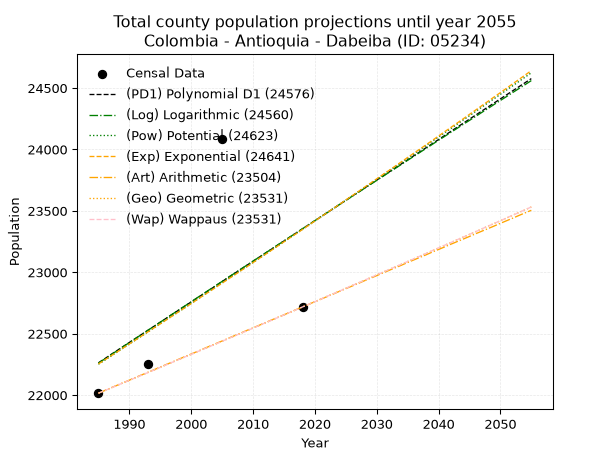
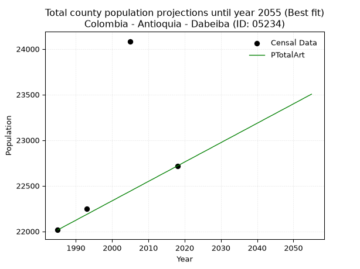
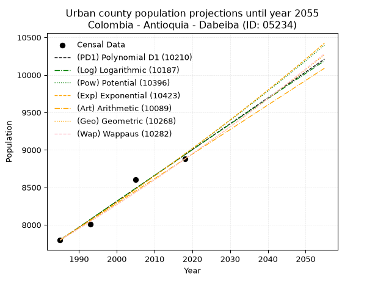
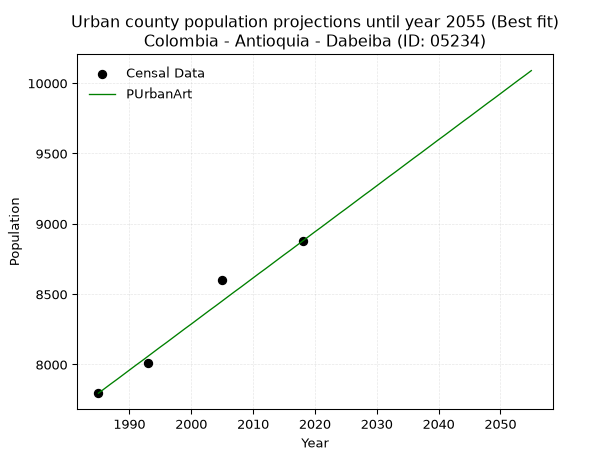
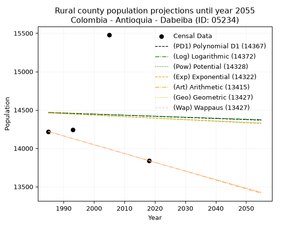
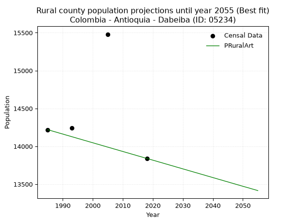

<div align="center">


</div>

# 📜 _“Population and Public Services Demand Projections (PPSD) until Year 2050 for Colombia - Antioquia - Dabeiba (ID: 05234)”_
Keywords: `population` `public-service` `projection` `lineal` `polynomial` `logarithmic` `potential` `exponential` `arithmetic` `geometric` `wappaus` `dane` `colombia` `south-america`

PPSD are analytical estimates used by governments and planners to anticipate future changes in population size, age distribution, and the resulting community needs for utilities, healthcare, education, and infrastructure as sizing future water treatment facilities, electrical grids, and road networks based on spatial growth.

<div align="center">

</img>

</div>


> **General running parameters**: • app_version: _v20260806_. • Python version: _3.14.7_. • Pandas version: _3.0.5_. • NumPy version: _2.5.1_. • Creates, save and include plots into reports (create_plot): _False_. • Projection until year: _2050_. • Process polynomial degree 2 and up: _False_. • Process Wappaus: _True_. • Process Wappaus: _True_. • Set negative values to zero: _True_. • Set infinite values to zero: _True_. • Drop dataset notes: _True_. 
<div align="center">

Maps & GIS Layers: [:earth_americas:Google](http://maps.google.com/maps?q=6.998111776,-76.2616141) [:earth_americas:OSM](https://www.openstreetmap.org/#map=18/6.998111776/-76.2616141&layers=P) [:earth_americas:Bing](https://www.bing.com/maps?cp=6.998111776~-76.2616141&lvl=18) [:earth_americas:Apple](https://maps.apple.com/frame?center=6.998111776%2C-76.2616141&span=0.003%2C0.006) [:earth_americas:GISMobile](https://github.com/rcfdtools/R.GISMobile/blob/main/file/gis/CountyLayer_CO/Readme.md)

</div>


<div align="center">

```geojson
{
  "type": "Feature",
  "geometry": {
    "type": "Point", 
    "coordinates": [-76.2616141, 6.998111776]
  }, 
  "properties": {
    "Name": "Colombia - Antioquia - Dabeiba (ID: 05234)"
  }
}
```

</div>


## 0. Census Data (4 records)

Census data are official statistics collected by a government about the people and housing in a country. They usually include counts of total population, age, sex, race, income, education, and jobs.

📅Global census file: [Population.xlsx](../data/Population.xlsx)

| Source   |   Year |   CountryID | CountryName   |   StateID | StateName   |   CountyID | CountyName   |   PTotal |   PUrban |   PRural |
|:---------|-------:|------------:|:--------------|----------:|:------------|-----------:|:-------------|---------:|---------:|---------:|
| DANE     |   1985 |          57 | Colombia      |        05 | Antioquia   |      05234 | Dabeiba      |    22015 |     7796 |    14219 |
| DANE     |   1993 |          57 | Colombia      |        05 | Antioquia   |      05234 | Dabeiba      |    22250 |     8010 |    14240 |
| DANE     |   2005 |          57 | Colombia      |        05 | Antioquia   |      05234 | Dabeiba      |    24084 |     8604 |    15480 |
| DANE     |   2018 |          57 | Colombia      |        05 | Antioquia   |      05234 | Dabeiba      |    22717 |     8877 |    13840 |

> 🔥Some records could had specific notes about the registered values or the corresponding urban or rural distribution.

📅[SUI-RUPS](https://www.datos.gov.co/Hacienda-y-Cr-dito-P-blico/Registro-nico-de-Prestadores-de-Servicios-P-blicos/4qkq-csdn/about_data) - Local public utility companies: [RUPS.csv](../data/RUPS.csv)

 | SERVICIO       | ESTADO    | NOMBRE                                         | NIT         | DEPARTAMENTO_DOMICILIO   | MUNICIPIO_DOMICILIO   | DIRECCION            |   TELEFONO | EMAIL                                      | TIPO_PRESTADOR                             | CLASIFICACION                  |
|:---------------|:----------|:-----------------------------------------------|:------------|:-------------------------|:----------------------|:---------------------|-----------:|:-------------------------------------------|:-------------------------------------------|:-------------------------------|
| ACUEDUCTO      | OPERATIVA | ASOCIACIÓN DE USUARIOS DEL ACUEDUCTO ALBAPALAR | 900052890-6 | ANTIOQUIA                | DABEIBA               | BARRIO ALFONSO LÓPEZ |    8590374 | asudapalar05@yahoo.com                     | ORGANIZACION AUTORIZADA                    | HASTA 2500 SUSCRIPTORES        |
| ACUEDUCTO      | OPERATIVA | EMPRESAS PUBLICAS DE DABEIBA S.A.S   E.S.P     | 900317391-1 | ANTIOQUIA                | DABEIBA               | CARRERA 10 11-74     |    8590426 | SERVICIOSPUBLICOS@DABEIBA-ANTIOQUIA.GOV.CO | SOCIEDADES (EMPRESA DE SERVICIOS PUBLICOS) | DESDE 2501 HASTA 5000 USUARIOS |
| ALCANTARILLADO | OPERATIVA | EMPRESAS PUBLICAS DE DABEIBA S.A.S   E.S.P     | 900317391-1 | ANTIOQUIA                | DABEIBA               | CARRERA 10 11-74     |    8590426 | SERVICIOSPUBLICOS@DABEIBA-ANTIOQUIA.GOV.CO | SOCIEDADES (EMPRESA DE SERVICIOS PUBLICOS) | DESDE 2501 HASTA 5000 USUARIOS |

## 1. Total

### 1.1. Coefficients and Parameters

* (PD1) Polynomial Deg 1: 33.054195102369256, -43350.1537535141 (lineal)
* (Log) Logarithmic: 66359.38493401825, -481631.71665421006
* (Pow) Potential: 2.923270439688033, -5.292905338530928
* (Exp) Exponential: 0.0014561957348746823, 1236.0567953283949
* (Art) Arithmetic: Year diff. 2018 - 1985 = 33, Population diff. 22717 - 22015 = 702, Annual growth = 21.272727272727273
* (Geo) Geometric: Year diff. 2018 - 1985 = 33, Population diff. 22717 - 22015 = 702, Annual growth % = 0.0009516496124253315
* (Wap) Wappaus: i = 0.09511189874240934, Condition values only valid for < 200)

<sub>
Wappaus condition values: ['0.00', '0.10', '0.19', '0.29', '0.38', '0.48', '0.57', '0.67', '0.76', '0.86', '0.95', '1.05', '1.14', '1.24', '1.33', '1.43', '1.52', '1.62', '1.71', '1.81', '1.90', '2.00', '2.09', '2.19', '2.28', '2.38', '2.47', '2.57', '2.66', '2.76', '2.85', '2.95', '3.04', '3.14', '3.23', '3.33', '3.42', '3.52', '3.61', '3.71', '3.80', '3.90', '3.99', '4.09', '4.18', '4.28', '4.38', '4.47', '4.57', '4.66', '4.76', '4.85', '4.95', '5.04', '5.14', '5.23', '5.33', '5.42', '5.52', '5.61', '5.71', '5.80', '5.90', '5.99', '6.09', '6.18']
</sub>


### 1.2. Projected Dataset

|   Year |   CountyID |   PTotalPD1 |   PTotalLog |   PTotalPow |   PTotalExp |   PTotalArt |   PTotalGeo |   PTotalWap |
|-------:|-----------:|------------:|------------:|------------:|------------:|------------:|------------:|------------:|
|   1985 |      05234 |       22262 |       22260 |       22251 |       22253 |       22015 |       22015 |       22015 |
|   1986 |      05234 |       22295 |       22293 |       22283 |       22285 |       22036 |       22036 |       22036 |
|   1987 |      05234 |       22329 |       22327 |       22316 |       22318 |       22058 |       22057 |       22057 |
|   1988 |      05234 |       22362 |       22360 |       22349 |       22350 |       22079 |       22078 |       22078 |
|   1989 |      05234 |       22395 |       22394 |       22382 |       22383 |       22100 |       22099 |       22099 |
|   1990 |      05234 |       22428 |       22427 |       22415 |       22416 |       22121 |       22120 |       22120 |
|   1991 |      05234 |       22461 |       22460 |       22448 |       22448 |       22143 |       22141 |       22141 |
|   1992 |      05234 |       22494 |       22494 |       22481 |       22481 |       22164 |       22162 |       22162 |
|   1993 |      05234 |       22527 |       22527 |       22514 |       22514 |       22185 |       22183 |       22183 |
|   1994 |      05234 |       22560 |       22560 |       22547 |       22547 |       22206 |       22204 |       22204 |
|   1995 |      05234 |       22593 |       22593 |       22580 |       22579 |       22228 |       22225 |       22225 |
|   1996 |      05234 |       22626 |       22627 |       22613 |       22612 |       22249 |       22247 |       22247 |
|   1997 |      05234 |       22659 |       22660 |       22646 |       22645 |       22270 |       22268 |       22268 |
|   1998 |      05234 |       22692 |       22693 |       22679 |       22678 |       22292 |       22289 |       22289 |
|   1999 |      05234 |       22725 |       22726 |       22712 |       22711 |       22313 |       22310 |       22310 |
|   2000 |      05234 |       22758 |       22759 |       22746 |       22744 |       22334 |       22331 |       22331 |
|   2001 |      05234 |       22791 |       22793 |       22779 |       22778 |       22355 |       22353 |       22353 |
|   2002 |      05234 |       22824 |       22826 |       22812 |       22811 |       22377 |       22374 |       22374 |
|   2003 |      05234 |       22857 |       22859 |       22846 |       22844 |       22398 |       22395 |       22395 |
|   2004 |      05234 |       22890 |       22892 |       22879 |       22877 |       22419 |       22416 |       22416 |
|   2005 |      05234 |       22924 |       22925 |       22912 |       22911 |       22440 |       22438 |       22438 |
|   2006 |      05234 |       22957 |       22958 |       22946 |       22944 |       22462 |       22459 |       22459 |
|   2007 |      05234 |       22990 |       22991 |       22979 |       22977 |       22483 |       22481 |       22481 |
|   2008 |      05234 |       23023 |       23024 |       23013 |       23011 |       22504 |       22502 |       22502 |
|   2009 |      05234 |       23056 |       23057 |       23046 |       23044 |       22526 |       22523 |       22523 |
|   2010 |      05234 |       23089 |       23090 |       23080 |       23078 |       22547 |       22545 |       22545 |
|   2011 |      05234 |       23122 |       23123 |       23113 |       23112 |       22568 |       22566 |       22566 |
|   2012 |      05234 |       23155 |       23156 |       23147 |       23145 |       22589 |       22588 |       22588 |
|   2013 |      05234 |       23188 |       23189 |       23181 |       23179 |       22611 |       22609 |       22609 |
|   2014 |      05234 |       23221 |       23222 |       23214 |       23213 |       22632 |       22631 |       22631 |
|   2015 |      05234 |       23254 |       23255 |       23248 |       23247 |       22653 |       22652 |       22652 |
|   2016 |      05234 |       23287 |       23288 |       23282 |       23281 |       22674 |       22674 |       22674 |
|   2017 |      05234 |       23320 |       23321 |       23315 |       23314 |       22696 |       22695 |       22695 |
|   2018 |      05234 |       23353 |       23354 |       23349 |       23348 |       22717 |       22717 |       22717 |
|   2019 |      05234 |       23386 |       23387 |       23383 |       23382 |       22738 |       22739 |       22739 |
|   2020 |      05234 |       23419 |       23420 |       23417 |       23417 |       22760 |       22760 |       22760 |
|   2021 |      05234 |       23452 |       23453 |       23451 |       23451 |       22781 |       22782 |       22782 |
|   2022 |      05234 |       23485 |       23485 |       23485 |       23485 |       22802 |       22804 |       22804 |
|   2023 |      05234 |       23518 |       23518 |       23519 |       23519 |       22823 |       22825 |       22825 |
|   2024 |      05234 |       23552 |       23551 |       23553 |       23553 |       22845 |       22847 |       22847 |
|   2025 |      05234 |       23585 |       23584 |       23587 |       23588 |       22866 |       22869 |       22869 |
|   2026 |      05234 |       23618 |       23617 |       23621 |       23622 |       22887 |       22891 |       22891 |
|   2027 |      05234 |       23651 |       23649 |       23655 |       23656 |       22908 |       22912 |       22912 |
|   2028 |      05234 |       23684 |       23682 |       23689 |       23691 |       22930 |       22934 |       22934 |
|   2029 |      05234 |       23717 |       23715 |       23723 |       23725 |       22951 |       22956 |       22956 |
|   2030 |      05234 |       23750 |       23747 |       23757 |       23760 |       22972 |       22978 |       22978 |
|   2031 |      05234 |       23783 |       23780 |       23792 |       23795 |       22994 |       23000 |       23000 |
|   2032 |      05234 |       23816 |       23813 |       23826 |       23829 |       23015 |       23022 |       23022 |
|   2033 |      05234 |       23849 |       23845 |       23860 |       23864 |       23036 |       23043 |       23044 |
|   2034 |      05234 |       23882 |       23878 |       23895 |       23899 |       23057 |       23065 |       23065 |
|   2035 |      05234 |       23915 |       23911 |       23929 |       23934 |       23079 |       23087 |       23087 |
|   2036 |      05234 |       23948 |       23943 |       23963 |       23969 |       23100 |       23109 |       23109 |
|   2037 |      05234 |       23981 |       23976 |       23998 |       24003 |       23121 |       23131 |       23131 |
|   2038 |      05234 |       24014 |       24008 |       24032 |       24038 |       23142 |       23153 |       23153 |
|   2039 |      05234 |       24047 |       24041 |       24067 |       24073 |       23164 |       23175 |       23176 |
|   2040 |      05234 |       24080 |       24074 |       24101 |       24109 |       23185 |       23197 |       23198 |
|   2041 |      05234 |       24113 |       24106 |       24136 |       24144 |       23206 |       23219 |       23220 |
|   2042 |      05234 |       24147 |       24139 |       24170 |       24179 |       23228 |       23242 |       23242 |
|   2043 |      05234 |       24180 |       24171 |       24205 |       24214 |       23249 |       23264 |       23264 |
|   2044 |      05234 |       24213 |       24204 |       24240 |       24249 |       23270 |       23286 |       23286 |
|   2045 |      05234 |       24246 |       24236 |       24274 |       24285 |       23291 |       23308 |       23308 |
|   2046 |      05234 |       24279 |       24268 |       24309 |       24320 |       23313 |       23330 |       23330 |
|   2047 |      05234 |       24312 |       24301 |       24344 |       24356 |       23334 |       23352 |       23353 |
|   2048 |      05234 |       24345 |       24333 |       24379 |       24391 |       23355 |       23375 |       23375 |
|   2049 |      05234 |       24378 |       24366 |       24413 |       24427 |       23376 |       23397 |       23397 |
|   2050 |      05234 |       24411 |       24398 |       24448 |       24462 |       23398 |       23419 |       23419 |
<div align="center">

</img>

</div>


### 1.3. Best fit with absolute and relative error (%)

Relative error puts that difference into context by dividing the absolute error by the true value, creating a unitless ratio or percentage that shows the scale of the mistake.

Absolute and relative error

|   Year | Source   |   CountryID | CountryName   |   StateID | StateName   |   CountyID_x | CountyName   |   PTotal |   PUrban |   PRural |   CountyID_y |   PTotalPD1 |   PTotalLog |   PTotalPow |   PTotalExp |   PTotalArt |   PTotalGeo |   PTotalWap |   PTotalPD1AbsError |   PTotalLogAbsError |   PTotalPowAbsError |   PTotalExpAbsError |   PTotalArtAbsError |   PTotalGeoAbsError |   PTotalWapAbsError |   PTotalPD1RelError |   PTotalLogRelError |   PTotalPowRelError |   PTotalExpRelError |   PTotalArtRelError |   PTotalGeoRelError |   PTotalWapRelError |
|-------:|:---------|------------:|:--------------|----------:|:------------|-------------:|:-------------|---------:|---------:|---------:|-------------:|------------:|------------:|------------:|------------:|------------:|------------:|------------:|--------------------:|--------------------:|--------------------:|--------------------:|--------------------:|--------------------:|--------------------:|--------------------:|--------------------:|--------------------:|--------------------:|--------------------:|--------------------:|--------------------:|
|   1985 | DANE     |          57 | Colombia      |        05 | Antioquia   |        05234 | Dabeiba      |    22015 |     7796 |    14219 |        05234 |       22262 |       22260 |       22251 |       22253 |       22015 |       22015 |       22015 |                 247 |                 245 |                 236 |                 238 |                   0 |                   0 |                   0 |             1.12196 |             1.11288 |             1.072   |             1.08108 |            0        |            0        |            0        |
|   1993 | DANE     |          57 | Colombia      |        05 | Antioquia   |        05234 | Dabeiba      |    22250 |     8010 |    14240 |        05234 |       22527 |       22527 |       22514 |       22514 |       22185 |       22183 |       22183 |                 277 |                 277 |                 264 |                 264 |                  65 |                  67 |                  67 |             1.24494 |             1.24494 |             1.18652 |             1.18652 |            0.292135 |            0.301124 |            0.301124 |
|   2005 | DANE     |          57 | Colombia      |        05 | Antioquia   |        05234 | Dabeiba      |    24084 |     8604 |    15480 |        05234 |       22924 |       22925 |       22912 |       22911 |       22440 |       22438 |       22438 |                1160 |                1159 |                1172 |                1173 |                1644 |                1646 |                1646 |             4.81648 |             4.81232 |             4.8663  |             4.87045 |            6.82611  |            6.83441  |            6.83441  |
|   2018 | DANE     |          57 | Colombia      |        05 | Antioquia   |        05234 | Dabeiba      |    22717 |     8877 |    13840 |        05234 |       23353 |       23354 |       23349 |       23348 |       22717 |       22717 |       22717 |                 636 |                 637 |                 632 |                 631 |                   0 |                   0 |                   0 |             2.79967 |             2.80407 |             2.78206 |             2.77766 |            0        |            0        |            0        |

Relative error mean

| Method    |   RelError | Best   |
|:----------|-----------:|:-------|
| PTotalPD1 |    2.49576 |        |
| PTotalLog |    2.49355 |        |
| PTotalPow |    2.47672 |        |
| PTotalExp |    2.47893 |        |
| PTotalArt |    1.77956 | True   |
| PTotalGeo |    1.78388 |        |
| PTotalWap |    1.78388 |        |

💙Best method: _**PTotalArt**_
<div align="center">

</img>

</div>


### 1.4. Fresh water supply demand in liters per capita per day (lpcd)

The fresh water supply demand typically ranges from 100 to 300 liters per capita per day (lpcd) for standard domestic and municipal planning, though absolute survival minimums set by the World Health Organization are as low as 7.5 to 20 liters per day, and total consumption in high-income nations can exceed 400 liters.

> `CZ`: Level in meters above the sea level (masl)<br> `WS`: Fresh water supply demand in liters per capita per day (lpcd or l/h/d)<br> `WSAll`: Zonal fresh water supply demand in liters per second (l/s)<br> `A`: Zonal area in square meters<br> `DP`: Population density (people/hectare or p/ha)

Reference values (RAS Colombia)

|    CZ |   WS |
|------:|-----:|
|  1000 |  120 |
|  2000 |  130 |
| 99999 |  140 |

County shapefile geometry properties and water supply values

|   CountyID |     ATotal |   CZTotal |   WSTotal |
|-----------:|-----------:|----------:|----------:|
|      05234 | 1.9577e+09 |   1231.27 |       130 |

Projected values for best method: PTotalArt

|   CountyID |   Year |   PTotalArt |   DPTotal |   WSTotal |   WSTotalAll |
|-----------:|-------:|------------:|----------:|----------:|-------------:|
|      05234 |   1985 |       22015 |      0.11 |       130 |      33.1244 |
|      05234 |   1986 |       22036 |      0.11 |       130 |      33.156  |
|      05234 |   1987 |       22058 |      0.11 |       130 |      33.1891 |
|      05234 |   1988 |       22079 |      0.11 |       130 |      33.2207 |
|      05234 |   1989 |       22100 |      0.11 |       130 |      33.2523 |
|      05234 |   1990 |       22121 |      0.11 |       130 |      33.2839 |
|      05234 |   1991 |       22143 |      0.11 |       130 |      33.317  |
|      05234 |   1992 |       22164 |      0.11 |       130 |      33.3486 |
|      05234 |   1993 |       22185 |      0.11 |       130 |      33.3802 |
|      05234 |   1994 |       22206 |      0.11 |       130 |      33.4118 |
|      05234 |   1995 |       22228 |      0.11 |       130 |      33.4449 |
|      05234 |   1996 |       22249 |      0.11 |       130 |      33.4765 |
|      05234 |   1997 |       22270 |      0.11 |       130 |      33.5081 |
|      05234 |   1998 |       22292 |      0.11 |       130 |      33.5412 |
|      05234 |   1999 |       22313 |      0.11 |       130 |      33.5728 |
|      05234 |   2000 |       22334 |      0.11 |       130 |      33.6044 |
|      05234 |   2001 |       22355 |      0.11 |       130 |      33.636  |
|      05234 |   2002 |       22377 |      0.11 |       130 |      33.6691 |
|      05234 |   2003 |       22398 |      0.11 |       130 |      33.7007 |
|      05234 |   2004 |       22419 |      0.11 |       130 |      33.7323 |
|      05234 |   2005 |       22440 |      0.11 |       130 |      33.7639 |
|      05234 |   2006 |       22462 |      0.11 |       130 |      33.797  |
|      05234 |   2007 |       22483 |      0.11 |       130 |      33.8286 |
|      05234 |   2008 |       22504 |      0.11 |       130 |      33.8602 |
|      05234 |   2009 |       22526 |      0.12 |       130 |      33.8933 |
|      05234 |   2010 |       22547 |      0.12 |       130 |      33.9249 |
|      05234 |   2011 |       22568 |      0.12 |       130 |      33.9565 |
|      05234 |   2012 |       22589 |      0.12 |       130 |      33.9881 |
|      05234 |   2013 |       22611 |      0.12 |       130 |      34.0212 |
|      05234 |   2014 |       22632 |      0.12 |       130 |      34.0528 |
|      05234 |   2015 |       22653 |      0.12 |       130 |      34.0844 |
|      05234 |   2016 |       22674 |      0.12 |       130 |      34.116  |
|      05234 |   2017 |       22696 |      0.12 |       130 |      34.1491 |
|      05234 |   2018 |       22717 |      0.12 |       130 |      34.1807 |
|      05234 |   2019 |       22738 |      0.12 |       130 |      34.2123 |
|      05234 |   2020 |       22760 |      0.12 |       130 |      34.2454 |
|      05234 |   2021 |       22781 |      0.12 |       130 |      34.277  |
|      05234 |   2022 |       22802 |      0.12 |       130 |      34.3086 |
|      05234 |   2023 |       22823 |      0.12 |       130 |      34.3402 |
|      05234 |   2024 |       22845 |      0.12 |       130 |      34.3733 |
|      05234 |   2025 |       22866 |      0.12 |       130 |      34.4049 |
|      05234 |   2026 |       22887 |      0.12 |       130 |      34.4365 |
|      05234 |   2027 |       22908 |      0.12 |       130 |      34.4681 |
|      05234 |   2028 |       22930 |      0.12 |       130 |      34.5012 |
|      05234 |   2029 |       22951 |      0.12 |       130 |      34.5328 |
|      05234 |   2030 |       22972 |      0.12 |       130 |      34.5644 |
|      05234 |   2031 |       22994 |      0.12 |       130 |      34.5975 |
|      05234 |   2032 |       23015 |      0.12 |       130 |      34.6291 |
|      05234 |   2033 |       23036 |      0.12 |       130 |      34.6606 |
|      05234 |   2034 |       23057 |      0.12 |       130 |      34.6922 |
|      05234 |   2035 |       23079 |      0.12 |       130 |      34.7253 |
|      05234 |   2036 |       23100 |      0.12 |       130 |      34.7569 |
|      05234 |   2037 |       23121 |      0.12 |       130 |      34.7885 |
|      05234 |   2038 |       23142 |      0.12 |       130 |      34.8201 |
|      05234 |   2039 |       23164 |      0.12 |       130 |      34.8532 |
|      05234 |   2040 |       23185 |      0.12 |       130 |      34.8848 |
|      05234 |   2041 |       23206 |      0.12 |       130 |      34.9164 |
|      05234 |   2042 |       23228 |      0.12 |       130 |      34.9495 |
|      05234 |   2043 |       23249 |      0.12 |       130 |      34.9811 |
|      05234 |   2044 |       23270 |      0.12 |       130 |      35.0127 |
|      05234 |   2045 |       23291 |      0.12 |       130 |      35.0443 |
|      05234 |   2046 |       23313 |      0.12 |       130 |      35.0774 |
|      05234 |   2047 |       23334 |      0.12 |       130 |      35.109  |
|      05234 |   2048 |       23355 |      0.12 |       130 |      35.1406 |
|      05234 |   2049 |       23376 |      0.12 |       130 |      35.1722 |
|      05234 |   2050 |       23398 |      0.12 |       130 |      35.2053 |

## 2. Urban

### 2.1. Coefficients and Parameters

* (PD1) Polynomial Deg 1: 34.48293857888377, -60652.747892412255 (lineal)
* (Log) Logarithmic: 69036.52470003298, -516425.42746893974
* (Pow) Potential: 8.284906116190152, -23.42948565129764
* (Exp) Exponential: 0.004138075982790521, 2.1129115935613787
* (Art) Arithmetic: Year diff. 2018 - 1985 = 33, Population diff. 8877 - 7796 = 1081, Annual growth = 32.75757575757576
* (Geo) Geometric: Year diff. 2018 - 1985 = 33, Population diff. 8877 - 7796 = 1081, Annual growth % = 0.003942687795267075
* (Wap) Wappaus: i = 0.3929415912862203, Condition values only valid for < 200)

<sub>
Wappaus condition values: ['0.00', '0.39', '0.79', '1.18', '1.57', '1.96', '2.36', '2.75', '3.14', '3.54', '3.93', '4.32', '4.72', '5.11', '5.50', '5.89', '6.29', '6.68', '7.07', '7.47', '7.86', '8.25', '8.64', '9.04', '9.43', '9.82', '10.22', '10.61', '11.00', '11.40', '11.79', '12.18', '12.57', '12.97', '13.36', '13.75', '14.15', '14.54', '14.93', '15.32', '15.72', '16.11', '16.50', '16.90', '17.29', '17.68', '18.08', '18.47', '18.86', '19.25', '19.65', '20.04', '20.43', '20.83', '21.22', '21.61', '22.00', '22.40', '22.79', '23.18', '23.58', '23.97', '24.36', '24.76', '25.15', '25.54']
</sub>


### 2.2. Projected Dataset

|   Year |   CountyID |   PUrbanPD1 |   PUrbanLog |   PUrbanPow |   PUrbanExp |   PUrbanArt |   PUrbanGeo |   PUrbanWap |
|-------:|-----------:|------------:|------------:|------------:|------------:|------------:|------------:|------------:|
|   1985 |      05234 |        7796 |        7795 |        7801 |        7802 |        7796 |        7796 |        7796 |
|   1986 |      05234 |        7830 |        7830 |        7834 |        7834 |        7829 |        7827 |        7827 |
|   1987 |      05234 |        7865 |        7864 |        7866 |        7867 |        7862 |        7858 |        7858 |
|   1988 |      05234 |        7899 |        7899 |        7899 |        7900 |        7894 |        7889 |        7888 |
|   1989 |      05234 |        7934 |        7934 |        7932 |        7932 |        7927 |        7920 |        7920 |
|   1990 |      05234 |        7968 |        7968 |        7965 |        7965 |        7960 |        7951 |        7951 |
|   1991 |      05234 |        8003 |        8003 |        7999 |        7998 |        7993 |        7982 |        7982 |
|   1992 |      05234 |        8037 |        8038 |        8032 |        8031 |        8025 |        8014 |        8013 |
|   1993 |      05234 |        8072 |        8072 |        8065 |        8065 |        8058 |        8045 |        8045 |
|   1994 |      05234 |        8106 |        8107 |        8099 |        8098 |        8091 |        8077 |        8077 |
|   1995 |      05234 |        8141 |        8142 |        8133 |        8132 |        8124 |        8109 |        8108 |
|   1996 |      05234 |        8175 |        8176 |        8166 |        8165 |        8156 |        8141 |        8140 |
|   1997 |      05234 |        8210 |        8211 |        8200 |        8199 |        8189 |        8173 |        8172 |
|   1998 |      05234 |        8244 |        8245 |        8235 |        8233 |        8222 |        8205 |        8205 |
|   1999 |      05234 |        8279 |        8280 |        8269 |        8267 |        8255 |        8238 |        8237 |
|   2000 |      05234 |        8313 |        8314 |        8303 |        8302 |        8287 |        8270 |        8269 |
|   2001 |      05234 |        8348 |        8349 |        8338 |        8336 |        8320 |        8303 |        8302 |
|   2002 |      05234 |        8382 |        8383 |        8372 |        8371 |        8353 |        8335 |        8335 |
|   2003 |      05234 |        8417 |        8418 |        8407 |        8405 |        8386 |        8368 |        8368 |
|   2004 |      05234 |        8451 |        8452 |        8442 |        8440 |        8418 |        8401 |        8401 |
|   2005 |      05234 |        8486 |        8487 |        8477 |        8475 |        8451 |        8434 |        8434 |
|   2006 |      05234 |        8520 |        8521 |        8512 |        8510 |        8484 |        8468 |        8467 |
|   2007 |      05234 |        8555 |        8556 |        8547 |        8546 |        8517 |        8501 |        8500 |
|   2008 |      05234 |        8589 |        8590 |        8582 |        8581 |        8549 |        8534 |        8534 |
|   2009 |      05234 |        8623 |        8624 |        8618 |        8617 |        8582 |        8568 |        8568 |
|   2010 |      05234 |        8658 |        8659 |        8653 |        8652 |        8615 |        8602 |        8601 |
|   2011 |      05234 |        8692 |        8693 |        8689 |        8688 |        8648 |        8636 |        8635 |
|   2012 |      05234 |        8727 |        8727 |        8725 |        8724 |        8680 |        8670 |        8669 |
|   2013 |      05234 |        8761 |        8762 |        8761 |        8761 |        8713 |        8704 |        8704 |
|   2014 |      05234 |        8796 |        8796 |        8797 |        8797 |        8746 |        8738 |        8738 |
|   2015 |      05234 |        8830 |        8830 |        8833 |        8833 |        8779 |        8773 |        8773 |
|   2016 |      05234 |        8865 |        8865 |        8870 |        8870 |        8811 |        8807 |        8807 |
|   2017 |      05234 |        8899 |        8899 |        8906 |        8907 |        8844 |        8842 |        8842 |
|   2018 |      05234 |        8934 |        8933 |        8943 |        8944 |        8877 |        8877 |        8877 |
|   2019 |      05234 |        8968 |        8967 |        8980 |        8981 |        8910 |        8912 |        8912 |
|   2020 |      05234 |        9003 |        9001 |        9017 |        9018 |        8943 |        8947 |        8947 |
|   2021 |      05234 |        9037 |        9036 |        9054 |        9055 |        8975 |        8982 |        8983 |
|   2022 |      05234 |        9072 |        9070 |        9091 |        9093 |        9008 |        9018 |        9018 |
|   2023 |      05234 |        9106 |        9104 |        9128 |        9131 |        9041 |        9053 |        9054 |
|   2024 |      05234 |        9141 |        9138 |        9166 |        9169 |        9074 |        9089 |        9090 |
|   2025 |      05234 |        9175 |        9172 |        9203 |        9207 |        9106 |        9125 |        9126 |
|   2026 |      05234 |        9210 |        9206 |        9241 |        9245 |        9139 |        9161 |        9162 |
|   2027 |      05234 |        9244 |        9240 |        9279 |        9283 |        9172 |        9197 |        9198 |
|   2028 |      05234 |        9279 |        9274 |        9317 |        9322 |        9205 |        9233 |        9235 |
|   2029 |      05234 |        9313 |        9308 |        9355 |        9360 |        9237 |        9270 |        9271 |
|   2030 |      05234 |        9348 |        9342 |        9393 |        9399 |        9270 |        9306 |        9308 |
|   2031 |      05234 |        9382 |        9376 |        9431 |        9438 |        9303 |        9343 |        9345 |
|   2032 |      05234 |        9417 |        9410 |        9470 |        9477 |        9336 |        9380 |        9382 |
|   2033 |      05234 |        9451 |        9444 |        9509 |        9516 |        9368 |        9417 |        9420 |
|   2034 |      05234 |        9486 |        9478 |        9548 |        9556 |        9401 |        9454 |        9457 |
|   2035 |      05234 |        9520 |        9512 |        9586 |        9596 |        9434 |        9491 |        9495 |
|   2036 |      05234 |        9555 |        9546 |        9626 |        9635 |        9467 |        9529 |        9532 |
|   2037 |      05234 |        9589 |        9580 |        9665 |        9675 |        9499 |        9566 |        9570 |
|   2038 |      05234 |        9623 |        9614 |        9704 |        9715 |        9532 |        9604 |        9608 |
|   2039 |      05234 |        9658 |        9648 |        9744 |        9756 |        9565 |        9642 |        9647 |
|   2040 |      05234 |        9692 |        9682 |        9783 |        9796 |        9598 |        9680 |        9685 |
|   2041 |      05234 |        9727 |        9715 |        9823 |        9837 |        9630 |        9718 |        9724 |
|   2042 |      05234 |        9761 |        9749 |        9863 |        9878 |        9663 |        9756 |        9762 |
|   2043 |      05234 |        9796 |        9783 |        9903 |        9918 |        9696 |        9795 |        9801 |
|   2044 |      05234 |        9830 |        9817 |        9943 |        9960 |        9729 |        9833 |        9840 |
|   2045 |      05234 |        9865 |        9851 |        9984 |       10001 |        9761 |        9872 |        9880 |
|   2046 |      05234 |        9899 |        9884 |       10024 |       10042 |        9794 |        9911 |        9919 |
|   2047 |      05234 |        9934 |        9918 |       10065 |       10084 |        9827 |        9950 |        9959 |
|   2048 |      05234 |        9968 |        9952 |       10106 |       10126 |        9860 |        9989 |        9999 |
|   2049 |      05234 |       10003 |        9985 |       10147 |       10168 |        9892 |       10029 |       10039 |
|   2050 |      05234 |       10037 |       10019 |       10188 |       10210 |        9925 |       10068 |       10079 |
<div align="center">

</img>

</div>


### 2.3. Best fit with absolute and relative error (%)

Relative error puts that difference into context by dividing the absolute error by the true value, creating a unitless ratio or percentage that shows the scale of the mistake.

Absolute and relative error

|   Year | Source   |   CountryID | CountryName   |   StateID | StateName   |   CountyID_x | CountyName   |   PTotal |   PUrban |   PRural |   CountyID_y |   PUrbanPD1 |   PUrbanLog |   PUrbanPow |   PUrbanExp |   PUrbanArt |   PUrbanGeo |   PUrbanWap |   PUrbanPD1AbsError |   PUrbanLogAbsError |   PUrbanPowAbsError |   PUrbanExpAbsError |   PUrbanArtAbsError |   PUrbanGeoAbsError |   PUrbanWapAbsError |   PUrbanPD1RelError |   PUrbanLogRelError |   PUrbanPowRelError |   PUrbanExpRelError |   PUrbanArtRelError |   PUrbanGeoRelError |   PUrbanWapRelError |
|-------:|:---------|------------:|:--------------|----------:|:------------|-------------:|:-------------|---------:|---------:|---------:|-------------:|------------:|------------:|------------:|------------:|------------:|------------:|------------:|--------------------:|--------------------:|--------------------:|--------------------:|--------------------:|--------------------:|--------------------:|--------------------:|--------------------:|--------------------:|--------------------:|--------------------:|--------------------:|--------------------:|
|   1985 | DANE     |          57 | Colombia      |        05 | Antioquia   |        05234 | Dabeiba      |    22015 |     7796 |    14219 |        05234 |        7796 |        7795 |        7801 |        7802 |        7796 |        7796 |        7796 |                   0 |                   1 |                   5 |                   6 |                   0 |                   0 |                   0 |            0        |           0.0128271 |           0.0641355 |           0.0769625 |            0        |            0        |            0        |
|   1993 | DANE     |          57 | Colombia      |        05 | Antioquia   |        05234 | Dabeiba      |    22250 |     8010 |    14240 |        05234 |        8072 |        8072 |        8065 |        8065 |        8058 |        8045 |        8045 |                  62 |                  62 |                  55 |                  55 |                  48 |                  35 |                  35 |            0.774032 |           0.774032  |           0.686642  |           0.686642  |            0.599251 |            0.436954 |            0.436954 |
|   2005 | DANE     |          57 | Colombia      |        05 | Antioquia   |        05234 | Dabeiba      |    24084 |     8604 |    15480 |        05234 |        8486 |        8487 |        8477 |        8475 |        8451 |        8434 |        8434 |                 118 |                 117 |                 127 |                 129 |                 153 |                 170 |                 170 |            1.37146  |           1.35983   |           1.47606   |           1.4993    |            1.77824  |            1.97583  |            1.97583  |
|   2018 | DANE     |          57 | Colombia      |        05 | Antioquia   |        05234 | Dabeiba      |    22717 |     8877 |    13840 |        05234 |        8934 |        8933 |        8943 |        8944 |        8877 |        8877 |        8877 |                  57 |                  56 |                  66 |                  67 |                   0 |                   0 |                   0 |            0.642109 |           0.630844  |           0.743494  |           0.754759  |            0        |            0        |            0        |

Relative error mean

| Method    |   RelError | Best   |
|:----------|-----------:|:-------|
| PUrbanPD1 |   0.696899 |        |
| PUrbanLog |   0.694384 |        |
| PUrbanPow |   0.742582 |        |
| PUrbanExp |   0.754417 |        |
| PUrbanArt |   0.594373 | True   |
| PUrbanGeo |   0.603195 |        |
| PUrbanWap |   0.603195 |        |

💙Best method: _**PUrbanArt**_
<div align="center">

</img>

</div>


### 2.4. Fresh water supply demand in liters per capita per day (lpcd)

The fresh water supply demand typically ranges from 100 to 300 liters per capita per day (lpcd) for standard domestic and municipal planning, though absolute survival minimums set by the World Health Organization are as low as 7.5 to 20 liters per day, and total consumption in high-income nations can exceed 400 liters.

> `CZ`: Level in meters above the sea level (masl)<br> `WS`: Fresh water supply demand in liters per capita per day (lpcd or l/h/d)<br> `WSAll`: Zonal fresh water supply demand in liters per second (l/s)<br> `A`: Zonal area in square meters<br> `DP`: Population density (people/hectare or p/ha)

Reference values (RAS Colombia)

|    CZ |   WS |
|------:|-----:|
|  1000 |  120 |
|  2000 |  130 |
| 99999 |  140 |

County shapefile geometry properties and water supply values

|   CountyID |      AUrban |   CZUrban |   WSUrban |
|-----------:|------------:|----------:|----------:|
|      05234 | 2.48933e+06 |   447.695 |       120 |

Projected values for best method: PUrbanArt

|   CountyID |   Year |   PUrbanArt |   DPUrban |   WSUrban |   WSUrbanAll |
|-----------:|-------:|------------:|----------:|----------:|-------------:|
|      05234 |   1985 |        7796 |     31.32 |       120 |      10.8278 |
|      05234 |   1986 |        7829 |     31.45 |       120 |      10.8736 |
|      05234 |   1987 |        7862 |     31.58 |       120 |      10.9194 |
|      05234 |   1988 |        7894 |     31.71 |       120 |      10.9639 |
|      05234 |   1989 |        7927 |     31.84 |       120 |      11.0097 |
|      05234 |   1990 |        7960 |     31.98 |       120 |      11.0556 |
|      05234 |   1991 |        7993 |     32.11 |       120 |      11.1014 |
|      05234 |   1992 |        8025 |     32.24 |       120 |      11.1458 |
|      05234 |   1993 |        8058 |     32.37 |       120 |      11.1917 |
|      05234 |   1994 |        8091 |     32.5  |       120 |      11.2375 |
|      05234 |   1995 |        8124 |     32.64 |       120 |      11.2833 |
|      05234 |   1996 |        8156 |     32.76 |       120 |      11.3278 |
|      05234 |   1997 |        8189 |     32.9  |       120 |      11.3736 |
|      05234 |   1998 |        8222 |     33.03 |       120 |      11.4194 |
|      05234 |   1999 |        8255 |     33.16 |       120 |      11.4653 |
|      05234 |   2000 |        8287 |     33.29 |       120 |      11.5097 |
|      05234 |   2001 |        8320 |     33.42 |       120 |      11.5556 |
|      05234 |   2002 |        8353 |     33.56 |       120 |      11.6014 |
|      05234 |   2003 |        8386 |     33.69 |       120 |      11.6472 |
|      05234 |   2004 |        8418 |     33.82 |       120 |      11.6917 |
|      05234 |   2005 |        8451 |     33.95 |       120 |      11.7375 |
|      05234 |   2006 |        8484 |     34.08 |       120 |      11.7833 |
|      05234 |   2007 |        8517 |     34.21 |       120 |      11.8292 |
|      05234 |   2008 |        8549 |     34.34 |       120 |      11.8736 |
|      05234 |   2009 |        8582 |     34.48 |       120 |      11.9194 |
|      05234 |   2010 |        8615 |     34.61 |       120 |      11.9653 |
|      05234 |   2011 |        8648 |     34.74 |       120 |      12.0111 |
|      05234 |   2012 |        8680 |     34.87 |       120 |      12.0556 |
|      05234 |   2013 |        8713 |     35    |       120 |      12.1014 |
|      05234 |   2014 |        8746 |     35.13 |       120 |      12.1472 |
|      05234 |   2015 |        8779 |     35.27 |       120 |      12.1931 |
|      05234 |   2016 |        8811 |     35.4  |       120 |      12.2375 |
|      05234 |   2017 |        8844 |     35.53 |       120 |      12.2833 |
|      05234 |   2018 |        8877 |     35.66 |       120 |      12.3292 |
|      05234 |   2019 |        8910 |     35.79 |       120 |      12.375  |
|      05234 |   2020 |        8943 |     35.93 |       120 |      12.4208 |
|      05234 |   2021 |        8975 |     36.05 |       120 |      12.4653 |
|      05234 |   2022 |        9008 |     36.19 |       120 |      12.5111 |
|      05234 |   2023 |        9041 |     36.32 |       120 |      12.5569 |
|      05234 |   2024 |        9074 |     36.45 |       120 |      12.6028 |
|      05234 |   2025 |        9106 |     36.58 |       120 |      12.6472 |
|      05234 |   2026 |        9139 |     36.71 |       120 |      12.6931 |
|      05234 |   2027 |        9172 |     36.85 |       120 |      12.7389 |
|      05234 |   2028 |        9205 |     36.98 |       120 |      12.7847 |
|      05234 |   2029 |        9237 |     37.11 |       120 |      12.8292 |
|      05234 |   2030 |        9270 |     37.24 |       120 |      12.875  |
|      05234 |   2031 |        9303 |     37.37 |       120 |      12.9208 |
|      05234 |   2032 |        9336 |     37.5  |       120 |      12.9667 |
|      05234 |   2033 |        9368 |     37.63 |       120 |      13.0111 |
|      05234 |   2034 |        9401 |     37.77 |       120 |      13.0569 |
|      05234 |   2035 |        9434 |     37.9  |       120 |      13.1028 |
|      05234 |   2036 |        9467 |     38.03 |       120 |      13.1486 |
|      05234 |   2037 |        9499 |     38.16 |       120 |      13.1931 |
|      05234 |   2038 |        9532 |     38.29 |       120 |      13.2389 |
|      05234 |   2039 |        9565 |     38.42 |       120 |      13.2847 |
|      05234 |   2040 |        9598 |     38.56 |       120 |      13.3306 |
|      05234 |   2041 |        9630 |     38.69 |       120 |      13.375  |
|      05234 |   2042 |        9663 |     38.82 |       120 |      13.4208 |
|      05234 |   2043 |        9696 |     38.95 |       120 |      13.4667 |
|      05234 |   2044 |        9729 |     39.08 |       120 |      13.5125 |
|      05234 |   2045 |        9761 |     39.21 |       120 |      13.5569 |
|      05234 |   2046 |        9794 |     39.34 |       120 |      13.6028 |
|      05234 |   2047 |        9827 |     39.48 |       120 |      13.6486 |
|      05234 |   2048 |        9860 |     39.61 |       120 |      13.6944 |
|      05234 |   2049 |        9892 |     39.74 |       120 |      13.7389 |
|      05234 |   2050 |        9925 |     39.87 |       120 |      13.7847 |

## 3. Rural

### 3.1. Coefficients and Parameters

* (PD1) Polynomial Deg 1: -1.4287434765145066, 17302.59413889814 (lineal)
* (Log) Logarithmic: -2677.1397660148405, 34793.71081473049
* (Pow) Potential: -0.2660009989128565, 5.0374109926691295
* (Exp) Exponential: -0.00013910851797387162, 19061.836910973903
* (Art) Arithmetic: Year diff. 2018 - 1985 = 33, Population diff. 13840 - 14219 = -379, Annual growth = -11.484848484848484
* (Geo) Geometric: Year diff. 2018 - 1985 = 33, Population diff. 13840 - 14219 = -379, Annual growth % = -0.0008183361385218912
* (Wap) Wappaus: i = -0.08186213681776602, Condition values only valid for < 200)

<sub>
Wappaus condition values: ['-0.00', '-0.08', '-0.16', '-0.25', '-0.33', '-0.41', '-0.49', '-0.57', '-0.65', '-0.74', '-0.82', '-0.90', '-0.98', '-1.06', '-1.15', '-1.23', '-1.31', '-1.39', '-1.47', '-1.56', '-1.64', '-1.72', '-1.80', '-1.88', '-1.96', '-2.05', '-2.13', '-2.21', '-2.29', '-2.37', '-2.46', '-2.54', '-2.62', '-2.70', '-2.78', '-2.87', '-2.95', '-3.03', '-3.11', '-3.19', '-3.27', '-3.36', '-3.44', '-3.52', '-3.60', '-3.68', '-3.77', '-3.85', '-3.93', '-4.01', '-4.09', '-4.17', '-4.26', '-4.34', '-4.42', '-4.50', '-4.58', '-4.67', '-4.75', '-4.83', '-4.91', '-4.99', '-5.08', '-5.16', '-5.24', '-5.32']
</sub>


### 3.2. Projected Dataset

|   Year |   CountyID |   PRuralPD1 |   PRuralLog |   PRuralPow |   PRuralExp |   PRuralArt |   PRuralGeo |   PRuralWap |
|-------:|-----------:|------------:|------------:|------------:|------------:|------------:|------------:|------------:|
|   1985 |      05234 |       14467 |       14465 |       14461 |       14462 |       14219 |       14219 |       14219 |
|   1986 |      05234 |       14465 |       14464 |       14459 |       14460 |       14208 |       14207 |       14207 |
|   1987 |      05234 |       14464 |       14462 |       14457 |       14458 |       14196 |       14196 |       14196 |
|   1988 |      05234 |       14462 |       14461 |       14455 |       14456 |       14185 |       14184 |       14184 |
|   1989 |      05234 |       14461 |       14460 |       14453 |       14454 |       14173 |       14173 |       14173 |
|   1990 |      05234 |       14459 |       14458 |       14451 |       14452 |       14162 |       14161 |       14161 |
|   1991 |      05234 |       14458 |       14457 |       14450 |       14450 |       14150 |       14149 |       14149 |
|   1992 |      05234 |       14457 |       14456 |       14448 |       14448 |       14139 |       14138 |       14138 |
|   1993 |      05234 |       14455 |       14454 |       14446 |       14446 |       14127 |       14126 |       14126 |
|   1994 |      05234 |       14454 |       14453 |       14444 |       14444 |       14116 |       14115 |       14115 |
|   1995 |      05234 |       14452 |       14452 |       14442 |       14442 |       14104 |       14103 |       14103 |
|   1996 |      05234 |       14451 |       14450 |       14440 |       14440 |       14093 |       14092 |       14092 |
|   1997 |      05234 |       14449 |       14449 |       14438 |       14438 |       14081 |       14080 |       14080 |
|   1998 |      05234 |       14448 |       14448 |       14436 |       14436 |       14070 |       14068 |       14068 |
|   1999 |      05234 |       14447 |       14446 |       14434 |       14434 |       14058 |       14057 |       14057 |
|   2000 |      05234 |       14445 |       14445 |       14432 |       14432 |       14047 |       14045 |       14045 |
|   2001 |      05234 |       14444 |       14444 |       14430 |       14430 |       14035 |       14034 |       14034 |
|   2002 |      05234 |       14442 |       14442 |       14428 |       14428 |       14024 |       14022 |       14022 |
|   2003 |      05234 |       14441 |       14441 |       14426 |       14426 |       14012 |       14011 |       14011 |
|   2004 |      05234 |       14439 |       14440 |       14425 |       14424 |       14001 |       14000 |       14000 |
|   2005 |      05234 |       14438 |       14438 |       14423 |       14422 |       13989 |       13988 |       13988 |
|   2006 |      05234 |       14437 |       14437 |       14421 |       14420 |       13978 |       13977 |       13977 |
|   2007 |      05234 |       14435 |       14436 |       14419 |       14418 |       13966 |       13965 |       13965 |
|   2008 |      05234 |       14434 |       14434 |       14417 |       14416 |       13955 |       13954 |       13954 |
|   2009 |      05234 |       14432 |       14433 |       14415 |       14414 |       13943 |       13942 |       13942 |
|   2010 |      05234 |       14431 |       14432 |       14413 |       14412 |       13932 |       13931 |       13931 |
|   2011 |      05234 |       14429 |       14430 |       14411 |       14410 |       13920 |       13920 |       13920 |
|   2012 |      05234 |       14428 |       14429 |       14409 |       14408 |       13909 |       13908 |       13908 |
|   2013 |      05234 |       14427 |       14428 |       14407 |       14406 |       13897 |       13897 |       13897 |
|   2014 |      05234 |       14425 |       14426 |       14405 |       14404 |       13886 |       13885 |       13885 |
|   2015 |      05234 |       14424 |       14425 |       14404 |       14402 |       13874 |       13874 |       13874 |
|   2016 |      05234 |       14422 |       14424 |       14402 |       14400 |       13863 |       13863 |       13863 |
|   2017 |      05234 |       14421 |       14422 |       14400 |       14398 |       13851 |       13851 |       13851 |
|   2018 |      05234 |       14419 |       14421 |       14398 |       14396 |       13840 |       13840 |       13840 |
|   2019 |      05234 |       14418 |       14420 |       14396 |       14394 |       13829 |       13829 |       13829 |
|   2020 |      05234 |       14417 |       14418 |       14394 |       14392 |       13817 |       13817 |       13817 |
|   2021 |      05234 |       14415 |       14417 |       14392 |       14390 |       13806 |       13806 |       13806 |
|   2022 |      05234 |       14414 |       14416 |       14390 |       14388 |       13794 |       13795 |       13795 |
|   2023 |      05234 |       14412 |       14414 |       14388 |       14386 |       13783 |       13783 |       13783 |
|   2024 |      05234 |       14411 |       14413 |       14387 |       14384 |       13771 |       13772 |       13772 |
|   2025 |      05234 |       14409 |       14412 |       14385 |       14382 |       13760 |       13761 |       13761 |
|   2026 |      05234 |       14408 |       14410 |       14383 |       14380 |       13748 |       13750 |       13750 |
|   2027 |      05234 |       14407 |       14409 |       14381 |       14378 |       13737 |       13738 |       13738 |
|   2028 |      05234 |       14405 |       14408 |       14379 |       14376 |       13725 |       13727 |       13727 |
|   2029 |      05234 |       14404 |       14406 |       14377 |       14374 |       13714 |       13716 |       13716 |
|   2030 |      05234 |       14402 |       14405 |       14375 |       14372 |       13702 |       13705 |       13705 |
|   2031 |      05234 |       14401 |       14404 |       14373 |       14370 |       13691 |       13693 |       13693 |
|   2032 |      05234 |       14399 |       14403 |       14371 |       14368 |       13679 |       13682 |       13682 |
|   2033 |      05234 |       14398 |       14401 |       14370 |       14366 |       13668 |       13671 |       13671 |
|   2034 |      05234 |       14397 |       14400 |       14368 |       14364 |       13656 |       13660 |       13660 |
|   2035 |      05234 |       14395 |       14399 |       14366 |       14362 |       13645 |       13649 |       13649 |
|   2036 |      05234 |       14394 |       14397 |       14364 |       14360 |       13633 |       13638 |       13637 |
|   2037 |      05234 |       14392 |       14396 |       14362 |       14358 |       13622 |       13626 |       13626 |
|   2038 |      05234 |       14391 |       14395 |       14360 |       14356 |       13610 |       13615 |       13615 |
|   2039 |      05234 |       14389 |       14393 |       14358 |       14354 |       13599 |       13604 |       13604 |
|   2040 |      05234 |       14388 |       14392 |       14356 |       14352 |       13587 |       13593 |       13593 |
|   2041 |      05234 |       14387 |       14391 |       14355 |       14350 |       13576 |       13582 |       13582 |
|   2042 |      05234 |       14385 |       14389 |       14353 |       14348 |       13564 |       13571 |       13571 |
|   2043 |      05234 |       14384 |       14388 |       14351 |       14346 |       13553 |       13560 |       13560 |
|   2044 |      05234 |       14382 |       14387 |       14349 |       14344 |       13541 |       13549 |       13548 |
|   2045 |      05234 |       14381 |       14385 |       14347 |       14342 |       13530 |       13537 |       13537 |
|   2046 |      05234 |       14379 |       14384 |       14345 |       14340 |       13518 |       13526 |       13526 |
|   2047 |      05234 |       14378 |       14383 |       14343 |       14338 |       13507 |       13515 |       13515 |
|   2048 |      05234 |       14377 |       14382 |       14341 |       14336 |       13495 |       13504 |       13504 |
|   2049 |      05234 |       14375 |       14380 |       14340 |       14334 |       13484 |       13493 |       13493 |
|   2050 |      05234 |       14374 |       14379 |       14338 |       14332 |       13472 |       13482 |       13482 |
<div align="center">

</img>

</div>


### 3.3. Best fit with absolute and relative error (%)

Relative error puts that difference into context by dividing the absolute error by the true value, creating a unitless ratio or percentage that shows the scale of the mistake.

Absolute and relative error

|   Year | Source   |   CountryID | CountryName   |   StateID | StateName   |   CountyID_x | CountyName   |   PTotal |   PUrban |   PRural |   CountyID_y |   PRuralPD1 |   PRuralLog |   PRuralPow |   PRuralExp |   PRuralArt |   PRuralGeo |   PRuralWap |   PRuralPD1AbsError |   PRuralLogAbsError |   PRuralPowAbsError |   PRuralExpAbsError |   PRuralArtAbsError |   PRuralGeoAbsError |   PRuralWapAbsError |   PRuralPD1RelError |   PRuralLogRelError |   PRuralPowRelError |   PRuralExpRelError |   PRuralArtRelError |   PRuralGeoRelError |   PRuralWapRelError |
|-------:|:---------|------------:|:--------------|----------:|:------------|-------------:|:-------------|---------:|---------:|---------:|-------------:|------------:|------------:|------------:|------------:|------------:|------------:|------------:|--------------------:|--------------------:|--------------------:|--------------------:|--------------------:|--------------------:|--------------------:|--------------------:|--------------------:|--------------------:|--------------------:|--------------------:|--------------------:|--------------------:|
|   1985 | DANE     |          57 | Colombia      |        05 | Antioquia   |        05234 | Dabeiba      |    22015 |     7796 |    14219 |        05234 |       14467 |       14465 |       14461 |       14462 |       14219 |       14219 |       14219 |                 248 |                 246 |                 242 |                 243 |                   0 |                   0 |                   0 |             1.74415 |             1.73008 |             1.70195 |             1.70898 |            0        |            0        |            0        |
|   1993 | DANE     |          57 | Colombia      |        05 | Antioquia   |        05234 | Dabeiba      |    22250 |     8010 |    14240 |        05234 |       14455 |       14454 |       14446 |       14446 |       14127 |       14126 |       14126 |                 215 |                 214 |                 206 |                 206 |                 113 |                 114 |                 114 |             1.50983 |             1.50281 |             1.44663 |             1.44663 |            0.793539 |            0.800562 |            0.800562 |
|   2005 | DANE     |          57 | Colombia      |        05 | Antioquia   |        05234 | Dabeiba      |    24084 |     8604 |    15480 |        05234 |       14438 |       14438 |       14423 |       14422 |       13989 |       13988 |       13988 |                1042 |                1042 |                1057 |                1058 |                1491 |                1492 |                1492 |             6.73127 |             6.73127 |             6.82817 |             6.83463 |            9.63178  |            9.63824  |            9.63824  |
|   2018 | DANE     |          57 | Colombia      |        05 | Antioquia   |        05234 | Dabeiba      |    22717 |     8877 |    13840 |        05234 |       14419 |       14421 |       14398 |       14396 |       13840 |       13840 |       13840 |                 579 |                 581 |                 558 |                 556 |                   0 |                   0 |                   0 |             4.18353 |             4.19798 |             4.03179 |             4.01734 |            0        |            0        |            0        |

Relative error mean

| Method    |   RelError | Best   |
|:----------|-----------:|:-------|
| PRuralPD1 |    3.54219 |        |
| PRuralLog |    3.54053 |        |
| PRuralPow |    3.50213 |        |
| PRuralExp |    3.50189 |        |
| PRuralArt |    2.60633 | True   |
| PRuralGeo |    2.6097  |        |
| PRuralWap |    2.6097  |        |

💙Best method: _**PRuralArt**_
<div align="center">

</img>

</div>


### 3.4. Fresh water supply demand in liters per capita per day (lpcd)

The fresh water supply demand typically ranges from 100 to 300 liters per capita per day (lpcd) for standard domestic and municipal planning, though absolute survival minimums set by the World Health Organization are as low as 7.5 to 20 liters per day, and total consumption in high-income nations can exceed 400 liters.

> `CZ`: Level in meters above the sea level (masl)<br> `WS`: Fresh water supply demand in liters per capita per day (lpcd or l/h/d)<br> `WSAll`: Zonal fresh water supply demand in liters per second (l/s)<br> `A`: Zonal area in square meters<br> `DP`: Population density (people/hectare or p/ha)

Reference values (RAS Colombia)

|    CZ |   WS |
|------:|-----:|
|  1000 |  120 |
|  2000 |  130 |
| 99999 |  140 |

County shapefile geometry properties and water supply values

|   CountyID |      ARural |   CZRural |   WSRural |
|-----------:|------------:|----------:|----------:|
|      05234 | 1.95521e+09 |   1232.27 |       130 |

Projected values for best method: PRuralArt

|   CountyID |   Year |   PRuralArt |   DPRural |   WSRural |   WSRuralAll |
|-----------:|-------:|------------:|----------:|----------:|-------------:|
|      05234 |   1985 |       14219 |      0.07 |       130 |      21.3943 |
|      05234 |   1986 |       14208 |      0.07 |       130 |      21.3778 |
|      05234 |   1987 |       14196 |      0.07 |       130 |      21.3597 |
|      05234 |   1988 |       14185 |      0.07 |       130 |      21.3432 |
|      05234 |   1989 |       14173 |      0.07 |       130 |      21.3251 |
|      05234 |   1990 |       14162 |      0.07 |       130 |      21.3086 |
|      05234 |   1991 |       14150 |      0.07 |       130 |      21.2905 |
|      05234 |   1992 |       14139 |      0.07 |       130 |      21.274  |
|      05234 |   1993 |       14127 |      0.07 |       130 |      21.2559 |
|      05234 |   1994 |       14116 |      0.07 |       130 |      21.2394 |
|      05234 |   1995 |       14104 |      0.07 |       130 |      21.2213 |
|      05234 |   1996 |       14093 |      0.07 |       130 |      21.2047 |
|      05234 |   1997 |       14081 |      0.07 |       130 |      21.1867 |
|      05234 |   1998 |       14070 |      0.07 |       130 |      21.1701 |
|      05234 |   1999 |       14058 |      0.07 |       130 |      21.1521 |
|      05234 |   2000 |       14047 |      0.07 |       130 |      21.1355 |
|      05234 |   2001 |       14035 |      0.07 |       130 |      21.1175 |
|      05234 |   2002 |       14024 |      0.07 |       130 |      21.1009 |
|      05234 |   2003 |       14012 |      0.07 |       130 |      21.0829 |
|      05234 |   2004 |       14001 |      0.07 |       130 |      21.0663 |
|      05234 |   2005 |       13989 |      0.07 |       130 |      21.0483 |
|      05234 |   2006 |       13978 |      0.07 |       130 |      21.0317 |
|      05234 |   2007 |       13966 |      0.07 |       130 |      21.0137 |
|      05234 |   2008 |       13955 |      0.07 |       130 |      20.9971 |
|      05234 |   2009 |       13943 |      0.07 |       130 |      20.9791 |
|      05234 |   2010 |       13932 |      0.07 |       130 |      20.9625 |
|      05234 |   2011 |       13920 |      0.07 |       130 |      20.9444 |
|      05234 |   2012 |       13909 |      0.07 |       130 |      20.9279 |
|      05234 |   2013 |       13897 |      0.07 |       130 |      20.9098 |
|      05234 |   2014 |       13886 |      0.07 |       130 |      20.8933 |
|      05234 |   2015 |       13874 |      0.07 |       130 |      20.8752 |
|      05234 |   2016 |       13863 |      0.07 |       130 |      20.8587 |
|      05234 |   2017 |       13851 |      0.07 |       130 |      20.8406 |
|      05234 |   2018 |       13840 |      0.07 |       130 |      20.8241 |
|      05234 |   2019 |       13829 |      0.07 |       130 |      20.8075 |
|      05234 |   2020 |       13817 |      0.07 |       130 |      20.7895 |
|      05234 |   2021 |       13806 |      0.07 |       130 |      20.7729 |
|      05234 |   2022 |       13794 |      0.07 |       130 |      20.7549 |
|      05234 |   2023 |       13783 |      0.07 |       130 |      20.7383 |
|      05234 |   2024 |       13771 |      0.07 |       130 |      20.7203 |
|      05234 |   2025 |       13760 |      0.07 |       130 |      20.7037 |
|      05234 |   2026 |       13748 |      0.07 |       130 |      20.6856 |
|      05234 |   2027 |       13737 |      0.07 |       130 |      20.6691 |
|      05234 |   2028 |       13725 |      0.07 |       130 |      20.651  |
|      05234 |   2029 |       13714 |      0.07 |       130 |      20.6345 |
|      05234 |   2030 |       13702 |      0.07 |       130 |      20.6164 |
|      05234 |   2031 |       13691 |      0.07 |       130 |      20.5999 |
|      05234 |   2032 |       13679 |      0.07 |       130 |      20.5818 |
|      05234 |   2033 |       13668 |      0.07 |       130 |      20.5653 |
|      05234 |   2034 |       13656 |      0.07 |       130 |      20.5472 |
|      05234 |   2035 |       13645 |      0.07 |       130 |      20.5307 |
|      05234 |   2036 |       13633 |      0.07 |       130 |      20.5126 |
|      05234 |   2037 |       13622 |      0.07 |       130 |      20.4961 |
|      05234 |   2038 |       13610 |      0.07 |       130 |      20.478  |
|      05234 |   2039 |       13599 |      0.07 |       130 |      20.4615 |
|      05234 |   2040 |       13587 |      0.07 |       130 |      20.4434 |
|      05234 |   2041 |       13576 |      0.07 |       130 |      20.4269 |
|      05234 |   2042 |       13564 |      0.07 |       130 |      20.4088 |
|      05234 |   2043 |       13553 |      0.07 |       130 |      20.3922 |
|      05234 |   2044 |       13541 |      0.07 |       130 |      20.3742 |
|      05234 |   2045 |       13530 |      0.07 |       130 |      20.3576 |
|      05234 |   2046 |       13518 |      0.07 |       130 |      20.3396 |
|      05234 |   2047 |       13507 |      0.07 |       130 |      20.323  |
|      05234 |   2048 |       13495 |      0.07 |       130 |      20.305  |
|      05234 |   2049 |       13484 |      0.07 |       130 |      20.2884 |
|      05234 |   2050 |       13472 |      0.07 |       130 |      20.2704 |

#

<div align="center"><br><sub>Share this research</sub></div><br>

<sub>**APPS & TOOLS & CONTENT DISCLAIMER**: • NO WARRANTY - This content and software is provided by <a href="https://github.com/rcfdtools" target="_blank">github.com/rcfdtools</a> "as is", without any express or implied warranty, including warranties of merchantability, fitness for a particular purpose, or non-infringement. There is no guarantee that the software will be error-free or operate without interruption. • LIMITATION OF LIABILITY - Neither the authors nor copyright holders will be liable for claims or damages arising from the software or its use. You are responsible for determining if the software is appropriate for your use and assume all associated risks, including errors, legal compliance, and data loss. • NO PROFESSIONAL ADVICE - The software provides general information and does not offer professional advice. It should not replace consultation with professional advisors. [Clauses and global license for rcfdtools use.](https://github.com/rcfdtools/rcfdtools/blob/main/LICENSE.md)</sub>

| [:house: Home](Readme.md)  | [:beginner: Help / Collab](https://github.com/rcfdtools/R.HydroTools/discussions/31) |
|----------------------------|-------------------------------------------------------------------------------------------|