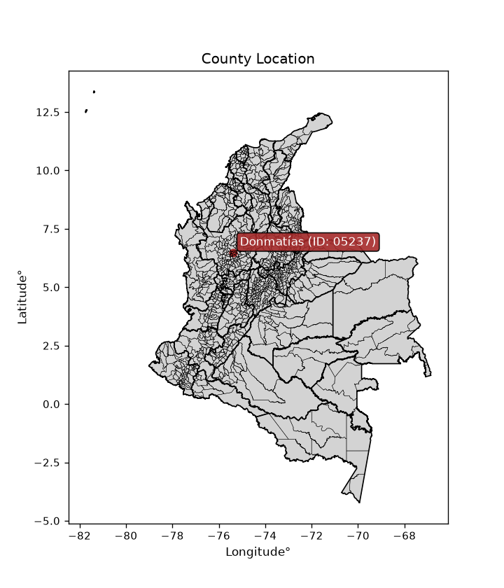
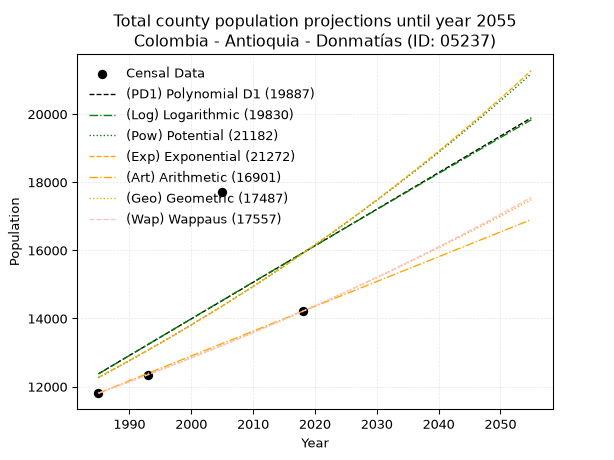
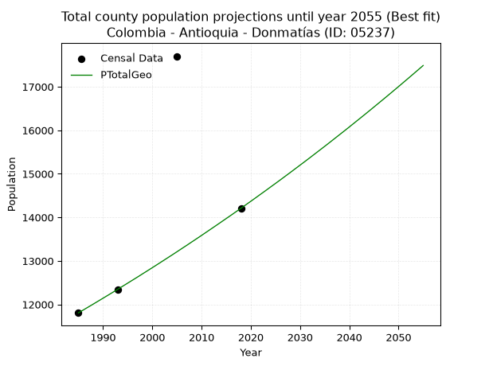
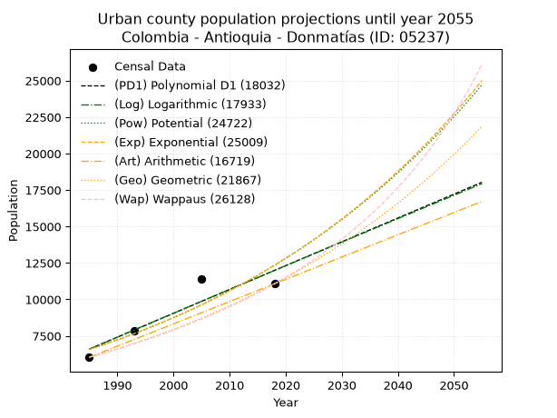
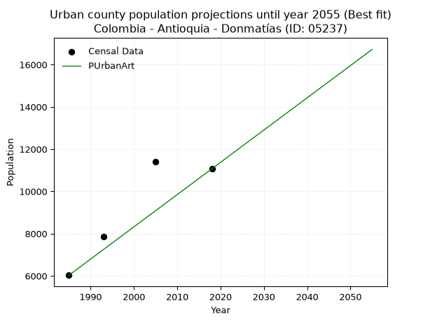
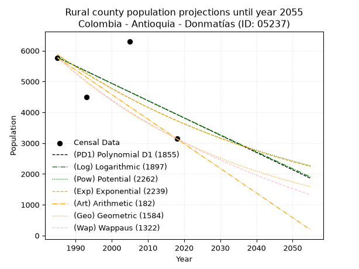
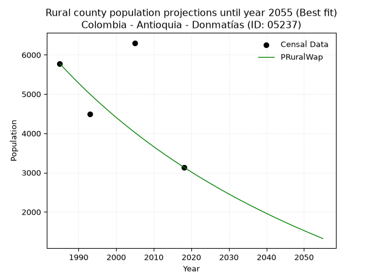

<div align="center">


</div>

# _“Population and Public Services Demand Projections (PPSD) until Year 2050 for Colombia - Antioquia - Donmatías (ID: 05237)”_
Keywords: `population` `public-service` `projection` `lineal` `polynomial` `logarithmic` `potential` `exponential` `arithmetic` `geometric` `wappaus` `dane` `colombia` `south-america`

PPSD are analytical estimates used by governments and planners to anticipate future changes in population size, age distribution, and the resulting community needs for utilities, healthcare, education, and infrastructure as sizing future water treatment facilities, electrical grids, and road networks based on spatial growth.

<div align="center">

</img>

</div>


> **General running parameters**: • app_version: _v20260806_. • Python version: _3.14.7_. • Pandas version: _3.0.5_. • NumPy version: _2.5.1_. • Creates, save and include plots into reports (create_plot): _False_. • Projection until year: _2050_. • Process polynomial degree 2 and up: _False_. • Process Wappaus: _True_. • Process Wappaus: _True_. • Set negative values to zero: _True_. • Set infinite values to zero: _True_. • Drop dataset notes: _True_. 
<div align="center">

Dynamic map: [:earth_americas:Google](http://maps.google.com/maps?q=6.48560253,-75.3926302) [:earth_americas:OSM](https://www.openstreetmap.org/#map=18/6.48560253/-75.3926302&layers=P) [:earth_americas:Bing](https://www.bing.com/maps?cp=6.48560253~-75.3926302&lvl=18) [:earth_americas:Apple](https://maps.apple.com/frame?center=6.48560253%2C-75.3926302&span=0.003%2C0.006)

</div>


<div align="center">

```geojson
{
  "type": "Feature",
  "geometry": {
    "type": "Point", 
    "coordinates": [-75.3926302, 6.48560253]
  }, 
  "properties": {
    "Name": "Colombia - Antioquia - Donmatías (ID: 05237)"
  }
}
```

</div>


## 0. Census Data (4 records)

Census data are official statistics collected by a government about the people and housing in a country. They usually include counts of total population, age, sex, race, income, education, and jobs.

📅Global census file: [Population.xlsx](../data/Population.xlsx)

| Source   |   Year |   CountryID | CountryName   |   StateID | StateName   |   CountyID | CountyName   |   PTotal |   PUrban |   PRural |
|:---------|-------:|------------:|:--------------|----------:|:------------|-----------:|:-------------|---------:|---------:|---------:|
| DANE     |   1985 |          57 | Colombia      |        05 | Antioquia   |      05237 | Donmatías    |    11806 |     6032 |     5774 |
| DANE     |   1993 |          57 | Colombia      |        05 | Antioquia   |      05237 | Donmatías    |    12332 |     7847 |     4485 |
| DANE     |   2005 |          57 | Colombia      |        05 | Antioquia   |      05237 | Donmatías    |    17701 |    11397 |     6304 |
| DANE     |   2018 |          57 | Colombia      |        05 | Antioquia   |      05237 | Donmatías    |    14208 |    11070 |     3138 |

> 🔥Some records could had specific notes about the registered values or the corresponding urban or rural distribution.

📅   [RUPS](https://www.datos.gov.co/Hacienda-y-Cr-dito-P-blico/Registro-nico-de-Prestadores-de-Servicios-P-blicos/4qkq-csdn/about_data) - Local public utility companies: [RUPS.csv](../data/RUPS.xlsx)

 | SERVICIO       | ESTADO    | NOMBRE                                                      | NIT         | DEPARTAMENTO_DOMICILIO   | MUNICIPIO_DOMICILIO   | DIRECCION            |   TELEFONO | EMAIL                                        | TIPO_PRESTADOR                             | CLASIFICACION                 |
|:---------------|:----------|:------------------------------------------------------------|:------------|:-------------------------|:----------------------|:---------------------|-----------:|:---------------------------------------------|:-------------------------------------------|:------------------------------|
| ACUEDUCTO      | OPERATIVA | SECRETARIA DE SERVICIOS PUBLICOS DEL MUNICIPIO DE DONMATIAS | 890984043-8 | ANTIOQUIA                | DONMATIAS             | Carrera 30 No. 29-59 |    8663243 | serviciospublicos@donmatias-antioquia.gov.co | MUNICIPIO (PRESTACIÓN DIRECTA)             | MAS DE 2500 SUSCRIPTORES      |
| ALCANTARILLADO | OPERATIVA | SECRETARIA DE SERVICIOS PUBLICOS DEL MUNICIPIO DE DONMATIAS | 890984043-8 | ANTIOQUIA                | DONMATIAS             | Carrera 30 No. 29-59 |    8663243 | serviciospublicos@donmatias-antioquia.gov.co | MUNICIPIO (PRESTACIÓN DIRECTA)             | MAS DE 2500 SUSCRIPTORES      |
| ACUEDUCTO      | OPERATIVA | SERVIDONMATIAS ESP SAS                                      | 900838892-5 | ANTIOQUIA                | DONMATIAS             | CALLE 30 30-13       |    8663960 | servidonmatias@gmail.com                     | SOCIEDADES (EMPRESA DE SERVICIOS PUBLICOS) | MAYOR O IGUAL A 5001 USUARIOS |
| ALCANTARILLADO | OPERATIVA | SERVIDONMATIAS ESP SAS                                      | 900838892-5 | ANTIOQUIA                | DONMATIAS             | CALLE 30 30-13       |    8663960 | servidonmatias@gmail.com                     | SOCIEDADES (EMPRESA DE SERVICIOS PUBLICOS) | MAYOR O IGUAL A 5001 USUARIOS |

## 1. Total

### 1.1. Coefficients and Parameters

* (PD1) Polynomial Deg 1: 107.30349257326547, -200622.06101967426 (lineal)
* (Log) Logarithmic: 215298.72920768097, -1622475.6160033208
* (Pow) Potential: 15.767775336709484, -47.90970540848138
* (Exp) Exponential: 0.007860361908926975, 0.002054185823904474
* (Art) Arithmetic: Year diff. 2018 - 1985 = 33, Population diff. 14208 - 11806 = 2402, Annual growth = 72.78787878787878
* (Geo) Geometric: Year diff. 2018 - 1985 = 33, Population diff. 14208 - 11806 = 2402, Annual growth % = 0.005627816674319108
* (Wap) Wappaus: i = 0.5596054339038886, Condition values only valid for < 200)

<sub>
Wappaus condition values: ['0.00', '0.56', '1.12', '1.68', '2.24', '2.80', '3.36', '3.92', '4.48', '5.04', '5.60', '6.16', '6.72', '7.27', '7.83', '8.39', '8.95', '9.51', '10.07', '10.63', '11.19', '11.75', '12.31', '12.87', '13.43', '13.99', '14.55', '15.11', '15.67', '16.23', '16.79', '17.35', '17.91', '18.47', '19.03', '19.59', '20.15', '20.71', '21.27', '21.82', '22.38', '22.94', '23.50', '24.06', '24.62', '25.18', '25.74', '26.30', '26.86', '27.42', '27.98', '28.54', '29.10', '29.66', '30.22', '30.78', '31.34', '31.90', '32.46', '33.02', '33.58', '34.14', '34.70', '35.26', '35.81', '36.37']
</sub>


### 1.2. Projected Dataset

|   Year |   CountyID |   PTotalPD1 |   PTotalLog |   PTotalPow |   PTotalExp |   PTotalArt |   PTotalGeo |   PTotalWap |
|-------:|-----------:|------------:|------------:|------------:|------------:|------------:|------------:|------------:|
|   1985 |      05237 |       12375 |       12368 |       12264 |       12270 |       11806 |       11806 |       11806 |
|   1986 |      05237 |       12483 |       12477 |       12362 |       12367 |       11879 |       11872 |       11872 |
|   1987 |      05237 |       12590 |       12585 |       12461 |       12465 |       11952 |       11939 |       11939 |
|   1988 |      05237 |       12697 |       12693 |       12560 |       12563 |       12024 |       12006 |       12006 |
|   1989 |      05237 |       12805 |       12802 |       12660 |       12662 |       12097 |       12074 |       12073 |
|   1990 |      05237 |       12912 |       12910 |       12761 |       12762 |       12170 |       12142 |       12141 |
|   1991 |      05237 |       13019 |       13018 |       12862 |       12863 |       12243 |       12210 |       12209 |
|   1992 |      05237 |       13126 |       13126 |       12964 |       12964 |       12316 |       12279 |       12278 |
|   1993 |      05237 |       13234 |       13234 |       13067 |       13067 |       12388 |       12348 |       12347 |
|   1994 |      05237 |       13341 |       13342 |       13171 |       13170 |       12461 |       12418 |       12416 |
|   1995 |      05237 |       13448 |       13450 |       13276 |       13274 |       12534 |       12488 |       12486 |
|   1996 |      05237 |       13556 |       13558 |       13381 |       13379 |       12607 |       12558 |       12556 |
|   1997 |      05237 |       13663 |       13666 |       13487 |       13484 |       12679 |       12628 |       12626 |
|   1998 |      05237 |       13770 |       13774 |       13594 |       13591 |       12752 |       12700 |       12697 |
|   1999 |      05237 |       13878 |       13881 |       13702 |       13698 |       12825 |       12771 |       12769 |
|   2000 |      05237 |       13985 |       13989 |       13810 |       13806 |       12898 |       12843 |       12840 |
|   2001 |      05237 |       14092 |       14097 |       13919 |       13915 |       12971 |       12915 |       12913 |
|   2002 |      05237 |       14200 |       14204 |       14029 |       14025 |       13043 |       12988 |       12985 |
|   2003 |      05237 |       14307 |       14312 |       14140 |       14135 |       13116 |       13061 |       13058 |
|   2004 |      05237 |       14414 |       14419 |       14252 |       14247 |       13189 |       13134 |       13132 |
|   2005 |      05237 |       14521 |       14527 |       14365 |       14359 |       13262 |       13208 |       13206 |
|   2006 |      05237 |       14629 |       14634 |       14478 |       14473 |       13335 |       13283 |       13280 |
|   2007 |      05237 |       14736 |       14741 |       14592 |       14587 |       13407 |       13357 |       13355 |
|   2008 |      05237 |       14843 |       14849 |       14707 |       14702 |       13480 |       13433 |       13430 |
|   2009 |      05237 |       14951 |       14956 |       14823 |       14818 |       13553 |       13508 |       13506 |
|   2010 |      05237 |       15058 |       15063 |       14940 |       14935 |       13626 |       13584 |       13582 |
|   2011 |      05237 |       15165 |       15170 |       15058 |       15053 |       13698 |       13661 |       13659 |
|   2012 |      05237 |       15273 |       15277 |       15176 |       15171 |       13771 |       13738 |       13736 |
|   2013 |      05237 |       15380 |       15384 |       15295 |       15291 |       13844 |       13815 |       13813 |
|   2014 |      05237 |       15487 |       15491 |       15416 |       15412 |       13917 |       13893 |       13891 |
|   2015 |      05237 |       15594 |       15598 |       15537 |       15533 |       13990 |       13971 |       13970 |
|   2016 |      05237 |       15702 |       15705 |       15659 |       15656 |       14062 |       14049 |       14049 |
|   2017 |      05237 |       15809 |       15811 |       15782 |       15780 |       14135 |       14128 |       14128 |
|   2018 |      05237 |       15916 |       15918 |       15906 |       15904 |       14208 |       14208 |       14208 |
|   2019 |      05237 |       16024 |       16025 |       16030 |       16030 |       14281 |       14288 |       14288 |
|   2020 |      05237 |       16131 |       16131 |       16156 |       16156 |       14354 |       14368 |       14369 |
|   2021 |      05237 |       16238 |       16238 |       16283 |       16284 |       14426 |       14449 |       14451 |
|   2022 |      05237 |       16346 |       16344 |       16410 |       16412 |       14499 |       14531 |       14533 |
|   2023 |      05237 |       16453 |       16451 |       16538 |       16542 |       14572 |       14612 |       14615 |
|   2024 |      05237 |       16560 |       16557 |       16668 |       16672 |       14645 |       14695 |       14698 |
|   2025 |      05237 |       16668 |       16664 |       16798 |       16804 |       14718 |       14777 |       14782 |
|   2026 |      05237 |       16775 |       16770 |       16929 |       16936 |       14790 |       14860 |       14866 |
|   2027 |      05237 |       16882 |       16876 |       17062 |       17070 |       14863 |       14944 |       14950 |
|   2028 |      05237 |       16989 |       16982 |       17195 |       17205 |       14936 |       15028 |       15035 |
|   2029 |      05237 |       17097 |       17088 |       17329 |       17340 |       15009 |       15113 |       15121 |
|   2030 |      05237 |       17204 |       17195 |       17464 |       17477 |       15081 |       15198 |       15207 |
|   2031 |      05237 |       17311 |       17301 |       17600 |       17615 |       15154 |       15283 |       15294 |
|   2032 |      05237 |       17419 |       17407 |       17737 |       17754 |       15227 |       15369 |       15381 |
|   2033 |      05237 |       17526 |       17512 |       17876 |       17894 |       15300 |       15456 |       15469 |
|   2034 |      05237 |       17633 |       17618 |       18015 |       18036 |       15373 |       15543 |       15558 |
|   2035 |      05237 |       17741 |       17724 |       18155 |       18178 |       15445 |       15630 |       15647 |
|   2036 |      05237 |       17848 |       17830 |       18296 |       18321 |       15518 |       15718 |       15736 |
|   2037 |      05237 |       17955 |       17936 |       18438 |       18466 |       15591 |       15807 |       15826 |
|   2038 |      05237 |       18062 |       18041 |       18582 |       18612 |       15664 |       15896 |       15917 |
|   2039 |      05237 |       18170 |       18147 |       18726 |       18758 |       15737 |       15985 |       16009 |
|   2040 |      05237 |       18277 |       18253 |       18871 |       18907 |       15809 |       16075 |       16101 |
|   2041 |      05237 |       18384 |       18358 |       19018 |       19056 |       15882 |       16166 |       16193 |
|   2042 |      05237 |       18492 |       18463 |       19165 |       19206 |       15955 |       16257 |       16286 |
|   2043 |      05237 |       18599 |       18569 |       19314 |       19358 |       16028 |       16348 |       16380 |
|   2044 |      05237 |       18706 |       18674 |       19463 |       19510 |       16100 |       16440 |       16475 |
|   2045 |      05237 |       18814 |       18780 |       19614 |       19664 |       16173 |       16533 |       16570 |
|   2046 |      05237 |       18921 |       18885 |       19766 |       19820 |       16246 |       16626 |       16666 |
|   2047 |      05237 |       19028 |       18990 |       19919 |       19976 |       16319 |       16719 |       16762 |
|   2048 |      05237 |       19135 |       19095 |       20072 |       20134 |       16392 |       16813 |       16859 |
|   2049 |      05237 |       19243 |       19200 |       20228 |       20292 |       16464 |       16908 |       16957 |
|   2050 |      05237 |       19350 |       19305 |       20384 |       20453 |       16537 |       17003 |       17055 |
<div align="center">

</img>

</div>


### 1.3. Best fit with absolute and relative error (%)

Relative error puts that difference into context by dividing the absolute error by the true value, creating a unitless ratio or percentage that shows the scale of the mistake.

Absolute and relative error

|   Year | Source   |   CountryID | CountryName   |   StateID | StateName   |   CountyID_x | CountyName   |   PTotal |   PUrban |   PRural |   CountyID_y |   PTotalPD1 |   PTotalLog |   PTotalPow |   PTotalExp |   PTotalArt |   PTotalGeo |   PTotalWap |   PTotalPD1AbsError |   PTotalLogAbsError |   PTotalPowAbsError |   PTotalExpAbsError |   PTotalArtAbsError |   PTotalGeoAbsError |   PTotalWapAbsError |   PTotalPD1RelError |   PTotalLogRelError |   PTotalPowRelError |   PTotalExpRelError |   PTotalArtRelError |   PTotalGeoRelError |   PTotalWapRelError |
|-------:|:---------|------------:|:--------------|----------:|:------------|-------------:|:-------------|---------:|---------:|---------:|-------------:|------------:|------------:|------------:|------------:|------------:|------------:|------------:|--------------------:|--------------------:|--------------------:|--------------------:|--------------------:|--------------------:|--------------------:|--------------------:|--------------------:|--------------------:|--------------------:|--------------------:|--------------------:|--------------------:|
|   1985 | DANE     |          57 | Colombia      |        05 | Antioquia   |        05237 | Donmatías    |    11806 |     6032 |     5774 |        05237 |       12375 |       12368 |       12264 |       12270 |       11806 |       11806 |       11806 |                 569 |                 562 |                 458 |                 464 |                   0 |                   0 |                   0 |             4.81958 |             4.76029 |             3.87938 |              3.9302 |            0        |            0        |            0        |
|   1993 | DANE     |          57 | Colombia      |        05 | Antioquia   |        05237 | Donmatías    |    12332 |     7847 |     4485 |        05237 |       13234 |       13234 |       13067 |       13067 |       12388 |       12348 |       12347 |                 902 |                 902 |                 735 |                 735 |                  56 |                  16 |                  15 |             7.3143  |             7.3143  |             5.9601  |              5.9601 |            0.454103 |            0.129744 |            0.121635 |
|   2005 | DANE     |          57 | Colombia      |        05 | Antioquia   |        05237 | Donmatías    |    17701 |    11397 |     6304 |        05237 |       14521 |       14527 |       14365 |       14359 |       13262 |       13208 |       13206 |                3180 |                3174 |                3336 |                3342 |                4439 |                4493 |                4495 |            17.9651  |            17.9312  |            18.8464  |             18.8803 |           25.0777   |           25.3827   |           25.394    |
|   2018 | DANE     |          57 | Colombia      |        05 | Antioquia   |        05237 | Donmatías    |    14208 |    11070 |     3138 |        05237 |       15916 |       15918 |       15906 |       15904 |       14208 |       14208 |       14208 |                1708 |                1710 |                1698 |                1696 |                   0 |                   0 |                   0 |            12.0214  |            12.0355  |            11.951   |             11.9369 |            0        |            0        |            0        |

Relative error mean

| Method    |   RelError | Best   |
|:----------|-----------:|:-------|
| PTotalPD1 |   10.5301  |        |
| PTotalLog |   10.5103  |        |
| PTotalPow |   10.1592  |        |
| PTotalExp |   10.1769  |        |
| PTotalArt |    6.38295 |        |
| PTotalGeo |    6.37812 | True   |
| PTotalWap |    6.37892 |        |

💙Best method: _**PTotalGeo**_
<div align="center">

</img>

</div>


### 1.4. Fresh water supply demand in liters per capita per day (lpcd)

The fresh water supply demand typically ranges from 100 to 300 liters per capita per day (lpcd) for standard domestic and municipal planning, though absolute survival minimums set by the World Health Organization are as low as 7.5 to 20 liters per day, and total consumption in high-income nations can exceed 400 liters.

> `CZ`: Level in meters above the sea level (masl)<br> `WS`: Fresh water supply demand in liters per capita per day (lpcd or l/h/d)<br> `WSAll`: Zonal fresh water supply demand in liters per second (l/s)<br> `A`: Zonal area in square meters<br> `DP`: Population density (people/hectare or p/ha)

Reference values (RAS Colombia)

|    CZ |   WS |
|------:|-----:|
|  1000 |  120 |
|  2000 |  130 |
| 99999 |  140 |

County shapefile geometry properties and water supply values

|   CountyID |      ATotal |   CZTotal |   WSTotal |
|-----------:|------------:|----------:|----------:|
|      05237 | 1.98015e+08 |   2049.88 |       140 |

Projected values for best method: PTotalGeo

|   CountyID |   Year |   PTotalGeo |   DPTotal |   WSTotal |   WSTotalAll |
|-----------:|-------:|------------:|----------:|----------:|-------------:|
|      05237 |   1985 |       11806 |      0.6  |       140 |      19.1301 |
|      05237 |   1986 |       11872 |      0.6  |       140 |      19.237  |
|      05237 |   1987 |       11939 |      0.6  |       140 |      19.3456 |
|      05237 |   1988 |       12006 |      0.61 |       140 |      19.4542 |
|      05237 |   1989 |       12074 |      0.61 |       140 |      19.5644 |
|      05237 |   1990 |       12142 |      0.61 |       140 |      19.6745 |
|      05237 |   1991 |       12210 |      0.62 |       140 |      19.7847 |
|      05237 |   1992 |       12279 |      0.62 |       140 |      19.8965 |
|      05237 |   1993 |       12348 |      0.62 |       140 |      20.0083 |
|      05237 |   1994 |       12418 |      0.63 |       140 |      20.1218 |
|      05237 |   1995 |       12488 |      0.63 |       140 |      20.2352 |
|      05237 |   1996 |       12558 |      0.63 |       140 |      20.3486 |
|      05237 |   1997 |       12628 |      0.64 |       140 |      20.462  |
|      05237 |   1998 |       12700 |      0.64 |       140 |      20.5787 |
|      05237 |   1999 |       12771 |      0.64 |       140 |      20.6938 |
|      05237 |   2000 |       12843 |      0.65 |       140 |      20.8104 |
|      05237 |   2001 |       12915 |      0.65 |       140 |      20.9271 |
|      05237 |   2002 |       12988 |      0.66 |       140 |      21.0454 |
|      05237 |   2003 |       13061 |      0.66 |       140 |      21.1637 |
|      05237 |   2004 |       13134 |      0.66 |       140 |      21.2819 |
|      05237 |   2005 |       13208 |      0.67 |       140 |      21.4019 |
|      05237 |   2006 |       13283 |      0.67 |       140 |      21.5234 |
|      05237 |   2007 |       13357 |      0.67 |       140 |      21.6433 |
|      05237 |   2008 |       13433 |      0.68 |       140 |      21.7664 |
|      05237 |   2009 |       13508 |      0.68 |       140 |      21.888  |
|      05237 |   2010 |       13584 |      0.69 |       140 |      22.0111 |
|      05237 |   2011 |       13661 |      0.69 |       140 |      22.1359 |
|      05237 |   2012 |       13738 |      0.69 |       140 |      22.2606 |
|      05237 |   2013 |       13815 |      0.7  |       140 |      22.3854 |
|      05237 |   2014 |       13893 |      0.7  |       140 |      22.5118 |
|      05237 |   2015 |       13971 |      0.71 |       140 |      22.6382 |
|      05237 |   2016 |       14049 |      0.71 |       140 |      22.7646 |
|      05237 |   2017 |       14128 |      0.71 |       140 |      22.8926 |
|      05237 |   2018 |       14208 |      0.72 |       140 |      23.0222 |
|      05237 |   2019 |       14288 |      0.72 |       140 |      23.1519 |
|      05237 |   2020 |       14368 |      0.73 |       140 |      23.2815 |
|      05237 |   2021 |       14449 |      0.73 |       140 |      23.4127 |
|      05237 |   2022 |       14531 |      0.73 |       140 |      23.5456 |
|      05237 |   2023 |       14612 |      0.74 |       140 |      23.6769 |
|      05237 |   2024 |       14695 |      0.74 |       140 |      23.8113 |
|      05237 |   2025 |       14777 |      0.75 |       140 |      23.9442 |
|      05237 |   2026 |       14860 |      0.75 |       140 |      24.0787 |
|      05237 |   2027 |       14944 |      0.75 |       140 |      24.2148 |
|      05237 |   2028 |       15028 |      0.76 |       140 |      24.3509 |
|      05237 |   2029 |       15113 |      0.76 |       140 |      24.4887 |
|      05237 |   2030 |       15198 |      0.77 |       140 |      24.6264 |
|      05237 |   2031 |       15283 |      0.77 |       140 |      24.7641 |
|      05237 |   2032 |       15369 |      0.78 |       140 |      24.9035 |
|      05237 |   2033 |       15456 |      0.78 |       140 |      25.0444 |
|      05237 |   2034 |       15543 |      0.78 |       140 |      25.1854 |
|      05237 |   2035 |       15630 |      0.79 |       140 |      25.3264 |
|      05237 |   2036 |       15718 |      0.79 |       140 |      25.469  |
|      05237 |   2037 |       15807 |      0.8  |       140 |      25.6132 |
|      05237 |   2038 |       15896 |      0.8  |       140 |      25.7574 |
|      05237 |   2039 |       15985 |      0.81 |       140 |      25.9016 |
|      05237 |   2040 |       16075 |      0.81 |       140 |      26.0475 |
|      05237 |   2041 |       16166 |      0.82 |       140 |      26.1949 |
|      05237 |   2042 |       16257 |      0.82 |       140 |      26.3424 |
|      05237 |   2043 |       16348 |      0.83 |       140 |      26.4898 |
|      05237 |   2044 |       16440 |      0.83 |       140 |      26.6389 |
|      05237 |   2045 |       16533 |      0.83 |       140 |      26.7896 |
|      05237 |   2046 |       16626 |      0.84 |       140 |      26.9403 |
|      05237 |   2047 |       16719 |      0.84 |       140 |      27.091  |
|      05237 |   2048 |       16813 |      0.85 |       140 |      27.2433 |
|      05237 |   2049 |       16908 |      0.85 |       140 |      27.3972 |
|      05237 |   2050 |       17003 |      0.86 |       140 |      27.5512 |

## 2. Urban

### 2.1. Coefficients and Parameters

* (PD1) Polynomial Deg 1: 163.3873946206343, -317729.1360899238 (lineal)
* (Log) Logarithmic: 327350.7463868829, -2479109.1465109475
* (Pow) Potential: 38.262883887853434, -122.36465567375554
* (Exp) Exponential: 0.0190963469038529, 2.2650420000562244e-13
* (Art) Arithmetic: Year diff. 2018 - 1985 = 33, Population diff. 11070 - 6032 = 5038, Annual growth = 152.66666666666666
* (Geo) Geometric: Year diff. 2018 - 1985 = 33, Population diff. 11070 - 6032 = 5038, Annual growth % = 0.018569091995187303
* (Wap) Wappaus: i = 1.7853662339687366, Condition values only valid for < 200)

<sub>
Wappaus condition values: ['0.00', '1.79', '3.57', '5.36', '7.14', '8.93', '10.71', '12.50', '14.28', '16.07', '17.85', '19.64', '21.42', '23.21', '25.00', '26.78', '28.57', '30.35', '32.14', '33.92', '35.71', '37.49', '39.28', '41.06', '42.85', '44.63', '46.42', '48.20', '49.99', '51.78', '53.56', '55.35', '57.13', '58.92', '60.70', '62.49', '64.27', '66.06', '67.84', '69.63', '71.41', '73.20', '74.99', '76.77', '78.56', '80.34', '82.13', '83.91', '85.70', '87.48', '89.27', '91.05', '92.84', '94.62', '96.41', '98.20', '99.98', '101.77', '103.55', '105.34', '107.12', '108.91', '110.69', '112.48', '114.26', '116.05']
</sub>


### 2.2. Projected Dataset

|   Year |   CountyID |   PUrbanPD1 |   PUrbanLog |   PUrbanPow |   PUrbanExp |   PUrbanArt |   PUrbanGeo |   PUrbanWap |
|-------:|-----------:|------------:|------------:|------------:|------------:|------------:|------------:|------------:|
|   1985 |      05237 |        6595 |        6588 |        6564 |        6570 |        6032 |        6032 |        6032 |
|   1986 |      05237 |        6758 |        6752 |        6692 |        6696 |        6185 |        6144 |        6141 |
|   1987 |      05237 |        6922 |        6917 |        6822 |        6826 |        6337 |        6258 |        6251 |
|   1988 |      05237 |        7085 |        7082 |        6955 |        6957 |        6490 |        6374 |        6364 |
|   1989 |      05237 |        7248 |        7247 |        7090 |        7091 |        6643 |        6493 |        6479 |
|   1990 |      05237 |        7412 |        7411 |        7227 |        7228 |        6795 |        6613 |        6596 |
|   1991 |      05237 |        7575 |        7576 |        7368 |        7367 |        6948 |        6736 |        6715 |
|   1992 |      05237 |        7739 |        7740 |        7511 |        7509 |        7101 |        6861 |        6836 |
|   1993 |      05237 |        7902 |        7904 |        7656 |        7654 |        7253 |        6989 |        6960 |
|   1994 |      05237 |        8065 |        8068 |        7804 |        7802 |        7406 |        7118 |        7086 |
|   1995 |      05237 |        8229 |        8233 |        7956 |        7952 |        7559 |        7250 |        7214 |
|   1996 |      05237 |        8392 |        8397 |        8110 |        8105 |        7711 |        7385 |        7346 |
|   1997 |      05237 |        8555 |        8561 |        8267 |        8262 |        7864 |        7522 |        7479 |
|   1998 |      05237 |        8719 |        8724 |        8426 |        8421 |        8017 |        7662 |        7616 |
|   1999 |      05237 |        8882 |        8888 |        8589 |        8583 |        8169 |        7804 |        7755 |
|   2000 |      05237 |        9046 |        9052 |        8755 |        8749 |        8322 |        7949 |        7897 |
|   2001 |      05237 |        9209 |        9216 |        8924 |        8918 |        8475 |        8097 |        8042 |
|   2002 |      05237 |        9372 |        9379 |        9097 |        9089 |        8627 |        8247 |        8190 |
|   2003 |      05237 |        9536 |        9543 |        9272 |        9265 |        8780 |        8400 |        8342 |
|   2004 |      05237 |        9699 |        9706 |        9451 |        9443 |        8933 |        8556 |        8496 |
|   2005 |      05237 |        9863 |        9869 |        9633 |        9625 |        9085 |        8715 |        8654 |
|   2006 |      05237 |       10026 |       10033 |        9819 |        9811 |        9238 |        8877 |        8815 |
|   2007 |      05237 |       10189 |       10196 |       10008 |       10000 |        9391 |        9042 |        8980 |
|   2008 |      05237 |       10353 |       10359 |       10200 |       10193 |        9543 |        9210 |        9149 |
|   2009 |      05237 |       10516 |       10522 |       10396 |       10389 |        9696 |        9381 |        9321 |
|   2010 |      05237 |       10680 |       10685 |       10596 |       10590 |        9849 |        9555 |        9498 |
|   2011 |      05237 |       10843 |       10847 |       10800 |       10794 |       10001 |        9732 |        9678 |
|   2012 |      05237 |       11006 |       11010 |       11007 |       11002 |       10154 |        9913 |        9863 |
|   2013 |      05237 |       11170 |       11173 |       11219 |       11214 |       10307 |       10097 |       10052 |
|   2014 |      05237 |       11333 |       11335 |       11434 |       11430 |       10459 |       10285 |       10246 |
|   2015 |      05237 |       11496 |       11498 |       11653 |       11651 |       10612 |       10476 |       10444 |
|   2016 |      05237 |       11660 |       11660 |       11876 |       11875 |       10765 |       10670 |       10648 |
|   2017 |      05237 |       11823 |       11823 |       12104 |       12104 |       10917 |       10868 |       10856 |
|   2018 |      05237 |       11987 |       11985 |       12336 |       12338 |       11070 |       11070 |       11070 |
|   2019 |      05237 |       12150 |       12147 |       12572 |       12576 |       11223 |       11276 |       11289 |
|   2020 |      05237 |       12313 |       12309 |       12812 |       12818 |       11375 |       11485 |       11514 |
|   2021 |      05237 |       12477 |       12471 |       13057 |       13065 |       11528 |       11698 |       11745 |
|   2022 |      05237 |       12640 |       12633 |       13307 |       13317 |       11681 |       11915 |       11982 |
|   2023 |      05237 |       12804 |       12795 |       13561 |       13574 |       11833 |       12137 |       12225 |
|   2024 |      05237 |       12967 |       12957 |       13820 |       13836 |       11986 |       12362 |       12475 |
|   2025 |      05237 |       13130 |       13118 |       14083 |       14102 |       12139 |       12592 |       12732 |
|   2026 |      05237 |       13294 |       13280 |       14352 |       14374 |       12291 |       12825 |       12996 |
|   2027 |      05237 |       13457 |       13442 |       14625 |       14651 |       12444 |       13064 |       13268 |
|   2028 |      05237 |       13621 |       13603 |       14904 |       14934 |       12597 |       13306 |       13548 |
|   2029 |      05237 |       13784 |       13764 |       15188 |       15222 |       12749 |       13553 |       13836 |
|   2030 |      05237 |       13947 |       13926 |       15477 |       15515 |       12902 |       13805 |       14132 |
|   2031 |      05237 |       14111 |       14087 |       15771 |       15814 |       13055 |       14061 |       14437 |
|   2032 |      05237 |       14274 |       14248 |       16071 |       16119 |       13207 |       14322 |       14752 |
|   2033 |      05237 |       14437 |       14409 |       16376 |       16430 |       13360 |       14588 |       15077 |
|   2034 |      05237 |       14601 |       14570 |       16688 |       16747 |       13513 |       14859 |       15412 |
|   2035 |      05237 |       14764 |       14731 |       17004 |       17070 |       13665 |       15135 |       15758 |
|   2036 |      05237 |       14928 |       14892 |       17327 |       17399 |       13818 |       15416 |       16115 |
|   2037 |      05237 |       15091 |       15053 |       17656 |       17734 |       13971 |       15702 |       16484 |
|   2038 |      05237 |       15254 |       15213 |       17990 |       18076 |       14123 |       15994 |       16865 |
|   2039 |      05237 |       15418 |       15374 |       18331 |       18425 |       14276 |       16291 |       17260 |
|   2040 |      05237 |       15581 |       15534 |       18678 |       18780 |       14429 |       16594 |       17668 |
|   2041 |      05237 |       15745 |       15695 |       19032 |       19142 |       14581 |       16902 |       18091 |
|   2042 |      05237 |       15908 |       15855 |       19392 |       19511 |       14734 |       17215 |       18530 |
|   2043 |      05237 |       16071 |       16015 |       19759 |       19887 |       14887 |       17535 |       18984 |
|   2044 |      05237 |       16235 |       16176 |       20132 |       20270 |       15039 |       17861 |       19456 |
|   2045 |      05237 |       16398 |       16336 |       20512 |       20661 |       15192 |       18192 |       19946 |
|   2046 |      05237 |       16561 |       16496 |       20900 |       21060 |       15345 |       18530 |       20455 |
|   2047 |      05237 |       16725 |       16656 |       21294 |       21466 |       15497 |       18874 |       20985 |
|   2048 |      05237 |       16888 |       16816 |       21696 |       21880 |       15650 |       19225 |       21536 |
|   2049 |      05237 |       17052 |       16975 |       22105 |       22301 |       15803 |       19582 |       22110 |
|   2050 |      05237 |       17215 |       17135 |       22522 |       22731 |       15955 |       19945 |       22709 |
<div align="center">

</img>

</div>


### 2.3. Best fit with absolute and relative error (%)

Relative error puts that difference into context by dividing the absolute error by the true value, creating a unitless ratio or percentage that shows the scale of the mistake.

Absolute and relative error

|   Year | Source   |   CountryID | CountryName   |   StateID | StateName   |   CountyID_x | CountyName   |   PTotal |   PUrban |   PRural |   CountyID_y |   PUrbanPD1 |   PUrbanLog |   PUrbanPow |   PUrbanExp |   PUrbanArt |   PUrbanGeo |   PUrbanWap |   PUrbanPD1AbsError |   PUrbanLogAbsError |   PUrbanPowAbsError |   PUrbanExpAbsError |   PUrbanArtAbsError |   PUrbanGeoAbsError |   PUrbanWapAbsError |   PUrbanPD1RelError |   PUrbanLogRelError |   PUrbanPowRelError |   PUrbanExpRelError |   PUrbanArtRelError |   PUrbanGeoRelError |   PUrbanWapRelError |
|-------:|:---------|------------:|:--------------|----------:|:------------|-------------:|:-------------|---------:|---------:|---------:|-------------:|------------:|------------:|------------:|------------:|------------:|------------:|------------:|--------------------:|--------------------:|--------------------:|--------------------:|--------------------:|--------------------:|--------------------:|--------------------:|--------------------:|--------------------:|--------------------:|--------------------:|--------------------:|--------------------:|
|   1985 | DANE     |          57 | Colombia      |        05 | Antioquia   |        05237 | Donmatías    |    11806 |     6032 |     5774 |        05237 |        6595 |        6588 |        6564 |        6570 |        6032 |        6032 |        6032 |                 563 |                 556 |                 532 |                 538 |                   0 |                   0 |                   0 |            9.33355  |            9.21751  |             8.81963 |             8.9191  |             0       |              0      |              0      |
|   1993 | DANE     |          57 | Colombia      |        05 | Antioquia   |        05237 | Donmatías    |    12332 |     7847 |     4485 |        05237 |        7902 |        7904 |        7656 |        7654 |        7253 |        6989 |        6960 |                  55 |                  57 |                 191 |                 193 |                 594 |                 858 |                 887 |            0.700905 |            0.726392 |             2.43405 |             2.45954 |             7.56977 |             10.9341 |             11.3037 |
|   2005 | DANE     |          57 | Colombia      |        05 | Antioquia   |        05237 | Donmatías    |    17701 |    11397 |     6304 |        05237 |        9863 |        9869 |        9633 |        9625 |        9085 |        8715 |        8654 |                1534 |                1528 |                1764 |                1772 |                2312 |                2682 |                2743 |           13.4597   |           13.407    |            15.4778  |            15.548   |            20.286   |             23.5325 |             24.0677 |
|   2018 | DANE     |          57 | Colombia      |        05 | Antioquia   |        05237 | Donmatías    |    14208 |    11070 |     3138 |        05237 |       11987 |       11985 |       12336 |       12338 |       11070 |       11070 |       11070 |                 917 |                 915 |                1266 |                1268 |                   0 |                   0 |                   0 |            8.28365  |            8.26558  |            11.4363  |            11.4544  |             0       |              0      |              0      |

Relative error mean

| Method    |   RelError | Best   |
|:----------|-----------:|:-------|
| PUrbanPD1 |    7.94445 |        |
| PUrbanLog |    7.90413 |        |
| PUrbanPow |    9.54194 |        |
| PUrbanExp |    9.59524 |        |
| PUrbanArt |    6.96395 | True   |
| PUrbanGeo |    8.61666 |        |
| PUrbanWap |    8.84286 |        |

💙Best method: _**PUrbanArt**_
<div align="center">

</img>

</div>


### 2.4. Fresh water supply demand in liters per capita per day (lpcd)

The fresh water supply demand typically ranges from 100 to 300 liters per capita per day (lpcd) for standard domestic and municipal planning, though absolute survival minimums set by the World Health Organization are as low as 7.5 to 20 liters per day, and total consumption in high-income nations can exceed 400 liters.

> `CZ`: Level in meters above the sea level (masl)<br> `WS`: Fresh water supply demand in liters per capita per day (lpcd or l/h/d)<br> `WSAll`: Zonal fresh water supply demand in liters per second (l/s)<br> `A`: Zonal area in square meters<br> `DP`: Population density (people/hectare or p/ha)

Reference values (RAS Colombia)

|    CZ |   WS |
|------:|-----:|
|  1000 |  120 |
|  2000 |  130 |
| 99999 |  140 |

County shapefile geometry properties and water supply values

|   CountyID |      AUrban |   CZUrban |   WSUrban |
|-----------:|------------:|----------:|----------:|
|      05237 | 1.09156e+06 |   2173.31 |       140 |

Projected values for best method: PUrbanArt

|   CountyID |   Year |   PUrbanArt |   DPUrban |   WSUrban |   WSUrbanAll |
|-----------:|-------:|------------:|----------:|----------:|-------------:|
|      05237 |   1985 |        6032 |     55.26 |       140 |      9.77407 |
|      05237 |   1986 |        6185 |     56.66 |       140 |     10.022   |
|      05237 |   1987 |        6337 |     58.05 |       140 |     10.2683  |
|      05237 |   1988 |        6490 |     59.46 |       140 |     10.5162  |
|      05237 |   1989 |        6643 |     60.86 |       140 |     10.7641  |
|      05237 |   1990 |        6795 |     62.25 |       140 |     11.0104  |
|      05237 |   1991 |        6948 |     63.65 |       140 |     11.2583  |
|      05237 |   1992 |        7101 |     65.05 |       140 |     11.5062  |
|      05237 |   1993 |        7253 |     66.45 |       140 |     11.7525  |
|      05237 |   1994 |        7406 |     67.85 |       140 |     12.0005  |
|      05237 |   1995 |        7559 |     69.25 |       140 |     12.2484  |
|      05237 |   1996 |        7711 |     70.64 |       140 |     12.4947  |
|      05237 |   1997 |        7864 |     72.04 |       140 |     12.7426  |
|      05237 |   1998 |        8017 |     73.45 |       140 |     12.9905  |
|      05237 |   1999 |        8169 |     74.84 |       140 |     13.2368  |
|      05237 |   2000 |        8322 |     76.24 |       140 |     13.4847  |
|      05237 |   2001 |        8475 |     77.64 |       140 |     13.7326  |
|      05237 |   2002 |        8627 |     79.03 |       140 |     13.9789  |
|      05237 |   2003 |        8780 |     80.44 |       140 |     14.2269  |
|      05237 |   2004 |        8933 |     81.84 |       140 |     14.4748  |
|      05237 |   2005 |        9085 |     83.23 |       140 |     14.7211  |
|      05237 |   2006 |        9238 |     84.63 |       140 |     14.969   |
|      05237 |   2007 |        9391 |     86.03 |       140 |     15.2169  |
|      05237 |   2008 |        9543 |     87.43 |       140 |     15.4632  |
|      05237 |   2009 |        9696 |     88.83 |       140 |     15.7111  |
|      05237 |   2010 |        9849 |     90.23 |       140 |     15.959   |
|      05237 |   2011 |       10001 |     91.62 |       140 |     16.2053  |
|      05237 |   2012 |       10154 |     93.02 |       140 |     16.4532  |
|      05237 |   2013 |       10307 |     94.42 |       140 |     16.7012  |
|      05237 |   2014 |       10459 |     95.82 |       140 |     16.9475  |
|      05237 |   2015 |       10612 |     97.22 |       140 |     17.1954  |
|      05237 |   2016 |       10765 |     98.62 |       140 |     17.4433  |
|      05237 |   2017 |       10917 |    100.01 |       140 |     17.6896  |
|      05237 |   2018 |       11070 |    101.41 |       140 |     17.9375  |
|      05237 |   2019 |       11223 |    102.82 |       140 |     18.1854  |
|      05237 |   2020 |       11375 |    104.21 |       140 |     18.4317  |
|      05237 |   2021 |       11528 |    105.61 |       140 |     18.6796  |
|      05237 |   2022 |       11681 |    107.01 |       140 |     18.9275  |
|      05237 |   2023 |       11833 |    108.4  |       140 |     19.1738  |
|      05237 |   2024 |       11986 |    109.81 |       140 |     19.4218  |
|      05237 |   2025 |       12139 |    111.21 |       140 |     19.6697  |
|      05237 |   2026 |       12291 |    112.6  |       140 |     19.916   |
|      05237 |   2027 |       12444 |    114    |       140 |     20.1639  |
|      05237 |   2028 |       12597 |    115.4  |       140 |     20.4118  |
|      05237 |   2029 |       12749 |    116.8  |       140 |     20.6581  |
|      05237 |   2030 |       12902 |    118.2  |       140 |     20.906   |
|      05237 |   2031 |       13055 |    119.6  |       140 |     21.1539  |
|      05237 |   2032 |       13207 |    120.99 |       140 |     21.4002  |
|      05237 |   2033 |       13360 |    122.39 |       140 |     21.6481  |
|      05237 |   2034 |       13513 |    123.79 |       140 |     21.8961  |
|      05237 |   2035 |       13665 |    125.19 |       140 |     22.1424  |
|      05237 |   2036 |       13818 |    126.59 |       140 |     22.3903  |
|      05237 |   2037 |       13971 |    127.99 |       140 |     22.6382  |
|      05237 |   2038 |       14123 |    129.38 |       140 |     22.8845  |
|      05237 |   2039 |       14276 |    130.78 |       140 |     23.1324  |
|      05237 |   2040 |       14429 |    132.19 |       140 |     23.3803  |
|      05237 |   2041 |       14581 |    133.58 |       140 |     23.6266  |
|      05237 |   2042 |       14734 |    134.98 |       140 |     23.8745  |
|      05237 |   2043 |       14887 |    136.38 |       140 |     24.1225  |
|      05237 |   2044 |       15039 |    137.77 |       140 |     24.3687  |
|      05237 |   2045 |       15192 |    139.18 |       140 |     24.6167  |
|      05237 |   2046 |       15345 |    140.58 |       140 |     24.8646  |
|      05237 |   2047 |       15497 |    141.97 |       140 |     25.1109  |
|      05237 |   2048 |       15650 |    143.37 |       140 |     25.3588  |
|      05237 |   2049 |       15803 |    144.77 |       140 |     25.6067  |
|      05237 |   2050 |       15955 |    146.17 |       140 |     25.853   |

## 3. Rural

### 3.1. Coefficients and Parameters

* (PD1) Polynomial Deg 1: -56.08390204736867, 117107.07507024918 (lineal)
* (Log) Logarithmic: -112052.01717920222, 856633.5305076283
* (Pow) Potential: -27.514379452330505, 94.50443027731909
* (Exp) Exponential: -0.013769410747037634, 4353417316724973.0
* (Art) Arithmetic: Year diff. 2018 - 1985 = 33, Population diff. 3138 - 5774 = -2636, Annual growth = -79.87878787878788
* (Geo) Geometric: Year diff. 2018 - 1985 = 33, Population diff. 3138 - 5774 = -2636, Annual growth % = -0.018308489870560662
* (Wap) Wappaus: i = -1.7926119362385071, Condition values only valid for < 200)

<sub>
Wappaus condition values: ['-0.00', '-1.79', '-3.59', '-5.38', '-7.17', '-8.96', '-10.76', '-12.55', '-14.34', '-16.13', '-17.93', '-19.72', '-21.51', '-23.30', '-25.10', '-26.89', '-28.68', '-30.47', '-32.27', '-34.06', '-35.85', '-37.64', '-39.44', '-41.23', '-43.02', '-44.82', '-46.61', '-48.40', '-50.19', '-51.99', '-53.78', '-55.57', '-57.36', '-59.16', '-60.95', '-62.74', '-64.53', '-66.33', '-68.12', '-69.91', '-71.70', '-73.50', '-75.29', '-77.08', '-78.87', '-80.67', '-82.46', '-84.25', '-86.05', '-87.84', '-89.63', '-91.42', '-93.22', '-95.01', '-96.80', '-98.59', '-100.39', '-102.18', '-103.97', '-105.76', '-107.56', '-109.35', '-111.14', '-112.93', '-114.73', '-116.52']
</sub>


### 3.2. Projected Dataset

|   Year |   CountyID |   PRuralPD1 |   PRuralLog |   PRuralPow |   PRuralExp |   PRuralArt |   PRuralGeo |   PRuralWap |
|-------:|-----------:|------------:|------------:|------------:|------------:|------------:|------------:|------------:|
|   1985 |      05237 |        5781 |        5781 |        5869 |        5869 |        5774 |        5774 |        5774 |
|   1986 |      05237 |        5724 |        5724 |        5789 |        5789 |        5694 |        5668 |        5671 |
|   1987 |      05237 |        5668 |        5668 |        5709 |        5710 |        5614 |        5565 |        5571 |
|   1988 |      05237 |        5612 |        5611 |        5631 |        5632 |        5534 |        5463 |        5472 |
|   1989 |      05237 |        5556 |        5555 |        5553 |        5555 |        5454 |        5363 |        5374 |
|   1990 |      05237 |        5500 |        5499 |        5477 |        5479 |        5375 |        5264 |        5279 |
|   1991 |      05237 |        5444 |        5442 |        5402 |        5404 |        5295 |        5168 |        5185 |
|   1992 |      05237 |        5388 |        5386 |        5328 |        5330 |        5215 |        5073 |        5092 |
|   1993 |      05237 |        5332 |        5330 |        5255 |        5257 |        5135 |        4981 |        5001 |
|   1994 |      05237 |        5276 |        5274 |        5183 |        5185 |        5055 |        4889 |        4912 |
|   1995 |      05237 |        5220 |        5218 |        5112 |        5114 |        4975 |        4800 |        4824 |
|   1996 |      05237 |        5164 |        5161 |        5042 |        5044 |        4895 |        4712 |        4738 |
|   1997 |      05237 |        5108 |        5105 |        4973 |        4975 |        4815 |        4626 |        4653 |
|   1998 |      05237 |        5051 |        5049 |        4904 |        4907 |        4736 |        4541 |        4569 |
|   1999 |      05237 |        4995 |        4993 |        4837 |        4840 |        4656 |        4458 |        4486 |
|   2000 |      05237 |        4939 |        4937 |        4771 |        4774 |        4576 |        4376 |        4405 |
|   2001 |      05237 |        4883 |        4881 |        4706 |        4709 |        4496 |        4296 |        4326 |
|   2002 |      05237 |        4827 |        4825 |        4642 |        4644 |        4416 |        4217 |        4247 |
|   2003 |      05237 |        4771 |        4769 |        4579 |        4581 |        4336 |        4140 |        4170 |
|   2004 |      05237 |        4715 |        4713 |        4516 |        4518 |        4256 |        4064 |        4094 |
|   2005 |      05237 |        4659 |        4657 |        4455 |        4456 |        4176 |        3990 |        4019 |
|   2006 |      05237 |        4603 |        4601 |        4394 |        4395 |        4097 |        3917 |        3945 |
|   2007 |      05237 |        4547 |        4546 |        4334 |        4335 |        4017 |        3845 |        3872 |
|   2008 |      05237 |        4491 |        4490 |        4275 |        4276 |        3937 |        3775 |        3800 |
|   2009 |      05237 |        4435 |        4434 |        4217 |        4217 |        3857 |        3706 |        3730 |
|   2010 |      05237 |        4378 |        4378 |        4159 |        4160 |        3777 |        3638 |        3660 |
|   2011 |      05237 |        4322 |        4322 |        4103 |        4103 |        3697 |        3571 |        3591 |
|   2012 |      05237 |        4266 |        4267 |        4047 |        4047 |        3617 |        3506 |        3524 |
|   2013 |      05237 |        4210 |        4211 |        3992 |        3991 |        3537 |        3442 |        3457 |
|   2014 |      05237 |        4154 |        4155 |        3938 |        3937 |        3458 |        3379 |        3392 |
|   2015 |      05237 |        4098 |        4100 |        3885 |        3883 |        3378 |        3317 |        3327 |
|   2016 |      05237 |        4042 |        4044 |        3832 |        3830 |        3298 |        3256 |        3263 |
|   2017 |      05237 |        3986 |        3989 |        3780 |        3778 |        3218 |        3197 |        3200 |
|   2018 |      05237 |        3930 |        3933 |        3729 |        3726 |        3138 |        3138 |        3138 |
|   2019 |      05237 |        3874 |        3878 |        3678 |        3675 |        3058 |        3081 |        3077 |
|   2020 |      05237 |        3818 |        3822 |        3629 |        3625 |        2978 |        3024 |        3016 |
|   2021 |      05237 |        3762 |        3767 |        3580 |        3575 |        2898 |        2969 |        2957 |
|   2022 |      05237 |        3705 |        3711 |        3531 |        3526 |        2818 |        2914 |        2898 |
|   2023 |      05237 |        3649 |        3656 |        3483 |        3478 |        2739 |        2861 |        2840 |
|   2024 |      05237 |        3593 |        3600 |        3436 |        3430 |        2659 |        2809 |        2783 |
|   2025 |      05237 |        3537 |        3545 |        3390 |        3384 |        2579 |        2757 |        2726 |
|   2026 |      05237 |        3481 |        3490 |        3344 |        3337 |        2499 |        2707 |        2671 |
|   2027 |      05237 |        3425 |        3434 |        3299 |        3292 |        2419 |        2657 |        2616 |
|   2028 |      05237 |        3369 |        3379 |        3255 |        3247 |        2339 |        2609 |        2561 |
|   2029 |      05237 |        3313 |        3324 |        3211 |        3202 |        2259 |        2561 |        2508 |
|   2030 |      05237 |        3257 |        3269 |        3168 |        3158 |        2179 |        2514 |        2455 |
|   2031 |      05237 |        3201 |        3214 |        3125 |        3115 |        2100 |        2468 |        2403 |
|   2032 |      05237 |        3145 |        3158 |        3083 |        3073 |        2020 |        2423 |        2351 |
|   2033 |      05237 |        3089 |        3103 |        3041 |        3031 |        1940 |        2378 |        2300 |
|   2034 |      05237 |        3032 |        3048 |        3001 |        2989 |        1860 |        2335 |        2250 |
|   2035 |      05237 |        2976 |        2993 |        2960 |        2948 |        1780 |        2292 |        2200 |
|   2036 |      05237 |        2920 |        2938 |        2921 |        2908 |        1700 |        2250 |        2151 |
|   2037 |      05237 |        2864 |        2883 |        2881 |        2868 |        1620 |        2209 |        2103 |
|   2038 |      05237 |        2808 |        2828 |        2843 |        2829 |        1540 |        2168 |        2055 |
|   2039 |      05237 |        2752 |        2773 |        2805 |        2790 |        1461 |        2129 |        2008 |
|   2040 |      05237 |        2696 |        2718 |        2767 |        2752 |        1381 |        2090 |        1961 |
|   2041 |      05237 |        2640 |        2663 |        2730 |        2715 |        1301 |        2052 |        1915 |
|   2042 |      05237 |        2584 |        2608 |        2693 |        2677 |        1221 |        2014 |        1869 |
|   2043 |      05237 |        2528 |        2553 |        2657 |        2641 |        1141 |        1977 |        1824 |
|   2044 |      05237 |        2472 |        2499 |        2622 |        2605 |        1061 |        1941 |        1780 |
|   2045 |      05237 |        2415 |        2444 |        2587 |        2569 |         981 |        1905 |        1736 |
|   2046 |      05237 |        2359 |        2389 |        2552 |        2534 |         901 |        1870 |        1692 |
|   2047 |      05237 |        2303 |        2334 |        2518 |        2499 |         822 |        1836 |        1649 |
|   2048 |      05237 |        2247 |        2280 |        2485 |        2465 |         742 |        1803 |        1606 |
|   2049 |      05237 |        2191 |        2225 |        2451 |        2431 |         662 |        1770 |        1564 |
|   2050 |      05237 |        2135 |        2170 |        2419 |        2398 |         582 |        1737 |        1523 |
<div align="center">

</img>

</div>


### 3.3. Best fit with absolute and relative error (%)

Relative error puts that difference into context by dividing the absolute error by the true value, creating a unitless ratio or percentage that shows the scale of the mistake.

Absolute and relative error

|   Year | Source   |   CountryID | CountryName   |   StateID | StateName   |   CountyID_x | CountyName   |   PTotal |   PUrban |   PRural |   CountyID_y |   PRuralPD1 |   PRuralLog |   PRuralPow |   PRuralExp |   PRuralArt |   PRuralGeo |   PRuralWap |   PRuralPD1AbsError |   PRuralLogAbsError |   PRuralPowAbsError |   PRuralExpAbsError |   PRuralArtAbsError |   PRuralGeoAbsError |   PRuralWapAbsError |   PRuralPD1RelError |   PRuralLogRelError |   PRuralPowRelError |   PRuralExpRelError |   PRuralArtRelError |   PRuralGeoRelError |   PRuralWapRelError |
|-------:|:---------|------------:|:--------------|----------:|:------------|-------------:|:-------------|---------:|---------:|---------:|-------------:|------------:|------------:|------------:|------------:|------------:|------------:|------------:|--------------------:|--------------------:|--------------------:|--------------------:|--------------------:|--------------------:|--------------------:|--------------------:|--------------------:|--------------------:|--------------------:|--------------------:|--------------------:|--------------------:|
|   1985 | DANE     |          57 | Colombia      |        05 | Antioquia   |        05237 | Donmatías    |    11806 |     6032 |     5774 |        05237 |        5781 |        5781 |        5869 |        5869 |        5774 |        5774 |        5774 |                   7 |                   7 |                  95 |                  95 |                   0 |                   0 |                   0 |            0.121233 |            0.121233 |             1.64531 |             1.64531 |              0      |              0      |              0      |
|   1993 | DANE     |          57 | Colombia      |        05 | Antioquia   |        05237 | Donmatías    |    12332 |     7847 |     4485 |        05237 |        5332 |        5330 |        5255 |        5257 |        5135 |        4981 |        5001 |                 847 |                 845 |                 770 |                 772 |                 650 |                 496 |                 516 |           18.8852   |           18.8406   |            17.1683  |            17.2129  |             14.4928 |             11.0591 |             11.505  |
|   2005 | DANE     |          57 | Colombia      |        05 | Antioquia   |        05237 | Donmatías    |    17701 |    11397 |     6304 |        05237 |        4659 |        4657 |        4455 |        4456 |        4176 |        3990 |        4019 |                1645 |                1647 |                1849 |                1848 |                2128 |                2314 |                2285 |           26.0945   |           26.1263   |            29.3306  |            29.3147  |             33.7563 |             36.7069 |             36.2468 |
|   2018 | DANE     |          57 | Colombia      |        05 | Antioquia   |        05237 | Donmatías    |    14208 |    11070 |     3138 |        05237 |        3930 |        3933 |        3729 |        3726 |        3138 |        3138 |        3138 |                 792 |                 795 |                 591 |                 588 |                   0 |                   0 |                   0 |           25.239    |           25.3346   |            18.8337  |            18.738   |              0      |              0      |              0      |

Relative error mean

| Method    |   RelError | Best   |
|:----------|-----------:|:-------|
| PRuralPD1 |    17.585  |        |
| PRuralLog |    17.6057 |        |
| PRuralPow |    16.7445 |        |
| PRuralExp |    16.7278 |        |
| PRuralArt |    12.0623 |        |
| PRuralGeo |    11.9415 |        |
| PRuralWap |    11.938  | True   |

💙Best method: _**PRuralWap**_
<div align="center">

</img>

</div>


### 3.4. Fresh water supply demand in liters per capita per day (lpcd)

The fresh water supply demand typically ranges from 100 to 300 liters per capita per day (lpcd) for standard domestic and municipal planning, though absolute survival minimums set by the World Health Organization are as low as 7.5 to 20 liters per day, and total consumption in high-income nations can exceed 400 liters.

> `CZ`: Level in meters above the sea level (masl)<br> `WS`: Fresh water supply demand in liters per capita per day (lpcd or l/h/d)<br> `WSAll`: Zonal fresh water supply demand in liters per second (l/s)<br> `A`: Zonal area in square meters<br> `DP`: Population density (people/hectare or p/ha)

Reference values (RAS Colombia)

|    CZ |   WS |
|------:|-----:|
|  1000 |  120 |
|  2000 |  130 |
| 99999 |  140 |

County shapefile geometry properties and water supply values

|   CountyID |      ARural |   CZRural |   WSRural |
|-----------:|------------:|----------:|----------:|
|      05237 | 1.96924e+08 |   2049.19 |       140 |

Projected values for best method: PRuralWap

|   CountyID |   Year |   PRuralWap |   DPRural |   WSRural |   WSRuralAll |
|-----------:|-------:|------------:|----------:|----------:|-------------:|
|      05237 |   1985 |        5774 |      0.29 |       140 |      9.35602 |
|      05237 |   1986 |        5671 |      0.29 |       140 |      9.18912 |
|      05237 |   1987 |        5571 |      0.28 |       140 |      9.02708 |
|      05237 |   1988 |        5472 |      0.28 |       140 |      8.86667 |
|      05237 |   1989 |        5374 |      0.27 |       140 |      8.70787 |
|      05237 |   1990 |        5279 |      0.27 |       140 |      8.55394 |
|      05237 |   1991 |        5185 |      0.26 |       140 |      8.40162 |
|      05237 |   1992 |        5092 |      0.26 |       140 |      8.25093 |
|      05237 |   1993 |        5001 |      0.25 |       140 |      8.10347 |
|      05237 |   1994 |        4912 |      0.25 |       140 |      7.95926 |
|      05237 |   1995 |        4824 |      0.24 |       140 |      7.81667 |
|      05237 |   1996 |        4738 |      0.24 |       140 |      7.67731 |
|      05237 |   1997 |        4653 |      0.24 |       140 |      7.53958 |
|      05237 |   1998 |        4569 |      0.23 |       140 |      7.40347 |
|      05237 |   1999 |        4486 |      0.23 |       140 |      7.26898 |
|      05237 |   2000 |        4405 |      0.22 |       140 |      7.13773 |
|      05237 |   2001 |        4326 |      0.22 |       140 |      7.00972 |
|      05237 |   2002 |        4247 |      0.22 |       140 |      6.88171 |
|      05237 |   2003 |        4170 |      0.21 |       140 |      6.75694 |
|      05237 |   2004 |        4094 |      0.21 |       140 |      6.6338  |
|      05237 |   2005 |        4019 |      0.2  |       140 |      6.51227 |
|      05237 |   2006 |        3945 |      0.2  |       140 |      6.39236 |
|      05237 |   2007 |        3872 |      0.2  |       140 |      6.27407 |
|      05237 |   2008 |        3800 |      0.19 |       140 |      6.15741 |
|      05237 |   2009 |        3730 |      0.19 |       140 |      6.04398 |
|      05237 |   2010 |        3660 |      0.19 |       140 |      5.93056 |
|      05237 |   2011 |        3591 |      0.18 |       140 |      5.81875 |
|      05237 |   2012 |        3524 |      0.18 |       140 |      5.71019 |
|      05237 |   2013 |        3457 |      0.18 |       140 |      5.60162 |
|      05237 |   2014 |        3392 |      0.17 |       140 |      5.4963  |
|      05237 |   2015 |        3327 |      0.17 |       140 |      5.39097 |
|      05237 |   2016 |        3263 |      0.17 |       140 |      5.28727 |
|      05237 |   2017 |        3200 |      0.16 |       140 |      5.18519 |
|      05237 |   2018 |        3138 |      0.16 |       140 |      5.08472 |
|      05237 |   2019 |        3077 |      0.16 |       140 |      4.98588 |
|      05237 |   2020 |        3016 |      0.15 |       140 |      4.88704 |
|      05237 |   2021 |        2957 |      0.15 |       140 |      4.79144 |
|      05237 |   2022 |        2898 |      0.15 |       140 |      4.69583 |
|      05237 |   2023 |        2840 |      0.14 |       140 |      4.60185 |
|      05237 |   2024 |        2783 |      0.14 |       140 |      4.50949 |
|      05237 |   2025 |        2726 |      0.14 |       140 |      4.41713 |
|      05237 |   2026 |        2671 |      0.14 |       140 |      4.32801 |
|      05237 |   2027 |        2616 |      0.13 |       140 |      4.23889 |
|      05237 |   2028 |        2561 |      0.13 |       140 |      4.14977 |
|      05237 |   2029 |        2508 |      0.13 |       140 |      4.06389 |
|      05237 |   2030 |        2455 |      0.12 |       140 |      3.97801 |
|      05237 |   2031 |        2403 |      0.12 |       140 |      3.89375 |
|      05237 |   2032 |        2351 |      0.12 |       140 |      3.80949 |
|      05237 |   2033 |        2300 |      0.12 |       140 |      3.72685 |
|      05237 |   2034 |        2250 |      0.11 |       140 |      3.64583 |
|      05237 |   2035 |        2200 |      0.11 |       140 |      3.56481 |
|      05237 |   2036 |        2151 |      0.11 |       140 |      3.48542 |
|      05237 |   2037 |        2103 |      0.11 |       140 |      3.40764 |
|      05237 |   2038 |        2055 |      0.1  |       140 |      3.32986 |
|      05237 |   2039 |        2008 |      0.1  |       140 |      3.2537  |
|      05237 |   2040 |        1961 |      0.1  |       140 |      3.17755 |
|      05237 |   2041 |        1915 |      0.1  |       140 |      3.10301 |
|      05237 |   2042 |        1869 |      0.09 |       140 |      3.02847 |
|      05237 |   2043 |        1824 |      0.09 |       140 |      2.95556 |
|      05237 |   2044 |        1780 |      0.09 |       140 |      2.88426 |
|      05237 |   2045 |        1736 |      0.09 |       140 |      2.81296 |
|      05237 |   2046 |        1692 |      0.09 |       140 |      2.74167 |
|      05237 |   2047 |        1649 |      0.08 |       140 |      2.67199 |
|      05237 |   2048 |        1606 |      0.08 |       140 |      2.60231 |
|      05237 |   2049 |        1564 |      0.08 |       140 |      2.53426 |
|      05237 |   2050 |        1523 |      0.08 |       140 |      2.46782 |

<div align="center"><br><sub>Share this research</sub></div><br>

<sub>**APPS & TOOLS & CONTENT DISCLAIMER**: • NO WARRANTY - This content and software is provided by <a href="https://github.com/rcfdtools" target="_blank">github.com/rcfdtools</a> "as is", without any express or implied warranty, including warranties of merchantability, fitness for a particular purpose, or non-infringement. There is no guarantee that the software will be error-free or operate without interruption. • LIMITATION OF LIABILITY - Neither the authors nor copyright holders will be liable for claims or damages arising from the software or its use. You are responsible for determining if the software is appropriate for your use and assume all associated risks, including errors, legal compliance, and data loss. • NO PROFESSIONAL ADVICE - The software provides general information and does not offer professional advice. It should not replace consultation with professional advisors. [Clauses and global license for rcfdtools use.](https://github.com/rcfdtools/rcfdtools/blob/main/LICENSE.md)</sub>

| [:house: Home](Readme.md)  | [:beginner: Help / Collab](https://github.com/rcfdtools/R.HydroTools/discussions/31) |
|----------------------------|-------------------------------------------------------------------------------------------|