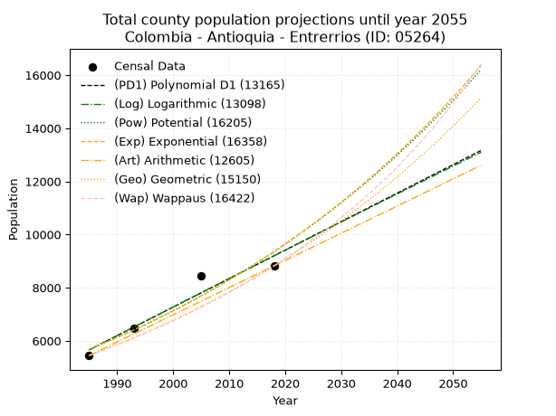
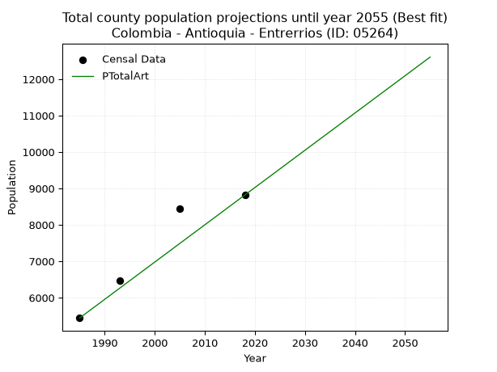
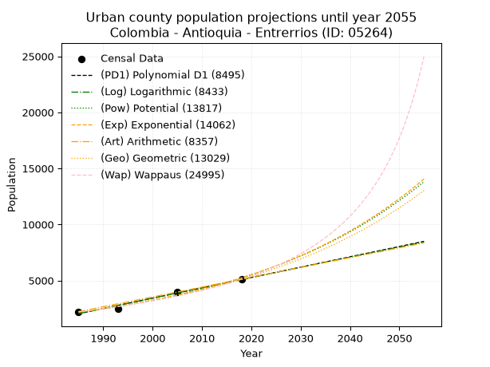
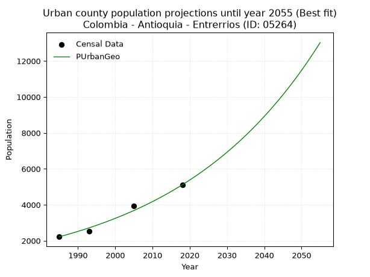
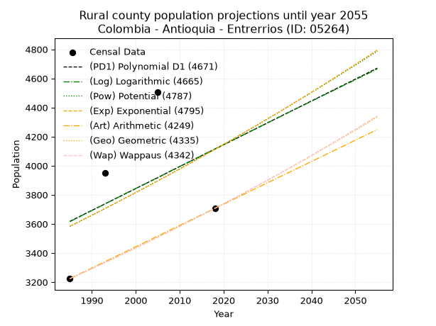
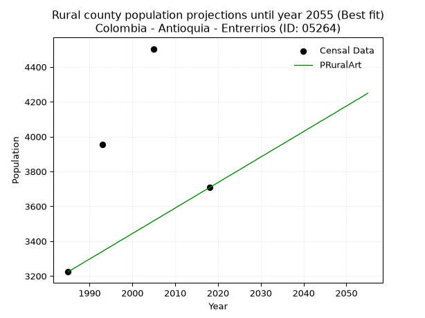

<div align="center">


</div>

# _“Population and Public Services Demand Projections (PPSD) until Year 2050 for Colombia - Antioquia - Entrerrios (ID: 05264)”_
Keywords: `population` `public-service` `projection` `lineal` `polynomial` `logarithmic` `potential` `exponential` `arithmetic` `geometric` `wappaus` `dane` `colombia` `south-america`

PPSD are analytical estimates used by governments and planners to anticipate future changes in population size, age distribution, and the resulting community needs for utilities, healthcare, education, and infrastructure as sizing future water treatment facilities, electrical grids, and road networks based on spatial growth.

> **General running parameters**: • app_version: _v20260806_. • Python version: _3.14.7_. • Pandas version: _3.0.5_. • NumPy version: _2.5.1_. • Creates, save and include plots into reports (create_plot): _False_. • Projection until year: _2050_. • Process polynomial degree 2 and up: _False_. • Process Wappaus: _True_. • Process Wappaus: _True_. • Set negative values to zero: _True_. • Set infinite values to zero: _True_. • Drop dataset notes: _True_. 
<div align="center">

Dynamic map: [:earth_americas:Google](http://maps.google.com/maps?q=6.566273035,-75.5176847) [:earth_americas:OSM](https://www.openstreetmap.org/#map=18/6.566273035/-75.5176847&layers=P) [:earth_americas:Bing](https://www.bing.com/maps?cp=6.566273035~-75.5176847&lvl=18) [:earth_americas:Apple](https://maps.apple.com/frame?center=6.566273035%2C-75.5176847&span=0.003%2C0.006)

</div>


<div align="center">

```geojson
{
  "type": "Feature",
  "geometry": {
    "type": "Point", 
    "coordinates": [-75.5176847, 6.566273035]
  }, 
  "properties": {
    "Name": "Colombia - Antioquia - Entrerrios (ID: 05264)"
  }
}
```

</div>


## 0. Census Data (4 records)

Census data are official statistics collected by a government about the people and housing in a country. They usually include counts of total population, age, sex, race, income, education, and jobs.

📅Global census file: [Population.xlsx](../data/Population.xlsx)

| Source   |   Year |   CountryID | CountryName   |   StateID | StateName   |   CountyID | CountyName   |   PTotal |   PUrban |   PRural |
|:---------|-------:|------------:|:--------------|----------:|:------------|-----------:|:-------------|---------:|---------:|---------:|
| DANE     |   1985 |          57 | Colombia      |        05 | Antioquia   |      05264 | Entrerrios   |     5444 |     2220 |     3224 |
| DANE     |   1993 |          57 | Colombia      |        05 | Antioquia   |      05264 | Entrerrios   |     6466 |     2513 |     3953 |
| DANE     |   2005 |          57 | Colombia      |        05 | Antioquia   |      05264 | Entrerrios   |     8447 |     3943 |     4504 |
| DANE     |   2018 |          57 | Colombia      |        05 | Antioquia   |      05264 | Entrerrios   |     8820 |     5113 |     3707 |

> 🔥Some records could had specific notes about the registered values or the corresponding urban or rural distribution.

## 1. Total

### 1.1. Coefficients and Parameters

* (PD1) Polynomial Deg 1: 107.23203532717747, -207196.6286631867 (lineal)
* (Log) Logarithmic: 214763.86237469813, -1625127.5889196643
* (Pow) Potential: 30.24647150296107, -95.99121501386935
* (Exp) Exponential: 0.015100536541771572, 5.456099935286258e-10
* (Art) Arithmetic: Year diff. 2018 - 1985 = 33, Population diff. 8820 - 5444 = 3376, Annual growth = 102.3030303030303
* (Geo) Geometric: Year diff. 2018 - 1985 = 33, Population diff. 8820 - 5444 = 3376, Annual growth % = 0.014728864297183009
* (Wap) Wappaus: i = 1.434422746817587, Condition values only valid for < 200)

<sub>
Wappaus condition values: ['0.00', '1.43', '2.87', '4.30', '5.74', '7.17', '8.61', '10.04', '11.48', '12.91', '14.34', '15.78', '17.21', '18.65', '20.08', '21.52', '22.95', '24.39', '25.82', '27.25', '28.69', '30.12', '31.56', '32.99', '34.43', '35.86', '37.29', '38.73', '40.16', '41.60', '43.03', '44.47', '45.90', '47.34', '48.77', '50.20', '51.64', '53.07', '54.51', '55.94', '57.38', '58.81', '60.25', '61.68', '63.11', '64.55', '65.98', '67.42', '68.85', '70.29', '71.72', '73.16', '74.59', '76.02', '77.46', '78.89', '80.33', '81.76', '83.20', '84.63', '86.07', '87.50', '88.93', '90.37', '91.80', '93.24']
</sub>


### 1.2. Projected Dataset

|   Year |   CountyID |   PTotalPD1 |   PTotalLog |   PTotalPow |   PTotalExp |   PTotalArt |   PTotalGeo |   PTotalWap |
|-------:|-----------:|------------:|------------:|------------:|------------:|------------:|------------:|------------:|
|   1985 |      05264 |        5659 |        5655 |        5681 |        5684 |        5444 |        5444 |        5444 |
|   1986 |      05264 |        5766 |        5763 |        5768 |        5771 |        5546 |        5524 |        5523 |
|   1987 |      05264 |        5873 |        5871 |        5856 |        5859 |        5649 |        5606 |        5602 |
|   1988 |      05264 |        5981 |        5979 |        5946 |        5948 |        5751 |        5688 |        5683 |
|   1989 |      05264 |        6088 |        6087 |        6037 |        6038 |        5853 |        5772 |        5766 |
|   1990 |      05264 |        6195 |        6195 |        6130 |        6130 |        5956 |        5857 |        5849 |
|   1991 |      05264 |        6302 |        6303 |        6224 |        6223 |        6058 |        5943 |        5934 |
|   1992 |      05264 |        6410 |        6411 |        6319 |        6318 |        6160 |        6031 |        6020 |
|   1993 |      05264 |        6517 |        6519 |        6416 |        6414 |        6262 |        6120 |        6107 |
|   1994 |      05264 |        6624 |        6626 |        6514 |        6512 |        6365 |        6210 |        6195 |
|   1995 |      05264 |        6731 |        6734 |        6613 |        6611 |        6467 |        6301 |        6285 |
|   1996 |      05264 |        6839 |        6842 |        6714 |        6711 |        6569 |        6394 |        6377 |
|   1997 |      05264 |        6946 |        6949 |        6817 |        6813 |        6672 |        6488 |        6469 |
|   1998 |      05264 |        7053 |        7057 |        6921 |        6917 |        6774 |        6584 |        6564 |
|   1999 |      05264 |        7160 |        7164 |        7026 |        7022 |        6876 |        6681 |        6659 |
|   2000 |      05264 |        7267 |        7272 |        7133 |        7129 |        6979 |        6779 |        6757 |
|   2001 |      05264 |        7375 |        7379 |        7242 |        7238 |        7081 |        6879 |        6855 |
|   2002 |      05264 |        7482 |        7486 |        7352 |        7348 |        7183 |        6980 |        6956 |
|   2003 |      05264 |        7589 |        7593 |        7464 |        7460 |        7285 |        7083 |        7058 |
|   2004 |      05264 |        7696 |        7701 |        7578 |        7573 |        7388 |        7187 |        7162 |
|   2005 |      05264 |        7804 |        7808 |        7693 |        7688 |        7490 |        7293 |        7267 |
|   2006 |      05264 |        7911 |        7915 |        7810 |        7805 |        7592 |        7401 |        7375 |
|   2007 |      05264 |        8018 |        8022 |        7928 |        7924 |        7695 |        7510 |        7484 |
|   2008 |      05264 |        8125 |        8129 |        8049 |        8045 |        7797 |        7620 |        7595 |
|   2009 |      05264 |        8233 |        8236 |        8171 |        8167 |        7899 |        7732 |        7708 |
|   2010 |      05264 |        8340 |        8343 |        8295 |        8291 |        8002 |        7846 |        7823 |
|   2011 |      05264 |        8447 |        8450 |        8421 |        8417 |        8104 |        7962 |        7940 |
|   2012 |      05264 |        8554 |        8556 |        8548 |        8546 |        8206 |        8079 |        8059 |
|   2013 |      05264 |        8661 |        8663 |        8678 |        8676 |        8308 |        8198 |        8180 |
|   2014 |      05264 |        8769 |        8770 |        8809 |        8808 |        8411 |        8319 |        8303 |
|   2015 |      05264 |        8876 |        8876 |        8942 |        8942 |        8513 |        8441 |        8429 |
|   2016 |      05264 |        8983 |        8983 |        9077 |        9078 |        8615 |        8566 |        8557 |
|   2017 |      05264 |        9090 |        9089 |        9215 |        9216 |        8718 |        8692 |        8687 |
|   2018 |      05264 |        9198 |        9196 |        9354 |        9356 |        8820 |        8820 |        8820 |
|   2019 |      05264 |        9305 |        9302 |        9495 |        9498 |        8922 |        8950 |        8955 |
|   2020 |      05264 |        9412 |        9409 |        9638 |        9643 |        9025 |        9082 |        9093 |
|   2021 |      05264 |        9519 |        9515 |        9784 |        9790 |        9127 |        9215 |        9234 |
|   2022 |      05264 |        9627 |        9621 |        9931 |        9938 |        9229 |        9351 |        9377 |
|   2023 |      05264 |        9734 |        9727 |       10081 |       10090 |        9332 |        9489 |        9523 |
|   2024 |      05264 |        9841 |        9833 |       10233 |       10243 |        9434 |        9629 |        9672 |
|   2025 |      05264 |        9948 |        9939 |       10387 |       10399 |        9536 |        9771 |        9824 |
|   2026 |      05264 |       10055 |       10046 |       10543 |       10557 |        9638 |        9914 |        9979 |
|   2027 |      05264 |       10163 |       10151 |       10701 |       10718 |        9741 |       10060 |       10138 |
|   2028 |      05264 |       10270 |       10257 |       10862 |       10881 |        9843 |       10209 |       10299 |
|   2029 |      05264 |       10377 |       10363 |       11025 |       11047 |        9945 |       10359 |       10464 |
|   2030 |      05264 |       10484 |       10469 |       11191 |       11215 |       10048 |       10512 |       10633 |
|   2031 |      05264 |       10592 |       10575 |       11359 |       11385 |       10150 |       10666 |       10805 |
|   2032 |      05264 |       10699 |       10681 |       11529 |       11558 |       10252 |       10824 |       10981 |
|   2033 |      05264 |       10806 |       10786 |       11702 |       11734 |       10355 |       10983 |       11160 |
|   2034 |      05264 |       10913 |       10892 |       11878 |       11913 |       10457 |       11145 |       11344 |
|   2035 |      05264 |       11021 |       10997 |       12055 |       12094 |       10559 |       11309 |       11532 |
|   2036 |      05264 |       11128 |       11103 |       12236 |       12278 |       10661 |       11475 |       11723 |
|   2037 |      05264 |       11235 |       11208 |       12419 |       12465 |       10764 |       11644 |       11920 |
|   2038 |      05264 |       11342 |       11314 |       12605 |       12655 |       10866 |       11816 |       12121 |
|   2039 |      05264 |       11449 |       11419 |       12793 |       12847 |       10968 |       11990 |       12326 |
|   2040 |      05264 |       11557 |       11524 |       12984 |       13043 |       11071 |       12167 |       12537 |
|   2041 |      05264 |       11664 |       11630 |       13178 |       13241 |       11173 |       12346 |       12752 |
|   2042 |      05264 |       11771 |       11735 |       13375 |       13443 |       11275 |       12528 |       12973 |
|   2043 |      05264 |       11878 |       11840 |       13574 |       13647 |       11378 |       12712 |       13199 |
|   2044 |      05264 |       11986 |       11945 |       13777 |       13855 |       11480 |       12899 |       13431 |
|   2045 |      05264 |       12093 |       12050 |       13982 |       14066 |       11582 |       13089 |       13669 |
|   2046 |      05264 |       12200 |       12155 |       14191 |       14280 |       11684 |       13282 |       13912 |
|   2047 |      05264 |       12307 |       12260 |       14402 |       14497 |       11787 |       13478 |       14162 |
|   2048 |      05264 |       12415 |       12365 |       14616 |       14717 |       11889 |       13676 |       14419 |
|   2049 |      05264 |       12522 |       12470 |       14834 |       14941 |       11991 |       13878 |       14682 |
|   2050 |      05264 |       12629 |       12575 |       15054 |       15169 |       12094 |       14082 |       14953 |
<div align="center">

</img>

</div>


### 1.3. Best fit with absolute and relative error (%)

Relative error puts that difference into context by dividing the absolute error by the true value, creating a unitless ratio or percentage that shows the scale of the mistake.

Absolute and relative error

|   Year | Source   |   CountryID | CountryName   |   StateID | StateName   |   CountyID_x | CountyName   |   PTotal |   PUrban |   PRural |   CountyID_y |   PTotalPD1 |   PTotalLog |   PTotalPow |   PTotalExp |   PTotalArt |   PTotalGeo |   PTotalWap |   PTotalPD1AbsError |   PTotalLogAbsError |   PTotalPowAbsError |   PTotalExpAbsError |   PTotalArtAbsError |   PTotalGeoAbsError |   PTotalWapAbsError |   PTotalPD1RelError |   PTotalLogRelError |   PTotalPowRelError |   PTotalExpRelError |   PTotalArtRelError |   PTotalGeoRelError |   PTotalWapRelError |
|-------:|:---------|------------:|:--------------|----------:|:------------|-------------:|:-------------|---------:|---------:|---------:|-------------:|------------:|------------:|------------:|------------:|------------:|------------:|------------:|--------------------:|--------------------:|--------------------:|--------------------:|--------------------:|--------------------:|--------------------:|--------------------:|--------------------:|--------------------:|--------------------:|--------------------:|--------------------:|--------------------:|
|   1985 | DANE     |          57 | Colombia      |        05 | Antioquia   |        05264 | Entrerrios   |     5444 |     2220 |     3224 |        05264 |        5659 |        5655 |        5681 |        5684 |        5444 |        5444 |        5444 |                 215 |                 211 |                 237 |                 240 |                   0 |                   0 |                   0 |            3.9493   |            3.87583  |            4.35342  |            4.40852  |             0       |             0       |             0       |
|   1993 | DANE     |          57 | Colombia      |        05 | Antioquia   |        05264 | Entrerrios   |     6466 |     2513 |     3953 |        05264 |        6517 |        6519 |        6416 |        6414 |        6262 |        6120 |        6107 |                  51 |                  53 |                  50 |                  52 |                 204 |                 346 |                 359 |            0.788741 |            0.819672 |            0.773276 |            0.804207 |             3.15496 |             5.35107 |             5.55212 |
|   2005 | DANE     |          57 | Colombia      |        05 | Antioquia   |        05264 | Entrerrios   |     8447 |     3943 |     4504 |        05264 |        7804 |        7808 |        7693 |        7688 |        7490 |        7293 |        7267 |                 643 |                 639 |                 754 |                 759 |                 957 |                1154 |                1180 |            7.61217  |            7.56482  |            8.92625  |            8.98544  |            11.3295  |            13.6617  |            13.9695  |
|   2018 | DANE     |          57 | Colombia      |        05 | Antioquia   |        05264 | Entrerrios   |     8820 |     5113 |     3707 |        05264 |        9198 |        9196 |        9354 |        9356 |        8820 |        8820 |        8820 |                 378 |                 376 |                 534 |                 536 |                   0 |                   0 |                   0 |            4.28571  |            4.26304  |            6.05442  |            6.0771   |             0       |             0       |             0       |

Relative error mean

| Method    |   RelError | Best   |
|:----------|-----------:|:-------|
| PTotalPD1 |    4.15898 |        |
| PTotalLog |    4.13084 |        |
| PTotalPow |    5.02684 |        |
| PTotalExp |    5.06882 |        |
| PTotalArt |    3.62111 | True   |
| PTotalGeo |    4.75318 |        |
| PTotalWap |    4.88039 |        |

💙Best method: _**PTotalArt**_
<div align="center">

</img>

</div>


### 1.4. Fresh water supply demand in liters per capita per day (lpcd)

The fresh water supply demand typically ranges from 100 to 300 liters per capita per day (lpcd) for standard domestic and municipal planning, though absolute survival minimums set by the World Health Organization are as low as 7.5 to 20 liters per day, and total consumption in high-income nations can exceed 400 liters.

> `CZ`: Level in meters above the sea level (masl)<br> `WS`: Fresh water supply demand in liters per capita per day (lpcd or l/h/d)<br> `WSAll`: Zonal fresh water supply demand in liters per second (l/s)<br> `A`: Zonal area in square meters<br> `DP`: Population density (people/hectare)

Reference values (RAS Colombia)

|    CZ |   WS |
|------:|-----:|
|  1000 |  120 |
|  2000 |  130 |
| 99999 |  140 |

County shapefile geometry properties and water supply values

|   CountyID |      ATotal |   CZTotal |   WSTotal |
|-----------:|------------:|----------:|----------:|
|      05264 | 2.14229e+08 |   2506.18 |       140 |

Projected values for best method: PTotalArt

|   CountyID |   Year |   PTotalArt |   DPTotal |   WSTotal |   WSTotalAll |
|-----------:|-------:|------------:|----------:|----------:|-------------:|
|      05264 |   1985 |        5444 |      0.25 |       140 |      8.8213  |
|      05264 |   1986 |        5546 |      0.26 |       140 |      8.98657 |
|      05264 |   1987 |        5649 |      0.26 |       140 |      9.15347 |
|      05264 |   1988 |        5751 |      0.27 |       140 |      9.31875 |
|      05264 |   1989 |        5853 |      0.27 |       140 |      9.48403 |
|      05264 |   1990 |        5956 |      0.28 |       140 |      9.65093 |
|      05264 |   1991 |        6058 |      0.28 |       140 |      9.8162  |
|      05264 |   1992 |        6160 |      0.29 |       140 |      9.98148 |
|      05264 |   1993 |        6262 |      0.29 |       140 |     10.1468  |
|      05264 |   1994 |        6365 |      0.3  |       140 |     10.3137  |
|      05264 |   1995 |        6467 |      0.3  |       140 |     10.4789  |
|      05264 |   1996 |        6569 |      0.31 |       140 |     10.6442  |
|      05264 |   1997 |        6672 |      0.31 |       140 |     10.8111  |
|      05264 |   1998 |        6774 |      0.32 |       140 |     10.9764  |
|      05264 |   1999 |        6876 |      0.32 |       140 |     11.1417  |
|      05264 |   2000 |        6979 |      0.33 |       140 |     11.3086  |
|      05264 |   2001 |        7081 |      0.33 |       140 |     11.4738  |
|      05264 |   2002 |        7183 |      0.34 |       140 |     11.6391  |
|      05264 |   2003 |        7285 |      0.34 |       140 |     11.8044  |
|      05264 |   2004 |        7388 |      0.34 |       140 |     11.9713  |
|      05264 |   2005 |        7490 |      0.35 |       140 |     12.1366  |
|      05264 |   2006 |        7592 |      0.35 |       140 |     12.3019  |
|      05264 |   2007 |        7695 |      0.36 |       140 |     12.4688  |
|      05264 |   2008 |        7797 |      0.36 |       140 |     12.634   |
|      05264 |   2009 |        7899 |      0.37 |       140 |     12.7993  |
|      05264 |   2010 |        8002 |      0.37 |       140 |     12.9662  |
|      05264 |   2011 |        8104 |      0.38 |       140 |     13.1315  |
|      05264 |   2012 |        8206 |      0.38 |       140 |     13.2968  |
|      05264 |   2013 |        8308 |      0.39 |       140 |     13.462   |
|      05264 |   2014 |        8411 |      0.39 |       140 |     13.6289  |
|      05264 |   2015 |        8513 |      0.4  |       140 |     13.7942  |
|      05264 |   2016 |        8615 |      0.4  |       140 |     13.9595  |
|      05264 |   2017 |        8718 |      0.41 |       140 |     14.1264  |
|      05264 |   2018 |        8820 |      0.41 |       140 |     14.2917  |
|      05264 |   2019 |        8922 |      0.42 |       140 |     14.4569  |
|      05264 |   2020 |        9025 |      0.42 |       140 |     14.6238  |
|      05264 |   2021 |        9127 |      0.43 |       140 |     14.7891  |
|      05264 |   2022 |        9229 |      0.43 |       140 |     14.9544  |
|      05264 |   2023 |        9332 |      0.44 |       140 |     15.1213  |
|      05264 |   2024 |        9434 |      0.44 |       140 |     15.2866  |
|      05264 |   2025 |        9536 |      0.45 |       140 |     15.4519  |
|      05264 |   2026 |        9638 |      0.45 |       140 |     15.6171  |
|      05264 |   2027 |        9741 |      0.45 |       140 |     15.784   |
|      05264 |   2028 |        9843 |      0.46 |       140 |     15.9493  |
|      05264 |   2029 |        9945 |      0.46 |       140 |     16.1146  |
|      05264 |   2030 |       10048 |      0.47 |       140 |     16.2815  |
|      05264 |   2031 |       10150 |      0.47 |       140 |     16.4468  |
|      05264 |   2032 |       10252 |      0.48 |       140 |     16.612   |
|      05264 |   2033 |       10355 |      0.48 |       140 |     16.7789  |
|      05264 |   2034 |       10457 |      0.49 |       140 |     16.9442  |
|      05264 |   2035 |       10559 |      0.49 |       140 |     17.1095  |
|      05264 |   2036 |       10661 |      0.5  |       140 |     17.2748  |
|      05264 |   2037 |       10764 |      0.5  |       140 |     17.4417  |
|      05264 |   2038 |       10866 |      0.51 |       140 |     17.6069  |
|      05264 |   2039 |       10968 |      0.51 |       140 |     17.7722  |
|      05264 |   2040 |       11071 |      0.52 |       140 |     17.9391  |
|      05264 |   2041 |       11173 |      0.52 |       140 |     18.1044  |
|      05264 |   2042 |       11275 |      0.53 |       140 |     18.2697  |
|      05264 |   2043 |       11378 |      0.53 |       140 |     18.4366  |
|      05264 |   2044 |       11480 |      0.54 |       140 |     18.6019  |
|      05264 |   2045 |       11582 |      0.54 |       140 |     18.7671  |
|      05264 |   2046 |       11684 |      0.55 |       140 |     18.9324  |
|      05264 |   2047 |       11787 |      0.55 |       140 |     19.0993  |
|      05264 |   2048 |       11889 |      0.55 |       140 |     19.2646  |
|      05264 |   2049 |       11991 |      0.56 |       140 |     19.4299  |
|      05264 |   2050 |       12094 |      0.56 |       140 |     19.5968  |

## 2. Urban

### 2.1. Coefficients and Parameters

* (PD1) Polynomial Deg 1: 92.18908069048494, -180953.95865114252 (lineal)
* (Log) Logarithmic: 184496.82294228388, -1398914.5796490517
* (Pow) Potential: 53.48089525887995, -173.0317290807861
* (Exp) Exponential: 0.02671736019218962, 2.0112080688332512e-20
* (Art) Arithmetic: Year diff. 2018 - 1985 = 33, Population diff. 5113 - 2220 = 2893, Annual growth = 87.66666666666667
* (Geo) Geometric: Year diff. 2018 - 1985 = 33, Population diff. 5113 - 2220 = 2893, Annual growth % = 0.025603464766489115
* (Wap) Wappaus: i = 2.3910177735351605, Condition values only valid for < 200)

<sub>
Wappaus condition values: ['0.00', '2.39', '4.78', '7.17', '9.56', '11.96', '14.35', '16.74', '19.13', '21.52', '23.91', '26.30', '28.69', '31.08', '33.47', '35.87', '38.26', '40.65', '43.04', '45.43', '47.82', '50.21', '52.60', '54.99', '57.38', '59.78', '62.17', '64.56', '66.95', '69.34', '71.73', '74.12', '76.51', '78.90', '81.29', '83.69', '86.08', '88.47', '90.86', '93.25', '95.64', '98.03', '100.42', '102.81', '105.20', '107.60', '109.99', '112.38', '114.77', '117.16', '119.55', '121.94', '124.33', '126.72', '129.11', '131.51', '133.90', '136.29', '138.68', '141.07', '143.46', '145.85', '148.24', '150.63', '153.03', '155.42']
</sub>


### 2.2. Projected Dataset

|   Year |   CountyID |   PUrbanPD1 |   PUrbanLog |   PUrbanPow |   PUrbanExp |   PUrbanArt |   PUrbanGeo |   PUrbanWap |
|-------:|-----------:|------------:|------------:|------------:|------------:|------------:|------------:|------------:|
|   1985 |      05264 |        2041 |        2039 |        2165 |        2167 |        2220 |        2220 |        2220 |
|   1986 |      05264 |        2134 |        2132 |        2224 |        2225 |        2308 |        2277 |        2274 |
|   1987 |      05264 |        2226 |        2225 |        2285 |        2286 |        2395 |        2335 |        2329 |
|   1988 |      05264 |        2318 |        2317 |        2347 |        2348 |        2483 |        2395 |        2385 |
|   1989 |      05264 |        2410 |        2410 |        2411 |        2411 |        2571 |        2456 |        2443 |
|   1990 |      05264 |        2502 |        2503 |        2477 |        2476 |        2658 |        2519 |        2502 |
|   1991 |      05264 |        2595 |        2596 |        2544 |        2544 |        2746 |        2584 |        2563 |
|   1992 |      05264 |        2687 |        2688 |        2613 |        2612 |        2834 |        2650 |        2625 |
|   1993 |      05264 |        2779 |        2781 |        2685 |        2683 |        2921 |        2718 |        2690 |
|   1994 |      05264 |        2871 |        2873 |        2758 |        2756 |        3009 |        2787 |        2755 |
|   1995 |      05264 |        2963 |        2966 |        2833 |        2830 |        3097 |        2859 |        2823 |
|   1996 |      05264 |        3055 |        3058 |        2909 |        2907 |        3184 |        2932 |        2892 |
|   1997 |      05264 |        3148 |        3151 |        2988 |        2986 |        3272 |        3007 |        2964 |
|   1998 |      05264 |        3240 |        3243 |        3070 |        3067 |        3360 |        3084 |        3037 |
|   1999 |      05264 |        3332 |        3336 |        3153 |        3150 |        3447 |        3163 |        3113 |
|   2000 |      05264 |        3424 |        3428 |        3238 |        3235 |        3535 |        3244 |        3190 |
|   2001 |      05264 |        3516 |        3520 |        3326 |        3322 |        3623 |        3327 |        3270 |
|   2002 |      05264 |        3609 |        3612 |        3416 |        3412 |        3710 |        3412 |        3353 |
|   2003 |      05264 |        3701 |        3704 |        3509 |        3505 |        3798 |        3499 |        3437 |
|   2004 |      05264 |        3793 |        3796 |        3603 |        3600 |        3886 |        3589 |        3525 |
|   2005 |      05264 |        3885 |        3888 |        3701 |        3697 |        3973 |        3681 |        3615 |
|   2006 |      05264 |        3977 |        3980 |        3801 |        3797 |        4061 |        3775 |        3708 |
|   2007 |      05264 |        4070 |        4072 |        3904 |        3900 |        4149 |        3872 |        3805 |
|   2008 |      05264 |        4162 |        4164 |        4009 |        4006 |        4236 |        3971 |        3904 |
|   2009 |      05264 |        4254 |        4256 |        4117 |        4114 |        4324 |        4072 |        4007 |
|   2010 |      05264 |        4346 |        4348 |        4228 |        4226 |        4412 |        4177 |        4113 |
|   2011 |      05264 |        4438 |        4440 |        4342 |        4340 |        4499 |        4284 |        4223 |
|   2012 |      05264 |        4530 |        4531 |        4459 |        4458 |        4587 |        4393 |        4336 |
|   2013 |      05264 |        4623 |        4623 |        4579 |        4578 |        4675 |        4506 |        4454 |
|   2014 |      05264 |        4715 |        4715 |        4703 |        4702 |        4762 |        4621 |        4576 |
|   2015 |      05264 |        4807 |        4806 |        4829 |        4830 |        4850 |        4740 |        4703 |
|   2016 |      05264 |        4899 |        4898 |        4959 |        4960 |        4938 |        4861 |        4834 |
|   2017 |      05264 |        4991 |        4989 |        5092 |        5095 |        5025 |        4985 |        4971 |
|   2018 |      05264 |        5084 |        5081 |        5229 |        5233 |        5113 |        5113 |        5113 |
|   2019 |      05264 |        5176 |        5172 |        5369 |        5374 |        5201 |        5244 |        5261 |
|   2020 |      05264 |        5268 |        5264 |        5513 |        5520 |        5288 |        5378 |        5414 |
|   2021 |      05264 |        5360 |        5355 |        5661 |        5669 |        5376 |        5516 |        5575 |
|   2022 |      05264 |        5452 |        5446 |        5813 |        5823 |        5464 |        5657 |        5742 |
|   2023 |      05264 |        5545 |        5537 |        5969 |        5980 |        5551 |        5802 |        5916 |
|   2024 |      05264 |        5637 |        5629 |        6129 |        6142 |        5639 |        5950 |        6098 |
|   2025 |      05264 |        5729 |        5720 |        6293 |        6309 |        5727 |        6103 |        6289 |
|   2026 |      05264 |        5821 |        5811 |        6461 |        6480 |        5814 |        6259 |        6489 |
|   2027 |      05264 |        5913 |        5902 |        6634 |        6655 |        5902 |        6419 |        6698 |
|   2028 |      05264 |        6005 |        5993 |        6811 |        6835 |        5990 |        6584 |        6917 |
|   2029 |      05264 |        6098 |        6084 |        6993 |        7020 |        6077 |        6752 |        7148 |
|   2030 |      05264 |        6190 |        6175 |        7180 |        7210 |        6165 |        6925 |        7390 |
|   2031 |      05264 |        6282 |        6266 |        7372 |        7406 |        6253 |        7102 |        7645 |
|   2032 |      05264 |        6374 |        6356 |        7568 |        7606 |        6340 |        7284 |        7914 |
|   2033 |      05264 |        6466 |        6447 |        7770 |        7812 |        6428 |        7471 |        8199 |
|   2034 |      05264 |        6559 |        6538 |        7977 |        8024 |        6516 |        7662 |        8499 |
|   2035 |      05264 |        6651 |        6629 |        8190 |        8241 |        6603 |        7858 |        8818 |
|   2036 |      05264 |        6743 |        6719 |        8408 |        8464 |        6691 |        8059 |        9156 |
|   2037 |      05264 |        6835 |        6810 |        8631 |        8693 |        6779 |        8266 |        9516 |
|   2038 |      05264 |        6927 |        6900 |        8861 |        8929 |        6866 |        8477 |        9899 |
|   2039 |      05264 |        7020 |        6991 |        9096 |        9170 |        6954 |        8695 |       10307 |
|   2040 |      05264 |        7112 |        7081 |        9338 |        9419 |        7042 |        8917 |       10745 |
|   2041 |      05264 |        7204 |        7172 |        9586 |        9674 |        7129 |        9145 |       11214 |
|   2042 |      05264 |        7296 |        7262 |        9840 |        9936 |        7217 |        9380 |       11718 |
|   2043 |      05264 |        7388 |        7352 |       10102 |       10205 |        7305 |        9620 |       12261 |
|   2044 |      05264 |        7481 |        7443 |       10369 |       10481 |        7392 |        9866 |       12849 |
|   2045 |      05264 |        7573 |        7533 |       10644 |       10765 |        7480 |       10119 |       13486 |
|   2046 |      05264 |        7665 |        7623 |       10926 |       11056 |        7568 |       10378 |       14180 |
|   2047 |      05264 |        7757 |        7713 |       11215 |       11356 |        7655 |       10643 |       14937 |
|   2048 |      05264 |        7849 |        7803 |       11512 |       11663 |        7743 |       10916 |       15768 |
|   2049 |      05264 |        7941 |        7893 |       11817 |       11979 |        7831 |       11195 |       16684 |
|   2050 |      05264 |        8034 |        7983 |       12129 |       12303 |        7918 |       11482 |       17698 |
<div align="center">

</img>

</div>


### 2.3. Best fit with absolute and relative error (%)

Relative error puts that difference into context by dividing the absolute error by the true value, creating a unitless ratio or percentage that shows the scale of the mistake.

Absolute and relative error

|   Year | Source   |   CountryID | CountryName   |   StateID | StateName   |   CountyID_x | CountyName   |   PTotal |   PUrban |   PRural |   CountyID_y |   PUrbanPD1 |   PUrbanLog |   PUrbanPow |   PUrbanExp |   PUrbanArt |   PUrbanGeo |   PUrbanWap |   PUrbanPD1AbsError |   PUrbanLogAbsError |   PUrbanPowAbsError |   PUrbanExpAbsError |   PUrbanArtAbsError |   PUrbanGeoAbsError |   PUrbanWapAbsError |   PUrbanPD1RelError |   PUrbanLogRelError |   PUrbanPowRelError |   PUrbanExpRelError |   PUrbanArtRelError |   PUrbanGeoRelError |   PUrbanWapRelError |
|-------:|:---------|------------:|:--------------|----------:|:------------|-------------:|:-------------|---------:|---------:|---------:|-------------:|------------:|------------:|------------:|------------:|------------:|------------:|------------:|--------------------:|--------------------:|--------------------:|--------------------:|--------------------:|--------------------:|--------------------:|--------------------:|--------------------:|--------------------:|--------------------:|--------------------:|--------------------:|--------------------:|
|   1985 | DANE     |          57 | Colombia      |        05 | Antioquia   |        05264 | Entrerrios   |     5444 |     2220 |     3224 |        05264 |        2041 |        2039 |        2165 |        2167 |        2220 |        2220 |        2220 |                 179 |                 181 |                  55 |                  53 |                   0 |                   0 |                   0 |            8.06306  |            8.15315  |             2.47748 |             2.38739 |            0        |             0       |             0       |
|   1993 | DANE     |          57 | Colombia      |        05 | Antioquia   |        05264 | Entrerrios   |     6466 |     2513 |     3953 |        05264 |        2779 |        2781 |        2685 |        2683 |        2921 |        2718 |        2690 |                 266 |                 268 |                 172 |                 170 |                 408 |                 205 |                 177 |           10.585    |           10.6645   |             6.84441 |             6.76482 |           16.2356   |             8.15758 |             7.04337 |
|   2005 | DANE     |          57 | Colombia      |        05 | Antioquia   |        05264 | Entrerrios   |     8447 |     3943 |     4504 |        05264 |        3885 |        3888 |        3701 |        3697 |        3973 |        3681 |        3615 |                  58 |                  55 |                 242 |                 246 |                  30 |                 262 |                 328 |            1.47096  |            1.39488  |             6.13746 |             6.2389  |            0.760842 |             6.64469 |             8.31854 |
|   2018 | DANE     |          57 | Colombia      |        05 | Antioquia   |        05264 | Entrerrios   |     8820 |     5113 |     3707 |        05264 |        5084 |        5081 |        5229 |        5233 |        5113 |        5113 |        5113 |                  29 |                  32 |                 116 |                 120 |                   0 |                   0 |                   0 |            0.567182 |            0.625856 |             2.26873 |             2.34696 |            0        |             0       |             0       |

Relative error mean

| Method    |   RelError | Best   |
|:----------|-----------:|:-------|
| PUrbanPD1 |    5.17154 |        |
| PUrbanLog |    5.20961 |        |
| PUrbanPow |    4.43202 |        |
| PUrbanExp |    4.43452 |        |
| PUrbanArt |    4.2491  |        |
| PUrbanGeo |    3.70057 | True   |
| PUrbanWap |    3.84048 |        |

💙Best method: _**PUrbanGeo**_
<div align="center">

</img>

</div>


### 2.4. Fresh water supply demand in liters per capita per day (lpcd)

The fresh water supply demand typically ranges from 100 to 300 liters per capita per day (lpcd) for standard domestic and municipal planning, though absolute survival minimums set by the World Health Organization are as low as 7.5 to 20 liters per day, and total consumption in high-income nations can exceed 400 liters.

> `CZ`: Level in meters above the sea level (masl)<br> `WS`: Fresh water supply demand in liters per capita per day (lpcd or l/h/d)<br> `WSAll`: Zonal fresh water supply demand in liters per second (l/s)<br> `A`: Zonal area in square meters<br> `DP`: Population density (people/hectare)

Reference values (RAS Colombia)

|    CZ |   WS |
|------:|-----:|
|  1000 |  120 |
|  2000 |  130 |
| 99999 |  140 |

County shapefile geometry properties and water supply values

|   CountyID |      AUrban |   CZUrban |   WSUrban |
|-----------:|------------:|----------:|----------:|
|      05264 | 1.05271e+06 |   2299.84 |       140 |

Projected values for best method: PUrbanGeo

|   CountyID |   Year |   PUrbanGeo |   DPUrban |   WSUrban |   WSUrbanAll |
|-----------:|-------:|------------:|----------:|----------:|-------------:|
|      05264 |   1985 |        2220 |     21.09 |       140 |      3.59722 |
|      05264 |   1986 |        2277 |     21.63 |       140 |      3.68958 |
|      05264 |   1987 |        2335 |     22.18 |       140 |      3.78356 |
|      05264 |   1988 |        2395 |     22.75 |       140 |      3.88079 |
|      05264 |   1989 |        2456 |     23.33 |       140 |      3.97963 |
|      05264 |   1990 |        2519 |     23.93 |       140 |      4.08171 |
|      05264 |   1991 |        2584 |     24.55 |       140 |      4.18704 |
|      05264 |   1992 |        2650 |     25.17 |       140 |      4.29398 |
|      05264 |   1993 |        2718 |     25.82 |       140 |      4.40417 |
|      05264 |   1994 |        2787 |     26.47 |       140 |      4.51597 |
|      05264 |   1995 |        2859 |     27.16 |       140 |      4.63264 |
|      05264 |   1996 |        2932 |     27.85 |       140 |      4.75093 |
|      05264 |   1997 |        3007 |     28.56 |       140 |      4.87245 |
|      05264 |   1998 |        3084 |     29.3  |       140 |      4.99722 |
|      05264 |   1999 |        3163 |     30.05 |       140 |      5.12523 |
|      05264 |   2000 |        3244 |     30.82 |       140 |      5.25648 |
|      05264 |   2001 |        3327 |     31.6  |       140 |      5.39097 |
|      05264 |   2002 |        3412 |     32.41 |       140 |      5.5287  |
|      05264 |   2003 |        3499 |     33.24 |       140 |      5.66968 |
|      05264 |   2004 |        3589 |     34.09 |       140 |      5.81551 |
|      05264 |   2005 |        3681 |     34.97 |       140 |      5.96458 |
|      05264 |   2006 |        3775 |     35.86 |       140 |      6.1169  |
|      05264 |   2007 |        3872 |     36.78 |       140 |      6.27407 |
|      05264 |   2008 |        3971 |     37.72 |       140 |      6.43449 |
|      05264 |   2009 |        4072 |     38.68 |       140 |      6.59815 |
|      05264 |   2010 |        4177 |     39.68 |       140 |      6.76829 |
|      05264 |   2011 |        4284 |     40.7  |       140 |      6.94167 |
|      05264 |   2012 |        4393 |     41.73 |       140 |      7.11829 |
|      05264 |   2013 |        4506 |     42.8  |       140 |      7.30139 |
|      05264 |   2014 |        4621 |     43.9  |       140 |      7.48773 |
|      05264 |   2015 |        4740 |     45.03 |       140 |      7.68056 |
|      05264 |   2016 |        4861 |     46.18 |       140 |      7.87662 |
|      05264 |   2017 |        4985 |     47.35 |       140 |      8.07755 |
|      05264 |   2018 |        5113 |     48.57 |       140 |      8.28495 |
|      05264 |   2019 |        5244 |     49.81 |       140 |      8.49722 |
|      05264 |   2020 |        5378 |     51.09 |       140 |      8.71435 |
|      05264 |   2021 |        5516 |     52.4  |       140 |      8.93796 |
|      05264 |   2022 |        5657 |     53.74 |       140 |      9.16644 |
|      05264 |   2023 |        5802 |     55.11 |       140 |      9.40139 |
|      05264 |   2024 |        5950 |     56.52 |       140 |      9.6412  |
|      05264 |   2025 |        6103 |     57.97 |       140 |      9.88912 |
|      05264 |   2026 |        6259 |     59.46 |       140 |     10.1419  |
|      05264 |   2027 |        6419 |     60.98 |       140 |     10.4012  |
|      05264 |   2028 |        6584 |     62.54 |       140 |     10.6685  |
|      05264 |   2029 |        6752 |     64.14 |       140 |     10.9407  |
|      05264 |   2030 |        6925 |     65.78 |       140 |     11.2211  |
|      05264 |   2031 |        7102 |     67.46 |       140 |     11.5079  |
|      05264 |   2032 |        7284 |     69.19 |       140 |     11.8028  |
|      05264 |   2033 |        7471 |     70.97 |       140 |     12.1058  |
|      05264 |   2034 |        7662 |     72.78 |       140 |     12.4153  |
|      05264 |   2035 |        7858 |     74.65 |       140 |     12.7329  |
|      05264 |   2036 |        8059 |     76.55 |       140 |     13.0586  |
|      05264 |   2037 |        8266 |     78.52 |       140 |     13.394   |
|      05264 |   2038 |        8477 |     80.53 |       140 |     13.7359  |
|      05264 |   2039 |        8695 |     82.6  |       140 |     14.0891  |
|      05264 |   2040 |        8917 |     84.71 |       140 |     14.4488  |
|      05264 |   2041 |        9145 |     86.87 |       140 |     14.8183  |
|      05264 |   2042 |        9380 |     89.1  |       140 |     15.1991  |
|      05264 |   2043 |        9620 |     91.38 |       140 |     15.588   |
|      05264 |   2044 |        9866 |     93.72 |       140 |     15.9866  |
|      05264 |   2045 |       10119 |     96.12 |       140 |     16.3965  |
|      05264 |   2046 |       10378 |     98.58 |       140 |     16.8162  |
|      05264 |   2047 |       10643 |    101.1  |       140 |     17.2456  |
|      05264 |   2048 |       10916 |    103.69 |       140 |     17.688   |
|      05264 |   2049 |       11195 |    106.34 |       140 |     18.14    |
|      05264 |   2050 |       11482 |    109.07 |       140 |     18.6051  |

## 3. Rural

### 3.1. Coefficients and Parameters

* (PD1) Polynomial Deg 1: 15.042954636692542, -26242.670012044255 (lineal)
* (Log) Logarithmic: 30267.039432414287, -226213.0092706131
* (Pow) Potential: 8.35925778159741, -24.012558175620626
* (Exp) Exponential: 0.004155928740847755, 0.9370022655154062
* (Art) Arithmetic: Year diff. 2018 - 1985 = 33, Population diff. 3707 - 3224 = 483, Annual growth = 14.636363636363637
* (Geo) Geometric: Year diff. 2018 - 1985 = 33, Population diff. 3707 - 3224 = 483, Annual growth % = 0.004239266421398158
* (Wap) Wappaus: i = 0.4223449325166249, Condition values only valid for < 200)

<sub>
Wappaus condition values: ['0.00', '0.42', '0.84', '1.27', '1.69', '2.11', '2.53', '2.96', '3.38', '3.80', '4.22', '4.65', '5.07', '5.49', '5.91', '6.34', '6.76', '7.18', '7.60', '8.02', '8.45', '8.87', '9.29', '9.71', '10.14', '10.56', '10.98', '11.40', '11.83', '12.25', '12.67', '13.09', '13.52', '13.94', '14.36', '14.78', '15.20', '15.63', '16.05', '16.47', '16.89', '17.32', '17.74', '18.16', '18.58', '19.01', '19.43', '19.85', '20.27', '20.69', '21.12', '21.54', '21.96', '22.38', '22.81', '23.23', '23.65', '24.07', '24.50', '24.92', '25.34', '25.76', '26.19', '26.61', '27.03', '27.45']
</sub>


### 3.2. Projected Dataset

|   Year |   CountyID |   PRuralPD1 |   PRuralLog |   PRuralPow |   PRuralExp |   PRuralArt |   PRuralGeo |   PRuralWap |
|-------:|-----------:|------------:|------------:|------------:|------------:|------------:|------------:|------------:|
|   1985 |      05264 |        3618 |        3616 |        3583 |        3585 |        3224 |        3224 |        3224 |
|   1986 |      05264 |        3633 |        3631 |        3598 |        3600 |        3239 |        3238 |        3238 |
|   1987 |      05264 |        3648 |        3646 |        3613 |        3615 |        3253 |        3251 |        3251 |
|   1988 |      05264 |        3663 |        3662 |        3629 |        3630 |        3268 |        3265 |        3265 |
|   1989 |      05264 |        3678 |        3677 |        3644 |        3645 |        3283 |        3279 |        3279 |
|   1990 |      05264 |        3693 |        3692 |        3659 |        3660 |        3297 |        3293 |        3293 |
|   1991 |      05264 |        3708 |        3707 |        3675 |        3675 |        3312 |        3307 |        3307 |
|   1992 |      05264 |        3723 |        3722 |        3690 |        3691 |        3326 |        3321 |        3321 |
|   1993 |      05264 |        3738 |        3738 |        3706 |        3706 |        3341 |        3335 |        3335 |
|   1994 |      05264 |        3753 |        3753 |        3721 |        3721 |        3356 |        3349 |        3349 |
|   1995 |      05264 |        3768 |        3768 |        3737 |        3737 |        3370 |        3363 |        3363 |
|   1996 |      05264 |        3783 |        3783 |        3753 |        3752 |        3385 |        3378 |        3377 |
|   1997 |      05264 |        3798 |        3798 |        3768 |        3768 |        3400 |        3392 |        3392 |
|   1998 |      05264 |        3813 |        3814 |        3784 |        3784 |        3414 |        3406 |        3406 |
|   1999 |      05264 |        3828 |        3829 |        3800 |        3800 |        3429 |        3421 |        3420 |
|   2000 |      05264 |        3843 |        3844 |        3816 |        3815 |        3444 |        3435 |        3435 |
|   2001 |      05264 |        3858 |        3859 |        3832 |        3831 |        3458 |        3450 |        3449 |
|   2002 |      05264 |        3873 |        3874 |        3848 |        3847 |        3473 |        3464 |        3464 |
|   2003 |      05264 |        3888 |        3889 |        3864 |        3863 |        3487 |        3479 |        3479 |
|   2004 |      05264 |        3903 |        3904 |        3880 |        3879 |        3502 |        3494 |        3494 |
|   2005 |      05264 |        3918 |        3919 |        3896 |        3895 |        3517 |        3509 |        3508 |
|   2006 |      05264 |        3933 |        3934 |        3913 |        3912 |        3531 |        3524 |        3523 |
|   2007 |      05264 |        3949 |        3950 |        3929 |        3928 |        3546 |        3538 |        3538 |
|   2008 |      05264 |        3964 |        3965 |        3945 |        3944 |        3561 |        3553 |        3553 |
|   2009 |      05264 |        3979 |        3980 |        3962 |        3961 |        3575 |        3569 |        3568 |
|   2010 |      05264 |        3994 |        3995 |        3978 |        3977 |        3590 |        3584 |        3583 |
|   2011 |      05264 |        4009 |        4010 |        3995 |        3994 |        3605 |        3599 |        3599 |
|   2012 |      05264 |        4024 |        4025 |        4012 |        4010 |        3619 |        3614 |        3614 |
|   2013 |      05264 |        4039 |        4040 |        4028 |        4027 |        3634 |        3629 |        3629 |
|   2014 |      05264 |        4054 |        4055 |        4045 |        4044 |        3648 |        3645 |        3645 |
|   2015 |      05264 |        4069 |        4070 |        4062 |        4061 |        3663 |        3660 |        3660 |
|   2016 |      05264 |        4084 |        4085 |        4079 |        4078 |        3678 |        3676 |        3676 |
|   2017 |      05264 |        4099 |        4100 |        4096 |        4095 |        3692 |        3691 |        3691 |
|   2018 |      05264 |        4114 |        4115 |        4113 |        4112 |        3707 |        3707 |        3707 |
|   2019 |      05264 |        4129 |        4130 |        4130 |        4129 |        3722 |        3723 |        3723 |
|   2020 |      05264 |        4144 |        4145 |        4147 |        4146 |        3736 |        3738 |        3739 |
|   2021 |      05264 |        4159 |        4160 |        4164 |        4163 |        3751 |        3754 |        3755 |
|   2022 |      05264 |        4174 |        4175 |        4181 |        4181 |        3766 |        3770 |        3771 |
|   2023 |      05264 |        4189 |        4190 |        4199 |        4198 |        3780 |        3786 |        3787 |
|   2024 |      05264 |        4204 |        4205 |        4216 |        4216 |        3795 |        3802 |        3803 |
|   2025 |      05264 |        4219 |        4220 |        4234 |        4233 |        3809 |        3818 |        3819 |
|   2026 |      05264 |        4234 |        4235 |        4251 |        4251 |        3824 |        3835 |        3835 |
|   2027 |      05264 |        4249 |        4250 |        4269 |        4268 |        3839 |        3851 |        3852 |
|   2028 |      05264 |        4264 |        4265 |        4286 |        4286 |        3853 |        3867 |        3868 |
|   2029 |      05264 |        4279 |        4280 |        4304 |        4304 |        3868 |        3884 |        3884 |
|   2030 |      05264 |        4295 |        4294 |        4322 |        4322 |        3883 |        3900 |        3901 |
|   2031 |      05264 |        4310 |        4309 |        4340 |        4340 |        3897 |        3917 |        3918 |
|   2032 |      05264 |        4325 |        4324 |        4357 |        4358 |        3912 |        3933 |        3934 |
|   2033 |      05264 |        4340 |        4339 |        4375 |        4376 |        3927 |        3950 |        3951 |
|   2034 |      05264 |        4355 |        4354 |        4393 |        4394 |        3941 |        3967 |        3968 |
|   2035 |      05264 |        4370 |        4369 |        4411 |        4413 |        3956 |        3983 |        3985 |
|   2036 |      05264 |        4385 |        4384 |        4430 |        4431 |        3970 |        4000 |        4002 |
|   2037 |      05264 |        4400 |        4399 |        4448 |        4450 |        3985 |        4017 |        4019 |
|   2038 |      05264 |        4415 |        4413 |        4466 |        4468 |        4000 |        4034 |        4037 |
|   2039 |      05264 |        4430 |        4428 |        4484 |        4487 |        4014 |        4051 |        4054 |
|   2040 |      05264 |        4445 |        4443 |        4503 |        4505 |        4029 |        4069 |        4071 |
|   2041 |      05264 |        4460 |        4458 |        4521 |        4524 |        4044 |        4086 |        4089 |
|   2042 |      05264 |        4475 |        4473 |        4540 |        4543 |        4058 |        4103 |        4106 |
|   2043 |      05264 |        4490 |        4488 |        4559 |        4562 |        4073 |        4121 |        4124 |
|   2044 |      05264 |        4505 |        4502 |        4577 |        4581 |        4088 |        4138 |        4142 |
|   2045 |      05264 |        4520 |        4517 |        4596 |        4600 |        4102 |        4156 |        4160 |
|   2046 |      05264 |        4535 |        4532 |        4615 |        4619 |        4117 |        4173 |        4177 |
|   2047 |      05264 |        4550 |        4547 |        4634 |        4638 |        4131 |        4191 |        4195 |
|   2048 |      05264 |        4565 |        4562 |        4653 |        4658 |        4146 |        4209 |        4213 |
|   2049 |      05264 |        4580 |        4576 |        4672 |        4677 |        4161 |        4226 |        4232 |
|   2050 |      05264 |        4595 |        4591 |        4691 |        4697 |        4175 |        4244 |        4250 |
<div align="center">

</img>

</div>


### 3.3. Best fit with absolute and relative error (%)

Relative error puts that difference into context by dividing the absolute error by the true value, creating a unitless ratio or percentage that shows the scale of the mistake.

Absolute and relative error

|   Year | Source   |   CountryID | CountryName   |   StateID | StateName   |   CountyID_x | CountyName   |   PTotal |   PUrban |   PRural |   CountyID_y |   PRuralPD1 |   PRuralLog |   PRuralPow |   PRuralExp |   PRuralArt |   PRuralGeo |   PRuralWap |   PRuralPD1AbsError |   PRuralLogAbsError |   PRuralPowAbsError |   PRuralExpAbsError |   PRuralArtAbsError |   PRuralGeoAbsError |   PRuralWapAbsError |   PRuralPD1RelError |   PRuralLogRelError |   PRuralPowRelError |   PRuralExpRelError |   PRuralArtRelError |   PRuralGeoRelError |   PRuralWapRelError |
|-------:|:---------|------------:|:--------------|----------:|:------------|-------------:|:-------------|---------:|---------:|---------:|-------------:|------------:|------------:|------------:|------------:|------------:|------------:|------------:|--------------------:|--------------------:|--------------------:|--------------------:|--------------------:|--------------------:|--------------------:|--------------------:|--------------------:|--------------------:|--------------------:|--------------------:|--------------------:|--------------------:|
|   1985 | DANE     |          57 | Colombia      |        05 | Antioquia   |        05264 | Entrerrios   |     5444 |     2220 |     3224 |        05264 |        3618 |        3616 |        3583 |        3585 |        3224 |        3224 |        3224 |                 394 |                 392 |                 359 |                 361 |                   0 |                   0 |                   0 |            12.2208  |            12.1588  |            11.1352  |            11.1973  |              0      |              0      |              0      |
|   1993 | DANE     |          57 | Colombia      |        05 | Antioquia   |        05264 | Entrerrios   |     6466 |     2513 |     3953 |        05264 |        3738 |        3738 |        3706 |        3706 |        3341 |        3335 |        3335 |                 215 |                 215 |                 247 |                 247 |                 612 |                 618 |                 618 |             5.43891 |             5.43891 |             6.24842 |             6.24842 |             15.4819 |             15.6337 |             15.6337 |
|   2005 | DANE     |          57 | Colombia      |        05 | Antioquia   |        05264 | Entrerrios   |     8447 |     3943 |     4504 |        05264 |        3918 |        3919 |        3896 |        3895 |        3517 |        3509 |        3508 |                 586 |                 585 |                 608 |                 609 |                 987 |                 995 |                 996 |            13.0107  |            12.9885  |            13.4991  |            13.5213  |             21.9139 |             22.0915 |             22.1137 |
|   2018 | DANE     |          57 | Colombia      |        05 | Antioquia   |        05264 | Entrerrios   |     8820 |     5113 |     3707 |        05264 |        4114 |        4115 |        4113 |        4112 |        3707 |        3707 |        3707 |                 407 |                 408 |                 406 |                 405 |                   0 |                   0 |                   0 |            10.9792  |            11.0062  |            10.9523  |            10.9253  |              0      |              0      |              0      |

Relative error mean

| Method    |   RelError | Best   |
|:----------|-----------:|:-------|
| PRuralPD1 |   10.4124  |        |
| PRuralLog |   10.3981  |        |
| PRuralPow |   10.4588  |        |
| PRuralExp |   10.4731  |        |
| PRuralArt |    9.34894 | True   |
| PRuralGeo |    9.43129 |        |
| PRuralWap |    9.43684 |        |

💙Best method: _**PRuralArt**_
<div align="center">

</img>

</div>


### 3.4. Fresh water supply demand in liters per capita per day (lpcd)

The fresh water supply demand typically ranges from 100 to 300 liters per capita per day (lpcd) for standard domestic and municipal planning, though absolute survival minimums set by the World Health Organization are as low as 7.5 to 20 liters per day, and total consumption in high-income nations can exceed 400 liters.

> `CZ`: Level in meters above the sea level (masl)<br> `WS`: Fresh water supply demand in liters per capita per day (lpcd or l/h/d)<br> `WSAll`: Zonal fresh water supply demand in liters per second (l/s)<br> `A`: Zonal area in square meters<br> `DP`: Population density (people/hectare)

Reference values (RAS Colombia)

|    CZ |   WS |
|------:|-----:|
|  1000 |  120 |
|  2000 |  130 |
| 99999 |  140 |

County shapefile geometry properties and water supply values

|   CountyID |      ARural |   CZRural |   WSRural |
|-----------:|------------:|----------:|----------:|
|      05264 | 2.13176e+08 |   2507.22 |       140 |

Projected values for best method: PRuralArt

|   CountyID |   Year |   PRuralArt |   DPRural |   WSRural |   WSRuralAll |
|-----------:|-------:|------------:|----------:|----------:|-------------:|
|      05264 |   1985 |        3224 |      0.15 |       140 |      5.22407 |
|      05264 |   1986 |        3239 |      0.15 |       140 |      5.24838 |
|      05264 |   1987 |        3253 |      0.15 |       140 |      5.27106 |
|      05264 |   1988 |        3268 |      0.15 |       140 |      5.29537 |
|      05264 |   1989 |        3283 |      0.15 |       140 |      5.31968 |
|      05264 |   1990 |        3297 |      0.15 |       140 |      5.34236 |
|      05264 |   1991 |        3312 |      0.16 |       140 |      5.36667 |
|      05264 |   1992 |        3326 |      0.16 |       140 |      5.38935 |
|      05264 |   1993 |        3341 |      0.16 |       140 |      5.41366 |
|      05264 |   1994 |        3356 |      0.16 |       140 |      5.43796 |
|      05264 |   1995 |        3370 |      0.16 |       140 |      5.46065 |
|      05264 |   1996 |        3385 |      0.16 |       140 |      5.48495 |
|      05264 |   1997 |        3400 |      0.16 |       140 |      5.50926 |
|      05264 |   1998 |        3414 |      0.16 |       140 |      5.53194 |
|      05264 |   1999 |        3429 |      0.16 |       140 |      5.55625 |
|      05264 |   2000 |        3444 |      0.16 |       140 |      5.58056 |
|      05264 |   2001 |        3458 |      0.16 |       140 |      5.60324 |
|      05264 |   2002 |        3473 |      0.16 |       140 |      5.62755 |
|      05264 |   2003 |        3487 |      0.16 |       140 |      5.65023 |
|      05264 |   2004 |        3502 |      0.16 |       140 |      5.67454 |
|      05264 |   2005 |        3517 |      0.16 |       140 |      5.69884 |
|      05264 |   2006 |        3531 |      0.17 |       140 |      5.72153 |
|      05264 |   2007 |        3546 |      0.17 |       140 |      5.74583 |
|      05264 |   2008 |        3561 |      0.17 |       140 |      5.77014 |
|      05264 |   2009 |        3575 |      0.17 |       140 |      5.79282 |
|      05264 |   2010 |        3590 |      0.17 |       140 |      5.81713 |
|      05264 |   2011 |        3605 |      0.17 |       140 |      5.84144 |
|      05264 |   2012 |        3619 |      0.17 |       140 |      5.86412 |
|      05264 |   2013 |        3634 |      0.17 |       140 |      5.88843 |
|      05264 |   2014 |        3648 |      0.17 |       140 |      5.91111 |
|      05264 |   2015 |        3663 |      0.17 |       140 |      5.93542 |
|      05264 |   2016 |        3678 |      0.17 |       140 |      5.95972 |
|      05264 |   2017 |        3692 |      0.17 |       140 |      5.98241 |
|      05264 |   2018 |        3707 |      0.17 |       140 |      6.00671 |
|      05264 |   2019 |        3722 |      0.17 |       140 |      6.03102 |
|      05264 |   2020 |        3736 |      0.18 |       140 |      6.0537  |
|      05264 |   2021 |        3751 |      0.18 |       140 |      6.07801 |
|      05264 |   2022 |        3766 |      0.18 |       140 |      6.10231 |
|      05264 |   2023 |        3780 |      0.18 |       140 |      6.125   |
|      05264 |   2024 |        3795 |      0.18 |       140 |      6.14931 |
|      05264 |   2025 |        3809 |      0.18 |       140 |      6.17199 |
|      05264 |   2026 |        3824 |      0.18 |       140 |      6.1963  |
|      05264 |   2027 |        3839 |      0.18 |       140 |      6.2206  |
|      05264 |   2028 |        3853 |      0.18 |       140 |      6.24329 |
|      05264 |   2029 |        3868 |      0.18 |       140 |      6.26759 |
|      05264 |   2030 |        3883 |      0.18 |       140 |      6.2919  |
|      05264 |   2031 |        3897 |      0.18 |       140 |      6.31458 |
|      05264 |   2032 |        3912 |      0.18 |       140 |      6.33889 |
|      05264 |   2033 |        3927 |      0.18 |       140 |      6.36319 |
|      05264 |   2034 |        3941 |      0.18 |       140 |      6.38588 |
|      05264 |   2035 |        3956 |      0.19 |       140 |      6.41019 |
|      05264 |   2036 |        3970 |      0.19 |       140 |      6.43287 |
|      05264 |   2037 |        3985 |      0.19 |       140 |      6.45718 |
|      05264 |   2038 |        4000 |      0.19 |       140 |      6.48148 |
|      05264 |   2039 |        4014 |      0.19 |       140 |      6.50417 |
|      05264 |   2040 |        4029 |      0.19 |       140 |      6.52847 |
|      05264 |   2041 |        4044 |      0.19 |       140 |      6.55278 |
|      05264 |   2042 |        4058 |      0.19 |       140 |      6.57546 |
|      05264 |   2043 |        4073 |      0.19 |       140 |      6.59977 |
|      05264 |   2044 |        4088 |      0.19 |       140 |      6.62407 |
|      05264 |   2045 |        4102 |      0.19 |       140 |      6.64676 |
|      05264 |   2046 |        4117 |      0.19 |       140 |      6.67106 |
|      05264 |   2047 |        4131 |      0.19 |       140 |      6.69375 |
|      05264 |   2048 |        4146 |      0.19 |       140 |      6.71806 |
|      05264 |   2049 |        4161 |      0.2  |       140 |      6.74236 |
|      05264 |   2050 |        4175 |      0.2  |       140 |      6.76505 |

<div align="center"><br><sub>Share this research</sub></div><br>

<sub>**APPS & TOOLS & CONTENT DISCLAIMER**: • NO WARRANTY - This content and software is provided by <a href="https://github.com/rcfdtools" target="_blank">github.com/rcfdtools</a> "as is", without any express or implied warranty, including warranties of merchantability, fitness for a particular purpose, or non-infringement. There is no guarantee that the software will be error-free or operate without interruption. • LIMITATION OF LIABILITY - Neither the authors nor copyright holders will be liable for claims or damages arising from the software or its use. You are responsible for determining if the software is appropriate for your use and assume all associated risks, including errors, legal compliance, and data loss. • NO PROFESSIONAL ADVICE - The software provides general information and does not offer professional advice. It should not replace consultation with professional advisors. [Clauses and global license for rcfdtools use.](https://github.com/rcfdtools/rcfdtools/blob/main/LICENSE.md)</sub>

| [:house: Home](Readme.md)  | [:beginner: Help / Collaborate](https://github.com/rcfdtools/R.HydroTools/discussions/31) |
|----------------------------|-------------------------------------------------------------------------------------------|