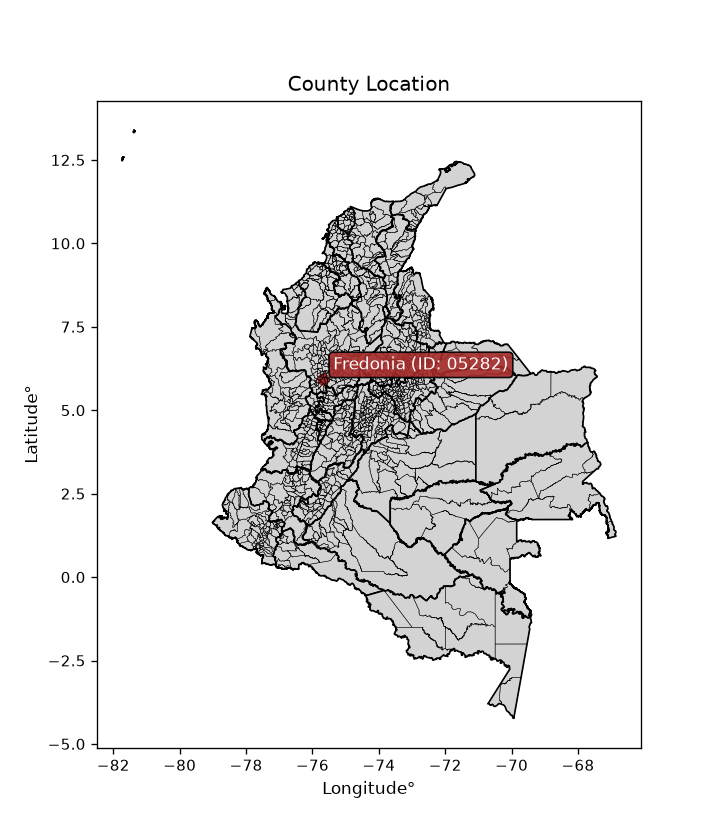
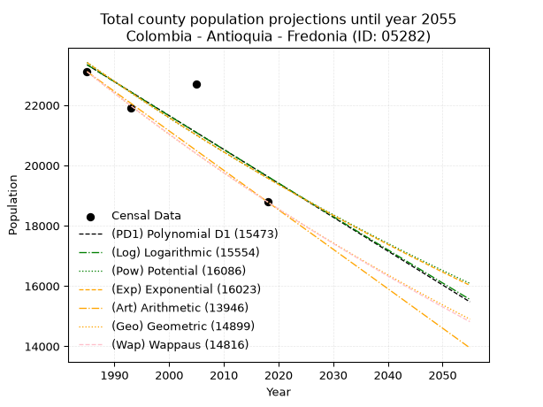
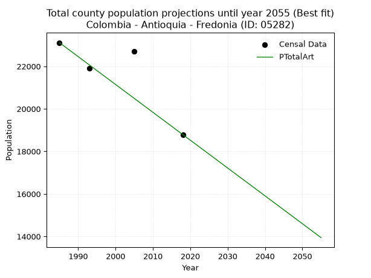
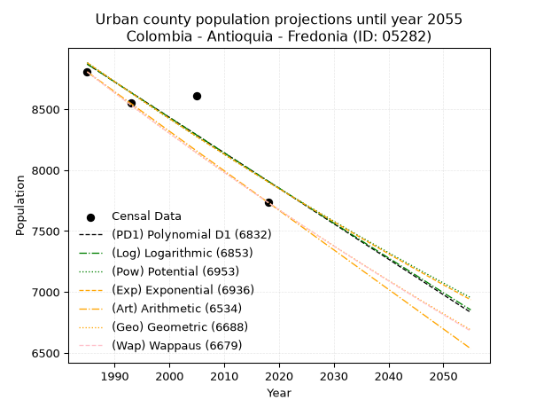
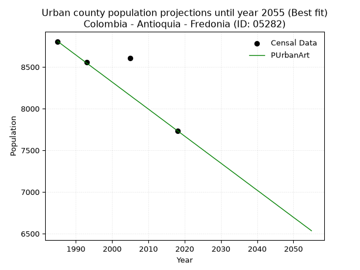
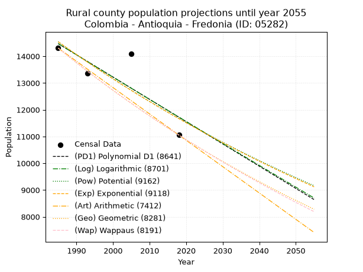
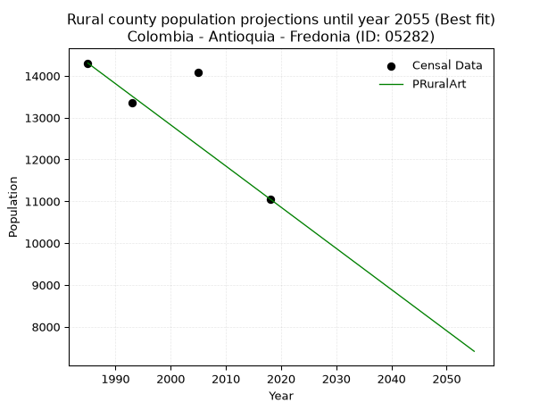

<div align="center">


</div>

# _“Population and Public Services Demand Projections (PPSD) until Year 2050 for Colombia - Antioquia - Fredonia (ID: 05282)”_
Keywords: `population` `public-service` `projection` `lineal` `polynomial` `logarithmic` `potential` `exponential` `arithmetic` `geometric` `wappaus` `dane` `colombia` `south-america`

PPSD are analytical estimates used by governments and planners to anticipate future changes in population size, age distribution, and the resulting community needs for utilities, healthcare, education, and infrastructure as sizing future water treatment facilities, electrical grids, and road networks based on spatial growth.

<div align="center">

</img>

</div>


> **General running parameters**: • app_version: _v20260806_. • Python version: _3.14.7_. • Pandas version: _3.0.5_. • NumPy version: _2.5.1_. • Creates, save and include plots into reports (create_plot): _False_. • Projection until year: _2050_. • Process polynomial degree 2 and up: _False_. • Process Wappaus: _True_. • Process Wappaus: _True_. • Set negative values to zero: _True_. • Set infinite values to zero: _True_. • Drop dataset notes: _True_. 
<div align="center">

Dynamic map: [:earth_americas:Google](http://maps.google.com/maps?q=5.928038648,-75.6750722) [:earth_americas:OSM](https://www.openstreetmap.org/#map=18/5.928038648/-75.6750722&layers=P) [:earth_americas:Bing](https://www.bing.com/maps?cp=5.928038648~-75.6750722&lvl=18) [:earth_americas:Apple](https://maps.apple.com/frame?center=5.928038648%2C-75.6750722&span=0.003%2C0.006)

</div>


<div align="center">

```geojson
{
  "type": "Feature",
  "geometry": {
    "type": "Point", 
    "coordinates": [-75.6750722, 5.928038648]
  }, 
  "properties": {
    "Name": "Colombia - Antioquia - Fredonia (ID: 05282)"
  }
}
```

</div>


## 0. Census Data (4 records)

Census data are official statistics collected by a government about the people and housing in a country. They usually include counts of total population, age, sex, race, income, education, and jobs.

📅Global census file: [Population.xlsx](../data/Population.xlsx)

| Source   |   Year |   CountryID | CountryName   |   StateID | StateName   |   CountyID | CountyName   |   PTotal |   PUrban |   PRural |
|:---------|-------:|------------:|:--------------|----------:|:------------|-----------:|:-------------|---------:|---------:|---------:|
| DANE     |   1985 |          57 | Colombia      |        05 | Antioquia   |      05282 | Fredonia     |    23110 |     8806 |    14304 |
| DANE     |   1993 |          57 | Colombia      |        05 | Antioquia   |      05282 | Fredonia     |    21913 |     8555 |    13358 |
| DANE     |   2005 |          57 | Colombia      |        05 | Antioquia   |      05282 | Fredonia     |    22692 |     8608 |    14084 |
| DANE     |   2018 |          57 | Colombia      |        05 | Antioquia   |      05282 | Fredonia     |    18790 |     7735 |    11055 |

> 🔥Some records could had specific notes about the registered values or the corresponding urban or rural distribution.

📅   [RUPS](https://www.datos.gov.co/Hacienda-y-Cr-dito-P-blico/Registro-nico-de-Prestadores-de-Servicios-P-blicos/4qkq-csdn/about_data) - Local public utility companies: [RUPS.csv](../data/RUPS.xlsx)

 | SERVICIO       | ESTADO    | NOMBRE                                                                                              | NIT         | DEPARTAMENTO_DOMICILIO   | MUNICIPIO_DOMICILIO   | DIRECCION             |   TELEFONO | EMAIL                                       | TIPO_PRESTADOR                             | CLASIFICACION                  |
|:---------------|:----------|:----------------------------------------------------------------------------------------------------|:------------|:-------------------------|:----------------------|:----------------------|-----------:|:--------------------------------------------|:-------------------------------------------|:-------------------------------|
| ACUEDUCTO      | OPERATIVA | ASOCIACION  DE USUARIOS DEL ACUEDUCTO  DE  HOYO FRIO                                                | 811025496-1 | ANTIOQUIA                | FREDONIA              | ALCALDIA DE FREDONIA  |    8401272 | clarirueda@hotmail.com                      | ORGANIZACION AUTORIZADA                    | MENOR O IGUAL A 2500 USUARIOS  |
| ACUEDUCTO      | OPERATIVA | ASOCIACION DE USUARIOS DEL ACUEDUCTO MULTIVEREDAL DE FREDONIA RODRIGO ARENAS BETANCUR               | 811008837-6 | ANTIOQUIA                | FREDONIA              | vereeda el plan       |    8402930 | chabela1411@hotmail.com                     | ORGANIZACION AUTORIZADA                    | MENOR O IGUAL A 2500 USUARIOS  |
| ACUEDUCTO      | OPERATIVA | OPERADORES DE SERVICIOS S.A.  E.S.P.                                                                | 811005377-6 | ANTIOQUIA                | MEDELLIN              | Calle 42B No 63C - 51 |    3512999 | contabilidad@operadoresdeserviciossaesp.com | SOCIEDADES (EMPRESA DE SERVICIOS PUBLICOS) | DESDE 2501 HASTA 5000 USUARIOS |
| ALCANTARILLADO | OPERATIVA | OPERADORES DE SERVICIOS S.A.  E.S.P.                                                                | 811005377-6 | ANTIOQUIA                | MEDELLIN              | Calle 42B No 63C - 51 |    3512999 | contabilidad@operadoresdeserviciossaesp.com | SOCIEDADES (EMPRESA DE SERVICIOS PUBLICOS) | DESDE 2501 HASTA 5000 USUARIOS |
| ACUEDUCTO      | OPERATIVA | ASOCIACION DE USUARIOS DEL ACUEDUCTO LA CORDILLERA MUNICIPIO DE FREDONIA                            | 900040625-9 | ANTIOQUIA                | FREDONIA              | VEREDA LA CORDILLERA  |    3148152 | acueductolacordillera@gmail.com             | ORGANIZACION AUTORIZADA                    | MENOR O IGUAL A 2500 USUARIOS  |
| ACUEDUCTO      | OPERATIVA | ASOCIACION DE USUARIOS DEL ACUEDUCTO VEREDA SABALETAS                                               | 811036032-3 | ANTIOQUIA                | FREDONIA              | VEREDA ZABALETAS      |    8402164 | henryantoniozapata@hotmail.com              | ORGANIZACION AUTORIZADA                    | HASTA 2500 SUSCRIPTORES        |
| ACUEDUCTO      | OPERATIVA | ASOCIACION DE USUARIOS DEL ACUEDUCTO Y ALCANTARILLADO DE LA VEREDA EL ZANCUDO MUNICIPIO DE FREDONIA | 811036330-3 | ANTIOQUIA                | FREDONIA              | Vereda el Zancudo     |    8401676 | GUSTAVO2@HOTMAIL.COM                        | ORGANIZACION AUTORIZADA                    | MENOR O IGUAL A 2500 USUARIOS  |
| ALCANTARILLADO | OPERATIVA | ASOCIACION DE USUARIOS DEL ACUEDUCTO Y ALCANTARILLADO DE LA VEREDA EL ZANCUDO MUNICIPIO DE FREDONIA | 811036330-3 | ANTIOQUIA                | FREDONIA              | Vereda el Zancudo     |    8401676 | GUSTAVO2@HOTMAIL.COM                        | ORGANIZACION AUTORIZADA                    | MENOR O IGUAL A 2500 USUARIOS  |
| ACUEDUCTO      | OPERATIVA | ASOCIACION DE USUARIOS DE LA VEREDA EL CALVARIO                                                     | 811025580-0 | ANTIOQUIA                | FREDONIA              | Vereda el Calvario    |    8401264 | dtvergara@gmail.com                         | ORGANIZACION AUTORIZADA                    | HASTA 2500 SUSCRIPTORES        |
| ACUEDUCTO      | OPERATIVA | ASOCIACION DE USUARIOS DEL ACUEDUCTO VEREDAL AGUA PURA LA MARIA                                     | 900271765-2 | ANTIOQUIA                | FREDONIA              | VEREDA LA MARIA       |    0000000 | acueductoaguapuralamaria@hotmail.com        | ORGANIZACION AUTORIZADA                    | MENOR O IGUAL A 2500 USUARIOS  |

## 1. Total

### 1.1. Coefficients and Parameters

* (PD1) Polynomial Deg 1: -112.3841830590101, 246422.71216378495 (lineal)
* (Log) Logarithmic: -224701.98476598677, 1729587.8368549643
* (Pow) Potential: -10.833176178787689, 40.0947114583396
* (Exp) Exponential: -0.005418392111932664, 1097789870.7478962
* (Art) Arithmetic: Year diff. 2018 - 1985 = 33, Population diff. 18790 - 23110 = -4320, Annual growth = -130.9090909090909
* (Geo) Geometric: Year diff. 2018 - 1985 = 33, Population diff. 18790 - 23110 = -4320, Annual growth % = -0.006251306371215293
* (Wap) Wappaus: i = -0.6248643957474507, Condition values only valid for < 200)

<sub>
Wappaus condition values: ['-0.00', '-0.62', '-1.25', '-1.87', '-2.50', '-3.12', '-3.75', '-4.37', '-5.00', '-5.62', '-6.25', '-6.87', '-7.50', '-8.12', '-8.75', '-9.37', '-10.00', '-10.62', '-11.25', '-11.87', '-12.50', '-13.12', '-13.75', '-14.37', '-15.00', '-15.62', '-16.25', '-16.87', '-17.50', '-18.12', '-18.75', '-19.37', '-20.00', '-20.62', '-21.25', '-21.87', '-22.50', '-23.12', '-23.74', '-24.37', '-24.99', '-25.62', '-26.24', '-26.87', '-27.49', '-28.12', '-28.74', '-29.37', '-29.99', '-30.62', '-31.24', '-31.87', '-32.49', '-33.12', '-33.74', '-34.37', '-34.99', '-35.62', '-36.24', '-36.87', '-37.49', '-38.12', '-38.74', '-39.37', '-39.99', '-40.62']
</sub>


### 1.2. Projected Dataset

|   Year |   CountyID |   PTotalPD1 |   PTotalLog |   PTotalPow |   PTotalExp |   PTotalArt |   PTotalGeo |   PTotalWap |
|-------:|-----------:|------------:|------------:|------------:|------------:|------------:|------------:|------------:|
|   1985 |      05282 |       23340 |       23342 |       23415 |       23413 |       23110 |       23110 |       23110 |
|   1986 |      05282 |       23228 |       23228 |       23287 |       23287 |       22979 |       22966 |       22966 |
|   1987 |      05282 |       23115 |       23115 |       23161 |       23161 |       22848 |       22822 |       22823 |
|   1988 |      05282 |       23003 |       23002 |       23035 |       23036 |       22717 |       22679 |       22681 |
|   1989 |      05282 |       22891 |       22889 |       22910 |       22911 |       22586 |       22538 |       22540 |
|   1990 |      05282 |       22778 |       22776 |       22785 |       22787 |       22455 |       22397 |       22399 |
|   1991 |      05282 |       22666 |       22663 |       22662 |       22664 |       22325 |       22257 |       22260 |
|   1992 |      05282 |       22553 |       22551 |       22539 |       22542 |       22194 |       22117 |       22121 |
|   1993 |      05282 |       22441 |       22438 |       22416 |       22420 |       22063 |       21979 |       21983 |
|   1994 |      05282 |       22329 |       22325 |       22295 |       22299 |       21932 |       21842 |       21846 |
|   1995 |      05282 |       22216 |       22212 |       22174 |       22178 |       21801 |       21705 |       21710 |
|   1996 |      05282 |       22104 |       22100 |       22054 |       22059 |       21670 |       21570 |       21574 |
|   1997 |      05282 |       21991 |       21987 |       21935 |       21939 |       21539 |       21435 |       21440 |
|   1998 |      05282 |       21879 |       21875 |       21816 |       21821 |       21408 |       21301 |       21306 |
|   1999 |      05282 |       21767 |       21762 |       21698 |       21703 |       21277 |       21168 |       21173 |
|   2000 |      05282 |       21654 |       21650 |       21581 |       21586 |       21146 |       21035 |       21041 |
|   2001 |      05282 |       21542 |       21538 |       21464 |       21469 |       21015 |       20904 |       20910 |
|   2002 |      05282 |       21430 |       21425 |       21349 |       21353 |       20885 |       20773 |       20779 |
|   2003 |      05282 |       21317 |       21313 |       21233 |       21238 |       20754 |       20643 |       20649 |
|   2004 |      05282 |       21205 |       21201 |       21119 |       21123 |       20623 |       20514 |       20520 |
|   2005 |      05282 |       21092 |       21089 |       21005 |       21009 |       20492 |       20386 |       20392 |
|   2006 |      05282 |       20980 |       20977 |       20892 |       20895 |       20361 |       20259 |       20264 |
|   2007 |      05282 |       20868 |       20865 |       20779 |       20782 |       20230 |       20132 |       20137 |
|   2008 |      05282 |       20755 |       20753 |       20668 |       20670 |       20099 |       20006 |       20011 |
|   2009 |      05282 |       20643 |       20641 |       20556 |       20558 |       19968 |       19881 |       19886 |
|   2010 |      05282 |       20531 |       20529 |       20446 |       20447 |       19837 |       19757 |       19761 |
|   2011 |      05282 |       20418 |       20417 |       20336 |       20337 |       19706 |       19633 |       19638 |
|   2012 |      05282 |       20306 |       20306 |       20227 |       20227 |       19575 |       19510 |       19514 |
|   2013 |      05282 |       20193 |       20194 |       20118 |       20117 |       19445 |       19388 |       19392 |
|   2014 |      05282 |       20081 |       20083 |       20010 |       20009 |       19314 |       19267 |       19270 |
|   2015 |      05282 |       19969 |       19971 |       19903 |       19901 |       19183 |       19147 |       19149 |
|   2016 |      05282 |       19856 |       19860 |       19796 |       19793 |       19052 |       19027 |       19029 |
|   2017 |      05282 |       19744 |       19748 |       19690 |       19686 |       18921 |       18908 |       18909 |
|   2018 |      05282 |       19631 |       19637 |       19585 |       19580 |       18790 |       18790 |       18790 |
|   2019 |      05282 |       19519 |       19525 |       19480 |       19474 |       18659 |       18673 |       18672 |
|   2020 |      05282 |       19407 |       19414 |       19376 |       19369 |       18528 |       18556 |       18554 |
|   2021 |      05282 |       19294 |       19303 |       19272 |       19264 |       18397 |       18440 |       18437 |
|   2022 |      05282 |       19182 |       19192 |       19169 |       19160 |       18266 |       18325 |       18321 |
|   2023 |      05282 |       19070 |       19081 |       19067 |       19056 |       18135 |       18210 |       18205 |
|   2024 |      05282 |       18957 |       18970 |       18965 |       18953 |       18005 |       18096 |       18090 |
|   2025 |      05282 |       18845 |       18859 |       18864 |       18851 |       17874 |       17983 |       17975 |
|   2026 |      05282 |       18732 |       18748 |       18763 |       18749 |       17743 |       17871 |       17862 |
|   2027 |      05282 |       18620 |       18637 |       18663 |       18648 |       17612 |       17759 |       17748 |
|   2028 |      05282 |       18508 |       18526 |       18564 |       18547 |       17481 |       17648 |       17636 |
|   2029 |      05282 |       18395 |       18415 |       18465 |       18447 |       17350 |       17538 |       17524 |
|   2030 |      05282 |       18283 |       18304 |       18366 |       18347 |       17219 |       17428 |       17413 |
|   2031 |      05282 |       18170 |       18194 |       18269 |       18248 |       17088 |       17319 |       17302 |
|   2032 |      05282 |       18058 |       18083 |       18172 |       18149 |       16957 |       17211 |       17192 |
|   2033 |      05282 |       17946 |       17973 |       18075 |       18051 |       16826 |       17103 |       17082 |
|   2034 |      05282 |       17833 |       17862 |       17979 |       17954 |       16695 |       16996 |       16974 |
|   2035 |      05282 |       17721 |       17752 |       17883 |       17857 |       16565 |       16890 |       16865 |
|   2036 |      05282 |       17609 |       17641 |       17788 |       17760 |       16434 |       16784 |       16757 |
|   2037 |      05282 |       17496 |       17531 |       17694 |       17664 |       16303 |       16679 |       16650 |
|   2038 |      05282 |       17384 |       17421 |       17600 |       17569 |       16172 |       16575 |       16544 |
|   2039 |      05282 |       17271 |       17310 |       17507 |       17474 |       16041 |       16472 |       16438 |
|   2040 |      05282 |       17159 |       17200 |       17414 |       17379 |       15910 |       16369 |       16332 |
|   2041 |      05282 |       17047 |       17090 |       17322 |       17286 |       15779 |       16266 |       16227 |
|   2042 |      05282 |       16934 |       16980 |       17230 |       17192 |       15648 |       16165 |       16123 |
|   2043 |      05282 |       16822 |       16870 |       17139 |       17099 |       15517 |       16064 |       16019 |
|   2044 |      05282 |       16709 |       16760 |       17049 |       17007 |       15386 |       15963 |       15916 |
|   2045 |      05282 |       16597 |       16650 |       16959 |       16915 |       15255 |       15863 |       15813 |
|   2046 |      05282 |       16485 |       16540 |       16869 |       16824 |       15125 |       15764 |       15711 |
|   2047 |      05282 |       16372 |       16431 |       16780 |       16733 |       14994 |       15666 |       15610 |
|   2048 |      05282 |       16260 |       16321 |       16691 |       16642 |       14863 |       15568 |       15509 |
|   2049 |      05282 |       16148 |       16211 |       16603 |       16552 |       14732 |       15470 |       15408 |
|   2050 |      05282 |       16035 |       16101 |       16516 |       16463 |       14601 |       15374 |       15308 |
<div align="center">

</img>

</div>


### 1.3. Best fit with absolute and relative error (%)

Relative error puts that difference into context by dividing the absolute error by the true value, creating a unitless ratio or percentage that shows the scale of the mistake.

Absolute and relative error

|   Year | Source   |   CountryID | CountryName   |   StateID | StateName   |   CountyID_x | CountyName   |   PTotal |   PUrban |   PRural |   CountyID_y |   PTotalPD1 |   PTotalLog |   PTotalPow |   PTotalExp |   PTotalArt |   PTotalGeo |   PTotalWap |   PTotalPD1AbsError |   PTotalLogAbsError |   PTotalPowAbsError |   PTotalExpAbsError |   PTotalArtAbsError |   PTotalGeoAbsError |   PTotalWapAbsError |   PTotalPD1RelError |   PTotalLogRelError |   PTotalPowRelError |   PTotalExpRelError |   PTotalArtRelError |   PTotalGeoRelError |   PTotalWapRelError |
|-------:|:---------|------------:|:--------------|----------:|:------------|-------------:|:-------------|---------:|---------:|---------:|-------------:|------------:|------------:|------------:|------------:|------------:|------------:|------------:|--------------------:|--------------------:|--------------------:|--------------------:|--------------------:|--------------------:|--------------------:|--------------------:|--------------------:|--------------------:|--------------------:|--------------------:|--------------------:|--------------------:|
|   1985 | DANE     |          57 | Colombia      |        05 | Antioquia   |        05282 | Fredonia     |    23110 |     8806 |    14304 |        05282 |       23340 |       23342 |       23415 |       23413 |       23110 |       23110 |       23110 |                 230 |                 232 |                 305 |                 303 |                   0 |                   0 |                   0 |             0.99524 |             1.00389 |             1.31977 |             1.31112 |            0        |            0        |            0        |
|   1993 | DANE     |          57 | Colombia      |        05 | Antioquia   |        05282 | Fredonia     |    21913 |     8555 |    13358 |        05282 |       22441 |       22438 |       22416 |       22420 |       22063 |       21979 |       21983 |                 528 |                 525 |                 503 |                 507 |                 150 |                  66 |                  70 |             2.40953 |             2.39584 |             2.29544 |             2.3137  |            0.684525 |            0.301191 |            0.319445 |
|   2005 | DANE     |          57 | Colombia      |        05 | Antioquia   |        05282 | Fredonia     |    22692 |     8608 |    14084 |        05282 |       21092 |       21089 |       21005 |       21009 |       20492 |       20386 |       20392 |                1600 |                1603 |                1687 |                1683 |                2200 |                2306 |                2300 |             7.05094 |             7.06416 |             7.43434 |             7.41671 |            9.69505  |           10.1622   |           10.1357   |
|   2018 | DANE     |          57 | Colombia      |        05 | Antioquia   |        05282 | Fredonia     |    18790 |     7735 |    11055 |        05282 |       19631 |       19637 |       19585 |       19580 |       18790 |       18790 |       18790 |                 841 |                 847 |                 795 |                 790 |                   0 |                   0 |                   0 |             4.47578 |             4.50772 |             4.23097 |             4.20436 |            0        |            0        |            0        |

Relative error mean

| Method    |   RelError | Best   |
|:----------|-----------:|:-------|
| PTotalPD1 |    3.73287 |        |
| PTotalLog |    3.7429  |        |
| PTotalPow |    3.82013 |        |
| PTotalExp |    3.81147 |        |
| PTotalArt |    2.59489 | True   |
| PTotalGeo |    2.61584 |        |
| PTotalWap |    2.61379 |        |

💙Best method: _**PTotalArt**_
<div align="center">

</img>

</div>


### 1.4. Fresh water supply demand in liters per capita per day (lpcd)

The fresh water supply demand typically ranges from 100 to 300 liters per capita per day (lpcd) for standard domestic and municipal planning, though absolute survival minimums set by the World Health Organization are as low as 7.5 to 20 liters per day, and total consumption in high-income nations can exceed 400 liters.

> `CZ`: Level in meters above the sea level (masl)<br> `WS`: Fresh water supply demand in liters per capita per day (lpcd or l/h/d)<br> `WSAll`: Zonal fresh water supply demand in liters per second (l/s)<br> `A`: Zonal area in square meters<br> `DP`: Population density (people/hectare or p/ha)

Reference values (RAS Colombia)

|    CZ |   WS |
|------:|-----:|
|  1000 |  120 |
|  2000 |  130 |
| 99999 |  140 |

County shapefile geometry properties and water supply values

|   CountyID |      ATotal |   CZTotal |   WSTotal |
|-----------:|------------:|----------:|----------:|
|      05282 | 2.54045e+08 |   1224.46 |       130 |

Projected values for best method: PTotalArt

|   CountyID |   Year |   PTotalArt |   DPTotal |   WSTotal |   WSTotalAll |
|-----------:|-------:|------------:|----------:|----------:|-------------:|
|      05282 |   1985 |       23110 |      0.91 |       130 |      34.772  |
|      05282 |   1986 |       22979 |      0.9  |       130 |      34.5749 |
|      05282 |   1987 |       22848 |      0.9  |       130 |      34.3778 |
|      05282 |   1988 |       22717 |      0.89 |       130 |      34.1807 |
|      05282 |   1989 |       22586 |      0.89 |       130 |      33.9836 |
|      05282 |   1990 |       22455 |      0.88 |       130 |      33.7865 |
|      05282 |   1991 |       22325 |      0.88 |       130 |      33.5909 |
|      05282 |   1992 |       22194 |      0.87 |       130 |      33.3937 |
|      05282 |   1993 |       22063 |      0.87 |       130 |      33.1966 |
|      05282 |   1994 |       21932 |      0.86 |       130 |      32.9995 |
|      05282 |   1995 |       21801 |      0.86 |       130 |      32.8024 |
|      05282 |   1996 |       21670 |      0.85 |       130 |      32.6053 |
|      05282 |   1997 |       21539 |      0.85 |       130 |      32.4082 |
|      05282 |   1998 |       21408 |      0.84 |       130 |      32.2111 |
|      05282 |   1999 |       21277 |      0.84 |       130 |      32.014  |
|      05282 |   2000 |       21146 |      0.83 |       130 |      31.8169 |
|      05282 |   2001 |       21015 |      0.83 |       130 |      31.6198 |
|      05282 |   2002 |       20885 |      0.82 |       130 |      31.4242 |
|      05282 |   2003 |       20754 |      0.82 |       130 |      31.2271 |
|      05282 |   2004 |       20623 |      0.81 |       130 |      31.03   |
|      05282 |   2005 |       20492 |      0.81 |       130 |      30.8329 |
|      05282 |   2006 |       20361 |      0.8  |       130 |      30.6358 |
|      05282 |   2007 |       20230 |      0.8  |       130 |      30.4387 |
|      05282 |   2008 |       20099 |      0.79 |       130 |      30.2416 |
|      05282 |   2009 |       19968 |      0.79 |       130 |      30.0444 |
|      05282 |   2010 |       19837 |      0.78 |       130 |      29.8473 |
|      05282 |   2011 |       19706 |      0.78 |       130 |      29.6502 |
|      05282 |   2012 |       19575 |      0.77 |       130 |      29.4531 |
|      05282 |   2013 |       19445 |      0.77 |       130 |      29.2575 |
|      05282 |   2014 |       19314 |      0.76 |       130 |      29.0604 |
|      05282 |   2015 |       19183 |      0.76 |       130 |      28.8633 |
|      05282 |   2016 |       19052 |      0.75 |       130 |      28.6662 |
|      05282 |   2017 |       18921 |      0.74 |       130 |      28.4691 |
|      05282 |   2018 |       18790 |      0.74 |       130 |      28.272  |
|      05282 |   2019 |       18659 |      0.73 |       130 |      28.0749 |
|      05282 |   2020 |       18528 |      0.73 |       130 |      27.8778 |
|      05282 |   2021 |       18397 |      0.72 |       130 |      27.6807 |
|      05282 |   2022 |       18266 |      0.72 |       130 |      27.4836 |
|      05282 |   2023 |       18135 |      0.71 |       130 |      27.2865 |
|      05282 |   2024 |       18005 |      0.71 |       130 |      27.0909 |
|      05282 |   2025 |       17874 |      0.7  |       130 |      26.8938 |
|      05282 |   2026 |       17743 |      0.7  |       130 |      26.6966 |
|      05282 |   2027 |       17612 |      0.69 |       130 |      26.4995 |
|      05282 |   2028 |       17481 |      0.69 |       130 |      26.3024 |
|      05282 |   2029 |       17350 |      0.68 |       130 |      26.1053 |
|      05282 |   2030 |       17219 |      0.68 |       130 |      25.9082 |
|      05282 |   2031 |       17088 |      0.67 |       130 |      25.7111 |
|      05282 |   2032 |       16957 |      0.67 |       130 |      25.514  |
|      05282 |   2033 |       16826 |      0.66 |       130 |      25.3169 |
|      05282 |   2034 |       16695 |      0.66 |       130 |      25.1198 |
|      05282 |   2035 |       16565 |      0.65 |       130 |      24.9242 |
|      05282 |   2036 |       16434 |      0.65 |       130 |      24.7271 |
|      05282 |   2037 |       16303 |      0.64 |       130 |      24.53   |
|      05282 |   2038 |       16172 |      0.64 |       130 |      24.3329 |
|      05282 |   2039 |       16041 |      0.63 |       130 |      24.1358 |
|      05282 |   2040 |       15910 |      0.63 |       130 |      23.9387 |
|      05282 |   2041 |       15779 |      0.62 |       130 |      23.7416 |
|      05282 |   2042 |       15648 |      0.62 |       130 |      23.5444 |
|      05282 |   2043 |       15517 |      0.61 |       130 |      23.3473 |
|      05282 |   2044 |       15386 |      0.61 |       130 |      23.1502 |
|      05282 |   2045 |       15255 |      0.6  |       130 |      22.9531 |
|      05282 |   2046 |       15125 |      0.6  |       130 |      22.7575 |
|      05282 |   2047 |       14994 |      0.59 |       130 |      22.5604 |
|      05282 |   2048 |       14863 |      0.59 |       130 |      22.3633 |
|      05282 |   2049 |       14732 |      0.58 |       130 |      22.1662 |
|      05282 |   2050 |       14601 |      0.57 |       130 |      21.9691 |

## 2. Urban

### 2.1. Coefficients and Parameters

* (PD1) Polynomial Deg 1: -29.114411882777492, 66662.10236852568 (lineal)
* (Log) Logarithmic: -58222.43735720411, 450975.21291744016
* (Pow) Potential: -7.064918121587472, 27.24692082055532
* (Exp) Exponential: -0.0035329609111125846, 9866537.279397579
* (Art) Arithmetic: Year diff. 2018 - 1985 = 33, Population diff. 7735 - 8806 = -1071, Annual growth = -32.45454545454545
* (Geo) Geometric: Year diff. 2018 - 1985 = 33, Population diff. 7735 - 8806 = -1071, Annual growth % = -0.003921920113047039
* (Wap) Wappaus: i = -0.3924133420536298, Condition values only valid for < 200)

<sub>
Wappaus condition values: ['-0.00', '-0.39', '-0.78', '-1.18', '-1.57', '-1.96', '-2.35', '-2.75', '-3.14', '-3.53', '-3.92', '-4.32', '-4.71', '-5.10', '-5.49', '-5.89', '-6.28', '-6.67', '-7.06', '-7.46', '-7.85', '-8.24', '-8.63', '-9.03', '-9.42', '-9.81', '-10.20', '-10.60', '-10.99', '-11.38', '-11.77', '-12.16', '-12.56', '-12.95', '-13.34', '-13.73', '-14.13', '-14.52', '-14.91', '-15.30', '-15.70', '-16.09', '-16.48', '-16.87', '-17.27', '-17.66', '-18.05', '-18.44', '-18.84', '-19.23', '-19.62', '-20.01', '-20.41', '-20.80', '-21.19', '-21.58', '-21.98', '-22.37', '-22.76', '-23.15', '-23.54', '-23.94', '-24.33', '-24.72', '-25.11', '-25.51']
</sub>


### 2.2. Projected Dataset

|   Year |   CountyID |   PUrbanPD1 |   PUrbanLog |   PUrbanPow |   PUrbanExp |   PUrbanArt |   PUrbanGeo |   PUrbanWap |
|-------:|-----------:|------------:|------------:|------------:|------------:|------------:|------------:|------------:|
|   1985 |      05282 |        8870 |        8870 |        8882 |        8882 |        8806 |        8806 |        8806 |
|   1986 |      05282 |        8841 |        8841 |        8850 |        8850 |        8774 |        8771 |        8772 |
|   1987 |      05282 |        8812 |        8812 |        8819 |        8819 |        8741 |        8737 |        8737 |
|   1988 |      05282 |        8783 |        8783 |        8788 |        8788 |        8709 |        8703 |        8703 |
|   1989 |      05282 |        8754 |        8753 |        8757 |        8757 |        8676 |        8669 |        8669 |
|   1990 |      05282 |        8724 |        8724 |        8726 |        8726 |        8644 |        8635 |        8635 |
|   1991 |      05282 |        8695 |        8695 |        8695 |        8695 |        8611 |        8601 |        8601 |
|   1992 |      05282 |        8666 |        8666 |        8664 |        8665 |        8579 |        8567 |        8567 |
|   1993 |      05282 |        8637 |        8636 |        8633 |        8634 |        8546 |        8533 |        8534 |
|   1994 |      05282 |        8608 |        8607 |        8603 |        8604 |        8514 |        8500 |        8500 |
|   1995 |      05282 |        8579 |        8578 |        8572 |        8573 |        8481 |        8467 |        8467 |
|   1996 |      05282 |        8550 |        8549 |        8542 |        8543 |        8449 |        8433 |        8434 |
|   1997 |      05282 |        8521 |        8520 |        8512 |        8513 |        8417 |        8400 |        8401 |
|   1998 |      05282 |        8492 |        8490 |        8482 |        8483 |        8384 |        8367 |        8368 |
|   1999 |      05282 |        8462 |        8461 |        8452 |        8453 |        8352 |        8335 |        8335 |
|   2000 |      05282 |        8433 |        8432 |        8422 |        8423 |        8319 |        8302 |        8302 |
|   2001 |      05282 |        8404 |        8403 |        8392 |        8393 |        8287 |        8269 |        8270 |
|   2002 |      05282 |        8375 |        8374 |        8363 |        8364 |        8254 |        8237 |        8238 |
|   2003 |      05282 |        8346 |        8345 |        8333 |        8334 |        8222 |        8205 |        8205 |
|   2004 |      05282 |        8317 |        8316 |        8304 |        8305 |        8189 |        8172 |        8173 |
|   2005 |      05282 |        8288 |        8287 |        8275 |        8276 |        8157 |        8140 |        8141 |
|   2006 |      05282 |        8259 |        8258 |        8246 |        8246 |        8124 |        8108 |        8109 |
|   2007 |      05282 |        8229 |        8229 |        8217 |        8217 |        8092 |        8077 |        8077 |
|   2008 |      05282 |        8200 |        8200 |        8188 |        8188 |        8060 |        8045 |        8046 |
|   2009 |      05282 |        8171 |        8171 |        8159 |        8160 |        8027 |        8013 |        8014 |
|   2010 |      05282 |        8142 |        8142 |        8130 |        8131 |        7995 |        7982 |        7982 |
|   2011 |      05282 |        8113 |        8113 |        8102 |        8102 |        7962 |        7951 |        7951 |
|   2012 |      05282 |        8084 |        8084 |        8073 |        8073 |        7930 |        7920 |        7920 |
|   2013 |      05282 |        8055 |        8055 |        8045 |        8045 |        7897 |        7888 |        7889 |
|   2014 |      05282 |        8026 |        8026 |        8017 |        8017 |        7865 |        7858 |        7858 |
|   2015 |      05282 |        7997 |        7997 |        7989 |        7988 |        7832 |        7827 |        7827 |
|   2016 |      05282 |        7967 |        7968 |        7961 |        7960 |        7800 |        7796 |        7796 |
|   2017 |      05282 |        7938 |        7939 |        7933 |        7932 |        7767 |        7765 |        7766 |
|   2018 |      05282 |        7909 |        7910 |        7905 |        7904 |        7735 |        7735 |        7735 |
|   2019 |      05282 |        7880 |        7882 |        7878 |        7876 |        7703 |        7705 |        7705 |
|   2020 |      05282 |        7851 |        7853 |        7850 |        7849 |        7670 |        7674 |        7674 |
|   2021 |      05282 |        7822 |        7824 |        7823 |        7821 |        7638 |        7644 |        7644 |
|   2022 |      05282 |        7793 |        7795 |        7796 |        7793 |        7605 |        7614 |        7614 |
|   2023 |      05282 |        7764 |        7766 |        7768 |        7766 |        7573 |        7585 |        7584 |
|   2024 |      05282 |        7735 |        7738 |        7741 |        7738 |        7540 |        7555 |        7554 |
|   2025 |      05282 |        7705 |        7709 |        7714 |        7711 |        7508 |        7525 |        7524 |
|   2026 |      05282 |        7676 |        7680 |        7687 |        7684 |        7475 |        7496 |        7495 |
|   2027 |      05282 |        7647 |        7651 |        7661 |        7657 |        7443 |        7466 |        7465 |
|   2028 |      05282 |        7618 |        7623 |        7634 |        7630 |        7410 |        7437 |        7436 |
|   2029 |      05282 |        7589 |        7594 |        7608 |        7603 |        7378 |        7408 |        7406 |
|   2030 |      05282 |        7560 |        7565 |        7581 |        7576 |        7346 |        7379 |        7377 |
|   2031 |      05282 |        7531 |        7537 |        7555 |        7549 |        7313 |        7350 |        7348 |
|   2032 |      05282 |        7502 |        7508 |        7529 |        7523 |        7281 |        7321 |        7319 |
|   2033 |      05282 |        7473 |        7479 |        7502 |        7496 |        7248 |        7292 |        7290 |
|   2034 |      05282 |        7443 |        7451 |        7476 |        7470 |        7216 |        7264 |        7261 |
|   2035 |      05282 |        7414 |        7422 |        7450 |        7443 |        7183 |        7235 |        7233 |
|   2036 |      05282 |        7385 |        7393 |        7425 |        7417 |        7151 |        7207 |        7204 |
|   2037 |      05282 |        7356 |        7365 |        7399 |        7391 |        7118 |        7179 |        7175 |
|   2038 |      05282 |        7327 |        7336 |        7373 |        7365 |        7086 |        7150 |        7147 |
|   2039 |      05282 |        7298 |        7308 |        7348 |        7339 |        7053 |        7122 |        7119 |
|   2040 |      05282 |        7269 |        7279 |        7322 |        7313 |        7021 |        7094 |        7091 |
|   2041 |      05282 |        7240 |        7251 |        7297 |        7287 |        6989 |        7067 |        7062 |
|   2042 |      05282 |        7210 |        7222 |        7272 |        7262 |        6956 |        7039 |        7034 |
|   2043 |      05282 |        7181 |        7194 |        7247 |        7236 |        6924 |        7011 |        7007 |
|   2044 |      05282 |        7152 |        7165 |        7222 |        7210 |        6891 |        6984 |        6979 |
|   2045 |      05282 |        7123 |        7137 |        7197 |        7185 |        6859 |        6956 |        6951 |
|   2046 |      05282 |        7094 |        7108 |        7172 |        7160 |        6826 |        6929 |        6923 |
|   2047 |      05282 |        7065 |        7080 |        7147 |        7134 |        6794 |        6902 |        6896 |
|   2048 |      05282 |        7036 |        7051 |        7123 |        7109 |        6761 |        6875 |        6868 |
|   2049 |      05282 |        7007 |        7023 |        7098 |        7084 |        6729 |        6848 |        6841 |
|   2050 |      05282 |        6978 |        6994 |        7074 |        7059 |        6696 |        6821 |        6814 |
<div align="center">

</img>

</div>


### 2.3. Best fit with absolute and relative error (%)

Relative error puts that difference into context by dividing the absolute error by the true value, creating a unitless ratio or percentage that shows the scale of the mistake.

Absolute and relative error

|   Year | Source   |   CountryID | CountryName   |   StateID | StateName   |   CountyID_x | CountyName   |   PTotal |   PUrban |   PRural |   CountyID_y |   PUrbanPD1 |   PUrbanLog |   PUrbanPow |   PUrbanExp |   PUrbanArt |   PUrbanGeo |   PUrbanWap |   PUrbanPD1AbsError |   PUrbanLogAbsError |   PUrbanPowAbsError |   PUrbanExpAbsError |   PUrbanArtAbsError |   PUrbanGeoAbsError |   PUrbanWapAbsError |   PUrbanPD1RelError |   PUrbanLogRelError |   PUrbanPowRelError |   PUrbanExpRelError |   PUrbanArtRelError |   PUrbanGeoRelError |   PUrbanWapRelError |
|-------:|:---------|------------:|:--------------|----------:|:------------|-------------:|:-------------|---------:|---------:|---------:|-------------:|------------:|------------:|------------:|------------:|------------:|------------:|------------:|--------------------:|--------------------:|--------------------:|--------------------:|--------------------:|--------------------:|--------------------:|--------------------:|--------------------:|--------------------:|--------------------:|--------------------:|--------------------:|--------------------:|
|   1985 | DANE     |          57 | Colombia      |        05 | Antioquia   |        05282 | Fredonia     |    23110 |     8806 |    14304 |        05282 |        8870 |        8870 |        8882 |        8882 |        8806 |        8806 |        8806 |                  64 |                  64 |                  76 |                  76 |                   0 |                   0 |                   0 |            0.726777 |            0.726777 |            0.863048 |            0.863048 |            0        |             0       |             0       |
|   1993 | DANE     |          57 | Colombia      |        05 | Antioquia   |        05282 | Fredonia     |    21913 |     8555 |    13358 |        05282 |        8637 |        8636 |        8633 |        8634 |        8546 |        8533 |        8534 |                  82 |                  81 |                  78 |                  79 |                   9 |                  22 |                  21 |            0.958504 |            0.946815 |            0.911748 |            0.923437 |            0.105202 |             0.25716 |             0.24547 |
|   2005 | DANE     |          57 | Colombia      |        05 | Antioquia   |        05282 | Fredonia     |    22692 |     8608 |    14084 |        05282 |        8288 |        8287 |        8275 |        8276 |        8157 |        8140 |        8141 |                 320 |                 321 |                 333 |                 332 |                 451 |                 468 |                 467 |            3.71747  |            3.72909  |            3.86849  |            3.85688  |            5.23931  |             5.4368  |             5.42519 |
|   2018 | DANE     |          57 | Colombia      |        05 | Antioquia   |        05282 | Fredonia     |    18790 |     7735 |    11055 |        05282 |        7909 |        7910 |        7905 |        7904 |        7735 |        7735 |        7735 |                 174 |                 175 |                 170 |                 169 |                   0 |                   0 |                   0 |            2.24952  |            2.26244  |            2.1978   |            2.18487  |            0        |             0       |             0       |

Relative error mean

| Method    |   RelError | Best   |
|:----------|-----------:|:-------|
| PUrbanPD1 |    1.91307 |        |
| PUrbanLog |    1.91628 |        |
| PUrbanPow |    1.96027 |        |
| PUrbanExp |    1.95706 |        |
| PUrbanArt |    1.33613 | True   |
| PUrbanGeo |    1.42349 |        |
| PUrbanWap |    1.41766 |        |

💙Best method: _**PUrbanArt**_
<div align="center">

</img>

</div>


### 2.4. Fresh water supply demand in liters per capita per day (lpcd)

The fresh water supply demand typically ranges from 100 to 300 liters per capita per day (lpcd) for standard domestic and municipal planning, though absolute survival minimums set by the World Health Organization are as low as 7.5 to 20 liters per day, and total consumption in high-income nations can exceed 400 liters.

> `CZ`: Level in meters above the sea level (masl)<br> `WS`: Fresh water supply demand in liters per capita per day (lpcd or l/h/d)<br> `WSAll`: Zonal fresh water supply demand in liters per second (l/s)<br> `A`: Zonal area in square meters<br> `DP`: Population density (people/hectare or p/ha)

Reference values (RAS Colombia)

|    CZ |   WS |
|------:|-----:|
|  1000 |  120 |
|  2000 |  130 |
| 99999 |  140 |

County shapefile geometry properties and water supply values

|   CountyID |      AUrban |   CZUrban |   WSUrban |
|-----------:|------------:|----------:|----------:|
|      05282 | 2.15937e+06 |   1817.47 |       130 |

Projected values for best method: PUrbanArt

|   CountyID |   Year |   PUrbanArt |   DPUrban |   WSUrban |   WSUrbanAll |
|-----------:|-------:|------------:|----------:|----------:|-------------:|
|      05282 |   1985 |        8806 |     40.78 |       130 |      13.2498 |
|      05282 |   1986 |        8774 |     40.63 |       130 |      13.2016 |
|      05282 |   1987 |        8741 |     40.48 |       130 |      13.152  |
|      05282 |   1988 |        8709 |     40.33 |       130 |      13.1038 |
|      05282 |   1989 |        8676 |     40.18 |       130 |      13.0542 |
|      05282 |   1990 |        8644 |     40.03 |       130 |      13.006  |
|      05282 |   1991 |        8611 |     39.88 |       130 |      12.9564 |
|      05282 |   1992 |        8579 |     39.73 |       130 |      12.9082 |
|      05282 |   1993 |        8546 |     39.58 |       130 |      12.8586 |
|      05282 |   1994 |        8514 |     39.43 |       130 |      12.8104 |
|      05282 |   1995 |        8481 |     39.28 |       130 |      12.7608 |
|      05282 |   1996 |        8449 |     39.13 |       130 |      12.7126 |
|      05282 |   1997 |        8417 |     38.98 |       130 |      12.6645 |
|      05282 |   1998 |        8384 |     38.83 |       130 |      12.6148 |
|      05282 |   1999 |        8352 |     38.68 |       130 |      12.5667 |
|      05282 |   2000 |        8319 |     38.53 |       130 |      12.517  |
|      05282 |   2001 |        8287 |     38.38 |       130 |      12.4689 |
|      05282 |   2002 |        8254 |     38.22 |       130 |      12.4192 |
|      05282 |   2003 |        8222 |     38.08 |       130 |      12.3711 |
|      05282 |   2004 |        8189 |     37.92 |       130 |      12.3214 |
|      05282 |   2005 |        8157 |     37.77 |       130 |      12.2733 |
|      05282 |   2006 |        8124 |     37.62 |       130 |      12.2236 |
|      05282 |   2007 |        8092 |     37.47 |       130 |      12.1755 |
|      05282 |   2008 |        8060 |     37.33 |       130 |      12.1273 |
|      05282 |   2009 |        8027 |     37.17 |       130 |      12.0777 |
|      05282 |   2010 |        7995 |     37.02 |       130 |      12.0295 |
|      05282 |   2011 |        7962 |     36.87 |       130 |      11.9799 |
|      05282 |   2012 |        7930 |     36.72 |       130 |      11.9317 |
|      05282 |   2013 |        7897 |     36.57 |       130 |      11.8821 |
|      05282 |   2014 |        7865 |     36.42 |       130 |      11.8339 |
|      05282 |   2015 |        7832 |     36.27 |       130 |      11.7843 |
|      05282 |   2016 |        7800 |     36.12 |       130 |      11.7361 |
|      05282 |   2017 |        7767 |     35.97 |       130 |      11.6865 |
|      05282 |   2018 |        7735 |     35.82 |       130 |      11.6383 |
|      05282 |   2019 |        7703 |     35.67 |       130 |      11.5902 |
|      05282 |   2020 |        7670 |     35.52 |       130 |      11.5405 |
|      05282 |   2021 |        7638 |     35.37 |       130 |      11.4924 |
|      05282 |   2022 |        7605 |     35.22 |       130 |      11.4427 |
|      05282 |   2023 |        7573 |     35.07 |       130 |      11.3946 |
|      05282 |   2024 |        7540 |     34.92 |       130 |      11.3449 |
|      05282 |   2025 |        7508 |     34.77 |       130 |      11.2968 |
|      05282 |   2026 |        7475 |     34.62 |       130 |      11.2471 |
|      05282 |   2027 |        7443 |     34.47 |       130 |      11.199  |
|      05282 |   2028 |        7410 |     34.32 |       130 |      11.1493 |
|      05282 |   2029 |        7378 |     34.17 |       130 |      11.1012 |
|      05282 |   2030 |        7346 |     34.02 |       130 |      11.053  |
|      05282 |   2031 |        7313 |     33.87 |       130 |      11.0034 |
|      05282 |   2032 |        7281 |     33.72 |       130 |      10.9552 |
|      05282 |   2033 |        7248 |     33.57 |       130 |      10.9056 |
|      05282 |   2034 |        7216 |     33.42 |       130 |      10.8574 |
|      05282 |   2035 |        7183 |     33.26 |       130 |      10.8078 |
|      05282 |   2036 |        7151 |     33.12 |       130 |      10.7596 |
|      05282 |   2037 |        7118 |     32.96 |       130 |      10.71   |
|      05282 |   2038 |        7086 |     32.82 |       130 |      10.6618 |
|      05282 |   2039 |        7053 |     32.66 |       130 |      10.6122 |
|      05282 |   2040 |        7021 |     32.51 |       130 |      10.564  |
|      05282 |   2041 |        6989 |     32.37 |       130 |      10.5159 |
|      05282 |   2042 |        6956 |     32.21 |       130 |      10.4662 |
|      05282 |   2043 |        6924 |     32.06 |       130 |      10.4181 |
|      05282 |   2044 |        6891 |     31.91 |       130 |      10.3684 |
|      05282 |   2045 |        6859 |     31.76 |       130 |      10.3203 |
|      05282 |   2046 |        6826 |     31.61 |       130 |      10.2706 |
|      05282 |   2047 |        6794 |     31.46 |       130 |      10.2225 |
|      05282 |   2048 |        6761 |     31.31 |       130 |      10.1728 |
|      05282 |   2049 |        6729 |     31.16 |       130 |      10.1247 |
|      05282 |   2050 |        6696 |     31.01 |       130 |      10.075  |

## 3. Rural

### 3.1. Coefficients and Parameters

* (PD1) Polynomial Deg 1: -83.26977117623258, 179760.6097952592 (lineal)
* (Log) Logarithmic: -166479.54740878247, 1278612.6239375228
* (Pow) Potential: -13.325715958346143, 48.1075698889829
* (Exp) Exponential: -0.006665520721224018, 8103868070.400436
* (Art) Arithmetic: Year diff. 2018 - 1985 = 33, Population diff. 11055 - 14304 = -3249, Annual growth = -98.45454545454545
* (Geo) Geometric: Year diff. 2018 - 1985 = 33, Population diff. 11055 - 14304 = -3249, Annual growth % = -0.007777368361065684
* (Wap) Wappaus: i = -0.7764860243270275, Condition values only valid for < 200)

<sub>
Wappaus condition values: ['-0.00', '-0.78', '-1.55', '-2.33', '-3.11', '-3.88', '-4.66', '-5.44', '-6.21', '-6.99', '-7.76', '-8.54', '-9.32', '-10.09', '-10.87', '-11.65', '-12.42', '-13.20', '-13.98', '-14.75', '-15.53', '-16.31', '-17.08', '-17.86', '-18.64', '-19.41', '-20.19', '-20.97', '-21.74', '-22.52', '-23.29', '-24.07', '-24.85', '-25.62', '-26.40', '-27.18', '-27.95', '-28.73', '-29.51', '-30.28', '-31.06', '-31.84', '-32.61', '-33.39', '-34.17', '-34.94', '-35.72', '-36.49', '-37.27', '-38.05', '-38.82', '-39.60', '-40.38', '-41.15', '-41.93', '-42.71', '-43.48', '-44.26', '-45.04', '-45.81', '-46.59', '-47.37', '-48.14', '-48.92', '-49.70', '-50.47']
</sub>


### 3.2. Projected Dataset

|   Year |   CountyID |   PRuralPD1 |   PRuralLog |   PRuralPow |   PRuralExp |   PRuralArt |   PRuralGeo |   PRuralWap |
|-------:|-----------:|------------:|------------:|------------:|------------:|------------:|------------:|------------:|
|   1985 |      05282 |       14470 |       14471 |       14540 |       14538 |       14304 |       14304 |       14304 |
|   1986 |      05282 |       14387 |       14387 |       14442 |       14442 |       14206 |       14193 |       14193 |
|   1987 |      05282 |       14304 |       14303 |       14346 |       14346 |       14107 |       14082 |       14084 |
|   1988 |      05282 |       14220 |       14220 |       14250 |       14251 |       14009 |       13973 |       13975 |
|   1989 |      05282 |       14137 |       14136 |       14155 |       14156 |       13910 |       13864 |       13867 |
|   1990 |      05282 |       14054 |       14052 |       14060 |       14062 |       13812 |       13756 |       13759 |
|   1991 |      05282 |       13970 |       13969 |       13966 |       13968 |       13713 |       13649 |       13653 |
|   1992 |      05282 |       13887 |       13885 |       13873 |       13876 |       13615 |       13543 |       13547 |
|   1993 |      05282 |       13804 |       13802 |       13781 |       13783 |       13516 |       13438 |       13442 |
|   1994 |      05282 |       13721 |       13718 |       13689 |       13692 |       13418 |       13333 |       13338 |
|   1995 |      05282 |       13637 |       13635 |       13598 |       13601 |       13319 |       13230 |       13235 |
|   1996 |      05282 |       13554 |       13551 |       13507 |       13511 |       13221 |       13127 |       13132 |
|   1997 |      05282 |       13471 |       13468 |       13417 |       13421 |       13123 |       13025 |       13031 |
|   1998 |      05282 |       13388 |       13384 |       13328 |       13332 |       13024 |       12923 |       12929 |
|   1999 |      05282 |       13304 |       13301 |       13240 |       13243 |       12926 |       12823 |       12829 |
|   2000 |      05282 |       13221 |       13218 |       13152 |       13155 |       12827 |       12723 |       12730 |
|   2001 |      05282 |       13138 |       13135 |       13064 |       13068 |       12729 |       12624 |       12631 |
|   2002 |      05282 |       13055 |       13051 |       12978 |       12981 |       12630 |       12526 |       12533 |
|   2003 |      05282 |       12971 |       12968 |       12892 |       12895 |       12532 |       12429 |       12435 |
|   2004 |      05282 |       12888 |       12885 |       12806 |       12809 |       12433 |       12332 |       12339 |
|   2005 |      05282 |       12805 |       12802 |       12721 |       12724 |       12335 |       12236 |       12243 |
|   2006 |      05282 |       12721 |       12719 |       12637 |       12639 |       12236 |       12141 |       12147 |
|   2007 |      05282 |       12638 |       12636 |       12553 |       12555 |       12138 |       12046 |       12053 |
|   2008 |      05282 |       12555 |       12553 |       12470 |       12472 |       12040 |       11953 |       11959 |
|   2009 |      05282 |       12472 |       12470 |       12388 |       12389 |       11941 |       11860 |       11866 |
|   2010 |      05282 |       12388 |       12387 |       12306 |       12307 |       11843 |       11768 |       11773 |
|   2011 |      05282 |       12305 |       12305 |       12225 |       12225 |       11744 |       11676 |       11681 |
|   2012 |      05282 |       12222 |       12222 |       12144 |       12144 |       11646 |       11585 |       11590 |
|   2013 |      05282 |       12139 |       12139 |       12064 |       12063 |       11547 |       11495 |       11499 |
|   2014 |      05282 |       12055 |       12057 |       11984 |       11983 |       11449 |       11406 |       11409 |
|   2015 |      05282 |       11972 |       11974 |       11905 |       11903 |       11350 |       11317 |       11320 |
|   2016 |      05282 |       11889 |       11891 |       11827 |       11824 |       11252 |       11229 |       11231 |
|   2017 |      05282 |       11805 |       11809 |       11749 |       11746 |       11153 |       11142 |       11143 |
|   2018 |      05282 |       11722 |       11726 |       11672 |       11668 |       11055 |       11055 |       11055 |
|   2019 |      05282 |       11639 |       11644 |       11595 |       11590 |       10957 |       10969 |       10968 |
|   2020 |      05282 |       11556 |       11561 |       11519 |       11513 |       10858 |       10884 |       10882 |
|   2021 |      05282 |       11472 |       11479 |       11443 |       11437 |       10760 |       10799 |       10796 |
|   2022 |      05282 |       11389 |       11397 |       11368 |       11361 |       10661 |       10715 |       10711 |
|   2023 |      05282 |       11306 |       11314 |       11293 |       11285 |       10563 |       10632 |       10626 |
|   2024 |      05282 |       11223 |       11232 |       11219 |       11210 |       10464 |       10549 |       10542 |
|   2025 |      05282 |       11139 |       11150 |       11145 |       11136 |       10366 |       10467 |       10458 |
|   2026 |      05282 |       11056 |       11068 |       11072 |       11062 |       10267 |       10386 |       10376 |
|   2027 |      05282 |       10973 |       10985 |       11000 |       10988 |       10169 |       10305 |       10293 |
|   2028 |      05282 |       10890 |       10903 |       10928 |       10915 |       10070 |       10225 |       10211 |
|   2029 |      05282 |       10806 |       10821 |       10856 |       10843 |        9972 |       10145 |       10130 |
|   2030 |      05282 |       10723 |       10739 |       10785 |       10771 |        9874 |       10066 |       10049 |
|   2031 |      05282 |       10640 |       10657 |       10714 |       10699 |        9775 |        9988 |        9969 |
|   2032 |      05282 |       10556 |       10575 |       10644 |       10628 |        9677 |        9910 |        9889 |
|   2033 |      05282 |       10473 |       10493 |       10575 |       10558 |        9578 |        9833 |        9810 |
|   2034 |      05282 |       10390 |       10411 |       10506 |       10487 |        9480 |        9757 |        9732 |
|   2035 |      05282 |       10307 |       10330 |       10437 |       10418 |        9381 |        9681 |        9653 |
|   2036 |      05282 |       10223 |       10248 |       10369 |       10349 |        9283 |        9606 |        9576 |
|   2037 |      05282 |       10140 |       10166 |       10301 |       10280 |        9184 |        9531 |        9499 |
|   2038 |      05282 |       10057 |       10084 |       10234 |       10212 |        9086 |        9457 |        9422 |
|   2039 |      05282 |        9974 |       10003 |       10168 |       10144 |        8987 |        9383 |        9346 |
|   2040 |      05282 |        9890 |        9921 |       10101 |       10076 |        8889 |        9310 |        9270 |
|   2041 |      05282 |        9807 |        9840 |       10036 |       10009 |        8791 |        9238 |        9195 |
|   2042 |      05282 |        9724 |        9758 |        9970 |        9943 |        8692 |        9166 |        9120 |
|   2043 |      05282 |        9640 |        9676 |        9905 |        9877 |        8594 |        9095 |        9046 |
|   2044 |      05282 |        9557 |        9595 |        9841 |        9811 |        8495 |        9024 |        8972 |
|   2045 |      05282 |        9474 |        9514 |        9777 |        9746 |        8397 |        8954 |        8899 |
|   2046 |      05282 |        9391 |        9432 |        9714 |        9681 |        8298 |        8884 |        8826 |
|   2047 |      05282 |        9307 |        9351 |        9651 |        9617 |        8200 |        8815 |        8754 |
|   2048 |      05282 |        9224 |        9270 |        9588 |        9553 |        8101 |        8746 |        8682 |
|   2049 |      05282 |        9141 |        9188 |        9526 |        9490 |        8003 |        8678 |        8610 |
|   2050 |      05282 |        9058 |        9107 |        9464 |        9427 |        7904 |        8611 |        8539 |
<div align="center">

</img>

</div>


### 3.3. Best fit with absolute and relative error (%)

Relative error puts that difference into context by dividing the absolute error by the true value, creating a unitless ratio or percentage that shows the scale of the mistake.

Absolute and relative error

|   Year | Source   |   CountryID | CountryName   |   StateID | StateName   |   CountyID_x | CountyName   |   PTotal |   PUrban |   PRural |   CountyID_y |   PRuralPD1 |   PRuralLog |   PRuralPow |   PRuralExp |   PRuralArt |   PRuralGeo |   PRuralWap |   PRuralPD1AbsError |   PRuralLogAbsError |   PRuralPowAbsError |   PRuralExpAbsError |   PRuralArtAbsError |   PRuralGeoAbsError |   PRuralWapAbsError |   PRuralPD1RelError |   PRuralLogRelError |   PRuralPowRelError |   PRuralExpRelError |   PRuralArtRelError |   PRuralGeoRelError |   PRuralWapRelError |
|-------:|:---------|------------:|:--------------|----------:|:------------|-------------:|:-------------|---------:|---------:|---------:|-------------:|------------:|------------:|------------:|------------:|------------:|------------:|------------:|--------------------:|--------------------:|--------------------:|--------------------:|--------------------:|--------------------:|--------------------:|--------------------:|--------------------:|--------------------:|--------------------:|--------------------:|--------------------:|--------------------:|
|   1985 | DANE     |          57 | Colombia      |        05 | Antioquia   |        05282 | Fredonia     |    23110 |     8806 |    14304 |        05282 |       14470 |       14471 |       14540 |       14538 |       14304 |       14304 |       14304 |                 166 |                 167 |                 236 |                 234 |                   0 |                   0 |                   0 |             1.16051 |             1.16751 |             1.64989 |             1.63591 |             0       |            0        |            0        |
|   1993 | DANE     |          57 | Colombia      |        05 | Antioquia   |        05282 | Fredonia     |    21913 |     8555 |    13358 |        05282 |       13804 |       13802 |       13781 |       13783 |       13516 |       13438 |       13442 |                 446 |                 444 |                 423 |                 425 |                 158 |                  80 |                  84 |             3.33882 |             3.32385 |             3.16664 |             3.18161 |             1.18281 |            0.598892 |            0.628837 |
|   2005 | DANE     |          57 | Colombia      |        05 | Antioquia   |        05282 | Fredonia     |    22692 |     8608 |    14084 |        05282 |       12805 |       12802 |       12721 |       12724 |       12335 |       12236 |       12243 |                1279 |                1282 |                1363 |                1360 |                1749 |                1848 |                1841 |             9.08123 |             9.10253 |             9.67765 |             9.65635 |            12.4183  |           13.1213   |           13.0716   |
|   2018 | DANE     |          57 | Colombia      |        05 | Antioquia   |        05282 | Fredonia     |    18790 |     7735 |    11055 |        05282 |       11722 |       11726 |       11672 |       11668 |       11055 |       11055 |       11055 |                 667 |                 671 |                 617 |                 613 |                   0 |                   0 |                   0 |             6.03347 |             6.06965 |             5.58118 |             5.545   |             0       |            0        |            0        |

Relative error mean

| Method    |   RelError | Best   |
|:----------|-----------:|:-------|
| PRuralPD1 |    4.90351 |        |
| PRuralLog |    4.91588 |        |
| PRuralPow |    5.01884 |        |
| PRuralExp |    5.00472 |        |
| PRuralArt |    3.40029 | True   |
| PRuralGeo |    3.43004 |        |
| PRuralWap |    3.4251  |        |

💙Best method: _**PRuralArt**_
<div align="center">

</img>

</div>


### 3.4. Fresh water supply demand in liters per capita per day (lpcd)

The fresh water supply demand typically ranges from 100 to 300 liters per capita per day (lpcd) for standard domestic and municipal planning, though absolute survival minimums set by the World Health Organization are as low as 7.5 to 20 liters per day, and total consumption in high-income nations can exceed 400 liters.

> `CZ`: Level in meters above the sea level (masl)<br> `WS`: Fresh water supply demand in liters per capita per day (lpcd or l/h/d)<br> `WSAll`: Zonal fresh water supply demand in liters per second (l/s)<br> `A`: Zonal area in square meters<br> `DP`: Population density (people/hectare or p/ha)

Reference values (RAS Colombia)

|    CZ |   WS |
|------:|-----:|
|  1000 |  120 |
|  2000 |  130 |
| 99999 |  140 |

County shapefile geometry properties and water supply values

|   CountyID |      ARural |   CZRural |   WSRural |
|-----------:|------------:|----------:|----------:|
|      05282 | 2.51886e+08 |   1219.36 |       130 |

Projected values for best method: PRuralArt

|   CountyID |   Year |   PRuralArt |   DPRural |   WSRural |   WSRuralAll |
|-----------:|-------:|------------:|----------:|----------:|-------------:|
|      05282 |   1985 |       14304 |      0.57 |       130 |      21.5222 |
|      05282 |   1986 |       14206 |      0.56 |       130 |      21.3748 |
|      05282 |   1987 |       14107 |      0.56 |       130 |      21.2258 |
|      05282 |   1988 |       14009 |      0.56 |       130 |      21.0784 |
|      05282 |   1989 |       13910 |      0.55 |       130 |      20.9294 |
|      05282 |   1990 |       13812 |      0.55 |       130 |      20.7819 |
|      05282 |   1991 |       13713 |      0.54 |       130 |      20.633  |
|      05282 |   1992 |       13615 |      0.54 |       130 |      20.4855 |
|      05282 |   1993 |       13516 |      0.54 |       130 |      20.3366 |
|      05282 |   1994 |       13418 |      0.53 |       130 |      20.1891 |
|      05282 |   1995 |       13319 |      0.53 |       130 |      20.0402 |
|      05282 |   1996 |       13221 |      0.52 |       130 |      19.8927 |
|      05282 |   1997 |       13123 |      0.52 |       130 |      19.7453 |
|      05282 |   1998 |       13024 |      0.52 |       130 |      19.5963 |
|      05282 |   1999 |       12926 |      0.51 |       130 |      19.4488 |
|      05282 |   2000 |       12827 |      0.51 |       130 |      19.2999 |
|      05282 |   2001 |       12729 |      0.51 |       130 |      19.1524 |
|      05282 |   2002 |       12630 |      0.5  |       130 |      19.0035 |
|      05282 |   2003 |       12532 |      0.5  |       130 |      18.856  |
|      05282 |   2004 |       12433 |      0.49 |       130 |      18.7071 |
|      05282 |   2005 |       12335 |      0.49 |       130 |      18.5596 |
|      05282 |   2006 |       12236 |      0.49 |       130 |      18.4106 |
|      05282 |   2007 |       12138 |      0.48 |       130 |      18.2632 |
|      05282 |   2008 |       12040 |      0.48 |       130 |      18.1157 |
|      05282 |   2009 |       11941 |      0.47 |       130 |      17.9668 |
|      05282 |   2010 |       11843 |      0.47 |       130 |      17.8193 |
|      05282 |   2011 |       11744 |      0.47 |       130 |      17.6704 |
|      05282 |   2012 |       11646 |      0.46 |       130 |      17.5229 |
|      05282 |   2013 |       11547 |      0.46 |       130 |      17.374  |
|      05282 |   2014 |       11449 |      0.45 |       130 |      17.2265 |
|      05282 |   2015 |       11350 |      0.45 |       130 |      17.0775 |
|      05282 |   2016 |       11252 |      0.45 |       130 |      16.9301 |
|      05282 |   2017 |       11153 |      0.44 |       130 |      16.7811 |
|      05282 |   2018 |       11055 |      0.44 |       130 |      16.6337 |
|      05282 |   2019 |       10957 |      0.43 |       130 |      16.4862 |
|      05282 |   2020 |       10858 |      0.43 |       130 |      16.3373 |
|      05282 |   2021 |       10760 |      0.43 |       130 |      16.1898 |
|      05282 |   2022 |       10661 |      0.42 |       130 |      16.0409 |
|      05282 |   2023 |       10563 |      0.42 |       130 |      15.8934 |
|      05282 |   2024 |       10464 |      0.42 |       130 |      15.7444 |
|      05282 |   2025 |       10366 |      0.41 |       130 |      15.597  |
|      05282 |   2026 |       10267 |      0.41 |       130 |      15.448  |
|      05282 |   2027 |       10169 |      0.4  |       130 |      15.3006 |
|      05282 |   2028 |       10070 |      0.4  |       130 |      15.1516 |
|      05282 |   2029 |        9972 |      0.4  |       130 |      15.0042 |
|      05282 |   2030 |        9874 |      0.39 |       130 |      14.8567 |
|      05282 |   2031 |        9775 |      0.39 |       130 |      14.7078 |
|      05282 |   2032 |        9677 |      0.38 |       130 |      14.5603 |
|      05282 |   2033 |        9578 |      0.38 |       130 |      14.4113 |
|      05282 |   2034 |        9480 |      0.38 |       130 |      14.2639 |
|      05282 |   2035 |        9381 |      0.37 |       130 |      14.1149 |
|      05282 |   2036 |        9283 |      0.37 |       130 |      13.9675 |
|      05282 |   2037 |        9184 |      0.36 |       130 |      13.8185 |
|      05282 |   2038 |        9086 |      0.36 |       130 |      13.6711 |
|      05282 |   2039 |        8987 |      0.36 |       130 |      13.5221 |
|      05282 |   2040 |        8889 |      0.35 |       130 |      13.3747 |
|      05282 |   2041 |        8791 |      0.35 |       130 |      13.2272 |
|      05282 |   2042 |        8692 |      0.35 |       130 |      13.0782 |
|      05282 |   2043 |        8594 |      0.34 |       130 |      12.9308 |
|      05282 |   2044 |        8495 |      0.34 |       130 |      12.7818 |
|      05282 |   2045 |        8397 |      0.33 |       130 |      12.6344 |
|      05282 |   2046 |        8298 |      0.33 |       130 |      12.4854 |
|      05282 |   2047 |        8200 |      0.33 |       130 |      12.338  |
|      05282 |   2048 |        8101 |      0.32 |       130 |      12.189  |
|      05282 |   2049 |        8003 |      0.32 |       130 |      12.0416 |
|      05282 |   2050 |        7904 |      0.31 |       130 |      11.8926 |

<div align="center"><br><sub>Share this research</sub></div><br>

<sub>**APPS & TOOLS & CONTENT DISCLAIMER**: • NO WARRANTY - This content and software is provided by <a href="https://github.com/rcfdtools" target="_blank">github.com/rcfdtools</a> "as is", without any express or implied warranty, including warranties of merchantability, fitness for a particular purpose, or non-infringement. There is no guarantee that the software will be error-free or operate without interruption. • LIMITATION OF LIABILITY - Neither the authors nor copyright holders will be liable for claims or damages arising from the software or its use. You are responsible for determining if the software is appropriate for your use and assume all associated risks, including errors, legal compliance, and data loss. • NO PROFESSIONAL ADVICE - The software provides general information and does not offer professional advice. It should not replace consultation with professional advisors. [Clauses and global license for rcfdtools use.](https://github.com/rcfdtools/rcfdtools/blob/main/LICENSE.md)</sub>

| [:house: Home](Readme.md)  | [:beginner: Help / Collab](https://github.com/rcfdtools/R.HydroTools/discussions/31) |
|----------------------------|-------------------------------------------------------------------------------------------|